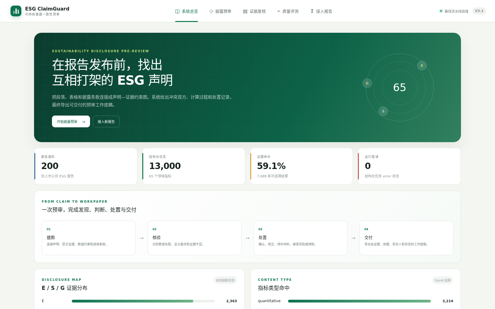
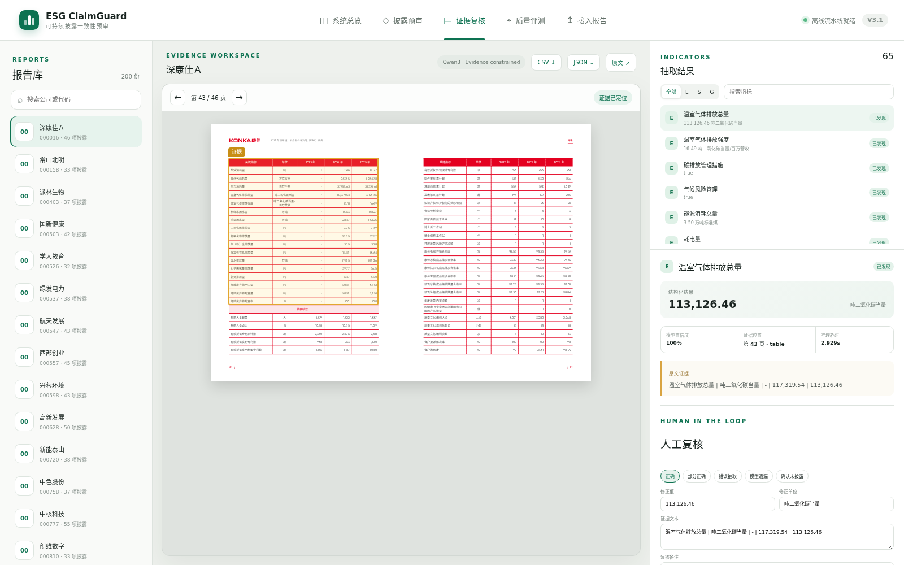

# ESG ClaimGuard

项目代码仓库（参赛作品同名）：[ESG-ClaimGuard](https://github.com/yangzhe0/ESG-ClaimGuard)

ESG ClaimGuard 是面向上市公司可持续发展报告编制与内部复核人员的披露一致性预审系统。它把长篇 PDF 转换为按 ESG 指标组织的证据任务：每条候选结果都保存报告、页码、内容区块、逐字引文、数值与单位来源，并可在网页中回到原文、记录处置、导出底稿。

本项目参加第八届中国研究生人工智能创新大赛，赛题为“开放赛题—生成式大语言模型与智能体”，团队为“队不起队不起”。项目不提供企业 ESG 评分、投资建议、法定审计或违规认定。



## 为什么做这个项目

复核一份 ESG 报告时，真正耗时的是在段落、表格、脚注和附录中定位指标，再核对主体、期间、数值、单位与口径。关键词容易漏掉同义表达，整份 PDF 自由问答又难以稳定给出页码和逐字证据。

ESG ClaimGuard 采用如下链路：

```text
巨潮资讯公开公告与 PDF
  → 下载日志、来源 URL 与 SHA-256
  → MinerU 版面解析（页码、block、表格、bbox）
  → ESG-65 指标候选召回
  → Qwen3.6-27B 受约束结构化抽取
  → 页码、区块、逐字引文、数值与单位校验
  → 声明—证据约束图与人工处置工作台
```

模型负责理解候选原文，程序负责验证证据，复核人员负责最终判断。`found` 表示结果通过内部证据合同，`missing` 表示当前解析与召回范围内没有找到合格候选；二者都不是人工真值。

## 正式数据结果

正式队列由 `outputs/final_results/input_manifest.csv` 冻结：

- 200 份公开 ESG、可持续发展或社会责任类报告；
- 10,528 页规范解析结果；
- 环境 25、社会 20、治理 20，共 65 项指标；
- 13,000 个唯一 `report_id × indicator_id` 任务；
- found 7,688、missing 5,312、error 0；
- 7,688 条 found 均通过报告、页码、区块与逐字引文检查；
- 3,214 条定量 found 均保存值、单位和来源字段。

这些数字证明正式任务网格完成、内部证据字段可追溯，不证明未经独立人工评测的语义准确率。

## 一条结果如何回到原文

以深康佳 A 报告为例，正式结果把“温室气体排放总量”定位到第 43 页表格区块，抽取值为 113,126.46 吨二氧化碳当量。工作台同时显示 PDF 原页、结构化结果和逐字证据：



结果行位于 `outputs/final_results/extraction/extraction_results.csv`，原始 PDF 位于 `data/raw_pdfs/`，解析区块位于冻结结果的 `parsed/`。三者通过 `report_id`、文件哈希、`page_no` 和 `block_id` 连接。

## 数据包说明

数据形成过程不是黑箱，具体字段见 [data/README.md](data/README.md)。主要文件如下：

| 文件或目录 | 内容 |
|---|---|
| `data/download_log.csv` | 检索条目的下载、跳过和失败记录 |
| `data/report_index.csv` | 公告来源、附件 URL、本地文件、SHA-256 与大小 |
| `data/raw_pdfs/` | 210 份已下载公开报告；正式队列只使用 manifest 中的 200 份 |
| `outputs/final_results/input_manifest.csv` | 正式队列顺序、文件哈希、大小和页数 |
| `.../indicator_pool.csv` | ESG-65 指标定义、类型和检索信息 |
| `.../parsed/` | MinerU 规范页与区块数据 |
| `.../extraction/extraction_results.csv/json` | 13,000 条正式抽取结果 |
| `.../validation.json` | 任务、证据、来源字段和谱系验证结果 |
| `.../CHECKSUMS.sha256` | 冻结轻量产物校验和 |

## 仓库结构

```text
contest_xiaoshumo/
├── README.md                         项目入口与复验说明
├── dashboard_api/                    查询、证据、预审、处置与任务 API
├── dashboard_web/                    React + TypeScript 工作台
├── src/esg_demo/                     解析后召回与结构化抽取核心
├── scripts/                          数据获取、正式运行、验证与材料构建
├── data/                             来源索引、下载日志与原始报告
├── outputs/final_results 冻结正式运行数据
├── docs/ai_contest/                  题目分析、运行说明和参赛材料源稿
├── latex/                            XeLaTeX 源文件与正式图表
├── video/claimguard-remotion/        无声视频工程与画面素材
├── tests/                            当前产品与正式数据测试
└── outputs/ai_contest/submission/    最终提交件与验收报告
```

评审建议先阅读：

1. 本 README；
2. `docs/ai_contest/submission/ESG_ClaimGuard_项目文档.md`；
3. `data/README.md`；
4. `docs/ai_contest/HANDOFF.md`；
5. `outputs/final_results/validation.json`。

## 快速启动

运行 Python 前先检查已有 Conda 环境：

```bash
/opt/miniconda3/bin/conda env list
```

当前机器使用 `paperagent` 运行项目 API、测试和脚本，使用 `mineru` 执行 PDF 解析。启动冻结数据工作台：

```bash
cd <project-root>
bash scripts/run_dashboard.sh --host 127.0.0.1 --port 8765
```

访问 `http://127.0.0.1:8765`。浏览冻结结果不需要重新运行 MinerU 或 Qwen；“接入报告”功能需要对应模型与 GPU 就绪。

## 复验

```bash
cd <project-root>
/opt/miniconda3/bin/conda run -n paperagent python -m unittest discover -s tests
/opt/miniconda3/bin/conda run -n paperagent python scripts/validate_ai_contest_readiness.py
/opt/miniconda3/bin/conda run -n paperagent python scripts/smoke_dashboard.py
(cd outputs/final_results && sha256sum -c CHECKSUMS.sha256)
(cd dashboard_web && npm run build)
git diff --check
```

完整重新解析 200 份报告还需要 MinerU、Qwen3.6 权重和 GPU，步骤见 `docs/ai_contest/FULL_RUN.md`。冻结结果不应通过重新推理覆盖；如果验证失败，应先定位数据、代码或材料之间的不一致。

## 文档与提交件

正式文档采用 Markdown → XeLaTeX → PDF，避免 Word 排版中的图表越界和样式漂移：

```bash
/opt/miniconda3/bin/conda run -n paperagent python scripts/render_submission_latex.py
```

官方提交目录 `outputs/ai_contest/submission/final/` 只保留四个文件：参赛作品简介 PDF、项目文档 PDF、项目视频 MP4、其他材料 ZIP。文件生成完成不等于已经上传到比赛平台。

## 团队分工

- 队长：杨哲——总体统筹、需求与方案设计、指标和业务流程、成果整合及参赛材料。
- 队员1：邱宇强——报告数据、MinerU 解析、候选召回、大模型抽取与正式数据运行。
- 队员2：王恒岳——前后端工作台、证据复核、问题处置、可视化、测试与交付整理。

第三方依赖和许可证见 `docs/ai_contest/submission/ESG_ClaimGuard_第三方依赖与许可.md`；公开报告原文版权归发布主体，部署与再分发前应核对来源网站条款。
