## 2025

## 年度环境、社会和公司治理（ESG）报告

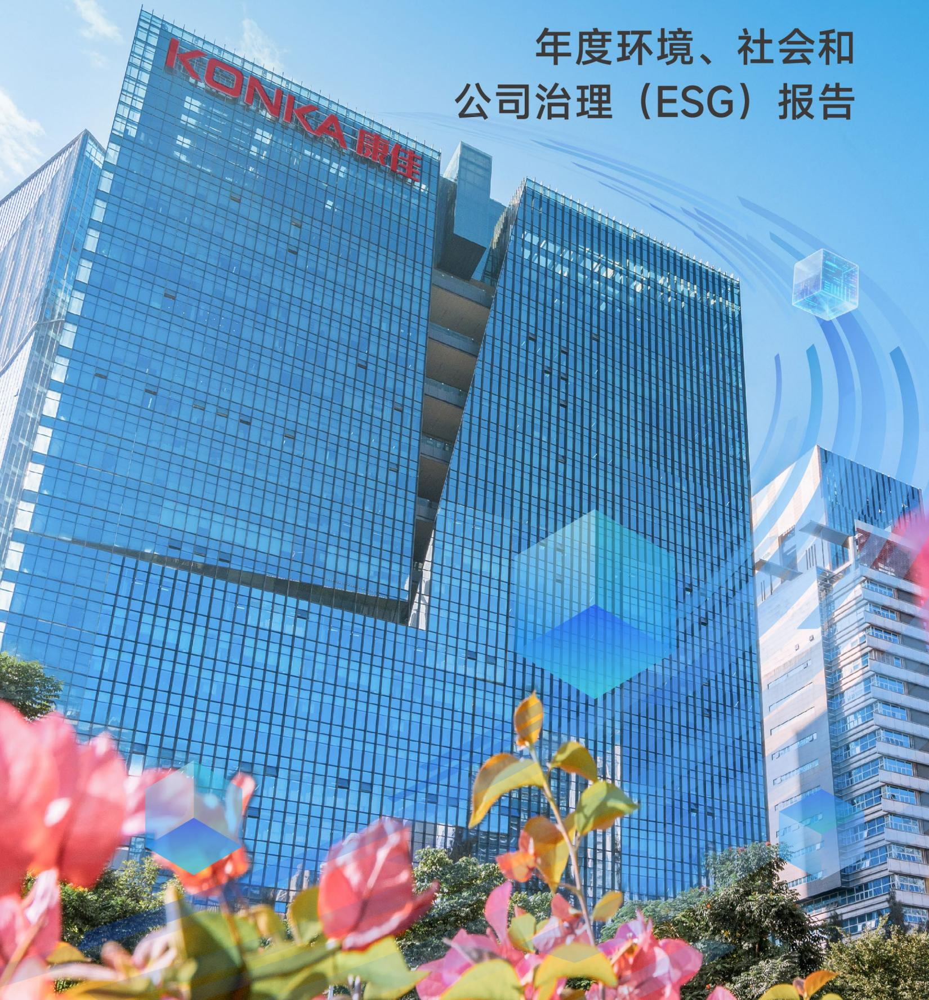

text_image

年度环境、社会和
公司治理（ESG）报告

## 目录

关于本报告 01

高管致辞 03

走进康佳 05

责任专题 09

融入华润谋发展，砥砺奋进再出发

## 01

## 治理重塑

## 构建合规管理新范式

规范公司治理 13

风控合规管理 14

投资者关系管理 17

加强廉洁管理 18

## 02

## 低碳运营

## 培育绿色发展新生态

应对气候变化 21

环境合规管理 26

资源循环利用 33

生态友好运营 36

## 03

## 创新驱动

## 打造智能生活新体验

完善创新体系

打造优质产品

用心服务客户

助力行业发展

供应链协同发展

可持续发展管理 75

##

##

## 绘就暖心家园新篇章

保障员工权益 65

畅通发展通道 68

落实员工关怀 69

强化安全生产 71

促进社区发展 74

附录 79

natural_image

3D cube illustration with gradient shading (no text or symbols)

## 关于本报告

本报告是康佳集团股份有限公司发布的 2025 年度环境、社会和公司治理（ESG）报告。报告本着客观、规范、透明和全面的原则，详细披露了 2025 年康佳在环境保护、社会责任、公司治理等领域的实践和绩效，系统地回应利益相关方的期望和要求。

## 时间范围

本报告的时间范围是 2025 年 1 月 1 日至 2025 年 12 月 31 日，为增强报告的可比性及前瞻性，部分内容往前后年度适度延伸。

## 报告范围

本报告以康佳集团股份有限公司为主体，涵盖康佳及下属全资、控股子公司，除特别说明外，本报告范围与公司年报范围保持一致。

## 参考标准和依据

1 《深圳证券交易所上市公司自律监管指引第17号——可持续发展报告（试行）》  
1 《深圳证券交易所上市公司自律监管指南第3号——可持续发展报告编制》  
《央企控股上市公司ESG专项报告编制研究》  
《全球报告倡议组织可持续发展报告标准》（GRI Standards）  
《中国企业可持续发展报告指南（CASS-ESG 6.0）》  
气候相关财务信息披露（TCFD）框架  
联合国可持续发展目标（SDGs）  
《华润集团社会责任工作管理办法》  
《华润集团“1+N”社会责任指标体系管理手册》

## 数据来源

本报告引用的全部信息数据均来自公司正式文件、统计报告或财务报告。除特殊说明外，报告中涉及的货币均为人民币，若与财务报告不一致之处，以财务报告为准。

## 称谓说明

为了便于表达，在报告表述中使用“康佳”“公司”“我们”等称谓代替“康佳集团股份有限公司”。

## 报告获取

您可以在深圳证券交易所网（http://www.szse.cn）、康佳集团股份有限公司官网（https://www.konka.com）下载本报告电子文本，获取更多公司信息。

## 意见反馈

如果您对本公司的ESG工作有任何意见或建议，欢迎通过以下方式反馈意见，帮助我们对报告进行持续改进。

地址：广东省深圳市南山区粤海街道科技园科技南十二路28号康佳研发大厦

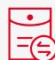

邮编：518057

邮箱：kjbgsgw@konka.com

## 高管致辞

## 固本强基 向新而行

2025 年，是康佳发展历程中具有里程碑意义的一年，也是转型重塑、攻坚克难的关键一年。随着专业化整合的持续推进，康佳正式成为华润集团旗下科技与新兴产业板块的业务单元。面对复杂严峻的市场环境和深层次的发展挑战，康佳以“四个重塑”为抓手，在守牢风险底线中夯实发展基础，在深化改革创新中积蓄前行力量，稳步开启康佳复兴新征程。

完善制度管理体系，守牢治理合规底线。我们系统梳理治理架构，完善《公司章程》等核心制度，搭建全维度合规管理体系，实现合规管理全层级、全流程覆盖。我们健全综合监督体系，持续开展内部巡察与内部审计，揭示各类风险隐患，为企业健康发展筑牢屏障。我们持续优化投资者关系管理，有序接待投资者调研，精准解答各类咨询，及时、准确、完整披露相关信息，切实维护全体股东和投资者的合法权益。

全面推进“四个重塑”，聚焦主业创新赋能。我们坚定推进“四个重塑”，重构“基础研究－应用开发－生产支持”三级研发体系，成立中央研究院聚力核心技术攻关。我们重新聚焦主业发展，彩电业务搭建“百晓AL大模型服务平台”冰箱业务攻克深冷保鲜核心技术 洗衣机推出1600转大桶径研发平台 多款产品斩获国际设计大奖与权威行业认证。全年新增有效授权发明专利 1,100 项、软件著作权 556 项，技术创新成果持续涌现。我们全面升级供应链管理通过集中采购，战略储备等举措实现有效降本数字化采购平台覆盖效能显著提升。我们不断深化业务协同，与华润燃气等 9 家兄弟单位深化合作，首批精品旗舰店落地运营，构建起产业联动、优势互补的发展新格局。

践行绿色发展理念，构建绿色生态发展局面。我们将绿色低碳理念深度融入生产运营全过程，制定《节能降碳与生态环境保护管理工作规定》构建“4+5+N”EHSQ管理制度体系，全年建成分布式光伏发电站 20.8MW，废气、废水等污染物实现 100% 达标排放，危险废物处置率保持 100%。河南新飞智家等企业获评国家级绿色工厂，多款核心产品通过绿色产品认证，推动消费端绿色低碳转型。我们积极应对气候环境变化，持续降低企业运营环境足迹，倡导绿色环保文化，全年开展专题培训42场，绿色发展理念逐步深入人心。

坚守社会责任初心，实现利益相关方共赢发展。我们坚持以人为本，保障员工合法权益，劳动合同签订率与社会保险覆盖率均达 100%，构建管理与专业技术并行的职业发展通道；深化“菠萝蜜”职工关爱品牌建设，开展节日慰问、兴趣活动与女性员工赋能行动，让企业发展成果惠及全体员工。我们秉持客户至上理念，完善“2 小时快速响应”服务机制，客户投诉解决率达 98%，深圳康佳电子获评“家电售后服务领跑企业”。我们主动履行社会责任，积极参与乡村振兴消费帮扶行动，开展文明交通、志愿服务等公益志愿活动，在服务地方发展、促进民生改善中贡献康佳力量。

成绩的取得，离不开华润集团的大力支持，更离不开全体员工的拼搏奉献与广大利益相关方的信任支持。同时，我们也清醒认识到，公司在战略聚焦、品牌升级、数字化转型等方面仍有不足，ESG 管理的系统性、专业性与深度仍需提升。

2026 年是“十五五”规划的开局之年，我们将以习近平新时代中国特色社会主义思想为指导，牢牢把握融入华润的历史机遇，以更高标准、更实举措推进ESG工作走深走实。

我们将持续深化治理融合，推动“6S”战略管理体系与“5C”财务管理体系全面落地、见行见效。同时，聚售科技创新全力培育发展新动能和企业第二增长曲线

我们将深化绿色转型，推动全价值链低碳发展，力争碳排放持续稳步下降，持续完善生态环境保护长效机制。同时，强化责任践行，优化员工发展生态，提升客户服务品质，拓展公益责任维度，构建多方共赢的产业生态体系。

征途漫漫，惟有奋斗；笃行不怠，终至远方。2026年，我们将始终以更坚定的信念、更务实的作风、更有力的举措，持续提升 ESG 治理水平与价值创造能力，为股东创造长期稳定回报，为员工搭建广阔成长平台，为社会贡献更多企业价值，奋力书写科技赋能、责任引领的高质量发展新篇章！

邬建军

康佳集团股份有限公司董事长

## 走进康佳

## 公司概况

康佳集团股份有限公司（以下简称“康佳”）成立于 1980 年 5 月 21 日，于 1992 年在深圳证券交易所上市，是中国改革开放后诞生的第一家中外合资电子企业。1984 年，康佳建成第一条彩电整机生产线，“中国制造”开始走向世界。历经四十余年发展，康佳形成以消费电子、半导体科技和PCB为核心的三大业务板块，持续夯实科技产业基础。

2025年7月，康佳进入专业化整合新阶段，正式成为华润集团旗下科技与新兴产业板块的业务单元。

## 组织架构

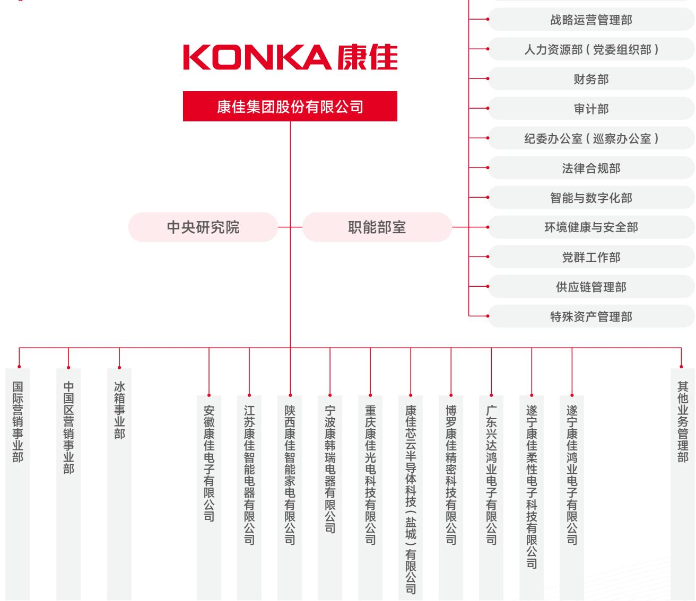

flowchart

```mermaid
graph TD
  A["KONKA 康佳集团股份有限公司"] --> B["中央研究院"]
  A --> C["职能部室"]
  
  subgraph Subsidiaries
    direction TB
    D["国际营销事业部"]
    E["中国区营销事业部"]
    F["冰箱事业部"]
  end
  
  subgraph Departments
    G["安徽康佳电子有限公司"]
    H["江苏康佳智能电器有限公司"]
    I["陕西康佳智能家电有限公司"]
    J["宁波康韩瑞电器有限公司"]
    K["重庆康佳光电科技有限公司"]
    L["康佳芯云半导体科技（盐城）有限公司"]
    M["博罗康佳精密科技有限公司"]
    N["广东兴达鸿业电子有限公司"]
    O["遂宁康佳柔性电子科技有限公司"]
    P["遂宁康佳鸿业电子有限公司"]
  end
  
  subgraph Departments
    Q["战略运营管理部"]
    R["人力资源部（党委组织部）"]
    S["财务部"]
    T["审计部"]
    U["纪委办公室（巡察办公室）"]
    V["法律合规部"]
    W["智能与数字化部"]
    X["环境健康与安全部"]
    Y["党群工作部"]
    Z["供应链管理部"]
    AA["特殊资产管理部"]
  end
  
  B --> C
  C --> D
  C --> E
  C --> F
  C --> G
  C --> H
  C --> I
  C --> J
  C --> K
  C --> L
  C --> M
  C --> N
  C --> O
  C --> P
  C --> Q
  
  D -.-> Subsidiaries
  E -.-> Subsidiaries
  F -.-> Subsidiaries
  G -.-> Subsidiaries
  H -.-> Subsidiaries
  I -.-> Subsidiaries
  J -.-> Subsidiaries
  K -.-> Subsidiaries
  L -.-> Subsidiaries
  M -.-> Subsidiaries
  N -.-> Subsidiaries
  O -.-> Subsidiaries
  P -.-> Subsidiaries
  Q -.-> Subsidiaries
  R -.-> Subsidiaries
  S -.-> Subsidiaries
  T -.-> Subsidiaries
  U -.-> Subsidiaries
  V -.-> Subsidiaries
  W -.-> Subsidiaries
  X -.-> Subsidiaries
  Y -.-> Subsidiaries
  Z -.-> Subsidiaries
  AA -.-> Subsidiaries
  AB -.-> Subsidiaries
  AC -.-> Subsidiaries
  AD -.-> Subsidiaries
  AE -.-> Subsidiaries
  AF -.-> Subsidiaries
  AG -.-> Subsidiaries
  AH -.-> Subsidiaries
  AI -.-> Subsidiaries
  AJ -.-> Subsidiaries
  AK -.-> Subsidiaries
  AL -.-> Subsidiaries
  AM -.-> Subsidiaries
  AN -.-> Subsidiaries
  AO -.-> Subsidiaries
  AP -.-> Subsidiaries
  AQ -.-> Subsidiaries
  AR -.-> Subsidiaries
  AS -.-> Subsidiaries
  AT -.-> Subsidiaries
  AU -.-> Subsidiaries
  AV -.-> Subsidiaries
  AW -.-> Subsidiaries
  AX -.-> Subsidiaries
  AY -.-> Subsidiaries
  AZ -.-> Subsidiaries
  BA -.-> Subsidiaries
  BA1.0 - "其他业务管理部" (Other Business Management Dept) <--> AY
```

## 年度荣誉

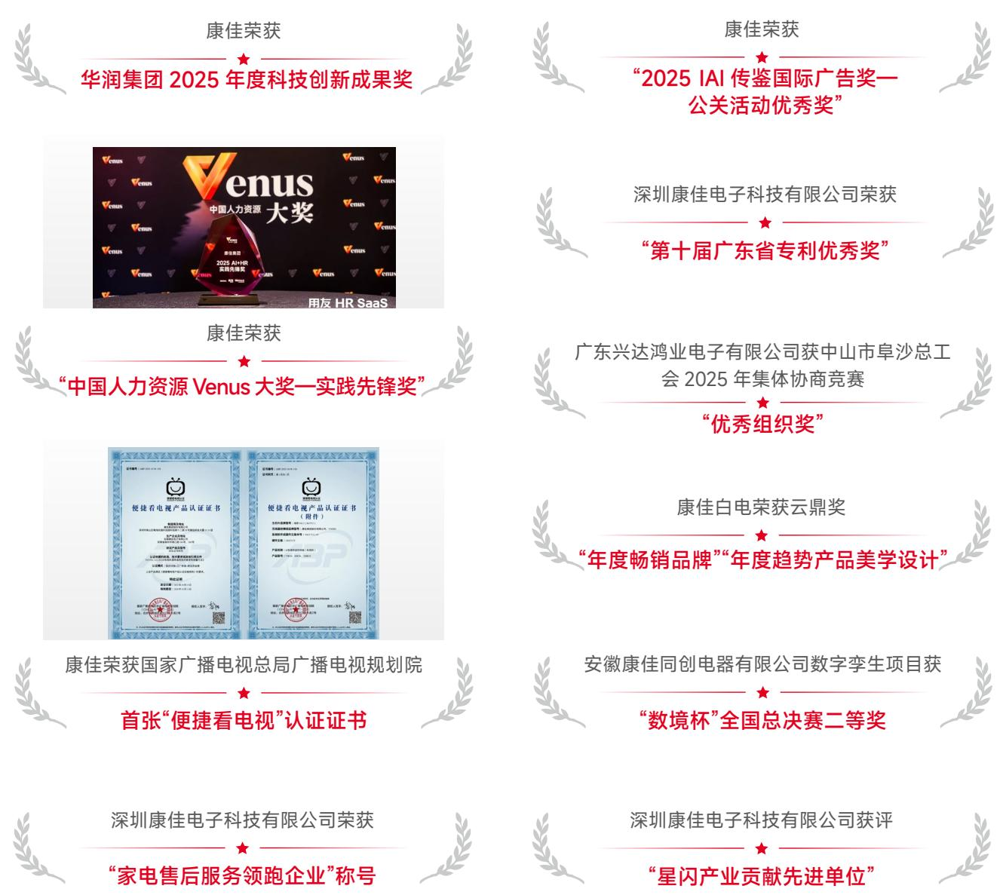

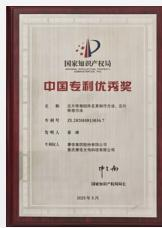

重庆康佳光电科技有限公司荣获  
  
“第 25届中国专利优秀奖”

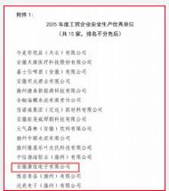  
安徽康佳电子有限公司获评滁州市应急管理局  
“2025年度工贸企业安全生产优秀单位”

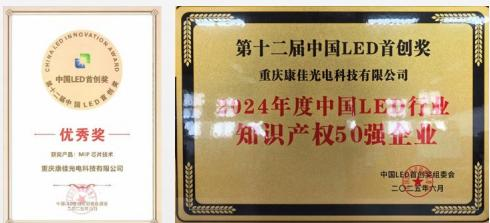

重庆康佳光电科技有限公司荣获  
  
“中国LED行业知识产权50 强”“首创奖－优秀奖（MIP 芯片技术） 7

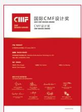

深圳康佳电子科技有限公司G10MINILED 系列电视获  
  
“2025 国际 CMF 设计奖”

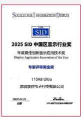

深圳康佳电子科技有限公司110A8 Ultra 电视荣获  
  
“2025国际信息显示学会（SID）中国区显示行业奖—年度最佳创新显示应用技术奖—专家评审奖金奖”

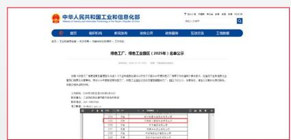

text_image

中华人民共和国工业和信息化部
地址：北京市海淀区东北旺西路1号A座20层
办公地址：北京市海淀区东北旺西路1号A座20层
联系电话：010-63857999
传真：010-63857999
电子邮箱：www.cqu.com.cn
增减工厂、增减工业园区（2020年）名称公示
（一）公司基本情况
（二）公司董事会公告披露日期及时间
（三）公司监事会公告披露日期及时间
（四）公司财务状况及经营成果
（五）公司利润分配情况
（六）公司年度报告披露日期及时间
（七）公司年度报告摘要披露内容
（八）公司年度报告摘要披露时间
（九）公司年度报告摘要披露内容
（十）公司年度报告摘要披露内容
（十一）公司年度报告摘要披露内容
（十二）公司年度报告摘要披露内容
（十三）公司年度报告摘要披露内容
（十四）公司年度报告摘要披露内容
（十五）公司年度报告摘要披露内容
（十六）公司年度报告摘要披露内容
（十七）公司年度报告摘要披露内容
（十八）公司年度报告摘要披露内容
（十九）公司年度报告摘要披露内容
（二十）公司年度报告摘要披露内容
（二十一）公司年度报告摘要披露内容
（二十二）公司年度报告摘要披露内容
（二十三）公司年度报告摘要披露内容
（二十四）公司年度报告摘要披露内容
（二十五）公司年度报告摘要披露内容
（二十六）公司年度报告摘要披露内容
（二十七）公司年度报告摘要披露内容
（二十八）公司年度报告摘要披露内容
（二十九）公司年度报告摘要披露内容
（三十）公司年度报告摘要披露内容
（三十一）公司年度报告摘要披露内容
（三十二）公司年度报告摘要披露内容
（三十三）公司年度报告摘要披露内容
（三十四）公司年度报告摘要披露内容
（三十五）公司年度报告摘要披露内容
（三十六）公司年度报告摘要披露内容
（三十七）公司年度报告摘要披露内容
（三十八）公司年度报告摘要披露内容
（三十九）公司年度报告摘要披露内容
（四十）公司年度报告摘要披露内容
（四十一）公司年度报告摘要披露内容
（四十二）公司年度报告摘要披露内容
（四十三）公司年度报告摘要披露内容
（四十四）公司年度报告摘要披露内容
（四十五）公司年度报告摘要披露内容
（四十六）公司年度报告摘要披露内容
（四十七）公司年度报告摘要披露内容
（四十八）公司年度报告摘要披露内容
（四十九）公司年度报告摘要披露内容
（五十）公司年度报告摘要披露内容
（五十一）公司年度报告摘要披露内容
（五十二）公司年度报告摘要披露内容
（五十三）公司年度报告摘要披露内容
（五十四）公司年度报告摘要披露内容
（五十五）公司年度报告摘要披露内容
（五十六）公司年度报告摘要披露内容
（五十七）公司年度报告摘要披露内容
（五十八）公司年度报告摘要披露内容
（五十九）公司年度报告摘要披露内容
（六十）公司年度报告摘要披露内容
（六十一）公司年度报告摘要披露内容
（六十二）公司年度报告摘要披露内容
（六十三）公司年度报告摘要披露内容
（六十四）公司年度报告摘要披露内容
（六十五）公司年度报告摘要披露内容
（六十六）公司年度报告摘要披露内容
（六十七）公司年度报告摘要披露内容
（六十八）公司年度报告摘要披露内容
（六十九）公司年度报告摘要披露内容
（七十）公司年度报告摘要披露内容
（七十一）公司年度报告摘要披露内容
（七十二）公司年度报告摘要披露内容
（七十三）公司年度报告摘要披露内容
（七十四）公司年度报告摘要披露内容
（七十五）公司年度报告摘要披露内容
（七十六）公司年度报告摘要披露内容
（七十七）公司年度报告摘要披露内容
（七十八）公司年度报告摘要披露内容
（七十九）公司年度报告摘要披露内容

河南新飞智家科技有限公司被工业和信息化部评为  
“国家绿色工厂”

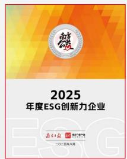

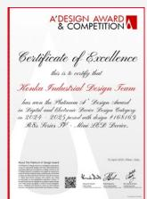

深圳康佳电子科技有限公司R8S 系列获  

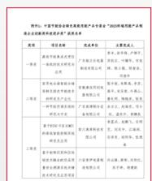

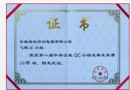

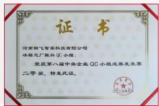  
安徽康佳同创电器有限公司、河南新飞  
智家科技有限公司荣获  
“第八届中央企业QC 小组成果发表赛二等奖

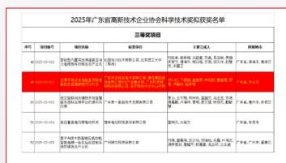

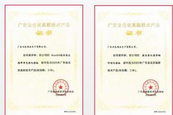  
广东兴达鸿业电子有限公司MiniIED高清高反射率背光源电路板、服务器电源厚铜印制电路板获评  
“2025年广东省名优高新技术产品”

## 责任专题：融入华润谋发展，砥砺奋进再出发

四十五年，在历史的长河中不过弹指一挥间，但对于与改革开放同频共振的康佳而言，却是一部持续奋进的创业史。从深圳湾畔起步，康佳的每一步都与时代发展紧密相连。2025 年，康佳迎来发展历程中具有里程碑意义的时刻，正式成为华润集团旗下科技及新兴产业板块业务单元，这不仅是国有资本布局优化的标志性成果，更让康佳站在了全新的发展起点。

## 峥嵘岁月

## 以实干担当书写产业发展篇章

回望 1980 年，康佳起源于深圳特区，是中国改革开放后诞生的第一家中外合资电子企业。从来料加工的小工厂，到自主品牌的精心培育：从聚售布局业务组合 到积极开拓海外市场：从持续深耕技术创新 到深化推进新发展战略……康佳始终身处竞争最激烈、市场化程度最高的行业之中，经受着产业变革的强烈冲击与市场风云的严酷洗礼。

正是凭借“闯”的精神、“创”的劲头、“干”的作风，一代代康佳人将“精益求精、全力以赴”的匠心融入血脉，形成了以消费电子（覆盖彩电、白电、厨电等全品类家电）、半导体科技和 PCB 为核心板块的业务布局。旗下 “KONKA 康佳” “Frestec 新飞” 等品牌产品，走进千家万户；以Micro LED和存储半导体为代表的前沿探索，不断攻克技术难题；以“AI+Mini LED”为代表的创新产品，持续提升视听体验与生活品质。

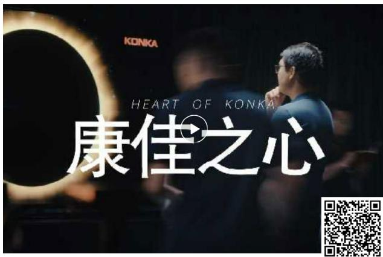

text_image

KONKA
HEART OF KONKA
康佳之心

扫码观看：四十五载长相伴，康佳之心始终与时代共振

## 历史交汇

## 以战略性整合融入华润发展版图

2025年，两条肩负使命的轨迹在时代呼唤下交汇。根据国务院国资委的部署，8月15日，康佳专业化整合发布会在深圳隆重举行，宣告康佳正式成为华润集团旗下科技及新兴产业板块的业务单元。国务院国资委、深圳市政府、华润集团

及众多合作伙伴、金融机构共同见证了这一历史时刻。推进康佳专业化整合，是推动中央企业专业化整合、优化国有资本布局的标志性成果:是央企间深化合作，促进产业协同的生动实践；是华润集团发挥国有资本投资公司功能价值、服务国家重大战略的关键举措。

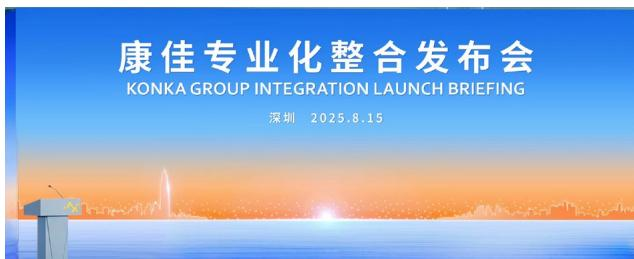

text_image

康佳专业化整合发布会
KONKA GROUP INTEGRATION LAUNCH BRIEFING
深圳 2025.8.15

## 聚力前行

## 以崭新姿态开启康佳发展新征程

融入华润，为康佳注入了更为强劲的发展动力。依托华润的平台支撑与资源协同，康佳拥有了更广阔的视野、更坚实的基础和更远大的航向。

## 推进 “四个重塑”

推进价值重塑、业务重塑、组织重塑、精神重塑，健全管理体系与产业布局，强化全链条协同赋能，为企业高质量发展筑牢坚实根基。

## 树立和践行 正确政绩观

坚持战略引领与长远布局，加快清理历史遗留问题，严控风险，以正确政绩观引领企业稳健可持续发展。

## 加强作风建设

锤炼过硬作风与专业能力，聚焦扭亏增效、风险防控、改革攻坚等重点任务，敢于直面矛盾、破解难题，坚定不移推进难而正确的发展举措。

## 培育新业务增长点

积极盘活存量资产、化解历史包袱，优化资源配置，布局战略性新兴产业，深耕新赛道，拓展新业务，打开新市场，着力打造企业增长新引擎。

“康佳将依托华润集团的强大平台支撑，加速打造成为主业突出、技术领先、治理现代、效益卓越的行业标杆，开启康佳发展新征程。”

——康佳董事长邬建军

科技如诗，记录攀登；岁月成歌，咏叹坚持。站在新的历史方位，康佳将牢牢把握发展机遇，以科技之光点亮万家灯火，以开放之姿携手众行致远，以稳健之绩回报每一份信任，在时代发展的浩荡洪流中，留下属于康佳的坚实足迹。

## KONKA康佳

01

治理重塑

构建合规管理新范式

## 规范公司治理

## 完善治理架构

康佳根据新修订的《中华人民共和国公司法》相关规定，在董事会设置审计委员会行使法定监事会职权，不设监事会或者监事，并全面推进各级子公司监事会/监事撤销专项工作。

## 重塑治理体系

康佳深化现代企业治理体系建设，完成《公司章程》《股东会议事规则》《董事会议事规则》3项治理核心制度的修订发布，健全4.个专门委员会议事规则：推动原有公司专业机构由46.个精减至14.个 搭建起“立项-制度起草-评审-报批-发布－培训宣贯－考试测评” 制度全流程管理机制；厘清党委、董事会、经理层权责边界，梳理形成董事会决策事项清单、董事会授权事项清单、前置研究清单、党委决策事项清单，启动权责运行手册编制工作，推动各治理主体实现权责法定、协调运转，全面提升公司治理规范化、科学化水平。

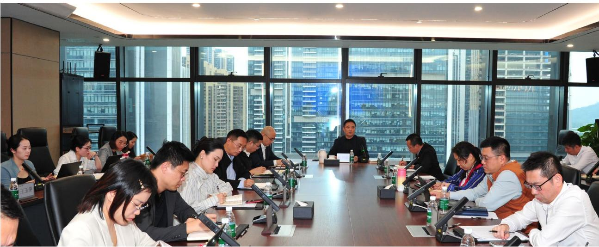

natural_image

Group of professionals seated around a conference table in a modern office setting with cityscape and large windows (no visible text or symbols)

康佳召开制度建设与机构梳理工作推进会

## 促进董事会履职尽责

康佳优化股东会、董事会、董事长专题会等重大决策会议办会流程，提升会议组织质效与决策规范化水平。2025 年，公司组织召开8次股东会、审议25项议案；召开17次专门委员会会议，10次独立董事专门会议；召开20次董事会，共审议84项议题。

## 风控合规管理

## 完善合规体系

康佳严格遵守国务院国资委、上级主管单位及深圳证券交易所有关合规管理工作指示要求，系统推进合规管理体系全维度建设，致力于构建组织健全、制度完备、机制闭环、全级覆盖的合规管理体系，切实筑牢企业合规经营防线。

## 强化顶层引领

设置合规委员会、首席合规官，在各层级配置合规管理员；系统构建合规管理“三道防线”，配套建立合规风险识别预警机制、法律合规审查机制、合规报告机制、举报受理及追究机制、合规考核机制等，推动各层级企业协同联动、上下贯通，形成齐抓共管的合规管理工作格局。

康佳合规管理组织体系图  
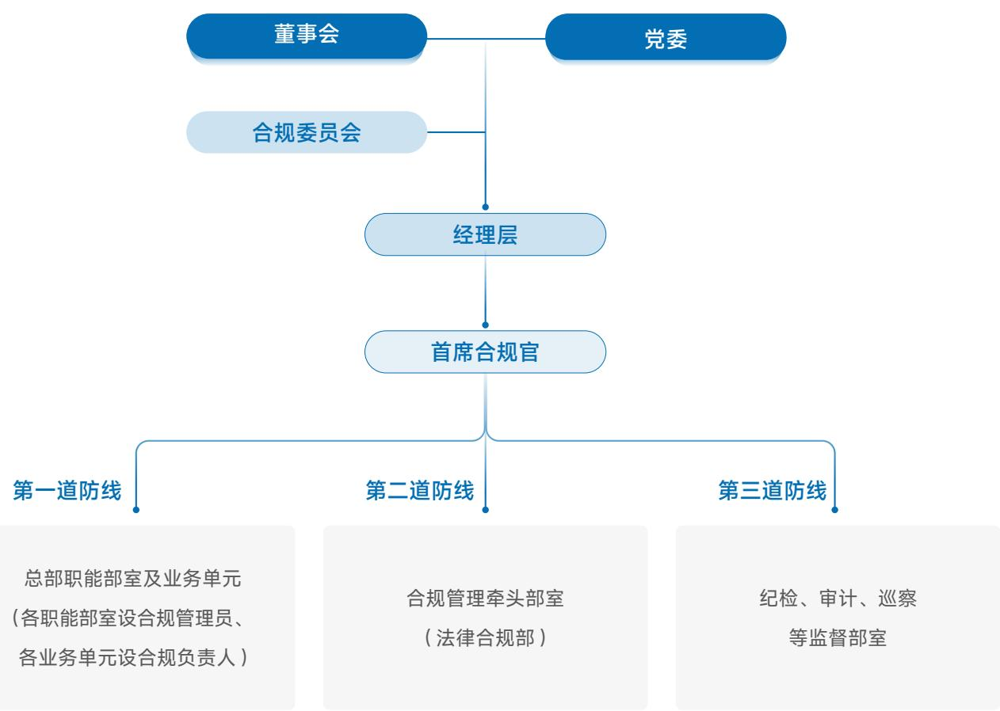

flowchart

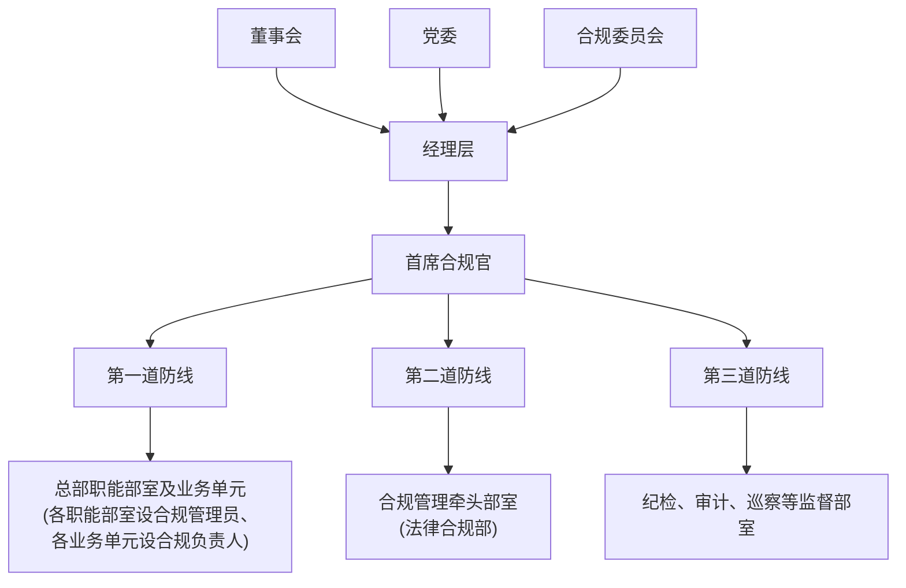
```mermaid
graph TD
  A["董事会"] --> B["经理层"]
  C["党委"] --> B
  D["合规委员会"] --> B
  B --> E["首席合规官"]
  E --> F["第一道防线"]
  E --> G["第二道防线"]
  E --> H["第三道防线"]
  F --> I["总部职能部室及业务单元\n(各职能部室设合规管理员、各业务单元设合规负责人)"]
  G --> J["合规管理牵头部室\n(法律合规部)"]
  H --> K["纪检、审计、巡察等监督部室"]
```

## 夯实制度根基

建立以《合规管理实施细则》为核心，以《合规宣传手册》《知识产权合规管理指引》《招标采购合规检查工作指引》《进出口关务合规检查管理办法》等为辅助的制度体系。2025 年公司编制发布《企业境外经营合规防控参考指引：重点领域篇/国别篇（东盟/南亚）》，启动编制合规管理制度和防止利益冲突、海外反商业贿赂合规管理专项制度，推动合规管理要求全面融入企业经营发展各环节。

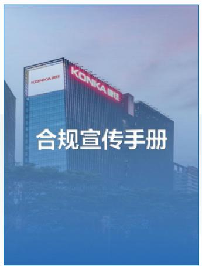

text_image

KONKA
KONKA
合规宣传手册

康佳合规宣传手册

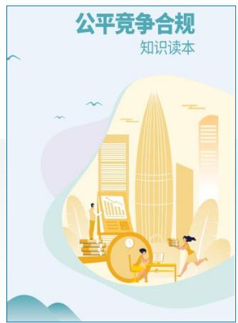

text_image

公平竞争合规
知识读本

康佳公平竞争合规知识读本

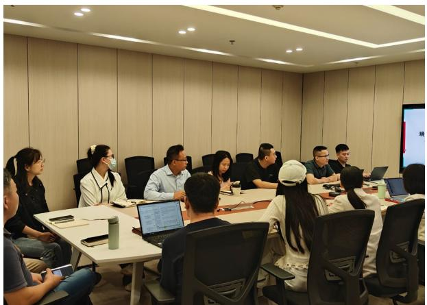

natural_image

Group of people seated around a conference table with laptops, in a modern meeting room (no visible text or signage)

境外经营合规培训

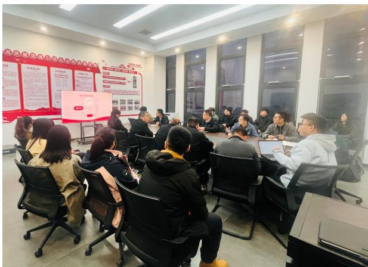

text_image

Meeting room scene with participants seated around a table, red wall posters containing Chinese text and diagrams visible in the background.

陕西康佳智能家电有限公司开展“强化版权意识，筑牢合规防线”主题培训

## 强化内控管理

康佳严格遵照《企业内部控制基本规范》《企业内部控制应用指引》和证监会有关监管要求，加强内控体系建设。公司制定发布内控手册，完善了覆盖公司治理、人力资源、财务资金、招投标采购、科研管理、产品质量、工程项目、知识产权、数据保护、安全生产等领域的内控制度体系，建立了内控评价与整改工作机制，通过以评促改持续健全企业内控体系。此外，公司通过编制下发审批权限和权责事项指引，建立内控审批管理机制，并配置完善了覆盖销售、采购、售后、制造、研发、财务资金等管理领域各环节信息化系统，增强了内部控制技防能力。

## 加强风险防控

康佳推进风险管理体系建设，坚持以党委为领导核心，由公司董事会、经营管理层依规推动和组织落实风险管理各项工作，建立健全内部定期风险监测分析机制、重大经营风险预测评估机制、重大经营风险事件报告机制。公司按季度开展风险梳理监测分析，加强风险指标分析和变化趋势研判，并注重防范控制重大经营风险；按年度组织各部室、业务单元、直属机构开展重大经营风险预测梳理评估，编制形成公司整体重大经营风险防控清单，针对性制定并落地专项应对措施，全力保障企业可持续稳健发展。

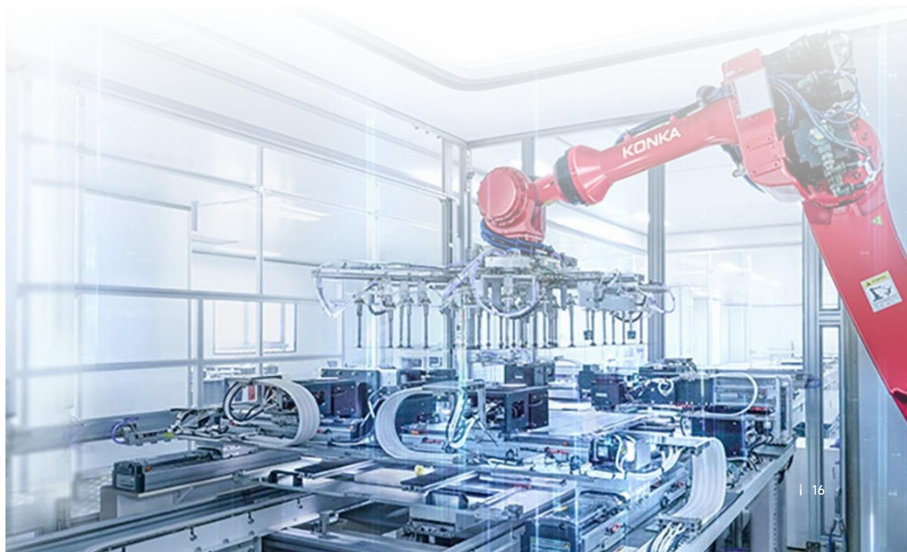

natural_image

Interior of a modern automotive assembly line with red Konka robotic arms and battery pack assemblies (no visible text or symbols)

## 投资者关系管理

## 沟通交流

康佳依据《中华人民共和国证券法》《上市公司与投资者关系管理工作指引》及其他相关规定，制定了《康佳集团股份有限公司投资者关系管理制度》严格规范公司与投资者之间的沟通与交流 增强投资者对公司价值的认同与支持 从而实现公司价值最大化。

## 报告期内，公司

接待投资者现场调研次数5次  
接待投资者现场调研 42人次  
举办业绩说明会 1次  
解答投资者问题 196次  
● 投资者问题回复率 100%  
在互动易与投资者互动次数158次

## 信息披露

康佳严格遵守《中华人民共和国公司法》《上市公司信息披露管理办法》等法律法规，制定《康佳集团股份有限公司信息披露管理制度》，积极履行公司信息披露义务。公司董事会秘书负责信息披露工作，确保公司信息披露及时、真实、准确、完整，不断提高公司信息披露质量，切实保护投资者合法权益。

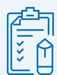  
报告期内，公司共对外披露定期报告

4 份

  
临时报告

97 份

## 加强廉洁管理

## 构建“大监督”体系

康佳制定《康佳集团股份有限公司“大监督”体系工作管理办法》明确各监督部室职责：推动成立康佳大监督体系工作领导小组，督促大监督主体积极履职，已向纪委移交问题线索 1 件，实现近十年来大监督移交线索“零突破”；深入 5 个部室开展调研，访谈部室管理团队、业务骨干等 28 人次，梳理出 3 方面 8 个问题，初步形成 4 方面 10 项解决措施，提升大监督工作质效。

## 推进巡视巡察整改

康佳围绕公司核心业务，修订《康佳集团股份有限公司党委巡察工作规定》《康佳集团股份有限公司加强巡察整改和成果运用管理办法》等5项巡察相关制度 统筹推进全年巡察任务 针对洗碗机业务开展提级巡察 发现9方面20.个问题；扛牢主体责任，组织各部室和单位将巡视整改结合“四个重塑”重新谋划、共同推进，形成整改新台账，每月对整改情况开展监督，压实整改责任。

## 强化拒腐防变能力

康佳修订《康佳集团股份有限公司党委关于加强对“一把手”和领导班子监督的实施办法》《康佳集团股份有限公司新任职直管干部任职谈话和廉政谈话管理办法》等 6项制度，以制度约束权力；落实常态化学习机制，召开 2025 年第二次警示教育大会暨新任职干部集体廉政谈话会，开展对习近平总书记关于全面从严治党、党风廉政建设和反腐败斗争重要论述的学习10次，持续强化以学促廉，营造严的氛围，筑牢思想防线，保持清正廉洁的政治本色。

## 02

## 低碳运营

## 培育绿色发展新生态

## 应对气候变化

## 气候治理

康佳高度重视气候变化带来的机遇与挑战，扎实推进碳排放管理工作，以EHSQ管理体系为支撑，成立EHSQ委员会，设置环保与碳排放专业组，配备专职管理人员负责节能降碳相关工作，通过制定《康佳集团股份有限公司节能降碳与生态环境保护管理工作规定》等政策文件，明确能源与碳排放管理、风险管控与监督检查等管理要求，不断加强对应对气候变化工作的统筹及管理。

## 气候战略

## 注释：

① 影响程度从低到高依次为：1、2、3、4、5  
② 发生的可能性从低到高依次为：1、2、3、4、5  
③ 康佳结合可持续发展实际情况及外部宏观政策目标将影响的时间范围（短、中、长期）定义为：  
2026年以内为短期，2030年以内为中期，2030年以后为长期  
④ 优先级排序从低到高依次为：C、B、A

<table><tr><td>风险/机遇类型</td><td>风险/机遇描述</td><td>影响程度 $^3$ </td><td>发生的可能性 $^2$ </td><td>影响的时间范围 $^3$ </td><td>影响的价值链环节</td><td>优先级排序 $^4$ </td><td>潜在财务影响</td><td>应对措施</td></tr><tr><td>物理风险(急性、慢性风险)</td><td>干旱、洪水、飓风、气温上升、海平面上升</td><td>1</td><td>4</td><td>短、中、长期</td><td>上游、运营、下游</td><td>C</td><td>运营成本增加</td><td>做好极端天气监测预警,制定应急预案,积极开展应急演练和培训,提高公司对极端天气的应对能力。</td></tr><tr><td>转型风险(政策和法律风险)</td><td>要求与监管不断提高,或者面临诉讼风险</td><td>2</td><td>1</td><td>短、中、长期</td><td>运营</td><td>B</td><td>营业外支出增加</td><td>关注国内外气候变化相关政策更新及市场趋势,逐步开展产品碳足迹认证行动。</td></tr><tr><td>转型风险(技术和声誉风险)</td><td>对新技术的失败投资</td><td>3</td><td>2</td><td>短、中、长期</td><td>运营、下游</td><td>A</td><td>营业成本增加</td><td>积极推进节能降碳工艺技术及新能源材料的研究,充分回应利益相关方对气候问题的关注。</td></tr><tr><td>转型风险(市场风险)</td><td>原料成本上涨</td><td>5</td><td>5</td><td>短、中、长期</td><td>下游</td><td>B</td><td>运营收入减少</td><td>监控及研判市场动向,及时跟进市场需求变化,调整产品布局。</td></tr><tr><td>机遇(技术)</td><td>推动工艺改进提升</td><td>4</td><td>4</td><td>中、长期</td><td>运营</td><td>A</td><td>运营成本减少</td><td>积极开展低碳技术行业合作,推进设备、系统、工具和技术升级,对生产工艺的能效进行评估。</td></tr><tr><td>机遇(产品与服务)</td><td>开发新型低碳产品与服务</td><td>5</td><td>3</td><td>中、长期</td><td>运营、下游</td><td>B</td><td>营业收入增加</td><td>关注产品的能效表现,推动产品向科技化、环保化、生态化方向发展。</td></tr></table>

## 气候相关影响、风险及机遇管理

康佳完善气候风险识别、评估与管理流程，围绕全价值链气候风险开展常态化识别与精细化评估，并完善相应风险应对措施与应急预案，确保各类气候风险实现有效防控。

  
风险识别

基于气候相关财务信息披露工作组（TCFD）的披露建议与要求完善气候变化风险管理体系，综合判断当下自然与社会环境趋势，从物理风险、转型风险和机遇三大类别识别不同情境下的风险和机遇类型，并不断完善管理策略。

  
风险评估

气候风险评估是企业应对气候变化、制定适应策略的重要工具。公司积极评估不同时间尺度下气候变化对公司业务板块的潜在影响，确定相关管理策略的优先级。

  
风险应对

在减少碳排放、降低能耗方面实行严格管理，制定并不断完善相关应对措施，确保公司有足够的能力应对气候变化风险，把握商业机遇。

## 气候相关指标与目标

康佳持续完善碳排放目标体系，将碳达峰、碳中和相关要求全面融入公司中长期发展规划，坚持节约优先、绿色低碳的高质量发展方向，扎实推进“双碳”管理工作，稳步推动生产运营方式全面绿色转型。

## 气候相关目标

## 短期目标（到2026年）

碳排放同比上一年度下降

污染物均达标排放和处置

## 中期目标（到2030年）

达成碳达峰工作目标

## 气候相关指标进展

康佳通过专业化整合与重塑，构建了以环境健康与安全部为依托的绿色低碳管理体系；向能源消费重点企业下达节能减排目标，制定能源使用管理制度，采取技术措施实现空调恒温、照明声控和温控，同时推动相关单位因地制宜落地分布式光伏、节能升级改造等节能降碳项目，加快产业全面绿色转型。

## 绿色低碳实践

各下属单位积极推进节能降碳，通过光伏发电及储能系统建设、设备设施改造等项目形成了 68 项节能降耗典型措施。截至 2025 年底，公司已建设投产光伏项目共计20.8MW，在建光伏项目 7.1MW。

## 绿色工厂建设

公司积极创建绿色企业，安徽康佳电子有限公司入选国家 A 级绿色工厂，陕西康佳智能家电有限公司入选省绿色工厂、西安市无废工厂。2025 年，河南新飞智家科技有限公司入选国家级绿色工厂。

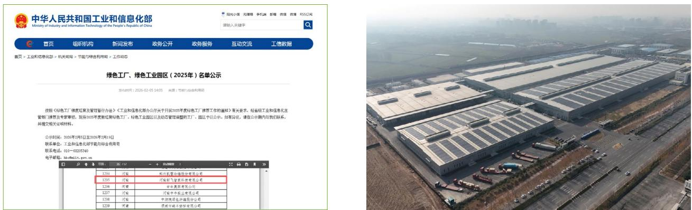  
河南新飞智家科技有限公司入选国家级绿色工厂

能源消耗及温室气体排放情况

<table><tr><td>指标</td><td>单位</td><td>2024年</td><td>2025年</td></tr><tr><td>能源消耗总量</td><td>万吨标准煤</td><td>3.21</td><td>3.50</td></tr><tr><td>能源消耗强度</td><td>吨标准煤/百万营收</td><td>4.4</td><td>5.09</td></tr><tr><td>温室气体排放总量</td><td>吨二氧化碳当量</td><td>117,319.54</td><td>113,126.46</td></tr><tr><td>温室气体排放强度</td><td>吨二氧化碳当量/百万营收</td><td>16.11</td><td>16.49</td></tr></table>

1 指标统计范围为工业企业。

natural_image

Scenic mountain lake with forested slopes and snow-capped peaks in the background (no text or symbols visible)

## 环境合规管理

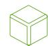

## 环境治理

康佳严格遵守《中华人民共和国环境保护法》等法律法规，健全以 EHSQ 治理为支撑的环境管理体系，制定印发《康佳集团股份有限公司节能降碳与生态环境保护管理工作规定》等制度文件，全面落实排放治理与污染防治举措，坚决杜绝环境污染事件发生。2025 年，公司及 16 家下属单位通过了 ISO 14001 环境管理体系认证，污染物均达标排放，未发生环境违法违规及重大环境事件，环境管理体系覆盖范围扩大，运行效能持续提升。

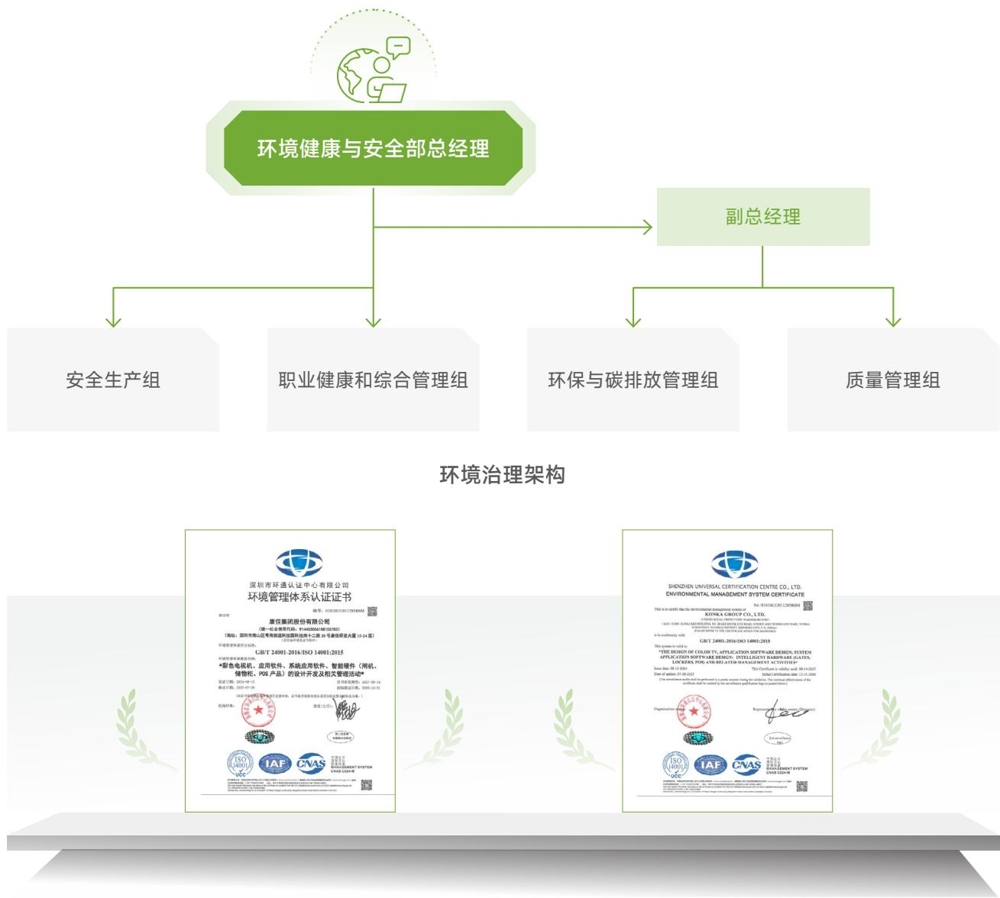  
康佳集团股份有限公司环境管理体系认证证书

## 环境战略

康佳持续优化《风险与机遇识别评价与应对表》，在环境管理体系策划与建设过程中，充分结合内外部环境因素及相关方各项要求，开展环保风险识别并建立清单台账，确定需重点应对的风险与机遇，落实管控措施，确保环境管理体系有效运行达成预期目标，规避并减少不利影响，推动环境管理水平稳步提升。

natural_image

Illustration of people interacting with stacks of books, paper airplanes, and digital interfaces (no text or symbols)

<table><tr><td>风险类型</td><td>风险描述</td><td>影响程度</td><td>发生的可能性</td><td>影响的时间范围</td><td>影响的价值链环节</td><td>优先级排序</td><td>潜在财务影响</td><td>应对措施</td></tr><tr><td>政策法规风险</td><td>法律法规收集不全、法律法规收集不及时、法律法规变化不了解、未及时获取政府管理部门与环境/职业健康安全有关公告、通知、提示等文件。</td><td>3</td><td>1</td><td>长期</td><td>运营</td><td>C</td><td>营业外支出增加</td><td>公司通过国家法律法规数据库,及时检索法律法规更新信息,更新完善公司适用的法律法规,并组织开展相关培训。</td></tr><tr><td>运营风险</td><td>部分单位在生产经营过程中,需排放废气、废水、固体废物等工业污染废弃物并产生噪声,环保设施不足或管理措施不到位,可能出现超标排放,危及环境安全或人员健康,并受到政府部门处罚。</td><td>5</td><td>1</td><td>短期</td><td>运营</td><td>B</td><td>运营成本增加</td><td>各单位根据企业废弃物排放实际,针对性设置了除尘、中和、过滤、污水处理等环保设施,定期进行检查确保正常运行,并有专人负责废弃物排放管理,确保废弃物收集、暂存、排放等工作措施到位。</td></tr><tr><td>声誉风险</td><td>利益相关方对企业的环境要求越来越高,可能会对公司可持续发展议题的进展及行动失望。</td><td>2</td><td>3</td><td>长期</td><td>运营、下游</td><td>B</td><td>营业收入减少</td><td>公司识别与环境管理体系有关的相关方并收集相关方的要求,积极满足相关方的合理要求。</td></tr></table>

<table><tr><td>机遇类型</td><td>机遇描述</td><td>影响程度</td><td>发生的可能性</td><td>影响的时间范围</td><td>影响的价值链环节</td><td>优先级排序</td><td>潜在财务影响</td><td>应对措施</td></tr><tr><td>技术机遇</td><td>升级污染物处理技术,以最大程度减少污染物排放对环境的影响,满足环保要求。</td><td>5</td><td>5</td><td>中期</td><td>运营</td><td>B</td><td>运营成本减少</td><td>改进废气处理系统和设施,对工业废水处理进行全面整改。</td></tr><tr><td>市场机遇</td><td>开拓环保产品和服务市场,增强市场竞争力。</td><td>3</td><td>4</td><td>长期</td><td>运营、下游</td><td>C</td><td>营业收入增加</td><td>关注产品的能效表现,将绿色低碳理念融入产品的设计开发、生产制造、回收利用等环节,推动绿色产品认证工作。</td></tr></table>

## 环境相关影响、风险及机遇管理

## 管理流程

康佳制定了《节能降碳与生态环境保护管理规定》，根据要求开展风险管控与监督检查。每年对本单位生态环境风险进行评估，形成风险清单台账，并根据评估结果，针对不同等级的环境风险制定相应的管控措施。

公司灵活应用多种督察、检查方式方法，加强对节能降碳与生态环境保护的监督检查，实现监督单位、监督场所、监督内容全覆盖。公司定期组织生态环境保护问题排查 对排查发现的问题和隐患立行立改 不能立即整改的 制定管控措施和整改计划，推进落实。

## 环境影响评估与预防

康佳严格遵循《中华人民共和国环境影响评价法》等法律法规，有效评估在规划和建设项目全流程环境风险与影响，完成环境影响评价及报告书编制工作，严格执行并持续落实建设项目节能审查、环境影响评价和生态环境保护“三同时”管理要求，避免出现未批先建、批建不符等情况，持续强化项目建设事前、事中、事后全流程监督指导，主动预防并持续降低项目建设带来的环境负面影响

## 突发环境事件应对

康佳坚持以预防为主，预防与应急相结合的原则开展突发环境事件应急管理工作，制定《康佳集团股份有限公司突发环境事件及节能环保违法违规事件信息报告和处置规定（试行）》等制度，将突发环境事件分为特别重大、重大、较大和一般四个等级，针对不同等级进行科学的统筹管理和有序的高效应对；组建应急救援队伍，推动相关单位结合业务实际，编制和完善突发环境事件应急预案 按要求向所在地生态环境主管部门备案 并定期进行应急知识，专业技能培训考核以及应急演练，同时加强与外部专业救援力量的协作，建立应急联动机制有效应对不同级别的突发环境事件。

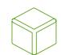

## 环境相关指标与目标

## 环境相关目标

康佳始终秉持“遵守法律法规，节能降耗减排，致力环境保护，持续改进提升”的环境管理方针，制定《环境目标、指标和方案管理程序》推动环境目标与指标具休 可衡量 保障各项任务有效落地执行，报告期内，公司未因环境事件受到生态环境等有关部门重大行政处罚或被追究刑事责任。

## 目标

污染物达标排放率 100%

环保事故 为0

## 达成情况

已达成

已达成

## 废水相关指标进展

康佳严格遵循《中华人民共和国水污染防治法》及各级污水排放标准要求，持续强化工业废水全过程管控，对污水排放关键指标实施定期监测与动态监控，不断优化污水处理设施与治理措施，确保废水稳定达标排放。2025 年，公司工业废水100%达标排放。

## 典型举措

康佳下属博罗康佳精密科技有限公司、广东兴达鸿业电子有限公司被纳入环境信息依法披露企业名单，规范建设了与企业规模相适应的工业污水处理设施，并对相关指标实施实时监测，确保废水100%达标排放，并针对污水处理排放情况，定期开展地下水监测确保不影响周边环境和地下水

<table><tr><td>指标</td><td>2025 年排放情况</td><td>同比变化</td></tr><tr><td>化学需氧量排放量</td><td>36.54 吨</td><td>↓ 8.13%</td></tr><tr><td>氨氮排放量</td><td>4.5 吨</td><td>↓ 30.47%</td></tr><tr><td>废水排放量1</td><td>108.26 万吨</td><td>↓ 9.74%</td></tr></table>

1 废水指标统计范围为工业企业，同比数据以2024年同口径工业企业废水指标为基准。

## 废气相关指标进展

康佳严格遵守《中华人民共和国大气污染防治法》等相关法律法规，严格对标地方环保标准，加强管理二氧化硫、氮氧化物、颗粒物（粉尘）等公司主要废气的排放，落实工业废气合规排放工作，保护大气环境，防治空气污染。

<table><tr><td>指标1</td><td>2025年排放情况</td><td>同比变化</td></tr><tr><td>二氧化硫排放量</td><td>0.49吨</td><td>↓48.45%</td></tr><tr><td>氮氧化物排放量</td><td>32.57吨</td><td>↓3.21%</td></tr><tr><td>烟(粉)尘排放量</td><td>3.18吨</td><td>↑0.95%</td></tr><tr><td>挥发性有机物排放量</td><td>13.64吨</td><td>↓12.44%</td></tr></table>

1 废气指标统计范围为工业企业。

## 废弃物相关指标进展

康佳坚持预防为主的原则，持续强化废弃物全生命周期管理，从源头控制生产运营产生的一般固体废弃物、危险废弃物和生活垃圾，系统推进废弃物分类贮存、无害化处理等工作，落实危险废弃物管理计划，并委托具备资质的第三方依法依规定期进行处置，确保废弃物处理的安全性和环保性，严防环境污染风险。

## 危险废弃物管理流程

## 危险废弃物的产生和收集

对危险废弃物进行分类放置 张贴危险废弃物标识包装好的危险废弃物必须送至危险废弃物固定贮存点，并由专人管理危险废弃物的产生、转移登记台账，记录危险废弃物产生的种类、数量、流向、贮存、利用、处置等有关资料。

## 危险废弃物的 贮存

必须装在符合标准的容器内并粘贴相关标签:对相关易爆，易燃，水解，不挥发等危险废弃物进行预处理或分开堆放；禁止混合收集、贮存性质不相容或未经安全处置的危险废弃物，严禁将危险废弃物混入一般废弃物中贮存。

## 危险废弃物贮存设施

设在易燃、易爆等危险品仓库、高压输电线路防护区域以外；进行防腐、防渗处理；设置泄漏液体收集装置、气体导出口、截流沟、防爆照明设施；危废贮存期不得超过一年；制定污染事故防范措施和应急预案，并定期进行培训和演练；配备应急沙、应急铲、灭火球等应急物资。

## 危险废弃物 的转移

在转移前按要求进行分类包装、张贴标签，转移到指定危险废弃物贮存场所；向环保局申请领取联单，如实填写填单中转移危险废弃物信息；确认危险废弃物运输车辆资质，在转移过程中采取防扬散、防流失、防渗漏或其他防止污染环境的措施。

## 危险废弃物 的处置

委托给有相应处置资质的公司处置，并不定期查访第三方危废处置单位的危废处置能力及结果。

## 危险废弃物申报登记制度

根据环保局要求按时完成危废年报及危废管理计划申报。

<table><tr><td>指标</td><td>2025年进展情况</td></tr><tr><td>一般废弃物产生量</td><td>18,725.42吨</td></tr><tr><td>危险废弃物产生量</td><td>3,851吨</td></tr><tr><td> $危险废弃物处置量^2$ </td><td>3,851吨</td></tr><tr><td>废弃物合规处置率</td><td>100%</td></tr></table>

2 危险废弃物处置为集中存储后滚动处置。

## 资源循环利用

康佳统筹推进能源资源高效管控，严控消耗与浪费，加强资源的综合开发和利用，结合企业实际，对生产经营过程中产生的废渣、废水（液）、废气、余热余压等进行回收和合理利用；同时，推动有条件的下属单位对社会生产生活过程中产生的废弃物进行资源化协同处置，构建绿色低碳、循环高效的资源利用体系。2025年，通过设备设施升级改造、工艺改进等措施，实现节约支出570万元。

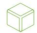

## 能源管理

康佳根据《中华人民共和国节约能源法》持续加强能源管理，按照合理用能的原则，制定并落地实施节能计划和节能技术措施，持续优化调整产业结构、产品结构和能源消费结构，稳步降低单位产值能耗与单位产品能耗，坚决淘汰落后产能，禁止采购、使用、转移国家明令淘汰或不符合强制性能源效率标准的用能设备、生产工艺，持续提升能源利用效率。

<table><tr><td>指标1</td><td>2025年</td></tr><tr><td>天然气消耗量</td><td>1,264.78万立方米</td></tr><tr><td>汽油消耗量</td><td>114.94吨</td></tr><tr><td>柴油消耗量</td><td>78.22吨</td></tr><tr><td>电力消耗量</td><td>14,229.84万千瓦时</td></tr><tr><td>热力消耗量</td><td>31,374.61百万千焦</td></tr></table>

1 指标统计范围均为工业企业。

## 能源管理典型举措

安徽康佳同创电器有限公司

液压站通过采用伺服电机替代普通电机，有效降低待机转速；门胆吸塑机采用节能型加热瓦替换高能耗加热瓦，有效降低能耗。

河南新飞智家科技有限公司

全面加强供暖管控 根据室外温度变化 合理调整供暖设备参数:定期巡查供暖管道，减少因管道漏汽导致的热量损失；通过智能控制系统，对供暖设备精准调节，自动调整供暖设备的运行状态；及时分析蒸汽使用情况，根据不同区域的使用需求进行分区供暖。

## 重庆康佳光电科技有限公司

收集MAU产生的冷凝水，通过水泵泵进冷却水塔，降低冰水机组负载，实现节约电能；通过MAU机组自产热源水，实现节约天然气。

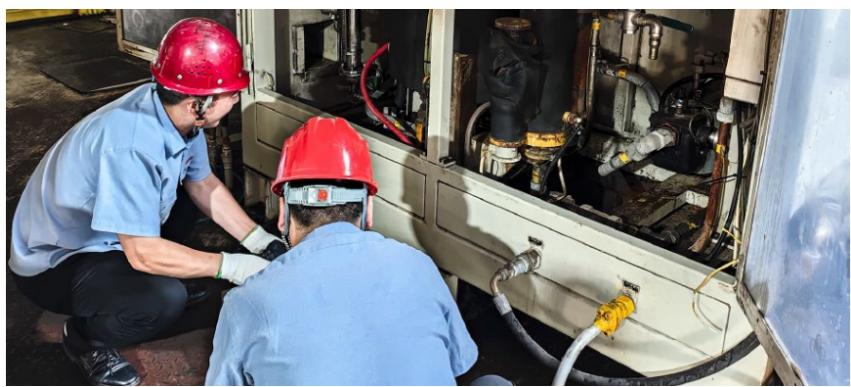

natural_image

Two workers in blue uniforms and red hard hats inspecting industrial equipment on a truck (no visible text or symbols)

安徽康佳同创电器有限公司设备组在小改小革中“淘宝掘金

## 水资源管理

康佳严格遵守《中华人民共和国水法》等相关法律法规，建立规范化用水管理体系，切实保护饮用水源，扎实开展节水工作；强化各部室用水全过程监督与管控，持续推进水资源节约集约与高效利用。

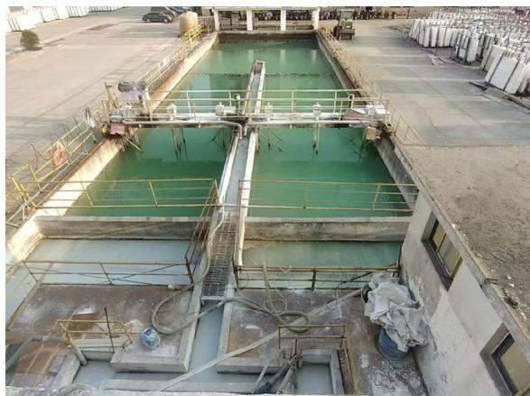

natural_image

Aerial view of a wastewater treatment facility with multiple circular tanks and concrete basins, surrounded by industrial equipment (no visible text or symbols)

江西新凤微晶玉石有限公司废水经沉淀，过滤处理后实现回用

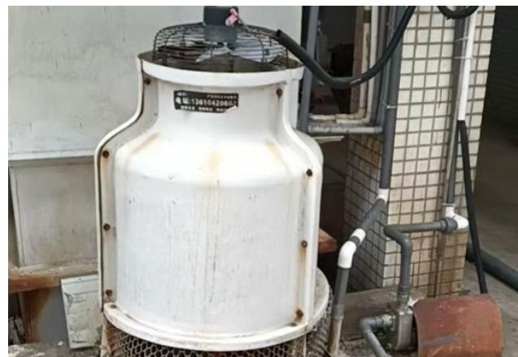

natural_image

Exterior view of a white industrial air conditioner unit with ventilation grilles and piping (no visible text or symbols)

博罗康佳精密科技有限公司冷却水实现回用

<table><tr><td>指标2</td><td>2025年</td></tr><tr><td>新鲜水用水量</td><td>148.27万吨</td></tr><tr><td>重复用水量</td><td>142.25万吨</td></tr></table>

2 指标统计范围均为工业企业。

## 博罗康佳精密科技有限公司

废水处理中心曝气用的罗茨风机，其冷却系统改用冷却水塔循环冷却，每月可节约自来水约600 立方米。

## 重庆康佳光电科技有限公司

通过研判设备补水机制，将蚀刻两台 scrubber 补水量分别由 15L/min、11L/min降低为 11L/min、8L/min，通过工艺优化有效节约用水。

## 水资源利用典型举措

## 物料管理

康佳依据《中华人民共和国循环经济促进法》等法律法规，持续优化物料管理体系，在资源节约、循环利用、提升物料综合利用率等方面不断探索创新路径。公司下属单位进一步完善《仓库管理规定》《仓库物资防护管理规定》《有害物质管理控制程序》等制度文件，确保物料管理全流程规范、高效、有序运行，满足生产经营全过程对物料管理的要求。

## 生态友好运营

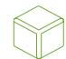

## 绿色产品

康佳推进绿色产品认证工作，推动下属单位持续响应工业和信息化部办公厅相关倡导，严格对标相关评定标准，对生产流程、能源利用、有害物质限用等核心环节开展全面复盘与优化，扎实落实整改提升。此外，公司结合科技发展趋势，在核心产品中嵌入AI能力，推动产品从“功能交付”向“智能服务”升级，提升终端用户的使用体验、有效延长产品生命周期、降低能耗与维护成本，助力绿色消费与循环经济。

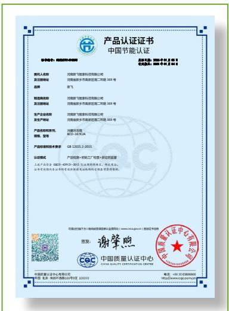

text_image

产品认证证书
中国节能认证
企业简介：包括网站和项目
委托人名称：河南新飞锂科技有限公司
营业执照号：河南省新乡市高新花园二环路369号
品牌：郑飞
批准委派代表：河南新飞锂科技有限公司
营业执照号：河南省新乡市高新花园二环路369号
生产企业名称：河南新飞锂科技有限公司
生产企业地址：河南省新乡市高新花园二环路369号
产品名称及型号：
规格、型号：MEZ-18782A
产品标准和技术要求
GB 130025.2-2015
认证形式：产品认证（按竣工工艺批文+实验室备案）
上述产品公司 GSE2C-6910-2023 认证有效期至：有效期至。
以自有或外销方式认购的有效投标保证金购买保证金并获得保荐。
请查询注册方为:国能集团财务有限责任公司（www.cse.com.cn）地址中甲级
签发：谢荣照
中国质量认证中心
CHINA QUALITY CERTIFICATION CO.,LTD.
电话：+8-58 83886666
地址：www.cqcc.com.cn
中国重工业中心有限公司 2020年
©CEC
中国质量认证中心
CHINA QUALITY CERTIFICATION CO.,LTD.

冰箱产品节能认证证书

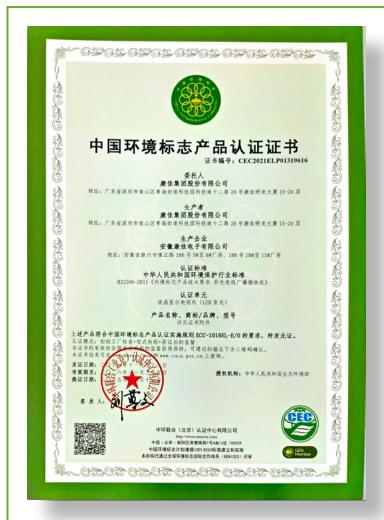

text_image

中国环境标志产品认证证书
证书编号：CEC2021ELP01339616
委托人
康达集团股份有限公司
地址：广东省深圳市南山区粤海街道科技科技园十二路24号澳德研究大厦15-24层
生产者
康达集团股份有限公司
地址：广东省深圳市南山区粤海街道科技科技园十二路24号澳德研究大厦15-24层
生产企业
安徽康达电子有限公司
地址：安徽省合肥市三环路186号3#厂房1#厂房186号188室1#厂房
法定代表人
中华人民共和国环境保护行业标准
HJ2304-2011《环境保护产品质量管理体系（国家环保）》
认证单位
请登录本公司网站（www.hjzq.com）
产品名称、类别、型号
认证证有效期
上述产品符合中国环境标志产品认证实施规则（ECO-101405-L/0）的要求。特发凭证。
本产品的有效性和安全性等级要求，可通过综合评分系统确定。
本产品有效期至2011年7月2日止。
颁发机关：中华人民共和国生态环境部
登记机关：
中国证监会（北京）认证中心有限公司
中审国际会计师事务所（特殊普通合伙）
中国注册会计师协会(特殊普通合伙)准予注册
批准的注册会计师资格证书编号：2011-0000000000000000000000000000000000000000000000000000000000000000000000000000000000000000000000
联系电话：（）  （）  （）  （）  （）  （）  （）  （）  （）  （）  （）  （）  （）  （）  （）  （）  （）  （）  （）  （）  （）  （）  （）  （）  （）  （）  （）  （）  （）  （）  （）  （）  （）  （）  （）
邮编：CCE2021ELP1339616

液晶显示电视（LED青光）中国环境标志产品认证证书

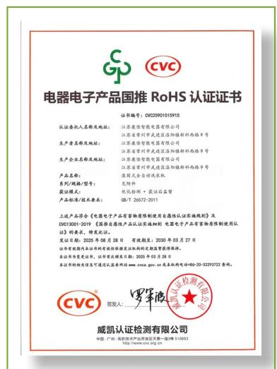

text_image

CVC
电器电子产品国推 RoHS 认证证书
证书编号：DVG28901010915
认证委托人名称及地址：江苏省康佳智能电器有限公司
生产者名称及地址：江苏省常州市武进区协拓新科西路9号
生产企业名称及地址：江苏省常州市武进区协拓新科西路9号
生产企业类型及地址：江苏康佳智能电器有限公司
产品名称：碳黑式全自动流电机
系列/规格/型号：见附件
获证模式：优化检测 + 获证后监督
产品标准/技术要求：GB/T 26572-2011
上述产品符合《电器电子产品有害物质限制使用自愿性认证实施规则》及
CVC13001-2019《质量检测&产品认证实施细则 电器电子产品有害物质限制使用认
证》的要求，特发此证。
发证日期：2025年08月28日 有效期至：2030年03月27日
证书有效期为本证书的有效期限及应承担的定期监督获得核准。
本证书内容及证书，以有效期限为准。2025年03月28日
本证书的相关信息可通过注册网站www.cvc.gov.cn或本证书的电子版60-2D-3239372查询。
CVC 罗华源
签发人：
威凯认证检测有限公司
中国·广州·高新技术产业开发区天桥一路510653
http://www.cvc.org.cn

滚筒式全自动洗衣机国推RoHS 认证证书  
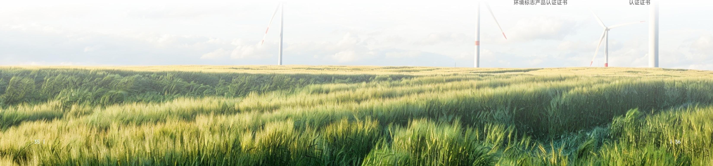

text_image

环境标志产品认证证书
认证证书
35 1 36

## 绿色文化

康佳积极倡导绿色办公理念，对废纸、塑料、金属等可回收物品进行分类收集，并推行电子化办公，减少纸质文件的使用。积极组织开展全国生态日六五环境日全国节能宣传周 全国低碳日等宣教活动倡导文明 节约 绿色低碳的生产生活方式。2025年，公司开展绿色环保专题培训42次，1,420人次参与，培训时长共108.5小时。

## 绿色办公举措

## 节约用水

水龙头应尽量开小，杜绝“长流水”、张贴节水宣传标语。

## 节约用电

杜绝“长明灯”“白昼灯”，人走灯灭，空调温度不低于26度。

## 节约用纸

节约使用办公用品文件，倡导双面印刷，张贴节约用纸宣传标语。

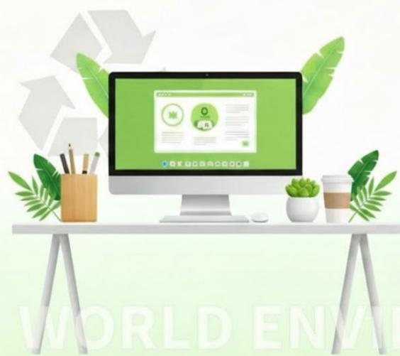

natural_image

Illustration of a desktop computer with a monitor displaying a green screen and leafy graphics, surrounded by office supplies and plants (no text or symbols on the main elements)

## 倡导绿色生活

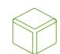

## 环境保护

康佳严格执行生态保护红线、环境质量底线、资源利用上限和环境准入负面清单要求，切实履行企业生态环境保护主体责任。在厂房选址、设备设施规划布局等环节，公司严格遵循相关合规标准，科学统筹布局，着力降低生产经营活动对周边生态环境的潜在影响。在生产经营过程中采取措施最大限度减少和降低污染产生，严格落实污染物处置，落实生态环境保护。

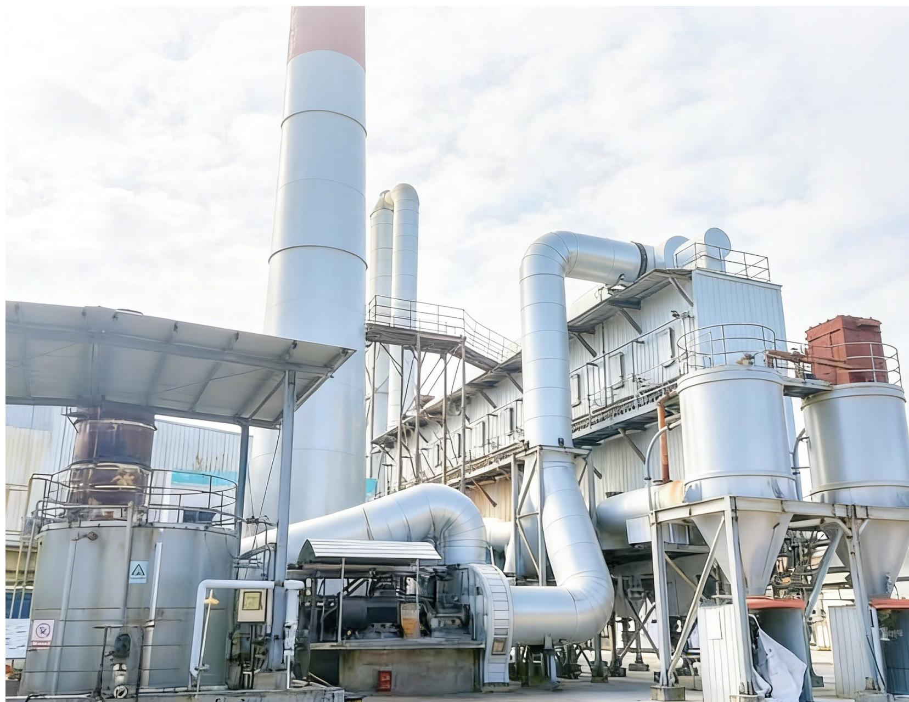

natural_image

Industrial plant exterior with large metallic piping and smokestacks under a cloudy sky (no visible text or symbols)

江西新凤微晶玉石有限公司环境治理设施

## 03

## 创新驱动

## 打造智能生活新体验

## 完善创新体系

## 夯实创新基石

## 创新管理体系

康佳制定《康佳集团股份有限公司科研管理制度（试行）》，修订《康佳集团股份有限公司科技研发管理工作规定》，构建“基础研究—应用开发—生产支持”三级研发体系，规范公司研发项目全周期管理，建立价值创造、技术驱动、高效协同的研发体系，提升研发资源配置效率，保障公司科技研发战略有效落地。

## 科技创新荣誉

“十四五”期间，康佳荣获2项广东省科技进步奖二等奖、1项安徽省科技进步奖三等奖。

2025 年，深圳康佳电子科技有限公司、安徽康佳电子有限公司、安徽康佳同创电器有限公司等均通过国家高新技术企业认定。

河南新飞智家科技有限公司成功入选河南省智能工厂名单，重庆康佳光电科技有限公司获重庆市先进级智能工厂和基础级智能工厂称号，安徽康佳电子有限公司入选先进级智能工厂名单。

## 创新激励机制

康佳制定《康佳集团股份有限公司科技及创新奖励管理办法（试行）》，进一步释放研发人员的技术创新潜能。其中，重庆康佳光电科技有限公司配套制定《重庆康佳光电科技有限公司知识产权创新奖励办法》，通过设立专项奖励基金，对在知识产权创造、运用、保护及管理等方面有突出贡献的团队和个人给予物质与精神双重激励，有效激发了员工的创新活力与积极性。

## 内外协同创新

康佳深耕产学研协同创新，联动高校、科研机构及合作伙伴搭建多层次创新平台，取得多项权威资质。“十四五”期间，康佳积极推动技术攻关与成果转化，赋能企业高质量发展。

消费电子领域：获批广东省智慧融合显示工程技术研究中心、深圳市智慧融合显示工程技术研究中心及深圳市8K超高清显示工程中心，积极推进AI与8K融合创新，拓展应用场景，同时入选广东省首批智能制造生态合作伙伴名单；建成安徽省企业技术中心、河南省深冷产品装备工程技术研究中心等多个创新平台，新飞医用冷冻箱获批《医疗器械注册证》，河南新飞智家科技有限公司获批《Ⅱ类医疗器械生产许可证》。

半导体科技领域：重庆康佳光电科技有限公司荣获“国家知识产权优势企业”称号，入选工业和信息化部“制造业中试标准化技术委员会工作组成员单位”，获批“重庆市制造业中试平台”。

PCB领域：与电子科技大学中山学院、哈工大机器人（中山）无人装备与人工智能研究院深度合作，开展关键技术研究及5G智能家电用高多层精密电路板技术改造，提升在智能家电PCB市场的竞争力。

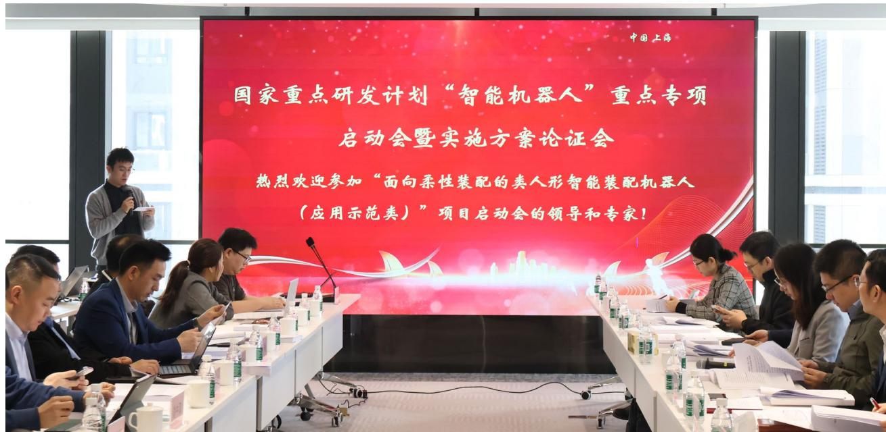

text_image

国家重点研发计划“智能机器人”重点专项
启动会暨实施方案论证会
热烈欢迎参加“面向柔性装配的类人形智能装配机器人
（应用示范类）”项目启动会的领导和专家！

安徽康佳电子有限公司携手多方攻坚国家重点研发计划“智能机器人”重点专项

## 科技成果转化

## 安徽康佳电子有限公司

## 陕西康佳智能家电有限公司

## 博罗康佳精密科技有限公司

成功研发“工业视觉AI检测大模型”，构建了自动化测试、实时监测与智能预警一体化的全流程智能检测体系，单件检测时间从人工30秒缩短至200毫秒，效率提升150倍，不合格品拦截率近 100%，并已应用于全部产线。

“一种洗碗机分水阀及洗碗机”技术发明已在内销与外销洗碗机产品中实现大规模商业化应用，不仅强化了 KONKA 品牌的技术实力与创新形象，有效提升消费者信任度与品牌价值，更精准吸引了对产品性能与技术创新有高要求的目标客群，助力提升产品市场占有率。

热电分离铜基板产品性能达到国内先进水平，成功实现从常规金属 PCB 制造商向高端特种基板解决方案提供商的战略转型。该产品精准满足 AI 算力、5G 通信、汽车电子等领域对高功率密度封装的核心需求，显著增强了在高端市场的核心竞争力。

## 康佳首台 530 滚筒洗衣机成功下线

2025年4月8日，康佳首台530滚筒洗衣机成功下线。530滚筒洗衣机“智净合一，一键焕新”的技术创新实现了一键智慧洗技术，按下智慧洗按键，洗衣机自动开机、自动检测衣物状态、自动添加洗涤剂，并选择最合适的洗涤节拍，极大提升了洗衣机的使用便捷性。

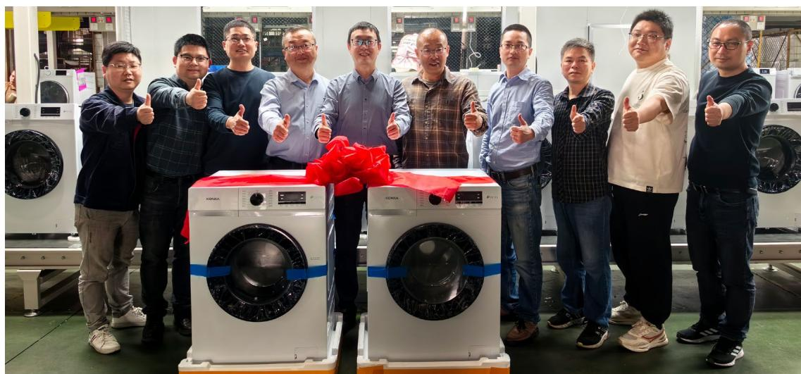

natural_image

Group of men giving thumbs-up in front of a washing machine, standing in a factory setting (no visible text or symbols)

## 推进数智化转型

康佳系统推进 AI 在产品创新与价值链运营中的深度应用，致力于提升资源效率、增强客户价值、强化供应链韧性，并减少运营过程中的环境足迹。

赋能产品智能化：在核心产品中嵌入 AI 能力，推动产品从“功能交付”向“智能服务”升级，通过智能感知、智能交互及预测性维护，提升用户体验，延长产品生命周期，降低能耗与维护成本，助力绿色消费。

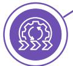

驱动研发绿色化：将AI技术应用于需求洞察、仿真设计、虚拟验证等研发环节，缩短开发周期，减少物理样机试制与重复测试，降低材料浪费与碳排放，实现精准匹配用户需求，提升创新资源配置效率。

实现产销精益化：依托一体化数智营销平台，实现研发、生产、销售与零售终端的数据贯通与实时联动。该机制支持“以销定产、按需供应”的柔性运营模式，有效减少库存积压与滞销损耗，提升资金周转效率，降低仓储与物流环节的能源消耗。

推动供应链智慧化：依托AI与物联网技术，实现对全国范围内商品流通、库存状态及零售动销的实时可视与智能预测，有效增强供应链的抗风险能力，减少因紧急运输或冗余备货带来的碳排放，推动供应链向高效、透明、低碳方向转型。

## 康佳电视正式接入DeepSeek，开启AI深度思考新纪元

2025 年 2 月 14 日，康佳电视宣布与深度求索（DeepSeek）达成技术合作，将先进AI大模型融入智能电视系统。通过自主研发的大模型平台，康佳实现 DeepSeek 模型的本地化部署，Mini AI-LED产品将支持智能交互升级。这一创新不仅打破传统电视功能边界，更构建了“模型+硬件+场景”三位一体的全栈赋能体系，为用户打造懂需求、有温度的智慧生活伴侣。

## deepseek

## 探索未至之境

开始对话

获取手机 App

## 保护知识产权

康佳遵循《中华人民共和国专利法》《中华人民共和国商标法》等法律法规，制定《康佳集团股份有限公司知识产权合规管理指引（试行）》《康佳集团股份有限公司知识产权管理办法（试行）》《第三方技术许可管理规范（试行）》等制度，构建了完善的知识产权管理体系，在全力维护自主知识产权的同时，避免侵犯他人的知识产权；积极开展知识产权保护理念的宣贯工作，明确要求全体员工在研发、生产和经营等各项活动中，必须将尊重他人知识产权作为基本准则，坚决杜绝擅自使用、传播或模仿他人专利、商标和著作权等侵权行为。

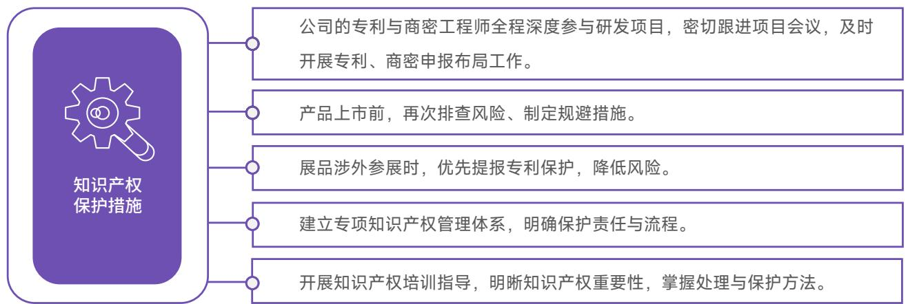

flowchart

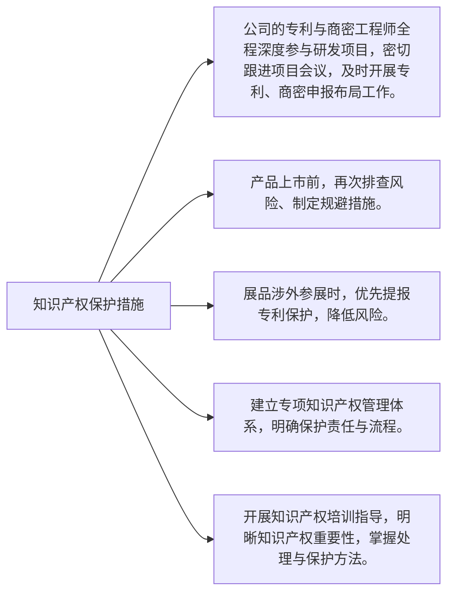
```mermaid
graph LR
  A["知识产权保护措施"] --> B["公司的专利与商密工程师全程深度参与研发项目，密切跟进项目会议，及时开展专利、商密申报布局工作。"]
  A --> C["产品上市前，再次排查风险、制定规避措施。"]
  A --> D["展品涉外参展时，优先提报专利保护，降低风险。"]
  A --> E["建立专项知识产权管理体系，明确保护责任与流程。"]
  A --> F["开展知识产权培训指导，明晰知识产权重要性，掌握处理与保护方法。"]
```

## 打造优质产品

## 锚定用户需求

康佳始终以“用户需求”为锚点，扎根于家庭的日常点滴，用科技的温度，默默守护着每个家庭的三餐四季。

康佳冰箱搭载三重15天生态原鲜技术，让三文鱼的脂香与草莓的清甜长久留存；搭配6重除菌净味技术，让每一次食材享用都成为一场关于新鲜与健康的盛宴。  
电视通过Mini-LED千级分区控光，将影院级画质搬进客厅，将现场感影像与家居艺术美学完美交融，成为家居环境中的艺术品。  
康佳省电王空调，APF值5.4，达到新一级能效标准，30分钟之内引入室外新鲜空气，低噪音设计，微孔柔风输送，确保夜间安享宁静睡眠。  
洗衣机具备蒸汽洗烘一体功能 可以根据衣物重量，衣物面料等 智能准确地控制洗衣液的使用量，AI智能投放更精准。

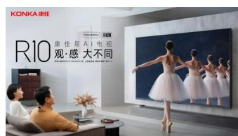  
康佳R10高端壁纸电视

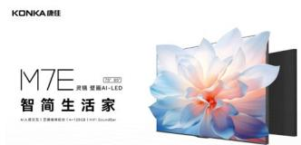  
康佳 M7E 壁画 AI-LED 智能电视

## 康佳SU37系列洗衣机：大容量黑科技，洁净省心又省力

## 案

2025年7月25日，“全SU前进，大有可为”——康佳洗衣机2025核心客户座谈会顺利召开。会上，康佳推出的SU 37系列洗衣机备受关注。SU 37系列产品容量突破常规，达到12KG、13KG，能轻松满足多口之家的洗衣需求。在功能上，创新推出“37分钟速净”，精准对接快节奏生活人群需求，通过优化水流动力与洗涤程序，能在37分钟内实现普通洗衣机1小时的洗净效果，高

效解决急件洗衣需求问题。同时，全新升级的“一键智慧洗3.0”搭载八重感知技术，可精准识别衣物材质、重量、污渍程度等信息，自动匹配最优洗护方案，用户只需一键操作，无需繁琐设置，尽显智能便捷。

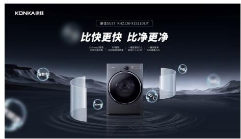

text_image

KONKA康佳
康佳5037 KH2120-K151DUT
比快更快 比净更净
38mm/4 热壁 | 时长宽 | 一般零件尺寸 | 一维效率 | 高速减25%
大功率风扇 | 低功率风扇 | 通过 / 100% | 高速减25%

## 重视质量管理

康佳严格遵循《中华人民共和国产品质量法》《工业产品生产单位落实质量安全主体责任监督管理规定》等法律法规，贯彻落实专业化融合要求，将提高产品和服务质量作为产品业务发展主攻方向。公司按照“总部抓总、业务单元抓专、基层单位抓实”的质量管理整体工作思路，推进“以预防为主”的质量管理体系建设，围绕达成年度质量目标，通过赋能和加强监督，促进质量管理从事后解决问题向事前预防转变。

## 治理

康佳依据 ISO 9001 质量管理体系要求，制定《康佳集团股份有限公司质量管理规定》《康佳集团股份有限公司质量管理手册》《新飞智家质量管理手册》《白电服务管理实用手册》等文件，并持续提升其有效性；建立完整的质量组织架构，并配备充足的人力资源、过程设备、信息系统、财务等资源，保障公司质量方针和目标的实现。康佳电视、冰箱、洗衣机、空调等产品均按国家标准要求执行，获得CCC 认证及 RoHS 认证。2025 年，19 家下属企业通过ISO 9001质量管理体系认证。

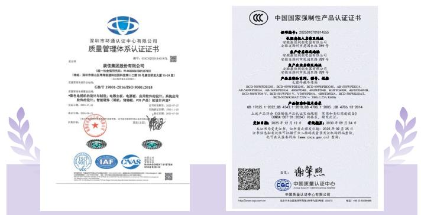

text_image

深圳市环通认证中心有限公司
质量管理体系认证证书

深圳市环通认证中心有限公司
质量管理体系认证证书

深圳市环通认证中心有限公司
质量管理体系认证证书

深圳市环通认证中心有限公司
质量管理体系认证证书

深圳市环通认证中心有限公司
质量管理体系认证证书

深圳市环通认证中心有限公司
质量管理体系认证证书

深圳市环通认证中心有限公司
质量管理体系认证证书

深圳市环通认证中心有限公司
质量管理体系认证证书

深圳市环通认证中心有限公司
质量管理体系认证证书

深圳市环通证
中国国家质量认证中心有限公司
中国质量认证中心有限公司

康佳质量管理体系认证证书  
安徽康佳同创电器有限公司CCC产品认证证书

## 战略

康佳制定《康佳集团股份有限公司全面风险管理相关管理要求》，编制《风险和机遇识别评价及应对表》，全面、系统地识别、评估并应对可能影响公司业务运营、产品质量、市场竞争力及可持续发展的各种风险和机遇。

natural_image

Illustration of people working with books and digital interfaces, no text or symbols present

<table><tr><td>风险类型</td><td>风险描述</td><td>影响程度</td><td>发生的可能性</td><td>影响的时间范围</td><td>影响的价值链环节</td><td>优先级排序</td><td>潜在财务影响</td><td>应对措施</td></tr><tr><td>技术风险</td><td>科技进步和需求变化可能导致产品过时,企业若不及时调整产品结构或进行技术创新,将面临市场风险。</td><td>4</td><td>2</td><td>中期</td><td>运营、下游</td><td>B</td><td>营业收入减少</td><td>持续投入研发资金,通过研发新技术、新功能,使产品保持先进性,满足消费者的新需求。</td></tr><tr><td>声誉风险</td><td>产品质量出现问题,公司可能面临经济赔偿、品牌形象受损等风险。</td><td>5</td><td>1</td><td>短、中、长期</td><td>运营、下游</td><td>B</td><td>营业收入减少</td><td>建立完善的风险评估管理体系,通过系统的风险评估方法和管理手段,公司可以及时发现并纠正产品设计、生产、销售等环节中的质量问题,提高产品质量水平。</td></tr></table>

<table><tr><td>机遇类型</td><td>机遇描述</td><td>影响程度</td><td>发生的可能性</td><td>影响的时间范围</td><td>影响的价值链环节</td><td>优先级排序</td><td>潜在财务影响</td><td>应对措施</td></tr><tr><td>技术机遇</td><td>新技术、新材料、新工艺不断涌现,为公司提高产品安全和质量水平提供了强有力的技术支撑。</td><td>4</td><td>-</td><td>长期</td><td>运营</td><td>-</td><td>运营成本减少</td><td>加强物联网、大数据、人工智能等技术的研发应用,建立智能化的产品质量监测体系,提高产品质量保证的效率和效果。</td></tr><tr><td>市场机遇</td><td>客户对高品质产品的需求日益增长,公司推动产品迭代升级,可提高市场竞争力。</td><td>3</td><td>-</td><td>短、中期</td><td>运营</td><td>-</td><td>营业收入增加</td><td>加强对市场需求的研究和分析,准确把握消费者对高质量产品的需求趋势。</td></tr></table>

natural_image

Illustration of two people using laptops and documents, surrounded by stacks of books and a lightbulb (no text or symbols)

## 影响、风险和机遇管理

康佳制定《风险控制程序》通过开展风险管理预先发现风险征兆 提前采取必要的预控措施 确保将风险控制在与总体目标相适应并可承受的范围内，把风险损失降到最低限度。

各职能部室、业务单元结合公司年度质量目标和本单位 KPI 目标及年度面临的主要内外部环境形势进行质量风险和机遇识别。

对识别出来的风险和机遇从对公司的影响程度和风险发生的可能性两个维度进行评估，评出A类、B类和C 类风险，其中A类为高等风险（重大风险），B类为中等风险，C类为低等风险。

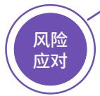

经风险评估为 A 类的风险必须制定风险管理方案，B 类和 C 类风险制定风险管理措施，必要时也可制定风险管理方案；内控与风险管理部统筹、编制重大风险清单及其管理策略和风险管理解决方案；对全面风险管理的有效性和围绕风险管理目标的内部控制有效性进行评价，研究提出全面风险管理的改进方案。

## 指标与目标

康佳依据《质量方针 / 目标控制程序》，制定 2025 年产品和服务的安全与质量目标，并对目标完成情况进行持续地监视和考核。另外，公司制定 2025 年质量考核指标和监控指标，实施主要业务单元质量例会制度，并建立月度质量指标分析通报机制，确保质量年度目标的达成，提升顾客满意度。

<table><tr><td>质量指标</td><td>2025 年目标</td><td>2025 年达成情况</td></tr><tr><td>因健康与安全原因需撤回和召回的产品数量</td><td>0 件</td><td>0 件</td></tr></table>

## 管理措施

产品全过程管理：公司制定《原材料入厂检验工作指引》《生产过程的管理规定》《产品设计与验证工作流程》《不合格品控制》《纠正和预防措施的管理规定》等管理程序文件从原料控制工艺流程、产品检验、纠正预防等方面严格监控产品质量，对产品进行持续改进，不断提升品牌口碑和竞争优势。

产品召回管理：康佳制定《新飞缺陷产品召回工作程序》等制度，针对发现的不合格或存在安全隐患的产品，迅速启动产品召回程序，全力保障客户的合法权益。2025 年，公司因健康与安全原因需撤回和召回的产品数量为0。

数字化系统支持：康佳建立工业产品质量安全风险防控动态管理机制，并在EIP系统进行电子化监控；开发上线CRM服务管理系统，覆盖呼叫中心管理、服务工单管理、备件管理、服务组织管理、费用结算管理，集成 SAP 账务、流程审批和移动端小程序功能，推动消费电子全品类产品服务工单纳入CRM系统，实现全品类服务工单公司系统监管。

## 加强质量监督

康佳建立常态化质量监督机制，组织彩电、白电、半导体和PCB等单位每月召开质量例会，及时掌握公司全品类产品和服务质量情况，推动各项管理措施落地；实施月度分析通报，跟踪各单位计划完成情况，针对性分析问题并进行通报，督促改进；组织质量管理体系内部现场审核和第三方认证机构的监督审核，审核发现问题33项，均已整改完毕。

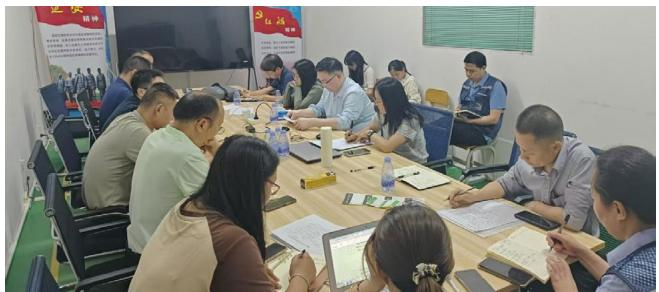

text_image

Meeting room scene with participants seated around a long table reviewing documents and tablets, featuring visible posters on the wall.

质量管理体系内审

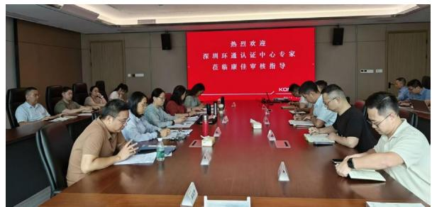

text_image

热烈欢迎
深圳环通认证中心专家
莅临康佳审核指导

质量管理体系外审

## 培育质量文化

康佳推动质量文化走深走实，开展“质量月”主题活动，举办第三十七届QCC成果发布会；选派新飞、同创两个QC小组参与第八届中央企业QC小组成果发表赛，分别荣获二等奖；开展2025年度质量专项训练营和“简单说品质”线上公开课两期培训，覆盖研发、制造、工艺、品质等领域管理骨干与一线员工，全面夯实企业质量人才基础。

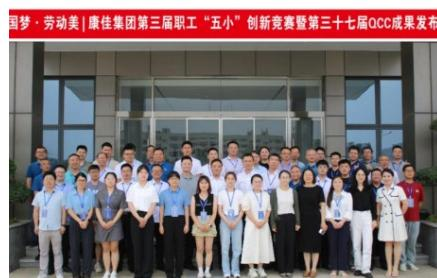

text_image

国梦·劳动美|康佳集团第三届职工“五小”创新竞赛暨第三十七届QCC成果发布

康佳第三届职工“五小”创新竞赛暨第三十七届QCC成果发布会

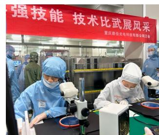

text_image

强技能 技术比武展风采
重庆能投光电科技有限公司工会

开展“质量月” 岗位技能竞赛活动

## 用心服务客户

## 保障客户权益

## 公开透明

康佳严格执行上门服务规范与 123456 服务流程，实行 2 小时快速预约、快速上门服务。上门后先开机检测，当面告知故障情况与收费方案 主动出示统一收费标准及材料价格 用户可通过电子版《2024一2025收费标准》，康佳服务+公众号、CMR系统实时查询核实。服务完成后，必须按公司规定填写《电视产品服务监督凭证》，交由用户签字确认，并及时在系统内录入收费信息。

## 拓展阅读：123456 服务流程

一证件：上门服务时出示“大拇指”服务资格证  
二公开：公开出示康佳产品 “服务收费标准 ”公开出示服务监督凭证，并请用户签署意见  
三到位：服务后清理现场到位服务后通电试机演示到位服务后讲解彩电使用、保养知识、提供一站式通检到位

四不准：不准抽用户的烟不准吃用户的饭不准收用户的礼品不准给用户添麻烦  
五心级：精心准备、热心问好、细心服务、尽心奉献、舒心享用

六统一：统一服务标识统一服务标准统一服务价格统一管理规则统一技术支持统一原厂配件

## 责任营销

康佳秉持责任营销理念，严格遵守《中华人民共和国广告法》《中华人民共和国商标法》等国家法律法规及行业规范，开展广告投放工作，杜绝虚假夸大宣传，通过官网、微信公众号等多渠道向客户传递真实有效的产品信息，切实保障客户知情权。

## 信息安全

康佳落实《数据安全管理细则》要求，制定《康佳集团股份有限公司网络安全管理办法》对核心系统实行最小权限访问控制 部署防火墙 DDoS防护及日志监控 通过严禁非授权数据外传 定期开展系统补工更新等举措 织密技术防护网络；常态化开展全员数据安全专项培训，强化员工隐私保护责任意识。报告期内，公司未发生任何经确认的数据安全事件，未出现因系统漏洞、内部人员违规或外部网络攻击导致的数据泄露、丢失、篡改或非法访问等情况。

## 客户隐私

康佳在系统设计与服务提供中嵌入隐私保护要求，确保客户信息的采集、使用和传输符合《中华人民共和国个人信息保护法》等相关法律法规；在与电商平台等第三方开展合作时，明确数据使用边界，规范用户数据的存储与传输，杜绝超范围收集或未经授权共享。报告期内，公司未发生任何客户隐私信息泄露事件，未造成用户权益受损、经济损失或声誉影响。

## 提升服务品质

康佳编制《多媒体销售分公司上门服务人员上门服务规范》《康佳白电服务管理使用手册》等客户服务制度，成立用户服务部，明确各业务单元职责，规划客户服务的具体管理流程、实际操作程序等；推出康佳大拇指服务，为客户提供“三快一好”“钻石服务”等差异化服务产品，打造康佳特色服务质量体系。此外，康佳建立了面向全链条、全渠道、智能化的全面质量和客户体验数字化平台，将整个服务管理业务统一纳入 CRM 系统平台进行管理，通过服务过程可视化、规范化、智慧化，持续提升客户服务体验。

## 做好售后服务

康佳制定《康佳呼叫中心管理制度》《康佳多媒体工单“四类五级”管理制度》《中国区营销事业部质量信息反馈管理规定》等规章制度，规范售后服务工作；严格按照国家产品三包政策，制定细致的售后服务流程，构建优质服务生态。

公司建立全球呼叫中心，配备专业服务人员，统一协调全国服务网点，并搭建电话、微信、电商平台等多种沟通渠道，全天候24小时受理客户服务需求，确保客户反馈渠道畅通无阻。在客户提出服务需求后，公司通过CRM信息系统统一派单，派遣专业维修人员，依据规范的工作流程，在规定时间内提供上门维修等售后服务。

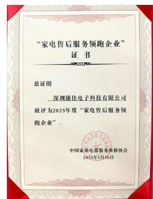

text_image

“家电售后服务领跑企业”
证书

兹证明
_深圳康佳电子科技有限公司
被评为2025年度“家电售后服务领跑企业”。
中国家用电器服务维修协会
2025年5月16日

深圳康佳电子科技有限公司荣获“家电售后服务领跑企业”称号

## 积极应对投诉

康佳制定了完善的客户投诉事件响应流程，设置专员处理相关投诉，并将投诉处理结果与负责部室KPI挂钩，有效提升负责部室工作效率。此外，公司每季度通过电话问卷、顾客评价等方式对客户服务满意度进行监测，征集公司在客户服务工作中存在的问题和不足，制定整改措施，并形成书面报告，最终由用户服务部每月对制定的整改措施完成情况进行复盘。2025年，客户投诉解决率98%，客户满意度98.92%。

  
客户投诉解决率

98 %

  
客户满意度

98.92 %

# 助力行业发展

## 开展战略合作

康佳秉持开放协同的发展理念，深度联动产业链企业、高校及科研院所形成创新合力。其中，陕西康佳智能家电有限公司与西安交通大学联合开展“家用洗碗机快洗净项目开发”，并携手 LG 推进台式洗碗机项目研发；广东兴达鸿业电子有限公司与中山联通、中国移动广东中山东部分公司协同打造组织联建、资源共享、数智赋能的合作平台，在 5G / 算力、工业互联网、智慧园区及信息安全等领域深化项目联动，同时与电子科技大学中山学院共建产学研协同、人才共育、技术攻关的共享平台，为技术升级与人才梯队建设提供有力支撑。

## 案

## 康佳与华润燃气达成战略协同

2025年12月31日，整合赋能·协同共生——康佳与华润燃气战略协同发布仪式在福州举行。双方将创新“联合营销+专柜入驻”模式，组建专项工作组，共同打造线下体验式零售标杆；加强技术与产品协同，建立联合研发与共享平台，推动产品融合创新；深化产业生态合作，整合上下游资源，共同拓展智能家居新场景，致力于为消费者创造更安全、更舒适、更智慧的理想家居生活。

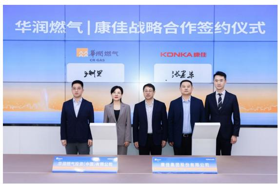

text_image

华润燃气 | 康佳战略合作签约仪式
华润燃气
CR GAS
王树里
KONKA康佳
张星华
中国燃气投资(中国)有限公司
康佳集团股份有限公司

## 推动行业共建

康佳担任深圳市 8K 超高清视频产业协作联盟副理事长单位，主动参与国家、地方和行业标准的制修订工作，持续深化行业内外合作交流。其中，重庆康佳光电科技有限公司积极参与《Mini&MicroLED 显示屏 Mura 缺陷评价方法》团体标准及《2025MLED显示产业白皮书》的编写工作，安徽康佳同创电器有限公司全程参与《家居产品适老化设计指南》起草与制定工作，河南新飞智家科技有限公司受邀参与《家用电冰箱耗电量限定值及能效等级》起草工作，为行业树立了全新的技术标杆。截至 2025 年底，康佳参与制定 / 修订国家（强制性）标准 13 项、国家（推荐性）标准 24 项、行业标准24 项。

  
截至2025年底，

康佳参与制定/修订国家（强制性）标准

国家（推荐性）标准

行业标准

13 项

24 项

24 项

natural_image

Line art illustration of people interacting with digital devices and stacks of books, no text or symbols present

## 重庆康佳光电科技有限公司受邀参加2025第六届全球Mini/Micro LED显示技术周

2025年2月27日，重庆康佳光电科技有限公司以CMMA副会长单位身份亮相第六届全球Mini/MicroLED 显示技术周，携 1530/1424/3154/5252 系列 Micro LED 芯片登场，展现“芯片 + 巨转”核心技术优势。其自主研发的RGB外延片及Micro LED芯片，键合良率高达98%，达到行业领先水平。从外延片到显示屏的全产业链布局，康佳正加速MLED技术商业化落地，为显示行业树立技术标杆。

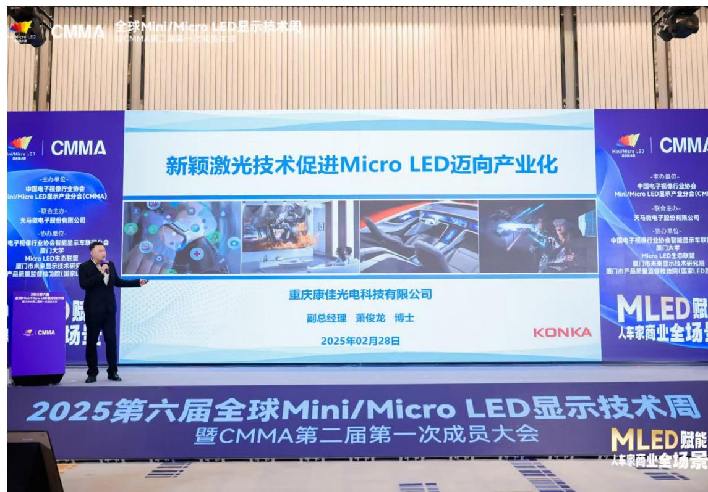

text_image

CMMA 全球Mini/Micro LED显示技术周
Mini/Micro LED显示第一次发布会
新颖激光技术促进Micro LED迈向产业化
重庆康佳光电科技有限公司
副总经理 萧俊龙 博士
2025年02月28日
2025第六届全球Mini/Micro LED显示技术周
暨CMMA第二届第一次成员大会
MLED赋能
人车家商业全场景

## 供应链协同发展

## 打造责任供应链

康佳利用信息化手段，通过采购业务运营平台（SRM）对适用范围内的供应商实施统一管理，制定相应管理标准和规范，以诚实、守信、开放为原则，建立合作共赢的采购供应关系，在持续提升供应商管理和培育优化中，为公司产业发展创造价值。

## 治理

康佳系统构建供应链管理制度架构，形成以一级制度为主干、多项二级管理办法为支撑、配套三级操作细则为补充的科学制度体系，确保管理全覆盖、无死角；聚焦采购、供应商、成本、库存等关键领域，出台具有强约束力的二级管理办法，为各项核心业务立规矩、明准则；针对具体业务场景与物料品类，细化制定可落地、可考核的操作规程与标准，实现流程精细化与执行高效化。公司供应链管理部作为采购成本、供需协同及风险管控中心，通过构建安全、敏捷、高效的供应链管理体系，引领公司供应链能力与竞争力稳步提升。

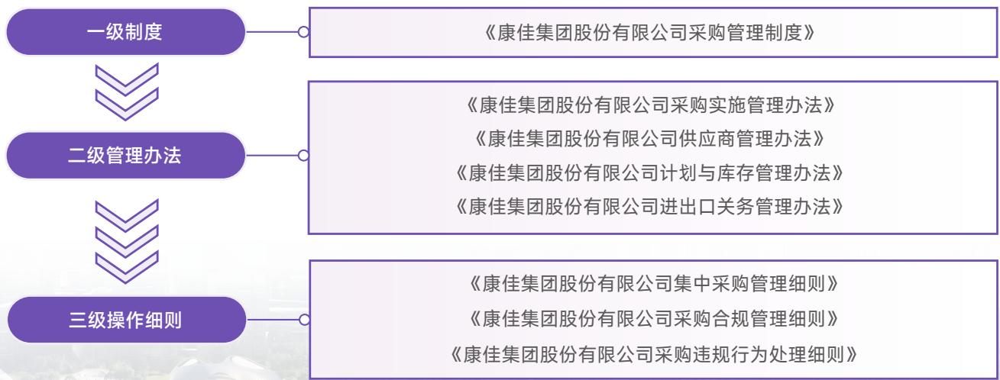

flowchart

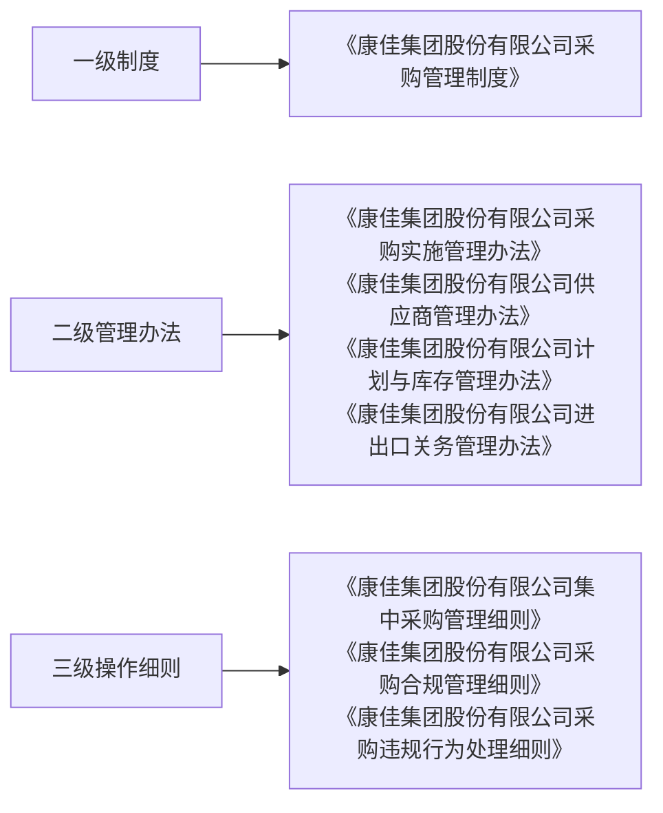
```mermaid
graph LR
  A["一级制度"] --> B["《康佳集团股份有限公司采购管理制度》"]
  C["二级管理办法"] --> D["《康佳集团股份有限公司采购实施管理办法》\n《康佳集团股份有限公司供应商管理办法》\n《康佳集团股份有限公司计划与库存管理办法》\n《康佳集团股份有限公司进出口关务管理办法》"]
  E["三级操作细则"] --> F["《康佳集团股份有限公司集中采购管理细则》\n《康佳集团股份有限公司采购合规管理细则》\n《康佳集团股份有限公司采购违规行为处理细则》"]
```

战略

<table><tr><td>风险类别</td><td>风险细分</td><td>具体描述</td><td>影响程度</td><td>发生的可能性</td><td>影响的时间范围</td><td>影响的价值链环节</td><td>优先级排序</td><td>财务影响</td><td>应对措施</td></tr><tr><td rowspan="2">内部风险</td><td>供应商风险</td><td>供应商选择风险:选择不合适的供应商影响供应链稳定性;供应商信誉风险:供应商信誉不佳导致欺诈、违约;供应商能力风险:供应商能力不匹配导致供应链中断;供应商运营风险:供应商生产中断导致供应链受到影响。</td><td>5</td><td>3</td><td>短期</td><td>上游、运营、下游</td><td>A</td><td>成本增加;供应链中断导致的收入损失。</td><td>建立严格的供应商评估和选择流程;定期对供应商进行信用评估;建立供应商能力评估和监控机制;制定应急计划,寻找备用供应商。</td></tr><tr><td>需求与市场风险</td><td>需求波动风险:季节性、周期性、突发性因素影响需求;需求预测风险:消费者偏好、市场趋势变化导致预测困难。</td><td>4</td><td>4</td><td>短、中期</td><td>运营、下游</td><td>A</td><td>收入波动;库存积压或短缺导致的成本增加。</td><td>加强市场分析和需求预测;建立灵活的生产和库存计划;打造多元化市场和产品线以降低风险。</td></tr><tr><td rowspan="2">外部风险</td><td>全球贸易风险</td><td>贸易争端、关税政策变化等对供应链的跨国活动产生冲击。</td><td>2</td><td>4</td><td>短、中、长期</td><td>运营</td><td>B</td><td>贸易成本增加;市场份额减少。</td><td>密切关注国际贸易政策变化;加强国际贸易合规管理。</td></tr><tr><td>经济风险</td><td>市场经济周期性波动、原材料价格、汇率等经济因素冲击供应链。</td><td>3</td><td>4</td><td>短、中期</td><td>运营</td><td>B</td><td>成本波动;收入不稳定。</td><td>建立经济风险预警机制;拓展多元化采购和销售渠道以降低风险。</td></tr></table>

<table><tr><td>机遇类别</td><td>机遇细分</td><td>具体描述</td><td>影响程度</td><td>发生的可能性</td><td>影响的时间范围</td><td>影响的价值链环节</td><td>优先级排序</td><td>财务影响</td><td>应对措施</td></tr><tr><td></td><td>数智化转型</td><td>新一轮科技革命和产业变革带来数字化、智能化转型的机遇,可提高供应链协同效率。</td><td>4</td><td>4</td><td>中、长期</td><td>运营</td><td>A</td><td>技术转型成本上升;运营成本降低。</td><td>拥抱技术创新,推动供应链数智化转型;加强数字化基础设施建设,提高数据分析和应用能力,增强供应链透明度和协同性。</td></tr><tr><td></td><td>绿色低碳物流</td><td>经济社会发展全面绿色转型,绿色低碳物流成为趋势。</td><td>1</td><td>4</td><td>短、中期</td><td>运营</td><td>C</td><td>运营成本降低</td><td>引入新能源物流车,推进仓储设施绿色化升级。</td></tr></table>

## 影响、风险和机遇管理

康佳在供应链管理中，采取了一系列措施来识别、评估、控制和监控风险与机遇，以保障供应链的稳定性和效率，同时抓住机遇，促进企业的持续发展。

## 风险识别

对供应链的各个环节进行审查和分析，以确定可能存在的风险，包括供应商、原材料供应、物流运输、市场变化、质量控制等方面的全面审查。

## 风险评估

确定风险事件发生的可能性大小，对供应链影响的可能结果范围以及影响程度，预测风险事件可能发生的时间及概率。

## 风险控制

根据风险识别和评估的结果，制定相应的风险管理措施，包括应急预案、供应商多元化、库存管理等策略。

## 风险监控

对供应链中的风险进行持续监控和预警，定期检查风险管理措施的执行情况和效果，及时调整风险管理策略，以应对新的风险或变化。

公司坚持“长期合作、持续改进、风险管理”的选用育留的原则，在供应商准入方面重视资质审核、能力评估、风险评估等，从量化指标、定期评估、激励与反馈等方面进行履约评价及分级应用。

## 供应商生命周期管理

## 具体管理措施

## 供应商入库

业务单元采购招标部室负责查验供应商入库资质资料，进行资质初审，必要时由采购项目组进行实地考察。通过审查的供应商根据类型（工程建设类、非生产经营类、生产经营类），分类录入供应商库。

## 供应商分级

根据供应商的履约能力、服务能力、产品品质等因素，将供应商分为战略供应商（S级)，优选供应商（A级），合格供应商（B级)，备选供应商（C级）和禁选供应商（D 级）。采购项目优先选择评级更优的供应商，战略供应商通常以战略协议直接合作，其他级别供应商通过招标、竞价、询比价等方式选择。

## 供应商评价

定期对供应商进行综合评价，根据评价分数调整供应商等级。业务单元收集并反馈供应商动态信息，对发生重大变更的供应商进行再次核实。

## 供应商风险

SRM 系统定期同步第三方信息共享平台的接口信息，根据系统风险预警设置生成高、中、低风险单据。根据风险单据将供应商分为高风险、中风险、低风险和无风险等级，进行分级合作管理。

## 供应商退出

供应商出现违约、失信等不良行为时，业务单元应中止合作并提出退出申请，经管理部室审核后进入不合格供应商清单做清退处理。

供应商管理- 信息化协同  
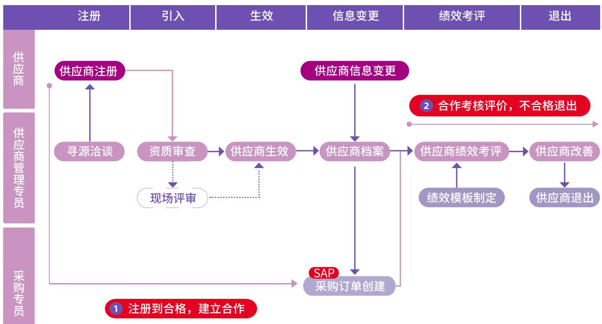

flowchart

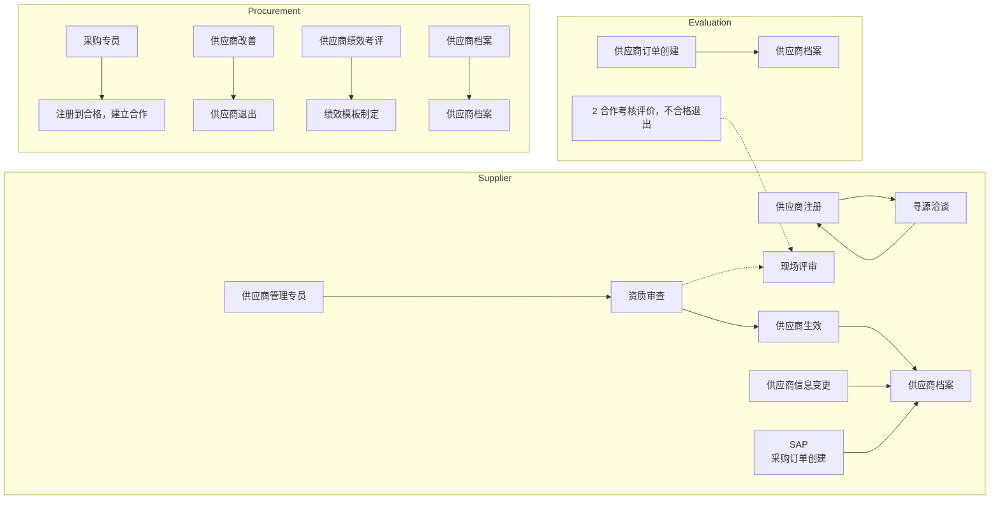
```mermaid
graph LR
  subgraph Supplier
  A["供应商注册"] --> B["寻源洽谈"]
  B --> A
  C["供应商管理专员"] --> D["资质审查"]
    D -.-> E["现场评审"]
  D --> F["供应商生效"]
  F --> G["供应商档案"]
  H["供应商信息变更"] --> G
  I["SAP\n采购订单创建"] --> G
  end

  subgraph Procurement
  J["采购专员"] --> K["注册到合格，建立合作"]
  L["供应商改善"] --> M["供应商退出"]
  N["供应商绩效考评"] --> O["绩效模板制定"]
  P["供应商档案"] --> Q["供应商档案"]
  end

  subgraph Evaluation
    R["2 合作考核评价，不合格退出"] -.-> E
  S["供应商订单创建"] --> T["供应商档案"]
  end
```

  
注册、考察与准入

资质审核：充分考察并核实供 应商的合法性与合规性。

能力评估：确保供应商的生产能力与质量控制符合要求。

风险评估：评估财务稳定性和供应链的可靠性。

  
选用育留主要原则

长期合作：选择有意愿进行长期合作的供应商。

持续改进：鼓励供应商不断优化其产品与服务。

风险管理：与供应商共同管理潜在的供应链风险。

  
履约评价及分级应用

量化指标：使用具体的量化指标来衡量供应商的表现。

定期评估：定期对供应商的绩效进行客观评估。

激励与反馈：根据评估结果提供激励，并提供改进反馈。

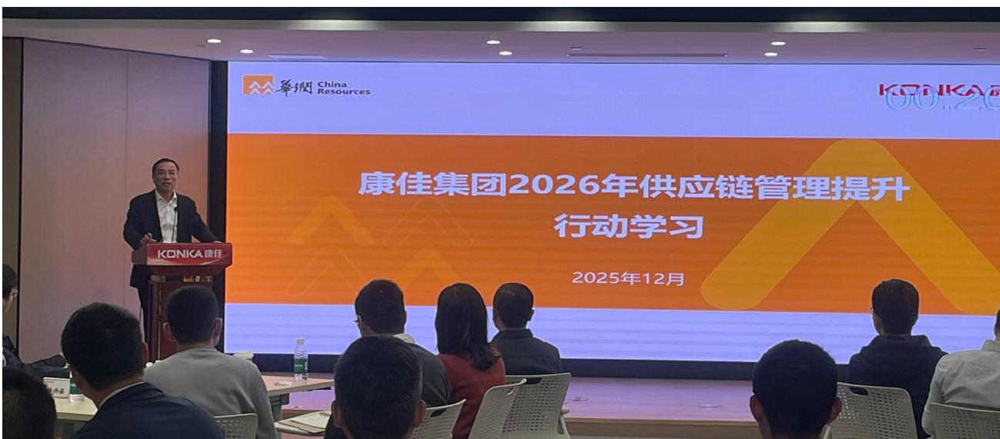

text_image

華潤 China Resources
康佳集團2026年供应链管理提升
行動學習
2025年12月

康佳开展2026年供应链管理提升行动学习

## 指标与目标

<table><tr><td>供应链指标与目标</td><td>2025年目标</td><td>2025年达成情况</td></tr><tr><td>合作供应商廉洁协议签署率</td><td>100%</td><td>100%</td></tr></table>

  
2025年，公司供应商总数为

个12,250

  
合作供应商考核率

100 %

## 数字化管理

康佳 SRM 系统作为招采业务的核心运营平台，包含电子招投标、寻源采购、供应商管理、价格管理、订单管理、出入库管理、结算管理等功能，并与财务共享、合同管理系统、SAP 等系统协同，可覆盖供应链端到端全过程，实现供应链管理全流程数字化。

## 供应链互联互通

SRM 作为招采业务的核心运营平台，包含电子招投标、寻源采购、供应商管理、价格管理、订单管理、出入库管理、结算管理等功能，并与财务共享、合同管理系统、SAP等系统协同，可覆盖供应链端到端全过程，实现供应链管理全流程数字化。

## 对接外部大数据平台

对接企查查核验企业信息、进行供应商准入排查、关联排查、风险排查；对接微信实现标书费、质保金缴纳和退款；对接关务系统进行报关；对接中招网发布招标公告，对接 CFCA 中金电子签章等。

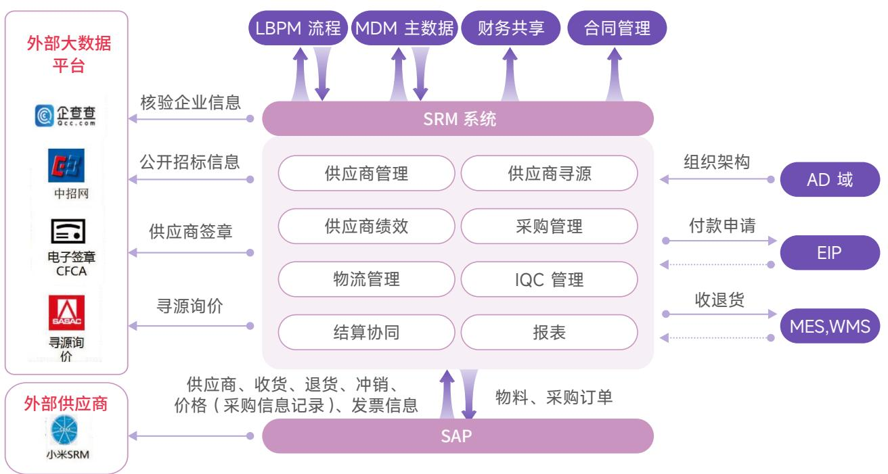

flowchart

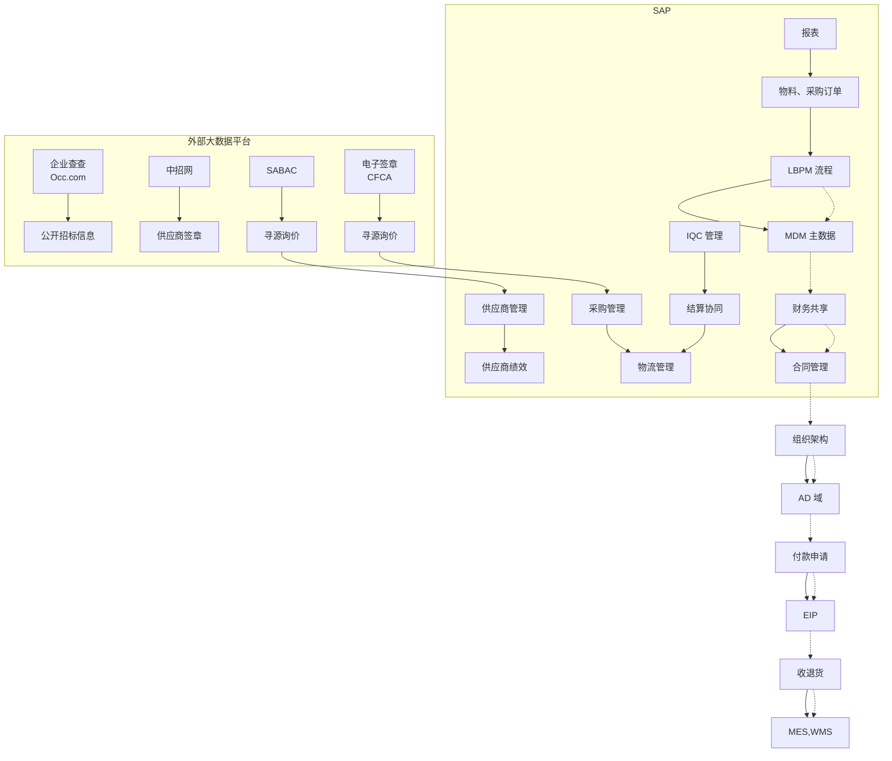
```mermaid
graph TD
  subgraph ExternalBigPlatform["外部大数据平台"]
  A["企业查查\nOcc.com"] --> B["公开招标信息"]
  C["中招网"] --> D["供应商签章"]
  E["电子签章\nCFCA"] --> F["寻源询价"]
  G["SABAC"] --> H["寻源询价"]
  end

  subgraph SAP["SAP"]
  I["供应商管理"] --> J["供应商绩效"]
  K["采购管理"] --> L["物流管理"]
  M["IQC 管理"] --> N["结算协同"]
  O["报表"] --> P["物料、采购订单"]
  Q["LBPM 流程"] --> R["MDM 主数据"]
  S["财务共享"] --> T["合同管理"]
  end

  U["组织架构"] --> V["AD 域"]
  W["付款申请"] --> X["EIP"]
  Y["收退货"] --> Z["MES,WMS"]

  H --> I
  F --> K
  N --> L
  P --> Q
  Q -.-> R
  R -.-> S
  S -.-> T
  T -.-> U
  U -.-> V
  V -.-> W
  W -.-> X
  X -.-> Y
  Y -.-> Z
```

## 平等对待中小企业

康佳严格遵守《中华人民共和国中小企业促进法》《保障中小企业款项支付条例》等法律法规，从中小企业采购的货物或服务，均按照行业规范和交易习惯合理约定付款期限并及时支付款项。

## 04

## 人才赋能

## 绘就暖心家园新篇章

KONKA康佳

## 保障员工权益

## 合法用工

康佳制定《员工招聘管理制度》《员工入离职管理规定（2023版）》等管理文件，规范人才选拔流程与后续管理环节，严格审查候选人年龄等信息，不因性别、年龄、民族等而区别对待，坚决杜绝雇用童工，禁止强迫劳动，实行标准工时制，全面落实各类休假制度，充分保障员工的休息休假权利。

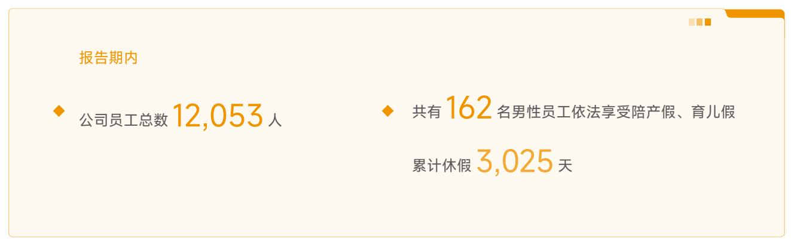

text_image

报告期内
◆ 公司员工总数 12,053 人
◆ 共有 162 名男性员工依法享受陪产假、育儿假
累计休假 3,025 天

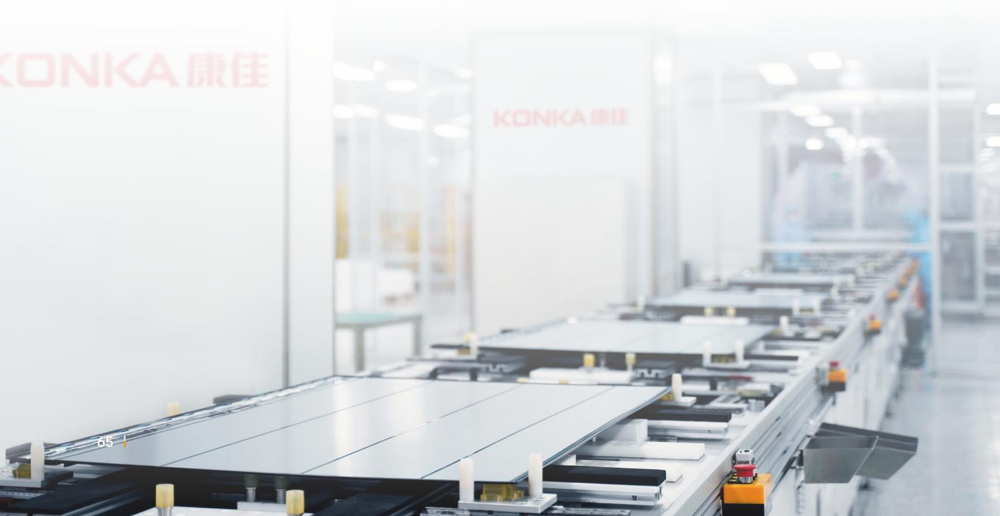

text_image

KONKA康佳
KONKA康佳
65

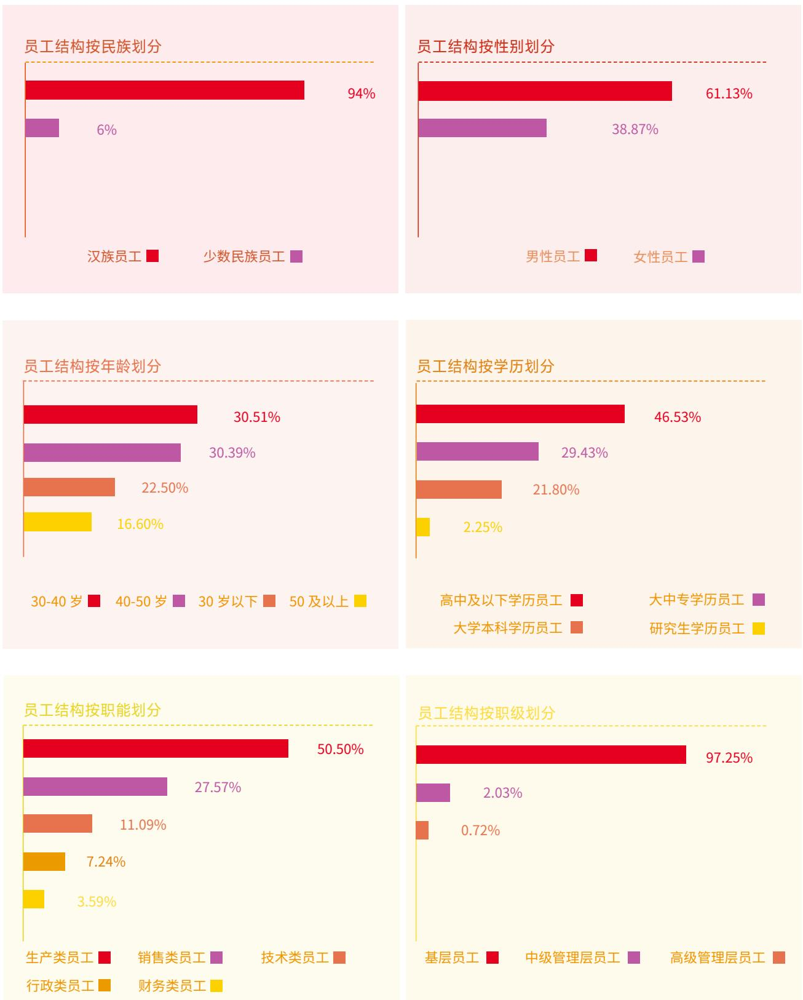

## 薪酬福利

康佳制定《薪酬福利管理办法》《员工绩效管理办法》《休假管理办法》等制度坚持同工同酬不因性别，信仰等因素影响员工薪资；为员工提供社会保险、住房公积金、补充医疗保险等保障，定期组织员工健康体检；落实带薪休假制度，提供工作餐、过节费、防暑降温津贴等福利，充分彰显公司以人为本的理念。

## 民主管理

康佳制定印发职代会制度，构建多层级、多渠道的员工申诉渠道，保障员工合法诉求得到有效表达与闭环处理；指导部分下属单位制定标准化绩效申诉流程，依法合规处置员工绩效异议；推动部分单位增设专项业务反馈渠道，督促经营管理团队定期深入一线调研走访，坚持矛盾源头防范化解，实现员工诉求分类归口、高效响应。2025 年，公司召开职代会4次，并组织召开工会全委扩大会议围绕改革建言献策。

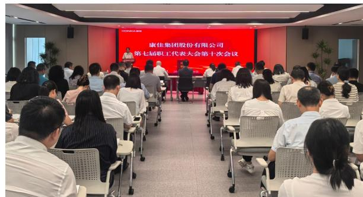

text_image

康佳集团股份有限公司
第七届职工代表大会第十次会议

康佳召开第七届职工代表大会第十次会议

## 保障灵活就业人员权益

康佳秉持灵活用工、多元就业的原则，通过非全日制用工、劳务派遣、业务外包等合规形式，在生产辅助、行政支持、营销推广、技术外包等领域开放灵活就业岗位；搭建规范化、制度化的灵活用工管理与权益保障体系，通过公开招投标遴选资质合规、履约能力良好的合作方，依法签订劳务合作及安全管理协议，明确合作方承担灵活就业人员薪酬支付、社会保险缴纳等法定责任，同时督导下属用人单位落地岗位培训、劳动保护等管理举措，以合规用工实践彰显企业社会担当。

## 畅通发展通道

## 深化员工培训

康佳制定《讲师管理制度》《双积分管理规定（2025 修订版）》等制度，完善培训考核机制，根据员工层级设置积分目标，并将目标达成情况与绩效考核挂钩，设置“最佳知识传承者”“年度学习标兵”等奖项，进一步激励员工提升自我；推进培训平台建设，采用线上线下相结合的培训模式，提供管理、研发、生产制造、供应链、营销、企业文化、职业素养、通用技能等各个领域的培训课程，满足不同员工学习需求。

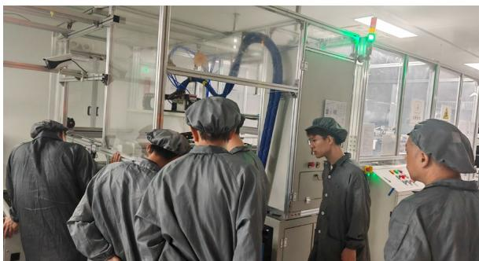

natural_image

Group of workers in cleanroom suits observing equipment in a high-tech facility (no visible text or symbols)

安徽康佳电子有限公司开展  
智造工程类、营销类大学生“传帮带”工作

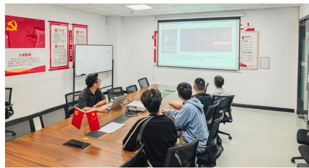

text_image

Meeting room scene with participants seated at a long table, flags bearing Chinese and English flags, and wall posters with political slogans in the background.

康佳芯云半导体科技（盐城）有限公司开展线图转换与设计检查培训

## 促进职业发展

康佳制定《员工职位级别设置及管理办法（2021 版）》《总部专业任职资格与专业级别认证管理办法》等核心制度，构建规范化职级管理体系；建立四大核心序列职级体系，各序列定位清晰、权责匹配，兼顾专业发展与组织需求；设立公开透明的晋升机制，明确各序列任职资格标准、建立规范的职级认证与晋升机制，实行管理通道与专业技术通道并行互通的发展模式，实现员工个人成长与公司高质量发展的双向赋能。

## 四大核心序列

主要涵盖人力资源、财务、行政、法务等各类职能支持岗位，其级别设置贴合专业服务能力与岗位贡献度，参照专业类任职资格标准进行层级划分与认证。  
研发序列：聚焦各类技术研发、产品设计等岗位，涵盖电子技术、机械结构、产品研发等相关领域，职级层级与研发能力，技术成果，项目经验直接挂钩设置从助理级到专家级的完整层级体系  
生产制造序列：主要包括生产操作、车间管理、质量管控、生产技术支持等岗位，职级划分兼顾操作技能、生产经验与管理能力，贴合生产一线岗位特点。  
营销序列：涵盖大客户销售、区域销售、市场推广等各类营销相关岗位，职级晋升以销售业绩、市场拓展能力、客户服务水平为核心导向设置贴合营销岗位特点的层级体系

# 落实员工关怀

## 开展文化活动

康佳深耕“‘菠萝蜜’计划”职工关爱品牌建设，通过组建员工羽毛球、乒乓球兴趣小组等载体，倡导健康生活方式，展现职工昂扬风貌；依托春节、端午等传统节日，开展迎新春饺子宴、端午节等主题活动，全方位丰富职工文化生活。

## 康佳举行迎新春饺子宴

公司 “润心展‘骄’姿，合力竞佳绩” 饺子宴在三楼食堂举行，公司领导与各部室、业务单元、直属机构百余名员工代表欢聚一堂，共迎新春，共话发展。

活动现场，员工代表分成六组开展包饺子比赛，穿插 “新春文化知识竞猜” 等互动环节，气氛热烈。公司领导与员工一同揉面、擀皮，包饺子亲切交流，其乐融融。并根据包饺子的数量、质量员工代表组成 “美食评审团” 评选出相关奖项。大家品尝着亲手包制的饺子，暖意融融，共庆团圆美满的新春佳节。

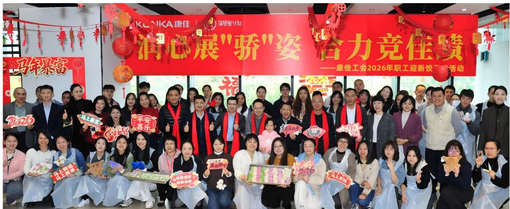

text_image

KENKA康佳
诚梦蜜计划
润心展"骄"姿合力竞佳赞
——康佳工会2026年职工迎新校童活动
马年暴富
福
马上喜乐
平安喜乐
上海好春
上月快乐
日间发礼
2026
大幸福

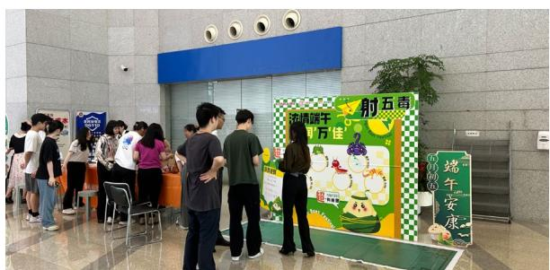

text_image

射五青
端午安床
端午节
万佳

康佳开展端午节系列活动

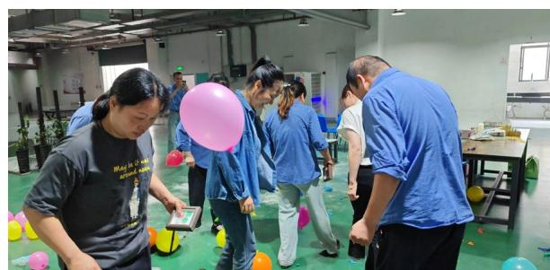

natural_image

Group of people in a rehabilitation or training facility, some using tablets and balloons, no visible text or symbols

安徽康佳电子有限公司开展“嬉闹仲夏六月主题生日会”活动

## 保障女性权益

康佳开展“她力量·聚光芒”2025 年阳光佳人评优暨科技创新巾帼行动表彰活动，评选 10 名女职工为“阳光佳人”；通过开展女职工茶话会及文化自信观影活动，丰富精神文化生活；通过开展技能培训、健康护航等活动切实传递组织温暖，激发了广大女职工立足岗位、建功立业的热情。

2025 年，

公司依法享受孕期、产期、哺乳期相关休假的女性员工共有

累计休假

235 名

21,582.5天

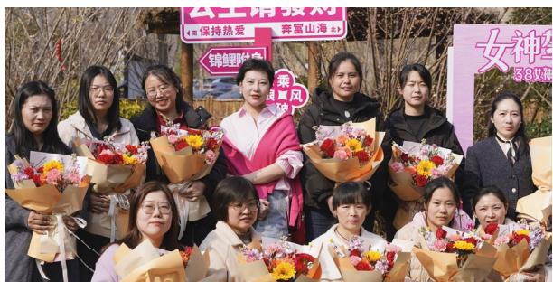

text_image

保持热爱
奔富山海
锦鲤鱼
乘风
女神
第3天

安徽康佳电子有限公司开展“巾帼佳人”评选及户外采风活动

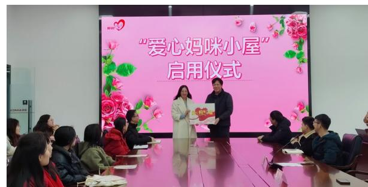

text_image

“爱心妈咪小屋”
启用仪式

重庆康佳光电科技有限公司举办“爱心妈咪小屋”启用仪式

## 开展关怀慰问

康佳始终坚持以员工为中心的工作导向，扎实推进“我为群众办实事”在新春佳节来临之际，公司管理团队成员带领工会组织开展新春走访慰问基层一线职工和看望老干部及困难员工等系列活动，以务实行动传递组织温度，汇聚发展正能量。

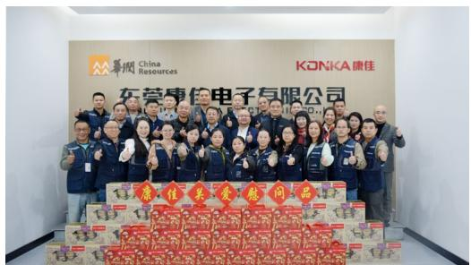

text_image

華潤 China Resources
东莞康佳电子有限公司
KONKA康佳
康佳美菱鑫饲料品

康佳开展迎新春走访慰问基层活动

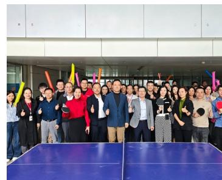

natural_image

Group photo of people posing in front of a blue table tennis court, with colorful balloons and no visible text or symbols.

以球会友 凝聚合力——康佳员工兴趣小组系列活动火热开启  
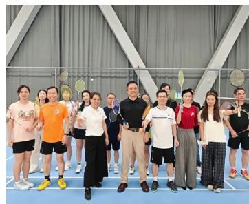

natural_image

Group photo of people posing in a gymnasium with badminton equipment (no visible text or signage)

# 强化安全生产

## 完善安全管理

康佳推进 EHS 管理体系建设，由环境健康与安全部统筹承担 EHS 管理职能，明确“4+5+N”的 EHSQ 制度体系框架，制定发布与 EHS 相关的 3 项一级制度，以及关于人员配备、教育培训、奖项评选 3 项二级制度；制定 2025 年安全生产目标，与各级安全责任人层层签订安全生产责任书，将责任分解至基层一线，确保责任到岗、到人；建立安全生产工作例会机制，公司每月底组织召开安全生产月度例会，推动各级企业结合实际每周、每月、每季度或不定期召开安全工作会议，及时总结安全工作，协调解决安全问题。

全年签订安全生产责任书

18,728 份

## 落实风险与隐患治理

康佳建立“公司－业务单元－企业－部室－班组 / 岗位”分级管控机制，系统识别风险，建立清单台账，明确责任人，并进行定期评估更新；定期对下属企业开展督导检查，督促落实各项安全措施，并实施考核评价，强化责任追究；建立安全隐患报告奖励机制，鼓励员工参与隐患报告；推进科技兴安，设置联锁、急停、隔离等装置，配置自动灭火、火灾自动报警、危化品泄漏自动监测报警等设施，提高设备本质安全水平。

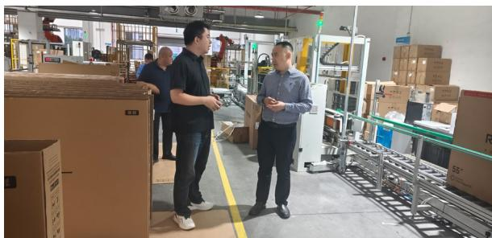

natural_image

Interior view of a factory warehouse with two men conversing near conveyor belts and machinery (no visible text or symbols)

安徽康佳电子有限公司开展隐患排查行动

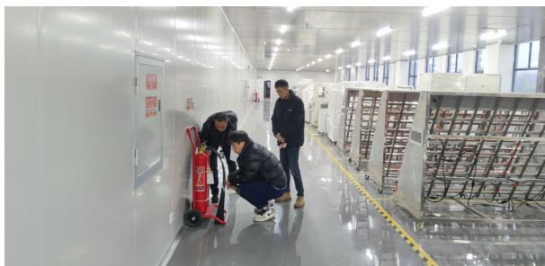

natural_image

Interior view of a cleanroom facility with workers inspecting equipment and safety fencing (no visible text or symbols)

重庆康佳光电科技有限公司开展消防大检查

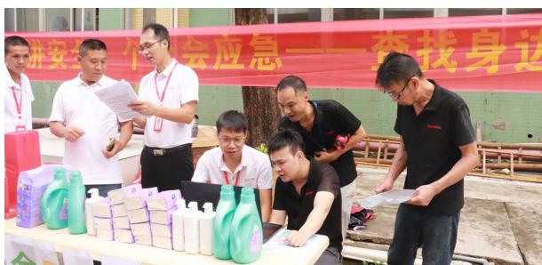

text_image

讲安全 个会应急——查找身边

广东兴达鸿业电子有限公司开展“隐患找茬有奖活动”

natural_image

Illustration of two people using laptops and documents, with a paper airplane flying around them, surrounded by books and decorative elements (no text or symbols)

2025 年

评估统计各类风险源共

1,883 项

无 重大风险

未发生

一般以上生产安全事故

各单位累计开展安全检查

次 1,374

其中领导带队检查

排查隐患

次 409

5,307 项

整改率

%99.5

## 加强安全应急管理

康佳组织各级单位建立应急预案体系，以桌面推演、现场实操、模拟教学等多种形式，常态化开展应急演练，全面提升应急队伍及基层一线人员的应急处置能力与实操技能水平；严格落实应急值班值守制度，紧盯中秋、国庆等重大节假日，以及“桦加沙”“麦德姆”强台风等极端天气，全面执行 24 小时专人值班和“零报告”制度，跟踪了解各单位值班值守情况，确保各项安全工作执行到位。

2025年,各单位现编制实施综合预案、专项预案及现场处置方案等应急预案共

301 个

组织开展应急演练

337 场

共参与

18,210 人次

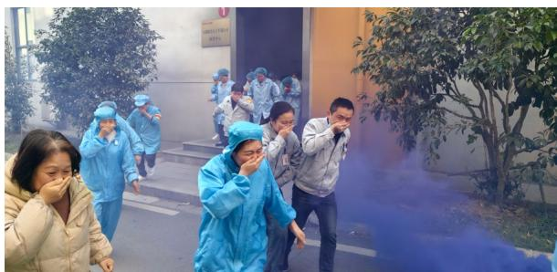

natural_image

Group of people in protective suits and masks exiting a building with smoke rising, no visible text or symbols

安徽康佳电子有限公司开展应急演练活动

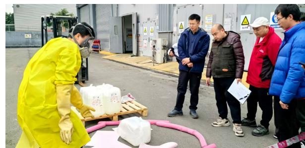

text_image

Street photo showing a person in protective gear handling packaged goods near an industrial facility with visible safety warning signs and personnel.

重庆康佳光电科技有限公司开展危化品泄漏演练

## 培育安全文化

康佳围绕安全生产月、消防宣传月、安全生产法宣传周等重要节点，组织各单位开展系列主题宣教活动；建立康佳“安全云学堂”线上学习教育资源库，通过线上线下相结合的模式，统筹开展安全公开课与安全专题系列培训；推动各级企业结合自身实际，针对性组织开展新员工入职、安全管理人员、特种作业人员及相关方人员的专项安全培训，全面夯实企业安全生产全员基础。

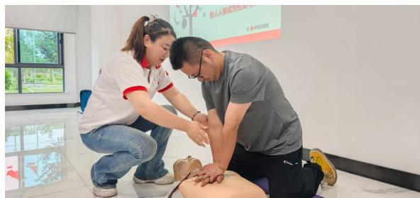

text_image

Photo of a CPR training session with a person performing CPR on a mannequin, background includes Chinese text and a banner.

康佳芯云半导体科技（盐城）有限公司开展急救技能专题培训

## 2025 年

开展安全咨询宣教活动76场  
发放宣教资料 2,465 份  
参与知识竞赛活动超 6.5人次  
使用“安全云学堂”学习超 800人次

参与公开课和专题培训 321人次  
开展一线安全培训 1,888 场，参加培训人数33,781人次，相关方参加人数 727人次

## 守护职业健康

康佳严格遵守《中华人民共和国职业病防治法》《作业场所职业健康监督管理暂行规定》等相关法律法规，制定职业健康管理、劳动防护用品管理、安全警示标志和安全防护设施管理等制度，积极保障员工的职业健康。

2025 年，康佳及 9 家下属企业通过 ISO45001职业健康安全管理体系认证

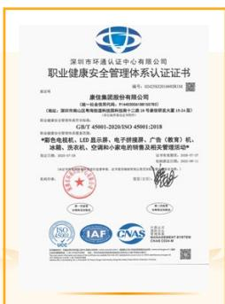

text_image

深圳市环通认证中心有限公司
职业健康安全管理体系认证证书
编号：424035201-04963314
中建集团股份有限公司
（地址：深圳市南山区粤海街道高新科技园区高新三路1号卓越时代大厦18层A座）
注册地址：深圳市南山区粤海街道高新科技园区高新三路1号卓越时代大厦18层A座
ISBN 45001-202035304 45001-2018
*烟台电机厂、LED显示屏、电子显示屏、广告（数字）机、
冰箱、洗衣机、空调和小家电的销售及相关管理工作活动
电话：021-63788888
传真：021-63788888
企业名称：深圳市环通认证中心有限公司
组织机构代码：424035201-04963314
ISO 1999-00000000
IAF
GVS

康佳职业健康安全管理体系认证证书

## 守护职业健康举措

每年委托专业机构开展职业危害因素监测与现状评价，结果向从业人员公开，并针对检测出的职业危害因素，依规为劳动者配备防尘、防毒口罩，防护手套等劳保用品，定期进行校验维护，确保防护用品可以正常使用。  
严格按照国家安全生产及职业健康相关规范标准，在各相关生产作业场所规范设置安全警示标识牌和安全警示标志，并建立长效管理机制，加强公司安全标志、安全防护设施的设置和维护管理工作。  
积极组织职业病防治宣传教育，设立《中华人民共和国职业病防治法》宣传周，通过张贴海报、发放学习资料、观看宣传视频等多种形式普及职业健康知识；定期组织员工开展健康体检，并根据员工体检情况，持续进行项目优化，确保员工健康生产。

## 促进社区发展

康佳扛起央企担当，赋能乡村振兴，积极参与国务院国资委2025年“央企消费帮扶迎春行动”和“兴农周”消费帮扶活动；将公益慈善事业深度融入企业运营过程，持续聚焦弱势群体帮扶、教育振兴支持、生态环境保护等领域，对接社会需求开展多元公益实践，以持续的公益行动为社会传递爱心与温暖，充分展现企业的社会责任与担当，推动社会公益事业稳步发展。

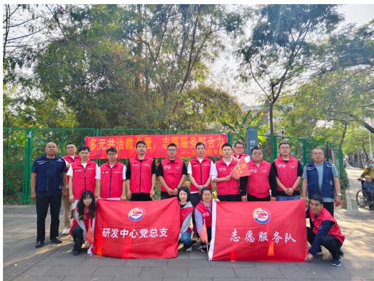

text_image

多元共治微力量，志愿服务聚合力
研发中心党总支
志愿服务队

“文明交通 安全出行”志愿者服务活动

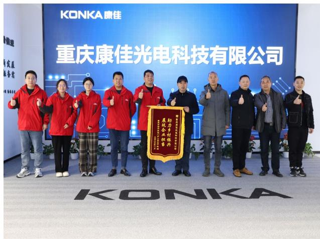

text_image

KONKA康佳
重庆康佳光电科技有限公司
热烈祝贺公司董事长
KONKA

重庆康佳光电科技有限公司  
开展助力乡村振兴志愿服务活动

## 可持续发展管理

## 可持续发展治理架构

康佳将可持续发展理念深度融入企业运营全流程，构建起决策、管理与执行三层次的可持续发展治理架构；将 ESG 作为提高依法治企水平、提高发展质量效益和提高企业竞争力的重要抓手，坚持以人为本、员工共享企业发展的理念，聚焦价值创造，推动公司实现可持续发展。

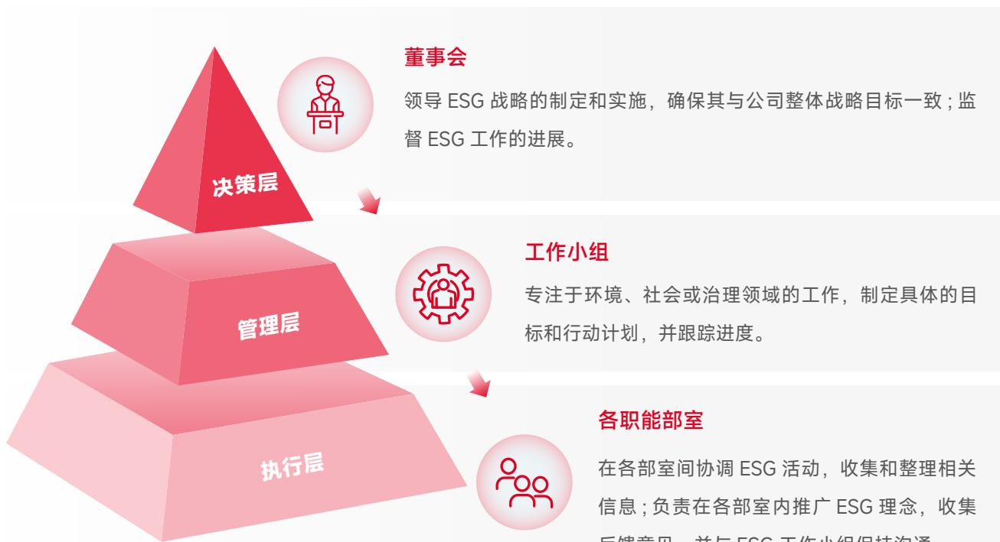

flowchart

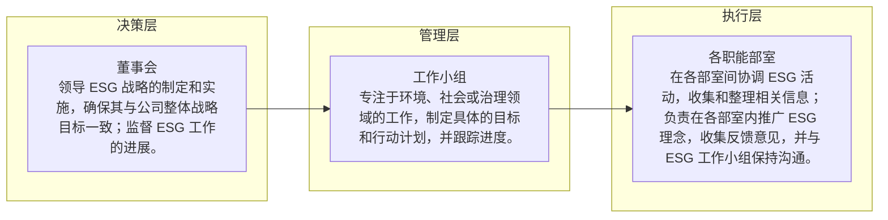
```mermaid
graph LR
  subgraph DecisionLayer["决策层"]
    A["董事会\n领导 ESG 战略的制定和实施，确保其与公司整体战略目标一致；监督 ESG 工作的进展。"]
  end

  subgraph ManagementLayer["管理层"]
    B["工作小组\n专注于环境、社会或治理领域的工作，制定具体的目标和行动计划，并跟踪进度。"]
  end

  subgraph ExecutionLayer["执行层"]
    C["各职能部室\n在各部室间协调 ESG 活动，收集和整理相关信息；负责在各部室内推广 ESG 理念，收集反馈意见，并与 ESG 工作小组保持沟通。"]
  end

  A --> B
  B --> C
```

## 可持续发展管理体系

康佳启动社会责任相关制度建设工作，编制《康佳社会责任工作管理办法》《康佳慈善公益活动管理办法》，进一步明确工作职责、规范管理流程，为公司社会责任工作的系统化、规范化运行提供制度保障与操作指引。

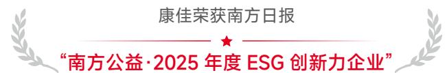

## 利益相关方沟通

康佳将利益相关方的关注要点作为践行可持续发展的重要方向，全面识别对公司业务和运营可能或已经产生重大影响的利益相关方群体，并持续完善与利益相关方的沟通机制，从而及时了解和回应各利益相关方的期望与诉求，携手共创可持续发展价值。

<table><tr><td>利益相关方</td><td>诉求与期望</td><td>沟通与回应</td></tr><tr><td>政府与监管机构</td><td>·依法纳税·推动地方发展·环保常态化</td><td>·政策执行·提供就业机会·响应国家战略</td></tr><tr><td>股东与投资者</td><td>·公司治理·合规信披·畅通沟通渠道</td><td>·稳健诚信经营·定期报告与公告·互动易/投资者热线</td></tr><tr><td>客户及合作伙伴</td><td>·数据安全与隐私保护·产品安全与质量·创新驱动</td><td>·客户满意度调查·提升产品质量·科研创新</td></tr><tr><td>员工</td><td>·员工培训与发展·职业健康与安全·员工权益与福利</td><td>·沟通平台·安全生产管理·员工活动</td></tr><tr><td>供应商</td><td>·供应链管理·合作共赢</td><td>·践行责任采购·合同履约</td></tr><tr><td>社区及公众</td><td>·乡村振兴·社会发展·生态保护</td><td>·交流采访·公益行动·生态保护</td></tr></table>

## 实质性议题分析

康佳面向各利益相关方开展双重重要性议题调研，从“影响重要性”（对经济、环境、社会可持续性影响的重要程度）和“财务重要性”（对公司财务影响的重要程度）两个维度开展重要性议题识别与评估工作，最终确定 2025 年度 ESG 实质性议题29项，形成实质性议题矩阵，并在本报告中进行重点披露和回应。

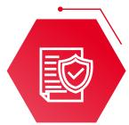

## 议题筛选

根据全球可持续发展趋势、国家政策导向、交易所指引，以及国内外同行业相关议题，识别可持续发展相关议题。

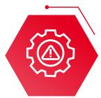

## 重要性评估

通过内部交流和外部沟通，根据利益相关方的关切程度与相关议题对公司发展的影响来筛选并排序。

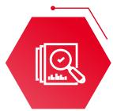

## 议题确定

结合公司战略规划和经营方针，验证议题评估情况，进行重点披露。

2025年度环境、社会和公司治理（ESG）报告双重重要性议题矩阵图  
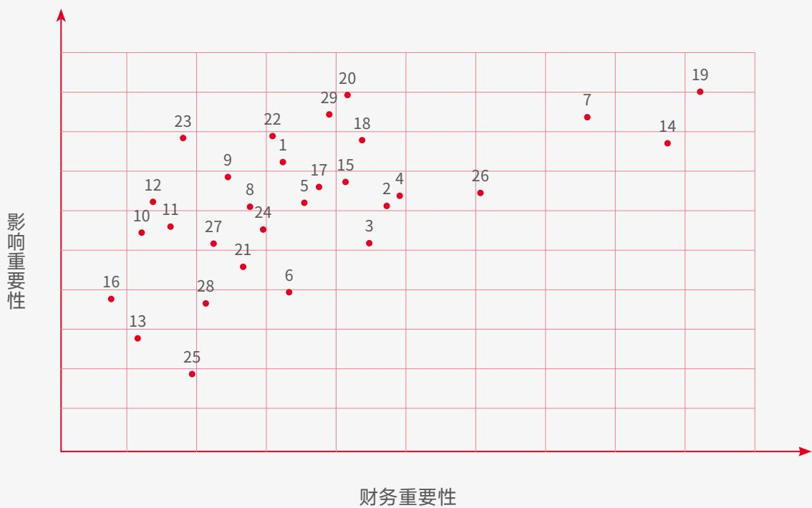

scatter

| Item | 财务重要性 (X) | 影响重要性 (Y) |
| --- | --- | --- |
| 19 | ~9.5 | ~8.5 |
| 7 | ~6.5 | ~7.5 |
| 14 | ~8.0 | ~6.5 |
| 20 | ~5.5 | ~8.0 |
| 18 | ~5.5 | ~7.0 |
| 26 | ~6.5 | ~5.5 |
| 4 | ~5.5 | ~5.5 |
| 2 | ~5.0 | ~5.0 |
| 3 | ~5.0 | ~4.5 |
| 29 | ~5.0 | ~7.5 |
| 15 | ~5.0 | ~5.5 |
| 17 | ~4.5 | ~5.5 |
| 5 | ~4.0 | ~5.0 |
| 1 | ~4.0 | ~6.5 |
| 22 | ~4.0 | ~7.0 |
| 9 | ~3.5 | ~6.0 |
| 8 | ~3.5 | ~5.5 |
| 24 | ~3.5 | ~5.0 |
| 21 | ~3.0 | ~4.5 |
| 27 | ~3.0 | ~4.5 |
| 28 | ~2.5 | ~3.5 |
| 23 | ~2.5 | ~7.0 |
| 11 | ~2.0 | ~4.5 |
| 12 | ~2.0 | ~4.5 |
| 10 | ~1.5 | ~4.0 |
| 16 | ~1.0 | ~3.0 |
| 25 | ~2.0 | ~1.5 |
| 13 | ~1.5 | ~2.0 |

## 序号 议题

1 公司治理  
2 风控合规  
3 反商业贿赂及反贪污  
4 利益相关方沟通  
反不正当竞争  
6 尽职调查  
7 环境合规管理  
绿色运营  
9 绿色设计  
10 废弃物处理

## 序号 议题

11 循环经济  
12 能源利用  
13 水资源利用  
14 应对气候变化  
15 有害物质与污染物管理  
16 生态系统和生物多样性保护  
17 优化客户服务  
18 数据安全与客户隐私保护  
19 产品安全与质量  
20 创新驱动

## 序号 议题

21 科技伦理  
22 员工权益与福利  
23 职业健康与安全  
24 员工培训与发展  
25 平等对待中小企业  
26 产业链供应链  
27 社会贡献  
28 乡村振兴  
29 负责任营销

<table><tr><td>重要性说明</td><td>ESG议题</td></tr><tr><td>同时具有财务重要性与影响重要性议题</td><td>环境合规管理、应对气候变化、产品安全与质量、产业链供应链。</td></tr><tr><td>仅具有影响重要性议题</td><td>能源利用、循环经济、有害物质与污染物管理、废弃物处理、绿色运营、绿色设计、创新驱动、优化客户服务、负责任营销、数据安全与客户隐私保护、员工权益与福利、职业健康与安全、员工培训与发展、社会贡献、反商业贿赂及反贪污、公司治理、风控合规、反不正当竞争、利益相关方沟通。</td></tr><tr><td>一般重要性议题</td><td>生态系统和生物多样性保护、水资源利用、科技伦理、平等对待中小企业、乡村振兴、尽职调查。</td></tr></table>

## 附录

  
关键绩效表

<table><tr><td>关键指标</td><td>单位</td><td>2023年</td><td>2024年</td><td>2025年</td></tr><tr><td colspan="5">治理绩效</td></tr><tr><td>纳税总额</td><td>亿元</td><td>5.45</td><td>4.52</td><td>2.81</td></tr><tr><td>股东会召开次数</td><td>次</td><td>4</td><td>6</td><td>8</td></tr><tr><td>股东会审议通过事项</td><td>项</td><td>32</td><td>23</td><td>25</td></tr><tr><td>董事会成员人数</td><td>人</td><td>7</td><td>7</td><td>9</td></tr><tr><td>董事会会议召开次数</td><td>次</td><td>15</td><td>18</td><td>20</td></tr><tr><td>董事会会议审议通过事项</td><td>项</td><td>92</td><td>77</td><td>84</td></tr><tr><td>董事及高级管理人员报酬(含现任和离任)</td><td>万元</td><td>805.08</td><td>805.91</td><td>587.40</td></tr><tr><td>接待投资者现场调研次数</td><td>次</td><td>9</td><td>16</td><td>5</td></tr><tr><td>接待投资者现场调研人次</td><td>人次</td><td>42</td><td>72</td><td>42</td></tr><tr><td>解答投资者问题次数</td><td>次</td><td>244</td><td>342</td><td>196</td></tr><tr><td>投资者问题回复率</td><td>%</td><td>100</td><td>100</td><td>100</td></tr><tr><td>在互动易与投资者互动次数</td><td>次</td><td>180</td><td>230</td><td>158</td></tr><tr><td>举办投资者开放交流会次数</td><td>次</td><td>1</td><td>1</td><td>2</td></tr><tr><td>对外披露定期报告数量</td><td>份</td><td>4</td><td>4</td><td>4</td></tr><tr><td>对外披露临时报告数量</td><td>份</td><td>63</td><td>72</td><td>97</td></tr><tr><td>参加反商业贿赂及反贪污培训的管理层人数占比</td><td>%</td><td>81</td><td>83</td><td>90</td></tr><tr><td>参加反商业贿赂及反贪污培训的员工人数</td><td>人</td><td>5,393</td><td>5,293</td><td>433</td></tr><tr><td>参加反商业贿赂及反贪污培训的总时长</td><td>小时</td><td>93</td><td>153</td><td>15</td></tr></table>

<table><tr><td>关键指标</td><td>单位</td><td>2023年</td><td>2024年</td><td>2025年</td></tr><tr><td>廉政从业等有关商业道德书签署率</td><td>%</td><td>23.70</td><td>22.97</td><td>100</td></tr><tr><td>廉政从业等有关商业道德书签署份数</td><td>份</td><td>3,343</td><td>3,065</td><td>2,537</td></tr><tr><td>守法合规培训场次</td><td>场次</td><td>9</td><td>13</td><td>9</td></tr><tr><td>守法合规培训人次</td><td>人次</td><td>756</td><td>5,491</td><td>352</td></tr><tr><td>守法合规培训总时长</td><td>小时</td><td>20</td><td>538</td><td>82</td></tr><tr><td>法律知识培训场次</td><td>场次</td><td>12</td><td>8</td><td>10</td></tr><tr><td>法律知识培训参加人次</td><td>人次</td><td>450</td><td>648</td><td>362</td></tr><tr><td>法律知识培训总时长</td><td>小时</td><td>28</td><td>17.40</td><td>64</td></tr><tr><td colspan="5">环境绩效(工业企业)1</td></tr><tr><td>节能总投入</td><td>万元</td><td>2,201.52</td><td>201.63</td><td>178.13</td></tr><tr><td>环保总投入</td><td>万元</td><td>1,643.16</td><td>2,940.70</td><td>1,471.98</td></tr><tr><td>环保事故</td><td>件</td><td>0</td><td>0</td><td>0</td></tr><tr><td>环境领域违法违规事件</td><td>件</td><td>0</td><td>0</td><td>0</td></tr><tr><td>污染物监测合格率</td><td>%</td><td>-</td><td>100</td><td>100</td></tr><tr><td>环保设施同步运转率</td><td>%</td><td>-</td><td>100</td><td>100</td></tr><tr><td>建设项目环保“三同时”执行率</td><td>%</td><td>100</td><td>100</td><td>100</td></tr><tr><td>环保培训次数</td><td>次</td><td>27</td><td>25</td><td>42</td></tr><tr><td>环保培训参加人次</td><td>人次</td><td>545</td><td>1,291</td><td>1,420</td></tr><tr><td>环保培训时长</td><td>小时</td><td>71.50</td><td>89.7</td><td>108.5</td></tr><tr><td>能源消耗总量</td><td>万吨标准煤</td><td>-</td><td>3.21</td><td>3.50</td></tr><tr><td>能源消耗强度</td><td>吨标准煤/百万营收</td><td>-</td><td>4.4</td><td>5.09</td></tr><tr><td>电力消耗量</td><td>万千瓦时</td><td>-</td><td>14,431.20</td><td>14,229.84</td></tr><tr><td>汽油消耗量</td><td>吨</td><td>-</td><td>95.04</td><td>114.94</td></tr></table>

指标统计范围均为工业类型企业此类企业为重点排放单位

<table><tr><td>关键指标</td><td>单位</td><td>2023年</td><td>2024年</td><td>2025年</td></tr><tr><td>柴油消耗量</td><td>吨</td><td>-</td><td>77.46</td><td>78.22</td></tr><tr><td>天然气消耗量</td><td>万立方米</td><td>-</td><td>947.65</td><td>1,264.78</td></tr><tr><td>热力消耗量</td><td>百万千焦</td><td>-</td><td>37,744.63</td><td>31,374.61</td></tr><tr><td>温室气体排放总量</td><td>吨二氧化碳当量</td><td>-</td><td>117,319.54</td><td>113,126.46</td></tr><tr><td>温室气体排放强度</td><td>吨二氧化碳当量/百万营收</td><td>-</td><td>16.11</td><td>16.49</td></tr><tr><td>新鲜水用水量</td><td>万吨</td><td>-</td><td>114.63</td><td>148.27</td></tr><tr><td>重复用水量</td><td>万吨</td><td>-</td><td>128.47</td><td>142.25</td></tr><tr><td>二氧化硫排放量</td><td>吨</td><td>-</td><td>0.95</td><td>0.49</td></tr><tr><td>氮氧化物排放量</td><td>吨</td><td>-</td><td>33.65</td><td>32.57</td></tr><tr><td>烟(粉)尘排放量</td><td>吨</td><td>-</td><td>3.15</td><td>3.18</td></tr><tr><td>挥发性有机排放量</td><td>吨</td><td>-</td><td>15.58</td><td>13.64</td></tr><tr><td>废水排放量</td><td>万吨</td><td>-</td><td>119.95</td><td>108.26</td></tr><tr><td>化学需氧量排放量</td><td>吨</td><td>-</td><td>39.77</td><td>36.5</td></tr><tr><td>氨氮排放量</td><td>吨</td><td>-</td><td>6.47</td><td>4.50</td></tr><tr><td>危险废弃物产生量</td><td>吨</td><td>-</td><td>5,058</td><td>3,851</td></tr><tr><td>危险废弃物处置量</td><td>吨</td><td>-</td><td>5,058</td><td>3,851</td></tr><tr><td>危险废弃物处置率</td><td>%</td><td>-</td><td>100</td><td>100</td></tr></table>

社会绩效

<table><tr><td>科研人员数量</td><td>人</td><td>1,479</td><td>1,422</td><td>1,337</td></tr><tr><td>科研人员占比</td><td>%</td><td>10.48</td><td>10.65</td><td>11.09</td></tr><tr><td>有效授权专利累计数</td><td>项</td><td>2,340</td><td>2,406</td><td>2,411</td></tr><tr><td>有效授权发明专利数</td><td>项</td><td>938</td><td>963</td><td>1,100</td></tr><tr><td>有效授权实用新型专利数</td><td>项</td><td>1,146</td><td>1,187</td><td>1,080</td></tr></table>

<table><tr><td>关键指标</td><td>单位</td><td>2023年</td><td>2024年</td><td>2025年</td></tr><tr><td>有效授权外观设计专利数</td><td>项</td><td>256</td><td>256</td><td>231</td></tr><tr><td>软件著作累计数</td><td>项</td><td>518</td><td>530</td><td>556</td></tr><tr><td>注册商标累计数</td><td>项</td><td>557</td><td>572</td><td>1,029</td></tr><tr><td>发表论文累计数</td><td>篇</td><td>197</td><td>197</td><td>205</td></tr><tr><td>知识产权保护获得的奖惩情况</td><td>项</td><td>15</td><td>23</td><td>24</td></tr><tr><td>专精特新企业</td><td>个</td><td>4</td><td>4</td><td>3</td></tr><tr><td>国家高新技术企业</td><td>个</td><td>12</td><td>10</td><td>8</td></tr><tr><td>博士后工作站</td><td>个</td><td>3</td><td>3</td><td>3</td></tr><tr><td>博士创新工作站</td><td>个</td><td>1</td><td>1</td><td>1</td></tr><tr><td>开展质量风险评估次数</td><td>次</td><td>1</td><td>1</td><td>1</td></tr><tr><td>康佳电视开箱合格率</td><td>%</td><td>98.53</td><td>98.33</td><td>97.57</td></tr><tr><td>康佳冰箱成品批次合格率</td><td>%</td><td>93.10</td><td>93.20</td><td>97.42</td></tr><tr><td>康佳洗衣机成品批次合格率</td><td>%</td><td>96.16</td><td>95.68</td><td>96.69</td></tr><tr><td>康佳空调成品批次合格率</td><td>%</td><td>98.71</td><td>98.45</td><td>98.70</td></tr><tr><td>新飞冰箱成品抽检数量合格率</td><td>%</td><td>99.26</td><td>99.33</td><td>98.01</td></tr><tr><td>新飞冷柜成品抽检数量合格率</td><td>%</td><td>99.30</td><td>99.31</td><td>98.84</td></tr><tr><td>年度质量内审次数</td><td>次</td><td>1</td><td>1</td><td>1</td></tr><tr><td>因健康与安全原因须撤回和召回的产品数量</td><td>件</td><td>0</td><td>0</td><td>0</td></tr><tr><td>质量文化培训人次</td><td>人次</td><td>3,091</td><td>3,280</td><td>2,268</td></tr><tr><td>质量文化培训总时长</td><td>小时</td><td>16</td><td>18</td><td>18</td></tr><tr><td>质量文化培训次数</td><td>次</td><td>8</td><td>10</td><td>13</td></tr><tr><td>客户投诉解决率</td><td>%</td><td>100</td><td>100</td><td>98</td></tr><tr><td>客户满意度</td><td>%</td><td>99</td><td>98.31</td><td>98.92</td></tr></table>

<table><tr><td colspan="2">关键指标</td><td>单位</td><td>2023年</td><td>2024年</td><td>2025年</td></tr><tr><td rowspan="2">客户满意度</td><td>彩电</td><td>%</td><td>99.13</td><td>99.61</td><td>99.76</td></tr><tr><td>白电</td><td>%</td><td>99.22</td><td>97</td><td>98.89</td></tr><tr><td colspan="2">责任营销培训人次</td><td>人次</td><td>4,000</td><td>6,510</td><td>11,900</td></tr><tr><td colspan="2">责任营销培训总时长</td><td>小时</td><td>21</td><td>132</td><td>1,580</td></tr><tr><td colspan="2">责任营销培训次数</td><td>次</td><td>18</td><td>258</td><td>2,380</td></tr><tr><td colspan="2">供应商总数</td><td>个</td><td>7,795</td><td>10,518</td><td>12,250</td></tr><tr><td colspan="2">新增供应商数量</td><td>个</td><td>3,329</td><td>2,723</td><td>1,732</td></tr><tr><td colspan="2">考核供应商数量</td><td>个</td><td>7,795</td><td>10,518</td><td>12,250</td></tr><tr><td colspan="2">员工总人数</td><td>人</td><td>14,106</td><td>13,358</td><td>12,053</td></tr><tr><td colspan="2">少数民族员工数量</td><td>人</td><td>717</td><td>688</td><td>723</td></tr><tr><td colspan="2">劳动合同签订率</td><td>%</td><td>100</td><td>100</td><td>100</td></tr><tr><td colspan="2">员工流失率</td><td>%</td><td>18.60</td><td>17.50</td><td>17.18</td></tr><tr><td rowspan="2">按性别划分的员工流失率</td><td>女性</td><td>%</td><td>17.02</td><td>17.65</td><td>17.43</td></tr><tr><td>男性</td><td>%</td><td>20.59</td><td>17.23</td><td>17.03</td></tr><tr><td rowspan="4">按年龄划分的员工流失率</td><td>30岁以下(不含30岁)</td><td>%</td><td>36.50</td><td>26.36</td><td>25.54</td></tr><tr><td>30-40岁(含30岁,不含40岁)</td><td>%</td><td>20.32</td><td>18.03</td><td>16.73</td></tr><tr><td>40-50岁(含40岁,不含50岁)</td><td>%</td><td>12.68</td><td>9.30</td><td>12.45</td></tr><tr><td>50岁及以上</td><td>%</td><td>10.69</td><td>5.69</td><td>13.45</td></tr><tr><td rowspan="2">按地区划分的员工流失率</td><td>中国大陆地区</td><td>%</td><td>18.60</td><td>17.50</td><td>17.17</td></tr><tr><td>中国港澳台地区</td><td>%</td><td>50</td><td>0</td><td>23.8</td></tr><tr><td colspan="2">工会审议通过项目数</td><td>项</td><td>1</td><td>8</td><td>11</td></tr></table>

<table><tr><td>关键指标</td><td>单位</td><td>2023年</td><td>2024年</td><td>2025年</td></tr><tr><td>参加工会员工比例</td><td>%</td><td>100</td><td>100</td><td>100</td></tr><tr><td>集体谈判协议覆盖率</td><td>%</td><td>100</td><td>100</td><td>100</td></tr><tr><td>社会保险覆盖率</td><td>%</td><td>100</td><td>100</td><td>100</td></tr><tr><td>人均带薪年休假天数</td><td>天</td><td>8.60</td><td>8.20</td><td>7.39</td></tr><tr><td>困难员工帮扶总投入</td><td>万元</td><td>18</td><td>20</td><td>28.5</td></tr><tr><td>困难员工帮扶总人数</td><td>人</td><td>70</td><td>210</td><td>94</td></tr><tr><td>员工培训总投入</td><td>万元</td><td>182.50</td><td>130.54</td><td>45.95</td></tr><tr><td>员工培训人数</td><td>人</td><td>8,840</td><td>8,593</td><td>8,547</td></tr><tr><td>员工培训总时长</td><td>小时</td><td>37,800</td><td>15,638</td><td>87,170</td></tr><tr><td>员工培训人均时长</td><td>小时</td><td>4.27</td><td>1.82</td><td>7.23</td></tr><tr><td>员工培训覆盖率</td><td>%</td><td>62.67</td><td>64.33</td><td>70.91</td></tr><tr><td>员工内部调动或应聘的人数</td><td>人</td><td>3</td><td>21</td><td>224</td></tr><tr><td>专职安全管理人员数量</td><td>人</td><td>58</td><td>81</td><td>81</td></tr><tr><td>安全生产投入</td><td>万元</td><td>851.47</td><td>1,005.47</td><td>807</td></tr><tr><td>安全应急演练数</td><td>场</td><td>238</td><td>388</td><td>337</td></tr><tr><td>安全教育培训场次</td><td>场</td><td>4,902</td><td>1,467</td><td>1,888</td></tr><tr><td>安全教育培训参与人次</td><td>人次</td><td>32,981</td><td>41,226</td><td>33,781</td></tr><tr><td>安全教育培训覆盖率</td><td>%</td><td>100</td><td>100</td><td>100</td></tr><tr><td>员工体检覆盖率</td><td>%</td><td>100</td><td>100</td><td>100</td></tr><tr><td>职业病危害因素检测率</td><td>%</td><td>100</td><td>100</td><td>100</td></tr><tr><td>新增职业病数</td><td>宗</td><td>0</td><td>0</td><td>0</td></tr><tr><td>公益总投入</td><td>万元</td><td>47.80</td><td>48.64</td><td>28.5</td></tr><tr><td>乡村振兴资金投入</td><td>万元</td><td>32.40</td><td>48.64</td><td>17.3</td></tr></table>

  
指标索引

<table><tr><td>深交所指引议题</td><td>对应条款</td><td>报告对应章节</td></tr><tr><td>应对气候变化</td><td>第二十一条至第二十八条</td><td>应对气候变化</td></tr><tr><td>污染物排放</td><td>第三十条</td><td rowspan="2">环境合规管理</td></tr><tr><td>废弃物处理</td><td>第三十一条</td></tr><tr><td>生态系统和生物多样性保护</td><td>第三十二条</td><td>生态友好运营</td></tr><tr><td>环境合规管理</td><td>第三十三条</td><td>环境合规管理</td></tr><tr><td>能源利用</td><td>第三十五条</td><td rowspan="3">资源循环利用</td></tr><tr><td>水资源利用</td><td>第三十六条</td></tr><tr><td>循环经济</td><td>第三十七条</td></tr><tr><td>乡村振兴</td><td>第三十九条</td><td rowspan="2">促进社区发展</td></tr><tr><td>社会贡献</td><td>第四十条</td></tr><tr><td>创新驱动</td><td>第四十二条</td><td rowspan="2">完善创新体系</td></tr><tr><td>科技伦理</td><td>第四十三条</td></tr><tr><td>供应链安全</td><td>第四十五条</td><td rowspan="2">供应链协同发展</td></tr><tr><td>平等对待中小企业</td><td>第四十六条</td></tr><tr><td>产品和服务安全与质量</td><td>第四十七条</td><td>打造优质产品</td></tr><tr><td>数据安全与客户隐私保护</td><td>第四十八条</td><td>用心服务客户</td></tr><tr><td rowspan="4">员工</td><td rowspan="4">第五十条</td><td>保障员工权益</td></tr><tr><td>畅通发展通道</td></tr><tr><td>落实员工关怀</td></tr><tr><td>强化安全生产</td></tr><tr><td>尽职调查</td><td>第五十二条</td><td>可持续发展管理</td></tr><tr><td>利益相关方沟通</td><td>第五十三条</td><td>利益相关方沟通</td></tr><tr><td>反商业贿赂及反贪污</td><td>第五十五条</td><td>加强廉洁管理</td></tr><tr><td>反不正当竞争</td><td>第五十六条</td><td>风控合规管理</td></tr></table>

## 意见反馈

尊敬的读者：

感谢您阅读本报告。为持续提升康佳 ESG 工作，优化公司环境、社会和公司治理（ESG）报告质量，提高 ESG 治理水平，公司诚挚地邀请您对本报告进行评价，推动公司可持续发展的进步。

1.对于康佳来说，您的身份是：

□投资者及股东 □员工 □供应商 □客户 □行业协会或科研机构

□公益组织及社区组织 □媒体 □政府或监管机构 □其他（请注明）

2.您对公司ESG报告的总体评价是：

□非常好 □好 □一般 □较差 □差

3.您认为我们在产品责任方面做得如何：

□非常好 □好 □一般 □较差 □差

4.您认为我们在环境、安全和职业健康方面做得如何：

□非常好 □好 □一般 □较差 □差

5. 您认为我们在员工责任方面做得如何：

□非常好 □好 □一般 □较差 □差

6.您认为我们在公司治理方面做得如何：

□非常好 □好 □一般 □较差 □差

7. 您对我们ESG工作及本报告还有哪些建议？

## KONKA康佳