# 2025 年度

# 环境、社会和公司治理(ESG)报告

natural_image

Illustration of sustainable energy and infrastructure with wind turbines, solar panels, and a car driving on green hills (no text or symbols)

## 目录

领导致辞 01

关于我们 03

践行责任理念筑就长远基业

ESG治理 11

议题重要性评估 14

## 环境篇

## 赋能绿色发展共筑生态未来

厚植绿意 涵养生态 21

提升效能 彰显担当 25

低碳先行 应对挑战 26

## 社会篇

## 创新引领前行责任润泽民生

科技筑梦 智创未来 33

智领变革 质效双升 35

责任筑链 协同共赢 38

育才强企 聚力同行 41

践行公益 服务民生 53

兴农赋能 助力振兴 56

红帆引航 同心奋进 治红帆引航同心奋进 61 61

守正治企 依规运营 63

严守底线 防范风险 66

固本兴业 慎行致远 69

笃守信义共赢未来 笃守信义共赢未来 75 75

## 深化现代治理筑牢发展根基

展望未来 83

附录

ESG数据表和附注 85

指标索引表 90

意见反馈表 93

免责声明 94

## 关于本报告

本报告是天津绿发电力集团股份有限公司连续第五年发布的环境、社会和公司治理(FSG)系列报告，本着客观、真实的原则，详细披露了绿发电力2025年度在积极承担社会责任、有效管理ESG风险与机遇等方面的具体举措、重点实践、亮点案例和关键绩效，旨在积极回应利益相关方期望，并在未来更好地履行社会责任。

## 报告期间

本报告为年度报告。除另作说明外，报告期间为2025年1月1日至12月31日。为增强本报告的可比性和完整性，部分内容可能追溯至以往年份，或具有前瞻性描述

## 报告范围

除另作说明外，本报告范围与公司年度财务报告合并报表范围保持一致。

## 编制依据

本报告主要参考国务院国有资产监督管理委员会《关于新时代中央企业高标准履行社会责任的指导意见》《提高央企控股上市公司质量工作方案》《央企控股上市公司ESG专项报告参考指标体系》(简称《央企ESG指标体系》)，深圳证券交易所《上市公司自律监管指引第17号——可持续发展报告(试行)》《上市公司自律监管指南第3号—可持续发展报告编制》,全球可持续发展标准委员会(ISSB)发布的《可持续发展报告标准(GRI Standards)》以及《联合国可持续发展目标》(UN SDGs 2030）要求编制。

## 数据来源及可靠性保证

本报告引用的全部信息主要来自绿发电力内部文件或有关公开资料，并已通过公司保密审查及董事会审议，绿发电力保证本报告内容不存在虚假记载，误导性陈述或重大遗漏，并对其内容的直实性，准确性和完整性承担个别及连带责任。

## 报告获取途径

您可以在巨潮资讯网（www.cninfo.com.cn）、本公司官网社会责任板块（https://www.cge.cn/cate/30.html）查阅和下载本报告。如需进一步查询，或对本报告及公司ESG工作有任何意见或建议，您可通过以下方式与公司联系：

电话：86-10-85727717

邮箱：cgeir@cge.cn

地址：北京市朝阳区朝外大街5号A座

释义

<table><tr><td>简称</td><td></td><td>全称</td></tr><tr><td>绿发电力、公司、我们</td><td>指</td><td>天津绿发电力集团股份有限公司</td></tr><tr><td>中国绿发、集团</td><td>指</td><td>中国绿发投资集团有限公司</td></tr><tr><td>新疆绿发电力</td><td>指</td><td>新疆绿发电力能源有限公司</td></tr><tr><td>甘肃分公司</td><td>指</td><td>鲁能新能源(集团)有限公司甘肃分公司</td></tr><tr><td>河北分公司</td><td>指</td><td>鲁能新能源(集团)有限公司河北分公司</td></tr><tr><td>江苏分公司</td><td>指</td><td>鲁能新能源(集团)有限公司江苏分公司</td></tr><tr><td>内蒙古分公司</td><td>指</td><td>鲁能新能源(集团)有限公司内蒙古分公司</td></tr><tr><td>青海分公司</td><td>指</td><td>鲁能新能源(集团)有限公司青海分公司</td></tr><tr><td>山东分公司</td><td>指</td><td>鲁能新能源(集团)有限公司山东分公司</td></tr><tr><td>陕西分公司</td><td>指</td><td>鲁能新能源(集团)有限公司陕西分公司</td></tr></table>

## 领导致辞

2025年是“十四五”收官之年，也是公司高质量发展的关键一年。面对严峻复杂市场形势，绿发电力始终以习近平新时代中国特色社会主义思想为指导，坚持党建领航、绿色发展、合规经营、创新驱动，将ESG理念深度融入战略布局与生产经营，以责任践行使命，以绿色书写担当，交出了一份兼具温度、厚度与分量的可持续发展答卷。

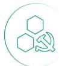

## 我们以党建为魂，筑牢治理根基。

坚持把党的领导融入公司治理各环节，深化党建与主责主业“双融双促”，纵深推进全面从严治党，健全监督体系，强化重点领域全流程管控，确保党中央决策部署落地生根。持续完善现代上市公司治理体系，优化权责架构，强化内控合规与风险管理。坚持依法合规，公开透明，高质量做好信息披露，切实维护各方合法权益，以规范治理夯实可持续发展底座。

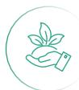

## 我们以绿色为脉，深耕生态责任。

始终将生态文明建设置于重要位置，主动服务国家“双碳”目标与新型能源体系建设，持续扩大光伏、风电、储能装机规模，优化风光储协同布局，全力推进西部新能源大基地建设，以清洁能源供给守护绿水青山。坚持全生命周期环保理念。严格生态保护与修复，深化生物多样性保护。健全供应链ESG管理体系，强化供应商准入与评估，带动上下游协同降碳实现经济效益、生态效益、社会效益有机统一，以绿色实践彰显央企担当。

## 我们以创新为翼，激活发展动能。

坚持把科技创新作为核心竞争力，聚焦新能源关键核心技术攻关，推动自同步电压源友好并网技术示范应用等多项成果入选国家能源领域首台(套)重大技术装备。加快数字化转型，建成总部运营监测平台，推广智慧运维、智能交易决策系统，以AI与大数据赋能精益运营、风险防控与价值创造。实施人才强企工程，打造高素质专业化队伍，以人才与科技双轮驱动，培育新质生产力。

## 我们以责任为本，传递企业温度

始终牢记国企使命，积极服务区域协调发展，深度参与援疆兴疆、乡村振兴，助力欠发达地区能源转型与民生改善坚持以人为本，完善员工权益保障、职业发展与福利关怀体系，打造有归属感、幸福感的企业家园。严守安全生产底线，健全风险防控机制，深化绿色公益与低碳理念普及，在服务共同富裕中传递温暖，以实际行动践行社会责任

初心如磐，使命在肩。绿发电力以党建强基、以绿色赋能、以创新提质、以责任致远，奋力打造资产优秀、业绩优良的一流综合能源服务商，为建设美丽中国、推进中国式现代化贡献更大力量！

董事长、党委书记

总经理、党委副书记

## 关于我们

## 公司简介

绿发电力成立于1986年3月，1993年12月10日在深圳证券交易所上市交易，股票代码为000537。公司是中国绿发新能源产业投资、开发、建设、运营平台，统筹实施专业化管理、集约化运营、国际化发展，是国内最早从事新能源开发的企业之一，业务范围包括陆上风电、海上风电、光伏发电、光热发电、储能等。

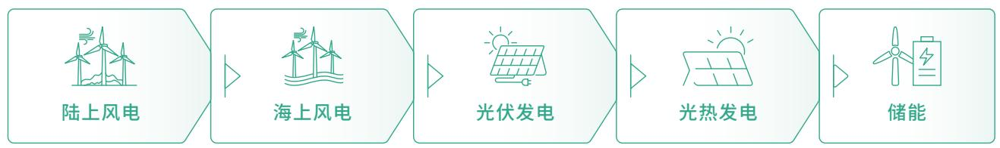

flowchart

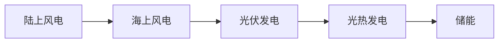

公司以绿色发展为主线，以科技创新为驱动，践行党中央“四个革命、一个合作”能源安全新战略，始终走高质量发展道路，以“做强科技、做优质量、做大规模”为总体思路，坚持规模效益型发展导向，积极研究拓展新业态、新模式，推动产业链延伸拓展、价值链向高端迈进，打造资产优良、业绩优秀的综合型新能源服务产业群，致力于成为世界一流的新能源企业。

## 战略与文化

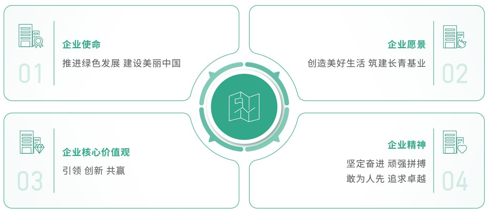

flowchart

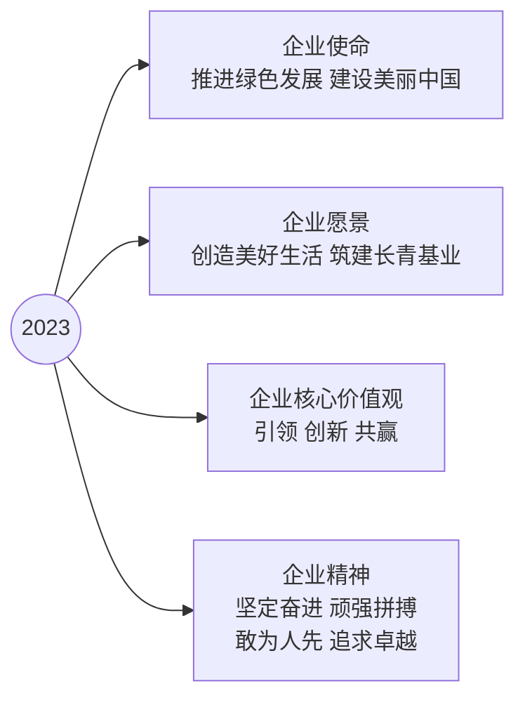

组织架构  
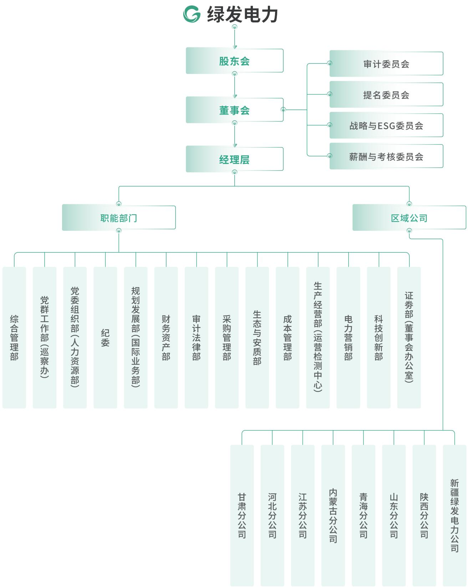

flowchart

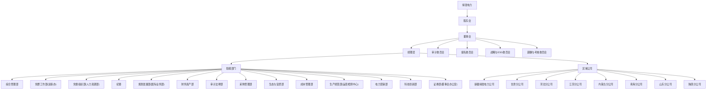

## 发展历程

## 1986

公司成立：公司前身为天津国际商场（后更名为“天津立达（集团）公司国际商场”），成立于1986年3月5日。

## 1992

●公司改制：经国家体改委和天津市人民政府批准，公司进行了股份制改造，改制后的公司名称为“天津立达国际商场股份有限公司”，总股本为10,000 万股。

## 1993

●公司上市：经天津市人民政府和中国证监会批准，公司向社会公开发行人民币普通股3,340 万股,并于1993年12月在深圳证券交易所挂牌交易，股票代码为000537。公司公开发行后的总股本为 13,340 万股。

## 1999

●公司更名：1999年10月，经天津市工商行政管理局核准，公司名称由“天津立达国际商场股份有限公司”变更为“天津南开戈德股份有限公司”。

## 2004

●股权转让：2004年7月，天津南开生物化工有限公司通过司法拍卖竞得本公司 102,725,130 股国有法人股份（占本公司总股本的 25.29 %），成为公司第一大股东。鲁能集团当时间接持有天津南开生物化工有限公司 93 %的股权。 2004年12月，经中国证监会批准，公司以 8,282 万元和 4,949 万元的价格分别收购山东鲁能置业集团有限公司和山东鲁能恒源资产管理有限公司持有的重庆鲁能 41 %和 24.5 %股权。

## 2005

●公司更名：经天津市工商行政管理局核准，公司更名为“天津广宇发展股份有限公司”。

## 2006

股权分置改革：经国务院国资委批准和公司2006年第一次临时股东大会通过，实施股权分置改革。股权分置改革完成后，公司512,717,581

## 2009

股权无偿划转：天津南开生物化工有限公司和山东鲁能恒源置业有限公司将所持公司全部股份无偿划转给鲁能集团有限公司。鲁能集102,632,930 20.02为公司控股股东。2013年，鲁能集团通过深交所交易系统增持公司股份 4,138,837 股，持股比例提升至 20.82 %。

## 2017

实施重大资产重组：向鲁能集团发行股份购买其持有的重庆鲁能34.50 %的股权、宜宾鲁能65.00 %的股权、鲁能亘富100.00 %的股权、顺义新城100.00 %的股权；并同时向世纪恒美发行股份购买其持有的重庆鲁能英大30.00 %的股权。本次发行股份购买资产的发行价格为6.75元/股，向鲁能集团发行的股份数量为1,311,137,870 股，向世纪恒美发行的股份数量为 38,665,269 股。交易完成后，公司股本总额增至 186,252.07万股，其中鲁能集团持有公司股份 141,790.9637 万股，占公司总股本76.13

## 2020

间接控股股东变更：2020年8月，经国资监管部门研究批准，国家电网将其持有的鲁能集团 100 %股权无偿划转至中国绿发。本次收购完成后，中国绿发直接持有鲁能集100 76.13发行人的间接控股股东。

## 2021

●实施重大资产置换:将所持全部 23 家子公司股权置出，置入鲁能集团与都城伟业合计持有的鲁能新能源100 %股权，估值差额部分以现金方式补足。重大资产置换完成后，公司直接持有鲁能新能源100%股权,公司主营业务由房地产开发与销售变更为风能和太阳能的开发、投资和运营。

## 2022

●公司全称变更：经天津市滨海新区市场监督管理局核准，天津广宇发展股份有限公司更名为“天津中绿电投资股份有限公司”。

## 2025

●公司全称变更：经天津市滨海新区市场监督管理局核准，天津中绿电投资集团股份有限公司更名为“天津绿发电力集团股份有限公司”。

## 业务布局

绿发电力围绕国家“十四五”规划和2035年远景目标，在国内结合特高压线路规划，系统谋划大型风电光伏基地和海上风电基地项目，通过建购并举，广泛合作，加快产业转型升级，形成海陆齐发、多能互补、科技赋能的产业布局，在海外依托“一带一路”倡议，践行全球能源互联网发展理念，择机稳妥拓展海外市场，实现基地化、规模化、国际化发展。

目前，公司在青海、江苏、新疆、甘肃、河北、内蒙古、陕西、山东成立8个区域公司，布局内蒙古、河北、新疆、甘肃、陕西、江苏、青海、山东、辽宁、吉林、宁夏、安徽、福建、山西、贵州、广东等多个资源富集省区。

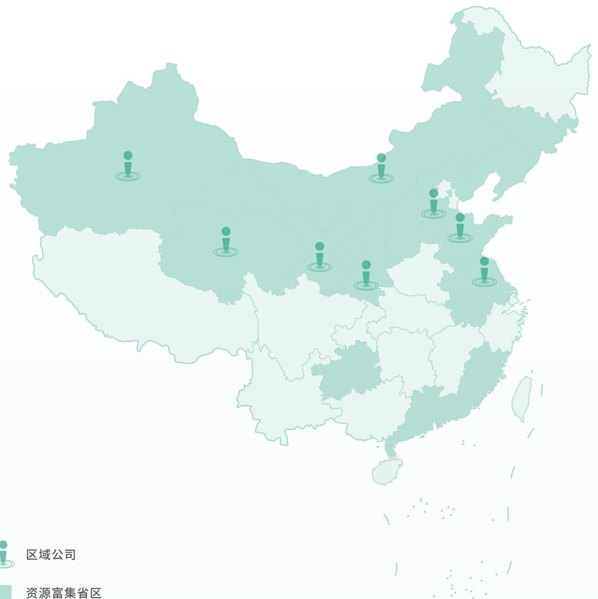

## 截至2025年末

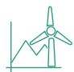

公司建设运营装机规模

3,223.8 万千瓦

年发电量

197.62 亿千瓦时

上网电量

192.30 亿千瓦时

拥有创新工作室

17 个

员工

1,317人

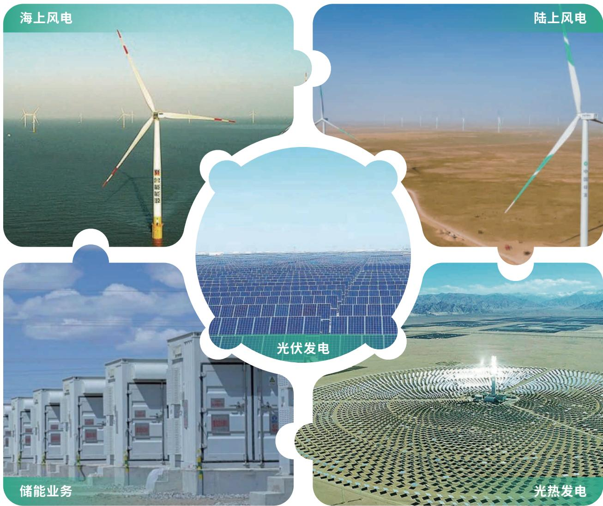

## 荣誉2025

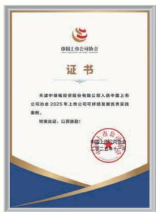

text_image

中国上市公司协会
证书
天津中绿电投资股份有限公司入选中国上市公司协会2025年上市公司可持续发展优秀实施案例。
特发证，以资鼓励！
中国上市公司协会
主办单位：北京三联

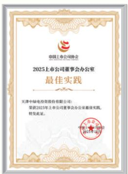

text_image

中国上市公司协会
2025上市公司董事会办公室
最佳实践
天津中绿电股份有限公司：
荣获2025年上市公司董事会办公室最佳实践，
特发此证。
中国上市公司协会
2025年12月

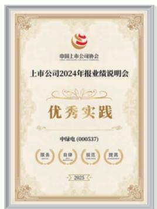

text_image

中国上市公司协会
上市公司2024年报业绩说明会
优秀实践
中绿电 (000537)
服务 自体 视范 提高
2025

2025年可持续发展优秀实践案例

中国上市公司协会

2025上市公司董事会办公室最佳实践

中国上市公司协会上市公司2024年报业绩说明会优秀实践

中国上市公司协会

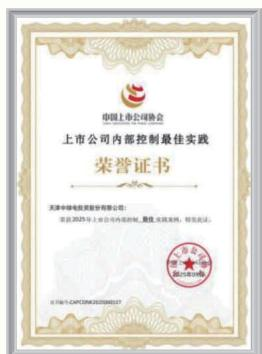

text_image

中国上市公司协会
上市公司内部控制最佳实践
荣誉证书
天津中电控股股份有限公司：
荣获2025年上市公司内部培训、激励、绩效奖杯，特发成功。
TIANJIN CHENGHUA POWER CO.,LTD.
北京中电CAPPON.COMCO2008127

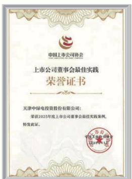

text_image

中国上市公司协会
上市公司董事会最佳实践
荣誉证书

天津中绿电投资股份有限公司：
荣获2023年度上市公司董事会最佳实践案例，
特发此证。

中国证监会
证监许可[2023]14号

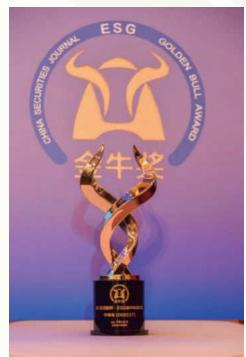

text_image

CHINA SECURITIES JOURNAL
ESG
GOLDEN BULL AWARD
金牛奖
CHINA SECURITIES JOURNAL
ESG
GOLDEN BULL AWARD
金牛奖

2025年度上市公司内部控制最佳实践案例

中国上市公司协会上市公司董事会最佳实践

中国上市公司协会

2025年ESG金牛奖碳中和二十强

中国证券报第十六届全国企业文化成果二等

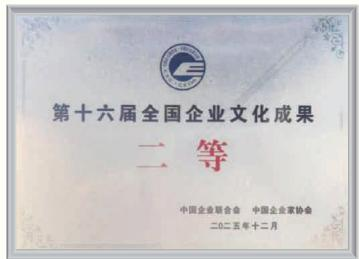

text_image

第十六届全国企业文化成果
二等
中国企业联合会  中国企业家协会
二〇二五年十二月

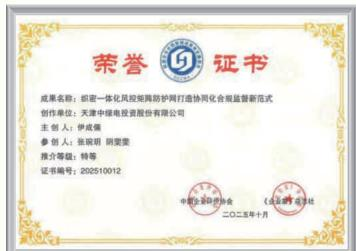

text_image

荣誉证书
成果名称：昭密一体化风能管网防护网打造协同化合规监督新范式
创作单位：天津中绿电投资股份有限公司
主创人：伊成儒
参创人：张骏玥 阳雯雯
推介等级：特等
证书编号：202510012
中国证券业协会
二〇二五年十月
《北京燃气出版社

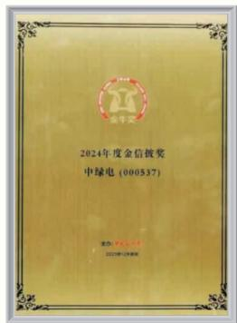

text_image

2024年度金信被奖
中绿电（000537）
主办：徐小平
2024年12月1日

中国企业联合会第四届能源企业合规管理特等奖

中国企业评价协会

年度金信披奖

中国证券报

2025上市公司口碑榜-上市公司最佳董事会奖每日经济新闻

中国上市公司“公司治理特别贡献奖”董事会杂志

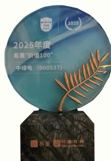

2025年“价值100”奖易董

2025年度上市公司卓越投关建设奖价值在线

## 践行责任理念 筑就长远基业

绿发电力将ESG管理置于战略高度，深度践行创新、协调、绿色、开放、共享的新发展理念，通过持续优化ESG治理架构、强化风险管控体系，稳步提升ESG管理效能，致力于实现企业与环境、社会的可持续共生。

## ESG治理

## 治理

公司深入贯彻落实国务院国资委《关于新时代中央企业高标准履行社会责任的指导意见》相关要求，进一步增强公司履行社会责任的管理能力，实践能力，持续完善ESG治理架构，制定涵盖《ESG工作管理办法(试行)》《董事会战略与ESG委员会工作细则》等相关内部管理文件，构建起“决策层一管理层一执行层”的三级工作联动机制，明确公司各部门、所属子公司职责边界、决策流程及工作标准，进一步强化ESG管理的规范性与专业性，为将环境、社会和公司治理融入企业长期发展战略与日常经营业务筑牢基础。

<table><tr><td>层级</td><td>机构名称</td><td>人员构成</td><td>职权范围</td></tr><tr><td>决策层</td><td>董事会战略与ESG委员会</td><td>由五名董事组成。</td><td>· 董事会战略与ESG委员会是董事会按照股东会决议设立的专门工作机构,主要负责对公司长期发展战略、重大投资决策、ESG相关工作进行研究并提出意见,对执行情况进行监督。</td></tr><tr><td>管理层</td><td>评审小组</td><td>日常办事机构设在发展部。○组长:公司董事长○组员:公司证券部、发展部、财务部、党群部等业务部门负责人及分管领导</td><td>· 对公司ESG相关目标、规划、策略、风险等重大事项进行研究、决策,监督实施进展。· 其中,证券部负责战略与ESG委员会会议的筹备和组织;党群部负责公司ESG方面材料的收集整理。</td></tr><tr><td>执行层</td><td>ESG工作归口部门</td><td>党群工作部(巡察办)</td><td>· 党群部作为牵头部门,负责组织各相关部门和单位统筹推进ESG各项工作;ESG工作具体内容归口管理部门及各成员单位负责ESG工作的具体落实。</td></tr></table>

## 战略

公司以推进绿色发展，推动社会进步及完善公司治理作为公司推进ESG建设，更好履行社会责任的重要内容，推动ESG理念融入公司经营管理实践，增进利益相关方沟通，追求实现经济、社会和环境综合价值的最大化，促进公司价值创造能力和责任品牌声誉提升。

公司定期识别并评估自身所面临的ESG相关风险和机遇，对相关议题的重要性进行评估，并将其纳入公司风险管理体系统一管理，制定风险与机遇应对措施，定期跟踪风险情况。公司所识别出的对经济、社会、环境产生重大影响的ESG相关事项，以及为监测、预防、管理、控制、减缓相关重大影响所采取的措施和行动可见正文中各章节相关内容

<table><tr><td>议题</td><td>预期风险或机遇</td><td>应对措施</td></tr><tr><td>供应链管理</td><td>政策变动导致市场竞争加剧、收益率下滑及偿债风险。</td><td>密切关注国家政策变化,积极推动向上游研发端、制造端和下游应用端和消纳端延伸,推动科技创新降本增效。</td></tr><tr><td>能源利用</td><td>优质新能源资源获取难度不断加大,平准化度电成本控制能力不足,技术进步不符合预期可能造成项目收益不及预期,公司将面临项目投资决策风险。</td><td>持续提升项目运营管理水平,强化可研执行刚性,严格把控项目成本,开拓综合能源服务市场,积极参与电网需求侧响应,推动发展“多能互补”“源网荷储一体化”等模式。</td></tr><tr><td rowspan="2">员工</td><td>新能源行业对高级人才依赖度较高,再加上市场上对具备长期工作经验的技术型管理人才的竞争日益激烈。公司未来可能面临人才流失的风险,影响业务持续发展和技术创新能力。</td><td>通过校企合作、内部培训等方式,提升员工专业技能,同时积极引进高端技术人才。提供具有竞争力的薪酬待遇和职业发展机会,增强员工归属感。建立科学的绩效考核体系,关注员工职业发展规划,降低人才流失率。</td></tr><tr><td>国家发布中长期科技人才发展规划、科技人才激励政策等,鼓励支持人才发展。</td><td>为员工提供多元化的物质、精神保障,吸引人才、留住人才。拓宽引才渠道,为员工提供广阔的职业发展空间、丰富的发展资源和培训计划,尊重和保护员工的人权。</td></tr><tr><td>应对气候变化</td><td>详见应对气候变化章节。</td><td></td></tr></table>

## 影响、风险和机遇管理

公司注重ESG影响、风险和机遇的管理，将ESG职责纳入经营决策和内部控制评估中，推动ESG工作从简单的信息披露向更深层次的治理发展。

## 监督汇报

根据深圳证券交易所上市公司自律监管指南第1号——业务办理相关要求，管理层每年度向董事会报告一次社会责任报告。

## 评价考核

建立ESG评估改进机制，追踪年度工作计划和目标执行情况并改进，并上报公司ESG工作领导小组。包括FSG工作的结果与预期符合程度、ESG管理的成熟度、重视度、改进与创新、外部FSG评级表现等，维度包括目标完成度、提报时效性、数据完整性、数据准确性、内容平衡性、案例丰富性等。

## 培训交流

为提升ESG管理相关专业能力，公司决策层与管理层不断提升可持续相关的知识与技能，同时邀请专业ESG团队开展培训交流，分享可持续发展最新动向与ESG评级要点，积极参与国内外有关交流活动，针对关键ESG议题沟通交流，助力公司在可持续发展道路上稳步迈进。  
积极探索多元途径，搭建与利益相关方高效互动的桥梁，促进利益相关方及时、准确了解公司履责情况，增强利益相关方的认同感与信任度。

## 奖惩机制

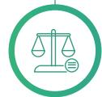

对ESG工作表现突出的单位和个人予以表彰奖励，激励全员参与ESG实践:对因工作不力、失责失位或处置不当造成严重后果的单位和个人，严格追究责任，确保ESG工作高效落实。

## 指标和目标

公司参照国务院国资委《央企控股上市公司ESG专项报告参考指标体系》和深圳证券交易所《上市公司自律监管指引第17号—可持续发展报告(试行)》等文件要求，全力提高ESG相关数据收集，核算与分析的信息化，数字化水平，增强所披露数据的可靠性与可比性，不断提高ESG信息披露质量。报告期内，公司在年度工作计划中明确全年目标及相应考核指标，包括环境、社会及治理(ESG)等领域。经研判，本报告中披露具有财务重要性议题指标设定及完成情况，具体情况详见正文各章节相关内容。

## 议题重要性评估

绿发电力根据深圳证券交易所相关文件指导，从自身所处行业特点、商业模式等出发，综合考虑各利益相关方的核心关切，并兼顾本报告的信息连续性、内容可读性与逻辑完整性，结合专业方法论解读和辅导，定期开展FSG议题重要性评

## 双重重要性分析

公司持续完善ESG议题双重重要性分析机制，以“开展背景研究一建立议题清单一评估与确认重要性一形成议题报告”为路径，聚售“财务重要性”与“影响重要性”两大维度，开展双重重要性评估、排序及筛选工作。报告期内，公司在上年度重要性议题基础上，结合对相关及潜在重点领域的最新评估后筛选得出

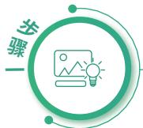  
开展背景研究

充分考虑公司活动和业务关系。  
充分调研ESG政策与标准、ESG评级及同行实践。  
●明确利益相关方类型，建立并维持联络。

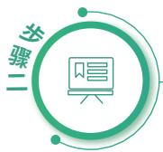  
建立议题清单  
●以上年度ESG议题识别结果为基础，结合国家相关政策、ESG规范标准、公司业务特点、资本市场评级要求以及同行业议题对标分析结果，并形成议题清单。

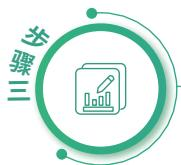  
评估与确认重要性

对经济，社会和环境影响的重要性·从影响规模，范围，发生可能性及补救性等维度出发，综合考虑相关议题的表现可能造成的影响，形成议题影响重要性分析结果。  
对公司财务的重要性·综合考虑议题的风险和机遇对公司商业模式业务运营、发展战略、财务状况等产生的影响程度和发生的可能性形成议题财务重要性的分析结果。

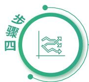  
形成议题报告

在ESG报告中披露议题重要性的分析过程、方法与结果，并在报告中进行针对性回应。

## 利益相关方沟通

公司高度重视利益相关方的诉求，深刻认识到兼顾各方合理诉求是实现可持续发展，构建负责任企业形象的关键通过分析公司商业关系网络，结合业务开展过程中的业务场景，识别出五类主要利益相关方，分别为：政府/监管机构、股东/投资者、客户、员工、社区及公众。报告期内，公司持续完善利益相关方参与机制及沟通方式，主动获取各利益相关方对公司有关环境、社会及治理方面的意见与建议，并积极回应各方期待。

<table><tr><td>利益相关方</td><td>政府/监管机构</td><td>股东/投资者</td><td>客户</td><td>员工</td><td>社区及公众</td></tr><tr><td>[4CTD]关注议题</td><td>·信息披露·合规管理·经营状况·所处行业风险</td><td>·市值管理·利润分配·信息披露·合规管理·投资者关系管理</td><td>·可靠电力·绿色技术·诚信合规经营</td><td>·基本权益保障·个人发展·职业健康·员工福利·员工关怀</td><td>·促进社区发展·优化营商环境·参与社区公益</td></tr><tr><td>沟通渠道</td><td>·监管问询函件·现场沟通·书面沟通·电话沟通</td><td>·指定信息披露媒体发布临时公告·指定信息披露媒体发布定期公告·业绩说明会·投资者网上集体接待日活动·投资者线上线下交流会·投资者走进上市公司·互动易·投资者热线·公司官方邮箱</td><td>·优化产业链布局·专项沟通与答疑·日常沟通·客户服务热线</td><td>·公平的晋升通道·专业培训与职业发展·职工代表大会·落实安全生产·日常沟通</td><td>·社区建设·慈善公益·交流沟通</td></tr><tr><td>沟通频次</td><td>·不定期·不定期·不定期·不定期</td><td>·不定期·定期·定期·不定期·不定期·不定期·不定期</td><td>·不定期·不定期·不定期·不定期</td><td>·不定期·不定期·不定期·不定期·不定期</td><td>·不定期·不定期·不定期</td></tr></table>

## 重要性分析结论

公司注重强化议题重要性评估的严谨性，以利益相关方调研结果为基础，采用定性与定量相结合的分析方法，综合者量各利益相关方关注点与公司战略的契合度，全面识别可持续发展核心议题，以确保评估结果的全面性和科学性，同时明确信息披露要点形成从评估分析到落地执行的完整闭环，为后续信息披露工作及日常运营管理提供指引。

## 报告期内

公司按照“开展背景研究一建立议题清单一评估与确认重要性—形成议题报告”四个步骤有序开展评估工作，系统性地识别出 1 项双重重要性的议题， 2 项财务重要性的议题，16 项影响重要性的议题，其余议题既不具备财务重要性也不具备影响重要性。根据上述重要性议题评估结果，公司编制2025年度重要性议题矩阵。

  
开展背景研究

通过行业调研识别与公司相关的重大趋势，结合公司业务特点、国家政策、资本市场关注要点，识别潜在议题。

通过对公司领导、内外部专家、直属单位、员工、客户、供应商等利益相关方沟通，充分了解内外部利益相关方对公司重要性议题的意见，识别影响、风险和机遇，并汇总形成议题清单。

  
建立议题清单

  
评估与确认重要性

进行财务重要性、影响重要性评估，同时综合国家政策、资本市场关注要点、同业表现等，生成重要性议题分析结果。

汇总分析流程、方法及结论并向公司管理层进行汇报，确认本报告重点披露内容以及未来ESG管理的工作目标及实施计划

  
形成议题报告

## 2025年度重要性议题矩阵

##

科技伦理  
产品和服务安全与质量  
反商业贿赂及反贪污

生态系统和生物多样性保护  
环境合规管理  
数据安全与客户隐私保护

ESG治理

##

平等对待中小企业  
员工  
利益相关方沟通  
反不正当竞争

污染物排放  
废弃物处理  
创新驱动

应对气候变化

##

乡村振兴  
○社会贡献  
尽职调查

能源利用  
水资源利用  
循环经济

供应链安全

一般重要

对公司财务的重要性

非常重要

## 环境篇

##

## 赋能绿色发展共筑生态未来

绿发电力锚定国家“双碳”战略方向，统筹推进生态保护、低碳转型与气候治理工作。公司以技术创新与制度建设协同发力，夯实绿色发展根基，深化绿电交易实践与碳资产管理，提升产业价值创造能力，以务实的绿色实践践行能源央企使命担当，为生态保护与气候治理贡献可推广的实践经验。

厚植绿意涵养生态

提升效能彰显担当

低碳先行 应对挑战

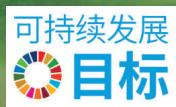

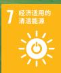

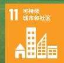

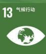

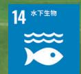

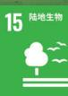

## 厚植绿意 涵养生态

绿发电力立足能源央企使命担当，将资源高效利用与生物多样性保护融入绿色发展全流程，严格遵守国家生态环境保护法律法规，持续深化资源集约利用与生物多样性保护实践，全面扛起生态环境保护政治责任与主体责任。

## 推动资源高效利用

公司严格遵守《中华人民共和国环境保护法》《中华人民共和国能源法》《能源企业环境保护、社会责任和公司治理披露指标体系与评价导则》及相关生态环境保护的法律法规要求，制定并执行《绿色能源产业合规指南》《生态环保管理办法》等内部管理制度，落实生态环保责任，加强环境管理。

## 报告期内

公司未发生突发重大环境事件、污染物排放等违法违规或负面事件。

## 水资源管理

公司水资源消耗主要集中在场站生活用水和项目建设用水，包括地下水和地表水，获取方式为市政管网购置和地下水开采。在生产经营过程中，公司严格按照当地监管要求，优先使用市政管网用水，仅偏远地区需采取外运购水和自行开采少量地下水结合的方式满足生活用水，且自行开采地下水均已取得采水许可证书，不涉及由取水，耗水，排水或储水量变化导致的直接或间接水资源重大影响。公司仅产生生活污水，简单处理后排入市政污水系统。

<table><tr><td>指标</td><td>单位</td><td>2024年</td><td>2025年</td></tr><tr><td>总耗水量</td><td>吨</td><td>282,087.1</td><td>187,825.64</td></tr><tr><td>新鲜水取量</td><td>吨</td><td>264,391.4</td><td>170,793.85</td></tr><tr><td>循环用水总量</td><td>吨</td><td>17,695.7</td><td>17,031.79</td></tr><tr><td>循环水用量占比</td><td>%</td><td>6.27</td><td>9.07</td></tr></table>

## 循环经济

公司主要物料为场站电力生产设备、风电机组、光伏组件及电力系统相关设备及附件。在生产经营过程中，强调建立资源节约和循环利用机制，通过减少资源消耗、加强废弃物回收利用、再生利用等措施，有效提高资源利用效率，实现经济与社会效益的双赢。

加强场站备件的循环利用，采用备件维修等修旧利废手段，显著提升物资循环利用水平。

优先使用可循环利用的材料，积极与原材料制造及回收单位合作，确保废弃物资的充分利用。

采用轻量化、减量化包装设计理念，确保外包装可循环利用，避免额外环境负担。

对物料存储实施分类管控，保障物资整洁与安全，并在运输环节运用智能化监控手段，确保物资状态全程可控。

## 案例 创新探索防沙治沙与光伏耦合发展，将沙海转化为“绿能蓝海”

公司以“沙戈荒”大基地建设为突破口，依托新疆优越的光风资源，推进光伏、风力清洁发电项目落地新疆尼勒克、米东、若羌等共计1,200万千瓦项目创下国内单体容量最大“沙戈荒”光伏项目并网纪录，有效降低当地传统化石能源依赖。其中，位于塔克拉玛干沙漠与库木塔格沙漠交汇处的若羌县(太阳能|类区、全疆十大风区之一)，公司创新探索防沙治沙与光伏耦合发展模式，将光伏板高度提升至3.18米，既降低地表风速、减少风蚀，又借助遮荫效应提升板下土壤含水量，为沙生植物生长创造条件。该项目光伏板遮阳面积达58.810亩，桩基固沙99.082平方米，成功将沙海转化为“绿能蓝海”，为塔克拉玛干沙漠防沙治沙工作作出突出贡献

## 保护生物多样性

公司认识到企业运营和生产活动对生物多样性的潜在影响，基于《中华人民共和国野生动物保护法》《中华人民共和国草原法》《中华人民共和国海洋环境保护法》等法律法规要求，创新绿色能源发展模式，积极探索智慧能源服务，充分发挥复合与多能互补优势，因地制宜拓展新能源业务，助力保护项目当地环境。

新能源建设项目多处于荒漠、戈壁、无人区域，项目周围动植物资源稀少，项目建设和运营阶段对周围动植物影响有限。公司在项目前期，开展环境影响评价并制定水土保持方案；项目竣工后，开展包括水土保持和草地林地复垦工作相关的项目环保验收；项目运行后期，对当地环境影响较小，主要涉及处理少量废油脂，规范处理少量生活垃圾和生活污水。

## 案例 江苏分公司开展海洋环境实地监测

江苏分公司持续开展海洋生态环境监测，包括对鸟类、水质、水文、生态、沉积物、海流、生物质量等指标的监测，及时掌握海洋环境情况，对异常事件及时发现，第一时间采取有效的措施，保护海洋环境。积极开展增殖放流，2025年6月，公司在东台市条子泥垦区启动海洋生态补偿与修复专项行动，共投放三疣梭子蟹蟹苗25.64万尾。截至目前，已在东台、黄沙洋等海域累计开展多轮增殖放流，涵盖8种海洋生物，总数量达9,225万余尾，对改善当地海洋生物种群结构起到了显著作用。

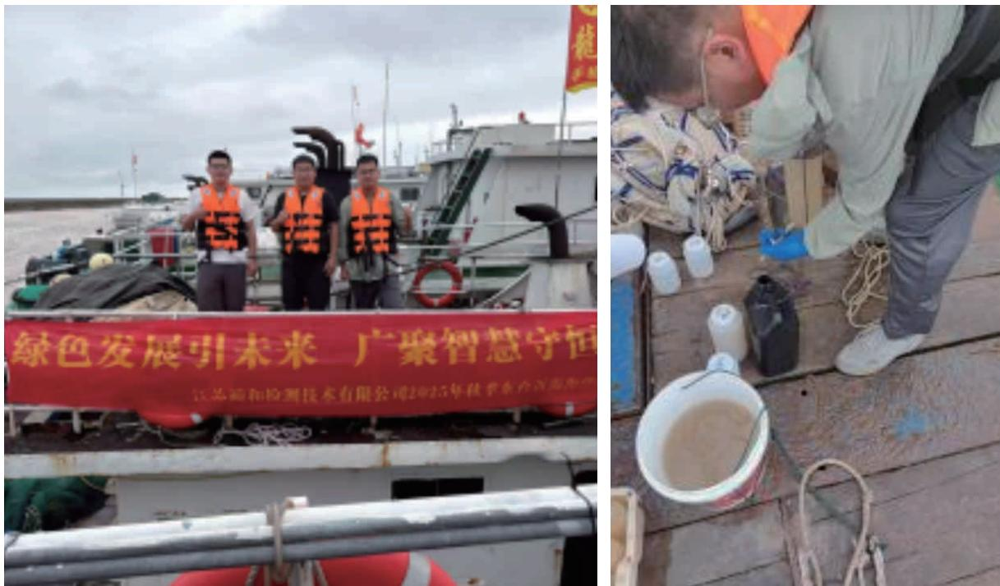

## 案例 降低用海面积，保护海洋生态

公司响应政府保护海洋生态、降低用海面积的号召，将实际用海面积压缩至29.8平方公里，既减少养殖用海占用，又远离国家级珍禽自然保护区。为守护鸟类生存，公司通过陆上集控中心鸟类观测平台的24小时视频监测设备，实时监测周边湿地、滩涂及海面鸟类生存情况，候鸟迁徙期间及时调整风机转速开辟安全通道；同时在风机塔筒绘制鸟类警示标识、定期组织志愿者清理滩涂垃圾，营造良好栖息环境。如今，该海域候鸟种群数量逐年增加，黑脸琵鹭、鸻鹬等珍稀鸟类频繁现身，形成风机与海鸟和谐共生的生态画卷。

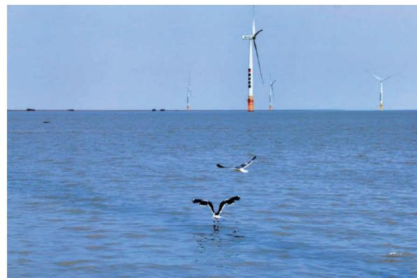

natural_image

Offshore wind farm scene with multiple turbines and seagulls in the ocean (no text or symbols visible)

## 案例 公司推进海西州多能互补集成优化国家示范工程

在生态敏感脆弱的青藏高原，昆仑山与可可西里相映成趣。野牦牛，藏野驴等珍稀野生动物在此自由栖息，构成“世界第三极”独特生态景观。绿发电力秉持“绿色发展、生态优先”理念，扎根海拔高、风沙大、人迹罕至的柴达木盆地，推进海西州多能互补集成优化国家示范工程(2017年于平均海拔2.800米处破土动丁)。项目建设由，团队克服高原缺氧等困难，通过多次施工模拟，科学制定方案，规范车辆路线，减少基础开控等举措，全力保护原始地貌，推动实现“站进沙退”的生态转变。此外，团队除保障场站机组安全稳定运行外，还通过每日巡视、安装红外相机、张贴保护铭牌、悬挂“小鸟之家”等方式，开展驻地及周边生物多样性保护工作，截至目前，已观测发现长耳跳鼠、普氏原羚等珍稀物种，用行动守护高原生态

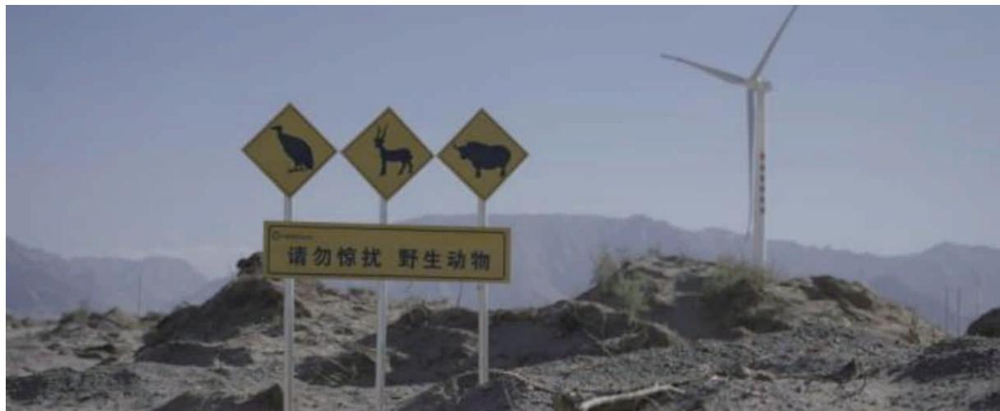

text_image

请勿惊扰 野生动物

## 提升效能 彰显担当

公司立足绿色发展使命，将绿色低碳理念融入企业文化建设，积极引导全体员工践行生态环保责任，着力营造全员参与、共建共享的环境保护良好氛围，推动低碳生活、绿色办公成为全员自觉行动，为企业深化绿色运营筑牢全员根基。

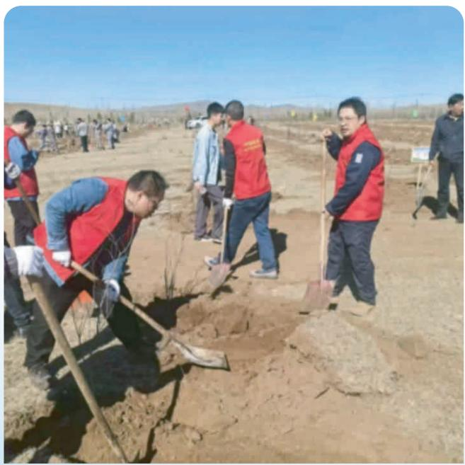

natural_image

Group of people planting soil in a dry, open field under clear blue sky (no visible text or symbols)

公司始终将生态保护置于可持续发展战略的重要位置。报告期内，公司积极组织员工志愿者参与义务植树活动，在青海西宁、甘肃酒泉、河北承德、陕西宜君等重要生态功能区，规模化栽植适生乔灌木。此举不仅是公司践行“双碳”目标的常态化举措，亦是以具体生态增量

natural_image

Aerial view of a wind farm with transmission towers and green fields, no visible text or symbols.

## 低碳先行 应对挑战

绿发电力始终将应对气候危机视为践行社会责任的核心命题与实现高质量发展的战略机遇，深度锚定“双碳”目标与联合国可持续发展议程，以“构建气候韧性、推动绿色转型”为核心导向，全面融入企业治理、生产运营与价值创造全链条，以长远视角统筹环境效益与经济价值，为推动全球气候治理、实现人与自然和谐共生贡献力量。

## 治理

公司已建立健全气候相关治理架构，形成以董事会为决策核心、可持续发展委员会为专门监督管理机构、管理层为执行主体的三级治理体系。其中，董事会作为最高决策层，统筹规划气候相关战略方向；可持续发展委员会作为专门委员会，由董事会直接领导，具体负责气候相关影响、风险和机遇的监督管理工作；管理层下设气候管理办公室，作为日常执行机构协调各业务部门推进气候相关工作

公司气候相关治理机构的核心工作任务包括定期识别与评估气候因素对生产经营、供应链、市场拓展等方面的影响、风险和机遇，有效开展气候相关信息披露及内外部沟通，主动探索符合行业特色的气候治理模式，努力以实际行动为全球气候治理贡献力量。

## 战略

为全面识别气候变化对本单位生产经营、战略发展及财务状况的潜在影响，精准挖掘低碳转型背景下的发展机遇本单位结合行业特性、业务布局及气候环境趋势，对气候变化相关因素进行了系统性梳理与深度分析。公司已识别出2项实体风险、3项转型风险、4项机遇，共计9项对公司影响较大的气候相关风险与机遇。

气候相关风险机遇库

<table><tr><td>风险或机遇类型</td><td colspan="2">类别</td></tr><tr><td rowspan="2">实体风险</td><td>急性实体风险</td><td>暴雨、暴雪、台风等极端天气</td></tr><tr><td>慢性实体风险</td><td>气候变化</td></tr><tr><td rowspan="3">转型风险</td><td>政策法规风险</td><td>政策法规趋严</td></tr><tr><td>技术风险</td><td>新能源开发利用</td></tr><tr><td>市场及声誉风险</td><td>利益相关方期望</td></tr><tr><td rowspan="4">机遇</td><td>资源效率</td><td>更高效地生产和资源、能源使用效率</td></tr><tr><td>能源来源</td><td>清洁能源使用</td></tr><tr><td>产品和服务</td><td>开发和扩大低碳商品和服务,布局碳资产交易等领域</td></tr><tr><td>气候适应能力</td><td>低碳转型</td></tr></table>

气候变化相关风险

<table><tr><td>风险类型</td><td colspan="2">实体风险</td></tr><tr><td>气候风险因子</td><td>急性实体风险</td><td>慢性实体风险</td></tr><tr><td>风险描述</td><td>暴雨、暴雪、台风等极端天气现象将对电厂设备的运行等产生消极影响,公司将会面临资产损失、发电效率下降、发电量不稳定等情况。</td><td>气候变化造成的温度变化、海平面上升、水资源短缺等不利因素对公司可能造成成本上升等不良影响,海上风电面临挑战。</td></tr><tr><td>风险应对</td><td>紧密关注灾害性天气,加强应急预案和应急处理能力的建设;为应对地区不同导致的气候条件差异,在全国范围内分散布局,降低投资风险;定期对相关设备设施进行检查与维护,保障其抵御或降低自然灾害冲击的能力。</td><td>在选址时应充分评估当地气候风险和地理位置,规避自然灾害可能造成的风险;常态化监测水位变化,加强防台、防洪设施建设。</td></tr></table>

气候变化相关机遇

<table><tr><td>风险类型</td><td>气候相关机遇</td><td>应对策略</td></tr><tr><td>资源效率</td><td>更高效地生产和资源、能源使用效率</td><td>◎提高能源、水资源、物料的使用效率、开展节能降耗、清洁技术改造,提升生产效率,降低运营成本。</td></tr><tr><td>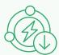能源来源</td><td>清洁能源使用</td><td>◎持续贡献清洁电力,大力发展可再生能源,提高发电稳定性和可靠性,提升发电效益。</td></tr><tr><td>产品和服务</td><td>开发和扩大低碳商品和服务,布局碳资产交易等领域</td><td>◎公司积极参与国内外碳资产交易市场,密切关注碳交易方面的政策动态,确保存量CDM项目足额兑现,超前谋划介入国内CCER市场,提升新能源项目收益水平。</td></tr><tr><td>气候适应能力</td><td>低碳转型</td><td>◎积极识别和管理气候变化所带来的机遇,不断提升低碳转型的反应速度和适应能力。</td></tr></table>

<table><tr><td colspan="3">转型风险</td></tr><tr><td>政策法规风险</td><td>技术风险</td><td>市场及声誉风险</td></tr><tr><td>国际和国内环境相关法律法规监管日趋完善和严格,公司若未能遵守相关政策要求,将面临诉讼或违规处罚等合规风险。</td><td>各地大力推进新能源综合开发利用模式,需创新项目开发模式和先进技术以应对激烈市场竞争。</td><td>若无法回应积极应对气候变化的相关诉求,投资者或客户可能流失,对公司产生负面影响。</td></tr><tr><td>高度关注国内外新能源政策及法律法规出台和更新情况,结合自身实际情况加强合规管理。</td><td>持续加大绿色技术创新投入,研究拓展新业态新模式。</td><td>积极就气候变化应对以及ESG工作与利益相关方进行沟通和交流,加强信息披露,维护良好的企业形象。</td></tr></table>

## 影响、风险和机遇管理

公司建立了气候变化风险矩阵，用于识别风险与机遇类型，聚售产品全链条的气候影响，梳理上下游业务环节，挖掘公司生产运营流程中有关的气候变化风险因素，形成全面的评估框架，以主动作为促进公司气候韧性提升。针对气候变化的预期影响，公司充分考虑政策导向、市场需求变化、技术迭代速度、利益相关方关切等因素，明确各类风险与机遇的影响途径，系统分析气候变化物理风险、转型风险及气候相关机遇的传导机制。

## 案例 开拓绿电需求客户，促进清洁能源消纳

9月2日，公司赴国际锰行业巨头宁夏天元锰业集团开展合作交流，先后参观天元锰业铁路物流园、电解锰生产线、生产车间等，重点考察处于规划建设阶段的宁夏锰基新能源材料产业基地，双方就绿电交易需求、价格合理性、用电时段等方面进行探讨，并表示将协商自治区发改委、电力交易中心等相关单位，共同推进跨区绿电交易合作、高耗能产线节能降碳。双方签订5.4亿千瓦时多年期绿电合约(PPA).2026年成交量已占该年度新疆送宁夏绿电交易总成交量的近30%，有力助推了天元锰业绿色电能消费，促进气候变化治理。

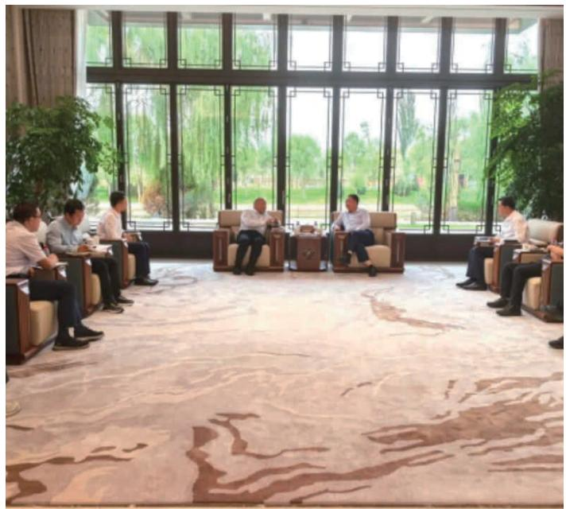

natural_image

Interior view of a modern lounge with people seated in armchairs facing large windows and greenery (no visible text or symbols)

## 指标和目标

公司始终以国家绿色能源发展战略为指引，锚定“双碳”目标深耕新能源赛道，充分盘活沙戈荒等未利用土地资源。建设大型风光电基地布局海上风电，“新能源+”乡村振兴，新型储能等项目推动新能源开发与国家双碳战略深度融合、同步落地。

公司不断健全内部管理体系，修订《电力营销管理办法》，全面提升运营管控能力。场站生产用电优先采购电网电力全面应用低能耗电气设备，持续推进电站设备能效提升，全力保障清洁能源生产全流程低碳高效、绿色环保。

## 加强绿色认证

公司青海丝路明珠通过净零碳建筑认证，新疆能源大基地项目通过净零碳园区认证。

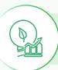

## 积极绿电营销

公司积极拓展绿电营销渠道，扩大绿电、绿证交易规模，构建多元化开发渠道，强化内外部合作，挖掘潜在客户资源。报告期内，公司全年销售绿电 129,542 万千瓦时，创收2,622万元；全年销售绿证 1,389 万张，增收5,672.5 万元。

## 2025年

全年销售绿电

129,542 万千瓦时

全年销售绿证

1,389 万张

## 碳资产管理

报告期内，公司统筹开展碳资产管理，由专员负责碳资产管理，同时更新下发《新能源产业电力营销管理办法(试行)》，进一步加强碳资产数据统计报告等管理备案。

## 无纸化办公

公司利用视频会议系统、电子会议系统等手段召开会议，优化内部流程和审批机制，推广使用在线审批，以减少纸质文档的传递和审批时间，并定期开展无纸化办公的培训课程，向员工传授数字化工具和平台的使用方法，提升员工对无纸化办公的认识和重视程度。

## 绿证跨境交易

2025年11月，甘肃分公司完成公司首笔绿证跨境交易(2,800个)，与香港德意志银行完成绿证境外交割。

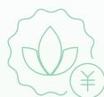

## CCER项目

公司积极关注CCER市场和政策变化情况，目前公司拥有海上风力发电和光热发电两种CCER项目，涉及区域包括江苏、青海、甘肃等地。目前，青海光热项目已通过登记，三个项目共登记CCER238万吨。

## 社会管

##

## 创新引领前行责任润泽民生

同发展;聚焦人才队伍建设，搭建全维度成长平台；积极践行社会责任，深耕乡村振兴，以实干担当传递央企温度，守护民生福祉。

科技筑梦 智创未来

育才强企 聚力同行

智领变革 质效双升

践行公益 服务民生

责任筑链 协同共赢

兴农赋能 助力振兴

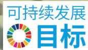

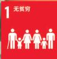

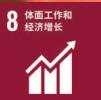

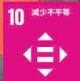

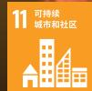

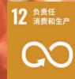

## 八益赋能成长·科技点亮梦想

---鸟赞中学科技周主题活动暨希望工程·青苗暖冬行动捐赠仪式

## 科技筑梦 智创未来

绿发电力深知研发创新之于业务战略推进、行业生态嬗变的核心价值，以敏锐的洞察力锚定研发创新中的关键风险与潜在机遇，擘画具有前瞻性的战略蓝图，制定行之有效的应对策略与落地举措，实现研发创新管理的精益化跃升与迭代升级。公司依托系统性思维完善创新生态体系，驱动企业在复杂市场环境中实现高质量发展跃迁

公司高度重视技术创新工作，具备系统的科技支持体系，激励科技创新，为后续科研工作提供有力支撑。

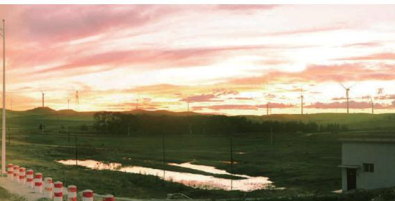

natural_image

Scenic landscape at sunset with fields, power lines, and a small building under a pink sky (no text or symbols visible)

## 搭建智慧研发平台

公司严格遵守运营所在地法律法规要求及行业指导原则，立足自身实际发展需求，制定《科技创新工作管理实施纸则》，持续优化创新管理机制，从项目立项、项目管理、成果管理、评价考核等方面规范了研发行为，为产业的研发创新奠定稳定的基石。

公司设立科技创新工作领导小组，负责产业科技创新工作统筹协调和重大事项决策：下设科技创新管理办公室，负责贯彻落实公司和上级单位的科技创新工作部署，制定产业科技创新管理制度，征集科技创新课题，组织和督导科技项目实施及验收，推广科技创新成果的应用，负责科技创新成果管理工作。

公司通过引进高端人才、培养青年骨于、优化薪酬激励，构建科技创新人才体系。

建立科技人才专项薪酬体系，完善考核机制，强化绩效导向，确保薪酬激励效用最大化。

开展第二期“十百千”人才工程领军技能人才选拔暨2025年风电、光伏职工技能竞赛，加快培育高技能人才，鼓励技术创新。

## 重点科研在建攻关

## 国家重点研发计划

公司参与“十四五”国家重点研发计划《海上风电并网系统远程监测与故障诊断技术》项目，牵头承担第5课题“海上风电远程监测与风电预警平台交流并网工程示范”。  
公司参与“十四五”国家重点研发计划“储能与智能电网技术”重点专项《10MW 级磁悬浮飞轮关键技术》项目，牵头承担第2课题“MW级高速先进飞轮储能技术”和第5课题“新型电力系统下飞轮阵列工程示范”。  
公司参与国家重点研发计划中“可再生能源技术”专项《支撑灵活性提升的数字化风电/光伏变流器关键技术与装置研制》，牵头承担第5课题“风电变流器和光伏逆变器在‘沙戈荒’风光基地等场景示范应用”。

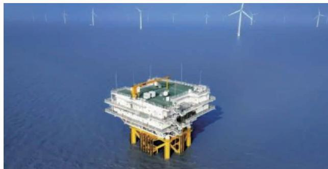

natural_image

Offshore wind farm platform with multiple turbines in the distance (no visible text or symbols)

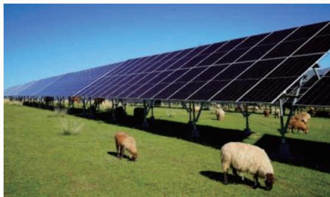

natural_image

Solar panel farm with grazing sheep on grass under clear blue sky (no text or symbols visible)

## 研究进展及成果

公司计划2026年建立健全产业科技创新制度体系，落位中试项目，制定标准化流程。2027年起，拓展中试项目应用，强化专利导向与奖项培育；推动完成新技术布局，形成技术迭代升级与产业高质量发展的良性循环

## 加强知识产权保护

公司切实落实知识产权保护，执行集团知识产权管理办法等相关制度，规定，培育和保护自主知识产权，防范和化解知识产权风险，促进企业高质量发展。知识产权保护范围包括：专利权、商标、著作权等，所属各单位作为科技创新主体，负责组织和指导公司知识产权管理体系的运行，定期缴纳专利年费维护专利。

##

## 2025年

申请专利数

21 件

授权专利数

31 件

累计有效专利数

116 件

累计软件著作权数

14 件

## 智领变革 质效双升

绿发电力紧扣产业发展实际，锚定行业先进水平，把绿色发展理念贯穿工程质量管控全过程，扎实推进管理、经营双对标，以多元举措全面提升项目建设质量，为建设世界一流新能源企业筑牢坚实的质量体系根基。

严格遵守《中华人民共和国电力法》、各省市电力交易中心发布的《电力中长期交易实施细则》《电力现货市场交易实施细则》等相关法律法规要求，制定《新能源产业电力营销管理办法(试行)》，对各区域公司营销业务进行规范。

## 提升标准化管理水平

公司建立以平台公司为管理核心，各区域公司分管各自经营区内电力营销业务的管理模式。

## 平台公司

## （管理核心）

设立电力营销部，由平台公司负责制定统一的电力营销战略、数据管理规范及合规要求；统筹协调跨区域电力交易、资源调配及重大客户关系维护：监督各区域公司营销指标完成情况。

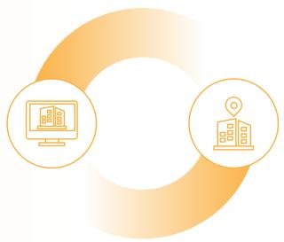

flowchart

## 区域公司

## （执行主体）

各区域公司分别设立营销部(装机容量小的区域营销部挂靠生产部运行)，在平台公司统一领导下，负责各自经营区内的电力营销业务，包括市场开拓、合同履约、电费结算等具体工作。区域公司根据平台公司部署，结合本地市场特点和政策环境，细化实施方案，确保营销策略在属地有效落地，并对经营区内的服务质量和经营绩效负直接责任。

##

公司建立“日跟踪，周督办，月调度”工作机制，督导产业各单位按期报送施工进展，及时了解掌握各区域项目现场情况、存在问题及难点，研究部署重点工作计划，督导产业各单位加快推进项目施工进度，及时制定关键问题解决措施，确保按计划实现各项目建设任务，保障项目按期并网发电。

公司定期开展客户回访与交流，根据客户反馈，及时跟进最新需求，探索新的合作发展点。通过电话定期回访进行客户满意度调查，重点关注客户需求点、主要关注点，锚定接下来的提升点。

flowchart

## 创新生产运维新模式

公司按照《新时代绿色能源产业智慧运营体系建设整体方案》统一规划，统筹开展产业智慧运营三级管理平台建设，构建全面覆盖、精准高效的数据支撑体系，推动产业生产数智化转型。搭建完成总部级运营监测系统，持续接入在运场站实时生产数据，全力推进新疆首批基地项目区域集中监控系统建设，为生产精益管理及精准决策提供坚实数据底座。

## 案例 加快推进智慧运营管理平台建设

公司推进智慧运营管理平台建设，搭建产业总部级运营监测系统，实现生产数据全口径归集报送：当前正全力推进产业在运场站实时生产数据接入工作，通过数据直连直采打破信息壁垒，提升区域公司生产管理数据的完整性，准确性与时效性，为智慧化运营决策奠定坚实数据基础。

## 案例 建设智慧AI交易系统，提升电力交易水平

10月底，甘肃分公司辅助交易系统上线运行，电力营销部开展功能试用，完成功能测试、数据核验工作，提出定制化需求及功能优化建议。整体来看，系统运行平稳、功能总体正常，已基本实现甘肃场站现货快报与交易复盘自动生成，以及省间日前现货自动申报、D+2交易盯盘挂单、场站中长期合约管理、市场边界分析、结算单管理、电价预测、气象分析等核心功能落地。

line

| Category | 年均交易量 (MWh) | 合同周期 (月) |
| --- | --- | --- |
| 2025年1-12月交易方式 | ~10000 | ~120000 |
| 2025年1-12月交易方式 | ~10000 | ~10000 |
| 2025年1-12月交易方式 | ~10000 | ~10000 |
| 2025年1-12月交易方式 | ~10000 | ~10000 |
| 2025年1-12月交易方式 | ~10000 | ~10000 |
| 2025年7月 | 272871.000 | — |
| 2025年7月 | 0.000 | — |
| 2025年7月 | 0.000 | — |
| 2025年7月 | 357.840 | — |

bar_stacked

| Date | Actual Price Spread | Predicted Price Spread |
| --- | --- | --- |
| 2025-12-22 | 0 | 0 |
| 2025-12-23 | 0 | 0 |
| 2025-12-24 | 4.17 | 4.17 |
| 2025-12-25 | -6.8 | -5.5 |
| 2025-12-26 | 56 | 56 |
| 2025-12-27 | 56 | 56 |
| 2025-12-28 | 1.04 | 1.04 |
| 2025-12-29 | 1.04 | 1.04 |
| 2025-12-30 | -3.57 | -3.57 |
| 2025-12-31 | -3.37 | -3.37 |
| 2026-01-01 | -3.95 | -3.95 |
| 2026-01-02 | -3.96 | -3.96 |
| 2026-01-03 | -3.79 | -3.79 |
| 2026-01-04 | -4.15 | -4.15 |
| 2026-01-05 | -5.35 | -5.35 |
| 2026-01-06 | -4.79 | -4.79 |

## 筑牢数据安全与隐私防线

公司严格遵守《能源行业数据安全管理办法(试行)》等相关法律法规要求，规范数据安全管理架构，完善风险管理体系。营销数据安全由企业内开发的专有办公软件严格保障数据安全，在涉及公司电价等核心数据上使用专有链接保密。

## 报告期内

公司未收到涉及侵犯客户隐私和丢失客户资料的投诉，未发生重大数据安全和泄露客户隐私事件。

## 责任筑链 协同共赢

绿发电力始终秉持“共生共赢”理念，致力于在企业发展过程中，遵循分级管控、动态管理、信息共享、合作共赢的原则，确保供应商管理科学化、规范化。实现与社会、自然环境及供应链合作方的协同发展，为社会经济高质量发展与社区可持续繁荣贡献企业力量。

## 治理

公司执行《供应商关系管理办法(试行)》《供应商不良行为名单管理办法(试行)》《采购品类管理作业指引》《供应商库建设作业指引》《供应商履约评价作业指引》等相关内部管理规范，将供应商管理纳入采购全生命周期管理活动中，形成供应商进入一退出的全面合规管理体系，推动构建绿色和负责任供应链。

公司招评标审定委员会是供应商关系管理的领导机构，负责供应商管理重大事项的审定。执行公司供应商管理制度，开展本单位的供应商管理与服务工作；责本单位供应商库建立、维护、履约评价、供应商不良行为处理、供应商服务等工作：负责处理本单位的供应商投诉。

## 战略

公司将供应链安全管理融入全面风险管理体系与日常运营管理之中，公司积极开展供应链风险识别与应对工作。报告期内，公司识别合规风险、履约风险、廉洁风险共3项主要供应链风险，并针对相关风险点采取相应措施积极应对。

<table><tr><td>主要风险类型</td><td>风险点描述</td><td>应对措施</td></tr><tr><td>合规风险</td><td>围标串标、人为干预招投标、未招先定等</td><td>不断完善物资采购管理制度,加强标准化体系建设工作。</td></tr><tr><td>履约风险</td><td>质量风险、财务暴雷等</td><td>根据项目阶段、问题风险划分三级风险清单,分项制定监督管理措施。</td></tr><tr><td>廉洁风险</td><td>采购人员私自接触供应商等</td><td>供应商准入环节签署廉洁责任书,提交公司及相关责任人信用档案;建立举报机制、加强日常监督管理、廉洁宣贯培训。</td></tr></table>

## 影响、机遇和风险管理

公司供应商选择注重多元化和长期合作，以降低供应链风险并确保产品质量和供应稳定，供应链管理以各基地自行采购为主，重点大宗原材料集团统一集采，针对风险发生的可能性和影响程度评估风险，并通过优化供应链流程、提高供应链效率，确保供应链稳定可靠。

<table><tr><td>机制类型</td><td>具体内容</td></tr><tr><td>供应商寻源注册</td><td>常态化开展供应商寻源工作,全面调研供应商资质、管理模式、业绩、财务状况、价格水平及合作意愿,积累优质供应商资源。供应商可通过系统自主注册,填报企业基本信息并上传营业执照、资质证书、业绩合同等证明材料,或通过阳光推荐方式代注册。注册成功并通过审核的供应商成为潜在供应商,具备投标资格。</td></tr><tr><td>供应商分类</td><td>按专业类型划分为工程类、物资类、服务类,针对不同类型供应商采取不同的管理方式。</td></tr><tr><td>供应商履约评价</td><td>分为日常评价、定期评价、节点评价和自定义评价,评价结果将作为考核供应商的重要依据。日常评价是对供应商履约过程中发现问题做出的即时性记录,重点评价现场管理团队,是定期评价的重要依据。定期评价是每半年对日常评价及工程检查客观数据做出的阶段性汇总,是节点评价的重要依据。节点评价是对供应商履约达到指定节点做出的阶段性评价,是供应商年度定级的重要依据,是供应商节点付款的前置条件。自定义评价是根据业务需要发起的专项评价,随用随评,结果不计入日常、定期及节点评价中。</td></tr><tr><td>供应商寻源注册</td><td>依据供应商履约评价结果定期开展供应商定级工作,分为ABCD四个等级。其中,针对划分为D级供应商,将进行清退处理。供应商定级每年末组织一次,是供应商奖罚的重要依据。年度定级来源于供应商履约评价情况,评价年度内未承接项目的,不进行年度定级。</td></tr></table>

公司持续深化供应链全流程管理，筑牢合规经营与风险防控防线。在供应商准入环节，要求所有投标单位严格响应《“重法纪、讲诚信、提质量”承诺函》，并依据最高人民检察院《关于在招标投标活动中全面开展行贿犯罪档案查询的通知》要求，自行在中国裁判文书网完成查询，承诺公司、法定代表人及拟委任项目负责人在首次应答截止日前三年内无行贿犯罪记录，从源头降低业务合作风险。

公司不断优化供应链结构布局，推动供应商多元化、多渠道发展，对光伏组件、电缆等主要设备材料实施集中采购深化源头直采、长协锁量锁价等合作模式；针对项目布局实际，综合考量重要设备材料供应商的建厂布局等情况，全面提升供应链体系的抗风险能力与快速响应能力，保障战略资源稳定供应。

同时，公司充分运用数字化技术搭建供应链合规溯源体系，对产品生产、供应链管理全环节进行全面追溯与记录，确保各环节严格符合相关法规与标准要求，通过内外溯源协同管控产品全生命周期，持续提升供应链透明度与质量管理水平，保障产品质量与合规性。

## 优化采购及供应链管理权责体系

明确权责划分：聚焦新获取项目招标、供方库建设及物资服务集约化采购，由所属单位落实公司采购结果应用，组织小金额项目采购及供应商履约评估工作，进一步提升供应链管理效率。  
●夯实管理基础·严格执行供应商管理制度，针对固定光伏支架，电缆附件品类的资格预审项目，完成30家供应商的现场实地考察工作。

## 指标和目标

##

## 加强标准化体系建设工作

## 加强标准化体系建设工作

## 精准对标改进提升工作

## 提高采购集约化水平

## 提升供应商管理水平

## 报告期内

公司供应链风险评估工作实施效果较好，未发现合规风险、履约风险、廉洁风险等方面供应链风险问题。

## 育才强企 聚力同行

绿发电力始终坚持人才强企战略，聚售人才价值全面释放，持续完善人才选拔与激励机制，健全分层分类的人才培训体系，优化薪酬分配、人员晋升、福利保障体系，健全内控合规管理机制，丰富多元民主沟通形式、畅通员工诉求表达渠道，强化合规用工管理，切实维护全体员工各项合法权益，打造更具活力、更显包容、更趋规范的就业环境，构建和谐共赢的劳动关系，为新型能源体系构建、新能源产业高质量发展提供坚实的治理支撑、组织保障和人才支撑。

## 优化储备人才队伍

公司依据《中华人民共和国劳动法》《中华人民共和国劳动合同法》《中华人民共和国社会保险法》《中华人民共和国工会法》等相关法律法规，秉持“公开、平等、竞争择优”原则，建立完善的招聘体系，通过校园招聘、社会招聘和内部招聘等多种形式，为公司高质量发展储备多元化优秀人才。

公司从校园招聘、社会招聘和内部招聘三方面入手，丰富招聘形式、拓宽招聘渠道、充实人才储备，持续优化人才结构，满足公司各专业板块的人才需求。

flowchart

## 招聘流程

  
招聘阶段

公司严格规范招聘全流程，严守合规审核关口，确保招聘公平公正、规范有序。严把入职资质关，核实应聘者身份、年龄及劳务合规性，杜绝童工，明确聘任条款，保障双方合法权益：严格核验面试人员身份、学历、资格证书等材料真实性，从源头把控候选人资质：委托第三方开展背景调查，依法合规核实候选人工作履历等信息，保障招聘质量；针对中层管理社招人员增设干部考察环节，坚持德才兼备、以德为先，全面考察其综合素养，选拔适配公司发展的优秀管理人才。

  
入职阶段  
核实员工签署意愿，确保员工为自愿签署劳动合同，严禁以威胁、证件扣押等不正当手段强制员工入职，切实预防强制劳工事件发生；入职信息录入端进行年龄审核及卡控，通过信息化手段严格核实员工身份证上年龄相关信息的真实性，确保入职人员资质合规。

  
离职阶段

核验员工离职通知是否符合法律规定，规范办理离职手续，及时为离职员工出具相关离职证明，保障员工离职后的合法权益，维护公司良好的用工形象。

## 招聘渠道

## 校园招聘

公司深化校企合作，与华北电力大学、西安交大等对口院校紧密联动，组织开展校园招聘座谈会，搭建校企人才对接桥梁。座谈会期间，通过发放录用直通卡、现场答疑解惑、交流职业发展路径等方式与学生积极互动，寻求符合公司发展需求的人才，为公司注入新鲜血液。

flowchart

内部招聘

## 社会招聘

公司进一步拓宽信息发布渠道，在集团公司官网、猎聘、北极星等主流及行业特色招聘平台发布招聘信息，依托多元化渠道广纳社会优质人才，重点挖掘专业能力突出、具备丰富行业经验的骨干人才，助力公司核心业务提质增效。

公司持续强化内部人才挖掘与培养，积极组织内部招聘工作，尽可能每月发布内部招聘计划，为符合条件的员工提供更多内部调动、岗位晋升的机会，有效盘活内部人才资源，促进人员合理流动，充分激发员工工作积极性和归属感。

text_image

Meeting room photo with visible presentation screen showing data and table nameplates, likely from a corporate or organizational meeting.

## 多元平等雇佣

公司严格遵守《中华人民共和国劳动合同法》等法律法规，按照公平公正依法依规原则处理劳动纠纷。禁止任何形式的歧视，反对任何形式的强迫劳动和骚扰虐待，杜绝使用童工，公平对待不同种族，性别，宗教信仰和文化背景的员工。公司设置服务热线，工会热线，值班热线，接收员工咨询与投诉，并及时处理，跟进和反馈

## 2025年

人权问题投诉事件

0 起

重大劳动争议事件

0 起

雇佣童工的现象

0 起

劳工纠纷事件

0 起

## 2025年

员工总人数

1,317 人

少数民族员工数

87 人

离职员工

25 人

男性员工

1,108 人

女性员工

209 人

## 按年龄组别划分

29岁（含）及以下员工

470 人

30岁-39岁员工

625 人

40岁-49岁员工

147 人

50岁及以上员工

75 人

## 按员工教育背景划分

博士研究生

8 人

硕士研究生

203 人

本科生

1,031 人

专科及以下

75 人

## 保障员工合法权益

## 福利保障

公司依法保障员工合法权益加强员工关怀 制定员工体假管理办法充分保障员工享受产假婚假权利为全体员工提供健康体检。积极为员工营造平等、积极向上、健康的工作氛围

公司严格按照国家政策规定，为每位员工缴纳五险一金。增设企业年金、补充医疗保险，保障员工生活质量，为全体在岗职工购买团体意外险，保障全员出行安全；为全部在职职工及退休员工购买年度体检，保障身心健康。发放劳保用品、供暖补贴、节日补贴、生日福利、三八节福利、供养直系亲属医药费、食堂经费，保障全员福利保障到位，提升员工幸福感。

公司实行每周五天工作制，周一至周五为工作日，周六、周日为休息日。员工依法享有各种法定的带薪假期、包括：国家规定的法定节假日、婚假、丧假、产假、育儿假、陪产假、护理假、带薪年休假、病假、探亲假和事假等假期。

公司为每位在岗员工提供免费午餐、早晚餐餐补、交通补贴、员工住宿等福利待遇，保障员工工作生活水平。

## 2025年

劳动合同签订率

100 %

社会保险覆盖率

100 %

## 薪酬管理

公司修订《工资总额管理办法（试行)》，执行《岗位绩效工资管理办法(试行)》《考勤，休假管理办法（试行)》《年休假实施细则(试行)》等内部规定。坚持“为岗位付薪”“为能力付薪”“为绩效付薪”。完善导向清晰、评价科学、激励有效、覆盖全员的绩效管理体系。

## 报告期内

公司按时足额发放月度工资，全额发放年度工资，保证工资预算执行率100%。根据年度绩效考核结果，直接关联核定年终奖分配金额：根据专项奖惩工作方案，据实核定重点任务完成情况，优先保证专项奖惩分配到位，有效促进公司快速健康发展。

## 激励机制

公司强化专项激励，制定了《提质增效专项奖励实施细则(试行)》《2025年新闻宣传专项奖励实施方案》等，有效的激发了干部员工攻坚克难的积极性、主动性，明确奖惩标准、考核流程、工作要求：为贯彻落实改革工作相关要求，进一步发挥考核激励作用。

公司建立以岗位绩效工资制度为基础，协议工资为补充的多元化分配体系。实施全员绩效管理，建立健全激励约束机制，坚持业绩导向，以实际贡献作为评判标准，着力推进多劳多得，实现薪酬分配向关键岗位、核心人才倾斜，实施专项奖惩，按贡献大小实行有差别分配，全面推行契约化管理，强化考评结果与薪酬激励挂钩。

## 绩效反馈与申诉

公司设置绩效管理委员会，作为负责绩效评价的领导和仲裁机构，及时向员工反馈绩效考核结果，为有异议的员工提供申诉渠道，充分听取员工的意见和建议，由绩效管理委员会进行公正的审查和处理，保障员工的知情权和参与权。

## 搭建员工发展平台

公司制定《天津绿发电力集团股份有限公司全员绩效管理实施细则(试行)》等制度管理办法，坚守“赋能人才、同创共享”理念与党管人才原则，纵深推进人才强企战略。2025年，构建管理、科技、专业、技能四条岗位通道，完善人才“选、育、用、考、激”全链条机制，以制度化建设夯实人才根基。

##

依托“绿发网校”搭建多元学习平台，常态化开展比学赶超;大规模实施“十百千”人才工程，选拔培育36名领军技能人才，发挥示范引领作用;选派管理人员挂岗历练、跨单位交流，提升综合能力。

## 落实精准化培训

结合产业实际编制差异化培训计划，聚焦电力交易、设备运行等核心领域，全年参训超800人次，实现全覆盖。

## 做好成长赋能

强化新员工“师徒制”与实战化培养;开展党建与团建活动,凝聚团队合力;建立市场化就业与退出渠道，畅通职业发展路径。

##

通过一对一谈话，精准掌握员工思想动态与生活诉求，增强员工归属感与幸福感。

## 报告期内

公司立足新能源产业发展需求与各部门业务实际，设置专业技能提升、合规管理强化等多元培训项目，尤其聚焦电力交易策略优化、设备运行监测数据分析、成本造价管控等核心业务领域，精准开展专题培训，全年累计组织开展、参与各类培训 50 余次，参训人次超800人。同时,公司积极鼓励员工考取证书、取得资质、获得认证或参加竞赛等,截至2025年末公司共 748 人取得职称。

text_image

2021年自治区工业和信息化技能竞赛（风电、光伏赛事）
第二期“十百千”人才工程领军技能人才选拔

text_image

新疆中绿电技术有限公司
小白杨实训基地
中国绿发集团新能源产业2025年毕业生培训班
2025届新能源产业新员工实操培训班

text_image

中国绿发CGDG
鲁能新能源(集团)有限公司甘肃分公司
绿发电力2025年现货交易培训

text_image

电力系统“一线”急救必修课
复苏技术发展与CPR/AED实操指南
电力系统“一线”急救必修课——复苏技术发展与心肺复苏自动除颤(CPR/AED)实操指南

## 守护员工职业健康

公司严格遵守《中华人民共和国安全生产法》《安全生产事故隐患排查治理暂行办法》等法律法规，编制印发《绿色能源产业安全生产费用提取和使用管理细则》《产业安全性评价规范》，加强产业安全生产费用管理，建立安全生产投入长效机制：分析新能源安全监督检查行业标准，高效识别安全短板、提升安全管理水平，精准掌握场站安全风险分布与整体安全状况。

## 治理

公司设置安全生产委员会，作为安全生产方面最高领导小组，董事长作为安全生产委员会主任，董事会相关成员及公司高级管理层为安全生产委员会委员，审核与发布公司的安全生产相关政策与方向，对重大安全问题做出决策，各部门设置安全代表，确保安全管理要求在执行层面横向到边、纵向到底

公司将安全管理融入到岗位职责、员工意识和日常工作的方方面面，落实安全生产主体责任，强化安全风险管控，加强安全监督检查，深化安全标准化建设，塑造安全文化，不断提升本质安全水平，筑牢安全堤坝。

##

建立健全安全生产责任制，签订安全生产目标责任书。  
定期开展安全风险评估，识别生产环节的潜在危险。  
定期组织全员安全培训，特别是新员工和特种作业人员的专项培训。  
开展安全生产月活动，通过案例分析提升员工的安全意识。  
制定应急预案，涵盖火灾、泄漏、触电等突发事件。

##

组织常态化开展全覆盖隐患排查，重点聚焦设备异常、工程遗留问题、新投运项目薄弱环节，全年累计自查隐患3.722项。  
强化过程监督与验收，确保整改质量，防止问题反弹。  
严格落实隐患闭环管理，建立整改台账，明确责任，措施和时限，截至年末全部整改完成，实现隐患动态清零。

## 报告期内

公司共组织产业各单位开展265 次应急演练,涵盖极端天气、有限空间、高处坠落、触电、停电、交通安全、消防安全等类型。通过应急演练，检验公司应急响应实战能力，进一步提高公司应急响应的统一指挥能力、整体协调能力、现场救护能力、快速反应能力和综合管理能力。

text_image

Street scene with firefighters in hard hats distributing materials to an elderly woman, background includes buildings and parked cars

宜君光伏电站向当地村民发放编制的《消防安全知识手册》

text_image

Group of four workers in hard hats and uniforms examining fire extinguishers on a tiled floor, with visible safety signage in the background.

安全检查

## 影响、机遇和风险管理

公司把安全生产作为企业核心价值落实到生产经营各个方面和环节，贯彻安全与职业健康理念，建立了涵盖安全综合管理，安全风险与隐患管理，安全技术管理、应急消防与事故管理，公共安全管理，员工健康管理等一系列制度的HSF管理体系。公司通过体系审核、管理评审机制，对安全与职业健康战略、持续完善职业健康管理体系，并通过ISC45001认证。

## 安全考核与应急管理

健全并定期更新专项应急预案，组织企业开展应急预案评审，常态化开展应急演练，配备必要的应急物资与装备，实施预案改进：建立突发事件信息报告机制、突发事件舆情监测和信息披露机制。

##

严格遵循《中华人民共和国安全生产法》及事故调查规程，明确区域公司为安全生产责任主体，本部履行监督职责：  
贯彻“三管三必须”原则，强化责任落实与监督检查，确保事故责任追究到位。

## 安全培训与风险防控

通过常态化专项培训，持续提升员工安全意识和专业管理水平。

##

探索建立与自身生产经营特点相适应的员工健康服务管理体系，为全体员工提供健康体检。

2025年员工体检覆盖率100 %

## 指标与目标

杜绝五级及以上人身事故。

杜绝五级及以上设备事故。

杜绝有责任的五级及以上外包事故。

杜绝恶性误操作事件。

flowchart

严格防范负主要责任的五级及以上火灾事故。

严格防范负主要责任的重大及以上交通事故。

严格防范对公司造成较大影响的信息、网络、食品、境外等安全事故（事件）。

严格防范重大事故隐患。

<table><tr><td colspan="2">指标</td><td>单位</td><td>2024年</td><td></td><td>2025年</td></tr><tr><td></td><td>工伤/亡人数</td><td>人</td><td>0</td><td>→</td><td>0</td></tr><tr><td></td><td>安全事故量</td><td>起</td><td>0</td><td>→</td><td>0</td></tr><tr><td></td><td>安全生产投入</td><td>万元</td><td>5,269</td><td>→</td><td>4,902</td></tr><tr><td></td><td>安全生产培训场次</td><td>场次</td><td>547</td><td>→</td><td>966</td></tr><tr><td></td><td>接受安全生产培训人次</td><td>人次</td><td>7,748</td><td>→</td><td>7,815</td></tr><tr><td></td><td>安全生产培训员工覆盖率</td><td>%</td><td>100</td><td>→</td><td>100</td></tr><tr><td></td><td>体检及健康档案覆盖率</td><td>%</td><td>100</td><td>→</td><td>100</td></tr></table>

## 落实民主管理制度

公司坚决落实全心全意依靠职工办企业的方针，持续健全以职工代表大会为基本形式的民主管理制度，推进厂务公开、业务公开，落实职工群众知情权、参与权、表达权、监督权。重大决策听取职工意见，涉及职工切身利益的重大事项必须经过职工代表大会或者职工大会审议。严格履行民主程序，持续强化厂务公开，保障职工的知情权、参与权、表达权和监督权，积极听取员工对公司发展的建议及意见，切实解决员工关切问题。

公司工会成立经费审查委员会，同时建立经费收支信息公开制度，接受会员、上级工会及国家审计的监督。公司畅通职工意见表达渠道，保障职工权利，通过职工代表大会、合理化建议征集活动、职工诉求服务征集箱等各种形式，充分收集员工对公司各方面工作的意见建议，督促相关职能部门及时回应并做出反馈。

##

公司依程序全年组织召开 1 次职工大会，以具体实践不断规范和完善职代会制度，保障职工民主权利，全体职工认真听取并审议选举职工董事履职等与职工切身利益相关的重要事项。公司征集员工意见建议17 条，切实将职工的“金点子”转化为企业发展的“金钥匙”。

## 真诚关爱员工生活

公司高度重视员工关怀与权益保障，制定《加强员工关爱实施方案》，建立不定期会商工作机制，研究解决涉及员工切身利益的重要事项；设立职工诉求中心，设置诉求服务采集箱，畅通职工诉求通道，确保员工意见得到及时反馈和妥善处理。

公司持续完善制度体系建设，确保工会工作有意可循，有序推进。紧扣产业工人队伍建设改革要求，印发《关干推进深化产业工人队伍建设改革、加快打造新能源产业现代新型班组的意见》，围绕技能提升、人才培养、竞赛激励等重点领域细化22项具体举措，为加强班组建设、完善人才培育机制提供了坚实的制度保障，为广大职工成长成才、建功立业搭建了更加广阔的平台。

公司常态化开展“三必贺”“四必访”“五类关怀”行动，全年组织节日慰问、生日祝福及困难帮扶活动十余次，累计覆盖员工300余人次。

##

员工慰问覆盖率

100 %

困难员工帮扶覆盖率

100 %

员工帮扶投入

2.20 万元

帮扶困难人数

3 人

text_image

中光正好
电力十足
中光正好
电力十足

natural_image

A young girl in a pink dress and white crown hat is eating from a birthday cake, with balloons and posters in the background (no visible text or symbols).

“我的家风故事”活动摄影作品：《许下心愿》

text_image

廉心
乙巳年
王巾铭

natural_image

Two chefs in black aprons and white hats preparing food at a restaurant counter, with other staff in the background (no visible text or symbols)

text_image

Group photo of people posing in front of a green building with visible Chinese characters and large '!!' signs

## 践行公益 服务民生

公司制定《对外捐赠管理办法》，有序开展对外捐赠活动，主动履行社会责任。坚持以责任诠释初心，围绕公益环保、爱心助学、安全宣教等重点领域，广泛动员、常态开展志愿服务活动，持续擦亮“青心”志愿服务品牌。

## 2025年

公司共有注册志愿者

499 人

志愿时长

1,085 小时

text_image

Group photo of children and adults in a classroom holding colorful paper crafts, with a poster on the wall in the background.

natural_image

Group of children in school uniforms and hard hats marching outdoors on a paved path, with an adult observing nearby (no visible text or symbols)

公司持续健全公益慈善长效机制，积极支持社会教育、环境、健康、文化、体育等各项事业发展。报告期内，公司聚焦乡村振兴、教育帮扶、困难救助等重点领域，累计对外捐赠 79.8林、陕西、新疆等地精准实施系列公益项目，以实际行动回馈社会。

text_image

見第三小学
中国国家图书馆公益项目走进若羌县第三小学
若羌由暖冬公益项目走进若羌县第三小学

公司始终秉持人文关怀理念，将无障碍环境建设融入达坂城、米东、奎屯等多个项目综合楼的设计细节。通过配置无障碍卫生间、无障碍电梯、出入口坡道及无障碍宿舍等设施，切实为残障员工打造便捷、安全、友好的工作与生活环境，确保所有职工能够平等、尊严地履行工作职责，共享企业发展成果。

text_image

无障碍宿舍
克拉玛依项目无障碍宿舍

公司坚决扛起冬季能源保供的央企使命。锚定“应发尽发、稳发满发”核心目标，以人员、设备、运维三维发力，全力筑牢绿电保供安全屏障。前置开展极端天气专项培训和防冻应急演练，确保关键时刻队伍拉得出、顶得上；为关键设施加装“防寒套装”，全面排查线路结冰、设备漏水等隐患；确保每一块光伏板、每一台箱变在寒潮中稳发满发。用绿电的温度驱散冬日寒意，以可靠的担当守护万家灯火，在能源保供一线践行服务社会、守护民生的企业使命。

natural_image

Two individuals in winter gear working on snow, one using a shovel (no visible text or symbols)

公司深耕多区域公益帮扶，以实际行动践行央企社会责任。在青海，定向捐赠助力少数民族村落环境整治与民生帮扶，助推乡村振兴、促进民族团结：在吉林，通过“五位一体”模式赋能乡村特色产业发展，带动农户增收、夯实产业振兴根基;在陕西，参与青少年关爱公益项目，为困境儿童捐赠励志成长包，守护青少年健康成长；在新疆，持续推进专项公益计划，为贫困学生捐赠学习物资、建立跟踪培养机制，助力青少年成长成才，筑牢中华民族共同体意识。

natural_image

Interior view of a bus with passengers waving, no visible text or symbols on the vehicle or surroundings.

natural_image

Two people outdoors viewing a surveillance camera on a snowy mountain trail under clear blue sky (no text or symbols visible)

text_image

公益赋能成长·科技点亮梦想
——中国绿色建筑主题示范企业上市·智慧城市行动联动活动

<table><tr><td>青苗病年解的指示(不明确:</td></tr><tr><td>要好!</td></tr><tr><td>在过于寒冷的时候,您你们来被温暖,是你们的诗诗在你心中醉下,需要们的帮助让神人来接着,我们同学们都很熟悉,我在此处一能地打你们的胆汁鬼味,而且有烟味,保证,很深,但是,你们们被弃的温暖,在这里为我们吧!</td></tr></table>

<table><tr><td>喜爱的叔叔阿姨娘:</td></tr><tr><td>您好!</td></tr><tr><td>在今年的塞方中,一般暖风吹来,是咱们将温暖的美,陪伴孩子大。让我感受到温暖。虽然我不知道叔叔阿姨们的书号,但板会好好学习,将来发现他充满温馨生世界,随后欧阳晓风起那碗大饭,为祖国的发展带来贡献。谢谢叔叔阿姨给我们带来的这些义务，似乎以后在 XI 诗里这些文及用它提高学习成为知悉们一样的人,把象动抬抬大地,让小草长房,让祖国更广阔。</td></tr><tr><td>祝!</td></tr><tr><td>叔叔阿姨身体健康,长龄后岁。</td></tr></table>

## 兴农赋能 助力振兴

绿发电力依据《国家乡村振兴战略规划(2018—2022年)》《中华人民共和国乡村振兴促进法》《中共中央、国务院关于全面推进乡村振兴加快农业农村现代化的意见》等相关法律法规，充分发挥中央企业在乡村振兴战略中的示范带动作用，通过消费帮扶、产业帮扶等多种方式，全面助力推进乡村振兴。

公司深入贯彻国家乡村振兴战略部署，统筹推进产业、消费、教育帮扶协同发力，以“新能源+乡村振兴”特色实践践行央企使命担当。

产业帮扶方面，发挥新能源主业优势，在陕西宜君、山东牟平等地打造农光互补示范项目，创新“企业+合作社+农户”运营模式赋能乡村经济。其中山东牟平320MW农光互补项目，一期50MW已落地见效，通过“板上发电、板下种植”实现土地高效复合利用，带动近百名当地农户获得土地租金与劳务薪金双重增收;项目年均输送清洁电力超8000万千瓦时，兼具生态减排、能源保供与农业增效多重价值。

消费帮扶方面，2025年积极落实央企消费帮扶行动，采购新疆等帮扶地区农产品18.77万元，拓宽销售渠道，持续巩固“消费带产业、产业带振兴、教育带发展”的长效帮扶模式。系列实践既通过多地教育帮扶、环境整治等举措赢得地方广泛认可，有效提升品牌美誉度；也通过农光互补模式的成功落地，为复合型新能源项目规模化推广积累了宝贵经验，形成“产业带振兴、振兴促发展”的良性循环。

## 2025年

项目年均输送清洁电力超

8,000 万千瓦时

采购新疆等帮扶地区农产品

18.77 万元

## 案例 新能源赋能乡村振兴标杆样板

公司陕西宜君农光互补光伏电站项目，装机容量10.95万千瓦，年发电量约1.5亿千瓦时，年可节约标准煤4.52万吨，相应减少二氧化碳约11.69万吨、二氧化硫15.15吨、氮氧化物22.8吨，生态减排效益突出。项目创新采用“板上发电、板下种植”立体化利用模式，打造“光伏+中草药+农作物”融合发展路径，占地超1,500亩，由村集体合作社运营，实现土地高效利用与经济效益双提升。项目累计带动当地农民就业1.200余人次，预计户均年增收超3万元，助力农户年收入最高实现3倍增长，打造了新能源赋能乡村振兴的标杆样板，为全国“新能源+”产业融合发展提供了宝贵实践经验。

natural_image

Solar panel farm under a clear blue sky, with a red tractor visible in the foreground (no text or symbols)

光伏板下种党参

natural_image

Aerial view of a large solar farm with rows of photovoltaic panels installed across green fields under a clear sky.

光伏板下种玉米

## 案例 聚力新能源基地建设 打造新疆绿色低碳样板

绿发电力始终坚守服务边疆的初心使命，以新时代党的治疆方略为引领，紧紧围绕新疆“三基地一通道”建设核心目标。我们立足资源优势，深耕清洁能源领域，通过集约化管理打造千万千瓦级清洁能源大基地。在技术创新上，我们积极探索源网荷储一体化建设，应用前沿技术构建新型能源体系；在产业发展上，推动科技创新成果转化，培育战略性新兴产业集群。通过绿色低碳发展，我们致力于将经济价值，生态价值与社会价值深度融合，以央企担当为新疆高质量发展赋能，共同绘就人与自然和谐共生的宏伟蓝图。

## 报告期内

公司首批开工建设的 5 个新能源大基地项目陆续实现并网发电，总容量为 1,200 万千瓦，项目建成后年发电量将超过 230 亿千瓦时，相当于每年节约原煤超过 718 万吨，减排二氧化碳约 2,150 万吨。

## 2025年

在运、在建总装机

3,223.8 万千瓦

年发电量

197.62 亿千瓦时

一次性开工新能源项目

1,190 万千瓦

投产建设清洁能源项目

9 个

运营装机容量

2,142.55 万千瓦

清洁能源发电量

197.62 亿千瓦时

减排二氧化碳

1,020 万吨

风电发电量

77.40 亿千瓦时

光伏发电量

116.51 亿千瓦时

上网电量

192.30 亿千瓦时

上网电量等效于减少标准煤消耗

2,363,367

##

##

## 深化现代治理筑牢发展根基

绿发电力以现代化治理体系建设为统领，构建权责法定、协调运转、有效制衡的公司治理机制，把党的领导深度融入公司治理各环节、决策全链条；以统筹发展和安全为原则，健全全面风险防控与合规管理体系，牢牢守住企业稳健经营的生命线；以共建共赢为导向，完善投资者关系管理与权益保障机制，切实维护各方主体合法权益，以高质量治理护航企业高质量发展。

红帆引航 同心奋进

固本兴业 慎行致远

守正治企 依规运营

笃守信义 共赢未来

严守底线 防范风险

## 红帆引航 同心奋进

绿发电力深入贯彻习近平总书记关于国有企业改革发展和党的建设的重要论述，严格落实两个“一以贯之”要求，以新时代党的建设总要求为指引，将党的领导深度融入公司治理全链条，夯实企业改革发展的政治根基。

## 完善治理机制，强化党建引领

公司在《公司章程》中专设“公司党委”章节，明确党组织法定地位，健全工作机构、配强党务队伍、保障工作经费：建立党委前置研究讨论机制，厘清党委与各治理主体权责边界，以清单化、程序化方式规范决策流程，充分发挥党委“把方向、管大局、保落实”领导作用。

## 2025年

召开党委会

34 次

审议议题

157 项

## 深化思想建设，筑牢政治根基

公司牢牢把握党的政治建设根本性要求，严格执行“第一议题”制度，传达学习150项，制定落实方案117项，完善党中央决策部署闭环落实机制，以政治监督践行“两个维护”：制定党委理论学习中心组年度计划，开展集中学习11次、专题研讨48人次，扎实开展党纪学习教育与中央八项规定精神学习，领导班子讲授专题党课6次，完成问题整改106项：相关特色做法在学习强国，国资委官网等平台刊发4次，理论成果获中国文化管理协会党建课题特等奖。

text_image

科技赋能发展、创新激励动力
中国铁建
CNOG

## 2025年

  
获中国文化管理协会党建课题特等奖

## 夯实组织建设，推动深度融合

公司严格落实“四同步、四对接”要求，动态优化基层党组织设置，完成本部3个党支部换届，全年规范调整产业党组织15次，实现应换尽换；强化党员教育管理，开展“三会一课”100余次，坚持“双培养一输送”，完成28名党员发展与转正，5名骨干党员走上管理岗位；深化党建与业务融合，开展“党建领航向、决胜‘十四五’”专项行动，组建党员先锋队、青年突击队10支，认领攻坚任务17项，保障年度经营目标落地。

## 2025年

开展“三会一课”

100 余次

组建党员先锋队、青年突击队

10 支

## 从严作风建设，强化监督执纪

公司党委从严从实推进党风廉政建设，成立党风廉政建设和反腐败工作领导小组，设立巡察办公室，实现所属企业纪检机构与专兼职人员全覆盖。持续纠治“四风”，抓实违规吃喝、楼堂馆所、办公用房及设备、公车管理等专项整治紧盯节假日节点开展明察暗访，正风肃纪反腐一体推进。构建贯通协同监督体系，开展“护航改革发展”专项行动，围绕上网电量、电价、工程建设等重点任务强化跟踪督促，保障重点工作落实。

公司深入开展中央八项规定精神学习教育，通过理论学习中心组、主题党日、专题网络培训等形式，组织学习《习近平关于加强党的作风建设论述摘编》等书目。领导班子成员深入党建联系点讲专题党课6次，查摆问题38项、制定整改措施106项，已全部完成整改，切实把学习成效转化为作风建设和履职担当的实际成果。

flowchart

## 守正治企 依规运营

绿发电力遵守《中华人民共和国公司法》《中华人民共和国证券法》《上市公司治理准则》等所适用的法律法规要求。开展以《公司章程》为核心的基础管理制度修订完善工作，累计优化基础管理制度43项。强化董事会建设，完成监事会改革及公司治理结构重塑，建立了以党委会前置，股东会、董事会为权力、决策和监督机构，经理层为执行机构的“两会一层”治理架构，确保各治理主体职责分工明确、相互协作、制衡合理、运转高效，为高效治理提供了坚实保障。

## 股东会

按照《中华人民共和国公司法》《深圳证券交易所股票上市规则》《公司章程》等相关规定和要求召集、召开股东会，保证所有股东对重大事项的平等知情权和决策权，积极维护所有股东的合法权益。

## 董事会

依照法定程序和《公司章程》行使对企业重大问题的决策权，对经理层管理权和监督权，是公司决策机构，对公司组织架构、人事任免、利益分配等事项进行决策部署。

建立规范透明的董事选聘机制，持续完善治理制度体系，在《公司章程》中明确董事选举、任期、兼任及履职要求，规范董事任免与未尽任期履职责任:制定出台《董事会提名委员会实施细则》《董事和高级管理人员离任管理制度》，形成标准化提名、审核、审议流程，严格规范离任程序，保障管理层平稳交接。  
严格遵循国资与证券监管要求，合理配置董事结构，满足外部董事占多数、独立董事不少于三分之一、管理层及职工代表董事合计不超过二分之一的规定。报告期内，公司董事会成员共9名，其中，管理层董事2名，股东委派董事3名，独立董事3名，职工董事1名。结构均衡、专业多元，有效提升决策科学性，防范决策趋同风险。  
严格执行《董事会决议跟踪落实及后评价制度》，构建“月度跟踪、季度审计、年度评价”的全流程管控体系，定期向审计委员会及董事会汇报决议执行情况，有效推动董事会决议全面落地见效，董事会决议执行率100%，独立董事每年对独立性情况进行自查，并将自查报告提交董事会。董事会每年对在任独立董事独立性情况进行评估并出具专项意见，与年度报告同时披露。

## 经理层

对董事会授权决策事项，按照相应的议事规则和有关管理制度行使职权，召开总经理办公会进行集体研究讨论，充分发挥经理层“谋经营、抓落实、强管理”的作用；同时细化明确公司及子公司的职责定位，压实管理责任。

公司坚持建设专业化、多元化、结构化的董事会，以董事的履职能力和专业知识为基础，规范完成董事会换届工作选聘代表国有股东，管理层，广大职工以及中小股东参与公司治理。其中，股权董事三名，内部董事三名，独立董事三名。既满足“外部董事占多数”的国资监管要求，也符合“独立董事占比不少于三分之一”“管理层董事与职工董事合计不超过二分之一”的证券监管要求，有效提升了决策质量，避免了“思维共振”风险

2025年

<table><tr><td>指标</td><td>会议召开次数</td><td>审议议案数量</td></tr><tr><td>股东会</td><td>5次</td><td>28项</td></tr><tr><td>董事会</td><td>11次</td><td>101项</td></tr><tr><td>专门委员会</td><td>20次</td><td>50项</td></tr></table>

公司董事会下设战略与ESG委员会，提名委员会，审计委员会，薪酬与考核委员会四个专门委员会。报告期内，公司修订完善《公司章程》，优化治理结构，撤销监事会：建立《董事会决议跟踪落实及后评价制度》，切实发挥董事会“定战略、作决策、防风险”作用，公司董事会荣获中国上市公司协会2025年度“最佳实践案例”及相关财经媒体“最佳董事会”。

## 战略与ESG委员会

由5名董事组成，其中至少包括1名独立董事。

对公司长期发展战略规划，重大投资融资方案、重大资本运作、资产经营项目，以及公司ESG相关目标、规划、策略、风险等重大事项进行研究并提出建议。

## 提名委员会

由5名董事组成，独立董事占多数并担任召集人。

研究董事和高级管理人员的选择标准和程序，对董事会的规模和构成向董事会提出建议等。

## 审计委员会

由5名不在公司担任高级管理人员的董事组成，独立董事占多数，并由独立董事中的会计专业人士担任召集人。

主要负责审核公司财务信息及其披露、监督及评估内外部审计工作和内部控制，并行使原监事会相关职权对公司董事会，经理层及公司的财务状况，经营成果、重大事项、内部控制及信息披露等进行监督和检查，以保护公司、股东、职工及相关利益者的合法权益。

## 薪酬与考核委员会

由5名外部董事组成，独立董事占多数并担任召集人。

主要负责制定董事、高级管理人员的考核标准并进行考核，制定、审查董事、高级管理人员的薪酬政策与方案。

公司设立薪酬与考核委员会作为薪酬管理核心机构，负责制定董事，经理层考核标准，薪酬政策与方案，综合考量公司业绩，行业水平，岗位职责与履职情况提出专业建议，并严格执行关联回避制度，保障决策公允。公司管理层薪酬体系科学合规，激励约束并重，坚持业绩导向，绩效薪酬占比超50%并与审计财务数据挂钩：建立中长期激励与延期支付机制，引导管理层聚焦长期发展：实施动态调整机制，兼顾行业对标与经营效益，兼顾公平与效率，充分体现央企控股上市公司治理规范。

## 严守底线 防范风险

绿发电力锚定高质量发展目标，统筹发展与安全，构建覆盖全业务、全流程的风险防控体系，以科学研判、精准施策筑牢经营安全底线，为公司长远稳健发展提供坚强保障。

## 风险管理

公司依据《中央企业全面风险管理指引》《企业内部控制基本规范》《关于加强中央企业内部控制体系建设与监督工作的实施意见》《全面风险管理与内部控制办法》等相关法律法规，全面夯实管理基础，提升抗风险能力

## 风险识别与评估

定期组织开展年度风险评估，对风险发生的可能性、影响程度、造成损失大小等进行评估，对前五名风险制定管理措施、调整监控预警指标，进行重点防控。2025年公司前五大风险分别为：投资分析风险、消纳及送出风险、工程进度风险、资金流动性风险和信息披露风险。报告期内，公司抗风险能力稳步提升，未发生重大风险事件。

## 风险排查与应对

建立合规风险识别应对机制，制定风险识别清单，并确定重要风险认定标准:通过信息化系统嵌入关联交易、重大交易等监测事项，组织各单位每月报告风险排查情况，动态监控违规事件、诉讼仲裁及行政处罚等风险。2025年，公司累计开展风险排查12次。

## 重大事项决策审核

公司首席合规官全程参与重大决策审议，严格把好合法合规审查关口。2025年，公司党委会，总办会累计审核审议重要决策议题305项，实现重大决策合规审核全覆盖，全流程把关。

## 案例 绿发电力探索构建全过程管理监督体系，着力提升监督质效

绿发电力围绕新能源产业管理链条，创新构建全过程管理监督体系，建立涵盖项目全周期的30项核心问题风险清单，并依据影响程度科学评定三级风险等级。通过明确业务、审计、纪检等部门的分类监督职责，实现了风险分级管控与协同联动，有效凝聚监督合力，为新能源业务高质量发展提供了坚实保障。

## 税务管理

公司严格按照《中华人民共和国税收征收管理法》《中华人民共和国增值税暂行条例》《中华人民共和国企业所得税法》《中华人民共和国个人所得税法》等相关法律法规和政策的规定，不断完善税务管理体系运作，探索维护税务长效管理机制，不断加强税务管理体系建设。

## 强化涉税事项事前审查

加强可研阶段涉税审核，针对税务合规性提出专业审核意见，督导各单位针对土地税费等重点税种加强事前税务尽调。针对税前扣除及税收优惠政策应用的实务疑点，及时会同所属税务机关和中介机构进行讨论，降低纳税风险，提高公司税务管理水平。

## 持续做好税务监控

强化税务分析，加强对公司异常指标变动的监控分析，组织税务培训，督导各单位及时做好大额税款支出、所得税汇算清缴等重点涉税事项管理。

## 进一步强化税务政策研究利用

深入分析涉税疑难点和共性问题，挖掘税务管理价值，切实将优惠政策转化为发展红利，助力财务价值创造。

## 内部控制

公司根据《中央企业内部控制管理办法》《中华人民共和国公司法》《中华人民共和国证券法》《企业内部控制基本规范及配套指引》《深圳证券交易所股票上市规则》《上市公司信息披露管理办法》等相关法律法规和监管要求，制定并实施《内部控制管理制度》《内部控制自我评价管理办法》《内部控制管理办法》等内部管理制度，修订公司《内部控制手册》，系统梳理各类制度规范，形成贯穿项目全生命周期、公司管理全业务领域的内部控制体系，涵盖一级流程16个、二级流程73个、三级流程268个，累计识别关键风险点399个，在业务流程中嵌入内部控制措施900项。

公司立足新能源行业政策敏感性高、风险复杂度强的特性，构建了涵盖董事会、总经理办公会、各部门及所属企业内部控制管理组织及监督评价体系。

董事会作为决策核心，负责内部控制体系的建立与监督：管理层组织制度执行。通过分层管理落实控制要求，为内控实施提供组织保障；公司各职能部门及所管各单位负责具体执行与其工作职能相关的内部控制的日常工作。

## 案例 构建全周期内控体系，获评上市公司内控最佳实践案例

绿发电力注重强化审计问题整改过程管控，加大对未整改销项审计问题的督导力度，充分发挥审核督导职能依托审计平台对各项任务整改成效开展专业把关，推动整改落地见效。2025年，公司全面修订《内部控制手册》，构建覆盖全业务领域、贯穿项目全生命周期的精细化内控管理框架，深化内部控制实践应用，在合规运营、风险防控、治理完善等方面的内控实践成果获得监管机构与行业专家的充分肯定。

text_image

中国上市公司协会
上市公司内部控制最佳实践
荣誉证书
天津中电南瑞能源服务有限公司：
荣获2025年上市公司内控时间、数量、完成率等，特长致远。
公司编号：CNPCN4322080017

## 固本兴业 慎行致远

绿发电力系统构建“四维六步八聚售”合规体系，以“风险引领、合规底线、内部控制、审计护航”四维一体为支撑，以“组织赋能、制度领航、机制闭环、监督赋能、文化塑造、协同共治”六步闭环为路径，以项目前期、招标采购、项目开工、股权管理、资金管理、上市治理、市值管理、多元防控八大领域为靶向，以高水平合规管理护航公司新能源产业高质量可持续发展。

## 合规管理

公司依据《中央企业合规管理办法》，构建以《合规管理办法》为核心的“1133”合规制度体系，搭建了涵盖合规管理组织与职责、运行机制、合规文化及管理保障的完整合规管理体系：围绕新能源业务全周期合规管控，以合规风险防控为导向，构建风险识别、合规审查、违规整改的运行机制，推动合规管理从“被动应对”向“主动防控”转型升级，为公司高质量发展提供坚强合规保障。

## “1133”合规制度体系

## 一个制度

《合规管理办法》，明确坚持党的领导作为基本原则，进一步完善了合规管理机构职责、监督机构职责等内容

## 一套机制

进一步强化法律合规风险识别防控，根据公司《合规管理办法》及上市公司规范运作监管要求，建立重要风险事项排查报告机制，确定较大交易、较大关联交易、违规事件、诉讼仲裁等重要风险认定标准，建立重要风险事项事前事后“双报告”机制

## 三项指引

《绿色能源产业合规指南》《新能源项目法律手续合规性尽调及审计指引》《重大决策合法合规性审查指引》

## 三张清单

风险识别清单、岗位合规职责清单、流程管控清单

## 合规管理“三道防线”

## 第一道防线

业务部门在14个重点业务部门设立合规管理员(由部门负责人兼任),明确涵盖源头风险识别、流程管控等主体责任，实现业务全流程合规管控。

## 第二道防线

合规管理部门承担日常组织、专业审核及协调督导职责。

## 第三道防线

纪检、审计和巡视巡察部门聚焦合规要求落实情况开展监督检查，依规实施责任追究，形成“查、改、治”闭环管理，全面筑牢风险防控屏障。

公司将合规理念融入员工能力培养与企业价值塑造，构建全员参与、全程覆盖、全域渗透的合规文化生态体系，顺利通过国际国内合规双认证，全面提升公司法治合规形象。精准施训，以专题培训“培根”。紧扣新能源行业合规核心，构建“常态化+定制化”的法治培训体系。将合规教育嵌入员工职业全生命周期，在新员工入职培训中设置岗前合规必修课，上好合规履职“第一课”。围绕行业高发风险，组织开展《中华人民共和国民法典》合同编、项目用地合规等专题讲座，推动合规责任从“被动遵循”向“主动辨识转变，强化业务末梢的风险感知能力。寓教于乐，以创新载体“铸魂”。紧跟法治热点，打破单向灌输的传统宣教模式，构建多元化普法阵地。策划开展主题鲜明、形式新颖的民法典宣传月、宪法宣传周系列宣传活动，编印宣传手册，自主拍摄趣味答题短视频2期，实现“寓教于乐、以学促行”。

全员参与  

flowchart

## 品

## 2025年

守法合规培训次数

41 次

守法合规培训时长

73 小时

接受守法合规培训人次

1,256 人次

## 案例 顺利通过国际国内合规双认证，全力赋能绿色发展

对标国际国内双重标准，公司制定“1+9”合规管理体系文件矩阵，编制风险识别表，建立“一部门一清单”防控台账，构建起“横向到边、纵向到底”的风险防控体系。通过多轮审核、培训与访谈，顺利通过ISQ37301:2021与GB/T 35770-2022标准双重认证，标志着公司合规管理体系全面达到国际先进水平与国内标准要求，为公司深耕绿色能源领域、实现高质量发展筑牢坚实的合规基础。

## 案例 创新风控合规模式，获评能源企业合规特等成果

在第四届能源企业合规成果评选中，公司“织密一体化风控矩阵防护网，打造协同化合规监督新范式”案例从众多参评成果中脱颖而出，获评能源企业合规特等成果，强化公司合规品牌形象。

## 荣誉证书

成果名称：织密一体化风控矩阵防护网打造协同化合规监督新范式

创作单位：天津中绿电投资股份有限公司

主创人：伊成儒

参创人：张琬玥阴雯雯

推介等级：特等

证书编号：202510012

## 内部审计

公司依据《中华人民共和国审计法》《审计署关于内部审计工作的规定》《上市公司治理准则》等法律法规，制定并执行《内部审计管理办法》。设立内部审计部门，在审计委员会的监督指导下独立行使职权，对公司财务信息的真实性，完整性，以及内部控制制度的建立、实施与有效性等情况开展检查、监督与评价，督促内控缺陷整改落实，切实保障公司合规运营与资产安全。

公司审计委员会指导内部审计部门充分发挥内控监督职能，负责对公司的内部控制进行监督及评估。

内部审计部门负责公司内部控制体系监督与评价工作的组织协调和管理。

## 机制保障

内部审计部门直接对董事会审计委员会负责，建立常态化汇报机制，保障审计工作独立、权威、透明。

## 日常监督

常态化开展财务信披、重点 事项抽样审计，内控评价与 风险动态监测，筑牢合规经 营审计防线。

## 专项审计

按季度开展上市公司定期报告、募集资金使用专项审计，落实整改闭环；同步推进产业现场审计、科技创新等专项跟踪审计，审计成果按期汇报。

## 廉洁建设

公司以习近平总书记关于党的自我革命的重要思想为指引，以政治建设为统领，全面压实管党治党责任，构建“责任清晰、制度完备、监督协同、防控精准、教育常态、惩治有力”的党风廉政建设与反腐败工作体系，为新能源产业高质量发展提供坚强纪律保障。

## 压实责任，健全制度体系

公司严格遵循国家法律及党内法规，执行集团及公司关于纪律审查、员工奖惩、禁业范围等制度;建立覆盖全业务、全人员的反腐败制度体系，为廉洁建设提供制度支撑。制定年度党风廉政建设和反腐败工作要点，建立领导班子成员“一岗双责”台账，召开全面从严治党专题会议，修订主体与监督责任清单43 条，形成党委统筹、纪委专责、层层传导的责任格局。

## 聚焦风险，构建全链条防控体系

公司建立《新能源产业全过程管理监督体系》，梳理形成30条全链条风险清单并分级管控，整合业务、审计、纪检力量，明确主责与方式，形成协同监督格局。编制《新能源产业廉洁风险防控手册》，覆盖15个专业领域、89个环节、163条风险，制定506条防控措施，构建权责清晰、预警及时的防控机制。对物资采购、工程建设、电力营销等关键领域开展专项整治与监督，优化全流程监管机制，防范廉洁风险。

## 畅通渠道，强化监督与惩治

开通电话、邮箱、信箱等多渠道举报，严格保密举报人信息，保障举报者权益。依规依纪受理、调查、处置问题线索，以“零容忍”态度惩治腐败，建立案件剖析、以案促改机制;统筹纪委、审计等力量，开展常态化审查与抽查，织密一体化监督网络。

## 教育引导，厚植廉洁文化根基

公司将廉洁教育纳入全员培训，通过公众号推送、案例通报等形式开展警示教育。举办8期“学纪知纪守纪”大讲堂、“纪委书记开讲啦”专题党课，组织参观东城区警示教育基地，对新提拔于部、新员工开展纪法培训，纪委书记与4名于部家属开展助廉座谈。

报告期内，开展反商业贿赂及反贪污培训10次，培训时长12小时；接受反商业贿赂及反贪污培训总人数77人。对区域公司共计4人运用“四种形态”进行了处理。公司或员工没有涉及法院审结的贪污诉讼案件。

## 案例 组织参观“东城区全面从严治党警示教育基地”

2025年7月11日，公司领导班子、中层管理人员及关键岗位员工前往东城区全面从严治党警示教育基地参观学习。参观人员逐一观看了序厅、光辉历程、警钟长鸣以及沉浸式体验区四个部分，通过观看针对“关键少数”、关键岗位违纪违法典型案例及剖析，大家深刻认识到违纪违法的严重后果，切实总结教训，时刻警钟长鸣。

text_image

中绿电公司“明规守纪化于心 干净绿发践于行”廉洁教育参观活动

公司党员于部赴东城区警示教育基地参观

## 公平竞争

公司严格遵循《中华人民共和国反垄断法》《中华人民共和国反不正当竞争法》《中华人民共和国价格法》《中华人民共和国反洗钱法》《公平竞争审查制度实施细则》《国家能源局综合司关于进一步规范电力市场交易行为有关事项的通知》等法律法规和行业规范，建立健全覆盖重点合规领域的监督管控与责任追究体系，完善线索受理、违规处置整改提升等全链条工作机制，形成规范高效、闭环管理的长效运行模式

公司以制度约束与法律宣贯为抓手，全面强化不正当竞争风险防范，要求全体员工签署《合规承诺书》。紧扣新能源行业合规核心，构建“常态化+定制化”的法治培训体系，将合规教育嵌入员工职业全生命周期，持续提升全员法治合规素养、廉洁从业意识和依法合规经营能力。将外部法律规定内化于公司日常合规经营要求，进一步提升公司合规经营风险防范意识。

##

## 报告期内

公司未因不正当竞争行为导致诉讼或重大行政处罚。

## 笃守信义 共赢未来

绿发电力高度重视投资者关系管理和股东权益保护，构建“1+N”投关体系，通过多元化沟通机制和高质量信息披露等措施，不断增强与投资者的沟通交流，切实维护股东的合法权益，为公司的规范运作和可持续发展提供有力保障。

## 投资者关系管理

公司以维护公司和全体股东的合法权益为目标，严格遵循公司《公司章程》《投资者关系管理制度》《重大事项内部报告制度》等有关要求，明确投资者关系管理内容、方式，设立系列投资者关系管理流程，持续强化投资者关系管理组织与实施。

公司建立了以董事会为核心、董秘牵头、专业部门执行、全员配合的多层次投资者关系管理组织架构。

flowchart

董事会对公司投资者关系管理负最终责任，审议相关制度并监督执行。

董事会秘书为主要责任人，全面统筹投资者关系工作，负责审核对外信息。

证券部(董事会办公室)作为执行层面部门，具体承担日常咨询接听、公告编制、会议组织、档案管理、平台维护等实务操作。

董事会秘书为公司投资者关系管理事务的负责人，在全面深入了解公司运作和管理、经营状况、发展战略等情况下，负责策划、安排和组织各类投资者关系管理活动。

## 管理目标

系统构建专业化、常态化的投资者关系管理体系。  
通过及时、公平、充分的信息披露和多元高效的沟通渠道，切实保障全体股东特别是中小投资者的知情权和决策权。  
持续提升信息披露质量与公司治理水平，增强资本市场对公司战略、业务模式及长期价值的理解与认同体现公司内在价值，从而吸引潜在投资者，达到市值管理的目的。  
为公司打造以高质量发展新能源为核心主业的鲜明形象。

## 多元化沟通交流

## 机制

信息披露与沟通：坚持公开、公平、公正的原则，所有重大信息均通过法定渠道同步披露：同时建立常态化沟通安排，包括定期业绩说明会、投资机构调研等，并通过“互动易”平台、官方邮箱、专线电话等多渠道保障投资者平等获取信息。  
响应与反馈：对投资者在“互动易”提出的问询，明确要求原则上两个交易日内答复;同步建立健全的投资者关系管理档案，并于相关管理制度中明确保存档案不得少于十年。

## 2025年

组织召开2024年年度、2025年一季度、半年度及三季度业绩说明会，参加天津辖区投资者网上集体接待日活动，实现业绩说明会全覆盖。  
组织召开股东会5次，帮助1,052名中小股东行使参会表决权，参与公司治理。组织线上线下调研会10场累计接待机构投资者、行业分析师14家，答复各类问题131项。  
借助券商策略会等平台，加强与投资者沟通交流。累计参加中信证券、华泰证券等知名券商策略会7场。  
通过互动易平台、投关邮箱、热线电话等常规渠道保持与投资者联系，累计书面答复投资者提问156条。

## 业绩说明会

2025年5月15日下午，时值“515全国投资者保护宣传日”之际，绿发电力召开2024年度及2025年一季度业绩说明会，全方位展示公司2024年在规模扩张、提质增效、科技创新等多个关键领域取得了令人瞩目的丰硕成果。

2025年9月9日下午，绿发电力召开2025年半年度业绩说明会，董事长及相关管理层人员与18位机构投资者、行业分析师进行了沟通交流。

  
业绩说明会会议现场

## 专业机构开展座谈交流

2025年12月25日，绿发电力召开“共谋发展 共话未来”主题座谈会，邀请多家中介机构围绕新能源项目投资、上市公司市值管理、绿电消纳及大客户对接等主题进行交流研讨。

text_image

天津绿发电力集团股份有限公司
“共谋发展 共话未来”主题座谈会
2023年12月28日
天津绿发电力集团股份有限公司
“共谋发展 共话未来”主题会

## 走进上市公司投资者调研活动

2025年6月30日，绿发电力在甘肃成功举办了主题为“我是股东，与高质量发展同行”的走进上市公司投资者交流活动，邀请投资者参观了甘肃于河口风电场的全球首个自同步电压源友好并网技术商业化落地项目及甘肃金塔多能互补项目，通过沉浸式调研与开放式交流，展现了绿发电力在新能源领域的战略布局信心与科技创新实力，向投资者传递公司长期投资价值。

text_image

Control room scene with operators monitoring large screens displaying data and green charts, featuring visible signage in Chinese

甘肃金塔多能互补项目参观

text_image

中国绿发 CGDG
中绿电力公司 中绿电 (000537.SZ)

natural_image

Aerial view of a large solar thermal power plant with concentric circular heat sinks and a central tower under a clear blue sky (no text or symbols visible).

多能互补基地项目

## 高质量信息披露

公司秉承诚信透明的原则，依法履行信息披露义务，确保信息披露真实、准确、完整、及时，在提高公司信息披露的透明度，立足强制性信披的基础上，积极建立自愿性信息披露机制，定期披露社会责任报告，按季度主动披露项目发电量等生产经营情况。

报告期内，公司共披露公告197份，未发生信披违规事件。首次荣获深交所信披考核A级及《中国证券报》年度金信披奖等荣誉，有效提升公司透明度和资本市场知名度。

强化与监管机构“预沟通”。加强与监管机构的沟通汇报，积极听取监管指导意见，确保了信息披露的合规性。

充分利用专业咨询意见。公司聘任具有从事证券业务许可资格的会计师事务所对年报进行审计，提供财务专业意见；发挥独立董事“参与决策、监督制衡、专业咨询”作用，对信息披露中所涉及的金融、财务和法律方面的相关内容提供指导。

加强信息披露管理。对公司相关部门及子公司开展规范运作培训，做好日常重大事项的传递与报送。所有披露信息均由相关部门负责人、分管领导、总经理和董事长审批后，再进行对外披露并定期开展自我检查，保障信息披露流程的规范性。

有效发挥审计监督作用。审计部门对公司的经济活动、业务流程及内部控制制度的有效实施等进行监督和检查，对定期报告、关联交易、提供担保等事项所涉及的信息披露进行例行审核。

## 股东权益保护

公司制定《股东会议事规则》，进一步明确股东会职权、召集、提案与通知、召开、表决程序等内容，股东会均邀请证券专业律师事务所到会见证并出具法律意见书，确保会议召集、召开、审议和表决程序合法合规。

公司严格履行提前通知义务(年度股东会20日，临时股东会15日前公告).并在通知中完整披露议题，提案内容及背景资料：会议采用现场结合网络投票方式，便利异地股东参会表决，且明确网络投票时段不得早于现场会议开始，不得早于现场结束，确保程序公平。在议事过程中，严格执行关联股东回避制度，对关联交易事项要求关联方回避表决，其所持股份不计入有效表决权总数，并对影响中小投资者利益的重大事项实行单独计票与公开披露。会议全程由律师见证，计票监票由股东代表与律师共同执行，结果当场公布。

公司始终坚持平等对待所有投资者的基本原则，通过制度设计与实践执行有效防范控股股东，实际控制人或内部人滥用权利，平等对待所有投资者，切实保障中小股东及其他投资者的合法权益。

信息披露一视同仁，所有重大信息均通过法定渠道(证监会指定媒体、深交所网站及巨潮资讯网)同步公开，让所有投资者及潜在投资者了解公司生产经营情况及重大事项进展，避免选择性披露。

股东会采用现场与网络投票相结合方式召开，为不便现场参会的投资者提供网络投票渠道，确保异地及中小股东能够便捷行使表决权，并对中小投资者相关投票结果实施单独计票与专项披露。

业绩说明会、投资者“走进上市公司”等活动面向全体股东征求意见开放报名，实现信息获取机会、参与公司治理权利均等。

严格执行关联董事、关联股东回避表决制度，防止控股股东利用持股优势干预涉及自身利益的决策。

公开征求广大投资者关于公司多次分红及分红方式的意见建议，并形成“现金分红+股份回购的组合拳，平衡了控股股东及中小股东的综合诉求。

通过《公司章程》《股东会议事规则》等制度，进一步明确公司董事选举时的累积投票制适用原则、适用条件，保障中小股东对相关董事的提名权和选举权。

明确禁止向特定对象提前泄露未公开重大信息，确需交流的，须履行保密承诺、登记备案及事后公开程序，从源头阻断内幕交易和不公平优势

## 维护股东合法权益

## 协助股东持股行权

协助股东现场或委托参会，推荐中小股东参与计票监票，保障股东会程序的公开公正，2025年共协助59名股东查询股东名册，累计书面答复投资者提问156项。设置股东会网络投票渠道，全年帮助1.052名中小股东参与公司治理，行使参会表决权。

## 强化内幕信息管理

结合公司重大事项及定期报告披露时点，完成敏感期股票交易提醒3次，全年未发生信息泄露及违规股票交易行为。

## 开展投保宣传活动

开展2025年投资者保护教育宣传专项活动，紧密结合活动主题，精心制作并投放投保宣传海报，充分利用公司官网、工作群等进行投放宣传，并鼓励多途径转发传播，截至报告期末浏览量已超2万次。

## 强化公司舆情管理

每日进行公司舆情监测，定期形成监测报告，密切关注股价及媒体报道，及时妥善处置负面舆情，维护公司股价稳定和良好形象。

公司高度重视股东尤其是中小股东的知情权与参与权，2025年通过多层次、多渠道的信息披露与沟通机制切实保障其合法权利。

## 案例 2025年第三次临时股东会

绿发电力于2025年9月16日召开2025年第三次临时股东会，会议审议并通过了四项重要议案。一是启动2025年中期分红；二是施行股份回购计划以增强投资者信心、优化资本结构；三是修订《重大事项内部报告制度》，新增对子公司投资、控股子公司担保、放弃权利等交易类型，并完善诉讼仲裁及重大风险事项的报告范围与时限要求；四是同步修订《内部问责制度》新增对信息披露低级错误（如文字错漏、关键数据错误等）的追责情形。本次会议有效落实了监管新规与公司治理优化要求，进一步提升了规范运作水平。

natural_image

Group of people seated at a long conference table in a meeting room with mountain landscape backdrop (no visible text or symbols)

2025年第三次临时股东会会议现场

## 增强投资者回报

公司连续力年实施利润分配，持续提升现金分红比例，充分保障了广大投资者的收益权，报告期内，公司保持持续稳定的利润分配政策，接续制定《未来三年(2025-2027年)股东回报规划》:加大分红力度，以“10派2”的比例完成2024年度现金分红共计4.13亿元，分红比例40.98%，高于同行业平均水平：提高分红频次，创新性推出“中期分红+股份回购”组合拳。截至本报告披露日，公司已全面完成股份回购工作，通过集中竞价方式累计回购公司股份10.884.453股，回购总金额92,748,889.24元。

## 债权人权益

公司未质押股权进行债务融资事项。报告期内，经联合资信评估股份有限公司跟踪分析和评估，上调主体长期信用等级为AAA，评级展望为“稳定”。报告期内，公司未发生债务违约。

## 案例 2025年第一期10亿元碳中和公司债成功发行

天津绿发电力集团股份有限公司于2025年11月成功发行2025年第一期碳中和公司债，金额10亿元，期限10年(5+5)，利率2.35%，较债券发行时市场估值低10BP，较同期限贷款自律底线利率2.75%低40BP，发行期间可节约财务费用4,000万元，全场认购倍数3.01倍。

簿记发行过程中，本期债券吸引了近30家市场投资人参与认购，投资异常踊跃，中标投资人包括银行、基金，理财、券商等，充分彰显了市场投资人对公司新能源产业投资价值的高度认可，为后续资本市场股权、债权募资奠定了坚实基础。

## 案例 公司获评国内最高企业信用等级AAA

2025年6月26日.经国内权威评级机构联合资信评估股份有限公司综合评定，绿发电力获评行业最高信用评级⸺AAA级，标志着绿发电力公司正式跻身国内企业信用等级顶尖梯队，经营业绩、发展规模、财务状况及未来发展前景获得市场的高度认可。

作为中国首批取得中国人民银行和证监会备案的评级机构，联合资信的评级结果一直是资本市场的重要参考依据。AAA信用评级是其对企业信用状况评估的最高等级，其评定标准极其严苛，需要对参评企业的资产规模、盈利能力、行业地位、资源控制能力及未来发展潜力进行综合评估。AAA信用评级意味着公司在市场中具有极高的信誉和极低的风险，这将为公司拓展业务、降低融资成本、提升市场竞争力提供有力支持。

## 平等对待中小企业

公司严格遵守与中小企业的合同条款，确保了所有符合合同约定的应付款项均按时支付。截至报告期末，公司应付账款(含应付票据)总额为47.8亿元，占总资产的比例4.81%。公司承诺继续维护与中小企业的良好合作关系，保持财务责任和稳健的资产管理，以确保对所有合作伙伴的平等对待

## 展望未来

新征程承载新使命，新开局呼唤新作为。2025年作为“十四五”规划收官之年，是衔接“十五五开局、夯实长远发展根基的关键一年。面对中国式现代化建设的使命要求，以及国家战略、社会需求与行业变革带来的机遇挑战，我们将坚守国资央企职责使命，充分发挥科技创新、产业引领、安全保供的核心作用，矢志推动公司高质量做强做优做大。

我们将始终以习近平新时代中国特色社会主义思想为根本遵循，埋头实于、勇毅前行、追求极致。持续深化创新驱动发展战略，攻坚新能源前沿核心技术，筑牢企业核心竞争力，为全球绿色能源发展贡献中国智慧与中国方案。

我们将紧扣国家发展战略，深耕新型能源技术研发与产业化落地，持续提升绿色能源智能化、自动化管控能力，筑牢能源供应安全防线。始终践行以人民为中心的发展思想，持续优化能源结构、压降碳排放、改善生态环境，打造宜居人居环境，让绿色能源成为人民美好生活的坚实赋能。

潮平岸阔奋楫进，风正帆悬启新程。身处机遇与挑战并存的新时代，让我们携手并肩，以昂扬的

## ESG数据表和附注

环境范畴

<table><tr><td>指标</td><td>单位</td><td>2024年</td><td>2025年</td></tr><tr><td>总耗水量</td><td>吨</td><td>282,087.1</td><td>187,825.64</td></tr><tr><td>-新鲜水取量</td><td>吨</td><td>264,391.4</td><td>170,793.85</td></tr><tr><td>-循环用水总量</td><td>吨</td><td>17,695.7</td><td>17,031.79</td></tr><tr><td>-循环水用量占比</td><td>%</td><td>6.27</td><td>9.07</td></tr><tr><td>-水资源消耗强度</td><td>吨/百万元</td><td>/</td><td>38.38</td></tr><tr><td>能源消耗总量</td><td>吨标准煤</td><td>41,820.41</td><td>68,011.64</td></tr><tr><td>-直接能源消耗量</td><td>吨标准煤</td><td>/</td><td>1,100</td></tr><tr><td>-间接能源消耗量</td><td>吨标准煤</td><td>/</td><td>66,901.64</td></tr><tr><td>-汽油消耗量</td><td>吨</td><td>/</td><td>320.67</td></tr><tr><td>-柴油消耗量</td><td>吨</td><td>/</td><td>45.32</td></tr><tr><td>-外购电力</td><td>吨标准煤</td><td>/</td><td>66,901.64</td></tr><tr><td>能源消耗强度</td><td>吨标准煤/百万元</td><td>/</td><td>0.13</td></tr><tr><td>环保总投入</td><td>万元</td><td>1,412.04</td><td>982.27</td></tr><tr><td>报告期内因环境事件受到生态环境等有关部门重大行政处罚</td><td>件</td><td>0</td><td>0</td></tr><tr><td>环保总投入占营业收入比例</td><td>%</td><td>0.18</td><td>0.20</td></tr><tr><td>温室气体排放总量(范围一+范围二)</td><td>吨二氧化碳当量</td><td>/</td><td>115,166.27</td></tr></table>

社会范畴

<table><tr><td colspan="2">指标</td><td>单位</td><td>2024年</td><td>2025年</td></tr><tr><td colspan="2">员工总人数</td><td>人</td><td>1,224</td><td>1,317</td></tr><tr><td colspan="2">少数民族员工数占比</td><td>%</td><td>6.37</td><td>6.61</td></tr><tr><td rowspan="2">性别结构</td><td>男性</td><td>人</td><td>1,023</td><td>1,108</td></tr><tr><td>女性</td><td>人</td><td>201</td><td>209</td></tr><tr><td rowspan="4">年龄结构</td><td>29岁及以下</td><td>人</td><td>414</td><td>470</td></tr><tr><td>30-39岁</td><td>人</td><td>627</td><td>625</td></tr><tr><td>40-49岁</td><td>人</td><td>112</td><td>147</td></tr><tr><td>50岁及以上</td><td>人</td><td>71</td><td>75</td></tr><tr><td rowspan="5">专业构成</td><td>生产人员</td><td>人</td><td>650</td><td>744</td></tr><tr><td>销售人员</td><td>人</td><td>0</td><td>32</td></tr><tr><td>技术人员</td><td>人</td><td>143</td><td>117</td></tr><tr><td>财务人员</td><td>人</td><td>23</td><td>39</td></tr><tr><td>行政人员</td><td>人</td><td>389</td><td>385</td></tr><tr><td rowspan="4">教育背景</td><td>博士研究生</td><td>人</td><td>11</td><td>8</td></tr><tr><td>硕士研究生</td><td>人</td><td>178</td><td>203</td></tr><tr><td>大学本科</td><td>人</td><td>950</td><td>1,031</td></tr><tr><td>专科及以下</td><td>人</td><td>85</td><td>75</td></tr><tr><td colspan="2">离职员工</td><td>人</td><td>52</td><td>25</td></tr><tr><td colspan="2">新入职员工总数</td><td>人</td><td>/</td><td>113</td></tr><tr><td colspan="2">劳动合同签订率</td><td>%</td><td>/</td><td>100</td></tr><tr><td colspan="2">社会保险覆盖率</td><td>%</td><td>/</td><td>100</td></tr><tr><td colspan="2">人均带薪休假时间</td><td>天</td><td>/</td><td>5</td></tr><tr><td colspan="2">未解决的劳动纠纷案件数量</td><td>件</td><td>/</td><td>0</td></tr><tr><td colspan="2">员工培训投入金额</td><td>万元</td><td>814.76</td><td>740.32</td></tr><tr><td colspan="2">员工培训举办场次</td><td>次</td><td>/</td><td>793</td></tr><tr><td colspan="2">员工平均培训时长</td><td>小时</td><td>89.31</td><td>81</td></tr><tr><td colspan="2">员工培训参与人数</td><td>人次</td><td>/</td><td>7,571</td></tr><tr><td colspan="2">员工培训覆盖率</td><td>%</td><td>/</td><td>100</td></tr><tr><td colspan="2">员工帮扶投入</td><td>万元</td><td>/</td><td>2.2</td></tr><tr><td colspan="2">帮扶困难员工人数</td><td>人</td><td>/</td><td>3</td></tr><tr><td colspan="2">退伍复员员工占比</td><td>%</td><td>/</td><td>0.8</td></tr><tr><td colspan="2">雇佣当地员工数量占比</td><td>%</td><td>/</td><td>42.68</td></tr><tr><td colspan="2">员工满意度得分</td><td>分</td><td>/</td><td>100</td></tr><tr><td colspan="2">参与调查的员工比例</td><td>%</td><td>/</td><td>100</td></tr><tr><td colspan="2">工伤/亡人数</td><td>人</td><td>0</td><td>0</td></tr><tr><td colspan="2">安全事故量</td><td>起</td><td>0</td><td>0</td></tr><tr><td colspan="2">每亿营收因公死亡人数</td><td>人</td><td>0</td><td>0</td></tr><tr><td colspan="2">工伤率</td><td>%</td><td>0</td><td>0</td></tr><tr><td colspan="2">每百万营收因工伤损失工作日数</td><td>日</td><td>0</td><td>0</td></tr><tr><td colspan="2">百万工时工伤率</td><td>%</td><td>0</td><td>0</td></tr><tr><td colspan="2">安全生产投入</td><td>万元</td><td>5,269.84</td><td>4,902</td></tr><tr><td colspan="2">安全生产投入占营业收入比例</td><td>%</td><td>1.37</td><td>1.00</td></tr><tr><td colspan="2">安全生产培训时长</td><td>小时</td><td>7,452</td><td>1,884</td></tr><tr><td colspan="2">安全生产培训场次</td><td>次</td><td>574</td><td>966</td></tr><tr><td colspan="2">接受安全生产培训人次</td><td>人次</td><td>7,748</td><td>7,815</td></tr><tr><td colspan="2">安全生产培训员工覆盖率</td><td>%</td><td>100</td><td>100</td></tr><tr><td colspan="2">体检及健康档案覆盖率</td><td>%</td><td>100</td><td>100</td></tr><tr><td colspan="2">研发人员占比</td><td>%</td><td>0.65</td><td>0.68</td></tr><tr><td colspan="2">申请专利数</td><td>件</td><td>41</td><td>21</td></tr><tr><td colspan="2">授权专利数</td><td>件</td><td>28</td><td>31</td></tr></table>

<table><tr><td>指标</td><td>单位</td><td>2024年</td><td>2025年</td></tr><tr><td>累计有效专利数</td><td>件</td><td>104</td><td>116</td></tr><tr><td>累计软件著作权数</td><td>件</td><td>10</td><td>14</td></tr><tr><td>每百万营收有效专利数量</td><td>件</td><td>0.27</td><td>0.24</td></tr><tr><td>每百万营收软件著作数量</td><td>件</td><td>0.026</td><td>0.029</td></tr><tr><td>社会公益活动投入资金</td><td>万元</td><td>/</td><td>79.8</td></tr></table>

治理范畴

<table><tr><td colspan="2">指标</td><td>单位</td><td>2024年</td><td>2025年</td></tr><tr><td rowspan="6">会议召开情况</td><td>股东会</td><td>次</td><td>4</td><td>5</td></tr><tr><td>董事会</td><td>次</td><td>12</td><td>11</td></tr><tr><td>审计委员会</td><td>次</td><td>9</td><td>8</td></tr><tr><td>提名委员会</td><td>次</td><td>3</td><td>3</td></tr><tr><td>薪酬与考核委员会</td><td>次</td><td>2</td><td>4</td></tr><tr><td>战略与ESG委员会</td><td>次</td><td>5</td><td>5</td></tr><tr><td rowspan="6">议案审核情况</td><td>股东会</td><td>项</td><td>/</td><td>28</td></tr><tr><td>董事会</td><td>项</td><td>/</td><td>101</td></tr><tr><td>审计委员会</td><td>项</td><td>/</td><td>28</td></tr><tr><td>提名委员会</td><td>项</td><td>/</td><td>4</td></tr><tr><td>薪酬与考核委员会</td><td>项</td><td>/</td><td>5</td></tr><tr><td>战略与ESG委员会</td><td>项</td><td>/</td><td>13</td></tr><tr><td colspan="2">董事人数</td><td>人</td><td>9</td><td>9</td></tr><tr><td colspan="2">外部董事占比</td><td>%</td><td>/</td><td>66.67</td></tr><tr><td colspan="2">独立董事占比</td><td>%</td><td>/</td><td>33.33</td></tr><tr><td colspan="2">女性董事占比</td><td>%</td><td>/</td><td>11.11</td></tr><tr><td colspan="2">股东会董事会成员出席率</td><td>%</td><td>/</td><td>100</td></tr><tr><td colspan="2">高管人数</td><td>人</td><td>7</td><td>6</td></tr><tr><td colspan="2">反商业贿赂及反贪污培训次数</td><td>场次</td><td>/</td><td>10</td></tr><tr><td colspan="2">反商业贿赂及反贪污培训时长</td><td>小时</td><td>/</td><td>9.5</td></tr><tr><td colspan="2">报告期内因公司不正当竞争行为导致诉讼或重大行政处罚的涉案</td><td>件</td><td>/</td><td>0</td></tr><tr><td colspan="2">守法合规培训次数</td><td>次</td><td>36</td><td>41</td></tr><tr><td colspan="2">守法合规培训时长</td><td>小时</td><td>53</td><td>73</td></tr><tr><td colspan="2">接受守法合规培训人次</td><td>人次</td><td>1,447</td><td>1,256</td></tr><tr><td colspan="2">路演次数</td><td>次</td><td>31</td><td>3</td></tr><tr><td colspan="2">投资者交流会次数</td><td>次</td><td>7</td><td>10</td></tr><tr><td colspan="2">接待投资者人次</td><td>人次</td><td>40</td><td>14</td></tr><tr><td colspan="2">平台回复次数</td><td>次</td><td>156</td><td>156</td></tr><tr><td colspan="2">每股社会贡献值</td><td>/</td><td>1.2</td><td>1.78</td></tr><tr><td colspan="2">披露的定期报告数量</td><td>个</td><td>4</td><td>4</td></tr><tr><td colspan="2">发布的临时公告数量</td><td>个</td><td>162</td><td>197</td></tr></table>

## 指标索引表

深圳证券交易所《上市公司自律监管指引第17号——可持续发展报告(试行)

<table><tr><td>维度</td><td>议题</td><td>对应条款</td><td>对应的本报告章节</td></tr><tr><td rowspan="8">环境</td><td>应对气候变化</td><td>第二十一条至第二十八条</td><td>低碳先行 应对调整ESG数据表和附注</td></tr><tr><td>污染物排放</td><td>第三十条</td><td>不涉及</td></tr><tr><td>废弃物处理</td><td>第三十一条</td><td>不涉及</td></tr><tr><td>生态系统和生物多样性保护</td><td>第三十二条</td><td>厚植绿意 涵养生态ESG数据表和附注</td></tr><tr><td>环境合规管理</td><td>第三十三条</td><td>厚植绿意 涵养生态ESG数据表和附注</td></tr><tr><td>能源利用</td><td>第三十五条</td><td>厚植绿意 涵养生态ESG数据表和附注</td></tr><tr><td>水资源利用</td><td>第三十六条</td><td>厚植绿意 涵养生态ESG数据表和附注</td></tr><tr><td>循环经济</td><td>第三十七条</td><td>厚植绿意 涵养生态ESG数据表和附注</td></tr><tr><td rowspan="2">社会</td><td>乡村振兴</td><td>第三十九条</td><td>兴农赋能 助力振兴ESG数据表和附注</td></tr><tr><td>社会贡献</td><td>第四十条</td><td>践行公益 服务民生ESG数据表和附注</td></tr><tr><td rowspan="7">社会</td><td>创新驱动</td><td>第四十二条</td><td>科技筑梦 智创未来ESG数据表和附注</td></tr><tr><td>科技伦理</td><td>第四十三条</td><td>科技筑梦 智创未来ESG数据表和附注</td></tr><tr><td>供应链安全</td><td>第四十五条</td><td>责任筑链 协同共赢ESG数据表和附注</td></tr><tr><td>平等对待中小企业</td><td>第四十六条</td><td>笃守信义 共赢未来ESG数据表和附注</td></tr><tr><td>产品和服务安全与质量</td><td>第四十七条</td><td>责任筑链 协同共赢ESG数据表和附注</td></tr><tr><td>数据安全与客户隐私保护</td><td>第四十八条</td><td>智领变革 质效双升</td></tr><tr><td>员工</td><td>第五十条</td><td>育才强企 聚力同行ESG数据表和附注</td></tr><tr><td rowspan="4">可持续发展相关治理</td><td>尽职调查</td><td>第五十二条</td><td>不涉及</td></tr><tr><td>利益相关方沟通</td><td>第五十三条</td><td>践行责任理念 筑就长远基业议题重要性评估</td></tr><tr><td>反商业贿赂及反贪污</td><td>第五十五条</td><td>固本兴业 慎行致远ESG数据表和附注</td></tr><tr><td>反不正当竞争</td><td>第五十六条</td><td>固本兴业 慎行致远ESG数据表和附注</td></tr></table>

国务院国有资产监督管理委员会《央企控股上市公司ESG专项报告参考指标体系》

<table><tr><td>章节题目</td><td></td><td>对应披露要求</td></tr><tr><td rowspan="3">赋能绿色发展共筑生态未来</td><td>厚植绿意 涵养生态</td><td>E1.1 E1.2 E1.3 E1.4 E4.1 E5.6</td></tr><tr><td>提升效能 彰显担当</td><td>E5.1 E5.2 E5.4</td></tr><tr><td>低碳先行 应对挑战</td><td>E3.1 E3.3</td></tr><tr><td rowspan="6">创新引领前行责任润泽民生</td><td>科技筑梦 智创未来</td><td>S2.3</td></tr><tr><td>智领变革 质效双升</td><td>S2.1 S2.2</td></tr><tr><td>责任筑链 协同共赢</td><td>S3.1 S3.2</td></tr><tr><td>育才强企 聚力同行</td><td>S1.1 S1.2 S1.3 S1.4 S1.5</td></tr><tr><td>践行公益 服务民生</td><td>S4.2 S4.3</td></tr><tr><td>兴农赋能 助力振兴</td><td>S4.4</td></tr><tr><td rowspan="5">深化现代治理筑牢发展根基</td><td>红帆引航 同心奋进</td><td>G1.1 G2.2</td></tr><tr><td>守正治企 依规运营</td><td>G1.2 G1.3</td></tr><tr><td>严守底线 防范风险</td><td>G5.1 G5.2</td></tr><tr><td>固本兴业 慎行致远</td><td>G2.1 G2.2 G2.3</td></tr><tr><td>笃守信义 共赢未来</td><td>G3.1 G3.2 G3.3 G4.1 G4.2</td></tr></table>

## 意见反馈表

尊敬的读者，您好：

非常感谢您在百忙之中阅读《绿发电力2025年环境、社会和公司治理(ESG)报告》。殷切盼望您对报告和我们的工作提出意见与建议。您可以通过邮寄或扫描后发送电子邮件将填好的问卷反馈给我们提出您的宝贵意见。谢谢

地址：北京市朝阳区朝外大街5号A座

电话：86-10-85727717

邮箱：cgeir@cge.cn

1. 您的工作单位属于绿发电力的哪一类利益相关方：

□内部管理层

□股东/投资人

□内部员工

□供应商/合作伙伴

□客户及潜在客户

□政府及监管机构

□社区

□专家学者

□非政府组织

□公众

□其他（请说明）

2. 您所关注的信息在报告中是否都有所体现？

□是

□一般

□否

3. 您对2024年环境、社会和公司治理的综合评价：

·可读性(表达方式通俗易懂，设计美观，引人入胜，容易找到所需信息)

□ 3 分 ( 较好 )

□ 2 分 ( 一般 )

□ 1 分 ( 较差 )

·可信度(报告信息真实可信)

□ 3 分 ( 较好 )

□ 2 分 ( 一般 )

□ 1 分 ( 较差 )

·信息完整性(正负两方面信息兼顾，并且满足您对信息的需求)

□ 3 分 ( 较好 )

□ 2 分 ( 一般 )

□ 1 分 ( 较差 )

4. 您在报告中能否方便地找到您所关注的信息？

□ 是

□ 一般

□ 否

5.除报告已披露的内容以外，您还更希望看到哪方面的信息？

## 免责声明

本报告所包含信息不构成任何投资建议，投资者不应以该等信息取代其独立判断或仅根据该等信息作出决策，本公司亦不对因使用本报告中的信息而引发或可能引发的损失承担任何责任。本公司所刊信息真实准确，若有与法定披露文件不一致之处，以法定披露文件为准。

本报告包含的前瞻性陈述，是基于本公司当前生产经营状况作出的预测、假设或期望，实施过程中可能会受到风险因素和不可抗力影响，实际结果或会与本报告所作假设及所载陈述存在差异。

图片版权归原作者所有，如有侵权请告知删除。

## 绿发电力

GREEN DEVELOPMENT ELECTRICITY GROUP OF TIANJIN CO LTD