## 2025

## 环境、社会和公司治理(ESG)报告

成都高新发展股份有限公司

natural_image

Illustration of multiple solar panel installations in a green landscape with hills in the background (no text or symbols visible)

## 目录

BEGINNING

开篇

01

关于本报告 01

董事长致辞 02

关于我们 03

公司荣誉 04

2025 年 ESG 关键绩效 06

ESG
MANAGEMENT
ESG 管理

02

ESG 治理架构 08

利益相关方沟通 09

双重重要性议题分析 10

ESG 绩效与经营管理层薪酬 10

GOVERNANCE

治理篇

03

坚持党建引领 12

完善公司治理 13

商业道德管理 16

平等对待中小企业 18

数据安全与客户隐私保护 19

ENVIRONMENTAL

环境篇

04

环境合规管理 22

资源利用 23

排放物与废弃物处理 27

绿色建造与施工 29

应对气候变化 32

SOCIAL

社会篇

05

创新驱动 35

产品和服务安全与质量 40

供应链安全 45

员工权益与发展 48

职业健康与安全生产 52

社会贡献 57

## 附录

ESG 绩效数据表 58

指标索引表 65

读者意见反馈表 66

高新发展

natural_image

Illustration of wind turbines on a grassy field with a blue water body and trees in the background (no text or symbols)

natural_image

Illustration of two people interacting with a large digital display (no text or symbols visible)

## 关于本报告

## 报告说明

本报告系统梳理并披露了公司在经济、环境、社会及治理责任领域的相关实践与绩效表现，旨在以更透明、更全面的方式回应各利益相关方的关切与期待。

## 数据来源

本报告所载信息及数据来源包括: 公司内部正式文件、统计报告与年度报告; 公司实际运营数据、政府部门公开信息、年度财务数据、内部统计报表；以及经第三方机构开展的问卷调查与评价访谈等。相关财务数据单位均为人民币，所有信息与数据均力求真实、准确、完整。

## 报告范围

本报告时间范围覆盖 2025 年 1 月 1 日至 2025 年 12 月 31 日（以下简称“报告期”）。为提升信息披露的可比性与连续性，部分表述及数据酌情向前后年度适当延伸。报告覆盖成都高新发展股份有限公司及其下属子公司在经济、环境、社会及治理（ESG）方面的责任实践及相关绩效信息。

## 编写依据

《深圳证券交易所上市公司自律监管指引第1号——主板上市公司规范运作（2025年修订）》

《深圳证券交易所上市公司自律监管指引第 17 号——可持续发展报告（试行）》

《深圳证券交易所上市公司自律监管指南第3号——可持续发展报告编制（2026年修订）》

国务院国资委《关于中央企业履行社会责任的指导意见》

全球可持续发展标准委员会《可持续发展报告标准》(GRI Standards)

联合国可持续发展目标（SDGs）

## 报告称谓说明

<table><tr><td>公司名称</td><td>报告简称</td></tr><tr><td>成都高新发展股份有限公司</td><td>高新发展、公司、我们</td></tr><tr><td>成都倍特建筑安装工程有限公司</td><td>倍特建安</td></tr><tr><td>成都森未科技有限公司</td><td>森未科技</td></tr><tr><td>成都高投芯未半导体有限公司</td><td>芯未公司</td></tr><tr><td>倍智智能数据运营有限公司</td><td>倍智智能</td></tr><tr><td>四川倍智数能信息工程有限公司</td><td>倍智信工</td></tr><tr><td>成都倍特数字能源科技有限公司</td><td>倍特数能</td></tr><tr><td>成都国际空港新城园林有限公司</td><td>园林公司</td></tr><tr><td>成都倍特建设开发有限公司</td><td>倍特开发</td></tr></table>

## 报告获取方式

本报告以电子版形式供您阅读，您可登录公司官网（https://www.cdgxfz.com）或巨潮资讯网（http://www.cninfo.com.cn）进行查阅。如对本报告有任何疑问或建议敬请发送电子邮件至cdgxfz000628@163.com，或致电86-28-85137070。

## 董事长致辞

2025 年，面对复杂的外部环境和日趋激烈的市场竞争，高新发展坚持聚焦向科技型企业转型的战略目标，全力推动发展动能转换与产业结构升级，不断提升治理能力和经营质效，实现归属于上市公司股东的净利润 1.09 亿元，同比增长 78%。我们始终将 ESG 理念深度融入企业战略与运营全过程，以责任担当践行初心使命，以自主创新夯实科技转型基础，以实际行动回应股东、客户、员工及社会各界的殷切期待。

## 强化合规治理，筑牢行稳致远根基

我们以完善的治理体系筑牢发展根基，让合规经营成为发展的底色。我们将党的领导与公司治理深度融合，以“党建链”赋能“产业链”；加强与投资者的多元沟通交流，切实保障中小股东合法权益；严守商业道德底线，筑牢廉洁经营防线，强化内控合规与风险防控体系，以规范的治理实践夯实公司稳健运行的基础，保障企业行稳致远。

## 聚力科技创新，助力产业转型升级

我们坚持以创新驱动发展，着力构建全流程研发管理体系，深耕核心技术攻关，2025年获得专利授权37项，其中发明专利10项。子公司森未科技前期已获批国家专精特新重点“小巨人”称号，倍特数能、芯未公司报告期新增获四川省专精特新企业认定，倍特建安获得四川省企业技术中心认定，技术研发成果亮相国际行业展会，并主动参与省级行业规范编制工作。持续赋能产业链向高端化、智能化、绿色化延伸。

## 绿色低碳发展，树立产业示范标杆

我们坚定践行绿色发展理念，紧扣国家“双碳”目标，推动绿色低碳实践全面覆盖数字能源、建筑施工等核心业务领域。倍特数能以自主研发的“倍特数智虚拟电厂平台”及储能系统集成解决方案，致力于构建集产品销售、投资牵引、解决方案交付与运营服务于一体的综合生态体系。2025年，新增落地成都东部新区、简阳市等12个区域虚拟电厂项目，倍特数智虚拟电厂平台入选国家工信部全国工业领域电力需求侧管理典型案例（2025年），成都高新区虚拟电厂示范项目入选国家发展改革委第二批绿色低碳先进技术示范项目，参与建设西南地区最大用户侧储能项目——四川时代60MW/120MWh工商业储能项目。建筑板块深耕绿色建造，打造多项省级绿色施工示范工程。

站在 “十五五” 开局的新起点上，我们将始终坚守国企使命，持续深化可持续发展管理体系建设，以更高标准推进治理提升、绿色发展、创新突破与社会责任践行，推动科技与产业深度融合、发展与生态同频共振、公司与社会共生共荣。未来，我们将笃行不怠、勇毅前行，以高质量的 ESG 实践为区域产业生态圈构建与国家可持续发展战略落地贡献力量，与各利益相关方携手共创美好未来！

## 完善 ESG 治理，赋能企业长效发展

我们持续优化可持续发展管理体系，修订《董事会战略与ESG委员会工作规程》，建立健全ESG绩效与高管薪酬挂钩的长效机制，成功获评“2025年度上市公司ESG价值传递奖”，以高效协同的ESG管理体系，为公司高质量可持续发展提供保障。

## 厚植人本理念，守护共生共赢生态

我们秉持以人为本的发展理念，全面保障员工合法权益。实施“微光人才”计划和内训师选拔，为员工搭建广阔的成长和发展平台。我们严守职业健康与安全生产底线，完善安全生产管理体系，加大安全生产投入，保障和守护员工生命健康。以消费帮扶为抓手，积极履行国有上市公司社会责任，在创造经济效益的同时传递企业温度。

周志

成都高新发展股份有限公司 董事长

## 关于我们

## 公司概况

成都高新发展股份有限公司（证券代码：000628）于1992年由成都高新技术产业开发区管理委员会等4家单位共同发起设立，是国家高新技术产业开发区中第一批股份制试点企业，也是国家科委、国家体改委在全国进行科技与经济相结合的首家股份制试点企业。1996年，公司股票在深圳证券交易所挂牌上市，被纳入深证成指成分股，入选中证1000指数，拥有AA+主体信用评级。2025年，高新发展资产规模125.33亿元，营业收入49.80亿元，归属于上市公司股东的净利润1.09亿元，作为成都高新区下属国有上市企业，高新发展始终坚定向高科技实体经济转型，为产业生态圈构建、高质量发展提供有力支撑。

## 建筑施工业务

公司下属倍特建安是全国建筑业 AAA 级信用企业、四川省建筑业先进企业，紧密围绕成都高新区功能区和公园城市建设，承建了包括成都高新区妇女儿童医院、新川人工智能 AI 创新中心在内的多项重点工程；承建项目多次荣获“省优质工程”“天府杯”“芙蓉杯”等省市级奖项，并获评国家级安全生产标准化工地、四川省结构示范工程；积极参与地方工程建设标准编制，获得国家级 QC 成果，已累计取得 30 余项专利、6 项省级工法，并通过四川省企业技术中心认定。

## 数字能源业务

公司下属倍特数能以自主研发的“倍特数智虚拟电厂平台”及储能系统集成解决方案，致力于构建集产品销售、投资牵引、解决方案交付与运营服务于一体的综合生态体系，其中虚拟电厂、储能系统集成等核心业务快速增长。倍特数能是四川省专精特新中小企业、成都市新经济示范企业，聚焦绿色智慧能源解决方案与能源数字化运营。基于自主研发的数智虚拟电厂平台，倍特数能承建了西部首座上线运行的虚拟电厂，先后入选国家工信部2023年大数据产业发展示范项目、全国工业领域电力需求侧管理典型案例（2025年）及国家发展改革委绿色低碳先进技术示范项目。

## 功率半导体业务

公司下属森未科技被认定为国家高新技术企业、国家专精特新重点“小巨人”企业，已开发覆盖600V至1700V电压范围及低、中、高频应用的芯片产品超过100款，产品应用于工业变频、新能源等领域。

公司下属芯未公司成功获评四川省专精特新中小企业，通过 IATF16949 汽车行业质量管理体系认证，并荣获 “2024 全球车规级功率半导体峰会 - 功率半导体模块制造杰出供应商”、“第十八届中国半导体行业协会半导体分立器件年会 - 特色工艺特别贡献” 等荣誉。

## 公司荣誉

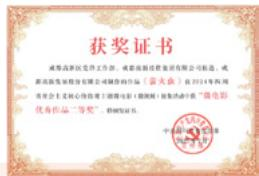

text_image

获奖证书
成都高新区经办工作部、成都高新投资集团有限公司制造、成都高新发展股份有限公司制作的作品（黄金版）自2014年利用在社会上名义地位整理《湖南电影》视频网，制作的小电影“电影优秀作品二等奖”特聘研发证书。
中国青年出版社

高新发展

四川省社会主义核心价值观主题微电影优秀作品二等奖

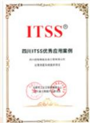  
倍智信工

四川省 ITSS 优秀应用案例

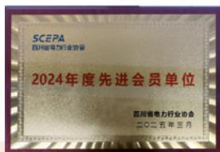

text_image

SCEPA
四川能源电力行业协会
2024年度先进会员单位
四川省电力行业协会
二〇二五年三月

倍特数能

2024年度先进会员单位

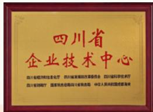

text_image

四川省
企业技术中心
四川省标准化信息餐厅 四川省发展和改革委员会 四川省科学技术厅
四川省财政厅 国家税务总局四川税务局 中文人民政府国家能源局

倍特建安

四川省企业技术中心能源数字化创新
先锋奖

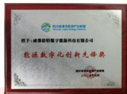

text_image

杭州绿盟太阳能产业联盟
China Green Energy Alliance
授予·成都倍特数字能源科技有限公司
能源数字化创新先锋奖
浙江绿盟新能源产业联盟
江苏绿盟科技

倍特数能

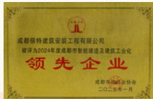

seal

成都信特建筑安装工程有限公司
被评为2024年度成都市智能建造及建筑工业化
领先企业
成都市科技工业协会
二〇二五年一月

倍特建安

2024年度成都市智能建造及建筑工业领先企业

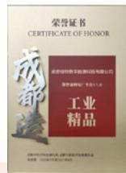  
倍特数能

成都工业精品

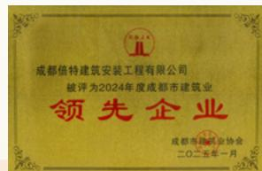

text_image

成都倍特建筑安装工程有限公司
被评为2024年度成都市建筑业
领先企业
成都市建筑业协会
二〇二五年一月

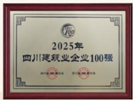

text_image

2025年
四川建筑业企业100强

倍特建安

2025年四川建筑业企业100强

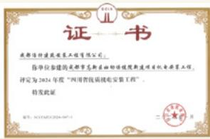

text_image

证书
成都信行建筑安装工程有限公司。
指华信市建的成都市东新街道怡源镇殷新项目机电安装工程，
评定为2024年度“四川智政统模机电安装工程”。
特发此证
编号：QYNNX2024-04-1

倍特建安

四川省优质机电安装工程

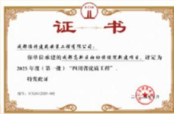

text_image

证书
成都伟德建筑幕墙工程有限公司。
你单位承诺的成都高新白纺轻纺新建项目，评定为
2025年度（第一期）“四周首层”工程。
特发此证
编号：XZ360/2025-002

倍特建安

四川省优质工程

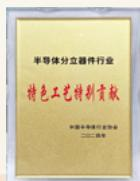  
芯未公司  
倍特建安

第十八届中国半导体行业协会半导体分立器件年会 - 特色工艺特别贡献

2024年度成都市建筑业领先企业

  
芯未公司

2024全球车规级功率半导体峰会- 功率半导体模块制造杰出供应商

## 公司荣誉

倍特数能

国家发展改革委第二批绿色低碳先进技术示范项目

倍特数能

全国工业领域电力需求侧管理典型案例(2025年)

倍特数能

科技型
中小企业倍特数能

四川省专精特新中小企业

倍特数能

2025年成都市绿色低碳技术装备目录

倍特数能

四川省工业领域绿色低碳技术装备目录

芯未公司

四川省专精特新中小企业

natural_image

Golden trophy on a pedestal (no text or symbols visible)

倍特建安

成都高新区建设行业2024年度先进企业

倍特建安

成都高新区建设行业突出贡献企业

## 2025 年 ESG 关键绩效

经营情况  

营业收入

49.80亿元

归属于上市公司股东的净利润

1.09亿元

治理绩效  

总资产

125.33亿元

向全体股东每 10 股派发现金红利

0.55元(含税),共派现1,937.54万元

反商业贿赂及反贪污培训覆盖的员工百分比

100%

合规意识培训

119次

ESG培训

公司

2次

未发生重大信息披露违规事项

公司内部控制设计及执行方面

不存在重大缺陷

环境绩效  
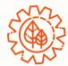

开展环保培训

160次

新增绿色智慧能源项目

4个

新增数智虚拟电厂平台项目

12个

新增分布式能源管理平台项目

2↑

新增建设绿色建筑项目面积

83.38万平方米

无纸化办公率

90%

污染物

100%达标排放

重大环境安全事故

0次

重大环境污染事故

0次

创新绩效  

研发投入

0.24亿元

研发人员数量

69人

研发人员占比

6.71%

持有已授权专利

118项

发明专利

43项

员工绩效  

员工总人数

1,029人

女性董事占比

22.22%

员工培训覆盖率

100%

安全绩效  

安全生产总投入

12,044万元

职业健康、安全生产类培训总时长约

1,506小时

职业病发生率

0%

## 02

## ESG 管理

## ESG Management

高新发展持续深化 ESG 治理体系建设。公司董事会切实履行监督职责，与时俱进提升可持续发展能力，推动 ESG 理念全面融入公司决策与日常运营。报告期内，公司修订了《董事会战略与 ESG 委员会工作规程》，为公司可持续发展提供制度保障。

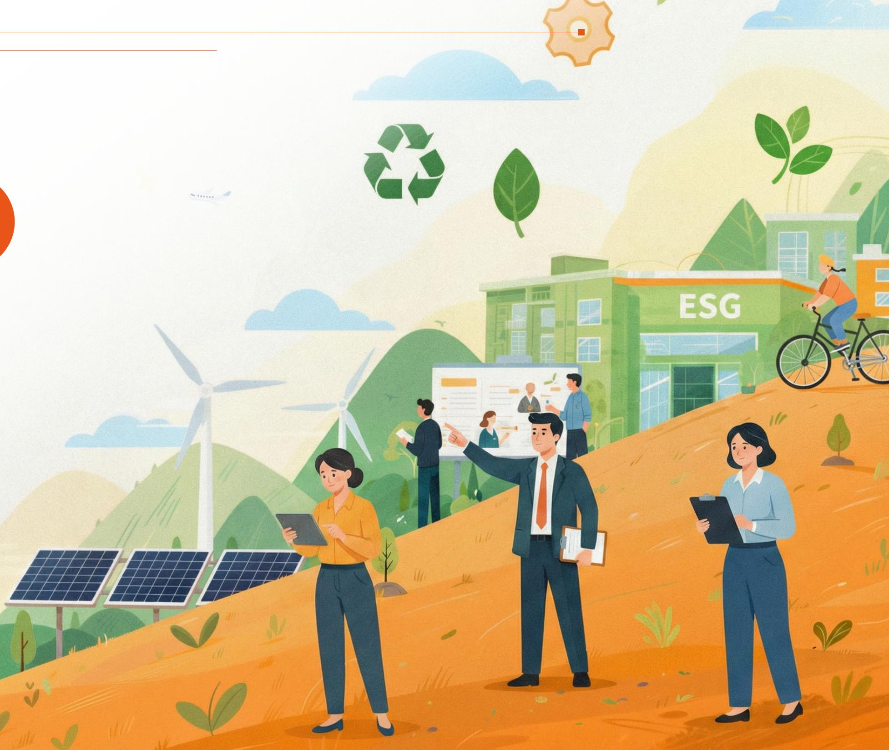

natural_image

Illustration of sustainable energy and business professionals in a rural landscape with solar panels, wind turbines, and ESG buildings (no text or symbols)

## ESG 治理架构

公司构建了由董事会、战略与 ESG 委员会及战略与 ESG 工作小组组成的三级 ESG 治理架构，各层级职责清晰、运转高效，推动 ESG 管理工作系统落地、常态运行。

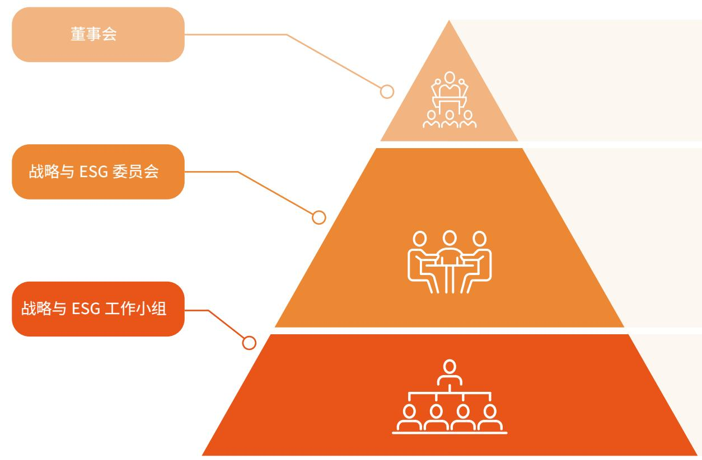

flowchart

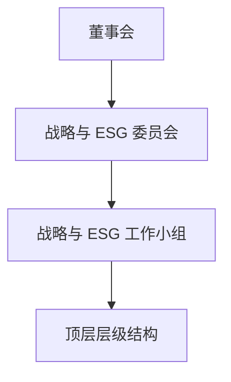
```mermaid
graph TD
  A["董事会"] --> B["战略与 ESG 委员会"]
  B --> C["战略与 ESG 工作小组"]
  C --> D["顶层层级结构"]
```

公司 ESG 治理架构及权责

报告期内

公司共组织开展公司级ESG培训

2次

## 关键绩效

作为公司 ESG 管理的最高决策机构，负责审议批准公司 ESG 战略目标及社会责任等重大事项。  
▶ 战略与 ESG 委员会对董事会负责，依照《公司章程》和董事会授权履行职责，拥有向董事会的提案权；  
对公司 ESG 的目标、规划、治理架构等进行研究并提出建议；  
识别及评估对公司业务具有重大影响的 ESG 相关风险和机遇，指导经营管理层对 ESG 风险和机遇采取适当的应对措施；  
审阅公司 ESG 相关报告并提出建议。  
▶ 负责战略与 ESG 委员会日常联络、会议组织、会议材料准备等事项；  
▶ 负责做好战略与 ESG 委员会决策的前期准备工作，提出公司发展战略与 ESG 规划的草案，或对公司发展战略与 ESG 规划进行评估、修订、完善，并提供相关的依据和相关资料，报战略与 ESG 委员会审核。

## 利益相关方沟通

公司持续完善利益相关方沟通机制,通过多元化渠道主动倾听并回应内外部利益相关方的关切与诉求,将意见建议作为优化 ESG 管理工作的重要依据,在动态对话中凝聚共识,持续提升可持续发展能力。

## 利益相关方群体

## 政府部门及监管机构

公司治理

反商业贿赂及反贪污

反不正当竞争

内控合规风控

员工

平等对待中小企业

环境合规管理

污染物排放

废弃物处理

## 沟通方式与渠道

领导及主管部门视察

合规巡查及检查

论坛、会议及研讨会

日常政策执行

## 股东和投资者

产品和服务安全与质量

创新驱动

公司治理

利益相关方沟通

尽职调查

ESG管理

股东会

投资者交流会

网上业绩说明会

互动易

投资者热线

电话咨询

电子邮件

定期报告及

官网信息披露

## 客户

产品和服务安全与质量

创新驱动

数据安全与客户隐私保护

绿色建筑

客户满意度调查

电子邮件与日常电话沟通

回应客户投诉

客户拜访

## 合作伙伴

供应链安全

平等对待中小企业

反商业贿赂及反贪污

反不正当竞争

甄选评估

采购流程

绩效评估

与业务伙伴定期

沟通(如电子邮件、会议)

## 员工

员工

产品和服务安全与质量

创新驱动

反商业贿赂及反贪污

内控合规风控

培训及入职培训

电子邮件及意见箱

定期会议

员工表现评估

员工活动

## 社会及公众

应对气候变化

污染物排放

废弃物处理

绿色建筑

环境合规管理

能源利用

水资源利用

乡村振兴

社会贡献

电子邮件

电话

公司公告

社交网络平台

公司网站

社交媒体

慈善捐赠

及志愿服务

社区活动

## 双重重要性议题分析

报告期内，公司遵循双重重要性原则，系统梳理国家宏观政策导向、国内外 ESG 标准演进及行业对标实践，结合公司战略规划、经营实际与利益相关方核心关切，对 ESG 相关议题开展综合分析研判与优先级排序，明确年度可持续发展管理工作重点。本报告详细披露报告期内关键 ESG 议题的管理情况，积极回应利益相关方诉求，推动 ESG 理念与业务发展深度融合。

## ESG 议题识别与筛选

立足公司业务发展实际与ESG管理现状，综合国家最新可持续发展政策导向、国内外主流ESG标准要求，并参照优秀同行披露实践及资本市场ESG评级机构关注要点，系统梳理与公司密切相关的ESG议题。

## 利益相关方沟通

公司紧密跟踪行业趋势与监管动态，依托多元化沟通渠道主动收集内外部利益相关方对可持续发展事项的反馈意见，及时回应各方关切，将相关诉求纳入 ESG 管理考量，持续深化共识。

## 分析结果并形成议题矩阵

基于调研结果，从“财务重要性”“影响重要性”两个维度开展综合评估，形成双重重要性矩阵，并围绕利益相关方高度关注的实质性议题，在本报告中进行针对性回应与重点披露。

双重重要性议题识别与评估步骤

高新发展双重重要性矩阵  
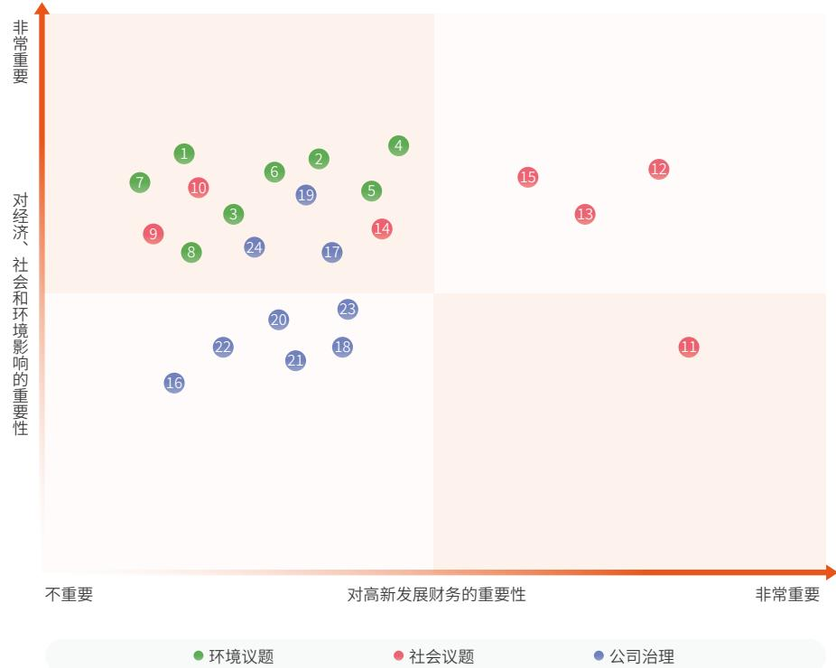

scatter

| ID | Category | Importance to Environment | Importance to Socialism | Importance to Company Governance |
| --- | --- | --- | --- | --- |
| 1 | 环境议题 | High | High | Low |
| 2 | 环境议题 | High | High | Low |
| 3 | 环境议题 | Medium-High | High | Low-Medium |
| 4 | 环境议题 | High | High | Low-Medium |
| 5 | 环境议题 | Medium-High | High | Low-Medium |
| 6 | 环境议题 | Medium-High | High | Low-Medium |
| 7 | 环境议题 | Medium-High | High | Low |
| 8 | 环境议题 | Medium | High | Low |
| 9 | 社会议题 | Medium | Medium-High | Low |
| 10 | 社会议题 | Medium-High | High | Low |
| 11 | 社会议题 | Low | Low | Low |
| 12 | 社会议题 | High | High | Low |
| 13 | 社会议题 | High | Medium-High | Low |
| 14 | 社会议题 | Medium-High | Medium-High | Low |
| 15 | 社会议题 | High | High | Low |
| 16 | 公司治理 | Low | Low | Low |
| 17 | 公司治理 | Medium-High | Medium-High | Low-Medium |
| 18 | 公司治理 | Medium-High | Medium-High | Low-Medium |
| 19 | 公司治理 | Medium-High | Medium-High | Low-Medium |
| 20 | 公司治理 | Medium-High | Medium-High | Low-Medium |
| 21 | 公司治理 | Medium-High | Medium-High | Low-Medium |
| 22 | 公司治理 | Medium-High | Medium-High | Low-Medium |
| 23 | 公司治理 | Medium-High | Medium-High | Low-Medium |
| 24 | 公司治理 | Medium-High | Medium-High | Low-Medium |
| 25 | 公司治理 | Medium-High | Medium-High | Low-Medium |
| 26 | 公司治理 | Medium-High | Medium-High | Low-Medium |
| 27 | 公司治理 | Medium-High | Medium-High | Low-Medium |
| 28 | 公司治理 | Medium-High | Medium-High | Low-Medium |
| 29 | 公司治理 | Medium-High | Medium-High | Low-Medium |
| 30 | 公司治理 | Medium-High | Medium-High | Low-Medium |
| 31 | 公司治理 | Medium-High | Medium-High | Low-Medium |
| 32 | 公司治理 | Medium-High | Medium-High | Low-Medium |
| 33 | 公司治理 | Medium-High | Medium-High | Low-Medium |
| 34 | 公司治理 | Medium-High | Medium-High | Low-Medium |
| 35 | 公司治理 | Medium-High | Medium-High | Low-Medium |
| 36 | 公司治理 | Medium-High | Medium-High | Low-Medium |
| 37 | 公司治理 | Medium-High | Medium-High | Low-Medium |
| 38 | 公司治理 | Medium-High | Medium-High | Low-Medium |
| 39 | 公司治理 | Medium-High | Medium-High | Low-Medium |
| 40 | 公司治理 | Medium-High | Medium-High | Low-Medium |
| 41 | 公司治理 | Medium-High | Medium-High | Low-Medium |
| 42 | 公司治理 | Medium-High | Medium-High | Low-Medium |
| 43 | 公司治理 | Medium-High | Medium-High | Low-Medium |
| 44 | 公司治理 | Medium-High | Medium-High | Low-Medium |
| 45 | 公司治理 | Medium-High | Medium-High | Low-Medium |
| 46 | 公司治理 | Medium-High | Medium-High | Low-Medium |
| 47 | 公司治理 | Medium-High | Medium-High | Low-Medium |
| 48 | 公司治理 | Medium-High | Medium-High | Low-Medium |
| 49 | 公司治理 | Medium-High | Medium-High | Low-Medium |
| 50 | 公司治理 | Medium-High | Medium-High | Low-Medium |
| 51 | 公司治理 | Medium-High | Medium-High | Low-Medium |
| 52 | 公司治理 | Medium-High | Medium-High | Low-Medium |
| 53 | 公司治理 | Medium-High | Medium-High | Low-Medium |
| 54 | 公司治理 | Medium-High | Medium-High | Low-Medium |
| 55 | 公司治理 | Medium-High | Medium-High | Low-Medium |
| 56 | 公司治理 | Medium-High | Medium-High | Low-Medium |
| 57 | 公司治理 | Medium-High | Medium-High | Low-Medium |
| 58 | 公司治理 | Medium-High | Medium-High | Low-Medium |
| 59 | 公司治理 | Medium-High | Medium-High | Low-Medium |
| 60 | 公司治理 | Medium-High | Medium-High | Low-Medium |
| 61 | 公司治理 | Medium-High | Medium-High | Low-Medium |
| 62 | 公司治理 | Medium-High | Medium-High | Low-Medium |
| 63 | 公司治理 | Medium-High | Medium-High | Low-Medium |
| 64 | 公司治理 | Medium-High | Medium-High | Low-Medium |
| 65 | 公司治理 | Medium-High | Medium-High | Low-Medium |
| 66 | 公司治理 | Medium-High | Medium-High | Low-Medium |
| 67 | 公司治理 | Medium-High | Medium-High | Low-Medium |
| 68 | 公司治理 | Medium-High | Medium-High | Low-Medium |
| 69 | 公司治理 | Medium-High | Medium-High | Low-Medium |

## 环境议题

① 应对气候变化  
② 污染物排放  
③ 废弃物处理  
④ 绿色建造与施工  
5 环境合规管理  
6 能源利用  
⑦ 水资源利用  
8 循环经济

⑨ 乡村振兴  
10 社会贡献  
11 创新驱动  
12 供应链安全  
13 产品和服务安全与质量  
14 员工权益与发展  
15 职业健康与安全生产

16 数据安全与客户隐私保护  
17 公司治理  
18 尽职调查  
19 利益相关方沟通  
20 反商业贿赂及反贪污  
21 反不正当竞争  
22 内控合规风控  
23 平等对待中小企业  
24 ESG 管理

高新发展议题清单

## ESG 绩效与经营管理层薪酬

公司将 ESG 管理全面纳入经营管理层绩效考核体系，建立健全 ESG 绩效与经营管理层薪酬挂钩机制，由董事会薪酬与考核委员会对总经理、副总经理、财务总监等经营管理层进行考核打分。考核覆盖 ESG 指标体系搭建与完善、年度 ESG 报告编制与披露、安全环保与应急管理、合规管理等核心指标。通过该机制的常态化运行，公司持续强化经营管理层的可持续发展责任意识，促进 ESG 理念全面融入日常经营决策。报告期内，公司荣获 “2025 年度上市公司 ESG 价值传递奖”，体现了外界对公司 ESG 管理实践的认可。

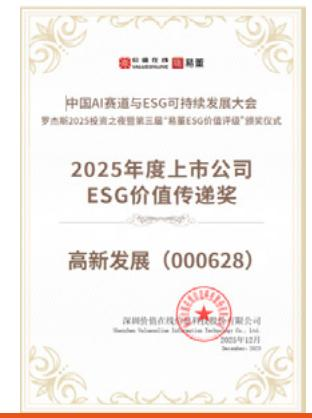

text_image

中国AI赛道与ESG可持续发展大会
罗杰斯2025投资之夜暨第三届“易董ESG价值评级”颁奖仪式
2025年度上市公司
ESG价值传递奖
高新发展（000628）
深圳价值在线传媒科技有限公司
Shenzhen Valuation Information Technology Co., Ltd.
2025年12月
December 2025

公司荣获2025年度上市公司ESG价值传递奖

## 03

## 治理篇

## Governance

卓越的治理是公司实现可持续发展的基石。高新发展将党的领导融入公司治理各环节，确保决策科学有效，推动各项部署充分落地，切实保障内部利益相关方的合法权益。在商业活动中，公司严守反腐败、反不正当竞争底线，恪守商业道德，同时加强数据安全与客户隐私保护。通过规范的治理实践，公司持续夯实管理基础，为稳健运行提供有力支撑。

## 本章所回应的 ESG 重大性议题

- 坚持党建引领  
- 完善公司治理  
- 商业道德管理

- 平等对待中小企业  
- 数据安全与客户隐私保护

-

flowchart

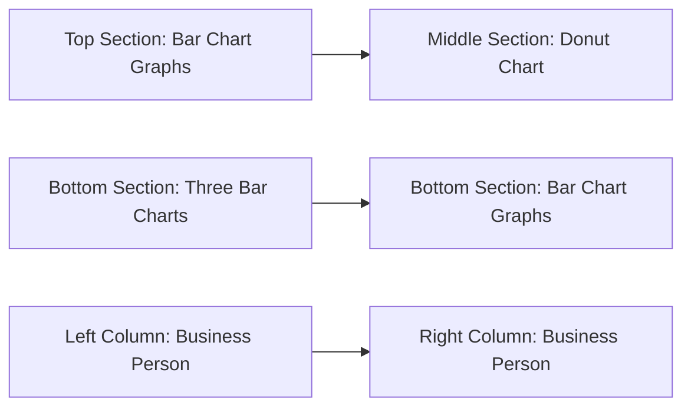
```mermaid
graph LR
  A["Top Section: Bar Chart Graphs"] --> B["Middle Section: Donut Chart"]
  C["Bottom Section: Three Bar Charts"] --> D["Bottom Section: Bar Chart Graphs"]
  E["Left Column: Business Person"] --> F["Right Column: Business Person"]
```

## 坚持党建引领

高新发展始终坚持党的领导，以持续深化的理论武装筑牢思想根基，为公司高质量发展把准政治方向。公司不断加强组织建设，优化组织设置，选优配强骨干，着力建强基本队伍，夯实基层党组织战斗堡垒。公司通过全面落实党建入章、规范党组织议事机制，保障基本制度与基本活动有序运行，进一步发挥党支部的战斗堡垒作用。同时，公司从严规范党员组织关系与基层党建管理，并积极开展“党建+”活动，推动党建工作与企业发展深度融合、提质增效，为公司可持续发展注入强大动能。

## 案例

## 党建联建促融合，能源合作开新篇

2025 年 10 月，倍特数能党支部与川投（攀枝花）新能源开发有限公司党支部开展主题党建联建活动。双方围绕 “党建链赋能产业链” 深入交流，分享重大项目推进中的党建经验，并签署《党建联建共建协议书》与《廉洁共建承诺书》。双方共同打造的四川时代储能项目，已成为党建链与产业链融合的生动实践。活动推动了党建与业务深度融合，促进了产业链协同发展，为能源合作注入新动能。

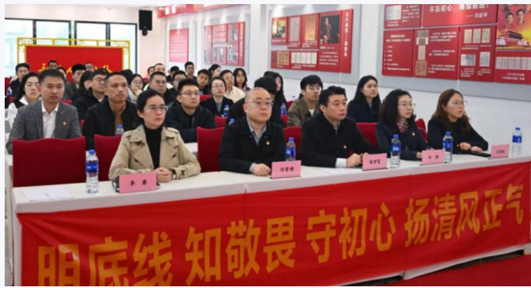

text_image

不忘初心、守初心
——习近平
明底线 知敬畏 守初心 扬清风正气

▲党建联建活动

## 案例

## 弘扬清廉文化，筑牢思想防线

2025 年 10 月，倍特建安第二党支部组织全体党员赴成都杜甫草堂廉洁教育基地开展 “弘扬清廉文化，践行初心使命” 主题党日活动。党员们参观了茅屋故居、廉洁长廊、大雅堂等场所，深刻感悟杜甫的民本情怀与廉洁精神，并通过 “草堂一课” 集中观看《古诗词中的廉洁密码》专题片，汲取传统文化中的廉政智慧。此次活动强化了党员干部的纪律意识与廉洁自律能力，为公司高质量发展营造了风清气正的政治生态。

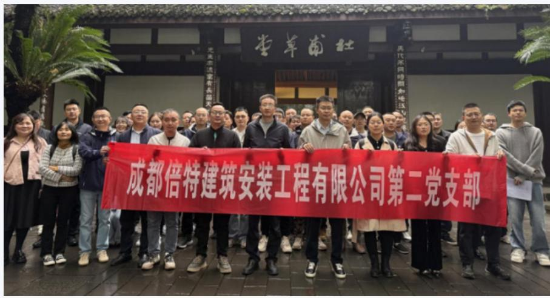

text_image

成都倍特建筑安装工程有限公司第二党支部

▲ 主题党日活动

## 完善公司治理

高新发展高度重视公司治理工作，持续提升规范运作水平，积极构建高效透明的沟通机制，切实保障投资者合法权益。同时，公司不断完善内控合规与风险防控体系，持续增强风险抵御能力。

## 治理架构

公司严格遵循《中华人民共和国公司法》《中华人民共和国证券法》《上市公司治理准则》《上市公司独立董事管理办法》及《深圳证券交易所上市公司自律监管指引第1号——主板上市公司规范运作》等法律法规及监管规定，持续完善以股东会、董事会和经营管理层为核心的法人治理结构，确保权责明确、有效制衡。

股东会作为公司最高权力机构，依法依规对公司重大事项进行决策。董事会是公司的决策机构，严格按照《公司章程》《董事会议事规则》《独立董事工作制度》等规定行使职权、履行职责，并执行股东会决议。为提升决策的专业性与科学性，董事会下设四个专业委员会，包括战略与ESG委员会、审计委员会、薪酬与考核委员会以及提名委员会，协助董事会履行决策与监督职能。2025年，公司组织董事会与高管人员进行线上与现场结合的一系列公司治理相关培训，提升了公司的治理能力。

关键绩效

<table><tr><td rowspan="4">报告期内</td><td>股东会会议</td><td>董事会会议</td><td>董事会平均出席率</td><td>董事会成员</td></tr><tr><td>3次</td><td>10次</td><td>100%</td><td>9名</td></tr><tr><td>独立董事</td><td>占比</td><td>女性董事</td><td>占比</td></tr><tr><td>3名</td><td>33.33%</td><td>2名</td><td>22.22%</td></tr></table>

高新发展组织架构图  
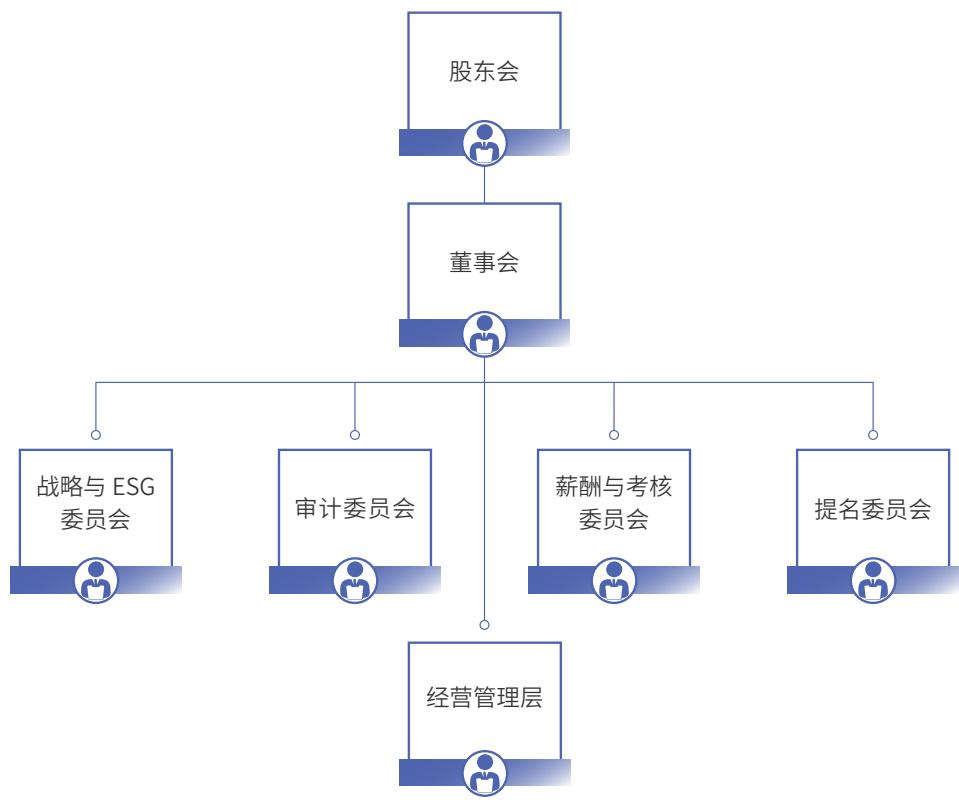

flowchart

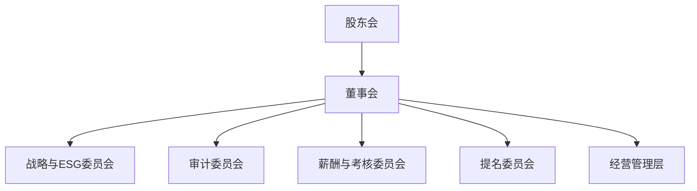
```mermaid
graph TD
  A["股东会"] --> B["董事会"]
  B --> C["战略与ESG委员会"]
  B --> D["审计委员会"]
  B --> E["薪酬与考核委员会"]
  B --> F["提名委员会"]
  B --> G["经营管理层"]
```

## 投资者关系管理

公司高度重视与投资者的沟通交流，努力构建透明、高效、互信的投资者关系。2025年，公司通过持续完善投资者关系管理制度、召开投资者业绩说明会、接听投资者电话和积极回复互动易投资者提问等方式，持续提升投资者关系管理水平，切实保障投资者特别是中小股东的合法权益。

## 管理制度与沟通渠道

公司将信息披露纳入经营管理层的年度考核，并于 2025 年 10 月修订并发布了《信息披露管理制度》《投资者关系管理制度》，进一步规范了投资者关系管理工作。

公司建立了多元化的沟通渠道，包括投资者热线电话、公司邮箱、互动易、现场接待、股东会及业绩说明会等，确保投资者能够便捷地获取信息并表达诉求。

## 案例

## 线上沟通实践，促进投资者交流便利性

2025 年，公司积极通过线上平台与投资者保持密切互动，于 9 月通过 “全景路演” 平台，在线参加了四川辖区 2025 年投资者网上集体接待日及半年度报告业绩说明会。会议以网络文字互动方式就公司科技转型战略、股东回报、ESG 工作等投资者关心的问题进行了坦诚细致的交流。例如，针对投资者关于 ESG 工作的问询，公司详细介绍了已搭建的 ESG 三级治理架构及相关工作规程的制定情况，并说明了 2024 年度 ESG 报告的披露情况。全年公司共举办 2 次业绩说明会，有效增进了市场对公司的理解与认同。

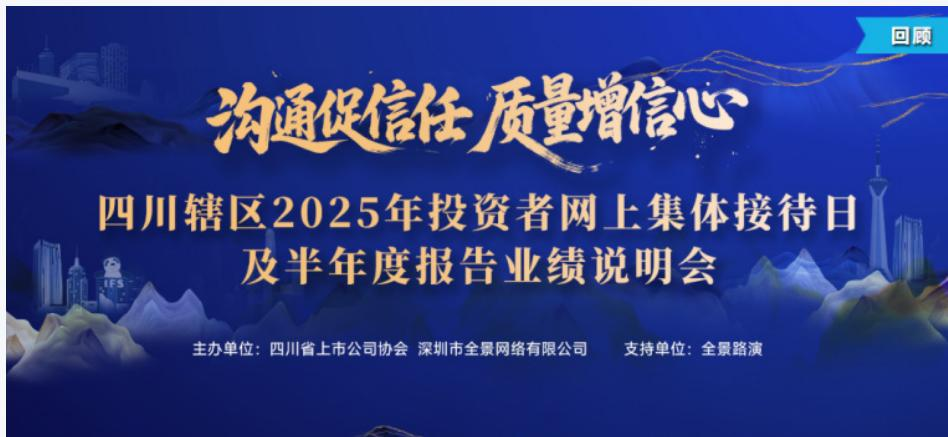

text_image

回顾
沟通促信任 质量增信心
四川辖区2025年投资者网上集体接待日
及半年度报告业绩说明会
主办单位：四川省上市公司协会 深圳市全景网络有限公司 支持单位：全景路演

▲四川辖区 2025 年投资者网上集体接待日及半年度报告业绩说明会

## 股东回报与权益保护

公司高度重视对投资者的合理回报，持续与股东分享发展成果。为建立稳定、可持续的分红机制，公司根据相关法规制定了《成都高新发展股份有限公司未来三年（2024-2026年）股东回报规划》，明确在符合利润分配条件时，每年以现金方式分配的利润不少于当年实现的可分配利润的30%。

公司独立董事亦积极履职，通过在关联交易、内部控制、财务报告等关键事项上严格把关，主动倾听中小股东诉求，并借助独立董事专门会议提供专业建议，多维度筑牢中小投资者权益保护屏障。

## 保护中小投资者

公司控股股东成都高新投资集团有限公司及其一致行动人（成都高新未来科技城发展集团有限公司、成都高新科技创新投资发展集团有限公司）共同承诺：自2024年4月19日起的24个月内(即截至2026年4月19日)，不减持其直接或间接持有的上市公司股份，且在此期间无任何减持计划。

## 关键绩效

报告期内

公司互动易提问答复率为100%

## 内控合规风控

公司重视合规经营与风险管理，秉持“合规为本，全员有责，风险管控，高效稳健”的核心理念，建立了完善的内部控制体系，确保运营稳健并符合法律法规要求。通过持续的制度优化、风险识别与管理，为公司的稳健经营与可持续发展提供保障。

## 合规管理体系

公司设立了清晰的合规管理组织架构，审计法务部作为牵头部门负责组织协调，各业务部门及下属子公司承担主体责任。公司建立了包括风险识别评估、制度制定优化、执行检查、宣贯培训及持续改进在内的完整合规风险管理流程。

## 税务管理

公司制定了《税务管理办法》，推进税务信息化建设，税务管理平台及销项开票管理系统已建成上线，并完成了与财务系统、日常办公系统的互联互通，提升了财税工作效率与风控水平。

## 内部控制与风险评估

公司严格遵循《中华人民共和国公司法》《企业内部控制基本规范》等法律法规及监管要求，持续优化内部控制体系。2025年，公司修订了《违规经营投资责任追究工作办法（试行）》《内控制度管理办法》和《内部审计管理办法（2025版）》，新制定了《违规经营投资责任追究工作报告制度（试行）》，进一步明确了权责、规范了流程。

此外，公司建立了常态化的风险管理评估机制，定期开展内部控制自我评价，确保内控体系持续适应发展需求。审计法务部按计划开展了涉及内部控制、业务流程、领导经济责任等多项专项审计，通过边审边改、长效跟踪等方式推动问题整改，促进管理提升。

## 风险识别

## 风险分析

## 风险应对

## 风险管理评估流程

## 风险管控与合规文化

公司构建了“总部统筹指导 + 子公司自主管理”的双层法律风险管控体系。公司审计法务部通过建立累计诉讼 / 仲裁台账预警体系进行统筹管理，子公司压实主体责任并建立了常态化对接渠道。公司通过业务部门合同履行跟踪和法务前置支持识别风险，建立了案件分类界定、全流程处理规范及“日常报送 + 定期评估 + 专项披露 + 潜在预警”的报送体系，确保法律风险可控、信息披露合规。

公司高度重视合规文化培养，2025年共组织合规培训119场，参训4,498人次，覆盖各层级员工，并针对合同管理、建设工程法律风险、内部审计新规等关键领域开展专题培训，有效提升了全员合规意识与风险防范能力。

## 案例

## 开展合同管理专题培训，强化控制业务操作风险

公司审计法务部于 2025 年 3 月组织开展了合同管理常见法律风险剖析及关注要点专题培训，面向公司总部各部门及下属子公司涉及合同管理的相关业务人员，共 125 人参训。培训紧密围绕公司《合同管理办法》，系统剖析了合同全生命周期管理中的关键环节与风险点，还结合《中华人民共和国民法典》合同编的最新规定，通过典型案例深度解析了国有企业合同管理中的法律盲点与实务难点。培训提供了实用的风险防范策略与实践技巧，有效增强了参训人员的合规意识与业务操作中的风险防控能力。

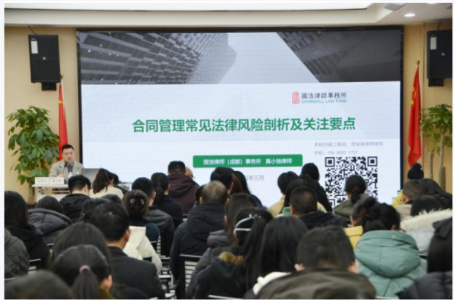

text_image

國浩律師事務所
GUANDALL LAW FIRM
合同管理常见法律风险剖析及关注要点
國浩律師（成都）事务所 莫小驰律师
手机扫描二维码，添加英律师微信
手机：755 3688 1277
2024年三月

▲ 合同管理常见法律风险剖析及关注要点专题培训

## 案例

## 开展工程法律专题培训，提升合规管理能力

公司审计法务部于2025年8月牵头组织，特邀北京德恒（成都）律师事务所专业律师，就“建设工程转包、分包、挂靠的法律解析与发包人风险防控实务”开展专题培训。公司总部相关部门及子公司的管理及业务人员共63人参加了培训。培训深入解析了四类工程行为的法律界定、认定标准、法律后果及常见表现形式，重点讲解了在合同订立、过程履约等关键环节构建风险防控机制的具体方法，强化了公司在法律框架内推动项目高质量建设的合规管理能力。

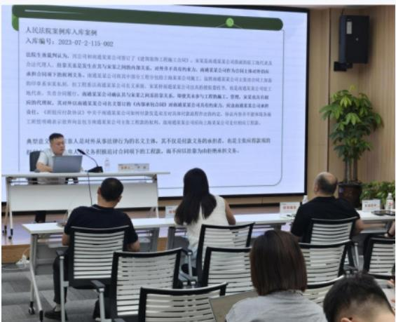

text_image

人民法院案例库入库案例
入库编号：2023-07-2-115-002

法院生效裁判认为，丙公司和南通复星公司签订了《建筑装饰工程施工合同》，宋家是南通复星公司的组织的职工代表大会及合法代理人。杜家关系是发生在其与宋家之间的内部关系，对外并不具有约束力。南通复星公司作为合同主体承担的协助合同项下的权利义务。南通复星公司将其中部分工程分包给上海复星公司施工。虽然南通复星公司全部合同中上海承担的劳务未受处罚。杜工程依法南通复星公司英文审核，宋家将南通复星公司出具的授权委托书、商品南通复星公司向上海市土地拍卖、先告合同履行。南通复星公司确认与其与宋家之间的联系关系，将使其参与工作的施工、管理，宋家也具有相应的代理权。其对所以南通复星公司在文签署订的《内部承包合同》的南通复星公司具有的约束力，向南通复星公司承担的责任。（在经评估审计后）中关于南通复星公司材料付款权是双方共同对付款权的约定，协议内容并非能够具备条件。《工程用例明确表示同意向信托南通复星公司实施工程款的权利，按照南通复星公司向上海复星公司支付相应工程款。

典型法人律师人员对外具体法律行为的名义主体，其不仅是付款义务的承担，但是直接向款项的缴纳方式由乙方承担。债务承担合计合同项下的工程款，而不应以挂象为由纠纷承担义务。

▲建设工程法律风险防控专题培训

## 关键绩效

报告期内

公司共开展合规层面培训

119 次

共有

4,498 人次参与

培训总时长约为

11,675.5 小时

natural_image

Illustration of a person interacting with a large circular display and clock, no text or symbols present

## 商业道德管理

公司坚持将商业道德建设融入企业治理与日常运营，持续健全以反腐败、反不正当竞争为核心的制度体系与执行。公司审计法务部牵头制定了《商业道德行为准则》，进一步明确员工在商业活动中的行为规范，引导全体员工恪守合规底线、坚守职业操守，推动商业道德要求在业务实践中有效落地，为公司稳健经营提供坚实保障。

## 反腐败与反商业贿赂

公司始终坚持依法合规经营，将反腐败与反商业贿赂作为企业治理的红线与底线。为保障国有资产安全完整、实现保值增值，并推动公司长期可持续发展，公司制定并严格遵守《商业道德行为准则》，其中明确禁止任何形式的贿赂、腐败及不正当利益输送行为。公司要求全体员工在经营管理活动中严格遵守党纪国法及企业内部规章制度，恪守专业、公正、廉洁、诚信的职业操守，坚决抵制一切不道德、不正当及非法业务手段。通过持续强化廉洁意识与制度约束，公司致力于构建清正、透明、合规的治理生态，为高质量发展筑牢道德与法治根基。

## 廉洁监督

公司持续健全廉洁监督组织架构，构建三级监督体系，有效推动监督力量向基层延伸、监督触角向项目一线下沉，强化对业务末端的常态化纪律约束与风险防控。

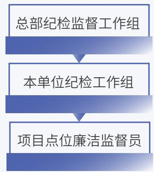

flowchart

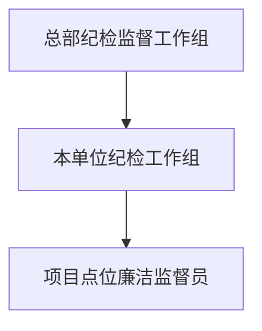
```mermaid
graph TD
  A["总部纪检监督工作组"] --> B["本单位纪检工作组"]
  B --> C["项目点位廉洁监督员"]
```

三级监督体系

公司严格遵循《中华人民共和国监察法》等法律法规，持续完善内控制度体系，完成《员工廉洁从业行为规范》《纪检监察工作组工作办法》的修订，并新制定《协同监督工作管理办法》，系统编印《纪检工作制度汇编》，从制度层面进一步明确员工廉洁从业准则、规范纪检监察工作组履职要求、厘清职能部门协同监督路径，为监督工作的提质增效提供系统性制度支撑。

## 举报渠道

公司持续完善反贪腐举报受理机制，系统构建多元化、便捷化的举报渠道。通过在项目部、园区等经营一线设置举报信箱、张贴举报宣传板，并同步开通网络“码上举报”平台，有效畅通线上线下问题线索反映路径。针对受理的举报事项，公司实行专项监督组跟进机制，明确专人负责，开展现场核查，并根据问题性质分类采取督促整改、线索核查、立案调查或转办移交等处置方式，确保举报问题得到及时、规范、有效处理，切实提升监督执纪的精准性与响应效率。

## 举报人保护

公司高度重视监督举报人权益保障与执纪监督工作的规范运行，先后制定并实施《纪检监察部保密制度》《纪检监察部线索管理制度》《纪检监察部工作纪律》等一系列内部制度文件，从制度机制层面切实维护举报人合法权益。在问题线索管理方面，公司严格落实专人专责管理机制，对线索调查核实工作实行统筹调度、专组专办，持续规范工作流程、严明工作纪律，坚决杜绝“跑风漏气”、办“人情案”“关系案”等行为，确保执纪监督过程的严肃性与公信力。

natural_image

Illustration of two people examining a large digital security icon with lock and magnifying glass (no text or symbols)

## 廉洁文化建设

公司以多元形式系统推进纪法教育与警示教育走深走实。2025年，累计组织开展警示教育与廉洁培训5场，覆盖党员干部职工800余人次，全面提升员工廉洁从业素养。定期组织警示教育专题会，邀请专家阐释廉洁从业要义；开设定制化廉洁课程培训，覆盖法律法规与职业道德规范；通过内部通报典型案例，以案明纪、以案释法，引导干部员工知敬畏、存戒惧、守底线。上述举措有效强化员工廉洁自律意识，培育风清气正的企业文化，为公司健康发展筑牢思想根基。

## 案例

## 作风建设深化实践，抓作风、提质能、促发展

2025 年 8 月，公司组织召开 “抓作风、提质能、促发展” 作风建设专题会议，公司及子公司班子成员、职能部门负责人及党员代表共 60 余人参会。会议深入贯彻落实中央八项规定精神，围绕常态化长效化推进能力作风建设进行再动员、再部署。与会党员干部表示，将以此次会议为契机，依托 “三会一课”、公司例会等载体推动会议精神落地转化，持续夯实企业高质量发展作风根基。

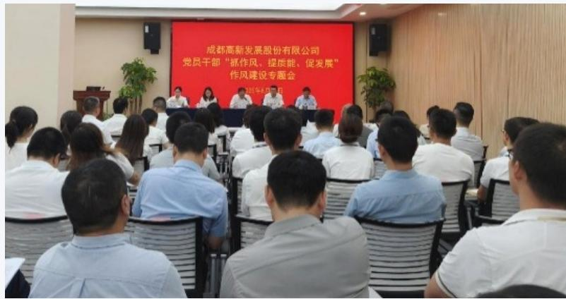

text_image

成都高新发展股份有限公司
党员干部“抓作风、提质能、促发展”
作风建设专题会

▲抓作风、提质能、促发展”作风建设专题会议

## 案例

## 节前警示教育：以案促学，筑牢廉洁防线

2025 年国庆中秋双节前夕，公司组织召开节前警示教育专题会，领导班子成员、各党（总）支部及纪检委员、中层及以上管理人员、项目负责人与员工代表等 160 余人参会。全体人员集中观看警示教育片，扫码学习典型案例及相关法规，并重点研学《中国共产党纪律处分条例》《国有企业领导人员廉洁从业若干规定》及非法经营同类营业罪等法律法规。本次会议紧扣关键节点，以案示警、以学促廉，切实增强廉洁从业意识。

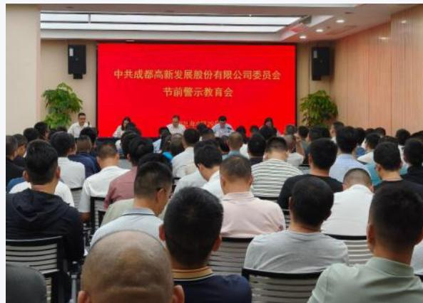

text_image

中共成都高新发展股份有限公司委员会
节前警示教育会

▲节前警示教育会议

## 关键绩效

报告期内

公司开展反商业贿赂及反贪污廉洁教育方面培训
10 次

培训覆盖的员工比例为100%

签署廉洁承诺书的员工比例为100%

供应商签署《廉洁协议》的比例为100%

## 反不正当竞争

公司严格遵守《中华人民共和国反不正当竞争法》及相关法律法规，倡导并践行正当竞争文化，要求全体员工在业务活动中以合规为前提，坚决抵制任何形式的商业贿赂、窃取商业秘密、虚假宣传及垄断行为。公司制定了《商业道德行为准则》，进一步强化对公平竞争与合规经营的制度保障。审计法务部作为反垄断与公平竞争管理的职能部门，组织开展相关宣贯，提升员工对公平竞争要求的理解和执行能力。在收集与分析市场竞争信息时，员工须严格遵循公司制度，尊重他人知识产权与商业秘密，严禁通过非法或不道德手段获取竞争优势。

## 平等对待中小企业

公司秉持公平公正的原则，平等对待中小企业合作伙伴，严格遵守法律法规要求，确保供应链合作的合规性。报告期内，公司未出现逾期未支付款项，未有拖欠中小企业款项的情况。公司在对外业务合作过程中平等对待中小企业，充分体现了对中小企业的支持与责任担当。

natural_image

Illustration of a balance scale with people using laptops and megaphones, symbolizing law or business (no text or symbols present)

## 数据安全与客户隐私保护

公司始终将数据安全作为企业运营的重要组成部分，以制度建设与技术防护相结合的方式，切实保障客户隐私与数据资产安全。

## 管理架构

公司构建了由信息化建设领导小组、企业数字化运营工作组及领导小组办公室组成的三层数据安全管理架构。领导小组负责战略指导与统筹协调，企业数字化运营工作组作为核心执行单元，对信息化项目全生命周期的技术可行性、实施质量及系统安全负直接责任，并具体负责公司信息安全管理工作，包括网络安全、数据安全等，确保数据安全管理与业务建设同步规划、同步实施。

natural_image

Abstract 3D illustration of digital security and user service icons (no text or symbols)

战略指导与统筹协调机构，负责研究公司数字化规划、年度计划及预算方案，并协调跨部门、子公司的重大事项

信息化建设
领导小组

核心执行单元，对信息化项目全生命周期的技术可行性、实施质量、进度控制及系统安全负直接、全面责任，并具体负责信息安全与资产管理等工作

企业数字化运营工作组

需求提出部门，负责梳理并提报信息化建设需求，并承担本部门/本企业主营业务系统的测试、验收、推广应用及内容维护等

公司总部各部门 / 各子公司

公司信息化工作组织体系  
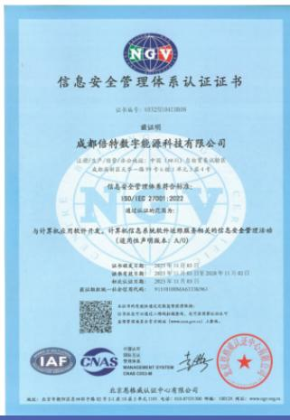

text_image

信息安全管理体系认证证书
证书编号：033251043808
验证证明
成都倍特数字能源科技有限公司
工商号/注册/办公地址：中国（省）自由贸易试验区成都高新区南三环路1号1栋2单元2,2,4号
信息安全管理体系标准
ISO/IEG 27001-2022
通过认证的范围为准
与计算机应用软件开发，计算机信息系统软件运维服务相关的信息安全管理活动
（适用性声明版本：A/D）
证书颁发日期：2021年11月01日至2021年11月02日
批准发证日期：2021年11月01日至2021年11月02日
相关证书日期：2021年11月01日至2021年11月02日
获取证书前统一社会信用代码：91310100MAAT3XJ63
北京市科学技术局通过北京安源协和科技有限公司
公司及子公司已取得相应的授权，也可凭营业执照依法可
监督管理委员会登记备案（国家登记机关）注册。
IAF CNAS GANZHEN INFORMATION SYSTEM CO.,LTD.
北京恩捷新认证中心有限公司
地址：北京市海淀区思明路88号院6号楼1层10层1单元101室、电话：010-69353088 码编：100124 网址：www.njrgn.cn

倍特数能 ISO 27001 认证

## 信息安全管理举措

公司严格遵守《中华人民共和国网络安全法》《中华人民共和国数据安全法》《中华人民共和国个人信息保护法》等法律法规，将数据安全与客户隐私保护纳入信息化建设全生命周期管理。公司遵循“同步规划、同步建设、同步使用”方针，明确“谁建设谁负责，谁运行谁负责”原则，实行分级管理。企业数字化运营工作组统筹负责信息安全体系构建，涵盖机房、网络、数据安全等关键领域，全面落实等级保护、账户密码安全管理、终端防护及软件正版化要求。

公司严禁擅自引入未经审核的工具应用，严防数据泄露风险；建立信息安全应急预案与通报机制，定期开展应急演练，提升快速响应与恢复能力。同时，公司主动接受上级监管检查，对重大安全事故、违规行为严格追责问责，持续筑牢网络安全防线，切实保障客户隐私与数据资产安全。

## 关键绩效

报告期内

公司在信息安全与隐私保护方面投入资金

320 万元

覆盖

1,000 人次

开展信息安全与隐私保护意识培训

10 场次

培训总时长约

1,200 小时

## 案例

## 信息安全每日一学，轻量化推送构建常态意识防线

2025 年第四季度，面对生成式 AI 广泛应用带来的新型网络安全挑战，公司针对员工安全意识薄弱环节，创新推出“信息安全每日一学”轻量化推送机制。公司连续 10 个工作日通过企业微信工作台“企业数字化运营”模块推送至全体员工，内容涵盖 AI 安全、数据分类、社交工程防范、远程办公安全等 12 大主题的微学习内容。该模式以“轻量高频、精准触达”将安全培训无缝嵌入日常工作，推动安全意识由制度约束向组织本能转化，持续筑牢全员数字安全防线。

## 客户隐私保护

公司高度重视客户隐私保护，持续健全信息安全管理机制。全体相关员工均签署《保密协议》，严格规范职业行为与信息使用权限。公司依据员工岗位等级及信息机密程度，实施精细化权限配置与访问控制，确保客户信息仅限授权人员按需使用，切实防范隐私泄露风险，筑牢客户信任与数据安全防线。

## 关键绩效

报告期内

客户隐私资料泄露事件次数为

0

natural_image

Illustration of a person using a laptop with server racks and server icons, next to a shield symbol (no text or symbols present)

## 04

# 环境篇

## Environmental

高新发展深刻认识到，推动绿色发展不仅是企业应尽的社会责任，更是实现可持续发展的内在要求。公司积极响应国家“双碳”目标，将绿色低碳理念融入战略规划与日常运营，通过持续完善环境管理体系，并在建造施工、园区运营、封装加工等业务中全面践行绿色实践，最大程度减少项目全生命周期对环境的影响。同时，通过开展环保宣传与倡议活动，公司积极探索业务增长与环境保护协同共进的发展路径，为生态文明建设贡献企业力量。

## 本章所回应的 ESG 重大性议题

- 环境合规管理  
·资源利用  
- 排放物与废弃物处理

- 绿色建造与施工  
- 应对气候变化

$\therefore m = \frac{3}{11}$

$\therefore m = \frac{3}{11}$

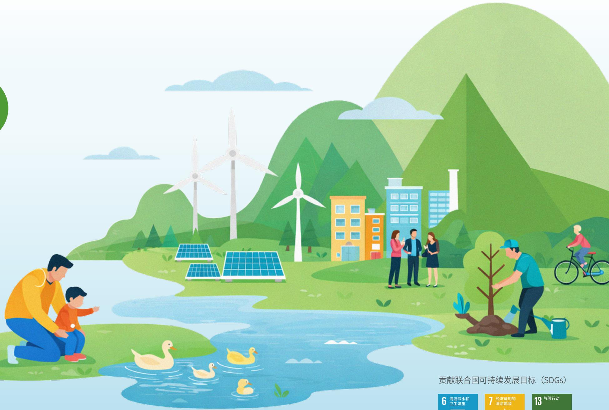

text_image

贡献联合国可持续发展目标（SDGs）
6 清洁饮水和卫生设施
7 经济适用的清洁能源
13 气候行动

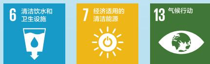

## 环境合规管理

高新发展致力于构建并持续完善环境管理体系，高度重视环境合规，将绿色理念深度融入各项运营与施工活动。公司严格贯彻“安全第一、预防为主、综合治理”的方针，全面落实《中华人民共和国环境保护法》《建设工程安全生产管理条例》等国家法律法规及行业规范，以及《安全生产管理制度》《安全检查与隐患排查治理制度》等内部管理制度，切实履行环境保护的企业责任。

为提升环境管理的精细化与有效性，公司要求各子公司紧密结合所在区域的环境特征与自身业务特点，制定并实施针对性的环境管理策略。同时，公司积极推动并支持子公司建立国际公认的环境管理标准，监督环境管理体系的持续有效运行与不断改进。

## 关键绩效

报告期内

公司及下属子公司倍特建安、芯未公司、倍智信工

的 ISO 14001环境管理体系认证均在有效期内并

通过外部第三方监督审核

倍特数能

新增环境管理体系认证证书

公司及下属子公司

均未因环境事件受到生态环境等有关部门的重大行政处罚

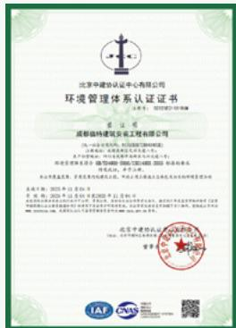

text_image

北京中建认证中心有限公司
环境管理体系认证证书
（一）企业资质证书、项目登记证明复印件
名称：中国环保认证协会
住所：北京市海淀区中关村大街1号
法定代表人：王洪波
经营范围：环保工程设计、施工、监理、技术咨询、技术交流、技术转让、技术推广；环保技术咨询服务；环保技术培训服务；环保技术咨询；环保技术培训服务；环保技术培训服务；环保技术培训服务；环保技术培训服务；环保技术培训服务；环保技术培训服务；环保技术培训服务；环保技术培训服务；环保技术培训服务；环保技术培训服务；环保技术培训服务；环保技术培训服务；环保技术培训服务；环保技术培训服务；环保技术培训服务；环保技术培训服务；环保技术培训服务；环保技术培训服务；环保技术培训服务；环保技术培训服务；环保技术培训服
务单位：中国环保认证中心
负责人：李晓峰
联系电话：021-63898888
传真：021-63898888
IAF CNAS
董事会
北京中建认证中心有限公司
环境管理体系认证证书

环境管理体系认证证书

## 环境管理架构

为保障公司环境管理目标的实现与持续改进，公司已构建权责清晰、运行有效的管理架构。公司安全生产委员会（“安委会”）作为安全生产与环境管理工作的最高领导与决策机构，安委会主任由公司董事长和公司党委书记、总经理担任，成员涵盖各职能部门负责人及各子公司总经理，负责依据国家法律法规，对公司及下属各子公司的环境保护与安全生产工作实施全面领导与监督。

安委会下设安全环保与应急监督管理部，作为环境管理专职部门，具体负责安委会的日常协调、监督执行与组织考核等工作。同时，公司要求下属各子公司根据自身业务开展情况，设立安全生产委员会或安全生产领导小组，负责统一领导本单位安全生产与环境管理工作，研究解决安全生产和环保的重大问题。

## 安全生产委员会

安全生产委员会办公室

(安全环保与应急监督管理部)

负责环境保护管理相关工作

natural_image

Illustration of two people shaking hands in front of a large screen displaying data and charts, with green bars and server racks in the background (no text or symbols)

高新发展环境管理架构

## 突发环境风险事件

高新发展始终秉承“居安思危、预防为主”的应急管理方针，不断提高应对风险和防范事故的能力，最大限度地减少环境和社会负面影响。公司依据《中华人民共和国突发事件应对法》《突发事件应急预案管理办法》《四川省突发事件应对法》等相关法律法规，于报告期内制定《生产安全事故综合应急预案》，修订《应急管理制度》，构建“预防—准备—响应—恢复—改进”的全流程应急管理体系，以明确的预案、充足的资源、定期的演练为基础，以分级响应、现场科学处置为核心，以事后评估与持续改进为保障，全面提升对突发环境风险事件的应对能力。

同时，公司要求各子公司结合本单位实际情况，制定科学的安全风险辨识与防范程序，持续围绕生产工艺、设备设施、作业环境等方面，开展环境风险因素识别，制定并完善风险控制措施，加强突发环境事件应急处置能力。

## 环保培训

公司每年开展形式多样的环保培训和宣传教育活动，将环保理念深度融入企业日常运营与员工责任意识，在内部营造践行绿色生活的良好氛围。

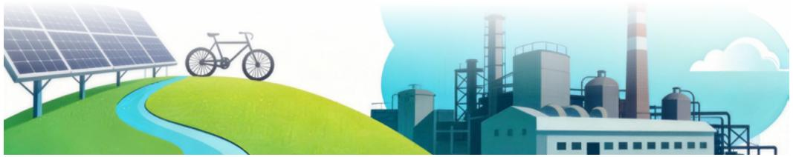

natural_image

Illustration of a renewable energy ecosystem with solar panels, a bicycle on a green hill, and an industrial plant with smokestacks and buildings (no text or symbols)

## 环保专题培训

组织开展《中华人民共和国环境保护法》《中华人民共和国大气污染防治法》等法律法规及公司环保管理制度的专题培训，重点讲解危废管理、废水废气排放控制、噪声治理等方面的核心要求，提升全员环保合规意识。

## 环保宣传活动

设置环保宣传专区，通过展板、宣传折页、现场答疑等方式，向员工普及垃圾分类、节能减排、绿色办公等知识，并对环保设施运行、环境监测等工作进行现场演示。

## 资源利用

高新发展始终秉持绿色发展理念，将资源高效利用贯穿于经营全过程。在业务端，公司积极拓展智慧能源业务，以技术创新赋能能源结构优化；在运营端，持续深化能源管理体系建设，不断提升能源利用效率。同时，公司将进一步优化水资源利用与管控措施，着力推动资源节约与循环利用，以务实举措促进可持续发展。

## 智慧能源

公司下属子公司倍特数能专注于绿色智慧能源服务和能源数字化综合解决方案，以构建区域级能源聚合平台为核心，积极推动城市级移动能源网络建设，服务于智慧社区、园区、商业、医疗及教育等多个场景。通过投资、建设与运营虚拟电厂、分布式光伏、工商业储能及充换电设施等项目，倍特数能有效促进能源结构的清洁低碳转型，支持新能源产业的高质量发展，为区域实现“双碳”目标与智慧城市升级提供技术支撑与实施路径。

## 关键绩效

报告期内

倍特数能新增绿色智慧能源项目

4↑

新增数智虚拟电厂平台项目

12↑

新增分布式能源管理平台项目

2↑

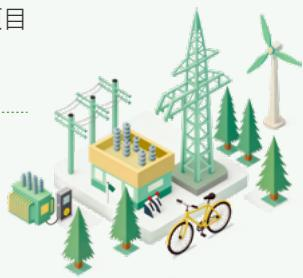

natural_image

Illustration of an electricity station with wind turbines, power lines, and a bicycle (no text or symbols)

## 荣誉奖项

2025 年，倍特数能自研的倍特数智虚拟电厂平台及运营的成都高新区虚拟电厂示范项目分别荣获国家工信部全国工业领域电力需求侧管理典型案例（2025 年）和国家发展改革委第二批绿色低碳先进技术示范项目等国家级、省市级荣誉。

## 项目名称

## 奖项名称

成都高新区虚拟电厂示范项目

国家发改委第二批绿色

低碳先进技术示范项目

倍特数智虚拟电厂平台

全国工业领域电力需求

侧管理典型案例（2025年）

面向新型电力系统的

虚拟电厂关键支撑技术

四川省工业领域绿色低碳技术装备目录、

成都市绿色低碳技术装备与优秀案例集锦

数智虚拟电厂平台 V1.0

第三批成都工业精品

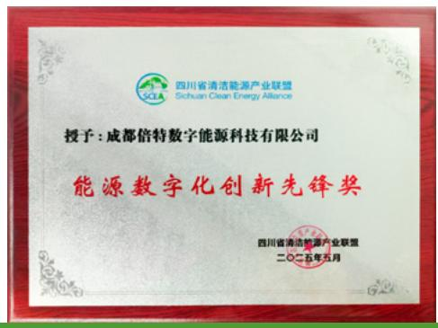

text_image

四川省清洁能源产业联盟
Sichuan Clean Energy Alliance
授予:成都倍特数字能源科技有限公司
能源数字化创新先锋奖
四川省清洁能源产业联盟
二〇一五年五月

倍特数能荣获能源数字化创新先锋奖

倍特数能通过技术创新，不仅为区域电力保供提供柔性调节能力，有效提升电网运行的稳定性与新能源消纳水平，也验证了公司推动能源结构优化、践行绿色低碳发展，为实现区域减排目标和能效提升贡献专业力量。

## 案例

## 成都高新区虚拟电厂示范项目

倍特数能“成都高新区虚拟电厂示范项目”于2025年4月成功入选“国家发展改革委第二批绿色低碳先进技术示范项目”，是中西部地区唯一入选的虚拟电厂示范项目。该项目以物联网为基础，综合运用云计算、大数据、人工智能等新一代信息技术，构建一套虚拟电厂软件平台，将区域内相对分散的分布式电源、储能、充电桩及工业可调负荷等基础资源进行有效聚合与集成调控，实现了“源网荷储”的协调互动。

项目配套建设了数百套小型一体化储能柜，稳定运行后可实现 250 兆瓦的可调资源聚合能力，最大实时响应能力达 130 兆瓦。通过聚合光伏、储能及工商业可调节负荷，并利用平台进行智慧调度与优化管理，项目预计可实现累计年节电量 63,051.6 兆瓦时，相当于年节约标准煤 7,749.04 吨，年降低二氧化碳排放量 33,833.49 吨。

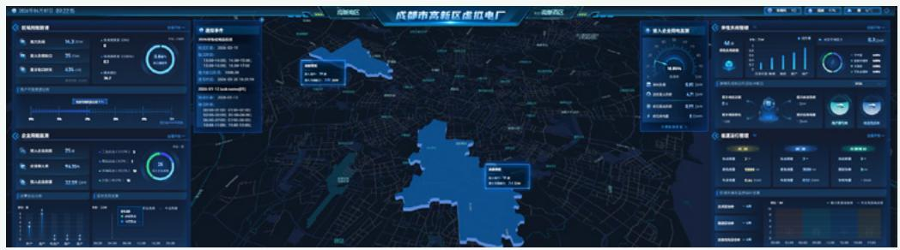

text_image

成都市高新区虚拟电厂
数据可视化
16.3 MWh
25000 kWh
4.3K W
10000 kWh
20000 kWh
20000 kWh
20000 kWh
20000 kWh
20000 kWh
20000 kWh
20000 kWh
20000 kWh
20000 kWh
20000 kWh
20000 kWh
20000 kWh
20000 kWh
20000 kWh
20
15%
15%
15%
15%
15%
15%
15%
15%
15%
15%
15%
15%
15%
15%
15%
15%
15%
15%
15%
15%
15%
15%
15%
15%
15%
15%
15%
15%
15%
15%
15%
15%
15%
15%
20%
25%
30%
35%
40%
45%
50%
55%
60%
65%
70%
75%
80%
85%
90%
95%
100%
105%
110%
115%
120%
125%
130%
135%
140%
145%
150%
155%
160%
165%
170%
175%
180%
185%
190%
195%
200%
205%
210%
215%
220%
225%
230%
235%
240%
245%
250%
255%
260%
265%
270%
275%
280%
285%
290%
295%
300%
305%
310%
315%
320%
325%
330%
335%
340%
345%
350%
355%
360%
365%
370%
375%
380%
385%
390%
395%
400%
405%
410%
415%
420%
425%
430%
435%
440%
445%
450%
455%
460%
465%
470%
475%
480%
485%
490%
495%
500%

▲ 数智虚拟电厂平台

## 案例

## 资源聚合、低碳发展，构建地区强引擎——成都东部新区虚拟电厂

倍特数能承建的成都东部新区虚拟电厂，作为区域级智慧能源聚合平台，已成功接入简州新城新经济产业园 A 区的分布式能源示范项目，整合了 2.11 兆瓦峰值光伏、820 千瓦 /1,796 千瓦时储能系统及 120 千瓦 V2G 充电设施。该平台通过聚合区域内分散的电源、储能及可调节负荷，实现了“源网荷储”的协同互动，以数字化手段提升电网的灵活性与稳定性。截至报告期末，平台已接入 39 家企业，聚合可调资源达 6.25 万千瓦，其中包括光伏 3.13 万千瓦、储能 1.64 万千瓦及可调节负荷 1.48 万千瓦。

项目投运以来,已实现光伏发电量超70万度,上网电量32万度,储能放电量13.7万度,通过消纳绿色能源减少碳排放约400吨二氧化碳当量。该虚拟电厂不仅为新区企业、园区及公共建筑提供了安全、经济、绿色的一站式智慧能源解决方案,有效助力区域电力保供,更通过提升清洁能源消纳与能效,为区域实现“双碳”目标提供了重要的技术支撑与实践路径。

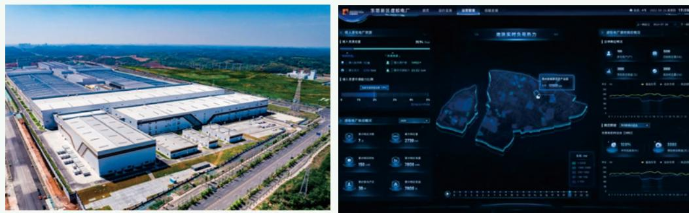  
▲ 成都东部新区虚拟电厂

此外，在推动能源结构转型与构建新型电力系统的进程中，倍特数能积极参与“产学研用”生态链合作，与合作伙伴共同赋能区域电力系统的灵活性与清洁化。

## 案例

## 倍特数能参与建设四川省最大规模工商业用户侧储能项目

2025 年 3 月，倍特数能作为重要合作方，参与了四川省规模最大的工商业用户侧储能项目——四川时代 60MW/120MWh 储能示范工程的建设。该项目采用全球领先的磷酸铁锂电芯集成方案，并创新应用了基于 AI 技术的智能储能系统。倍特数能通过其自主研发的“虚拟电厂 + 微电网”协同平台，为项目实现了“削峰填谷”“需量优化”“动态响应”等核心功能。

项目投运后，预计年放电量可达 4,500 万千瓦时，并通过虚拟电厂平台提供约 6 万千瓦的柔性调节能力，有效提升了区域电网的稳定性与新能源消纳水平。

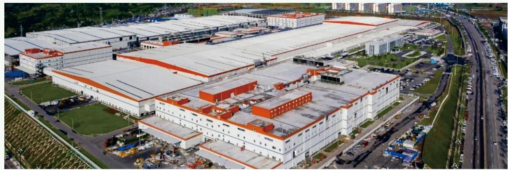

natural_image

Aerial view of a large industrial complex with multiple factory buildings and surrounding roads (no visible text or signage)

▲ 宜宾四川时代厂区

## 能源管理

高新发展严格遵守《中华人民共和国节约能源法》《中华人民共和国可再生能源法》等法律法规及运营所在地的管理条例，积极推行清洁生产，提高节能降耗质效。报告期内，公司及下属各子公司在绿色设计、精细管控与智能化平台建设等方面持续发力，不断提升能源利用效率，支持公司可持续发展目标的实现。

在项目建设方面，倍特建安积极推动绿色建筑与海绵城市设计理念落地，通过采用外墙节能技术、太阳能光伏发电及地热利用等方式，从源头降低建筑能耗。同时，在施工过程中逐步推动设备升级，减少建造、施工活动中的碳排放。

在园区运营管理方面，倍特开发严格执行企业入驻节能审查，杜绝高耗能企业入园，并要求入驻企业合理配置用电负荷、安装独立计量装置。园区通过采用感应照明、倡导入驻企业将夏季空调温度控制在合理范围、选用节能设备等节能措施，共同构建绿色低碳的运营环境。

此外，芯未公司严格遵守《能源管理规范》，明确了覆盖全公司的能源管理职责、流程与标准。公司要求在新产品、新工艺引入时评估能耗指标，并通过定期巡检、杜绝“跑冒滴漏”、合理匹配生产与用能、避免高级能源降级使用等多重措施，持续挖掘节能潜力。同时，公司建立了针对市政电力、气体、供水等一次能源供应中断的应急响应计划，并开发备用供应商，以保障能源供应的可靠性。

## 水资源利用

高新发展水资源利用来源主要为封装加工和办公使用的市政供水，其中倍特建安采用非传统水源进行绿化灌溉及道路冲洗，以减少对传统水源的依赖。

公司严格遵守《中华人民共和国水法》及运营所在地的管理规定，结合公司自身运营情况制定水资源管理制度，持续开展节水工作，以实际行动践行节水理念；通过加强水资源循环与再利用、优化设备装置、开展节水宣贯活动等方式，推动水资源长效管理与有效保护。公司综合管理部及各子公司安全生产领导小组负责制定水资源管理策略及措施，并持续追踪水资源相关绩效表现。

## 关键绩效

报告期内

公司设置办公区年度用水强度相较上一年度下降

1%

年度目标

已达成

公司在办公区，通过张贴节水标识、倡导员工养成随手关闭水龙头等良好习惯，并对用水设施进行及时维护，有效杜绝了“长流水”等浪费现象。

此外，芯未公司于报告期内开展冷却塔置换弃水再利用项目、中央空调加湿系统 RO 弃水收集再利用项目，分别节约用水 737 吨、4,322 吨，水资源利用率较项目实施前提高 10.42%。

## 排放物与废弃物处理

高新发展高度重视排放物与废弃物管理，严格遵守《中华人民共和国水污染防治法》《中华人民共和国大气污染防治法》《中华人民共和国固体废物污染环境防治法》《中华人民共和国噪声污染防治法》等法律法规及运营所在地管理条例，确保在生产经营活动中对环境影响降至最低。

为减少芯片设计及加工过程中产生的污染物排放，下属子公司芯未公司严格按照《环境保护管理办法》《固体废物污染防治管理制度》《废水、废气、噪声达标管理办法》等内部制度要求，开展工业四废的减排措施，并持续跟踪治理效果，确保减排和治理工作有效落地。

## 措施类别

废水治理

危险废弃物

一般废物

## 实施内容

在保障同等污染物治理效率的基础上，将原 24 小时连续运行的废水治理设施，进行错峰运行，从而降低运行能耗和固体废物产生，较 2024 年减少危险废弃物产生量达 55%。

所有危险废弃物均按照要求转送至持有危险废物经营许可证的危废单位进行处置。

一般废物的转移必须交由具有一般废物处理资质的外部处置单位进行转移处置，每次转移处置量于贮存环节台账准确记录。

为提升施工现场环境管理水平，下属子公司倍特建安严格遵守国家及地方相关环保法规，制定并落实《安全文明、环境保护、职业健康管理办法》及《施工扬尘污染防治管理办法》，通过明确管理职责与技术标准，持续改善大气环境质量，推动建筑行业的绿色可持续发展。

2025 年，倍特建安在施工现场重点围绕扬尘治理、尾气治理、废弃物管理、噪音管理和文明管理五大维度制定应对措施，减少污染物与废弃物的产生，以标准化建设助推环保落地。

## 倍特建安排放物管理措施

## 扬尘治理

\- 通过安装围墙和大门喷淋、车辆冲洗设施，有效隔离扬尘；采用焊烟收集器捕集焊烟；对扬尘较大工序采取雾炮、洒水车等湿法作业；全面落实裸土覆盖措施；通过环境实时监测监控 PM 数值进行预警监测，确保扬尘治理受控。

\- 严格管控施工现场机械尾气排放；土方及场内运输等工程优先选用具备环保标识的机械设备作业；推进绿色运输，优先使用新能源车作为运渣车辆。

## 尾气治理

## 废弃物管理

- 建筑垃圾方面，实行楼层垃圾装袋运输，定点集中存放并合规外运处置，防止遗撒。  
- 污水治理方面，现场规范设置沉淀池、隔油池、化粪池等污水处理设施，确保污水达标排放。

- 在物理隔离方面，对噪声敏感区域的项目设置隔音屏，对发电机等噪声较大机械设置隔音棚等；  
- 在时间管理方面，优化施工组织设计，严格控制夜间施工频次与时间，尽量减少夜间施工。

## 噪声管理

## 文明管理

- 施工现场规范设置标识项目，严格落实“工完料清”制度，确保材料及构配件堆码有序；  
- 强化施工人员管理，要求施工人员统一穿戴安全背心及安全帽等。科学设置吸烟区，杜绝违规吸烟，营造整洁、有序、绿色施工环境。

## 排放物管理目标

倍特建安建设工程施工工地，扬尘排放中的 PM2.5 年浓度下降到 55.3 微克 / 立方米，本年度目标已达成。

## 绿色建造与施工

随着国家 “双碳” 目标的深入推进，绿色低碳发展已成为建筑行业转型升级的核心方向。高新发展致力于成为智慧建筑的推动者和引领者，始终筑牢绿色低碳的建造理念，持续深耕智慧建筑、绿色设计、绿色施工等领域，将绿色环保贯彻到设计规划、项目建造、建筑施工以及运营管理等全生命周期管理中，不断探索降低碳排放的新途径。

## 绿色设计

公司始终按照绿色建筑标准，推进低碳环保的解决方案。下属子公司倍智智能重点立项研发了可视对讲、智能家居、智慧建筑、AI城市空间大模型四类产品，聚焦产品智能化升级与低碳化创新，确保为用户打造智能、便捷、低碳的居住体验，助力建筑节能降耗。

## 智慧建筑解决方案

- 借鉴轻量化改造理念，通过技术升级实现既有建筑与新建项目的低碳适配；  
- 动态优化传感器部署方案，构建全方位环境感知网络，实现“人来灯亮、人走灯灭”的智能联动控制，避免无效能源消耗；  
- 结合算法与用户生活习惯分析，优化空调运行策略，根据房间朝向、日照情况动态调整空调温度设定。

同时，公司积极研发可视化能源管理平台，通过与虚拟电厂对接，打造低碳环保的节能建筑。

## AI 城市空间大模型产品

\- 整合园区冷热源、水泵、照明等各类设备运行数据，通过 AI 算法实现园区管理能耗的智能优化与精准调控，实现能源的精细化管理与碳排放的精准核算；搭建可视化能源管理平台，助力园区实现“一屏览全局”的智慧运营，推动园区从“高能耗”向“绿色低碳”转型。

## 绿色建造

公司致力于提升施工现场管理的精细化和智慧化，在智能建造与绿色建造领域持续投入。下属子公司倍特建安秉持“匠心筑造精品、质量成就品牌”的发展理念，建立环境保护管理机制，新增《环境保护管理办法》，要求各项目部严格执行《项目管理办法》和《环境保护管理办法》。倍特建安坚持优先采用有利于环境保护与资源节约的建筑材料、新技术、新工艺和新设备，以绿色建造推进绿色发展。

## 绿色建造亮点项目：成都高新区妇幼保健院新建项目

作为区域重点民生工程，从妇幼群体需求出发，在装饰工程与幕墙工程中系统融合人性化设计与绿色建筑理念，统筹保障功能安全性、空间舒适性与视觉美观性。项目聚焦医疗服务升级，集成智慧停车、视频监控、智能照明、能源管理、智慧会议等多功能系统，形成一体化、智能化的环境管理体系，显著提升诊疗效率与患者就医体验。该项目荣获2025年度四川省优秀工程勘察设计成果——建筑工程设计类公共建筑设计一等奖。

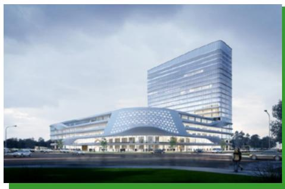

natural_image

Exterior view of a modern glass office building with a distinctive curved roof structure and surrounding parking lot (no signage or text visible)

## 绿色建造亮点项目：成都新川30亩住宅

项目严格遵循国家绿色建筑三星级标准，推动绿色建材的规模化应用，项目整体绿色建材应用比例不低于30%，是公司践行绿色建造理念、推动建筑业可持续发展的具体实践。

主体及外围护结构，包括预拌砂浆、砌体材料、保温隔热材料、防水密封材料等的绿色建材应用比例达到80%；装饰装修工程涵盖吊顶、墙面涂料、石膏装饰材料等的绿色建材应用比例达到80%。从源头减少建筑材料的环境影响，提升建筑的资源效率与耐久性，通过高标准、全过程的绿色建材管控，为项目全生命周期的低碳环保与健康舒适性能奠定坚实基础。

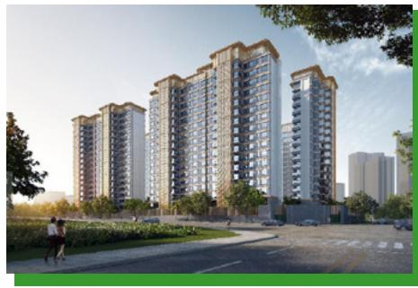

natural_image

Exterior view of a modern high-rise residential complex with surrounding greenery and roads (no signage or text visible)

## 绿色建造亮点项目：新川建木荟建筑产业园项目

项目积极整合可再生能源系统，规模化应用建筑光伏一体化（BIPV）技术，是公司以技术创新推动绿色建筑实践、赋能园区可持续运营的示范性举措。

在立面及屋顶铺设碲化镉光伏玻璃幕墙与太阳能光伏板，总面积覆盖屋面 50% 以上，形成总装机容量达 607 千瓦峰值的光伏发电系统。该系统年均发电量约为 55.57 万千瓦时，全部采用 “自发自用、余电不上网” 的非逆流运行模式。这一设计不仅实现光伏系统与建筑外观的一体化融合，更通过清洁电力的就地消纳，显著降低了项目运营阶段的碳排放与外部电网依赖。

natural_image

Exterior view of a modern multi-story building complex with greenery and a 'Design Museum' sign in the foreground (no readable text on structures)

公司将技术创新作为推动绿色施工的核心动力，聚焦装配式建筑等新型建造方式，通过 QC 活动攻克技术难题，有效提升质量合格率，减少现场材料浪费和污染。2025 年，倍特建安“楼房卫生间沉箱底板引流排水系统”在高推广价值专利大赛中荣获三等奖。获奖专利采用创新的引流排水系统设计，不仅解决渗漏隐患，提升住宅防水质量与居住舒适度，还通过节约材料、简化工艺、减少后期维修垃圾，体现了显著的环保效益，符合绿色施工和可持续发展的理念。

报告期内

公司新增建设绿色建筑项目面积约

83.38 万平方米

## 关键绩效

## 荣誉奖项

在绿色建造领域，倍特建安通过构建生态施工管理体系，积极应用先进工艺、优选环保材料，持续提升项目环境绩效。其承建的多个工程项目凭借在施工过程中的卓越环保表现，成功获评四川省绿色施工示范工程等百余项省市级技术与工程奖项。

## 关键绩效

报告期内

倍特建安

通过2025年四川省企业技术中心认定

荣登 2025 年四川建筑业企业

100 强名单

位列第

10 位

## 项目名称

成都高新区妇幼保健院新建项目

未来科技城 GX2021-22(05) 商业用地项目

民航飞行学院人才公寓一期、新川保障租赁住房项目、中和片区养老机构项目（地块一）、中和片区养老机构项目（地块二）、骑龙 GX2022-01-17 号地块住宅项目、新川 IV46IV47 号地块医学中心项目 IV47 号地块、高新区高新云谷产业园

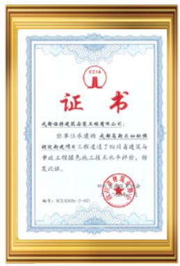

text_image

证书
成都皓路建筑安装工程有限公司：
你单位承建的成都奥斯米加砂煤
硬贴新建筑材料工程通过了四川省建筑与
市政工程绿色施工技术水平评价，特发证。
编号：SCHS305N-2-021

四川省绿色施工示范工程证书

## 奖项名称

“四川省绿色施工示范工程”

“四川省优质机电安装工程”

“四川省优质工程”

成都建筑装饰工程幕墙类“金蓉杯”（金奖）

精装修类
“金蓉杯”（金奖）

四川省安全生产文明施工标准化工地

成都市建设工程安全文明工地

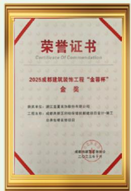

text_image

荣誉证书
Certificate Of Commendation
2025成都建筑装饰工程“金蓉杯”
金奖
供货单位：浙江金荔来服饰股份有限公司
工程名称：成都市高新区科创城绿色建筑建设项目设计-施工
总承包金奖项目
成都市建设委员会
二〇二五年十月

“金蓉杯”金奖

下属子公司园林公司在园林景观项目中积极践行绿色建筑理念，通过科学规划、生态选材与可持续施工，致力于提升城市生态品质与居民生活环境。

## 成都交子金融广场住宅景观项目

本项目于成都高新区打造高端住宅景观，总面积约 7,000 平方米。设计以 “精致奢华” 理念融合自然艺术，通过精细化植物配置与生态材料应用，为居民提供健康、舒适的自然休憩空间，实现生态价值与居住品质的协同提升。

natural_image

Garden garden with curved potted plants, flowering beds, and modern buildings in the background (no visible text or symbols)

## 福田 TOD B06 地块绿化工程项目

项目位于成都未来科技城，绿化施工面积约 1.56 万平方米，通过科学配植适生乔灌木与地被植物，优化地形设计，将闲置空地转化为层次丰富的沉浸式园林，为 TOD “城市客厅” 提供可持续的绿色基底，促进文商旅体融合发展。

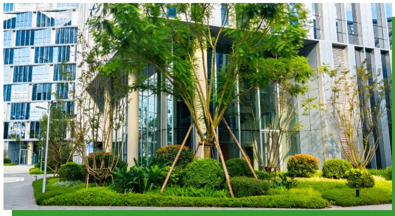

natural_image

Exterior view of a modern glass building with large green landscaping and trees (no visible text or signage)

## 交子公园东区景观工程项目

本项目在成都金融总部商务区打造约2.56万平方米城市公园，设计以“四季缤纷都市绿洲”为核心，采用浅黄色生态铺装与疏林草坪构建开放空间。绿化面积占比达65%，通过搭配四季植物群落与配套用房，形成功能复合的公共景观，为金融城提供了兼具生态调节与休闲服务功能的绿色基础设施。

natural_image

Modern glass building with green landscaping and trees, no visible text or symbols

## 应对气候变化

高新发展将应对气候变化视为实现可持续发展和履行企业社会责任的核心议题。公司积极响应国家“双碳”目标，将气候变化因素系统性地融入企业战略决策与日常运营管理，致力于通过技术创新、业务转型与资源优化，在有效管理气候相关风险的同时，积极把握绿色低碳转型带来的市场机遇，推动公司各业务板块向更高效、更清洁、更具韧性的方向发展，为构建气候适应型社会贡献企业力量。

## 治理

公司董事会战略与 ESG 委员会承担公司应对气候变化相关工作的指导与监督责任，负责定期审定气候风险与机遇管理战略、气候变化带来的影响、风险和机遇、能源管理及碳排放管理目标等决策，确保相关工作与公司整体战略及可持续发展方向保持一致。

## 气候变化风险和机遇识别

公司认识到，气候变化带来的物理风险与转型风险，以及伴随而来的市场与技术机遇，对公司及下属各业务板块的长期可持续发展具有深远影响。为系统性地管理风险并把握机遇，公司建立了常态化的识别与评估机制。该机制以公司战略为指引，结合外部政策趋势、行业动态及自身业务特点，定期对气候相关议题进行识别、分析与研判，并考虑将其纳入公司整体风险管理。

<table><tr><td>风险/机遇类型</td><td>风险/机遇描述</td><td>时间范围</td><td>应对措施</td></tr><tr><td>物理风险</td><td>极端天气事件频发与加剧,可能对公司的在建工程项目造成施工中断、工期延误、资产损坏及成本增加。</td><td>短、中期</td><td>· 在项目设计与施工方案中纳入气候韧性考量,如强化排水、耐高温材料应用。· 完善应急预案,加强施工现场对极端天气的监测与响应能力。</td></tr><tr><td>转型风险(政策)</td><td>随着国家“双碳”政策趋严,建筑行业绿色标准持续升级,可能增加公司的合规成本与技术转型压力。</td><td>中、长期</td><td>· 持续投入绿色施工技术研发与应用,如装配式建筑、绿色建材,积累“绿色标杆”工地经验。· 积极参与行业绿色标准制定,保持技术前瞻性。</td></tr><tr><td>转型风险(市场)</td><td>若客户对能源效率与低碳解决方案的需求提升,而公司相关产品与服务未能及时跟进,可能导致市场竞争力下降。</td><td>中、长期</td><td>· 依托现有虚拟电厂、智慧能源管理平台等技术优势,加快产品迭代与解决方案创新。· 深化与园区、企业的合作,提供定制化的节能降碳综合解决方案。</td></tr><tr><td>转型风险(技术)</td><td>功率半导体下游应用技术路线快速演进,若公司研发跟不上市场需求变化,将面临技术迭代风险。</td><td>中、长期</td><td>· 加强与下游新能源头部客户的协同研发,确保产品与技术路线贴合市场趋势。</td></tr><tr><td>产品与服务机遇</td><td>能源转型催生对智慧能源管理、能效提升解决方案的巨大需求。公司虚拟电厂、分布式能源聚合、工商业储能等业务,可直接服务于电网调峰、企业降本增效与碳减排。</td><td>短、中期</td><td>· 扩大虚拟电厂平台接入规模与可调资源,参与电力辅助服务市场。· 将虚拟电厂、储能、充电站等标杆项目经验进行复制推广。</td></tr><tr><td>市场机遇</td><td>“双碳”目标推动建筑行业绿色化、智能化改造。公司的绿色施工能力、智慧楼宇与智慧园区解决方案,可抢占绿色建筑与节能改造市场。</td><td>中、长期</td><td>· 提供从绿色设计、施工到智慧运营的全生命周期服务。</td></tr></table>

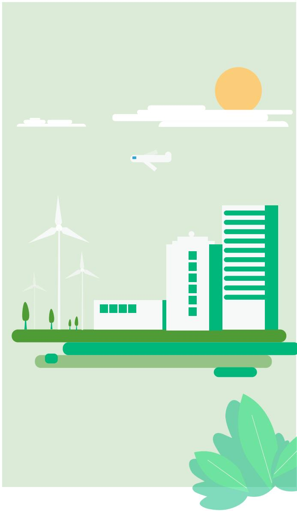

natural_image

Illustration of a green cityscape with wind turbines, buildings, and an airplane flying against a sunny sky (no text or symbols)

高新发展气候变化风险与机遇识别与应对

## 05

## 社会篇

## Social

高新发展始终坚持以人为本，将社会责任深度融入公司经营与战略布局。公司以创新驱动为核心引擎，持续提升产品与服务的质量安全，筑牢发展根基。公司持续提升供应链管理水平，携手合作伙伴共建韧性产业生态。同时，公司全面保障员工合法权益，注重人才培养与人文关怀，严守职业健康与安全生产底线，致力为员工创造价值。此外，公司积极投身对口帮扶与社会公益事业，以实际行动回馈社会。通过多维履责、协同发力，公司在实现高质量发展的同时，持续为经济社会进步贡献更大力量。

## 本章所回应的 ESG 重大性议题

- 创新驱动（财务重要性议题）  
· 产品和服务安全与质量（双重重要性议题）  
- 供应链安全（双重重要性议题）

- 员工权益与发展  
- 职业健康与安全生产（双重重要性议题）  
- 社会贡献

natural_image

Illustration of people interacting with a seesaw and a balance scale, surrounded by autumnal landscapes and buildings (no text or symbols)

贡献联合国可持续发展目标(SDGs)  
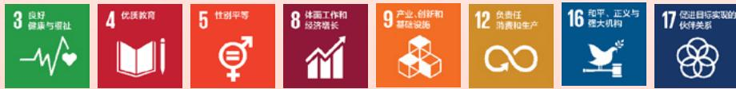

## 创新驱动

公司坚持将创新作为发展的核心驱动力，通过构建全流程研发管理体系、识别并管理创新风险与机遇、持续投入研发资源，在数字能源、功率半导体及建筑施工等领域取得了一系列创新成果，为公司的科技转型与可持续发展奠定了坚实基础。

## 治理

公司下属科技型子公司建立了覆盖全流程的研发创新管理体系，确保创新活动有序、高效开展，制定了包括《产品设计开发控制程序》《研发项目管理办法》等在内的8项核心研发流程规范，确保研发活动标准化、规范化。在数字能源领域，倍特数能建立了明确的研发创新与专利管理架构，并制定了相应的研发管理制度。在功率半导体领域，森未科技建立了PDT（产品开发团队）和TDT（技术开发团队）双轨并行的跨部门研发组织模式，PDT团队对产品包的整体商业成果负责，TDT团队则聚焦技术成果的达成。

## 评审会机制

\- 森未科技搭建了虚拟中台部门，并建立了常态化的评审会机制，包括每月需求评审会、单周项目同步会、季度路线图评审会、每月客户拜访复盘会以及每月产品生命周期评审会，以此实现从需求定义到量产交付的全生命周期管理。

## 战略

公司以 “技术自主化” 为根基，在数字能源领域聚焦虚拟电厂等绿色智慧解决方案；在功率半导体领域深耕 IGBT 主线并前瞻布局第三代半导体技术；在建筑施工领域致力于工艺智能化与绿色化创新。通过识别并管理创新相关风险与机遇，保障研发投入的有效性并把握市场先机。

<table><tr><td>风险类型</td><td>风险描述</td><td>发生可能性</td><td>潜在财务影响</td><td>影响周期1</td></tr><tr><td rowspan="3">技术风险</td><td>研发项目成果具有不确定性,若新产品研发不及时或不及预期,可能导致核心竞争力下降,市场拓展乏力。</td><td>中</td><td>利润降低</td><td>中期长期</td></tr><tr><td>第三代半导体等核心研发项目遭遇关键技术瓶颈,导致项目延期,错失市场窗口期。</td><td>中</td><td>前期研发投入形成沉没成本;若追加投入将增加营业支出,拉低利润。</td><td>短期</td></tr><tr><td>对行业技术演进路线判断失误,导致核心技术逐渐丧失竞争力。</td><td>中</td><td>前期投入浪费,形成资产减值;追赶技术,导致营业成本增加;营业收入降低。</td><td>长期</td></tr><tr><td>知识产权诉讼风险</td><td>随着市场份额提升及全球化拓展,产品可能触及国际巨头专利壁垒,面临侵权诉讼。</td><td>中</td><td>支付高额赔偿金及律师费,营业成本增加;营业收入降低。</td><td>中期</td></tr></table>

高新发展研发创新相关风险  
$^{1}$ 影响周期定义为：短期 1 年及以内，中期 1-3 年，长期为 3 年以上。

<table><tr><td>机遇类型</td><td>机遇描述</td><td>发生可能性</td><td>潜在财务影响</td><td>影响周期</td></tr><tr><td>市场机遇</td><td>产品定位符合市场需求,创新力强且具有一定技术门槛,可针对重点客户实现合理溢价。</td><td>高</td><td>营业收入增加</td><td>短期中期</td></tr><tr><td>政策机遇</td><td>国家政策对新能源、半导体等重点领域支持力度加大,市场需求增加</td><td>高</td><td>研发补贴减少营业成本;订单增加推动营业收入提升。</td><td>短期</td></tr><tr><td>核心专利布局</td><td>聚焦核心技术方向构建完善专利组合,形成专利壁垒。</td><td>高</td><td>专利授权带来稳定营业收入;专利交叉许可降低营业成本;产品溢价能力提升,毛利率提高。</td><td>中期</td></tr><tr><td>技术引领机遇</td><td>在第三代半导体高端器件、智能功率模块等领域实现技术引领,有机会主导细分行业生态。</td><td>中</td><td>高端产品占据市场,维持高毛利率;产业生态协同,降低运营成本。</td><td>长期</td></tr></table>

高新发展研发创新相关机遇

## 影响、风险与机遇管理

公司已建立流程化的识别与评估机制，通过整合内部管理流程与外部环境，持续识别可能影响研发效能、技术成果转化及市场竞争力的关键因素，并制定针对性策略，将风险转化为可控要素，同时最大化把握机遇，确保研发投入的精准性与可持续性，为公司的长期科技竞争力筑牢基础。

## 准备阶段

\- 明确研发项目、知识产权类型、项目时间节点等

## 组建团队

\- 包含研发、法务、市场、财务
人员共同协作

## 信息收集处理

- 内部信息：梳理项目自身的研发文档、实验数据、现有专利台账及保密协议等  
- 外部情报：检索外部竞争对手的专利布局、行业技术趋势报告、政策法规以及学术论文等

## 风险评估与机遇研判

- 风险评估：采用风险矩阵，从发生概率和影响程度两个维度，将风险分为”高/中/低”三级  
- 机遇研判从实现概率与潜在收益维度分为“核心、重要、一般”三级

## 决策执行与持续复盘

- 针对高风险：立即采取规避或缓解措施
- 针对核心机遇：优先配置资源  
- 常态化管理：定期复盘更新风险与机遇清单

创新研发相关风险与机遇识别流程

<table><tr><td>风险/机遇类型</td><td>应对措施</td></tr><tr><td rowspan="3">技术风险</td><td>保持研发投入持续性,合理配置研发人员</td></tr><tr><td>组建专项攻关团队,细化研发节点,严控项目进度与成本</td></tr><tr><td>跟踪行业技术趋势,多元布局研发方向,建立技术研判机制</td></tr><tr><td>知识产权诉讼风险</td><td>提前开展专利预警分析,构建交叉许可网络,规避侵权风险</td></tr><tr><td>市场机遇</td><td>加大创新人才的引进和培养,提高研发及生产效率</td></tr><tr><td>政策赋能机遇</td><td>积极申报政策补贴,对接产业链资源,加速产品量产落地</td></tr><tr><td>核心专利布局机遇</td><td>聚焦核心技术专利布局,推动专利商业化,参与标准制定</td></tr><tr><td>技术引领机遇</td><td>持续深耕核心技术,构建产业生态联盟,强化人才储备</td></tr></table>

高新发展创新研发相关风险与机遇应对措施

2025 年，公司在各业务板块持续推进研发项目，强化研发投入管理，引进国内外先进科研设备，取得了丰硕的成果；通过差异化的激励制度、系统的技术培训、重点项目攻关、广泛的产学研合作以及积极的行业参与，构建了全面的创新生态，有效管理研发风险并把握市场机遇。

## 创新激励与技术培养

公司重视研发创新，将研发人员相关研发成果纳入绩效考评，并针对不同业务板块的特点，建立了差异化的创新激励与技术培养机制，积极组织技术人员参与行业技术交流与培训。

## 功率半导体业务

依据《激励管理办法》，对技术类员工在专利授权、论文发表等具体创新成果上给予直接奖励，建立了以知识产权产出为导向的激励机制。

natural_image

Isometric illustration of a microchip with circuit pins (no text or symbols)

## 建筑施工业务

依据《科技研发管理办法》《中层管理人员及员工绩效考核管理办法》，将科研人员的绩效评估与创新贡献直接挂钩，将技术创新成果融入常规绩效考核体系。

  
高新发展创新激励机制

## 案例

## 国际技术研讨会交流，激发团队创新热情

2025 年，森未科技研发部相关负责人在 PCIM Asia 2025 国际研讨会上发表了题为《新型 SJ-MOSFET 器件的设计与性能优化》的技术报告。该研讨会是电力电子、智能运动、可再生能源及能源管理领域的国际性权威会议。此次参与不仅展示了公司在功率半导体器件领域的自主研发成果，也为技术团队提供了与国际同行深入交流、了解全球技术发展趋势的宝贵机会，有效激发了团队的创新热情与研究深度。

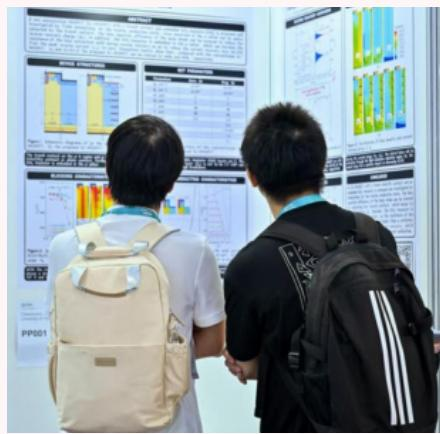

text_image

Two students viewing a presentation board with charts and graphs, likely from an educational or technical study.

▲ PCIM Asia 2025国际研讨会

## 重点项目与行业合作

公司以长期战略为锚点，聚焦核心技术领域布局实施系列重点研发项目，通过产学研协同创新机制加速关键技术突破，筑牢可持续发展的技术根基。在此基础上，森未科技与美的楼宇科技有限公司达成战略合作，联合探索智慧建筑生态的创新路径，推动绿色低碳技术成果的市场化应用，以技术协同赋能建筑领域的节能降碳与智慧升级，切实践行企业可持续发展承诺。

## 数字能源业务

全年开展27个研发项目,涉及能源系统、设备、工程及运营。

## 功率半导体业务

共立项 7 个重点研发项目，涵盖 IGBT、SiC 等产品开发与技术平台建设。

## 建筑施工业务

共立项 6 个科研课题，涉及混凝土智能养护、集成化卫浴、垂直绿化、机电综合管线、大跨度钢结构及市政道路防沉降等关键技术。

高新发展2025年重点研发项目  
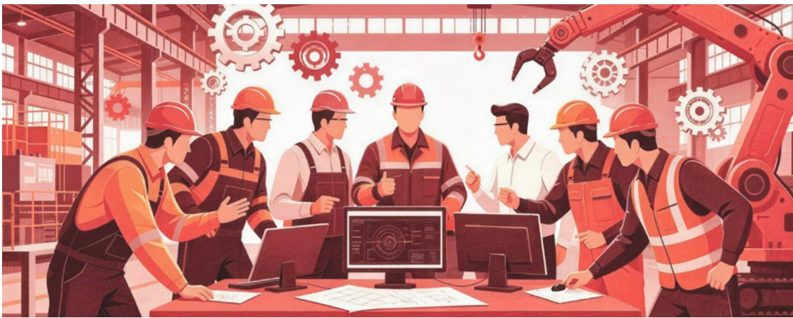

natural_image

Illustration of construction workers in hard hats gathered around a computer in a factory setting with industrial gears and cranes overhead (no text or symbols)

## 案例

## 产学研联合研究项目，推动核心技术攻关

2025 年，森未科技与四川大学建立了联合研究机制，共同就 “带浮空 P 区 IGBT 的误开启问题” 这一技术难题开展合作研究。公司研发团队与高校科研人员通过数据共享、实验验证与理论建模相结合的方式协同攻关，相关研究成果已发表于 SCI 收录期刊。该项目不仅加速了特定技术瓶颈的突破，也为公司研发人员提供了在真实科研项目中锻炼复杂问题解决能力和前沿研究方法的机会，实现了技术突破与人才能力提升的双重目标。

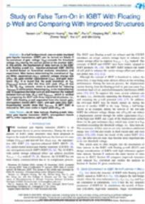

flowchart

```mermaid
graph TD
  A["Study on False Turn-On in IGBT With Floating p-Well and Comparing With Improved Structures"] --> B["Using Method A: If you are not using IGBT, then I will be used; if you are not using IGBT, then I will be used; if you are not using IGBT, then I will be used; if you are not using IGBT, then I will be used; if you are not using IGBT, then I will be used; if you are not using IGBT, then I will be used; if you are not using IGBT, then I will be used; if you are not using IGBT, then I will be used; if you is not using IGBT, then I will be used; if you are not using IGBT, then I will be used; if you are not using IGBT, then I will be used; if you are not using IGBT, then I will be used; if you are not using IGBT, then I will be used; if you are not using IGBT, then I will be used; if you are not using IGBT, then I will be used; if you are not being used as a method (e.g., 'I will be used' or 'I will be used') for the first two steps; then I will be used as a method (e.g., 'I will be used' or 'I will be used') for the second step; then I will be used as a method (e.g., 'I will be used' or 'I will be used') for the third step; then I will be used as a method (e.g., 'I will be used' or 'I will be used') for the fourth step; then I will be used as a method (e.g., 'I will be used' or 'I will be used') for the fifth step; then I will be used as a method (e.g., 'I will be used' or 'I will be used') for the sixth step; then I will be used as a method (e.g., 'I will be used' or 'I will be used') for the seventh step; then I will be used as a method (e.g., 'I will be used' or 'I will be used') for the eighth step; then I will be used as a method (e.g., 'I will be used' or 'I will be used') for the final step.
```

▲ 联合项目研究成果

## 行业建设与荣誉

公司积极参与行业生态建设，通过贡献专业知识和实践经验提升行业影响力。

## 标准制定

2025 年，倍特数能参与了《四川省软件研发项目管理规范》团体标准的编制工作，并获评突出贡献单位。

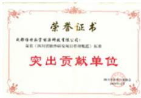  
《四川省软件研发项目管理规范》
标准突出贡献单位

## 荣誉资质

2025 年，公司各业务板块获得多项权威认可：

倍特数能累计获得包括国家绿色低碳先进技术示范项目、全国工业领域电力需求侧管理典型案例等在内的 17 项重要奖项与资质。

倍特建安通过四川省企业技术中心认定，并荣获国家级及省级 QC 成果奖。

## 知识产权管理

公司高度重视知识产权保护工作,严格遵守《中华人民共和国专利法》《中华人民共和国商标法》《中华人民共和国著作权法》等法律法规，制定《内部控制手册》等内部规范，全面规范专利申请、使用和保护流程，确保科研成果有效转化与合法运用；定期开展专项培训提升员工知识产权意识和专业能力，系统培训使员工知识产权素养显著提升，为创新发展提供坚实保障。

同时，公司建立了从专利申报人员发起，经承担研发职能的部门负责人、人事综合部审核，最终由代理机构执行的专利管理流程，并明确了各环节的汇报机制。

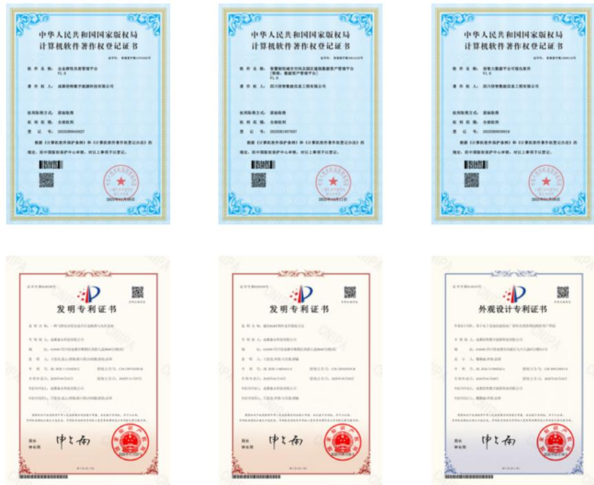  
高新发展2025年度知识产权部分示例

截至报告期末

<table><tr><td>公司已取得专利授权</td><td>其中发明专利</td><td>实用新型专利</td></tr><tr><td>118项</td><td>43项</td><td>59项</td></tr><tr><td>外观设计专利</td><td>集成电路布图设计权</td><td>软件著作权</td></tr><tr><td>16项</td><td>28项</td><td>86项</td></tr></table>

## 指标与目标

公司设定了明确的研发创新管理目标并积极推动达成。

  
关键绩效

森未科技

新增专利申请

17 项

专利授权

9 项

## 目标

## 2025 年达成情况

## 倍特数能

新增专利 >2 项

新增软件著作权 >3 项

★ 已达成，新增 4 项  
★ 已达成，新增 10 项

## 森未科技

新增发明专利申请 6/8/10 项

(分别对应 T1/T2/T3 目标)

产出具有第八代特征的芯片产品

★ 已达成 T3 目标，  
新增发明专利申请 16 项

★ 已达成

## 倍特建安

通过省级企业技术中心认定

新增省级工法 1 项

新增实用新型专利 1 项

★ 已通过  
★ 已达成，新增 3 项  
★ 已达成，新增 2 项

## 产品和服务安全与质量

公司始终将质量作为安身立命的基石，以实际行动践行“品质第一、客户至上”的理念。通过建立贯穿全流程的质量管理体系，将质量管控延伸至各项业务发展的每一个环节，确保公司产品安全可靠、服务精准高效，不断巩固客户信任基础，驱动公司实现高质量发展。

## 治理

在半导体业务板块，公司子公司森未科技研发中心作为产品质量控制的核心责任主体，其主要职责是从设计源头把控质量并验证可靠性，确保芯片在性能、良率及合规性方面满足车规或工业级标准要求。森未科技依照 IATF16949 标准完善内部质量标准，建立并实施覆盖芯片设计、流片加工、封装验证到量产支持全流程的质量管控机制，为保障半导体产品的安全与质量奠定坚实基础。

在建筑业务板块，公司坚持“匠心铸造精品，质量成就品牌”的原则。倍特建安严格遵守建筑施工相关法律法规，构建了权责清晰的工程安全与质量管理架构。倍特建安主要负责人全面领导公司工程质量管理工作，倍特建安技术质量部承担质量管理监督首要职责，工程管理部、成本结算部、设计管理部及安全管理部依据职能协同履行质量监督管理责任。倍特建安项目部履行建设工程施工质量管理执行职责，项目负责人承担项目质量管理第一责任。

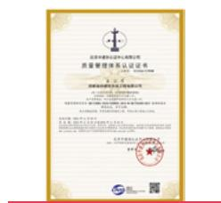

text_image

北京中泰君安证券有限责任公司
质量管理认证证书
QFII 1000000000000000
证书编号：1101000000000000
注册地址：北京市西城区金融大街35号
法定代表人：王洪波
注册资本：人民币2.5亿元
经营范围：证券投资基金管理业务（依法须经批准的项目，经相关部门批准后方可开展经营活动）

子公司倍特建安通过ISO9001认证

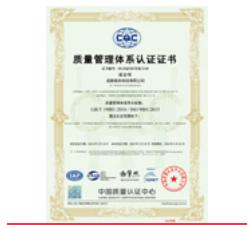

text_image

COC
质量管理体系认证证书
CAEC 2018年1月1日
证书编号：COC
申请单位：中国质量认证中心
证书编号：CAEC 2018年1月1日
证书编号：中国质量认证中心
证书编号：CAEC 2018年1月1日
证书编号：中国质量认证中心
证书编号：CAEC 2018年1月1日
证书编号：中国质量认证中心
证书编号：CAEC 2018年1月1日
证书编号：中国质量认证中心
证书编号：CAEC 2018年1月1日
证书编号：中国质量鉴证中心
证书编号：CAEC 2018年1月1日
证书编号：中国质量鉴证中心
证书编号：CAEC 2018年1月1日
证书编号：中国质量鉴证中心
证书编号：CAEC 2018年1月1日
证书编号：中国质量鉴证中心
证书编号：CAEC 2018年1月1日
证书编号：中国质量鉴认证中心
证书编号：CAEC 2018年1月1日
证书编号：中国质量鉴认证中心
证书编号：CAEC 2018年1月1日
证书编号：中国质量鉴认证中心
证书编号：CAEC 2018年1月1日
证书编号：中国质量鉴认证中心
证书编号：CAEC 2018年1月1日
证书编号：中国质量鉴证中心
证书编号：CAEC 2018年1月1日
证书编号：中国质量鉴认证中心
证书编号：CAEC 2018年1月1日
证书编号：中国质量鉴认证中心
证书编号：CAEC 2018年1月1日
证书编号：中国质量鉴证中心
证书编号：CAEC 2018年1月1日
证书编号：中国质量鉴证中心
证书编号：CAEC 2018年1月1日
证书编号：中国质量鉴证中心
证书编号：CAEC 2018年1月1日
证书编号：中国质量认证中心
证书编号：CAEC 2018年1月1日
证书编号：中国质量认证中心
证书编号：CAEC 2018年1月1日
证书编号：中国质量认证中心
证书编号：CAEC 2018年1月1日
证书编号：中国质量认证中心
证书号：COC
中国质量认证中心

子公司森未科技通过ISO9001认证

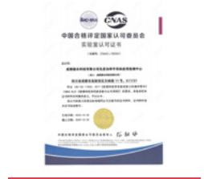

text_image

CNAS
中国合格评定图案认可委员会
实验鉴定证书
（盖章）（2018-03-01）
主办单位：
成都成华会计师事务所北京分所审计委员会
负责人：王健
承办人：周云
联系电话：021-65497888
办公地址：北京市西城区金融大街3号
邮政编码：100000
经办人：张建平
联系电话：010-65497888
经办人：张建平
注册会计师：王健
联系电话：021-65497888
经办人：张建平
注册会计师：王健
法定代表人：张建平
经办人：张建平
注册会计师：王健
法定代表人：张建平
经办人：张建平
经办人：张建平
经办人：张建平
经办人：张建平
经办人：张建平
经办人：张建平
经办人：张建平
经办人：张建平
经办人：张建平
经办人：张建平
经办人：张建平
经办人：张建平
经办人：张立
经办人：张立
经办人：张立
经办人：张立
经办人：张立
经办人：张立
经办人：张立
经办人：张立
经办人：张立
经办人：张立
经办人：张立
经办人：张立
经办人：张立
经办人：张立
经办人：张立
经过办人：
经办人：
经办人：
经办人：
经办人：
经办人：
经办人：
经办人：
经办人：
经办人：
经办人：
经办人：
经办人：
经办人：
经办人：
经办人：
经办人：
经办人：
经办人：
经办人：
经办人：
经办人：
经办人：
经办人：
经办人：
经办人：
已经办理登记手续，需办理登记手续。
已办理登记手续，需办理登记手续。
已办理登记手续，需办理登记手续。
已办理登记手续，需办理登记手续。
已办理登记手续，需办理登记手续。
已办理登记手续，需办理登记手续。
已办理登记手续，需办理登记手续。
已办理登记手续，需办理登记手续。
已办理登记手续，需办理登记手续。
已办理登记手续，需办理登记手续。
已办理登记手续，需办理登记手续。
已经办理登记手续，需办理登记手续。
已办理登记手续，需办理登记手续。
已办理登记手续，需办理登记手续。
已办理登记手续，需办理登记手续。
已办理登记手续，需办理登记手续。
已办理登记手续，需办理登记手续。
已办理登记手续，需办理登记手续。
已办理登记手续，需办理登记手续。
已办理登记手续，需办理登记手续。
已办理登记手续，需办理登记手续。

子公司森未科技获得CNAS实验室认可证书

同时，倍特建安还系统建立工程质量与安全管理制度体系，制定并执行《质量管理办法》《项目管理办法》《重大事故隐患管理办法》等管理制度，编制《工程质量标准化图册（外墙涂饰工程)》等质量管理标准化图册，为工程质量管控提供制度保障。

## 绩效考核

为确保产品与服务质量及安全管理目标的有效落实，公司通过绩效考核机制，将员工个人收入与质量安全成果紧密挂钩，同时实行差异化的绩效薪酬占比，以充分体现各层级的责任担当。

## 战略

公司持续对产品和服务安全与质量相关风险及机遇进行系统识别，通过建立并动态更新管理清单，为精准制定应对策略、推动业务可持续发展提供坚实依据。

<table><tr><td>风险类型</td><td>风险描述</td><td>发生可能性</td><td>潜在财务影响</td><td>影响周期</td></tr><tr><td>新材料应用风险</td><td>新型材料施工参数不明确,易导致性能指标无法达标,影响施工、交付及维保各阶段工程表现;该风险贯穿施工期至质保期全过程。</td><td>中</td><td>可能导致返工成本、保修成本增加。</td><td>短期中期长期</td></tr><tr><td>新工艺实施风险</td><td>施工工艺不成熟易引发质量隐患,风险贯穿施工、交付及维保各阶段。</td><td>低</td><td>可能导致公司需增加维修费用。</td><td>短期中期长期</td></tr><tr><td>危大工程管理风险</td><td>深基坑、高支模、大型吊装等超过一定规模的危险性较大分部分项工程,若专项施工方案存在缺陷、审批论证流于形式或现场未按方案施工,将直接影响工程质量。</td><td>低</td><td>可能导致公司需投入额外资金进行质量维修,直接推高工程建设成本;若因质量问题引发纠纷、处罚或声誉损失,可能面临赔偿支出。</td><td>短期中期长期</td></tr><tr><td>机遇类型</td><td>机遇描述</td><td>发生可能性</td><td>潜在财务影响</td><td>影响周期</td></tr><tr><td>技术创新与应用机遇</td><td>在工程设计、施工及运维阶段,采用BIM、物联网、AI监控等技术提升工程质量,依托AI视频监控与物联网传感器,实现对人员违规行为、安全设施状态及高危作业面的全天候自动化实时监测预警。</td><td>高</td><td>可能导致初期投入增加,公司需进行技术采购与培训;长期使用可以降低返工成本、减少事故成本;有助于公司提升项目利润率。</td><td>短期中期长期</td></tr><tr><td>供应链协同优化机遇</td><td>在采购与施工环节与优质供应商及分包商建立长期战略合作,从源头保障材料品质,显著提升工程质量稳定性,并有效降低质量风险。</td><td>高</td><td>可能帮助公司减少后期维保成本;有助于增强客户信任,提升公司知名度。</td><td>长期</td></tr></table>

产品和服务安全与质量风险清单  
产品和服务安全与质量机遇清单

## 影响、风险和机遇管理

倍特建安构建了覆盖工程项目全生命周期的风险与机遇管理流程。遵循 PDCA 循环逻辑，从施工前策划、过程实施到交付运维，系统识别评估质量安全风险，同步挖掘相关机遇，将管控要求嵌入各环节，实现质量安全效能的持续提升。

施工前质量检验与检测

- 制定工程质量目标与量化标准；  
- 运用 LEC 法识别危大工程及新材料新工艺风险源，完成安全风险分级；  
- 评估技术创新与供应链协同机遇，编制专项施工方案及创优策划书，明确样板计划、工艺优化等内容，强化事前预防。

施工过程质量
管理与控制

- 严格按方案及规范组织施工，落实材料进场复验与“三检制”；  
- 通过日常巡检、专项检查及第三方飞检，动态监控关键工序受控状态及安全设施运行情况，分级管控风险，同步推进智能监测技术落地。

施工过程质量
改进和优化

- 动态分析质量安全数据，针对巡检通报典型问题召开专题会议，找准偏差并制定整改措施；  
- 依托样板引路及 QC 小组活动实施工艺改进，系统归纳高频质量通病，形成问题闭环管理与持续优化机制。  
- 确保交付工程质量符合设计及标准要求，引入第三方检测验证，增强客户信任与回购预期。

项目交付阶段
质量保证

产品和服务安全与质量风险、机遇管理流程

## 半导体质量管控

森未科技围绕半导体设计业务特点系统推进质量管控工作，确保产品质量稳定可靠，全面满足客户需求。

在人才与能力建设方面，森未科技持续夯实质量团队的专业能力，定期组织经验案例分享，推动质量管理知识的内部分享与沉淀，不断提升团队整体素养。

在供应链协同方面，森未科技建立了严格的供应商评估与选择机制，对供应商资质、生产能力、质量控制体系及交货期等进行全面评估，优先选择优质供应商建立长期稳定的合作关系，从源头保障产品品质。

在成品出厂环节，森未科技依据严格的质量标准对成品进行逐批检验，确保每一批次产品均符合出厂要求，以严谨的态度和规范的流程为客户提供可靠的产品。

## 工程质量与安全保障

倍特建安以识别出的风险与机遇为导向，构建覆盖工程项目全生命周期的质量保障措施体系，将质量安全要求嵌入各个阶段、工序、岗位，为工程质量与安全筑牢坚实根基。

## 前置验证与操作培训

在新材料应用前，严格执行工艺试验与性能验证，明确施工参数与质量判定标准；同步开展覆盖材料特性、施工要点及应急处置的专项操作培训，确保作业人员熟练掌握施工技能。通过试验先行与能力强化双轨并进，从源头防范因参数不明或操作不当引发的质量偏差与安全问题。

## 全流程工艺监测

针对新工艺应用存在的风险点，公司依托 BIM 技术开展全过程施工模拟验证，提前识别工艺缺陷并优化方案参数。对关键工序引入具备资质的第三方机构实施独立监测，强化施工过程质量跟踪与数据核验。通过仿真验证与过程监控协同发力，保障工程全寿命周期安全稳定。

## 危大工程全周期管控

公司严格落实危大工程“编、审、论、交、验”全流程闭环管理，确保专项方案科学合规、审批程序严密到位。施工期间实施专职安全管理人员全程旁站监督，动态核查作业条件与方案执行一致性，及时制止违章作业并消除现场隐患。通过流程严控与现场盯防双重发力，系统防范坍塌、坠落等群死群伤事故风险。

## 关键风险全过程管控

## 日常巡检

◆每月制定质量巡查计划，提前识别施工过程风险点，推动管控关口前移，变事后“抓错”为事前预防。

## 专项检查

聚焦保温、混凝土、钢筋、防水等关键分项工程，围绕材料质量施工工艺、管理程序执行情况开展全流程核查。  
重点检查进场资料、成型质量、强度检测、技术交底、隐蔽验收等环节，及时消除结构安全与使用功能隐患，压实质量责任，提升现场施工规范化水平。

## 第三方飞行检查

针对影响力大、技术难度高的重点项目，聘请第三方机构按季度开展质量巡检。  
巡检当日出具快报并召开专题会通报典型问题，季度编制检查报告组织学习，年度形成评估报告，系统归纳重大质量通病并制定改进措施，持续推动项目质量管理水平提升。

## 质量检测机制

## 提升工程质量

倍特建安以标准化建设与质量创优为抓手，通过编制标准化手册、深入开展 QC 小组活动等方式，持续强化过程管控，提升工程质量，形成良好市场口碑。

## 案例

## 推行外墙涂饰标准化手册，提升工程质量管理水平

2025 年，倍特建安技术质量部牵头编制《工程质量标准化图册（外墙涂饰工程）》。手册系统梳理外墙涂饰工程全流程施工工艺、关键工序控制要点、质量验收标准及风险防范措施，以图文并茂形式为各项目施工提供可落地的技术指导。手册的推行从技术源头强化过程管控，有效规范现场施工行为，显著降低外墙渗漏、涂饰层开裂等质量通病发生率，进一步夯实公司工程质量标准化管理体系。

## 案例

## QC 小组质量创优，提升一次合格率

2025 年，西区体育公园东北侧保障性租赁住房项目等五个项目分别成立 QC 小组。各小组针对项目质量现状开展调查分析，制定并实施针对性对策方案，着力提升工程一次验收合格率。QC 活动取得国家级或省级 QC 成果奖，获得政府与质监单位高度评价，有效减少二次修补与返工所造成的材料、人工损失费，培养一批精益建造管理人才，为项目创造良好经济效益的同时，有力提升公司工程质量品牌形象。

## 工程质量培训

倍特建安围绕工程质量管控需求，构建多层次、全覆盖的培训体系。通过培训赋能，倍特建安持续夯实岗位人员专业素养，为工程质量精细化管控与品质稳步提升提供坚实支撑。

## 案例

## 参加 QC 成果交流会并开展内部分享，转化先进经验赋能质量管理

2025 年 7 月，倍特建安参加中国建筑业协会主办的工程建设质量提升暨 QC 小组活动经验交流会，选送的《提高保障租赁住房公区走道墙砖粘贴一次验收合格率》QC 成果作为四川省代表成果入选交流，并荣获“全国 2025 年工程建设质量管理小组成果大赛”二等奖。会议期间，参会代表系统学习国内先进质量管理理念、QC 活动开展程序、工具应用方法、优秀案例及活动准则等内容。会后，参会人员将学习成果汇总形成内部培训资料，并在公司各项目部组织推广交流，推动先进质量管理经验有效转化，助力工程质量水平持续提升。

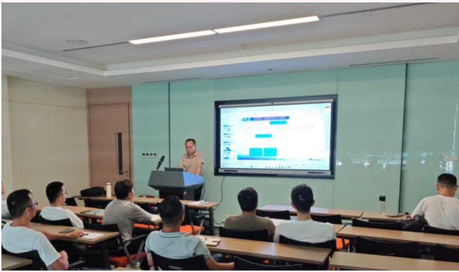

natural_image

Interior of a classroom or training room with students seated at desks and a presenter on a podium, facing a large screen displaying data charts (no visible text or symbols)

▲ 国家级QC  
小组活动学习成果内部分享会

## 案例

## 开展防水工程专项质量培训，强化规范执行与风险预防能力

2025 年,倍特建安组织防水工程专项质量培训,聚焦《建筑与市政工程防水通用规范》等国家标准,深入解读强制性条文、等级标准、设防要求及验收流程。培训结合真实案例剖析基层处理、施工工艺、材料选型等关键环节的常见问题,系统传递预防与整改措施。通过本次培训,相关岗位人员精准掌握规范边界与管控要点,为从源头根治质量通病、保障工程建设品质奠定坚实基础。

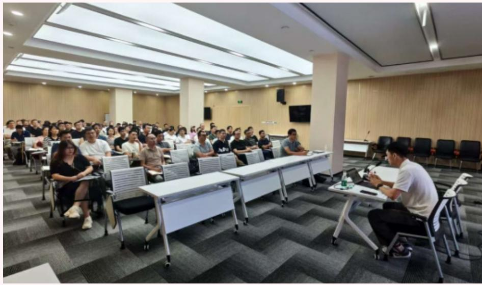

natural_image

Interior view of a conference room with attendees seated at desks, facing a speaker at the front (no visible text or signage)

▲ 防水工程质量培训

## 案例

## 开展质量创优培训，凝聚团队合力助推质量创奖

2025 年 4 月，为落实项目争创 “天府杯” 的质量目标，倍特建安在高新区高投芯光智造园项目举办工程质量创优培训。培训围绕创优申报条件、程序、现场复查要求及评审机制等内容进行系统交底，并结合项目实际分享既往创优成功经验。此次培训增强了全员创优意识与协作凝聚力，为高质量达成创奖目标提供有力支撑。

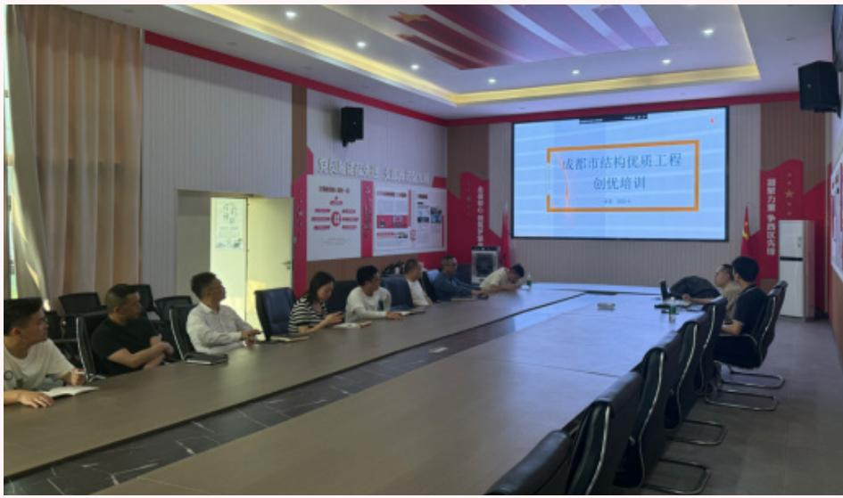

text_image

成都市结构优质工程
创优培训

▲ 工程创优培训

## 半导体业务客户服务

森未科技始终以客户为中心，将客户需求与期望全面纳入质量管理体系。公司深入理解客户诉求，并将其贯穿于产品设计、研发及交付等各个环节。同时，通过构建高效的客户关系管理机制，确保能够及时获取客户反馈并迅速响应，从而不断优化服务流程，巩固客户信任与品牌影响力。

为系统评估服务成效，森未科技建立了规范化的客户满意度调查流程，广泛收集客户意见并运用科学统计方法进行精准分析。基于分析结果，公司制定针对性改进措施，着力解决客户关注的核心问题，持续优化产品与服务体验，不断提升客户满意度。2025年，森未科技顾客满意度综合评分为87.4分，较上一年度上升0.9分。

## 工程项目客诉处理

倍特建安技术质量部负责工程项目客诉处理工作，在收到运营管理部转派的投诉工单后，第一时间与诉求人取得联系，逐项开展问题调查与核实，高效推进问题解决，并依法依规、清晰准确地回复诉求人，确保客诉管理形成闭环。

## 指标与目标

倍特建安工程质量与安全指标、目标如下：

报告期内

倍特建安工程质量合格率

100%

客户投诉解决率

100%

关键绩效

## 目标

## 2025 年达成情况

全年不发生重大及以上质量事故

项目合格率 100%

★ 达成  
★ 达成

## 供应链安全

高新发展将供应链安全视为保障业务稳定运营、提升项目质量与效率，以及实现可持续发展的重要基石。公司通过持续完善管理体系，强化评估与动态管理，确保供应链的合规性、稳定性，并与供应商共同成长。

## 治理

公司严格遵循《中华人民共和国招标投标法》及其他相关法律法规，制定《供应商管理办法》《供应商考核管理办法》，修订《工程类供应商管理办法》等内部管理制度，以加强对供应商的管控，防范采购风险。

公司已建立权责清晰的供应链管理组织架构，于报告期内将招标采购职责纳入安全环保与应急监督管理部监督管理范畴，由招标采购中心牵头，各子公司及业务需要部门协助开展供应商的引入、评价、考核及风险管理等工作。同时，公司全面推行数字化管理，依托“高新发展招采平台”实现供应商管理全流程线上化，并通过“资质系统校验 + 人工复核”及多人考察小组评分等机制，保障供应商评审过程的公正性。

为提升管理专业能力，公司定期组织招标采购人员培训，为后续采购工作的合规高效开展奠定基础。

## 案例

## 招采系统操作及核心制度专项培训

为提升公司招采人员对新上线招采平台的操作熟练度，以及对三项核心招采制度的理解，高新发展于2025年6月，面向各子公司招采部门全体人员，组织开展专项培训。培训通过理论讲解、现场实操与互动答疑相结合等方式展开，涵盖系统全流程操作演练及关键制度条款解读。通过场景化教学，确保参训人员能够准确掌握从供应商管理到采购执行各环节的操作规范与合规要求。

本次培训实现了 95% 的参训率，培训后测评显示，参训人员对系统基础操作的掌握正确率达 98%，对核心制度要点的知晓率达到 100%，有力促进后续招采工作的标准化与合规化，有助于提升整体采购效率与风险防控水平。

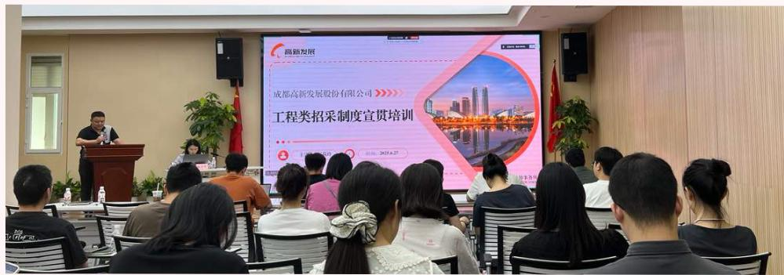

text_image

高新发展
成都高新发展股份有限公司
工程类招采制度宣贯培训
2024.6.27

▲招采人员培训现场

## 战略

公司全面分析并评估供应链安全相关风险与机遇对经营业务的潜在影响、时间范围及潜在财务影响，以指导管理策略的制定与资源的有效配置，持续提升供应链韧性。

<table><tr><td>风险类型</td><td>风险描述</td><td>发生可能性</td><td>潜在财务影响</td><td>影响周期</td></tr><tr><td>准入合规风险</td><td>工程类供应商入库时,未通过严格审核即进入合格库,导致合作基础存在重大隐患。</td><td>中</td><td>可能导致返工、整改费用增加;若涉及违法违规情形,可能产生赔偿损失及行政处罚成本。</td><td>中期</td></tr><tr><td>履约质量与进度风险</td><td>工程施工类供应商履约中发生质量事故、安全事故等情形,拒绝履行售后服务义务,损害公司品牌声誉及客户信任度。</td><td>中</td><td>可能导致事故赔偿、工程修复费用;项目延期导致工期违约费用以及额外维修成本。</td><td>中期长期</td></tr><tr><td>供应商动态管理风险</td><td>未及时对经营恶化或存在重大风险的合格库内供应商采取管控措施,可能导致供应商履约能力下降。</td><td>中</td><td>可能导致坏账损失;重新寻找替代供应商使采购成本增加。</td><td>中期长期</td></tr></table>

供应链安全议题风险清单

<table><tr><td>机遇类型</td><td>机遇描述</td><td>发生可能性</td><td>潜在财务影响</td><td>影响周期</td></tr><tr><td>合规管理升级机遇</td><td>完善的异议处理流程、监督审计机制与廉洁纪律规范,可提升供应链管理合规性,规避违法违规风险,增强公司公信力。</td><td>高</td><td>合规整改成本下降</td><td>长期</td></tr><tr><td>数字化管理升级机遇</td><td>依托高新发展招采平台,实现供应商信息动态维护、入库评审量化评分、考核评价线上化,提升供应链管理透明度与效率,降低人为操作风险。</td><td>高</td><td>运营成本下降</td><td>长期</td></tr><tr><td>供应商分级激励机遇</td><td>通过四级考核体系筛选优质供应商,对A级供应商实施优先邀请、信用加分、履约保证金优惠等激励,强化优质供应链资源绑定。</td><td>高</td><td>采购资金使用效率提升</td><td>中期</td></tr></table>

供应链安全议题机遇清单

## 影响、风险和机遇管理

公司不断完善供应链安全风险与机遇管理流程，通过主动识别、科学评估与动态管控，有效防范风险并把握发展机遇，以增强供应链的可持续性。

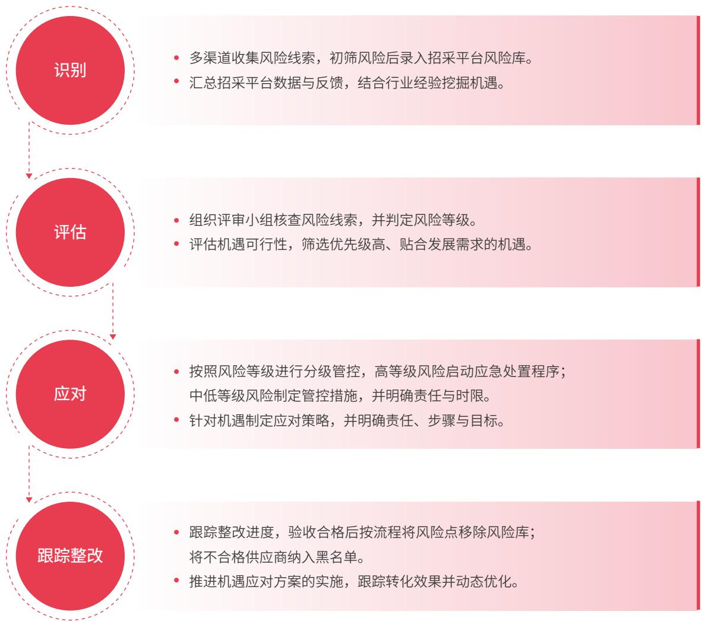

flowchart

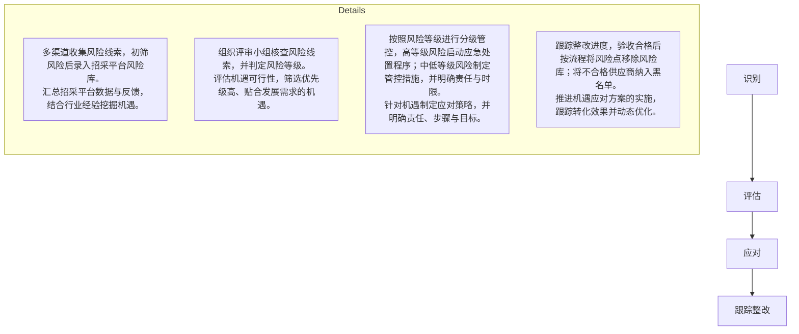
```mermaid
graph TD
  A["识别"] --> B["评估"]
  B --> C["应对"]
  C --> D["跟踪整改"]
  
  subgraph Details
    direction TB
    A1["多渠道收集风险线索，初筛风险后录入招采平台风险库。\n汇总招采平台数据与反馈，结合行业经验挖掘机遇。"]
    A2["组织评审小组核查风险线索，并判定风险等级。\n评估机遇可行性，筛选优先级高、贴合发展需求的机遇。"]
    A3["按照风险等级进行分级管控，高等级风险启动应急处置程序；中低等级风险制定管控措施，并明确责任与时限。\n针对机遇制定应对策略，并明确责任、步骤与目标。"]
    A4["跟踪整改进度，验收合格后按流程将风险点移除风险库；将不合格供应商纳入黑名单。\n推进机遇应对方案的实施，跟踪转化效果并动态优化。"]
  end
```

供应商风险与机遇管理流程

## 供应商全生命周期管理

为构建稳定、优质、可持续的供应链，高新发展建立了贯穿准入、考核与动态监控等环节的供应商全生命周期的管理机制，为保障供应链管理合规性、稳定性与竞争力奠定了坚实基础。

## 供应商准入

公司设定严格的供应商准入门槛。所有潜在供应商需通过招采平台提交注册申请，并提供包括企业资质、财务状况、信用记录及无重大违法证明等资料信息。公司组建考察小组，在限定工作日内完成资料审核与量化入库考察。通过考察的供应商按得分划分等级，并获得合格供应商资格。

## 供应商考核

公司对已合作的供应商实施年度分级考核。考核由招标采购中心牵头，依据合同履约情况、质量安全及售后服务等维度进行量化评价，将供应商划分为 A（优秀）、B（良好）、C（需整改）、D（不合格）四个等级。考核结果经管理层审批后，作为供应商等级调整、激励或管控的依据。

## 供应商动态监控

除年度考核外，公司对供应商实施不定期动态核查，监控其经营状况、资质有效性及信用变化。一旦发现风险迹象，将根据严重程度将其纳入风险库、不合格库或黑名单库，实现风险的早期预警与闭环处置。

## 供应商交流

公司高度重视供应商能力建设与协同发展，通过供应商现场考察与常态化交流，持续提升供应链整体水平。公司依托招采平台设立电话与邮箱投诉建议渠道，同步提供《招采平台供应商入库操作手册》供供应商下载与学习，确保合作流程清晰、操作规范。下属子公司森未科技与重点供应商保持长期紧密合作，定期围绕商务条款、质量控制、技术升级等维度开展专题交流，促进信息互通与协同优化，共同应对市场变化，实现价值共创与互利共赢。

## 供应商廉洁建设

公司从源头明确廉洁要求，所有供应商在申请入库时均需签署《供应商入库承诺书》。在正式合作阶段，公司推行采购主合同与《廉政协议》并行签署机制，以法律形式固化双方廉洁承诺。对于违规行为，公司执行严格的“黑名单”制度。一旦发现供应商存在贿赂、利益输送等违反公司商业道德行为，将被纳入黑名单并永久禁止合作。

同时，公司注重内外监督相结合，对外公开监督举报渠道，强化对采购行为的约束；对内加强对采购等关键岗位人员的常态化廉洁教育与警示教育，通过定期培训与案例学习，持续筑牢员工的思想防线与合规意识，确保业务开展依法依规。

## 指标与目标

报告期内，公司在供应链管理方面，指标与目标设置情况如下：

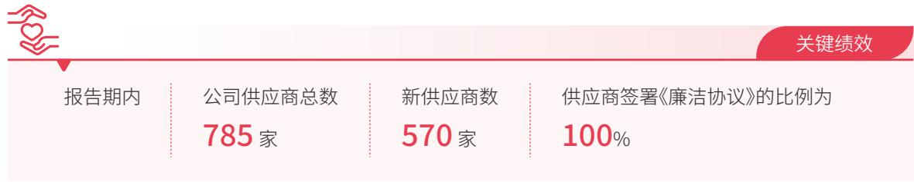

text_image

关键绩效
报告期内 | 公司供应商总数 | 新供应商数 | 供应商签署《廉洁协议》的比例为
785 家 | 570 家 | 100%

## 目标

## 2025 年达成情况

合格供应商数量达 500 家

供应商廉洁协议签署覆盖率 100%

★ 已达成  
★ 已达成

## 员工权益与发展

公司持续完善员工权益保障机制与职业发展体系。报告期内，我们通过健全民主管理制度、优化薪酬福利、开展多元化培训及畅通职业发展通道，营造平等、包容、健康的工作氛围，尊重并保障员工合法权益，支持员工与企业的共同成长。

## 员工权益保障

## 多元化与反歧视

公司秉持“德才兼备、以德为先，人尽其才、适岗为先”的用人理念，持续构建多元融合的员工队伍，积极吸纳不同年龄、性别、文化背景及专业领域人才，以多元视角激发组织创新活力，为企业可持续发展注入内生动力。公司严格遵循《人员招聘管理办法》《员工手册》等制度规范，全面管控各子公司招聘全流程，坚持平等、自愿原则与员工签订劳动合同，明确劳动权利与义务，保障用工合规性。公司人力资源部常态化开展监督检查，确保制度执行到位。

natural_image

Illustration of four business professionals sitting on a rising arrow, with books and a gavel in the background (no text or symbols)

截至报告期末，公司在职员工总数共 1,029 人，在职少数民族员工 21 人，全职员工比例 100%。

按性别划分的员工人数及比例  
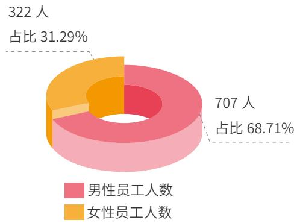

donut

| Category | Value |
| --- | --- |
| 男性员工人数 | 707人 (68.71%) |
| 女性员工人数 | 322人 (31.29%) |

按年龄划分的员工人数及比例  
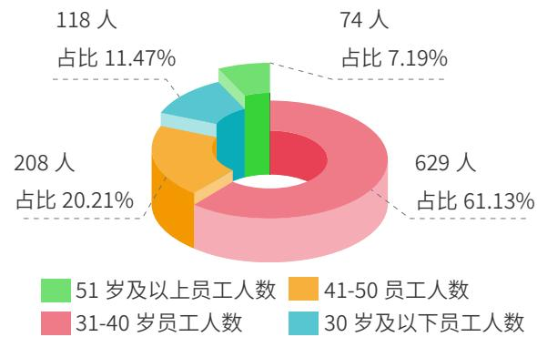

donut

| 年龄段 | 人数 | 占比 |
| --- | --- | --- |
| 51岁及以上 | 74人 | 7.19% |
| 31-40岁 | 629人 | 61.13% |
| 41-50岁 | 208人 | 20.21% |
| 30岁及以下 | 118人 | 11.47% |

按学历划分的员工人数及比例  
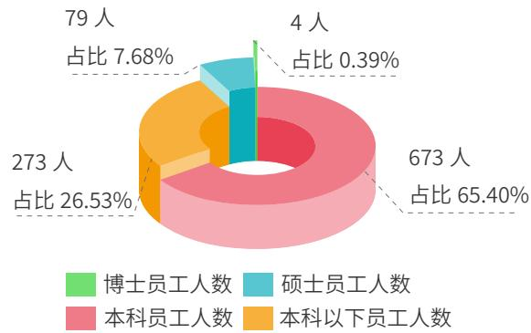

donut

| Category | Value (人) | Percentage (%) |
| --- | --- | --- |
| 博士员工人数 | 4 | 0.39 |
| 硕士员工人数 | 79 | 7.68 |
| 本科员工人数 | 673 | 65.40 |
| 本科以下员工人数 | 273 | 26.53 |

按职级划分的员工人数及比例  
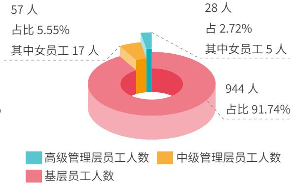

donut

| 类别 | 人数 (人) | 占比 (%) |
| --- | --- | --- |
| 高级管理层员工人数 | 28 | 2.72 |
| 中级管理层员工人数 | 57 | 5.55 |
| 其中女员工 | 17 | N/A |
| 基层员工人数 | 944 | 91.74 |

公司致力于构建多元、平等与包容的职场生态，在《商业道德行为准则》中明确禁止基于性别、年龄等任何形式的歧视与偏见，坚决杜绝任何形式的骚扰及针对个人的人身或语言暴力。一旦发生歧视、骚扰事件，任何个人可向公司进行举报，公司将在保护举报人的情况下展开必要调查并采取管理措施，全力保障每一位员工的尊严与人格不受侵犯。同时，公司严格遵循《中华人民共和国劳动法》等法律法规，明确反对一切形式的强迫劳动行为，确保所有雇佣关系均基于自愿原则，劳动合同签订程序合法合规，工时与薪酬支付符合国家及行业标准。

公司建立歧视、骚扰与劳动权益相关事件的举报与处理机制，任何个人均可通过合规渠道进行反映，公司承诺在严格保护举报人隐私的前提下，及时开展独立调查并采取相应管理措施。

## 关键绩效

报告期内

员工社保缴纳覆盖率

100%

公司

未发生任何歧视、强迫劳动或雇佣童工事件

natural_image

Illustration of two people interacting with a large upward-trending graph and icons, no text or symbols present.

## 薪酬与福利

公司系统构建覆盖法定福利、补充保障、货币与非货币激励、假期权益等多维度的员工福利体系，持续提升员工福祉与生活品质。在此基础上，公司依据薪酬绩效管理制度及年度业绩激励方案，建立了兼具内部公平性与外部市场竞争力的薪酬管理体系。薪酬结构由固定收入（含基本工资、津补贴等）与浮动收入（绩效工资）共同构成，旨在有效激发员工积极性与创造力，充分发挥薪酬对核心人才的激励与保留效能，为企业高质量发展提供坚实的人才保障。

公司依法为全体员工缴纳基本养老保险、失业保险、工伤保险、基本医疗保险、大病医疗保险及住房公积金缴费比例严格遵循成都市社保及公积金管理部门规定，个人缴纳部分由公司按月代扣代缴。

公司定期发放节日慰问、生日慰问等货币性福利，并根据实际情况动态优化福利项目；同时提供劳保用品、年度健康体检、工会兴趣小组等多样化非货币性福利。

  
法定福利

  
补充保障

公司为员工提供全面的商业保险及补充医疗保险，涵盖意外伤害身故与残疾保险、交通工具意外保险、意外伤害医疗保险、门急诊保险、住院津贴保险等。

## 员工福利体系

货币性与非货币性福利  

假期福利  

员工依法享有法定节假日、年休假、婚假、产假、哺乳假、生育假、护理假、纯母乳喂养产假、丧假、工伤假及带薪病假等。年休假根据工龄分段设置，未休天数可顺延；产假、护理假等均优于法定标准；带薪病假每年7个工作日，医疗期制度严格遵循劳动法规。

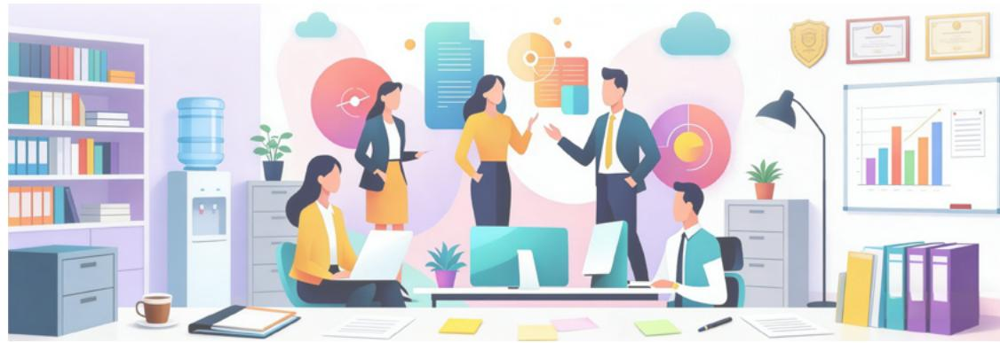

natural_image

Illustration of a business meeting in an office with staff and documents, no visible text or symbols

## 民主沟通

公司持续健全以职工代表大会为基本形式的民主管理机制，充分发挥工会组织在员工沟通与权益保障中的桥梁纽带作用。2025年，公司依法规范召开职工代表大会及工会会员代表大会，顺利完成工会委员会换届选举，不断完善员工参与公司治理的制度化渠道。通过职代会、会员代表大会等平台，员工在涉及切身利益及企业发展的重大事项中享有充分的知情权、参与权、表达权与监督权。公司坚持民主决策、集体协商，推动构建规范有序、和谐稳定的劳动关系，以高质量民主管理夯实企业可持续发展根基。

## 员工培训与发展

## 员工培训

公司制定《成都高新发展股份有限公司培训管理办法》，以战略导向、绩效提升、分级分类为原则，系统构建覆盖全员、分层分类的培训体系。培训工作实行总部组织人事部统筹规划与各子公司人力资源管理部门自主实施相结合的模式，总部组织人事部负责整体制度设计与重点项目牵引，各子公司人力资源管理部门根据业务发展需求及岗位实际，自主组织开展专业能力、业务技能及相关专项培训，形成上下联动、协同推进的人才培养格局。通过入职培训、在岗培训、专项培训等形式，持续强化员工职业素养与岗位胜任能力，为高质量发展夯实人才基础。

## 关键绩效

2025 年

公司全年累计开展培训

394 场次

员工培训覆盖率达

100%

年度培训总投入

39.11 万元

培训总时长约

31,441.2 小时

人均培训时长约

30.53 小时

高级管理层培训总时长约

308 小时

高级管理层人均培训时长约

51.33 小时

## 案例

## AI 职场效能加速器专题培训，助力员工数字素养提升

2025 年 7 月，公司组织开展 “AI 职场效能加速器” 专题培训，围绕以 DeepSeek 为代表的主流 AI 工具，系统讲解核心功能与应用技法。培训采用 “线上 + 线下” 融合、“理论 + 实操” 结合模式，吸引近 200 名员工参与。本次培训有效提升员工数字工具应用能力，间接推动运营效率优化，促进数字化办公方式推广与资源节约，为学习型组织建设注入新动能。

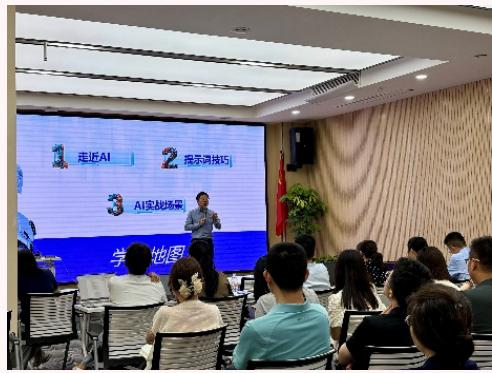

text_image

1 走近AI 2 提示调技巧
3 AI实战场景
学地图

▲ AI职场效能加速器专题培训

## 案例

## 内训师专项培训，激活内部知识共享与人才赋能

2025 年 9 月至 10 月，公司举办 “内聚合力·赋能成长” 内训师专项培训，围绕党建、安全生产、关联交易及行业研究四大领域，开发 4 门精品内训课程。通过集中授课与实战演练相结合方式，累计为百余名员工提供精准赋能。本次培训充分发挥内训师队伍知识共享与转化效能，有效激活内部培训资源，显著节约外部采购成本，进一步巩固专业化人才队伍建设基础。

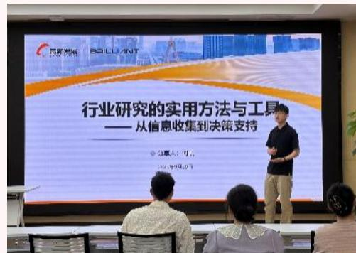

text_image

行业研究的实用方法与工具
——从信息收集到决策支持

▲ “内聚合力·赋能成长”内训师专项培训

## 案例

## 声浪计划训练营，夯实企业文化传播人才根基

2025 年 12 月，公司组织开展 “声浪计划——宣传工作能力提升训练营”，面向 40 余名宣传骨干实施沉浸式 “理论 + 实操 + 评比” 系统训练。课程聚焦企业文化传播、品牌塑造与媒介素养等核心能力，切实提升基层宣传队伍专业水平。训练营进一步强化企业文化输出效能，为公司品牌形象建设提供坚实的人才支撑。

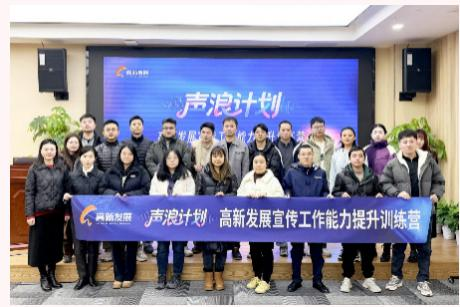

text_image

声浪计划
高新发展 宣传工作能力提升训练营
海新发展 声浪计划 高新发展宣传工作能力提升训练营

▲ “声浪计划——宣传工作能力提升训练营”

## 案例

## 华为供应链专题研修班，赋能管理团队转型升级

2025 年 3 月，公司组织中高层管理人员参加 “华为供应链专题研修班”，为期五天的课程在成都开展。培训围绕战略解码、行业洞察、以客户为中心的组织运作、MTL 与 LTC 流程、供应链数字化转型及项目管理等核心模块，系统导入华为供应链管理实践与经验。本次研修有助于管理团队深化对现代供应链体系的理解，提升战略执行与流程优化能力，为公司推进业务转型与高质量发展提供管理支撑。

## 职业发展与晋升

公司构建以管理序列（M）和专业序列（P）并行的“双通道”职业发展路径，形成科学规范的员工晋升机制。晋升评价综合考量工作业绩、专业技能、团队协作等关键维度，确保标准清晰、过程透明、结果公正。员工可依据个人职业规划与能力特长，在管理或技术等不同通道中实现纵向晋升与横向拓展，各序列均设有明确的任职资格与发展阶梯，为员工持续成长提供制度性保障。

公司遵循公平、公正、公开原则，依据《绩效考核管理办法》及配套绩效反馈机制，通过季度考核与年度考核相结合的方式，定期对员工履职表现进行全面评估。考核结束后，员工如对结果存有疑问，可通过与直接上级沟通或向人力资源部门反馈等渠道进行问询，切实保障评价的客观性与员工的参与权。

## 员工关怀

## 员工关怀

公司持续深化员工关怀体系建设，通过多元化文体活动、荣誉激励机制及后勤服务优化，系统提升员工归属感与获得感。2025年，工会牵头组织职工运动会、主题观影、三八妇女节活动、六一亲子互动、夏送清凉、跨年音乐会等系列文体活动，覆盖总部及子公司在岗员工逾千人次，并完成优秀分工会、优秀工会干部、工会积极分子及“最美劳动者”“先锋示范队”等年度先进评选，有效增强组织凝聚力。

## 案例

## 巾帼关爱行：“三八”妇女节系列主题活动

2025 年 3 月，公司工会统筹总部及下属子公司开展 “关爱她力量，健康伴我行” 系列活动。活动覆盖健康知识讲座、暖心慰问、手工花艺、职场妈妈经验分享、主题健步走、爱国廉洁教育及烘焙互动等多种形式，各工会结合业务特点，通过鲜花造型、扭扭棒花艺、蛋糕烘焙等创意载体，向全体女职工传递节日祝福与组织关怀。系列活动的开展，进一步营造尊重、平等、包容的职场氛围，切实增强女性员工的归属感与幸福感。

  
▲ “关爱她力量,健康伴我行” 系列活动现场

## 案例

## 夏日送清凉，筑牢防暑屏障

2025 年 8 月，倍智智能联合工会组织开展“夏日送清凉”慰问活动。活动聚焦高温、高热环境下作业的一线员工，发放藿香正气液、金银花露、清凉油、广东凉茶颗粒等防暑物资，并现场宣讲防暑降温知识，详细了解员工工作状态与身体情况，叮嘱合理安排作息、做好自我防护。本次慰问是工会践行“以人为本”理念的具体行动，有效缓解高温作业压力，切实增强员工归属感、幸福感与团队凝聚力。

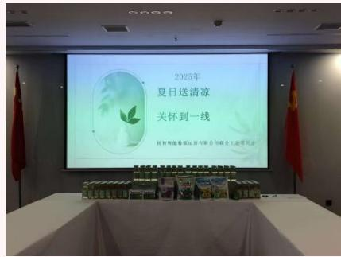

text_image

2025年
夏日送清凉
关怀到一线
桂林智致维联航运有限公司联合工会慰问会

▲ “夏日送清凉”活动

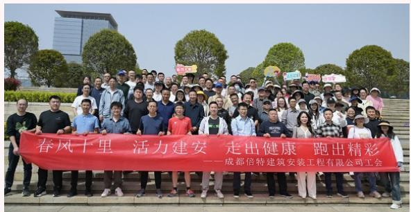

text_image

春风千里 活力建安 走出健康 跑出精彩
——成都倍特建筑安装工程有限公司工会

▲ 倍特建安组织春游活动

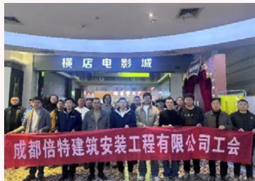

text_image

横店电影城
成都倍特建筑安装工程有限公司工会

▲ 倍特建安组织观影活动

公司持续完善员工满意度反馈机制，将后勤服务保障纳入常态化意见征询体系。报告期内，公司以食堂服务为切入点，每季度围绕菜品搭配、菜品口味、菜品保温、食材新鲜度、工作人员个人卫生、就餐环境、餐具卫生、饭菜卫生、投诉处理及服务态度等10个维度开展满意度调查，全年累计回收有效问卷309份。调查结果显示，季度满意度得分持续改善。公司同步设立食堂意见建议墙，畅通员工日常反馈渠道，并对调查中识别的问题实行闭环整改，以实际举措回应员工关切，持续优化职场生活体验。

## 职业健康与安全生产

## 治理

公司设立安全生产委员会（安委会），由公司董事长、总经理担任主任，全面领导公司的安全生产工作，董事长、党委书记、总经理共同承担安全生产第一责任，其他经营层成员对分管范围内的安全生产工作负领导责任；严格执行“党政同责、一岗双责、齐抓共管、失职追责”以及“管行业必须管安全、管业务必须管安全、管生产经营必须管安全”的原则，逐级签订安全生产目标责任书，将安全责任压实到各部门、各子公司及每一位员工，并实行年度目标责任考核，结果纳入下属单位年度经营绩效考核范围。

## 内部监督与考核机制

安全环保与应急监督管理部是公司安全生产的日常监督管理部门，负责组织安全检查、监督制度执行、跟踪隐患整改，安全生产绩效与子公司年度经营绩效考核、员工、部门以及总经理绩效考核直接挂钩。公司安委会办公室定期对各子公司的安全管理体系建设与运行情况进行考核。

## 安全生产警示机制

对于未履行或未正确履行安全管理职责、存在重大隐患或发生事故的单位及相关负责人，公司依据《安全生产警示制度》采取警示通报、警示约谈等措施，督促整改和责任落实。

公司根据相关法律法规建立了职业健康与安全管理制度体系，制定并执行《职业卫生健康管理制度》《安全生产管理制度》等管理制度，并在2025年对8项制度进行了梳理与更新，以确保其合规性与有效性。本次更新补充和完善了具体管理要求，例如明确了高危行业培训学时、相关方培训、应急预案评审发布备案程序、事故管理职责与分级标准等内容，并依据最新法规更新了安全生产费用的使用与管理规定。安全生产方面，公司严格执行《生产安全事故管理制度》，发生事故后，必须按规定时限和流程（首报、续报、终报）及时、准确上报，并积极配合政府调查或按规定开展内部调查，坚持“四不放过”原则进行处理。

## 职业健康安全管理体系认证

报告期内，公司下属子公司芯未公司、倍智信工以及倍特建安已通过ISO 45001职业健康安全管理体系认证，倍特数能新获得体系认证。

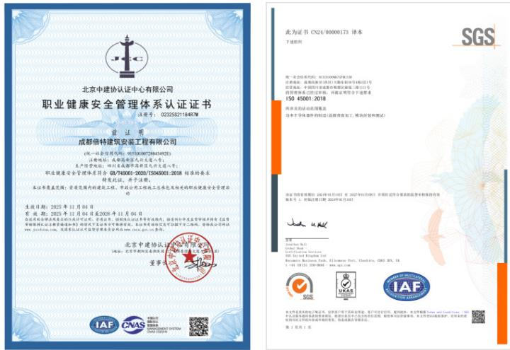  
高新发展子公司职业健康安全管理体系认证证书示例

战略

<table><tr><td>风险类型</td><td>风险描述</td><td>发生可能性</td><td>潜在财务影响</td><td>影响周期</td></tr><tr><td>危大工程管理风险</td><td>深基坑、大型吊装等超过一定规模的危险性较大的分部分项工程,因专项施工方案缺陷、审批论证缺失或偏离方案施工,导致坍塌、坠落等群死群伤事故</td><td>低</td><td>运营成本增加</td><td>短期</td></tr><tr><td>人员安全风险</td><td>一线作业人员安全意识淡薄,未正确使用防护用品、进行违章作业等</td><td>高</td><td>运营成本增加</td><td>长期</td></tr></table>

高新发展职业健康与安全生产相关风险

## 影响、风险与机遇管理

公司要求各子公司依据《安全风险分级管控制度》与《安全检查与隐患排查治理制度》与PDCA循环方法论进行安全风险管理，构成“事前预防、事中排查、闭环治理”的动态安全管理体系。针对上述识别到的相关风险与机遇，公司采取了严格管控与人员强化管理（如危大工程的全流程管控与安全积分制度），主动投资与协同优化（如设立技术基金、深化供应链合作）等措施。

## 风险识别与分析

各子公司需全面、系统地辨识生产运营中存在的危险源（根源）与安全隐患（第二类危险源），并登记形成风险点 / 危险源台账。  
选用科学方法（如 LS、LEC 法）分析各危险源的可能性和后果严重性，确定风险等级。等级从高到低分为重大（红）、较大（橙）、一般（黄）、低（蓝）风险。

## 具体管控

根据风险等级，从工程防护、管理、个体防护、应急四个方面制定并评审管控措施，确保风险降至可接受范围。  
按照 “分级管理、谁主管谁负责” 原则，明确各级风险的管控责任人（从作业人员到公司主要负责人），并绘制 “红橙黄蓝” 四色安全风险分布图。

## 动态评估与更新

每年至少开展一次风险管控动态评估。当工艺、设备、法规等发生变化或发生事故后，必须重新评估并调整风险等级与措施。

## 高新发展安全风险分级管控流程

## 隐患排查 与分析

通过领导带班检查、综合检查、专项检查、日常巡查等多种形式，依据法规、标准及已识别的风险点，排查现场及管理中存在的事故隐患。  
- 将发现的隐患分为重大隐患和一般隐患。所有隐患需记入台账，重大隐患必须及时向上级单位报告。

## 下发与整改

- 检查单位下发《安全隐患问题整改通知单》。  
受检单位按“五定原则”（定责任人、定时限、定资金、定措施、定预案）整改。重大隐患需制定专项治理方案，必要时需停工停产。

## 整改回复 与复核

- 整改完成后，受检单位提交《安全隐患问题整改回复审查表》。  
- 检查单位或指定复核人必须进行现场验证，确保隐患整改闭合，形成管理闭环。

## 统计分析 与应用

各子公司需每月对隐患排查治理情况进行统计分析并上报。通过分析隐患数据，追溯管理原因，其结果应用于指导后续的风险评估、安全培训和完善管控措施。

## 高新发展隐患排查与治理流程

此外，公司围绕 7 大行动、26 项主要任务，聚焦破解安全生产领域瓶颈性、根源性、本质性问题，切实提升风险隐患排查整改质量与发现问题、解决问题的能力水平，推动重大事故隐患动态清零，不断提升本质安全水平。

## 园区安全

公司秉持“预防为主、防消结合”的核心方针，持续深化园区安全管理体系建设，建立了隐患排查“回头看”工作机制，通过对已整改隐患的复查复核，确保整改措施落实到位，有效防范重复性隐患反弹；在排查过程中实施精细化方式，确保隐患排查无死角、整改无遗漏。

报告期内，芯未公司开展消防与化学品专项检查，144项隐患均按“四定”原则完成整改；倍特建安重点整治违规用电与消防配置问题，完成34项隐患整改；其他单位也通过领导带队检查、靶向整治等方式，对消防、电气、疏散通道等关键隐患实现了闭环管理。

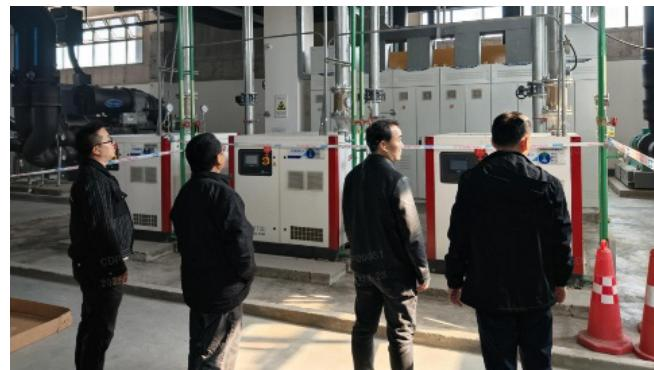

natural_image

Group of four men standing in a factory or industrial facility, observing equipment on a white machine (no visible text or symbols)

▲ 隐患排查现场

## 职业健康管理

公司定期开展职业健康检查，为从业人员配备符合要求的劳动防护用品，并依法参加工伤保险；严格执行职业病危害告知制度，在与员工签订劳动合同时如实告知职业危害，在存在职业危害的场所设置公告栏，并告知职业健康检查结果。

## 安全生产宣传教育培训

公司建立了覆盖领导干部、专职安全管理人员、普通员工、新入职员工及相关方（如建设项目参建方、租赁单位）的全员安全教育培训网络，明确了各类人员的培训时长、频次和内容。

## 案例

## 开展安全生产月活动，推动安全文化落地

2025 年 6 月，公司围绕 “人人讲安全、个个会应急——查找身边安全隐患” 主题，深入开展第 24 个全国 “安全生产月” 活动。活动期间开展了包括启动仪式、专题学习研讨、安全宣传咨询日、常见隐患辨识科普、隐患排查与应急演练行动、安全管理人员考试、员工专项培训、先进评选、线上知识竞赛以及安全内训师辅导等多种形式的活动。通过实战演练和隐患整改闭环管理，切实推动了公司安全文化的落地和本质安全水平的提升。

安全生产月期间，公司累计组织专题学习研讨 92 场次，安全宣传咨询活动 22 场次，隐患排查行动 55 场，查找并整改隐患 523 条，各类应急演练 44 场次，参与总人次逾万，安全管理人员考试通过率达 100%。

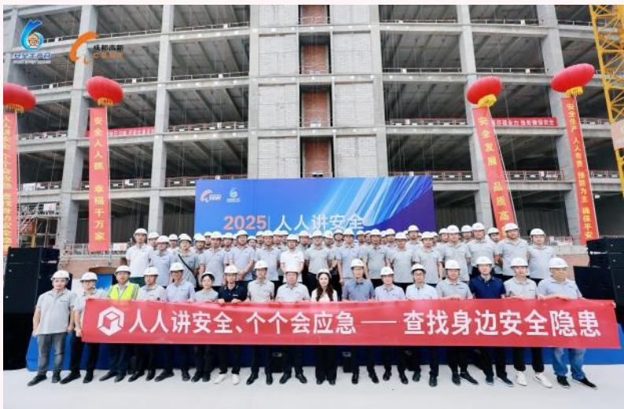

text_image

2025 人人讲安全
人人讲安全、个个会应急 — 查找身边安全隐患

▲ 高新发展“安全生产月”活动

## 案例

## 开展消防宣传月活动

公司在 2025 年消防宣传月期间，围绕 “全民消防、生命至上——安全用火用电” 主题，组织下属各单位开展了包括强化组织部署、阵地宣传、线上线下知识竞赛与专题培训、多场景应急演练、全覆盖消防安全隐患排查整改以及完善消防设施保障等一系列活动。活动实现了宣传全覆盖、隐患无死角、能力稳提升的目标，有效提升了全员消防安全意识和应急处置能力。

消防宣传月期间，公司累计开展各类培训 70 余场次，参训超 2,600 人次、组织应急演练 21 次参与近 900 人次、排查并 100% 整改消防安全隐患 190 项，张贴宣传海报 200 余幅、发放手册 285 份，并实现了活动期间“零火灾事故、零人员伤亡”的目标。

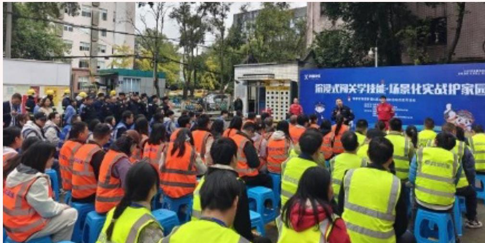

text_image

沉浸式网关学技城-场景化实战护家园

▲ 高新发展“消防宣传月”活动

## 应急管理与响应

公司要求各单位根据《应急管理制度》编制综合、专项应急预案及现场处置方案，并至少每两年修订一次，2025年更新了应急管理组织架构，细化应急响应分级及处置流程；定期组织各类应急演练以检验预案的有效性，演练后进行评估与总结，持续优化应急预案和响应程序。

## 案例

## 开展消防应急演练，提升应急处置能力

倍特建安于 2025 年 6 月在 “前沿医学中心三期建设项目” 现场组织开展了消防应急综合演练，模拟施工区域起火，共有 48 名项目管理人员和一线作业人员参与。演练流程包括火情发现上报、应急预案启动、人员疏散撤离、初期火灾扑救、模拟伤员救护、事故原因调查以及演练后总结点评等环节，有效增强了全员消防安全意识和应急处置协作能力，为项目安全生产提供了有力保障。

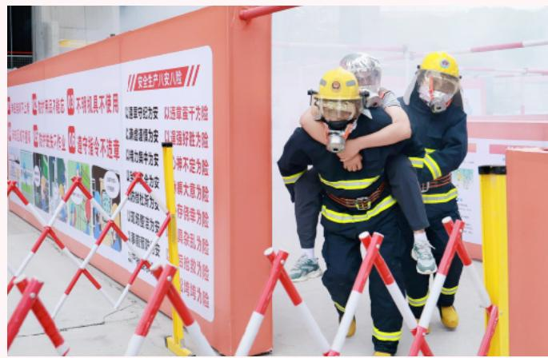

text_image

安全生产小安八险
不明机具不使用
遵守指令不违章
以语言守纪为安
以违章重干大险
以道德遵循为安
以坚强好胜大险
将不一定为险
以尊重为安
存贤率为险
属杂乱为险
自给较为险
自给均为险

▲ 倍特建安消防应急演练

## 指标与目标

公司致力于追求“零事故”的长期目标，通过宣传、培训、演练活动和持续改进机制，不断提升本质安全水平，并定期追踪职业健康与安全生产目标达成情况。

关键绩效

<table><tr><td rowspan="3">报告期内</td><td>公司安全生产总投入12,044万元</td><td>工伤保险覆盖率100%</td><td>工伤率0%</td><td>职业病发生率0%</td></tr><tr><td colspan="2">开展职业健康、安全生产类培训总时长约1,506小时</td><td></td><td>覆盖人数983人</td></tr><tr><td colspan="2">开展安全演习次数86次</td><td></td><td>安全隐患整改率100%</td></tr></table>

管理目标

达成情况  

<table><tr><td>未发生安全生产死亡事故</td><td>★</td><td>已达成</td></tr><tr><td>未发生一般及以上安全生产事故</td><td>★</td><td>已达成</td></tr><tr><td>不出现职业健康与安全损誉事件</td><td>★</td><td>已达成</td></tr><tr><td>未发生因安全问题被政府通报的情况</td><td>★</td><td>已达成</td></tr></table>

高新发展2025年职业健康与安全管理目标与达成情况

## 社会贡献

高新发展切实履行国有企业社会责任，积极回馈社会、服务民生，推动发展成果惠及更广泛群体。在响应国家战略的过程中，公司努力实现经济效益与社会效益的同频共振，以实际行动诠释国有企业的责任担当。

公司积极投身公益慈善事业，厚植使命担当，组织员工常态化开展形式多样的社区活动，精准回应民生关切，助力营造和谐友爱、互帮互助的社区氛围。同时，公司持续开展对口帮扶工作，以购代捐助力乡村振兴。在点滴行动中，公司持续传递社会温暖，为增进民生福祉、促进社会和谐贡献国企应尽之力。

## 案例

## 书香传爱助力社区建设，党群共筑增强情感联结

2025 年 8 月，公司组织 “书香传爱、党群共筑” 志愿服务活动，号召 175 名党员及入党积极分子参与。活动共向成都高新区肖家河街道科园社区居民委员会捐赠闲置图书 433 本，实现闲置资源有效盘活，显著扩充社区图书阅览存量。此次活动以书籍为载体，增强党组织与社区居民的情感联结，充分展现公司党组织服务群众、奉献社会的先锋形象。

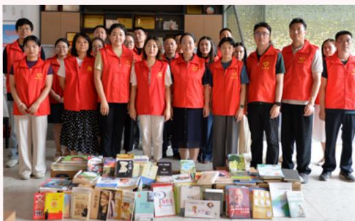

natural_image

Group photo of people in red vests posing with books and stacks of supplies outdoors (no visible text or symbols)

▲ 公司开展“书香传爱、党群共筑”志愿服务活动

## 案例

## 志愿服务助力亲子马拉松，暖心行动护航社区活动

2025 年 11 月，公司组建 22 人志愿服务小队，助力科园社区 “牵童心、伴善行” 亲子 mini 马拉松活动。志愿者协助完成场地布置、秩序维护等保障工作，确保活动顺利有序开展。此次志愿服务以实际行动践行国企担当，展现了公司员工回馈社区的公益热情。

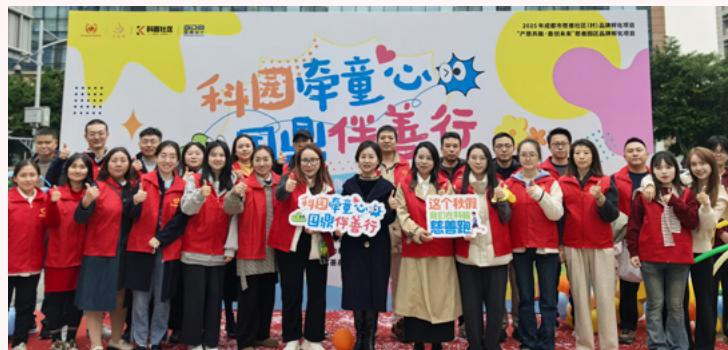

text_image

2023年成都市青秀区（川）县海河化市
“产品开展·音乐交流”香香园区品海河化市
科國牽童心
国興伴善行
利國牽童心
國興伴善行
这个秋朋
國興伴善行
慈善跟

▲ 公司志愿服务小队助力亲子马拉松活动

## 案例

## 以购代捐助力对口帮扶，彰显国企担当

2025 年，公司深入贯彻落实成都高新区关于进一步做好对口帮扶德格县的工作要求，结合公司日常会议用水的实际需求，与德格县供排水相关企业签订年度合作协议，费用按实际用量据实结算。同时，公司积极引导下属各子公司结合自身用水情况，与其开展供需对接，以实际行动支持帮扶地区产业发展。

## ESG 绩效数据表

环境维度

<table><tr><td colspan="2">指标名称</td><td>单位</td><td>2025年</td></tr><tr><td rowspan="4">环境管理</td><td>环保总投入</td><td>万元人民币</td><td>806.32</td></tr><tr><td>年度环保培训次数</td><td>次</td><td>160</td></tr><tr><td>违反环境法律法规事件数</td><td>件</td><td>0</td></tr><tr><td>报告期内因环境事件受到生态环境等有关部门重大行政处罚的处罚金额</td><td>万元人民币</td><td>0</td></tr><tr><td rowspan="5">大气污染物排放</td><td>废气排放总量</td><td>立方米</td><td>0.189</td></tr><tr><td>氮氧化物(NOx)排放量</td><td>立方米</td><td>0.050</td></tr><tr><td>硫氧化物(SOx)排放量</td><td>立方米</td><td>0.127</td></tr><tr><td>挥发性有机物(VOCs)排放量</td><td>立方米</td><td>0.012</td></tr><tr><td>颗粒物(PM)排放量</td><td>立方米</td><td>0</td></tr><tr><td rowspan="5">水污染物排放</td><td>废水排放总量</td><td>立方米</td><td>38,500</td></tr><tr><td>其中:工业废水总量</td><td>立方米</td><td>32,800</td></tr><tr><td>生活废水总量</td><td>立方米</td><td>5,700</td></tr><tr><td>氨氮</td><td>立方米</td><td>0.403</td></tr><tr><td>化学需氧量(COD)</td><td>立方米</td><td>3.345</td></tr></table>

<table><tr><td colspan="2">指标名称</td><td>单位</td><td>2025年</td></tr><tr><td rowspan="4">废弃物处理1</td><td>生活垃圾总量</td><td>吨</td><td>1.5</td></tr><tr><td>废弃物回收利用总量</td><td>吨</td><td>1.8</td></tr><tr><td>一般(无害)固体废弃物总量</td><td>吨</td><td>2.3</td></tr><tr><td>危险固体废弃物总量</td><td>吨</td><td>9.7</td></tr><tr><td rowspan="11">能源使用</td><td>综合能源消耗量</td><td>吨标准煤</td><td>2,933.27</td></tr><tr><td>直接能源消耗量</td><td>吨标准煤</td><td>39.49</td></tr><tr><td>其中:汽油</td><td>吨标准煤</td><td>18.46</td></tr><tr><td>其中:柴油</td><td>吨标准煤</td><td>4.54</td></tr><tr><td>其中:天然气</td><td>吨标准煤</td><td>16.49</td></tr><tr><td>间接能源消耗量</td><td>吨标准煤</td><td>2,893.78</td></tr><tr><td>其中:电力</td><td>吨标准煤</td><td>2,893.78</td></tr><tr><td>清洁能源使用量</td><td>吨标准煤</td><td>57.35</td></tr><tr><td>清洁能源使用占比</td><td>%</td><td>1.96</td></tr><tr><td>其中:太阳能</td><td>吨标准煤</td><td>57.35</td></tr><tr><td>其中:太阳能比例</td><td>%</td><td>100</td></tr><tr><td rowspan="3">应对气候变化</td><td>温室气体排放量(范围一)</td><td>吨二氧化碳当量</td><td>75.34</td></tr><tr><td>温室气体排放量(范围二)</td><td>吨二氧化碳当量</td><td>12,493.57</td></tr><tr><td>温室气体排放总量(范围一+范围二)</td><td>吨二氧化碳当量</td><td>12,568.91</td></tr><tr><td rowspan="3">气候变化实践</td><td>新增绿色智慧能源项目数</td><td>个</td><td>4</td></tr><tr><td>新增数智虚拟电厂平台项目数</td><td>个</td><td>12</td></tr><tr><td>新增分布式能源管理平台项目数</td><td>个</td><td>2</td></tr></table>

$^{1}$ 废弃物处理数据统计口径为芯未公司。

<table><tr><td colspan="2">指标名称</td><td>单位</td><td>2025年</td></tr><tr><td rowspan="2">水资源管理</td><td>总耗水量</td><td>吨</td><td>299,619</td></tr><tr><td>其中:市政购水量</td><td>吨</td><td>299,619</td></tr><tr><td rowspan="3">原材料与包装材料管理 $^{2}$ </td><td>产成品所用包装材料</td><td>吨</td><td>2.3</td></tr><tr><td>其中:所使用的不可再生材料</td><td>吨</td><td>0</td></tr><tr><td>所使用的可再生材料</td><td>吨</td><td>2.3</td></tr><tr><td>绿色建造与施工</td><td>新增建设绿色建筑项目面积</td><td>万平方米</td><td>83.38</td></tr><tr><td>绿色办公</td><td>无纸化办公率</td><td>%</td><td>90</td></tr></table>

社会维度

<table><tr><td colspan="3">指标名称</td><td>单位</td><td>2025年</td></tr><tr><td rowspan="9">创新驱动</td><td rowspan="2">研发投入</td><td>研发支出</td><td>亿元人民币</td><td>0.24</td></tr><tr><td>研发支出总额占营业收入比例</td><td>%</td><td>0.48</td></tr><tr><td rowspan="2">研发部创新证</td><td>国家高新技术企业认证</td><td>家</td><td>3</td></tr><tr><td>专精特新企业</td><td>家</td><td>3</td></tr><tr><td rowspan="5">知识产权</td><td>持有已授权专利数量</td><td>项</td><td>118</td></tr><tr><td>持有已授权软件著作权数量</td><td>项</td><td>86</td></tr><tr><td>持有已授权外观设计专利数量</td><td>项</td><td>16</td></tr><tr><td>持有已授权实用新型专利数量</td><td>项</td><td>59</td></tr><tr><td>持有已授权发明专利数量</td><td>项</td><td>43</td></tr><tr><td rowspan="5">产品与服务安全与质量</td><td>工程质量与安全</td><td>工程质量合格率</td><td>%</td><td>100</td></tr><tr><td rowspan="4">产品质量与安全</td><td>产品质量合格率(芯片封装综合良率)</td><td>%</td><td>97.9</td></tr><tr><td>产品召回数量</td><td>件</td><td>0</td></tr><tr><td>产品召回比例</td><td>%</td><td>0</td></tr><tr><td>年度产品服务相关的安全质量重大责任事故损害涉及的金额</td><td>万元人民币</td><td>0</td></tr><tr><td rowspan="6">产品与服务安全与质量</td><td rowspan="6">客户服务</td><td>客户反馈响应率</td><td>%</td><td>100</td></tr><tr><td>发放的客户满意度调查问卷总数</td><td>份</td><td>20</td></tr><tr><td>回收的满意度调查问卷总数</td><td>份</td><td>16</td></tr><tr><td>回收的有效满意度调查问卷总数</td><td>份</td><td>16</td></tr><tr><td>问卷回收率</td><td>%</td><td>80</td></tr><tr><td>客户满意度调查结果</td><td>%</td><td>87.4</td></tr><tr><td rowspan="6">供应商管理3</td><td>供应商总体</td><td>供应商数量</td><td>家</td><td>785</td></tr><tr><td>新增供应商</td><td>新供应商总数</td><td>家</td><td>570</td></tr><tr><td rowspan="3">供应商品类管理</td><td>工程施工类</td><td>家</td><td>266</td></tr><tr><td>工程服务类</td><td>家</td><td>299</td></tr><tr><td>工程物资类</td><td>家</td><td>131</td></tr><tr><td>可持续采购</td><td>签署供应商廉洁协议的百分比</td><td>%</td><td>100</td></tr></table>

$^{3}$ 2025 年 7 月，公司启用招采平台，根据《供应商管理办法（试行）》开始重新引入供应商。

<table><tr><td colspan="3">指标名称</td><td>单位</td><td>2025年</td></tr><tr><td rowspan="15">员工雇佣</td><td>员工人数</td><td>员工总人数</td><td>人</td><td>1,029</td></tr><tr><td rowspan="2">新员工人数</td><td>新聘请员工人数</td><td>人</td><td>12</td></tr><tr><td>新聘请员工全职员工人数</td><td>人</td><td>12</td></tr><tr><td rowspan="2">按的性别划分数</td><td>女性员工人数</td><td>人</td><td>322</td></tr><tr><td>男性员工人数</td><td>人</td><td>707</td></tr><tr><td rowspan="2">按分雇的佣类型划分数</td><td>全职员工人数</td><td>人</td><td>1,029</td></tr><tr><td>兼职员工人数</td><td>人</td><td>0</td></tr><tr><td rowspan="4">按的年龄划分数</td><td>30岁以下员工人数</td><td>人</td><td>118</td></tr><tr><td>31-40岁员工人数</td><td>人</td><td>629</td></tr><tr><td>41-50岁员工人数</td><td>人</td><td>208</td></tr><tr><td>51岁以上员工人数</td><td>人</td><td>74</td></tr><tr><td rowspan="4">按的学历划分数</td><td>本科以下员工人数</td><td>人</td><td>273</td></tr><tr><td>本科员工人数</td><td>人</td><td>673</td></tr><tr><td>硕士员工人数</td><td>人</td><td>79</td></tr><tr><td>博士员工人数</td><td>人</td><td>4</td></tr><tr><td rowspan="13">员工雇佣</td><td rowspan="5">按职级划分的员工人数</td><td>高级管理层员工人数</td><td>人</td><td>28</td></tr><tr><td>其中,女性员工人数</td><td>人</td><td>5</td></tr><tr><td>中级管理层员工人数</td><td>人</td><td>57</td></tr><tr><td>其中,女性员工人数</td><td>人</td><td>17</td></tr><tr><td>基层员工</td><td>人</td><td>944</td></tr><tr><td rowspan="2">按民族及比例的员工总数</td><td>少数民族员工数量</td><td>人</td><td>21</td></tr><tr><td>少数民族员工比例</td><td>%</td><td>2.04</td></tr><tr><td>研发部门人员情况</td><td>研发人员总数</td><td>人</td><td>69</td></tr><tr><td rowspan="4">员工离职人数及比例</td><td>员工离职人数</td><td>人</td><td>71</td></tr><tr><td>员工流失/离职率</td><td>%</td><td>6.83</td></tr><tr><td>员工自愿离职人数</td><td>人</td><td>46</td></tr><tr><td>员工自愿离职率</td><td>%</td><td>4.13</td></tr><tr><td>基本权益保障</td><td>员工社保缴纳覆盖率</td><td>%</td><td>100</td></tr></table>

<table><tr><td colspan="3">指标名称</td><td>单位</td><td>2025年</td></tr><tr><td rowspan="5">员工权益福利</td><td>歧视</td><td>经确认的歧视事件</td><td>例</td><td>0</td></tr><tr><td>强迫劳动</td><td>经确认的强迫劳动事件</td><td>例</td><td>0</td></tr><tr><td>童工</td><td>经确认的童工事件</td><td>例</td><td>0</td></tr><tr><td rowspan="2">民主管理</td><td>职工代表大会召开次数</td><td>次</td><td>1</td></tr><tr><td>工会会员或员工代表人数</td><td>人</td><td>103</td></tr><tr><td rowspan="12">员工培训</td><td>员工培训</td><td>年度培训支出金额</td><td>万元人民币</td><td>39.11</td></tr><tr><td rowspan="11">员工培训时长</td><td>培训总时长</td><td>小时</td><td>31,441.20</td></tr><tr><td>人均参与培训时长</td><td>小时</td><td>30.53</td></tr><tr><td>女性员工培训总小时数</td><td>小时</td><td>7,620.05</td></tr><tr><td>女性员工人均培训时长</td><td>小时</td><td>23.66</td></tr><tr><td>男性员工培训总小时数</td><td>小时</td><td>23,821.15</td></tr><tr><td>男性员工人均培训时长</td><td>小时</td><td>33.65</td></tr><tr><td>高级管理层培训总时长</td><td>小时</td><td>308</td></tr><tr><td>高级管理层人均培训时长</td><td>小时</td><td>51.33</td></tr><tr><td>全年培训总场次</td><td>次</td><td>394</td></tr><tr><td>员工培训人数</td><td>人</td><td>1,029</td></tr><tr><td>员工培训覆盖率</td><td>%</td><td>100</td></tr><tr><td rowspan="10">职业健康安全</td><td rowspan="2">健康安全培训与演习</td><td>职业健康、安全生产类培训总时长</td><td>小时</td><td>1,506</td></tr><tr><td>安全演习(火灾、有毒气体泄露等)次数</td><td>次</td><td>86</td></tr><tr><td rowspan="2">安全生产投入</td><td>安全生产总投入</td><td>万元人民币</td><td>12,044</td></tr><tr><td>员工工伤保险覆盖率</td><td>%</td><td>100</td></tr><tr><td rowspan="4">工伤</td><td>工伤率</td><td>%</td><td>0</td></tr><tr><td>因工死亡人数</td><td>人</td><td>0</td></tr><tr><td>因工伤损失工作日数</td><td>日</td><td>0</td></tr><tr><td>职业病发生率</td><td>%</td><td>0</td></tr><tr><td rowspan="2">职业体检病</td><td>接受职业病体检的人数</td><td>人</td><td>928</td></tr><tr><td>职业病体检的覆盖率</td><td>%</td><td>97</td></tr></table>

natural_image

Illustration of two business professionals shaking hands with a rising arrow and bar chart (no text or symbols)

治理维度

<table><tr><td colspan="3">指标名称</td><td>单位</td><td>2025年</td></tr><tr><td rowspan="16">公司治理</td><td rowspan="15">董事会</td><td>董事会总成员数</td><td>人</td><td>9</td></tr><tr><td>其中:女性成员数</td><td>人</td><td>2</td></tr><tr><td>独立董事人数</td><td>人</td><td>3</td></tr><tr><td>董事会中女性董事占比</td><td>%</td><td>22.22</td></tr><tr><td>董事会中独立董事占比</td><td>%</td><td>33.33</td></tr><tr><td>董事会召开次数</td><td>次</td><td>10</td></tr><tr><td>董事培训次数</td><td>次</td><td>11</td></tr><tr><td>审计委员会独立董事数量及占比</td><td>%</td><td>75</td></tr><tr><td>战略与ESG委员会独立董事数量及占比</td><td>%</td><td>40</td></tr><tr><td>薪酬与考核委员会独立董事数量及占比</td><td>%</td><td>66.67</td></tr><tr><td>董事会审计委员会会议次数</td><td>次</td><td>9</td></tr><tr><td>董事会提名委员会会议次数</td><td>次</td><td>0</td></tr><tr><td>董事会战略与ESG委员会会议次数</td><td>次</td><td>1</td></tr><tr><td>董事会平均出席率</td><td>%</td><td>100</td></tr><tr><td>每位董事最低出席率要求</td><td>%</td><td>100</td></tr><tr><td>股东会</td><td>股东会召开次数</td><td>次</td><td>3</td></tr><tr><td rowspan="4">投资者关系管理</td><td rowspan="2">信息披露</td><td>定期报告发布数</td><td>项</td><td>4</td></tr><tr><td>临时报告发布数</td><td>项</td><td>50</td></tr><tr><td rowspan="2">投资者互动</td><td>投资者问询答复率</td><td>%</td><td>100</td></tr><tr><td>各类型投资者沟通活动举办次数</td><td>次</td><td>2</td></tr><tr><td rowspan="8">商业道德</td><td rowspan="8">商业贿赂及贪污事件</td><td>调查中的腐败事件总数</td><td>例</td><td>0</td></tr><tr><td>经确认的腐败事件总数</td><td>例</td><td>2</td></tr><tr><td>已处理的腐败事件总数</td><td>例</td><td>2</td></tr><tr><td>因腐败相关的违规事件,被解雇或受到处分、被有权部门调查的人员数量</td><td>人</td><td>2</td></tr><tr><td>其中,涉及的董事数量</td><td>人</td><td>0</td></tr><tr><td>其中,涉及的总部管理层人员数量</td><td>人</td><td>0</td></tr><tr><td>其中,涉及的员工数量</td><td>人</td><td>2</td></tr><tr><td>因腐败相关的违规事件,与业务伙伴的合同终止或未续约的事件数量</td><td>例</td><td>0</td></tr></table>

<table><tr><td colspan="3">指标名称</td><td>单位</td><td>2025年</td></tr><tr><td rowspan="8">商业道德</td><td rowspan="6">反商业贿赂及反贪污培训</td><td>反商业贿赂及反贪污培训开展次数</td><td>次</td><td>10</td></tr><tr><td>反商业贿赂及反贪污培训覆盖的董事百分比</td><td>%</td><td>88.89</td></tr><tr><td>反商业贿赂及反贪污培训覆盖的管理层人员百分比</td><td>%</td><td>100</td></tr><tr><td>反商业贿赂及反贪污培训覆盖的员工百分比</td><td>%</td><td>100</td></tr><tr><td>签署廉洁承诺书的员工比例</td><td>%</td><td>100</td></tr><tr><td>签署反贿赂承诺书的供应商比例</td><td>%</td><td>100</td></tr><tr><td rowspan="2">不正当竞争案件</td><td>因公司不正当竞争行为导致诉讼或重大行政处罚的事件数</td><td>件</td><td>0</td></tr><tr><td>违反正当竞争总罚金</td><td>万元人民币</td><td>0</td></tr><tr><td rowspan="3">合规治理</td><td rowspan="3">宣传与培训</td><td>合规意识培训场次</td><td>次</td><td>119</td></tr><tr><td>合规意识培训总人次</td><td>人次</td><td>4,498</td></tr><tr><td>合规意识培训总时长</td><td>小时</td><td>11,675.5</td></tr><tr><td>ESG管理</td><td>ESG培训</td><td>ESG培训次数</td><td>次</td><td>2</td></tr><tr><td rowspan="4">平等对待中小企业</td><td rowspan="4">应付账款与未支付情况</td><td>应付账款(含应付票据)余额</td><td>万元人民币</td><td>684,571.10</td></tr><tr><td>应付账款(含应付票据)余额占总资产的比重</td><td>%</td><td>54.62</td></tr><tr><td>逾期未支付款项金额</td><td>万元人民币</td><td>0</td></tr><tr><td>逾期未支付中小企业款项金额</td><td>万元人民币</td><td>0</td></tr><tr><td rowspan="5">数据安全与隐私保护</td><td rowspan="2">资金投入</td><td>公司在信息安全与隐私保护方面投入的资金总额</td><td>万元人民币</td><td>320</td></tr><tr><td>信息安全与隐私保护意识培训场次</td><td>次</td><td>10</td></tr><tr><td rowspan="3">宣传与培训</td><td>信息安全与隐私保护意识培训人次</td><td>人次</td><td>1,000</td></tr><tr><td>信息安全与隐私保护意识培训总时长</td><td>小时</td><td>1,200</td></tr><tr><td>信息安全与隐私保护意识培训人均时长</td><td>小时</td><td>1.2</td></tr></table>

经济维度

<table><tr><td colspan="2">指标名称</td><td>单位</td><td>2025年</td></tr><tr><td rowspan="3">经济效益</td><td>营业收入</td><td>亿元人民币</td><td>49.80</td></tr><tr><td>归属于上市公司股东的净利润</td><td>亿元人民币</td><td>1.09</td></tr><tr><td>总资产</td><td>亿元人民币</td><td>125.33</td></tr></table>

natural_image

Illustration of business professionals in a meeting setting, one pointing at a screen displaying charts (no text or symbols present)

  
指标索引表

<table><tr><td>报告框架</td><td>《深圳证券交易所上市公司自律监管指引第17号可持续发展报告(试行)》45</td></tr><tr><td colspan="2">开篇</td></tr><tr><td>关于本报告</td><td></td></tr><tr><td>董事长致辞</td><td></td></tr><tr><td>关于我们</td><td></td></tr><tr><td>公司荣誉</td><td></td></tr><tr><td>2025年ESG关键绩效</td><td></td></tr><tr><td colspan="2">ESG管理</td></tr><tr><td>ESG治理架构</td><td>第五十一条</td></tr><tr><td>利益相关方沟通</td><td>第五十三条</td></tr><tr><td>双重重要性议题分析</td><td></td></tr><tr><td>ESG绩效与经营管理层薪酬</td><td>第五十一条</td></tr><tr><td>治理篇</td><td></td></tr><tr><td>坚持党建引领</td><td></td></tr><tr><td>完善公司治理</td><td>第五十二条</td></tr><tr><td>商业道德管理</td><td>第五十四条、第五十五条、第五十六条</td></tr><tr><td>平等对待中小企业</td><td>第四十六条</td></tr><tr><td>数据安全与客户隐私保护</td><td>第四十八条</td></tr></table>

<table><tr><td>报告框架</td><td>《深圳证券交易所上市公司自律监管指引第17号可持续发展报告(试行)》</td></tr><tr><td colspan="2">环境篇</td></tr><tr><td>环境合规管理</td><td>第三十三条</td></tr><tr><td>资源利用</td><td>第三十五条、第三十六条、第三十七条</td></tr><tr><td>排放物与废弃物处理</td><td>第三十条、第三十一条</td></tr><tr><td>绿色建造与施工</td><td></td></tr><tr><td>应对气候变化</td><td>第二十二条、第二十三条、第二十四条</td></tr><tr><td colspan="2">社会篇</td></tr><tr><td>创新驱动</td><td>第四十二条</td></tr><tr><td>产品和服务安全与质量</td><td>第四十七条</td></tr><tr><td>供应链安全</td><td>第四十五条</td></tr><tr><td>员工权益与发展</td><td rowspan="2">第五十条</td></tr><tr><td>职业健康与安全生产</td></tr><tr><td>社会贡献</td><td>第三十九条、第四十条</td></tr><tr><td colspan="2">附录</td></tr><tr><td>ESG绩效数据表</td><td></td></tr><tr><td>指标索引表</td><td></td></tr><tr><td>读者意见反馈表</td><td></td></tr></table>

4公司核心业务不涉及生命科学、人工智能伦理等敏感领域的科学研究、技术开发等活动，故本报告中未披露公司报告期内遵守科技伦理的基本情况。  
5公司生产经营活动未对生态系统和生物多样性产生重大影响，“生态系统和生物多样性保护”议题对公司不具有重要性，故未纳入重要性议题进行披露。

## 读者意见反馈表

尊敬的读者：

您好！

感谢您能抽出宝贵时间阅读公司《2025年度环境、社会和公司治理报告》。为向您及其他利益相关方提供更完善、更专业、更有价值的ESG信息，持续改进我们的ESG报告，不断提高ESG管理能力和水平，我们诚挚地邀请您协助完成反馈信息表中的相关问题，请您不吝赐教。

## (请在相应的位置打 “√”)

1. 您对本报告的总体印象是否满意是 □ 一般 □ 否 □  
2. 您认为本报告是否能反映高新发展对经济、社会、环境的重大影响？是 □ 一般 □ 否 □  
3. 您认为本报告识别出的利益相关方及其与高新发展关系的分析是否准确、全面？  
是 □ 一般 □ 否 □  
4. 您认为本报告提供的信息、指标、数据是否清晰、准确、完整？是 □ 一般 □ 否 □  
5. 您认为本报告提供的信息是否具有可读性?
是 □ 一般 □ 否 □

6. 您对《高新发展 2025 年度环境、社会和公司治理报告》的其他意见与建议，欢迎提出。

## 如对本报告有任何疑问、建议或意见，您可以选择以下方式告知我们：

成都高新发展股份有限公司

四川省成都市高新技术产业开发区九兴大道8号

86-28-85137070

86-28-85184099

cdgxfz000628@163.com

text_image

QR code image containing encoded data, no visible human-readable text

## 高新发展

股票代码：000628