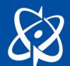

中核集团CNNC

中核苏阀科技实业股份有限公司

SUFA TechnologyIndustry Co.,Ltd.

地址：江苏省苏州市珠江路 501号

电话：0512-66672245

邮箱：dongm@chinasufa.com

网址：www.chinasufa.com

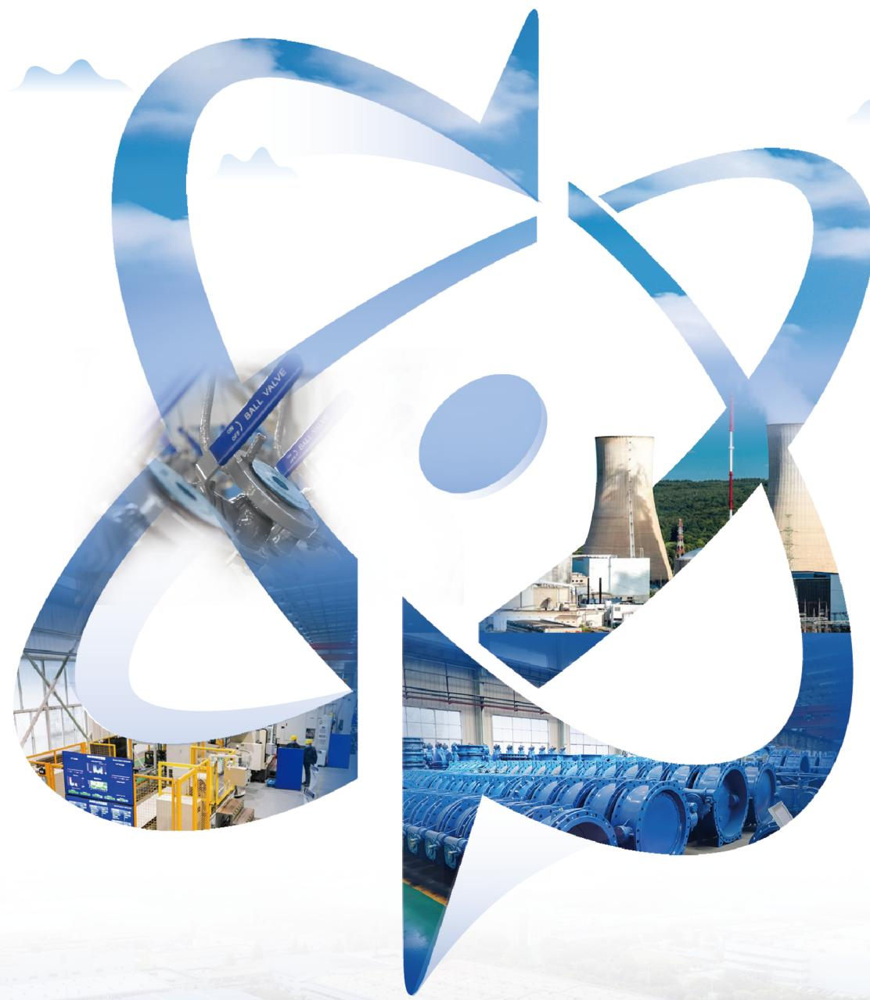

natural_image

Composite image featuring industrial facility photos and a stylized 'S' symbol overlay, no readable text or symbols present.

2025

环境、社会和公司治理(ESG)报告

ENVIRONMENTAL, SOCIAL AND GOVERNANCE REPORT

中核苏阀科技实业股份有限公司

## 目录

关于本报告 01

董事长致辞 03

走进中核科技 05

附录 93

绩效表 93

指标索引 105

反馈意见表 109

natural_image

Hand holding a glowing digital interface with icons representing data, security, infrastructure, and business (no readable text or symbols)

## 01严规治企，稳健经营

natural_image

Green background with a transparent globe resting on moss, reflecting water droplets (no text or symbols)

## 02绿色智造，“核”谐共生

<table><tr><td>可持续发展治理</td><td>15</td></tr><tr><td>坚持党建引领</td><td>20</td></tr><tr><td>科学规范治理</td><td>23</td></tr><tr><td>优化内控合规</td><td>26</td></tr><tr><td>强化投关管理</td><td>31</td></tr><tr><td>恪守商业道德</td><td>33</td></tr></table>

<table><tr><td>应对气候变化</td><td>37</td></tr><tr><td>环境合规管理</td><td>41</td></tr><tr><td>资源高效利用</td><td>48</td></tr><tr><td>生态守护共生</td><td>52</td></tr></table>

natural_image

Abstract digital illustration of DNA double helix with glowing blue wave patterns against a dark blue background (no text or symbols)

## 03科创赋能，“核”领发展

natural_image

Group of people gathered around an elderly person, hands clasped together (no visible text or symbols)

## 04人本关怀，聚力同行

<table><tr><td>创新驱动发展</td><td>55</td><td>平等合规用人</td><td>77</td></tr><tr><td>链动高效协同</td><td>64</td><td>员工民主建设</td><td>82</td></tr><tr><td>品质精益求精</td><td>67</td><td>相伴员工成长</td><td>83</td></tr><tr><td>客户权益保障</td><td>72</td><td>职业健康与安全生产</td><td>85</td></tr><tr><td>维护信息安全</td><td>73</td><td>履行社会责任</td><td>91</td></tr></table>

natural_image

Exterior view of a modern industrial cooling tower complex at dusk, with power lines and high-rise buildings in the background (no signage or text visible)

## 关于本报告

## 报告说明

本报告是中核苏阀科技实业股份有限公司发布的第三份环境、社会和公司治理（ESG）报告，本报告遵循客观、规范、透明及全面的原则，详细披露了中核科技在环境、社会和公司治理方面采取的实践举措以及所取得的成绩。

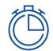

## 时间范围

本报告为年度报告，时间跨度为2025年1月1日至2025年12月31日，为增强报告可比性及前瞻性，部分内容有所延伸。

## 报告范围

本报告以“中核科技”为主体，如无特别说明，本报告的组织范围覆盖中核苏阀科技实业股份有限公司及各子公司（具体详见中核苏阀科技实业股份有限公司2025年年度报告）。

## 编制依据

•深圳证券交易所《深圳证券交易所上市公司自律监管指引第17号——可持续发展报告（试行）》  
•深圳证券交易所《深圳证券交易所上市公司自律监管指南第3号——可持续发展报告编制》  
•国资委办公厅《央企控股上市公司ESG专项报告参考指标体系》  
•中国企业改革与发展研究会等《中国企业可持续发展报告指南（CASS-ESG 6.0）之一般框架》  
•联合国2030 年可持续发展目标（SDGs）  
•全球报告倡议组织《可持续发展报告标准(GRI Standards)》

## 资料来源及可靠性保证

本报告引用的全部信息数据均来自中核科技正式文件、统计报告及财务报告，涵盖公司各部门及经营单位的内部数据和公开信息，并经公司统计、汇总与审核。同时，为确保阐释的完整性与连续性，公司在特定议题下对部分内容予以回顾和延展。货币计量若无特别标注，均采用人民币为计量单位。如财务数据与年报不一致，以年报为准。

## 称谓说明

在本报告书中，为便于表述和阅读，中核苏阀科技实业股份有限公司及其下属子公司根据行文具体情况，简称“中核科技”“公司”“企业”或“我们”，具体表述参考中核苏阀科技实业股份有限公司2025年年度报告。

## 确认及批准

本报告于 2026 年 4 月 24 日获公司董事会批准，并与年报同期发布。董事会承诺对报告内容进行监督，并确保其不存在任何虚假记载或误导性陈述，并对内容真实性、准确性和完整性负责。

## 报告获取

为了践行低碳环保和可持续发展的理念，本报告可以在深交所网站（http://www.szse.cn）在线阅读或下载报告电子版，如果您还想了解本报告以外的公司其他信息，可查阅公司年度财务报告或浏览公司网站。

如有任何反馈及建议，请通过以下方式联系我们：

通信地址：江苏省苏州市珠江路501号

电话：0512-66672245

联系邮箱：dongm@chinasufa.com

## 董事长致辞

2025 年是中国核工业创建 70 周年，是中核集团 “追求卓越” 年，也是公司全面收官 “十四五” 、系统谋划 “十五五”规划的关键一年。中核科技坚持以习近平新时代中国特色社会主义思想为指导，坚持稳中求进工作总基调，完整准确全面贯彻新发展理念，聚焦 “五个价值” 提升，坚持创新驱动，坚持项目牵引，坚持深化改革，强化能力建设和布局优化，统筹发展和安全，推广应用卓越绩效模式，优化企业架构，加快推进数字化转型，扎实做好生产经营改革发展各项工作，全力实现 “十四五” 圆满收官，为 “十五五良好开局奠定了坚实基础。

在深化改革与管理提升方面，我们统一思想认识，凝聚奋进力量，持续提升治理效能与内生动力 。“6S” 管理纵深推进，推进分层审核、交叉审核、自查自检，促使现场面貌大幅提升，员工精益理念不断增强；持续完善治理体系，升版公司权力清单、贯彻落实 “ 三重一大” 决策制度实施办法、党委会议事规则、总经理工作规则及相应决策表单，推动董事会相关制度及公司内部授权管理办法升版，进一步完善各行权主体决策事项及决策流程；持续做好基础风险防控工作，修订合规管理办法及合规管理清单，建立TOP10风险清单并常态化开展监测，强化 “法业融合”，降低人员风险，确保公司治理环境稳定；构建 “立项攻关-突击队攻坚 - 岗区队示范” 一体化机制，推动党建与业务深度融合。

在市场开拓与品牌建设方面，我们坚持以客户为中心，深化拓展双循环格局。动态优化市场机制策略，稳中有进开拓国内国际市场，积极布局新领域新材料市场，加快打造“智造 + 服务” 运维服务“第二曲线”，荣获多个单位 “优秀供应商”称号：大力培育新质生产力高水平科技自立自强稳步推进，关键核心技术攻关取得突破，设备国产化进程不断加快，主蒸汽隔离阀入选江苏省 “两新” 技术产品，“核电低逸散性氦气阀门研究和产业化” 成功申报苏州市重大科技成果转化项目；我们加强品牌建设，广泛与大型央企建立战略合作关系，积极参加中外行业展会交流活动，打造 “一网一微一视一栏” 融媒体宣传平台，多篇新闻登录人民日报、学习强国、国资小新等主流媒体。

在环境管理与低碳发展方面，我们坚定不移地贯彻总体国家安全观，严格遵守《中华人民共和国环境保护法》等法律法规，深度践行绿色低碳理念，持续深化清洁能源应用；通过苏州市 3A 绿色工厂认证，获评省级绿色工厂；数字化转型步伐加快，智能制造引领变革，获评 2025 年度江苏省先进级智能工厂。

在人才战略与团队建设方面，我们深化市场化用人机制改革，进一步激活人才机制，建强骨干队伍。升版全员绩效考核管理办法等 33 项制度，优化利润中心工资总额分配机制，人力资源体系持续优化；任期制与契约化管理全面推广至全体中层管理人员，明确干部任期退出标准，利润中心经营管理团队整体竞聘上岗，选用管退机制健全；首次开展职业技能自主认定，加强各类持有职业资格证书人才、高技能专业人才引进力度，健全人才培养通道，人才引育精准发力。

2026 年是 “十五五” 规划开局之年，是中国共产党成立105 周年，也是全国国企党建会召开 10 周年。2026 年，公司将坚持以习近平新时代中国特色社会主义思想为指导，深入学习贯彻习近平总书记重要指示批示精神，全面贯彻党的二十大和二十届历次全会精神，深入贯彻中央经济工作会议精神和二十届中央纪委五次全会精神，落实工作部署，坚持稳扎稳打、稳中求进、行稳致远，以高质量发展为主题，以促进党建工作和生产经营深度融合为目标，以战略规划落地为主线，以中核集团 “追求卓越·改革破局年为契机，坚持创新驱动，坚持项目牵引，坚持改革开放，落实卓越绩效导入，推进 IPD 变革，加快先进制造基地建设，培育壮大新质生产力，更好统筹发展和安全，推动实现质的有效提升和量的合理增长，确保 “十五五” 开好局起好步，为国家、社会、股东、员工创造更大价值而贡献自身力量！

中核苏阀科技实业股份有限公司

党委书记、董事长

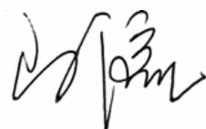

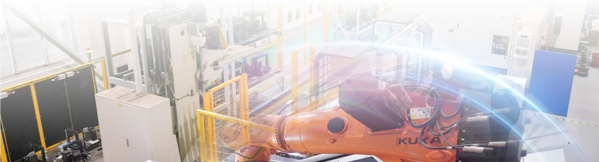

natural_image

Industrial factory interior with robotic arms and machinery, no visible text or symbols

## 走进中核科技

## 公司简介

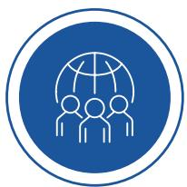

中核苏阀科技实业股份有限公司前身为1952年成立的苏州铁工厂（后改为苏州阀门厂），是一家集工业阀门研发、设计、制造及销售为一体的科技型制造企业。公司于 1997 年在深交所挂牌上市，成为中国阀门行业和中国核工业集团有限公司所属的首家上市企业，拥有国内阀门行业中品种多、规格齐全、技术含量高的专业化工业阀门生产基地，是国内同行业中认证证书齐全，质量管理和检测手段先进的企业。公司现有控股子公司、参股公司共8家，涉及阀门制造、检测、核技术应用以及金融等领域。

公司以“为股东、员工、企业、社会创造价值”为原则，坚持市场化、国际化导向，为石油、天然气、炼油、核电、电力、冶金、化工、造船、造纸、医药等行业提供阀门系统解决方案，逐步形成“核工程、石油石化、能源与公用工程”三大主流目标市场，是国内核电阀门领域的领军企业，国内三大核电集团核电阀门主力供应商，与“三桶油”保持良好的战略合作关系，并为恒力石化、浙江石化等大型民营石化企业提供阀门产品；所使用的“H”、“SUFA”阀门产品商标荣获“2006 世界市场中国（阀门）十大年度品牌”称号，在国内阀门行业中拥有良好声誉，品牌影响力强。

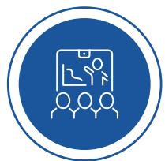

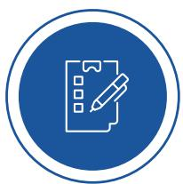

公司在国内阀门行业中较早取得 API6D 阀门会标认证（证书编号：API6D-0139），较早取得DNV 颁发的ISO9000 系列质量认证证书 较早获得进入欧共体市场的“CE PED” 证书，率先获得“压力管道阀门安全注册”和“进出口商品免验”证书；先后通过 ABS、BV、DNV 和 CCS 船级社阀门制造的资格认证，并拥有国家核安全局授予核安全设备设计制造资格许可证。

## 业务概况

公司主要业务为工业用阀门的研发、生产、销售及服务。主要产品种类包括闸阀、截止阀、止回阀、球阀、蝶阀、调节阀等。产品应用于核工程、石油石化、公用工程、火电等市场领域。公司不断研析市场趋势，积极应对市场变化，持续深化改革，从技术研发、产能建设、质量提升多方面助力市场拓展，提升市场竞争能力。通过市场细分、产品分级分类，制定市场开发策略，满足不同领域客户的需求。

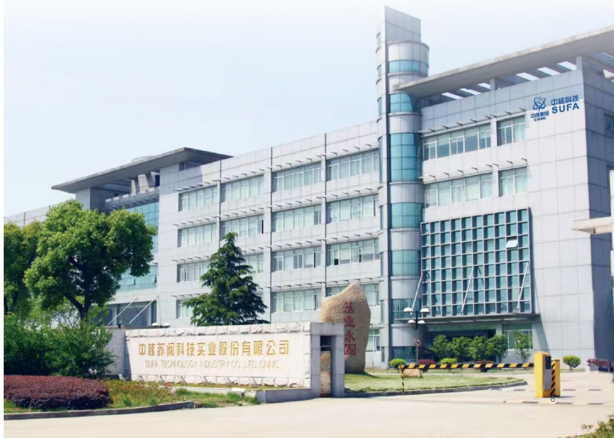

text_image

中核苏阀科技实业股份有限公司
SUFA TECHNOLOGY INDUSTRY CO.,LTD. CNNC
中核集团
CHINA
中核科技
SUFA
基业永固

## 发展历程

追根溯源，苏州翻砂厂和铸管厂合并，组建为地方国营苏州铁工厂

几经变革，在地方国营苏州铁工厂的基础上，中核科技的前身，地方国营苏州阀门厂成立

划归第二机械工业部，承担核装备阀门制造任务

“军转民”, 企业二次创业揭开序幕

1952

1960

1962

1978

取得进口阀门的核留权，并取得“SUFA”和“H”商标苏阀产品跨出国门,出口西欧,实现外贸“零”突破,产品陆续出口北美、欧洲、中东等五十多个国家和地区

国防工业系统第二次创业标兵单位

7 月 10 日，在深交所成功上市，成为国内阀门行业和中核集团系统首家国有控股的上市公司

1983

1988

1996

1997

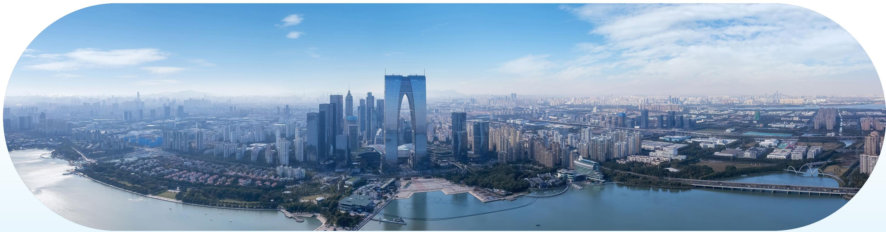

natural_image

Panoramic aerial view of a modern city skyline with skyscrapers, rivers, and bridges under a clear blue sky (no visible text or signage)

## 2000

10 月 18 日，“中核苏州阀门股份有限公司”变更为“中核苏阀科技实业股份有限公司”，简称“中核科技”

## 2004

响应“退城进区”，进行项目建设筹备及设备搬迁工作

## 2006

完成搬迁 , 举行新区建设项目落成典礼。新厂区占地 118 亩。全力进军高端阀门领域

## “十一五”期间

加大专业阀种的生产能力扩充建设和产品科研自主开发，在苏州新区、浒关、相城等地区布局专业化的生产基地，共占地 500余亩

## “十二五”期间

加快自主研发步伐，使公司基本具备二代加核电机组切断类阀门成套供货能力，百万吨乙烯、千万吨炼油阀门成套供货能力，以及超( 超 ) 临界火电机组关键阀门成套供货能力

## “十三五”期间

基本具备三代核电机组切断类阀门成套供货能力、四代核电机组关键阀门供货能力

## “十四五”期间

坚持创新驱动发展，取得多项具备自主知识产权的科技成果，覆盖核电、核燃料、火电、石油化工等多个领域。同时，以信息科技赋能企业向数智化转型迈出坚实步伐，不断向新兴领域拓展延伸

## 企业文化

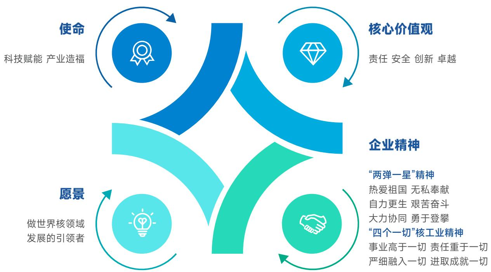

flowchart

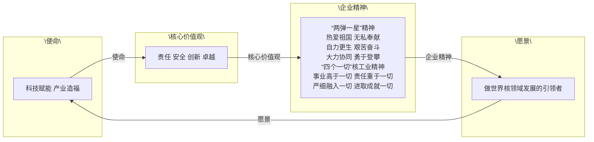
```mermaid
graph LR
  subgraph sg["\"使命\""]
    A["科技赋能 产业造福"]
  end

  subgraph sg_2["\"核心价值观\""]
    B["责任 安全 创新 卓越"]
  end

  subgraph sg_3["\"企业精神\""]
    C["“两弹一星”精神\n热爱祖国 无私奉献\n自力更生 艰苦奋斗\n大力协同 勇于登攀\n“四个一切”核工业精神\n事业高于一切 责任重于一切\n严细融入一切 进取成就一切"]
  end

  subgraph sg_4["\"愿景\""]
    D["做世界核领域发展的引领者"]
  end

  A -->|"使命"| B
  B -->|"核心价值观"| C
  C -->|"企业精神"| D
  D -->|"愿景"| A
```

## 重大荣誉资质

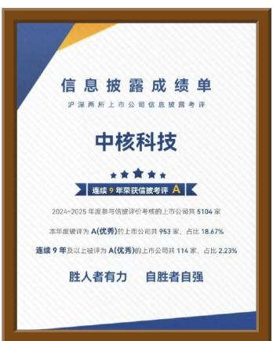

text_image

信息披露成绩单
沪深两所上市公司信息披露考评
中核科技
★★★★★
连续9年荣获信披考评A
2024~2025年度参与信披评价考核的上市公司共5104家
本年度被评为A(优秀)的上市公司共953家,占比18.67%
连续9年及以上被评为A(优秀)的上市公司共114家,占比2.23%
胜人者有力 自胜者自强

荣誉奖项信息披露考核A级  
颁发荣誉单位深圳证券交易所

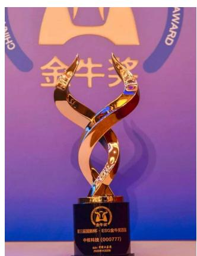

text_image

金牛奖
AWARD
7000元
北京国轩特·EPO金牛奖项目
中银科技(000777)
500-1000元
2023年全国第1届

荣誉奖项第三届国新杯·ESG金牛奖百强  
颁发荣誉单位中国证券报

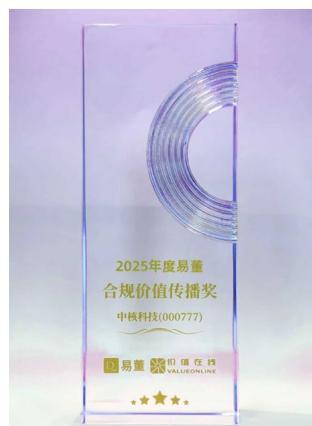

text_image

2025年度易董
合规价值传播奖
中核科技(000777)
1 易董 你们还在我
WALIQUOLINE
★★★

荣誉奖项2025年度易董合规价值传播奖  
颁发荣誉单位价值在线

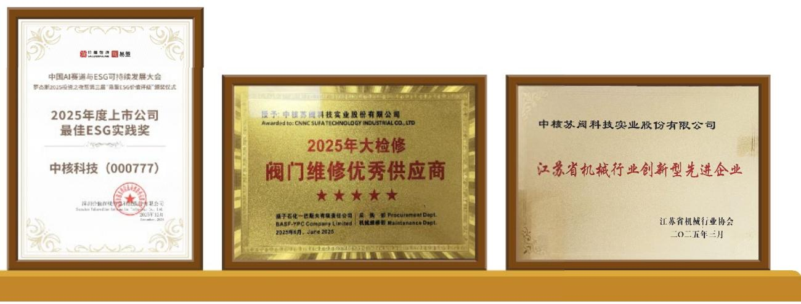

text_image

中国AI赛道与ESG可持续发展大会
罗杰斯2025投资之夜型第五届“高端ESG价值评级”颁奖仪式
2025年度上市公司
最佳ESG实践奖
中核科技（000777）
授予：中核苏阀科技实业股份有限公司
Awarded to: CNIC SUFA TECHNOLOGY INDUSTRIAL CO.,LTD
2025年大检修
阀门维修优秀供应商
★★★★★
福子石化—巴斯夫有限责任公司 | 张·焕·省 Procurement Dept.
BASF-YPC Company Limited | 机械维修部 Maintenance Dept.
2025年6月，June 2025
中核苏阀科技实业股份有限公司
江苏省机械行业创新型先进企业
江苏省机械行业协会
二〇二五年三月

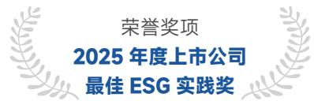  
颁发荣誉单位价值在线

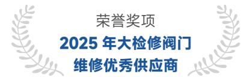  
颁发荣誉单位扬子石化-巴斯夫有限责任公司

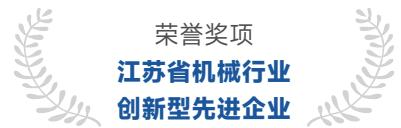  
颁发荣誉单位江苏省机械行业协会

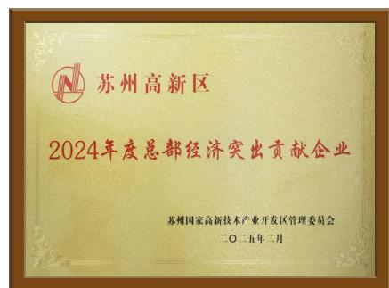

text_image

苏州高新区
2024年度总部经济突出贡献企业
苏州国家高新技术产业开发区管理委员会
二〇二五年二月

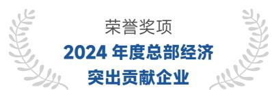  
颁发荣誉单位苏州国家高新技术产业开发区管理委员会

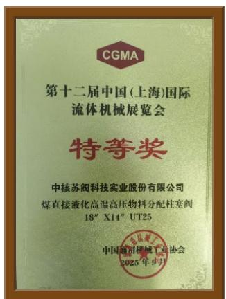

text_image

CGMA
第十二届中国(上海)国际
流体机械展览会
特等奖
中核苏阀科技实业股份有限公司
煤直接液化高温高压物料分配柱寒阀
18" X14" UT25
中国通用机械工业协会
2025年9月

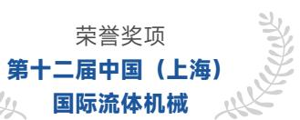  
颁发荣誉单位中国通用机械工业协会

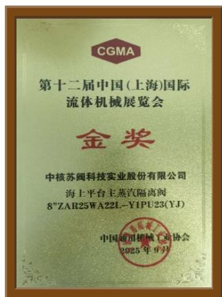

text_image

第十二届中国(上海)国际
流体机械展览会
金奖
中核苏阀科技实业股份有限公司
海上平台主蒸汽隔离阀
8"ZAR25WA22L-Y1PU23(YJ)
中国通用机械工业协会
2025年9月

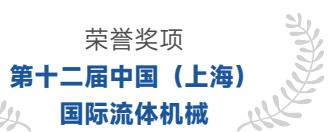  
颁发荣誉单位中国通用机械工业协会

## 2025 年 ESG 关键绩效

公司治理绩效

营业收入

173,137.02 万元

纳税总额

5,522.42 万元

净利润

16,989.31 万元

资产总额

386,286.88 万元

股东会召开次数

6 次

董事会召开次数

10 次

董事会女性董事占比

22.22%

董事会独立董事占比

33.33%

环境绩效

环保投入总金额

871.36 万元

环保培训时长

2,528 小时

温室气体排放总量

6,108.87

吨二氧化碳当量

温室气体排放强度

3.53

吨二氧化碳当量/百万元营收

能源消耗总量

2,149.21

吨标准煤

能源消耗强度

1.24

吨标准煤/百万元营收

产业价值绩效

研发投入

6,873.74 万元

研发投入占营业收入比例

3.97%

研发团队总人数

180人

产品合格率

100%

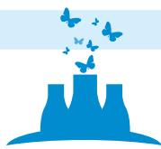

客户满意度

95.03%

人力资源绩效

员工总人数

1,046 人

劳动合同签订率

100%

社会保险覆盖率

100%

员工培训投入

203.6 万元

员工培训总时长

59,927 小时

安全教育培训总时长

3,303 小时

## 01

## 严规治企稳健经营

## 我们的行动

可持续发展治理  
坚持党建引领  
科学规范治理  
●优化内控合规  
强化投关管理  
恪守商业道德

## SDGs

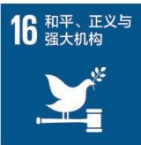

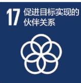

bar

| Category | Value |
| --- | --- |
| Profit & Loss | $3,754.59 |

## 可持续发展治理

## 可持续发展目标与愿景

中核科技以 “为股东、员工、企业、社会创造价值” 为原则，形成 “经营、人才、安全、环保、质量、廉洁” 六大方面的ESG愿景，通过全面的 ESG 管理推动公司经营发展，与股东及合作伙伴、政府和监管机构、客户、员工、社区等重要利益相关方协同共融、共创价值。

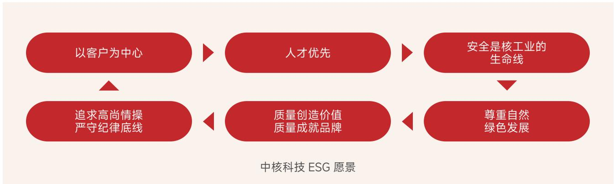

flowchart

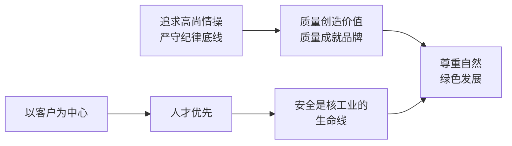
```mermaid
graph LR
  A["以客户为中心"] --> B["人才优先"]
  C["追求高尚情操\n严守纪律底线"] --> D["质量创造价值\n质量成就品牌"]
  B --> E["安全是核工业的\n生命线"]
  D --> F["尊重自然\n绿色发展"]
  E --> F
```

## 联合国可持续发展目标（SDGs）

中核科技立足行业特性，围绕联合国可持续发展目标（SDGs），积极开展 ESG实践工作。

<table><tr><td>维度</td><td>SDGs</td><td>我们的响应</td></tr><tr><td>公司治理</td><td>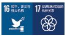</td><td>持续完善治理体系,坚持党建引领,健全决策、监督与问责机制;恪守商业道德,坚守诚信合规底线,充分保护投资者权益,以推动自身长期稳健、可持续发展。</td></tr><tr><td>环境保护</td><td>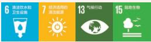</td><td>坚定推进绿色低碳转型进程,主动响应全球气候治理相关倡议;严守环保法律法规,持续优化环境管理体系建设。</td></tr><tr><td>产业价值</td><td>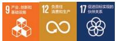</td><td>坚持创新驱动,加快发展新质生产力;加强供应链管理,始终坚持“质量创造价值,质量成就品牌”理念,确保产品及客户服务质量。</td></tr><tr><td>人力资源</td><td>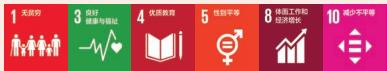</td><td>坚持“人才优先”理念,建立完善的职业发展与保障体系,支持员工成长,营造多元包容、安全健康的工作环境,实现公司与员工共同发展;积极履行社会责任,投身公益事业,以实际行动践行企业担当。</td></tr></table>

## 可持续发展治理架构

中核科技高度重视可持续发展工作，遵循《深圳证券交易所上市公司自律监管指南第 3 号——可持续发展报告编制》等相关法律法规，建立自上而下 ESG 管理架构，通过构建董事会监督、战略与 ESG 委员会指导、ESG 工作小组统筹、董事会办公室落实，保障ESG工作有效开展。

<table><tr><td>治理主体</td><td>人员构成</td><td>职责</td></tr><tr><td>董事会</td><td>董事会成员</td><td>由公司董事会参与ESG重大事项的审议与决策,包括审议年度ESG报告,对ESG工作进行监督并承担整体责任。</td></tr><tr><td>战略与ESG委员会</td><td>战略与ESG委员会成员</td><td>负责指导及审阅公司ESG理念、目标及策略;监督公司ESG管理绩效目标的制定并持续跟进目标实施进度;负责识别公司ESG相关风险与机遇,设立有效的ESG风险管理及内部监控机制。</td></tr><tr><td>ESG工作小组</td><td>ESG战略和工作规划的核心执行团队,由核心部门负责人组成</td><td>负责对应议题的管理行动的推行与实施,定期开展沟通、总结和回顾工作并将相关成果向战略与ESG委员会汇报。</td></tr><tr><td>执行部门</td><td>核心部门人员</td><td>负责统筹与落实相应ESG议题涉及的管理行动与KPI;定期统计与分析ESG量化绩效数据、检索各议题的负面信息;开展内外部利益相关方沟通、开展ESG议题的交流会议与汇报工作。</td></tr></table>

## ESG建设工作专题培训会

公司组织员工参与中核集团 ESG 建设工作专题培训会。通过专题培训，公司着力于提高员工对 ESG 的认识，更致力于将 ESG 建设理念深度融入治理实践中，提高公司 ESG 治理水平。

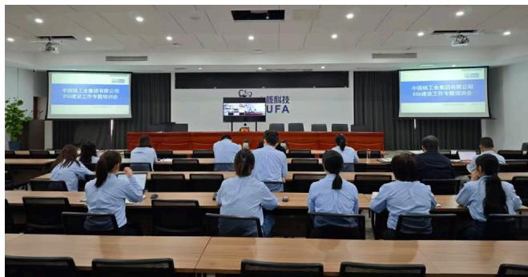

text_image

中国核工业集团有限公司
2019建设工作专题研讨会
核科技
UFA
中国核工业集团有限公司
2019建设了在中国证监会

## ESG 绩效考核

公司将 ESG 绩效考核作为战略落地的关键驱动，将考核指标纳入公司管理层薪酬。ESG 考核指标包括科技投入、信息披露考评、科技研发项目、数字化转型、科技成果转化和专利授权、节能减排等方面，以此推动公司的可持续发展目标。

## 利益相关方沟通

中核科技重视利益相关方的意见与诉求，积极拓宽利益相关方沟通渠道，通过多元化的沟通形式，充分倾听并回应各利益相关方的关切和期望，更针对性地开展各实质性议题的管理和披露工作，促进公司持续改进。

natural_image

Illustration of a business meeting with four people around a table, laptops, and a presentation screen (no text or symbols visible)

<table><tr><td>利益相关方类别</td><td>诉求与期望</td><td>沟通与回应</td></tr><tr><td rowspan="5">政府及监管机构</td><td>响应国家战略</td><td>政策执行</td></tr><tr><td>守法合规经营</td><td>依法合规经营</td></tr><tr><td>反腐败与商业道德</td><td>信息披露</td></tr><tr><td>环境污染防治</td><td>官网、社交媒体</td></tr><tr><td>应对气候变化</td><td>优化环境管理体系</td></tr><tr><td rowspan="5">投资者及股东</td><td>保障股东权益</td><td>股东会</td></tr><tr><td>公司治理</td><td>投资者交流活动</td></tr><tr><td>信息公开透明</td><td>业绩说明会</td></tr><tr><td>内控及风险管理</td><td>信息合规披露</td></tr><tr><td>投资者关系管理</td><td>风险评估</td></tr><tr><td rowspan="3">客户</td><td>产品质量管理</td><td>提升产品质量</td></tr><tr><td>研发创新</td><td>加大研发投入</td></tr><tr><td>客户服务</td><td>客户满意度调查售后服务</td></tr><tr><td rowspan="4">供应商及合作伙伴</td><td>反腐败与商业道德</td><td>依法履行合同</td></tr><tr><td rowspan="3">供应链管理</td><td>公开招标管理</td></tr><tr><td>交流调研</td></tr><tr><td>廉洁采购</td></tr><tr><td rowspan="5">员工</td><td>员工权益及福利</td><td>员工薪酬福利体系</td></tr><tr><td>技能培训和职业发展</td><td>员工培训</td></tr><tr><td rowspan="3">员工健康与安全</td><td>员工考核与晋升</td></tr><tr><td>职业健康与安全生产保障</td></tr><tr><td>职代会与工会</td></tr></table>

<table><tr><td>利益相关方类别</td><td>诉求与期望</td><td>沟通与回应</td></tr><tr><td>社区及公众</td><td>公益慈善关注弱势群体保护生态环境</td><td>开展社会公益活动环境合规管理</td></tr><tr><td>媒体</td><td>信息公开透明媒体采访与沟通</td><td>信息披露媒体交流会采访沟通</td></tr></table>

## 尽职调查

公司将尽职调查作为投资决策、供应链管理及合作伙伴遴选的前置程序，致力于将风险管理深度融入业务流程。公司对供应商实施差异化准入评估，并对承包商、访客等相关方开展安全管理与风险核查，通过资质审核、安全培训、协议签署及现场考察等方式，强化合作全流程风险防控，确保相关方管理合规有序。

## 重要性议题管理

中核科技依据《深圳证券交易所上市公司自律监管指引第 17 号——可持续发展报告（试行）》要求，基于所处行业特征及自身经营特点，展开系统的可持续发展议题的重要性评估工作。

公司构建完善的重要性评估流程，邀请内外部利益方参与评估，全面识别与分析 ESG 议题的风险或机遇。公司分别从财务重要性和影响重要性两大维度进行分析，最终形成重要性议题矩阵，为公司进一步明确可持续发展管理重点和可持续发展战略提供基础支撑。

## 重要性议题分析流程

<table><tr><td>识别</td><td>·基于全球趋势、政策法规及行业特点进行分析,识别公司的利益相关方与公司面临的影响、风险与机遇。</td></tr><tr><td>议题确定</td><td>·参考全球报告倡议组织GRI、联合国可持续发展目标SDGs、SASB、MSCI,以及国内外同行业相关议题,建立了可持续发展相关议题库。公司对往年议题进行评估调整,最终确认30项与公司可持续发展相关议题。</td></tr><tr><td>重要性评估</td><td>·影响重要性评估:梳理各议题对外部环境、社会和经济的潜在或实际的正面或负面影响,通过问卷的形式对利益相关方开展调研分析。本年度回收了605份问卷回复,回复问卷来自股东、董事、管理层、员工、客户、供应商、政府或监察机构等11类内外部利益相关方。·财务重要性评估:通过影响、依赖性和其他因素分析,结合专家判断,以及公司各部门风险识别和评估清单,识别和评估相关议题下的风险和机遇,评估出具有财务重要性的议题。</td></tr><tr><td>议题审阅与确定</td><td>·形成影响重要性和财务重要性议题清单,并确保相关议题透明、平衡且完整地披露于报告中。</td></tr></table>

## 中核科技ESG实质性议题评估结果

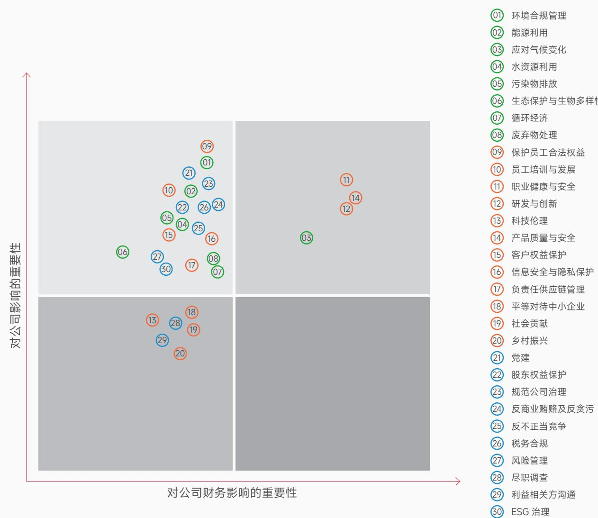

scatter

| ID | Topic |
| --- | --- |
| 01 | 环境合规管理 |
| 02 | 能源利用 |
| 03 | 应对气候变化 |
| 04 | 水资源利用 |
| 05 | 污染物排放 |
| 06 | 生态保护与生物多样性 |
| 07 | 循环经济 |
| 08 | 废弃物处理 |
| 09 | 保护员工合法权益 |
| 10 | 员工培训与发展 |
| 11 | 职业健康与安全 |
| 12 | 研发与创新 |
| 13 | 科技伦理 |
| 14 | 产品质量与安全 |
| 15 | 客户权益保护 |
| 16 | 信息安全与隐私保护 |
| 17 | 负责任供应链管理 |
| 18 | 平等对待中小企业 |
| 19 | 社会贡献 |
| 20 | 乡村振兴 |
| 21 | 党建 |
| 22 | 股东权益保护 |
| 23 | 规范公司治理 |
| 24 | 反商业贿赂及反贪污 |
| 25 | 反不正当竞争 |
| 26 | 税务合规 |
| 27 | 风险管理 |
| 28 | 尽职调查 |
| 29 | 利益相关方沟通 |
| 30 | ESG治理 |

同时具有财务重要性与影响重要性

具有影响重要性但不具有财务重要性

具有财务重要性但不具有影响重要性

既不具有财务重要性也不具有影响重要性

## 坚持党建引领

## 坚持党的全面领导

中核科技始终坚持党的全面领导，以习近平新时代中国特色社会主义思想为指导，深入贯彻中央八项规定精神，全面落实党组织决策部署，并将“两弹一星”精神和“四个一切”核工业精神融入发展实践。公司坚定拥护“两个确立”、增强“四个意识”、坚定“四个自信”、做到“两个维护”，全面落实新时代党的建设总要求，以高质量党建引领企业高质量发展。

公司持续推进党建与业务深度融合，制定《党委理论学习中心组学习细则》《团支部考核评价及评星定级管理办法》《关于加强和改进工会工作领导的实施细则》等党建制度，不断完善党建制度体系，强化组织保障，以党建引领激发红色引擎，推动公司在高质量发展的道路上稳步前行。

## 强化党组织建设

中核科技不断深化党组织建设，通过加强思想建设、组织建设、作风建设，不断增强党组织的凝聚力。截至报告期末，公司共设 11 个党支部，党员 237 名。为推动党建工作与生产经营融合，公司建立“岗区队”矩阵，打造 11 个党员责任区、10个党员示范岗、12个党员突击队。

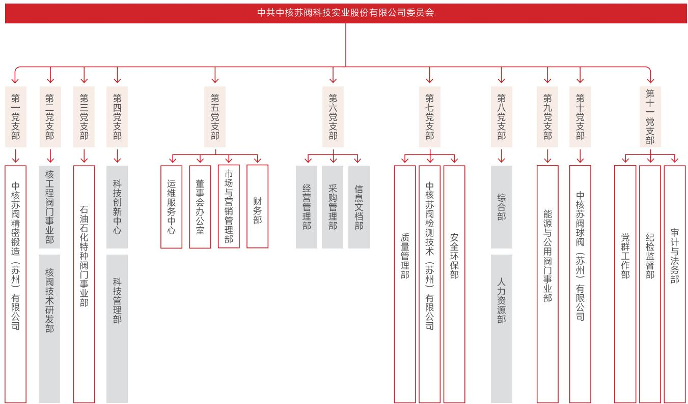

flowchart

```mermaid
graph TD
  A["中共中央苏阀科技实业股份有限公司委员会"] --> B["第一党支部"]
  A --> C["第二党支部"]
  A --> D["第三党支部"]
  A --> E["第四党支部"]
  A --> F["第五党支部"]
  A --> G["第六党支部"]
  A --> H["第七党支部"]
  A --> I["第八党支部"]
  A --> J["第九党支部"]
  A --> K["第十党支部"]
  A --> L["第十一党支部"]
  
  B --> M["中核苏阀精密锻造（苏州）有限公司"]
  C --> N["核工程阀门事业部"]
  D --> O["核阅技术研发部"]
  E --> P["石油石化特种阀门事业部"]
  F --> Q["科技创新中心"]
  F --> R["科技管理部"]
  
  G --> S["运维服务中心"]
  G --> T["董事会办公室"]
  G --> U["市场与营销管理部"]
  G --> V["财务部"]
  
  H --> W["经营管理部"]
  H --> X["采购管理部"]
  H --> Y["信息文档部"]
  
  I --> Z["质量管理部"]
  I --> AA["中核苏阀检测技术（苏州）有限公司"]
  I --> AB["安全环保部"]
  
  K --> AC["综合部"]
  K --> AD["能源与公用阀门事业部"]
  K --> AE["中核苏阀球阀（苏州）有限公司"]
  
  L --> AF["党群工作部"]
  L --> AG["纪检监察部"]
  L --> AH["审计与法务部"]
```

## 党建品牌建设

公司构建“党委统筹、跨部门协同”的责任体系，系统推进党建品牌建设。公司通过制定《品牌建设管理办法》《“一支部一品牌”创建活动实施方案》，并成立品牌建设领导小组，明确管理职责与工作流程，实现品牌创建活动规范化、标准化。同时，公司以专题培训、案例研讨等方式强化全员品牌意识，促进品牌理念融入日常，持续推动品牌建设与经营发展深度融合。

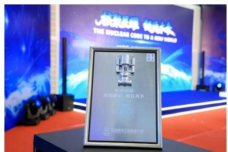

text_image

地球物理 创新大
THE NUCLEAR CODE TO A NEW WORLD
地球物理
科技核心 空立天下
中国核安全工程建设公司

中核科技品牌

## 党风廉政建设

中核科技坚持以党风廉政建设为核心，将全面从严治党和治理强化要求融入企业运营，系统构建并持续完善“学查改”全链条监督整改机制。

公司通过作风整顿与闭环治理，全面排

查并推动各级问题整改，发布典型案例

33 期

组织警示教育

4,500 人次

发送廉洁提醒短信

200 条

集中整治违规吃喝，

为基层减负

40 个非常设机构

同时开展常态化廉洁教育、合规培训及警示教育，筑牢廉洁风险防线，累计覆盖

700 余人次

修订制度

6 项

受理并办结信访举报

28 件

公司坚决贯彻上级巡视整改要求，压实政治责任，深化重点领域专项治理，推动巡察全覆盖与监督成果转化。公司通过优化巡察制度、加强队伍建设与评估，构建“当下改”与“长久立”相结合的长效机制，形成系统化、常态化、实效化的廉洁监督格局。

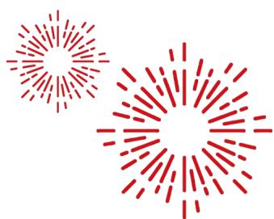

natural_image

Two red decorative firework patterns on white background (no text or symbols)

## 2025 年度警示教育大会

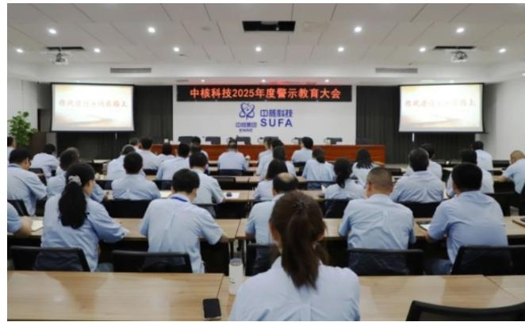

text_image

中核科技2025年度警示教育大会
中国核安全校
中核科技
SUFA

2025年6月13日，公司召开年度警示教育大会，组织观看警示教育片，公司党委书记听取公司近年来问题线索查处情况及典型案例通报。会议强调，要深入学习贯彻习近平总书记关于加强党的作风建设的重要论述，严格执行中央八项规定及其实施细则，营造风清气正的企业政治生态。

## 丰富党建活动

中核科技通过开展党建联建，主题学习等系列活动 持续巩固和深化党建引领作用 强化全体党员爱国爱党意识 促进企业高质量发展。

## 党建联建活动

2025 年 7 月 22 日，中核科技联合华北监督站、漳州能源、中核工程共同开展党建联建活动。各单位围绕党建引领发展的实践经验开展交流，为进一步提升党建质量提供了新思路。活动期间还组织参观了苏州革命博物馆与铁铃关红色基地，重温革命历史，传承奋斗精神。

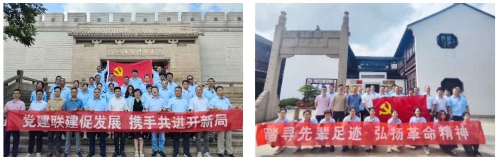

## 科学规范治理

## 完善管治体系

中核科技严格遵守《中华人民共和国公司法》《上市公司章程指引》《上市公司治理准则》等国家相关法律法规要求，并结合自身实际情况，制定《公司章程》《贯彻落实“三重一大”决策制度实施办法》《董事会议事规则》《董事会专门委员会议事规则》《股东会议事规则》等管理制度，构建以党委会、股东会、董事会及高级管理人员为核心的科学治理架构，明确各治理主体的职责，规范公司治理机制，为公司的持续经营与健康发展筑牢根基。

## 中核科技治理架构

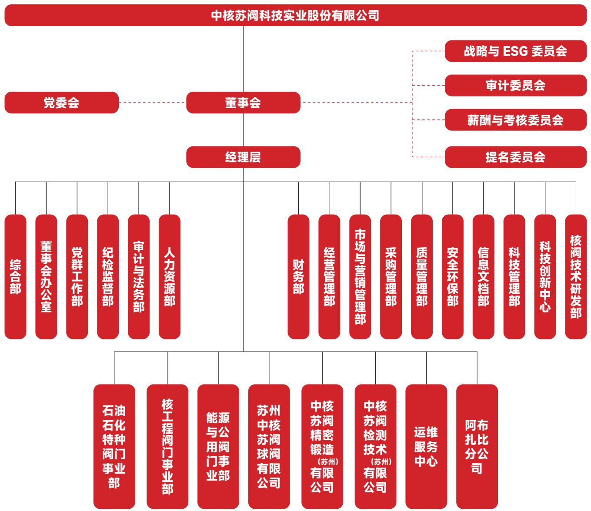

flowchart

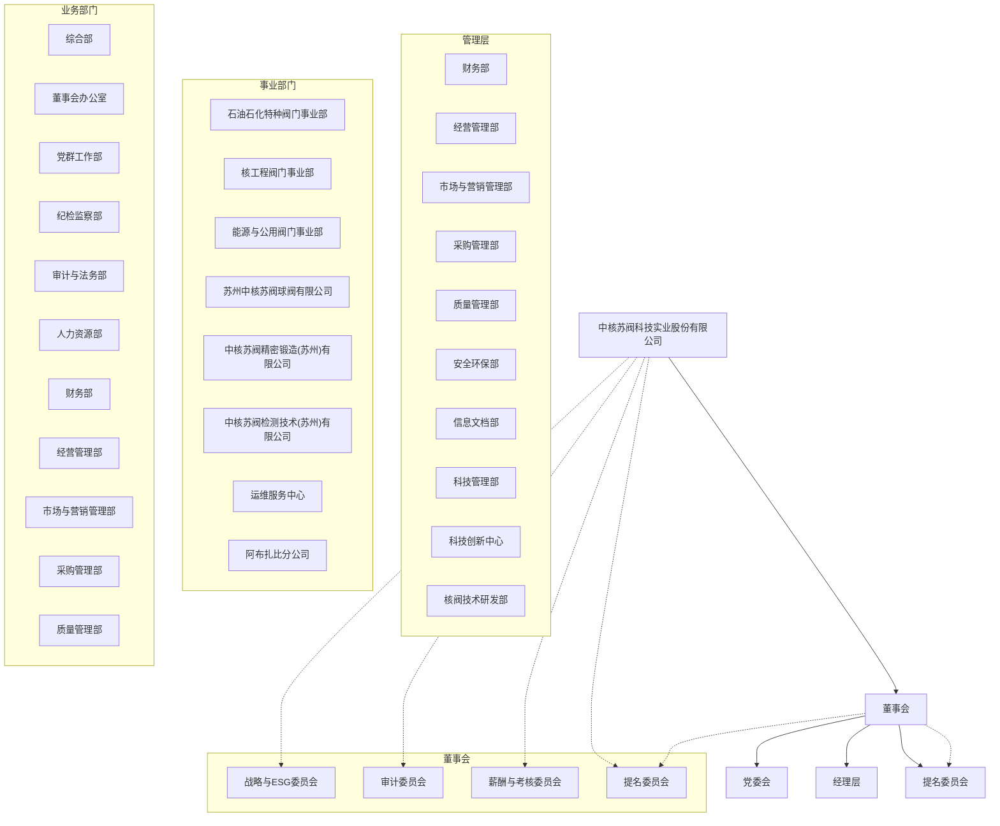
```mermaid
graph TD
  A["中核苏阀科技实业股份有限公司"] --> B["董事会"]
  B --> C["党委会"]
  B --> D["经理层"]
  B --> E["提名委员会"]
  
  subgraph Board [董事会]
    F["战略与ESG委员会"]
    G["审计委员会"]
    H["薪酬与考核委员会"]
    I["提名委员会"]
  end
  
  subgraph Management [管理层]
    J["财务部"]
    K["经营管理部"]
    L["市场与营销管理部"]
    M["采购管理部"]
    N["质量管理部"]
    O["安全环保部"]
    P["信息文档部"]
    Q["科技管理部"]
    R["科技创新中心"]
    S["核阀技术研发部"]
  end
  
  subgraph Subsidiaries [业务部门]
    T["综合部"]
    U["董事会办公室"]
    V["党群工作部"]
    W["纪检监察部"]
    X["审计与法务部"]
    Y["人力资源部"]
    Z["财务部"]
    AA["经营管理部"]
    AB["市场与营销管理部"]
    AC["采购管理部"]
    AD["质量管理部"]
  end
  
  subgraph Departments [事业部门]
    AE["石油石化特种阀门事业部"]
    AF["核工程阀门事业部"]
    AG["能源与公用阀门事业部"]
    AH["苏州中核苏阀球阀有限公司"]
    AI["中核苏阀精密锻造(苏州)有限公司"]
    AJ["中核苏阀检测技术(苏州)有限公司"]
    AK["运维服务中心"]
    AL["阿布扎比分公司"]
  end
  
  A -.-> F
  A -.-> G
  A -.-> H
  A -.-> I
  
  subgraph Subsidiaries [业务部门]
    M
    N
    O
    P
    Q
    R
    S
  end
  
  B -.-> E
  B -.-> I
  
  subgraph Subsidiaries [业务部门]
    T
    U
    V
    W
    X
    Y
  end
  
  subgraph Subsidiaries [业务部门]
    AA
    AB
    AC
    AD
    AE
    AF
    AG
    AH
    AI
    AJ
    AK
    AL
  end
```

## 股东会

股东会是公司的最高权力机构。公司严格遵循《公司章程》及《股东会议事规则》，规范股东会议召集、召开、提案与表决等全流程，确保运作合法合规。同时，为便利股东参与、保障股东权利，公司积极拓宽参与渠道，采用现场与网络投票相结合的方式，有效提升公司治理的透明度与科学性，切实维护全体股东特别是中小股东的合法权益。

## 关键绩效

报告期内，公司召开股东会会议 6 次其中临时股东会会议 5 次

共审议通过 21 项议案。

## 董事会

为提升重大投资决策的科学性与效益，公司严格依据《董事会议事规则》等治理制度，规范董事会运作程序，确保其权责清晰、履职到位。

董事会设立战略与ESG委员会、审计委员会、提名委员会、薪酬与考核委员会四个专门委员会，会严格遵守相关制度规定，在其授权范围内独立、有效地开展工作，为董事会决策提供专业支持与监督。

## 关键绩效

报告期内，公司共召开董事会会议10 次

审议通过 98项议案 。

## 董事会多元化

公司董事会注重成员的多元化构成，在选举过程中将行业经验、专业背景、能力及性别等因素纳入综合考量标准。截至报告期末，董事会共由 9 名董事组成，其中包含 2 名女性董事，占比 22.22%；独立董事 3 名，占比 33.33%。成员专业背景多元，涵盖经济、法律、财务、机械等多个领域，形成优势互补的专业结构，为公司科学决策与全面发展提供有力支撑。

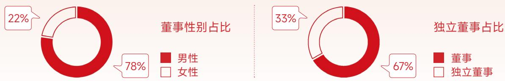

donut

| 类别 | 细分项 | 占比 |
| --- | --- | --- |
| 董事性别占比 | 男性 | 78% |
| 董事性别占比 | 女性 | 22% |
| 独立董事占比 | 董事 | 67% |
| 独立董事占比 | 独立董事 | 33% |

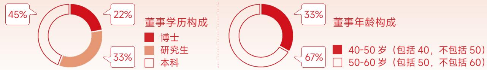

donut

| 类别 | 细分项 | 占比 |
| --- | --- | --- |
| 董事学历构成 | 博士 | 22% |
| 董事学历构成 | 研究生 | 33% |
| 董事学历构成 | 本科 | 45% |
| 董事年龄构成 | 40-50岁 (包括 40, 不包括 50) | 33% |
| 董事年龄构成 | 50-60岁 (包括 50, 不包括 60) | 67% |

## 董事会独立性

公司依法规范董事会构成，有效发挥独立董事的积极作用，保障董事会决策的科学性。各专门委员会依据议事规则规范运作，其中审计委员会由不在公司担任管理职务的董事组成，且独立董事超过半数，并由独立董事中会计专业人士担任召集人，从机制上保障监督职能的独立有效履行。

<table><tr><td>专门委员会</td><td>独立董事(位)</td><td>非独立董事(位)</td><td>独董是否担任主任委员</td></tr><tr><td>战略与ESG委员会</td><td>1</td><td>4</td><td>否</td></tr><tr><td>审计委员会</td><td>3</td><td>2</td><td>是</td></tr><tr><td>薪酬与考核委员会</td><td>3</td><td>2</td><td>是</td></tr><tr><td>提名委员会</td><td>3</td><td>2</td><td>是</td></tr></table>

## 关键绩效

报告期内，公司共召开

审计委员会会议 次 8

专门委员会会议 次17

薪酬与考核 委员会会议 次 3

战略与 ESG 委员会会议 次3

提名委员会会议 次3

## 董高薪酬管理

公司制定《负责人年薪管理办法》，明确薪酬决策程序，党委会前置审议经理层年薪方案，薪酬与考核委员会依考核结果提出建议，董事会负责审批。同时，对不在经营层任职的董事、独立董事的补贴发放方式也有清晰规定。

## 优化内控合规

## 合规体系建设

中核科技致力于构建系统的合规管理体系，制定《合规管理办法》《合规手册》等一系列规章制度，明确董事会为合规管理的最高决策机构，下设审计委员会，负责具体指导与监督合规管理工作；审计与法务部为合规管理归口部门，负责合规管理制度制定，协调、指导及监督各部门合规工作，通过建立健全全员合规责任制，明确各级管理层和员工的合规管理责任。同时，公司设立首席合规官，列席涉及法律问题的决策会议并提出合规意见，保障决策的合法性与合规性。

公司将风险管理贯穿于合规管理的全过程，通过合规审查，对规章制度、经营决策及市场交易、产品质量等重点领域实施重点法律审核，有效防范潜在的法律风险；利用合规检查、考核与评价机制，定期对公司各部门的合规情况进行检查和评估，及时发现并纠正不合规行为；建立合规监督举报及责任追究机制，鼓励员工对违规行为进行举报，对违规者进行严肃处理，从源头上遏制违规行为的发生。

## 宣传推广专项法律合规培训

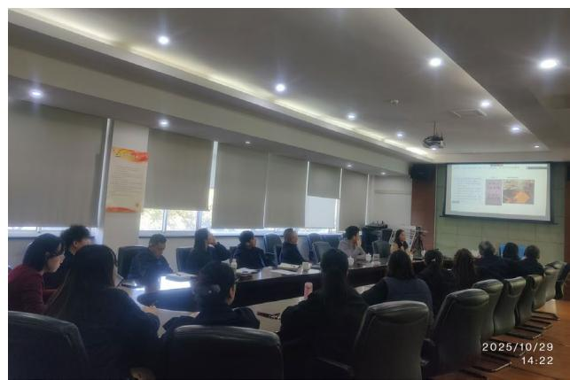

text_image

2025/10/29
14:22

2025 年 10 月 29 日，公司特邀知识产权领域专家召开专项法律合规培训，以“企业宣传推广中的合规问题”为主题，深入剖析实务中的高频风险点，旨在强化全员风险防范意识，为公司品牌建设与宣传活动的安全合规开展提供坚实保障。

<table><tr><td>关键指标</td><td>单位</td><td>2025年</td></tr><tr><td>开展法律培训次数</td><td>次</td><td>2</td></tr><tr><td>开展法律培训时数</td><td>小时</td><td>4</td></tr><tr><td>参与法律培训人数</td><td>人</td><td>40</td></tr></table>

## 风险管理

## 风险管理体系

中核科技遵循 “战略导向、重大重要、全面有效、全员参与” 的原则，制定《全面风险管理办法》，建立包括风险管理领导机构、风险管理归口部门、业务部门组成的全面风险管理组织体系，形成分类、分层和集中管理相结合的责任体系，系统性开展全面风险管理工作。

<table><tr><td>机构分类</td><td>具体机构</td><td>职责</td></tr><tr><td>风险管理领导机构</td><td>党委</td><td>对风险管理工作进行全面领导,将防范化解重大风险作为党委重要职责落到实处。</td></tr><tr><td>风险管理决策机构</td><td>董事会</td><td>批准风险管理相关制度、计划、方案,对风险管理工作有效性负责。</td></tr><tr><td>风险管理专门委员会</td><td>审计委员会</td><td>负责具体推动全面风险管理工作。审议风险管理相关事项,并向董事会提出建议。</td></tr><tr><td>风险管理归口部门</td><td>审计与法务部</td><td>统筹日常风险管理工作,组织风险评估、推动跨部门协同、监督风险管控。</td></tr><tr><td>风险管理执行部门</td><td>各业务部门</td><td>负责本职能和业务范围的风险管理工作,接受风险归口部门的组织协调和指导监督。</td></tr><tr><td>风险管理监督部门</td><td>内部审计部门</td><td>根据董事会要求,对各业务部门开展全面风险管理工作的合规性及工作效果进行监督评价。</td></tr></table>

## 风险防控流程

中核科技构建系统化的风险管理流程，根据经营实际将风险划分为战略、市场、财务、运营、法律合规及安全环保六大类别，并结合内外部因素绘制风险坐标图、建立风险库，实现对风险的分类分级与重点管理。

2025年度 公司结合内外部经营环境变化 调整完善公司年度风险清单 开展重大经营风险预测评估 并及时进行整改降低风险发生的可能性和影响。

natural_image

Two hands interacting with a holographic key on a digital screen, symbolizing data or security (no text or symbols present)

## 风险管理流程

## 01 风险评估

建立常态化的风险评估机制，各业务部门每月定期开展风险评估，通过筛选、提炼、分析形成业务范围TOP3-5重大风险管控表，并报送至风险管理归口部门。

归口部门每季度结合公司经营实际，对各月风险进行整合、评估与预测，形成TOP10重大风险事项清单。

## 02 风险管控

制定风险应对预案，根据识别评估出的风险等级和性质，制定针对性的风险应对预案，明确应对措施、责任部门。

## 05 风险事件报告

对重大项目实施过程中的风险进行实时分析和监控 根据重大区险变化情况，进行风险提示和报告。

## 04 风险监督和改进

风险管理归口部门对风险管理工作有效性的检查和检验内部审计部门、上级部门对风险管理工作的监督评价。

## 03 风险跟踪监测

围绕质量管控、运营等维度识别出的重大风险，建立跟踪监测机制，及时调整和改进风险管理策略和应对方案，确保风险处于受控状态。

## 风险文化建设

为提升风险管理能力，公司积极培育风险管理文化，提升全员风险意识，并将风险管理履职情况与工作有效性纳入领导干部年度绩效考核，推动风险管理落到实处。

## 全面风险管理培训

2025 年 10 月 22 日，中核科技组织开展年度全面风险管理培训。此次培训旨在推动各部门进一步树立风险管理意识，加强风险管理人才队伍建设，提升相关人员的专业履职能力，从而全面提升公司整体风险防范与化解水平。

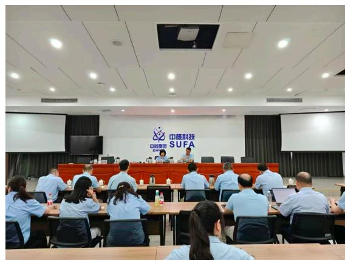

text_image

中航科技
SUFA

## 内部控制建设

为系统落实“强内控、防风险、促合规”目标，中核科技制定《内部控制管理办法》《内部控制评价办法》等相关制度。公司以内控要求为准则，将内控要求全面嵌入规章制度，建立覆盖战略、财务、运营等关键业务的一体化管控机制，并通过内控评价、专项巡查与审计等方式，持续检视流程有效性、评估内控成效、识别与化解风险，推动体系动态优化，为经营管理提供坚实保障。

2025年，公司对内部控制的有效性进行了评价，并聘请第三方机构出具独立审计报告。报告结果显示未发现内部控制重大风险和缺陷。

## 关键绩效

报告期内，公司完成内部审计项目

项,并实现对全部控股子公司内控监督评价的全覆盖。

## 2025年度内部控制管理培训

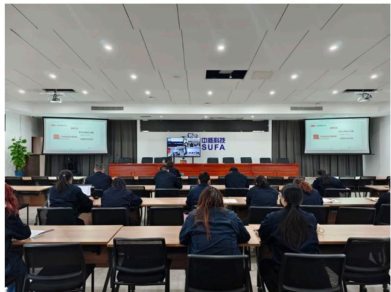

text_image

中能科技
SUFA

2025 年 11 月 24 日，公司组织召开专题内控培训会，系统宣贯内控政策与规范，深化员工对内控要点的理解，并为后续深入推进内控建设、持续优化管理流程奠定坚实的基础。

## 关联交易管理

中核科技严格遵循《中华人民共和国公司法》《中华人民共和国证券法》《深圳证券交易所上市公司自律监管指引第7号——交易与关联交易（2025年修订）》及其他有关法律法规，制定《关联交易管理办法》，明确关联交易的决策、审批、信息披露和内部控制等关键环节，确保交易行为均严格遵循定价公允、程序合规、信息披露规范原则，切实保障公司及全体股东的合法利益。

## 税务管理

中核科技严格遵守国家税收法规，切实履行纳税义务，致力于以规范的税务实践提升企业声誉与市场竞争力，推动可持续发展。

公司构建覆盖全链条的税务风险控制体系，持续深化税务规划与风险防控，实时跟踪税收政策变化，动态调整税务管理方案，确保各类税收申报与缴纳流程精准、高效、合规。

  
内部管理

建立内部复核机制，从数据源端确保税务申报的真实性与完整性，切实规避因申报不当引发的税务合规风险。

  
外部协同

引入专业税务顾问团队，共同构建税务风险预警系统，定期开展系统性风险排查，实现潜在风险的前置识别与动态化解。

此外公司严格执行信息披露规范 主动公开纳税规模，税务优化方案等关键税务信息 通过提高税务透明度 增进投资者与社会公众对企业税务状况的了解，有效降低了信息不对称可能引发的风险。

## 强化投关管理

## 合规信息披露

中核科技已制定《信息披露制度》《内幕信息知情人登记管理制度》等相关管理制度，严格依照法律法规与公司章程，通过《证券时报》、巨潮资讯网等平台媒介，真实、准确、完整、及时地向所有投资者公开信息，保障信息获取的公平性。公司持续强化内外部知情人登记与动态管控，严格落实保密责任，坚决防范内幕交易，以维护市场诚信，切实保障投资者合法权益。

## 关键绩效

报告期内，

公司共披露挂网文件

150份

其中编号公告

$7 1 _ { \textcircled { 1 } }$

；未因信息披露方面违规而受到处罚。

## 投资者关系管理

中核科技高度重视投资者关系管理，制定《投资者关系管理制度》，并积极通过公司官网、深交所互动易平台、电话及业绩说明会等多元化渠道，与投资者保持沟通。公司致力于构建透明、互信的双向交流机制，促进良性互动，切实保护投资者合法权益，提升公司治理与市场形象。

<table><tr><td>关键指标</td><td>单位</td><td>2025年</td></tr><tr><td>接待投资者活动次数</td><td>次</td><td>5</td></tr><tr><td>接待投资者现场调研次数</td><td>次</td><td>4</td></tr><tr><td>接待投资者现场调研人次</td><td>人次</td><td>200+</td></tr><tr><td>在互动易投资者提问总数</td><td>次</td><td>76</td></tr><tr><td>在互动易投资者回答问题数</td><td>次</td><td>76</td></tr><tr><td>在互动易投资者回复率</td><td>%</td><td>100</td></tr></table>

## 股东回报

中核科技积极践行股东回报承诺，稳步实施利润分配。公司权益分派方案均严格履行股东会审议程序，充分听取全休股东尤其是中小股东意见，保障其合法权益

公司 2024 年中期向全体股东

每 股派发现金红利 元（含税）,

报告期内，公司披露了《2024 年度利润分配实施公告》，利润分配方案为：

以 2024 年末公司总股本 383,417,593.00 股为基数 ,

向全体股东每 股派发现金红利 元（含税），不进行资本公积金转增股本 ,

2024年度向全体股东

每 股累计派发现金红利 元（含税）。

公司2025年中期向全体股东，

每 股派发现金红利 元（含税）。

<table><tr><td>关键指标</td><td>单位</td><td>2022年</td><td>2023年</td><td>2024年</td><td>2025年</td></tr><tr><td>每10股派发现金红利(含税)</td><td>元</td><td>1.21</td><td>1.87</td><td>1.94</td><td>1.33</td></tr><tr><td>现金分红总额(含税)</td><td>元</td><td>46,521,052.37</td><td>71,895,553.34</td><td>74,383,013.04</td><td>50,994,531.27</td></tr></table>

注：2025年分红情况尚需股东会批准。

natural_image

Hand holding a pen to draw coins on a white surface, with blurred background of office items (no text or symbols visible)

## 恪守商业道德

## 反商业贿赂及反贪污

中核科技深入贯彻党风廉政与反腐败相关要求，严格遵守《中华人民共和国刑法》《中华人民共和国公司法》等法律法规，制定《廉洁从业规定》《领导干部“八小时以外”监督管理办法》《领导干部廉洁档案管理办法》等管理制度。同时，公司设立纪检监察部，负责对廉洁从业工作进行监督检查，持续健全纪检监督反腐败长效机制，确保公司依法经营与廉洁从业，切实维护国家及公司利益。同时，公司依据《廉洁风险防控手册》，聚焦领导班子及关键岗位开展廉洁风险识别及防控措施落地。

报告期内，公司未发生贪污腐败、利益输送、欺诈及内幕交易等违法违规行为。

## 举报及投诉机制

公司制定《纪检监督信访工作规定》，明确受理、核查和处理各类信访举报管理流程。为持续健全举报及投诉机制，公司建立举报电话、内部举报信箱等多元化反馈渠道，鼓励员工及外部利益相关方举报任何与公司有关的实际或可疑不当行为。

公司对举报信息依规调查、公正处理、及时回应，严格保密举报人信息，严禁任何歧视或报复行为，一经发现打击报复行为，将严肃追究相关人员责任。

举报渠道

举报电话：0512-66672792

内部举报信箱：公司办公大楼一楼大厅右侧楼梯间1.5 层

## 廉洁文化建设

公司积极构建廉洁文化传播体系，通过开展廉政教育、案例解析、每月发送廉洁提醒、旁听案件审理等多种形式的宣传教育活动向全休员工传递廉洁价值理念，着力培育风清气正，务实向上的经营环境

## 每月廉洁提醒

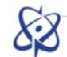  
中核集团CNNC

中核苏阀科技实业股份有限公司

SUFA Technology Industry Co.,Ltd.,CNNO

【每月廉洁提醒】

(2025年第32期 总第257期)

## 中央层面整治形式主义为基层减负专项工作机制办公室中央纪委办公厅公开通报2起整治形式主义为基层减负典型问题

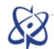  
中核集团CNNC

中核苏阀科技实业股份有限公司

SUFA Technology Industry Co.,Ltd.,CNNO

【每月廉洁提醒】

(2025年第5期 总第230期)

## 电视专题片《反腐为了人民》

## 第四集《以案促改促治》

## 以案学法专题警示教育活动

2025年5.月22日中核科技纪委组织中层以上领导于部赴张家港市人民法院旁听一起职务犯罪案件审理，公司通过“面对面”观磨方式，用“案中人”警醒身边人，将庭审现场变为廉洁教育课堂，推动纪法教育从“纸上条文”转向“身边警钟”。

## 反不正当竞争与反垄断

公司恪守自愿、平等、公平、诚信的经营原则，严格遵守《中华人民共和国反垄断法》《中华人民共和国反不正当竞争法》等法律法规及《中核科技合规管理办法》《合规手册》等制度要求，坚决抵制垄断，虚假宣传，操纵招标等一系列不正当商业行为，积极维护健康有序的商业环境与良性的市场竞争秩序。报告期内，公司未发生因不正当竞争行为引发的诉讼或重大行政处罚事件。

## 02

## 绿色智造

## “核”谐共生

## 我们的行动

应对气候变化  
环境合规管理  
资源高效利用  
生态守护共生

## SDGs

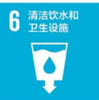

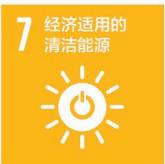

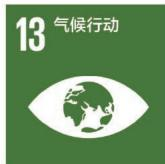

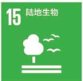

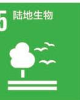

natural_image

Recycling symbol formed from tree shapes on a grassy field under a clear blue sky (no text or symbols)

## 应对气候变化

全球应对气候变化迫在眉睫，制造行业迎来绿色转型挑战。中核科技积极行动，加大低碳环保技术研发投入，推动全产业链绿色转型，持续推进绿色建设、创新绿色发展模式，助力全球气候治理，实现与生态环境和谐共生。

## 治理

中核科技深刻意识到气候变化对自身战略规划及业务运营的影响，制定《温室气体管理程序》，将应对气候变化纳入公司发展战略体系。公司建立由董事会统筹领导的温室气体管理架构，其中董事会负责制定温室气体排放管理总体发展方向，管理者代表及经营管理部负责进行管理体系优化及落地执行，搭建覆盖排放源识别、数据统计核算、报告编制的全流程管理体系；同时，公司每年组织开展内部碳核查工作，持续提升温室气体管控水平。

2025年识别的气候风险和应对措施

<table><tr><td colspan="2">风险类型</td><td>风险描述</td><td>财务影响说明</td><td>发生可能性</td><td>影响大小</td><td>影响时间范围</td><td>影响价值链环节</td><td>应对措施</td></tr><tr><td rowspan="2">物理风险</td><td>极端高温</td><td>制冷设备需求增大,增加运营成本支出导致员工中暑、工作状态不佳,降低公司运营效率,同时员工健康维护成本增加温度敏感的化学试剂,仓储环节的爆炸、火灾等安全风险升高。</td><td>增加运营成本和员工维护成本</td><td>中</td><td>中</td><td>短期</td><td>运营</td><td rowspan="2">制定应急预案,识别可能的资产损坏,购买必要的保险,以降低与急性天气事件相关的损失。</td></tr><tr><td>自然灾害</td><td>可能造成公司生产设备损坏、运输受阻、供应链中断等风险。</td><td>增加固定资产损失</td><td>中</td><td>中</td><td>短期</td><td>运营上下游</td></tr><tr><td rowspan="2">转型风险</td><td>政策与法规</td><td>业务所在地政府未来将实施更为严格的环保法规对温室气体排放设置严格的限制和排放配额。</td><td>运营成本增加</td><td>高</td><td>大</td><td>中长期</td><td>运营</td><td>密切关注“双碳”相关法规政策的变化,并及时制定相应的措施,积极应对。</td></tr><tr><td>市场及技术</td><td>客户对产品和服务的低碳排放技术的要求提高,低碳原材料、可再生能源采购成本的增加,预期碳价格将会上涨,市场倾向于选择低碳产品和服务。</td><td>运营成本增加收入减少</td><td>中</td><td>中</td><td>中长期</td><td>上游运营</td><td>1.结合当前技术水平进行节能降碳技术改造,对设备进行定期维护;2.实行绿色采购理念,在设备采购中倾向低能效高节能设备采购。</td></tr></table>

注：公司将影响的时间范畴划分为短期（0-1年）、中期（1-5年）、长期（5年以上）

## 影响、风险和机遇管理

为有效管理气候变化带来的风险与机遇，中核科技建立专项管控机制，通过系统识别、评估与应对气候相关风险，持续完善风险管理流程，保障公司稳定运营。

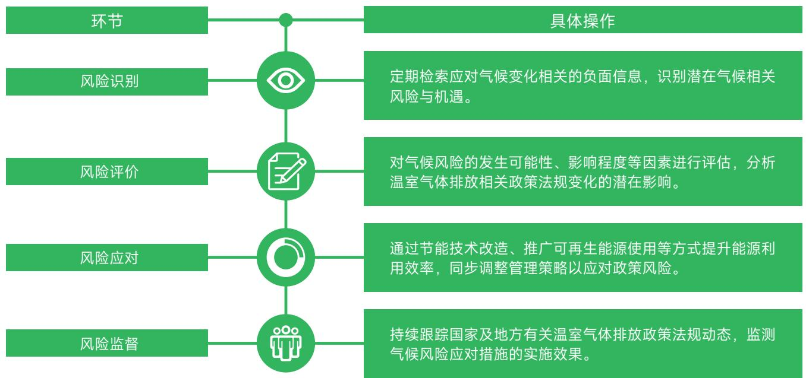

flowchart

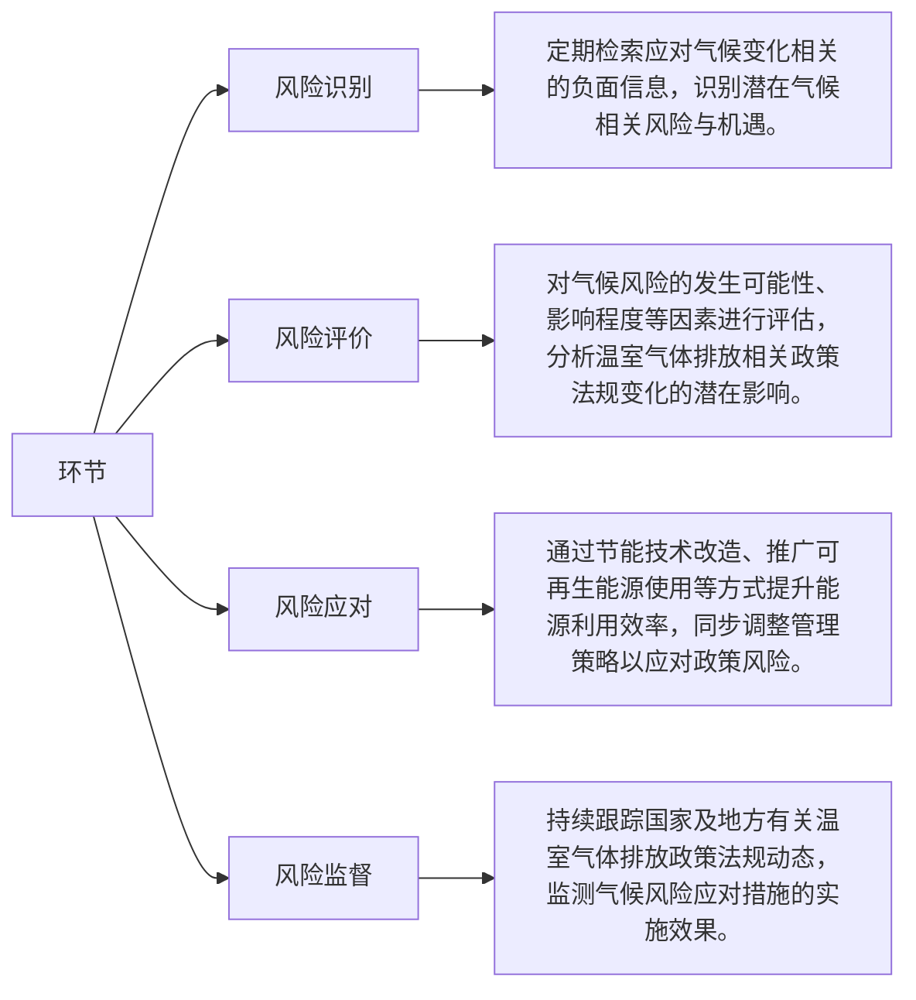
```mermaid
graph LR
  A["环节"] --> B["风险识别"]
  A --> C["风险评价"]
  A --> D["风险应对"]
  A --> E["风险监督"]
  
  B --> F["定期检索应对气候变化相关的负面信息，识别潜在气候相关风险与机遇。"]
  C --> G["对气候风险的发生可能性、影响程度等因素进行评估，分析温室气体排放相关政策法规变化的潜在影响。"]
  D --> H["通过节能技术改造、推广可再生能源使用等方式提升能源利用效率，同步调整管理策略以应对政策风险。"]
  E --> I["持续跟踪国家及地方有关温室气体排放政策法规动态，监测气候风险应对措施的实施效果。"]
```

指标与目标

<table><tr><td>关键指标</td><td>单位</td><td>2025年</td></tr><tr><td>温室气体排放总量</td><td>吨二氧化碳当量</td><td>6,108.87</td></tr><tr><td>直接温室气体排放量(范围一)</td><td>吨二氧化碳当量</td><td>828.66</td></tr><tr><td>间接温室气体排放量(范围二)</td><td>吨二氧化碳当量</td><td>5,280.21</td></tr><tr><td>温室气体排放强度</td><td>吨二氧化碳当量/百万元营收</td><td>3.53</td></tr></table>

注：

1.统计范围包括公司及子公司；  
2公司温室气体统计依据《温室气体核算体系：企业核算与报告标准(2004年）》《机械设备制造企业温室气体排放核算方法与报告指南(试行)》温室气体核算采用主要排放因子法，即温室气体排放量=活动数据×相应排放因子  
3 公司使用能源为天然气、汽油，柴油及电力范围一温室气体排放因子参考《机械设备制造企业温室气体排放核算方法与报告指南（试行）》附录二、《中国能源统计年鉴 - 附录 4- 各种能源折标准煤参考系数》，电力碳排放因子采用生态环境部发布的 2023年全国电力平均二氧化碳排放因子 0.5306kgCO2/kWh。

## 温室气体管理措施

中核科技将绿色低碳理念深度融入生产运营的各个环节，以技术创新为驱动，积极推行智能化、数字化等节能减排措施。针对喷砂、油漆、焊接等温室气体主要排放源，公司通过开展设备节能技改和生产设施智能升级，从源头减少温室气体的产生，并定期对环境治理设施进行维护和升级，确保其稳定运行，有效降低排放风险。公司不仅致力于自身温室气体减排，还通过优化生产流程、推进工艺改进，为行业提供绿色低碳转型解决方案。

## 温室气体核查

中核科技每年定期开展温室气体盘查工作，通过数据摸排和跟踪验证的机制，确保温室气体整体规划、减排减碳机制得以有效实施。报告期内，公司根据 ISO 14064 国际标准委托有资质的第三方机构对公司 2024 年度温室气体排放量进行核查。核查结果显示中核苏阀科技实业股份有限公司（不含子公司），2024 年度温室气体排放量为 4,380.41 吨二氧化碳当量。截至报告期末，公司 2025 年度温室气体排放的第三方核查工作正在筹备中。

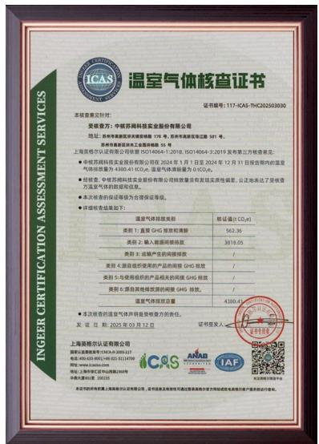

text_image

ICAS
温室气体核查证书
证书编号：117-ICAS-ThC202503030
本报告须见针对：
受理方：中核苏润科技实业股份有限公司
地址：苏州市吴淞区苏溪镇南园 176 号，苏州市吴淞区东江路 581 号。
本报告须经国家工商行政管理局注册，可
上海其他地方经济贸易公司依照 ISO14064-1:2018、ISO14064-3:2019 发布第三方核查意见：
● 中核苏润科技实业股份有限公司将在 2024 年 1 月 1 日至 2024 年 12 月 31 日报报告期内的温室
气体排放量为 4300.41 gCO₂e，温室气体排放量为 0.0 g/L。
● 核查文件：中核苏润科技实业股份有限公司的核查报告发布或现场采样调查。公正地依法了受理方
方温度和湿度信息。
● 本次核查的环保等级为在环保保证等证。
● 详细核查结果如下：
温室气体排放类别	检证值(Ⅰ CO₂e)
类别 1：直属 GHG 排放和清除	562.36
类别 2：输入能源间接排放	3818.05
类别 3：运输产生的间接排放	/
类别 4：来自使用使用的产品范围 GHG 排放	/
类别 5：与使用用的产品的相关的 GHG 排放	/
类别 6：源自其他地质资源间的 GHG 排放	/
温室气体排放总量	4300.41
● 本次核查的温室气体排放并接受核查方的责任。
发证日期：2025 年 03 月 12 日
证明签发人：
上海某格认证有限公司
国家认证委令号：CSA-2005157
电话：021-6333333/888-51119799
网址：www.sstac.com
取得上市资格证书后，由国浩律师事务所（特殊普通合伙）
本报告书自备之日起生效，并于 2025 年 03 月 12 日

温室气体核查证书

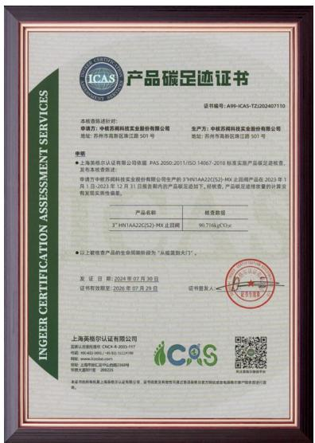

text_image

产品碳足迹证书
证书编号：A99-ICAS-TZ2020407110
本项获得注册证：
申请号：中核苏网科技实业股份有限公司
生产方：中核苏网科技实业股份有限公司
地址：苏州市高新区珠江路501号
地址：苏州市高新区珠江路501号
事项
●上海英格尔认证有限公司依据 PAS 2050:2011/ISO 14067-2018 核心实施产品碳足迹核查，
发布本项核查证书。
申请文件：中核苏网科技实业股份有限公司生产的“3”HN1AA2C(SZ) MX 全国间产品2023年1月1日、3日、1日、3日、1日及定期报告的产品碳足迹如下，经核查，产品碳足迹质量的计算没有发现实质性信息。
产品名称	轻度数据
3"HN1AA2C(SZ) MX 全国间	90.716gCOe
证书签发人：
以上碳核查产品的生命周期新称为“从超宽到大门”
发证日期：2024年07月30日
证书有效期至：2026年07月29日
上海英格尔认证有限公司
产品名称：中核苏网科技实业股份有限公司
地址：上海市徐汇区沪西路2349号
法定代表人：XXX
ICAS
产品碳足迹证书
证书编号：A99-ICAS-TZ2020407110

产品碳足迹证书

## 产品碳足迹核算

公司经营管理部牵头组织实施产品碳足迹核算工作，各协同部门明确职责、紧密配合，共同开展从数据收集、核算分析到认证改进的系列工作。报告期内，公司依据 ISO14067:2018 标准，针对 3’’HN1AA22C(S2)-MX 止回阀产品组织实施“从摇篮到大门”的产品生命周期碳足迹核算，并获得相关产品碳足迹认证。

## 环境合规管理

## 环境管理体系

公司严格遵循《中华人民共和国环境保护法》等法律法规，制定《环境职业健康安全管理手册》《环境因素识别与评价管理规定》等内部制度和程序规范，并构建多层级的环境管理体系与架构，明确安委会作为环境保护的一级管理机构，安全环保部负责污染及排放管理，在各厂区配置设备管理员、安环管理员。部门各层级明确分工，对分布在不同地点的 5 个厂区进行标准化管理，以制度体系推动环保工作有效落实。

## 关键绩效

报告期内，公司环保总投入 871.36 万元，占营业收入比例为 0.5%。

截至报告期末 公司已通过ISQ14001:2015环境管理体系认证。此外 公司积极践行绿色制造理念 通过江苏省绿色工厂与苏州市3A级绿色工厂认证。

中核科技环境管理体系认证证书  
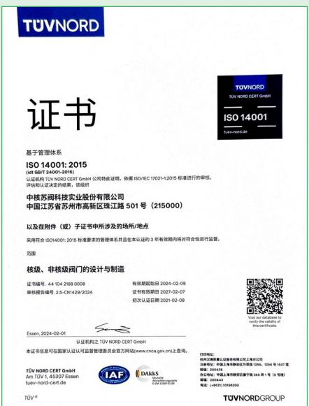

text_image

TUVNORD
证书
基于管理体系
ISO 14001: 2015
(481GB/T 24001-2016)
认证机构 TUV NORD CERT GmbH 公司特此证明，依据 ISO/IEC 17021-12015 标准进行的审核。
评估单位认证文件的编号、审核
中核苏阀科技实业股份有限公司
中国江苏省苏州市高新区珠江路 501 号 (215000)
以及在附件（或）子证书中所涉及的场所/地点
采用符合 ISO/40401: 2015 标准要求的管理体系并且在本认证的 3 年有效期内将对符合性进行监督。
范围
核级、非核级阀门的设计与制造
证书编号：4.4.104.2988.0008
审核报告编号：2.5-CN1429/2024
有效期起始日：2024-02-08
证书有效期至：2027-02-07
初次认证日期：2021-02-08
Essen, 2024-02-01
认证机构之 TUV NORD CERT GmbH
本证书信息可在国家认证认可监督管理委员会官方网站(www.cnce.gov.cn)上查阅。
TUV NORD CERT GmbH
Am TUV 1, 45587 Essen
fuev-nord-cert.de
DAKKS
TUVNORDGROUP
TUVNORDGmbH
TUVNORDGmbH
TUVNORDGmbH
TUVNORDGmbH
TUVNORDGmbH
TUVNORDGmbH
TUVNORDGmbH
TUVNORDGmbH
TUVNORDGmbH
TUVNORDGmbH
TUVNORDGmbH
TUVNORDGmbH
TUVNORDGmbH
TUVNORDGmbH
TUVNORDGmbH
VUVNORDGmbH
TUVNORDGmbH
TUVNORDGmbH
TUVNORDGmbH
TUVNORDGmbH
TUVNORDGmbH
TUVNORDGmbH
TUVNORDGmbH
TUVNORDGmbH
TUVNORDGmbH
TUVNORDGmbH
TUVNORDGmbH
TUVNORDGmbH
TUVNORDGmbH
TUV NORDGmbH
TUVNORDGmbH
TUVNORDGmbH
TUVNORDGmbH
TUVNORDGmbH
TUVNORDGmbH
TUVNORDGmbH
TUVNORDGmbH
TUVNORDGmbH
TUVNORDGmbH
TUVNORDGmbH
TUVNORDGmbH
TUVNORDGmbH
TUVNORDGmbH
TUVNORD GMBL
ISO 14001
Tuvnord.de

2025 年度江苏省绿色工厂名单

<table><tr><td>285</td><td>迈安德集团有限公司</td></tr><tr><td>286</td><td>南京普天天纪楼宇智能有限公司</td></tr><tr><td>287</td><td>江苏瑞德机械有限公司</td></tr><tr><td>288</td><td>江苏佳尔科药业集团股份有限公司</td></tr><tr><td>289</td><td>嘉庚(江苏)特材有限责任公司</td></tr><tr><td>290</td><td>中核苏阀科技实业股份有限公司</td></tr><tr><td>291</td><td>江苏亨通海能科技有限公司</td></tr><tr><td>292</td><td>康迈(南京)机械有限公司</td></tr><tr><td>293</td><td>普罗斯通信技术(苏州)有限公司</td></tr><tr><td>294</td><td>南京大全自动化科技有限公司</td></tr><tr><td>295</td><td>江苏宏仁特种气体有限公司</td></tr><tr><td>296</td><td>江苏吉腾新材料科技有限公司</td></tr><tr><td>297</td><td>江苏荣威电气有限公司</td></tr><tr><td>298</td><td>江苏浩威新材料有限公司</td></tr><tr><td>299</td><td>泰兴瑞泰化工有限公司</td></tr><tr><td>300</td><td>阿克苏诺贝尔功能涂料(常州)有限公司</td></tr><tr><td>301</td><td>无锡科伦达化工热力装备有限公司</td></tr><tr><td>302</td><td>捷普科技(无锡)有限公司</td></tr></table>

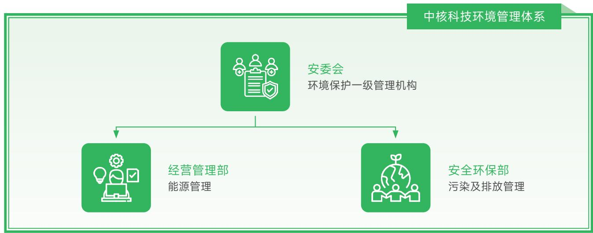

flowchart

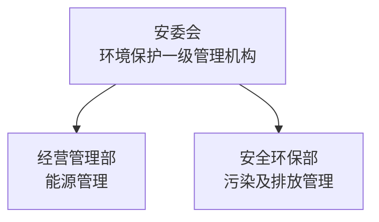
```mermaid
graph TD
  A["安委会\n环境保护一级管理机构"] --> B["经营管理部\n能源管理"]
  A --> C["安全环保部\n污染及排放管理"]
```

## 专业技能培养

公司常态化开展环保培训活动，围绕环境因素识别、危废管理等核心内容开展培训，增强公司员工环保合规意识。

## 关键绩效

报告期内，公司共组织 1,264 人次参与环保培训

培训时长累计 2,528 小时。

## 环境因素识别与评价、危废管理培训

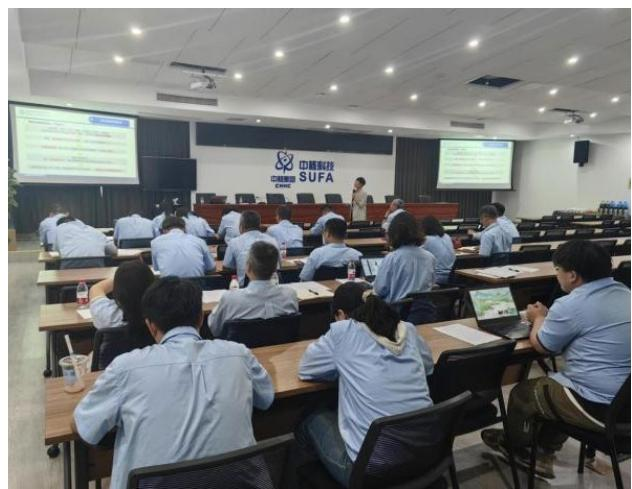

text_image

Conference room photo with visible '中国科技 SUFA' branding on the wall and presentation screens in the background

2025 年 5 月 16 日，安全环保部组织专兼职安环管理人员开展环境因素识别与评价、危废管理培训，帮助员工掌握环境因素识别与评价的方法，熟悉危废合规管理要求，助力企业防范环保法律风险。

## 环境管理目标

公司结合自身业务发展实际，科学合理设定环境管理目标，通过对目标进行分层拆解，逐级落实各环节监督与管理责任，为环境目标稳步达成提供支撑。

<table><tr><td>环境指标</td><td>2025 年目标</td><td>2025 年达成情况</td></tr><tr><td>重大环境事件发生次数</td><td>0 次</td><td rowspan="2">已达成</td></tr><tr><td>相关方安环投诉次数</td><td>0 次</td></tr></table>

## 环境风险管理

## 风险管理流程

公司依据《环境因素识别与评价管理规定》，明确由安全环保部负责组织开展环境因素的识别、评价和控制管理。公司围绕作业活动、设备设施及服务识别潜在的环境风险，并对识别的环境因素进行评价分级，针对重要环节因素制定应对措施，整理形成《环境因素识别评价表》，确保环境风险得到有效控制，保障环境管理工作平稳有序推进。

## 应急管理与隐患排查

公司的环境风险主要包括危险废物管理过程中对环境的影响、废气排放对环境的影响、生产废水排放对环境的影响、可能的火灾对环境的影响、可能的化学品泄露对环境的影响。公司针对各类影响均制定并执行相关管理制度，要求员工严格按照操作规程进行作业。

公司制定《突发环境事件应急预案》，每年定期开展应急演练，确保在面对突发环境事件时，相关人员能够迅速、有效地做出反应。

## 关键绩效

报告期内，公司共开展突发环境事件应急演练 5 次。

此外，公司每月开展安全环保隐患排查与整治；每年实施环境因素辨识与更新，以便及时发现潜在的环境风险，并采取相应的措施进行预防和控制。

## 关键绩效

报告期内，公司共开展隐患排查216次

隐患整改率100% 。

## 化学品泄漏事故应急演练

2025 年 5 月 21 日，中核科技组织核工程阀门事业部普车组全体员工开展化学品泄漏事故专项应急演练。本次演练聚焦化学品处置全流程的人员安全防护要点，通过模拟真实泄漏场景，强化员工应急操作规范与风险防范意识。

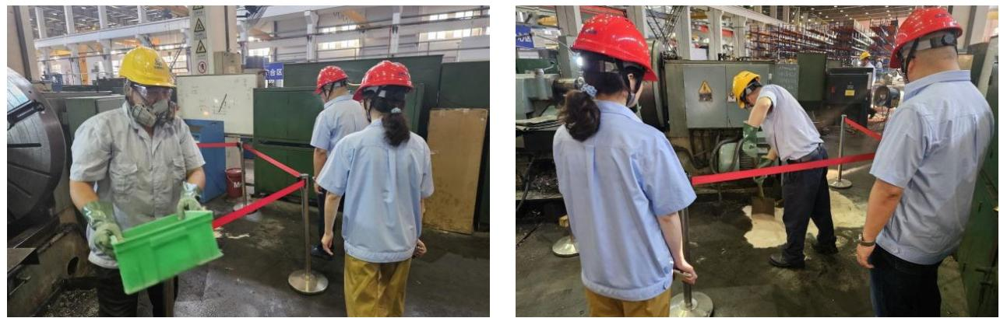

## 污染物和废弃物管理

## 废水管理

公司严格遵循《中华人民共和国水污染防治法》《城镇排水与污水处理条例》《污水综合排放标准》（GB8978-1996）等相关法律法规及标准要求，同时依据内部制定的《废水、废气、噪声和固体废物管理规定》等制度文件，对生活废水及生产污水的排放实施规范化管理。公司产生的废水主要来自生活污水和工业废水，工业废水经单位污水处理设施处理达标后与生活污水一并经污水管网排放至高新区污水处理厂处理。

## 生活污水处置

公司严格遵循国家和地方相关管理要求，结合中核集团内部管理规定，对餐厅、卫生间等配套区域生活污水实施分类预处理，餐厅污水经隔油池除油、卫生间及洗手池污水经三级沉淀池沉降后，均汇入厂区污水总排口统一纳管排放。同时，公司严格落实雨污分流管理，实现雨污管网独立布设输送，划定管网口防护区域严禁存放化学品、油类等污染物，定期开展管网巡检维护排查隐患，保证全流程符合环保规定。

## 工业废水处置

公司工业废水主要源于清洗、油漆、泵验、洗片、热处理等涉水生产工艺，以及车间清洁环节。针对生产工序废水，公司清洗废水经污水站处理后达标排放，或经过废水蒸发装置处理后浓缩废液按危废处置，洗片废水按危废交由有资质的单位处置。

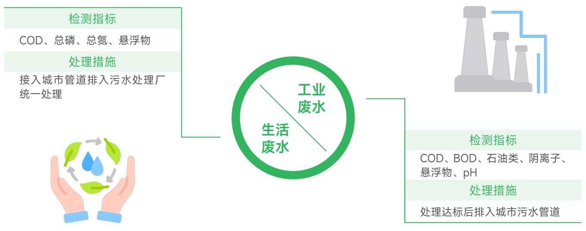

flowchart

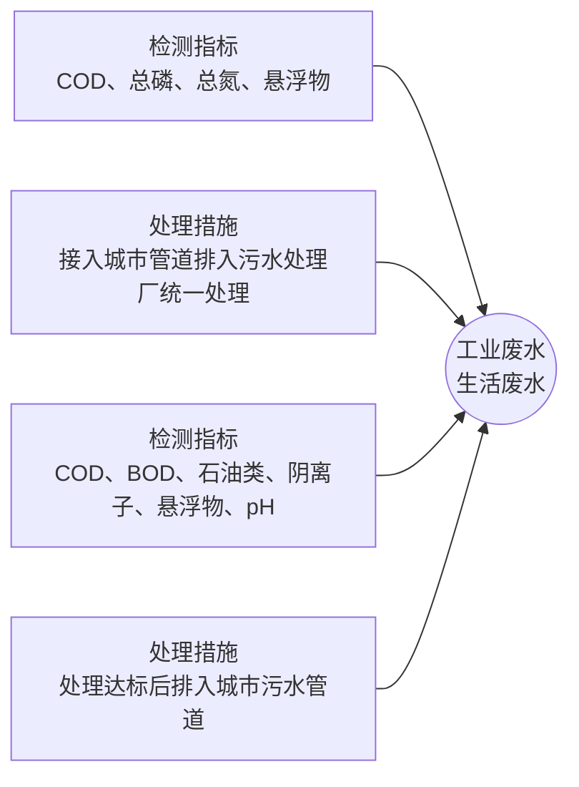
```mermaid
graph LR
  A["检测指标\nCOD、总磷、总氮、悬浮物"] --> C(("工业废水\n生活废水"))
  B["处理措施\n接入城市管道排入污水处理厂统一处理"] --> C
  D["检测指标\nCOD、BOD、石油类、阴离子、悬浮物、pH"] --> C
  E["处理措施\n处理达标后排入城市污水管道"] --> C
```

报告期内，公司各类废水污染物均达标排放，未对员工及周边社区居民产生不良影响，全年无因废水排放引发的重大行政处罚或刑事责任追究情形，废水管控环节未出现重大管理缺陷。

<table><tr><td>关键指标</td><td>单位</td><td>2025年</td></tr><tr><td>废水排放量</td><td>吨</td><td>91,790</td></tr><tr><td>其中:工业废水排放量</td><td>吨</td><td>78,089</td></tr><tr><td>其中:生活污水排放量</td><td>吨</td><td>13,701</td></tr></table>

## 废气管理

公司严格遵循《中华人民共和国大气污染防治法》等法律法规及标准要求，同时以内部 《废水、废气、噪声和固体废物管理规定》等制度文件明确管控责任与流程。公司通过催化燃烧、活性炭吸附、布袋除尘等处理技术，严格控制废气排放，保障5个厂区环保设施稳定运行，实现废气持续达标排放。

有机废气处置  

产生场所按照法规要求安装治理设施排烟装置高空（不低于15米）排放。

粉尘烟尘处置  
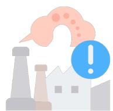  
检测指标

产生场所按照法规要求安装治理设施，在喷粉、焊补生产线安装其中吸烟管道，减少粉尘和气态污染物的排放。

VOC

处理措施

催化燃烧、活性炭吸附等

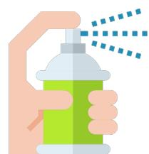

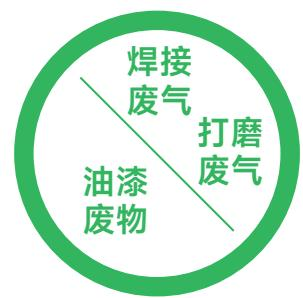

flowchart

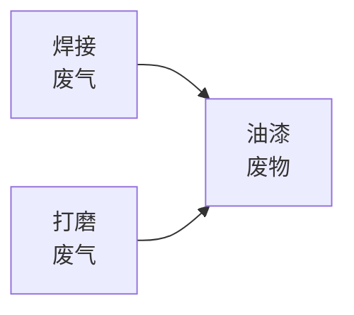
```mermaid
graph LR
  A["焊接\n废气"] --> B["油漆\n废物"]
  C["打磨\n废气"] --> B
```

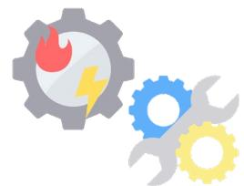

检测指标

颗粒物

处理措施

布袋烟尘

公司持续推进废气减排工作 针对珠江路厂区喷涂废气处理环节 采用沸石转轮+RTO焚烧工艺替代原有活性炭吸附法目前废气治理设施正在建设中。此外，公司建立第三方常态化监测机制，每季度委托专业机构对5个厂区废气排放开展检测。

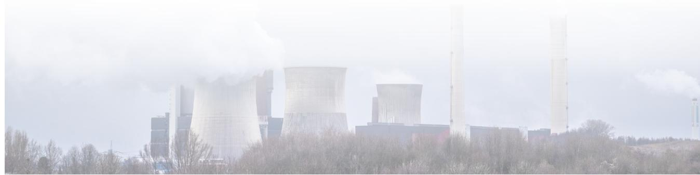

natural_image

Exterior view of a modern industrial cooling plant with multiple cooling towers emitting smoke, surrounded by bare trees (no signage or text visible)

## 废弃物处置

公司严格遵守《中华人民共和国固体废物污染环境防治法》 《废弃危险化学品污染环境防治办法》等相关法律法规，制定《废水、废气、噪声和固体废物管理规定》《危险废物管理规定》。公司对生产过程中产生的固体废物进行分类收集、分区贮存和合规处置，一般工业固体废物和生活垃圾的管理执行《废水、废气、噪声和固体废物管理规定》，危险废物的管理执行《危险废物管理规定》。报告期内, 一般工业固体废物和危险废物均委托有资质的处置单位进行合规处置。

此外，公司通过利用乳化液过滤回收设施，减少废乳化液的产生，2025 年度产生废乳化液 7 吨，仅为 2024 年同期产生量的 36.8%。

<table><tr><td>关键指标</td><td>单位</td><td>2025年</td></tr><tr><td>一般废弃物产生量</td><td>吨</td><td>666.80</td></tr><tr><td>一般废弃物处置量</td><td>吨</td><td>666.80</td></tr><tr><td>危险废弃物产生量</td><td>吨</td><td>88.287</td></tr><tr><td>危险废弃物处置量</td><td>吨</td><td>88.287</td></tr></table>

## 噪声管理

噪声污染防治关乎员工职业健康与周边社区人居环境，是公司环境管理体系的关键要素。公司对生产设备等核心噪声源采用减振阻尼、消声降噪等技术对噪声源进行全面管控；在厂区规划建设阶段，结合噪声传播与衰减规律，通过科学布局厂房、优化设备间距，依托建筑屏障阻隔消减噪声。

为确保防治成效，公司建立厂界噪声常态化监测机制，定期开展合规检测，确保排放指标持续符合《工业企业厂界环境噪声排放标准》（GB12348-2008）。针对超标风险，公司建立快速响应机制，立即排查维护环保设施，优化作业时序或调整设备参数，从源头遏制风险。

报告期内，公司未发生噪声扰民事件，未因噪声管控不合规受到重大行政处罚或刑事责任追究，相关管理体系无重大缺陷，有效防范化解环境合规与社区关系风险。

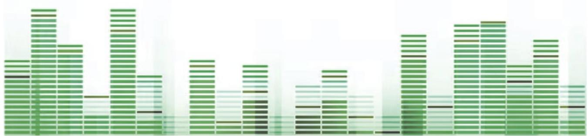

bar

| Category | Value |
| --- | --- |
| 1 | ~25 |
| 2 | ~45 |
| 3 | ~30 |
| 4 | ~60 |
| 5 | ~15 |
| 6 | ~75 |
| 7 | ~20 |
| 8 | ~35 |
| 9 | ~10 |
| 10 | ~30 |
| 11 | ~15 |
| 12 | ~25 |
| 13 | ~10 |
| 14 | ~35 |
| 15 | ~20 |
| 16 | ~45 |
| 17 | ~30 |
| 18 | ~40 |
| 19 | ~25 |
| 20 | ~35 |
| 21 | ~15 |
| 22 | ~20 |

## 资源高效利用

## 能源管理

## 能源管理体系

公司严格遵循《中华人民共和国节约能源法》等法律法规，制定《能源管理手册》《能源管理程序文件》等一系列规范性文件，明确由经营管理部全面统筹能源管理事务，并逐级细化各部门、各岗位管理职责。经营管理部系统性识别并策划体系覆盖范围内的风险与机遇，统筹调配内部资源，强化设施、设备、系统及能源使用全流程的运行控制与维护管理；同时常态化开展能源管理绩效评价，通过监测、分析、评估闭环管理，持续驱动能源管理工作迭代升级。

截至报告期末，公司已通过ISO 50001能源管理体系认证。

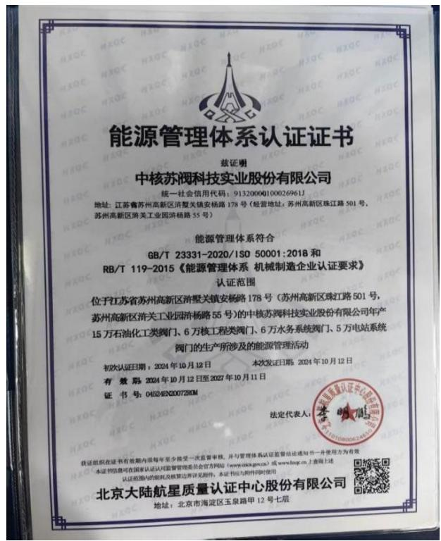

text_image

能源管理体系认证证书
兹证明
中核苏阀科技实业股份有限公司
统一社会信用代码：91320000100026961J
地址：江苏省苏州高新区浒墅关镇安杨路178号（经营地址：苏州高新区珠江路501号，
苏州高新区浒关工业园浒杨路55号）
能源管理体系符合
GB/T 23331-2020/ISO 50001:2018和
RB/T 119-2015《能源管理体系 机械制造企业认证要求》
认证范围
位于江苏省苏州高新区浒墅关镇安杨路178号（苏州高新区珠江路501号，
苏州高新区浒关工业园浒杨路55号）的中核苏阀科技实业股份有限公司年产
15万石油化工类阀门、6万核工程类阀门、6万水务系统阀门、5万电站系统
阀门的生产所涉及的能源管理活动
初次认证日期：2024年10月12日          本次发证日期：2024年10月12日
有效期：2024年10月12日至2027年10月11日
证书号：04S24N300728KM
法定代表人：
北京大陆航星质量认证中心股份有限公司
地址：北京市海淀区玉泉路甲12号七层

能源管理体系认证证书

针对水、电、天然气、柴油四类核心能源及资源类型，公司分别制定专项节约管理办法，切实降低能源消耗，助力公司绿色转型。

## 能源管理措施

## 供电管理

• 提倡节约用电，定期检查配电间设备设施运行情况，各种机器应有漏电保护装置；  
• 引进新设备，性能满足成本可控要求，进行节能型设备更新采购。

## 天然气管理

• 加强用气设施的维护保养，确保用气安全；  
• 提高利用效率，促进节约使用；

## 柴油管理

• 按照危险品管理要求，做好柴油的入库、存储管理工作，做好油品的分类，安全标识，消防管理等安全管理工作；  
• 每年逐步淘汰柴油叉车，减少柴油的用量。

<table><tr><td colspan="2">关键指标</td><td>单位</td><td>2025年</td></tr><tr><td rowspan="4">直接能源</td><td>汽油</td><td>升</td><td>7,631.88</td></tr><tr><td>柴油</td><td>吨</td><td>16.34</td></tr><tr><td>天然气</td><td>立方米</td><td>351,908</td></tr><tr><td>光伏发电</td><td>万千瓦时</td><td>346.78</td></tr><tr><td rowspan="2">间接能源</td><td>外购电力总量</td><td>万千瓦时</td><td>995.14</td></tr><tr><td>其中:外购核电</td><td>万千瓦时</td><td>868.75</td></tr><tr><td colspan="2">直接能源消耗总量</td><td>吨标准煤</td><td>926.18</td></tr><tr><td colspan="2">间接能源消耗总量</td><td>吨标准煤</td><td>1,223.03</td></tr><tr><td colspan="2">可再生能源消耗量</td><td>吨标准煤</td><td>426.19</td></tr><tr><td colspan="2">可再生能源消耗占比</td><td>%</td><td>19.83</td></tr><tr><td colspan="2">能源消耗总量</td><td>吨标准煤</td><td>2,149.21</td></tr><tr><td colspan="2">能源消耗强度</td><td>吨标准煤/百万元营收</td><td>1.24</td></tr></table>

## 节能改造项目

中核科技持续推进绿色节能工作有序开展，通过淘汰老旧高耗能设备、引进节能设施，如叉车油改电项目、更换节能 LED照明设备、空调改造采用变频节能设备等，向绿色、低碳运营模式转变。

## 厂区汽车充电桩建设

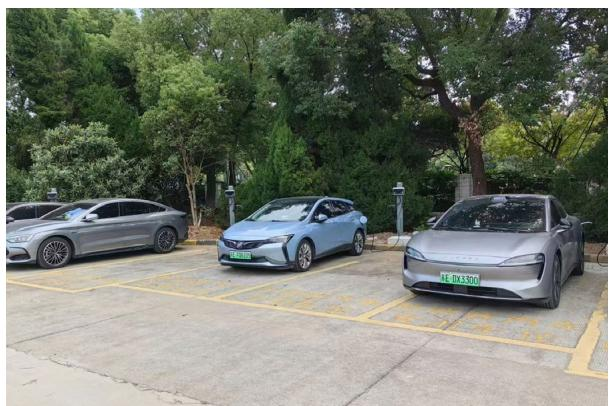

natural_image

Exterior view of a parking lot with three electric cars parked under trees (no signage or text visible)

中核科技围绕节能宣传周、全国低碳日主题，积极宣传绿色节能理念，推广绿色低碳出行。为倡导绿色低碳生活方式，引导员工践行节能减排，公司已设立 12 个汽车充电桩供公司职工开放使用。

## 清洁能源使用

公司持续深化清洁能源推广应用，大力开展光伏项目建设，已成功建成珠江路本部厂区 1.5MWp 光伏项目、浒关核工程事业部厂区1.4MWp光伏项目和精密锻造厂区0.8MWP光伏项目。

## 关键绩效

28.9实现报告期内月平均消纳光伏电量 万度

2025 年度减少温室气体排放1,840.12 吨二氧化碳当量。

同时，公司与中核江苏电能服务有限公司签订核电购电协议，供电范围覆盖珠江路本部、核工程阀门事业部、精密锻造事业部三大厂区 。

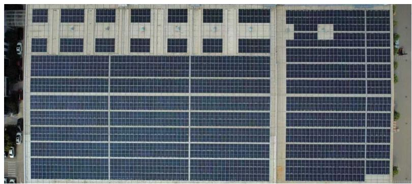

natural_image

Aerial view of a large solar panel farm with multiple rows of photovoltaic panels installed on adjacent buildings (no visible text or symbols)

光伏项目

## 2025 年度

三大厂区累计消纳核电

868.75 万度

为公司生产经营的安全稳定开展筑牢坚实电力保障。

## 水资源管理

公司严格遵循《中华人民共和国水法》等法律法规，构建完善的水资源管理体系，明确公司在水资源使用、管理和保护等各环节的责任与规范。

此外，为降低水资源管理过程中的风险，公司定期开展巡视检查工作，排查水资源风险，及时发现并修复潜在的漏水点，减少水资源的不必要损耗，并持续监测水资源利用情况，确保水资源在公司的日常经营活动和生产活动中得到合理，高效地使用。

<table><tr><td>关键指标</td><td>单位</td><td>2025年</td></tr><tr><td>新鲜水取水总量(市政购水量)</td><td>万吨</td><td>12.04</td></tr></table>

## 物料管理

公司重视包装物料的绿色化与合规性管理，优先选用低耗、可循环的包装材料。为实现物料管理的高效与规范，公司制定《生产计划管理规定》《产成品库存利用管理办法》《仓储管理办法》等制度，实现物料管控高效规范。此外，公司积极探索产品包装降本增效路径，不定期组织钢结构包装箱回收工作，通过物料的循环利用减少物料消耗与废弃物排放，系统推动绿色低碳转型。

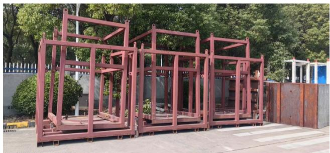

natural_image

Exterior view of a large metal frame structure with multiple vertical supports, set against trees and a paved area (no signage or text visible)

包装钢架  
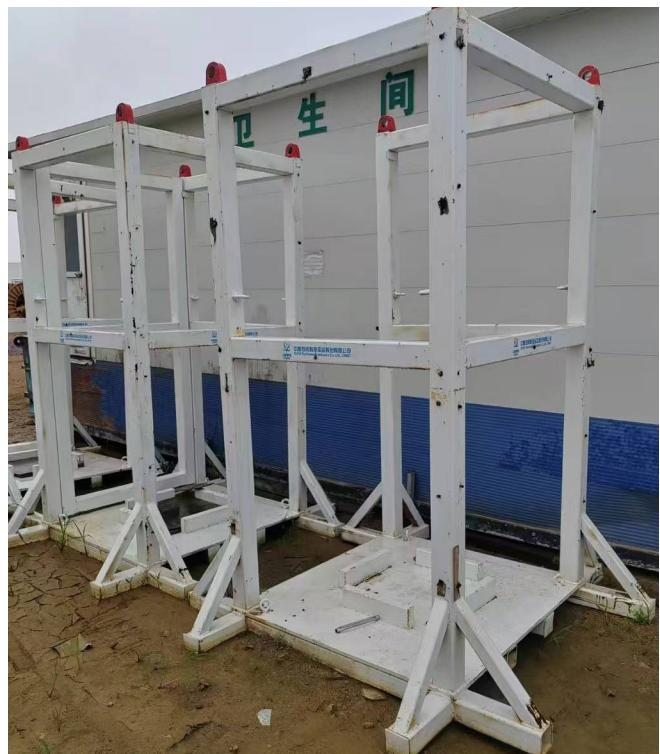

text_image

卫生间

## 关键绩效

报告期内，公司累计

回收利用泡沫包装盒

804 套

钢结构包装箱 22 套

通过资源回收再利用

实现节约包装费近

23 万元。

## 包装材料数字化管理

公司的主要物料类型有毛坯零件、整机阀门，借助先进的管理工具 U9-EP 和 MES 系统，对物料的采购、库存、使用等全流程进行实时监控与管理，确保物料管理各环节责任清晰、流程规范。

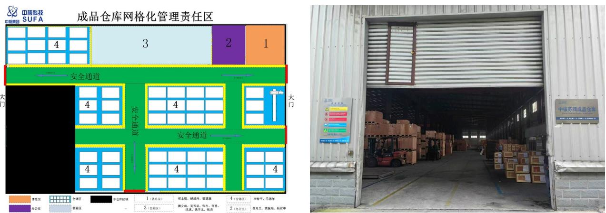

## 践行绿色办公

公司强化办公场景低碳管控，精细化管控能耗、倡导节电节水并规范空调参数，结合宣传强化环保意识，建立垃圾分类制度并通过设施布设、培训监督引导全员参与，助力资源循环。

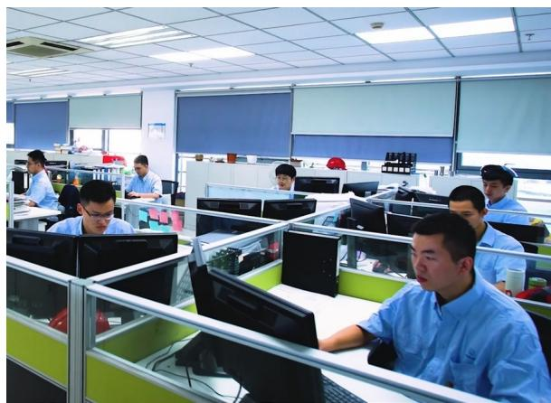

natural_image

Office workers in blue uniforms working at desks in a cubicle, no visible text or signage

办公室数字化

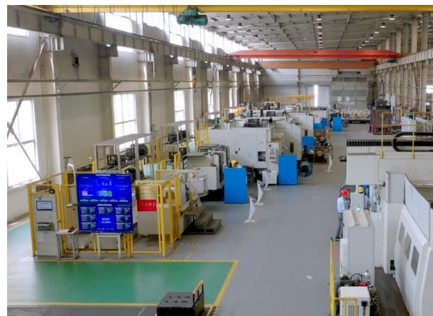

natural_image

Interior view of a large industrial factory floor with machinery and control panels (no visible text or symbols)

车间数字化

## 生态守护共生

公司严格遵循《中华人民共和国自然保护区条例》《中华人民共和国野生动物保护法》及运营所在地生物多样性相关法律法规要求 在建设项目全生命周期管理中 公司始终高度重视生物多样性保护工作，持续跟踪评估自身生产经营活动对周边生态系统及物种的潜在影响，推动生态环境保护与企业可持续发展的协同共进。

natural_image

Illustration of a stylized landscape with green hills, trees, and solar panels under a sunny sky (no text or symbols)

## 03

## 科创赋能

## “核”领发展

## 我们的行动

创新驱动发展  
链动高效协同  
品质精益求精  
客户权益保障  
维护信息安全

## SDGs

基础设施

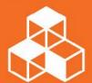

12 负责任消费和生产

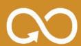

17 促进目标实现的 伙伴关系

natural_image

Hand holding a glowing light bulb with abstract network lines in the background (no text or symbols)

## 创新驱动发展

技术创新是企业高质量发展的核心驱动力。中核科技始终以研发创新为导向，持续强化研发能力建设，系统整合并优化技术资源配置，形成技术合力，推动技术创新向纵深发展，有力提升公司核心竞争力和品牌影响力。

## 治理

## 研发创新治理体系

中核科技持续深化研发与创新管理，严格遵守《中华人民共和国科学技术进步法》，制定《技术进步项目进度、质量、预算考核管理办法》《技术进步项目管理办法》《技术管理与行政授权体系管理办法（试行）》《科技成果转化办法》等制度，共同形成完善的研发管理体系。

公司构建立项、实施、经费管理和验收全链条研发项目管理流程，立项遵循市场导向分类审批，实施由科技管理部监督推进，经费执行专款专用与全流程管控，验收通过技术、财务、审计及档案多维度审查，以规范化流程保障项目全周期受控、目标达成。

## 研发创新平台

公司实施创新驱动发展战略，积极打造科技创新优势平台，拥有“江苏省特种阀门工程技术研究中心”，“中核集团特种阀门工程技术研究中心”，“江苏省认定企业技术中心”“苏州市工业设计中心”，“苏州市绿色低碳能源流体控制设备创新联合体”个科技创新平台；拥有博士后科研工作站、江苏省研究生工作站、“中核科技 - 苏州大学江苏省研究生实践基地”3 个人才培养基地；拥有“浙江大学 - 中核科技高性能控制阀联合研发中心”和“中核科技 - 华理工阀门可靠性制造联合研发中心”2 个联合研发中心，研发综合实力在国内阀门行业处于领先水平。

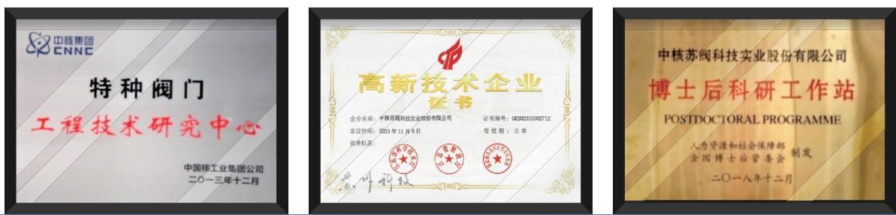

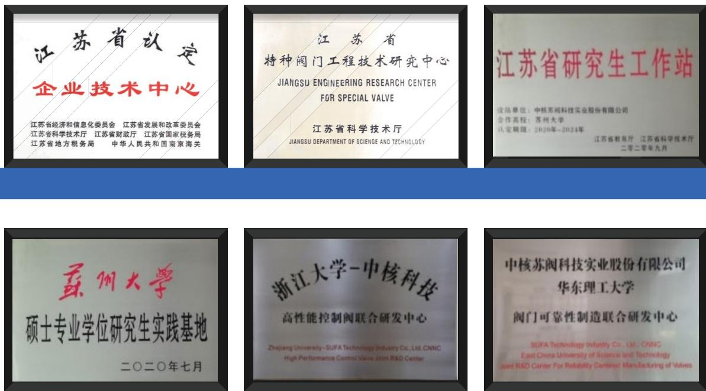

## 战略

中核科技紧密跟踪行业发展趋势，对当下及未来在科技创新领域可能面临的风险以及潜在的机遇进行分析，并梳理研发活动的各个环节，制定一系列具有针对性的应对策略，持续提升技术创新与抗风险能力。

<table><tr><td>风险类型</td><td>描述</td><td>财务影响说明</td><td>发生可能性</td><td>影响大小</td><td>影响时间范围</td><td>影响价值链环节</td><td>应对措施</td></tr><tr><td>科研项目进度风险</td><td>随着公司新领域、新市场的开发,与之相关的产品研发也将增多,新产品的研发伴随着不确定性,可能导致项目进展呈现不稳定性。此外,设备装置损坏、货源到货不及时,市场需求变动等客观因素也会影响项目进度。</td><td>收入减少</td><td>中</td><td>中</td><td>中期</td><td>运营</td><td>1.对年度申报的科研项目计划把关,以季度目标为考核节点,加强监督和审查;2.技术部门在项目开始前对风险进行必要的预测,在风险发生时及时汇报并制定或调整项目计划;3.定期组织开展项目进展讨论会,讨论项目存在的问题及解决措施;4.技术部门根据工作需要开展技术交底会议,解决项目关键技术问题和难点、堵点。</td></tr><tr><td>市场风险</td><td>随着新材料、新工艺和新设计的不断涌现,一些传统工业阀门逐渐被更高效、可靠的替代品取代,导致传统阀门市场的份额逐渐缩小,产品市场占有率提升难度大。</td><td>收入减少</td><td>中</td><td>中</td><td>短期</td><td>运营</td><td>1.加大技术创新投入,着力提升产品技术含量与附加值,满足市场对高性能、高可靠性阀门产品的迫切需求,从而在竞争中占据先机;2.提高产品质量与服务水平,优化生产工艺、强化质量管理,构建完善的售后服务体系,以贴心服务赢得客户满意;3.持续优化产能布局,根据市场需求与产品特性,合理规划生产布局,提升生产效率。</td></tr><tr><td>法律风险</td><td>研发过程中未遵循知识产权管理规范,可能导致知识产权纠纷,侵害他人知识产权,引发法律风险。</td><td>面临罚款、赔偿,增加法律成本</td><td>低</td><td>中</td><td>短期</td><td>运营</td><td>1.建立《知识产权管理办法》,明确管理流程;2.建立预警机制,及时跟踪技术动态,防范侵权风险。</td></tr><tr><td>机遇类型</td><td>描述</td><td>财务影响说明</td><td>发生可能性</td><td>影响大小</td><td>影响时间范围</td><td>影响价值链环节</td><td>应对措施</td></tr><tr><td>数字化转型机遇</td><td>通过利用大数据、建设5G工厂建设等措施,推动业务数字化转型,提升生产效率和管理水平。</td><td>收入增加</td><td>中</td><td>中</td><td>长期</td><td>运营</td><td>1.推动智能制造建设与工业化深度融合,引进升级智能设备设施;2.搭建数字化设计工艺平台,实现全厂数据联动与精细化管理。</td></tr></table>

## 影响、风险和机遇管理

为有效管控研发创新风险，公司从实际经营情况出发，定期开展全面的风险识别与评估活动，跟踪监测重大风险事件，从而降低风险，保障技术创新。

## 研发创新风险管理流程

## 风险识别

通过讨论、咨询、行业研究等方式，识别可能影响项目进展的技术、市场、法律等各类风险，重点关注技术难题、市场变化、客户需求变更等方面。

采用定性和定量相结合的方法进行风险评估，对领域内 TOP3 风险进行月度分析管控。评估项目包括影响程度、发生可能性、风险变动趋势等。

## 风险评估

## 风险应对

定期分析过往项目中的潜在风险点，总结经验教训，制定针对性措施，全方位防控风险的发生与影响。

指标与目标

<table><tr><td>关键指标</td><td>单位</td><td>2025年</td></tr><tr><td>研发投入</td><td>万元</td><td>6,873.74</td></tr><tr><td>研发投入占营业收入比例</td><td>%</td><td>3.97</td></tr></table>

## 研发创新举措

## 校企合作

中核科技与苏州大学合作的“高温气冷堆氦气低逸散核级阀门装备研发及产业化”项目成功入选2025 年度苏州市重大科技成果转化立项项目。项目研发新型高温气冷堆氦气低逸散核级阀门装备，聚焦高温低逸散、高可靠性密封等关键技术开展深入的研究，解决涉及进口产品价格高昂、供货周期漫长、安装调试过程技术服务滞后的困境，突破氦气介质密封性能不可靠的瓶颈问题，打破国外在低逸散核级阀门领域的长期技术垄断，实现关键装备的自主可控。

## 标准制定

中核科技依据《中华人民共和国标准化法》及相关规定，制定《标准化管理办法》，系统加强公司标准化工作，推动科技进步，提升产品与服务质量，助力主业可持续发展。

公司坚持科技创新，积极参与行业标准体系建设，携手各方推动构建规范有序、协同发展的产业生态。

## 截至报告期末

公司累计参与制定 9 项国家标准、 42 项行业标准、 16 项团体标准。

2025年中核科技参与标准制定情况

<table><tr><td>标准名称</td><td>标准级别</td><td>标准编号</td><td>参与方式</td></tr><tr><td>通用阀门球墨铸铁件技术条件</td><td>国家标准</td><td>GB/T12227-2025</td><td>参编</td></tr><tr><td>通用阀门法兰连接铁制闸阀</td><td>国家标准</td><td>GB/T12232-2025</td><td>参编</td></tr><tr><td>金属阀门结构长度</td><td>国家标准</td><td>GB/T12221-2025</td><td>参编</td></tr><tr><td>供水系统用轴流式止回阀</td><td>国家标准</td><td>GB/T21387-2025</td><td>参编</td></tr><tr><td>先导式减压阀</td><td>国家标准</td><td>GB/T12246-2025</td><td>参编</td></tr><tr><td>高压加氢装置用阀门技术规范</td><td>行业标准</td><td>JB/T11484-2025</td><td>参编</td></tr></table>

## 行业交流

作为国内阀门行业领军企业，公司在多个行业协会担任重要职务，是中国核仪器行业协会理事单位、中国通用机械工业协会副会长单位、中国通用机械工业协会阀门分会副理事长单位、江苏省阀门工业协会理事长单位、全国阀门标准化技术委员会副主任单位、江苏省质量协会副会长单位。

## 中核科技“三明珠”闪耀深圳核博会

2025年11月12日至14日，中核科技精彩亮相全球核能盛会——第四届深圳核博会。作为核能产业链的一员，公司携核电阀门“皇冠上三颗明珠”的主蒸汽隔离阀、爆破阀、稳压器先导式安全阀三大核心产品亮相，展现公司在核级阀门领域完全的自主研制能力与领先的技术实力。

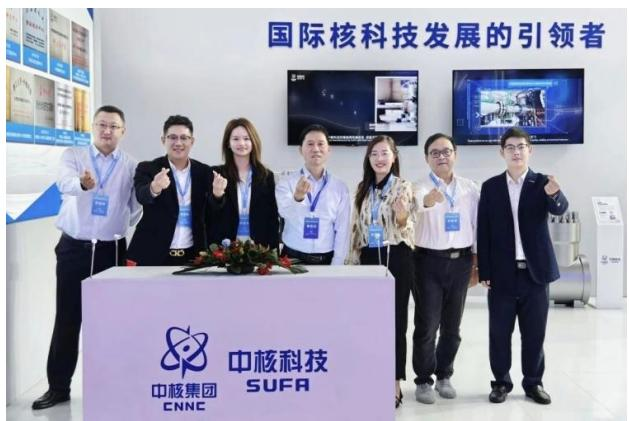

text_image

国际核科技发展的引领者
中核集团
CNNE
中核科技
SUFA

## 创新激励

为充分调动公司专业技术人员的积极性和创造性，鼓励员工自主创新，规范并推进科技成果转化，公司制定《科技创新激励和专家评审费管理办法》《科技成果转化办法》《揭榜挂帅实施管理办法》等制度，积极构建专业人才积极进取，持续创新的成长环境。

公司科技创新激励体系覆盖技术进步奖、科技成果转化、专利与技术秘密、标准制修订与翻译、科技论文发表、获得科技创新奖项或外部经费支持，以及对获奖个人的表彰七类活动，系统贯穿从技术研发、成果转化到外部认可的全过程。

natural_image

Illustration of two people presenting on large screens displaying charts and graphs, with no visible text or symbols.

## 数字化建设

## 智能制造项目

中核科技近年来全力推进数字化转型，通过智能制造建设与工业化深度融合，以数字化、信息化带动管理提升，以智能制造引领产业升级，实现了生产效率和管理水平的显著提升。

在智能化升级方面，特阀板块已完成 2-6 寸阀座研磨设备与自动焊接系统的验收投用，与原有数字化装配线、闸板研磨及智能泵验系统协同，构建了完整的 2-6 寸产品生产链，并建成特阀美标闸阀通配示范区；核阀板块已上线运行自动化清洗设备，实现零件自动转运、清洗、漂洗与烘干，高效清除油污杂质，保障后续加工与装配质量，并同步建成 2 寸以下小口径锻钢阀自动化生产线，覆盖锻造至试验全流程，年产能达 12,000 台，着力实现高自动化与高产品通配性；公用厂区已建成DN50-DN150软密封闸阀数字化装配线，通过视觉引导、机器人抓取装配、多功位智能检测，实现装配过程数字化、节拍化、透明化管理。

同时，公司搭建数字化设计工艺平台，攻克参数化设计与制造流程的难点，为产业升级注入新动力；建设工业互联网平台打破信息孤岛，实现全厂数据联动与精细化管理，助力节能减排与高效运营。

2025 年 5 月，在江苏省工业和信息化厅发布的《2025 年度江苏省先进级智能工厂名单》中，中核科技凭借突出的智能制造实践成果成功入选。公司将持续推动实体经济和数字经济在研发设计、生产制造、运营管理等全链条的深度融合，为江苏省制造业向高端化、智能化，绿色化转型注入强劲动能。

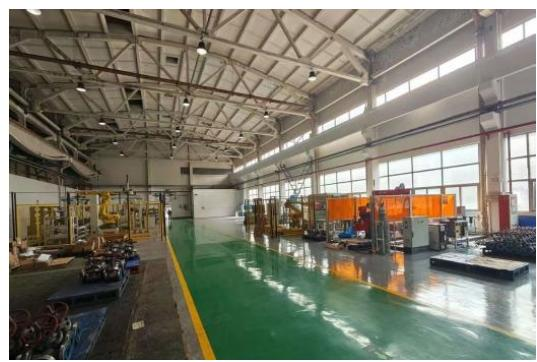

natural_image

Interior view of a large industrial factory with machinery and overhead cranes (no visible text or symbols)

特阀美标闸阀通配示范区

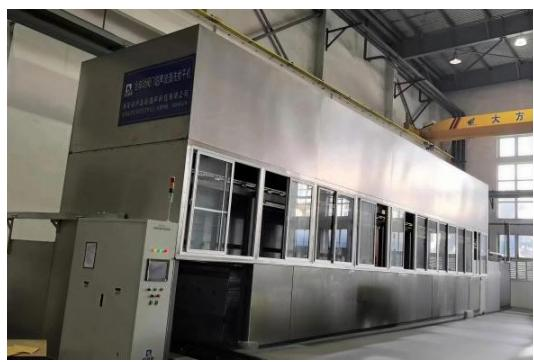

natural_image

Interior view of a large industrial machine in a factory hall, showing control panels and equipment (no visible text or symbols on main structure)

自动化清洗设备

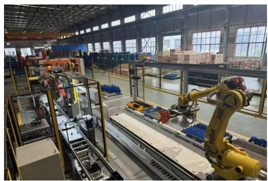

natural_image

Interior view of a large automated factory with robotic arms and conveyor systems (no visible text or symbols)

DN50-DN150软密封闸阀数字化装配线

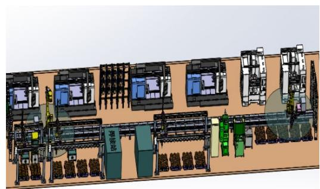

natural_image

3D architectural rendering of an industrial facility with conveyor belts and machinery (no visible text or symbols)

2寸及以下小口径锻钢阀产线

## 5G 工厂建设

5G 智能工厂建设项目从 2021 年 7 月份启动，先后共投入了 3,003.93 万元，引进大量智能生产设备、检测设备和工业机器人并对车间生产设备进行数字化改造。公司将智能设备联网，开通数据接口，实现设备数据自动采集上传，采用工业以太网和 5G 网络建立工厂级局域网，确保工厂内部数据实时传输和交互；同时还引进了 ERP、MES、PDM、SCM、CRM等信息系统，搭建了 5G+ 工业互联网管理平台，实现生产计划优化、自动排产、智能调度、质量控制、工艺动态优化、资源灵活调配等数字化管理，以及设备运行状态可视化监控、生产过程实时监控、异常事件自动报警与快速响应处理等智能化管控。

经过近三年来的建设，公司智能工厂建设已取得阶段性成果，2023 年顺利通过苏州市和江苏省示范智能车间的评审。公司将在建成示范智能车间的基础上，继续引进智能设备，扩大智能制造应用场景范围，持续加强 5G 网络和应用场景的建设进一步提升企业信息管理能力和智能制造水平。

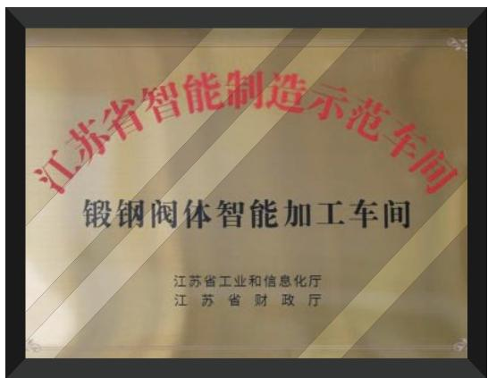

text_image

江苏省智能制造示范车间
锻钢阀体智能加工车间
江苏省工业和信息化厅
江苏省财政厅

江苏省智能制造示范车间

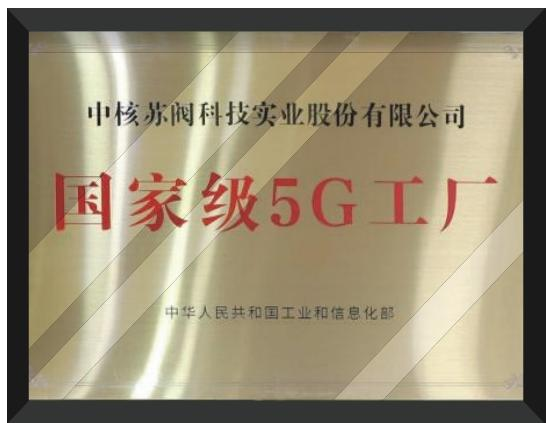

text_image

中核苏阀科技实业股份有限公司
国家级5G工厂
中华人民共和国工业和信息化部

国家级5G 工厂

## 核电IED文件管理项目

2025年9月 公司核电IFD文件管理项目一期正式上线运行 实现任务自动发布，即时触达 将业主任务下达至执行部门的响应时间从2-3天压缩至1小时内，效率提升超95%，该平台推动文件管理全流程数字化，智能化转型，在运营效率数据安全、合规管控、跨部门协同方面成效显著。未来，系统将对接客户平台，打通内外数据链路，加速订单交付，提升客户满意度与业务竞争力。

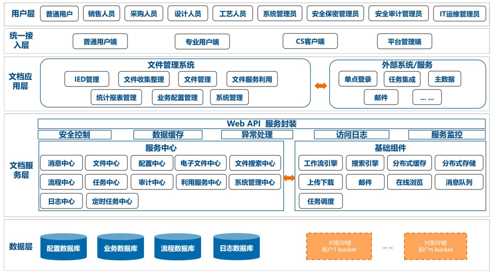

flowchart

This image displays a hierarchical data structure chart (likely a Cloud Storage or Data Management system architecture) showing the data flow from user layers through various management and service layers to final data collection.

## “核智兰台”档案管理项目

“核智兰台”档案数字化管理平台于 2025 年11 月正式上线试运行。平台以档案资源集中化、数智化、智能化为核心，大幅提升档案管理效率，优化释放存储空间，推动公司档案管理数字化转型，为落实“单轨制”管理模式筑牢基础。

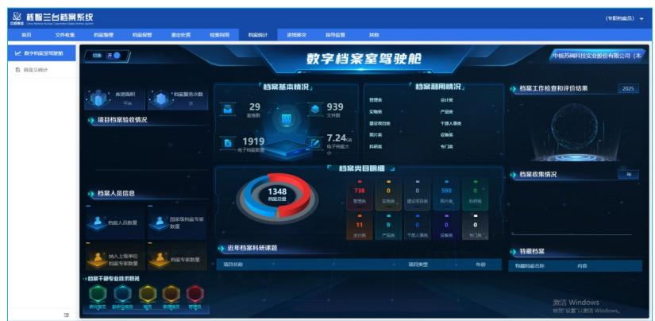

text_image

戴智三台档案系统
首页
文件收集
档案管理
档案保管
鉴定设置
检查材料
档案统计
进度移交
指导监督
其他
数字档案室驾驶舱
编辑 开
数字档案室驾驶舱
项目档案验收情况
档案基本情况
29
939
2月1日
1919
7.24%
电子档案大
小
档案利用情况
管理类
设计类
实施类
产品类
建设项目类
千多人事类
照片类
设备类
资料类
专门类
档案工作检查和评价结果
2025
档案类别明细
1348
档案信息量
738
0
0
590
0
档案收集情况
档案人员信息
归档人员数量
档案库数量专家数量
11
0
0
0
0
档案库数量专家数量
档案专家数量
近年档案科研课题
硕士名称
硕士类型
专业级
档案研发名称
内容
线下部专业技术培训
激活 Windows
MIP 云资源 - Red Cloud Windows.
激活 Windows

## 知识产权管理

## 知识产权管理体系

公司重视知识产权管理，严格依据《企业知识产权管理规范》，制定并实施《知识产权管理办法》等制度，有效保护公司知识产权，加强研究开发成果管理，提高市场竞争能力，防止无形资产流失。

科技管理部作为归口管理部门，统筹负责除商标外的知识产权全流程工作，涵盖政策贯彻、战略规划、制度执行、内部协调、人才培养、创造保护与日常管理等；审计与法务部负责商标权的归口管理。

## 知识产权保护

公司全面落实知识产权全过程管理 在研发中加强相关领域知识产权调查，分析与对策研究 使其贯穿项目立项，过程管理验收及成果申报、验收申报及成果产业化等过程，并建立预警机制，跟踪技术动态，防范侵权风险。创新成果须经专利申请、商标注册、著作权登记或技术秘密保护等措施后，方可对外公开或转化，并对软件、图纸等依法登记管理。公司在劳动合同中设置知识产权保护条款，并定期向上级单位报送知识产权相关信息。

报告期内，公司积极组织知识产权负责人、法务负责人等相关员工，参加由苏州高新区数据局、苏高新知识产权协会等单位举办的多场知识产权专题培训与讲座，积极响应国家加强知识产权保护的战略部署，切实提升公司在数据知识产权领域的创造、运用、保护及综合管理能力。

## 关键绩效

截至报告期末，公司共取得有效专利224项，其中发明专利 43 项、

实用新型专利 181 项；拥有有效注册商标 24 个。

natural_image

Illustration of two people interacting with abstract digital interface elements including charts, graphs, and a gear (no text or symbols)

## 遵守科技伦理

公司坚持科技向善理念，严格遵循国家及行业相关法律法规，恪守科技伦理底线，切实履行社会责任。公司目前业务不直接涉及生命科学、人工智能伦理等科技伦理敏感领域的科学研究、技术开发等活动。

## 链动高效协同

## 供应链治理

公司严格遵照《中华人民共和国政府采购法》《中华人民共和国招标投标法》等法律法规，积极践行负责任采购理念，通过制定《采购管理办法》《供应商管理办法》《供应商不良行为管理细则》等制度，不断完善供应商管理体系，降低采购风险，控制采购成本确保供应链的稳定与高效运作

## 供应链风险管理

公司构建“识别 - 评估 - 监测 - 管理”全流程供应链安全风险管理体系，定期编制《风险评估报告》实施系统化管控，采购前端多维度核查供应商资质从源头控风险，全生命周期通过差异化准入、动态监测、评级监督及周期性复评实现系统管理。

为防范供应中断风险，公司制定并实施应对预案，原材料框架采购前全面评估供应商资质、差异化筛选确定 2 至 3 家入围供应商，资质不达标时及时寻源补位；同时以供应链稳定性为核心，常态化储备 3 至 4 家备选供应商，通过严格准入、差异筛选、多源储备相结合，提升供应链弹性与抗风险能力，保障关键物料持续供应和业务稳定运营。

指标与目标

<table><tr><td>关键指标</td><td>单位</td><td>2025年</td></tr><tr><td>供应商总数</td><td>个</td><td>432</td></tr><tr><td>国内供应商总数</td><td>个</td><td>429</td></tr><tr><td>海外供应商总数</td><td>个</td><td>3</td></tr></table>

<table><tr><td colspan="3">供应商审查</td></tr><tr><td>拥有质量管理体系认证的供应商数目</td><td>个</td><td>393</td></tr><tr><td>拥有环境管理体系认证的供应商数目</td><td>个</td><td>212</td></tr><tr><td>拥有职业健康安全管理体系认证的供应商数目</td><td>个</td><td>196</td></tr><tr><td>因不合规被中止合作的供应商数目</td><td>个</td><td>6</td></tr><tr><td>因不合规被否决的潜在供应商数目</td><td>个</td><td>6</td></tr></table>

## 供应链管理举措

## 供应链全生命周期管理

## 供应商准入

供应商首次合作时，结合其供货品类、供应规模及前期识别的风险点，制定差异化评价标准与流程，通过资质审核、产能核验、样品检测，现场考察等方式 全面评估供应商的履约能力、质量管控水平及风险应对能力 仅对评估合格的供应商授予准入资格。

## 供应商分类

供应商分类是按照其所供应物项的特点，将供应商进行分类并采取分类管理策略。根据物项在阀门产品结构中的功能及对产品的性能、可靠性、安全性、互换性影响的大小等因素，将物项分为关键、非关键、临时、免评价四大类别。提供相应类别物项的供应商对应为关键供应商、非关键供应商、临时供应商、免评价供应商。

## 供应商日常履约监测

## 1. 动态统计

每季度对供应商的产品质量合格率、按期交货及时率等核心履约指标进行量化统计，形成履约数据报告，作为风险监测的基础依据；

## 2.定期评级

每年按照既定标准开展供应商履约评级，评级结果与后续合作优先级、合作规模直接挂钩；

## 3.不定期监督

根据供应商的供货质量稳定性、供应份额占比等情况，不定期开展专项监督检查；对出现严重质量问题、弄虚作假、违规操作等不良行为的供应商，严格执行“通报整改-暂停合作-列入灰名单/黑名单”的阶梯式处理机制，强化风险管控力度。

## 周期性复评管理

对已准入的合格供应商，采购管理部每年结合各使用部门反馈的供应商业绩情况及供应商风险评估结果，明确差异化复审周期及复审方式并制定年度评审计划：

1. 高风险供应商：每年组织1次全面现场复评，重点核查风险整改情况及履约稳定性；  
2. 关键及中风险供应商：每3年组织1次复评，兼顾风险防控与合作效率；  
3.非关键及低风险供应商：每5 年组织1次复评，优化资源配置的同时保障供应链稳定。

## 供应商不良行为管理

根据供应商不良行为的性质和影响程度，供应商不良行为主要采取通报、列入供应商灰名单、列入供应商黑名单三种处理方式；采购管理部制定供应商不良行为管理细则，规范不良行为的认定标准、处理程序和管理要求。

## 供应链ESG管理

中核科技持续深化供应商可持续发展管理，积极推动供应商能力建设，通过系统性开展现场培训等方式为供应商提供赋能支持，报告期内 公司已累计对21家重点供应商完成培训 内容覆盖质量体系，合规运营，ESG治理等重点领域 推动双方在平等协作、协同发展基础上，构建长期稳定、互利共赢的可持续供应链生态。

## 报告期内

公司针对供应商开展 15 次 ESG 专项培训，累计培训时长 30 小时，共 50 余人参与培训。

## 廉洁采购

纪检监督部作为监督管理部门，负责监督检查，并接收巡视、审计等渠道反馈的违规信息，组织开展调查与处罚实施。审计与法务部负责反馈审计与专项督查中发现的违规行为，并对造成国有资产损失等严重后果的采购违规开展责任追究。采购管理部负责设置采购监督节点、落实违规整改，并对违规供应商行为进行确认与上报。

公司将廉洁教育纳入部门例会的必修环节，组织全体采购人员及供应商管理人员签订廉洁从业承诺书。另外，在采购项目签订合同时，与供应商同步签署《中核科技供应商供应商廉洁自律暨合规经营协议》，形成内外联动的廉洁风险防控体系。

## 报告期内

公司供应商廉洁从业承诺书签署率为 100% 。

## 平等对待中小企业

公司严格遵守中小企业款项支付相关规定及合同条款，平等对待各类合作伙伴，切实维护中小企业合法权益，维系与中小企业的良好合作关系。报告期内，公司不存在逾期未支付中小企业款项的情况。

## 品质精益求精

## 治理

## 治理体系

公司根据产品是否涉核的属性，编制非涉核产品《质量手册》与涉核产品《质量保证大纲（HAF）》《质量保证大纲（311）》等6份管理纲领性文件，并形成如《质量控制监督程序》《API会标控制程序》等在内共405份内部制度规范和作业指导书，从而实现产品的全过程质量管理闭环。

## 报告期内

公司 未发生 与质量安全相关的重大处罚事件或诉讼案件。

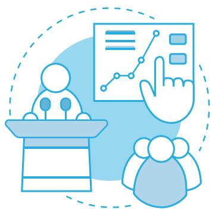

natural_image

Illustration of a person at a podium with a hand pointing at a line chart, and two smaller figures below (no text or symbols)

质量管理部

经理

质量工程师

质量管理组织架构

中核科技质量管理体系认证及产品质量证书情况

<table><tr><td>认证</td><td>认证地点</td><td>认证有效期</td></tr><tr><td rowspan="4">ISO 9001:2015</td><td>中核科技本部</td><td rowspan="4">2026年5月26日</td></tr><tr><td>中核科技能源与公用阀门事业部</td></tr><tr><td>中核科技核工程阀门事业部</td></tr><tr><td>中核科技锻造分厂</td></tr><tr><td>民用核安全设备制造许可证</td><td>中核科技核工程阀门事业部</td><td>2026年9月30日</td></tr><tr><td>武器装备质量管理体系认证证书</td><td>中核科技核工程阀门事业部</td><td>2026年11月27日</td></tr><tr><td>美国石油学会API6D阀门会标认证(证书编号:6D-0139)</td><td>中核科技本部</td><td>2028年7月20日</td></tr></table>

## 产品质量培训

2025年，公司积极开展产品质量主题教育培训，通过《质量手册》制度修订日常培训、管理部门审查程序和审查报告宣贯等专项培训，加深全员对于产品质量的重视。

## 报告期内

公司共开展质量相关培训 16 次，参与培训 1,091 人次，培训总时长 4,360 小时。

## 主题质量月活动

2025年9月，公司开展“卓越领航强基铸魂核力质胜未来”主题质量月活动，通过横幅、宣传栏、电子屏等多种方式，宣传展示公司质量理念、质量方针等内容，持续提升全员质量意识。

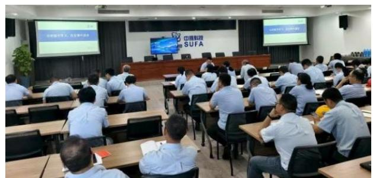

text_image

Conference room photo with visible presentation screen showing '中船重工 SUFA' logo and Chinese text on stage

## 质量知识应知应会技能竞赛

2025 年 6 月 20 日，公司工会联合质量管理部举办2025 年质量知识应知应会技能竞赛。比赛设必答题、抢答题和风险题三个环节，涵盖质量管理体系标准、质量管理工具与方法、质量改进方法等员工应知应会内容，旨在提升全员质量意识和质量技能水平。

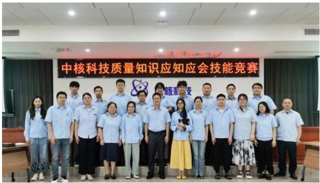

text_image

中核科技质量知识应知应会技能竞赛
中核科技

## 战略

中核科技始终坚持“质量创造价值，质量成就品牌”的理念，严格遵守《中华人民共和国产品质量法》《国防军工计量技术规范管理办法》等法律法规及自身产品相关的各项标准 始终秉承质量风险意识 将产品质量管理与日常业务深度融合并持续改进。

<table><tr><td>风险类型</td><td>描述</td><td>财务影响说明</td><td>发生可能性</td><td>影响大小</td><td>影响时间范围</td><td>影响价值链环节</td><td>应对措施</td></tr><tr><td>质量风险</td><td>产品质量是维护公司形象和声誉的重要依靠,质量风险可能存在于供应链质量控制,生产工艺过程控制,人员质量风险意识淡薄,检验设备条件等各方面。</td><td>收入减少</td><td>中</td><td>中</td><td>中期</td><td>上游运营</td><td>1.加强原材料质量控制,优化使用现有供方资源,结合往年供应商产品质量情况,重点监控质量不稳定的供应商;2.完善检验与测试体系,细化委托第三方检测机构检测要求,确保检验结果的准确性和可靠性;3.健全质量管理体系,增加人员培训,提高相关人员核安全质量文化意识及技能水平;4.加大内部质量体系执行情况的监督检查工作。</td></tr></table>

<table><tr><td>机遇类型</td><td>描述</td><td>财务影响说明</td><td>发生可能性</td><td>影响大小</td><td>影响时间范围</td><td>影响价值链环节</td><td>应对措施</td></tr><tr><td>高端市场国产替代机遇</td><td>核电阀门需求持续旺盛,智能感知型产品前景广阔,但受制于工程化应用不足,高端市场仍被国外厂商主导。随着新能源、新材料等政策红利释放,通过突破质量可靠性瓶颈、实现高端市场国产替代,正成为明确的产品质量战略机遇。</td><td>收入增加</td><td>中</td><td>中</td><td>长期</td><td>运营</td><td>1.在生产经营过程中严格根据国际标准、国家标准等,进一步完善质量管理;2.完善产品质量管理体系制度,增强相关人员的质量风险意识和风险控制水平。</td></tr></table>

## 影响、风险和机遇管理

公司按照《风险管理控制程序》要求，采用系统化的方法对相关风险进行全流程管理，通过涵盖风险识别、分析、评定与处理的闭环流程，有效地管控潜在风险，确保产品的及时交付与质量的稳定可靠，从而保障客户权益与公司的产品信誉。

2025 年，公司围绕提高产品和服务质量、降低质量损失、提高工作质量等方面，深入开展“质量提升专项行动”工作和年度质量综合性检查工作，共开展 15 项质量提升专项行动，从科研设计生产、服务过程中的质量薄弱环节进行梳理，实现研发设计、制造过程、服务能力等方面的全方位提升。

公司持续开展公司内审、质保监查活动，组织内审员、监查员对 5 个厂区 12 个体系，开展内审、质保监查活动，发现 16项不符合质量管理体系标准的问题项截至2025年底已全部完成整改

## 指标与目标

公司制定“十四五质量规划”和每年的质量工作计划，明确质量方针和质量目标，夯实质量工作基础，开展核安全文化建设、防人因失误、防造假专项行动、质量提升等活动，加强全面质量管理，提高全员、全过程、全要素、全周期质量控制水平，为中核科技高发展提供质量保障。

<table><tr><td>质量目标</td><td>目标值</td><td colspan="2">达成情况</td></tr><tr><td>阀门交验一次合格率</td><td> $\geqslant 99.5\%$ </td><td>99.73%</td><td></td></tr><tr><td>顾客满意度</td><td> $\geqslant 95\%$ </td><td>95.03%</td><td>全部达成</td></tr><tr><td>科研设计重大设计差错</td><td>0</td><td>0</td><td></td></tr><tr><td>人为因素造成的较大及重大质量事故</td><td>0</td><td>0</td><td rowspan="4">全部达成</td></tr><tr><td>计量器具按期送检合格率</td><td>100%</td><td>100%</td></tr><tr><td>QC 小组成果率</td><td> $\geqslant 75\%$ </td><td>84.40%</td></tr><tr><td>QC 小组参与率</td><td> $\geqslant 30\%$ </td><td>32.70%</td></tr></table>

## 产品质量管理

## 产品全生命周期管理

公司系统性构建覆盖产品全生命周期的管理流程 从产品开发，计划下达，原材料采购，生产制造到客户服务等各环节均实施严格把控，规范执行产品质量管理措施，落实产品责任。

## 产品检验管理

对于部分特殊产品，公司编制产品质量计划 进行针对性管理，产品质量管理计划包含产品描述，检验规定，试验记录工艺规范要求等内容，由生产部门按产品质量管理计划规定的执行文件实施控制和记录。同时，如若产品生产过程中出现设计、工艺、质量等问题，公司经审查确认处理结论后，按照《核电阀门不符合项控制程序》《不合格品控制程序》等要求进行处理。

## 中核科技产品检验管理要求

## 装配前检验

阀体、阀盖等铸件表面质量应符合规定要求，不得有粘沙、氧化皮等缺陷。  
零件焊缝应打磨平整，消除焊疤、无焊渣，铸件无锈蚀。  
检查阀体、阀盖等零部件是否清洗干净。

## 装配过程检查

严格按工艺进行装配。  
对要求密封面渗透探伤的闸板，检查探伤报告是否合格。

## 性能试验检查

壳体试验、上密封试验、密封试验等。

## 驱动装置性能及扭矩检查

检查驱动装置与阀门连接状态下，是否存在干涉、转动有无卡阻、迟滞等现象。  
测量光杆阀门的开关扭矩值。

## 整机入库前检查

阀门标志、外表、装配要求、驱动装置、填料、防护、配套表等是否符合要求。

## 产品召回

公司建立多部门协同的闭环管理机制，通过接收客户诉求并快速识别问题类型与优先级，制定包含补供、返工返修等措施的处置方案:随后按优先级推进整改倒排时效 必要时由主管领导介入：经复核与审核确认后 持续跟进直至客户认可处理结果，形成从信息接收到问题闭环的全流程管理，有效保障产品召回及质量问题处置的及时性与合规性。

## 客户权益保障

## 客户服务管理

公司秉持提升客户满意度和信任度、助力客户成功为核心理念，根据《中核科技售后服务工作管理办法》等客户关系管理制度，明确各部门在售后服务工作中的职责，建立主动服务意识和快速响应机制，坚持全生命周期服务客户，致力于在市场中树立良好的品牌形象，实现公司与客户的长期共赢发展。

## 售后响应分级机制

## A级响应

运维服务中心接反馈 12 小时内给出临时措施，售后服务人员随时待命，需现场服务时售后服务人员 24 小时内到达指定地点响应（偏远地区除外），并将情况及时上报。

## B级响应

运维服务中心接反馈 24 小时内给出临时措施，售后服务人员无特别任务情况下优先考虑，需现场服务时售后服务人员48小时内到达指定地点响应（偏远地区除外）。

## C级响应

运维服务中心接反馈 48 小时给出临时措施，临时措施无法解决问题时与客户协商在合适的时间（72小时以内）到达指定地点响应。

## 客户满意度调查

公司依据《顾客满意度评价程序》建立完善的客户满意度调查流程，通过纸面调查、电话沟通、客户走访等方式，全面收集客户对公司产品适用性、质量可靠性、服务良好性、交货及时性等8个维度的评价与建议，全面了解客户真实需求和意见，及时识别改进方向，持续提升客户满意度和产品质量。

市场与营销管理部每年组织或委托第三方机构开展满意度调查，负责问卷的发放、回收与数据统计，并编制《顾客满意程度调查统计分析报告》作为管理评审的输入，为持续改善提供依据。

市场与营销管理部识别需改进事项并明确责任部门，推动相关部门制定并实施整改措施，并对整改落实情况进行跟踪与监督，形成闭环管理机制。

## 报告期内

公司共有 98 家客户参与满意度调查，客户满意度为 95.03% 。

## 维护信息安全

## 信息安全管理

中核科技坚持贯彻集团公司关于信息安全等级保护相关要求，坚持执行信息系统安全等级保护制度，依据国家有关部门要求开展安全等级保护工作，目前已实现现有信息系统等级保护全覆盖。

公司成立以董事长、党委书记为组长的网络安全和信息化领导小组，负责全面领导公司网络与信息安全工作，领导小组下设网络安全和信息化工作小组，负责组织网络与信息系统的安全等级保护工作。

此外，公司下设信息文档部（信息中心）作为公司数据与信息安全治理的责任部门，全面负责网络与信息安全的归口管理。该部门负责制定并落实信息安全策略，组织开展信息系统安全等级保护，收集处理运行中的配置变更与应用反馈，并承担网络与信息安全事件的预防、处置及报告工作。

natural_image

Hand holding a transparent object with glowing digital icons in the background (no text or symbols)

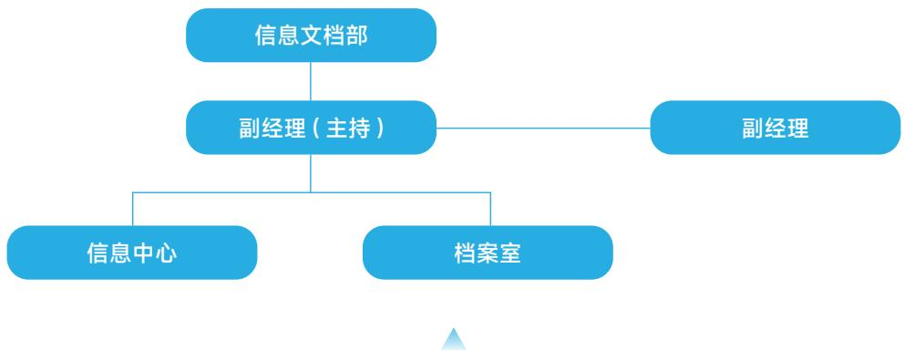

flowchart

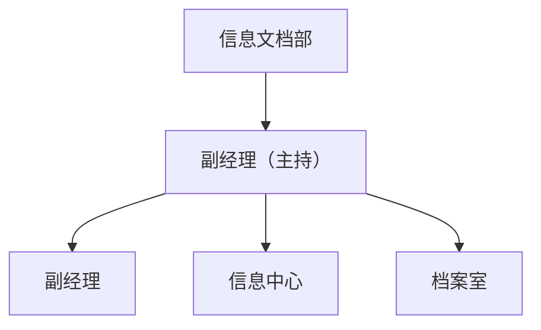
```mermaid
graph TD
  A["信息文档部"] --> B["副经理（主持）"]
  B --> C["副经理"]
  B --> D["信息中心"]
  B --> E["档案室"]
```

数据及信息安全管理架构

## 监督与审查

公司已于 2023 年 10 月通过信息安全管理体系（ISO27001）认证，并将于每年的 12 月中旬进行年度监督审核。按照 2025 年度信息安全管理体系（ISO27001）监督年审计划，公司定于 2025 年 12 月进行信息安全管理体系年度监督审核，同期开展内审工作。

此外，公司每年积极落实集团公司网络和数据安全的自查互查，互联网出口配有硬件防火墙、上网行为管理、态势感知等技术防护措施，内部有准入系统和统一桌面安全防护系统，定期开展漏洞扫描。

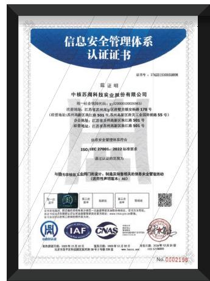

text_image

信息安全管理体系
认证证书
证书号：17622151003389XK
证书号：17622151003389XK
中核苏调科技实业股份有限公司
统一社会信用代码：91220000100004616
经营范围：江苏省苏调市交通运输中心申港路378号
（经省地址：江苏省苏州市吴中路501号、吴中路东侧江苏工业园区南桥路55号）
办公地址：江苏省苏州市高新区江南路501号
邮政地址：江苏省苏州市高新区江南路501号
信息安全管理体系符合
ISO/IEC 37001-2022标准要求
通过认证的范围为：
与国家法律法规定义的《设计、制造及管理相关的信息安全管理制度》
（适用性声明表）。如：
产品名称
型号
规格
申请日期
批准日期
有效期
ISSN 10000000000000000000000000000000000000000000000000000000000000000000000000000
AIF
AFAF
CNAS
CNAS
CNAS
CNAS
CNAS
CNAS
CNAS
CNAS
CNAS
CNAS
CNAS
CNAS
CNAS
CNAS
CNAS
CNAS
CNAS
CNAS
CNAS
CNAS
CNAS
CNAS
CNAS
CNAS
CNAS
CNAS
CNAS
CNAS
CNAS
CNAS
CNAS
CNAS
CNAS
CNAS

信息安全管理体系认证

## 关键绩效

报告期内，公司共计开展内部、外部信息安全审查 1 次。

## 指标与目标

为筑牢数据安全防线、防范重大数据安全事故与客户隐私泄露风险，公司以“确保全年不发生重大信息安全事件”为核心目标，严格遵循信息安全相关法律法规，系统构建可量化的指标与目标休系，推动信息安全需求有效落地，切实保障了业务的连续性与稳健运行。

## 关键绩效

报告期内，公司 未发生 重大数据安全事件及泄露客户隐私事件；信息安全总投入 79 万元。

## 04人本关怀聚力同行

## 我们的行动

●平等合规用人  
员工民主建设  
相伴员工成长  
职业健康与安全生产  
履行社会责任

## SDGs

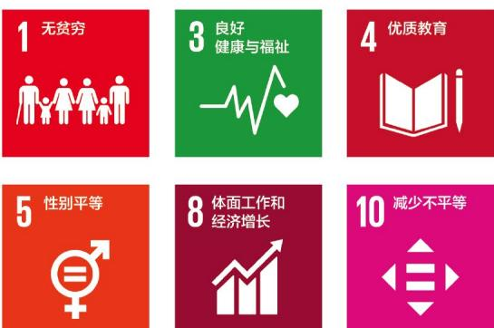

natural_image

Group of children holding hands in a circle, with no visible text or symbols

## 平等合规用人

## 员工招聘管理

中核科技严格遵循《中华人民共和国公司法》《中华人民共和国劳动法》《中华人民共和国劳动合同法》等相关法律法规，修订《员工招聘管理办法》《人事调整管理办法》等管理制度，全面规范员工招聘流程，保证公司“选人、育人、用人”机制有效运行，为公司稳定发展提供保障。

公司人才招聘遵循“按需引进，总量控制：人岗相适，以岗配人：公开平等，竞争择优：科学考核，规范操作”的基本原则采取社会招聘、校园招聘等多元化的招聘渠道引进人才。

招聘与录用流程  
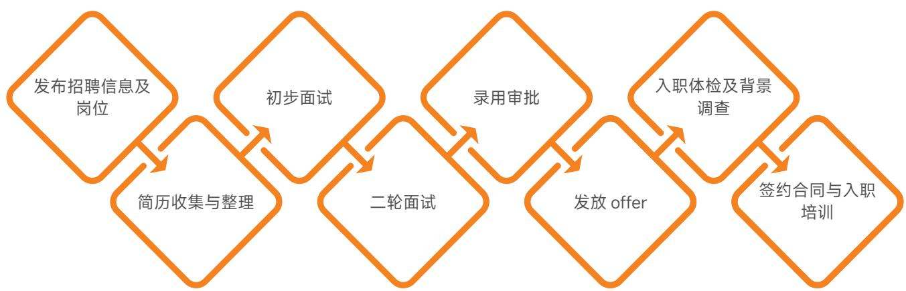

flowchart

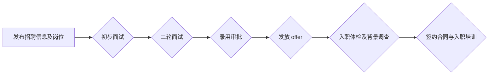
```mermaid
graph LR
  A["发布招聘信息及岗位"] --> B{"初步面试"}
  B --> C{"二轮面试"}
  C --> D{"录用审批"}
  D --> E{"发放 offer"}
  E --> F{"入职体检及背景调查"}
  F --> G{"签约合同与入职培训"}
```

## 社会招聘

公司在社会招聘方面主要通过线上招聘及猎头服务等进行人才招募。

报告期内，公司招聘各岗位员工 61 人

## 校园招聘

在校园招聘方面，中核科技持续深化校企合作，与东北电力大学、兰州理工大学、燕山大学、南昌航空大学、南京工业大学等高校保持良好的合作关系。公司积极拓展招聘渠道，除在大学生就业信息网同步发布校园招聘信息外，还深入校园开展宣讲活动。报告期内，公司共举办14场校园宣讲会，成功招聘39名毕业生。

## 员工权益保障

中核科技尊重并保障所有员工的合法权益，依法与员工签署劳动合同，公司严格遵守《中华人民共和国劳动法》《禁止使用童工规定》等国家法律法规，为员工提供平等、包容、多元化的工作环境。报告期内，公司员工劳动合同签订率为100% 。

## 劳动争议管理

公司严格遵循《企业劳动争议协商调解规定》，为有效预防和化解劳动争议，设立了 “劳动争议调解委员会” ，该委员会遵循合法、公正、自愿、保密的原则，依法调解公司与员工之间因劳动合同、薪酬福利、解雇离职等事项引发的纠纷。公司通过制度预防、积极沟通、依法调解等综合处理措施及内部协商机制，公正、高效地解决问题，维护双方合法权益，促进公司持续健康发展。

## 多元、平等与包容

中核科技致力于打造多元、平等与包容的职场文化。公司坚决抵制任何形式的歧视，从招聘、培训及晋升等各环节一视同仁，确保员工不会因年龄、性别、民族、籍贯、宗教信仰、残疾、家庭状况等非工作因素受到歧视或差别待遇，为每位求职者和员工提供平等的就业和职业发展机会，营造公平、无歧视的工作环境。报告期内，公司未发生劳工歧视事件。

## 劳工权益保障

中核科技坚决杜绝雇佣童工或强迫劳动，公司在《人事管理办法》中严格规定工作时间，实行每周五天制并明确加班审批管理规定，保证员工得到合理的休息及依法享有国家规定假期。

同时，公司严格遵守禁止招用未满十六周岁未成年人的规定。为避免雇佣童工，在招聘人员时，人力资源部对新员工身份信息进行核查和背景调查，确保应聘者提供材料的真实性，保障公司在雇佣及劳工准则方面不出现违法违规行为。

## 保障女性权益

中核科技关注女性员工权益保障，严格遵循《中华人民共和国妇女权益保障法》《中华人民共和国劳动合同法》等法律法规要求，严格落实法律规定的产检假、产假、流产假、哺乳假、育儿假等假期，通过实施发放生育津贴等保障女性员工的职业发展合法权益。

同时，中核科技坚持性别平等政策，保障女性员工在招聘、晋升发展及薪酬待遇方面受平等对待，致力于构建平等、尊重、支持女性职业发展的工作环境。

## “三八”妇女节表彰大会暨女性健康知识讲座

2025 年 3 月 6 日，公司以 “关爱女性、呵护‘她’健康为主题，组织开展妇女节系列活动。活动包含表彰先进、健康科普两大环节，女职工代表共百余人参与。

公司特邀乳腺甲状腺领域专家朱旬医生为全体女职工开展健康知识讲座。朱医生结合临床案例，深入浅出地讲解了乳腺及甲状腺疾病的早期症状、筛查方法、治疗手段及日常预防措施，并针对久坐办公、情绪压力等职场女性常见健康隐患提出科学建议。

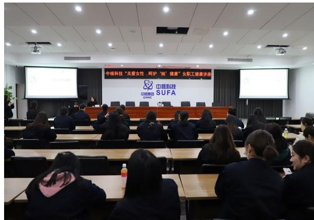

text_image

中核科技“关爱女性，呵护”健康”女职工健康讲座
中核集团 SUFA
CHINA 中核科技 SUFA

## 员工薪酬福利

## 薪酬体系

公司薪酬体系以“按劳分配”为核心，制定了《薪酬管理办法》，旨在构建与公司发展战略相匹配、兼具激励与约束功能的薪酬管理制度，实现薪酬分配的科学化、规范化和差异化，以合理且具有竞争力的薪酬待遇吸引优秀人才，保证公司的长期可持续发展。

公司薪酬体系根据职级与岗位类别划分不同薪酬类型，薪酬结构由固定收入、浮动收入和津补贴三部分构成。对于在重点任务、科技研发、管理创新等专项工作中业绩突出、表现优秀的部门或职工，公司设立专项奖励机制。

## 绩效考核

公司依据《全员绩效考核管理办法》《目标考核激励一体化（MKJ）管理办法》等制度，遵循“PDCA 循环”的管理要求，构建全员绩效考核管理体系，建立责任明确、层层落实的绩效管理流程，以公平、公正、科学的方式评价员工工作绩效，持续完善激励与约束机制，充分激发员工干事创业的积极性、主动性与创造性。

公司通过KPL GS 考核 述职评价等方式对于部员工进行绩效考核 考核结果将作为于部员工薪酬调整 职位晋升 岗位调配的重要依据之一。

## 绩效考核流程

## 绩效实施与辅导

## 绩效考核与面谈

## 考核申诉与结果反馈

部门负责人对员工进行日常辅导与过程管理  
部门领导评分，人力资源部审核，结果反馈本人  
员工可填写《绩效考核结果申诉表》向人力资源部申诉

## 绩效申诉

公司已建立完善的绩效反馈与申诉机制。在绩效考核结束后，若被考核者对考核结果有异议，可通过填写并提交《绩效考核结果申诉表》向人力资源部提出申诉。人力资源部接到申诉后，需在 7 个工作日内受理，并在 15 个工作日内答复。对答复结果不满意的员工可继续向人力分管领导进行申诉。在申诉期间，原考核结果继续执行应用。

## 福利保障

中核科技为全体员工提供全方位福利保障，依据相关规定制定《职工福利管理办法》，规范职工福利管理。公司依法为员工缴纳社会保险及住房公积金。除法定福利外，公司还发放各项现金补贴和非货币性集体福利。报告期内，公司福利支出为1,146万元（不包括高温津贴，高温津贴随工资发放）。

## 职工福利费项目

## 职工疗养费用

对劳模、上级单位评定各类先进、公司标兵、公司先进个人、年度突出贡献人员、高层次人才等发放疗养费用。

## 职工体检费用

定期为每位员工进行体检，体检分为入职体检、年度健康体检、接触有毒因素员工体检和女职工专项体检四大类。

## 职工工作餐补

给职工发放餐费及加班餐费。

## 职工困难补助

对于家庭困难的职工，根据情况定期或不定期给予补助。

## 退休人员统筹外费用

对于在公司工作满10年并在公司办理退休的员工，春节期间发放一次性补助。

## 防暑降温费

发放防暑降温清凉用品，如工作服、清凉药品、清凉饮料；根据国家及江苏省防暑降温费有关规定，向职工发放防暑降温补贴。

## 安家费

对于中层干部或专业人才发放一次性安家费。

## 供养直系亲属医疗补贴

对职工家庭缴纳子女少儿医疗保险费进行补贴。

## 抚恤金

对非因公伤残职工或死亡职工家属发放抚恤金。

## 心理健康支持

公司高度重视员工心理健康，打造了温馨的心理健康驿站，并配备 2名已取得国家专业资质的心理咨询师，为员工提供及时、专业的心理倾听与支持服务，有效帮助员工疏导来自工作与生活方面的压力，营造积极健康的氛围。

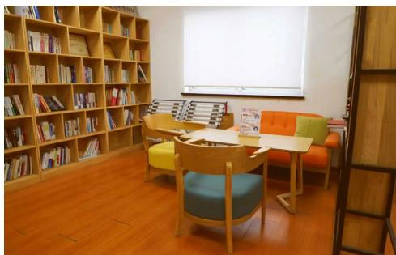

natural_image

Interior of a modern library with wooden bookshelves, colorful sofas, and a projector screen (no visible text or symbols)

心理健康驿站

## 关爱员工生活

## 员工活动

中核科技深入践行“快乐工作，健康生活”理念，通过开展丰富多样的文体活动如徒步活动、羽毛球赛、艺术插花、职工子女假期研学等活动，为员工创造展现自我的机会并关注员工家庭需求 助力员工实现工作与生活的平衡，提升员工满意度和幸福感。

## 职工徒步活动

2025 年 11 月 8 日，公司数百名员工齐聚苏州古城，开启一场融合历史、风景与团队力量的环古城墙徒步之旅。途中特别设置的“能量补给站”化身为趣味游戏的舞台——考验精准与协作的“扔沙包”和需要默契配合的“一圈到底”。

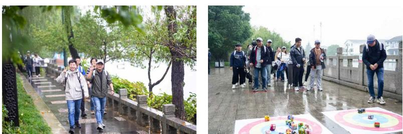

## 高温送清凉

为切实做好夏季防暑降温工作，保障一线职工职业健康安全，确保高温季节生产作业平稳有序开展，中核科技工会组织开展高温慰问活动，公司领导班子成员分别深入一线生产车间，为奋战在高温下的员工送去清凉物资，向他们的辛勤付出表示衷心感谢。

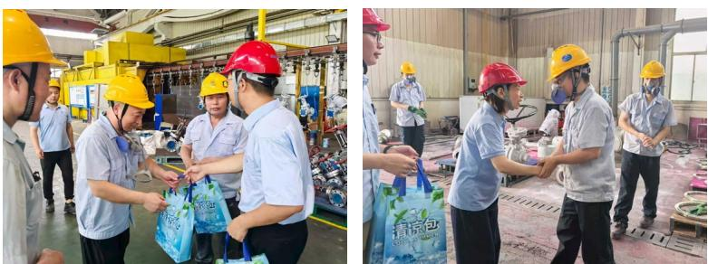

## 职工子女研学活动

2025年7月，为丰富职工子女暑期生活，公司工会精心策划了一场别开生面的职工子女暑期研学活动。此次活动以“探秘科技·传承文化”为主题，带领孩子们探秘伊利工厂、体验非遗文化（如古法榫卯、昆曲、花窗）等。公司工会以此次活动为契机，全面挖掘职工需求，切实以优质服务激发职工立足岗位干事创业的热情。

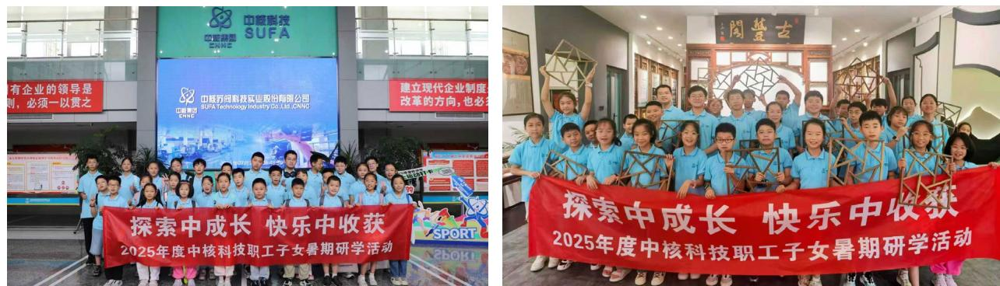

## 员工帮扶

中核科技关心员工生活，积极开展慰问活动及困难员工帮扶工作。对家庭经济困难的员工及员工家庭，提供帮扶，缓解员工及员工家庭的困难，为员工提供必要的支持和帮助。报告期内，公司动态帮扶困难职工 13 人，发放慰问金20.58 万元。

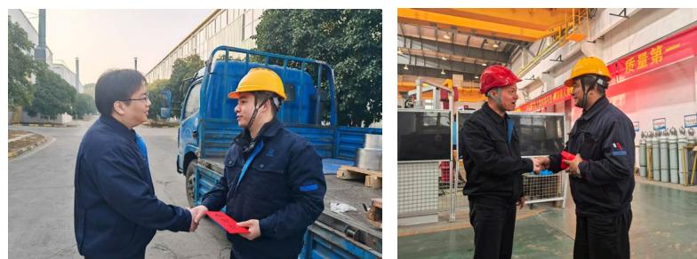

## 员工民主建设

## 实施民主管理

公司构建了以职工代表大会和工会会员代表大会为核心的民主管理体系。报告期内，公司严格遵循相关制度规定，召开了第六届第六次职工代表暨工会会员代表大会。会议重点听取了《2024年度生产经营报告》《2024年度财务情况报告》及《2024年度工会工作报告》等重要汇报，审议并表决通过了《2024 年度工资集体协商协议书》。

同时，公司经与会职工代表充分讨论，审议通过《公司福利费管理办法》与《公司薪酬管理办法》等关系全体员工切身利益的重要制度。公司在重大决策过程中充分尊重和保障员工的民主参与权利，促进公司决策民主、员工团结和谐，为公司持续发展奠定坚实的基础。

## 多元化沟通

公司不断健全多元化沟通机制，通过制定《领导人员联系人才管理办法》，积极拓宽沟通渠道；并依托党支部组织生活会、团支部组织生活会等活动，畅通内部交流，了解员工心声；同时设立纪检监督信箱与电话，广泛听取建议，接受监督反馈，构建起多维度的沟通体系，切实保障员工诉求得到有效解决。

## 员工满意度调查

中核科技将提升员工满意度作为重要战略目标，每年定期开展员工满意度调查。公司通过系统调查深入了解员工各方面的诉求和期望，并根据调查结果及时识别管理中存在的问题，进而制定有针对性的改进措施。公司期望通过不断提高员工满意度，增强员工的归属感，激发员工的工作积极性和创造力，营造一个开放沟通、不断进步的工作环境。

## 关键绩效

报告期内，公司共开展 1 次员工满意度调查 参与调查的员工数量为 574 人 员工满意度为 97%

此外，公司定期开展员工对食堂、物业等专项满意度调查。

## 相伴员工成长

## 搭建职业通道

中核科技秉持“人才优先”的理念，建立了管理序列、业务序列、技术序列、技能序列和销售序列五个职位序列的发展通道。公司持续完善纵向职级晋升，横向职级转换的职级发展体系 充分尊重员工个人发展意愿 并结合员工专业特长 指导员工确定职业发展目标并选择适宜的发展通道，做到人尽其才，共谋发展，促进公司可持续高质量发展。

## 员工培训发展

## 培训体系建设

为贯彻落实人才强企战略，系统推进人才队伍建设，公司制定《培训管理办法》，对培训工作的计划、组织与管理进行全面规范。各部门依据办法要求，每年制定本部门年度教育培训计划，并报送人力资源部备案实施。

公司根据调查的员工需求合理制定《中核科技2025年度员工教育培训计划汇总表》，培训计划包含管理技能、安全管理、质量管理、岗位业务培训、专业技能培训、专业知识培训、党政宣教等多个维度，旨在全面提升员工综合素质与履职能力。

培训实施过程中，公司采用线上或线下等多样化渠道开展培训，培训后通过问卷、课程评价等方式评估效果与质量，持续优化培训体系，确保培训工作落到实处。

## 培训类型

## 培训内容

## 新员工入职培训

V 对新入职员工开展培训，助力新员工快速融入集体，增加归属感。

## 干部培训

V 针对干部层级开展干部培训，提升干部管理能力，促进公司高质量发展。

## 涉密人员培训

由综合部开展保密培训、公文培训，增强员工保密意识。

## 各部门岗位相关内容培训

部门针对性岗位相关技术知识、管理知识、管理体系等开展部门培训。

## 在职教育鼓励

引导和鼓励员工参加岗位相关专业技术职务任职资格考试和执业资格考试并报销考试报名费。

## 师徒结对

开展“导师带徒”活动，发挥好导师“传、帮、带”的作用，助力新员工更好地融入公司，提升履职能力。

## 中层干部能力提升培训

报告期内，公司联合西核设备、中核西仪共同组织为期一周的中高层中层干部履职能力提升培训。培训聚焦“卓越经营绩效与高质量发展”主题，采用体验式教学模式，融合理论讲解、案例研讨与实地参观，系统覆盖智能制造、领导力建设、战略与绩效管理、质量管控及人才培养等关键领域，旨在强化中层干部的综合素养与桥梁作用，为企业持续健康发展提供坚实的人才支撑。

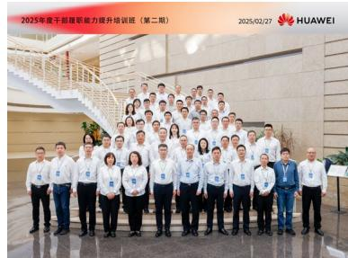

text_image

2025年度干部履职能力提升培训班（第二期）
2025/02/27 HUAWEI

## 内部讲师

公司持续加强内部培训专家队伍建设，从领导班子、业务专家、核心骨干及优秀员工中选拔培养，并鼓励退休专家任教，形成了一支专兼结合、结构合理的师资队伍；同时通过优化内训师激励机制，持续激发团队活力，以提升组织整体能力。

## 关键绩效

报告期内，公司累计 8,235人次参与培训

员工培训覆盖率 100%

## 职业健康与安全生产

## 治理

## 职业健康管理

公司遵循《中华人民共和国职业病防治法》等法律法规，搭建全面且系统的职业健康管理治理架构，制定《职业卫生管理制度》《环境职业健康安全管理手册》，全方位保障员工职业健康。截至报告期末，公司成功通过 ISO 45001 职业健康安全管理体系认证 以及集团公司安全生产标准化二级达标评审，为职业健康管理提供了坚实的体系支撑。

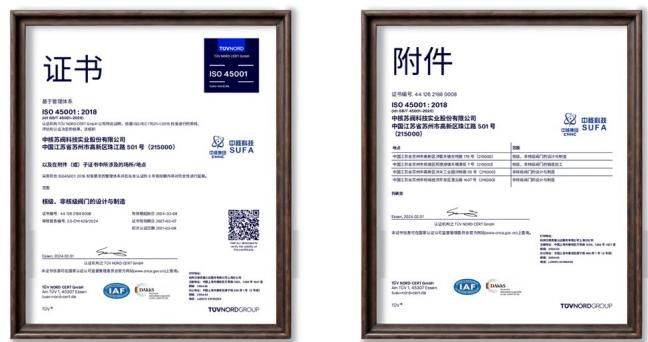  
职业健康安全管理体系认证证书

## 安全生产管理

公司依据国家、地方及集团规定，制定《安全生产与环保责任制及责任追究管理规定》《隐患排查治理管理规定》《安全生产事故应急管理规定》等制度，构建全流程安全风险防控机制。公司成立由党委书记任主任、总经理任副主任的安全生产委员会，作为安全最高决策机构，下设安全环保部统筹监督，各厂区配备专管员，形成多层级管理体系，实现标准化管理全覆盖。

## 战略

中核科技以打造本质安全型企业为战略目标之一，将职业健康管理与安全生产深度融入企业发展战略体系。公司依据国家、地方及集团相关规定，从责任认定、隐患排查、事故应急到奖惩措施，全方位防控安全风险。

<table><tr><td>风险类型</td><td>描述</td><td>财务影响说明</td><td>发生可能性</td><td>影响大小</td><td>影响时间范围</td><td>影响价值链环节</td><td>应对措施</td></tr><tr><td>安全生产</td><td>日常管理缺位、作业行为不规范、安全检查与维护保养被忽视导致安全事故发生。</td><td>营收减少</td><td>中</td><td>中</td><td>长期</td><td>运营</td><td>1.每季度公司主要负责人带队进行安全检查;2.组织开展安全生产宣传培训活动。</td></tr><tr><td>职业健康</td><td>生产环节的噪声、粉尘、烟气、化学试剂接触易造成慢性健康影响,高强度安全管控可能引发员工焦虑紧张等心理问题,固定作业姿势则易诱发肌肉骨骼系统职业病。</td><td>营收减少</td><td>中</td><td>中</td><td>长期</td><td>运营</td><td>1.每三年进行一次职业病危害现状评价,每季度进行一次职业病危害因素检测;2.组织应急演练,包括化学品泄漏、中毒、高温中暑等场景,提升应对突发职业健康事件的能力;3.制定职业病防治计划与实施方案;4.针对职业健康监护中检查出现异常的人员,根据体检机构建议进行复查、调岗。</td></tr></table>

## 影响、风险与机遇管理

中核科技将职业健康安全与环境风险管理融入生产运营，构建全流程管控体系，由主要负责人统筹、安全环保部牵头，各部门协同应对相关风险与机遇。

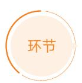

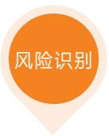

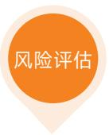

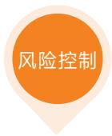

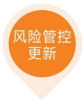

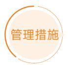

梳理作业场所职业病危害及环境风险，建立风险清单。

季度检测职业病危害因素，明确风险等级。

配齐专职人员与防护设施，规范劳保用品管理；落实告知培训、健康体检与合规申报。

随法规、项目、环境变化动态优化风险管控措施。

## 安全隐患排查

公司建立安全隐患排查治理机制，各部门设置安全员，定期开展安全生产专项检查，覆盖消防安全、电气安全、危险品管理等重点领域。检查组将检查过程中发现的问题汇总成问题清单，同时在集团安全环保信息平台录入，并下发问题整改行动项展开隐患整改。

## 应急管理

为提升员工的职业健康与安全风险防控意识，公司依据相关法律法规结合公司生产特点及公司实际情况制定《生产安全事故应急预案》。

报告期内，公司开展火灾事故及应急疏散专项应急演练，自然灾害专项应急演练等各项应急演练活动共30场。

## 火灾事故及应急疏散专项演练

2025 年 11 月 13 日，公司组织总部办公大楼全体员工进行消防应急疏散演练。演练以强化全员消防安全意识、普及消防实操技能为核心目标，助力员工在突发火灾时能够及时、有序撤离至安全区域，切实掌握自救互救方法，进而实现火灾事故的快速高效处置，保障人员生命与公司财产安全。

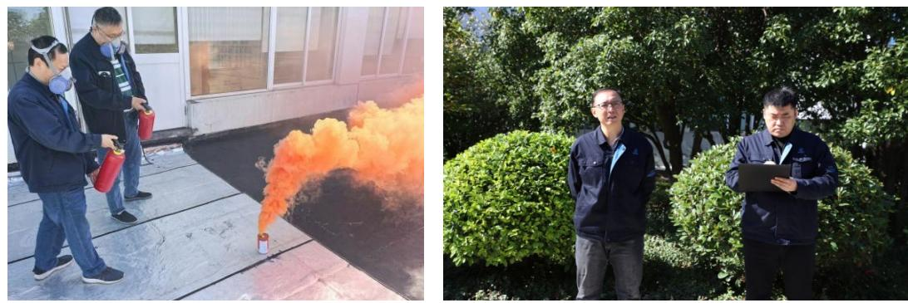

## 指标与目标

公司管理层定期召集各相关部门召开安全例会，学习、传达国家、集团及地方政府文件，对上阶段安环工作进行总结，对下阶段工作进行布置，并将该项工作完成情况纳入部门年终安全绩效考核。每季度公司主要负责人带队进行安全检查，确保公司安全环保目标的完成。

报告期内，公司设定并达成了以下职业健康与安全生产目标：

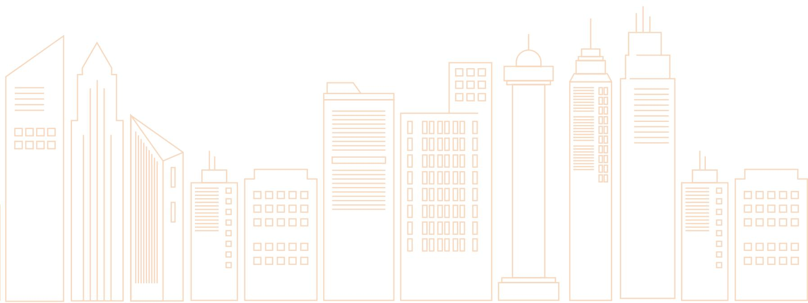

line

| Category | Line Style |
| --- | --- |
| 1 | Solid |
| 2 | Solid |
| 3 | Solid |
| 4 | Solid |
| 5 | Solid |
| 6 | Solid |
| 7 | Solid |
| 8 | Solid |
| 9 | Solid |
| 10 | Solid |
| 11 | Solid |
| 12 | Solid |
| 13 | Solid |
| 14 | Solid |
| 15 | Solid |
| 16 | Solid |
| 17 | Solid |
| 18 | Solid |
| 19 | Solid |
| 20 | Solid |
| 21 | Solid |
| 22 | Solid |
| 23 | Solid |
| 24 | Solid |
| 25 | Solid |
| 26 | Solid |
| 27 | Solid |
| 28 | Solid |
| 29 | Solid |
| 30 | Solid |
| 31 | Solid |
| 32 | Solid |
| 33 | Solid |
| 34 | Solid |
| 35 | Solid |
| 36 | Solid |
| 37 | Solid |
| 38 | Solid |
| 39 | Solid |
| 40 | Solid |
| 41 | Solid |
| 42 | Solid |
| 43 | Solid |
| 44 | Solid |
| 45 | Solid |
| 46 | Solid |
| 47 | Solid |
| 48 | Solid |
| 49 | Solid |
| 50 | Solid |
| 51 | Solid |
| 52 | Solid |
| 53 | Solid |
| 54 | Solid |
| 55 | Solid |
| 56 | Solid |
| 57 | Solid |
| 58 | Solid |
| 59 | Solid |
| 60 | Solid |
| 61 | Solid |
| 62 | Solid |
| 63 | Solid |
| 64 | Solid |
| 65 | Solid |
| 66 | Solid |
| 67 | Solid |
| 68 | Solid |
| 69 | Solid |
| 70 | Solid |
| 71 | Solid |
| 72 | Solid |
| 73 | Solid |
| 74 | Solid |
| 75 | Solid |
| 76 | Solid |
| 77 | Solid |
| 78 | Solid |
| 79 | Solid |
| 80 | Solid |
| 81 | Solid |
| 82 | Solid |
| 83 | Solid |
| 84 | Solid |
| 85 | Solid |
| 86 | Solid |
| 87 | Solid |
| 88 | Solid |
| 89 | Solid |
| 90 | Solid |
| 91 | Solid |
| 92 | Solid |
| 93 | Solid |
| 94 | Solid |
| 95 | Solid |
| 96 | Solid |
| 97 | Solid |
| 98 | Solid |
| 99 | Solid |
| 100 | Solid |

## 2025 年目标

## 2025年完成情况

杜绝科研生产设施火灾责任事故

未发生火灾

杜绝急性职业病

V 未出现

杜绝突发环境事件，确保流出物达标排放，杜绝环保行政处罚

V 未出现

轻伤事故起数≤2

未发生工伤事故

杜绝重伤及以上生产安全责任事故

未发生工伤事故

通过集团安全标准化达标（二级）年度复审

V 已通过

杜绝辐射人身伤害事故（辐射个人剂量管理目标值小于3.5mSv/a），杜绝各类放射源丢失、失控

未出现

## 安全生产管理举措

## 专业技能培养

公司通过深入推进核安全文化建设，落地实施《核安全文化提升三年行动方案》，从宣传培训、融入日常工作到监督考核，逐步提升全体员工的核安全文化素养，营造浓厚且扎实的安全文化氛围。

## 关键绩效

报告期内，公司安全培训总投入 2.6 万元，培训总场次 24 场，共参与培训 652 人次。

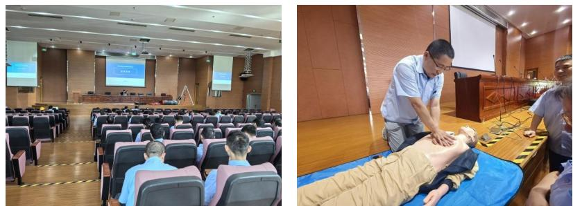  
安生生产培训

## 相关方安全管理

公司制定《相关方安全管理规定》，明确采购管理部、综合部等多部门对承包商、供应商、访客等相关方的安全管理职责，建立全流程管理机制。公司严格执行《人员入场安全教育》要求，按相关方类型分类开展培训并规范填写各类表单、存档记录，同时通过签订《安全环保协议》、落实安全交底、开展现场监督与隐患整改等措施，将相关方作业纳入统一安全管理，管控作业风险。

## 职业健康保障

公司高度重视员工职业健康，建立由职业病危害防治领导小组、工作小组及安全环保部构成的治理架构，配备专职职业卫生管理人员，主要负责人及相关管理人员经培训持证上岗。

## 危害防护措施

## 设施保障

公司持续做好职业病危害防护设施及应急救援设施的日常维护，确保防护设施在主体生产设施运行期间完好无损同步投用。

## 监测管控

严格执行《2025 年度职业病危害因素监测计划及执行方案》，委托具备资质的职业卫生技术服务机构，每季度对存在职业病危害因素的作业场所开展检测，保障作业场所危害因素浓度或强度处于受控范围。

## 警示告知

在存在职业病危害因素的工作场所、作业岗位、设备及贮存场所设置警示标识，并在醒目位置设公告栏，公布职业病防治制度规程、应急救援措施及危害因素监测结果、检测日期、机构名称。

## 人员管理

人力资源部与接害岗位员工签订劳动合同时 同步附签《职业病危害告知书》危害因素发生变化时及时更新签订将职业病危害预防融入日常宣教培训在入厂三级安全教育中落实相关内容 并常态化开展专题培训

## 职业健康体检

定期为接触职业病危害因素的员工安排职业健康体检，职业健康检查类别包括接触粉尘类、接触化学品类、接触放射因素类、接触物理因素类等。报告期内，中核科技职业健康体检已覆盖员工104人，健康体检已覆盖员工1,046人。

## 劳保用品发放

设专人负责管理发放，按国家配备标准及时足额发放，杜绝拖延滞发。

## 履行社会责任

公司将公益事业作为践行社会责任的重要载体，严格遵守《中华人民共和国慈善法》《中华人民共和国公益事业捐赠法》等相关法律法规，积极响应国家乡村振兴战略、“一带一路”倡议等重大部署，以实际行动展现央企的使命与担当。

## 社会公益

公司积极引导青年在服务社会、服务企业中践行志愿精神，围绕“我为群众办实事”构建“内部服务 + 外部履责”的志愿服务体系。内部开展职工子女研学营、无偿献血、爱心义剪、特殊儿童关怀、敬老慰问等多样化活动，相关事迹获中核知乎、中核工程等上级媒体报道。外部持续推进“核科普进校园”项目，如走进吴县中学为千余名青少年开展科普教育，切实履行央企社会责任，传递文明新风。

## 中核科技走进龙华社区阳山敬老院

2025年3月3日，在第66个学雷锋纪念日来临之际，公司青年志愿者团队走进龙华社区阳山敬老院，开展 “包馄饨·暖夕阳”公益活动。活动联合社区同步开展爱心义剪、戏曲表演等服务，以多方协同为老人送去关怀与温暖，丰富老年人精神文化生活。

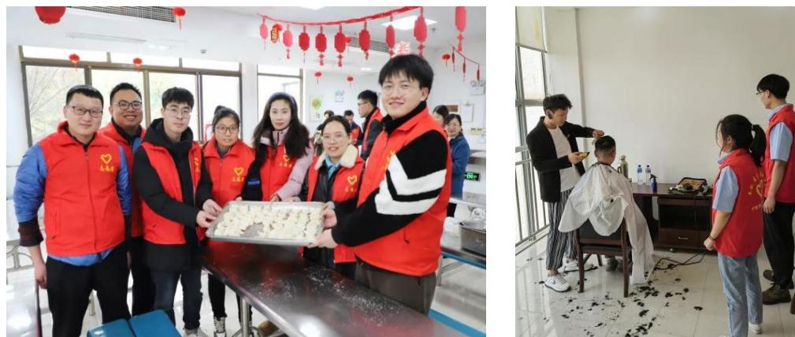

## 中核科技开展职工无偿献血活动

2025年8月12日，公司组织开展职工无偿献血公益活动，得到广大职工积极响应。活动期间，共有62名职工成功献血，总献血量达17,600毫升。此次活动是公司践行社会责任的具体实践，职工以自愿奉献的行动传递爱心，彰显企业担当，凝聚正向社会力量。

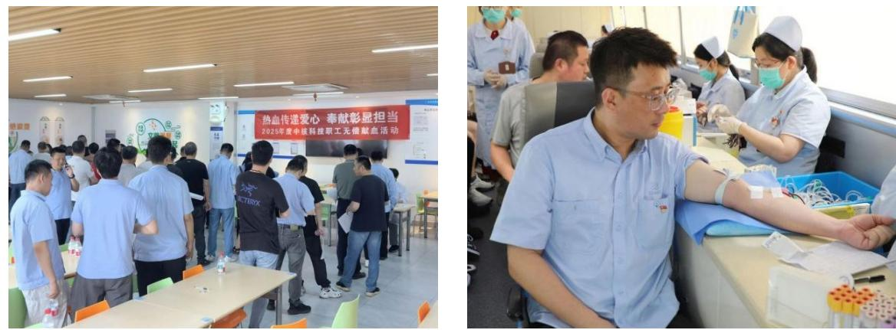

## 中核科技“关爱特殊儿童”公益行

2025 年 8 月 14 日下午，公司组织 16 名志愿者走进苏州市吴中区特殊儿童康复中心，开展关爱特殊儿童主题公益活动。志愿者以热忱服务温暖特殊儿童群体，践行公益初心。公司将持续推进此类公益活动，积极履行社会责任，传递企业温度，助力营造友善互助的社会氛围。

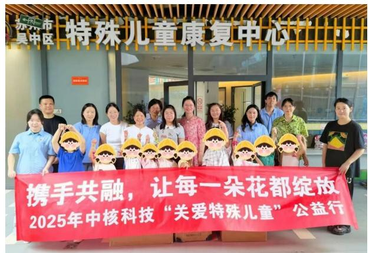

text_image

吴中区
市 特殊儿童康复中心
携手共融，让每一朵花都绽放
2025年中核科技“关爱特殊儿童”公益行

## 乡村振兴

2025年作为巩固拓展脱贫攻坚成果同乡村振兴有效衔接五年过渡期的收官之年，公司深入贯彻习近平总书记关于乡村振兴的重要论述，严格落实集团公司帮扶工作决策部署。公司大力推进消费帮扶，聚焦农产品产销对接，以实际行动支持乡村产业发展，主动践行社会责任。

中核集团定点帮扶区域陕西旬阳市、重庆石柱土家族自治县采购特色农副产品31万元，助力缓解当地农产品销售压力。

## 附录

## 绩效表

公司治理

<table><tr><td>议题</td><td>指标名称</td><td>基准单位</td><td>2025年</td></tr><tr><td rowspan="12">公司治理</td><td colspan="3">股东会</td></tr><tr><td>召开总次数</td><td>次</td><td>6</td></tr><tr><td>临时股东会次数</td><td>次</td><td>5</td></tr><tr><td>审议通过议案数量</td><td>项</td><td>21</td></tr><tr><td colspan="3">董事会</td></tr><tr><td>董事会成员人数</td><td>人</td><td>9</td></tr><tr><td>男性董事人数</td><td>人</td><td>7</td></tr><tr><td>女性董事人数</td><td>人</td><td>2</td></tr><tr><td>独立董事人数</td><td>人</td><td>3</td></tr><tr><td>非独立董事人数</td><td>人</td><td>6</td></tr><tr><td>董事会召开次数</td><td>次</td><td>10</td></tr><tr><td>审议通过议案数量</td><td>项</td><td>98</td></tr><tr><td rowspan="3">公司经营绩效指标</td><td>营业收入</td><td>万元</td><td>173,137.02</td></tr><tr><td>净利润</td><td>万元</td><td>16,989.31</td></tr><tr><td>纳税总额</td><td>万元</td><td>5,522.42</td></tr><tr><td rowspan="4">党建</td><td>公司党委数量(含本级党委)</td><td>个</td><td>1</td></tr><tr><td>党支部数量</td><td>个</td><td>11</td></tr><tr><td>召开党委会次数</td><td>次</td><td>25</td></tr><tr><td>党员数量</td><td>人</td><td>237</td></tr><tr><td rowspan="3">内控合规</td><td>开展法律培训次数</td><td>次</td><td>2</td></tr><tr><td>开展法律培训时数</td><td>小时</td><td>4</td></tr><tr><td>参与法律培训人数</td><td>人</td><td>40</td></tr></table>

<table><tr><td>议题</td><td>指标名称</td><td>基准单位</td><td>2025年</td></tr><tr><td rowspan="16">商业道德</td><td colspan="3">向董事、管理层及员工提供的反商业贿赂及反贪污培训</td></tr><tr><td>参加反商业贿赂及反贪污培训的总人数</td><td>人</td><td>140</td></tr><tr><td>其中:参加反商业贿赂及反贪污培训的董事及高级管理层人数</td><td>人</td><td>6</td></tr><tr><td>参加反商业贿赂及反贪污培训的董事及高级管理层人数占比</td><td>%</td><td>40</td></tr><tr><td>提供的反商业贿赂及反贪污培训总时长</td><td>小时</td><td>420</td></tr><tr><td>其中:向董事及高级管理层提供的反商业贿赂及反贪污培训总时长</td><td>小时</td><td>36</td></tr><tr><td>接受反商业贿赂及反贪污培训的平均时长</td><td>小时/人</td><td>3</td></tr><tr><td>其中:董事及高级管理层接受反商业贿赂及反贪污培训的平均时长</td><td>小时/人</td><td>6</td></tr><tr><td colspan="3">商业道德签署与申诉</td></tr><tr><td>廉洁协议等有关商业行为书签署人数</td><td>人</td><td>70</td></tr><tr><td>廉洁协议等有关商业行为书签署率</td><td>%</td><td>7</td></tr><tr><td colspan="3">反垄断与公平竞争</td></tr><tr><td>因公司不正当竞争行为导致诉讼或重大行政处罚的涉案金额</td><td>万元</td><td>0</td></tr><tr><td colspan="3">责任营销</td></tr><tr><td>违反有关产品和服务信息与标识法规和/或自愿性守则的事件总数</td><td>件</td><td>0</td></tr><tr><td>违反有关营销传播(包括广告、促销和赞助)的法规和/或自愿性守则的事件总数</td><td>件</td><td>0</td></tr><tr><td rowspan="7">投关管理</td><td colspan="3">投资者交流</td></tr><tr><td>接待投资者活动次数</td><td>次</td><td>5</td></tr><tr><td>接待投资者现场调研次数</td><td>次</td><td>4</td></tr><tr><td>接待投资者现场调研人次</td><td>人次</td><td>200+</td></tr><tr><td>在互动易投资者提问总数</td><td>次</td><td>76</td></tr><tr><td>在互动易投资者回答问题数</td><td>次</td><td>76</td></tr><tr><td>在互动易投资者回复率</td><td>%</td><td>100</td></tr><tr><td rowspan="7">投关管理</td><td colspan="3">信息披露</td></tr><tr><td>对外披露挂网文件</td><td>份</td><td>150</td></tr><tr><td>其中:编号公告数量</td><td>份</td><td>71</td></tr><tr><td>因信息披露方面违规而受到处罚次数</td><td>次</td><td>0</td></tr><tr><td colspan="3">公司每年现金分红情况</td></tr><tr><td>每10股现金分红(含税)</td><td>元</td><td>1.33</td></tr><tr><td>现金分红金额(含税)</td><td>元</td><td>50,994,531.27</td></tr></table>

## 环境保护

<table><tr><td>议题</td><td colspan="2">指标名称</td><td>基准单位</td><td>2025年</td></tr><tr><td rowspan="4">应对气候变化</td><td colspan="2">温室气体排放总量</td><td>吨二氧化碳当量</td><td>6,108.87</td></tr><tr><td colspan="2">温室气体排放强度</td><td>吨二氧化碳当量/百万元营收</td><td>3.53</td></tr><tr><td colspan="2">直接温室气体排放量(范围一)</td><td>吨二氧化碳当量</td><td>828.66</td></tr><tr><td colspan="2">间接温室气体排放量(范围二)</td><td>吨二氧化碳当量</td><td>5,280.21</td></tr><tr><td rowspan="7">环境管理</td><td colspan="2">环保投入总金额</td><td>万元</td><td>871.36</td></tr><tr><td colspan="2">环保投入占营业收入比例</td><td>%</td><td>0.5</td></tr><tr><td colspan="2">环境法律法规违反事故件数</td><td>件</td><td>1</td></tr><tr><td colspan="2">因环境事件受到生态环境等有关部门重大行政处罚的处罚事件</td><td>件</td><td>0</td></tr><tr><td colspan="2">因环境事件受到生态环境等有关部门重大行政处罚的处罚金额</td><td>万元</td><td>0</td></tr><tr><td colspan="2">环保培训参加人次</td><td>人次</td><td>1,264</td></tr><tr><td colspan="2">环保培训时长</td><td>小时</td><td>2,528</td></tr><tr><td rowspan="4">能源管理</td><td rowspan="4">直接能源</td><td>汽油</td><td>升</td><td>7,631.88</td></tr><tr><td>柴油</td><td>吨</td><td>16.34</td></tr><tr><td>天然气</td><td>立方米</td><td>351,908</td></tr><tr><td>光伏发电</td><td>万千瓦时</td><td>346.78</td></tr></table>

<table><tr><td>议题</td><td colspan="2">指标名称</td><td>基准单位</td><td>2025年</td></tr><tr><td rowspan="8">能源管理</td><td rowspan="2">间接能源</td><td>外购电力总量</td><td>万千瓦时</td><td>995.14</td></tr><tr><td>其中:外购核电</td><td>万千瓦时</td><td>868.75</td></tr><tr><td colspan="2">直接能源消耗总量</td><td>吨标准煤</td><td>926.18</td></tr><tr><td colspan="2">间接能源消耗总量</td><td>吨标准煤</td><td>1,223.03</td></tr><tr><td colspan="2">可再生能源消耗量</td><td>吨标准煤</td><td>426.19</td></tr><tr><td colspan="2">可再生能源消耗占比</td><td>%</td><td>19.83</td></tr><tr><td colspan="2">能源消耗总量</td><td>吨标准煤</td><td>2,149.21</td></tr><tr><td colspan="2">能源消耗强度</td><td>吨标准煤/百万元营收</td><td>1.24</td></tr><tr><td>水资源利用</td><td colspan="2">新鲜水取水总量(市政购水量)</td><td>万吨</td><td>12.04</td></tr><tr><td rowspan="18">污染和废弃物</td><td colspan="4">废水排放情况</td></tr><tr><td colspan="2">废水排放量</td><td>吨</td><td>91,790</td></tr><tr><td colspan="2">其中:工业废水排放量</td><td>吨</td><td>78,089</td></tr><tr><td colspan="2">其中:生活污水排放量</td><td>吨</td><td>13,701</td></tr><tr><td colspan="2">废水排放强度</td><td>吨/百万元营收</td><td>53.02</td></tr><tr><td colspan="4">废水污染物种类排放情况</td></tr><tr><td colspan="2">化学需氧量(COD)</td><td>吨</td><td>2.343</td></tr><tr><td colspan="2">生化需氧量(BOD)</td><td>吨</td><td>0.548</td></tr><tr><td colspan="2">固体悬浮物(SS)排放量</td><td>吨</td><td>0.498</td></tr><tr><td colspan="2">氨氮( $NH_3$ -N)</td><td>吨</td><td>0.117</td></tr><tr><td colspan="4">废气排放情况</td></tr><tr><td colspan="2">硫化物(SOx)排放量</td><td>吨</td><td>0.025</td></tr><tr><td colspan="2">挥发性有机化合物(VOC)排放量</td><td>吨</td><td>1.237</td></tr><tr><td colspan="2">颗粒物(PM)排放量</td><td>吨</td><td>0.234</td></tr><tr><td colspan="4">废弃物排放情况</td></tr><tr><td colspan="2">一般废弃物产生量</td><td>吨</td><td>666.80</td></tr><tr><td colspan="2">一般废弃物处置量</td><td>吨</td><td>666.80</td></tr><tr><td colspan="2">一般废弃物产生强度</td><td>吨/百万元营收</td><td>0.39</td></tr><tr><td rowspan="4">污染和废弃物</td><td>危险废弃物产生量</td><td>吨</td><td colspan="2">88.287</td></tr><tr><td>危险废弃物处置量</td><td>吨</td><td colspan="2">88.287</td></tr><tr><td>危险废弃物产生强度</td><td>吨/百万元营收</td><td colspan="2">0.05</td></tr><tr><td>废弃物合规处置率</td><td>%</td><td colspan="2">100</td></tr><tr><td rowspan="4">物料耗用</td><td colspan="4">物料耗用情况</td></tr><tr><td>包装材料使用总量</td><td>立方米</td><td colspan="2">2,994</td></tr><tr><td>其中:胶合板材料</td><td>立方米</td><td colspan="2">2,994</td></tr><tr><td>包装材料消耗强度</td><td>立方米/百万元营收</td><td colspan="2">1.73</td></tr></table>

产业价值

<table><tr><td>议题</td><td>指标名称</td><td>基准单位</td><td>2025年</td></tr><tr><td rowspan="16">研发与创新</td><td>研发投入</td><td>万元</td><td>6,873.74</td></tr><tr><td>研发投入占营业收入比例</td><td>%</td><td>3.97</td></tr><tr><td>新产品销售收入</td><td>万元</td><td>36,547</td></tr><tr><td colspan="3">研发团队</td></tr><tr><td>研发团队总人数</td><td>人</td><td>180</td></tr><tr><td>研发人员占员工总人数比例</td><td>%</td><td>17</td></tr><tr><td colspan="3">创新成果</td></tr><tr><td>授权专利累计数(有效期内的专利数)</td><td>项</td><td>224</td></tr><tr><td>专利申请数</td><td>项</td><td>34</td></tr><tr><td colspan="3">按专利类型划分</td></tr><tr><td>授权发明专利累计数</td><td>项</td><td>43</td></tr><tr><td>授权实用新型专利累计数</td><td>项</td><td>181</td></tr><tr><td>每百万元营收有效专利数</td><td>项/百万元营收</td><td>0.13</td></tr><tr><td colspan="3">其他知识产权</td></tr><tr><td>商标累计数</td><td>项</td><td>24</td></tr><tr><td>发表论文累计数</td><td>篇</td><td>20</td></tr></table>

<table><tr><td>议题</td><td>指标名称</td><td>基准单位</td><td>2025年</td></tr><tr><td rowspan="14">产品与服务质量</td><td colspan="3">产品质量与安全</td></tr><tr><td>产品合格率</td><td>%</td><td>100</td></tr><tr><td>年度质量内审次数</td><td>次</td><td>1</td></tr><tr><td>聘请第三方机构抽检次数</td><td>次</td><td>1</td></tr><tr><td>产品或服务相关的安全与质量重大责任事故所涉及金额</td><td>万元</td><td>0</td></tr><tr><td colspan="3">质量文化培训</td></tr><tr><td>质量培训人次</td><td>人次</td><td>1,091</td></tr><tr><td>质量培训总时长</td><td>小时</td><td>4,360</td></tr><tr><td>质量培训次数</td><td>次</td><td>16</td></tr><tr><td colspan="3">客户服务</td></tr><tr><td>客户投诉数量</td><td>次</td><td>24</td></tr><tr><td>客户投诉解决数量</td><td>件</td><td>24</td></tr><tr><td>参与调查的客户数量</td><td>家</td><td>98</td></tr><tr><td>客户满意度</td><td>%</td><td>95.03</td></tr><tr><td rowspan="15">供应链管理</td><td>供应商总数</td><td>个</td><td>432</td></tr><tr><td>国内供应商总数</td><td>个</td><td>429</td></tr><tr><td>海外供应商总数</td><td>个</td><td>3</td></tr><tr><td colspan="3">供应商审查</td></tr><tr><td>拥有质量管理体系认证的供应商数目</td><td>个</td><td>393</td></tr><tr><td>拥有环境管理体系认证的供应商数目</td><td>个</td><td>212</td></tr><tr><td>拥有职业健康安全管理体系认证的供应商数目</td><td>个</td><td>196</td></tr><tr><td>因不合规被中止合作的供应商数目</td><td>个</td><td>6</td></tr><tr><td>因不合规被否决的潜在供应商数目</td><td>个</td><td>6</td></tr><tr><td colspan="3">供应商ESG相关绩效</td></tr><tr><td>针对供应商开展的ESG培训次数</td><td>次</td><td>15</td></tr><tr><td>针对供应商开展的ESG培训时长</td><td>小时</td><td>30</td></tr><tr><td>ESG培训覆盖的供应商数量</td><td>家</td><td>15</td></tr><tr><td>签署廉洁协议的供应商总数</td><td>个</td><td>432</td></tr><tr><td>供应商廉洁从业承诺书签署率</td><td>%</td><td>100</td></tr><tr><td rowspan="6">供应链管理</td><td colspan="3">当地供应商绩效</td></tr><tr><td>采购总金额</td><td>万元</td><td>273,863.14</td></tr><tr><td>其中:向当地供应商采购的金额</td><td>万元</td><td>108,100.63</td></tr><tr><td>向当地供应商采购支出的比率</td><td>%</td><td>39.47</td></tr><tr><td colspan="3">重大风险与影响</td></tr><tr><td>供应链环节中具有重大风险与影响的事件数量</td><td>件</td><td>0</td></tr><tr><td rowspan="13">信息安全与隐私保护</td><td>信息安全总投入</td><td>万元</td><td>79</td></tr><tr><td>内部、外部信息安全审查开展次数</td><td>次</td><td>1</td></tr><tr><td colspan="3">数据安全培训</td></tr><tr><td>数据安全/客户隐私保护相关培训场次</td><td>次</td><td>1</td></tr><tr><td>数据安全/客户隐私保护相关培训总时长</td><td>小时</td><td>2</td></tr><tr><td>参与数据安全/客户隐私保护相关培训的人数</td><td>人</td><td>23</td></tr><tr><td>数据安全/客户隐私保护相关培训覆盖率</td><td>%</td><td>2</td></tr><tr><td colspan="3">数据安全管理</td></tr><tr><td>数据安全事件涉及的具体金额</td><td>万元</td><td>0</td></tr><tr><td>客户隐私泄露事件涉及的具体金额</td><td>万元</td><td>0</td></tr><tr><td>发生泄露客户信息事件数量</td><td>件</td><td>0</td></tr><tr><td>涉及侵犯客户隐私和丢失客户资料的经证实的投诉</td><td>件</td><td>0</td></tr><tr><td>经确认的泄露、失窃或丢失客户资料的总数</td><td>件</td><td>0</td></tr></table>

人力资源

<table><tr><td>议题</td><td>指标名称</td><td>基准单位</td><td>2025年</td></tr><tr><td rowspan="7">劳动关系管理</td><td colspan="3">员工招聘与就业</td></tr><tr><td>劳动合同签订的员工人数(含不在岗员工) $^1$ </td><td>人</td><td>1,046</td></tr><tr><td>劳动合同签订率</td><td>%</td><td>100</td></tr><tr><td colspan="3">多元化与机会平等</td></tr><tr><td>劳工歧视事件数</td><td>宗</td><td>0</td></tr><tr><td>童工误用人次</td><td>人次</td><td>0</td></tr><tr><td>强迫劳动、骚扰事件</td><td>件</td><td>0</td></tr></table>

劳动合同签订的员工人数由在职员工数及不在岗员工数构成 不在岗员工包含4名待岗员工，1名长病假员工

<table><tr><td>议题</td><td>指标名称</td><td>基准单位</td><td>2025年</td></tr><tr><td rowspan="28">劳动关系管理</td><td>员工总人数</td><td>人</td><td>1,046</td></tr><tr><td>少数民族员工数</td><td>人</td><td>10</td></tr><tr><td>少数民族员工占比</td><td>%</td><td>1</td></tr><tr><td colspan="3">按性别划分员工数</td></tr><tr><td>女性</td><td>人</td><td>223</td></tr><tr><td>男性</td><td>人</td><td>823</td></tr><tr><td colspan="3">按职级划分员工数</td></tr><tr><td>高级管理层</td><td>人</td><td>6</td></tr><tr><td>中级管理层</td><td>人</td><td>56</td></tr><tr><td>普通员工</td><td>人</td><td>984</td></tr><tr><td colspan="3">按职能划分员工数</td></tr><tr><td>生产</td><td>人</td><td>466</td></tr><tr><td>技术</td><td>人</td><td>221</td></tr><tr><td>销售</td><td>人</td><td>74</td></tr><tr><td>财务</td><td>人</td><td>25</td></tr><tr><td>行政</td><td>人</td><td>255</td></tr><tr><td>其他</td><td>人</td><td>5</td></tr><tr><td colspan="3">按年龄划分员工数</td></tr><tr><td>30岁以下(不含30岁)</td><td>人</td><td>192</td></tr><tr><td>30-40岁(含30岁,不含40岁)</td><td>人</td><td>302</td></tr><tr><td>40-50岁(含40岁,不含50岁)</td><td>人</td><td>325</td></tr><tr><td>50岁及以上</td><td>人</td><td>227</td></tr><tr><td colspan="3">按学历划分员工数</td></tr><tr><td>硕士</td><td>人</td><td>94</td></tr><tr><td>本科</td><td>人</td><td>498</td></tr><tr><td>本科以下</td><td>人</td><td>454</td></tr><tr><td colspan="3">新进员工</td></tr><tr><td>新进员工数</td><td>人</td><td>61</td></tr><tr><td rowspan="29">劳动关系管理</td><td colspan="3">按性别划分的新进员工</td></tr><tr><td>女性</td><td>人</td><td>12</td></tr><tr><td>男性</td><td>人</td><td>49</td></tr><tr><td colspan="3">按年龄划分新进员工</td></tr><tr><td>30岁以下(不含30岁)</td><td>人</td><td>52</td></tr><tr><td>30-40岁(含30岁,不含40岁)</td><td>人</td><td>5</td></tr><tr><td>40-50岁(含40岁,不含50岁)</td><td>人</td><td>4</td></tr><tr><td colspan="3">员工离职</td></tr><tr><td>员工离职数</td><td>人</td><td>65</td></tr><tr><td>其中:员工自愿辞职人数</td><td>人</td><td>40</td></tr><tr><td colspan="3">员工流失</td></tr><tr><td>员工总流失率</td><td>%</td><td>6</td></tr><tr><td colspan="3">女性权益保护</td></tr><tr><td>管理人员中女性人数</td><td>人</td><td>11</td></tr><tr><td>管理人员中女性人数比例</td><td>%</td><td>18</td></tr><tr><td colspan="3">福利与薪酬</td></tr><tr><td>社会保险覆盖率</td><td>%</td><td>100</td></tr><tr><td>困难员工帮扶人数</td><td>人</td><td>13</td></tr><tr><td>困难员工帮扶金额</td><td>万元</td><td>20.58</td></tr><tr><td colspan="3">员工民主管理</td></tr><tr><td>职代会审议通过项目数</td><td>项</td><td>7</td></tr><tr><td>工会审议通过项目数</td><td>项</td><td>4</td></tr><tr><td>工会会员占在职员工的比例</td><td>%</td><td>100</td></tr><tr><td colspan="3">员工满意度</td></tr><tr><td>劳动纠纷案件的数量</td><td>宗</td><td>6</td></tr><tr><td>员工满意度调查次数</td><td>次</td><td>1</td></tr><tr><td>员工满意度</td><td>%</td><td>97</td></tr><tr><td>参与满意度调查的员工数量</td><td>人</td><td>574</td></tr><tr><td>满意度调查的员工参与率</td><td>%</td><td>55</td></tr></table>

<table><tr><td>议题</td><td>指标名称</td><td>基准单位</td><td>2025年</td></tr><tr><td rowspan="8">发展与培训</td><td colspan="3">员工培训</td></tr><tr><td>员工培训投入</td><td>万元</td><td>203.6</td></tr><tr><td>员工培训场次</td><td>场次</td><td>169</td></tr><tr><td>接受培训总人次</td><td>人次</td><td>8,235</td></tr><tr><td>接受培训总人数</td><td>人</td><td>1,046</td></tr><tr><td>员工培训覆盖率</td><td>%</td><td>100</td></tr><tr><td>员工培训总时长</td><td>小时</td><td>59,927</td></tr><tr><td>每名员工每年接受培训的平均时长</td><td>小时/人</td><td>57.29</td></tr><tr><td rowspan="21">职业健康与安全</td><td colspan="3">安全生产</td></tr><tr><td>安全生产事故数</td><td>起</td><td>0</td></tr><tr><td>因工作关系死亡人数</td><td>人</td><td>0</td></tr><tr><td>因工作关系死亡比率</td><td>%</td><td>0</td></tr><tr><td>安全应急演练活动次数</td><td>场次</td><td>30</td></tr><tr><td>安全生产投入金额</td><td>万元</td><td>369.33</td></tr><tr><td>安全生产投入占营业收入比例</td><td>%</td><td>0.21</td></tr><tr><td colspan="3">安全培训</td></tr><tr><td>安全培训总投入</td><td>万元</td><td>2.6</td></tr><tr><td>安全培训场次</td><td>场</td><td>24</td></tr><tr><td>参与安全培训人次</td><td>人次</td><td>652</td></tr><tr><td>安全教育培训总时长</td><td>小时</td><td>3,303</td></tr><tr><td>人均安全教育培训时长</td><td>小时/人</td><td>3.16</td></tr><tr><td>安全教育培训员工覆盖率</td><td>%</td><td>100</td></tr><tr><td colspan="3">职业健康</td></tr><tr><td>工伤保险的投入金额</td><td>万元</td><td>130.64</td></tr><tr><td>应参加工伤保险的总人数</td><td>人</td><td>1,046</td></tr><tr><td>工伤保险人员覆盖率</td><td>%</td><td>100</td></tr><tr><td>职业健康体检人数</td><td>人</td><td>104</td></tr><tr><td>员工健康体检人数</td><td>人</td><td>1,046</td></tr><tr><td>员工健康体检覆盖率</td><td>%</td><td>100</td></tr><tr><td rowspan="2">社会贡献</td><td>志愿活动参与人次</td><td>人次</td><td>78</td></tr><tr><td>志愿活动时长</td><td>小时</td><td>205</td></tr><tr><td>乡村振兴</td><td>乡村振兴投入金额</td><td>万元</td><td>31</td></tr></table>

指标索引

<table><tr><td colspan="2">报告章节</td><td>《全球可持续发展报告标准》(GRI Standards)</td><td>《中国企业可持续发展报告指南(CASS-ESG 6.0)之一般框架》</td><td>《深圳证券交易所上市公司自律监管指引第17号——可持续发展报告(试行)》</td></tr><tr><td colspan="2">关于本报告</td><td>2-1,2-2,2-3</td><td>P1.1-1.2</td><td>/</td></tr><tr><td colspan="2">董事长致辞</td><td>2-22</td><td>P2.1</td><td>/</td></tr><tr><td colspan="2">走进中核科技</td><td>2-6</td><td>P3.1-3.3</td><td>/</td></tr><tr><td rowspan="6">严规治企,稳健经营</td><td>可持续发展治理</td><td>2-9,2-11,2-22,2-29,3-1,3-3</td><td>G1.1.1,G1.1.2,G1.1.4,G1.1.6,G1.1.7,G1.1.11,G1.3.2</td><td>第九条,第十一条,第十二条,第十三条,第五十三条</td></tr><tr><td>坚持党建引领</td><td>/</td><td>/</td><td>/</td></tr><tr><td>科学规范治理</td><td>2-19,2-27</td><td>/</td><td>第五十一条</td></tr><tr><td>优化内控合规</td><td>207-1,207-2</td><td>/</td><td>/</td></tr><tr><td>强化投关管理</td><td>2-29</td><td>/</td><td>/</td></tr><tr><td>恪守商业道德</td><td>3-3,205-2,206-1</td><td>G2.1.1-G2.1.3</td><td>第五十五条,第五十六条</td></tr><tr><td rowspan="4">绿色智造,“核”谐共生</td><td>应对气候变化</td><td>305-1,305-2,305-4,305-5</td><td>E1.1.1,E1.1.2,E1.1.3,E1.1.4,E1.1.6,E1.1.7,E1.1.12,E1.1.14,E1.1.15,E1.1.16</td><td>第二十一条,第二十二条,第二十三条,第二十四条,第二十七条</td></tr><tr><td>环境合规管理</td><td>306-3,306-4,306-5</td><td>E2.1.1,E2.1.2,E2.1.4,E2.1.5,E2.1.6,E2.1.7,E2.4.1,E2.4.2,E2.4.4</td><td>第二十九条,第三十条,第三十一条,第三十三条</td></tr><tr><td>资源高效利用</td><td>301-2,302-1,302-3,302-4,303-2,303-3,303-4</td><td>E3.1.1,E3.1.4,E3.2.1,E3.2.2,E3.2.3,E3.2.4,E3.3.3,E3.3.4,E3.3.6</td><td>第三十五条,第三十六条,第三十七条</td></tr><tr><td>生态守护共生</td><td>/</td><td>E2.3.3</td><td>第三十二条</td></tr></table>

<table><tr><td colspan="2">报告章节</td><td>《全球可持续发展报告标准》(GRI Standards)</td><td>《中国企业可持续发展报告指南(CASS-ESG 6.0)之一般框架》</td><td>《深圳证券交易所上市公司自律监管指引第17号——可持续发展报告(试行)》</td></tr><tr><td rowspan="5">科创赋能,“核”领发展</td><td>创新驱动发展</td><td>203-2</td><td>S2.1.1-S2.1.8,S2.1.10-S2.1.13</td><td>第十一条,第四十二条</td></tr><tr><td>链动高效协同</td><td>308-1,414-1</td><td>S3.1.1-S3.1.4</td><td>第十一条,第四十五条</td></tr><tr><td>品质精益求精</td><td>2-27,417-2</td><td>S3.3.1-S3.3.3</td><td>第十一条,第四十七条</td></tr><tr><td>客户权益保障</td><td>417-3</td><td>S3.3.4,S3.3.6</td><td>第四十七条</td></tr><tr><td>维护信息安全</td><td>418-1</td><td>S3.4.1-S3.4.3</td><td>第四十八条</td></tr><tr><td rowspan="5">人本关怀,聚力同行</td><td>平等合规用人</td><td>2-27,401-2,401-3,405-1</td><td>S4.1.1,S4.1.3,S4.1.4,S4.1.11-S4.1.12</td><td>第四十九条,第五十条</td></tr><tr><td>员工民主建设</td><td>2-27</td><td>/</td><td>第四十九条</td></tr><tr><td>相伴员工成长</td><td>404-1,404-2</td><td>S4.3.1-S4.3.4</td><td>第五十条</td></tr><tr><td>职业健康与安全生产</td><td>403-1,403-2,403-3,403-4,403-5,403-6,403-7,403-8,403-10</td><td>S4.2.1-S4.2.6</td><td>第五十条</td></tr><tr><td>履行社会责任</td><td>203-1,413-1</td><td>S1.1.2,S1.1.3,S1.2.1,S1.2.3,S1.2.5</td><td>第三十九条,第四十条</td></tr><tr><td rowspan="3">附录</td><td>绩效表</td><td>/</td><td>A2</td><td>/</td></tr><tr><td>指标索引</td><td>/</td><td>A3</td><td>第五十七条</td></tr><tr><td>反馈意见表</td><td>/</td><td>A6</td><td>/</td></tr></table>

《央企控股上市公司ESG专项报告编制研究》指标索引

<table><tr><td colspan="2">披露内容</td><td colspan="2">所在章节、页码或其他说明</td></tr><tr><td colspan="2">企业及报告基本信息</td><td colspan="2">关于本报告</td></tr><tr><td colspan="2">ESG管理</td><td colspan="2">可持续发展治理</td></tr><tr><td colspan="2">ESG风险与机遇</td><td colspan="2">应对气候变化、创新驱动发展、品质精益求精、职业健康与安全生产</td></tr><tr><td colspan="2">利益相关方沟通</td><td colspan="2">可持续发展治理</td></tr><tr><td colspan="2">实质性议题评估</td><td colspan="2">可持续发展治理</td></tr><tr><td colspan="4">环境范畴指标</td></tr><tr><td>一级指标</td><td>二级指标</td><td>三级指标</td><td>所在章节</td></tr><tr><td rowspan="9">资源消耗</td><td rowspan="4">水资源</td><td>E.1.1.1新鲜水用量</td><td>资源高效利用</td></tr><tr><td>E.1.1.2循环水用量</td><td>资源高效利用</td></tr><tr><td>E.1.1.3循环用水占比</td><td>资源高效利用</td></tr><tr><td>E.1.1.4水资源消耗强度</td><td>资源高效利用</td></tr><tr><td>物料</td><td>/</td><td>资源高效利用</td></tr><tr><td rowspan="3">能源</td><td>E.1.3.1化石能源消耗量</td><td>资源高效利用</td></tr><tr><td>E.1.3.4能源消耗总量</td><td>资源高效利用</td></tr><tr><td>E.1.3.5能源消耗强度</td><td>/</td></tr><tr><td>包装材料</td><td>/</td><td>资源高效利用</td></tr><tr><td rowspan="9">污染防治</td><td rowspan="2">废水</td><td>E.2.1.1废水排放达标情况</td><td>环境合规管理</td></tr><tr><td>E.2.1.3废水排放量</td><td>环境合规管理</td></tr><tr><td rowspan="2">废气</td><td>E.2.2.1废气排放达标情况</td><td>环境合规管理</td></tr><tr><td>E.2.2.2废气污染排放量</td><td>环境合规管理</td></tr><tr><td rowspan="5">固体废物</td><td>E.2.3.1固体废物处置依法合规情况</td><td>环境合规管理</td></tr><tr><td>E.2.3.2一般工业废固管理</td><td>环境合规管理</td></tr><tr><td>E.2.3.3一般工业废固处置量</td><td>环境合规管理</td></tr><tr><td>E.2.3.4危险废物管理</td><td>环境合规管理</td></tr><tr><td>E.2.3.5危险废物处置量</td><td>环境合规管理</td></tr></table>

<table><tr><td colspan="2">披露内容</td><td colspan="2">所在章节、页码或其他说明</td></tr><tr><td rowspan="7">气候变化</td><td rowspan="4">温室气体排放</td><td>E.3.1.2 温室气体排放管理</td><td>应对气候变化</td></tr><tr><td>E.3.1.3 范围一排放</td><td>应对气候变化</td></tr><tr><td>E.3.1.4 范围二排放</td><td>应对气候变化</td></tr><tr><td>E.3.1.6 温室气体排放强度</td><td>应对气候变化</td></tr><tr><td rowspan="2">减排管理</td><td>E.3.2.1 温室气体减排管理</td><td>应对气候变化</td></tr><tr><td>E.3.2.2 温室气体减排量</td><td>应对气候变化</td></tr><tr><td>气候风险管理</td><td>E.3.4.1 气候风险管理</td><td>应对气候变化</td></tr><tr><td>生物多样性</td><td>生产、服务和产品对生物多样性的影响</td><td>E.4.1.1 生产、服务和产品对生物多样性的影响</td><td>/</td></tr><tr><td rowspan="8">资源与环境管理制度措施</td><td>低碳发展目标制定与战略措施</td><td>E.5.1.1 低碳发展目标制定与战略措施</td><td>环境合规管理</td></tr><tr><td rowspan="3">资源管理措施</td><td>E.5.2.1 水资源使用管理</td><td>资源高效利用</td></tr><tr><td>E.5.2.2 物料管理</td><td>资源高效利用</td></tr><tr><td>E.5.2.3 能源使用与节能管理</td><td>资源高效利用</td></tr><tr><td>绿色环保行动与措施</td><td>E.5.4.4 绿色办公和运营</td><td>资源高效利用</td></tr><tr><td rowspan="2">绿色低碳认证</td><td>E.5.5.1 环境管理体系认证</td><td>环境合规管理</td></tr><tr><td>E.5.5.3 绿色低碳产品与服务认证</td><td>/</td></tr><tr><td>环境领域合法合规</td><td>E.5.6.1 突发环境事件应急预案</td><td>环境合规管理</td></tr><tr><td colspan="4">社会范畴指标</td></tr><tr><td>一级指标</td><td>二级指标</td><td>三级指标</td><td>所在章节</td></tr><tr><td rowspan="3">员工权益</td><td rowspan="3">员工招聘与就业</td><td>S1.1.1 企业招聘政策及执行情况</td><td>平等合规用人</td></tr><tr><td>S1.1.2 员工结构</td><td>平等合规用人</td></tr><tr><td>S1.1.3 避免雇佣童工或强制劳动</td><td>平等合规用人</td></tr><tr><td rowspan="11">员工权益</td><td rowspan="4">员工薪酬与福利</td><td>S1.2.1 薪酬理念与政策</td><td>平等合规用人</td></tr><tr><td>S1.2.2 工作时间和休息休假</td><td>平等合规用人</td></tr><tr><td>S1.2.3 薪酬福利保障情况</td><td>平等合规用人</td></tr><tr><td>S1.2.4 员工民主管理</td><td>员工民主建设</td></tr><tr><td rowspan="4">员工健康与安全</td><td>S1.3.1 员工职业健康安全管理</td><td>职业健康与安全生产</td></tr><tr><td>S1.3.2 员工安全风险防控</td><td>职业健康与安全生产</td></tr><tr><td>S1.3.3 安全事故及工伤应对</td><td>职业健康与安全生产</td></tr><tr><td>S1.3.4 员工关爱与帮扶</td><td>平等合规用人</td></tr><tr><td rowspan="2">员工发展与培训</td><td>S1.4.1 员工激励及晋升政策</td><td>相伴员工成长</td></tr><tr><td>S1.4.2 员工教育与培训</td><td>相伴员工成长</td></tr><tr><td>员工满意度</td><td>S1.5.1 员工满意度调查</td><td>员工民主建设</td></tr><tr><td rowspan="9">产品与服务管理</td><td rowspan="2">产品安全与质量</td><td>S2.1.1 生产规范管理政策与措施</td><td>品质精益求精</td></tr><tr><td>S2.1.2 质量管理</td><td>品质精益求精</td></tr><tr><td rowspan="3">客户服务与权益</td><td>S2.2.1 客户满意度</td><td>客户权益保障</td></tr><tr><td>S2.2.2 客户投诉及处理情况</td><td>客户权益保障</td></tr><tr><td>S2.2.3 客户信息及隐私保护</td><td>维护信息安全</td></tr><tr><td rowspan="4">创新发展</td><td>S2.3.1 研发与创新管理体系</td><td>创新驱动发展</td></tr><tr><td>S2.3.2 研发投入</td><td>创新驱动发展</td></tr><tr><td>S2.3.3 创新成果</td><td>创新驱动发展</td></tr><tr><td>S2.3.4 知识产权保护</td><td>创新驱动发展</td></tr><tr><td rowspan="3">供应链安全与管理</td><td rowspan="2">供应商管理</td><td>S3.1.1 供应商选择与管理</td><td>链动高效协同</td></tr><tr><td>S3.1.2 供应商数量与分布</td><td>链动高效协同</td></tr><tr><td>供应链环节管理</td><td>S3.2.1 供应链管理政策及措施</td><td>链动高效协同</td></tr></table>

<table><tr><td colspan="2">披露内容</td><td colspan="2">所在章节、页码或其他说明</td></tr><tr><td rowspan="5">社会贡献</td><td>缴纳税费情况</td><td>S4.1.1 缴纳税费情况</td><td>优化内控合规</td></tr><tr><td>社区共建</td><td>S4.2.1 参与当地社区建设的政策措施</td><td>履行社会责任</td></tr><tr><td rowspan="2">社会公益活动</td><td>S4.3.1 参与社会公益活动的政策措施</td><td>履行社会责任</td></tr><tr><td>S4.3.2 参与社会公益活动的投入及成效</td><td>履行社会责任</td></tr><tr><td>国家战略响应</td><td>S4.4.2 乡村振兴与区域协同发展</td><td>履行社会责任</td></tr><tr><td colspan="4">治理范畴指标</td></tr><tr><td>一级指标</td><td>二级指标</td><td>三级指标</td><td>所在章节</td></tr><tr><td rowspan="4">治理策略与组织架构</td><td>治理策略及流程</td><td>G1.1.4 党建引领</td><td>坚持党建引领</td></tr><tr><td rowspan="2">组织构成及职能</td><td>G1.2.2 董事会、监事会和管理层组织结构与职能</td><td>科学规范治理</td></tr><tr><td>G1.2.3 董事会、监事会和管理层的任命程序及构成</td><td>科学规范治理</td></tr><tr><td>薪酬管理</td><td>G1.3.2 董事会薪酬透明度</td><td>科学规范治理</td></tr><tr><td rowspan="5">规范治理</td><td rowspan="2">内部控制</td><td>G2.1.1 内部审计</td><td>优化内控合规</td></tr><tr><td>G2.1.2 内部控制结构、机制和流程</td><td>优化内控合规</td></tr><tr><td rowspan="2">廉洁建设</td><td>G2.2.1 廉洁建设制度规范</td><td>恪守商业道德</td></tr><tr><td>G2.2.2 廉洁建设措施成效</td><td>恪守商业道德</td></tr><tr><td>公平竞争</td><td>G2.3.1 公平竞争制度规范</td><td>恪守商业道德</td></tr><tr><td rowspan="4">投资者关系管理与股东权益</td><td>投资者关系管理</td><td>G3.1.2 投资者沟通</td><td>强化投关管理</td></tr><tr><td rowspan="2">股东权益</td><td>G3.2.1 股东(大)会情况</td><td>科学规范治理</td></tr><tr><td>G2.2.2 股东沟通情况</td><td>科学规范治理</td></tr><tr><td>债权人权益</td><td>G3.3.2 债券市场履约情况</td><td>/</td></tr><tr><td rowspan="2">信息披露透明度</td><td>信息披露制度</td><td>G4.1.1 财务信息披露</td><td>强化投关管理</td></tr><tr><td>信息披露质量</td><td>/</td><td>/</td></tr><tr><td rowspan="3">合规经营与风险管理</td><td rowspan="2">合规经营</td><td>G5.1.1 合规经营制度</td><td>优化内控合规</td></tr><tr><td>G5.1.2 合规体系建设情况</td><td>优化内控合规</td></tr><tr><td>风险管理</td><td>G5.2.1 风险识别与预警</td><td>优化内控合规</td></tr></table>

## 反馈意见表

尊敬的读者：

非常感谢您阅读本报告。我们非常重视并期望聆听您对本报告的反馈意见。您的意见和建议，是我们持续提高企业 ESG 信息披露水平、推进企业ESG管理和实践的重要依据。我们欢迎并由衷感谢您提出宝贵意见！

1.您对我们履行ESG的总体评价是：

□ 非常好 □ 好 □ 一般 □ 较差 □ 差

2.您对本报告的总体评价是：

□ 非常好 □ 好 □ 一般 □ 较差 □ 差

3.您认为我们在利益相关方沟通方面做得如何？

□ 非常好 □ 好 □ 一般 □ 较差 □ 差

4.您认为我们在产品责任方面做得如何？

□ 非常好 □ 好 □ 一般 □ 较差 □ 差

5.您认为我们在环境、安全和职业健康方面做得如何？

□ 非常好 □ 好 □ 一般 □ 较差 □ 差

6.您认为我们在员工责任方面做得如何？

□ 非常好 □ 好 □ 一般 □ 较差 □ 差

7.您认为我们在 ESG方面做得如何？

□ 非常好 □ 好 □ 一般 □ 较差 □ 差

8.您对我们履行ESG及本报告有何意见和建议？

您可通过以下方式联系我们：

通信地址：江苏省苏州市珠江路501号

电话：0512-66672245

联系邮箱：dongm@chinasufa.com

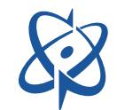

中核集团

CNNC

中核科技

SUFA 中核集团 CNNC

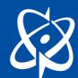

## 中核苏阀科技实业股份有限公司

## SUFA Technology Industry Co.,Ltd.

地址：江苏省苏州市珠江路 501号

电话：0512-66672245

邮箱：dongm@chinasufa.com

网址：www.chinasufa.com