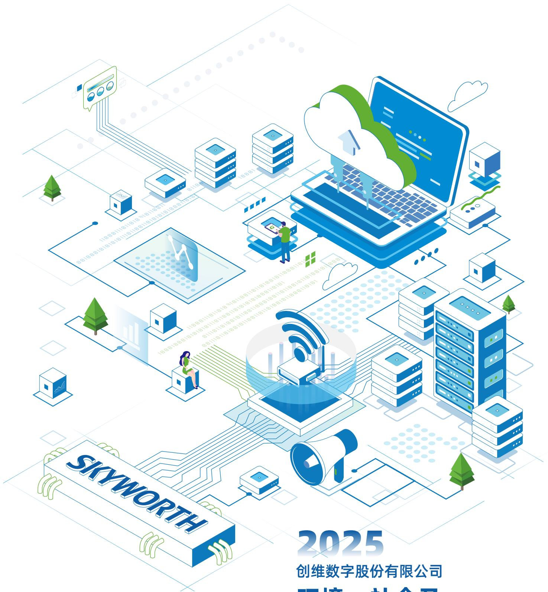

flowchart

This image is a corporate organizational chart for the 2025 'Skyworth' (创维数字股份有限公司), illustrating its ecosystem and business structure.

## 2025

创维数字股份有限公司

环境、社会及

治理（ESG）报告

## 目录

## CONTENTS

关于本报告	 2

董事长致辞 4

走进创维数字 6

ESG 管理 12

## 01

## 固本强基 数治领航

强化公司治理 18

筑牢风险防线 21

依法合规经营 22

恪守商业道德 23

## 02

## 智连万家 焕新生活

创新驱动发展 28

锤炼匠心品质 33

提升服务质量 38

保障信息安全 39

## 03绿

## 色前行 智造未来

应对气候变化 42

环境合规管理 47

打造绿色产品 50

践行绿色运营 54

促进循环经济 58

关键绩效表 81

响应联合国可持续 85

发展目标（SDGs）行动

深交所指标索引 87

意见反馈表 88

## 04

## 同心聚力 向善而行

构建幸福职场 62

负责任供应链 70

赋能行业生态 74

爱心回馈社会 77

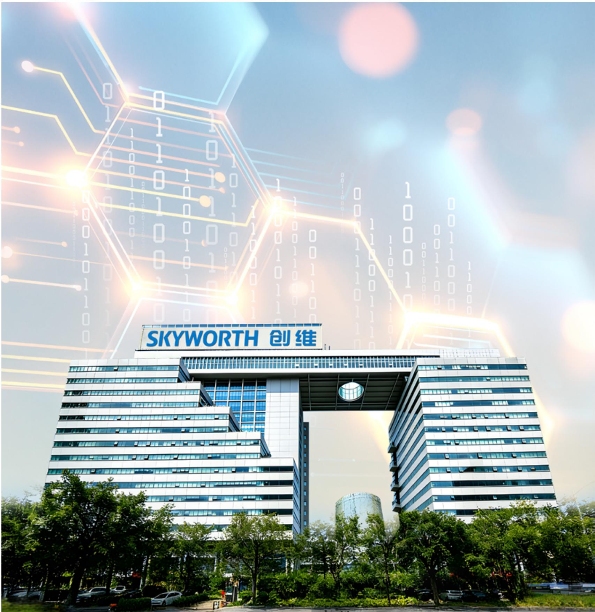

text_image

SKYWORTH 创维

## 关于本报告

本报告是创维数字股份有限公司（以下称“创维数字”“本公司”“公司”或“我们”）发布的首份环境、社会和公司治理（ESG）报告，旨在将ESG与可持续发展理念融入公司治理和业务全流程，并向我们的利益相关方全面呈现本公司在ESG方面的实践信息和相关绩效。

## 报告时间范围

此报告为年度报告，时间范围为 2025 年 1 月 1日至 2025 年 12 月 31 日，为增强报告的可比性和完整性，部分信息内容根据需要作适当延伸。

## 报告组织范围

本报告以创维数字为主体，涵盖所属分公司、控股子公司。

## 报告数据说明

报告中所有使用数据均来自公司正式文件和统计数据。

## 可靠性保证

公司保证本报告内容不存在任何虚假记载、误导性陈述或重大遗漏，并对其内容的真实性、准确性和完整性承担个别及连带责任。

## 编制参考依据

《深圳证券交易所上市公司信息披露工作考核办法》  
《深圳证券交易所上市公司自律监管指引第1号——可持续发展报告（试行）》  
《深圳证券交易所上市公司自律监管指南第 3号——可持续发展报告编制》  
《联合国可持续发展目标（SDGs）》  
全球可持续发展标准委员会（GSSB）《可持续发展报告标准（GRI Standards）》

## 报告获取方式

您可以在公司官网、深圳证券交易所、巨潮资讯网下载本报告电子版进行阅读，如需了解详情，请发电子邮件至 skydigital@skyworth.com 或致电（0755）26010018。

## 董事长致辞

在全球数字化浪潮、智能化应用与可持续发展议题深度交织的时代背景下，创维数字股份有限公司始终坚持以技术创新驱动发展，将可持续发展理念深度融入企业战略与经营实践之中。我们立足于光通信与数字化领域 聚售超高清 虚拟现实人工智能应用及汽车车载显示等前沿方向持续推动产业升级与价值创造，在实现高质量发展的同时，积极回应全球环境与社会挑战。2025 年，面对复杂外部环境，我们保持稳健经营，全年营业收入 88.09 亿元，同比增长 1.33%；因新产品研发投入，成本端承压等，净利润实现 1.79 亿元，公司整体经营质量持续改善。

## 强化创新驱动，提升发展质效

我们持续夯实主业根基，推动智能终端业务在海外与国内市场协同发展，智能终端业务在海外市场以多款智能生态应用的创新产品赢得认可，欧洲零售业务大幅增长，营收实现 5 亿元，北美、泰国等体感智能盒子营收实现 6.6 亿元；国内运营商市场地位稳固，其中：云电脑、智慧中屏等智能新业务快速发展，营收实现 3.15 亿元。

我们持续培育第二增长曲线，多元业务协同发展能力不断增强。2025 年，汽车车载显示业务营收同比增长 16%，新增数十个项目定点；XR 业务积极拓展全球市场，营收同比增长 90%，与国际 XR 教育解决方案商深化合作，并加快智能眼镜等新形态产品布局；显示与智控业务持续深化与全球头部客户的合作，实现营收同比增长 7.9%。同时，新兴布局扎实起步，储能业务营收同比增长 191%，国内及欧洲市场渠道体系持续完善。

## 夯实治理根基，筑牢合规体系

我们持续完善治理体系与内部控制机制，建立覆盖管理层、执行层与监督层的多层级 ESG 治理架构，将ESG 因素全面融入公司战略实施、工作规划、项目推进及经营管理等各个环节，推动 ESG 理念在运营中系统化落地，2025年，公司董事会荣获中国上市公司协会“2025年度上市公司董事会最佳实践案例'及每日财经新闻“2025 年上市公司最佳董事会奖”，公司荣获中国上市公司协会“2025 年上市公司内部控制最佳实践案例”等多项权威认可奖项，体现了我们在治理透明度与规范运作方面的持续提升。同时，我们强化可持续供应链管理，与全球合作伙伴共建稳健、透明、负责任的价值链体系。

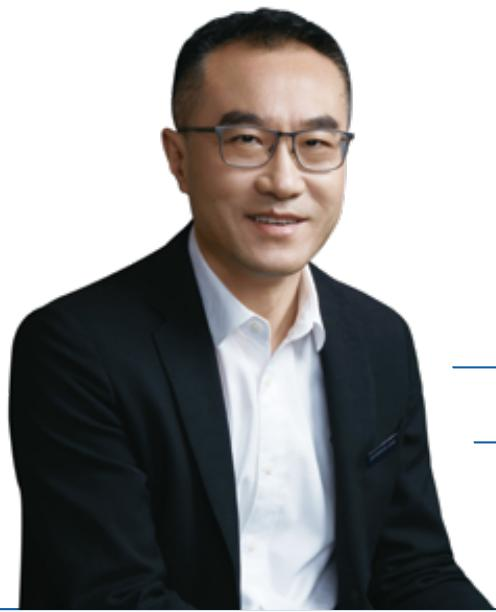

natural_image

Portrait of a man wearing glasses and a dark suit (no text or symbols visible)

## 深化绿色制造，推动低碳发展

我们将绿色发展理念深度融入产品全生命周期，持续提升绿色设计、绿色制造与绿色管理的水平。我们成功入选工业和信息化部“工业产品绿色设计示范企业（第四批）”，数字电视接收机产品的绿色设计能力获得国家级认可；公司获评“国家级绿色工厂”。我们在光伏发电、冷凝水回收、循环材料应用等方面取得切实成效，持续推动应对气候变化、环境合规管理、绿色产品打造、绿色运营与循环经济，以实际行动助力国家“双碳”目标实现。

## 践行以人为本，共筑责任生态

我们坚持以人为本，持续推进人才战略落地，构建三级后备人才池，构筑识别、培养及晋升全流程人才管理模式。同时，我们关注员工职业健康与安全，保障员工合法权益，赋能员工成长，着力打造多元化、包容性的幸福职场。我们积极履行企业社会责任，围绕乡村振兴、社区关怀、海外公益等领域开展系列行动，以实际行动回馈社会，传递温暖与担当。

我们始终坚信，科技创新是驱动企业发展的核心动力，绿色发展是实现长期价值的必由之路，组织能力是支撑持续进化的根本保障。面向未来，我们将持续夯实核心能力，牢牢把握智能化浪潮与产业升级变革的新机遇，优化业务结构，深化责任治理，携手全球合作伙伴，共同推动产业升级与价值创造，在高质量发展的道路上行稳致远。

## 走进创维数字

## 公司概况

公司立足于光通信、数字化、超高清、虚拟现实、人工智能应用及汽车车载显示等领域的发展，致力于为全球用户提供智能终端、专业显示及运营服务。公司基于电信网、广电网、互联网，联合国内外运营商、内容商、渠道商等战略伙伴，围绕“平台 + 内容 + 终端 + 应用”打造数字、宽带、超高清、互联、智能生态链。凭借深厚的技术积累与持续的自主创新，公司先后荣获“国家制造业单项冠军企业”“国家知识产权示范企业”“国家工业产品绿色设计示范企业”“国家级绿色工厂”等多项荣誉，主导或参与制定了多项国际、国家和行业标准，在国内外市场中保持行业领先地位。

## 主营业务和主要产品

公司的主营业务包括智能终端、专业显示和运营服务三大板块。主营业务归属于计算机、通信及其他电子设备研发制造行业。2025 年，随着 5G-A 规模商用与 6G 前瞻布局，云计算、大数据、人工智能大模型等新一代信息通信技术加速融合应用，驱动算力基础设施、边缘计算及“云网端”协同体系全面升级，推动新型智能终端加速迭代与场景化落地，为数字智能生活、产业转型及科技创新构筑坚实底座。

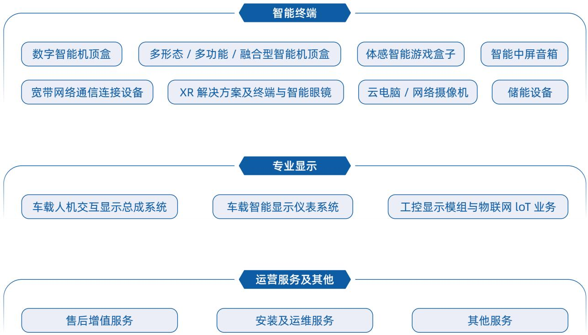

flowchart

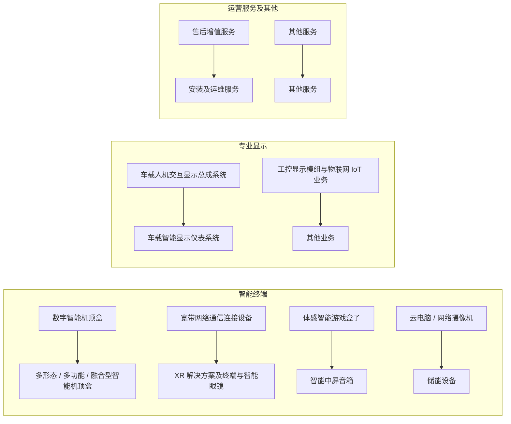
```mermaid
graph LR
  subgraph IntelligentEnd["智能终端"]
  A1["数字智能机顶盒"] --> B1["多形态 / 多功能 / 融合型智能机顶盒"]
  A2["宽带网络通信连接设备"] --> B2["XR 解决方案及终端与智能眼镜"]
  A3["体感智能游戏盒子"] --> B3["智能中屏音箱"]
  A4["云电脑 / 网络摄像机"] --> B4["储能设备"]
  end

  subgraph ProfessionalDisplay["专业显示"]
  C1["车载人机交互显示总成系统"] --> D1["车载智能显示仪表系统"]
  D2["工控显示模组与物联网 IoT 业务"] --> D3["其他业务"]
  end

  subgraph OperationServices["运营服务及其他"]
  E1["售后增值服务"] --> F1["安装及运维服务"]
  F2["其他服务"] --> G1["其他服务"]
  end
```

## 全球布局

公司拥有管理体系完善的智能终端产业基地，海外市场覆盖亚洲、欧洲、非洲、北美、南美洲等地区，服务全球电信及综合运营商，致力于构建全球化业务布局与竞争力。未来，公司将持续深化“硬件+内容”转型，围绕“家”“人”“车”场景，携手全球合作伙伴共同推动人工智能技术在智慧家庭、智能穿戴、智慧座舱、绿色能源等领域的创新落地，绘制智能、互联、可持续的未来新图景。

## 企业文化

## 愿景

为全球用户提供全面系统的数字智能解决方案与服务

## 使命

带给世界数字智能的美好生活方式

## 价值观

务实 进取 谦虚 开放

## 人才理念

五湖四海，人尽其才；进步靠学习，晋升靠业绩

## 经营理念

稳健经营，持续增长，品牌制胜，全球发展

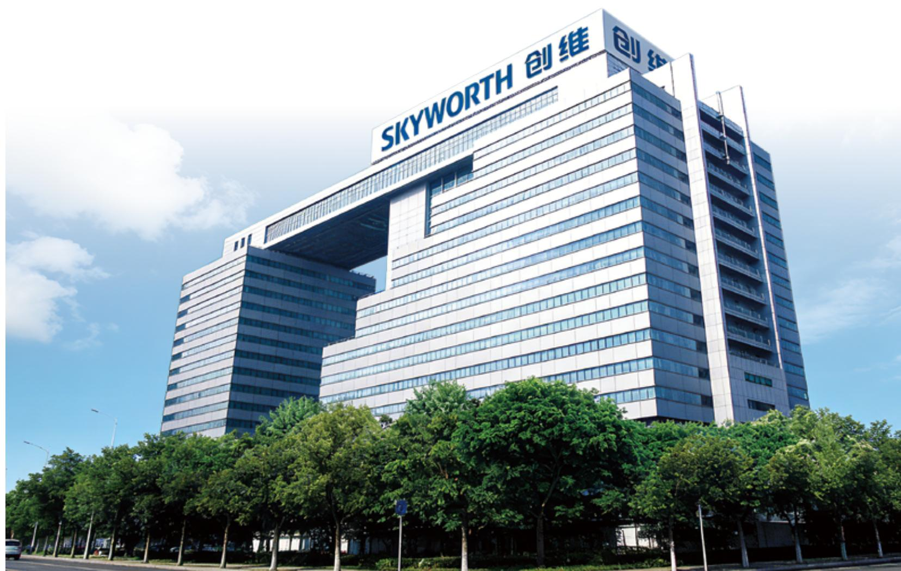

text_image

SKYWORTH 创维 创维

发展历程  
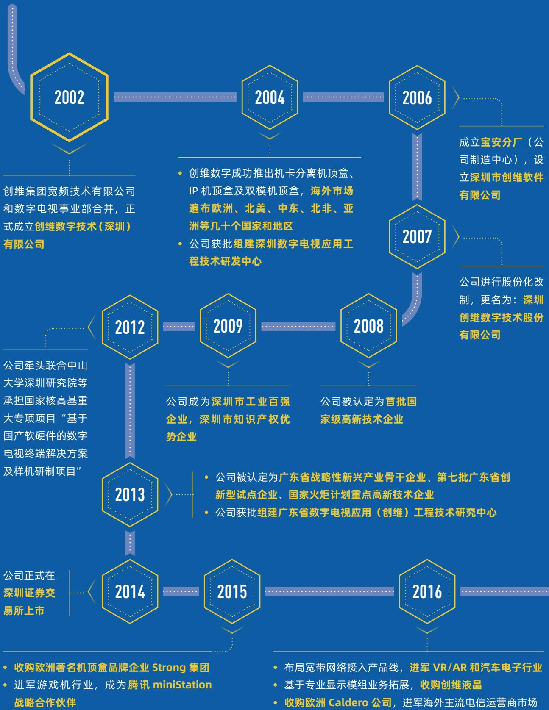

flowchart

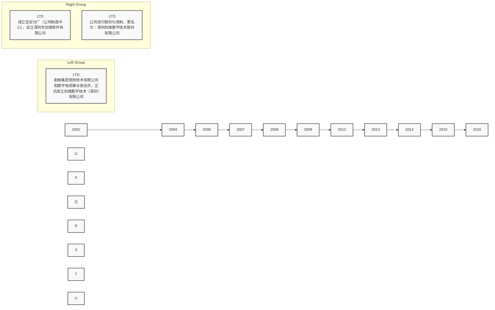
```mermaid
graph LR
  A["2002"] --> B["2004"]
  B --> C["2006"]
  C --> D["2007"]
  D --> E["2008"]
  E --> F["2009"]
  F --> G["2012"]
  G --> H["2013"]
  H --> I["2014"]
  I --> J["2015"]
  J --> K["2016"]
  
  subgraph Left Group
    L["LTD\n創维集团宽频技术有限公司\n和数字电视事业部合并，正式成立创维数字技术（深圳）有限公司"]
  end
  
  subgraph Right Group
    M["LTD\n成立宝安分厂（公司制造中心），设立深圳市创维软件有限公司"]
    N["LTD\n公司进行股份化改制，更名为：深圳创维数字技术股份有限公司"]
  end
  
  style A fill:#f9f9f9,stroke:#333,stroke-width:2px
  style B fill:#f9f9f9,stroke:#333,stroke-width:2px
  style C fill:#f9f9f9,stroke:#333,stroke-width:2px
  style D fill:#f9f9f9,stroke:#333,stroke-width:2px
  style E fill:#f9f9f9,stroke:#333,stroke-width:2px
  style F fill:#f9f9f9,stroke:#333,stroke-width:2px
  style G fill:#f9f9f9,stroke:#333,stroke-width:2px
  style H fill:#f9f9f9,stroke:#333,stroke-width:2px
  style I fill:#f9f9f9,stroke:#333,stroke-width:2px
  style J fill:#f9f9f9,stroke:#333,stroke-width:2px
  style K fill:#f9f9f9,stroke:#333,stroke-width:2px
  style L fill:#f9f9f9,stroke:#333,stroke-width:2px
  style M fill:#f9f9f9,stroke:#333,stroke-width:2px
  style N fill:#f9f9f9,stroke:#333,stroke-width:2px
  style O fill:#f9f9f9,stroke:#333,stroke-width:2px
  style P fill:#f9f9f9,stroke:#333,stroke-width:2px
  style Q fill:#f9f9f9,stroke:#333,stroke-width:2px
  style R fill:#f9f9f9,stroke:#333,stroke-width:2px
  style S fill:#f9f9f9,stroke:#333,stroke-width:2px
  style T fill:#f9f9f9,stroke:#333,stroke-width:2px
  style U fill:#f9f9f9,stroke:#333,stroke-width:2px
```

公司牵头联合北京大学、清华大学深圳国际研究生院等承担国家重点研发计划“面向移动终端的虚实协同技术与系统项目”  
深圳创维数字技术有限公司宝安分厂获得 EcoVadis Rating 金牌评级

公司被认定为国家级企业技术中心  
公司加入 SBTi 科学碳减排目标倡议行动  
公司成立绿色低碳管理委员会  
深圳创维数字技术有限公司宝安分厂获得 EcoVadis Rating 银牌评级

## 2022

深圳创维数字技术有限公司宝安分厂获得EcoVadis Rating 铜牌评级

## 2021

公司被认定为国家级制造业单项冠军示范企业  
公司被认定为国家级工业设计中心

年度营业额首次突破 100 亿元大关  
获得国际知名认证机构 SGS 的社会责任 SA8000 体系认证  
成立企业社会责任委员会  
与 Google、Netflix 签订全球战略合作协议，开启了海外引领行业安卓 TV 的全新时代  
成功发行 10.4 亿元可转换公司债券

## 2020

## 2019

## 2018

公司获批组建深圳市企业技术中心

创维数字正式成为 Google 和 Netflix 全球战略合作伙伴，成为 Google Turnkey 业务模式中国唯一机顶盒品牌商  
公司获批组建深圳数字电视接收系统节能技术工程研究中心

## 公司荣获的奖项与认可

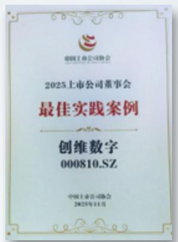

text_image

中国上市公司协会
2025上市公司董事会
最佳实践案例
创维数字
000810.SZ
中国上市公司协会
2025年11月

中国上市公司协会

2025 年度上市公司董事会

最佳实践案例

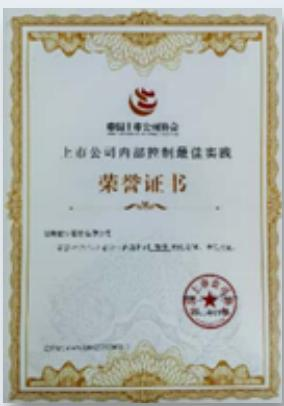

text_image

德勤证券股份有限公司
上市公司内部控制最佳实践
荣誉证书

中国上市公司协会

25 年上市公司内部控制

最佳实践案例

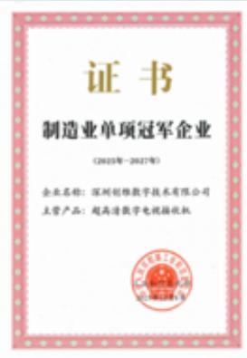

text_image

证书
制造业单项冠军企业
(2023年-2027年)
企业名称: 深圳创维数字技术有限公司
主营产品: 超高清数字电视接收机

工业和信息化部

国家级

制造业单项

冠军企业

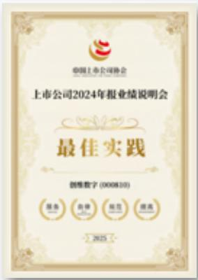

text_image

中国上市公司协会
上市公司2024年报业绩说明会
最佳实践
创维数字 (000810)
服务
自律
报告
提高
2025

中国上市公司协会

上市公司 2024 年报业绩说明会

最佳实践

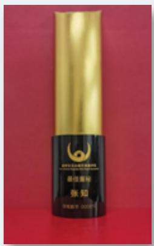

text_image

新加健商标
张知
华彩数字 100%

2025 年度

《新财富》杂志

最佳董秘

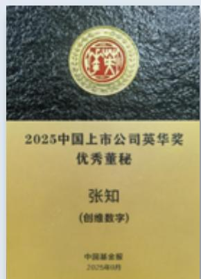

text_image

2025中国上市公司英华奖
优秀董秘
张知
(创维数字)
中国基金报
2025年8月

中国基金报

2025 中国上市公司英华奖

优秀董秘

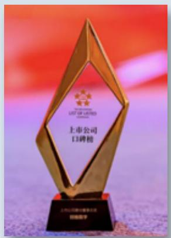

text_image

上市公司
口碑榜
上市公司第四届董事会第
届监事会

每日财经新闻上市公司

口碑榜

2025 年上市公司

最佳董事会奖

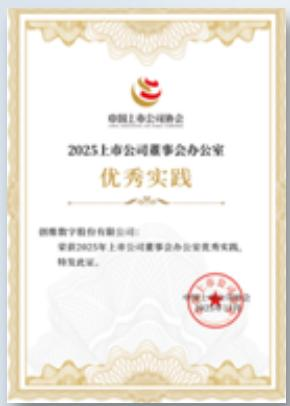

text_image

中国上市公司协会
2025上市公司董事会办公室
优秀实践
创维数字股份有限公司：
荣获2025年上市公司董事会办公室优秀实践。
特发此证。
中国上市公司协会
2025年12月

中国上市公司协会

2025 年上市公司董事会办公室

优秀实践奖

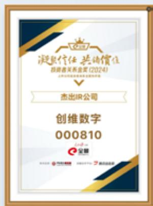

text_image

凝聚信任 共调惯性
招募者关系金奖（2024）
上海科技发展基金业协会
杰出IR公司
创维数字
000810

全景网杰出 IR 公司

投资者关系

金奖

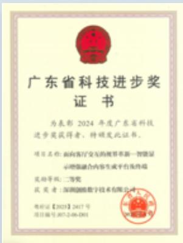

text_image

广东省科技进步奖
证书
为表彰2024年度广东省科技进步奖获得者，特颁发此证书。
项目名称：面向客厅交界的视界率新一智能显示增强融合内容生成平台终端
奖励等级：二等奖
获奖者：深圳鹏扬数字技术有限公司
特聘证【2023】2417号
项目编号：2023-06-081

广东省科技进步奖

二等奖

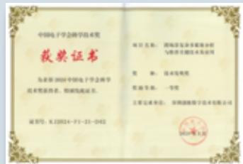

text_image

中国电子学会科学技术奖
获奖证书
为希望2024中国电子学会科学技术奖 recipients，特聘张超正书。
证书号：XJ2024-71-21-042
项目名称：湖南协安会事务所分所
与读者签署相关证书及使用
姓名：技术发展部
批准年审：一年度
主要成果来自：深圳鹏扬数字技术有限公司

025年度中国国集国形学学会科挂速非要杂要通发

  
中国图像图形学会 中国图像图形学会

科技进步奖

二等奖

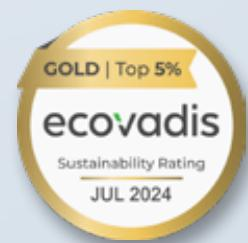

EcoVadis Rating

金牌评级

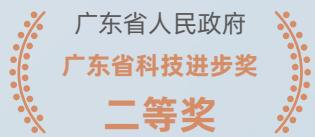  
中国电子学会

技术发明

一等奖

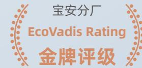

## ESG 管理

## ESG 管理体系

公司制定《环境、社会与治理（ESG）委员会工作细则》《董事会 ESG 工作议事规则》，ESG 因素全面融入公司战略实施、工作规划、项目推进及日常经营管理等各个环节，以务实、高效的工作作风推动公司可持续发展目标的实现。

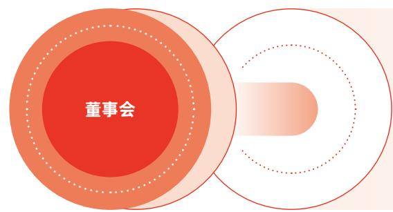

flowchart

```mermaid
graph LR
  A["董事会"] --> B["Inner Layer"]
  B --> C["Outer Layer"]
```

公司 ESG 工作的最高决策机构，负责审议并批准 ESG 委员会提交的 ESG 报告、ESG 相关工作及重大事项，对公司的 ESG战略、规划及整体表现承担最终责任。

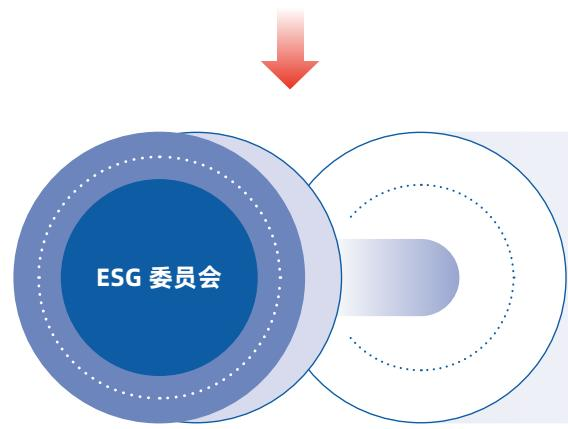

董事会下设的专门委员会，对董事会负责。主要职责包括：研究 ESG 发展战略，确定 ESG 工作方向并提出发展建议；监督公司各业务板块 ESG 体系的运行，评估业务对环境与社会的影响；定期向董事会汇报 ESG 工作进展并提出改进建议；审议公司 ESG 相关报告并提交董事会批准。

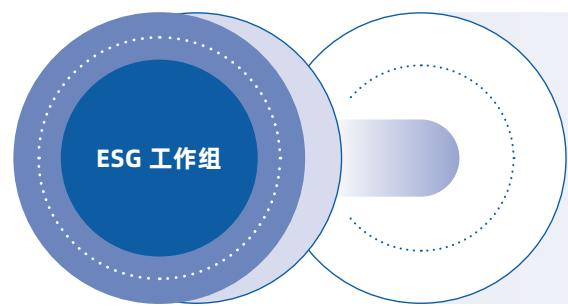

flowchart

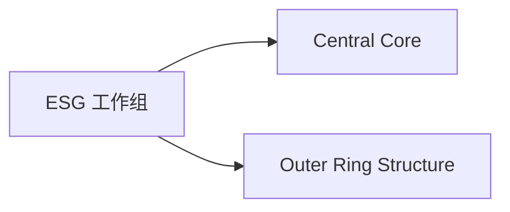
```mermaid
graph LR
  A["ESG 工作组"] --> B["Central Core"]
  A --> C["Outer Ring Structure"]
```

ESG 委员会下设的执行机构，负责 ESG 委员会日常事务及执行委员会决议，包括但不限于做好委员会决策的前期准备工作、日常工作联络、会议组织和执行 ESG 委员会的决议、推进公司ESG 日常工作的开展等职责事项，确保 ESG 委员会的各项决策与要求得到有效落实。

## 利益相关方沟通

公司充分尊重和维护利益相关方的合法权益，积极与利益相关方进行沟通和交流，努力实现公司、股东与投资者、客户与消费者、员工、供应商与合作伙伴、社区与公众、媒体与分析师等各利益相关方的协调与平衡，遵循合规、公平透明、权责对等、长期共赢、常态沟通的原则与机制，共同推动公司稳步、持续、健康地发展。

<table><tr><td>利益相关方</td><td>关注与期望</td><td>沟通渠道与实践</td></tr><tr><td>政府及监管机构</td><td>·国家战略响应·合规运营·风险管理·商业道德</td><td>·响应国家政策·合规检查·定期会议交流·提高治理水平</td></tr><tr><td>股东与投资者</td><td>·稳定投资回报·透明信息公开·保障股东权益·加强沟通</td><td>·及时披露信息·定期反馈经营信息·完善日常管理·沟通活动、投资者热线</td></tr><tr><td>客户与消费者</td><td>·产品质量安全·客户服务·科技创新·负责任的商业与营销·隐私保护</td><td>·客户投诉与处理渠道·客户交流合作·技术研讨会·客户满意度调查·客户信息保密</td></tr><tr><td>员工</td><td>·员工权益保障·职业健康与安全·员工发展与培训·员工满意度·企业文化建设</td><td>·职工代表大会、工会、员工座谈会、民主沟通·健康工作环境·员工发展与培训体系·“数字茶水间”沟通反馈机制·员工参与共建、共享</td></tr><tr><td>供应商与合作伙伴</td><td>·可持续供应链·供应商赋能·负责任采购·助力行业发展</td><td>·供应商管理及审核·供应商培训与赋能·公开采购信息·标准制定、行业会议、展会</td></tr><tr><td>社区与公众</td><td>·绿色生产·生物多样性与生态保护·社会公益慈善</td><td>·绿色工厂·环境保护活动·慈善捐助、公益志愿活动</td></tr><tr><td>媒体与分析师</td><td>·信息披露与传播·负责任的商业与营销</td><td>·及时公开信息·公众号平台</td></tr></table>

## 重要性议题分析

重要性议题是公司开展可持续发展管理和 ESG 风险识别与评估的发力点。为充分理解利益相关方的关注重点，更好地在自身可持续发展管理实践中融入利益相关方的诉求与期望，公司开展重要性议题识别与分析工作，在深入分析公司活动和业务关系背景的基础上，识别 ESG 议题库，通过问卷调研的形式广泛征求各利益相关方意见，对议题进行重要性排序。公司在评估中优先考虑有可能严重影响公司业务、损害公司声誉或利益相关方最为关注的风险。这种优先排序使公司能够有效地分配资源，并针对大多数重大风险制定缓解策略，以便更好地管理 ESG 相关事宜。

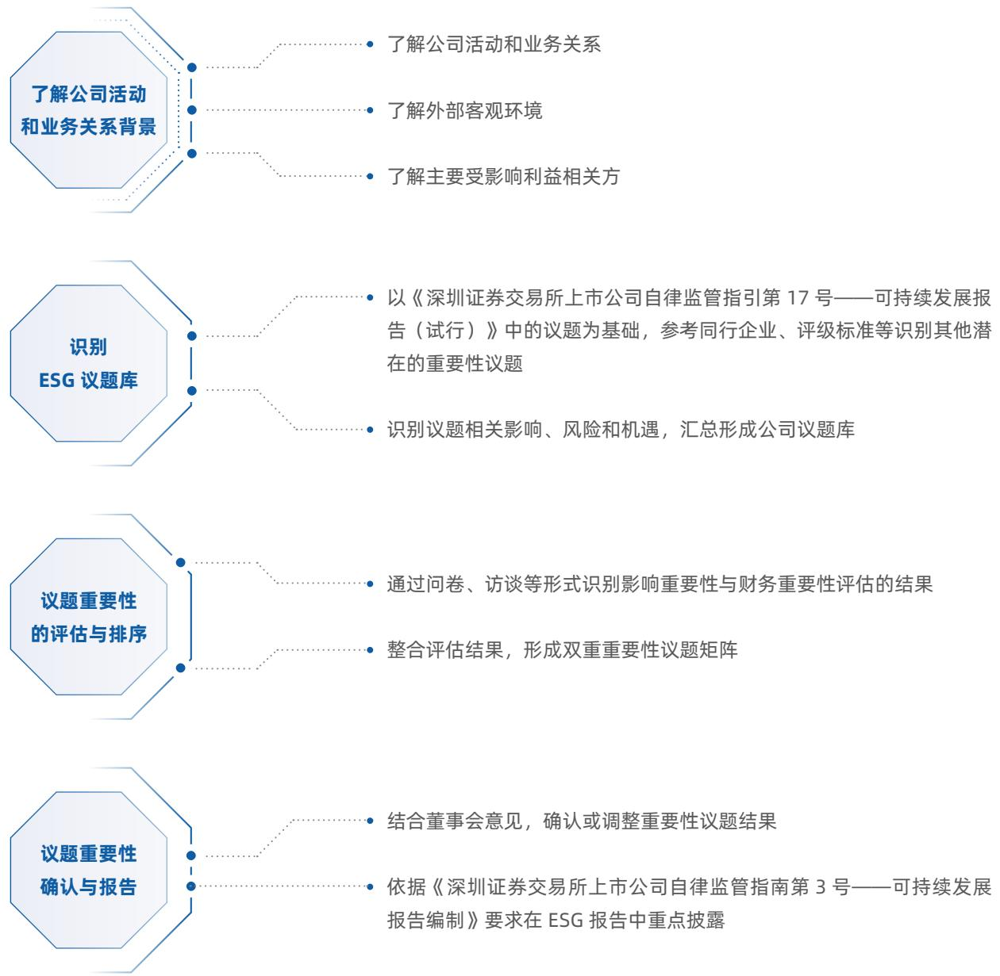

## 议题识别结果

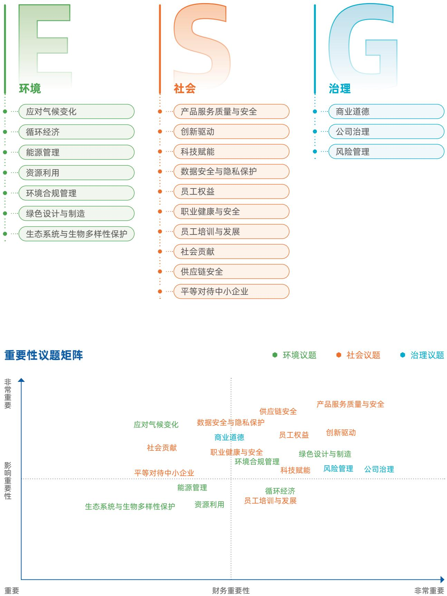

## 01

## 固本强基数治领航

创维数字坚持以卓越的公司治理为根基，系统构建风险防范与内控体系，严守合规经营底线，恪守商业道德准则。我们相信，治理、风控、合规与道德的深度融合，是企业行稳致远的前提。以规范的管理和负责任的态度我们护航自身发展，也守护每一位伙伴的信任。

natural_image

Abstract digital globe with interconnected network and user icons, no text or symbols present

贡献联合国可持续发展目标（SDGs）

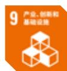

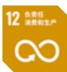

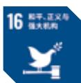

## 强化公司治理

公司严格遵守《中华人民共和国公司法》《中华人民共和国证券法》等相关法律法规，持续优化公司治理结构与治理机制，构建起权责清晰、协调运转的良性治理体系。公司组建专业多元的董事会，确保各项决策科学、规范，注重股东回报与透明沟通，以完善的治理架构为公司长久可持续发展提供坚实保障。

## 完善治理体系

公司建立了“股东会—董事会—审计委员会—高级管理层”的治理架构。董事会设置了战略、审计、提名、薪酬与考核、ESG 五个专门委员会，公司董事会、董事会各专门委员会严格按照公司章程、议事规则及各委员会工作细则履行职责，对相关工作提出意见与建议，实施科学决策，并对公司重大事项提供专业的指导与决策意见，各内部治理机构权责明确、协同履职，发挥合力，促进规范发展。本报告期内，公司董事会及股东会审议通过相关议案，系统修订了《公司章程》《股东会议规则》《董事会议事规则》《累积投票制实施细则》等制度规则，治理体系更加规范高效。

股东会作为公司最高权力机构，依法履行会议召集、会议召开及表决程序，职责主要涵盖公司的重大事项决策和对公司治理进行监督，并保障全体股东参会权利，为股东提供充分的咨询渠道，确保表决程序公开、公平、公正。董事依据相关法律法规开展工作，按时出席相关会议，积极参加培训，积极参与公司重大事务的决策，秉持诚实守信原则，履行忠实勤勉尽责义务。公司总经理及其他高级管理人员职责明确，严格遵守法律法规及《公司章程》《总经理工作细则》等制度及董事会授权履行职责，忠实、勤勉地履行职责，贯彻执行董事会决议。

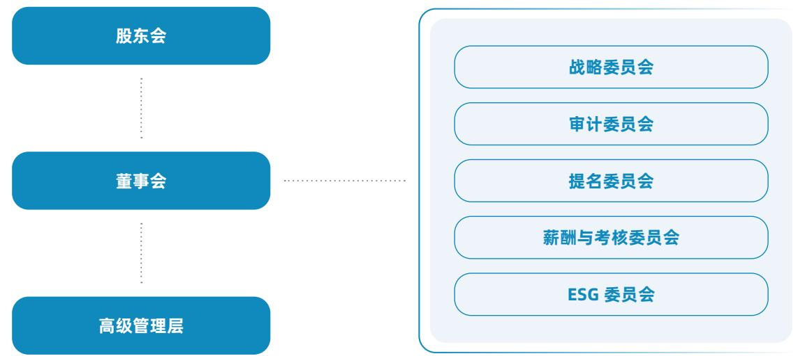

flowchart

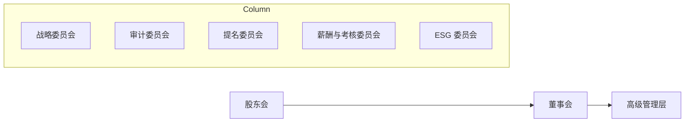
```mermaid
graph LR
  A["股东会"] --> B["董事会"]
  B --> C["高级管理层"]
  subgraph Column
    D["战略委员会"]
    E["审计委员会"]
    F["提名委员会"]
    G["薪酬与考核委员会"]
    H["ESG 委员会"]
  end
```

## 董事会独立性与多元化

公司高度重视董事会层面的独立性，于 2025 年 10 月修订《独立董事工作制度》。公司严格实施“五独立”原则，具备独立的业务体系和自主经营能力，董事会及内部机构独立运作，确保了公司治理的规范性和独立性。

在强调董事会独立性的同时，公司同样重视董事会的多元化。公司相信拥有多元化背景的董事有助于董事会更好地监督公司的管理及运营，将从不同视角评估公司业务模式的风险及机遇，促进公司形成平等、包容和开放的文化。

董事成员及其专业背景

<table><tr><td>姓名</td><td>年龄</td><td>性别</td><td>学历</td><td>职位</td><td>专业领域</td></tr><tr><td>施驰</td><td>54</td><td>男</td><td>博士</td><td>董事长</td><td>通信与信息系统</td></tr><tr><td>林劲</td><td>41</td><td>男</td><td>本科</td><td>非独立董事</td><td>电子工程</td></tr><tr><td>赫旋</td><td>49</td><td>男</td><td>硕士</td><td>非独立董事、总经理</td><td>工商管理</td></tr><tr><td>张知</td><td>57</td><td>男</td><td>博士</td><td>非独立董事、副总经理、董事会秘书</td><td>会计学</td></tr><tr><td>应一鸣</td><td>50</td><td>男</td><td>本科</td><td>非独立董事</td><td>计算机会计</td></tr><tr><td>姚享孛</td><td>38</td><td>男</td><td>本科</td><td>职工董事</td><td>微电子学</td></tr><tr><td>白华</td><td>56</td><td>男</td><td>博士</td><td>独立董事</td><td>审计及内部控制研究</td></tr><tr><td>刘宏</td><td>58</td><td>男</td><td>博士</td><td>独立董事</td><td>人工智能及具身智能</td></tr><tr><td>彭宁</td><td>49</td><td>男</td><td>硕士</td><td>独立董事</td><td>法学</td></tr></table>

## 报告期内

公司董事会由

9 名董事组成

独立董事 职工代表董事

3 名 1名

召开董事会会议

8次

股东会

2次

## 保护股东权益

公司持续加强规范运作，确保公司治理的合规运作。在股东会的召集、召开和议事程序等方面规范管理，确保股东对公司重大事项的知情权、参与权、提案权、表决权，公平对待中小股东。

始终将股东利益置于重要位置，坚持稳健的利润分配政策，在推动自身持续发展的同时，以稳健的业绩增长与稳定的现金分红，为投资者创造长期、可持续的价值回报。公司注重平衡股东合理回报与长远发展需求，致力于与股东共享经营成果，携手共赢未来。

## 公开透明沟通

公司高度重视投资者关系管理工作，始终将透明、规范的信息披露视为与投资者、监管机构及利益相关方建立信任的基石，致力于构建公平、高效、开放的沟通机制。

## 严格规范，确保信息透明

严格遵循《中华人民共和国公司法》《中华人民共和国证券法》《信息披露管理制度》《投资者关系管理制度》《信息内部报告制度》以及证监会、深圳证券交易所的相关规定，坚持及时、公平的信息披露原则，确保所披露信息真实、准确、完整，内容简明清晰、通俗易懂，杜绝任何虚假记载、误导性陈述或重大遗漏，以高度的责任感守护投资者的知情权。

## 多元渠道，深化投资者沟通

以积极、主动、开放的态度与投资者保持良好互动，以董事会秘书处为窗口，加强投关团队及能力建设，秉持传递信息的真实、准确、完整，基于洞察、共鸣、互动的原则，通过接待现场调研、投资者热线电话、电子邮件往来、业绩说明会，互动易平台，官网投关专栏，路演等多种渠道和方式， 积极与投资者互动交流沟通，增进投资者对公司的了解，增强投资者对公司的信心。公司严格按照相关规定，确保公司披露信息的公平公正。报告期内，董事会修订了《接待和推广工作制度》，遵循《内幕信息知情人登记管理制度》《外部信息报送和使用管理制度》等，从未在投资者管理活动中违规泄露未公开重大信息。

## 真诚互动，回应投资者关切

高度重视与中小投资者的沟通交流，通过深圳证券交易所互动易平台及时、客观、准确地回复投资者问询，对每一个问题均认真对待，安排专人回复投资者问题，确保沟通及时有效，同时，设立投资者热线电话，耐心解答来电投资者的咨询与建议。业绩披露后，公司及时发布新闻通稿并更新官网投资者关系内容，确保广大投资者能够第一时间了解公司经营动态，持续搭建与资本市场和社会公众之间公平、有效的沟通桥梁。

## 筑牢风险防线

公司持续完善风险管理与内部控制体系，制定了《内部审计制度》《风险评估控制程序》等制度文件。报告期内，公司修订《风险管理制度》《对外担保管理制度》《关联交易管理办法》《募集资金使用管理办法》，构建起全面覆盖各职能部门与业务各环节的内部控制体系，为公司稳健运营与高质量发展提供坚实保障。

## 系统化风控体系

建立全面涵盖各职能部门与业务环节的内部控制体系，明确各层级的合规职责与运行机制，确保风险管控贯穿企业经营全过程。通过制度建设的持续完善，为风险识别、评估与应对提供坚实保障。

## 风险全流程管控

公司建立覆盖风险识别、评估、应对与改善的全流程闭环管理机制。通过系统性的风险识别与评估，确定关键风险并制定针对性应对策略；建立风险监测与反馈机制，及时跟踪风险变化并采取必要的改善措施，确保风险始终处于可控状态。

## 定期开展内部审计

定期开展内部审计，对内部控制与风险管理的有效性、合规性进行全面检查与评估。审计范围覆盖旗下所有业务单位，对高风险领域或异常业务开展专项审计。公司以风险为导向制定《年度内部审计计划》，明确审计范围、时间与方式，报总经理及审计委员会批准后实施。审计过程中，公司高度重视整改环节，制定可执行、可验证的整改方案，形成从问题发现到改进落实的风险管理闭环，确保风控体系持续优化、长效运行。

## 创维数字荣获“2025 年中国上市公司内部控制最佳实践案例”

## 案例

2025 年 9 月，创维数字在中国上市公司协会主办的评选中，以高分荣获“上市公司内部控制最佳实践案例”称号，治理与风控能力获得权威认可。公司董事会秘书、常务副总裁张知在交流中分享了内控体系建设的深化实践：通过组织创新、流程重构、技术应用与能力优化，系统实施应收账款内控，显著提升运营效率与经济价值。同时，公司将内控制度升华为风险控制文化，通过制度、培训、考核与奖惩的持续落地，使风险意识成为全员自觉行动，为企业稳健经营构筑坚实“软实力”。

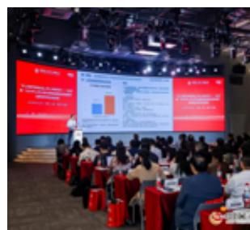

text_image

Conference hall with large presentation screen displaying charts and audience seated at tables

## 依法合规经营

公司建立覆盖各层级的合规组织架构与运行机制，确保合规体系贯穿研发、供应链、制造、销售、财务等全部业务领域，以依法合规治理推动企业稳健、高质量发展。

## 注重培育合规文化

高度重视合规诚信文化建设，将其视为可持续发展的核心基石。领导以身作则，积极参与合规文化推广，发挥榜样作用，推动合规理念自上而下贯穿整个组织。通过宣传教育、合规知识竞赛、案例分享等多种形式，持续强化员工合规意识，营造“人人讲合规、事事守规矩”的浓厚氛围。

## 强化全员合规能力

建立了覆盖体系、业务职能、专业技能及法律法规等多维度的培训体系。针对新员工，入职时开展强制性合规培训；针对管理层及核心骨干，公司组织专项培训并确保其考核合格，随后由他们在各自团队内部进行转训与落地，最终实现培训内容全员覆盖；定期为全体员工提供合规专项培训，确保员工及时掌握最新合规要求并落实到日常工作中，强化全员合规意识培养。

## 推动合规落地见效

将合规表现纳入绩效考核体系，对合规表现优异的员工予以奖励，对违规行为严肃处理，形成正向激励和约束并重的管理机制。通过将合规要求与绩效挂钩，切实推动合规文化从理念转化为行动，从制度落地为实效。

## 报告期内

开展专项法律法规

相关培训次数

9次

创维数字通过

AEO

（Authorized Economic Operator）

海关高级认证

是国际贸易合规的重要资质。

## 恪守商业道德

公司始终坚守“诚实守信、合法合规”的经营信条，将商业道德建设作为企业发展的核心基石。通过持续完善 ISO37001 反贿赂管理体系及 ISO 37301 合规管理体系，不断优化体系方针与目标，遵守联合国全球契约十项原则，致力于提升组织透明度，反对不正当竞争，实现员工与企业的诚信合法合规经营，坚决抵制贿赂与腐败行为，营造风清气正的商业环境。

## 筑牢廉洁防线

为强化廉洁管理，公司制定了《内部审计制度》《反舞弊管理办法》等多项规章制度，明确公司与员工在反贿赂、反腐败方面的义务与责任。同时，公司建立了完善的举报渠道和保护机制，对举报有功人员给予奖励，规范反舞弊调查流程，完善内控监督体系，有效防范舞弊风险，确保内部控制措施的有效性和目标的实现。

创新设立“廉洁账户”，鼓励员工主动上交因工作原因收受的现金、礼金等款项，由审计部核实并登记备案。同时，建立员工礼品登记与上交流程，引入合规审查环节，进一步提升廉洁管理水平。凭借在廉洁合规领域的卓越表现，公司荣获反贿赂管理体系认证证书，为可持续发展提供了有力保障。

持续加大对舞弊行为的打击力度，一旦发现舞弊行为，严格进行责任追究，情节严重者移送司法机关处理，以此表明对贪污腐败行为的零容忍态度，发挥警示教育作用。对于违反规定的员工，依法依规严肃处理；对于涉及贿赂行为的供应商，依据制度严肃处置并取消合作资格，根据情节严重程度追究法律责任。

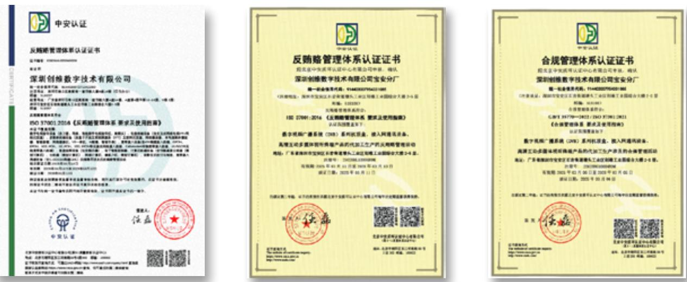

## 促进阳光合作

在商业合作中，公司秉持公平公正原则，严格遵守相关法律法规，与供应商、客户平等签署合同，并在合同中嵌入“反商业贿赂条款”。公司与供应商签订《廉洁协议书》《可持续采购章程》等文件，明确双方廉洁合作的责任与义务。公司实施廉洁、诚信的供应商管理机制，重视阳光工作关系、道德与反腐败等社会责任，携手供应商打造廉洁、公平、可持续的责任供应链。

## 共创清廉文化

为营造廉洁透明的商业环境，公司高度重视员工廉洁意识的培养，通过现场培训、线上视频课程、案例宣导及新员工入职培训等多元化方式，全面开展反舞弊、反腐败培训，全面覆盖所有员工，帮助员工深入了解廉洁合规政策要求、管控措施与规范流程，推动公司廉洁风气的持续提升。

与此同时，公司建立了完善的举报与反馈机制，确保公司内外部人员可以通过邮件、电话等多种渠道进行举报。印发《关于对舞弊行为举报有功人员实施奖励的通知》，公司对举报人信息严格保密，并采取有力的保护措施，坚决杜绝任何形式的打击报复行为，为举报人提供安全、可靠的举报环境。

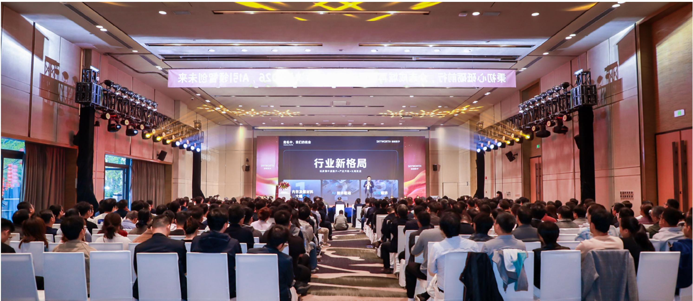

text_image

来未验警@15IA, as
新格局会，针对新核心群体
行业新格局
以丰富产业链+产业环境+实践效应

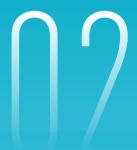

## 智连万家焕新生活

创维数字坚持以创新驱动发展，夯实质量根基，以稳定可靠的产品服务全球用户。持续提升客户服务能力，严格遵循国际信息安全标准，为数字生活提供坚实保障。我们致力于以可靠的产品与贴心的服务，为万千家庭、“第三生活空间”及个人穿戴设备用户，带来更有温度的智慧生活。

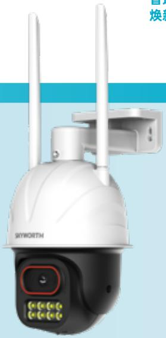

natural_image

Exterior view of a Skyworth security camera with dual antennas and control panel (no visible text or symbols)

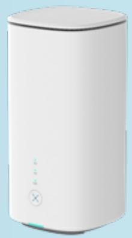

natural_image

White cylindrical water dispenser device with visible branding and control panel (no text or symbols on body)

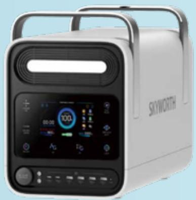

natural_image

Exterior view of a Skyworth medical device with digital display and control buttons (no readable text beyond branding)

natural_image

White Skyworth router with four external antennas against a light blue background (no text or symbols on the device itself)

natural_image

White Skyworth network switch device with indicator lights and Ethernet ports (no text or symbols on device body)

贡献联合国可持续发展目标（SDGs）

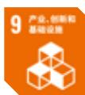

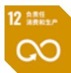

## 创新驱动发展

公司构建了系统完善的创新管理体系，统筹前沿技术预研与产品应用开发。深度融合超高清、光通信、人工智能、空间计算与物联网等技术，持续拓展智能终端与专业显示的业务边界。不断强化创新能力建设，依托全球研发布局与产学研合作平台，打造高素质科研人才队伍，为长期技术领先与可持续发展提供源源不断的创新动力。

## 创新管理体系

公司始终将科技研发和自主创新置于战略核心地位，秉持“市场导向、技术创新、持续改进、卓越品质”的经营方针，致力于推动技术与市场的深度融合。

## 创新治理

公司设立技术委员会，统筹核心技术积累与前沿技术探索，构建高效协同的研发管理体系，推进科技创新治理。

聚焦新领域、新技术的探索与研究，开展前瞻性技术调研、评估与验证，推动核心基础技术的持续积累与创新提升，为公司培育新的利润增长点。

积极推动与产业链上下游伙伴的联合创新，围绕行业痛点与市场需求开展深度合作，挖掘创新机会，推动技术突破与业务模式创新。

建立发挥各领域技术专家价值的平台与机制，推动技术人才的培养与评价，持续涵养一流的技术文化与工程师精神，为长期创新发展提供坚实的人才支撑。

## 创新战略

公司着力构建完善的研发创新体系，打造高素质科研人才队伍，加强知识产权保护与管理，促进研发创新成果转化同时，公司致力于将绿色与可持续理念融入产品设计与研发全过程，重点开发环境友好型产品，积极推动相关技术的研发与应用落地，以创新驱动可持续发展。

## 科技创新布局

创维数字坚持以技术创新服务社会，深度融合人工智能与智能终端相关技术，围绕家庭、出行、个人穿戴及物联网场景，致力于为用户打造更智慧、更便捷的数字生活体验。公司持续推动“硬件 + 内容”转型，通过构建覆盖多元场景的智能生态，让技术真正惠及每一个用户和满足未来的需求。

## 深耕核心业务，提升服务价值

公司聚焦智能终端及专业显示等核心业务，持续提升产品与服务能力。

## 在智能终端领域

通过端云协同与人工智能技术，打造家庭智能助手，实现更自然的交互与更贴心的陪伴；紧跟全球光网络与5G发展步伐，为家庭与企业提供更高速、更稳定的网络接入体验；推出智能眼镜与 MR 设备，融合空间感知与实时交互能力，满足消费与行业用户的多元需求。

## 在专业显示领域

拓展车载显示与智能座舱方案，为智能出行提供更丰富的视听体验。

## 拓展生态合作，共创多元价值

公司积极携手产业链伙伴，通过投资、合作与战略联盟，围绕人工智能应用、绿色低碳、智能出行等方向拓展生态布局。

聚焦人工智能大模型与内容应用，丰富云服务平台，为用户提供人工智能应用服务、云游戏、数字健康等创新体验。

深化车载显示与增强现实技术应用，助力构建“第三生活空间”智能座舱体验。

通过开放合作与生态共建，持续拓展业务边界，与合作伙伴共同推动数字生活的美好未来。

## 协同创新矩阵，覆盖前沿领域

坚持长期主义的研发投入，在深圳、武汉、北京、成都、荷兰五大研发机构形成协同创新矩阵，秉持全球本土化战略，构建起覆盖全球 100 多个国家和地区的制造、交付与服务体系。技术积累覆盖计算机视觉、画质增强、自然语言处理、端侧模型、边缘计算、空间感知交互、端云协同、节能技术、绿色设计等关键领域。

## 插入式微型机顶盒，以技术创新回应民生关切

## 案例

为响应国家广播电视总局关于电视“套娃”收费及操作复杂问题的专项治理工作，创维数字作为广电总局首批选定的 19 家推进企业之一，深度参与插入式微型机顶盒的研发、生产与规模化交付，以技术创新切实改善群众收视体验。

针对传统机顶盒接线繁杂、操作繁琐、多个遥控器并存等民生痛点，创维数字组建专项技术团队开展攻关，将传统机顶盒的 2 层电路板升级为 6 层高密度设计，实现产品体积缩小 80% 以上。该产品通过 HDM接口直连电视，依托 USB 接口供电实现隐藏式安装，配套单电源键通用遥控器，达成“一键开关机、一键看直播、一键观高清”，大幅简化操作流程，尤其适配老年群体使用需求。

面对交付挑战，公司发挥智能制造与产业链协同优势，对生产线实施智能化改造，实现 SMT 贴片 100%自动化作业，整体产能提升 50% 以上，圆满完成既定交付任务。此次专项治理工作的落地，有效破解了群众收视痛点，也推动了电视设备制造行业向标准化、集约化方向转型，获得国家广播电视总局的表扬。

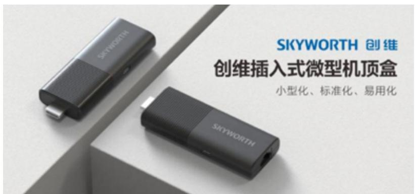

text_image

SKYWORTH 创维
创维插入式微型机顶盒
小型化、标准化、易用化

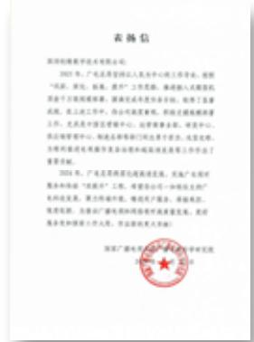

text_image

表彰信
深圳市鹏程数字技术有限公司：
2011年，广东省高级人民法院以东大会中心的工作人员为宗旨，按照“五级、五级、五级、五级”工作范围，编制嵌入式模板的“五个级框架框架，确保定式和定型的合规，制定了完善流程。在上述工作中，符合公司规章制度，积极实施战略部署等工作，尤其是中国监管机构、证券事务代表、研究中心、供应商管理中心和税务总局等部门提出关于企业、发改委、地方政府报送交通运输部及事业单位和政府报送等工作作出了重要贡献。
2014年，广东省各级深化基础设施建设，实施广东政府对服务和补助“两配”工作，希望母公司“双倍位”的“充电站”发展，努力开展充电站、充电站与基金、终端运营、使用新能、为客户提供跨省间网络和远程运维支持，更好具备党和国家工作人民的、市民政的更大基础。
国家广播电视总局《中央教育科学研究院》

## 斩获广东省科技进步奖，革新客厅视界引领产业升级

## 案例

2025年12月，公司联合清华大学深圳国际研究生院、深圳职业技术大学等单位共同完成《面向客厅交互的视界革新—智能显示增强融合内容生成平台及终端》项目，荣获2024年度广东省科技进步奖二等奖。该项目聚焦国产化算法与平台系统研发，取得三方面技术突破：一是自研人工智能画质增强与超分技术，以低算力和低功耗在智能机顶盒上实现全程8K超高清实时图像增强；二是先进的平台内容生成与推荐技术，利用条件生成对抗网络实现图像、视频等内容自动化生成，并结合用户数据进行精准推荐；三是眼动追踪、手势和语音多模态交互技术，通过眼球运动跟踪实现智能交互体验。相关技术已实现大规模商业化应用，推动国产智能终端技术进步与家庭智能娱乐体验升级。

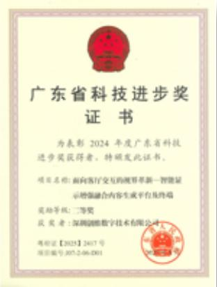

text_image

广东省科技进步奖
证书
为表彰 2024 年度广东省科技进步奖获得者，特颁发此证书。
项目名称：面向客厅交互的展览革新—智能显示增强融合内容生成平台及终端
奖励等级：二等奖
获奖者：深圳圆维数字技术有限公司
身份证【2023】2417号
项目编号：J05-2-06-001

## 创新能力建设

公司始终将人才视为技术创新的核心驱动力，通过构建多元化的职业发展通道、完善的激励机制以及开放的产学研合作体系，为研发人员营造了既能深耕技术、又能持续成长的创新环境。公司以人才为根基，以机制为保障，以合作为桥梁，持续夯实技术创新能力。

## 夯实 创新人才基础

为研发和技术人员搭建了规范且多元的职业发展通道，助力员工在专业领域持续深耕。凭借深厚的技术积累和丰富的人才储备，为技术创新提供了坚实的人才基础。

## 激发员工创新活力

设立专项专利奖励制度，从专利受理、授权、技术秘密保护到内部创新成果转化，构建了覆盖创新全过程的激励体系。通过基础奖与现金奖励相结合的方式，对产生经济效益的专利项目给予额外激励，充分调动员工参与技术创新的积极性，推动创新成果不断涌现。

## 深化产学研融合

高度关注科技前沿动态，与北京大学、清华大学、中国科学院自动化研究所、中国科学院深圳先进技术研究院、华南理工大学、深圳大学等国内顶尖高校及科研机构建立深度合作关系，有效加速科研成果从实验室向市场的转化应用，为技术创新持续注入源头活水。

## 创维数字首届技术开放日举行

## 案例

2025 年 12 月 11 日，创维数字举办首届“技术开放日”，活动以“技术走出来、被交流、能应用”为核心理念，为期两天。活动现场共设置15个展区，集中展示了 70 余个覆盖人工智能应用、IoT、车载、智显等前沿领域的项目，并首次开放“个人项目”展示通道，鼓励来自研发、测试、产品等岗位的员工将人工智能探索、工程创新与流程优化等个人技术实践带到现场。公司管理层全程参与，逐一参观展区

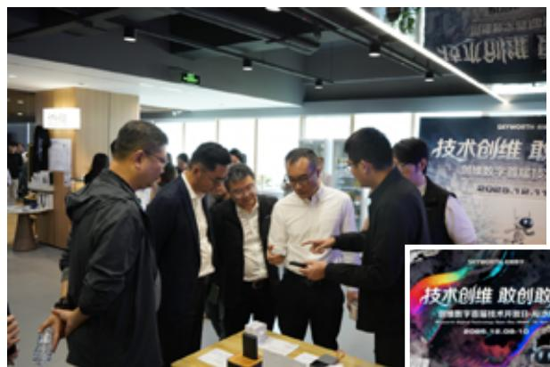

text_image

技术创维 敢创敢
数字赋能技术开篇1-6.5
2020.3.8 08:12

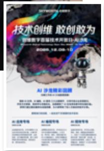

并与团队深入交流，强调技术创新与商业落地的结合。作为开放日的配套活动，此前举行的为期三天的智慧沙龙围绕人工智能的应用、编程与提效三大主题展开，为跨团队的技术交流与知识传递提供了平台。

## 知识产权保护

公司秉持全球化视野，建立了规范完善的知识产权管理体系，深度融入国际知识产权规则体系，以法律与国际惯例为基准，持续构建更加开放、合规、高效的知识产权治理生态，不断提升知识产权事务处理的专业化水平。

## 完善管理体系

公司引导专利从“数量积累”向“质量提升”转变，优化知识产权及标准制定激励机制，修订完善相关管理办法，显著提升知识产权与标准项目的管理水平和创新活力。通过科技成果转化激励、标准量化评估等机制，有效推动技术标准产出与跨部门协同。同时，公司高度重视新员工的知识产权意识培养，持续开展专项培训，夯实创新人才的知识产权基础。

## 赋能智慧管理

面对人工智能带来的机遇与挑战，公司积极探索智能应用技术在知识产权管理中的创新应用。利用人工智能大模型对海量专利数据进行深度分析，帮助研发人员拓展技术思路、提升创新探索效率；同时，通过智能技术简化和优化知识产权流程性工作，有效提升创新成果的保护效率与质量。

## 截至 2025 年 12 月 31 日

发明专利

授权数量

767 项

实用新型专利

授权数量

870 项

外观设计专利

授权数量

942 项

软件著作权

数量

658 项

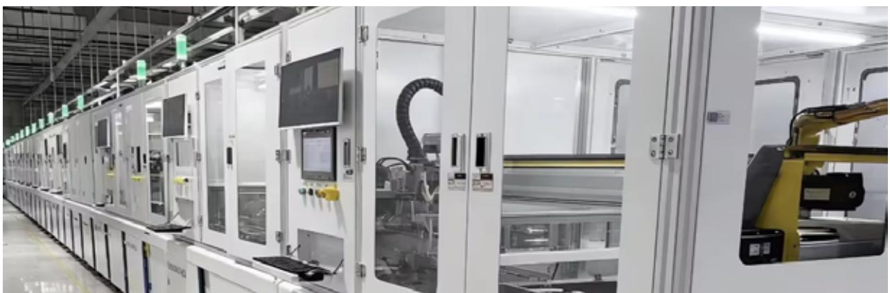

natural_image

Interior view of a modern automated factory floor with rows of white industrial machinery and robotic arms visible (no text or symbols)

## 锤炼匠心品质

公司始终将产品质量视作企业发展的生命线。全面推动质量管理贯穿全业务、全流程、全地域，覆盖需求识别、研发设计、生产制造、采购供应至售后服务的各环节，公司统筹工艺可靠性与成本管控，严守品质标准，保障每一件产品都能以过硬品质交付客户，以稳定可靠的产品质量持续守护用户的信赖，兑现客户期待。

## 卓越质量管理

公司恪守“以人为本、诚信经营，品质至上、服务第一，客户满意，持续改进”的质量方针，始终将质量作为赢得客户信赖与市场认可的核心基石。公司已通过 ISO 9001 质量管理体系认证、TL 9000 电讯业质量管理体系认证，制定发布《产品质量安全实施管理办法》，持续完善技术标准和质量管理体系，将“持续改善”的理念全面融入各业务环节，构建起覆盖产品全生命周期的质量管理闭环。

## 健全组织保障筑牢管理根基

公司设立首席质量官，并成立质量经营委员会，作为公司质量管理的最高决策与统筹机构。在质量经营委员会的指导下，组建质量经营执行团队，负责推动各项质量战略与决策的具体落地。在此基础上，进一步设立覆盖质量运营、产品线、供应链、研发、制造、子公司等关键环节的质量管理团队，形成分工明确、协同联动的质量组织体系，全面规范质量管控流程，夯实公司整体质量保障根基。

## 深化体系建设夯实长效改善机制

公司持续优化 ISO 9001 质量管理体系，动态完善质量方针与质量目标。搭建可收集、可分析、可应用的质量指标数据体系，把质量管控贯穿于产品全生命周期，全面提升各业务管控能力，实现公司与客户的双赢。

## 打造全链条质量管控体系支持企业长效发展

公司建立覆盖“市场—研发—采购—生产—售后”全价值链的端到端质量管理机制，以系统化管理能力筑牢品质根基。

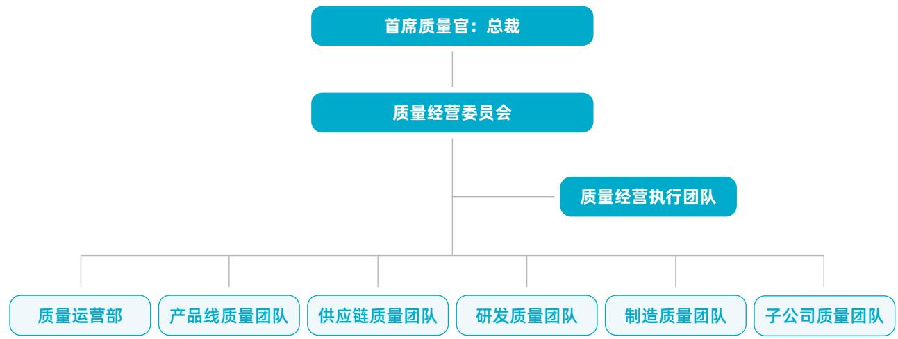

flowchart

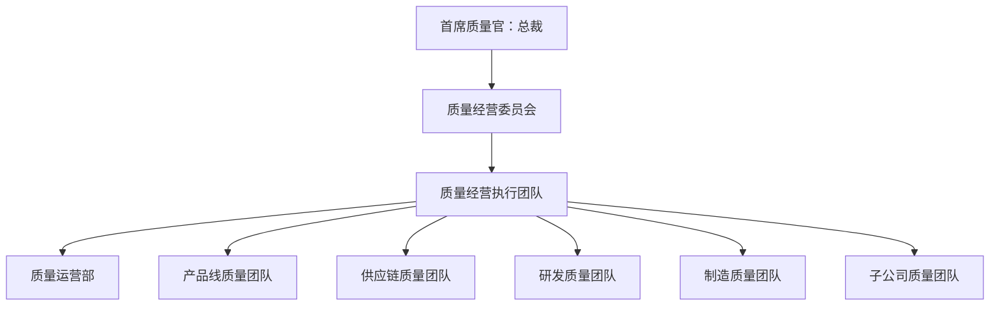
```mermaid
graph TD
  A["首席质量官：总裁"] --> B["质量经营委员会"]
  B --> C["质量经营执行团队"]
  C --> D["质量运营部"]
  C --> E["产品线质量团队"]
  C --> F["供应链质量团队"]
  C --> G["研发质量团队"]
  C --> H["制造质量团队"]
  C --> I["子公司质量团队"]
```

研发端全面落地 IPD 及 CMM管理体系，依托标准化阶段管控与多层级技术评审，实现质量管控前置化、源头化。同步统筹可制造性、可测试性、可服务性设计，从研发前期规避设计缺陷，筑牢产品原生品质基础。

在生产制造环节，全面推进精益生产模式，设置进料检验、首件检验、过程监控、过站检测、成品抽检等全链条的质量管控节点，并持续提升检验能力与制造工艺水平，以标准化、精细化制程管理，夯实产品品质基础。

以 ISO 9001 质量管理体系为核心，同步搭建环境、职业健康安全、信息安全、能源管理等多项管理体系，取得了 CMMI 5权威认证。通过内外部审核机制持续赋能，促进多体系的融合协同、动态迭代，以全域系统化管理，夯实品质根基，助力企业绿色长效发展。

## 前瞻预防质量源于设计

## 源头管控 质量始于 供应链

依托集成供应链管理体系，对供应商导入、物料认定与绩效管理实施全流程闭环控制。通过严格的质量策划与过程监控，确保从采购到物料交付的各环节稳定受控，构建稳健、可持续的供应链质量保障能力。

## 精益制造过程决定结果

## 服务闭环以客户为中心的全方位保障

在售后服务环节，将质量管控延伸至服务全过程。依托全球的服务布局与数字化管理平台，实现客户服务与数据管理的标准化、系统化运营。通过售后数据反向赋能研发与生产端，推动产品与服务的持续改进，闭环落地以客户为中心的质量管理体系。

## 多元融合构建一体化管理体系

## 品质立信全球

创维数字始终以产品质量为全球竞争的立身之本，依托覆盖市场、研发、供应链、制造到售后全价值链的质量管理体系，筑牢产品交付的稳定性与一致性根基。立足产业生态系统洞察，结合全球市场动态研判，公司持续强化研发、供应链、质量管控等环节的协同效能，前瞻布局智能化产能。凭借过硬的产品质量与持续的技术创新，公司核心业务获得全球客户的广泛认可，销量与市场占有率稳居行业头部，稳步推进从“产品出海”到“品质与品牌出海”的战略升级。

## Nex Playground 引领家庭智能娱乐新潮流

## 案例

创维数字与美国内容公司 NEX 合作推出的体感智能娱乐终端Nex Playground，自上市以来获得市场积极反响，在亚马逊、Target、百思买、沃尔玛等主流渠道的销售表现超出预期。该产品融合了创维数字在 4K 超高清显示与智能应用硬件领域的技术能力，以及 NEX 在智能软件算法与游戏内容开发方面的创新优势，通过内置摄像头与 NPU 边缘计算芯片，以人体动作追踪技术实现体感控制。面向儿童及家庭用户，提供适配不同年龄段的运动娱乐体验。双方计划继续深化合作，将产品拓展至全球更多市场。

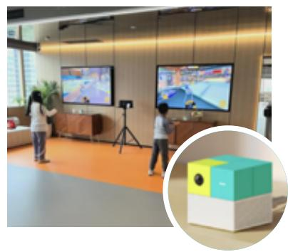

natural_image

Interior of a modern office with two people viewing large screens and a small 3D cube in the foreground (no visible text or symbols)

## 开启全球高速互联新纪元

## 案例

2025年9月，创维数字旗下欧洲子公司Strong集团发布了 5G MiFi AX1800 移动热点设备。该设备支持 5G与 Wi-Fi 6 双引擎驱动，在户外移动场景下传输速率最高可达 3.4Gbps，融合移动热点与 EasyMesh 扩展基站技术，实现了“户外移动热点 + 家庭基站”之间的无缝切换。用户可通过配套的移动应用程序方便地管理连接设备、监控数据流量以及设置家长控制功能。设备内置大容量电池，并采用企业级加密与防火墙保护，保障数据传输安全。Strong 集团在欧洲设有 9 家子公司，销售网络覆盖欧洲、中亚及北非市场，在法国、意大利、奥地利、北欧等零售市场处于领先地位，在德国、西班牙、葡萄牙、捷克等国机顶盒零售市场处于市场前三。

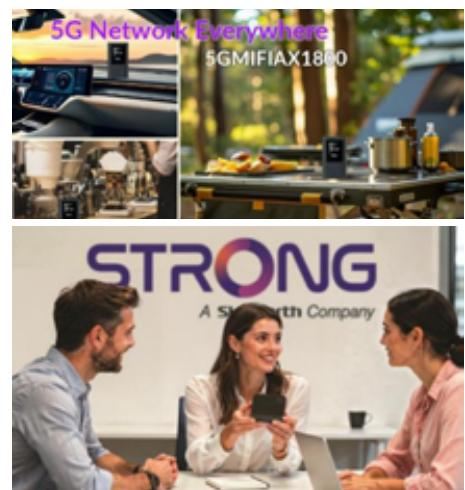

## “硬件 + 服务”人工智能机顶盒在泰国首发

## 案例

2025 年，创维数字人工智能机顶盒成功落地泰国市场，标志着公司在东南亚业务布局取得重要进展。该产品融合人工智能技术与当地运营商优质内容，拓展“硬件 + 服务”商业模式，为泰国用户带来智能便捷的家庭娱乐与健身体验。此次落地展现了公司在智慧家庭领域的技术能力与全球市场拓展的持续投入。未来，创维数字将继续致力于为更多国家和地区的用户提供创新的智慧家庭解决方案。

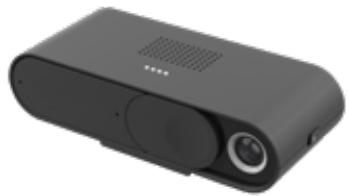

## 弘扬质量文化

公司始终高度重视质量文化建设，通过系统化的质量活动与常态化的激励机制，将质量意识融入企业发展血脉，营造出人人重视质量、全员参与改进的良好环境，推动质量文化落地生根、蔚然成风。

公司定期召开质量例会、专题质量改进活动及月度复盘，强化跨部门协同联动，持续提升团队凝聚力与协同作战能力。常态化开展总部与各工厂的“质量月”系列活动，组织自查自纠等自我改进活动，引导员工主动挖掘改善机会，构建全员共治、全员尽责的质量文化氛围。

公司依托多元化常态化的培训模式，结合质量文化宣贯与绩效考核机制，将质量方针的要求转化为全体员工的岗位责任、行为准则与自觉行动。通过分层分类的培育体系，推动质量理念入脑入心、落地践行。

## 强化意识落地

## 营造 质量氛围

## 树立 质量典范

公司连续十年组织开展“年度质量技术奖”评选工作，对获奖者给予现金奖励，并将评选结果纳入绩效考核体系。同时培育“优秀质量工匠”“优秀质量人”等标杆典型，有效激发全员参与质量改进的内生动力。

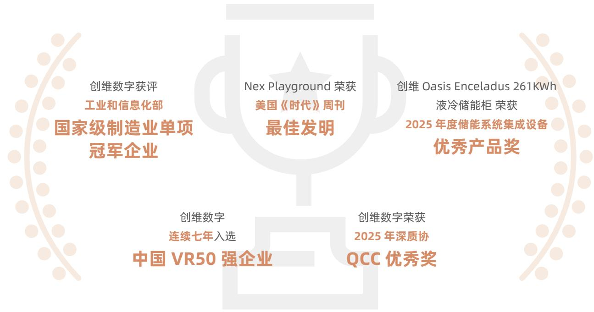

flowchart

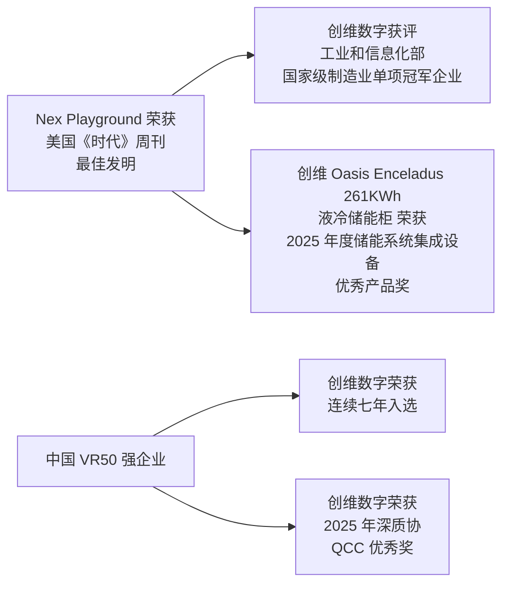
```mermaid
graph LR
  A["Nex Playground 荣获\n美国《时代》周刊\n最佳发明"] --> B["创维数字获评\n工业和信息化部\n国家级制造业单项冠军企业"]
  A --> C["创维 Oasis Enceladus 261KWh\n液冷储能柜 荣获\n2025 年度储能系统集成设备\n优秀产品奖"]
  D["中国 VR50 强企业"] --> E["创维数字荣获\n连续七年入选"]
  D --> F["创维数字荣获\n2025 年深质协\nQCC 优秀奖"]
```

## 筑牢质量根基，全员行动护航品质

## 案例

2025年10月，创维数字召开质量工作总结暨质量月启动会，公司管理层与各业务单元负责人共同参会。会议围绕“追求一次做对，筑牢品质根基，迈向卓越未来”的主题，发布了为期四个月的质量月活动方案，内容包括主题宣传、知识竞赛、自查自纠、跨部门改进项目等多项举措。会议明确了体系能力、执行力、人员能力与数智化能力四大建设方向，并举行了重点项目授权与质量倡议签名仪式。通过全员参与和系统推进，公司进一步夯实质量管理基础，持续提升产品与服务品质。

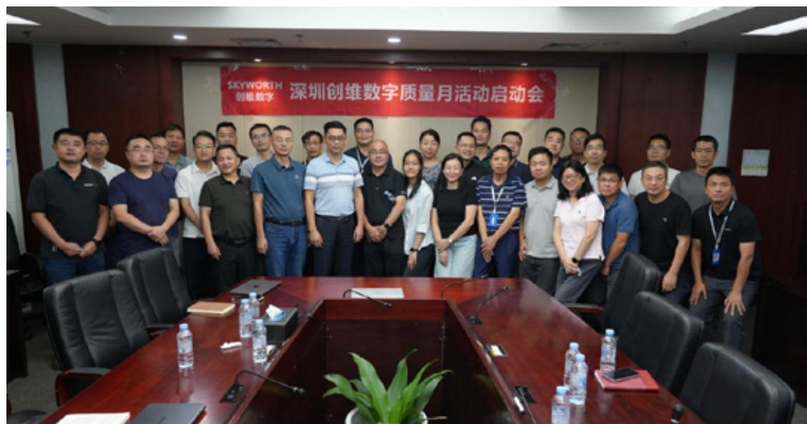

text_image

SKYWORTH
创维数字 深圳创维数字质量月活动启动会

## 提升服务质量

公司秉承“专业、高效、共赢”的服务理念，聚焦客户需求，提供定制化服务解决方案和高价值增值服务，构建产品和服务全生命周期服务保障体系。

## 精准响应客户需求

以客户需求为核心，为每个项目组建涵盖销售、售前、产品、研发、交付、质量及售后等多领域的专业化服务团队，实现从项目启动到交付的全流程保障。通过持续的市场调研与客户反馈机制，深入理解客户业务需求，有针对性地探索新产品、新应用与新场景，确保服务始终与客户需求同频共振。

## 构建完善服务网络

按照产品类别整合服务资源建立完善的服务质量管理休系打造覆盖从前端到后台、从硬件到软件的全链条服务解决方案。具备专业、稳定、规范的售后服务队伍，能快速响应所有客户的服务需求，并制定相应的返修服务制度。在国内 31 个省、自治区、直辖市设立省级服务中心，并在欧洲、美洲、南非、印度等海外市场具有业务布局，以全球化服务确保客户无论身在何处，均能享受快捷、规范、专业的服务体验。

## 提升客户满意体验

通过多种方式推动客户服务体系的持续升级：定期开展市场调研与客户满意度评价，精准捕捉需求变化；建立敏捷开发与生产体系，快速响应个性化需求；严格执行各国质量标准，确保产品符合法规与环保要求；设立专项售后处理渠道，及时妥善解决客户反馈问题。同时，通过供应链集采、原材料优化与芯片国产化等举措，持续降低产品成本，为客户提供更具性价比的优质产品与服务。

## 截至 2025 年

投诉处理率

100%

客户投诉问题整改完成率

100%

## 保障信息安全

公司深知信息资产的重要性，始终将数据安全与隐私保护视为赢得客户信赖的基石。基于《中华人民共和国网络安全法》《中华人民共和国数据安全法》《中华人民共和国个人信息保护法》等法律法规，遵循 ISO 27001 信息安全与ISO 22301业务连续性等国际管理体系标准，公司建立了严格、系统的信息安全与隐私保护体系，致力营造安全、可靠的数字环境。

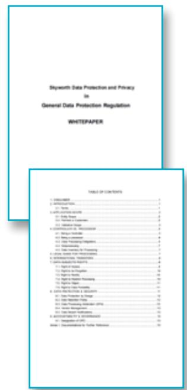

flowchart

```mermaid
graph TD
  A["SYKEYORTH DATA PROTECTION AND PRIVACY\nin\nGeneral Data Protection Regulation\nWHITEPAPER"] --> B["1. EXAMINED"]
  B --> C["2. APPENDABLE FOR ANY DATA"]
  C --> D["3. Title"]
  D --> E["4. DATA EXTRACTIONS AND DATA"]
  E --> F["5. Daily Data"]
  F --> G["6. Number of items"]
  G --> H["7. Information Source"]
  H --> I["8. COMPUTATION OF DATA EXTRACTIONS"]
  I --> J["9. Type of Data Extractor"]
  J --> K["10. Body location"]
  K --> L["11. Daily Processing/Diggers"]
  L --> M["12. Monitoring"]
  M --> N["13. Data Inventory & Processing"]
  N --> O["14. DATA FROM PROCESSING"]
  O --> P["15. INFRASTRUCTURE/TRANSPORTATION"]
  P --> Q["16. ADJUSTANCE/RECOVERY"]
  Q --> R["17. Digitality"]
  R --> S["18. Digitality or Regularity"]
  S --> T["19. Digitality or Identity"]
  T --> U["20. Digitality or Identity Processing"]
  U --> V["21. Digitality or Identity"]
  V --> W["22. Digitality or Identity Processing"]
  W --> X["23. Data Processing & Quality"]
  X --> Y["24. Data Protection by Design"]
  Y --> Z["25. Data Management History"]
  Z --> AA["26. Data Processing & Design (CPA)"]
  AA --> AB["27. Data Management History"]
  AB --> AC["28. Data System Information"]
  AC --> AD["29. Accounting for a Data Processing"]
  AD --> AE["30. Integration of CPAs"]
  AE --> AF["31. Model / Decomposition by Further Definition"]
```

《创维数据保护与隐私GDPR白皮书》

在管理体系层面，董事会对信息化与信息安全工作承担监管职责，在公司层面制定《信息安全管理制度》《网络与信息安全应急预案》，从信息安全组织建设、制度规范、技术防护、隐私保护、安全审计、培训宣传、应急响应等多维度持续优化，全面保障公司系统、业务数据及用户个人信息的安全。  
在技术防护层面，公司采取加密、访问控制、安全审计等措施，确保用户数据在传输与存储过程中的保密性与完整性，对网络威胁与非法访问进行实时监控与阻断，配合防病毒软件及终端安全防护措施，对数据采集、存储、使用及共享环节实施严格管控，构建起全方位的网络安全防护屏障。  
在隐私保护层面，公司高度重视数据安全与隐私保护，对个人数据的收集、存储与使用实施规范化管理，确保数据处理的合法性与安全性。同时，公司要求全体员工恪守保密义务，严禁向任何未经授权的第三方泄露客户信息及个人数据，定期开展信息安全和保密意识培训，以高度的责任感守护每一位客户的隐私权益。

针对海外市场，公司严格遵循各运营所在国的数据保护法律法规，高度重视海外用户的隐私权益，依据《通用数据保护条例》（GDPR）等国际数据保护相关法规，制定隐私保护与数据合规管理政策，并据此建立了与国际标准接轨的隐私保护机制。清晰界定数据责任主体，对个人信息的收集、使用、存储及共享等环节实施全流程规范管理，确保用户信息处理的合法性与透明度。同时，公司充分尊重并保障海外用户对其个人信息的访问、更正及删除等权利，并设立专门的数据保护联络渠道，及时响应并妥善处理用户的隐私需求与关切，致力于为全球客户提供安全、可信的数字环境。

在人工智能技术数据安全应用层面，在人工智能提升用户体验的当下，也带来了数据隐私、算法透明度与伦理治理等方面的责任与挑战。公司设立独立的IT管理团队，以高标准审视技术应用的边界与风险，以负责任的态度推进人工智能技术的研发与应用，遵循合法、正当、必要和诚信的原则，依据ISO 27001信息管理体系管理手册要求和国家信息与数据安全管理要求，常态化对公司和客户信息和数据包括人工智能应用安全、伦理特性实施监管和运维保障，保障用户的知情权与选择权。

## 本报告期内

公司

## 未发生

客户隐私泄露事件

## 03 绿色前行 智造未来

创维数字将绿色低碳深度融入核心发展战略，积极响应全球气候行动与可持续发展目标，推进绿色低碳转型。我们系统识别并管理运营中的气候相关风险，建立标准化环境管理体系，深耕产品全生命周期绿色设计。在日常运营中，我们全面推行节能降碳与资源循环利用，致力打造资源节约、环境友好的绿色企业。

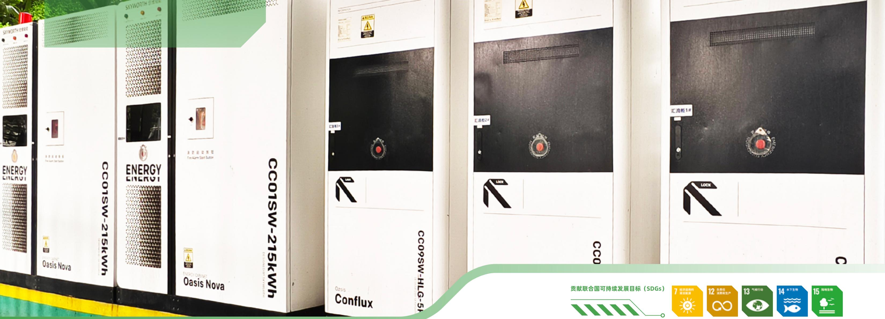

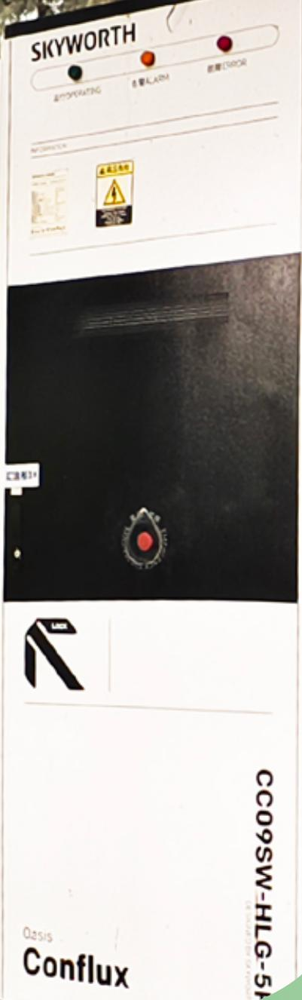

text_image

SKYWORTH
ARITOPERATING
自星LARM
前星LERROR
CC09SW-HLG-5A
Oasis
Conflux

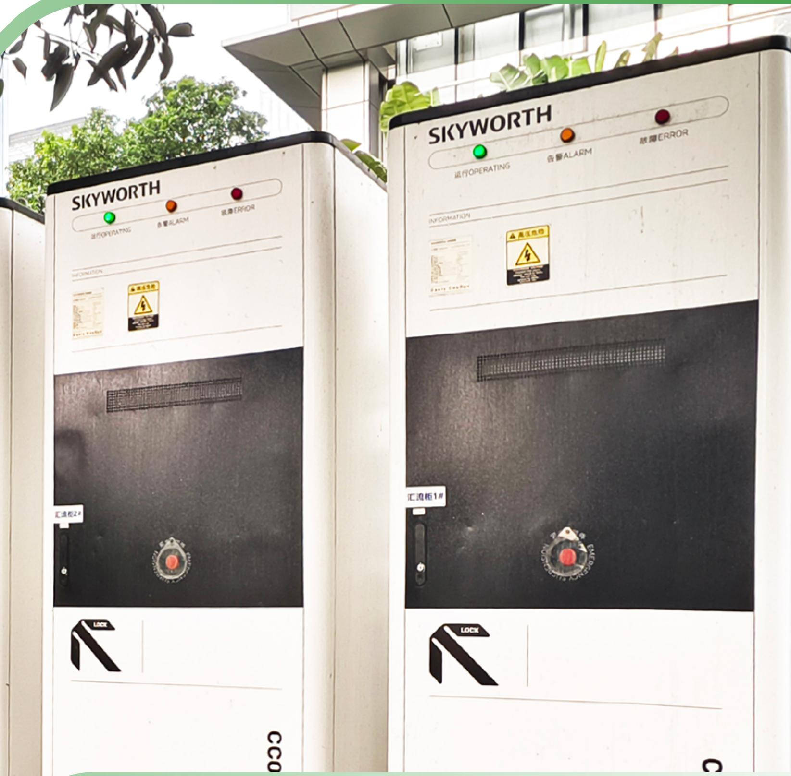

text_image

SKYWORTH
运行OPERATING
告警ALARM
故障ERROR
SFORMATION
紧急提示器
应急提示器
SHIYWORTH
运行OPERATING
告警ALARM
故障ERROR
INFORMATION
紧急提示器
紧急提示器
SHIYWORTH
运行OPERATING
告警ALARM
故障ERROR
SFORMATION
紧急提示器
应急提示器
SHIYWORTH
运行OPERATING
告警ALARM
故障ERROR
INFORMATION
紧急提示器
应急提示器
SHIYWORTH
运行OPERATING
告警ALARM
故障ERROR
INFORMATION
紧急提示器
应急提示器
SHIYWORTH
运行OPERATING
告警ALARM
故障ERROR
INFORMATION
紧急提示器
应急提示器
SHIYWORTH
运行OPERATING
告警ALARM
故障ERROR
INFORMATION
紧急提示器
应急提示器
SHIAYWORTH
运行OPERATING
告警ALARM
故障ERROR
INFORMATION
紧急提示器
应急提示器
SHIAYWORTH
运行OPERATING
告警ALARM
故障ERROR
INFORMATION
紧急提示器
应急提示器
SHIAYWORTH

## 应对气候变化

创维数字高度重视应对气候变化工作，统筹推进绿色低碳转型，全面识别与管控气候相关风险，依托量化指标与目标体系落实碳减排举措，以务实行动践行气候责任。

## 治理

公司建立了自上而下的气候治理体系，为气候行动的有序推进提供治理保障。董事会下设的 ESG 委员会统筹推动公司应对气候变化方面的可持续发展。ESG 工作组作为执行层面核心机构，系统性开展气候变化风险识别与管理工作，建立健全气候治理体系与风险管理指标体系；全面推进能源管理与碳减排工作，确保气候治理目标与举措高效落地。

## 战略

气候变化是全球全人类可持续发展的重要挑战及ESG关键议题，因此创维数字将气候风险应对与绿色低碳转型作为核心发展战略之一。公司关注、重视、积极响应运营所在地的气候相关政策，贯彻新发展理念，将绿色发展理念嵌入气候行动全流程，系统性应对气候挑战、践行气候责任，助力全球气候治理：

统筹气候韧性提升与碳减排工作，推动生产经营低碳化转型

搭建绿色技术创新体系，支撑能效提升与降碳

构建清洁低碳能源体系，推进能源生产与消费绿色化

强化资源节约循环利用，削减能耗物耗与温室气体排放

## 影响、风险和机遇管理

公司充分研判气候变化对公司政策合规、生产运营、市场发展等多方面影响，将气候变化影响应对、风险管控与机遇挖掘全面融入公司发展中长期规划与生产经营全流程。公司系统性开展气候风险全周期管控，筑牢公司气候韧性防线，同时深度挖掘发展机遇，积极布局低碳技术创新、清洁能源应用、绿色产品升级等赛道，推动气候行动与业务发展深度融合，实现风险防控与可持续价值创造的协同推进。

物理风险

<table><tr><td>风险类型</td><td>风险描述</td><td>风险管理措施</td><td>财务影响</td></tr><tr><td colspan="4">急性风险</td></tr><tr><td>台风及强对流天气</td><td>公司生产基地、仓储物流中心等资产受台风、强对流天气冲击,易造成厂房与生产设备受损、原材料及成品损耗,厂区生产停滞,同时冲击上下游供应链稳定,引发运营中断风险</td><td>建立极端天气预警与全周期应急管理机制,完善厂区与核心资产气候韧性建设</td><td>资产维修与重置成本、存货报废损失、停产减产导致的营收损失、订单违约赔付支出、应急处置专项成本</td></tr><tr><td>极端强降水及洪涝灾害</td><td>极端强降雨引发的内涝、洪水,易造成生产厂区、研发中心、数据中心、仓储设施受损,供电通信系统瘫痪,精密生产设备与核心物料损毁,导致生产中断,供应链物流受阻</td><td>开展常态化风险评估与应急能力建设,降低洪涝灾害对生产运营的不利影响</td><td>核心设备与资产损毁重置成本、存货报废损失、停产减产营收损失、核心数据恢复成本、灾后复产专项投入</td></tr><tr><td>极端高温及热浪</td><td>持续性极端高温易导致生产车间、数据中心温控负荷激增,精密生产设备运行稳定性与产品良率下降,区域性限电停电引发生产中断,影响正常生产运营效率</td><td>完善应急保障体系,全面管控高温天气带来的运营风险</td><td>运营能耗成本上升、产品良率下降带来的生产成本增加、限电停产导致的营收损失、设备维护保养成本增加</td></tr><tr><td>雷电及风暴潮</td><td>沿海区域雷电、风暴潮频发,雷击易造成厂区供电、通信系统与精密电子设备损坏,引发生产中断;风暴潮引发的海水倒灌,易造成厂区设施、仓储物料损毁,造成运营风险</td><td>建立气象预警与应急响应联动机制,开展常态化资产安全评估与防护管理</td><td>供电通信系统修复成本、精密设备损毁重置成本、厂房与设施维护成本、存货报废损失、停产减产导致的营收损失</td></tr><tr><td colspan="4">慢性风险</td></tr><tr><td>海平面上升</td><td>公司沿海生产基地、产业园长期受海平面上升威胁,内涝风险加剧,海水入侵引发的盐碱化易腐蚀厂房、管网与设备基础,缩短资产使用寿命,持续放大各类气象灾害的影响程度</td><td>开展制定中长期气候适应性发展规划,优化产能与资产布局,持续提升公司长期气候韧性</td><td>资产维护与改造成本上升、防洪排涝体系升级的资本性支出、资产使用寿命缩短导致的减值损失、产能布局调整的相关投入</td></tr><tr><td>水资源短缺</td><td>长期气候变化引发的区域性干旱、水资源短缺,易导致工业用水配额缩减、用水成本上涨,生产制造核心环节用水受限,产能释放受阻,同时地下水超采引发的地质变化易损害厂区厂房与设备基础</td><td>优化用水管理与多渠道水资源保障机制,推进蒸汽冷凝水回收利用,全面管控水资源波动带来的运营风险</td><td>用水成本持续上涨、节水体系建设的资本性支出、产能受限导致的营收损失、厂房与设施维修加固成本</td></tr><tr><td>长期气温升高</td><td>长期平均气温攀升,导致公司生产、办公、数据中心运营能耗持续上涨;区域生态环境变化引发生态管控趋严,限制厂区改扩建与产能升级项目落地;长期温湿度变化加速生产设备、原材料老化劣化,增加运营成本</td><td>将长期气候变化影响纳入公司投资与运营全流程决策体系,开展常态化生态环境影响评估,完善节能降耗与生态保护管理机制,缓释长期气候变化带来的潜在风险</td><td>运营能耗成本持续增加、节能改造相关资本性支出、原材料与设备损耗成本上升、产能扩张不及预期带来的潜在损失</td></tr></table>

转型风险

<table><tr><td>风险类型</td><td>风险描述</td><td>风险管理措施</td><td>财务影响</td></tr><tr><td>政策合规</td><td>运营所在地环保、绿色制造相关政策持续收紧,低碳转型合规标准与监管要求持续升级,公司转型过程中面临合规适配、政策响应不及时的风险</td><td>严格对标《绿色工厂评价通则》及“双碳”相关政策要求,落实《中华人民共和国节约能源法》及海外运营地环境保护相关法规,完善适配低碳转型的环境合规与碳管理体系</td><td>转型合规体系建设投入增加、政策适配不及时导致的处罚损失、限产停产带来的营收损失</td></tr><tr><td>低碳运营</td><td>公司向低碳运营模式转型过程中,面临能效提升、温室气体排放管控、碳减排目标落地的执行难度与成本压力,存在转型举措落地不及预期的风险</td><td>推进高耗能设备改造、生产自控系统升级及蒸汽冷凝水回收利用;推广光伏等可再生能源,实施全流程节能改造;建立能源管理体系,开展能源审计与能效诊断;推行创新性低碳和零碳技术研发和市场应用</td><td>低碳转型改造的资本性支出、运营减排成本上升、低碳技术研发投入增加</td></tr><tr><td>市场竞争</td><td>行业绿色低碳转型进程加速,市场绿色低碳需求持续提升,公司传统生产模式与产品体系转型不及预期,面临市场竞争力弱化、市场份额流失的风险</td><td>加快绿色工厂与绿色制造体系建设,推行产品全生命周期绿色设计;引进低碳新工艺、新设备,以绿色创新构建适配低碳转型的核心竞争优势</td><td>绿色产品与工艺升级投入、市场转型不及预期导致的营收下滑、市场份额流失等损失</td></tr><tr><td>转型治理</td><td>公司低碳转型与气候治理的推进机制尚未完全健全,存在转型目标分解不到位、责任落实不清晰、执行落地不到位的内部管理风险</td><td>建立责任明确的绿色发展与低碳转型工作体系,强化转型目标责任考核;推进自动化制造数字化管控,实现能源精细化管理</td><td>转型管理体系建设投入、培训宣传支出、转型执行不到位导致的潜在经营损失</td></tr></table>

气候机遇

<table><tr><td>机遇类型</td><td>机遇描述</td><td>机遇管理措施</td><td>财务影响</td></tr><tr><td>政策红利</td><td>运营所在地环保、绿色制造政策体系持续完善,绿色低碳转型导向明确,合规达标企业可享受专项补贴、税收减免、绿色信贷、绿色债券等政策激励,同时可优先参与行业标准制定、示范项目申报,拓宽合规发展与政策红利空间</td><td>严格对标《绿色工厂评价通则》及“双碳”相关政策要求,完善环境合规与全流程碳管理体系;落实《中华人民共和国节约能源法》及海外运营地环境保护法律法规要求,强化合规审查与信息公开,精准响应政策导向,积极申报绿色示范项目,争取政策支持</td><td>获得专项政策补贴、税收减免与绿色融资利率优惠,降低合规管理与融资成本,规避违规处罚损失,提升公司合规信用评级</td></tr><tr><td>清洁能源应用与能源安全</td><td>气候变化背景下,能源保供与清洁化转型加速,分布式光伏、储能等清洁能源技术成熟度持续提升,为公司优化能源结构、降低化石能源依赖、提升能源自主保障能力、对冲能源价格波动风险提供了可行路径</td><td>大力推广光伏等可再生能源应用,配套储能系统提升能源自主可控能力;建立全流程能源管理体系,开展能源审计与能效诊断,优化能源调度与利用模式,构建清洁低碳、安全高效的能源体系</td><td>降低外购能源采购成本,对冲能源价格波动带来的运营成本波动,减少限电停产导致的营收损失,实现长期能源成本可控</td></tr><tr><td>低碳运营降本增效</td><td>节能降碳技术、循环利用模式的推广应用,可有效降低生产运营环节的能源、水资源与原材料消耗,减少碳排放相关成本,提升资源利用效率,同时优化生产流程,提升生产运营稳定性与精细化管理水平</td><td>推进高耗能设备节能改造、生产自控系统升级及蒸汽冷凝水回收利用;实施生产全流程节能降耗改造,推广水资源循环、固废资源化利用模式,持续提升运营能效</td><td>降低能源、水资源、原材料等运营成本,减少碳排放相关支出,提升生产良率与运营效率,实现长期运营成本持续节约</td></tr><tr><td>绿色产品与技术创新</td><td>全球低碳转型趋势下,市场对低碳、零碳产品与绿色技术解决方案的需求持续扩容,为公司发挥技术研发优势、推动低碳零碳技术创新、打造绿色产品矩阵、拓展技术商业化应用场景提供了广阔空间</td><td>推行创新性低碳和零碳技术产品研发与市场应用,推行产品全生命周期绿色设计;引进低碳新工艺、新设备,加快绿色技术成果转化,打造差异化绿色技术与产品核心竞争力</td><td>扩大绿色产品营收规模,提升产品技术溢价能力,拓展绿色技术商业化增量市场,增强公司长期盈利能力</td></tr></table>

## 指标与目标

## 碳排放指标

公司依据 ISO 14064-1 国际标准建立温室气体全流程核算与统计体系，开展范围 1 直接排放、范围 2 外购电力热力间接排放及全价值链范围 3 间接排放的量化统计，建立内部审核与第三方核查双重保障机制，确保温室气体数据真实、准确、可追溯。公司已逐步建立覆盖生产、运营、供应链的气候绩效统计口径，定期核算温室气体排放总量、分范围排放量、碳强度、单位产值能耗、产品碳足迹等核心指标，并持续扩大温室气体盘查范围。公司温室气体数据定期通过行业平台等公开渠道进行披露。

## 2024 年度

范围一碳排放

200.10 吨

二氧化碳当量

范围二碳排放

3,197.35 吨

二氧化碳当量

范围三碳排放

10,091,772.66吨

二氧化碳当量

## 碳排放目标 ²

公司积极主动参与 CDP 碳披露和 SBTi 科学碳减排目标倡议，构建了量化气候治理目标体系，所有目标均以 2023 年为基准年，实现气候行动可量化、可核算、可核查。

## 目标类型

中期目标（2030 年）

长期目标（2040 年）

## 具体要求

范围 1+2 温室气体绝对排放量减少 55%

范围 3 温室气体绝对排放量减少 55%

范围 1+2 温室气体绝对排放量减少 99.7%

• 范围 3 温室气体绝对排放量减少 95%

全价值链温室气体净零排放

## 行动与措施

全面推进屋顶分布式光伏项目建设，逐步替代生产运营环节化石能源消费  
配套储能系统优化用电负荷结构  
推进高耗能生产设备节能改造  
推进冷凝水、中水回收循环利用项目  
建立全流程能源管理体系，降低生产运营全环节能源消耗与碳排放  
将低碳减排要求融入采购全流程，推行负责任采购制度  
推行产品全生命周期绿色设计，加大低碳、零碳技术产品的研发与市场应用  
优化产品使用阶段能耗水平，以技术创新驱动全链条减排

## 环境合规管理

公司严格恪守生态环境保护主体责任，全面执行运营所在地环境相关法律法规、标准规范，建立覆盖污染物管控、废弃物处置、应急处置的全流程环境管理机制，切实履行环境合规与绿色发展责任。

## 环境风险

## 识别与管控

公司将环境合规要求贯穿生产全流程，系统开展环境影响研判、全周期风险管控与绿色发展机遇挖掘，确保生产经营合规。公司系统识别生产全流程废水、废气、固废、噪声四类环境影响，明确危化品存储、危废暂存、焊接生产等重点环节的影响边界，为合规管理提供精准依据。公司建立闭环环境风险管理机制，按风险等级分级管控并针对危化品泄漏、废气设施失效等重大风险落实全流程防控。

公司配套废气治理、废水管控、危废规范管理等措施，定期开展培训与应急演练；对识别出的管理短板制定专项整改计划，明确责任与时限，确保环境风险总体可控，满足环评、排污许可等合规要求。

## 环境管理体系

公司严格落实环境法律法规及相关方要求，明确环境管理组织架构与权责体系，以 EHS 管理手册为制度文件基础，构建系统化、标准化、全流程覆盖的环境管控体系，确保生产经营全流程合规。公司已取得 ISO 14001:2015 环境管理体系认证。

创维数字 ISO 14001:2015 环境管理体系认证证书

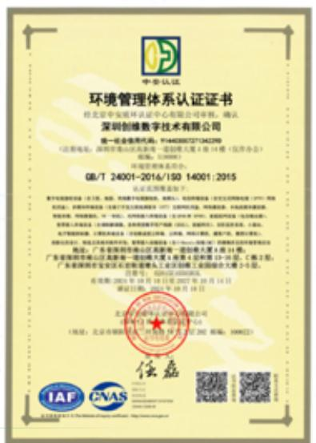

text_image

环境管理体系认证证书
经北京华发环境认证中心有限公司审核，确认
深圳创维数字技术有限公司
统一注册登记代码：9144083827134229D
（注册地址：深圳市南山区高新南一道创维大厦A座14楼（仅限办公）
邮编：330001）
环境管理体系符合：
GB/T 24001-2016/ISO 14001:2015
关于环境管理体系的建立、发展、管理及维护流程的说明
地址：广东省深圳市南山区高新南一道创维大厦A座14楼（仅限办公）
联系人：刘晓峰
联系电话：0755-83333333
邮箱：深圳市南山区高新南一道创维大厦A座14楼（仅限办公）
C端地址：广东省深圳市南山区高新南一道创维大厦A座14楼（仅限办公）
C端编号：C200001
C端有效期：2021年10月18日至2027年10月16日
通过日期：2021年10月15日
地址：北京市朝阳区东三环北路甲1号SOHO现代城C座10层
电话：010-66666666
网址：www.cicc.com.cn
北京中证资产评估有限责任公司
IAP
CNAS
张磊
中国证券报（上海证券报）

## 污染物达标排放

公司严格遵守生态环境相关法律法规，建立全流程污染物排放管控机制，制定《废水排放管理制度》《废气排放管理制度》，明确废水、废气分类管控、处理处置、监测监督与应急处置要求，严守污染物达标排放底线，全力防范环境污染风险。

## 报告期内

公司

## 未发生

环境污染事故、污染物排放不达标事件或生态环境行政处罚情形

## 废水

公司对生活污水与生产废水实施分类管理。生活污水依托工业园区废水站统一处理，生产清洗废水规范收集后交由具备资质的单位转运处置，空压机循环水经合规流程排入市政管网，严格执行广东省《水污染物排放限值》（DB44/26-2001）第二时段一级标准，定期委托第三方机构开展废水监测，确保排放合规。

## 废气

聚焦焊接烟尘、有机废气等生产废气，通过专用收集系统与净化设施处理后排放，严格执行广东省《大气污染物排放限值》（DB44/27-2001）第二时段二级标准。由专职人员负责废气处理设施运维，定期开展废气监测与合规评估，建立异常响应与整改机制，实现废气稳定达标。

## 废弃物合规处理

公司制定并实施《废弃物管理制度》，对废电池、废灯管、废油、废油布、化学容器（桶）、焊锡渣、废弃 PCB 边角料等有害废弃物实施全流程规范化管控，按制度明确分类收集、定点存放与 100% 合规处置流程。在厂区内划定专属存放区域，由仓库负责有害废弃物的分类存放与台账登记，并在存放区域显著标注 5 米内严禁动用明火，当有害废弃物累积至一定数量后，统一委托具备合法资质的专业回收站进行合规处置，确保有害废弃物收集、储存及处置安全合规。

## 环境应急管理

公司建立了全流程环境风险防控与突发环境事件应急管理体系，制定实施《应急准备和响应控制程序》，全面防范各类环境及安全风险。

## 应急响应机制

建立以总经理为组长的应急领导小组，下设抢险处置、警戒疏散、监测预警、医疗救护、后勤保障、信息上报六大专业小组，明确一般、较大、重大三级应急响应机制。

## 环境风险评估

系统开展环境风险评估与应急处置工作，精准识别废水、废气、危险废物、化学品储存、环保设施运行等关键风险源，划分风险等级并制定专项应急处置方案，规范污染物围堵收集、应急池启用、雨污分流管控等关键操作，严防污染物进入外环境。

## 配备应急设施

配齐防化服、吸附棉、应急桶、洗眼器等应急物资，配套建设事故应急池、雨污切换阀、防泄漏托盘等应急设施，建立与生态环境、应急、消防等部门的联动联络机制。

## 环境应急演练

常态化开展员工环境风险培训，持续提升应急响应与处置能力。2025 年，公司开展 2次环境应急演练。

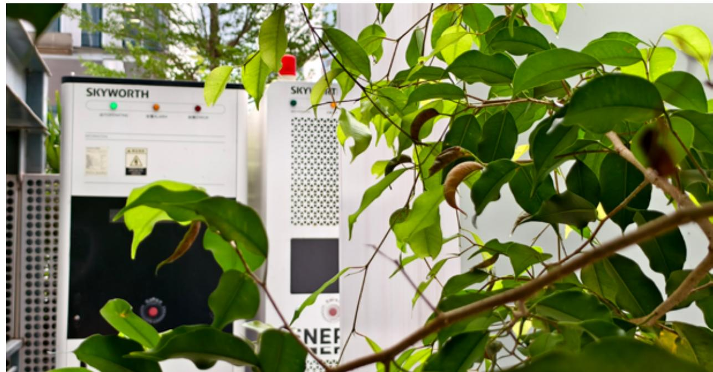

text_image

SKYWORTH
SKYWORTH
NEER

## 打造绿色产品

公司将绿色发展理念深度融入产品研发、设计、制造全流程，以绿色设计为核心、能效提升为关键、环保材料工艺为支撑，打造全生命周期环境友好型产品，从源头降低产品能耗、物耗与环境负荷，构建差异化绿色产品竞争力。公司被认定为工业和信息化部“工业产品绿色设计示范企业”，获批组建“深圳数字电视接收系统节能技术工程研究中心”。

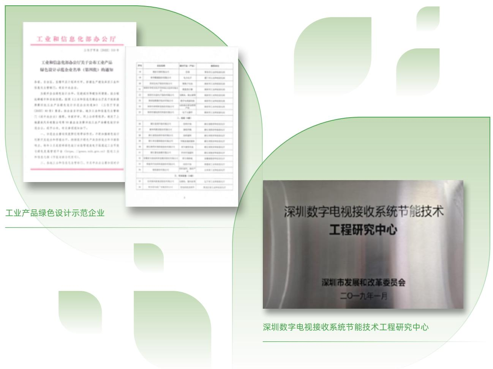

text_image

工业和信息化部办公厅
工业和信息化部办公厅关于公布工业产品绿色设计示范企业名单（第四批）的通知
各省、自治区、直辖市及直辖市市，新建生产建设兵团工业和信息化主管部门，有关中央委员会。
为提升企业绿色设计水平，促进城市环境综合治理，结合低碳战略提升和国家战略，按照《工业和信息化部办公厅关于加快推进碳排放项目及产业碳电设计的综合办法的通知》（已经刊于省
C2003C-40号）要求，结合县发改委、地方工业和信息化主管部门《试行办法》精神，专家评审，网上公示等程序，规定了上海浦东汽车有限公司等10家工业企业开展相关产业碳电设计的规范工作。授予公司，有关申请通知如下：
一、中国企业碳排放量提升和管理办法要求，不断加强碳排放与碳排放的提升和管理水平，加快医疗绿色产品领域投入并持续响应。每年1月至2月碳排放量提升业务管理是电子级通过工业节能与碳排放管理平台（https://gjwww.niha.gov.cn）实现工业和信息化发展（节能分部分部应用）。
二、省级（省属）
省级农业科学院有限公司
国家统计局
国家统计局
国家统计局
国家统计局
国家统计局
国家统计局
国家统计局
国家统计局
国家统计局
国家统计局
国家统计局
国家统计局
国家统计局
国家统计局
国家统计局
国家统计局
国家统计局
国家统计局
国家统计局
国家统计局
国家统计局
国家统计局
国家统计局
国家统计局
国家统计局
国家统计局
国家统计局
国家统计局
国家统计局
国家统计局
国家统计局
国家统计局
国家统计局
国家统计局

## 源头绿色设计

公司以简约绿色、节能高效、环保合规为设计导向，从 ID 设计、结构设计、包装设计、电源设计及产品设计等维度落地绿色设计准则，通过素雅化、小型化、归一化、易拆解、可兼容、去塑化、高能效等设计方案，从原材料加工到产品整机加工，全链条提高环保材料的使用并降低各类辅料的使用、简化生产工序，提升产品的能效等级。我们在原材料及产品生产端实现全链条绿色设计、减少污染物排放，更大大提升产品可靠性，提升用户满意度。

## ID 设计绿色化

ID设计初始阶段即同步融入环境、生产、应用三大设计理念，减少后处理工序、材料浪费及辅料使用，降低环境负荷。同时，适配生产自动化需求，提升生产效率；优化操作便捷性，适配多元应用场景。2025 年度，通过素雅化设计应用，减少油墨印刷 450 万次以上；生产端减少后处理工时 3.2 万小时，降低生产损耗1.8吨；通过小型化和归一化设计应用，减少塑胶使用量160多吨，生产端模具利用率提升 35%，减少供应商模具切换工时 5.7 万小时；通过颜色归一化，统一成三种颜色材料，减少换色调机 1,100 多次，减少塑胶材料浪费超过 28 吨；生产端调机效率提升 60%，降低不良品率 3%；通过优化纹路工艺，采用 EDM 纯电加工替代化学纹，应用 200 多套模具，减少化学试剂使用 2.4 万工时，模具维护周期延长 25%，实现从源头减耗降排的同时兼顾生产效率与产品体验。

## 结构设计绿色化

结构设计遵循“易装配、易拆卸、可兼容、可回收”的核心理念，兼顾生产效率和用户应用体验，减少产品全生命周期的环境负荷，为后续产品维护、材料回收提供便利。其中，优化产品结构，采用易拆扣位设计，控制扣位扣合量，方便产品自动化生产，有效提升生产效率，降低生产损耗；同时便于产品维护与保养，延长产品使用寿命，减少因故障报废带来的资源浪费，践行“延长产品生命周期”的绿色理念；另外，壳体上清晰标注材料和生产时间，方便产品生命周期结束后对材料回收管理分类，兼顾环境友好。

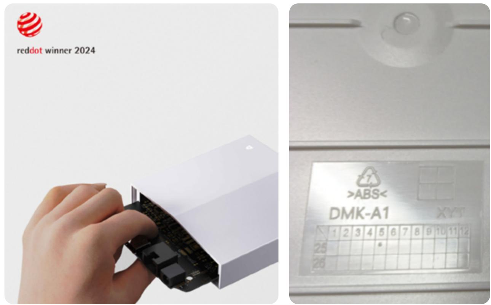

## 包装设计绿色化

推进包装减量化、去塑化、材料循环，优化盒型、缩小尺寸并减少设计余量，降低包装材料消耗。推广使用可降解塑料、环保纸质及麦秆 / 玉米秆制成的生态纸张，采用大豆油墨替代矿物油，推行废纸 / 废纸板回收再利用，减少木材消耗。2025 年度，公司产品成功通过全球各类主流环保认证。其中，超95% 产品实现零矿物油应用；去塑化包装产品出货量超 330 万台，减少 PE袋使用超 1,000 万个。

  
FSC

natural_image

Illustration of green beans and colorful cans with no visible text or symbols

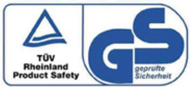  
欧洲主流认证TUV认证

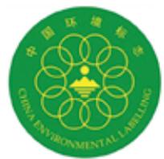  
中国绿十环

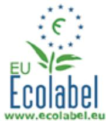  
欧洲之花认证适用于各类消费品

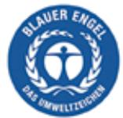  
德国蓝天使认证适用于家居、电器设备

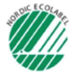  
北欧白天鹅认证适用于家电等环保认证

## ECO-BOX 纸质机顶盒，以纸代塑创新设计

案例

创维数字选用可回收牛皮纸，打造了一款别具匠心的 ECO-BOX 纸质机顶盒，用可持续设计替代传统塑料注塑工艺。这款产品采用免工具、无胶水的折叠结构，外壳可轻松替换，不仅延长了使用寿命，也减少了电子垃圾。为了让纸盒更“耐用”，还通过替塑油提升防潮性，确保日常使用安全可靠。更巧妙的是，包装即产品本身，省去了双重物料的浪费；轻量化的平面设计，也降低了物流与仓储成本——让环保从设计之初就成为一件自然而然的事。

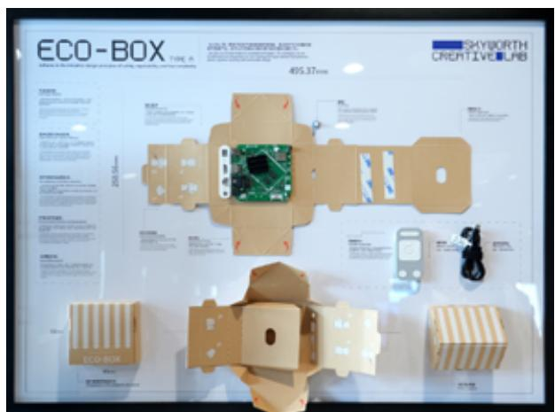

text_image

ECO-BOX
TYPE A
495.37mm
SKYBORTH
CREATIVE LAB

## 电源设计绿色化

公司聚焦产品能效优化，深耕低功耗、“零”功耗技术研发，严格落实出货产品能效合规要求，通过电源优化、新型元器件应用、智能算法调控等技术手段，持续降低产品工作功耗与待机功耗，实现产品全生命周期节能减碳。

## 开发 6 级、7 级能效电源适配器，助力全链路节能降耗

案例

创维数字于 2020 年、2025 年先后完成 6 级、7 级能效电源适配器研发，成果已全面应用于机顶盒、智能网关等产品。经实测，电源适配器平均转换效率提升至 85.64%，空载功耗降至 0.0648W；数字智能终端平均功耗降至 4.8W 以下。2025 年公司应用了 6 级、7 级能效电源适配器的机顶盒、智能网关等产品的功耗每台降低 1.2W，基于用户一般使用时长，全年可节电 7,008 万度，减碳 66,498.91 吨。公司同步强化生产环节标准化能耗管控，实现产品从生产到应用的金链路能耗最优

## 待机“零功耗”光能盒子，绿色科技赋能低碳生活

案例

创维数字以“环保不妥协于体验”为核心理念，针对欧洲市场能源需求，推出待机零功耗光能盒子。该产品采用“光能板+超级电容”创新组合，实现待机状态下零功耗运行。超级电容具有无泄漏、易回收的特点，整机寿命长且已获得碳中和认证，深度契合低碳发展目标，为用户提供绿色、高效、可持续的智能终端解决方案。

## 产品环保合规

公司严格遵守国内外环保相关法律法规，优化生产工艺，摒弃高污染制程，严控有害物质使用，保障产品全生命周期环保合规，并已取得 IECQQC080000:2017 电气与电子元件和产品有害物质过程控制管理体系认证。

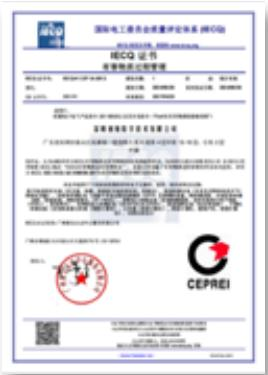

text_image

国际电工委员会质量评定体系（中国）
IECQ 证书
年审意见及管理
单位：台州市
地址：广东省广州市
电话：021-38567999
传真：021-38567999
电子邮箱：www.cicq.com.cn
ISBN: 978-7-4
国家电网公司网站：www.cicq.com.cn
国家电网公司网站：www.cicq.com.cn
国家电网公司网站：www.cicq.com.cn
国家电网公司网站：www.cicq.com.cn
国家电网公司网站：www.cicq.com.cn
国家电网公司网站：www.cicq.com.cn
国家电网公司网站：www.cicq.com.cn
国家电网公司网站：www.cicq.com.cn
国家电网公司网站：www.cicq.com.cn
国家电网公有网址：北京市西城区金融大街3号
办公地址：北京市西城区金融大街3号
法定代表人：王洪章
联系人：李晓峰
联系电话：010-66666666
电子邮箱：www.cicq.com.cn
国家电网公司网站：www.cicq.com.cn
国家电网公司网站：www.cicq.com.cn
国家电网公司网站：www.cicq.com.cn
国家电网公司网站：www.cicq.com.cn
国家电网公司网站：www.cicq.com.cn
国家电网公司网站：www.cicq.com.cn
国家电网公司网站：www.cicq.com.cn
国家电网公司网站：www.cicc.com.cn
国家电网公司网站：www.cicc.com.cn
国家电网公司网站：www.cicc.com.cn
国家电网公司网站：www.cicc.com.cn
国家电网公司网站：www.cicc.com.cn
国家电网公司网站：www.cicc.com.cn
国家电网公司网站：www.cicc.com.cn
国家电网公司网站：www.cicc.com.cn
国家电网公司网站：www.cicc.com.cn
国家电网公司网站：www.cicc.10000000000000000000000000000000000000000000000000000000000000000000000000000000000000000000000000000
国家电网公司网站：www.cicc.com.cn
国家电网公司网站：www.cicc.com.cn
国家电网公司网站：www.cicc.com.cn
国家电网公司网站：www.cicc.com.cn
国家电网公司网站：www.cicc.com.cn
国家电网公司网站：www.cicc.com.cn
国家电网公司网站：www.cicc.com.cn
国家电网公司网站：www.cicc.com.cn
国家电网公司网站：www.cicc.com.cn

创维数字 IECQ QC080000:2017电气与电子元件和产品有害物质过程控制管理体系认证

## 优选低添加材料，从源头推进绿色生产

案例

创维数字在产品研发与生产中，优先选用低添加物塑胶原材料，通过减少壳料遮光、染色环节所需的塑化剂、扩散剂及无机色粉，有效提升材料的循环回收性。2025年，公司使用的超4,500吨塑胶材料中，各类添加剂使用量减少超过 18 吨，同时生产端的注塑效率与良品率也得到提升。公司以源头材料管控为抓手，持续推动产品环保合规与绿色制造。

## 践行绿色运营

创维数字始终坚持绿色低碳、可持续发展理念，持续深化节能降耗、资源循环利用与生态环保实践，全面构建绿色运营体系，以实际行动助力企业低碳高质量发展。

## 能源管理

## 治理

创维数字结合生产经营实际设立对应的能源管理组织架构，清晰界定各职能部门、各层级生产单位，以及相关管理、执行、监督岗位人员的职责与权限，并通过管理评审持续优化管理架构。公司通过培训、会议等方式开展内部沟通，确保各级管理人员明晰自身权责，依规履行能源管理相关职责，保障各项能源管理活动规范有序开展。公司制定完善《能源管理手册》《能源绩效监视、测量与分析控制程序》《能源运行控制程序》等制度文件，将能源管理要求贯穿生产运营全流程。

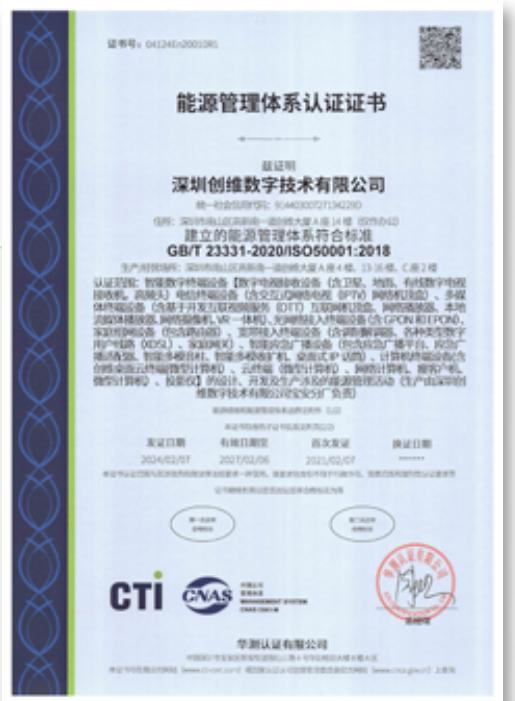

text_image

证书号: 041246/2001595
能源管理体系认证证书
兹证明
深圳创维数字技术有限公司
统一社会信用代码: 9144030727134229D
住所: 深圳市南山区高新南一道创新大厦A座14楼 (仅限办公)
建立的能源管理体系符合标准
GB/T 23331-2020/ISO50001:2018
生产许可证: 深圳市南山区高新南一道创新大厦A座14、13、16、18、2层
认证范围: 智能数字终端设备【数字电源接收设备(含卫星、地面、有线数字电视接收机、高频天) 电信终端设备(含交互式网络电视(PTV) 网络机顶盒)、多媒体终端设备(含基于开发互联网服务(DT) 互联网机顶盒、网络覆盖器、本地流媒体播放器、网络摄像机、VR一体机、无线网接入终端设备(含GPON和EPON)、家庭网视频设备(含线路监控)、宽带接入终端设备(含数据采集器、各种类型数字用户线路(KDX)、家庭网关)、智能政控广播设备(含洗选厂广播平台、应急广播及变频、智能多模态机、智能多模态微波机、桌面式IP适配器)、计算机终端设备(含控制单元终端模型计算机、云存储(微型计算机、网络计算机、摄像头机、微波计算机)、投影仪)的设计、开发及生产本级的能源管理系统SAD(生产由深圳创维数字技术有限公司宝安区扩负责)
请提供能源管理系统认证的文件 (E1)
本证书经深圳市市场监督管理局注册
发证日期 有效日期至 首次发证  除证日期
2024/02/07  2021/02/06  2021/02/07
CTI CNAS
华测认证有限公司
中国电子安全研究院集团有限公司（以下简称中国电子安监人）
证书号：国电安监局
CNAS 23331-2020/ISO50001:上部所

创维数字 ISO 50001: 2018  
能源管理体系认证证书

## 战略

创维数字将能源高效利用与清洁低碳转型深度融入企业中长期发展战略，围绕智能终端制造核心业务，推动能源管理与绿色工厂建设、生产工艺升级、技术创新深度融合，以能源管理提质增效赋能企业高质量可持续发展。

## 影响、风险和机遇管理

创维数字在能源管理战略制定与实施过程中，全面识别与企业目标、战略方向相关且影响能源管理预期结果的各类内外部因素，包括法律法规、竞争对手、销售市场、社会购买力、经济转型等外部影响因素以及企业价值观、文化、专利技术等内部影响因素，开展持续监视与评审并形成《组织环境内外部因素分析识别表》。

## 指标、目标及行动

创维数字建立、实施并保持可测量的能源目标与指标体系，覆盖各职能部门及所有能源使用部门，并明确实现目标的时间进度要求。公司层面以节能量、单位产量综合能耗等建立指标；用能部门以单位产量电耗、气耗等建立指标；重点用能过程和设备按用能类别建立单项能耗指标。

## 2025 年度

能源消耗总量

6,969,385.63千瓦时

能源密度（能源总耗量 / 产值）

23.96 千瓦时 / 万元

## 水资源管理

## 治理

创维数字严格落实《能源资源管理制度》，构建系统化水资源管理体系。公司设立专职部门统筹负责水资源管理工作，全面对接供水事宜，牵头落实各项节水管控要求。公司规范生产与办公全流程用水行为，建立常态化月度用水点检与数据统计机制，通过精准的数据监测与分析，为后续节水优化工作提供科学的数据支撑，持续提升水资源管理的精细化水平。

## 战略

创维数字高度重视水资源可持续管理，严格遵守运营所在地水资源管理相关法律法规与行业标准要求。公司坚持“源头减量、节水减污、循环利用”的原则，统筹推进生产运营全流程水资源管理工作，不断提升水资源利用效率，系统防范水环境风险，助力企业实现绿色低碳可持续发展。

## 影响、风险和机遇管理

创维数字系统识别生产运营全流程的水资源相关影响，覆盖生活用水消耗、生活污水排放、生产废水排放等核心环节。通过规范全流程用水管理、完善废水处理设施、强化日常巡检维护等举措，可有效防范水环境风险，提升水资源利用效率。

## 指标、目标及行动

创维数字以提升工业用水效率为核心目标，持续加强节水减污管理，大力推进节水技术改造，加强引进节水工艺、技术和装备；强化生产过程和工序用水管理，开展工业节水专项行动。同时，公司将推进水资源循环利用和工业废水处理回用，通过上述举措稳步提升水资源利用效率，确保用水合规，助力实现水资源可持续利用目标。

## 2025 年度⁴

总耗水量

22,198.4 立方米

耗水密度（总耗水量 / 产值）

0.0763 立方米 / 万元

## 冷凝水循环利用，点滴节约水资源

创维数字针对宝安分厂 10 台中央空调冷凝水直排问题，实施循环利用改造。通过开展进水管道开孔焊接、搭建冷凝水接引管道，安装水泵电机、水位感应器与智能控制系统，实现冷凝水自动回收循环，每年可回收冷凝水约 1,000 吨，有效减少水资源浪费，推动生产环节的绿色节水。

## 案例

## 绿色低碳经营

创维数字全方位推进资源节约工作。推行双面用纸，下班及时关闭电脑及用电设备；合理使用文具耗材，严控浪费；使用空调时关闭门窗以提升能效；加强水电管控与设备维保，规范废油回收处置。同时，建立月度资源点检与统计分析机制，强化全员节约意识，持续提升资源利用效率。目前，创维数字已获得国家绿色工厂认证。

## 保护生态系统

公司积极投身生态系统与生物多样性保护实践，通过组织生态环保公益行动，减少环境污染对自然生态的破坏，以实际行动守护生态家园，促进人与自然和谐共生。

## 清理白色污染，守护阳台山生态

## 案例

2025 年 12 月，创维数字以“践行绿色低碳百万公里健康行，保护环境为爱启航”为主题，组织员工前往石岩阳台山开展生态环保公益活动，活动中员工沿途清理山林白色塑料垃圾，有效减少塑料污染对山地生态系统、植被及生物栖息环境的危害，以实际行动守护区域生态环境，助力生态系统与生物多样性保护。

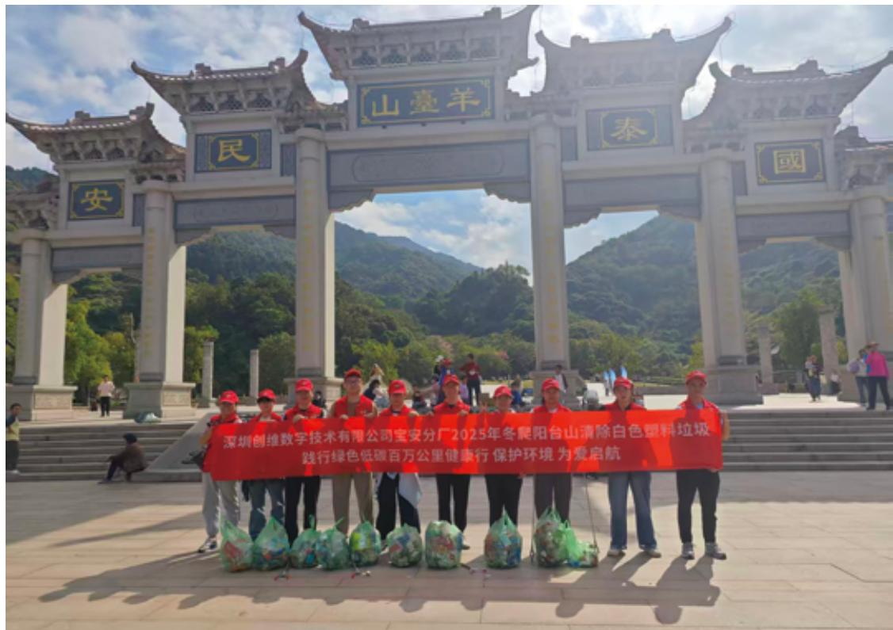

text_image

山臺羊
民
安
泰
國
深圳创维数字技术有限公司宝安分厂2025年冬爬阳台山清除白色塑料垃圾
践行绿色低碳百万公里健康行保护环境为爱启航

## 促进循环经济

公司秉持减量化、再利用、资源化的循环发展理念，将绿色低碳理念贯穿产品全生命周期，从绿色设计、资源循环、废弃物管控、低碳运营等方面系统推进循环经济建设，持续提升资源利用效率，降低生产经营活动对环境的影响，构建绿色、高效、可持续的运营体系。

## 循环包装应用规模化

生产过程中优先选用环保认证与再生循环材料，建立废旧包材回收利用体系，推动资源高效循环。2025年度，规模化应用再生牛皮纸彩盒近4,200万个、可再生瓦楞纸外箱 1,400 万个，累计使用可再生包材 7,700 吨，有效减少原生材料消耗。通过循环材料替代，既提升了材料环保属性，又实现包装废弃物减量与资源化利用，助力绿色生产与环境友好。

## 资源循环利用

建立标准化产品造型与模具复用机制，最大化利用现有生产资源，减少新增模具开发带来的资源消耗；通过标准化、家族化设计提升生产适配性，实现资源高效利用与低碳生产；通过储能系统，实现电能削峰填谷、余电循环利用，显著提升能源循环利用效率。

## 独立背板兼容设计，一模多用减耗降碳

## 案例

创维数字采用独立背板镶件模式，将背板的造型与线条设计为独立镶件，显著提升多机型、多配置下的模具兼容性，实现“一模多用”，有效减少新模具开发需求。2025 年度，公司减少开模 67 套，节约贵重模具钢13.4吨，减少人工及用电消耗7.3万工时。与此同时，生产切换效率提升40%，生产能耗降低8%。通过模具兼容化与循环复用设计，公司以资源高效利用践行循环经济理念，从源头减少资源消耗与环境影响。

## 建设标准化造型库，减少新模具开发

## 案例

创维数字搭建了标准化造型库，系统整合并复用已开模的成熟造型与模具，优先推广现有设计以减少新模具开发。这一做法有效降低了模具加工过程中的资源消耗与污染物排放，显著提升了模具利用率。同时，标准化造型设计提升了生产适配性，缩短了模具切换与生产调整时间，提高了整体生产效率，实现了环境友好、生产高效、应用便捷的多重目标。

## 储能电站助力提升能源利用效率

## 案例

创维数字深耕储能技术创新与产品迭代，落地多场景工商业储能、光储充示范站项目，构建储能电站全生命周期运营模式。公司依托自有产业园区与办公场景规模化部署储能系统，通过储能系统实现电能削峰填谷、绿电存储消纳与余电循环利用，显著提升了能源利用效率，为绿色低碳转型提供有力支撑。2025 年公司储能系统落地成效显著，于深圳的创维科技工业园、创维数字大厦、创维大厦、创维半导体设计大厦使用运行储能系统，累计节约电费 3,289,520 元，同时为合作客户实现收益 597,644 元，实现经济效益与生态效益协同提升。

natural_image

Close-up of a transparent glass sphere resting on a green leaf with bokeh background (no text or symbols)

## 04 同心聚力向善而行

创维数字愿与各利益相关方携手同行、共赢发展。我们用心提升员工的归属感与幸福感，打造更有韧劲的供应链生态，积极服务乡村全面振兴，并投身海内外社区公益。我们相信，以真诚的行动回馈社会，点滴善意终将汇聚成温暖的力量。

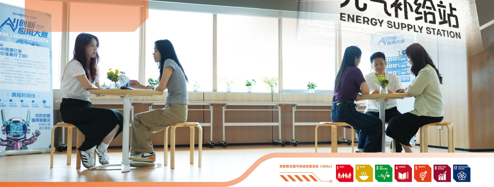

text_image

SKYWORTH 创业
AI创新 2026
应用大赛
“AI浪潮已来
你准备好了吗？
当前，人工智能是以新未来的发展需要给你打造
的工作方式，从而优化流程的智能决策，从而改变成
到数据分析，AI已不再是未来的想象，而是当下最强大的
生产力工具。
在这项技术变革中，随着今年以来站、应用AI、食
就现在的故事、创新与竞争力上赢得机会。
我们相信，最便宜的，我就是一线的你。
你的每一个“效果也有工具……”的你，都可
能成为改变团队。要宝公司工作方式的起点。
• 赛程时间线 •
4月15日
报名团队
4年5月
初赛提案
3.6小时
开发迭代
决策演练
你的创意
值得被看见
扫码小创
进行报名
贡献联合国可持续发展目标（SDGs）
1 无贫穷
2 学习班
3 较好
良好健康与福祉
4 优质教育
5 性别平等
6 体面工作格局
经济带状
7 促进目标实现
伙伴关系

贡献联合国可持续发展目标（SDGs）

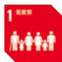

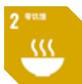

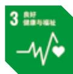

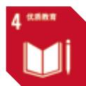

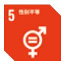

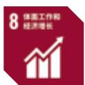

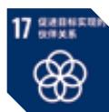

## 构建幸福职场

人才是公司最宝贵的资产。公司积极保障员工权益，坚持完善人才梯队建设，持续培养“靠谱”人才和团队，携手员工与公司共同成长。

## 保障员工权益

严格遵守劳动用工法律法规，坚持公开透明招聘、公平就业，运行工会与民主管理机制，打造多元平等与包容的工作环境，切实保障员工合法权益。

## 多元平等与包容

坚决杜绝任何形式的歧视用工政策，始终坚持公平、公正地对待不同国籍、种族、性别、年龄、宗教信仰和文化背景的员工，实行同工同酬原则，严格禁止雇佣童工和强制劳动等违法违规行为，确保用工合规合法。

## 透明招聘

遵循公平、公正、公开的原则，通过线上招聘平台、校园宣讲会等多种渠道发布招聘信息。通过简历初步筛选、初试、复试等阶段，全面评估应聘者的专业技能、综合素质及与岗位的匹配度。

## 权益保障

依法维护员工的合法权益，与全员签订劳动合同，严格执行国家社会保险政策，为员工缴纳住房公积金，并按规定及时办理新入职及离职员工的劳动合同、社会保险等相关手续，确保员工在养老、医疗、工伤、失业、生育等方面享有全面的社会保障待遇。所有员工依法享有国家法定假期，包括带薪年假、产假、病假、婚假、育儿假等，充分保障员工的休息与健康权益。为员工创造公平、公正的工作环境。

## 薪酬管理

搭建向奋斗者与绩优者倾斜的多元化回报体系，严格遵循以岗定级、以级定薪、人岗匹配、易岗易薪的核心理念。通过岗级体系明晰岗位价值与职级序列，结合员工任职资格、能力水平与绩效结果，匹配内外部市场薪酬框架，规范员工入职定薪、薪酬调整等管理工作。公司定期开展全员薪酬审视，推动优质资源向高绩效团队、绩优员工、高潜高能人才及认同企业价值观的员工倾斜，持续保障薪酬水平的外部市场竞争力与内部分配公平性。

## 工作时长

严格遵循相关法律要求，秉持人性化管理理念，实行五天八小时的弹性考勤制度，灵活适配早高峰通勤场景，有效缓解员工通勤压力，营造安心舒适的工作氛围。在加班管理方面，公司严格执行审批制度，确保加班安排合理合法。对于确需加班的员工，公司依法提供调休或支付加班工资，充分保障员工的合法权益。公司承诺将持续完善管理制度，为员工创造公平、健康的工作环境。

## 民主管理

实行民主管理，设立职工代表大会，建立多元化的沟通渠道和参与机制，定期开展员工座谈会，鼓励员工积极参与企业管理，广泛倾听并收集员工的建议和意见。同时，公司管理层始终保持开放态度，及时回应员工关切，确保沟通高效、透明，切实保障员工的合法权益。

## 妇女权益保护

高度重视特殊人群的保护，特别是妇女权益及女职工的劳动保护，严格遵守国家相关法律法规，全面落实孕妇“三期”的特殊保护政策，为女性员工提供全方位的关怀支持和生育保障，确保其在孕期、产期和哺乳期享有合法权益。生育保险覆盖率达 100%。

应届生总裁见面会  
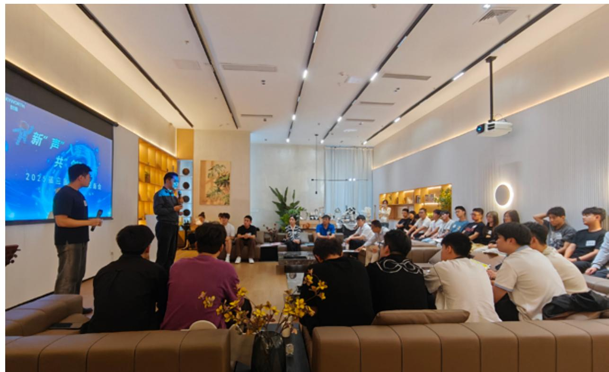

text_image

Conference room scene with presentation screen displaying Chinese text and audience seated in front

## 畅通发展渠道

公司重视员工发展与培训，构建技术与管理双通道职业发展路径，赋能员工职业成长，助力个人价值实现。

## 人才培训

公司为员工搭建多元培训体系，人力资源每年初基于业务，收集培训需求，拟定培训规划，聚焦管理干部、新员工和应届大学生等关键人群开展分层分类培训，助力员工技能水平及综合素质提升。

## 多元培训体系

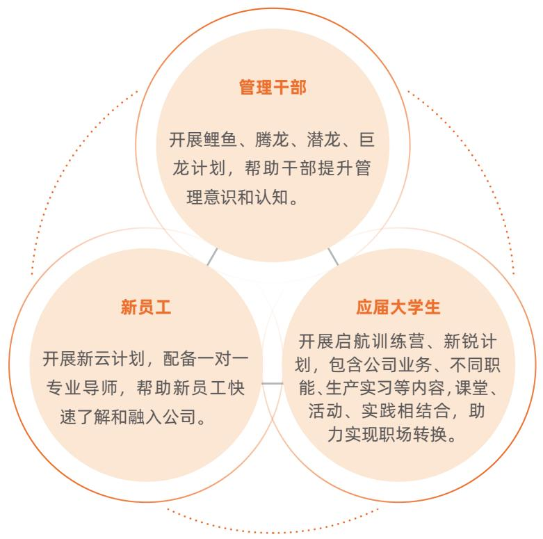

flowchart

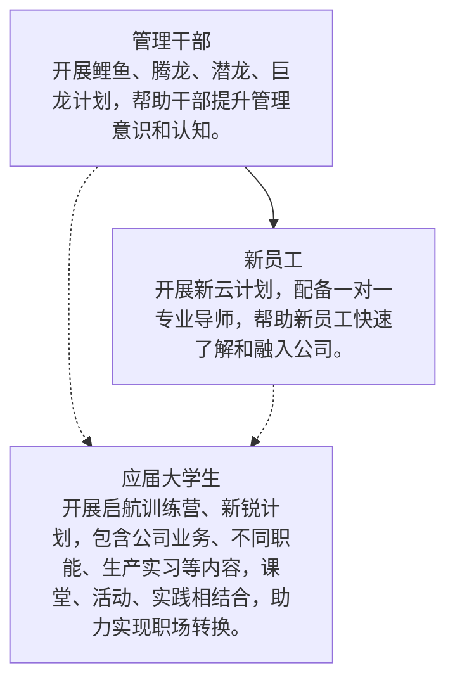
```mermaid
graph TD
  A["管理干部\n开展鲤鱼、腾龙、潜龙、巨龙计划，帮助干部提升管理意识和认知。"] --> B["新员工\n开展新云计划，配备一对一专业导师，帮助新员工快速了解和融入公司。"]
  A -.-> C["应届大学生\n开展启航训练营、新锐计划，包含公司业务、不同职能、生产实习等内容，课堂、活动、实践相结合，助力实现职场转换。"]
  B -.-> C
```

## 2025 年度

员工培训总投入

93.195 万元

员工培训覆盖率

100%

员工培训

9,722 人次

员工培训总时长

40,047 小时

员工人均培训时长

4.12 小时

## 首期“干部后备人才池”开营，构建三级人才池

## 案例

2025 年 9 月 19 日，创维数字首期“干部后备人才池”项目正式启动。该项目经过半年精心筹备和多轮严格筛选，60 名高潜骨干从海内外营销、研发、汽车智能等全部核心单元脱颖而出，组成“菁英远航”“卓越引领”“战略领航”三大梯队。项目采用动态管理机制，以实战为导向设置分层培养课程，搭配积分制与负激励保障学习效果，并邀请名师授课多维度赋能学员成长。作为公司人才战略的关键举措，该项目构筑了全流程人才管理模式，打造内部“造血”机制，为公司业务升级、迈向 2.0 新征程提供核心人才支撑。

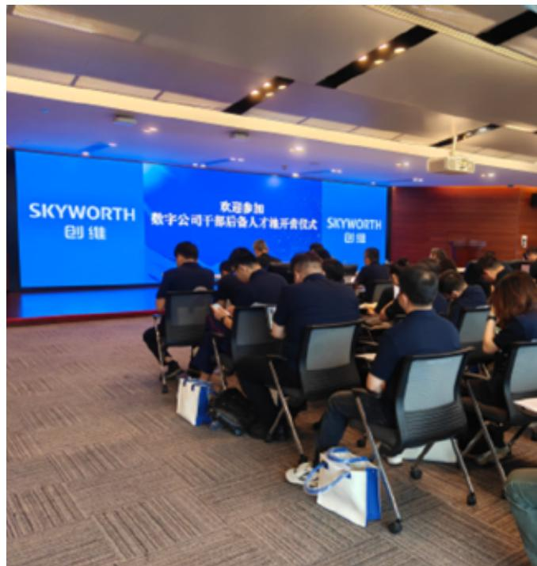

text_image

SKYWORTH
创维
欢迎参加
数字公司干部后备人才池开会仪式
SKYWORTH
创维

人才池项目全景图  
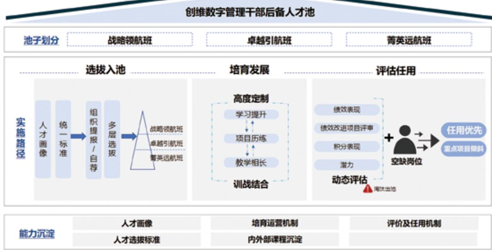

flowchart

```mermaid
graph TD
  subgraph Phase1 [Pool Planning]
  A["Pool Division"] --> B["Strategy Lead Flight"]
  B --> C["Advise Pilot Flight"]
  C --> D["Mangrove Flight"]
  end

  subgraph Phase2 [Strategic Development]
  E["Select In Pool"] --> F["Training Development"]
  F --> G["Evaluation"]
  end

  subgraph Phase3 [Evaluation]
  H["High Level Customization"] --> I["Study Improvement"]
  I --> J["Project Practice"]
  J --> K["Teaching & Training"]
    L["Performance Evaluation"] -.-> M["Assessment Outcome"]
    N["Employment Priority"] -.-> O["Key Project Position"]
  end

  subgraph Phase4 [Evaluation]
    P["Evalability & Utilization"]
    Q["Performance Evaluation"] -.-> R["Out of Out"]
  end

  subgraph Phase5 [Capability Conservation]
  S["Human Image Mapping"] --> T["Human Selection Standard"]
  T --> U["Internal Course Sedation"]
  end
```

## 人才晋升发展

公司重视人才的发展和管理，搭建覆盖人才识别、任职资格、绩效管理、薪酬激励等人才管理体系，构建技术与管理双通道职业发展路径，设立多元职业发展序列，拓宽员工成长空间，配套清晰的能力标准，持续提升员工专业素养。

人力资源每年进行人才盘点工作，从能力、绩效、潜力等多维度识别员工，优化人才架构，搭建人才梯队，对优秀员工制定针对性的发展计划。同时，公司建立了完善的内部竞聘机制，为员工提供各种各样的岗位机会，促进员工有序流动。

畅通发展通道  
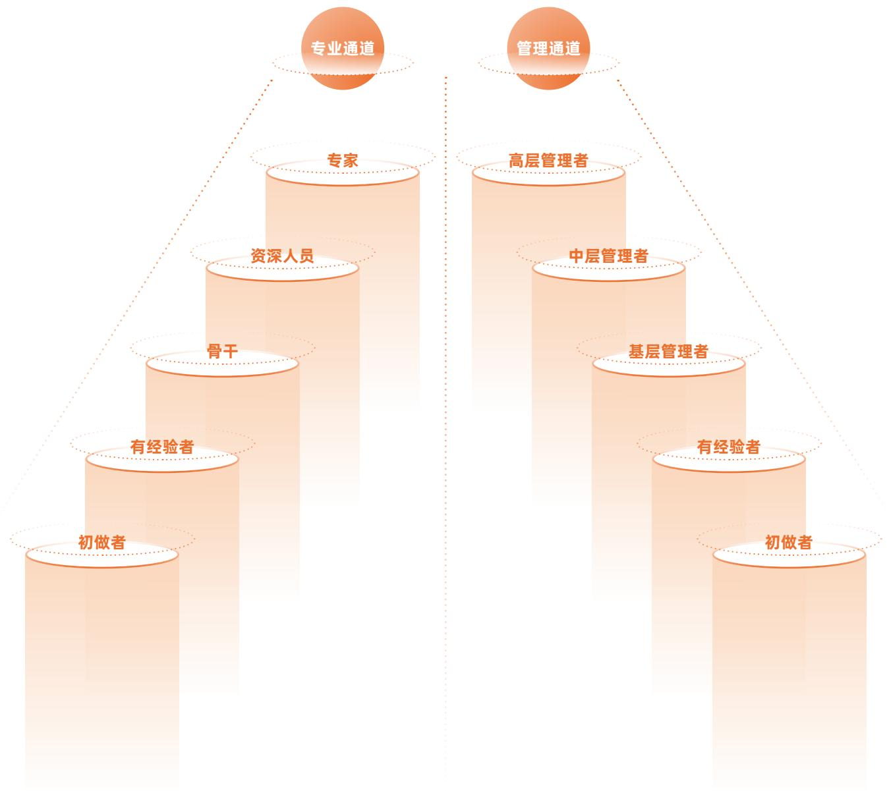

flowchart

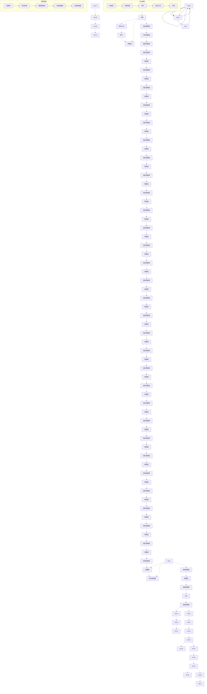
```mermaid
graph TD
  subgraph Professional_Channel["专业通道"]
  A1["初做者"] --> B1["有经验者"]
  B1 --> C1["骨干"]
  C1 --> D1["资深人员"]
  D1 --> E1["专家"]
  end

  subgraph Management_Channel["管理通道"]
  F1["初做者"] --> G1["有经验者"]
  G1 --> H1["基层管理者"]
  H1 --> I1["中层管理者"]
  I1 --> J1["高层管理者"]
  end

  Professional_Channel -.-> M1["专家"]
  M1 -.-> N1["资深人员"]
  N1 -.-> O1["骨干"]
  O1 -.-> P1["初做者"]
  M1 -.-> P1
  M1 -.-> Q1["高级管理者"]
  Q1 -.-> R1["中层管理者"]
  R1 -.-> S1["基层管理者"]
  S1 -.-> T1["高层管理者"]
  T1 -.-> U1["管理层"]
  U1 -.-> V1["高层管理者"]
  V1 -.-> W1["管理层"]
  W1 -.-> X1["高层管理者"]
  X1 -.-> Y1["管理层"]
  Y1 -.-> Z1["高层管理者"]
  Z1 -.-> AA1["管理层"]
  AA1 -.-> AB1["高层管理者"]
  AB1 -.-> AC1["管理层"]
  AC1 -.-> AD1["高层管理者"]
  AD1 -.-> AE1["管理层"]
  AE1 -.-> AF1["高层管理者"]
  AF1 -.-> AG1["管理层"]
  AG1 -.-> AH1["高层管理者"]
  AH1 -.-> AI1["管理层"]
  AI1 -.-> AJ1["高层管理者"]
  AJ1 -.-> AK1["管理层"]
  AK1 -.-> AL1["高层管理者"]
  AL1 -.-> AM1["管理层"]
  AM1 -.-> AN1["高层管理者"]
  AN1 -.-> AO1["管理层"]
  AO1 -.-> AP1["高层管理者"]
  AP1 -.-> AQ1["管理层"]
  AQ1 -.-> AR1["高层管理者"]
  AR1 -.-> AS1["管理层"]
  AS1 -.-> AT1["高层管理者"]
  AT1 -.-> AU1["管理层"]
  AU1 -.-> AV1["高层管理者"]
  AV1 -.-> AW1["管理层"]
  AW1 -.-> AX1["高层管理者"]
  AX1 -.-> AY1["管理层"]
  AY1 -.-> ASY1["高层管理者"]
  ASY1 -.-> ATY2["管理层"]
  ATY2 -.-> AU2["高层管理者"]
  AU2 -.-> AV2["管理层"]
  AV2 -.-> AW2["高层管理者"]
  AW2 -.-> AX2["管理层"]
  AX2 -.-> AY3["高层管理者"]
  AY3 -.-> AU3["管理层"]
  AU3 -.-> AV3["高层管理者"]
  AV3 -.-> AX3["管理层"]
  AX3 -.-> AY4["高层管理者"]
  AY4 -.-> AU4["管理层"]
  AU4 -.-> AV4["高层管理者"]
  AV4 -.-> AX4["管理层"]
  AX4 -.-> AY5["高层管理者"]
  AY5 -.-> AU5["管理层"]
  AU5 -.-> AV5["高层管理者"]
  AV5 -.-> AX5["管理层"]
  AX5 -.-> AY6["高层管理者"]
  AY6 -.-> AU6["管理层"]
  AU6 -.-> AV6["高层管理者"]
  AV6 -.-> AX6["管理层"]
  AX6 -.-> AY7["高层管理者"]
  AY7 -.-> AU7["管理层"]
  AU7 -.-> AV7["高层管理者"]
  AV7 -.-> AX7["管理层"]
  AX7 -.-> AY8["高层管理者"]
  AY8 -.-> AU8["管理层"]
  AU8 -.-> AV8["高层管理者"]
  AX8 -.-> AU8
  AX8 -.-> AV8
  AX8 -.-> AY9["高层管理者"]
  AY9 -.-> AU9["管理层"]
  AU9 -.-> AV9["高层管理者"]
  AV9 -.-> AX9
  AX9 -.-> AY10["高层管理者"]
  AY10 -.-> AU10
  AU10 -.-> AV10
  AV10 -.-> AY11
  AY10 -.-> AU11
  AU11 -.-> AV12
  AV12 -.-> AU12
  AU12 -.-> AV13
  AV13 -.-> AU13
  AV13 -.-> AV14
  AV14 -.-> AU14
  AU14 -.-> AU15
  AU15 -.-> AV15
  AU15 -.-> AU16
  AU16 -.-> AV17
  AU17 -.-> AU18
  AU18 -.-> AU19
  AU19 -.-> AV19
  AU20
  AV20 --> U20
  U20 --> AU20
  AU20 --> AU20
  AU20 --> AV20
  AU20 --> AU20
  AU20 --> AV20
  AV20 --> AU20
  AU20 --> AU20
  AU20 --> AV20
  AU20 --> AU20
```

## 保障职业健康

公司贯彻“以人为本”的职业健康安全管理理念，制定《员工健康管理制度》《劳动保护用品管理制度》等，打造健康安全的工作环境，定期开展安全培训，确保员工身心健康。

## 管理职责明确

明确各级管理权责，行政部配合督查现场健康安全、组织体检建档、优化办公作业环境；各部门负责人是现场职业病防治工作及职业健康安全第一责任人。

## 前期源头预防

采购租赁设施设备时，职业病危害因素的强度或者浓度符合国家职业健康标准，防护设施配齐、作业布局合规，确保工作场所符合职业健康安全要求。

## 作业过程防护

规范工作与休息时间，对特殊岗位（辐射、毒害等）采取防护措施；夏季高温岗位保障饮水、降温及休息；明确出外作业人员执行公司相关要求。

## 日常健康管理

建立员工健康档案，跟踪监测健康状况；开展职业健康教育，指导个人防护；组织体育锻炼及健康活动。

## 体检准入管控

执行员工健康体检规定；聘用前填写健康申报表并体检；职业禁忌疾病员工痊愈返岗需重新体检并取得健康证。

## 配备劳保用品

员工必须穿戴公司发放的劳保用品，异地作业需自带必备劳保用品，及时报废符合报废条件的劳保用品。

## 暖心关爱员工

公司致力于构建完善的福利保障与关怀机制，增强员工归属感与幸福感。员工福利涵盖饮食、住宿、交通及医疗等多个方面。公司大厦设有平价食堂，为员工提供营养均衡、价格实惠的餐饮服务。为解决员工住宿难题，公司提供宿舍、数字公寓和人才房等多样化的住宿选择，每年惠及近百名员工，切实解决员工的后顾之忧。

公司注重平衡员工工作与生活，搭建篮球、羽毛球、瑜伽等多类员工俱乐部，常态化开展员工活动，围绕节假日开展丰富多彩的员工活动。2025 年，公司建设启动了员工活动中心，获得员工的一致好评。

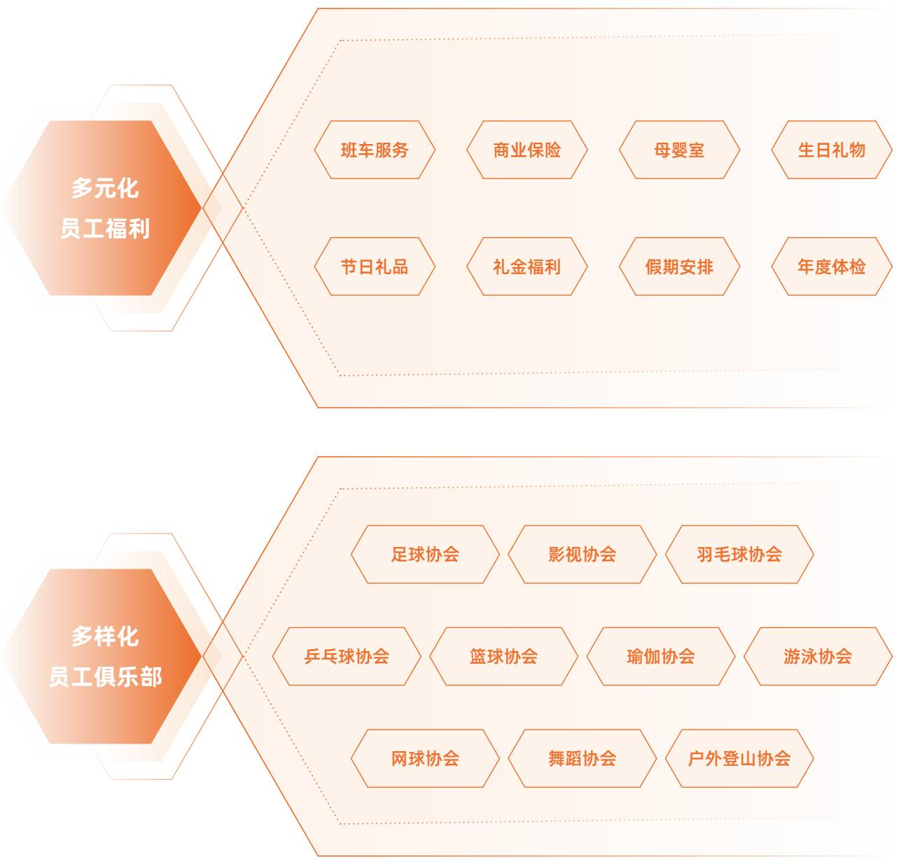

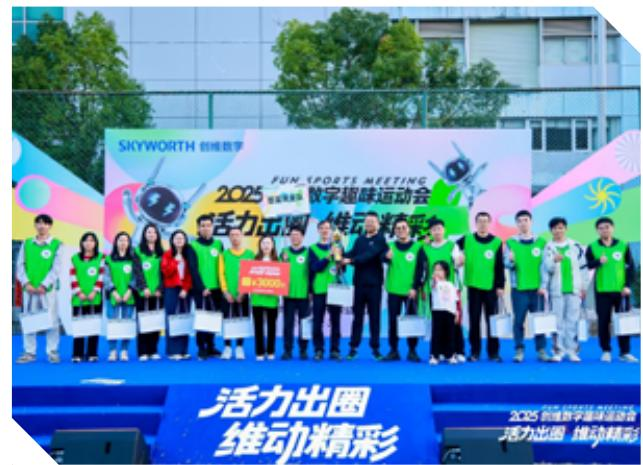

text_image

SKYWORTH 创维数字
2025 FUN SPORTS MEETING
数字趣味运动会
活力出圈 维动精彩
2025 创维数字趣味运动会
活力出圈 维动精彩

2025“活力出圈 维动精彩”趣味运动会

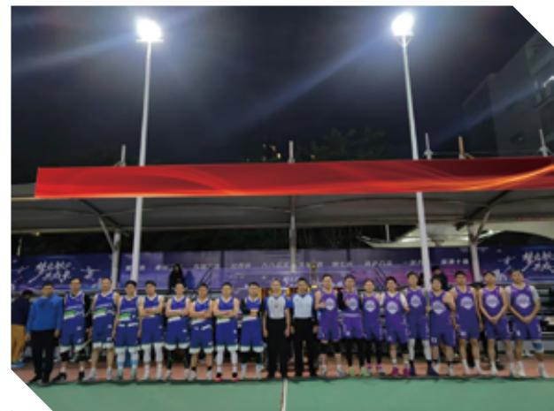

natural_image

Group photo of basketball players in blue uniforms on a night sports field, with a red ribbon overhead and event banners in the background (no visible text on players or equipment)

第十七届“创维数字杯”篮球赛

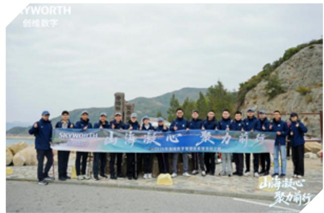

text_image

SKYWORTH
创维数字
SKYWORTH
山海凝心 聚力前行
2015年深圳城市规划委员会项目部上部
山海凝心
聚力前行

麦理浩径徒步活动

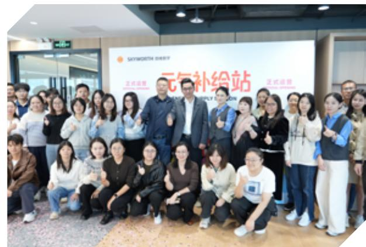

text_image

SANYANGZHOU 云气补给站
元气补给站

元气补给站揭幕

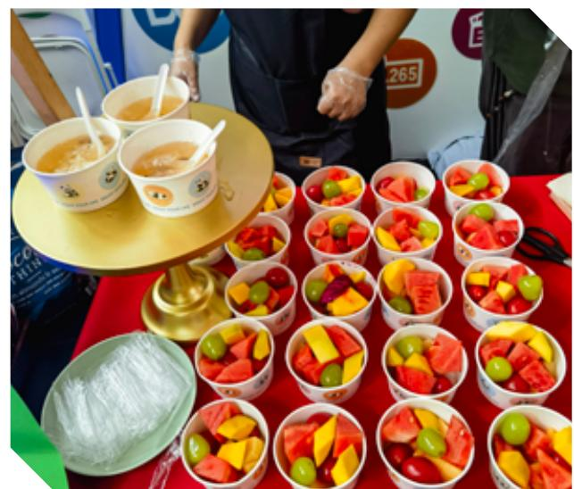

natural_image

Assorted food display with bowl of noodles, colorful fruit cups, and a table on red table (no visible text or symbols)

元宵节美食活动

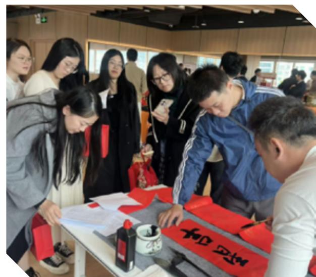

text_image

Group of people gathered around a table with red paper cutouts, some holding smartphones and writing in the foreground.

春节《书法大师现场写春联》活动

## 负责任供应链

公司致力于构建稳定、负责任的供应链体系。建立严格的供应商管理机制，注重可持续采购，将商业道德与环境保护纳入日常监督；同时通过持续培训与赋能，携手供应商共建安全、高效的供应链生态。

## 供应商管理体系

公司制定了系统性的供应商开发与管理流程，为供应链中长期规划及采购可持续发展制定策略与计划，包括《供应商管理控制程序》《供应商绩效考核管理细则》《供应商年度审核管理细则》。

## 供应商开发与选择

针对潜在的供应商进行资质初审及现场审核，坚持产量集中、业务诚信及优先服务三大核心原则，从供应能力、品质、生产、研发、ESG等方面设定准入门槛及要求，选择有质量保证、产品种类全面及能够证明其符合可持续发展要求的供应商。开展现场稽核，雇员薪资情况、守法合规、场所安全、贸易安全、环境安全等ESG内容打分分值占“供应能力及风险控制”部分的30%，有害物质及环保管控打分分值占“品质管理体系”部分的23%。

## 供应商考核与管理

在合作过程中，对供应商从交货、质量、成本、服务、企业社会责任等方面按月度进行考核，根据月度考核生成季度绩效等级，供应商季度绩效分为A、B、C、D、E五个等级。将供应商绩效与商务挂钩，在供应商选择、招标和组合管理等阶段应用。

## 供应商审核与评估

供应链组织相关部门根据物料风险等级与供应商份额识别高风险供应商，制定相应的供应商年审计划，定期组织实施现场审核，包含ESG内容的现场调查。

## 供应商退出机制

对于绩效表现好的供应商，在同等条件下优先提高合作份额或优先提供业务合作机会：对于绩效表现差的供应商要求限期整改、减少采购份额、限制业务合作或取消合作关系。对于触碰可持续采购红线的供应商，将立即停止与供应商合作，取消供应商供货资格，冻结供应商系统代码，永不合作。

## 可持续采购

公司期望与供应商在公平交易、诚实和相互尊重的基础上建立合作关系。为了保障为客户提供来自充满公平与尊重的价值链的优质产品，公司根据公平的商业交易及劳动法制定解决方案，尊重环境及自然资源，推动供应商签署《可持续采购章程》，希望整个价值链均实行这一做法。

## 可持续采购原则

坚持从能按照顾客要求制造出优质产品并能提供及时的优质服务、具有强烈社会责任感和质量及成本改善意识的企业中，购买合法的质量可靠、具有国际价格竞争力的产品和服务。以质量、劳工、健康安全、环境、商业道德、可持续采购等标准要求事项为基础，建立健全供应商遵守当地法律法规的质量、劳工、健康安全、环境、商业道德、可持续采购保证体系。

可持续采购方针  
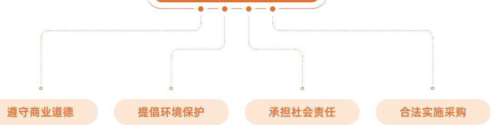

flowchart

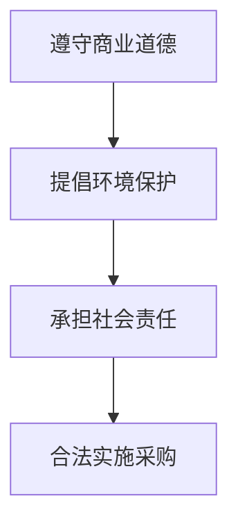
```mermaid
graph TD
  A["遵守商业道德"] --> B["提倡环境保护"]
  B --> C["承担社会责任"]
  C --> D["合法实施采购"]
```

## 可持续采购目标

供应商签署《社会责任承诺书》率

供应商通过劳工、健康安全、环境、

商业道德审核率

供应商账款支付准时率

尽职调查率

环保材料 RoHS 符合率

00%100%

## 供应商 CSR 管理

公司以与供应商签订的《可持续采购章程》为载体，明确供应商CSR管理领域及行为规范，推动供应商围绕环境保护、员工权益、隐私保护、道德与反腐败、商业行为等多维度作出承诺并积极践行，规避供应链社会责任风险。

维度  
要求供应商作出的承诺

<table><tr><td>环境</td><td>供应商承诺遵守当地环境相关要求及适用规范,定期开展环境影响评估,通过工艺控制减少各类污染物及环境干扰,禁止使用放射性物质,建立完善的工业事故风险防控和应急响应程序,并开展环境卫生与安全相关培训及反馈工作,降低商业实践对环境的影响。</td></tr><tr><td>员工权益</td><td>供应商承诺不雇佣童工、杜绝强迫劳动和人口贩运,遵守当地法律规定,实行合理工时与休息制度、提供法定假期,保障员工结社自由和集体谈判权,禁止工作场所歧视、骚扰及体罚,实行同工同酬,并建立公平的遵纪惯例和投诉处理机制。</td></tr><tr><td>隐私及个人资料</td><td>供应商承诺合法、公平地处理个人资料,仅为明确合法目的收集使用,确保资料准确、适度且及时更新,保障资料主体的相关权利,仅在必要范围内留存资料,并采取适当安全措施防范资料泄露、破坏等风险。</td></tr><tr><td>卫生与安全</td><td>供应商承诺提供清洁合规的安全卫生设施及饮用水,规范相关卫生管理,定期开展风险分析、隐患整改和应急演练,为员工配备合适的个人防护装备,组织卫生与安全培训并及时更新内容,持续降低事故率、保障员工安全。</td></tr><tr><td>道德与反腐败承诺</td><td>供应商承诺遵守《联合国人权宣言》及各级适用法律法规,坚守高道德标准,避免反竞争行为,支持社区发展,禁止任何形式的腐败和贿赂,遵守相关制裁及法案要求,遏制洗钱、恐怖主义融资,遵守美国《多德-弗兰克华尔街改革与消费者保护法》,该法对锡、钽、钨和黄金(“冲突矿物”)的使用设置了各种查询和披露要求,并在整个供应链中提供所有必要的声明。</td></tr><tr><td>商业行为</td><td>供应商承诺保护产品及零部件的机密信息和知识产权,仅使用自身品牌标志,确保生产各环节遵守本章程并要求分包商遵循同等标准,关注商业重大变化,保障产品符合约定规范、新制造地点合规。</td></tr></table>

## 供应商 CSR 红线

针对供应商行为设置 CSR 红线要求（如下 1\~10 项），若发现供应商触及红线内容，将立即停止与供应商合作，取消供应商供货资格，冻结供应商系统代码，永不合作，以期推动供应商提升社会责任表现。

禁止违法排放有毒有害污染物，包括废水、废气或废渣。

不得使用未经消防验收的厂房进行生产制造。

任何形式的童工。

不 得使用监狱劳动力或强迫劳动。

工工资。

防止发生任何重大火灾和爆炸事故。

7 确保工作条件不会严重危及生命安全或健康。

禁止工作场所中的歧视或骚扰行为。

9 提供安全和健康的工作环境。

禁止腐败和不诚信事件的发生。

## 供应商培训赋能

供应商赋能是提升供应链韧性的重要路径。公司通过培训和知识技能推广，强化供应商解决问题的能力，促进供应链的可持续发展，提高合作效率和透明度。

供应商可持续采购培训主题  
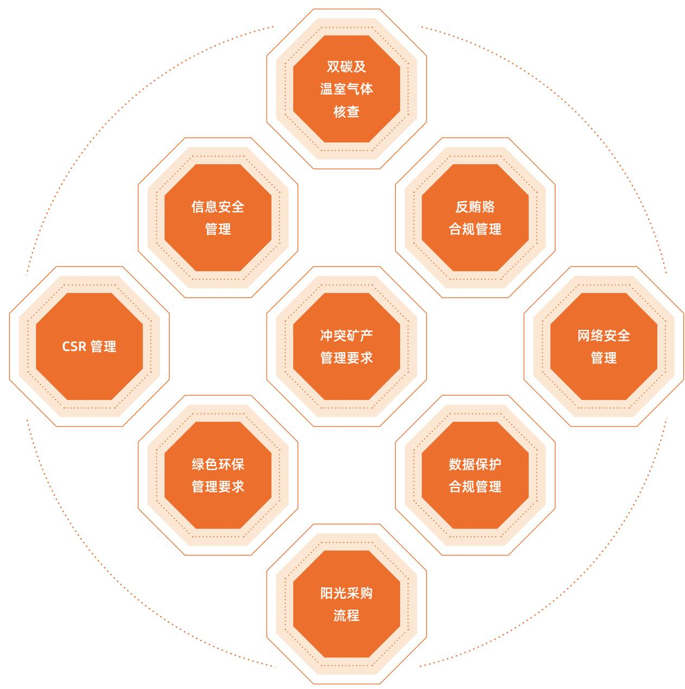

flowchart

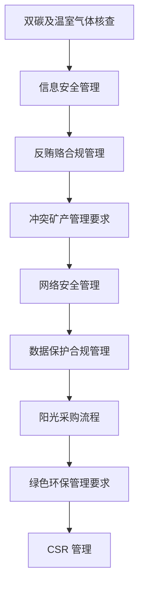
```mermaid
graph TD
  A["双碳及温室气体核查"] --> B["信息安全管理"]
  B --> C["反贿赂合规管理"]
  C --> D["冲突矿产管理要求"]
  D --> E["网络安全管理"]
  E --> F["数据保护合规管理"]
  F --> G["阳光采购流程"]
  G --> H["绿色环保管理要求"]
  H --> I["CSR 管理"]
```

## 赋能行业生态

公司主导或深度参与国内外相关标准制修订，联动产业链上下游及同行所协同创新，积极参与行业技术交流活动，以标准引领、技术共建赋能产业生态升级，助力全球数字视听产业规范协同高质量发展。

## 主导或参与行业标准制定

标准与专利是高科技产业竞争的制高点。公司在技术委员会下成立跨部门标准化工作组，作为公司标准化管理机构，主要负责法律法规和标准研究、主导或参与标准制修订、标准化制度和体系建设、标准化培训和人才培养等。

公司将技术积累转化为行业通用规范，推动产业规范化、标准化发展，提升企业在全球数字视听领域的专业贡献和行业影响力。

公司主导 5 项 ITU 国际标准的制定和发布

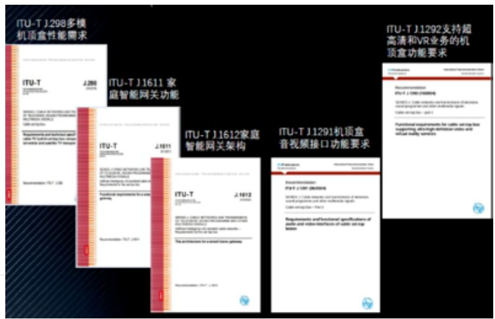

text_image

ITU-T J.298多模机顶盒性能需求
ITU-T J1611家庭智能网关功能
ITU-T J1612家庭智能网关架构
ITU-T J1291机顶盒音视频接口功能要求
ITU-T J1307支持超高清和VR业务的机顶盒功能要求
Recommendation
ITU-T J1306 (2020)
ITU-T J1307: Data collection and transmission of devices, testing equipment and other materials signals
Cable version list - Part 2
Functional improvements for cables using face supporting, setting-detection video and virtual reading services

截至 2025 年 12 月 31 日  
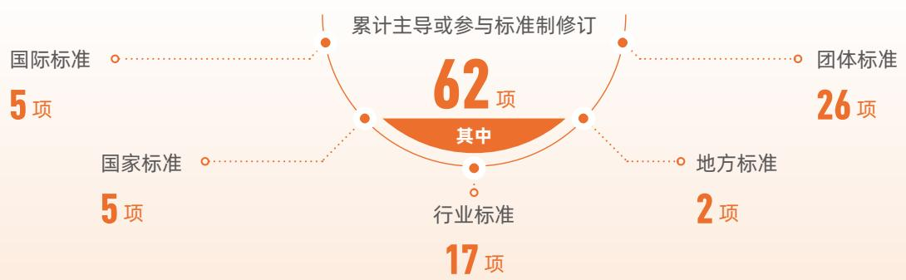

donut

| 类别 | 项目数量 |
| --- | --- |
| 国际标准 | 5项 |
| 国家标准 | 5项 |
| 行业标准 | 17项 |
| 地方标准 | 2项 |
| 团体标准 | 26项 |

## 创维数字主导 ITU-T J.1291 发布

## 案例

2024年6月，由创维数字主导制定的国际电信联盟（ITU-T）标准J.1291《有线机顶盒音频和视频接口的要求和功能规范》正式发布，对行业发展具有重要意义。该标准历时两年完成，创维数字国际标准化团队深度参与并主导了标准制定工作，对接口的电气要求、物理特性等关键参数进行了严谨推导与测试，确保接口在满足信号传输功能的同时适应机顶盒小型化发展趋势。该标准旨在推进全球音视频类产品接口定义的

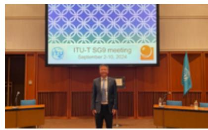

text_image

ITU-T SG9 meeting
September 2-10, 2024

标准化与规范化，简化开发与实施，促进产品互联互通，间接减少电子垃圾的产生，具有良好的环保与生态环境效益。公司专家张鑫连任 2025—2028 年国际电联 21 研究组 16 课题组报告人，为公司输出更多有影响力的标准化成果奠定基础，将进一步提升企业在 ITU-T 国际标准的专业贡献。

## 全球首个 VR 与超高清融合机顶盒国际标准正式发布

## 案例

2025年7月，由深圳创维数字技术有限公司主导提出并全程推动的国际电信联盟（ITU）标准ITU-T J.1292《支持超高清视频和虚拟现实服务的有线机顶盒功能要求》正式获得批准发布。该标准首次系统性地定义了支持超高清视频和VR服务融合的有线机顶盒关键功能要求，填补了该领域的国际标准空白。标准的核心创新点在于将VR节目解码和视频渲染等主要计算负载置于机顶盒端处理，使VR头显实现显著轻量化和低成本化，同时降低功耗与发热，提升佩戴舒适度。该标准的发布为全球设备厂商与运营商建立了统一技术规范，加速VR应用的规模化普及。

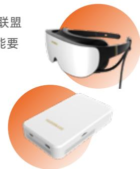

natural_image

Two white electronic devices: one with a black strap and another with a white box, displayed against an orange gradient background (no text or symbols visible on devices)

2021-2025 年度分别获得

研发与标准化同步

示范企业（A 类）

深圳市

标准奖

深圳标准

创新基地

## 等奖项

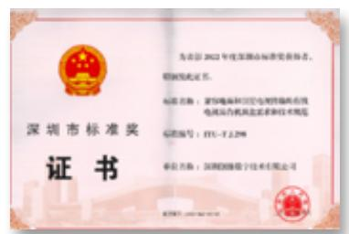

text_image

为北京 2023 年深圳标准奖 recipients，
特别登记证书。
标号名称：新华瑞和空间电视网络系统
电视联合机架及多新技术规范
标号编号：HT-7-298
单位名称：深圳国微电子技术有限公司

2022 年度深圳市标准奖

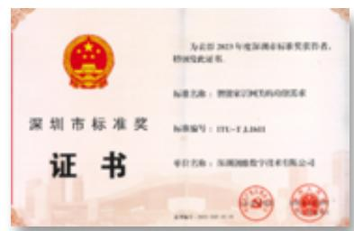

text_image

为表彰2023年度深圳市标准奖获奖者，
特颁发此证书。

标准名称：国家知识产权局
深圳市标准奖
证书

编号：ITL-TLDH1

单位名称：深圳润能数字技术有限公司

2023 年度深圳市标准奖

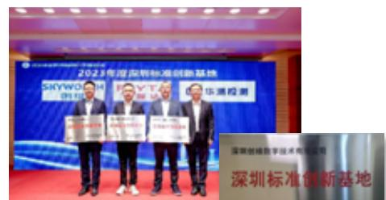

text_image

2023年度深圳标准创新基地
SKYWONG
深圳标准创新基地
深圳市深创科技有限公司
深圳标准创新基地

深圳标准创新基地

## 推动行业及产学研合作

产学研协同是产业创新升级的重要支撑。公司积极联动产业链上下游、科研院校与头部企业，共建联合实验室、开展技术攻关与成果转化，以开放协作打通技术壁垒，促进创新资源高效配置，助力产业高质量可持续发展。

## 参与行业活动交流

行业交流是凝聚生态共识的关键载体。公司主动参与行业展会与技术交流会，以开放姿态搭建交流合作平台，共促产业生态繁荣与技术迭代升级。

国际电信联盟（ITU-T）

SG21 报告人会议在创

维数字召开

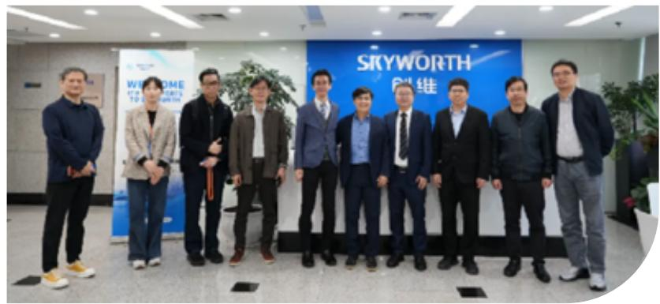

text_image

SKYWORTH
维
WELCOME
the 100% of the
TECHNOLOGY

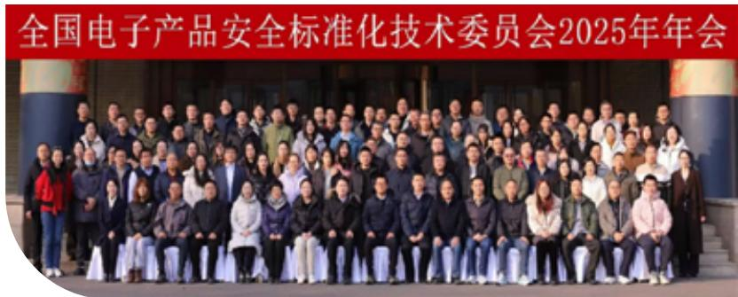

text_image

全国电子产品安全标准化技术委员会2025年年会

参加全国电子产品安全  
标准化技术委员会年会

参加 TC79/SC7 标委会年度会议  
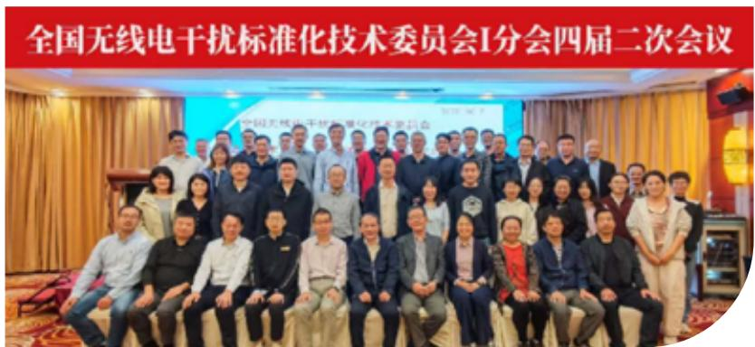

text_image

全国无线电干扰标准化技术委员会I分会四届二次会议

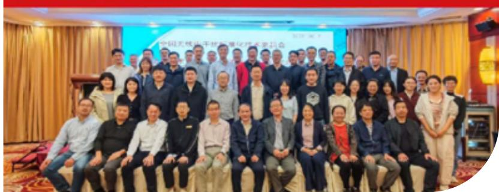

text_image

全国无线电干扰技术委员会

## 爱心回馈社会

公司在推动企业发展的同时，始终不忘回馈社会，积极履行企业公民责任。结合自身产业优势，助力乡村基础设施改善与数字鸿沟弥合；持续关注教育、健康等民生领域，传递温暖与关怀，与所在社区共建和谐、共享发展，以实际行动践行企业担当，让发展成果惠及更多人群。

## 乡村振兴

公司坚守社会责任初心，围绕消费帮扶、产业扶持、民生改善等重点领域开展系统性帮扶工作，通过无偿资金捐赠、定向项目援建、优先采购帮扶地区农产品、偏远地区网络支持等方式，助力新疆、河北、黑龙江、陕西等多地实现乡村产业、人才、文化、生态、组织全面振兴，以实际行动服务国家乡村振兴战略。

## 2025 年度

累计投入乡村振兴相关资金

290,569 元

## “乡村振兴 暖冬同行”公益捐赠

创维数字积极响应乡村振兴帮扶号召，于2025年11月参与由四川省上市公司协会发起的“乡村振兴 暖冬同行”公益捐赠活动。活动帮扶对象为四川省凉山彝族自治州布拖县乐安镇伟子坡村，公司向当地群众捐赠棉衣、棉被等御寒保暖物资，让村民温暖过冬、平安过年。

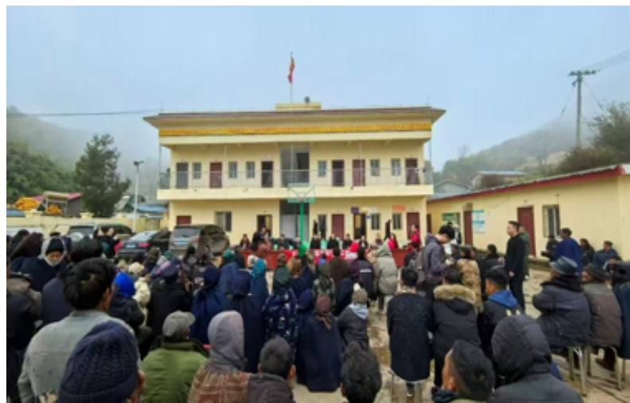

natural_image

Outdoor gathering in a rural setting with a building and crowd, no visible text or signage

## 案例

## 定点帮扶新疆阿克陶县，支持民生改善项目

## 案例

为响应定点帮扶倡议，助力巩固拓展脱贫攻坚成果同乡村振兴有效衔接，创维数字向新疆克孜勒苏柯尔克孜自治州阿克陶县无偿捐赠5万元帮扶资金。资金专项用于当地防返贫综合保险、国语学习平台升级、干部素质能力培训、医共体总院排号系统建设，实行专款专用，精准赋能当地民生改善与乡村发展，以实际行动助力乡村全面振兴。

## 援建汤原县基层治理与反诈教育项目

## 案例

2025年11月，创维数字聚焦乡村基层治理与平安建设，向黑龙江省佳木斯市汤原县捐赠100,000元，专项用于智慧西城派出所及反诈教育基地改造项目。该项目将通过完善基层警务设施、升级反诈教育阵地，助力提升乡村治理效能与群众反诈防范意识，为当地平安建设贡献一份力量。

## 采购沽源县农产品，消费帮扶助力乡村振兴

## 案例

创维数字定向采购河北省沽源县帮扶村生产的金莲花茶、红小豆、黄豆等优质农产品，采购总金额70,569元。通过实实在在的采购行动，公司帮助拓宽了帮扶地区农产品销售渠道，带动当地农户增收致富，以消费帮扶的形式助力乡村产业发展，切实履行企业支持乡村振兴的社会责任。

## 为偏远地区提供网络支持，助力民生改善

## 案例

创维数字聚焦乡村振兴与民生改善，为贵州、云南等交通不便、农村市场占比较高的偏远地区提供全方位的网络设备支撑与技术服务。自 2024 年以来，公司持续开展贵州偏远农村的网络故障维护工作，工程师深入黔西南中缅边境德宏州等区域进行现场调试，努力打通偏远地区网络服务的“最后一公里”，以通信普惠夯实乡村数字民生基础。

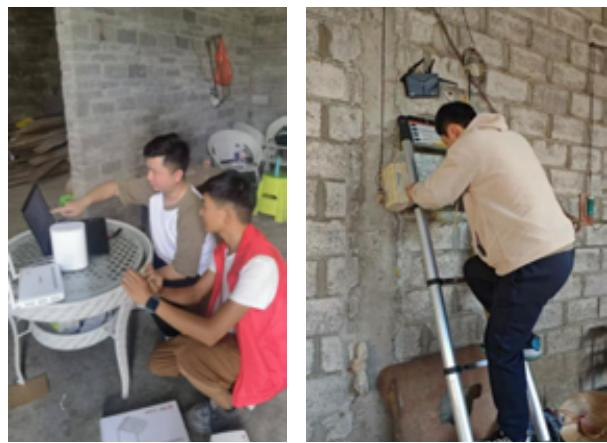

## 爱心公益

公司积极践行企业社会责任，围绕公益助学、敬老助老、社区关怀开展多元爱心公益活动，以实际行动回馈社会，传递温暖与正能量。

## 开展长者慰问公益活动

## 案例

2025年12月31日，创维数字前往深圳市宝安区石岩街道永泰心安长者服务中心，开展“创维献爱心，温情润桑榆”长者慰问公益活动。活动秉持尊老敬老的传统美德，现场通过图画故事分享、歌曲演唱等温情互动陪伴长者，并为老人们送上五常大米、面粉、食用油等生活物资。

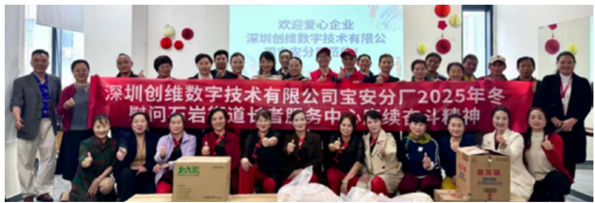

text_image

欢迎爱心企业
深圳创维数字技术有限公司
宝安分厂2025年冬
慰问万岩街道长者服务中心继续奋斗精神

## 开展环卫工作者慰问公益活动

## 案例

2025 年 12 月，创维数字组织开展“除旧岁迎新年送温暖”慰问活动，向塘头社区环卫部一线工作人员致以关怀与敬意。活动现场，公司为环卫工作者送上米、面等慰问物资，以实际行动致敬坚守岗位的基层工作人员。

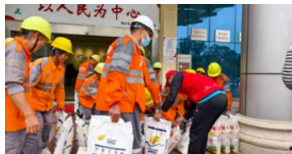

text_image

Street photo showing sanitation workers in orange uniforms and yellow helmets handling food bags near a building entrance with Chinese signage

## 发起“爱心 100 助学行动”公益捐赠

## 案例

为支持青少年公益事业、助力教育公平，创维数字与陕西省青少年发展基金会正式签订合作协议，发起“爱心 100 助学行动”公益项目。本次捐赠专项用于资助陕西省 2025 年应届困境家庭大学生，缓解其学习与生活方面的经济困难，助力学子顺利入学，以实际行动为困境学子保驾护航。

## 社区参与

创维数字海外业务覆盖欧洲、东南亚、印度、非洲、中东等全球多个国家和地区。在海外运营中，公司始终将社区共建融入企业海外发展全流程。面对部分区域本地就业机会不足、贫困社区民生保障存在缺口等社会挑战，以及不同国家和地区的文化差异、属地合规管理要求，公司积极践行海外企业社会责任，聚焦海外贫困社区核心民生需求，以公益帮扶、营养救助、本土融合为核心，持续开展多元化海外社区公益行动，用实际行动回馈属地社区，传递中国企业的温暖与担当。

## 非洲贫困社区儿童营养餐食捐赠，用爱心守护成长

案例

创维数字子公司 Skyblu 联合当地公益机构Pink Room Foundation 与 Food For LoveAfrica，聚焦非洲贫困社区弱势儿童及低收入家庭的民生需求，持续开展营养救助公益行动。该项目以提供营养均衡的餐食为核心，累计向周边贫困社区及学校捐赠超过 100 万份营养均衡的热餐与三明治，以实际行动帮助缓解当地儿童营养不良与饮食短缺问题，为孩子们的成长送去一份温暖与关怀。

natural_image

Group of children and adults outdoors, some holding buckets, with colorful objects on the ground (no visible text or symbols)

## 深化南非本土融入，获评 B-BBEE 一级贡献商认证

案例

创维数字南非子公司积极推进本土化治理与经济赋能，设置 49% 黑人所有权、24.50% 黑人女性所有权，并在管理管控、技能发展、企业与供应商发展、社会经济发展等领域全面落地本土化实践。凭借合规的股权结构与扎实的本土赋能行动，公司顺利通过权威评估，成功获评 B-BBEE 一级贡献商（Level 1Contributor），成为公司深度融入南非本土市场、履行海外企业社会责任的重要标志。

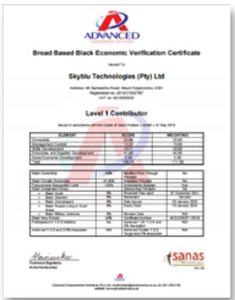

other

| Entity | Contribution (%) |
| --- | --- |
| Company A | 57.9% |
| Company B | 46.9% |
| Company C | 42.0% |
| Company D | 39.0% |
| Company E | 36.0% |
| Company F | 33.0% |
| Company G | 30.0% |
| Company H | 27.0% |
| Company I | 24.0% |
| Company J | 21.0% |
| Company K | 18.0% |
| Company L | 15.0% |
| Company M | 12.0% |
| Company N | 9.0% |
| Company O | 6.0% |
| Company P | 3.0% |
| Company Q | 1.0% |
| Company R | -1.0% |
| Company S | -3.0% |
| Company T | -5.0% |
| Company U | -7.0% |
| Company V | -9.0% |
| Company W | -11.0% |
| Company X | -13.0% |
| Company Y | -15.0% |
| Company Z | -17.0% |
| Company AA | -19.0% |
| Company AB | -21.0% |
| Company AC | -23.0% |
| Company AD | -25.0% |
| Company AE | -27.0% |
| Company AF | -29.0% |
| Company AG | -31.0% |
| Company AH | -33.0% |
| Company AI | -35.0% |
| Company AJ | -37.0% |
| Company AK | -39.0% |
| Company AL | -41.0% |
| Company AM | -43.0% |
| Company AN | -45.0% |
| Company AO | -47.0% |
| Company AP | -49.0% |
| Company AQ | -51.0% |
| Company AR | -53.0% |
| Company AS | -55.0% |
| Company AT | -57.0% |
| Company AU | -59.0% |
| Company AV | -61.0% |
| Company AW | -63.0% |
| Company AX | -65.0% |
| Company AZ | -67.0% |
| Company BA | -69.0% |
| Company BA' | -71.0% |
| Company BA'' | -73.0% |
| Company BA''' | -75.0% |
| Company BA'' | -77.0% |
| Company BA''' | -79.0% |
| Company BA'''' | -81.0% |
| Company BA''''' | -83.0% |
| Company BA''''''' | -85.0% |
| Company BA''''''''' | -87.0% |
| Company BA''''''''''' | -89.0% |
| Company BA''''''''''''' | -91.0% |
| Company BA''''''''''''' | -93.0% |
| Company BA''''''''''''''' | -95.0% |
| Company BA''''''''''''''' | -97.0% |
| Company BA''''''''''''''' | -99.0% |
| Company BA''''''''''''''' | -101.0% |
| Company BA''''''''''''''' | -103.0% |
| Company BA''''''''''''''' | -105.0% |
| Company BA''''''''''''''' | -107.0% |
| Company BA''''''''''''''' | -109.0% |
| Company BA''''''''''''''' | -111.0% |
| Company BA''''''''''''''' | -113.0% |
| Company BA''''''''''''''' | -115.0% |
| Company BA''''''''''''''' | -117.0% |
| Company BA''''''''''''''' | -119.0% |
| Company BA''''''''''''''' | -121.0% |
| Company BA''''''''''''''' | -123.0% |
| Company BA''''''''''''''' | -125.0% |
| Company BA''''''''''''''' | -127.0% |
| Company BA''''''''''''''' | -129.0% |
| Company BA''''''''''''''' | -131.0% |

## 关键绩效表

环境绩效⁶

<table><tr><td>指标</td><td></td><td>单位</td><td>2025年度</td></tr><tr><td rowspan="5">废弃物</td><td>一般工业固废生成总量</td><td>吨</td><td>1,517.04</td></tr><tr><td>一般工业固废回收循环再利用总量</td><td>吨</td><td>1,517.04</td></tr><tr><td>危险废物生成总量</td><td>吨</td><td>6.896</td></tr><tr><td>危险废物处置量</td><td>吨</td><td>6.896</td></tr><tr><td>危险废物回收循环再利用总量</td><td>吨</td><td>6.896</td></tr><tr><td rowspan="6">能源管理</td><td>能源总耗量</td><td>千瓦时</td><td>6,969,385.63</td></tr><tr><td>能源密度(能源总耗量/产值)</td><td>千瓦时/万元</td><td>23.96</td></tr><tr><td>汽油</td><td>升</td><td>4,607.04</td></tr><tr><td>直接能耗总量</td><td>千瓦时</td><td>40,264.63</td></tr><tr><td>外购电网用电</td><td>千瓦时</td><td>6,929,121</td></tr><tr><td>间接能耗总量</td><td>千瓦时</td><td>6,929,121</td></tr><tr><td rowspan="2">水资源管理</td><td>总耗水量</td><td>立方米</td><td>22,198.4</td></tr><tr><td>耗水密度(总耗水量/产值)</td><td>立方米/万元</td><td>0.0763</td></tr></table>

⁶	环境绩效统计范围为深圳创维数字技术有限公司宝安分厂。

社会绩效

<table><tr><td colspan="3">指标</td><td>单位</td><td>2025年度</td></tr><tr><td colspan="5">员工雇佣7</td></tr><tr><td rowspan="2">员工总数</td><td rowspan="2"></td><td>境内</td><td>人</td><td>3,885</td></tr><tr><td>境外</td><td>人</td><td>436</td></tr><tr><td rowspan="16">员工构成</td><td rowspan="2">按性别划分</td><td>男性</td><td>%</td><td>72.92</td></tr><tr><td>女性</td><td>%</td><td>27.08</td></tr><tr><td rowspan="3">按年龄划分</td><td>30岁或以下</td><td>%</td><td>28.42</td></tr><tr><td>31-50岁</td><td>%</td><td>68.43</td></tr><tr><td>50岁以上</td><td>%</td><td>3.15</td></tr><tr><td rowspan="2">按类型划分</td><td>中高级管理层</td><td>%</td><td>1.37</td></tr><tr><td>普通员工</td><td>%</td><td>98.63</td></tr><tr><td rowspan="3">按教育程度划分</td><td>硕士及以上</td><td>%</td><td>5.42</td></tr><tr><td>大学本科</td><td>%</td><td>31.29</td></tr><tr><td>大专及以下</td><td>%</td><td>63.30</td></tr><tr><td rowspan="6">按专业划分员工构成</td><td>生产人员</td><td>%</td><td>57.46</td></tr><tr><td>销售人员</td><td>%</td><td>7.06</td></tr><tr><td>技术人员</td><td>%</td><td>27.15</td></tr><tr><td>财务人员</td><td>%</td><td>1.67</td></tr><tr><td>行政人员</td><td>%</td><td>5.3</td></tr><tr><td>其他</td><td>%</td><td>1.37</td></tr><tr><td colspan="3">员工流失率</td><td>%</td><td>19.60</td></tr><tr><td colspan="3">全年新增就业人数</td><td>人</td><td>1,616</td></tr><tr><td colspan="3">中高层管理人员中女性占比</td><td>%</td><td>25.42</td></tr><tr><td colspan="3">少数民族员工占比</td><td>%</td><td>6.73</td></tr><tr><td colspan="3">残障员工占比</td><td>%</td><td>0.12</td></tr><tr><td colspan="3">劳动合同签订率8</td><td>%</td><td>100</td></tr><tr><td colspan="5">员工培训9</td></tr><tr><td colspan="3">受训员工总数</td><td>人次</td><td>9,722</td></tr><tr><td colspan="3">受训员工占总员工百分比</td><td>%</td><td>100</td></tr><tr><td colspan="3">员工受训总时数</td><td>小时</td><td>40,047</td></tr><tr><td colspan="3">员工平均受训时数</td><td>小时</td><td>4.12</td></tr><tr><td colspan="3">员工培训投入金额</td><td>万元</td><td>93.195</td></tr></table>

⁷	员工雇佣指标中，除另外说明外，统计范围为公司全体员工，包含海外子公司及分支机构，劳务派遣人员等。  
⁸ 	劳动合同签订率统计范围为公司正式雇员。  
⁹	员工培训统计范围不含海外子公司及分支机构。

<table><tr><td colspan="2">指标</td><td>单位</td><td>2025年度</td></tr><tr><td colspan="4">安全与健康</td></tr><tr><td rowspan="5"> $员工保障^{10}$ </td><td>社会保险覆盖率</td><td>%</td><td>100</td></tr><tr><td>员工体检覆盖率</td><td>%</td><td>100</td></tr><tr><td>工伤保险投入金额</td><td>元</td><td>1,342,331.99</td></tr><tr><td>工伤保险人员覆盖率</td><td>%</td><td>100</td></tr><tr><td>商业意外保险覆盖率</td><td>%</td><td>100</td></tr><tr><td rowspan="4"> $安全培训^{11}$ </td><td>安全应急演练次数</td><td>次</td><td>2</td></tr><tr><td>安全应急演练参与人次</td><td>人次</td><td>2,662</td></tr><tr><td>安全培训次数</td><td>次</td><td>307</td></tr><tr><td>安全培训参与人次</td><td>人次</td><td>8,052</td></tr><tr><td colspan="4">供应商</td></tr><tr><td>供应商总数</td><td></td><td>个</td><td>618</td></tr><tr><td rowspan="2">按地区划分</td><td>境内</td><td>个</td><td>551</td></tr><tr><td>境外</td><td>个</td><td>67</td></tr><tr><td>供应商签署《可持续采购章程》比例</td><td></td><td>%</td><td>100</td></tr><tr><td>供应商签署廉洁协议比例</td><td></td><td>%</td><td>100</td></tr><tr><td colspan="4">服务责任</td></tr><tr><td>客户投诉回应率</td><td></td><td>%</td><td>100</td></tr><tr><td>客户投诉问题整改完成率</td><td></td><td>%</td><td>100</td></tr><tr><td colspan="4">反贪污</td></tr><tr><td>参加反贪污培训的董事</td><td></td><td>人</td><td>9</td></tr><tr><td>参加反贪污培训的董事占比</td><td></td><td>%</td><td>100</td></tr><tr><td>参加反贪污培训的高管人数</td><td></td><td>人</td><td>3</td></tr><tr><td>参加反贪污培训的高管占比</td><td></td><td>%</td><td>100</td></tr><tr><td>参加反贪污培训的员工(不含高管)人数</td><td></td><td>人</td><td>695</td></tr><tr><td colspan="4">合规培训</td></tr><tr><td>开展法规培训次数</td><td></td><td>次</td><td>9</td></tr><tr><td>法规相关培训覆盖人次</td><td></td><td>人次</td><td>1,556</td></tr><tr><td colspan="4">社会公益</td></tr><tr><td>扶贫及乡村振兴项目总投入</td><td></td><td>元</td><td>290,569</td></tr><tr><td>参与志愿活动人次</td><td></td><td>人次</td><td>16</td></tr><tr><td>参与志愿服务时长</td><td></td><td>小时</td><td>108</td></tr></table>

10	 员工保障统计范围为公司正式雇员。  
11 安全培训统计范围为深圳创维数字技术有限公司宝安分厂、深圳创维汽车智能有限公司、创维液晶器件（深圳）有限公司。

<table><tr><td colspan="2">指标</td><td>单位</td><td>2025年度</td></tr><tr><td colspan="4">研发创新</td></tr><tr><td colspan="2">研发费用</td><td>元</td><td>483,036,491.65</td></tr><tr><td colspan="2">研发投入占比营业收入</td><td>%</td><td>5.48</td></tr><tr><td colspan="2">研发人员数量</td><td>人</td><td>1,173</td></tr><tr><td colspan="2">研发人员占比</td><td>%</td><td>27.15</td></tr><tr><td colspan="2">发明专利申请数量</td><td>项</td><td>93</td></tr><tr><td colspan="2">实用新型专利申请数量</td><td>项</td><td>57</td></tr><tr><td rowspan="2">发明专利授权数量</td><td>截至2025年12月31日</td><td>项</td><td>767</td></tr><tr><td>2025年度新增</td><td>项</td><td>33</td></tr><tr><td rowspan="2">实用新型专利授权数量</td><td>截至2025年12月31日</td><td>项</td><td>870</td></tr><tr><td>2025年度新增</td><td>项</td><td>24</td></tr><tr><td rowspan="2">外观设计专利授权数量</td><td>截至2025年12月31日</td><td>项</td><td>942</td></tr><tr><td>2025年度新增</td><td>项</td><td>70</td></tr><tr><td rowspan="2">软件著作权数量</td><td>截至2025年12月31日</td><td>项</td><td>658</td></tr><tr><td>2025年度新增</td><td>项</td><td>53</td></tr><tr><td rowspan="2">授权专利总数累计</td><td>截至2025年12月31日</td><td>项</td><td>2,579</td></tr><tr><td>2025年度新增</td><td>项</td><td>127</td></tr></table>

经营绩效

<table><tr><td>指标</td><td>单位</td><td>2025年度</td></tr><tr><td>营业收入</td><td>元</td><td>8,808,870,375.97</td></tr><tr><td>归母净利润总额</td><td>元</td><td>179,863,246.73</td></tr><tr><td>资产总额</td><td>元</td><td>11,752,417,600.26</td></tr><tr><td>纳税总额</td><td>元</td><td>255,552,917.81</td></tr><tr><td>资产负债率</td><td>%</td><td>44.99</td></tr></table>

响应联合国可持续发展目标（SDGs）行动

<table><tr><td>SDGs</td><td>响应行动</td><td>所在报告章节</td></tr><tr><td>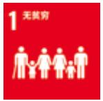</td><td>通过物资捐赠、项目援建助力乡村振兴,关注老年人等社会弱势群体</td><td>爱心回馈社会</td></tr><tr><td>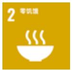</td><td>积极开展海外营养救助公益,为弱势儿童捐赠餐食,助力消除饥饿</td><td>爱心回馈社会</td></tr><tr><td>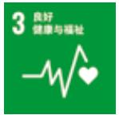</td><td>完善健康保障与劳动防护,开展关怀活动,守护员工身心健康</td><td>构建幸福职场</td></tr><tr><td>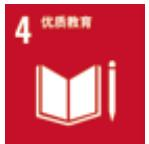</td><td>开展爱心助学行动,资助贫困学生,助力教育公平与优质教育普及</td><td>爱心回馈社会</td></tr><tr><td>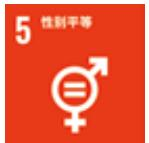</td><td>恪守公开、公平、公正与平等竞争原则,保障员工不因性别差异受到差别对待</td><td>构建幸福职场</td></tr><tr><td>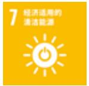</td><td>推进清洁能源建设,在生产经营中使用更经济、优质的清洁能源</td><td>践行绿色运营</td></tr><tr><td>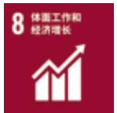</td><td>尊重并保障员工合法权益,打造多元化职场团队,为员工职业发展提供全方位支持</td><td>构建幸福职场</td></tr><tr><td>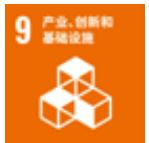</td><td>持续提升自主创新能力,优化技术赋能产业升级</td><td>强化公司治理创新驱动发展</td></tr><tr><td>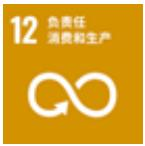</td><td>降低生产运营中的资源消耗,减少废弃物排放,确保产品符合国家及国际环保标准</td><td>创新驱动发展锤炼匠心品质打造绿色产品促进循环经济</td></tr><tr><td>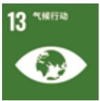</td><td>持续优化能源结构,树立绿色发展理念,助力降低碳排放水平</td><td>应对气候变化</td></tr><tr><td>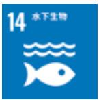</td><td>重视生产运营对水环境的影响,确保废水合规排放,不影响社区周边水下生物</td><td>环境合规管理</td></tr><tr><td>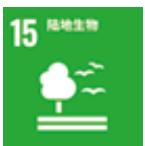</td><td>重视生产运营对生态环境的影响,开展公益活动减少塑料垃圾对生态环境的影响</td><td>环境合规管理践行绿色运营</td></tr><tr><td>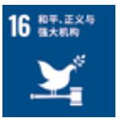</td><td>健全合规与反贿赂体系,廉洁透明经营,筑牢法治诚信治理根基</td><td>依法合规经营恪守商业道德</td></tr><tr><td>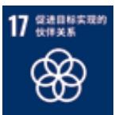</td><td>深耕技术创新,主导国际标准,产学研协同赋能产业与新型基础设施升级</td><td>负责任供应链赋能行业生态</td></tr></table>

深交所指标索引

<table><tr><td>维度</td><td>议题</td><td>对应章节</td></tr><tr><td rowspan="8">环境</td><td>应对气候变化</td><td>应对气候变化</td></tr><tr><td>污染物排放</td><td>环境合规管理</td></tr><tr><td>废弃物处理</td><td>环境合规管理</td></tr><tr><td>生态系统和生物多样性保护</td><td>践行绿色运营</td></tr><tr><td>环境合规管理</td><td>环境合规管理</td></tr><tr><td>能源利用</td><td>践行绿色运营</td></tr><tr><td>水资源利用</td><td>践行绿色运营</td></tr><tr><td>循环经济</td><td>促进循环经济</td></tr><tr><td rowspan="9">社会</td><td>乡村振兴</td><td>爱心回馈社会</td></tr><tr><td>社会贡献</td><td>爱心回馈社会</td></tr><tr><td>创新驱动</td><td>创新驱动发展</td></tr><tr><td>科技伦理</td><td>保障信息安全</td></tr><tr><td>供应链安全</td><td>负责任供应链</td></tr><tr><td>平等对待中小企业</td><td>负责任供应链</td></tr><tr><td>产品和服务安全与质量</td><td>锤炼匠心品质提升服务质量</td></tr><tr><td>数据安全与客户隐私保护</td><td>保障信息安全</td></tr><tr><td>员工</td><td>构建幸福职场</td></tr><tr><td rowspan="4">可持续发展相关治理</td><td>尽职调查</td><td>ESG 管理</td></tr><tr><td>利益相关方沟通</td><td>ESG 管理</td></tr><tr><td>反商业贿赂及反贪污</td><td>恪守商业道德</td></tr><tr><td>反不正当竞争</td><td>恪守商业道德</td></tr></table>

## 意见反馈表

## 尊敬的读者：

您好！

感谢您阅读本报告。为了向您提供更有价值的信息，同时不断提升公司 ESG 工作水平与成效，优化公司履行社会责任的能力诚挚邀请您填写下表，通过电子邮件，邮寄或扫描二维码的方式反馈给我们，期待您的宝贵意见

## 我们的联系方式：

地址：深圳市南山区科技园高新南一道创维大厦 A 座 13-16 楼

电话：（86）0755-26010018

E-mail：skydigital@skyworth.com

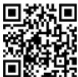

扫一扫，

在线填写问卷

## 您对本报告的评价：（请在相应位置打√）

您认为本报告是否突出反映公司在 ESG 方面的各项工作和重大影响？

□很好

□比较好

□一般

□不太好

□很不好

您认为本报告披露的信息是否清晰、准确、完整？

□很好

□比较好

□一般

□不太好

□很不好

您认为本报告的内容编排和风格设计是否便于阅读？

□很好

□比较好

□一般

□不太好

□很不好

您对本报告哪一部分内容最感兴趣？

您认为还有哪些需要了解的信息在本报告中没有反映？

您对我们今后发布 ESG 报告有什么建议？

感谢您的阅读和反馈！

## SKYWORTH创维数字

## 创维数字股份有限公司

地址：深圳市南山区科技园高新南一道创维大厦 A 座 13-16 楼

电话：（86）0755-26010018

邮箱：skydigital@skyworth.com

网址：https://www.skyworthdigital.com