## HBIS河钢资源

股票代码：000923

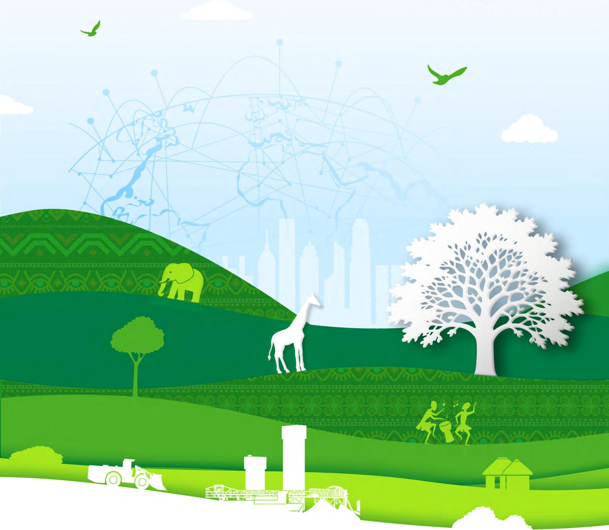

natural_image

Stylized illustration of a green landscape with silhouettes of animals, a tree, and a city skyline in the background (no text or symbols)

## 2025 河钢资源股份有限公司HBIS RESOURCES CO.,LTD.

环境、社会及治理（ESG）报告

## HHBIS 河钢资源

## 目录

## CONTENTS

报告前言 03

董事会声明 06

董事长致辞 07

走进河钢资源 09

ESG 管理 13

2025年度履责绩效 17

责任聚焦一： 19

保障优质矿石供应，提升全球产业韧性

责任聚焦二： 23

携手共建“一带一路”，收获中非合作硕果

## 25

## 深耕海外创业共筑稳健经营根基

规范运作，提升管理效能 27

守法合规，防范经营风险 32

品质卓越，赢得客户信赖 37

恪守底线，筑牢安全屏障 39

## 43

## 践行生态创优共绘绿色资源画卷

低碳发展，应对气候变化 45

环境管理，严控污染排放 46

清洁生产，减少资源消耗 50

生态修复，重塑矿区风貌 53

## 59

## 引领价值创新共享融合美好社会

创新驱动，激发科技活力 61

互利共赢，打造责任链条 65

以人为本，搭建成长舞台 67

普惠包容，建设和谐社区 74

未来展望 77

附录 78

## 报告前言

## 报告说明

本报告是河钢资源股份有限公司向社会公开发布的第6份环境、社会及公司治理（ESG）报告，旨在真实反映2025年度公司在ESG方面的发展与实践成绩，向利益相关方公开报告公司运行情况，帮助公司股东及债权人、合作伙伴、员工和其他利益相关方深入透视公司的社会责任实践活动。我们期望通过发布ESG报告的方式，加强与利益相关方的沟通凝聚共识，促进可持续发展。

## 时间范围

本报告为年度报告，时间跨度为2025年1月1.日至2025年12月.31.日，为增强报告可比性及前瞻性，部分内容有所延伸。

## 报告范围

本报告以“河钢资源股份有限公司”为主体，包括下属分子公司，除特别说明外，本报告范围与本公司年报范围保持一致

## 编制依据

联合国2030年可持续发展目标（SDGs）

全球报告倡议组织《可持续发展报告标准》（GRI Standards）

深圳证券交易所《深圳证券交易所上市公司自律监管指引第1号—主板上市公司规范运作》

深圳证券交易所《深圳证券交易所上市公司自律监管指引第17号—可持续发展报告（试行）》

中国企业改革与发展研究会、责任云研究院《中国企业可持续发展报告指南(CASS-ESG6.0)之黑色金属矿采选业》

## 资料来源及可靠性保证

本报告引用的全部信息数据均来自河钢资源正式文件、统计报告及财务报告，经过公司统计、汇总与审核的各职能部门、各经营单位的内部数据及公开信息。同时，本报告涉及的货币种类及金额，如无特殊说明，均以人民币为计量单位。财务数据如与年报有出入，以年报为准

## 称谓说明

在本报告书中，为便于表述和阅读，“河钢资源”“公司”“我们”指“河钢资源股份有限公司”，“河钢集团”指“河钢集团有限公司”，“PMC”指“帕拉博拉矿业有限公司（Palabora Mining Company Proprietary Limited）”，“PC”指“帕拉博拉铜业有限公司（Palabora Copper (Pty) Limited）”。

## 单位说明

在本报告中，涉及南非兰特的货币金额按照报告期末(2025年12月31日）汇率换算为人民币。

## 报告获取

为了践行低碳环保和可持续发展的理念，本报告可以在公司网站（http://www.hbiszy.com）、巨潮资讯网（http://www.cninfo.com.cn）在线阅读或下载报告电子版，如果您还想了解本报告以外的公司其他信息，可查阅公司年报或浏览公司网站。

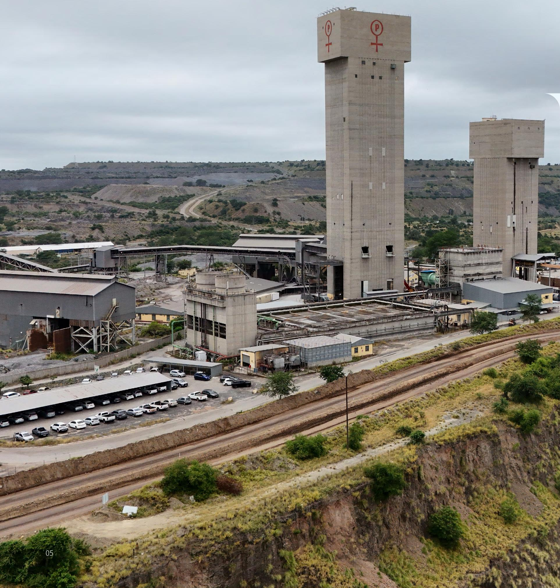

natural_image

Aerial view of an industrial mining site with two tall concrete structures and surrounding roads, featuring a 'P' gender symbol on the tower (no visible text or symbols on structures)

## 董事会声明

公司依据《中华人民共和国公司法》《中华人民共和国证券法》《上市公司治理准则》《深圳证券交易所上市公司自律监管指引第1号—主板上市公司规范运作》 《深圳证券交易所上市公司自律监管指引第17号一可持续发展报告(试行)》等法律法规、规范性文件及《公司章程》的规定，设立董事会环境、社会及治理(ESG)委员会，持续建立健全ESG治理架构，完善ESG管理体系。

董事会是公司环境、社会及公司治理事宜的最高决策机构，负责将ESG事项融入公司管理规定和经营决策过程中，审批公司ESG策略制定、风险管理、信息披露及目标落地等工作，保障公司ESG治理的独立性、高效性与专业性。

ESG委员会委员由董事会选举产生，在董事会领导下开展工作，对董事会负责，定期向董事会汇报年度ESG工作开展情况。ESG委员会主要履行以下职责：研究拟定公司ESC发展政策、核心策略与绩效评价标准；制定公司ESG管理战略规划、实施细则与年度工作目标；指导、监督公司ESG相关工作的落地实施，督查ESG工作实际成效与目标完成情况，并提出优化意见与改进建议，确保各项ESG工作目标按期落地：审议公司ESG相关报告及其他与ESG相关的重大事项，向董事会提出专业审议意见。

报告期内，董事会高度重视利益相关方关于ESG事宜的期望，结合行业特性及公司运营的重点关注议题开展利益相关方调研活动，对ESG议题进行筛选、评估和排序，及时调整，确定公司的ESG重大性议题：基于外部宏观经济社会环境与公司整体发展战略，统筹推动公司及各部门严格落实ESG 管理责任，对 2025 年度各模块ESG指标完成情况、年度目标达成情况开展全面自我评估。

本报告详尽披露了公司2025年ESG工作的进展与成效，并经董事会审议通过。公司董事会及全体董事保证本报告内容不存在任何虚假记载、误导性陈述或重大遗漏，并对其内容的真实性、准确性和完整性承担个别及连带责任。

## 董事长致辞

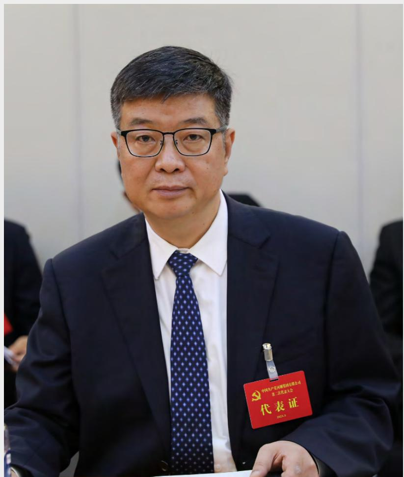

text_image

中国共产党交通警察政治协商会议
第一次代表大会
代表证
2013.5

2025年，地缘政治格局演变带来的不确定性日益加剧，全球产业链加速重构。在国家“双碳”目标引领和“一带一路”高质量发展深入推进的背景下河钢资源牢牢把握发展新质生产力的历史机遇，将ESG理念深度融入企业战略与运营全过程，坚持以环境责任筑牢发展底色，以社会责任彰显企业担当，以治理效能提升核心竞争力，致力于打造具有全球影响力的绿色矿业标杆，为构建人类命运共同体贡献力量。

这一年，我们深耕治理赋能，完善公司治理体系，以规范管控筑牢发展根基。公司强化合规管理，健全风险防控体系，严守商业道德底线，切实保护投资者权益；聚焦品质卓越，深化全流程质量管理，优化服务体系，筑牢客户信任基石；恪守安全底线，持续完善安全管理体系，全面践行“零伤害”安全理念，将人员健康与作业安全置于首位夯实海外稳健运营根基。

这一年，我们坚守绿色初心，践行“双碳”发展使命，以精准举措绘就生态底色。公司以环保合规为底线，以超低排放为目标，系统推进废气，废水和固体废弃物全过程管控：2025年完成闭矿成本审查与复垦标准更新，通过地形重塑、十壤改良与本十植被种植，逐步恢复生态系统功能；实施《生物多样性行动计划》，定期开展生态调查、昆虫学监测以及草食动物活动轨迹评估，有效提升矿区生态系统的稳定性与韧性，为生物多样性保护和绿色矿山建设提供了可复制的实践范式

这一年，我们践行责任担当，锚定共同发展目标，以务实行动传递企业温度。公司坚持创新驱动，完善创新管理体系，多次参与核心学术会议，与南非大学等高等院校开展合作，加快科技成果转化；坚持以人为本，严格遵守《南非宪法》《就业公平法》等所在地相关法律规定，切实保障员工合法权益：积极履行社会责任，支持当地企业发展与教育事业，真正做到“授人以渔”；投资公共基建与医疗健康，助力建设和谐包容的社区，让企业发展成果惠及更多人群。

面向未来，河钢资源将继续胸怀“国之大者”，主动融入国家“双碳”目标和“一带一路”高质量发展大局，以发展新质生产力为牵引，坚定不移走绿色、可持续之路，推动经济、环境与社会价值协同共进，奋力书写新时代资源型企业高质量发展的崭新篇章！

## 走进河钢资源

## 公司简介

河钢资源股份有限公司（英文名：HBIS Resources Co.,Ltd.）， 始建于1950年，于1999年7月14日在深圳证券交易所上市（股票代码：000923.SZ)，注册地位于河北省张家口市，为地方国有控股上市公司。公司通过四联香港间接控股 PMC 开展铜、铁矿石和蛭石的开采、加工、销售，形成了在南非进行开采和加工，产品销往北美、欧洲、亚洲等地的产业布局，在本地市场和国际市场均具有较强的竞争力。

河北省人民政府国有资产监督管理委员会  
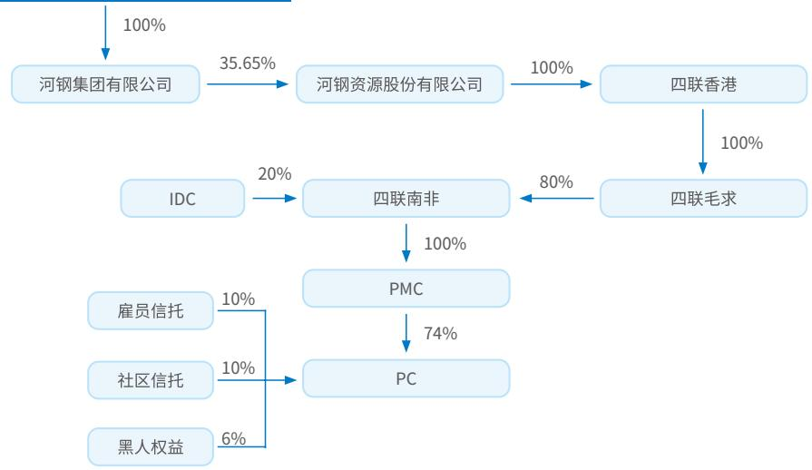

flowchart

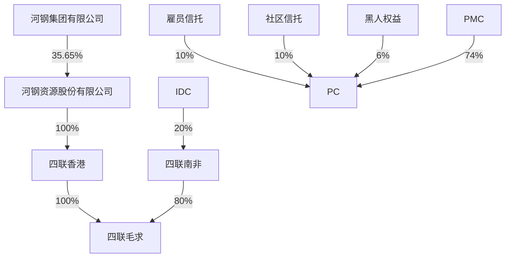
```mermaid
graph TD
  A["河钢集团有限公司"] -->|35.65%| B["河钢资源股份有限公司"]
  B -->|100%| C["四联香港"]
  C -->|100%| D["四联毛求"]
  E["IDC"] -->|20%| F["四联南非"]
  F -->|80%| D
  G["雇员信托"] -->|10%| H["PC"]
  I["社区信托"] -->|10%| H
  J["黑人权益"] -->|6%| H
  K["PMC"] -->|74%| H
```

公司股权架构

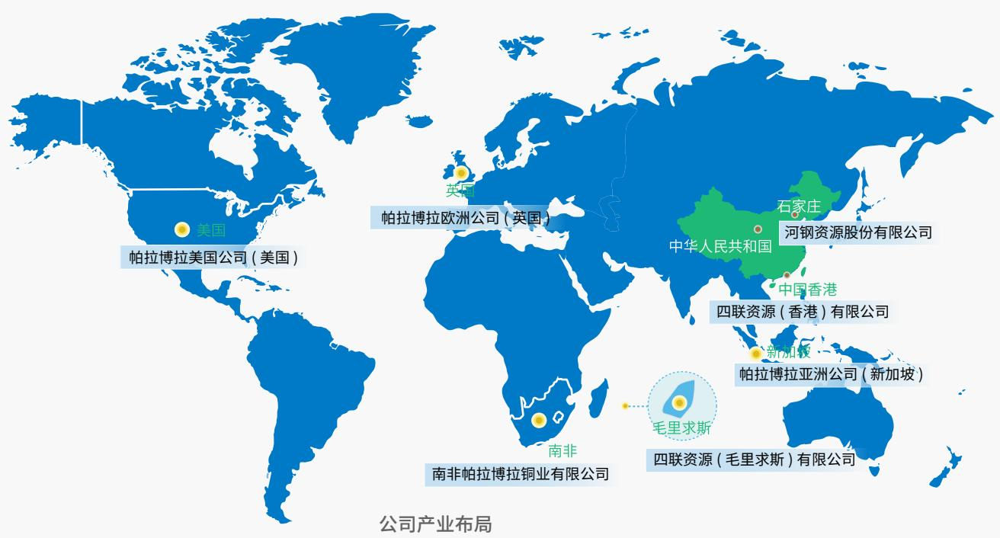

text_image

帕拉博拉美国公司（美国）
帕拉博拉欧洲公司（英国）
中华人民共和国
石家庄
河钢资源股份有限公司
中国香港
四联资源（香港）有限公司
新加坡
帕拉博拉亚洲公司（新加坡）
南非
南非帕拉博拉铜业有限公司
毛里求斯
四联资源（毛里求斯）有限公司
公司产业布局

公司主营产品  
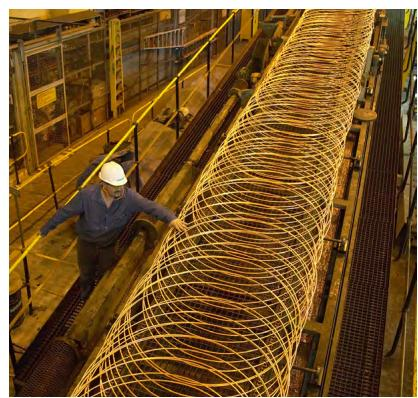

natural_image

Industrial worker in hard hat inspecting a large steel rebar cage on a factory conveyor (no visible text or symbols)

铜产品

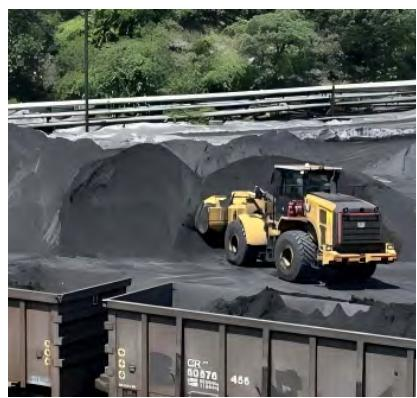

natural_image

Yellow front loader dumping coal into a large pile of bulk material on a freight train (no visible text or symbols)

铁矿石产品

natural_image

Close-up of hands holding raw material fragments (no text or symbols visible)

蛭石产品

公司风貌  
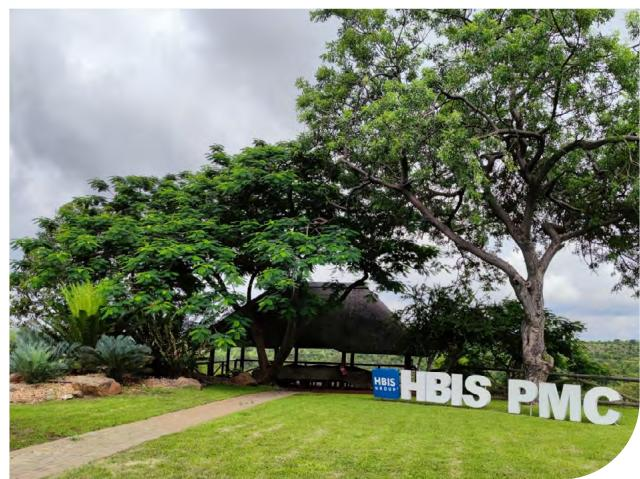

natural_image

Exterior view of a landscaped park with large 'HBIS PMC' sign and tree canopy under cloudy sky (no other text or symbols)

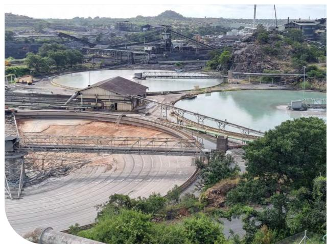

natural_image

Aerial view of a large industrial water treatment facility with circular tanks and concrete structures, surrounded by greenery and hills (no visible text or symbols).

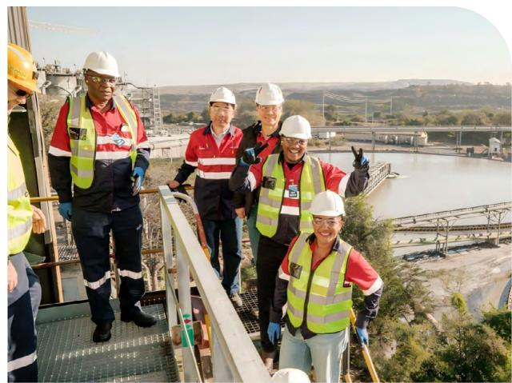

natural_image

Group of construction workers in safety vests and helmets on a rooftop, with industrial water and hills in the background (no visible text or symbols)

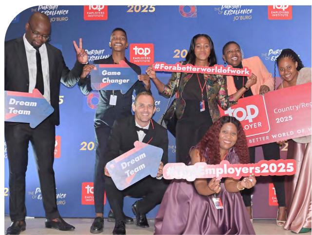

text_image

THE PURSANT EXCELLENCE JOBURG
TOP
EMPLOYEER INSTITUTE
2025
THE PURSANT OF EXCELLENCE JOBURG
TOP
EMPLOYEER INSTITUTE
20
#FORABETTERWORLDOFWORK
Dream Team
Game Change
Top Employer
2025
THE PURSANT OF EXCELLENCE JOBURG
Dream Team
Top Employers2025
Country/Reg
Better World of Work

## 企业文化

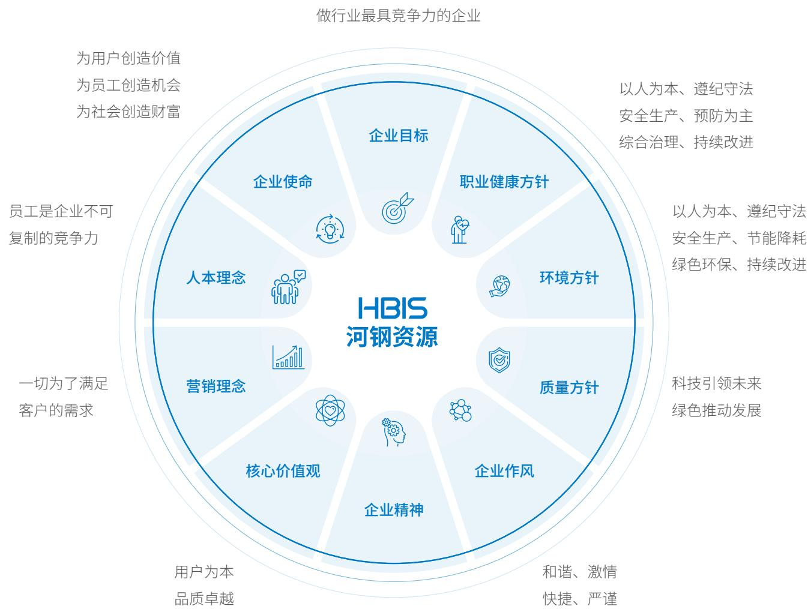

flowchart

```mermaid
graph LR
  Center["HBIS\n河钢资源"]
  
  subgraph Core Components
    direction TB
    A["企业目标"]
    B["职业健康方针"]
    C["环境方针"]
    D["质量方针"]
    E["企业作风"]
    F["企业精神"]
    G["核心价值观"]
    H["营销理念"]
    I["人本理念"]
    J["企业使命"]
    K["员工是企业不可复制的竞争力"]
  end
  
  subgraph Core Relationships
    direction TB
    L["以人为本、遵纪守法\n安全生产、预防为主\n综合治理、持续改进"]
  end
  
  Center --> A
  Center --> B
  Center --> C
  Center --> D
  Center --> E
  Center --> F
  Center --> G
  Center --> H
  Center --> I
  Center --> J
  
  Center -.->|基础要素 | K
  Center -.->|基础要素 | L
  Center -.->|基础要素 | M
  Center -.->|基础要素 | N
  Center -.->|基础要素 | O
  Center -.->|基础要素 | P
  Center -.->|基础要素 | Q
  Center -.->|基础要素 | R
  Center -.->|基础要素 | S
  Center -.->|基础要素 | T
  Center -.->|基础要素 | U
  Center -.->|基础要素 | V
  Center -.->|基础要素 | W
  Center -.->|基础要素 | X
  Center -.->|基础要素 | Y
  Center -.->|基础要素 | Z
  
  Center ==> A
  Center ==> B
  Center ==> C
  Center ==> D
  Center ==> E
  Center ==> F
  Center ==> G
  Center ==> H
  Center ==> I
  Center ==> J
  
  Center ==> K
  Center ==> L
  Center ==> M
  Center ==> N
  Center ==> O
  Center ==> P
  Center ==> Q
  Center ==> R
  Center ==> S
  Center ==> T
  Center ==> U
  Center ==> V
  Center ==> W
  Center ==> X
  Center ==> Y
  Center ==> Z
  
  Center ==> AA
  
  Center ==> AB
  
  Center ==> AC
  
  Center ==> AD
  
  Center ==> AE
  
  Center ==> AF
  
  Center ==> AG
  
  Center ==> AH
  
  Center ==> AI
  
  Center ==> AJ
  
  Center ==> AK
  
  Center ==> AL
  
  Center ==> AM
  
  Center ==> AN
  
  Center ==> AO
  
  Center ==> AP
  
  Center ==> AQ
  
  Center ==> AR
  
  Center ==> AS
  
  Center ==> AT
  
  Center ==> AU
  
  Center ==> AV
  
  Center ==> AW
  
  Center ==> AX
  
  Center ==> AZ
  
  Center ==> BA
  
  Center ==> BC
  
  Center ==> BC
  
  Center ==> BD
  
  Center ==> BE
  
  Center ==> BF
  
  Center ==> BG
  
  Center ==> BH
  
  Center ==> BI
  
  Center ==> BJ
  
  Center ==> BK
  
  Center ==> BL
  
  Center ==> BM
  
  Center ==> BN
  
  Center ==> BO
  
  Center ==> BP
  
  Center ==> BR
  
  Center ==> BT
  
  Center ==> BU
  
  Center ==> BV
  
  Center ==> BW
  
  Center ==> BX
  
  Center ==> BY
  
  Center ==> BWJ
  
  Center ==> BXJ
  
  Center ==> BYJ
  
  Center ==> BYK
  
  Center ==> BYL
  
  Center ==> BYM
  
  Center ==> BYN
  
  Center ==> BYO
  
  Center ==> BYP
  
  Center ==> BYQ
  
  Center ==> BYR
  
  Center ==> BYS
  
  Center ==> BYT
  
  Center ==> BYU
  
  Center ==> BYV
  
  Center ==> BYW
  
  Center ==> BYX
  
  Center ==> BYY
  
  Center ==> BYZ
  
  Center ==> BYWJ
  
  Center ==> BYXJ
  
  Center ==> BYYJ
  
  Center ==> BYWJ  
  Center ==> BYXJ  
  Center ==> BYYJ  
  Center ==> BYWJ  
  Center ==> BYYJ  
  Center ==> BYWJ  
  Center ==> BYYJ  
  Center ==> BYWJ  
  Center ==> BYYJ  
  Center ==> BYWJ  
  Center ==> BYYJ  
  Center ==> BYWJ  
  Center ==> BYYJ  
  Center ==> BYWJ  
  Central Axis: HBIS River Resources
```

创业、创优、创新

## 公司战略

在资源领域做大做强、实现可持续健康发展是公司的战略目标。公司将在未来着眼全球资源市场，继续寻求符合自身特点的项目，抓住资本市场机遇，把握时机，实现并购，扩大公司产业发展规模，增强公司的持续盈利能力

## 领导团队

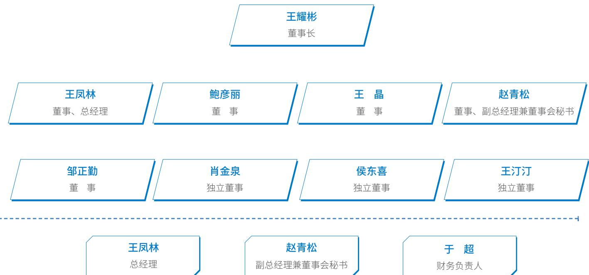

flowchart

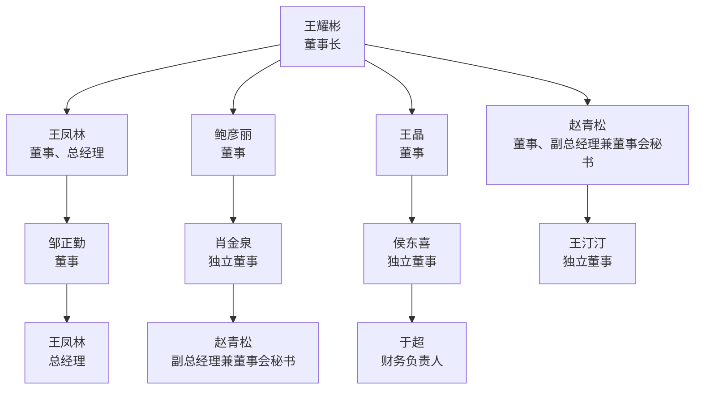
```mermaid
graph TD
  A["王耀彬\n董事长"] --> B["王凤林\n董事、总经理"]
  A --> C["鲍彦丽\n董事"]
  A --> D["王晶\n董事"]
  A --> E["赵青松\n董事、副总经理兼董事会秘书"]
  B --> F["邹正勤\n董事"]
  C --> G["肖金泉\n独立董事"]
  D --> H["侯东喜\n独立董事"]
  E --> I["王汀汀\n独立董事"]
  F --> J["王凤林\n总经理"]
  G --> K["赵青松\n副总经理兼董事会秘书"]
  H --> L["于超\n财务负责人"]
```

## 企业荣誉

PMC获评“南非黑人经济振兴法案（B-BBEE）二级合规贡献企业证书”

PMC荣膺“2025年度最佳雇主”称号，共计8次获此殊荣

## ESG 管理

公司始终承诺以合规诚信、公开透明、可持续的经营理念，持续致力于降低自身环境足迹，助推包容性增长，恪守高标准的公司治理准则，将ESG管理融入企业发展战略与日常经营，完善ESG治理体系建设，不断提升履责实践能力，关注并满足利益相关方的期望与诉求，促进企业与环境、社会的可持续发展。

## ESG治理机制

公司设立 ESG 委员会，ESG 委员会在董事会领导下开展工作，对董事会负责，委员会委员由董事会选举产生，由三名董事组成，其中至少包括一名独立董事；ESG 相关职责人员均具备对应技术、运营和治理专业知识，有效确保公司ESG战略目标落地实施；构建由“决策层、组织层、实施层”构成的三级ESG治理体系，形成“统筹有力、协同高效执行到位”的ESG工作体系。

<table><tr><td colspan="2">ESG 治理架构</td></tr><tr><td>董事会</td><td>负责将 ESG 事项融入公司管理规定和经营决策过程中,审批公司 ESG 策略制定、风险管理、信息披露及目标落地等工作。</td></tr><tr><td>ESG 委员会</td><td>负责研究制定公司的 ESG 政策制度、战略规划、实施细则等,对公司业务具有重大影响的 ESG 相关风险和机遇采取适当的应对措施,指导和监督公司 ESG 工作的实施,并对实际的表现及目标完成情况进行监督和检查,审议公司 ESG 相关报告及其他 ESG 相关的重大事项,办理董事会授权或交办的其他事项。</td></tr><tr><td>ESG 工作小组</td><td>负责 ESG 工作的具体落地执行,统筹推进 ESG 战略目标与政策框架的有效落地实施,构建起覆盖广泛、运转顺畅的 ESG 管理闭环。</td></tr></table>

公司不断完善ESG制度体系，推动ESG管理标准化、制度化、体系化建设，全面规范ESG工作的执行路径，提升ESC管理可操作性；推动下属单位依托安全、健康、环境与质量(SHEO)管理系统，建立健全覆盖安全、健康、环境及质量相关ESG议题的管理制度，强化在可持续发展与ESG方面的承诺。

## ESG能力提升

公司将ESG理念全方位嵌入运营管理全链条，多维度打造高质量发展样板，连续6年编制发布环境、社会及治理（ESG)报告，系统梳理总结ESG履责实践及成效，不断提升ESG信息披露水平：开展经济赋权合规培训、社会与劳工计划合规培训、就业公平合规培训等ESG主题培训，积极参与行业ESG交流活动，通过研讨会、知识共享等方式提升员工可持续发展能力，持续强化企业ESG管理能力。

## 荣誉

《河钢资源股份有限公司 2024 环境、社会及管治（ESG）报告》获中国企业社会责任报告评级专家委员会“五星级”评价

荣获“2025ESG 鲸牛奖·ESG 先锋企业”

入选“中国ESG上市公司先锋100（2025）”榜单，位列第96 位

入选“中国ESG上市公司国企先锋100（2025）”榜单，位列第15 位

入选“中国ESG上市公司京津冀先锋50（2025）”榜单，位列第35位

《河钢资源员工权益与发展实践构建人本导向的可持续职场生态》ESG案例入选“2025年上市公司可持续发展最佳实践案例”

## ESG 议题评估

公司根据《欧洲可持续报告准则》(ESRS)，《国际财务报告可持续披露准则第1号—可持续相关财务信息披露一般要求》(IFRSS1)等最新国际披露标准，严格遵守深圳证券交易所《深圳证券交易所上市公司自律监管指引第17号—可持续发展报告(试行)》要求，建立双重重要性议题评估框架，识别，评估和优先处理可持续发展相关影响，风险及机遇并于本报告由就4项具有财务重要性的议题进行重点回应

## 双重重要性评估流程

## 步骤1：背景分析与议题识别

根据六类因素，识别20项潜在重要性议题，组建议题库。

## 步骤3：双重重要性评估分析

基于步骤2评估数据，形成2025年ESG重要性议题矩阵，确定本年度重要性议题及其优先级。

## 步骤2：

2-1影响重要性评估：影响程度：利益相关方问卷调查：可能性：内外部ESG专家评估。  
2-2财务重要性评估：内部财务部门专家从两个维度评估各议题财务重要性，多个部门进行审阅与确认。

## 步骤4：分析结果指导 ESG 披露与实践

环境、社会及治理（ESG）委员会审阅并确认分析结果，公司以分析结果为导向，开展针对性披露与实践提升。

## 重要性议题库

<table><tr><td>1. 应对气候变化</td><td>2. 污染物排放</td><td>3. 废弃物处理</td><td>4. 生态系统和生物多样性保护</td></tr><tr><td>5. 环境合规管理</td><td>6. 能源利用</td><td>7. 水资源利用</td><td>8. 社会贡献</td></tr><tr><td>9. 创新驱动</td><td>10. 供应链安全</td><td>11. 行业合作</td><td>12. 平等对待中小企业</td></tr><tr><td>13. 产品和服务安全与质量</td><td>14. 信息安全</td><td>15. 人权保障</td><td>16. 员工培训与发展</td></tr><tr><td>17. 职业健康与安全生产</td><td>18. 风险防控</td><td>19. 合规经营</td><td>20. 商业道德和透明度</td></tr></table>

ESG重要性议题矩阵  
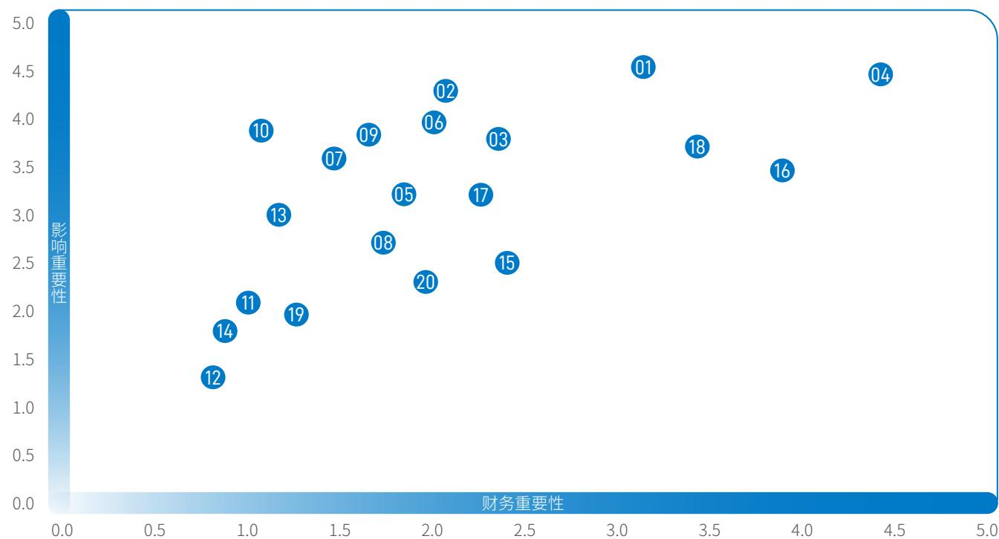

bubble

| Item | 财务重要性 | 影响重要性 |
| --- | --- | --- |
| 12 | ~0.8 | ~1.3 |
| 14 | ~0.9 | ~1.8 |
| 11 | ~1.0 | ~2.1 |
| 19 | ~1.3 | ~2.0 |
| 13 | ~1.2 | ~3.0 |
| 10 | ~1.1 | ~3.9 |
| 07 | ~1.5 | ~3.6 |
| 09 | ~1.7 | ~3.8 |
| 08 | ~1.8 | ~2.7 |
| 05 | ~1.9 | ~3.2 |
| 20 | ~2.0 | ~2.3 |
| 06 | ~2.0 | ~4.0 |
| 02 | ~2.1 | ~4.3 |
| 17 | ~2.3 | ~3.2 |
| 15 | ~2.4 | ~2.5 |
| 03 | ~2.4 | ~3.8 |
| 01 | ~3.1 | ~4.5 |
| 18 | ~3.4 | ~3.7 |
| 16 | ~3.9 | ~3.5 |
| 04 | ~4.4 | ~4.5 |

## 利益相关方沟通

公司按照“真实、全面、及时、充分”的信息披露原则，畅通与政府、客户、员工、供应商、投资者和社会公众的沟通渠道通过开展客户满意度调查、董事会会议、业绩说明会、发布报告等多元化方式与内外部利益相关方互动，深入了解利益相关方对公司环境、社会及治理领域的期望和诉求，树立负责任的企业形象

<table><tr><td>利益相关方</td><td>诉求</td><td>回应</td></tr><tr><td>政府</td><td>合规经营支持地区发展依法纳税</td><td>遵守法律法规提供就业岗位主动纳税</td></tr><tr><td>客户</td><td>产品与服务创新保障客户权益提升客户满意度</td><td>加强科技与管理创新坚持诚信经营积极回应客户需求</td></tr><tr><td>员工</td><td>搭建职业发展通道丰富的薪酬福利保障职业健康维护职工权益</td><td>完善内部管理制度为员工提供工作生活保障加强职业健康及安全体系建设员工沟通反馈机制</td></tr><tr><td>社区</td><td>积极融入社区开展志愿活动</td><td>加强社区沟通开展公益项目</td></tr><tr><td>环境</td><td>节能减排保护生物多样性</td><td>提升资源和能源使用效率践行绿色管理推进绿色制造生物多样性保护与利用</td></tr><tr><td>供应商</td><td>公开、公平采购互利共赢</td><td>打造责任供应链合作与交流</td></tr><tr><td>投资者</td><td>完善公司治理合规信息披露公司持续盈利</td><td>提升内控水平定期信息披露保障股东权益</td></tr></table>

## 2025 年度履责绩效

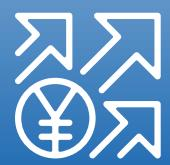  
经营绩效

营业收入

资产总额

58.4亿元

187.9亿元

利润总额

11.0 亿元

铜产量

2.5万吨

磁铁矿产量

1,125.0 万吨

蛭石产量

10.6万吨

  
环境绩效

能源消耗总量

831,542.3兆瓦时

非化石能源量（电力）

580,759.9兆瓦时

节水量

-29.8万立方米

循环用水量

4560.9万立方米

废弃物回收利用量

136.0吨

选矿回收率

90.0%

  
社会绩效

工艺、技术改进投入

1.2亿元

客户满意度

100.0%

劳动合同覆盖率

100.0%

安全生产培训覆盖率

92.8%

供应商ESG考核

9.0家

公益捐赠总额

2,261.1万元

  
治理绩效

股东会董事出席率

100.0%

董事会董事出席率

100.0%

独立董事占比

1/3

女性董事占比

2/9

natural_image

Illustration of a business meeting with four professionals at workstations, one presenting a pie chart (no text or symbols present)

##

# 保障优质矿石供应提升全球产业韧性

作为全球矿产资源领域的责任践行者，河钢资源以保障优质矿石稳定供应为使命，立足产业优势与全球布局，深耕采矿核心业务，持续优化铜、铁矿石、蛭石三大核心产品体系供给能力，为全球产业发展提供高质量矿产资源支撑，以实际行动践行企业社会责任与可持续发展承诺。

## 筑牢矿石稳产根基

河钢资源立足矿产资源开采加工，坚持精益化、绿色化、高效化开采理念，以成熟的采矿技术与稳健的运营优势，形成以铜、铁矿石、蛭石产品为核心的三大产品体系，在保障产能稳定的同时，践行安全发展与生态保护责任。2025年公司持续全力推进铜二期工程产能爬坡，抢抓铜价高位运行的市场机遇，加速实现满产达产：稳步推进磁铁矿提品工程建设，推动高品位磁铁矿产品品质升级，实现铁品位由62%向65%全面提升。

2025年公司三大产品产量

<table><tr><td>铜产量</td><td>万吨</td><td>2.5</td></tr><tr><td>磁铁矿产量</td><td>万吨</td><td>1,125</td></tr><tr><td>蛭石产量</td><td>万吨</td><td>10.6</td></tr></table>

## 铜板块

公司旗下的PMC是南非最大的全流程精铜生产商，涵盖矿石开采、破碎、研磨、浮选、冶炼、电解和轧制等各个工序。铜二期达产后地下矿石开采能力可达1.100万吨。公司的铜产品包括铜棒、电解铜和铜精粉等，大部分铜产品在南非当地销售，近年来主要产品为含铜约30%的铜精矿。

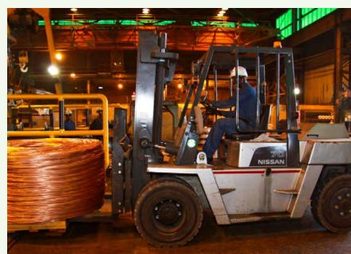

natural_image

Industrial forklift operating in a factory with large coiled steel wire, no visible text or symbols

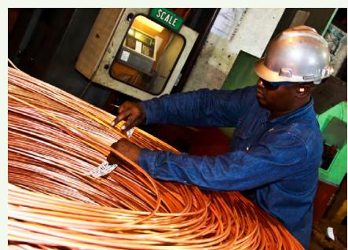

natural_image

Worker in blue uniform and silver helmet handling a large bundle of copper wires in an industrial setting (no visible text or symbols)

  
铜棒

## 磁铁矿板块

公司旗下 PMC 的磁铁矿属于加工铜矿石过程中分离出的伴生矿，开采成本低，含铁量高。截至 2025 年，PMC 厂区的磁铁矿堆约1.1亿吨，含铁量约55%，在销售前经造浆、球磨和磁选加工，含铁量最高可以提升至65%；每年从井下原矿石中新开采的磁铁矿产品，年产能约150万吨。

## 截至 2025 年

PMC厂区的磁铁矿堆约

1.1 亿吨

每年从井下原矿石中新开采的磁铁矿产品，年产能约

150万吨

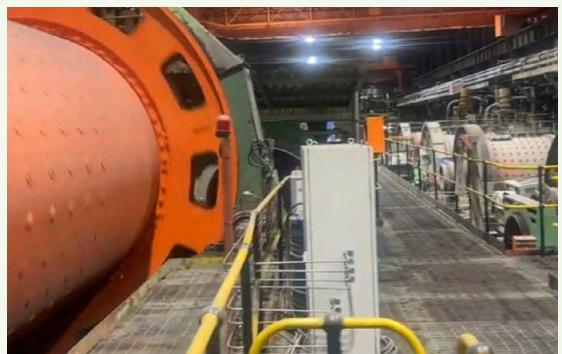

natural_image

Interior view of a large industrial factory with large orange machinery and overhead cranes (no visible text or symbols)

  
利旧磁铁矿磨机

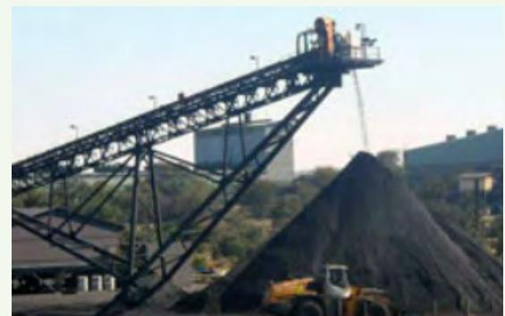

natural_image

Industrial coal handling scene with conveyor belt and pile of material (no visible text or symbols)

  
超细粉（DMS）生产

## 蛭石板块

公司旗下的PMC是世界范围内高端蛭石产品主要生产商，年产能约17万吨。公司生产的天然蛭石包括金色、褐色石片主要产品通过全球布局的销售子公司销售到亚洲，北美和欧洲等地

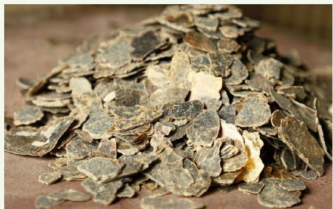

natural_image

Pile of irregularly shaped, dark gray rock fragments on a textured brown background (no text or symbols visible)

  
蛭石成品

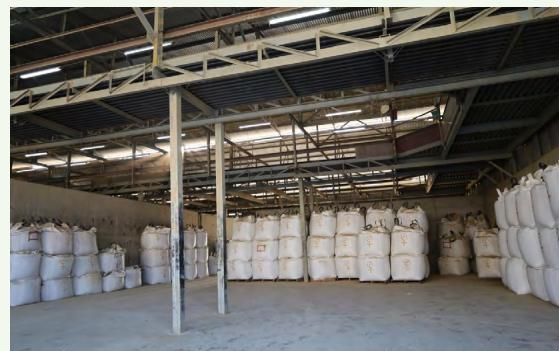

natural_image

Interior view of an empty industrial warehouse with stacked white sacks and metal framework (no visible text or symbols)

  
打包好的蛭石

## 锻造海外资源优势

河钢资源坚持“走出去”战略，持续推动海外重点项目建设，聚焦采矿核心业务，推动矿产资源增储，为当地社区、利益相关方及公司带来持久价值。

## 案例 常规磨机改造（CMC）项目举办竣工仪式

2025年3月，公司磁铁矿磨矿作业团队经过5个月的规划与不懈努力，成功完成4个系列磨机设施翻新工作，恢复设施全面运转状态。该区域的设施已停用超十年，关键部件采购难度大，工程量复杂，团队凭借专业知识现代技术及协作力量，安全、顺利地完成改造，为实现年产600万吨65%磁铁矿(Fe)的目标迈出重要一步。

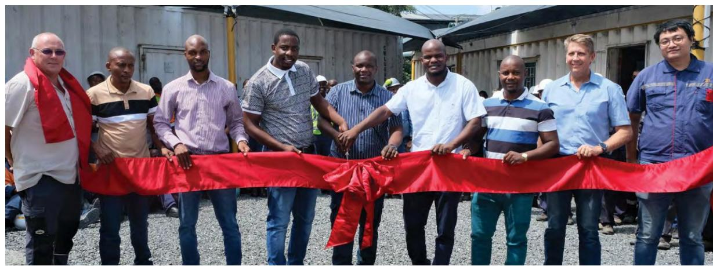

natural_image

Group of men holding a red ribbon outdoors, standing in front of industrial buildings (no visible text or symbols)

改造项目竣工现场

## 案例

2025年6月，公司南半球最大采矿回风风扇站建设项目首台风扇全面竣工。该项目为满足铜一期、铜二期地下采矿通风刚需建设，既保障#下作业人员呼吸安全，降低粉尘与有害气体危害，又通过技术升级实现能源高效利用，创造本地就业与技能提升机会，彰显企业合作共赢与可持续发展的理念。

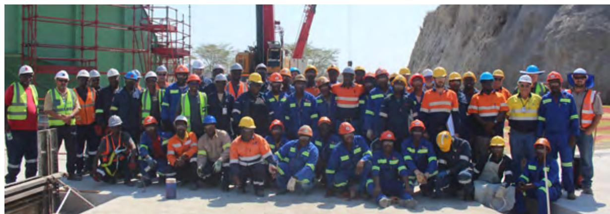

natural_image

Group photo of construction workers in safety gear posing on a worksite with excavated earth and red cranes in the background (no visible text or symbols)

采矿回风风扇站项目施工团队

## 案例 公司 PMC 铁路升级改造工程以定制化解决方案实现运营优化

2021年启动铁路基础设施升级改造工程，通过优化设计，新增4公里延长线，实现每日最多可运行5趟列车，单趟列车可装载和清空80节车厢的扩容成效。项目可将磁铁矿和蛭石直接运往港口，全程无中转，有效提升装卸场站作业效率，降低企业磁铁矿销售成本。该项目在10万工时内顺利竣工交付，实现“零伤害”安全目标，成功以定制化解决方案满足企业和客户需求，促进帕拉博拉社区的可持续发展。

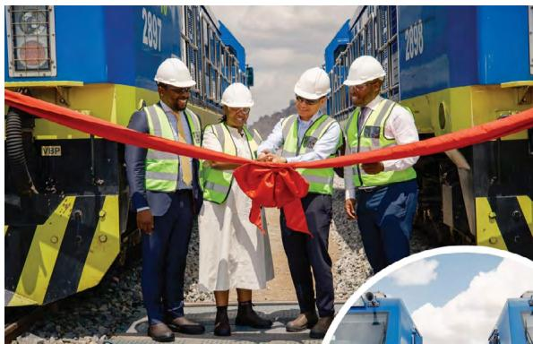

natural_image

Group of workers in safety vests and hard hats cutting a red ribbon at a train yard, with blue and yellow locomotives visible (no text or symbols)

铁路升级改造工程竣工

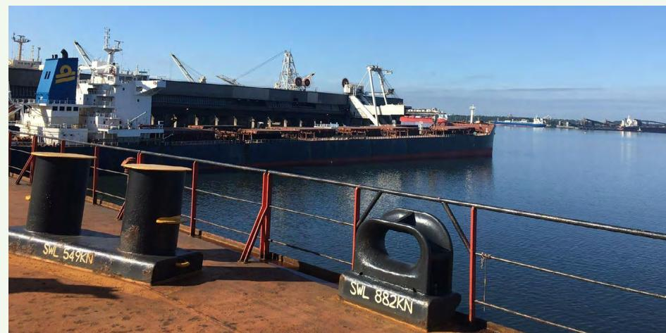

natural_image

Exterior view of a cargo ship docked at a pier with red-and-white markings on the pier (no visible text or symbols on the ship or surroundings)

##

磁铁矿团队在2025 年生产品位 65% 的铁矿石运至港口

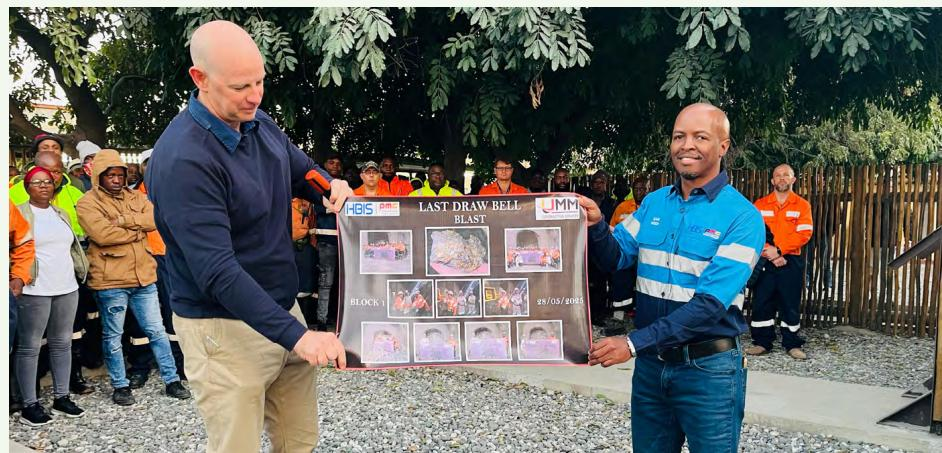

text_image

LAST DRAW BELL
BLAST
BLOCK 1
28/05/2023

##

LiftⅡ地下项目第一区块竣工并移交使用

##

# 携手共建“一带一路”收获中非合作硕果

作为“一带一路”倡议的积极践行者，河钢资源始终秉持共商共建共享原则，深耕非洲市场，推动中非经济合作与可持续发展深度融合，在基础设施建设、重大工程项目协同、青年技能培养、文化遗产保护等领域持续发力，不仅助力当地经济提质增效，更以实际行动架起民心相通之桥，书写了中非合作共赢的新篇章。

## 铺就经济发展坦途

公司投入大量资源对当地社区开展长达数十年的持续投资，聚售交通、教育与健康等领域，参与当地从诊所到道路等基础设施建设，创建可行的本地企业与供应商网络刺激经济发展，通过青年教育与劳动力技能提升，开发当地人力资本促进当地社区发展的可持续性，进一步推动地方经济发展

  
基础设施建设  
建设24小时开放运营的健康中心、诊所，翻新重建学校行政楼、供餐系统厨房等设施，开展道路维护与建设项目，修复关键交通走廊，惠及当地社区和物流运输。

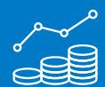  
赋能经济增长  
实施与当地市政府发展计划相结合的大规模战略投资，支持本地农业、旅游、建筑和工程等领域的中小企业发展，将本地供应商纳入采矿供应链体系，实施大规模奖学金计划、技能转移合作项目，打造具有韧性的本地经济。

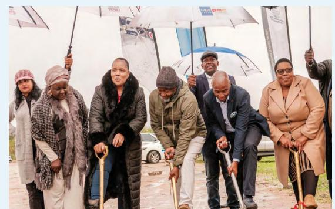

natural_image

Group of people outdoors under umbrellas, some holding up sticks and others walking (no visible text or symbols)

公司与林波波省道路机构合作修路

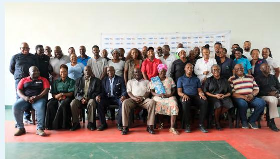

natural_image

Group photo of people seated and standing in a room with red carpet and green floor (no visible text or symbols)

♡  
公司对26家本土企业进行合作帮扶

## 连通文化相融纽带

河钢资源坚持保护文化传统的策略，将文化考量融入商业运营的框架，深化多元社区参与，增加教育项目投入，促进当地遗产保护，增进中非文化认同

## 文化融合交流

珍视非洲多元文化价值，通过内部文化期刊形成文化传播的独特企业名片，以“非洲日”“遗产日”等特色员工文化活动为载体打破文化隔阂，促进中非文化交流，营造和谐融洽的良好氛围。

## 文化教育投入

积极参与莫帕尼TVET学院开放日及 2025年MTE博览会，组织优秀学徒与在职学员开展互动式技能演示，生动呈现职业培训成果与行业实践路径，助力青年发展与技能提升。

## 文化遗产保护

依据南非《国家遗产资源法》相关规定，更新修订《文化遗产名录与管理计划》，确保采矿开发项目对区域内文化遗产资源的保护与尊重，通过考古遗址登记历史文化价值评估、遗址保护与监管等措施，动态调整保护策略。

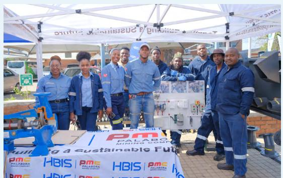

text_image

Building a Sustainable Future
PMS PALARORA MINUSUM
PMS PALARORA
HBIS | PMS PALARORA
HBIS | PMS PALARORA
HBIS | PMS PALARORA
HBIS | PMS PALARORA
HBIS | PMS PALARORA
HBIS | PMS PALARORA
HBIS | PMS PALARORA
HBIS | PMS PALARORA
HBIS | PMS PALARORA
HBIS | PMS PALARORA
HBIS | PMS PALARORA
HBIS | PMB PALARORA
HBIS | PMB PALARORA
HBIS | PMB PALARORA
HBIS | PMB PALARORA
HBIS | PMB PALARORA
HBIS | PMB PALARORA
HBIS | PMB PALARORA
HBIS | PMB PALARORA
HBIS | PMB PALARORA
HBIS | PMB PALARORA
HBIS | PMB PALARORA
HBIS | PMB HALA |
HBIS | PMB HALA |
HBIS | PMB HALA |
HBIS | PMB HALA |
HBIS | PMB HALA |
HBIS | PMB HALA |
HBIS | PMB HALA |
HBIS | PMB HALA |
HBIS | PMB HALA |
HBIS | PMB HALA |
HBIS | PMB HALA |
HBIS | PMB HALA |
HBIS | PMB HALA |
HBIS | PBMA |
PBMA | PBMA |
PBMA | PBMA |
PBMA | PBMA |
PBMA | PBMA |
PBMA | PBMA |
PBMA | PBMA |
PBMA | PBMA |
PBMA | PBMA |
PBMA | PBMA |
PBMA | PBMA |
PBMA | PBMA |
PBMA | PBMA |
PBMA | PBMA |
PBMA | PBMA |
PBMA | PBMA |
PBMA | PBMA |
PBMA | PBMA |

The chart includes a banner for 'Building a Sustainable Future' and a logo for 'PMS PALARORA MINUSUM'.

公司参加莫帕尼TVET学院开放日  
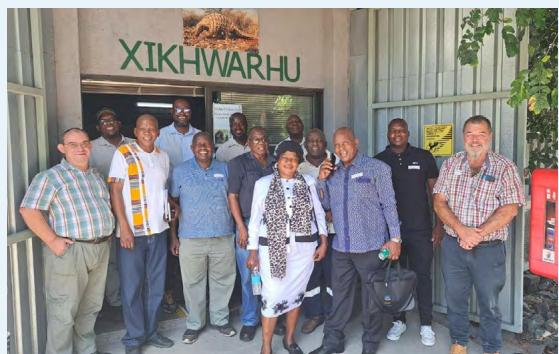

text_image

XIKHWARHU

公司与巴-马塞克社区举行文化遗产会议，就菲特瓦内晚期铁器时代遗址（位于 PMC. 铜矿范围内）的花岗岩遗址标识牌建造许可进行长期协商

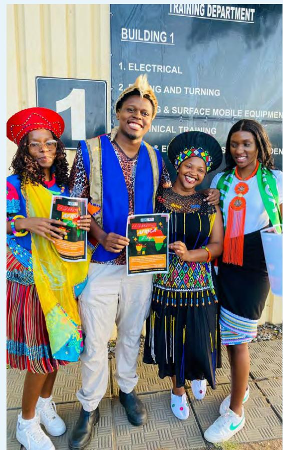

text_image

TRAINING DEPARTMENT
BUILDING 1
1. ELECTRICAL
2. FLOWING AND TURNING
G & SURFACE MOBILE EQUIPMENT
MINICAL TRAINING
& ELECTRONICS DEVELOPMENT

V  
公司举办非洲日活动

# 深耕海外创业共筑稳健经营根基

河钢资源坚持以高质量党建引领企业高质量发展，持续完善中国特色国有企业现代公司治理，为长远发展筑牢根基：坚守诚信合规经营底线，以高标准商业道德规范运营；聚焦优质矿石供给，打造高品质产品与服务体系；严守安全生产红线，将安全管理融入采矿运营全流程，全方位践行企业责任，实现多方价值共赢。

规范运作，提升管理效能 27

守法合规，防范经营风险 32

品质卓越，赢得客户信赖 37

恪守底线，筑牢安全屏障 39

响应可持续发展目标（SDGs）

可持续发展目标

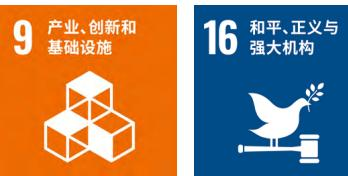

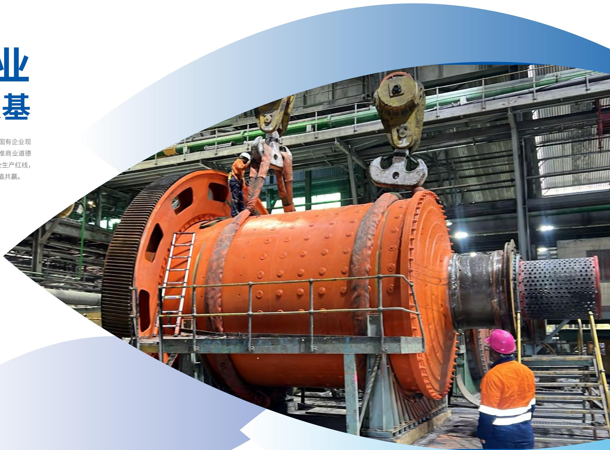

text_image

业基
国有企业现
推商业道德
生产红线，
值共赢。

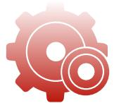

## 规范运作，提升管理效能

河钢资源严格遵循《中华人民共和国公司法》《中华人民共和国证券法》《上市公司治理准则》及《深圳证券交易所股票上市规则》等法律法规和规范性文件要求，明确各主体权责边界，持续推进公司治理体系科学化、规范化，建立高效的投资者关系管理机制，将信息披露作为与广大投资者建立信任的桥梁，维护投资者合法权益。

## 坚持党建引领

河钢资源始终坚持以习近平新时代中国特色社会主义思想为指引，完整、准确全面贯彻新发展理念，不断提高政治站位，持续强化基层党组织建设，深化党建与生产经营深度融合，抓实廉政建设，深刻领悟“两个确立”的决定性意义，坚决做到“两个维护”，为公司高质量发展筑牢根基。

## 强化政治思想建设

公司把党的政治建设摆在首位，贯彻落实党建入章要求，修订《河钢资源党总支会议“第一议题”制度实施办法(试行)》《河钢资源党总支议事规则》《河钢资源贯彻落实“三重一大”决策制度的实施办法》《河钢资源“三重一大”事项清单》(修订稿)《河钢资源党总支重大经营管理事项集体研究把关清单》等制度进一步完善基层制度体系，推动党建工作有章可依：持续加强党的创新理论武装，通过“三会一课”、邀请外部专家讲党课、线上专题辅导课程等系列活动学习贯彻习近平新时代中国特色社会主义思想、党的二十大和二十届历次全会精神，把学习教育成果转化为推动河钢资源高质量发展的实际成效。

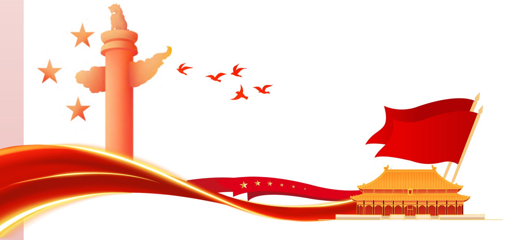

natural_image

Illustration of Tiananmen Gate with national flag, red ribbon, and Chinese national emblem (no text or symbols)

## 夯实基层组织堡垒

公司不断增强基层党组织政治功能和组织功能，通过发展党员等工作为党组织建设注入生机活力，规范组织生活，发挥党员先锋模范作用，提升党员于部业务能力，凝聚干事创业的强大合力。2025年，公司现有在职党员329名；2022年以来公司基层党委共计发展党员12名。

## 2025 年

公司现有在职党员

329名

## 2022 年以来

公司基层党委共计发展党员

12名

<table><tr><td>指标</td><td>单位</td><td>2023年</td><td>2024年</td><td>2025年</td></tr><tr><td>发展党员人数</td><td>人</td><td>4</td><td>2</td><td>1</td></tr></table>

## 推进党建业务融合

公司持续深化党建与生产经营深度融合，以“双提升”主题赛为契机，围绕年度核心目标，加大重点任务攻坚力度，创新工作思路与方法，加快完成全年重点工作任务，推动公司业务工作再上新台阶。

## 2025年系列成果

实施磁铁矿选矿系统改造，实现 65% 品位磁铁矿销售，全年完成高品磁铁矿产量目标；  
发运量突破 1,000万吨，其中火车发运降低了运输成本；  
海运租船均价同比降低 20%，有效降低了物流成本。

## 落实全面从严治党

公司深入落实全面从严治党主体责任，定期开展廉政风险排查，加强对重点岗位关键环节的监督制约：严格执行中央八项规定及其实施细则精神，开展树立和践行正确政绩观学习教育，坚决反对“四风”，精简会议文件，规范公务接待、公务用车等管理，推进作风建设常态化长效化：组织开展廉政警示教育，引导于部职工知敬畏、存戒惧、守底线。

## 加强公司治理

公司依据最新法律法规和上市公司监管要求，完善由股东会、董事会和经营层协调运作的法人治理结构，修订《公司章程》，取消监事会，监事会职权由董事会审计委员会行使，稳步提升公司治理水平。

## 股东会

公司践行《股东会议事规则》，召集、召开与表决程序符合《中华人民共和国公司法》《深圳证券交易所股票上市规则》《上市公司股东会规则》等法律法规规范性文件及《公司章程》的有关规定，采取现场投票与网络投票相结合的方式为广大投资者参与股东会表决提供便利。2025年，公司召开股东会3次。

## 2025 年

公司召开股东会 3次

## 董事会

公司董事会由9名董事组成，其中包括3名独立董事以及2名女性董事：董事会成员的提名和委派考虑性别、年龄、文化及教育背景、专业经验、技能等多方面因素并在议案审议和决策环节，依托企业管理、财务、工程、法律等差异化专业背景充分代表不同利益相关方诉求，保障决策的专业性与有效性，同时积极参加ESG培训，以更好地理解相关监管要求。2025年，公司召开董事会6次，通过议案33项修订及新增《公司章程》《市值管理制度》等制度16项。

## 2025年

公司召开董事会

6 次

通过议案

33项

修订及新增《公司章程》《市值管理制度》等制度

16 项

## 专门委员会

公司根据有关规定，设立战略发展委员会，审计委员会，薪酬与考核委员会，提名委员会，风险管理委员会，环境、社会及公司治理（ESG）委员会共六个专门委员会，每个专门委员会都由三名董事组成，同时分别制定专门委员会议事规则充分发挥各专门委员会职能作用。

## 专门委员会职能

## 战略发展委员会

对公司长期发展战略和重大投资决策进行研究并提出建议，提交董事会审议。

## 审计委员会

公司内外部审计的沟通监督和核查工作，提交董事会审议。

## 薪酬与考核委员会

制定公司董事及经理人员的考核标准并进行考核，制定、审查公司董事及经理人员的薪酬政策与方案，提交董事会审议。

## 提名委员会

提名公司董事、总经理以及其他高级管理人员，提交董事会审议。

## 风险管理委员会

监督、指导公司风险管理工作，研究公司重大投资事项的风险问题，对公司风险管理相关政策与方案提出意见与建议，提交董事会审议。

## 环境、社会及公司治

监督指导公司环境保护、社会责任、规范治理等工作的有效性，并提出意见与建议，提交董事会审议。

## 理（ESG）委员会

natural_image

Illustration of a business meeting with three people at desks, one presenting a presentation screen showing bar and pie charts (no text or symbols present)

## 投资者权益保护

公司深入践行以投资者为本的理念，严格按照《上市公司治理准则》《深圳证券交易所股票上市规则》等相关法律法规，及时向投资者披露公司经营情况及业务进展，坚持维护股东及投资者的合法权益。

## 透明信息披露

公司通过《中国证券报》《证券时报》《上海证券报》《证券日报》及巨潮资讯网等渠道，及时、准确、详尽地披露重要事项；制定符合可持续性标准的ESG报告披露框架，明确数据收集要求与口径，持续提升信息披露规范性。2025年，公司披露公告83份，其中定期报告4份，其他文件79份；不存在因信息披露方面违规而受到处罚的情况。

## 2025 年

公司披露公告

83份

其中定期报告

4 份

其他文件

79份

## 加强投资者沟通

公司严格遵循《投资者关系管理制度》要求，密切关注投资者及股东对公司的期望和要求，通过投资者热线、邮件、互动易、采访、调研参观、电话会议、业绩说明会等方式与机构投资者、个人投资者保持多层级、多渠道、多形式的广泛沟通有效传递公司价值，及时收集投资者意见和建议，增进投资者对公司的了解和认同树立公司在资本市场的良好形象，提振投资者信心。2025年，公司接听投资者电话410余次。

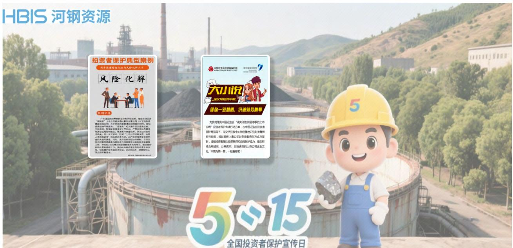

text_image

HBIS 河钢资源
投资者保护典型案例
将逐步推进各类企业风险化解工作
风险化解
案例分类
广东违反法律法规的金融分配与发展，有着实际经济“保障式”上市公司具备积极的财务能力，以下防范高风险的行业：公司针对这些金融板块的潜在风险，包括投资组合的平衡性、“价值型”以及投资组合的波动性等。
中小企业私募基金产品为A股、股票及衍生品等，其风险收益特征明显不同，通常具有高收益，且风险相对较低。中小企业私募基金产品属于A股、股票及衍生品，其风险收益特征与市场风格基本一致，但风险相对较高。中小企业私募基金产品属于A股、股票及衍生品，其风险收益特征与市场风格基本一致，但风险相对较低。中小企业私募基金产品属于A股、股票及衍生品，其风险收益特征与市场风格基本一致，但风险相对较低。中小企业私募基金产品属于A股、股票及衍生品，其风险收益特征与市场风格基本一致，但风险相对较低。中小企业私募基金产品属于A股、股票及衍生品，其风险收益特征与市场风格基本一致，但风险相对较低。中小企业私募基金产品属于A股、股票及衍生品，其低风险特征与市场风格基本一致，但风险相对较低。中小企业私募基金产品属于A股、股票及衍生品，其低风险特征与市场风格基本一致，但风险相对较低。中小企业私募基金产品属于A股、股票及衍生品，其低风险特征与市场风格基本一致，但风险相对较低。中小企业私募基金产品属于A股、股票及衍生品，其低风险特征与市场风格基本一致，但风险相对较低。中小企业私募基金产品的特有风险是普遍存在的，特别是对投资者进行投资决策的专项说明。投资者须谨慎投资于证券投资基金，具体投资策略需遵循相关法律法规的规定。投资者须谨慎投资于证券投资基金，具体投资策略需遵循相关法律法规的规定。投资者须谨慎投资于证券投资基金，具体投资策略需遵循相关法律法规的规定。投资者须谨慎投资于证券投资基金，具体投资策略需遵循相关法律法规的规定。投资者须谨慎投资于证券投资基金，具体投资策略需遵循相关法律法规的规定。投资者须谨慎投资于证券投资基金，具体投资策略需遵循相关法律法规的规定。投资者须谨慎投资于证券投资基金，具体投资策略需遵循相关规定。投资者须谨慎投资于证券投资基金，具体投资策略需遵循相关规定。投资者须谨慎投资于证券投资基金，具体投资策略需遵循相关规定。投资者须谨慎投资于证券投资基金，具体投资策略需遵循相关规定。投资者须谨慎投资于证券投资基金，具体投资策略需遵循相关规定。投资者须谨慎投资于证券投资基金，具体投资策略需遵循相关规定。投资者须谨慎投资于证券投资基金，具体投资策略需遵循相关规定。投资者须谨慎投资于证券投资基金，具体内容请参见上海证券交易所网站（www.sse.com.cn）和中国证监会指定信息披露媒体（http://www.sse.com.cn）和中国证券报（www.cninfo.com.cn）的相关公告。

公司参与“全国投资者保护宣传日”活动

## 守法合规，防范经营风险

河钢资源持续完善合规管理与风险防控体系，营造廉洁的企业文化氛围，严格抵制任何对公司产生不良影响的腐败、贿赂、欺诈、不正当竞争行为，打造可持续商业生态。

## 治理

公司严格遵循《中华人民共和国审计法》《深圳证券交易所股票上市规则》《深圳证券交易所上市公司自律监管指引第1号一主板上市公司规范运作》等法律法规和规范要求，在董事会下设审计委员会、风险管理委员会，构建多层次、全方位的风险防控管理体系。

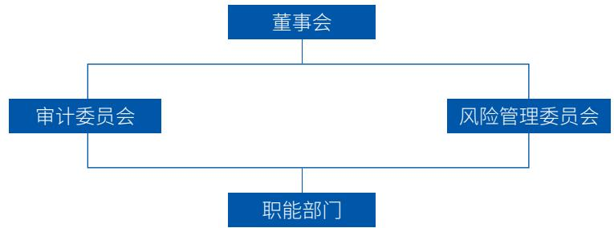

flowchart

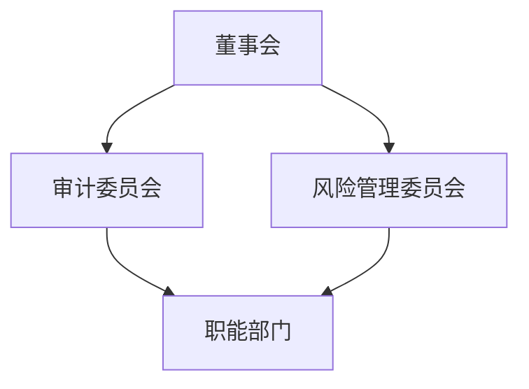
```mermaid
graph TD
  A["董事会"] --> B["审计委员会"]
  A --> C["风险管理委员会"]
  B --> D["职能部门"]
  C --> D
```

风险管理架构

## 战略

公司建立风险管理框架，定期识别、监控并报告相关风险，并将结果按季度上报管理层、审计委员会、风险管理委员会。

<table><tr><td>风险</td><td>风险描述</td><td>时间范围</td><td>应对措施</td></tr><tr><td>制度审核风险</td><td>公司内部制度审核不严格,可能增加合规风险。</td><td>短期</td><td>动态更新机制:每季度梳理国内外法规,第一时间修订内部制度;风险管理理念宣贯:组织风险管理制度相关培训,覆盖管理层及关键岗位。</td></tr><tr><td>合同管理风险</td><td>合同管理不规范,可能导致条款疏漏或法律漏洞。</td><td>短期</td><td>全流程信息化:合同管理信息化,确保合法合规、按流程审查;多重审核:对金额巨大的合同进行多重审查。</td></tr><tr><td>法律纠纷风险</td><td>法律纠纷处理不当,可能导致声誉损失或经济损失。</td><td>中期</td><td>预警机制:实时监控所在地区政策变化,对法律风险进行评估;队伍建设:聘请专门法律人士,负责公司法律事务、合规管理等工作。</td></tr><tr><td>重大决策事项风险</td><td>重大决策未经充分论证或风险审查,可能导致战略失误。</td><td>长期</td><td>多维度评估:对重大决策事项进行合规性、经济性、技术性等多维度论证,确保决策依据充分;外部专家支持:借助第三方或行业专家对重大决策提供独立评估,提升决策科学性;跟踪与优化:定期复盘重大决策事项,根据内外部环境变化动态调整策略。</td></tr></table>

## 影响、风险和机遇管理

## 合规管理

公司持续完善法治合规建设体系，从合规风险识别、合规风险评估、合规风险管理、合规风险监控四个阶段开展全方位的合规评审，牢牢守住合规经营底线，加强合规法治文化宣贯，全面推进法治企业建设，不断提升合规管理质效。2025年，公司开展守法合规培训5.141场，覆盖员工总数的95.2%。

## 2025 年

公司开展守法合规培训

5,141 场

覆盖员工总数

95.2%

## 合规风险识别

● 确定适用的法律法规要求  
形成监管范围登记册

## 合规风险评估

识别合规性风险 开展影响性评估  
• 开展可行性评估● 固有风险评级

## 合规风险管理

加强风险控制 ● 对控制措施的有效性进行评估  
剩余风险评级

## 合规风险监控

• 确定合规方面的薄弱环节  
进行动态监测

## 风险管控

公司恪守《敏感信息排查制度》《董事会风险委员会议事规则》《全面风险管理办法》《合规风险管理办法》等制度，加强重大风险隐患预警，提升风险防控和应急处置能力：遵循最新发布的《全球内部审计标准》，根据对PMC关键战略风险的者量以及与管理层的过论情况，编制内部审计计划，重点关注业务中的高风险领域提升内部审计的公平性与客观性；按季度定期组织风险评估研讨会，风险负责人共同参与风险等级评估并制定应对措施，向董事会审计风险委员会（BARC）提交风险评估报告，动态跟踪监测风险变化。

基于 ISO 31000 风险管理标准和《金氏四号公司治理守则》（King IV）要求，以COSO框架五要素形成风险识别、评估、应对、监控和报告的闭环机制，有效管控企业风险，其中高风险(ClassII-IV)需进行紧急处理，低风险(ClassI)仅需被动管理。

O 《金氏四号公司治理守则》（KingIV）为自愿性守则，由南非董事协会（IODSA）发布，适用于南非所有类型的组织，旨在通过透明度、伦理治理和可持续性推动组织的整体发展。  
COSO 框架是一个广泛认可的内部控制框架，由控制环境、风险评估、控制活动、信息与通讯、监控活动等五个相互关联的组件组成，提供了一种结构化方法来管理和改进内部控制、治理和风险管理流程

## 小贴士

## 三个层次

风险管理的最高决策机构，对风险管理的有效性向股东会负责。  
对风险管理工作的有效性向董事会负责，合规管理部门负责风险管理日常工作。  
各业务部门是风险管理的一线部门，内控审计部门对公司重大风险事项的管控情况，以及公司风险管理体系的完整性、有效性进行审计评价、报告并跟踪整改，直接对董事会负责。

## 董事会

## 高级管理层

## 职能部室

## 三道防线

## 第一道防线

业务部门风险自我控制。

## 第二道防线

合规管理部在主要业务环节操作风险提示。

## 第三道防线

内控审计事中、事后监督、检查。

公司企业风险管理流程  
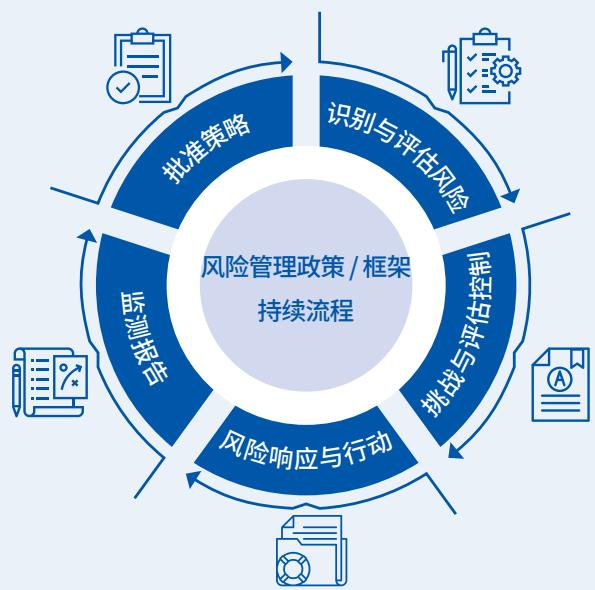

flowchart

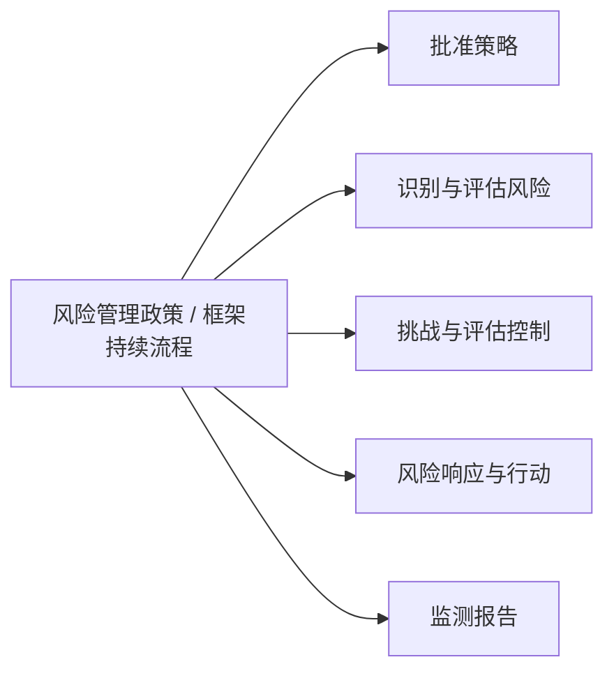
```mermaid
graph LR
  A["风险管理政策 / 框架\n持续流程"] --> B["批准策略"]
  A --> C["识别与评估风险"]
  A --> D["挑战与评估控制"]
  A --> E["风险响应与行动"]
  A --> F["监测报告"]
```

## 商业道德

公司依据所有适用的法律法规和最高的商业道德标准开展业务，严格抵制任何对公司诚信和声誉产生不良影响的腐败行为，制定《防欺诈政策》《行为规范》等制度，防范任何员工或承包商直接或间接实施的欺诈、腐败、严重不当、不诚实行为，降低公司欺诈风险；设立 24 小时举报热线，鼓励员工和利益相关方举报欺诈行为，严格保密举报者信息；内部审计部门不定期进行检查，识别潜在的欺诈风险。一旦发生欺诈事件，公司将启动调查程序，根据调查结果采取纪律处分法律诉讼或追回损失等措施。2025年，公司未发生商业腐败和不正当竞争事件。

## 行为规范

全体员工按照公司制度履行职责，恪守职业操守，管理层发挥表率作用，严禁以权谋私，防止利益冲突。

严格遵守《中华人民共和国反不正当竞争法》《中华人民共和国反垄断法》及南非当地等相关法律法规推动公平竞争，维护市场经济秩序。

践行《内幕知情人登记制度》，规范内幕知情人管理。

遵循《关联交易管理制度》《关联交易内部控制管理办法》等规定，规范公司关联交易的内部管理，确保公司各项关联交易符合公平、公开、公正的原则，并确保不损害股东及债权人的利益。

## 预防欺诈策略

## 制度控制

实施供应商尽职调查、员工背景审查、强制休假制度以及利益申报制度，从制度层面减少欺诈发生。

## 风险评估

每年进行欺诈风险评估，根据风险的可能性和影响程度，将风险分为四个等级，并制定相应的控制措施。

## 宣传培训

通过开展员工道德培训、新员工入职教育以及定期的反欺诈宣传活动，培育诚信企业文化。

PMC鼓励举报欺诈行为海报  
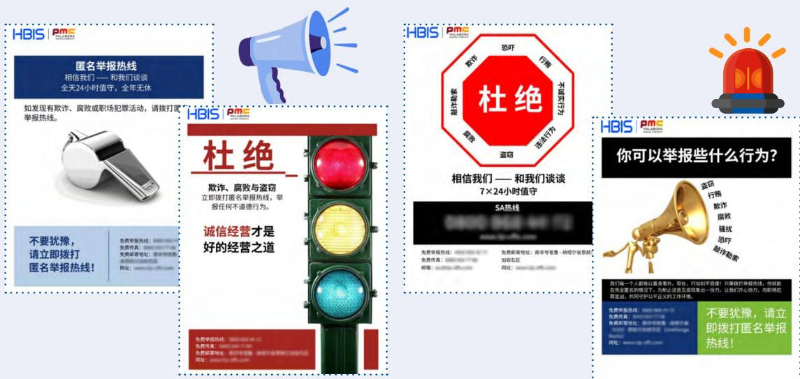

text_image

HBIS PMC
匿名举报热线
相信我们——和我们谈谈
全天24小时值守，全年无休
如发现有欺诈、腐败或职场犯罪活动，请拨打匿名
举报热线。
不要犹豫，
请立即拨打
匿名举报热线！
免费举报热线：@163.com
免费传真：@163.com
免费邮寄地址：@163.com
网站：www.hbis PMC
杜绝
欺诈、腐败与盗窃
立即拨打匿名举报热线，举
报任何不道德行为。
诚信经营才是
好的经营之道
免费举报热线：@163.com
免费传真：@163.com
免费邮寄地址：@163.com
网站：www.hbis PMC
HBIS PMC
恐吓
行痛
不谋恶行为
盗窃
违法行为
拒绝
社交
社交
社交
社交
社交
社交
社交
社交
社交
社交
社交
社交
社交
社交
社交
社交
社交
社交
社交
社交
社交
社交
社交
社交
社交
社交
社交
社交
社交
社交
社交
社交
社交
社交
社交
社交
社交
社交
社交
社交
社交
社交
社交
社交
社交
社交
社交
社交
社交
社交
社区热线
安全警报热线：@163.com
免费传真：@163.com
免费邮寄地址：@163.com
网站：www.hbis PMC
SA热线
免费举报热线：@163.com
免费传真：@163.com
免费邮寄地址：@163.com
网站：www.hbis PMC
HBIS PMC 你可以举报些什么行为？
盗窃
行痛
欺淫
腐败
骚扰
恐吓
反诈勒索
我们每一个人都可以从事事外。现在，行动时不容易！只需拨打举报热线，你就能在安全警报的情况下，为防止过安全事件做出一切力。让我们开心切分，同时热爱群众权益，共同守护公平正义的工作环境。
免费举报热线：@163.com
免费传真：@163.com
免费邮寄地址：@163.com
网站：www.hbis PMC
不要犹豫，请立
即拨打匿名举报
热线！

## 指标和目标

2025年，公司在生产运行、销售、安全环保、投资等各风险领域均未出现重大风险事件。

2026年，公司计划持续强化风险治理能力，完善应急预案体系，实现生产经营全流程可控可管，为高质量发展筑牢坚实的风险防线。

<table><tr><td>接受反商业贿赂及反贪污培训指标</td><td>单位</td><td>2025年</td></tr><tr><td>接受反商业贿赂及反贪污培训的董事总数</td><td>人</td><td>9</td></tr><tr><td>接受反商业贿赂及反贪污培训的董事百分比</td><td>%</td><td>100</td></tr><tr><td>接受反商业贿赂及反贪污培训的管理层人员总数</td><td>人</td><td>65</td></tr><tr><td>接受反商业贿赂及反贪污培训的管理层人员百分比</td><td>%</td><td>49.2</td></tr><tr><td>接受反商业贿赂及反贪污培训的员工总数</td><td>人</td><td>1,393</td></tr><tr><td>接受反商业贿赂及反贪污培训的员工百分比</td><td>%</td><td>35.9</td></tr></table>

## 品质卓越，赢得客户信赖

河钢资源通过客户沟通机制，在保障产品质量与服务合规的基础上，依托信息安全政策与客户满意度监测，不断加强质量管理，实现高标准交付、高品质服务，以可靠实力赢得客户长期信赖。

## 产品质量管理

公司充分依托在南非铜线市场的竞争优势、副产品磁铁矿成本优势、蛭石资源丰富的优势，加强矿产品开采、加工全流程质量管理，梳理产品生产和销售过程中的质量风险、环境风险，采取针对性措施防范化解风险，按照《不符合项与行动管理标准》对不合格产品予以止损处理，持续为客户提供质量稳定、品质上乘的矿产品。2025年，公司产品出厂合格率为100%，未发生与产品和服务相关的责任事故。

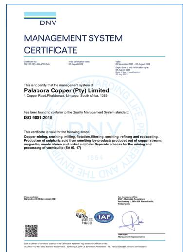

text_image

DNV
MANAGEMENT SYSTEM CERTIFICATE
Certificates no.
NCT01/2014-AD-0953-Aud.
Initial certification date:
27 August 2012
VBF
27 June 2012 - 27 August 2014
Expiry date: cert certification cycle:
26 August 2013
ISSN
ISSN certification:
26 July 2013
This is to certify that the management system of
Palabora Copper (Pty) Limited
1 Copper Road, Phalaborwa, Limpopo, South Africa, 1389
has been found to conform to the Quality Management System standard:
ISO 9001:2015
This certificate is valid for the following scope:
Copper mining, crushing, milling, flotation, filtering, smelting, refining and rod casting.
Production of sulphate, acid from smelting, by-products produced out of copper stream:
magnetite, anode slimes and rock sulphate. Separate process for the mining and
processing of vermiculite (EA 82, 17)
Place and date:
Barnelschott, 22 November 2021
For the sharing phase:
(9): Bannett & Schaffner
(8): Bausch & Schaffner
(6): Bausch & Schaffner
(4): Bausch & Schaffner
© 2016 All rights reserved.
AIF
AIF
AIF
AIF
AIF
AIF
AIF
AIF
AIF
AIF
AIF
AIF
AIF
AIF
AIF
AIF
AIF
AIF
AIF
AIF
AIF
AIF
AIF
AIF
AIF
AIF
AIF
AIF
AIF
AIF
AIF
AIF
AIF
AIF
EIA Patent Representative

PMC获得质量管理体系认证证书

## 保障客户权益

公司制定《客户要求标准》，详细规定依据ISO.9001标准处理客户需求的具体方法遵循《营销与销售政策》相关要求，为所有已上市产品提供完善的售后服务支持；健全客户沟通机制，通过客户调研、定期走访、客户满意度监测等多种渠道，加强客户沟通：建立常态化客户关系维护机制，深化与优质客户的长期合作，建立稳固的商业关系，树立良好企业声誉。2025年，公司客户满意度为100%。

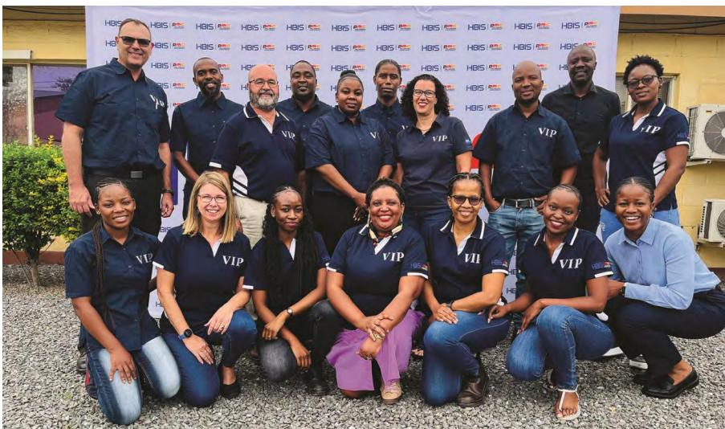

text_image

Group photo of various VIP team members in uniform, with a banner in the background displaying 'HBIS' branding.

VIP (Value Improvement Practice) 团队因卓越服务受到表彰

客户投诉处理流程  
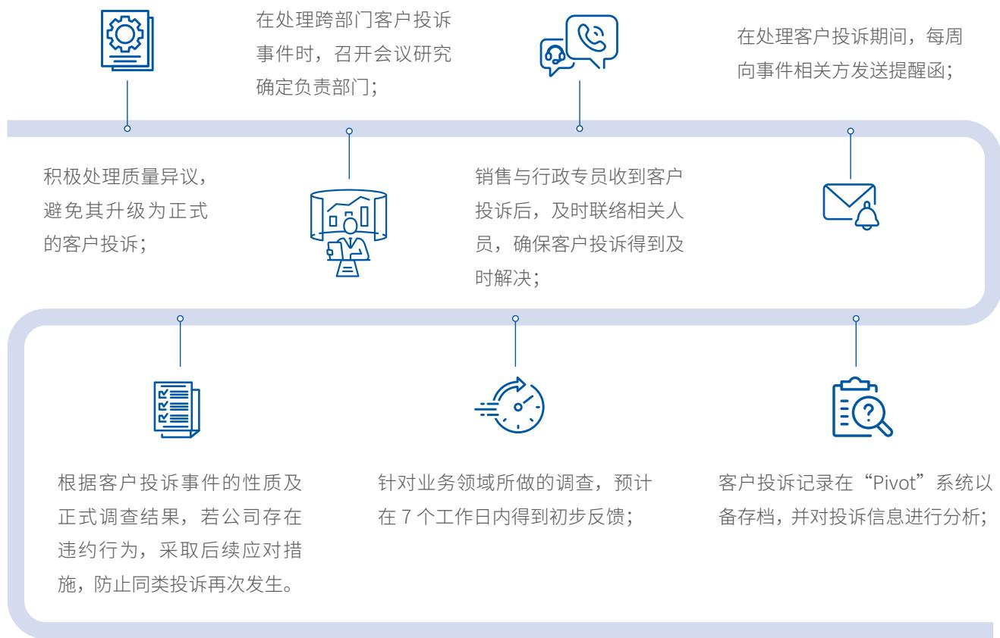

flowchart

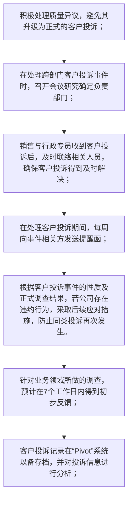
```mermaid
graph TD
  A["积极处理质量异议，避免其升级为正式的客户投诉；"] --> B["在处理跨部门客户投诉事件时，召开会议研究确定负责部门；"]
  B --> C["销售与行政专员收到客户投诉后，及时联络相关人员，确保客户投诉得到及时解决；"]
  C --> D["在处理客户投诉期间，每周向事件相关方发送提醒函；"]
  D --> E["根据客户投诉事件的性质及正式调查结果，若公司存在违约行为，采取后续应对措施，防止同类投诉再次发生。"]
  E --> F["针对业务领域所做的调查，预计在7个工作日内得到初步反馈；"]
  F --> G["客户投诉记录在“Pivot”系统以备存档，并对投诉信息进行分析；"]
```

## 保障信息安全

公司遵循《个人信息保护政策》《信息共享政策》要求，完善符合行业标准的数据安全管理体系，在公司管理系统内全面推行身份验证与授权、最小权限访问控制网络分段隔离、终端监控以及敏感数据加密：定期开展年度渗透测试，及时发现潜在漏洞，验证系统安全性：明确公司作为“责任方”的义务，指定信息官（IO）监督合规性，跨境数据传输需经信息官审核：定期开展信息安全培训，增强员工信息保护意识，筑牢信息隐私安全防线。2025年，公司未发生重大数据安全事件未发现未经授权的访问或数据丢失情况，所有系统均保持安全状态。

公司建立运行完善的客户隐私保护体系，客户信息收集、存储和处理均严格遵循相关隐私法规，实施用户授权管理、数据最小化处理、采用安全存储方案及定期审计：依据零信任原则，建立客户隐私保护监测与事件响应机制，快速识别并应对各类潜在隐私风险。2025年，公司始终恪守客户信息保护承诺，未发生客户隐私泄露事件。

## 2025年

公司始终恪守客户信息保护承诺，未发生客户隐私泄露事件。

## 恪守底线，筑牢安全屏障

河钢资源始终强调安全是“最高优先级”的理念，明确安全生产“零伤害”目标，建立健全的职业健康安全体系，强化安全生产管理，全方位防范职业健康与安全风险，营造安全、健康、包容的工作环境。

## 安全生产管理

公司建立符合国际标准的综合安全、健康、环境与质量管理体系（SHFCMS），明确划分在企业各层级岗位中 SHEQ 职责与权限，以完善的管理制度重视每位员工与承包商的安全健康；采用危害识别与风险框架，风险框架采用四层风险评估方法，可根据风险的背景、性质和规模选择相应评估层级，通过统一方法识别SHEO危害、方面及机遇，并对其对人员、财产、资产、声誉及环境造成的风险进行评估与管理，努力实现“零损害”“零伤害”的目标。

## 安全应急管理

公司坚持安全至上原则，设立矿井事故专职应急(预案）小组及医疗团队，制定《Palabora应急管理计划》，详细规定有效应对已识别风险情景所需的资源与策略。整合并协调公司风险登记册中列出的风险，充分应对潜在危害：制定《应急响应培训规程》，为应急准备与响应活动提供指导，定期开展与各业务领域风险特征相匹配的应急演练，持续提升培训效果与风险意识，检验应急服务部门的响应准备度与处置效能：明确突发事件上报至业务应急管理团队标准化机制，确保及时决策与启动业务连续性与灾难恢复计划，查明事故原因，制定纠正和预防措施以降低同类事件再次发生的可能性：在重大事故期间与邻近矿山开展应急团队跨行业协作，作为会员单位参与南非矿山救援服务组织。

## 公司标准化事故调查流程

所有适用于该操作的SHEQ风险均已识别、评估并记录。  
按照风险控制的层级体系实施风险控制措施，将所有风险控制在合理可行的最低水平(ALARP)。  
所有员工均需了解其工作区域或团队中的SHEO风险，以及为管控这些风险所采取的措施。  
对风险控制措施进行检查和维护，以确保所提供的保护水平。  
定期审查风险评估，使其与业务性质和规模保持相关性。  
所有员工和领导必须参加HIRA一级培训，运营资源需每年更新HIRA 培训。

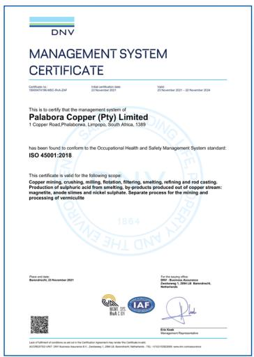

flowchart

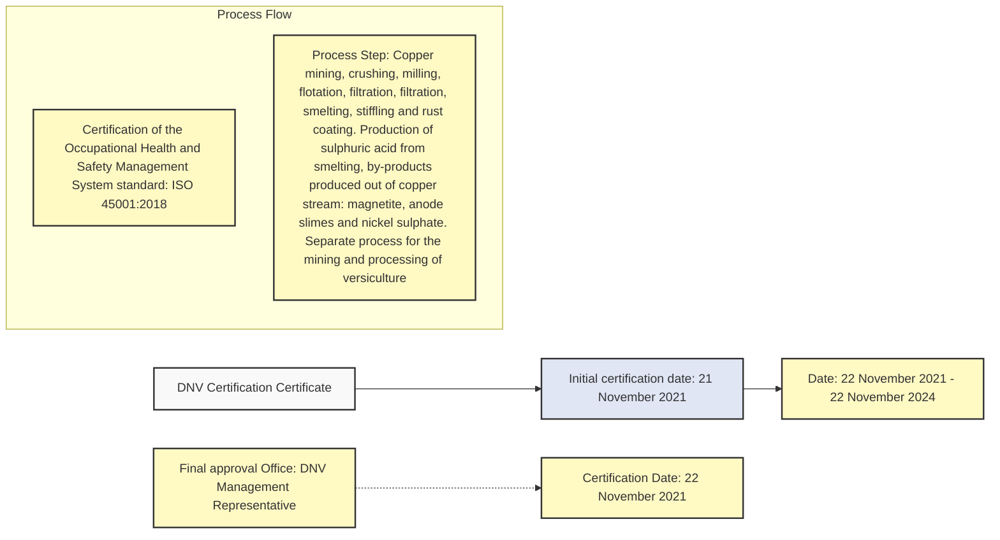
```mermaid
graph LR
  A["DNV Certification Certificate"] --> B["Initial certification date: 21 November 2021"]
  B --> C["Date: 22 November 2021 - 22 November 2024"]
  
  subgraph Process Flow
    direction TB
    D["Certification of the Occupational Health and Safety Management System standard: ISO 45001:2018"]
    E["Process Step: Copper mining, crushing, milling, flotation, filtration, filtration, smelting, stiffling and rust coating. Production of sulphuric acid from smelting, by-products produced out of copper stream: magnetite, anode slimes and nickel sulphate. Separate process for the mining and processing of versiculture"]
  end
  
  F["Final approval Office: DNV Management Representative"] -.-> G["Certification Date: 22 November 2021"]
  
  style A fill:#f9f9f9,stroke:#333,stroke-width:2px
  style B fill:#e1e6f5,stroke:#333,stroke-width:2px
  style C fill:#fff9c4,stroke:#333,stroke-width:2px
  style D fill:#fff9c4,stroke:#333,stroke-width:2px
  style E fill:#fff9c4,stroke:#333,stroke-width:2px
  style F fill:#fff9c4,stroke:#333,stroke-width:2px
  style G fill:#fff9c4,stroke:#333,stroke-width:2px
```

公司获得ISO45001职业健康安全管理体系认证

## 安全文化培育

公司将“零伤害”作为核心运营目标，积极开展涵盖安全意识教育、风险评估流程专项培训密闭空间作业和地下作业中专业个人防护装备使用等专项危害培训强化员工安全意识与技能，通过团队竞技、文化宣传等多元化行动激发员工参与度，将安全文化融入员工日常生活与工作，为全体员工、承包商及供应商营造安全、健康的工作环境。

2025年，公司开展安全培训时长达53.318小时，安全生产培训覆盖率达92.8%工伤保险、安全生产责任险投入554万元，工伤保险、安全生产责任险人员覆盖率为 100%。

## 2025 年

安全培训时长安全生产培训覆盖率

工伤保险、安全生产责任险投入

工伤保险、安全生产责任险人员覆盖率

53,318 小时

92.8%

554 万元

100%

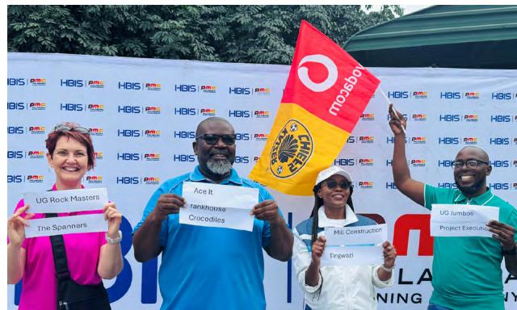

text_image

MOSBO
UG Rock Masters
The Spanners
Ace It
Tankhouse
Crocodiles
Maj Construction
Tengwabi
UG Jumabai
Project Executive

公司举办“零伤害杯”四分之一决赛抽签仪式

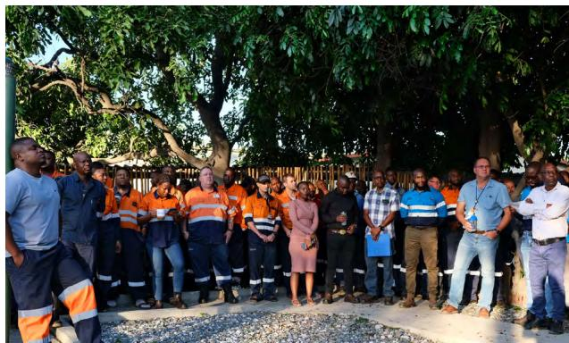

natural_image

Group of people in orange and blue uniforms standing outdoors under trees, no visible text or symbols

公司领导层与员工以“安全第一”为主题开展安全主题日活动

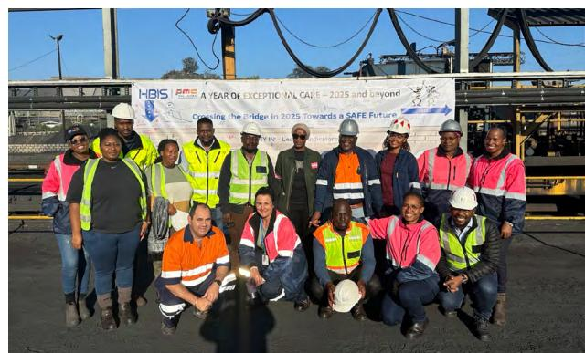

text_image

HBIS
A YEAR OF EXCEPTIONAL CARE - 2025 and beyond
Crossing the bridge in 2025 Towards a SAFE Future

公司物流运营团队与管理层齐聚启动“跨越桥梁”安全行动

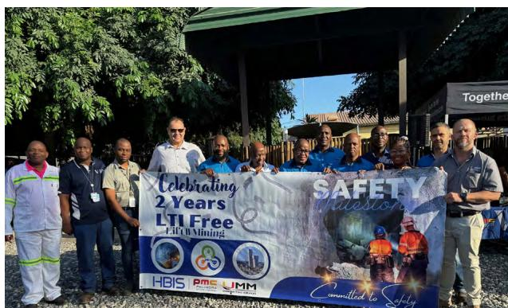

text_image

Celebrating
2 Years
LTI Free
Life Oil Mining
SAFETY
Unsorosy
HBIS PMS UMM
Committed to Safety

铜二期工程采矿与施工团队保持零失时工伤(LTI)纪录

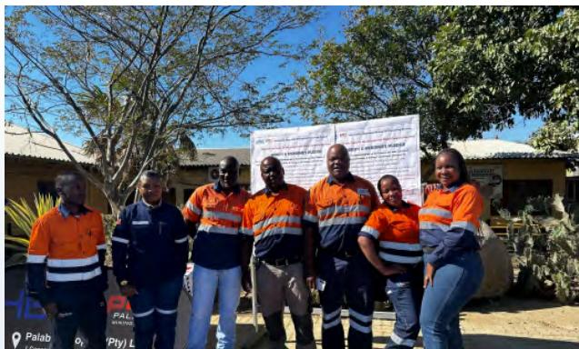

text_image

Group photo of workers in orange and blue uniforms posing in front of a large informational poster with Chinese text.

公司员工签署安全承诺

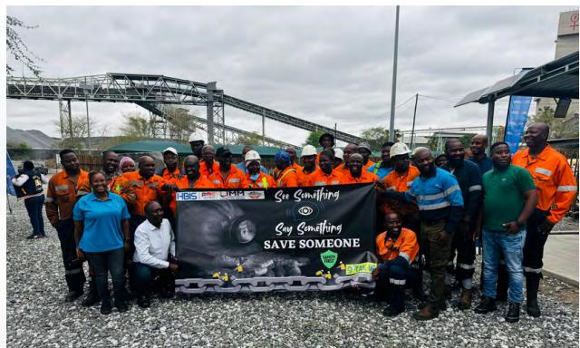

text_image

See Something
Say Something
SAVE SOMEONE

公司员工参与“安全停岗反思”活动

LTI指员工因工伤而无法工作或丧失工作能力的非致命性伤害，是公司安全绩效的基本指标。

小贴士

## 员工健康管理

公司将员工健康与安全置于首位，严格遵守《公司员工行为准则》及安全、健康、环境和质量(SHEO)政策等规定，完善职业健康管理体系：积极组织开展员工健康体检，确保所有员工均接受医学检查并获准胜任其岗位职责，提前预防职业健康隐患；积极开展职业健康教育和宣传，组织安全文化调查活动，强化员工安全价值观与个人健康认知；关注男性员工与女性员工的心理健康，通过健康步行活动等方式及时缓解员工心理压力；建立帕拉博拉矿区诊所，提供医疗检查和处理意外伤害等医疗服务，并根据要求为员工进行艾滋病毒状况测试及员工援助计划(EAP)，致力于构建增进健康与福祉的工作环境。

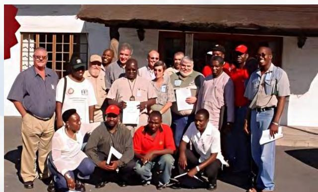

natural_image

Group photo of people posing outdoors in front of a building (no visible text or symbols)

世界艾滋病日活动

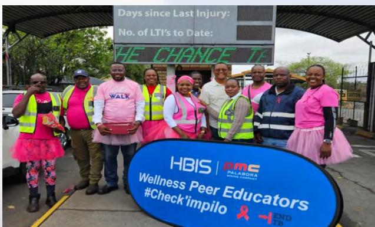

text_image

Days since Last Injury:
No. of LTI's to Date:
THE CHANCE TE
HBIS | EMC
PALABORA
WALABORA
Wellness Peer Educators
#Check'impilo -1END
TE

乳腺癌宣传周活动

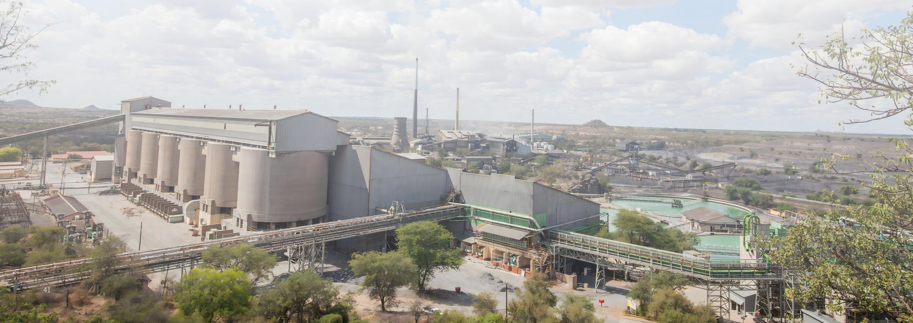

natural_image

Aerial view of an industrial complex with large storage tanks, conveyor belts, and processing equipment under a partly cloudy sky (no visible text or symbols)

# 践行生态创优共绘绿色资源画卷

环境保护是河钢资源可持续发展的基石。我们秉持“绿色矿山、生态共赢”的核心理念，将环境保护融入战略决策与日常运营，以科技创新驱动低碳转型以系统治理严控污染排放，以生态修复重塑矿区风貌，致力于实现经济发展与自然和谐共生。

低碳发展，应对气候变化 45

环境管理，严控污染排放 46

清洁生产，减少资源消耗 50

生态修复，重塑矿区风貌 53

## 响应可持续发展目标（SDGs）

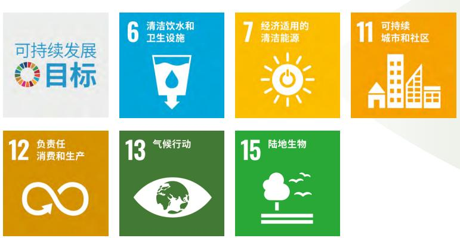

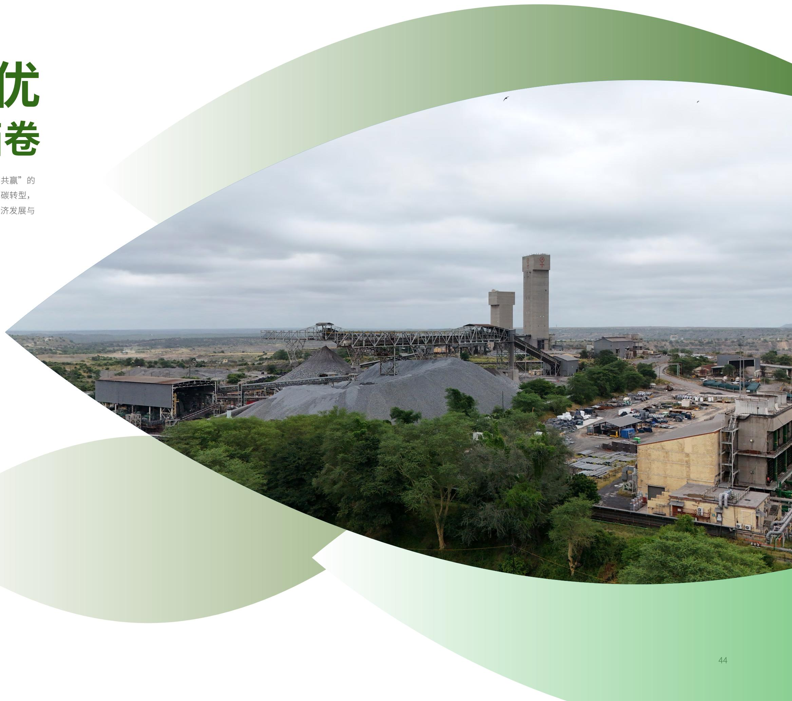

text_image

优
卷
“共赢”的
碳转型，
济发展与
44

## 低碳发展，应对气候变化

## 治理

应对气候变化是全球企业的共同挑战，也是公司持之以恒的责任担当。我们将应对气候变化纳入企业战略，持续完善治理架构，将气候因素融入业务决策，以实际行动减少温室气体排放，致力干实现经济与环境的双赢。

## 战略

通过建立气候风险评估机制，我们系统性识别并评估物理风险、政策风险、技术风险等对运营及财务的潜在影响，分析战略与商业模式在短中长期对气候变化的适应性，并持续推进熔炼厂改造项目，通过工艺优化降低燃料消耗，以务实行动应对气候挑战。

<table><tr><td>风险</td><td>风险描述</td><td>时间范围</td><td>应对措施</td></tr><tr><td>物理风险</td><td>极端天气事件导致矿山停产、设备损坏或物流中断。</td><td>短期/中期</td><td>建立极端天气预警系统;加强矿区排水系统及设备防护;制定应急生产预案。</td></tr><tr><td>政策风险</td><td>南非/中国碳排放政策趋严增加运营成本。</td><td>短期/中期</td><td>跟踪政策变化,动态调整环境治理策略;优化能源结构。</td></tr><tr><td>技术风险</td><td>能源转型技术迭代(如智能电网、储能技术)落后导致竞争力下降。</td><td>中期/长期</td><td>筹划投资可再生能源技术研发;试点数字化能源管理系统。</td></tr><tr><td>合规风险</td><td>国际气候协议(如巴黎协定)履约要求导致跨境业务受阻。</td><td>中期/长期</td><td>制定跨境碳足迹核算标准;参与全球供应链脱碳计划。</td></tr><tr><td>声誉风险</td><td>温室气体排放数据披露不足引发投资者质疑。</td><td>短期/中期</td><td>建立ESG投资者沟通机制。</td></tr><tr><td>供应链风险</td><td>上游能源供应商(如电力公司)碳减排不力导致间接排放超标。</td><td>短期/中期</td><td>与绿色能源供应商签订长期协议;要求供应商提供碳管理认证;开发分布式能源系统。</td></tr></table>

## 影响、风险和机遇管理

公司对温室气休排放源进行深入研究，发现大部分排放的温室气休间接来源于购买的电力，而其余部分则直接来自煤、柴油等化石燃料的消耗，公司决定将电力使用作为重点控制领域，以降低温室气体排放。我们严格遵循南非林业、渔业和环境部(DFFF）规定的核算方法，准确计量温室气体排放，并接受独立第三方核查。

## 指标和目标

2025年，公司范围一温室气体排放量78.248.6吨二氧化碳当量，范围二温室气体排放量572,048.5吨二氧化碳当量。未来，公司将持续跟踪气候目标进展，通过节能设备改造、优化生产工艺等措施，稳步推进碳减排计划。

## 环境管理，严控污染排放

公司秉承绿色发展理念，严格遵守运营所在地环境法律法规与技术标准，通过建立健全环境管理体系，强化风险防控深化污染治理，持续推进环境绩效改善，对各项污染物开展独立监测与单独披露，力求做到体系合规、达标排放、节能降耗。

## 规范环境管理

公司的能源消耗及污染排放主要源于PMC。PMC的环境管理计划获得南非矿产资源和能源部(DMPR)批准，并通过安全、健康、环境与质量（SHEO)管理体系有效运行，确保各项环保要求落到实处。我们依法持有大气排放许可证、水使用许可证及废物管理许可证（WML），并按年度向主管部门提交执行报告。2025年第三方机构对公司环境管理计划进行绩效评估，未发生环境违法违规事件。

## PMC的安全、健康、环境与质量（SHEQ）管理体系

## 我们的目标：

我们将持续遵循既定标准，并不懈追求业绩的提升，以确保对员工及周边社区实现零伤害的目标。

我们致力干打造并维护一个安全的工作环境，确保每位员工在完成工作班次后能够安全无恙地返回家庭。

## 我们的承诺：

我们将为员工、承包商和访客提供一个安全、健康目对环境负责的工作场所，并将我们对周边社区及环境的影响降至最低。

我们将持续改进我们的运营，以符合所有相关的法律及其他要求。

以负责任且高效的方式使用资源，尤其是能源水和土地。

以负责任的态度管理我们的矿物及非矿物废弃物确保对环境以及员工和社区的健康造成尽可能小的影响。

## 我们的责任：

每位员工均有义务确保自身及同事的安全，防范资产受损，避免对环境产生负面影响，并目当他人未履行这些责任时进行于预。

在对受伤风险、职业健康风险、资产受损风险以及环境危害进行充分评估并制定恰当措施前，严禁开展任何生产活动。

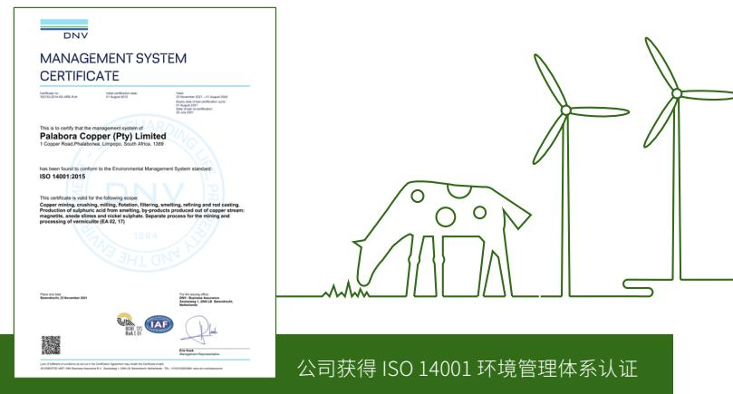

text_image

DNV
MANAGEMENT SYSTEM
CERTIFICATE

This is to certify that the management system of
Palabora Copper (Pty) Limited
1 Copper Road Phthalasine, Limpson, South Africa, 1289

In law been bound to confirm to the Environmental Management System standard:
ISO 14001:2015

This certificate is valid for the following scope:
Copper mining, crushing, milling, flotation, filtration, smelting, refining and not casting.
Prediction of sulphate and from smelting by products produced out of copper streams:
magnette, amide silses and nickel sulphate. Separate process for the mining and
processing of vermicite (BA 62.17)

This is also possible to be used in accordance with the ISO 14001 standards.

公司获得 ISO 14001 环境管理体系认证

## 严控环境风险

公司通过风险保证流程系统识别主要环境风险，并制定相应防控措施。针对突发环境事件，公司组建涵盖资源、培训和预警的专业小组，全方位提升应急处置能力同时制定应急预案，明确覆盖对象、事件类型及应急流程，确保应急响应有序开展。针对生产过程中使用和储存的危险化学品，公司均配备完整的材料安全数据表(MSDS），明确泄漏处置、应急响应等操作要求，确保此类突发环境事件发生时能快速规范应对。

## 强化环保宣教

公司注重环保文化建设，依托环境管理体系要求，持续开展员工环境意识培训及环保公益活动，不断提升全员环境责任意识和应急响应能力。对于承包商等合作方我们始终以清晰、明确的方式传达环境政策实施标准，确保合作方充分了解自身应尽的环保义务，将环境管理要求延伸至公司业务的全流程。

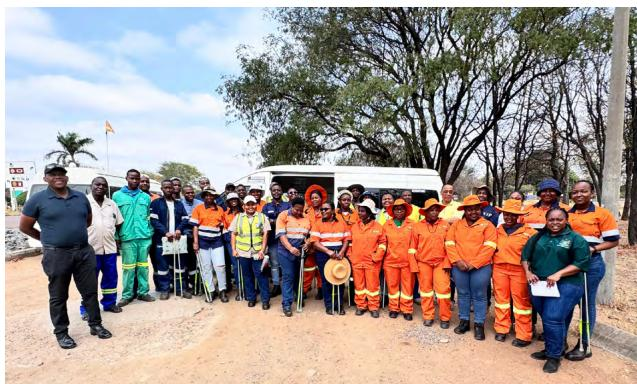

natural_image

Group photo of workers in orange uniforms and safety vests posing outdoors near a van and trees (no visible text or symbols)

开展旅游景点环境清理活动

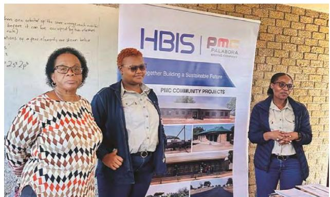

text_image

HBIS | PACLABORA
PAPLAC COMMUNITY
Together Building a Sustainable Future
PAC COMMUNITY PROJECTS

在当地学校进行环保意识宣讲

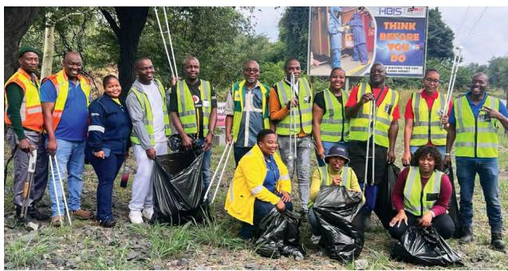

text_image

Group photo of volunteers in safety vests and life vests holding anti-waste bags outdoors, with a poster and banner in the background.

组织“反乱扔垃圾行动”进行垃圾清理

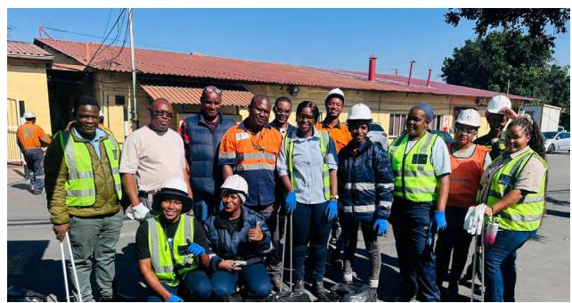

natural_image

Group photo of workers in safety vests and helmets posing outdoors near a building (no visible text or symbols)

## 废气排放管理举措

## 工艺与技术升级

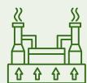

实施冶炼厂改造项目(SRP)，将原有反射炉更换为高效双侧吹熔炼炉(DSB)大幅降低燃料消耗。

对酸厂进行改造，采用双接触/双吸收工艺，进一步提高SO₂捕集率，将更多工艺废气引入酸厂处理。

## 规范污染物管控

## 废水管理

公司遵循南非《国家水法》的规定，已成功获取多项用水许可证，并定期接受外部机构审计。在生产过程中，公司对采矿、选矿产生的废水实行分类收集与处理，通过构建封闭式水循环系统，将所有用水纳入严格管控，在工厂内部实现循环再利用，有效降低原水消耗并减少回水尾矿坝的蒸发量。公司还对尾矿储存设施的渗流、地下水和自然河流的水质进行全面监测，设立了超过45个监测点；同时，开挖逾140个钻孔监测点以监测地下水状况，构建了地下水模型和监测系统，借助监测数据评估废水排放的影响，并及时调整水管理系统。此外，公司按年度向相关政府部门提交水使用报告，持续规范水资源管理。

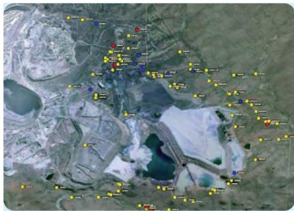

text_image

Satellite map image showing various locations marked with yellow and blue symbols, likely indicating land or infrastructure sites.

公司水质监测点

## 废气管理

公司取得大气排放许可证（AFl），严格遵守其对二氧化硫、颗粒物和粉尘的排放限值的要求。PMC主要废气来源为铜产品生产中的反射炉和转炉，由于转炉废气富含二氧化硫，绝大多数被输送到酸厂转化为硫酸，减少二氧化硫排放。公司安装先进的废气处理设施，不断优化生产工艺，提高资源利用效率，实现清洁生产。同时，建设空气质量监测站和粉尘落差测量仪，对气象数据、二氧化硫、颗粒物进行实时监测评估生产对环境和社区的影响，确保排放不超过规定限值。2025年，颗粒物（PM）排放135.7吨，二氧化硫（SO₂）排放0.7吨，氮氧化物（NOv）排放110.2吨。

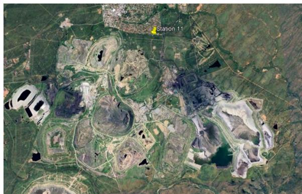

natural_image

Satellite view of an industrial or mining site with labeled station 11, showing landforms and mining areas (no readable text or symbols beyond station label)

公司的 PM₁。和 PM25监测站位置

## 粉尘治理

通过抑尘合同对未铺砌道路及部分闲置区域实施专业化抑尘管理。

在磁铁矿作业区引入水炮抑制扬尘。

优化尾矿排放策略以减少粉尘产生。

在蛭石等作业区配备抑尘喷淋装置。

计划于2026年实施播种和覆盖方案，实现长期抑尘。

## 噪声治理

对机械噪声（如白噪声倒车喇叭）控制措施进行审查。

计划于2026年开展厂界噪声调查，优化噪声环境管理。

## 固废管理

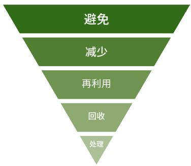

flowchart

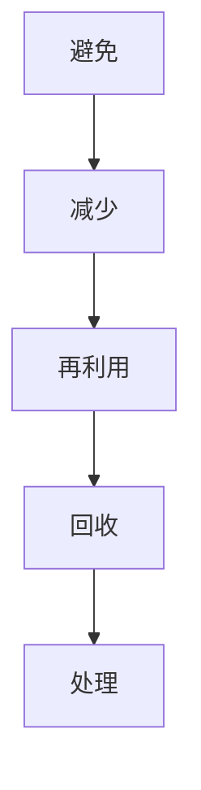
```mermaid
graph TD
  A["避免"] --> B["减少"]
  B --> C["再利用"]
  C --> D["回收"]
  D --> E["处理"]
```

废弃物管理等级制度

公司严格遵守当地废弃物排放管理要求，已取得废弃物管理许可证(WML），并定期接受外部机构审计。公司建立综合废弃物管理计划，制定《废弃物综合管理标准》，通过合理使用材料、废弃物分类、废弃物回收再利用等方式，依法依规处理生产经营中产生的固体废物，有效减少废弃物排放。

对于危险废弃物，公司进行特别处理以避免泄漏和污染，并委托有资质的服务商进行安全处置；针对放射性、爆炸性等特殊废弃物，则按照相关法规制定专门行动计划。同时，公司优先推动无害废弃物的资源化利用，与专业机构签订金属及高品质塑料回收合同，力争实现金属回收率提升10%。对于无法回收利用的剩余废弃物，统一运送至合规填埋场处置，确保全过程规范可控。此外，公司特别加强对尾矿库及矿山废弃物的管理，严防对土壤和地下水造成污染。2025年，有害废弃物排放429.4吨，无害废弃物排放861吨，废弃物回收利用量为136吨。

有害废弃物排放

429.4吨

无害废弃物排放

861 吨

废弃物回收利用量为

136 吨

固体废弃物类别及处理方式

<table><tr><td colspan="2">废弃物种类</td><td>处理方式</td></tr><tr><td>一般废弃物/非矿物</td><td>纸张、塑料、罐头、胶袋、玻璃、木材等</td><td>填埋,尽可能回收利用</td></tr><tr><td>危险废弃物</td><td>电池、打印机墨盒、化学废物(酸、多氯联苯、碳氢化合物)、石棉、荧光灯管等</td><td>放置于特定处理场</td></tr><tr><td>矿物质及加工废弃物</td><td>尾矿、废石、矿渣、锅炉灰等</td><td>放置于特定堆场</td></tr><tr><td>特殊废弃物</td><td>轮胎、衬胶类、含有多氯联苯的废弃物等</td><td>放置于特定处理场</td></tr></table>

2025 年  

## 清洁生产，减少资源消耗

公司秉持资源节约与环境友好理念，通过强化能源管理、优化水资源利用、推动资源循环，持续提升清洁生产水平，助力绿色低碳发展。2025年，公司能源和水资源成本节约3,036.2万元。

## 强化能源管理

公司深入实施能源管理计划(EMP)，系统识别、推进并持续维护各类节能项目，不断完善公司内部能源使用管理体系。在此基础上，2025年我们重点推广变频节能空调和LED照明、制冷厂工艺优化、卷扬机控制系统升级以及主配电系统功率因数校正等一系列节能举措。

## 能源管理计划

从管理层开始，依据能源政策所作出的承诺  
持续推行现有的一整套能源与节水举措  
拓展现有的一系列节能节水举措  
不断壮大能源管理队伍  
对所有节能和节水措施进行持续的监测与评估

natural_image

Line drawing of two hands holding a globe with leafy branches (no text or symbols)

作为矿业资源类企业，公司在开采、浮选、冶炼及精炼等生产流程中消耗大量电力，目前主要通过当地变电站从南非国家电力公司(Fskom)购电以满足用电需求。为优化能源结构、提升供应稳定性，新建熔炼厂配套余热锅炉和蒸汽涡轮发电机，待新冶炼炉正式投产后可进一步强化自备电源保障，每年预计可抵消约1.069万元的外购电成本。同时，公司正在推进可再生能源项目，计划通过 Eskom 电网引入场外太阳能电力，使可再生能源渗透率将达到 40%，进一步优化能源结构。

能源消耗量

<table><tr><td>直接能源消耗量——化石燃料</td><td>兆瓦时</td><td>250,782.4</td></tr><tr><td>间接能源消耗量——电力</td><td>兆瓦时</td><td>580,759.9</td></tr><tr><td>能源总消耗量</td><td>兆瓦时</td><td>831,542.3</td></tr></table>

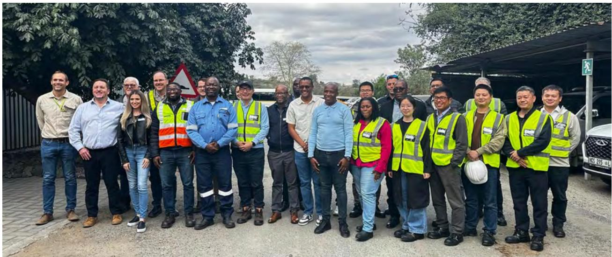

natural_image

Group photo of people in safety vests and work uniforms standing outdoors near a parking garage (no visible text or symbols)

联合多方推进矿区可再生能源项目

## 优化水资源利用

公司严格遵循水资源保护相关法规，持续完善水资源管理体系，制定并实施详尽的水管理计划。我们对矿区、尾矿坝区及厂房区的每月用水量进行细致统计，并有针对性地采取控制措施，确保水资源合理配置。在运营中，我们坚持“零排放原则，所有用水均实现现场收集、储存，并在尾矿回水坝和东回水坝进行循环利用。我们定期监测、记录和评估水质，积极参与当地水资源管理会议，与各方共同探讨区域管理策略。

过去十年间，随着工艺回水利用率不断提升，原水日取用量已从约21兆升降至12兆升。为进一步巩固节水成效，2026年我们将新增约20个电子流量计，实现用水量实时监控，同时推进按需供水流量计安装，有效杜绝更衣室等区域的跑冒滴漏。

PMC 平均每天用水总量  
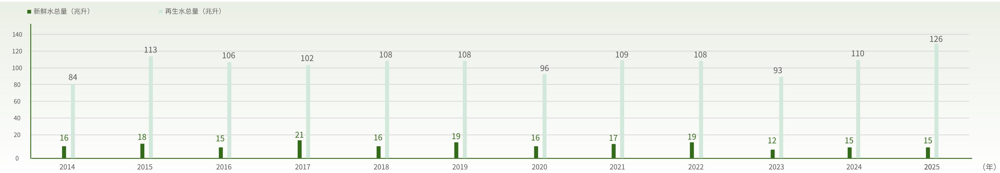

bar

| Year | 新鲜水总量 (兆升) | 再生水总量 (兆升) |
| --- | --- | --- |
| 2014 | 16 | 84 |
| 2015 | 18 | 113 |
| 2016 | 15 | 106 |
| 2017 | 21 | 102 |
| 2018 | 16 | 108 |
| 2019 | 19 | 108 |
| 2020 | 16 | 96 |
| 2021 | 17 | 109 |
| 2022 | 19 | 108 |
| 2023 | 12 | 93 |
| 2024 | 15 | 110 |
| 2025 | 15 | 126 |

## 资源循环利用

公司持续完善残矿回收制度，选矿厂正探索通过研磨解离和泡沫浮选从低品位物料中回收铜，磁铁矿业务则从堆存磁铁矿中进行材料磁选将铁品位提升至最高65%。2025年，选矿厂针对矿石过细、金属杂物等问题实施多项改进，包括将自磨机改造为半自磨机、安装皮带磁铁、引入泡沫传感器和先进过程控制系统；磁铁矿业务也通过利旧和新建磨矿厂设备、增加磁选产能、采用逆流磁选机等措施持续提升分离效率与回收率。

浮选尾矿因富含磁铁矿被泵送至磁选厂进一步回收，实现共伴生矿产资源的有效利用。选矿厂依托 SHEQ 管理体系，通过在线仪表和冶金统计系统每日跟踪关键绩效指标，确保资源综合利用效率持续受控。

2025年，公司采矿回采率为85%，选矿回收率为90%，共伴生矿产资源综合利用率为 80%。

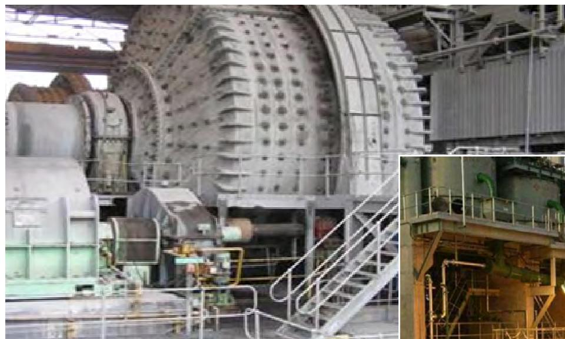

natural_image

Industrial tunnel boring machine with large cylindrical structure and conveyor systems (no visible text or symbols)

选矿厂自磨机机组

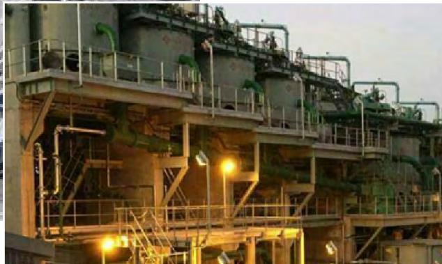

natural_image

Industrial plant exterior with multiple storage tanks and piping, illuminated by warm lighting (no visible text or symbols)

选矿厂浮选槽系统

## 生态修复，重塑矿区风貌

公司依据所在国的《国家环境管理法》《矿产石油及资源开发法》等相关法律法规，立足矿区紧邻克鲁格国家公园的特殊区位，将生态保护作为可持续发展的核心命题，严格遵守生态保护红线。我们从生物多样性保护、植被恢复、土地修复等关键领域入手，持续推进采矿活动与自然保护的协调共融，努力实现工业发展、社区福祉与生态平衡的和谐统一。

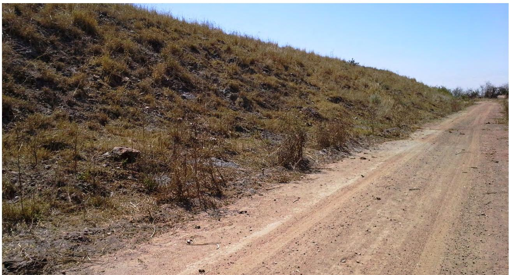

natural_image

Rural dirt road winding through a dry, grassy hillside under clear blue sky (no signage or text visible)

矿区植被修复工作成果

## 绿色办公

公司将绿色理念融入日常运营，积极倡导节能降耗、低碳办公的工作方式。我们在办公区域张贴节电节水提示标识，引导员工随手关灯、节约用水，将环保意识落实到细微之处。大力推进电子化、无纸化办公，减少纸质文件印发，严格控制一次性办公用品使用，从源头降低资源消耗。在日常沟通中，我们鼓励员工优先采用电话会议等线上方式，减少不必要的出行与能耗。通过持续的宣传引导与氛围营造，公司逐步培养员工绿色、低碳的办公与生活习惯，让环保理念真正融入日常工作。

## 生物多样性保护

公司将生物多样性保护融入采矿运营的全过程。我们通过系统性监测、科学管理与主动修复，努力在矿产资源开发与生态系统保护之间实现平衡，守护矿区及周边区域的生物多样性。

## 治理

公司严格遵守南非《国家环境管理：生物多样性法》(NEMBA)及国际金融公司绩效标准等相关法规要求，以《生物多样性行动计划》为依据，系统识别和管控采矿活动对生态系统的影响，全面推行避免、减少、修复和补偿等生态影响管理措施。在此基础上持续完善闭坑管理，已完成十地使用管理计划审查，于2025年开展闭坑成本评估及恢复标准修订。为确保各项保护承诺有效落地，我们致力干推动矿区及周边生态系统持续改善，最终实现生物多样性的“净积极影响”(NPI目标。

## 战略

公司致力于在采矿作业与生态保护之间寻求平衡，通过系统识别与评估采矿活动气候变化等因素对生态系统的影响，制定针对性的应对策略。

<table><tr><td>风险</td><td>风险描述</td><td>应对措施</td></tr><tr><td>极端天气带来的挑战</td><td>该地区降雨量不稳定,干旱和极端天气事件增多,对生物多样性产生负面影响。</td><td>制定相应的策略,如优化水资源管理,提高水资源利用效率,加强耐旱植物的种植和保护等,增强生态系统对气候变化的适应能力。</td></tr><tr><td>大量资金需求的挑战</td><td>生物多样性保护需要大量的资金、技术和人力资源投入。</td><td>积极寻求外部合作,与政府部门、科研机构、非政府组织等建立合作伙伴关系,共同开展生物多样性保护。</td></tr><tr><td>监测与评估的复杂性挑战</td><td>生物多样性监测和评估工作复杂且具有挑战性。</td><td>探索和采用先进的监测设备和技术手段,提高监测数据的准确性和可靠性,并建立了科学的评估体系,定期对保护成效进行评估,及时调整保护策略和措施。</td></tr></table>

## 影响、风险和机遇管理

为全面识别和应对采矿作业对生态系统的影响，公司建立了覆盖植被、昆虫、哺乳动物及捕食性动物的多维度监测体系，系统追踪生态变化趋势，评估气候与作业活动的潜在影响，并据此优化管理措施，确保生物多样性保护目标有效落地。

## 生态系统动态监测

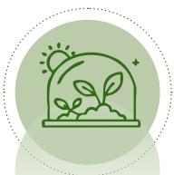  
植被动态监测

●设立植被监测项目，系统掌握矿区天然植被资源的现状与变化趋势；  
监测植物物种构成、覆盖度、现存生物量及群落结构；  
● 将植被指标与放牧密度等经营管理措施进行关联分析：  
• 全程追踪矿区植被动态变化，并与区域内自然保护区生态变化进行对比分析。

  
蝴蝶监测与生态基线建立

●启动蝴蝶生物多样性监测工作，建立昆虫学生态影响评估基准：  
●区分自然气候周期波动与采矿作业可能带来的生态影响，履约相关管理计划中的监测承诺。

  
哺乳动物取食影响及活动轨迹监测

·每年开展草食动物活动轨迹评估，监测取食行为对矿区生态的影响，借助Cybertracker 软件进行记录分析；  
●管控过度放牧对栖息地的于扰，评估取食行为对植被恢复区域的影响，助力本土植被自然恢复；  
●监测濒危物种栖息地，维护未受于扰区域的生态完好性，保障穿越矿区的野生生物生存状态。

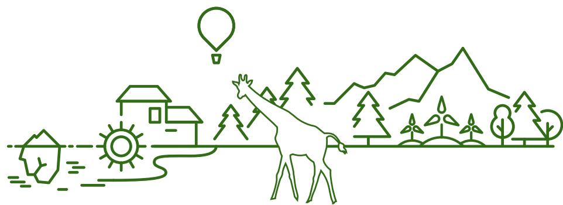

natural_image

Line drawing of a giraffe reaching toward a landscape with trees, mountains, and a lightbulb (no text or symbols)

## 野生动物保护与管理

针对矿区范围内的大型捕食性动物，公司制定专项管理方案，明确管理目标，实施路径及操作流程，涵盖猎豹，狮子非洲野犬、斑鬣狗等物种，旨在通过科学管理，在采矿作业与生物多样性保护之间实现协调，助力区域集合种群保护目标的实现。

## 案例 “雄鹰筑巢计划”实现生态保护与生产运营双赢

依据南非《生物多样性法案》及《自然保护标准》，公司针对非洲集雕在监控杆筑巢、遮挡镜头及威胁员工安全的问题，创新实施“雄鹰筑巢计划”。通过在矿区战略点位搭建人工鹰巢，成功将鹰群迁离核心设施。此举既保护了受保护物种，又保障了监控系统正常运行，利用猛禽领地意识实现“天然安防”，树立了工业发展与生态和谐共生的行业典范。

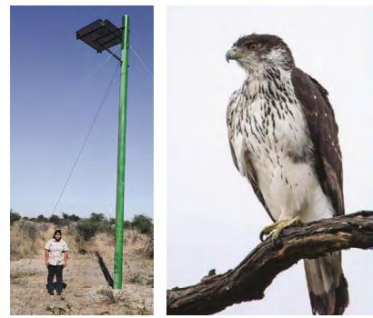

natural_image

Split image: left shows a person standing near a solar-powered pole; right shows a bird perched on a branch with a sunlit sky (no text or symbols visible)

## 案例 创新发放弹弓，防控灵长类安全风险

针对矿区内猴子、狒狒等灵长类动物滋扰事件增多、员工财物受损及安全隐患问题，向高风险区域工作人员发放50把弹弓，作为无害威慑工具。此举旨在通过展示弹弓让动物产生警惕，保持安全距离，而非伤害动物。所有领取者均需接受规范培训，确保人道使用。团队同步加强投喂行为管控与安全宣导，既保障了员工人身安全又实现了与野生动物的和谐共处。

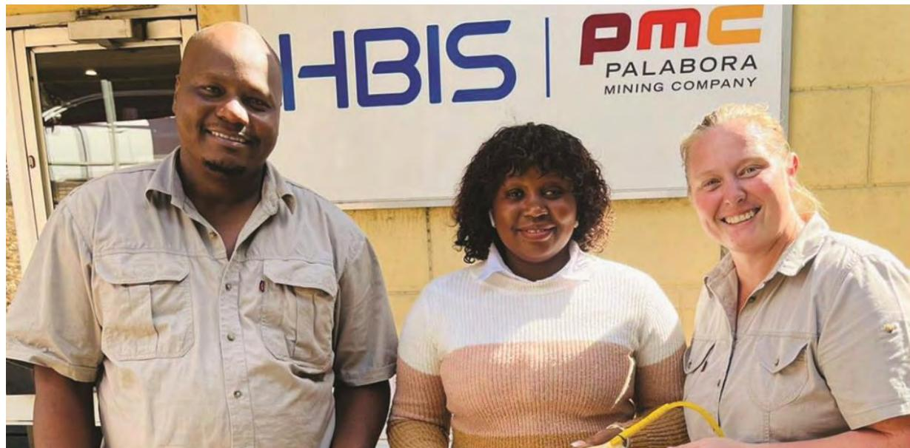

text_image

HBIS | PMC
PALABORA
MINING COMPANY

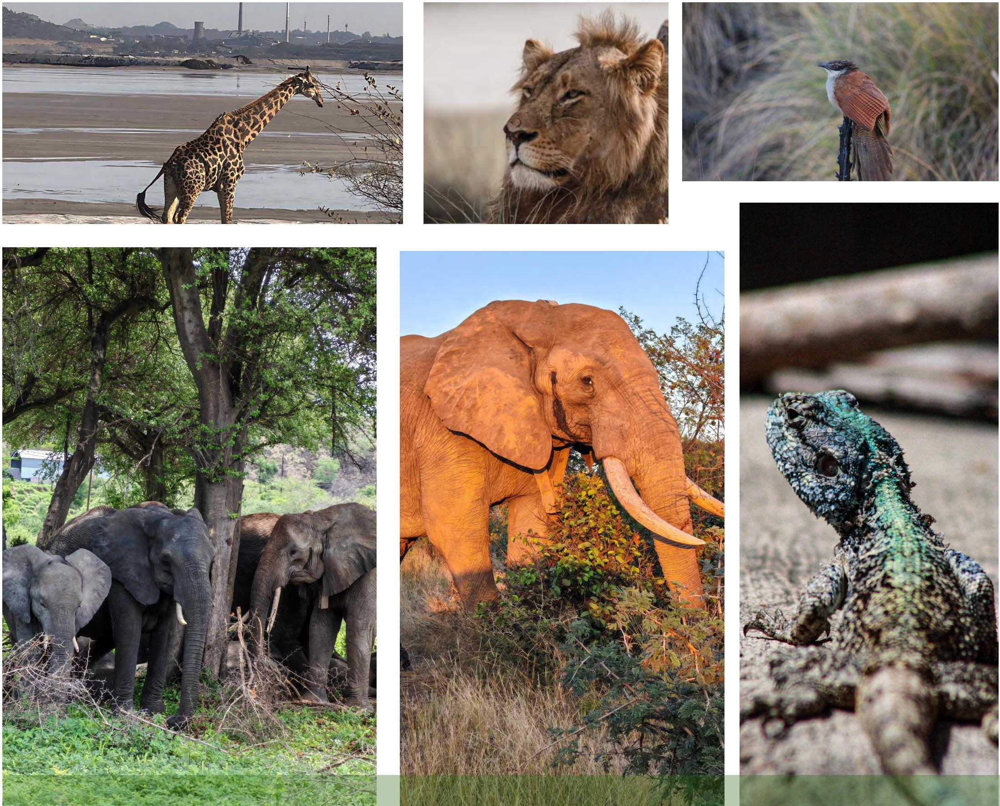

## 指标和目标

## 指标

2025年，公司已确定21公顷区域开展同步生态恢复，植被蝴蝶、哺乳动物及捕食性动物监测项目均按计划持续推进。监测数据显示，修复区生物多样性逐步提升，蝴蝶种类较天然区更为丰富，爬行动物和两栖动物群落生态状态良好；尾矿库及废石堆区域的植被覆盖度和植物种类明显增加，生态系统稳定性增强。随着生态功能的恢复，不同生态区域之间的连通性得到加强，为野生动物迁徙和基因交流提供了通道对周边保护区产生了积极的溢出效应。

## 未来计划

公司将依托持续积累的监测数据，动态优化管理措施，进一步提升栖息地恢复与生态系统修复成效。同时，我们将加强与科研机构、行业伙伴及社会组织的交流合作，引入先进的保护经验与技术，并持续开展公众宣导，推动形成多方参与生物多样性保护的良好格局。

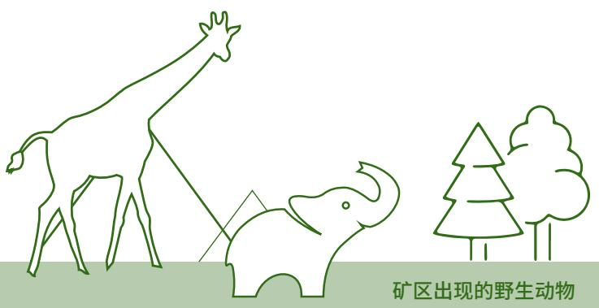

text_image

矿区出现的野生动物

# 引领价值创新共享融合美好社会

河钢资源不断完善科技创新体系建设，强化企业发展核心竞争力，坚持为员工发展创造机会，保障员工基本权益，实现公司与员工同心同向、同频共振，投身社区建设，携手社会共享企业发展成果。

创新驱动，激发科技活力 61

互利共赢，打造责任链条 65

以人为本，搭建成长舞台 67

普惠包容，建设和谐社区 74

## 响应可持续发展目标（SDGs）

可持续发展

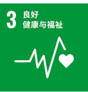

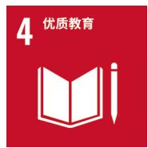

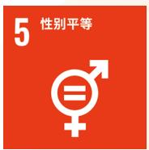

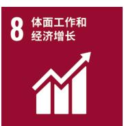

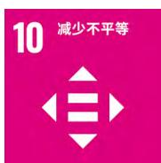

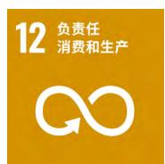

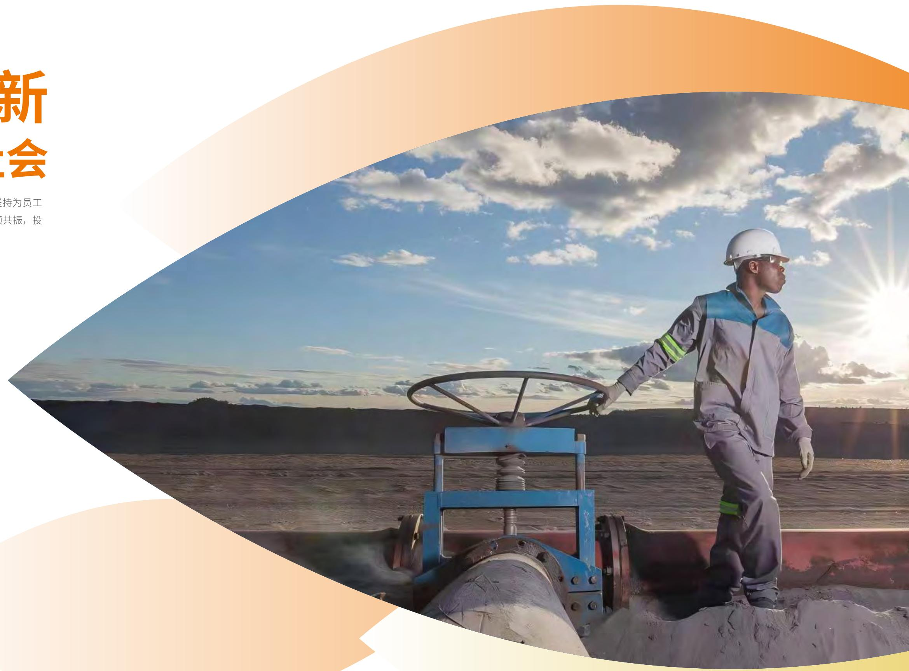

text_image

新
会
持为员工
共振，投

## 创新驱动，激发科技活力

河钢资源不断完善科技创新体系，夯实科技自立自强根基，通过研究成果的转化应用、专利授权及媒体报道等形式实现科研成果的落地，积极推动采矿运营数字化转型，支撑产业高质量发展，提升矿业领域的影响力。

## 完善创新体系

公司坚持以创新驱动为引领，将创新机制常态化、制度化纳入日常运营核心体系并列为公司各管理者的KPI指标，明确责任与工作重心；建立完善的创新管理体系，搭建由价值提升实践部牵头，项目总负责人、首席研究员、尾矿及储存设施研究经理等构成的创新管理组织架构，系统性评审创新研发工作；制定《价值提升实践制度》，明确创新项目具体操作流程，采用标准化模板与评估标准，确保员工创新构想得到统一评估、规范管理；实施全面的创新激励计划，对提交创新构想的员工、成功落地创新方案的团队、在内外部刊物发表成果的个人予以表彰：搭建知识共享平台，推动创新技术与实践在公司内外部得到共享认可与发表；组建由毕业生、学徒、实习生及承包商组成的多学科“SWAT”团队，协助各部门落实自身创新方案；定期编制研究季度报告、研究期刊，记录公司研究活动开展情况并将其纳入每月发送给高管层的月报，在公司内部培育崇尚创新、乐干学习的创新氛围。2025年，公司工艺、技术改进投入12亿元，拥有技术人员225名，完成国际标准化组织ISO56001:2024和ISO56002:2019标准认证；公司成功举办6场创新挑战赛，共收集到949条创新、改进建议。

## 2025 年

公司工艺、技术改进投入

1.2亿元

成功举办创新挑战赛

6场

收集到创新、改进建议

949条

## 创新项目操作指南/准则

发起审批：获得执行总经理的审批授权

价值收益：带来财务收益，以及安全、健康、环境与质量(SHEO)相关收益

议题适配：解决选矿厂及PMC现存的各类问题

学术价值：具备科研价值与技术创新性

## 创新成果转化

公司依托自身业务特性，通过具有多元价值与长效性落地的创新方案，直接解决当前运营中的实际问题，推动创新成果转化为实际效益。鼓励员工参与创新主题挑战项目，通过提出创新方案推动业务发展，打造包容的创新环境；积极通过会议、研讨会、技术活动、学术期刊等形式展示公司创新研究成果，完成南半球最大井下破碎机安装、磁铁矿磨机改造、井下通风智能管控等核心采矿技术升级；与南非大学、林波波大学等高校开展研究项目合作，以产业需求为导向开展研究生项目通过深入理论研究解决PMC现有问题，全面提升采矿与加工价值链的附加值；建立知识产权管理机制，制定创新成果权属的书面备案制度，重视知识产权创造与成果转化，与已拥有专利的明特克公司建立合作，协助PMC开展专利申请、专利注册、专利商业化等业务，加强知识产权规范化管理。

截至 2025 年底，价值提升实践（VIP）部门已收集整理来自各学科的 2,200 余项创意方案数据库。

## 采矿运营创新成果

natural_image

Close-up of wooden beams and supports in a construction or industrial setting (no visible text or symbols)

创新：升级生产竖井旧同步开关。

成效：维护时间从4—6小时缩短至30分钟。

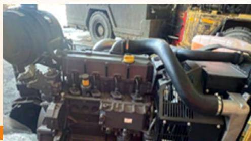

natural_image

Close-up of a military engine with visible hoses and components, no text or symbols present

创新：自主改造淘汰发动机。

成效：延长了设备的使用寿命。

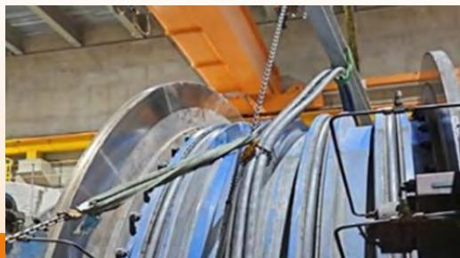

natural_image

Industrial machinery setup with large metal components and overhead crane (no visible text or symbols)

创新：优化吊具梁使用方法。

成效：从卷筒上拆卸钢丝绳的时间缩减，提升了生产效率。

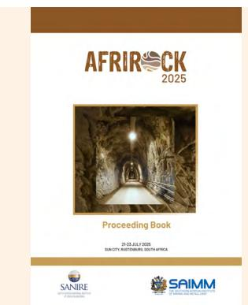

text_image

AFRIROCK
2025
Proceeding Book
25-25-JUL-2025
SANSY ROSTOMERS SOUTH AFRICA
SANIRE
SAIMM

公司员工研究成果在AfriRock2025会议上展示，并被SAIMM期刊选中进行发表

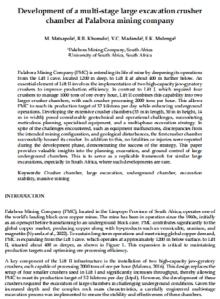

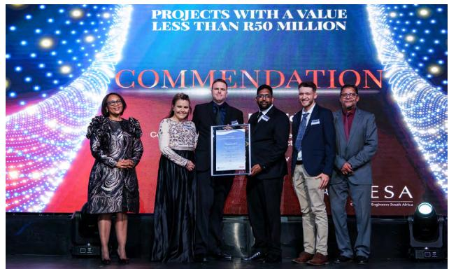

text_image

PROJECTS WITH A VALUE
LESS THAN R50 MILLION
COMMENDATION
ESA
Engineers South Africa

公司冶炼厂冷却塔结构评估与修复方案项目荣获南非咨询工程师协会（CESA）年度工程卓越奖提名奖

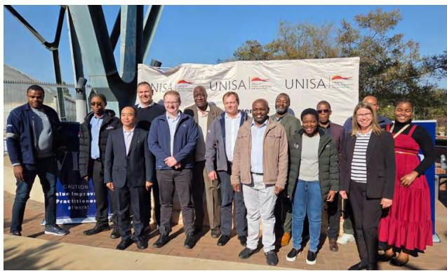

text_image

UNISA
UNISA
UNISA
UNISA
CUSTOMIZE IMPROVEMENT PROVISIONER GROUP

南非大学与公司代表参加课题申请研讨会

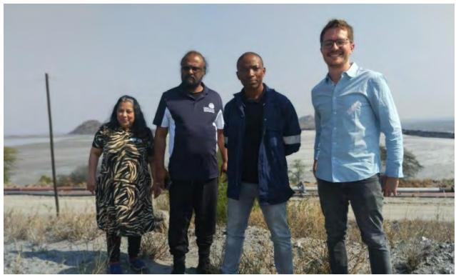

natural_image

Four people standing outdoors in a desert-like landscape with hills in the background (no visible text or symbols)

公司就尾矿库开发与威特沃特斯兰德大学(WITS)教授开展技术合作

## 创新技术保障

公司紧抓数字化浪潮，强化数字基础设施建设，提升治理效能、数据完整性、运营韧性及实时决策能力：运用数字化、智能化技术开展采矿技术的创新研发与升级改造，有效提升设备生产效率，赋能资源高效利用，为企业创新构筑坚实的技术基石：重视数字人才培养，积极开展基础数字技能培训计划，填补公司数字技能缺口，助力员工提升数字化技能。

## 数据库开发

PMC已开发两个研究数据库，数据库（I）旨在列出与员工研究兴趣相关的信息，数据库（Ⅱ）旨在汇总所有内部员工与外部机构合作开展的研究工作。研究数据库已被用于矿山健康安全委员会(MHSC)门户，用于评估研究和创新采纳的影响。

## 数字化改造

在浮选槽安装高速泡沫传感器摄像头，实时采集泡沫表面视觉数据，监测气泡大小、颜色、流速等关键参数实现矿物加工实时可视化管控

投入舍弗勒 Optime 无线振动 / 温度传感器系统，依托 AI 机器学习预测设备潜在故障，实现关键和非关键设备健康状态实时反馈。

为可靠性工程与状态监测团队配备CAT S62 pro三防手机，支持热成像、实时数据采集，可现场识别设备热点、过热部件。

对设备进行 Windows 11 系统迁移，开展 SysAid 云升级助力 IT 服务管理现代化，升级 LIMS 系统、HPNimble存储系统、Barn Owl系统等提升工作流程效率与合规性，安装UPS装置在断电期间保障关键系统运行。

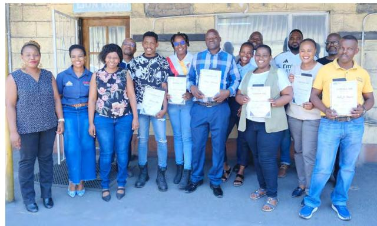

text_image

Group photo of people holding certificates in front of a building, with visible signage and logos in the background.

PMC推出“基础数字技能计划”职业教育培训项目

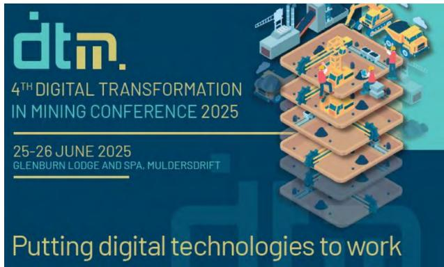

text_image

dtm.
4TH DIGITAL TRANSFORMATION
IN MINING CONFERENCE 2025
25-26 JUNE 2025
GLENBURN LODGE AND SPA, MULDERSDRIFT
Putting digital technologies to work

PMC参加2025年第四届矿业数字化转型大会

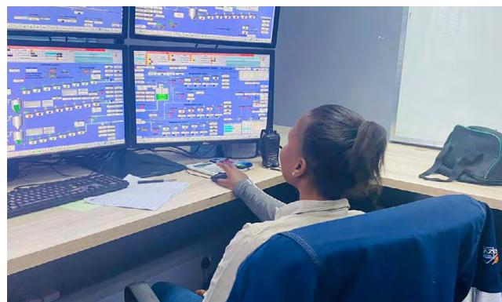

text_image

Person sitting at a control room with multiple large screens displaying various data dashboards and maps.

磁铁矿技术团队新工艺控制室购置多台监控屏，为工艺控制室升级设备

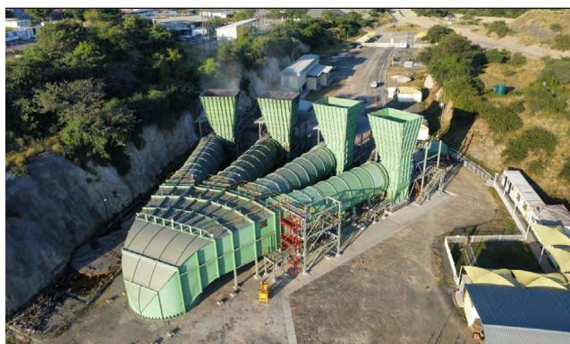

natural_image

Aerial view of a large industrial facility with green storage tanks and surrounding buildings, no visible text or symbols.

完工的地面通风井风机

## 互利共赢，打造责任链条

河钢资源严格遵循供应链管理法律法规，构建安全稳定的责任链条，强化承包商安全协同与激励淘汰，联动行业伙伴深化产学研合作，积极参与行业交流，携手供应链合作伙伴共建协同发展的产业生态。

## 供应商管理

河钢资源严格遵守运营所在地《广义黑人经济赋权法案》(B-BBEE)、《矿产和石油资源开发法》等相关法规，以《采购与材料管理操作程序》《道德准则》《矿山健康安全标准》为准则，成立供应商评估委员会，持续完善供应商管理机制系统化识别、评估和监控供应链风险，保障关键商品和服务供应链安全与连续性推动供应商发展与合作，确保供应商与公司可持续发展目标保持一致。

2025年，PMC 荣获南非 B-BBFE二级合规贡献企业认证，标志着其在 B-BBFE及《矿业宪章》要求下的合规实践达到较高水平，显著提升公司在本地采购体系中的认可度，为拓展政府、矿业及大型企业合作创造有利条件。

## 供应链风险管理

将风险评估贯穿供应商准入、合同签订等整个供应商生命周期，通过制定纠正行动计划、开发替代采购策略、实施合同管控以及制定应急预案等措施，系统开展已识别风险缓解与监控。

通过管理层监督、定期供应商绩效评估、供应商审计及内部审核活动，审查风险管理措施有效性。

## 供应链安全稳定

在合作前，通过尽职调查流程评估供应商能力、合规性及运营韧性。

采用供应商多元化和战略采购策略，降低供应商依赖风险。

运用数字化采购与合同管理系统，推动供应链可追溯透明化，有效监控与审计供应链交易

## 供应商准入与审核

遵循书面程序及授权范围(DOA)限制，开展供应商资格预审、绩效监控、定期评估及实地考察，评估标准包括交付绩效、质量、健康安全、成本及合规性等。

优先考虑当地黑人妇女、B-BBEE级别较高的供应商。

通过 SAP系统和 ARIBA电子采购平台开展供应商ESG审查评估，对供应商进行评级，将评级作为关键采购决策的标准。

## 供应链ESG管理

将可持续发展、道德规范以及健康安全环保要求全面融入供应商遴选流程和绩效评估体系。

完善供应商培训体系，通过供应商发展计划开展相关培训工作。

被认定为合格企业或供应商发展受益人的供应商，公司可为其提供提前付款、业务支持以及供应商发展协议中规定的其他具体支持。

## 承包商管理

公司对承包商的资质和人员能力进行双重审查，确保参与项目的承包商具备相应的实力和水平；与承包商共同推进安全文化建设，增强各方的安全意识和应急处理能力；对表现优秀的承包商给予激励，对不符合要求的承包商进行约谈和淘汰，构建起与承包商协同发展的良性生态。

## 行业交流合作

公司始终秉持开放协作、共促发展的理念，深度联动高等院校、科研机构、行业伙伴等开展沟通交流，与矿物加工、地球冶金、可持续采矿技术及运营优化领域的顶尖专家展开深度合作，积极参与矿业行业交流大会、技术研讨会与专业论坛通过会议展示公司研究成果，推动行业内经验共享、技术共创，提升公司在采矿行业的影响力。

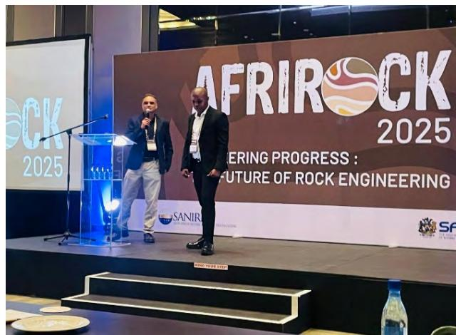

text_image

AFRIROCK
2025
OPERATING PROGRESS :
FUTURE OF ROCK ENGINEERING

公司参加非洲岩石工程大会

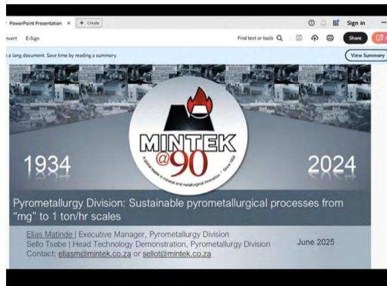

text_image

PowerPoint Presentation
X
Create
Sign in
Invert E-Sign
Find text or tools
Share
a long document. Save time by reading a summary.
View Summary
MINTEK
@90
1934 2024
Pyrometallurgy Division: Sustainable pyrometallurgical processes from
"mg" to 1 ton/hr scales
Elias Matinde | Executive Manager, Pyrometallurgy Division Sello Tsebe | Head Technology Demonstration, Pyrometallurgy Division Contact: eliasm@mintek.co.za or sellot@mintek.co.za June 2025

公司与明特克公司(Mintek)、南非大学召开科研合作虚拟会议

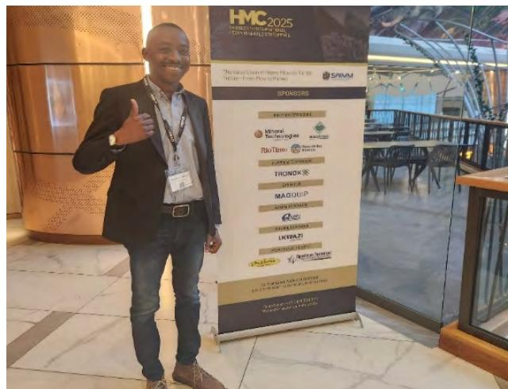

text_image

HMC 2025
THE VALUE UNDERSTOCK MARK OF THE
MARK OF THE SPOUND
SPONSERS
Migal Technologies
RioTinto
LADYUAN SPROV
TRUNDA
MAGUIUP
KURA PANANA
KARELA
LKWAZI
SPRINGGALIF
SARMA JIMIKU
12.000.000.000.000.000.000.000.000.000.000.000.000.000.000.000.000.000.000.000.000.000.000.000.000.000.00

公司员工代表在第十三届国际重矿物会议(HMC2025）期间展示研究工作成果

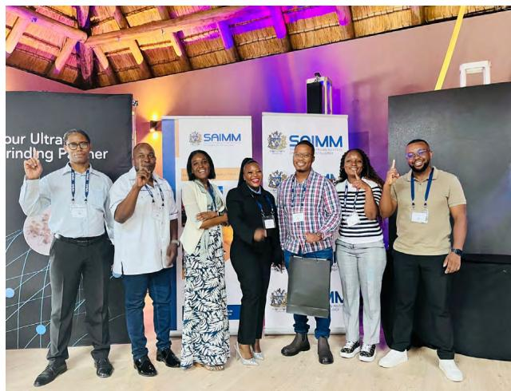

text_image

Our Ultra
prinding Partner
SAIMM
SAIMM

公司员工代表出席在贝拉贝拉举行的SAIMM林波波省技术展示活动，员工演讲在总奖项评选中荣获第一名

## 以人为本，搭建成长舞台

河钢资源始终以国内外劳工准则为指导，坚持平等雇佣，完善薪酬福利体系，强化工会沟通与管理，将民主管理深度融入现代公司治理，全面保障员工信息安全，夯实员工公平健康成长和发展的基础。

## 保障员工权益

公司秉持公平、公正、公开的招聘原则，杜绝任何形式的歧视和不平等竞争，不因员工的性别、年龄、民族和宗教信仰等原因进行区别对待，积极推进员工本地化政策，营造公平公正的就业环境。2025年，公司员工总数3,885人，劳动合同签订率为100%。

## 2025 年

公司员工总数

3,885 人

劳动合同签订率为

100%

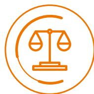  
坚持平等雇佣  
遵守《南非宪法》，《就业公平法》等当地相关法律规定，制定《就业公平政策》，《招聘政策》。坚决反对任何形式的强迫劳动及童工雇佣行为，平等对待不同国籍、民族、种族、肤色、性别、宗教信仰和文化背景的员工：岗位评估与分级机制确保职位设置符合合理级别要求，维护平等就业环境：建立无障碍工作环境与就业机制，在招聘中明确指出部分岗位优先考虑女性或残疾群体，助力其实现职业价值。

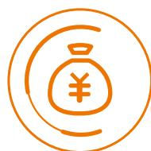  
薪酬福利体系

经PC REMCO批准的薪酬指南为岗位任命设定薪资标准，通过明确职位职责与权限范围确保录用通知符合规定。

为员工提供多种休假类型，包括年假、病假、产假/陪产假、学习假、专科医生休假等。

严格遵守《矿山健康与安全法》关于工作时间的规定，并遵循《基本就业条件法》中关于每周工作总时长及加班等事项的指导条款。

  
强化工会建设

根据《南非宪法》《劳资关系法》规定，所有员工均享有组建工会的权利，可自由组建、加入工会并参与合法活动，且无须担心被解雇或遭受歧视。

基于《认可协议》等书面协议及集体协议构建与工会的关系，所有会议均需形成会议纪要，以确认所达成的共识。

与工会保持定期建设性对话，共同解决员工关切的核心问题，包括工作安全、岗位保障、实质性谈判、改善整体就业条件以及员工发展，推动所有业务部门都能营造出积极向上的工作氛围。

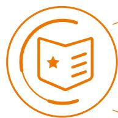

严格遵守《就业公平政策》《招聘政策》，制定发布《就业公平实施计划》，坚守机会均等的雇主准则，打造人员构成具有代表性的员工队伍，全面反映南非多元的人口结构特征，推动建成转型化、代表性的职场环境。

## 员工本地化政策

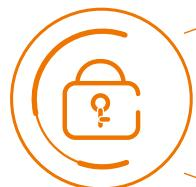

严格遵守《POPI法案》，尊重和保护员工个人隐私，确保员工各项权益不受侵犯；通过IT安全系统进一步加强员工电子信息的安全防护，防止员工信息泄露。

## 员工隐私保护

## 公司PMC员工福利

●为直系亲属去世的员工提供即时的经济援助或休假安排  
● 为员工提供医疗补助计划，使员工及其家人能够享受最好的医疗保障服务  
为新员工在 Phalaborwa 安家提供租房补贴为员工购买房产提供购房补贴

为员工提供良好的退休福利（养老基金计划）  
员工作为受益人参与公司的所有权计划，在退休后可再享受5年的福利  
为符合条件的员工及困难员工家属提供助学金帮助其提升技能

## 公司 PMC 员工构成

专业构成  
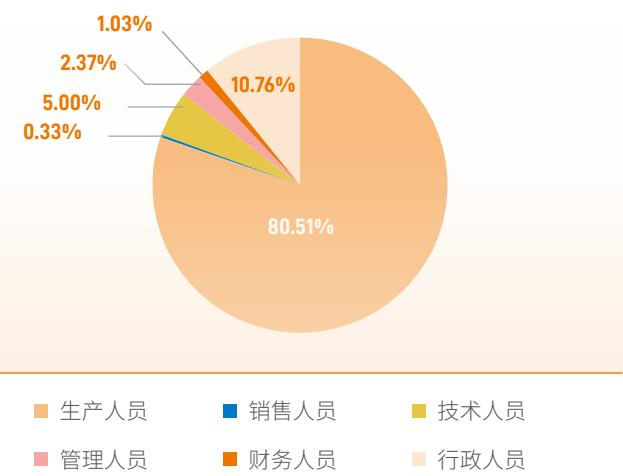

pie

| Category | Percentage |
| --- | --- |
| 生产人员 | 80.51% |
| 销售人员 | 0.33% |
| 技术人员 | 5.00% |
| 管理人员 | 2.37% |
| 财务人员 | 1.03% |
| 行政人员 | 10.76% |

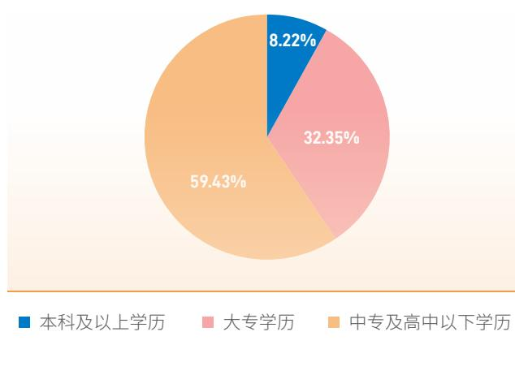

pie

| 学历 | 占比 |
| --- | --- |
| 本科及以上学历 | 8.22% |
| 大专学历 | 32.35% |
| 中专及高中以下学历 | 59.43% |

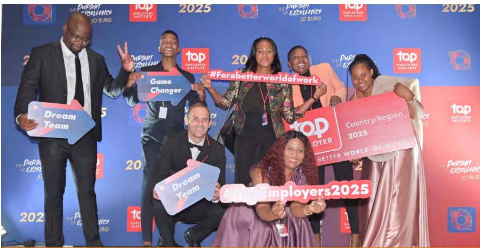

text_image

Dream Team
Game
Changer
#Forabetterworldofwork
Top
OURER
Country/Region
2025
BETTER WORLD OF WOSE
Dream Team
#Forabtersmployers2025

PMC荣获“最佳雇主”认证，共计8次获此殊荣

natural_image

Illustration of people climbing a ladder toward a large golden trophy with stars, symbolizing success or recognition (no text or symbols present)

## 助力员工成才

河钢资源不断加强员工培养体系建设，打通职业晋升路径，把人才优势转化为发展优势，为企业高质量发展提供坚实的组织和人才保障。

## 治理

董事会下设提名委员会，对公司董事和高级管理人员的人选、选择标准和程序进行选择并提出建议，充分考虑董事会和管理层的继任管理能力和发展、公司领导力需求，确保公司在市场中持续保持有效的人才竞争力等，并由下属各团队负责人力资源工作的落实与执行，保障全体员工能够充分发挥自身才能。

战略

<table><tr><td>风险</td><td>风险描述</td><td>应对措施</td></tr><tr><td>技能断层风险</td><td>矿产资源开发和工程机械制造均为技术密集型领域,南非本地员工可能缺乏高端技术岗位所需的专业知识,导致技术岗位人才供给不足。</td><td>校企合作定向培养:与南非高校合作开设采矿工程、机械制造等专业定向班,定制化课程。技术人才“双导师制”:派遣中国专家与南非本土技术骨干结对,通过现场实操+理论培训加速技能提升。</td></tr><tr><td>南非教育体系与产业需求错配风险</td><td>南非职业教育资源集中于约翰内斯堡等大城市,偏远矿区员工难以获得系统技能培训,导致操作岗位效率低下。</td><td>在矿区内建立培训中心,设立卫星培训点,配备虚拟现实(VR)设备模拟采矿场景,解决地理位置限制。与本地职业院校共建实训基地,如与林波波省理工学院合作,将培训课程嵌入矿区生产流程。</td></tr><tr><td>跨国文化管理风险</td><td>PMC员工以本地员工为主,文化差异可能导致培训内容接受度低、晋升公平性存在争议。</td><td>开发“文化适配型”培训材料,将中国管理经验与南非本土文化结合。建立“双通道”晋升体系,技术岗位与管理岗位并行,允许员工根据自身优势选择发展路径。</td></tr></table>

2025 年

## 影响、风险和机遇管理

## 人才引进

公司从自身发展需要出发，兼顾员工构成的多元与平衡，注重开展定向招聘，通过与专注于特定技能人才招聘的机构建立合作关系、与特殊利益群体(如南非残疾人协会）合作，坚持人才招聘的公开、透明，寻找符合公司发展需求的特定人才打造一支全面、专业、进取的人才队伍。

## 人才培养

公司高度重视为员工创造成长机会与平台，严格遵循员工需求及《社会劳动计划》(SIP)相关合规承诺，针对不同类别的专业岗位，提供涵盖正规教育、技术培训软技能提升及领导力培养等模块的培训方案：定期开展培训需求分析，为预算电请流程和培训计划制定提供支持；向符合条件的员工提供助学金等援助，激发员工学习潜力，支持员工继续深造；与南非大学等外部专业机构建立合作关系，共同开展专项培训课程。2025年，公司组织专门培训33项，参加培训2,290人次。

公司组织专门培训

33 项

参加培训

2,290 人次

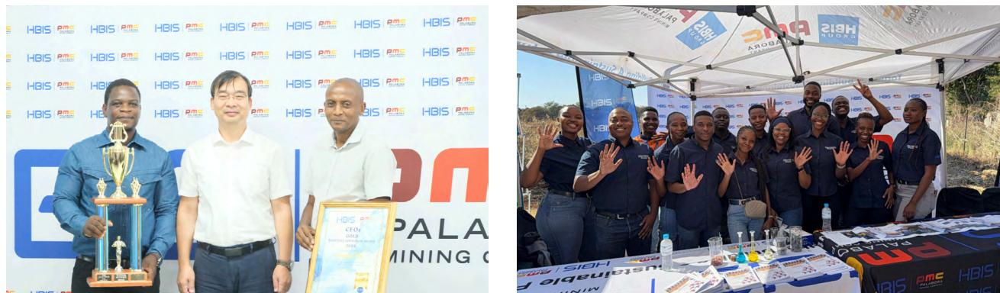  
PMC 举办 VIP（Value improvement practice）知识分享与颁奖活动 PMC 参加由卢莱卡尼全教会主办的精彩职业日活动

## 人才晋升

公司致力于为全体员工创造平等的发展机遇，制定人才管理和继任规划政策，推出结构化职业晋升体系，采用系统化整合方案，根据当前及未来业务目标，精准识别、培养并留住关键岗位人才：每年绩效管理周期结束后，开展年度评估，既为岗位晋升做好准备，又能确保在现有岗位上发挥最佳效能，提供透明、公平、多元的职业发展和晋升路径。2025年，公司PMC的9名员工成功通过2025年职业晋升流程。

公司职业发展路径

<table><tr><td>垂直晋升</td><td>为在当前岗位表现卓越且展现出能够承担更具挑战性工作任务潜力的员工给予晋升机会。</td></tr><tr><td>横向晋升</td><td>职能没有发生明显的变化,但公司通过薪资增长的形式对努力工作、表现优异的员工给予奖励。</td></tr><tr><td>斜向晋升</td><td>将员工调动到其他部门或业务板块的新职位,助力有快速学习能力且能在新岗位上表现出色的员工学习新技能。</td></tr><tr><td>公开晋升</td><td>公司通过在员工公告板或电子邮件发布空缺职位信息,为所有符合条件的员工提供晋升机会。</td></tr></table>

## 人才评选

公司定期开展最佳员工评选活动，所有员工及管理层均有资格被提名评选，下属同事及上级均可通过填写最佳员工提名表对任何员工进行提名，《人力资源最佳员工评选表》提交至所属部门委员会或人力资源服务部后，部门委员会将审核本部门所有提名材料，最终将通过的提名提交至人力资源服务部进行奖励审批。经部门批准的提名者自动具备年度最佳员工评选资格。根据职业晋升政策，当月获评最佳员工可提升获得高级津贴或大师津贴的资格。

## 指标和目标

## 指标

<table><tr><td>指标</td><td>单位</td><td>2025年</td></tr><tr><td>员工培训投入</td><td>万元</td><td>3,052.1</td></tr><tr><td>人均培训时长</td><td>小时</td><td>39.9</td></tr><tr><td>员工流失率</td><td>%</td><td>3.4</td></tr></table>

## 目标

公司每年根据公司内参与各种学习项目的员工人数，编制年度工作场所技能计划（WSP），助力员工（特别是HDSA候选人）提升技能。

<table><tr><td>领域</td><td>指标</td><td>2026年目标(HDSA)</td><td>2026年目标(非HDSA)</td><td>2026年目标(男性)</td><td>2026年目标(女性)</td></tr><tr><td>助学金项目</td><td>人</td><td>0</td><td>0</td><td>0</td><td>0</td></tr><tr><td>在职培训项目</td><td>人</td><td>27</td><td>1</td><td>18</td><td>10</td></tr><tr><td>应届毕业生实习项目</td><td>人</td><td>11</td><td>1</td><td>8</td><td>4</td></tr><tr><td>管理层发展项目</td><td>人</td><td>0</td><td>0</td><td>0</td><td>0</td></tr><tr><td>研修实践项目</td><td>人</td><td>0</td><td>0</td><td>0</td><td>0</td></tr><tr><td>总计</td><td>人</td><td>38</td><td>2</td><td>26</td><td>14</td></tr></table>

## 关怀女性员工

公司高度重视保障女性员工的平等权利、人格尊严、隐私权、身心健康以及公平劳动权益，将女性员工占比达到或超过25%作为目标，通过设立“采矿业的女性”制度、完善矿区女性卫生设施、开展女性领导力论坛等方式，赋能女性员工职业发展，重塑矿业职场生态。

flowchart

```mermaid
graph LR
  A["Drink lots of water."] --> B["Take prenatal vitamins."]
  B --> C["Check your weight."]
  C --> D["Exercise regularly."]
  D --> E["Take care of your mental health"]
  E --> F["Avoid raw food & limit caffeine."]
  F --> G["Eat a diet high in fruits, vegetables, protein & fiber."]
```

孕期保健周活动

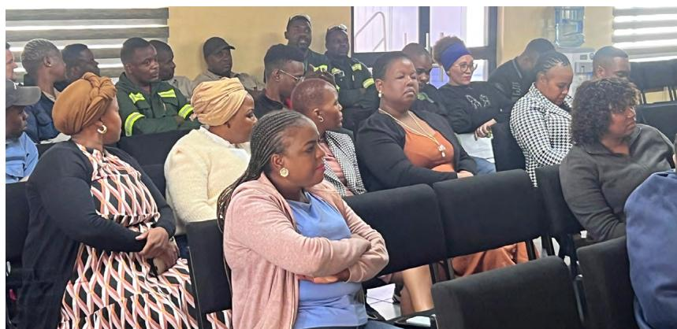

natural_image

Group of people seated in a conference room, some wearing military uniforms and patterned headscarves (no visible text or symbols)

员工反对性骚扰教育活动

注：HDSA是指历史上处于不利地位的南非人(Historically Disadvantaged South Africans)。2026年计划名额因公司当前面临的地下采矿作业区域遭遇洪水侵袭、矿山其他配套厂区因洪水影响出现运营困难等多项经营挑战而有所缩减，公司将结合上述挑战的实际进展，对计划名额进行动态复核与调整。

## 产假政策

公司坚持按国家有关规定给予妊娠期、产假和哺乳期女员工享受特别的福利制度，切实保障女性员工权益。

PMC 建立适用的产假政策，为符合条件的女员工提供每周最多6小时的带薪休假。

## 反性骚扰

制定《防性骚扰政策》，致力于打造零欺凌、零骚扰的工作环境，并对所有被判性骚扰罪的员工进行纪律处分。

开展职场性骚扰防治宣传活动，通过生动案例教学，帮助员工识别不同形式的骚扰行为。

畅通举报与求助渠道，面对骚扰事件可通过人力资源部或举报系统举报。

## 荣誉

PMC矿业女性组织主席Mpho入选2025年南非TransUnion新星奖—矿业与矿产类别的半决赛选手

## 丰富员工生活

公司通过组织员工共同开展形式丰富多元的文体活动、亲子活动、节日活动等促进员工工作生活平衡，提升员工凝聚力，形成“快乐工作，健康生活”的良性循环。2025年，PMC员工满意度问卷调查结果为85.2%。

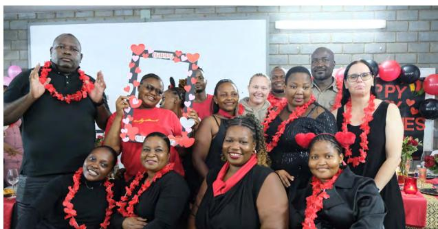

natural_image

Group photo of people in festive attire posing with red ribbons and a decorated heart frame (no visible text or symbols)

情人节烹饪挑战赛

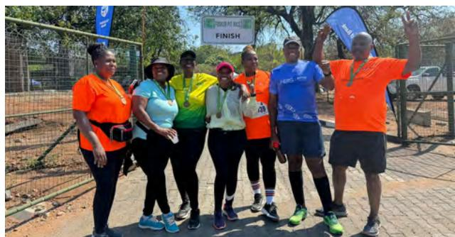

text_image

FINISH
RUNNERS
FINISH

健康步行活动

natural_image

Group of cyclists posing on bicycles outdoors, wearing yellow and blue jackets with 'STAT WIDER' branding (no visible text or symbols)

PMC自行车俱乐部成员参加开普敦年度自行车巡回赛

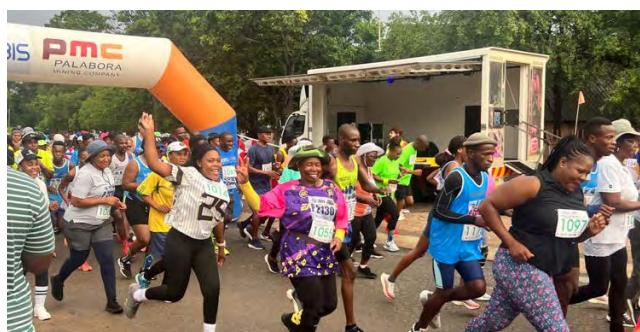

text_image

PMC
PALABORA
MINA COMPLI
25
1097
1051
1083
1097

家庭半程马拉松

## 普惠包容，建设和谐社区

河钢资源秉持普惠包容发展理念，充分发挥自身资源优势，围绕教育事业、医疗健康、社区治理、环境保护、公益慈善等核心领域精准发力，以实际行动深耕社区共建，助力当地发展，构建和谐共生的社区发展生态。2025年，公司公益慈善活动共计35人次参与。

## 支持教育发展

设立奖学金，为当地青年提供假期工作机会，培养年轻人所需的专业技能；推进学校翻新工程，完善校园营养餐配套设施建设，为学校捐赠电脑设备，提升当地教育资源水平；举办职业博览会，提供互动式职业交流平台，弥合教育与就业鸿沟。

## 保障医疗健康

建设健康服务中心并提供相关诊疗服务；运营马拉拉医疗中心，为企业员工及社区居民提供24小时医疗保障。

## 参与社区治理

扎根属地强化治理，积极参与当地社区治安与秩序维护；面对火灾、洪水等自然灾害，积极参与当地救助与灾后重建，推动企业与社区融合发展、共建共享，为海外业务拓展提供安全稳定的运营环境

## 维护社区环境

组织社区垃圾清理环境整治行动，开展环保理念公益宣传，保护社区动植物，维护社区生物多样性，实现公司与社区环境的和谐发展

## 投身公益慈善

紧扣属地民生需求，围绕弱势群体帮扶、特殊群体关爱等开展系列公益活动，将公益理念融入日常运营，以持续的公益实践诠释企业的社会价值

## 案例 公司开展 2025 年曼德拉日两日公益行动

2025 年 7 月 17—18 日，公司在 Phalaborwa 市政辖区的 Tshubje 临时救助中心、Thabelang 残疾人中心开展两日曼德拉日公益行动。首日为救助中心捐赠冬季物资、翻新门窗，合作商TharamaTrading捐赠涂料并修复水井、厕所门；次日为残疾人中心捐赠非易腐食品和衣物，助力其长期食品项目。本次行动彰显了PMC将社会责任深度融入运营理念的企业追求。

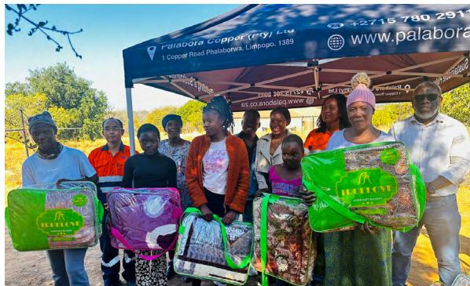

text_image

Palabora Copper (City), Ltd.
1 Copper Road Phalabothia, Lutipopo. 1389
www.palabora
BITICOM
BITICOM
BITICOM
BITICOM
BITICOM
BITICOM
BITICOM
BITICOM
BITICOM
BITICOM
BITICOM
BITICOM
BITICOM
BITICOM
BITICOM
BITICOM
BITICOM
BITICOM
BITICOM
BITICOM
BITICOM
BITICOM
BITICOM
BITICOM
BITICOM
BITICUM
BITICUM
BITICUM
BITICUM
BITICUM
BITICUM
BITICUM
BITICUM
BITICUM
BITICUM
BITICUM
BITICUM
BITICUM
BITICUM
BITICUM
BITICUM
BITICUM
BITICUM
BITICUM
BITICUM
BITICUM
BITICUM
BITICUM
BITICUM
BITICUM
BITICM
BITICUM
BITICUM
BITICUM
BITICUM
BITICUM
BITICUM
BITICUM
BITICUM
BITICUM
BITICUM
BITICUM
BITICUM
BITICUM
BITICUM
BITICUM
BITICUM
BITICUM
BITICUM
BITICUM
BITICUM
BITICUM
BITICUM
BITICUM
BITICUM
BITICU
BITICUM
BITICUM
BITICUM
BITICUM
BITICUM
BITICUM
BITICUM
BITICUM
BITICUM
BITICUM
BITICUM
BITICUM
BITICUM
BITICUM
BITICUM
BITICUM
BITICUM
BITICUM
BITICUM
BITICUM
BITICUM
BITICUM
BITICUM
BITICUM
BITICIM
BITICUM
BITICUM
BITICUM
BITICUM
BITICUM
BITICUM
BITICUM
BITICUM
BITICUM
BITCIMA
BITCIMA

为救助中心捐赠冬季物资

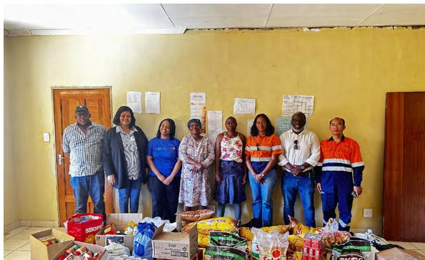

natural_image

Group photo of eight people standing in front of a yellow wall, surrounded by supplies and boxes (no visible text or symbols)

为残疾人中心捐赠非易腐食品

## 案例

2025年7月，公司通过安保服务部门向当地社区警务论坛捐赠了一辆旧拖车，用于应对火灾、洪水等紧急情况，强化社区安全，为当地南非警察服务局(SAPS)提供支持。南非警察服务局(SAPS)不辞辛劳地维护Phalaborwa街道的安全与秩序，PMC已赞助三辆巡逻车，实现全天候24小时巡逻，助力本地社区打击犯罪行为，守护并维系当地社区的可持续发展。

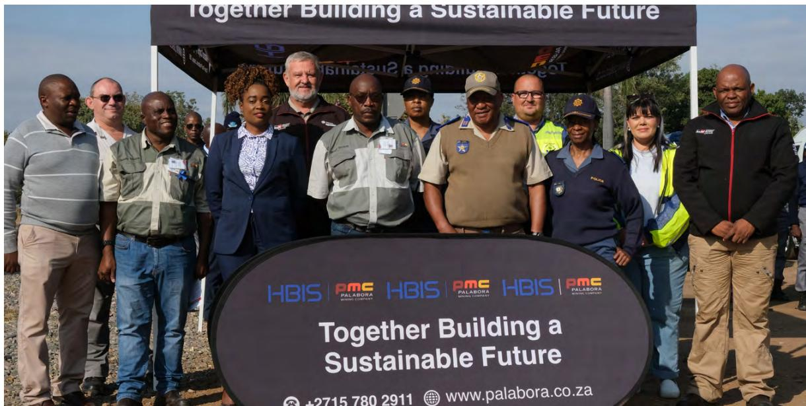

text_image

Together Building a Sustainable Future
HBIS | PMC PALABORA
MORSE COMPANY
HBIS | PMC PALABORA
MORSE COMPANY
HBIS | PMC PALABORA
MORSE COMPANY
Together Building a
Sustainable Future
+2715 780 2911 www.palabora.co.za

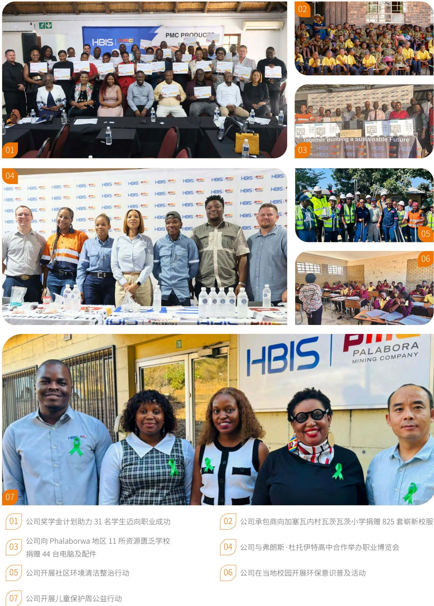

01 公司奖学金计划助力31名学生迈向职业成功  
03 公司向 Phalaborwa 地区 11 所资源匮乏学校捐赠44 台电脑及配件  
05 公司开展社区环境清洁整治行动  
07 公司开展儿童保护周公益行动

02 公司承包商向加塞瓦内村瓦茨瓦茨小学捐赠825套崭新校服  
04 公司与弗朗斯·杜托伊特高中合作举办职业博览会  
06 公司在当地校园开展环保意识普及活动

## 未来展望

为者常成，行者常至。2026年是“十五五”规划的开局之年，公司将始终坚持以习近平新时代中国特色社会主义思想为指导，完整、准确、全面贯彻新发展理念，持续深化ESG实践，筑牢治理之基、厚植生态之美、践行责任之道，在建设世界一流矿业企业的征程中，锐意进取、勇毅争先，加速打造河钢资源社会利益与生态发展共赢共荣的发展新范式为实现“做行业最具竞争力的企业”的企业目标而不断奋斗

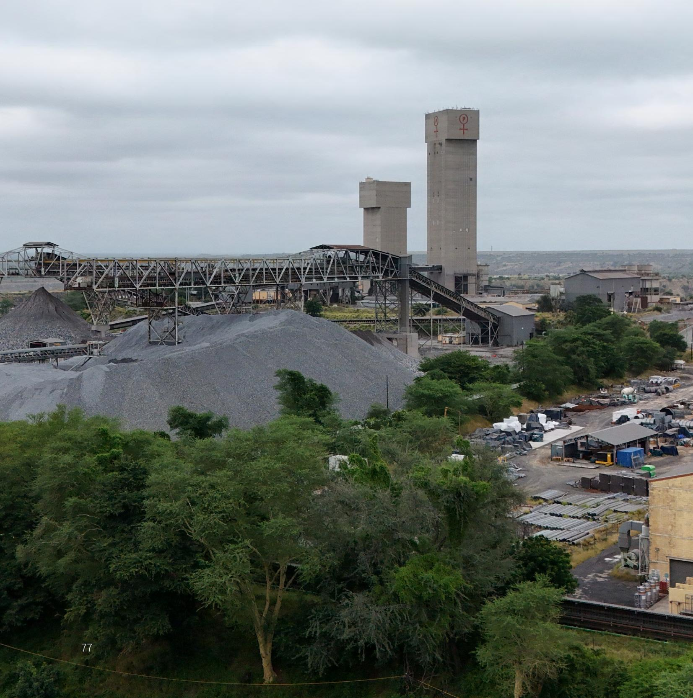

natural_image

Exterior view of an industrial mining or quarry site with two tall towers and a large conveyor structure, surrounded by greenery (no visible text or symbols)

## 附录

## 关键绩效

环境绩效

<table><tr><td>指标</td><td>单位</td><td>2023年</td><td>2024年</td><td>2025年</td></tr><tr><td colspan="5">应对气候变化</td></tr><tr><td>范围一温室气体排放量</td><td>吨二氧化碳当量</td><td>65,130.8</td><td>70,033.1</td><td>78,248.6</td></tr><tr><td>范围二温室气体排放量</td><td>吨二氧化碳当量</td><td>470,871.9</td><td>513,960.1</td><td>572,048.5</td></tr><tr><td>范围一温室气体减排量</td><td>吨二氧化碳当量</td><td>-4,708.0</td><td>-4,902.1</td><td>-8,215.4</td></tr><tr><td>范围二温室气体减排量</td><td>吨二氧化碳当量</td><td>8,584.0</td><td>-43,088.3</td><td>-58,088.3</td></tr><tr><td colspan="5">环境管理</td></tr><tr><td>环保投入</td><td>万元</td><td>522.1</td><td>488.8</td><td>634.2</td></tr><tr><td>办公用电量</td><td>万千瓦时</td><td>97.1</td><td>159.6</td><td>394.7</td></tr><tr><td colspan="5">能源利用</td></tr><tr><td>能源消耗总量</td><td>兆瓦时</td><td>670,633.9</td><td>765,688.5</td><td>831,542.3</td></tr><tr><td>非化石能源量(电力)</td><td>兆瓦时</td><td>485,742.0</td><td>474,357.0</td><td>580,759.9</td></tr><tr><td>企业总能耗强度</td><td>兆瓦时/百万营收</td><td>114.3</td><td>137.2</td><td>142.4</td></tr><tr><td>清洁能源使用量</td><td>兆瓦时</td><td>0.0</td><td>0.0</td><td>0.0</td></tr><tr><td colspan="5">水资源利用</td></tr><tr><td>年度用水总量</td><td>万立方米</td><td>3,897.9</td><td>5,086.8</td><td>5,129.1</td></tr><tr><td>新鲜水用水量</td><td>万立方米</td><td>425.8</td><td>538.4</td><td>568.2</td></tr><tr><td>节水量</td><td>万立方米</td><td>250.2</td><td>-112.6</td><td>-29.8</td></tr><tr><td>循环用水量</td><td>万立方米</td><td>3,472.1</td><td>4,548.4</td><td>4,560.9</td></tr><tr><td>废水排放量</td><td>万立方米</td><td>13.8</td><td>12.6</td><td>14.0</td></tr><tr><td>选矿废水循环利用率</td><td>%</td><td>89.1</td><td>89.4</td><td>88.9</td></tr><tr><td colspan="5">污染物排放</td></tr><tr><td>颗粒物(PM)排放量</td><td>吨</td><td>201.2</td><td>196.2</td><td>135.7</td></tr><tr><td>二氧化硫( $SO_2$ )排放量</td><td>吨</td><td>2.3</td><td>2.3</td><td>0.7</td></tr><tr><td>氮氧化物(NOx)排放量</td><td>吨</td><td>54.3</td><td>53.3</td><td>110.2</td></tr><tr><td colspan="5">废弃物处理</td></tr><tr><td>无害废弃物排放量</td><td>吨</td><td>756.0</td><td>1,177.0</td><td>861.0</td></tr><tr><td>有害废弃物排放量</td><td>吨</td><td>82.1</td><td>133.0</td><td>429.4</td></tr><tr><td>固废综合利用率</td><td>%</td><td>21.8</td><td>11.8</td><td>13.6</td></tr><tr><td>废弃物回收利用量</td><td>吨</td><td>165.0</td><td>145.0</td><td>136.0</td></tr><tr><td>可再生资源消耗量及占相应资源总消耗量的比例</td><td>%</td><td>0.0</td><td>0.0</td><td>0.0</td></tr></table>

社会绩效

<table><tr><td>指标</td><td>单位</td><td>2023年</td><td>2024年</td><td>2025年</td></tr><tr><td colspan="5">员工权益保障</td></tr><tr><td>女性员工数</td><td>人</td><td>652</td><td>807</td><td>798</td></tr><tr><td>女性员工比例</td><td>%</td><td>16.5</td><td>20.0</td><td>20.6</td></tr><tr><td>员工流失率</td><td>%</td><td>3.3</td><td>3.2</td><td>3.4</td></tr><tr><td>报告期内吸纳就业人数</td><td>人</td><td>235</td><td>159</td><td>26</td></tr><tr><td>体检覆盖率</td><td>%</td><td>100</td><td>100</td><td>100</td></tr><tr><td>劳动合同签订率</td><td>%</td><td>100</td><td>100</td><td>100</td></tr></table>

<table><tr><td>指标</td><td>单位</td><td>2023年</td><td>2024年</td><td>2025年</td></tr><tr><td>社会保险覆盖率(医疗补助)</td><td>%</td><td>100</td><td>100</td><td>100</td></tr><tr><td>社会保险覆盖率(养老基金)</td><td>%</td><td>100</td><td>100</td><td>100</td></tr><tr><td>女性管理者人数</td><td>人</td><td>13</td><td>12</td><td>14</td></tr><tr><td>中层管理者中女性管理者占比</td><td>%</td><td>16.4</td><td>19.4</td><td>28.5</td></tr><tr><td>人均带薪休假天数</td><td>天</td><td>34</td><td>34</td><td>34</td></tr><tr><td>员工培训投入</td><td>万元</td><td>3,669.6</td><td>3,256.7</td><td>3,052.1</td></tr><tr><td>人均培训时长</td><td>小时</td><td>53.0</td><td>32.4</td><td>39.9</td></tr><tr><td colspan="5">职业健康与安全生产</td></tr><tr><td>安全培训总时长</td><td>小时</td><td>41,239.0</td><td>39,491.0</td><td>53,318.0</td></tr><tr><td>安全生产培训覆盖率</td><td>%</td><td>93.9</td><td>92.9</td><td>92.8</td></tr><tr><td>应急演练次数</td><td>次</td><td>146.0</td><td>122.0</td><td>143.0</td></tr><tr><td>生产安全事故数</td><td>次</td><td>972.0</td><td>771.0</td><td>770.0</td></tr><tr><td>工伤人数</td><td>人</td><td>5</td><td>4</td><td>2</td></tr><tr><td>工亡人数</td><td>人</td><td>0</td><td>0</td><td>0</td></tr><tr><td>因工伤而损失的工作日天数</td><td>天</td><td>449</td><td>502</td><td>53</td></tr><tr><td>特种作业人员持证上岗率</td><td>%</td><td>100</td><td>100</td><td>100</td></tr><tr><td colspan="5">供应链安全</td></tr><tr><td>供应商ESG考核数</td><td>家</td><td>7.0</td><td>10.0</td><td>9.0</td></tr><tr><td colspan="5">社会贡献</td></tr><tr><td>公益捐赠总额</td><td>万元</td><td>1,937.2</td><td>1,988.8</td><td>2,261.1</td></tr></table>

治理绩效

<table><tr><td>指标</td><td>单位</td><td>2023年</td><td>2024年</td><td>2025年</td></tr><tr><td colspan="5">公司治理</td></tr><tr><td>股东会董事出席率</td><td>%</td><td>100</td><td>100</td><td>100</td></tr><tr><td>女性董事占比</td><td>%</td><td>11.0</td><td>22.0</td><td>22.2</td></tr><tr><td>董事会董事出席率</td><td>%</td><td>100</td><td>100</td><td>100</td></tr><tr><td>女性高管占比</td><td>%</td><td>10</td><td>10</td><td>9</td></tr><tr><td colspan="5">客户</td></tr><tr><td>客户满意度</td><td>%</td><td>100</td><td>100</td><td>100</td></tr><tr><td>客户投诉数量</td><td>次</td><td>1.0</td><td>0.0</td><td>5.0</td></tr><tr><td>客户投诉解决率</td><td>%</td><td>100</td><td>100</td><td>100</td></tr><tr><td>产品止损事件发生次数</td><td>次</td><td>1.0</td><td>0.0</td><td>1.0</td></tr></table>

经营绩效

<table><tr><td>指标</td><td>单位</td><td>2023年</td><td>2024年</td><td>2025年</td></tr><tr><td colspan="5">经营绩效</td></tr><tr><td>铜产量</td><td>万吨</td><td>2.4</td><td>2.5</td><td>2.5</td></tr><tr><td>磁铁矿产量</td><td>万吨</td><td>581.5</td><td>932.4</td><td>1,125.0</td></tr><tr><td>蛭石产量</td><td>万吨</td><td>16.9</td><td>16.3</td><td>10.6</td></tr><tr><td>资产总额</td><td>亿元</td><td>158.7</td><td>164.0</td><td>187.9</td></tr><tr><td>营业收入</td><td>亿元</td><td>58.7</td><td>55.8</td><td>58.4</td></tr><tr><td>所得税</td><td>亿元</td><td>6.1</td><td>1.8</td><td>3.3</td></tr><tr><td>净利润</td><td>亿元</td><td>9.1</td><td>5.7</td><td>5.7</td></tr></table>

指标索引

<table><tr><td>一级标题</td><td>二级标题</td><td>《中国企业可持续发展报告指南(CASS-ESG 6.0)》</td></tr><tr><td colspan="2">报告前言</td><td>P1.1-1.2</td></tr><tr><td colspan="2">董事会声明</td><td>-</td></tr><tr><td colspan="2">董事长致辞</td><td>P2.1</td></tr><tr><td colspan="2">走进河钢资源</td><td>P3.1-3.3</td></tr><tr><td colspan="2">ESG管理</td><td>G1.1.1-1.1.10, G1.3.1-1.3.2</td></tr><tr><td colspan="2">2025年度履责绩效</td><td>A2</td></tr><tr><td colspan="2">责任聚焦一:保障优质矿石供应,提升全球产业韧性</td><td>S3.1.2, S3.1.4</td></tr><tr><td colspan="2">责任聚焦二:携手共建“一带一路”,收获中非合作硕果</td><td>S1.2.1</td></tr><tr><td rowspan="4">深耕海外创业,共筑稳健经营根基</td><td>规范运作,提升管理效能</td><td>G1.1.1-1.1.3, G1.3.1-1.3.2</td></tr><tr><td>守法合规,防范经营风险</td><td>G1.1.1-1.1.2, G1.1.7-1.1.8G2.1.1-2.1.8, G2.2.1-2.2.3</td></tr><tr><td>品质卓越,赢得客户信赖</td><td>S3.3.1-3.3.6, S3.4.1-3.4.4</td></tr><tr><td>恪守底线,筑牢安全屏障</td><td>S4.2.1-4..2.5</td></tr><tr><td rowspan="4">践行生态创优,共绘绿色资源画卷</td><td>低碳发展,应对气候变化</td><td>E1.1.1-1.1.5</td></tr><tr><td>环境管理,严控污染排放</td><td>E2.1.1, E2.1.3, E2.1.5-2.1.7, E2.2.1, E2.2.3,E2.2.5-2.2.7</td></tr><tr><td>清洁生产,减少资源消耗</td><td>E3.1.1, E3.1.4-3.1.5, E3.2.1, E3.2.3-3.2.4, E3.3.2</td></tr><tr><td>生态修复,重塑矿区风貌</td><td>E2.3.1-2.3.3</td></tr><tr><td rowspan="4">引领价值创新,共享融合美好社会</td><td>创新驱动,激发科技活力</td><td>S2.1.1-2.1.4, S2.1.6, S2.1.12-2.1.13</td></tr><tr><td>互利共赢,打造责任链条</td><td>S3.1.1-3.1.4</td></tr><tr><td>以人为本,搭建成长舞台</td><td>S4.1.1, S4.1.3-4.1.5, S4.1.9, S4.1.11-4.1.12,S4.3.1-4.3.6</td></tr><tr><td>普惠包容,建设和谐社区</td><td>S1.2.1,S1.2.3, S1.2.5-1.2.6</td></tr><tr><td colspan="2">未来展望</td><td>A1</td></tr><tr><td rowspan="4">附录</td><td>关键绩效</td><td>A2</td></tr><tr><td>指标索引</td><td>A3</td></tr><tr><td>报告评级</td><td>A5</td></tr><tr><td>意见反馈</td><td>A6</td></tr></table>

## 报告评级

## 一图读懂

## 《河钢资源股份有限公司2025环境、社会及治理（ESG）报告》评级报告

## 一、评级结果

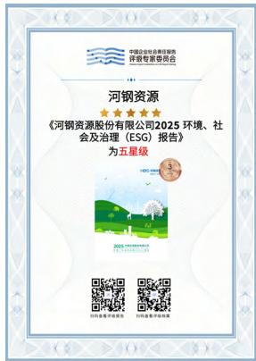

text_image

中国证券监督管理委员会
评级专家委员会
河钢资源
★★★★★
《河钢资源股份有限公司2025环境、社会及治理（ESG）报告》
为五星级
3
扫码登录平台下载
扫码登录平台下载

《河钢资源股份有限公司 2025 环境、社会及治理（ESG） 报 告》（ 以下简称《报告》）为五星级，是一份卓越的企业可持续发展报告。

<table><tr><td>综合评级</td><td>评级图示</td><td>发展水平</td></tr><tr><td>五星佳</td><td>★★★★★+</td><td>典范</td></tr><tr><td>五星级</td><td>★★★★★</td><td>卓越</td></tr><tr><td>四星半级</td><td>★★★★☆</td><td>领先</td></tr><tr><td>四星级</td><td>★★★★</td><td>优秀</td></tr><tr><td>三星级</td><td>★★★</td><td>良好</td></tr><tr><td>二星级</td><td>★★</td><td>发展</td></tr><tr><td>一星级</td><td>★</td><td>起步</td></tr></table>

## 二、亮点绩效

过程性

★ ★ ★ ★ ☆

实质性

★ ★ ★ ★ ★

完整性

★ ★ ★ ★ ☆

平衡性

★ ★ ★ ★ ☆

可比性

★ ★ ★ ★ ★

可读性

★ ★ ★ ★ ★

创新性

★ ★ ★ ★ ★

《报告》的实质性、可比性、可读性、创新性均达到五星级，过程性、完整性、平衡性达到四星半级。

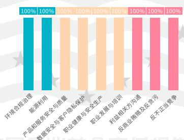

bar

| Category | Value (%) |
| --- | --- |
| 环境合规治理 | 100 |
| 能源利用 | 100 |
| 产品和服务安全与质量 | 100 |
| 数据安全与客户隐私保护 | 100 |
| 职业健康与安全生产 | 100 |
| 职业发展与培训 | 100 |
| 利益相关方沟通 | 100 |
| 反商业贿赂及反贪污 | 100 |
| 反不正当竞争 | 100 |

《报告》系统披露了黑色金属矿采选业核心指标的80.34%，其中环境维度下环境合规管理、能源利用，社会维度下产品和服务安全与质量、数据安全与客户隐私保护、职业健康与安全生产、职业发展与培训，治理维度下利益相关方沟通、反商业贿赂及反贪污、反不正当竞争等议题的核心指标覆盖率最高，均达100%。

6 组

水资源利用

11 组

员工权益保障

2 组

利益相关方沟通

《报告》详细披露了62个关键指标连续3年的对比数据，其中环境维度下水资源利用、社会维度下员工权益保障、治理维度下利益相关方沟通议题连续3年可比数据披露最为充分。

## 三、改进建议

增加废弃物处理、创新驱动等议题下核心指标的披露，进一步提升报告的完整性。

## 四、评级勋章

河钢资源股份有限公司连续3年参与报告评级，连续2.年获得五星级评价，获黄铜级勋章。

报告评级趋势  
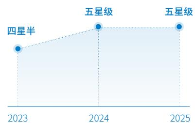

area

| Year | Performance Level |
| --- | --- |
| 2023 | 四星半 |
| 2024 | 五星级 |
| 2025 | 五星级 |

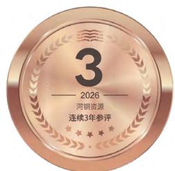

## 《河钢资源股份有限公司2025环境、社会及治理（ESG）报告》评级报告

受河钢资源股份有限公司连续第3年委托，“中国企业社会责任报告评级专家委员会”抽选专家组成评级小组，对《河钢资源股份有限公司2025环境、社会及治理(FSG)报告》（以下简称《报告》）进行评级。

## 一、评级依据

1.《企业可持续披露准则—基本准则（试行）》；  
2.《深圳证券交易所上市公司自律监管指引第17号—可持续发展报告（试行）》；  
3.《中国企业可持续发展报告指南（CASS-ESG 6.0）之黑色金属矿采选业》；  
4.《中国企业可持续发展报告评级标准（2026)》。

## 二、评级分析

## 过程性（★★★★☆）

ESG管理委员会统筹推进报告编制工作，把控报告整体方向和关键环节，报告由董事会最终审定；围绕报告编制开展前期研究，构建可持续发展指标体系，建立完善的ESG治理架构与制度体系，提高可持续发展管理水平：编制报告存量、定量、定性资料收集清单，召开报告编制启动会，全面收集报告素材；推动下属单位依托安全、健康、环境与质量（SHEQ）管理系统，建立覆盖安全、健康、环境及质量相关ESG议题的管理制度，并编制发布年度 ESG 报告，强化可持续发展纵向管理力度；计划通过公司官网、交易所网站等渠道，以中英文版、印刷品、电子版、“一图读懂”版等形式发布报告，过程性表现领先。

## 实质性（★★★★★）

《报告》系统披露了应对气候变化、污染物排放、生物多样性和土地利用、水资源利用（水资源短缺）、提高采矿回采、选矿回收效率、智能化矿山开采、可持续供应链、产品和服务安全与质量、职业健康与安全生产、可持续治理机制反商业贿略及反贪污等黑色金属矿采选业关键性议题，叙述详纸充分，其中生物多样性和土地利用，职业健康与安全生产，可持续治理机制三项议题相关内容篇幅最多，分别为6页、4页、4页，具有卓越的实质性表现

## 完整性（★★★★☆）

《报告》主体内容从“深耕海外创业共筑稳健经营根基”“践行生态创优共绘绿色资源画卷”“引领价值创新共享融合美好社会”等角度系统披露了黑色金属矿采选业核心指标的80.34%，其中环境维度下环境合规管理，能源利用，社会维度下产品和服务安全与质量、数据安全与客户隐私保护、职业健康与安全生产、职业发展与培训，治理维度下利益相关方沟通、反商业贿赂及反贪污、反不正当竞争等议题的核心指标覆盖率最高，均达100%，具有领先的完整性表现

## 平衡性（★★★★☆）

《报告》披露了“生产安全事故数”“员工流失率”“工伤人数”“因工伤而损失的工作日天数”等负面数据信息，简述了“未发生商业腐败和不正当竞争事件”“未发生与产品和服务相关的责任事故”等情况，平衡性表现领先。

## 可比性（★★★★★）

《报告》详细披露了“资产总额”“股东会董事出席率”“员工培训投入”“客户满意度”“环保投入”“范围一温室气体排放量”等62个关键指标连续3.年的对比数据：其中环境维度下水资源利用，社会维度下员工权益保障，治理维度下利益相关方沟通议题连续3年可比数据披露最为充分，分别为611.2组：通过“入选中国ESG 上市公司国企先锋100(2025)’榜单位列第15位”等进行横向比较，具有卓越的可比性表现。

## 可读性（★★★★★）

《报告》采用ESG型框架结构，从三大篇意全面阐述了企业年度履责实践与成效，框架结构清晰，重点议题突出：封面设计凸显了企业所在行业特色融入企业主营业务元素，提升了报告辨识度：章节开篇设置“2025年度履责绩效”板块，便于读者快速把握关键数据，增强了报告的易读性；设置“知识小贴士”解读行业专业术语，提升了报告的沟通力，可读性表现卓越。

## 创新性（★★★★★）

《报告》开篇设置“保障优质矿石供应，提升全球产业韧性”“携手共建一带一路’，收获中非合作硕果”责任专题，展现了企业在全球产业发展与共建“一带一路”方面的行动成效，彰显了企业的责任担当；报告呈现了企业在南非社会贡献与生物多样性保护领域的特色履责实践，以具体可感的丰富案例、图片向公众展示企业深耕中非合作成果，富有创意：积极响应国际标准与监管要求，参照“治理、战略、风险和机遇管理、指标与目标”四支柱框架披露应对气候变化等议题，增强信息披露的规范性，具有卓越的创新性表现。

## 三、综合评级（★★★★★）

经评级小组评价，《河钢资源股份有限公司2025环境、社会及治理(ESG)报告》为五星级，是一份卓越的企业可持续发展报告。

<table><tr><td>综合评级</td><td>评级图示</td><td>发展水平</td></tr><tr><td>五星佳</td><td>★★★★★+</td><td>典范</td></tr><tr><td>五星级</td><td>★★★★★</td><td>卓越</td></tr><tr><td>四星半级</td><td>★★★★☆</td><td>领先</td></tr><tr><td>四星级</td><td>★★★★</td><td>优秀</td></tr><tr><td>三星级</td><td>★★★</td><td>良好</td></tr><tr><td>二星级</td><td>★★</td><td>发展</td></tr><tr><td>一星级</td><td>★</td><td>起步</td></tr></table>

## 四、改进建议

增加废弃物处理、创新驱动等议题下核心指标的披露，进一步提升报告的完整性。

## 五、评级勋章

河钢资源股份有限公司连续3年参与报告评级，连续2年获得五星级评价，获黄铜级勋章。

报告评级趋势  
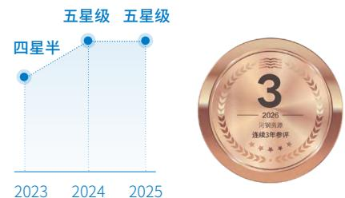

area

| Year | Value |
| --- | --- |
| 2023 | 四星半 |
| 2024 | 五星级 |
| 2025 | 五星级 |

  
扫码查看评级档案

评级专家委员会副主席

  
评级小组组长

  
评级小组专家

出具时间：

2026年4月24日

## 意见反馈

尊敬的读者：

非常感谢您阅读本报告。我们非常重视并期望聆听您对本报告的反馈意见。您的意见和建议，是我们持续提高企业ESG信息披露水平、推进企业ESG管理和实践的重要依据。我们欢迎并由衷感谢您提出宝贵意见！

## 您可通过以下方式联系我们：

地 址：河北省石家庄市体育南大街385号

电 话： 0311-66500923

邮 箱：xgdsb@sina.com

## 您对我们履行ESG的总体评价是？

非常好 好 一般 较差 差

## 您对本报告的总体评价是？

非常好 好 一般 较差 差

## 您认为我们在利益相关方沟通方面做得如何？

非常好 好 一般 较差 差

## 您认为我们在产品责任方面做得如何？

非常好 好 一般 较差 差

## 您认为我们在环境、安全和职业健康方面做得如何?

非常好 好 一般 较差 差

## 您认为我们在员工责任方面做得如何?

非常好 好 一般 较差 差

## 您认为我们在社区责任方面做得如何？

非常好 好 一般 较差 差

## 您对我们履行ESG及本报告有何意见和建议？

# HBIS 河钢资源

地址：河北省石家庄市体育南大街385号

电话 :0311-66500923

传真:0311-66508734

电子邮箱 :xgdsb@sina.com

报告出版的环境考虑

纸张：采用环保纸张印刷

油墨·采用环保油墨以减少空气污染