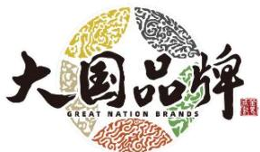

text_image

大国品牌
GREAT NATION BRANDS

ARROW箭牌

# 箭牌家居集团股份有限公司

# 2025 年度环境、社会和公司治理（ESG）报告

2026 年 4 月 29 日

## 目 录

## 董事长致辞.. 4

## 一、关于本报告 ................ .... 5

报告时间范围.. 5

报告组织范围... 5

称谓说明.. 5

编制依据... 5

数据来源.. 5

货币单位... 6

发布方式.. 6

联系方式. 6

## 二、战略引领：响应全球可持续发展目标.... .. 7

（一）核心重点响应的SDGs 及行动映射...... .. 7  
（二）协同支持响应的SDGs 及行动映射..... ... 8

## 三、关于我们... . 10

（一）公司简介..... ... 10  
（二）企业文化... . 11  
（三）ESG 荣誉与认可 ............. ......12

## 四、完善治理体系，筑牢合规根基... .. 13

（一）ESG 管理架构与战略整合.... ...13  
（二）优化公司治理及信息披露 ............... ........ 16  
（三）合规经营 .............. ....... 19  
（四）反商业贿赂及反贪污.......... ...... 19  
（五）反不正当竞争 ................

## 五、应对气候变化，推动低碳转型.. .. 20

（一）应对气候变化 ................. ........ 21  
（二）环境合规管理.. . 26

（三）排放物管理.... ... 29  
（四）资源利用... . 34  
（五）守护生态安全 ................

## 六、保障员工权益，促进全面发展...... .. 39

（一）广纳贤才，促进多元就业 .............. ...... 39  
（二）权益护航，构建和谐劳动关系.............  
（三）赋能成长，打造学习型组织 ............... ...... 41  
（四）温暖关怀，营造幸福职场 ............... ...... 43  
（五）职业健康和安全生产.. ... 46

## 七、强化质量管理，保障客户权益.. . 48

（一）打造全价值链的质量管理模式...... . 48  
（二）升级客户服务体验，保障用户权益........... ...... 51  
（三）构建可持续供应链生态，实现协同共赢............. ...... 53

## 八、驱动创新转化，引领绿色健康生活... . 55

（一）创新生态构建... . 55  
（二）创新成果转化 .............. ....... 56

## 九、践行社会责任，共创美好未来... . 58

（一）公益战略与管理：“箭牌泽计划”引领......... ...... 59  
（二）聚焦重点领域的公益实践 ............... ....... 59  
（三）资源投入与创新模式 ............... ....... 60  
（四）公益常态化与全员参与 ............... ....... 60

## 十、未来计划.. . 61

（一）环境：深化绿色低碳转型 ............... ....... 61  
（二）社会：增进人文福祉与包容发展.............. ...... 61  
（三）治理：提升ESG 管理效能与透明度.......... ...... 61

## 意见反馈表.. 62

## 董事长致辞

致各利益相关方：

2025 年，是箭牌家居成立三十年后的新起点，也是公司深化可持续发展战略、推动智慧家居生态绿色转型的关键之年。面对国家“双碳”目标纵深推进与全球产业绿色转型的趋势，箭牌家居始终秉持“持续改善人们的智慧家居生活品质”的使命，将 ESG 理念深度融入战略决策与运营管理，以切实的行动回应时代要求，追求长期的高质量发展。

过去一年，我们坚守绿色发展主线，系统推进低碳实践。通过深化绿色工厂建设、扩大光伏发电应用与工艺节能改造，我们构建了更高效、更清洁的生产模式。同时，我们将低碳理念贯穿产品创新，推出的节水节能型智能坐便器等产品，不仅满足了市场对绿色家居的需求，也为守护生态安全贡献了力量。

我们践行人文初心，坚持以人为本、向善而行。以“箭牌泽计划”为平台，我们在生态修复、乡村振兴、教育赋能、银龄关爱、生命健康五大领域开展了系统化公益实践，累计植树逾 30 万棵，并通过“母亲水窖”等项目惠及上万民众。我们持续完善员工权益保障与职业发展体系，打造安全、温暖的职场环境；我们携手供应链伙伴，共同构建负责任、可持续的产业生态。

我们夯实治理根基，以规范透明护航长远发展。报告期内，我们优化了董事会结构，完成了董事会战略与 ESG 委员会的扩容，进一步强化了 ESG 风险的识别与战略监督。通过完善内控体系与合规管理，我们致力于构建权责清晰、运行高效的责任体系，为公司的稳健经营奠定坚实基础。

展望未来，箭牌家居将以 ESG 为战略支点，持续深耕绿色技术研发、公益生态建设、供应链协同与治理效能提升。我们愿与全体股东、客户、员工、合作伙伴及社会各界携手，以智慧赋能产业，以绿色守护家园，以责任创造价值，共筑人与自然和谐共生、商业与社会协同共进的美好未来，为全球可持续发展目标的实现贡献中国企业的智慧与力量。

董事长、总经理

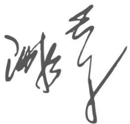

text_image

游艺

## 一、关于本报告

本报告是箭牌家居集团股份有限公司发布的第四份环境、社会和公司治理（ESG）报告。本报告遵循完整性、准确性、平衡性、可比性、时效性、清晰性及可靠性等原则进行编制，致力于详细呈现公司 2025年度在环境保护、社会责任、公司治理领域的发展理念、管理实践与工作表现，致力于为利益相关方提供一份真实、全面、有用的可持续发展信息报告。

## 报告时间范围

本报告为年度报告，时间范围是 2025 年 1月 1 日至 12 月 31 日，为增强报告可比性和完整性，部分内容及数据适当回溯和延展。本报告与公司 2025 年年度报告相辅相成。

## 报告组织范围

本报告的信息组织范围与公司年度财务报告保持基本一致，覆盖箭牌家居集团股份有限公司及其境内主要控股子公司。报告中的环境、社会数据主要基于上述范围内的运营统计。部分内容为增强可比性，适当回溯或延展。报告中如包含基于假设的预测信息，均已进行相关风险提示。

## 称谓说明

为便于表述和阅读，本报告中称谓指代如下：“箭牌家居”“本公司”“公司”“我们”指箭牌家居集团股份有限公司，“箭牌家居集团”“本集团”指箭牌家居集团股份有限公司及子公司。

## 编制依据

本报告主要依据《企业可持续披露准则——基本准则(试行）》《〈企业可持续披露准则——基本准则（试行）〉应用指南》《深圳证券交易所上市公司自律监管指引第 17 号——可持续发展报告（试行）》（简称“深交所《指引》”）《深圳证券交易所上市公司自律监管指南第 3 号——可持续发展报告编制》等相关规定，并参考了《中国上市公司协会上市公司可持续发展报告工作指南》《中国企业可持续发展报告指南（CASS-ESG 6.0）》等相关要求，结合公司实际情况编制而成。

## 数据来源

本报告中的财务数据来源于公司经审计的财务报告，ESG 相关数据来源于公司内部正式的管理记录和统计报告，其收集与处理遵循内部相关流程。我们持续完善数据管理体系，以提升数据的可靠性、一致性

与可比性。

## 货币单位

除特别说明外，本报告所涉及的货币金额均以人民币作为计量币种。

## 发布方式

本报告可在箭牌家居集团股份有限公司官方网站（https://www.arrowgroup.com.cn）、深圳证券交易所网站（http://www.szse.cn）、巨潮资讯网（www.cninfo.com.cn）查阅、下载电子版。

## 联系方式

如对本报告或本集团 ESG方面的表现有任何意见或建议，欢迎通过以下方式联系我们。您的反馈对我们持续改进至关重要。

地址：广东省佛山市顺德区乐从镇创兴一路 1号箭牌总部大厦

电话：0757-29964106 传真：0757-29964107

邮编：528145 电邮：IR@arrowgroup.com.cn

## 二、战略引领：响应全球可持续发展目标

箭牌家居深刻认识到，企业的可持续发展与全球共同未来紧密相连。我们积极将自身战略与运营融入联合国 2030 年可持续发展议程，致力于通过具体的环境、社会及治理实践，响应联合国可持续发展目标，为全球可持续发展贡献力量。

我们基于公司业务核心、价值链影响及利益相关方关切，识别了与自身最为相关的 SDGs，并将其系统性地融入公司战略规划与日常管理。通过对业务关联度与社会影响性的双重评估，我们确立了 SDG 6（清洁饮水和卫生设施）、SDG 12（负责任消费和生产）、SDG 13（气候行动）为核心重点响应目标，将节水技术创新、绿色工厂建设与碳减排实践作为贡献全球议程的关键路径；同时，我们将 SDG 8（体面工作和经济增长）、SDG 9（产业、创新和基础设施）、SDG 11（可持续城市和社区）列为重点支撑目标，并在SDG 4、7、15 等领域开展协同支持行动。

## （一）核心重点响应的 SDGs 及行动映射

<table><tr><td>联合国可持续发展目标(SDGs)</td><td>对应的公司核心行动</td><td>所在报告章节</td></tr><tr><td>6清洁饮水和卫生设施</td><td>·研发节水型智能坐便器(如P50单次冲水量减少30%以上)·推出节水节能型智能花洒(如Air Plus富氧增压技术)·参与国家水效标准制定,获“水效领跑者”·“母亲水窖”公益项目解决缺水地区饮水问题</td><td>八、驱动技术转化,引领绿色健康生活九、践行社会责任,贡献社会发展</td></tr><tr><td>12负责任消费和生产</td><td>·建设国家级绿色工厂·全链路数字化管理降低生产损耗·推广环保材料与废料回收利用·多款产品获“中国绿色产品认证”·构建负责任供应链生态,开展阳光采购</td><td>五、应对气候变化,推动低碳转型七、强化质量管理,保障客户权益</td></tr><tr><td>13气候行动</td><td>·推进分布式光伏发电(如全年绿电发电量3,986.93万千瓦时)·建设低碳生产体系,降低单位产值碳排放强度·推广低功耗智能家居产品·“我给地球植个发”公益IP(累计植树逾30万棵,在延安、锡林郭勒盟、阿拉善盟等地构筑绿色屏障)</td><td>五、应对气候变化,推动低碳转型九、践行社会责任,贡献社会发展</td></tr><tr><td>8体面工作和经济增长</td><td>·依法签订劳动合同,保障员工合法权益·缴纳社保,提供竞争力薪酬福利·构建多通道职业发展体系与系统化培训·打造健康、安全的职场环境</td><td>六、保障员工权益,促进全面发展</td></tr><tr><td>9产业、创新和基础设施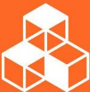</td><td>·深化智能制造与工业互联网应用·持续加大研发投入(拥有数千项专利)·与鸿蒙智联合作,推动智能家居生态互联互通·携手生态伙伴突破核心技术瓶颈</td><td>八、驱动技术转化,引领绿色健康生活</td></tr><tr><td>11可持续城市和社区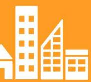</td><td>·研发“和玥”无障碍康养卫浴套系,响应适老化需求·参与老旧小区卫生设施改造项目·推动智慧家居从功能向“情感容器”升级,提升社区居住包容性与韧性</td><td>八、驱动技术转化,引领绿色健康生活九、践行社会责任,贡献社会发展</td></tr></table>

## （二）协同支持响应的 SDGs 及行动映射

<table><tr><td>联合国可持续发展目标(SDGs)</td><td>对应的公司延伸行动</td><td>所在报告章节</td></tr><tr><td>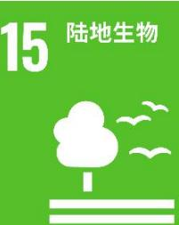</td><td>“我给地球植个发”项目累计植树30.8万棵,覆盖面积3381亩,构筑生态屏障生产运营中严守生态红线,开展生态修复</td><td>九、践行社会责任,贡献社会发展</td></tr><tr><td>7经济适用的清洁能源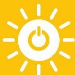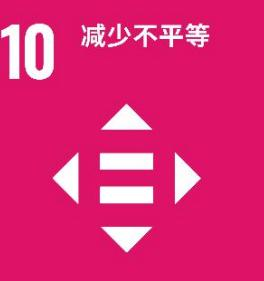</td><td>工厂屋顶建设光伏发电项目,提升清洁能源使用占比·关注弱势群体,开展银龄关爱、生命健康救助等公益·为残障人士提供无障碍卫浴设计</td><td>五、应对气候变化,推动低碳转型九、践行社会责任,贡献社会发展</td></tr><tr><td>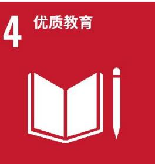</td><td>·对内赋能员工:公司通过“爱乐赛英语培训项目”,为员工提供免费的英语技能培训。对外促进教育公平:通过公益品牌“箭牌泽计划”,公司重点改善青少年,特别是弱势群体的教育环境:(1)云南等地区学校浴室改造:在云南、贵州等多地为农村寄宿制学校进行澡堂改造,解决学生“洗澡难”问题,惠及学生超过2.7万名,改善了他们的卫生条件和学习生活环境。(2)灯湖第六小学无障碍卫生间改造:在佛山市南海区灯湖第六小学,捐赠并升级校园无障碍厕所,为特殊儿童创造了安全、便捷的如厕环境,保障其平等接受教育的权利。</td><td>九、践行社会责任,贡献社会发展</td></tr><tr><td>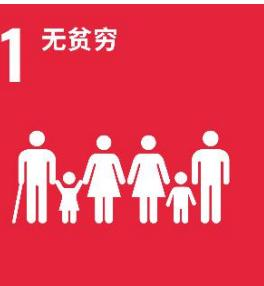</td><td>·助力乡村振兴,开展产业帮扶与困难家庭慰问</td><td>九、践行社会责任,贡献社会发展</td></tr><tr><td>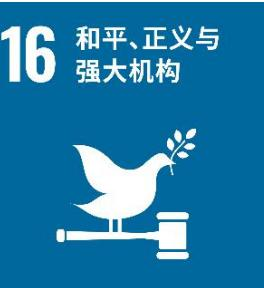</td><td>·完善公司治理架构,强化合规经营与反腐败体系·保障信息披露透明度与投资者权益</td><td>四、完善治理体系,筑牢合规根基</td></tr><tr><td>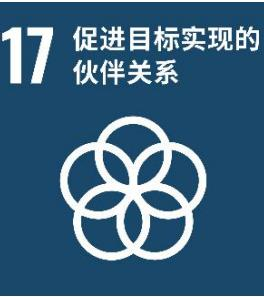</td><td>·携手鸿蒙智选等生态伙伴推动智能家居创新·联合蚂蚁森林开展公益种树,构建公益生态圈</td><td>四、完善治理体系,筑牢合规根基八、驱动技术转化,引领绿色健康生活九、践行社会责任,贡献社会发展</td></tr></table>

我们将通过本报告后续章节，详细呈现公司在上述目标领域的具体管理实践、行动与成效。

## 三、关于我们

## （一）公司简介

箭牌家居集团股份有限公司（股票代码：001322）创立于 1994 年，于 2022 年 10 月 26 日在深圳证券交易所上市，股票代码：001322，股票简称：箭牌家居。集团总部位于广东佛山，是一家集研发、生产、销售与服务于一体的大型现代化制造企业，秉承“持续改善人们的智慧家居生活品质”的企业使命，坚持科技创新，不断开发满足和超越客户需求的产品和服务，运用多品牌多品类协同，打造智慧家居全产业链，为客户提供高品质的智慧家居整体解决方案，向“成为国际一流的智慧家居整体解决方案提供商”的愿景迈进。

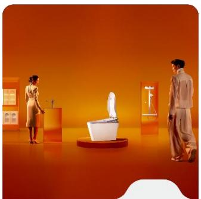

natural_image

Interior design rendering of a modern bathroom with two people, one standing and one standing, featuring a toilet and mirror (no text or symbols visible)

ARROW箭牌

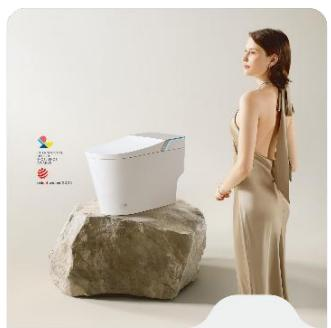

natural_image

Woman standing beside a white foam toilet on a stone base, with no visible text or symbols on the device or background.

FAENZA法恩莎

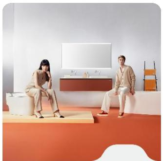

natural_image

Interior design scene with two people in beige outfits posing on a red carpet, set against a white and orange wall (no text or symbols visible)

ANNWA安华

箭牌家居集团旗下拥有 ARROW 箭牌、FAENZA 法恩莎、ANNWA 安华三个品牌；经过多年发展，公司已构建了覆盖卫生陶瓷（智能坐便器）、龙头五金、浴室家具、浴缸浴房、瓷砖等全品类的研产销体系，并在此基础上，将智慧家居确立为全新的整合型产品品类，通过智能化升级，完成从传统制造向智慧家居解决方案提供商的战略升级。中国区域布局有十大生产制造基地，在中国市场拥有超过 10,000 家销售网点，产品远销全球多个国家和地区，是国内具有实力和影响力的综合性智慧大家居企业集团。公司品牌屡获权威认可，产品多次荣获德国红点奖、iF 设计奖等国际大奖，并曾作为米兰世博会、迪拜世博会中国馆指定陶瓷洁具供应商亮相国际舞台。2026 年 1 月，公司与中央电视台《大国品牌》栏目达成战略合作，成为其生态伙伴，品牌公信力与影响力持续提升。2026 年 1 月，公司与中央电视台《大国品牌》栏目达成战略合作，成为其生态伙伴，品牌公信力与影响力持续提升。箭牌家居集团致力以创新力量打造具有国际竞争力和影响力的综合性大家居企业集团，将以中国智造担当的决心，向世界展示中国智造的力量，助力人们实现更美好的生活。

## （二）企业文化

## 企业使命 CORPORATE MISSION

持续改善人们的智慧家居生活品质

坚持科技创新的理念，不断开发满足和超越客户需求的产品和服务；追求客户极致体验，保持企业在质量、服务、成本、性能、环保等方面的持续领先，引领中国智慧家居行业发展。

## 企业愿景 GROUP VISION

成为国际一流的智慧家居整体解决方案提供商

通过实施全球化、智能化、物联化打造智慧家居集团，运用多品牌多品类协同，打造智慧家居全产业链；为客户提供高品质的智慧家居整体解决方案。

## 企业定位 POSITIONING

全球智慧家居大家

全球：彰显箭牌家居集团的全球化愿景

智慧：产业方向、企业智慧、产品智慧

家居：彰显箭牌家居集团的行业属性

大家：集大成者，彰显箭牌的专业地位、影响力

## 企业承诺 CORPORATE COMMITMENT

智慧家居 全球同享

## 企业价值观 CORE VALUES

以人为本

充分识别与超越顾客期望，充分尊重、关心和理解员工，实现客户、员工与企业的相互成就，为顾客创造价值，为员工创造发展平台。

持续创新

积极营造浓厚的创新氛围，勇于变革，持续探索，引领行业，敢为天下先。

协作共赢

携手顾客、员工、股东、供应商、社会等相关方，努力将公司发展与其需求紧密结合，构筑健康友好的商业生态环境。

追求卓越

持续提高经营质量，聚焦为利益相关方创造价值，兼顾机会牵引的规模增长和效益驱动的有效增长，做行业的领导者，引领行业发展。

## 企业个性

睿智创新 务实笃行 包容进取

## （三）ESG 荣誉与认可

报告期内，箭牌家居在环境、社会及治理（ESG）领域的系统性实践与创新成果获得政府、行业、媒体及资本市场等多方权威机构的高度认可，屡获殊荣。这些奖项不仅是对公司阶段性成果的肯定，更是对其将可持续发展理念深度融入战略与运营这一长期主义路径的印证。

<table><tr><td>获奖时间</td><td>奖项名称</td><td>颁发机构/活动</td><td>获奖事由/核心价值</td></tr><tr><td>2025年3月</td><td>京东家电家居2024年度绿色循环领航奖</td><td>京东家电家居合作伙伴大会</td><td>表彰公司在绿色循环经济、智能制造、焕新服务及社会责任领域的卓越实践,体现了在消费端推动绿色低碳转型的引领作用。</td></tr><tr><td>2025年7月</td><td>2025 ESG杰出案例奖 2025可持续创新解决方案奖</td><td>第四届国际绿色零碳节暨2025 ESG领袖峰会</td><td>“我给地球植个发”公益IP获ESG杰出案例奖,彰显其作为融合生态修复、公众参与与国际传播的综合性ESG平台的价值;P50智能坐便器获可持续创新解决方案奖,凸显产品全生命周期低碳设计与公司系统化绿色制造体系的行业标杆地位。</td></tr><tr><td>2025年11月</td><td>年度创新案例</td><td>南方周末年度盛典品牌大会</td><td>“鸿蒙智选箭牌智能浴霸&amp;智能花洒——全场景智慧浴室体验推广案例”获奖,展示了公司以“人本科技”驱动产品创新,将智能技术、人文关怀与绿色可持续深度融合,重新定义智慧卫浴体验的硬核实力。</td></tr><tr><td>2026年2月</td><td>社会责任奖</td><td>2025“财闻奖”评选</td><td>肯定公司将社会责任深度融入发展战略,在环境保护、社区共建及公益创新等领域取得的显著成效,体现了商业价值与社会价值共创的理念。</td></tr></table>

说明：以上为公司获得的部分代表性奖项。公司长期以来在 ESG 相关领域屡获殊荣，如连续获得广东省扶贫济困红棉杯铜杯、获评 ESG 创新实践奖、年度公益进取称号、省级政府质量奖提名等，构建了全面的荣誉体系。

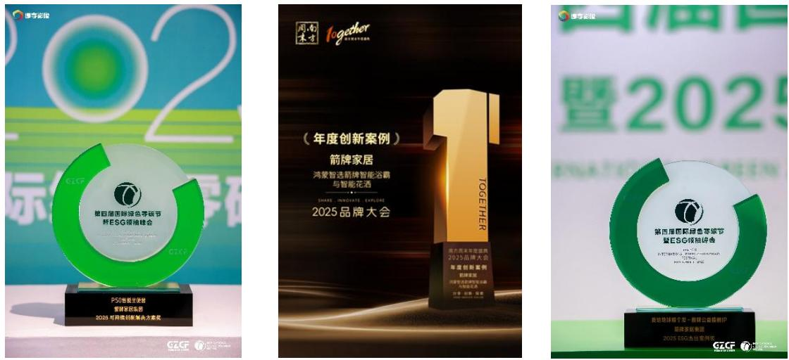

## 四、完善治理体系，筑牢合规根基

公司深刻认识到，健全的治理体系、透明的沟通机制以及坚定的合规文化是企业实现可持续发展的基石。我们致力于将环境、社会及治理（ESG）理念融入战略与运营，构建权责清晰、运行高效、监督有力的治理架构，并通过与利益相关方的持续互动，将可持续发展要求转化为稳健经营的实际行动。

## （一）ESG 管理架构与战略整合

公司秉承可持续发展理念，将 ESG 管理融入企业发展战略，不断强化责任意识，完善 ESG 风险管控，加强 ESG 管理体系建设，将 ESG 理念融入到公司生产经营和管理运营全流程，助力经济发展与环境、社会的和谐共荣。

## 1、ESG 治理架构

公司高度重视企业社会责任管理工作，在董事会的统筹领导与战略指引下，构建了“董事会—董事会战略与 ESG 委员会—执行工作组”这一自上而下、权责清晰、协同高效的社会责任治理体系，对企业社会责任相关的策略规划、目标设定、过程执行、效果评估等全环节实施全流程、精细化的严格把控，推动企业在追求经济效益的同时，切实履行对经济、社会、环境的多元责任。

<table><tr><td>组织名称</td><td>人员构成与职责</td></tr><tr><td>董事会</td><td>董事会作为箭牌家居 ESG 事宜的最高决策机构,负责识别及判定公司重大 ESG 事宜,并对 ESG 目标、政策及架构提出建议。同时负责承担全面的可持续发展与 ESG 治理责任,全面把控公司的整体策略,并监督管理层的工作。董事会作为 ESG 事宜的最高决策机构,在报告期内召开的 9 次会议中,直接审议了年度 ESG 报告,并通过其下设的战略与 ESG 委员会(报告期内召开 4 次会议)定期研究 ESG 战略、评估相关风险与机遇及监督绩效。董事会将 ESG 因素纳入公司治理优化、绿色发展战略等重大决策的考量之中。</td></tr><tr><td>董事会战略与 ESG委员会</td><td>根据 2025 年修订的《董事会战略与 ESG 委员会工作细则》,委员会由公司 6 名董事组成(此前为 5 名),公司董事长为委员会召集人,并包含 2 名独立董事。新增委员谢安琪女士(公司董事、公益负责人),其作为公司公益品牌“箭牌泽计划”的负责人,进一步强化了委员会在社会责任与公益实践领域的专业力量。为确保战略与 ESG 委员会具备监督 ESG 事宜所需的专业能力,公司建立了相应的能力保障机制,包括在成员选聘时考虑相关背景,以及为成员提供 ESG 政策解读、行业趋势等专题培训机会。委员会负责对公司 ESG 目标、战略规划、治理架构等进行研究并提出建议;识别及评估对公司业务具有重大影响的 ESG 相关风险和机遇,指导经营管理层对 ESG 风险和机遇采取适当的应对措施;监督并指导 ESG 工作小组,全面落实公司策略及相关行动;审阅公司在环境、社会及公司治理等议题的相关表现,以及对外披露的相关报告,并向董事会汇报及提出建议等。</td></tr><tr><td>执行工作组</td><td>ESG 领导小组:公司董事长担任执行工作组组长,其余组员为公司董事、高级管理人员以及主要部门负责人,主要负责研究公司 ESG 战略、规划、政策和措施等重大事项,向专门委员会和董事会提出报告和议案;研究公司在 ESG 领域的表现和有关风险,提出应对策略;及时督促指导 ESG 工作执行进展;按需召开 ESG 工作会议讨论审议目前 ESG 工作情况、报告编制进展等事项;审阅公司年度 ESG 报告并提出建议。</td></tr><tr><td></td><td>ESG 工作小组:设在董事会办公室,各部门负责人及各生产基地、事业部负责人参加,主要负责落实与执行 ESG 工作的具体事项。同时,董事会办公室负责协同各部门将 ESG 工作融入部门日常业务管理及运营中,进行 ESG 信息定期收集、上报与审核工作,提升 ESG 相关信息的统计管控效率及 ESG 工作效能,保障 ESG 工作的高效开展与落实。</td></tr></table>

公司董事会制定了《董事会战略与 ESG 委员会工作细则》，构建了由六名董事（含两名独立董事）构成的专门工作机构，将 ESG 治理正式纳入董事会顶层设计。该委员会行使包括对公司 ESG 目标、战略规划等进行研究并提出建议、识别与评估 ESG 风险机遇、指导经营管理层应对 ESG 风险和机遇、监督并指导 ESG 工作小组以及审阅 ESG 披露报告等职责。细则明确了决策程序、议事规则与权责边界，进一步提升了公司 ESG 工作的可执行性与落地成效，通过科学决策和有效监督，增强公司核心竞争力和可持续发展能力。

## 2、利益相关方沟通

公司利益相关方主要包括员工、客户、供应商、股东及投资者、政府和监管机构、业务所在地社区及公众。利益相关方的需求与期望是公司制定可持续发展战略、优化可持续发展管理的核心考量因素，为此公司积极与各利益相关方开展多渠道、常态化沟通，并将其关切问题纳入运营和决策过程，并系统收集、分析反馈以持续改进 ESG管理。

<table><tr><td>关键利益相关方</td><td>期望与诉求</td><td>沟通与回应</td></tr><tr><td>员工</td><td>·员工权益·薪酬福利·职业发展·职业健康与安全</td><td>·完善沟通方式·依法签订劳动合同·审阅并完善薪酬福利体系·开展各类培训和文体活动,促进人才建设·加强职业安全管理,改善生产和办公环境·开展员工心理健康服务,提供心理咨询、压力疏导等支持·开展员工满意度调查·增设职工代表董事,将员工诉求纳入董事会决策流程</td></tr><tr><td>政府和监管机构</td><td>·合规运营·依法纳税·创造就业·促进地方发展·环境保护及可持续发展·信息披露</td><td>·加强合规运营管理·政策执行与定期信息报送·接受监督考核·信息披露·座谈与专题研讨会·积极参与地方公益与乡村振兴项目·参与政策调研与行业标准制定·生态环境保护,履行社会责任</td></tr><tr><td>股东和投资者</td><td>·经营业绩·公司治理·收益回报·信息畅通</td><td>·坚持高质量增长,为股东创造价值·及时、准确披露定期报告、临时公告,保障信息透明度·实施现金分红与股份回购·通过投资者热线电话、深交所互动易平台、股东会、现场调研、业绩说明会、电话会议、邮件、公司官网投资者关系专栏等多种方式与投资者互动交流</td></tr><tr><td>经销商/客户/消费者</td><td>·诚信履约·品质保证·优质服务·产品创新</td><td>·产品供应与质量保障·产品研发,优化产品结构·客户需求/满意度调查·多渠道客户服务与投诉处理体系·客户意见反馈闭环管理</td></tr><tr><td>供应商</td><td>·商业道德·透明采购·知识产权保护·合作共赢</td><td>·公平透明的采购招标机制·供应商沟通平台与定期审核·合同约束与协同发展机制·业务交流与合作</td></tr><tr><td>社区及公众</td><td>·社区影响·支持社区发展·环境保护·公益参与</td><td>·媒体采访及报道·响应乡村振兴·参与公益事业·参与社区活动、走访交流、志愿服务·实施环境信息公开,定期发布污染物排放监测数据</td></tr></table>

## 3、议题重要性评估

公司基于实质性、完整性、平衡性原则，结合公司实际情况，对标国内外主流可持续发展标准和评级机构要求，通过与利益相关方的持续沟通，综合考量国家政策导向、行业要求、资本市场关注要点以及ESG相关准则指引，持续开展实质性议题的识别、评估和筛选工作。2025 年，公司共识别3 个责任领域的 25项重要性议题，确保议题对公司及利益相关方均具备重要性，为可持续发展工作的系统推进和深入实施提供清晰指引。

在议题重要性评估过程中，公司采用双重重要性评估框架：一方面评估各议题对经济、社会与环境产生的潜在影响程度，即影响重要性；另一方面评估各议题对公司商业模式、业务运营、发展战略、财务状况、经营成果、现金流量及融资成本与渠道等方面带来的风险与机遇，即财务重要性，以此科学判定议题优先级，保障可持续发展管理的针对性与有效性。

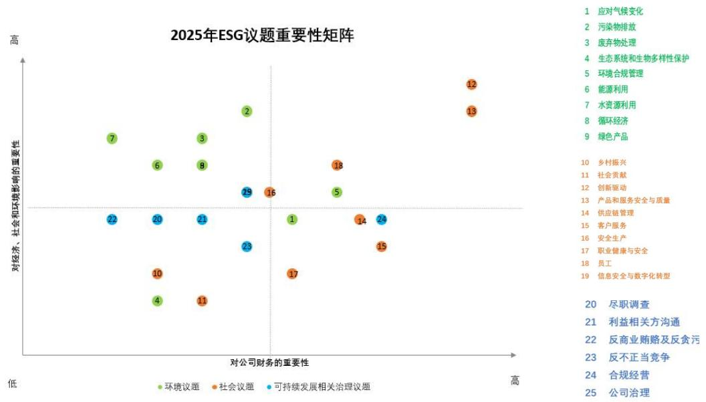

报告期内，公司积极对标行业标杆实践，借鉴境内外优秀上市公司 ESG 管理经验，系统性梳理各部门ESG 工作现状，精准识别提升方向，并开展针对性改善提升活动。公司持续强化 ESG 宣贯与培训，邀请权威专业机构开展 ESG 新规解读与专项赋能培训，全面提升员工对 ESG 的认知水平与责任意识。

公司严格遵循国家法律法规、行业标准及监管指引，结合行业特性、自身商业模式以及发展阶段，系统构建涵盖环境、社会和公司治理（ESG）维度的可持续发展目标与量化指标体系，确保目标的可操作性、可衡量性与战略协同性。有关目标及指标的框架设计、实施路径与阶段性成果，请参阅本报告各实质性议题章节。公司将每年对 ESG 目标开展动态复盘与评估，结合政策变化、行业趋势和企业发展灵活优化调整，确保目标体系的适应性与前瞻性。

## （二）优化公司治理及信息披露

## 1、优化公司治理

良好的公司治理是实现企业可持续发展的基础。公司严格遵守《中华人民共和国公司法》《中华人民共和国证券法》《上市公司治理准则》《深圳证券交易所股票上市规则》《深圳证券交易所上市公司自律监管指引第 1 号——主板上市公司规范运作》等法律法规要求，持续完善公司治理架构，健全制度体系、规范运作流程，构建权责明确、有效制衡、决策科学、运作协调的现代公司治理体系。

## （1）治理架构优化

报告期内，为响应新《公司法》要求，公司进一步优化治理结构：一是取消监事会设置，明确由董事会审计委员会依法承接原监事会监督职能；二是于 2025 年 12 月平稳完成董事会换届，选举产生第三届董事会。新一届董事会由 11 名董事组成，其中非独立董事 6 名，独立董事 4 名，职工代表董事1 名，董事会设董事长 1 名，结构多元、权责清晰，保障了治理的连续性与决策的科学性。公司已建立由股东会、董事会、审计委员会及管理层构成的多层次治理架构，形成权力机构、决策机构、监督机构与执行机构之间各司其职、有效制衡的运作机制。其中，董事会作为公司经营决策核心，下设战略与 ESG 委员会、提名委员会、薪酬与考核委员会、审计委员会四个专门委员会，为董事会重大决策提供咨询、建议，保证董事会议事效率与决策科学性。报告期内，公司股东会、董事会及各专门委员会和管理层均依法运作，勤勉尽责，未出现违法、违规现象。

## （2）董事会多元建设

公司积极推进董事会多元化建设，为董事会决策提供多元视角。在选举董事会成员时公司充分考虑性别、年龄、文化及教育背景、专业经验、知识技能等多方面因素，以确保董事会构成的最优化。截至本报告披露日，公司董事会由 11 名董事组成，其中职工代表董事 1 名、独立董事 4 名、女性董事 3 名，在性别、专业背景、知识结构等方面实现多元化配置，保障决策的全面性与科学性。同时，公司充分重视独立董事的独立性和专业价值，对独立董事在董事会各专门委员会中的人数做出明确要求，独立董事在审计委员会、提名委员会、薪酬与考核委员会中占多数并担任召集人，充分发挥专业监督、决策支撑、风险把控等方面的核心作用，进一步强化治理结构的制衡机制。

## （3）制度体系升级

为积极响应新《公司法》及配套监管新规，公司对治理相关制度体系进行系统性梳理与全方位优化。报告期内，完成《公司章程》《股东会议事规则》《董事会议事规则》等 30 项核心制度的修订与制定，并新制定了《市值管理制度》《董事和高级管理人员离职管理制度》《信息披露暂缓与豁免制度》《董事、高级管理人员薪酬管理制度》等制度，确保公司治理制度与最新法律法规、监管要求全面衔接，为公司规范运作、合规运营筑牢坚实的制度根基。

## （4）会议规范运作

2025 年，公司召开股东会 3 次，董事会 9 次，董事会各专门委员会共召开会议 23 次（董事会审计委员会会议 7 次，董事会战略与 ESG 委员会会议 4 次，董事会提名委员会会议 5 次，董事会薪酬与考核委员会会议 7 次），决策程序合法合规，决议内容均得到有效实施。

## 2、信息披露与投资者关系

公司始终秉持“真实、准确、完整、及时”的信息披露原则，持续提升信息披露质量，优化投资者沟通渠道，构建与投资者良性互动的价值共创生态。

## （1）信息披露

公司严格按照《深圳证券交易所股票上市规则》《深圳证券交易所上市公司自律监管指引第 1 号——主板上市公司规范运作》及公司《信息披露事务管理制度》《投资者关系管理制度》等要求，全面履行信息披露义务。2025 年度，公司共披露了 104 份公告及文件，主要涉及定期报告、募集资金使用与管理、回购股份、权益分派、关联交易、对外担保、公司治理制度等事项，确保所有法定披露信息真实合规、披露及时。

在做好法定信息披露的基础上，公司积极推进自愿性信息披露提质，在年报、半年报等定期报告中细化信息颗粒度，深入分析行业发展情况、公司主要业务、经营模式、经营计划和主要风险因素等，为投资者决策提供更具价值的参考。同时，建立严格的临时公告内部审批流程，经业务部门负责人、董事会秘书、董事长层层审核把关，并主动加强与监管机构、律师事务所、保荐机构的事前沟通，充分听取监管指导和专业意见，确保信息披露的合规性与准确性。

## （2）加强投资者沟通

2025 年，公司通过现场调研、网络会议方式开展投资者接待活动超过 16 场次，接待投资者数量超过200 人次，在深交所互动易平台回复问答 18 次，回复率 100%。举办网上年度业绩说明会 1 场，并参加2025 广东辖区上市公司投资者网上集体接待日活动。此外，公司通过投资者热线电话（0757-29964106）、公司网站、投资者关系信箱（IR@arrowgroup.com.cn）等多种畅通的渠道，保持与机构投资者、个人投资者、证券相关机构、潜在投资者的常态化沟通，定期报告披露后第一时间通过线上会议解读经营情况与财务数据，会前广泛征集投资者高频问题并做好充分准备，确保沟通回应全面准确、口径统一。

报告期内，公司投资者关系管理工作成效显著，荣获全景网“投资者关系金奖”等多项荣誉，2024年报业绩说明会亦获评中国上市公司协会“上市公司 2024 年报业绩说明会最佳实践”。

## （3）保障投资者权益

公司始终高度重视投资者回报，建立持续、稳定的投资者回报机制，通过现金分红与股份回购等切实举措，增强投资者信心与获得感。近三年，公司均实施现金分红，年度现金分红比例均超过当年归属于上市公司普通股股东净利润的 30%，切实保障股东的投资回报。

基于对公司未来发展前景的信心以及对公司价值的高度认可，为维护广大投资者利益、增强投资者信心，在综合考虑公司经营情况、财务状况、未来战略、未来盈利能力，并结合公司股票二级市场表现等因素的基础上，公司董事会于 2023 年 10 月 27 日发布了以集中竞价交易方式回购公司股份方案，截至 2024年 10 月 25 日方案实施完毕，合计回购 1,250.23 万股，占总股本 1.2908%，成交金额 9,996.57 万元。2025 年 1 月 6 日，公司董事会再次发布股份回购方案，拟使用不低于 5,000 万元且不超过 1 亿元自有资金及回购专项贷款继续回购股份，截至 2026 年 1 月方案实施完毕，该回购方案合计回购公司股份667.27万股，占总股本的 0.6899%，成交金额 5,498.78 万元。上述两期股份回购方案均已实施完成，即截至目前，公司已累计回购 1,917.50 万股，占总股本比例为 1.9826%，总回购金额为 15,495.35 万元。

此外，报告期内，公司密切关注监管政策变化，及时传达相关政策和动态，定期发送典型违规案例，发挥警示作用，如《广东辖区上市公司动态快报》《上市公司违法违规警示案例系列专题》等。关注控股股东和董事、高管持股情况，切实做好定期报告、重大事项内幕信息知情人登记和窗口期提醒工作，报告期内未出现控股股东及董事高管违规买卖股票和内幕交易等行为。

• 公司官网：https://www.arrowgroup.com.cn  
• 深圳证券交易所互动易平台：http://irm.cninfo.com.cn/ircs/index  
• 投资者关系专用邮箱：IR@arrowgroup.com.cn  
投资者服务热线：0757-29964106

## （三）合规经营

公司秉持“防风险、强内控、促合规”的核心理念，集中管理资源，构建风险、合规、内控“三位一体”管控体系。通过推动风控关口前移，实现风险控制模式从事后应对向事前防范转变，将风险防控体系的覆盖范围延伸至各级子公司及前端业务全流程，有效防范公司发生系统性风险的同时，全面提升了公司风险管理及依法合规经营水平。

公司持续优化风控体系，通过采取全面辅导、以查促建、专项为辅等措施，打造一、二、三道防线协同一体化模式，确保风控体系的有效性。公司定期发布《内控专刊》，通过政策与法规速递、风险案例剖析等方式，有效增强员工的风险防控意识。同时，公司持续开展内部控制评价工作，董事会评估认为，根据公司财务报告及非财务报告内部控制重大缺陷的认定情况，于内部控制评价报告基准日，公司不存在财务报告、非财务报告的内部控制重大缺陷。信永中和会计师事务所（特殊普通合伙）认为公司于 2025 年12月 31 日按照《企业内部控制基本规范》和相关规定在所有重大方面保持了有效的财务报告内部控制。详细报告内容请参见公司披露的《年度内部控制评价报告》及《内部控制审计报告》。

公司积极融入行业生态，2025 年参与第五届监察审计论坛等行业活动，交流风控管理经验，进一步优化了风险识别、评估与应对策略，为公司的稳健发展筑牢坚实防线。

## （四）反商业贿赂及反贪污

公司高度重视反商业贿赂及反贪污工作，审计中心下设廉正调查部全面负责相关工作。公司从完善制度、加强教育、强化监督三大维度构建闭环管理的廉政体系：

在制度完善方面，公司制定了《关于员工近亲关系回避与竞业限制的通知》《企业红线管理办法》等规章制度。

在教育引导方面，公司积极组织开展廉洁宣传教育活动，通过“廉洁箭牌”微信公众号、廉洁宣讲、拍摄“亮箭”廉洁教育片、组织关键岗位员工参观监狱等多种方式加强廉政文化建设。2025 年，公司组织相关专题培训覆盖关键岗位人员。

在监督检查方面，建立“日常监督+专项检查+随机抽查”的立体化监督机制，对重点业务、关键环节开展常态化监督与专项审计，公司坚持“零容忍”态度，报告期内未发生商业贿赂及贪污事件。

在申诉与举报机制方面，审计中心为员工及合作伙伴提供投诉、问询与意见反馈的即时响应通道，践行全流程跟踪管理，并制定明确的举报者保护政策。报告期内，通过各类渠道接收的相关举报均得到及时、高效、妥善处理。

• 举报邮箱：dongshizhang@arrowgroup.com.cn、arrow110@china-lehua.com  
• 举报电话：0757-29964110、13790001587  
• 受理部门：集团审计中心  
• 受理地址：广东省佛山市顺德区乐从镇箭牌总部大厦 19 楼

## （五）反不正当竞争

公司尊重市场规则，遵守契约精神，致力于构建公平有序的市场竞争环境。公司严格遵循《中华人民共和国反垄断法》《中华人民共和国反不正当竞争法》等相关法律法规要求，坚决杜绝任何垄断及不正当竞争行为，同时持续加强员工商业行为规范引导。报告期内，公司未发生因违反上述法律法规而受到相关监管部门处罚的情形。

同时，公司秉持“品牌未动，商标先行”的知识产权核心战略，推行前瞻性商标布局，全力捍卫品牌核心价值与规范市场竞争秩序。在国内市场，公司已拥有超过 700 件有效注册商标；国际层面，通过马德里体系注册、单一国家注册等多元化方式，在近 100 个国家及地区完成核心商品品类的商标确权。公司建立商标动态监测，并针对经销商体系加强合规使用引导对假冒、仿冒及不正当竞争行为坚持“零容忍”态度，构建“刑事打击+行政查处+民事维权”的全方位维权体系。2025 年累计办理刑事查处案件 19 件、行政查处案件 42 件，查扣侵权产品万余件，整治电商平台侵权店铺超 1,100 个，通过维权打假实现获赔金额约 1600 万元。,有效维护了品牌合法权益与市场竞争秩序。

## 五、应对气候变化，推动低碳转型

低碳转型是制造业迈向可持续发展的智慧选择，更是箭牌家居践行“持续改善人们的智慧家居生活品质”使命的必然行动。作为以“全球智慧家居大家”为定位的行业先行者，箭牌家居积极响应国家关于“碳达峰、碳中和”的战略目标，将应对气候变化纳入企业发展战略，多维度推进绿色低碳转型，构建“低消耗、低排放、高效率”的低碳发展模式。公司持续健全环境管理体系，推动绿色技术研发与成果转化，优化生产流程，打造高效、清洁、低碳、循环的绿色制造体系，实现企业全生命周期的绿色发展，为建设美丽中国贡献力量。

响应 SDG 13（气候行动），公司将气候治理深度融入战略，持续推进绿色工厂建设、节能节水产品推广及分布式光伏发电应用，从生产、产品、能源多维度降低全生命周期碳排放。同时，通过“我给地球植个发”公益植树活动修复生态系统，并以现金与产品捐赠助力灾后重建，提升社区防灾减灾与气候韧性。

## （一）应对气候变化

公司将气候治理深度融入公司战略布局和日常运营，结合自身特点，对潜在影响公司资产的物理风险、转型风险及机遇进行识别、排序和管理，切实提升应对气候风险能力，并为实现国家碳达峰、碳中和的愿景助力。

## 1、气候变化治理

公司将气候变化风险列为重要议题，依托公司 ESG 组织体系，建立了由董事会参与的气候议题治理机制，构建了从战略规划、组织协调到落地执行的三级管理架构，统筹决策并推进实施箭牌家居应对气候变化的各项工作。

<table><tr><td>治理层</td><td>管理层</td><td>执行层</td></tr><tr><td>董事会</td><td>战略与 ESG 委员会</td><td>ESG 执行工作组</td></tr><tr><td>作为 ESG 事宜的最高决策机构,负责审查公司气候相关的战略、政策与目标定期听取气候风险与机遇评估汇报,并将气候因素纳入重大经营决策考量。报告期内,董事会直接审议了年度 ESG 报告,并通过战略与 ESG 委员会监督相关工作的推进。</td><td>由 6 名董事组成(含 2 名独立董事),负责研究并提出气候相关策略建议,识别、评估气候风险与机遇,监督减排目标进展,并向董事会汇报。公司为委员会成员提供 ESG 政策解读、行业趋势等专题培训机会,以支持其履职。</td><td>由常设机构(董事会办公室)牵头,联合各生产基地及业务部门,负责具体气候数据的收集、分析,开展气候情景分析,制定并执行减排措施,确保气候管理要求融入日常运营。</td></tr></table>

## 2、气候情景分析

箭牌家居深知气候变化对公司业务和运营的潜在影响，系统识别和评估气候变化风险，深入研判潜在影响，在有效应对气候变化挑战的同时，主动把握绿色转型发展机遇。

<table><tr><td colspan="2">风险类型</td><td>风险描述</td><td>潜在影响</td><td>影响周期</td><td>应对措施</td></tr><tr><td>物理风险</td><td>急性</td><td>台风/洪涝:华南、华东生产基地在汛期面临风险。极端低温雨雪:华北、华中生产基地在冬季面临风险。</td><td>· 生产设施、库存资产直接损毁· 区域性物流中断,影响交付·供应链上游原料供应延迟</td><td>短期</td><td>◆长期与原料供应商保持多年良好的合作关系,保障稳定原料供给◆进行全国性生产基地布局,形成多方产品供应格局◆合理采取商业保险等手段,降低财务损失◆制定极端天气应急预案,结合天气预报等信息,加强隐患排查,稳妥保障办公场所、生产基地、门店等的安全</td></tr><tr><td></td><td>慢性</td><td>气温持续升高:所有生产基地均面临夏季制冷负荷增加。降水模式改变:可能影响部分基地的水资源可获得性。</td><td>·空调系统能耗持续上升,推高运营成本·水资源压力增大,可能影响生产稳定性或增加水处理成本</td><td>长期</td><td>·节能改造:在改扩建项目中优先采用高效隔热材料与节能制冷设备。·水资源韧性:在缺水风险地区加大中水回用投资,提高水循环利用率。·能源转型:扩大光伏发电规模,降低对电网电力的依赖与成本敏感度。</td></tr><tr><td rowspan="4">转型风险</td><td>政策和法律</td><td>国家“双碳”政策趋严,碳定价机制覆盖面扩大。</td><td>运营成本增加(如购买碳配额、绿电设施投入);部分子公司面临碳交易成本。</td><td>中期</td><td>积极进行低碳转型:建设太阳能光伏发电系统(2025年装机容量51.65兆瓦);完善碳战略:将单位产值能耗、碳排放强度纳入日常经营考核;开展产品碳足迹核算(如高明基地卫生陶瓷),识别并优化高排放环节。</td></tr><tr><td>技术</td><td>向低碳技术转型的成本;新工艺、新设备应用。</td><td>现有技术面临升级压力,导致研发投入与固定资产支出增加。</td><td>中期</td><td>持续精进研发:推动生产向更低碳转型;加强技术改造:引进新型节能空压机、实施余热回收(如德州基地年节电122.6万千瓦时);打造数字化工厂:搭建全链路数字化管理平台。</td></tr><tr><td>市场</td><td>消费者环保关注度提高,市场需求变化;新竞争对手带来市场压力。</td><td>若行动力不足,可能会导致市场份额和营收下降</td><td>中期</td><td>加快绿色转型升级:研发绿色可持续的技术、产品与服务(如P50智能坐便器节水30%以上);持续开展市场调研,了解客户需求。</td></tr><tr><td>声誉</td><td>利益相关方对产品低碳性能关注度提升。</td><td>若应对不力,可能损害声誉,导致投资者或客户流失。</td><td>短期</td><td>加强沟通与信息披露:积极就气候变化应对及ESG工作与利益相关方沟通;通过年度ESG报告等渠道,维护良好企业形象。</td></tr></table>

气候变化在带来风险挑战的同时，也为企业创造了重要发展机遇。公司在积极应对上述气候风险的基础上，高度重视并主动把握绿色转型机遇，将其深度融入日常运营与发展战略：通过优化生产工艺、引进先进节能装备、推进智能制造等，降低产品单位能耗与生产成本；持续扩大太阳能、风能等清洁能源应用比例，降低对传统化石能源依赖，逐步减少碳排放；广泛应用节能新技术、新工艺、新设备、新材料，开发低碳环保的绿色产品，满足市场可持续消费需求，提升品牌竞争力，赢得消费者认可与市场信赖。

气候变化引发水资源短缺、气温升高、极端天气频发等问题，已成为关乎社会民生与全球发展的重要议题。箭牌家居将持续研究并优化气候变化应对方案，最大限度降低气候风险对公司业务运营的影响，坚定不移走绿色低碳高质量发展道路。

## 3、气候风险识别与管理流程

公司严格遵循国家法律法规、政策要求，结合自身经营实际，对气候相关风险与机遇进行科学界定、系统识别、综合评估及统筹应对，构建覆盖风险机遇识别—风险机遇评估—风险机遇应对的全流程管理体系。

## （1）风险机遇识别

我们密切跟踪气候相关政策法规动态，系统性收集行业研究成果、媒体分析报告与行业优秀实践案例，结合公司生产运营、产品研发、供应链布局等核心场景，识别出6 项对公司发展具有重大影响的气候风险，涵盖物理风险与转型风险两大类别，并将气候风险管理全面纳入公司全面风险管理体系，实现风险识别全域覆盖与常态化管控。

## （2）风险机遇评估

对识别出来的风险与机遇，我们采用风险矩阵进行量化评估，从“发生可能性”和“财务/运营影响程度”两个维度进行打分。依据评估结果，确定管理优先级，并着重分析其对公司商业模式、全价值链在短期（1 年内）、中期（1-5 年）、长期（5 年以上）的综合影响，为资源分配与战略决策提供科学依据。

## （3）风险机遇应对

制定系统性气候变化应对方案，明确气候管理核心指标，针对关键指标设定管控目标与行动路径，降低风险发生概率与影响程度。通过层级分解与责任传导机制，将气候应对任务落实至具体执行单元，保障应对措施落地见效，助力公司全面实现绿色低碳转型与高质量可持续发展。

## （4）融入整体风险管理

气候风险管理并非孤立运行。上述流程生成的风险清单、评估结果及应对计划，均整合输入至公司的全面风险管理报告，由董事会及管理层进行统筹审议与监督，确保气候风险与其他战略、运营、财务风险得到协同管理。

## 4、碳排放权交易与碳信用

公司高度重视碳排放的合规管理，严格按照国家和地方碳市场相关法规开展碳排放核算、报告与履约工作。

## （1）碳排放核算与核查

公司各生产基地在生产过程中产生的温室气体主要为二氧化碳，其计算方法主要参考《广东省企业（单位）二氧化碳排放信息报告指南》，主要涉及范围 1 排放源中的固定源排放、工业制程排放以及范围 2 的外购电力。为确保数据的准确性与公信力，经备案的第三方核查机构，依据《广东省企业碳排放信息报告与核查实施细则》等规范，对各纳入管控的子公司的年度碳排放数据进行独立核查。

## （2）碳排放权交易与履约情况

2024 年度履约情况：根据《广东省碳排放管理试行办法》《广东省生态环境厅关于印发广东省 2024年度碳排放配额分配方案的通知》等有关规定，公司全资子公司韶关乐华、肇庆乐华、高明安华自 2023年纳入广东省碳排放管理和交易范围。经核查，韶关乐华、肇庆乐华 2024 年度碳排放履约量均在配额使用范围内；高明安华通过广州碳排放权交易所购买了足额的碳排放配额，并已完成清缴。报告期内，公司及子公司不存在因碳排放权清缴问题被有关部门要求整改或立案调查的情形。

2025 年度进展：广东省生态环境厅于 2026 年 2 月 26 日印发《广东省 2025 年度碳排放配额分配方案》，上述子公司正按照上述通知要求开展 2025 年度碳排放履约量核查。

## （3）温室气体排放数据披露

按照《广东省企业碳排放信息报告与核查实施细则》《广东省企业碳排放核查规范》以及《广东省企业(单位)二氧化碳排放信息报告指南》要求，第三方机构为公司全资子公司高明安华、韶关安华、肇庆乐华出具了《碳排放核查报告》。为提升透明度，下面列示了经第三方核查的子公司 2024 年度温室气体排放详情：

根据第三方机构于 2025 年 5 月 27 日出具的《碳排放核查报告》，核查的排放活动主要包括化石燃料燃烧排放、工业生产过程二氧化碳排放、净购入电力和热力产生的排放，公司全资子公司佛山市高明安华陶瓷洁具有限公司 2024 年度经核查的直接碳排放量（范围一）为 31,785.9398 吨二氧化碳当量，经核查的间接碳排放量（范围二）为 21,242.7947 吨二氧化碳当量。

根据第三方机构于 2025 年 6 月 4 日出具的《碳排放核查报告》，核查的排放活动主要包括化石燃料燃烧排放、工业生产过程二氧化碳排放、净购入电力和热力产生的排放，公司全资子公司韶关市乐华陶瓷洁具有限公司 2024 年度经核查的直接碳排放量（范围一）为 11,716.1282 吨二氧化碳当量，经核查的间接碳排放量（范围二）为 7,084.8312 吨二氧化碳当量。

根据第三方机构于 2025 年 6 月 26 日出具的《碳排放核查报告》，核查的排放活动主要包括化石燃料燃烧排放、工业生产过程二氧化碳排放、净购入电力和热力产生的排放，公司全资子公司肇庆乐华陶瓷洁具有限公司 2024 年度经核查的直接碳排放量（范围一）为 51,540.5777 吨二氧化碳当量；经核查的间接碳排放量（范围二）为 10,508.3455 吨二氧化碳当量。

（4）公司将持续关注全国与地方碳市场政策动向，积极应对配额分配、有偿比例调整等规则变化。同时，我们将通过深化节能技术改造、提高绿色电力占比等减排措施，从源头降低碳排放，致力于在履行合规责任的同时，挖掘碳资产的管理价值，为公司的绿色低碳转型奠定坚实基础。

## 5、温室气体减排实践

公司积极响应国家“双碳”战略，将碳减排深度融入公司运营与合规管理。我们以履行碳排放权交易市场义务为刚性约束，以提升运营效率和竞争力为内在驱动，系统性地规划并实施减排行动，持续推动绿色低碳转型。

## （1）减排管理框架

我们的减排工作建立在双重基础上：一是履行强制性减排责任，确保纳入广东省碳交易范围的子公司（韶关乐华、肇庆乐华、高明安华）完成年度配额清缴；二是实施主动性减排规划，通过持续的技术与管理优化，降低碳排放强度，应对未来政策变化。目前，公司的减排绩效重点体现在单位产值碳排放强度的持续降低以及年度履约目标的达成。我们计划在碳管理能力与外部环境进一步成熟后，评估设定更长期的量化战略目标。

## （2）核心减排举措

公司通过多维度举措，系统推进减排：

能源结构优化，提升清洁能源占比：各生产基地充分利用厂房屋面，建设分布式光伏电站。2025 年，公司光伏装机容量达 51.65 兆瓦，全年绿电发电量 3,986.93 万千瓦时，有效降低范围二排放。

工艺与设备节能，挖掘运营减排潜力：持续淘汰高耗能设备，开展窑炉升级、空压机改造等项目。通过优化工艺、实施余热回收（如用于产品烘干）等能源综合利用，实现“以节能促减排”。

深化碳足迹管理，聚焦全价值链减碳：对重点产品开展碳足迹核算，识别并优化高排放环节。例如，高明基地通过核算卫生陶瓷产品碳足迹，明确了从原材料到运输各环节的排放来源，并据此优化生产，持续降低产品碳足迹。

## （3）减排绩效与进展

通过上述系统性措施，公司在减排方面取得实质性进展：

总量减排：2025 年，公司碳排放总量为21.83 万吨，较 2024 年减少7.39 万吨。

强度下降：单位产值二氧化碳排放量降至 0.332 吨/万元，达到行业领先水平（详见“能源利用”绩效表）。

管理深化：通过碳排放核查明确重点设备（如窑炉）运行参数，识别并优化烧成车间等高排放单元，

为实现精准、持续的减排改进奠定了坚实基础。

## （二）环境合规管理

公司秉持“安全第一、预防为主、节能减排、绿色发展”的环保方针，将环境保护融入企业生产经营全过程。董事会战略与 ESG 委员会负责监督公司环境与可持续发展战略及重大风险，公司总经办工程安环部作为执行机构统筹环境合规管理工作，各基地设立环境保护管理委员会，形成权责清晰的三级治理架构，切实履行生态环境保护责任，追求经济效益与环境效益的协同发展。

## 1、环境治理体系与制度建设

《中华人民共和国大气污染防治法》《中华人民共和国水污染防治法》《中华人民共和国固体废物污染环境防治法》等国家及地方环保法律法规。为确保管理的制度化与规范化，公司制定并持续完善《废水排放管理办法》《废气排放管理办法》《噪音污染管理办法》《节能降耗管理办法》《危险废物管理制度》《固体废物管理规定》等 20 余项内部环境管理制度。2025 年，公司及主要子公司均通过了ISO14001 环境管理体系认证，并通过年度监督审核，确保环境管理体系持续有效运行，为环境合规目标的实现提供了系统性保障。

## 2、全周期环境风险管理

公司实施覆盖项目投资、建设、运营全生命周期的环境风险管控，坚持“预防为主、保护优先”。

严格的项目环境准入：公司建立了成熟的环境影响评估机制。对于新建、改建、扩建项目，均严格执行环境保护 “三同时” 制度（防治污染设施与主体工程同时设计、同时施工、同时投产使用），并依法依规开展环境影响评价、节能评估及水土保持方案编制。这套系统的管理思维与方法，同样深度应用于现有生产基地的技术改造、产线升级及环保设施提标改造活动中，确保变动均有利于生态环境的持续改善。

日常运行合规管控：公司通过制定年度环境监测计划、在重点排放口安装在线监测设施（如燃料燃烧废气、有机废气、电镀废水在线监测系统），并定期委托有资质的第三方机构进行监测，对废气、废水、噪声及固体废物进行全过程监控，确保所有污染物达标排放。

应急准备与响应： 在环境事件应急管理方面，公司建立了系统化的“预防-准备-响应”机制，以确保及时有效地应对各类突发环境事件，保障运营安全与环境合规。

（1）应急预案与风险评估：公司严格遵循《突发环境事件应急管理办法》等法规，编制了《突发环境事件应急预案》并完成备案。对重点生产基地，邀请第三方进行环境风险评估，制定针对性预防措施与预案，实现源头管控。各基地均设立应急管理负责人，确保体系畅通。

（2）能力建设与常态化演练：公司高度重视应急能力建设，每年组织应急管理人员参加上级部门培训，并邀请当地消防、应急管理部门开展专业知识讲座，全面提升员工的应急素质与管理水平，为有效处置突发事件提供坚实的人力资源保障。定期组织开展覆盖各生产基地的消防、危废泄漏、有限空间、电梯困人、特种设备等综合性及专项应急演练，全面检验应急预案的适应性、可操作性以及公司内部应急响应机制与跨部门协同作战能力，并为预案的持续修订与完善提供了重要依据。  
（3）推行“安全年轮”机制，推动事前预防：公司全面推行“安全年轮”管理机制，通过制定年度安环工作计划，细分月度安全主题与周度重点工作，并常态化开展隐患治理专项排查。该机制实现了安全管理的“全年、全方位、全覆盖”，推动管理模式从事后处置向事前预防根本性转型，有效遏制重大安全事故的发生。

报告期内，公司未发生重大突发环境事件，应急管理体系运行有效。

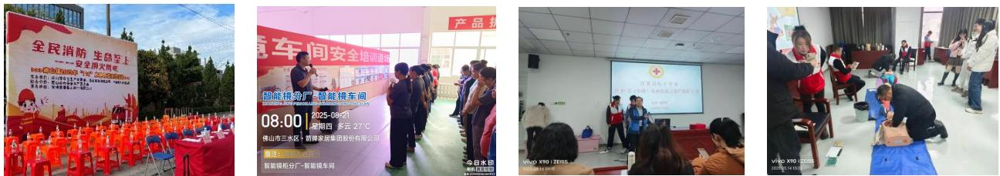  
各基地开展安全应急演练

## 3、环保投入、绿色运营与绩效

公司持续保障环保资源投入，推动绿色运营，并取得了显著绩效。

## （1）环保投入

公司各生产基地均严格按照环境治理和保护要求投入建设并正常运行环保设备设施，建立定期维护机制。 2025 年度，公司环保投入为人民币 2,933.21 万元，主要用于环保设备购置及污染物处理设施建设及运维等。

<table><tr><td>项目</td><td>2025 年</td><td>2024 年</td><td>2023 年</td></tr><tr><td>环保投入</td><td>2,933.21</td><td>2,975.80</td><td>2,990.01</td></tr><tr><td>公司营业收入</td><td>647,623.89</td><td>714,282.65</td><td>764,817.65</td></tr><tr><td>占比</td><td>0.45%</td><td>0.42%</td><td>0.39%</td></tr></table>

## （2）绿色工厂建设

公司积极推进“用地集约化、原料无害化、生产洁净化、废物资源化、能源低碳化”的绿色工厂建设，多个生产基地获得国家级、省级认证，构建了行业领先的绿色制造体系。

<table><tr><td>生产基地</td><td>绿色工厂认证情况</td><td>认证时间</td></tr><tr><td>德州生产基地</td><td>绿色工厂</td><td>2022年3月入选工信部名单</td></tr><tr><td>景德镇生产基地</td><td>绿色工厂</td><td>2025年1月入选工信部名单</td></tr><tr><td>佛山三水生产基地</td><td>绿色工厂</td><td>2026年3月入选工信部名单</td></tr><tr><td>佛山高明三洲基地</td><td>绿色工厂</td><td>2026年3月入选工信部名单</td></tr></table>

## （3）“无废工厂”实践

2025 年 3 月，公司及全资子公司高明安华入选佛山市第二批 “无废城市细胞”名单，获评“无废工厂”。公司通过固体废物源头减量、资源化利用（如 2025 年压榨泥循环利用量达3.79 万吨）及规范化处置，推动生产洁净化。

## （4）培训与意识提升

公司通过开展“安全生产月”“六五环境日”等活动，常态化开展包括安全、环保、消防、职业健康等的全方面培训，强化全员环保、安全意识，有效提升了突发环境事件的应急处置能力。

2025 年，公司开展环保培训情况如下：

<table><tr><td></td><td>单位</td><td>2025年</td><td>2024年</td><td>2023年</td></tr><tr><td>培训次数</td><td>次</td><td>37</td><td>53</td><td>74</td></tr><tr><td>培训费用</td><td>元</td><td>9,300</td><td>1,081.82</td><td>39,425.47</td></tr><tr><td>培训人次</td><td>/</td><td>6,556</td><td>5,056</td><td>14,456</td></tr><tr><td>培训总时长</td><td>小时</td><td>6,467.1</td><td>5,342.7</td><td>23,128.7</td></tr></table>

2025 年，公司开展安全培训情况如下：

<table><tr><td></td><td>单位</td><td>2025年</td><td>2024年</td><td>2023年</td></tr><tr><td>培训次数</td><td>次</td><td>337</td><td>3,215</td><td>496</td></tr><tr><td>培训费用</td><td>元</td><td>96,059</td><td>44,041</td><td>14,258.6</td></tr><tr><td>培训人次</td><td>/</td><td>37,298</td><td>111,828</td><td>26,940</td></tr><tr><td>培训总时长</td><td>小时</td><td>64,105</td><td>65,743</td><td>68,142</td></tr></table>

报告期内，根据全年第三方监测报告，公司及各子公司监测点的污染物排放均达标。危险废物安全处置率达 100%，一般工业固体废物实现合规处理。公司积极接受并配合政府部门的环保检查，未发生重大环境事故，未受到生态环境部门的重大行政处罚。

## 4、绿色创新与行业引领

公司将环保理念延伸至产品全生命周期，致力于通过绿色创新引领行业可持续发展。在产品设计阶段，公司从重量与结构两大维度开展低碳优化，在保证产品质量的前提下，通过轻量化设计减少材料用量，降低产品使用及回收阶段的资源消耗与环境影响，同时持续优化产品结构设计，以更高效、环保的生产方式实现资源集约利用；在原材料选用阶段，公司积极减少或替代铜等金属及不可回收材料，优先选用不锈钢、环保塑料等环保可回收材料，推动原料结构绿色升级，例如注塑产品原材料利用率达 99%、回收料占产品总重的 8%。目前，公司已累计 25 个型号产品入选用水产品水效领跑者名单，超过 140 款产品获颁“中国绿色产品认证”，超过 170 款产品通过“中国绿色建材产品认证”，同时，公司多款产品获得中国节水产品、中国环境标志产品等权威绿色认证，以全链条低碳实践践行绿色发展理念。

更重要的是，公司积极参与国家及行业绿色标准制定，发挥行业示范作用。主导制定了国家标准《智能坐便器能效水效限定值及等级》《蹲便器水效限定值及水效等级》《水嘴限定值及水效等级》等，行业标准《“领跑者”标准评价要求陶瓷坐便器》《“领跑者”标准评价要求一体式智能坐便器》《“领跑者”标准评价要求水嘴》《卫生陶瓷行业绿色工厂评价要求》等。

## （三）排放物管理

公司严格遵守《中华人民共和国环境保护法》《中华人民共和国大气污染防治法》《中华人民共和国水污染防治法》《中华人民共和国固体废物污染环境防治法》等法律法规以及各生产基地所在省市的废气、废水及固体废物管理法规条例，对生产经营过程中产生的废气、废水及固体废物实施系统化管理，确保所有污染物达标排放。报告期内，公司未发生污染物排放超标事件，亦未因此受到重大行政处罚。

## 1、管理体系与合规基础

公司各生产基地依法办理了《排污许可证》或完成固定污染源排污登记，相关环保资质齐全（详见附表）。在此基础上，公司及各子公司按照相关法律法规的要求制定环境自行监测方案，其中公司全资子公司高明安华、法恩洁具、肇庆乐华、肇庆五金、德州乐华以及公司子公司世邦板材等按照相关要求安装自动检测设施，同时根据监测方案委托有相关资质的第三方环境监测机构对排放的废气、废水、噪声等污染物进行监测并出具环境监测报告。报告期内，箭牌家居、高明安华、法恩洁具、肇庆乐华、肇庆五金、韶关乐华、景德镇乐华、应城乐华、德州乐华、世邦板材、恒业厨卫等均委托环境检测机构对上述公司生产经营场所排污情况进行检测，根据检测机构出具的检测报告，公司及各子公司的生产经营场所的排污检测数据显示为达标。

<table><tr><td>序号</td><td>名称</td><td>公司名称</td><td>编号</td><td>有效期</td><td>排污种类</td></tr><tr><td>1</td><td>排污许可证</td><td>箭牌家居</td><td>91440600065160777Y001U</td><td>2025.7.5-2030.7.4</td><td>废水、废气</td></tr><tr><td>2</td><td>固定污染源排污登记回 $执^{注}$ </td><td>顺德乐华</td><td>91440606231933086N001W</td><td>2020.3.26-2025.3.25</td><td>废水、废气、工业固体废物</td></tr><tr><td>3</td><td>排污许可证</td><td>高明安华</td><td>91440600749166723W001W</td><td>2023.10.8-2028.10.7</td><td>废气</td></tr><tr><td>4</td><td>排污许可证</td><td>法恩洁具</td><td>91440600768424716D001P</td><td>2025.7.24-2030.7.23</td><td>废水、废气</td></tr><tr><td>5</td><td>排污许可证</td><td>肇庆乐华</td><td>914412007929275916001R</td><td>2025.7.31-2030.7.30</td><td>废水、废气</td></tr><tr><td>6</td><td>排污许可证</td><td>韶关乐华</td><td>9144028267517122XT001V</td><td>2022.10.12-2027.10.11</td><td>废水、废气</td></tr><tr><td>7</td><td>排污许可证</td><td>景德镇乐华</td><td>91360222799490249U001V</td><td>2021.12.17-2026.12.16</td><td>废水、废气</td></tr><tr><td>8</td><td>固定污染源排污登记回 $执^{注}$ </td><td>应城乐华</td><td>91420981576959468G001W</td><td>2023.8.3-2028.8.2</td><td>废气、废水、工业固体废物</td></tr><tr><td>9</td><td>排污许可证</td><td>德州乐华</td><td>91371400679201692X001V</td><td>2023.7.11-2028.7.10</td><td>废水、废气</td></tr><tr><td>10</td><td>排污许可证</td><td>肇庆五金</td><td>91441284324971284Y001P</td><td>2024.10.12-2029.10.11</td><td>废水、废气</td></tr><tr><td>11</td><td>排污许可证</td><td>乐华世邦</td><td>91440607MA52WL2TXK001U</td><td>2026.1.26-2031.1.25</td><td>废水、废气</td></tr><tr><td>12</td><td>固定污染源排污登记回 $执^{注}$ </td><td>乐华恒业厨卫</td><td>91440606MA4UH6DU9N001X</td><td>2024.8.13-2029.8.12</td><td>废气、废水、工业固体废物</td></tr></table>

注：《固定污染源排污登记工作指南（试行）》规定如下：固定污染源排污登记，是指污染物产生量、排放量和对环境的影响程度很小，依法不需要申请取得排污许可证的企业事业单位和其他生产经营者（以下简称排污单位），应当填报排污登记表；排污登记采取网上填报方式。排污单位在全国排污许可证管理信息平台（http://permit.mee.gov.cn/permitExt）上填报排污登记表后，自动即时生成登记编号和回执，排污单位可以自行打印留存。（2）根据公司发展规划，乐从大墩基地（即顺德乐华）目前已停止生产，顺德乐华目前已不开展生产业务，仅承担销售相关职能，因此其固定污染源排污登记回执到期后不再续办。

## 2、废气排放管理与绩效

公司针对不同生产环节的废气特性，采取差异化治理措施。对于陶瓷烧成等工序产生的燃料燃烧废气（颗粒物、二氧化硫、氮氧化物），主要通过使用清洁能源，并配套脱硫、脱硝及高效除尘工艺进行控制。对于喷涂、注塑等工序产生的挥发性有机物（VOCs），采用多级净化、吸附及催化燃烧等组合工艺进行处理。电镀工序产生的酸雾等废气，则通过碱液喷淋等方式净化。

公司已制定《废气排放管理制度》，并在德州乐华、肇庆乐华、高明安华等基地的燃料废气排放口，以及世邦板材的有机废气排放口安装了在线监测系统，实现排放浓度与设施运行的实时监控。同时，定期委托第三方进行监测，确保稳定达标。2025 年，各生产基地关键废气污染物监测结果均符合许可限值。

## 3、废水排放管理与绩效

公司严格执行《废水排放管理制度》，对生产废水和生活污水分质处理。生产废水（含陶瓷生产废水、电镀废水等）经厂内污水处理设施处理后，优先回用于生产环节，提高水资源循环利用率；剩余部分与经处理的生活污水一并达标排入市政管网。公司在法恩洁具、肇庆五金、景德镇乐华等基地的电镀废水排放口安装了在线监测系统，强化重点环节监管。报告期内，所有外排废水经监测均符合标准。

公司及各子公司生产经营过程中涉及的废气、废水等污染物排放的具体情况如下：

<table><tr><td rowspan="2">公司名称</td><td rowspan="2">污染物类别</td><td rowspan="2">环境监测执行标准</td><td rowspan="2">主要污染物名称</td><td colspan="2">2025年</td></tr><tr><td>排放总量限值/排放浓度限值</td><td>实际排放情况</td></tr><tr><td rowspan="3">肇庆乐华</td><td rowspan="3">废气</td><td rowspan="3">陶瓷工业污染物排放标准GB25464-2010,广东省《陶瓷工业大气污染物排放标准》DB44/2160-2019,《陶瓷工业大气污染物排放标准》DB44/2160-2019,大气污染物排放限值DB44/27-2001,广东省陶瓷工业大气污染物排放标准DB44/2160-2019,挥发性有机物无组织排放控制标准GB37822-2019,恶臭污染物排放标准GB14554-93</td><td>颗粒物</td><td>98.48t/a</td><td>达标排放</td></tr><tr><td>二氧化硫</td><td>48.63t/a</td><td>达标排放</td></tr><tr><td>氮氧化物</td><td>342.98t/a</td><td>达标排放</td></tr><tr><td rowspan="8">法恩洁具</td><td rowspan="8">废气</td><td rowspan="8">广东省地方标准《大气污染物排放标准》(DB44/27-2001),大气污染物排放限值DB44/27-2001,电镀污染物排放标准GB21900-2008,锅炉大气污染物排放标准DB44/765-2019,家具制造行业挥发性有机化合物排放标准DB44/814-2010,铸造工业大气污染物排放标准GB39726-2020,挥发性有机物无组织排放控制标准GB37822-2019</td><td>颗粒物(锅炉)</td><td>0.057t/a</td><td>达标排放</td></tr><tr><td>颗粒物(铸造)</td><td> $30mg/Nm^3$ </td><td>达标排放</td></tr><tr><td>二氧化硫</td><td>0.215t/a</td><td>达标排放</td></tr><tr><td>氮氧化物</td><td>0.482t/a</td><td>达标排放</td></tr><tr><td>VOCs</td><td>4.113t/a</td><td>达标排放</td></tr><tr><td>铬酸雾</td><td> $0.05mg/Nm^3$ </td><td>达标排放</td></tr><tr><td>氯化氢</td><td> $30mg/Nm^3$ </td><td>达标排放</td></tr><tr><td>硫酸雾</td><td> $30mg/Nm^3$ </td><td>达标排放</td></tr><tr><td rowspan="4">高明安华</td><td rowspan="4">废气</td><td rowspan="4">陶瓷工业污染物排放标准GB25464-2010,广东省陶瓷工业大气污染物排放标准DB44/2160-2019,大气污染物排放限值DB44/27-2001,《陶瓷工业污染物排放标准》(GB25464-2010)修改单环保部公告2014年第83号,家具制造行业挥发性有机化合物排放标准DB44/814-2010,合成树脂工业污染物排放标准GB31572-2015,挥发性有机物无组织排放控制标准GB37822-2019</td><td>颗粒物</td><td>35.16t/a</td><td>达标排放</td></tr><tr><td>二氧化硫</td><td>52.746t/a</td><td>达标排放</td></tr><tr><td>氮氧化物</td><td>123.101t/a</td><td>达标排放</td></tr><tr><td>VOCs</td><td>1.643t/a</td><td>达标排放</td></tr><tr><td rowspan="7">景德镇乐华</td><td rowspan="7">废气</td><td rowspan="7">大气污染物综合排放标准GB16297-1996,挥发性有机物排放标准第6部分:家具制造业DB361101.6-2019,陶瓷工业污染物排放标准GB25464-2010,《陶瓷工业污染物排放标准》(GB25464-2010)修改单环保部公告2014年第83号,电镀污染物排放标准GB21900-2008,铸造工业大气污染物排放标准GB39726-2020,挥发性有机物排放标准第4部分:塑料制品业DB361101.4-2019,恶臭</td><td>颗粒物</td><td>20.57t/a</td><td>达标排放</td></tr><tr><td>二氧化硫</td><td>62.33t/a</td><td>达标排放</td></tr><tr><td>氮氧化物</td><td>130t/a</td><td>达标排放</td></tr><tr><td>VOCs</td><td> $40mg/Nm^3$ </td><td>达标排放</td></tr><tr><td>铬酸雾</td><td> $0.05mg/Nm^3$ </td><td>达标排放</td></tr><tr><td>氯化氢</td><td> $30mg/Nm^3$ </td><td>达标排放</td></tr><tr><td>硫酸雾</td><td> $30mg/Nm^3$ </td><td>达标排放</td></tr><tr><td rowspan="6"></td><td></td><td>污染物排放标准GB14554-93,《陶瓷工业污染物排放标准》修改单GB25464-2010,大气污染物综合排放标准GB16297-1996,《陶瓷工业污染物排放标准》GB25464-2010,挥发性有机物无组织排放控制标准GB37822-2019</td><td></td><td></td><td></td></tr><tr><td rowspan="5">废水</td><td rowspan="5">城镇污水处理厂污染物排放标准GB18918-2002,污水综合排放标准GB8978-1996,电镀污染物排放标准GB21900-2008</td><td>CODcr</td><td>18.758t/a</td><td>达标排放</td></tr><tr><td>氨氮</td><td>1.876t/a</td><td>达标排放</td></tr><tr><td>总镍</td><td>0.012211t/a</td><td>达标排放</td></tr><tr><td>总铬</td><td>0.01875t/a</td><td>达标排放</td></tr><tr><td>六价铬</td><td>0.007798t/a</td><td>达标排放</td></tr><tr><td rowspan="3">顺德乐华</td><td rowspan="3">废气</td><td rowspan="3">《家具制造行业挥发性有机化合物排放标准》(DB44/814-2010)、广东省地方标准《大气污染物排放限值》(DB44/27-2001)</td><td>颗粒物</td><td colspan="2" rowspan="3">根据公司发展规划,乐从大墩基地(即顺德乐华)目前已停止生产</td></tr><tr><td>二氧化硫</td></tr><tr><td>氮氧化物</td></tr><tr><td rowspan="3">德州乐华</td><td rowspan="3">废气</td><td rowspan="3">锅炉大气污染物排放标准DB372374-2018,建材工业大气污染物排放标准DB372373-2018,建材工业大气污染物排放标准DB37/2373-2018,区域性大气污染物综合排放标准DB37/2376-2019,山东省锅炉大气污染物排放标准DB37/2374-2018,挥发性有机物排放标准第3部分:家具制造业DB372801.3-2017,大气污染物综合排放标准GB16297-1996,挥发性有机物无组织排放控制标准GB37822-2019</td><td>颗粒物</td><td>7.2t/a</td><td>达标排放</td></tr><tr><td>二氧化硫</td><td>25.21t/a</td><td>达标排放</td></tr><tr><td>氮氧化物</td><td>72.02t/a</td><td>达标排放</td></tr><tr><td rowspan="9">箭牌家居</td><td rowspan="9">废气</td><td rowspan="9">家具制造行业挥发性有机化合物排放标准DB44/814-2010,大气污染物排放限值DB44/27-2001,锅炉大气污染物排放标准DB44/765-2019,合成树脂工业污染物排放标准GB31572-2015,铸造工业大气污染物排放标准GB39726-2020,恶臭污染物排放标准GB14554-93,DB44_2367-2022(广东省)固定污染源挥发性有机物综合排放标准DB44/2367-2022</td><td>颗粒物(工艺废气)</td><td> $120mg/Nm^3$ </td><td>达标排放</td></tr><tr><td>颗粒物(燃烧废气)</td><td>0.04t/a</td><td>达标排放</td></tr><tr><td>VOCs</td><td>3.9t/a</td><td>达标排放</td></tr><tr><td>二氧化硫</td><td>0.06t/a</td><td>达标排放</td></tr><tr><td>氮氧化物</td><td>0.51t/a</td><td>达标排放</td></tr><tr><td>甲苯+二甲苯</td><td> $20mg/Nm^3$ </td><td>达标排放</td></tr><tr><td>苯</td><td> $1mg/Nm^3$ </td><td>达标排放</td></tr><tr><td>苯乙烯</td><td>/</td><td>达标排放</td></tr><tr><td>非甲烷总烃</td><td> $60mg/Nm^3$ </td><td>达标排放</td></tr><tr><td rowspan="3">韶关乐华</td><td rowspan="3">废气</td><td rowspan="3">陶瓷工业污染物排放标准GB25464-2010,广东省陶瓷工业大气污染物排放标准DB44/2160-2019,陶瓷工业污染物排放标准及修改单GB25464-2010,家具制造行业挥发性有机化合物排放标准DB44/814-2010,DB44_2367-2022(广东</td><td>颗粒物</td><td>3.575t/a</td><td>达标排放</td></tr><tr><td>二氧化硫</td><td>2.139t/a</td><td>达标排放</td></tr><tr><td>氮氧化物</td><td>9.819t/a</td><td>达标排放</td></tr><tr><td></td><td></td><td>省)固定污染源挥发性有机物综合排放标准</td><td></td><td></td><td></td></tr><tr><td rowspan="5">应城乐华</td><td rowspan="5">废气</td><td rowspan="5">《大气污染物综合排放标准》(GB16297-1996)表2</td><td>颗粒物</td><td> $20mg/Nm^3$ </td><td>达标排放</td></tr><tr><td>苯</td><td> $12mg/Nm^3$ </td><td>达标排放</td></tr><tr><td>甲苯</td><td> $40mg/Nm^3$ </td><td>达标排放</td></tr><tr><td>二甲苯</td><td> $70mg/Nm^3$ </td><td>达标排放</td></tr><tr><td>非甲烷总烃</td><td> $40mg/Nm^3$ </td><td>达标排放</td></tr><tr><td rowspan="3">世邦板材</td><td rowspan="3">废气</td><td rowspan="3">合成树脂工业污染物排放标准GB31572-2015含2024年修改单,恶臭污染物排放标准GB14554-93,合成树脂工业污染物排放标准GB31572-2015(含2024年修改单),DB44_2367-2022(广东省)固定污染源挥发性有机物综合排放标准DB44/2367—2022,《合成树脂工业污染物排放标准》(GB31572-2015)修改单GB31572-2015</td><td>VOCs</td><td>3.11t/a</td><td>达标排放</td></tr><tr><td>非甲烷总烃</td><td> $60mg/Nm^3$ </td><td>达标排放</td></tr><tr><td>颗粒物</td><td> $20mg/Nm^3$ </td><td>达标排放</td></tr><tr><td rowspan="17">恒业五金</td><td rowspan="11">废气</td><td rowspan="11">电镀污染物排放标准GB21900-2008,铸造工业大气污染物排放标准GB39726-2020,恶臭污染物排放标准GB14554-93,锅炉大气污染物排放标准DB44/765-2019,大气污染物排放限值DB44/27—2001,DB44_2367-2022(广东省)固定污染源挥发性有机物综合排放标准DB44/2367—2022</td><td>硫酸雾</td><td> $30mg/Nm^3$ </td><td>达标排放</td></tr><tr><td>氯化氢</td><td> $30mg/Nm^3$ </td><td>达标排放</td></tr><tr><td>铬酸雾</td><td> $0.05mg/Nm^3$ </td><td>达标排放</td></tr><tr><td>碱雾</td><td> $10mg/Nm^3$ </td><td>达标排放</td></tr><tr><td>甲醛</td><td> $30mg/Nm^3$ </td><td>达标排放</td></tr><tr><td>氰化氢</td><td> $0.09mg/Nm^3$ </td><td>达标排放</td></tr><tr><td>氨气</td><td>/</td><td>达标排放</td></tr><tr><td>铅及其化合物</td><td> $2mg/Nm^3$ </td><td>达标排放</td></tr><tr><td>二氧化硫</td><td>0.09t/a</td><td>达标排放</td></tr><tr><td>氮氧化物</td><td>0.231991t/a</td><td>达标排放</td></tr><tr><td>VOCs</td><td>0.424t/a</td><td>达标排放</td></tr><tr><td rowspan="6">废水</td><td rowspan="6">电镀水污染物排放标准DB44/1597-2015,广东省水污染物排放限值标准DB44/26-2001</td><td>CODcr</td><td>12.69t/a</td><td>达标排放</td></tr><tr><td>氨氮</td><td>0.6345t/a</td><td>达标排放</td></tr><tr><td>总铬</td><td>0.2115t/a</td><td>达标排放</td></tr><tr><td>总镍</td><td>0.0423t/a</td><td>达标排放</td></tr><tr><td>总铜</td><td>0.1269t/a</td><td>达标排放</td></tr><tr><td>六价铬</td><td>0.0423t/a</td><td>达标排放</td></tr><tr><td rowspan="4">乐华恒业</td><td rowspan="4">废气</td><td rowspan="4">《合成树脂工业污染物排放标准》(GB31572-2015),恶臭污染物排放标准GB14554-93,《家具制造行业挥发性有机化合物排放标准》(DB44/814-2010),《大气污染物排放标准》(DB44/27-2001)</td><td>非甲烷总烃</td><td> $60mg/Nm^3$ </td><td>达标排放</td></tr><tr><td>颗粒物(破碎)</td><td> $20mg/Nm^3$ </td><td>达标排放</td></tr><tr><td>颗粒物(焊接、灌胶、合壳)</td><td> $120mg/Nm^3$ </td><td>达标排放</td></tr><tr><td>VOCs氨</td><td> $30mg/Nm^3$ /</td><td>达标排放达标排放</td></tr><tr><td></td><td>废水</td><td>《水污染物排放限值》(DB44/26-2001)</td><td>悬浮物</td><td>100mg/L</td><td>达标排放</td></tr></table>

## 4、固体废弃物管理

公司对固体废物实行分类收集、合规贮存与处置。针对电镀污泥、废漆渣等危险废物，严格执行《危险废物管理制度》，全部委托持证单位安全处置，2025 年危险废物安全处置率达 100%。针对陶瓷废坯、压榨泥等一般工业固废，积极推进资源化利用，如将压榨泥回用于生产，2025 年资源化利用量约 3.79 万吨。

通过系统的固废减量化与资源化实践，公司及子公司高明安华于 2025 年 3 月入选佛山市“无废工厂”名单。2025 年，公司一般工业固体废物产生量约 4.76 万吨，危险废物产生量2,294 吨，均得到妥善管理。

未来，公司将持续关注环保技术发展，优化治理工艺，进一步挖掘减排潜力，致力于实现更清洁的生产。

## （四）资源利用

公司坚持科学的能源资源投入，以“低消耗、低排放、高效率”为目标，通过优化能源结构、实施节能技术改造、提高资源循环利用率，系统化推进生产运营的绿色低碳转型。

淘汰和改造落后工艺装备，促进能源结构的合理与优化，注重节能降耗、清洁生产、资源回收与综合利用，利用厂房天面安装光伏发电设施，利用低挥发涂料替代高挥发涂料，引进高效VOCs 处理器提高处理效率的同时降低有害物质排放，并对生产用水工艺进行优化，生产废水集中处理循环利用，减少新鲜水的使用，同时生产余热回收用于产品烘干节能等，打造“低消耗、低排放、高效率”的低碳发展模式。

## 1、能源利用

公司致力于构建清洁、高效的能源体系，以减少能源消耗与碳排放。

## （1）能源管理组织体系、管理制度

依据 ISO50001:2018《能源管理体系要求》、RB/T110-2014《能源管理体系建筑卫生陶瓷企业认证要求》、RB/T109-2013《能源管理体系人造板及木制品企业认证要求》、RB/T119-2015《能源管理体系机械制造企业认证要求》等相关法律法规及其应遵守的其他要求，公司建立了覆盖集团与各生产基地的能源管理组织，结合公司生产运营实际情况，制定了《能源管理办法》《能源管理手册》《节能降耗管理办法》等制度，对建立、实施、保持并改进能源管理体系作出规定，以便为降低能耗、提高能源利用效率，确定能够采用系统的方法来实现能源绩效目标，包括能源利用效率、能源使用和能源消耗状况的持续改进制定并实现能源方针和目标。

基地总经理作为能源计量管理机构最高管理者，全面负责基地能源计量工作；能源管理办公室依据相关法律法规、标准、规范，结合基地实际情况编制年度能源工作计划并推动实施；设备管理部门负责组织能源计量器具的日常检查、维护、校准，确保在用能源计量器具的完好；采购部门负责采购符合国家标准的能源计量器具；财务部门负责确保能源计量工作所需资金；人力资源部门负责对相关人员的培训、教育，并对相关部门能源计量岗位职责、管理制度落实情况的考核结果进行奖惩；各部门负责组织有关能源计量数据的采集、相关表单填写并传递给能源计量专职管理人员及相关部门。公司致力于“能源低碳化”的绿色工厂建设，持续减少对能源的消耗。

## （2）能源结构优化：大力发展清洁能源

公司充分利用全国各生产基地的厂房屋顶资源，目前包括广东佛山三水基地、广东佛山高明三洲基地、广东佛山乐从基地、广东肇庆四会下茆基地、江西景德镇基地、广东韶关基地、山东德州基地、湖北应城基地、广东肇庆四会龙甫基地，大力建设分布式光伏发电项目。截至 2025 年末，公司已逐步建成装机容量为 51.65 兆瓦的光伏发电系统，较 2024 年增加 4.32 兆瓦，2023 年、2024 年、2025 年光伏发电量分别为 2,735.91 万千瓦时、2,849.37 万千瓦时、3,986.93 万千瓦时，绿色电力占公司总用电量的比例显著提升，有效降低了外购电力产生的间接碳排放

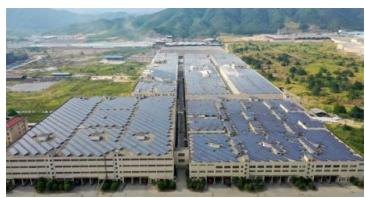

natural_image

Aerial view of a large industrial complex with solar panels installed on rooftops, surrounded by green hills (no visible text or signage)

景德镇基地

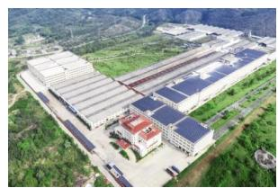

natural_image

Aerial view of a large industrial complex with multiple factory buildings and solar panels, surrounded by greenery (no visible text or signage)

韶关基地

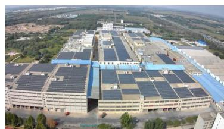

natural_image

Aerial view of a large industrial complex with solar panel installations and surrounding greenery (no visible text or signage)

德州基地

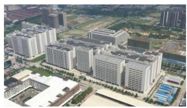

natural_image

Aerial view of a modern industrial complex with multiple high-rise buildings and surrounding greenery (no visible text or signage)

乐从基地

## （3）节能技术改造：深挖运营减排潜力

公司持续对高耗能环节进行技术改造，提升能源利用效率：

窑炉升级与余热回收：对陶瓷烧成窑炉进行节能改造，并将窑炉烟气余热回收用于坯体干燥，大幅降低了烘干工序的能耗。

资源循环利用：将生产过程中产生的压榨泥等固体废物加工后回用于生产，2025 年公司德州基地、景德镇基地、韶关基地、高明三洲基地资源化利用压榨泥约 3.79 万吨，减少了原生原料消耗。

通用设备改造：如对高明基地空压机冷却塔系统进行优化改造，实现互通互济，年节水约 1900 吨。

工艺优化与精细管理：公司景德镇生产基地通过对浆料管路及锅炉进行升级改造，优化浆料加热燃气用量；通过持续推进产品轻量化，降低天然气消耗；通过细化干燥房的管理及风锥调整，降低耗电量。上述措施共节约天然气用量 25.09 万吨/年，节约用电量 85 万千瓦时/年。

## （4）能源管理关键绩效指标

通过系列举措，公司能源利用效率持续提升。2025 年，公司单位产值综合能耗为0.164 吨标准煤/万元，单位产值二氧化碳排放量为 0.332 吨二氧化碳/万元，均达到行业领先水平。

2025 年度，公司能源消耗情况如下：

<table><tr><td>指标名称</td><td>单位</td><td>2025年</td><td>2024年</td><td>2023年</td></tr><tr><td>全年传统电力消耗总量</td><td>万度</td><td>15,830.35</td><td>18,809.11</td><td>17,532.96</td></tr><tr><td>全年天然气消耗总量</td><td>万立方米</td><td>4,228.65</td><td>5,632.56</td><td>5,416.62</td></tr><tr><td>全年燃煤消耗总量</td><td>万吨</td><td>0.67</td><td>1.58</td><td>1.85</td></tr><tr><td>全年能源消耗总量</td><td>万吨标准煤</td><td>7.77</td><td>10.55</td><td>9.98</td></tr></table>

2025 年碳排放量 21.83 万吨，较 2024 年减少 7.39 万吨。一方面，受部分陶瓷产线生产计划调整影响，产量下降带动绝对排放量回落；另一方面，公司深化节能技术改造（如窑炉升级、余热回收）并提升绿色电力占比至 20.12%，推动单位产值二氧化碳排放量降至 0.332 吨/万元，减排成效显著。公司能源消耗强度各项指标均达到行业平均水平，其中单位产值综合能耗优于行业先进值指标：

<table><tr><td>序号</td><td>项目</td><td>单位</td><td>2025年</td><td>2024年</td><td>行业平均水平</td><td>行业标准</td><td>水平评价</td></tr><tr><td>1</td><td>单位产值综合能耗</td><td>吨标准煤/万元</td><td>0.164</td><td>0.2</td><td>0.477</td><td>0.2359</td><td>行业领先</td></tr><tr><td>2</td><td>单位产值二氧化碳排放量</td><td>吨二氧化碳/万元</td><td>0.332</td><td>0.414</td><td>1.323</td><td>/</td><td>行业领先</td></tr><tr><td>3</td><td>绿色电力占比</td><td>%</td><td>20.12</td><td>13.15</td><td>/</td><td>/</td><td>/</td></tr></table>

说明：

1、因行业能源消耗强度未有公开数据，因此上述各项目中“单位产值综合能耗”及“单位产值二氧化碳排放量”“行业平均水平”数据来源于《广东统计年鉴 2025》，“单位产值综合能耗”的“行业标准”数据来源于《广州市产业能效指南》；  
2、“可再生能源占比组织能源消耗总量”修改为“绿色电力占比”，更直观的展示公司能源绿色转型成果，计算方法是绿色电力用量/（传统电力用量+绿色电力用量）。

## 2、水资源利用

公司高度重视水资源管理，致力于在全价值链提升用水效率，通过制度化管理、技术改造和循环利用，推动水资源消耗强度持续优化。

## （1）管理体系与制度建设

公司建立了系统化的水资源管理制度，通过制定“三同时、四到位”等用水管理制度及日常巡查检修机制，确保节水措施落实到位。凭借优秀的节水实践，公司韶关基地于 2023 年成功获评为“省级节水标

杆企业”。

## （2）节水技术改造与循环利用

公司通过持续的技术改造，从源头减少新鲜水消耗，并大幅提高水资源循环利用率。

生产节水改造：龙甫基地对电镀线水洗槽进行优化串联，用水量较改造前降低 27.47%。高明三洲基地通过对空压机冷却塔系统管路改造，年节水约 1900 吨。

废水循环利用：生产废水经处理后优先回用于生产环节。生活污水经处理达标后，部分用于厂区绿化与道路清扫。公司 2025 年循环用水量为 68.85 万吨。

产品节水创新：公司将节水技术融入产品核心，如陶瓷洁具采用 G3 航天级曲率管道实现强劲虹吸；智能坐便器应用双泵技术控制水量；水嘴搭载高效恒流节水起泡器，可较普通产品节省 50%以上用水量。

## （3）管理绩效与目标

通过上述措施，公司在多个运营层面实现了节水降耗。例如，韶关基地 2025 年全厂用水量同比下降29.33%，应城基地水费总额同比下降 27.4%。公司已将“吨瓷耗水”等关键指标纳入韶关基地的年度降本考核，推动水资源利用强度持续优化。

## （4）行业引领与标准制定

公司积极履行行业节水责任，于 2024 年 9 月获中国水利企业协会授予卫浴行业首家“节水服务企业”资质。主导或参与了《智能坐便器能效水效限定值及等级》等多项国家及行业节水标准的制修订工作。自2020 年以来，累计 25 个型号产品入选国家“水效领跑者”名单，以技术创新驱动全社会节水。

## 3、绿色运营

绿色运营是公司践行 ESG 理念、响应联合国可持续发展目标（SDGs）的重要落脚点。我们将绿色发展理念深度融入日常运营，全面推行绿色低碳办公，旨在通过全员参与和精细化管理，持续降低运营碳足迹与环境影响。

## （1）空间与能源精细化管理

合理规划办公空间，提升使用效率。加强用电管理，通过数字化手段设定空调温控区间（夏≥26℃，冬≤22℃），推广自然采光，落实“人走电断”责任制，并将地下停车场照明改造为感应模式。

## （2）无纸化与资源节约

全面推行电子公文流转与线上审批，倡导双面打印，从源头减少纸张消耗。同时，安装感应节水龙头，加强宣传，杜绝水资源浪费。

## （3）绿色出行与公务管理

严格公务用车审批，合并用车需求，严控非必要支出，降低交通碳排放。

## （4）培育全员绿色文化

通过持续宣导，鼓励员工养成随手关灯、关电脑等节能习惯，将绿色意识转化为日常行动。

通过以上系统化的措施与全员参与，公司不仅在日常办公中实现了节能减排，更将绿色运营固化为制度、文化与考核相结合的长效机制。未来，我们将继续探索和应用新的绿色技术与管理实践，力争实现办公运营碳强度的持续下降，为企业和社会的可持续发展贡献坚实力量。

## （五）守护生态安全

公司坚信，企业的可持续发展离不开健康的生态系统。我们不仅严格遵守生态保护红线，更主动采取措施，修复生态环境，致力于实现企业与自然的和谐共生。

（1）源头预防与绿色选址：公司所有生产基地的选址均符合所在城市的总体规划、生态功能区划及环境容量要求。在项目规划阶段，即开展全面的环境影响评价，确保项目与周围环境相容，从源头上最大限度地降低对生态系统的扰动。  
（2）运营中的生态保护：在项目建设与运营过程中，公司坚持“预防为主、保护优先”，严格落实水土保持措施。通过合理配置工程与植物措施，有效防治水土流失，保护土壤资源。同时，注重厂区及周边的绿化美化，建设“花园式工厂”，为员工创造优美的工作环境，也为本地生物提供更多栖息空间。

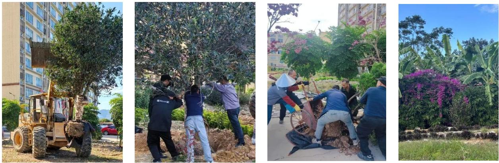  
公司佛山三水生产基地宿舍后花园景观升级

（3）生态修复与补偿：“箭牌泽计划”：为积极回馈自然，公司于 2022 年发起公益品牌 “箭牌泽计划” ，将其作为系统性生态修复与补偿的长效机制。该计划以“如果我们能凝聚每一份细水长流的力量，世界将会更美好”为愿景，核心行动之一是持续开展植树造林。截至目前，“箭牌泽计划”已成功举办多季“我给地球植个发” 公益 IP 活动，在中国累计植树超过 30 万棵。这些树木不仅固碳释氧，也对修复土壤、涵养水源、保护生物多样性产生了积极的生态效益。公司将公益内化为文化传承，让守护绿水青山的使命

代代相传。

未来，公司将持续完善生态保护管理体系，在确保运营合规的基础上，进一步探索和评估业务活动对生物多样性的潜在影响，并将通过“箭牌泽计划”等平台，拓展生态保护与修复的领域和形式，为建设美丽中国贡献更多力量。

## 六、保障员工权益，促进全面发展

员工是箭牌家居最宝贵的财富和发展的基石。我们始终秉持 “以人为本” 的核心价值观，将保障员工权益、促进员工发展、提升员工福祉视为企业可持续发展的根本。董事会通过 “增设职工代表董事” 等方式，关注并回应员工诉求。我们致力于为所有员工提供公平、安全、有尊严的工作环境，打造学习型组织与幸福职场，以实际行动响应联合国可持续发展目标（SDG 8）“体面工作和经济增长”，实现员工与企业的共同成长。

## （一）广纳贤才，促进多元就业

公司高度重视人力资源发展，积极践行多元、包容、公平的用工理念，致力于为各年龄段、不同性别员工提供平等就业与发展机会。我们通过全国范围内的校园招聘宣讲会和双选会吸纳青年人才，持续为企业发展注入新鲜活力。2025 年，公司招聘本科应届毕业生 84 名、大专应届毕业生 23 名，合计 107 人。

<table><tr><td>指标</td><td>2025 年</td><td>2024 年</td><td>2023 年</td></tr><tr><td>员工总数(人)</td><td>13,313</td><td>14,893</td><td>15,840</td></tr><tr><td>女性员工占比</td><td>36.7%</td><td>37.1%</td><td>37.5%</td></tr><tr><td>50 岁以上员工占比</td><td>11.7%</td><td>10.6%</td><td>9.55%</td></tr></table>

员工结构多元化趋势（2023-2025）

截至 2025 年 12 月31 日，公司员工学历分布情况、性别分布情况、年龄分布情况如下：

<table><tr><td colspan="3">学历分布</td></tr><tr><td>类别</td><td>人数</td><td>占比</td></tr><tr><td>硕士及以上</td><td>74</td><td>0.56%</td></tr><tr><td>本科</td><td>1,700</td><td>12.77%</td></tr><tr><td>专科</td><td>1,549</td><td>11.64%</td></tr><tr><td>专科以下</td><td>9,990</td><td>75.04%</td></tr><tr><td>合计</td><td>13,313</td><td>100%</td></tr><tr><td colspan="3">年龄分布</td></tr><tr><td>类别</td><td>人数</td><td>占比</td></tr><tr><td>51岁及以上</td><td>1,557</td><td>11.70%</td></tr><tr><td>41至50岁</td><td>4,558</td><td>34.24%</td></tr><tr><td>31至40岁</td><td>5,046</td><td>37.90%</td></tr><tr><td>30岁及以下</td><td>2,152</td><td>16.16%</td></tr><tr><td>合计</td><td>13,313</td><td>100.00%</td></tr><tr><td colspan="3">性别构成</td></tr><tr><td>类别</td><td>人数</td><td>占比</td></tr><tr><td>男性</td><td>8,425</td><td>63.28%</td></tr><tr><td>女性</td><td>4,888</td><td>36.72%</td></tr><tr><td>合计</td><td>13,313</td><td>100.00%</td></tr></table>

公司严格遵守《禁止使用童工规定》等法律法规，坚决反对任何形式的歧视与强制劳动，致力于构建开放、包容的职场环境。

## （二）权益护航，构建和谐劳动关系

公司遵守《中华人民共和国劳动法》《中华人民共和国劳动合同法》等法律法规，制定了《招聘管理办法》《人事管理办法》《培训管理办法》《绩效管理办法》《薪酬管理办法》等管理制度，建立了完善的用工管理制度体系，涵盖招聘、培训、晋升、薪酬、福利、休假等方面，保障用工规范透明。截至 2025 年12月 31 日，公司员工劳动合同签订率 100%，其中实习生签订实习协议，已达到退休返聘年龄的员工签订劳务协议，其余人员签订劳动合同。公司重视员工权益保障，依法为员工提供劳动保护并按时缴纳各项社会保险和住房公积金，缴纳比例持续保持在 98%以上的高水平，为员工构筑了坚实的社会保障网。2025 年，公司为员工缴纳社保和住房公积金基本情况如下：

<table><tr><td rowspan="2">项目</td><td colspan="3">2025年度</td></tr><tr><td>员工人数(人)</td><td>缴纳人数(人)</td><td>缴纳比例</td></tr><tr><td>养老保险</td><td>13,313</td><td>13,176</td><td>99.0%</td></tr><tr><td>医疗保险</td><td>13,313</td><td>13,169</td><td>98.9%</td></tr><tr><td>工伤保险</td><td>13,313</td><td>13,271</td><td>99.7%</td></tr><tr><td>生育保险</td><td>13,313</td><td>13,169</td><td>98.9%</td></tr><tr><td>失业保险</td><td>13,313</td><td>13,182</td><td>99.0%</td></tr><tr><td>住房公积金</td><td>13,313</td><td>13,098</td><td>98.4%</td></tr></table>

注：其中养老保险及医疗保险不含新型农村合作医疗保险项目。

对于少数未缴纳社保和公积金的情况，主要原因是新入职员工尚未缴纳社保及公积金、退休返聘、员工已在外单位缴纳社保或公积金、实习生等。为了进一步提高缴纳比例，公司计划采取以下措施，一方面加强对社保及公积金政策的宣传与普及，帮助员工更好地了解国家相关政策；同时，强化人力资源管理，密切跟踪员工社保及公积金缴纳情况，确保符合规定。在招聘时，公司会向应聘者详细说明社保和公积金的缴纳政策，并要求新入职员工严格遵守国家相关规定，努力提高缴纳比例。

在薪酬管理方面，公司建立了具有市场竞争力的多元化薪酬体系，针对研发、生产、销售、管理等不同岗位设计差异化薪酬结构，并设置激励提成、项目奖金等多种激励形式。公司定期审视并调整薪酬标准，确保其竞争力，促进企业与员工的共同发展。

为构建和谐稳定的劳动关系，公司建立了多维度的员工沟通与申诉渠道，包括职工代表大会、定期座谈会、总经理信箱等，确保员工的意见与诉求能够得到及时倾听与有效反馈。

## （三）赋能成长，打造学习型组织

公司坚信人才是企业发展的第一动力。我们以“赋能组织、激活人才、文化入心”为目标，构建了系统化、分层分类的培训发展体系——“箭牌人才发展屋”，并持续投入资源，致力于将公司打造成一个充满活力的学习型组织，为业务高质量发展提供坚实的人才保障。

## 1、顶层设计：构建“箭牌人才发展屋” 体系

公司秉承“以人为本”的核心价值观，为员工设计了清晰、多元的职业发展路径。我们按照管理、技术、营销、操作四大序列，搭建了从基层到高层的纵向晋升通道，并打通了序列间的横向轮岗机制，支持员工根据自身优势实现多通道成长。

箭牌人才发展屋以人才标准体系、评价体系、发展体系、晋升激励体系为四大根基，围绕领导力、专业力、通用力三大板块，通过线上线下多渠道学习端口，系统化赋能员工。该体系由《人才梯队管理办法》《内部讲师管理办法》《外派培训工作指引》等制度支撑，确保了人才培育的科学性与持续性。

## 2、资源建设：夯实学习平台与讲师梯队

为支撑体系运转，公司高度重视培训资源的投入与建设。

数字化学习平台：全新升级的“云课堂 2.0”整合了品牌文化、制度指引及各类课程包 400 余门，支持 PC 与移动端便捷访问，为员工自主学习提供了丰富资源。2025 年，集团学习总时长达到 35,673 小时。

# 学习强企匠心筑梦智领未来

一箭牌家居集团学习平台2.0全新上线一

<table><tr><td>时间</td><td>学习人数</td><td>学习时长(h)</td><td>测练人次</td></tr><tr><td>第一季度</td><td>1,533</td><td>6,317</td><td>4,713</td></tr><tr><td>第二季度</td><td>1,477</td><td>10,205</td><td>1,303</td></tr></table>

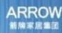

<table><tr><td>第三季度</td><td>1,353</td><td>10,786</td><td>431</td></tr><tr><td>第四季度</td><td>1,637</td><td>8,363</td><td>379</td></tr></table>

内部讲师体系：贯彻“以输出倒逼输入”的理念，公司大力培养内训师队伍。通过 TTT 训练营“赋能+认证”模式，截至 2025 年底，已拥有集团认证讲师 199 名，认证精品课程 439 门，形成了“人人是讲师，人人是学生”的良好知识分享氛围。

## 3、年度实践：2025 年关键人才培养举措

2025 年，公司培训总投入超过 210 万元，累计开展培训约 550 场，培训覆盖率高达 90%。我们聚焦业务战略，开展了一系列品牌人才培养项目：

<table><tr><td>培养维度</td><td>代表性项目</td><td>核心成果与价值</td></tr><tr><td rowspan="2">文化与管理赋能</td><td>《克服团队协作的五项障碍》工作坊</td><td>提升高管团队凝聚力,并在集团内30+部门进行内部转化,打造高效协作文化。</td></tr><tr><td>高管领导力特训营</td><td>覆盖37名现任高层管理人员,通过“管理自己、他人、业务”三阶段系统提升战略视野与变革领导力。</td></tr><tr><td rowspan="2">专业力突破</td><td>店效倍增终端赋能</td><td>覆盖箭牌、法恩莎、安华三个品牌全国超600家门店,参训学员超5,500人,满意度达100%,直接助力终端业绩增长。</td></tr><tr><td>营销“星”青年/赢销干将</td><td>构建销售人才长效培养机制,为营销体系输送青年精锐与管理储备人才。</td></tr><tr><td rowspan="2">基础力与创新力构建</td><td>AI实操训练营</td><td>响应智能化提效,开展多期课程,报名人数200+,为集团储备具备AI实操能力的专业人才。</td></tr><tr><td>新员工培训&amp;箭习生发展计划</td><td>帮助新人快速融入,2025届箭习生通过12天系统集训,结业合格率100%,完成从校园到职场的转变。</td></tr><tr><td rowspan="2">组织协同与知识沉淀</td><td>箭牌大讲堂-交叉培训系列</td><td>促进跨部门交流与合作,累计学习1320小时,解答跨部门问题24条+,提升内部运营效率。</td></tr><tr><td>部门内训(如数字化与流程管理中心)</td><td>由部门自发组织,全年开展15场培训、8场分享会,从实战问题出发,打造自主学习型团队。</td></tr></table>

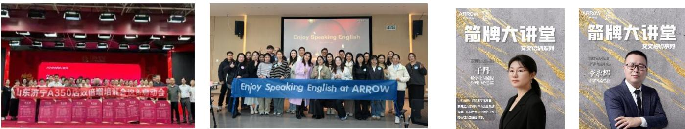

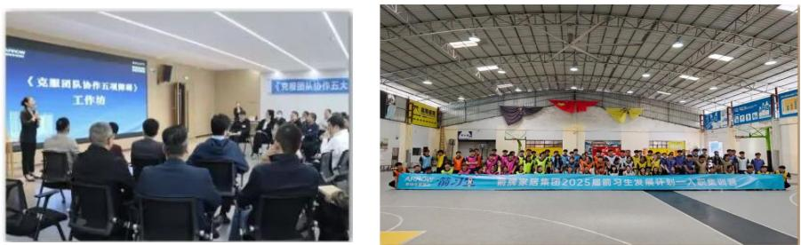

## 4、基地特色：因地制宜赋能一线生产

各生产基地紧密结合制造运营实际，开展了一系列卓有成效的特色培训：

技能人才梯队建设：乐从基地推行“3+1+2”人才梯队及多能工培养；三水基地开展企业职业技能等级认定，成功认定五级工 624 人、四级工 294 人。

质量与精益专项：举办“精益&品质绿带训练营”，培养具备过程改进能力的骨干队伍；全年开展品质管理专题培训 47 场，覆盖超 1000 人次，并推动QCC 项目创效 1387 万元。

全员技能提升：高明三洲基地开展覆盖全员的合规性内部培训，全年累计达 77,637 人次；同时针对应届毕业生进行专项技能培训，为公司储备关键技术人才。德州基地开展技能比武活动，以“以赛代训、以赛促研”为核心，通过多岗位竞技有效提升一线员工的技能水平与综合素养，为生产体系持续输送高素质技能人才。

## 5、持续赋能经销商生态

公司高度重视经销商伙伴的成长，构建了“线上+线下”“理论+实战”的全方位赋能体系。2025 年，赋能培训部累计开展培训 567 场，授课总时长 9,158.5 小时，覆盖 27,198 人次、9,038 家门店，平均满意度达 98 分以上。通过店效倍增、导购新星训练营、抖音本地生活专项等课程，有效提升了终端门店的核心竞争力与业绩转化能力。

通过系统性的体系设计、持续的资源投入和紧扣业务的项目实践，箭牌家居正稳步朝着学习型组织的目标迈进。我们不仅关注员工个人能力的提升，更致力于通过知识沉淀、经验分享和协同学习，不断增强整个组织的韧性与创新能力，以支撑集团的长期可持续发展。

## （四）温暖关怀，营造幸福职场

公司深信，员工的幸福感是企业凝聚力的源泉。我们始终将“以人为本”的理念具象化为日常点滴，通过构建 “情感联结、生活支持、身心健康”三位一体 的幸福职场关怀体系，让每一位员工在箭牌不仅能获得职业成长，更能感受到如家般的温暖与归属。

## 1、情感联结：仪式感与常态关怀并举

我们珍视每一个传递温暖的时刻，通过精心策划的节日活动与贯穿全年的常态关怀，持续增进团队情感，强化文化认同。

重要节日营造喜悦氛围：集团总部及各基地在妇女节、端午节、中秋节、冬至等重要节日，精心策划形式多样的庆祝活动。例如，2025 年中秋，三水基地面向全体职工及家属举办游园会，设置 8 大特色趣味摊位；2025 年底，集团总部举办融合圣诞元素的年度员工生日会，通过互动游戏、圣诞树 DIY 等环节，让员工在欢笑中共度温馨时光。2026 年女神节，三水基地更创新采用“上门送礼”形式，向女性管理者致以专属敬意，并举办“绽放她力量”故事茶话会，为 29 位优秀女性代表搭建分享成长的平台。

人生时刻传递企业温度：在员工生日、入职周年、荣休等重要人生节点，公司通过举办生日会、发送定制海报慰问、组织荣休仪式等方式，送上诚挚祝福。2025 年，集团及各基地累计举办员工生日会数十场，覆盖数千名寿星。对于春节值守岗位的员工，公司也通过赠送春联、米油等物资表达关爱，让节日坚守同样充满温情。

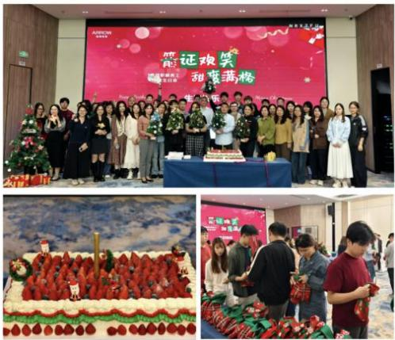  
“箭证欢笑，甜度满格”集团总部员工生日会

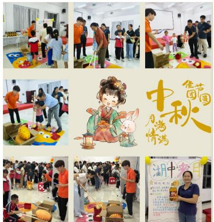

text_image

中秋节
月满情满
湖中客月

三水基地中秋游园会活动

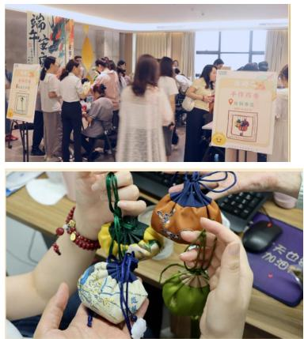

text_image

Two photos showing a group of people at an event with handmade gift bags and promotional posters; one shows a colorful patterned gift bag with Chinese text.

集团总部“遇箭端午”活动

## 2、生活支持：切实解决员工关切

我们关注员工工作之外的生活需求，通过解决实际困难、优化生活环境，将关怀落到实处。

职工子女夏令营：针对一线员工子女暑期看护的普遍难题，公司将其作为重点关怀项目。三水、景德镇、德州等基地持续联合当地工会、高校等资源，举办“职工子女夏令营”或暑假班，提供课业辅导、安全教育、书法绘画等丰富课程。2025 年，各基地夏令营累计惠及数百名职工子女，有效解决了员工的后顾之忧，获得了员工家庭及社区的广泛好评，已成为公司特色文化 IP。对于未能参与的孩子，公司也贴心准备了“童趣盲盒”送达家中，确保关怀不漏一人。

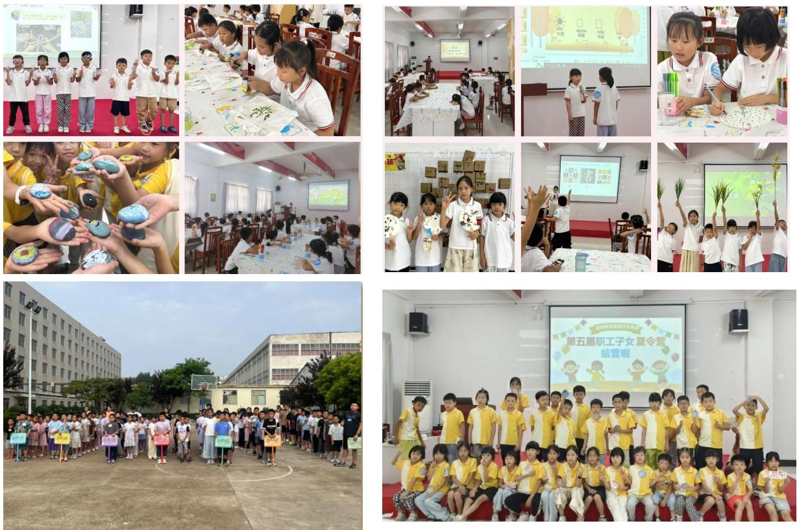

环境优化：“泽计划”向内延伸--公司公益品牌 “箭牌泽计划” 的理念同样向内辐射，致力于优化员工生活环境。2025 年，三水基地对宿舍后花园实施绿化升级，在核心区域新植寓意美好的桂花树与罗汉松共 14 棵，将“让员工住得舒心、过得暖心”的目标，转化为可见的盎然绿意与层次美景，持续提升员工的居住体验与幸福感。

后勤保障持续改善：公司关注员工“衣食住行”的每个细节。通过优化食堂供餐模式（如景德镇基地的季节性菜单）、合理定价、严控食品安全，并改善宿舍用电安全与卫生管理，从方方面面提升员工的生活品质与安全感。

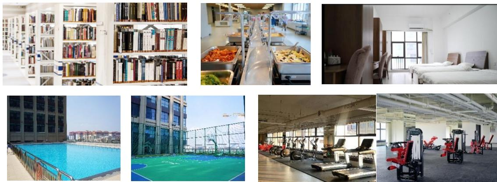

## 3、身心健康：关注全面发展

我们倡导健康、积极的生活方式，通过搭建活动平台、提供心理支持，助力员工实现身心平衡与全面

发展。

活力激发，搭建“运动圈子”平台：为鼓励员工养成运动习惯，公司特别搭建了“运动圈子”平台，以此为基础定期组织羽毛球、篮球等内部联赛及外部交流赛。各基地每年定期举办员工运动会，激发团队活力。例如，乐从基地常态化组织每周羽毛球夜练活动，让运动成为员工业余生活的健康选择。

心理关怀，提供支持服务：公司高度重视员工心理健康，通过开展心理咨询服务、压力管理讲座、经理人情商培训等方式，为员工提供专业的心理支持与情绪疏导渠道，帮助员工构建积极乐观的心态，提升职场韧性。

兴趣培养，鼓励社团文化：我们支持员工基于共同兴趣组建各类社团，并提供小额活动经费支持，丰富员工的业余文化生活，促进跨部门、跨基地的交流与友谊，营造活泼、融洽的组织氛围。

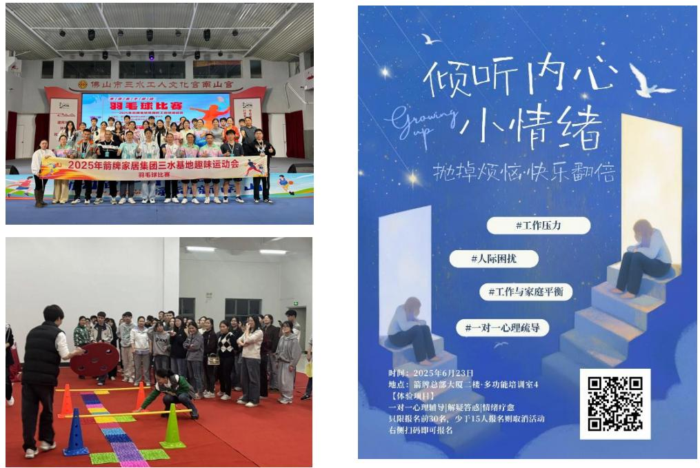

通过系统化、多层次、有温度的关怀举措，箭牌家居致力于将“幸福职场”从理念转化为可感知的温度、可参与的活力、可依赖的支持。未来，我们将持续倾听员工心声，创新关怀形式，将这份温暖更深地融入组织肌理，让每一位员工都与公司共同成长，共享发展成果。

## （五）职业健康和安全生产

保障员工的生命安全与身心健康是箭牌家居不可逾越的红线。我们秉持 “安全第一、预防为主、综合治理” 的方针，将职业健康与安全生产深度融入公司运营。由总经理领导的安全管理委员会全面负责，通过推行“安全年轮”机制（细分月度主题与周度重点），压实全员安全生产责任制，矢志追求“零重大事故、零新增职业病”的长期目标。

## 1、风险动态识别与系统化治理

我们建立了覆盖“公司-部门-班组-岗位”的四级安全监督网格，依托风险分级管控与隐患排查治理“双体系”，实现风险的常态化识别、评估、整改与复查闭环管理。2025 年，公司通过日常检查、专项稽核累计发现并治理各类安全隐患，整改完成率超过 99%。

针对识别出的核心风险，我们实施了精准的治理措施：

职业健康风险精准防控：我们高度关注陶瓷生产过程中的粉尘与噪声风险。对此，公司持续投入升级中央除尘等环保设备；并通过高频次巡查，确保员工在粉尘、噪声超标区域100%规范佩戴防尘口罩与防噪耳塞。对于已确诊的职业病患者，公司依法启动工伤认定与赔偿程序，切实履行责任。

生产安全风险专项攻坚：针对机械伤害、用电安全、消防安全等常见风险点，公司开展了系列专项治理。例如，全面推进设备安全防护升级，在高风险钻、锯、铣等设备上加装物理防护罩与光电保护装置；对老化的消防管网、锈蚀的天然气管道进行系统性改造，并加装压力监测与泄漏报警装置；严格规范动火、登高、有限空间等危险作业的线上审批与现场监护流程。

行为与管理风险源头纠偏：公司将“安全行为准则”纳入绩效考核，并通过 AI 视频监控等技术手段试点智能识别违规行为，强化监督与问责。

## 2、体系保障与全员能力建设

坚实的体系与全员的能力是安全的基石。公司及主要生产基地均已通过 ISO45001 职业健康安全管理体系认证，并持续推进安全生产标准化建设。

我们持续加大资源投入，筑牢安全防线。2025 年，公司安全生产与职业病防护支出共计 728.18 万元。

围绕“安全年轮”各月度主题（如机械设备安全月、粉尘防爆安全月等），我们开展了系统化培训，全年组织相关培训 337 次，覆盖37,298 人次，累计时长 64,105 小时，全面提升员工的风险辨识、安全操作与应急避险能力。

为检验与提升应急处置能力，各基地定

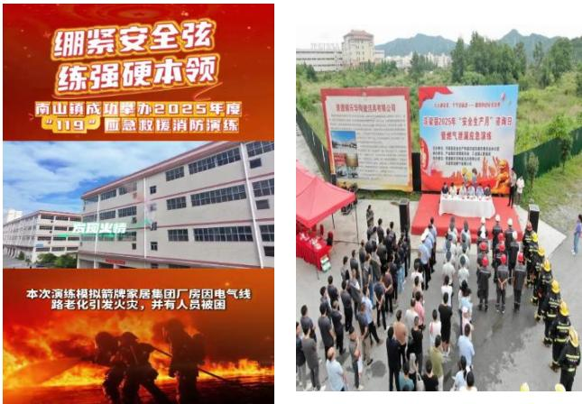

期开展消防疏散、危化品泄漏、有限空间救援等综合应急演练。公司还创新推出 “安全环保积分”激励制度，对主动报告隐患、遵守安全规程的行为给予奖励，正向引导全员参与安全管理。

【案例】2025 年 2 月至 3 月，公司各生产基地全面开展节后复工复产工作，组织全体员工逐级签订

2025 年安全生产责任书，明确安全生产目标，落实安全生产全员责任制。

【案例】2025 年 6 月，公司各生产基地统一启动“安全生产月”活动，牢固树立全体员工的安全红线意识，推动防范化解重大风险，促进安全生产水平提升，期间组织“查找身边安全隐患”系列行动，开展“安全隐患排查行动”“消除隐患演练行动”，举办安全知识竞赛、消防设施实操演练、燃气泄漏应急抢险演练、参加“安全咨询日”活动，有效提高了员工安全意识和风险处置能力，切实防范生产安全事故发生。

## 3、绩效表现与持续改进

通过系统化努力，公司在职业健康与安全生产方面取得了积极进展，同时也清醒认识到持续改进的空间。

安全绩效方面：2025 年，公司实现了重大生产安全事故、重大交通责任事故、重大火灾责任事故等均为零的目标。各基地工伤事故数量呈现下降趋势。但我们深知，在进一步降低轻微事故、彻底规范作业行为方面仍需付出更大努力。

健康绩效方面：公司严格执行员工岗前、在岗、离岗职业健康体检，2025 年体检覆盖率达 100%。对体检发现的职业禁忌人员，均已依法进行岗位调整。公司已将职业健康管理纳入中长期规划，致力于构建更完善的防控体系。

未来，箭牌家居将持续深化风险管控，严格执行各项安全制度与操作规程，致力于通过管理强化与技术升级，为全体员工创造一个日益安全、健康、可靠的工作环境，夯实企业可持续发展的根基。

## 七、 强化质量管理，保障客户权益

品质是箭牌家居生存与发展的根本。我们秉持“产品领先，品质制胜”的经营理念，致力于构建覆盖研发、采购、生产、销售及服务的全价值链质量管理体系。我们将从质量管理体系、客户服务与权益保障、供应链管理三个方面，系统阐述公司在保障产品与服务质量、提升客户满意度以及构建可持续供应链方面的管理实践与成效。

## （一）打造全价值链的质量管理模式

公司以“产品领先，品质制胜”为核心理念，构建并持续深化覆盖全价值链的“四端一网”质量管理模式，通过文化渗透、数字化升级和全员参与，将品质固化为企业核心竞争力。

## 1、文化引领与战略落地：从理念到全员行动

质量文化是体系运行的灵魂。公司深耕质量文化建设，历经质量创优、创牌、创新、创智四个战略阶段，凝练形成以 “零缺陷、零投诉、零延误、零容忍、零担忧、零污染” 为核心的质量“零”文化。2025 年，公司通过举办“质量觉醒大会”，将抽象的“零缺陷”文化转化为 12 条具体的行为准则（如“质量就是生命，业绩就是尊严”、“预防为主，一次做对”），并通过总部与各基地的广泛宣导，使之成为员工的共同语言和行动指南。通过“以消费者为中心让消费者满意”质量月等主题活动，推动质量战略自上而下有效贯彻。公司通过组建跨部门的专项项目组等形式，对重点质量问题进行系统性攻坚与闭环改进。

## 2、“四端一网”模式的深度实践与数字化赋能

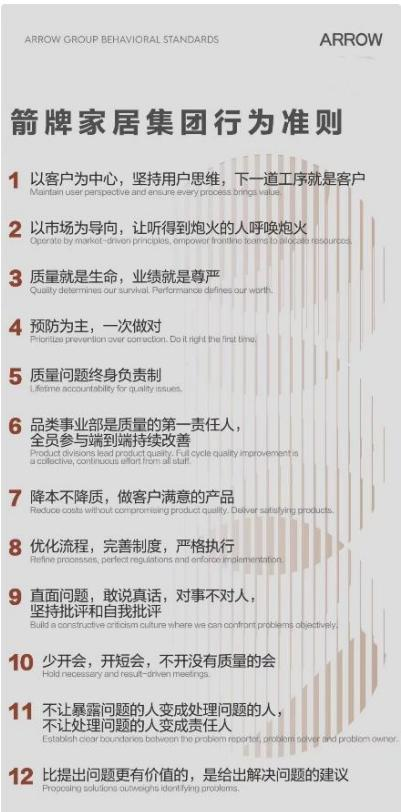

text_image

箭牌家居集团行为准则
1 以客户为中心，坚持用户思维，下一道工序就是客户
Maintain user perspective and ensure every process brings value.
2 以市场为导向，让听得到炮火的人呼唤炮火
Oporatio by market-driven principles, empower frontline team to educate resources.
3 质量就是生命，业绩就是尊严
Quality determines our survival. Performance defines our worth.
4 预防为主，一次做对
Prioritize prevention over correction. Do it right the first time.
5 质量问题终身负责制
Lifetime accountability for quality issues.
6 品类事业部是质量的第一责任人，
全员参与端到端持续改善
Product divisions lead product quality. Full cycle quality improvement is a collective, continuous effort from all staff.
7 降本不降质，做客户满意的产品
Reduce costs without compromising product quality. Deliver satisfying products.
8 优化流程，完善制度，严格执行
Refine processes, perfect regulations and intervention implementation.
9 直面问题，敢说真话，对事不对人，
坚持批评和自我批评
Build a constructive criticism culture where we can confront problems objectively.
10 少开会，开短会，不开没有质量的会
Hold necessary and result-driven meetings.
11 不让暴露问题的人变成处理问题的人，
不让处理问题的人变成责任人
Establish clear boundaries between the problem report, problem solver and problem owner.
12 比提出问题更有价值的，是给出解决问题的建议
Proposing solutions outweighs identifying problems.

公司开创并实践的“基于‘零’文化的四端一网质量管理模式”，聚焦研发、供应、生产、市场“四端”的系统化、差异化、信息化管理，并通过端到端的流程、制度、体系“网”实现高效协同与监督。“四端一网”模式在 2025 年得到深化：

研发端：需求驱动与风险前置。品质部门深度介入IPD（集成产品开发）流程，在新产品开发各关键节点进行质量评审，并开展产品可靠性测试验证，从源头预防缺陷。

供应端：严控源头与战略协同。建立严格的供应商准入与动态评估体系，实施入厂全检与关键物料驻厂监造。与核心供应商建立战略协作，共同推进质量改进，并试点推行“战略供应商免检认证”，提升供应链效率与稳定性。

生产端：精益智造与过程严控。以智能制造为基础，在关键产线推行标准化作业与实时监控。例如，在智能盖板总装自动线设置十道质检工序；打造 10 万级洁净实验室，为产品抗菌等性能提供稳定、权威的测试环境。

市场端：快速响应与闭环改进。建立全链路客户服务体系，高效收集用户反馈，并运用数字化工具实现服务过程可追溯、评价可量化，将市场信息精准传导至研发与制造环节，形成“客户声音驱动品质改进”的闭环。

在深化“四端一网”模式的同时，公司以数字化驱动质量管理变革，相关实践入选“佛山市数字化质量管理创新与实践十大优秀案例”，并规划引入 AI 视觉识别等技术，推动质量管控向智能化、预防性转型。

## 3、严格的质量管理与责任落实

公司建立了“制度完善、责任清晰、监督有力、闭环提升”的全方位管理机制。出台了《质量责任考核及问责管理办法》《供应商质量索赔管理办法》等一系列核心制度，明确了全链条的质量标准与责任边界。通过常态化巡检、专项稽查、体系审核及质量绩效深度融入部门与个人考核，确保责任落地。公司积极倡

导全员参与质量改善，设立专项激励，鼓励跨部门质量改进小组活动，并建立质量案例库与最佳实践共享平台，推动组织质量知识持续积累与迭代。

## 4、权威的技术支撑与用户体验研究

中心实验室：作为经 CNAS 认可及国家水效标识备案的权威实验室，其检测报告具备国际公信力。2024年6月，实验室通过SGS评审，获得 OTL（官方认可测试实验室） 资质，认可检测能力覆盖 17 份国家标准、205项检测项目，为公司产品质量合规与国内外市场准入提供了坚实保障。

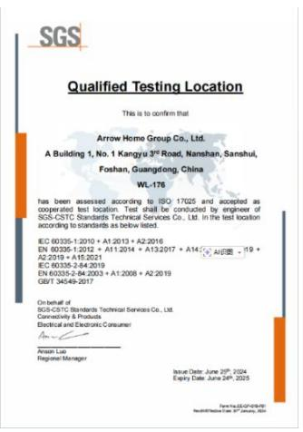

text_image

SGS
Qualified Testing Location
This is to confirm that
Arrow Home Group Co., Ltd.
A Building 1, No. 1 Kangyu 3rd Road, Nanshan, Sanshui,
Foshan, Guangdong, China
WL-176
has been assessed according to ISO 17025 and accepted as
cooperated test location. Test shall be conducted by engineer of
SGS-CSTC Standards Technical Services Co., Ltd. In the test location
according to standards as below listed.
IEC 60335-1-2010 + A1:2013 + A2:2018
EN 60335-1-2012 + A1:2014 + A13:2017 + A14:
A14 - 19 +
A2:2019 + A15:2021
IEC 60335-2-84:2019
EN 60335-2-84:2003 + A1:2008 + A2:2019
GB/T 34549-2017
On behalf of
SGS-CSTC Standards Technical Services Co., Ltd.
Commodity & Products
Electrical and Electronic Consumer
Anion Luo
Regional Manager
Issue Date: June 29th, 2024
Expiry Date: June 24th, 2025
Pare for CC-BY-07/07/2024
Nasdaq/Nasdaq Day 30 January, 2024

## 5、深入的质量人才培育

公司高度重视质量人才队伍建设，2025 年累计开展品质管理专题培训 47 场，覆盖超 1000 人次。由品质与精益部门联合策划的“绿带训练营”，系统培养精益六西格玛骨干人才，学员结业率达 92%。群众性质量改进活动蓬勃开展，全年通过 QCC（品管圈）项目 实现质量改善创效 1,387 万元 ，评选出优秀项目 19 个，有效激发了基层员工的参与热情与创造潜能。

## 6、关键成果与行业认可

对质量的系统化管理，为公司赢得了来自政府、行业及市场的多方权威认可，巩固了行业标杆地位。

标准制定与行业贡献：截至 2025 年底，公司累计参与各类标准制修订达 144 份（93 份已正式发布），涵盖国家标准 50 份、行业标准 12 份、地方标准 4份、团体标准 78 份。

荣誉：2025 年，箭牌家居集团荣膺 第八届广东省政府质量奖提名奖，这是广东省政府在质量领域的最高奖项。

权威认证与市场赞誉：公司成为行业首批获得电子坐便器 CCC 认证的企业。同年，荣获广东省质量协会颁发的 “用户满意企业” 与 “用户满意产品” 双重奖项，并在行业评选中斩获 “智能卫浴领军品牌” 、 “智能坐便器质量金奖” 等荣誉。

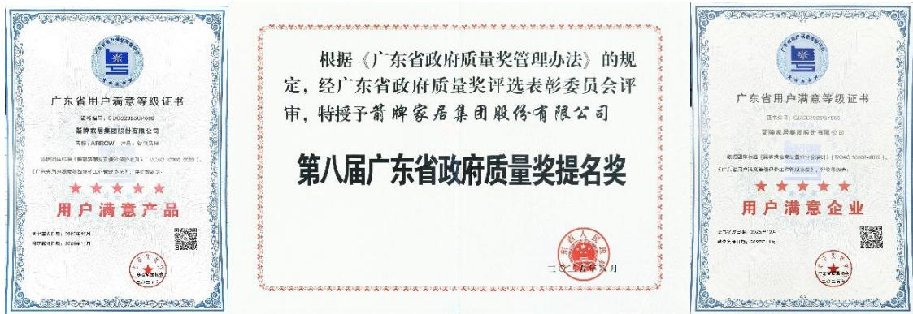

根据《广东省政府质量奖管理办法》的规定，经广东省政府质量奖评选表彰委员会评审，特授予箭牌家居集团股份有限公司

## 第八届广东省政府质量奖提名奖

## （二）升级客户服务体验，保障用户权益

公司坚信，卓越的产品品质需要与之匹配的优质服务才能实现完整的客户价值。我们致力于将服务从“售后保障”升级为“全程价值守护”，通过体系化建设、数字化赋能和负责任营销，持续提升客户满意度与忠诚度，保障消费者合法权益。

## 1、服务体系化与“人本”理念落地

我们以“人本服务，暖心相伴” 为核心，将“及时、亲近、专业”的服务理念具象化为“九个一、两不准、零虚假”等具体行为规范。为支撑理念落地，公司成立了独立运营的客服公司，构建了完整的客户服务标准体系及“2+2+3+N”服务模式，服务于零售与工程客户全旅程。

我们关注服务本质，引入“客户费力度”概念优化体验，并推出“送装一体”服务。2025 年起，对智能坐便器等产品推行厂家全国联保政策，实现一键报修，打破地域限制。公司服务体系先后通过 CTEAS七星级（卓越） 和 NECAS五星级 权威认证，荣获“全国产品和服务质量诚信承诺企业”、“以旧换新优秀服务商”等称号，并参与《卫浴行业产品售后服务规范》团体标准制定，服务能力获行业认可。

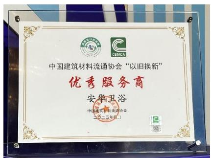

text_image

中国建筑材料流通协会“以旧换新”
优秀服务商
安华卫浴
中国建筑材料流通协会
二〇一五年四月1

“以旧换新”优秀服务商

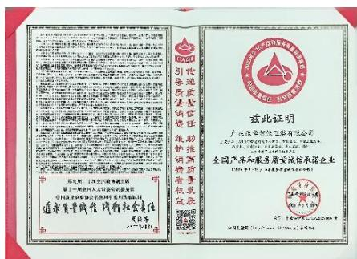

text_image

广东华信智汇投资有限公司
全国产品和服务质量诚信承诺企业
（2018年1月1日至2023年6月30日）
兹此证明
广东华信智汇投资有限公司
全国产品和服务质量诚信承诺企业
（2018年1月1日至2023年6月30日）

全国产品和服务质量诚信承诺企业

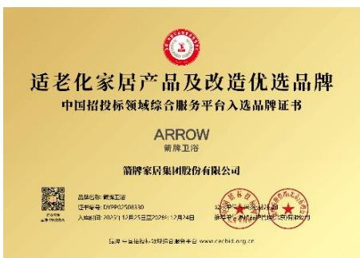

text_image

适老化家居产品及改造优选品牌
中国招投标领域综合服务平台入选品牌证书
ARROW
箭牌卫浴
箭牌家居集团股份有限公司
品牌名称：鹏辉卫浴
证书编号：DVPP02508330
入驻时间：2025年12月25日至2026年12月24日
注册地址：深圳市福田区深南大道708号
客服电话：95533
www.xaobid.org.cn

适老化家居产品及改造优选品牌

## 2、聚焦存量市场，提供一站式焕新解决方案

为积极响应国家“消费品以旧换新”政策，并精准把握巨大的存量房改造市场需求，公司创新推出了“焕新 4.0”一站式服务体系。该体系瞄准旧房卫浴空间改造，提供从上门量尺、方案设计、旧产品拆除、水电改造到新设备安装、垃圾清运的全流程闭环服务。

为确保服务体验的专业与可靠，公司建立了业内首个产品技术培训中心，对全国超过 1500 家 服务商的安装人员进行系统培训、考核与认证，推行“持证上岗”。同时，针对不同改造需求，推出了从“2H 微装”到“10 天全装”的阶梯式服务产品包，满足从单品换新到全卫重装的不同场景，并通过“理想焕新节”等线上线下活动，将服务精准触达消费者。

“焕新 4.0”服务体系不仅是公司服务能力的集中体现，也成功将政策红利转化为品牌增长动能，巩固了在存量市场竞争中的服务壁垒。

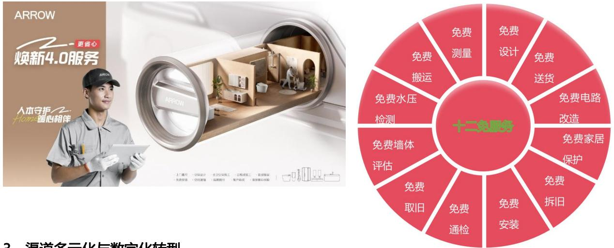

## 3、渠道多元化与数字化转型

公司建立了包含 400 热线、微信服务号、官网、电商平台在内的全渠道客户触点，确保沟通便捷。2025年，我们深化服务数字化转型，重点推出了电子保修卡、坑距地图等数字化工具，简化了售后流程，提升了安装规划精准度。同时，持续夯实线下服务网络，截至 2025 年末，服务网络覆盖全国超过 2605 个区县，覆盖率高达 92%，并通过严格的工程师认证与标准化培训，保障全国服务的质量一致性。

## 4、投诉闭环管理与隐私安全保障

公司制定《客户投诉管理办法》，建立了 “快速响应、流程透明、闭环优化” 的投诉处理机制，确保客户诉求在 2 小时内初步响应，并通过系统追踪实现全过程可查。每起客诉均进行复盘，驱动服务与产品持续改进。

我们严格遵守《个人信息保护法》等法规，通过签署保密协议、定期培训、系统权限管控等多重措施，

严格保护客户隐私与数据安全。2025 年，公司未发生客户信息泄露及网络安全事故。

## 5、赋能经销商生态，共建服务能力

公司构建“线上+线下”、“理论+实战”的全方位赋能体系，持续向经销商输出产品知识、销售技能及服务标准。2025 年，累计开展赋能培训 567 场，授课总时长 9158.5 小时，覆盖 27,198 人次、9,038家门店。通过云学堂线上平台、常态化直播、专项训练营及线下陪跑等多种形式，精准匹配经销商需求，助力其提升终端运营与服务水平，共同保障消费者获得优质、一致的服务体验。

## 6、负责任营销与透明化沟通

我们坚持营销信息真实、准确、全面。建立“多轮审核+第三方验证”机制，确保所有宣传内容合规。2025 年，我们主动联合新华社《强国工厂》栏目，全景式开放数智工厂，以第三方权威视角透明化展示全产业链，将“品质”变为可视、可感的信任。在营销中，我们积极倡导理性与绿色消费，通过“我给地球植个发”等公益 IP 传递环保理念，并聚焦节水、节能产品的推广，引导消费者建立可持续的生活消费观。

## （三）构建可持续供应链生态，实现协同共赢

在当今竞争激烈的市场环境中，卓越且负责任的供应链管理是企业高质量发展的重要支柱。箭牌家居将 ESG 理念深度嵌入从寻源到交付的全生命周期，致力于打造稳健、绿色、协同、共赢的供应链生态体系。本章将从治理与风险管理、绿色供应链建设、阳光采购治理以及供应商协同发展四个方面，系统阐述我们的管理实践。

## 1、治理架构与全面风险管理

为保障供应链全流程规范高效运转，公司构建了“决策层--管理层--执行层”三级管理架构，制定并持续完善涵盖供应商全生命周期的管理制度体系，为供应链可持续发展、风险防控及价值创造提供坚实组织保障。

公司高度重视供应链风险防控，特制定《采购风险控制管理办法》，并设立跨部门采购风险控制小组，构建“制度保障+专人负责”的风险防控体系。该小组重点针对采购流程合规性、供应商履约风险、成本波动风险、ESG 合规风险等开展常态化识别与评估。针对识别出的关键风险，我们制定了精细化的管控措施：在交付风险方面，梳理独家供应物料并推进“破独”；在质量风险方面，严格执行供应商质量体系审核与技术能力评估准入机制；在成本风险方面，采用灵活的短期价格签订模式以应对市场波动；在反腐败风险方面，强化廉洁管理机制，形成全流程风险防线。

## 2、全生命周期管理与效能提升

公司建立了供应商引入、考核、评价、退出的闭环管理机制，并借此驱动供应链整体效能提升。

严格准入与多元化布局：供应商管理系统（SRM）与天眼查风控平台对接，在引入阶段即对供应商运营风险进行预警与监控。2025 年，公司新增优质供应商 171 家，覆盖金属原材料、木质材料、五金、电子元器件等多个核心品类，有效分散了供应风险，增强了供应链抗冲击能力。

动态考核与现场评估：公司按照年度审核计划对供应商进行现场评估，由采购、品质、研发及审计部门共同参与，审核内容严格覆盖环保、信息安全、社会责任等 ESG 条款，以推动供应商综合素质提升与绿色低碳转型。

协同评价与效能提升：依据《供应商考核评估管理办法》，公司每季度对供应商进行多维度综合评价与分级管控。通过与战略供应商深度合作，开展联合降本与技术协同，2025 年实现采购成本同比下降。同时，在各基地试点推行简易 VMI 仓寄售模式，覆盖 60 多个 SKU，有效缩短了交付周期并降低了库存成本。

规范退出机制：对不符合集团管理要求或与公司发展不匹配的供应商，严格执行退出流程，确保供应链队伍的活力与健康。

## 3、绿色供应链与负责任采购

公司将环保与社会责任要求贯穿于供应商开发全流程，致力于构建绿色供应链。我们以《供应商现场审核报告》为核心依据，在供应商准入环节即构建覆盖环保合规、社会责任履行、质量管理体系的全方位审核体系。2025 年，所有准入供应商均满足“近三年无重大环保处罚”、“签订社会责任承诺书”等关键ESG 指标要求，实现了供应链责任合规的源头管控。

公司积极推行“绿色采购”，明确绿色产品的定义与范围，建立绿色采购优先清单。在采购决策中，优先选择获得环保认证（如 ISO 14001）、采用可再生/可降解原材料的物料，并将绿色采购要求嵌入供应商准入标准，从采购端引导并推动全产业链的可持续发展。

## 4、阳光采购与廉洁治理

箭牌家居坚守采购流程公开透明原则，构建“制度保障-流程规范-信息协同”的阳光采购体系。通过完善《采购人员道德管理办法》、规范全流程管控，并依托信息化管理系统实现管理部门、监督部门、执行部门及供应商之间的信息快速流转与共享，全程打通信息壁垒，确保采购结果公开、透明、合理。

为筑牢廉洁从业防线，公司建立了全方位的腐败风险防控机制：一是推行关键岗位定期轮岗制度，对采购关键岗位设定 3年为一个周期，2025 年 12 月已完成最新一轮采购经理轮岗；二是强化内部审计监督，定期对采购业务开展专项审计，形成问题整改闭环；三是实施多维监督制约，通过部门内部交叉审查、重点项目邀请审计全程监督等方式，确保采购权力在规范轨道上运行。

## 5、协同发展与价值共创

我们致力于与供应商构建长期稳定、互利共赢的战略合作关系。公司通过供应商走访、专题座谈会、改善会等多形式交流，围绕先进制造工艺、产品质量控制及精益管理等内容对供应商开展深度赋能，全方位提升其综合管理水平与协同适配能力。

我们坚守诚信经营底线，建立规范化的供应商货款支付流程，严格按照合同约定支付货款，2025 年全年无拖欠款项情况，以诚信履约维护良好商业信誉。通过优质的产品服务、透明的合作机制与持续的赋能支持，箭牌家居与供应链伙伴共同构建起“赋能成长+诚信共赢”的协同发展生态。

## 八、驱动创新转化，引领绿色健康生活

箭牌家居将科技创新视为驱动企业发展的重要动力。公司建立了系统化的创新管理体系，通过明确的战略规划、组织与制度支撑以及内外部资源协同，持续推动技术研发与产品升级，致力于以更智能、绿色、人性化的解决方案回应市场需求。本章将系统阐述公司在创新管理及成果转化方面的实践。

## （一）创新生态构建

## 1、战略引领与创新文化

公司将“持续创新”融入核心价值观，并确立了“成为卫浴行业全球具有影响力的技术创新引领者”的中长期愿景。为此，我们构建了 $" 7 + 3 + 1 + N "$ 创新战略框架，系统性地指引创新方向：聚焦智能马桶、花洒等 7 大核心单品的技术突破；打造沐浴、如厕、洗漱 3 大智能联动场景；建立 1 套闭环智能售后服务体系；开放接入鸿蒙等 N 个全屋智能生态。该战略始终贯穿“智慧、人本、科技”理念，并将 ESG 要求融入创新全流程，持续推进“研究一代、储备一代、应用一代”的研发战略，坚持以消费者需求为导向，确保技术研发与市场需求、社会价值同频共振。

## 2、体系化支撑与开放协同

公司成立了技术委员会及各品类技术分委会，构建起高效的创新决策与管理架构。围绕产品生命周期与知识产权保护，我们建立了完善的制度体系，以规范流程、激发全员创新活力。同时，我们秉持开放协同理念，积极与高等院校、科研机构及产业链伙伴开展多元合作，整合内外部优势资源，共同推动前沿技术的探索与应用转化。

## 3、核心资源投入与激励机制

## 人才培育，构筑创新智力基石

公司高度重视人才在创新中的核心作用，多渠道引进科技特派员和专业人才，建立院士专家工作站，打造高端创新人才集聚地。同时，公司积极开展各类培训活动，如组织箭牌大讲堂、聘请专家授课等，内容涵盖精益设计、卓越绩效、TRIZ 工作坊、CAE 仿真分析等专业领域，全方位提升员工的专业技能和创新能力，为创新实践提供坚实的人才支撑。

## 经费投入，保障创新资源供给

公司在技术创新、产品创新方面持续加大投入，近三年公司研发投入每年均稳定在 3 亿元以上且每年按不低于营业收入 4%预算研发经费。充足的研发经费为创新项目的顺利开展提供了强大的资源保障，确保公司在技术前沿探索和产品创新升级方面保持领先地位。

<table><tr><td>项目</td><td>2025年度</td><td>2024年度</td><td>2023年度</td></tr><tr><td>研发投入(万元)</td><td>33,513.39</td><td>37,172.31</td><td>34,151.63</td></tr><tr><td>研发投入占营业收入比例</td><td>5.17%</td><td>5.20%</td><td>4.47%</td></tr></table>

公司及佛山市高明安华陶瓷洁具有限公司、佛山市法恩洁具有限公司、肇庆乐华陶瓷洁具有限公司、韶关市乐华陶瓷洁具有限公司、景德镇乐华陶瓷洁具有限公司、应城乐华厨卫有限公司、德州市乐华陶瓷洁具有限公司、佛山市乐华恒业厨卫有限公司等全资子公司均为国家高新技术企业。

## 激励体系

我们建立了物质与精神相结合的多元创新激励体系，设立了涵盖研发、制造、营销、管理等多领域的科技进步奖项，以及专利奖、优秀工程师奖等，有效激发了全员立足岗位开展技术革新与管理优化的热情。

## （二）创新成果转化

## 1、关键成果与行业认可

2025 年，公司的创新实践取得了一系列成果，并获得了来自行业的多项认可。

创新体系获权威认可：公司创新体系建设在广东省企业技术中心评价中，获评最高等级，印证了研发体系的完备与高效。公司深度参与的“典型建材家居产品绿色健康NQI 关键技术与设备研发”项目，荣获2025 年度中国建筑材料流通协会科技进步奖二等奖，体现了对行业绿色健康升级的技术贡献。

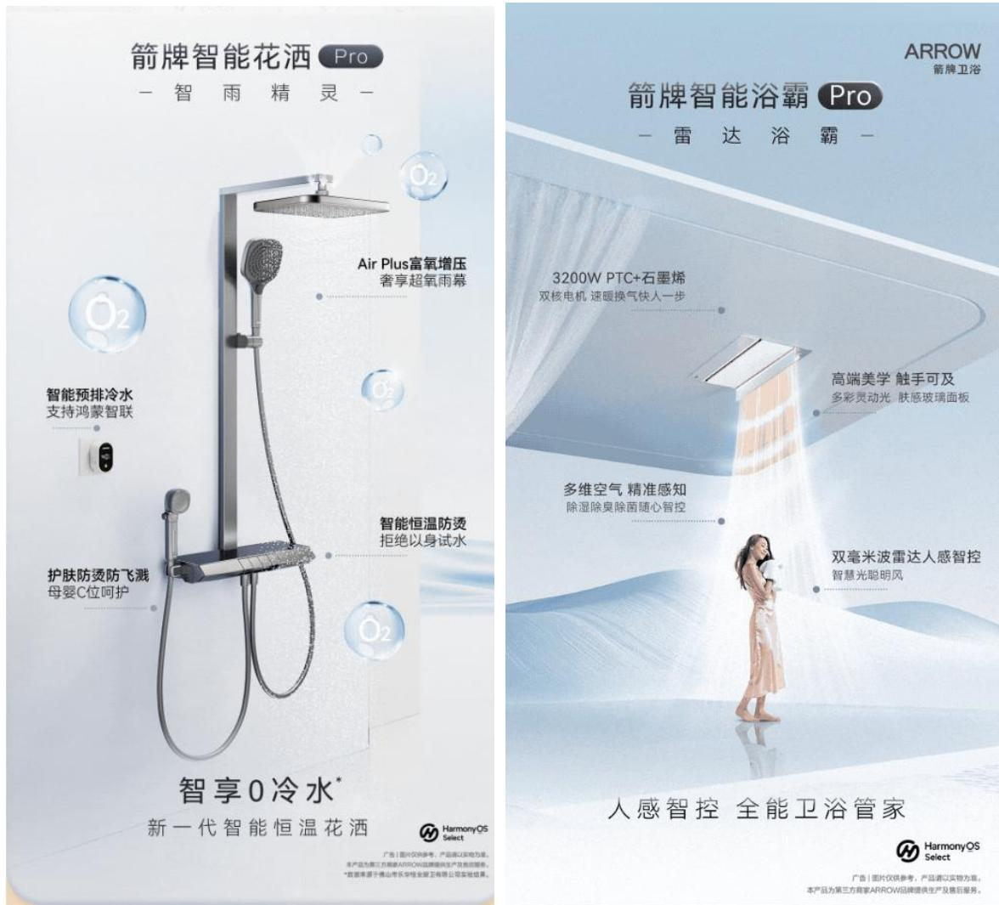

智能生态构建取得突破：作为鸿蒙智选首批生态合作伙伴，公司于 2025 年推出鸿蒙智选智能浴霸（雷达浴霸）与智能花洒（智雨精灵），同步迭代 Comfort4.0 与 Smart3.0 淋浴花洒系列，进一步完善智慧卫浴产品矩阵。其中，鸿蒙智选智能花洒搭载 Air Plus 富氧增压、智能恒温控制等创新技术，可以适配全屋

智能联动与场景化控制；雷达浴霸首创双毫米波雷达感知系统，实现空间感知的主动化与精准化，让“风追人”“风避人”的智能体验成为现实，推动智能卫浴从传统“设备联动向“场景智能”跨越升级。

绿色与健康产品持续领先：旗舰产品 P50 智能马桶凭借 15 大全链路洁净除菌系统、智能冲水管理、座圈恒温控制及高效节水技术，实现多维性能突破，荣获德国红点设计大奖、2025 沸腾质量金奖、2025 可持续创新解决方案奖。公司持续探索智能马桶与健康管理的结合，并迭代升级多款节水型花洒产品，将绿色低碳理念转化为产品竞争力。

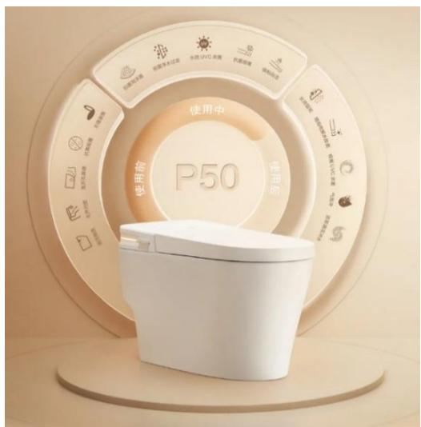

text_image

使用中
P50
使用前
使用后

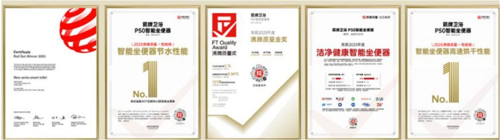

设计与人本体验屡获殊荣：2025 年，公司工业设计累计斩获 20 余项国际设计大奖。P20、J1Pro 等智能坐便器在交互体验上不断优化，K603D-SPA 花洒以立体出水技术打造“3D 包裹式淋浴”新体验、K880奶丝泡泡花洒等产品通过微米级发泡等技术提升了沐浴舒适度，彰显了以用户为中心的设计理念。

## 2、重点领域成果：节水与适老化创新

公司尤其注重将创新聚焦于解决社会关切的环境与民生议题，在节水与适老化领域形成了显著的竞争优势。

节水技术创新与引领：公司将节水节能作为核心技术突破口，通过“双泵涡轮增压”“高效恒流起泡器”等技术，使多款产品达到国家一级水效标准，部分产品单次冲水量较传统产品降低 30%以上。作为行业标准的重要制定者，公司主导或参与了《智能坐便器能效水效限定值及等级》等多项核心国家标准。2024年，公司成为卫浴行业首家获评“节水服务企业”资质的企业。

适老化产品与解决方案：公司积极布局银发经济，推出“和玥”无障碍康养卫浴套系，系统化解决长者盥洗、如厕、淋浴的安全与便捷问题。作为《家居产品适老化设计指南》（GB/T 45272-2025） 国家标准的核心参编单位，公司从产品供给者升级为行业标准制定者。公司智能坐便器、抗菌扶手等产品成功入选工业和信息化部《2025 年老年用品产品推广目录》。

通过系统性的创新生态建设，箭牌家居实现了技术产品的持续迭代，并在智能生态融合、绿色技术应用及用户体验优化方面取得了显著进展。未来，公司将继续以创新为驱动，朝着“全球智慧家居大家”的愿景稳步前行。

## 九、践行社会责任，共创美好未来

2025 年，箭牌家居以“箭牌泽计划”为核心平台，系统化、常态化地履行企业社会责任。我们秉持“细水长流，善泽人心”的理念，将公益精神深度融入企业文化，通过聚焦乡村振兴、生态保护、教育支持、长者关怀及生命健康等重点领域，开展了一系列扎实的公益实践，以实际行动回馈社会。

## （一）公益战略与管理：“箭牌泽计划”引领

“箭牌泽计划”是公司于 2022 年正式发布的公益品牌，标志着 ESG 公益板块进入品牌化、体系化、常态化阶段。该计划以“卫生、环保为抓手，帮助更多人解决健康生活难题”为使命，秉持“以人为本、高瞻远瞩、可持续发展、协同共助”的价值观，致力于联动多方力量，构建共创共行的公益新生态。

## （二）聚焦重点领域的公益实践

## 1、乡村振兴与社区发展

公司持续关注欠发达地区的基础设施与民生改善。通过“母亲水窖”项目，携手中国妇女发展基金会、

广东省妇女发展基金会，在内蒙古、重庆、江西等地援建集中供水工程。截至目前，公司累计捐赠 116.21 万元，共解决 1,990 户居民的安全饮水难题，惠及群众 $6 , 4 1 5$ 人。2025 年，项目落地江西省宜春市袁州区天台镇塘溪村，为当地 1,300 多名村民带来了清洁水源。

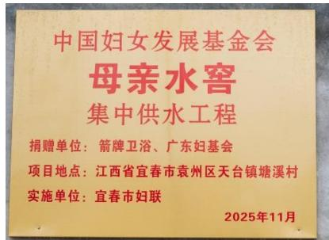

text_image

中国妇女发展基金会
母亲水窖
集中供水工程
捐赠单位：箭牌卫浴、广东妇基会
项目地点：江西省宜春市袁州区天台镇塘溪村
实施单位：宜春市妇联
2025年11月

## 2、生态保护与修复

为响应国家生态保护号召，公司联合蚂蚁森林、中国绿化基金会等机构，持续开展“我给地球植个发”生态修复项目。2025 年 3 月，箭牌泽计划联合蚂蚁森林、中国绿化基金会一起发起《我给地球植个发》第四季「Airdrop 一棵树」特别行动，号召大家线上参与“空中造林”计划。5 月 2 日当天，每位参与者都收到了一条来自阿拉善盟的短信，标志着这棵虚拟的花棒已跳出数字屏幕，真实种植于阿拉善盟沙地中。2025 年 5 月，公司在内蒙古阿拉善盟启动“绿色守护计划”，单次种植 $9 6 { , } 0 0 0$ 穴花棒（优良固沙植物），覆盖面积 1,920 亩，为防风固沙、遏制土地荒漠化贡献力量。截至 2025 年，该项目累计植树308,180 棵，植被覆盖面积达 3,381 亩。该项目荣获“2025 ESG杰出案例奖”。

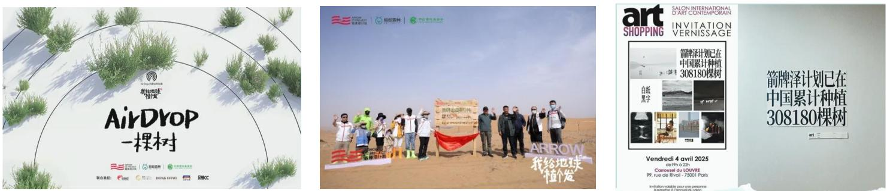

2025 年4 月，箭牌家居还在巴黎卢浮宫，亮相第 35 届当代国际艺术博览会。作为行业首个参展的卫浴品牌，「箭牌泽计划」作品一经展出，受到国内外媒体的广泛关注。308180 是一串视觉符号，更是「箭牌泽计划」生态实践交出的答卷。

## 3、教育支持与未来赋能

公司致力于改善青少年的学习与成长环境。重点推进了云南山区学校焕新改造项目，覆盖云南省内38所山区学校，通过物资与资金支持，帮助 16,000 余名学生更新课桌椅、修缮校舍、完善生活设施。此外，公司还向广东、云南等多地的学校及教育机构进行了针对性捐赠，支持教学实践与校园环境提升。

## 4、长者关怀与健康福祉

聚焦老龄化社会需求，公司推出“银龄安居计划”。2025年，在广东阳江、珠海、清远、云浮等地的敬老院，捐赠并安装浴室柜、花洒等适老化卫浴产品共计 6,600 余件，有效提升了长者居住环境的安全性与便利性，守护“老有所安”。

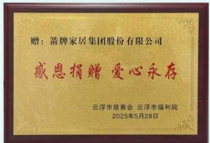

text_image

赠：箭牌家居集团股份有限公司
感恩捐赠 爱心永存
云浮市慈善会 云浮市福利院
2025年5月28日

## 5、 生命健康与应急救助

公司积极倡导并组织员工参与无偿献血等健康公益行动。2025 年，公司联合佛山市中心血站、顺德区中心血站举办了无偿献血公益活动，共有 36 名员工成功献血，累计献血量 12,200 毫升。自 2022 年启动该项活动以来，累计参与员工已超过 900 人，总献血量逾 27 万毫升，为缓解社会医疗用血压力做出了持续贡献。

## （三）资源投入与创新模式

2025 年，公司整合资源，采用 “现金捐赠+产品赋能” 的双轨模式支持公益事业。通过系统化、精准化的项目推进，公益实践覆盖了民生改善、生态保护、银龄关怀、教育赋能等多个关键领域。自 2021年起，累计捐赠项目超 60 个，并设立“广东省慈善总会箭牌公益基金”，现金与产品捐赠市场价值总计超 5000 万元。

## （四）公益常态化与全员参与

如今，箭牌家居的公益实践已形成“点面结合、全员参与”的良性生态。在“箭牌泽计划”的引领下，公司通过“公益合伙人”等机制，鼓励员工、经销商及合作伙伴共同参与，将社会责任内化为行动自觉，让公益从“企业主导”延伸为“价值共创”，形成了可持续的公益文化。

## 十、未来计划

箭牌家居集团始终致力于“持续改善人们的智慧家居生活品质”。未来，我们将继续以创新智慧推动绿色健康生活环境的建设，将 ESG 理念更深地融入公司战略与日常运营，与各利益相关方携手，为实现可持续发展目标不懈努力。

## （一）环境：深化绿色低碳转型

我们将坚定不移地走生态优先、绿色发展之路，系统谋划减污降碳协同增效。

持续优化能源结构与能效：推进清洁能源的应用范围，深化工艺节能改造与余热回收等资源循环利用项目，进一步降低运营过程中的能源消耗与碳排放强度。

拓展绿色产品矩阵：持续加大节水、节能技术的研发投入，推出更多符合绿色健康理念的智能卫浴产品，引导消费者践行可持续生活方式。

推进绿色工厂与环境管理：在现有绿色工厂基础上，持续完善环境管理体系，探索更高效的废弃物减量与水资源循环利用模式，减少生产经营对环境的影响。

## （二）社会：增进人文福祉与包容发展

我们将坚持以人为本，推动员工与企业共成长，并积极回馈社会。

完善员工权益与发展体系：持续关注员工的职业健康与福利保障，优化多通道职业发展路径与培训资源，营造更加包容、多元、安全的职场环境。

深化公益实践与社区贡献：依托“箭牌泽计划”，在节能环保、教育支持、乡村振兴和长者关怀等重点领域持续深耕，探索创新公益模式，扩大社会受益面。

## （三）治理：提升 ESG 管理效能与透明度

我们将持续健全 ESG治理架构，夯实稳健运营的制度基础。

完善 ESG 管理闭环：紧跟政策导向与行业趋势，动态优化 ESG 目标与指标管理体系，逐步提升关键议题的管理精细化水平。

强化董事会监督职能：持续优化董事会多元化结构，充分发挥战略与 ESG 委员会的核心作用，提升可持续发展相关决策的科学性与前瞻性。

加强风险防控与信息披露：深化内部控制与 ESG风险管理机制，持续提升信息披露的透明度与质量，积极回应各利益相关方的关切与期望。

## 意见反馈表

尊敬的读者：

非常感谢您阅读本报告，为更加深入地了解您对箭牌家居环境、社会和公司治理（ESG）工作的期望和需求，特开展此次问卷调查。在此，我们诚挚地邀请您参与调查，您的观点和见解对于我们提升 ESG 的工作水平至关重要。欢迎您通过邮寄、电子邮件或电话的方式向我们传达您的宝贵意见和建议，再次感谢！

联系方式：箭牌家居集团董事会办公室

地址：广东省佛山市顺德区乐从镇创兴一路 1号箭牌总部大厦

电话：0757-29964106

传真：0757-29964107

电子信箱：IR@arrowgroup.com.cn

1.您对我们发布的环境、社会和公司治理（ESG）整体是否满意？

□满意□较为满意□一般□较不满意□不满意

2.您是否能从本年度报告中了解到箭牌家居的环境、社会和公司治理（ESG）理念与实践情况？

□是□否□一般

3.您所关注的信息在本年度报告中是否有体现？

□是□否□一般

4.您对我们明年发布的环境、社会和公司治理（ESG）有何期待或建议？

5.您对我们环境、社会和公司治理（ESG）工作有何期待或建议？

如果方便，请留下您的联系方式：

姓名： 职业： 工作单位：

邮编： 邮箱： 联系电话：

联系地址：

我们将充分考虑您的意见和建议，并承诺妥善保管您的信息。