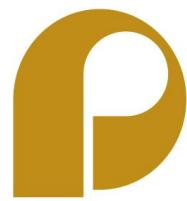

## 保利联合

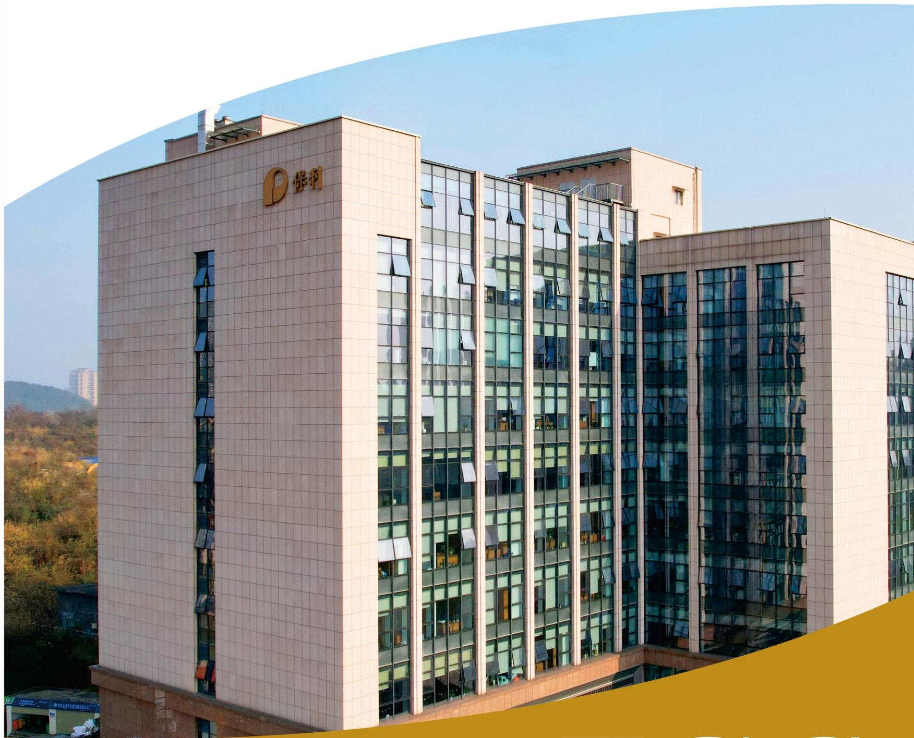

natural_image

Exterior view of a modern multi-story building with glass facade and '绿润' signage, surrounded by trees (no other text or symbols visible)

## ESG

环境、社会及治理 (ESG)报告

保利联合化工控股集团股份有限公司

## 目录

01-02

公司致辞

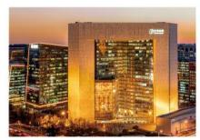

03-06

关于我们

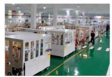

07-16

治理篇

党建引领

精益治理

筑牢根基

17-22

发展篇

| 创新驱动

| 稳健运营

| 品牌焕新

23-26

环境篇

绿色发展

| 生态筑底

| 低碳运营

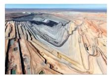

27-30

社会篇

|履责央企

| 共筑美好

同创未来

## 本报告说明

本报告是保利联合化工控股集团股份有限公司（以下简称“保利联合”“公司”和“我们”）独立发布的第四份环境、社会及治理报告。报告详细说明了公司在2025年于环境保护、社会责任以及公司治理等领域所付出的努力，报告的编制严格遵循国内外通用的ESG报告撰写标准与指引，旨在积极回应利益相关方的关注，为各利益相关方提供便捷的沟通渠道。

## 组织范围:

本报告覆盖保利联合化工控股集团股份有限公司及其下属单位

## 时间范围:

2025年1月1日—2025年12月31日

## 发布周期:

本报告为年度报告

## 编制依据:

中华人民共和国国家标准《社会责任报告编写指南》（GB/T36001-2015）

国务院国资委《关于新时代中央企业高标履行社会责任的指导意见》

深圳证券交易所《深圳证券交易所上市公司自律监管指南第3号——可持续发展报告编制》

## 数据说明:

除特殊说明之外，本报告披露的信息和数据来源于本公司统计资料和正式文件，以及所属企业的汇总和统计，并经相关部门审核，如与年报有所差异，以年报为准。报告中所涉及货币金额均为人民币。

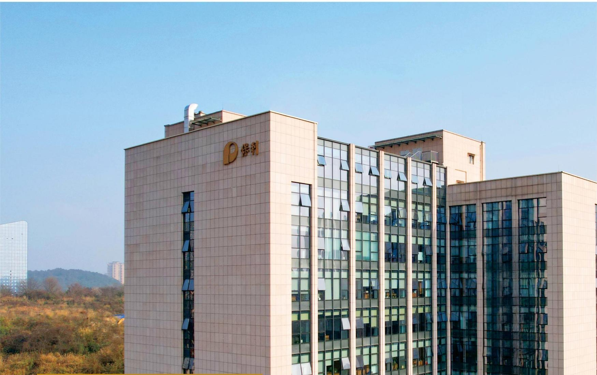

natural_image

Exterior view of a modern multi-story building with glass facade and '保利' signage under clear blue sky (no other text or symbols)

## 公司致辞·核心金句

风雨兼程显本色，攻坚克难砺初心；征程万里风正劲，重任千钧再扬帆。

— 公司致辞摘录

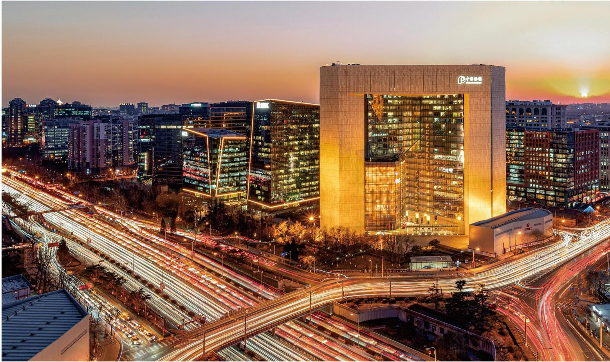

natural_image

Aerial night view of a modern cityscape with illuminated glass buildings and highway tracks, no visible text or signage.

## 公司致辞

风雨兼程显本色，攻坚克难砺初心。

2025年，是“十四五”规划收官之年，也是公司承压奋进、向新发展的重要一年。一年来，我们聚焦战略落地，发展格局向新；聚焦运营管控，经营质量向优；聚焦改革深化，治理效能向好；聚聚焦创新驱动，增长动能向智;聚焦风险化解，发展基础向稳。这一年，每一步都浸透着汗水，每一点成绩都凝聚着心血，充分彰显了广大干部职工“千磨万击还坚劲”的顽强斗志，书写了公司笃行奋进、砥砺前行的动人篇章。

征程万里风正劲，重任千钧再扬帆。

2026年，是“十五五”开局之年，也是公司实现改革跃升的关键之年。站在新的历史起点，我们要牢记习近平总书记对中央企业作出的重要指示精神，坚持“稳中求进，提质增效”主基调，以“稳”为前提，以“进”为方向，以“优”为目标，拿出跃马扬鞭的勇气，激发万马奔腾的活力，保持马不停蹄的干劲，一起为梦想奋斗、为幸福打拼，把宏伟愿景变成美好现实，奋力开创公司高质量发展新局面。

## 公司简介

保利联合化工控股集团股份有限公司，隶属于中国保利集团有限公司，2004年9月8日在深交所上市，证券代码002037。自2002年7月18日成立以来，主要经营范围是民爆器材产品研发、生产、销售、爆破服务一体化经营业务及生态产业运营管理业务。

保利联合聚焦主责主业，积极培育延伸主业产业，寻求产业升级。保利联合下辖100余家子分公司，员工7236人。拥有全国规模较大的专业爆破施工企业，在民爆智能制造、井下开采技术、设备研发方面处于领先地位，数码电子雷管工艺技术和设备处于国内领先，在行业产品迭代升级中占据领跑地位，产能规模处于民爆行业前列。

## 战略目标

## 企业愿景

## 世界一流·国内领先

## 战略定位

以服务国家战略为牵引

以民爆一体化为基础

以矿山一体化为支撑

## 战略主题

固本强基、智造强企

做特工程、绿色发展

7,236

员工总数(人)

100+

子分公司(家)

## 战略要求

科技创新的排头兵

绿色发展的驱动者

环境友好的实践者

## 部分荣誉

CERTIFICATE OF HONOR

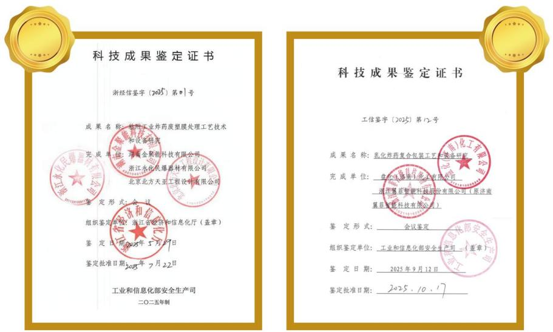

text_image

科技成果鉴定证书
浙经信鉴字（2025）第01号
成果名称：硅酸工业炸药质塑膜处理工艺技术和设备研究
完成单位：海翼金聚能科技有限公司
浙江水化民爆器材有限公司
北京北方天亚工程设计有限公司
鉴定形式：会议
组织鉴定单位：浙江省经济和信息化厅（盖章）
鉴定日期：2025年5月19日
鉴定批准日期：2025年7月22日
工业和信息化部安全生产司
二〇二五年制
科技成果鉴定证书
工信鉴字（2025）第12号
成果名称：乳化炸药复合包装工艺及装备研发
完成单位：盘古山制药（集团）化工有限公司
浙江聚正智能科技股份有限公司（原济南星亚智能科技有限公司）
鉴定形式：会议鉴定
组织鉴定单位：工业和信息化部安全生产司（盖章）
鉴定日期：2025年9月12日
鉴定批准日期：2025.10.17

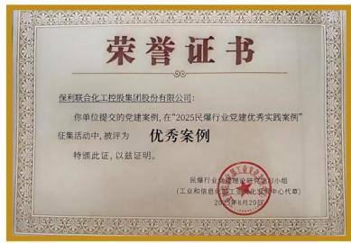

text_image

荣誉证书
保利联合化工控股集团股份有限公司：
你单位提交的党建案例，在"2025民爆行业党建优秀实践案例"
征集活动中，被评为  优秀案例
特此证，以兹证明。
民爆行业监督管理委员会(总社)
（工业和信息化部主管室/监察中心代表）
2025年8月29日

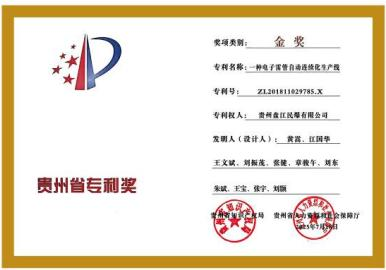

text_image

贵州省专利奖
奖项类别： 金奖
专利名称：一种电子智慧自动选维化生产线
专利号：ZL201811029785.X
专利权人：贵州盘江民爆有限公司
发明人（设计人）：黄震、汪国华
王文斌、刘振莲、翁健、章敬午、刘东
朱斌、王宝、徐宇、刘圆
贵州省专利奖
贵州省科学技术厅贵州省公路科学研究院

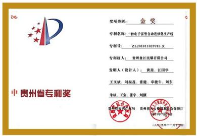

text_image

中 贵州省专利奖
奖项类别： 金奖
专利名称：一种电子音像自动感知生产线
专利号： ZL201811029785.X
专利权人： 贵州盘江民爆有限公司
发明人（设计人）： 黄茜、江国华
王文斌、刘振莲、侯健、章敬午、刘东
朱斌、王宝、徐宇、刘娟
贵州博源律师事务所
贵州博源律师事务所董事会部厅
二〇一八年十一月十四日

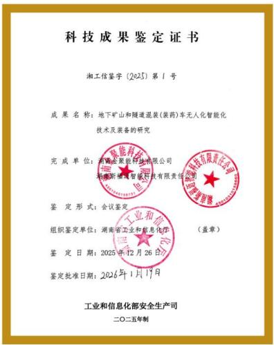

seal

湖南金聚能科技有限公司
湖南金聚能科技有限责任公司
工业和信息化部
（盖章）

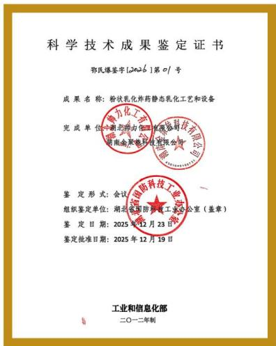

seal

湖南金莱生物科技有限公司
湖南科防科技工程有限公司

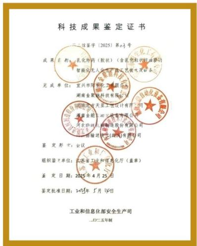

seal

湖南金能新材料科技有限公司
湖南省天业工业设计研究院
湖南金能新材料股份有限公司
河南金能新材料科技有限公司
河南金能新材料科技有限公司
河南金能新材料科技有限公司
河南金能新材料科技有限公司
河南金能新材料科技有限公司
河南金能新材料科技有限公司
河南金能新材料科技有限公司
河南金能新材料科技有限公司
河南金能新材料科技有限公司
河南金能新材料科技有限公司
河南金能新材料科技有限公司
河南金能新材料科技有限公司
河南金能新材料科技有限公司
河南金能新材料科技有限公司
河南金能新材料科技有限公司

natural_image

Abstract wavy design with golden gradient bands on a light beige background (no text or symbols)

## 主要业务及产品

公司主要产品有工业炸药、工业雷管。其中工业炸药许可产能48.45万吨，工业雷管许可产能18165万发，其中电子雷管许可产能16165万发，民爆产品产能居全国前列；具备炸药混装车、装药车（地上和地下）等装备研发和生产资质。

工业炸药许可产能48.45万吨

工业雷管许可产能18165万发电子雷管许可产能16165万发

## 01

## 民爆产品及装备的研发、生产、销售方面

公司已形成贵州、河南、甘肃、西藏、山东、河北、新疆、辽宁、湖南等全国布局的生产基地，可为用户提供品种齐全、规格配套的工业炸药、工业雷管、工业导爆索（管）以及根据用户特殊需求订制的个性化民爆产品。产品广泛应用于矿山开采、水利水电、基础设施建设、城市改造及国防建设等领域，产品销售市场覆盖全国各地，部分产品出口至国外。公司根据行业发展需求有针对性地研究开发新产品、新工艺和新设备，促进产品更新换代和生产工艺的优化。

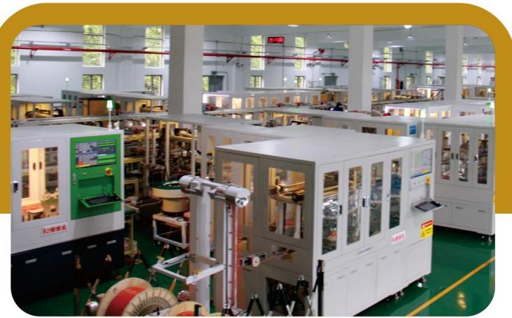

natural_image

Interior view of a modern industrial factory floor with robotic arms and machinery (no visible text or symbols)

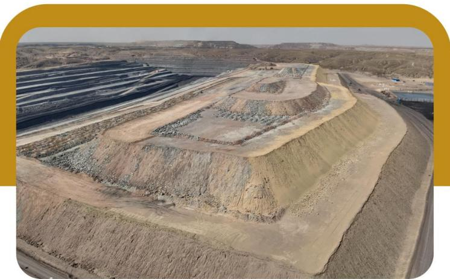

natural_image

Aerial view of a large open-pit mine with tiered excavated earth and adjacent mining structures (no visible text or symbols)

## 02

## 工程爆破服务方面

公司专业爆破施工及技术服务位居全国同行业前列，处于国内领先水平，系贵州省首批科技创新型领军企业，具备矿山工程施工总承包壹级资质、市政公用工程施工总承包壹级资质、建筑工程施工总承包壹级资质和民爆产品进出口资质，拥有6家经营爆破壹级资质的公司，公司工程服务遍及全国，并加快向富矿区域发展。

## 主要业务及产品

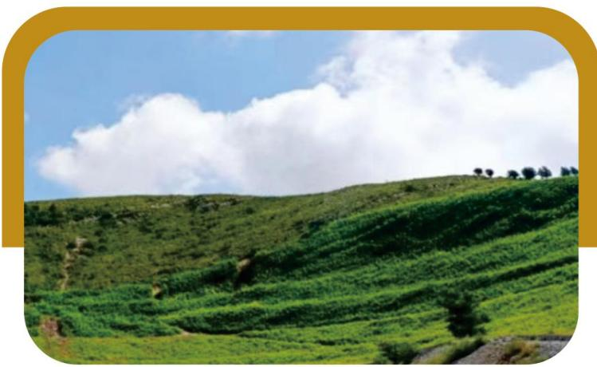

natural_image

Lush green hillside with scattered trees under a blue sky with white clouds (no text or symbols visible)

## 03

## 生态产业运营管理业务

公司拥有从事生态修复治理业务的专业化子公司-保利生态科技有限公司。保利生态公司致力于发展矿山生态环境恢复治理产业及全域土地综合治理等业务，目前已成为矿山修复领域商业模式极具特色、市场开发及项目管理团队一流、具备同步输出规划设计、管理模式、精英团队集成能力以及创新成果迅速应用的综合运营商。

## 04

## 矿山开采一体化业务

“公司实现从矿山运营、矿山爆破剥离运输、骨料产品加工、矿山生态环境恢复全产业链业务，牢牢把握项目运营主动权，为公司进一步延伸产业链，充分发挥在矿山一体化服务方面的优势。

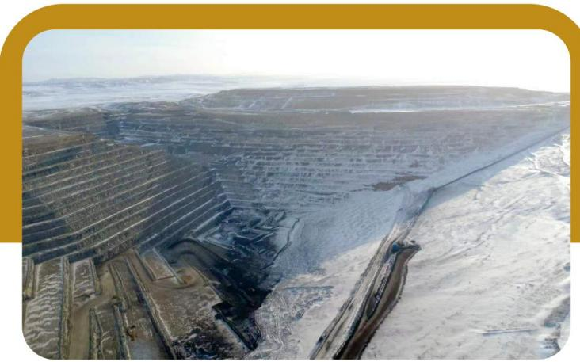

natural_image

Aerial view of a large open-pit mine with tiered excavated earth and snow-covered ground (no visible text or symbols)

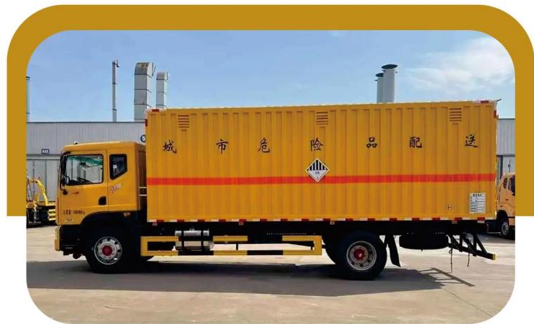

text_image

城市危险品配送

## 05

## 危化配送业务

公司拥有专业的危险化学品运输企业和团队，拥有合法、完善的危险货物运输资质，可提供民爆产品、危化品、普通货物运输、综合物流等运输物流服务。

## 治理篇

党建引领 精益治理 筑牢根基

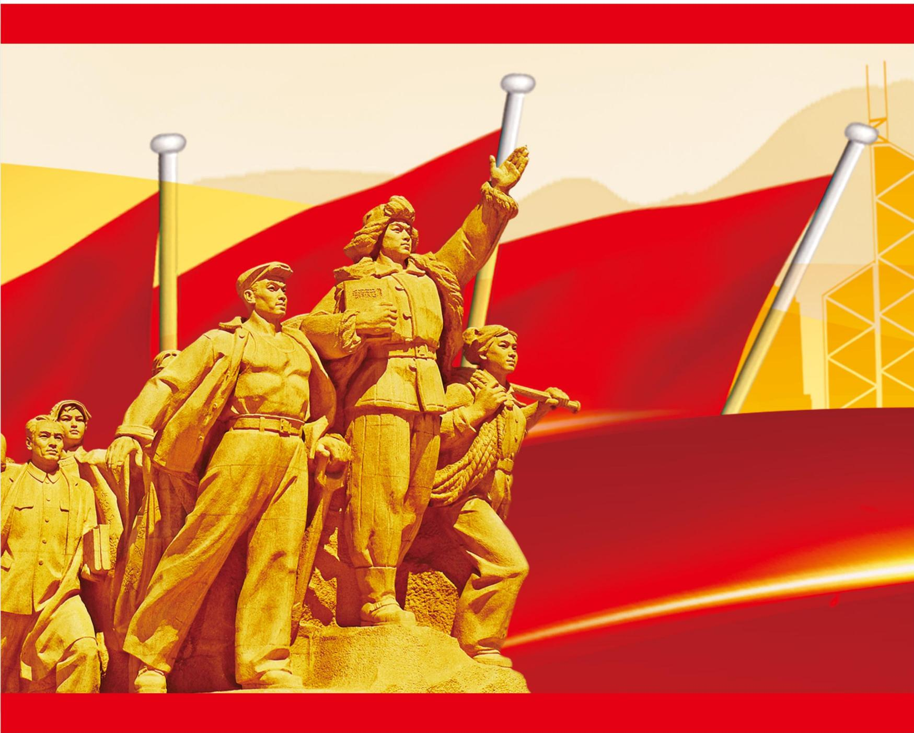

natural_image

Golden sculptural relief depicting a group of soldiers in uniform, with a tower and mountain backdrop (no text or symbols visible)

## 01党建引领强基铸魂

2025年，公司以习近平新时代中国特色社会主义思想为指导，深入学习宣传贯彻党的二十大和二十届历次全会精神，以党建为统领全面压实全面从严治党主体责任，团结带领全体干部职工同心同德，攻坚克难，为企业高质量发展提供坚实政治和组织保障。

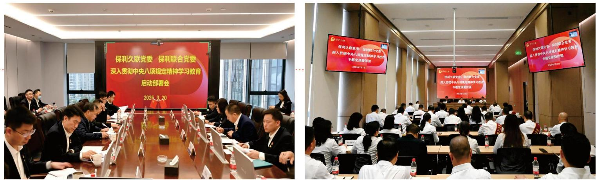

深入开展中央八项规定精神的学习教育，以深学细悟筑牢思想基础  
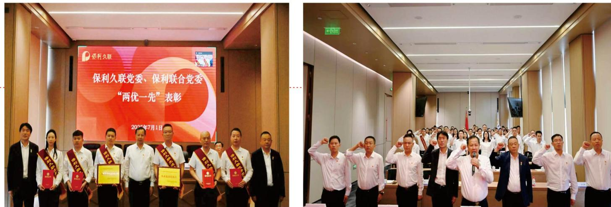

## 01党建引领强基铸魂

## 进一步强化党风廉政建设“五责联动”，以“零容忍”态度惩治和预防腐败

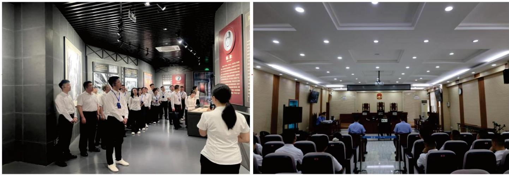

1

召开年度党风廉政建设和反腐败工作会、全面从严治党专题会、警示教育大会，常态化开展监督谈话，推动构建“五责联动”责任体系。

2

坚持实事求是，注重以案促改、以案促治，实现查处一案、规范一片，做到政治效果、纪法效果和社会效果有机统一。

4

巩固深化 “1+2+3” 综合监督工作格局，推广 “一单元一监督” 基层监督模式，形成一级抓一级，一级带一级，层层抓落实的工作局面。

3

优化“纪巡审业财”协同监督格局，打造“3+1”交互式巡察模式，依托数字化平台建设“大数据+巡察”，对监督反馈问题整改情况实行全流程跟踪督办。

5

开展“510·我要廉”主题宣传月系列活动，组织青年说清廉、廉洁微视频创作等群众性活动，营造崇廉拒腐浓厚氛围。

## 01党建引领强基铸魂

## 聚焦智能制造·引领转型

党员骨干带头深入一线，在本质安全提升、智能装备与工厂建设方面取得阶段性突破。

11条

乳化炸药产线完成技改

22条

工业炸药产线达标安全监管

标志着公司正从“制造”向“智造”加速转型

natural_image

Stylized illustration of a golden ceremonial object with cloud motifs against a red city skyline silhouette (no text or symbols)

## 02

## 健全治理体系

保利联合以建设“世界一流、国内领先”的民爆企业为目标，推动治理架构与业务运营深度融合，通过精益治理优化决策机制、诚信合规筑牢风险防线、廉洁从业强化责任担当，以高效的风控体系，为企业的可持续发展奠定坚实基础。

## 精益治理

## (1)完善治理体系

保利联合严格按照《中华人民共和国公司法》《中华人民共和国企业国有资产法》《中华人民共和国证券法》《上市公司治理准则》等法律法规及相关监管要求，平稳完成治理结构变革，完成监事会改革，将其职责统筹整合至审计委员会，实现监督职能的有效衔接，努力构建科学、规范、高效的现代企业治理体系。

## (2)完善制度

加强公司治理类核心制度建设，根据中国证监会《上市公司章程指引》《上市公司股东会规则》等制度，完成《公司章程》《股东会议事规则》《董事会议事规则》《风控与审计委员会工作细则》《薪酬与考核委员会工作细则》《子公司规范运作指引》等6项的修订，并制定《提名委员会工作细则》《战略决策委员会工作细则》等2项制度，形成闭环的治理制度体系。

公司治理组织架构

以章程为基石，构建规范高效的治理体系

## 公司章程

公司治理的根本准则

股东大会|最高权力机构

董事会 | 核心决策机构

战略决策委员会

规划发展方向与战略

提名委员会

选拔推荐管理人才

薪酬与考核委员会

制定激励与考核机制

风控与审计委员会

监督合规与风险控制

子公司（执行机构）——遵循《子公司规范运作指引》，规范运营管理

## 科学决策

股东会作为公司的权力机构，依法行使对公司投资、决算、利润分配、发行公司债券等重大事项的决定权。董事会对股东会负责，依法行使企业经营管理权。

召开股东大会会议

3 次

其中

审议通过决议

14项

决议通过率达

100%

公司召开董事会会议

5 次

其中

审议通过决议

33项

决议通过率达

100%

## 健全外部董事履职

累计参加公司

董事会风控与审计

委员会会议

4次薪酬与考核委员会会议

2次

提名委员会

1次

战略决策委员会

1次独立董事专门会议

2次

强化实地调研与沟通，了解公司生产经营实际情况，促进外部董事对公司业务的精准把握。

会议沟通机制

参加年度会议、经营分析、及现场座谈会

实地调研项目

保利新联项目

湖南金聚能科创项目

新疆项目

监事会对公司财务进行检查，对董事和高级管理人员履职情况进行有效监督，维护公司及股东的合法利益。

监事会

公司召开监事会会议

5 次

审议通过决议

12项

决议通过率达

100%

## 保障股东权益

我们持续坚持“战略导向、精准施策、创新驱动、合规为本”的原则，不断优化治理结构，完善管理制度，强化信息披露质量，深化投资者关系管理，为公司高质量发展打好基础。

## 强化信息披露

公司严格按照《深圳证券交易所股票上市规则》《深圳证券交易所上市公司自律监管指引第1号——主板上市公司规范运作》等法律法规以及公司《信息披露事务管理制度》等规定履行信息披露义务，保障股东的知情权，依法履行信息披露义务，真实、准确、完整、及时地开展信息披露工作。全年披露定期报告、自我评价等公告约85份。

## 加强投资者关系管理

推动建立全方位投资者关系管理体系，与投资者实现长期、稳定、高频次的沟通。

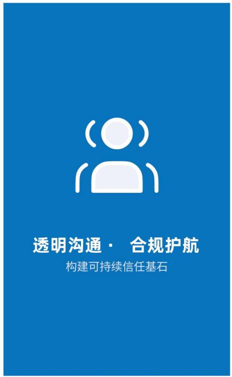

text_image

透明沟通·合规护航
构建可持续信任基石

## 投资者关系与合规经营

答复率

100%

## 2025 投资者沟通成果

全年累计接听咨询电话

72个

回复网络平台提问

并及时处理邮件咨询

135次

与投资者实现长期、稳定、高频次的沟通

通过业绩说明会、网络平台、电话邮件等多种渠道，系统梳理投资者关注焦点，及时传递公司发展战略与经营成果，增强投资者信心。

## 合规经营

我们严格遵守国家法律法规与商业道德准则，持续提升法治合规水平，健全风险管控机制，以科学高效的组织管理保障稳健运营，助力企业高质量可持续发展。

## 2025年度法务合规工作核心成果

将法律审查嵌入流程，不断提升合法合规性审核质量，促进依法合规经营。

  
20 次  
组织法务合规培训

  
100 %  
规章制度、经济合同、重要决策法律审核率达

  
111 份  
审核保利联合各类合同

  
105 份  
审核下属公司
重大合同（500万元+）

  
60 份  
审核保利联合及相关子公司各类议案

## 强化风险防控

## 健全组织体系

设立独立的风险管理部门，明确各层级在风险管理

## 强化监督机制

风控与审计委员会全程监督体系运行，审查内控制度，指导内外部审计工作。

核心理念：强化合规经营意识，健全内控体系

管控机制：建立完善风险识别、评估和应对闭环

全流程管控：覆盖事前预防、事中控制及过程监测

重点管控：业务穿透管控，处置存量遏制增量

## 内控建设

保利联合严格执行业务管理与内控监督不相容职务分离控制、授权审批控制、权力监督制衡等监管要求，加强制度机制建设，强化整改闭环管理，建立了覆盖采购、生产、销售、财务、人力资源等各业务环节的内部控制流程，确保各项经营活动均在制度框架内规范运行，形成制度业务管理流程全覆盖，确保公司内部管控有章可循、有据可依和有效执行，进一步夯实内控管理基础，保障公司资产安全和经营活动的合规性。

  
制度体系完善

25项

新增/修订内控制度，构建覆盖全面、科学有效的制度体系。

  
业务流程全覆盖

5 大领域

涵盖采购、生产、销售、财务、人力资源等关键业务环节。

  
核心流程优化

120+ 项

深度梳理并优化核心业务流程，显著提升运行效率与风控能力。

  
整改闭环管理

100%

强化内控缺陷问题整改，确保体系持续有效运行。

## 安全防线

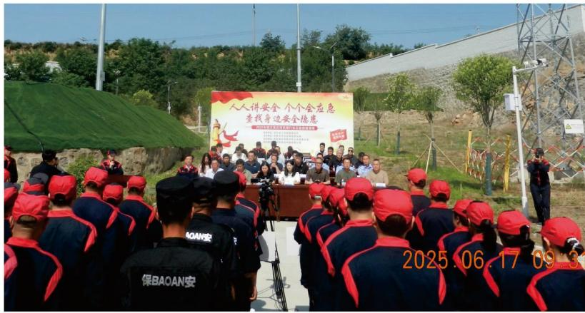

text_image

人讲安全 小个会应急
查找身边安全隐患
2025.06.17 09:3

2025年，公司以习近平新时代中国特色社会主义思想为根本遵循，坚持对安全管理“穿透、下沉、直达、夯实”的工作要求，扎实落实企业安全生产主体责任，深入推进“安全生产治本攻坚三年行动”各项任务与措施落地见效，全年未发生生产安全、消防、职业卫生及环保责任事故，安全生产形势总体保持平稳。

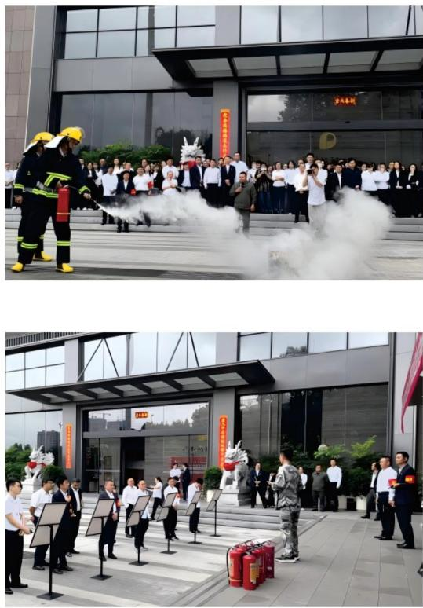

## (1) 落实安全生产责任

构建“总部统筹、区域负责、各生产点、项目部落实、岗位尽责”的四级责任体系，进一步修订完善《安全生产表彰奖励工作办法》《安全生产管理考核办法》等安全管理制度；开展“诊断式”安全监督检查，并实施“点对点”整改督导;推进“六能班组”建设，修订发布公司安全管理手册;完善“吹哨人”机制，严格执行安全生产表彰奖励与隐患报告奖励制度,树牢奖罚分明的工作导向。

## (2) 安全应急管理机制

全年，全级次组织应急演练，应急处置能力持续增强。公司整体应急处置能力得到有效检验和显著提升。

## (3) 安全教育与培训

公司全年开展各类安全培训1840次，参训累计超7.9万人次，安全管理人员考核合格率达 $100\%$ 。

## (4) 安全生产投入

各单位严格按照《安全生产投入管理办法》要求提取和使用安全生产经费，确保安全费用投入满足生产需求，为公司安全生产形势持续稳定向好提供了坚实的资金支撑。

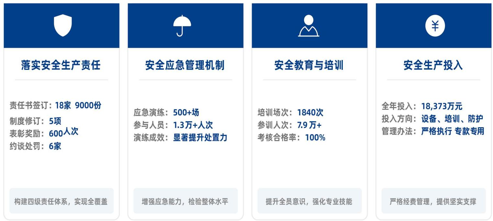

## 落实安全生产责任

责任书签订：18家 9000份

制度修订：5项

表彰奖励：600人次

约谈处罚：6家

构建四级责任体系，实现全覆盖

## 安全应急管理机制

应急演练：500+场

参与人员：1.3万+人次

演练成效：显著提升处置力

增强应急能力，检验整体水平

## 安全教育与培训

培训场次：1840次

参训人次：7.9万+

考核合格率：100%

提升全员意识，强化专业技能

## 安全生产投入

全年投入：18,373万元

投入方向：设备、培训、防护

管理办法：严格执行 专款专用

严格经费管理，提供坚实支撑

## 发展篇

## 创新驱动 稳健运营 品牌焕新

natural_image

Silhouette of a winding mountain road at sunset, with warm orange and pink hues (no text or symbols)

## 稳健运营，筑牢发展根基

保利联合以建设“世界一流、国内领先”的民爆企业为目标，推动治理架构与业务运营深度融合，通过精益治理优化决策机制、诚信合规筑牢风险防线、廉洁从业强化责任担当，以透明规范的治理实践和严谨高效的风控体系，为企业的可持续发展奠定坚实基础。

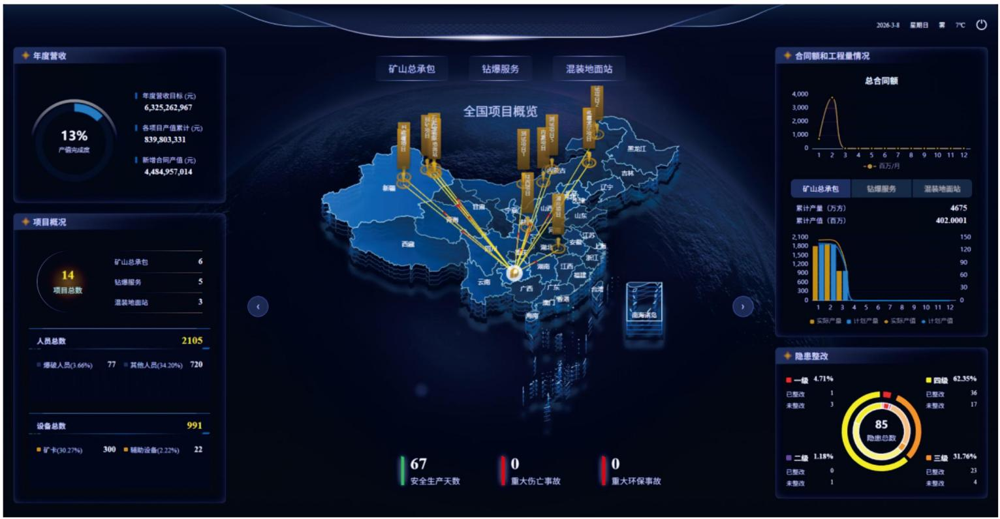

donut

| Category | Value |
| --- | --- |
| 年度营收 | 13% |
| 年度营收目标 (元) | 6,325,262,967 |
| 各项目产值累计 (元) | 839,803,331 |
| 新增合同产值 (元) | 4,484,957,014 |
| 矿山总承包 | 6 |
| 钻爆服务 | 5 |
| 混装地面站 | 3 |
| 矿山总数 | 6 |
| 其他人员(34.20%) | 720 |
| 设备总数 | 991 |
| 实际产量 (万方) | 4675 |
| 累计产值 (百万) | 402.0001 |
| 一级隐患总数 | 85 |
| 四级隐患总数 | 62.35% |
| 三级隐患总数 | 31.76% |
| 二级隐患总数 | 1.18% |
| 已整改总数 | 1 |
| 未整改总数 | 3 |
| 三级已整改总数 | 0 |
| 已整改未整改总数 | 1 |
| 三级已整改未整改总数 | 23 |
| 三级未整改未整改总数 | 4 |

## (一) 民爆产品生产方面

适应民爆行业进一步向矿山服务领域聚集的发展格局，聚焦促进产能释放。优化民爆产能结构和布局，增强对国家重大基础设施项目建设、能源、资源开发的服务保障能力，严控应收账款风险，深化“民爆一体化、矿山一体化”为核心的全产业链体系协同发力，加强技术研发投入，积极推进智能化生产，广泛应用人工智能、数字孪生等技术，推动业务模式及管控从“劳动密集型”向“智能生产转型”。重点围绕“智能化矿山施工、智能化爆破服务、无人化混装地面站、矿山管家智能平台、生态修复技术、绿色矿山建设”等领域技术研究，形成一批专利和学术成果，打造核心技术竞争优势。

国内市场，谋划好新疆、内蒙古、粤港澳大湾区、贵州大本营的业务布局，加大与区域内拥有矿产资源和爆破服务需求的优质企业合作，切实促进产能释放，提升市场占有率。国际市场，抓好“一带一路”发展机遇，协同保利国际等兄弟单位联合出海，积极拓展海外市场、扩大民爆产品出口。

## (二) 爆破工程服务方面

公司具备矿山工程施工总承包壹级资质、市政公用工程施工总承包壹级资质、建筑工程施工总承包壹级资质和民爆产品进出口资质，拥有6家经营爆破壹级资质的公司。凭借公司优质的资质水平和业务能力，公司工程服务遍及全国，并加快向富矿区域发展。

## 核心资质优势

矿山工程施工总承包壹级

市政公用工程施工总承包壹级

建筑工程施工总承包壹级

拥有民爆产品进出口资质

## 2025年新签合同成果

累计新签合同项目

143 个

重点签约项目：

别斯库都克煤矿采剥及穿爆工程承包项目

大唐国际胜利东二号露天煤矿土石方剥离工程

内蒙古兴旺露天煤矿托管项目

## (三) 业务拓展情况

积极参与国家及重点区域建设，关注新疆、西藏、内蒙等富矿区域市场开发，与中煤等重点客户建立战略合作伙伴关系。深化国际业务布局，子公司保利澳瑞凯全年实现对蒙古、秘鲁、澳大利亚、加拿大等多国的出口订单交付，市场覆盖力与国际竞争力进一步提升。

## 国内业务拓展

深耕重点区域·稳固战略伙伴

参与国家重点建设

聚焦新疆、西藏、内蒙等富矿区域，全力开发区域市场潜力。

建立深度战略合作

携手中煤等行业龙头，签署战略合作协议，巩固市场地位。

## 国际业务布局

拓展全球版图·提升竞争实力

深化国际化布局

保利澳瑞凯实现对蒙古、秘鲁、澳洲、加拿大等多国的出口订单交付。

提升国际竞争力

市场覆盖网络与服务能力同步提升，为全球化战略发展夯实基础。

## 创新驱动，赋能企业发展

加强与科研机构及高校合作，以院士专家工作站为载体加大科技领军人才和科技创新人才培养和引进，增强科技创新人才支撑。

## 创新人才与平台建设

人才引育策略

C+ 深化产学研合作，依托院士专家工作站，大力引进和培养科技领军人才与创新团队。

## 专利及获奖成果（2025年）

新增授权专利及软著

108 项

## 企业资质积淀

2025新增：专精特新1家|高新1家

累计持有：高新12家|专精9家|瞪羚1家|雏鹰1家

获得授权专利软件著作权

1283项

新增科技成果鉴定

5项

科研平台实力

国家级企业技术中心1家

国家级工作站 / 工程研究中心 各1家

累计获得科技成果鉴定

84项

## 重大课题攻关成果

## 盘江民爆：卓越级智能工厂

机器视觉赋能安全管控的电子雷管智能工厂成功入选工信部卓越级智能工厂，树立行业标杆。

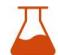

## 湖南金聚能：国际先进水平

“地下矿山和隧道混装（装药）车为人还智能化技术及装备的研究科研”、“粘性工业炸药废塑膜处理工艺技术和设备”、“粉状乳化炸药静态乳化工艺和设备”、“乳化炸药（胶状）（含乳化粒状铵油炸药）智能化无人化生产线工艺技术及设备”，通过了科技成果鉴定，达到国际先进水平。

## 平台上线：数智化全覆盖

“数智保久云平台”实现移动端全覆盖；一体化项目智能综合管理平台成功落地三塘湖项目。

## 创新驱动，赋能企业发展

## 数字化与智能化升级

## 战略导向：数智保久

以建设“数智保久、智慧民爆”为战略导向，统筹推进企业数智化转型升级，构建核心竞争力。

## 行业标杆：唯一卓越级

盘江民爆智能工厂入选工信部首批卓越级智能工厂项目，是全国民爆行业唯一获此殊荣的项目。

## 场景应用：可复制推广

搭建电子雷管全周期溯源管理平台，推进矿山工程智能管理，打造行业可复制的转型模式。

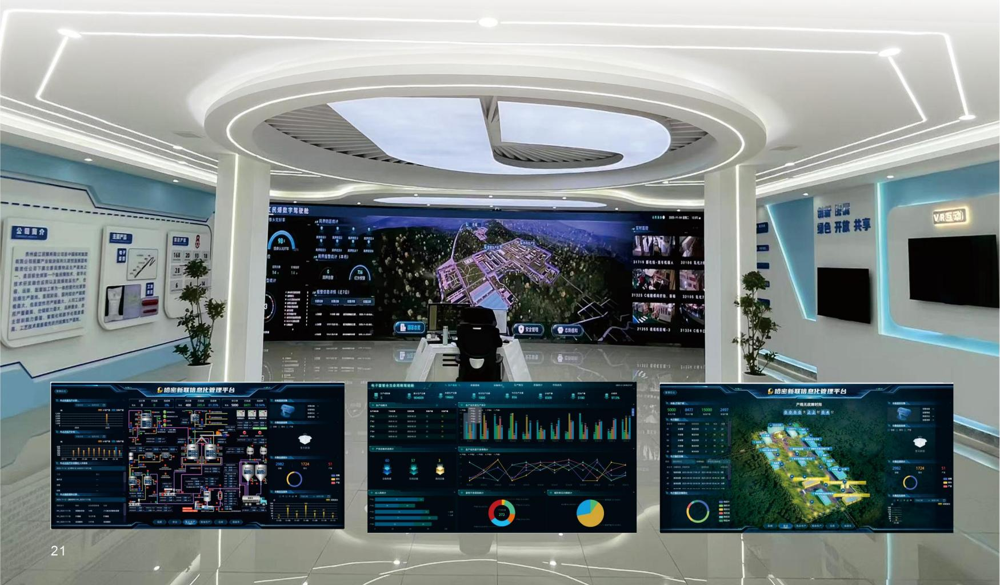

text_image

Interior of a modern smart city management platform with multiple digital dashboard displays and control panels, including maps, charts, and data dashboards.

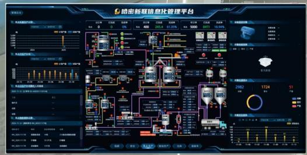

text_image

络密新联信息化管理平台
数据采集器
数据采集器
数据采集器
数据采集器
数据采集器
数据采集器
数据采集器
数据采集器
数据采集器
数据采集器
数据采集器
数据采集器
数据采集器
数据采集器
数据采集器
数据采集器
数据采集器
数据采集器
数据采集器
数据采集器
数据采集器
数据采集器
数据采集器
数据采集器
数据采集器
数据采集者
数据采集者
数据采集者
数据采集者
数据采集者
数据采集者
数据采集者
数据采集者
数据采集者
数据采集者
数据采集者
数据采集者
数据采集者
数据采集者
数据采集者
数据采集者
数据采集者
数据采集者
数据采集者
数据采集者
数据采集者
数据采集者
数据采集者
数据采集者
数据采集者
数据采集器
数据采集器
数据采集器
数据采集器
数据采集器
数据采集器
数据采集器
数据采集器
数据采集器
数据采集器
数据采集器
数据采集器
数据采集器
数据采集器
数据采集器
数据采集器
数据采集器
数据采集器
数据采集器
数据采集器
数据采集器
数据采集器
数据采集器
数据采集器
数据采集式
2582 1724 51

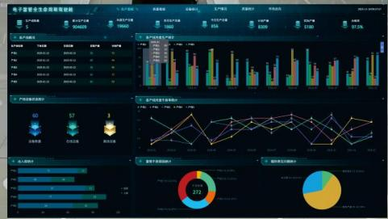

bar_line

| Year | Revenue ($M) | Sales ($M) |
| --- | --- | --- |
| 2013 | 45.6 | 39.8 |
| 2014 | 47.6 | 41.0 |
| 2015 | 49.6 | 43.0 |
| 2016 | 51.6 | 45.0 |
| 2017 | 53.6 | 47.0 |
| 2018 | 55.6 | 49.0 |
| 2019 | 57.6 | 51.0 |
| 2020 | 59.6 | 53.0 |
| 2021 | 61.6 | 55.0 |
| 2022 | 63.6 | 57.0 |
| 2023 | 65.6 | 59.0 |

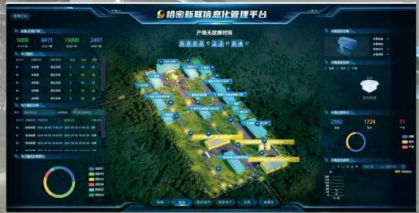

text_image

哈密新联信息化管理平台
5000 8473 15000 2497
产地无污染对照
9 0 0 6 * 2 温 11 0.4 分
产品名称：哈密新联信息化管理平台
产品类型：智能设备
产品编码：1
产品型号：智能设备
产品规格：1
产品数量：1
产品类型：智能设备
产品编码：1
产品型号：智能设备
产品规格：1
产品数量：1
产品类型：智能设备
产品编码：1
产品型号：智能设备
产品规格：1
产品数量：1
产品类型：智能设备
产品编码：1
产品型号：智能设备
产品规格：1
产品数量：1
产品类型：智能设备
产品编码：1
产品型号：智能设备
产线无污染对照
2082 1724 51

## 强化品牌管理

全面焕新党建品牌，积极践行集团品牌价值提升行动，以品牌建设驱动高质量发展。

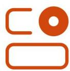

## 品牌矩阵全面焕新

深化“民爆先锋”党建品牌内涵，成功构建“1+1+10+N”多层级、全覆盖的党建品牌矩阵体系。

## 标杆案例荣誉入选

1篇

党建品牌案例被人民政协网刊载

2篇

党建品牌案例入选2025年度国企党建创新优秀成果

2篇

品牌创建成果入选红旗出版社2025（首届）新时代企业党建创新优秀案例

## 品牌故事全网传播

保利生态《只此青绿 央企担当》品牌故事片在“国资小新”等权威平台刊发，扩大品牌影响力。

## 核心产品获集团认可

核心品牌“盘江牌”凭借优异的品质与市场口碑，成功获评保利集团第一批优质产品品牌。

## 环境篇

## 绿色发展 生态筑底 低碳运营

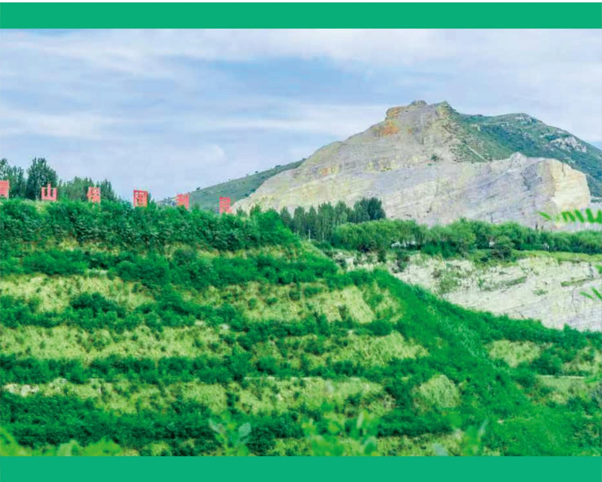

text_image

青山堡国利园

我们以系统化环境治理筑牢绿色发展根基，建立健全覆盖环境影响评估、污染物排放控制、废弃物处理等环节的环保管理体系，大力推广节能环保全过程，为绿色发展提供坚实保障。

## 环境管理体系建设

保利联合积极推进环境管理体系建设，全面统筹领导并协调公司节能环保及碳达峰碳中和工作的重大决策部署，建立健全了覆盖生产经营全流程的环境管理架构。进一步修订环境保护管理制度，确保环境方针与目标同企业生产经营战略高度契合，进一步完善企业环保低碳工作机制。有效保障了环境管理体系的有效运行和持续优化。

统筹领导：统筹协调节能环保及“双碳”重大决策部署。

健全架构：建立覆盖生产经营全流程的环境管理架构。

修订制度：确保环境方针与目标契合企业发展战略。

完善机制：保障体系持续优化运行。

## 环境事故预防与应急机制

## 预案编制备案

下属企业完成《突发环境事件应急预案》编制，并在属地应急办完成备案。

## 应急物资储备

各生产点配备独立的应急物资储备库，为突发情况提供坚实物资支撑。

## 典型场景演练

开展硝酸铵水溶液、污水排放及油相材料泄漏燃烧等典型事故的应急演练。

  
践行绿色责任·共建生态未来

## 筑牢生态根基

公司充分发挥在矿山生态修复、环境治理领域的专业优势和主业力量，从河北唐山“山林地”综合整治，到西藏拉萨“南北山”绿化工程，公司累计完成生态修复治理面积达234万平方米，在荒山秃岭种植各类绿植近17万株，为建设宜居宜业和美乡村提供了坚实的生态保障和民生支撑。

## 234万m²

生态修复治理面积

## 17万+株

荒山秃岭绿植种植

## 标杆工程：技术实力与责任担当

唐山工程：将废弃矿坑转化为生态公园，采用土壤重构技术重塑地貌，成为城市绿色地标。

拉萨工程：针对高原脆弱生态实施精准修复，有效恢复了当地生物多样性，筑牢生态屏障。

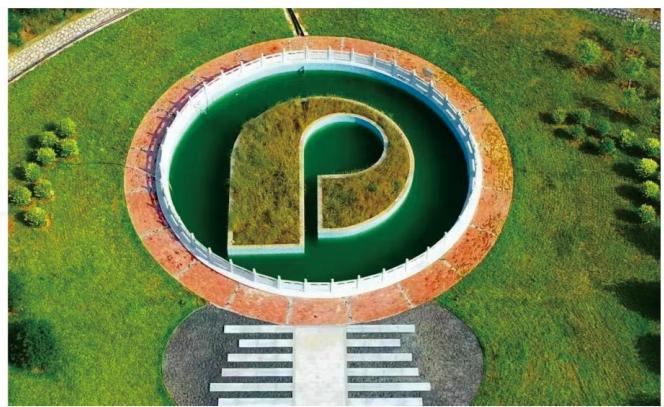

natural_image

Aerial view of a circular water treatment facility with a large letter 'P' on its surface, surrounded by greenery and pathways (no text or symbols visible)

矿山生态修复实景：废弃矿山蜕变为绿色生态屏障

## 环保培训体系

各级公司高度重视环保教育培训工作。全年公司各级开展环保培训136场次，覆盖员工8000余人次。通过系列培训与宣传，广大干部员工的环保意识与环境守法意识显著增强，公司环境管理水平得到进一步提升。

## 136场次

全年环保培训开展

## 8000+人次

员工培训覆盖规模

全员环保意识显著增强，环境管理水平稳步提升

## 绿色采购、环保投入与措施

## 01 绿色采购与节水措施

充分考虑环境保护、资源节约、安全健康、循环低碳和回收促进，优先采购和使用节能、节水、节材等有利于环境保护的原材料、产品和服务。公司各级严格执行用水定额管理，严格执行环保管理制度，加强供水设备的日常维护管理，定时检查，杜绝跑、冒、滴、漏，推广使用节水洁具和节水阀门，坚决杜绝长流水现象。

## 绿色采购管理

优先采购节能、节水、节材产品，将环保指标纳入供应商评价体系，从源头降低环境负荷。

## 精细化节水管理

严格执行用水定额，推广感应节水洁具，定期维护管网杜绝滴漏，实现水资源高效循环利用。

## 02 降污减排五大治理措施

## 降污减排

公司的环境有害因素主要来自各生产点生产作业过程中，经分析主要存在5类环境因素:污水、固体废物、危险废弃物、粉尘排放、噪声排放。

治理措施

  
污水治理

设处理站与隔油池定期监测达标排放定点分类存放委托资质单位清运

  
固废管理

  
危废处置

专用容器暂存专业机构合规处理

  
粉尘控制

喷淋除尘装置隔离操作与防护设备减震消音优化工艺降低分贝

  
噪声治理

## 社会篇

## 履责央企 共筑美好 同创未来

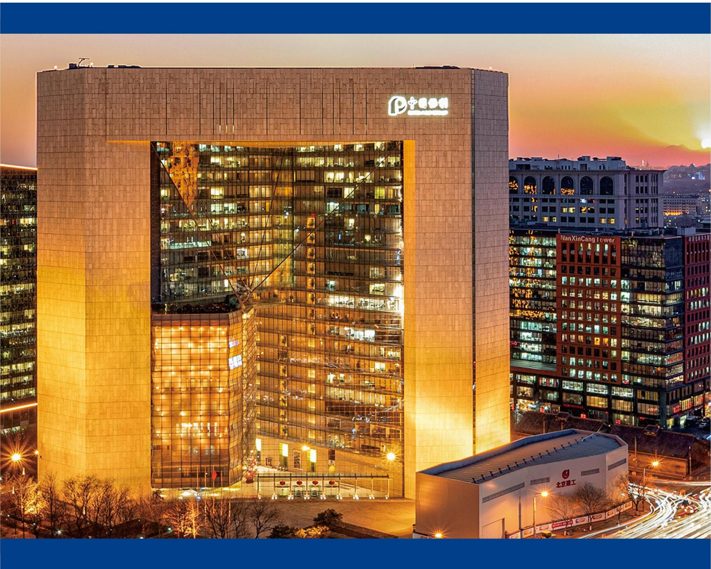

natural_image

Exterior view of a modern office building at dusk, illuminated with warm lighting, surrounded by other buildings including NanXinCang Tower and Beijing Construction (no signage on main structures)

## 社会责任

保利联合积极履行社会责任，为社会提供了稳定的就业岗位。2025年缴纳税费为国家财政收入做出积极贡献。

## 吸纳就业

55人合同签订率100%

年度新增就业岗位，稳就业保民生

## 依法纳税

3.51亿元2025年税费总额

积极履行纳税义务，支持国家财政建设

2025年，保利联合深入贯彻落实习近平总书记关于“三农”工作的重要论述和视察贵州重要讲话精神，全面落实党中央、国务院关于乡村全面振兴的决策部署，紧紧围绕“一宣六帮”职责使命，聚焦“五大振兴”目标任务，统筹谋划、精准施策、真抓实干，推动乡村振兴帮扶工作取得新进展、新成效。

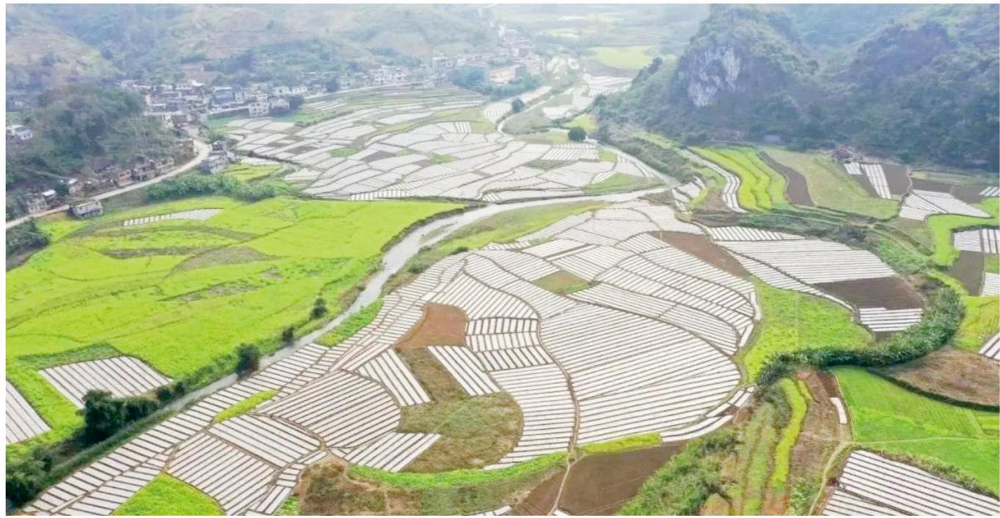

natural_image

Aerial view of terraced farmland with white photovoltaic panels installed across rolling green hills, no visible text or symbols.

建强“头雁”队伍，夯实基层堡垒。班子成员深入册亨县巧马镇纳桃村、幸福社区岩、架镇洛凡村帮扶点开展实地调研、宣讲党课、慰问群众。重点选派公司业务骨干、年轻干部和有农村工作经验的干部到册亨县开展帮扶工作，深化“党建联建·村企共建”机制，全年下属单位与帮扶点党组织开展联建活动30余次。

## 乡村振兴：精准帮扶实效

## 建强“头雁”队伍

深化“党建联建”机制，开展活动30+次，选派骨干深入帮扶点调研指导。

## 聚焦产业赋能，夯实持续发展根基

投入产业帮扶资金2.2万元，开展消费帮扶25万元，有效激活当地特色产业动能，带动群众增收致富。

拓展特色种养殖规模，公司投入资金2.2万元，扩大特色产品种植项目，种植面积达160余亩，惠及97户脱贫户（含监测户），特色产业的辐射带动能力进一步增强。持续开展“央企消费帮扶兴农周”活动，全年累计购买帮扶点及其他地区农副产品金额约25万元。

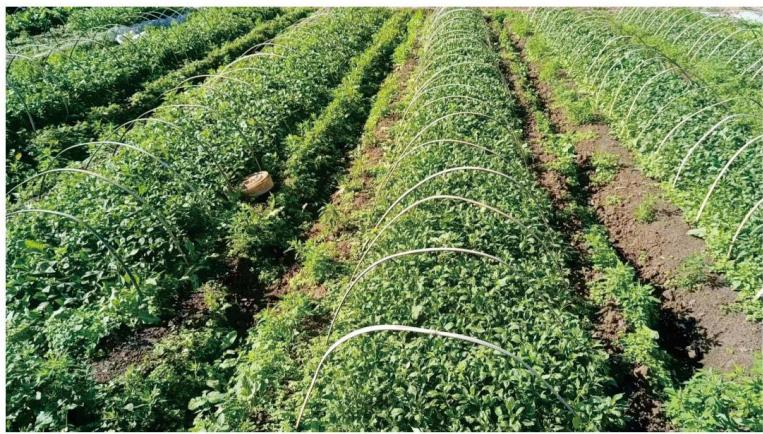

natural_image

Aerial view of neatly planted green crops with white plastic mulch lines, no visible text or symbols.

## 深耕援疆援藏战略书写央企责任担当

积极履行央企社会责任，全面严格执行保利集团援疆、援藏的工作指示，以“扎根新疆西藏、安全发展、协同共赢”为主线，执行“立足战略所需，向富矿区走”的战略方针。

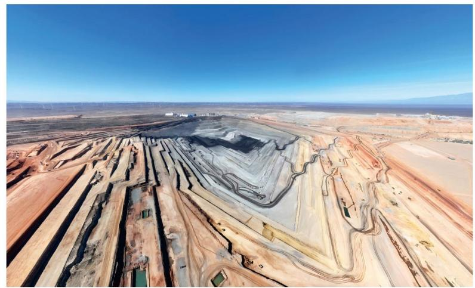

natural_image

Aerial view of a large open-pit mine in a desert landscape under clear blue sky, with no visible text or symbols.

## 援疆工作：扎根新疆 协同共赢

坚持“扎根新疆、安全发展、协同共赢”主线，执行“立足战略所需，向富矿区走”方针，深耕区域发展。

新增投资项目

重点承建项目

带动当地就业

## 援藏工作：科技赋能 生态攻坚

积极响应保利集团援藏指示，将央企责任融入雪域高原建设，探索生态治理新路径。

  
2025年11月  
“蒸汽爆破棉杆纤维”生态修复技术  
为员工搭建了清晰的职业发展路径

在雅江国家级重点项目中圆满完成一期实验，为解决西部生态脆弱区治理难题提供了“久联方案”

## ——员工权益与发展报告

## 人才基石：规模与梯队建设

保利联合有干部职工

7,236 人(截至2025年底)

高素质专业化人才队伍，核心骨干稳定

本科及以上学历占比 $28\%$ ——精英化人才结构

保利职位体系建设要求，对公司岗位进行分类  

管理通道

晋升空间广阔

技术通道

专业深度培养

技能通道

实操能力提升

为职位付薪

为能力付薪

为绩付薪

## 赋能成长：全方位培训体系

新员工培训

100% 覆盖

特种作业培训

100% 覆盖

## 462场 / 4.6963万人次

高频次、广覆盖，全年培训场次创新高

通过丰富的培训内容提升员工综合素质和专业能力

政治理论培训148场次

参训员工11464人次

专业知识培训314场次

参训员工35499人次

## 后记：笃行向新，履责致远

2025年，公司坚持以习近平新时代中国特色社会主义思想为指导，深入贯彻党的二十大和二十届历次全会精神，坚持战略引领，深化战略布局，推动业务协同与区域协同齐驱并进，加速构建发展新格局，呈现出“向新、向优、向好、向智、向稳”的发展态势，为“十五五”开局奠定了良好基础。

2026年，公司将以“稳中求进、提质增效”为主题，持续聚焦主责主业，在巩固现有业务优势的基础上，积极培育新质生产力。此外，公司将始终秉持可持续发展理念，将环境保护和社会责任融入经营发展全过程，积极响应国家“双碳”目标，以产业焕新升级筑牢国家能源资源战略安全服务保障，以技术创新推动生态修复新征程迈出坚实步伐，在新的一年里书写更加精彩的责任篇章，为实现经济、社会与环境的协同发展贡献智慧与力量，为公司争当民爆行业“十五五”高质量发展的典范，成为保利集团“十五五”第二增长曲线的重要成员作为保障、形成支撑。

## 稳中求进提质增效

向新、向优、向好、向智、向稳

## 读者反馈

## 尊敬的读者：

您好!非常感谢您在百忙之中阅读《保利联合化工控股集团股份有限公司2025年环境、社会及治理（ESG）报告》。为了不断改进报告编辑工作，我们特别希望倾听您的意见和建议，恳请您协助完成以下意见反馈，通过邮寄或拍照后发送电子邮件给我们，感谢您的宝贵意见！

公司官网:https://www.poly-union.com

联系地址:贵州省贵阳市观山湖区石林东路9号保利玖和大厦

## 意见反馈表

选择性问题:(请在相应的位置打 “√”)

本报告反映了保利联合对经济、社会、环境的重大影响程度：

□很好 □较好 □一般 □较差 □很差

本报告对利益相关方关心问题进行的回应和披露:

□很好 □较好 □一般 □较差 □很差

本报告披露信息、指标、数据的清晰度、准确性、完整性：

□很好 □较好 □一般 □较差 □很差

请您评价本报告的可读性:

□很好 □较好 □一般 □较差 □很差

5.您对我们的报告还有哪些意见或建议？

6.您认为报告还需要增加披露哪些ESG信息？

本报告以中文发布，您可以在巨潮资讯网（www.cninfo.com.cn）上查阅和下载《保利联合化工控股集团股份有限公司2025年环境、社会及治理（ESG）报告》。