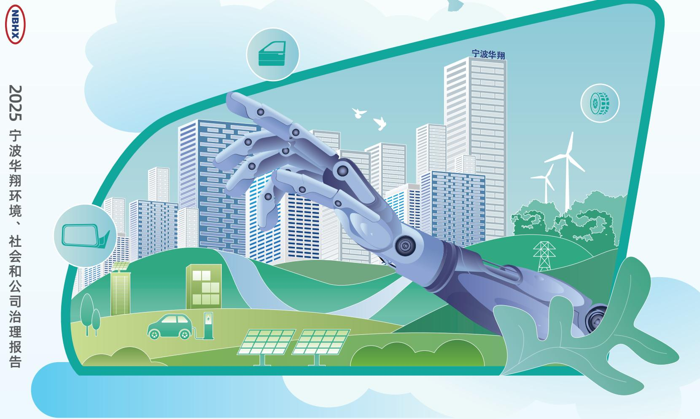

text_image

NBHX
宁波华翔
2025 宁波华翔环境、社会和公司治理报告

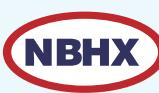

## 宁波华翔

## 宁波华翔电子股份有限公司

电话:+86 21 68949998

地址：中国上海市浦东新区世纪大道1168号 A 栋 6 楼

邮箱:Stock-dp@nbhx.com

## 年度环境、社会和公司治理报告 ESG宁波华翔电子股份有限公司 2025 年度环境、社会和公司治理报告ESG

## 报告开篇

## 关于本报告 03

报告简介 03

编制依据 03

报告范围及发布周期 04

数据来源 04

联系方式 04

## 管理层致辞 05

## 关于宁波华翔

公司介绍 07

战略发展 07

公司荣誉 09

## 2025亮点绩效 10

## 报告附录

关键绩效表 87

报告索引表 92

第三方鉴证 94

读者反馈表 98

## 01 可持续发展治理

可持续发展理念 13

可持续发展管理架构 13

利益相关方沟通 14

双重重要性评估 15

ESG风险管理 16

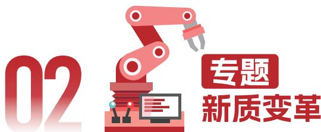

text_image

02
专题
新质变革

新质组织 19

新质工具 20

新质具身机器人 21

## 03 治理

公司治理 25

投资者保护 26

风险管理与内部控制 27

反商业贿赂反贪污 30

信息安全与客户隐私保护 31

## 环境

应对气候变化 53

环境合规管理 56

能源利用 60

水资源管理 63

排放与废弃物 64

绿色包装 69

绿色办公 69

## 目录

## 04年 经营

技术创新 35

智能制造与精益管理 38

产品质量与安全 41

供应链管理 45

客户关系管理 49

知识产权保护 50

## 社会

员工权益与福利 73

平等与多元化 77

人才培养与发展 78

职业健康与安全 80

公益慈善与乡村振兴 85

## 关于本报告

## 报告简介

本报告是宁波华翔电子股份有限公司 （以下简称 “宁波华翔”“公司”“我们”）发布的《2025 年环境、 社会和公司治理报告》（简称“ESG 报告”或“本报告”）， 也是公司发布的第四份ESG报告，反映本公司2025年在环境、社会和公司治理（以下简称“ESG”）方面的表现。

## 编制依据

本报告参考 《深圳证券交易所上市公司自律监管指引第 1 号——主板上市公司规范运作（2025 年修订）》《深圳证券交易所上市公司自律监管指引第17号——可持续发展报告（试行）》《深圳证券交易所上市公司自律监管指南第 3 号——可持续发展报告编制》、 全球报告倡议组织 《可持续发展报告统一标准 (GRIStandards 2021)》、 《联合国可持续发展目标》（SDGs）进行编制， 重点报告宁波华翔在促进环境、 社会及公司治理方面的工作。报告编制遵循重要性、量化、平衡、一致性原则。

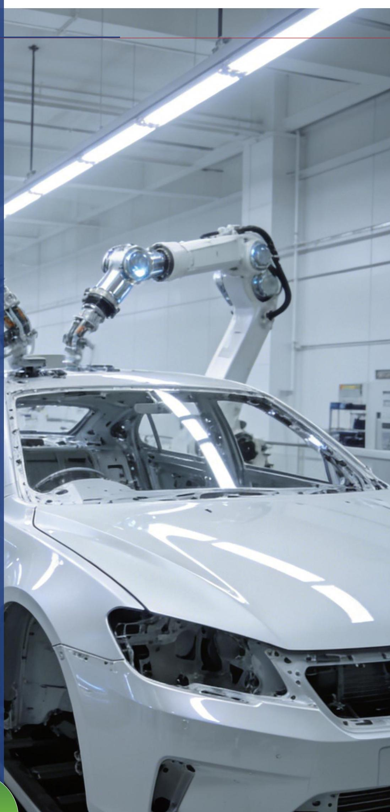

natural_image

Interior view of an automotive assembly line with robotic arms installing components on a white car chassis (no visible text or symbols)

## 报告范围及发布周期

本报告涵盖的主体包括宁波华翔所有运营控制资产。本报告的报告周期为年度。时间范围为 2025年 1 月 1 日至 2025 年 12 月 31 日 （以下简称 “报告期”）。考虑到披露信息的连续性和可比性，部分信息内容可能溯及报告期外。

报告中涉及的宁波华翔所属子公司简称如下 ：

<table><tr><td>华翔科技</td><td>指</td><td>华翔金属科技股份有限公司</td></tr><tr><td>华翔饰件</td><td>指</td><td>宁波华翔汽车饰件有限公司</td></tr><tr><td>内饰系统</td><td>指</td><td>华翔汽车内饰系统有限公司</td></tr><tr><td>劳伦斯沈阳</td><td>指</td><td>沈阳华翔汽车零部件有限公司</td></tr><tr><td>井上华翔</td><td>指</td><td>宁波井上华翔汽车零部件有限公司</td></tr><tr><td>南昌华翔</td><td>指</td><td>南昌华翔汽车零部件有限公司</td></tr><tr><td>宁波劳伦斯</td><td>指</td><td>宁波劳伦斯汽车内饰件有限公司</td></tr><tr><td>胜维德赫</td><td>指</td><td>宁波胜维德赫华翔汽车镜有限公司</td></tr><tr><td>车顶系统</td><td>指</td><td>长春华翔车顶系统有限公司</td></tr><tr><td>诗兰姆</td><td>指</td><td>宁波诗兰姆汽车零部件有限公司</td></tr><tr><td>视讯</td><td>指</td><td>宁波华翔视讯电子有限公司</td></tr><tr><td>翼锐科技</td><td>指</td><td>上海翼锐汽车科技有限公司</td></tr><tr><td>华翔启源</td><td>指</td><td>宁波华翔启源科技有限公司</td></tr></table>

## 数据来源

报告中涉及的数据主要来自于本公司统计数据，相关案例来自日常工作实践总结。除特别说明外，数据范围与年报保持一致，报告中所涉金额均以人民币作为计量货币。本报告已经公司董事会审议通过，公司董事会保证本报告内容不存在任何虚假记载、误导性陈述或重大遗漏。公司聘请第三方专业机构根据《AA1000 审验标准第三版》对本报告进行独立鉴证。

## 联系方式

地址：中国上海市浦东新区世纪大道1168号A栋6楼

邮箱：Stock-dp@nbhx.com

电话：+86 21 68949998

natural_image

Illustration of a robotic hand with glowing blue text 'AI' overlay (no readable text or symbols)

##

时代浪潮，奔涌向前。在全球汽车产业深度变革与中国式现代化新征程的交汇点上，宁波华翔坚守主业、破局求新的信念从未动摇。过去一年，我们不仅在激烈的市场竞争中稳住了基盘，更以一场深刻的“新质变革”，系统重塑组织、工具与执行单元，为跨越式发展注入强劲动能。这份报告，既是我们践行可持续发展承诺的年度答卷，更是面向智能化、绿色化未来的一份坚定宣言。

## “

卓越的治理是百年企业的基石。我们持续完善由股东会、董事会及管理层构成的治理架构，权责清晰，运作规范。报告期内，董事会召开会议12次，董事出席率100%，独立董事充分发挥专业监督作用；我们连续获得信息披露高评级，全年开展投资者交流19次，让公司的战略与运营更加透明。同时，我们构建了坚实的风险防控与内控体系，以“三道防线”全面识别与管理经营风险，并对商业贿赂与舞弊行为坚持“零容忍”。这一切，只为守护每一位投资者的信任，确保公司在合规稳健的航道上行稳致远。

创新是华翔发展的第一动力。我们立志成为“Tier 0.5级供应商”，这意味着必须拥有超前的正向研发能力与深度协同的客户服务能力。2025年，公司研发投入达8.91亿元，研发人员占比为7.31%，累计获得有效专利648件。我们不仅打造了全球领先的具身机器人制造基地，更通过PLM、集团MES系统的深度集成，构建了“快速设计、降本工艺、增效制造、敏捷交付”的数字化连续流，大幅提升了响应速度与交付质量。我们鼓励“允许失败”的创新文化，建立技术与管理的“职业双通道”，让工程师与科学家拥有与管理层同等的尊重与发展空间，真正让智慧与灵感驱动未来。

## 管理层致辞

面对市场的“快”要求，我们以全面数字化拥抱变革。我们成功推动人力资源向“三支柱”模型转型，人均服务支持比优化至约140:1，让HR更聚焦战略与业务赋能。我们打造了统一的“数字华翔”智能运营平台，集成12大核心系统，实现单点登录与流程协同；财务智能审核、Web-EDI供应商平台等工具，极大提升了运营效率与供应链协同水平。在生产端，机器视觉技术实现了产品外观的精准检测，IoT监测平台对废气废水进行24小时闭环管理。这场从“思维”到“工具”的深刻变革，正是我们支撑千亿目标、实现全球化敏捷运营的底气所在。

“绿水青山就是金山银山”，我们将绿色低碳深度融入发展战略。通过工艺优化、智能排产及设备节能改造，从源头降低能耗；更通过大规模布局分布式光伏与积极采购绿色电力，从根本上优化能源结构。2025年，长春、沈阳等工厂已实现100%绿色电力使用。在排放端，我们采用RTO、催化燃烧等先进技术确保废气100%达标排放，并对废弃物进行严格的资源化、无害化处理。旗下工厂获评“绿色工厂”与“绿色信用企业”。我们深知，守护生态家园，就是守护我们永续发展的根基。

员工是华翔最宝贵的财富。“实干兴业，荣辱与共”的文化内核，源于我们对人的尊重与关怀。我们提供具有竞争力的全面薪酬福利，设立困难员工帮扶机制，并严格杜绝任何形式的歧视与骚扰。同时，我们坚信产业链的共同成长，对超过5,600家关键供应商进行审核与赋能，并签订《廉洁协议》，共建阳光、共赢的生态圈。2025年，我们慈善捐赠130万元，员工志愿服务超700小时，以实际行动回馈社会。

展望未来，智能化与可持续发展的浪潮已势不可挡。宁波华翔将坚定聚焦汽车零部件与具身机器人两大赛道，以持续的“新质变革”提升内生动力，以深度的数字化转型构筑效率护城河，以坚定的绿色转型履行时代责任。

变革之路，道阻且长，然行则将至。我谨代表公司董事会，向全体员工的辛勤付出、向合作伙伴的鼎力支持、向投资者与社会各界的长期信任，致以最诚挚的感谢！让我们携手并肩，以破局之勇，乘新质之势，共同奔赴一个更创新、更绿色、更共融的可持续未来！

## 关于宁波华翔

## 公司介绍

宁波华翔电子股份有限公司（股票代码：002048）成立于1988年9月26日，总部位于中国上海市浦东新区，并于200年在深圳证券交易所成功上市。作为一家跨国集团公司，我们专业从事中高档乘用车零部件的设计、开发、生产、销售及售后服务，致力于为全球客户提供高品质的汽车配件和创新解决方案。

作为全球汽配五百强企业，宁波华翔长期以来为众多国际知名汽车品牌提供内外饰件、车身金属件、汽车电子等产品和相关服务。我们的主要客户包括宝马、比亚迪、奔驰、长安、大众、丰田、吉利、上海汽车、赛力斯、小米、一汽轿车（按首字母排序）等国内外传统汽车和新能源汽车制造商。通过与各大汽车制造商的紧密合作，我们不断推动技术创新与产品升级，力求在全球汽车行业中占据领先地位。

## 战略发展

宁波华翔将紧密围绕汽车零部件主业，以“聚焦汽车内外饰、向Tier 0.5拓展，兼顾上下游延伸，成为汽车一体化解决方案供应商”为战略定位，顺应汽车行业“新能源、智能化、轻量化”发展趋势，持续推动技术创新与产业升级。

公司坚持“双轮驱动”发展方式，一方面通过提高整体经营管理能力推进全球化布局，另一方面依托八大业务组合——内外饰、金属件、工程服务、电子件、座椅、光电、新三电及具身机器人，系统构建在新能源与智能化领域的综合竞争力。我们致力于通过大客户管理、研发创新、运营标准化、采购协同与IT数字化五大模式，全面提升企业核心能力。

在实施路径上，公司将持续强化五项核心能力建设：

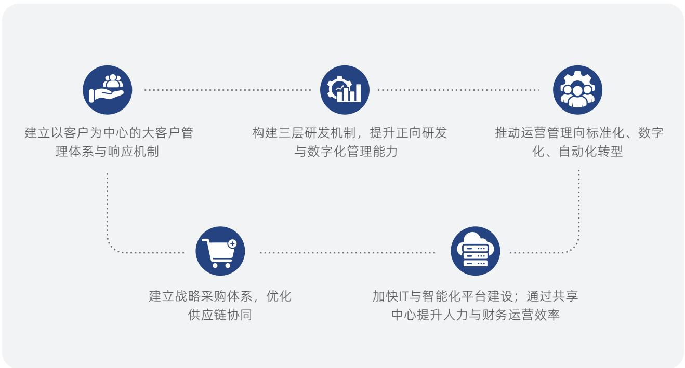

flowchart

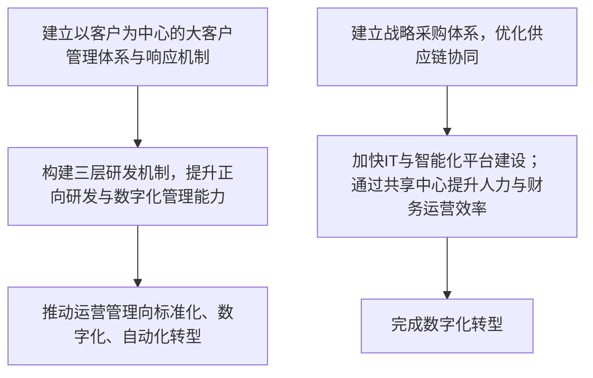
```mermaid
graph TD
  A["建立以客户为中心的大客户管理体系与响应机制"] --> B["构建三层研发机制，提升正向研发与数字化管理能力"]
  B --> C["推动运营管理向标准化、数字化、自动化转型"]
  D["建立战略采购体系，优化供应链协同"] --> E["加快IT与智能化平台建设；通过共享中心提升人力与财务运营效率"]
  E --> F["完成数字化转型"]
```

我们始终秉承求实创新的发展理念，以技术驱动、市场拓展、产业链整合与绿色可持续发展为战略支柱，致力于成为具有国际视野、技术领先、管理卓越的全球汽车零部件供应商。通过持续创新与精益运营，宁波华翔将为客户创造更大价值，为股东提供可持续回报，推动企业迈向更加稳健、繁荣的未来。

## 公司荣誉

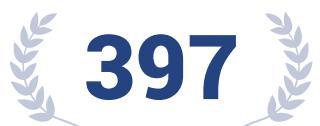

2025中国制造业500强397位

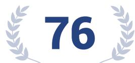

2025浙江省成长性最快百强企业76位

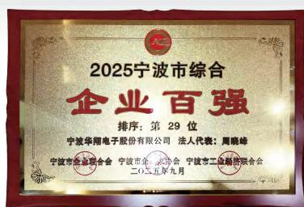

text_image

2025宁波市综合
企业百强
排序: 第29位
宁波华翔电子股份有限公司 法人代表: 周晓峰
宁波市企业联合会 宁波市工会委员会 宁波市工会组织联合会
二〇二五年九月

2025宁波市综合企业百强29位

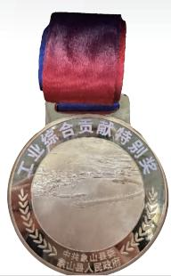

工业综合贡献特别奖

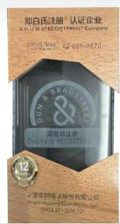

邓白氏注册”认证企业

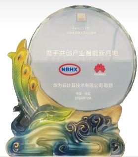

text_image

Alicen 110
华为机器人股份有限公司
携手共创产业智能新高地
NBHX
HUAWEI
华为云计算技术有限公司 敬圆
中国·深圳
2024年1月20

携手共创产业智能新高地

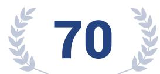

2025浙江省制造业百强企业70位

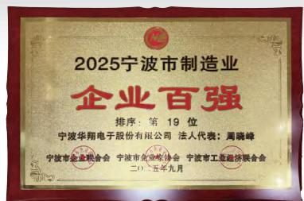

text_image

2025宁波市制造业
企业百强
排序:第19位
宁波华翔电子股份有限公司 法人代表:周晓峰
宁波市企业联合会 宁波市企业联合会 宁波市工业经济联合会
二〇一五年九月

2025宁波市制造业企业百强19位

natural_image

Golden star trophy with ribbon base, set against a blue and white background (no text or symbols)

## 2025亮点绩效

治理绩效

<table><tr><td>对24项议题进行双重重要性分析</td><td>召开了12次董事会会议</td><td>投资者交流会19次</td><td>反贪腐培训总人次达987人次</td></tr><tr><td>反贪腐培训时数达2,961小时</td><td>公司泄露客户隐私次数为0</td><td>信息安全培训人次达1,117人次</td><td>培训时间为8,936小时</td></tr></table>

环境绩效

<table><tr><td>一级子公司已获得ISO 14001 环境管理体系认证比例为100%</td><td>环保总投入为2,723.71万元</td><td>清洁能源使用为22,667,744.26kwh</td></tr><tr><td>循环利用水量为36,071.74吨</td><td></td><td></td></tr></table>

社会绩效

<table><tr><td>一级子公司通过IATF 16949 质量管理体系认证比例为</td><td>100%</td><td>产品召回事件为</td><td>0</td></tr><tr><td>研发人员为1,624人</td><td>研发人员占比7.31%</td><td colspan="2">研发投入为89,131.97万元</td></tr></table>

员工培训投入

4,959,664.25元

员工安全培训总时长达

280,717.40 小时

级子公司ISO 45001职业健康安全管理体系认证率达

100%

公益慈善捐赠

120 万元

员工安全培训总人次达

93,054 人次

帮扶勤丰村

10 万元

## 01 可持续发展治理

对标联合国可持续发展目标

16 和平、正义与 强大机构

17 促进目标实现的伴关系

关键议题

可持续发展管理

可持续发展理念 13

可持续发展管理架构 13

利益相关方沟通 14

双重重要性评估 15

ESG风险管理 16

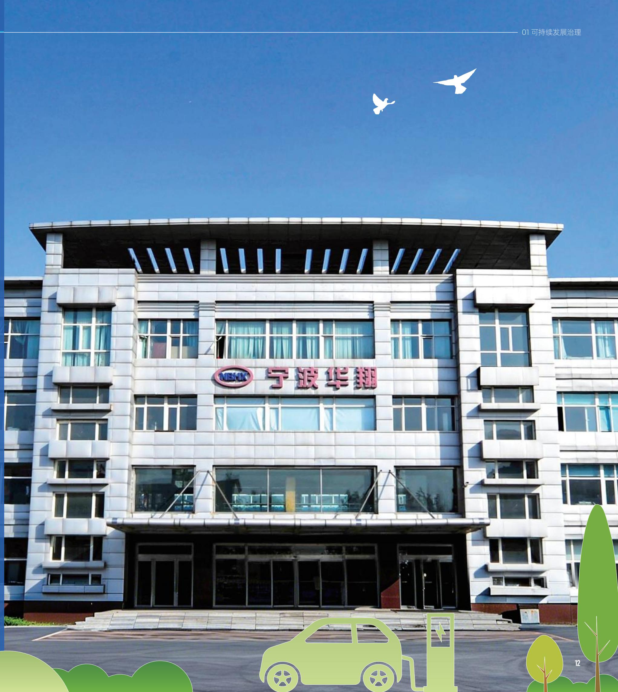

text_image

01 可持续发展治理
宁波华翔
NEXIX

## 可持续发展理念

宁波华翔始终将可持续发展理念融入公司发展战略和日常经营管理全过程，积极顺应汽车产业绿色化、低碳化和高质量发展的趋势，坚持在稳健经营的基础上，统筹推进经济效益、环境责任与社会价值的协同提升。公司以“规范治理、绿色制造、以人为本、协同共赢”为核心导向，持续完善ESG管理体系，推动企业长期稳健发展。

## 宁波华翔ESG综合表现

## 环境方面

公司围绕节能降耗、清洁生产和资源高效利用，不断优化生产工艺和能源管理方式，降低生产运营对环境的影响，积极应对气候变化带来的机遇与挑战。

## 社会责任方面

公司高度重视员工职业健康与安全、人才培养与队伍建设，保障员工合法权益，同时通过强化供应链责任管理，与合作伙伴共同提升可持续发展水平。

## 公司治理方面

公司持续完善治理结构和内部控制体系，加强合规管理和风险防控，提升经营透明度和规范运作水平。

## 可持续发展管理架构

宁波华翔认为完善的治理架构是推进可持续发展管理的重要基础。公司在既有可持续发展管理体系基础上，持续优化由决策层、管理层和执行层组成的三层可持续发展管理架构，明确各层级职责，保障战略与举措在公司治理体系中的有序开展。

## 宁波华翔ESG管理架构

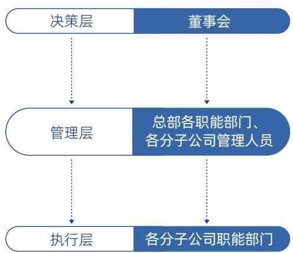

flowchart

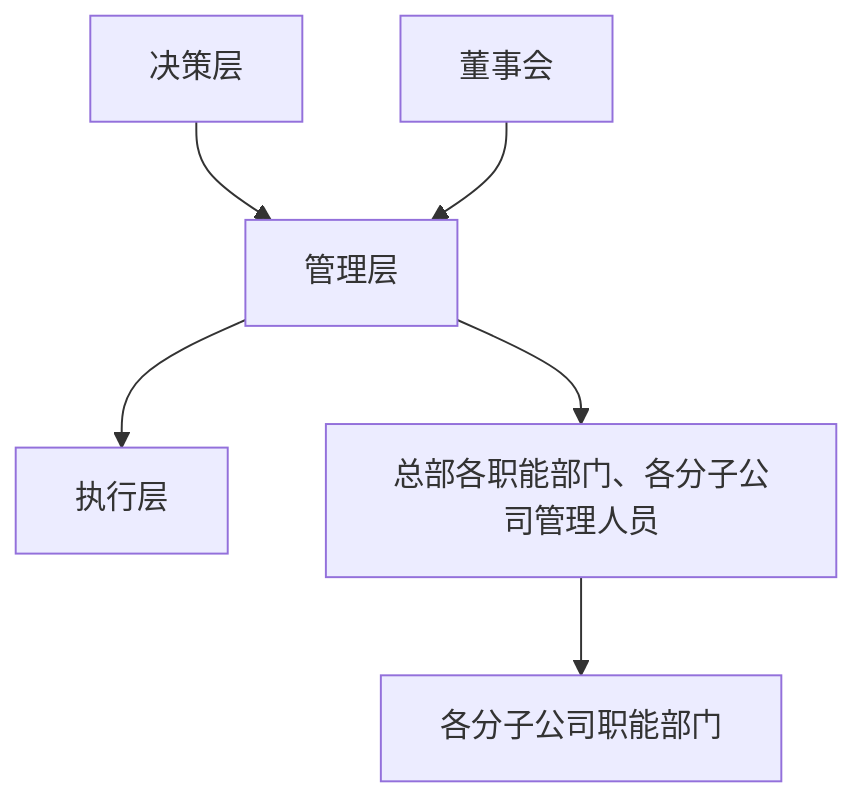
```mermaid
graph TD
  A["决策层"] --> B["管理层"]
  C["董事会"] --> B
  B --> D["执行层"]
  B --> E["总部各职能部门、各分子公司管理人员"]
  E --> F["各分子公司职能部门"]
```

由董事会作为可持续发展相关事项的最高决策与监督机构，持续对公司可持续发展相关重要事项进行审议和监督，保持对ESG管理工作的总体把控。

由总部相关职能部门承担可持续发展工作的统筹协调职责，各分子公司管理层按照公司统一部署，持续推进ESG实践工作的管理安排，落实相应管理责任。

由各分子公司职能部门作为可持续发展工作的主要执行单元，围绕环境管理、员工与职业健康安全、合规运营等重点领域开展日常工作，确保ESG实践在基层单位稳定运行。

## 利益相关方沟通

宁波华翔高度重视与利益相关方的沟通与合作，构建了多渠道沟通机制，全面接收并整合来自不同利益相关方的期望与反馈。

宁波华翔利益相关方沟通渠道

<table><tr><td>利益相关方</td><td>期望与诉求</td><td>回应与沟通方式</td></tr><tr><td>股东/投资者</td><td>持续增长的经营业绩公开、透明的企业信息保障股东权益规范公司治理风险防范</td><td>召开股东会发布公司公告及定期报告举办业绩说明会来访/电话/书面沟通</td></tr><tr><td>政府与监管机构</td><td>依法纳税带动就业合规经营促进经济发展承担社会责任</td><td>信息披露日常沟通及汇报配合监管机构核查参与政府调研活动</td></tr><tr><td>客户</td><td>保持长期良好合作提供优质产品服务诚信交易保障客户合法权益产品质量及服务管理</td><td>客户咨询与投诉客户满意度调查行业展会</td></tr><tr><td>员工</td><td>保障员工权益与福利健全职业发展通道畅通沟通渠道职业健康与安全</td><td>内部刊物员工会议员工活动员工培训</td></tr><tr><td>供应商</td><td>保持长期良好合作采购公平、透明廉洁采购遵守商业道德</td><td>现场调研供应商审核供应商大会</td></tr><tr><td>行业伙伴</td><td>互利共赢畅通沟通渠道推动行业发展</td><td>积极开展协会活动参与行业会议</td></tr><tr><td>社区</td><td>关注并支持社区发展</td><td>慈善捐赠参与志愿公益服务</td></tr></table>

## 双重重要性评估

宁波华翔结合披露标准、资本市场关注及自身所处行业和经营业务特点等方面，多维度识别与梳理本年度重要性议题。2025年公司根据《深圳证券交易所上市公司自律监管指引第17号——可持续发展报告（试行）》，实施议题的影响与财务重要性分析。

## 关键绩效 2025年度

重要性议题识别结果如下矩阵所示。

经识别，

项议题对公司具有财务重要性及影响重要性

2项议题仅具有财务重要性

11 项议题仅具有影响重要性

## 双重重要性议题矩阵图

公司开展可持续议题的识别、评估与排序工作，明确对于我们具有双重重要性的议题。2025年度可持续议题双重重要性评估流程：

宁波华翔双重重要性议题评估流程  
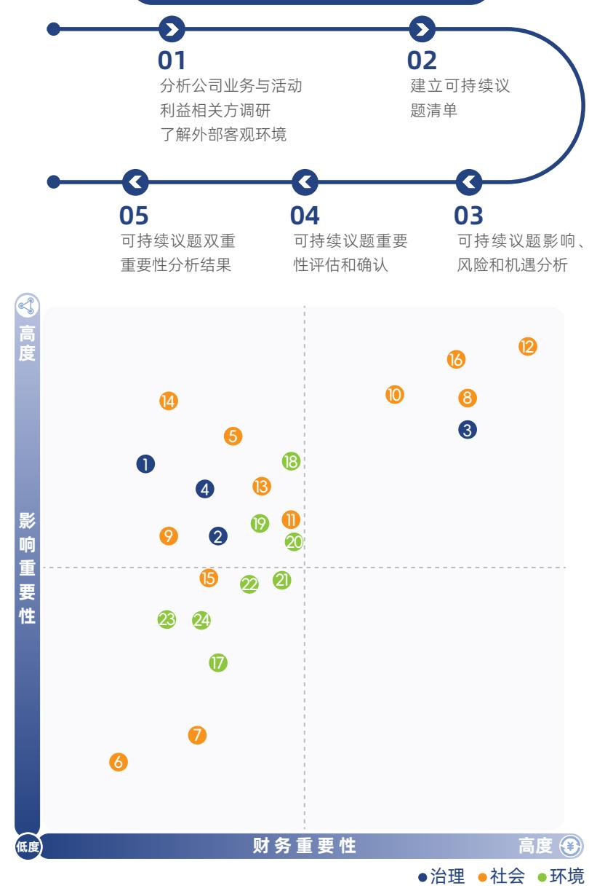

scatter

| ID | Category | Financial Importance (X-axis) | Impact Importance (Y-axis) |
| --- | --- | --- | --- |
| 1 | 治理 | ~0.25 | ~0.65 |
| 2 | 治理 | ~0.35 | ~0.55 |
| 3 | 治理 | ~0.75 | ~0.65 |
| 4 | 治理 | ~0.35 | ~0.60 |
| 5 | 社会 | ~0.45 | ~0.70 |
| 6 | 社会 | ~0.20 | ~0.20 |
| 7 | 社会 | ~0.35 | ~0.30 |
| 8 | 社会 | ~0.75 | ~0.75 |
| 9 | 社会 | ~0.35 | ~0.55 |
| 10 | 社会 | ~0.65 | ~0.75 |
| 11 | 社会 | ~0.65 | ~0.55 |
| 12 | 社会 | ~0.85 | ~0.85 |
| 13 | 社会 | ~0.55 | ~0.60 |
| 14 | 社会 | ~0.35 | ~0.75 |
| 15 | 社会 | ~0.45 | ~0.45 |
| 16 | 社会 | ~0.75 | ~0.80 |
| 17 | 环境 | ~0.45 | ~0.35 |
| 18 | 环境 | ~0.60 | ~0.65 |
| 19 | 环境 | ~0.60 | ~0.50 |
| 20 | 环境 | ~0.60 | ~0.45 |
| 21 | 环境 | ~0.65 | ~0.45 |
| 22 | 环境 | ~0.60 | ~0.40 |
| 23 | 环境 | ~0.35 | ~0.35 |
| 24 | 环境 | ~0.40 | ~0.35 |

<table><tr><td>治理</td><td>1尽职调查2利益相关方沟通3反商业贿赂及反贪污4可持续发展管理</td></tr><tr><td>社会</td><td>5客户服务6乡村振兴7社会贡献8创新驱动9知识产权保护10供应链安全11可持续采购12产品和服务安全与质量13数据安全与客户隐私保护14保障员工权益15员工培训与发展16职业健康与安全</td></tr><tr><td>环境</td><td>17应对气候变化18废弃物处理19污染物排放20环境合规管理21能源利用22水资源利用23低碳产品24循环经济</td></tr></table>

## ESG风险管理

宁波华翔在推进可持续发展过程中，持续关注环境、社会及公司治理重大议题对企业长期经营的影响，将ESG风险管理作为完善公司治理和提升经营韧性的重要组成部分。基于双重重要性分析结果，公司聚焦对业务发展和利益相关方具有高度影响的关键议题，系统梳理其对公司战略布局、经营活动及价值创造的影响范畴，识别潜在风险与发展机遇，并将风险与机遇纳入管理决策与实践安排之中。

重要性议题影响、风险和机遇管理

<table><tr><td>重要性议题</td><td>战略</td><td>影响、风险和机遇</td><td>目标</td><td>管理与行动所在章节</td></tr><tr><td>创新驱动</td><td>以“智能技术赋能华翔未来”为愿景,致力于从“技术跟随者”向“标准制定者”跃升,围绕轻量化材料、智能化座舱、新能源集成、自动化工艺等方向,构建覆盖“前沿预研-技术转化-产品速赢”的三级研发体系。</td><td>创新能力不足可能削弱公司在汽车零部件行业中的技术竞争力,影响新产品导入效率及对客户需求变化的响应能力;同时,持续推进技术创新和工艺升级有助于提升产品附加值和运营效率,支撑公司在轻量化、智能化等领域把握产业升级机遇。</td><td>确保研发资金、人才和设备的投入,并建立创新激励机制,鼓励员工参与创新。</td><td>经营</td></tr><tr><td>产品和服务安全与质量</td><td>坚持“质量不是检验出来的,而是设计和过程控制出来的”理念,将质量管理前移至产品设计和工艺策划阶段,贯穿产品全生命周期。</td><td>产品质量失效或服务响应不足可能引发客户投诉、召回及声誉风险,对公司履约能力和长期合作关系造成不利影响;通过强化全生命周期质量管理和售后服务体系,降低质量事件发生概率,提升客户满意度与品牌可信度,巩固市场竞争优势。</td><td>以满足客户需求和保障产品安全为核心目标。</td><td>经营</td></tr><tr><td>供应链安全</td><td>坚持多元化、分散化的供应商布局策略,在产品开发和量产阶段引入多家合格供应商,通过A/B点供应机制和动态评估机制,降低单一来源依赖风险。</td><td>供应链中断、关键供应商失效或区域集中度过高,可能对公司生产连续性、交付能力及成本稳定性造成不利影响;通过提升供应链韧性、加强供应商管理和协同机制,有助于降低外部不确定性带来的冲击,并在全球化布局中把握稳定供应和协同发展的机遇。</td><td>将质量稳定、合规经营和长期合作潜力作为供应商管理的重要目标。</td><td>经营</td></tr><tr><td>职业健康管理</td><td>坚持“预防为主,以人为本”的EHS方针。</td><td>职业健康管理不到位可能增加员工职业伤害和健康风险,进而影响生产稳定性、员工满意度及合规表现;持续完善职业健康管理体系和防护措施,有助于保障员工身心健康、降低事故发生率,并提升组织运行韧性和雇主吸引力。</td><td>致力于实现“重大事故0件”的总目标。</td><td>社会</td></tr><tr><td>反商业贿赂及反贪污</td><td>建立完善的反舞弊体系,从制度流程、监督机制等多方面入手,防范各类舞弊行为。</td><td>商业贿赂和贪污风险可能引发合规违规、法律责任及声誉损失,对公司治理稳定性和资本市场形象产生负面影响;通过持续完善廉洁合规管理体系和风险防控机制,能够提升经营透明度与治理可信度,为长期稳健发展营造良好制度环境。</td><td>无重大腐败诉讼案件。</td><td>治理</td></tr></table>

## 02

## 专题

## 新质变革

新质组织 19

新质工具 20

新质具身机器人 21

text_image

02 专题 新质变革
18

为支撑集团从规模化增长向高质量发展的战略跨越，宁波华翔以“组织重塑、工具赋能、单元激活”为三大方向，开展系统性、前瞻性的运营体系升级。通过组织机制优化、全链路数字化融合及智能终端场景化部署，公司全面推动运营模式向“新质生产力”深刻转型，构建起敏捷响应、高效协同、韧性发展的新型运营体系，扎实承接“夯实统治、放开分治、保持监管、高度协同”的集团管控要求，为下一阶段战略目标实现提供坚实支撑。

## 新质组织

为全面支撑业务规模与全球化战略，公司开展三支柱模型引领人力资源系统性变革，启动人力资源组织与数字化协同转型，推动管理模式从传统“六大模块”职能导向，向以“业务伙伴（HRBP）、专家中心（COE）、共享服务中心（SSC）”为核心的三支柱体系演进。实现人力资源在价值定位、服务模式与运营效能上的升级。

## 从“小共享”到“大共享”

公司以体系化思路推进转型，通过将原有分散、基础的“小共享”模式，升级为覆盖全集团、高度集约的“大共享”服务平台。

## “三支柱”转型成效

## 通过“三支柱”转型，实现：

服务效率提升，成本大幅节约

政策一致性增强

业务贴合度提高

## 人力资源三支柱体系

## 共享服务中心（SSC）全面升级

集中处理全集团基础、共性的人力资源事务，通过流程标准化与自动化，大幅提升服务效率，五年内实现人均服务支持比从转型前的92:1优化至约140:1，释放业务部门与专业团队精力。

## COE赋能关键领域

COE专注薪酬福利、人才发展、组织效能等核心领域，开展前瞻性政策研究与设计，支撑“正向研发能力建设”与“组织KPI体系”的落地。

## HRBP赋能业务伙伴

HRBP团队深度嵌入各业务板块，成为业务部门的战略伙伴，推动“大客户管理机制”落地与跨部门业务协同，确保人力资源策略与业务目标同频共振。

## 持续优化与长远布局

面对变革中的团队思维与能力重构挑战，公司通过引入外部专业咨询、建立持续沟通与培训机制，确保团队平稳过渡，支撑“组织、制度、文化、创新”四维一体的人力发展战略，有效提升了组织的战略响应速度、人才结构适配性与全球业务支撑能力。

## 人力资源发展战略

## 支持业务组合

针对各类业务机会点，进行前瞻性的人才储备与精准匹配。

## 深化组织能力

形成标准化的管理模式、流程与数据资产，支持集团的快速扩张与多业态管理。

## 打造人才供应链

构建长期、系统的人才供给与发展体系，为“全球化布局”与“技术正向研发”的战略落地提供可持续的人才保障。

## 新质工具

宁波华翔将数字化、智能化技术深度融入研发、制造、供应链及管理全价值链，致力于打造统一、透明、协同的“数字华翔”。公司致力实现运营流程的标准化、数字化与自动化，更通过数据驱动，为核心业务运营与战略决策提供精准、高效的智能支撑。

## 智能运营与协同平台

公司以前瞻视野推动管理运营的全面数字化，围绕“统一入口、智能流程、生态协同”三大方向，系统构建覆盖内外的智能运营与协同平台，有效提升了组织协同效率、数据治理能力与产业链响应韧性。

## 智能运营与协同平台

## 统一身份认证平台（IAM）

集成企业微信、OA、BI、SRM、费控、档案等12个核心系统，实现单点登录、统一待办与权限集中管理。平台支持账号密码、企业微信扫码等多种登录方式，为全员提供了高效、安全、友好的数字化统一入口，有效改善了用户体验与IT运维效率。

## 财务智能审核系统

集团部署财务智能审核系统，通过OCR识别、规则引擎与复杂逻辑校验，在单据提交与审核节点实现智能预审，成功将审核要点标准化，实现了审核过程的全程留痕与数据沉淀。该系统有效解决报销退单率高、审核风险大、标准不统一等痛点问题，提升了审核效率与合规水平。

## Web-EDI供应商平台

平台采用独立业务数据库与优化架构，实现与各类ERP系统的无缝对接及全流程在线协同，为供应商提供了从“注册登录-采购订单确认-送货单创建-发货状态”端到端自助服务，大幅提升供应链协同效率与数据准确性。

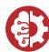

## 研发与制造一体化

为强化产品核心竞争力与制造运营韧性，公司大力推进研发端与制造端的数字化深度融合，通过构建贯穿产品全生命周期的数据链路，实现从设计、工艺、生产、交付的全程数字协同与透明管理。

## 研发与制造一体化管理

## PLM系统构建研发数字核心

引入产品生命周期管理（PLM）系统，建立了以设计数据、文档管理与变更控制为核心的数字研发平台。该系统实现了从设计、物料创建到文档受控下发的全流程在线管理，并与OA、ERP等系统集成，缩短新品导入周期。

## MES系统创新实施

采用创新的“运营+IT”联合实施模式与领先的“云边端”三层架构，统一规划并部署集团制造执行系统（MES）。该系统以“运营流程及KPI标准化先行”为原则，在确保集团整体运营的一致性与管控效力的基础上，支持工厂差异化柔性配置，全面实现了跨工厂产能协同、生产质量全程可追溯与设备效能统一监控。

## 一体化创新提升效能

通过PLM、集团MES与供应链系统的深度集成，构建了“设计-工艺-制造-交付”的连续数据主线，打通了从订单到交付的信息流，大幅提升交付连贯性与可追溯性，强化了公司在Tier0.5模式下一体化服务客户的快速响应能力。

## 新质具身机器人

公司积极探索具身机器人的创新应用，将其作为提升安全、效率与体验的新型生产力单元。

## 具身机器人创新应用

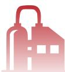

## 工业场景应用

在生产与物流环节部署巡检具身机器人及机器狗执行安防，设备监控与环境检测任务，替代高危人工作业，提升“运营效率优化”与“自动化能力”。

## 商务与品牌场景应用

引入服务与IP定制具身机器人，承担接待、导览、演示等职能，生动展示品牌科技形象，优化高端客户体验，支撑场景化服务需求。

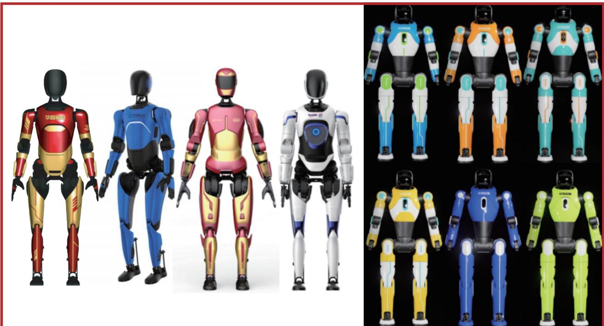

natural_image

Side-by-side comparison of humanoid robots in front and back views, showing different body colors and human figures (no text or symbols visible)

华翔启源设计的具身机器人IP定制

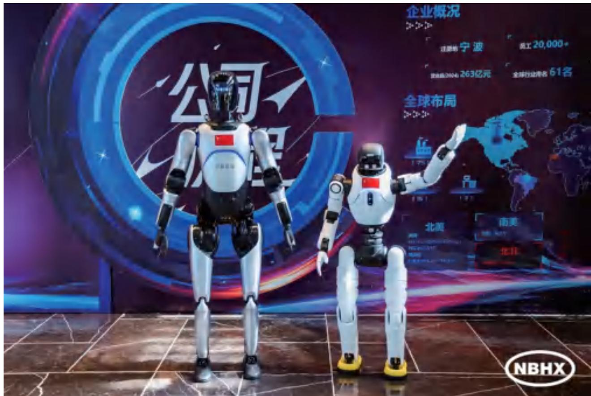

text_image

企业概况
汪源地 宁波 员工 20,000+
货油量2664t 263亿元 全球行业排名 61名
全球布局
北翼 南美
北非
NBHX

具身机器人

## 03 治理

## 对标联合国可持续发展目标

16 和平、正义与 强大机构

17 促进目标实现的伴关系

## 关键议题

尽职调查 | 利益相关方沟通 | 反商业贿赂及反贪污

反不正当竞争 | 数据安全与客户隐私保护

公司治理 25

投资者保护 26

风险管理与内部控制 27

反商业贿赂反贪污 30

信息安全与客户隐私保护 31

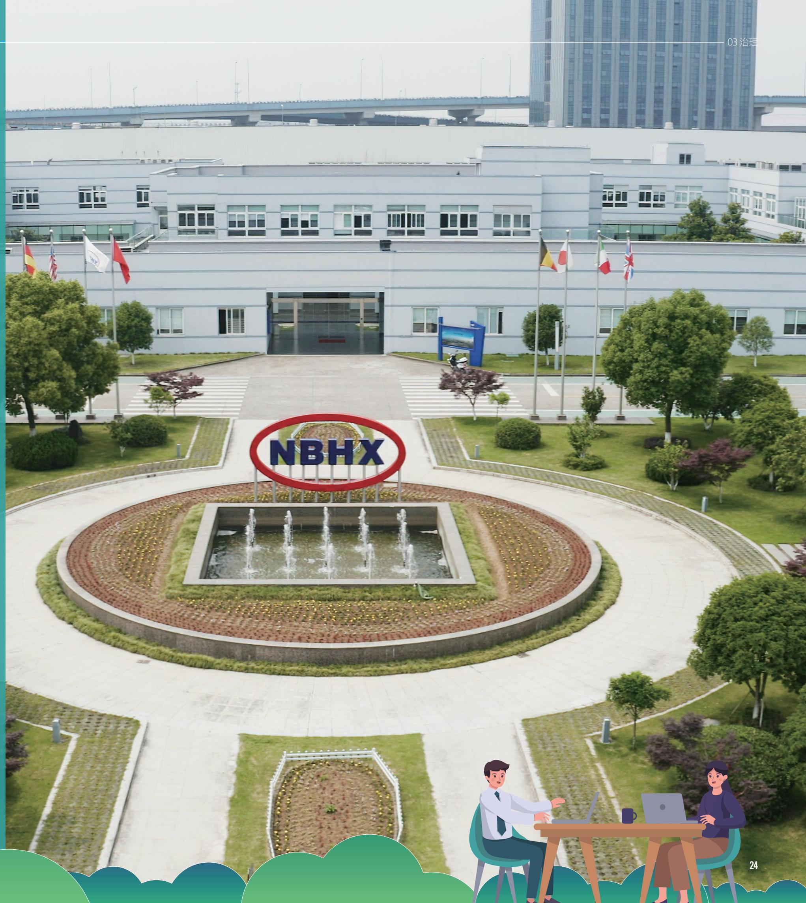

text_image

NBHX
03 治理
24

## 公司治理

宁波华翔持续夯实公司治理基础，在依法合规的前提下推动治理体系平稳运行。公司依照《中华人民共和国公司法》《中华人民共和国证券法》《上市公司治理准则》等相关法律法规，并结合《公司章程》的规定，明确公司治理的基本原则和组织架构，为董事会履职和公司规范运作提供制度依据。公司建立由股东会、董事会和管理层构成的治理结构，各治理主体职责边界清晰、权责配置合理。2025年8月，公司依法取消了监事会，由董事会下设的审计委员会依据相关法规承接并行使原监事会的监督职权，进一步完善了公司治理机制。

## 公司治理与经营管理框架

## 股东会

依据《股东会议事规则》对公司经营方针、利润分配、重大投资等事项行使决策权。

## 董事会

依据《董事会议事规则》对公司发展战略、重大经营决策及风险事项进行审议和决策。执行《独立董事制度》，明确独立董事在关联交易、审计监督及重大事项决策中的职责要求，保障董事会决策的独立性和审慎性。

natural_image

Illustration of a business meeting with four people, one presenting on a large screen, surrounded by gear icons and stars (no text or symbols)

宁波华翔公司治理架构

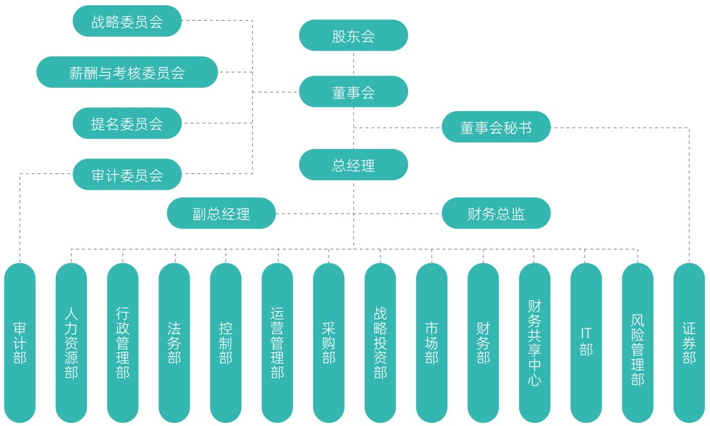

flowchart

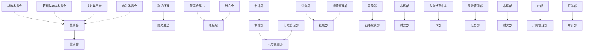
```mermaid
graph TD
  A["董事会"] --> B["董事会"]
  C["战略委员会"] -.-> A
  D["薪酬与考核委员会"] -.-> A
  E["提名委员会"] -.-> A
  F["审计委员会"] -.-> A
  G["副总经理"] -.-> H["财务总监"]
  I["董事会秘书"] -.-> J["总经理"]
  K["股东会"] -.-> J
  L["审计部"] -.-> M["人力资源部"]
  N["行政管理部"] -.-> M
  O["法务部"] -.-> P["控制部"]
  Q["运营管理部"] -.-> P
  R["采购部"] -.-> S["战略投资部"]
  T["市场部"] -.-> U["财务部"]
  V["财务共享中心"] -.-> W["IT部"]
  X["风险管理部"] -.-> Y["证券部"]
  Z["审计部"] -.-> L
  AA["市场部"] -.-> AB["财务部"]
  AC["IT部"] -.-> AD["风险管理部"]
  AE["证券部"] -.-> AF["审计部"]
```

## 股东会

股东会负责制定公司的经营策略和投资规划，并对董事会的报告进行审议与批准。公司股东会依据《公司章程》《股东会议事规则》的具体规定，有序且规范地组织股东会会议召开。

## 关键绩效

召开股东会会议

4 次

年度股东会会议

1 次

## 董事会

公司持续推进董事会建设，注重董事会成员结构的稳定性与专业性。截至报告期末，董事会由5名董事组成，其中独立董事2名，全体董事均依法履职，围绕公司经营发展审慎行使决策和监督职责。

## 关键绩效

召开董事会会议

12次

审议通过

47项议案

董事出席率

100%

## 投资者保护

宁波华翔高度重视投资者关系管理与信息披露工作，将维护投资者合法权益作为公司治理的重要组成部分。

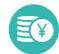

## 利益相关方参与

宁波华翔围绕规范沟通、透明披露和公平对待投资者等目标，持续完善相关管理机制，促进公司与资本市场之间的良性互动。公司依据《上市公司投资者关系管理工作指引》《深圳证券交易所上市公司自律监管指引第1号——主板上市公司规范运作》等要求，执行《投资者关系管理制度》，规范投资者接待和沟通方式，促进投资者对公司经营情况和发展规划的合理理解，帮助市场主体更加全面、客观地了解公司经营情况和发展方向。

## 关键绩效 报告期内

公司共开展投资者交流活动

19 次

累计接待投资者

98人

## 信息披露

宁波华翔围绕信息披露、未公开信息管理及关联交易合规等关键环节，持续强化投资者权益保护工作。公司严格执行《信息披露事务管理制度》，对信息披露事项实行统一管理，明确信息披露职责与流程安排，提升重大信息披露的及时性与一致性，减少信息不对称，保障投资者在信息获取方面的公平性。同时，我们贯彻《内部信息知情人管理制度》，规范重大事项未公开信息的知情范围与管理要求，防范内幕信息风险，维护资本市场秩序。在关联交易等可能影响投资者利益的事项中，我们依据《关联交易公允决策制度》，履行严谨审议与披露程序，保障交易决策的公允性，维护公司整理利益及全体股东的合法利益。

## 风险管理与内部控制

## 治理

宁波华翔围绕规范经营和稳健发展的管理目标，创建了风险管理部，并建立包含专职员工6人和兼职员工12人的风控团队，系统推进风险管理和内部控制体系建设与维护，通过系统化的方法构建一体化的风险管理与内部控制运行体系，将风控理念和风险要素深度嵌入集团的战略规划、重大决策与日常运营全流程，通过主动的风险识别与精准的内控管控和优化措施，提升运营效率，保障资产安全，为集团的可持续高质量发展与战略目标实现提供坚实的“防火墙”和“导航仪”。公司持续执行《内控制度》《审计制度》等制度文件，明确风险管理和内部控制的职责分工、管理边界及审批权限，确保风险管理要求有效融入公司治理各环节。公司内部控制体系以合法合规、资产安全、财务报告真实可靠、经营效率效果及战略目标实现为基本目标，并以内部环境、风险评估、控制活动、信息与沟通、内部监督五要素为框架，构建起全面、运转有效的内控管理基础。

宁波华翔内部控制五要素框架  
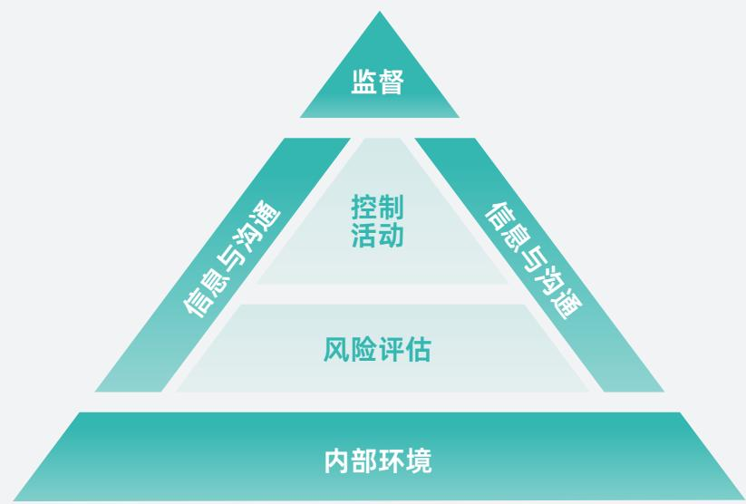

flowchart

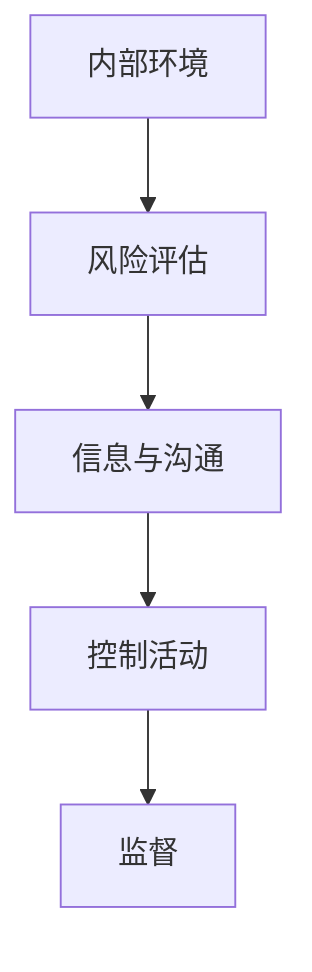
```mermaid
graph TD
  A["内部环境"] --> B["风险评估"]
  B --> C["信息与沟通"]
  C --> D["控制活动"]
  D --> E["监督"]
```

## 关键绩效

宁波华翔定期披露报告数量

8份

发布临时公告数量

148 个

## 战略

宁波华翔将风险管理与内部控制作为支持公司战略稳健实施的重要管理工具。通过持续识别和评估经营环境变化、业务复杂度提升以及管理规模扩大的潜在影响，公司在战略执行过程中同步推进权限管理、流程优化和制度完善，防范系统性和重大经营风险，为中长期发展战略提供支撑。

## 影响风险与机遇管理

宁波华翔围绕经营稳健性和管理规范化目标，持续推进风险管理与内部控制一体化运行，将风险识别、评估和应对要求嵌入业务管理全过程，系统推进风险管理和内部控制体系建设与维护，通过系统化和数字化的方法构建一体化的风险管理与内部控制运行体系，将风控理念和风险要素深度嵌入集团的战略规划、重大决策与日常运营全流程，通过主动的风险识别与精准的内控管控和优化措施，提升运营效率，保障资产安全，降低经营不确定性对公司经营和战略执行的影响。

## 风险识别与评估

公司全面构建风险管理“三道防线”，结合业务结构和管理实际，对可能影响公司经营目标实现的风险进行系统识别与评估。

宁波华翔风险管理的三道防线

<table><tr><td></td><td>防线主体</td><td>内控职责</td><td>主要责任人</td></tr><tr><td>第一道防线</td><td>各子公司/工厂(管理层)</td><td>落实内控制度的设计、执行和内控自评</td><td>工厂或子公司的总经理、总监、经理等各部主管(最后一关为财务)</td></tr><tr><td>第二道防线</td><td>股份公司各部门(管理层)及风险管理部</td><td>内部控制的总体设计建设、监管和监督检查</td><td>股份公司总裁、副总裁、各部门经理等主管(最后一关为财务)</td></tr><tr><td>第三道防线</td><td>审计部</td><td>风险管理及内审工作推动</td><td>审计部负责人</td></tr></table>

## 风险应对与控制

公司针对识别出的主要风险，从组织权限、业务流程和制度执行等方面落实风险应对措施。报告期内，公司发布并组织贯彻新版《集团管理集分权手册》对财务，采购，运营等关键业务领域的职责边界，审批权限和管理层级进行系统梳理和优化，进一步明确权责划分防范因授权不清，职责交叉或管理边界模糊带来的经营风险

同时，我们持续完善关键业务领域制度体系：

风险管理制度体系

<table><tr><td>管理领域</td><td>相关制度</td><td>风险管控重点</td></tr><tr><td>法务事项管理</td><td>《诉讼管理办法》</td><td>规范集团及所属子公司民事诉讼、仲裁案件(以下统称“诉讼案件”)的管理,优化案件决策与处理流程。</td></tr><tr><td>资金与费用管理</td><td>《费用报销管理细则》《业务费管理制度》</td><td>细化公司报销管理制度,规范报销付款程序,避免报销附件不齐全、异常事项审批不规范等风险;规范业务费管理,合理控制业务支出,防范经营合规风险,提升管理透明度。</td></tr><tr><td>采购及工程项目管理</td><td>《供应商黑名单管理办法》</td><td>防范因供应商问题导致的各类风险,保障公司供应链的稳定、安全与高效。</td></tr><tr><td>资产与库存管理</td><td>《IT终端设备管理规定》</td><td>规范公司IT终端设备的使用管理,保障公司信息安全,防止IT终端设备出现遗失、恶意外带等风险。</td></tr></table>

## 内控监测与整改

公司依托内控自评构建常态化风险监测机制，定期组织覆盖关键业务流程和重点管理环节的内控自评测试。通过自评结果，我们及时发现潜在风险隐患与管理缺陷，并将发现的问题纳入闭环整改流程，推动内控体系持续优化。

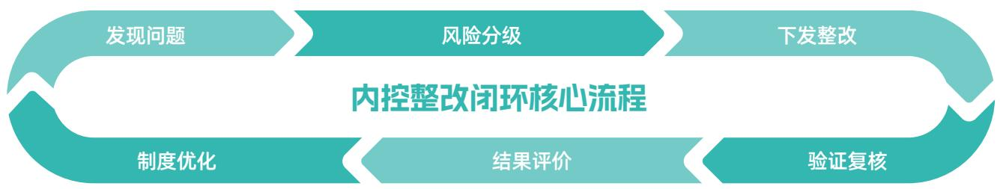

flowchart

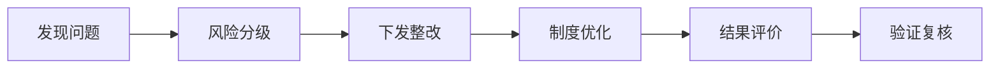
```mermaid
graph LR
  A["发现问题"] --> B["风险分级"]
  B --> C["下发整改"]
  C --> D["制度优化"]
  D --> E["结果评价"]
  E --> F["验证复核"]
```

## 指标与目标

宁波华翔通过内控自评、专项检查和整改跟踪等方式，对风险管理与内部控制运行效果进行持续监测。在管理目标方面，公司以提升内控有效性、降低流程风险和增强管理规范性为导向，持续推进制度完善、流程优化和内控宣贯工作，系统提升风险识别和应对能力，为企业规范运作和稳健经营提供长期支撑。

## 反商业贿赂反贪污

宁波华翔将廉洁经营和反商业贿赂视为企业稳健运行的重要基础，明确对贪污、受贿、利益输送等行为秉持“零容忍”态度。公司持续执行《监察管理办法》和《反舞弊管理制度》，并通过风险识别、监督机制和文化引导，推动廉洁要求融入经营管理全流程，致力维护公平、透明的商业环境。公司持续强化董事会、审计委员会及管理层在廉洁治理中的职责分工，明确各层级在廉洁风险防控中的管理责任和监督责任，推动反商业贿赂与反贪污工作与公司治理体系协同运行。

宁波华翔反舞弊架构  
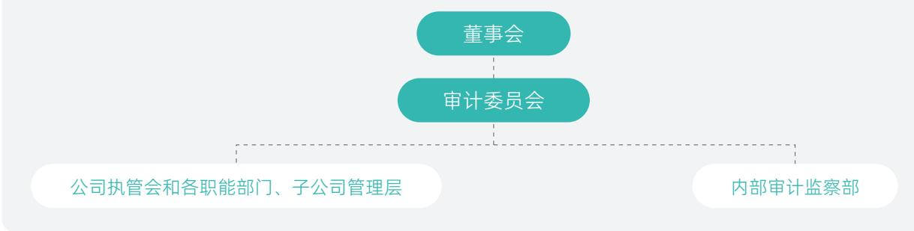

flowchart

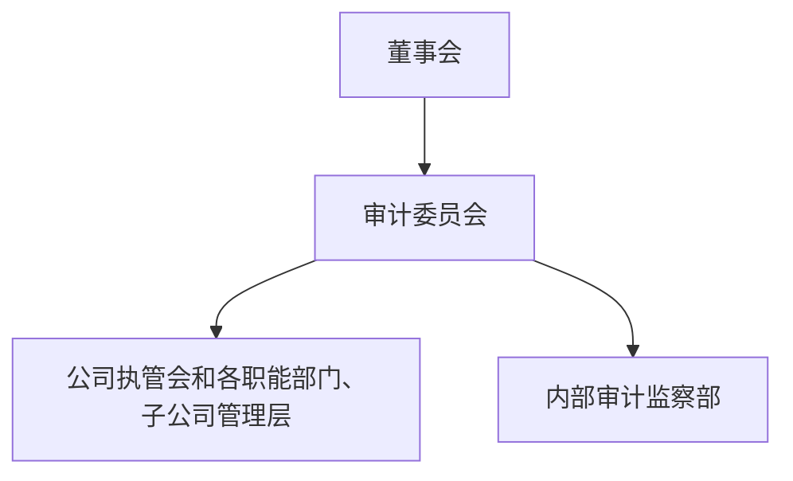
```mermaid
graph TD
  A["董事会"] --> B["审计委员会"]
  B --> C["公司执管会和各职能部门、子公司管理层"]
  B --> D["内部审计监察部"]
```

## 廉洁风险识别与重点领域防控

公司以廉洁风险图谱为管理工具，围绕管理层决策、采购与销售、财务管理、数据与信息安全等关键环节，识别潜在廉洁风险。我们对利益冲突、商业贿赂、渎职懈怠、数据造假及商业机密泄露等风险进行分类管理，并针对不同风险类型匹配差异化的防控措施，推动廉洁风险管理由事后处置向事前预防转变。

廉洁风险识别与应对

<table><tr><td>风险类型</td><td>风险表现</td><td>主要应对措施</td></tr><tr><td>利益冲突</td><td>决策不公、资源滥用</td><td>· 利益冲突申报· 涉及利益冲突的决策实行独立审查· 关键岗位轮岗</td></tr><tr><td>贪污受贿</td><td>回扣、索贿、侵占资产</td><td>· 公开招标· 第三方审计· 匿名举报渠道</td></tr><tr><td>渎职懈怠</td><td>消极履职、管理失效</td><td>· KPI管理· 绩效考核· 问责机制</td></tr><tr><td>数据造假</td><td>虚报业绩、财务失真</td><td>· 报表和关键数据双人复核· 数据审计系统留痕</td></tr><tr><td>商业机密泄露</td><td>信息外泄</td><td>· 敏感数据分级授权和访问权限管理· 签署保密协议· 定期开展信息安全培训和模拟测试</td></tr></table>

## 廉洁文化建设

宁波华翔持续将廉洁理念融入企业文化建设，通过制度宣贯、案例警示和日常传播等多种方式，引导员工形成守法合规、诚实守信的价值认同。同时，公司通过文化引导推动廉洁理念内化于心、外化于行，逐步形成以诚信合规为导向的企业文化氛围，为企业长期稳健发展提供坚实保障。此外，我们依托“廉洁华翔”公众号和员工合规培训，持续开展法律法规解读、合规要点提示及典型案例警示，将廉洁要求与实际业务场景相结合，增强员工对合规红线和行为边界的理解与认知。

## 关键绩效 报告期内

公司反贪腐培训总人次

987人次

培训时数达

2,961 小时

## 举报机制与举报人保护

宁波华翔持续运行多元化举报机制，面向员工及外部相关方开放举报电话、电子邮箱及线上平台等渠道，鼓励对涉嫌舞弊、贿赂及其他不当行为进行举报。同时，公司高度重视举报人权益保护，在举报受理、调查处理及结果反馈过程中，严格执行信息保密要求，防止举报人因举报行为受到不当影响。对经核实的有效举报，我们依据相关制度给予相应激励，以增强监督机制的公信力和有效性。报告期内，宁波华翔未发生反贪污及商业道德相关的诉讼案件。

text_image

举

## 举报渠道

举报电话：

13818037523

举报邮箱：

audit@nbhx.com

公众号：

“廉洁华翔”- 我要举报

## 信息安全与客户隐私保护

宁波华翔将信息安全与客户隐私保护作为支撑公司数字化运营、保障客户与合作伙伴信任的重要基础。公司围绕“制度规范—技术防护—运行监测—事件响应—监督改进”构建一体化管理体系，持续落实《信息安全管理手册》《信息化安全管理制度》《访问控制管理程序》《信息安全事件管理程序》等制度要求，明确各层级、各岗位在信息安全和客户隐私保护中的职责要求，系统防范信息泄露、网络攻击和数据滥用等风险，推动信息安全与隐私保护从“合规要求”转化为“可落地、可检验、可持续改进”的日常管理能力。

## 体系建设

公司规范信息系统使用和运维行为，围绕“最小权限、分级授权、全程留痕”的访问控制原则，制定并执行《电子邮件使用及管理制度》《上网行为管理制度》《信息机房管理制度》《基础架构安全运维细则》《商业软件正版化管理制度》等制度，降低因操作不当或管理疏漏带来的信息安全风险。

## 关键绩效 报告期内

宁波华翔持续开展运行维护和自查改进，

下属子公司均通过TISAX安全认证，

集团也通过ISO 27001认证

信息安全体系认证覆盖率为

100%

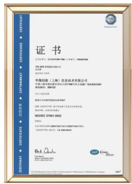

text_image

证书
证书编号：13-23190238 7488（注册号：7403487266）
YIN-CHINA SECURITIES CO.,LTD.
主办单位：
香港中文大学
华能创新（上海）信息技术有限公司
中国·上海申银万国证券交易所上市规则》（GB/TN-00000000000000000000000000000000000000000000000000000000000000000000000000
代码:299122
经办人：张俊波
地址：上海市浦东新区陆家嘴环路528号
邮政编码：270112
ISOIEC 27011-2022
批准文号：沪械协发[2022]第183号《中国证券报》、《上海证券报》、《证券时报》、《证券日报》
ISBN 978-7-5
ISBN 978-7-5
ISBN 978-7-5
ISBN 978-7-5
ISBN 978-7-5
ISBN 978-7-5
ISBN 978-7-5
ISBN 978-7-5
ISBN 978-7-5
ISBN 978-7-5
ISBN 978-7-6
ISBN 978-7-6
ISBN 978-7-6
ISBN 978-7-6
ISBN 978-7-6
ISBN 978-7-6
ISBN 978-7-6
ISBN 978-7-6
ISBN 978-7-6
ISBN 978-7-6
ISBN 978-7-7
ISBN 978-7-7
ISBN 978-7-7
ISBN 978-7-7
ISBN 978-7-7
ISBN 978-7-7
ISBN 978-7-7
ISBN 978-7-8
ISBN 978-7-8
ISBN 978-7-8
ISBN 978-7-8
ISBN 978-7-8
ISBN 978-7-8
ISBN 978-7-8
ISBN 978-7-8
ISBN 978-7-9
ISBN 978-7-9
ISBN 978-7-9
ISBN 978-7-9
ISBN 978-7-9
ISBN 978-7-9
ISBN 978-7-9
ISBN 978-7-10
ISBN 978-7-10
ISBN 978-7-10
ISBN 978-7-10
ISBN 978-7-11
ISBN 978-7-11
ISBN 978-7-11
ISBN 978-7-11
ISBN 978-7-12
ISBN 978-7-12
ISBN 978-7-12
ISBN 978-7-12
ISBN 978-7-13
ISBN 978-7-13
ISBN 978-7-13
ISBN 978-7-13
ISBN 978-7-14
ISBN 978-7-14
ISBN 978-7-14
ISBN 978-7-14
ISBN 978-7-15
ISBN 978-7-15
ISBN 978-7-15
ISBN 978-7-15
ISBN 978-7-16
ISBN 978-7-16
ISBN 978-7-16
ISBN 978-7-16
ISBN 978-7-16
ISBN 978-7-16
ISBN 978-7-16
ISBN 978-7-16
ISBN 978-7-16
ISBN 978-7-16

宁波华翔ISO 27001信息安全体系认证证

## 风险管理

公司以“主动排查、持续修复、快速响应”为核心思路，持续加强技术防护与风险识别能力。

信息安全风险管理

<table><tr><td>管理</td><td>实践</td><td>绩效</td></tr><tr><td>技术防护与风险识别</td><td>定期开展漏洞扫描和渗透测试,识别系统薄弱环节并落实整改。</td><td>· 漏洞扫描报告· 渗透测试/渗透验证报告· 整改跟进记录</td></tr><tr><td>入侵监测与应急演练</td><td>组织年度入侵检测和病毒应急演练,验证告警识别与处置流程。</td><td>· 入侵检测演练报告· 病毒应急演练记录及总结报告</td></tr><tr><td>数据保护与业务连续性</td><td>对关键系统和重要数据实施分级备份,定期开展恢复验证,保障业务连续运行能力。</td><td>· 测试恢复记录</td></tr><tr><td>安全事件管理</td><td>建立信息安全事件分级响应和处置机制,规范事件报告、处置与复盘流程。</td><td>· 应急处置记录</td></tr><tr><td>第三方与供应链安全</td><td>制定《供应商关系管理程序》,对安全服务和技术支持类合作进行规范。</td><td>· 签署《安全服务授权书》</td></tr><tr><td>内部评估与审计改进</td><td>制定《信息安全评估表》,对分子公司开展安全审计和自评,推动整改闭环。</td><td>· 审计记录、整改措施及跟进情况</td></tr></table>

## 能力建设

公司围绕数据安全与隐私保护开展系统性专项培训与宣贯，强化相关岗位人员的能力建设。通过将制度规范、典型风险场景与岗位操作规范结合起来，提升员工对客户信息保护、敏感数据处理与安全操作的意识与自觉，减少因人为疏忽导致的泄露风险。

## 关键绩效 报告期内

宁波华翔

未发生信息安全

及客户隐私泄露事件

公司隐私与数据

安全培训总人数达

1,117人

培训总时长为

8,936小时

涉及信息安全员工的

培训覆盖比例达

100%

## 04 经营

## 对标联合国可持续发展目标

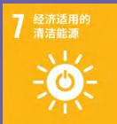

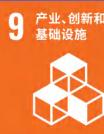

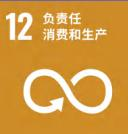

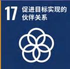

## 关键议题

创新驱动 | 低碳产品 | 供应链安全 | 可持续采购

产品和服务安全与质量 | 客户服务 | 知识产权保护

技术创新 35

智能制造与精益管理 38

产品质量与安全 41

供应链管理 45

客户关系管理 49

知识产权保护 50

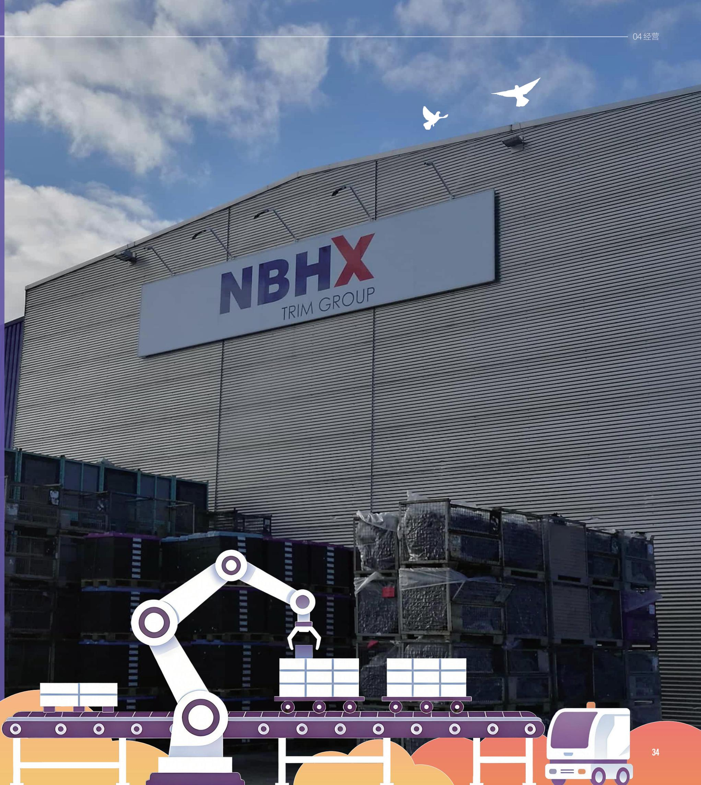

text_image

NBHX
TRIM GROUP
04经营
34

## 技术创新

## 治理

宁波华翔建立了系统化、规范化的研发创新治理体系，以前瞻性技术布局驱动业务发展，并根据市场需求与行业趋势开展定制化创新，持续构筑与强化企业核心竞争力。公司设立创新项目管理组织架构，涵盖从战略决策到落地执行的全链条，并制定《创新项目管理办法》《项目研发管理制度》和《产品开发奖励办法》等一系列研发创新制度，确保创新活动与集团战略紧密协同。

## 关键绩效 2025年

公司研发人员为

1,624 人

研发人员占比

7.31

研发投入为

89,131.97 万元

## 创新项目管理组织架构

## 创新主任委员会

总经室及各工厂总经理

负责创新方向指导与创新活动资源调配。

## 总干事

新品开发科长

负责监控公司（含子公司）日常创新事务执行与成效达成情况。

## 创新执行委员会委员

各市场经理、客户经理、开发各科长

把握市场与客户未来需求，联动客户提出创新课题，推进科室内创新活动，审核创新项目并推动实施。

## 项目负责人

负责创新项目目标制定、项目进度与预算费用控制，整合项目资源。

## 战略

创新是宁波华翔持续发展的核心驱动力。公司以“智能技术赋能华翔未来”为愿景，致力于从“技术跟随者”向“标准制定者”跃升，围绕轻量化材料、智能化座舱、新能源集成、自动化工艺等方向，构建覆盖“前沿预研-技术转化-产品速赢”的三级研发体系。公司坚持以客户需求为导向，依托三级研发机制与数字化协同平台，推动新材料、新工艺、新产品的持续突破，为客户提供高价值、高性能的内外饰系统解决方案，助力汽车产业绿色化、智能化转型。

## 影响、风险与机遇管理

## 创新资质与体系认可

宁波华翔在创新能力建设方面持续获得政府与行业权威认可，体系化、高水平的研发实力为可持续发展注入强动能。

## 资质认证荣誉

## 翼锐科技

## 金属科技

flowchart

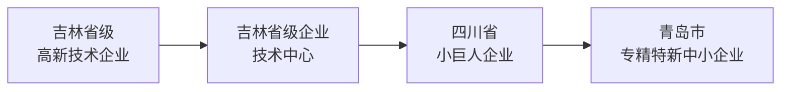
```mermaid
graph LR
  A["吉林省级\n高新技术企业"] --> B["吉林省级企业\n技术中心"]
  B --> C["四川省\n小巨人企业"]
  C --> D["青岛市\n专精特新中小企业"]
```

## 劳伦斯

## 胜维德赫

## 南昌华翔

## 井上华翔

flowchart

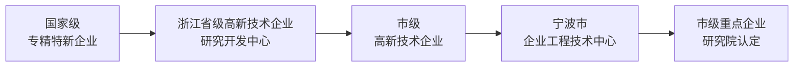
```mermaid
graph LR
  A["国家级\n专精特新企业"] --> B["浙江省级高新技术企业\n研究开发中心"]
  B --> C["市级\n高新技术企业"]
  C --> D["宁波市\n企业工程技术中心"]
  D --> E["市级重点企业\n研究院认定"]
```

## 诗兰姆

## 华翔内饰

flowchart

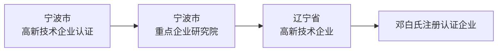
```mermaid
graph LR
  A["宁波市\n高新技术企业认证"] --> B["宁波市\n重点企业研究院"]
  B --> C["辽宁省\n高新技术企业"]
  C --> D["邓白氏注册认证企业"]
```

natural_image

Silhouette of a trophy with a star on top (no text or symbols)

## 创新文化

公司高度重视研发人才体系建设与创新文化培育，通过打破部门壁垒、提升容错空间，加速人才成长，为续创新提供深层的氛围支撑。

## 创新文化培养措施

## 创新氛围

- 发布“允许失败”文化宣言，建立失败案例复盘机制。  
推行流程优化与敏捷开发试点，定期召开技术雷达会议。

## 人才培养

建立分层级、定制化内部培养体系，搭建内部人才库与技能标签系统。  
设计“职业双通道”发展路径，设立年轻人才“快速通道”。  
强化“师徒制”传统，促进经验传承。

## 校企合作

与高校共建联合实验室、定制化培养项目及实习基地。  
- 将产业前沿需求融入课程设计与人才培养过程。

## 产学研合作案例

华翔科技与吉林铁道职业技术大学合作开展吉林省教育厅产业化培育专项“镀锌零件焊道气孔问题研究”，有效解决车身零部件焊接工艺难题，形成产学研协同解决生产实际问题的成功范式。

## 创新激励与活动

公司构建起覆盖“创意提出-项目立项-成果验收”全链条的创新激励体系，鼓励员工通过标杆研究、客户声音、技术趋势等渠道提出创新课题。

## 创新激励体系

## 创意提出

创意收集：员工通过多种渠道提交创意。  
筛选与采纳：新品开发科组织评审，择优立项。  
即时激励：对采纳的创意给予现金奖励。

## 项目立项

● 项目策划：任命负责人，制定详细项目方案。  
…● 团队组建：成立跨职能创新团队。  
结构化激励：项目奖金与项目价值、质量、难度及成本效益挂钩。

## 成果验收

● 项目总结：编写总结报告，完成验收评审。  
荣誉表彰：在年度会议上公开表彰优秀项目与个人。  
成果推广：推动创新成果市场化与专利申请。

## 创新生态

公司积极推动行业规范化发展，深度参与汽车内外饰、轻量化材料、智能零部件等领域的标准制定工作与行业协会活动，推动产业链协同创新与共性技术突破。公司及旗下子公司主要参与的标准制定项目包括：

## 关键绩效

华翔内饰、劳伦斯参与制定行业标准《汽车用改性聚丙烯车门外板》。  
è 华翔科技参与制定中国技术市场协会团体标准T/TMAC162-2025《电动汽车用一体化压铸电池托盘》。  
胜维德赫参与制定团体标准《乘用车外后视镜总成》。

## 案例

## 宁波华翔参与行业协会活动

诗兰姆参与车用电路系统2025团体标准研讨会，并加入汽车标准化技术委员会，持续推动行业协同发展。

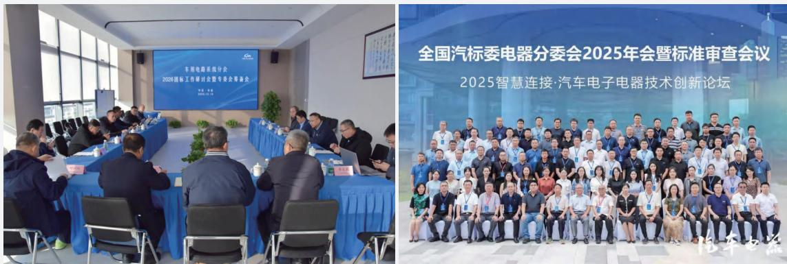

## 智能制造与精益管理

宁波华翔将智能制造作为实现可持续、高质量发展的核心引擎，通过深度融合工业物联网（IOT）、人工智能（AI）及自动化技术改造传统生产体系，推动生产过程的绿色化、精益化与智能化升级，全面提升资源利用效率、产品品质与员工工作环境。

## 工业物联网（IOT）赋能运营

公司构建工业物联网（IOT）平台，实现关键生产设备的实时数据采集、边缘计算与云端协同，依托参数可视化与异常预警，支持现场团队快速响应、精准干预，推动生产运营从经验驱动向数据驱动转型。

## 工业物联网（IOT）赋能举措

## 数据采集与监控

实时采集核心设备的工艺参数，实现全流程可视化管理。

## 异常预警与推送

设置关键参数动态阈值，当参数异常时，系统自动通过企业微信推送至现场团队，确保问题及时发现与处理。

## 分析优化与闭环

基于历史数据对比分析，评估干预效果，持续优化阈值设定与工艺参数，形成“监测-预警-干预-反馈”的闭环管理。

## 案例 内饰注塑节拍IOT平台优化实践

针对注塑工序中设备节拍时间参差不齐、劣化趋势较难及时发现的问题，公司依托IOT平台，对关键工步参数进行实时采集并设置动态阈值预警。当设备节拍出现异常时，系统自动推送信息至现场团队，支持快速定位与工艺优化。预警机制投用后注塑机平均节拍时间由69.3秒降至66.9秒，降幅达3.5%，有效提升了单位时间产出效率，并为后续构建预测性维护体系积累了数据基础，推动生产运营向精益化与智能化转型。

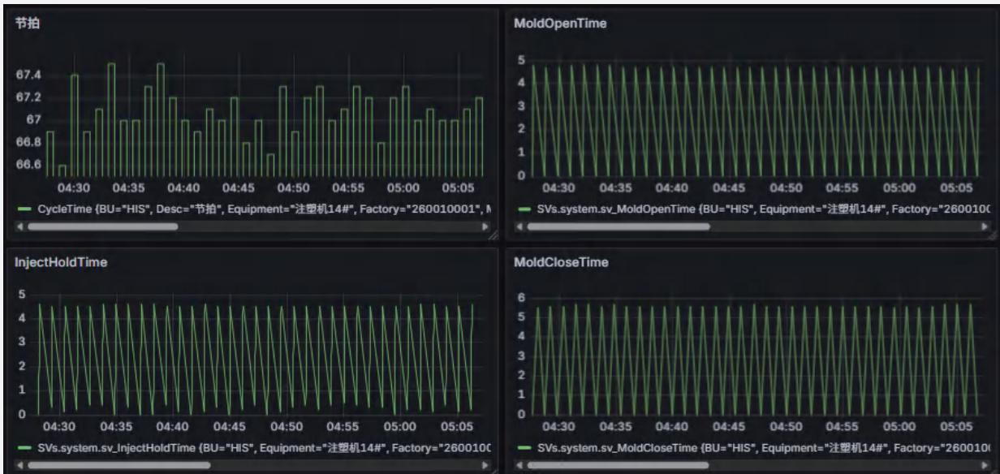  
内饰注塑节拍IOT平台优化实践

## 工艺节能与绿色生产

公司将绿色理念深度融入生产工艺规划与优化全过程，积极推行节能降耗举措。

## 工艺规划与优化举措

## 智能排产优化

通过引入计划与排程系统，综合考虑订单、设备能效、物料供应等因素，实现生产计划的最优解决方案，有效减少设备空转与能源峰值负荷。

## 绿色工艺与材料应用

在新工艺设计与旧线改造中，优先选用可回收材料与低能耗设备。

## 产线自动化与效能提升

公司持续推动产线自动化升级，深度融合机器视觉、具身机器人技术与生产流程，在装配、检测等关键环节部署智能化设备，提升生产一致性与效率，降低人工操作强度与质量风险。

## 产线自动化与效能提升举措

## 自动化视觉检测

针对多品种、高节拍产品部署AI视觉检测设备，替代人工目检，实现高效精准缺陷识别。

## 工艺参数优化

基于检测数据反馈，持续优化生产参数，降低过杀率，提升良品率。

## 案例

## 扎扣件视觉检测项目

针对扎扣类产品种类繁多、人工检测易疲劳漏检的痛点，公司自主研发基于AI的视觉检测模型，采用高精度特征提取与注意力增强定位技术 兼容0NNX格式实现跨平台部署，测试阶段该模型实现100%不良品检出率，过杀率控制在5%，显著提升了检测效率与可靠性。

该模型实现

100% 不良品检出率

过杀率控制在

5%

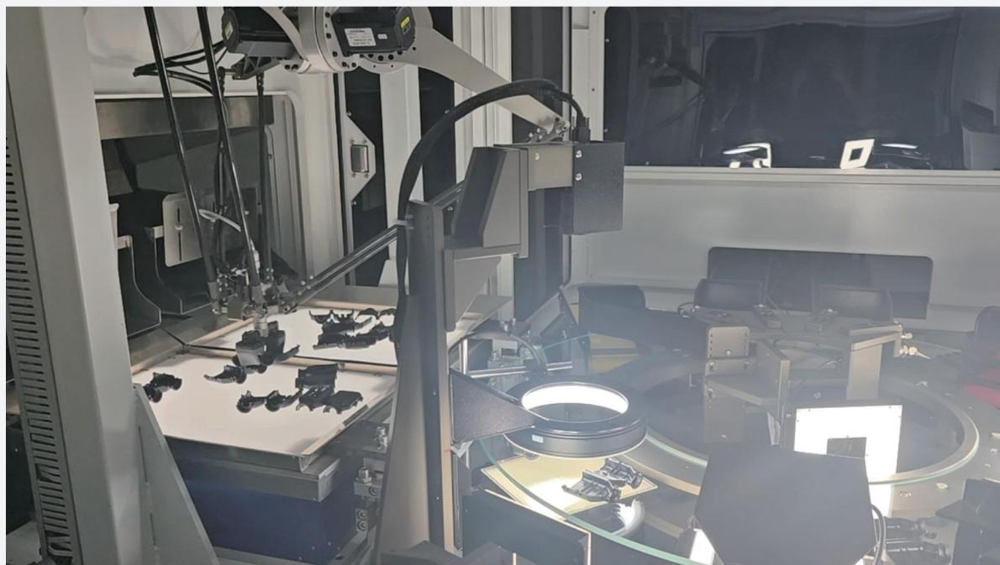

natural_image

Industrial robotic arm operating in a factory setting with circular machinery and mechanical components (no visible text or symbols)

## 产品质量与安全

## 治理

宁波华翔持续完善覆盖集团与子公司的产品质量与安全治理架构，由运营管理部统筹集团质量管理制度与标准，统一质量管理要求、流程规范和考核机制，并对各子公司质量管理体系运行情况实施监督与指导。公司建立并持续更新以《质量管理手册》为核心的质量管理制度体系，配套形成《生产过程质量管理办法》《供应商质量管理办法》《质量持续改进管理办法》系列程序文件，为产品质量安全提供坚实保障。各子公司总经理作为质量管理第一责任人，全面负责公司质量方针、质量目标及质量管理制度的制定、落实与改进。

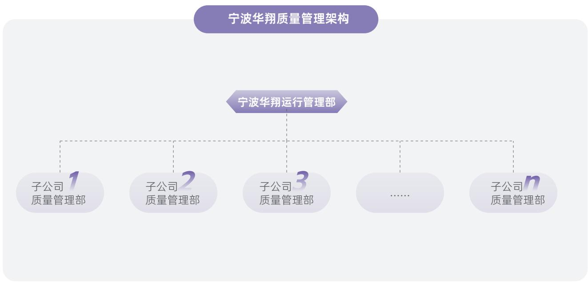

flowchart

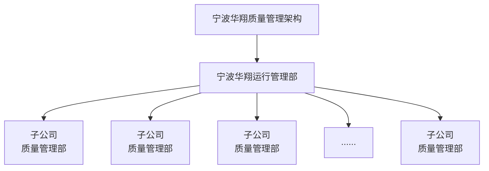
```mermaid
graph TD
  A["宁波华翔质量管理架构"] --> B["宁波华翔运行管理部"]
  B --> C["子公司\n质量管理部"]
  B --> D["子公司\n质量管理部"]
  B --> E["子公司\n质量管理部"]
  B --> F["......"]
  B --> G["子公司\n质量管理部"]
```

## 战略

宁波华翔将产品质量与安全视为实现 Tier 0.5 战略的重要基础，坚持“质量不是检验出来的，而是设计和过程控制出来的”理念， 将质量管理前移至产品设计和工艺策划阶段， 贯穿产品全生命周期。公司以满足客户需求和保障产品安全为核心目标，持续推动质量管理与精益生产、自动化制造和数字化管理的深度融合，通过强化过程稳定性、降低系统性风险和提升响应效率，不断提高产品可靠性与一致性，为客户提供高质量、可持续的全产品解决方案。

## 影响、风险与机遇管理

宁波华翔系统识别并应对产品全生命周期中可能产生影响的质量风险，通过完善质量管理机制、强化过程控制、推动数字化赋能以及持续培育质量文化，从源头预防质量风险、降低缺陷发生概率，不断提升产品一致性与交付可靠性，为业务稳健发展创造长期价值。

## 质量管理机制

公司以系统化、前瞻性的质量管理机制作为风险防控的重要抓手，将风险识别与过程控制嵌入研发、采购、生产和交付等关键环节，持续降低质量事件发生概率并提升整体运营韧性。报告期内，宁波华翔一级子公司保持通过IATF 16949 质量管理体系认证。

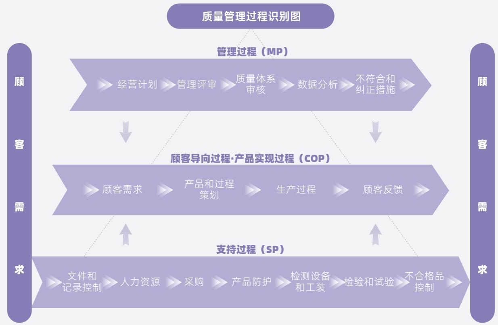

flowchart

```mermaid
graph TD
  A["质量管理过程识别图"] --> B["管理过程 (MP)"]
  B --> C["经营计划"]
  B --> D["管理评审"]
  B --> E["质量体系审核"]
  B --> F["数据分析"]
  B --> G["不符合和纠正措施"]
  
  subgraph sg["\"顾客需求\""]
    H["顾客需求"]
    I["产品和过程策划"]
    J["生产过程"]
    K["顾客反馈"]
  end
  
  subgraph COP["\"顾客导向过程·产品实现过程 (COP)\""]
    L["顾客需求"]
    M["产品和过程策划"]
    N["生产过程"]
    O["顾客反馈"]
  end
  
  subgraph SP["\"支持过程 (SP)\""]
    P["文件和记录控制"]
    Q["人力资源"]
    R["采购"]
    S["产品防护"]
    T["检测设备和工装"]
    U["检验和试验"]
    V["不合格品控制"]
  end
  
  C -.-> H
  D -.-> I
  E -.-> J
  F -.-> K
  G -.-> L
  H -.-> P
  I -.-> Q
  J -.-> R
  K -.-> S
  L -.-> T
  M -.-> U
  N -.-> V
  P -.-> Q
  Q -.-> R
  R -.-> S
  S -.-> T
  T -.-> U
  U -.-> V
```

产品全生命周期质量风险管控机制

<table><tr><td>关键环节</td><td>主要风险关注点</td><td>管理与控制措施</td><td>风险管控目标</td></tr><tr><td>产品开发与策划</td><td>设计缺陷、工艺不稳定</td><td>运用FMEA工具识别潜在失效模式,提前制定预防和控制措施。</td><td>将质量风险前移,降低设计和策划阶段缺陷发生概率。</td></tr><tr><td>供应链管理</td><td>来料不合格、供方能力不足</td><td>实施供应商准入评审、过程审核及绩效评价,对供方质量能力进行持续监控。</td><td>防止不合格物料进入生产环节,降低外部质量风险。</td></tr><tr><td>产品来料与检验</td><td>原材料、半成品质量波动</td><td>按质量策划要求开展来料检验及性能、功能测试。</td><td>确保投入生产的物料满足质量要求。</td></tr><tr><td>生产与过程管理</td><td>过程波动、批量性不良</td><td>推进自动化生产,应用MSA、SPC等工具,对关键工序实施过程监控和风险分级管理,及时纠偏。</td><td>提升过程稳定性,防止质量问题向下游传递。</td></tr><tr><td>产品出货与交付</td><td>成品缺陷、质量流出</td><td>对出货产品实施性能检验和状态确认。</td><td>实现产品“零缺陷、零流出”,保障客户使用安全。</td></tr><tr><td>体系运行与持续改进</td><td>风险点重复发生、整改不到位</td><td>通过内部审核、管理评审和问题闭环管理推动持续改进。</td><td>提升质量管理体系有效性和风险防控能力。</td></tr></table>

## 产品检验与不合格品管理

公司建立覆盖来料、过程及出货环节的多层级产品检验机制，并将“不合格品零流出”作为质量风险管控的重要目标。我们严格执行《不合格品管理办法》等制度，对生产和检验过程中识别出的不合格品实施分级管理和差异化处置，根据缺陷严重程度采取标识、隔离、评估、返工、报废等措施，避免误用或非预期流通。同时，我们通过《8D质量问题解决方法》对质量问题开展系统分析和闭环整改，持续降低同类问题重复发生的风险。

不合格品管理流程  
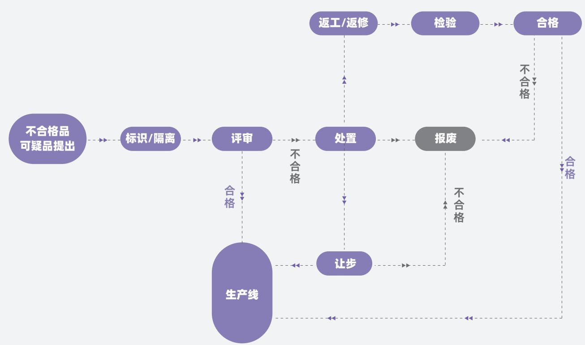

flowchart

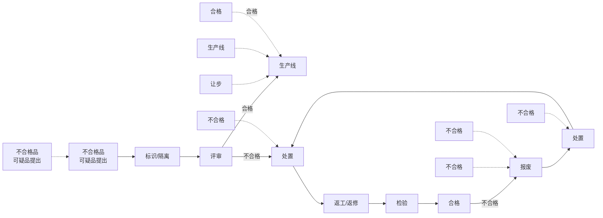
```mermaid
graph LR
  A["不合格品\n可疑品提出"] --> B["标识/隔离"]
  B --> C["评审"]
  C -->|合格| D["生产线"]
  C -->|不合格| E["处置"]
  E --> F["返工/返修"]
  F --> G["检验"]
  G --> H["合格"]
  H -->|不合格| I["报废"]
  I --> J["处置"]
  J --> E
  K["让步"] -.-> D
  L["生产线"] -.-> D
  M["合格"] -.->|合格| D
  N["不合格品\n可疑品提出"] -.-> A
  O["不合格"] -.-> E
  P["不合格"] -.-> I
  Q["不合格"] -.-> J
  R["不合格"] -.-> I
```

## 质量应急管理与产品召回

公司制定并执行《问题解决及处理管理办法》《紧急事故应急管理办法》《重大质量问题事态升级规定》，明确质量事件的报告、评估、升级和处置流程。在必要情况下，公司依法依规启动产品召回相关程序，成立专项工作小组，协调质量、生产、供应链及客户沟通等环节，确保风险快速控制、影响范围有效降低。

## 质量文化建设

公司将质量文化建设作为防范质量风险、把握持续改进机遇的重要支撑，致力推动质量管理要求由“制度约束”向“行为自觉”转化。我们制定并实施《质量奖惩管理规定》，将质量表现与激励约束机制相结合，引导员工主动关注质量风险、防范质量隐患。

## 案例

## QC 系列活动赋能质量改进

报告期内，公司开展QC改善活动、7QB大赛、QCC活动等系列项目，鼓励一线员工围绕生产现场、工艺流程及交付环节中的质量问题提出改进方案，并通过评审、交流和成果分享机制推动优秀经验在不同单位间复制应用。

宁波华翔饰条事业部2025年度“基石杯”7QB大赛  
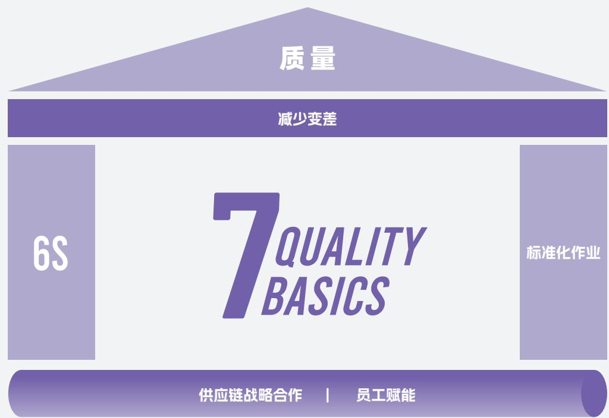

flowchart

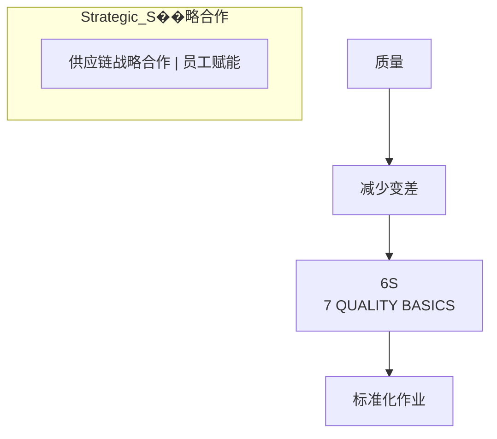
```mermaid
graph TD
  A["质量"] --> B["减少变差"]
  B --> C["6S\n7 QUALITY BASICS"]
  C --> D["标准化作业"]
  subgraph Strategic_S["Strategic_S��略合作"]
    E["供应链战略合作 | 员工赋能"]
  end
```

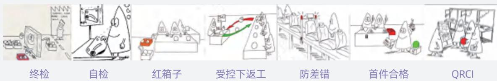

flowchart

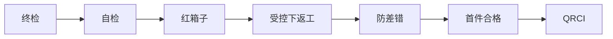
```mermaid
graph LR
  A["终检"] --> B["自检"]
  B --> C["红箱子"]
  C --> D["受控下返工"]
  D --> E["防差错"]
  E --> F["首件合格"]
  F --> G["QRCI"]
```

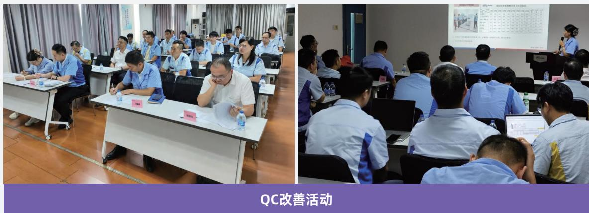

text_image

QC改善活动

QCC 典型质量改善案例

<table><tr><td>案例单位</td><td>改善主题</td><td>主要改善内容</td><td>风险防控与质量成效</td></tr><tr><td>宁波井上华翔</td><td>注塑模内切技术应用</td><td>通过优化模内切工艺方案,减少人工干预环节,提升成型稳定性。</td><td>降低因工艺波动导致的外观及尺寸缺陷风险,提高产品一致性。</td></tr><tr><td>成都井上华翔</td><td>429D(亚洲龙)中饰板+扶手提产增效改善</td><td>对工序节拍和作业流程进行系统优化,实现效率与质量协同提升。</td><td>在提升产能的同时保持质量稳定,减少批量性质量风险。</td></tr></table>

## 指标与目标

宁波华翔通过年度质量管理考核、卓越运营体系评估等方式，对各子公司质量管理绩效进行综合评价，考核内容涵盖客户关注、问题响应效率、产品质量水平、过程风险控制及供应商管理等关键维度，并将考核结果作为持续改进的重要依据。

报告期内，公司未发生产品召回事件。键绩效

## 供应链管理

## 治理

宁波华翔实行总部统筹、分子公司执行的分级授权供应链管理模式，形成职责清晰、权责匹配的供应链治理架构。公司围绕采购决策、供应商准入与退出、价格与成本管控等关键环节，建立较为完备的制度体系，包括《采购管理手册》《采购委员会管理办法》《潜在供方、新供方识别和批准管理办法》《供应商黑名单管理办法》等，明确采购决策层级、审批权限和关键控制点。其中，采购委员会作为重大采购事项的集体决策机制，对重要采购项目、关键供应商选择及异常事项进行审议，有效防范因个人决策或流程失控带来的合规与经营风险。

## 战略

宁波华翔将供应链管理定位为支撑公司全球化发展布局战略落地的重要基础能力，持续推动供应链由“成本导向”向“韧性与价值导向”升级。公司坚持多元化、分散化的供应商布局策略，在产品开发和量产阶段引入多家合格供应商，通过A/B点供应机制和动态评估机制，降低单一来源依赖风险。同时，公司将质量稳定、合规经营和长期合作潜力作为供应商管理的重要目标，推动形成与核心供应商协同发展的长期伙伴关系，增强供应链整体抗风险能力和可持续性。

## 影响、风险与机遇管理

宁波华翔持续关注原材料供应波动、供应商质量失效、合规与廉洁风险以及跨区域协同复杂性等核心风险点，强化过程管控、深化协同赋能，提升供应链整体韧性。

## 采购管理

公司构建总部统筹、分子公司执行的采购治理架构，对重大采购事项实行集体决策与分级授权相结合的管理模式。集团层面设立采购委员会，作为采购领域的重要决策与监督机制，负责审议重大采购项目、关键供应商选择及采购异常事项，强化对采购风险、合规性及成本合理性的统筹把控；各子公司在授权范围内执行具体采购活动，并接受总部的指导与监督。结合业务特点，公司在采购管理中区分生产物流采购与非生产物流采购，针对不同采购类型设置差异化管理要求和风险控制重点。在采购执行过程中，我们根据采购金额、项目性质及风险等级，明确不同层级的审批和决策路径，形成“事前评估—事中控制—事后留痕”的闭环管理。

## 采购管理

## 生产物流采购

主要涵盖原材料、零部件及与生产直接相关的物资，重点关注供应连续性、质量稳定性及交付能力，通过规范的供应商选择、比价与审批流程，降低因供应中断或质量波动对生产和客户交付造成的风险。

## 非生产物流采购

主要涉及设备、工程、服务及办公等支持性资源，通过明确审批权限、强化预算控制和过程留痕，防范不必要支出及合规风险，确保采购活动与经营需求相匹配。

## 数字化采购系统应用

## 数字化应用

公司通过SRM数字化采购系统实现采购需求发布、报价、订单执行及对账等流程的线上化和可追溯管理，减少人工干预和信息不对称风险，提升采购效率和风险识别能力，为跨区域、跨业务单元的协同采购提供支撑。

## 供应商准入与审核

为从源头和过程中系统防范供应链质量与合规风险，公司构建统一的供应商准入与审核管理体系，实施覆盖准入、合作和退出的全生命周期管理机制。

## 供应商准入综合评估维度

质量体系

交付能力

管理水平

合规表现

ESG社会责任

廉洁合规

## 供应商审核管理机制

## 审核监督

定期与不定期相结合，重点评估:

生产过程稳定性

质量控制能力

环境与社会风险表现

## 问题整改

要求供应商制定整改计划

进行复核验证，确保措施落实

## 风险管理

对存在以下情况的供应商：

严重不合规

持续经营风险

依法依规采取中止合作或退出措施

## 关键绩效 报告期内

公司共审查供应商

4,652 家

对其中 15

存在不合规情形的供应商采取中止合作措施

## 供应链赋能与协同发展

公司通过供应商大会、沟通交流和专项培训等方式，加强与供应商的互动与协同，推动供应链由单向管理向协同共建转变，以提升整体应对不确定性环境的能力。

## 案例

## 供应商大会及调研活动

报告期内，公司积极开展供应商大会及调研活动，围绕质量改进、合规要求和协同发展方向进行交流，推动优质资源共享和能力提升，帮助供应商更好适应公司全球化发展和高质量交付需求。大会共邀请200余家核心供应商参会，签到率超过90%，供应商整体满意度达100%。

## 大会共邀请

200余家核心供应商参会

签到率超过

90%

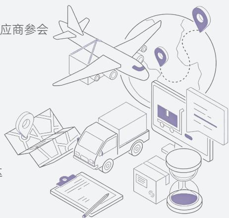

text_image

应商参会

供应商整体满意度达

100%

## 指标与目标

宁波华翔持续跟踪供应链管理成效，继续围绕供应链稳定性、质量表现和合规管理等关键指标，完善评估机制和改进措施，推动供应链管理能力与公司全球化战略和可持续发展目标协同提升。报告期内，我们围绕供应商数量结构、供应商审核覆盖情况及供应商协同管理成效等维度，系统呈现以下2025年供应链管理绩效表现。

text_image

04经营
48

## 客户关系管理

宁波华翔始终坚持以客户需求为导向，将高质量的客户服务视为产品竞争力和品牌信誉的重要组成部分。公司注重问题解决能力提升，持续完善客户沟通与反馈机制，推动客户关系管理向规范化、专业化和持续改进方向发展。

## 客户投诉管理与问题处置机制

公司依据《质量管理手册》建立覆盖信息收集、投诉受理、问题分析、处理反馈及结果跟踪的客户投诉管理机制，对售后问题实行统一受理、分级响应和全流程可追溯。针对涉及质量安全或影响重大的情形，我们执行《重大质量问题事态升级规定》和《产品质量售后索赔管理办法》，明确升级路径和责任分工，确保快速响应与统筹协调。针对客户投诉事项，公司第一时间成立跨部门问题解决小组，按照《8D质量问题解决方法》开展系统分析与处置。

客户抱怨处理流程  
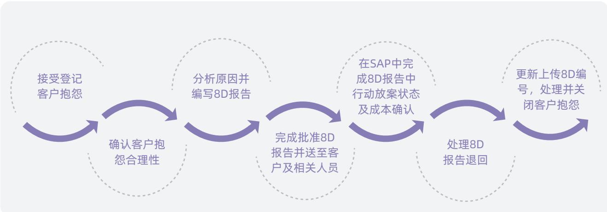

flowchart

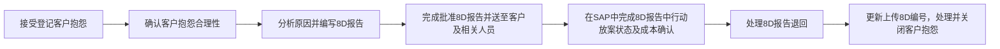
```mermaid
graph LR
  A["接受登记客户抱怨"] --> B["确认客户抱怨合理性"]
  B --> C["分析原因并编写8D报告"]
  C --> D["完成批准8D报告并送至客户及相关人员"]
  D --> E["在SAP中完成8D报告中行动放案状态及成本确认"]
  E --> F["处理8D报告退回"]
  F --> G["更新上传8D编号，处理并关闭客户抱怨"]
```

## 关键绩效 报告期内

投诉事项办结率为

100%

公司共发生客户投诉10起，均已按照既定流程完成调查、整改和反馈,投诉事项办结率为100%，未发生因售后处理不当引发的重大客户纠纷或升级事件。

## 客户沟通与满意度管理

公司持续加强与客户的日常沟通与关系维护，依据《全面客户满意度管理流程图》，系统开展客户满意度管理工作，明确调查组织、周期安排与结果应用机制，确保流程规范运行。针对重点客户，公司严格遵循IATF16949标准，定期从产品质量、交付表现、问题响应、技术支持及商务协同等维度收集反馈，并进行综合分析，识别共性改进方向。调查结果被系统纳入内部改进计划，推动在质量、物流、服务等方面的持续优化，实现以客户驱动管理提升的闭环。

## 关键绩效 2025年

我们共收回

635 份客户满意度调查表

客户满意度为

9.39分（满分10分）

## 知识产权保护

宁波华翔深知知识产权在技术创新和核心竞争力构建中的重要作用，持续完善知识产权管理架构，系统推进知识产权工作的规范化管理。公司严格遵循《中华人民共和国专利法》《中华人民共和国著作权法》以及《企业知识产权管理国家标准》等法律法规要求，结合集团管理实际，持续健全知识产权管理制度体系。同时，公司落实《保密承诺书》签署工作，将知识产权保护要求前置嵌入用工管理和研发流程。此外，公司将知识产权保护纳入员工培训体系，定期开展知识产权相关培训，通过案例讲解和实务分享，提升研发和技术人员对知识产权管理要求的理解和执行水平，进一步推动知识产权保护要求在业务一线落地。

知识产权管理机制

<table><tr><td>集团层面</td><td>结合研发项目推进情况,持续实施专利审核和合规评估机制,对研发成果进行过程管控,防范潜在侵权风险,保障技术成果的合法合规使用。</td></tr><tr><td>分子公司层面</td><td>在集团统一管理框架下,制定并实施与自身业务特点相匹配的《知识产权管理制度》,明确专利申请、成果归属、使用管理及风险防控等流程要求,提升知识产权管理在基层单位的可操作性和执行力。</td></tr></table>

## 关键绩效 截至2025年末，宁波华翔共获得

有效专利总数

648件

外观专利

11 件

发明专利

101 件

外观专利

536件

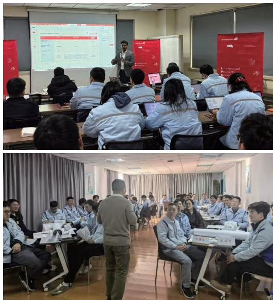  
井上华翔和胜维德赫开展员工知识产权培训

## 05 环境

## 对标联合国可持续发展目标

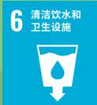

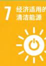

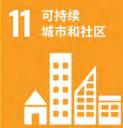

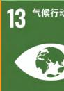

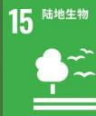

## 关键议题

应对气候变化 | 环境合规管理 | 能源利用 | 水资源利用

废弃物管理 | 污染物排放 | 循环经济

应对气候变化 53

环境合规管理 56

能源利用 60

水资源管理 63

排放与废弃物 64

绿色包装 69

绿色办公 69

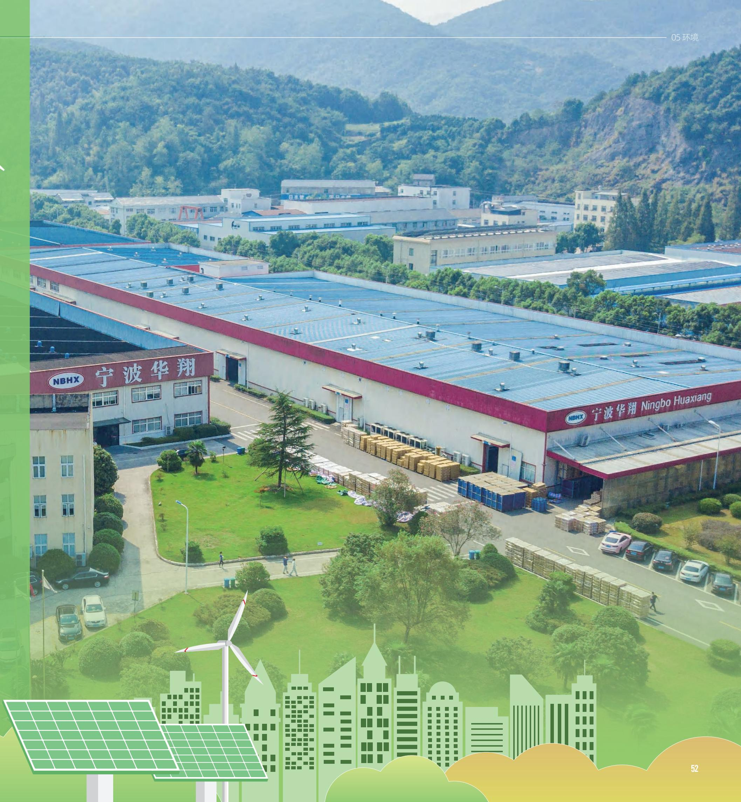

text_image

05 环境
NBHX 宁波华翔
NBHX 宁波华翔 Ningbo Huaxiang
52

## 应对气候变化

宁波华翔积极响应国家“双碳”战略，将可持续发展深植于公司转型的核心。公司系统化管理气候风险与机遇，前瞻布局低碳技术研发，并与产业链伙伴协同共进，致力于构建绿色、韧性的产业生态。

## 温室气体排放管理

宁波华翔聚焦于能源结构优化与能效提升实施温室气体减排行动。在直接排放方面，公司通过生产工艺改进、设备热能回收及推动厂内车辆电动化，有效控制天然气燃烧与燃油消耗产生的排放。在间接排放方面，公司大力推进清洁能源替代，已在多个工厂建设分布式光伏系统，并积极采购绿色电力，其中长春、沈阳等工厂已实现100%绿电使用，从源头显著降低碳足迹。

2025年温室气体排放数据

<table><tr><td>指标</td><td>单位</td><td>2025年</td></tr><tr><td>范围一</td><td>吨二氧化碳当量</td><td>31,888.85</td></tr><tr><td>范围二</td><td>吨二氧化碳当量</td><td>191,430.65</td></tr><tr><td>温室气体排放总量</td><td>范围一+范围二</td><td>223,319.50</td></tr><tr><td>温室气体排放强度</td><td>吨二氧化碳当量/百万营收</td><td>8.53</td></tr></table>

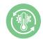

## 气候风险与机遇管理

宁波华翔采用系统化的风险管理模型，识别并评估覆盖价值链上、中、下游的气候风险与机遇，确保潜在环境影响得到有效应对。针对不同风险类型，公司深入分析优先级别高、具有特征的气候风险和机遇，从短期（2026年）、中期（2030年）、长期（2050年）三个时间维度定性评估气候因素对宁波华翔运营的潜在影响。

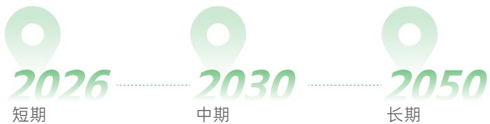

text_image

2026
短期
2030
中期
2050
长期

气候相关风险识别与应对

<table><tr><td>风险类型</td><td>风险驱动因素</td><td>主要影响</td><td>时间维度</td><td>影响强度</td><td>应对措施</td></tr><tr><td>急性风险</td><td>台风/暴雨</td><td>台风和强降雨可能破坏工厂车间地面设施,导致生产线停产,影响数日恢复时间。极端暴雨导致轨道交通及地铁等交通中断,影响员工通勤及原材料运输。</td><td>短期</td><td>高(停产损失、恢复成本)</td><td>建立应急响应机制:组织专项防台防汛演练,提升应急响应能力。详见【环境合规】章节强化设施防护:对易受风雨影响的车间、仓库进行结构加固,设置防洪挡板。供应链预警与调度:与物流公司建立应急联络机制,提前调整运输计划,保障原材料供应。员工安全与通勤保障:制定极端天气出勤指引,提供临时住宿或远程办公支持。</td></tr></table>

<table><tr><td>风险类型</td><td>风险驱动因素</td><td>主要影响</td><td>时间维度</td><td>影响强度</td><td>应对措施</td></tr><tr><td>慢性风险</td><td>极端高温</td><td>极端高温可能导致车间内机床设备过热、员工健康风险增加,影响生产效率。</td><td>短期至中期</td><td>中(降效增耗)</td><td>· 车间降温系统改造:推广使用高效空调系统。· 设备散热优化:对高发热设备加装散热装置,定期维护冷却系统。· 员工健康防护:发放防暑降温用品,开展高温作业安全培训。</td></tr><tr><td></td><td>碳排放监管政策</td><td>全球及中国对汽车行业碳排放监管趋严,可能影响下游整车厂的订单结构,公司需加速转型新能源汽车零部件。</td><td>短期至中期</td><td>中(业务转型)</td><td>· 加快绿色能源转型:扩大光伏发电系统覆盖,提升绿电使用比例。详见【能源利用】章节· 推动能效提升:持续实施节能改造项目。详见【能源利用】章节</td></tr><tr><td>转型风险</td><td>技术迭代</td><td>全球碳中和目标推动汽车产业电动化、智能化转型,需开发智能座舱、CMS电子后视镜等低功耗、高集成、轻量化产品,以响应能效提升与材料减碳要求。</td><td>中期至长期</td><td>中-高(竞争壁垒)</td><td>· 加大研发投入:设立智能座舱、轻量化材料等专项研发,开发符合低碳标准的新产品。详见【技术创新】章节· 推动智能制造升级:引入自动化生产线,降低生产能耗与物料损耗,提升资源效率。· 拓展合作生态:与高校、科技企业合作,布局具身机器人关节等新兴领域,融入绿色技术生态。详见【技术创新、新质变革】章节</td></tr></table>

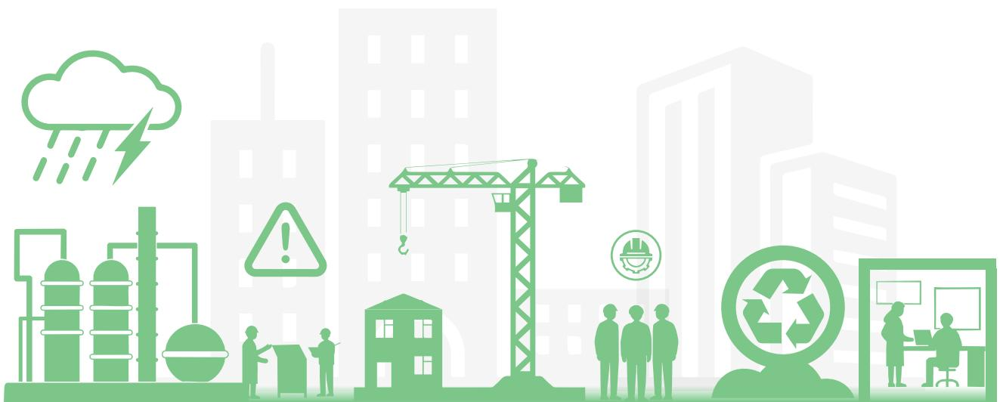

natural_image

Green-toned illustration of industrial and environmental concepts including rain, warning symbols, construction crane, recycling symbol, and workers (no text or labels)

气候相关机遇识别与应对

<table><tr><td>机遇类型</td><td>机遇驱动因素</td><td>主要影响</td><td>时间维度</td><td>影响强度</td><td>应对措施</td></tr><tr><td>结构性机遇</td><td>减排目标与法规加速新能源汽车普及,带动产业链绿色重构。</td><td>新能源汽车渗透率提升,直接创造对电池包壳体、车身结构件等关键零部件的低碳化、轻量化需求。</td><td>中期至长期</td><td>高(新业务收入)</td><td>推动轻量化技术应用:推广使用PEEK、碳纤维等高性能材料,提升产品气候竞争力。构建快速响应机制:建立柔性生产线,适应新能源车型快速迭代需求,同时通过生产流程优化降低能源与资源消耗。</td></tr><tr><td>创新性机遇</td><td>轻量化是降低电动汽车能耗、延长续航的核心路径,符合严格的能效标准与消费端绿色需求。</td><td>PEEK等先进复合材料及智能底盘技术的研发与应用,将成为降低整车全生命周期碳排放的关键。</td><td>中期至长期</td><td>中-高(技术壁垒)</td><td>研发投入:设立专门研发中心,聚焦PEEK材料及智能底盘技术。专利布局:围绕轻量化与智能底盘进行专利布局。开展产学研合作:与高校、科研院所共建实验室,加速技术成果转化。详见【技术创新】章节</td></tr><tr><td>前沿型机遇</td><td>在工业、服务业等领域,具身机器人应用有助于提升能源效率、优化资源分配,支持社会经济低碳转型。</td><td>具身机器人产业的兴起,开辟全新增长曲线。其核心零部件(如精密关节)的生产,可复用公司在汽车领域的精密制造与质量控制经验。</td><td>长期</td><td>中(新增长点)</td><td>业务延伸:将汽车零部件在轻量化、高精度、低能耗方面的制造经验,应用于具身机器人关节等核心部件,助力具身机器人产业能效提升。多元化布局:通过进入具身机器人赛道,参与构建自动化、智能化的低碳解决方案,分散行业周期风险,融入更广泛的绿色科技生态。</td></tr></table>

## 环境合规管理

宁波华翔严格遵守《中华人民共和国环境保护法》持续完善环境管理体系。公司从治理架构、制度规范、管理流程、应急响应能力与能力建设进行全面环境管控。报告期内，我们环境管理成效获得认可，其中胜维德赫宁波工厂、劳伦斯、诗兰姆持续保持市级“绿色工厂”称号，华翔内饰北京工厂获得“绿色信用四星级企业”荣誉。

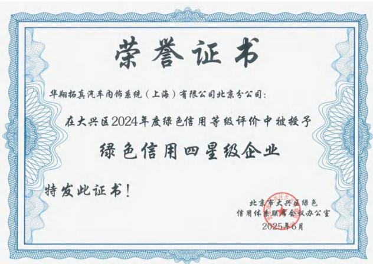

seal

华翔拓真汽车内饰系统（上海）有限公司北京分公司
在大兴区2024年度绿色信用等级评价中被授予
绿色信用四星级企业
特发此证书！
北京市大兴区绿色
信用体养联席会议办公室
2025年6月

华翔内饰北京工厂获得“绿色信用四星级企业”荣誉

## 报告期内

胜维德赫宁波工厂、劳伦斯、 诗兰姆持续保持

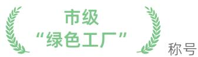

关键绩效 2025年

公司环保总投入为

2,723.71 万元

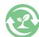

## 环境管理体系建设

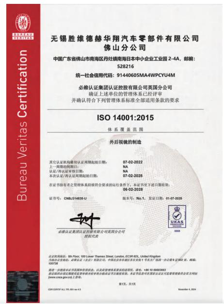

text_image

无锡胜维德赫华翔汽车零部件有限公司
佛山分公司
中国广东省佛山市南海区丹灶镇南海日本中小企业工业园2-4A，邮编：
528216
统一社会信用代码：91440605MA4WPCYU4M
必维认证集团认证控股有限公司英国分公司
确证上述单位的管理体系已经评审
并确认符合下列管理体系标准全部适用条款的要求
ISO 14001:2015
体系覆盖范围
外后视镜的制造
其它认证机电辐射认证周期起始日期：
上一周前控制项目：
认证/再认证审批日期：
本次认证/再认证周期起始日期：
在证书持有者之管理体系持续符合要求的运行条件下，本证书下发进日期有效：
06-02-2028
证书号：CNBJ314835-U
版本号：No.1，发证日期：01-07-2028
必维认证集团认证控股有限公司英国分公司
到校代表
认证机构地址：9th Floor, 100 Lower Thames St. London, EC398 60L, United Kingdom
马场办事处地址：必维认证（北京）有限公司，中国北京市东城区东长安街1号东方广场西二办公楼9层902室，南站
103278
最近一期申请本证书范围和有效状态，以及是否管理该事项的适用项目，请：+85 10 56663663
新登记的申请定期安排事项经审核合格后方可提交。本证书是可按国家认证认可监督管理委员会官方网站
(www.cncs.gov.cn)上发布的。
第1页，共1页
Bureau Veritas Certification
CER CERTIFY ALL 195, 801 or 4.5
November 4, 2024

佛山工厂 ISO 14001 环境管理体系认证证书

宁波华翔将环境合规管理纳入公司治理核心范畴，设立安全委员会作为环境管理的最高领导机构，由股份公司总经理担任主任，相关高管及各部门负责人出任委员，全面负责环境管理战略的统筹与决策。公司构建以《职业健康安全与环境管理手册》为核心，并配套制定《管理评审管理办法》《不符合与纠正措施管理办法》等文件建立健全包括年度内部审核、不符合项整改与持续改进在内的闭环管理机制，实现环境管理的持续运行与改进。

## 关键绩效 截至报告期末

宁波华翔一级子公司已获得 ISO 14001 环境管理体

系认证比例为 100%。

宁波华翔环境管理架构  
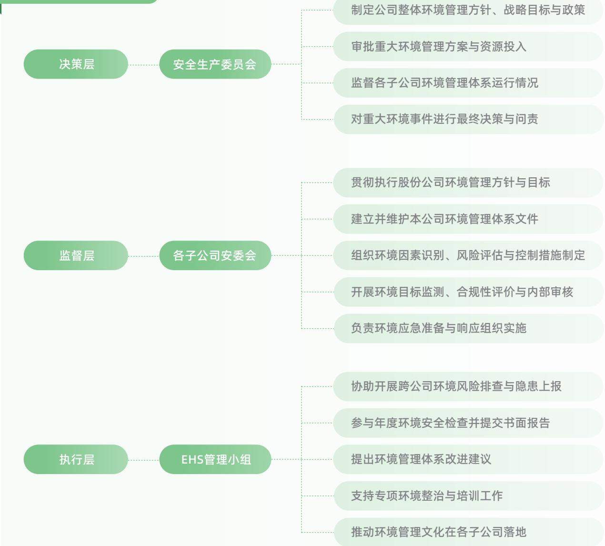

flowchart

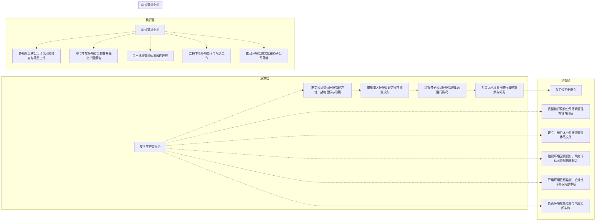
```mermaid
graph LR
  subgraph DecisionLayer["决策层"]
    A1["安全生产委员会"]
    A2["制定公司整体环境管理方针、战略目标与政策"]
    A3["审批重大环境管理方案与资源投入"]
    A4["监督各子公司环境管理体系运行情况"]
    A5["对重大环境事件进行最终决策与问责"]
  end

  subgraph SupervisionLevel["监督层"]
    D1["各子公司安委会"]
    D2["贯彻执行股份公司环境管理方针与目标"]
    D3["建立并维护本公司环境管理体系文件"]
    D4["组织环境因素识别、风险评估与控制措施制定"]
    D5["开展环境目标监测、合规性评价与内部审核"]
    D6["负责环境应急准备与响应组织实施"]
  end

  subgraph ExecutionLayer["执行层"]
    E1["EHS管理小组"]
    E2["协助开展跨公司环境风险排查与隐患上报"]
    E3["参与年度环境安全检查并提交书面报告"]
    E4["提出环境管理体系改进建议"]
    E5["支持专项环境整治与培训工作"]
    E6["推动环境管理文化在各子公司落地"]
  end

  A1 -.-> A2
  A2 -.-> A3
  A3 -.-> A4
  A4 -.-> A5
  A5 -.-> D1
  A1 -.-> D2
  A1 -.-> D3
  A1 -.-> D4
  A1 -.-> D5
  A1 -.-> D6
  
  subgraph EHS_Group["EHS管理小组"]
    E1 -.-> E2
    E1 -.-> E3
    E1 -.-> E4
    E1 -.-> E5
    E1 -.-> E6
  end
```

宁波华翔环境管理流程

<table><tr><td>环境因素识别与评估</td><td>·各子公司定期组织专业人员识别生产、服务过程中的环境因素,评估其环境影响,确定重要环境因素并制定控制措施。</td></tr><tr><td>目标制定与管理方案</td><td>·依据重要环境因素制定可量化的环境目标与管理方案,明确控制措施、监测方法与责任部门。</td></tr><tr><td>运行控制与应急准备</td><td>·实施环境管理制度与操作规程;·制定应急预案并组织演练,提升应急响应能力。</td></tr><tr><td>监测、检查与改进</td><td>·开展环境绩效监测、内部审核与管理评审;·识别不符合项并推动纠正与预防措施。</td></tr></table>

## 环境应急管理

宁波华翔高度重视突发环境事件的防范和应对，严格遵循《中华人民共和国突发事件应对法》等法律法规，将环境风险管理融入日常运营和战略决策。报告期内，公司未发生因违反环境管理相关法律法规而受到主管部门处罚的事件。

## 环境应急管理体系

## 完善制度体系，夯实管理基础

公司及下属子公司修订并完善《环境事件应急预案》，并系统整合《环境因素识别与评价程序》《危险源及环境因素辨识、风险评价和控制措施管理规定》《应急准备和响应程序》及《风险和机遇应对控制程序》等核心制度，形成覆盖“风险识别—日常预防—应急准备—响应处置—事后评估与改进”的全过程制度闭环，为管理活动提供系统依据。

## 动态识别环境因素，实现源头管控

公司每年依据经营所在地法律法规，综合运用过程分析、现场观察与问卷调查等方法，系统识别业务活动、产品与服务中可控或可影响的环境因素，确保风险源头得到及时识别与评价。

## 强化预案建设与演练，提升应急实战能力

各子公司均制定并持续完善自身的《应急预案》，定期组织开展环境应急演练，检验预案有效性、锻炼应急队伍协同能力，从而切实提升突发事件应对水平，保障公司资产与人员安全。

## 宁波华翔主要识别的环境因素

向大气排放的废气，如锅炉排放二氧化硫、烟尘等；  
向水体排放的废水，如喷涂工艺中产生的废水；  
土壤污染，如润滑油、液压油、油漆的泄露；  
固体废物的管理，如漆渣、荧光灯、废油布等；  
对周围社区的影响；  
原材料和自然资源的利用；  
其他地方性的环境问题，按本公司所在国家(地区)环保部门控制要求。

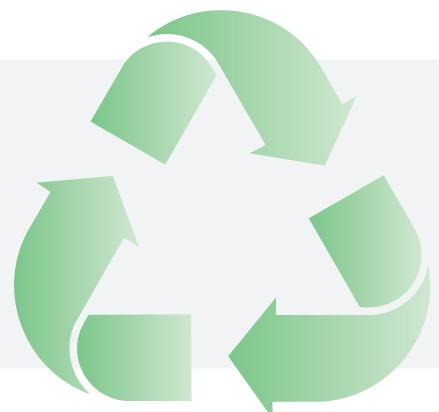

natural_image

Recycling symbol with three arrows forming a triangle (no text or labels)

## 环境应急意识培训

宁波华翔将环境安全与应急知识培训纳入员工必修课程，通过多渠道宣教普及风险知识、逃生技能与防护要求。公司定期组织专项宣贯与技能培训营造“人人讲安全、个个会应急”的文化氛围，共同筑牢公司可持续发展的环境安全底线。报告期内，全公司范围组织开展各类环保、能源与应急培训，并通过“六五环境日”、内部宣传平台等形式，持续提升全员节能章识与操作技能

## 案例 危废泄漏应急演练

为持续提升环境风险防控与应急处置能力，公司组织开展了危废泄漏突发事件应急演练，模拟危废库废稀释剂泄漏场景，全面检验应急预案的科学性与各部门协同响应效率。本次演练涵盖事故上报、人员疏散、现场抢险、环境监测等环节。演练后，公司及时组织评估总结，并围绕应急预案优化、物资补充与人员培训等方面制定改进措施，持续完善环境风险防控体系，有效提升应急处置的实战能力与协同水平，强化了全员环境安全风险防范意识和责任文化。

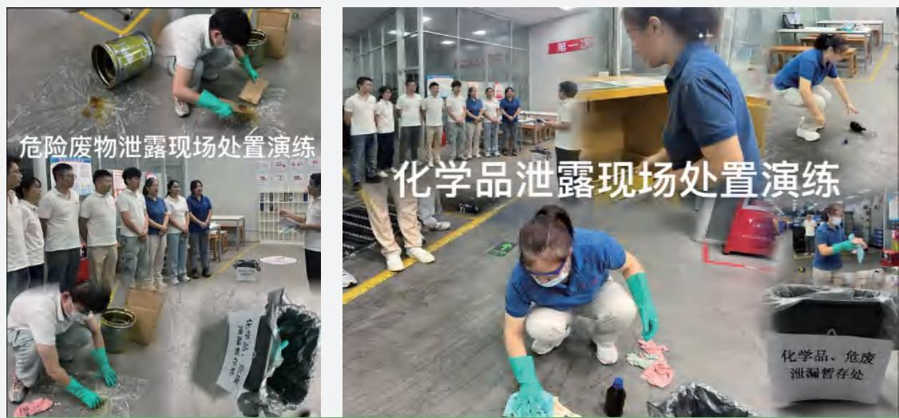  
危废泄漏应急演练

## 案例 “六五环境日”环保知识宣传活动

为积极响应“六五环境日”号召，贯彻“美丽中国我先行”主题精神，公司于2025年6月组织开展了系列环境宣传、培训与演练活动，旨在增强全员环保意识，深化对环境管理特别是危险废物管理的认识。活动期间，公司通过LED显示屏、悬挂横幅等方式，广泛宣传环境保护理念，营造浓厚的环保文化氛围。同时，公司组织党员志愿者向员工发放环境日宣传手册100余份，面向员工开展环保知识普及，推动绿色理念深入人心，有效增强了全体员工的环境保护自觉性。

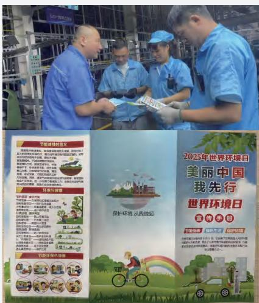

text_image

2025年世界环境日
美丽中国
我先行
世界环境日
宣布美丽

节节通程的意义
我国环境保护责任主体，是国家环保责任主体之一。我们已通过“一带一路”和“一带一路”等可持续发展方式实现，有利于经济社会发展，为社会带来更多的便利和福祉。
保护环境，从我做起

节节对美好生活的影响
1. 促进生态环境、生态环境、城乡建设等。
2. 促进生态环境、生态环境、城乡建设等。
3. 促进生态环境、生态环境、城乡建设等。
4. 促进生态环境、生态环境、城乡建设等。
5. 促进生态环境、生态环境、城乡建设等。
6. 促进生态环境、生态环境、城乡建设等。
7. 促进生态环境、生态环境、城乡建设等。
8. 促进生态环境、生态环境、城乡建设等。
9. 促进生态环境、生态环境、城乡建设等。

“六五环境日”环保知识宣传活动

## 能源利用

能源利用是绿色制造与可持续发展的关键环节。宁波华翔秉持“全员参与、高效低耗、合规运营、绿色智造”的能源管理方针，通过完善管理体系、实施节能改造、推广清洁能源应用等系统性举措，持续推进能源使用的高效化与低碳化。公司生产经营中使用的能源主要包括直接能源与间接能源两大类，具体使用场景如下：

主要能源类型及使用场景

<table><tr><td>类别</td><td>能源类型</td><td>主要是用场景</td></tr><tr><td rowspan="2">直接能源</td><td>天然气</td><td>生产制造</td></tr><tr><td>汽油</td><td>自有车辆运行</td></tr><tr><td rowspan="3">间接能源</td><td>柴油</td><td>后备发电机运行</td></tr><tr><td>电力</td><td>生产制造、办公照明、设备运行、生活用电等</td></tr><tr><td>外购热力</td><td>生产工艺供热</td></tr></table>

2025年能源消耗数据

<table><tr><td>类型</td><td>单位</td><td>2025年</td></tr><tr><td>外购电力</td><td>kW·h</td><td>353,365,753</td></tr><tr><td>外购热力</td><td>GJ</td><td>35,770.71</td></tr><tr><td>天然气</td><td>立方米</td><td>8,443,314.25</td></tr><tr><td>液化石油气</td><td>kg</td><td>4,600</td></tr><tr><td>汽油使用量</td><td>吨</td><td>48.54</td></tr><tr><td>柴油使用量</td><td>吨</td><td>26.33</td></tr><tr><td>能源消耗总量</td><td>吨标准煤</td><td>55,019.54</td></tr></table>

## 能源管理

公司严格遵守《中华人民共和国清洁生产促进法》《中华人民共和国节约能源法》及运营所在地的相关法律法规，并以此为基础，系统推进内部能源管理体系建设。各下属子公司制定了《资源能源管理程序》《电力使用管理程序》等一系列内部规章制度，构建起能源消耗的日常监督机制，以标准化、精细化管理推动能源高效利用。

## 关键绩效

报告期内，华翔内饰位于上海、杭州、常熟、北京、天津的工厂均已通过ISO 50001能源管理体系认证。未来，公司将持续扩大能源管理体系的认证覆盖范围，推动公司能源管理的规范化、体系化水平不断提升。

## 节能降耗

公司持续围绕清洁能源替代、设备节能优化、工艺改造及管理提升等方面，在全公司范围内推进节能降耗项目。2025年主要进展与成效如下：

2025年关键节能项目进展

<table><tr><td>关键领域</td><td>项目举措</td><td>实施进展与量化成效</td></tr><tr><td rowspan="2">清洁能源替代</td><td>光伏发电西系统建设与规划</td><td>胜维德赫、华翔科技、井上华翔、诗兰姆等多个区域的工厂已完成光伏安装并网。其中宁波诗兰姆年发电量约4.6万kWh,武汉诗兰姆年发电24.53万kWh。</td></tr><tr><td>绿色电力采购</td><td>长春诗兰姆、沈阳华翔通过绿证采购、风电采购或“自有光伏+外购绿电”模式,在2025年均实现100%绿色电力使用。南京诗兰姆外购光伏电量约59.09万kWh。</td></tr><tr><td rowspan="2">设备与系统节能</td><td>生产工艺与设备优化</td><td>北京工厂更换一级能耗水泵电机、优化注塑机工艺参数,实现单件生产时间缩短约9%。华翔内饰天津工厂实施灯光感应开关、注塑机与传送带联动控制、真空泵集中化改造,实现总能耗下降。常熟工厂开展办公室LED照明改造、采用空压机余热回收系统,提升能效与热能再利用水平。华翔科技青岛工厂通过空压机改造年预计节电60.7万kWh。</td></tr><tr><td>废气治理与余热回收</td><td>广泛采用RTO、沸石转轮+催化燃烧、多级活性炭吸附等高效处理技术,实现废气达标治理与热能回收。</td></tr><tr><td>运营管理提升</td><td>替换燃油运输车</td><td>华翔科技青岛工厂全部使用电动叉车,并采用环保制冷剂。北京工厂减少燃油公车使用频率。</td></tr></table>

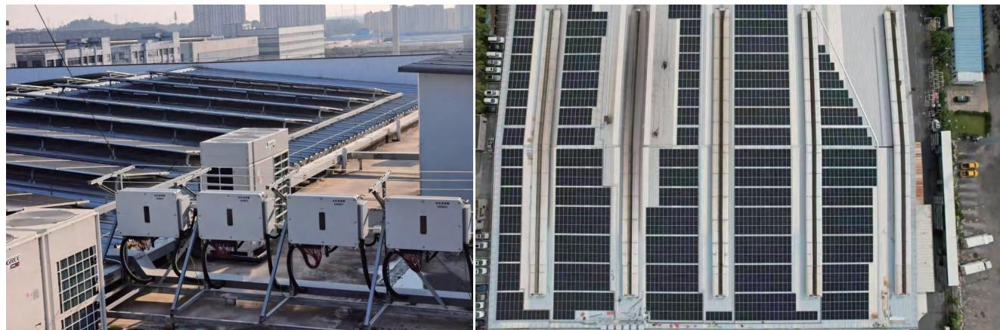

natural_image

Two aerial views of rooftop solar panel installations: one with multiple blue panels and a central tower, the other with a large white building (no visible text or symbols)

工厂安装光伏板

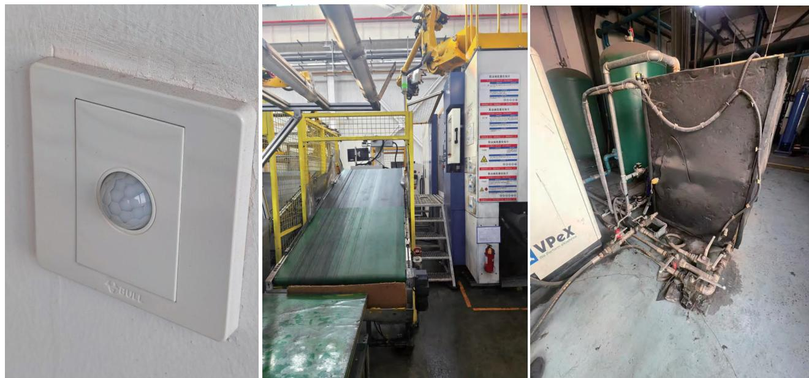

natural_image

Three industrial facility scenes: a wall-mounted electrical switch, a factory assembly line with machinery, and an interior gas tank (no visible text or symbols)

灯光感应开关  
注塑机与传送带联动控制  
空压机余热回收系统

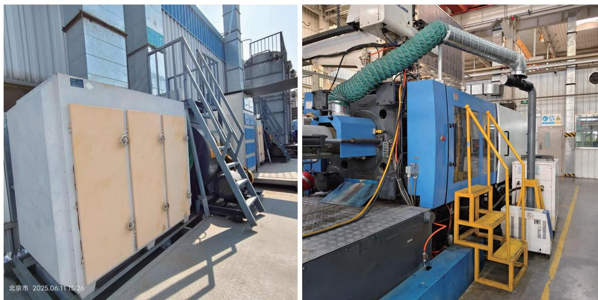  
活性炭净化装置  
滚胶机环保净化收集口

## 水资源管理风险类型

## 水资源利用

宁波华翔深刻认识到水资源作为基础性自然资源和战略性经济资源的重要性。在生产经营过程中，公司严格遵守《中华人民共和国水法》及地方水资源管理法规，秉持“节约优先、循环利用、防治结合”的原则，推进水资源精细化管理。公司用水来源以市政供水为主，生产运营中不存在水资源短缺风险。为系统管理水资源绩效，公司持续监测用水数据。2025年，公司水资源利用的关键数据如下：

2025年水资源消耗数据

<table><tr><td>指标</td><td>单位</td><td>2025年</td></tr><tr><td>水资源使用量</td><td>吨</td><td>2,259,547.35</td></tr><tr><td>循环用水量</td><td>吨</td><td>36,071.74</td></tr></table>

## 节水管理

为持续提升水资源利用效率，公司构建覆盖从源头到回用的全过程管理体系。各工厂依据自身生产工艺特点，制定并实施针对性的节水与循环利用方案。

## 节水与循环利用方案

<table><tr><td>节水改造</td><td>对纯水机制备产生的浓缩废水进行收集与二次回收利用,实现了水资源的分质与梯级利用。通过调节水流阀控制出水流量,并收集冷凝水进行再利用。</td></tr><tr><td>循环利用</td><td>建立冷却水塔或蓄水池,对注塑、挤塑等生产环节的冷却用水进行物理降温后封闭循环使用,大幅减少一次水消耗。</td></tr></table>

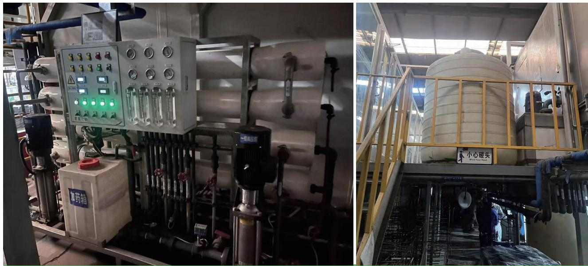

natural_image

Two industrial facility photos showing stainless steel processing units with control panels and safety labels (no readable text in image)

华翔科技长春工厂废水回收二次利用设备

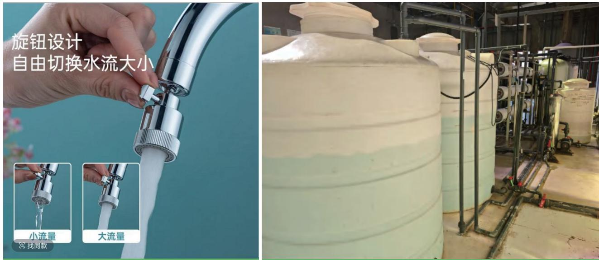  
胜维德赫重庆工厂节水设备  
冷凝水回收设备

## 风险类型排放与废弃物

宁波华翔严格遵守《中华人民共和国水污染防治法》《中华人民共和国大气污染防治法》《中华人民共和国噪声污染防治法》等法律法规及运营所在地环保标准，系统化开展污染物排放与废弃物处置的合规管理。公司制定《三废排放管理规定》《废品处理管理规定》《涂装污染控制管理规定》《一般工业固废管理规定》《危险废弃物管理规定》等制度，严格管控生产运营中废气、废水、固废及噪声的产生与排放。

为进一步提升废气、废水等污染物排放的监管有效性与时效性，公司积极推进环境管理的数字化升级。通过部署物联网（IoT）实时监测平台，我们实现了对关键工厂排放数据的24小时在线监控与预警，大幅提高EHS监管的颗粒度与管理效率，确保各项排放指标持续合规。

IoT废气废水监测平台闭环管理机制

<table><tr><td>监测</td><td>实时监测关键工厂的尾气、废气及废水核心指标。</td></tr><tr><td>预警</td><td>监测数据超过预设阈值,系统自动触发预警。</td></tr><tr><td>干预</td><td>收到预警后,需在规定时间内进行现场确认与初步处置。</td></tr><tr><td>整改</td><td>根据问题根本原因制定并实施整改措施。</td></tr></table>

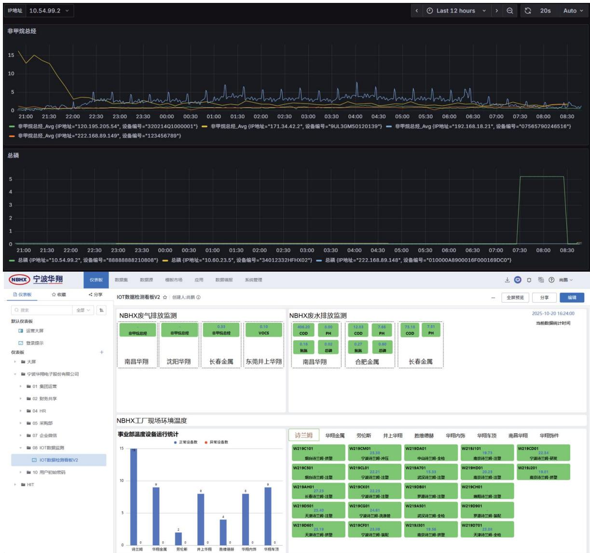  
IoT废气废水监测平台

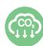

## 废气管理

公司对生产活动中产生的废气进行系统识别与分类，并定期维护与监测废气处理设施。在重污染天气等应急情况下，我们启动应急预案，采取减排、限产或停用高排放车辆等管控措施。

关键绩效 2025年

实现废气

100%

达标排放。

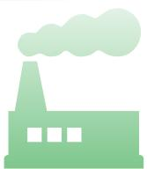

废气管理措施

<table><tr><td rowspan="2">废气防治措施</td><td>有机废气(VOCs):采用蓄热式热氧化(RTO)、催化燃烧、活性炭吸附/脱附、UV光解等组合工艺。</td></tr><tr><td>工艺粉尘:采用布袋除尘。</td></tr><tr><td>废气排放监测</td><td>重点排放口安装在线监测或委托第三方定期监测。</td></tr><tr><td>应急响应机制</td><td>建立与地方政府联动的重污染天气应急预案,明确不同预警级别下的减产、停产及运输车辆管控要求。</td></tr></table>

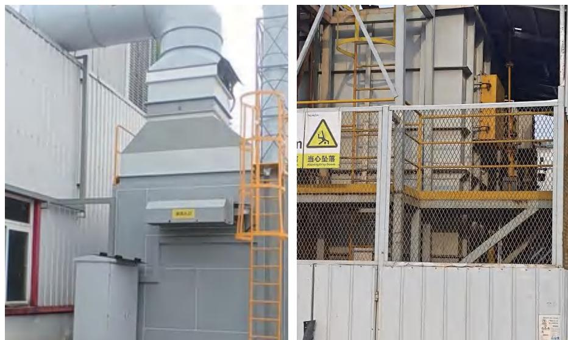

## 各工厂废气管理实践

华翔科技长春工厂使用RTO装置对涂装、烘干等高浓度有机废气进行高温氧化处理。

胜维德赫重庆工厂对涂装无组织废气进行密闭收集，经沸石转轮浓缩后催化燃烧处理。

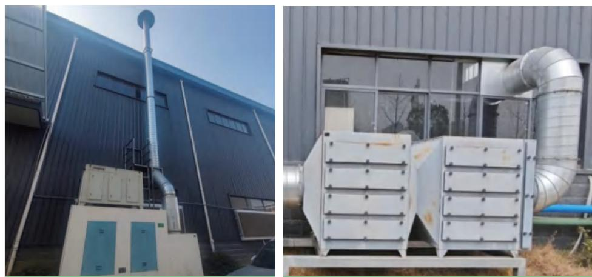  
注塑二级活性炭吸附装置  
挤塑二级活性炭吸附装置

<table><tr><td colspan="3">重污染天气黄色预警1级应急响应措施</td></tr><tr><td>管控环节</td><td>设备</td><td>应急响应措施</td></tr><tr><td>运输</td><td>车辆</td><td>停止使用国4及以下重型载货车辆(含燃气)进行运输</td></tr></table>

2级

<table><tr><td colspan="3">重污染天气橙色预警2级响应应急措施</td></tr><tr><td>管控环节</td><td>设备</td><td>应急响应措施</td></tr><tr><td>生产车间</td><td>注塑机</td><td>减产50%</td></tr><tr><td>运输</td><td>车辆</td><td>停止使用国4及以下重型载货车辆(含燃气)进行运输</td></tr></table>

3级

<table><tr><td colspan="3">重污染天气红色预警3级响应应急措施</td></tr><tr><td>管控环节</td><td>设备</td><td>应急响应措施</td></tr><tr><td>生产车间</td><td>注塑机</td><td>停产</td></tr><tr><td>运输</td><td>车辆</td><td>停止使用国4及以下重型载货车辆(含燃气)进行运输</td></tr></table>

诗兰姆严格执行重污染天气应急预案，预警期间停用国四及以下重型货车，必要时停产部分产线。

## 废水管理

公司实行“清污分流、分质处理、循环利用”的废水管理方针，严禁生产废水与生活污水混排，杜绝危险废液进入废水系统。我们推动各工厂实施废水梯级利用和中水回用，并鼓励建设生产废水循环处理系统，通过多级过滤等技术实现废水净化回用。

各工厂废水管理实践  
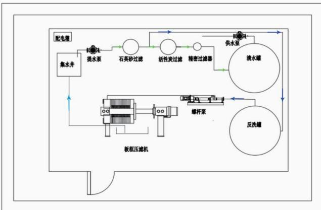

flowchart

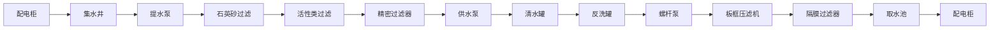
```mermaid
graph LR
  A["配电柜"] --> B["集水井"]
  B --> C["提水泵"]
  C --> D["石英砂过滤"]
  D --> E["活性类过滤"]
  E --> F["精密过滤器"]
  F --> G["供水泵"]
  G --> H["清水罐"]
  H --> I["反洗罐"]
  I --> J["螺杆泵"]
  J --> K["板框压滤机"]
  K --> L["隔膜过滤器"]
  L --> M["取水池"]
  M --> N["配电柜"]
```

工艺流程图

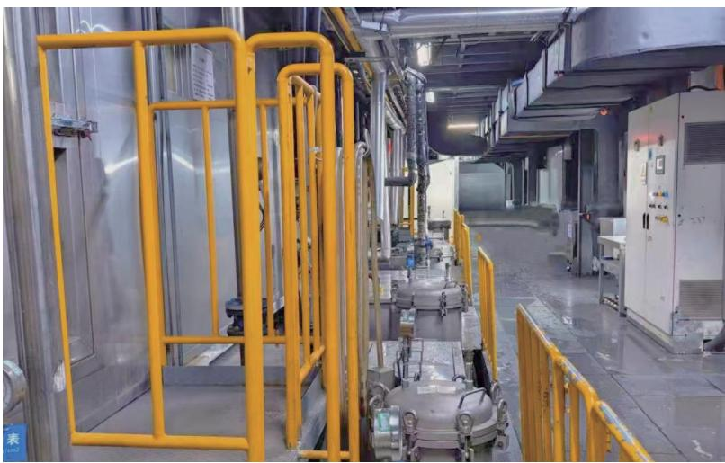

natural_image

Interior view of an industrial facility with yellow safety railings and stainless steel tanks (no visible text or symbols)

华翔长春车顶建立三级过滤循环水系统，实现生产废水净化回用与近零排放。  
胜维德赫宁波工厂对涂装预处理废水进行收集与循环使用。  
华翔科技佛山工厂电泳车间配备生产废水回用系统，并将纯水浓水用于废气喷淋塔补水。

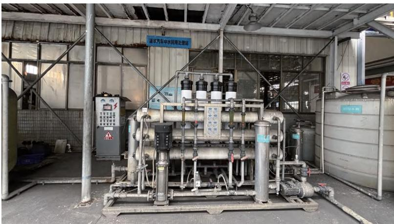

text_image

城市汽车中水同质处理站

## 关键绩效 2025年

实现废水

100%

达标排放。

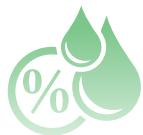

## 固废管理

公司对固体废弃物实行分类分级管理，遵循“减量化、资源化、无害化”原则，明确各类废弃物的收集、标识、贮存、处置和台账记录要求。危险废弃物交由持有相应许可证的机构处置，确保回收过程符合环保要求。

2025年废弃物产生量

<table><tr><td>指标</td><td>单位</td><td>2025年</td></tr><tr><td>无害废弃物产生量</td><td>吨</td><td>18,695.28</td></tr><tr><td>有害废弃物产生量</td><td>吨</td><td>2,774.54</td></tr><tr><td>回收再利用的废弃物量</td><td>吨</td><td>21,705.02</td></tr></table>

固废管理措施

<table><tr><td>固废分类管理</td><td>·分类标准:将固体废弃物明确划分为一般工业固废、可回收物、危险废物等类别。·分类收集:在各产线、车间及公共区域设置分类收集容器,容器表面张贴清晰、规范的分类标识与图示。·分类贮存:厂区内分别设立一般固废暂存区与危险废物专用贮存间,实现物理隔离与分类存放。</td></tr><tr><td>固废回收管理</td><td>·对废金属、废包装等一般工业固废及生产性废品,实行统一收集、定点出售。</td></tr><tr><td>危废专项管理</td><td>·设置专用危废暂存间,满足“三防”(防渗、防风、防雨)要求,并规范设置标识标签。</td></tr></table>

## 噪声管理

公司通过选用低噪设备、采取隔声降噪及维护保养设备等方式，有效减少噪声。

## 噪声管理措施

在新购或改造设备时，优先选择低噪声型号，从源头降低噪声产生。  
对高噪声设备加装隔声罩、消声器，或设置在隔音厂房内，阻断噪声传播。  
定期委托进行厂界噪声监测，确保工作场所的噪音水平符合国家职业健康标准。

## 绿色包装 风险类型

宁波华翔将绿色包装理念贯穿于产品流通的全过程，系统推进包装在设计源头、材料选用、流通使用至回收再利用各环节的减量化、循环化与生态友好化。

## 绿色包装管理措施

## 规范设计标准

华翔科技制定《华翔金属科技物流器具设计标准》，明确要求高频周转的铁质器具设计寿命须满足5年使用需求，并大力推广可重复使用的标准化周转箱。  
包装材料主要采用可循环的纸箱、板箱、环保胶袋、耐用尼龙袋及高效吸塑盘等材料。

## 优选环保材料

## 宁波华翔绿色包装3R行动

采用耐用材料的周转箱，满足长时间使用需要。

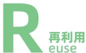

采用可循环利用的木质、钢质、铁质包装。

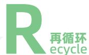

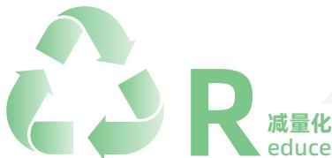

为保证充分利用容器空间，降低单品包装费用和运输费用，收容数的设定以满足填充率≥85%为前提选用容器类型和尺寸；  
对于特殊形状、尺寸或特定要求的汽车零件，考虑定制包装容器，并在确保产品良好防护的前提下，尽量简化防护结构。

## 案例

## 宁波华翔推行包装循环化创新

为应对客户反馈的零件磕碰划伤问题，宁波华翔对G48车型C柱零件的包装方案进行了创新优化，将一次性EPE缓冲隔层，替换为可多次循环使用的定制化内衬隔板，实现每年节约包装成本约1.2万元。

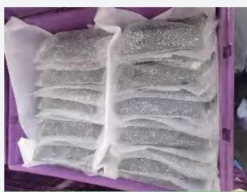

natural_image

Stack of wrapped food items in a purple plastic crate, no visible text or symbols

G48项目C柱包装改造前

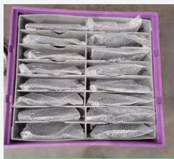

natural_image

Purple plastic tray containing multiple white cylindrical objects, possibly food items or samples (no visible text or symbols)

G48项目C柱包装改造后

## 绿色办公 风险类型

为践行可持续发展理念，宁波华翔将绿色运营延伸至日常办公环节，通过推行无纸化办公、落实精细化资源管理及倡导全员环保行为，系统降低运营过程中的资源消耗与环境足迹，持续营造低碳、高效的绿色办公文化。

<table><tr><td>无纸化办公</td><td>全面推行用章申请、审批及文件归档的电子化流程,减少纸质文件的使用、打印、传递与物理存储。</td></tr><tr><td rowspan="3">节约用电</td><td>在办公区、会议室、茶水间推行“人走灯灭”、合理使用空调;</td></tr><tr><td>各部门下班后及时关闭电脑、饮水机等电器,减少待机能耗;</td></tr><tr><td>逐步更换LED节能灯具。</td></tr><tr><td>节约用水</td><td>在办公区、会议室、洗手间、茶水间加强用水管理,杜绝“长流水”,定期检查维护用水设备,发现异常及时报修,避免水资源浪费。</td></tr><tr><td>办公垃圾分类</td><td>在办公场所设立分类垃圾桶(湿垃圾、可回收物、其他垃圾等),引导员工正确分类投放,促进资源回收。</td></tr><tr><td rowspan="4">5S管理</td><td>推行双面打印,单面废纸重复利用为草稿纸或便条纸;</td></tr><tr><td>鼓励废公文袋重复使用;</td></tr><tr><td>各部门负责各自办公区域的日常管理,保持现场清洁有序;</td></tr><tr><td>倡导使用再生纸、再生耗材等环保办公用品。</td></tr><tr><td rowspan="2">环保标识与习惯培养</td><td>在打印机、电源开关、水龙头等关键点位设置节能、节水、环保提示标签;</td></tr><tr><td>倡导员工随手关灯、关空调、关门,减少能源浪费。</td></tr></table>

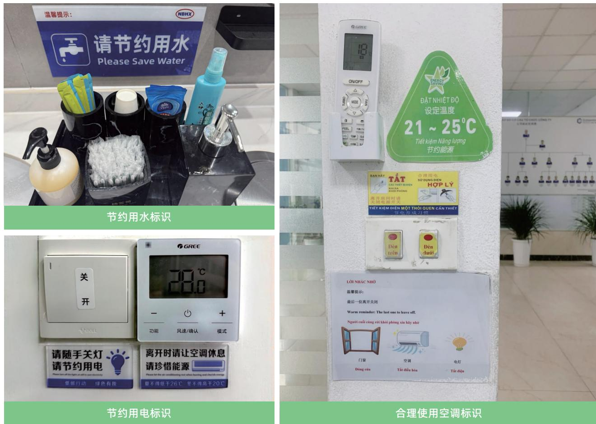

## 06 社会

## 对标联合国可持续发展目标

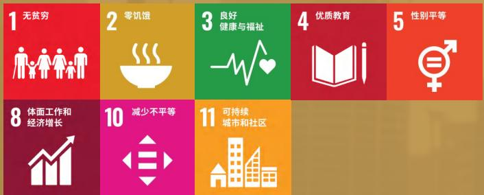

flowchart

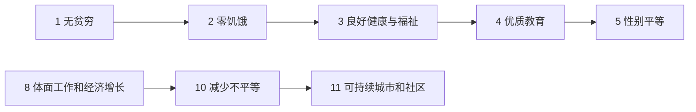
```mermaid
graph LR
  A["1 无贫穷"] --> B["2 零饥饿"]
  B --> C["3 良好健康与福祉"]
  C --> D["4 优质教育"]
  D --> E["5 性别平等"]
  F["8 体面工作和经济增长"] --> G["10 减少不平等"]
  G --> H["11 可持续城市和社区"]
```

关键议题 保障员工权益 | 员工培训与发展 | 员工职业健康与安全社会贡献 | 乡村振兴

员工权益与福利 73

平等与多元化 77

人才培养与发展 78

职业健康与安全 80

公益慈善与乡村振兴 85

text_image

06 社会
72

## 员工权益与福利

宁波华翔严格遵循《中华人民共和国劳动法》《中华人民共和国劳动合同法》等国家法律法规，并同步落实境外经营所在地的相关法规要求，确保全球业务范围内的用工行为合法合规。公司结合自身经营特点与管理实际，构建了涵盖招聘、用工、员工关系与合同管理等环节的人力资源管理制度体系，制定并实施《招聘管理制度》《员工关系管理制度》《劳动合同管理规定》等内部管理政策和制度，明确员工权益保障、劳动关系规范与组织管理要求，致力营造尊重个体差异、机会公平、关系和谐的职业发展环境。

## 员工招聘管理

宁波华翔坚持公开招聘、平等竞争、择优录用的原则，并通过《招聘管理制度》等内部制度对招聘全流程进行统一规范与管理。围绕年度及阶段性人力资源规划，公司依托线上招聘平台、内部公开招聘平台、猎头合作及校园招聘等多元渠道开展人才选拔，持续拓宽人才来源，广泛吸纳公司发展需求相匹配的各类专业人才。

## 键绩效 截至报告期末

公司员工总计

22,221 人

公司新进员工共计

13,450 人

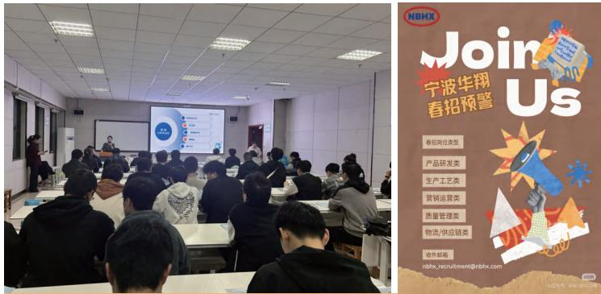  
校招宣讲及招聘海报

2025年员工分布数据  
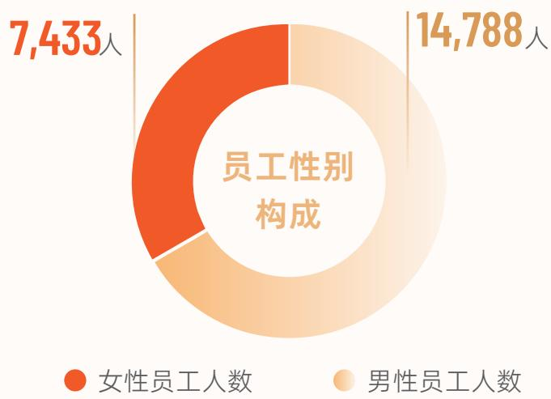

donut

| 性别 | 人数 |
| --- | --- |
| 女性员工人数 | 7,433 |
| 男性员工人数 | 14,788 |

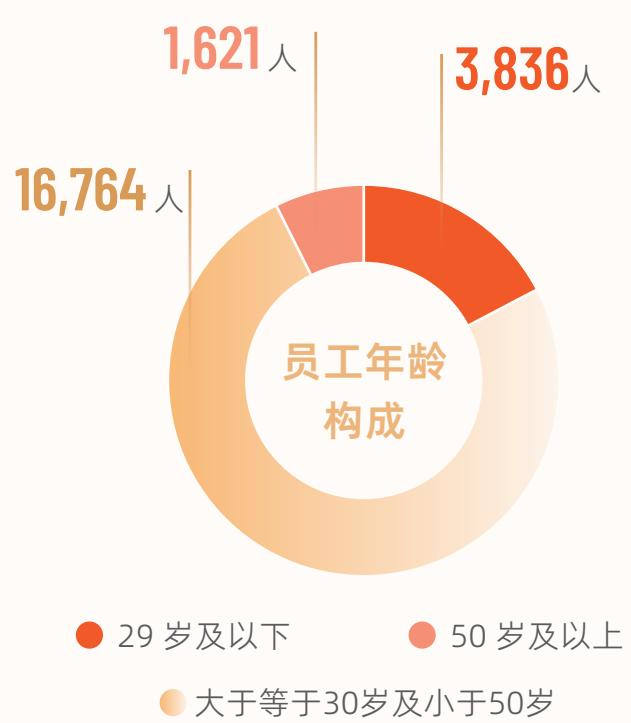

donut

| 年龄段 | 人数 |
| --- | --- |
| 29岁及以下 | 3,836 |
| 50岁及以上 | 1,621 |
| 大于等于30岁及小于50岁 | 16,764 |

2025年员工分布数据  
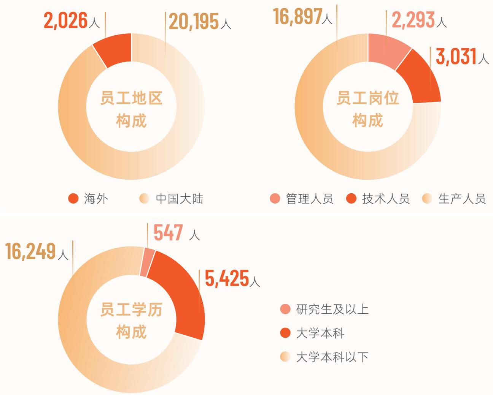

## 员工薪酬体系

宁波华翔依据《薪资管理制度》，系统构建薪酬管理机制，对员工收入构成、调薪机制及绩效考核进行统一规范，确保薪酬分配过程公开透明、分配公平。公司薪酬体系以岗位价值、个人能力与绩效表现为核心依据，由基本工资、绩效奖金工龄津贴及其他补贴共同构成。

## 员工福利与关怀体系

宁波华翔系统构建并持续完善员工福利与关怀体系，依据《员工福利管理规定》与《员工假期管理规定》，为员工提供涵盖休假、津贴、健康关怀及文体活动等多层次支持。公司高度重视性别平等与家庭友好职场建设，通过保障产假与产检假、设置母婴室、举办妇女节专题活动等措施，切实支持女性员工职业发展。同时，公司对应届毕业生提供一年免费宿舍，并设立民族食堂等便利设施，持续改善员工生活品质，提升归属感与幸福感。此外，公司建立了困难员工帮扶机制，通过专项慰问基金与特殊补助等形式，为有需要的员工提供及时援助，彰显组织关怀。

## 关键绩效 报告期内

公司持续开展困难员工帮扶工作，共投入资金

20 万元

累计帮扶员工

154 人次

法定节假日  
丧假  
婚假  
护理假期  
年休假  
陪产假  
无理由病假

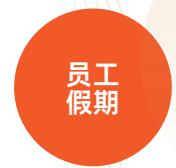

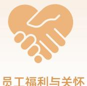

## 津贴补贴

## 员工福利与关怀

加班费  
年终奖  
工龄工资  
外派外驻津贴  
外派住房补贴  
服务年限奖  
节假日津贴  
防暑降温费  
生日活动费

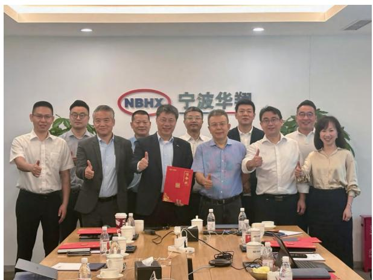

text_image

NBHX 宁波华耀

民主生活会

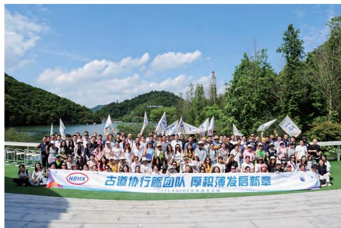

text_image

NBHX
古道执行抓团队 厚积薄发启新章
2015年NBHX全国港港活动

团建活动

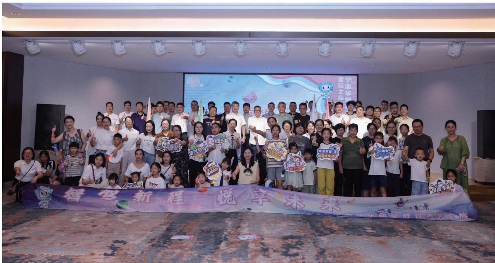

text_image

宁波华星国际之旅
智驾新程 悦享未来
中国少年儿童节
中国少年儿童节
中国少年儿童节
中国少年儿童节
中国少年儿童节
中国少年儿童节
中国少年儿童节
中国少年儿童节
中国少年儿童节
中国少年儿童节
中国少年儿童节
中国少年儿童节
中国少年儿童节
中国少年儿童节
中国少年儿童节
中国少年儿童节
中国少年儿童节
中国少年儿童节
中国少年儿童节
中国少年儿童节
中国少年儿童節

家庭日活动

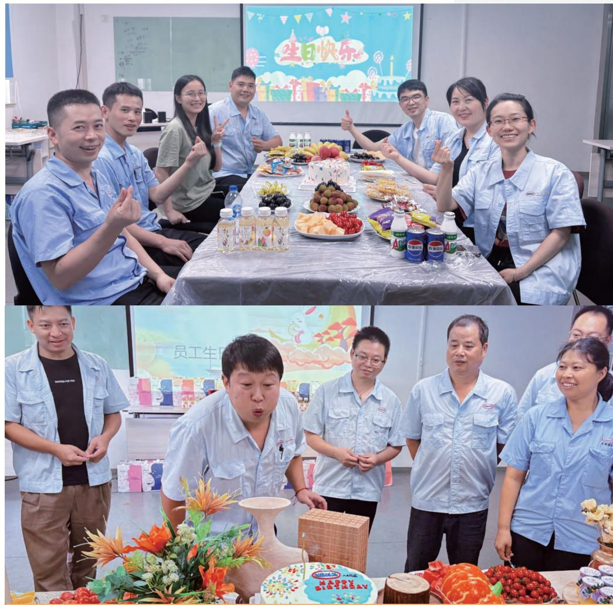

natural_image

Group photo of workers in blue uniforms posing with a large table and food items, no visible text or symbols.

生日会活动

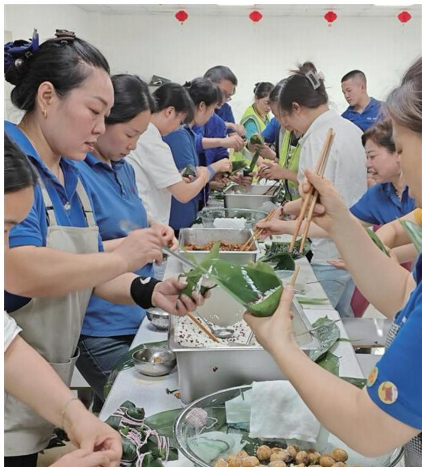

natural_image

Group of people preparing zongzi in a kitchen, wearing blue uniforms and aprons, with food preparation tools and red lanterns hanging overhead (no visible text or symbols)

端午节活动

natural_image

Illustration of two people interacting, one holding a document and the other pointing at a handshake (no text or symbols present)

## 平等与多元化

宁波华翔在用工管理中始终坚持平等、包容与尊重的原则，致力于为来自不同地域、民族、文化背景的员工营造机会平等的职业发展环境。公司通过《零骚扰与零虐待管理制度》《零歧视与反歧视管理制度》等制度，明确预防、投诉与处理机制，对任何形式的歧视、骚扰或虐待行为采取“零容忍”态度，持续维护公平、有序的工作氛围。报告期内，公司未发生相关歧视或骚扰事件。

## 反童工及强制劳动管理

宁波华翔严格遵守国务院《禁止使用童工规定》，并参照SA8000社会责任标准，在招聘与录用环节实施严格管控。公司通过入职资格审查与身份信息核验，确保所有录用人员均满足法定就业年龄要求。如发现误招未成年人，公司将立即依法启动纠正程序，并保障其已提供劳动的合法报酬权益。我们承诺明确禁止一切形式强制劳动行为，确保员工基于自愿原则参加工作，并通过持续加强制度执行与日常监督，切实维护员工的基本劳动权益。报告期内，未发生任何童工用工或强迫劳动事件。

## 女职工关怀

宁波华翔制定并严格执行《童工、未成年工及女职工保护管理制度》，为女职工在经期、孕期、产期和哺乳期提供特殊劳动保护措施，禁止从事国家法律规定的禁忌劳动，并保障其相关福利待遇。报告期内，公司未发生任何侵害女职工权益的事件。

## 民主沟通

宁波华翔重视员工意见与建议，建立了包括意见箱、服务热线、内部论坛等多元化沟通渠道，确保员工诉求能够及时表达并获得响应。公司致力提供公平、透明的反馈与申诉机制，并明确规定禁止任何形式的打击报复行为。

## 宗教信仰管理

宁波华翔充分尊重员工的宗教信仰自由，通过问卷调研与日常沟通，识别员工在信仰实践方面的合理需求，并在不影响正常运营的前提下，为有需要的员工在工作安排上提供弹性支持，如允许调整班次、提供祷告场所等。公司严格保护员工宗教信息隐私，禁止因此产生的任何不公平对待，并通过内部申诉机制确保相关问题得到及时、公正的处理。

## 人才培养与发展

为支撑公司战略落地与可持续发展，宁波华翔构建了系统化、全周期的人才培养与发展体系。公司以“业务战略-组织-干部-人才”为主线，通过清晰的双通道发展机制、分层分类的培训项目、科学的评价激励体系，持续优化人才结构，提升组织能力，实现员工与企业的共同成长。

## 人才梯队建设

宁波华翔始终重视员工职业发展与能力提升，围绕公司战略与业务发展需求系统推进人才培养与梯队建设。公司依据《华翔人才标准1.0》，构建以管理与专业并行的双通道职业发展路径，明确各职级标准与晋升机制，为员工提供多元化、可持续的成长支持。为科学识别与发展人才，公司引入北森第三方测评系统，以“领导力特质理论”与“领导力权变理论”为基础，构建情景化领导行为模型，并开展高管领导力测评与360°评估，为人才盘点、梯队建设与个性化发展提供依据。

管理与专业双通道发展路径  
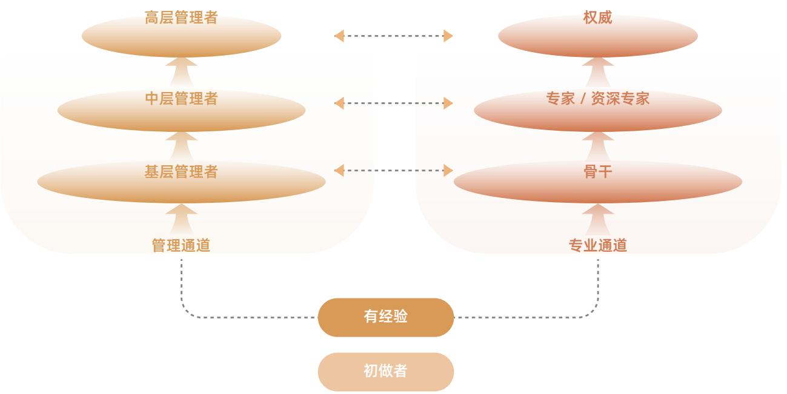

flowchart

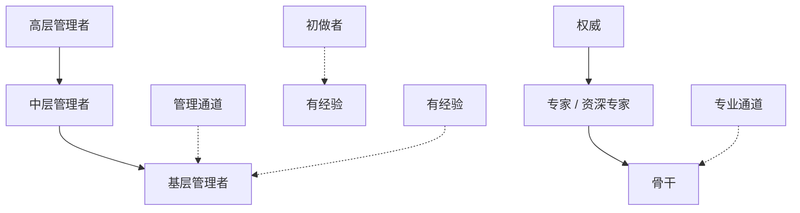
```mermaid
graph TD
  A["高层管理者"] --> B["中层管理者"]
  B --> C["基层管理者"]
  D["权威"] --> E["专家 / 资深专家"]
  E --> F["骨干"]
  G["初做者"] -.-> H["有经验"]
  I["管理通道"] -.-> C
  J["专业通道"] -.-> F
  K["有经验"] -.-> C
```

## 人才培训与发展体系

宁波华翔以《培训管理制度》为基础，围绕人才梯队建设与组织能力提升 持续完善人才培养体系，针对不同层级，不同类型人才的特点与发展需求，设计差异化培养路径，涵盖应届生培训、IDP（个人发展培养）、领导力发展与后备干部发展等关键方向，形成结构清晰、分层推进的人才成长支持系统。报告期内，公司员工培训投入4,959,664.25元，人均受训小时数达35.13小时（不包括安全生产及反贪腐培训）。

人才培养体系  
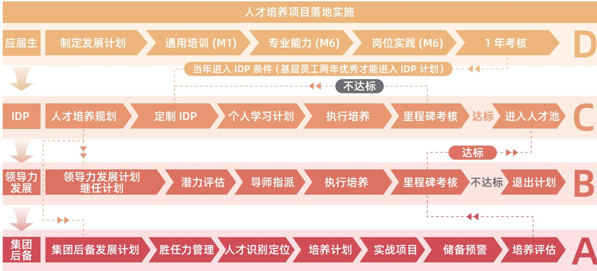

flowchart

```mermaid
graph TD
  subgraph Stage_A["A"]
  A1["集团后备"] --> A2["集团后备发展计划"]
  A2 --> A3["胜任力管理"]
  A3 --> A4["人才识别定位"]
  A4 --> A5["培养计划"]
  A5 --> A6["实战项目"]
  A6 --> A7["储备预警"]
  A7 --> A8["培养评估"]
  end

  subgraph Stage_B["B"]
  B1["领导力发展发展"] --> B2["领导力发展计划继任计划"]
  B2 --> B3["潜力评估"]
  B3 --> B4["导师指派"]
  B4 --> B5["执行培养"]
  B5 --> B6["里程碑考核"]
  B6 --> B7["不达标"]
  B7 --> B8["退出计划"]
  end

  subgraph Stage_C["C"]
  C1["IDP"] --> C2["人才培养规划"]
  C2 --> C3["定制 IDP"]
    C3 -.-> C4["个人学习计划"]
    C4 -.-> C5["执行培养"]
    C5 -.-> C6["里程碑考核"]
    C6 -.-> C7["达标"]
    C7 -.-> C8["进入人才池"]
  end

  subgraph Stage_D["D"]
  D1["应届生"] --> D2["制定发展计划"]
  D2 --> D3["通用培训 (M1)"]
  D3 --> D4["专业能力 (M6)"]
  D4 --> D5["岗位实践 (M6)"]
  D5 --> D6["1 年考核"]
    D6 -.-> D7["当年进入 IDP 条件 (基层员工两年优秀才能进入 IDP 计划)"]
    D7 -.-> D7
  end

  StageAStageBStageCStageD["Stage_A & Stage_B & Stage_C & Stage_D"] --> A1 & A2 & A3 & A4 & A5 & A6 & A7 & A8 & A9 & A10 & A11 & A12 & A13 & A14 & A15 & A16 & A17 & A18 & A19 & A20 & A21 & A22 & A23 & A24 & A25 & A26 & A27 & A28 & A29 & A30 & A31 & A32 & A33 & A34 & A35 & A36 & A37 & A38 & A39 & A40 & A41 & A42 & A43 & A44 & A45 & A46 & A47 & A48 & A49 & A50 & A51 & A52 & A53 & A54 & A55 & A56 & A57 & A58 & A59 & A60 & A61 & A62 & A63 & A64 & A65 & A66 & A67 & A68 & A69 & A70 & A71 & A72 & A73 & A74 & A75 & A76 & A77 & A78 & A79 & A80 & A81 & A82 & A83 & A84 & A85 & A86 & A87 & A88 & A89 & A90 & A91 & A92 & A93 & A94 & A95 |
```

## 案例

## “翱翔计划”——构建后备梯队，赋能公司战略增长

宁波华翔以“翱翔计划”为核心后备干部培养项目，围绕“管理生意、管理自我、管理他人”三大能力维度，系统提升学员在商业逻辑、财务敏感度、决策能力、目标导向及跨部门协作等方面的关键胜任力。该计划面向核心干部、总监后备及总经理后备人才，通过精准筛选、分类培养与实战锤炼，构建起层次清晰、衔接顺畅的后备干部梯队。

## NBHX “翱翔计划” —— 后备干部培养计划

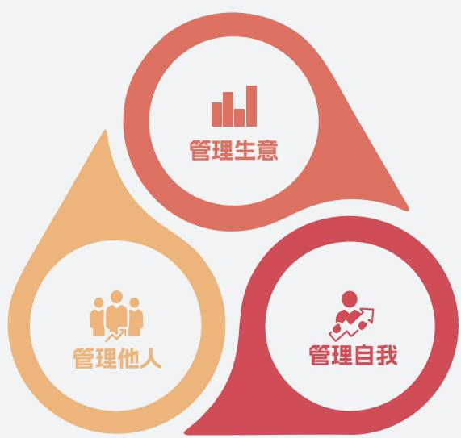

flowchart

```mermaid
graph LR
  A["管理生意"] --> B["管理他人"]
  B --> C["管理自我"]
```

## 针对人群

A 类核心干部（M3≤X≤M6）  
A1 类为总监后备干部来源：M2-M3  
A2 类为总经理 M6 以上后备干部来源：M4-M5

## 项目目标统一

## 管理目标

## 管理生意

基本商业逻辑、商业预测、财务敏感度、决策能力

## 管理自我

目标导向、全局观、影响力管理他人

管理目标：问题分析与解决、跨部门协作、沟通能力

## 持续经营价值

## 课程重点元素

战略与策略的匹配

市场与客户的衔接

销售与运营的配合

财务与业绩的管理

组织与人才发展能力

领导力与经营能力

管理数字化

## 职业健康与安全

## 治理

宁波华翔建立并持续完善三级职业健康安全与环境（EHS）管理体系，设立安委会作为最高管理机构，由股份公司总经理担任主任，各子公司总经理为本单位安全生产第一责任人。安委会下设安全工作小组，负责跨公司EHS事务协调。公司制定并实施一系列EHS管理制度，包括《EHS管理手册》《EHS三同时管理规定》《EHS隐患排查治理规定》等，确保体系规范运行与持续改进。为进一步强化源头管控，我们制定多项作业安全标准，包括《外来施工安全标准》《有限空间作业安全标准》《重点防火部位管理制度》等，系统规避安全风险。

## 关键绩效 报告期内

宁波华翔一级子公司全部通过ISO 45001 职业健康安全管理体系认证

认证率达 100%

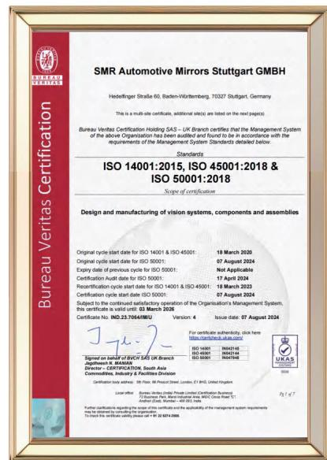

text_image

SMR Automotive Mirrors Stuttgart GMBH
Hedelinger Straße 60, Baden-Württemberg, 70327 Stuttgart, Germany
This is a multi-site certificate, additional site(s) are listed on the next page(s):
Bureau Veritas Certification Holding SAS – UK Branch certifies that the Management System
of the above Organization has been audited and found to be in accordance with the
requirements of the Management System. Standards detailed below.
Standards:
ISO 14001:2015, ISO 45001:2018 &
This certificate is valid until: 03 March 2026
Scope of certification
Design and manufacturing of vision systems, components and assemblies
Original cycle start date for ISO 14001 & ISO 45001: 18 March 2026
Original cycle start date for ISO 50001: 07 August 2024
Expiry date of previous cycle for ISO 50001: Not Applicable
Certification Audit date for ISO 50001: 17 April 2024
Recuritification cycle start date for ISO 14001 & ISO 45001: 18 March 2023
Certification cycle start date ISO 50001: 07 August 2024
Subject to the continued satisfactory operation of the Organisation's Management System,
this certificate is valid until: 03 March 2026
Certificate No. IND.23.7366/EMU Version 4 Issue date: 07 August 2024
J. H. J. C. (S)
For certificate authenticity, click here
The certificate utilized:
ISO 14001 NO49146
ISO 14001 NO49146
ISO 50001 NO49468
Signed on behalf of BACH SAIS UK Branch
Agreement #: BAASBAI
Director - CERTIFICATION, South Asia
Committee, Industry & FactSet Division
Certification body address: 8th Floor, 9th Presidus Street, London, El BHS, United Kingdom
Local office: Bureau Veritas Daily Private Limited Certification Systems
FRAVES® CO., LTD. Regulated Certificate of Health Care Services Ltd.
Another Office, Number: +60-833-334, State
Further certification applying the original code of the certificate to any opportunity of the management system requirements
to be used for validating the organization's license by the UK.
To check the certificate validity period at 22/01/2026

ISO 45001 职业健康安全体系认证证书

## 战略

宁波华翔始终坚持“预防为主，以人为本，绿色低碳”的EHS方针，致力于实现“重大事故0件”及“无重大EHS合规风险”的总目标。各公司结合集团总体战略目标，自身业务特点与风险状况，分解并制定可量化的EHS目标与指标，并通过管理方案推动落实。

## 影响、风险与机遇管理

## 风险管理

公司建立了全流程风险管理机制，并持续完善EHS评价体系，以此为抓手开展分层级评审与专项风险评估，致力于将风险控制在可接受水平。

四级评审体系：工厂自评、事业部审核、总部审核、集团飞行检查

专项风险评估：覆盖火灾、化学品、机械安全、物流安全等领域

## 风险分级管控

我们精准识别“重大风险”与“重要环境因素”，并依据风险等级实施差异化管控。

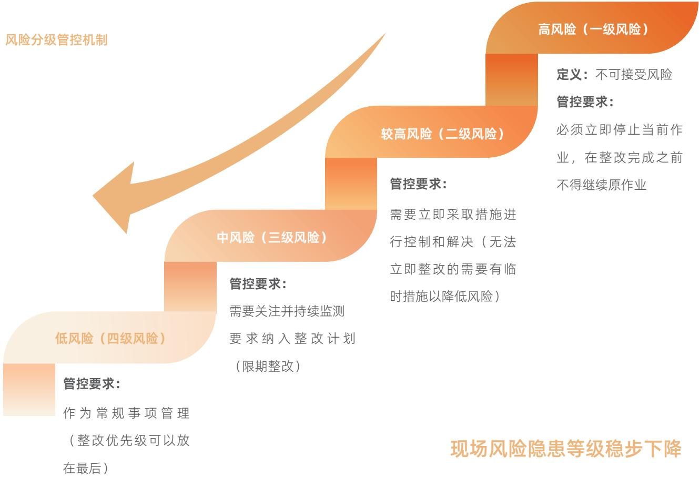

flowchart

```mermaid
graph LR
  A["低风险 (四级风险)"] --> B["中风险 (三级风险)"]
  B --> C["管控要求: 需要关注并持续监测\n要求纳入整改计划\n(限期整改)"]
  D["高风险 (一级风险)"] --> E["定义: 不可接受风险\n管控要求: 必须立即停止当前作业，在整改完成之前\n不得继续原作业"]
  subgraph RiskLevel_Mgmt
    A
    B
    C
    D
  end
  subgraph RiskLevel_Stage
    E
    F["现场风险隐患等级稳步下降"]
  end
```

## 风险管控机制

我们建立了贯穿事前、事中、事后的全流程风险管理机制，实现风险有效控制。

<table><tr><td colspan="2">全流程风险管理机制</td></tr><tr><td rowspan="3">风险识别与评估</td><td>辨识范围:覆盖“人、物、环境、管理”四大因素。</td></tr><tr><td>评估方法:采用LEC评价法(事故可能性、暴露频率、后果严重性)等科学方法进行风险等级评估。</td></tr><tr><td>评估结果:精准识别“重大风险”与“重要环境因素”。</td></tr><tr><td rowspan="2">风险控制措施</td><td>技术控制:工艺改进消除危险、低害物质替代、安装防护装置等。</td></tr><tr><td>管理控制:执行安全操作规程、作业许可制度(动火、高空、受限空间等)、警示标识系统。</td></tr><tr><td rowspan="3">风险应急管理</td><td>事件处理原则:严格执行“四不放过”(原因未查清、责任人与员工未受教育、防范措施未落实、责任人未处理不放过)。</td></tr><tr><td>应急准备:制定应急预案,定期演练与评审。</td></tr><tr><td>闭环管理:事故调查→原因分析→措施落实→整改跟踪</td></tr></table>

## 职业病防范管理

公司坚持以员工健康为中心，严格落实《职业病防治法》《尘肺病防治条例》《用人单位职业健康监护监督管理办法》等相关法律法规，建立并实施覆盖全员的职业健康监护体系，致力于创造安全、健康的工作环境。

## 职业病防范管理

## 源头治理与危害管控

在工艺设计、设备选型及作业环境布置阶段，严格执行职业健康“三同时”制度。对于生产过程中存在的噪声、粉尘、化学毒物等危害因素，我们优先采用工程治理技术进行控制，并为员工配备符合国家标准的有效个人防护用品。

## 员工健康监护

依据《职业健康监护管理办法》，组织接触职业病危害因素的员工进行上岗前、在岗期间及离岗时的职业健康检查，并通过定期监测作业场所危害因素浓度/强度，比对员工健康检查结果，动态评估防护措施的有效性，及时采取改进措施。

## 意识提升与权益保障

定期对员工进行职业病防治知识培训，确保其了解所在岗位的职业危害、防护措施及自身合法权益。

## 安全文化教育

公司着力营造“人人讲安全、事事为安全”的文化氛围，通过构建多层次的教育激励体系，将安全价值观内化为全体员工的自觉行动，持续夯实安全文化根基与能力建设。

<table><tr><td colspan="2">安全文化教育与激励体系</td></tr><tr><td>领导作用与高位推动</td><td>工厂层面:由工厂总经理亲自带队,定期开展安全检查、安全会议,讨论布置各项安全工作,形成“一把手抓安全”的示范效应。集团层面:定期召开全集团安全委员会会议,EHS人员及分管领导共同参与,统筹部署年度安全重点工作。</td></tr><tr><td>透明化绩效管理</td><td>建立集团工厂排名系统,每月对各工厂安全事故、安全损工工时、Near-miss上报情况进行系统化考核与公示,营造比学赶超的安全氛围。</td></tr><tr><td>最佳实践分享</td><td>定期开展EHS最佳实践改善案例评比,筛选优秀改善案例并在集团内部分享推广,推动安全管理经验的横向复制与持续提升。</td></tr></table>

## 特色安全活动

组织各类EHS主题活动，如“安全生产月”“消防宣传月”等，通过安全承诺签名、微型消防站实操训练、应急演练等形式，打造浓厚安全氛围，提升员工安全技能与应急响应能力。

## 全员参与与持续沟通

建立透明化沟通平台，包括EHS管理看板、安全例会、主题活动等。

开通员工安全建议渠道，推行全员隐患报告制度，鼓励一线员工报告内部隐患。充分发挥一线员工熟悉现场、贴近操作的特点，将隐患识别从专业部门延伸至全体员工，构建群防群治的安全防线。

## 结构化与差异化的培训体系

## 培训差异化设计：

新员工：强制性入职安全培训；  
在岗员工：定期复训与专项技能提升；  
关键岗位：持证上岗+继续教育；

培训形式：课堂讲授、实操演练、案例分析、在线学习等。

## 正向激励与荣誉机制

设立全集团“连续安全生产天数”排名奖励机制，对全年表现突出的工厂，授予“NBHX年度连续安全生产天数达标工厂”称号，以资鼓励。

最佳实践Best Practice  
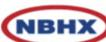

## 宁波华翔

<table><tr><td colspan="2">最佳实践标题 BP Title</td><td colspan="3">高位货架安全措施 safety measures of high racks</td><td colspan="2">日期 Issue date</td><td colspan="3">2025.6</td></tr><tr><td colspan="2">公司 Plants</td><td>SMR Wuxi</td><td>区域Area</td><td>仓库 warehouse</td><td colspan="2">责任人/邮箱 Responsible/E-Mail</td><td colspan="3">Jinqiang.liu@smr-nbhx.com</td></tr><tr><td colspan="3">问题及方法描述 Problem description</td><td colspan="7">改善前后状态对比Status of before and after</td></tr><tr><td rowspan="3" colspan="3">改善前 Before:仓库高位货架区域的安全管理,仅依靠文字性的物料堆放限高要求,无目视化的警示设置,包括货架的整体安全结构无可靠管理手段。No visual settings for the height limit requirements and the verticality of the high racks.改善后 After:货架的高处堆放的限高要求,以及货架本体是否变形倾斜,得到了目视化确认改善,方便管理。Install the height limit and verticality device for high racks,to improve management efficiency.</td><td colspan="2">改善前 Before</td><td rowspan="3">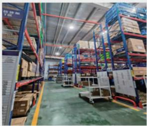</td><td colspan="4">改善后 After</td></tr><tr><td colspan="2">高位货架限高及架体垂直度无目视化管理手段No visual settings for the height limit requirements and the verticality of the high racks.</td><td colspan="4">堆放限高及架体垂直度设置了目视化装置,方便管理Install the height limit and verticality device for high racks,to improve management efficiency</td></tr><tr><td colspan="2"></td><td colspan="4">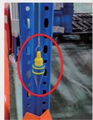 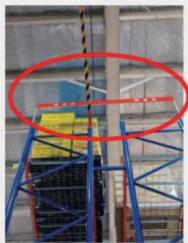</td></tr><tr><td colspan="3">改善类型 Improvement Type</td><td rowspan="3" colspan="4">改善收益以及改善后长期要求 Improvement benefits and Long-term requirements:目视化设置,提高管理效率和安全性 Improve management efficiency</td><td colspan="3">保密等级 Security Classification</td></tr><tr><td>空间 Space</td><td>质量 Quality</td><td>成本 Cost</td><td rowspan="2">一级</td><td rowspan="2">二级</td><td rowspan="2">三级</td></tr><tr><td>交付 Delivery</td><td>安全 EHS</td><td></td></tr></table>

## 最佳安全实践分享

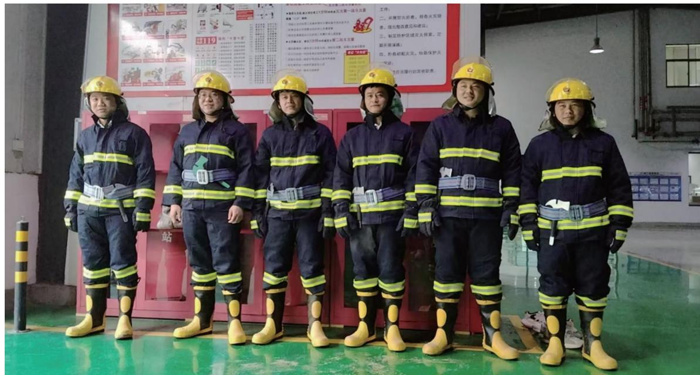

text_image

Group photo of firefighters in uniform and helmets standing in front of a safety poster with Chinese text about fire safety measures.

胜维德赫“消防月”活动—微型消防站实操训练

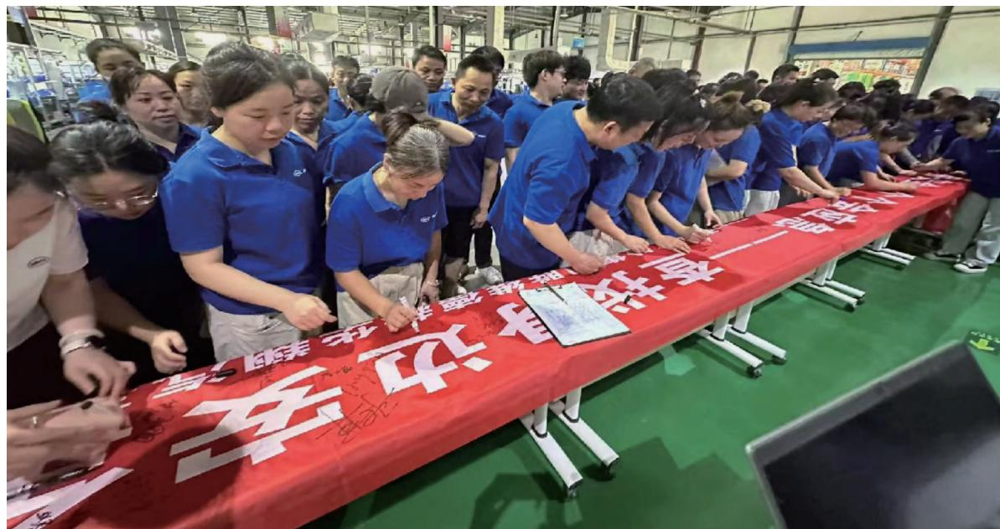

text_image

Group of workers in blue uniforms signing a red banner with Chinese text, likely at a factory or event.

胜维德赫“消防月”活动—安全承诺

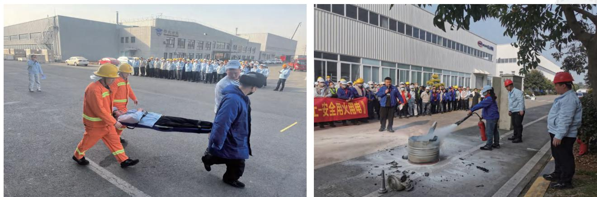  
华翔科技“消防月”活动

## 公益慈善与乡村振兴

宁波华翔在稳步推动企业经营发展的同时，始终积极履行企业社会责任，致力于实现企业价值与社会价值的共同提升。公司通过参与乡村振兴、组织志愿服务、开展公益捐赠等多种形式，投身社会公益事业，以实际行动回馈社会，助力社会和谐与可持续发展。报告期内，公司累计组织志愿者活动183人次，志愿服务总时长732小时；持续加大公益投入，慈善捐赠总额达130万元。

## 报告期内

公司累计组织志愿者活动

183 人次

志愿服务总时长

732 小时

慈善捐赠总额达

130万元

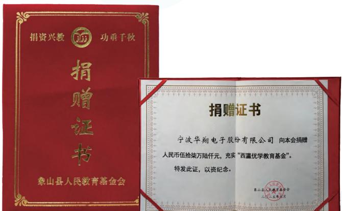

text_image

捐资兴教
功垂下秋
捐贈证书
象山县人民教育基金会

捐赠证书
宁波华翔电子股份有限公司 向本会捐赠
人民币伍拾柒万陆仟元，充实“西瀛优学教育基金”。
特发此证，以资纪念。

象山县人民教育基金会
二〇一五年五月

人民教育基金捐款

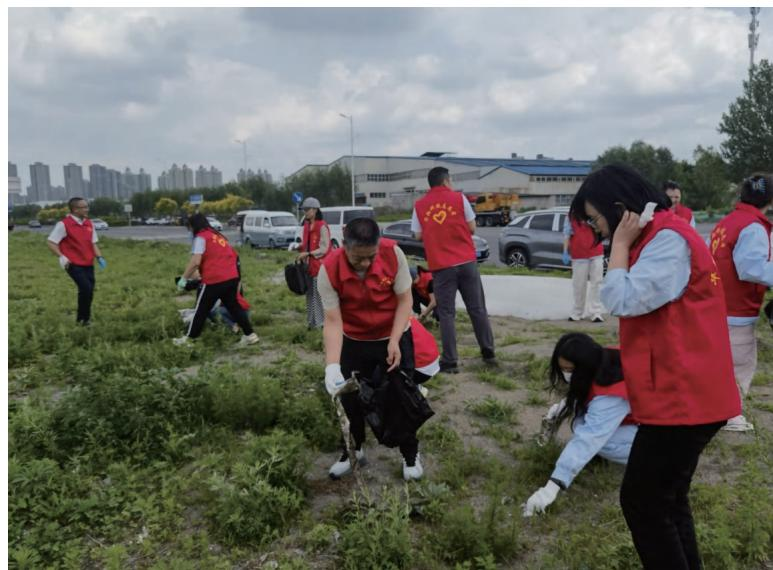

natural_image

Group of people in red vests cleaning plants on a grassy field under cloudy sky, with city buildings and vehicles in background (no visible text or symbols)

公益捡垃圾志愿者活动

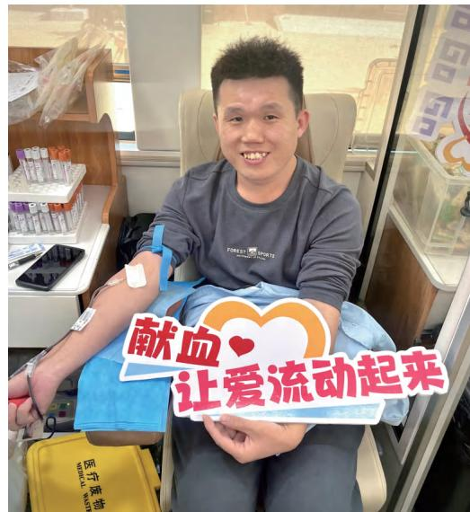

text_image

献血
让爱流动起来

志愿献血活动

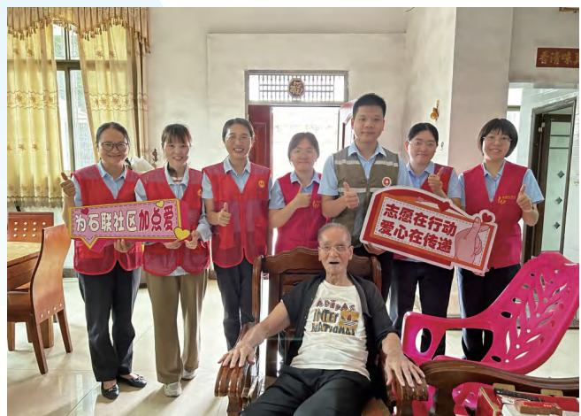

text_image

为万联社区加点爱
志愿在行动
爱心在传递

关爱社区老年群体

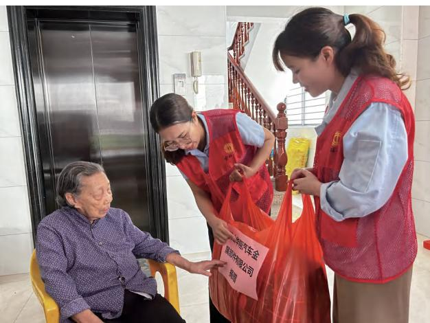

text_image

金城农村商业银行
捐赠

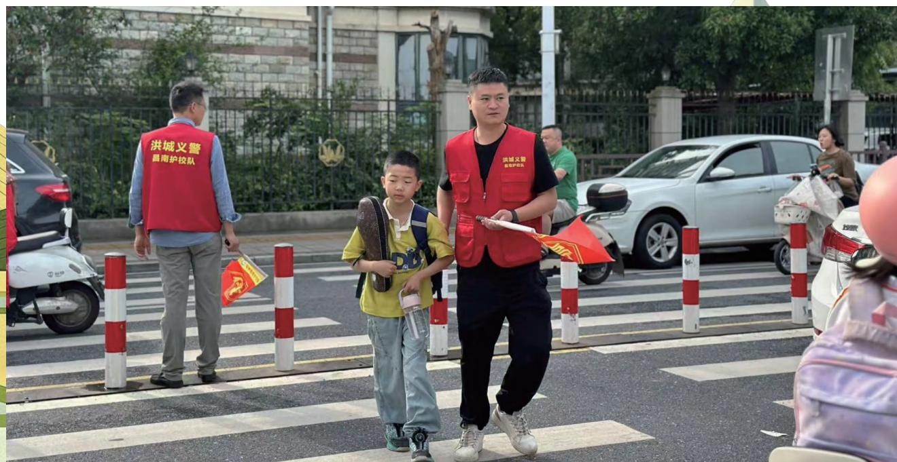

text_image

洪城义警
县消防支队
洪城义警
县消防支队

开展交通安全志愿服务

关键绩效表风险类型

<table><tr><td colspan="5">环境范畴1</td></tr><tr><td>指标</td><td>单位</td><td>2025年</td><td>2024年</td><td>2023年</td></tr><tr><td>环保投入</td><td>万元</td><td>2,723.71</td><td>2,501.09</td><td>2,364.93</td></tr><tr><td colspan="5">能源消耗</td></tr><tr><td>外购电力</td><td>kW·h</td><td>353,365,753</td><td>342,639,876.28</td><td>328,284,602.55</td></tr><tr><td>外购热力</td><td>GJ</td><td>35,770.71</td><td>66,703.04</td><td>28,871.06</td></tr><tr><td>天然气</td><td>立方米</td><td>8,443,314.25</td><td>6,703,047.81</td><td>6,109,205.24</td></tr><tr><td>液化石油气</td><td>kg</td><td>4,600</td><td>15,650</td><td>14,508</td></tr><tr><td>汽油使用量</td><td>吨</td><td>48.54</td><td>58.78</td><td>70.772</td></tr><tr><td>柴油使用量</td><td>吨</td><td>26.33</td><td>25.03</td><td>26.03</td></tr><tr><td>可再生能源消耗量</td><td>KWh</td><td>22,667,744.26</td><td>1,940.14</td><td>/</td></tr><tr><td>能源消耗总量</td><td>吨标准煤</td><td>55,019.54</td><td>50,390.22</td><td>47,907.63</td></tr><tr><td>能耗强度</td><td>吨标准煤/百万营收</td><td>2.10</td><td>1.91</td><td>2.06</td></tr><tr><td colspan="5">温室气体排放</td></tr><tr><td>范围一</td><td>吨二氧化碳当量</td><td>31,888.85</td><td>15,018.08</td><td>13,722.28</td></tr><tr><td>范围二</td><td>吨二氧化碳当量</td><td>191,430.65</td><td>191,197.89</td><td>190,396.53</td></tr><tr><td>排放总量</td><td>范围一+范围二</td><td>223,319.50</td><td>206,215.97</td><td>204,118.81</td></tr><tr><td>排放强度</td><td>吨二氧化碳当量/百万营收</td><td>8.53</td><td>7.83</td><td>8.78</td></tr><tr><td colspan="5">资源消耗</td></tr><tr><td colspan="5">包装材料</td></tr><tr><td>包装材料消耗量</td><td>吨</td><td>8,868.589</td><td>9,124.83</td><td>7,019.10</td></tr><tr><td>包装材料消耗强度</td><td>吨/亿元</td><td>32.927</td><td>34.66</td><td>30.21</td></tr><tr><td colspan="5">水资源</td></tr><tr><td>水资源使用量</td><td>吨</td><td>2,259,547.35</td><td>1,132,003.50</td><td>1,236,389.76</td></tr><tr><td>循环水用量</td><td>吨</td><td>36,071.74</td><td>41,535.24</td><td>52,145.90</td></tr><tr><td colspan="5">三废管理2</td></tr><tr><td colspan="5">废水</td></tr><tr><td>化学需氧量排放量</td><td>吨</td><td>7.17</td><td>38.27</td><td>9.19</td></tr><tr><td>五日生化需氧量排放量</td><td>吨</td><td>1.21</td><td>0.44</td><td>1.48</td></tr><tr><td>阴离子表面活性剂排放量</td><td>吨</td><td>0.03</td><td>0.15</td><td>0.01</td></tr><tr><td>氨氮排放量</td><td>吨</td><td>0.55</td><td>1.07</td><td>0.15</td></tr><tr><td>磷酸盐排放量</td><td>吨</td><td>0.01</td><td>0.18</td><td>0.01</td></tr></table>

1除特殊说明外，环境数据统计范围为华翔科技 华翔饰件，内饰系统，沈阳劳伦斯 井上华翔，南昌华翔，宁波劳伦斯，胜维德赫，长春车顶和诗兰姆

<table><tr><td>指标</td><td>单位</td><td>2025年</td><td>2024年</td><td>2023年</td></tr><tr><td>石油类</td><td>吨</td><td>0.03</td><td>0.18</td><td>/</td></tr><tr><td>废水总排放量</td><td>吨</td><td>222,670.26</td><td>/</td><td>/</td></tr><tr><td colspan="5">废气</td></tr><tr><td>氮氧化物排放量</td><td>吨</td><td>0.34</td><td>3.73</td><td>9.05</td></tr><tr><td>低浓度颗粒物排放量</td><td>吨</td><td>0.14</td><td>0.58</td><td>7.45</td></tr><tr><td>苯系物排放量</td><td>吨</td><td>0.01</td><td>0.31</td><td>1.75</td></tr><tr><td>挥发性有机物排放量</td><td>吨</td><td>12.87</td><td>9.08</td><td>15.59</td></tr><tr><td>非甲烷总烃排放量</td><td>吨</td><td>49.42</td><td>1.44</td><td>16.21</td></tr><tr><td>颗粒物排放量</td><td>吨</td><td>0.14</td><td>0.26</td><td>0.19</td></tr><tr><td>废气总排放量</td><td>立方米</td><td>1,997,617,714.41</td><td>/</td><td>/</td></tr><tr><td colspan="5">废弃物</td></tr><tr><td>有害废弃物产生总量</td><td>吨</td><td>2,774.54</td><td>3,121.71</td><td>2,739.96</td></tr><tr><td>无害废弃物产生总量</td><td>吨</td><td>18,695.28</td><td>31,762.01</td><td>27,381.83</td></tr><tr><td>回收再利用废弃物总量</td><td>吨</td><td>21,705.02</td><td>19,617.79</td><td>15,808.71</td></tr></table>

<table><tr><td colspan="5">社会范畴</td></tr><tr><td>指标</td><td>单位</td><td>2025年</td><td>2024年</td><td>2023年</td></tr><tr><td colspan="5">员工</td></tr><tr><td colspan="5">员工雇佣</td></tr><tr><td>员工总数</td><td>人</td><td>22,221</td><td>21,860</td><td>20,711</td></tr><tr><td colspan="5">员工性别构成</td></tr><tr><td>男性员工人数</td><td>人</td><td>14,788</td><td>14,616</td><td>12,912</td></tr><tr><td>女性员工人数</td><td>人</td><td>7,433</td><td>7,244</td><td>7,799</td></tr><tr><td colspan="5">员工年龄构成</td></tr><tr><td>29岁及以下</td><td>人</td><td>3,836</td><td>3,709</td><td>5,452</td></tr><tr><td>大于等于30岁及小于50岁</td><td>人</td><td>16,764</td><td>16,545</td><td>12,948</td></tr><tr><td>50岁及以上</td><td>人</td><td>1,621</td><td>1,606</td><td>2,311</td></tr><tr><td colspan="5">员工地区构成</td></tr><tr><td>中国大陆</td><td>人</td><td>20,195</td><td>18,801</td><td>17,152</td></tr><tr><td>海外</td><td>人</td><td>2,026</td><td>3,059</td><td>3,559</td></tr></table>

废水和废气数据统计范围为：华翔科技、劳伦斯、南昌华翔、华翔饰件、内饰系统、车顶、井上华翔、沈阳华翔、胜维德赫和诗兰姆。

<table><tr><td>指标</td><td>单位</td><td>2025年</td><td>2024年</td><td>2023年</td></tr><tr><td colspan="5">员工职能构成</td></tr><tr><td>管理人员</td><td>人</td><td>2,293</td><td>2,245</td><td>3,080</td></tr><tr><td>技术人员</td><td>人</td><td>3,031</td><td>2,887</td><td>3,822</td></tr><tr><td>生产人员</td><td>人</td><td>16,897</td><td>16,728</td><td>13,809</td></tr><tr><td colspan="5">员工学历构成</td></tr><tr><td>研究生及以上</td><td>人</td><td>547</td><td>529</td><td>501</td></tr><tr><td>大学本科</td><td>人</td><td>5,425</td><td>5,183</td><td>3,848</td></tr><tr><td>大学本科以下</td><td>人</td><td>16,249</td><td>16,148</td><td>16,362</td></tr><tr><td colspan="5">员工留存</td></tr><tr><td colspan="5">员工流失人数(按年龄构成)</td></tr><tr><td>29岁及以下</td><td>人</td><td>4,873</td><td>4,261</td><td>3,941</td></tr><tr><td>大于等于30岁及小于50岁</td><td>人</td><td>5,454</td><td>5,059</td><td>4,449</td></tr><tr><td>50岁及以上</td><td>人</td><td>573</td><td>582</td><td>707</td></tr><tr><td colspan="5">员工流失人数(按性别构成)</td></tr><tr><td>男性</td><td>人</td><td>7,187</td><td>6,820</td><td>5,712</td></tr><tr><td>女性</td><td>人</td><td>3,713</td><td>3,082</td><td>3,385</td></tr><tr><td colspan="5">员工流失人数(按地区构成)</td></tr><tr><td>中国</td><td>人</td><td>8,836</td><td>8,338</td><td>7,607</td></tr><tr><td>海外</td><td>人</td><td>2,064</td><td>1,564</td><td>1,490</td></tr><tr><td colspan="5">员工发展与培训</td></tr><tr><td>员工培训总人数</td><td>人</td><td>14,863</td><td>11,566</td><td>5,871</td></tr><tr><td>员工培训覆盖率</td><td>%</td><td>55.31</td><td>52.91</td><td>28.66</td></tr><tr><td colspan="5">按性别划分员工参训人数</td></tr><tr><td>男性员工受训人数</td><td>人</td><td>9,774</td><td>7,209</td><td>3,875</td></tr><tr><td>女性员工受训人数</td><td>%</td><td>5,089</td><td>4,357</td><td>1,996</td></tr><tr><td colspan="5">按员工职能划分员工参训人数</td></tr><tr><td>管理人员</td><td>人</td><td>3,388</td><td>2,226</td><td>956</td></tr><tr><td>技术人员</td><td>人</td><td>3,383</td><td>2,511</td><td>1,064</td></tr><tr><td>生产人员</td><td>人</td><td>8,092</td><td>6,829</td><td>3,851</td></tr><tr><td>年度培训支出</td><td>万元</td><td>4,959,664.25</td><td>165.58</td><td>150.53</td></tr><tr><td>年度培训总时长</td><td>小时</td><td>818,043.4</td><td>216,506.87</td><td>151,674.25</td></tr><tr><td>员工平均培训时长</td><td>小时</td><td>35.13</td><td>18.72</td><td>65.20</td></tr><tr><td colspan="5">按性别划分员工平均培训时长</td></tr><tr><td>男性员工</td><td>小时</td><td>41.97</td><td>19.16</td><td>39.12</td></tr><tr><td>女性员工</td><td>小时</td><td>21.85</td><td>17.99</td><td>26.08</td></tr></table>

<table><tr><td>指标</td><td>单位</td><td>2025年</td><td>2024年</td><td>2023年</td></tr><tr><td colspan="5">员工健康与安全</td></tr><tr><td>组织安全检查次数</td><td>次</td><td>2,457</td><td>1,552</td><td>1,264</td></tr><tr><td>查出风险和隐患条数</td><td>条</td><td>28,192</td><td>23,173</td><td>14,199</td></tr><tr><td>风险隐患整改率</td><td>%</td><td>100</td><td>100</td><td>100</td></tr><tr><td>工伤事故</td><td>宗</td><td>20</td><td>26</td><td>29</td></tr><tr><td>因工受伤人数</td><td>人</td><td>20</td><td>24</td><td>29</td></tr><tr><td>因工损失天数</td><td>天</td><td>281</td><td>1,011</td><td>1,012</td></tr><tr><td>员工安全培训总次数</td><td>次</td><td>1,935</td><td>1,637</td><td>1,138</td></tr><tr><td>员工安全培训总人次</td><td>人次</td><td>93,054</td><td>70,926</td><td>48,300</td></tr><tr><td>员工安全培训总时长</td><td>小时</td><td>280,717.40</td><td>170,695</td><td>148,917</td></tr><tr><td>员工安全生产培训覆盖比率</td><td>%</td><td>100</td><td>100</td><td>100</td></tr><tr><td>安全演练次数</td><td>次</td><td>420</td><td>347</td><td>222</td></tr><tr><td>安全生产投入资金总金额</td><td>万元</td><td>5,462.23</td><td>4,205.72</td><td>3,448.14</td></tr><tr><td colspan="5">员工关怀</td></tr><tr><td>困难员工帮扶人次</td><td>人</td><td>154</td><td>11</td><td>126</td></tr><tr><td>困难员工帮扶投入</td><td>万元</td><td>20</td><td>0.70</td><td>133.74</td></tr><tr><td colspan="5">产品与服务管理</td></tr><tr><td colspan="5">产品安全与质量</td></tr><tr><td>因健康与安全原因须撤回和召回的产品百分比</td><td>%</td><td>0</td><td>0</td><td>0</td></tr><tr><td colspan="5">客户服务与权益</td></tr><tr><td>客户投诉数量</td><td>次</td><td>10</td><td>18</td><td>13</td></tr><tr><td>客户投诉解决数量</td><td>件</td><td>10</td><td>18</td><td>11</td></tr><tr><td colspan="5">技术创新</td></tr><tr><td>研发人员数量</td><td>人</td><td>1,624</td><td>1,641</td><td>1,706</td></tr><tr><td>研发人员占比</td><td>%</td><td>7.31</td><td>7.64</td><td>8</td></tr><tr><td>研发投入总额</td><td>万元</td><td>89,131.97</td><td>95,340</td><td>82,167.38</td></tr><tr><td>研发投入占主营业务收入比例</td><td>%</td><td>3.40</td><td>3.62</td><td>3.54</td></tr><tr><td colspan="5">供应链管理</td></tr><tr><td>供应商数量</td><td>家</td><td>23,586</td><td>13,351</td><td>9,896</td></tr><tr><td>中国大陆供应商数量</td><td>家</td><td>22,574</td><td>13,125</td><td>9,707</td></tr><tr><td>海外供应商数量</td><td>家</td><td>1,012</td><td>226</td><td>189</td></tr><tr><td colspan="5">供应链环节管理</td></tr><tr><td>供应链重大风险与影响事件数量</td><td>件</td><td>0</td><td>0</td><td>0</td></tr><tr><td colspan="5">社会公益</td></tr><tr><td colspan="5">社会公益活动</td></tr><tr><td>志愿者活动参与人次</td><td>人次</td><td>183</td><td>256</td><td>357</td></tr><tr><td>志愿者服务总时长</td><td>小时</td><td>732</td><td>826</td><td>1,026</td></tr><tr><td>公益慈善捐赠总额/对外捐赠总额</td><td>元</td><td>1,300,000</td><td>1,200,000</td><td>131,600</td></tr></table>

治理范畴

<table><tr><td>指标</td><td>单位</td><td>2025年</td><td>2024年</td><td>2023年</td></tr><tr><td>营业收入</td><td>元</td><td>26,185,810,369.10</td><td>26,324,480,805.42</td><td>23,236,260,492.63</td></tr><tr><td colspan="5">董事会</td></tr><tr><td>外部董事占比</td><td>%</td><td>60</td><td>80</td><td>80</td></tr><tr><td>召开董事会次数</td><td>次</td><td>12</td><td>11</td><td>7</td></tr><tr><td>董事会成员的平均任期</td><td>年</td><td>7.4</td><td>6</td><td>6</td></tr><tr><td>董事会人数</td><td>人</td><td>5</td><td>5</td><td>5</td></tr><tr><td>独立董事占比</td><td>%</td><td>40</td><td>40</td><td>40</td></tr><tr><td>非独立董事占比</td><td>%</td><td>60</td><td>60</td><td>60</td></tr><tr><td>高管人数</td><td>人</td><td>4</td><td>5</td><td>5</td></tr><tr><td>高管女性占比</td><td>%</td><td>25</td><td>20</td><td>20</td></tr><tr><td>高管成员的平均任期</td><td>年</td><td>2.25</td><td>7</td><td>7</td></tr><tr><td colspan="5">风险管理</td></tr><tr><td>重大或重要内控缺陷数量</td><td>件</td><td>0</td><td>0</td><td>0</td></tr><tr><td colspan="5">投资者关系管理</td></tr><tr><td>召开股东会次数</td><td>次</td><td>4</td><td>2</td><td>4</td></tr><tr><td>股东会董事出席率</td><td>%</td><td>100</td><td>100</td><td>100</td></tr><tr><td>投资者交流会次数</td><td>次</td><td>19</td><td>16</td><td>11</td></tr><tr><td>累计接待投资者数量</td><td>人</td><td>98</td><td>82</td><td>76</td></tr><tr><td>交易所披露的定期报告数量</td><td>个</td><td>8</td><td>7</td><td>7</td></tr><tr><td>交易所发布的临时公告数量</td><td>个</td><td>148</td><td>83</td><td>91</td></tr><tr><td colspan="5">反贪腐及反贿赂培训</td></tr><tr><td>反贪腐培训总时长</td><td>小时</td><td>2,961</td><td>1,732</td><td>6,494</td></tr><tr><td>反贪腐培训总人次</td><td>人次</td><td>987</td><td>1,232</td><td>3,247</td></tr></table>

<table><tr><td>指标</td><td>单位</td><td>2025年</td><td>2024年</td><td>2023年</td></tr><tr><td colspan="5">信息安全</td></tr><tr><td>泄露客户隐私次数</td><td>宗</td><td>0</td><td>0</td><td>0</td></tr><tr><td>隐私与数据安全培训总时长</td><td>小时</td><td>8,936</td><td>8,856</td><td>5,957</td></tr><tr><td>隐私与数据安全培训总人次</td><td>人</td><td>1,117</td><td>984</td><td>851</td></tr><tr><td>涉及信息安全员工的培训覆盖比例</td><td>%</td><td>100</td><td>100</td><td>100</td></tr></table>

报告索引表 风险类型

<table><tr><td colspan="2">索引位置</td><td>GRI 标准</td><td>深交所指引</td></tr><tr><td rowspan="4">报告开篇</td><td>关于本报告</td><td>GRI2-2、2-3、2-4</td><td>/</td></tr><tr><td>管理层致辞</td><td>/</td><td>/</td></tr><tr><td>关于宁波华翔</td><td>2-1</td><td>/</td></tr><tr><td>2025亮点绩效</td><td>/</td><td>/</td></tr><tr><td rowspan="5">一、可持续发展管理</td><td>可持续发展理念</td><td rowspan="2">GRI2-2、2-3、2-4</td><td rowspan="2">/</td></tr><tr><td>可持续发展管理架构</td></tr><tr><td>利益相关方沟通</td><td>GRI2-26、2-29</td><td>利益相关方沟通</td></tr><tr><td>双重重要性评估</td><td rowspan="2">GRI3</td><td rowspan="2">可持续发展信息披露框架</td></tr><tr><td>ESG风险管理</td></tr><tr><td>专题</td><td>新质变革</td><td>/</td><td>员工创新驱动</td></tr><tr><td rowspan="5">二、治理</td><td>公司治理</td><td>GRI2-24</td><td>尽职调查</td></tr><tr><td>投资者保护</td><td>GRI2-26、2-29</td><td>利益相关方沟通</td></tr><tr><td>风险管理与内部控制</td><td>GRI2-27</td><td>尽职调查</td></tr><tr><td>反商业贿赂及反贪污</td><td>GRI205</td><td>反商业贿赂及反贪污</td></tr><tr><td>信息安全与客户隐私保护</td><td>GRI418</td><td>数据安全与客户隐私保护</td></tr><tr><td rowspan="6">三、经营</td><td>技术创新</td><td>GRI404</td><td>创新驱动</td></tr><tr><td>智能制造与精益管理</td><td>GRI2-24、305、306</td><td>创新驱动</td></tr><tr><td>产品质量与安全</td><td>GRI416</td><td>产品和服务安全与质量</td></tr><tr><td>供应链管理</td><td>GRI204-1、308-1、308-2、414-1</td><td>供应链安全</td></tr><tr><td>客户关系管理</td><td>GRI2-25、416、417</td><td>产品和服务安全与质量</td></tr><tr><td>知识产权保护</td><td>/</td><td>创新驱动</td></tr><tr><td rowspan="7">四、环境</td><td>应对气候变化</td><td>GRI305</td><td>应对气候变化</td></tr><tr><td>环境合规管理</td><td>GRI2-24、404</td><td>产品和服务安全与质量</td></tr><tr><td>能源利用</td><td>GRI302</td><td>能源利用循环经济</td></tr><tr><td>水资源管理</td><td>GRI303</td><td>水资源利用循环经济</td></tr><tr><td>排放与废弃物</td><td>GRI303、305、306</td><td>污染物排放废弃物处理循环经济</td></tr><tr><td>绿色包装</td><td>GRI301-2、301-3</td><td>循环经济</td></tr><tr><td>绿色办公</td><td>GRI302、303</td><td>环境合规管理</td></tr><tr><td rowspan="5">五、社会</td><td>员工权益与福利</td><td>GRI401-1、405-1、406-1、407-1、408-1、409-1、</td><td>员工</td></tr><tr><td>平等与多元化</td><td>GRI401-1、405-1、406-1、407-1、408-1、409-1</td><td>员工</td></tr><tr><td>人才培养与发展</td><td>GRI401-2、401-3、404-1、404-2</td><td>员工</td></tr><tr><td>职业健康与安全</td><td>GRI403-1、403-2、403-3、403-5、403-6、403-7、403-9、403-10</td><td>员工</td></tr><tr><td>公益慈善与乡村振兴</td><td>GRI413-1</td><td>乡村振兴社会贡献</td></tr><tr><td>报告附录</td><td></td><td>/</td><td></td></tr></table>

## 第三方鉴证 风险类型

## CTi华测认证

## 独立审验声明

华测认证有限公司(“华测认证”)对宁波华翔电子股份有限公司(“报告组织”)在《宁波华翔2025年度环境、社会和治理报告》(“报告”中披露的可持续发展信息开展审验。该过程的目的是为利益相关方根据报告组织提供的信息作出决策时提供信心

## 本声明的目标利益相关方

## 审验标准

AA1000 审验标准第三版

## 审验范围

C 核实报告的内容，背景和应用以及报告期内所呈现的可持续发展信息的质量  
O 评估报告对AA1000审验原则(2018)包容性、实质性、响应性和影响性的符合程度  
O 审查报告中描述的可持续发展实践和绩效信息  
O 评估可持续发展信息的报告机制和与报告应用标准的一致性  
O 评估纳入报告的数据收集、量化和数据管理的适用性和适当性

## 审验类型

类型2审验

## 审验深度

<table><tr><td>审验议题</td><td>审验深度</td></tr><tr><td>AA1000 原则遵循程度</td><td>中度审验</td></tr><tr><td>可持续发展信息质量</td><td>中度审验</td></tr></table>

## 编制标准及参考依据

《宁波华翔2025年度环境、社会和治理报告》遵循《深圳证券交易所上市公司自律监管指引第1号——主板上市公司规范运作(2025年修订)》《深圳证券交易所上市公司自律监管指引第17号——可持续发展报告(试行)》《深圳证券交易所上市公司自律监管指南第3号一可持续发展报告编制》、全球报告倡议组织《可持续发展报告统一标准(GRIStandards2021)》、《联合国可持续发展目标》(SDGs)编制。

## 披露信息的来源

报告名称：宁波华翔2025年度环境，社会和治理报告

来源：宁波华翔电子股份有限公司

## 审验方法

华测认证依据审验工作程序制定审验计划，并按照计划实施审验活动。华测认证本着职业怀疑的态度开展审验，审验活动包含以下程序

O 理解、测试、判断报告组织遵循AA1000审验原则的程度的流程，在此基础上对报告组织遵循AA1000审验原则的程度做出评估  
O 就产生影响的过程的有效性开展管理层访谈，访谈人员包括公司最高管理层、部门管理人员以及负责可持续发展的管理人员  
基于抽样，对报告组织的管理实践、业务流程和证据收集等过程进行审视和检查  
O 收集和评估能够支持报告组织遵循AA1000审验原则的程度的证据数据和管理层声明

## 审验结论

华测认证依据AA1000审验标准第三版对报告组织编制的报告中披露的可持续发展信息开展了类型2中度审验，根据AA1000审验原则(2018)的要求，华测认证得出结论如下

报告组织和报告对 AA1000 审验原则(2018)的符合性

<table><tr><td>包容性</td><td>华测认证审验后认为,报告组织识别并了解利益相关方,与利益相关方进行妥善、透明和及时的沟通,将关键利益相关方的关注点纳入公司可持续发展方面的重要考虑,符合AA1000审验原则(2018)包容性要求。</td></tr><tr><td>实质性</td><td>华测认证审验后认为,报告组织使用双重重要性议题评估原则确定已识别的实质性议题的重要性、可能性以及目前和预期的未来影响,对报告组织内部和外部的各个方面进行了实质性的评估,符合AA1000审验原则(2018)实质性要求。</td></tr><tr><td>回应性</td><td>华测认证审验后认为,报告组织利用适当的报告框架,对重大事项方面的响应在报告中得到了界定和体现,符合AA1000审验原则(2018)响应性要求。</td></tr><tr><td>影响性</td><td>华测认证审验后认为,报告组织有明确的程序来定期监测和衡量可持续发展的影响,且拥有专业人员来有效推动可持续发展议程,符合AA1000审验原则(2018)影响性要求。</td></tr></table>

## 报告披露的可持续发展信息的质量

对于报告中描述的如下可持续发展信息，华测认证没有发现重大错误陈述。

## 可持续发展实践信息

董事会对 ESG 的监管  
O 可持续发展目标  
O 商业道德与风险管理  
ESG 管理  
O 利益相关方沟通  
O 重大性议题判定  
O 合规运营

可持续发展绩效信息

<table><tr><td>组织范围</td><td>类别</td><td>绩效</td></tr><tr><td>宁波华翔电子股份有限公司</td><td>温室气体排放量(范围一+范围二)(吨二氧化碳当量)</td><td>223,319.50</td></tr><tr><td>宁波华翔电子股份有限公司</td><td>综合能源消耗量(吨标煤)</td><td>55,019.54</td></tr><tr><td>宁波华翔电子股份有限公司</td><td>清洁能源使用量(千瓦时)</td><td>22,667,744.26</td></tr><tr><td>宁波华翔电子股份有限公司</td><td>总取水量(新鲜水)(吨)</td><td>2,259,547.35</td></tr><tr><td>宁波华翔电子股份有限公司</td><td>有害废弃物产生总量(吨)</td><td>2,774.54</td></tr><tr><td>宁波华翔电子股份有限公司</td><td>无害废弃物产生总量(吨)</td><td>18,695.28</td></tr><tr><td>宁波华翔电子股份有限公司</td><td>员工总人数(人)</td><td>22221</td></tr><tr><td>宁波华翔电子股份有限公司</td><td>女性员工人数(人)</td><td>7433</td></tr><tr><td>宁波华翔电子股份有限公司</td><td>重伤以上事故(次)</td><td>0</td></tr><tr><td>宁波华翔电子股份有限公司</td><td>客户满意度(分,满分十分)</td><td>9.39</td></tr><tr><td>宁波华翔电子股份有限公司</td><td>公益活动投入总额(元)</td><td>1300000</td></tr></table>

## 审验的局限性及缓解方法

华测认证在审验过程中存在的局限性及缓解方法

O 华测认证仅通过访谈和查验事实证据的方式确认各项可持续发展绩效指针均有明确的数据来源：  
0 华测认证无法对报告中描述意见，信念，推论，愿望，期望，未来意图等观点出具审验意见  
华测认证在未来审验工作中会基于持续改进的宗旨，进一步关注报告组织可持续发展信息披露和管理工作的改善提升

## 华测认证的胜任力和独立性

华测认证成立于2004年，是经中国国家认证认可监督管理委员会(CNCA)批准，经中国合格评定国家认可委员会(CNAS)认可具有独立第三方公正地位的专业认证机构。在实施质量、环境、能源、职业健康等管理体系认证和温室气体等环境信息的第三方审核方面具备丰富的经验，除了对可持续发展信息的审验外，审验组的任何成员都没有与宁波华翔电子股份有限公司、其董事，高管以及各部门经理存在业务关系。经过华测认证的内部公正性评估，我们认为本次审验不存在任何利益冲突。

AA1000

Licensed Report

000-669/V3-V55DI

签发人：

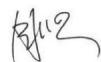

华测认证有限公司

2026年4月13日

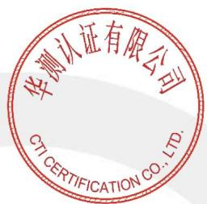

## 读者反馈表

尊敬的读者：

您好！

非常感谢您阅读《宁波华翔电子股份有限公司2025年度环境、社会和公司治理报告》，我们非常希望您能够对本报告进行评价并提出您的宝贵意见，您的意见和建议是帮助我们对报告进行持续改进的重要依据。请您填写下面的调查意见表反馈给我们。

《宁波华翔电子股份有限公司2025度环境、社会和公司治理报告意见回馈表》

姓名

职务

电话

邮箱

1.您对本报告的总体评价是：

很好

较好

一般

较差

很差

2.您认为本报告披露的信息准确性、完整性、及时性、清晰性如何？

很好

较好

一般

较差

很差

3.您认为本报告的内容编排和风格设计是否便于阅读？

很好

较好

一般

较差

很差

4.您关注哪些方面的议题？

5.您认为有哪些需要了解的信息没有在报告中反映？

6. 您对宁波华翔在环境、社会及公司治理方面的工作是否有其他意见？