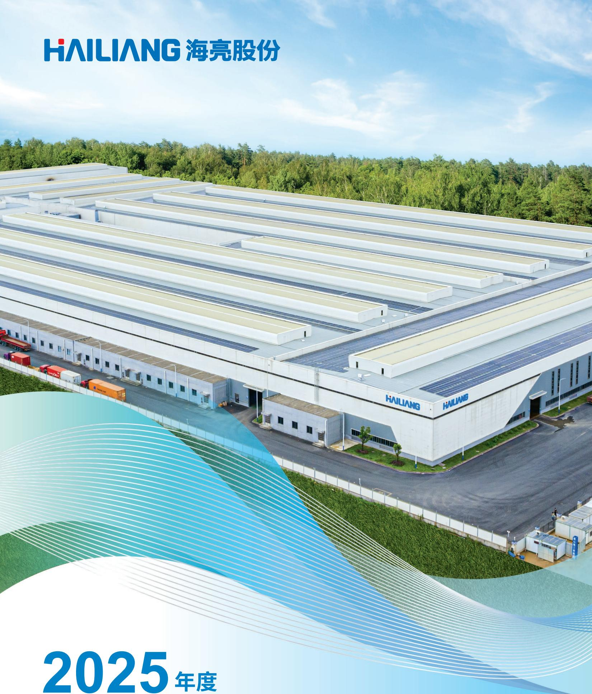

<details>
<summary>text_image</summary>

HAILIANG 海亮股份
2025年度
</details>

## 2025年度

环境、社会及公司治理报告

Environmental, Social and

Governance (ESG) Report

## 关于本报告 4 绿色共生：谱写低碳发展新篇章 16

## 释义说明 5 环境管理体系 18

## 管理层致辞 6 可持续资源管理 22

## 公司简介 7 废水排放管理 28

## 海亮股份全球战略布局图 10 废气排放管控 30

## 2025荣誉盘点 12 固废与危废综合治理 32

噪音管理 35

绿色办公空间 36

应对气候变化 37

碳排放 41

碳足迹管理 44

生态保护 45

低碳绿色材料 46

绿色制造与系统创新 48

## 智造赋能：开创产业升级新里程 50 心系责任：回馈社会，共赢未来 76

## 管理体系认证 52 社区精准帮扶 78

## 产品质量认证 53 履行纳税义务 78

## 研发与创新 54 塑造企业价值观 79

## 可持续供应链建设 59

## 完善客户服务体系 67 臻于至善：卓越治理，合规前行 80

## 关怀成长：培育人才，共创价值 68 合规稳健发展 84

## 人力配置概况 70 内控审计流程 84

## 员工薪酬福利 72 着重信息安全 85

## 工作生活共融 73 诚信经营之道 86

## 人才发展体系 74 利益相关方参与 87

## 保障职场安全 75 重要性评估 88

## 重视员工沟通 75 维护投资者权益 90

## 规范信息披露 90

## 投资者关系管理 91

## 附录一、报告索引 92

## 附录二、公司ESG相关政策列表 100

## 关于本报告

本报告旨在向各利益相关方系统地披露浙江海亮股份有限公司在2025年度于环境、社会及公司治理相关领域的战略、实践举措与关键绩效成果。我们致力于构建透明双向的沟通渠道，有效回应投资者、客户、员工、合作伙伴、社会公众等利益相关方的深切关注及期待。

报告主体：本报告的组织边界涵盖浙江海亮股份有限公司母公司及11个国内生产性实体：浙江科宇金属材料有限公司、浙江海亮环境材料有限公司、浙江海亮新材料有限公司、上海海亮铜业有限公司、海亮(安徽)铜业有限公司、成都贝德铜业有限公司、重庆海亮铜业有限公司、海亮奥托铜管(广东)有限公司、广东海亮铜业有限公司、山东海亮奥博特铜业有限公司、甘肃海亮新能源材料有限公司；12个国外生产性实体：PT HAILIANG NOVA MATERIAL INDONESA、海亮(越南)铜业有限公司、越南海亮金属制品有限公司、海亮奥托铜管(泰国)有限公司、JMF Company、海亮铜业得克萨斯有限公司、五大欧洲HME基地(HME Brass France SAS, HME Brass Germany GmbH, HME Brass Italy SpA, HME Ibertubos S.A., HME Copper Germany GmbH)以及海亮摩洛哥企业有限公司。

时间范围：本报告阐述本公司于2025年1月1日至2025年12月31日年度(以下简称「本年度」或「报告期」)在可持续发展方面的持续努力与实质进展。为增强本报告的对比性和前瞻性，部分内容适当追溯以往年份或具有前瞻性描述。本报告的发布周期为一年一次，与财务年度保持一致。

数据来源：除特殊说明之外，本报告所引用的信息与数据均来源于我们的内部文件或相关公开资料。本报告已经由公司董事会审议通过，保证本报告内容不存在任何虚假记载、误导性陈述或重大遗漏。

## 编制参考：

《有色金属公司环境、社会及治理(ESG)信息披露指南》(T/CNA 0246-2024)

《深圳证券交易所上市公司自律监管指引第3号——行业信息披露》

《深圳证券交易所上市公司自律监管指南第3号——可持续发展报告编制》

《深圳证券交易所上市公司自律监管指引第17号——可持续发展报告(试行)》

《国际可持续准则理事会(ISSB)，国际财务报告可持续披露准则第2号——气候相关披露(IFRS S2 Climate-related Disclosures)》

货币单位：如无特殊说明，货币单位均为人民币元。

报告获取：本报告以中文形式发布，您可以访问浙江海亮股份有限公司官网，或者通过深圳证券交易所指定的信息披露平台——巨潮资讯网，获取并下载本报告的电子版本。

联系方式：如您对我们环境、社会及公司治理方面的工作有任何意见或建议，敬请发送电子邮件至gfoffice@hailiang.com。

释义说明

<table><tr><td>释义词</td><td>释义内容</td></tr><tr><td>公司、海亮股份</td><td>浙江海亮股份有限公司</td></tr><tr><td>海亮集团</td><td>海亮集团有限公司</td></tr><tr><td>科宇公司</td><td>浙江科宇金属材料有限公司</td></tr><tr><td>海亮环材</td><td>浙江海亮环境材料有限公司</td></tr><tr><td>浙江海亮新材</td><td>浙江海亮新材料有限公司</td></tr><tr><td>上海海亮</td><td>上海海亮铜业有限公司</td></tr><tr><td>安徽海亮</td><td>海亮(安徽)铜业有限公司</td></tr><tr><td>成都海亮</td><td>成都贝德铜业有限公司</td></tr><tr><td>重庆海亮</td><td>重庆海亮铜业有限公司</td></tr><tr><td>海亮奥托</td><td>海亮奥托铜管(广东)有限公司</td></tr><tr><td>广东海亮</td><td>广东海亮铜业有限公司</td></tr><tr><td>山东海亮</td><td>山东海亮奥博特铜业有限公司</td></tr><tr><td>甘肃海亮</td><td>甘肃海亮新能源材料有限公司</td></tr><tr><td>印尼基地</td><td>PT HAILIANG NOVA MATERIAL INDONESIA</td></tr><tr><td>越南管件基地</td><td>越南海亮金属制品有限公司</td></tr><tr><td>越南铜管基地</td><td>海亮(越南)铜业有限公司</td></tr><tr><td>泰国基地</td><td>海亮奥托铜管(泰国)有限公司</td></tr><tr><td>JMF</td><td>JMF Company</td></tr><tr><td>美国基地</td><td>海亮铜业得克萨斯有限公司(HAILIANG COPPER TEXAS INC)</td></tr><tr><td>欧洲HME基地</td><td>五个欧洲HME基地,分别位于柏林、门登、意大利、法国和西班牙</td></tr><tr><td>HME黄铜法国基地</td><td>HME BRASS FRANCE SAS</td></tr><tr><td>HME黄铜德国基地</td><td>HME BRASS GERMANY GMBH</td></tr><tr><td>HME黄铜意大利基地</td><td>HME BRASS ITALY SPA</td></tr><tr><td>HME西班牙基地</td><td>HME IBERTUBOS S.A.</td></tr><tr><td>HME德国基地</td><td>HME COPPER GERMANY GMBH (HME德国铜业有限公司)</td></tr><tr><td>摩洛哥基地</td><td>海亮摩洛哥企业有限公司</td></tr><tr><td>公司章程</td><td>浙江海亮股份有限公司章程</td></tr><tr><td>中国证监会</td><td>中国证券监督管理委员会</td></tr><tr><td>深交所</td><td>深圳证券交易所</td></tr></table>

## 管理层致辞

浙江海亮股份有限公司欣然向各界呈报2025年环境、社会及公司治理报告。本报告不仅系统展示了我们在环境、社会及公司治理方面的理念、实践与绩效，更承载着我们对可持续发展道路的坚定承诺，以及对所有利益相关方长期信任的诚挚回应。作为中国铜加工行业的领军企业，我们始终将可持续发展理念深度融入战略决策与日常运营，致力于实现经济、环境与社会效益的和谐统一。

回顾2025年，我们取得了令人振奋的进展，全年累计获得荣誉超过30项，在全球23个生产基地、服务覆盖100多个国家及地区近万家客户的过程中，我们收获了来自社会各界的广泛认可。这些荣誉不仅是对我们过往努力的肯定，更是我们按照“成为全球有色行业绿色智造引领者”的愿景，扎实履行“为材料发展增色、为社会进步添彩”核心使命的有力见证。

## 在环境层面，我们致力于绿色制造，守护生态未来。

公司积极响应国家“双碳”战略，通过全流程数据分析，持续优化库存周转率、降低能耗、提升成材率，并稳步提高再生铜使用比例。目前我们已有多家工厂获得了国家级/省级绿色工厂，并有多项产品成功获得产品碳足迹认证证书。2025年，我们五项环保目标全部达成。我们的环境管理成果斐然：甘肃海亮通过国家市场监管总局碳足迹试点认证，成为甘肃首个获认证的铜箔类企业；多个基地获得ISO14001环境管理体系及ISO50001能源管理体系认证，并进一步提升可再生能源在整体能源结构中的占比。面对新能源产业的广阔前景，我们正重点发展锂电铜箔等绿色产品，并积极布局相关新兴材料领域，以创新驱动产业绿色变革。

## 在社会层面，我们秉持以人为本，共创共享价值。

公司持续推进质量管理及职业健康安全体系建设，目前已有多家国内外基地获得ISO45001、ISO9001及IATF16949等国际权威认证。2025年，总部获得EcoVadis承诺奖章，上海基地获得EcoVadis铜牌，标志着我们在可持续发展管理方面迈上新台阶。公司视员工为最宝贵的财富，依托飞书系统设立集团内部的明德学院，提供职业技能、AI学习、沟通技巧等多元化培训课程，方便员工随时学习，持续提升综合素质与专业能力，海亮股份总部全年培训支出达90万元，安全培训总时长599小时，投入安全生产责任险33.3万元，全力保障员工安全与成长。

## 在公司治理层面，我们坚守诚信透明，夯实发展根基。

公司不断完善可持续发展的治理架构，确保决策科学、执行有效、监督有力。我们严格遵守法律法规及商业道德，持续强化风险管理与内部控制体系，保障公司运营的合规性与稳健性。2025年，海亮股份当选浙江省国际商会合规专业委员会主任委员单位，并荣获上证鹰·金质量公司治理奖，这些荣誉印证了我们在治理现代化、合规化方面的扎实成效。我们高度重视与所有利益相关方的沟通，通过多元渠道保持信息透明，认真倾听各方诉求。

展望未来，海亮股份将以创新驱动为核心引擎，推动产品端与应用端同步跨越，加速从传统制造向智能制造的转型升级，深化全球化运营。我们将继续把ESG理念作为企业战略与核心竞争力的重要组成部分，持续提升在环境保护、社会责任与公司治理方面的表现。海亮股份期待与各利益相关方携手并肩，努力打造更负责任、更具韧性、更可持续的未来。

## 公司简介

浙江海亮股份有限公司是海亮集团有限公司旗下核心产业公司，自2001年成立以来，一直致力于优质铜产品、导体新材料、铝基新材料的研发、生产、销售和服务。公司于2008年1月16日在深圳证券交易所上市，股票代码：002203，是全球铜管棒加工行业的标杆和领袖级企业。

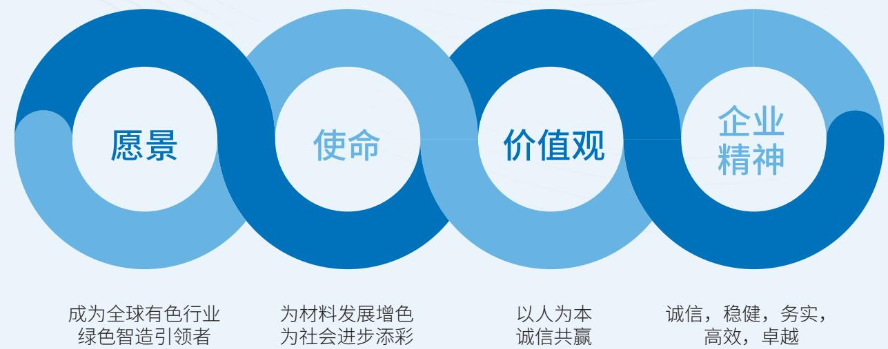

<details>
<summary>flowchart</summary>

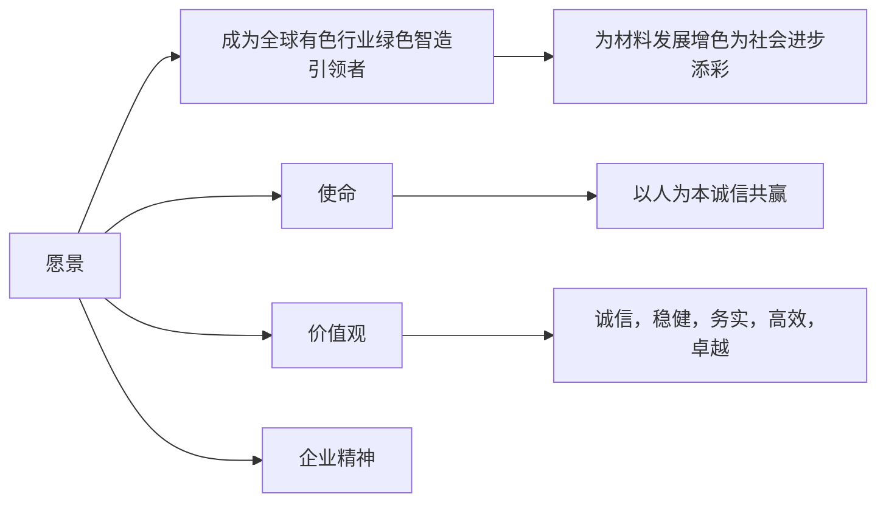
</details>

秉承上述愿景与核心价值，海亮股份的品牌建设围绕“绿色、智能、国际化”三大方向展开：

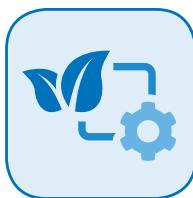

## 绿色智造

推进低碳生产，优化能源利用，履行环保责任。

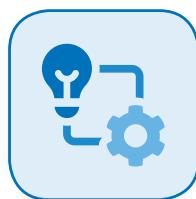

## 智能制造

通过自动化、信息化、智能化技术提升生产效率，打造智能制造标杆。

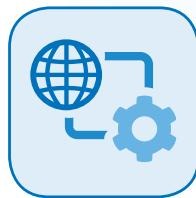

## 全球产业链布局

在全球范围内建立生产和品牌运营网络，提升国际市场竞争力。

## 本报告期内

833.10

亿元

营业总收入

9.43

亿元

归母净利润

8.99

亿元

研发投入

## 截至本报告期末

481.28

亿元
同总资产

168.15

亿元
归母净资产

海亮股份的核心产品主要为铜管、铜棒、铜箔等铜基材料，数万种规格及牌号。产品广泛应用在空调等家电、装备器械、船舶、电力、新能源汽车、储能、光伏、风电、半导体、5G通讯等领域。近年来公司不断推出高效内螺纹铜管、新型铜合金管、环保型无铅精密铜棒等高端产品，形成覆盖铜基材料研发、装备制造与工艺优化的全产业链能力，构建起以“快速研发+产业化”为核心的技术壁垒，使企业的产品结构日趋优化。

面对蓬勃发展的新能源汽车及储能市场，公司高度重视电解铜箔在新能源等新兴领域的应用，开展高强度、高耐蚀、高导电材料的专项攻关，并针对AI算力与机器人热管理的需求，开发高附加值散热产品。我们自主研发的“LMS系统”等五项软件系统，以及“精密铜合金棒挤压低碳智能制造技术及装备”等五项新产品新技术，均已获得软件著作权认证与行业协会鉴定。

海亮股份是国家级博士后科研工作站设站单位、国家级绿色工厂，并获评省级创新型企业、“三名”示范企业、标准创新型企业及节水型企业。公司拥有国家专精特新“小巨人”企业、高新技术企业、国家CNAS认可实验室等资质，设有省级企业研究院、高新技术研发中心、博士创新站、劳模工匠创新工作室及重点工业互联网平台，同时运营教育部重点实验室“海亮铜加工技术开发实验室”和省级重点创新团队。

海亮股份始终秉承“为客户提供超越的价值”的理念，实施以客户与服务为导向的市场策略，凭借优质产品与高效服务持续为客户创造超额价值。通过全球化供、产、销布局，公司不断创新销售模式，加快网点铺设，依托旗下多个全球知名品牌，形成了覆盖全球的品牌影响力，屡获客户授予的“金牌客户”、“金奖供应商”、“全球合作伙伴奖”等荣誉。

海亮股份全球战略布局图  
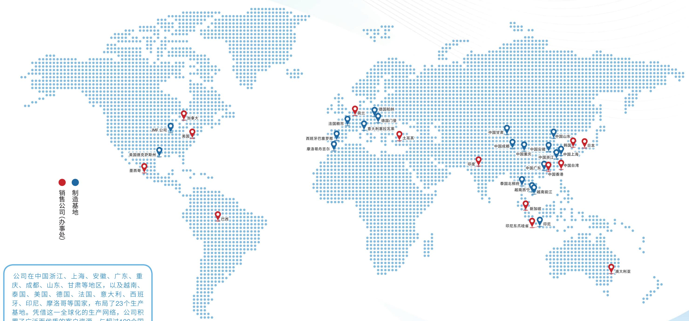

<details>
<summary>geo</summary>

| Category | Location |
| --- | --- |
| 销售公司 (办事处) | 美国德克萨斯州, 墨西哥, 巴西, 加拿大, JMF公司, 英国, 肯兰, 德国柏林, 意大利摩拉瓦米, 土耳其, 法国赖市, 摩洛哥丹吉尔, 中国香港, 中国台湾, 韩国, 日本, 中国上海, 中国浙江, 中国重庆, 中国成都, 中国安徽, 中国山东, 印度, 印尼东爪哇省, 新加坡, 印尼 |
</details>

公司在中国浙江、上海、安徽、广东、重庆、成都、山东、甘肃等地区，以及越南、泰国、美国、德国、法国、意大利、西班牙、印尼、摩洛哥等国家，布局了23个生产基地。凭借这一全球化的生产网络，公司积累了广泛而优质的客户资源，与超过100个国家和地区、近万家客户建立了长期稳定的业务关系，并与众多在上下游行业中具有重要影响力的企业形成了战略合作伙伴关系。

23

全球生产基地

100 +

国家和地区

10,000 +

全球客户

## 2025荣誉盘点

全年累计荣誉30+项；23个生产基地；100+国家／地区近10,000家客户；3家产学合作实验室；1项人工智能标杆企业荣誉。

## 环境(E)

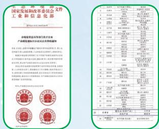  
甘肃海亮通过国家市场监管总局碳足迹试点认证（甘肃首个获认证铜箔类企业）

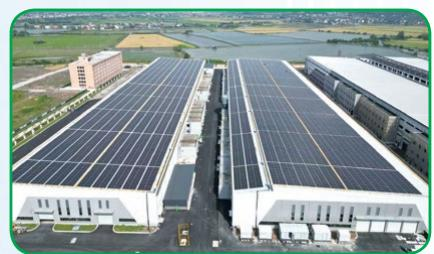

<details>
<summary>natural_image</summary>

Aerial view of a large industrial complex with multiple solar panel buildings and adjacent buildings, surrounded by greenery (no visible text or symbols)
</details>

各基地光伏总发电量突破8,000万千瓦时，自用光伏发电量超过7,500万千瓦时，两者均较往年上升超过一成

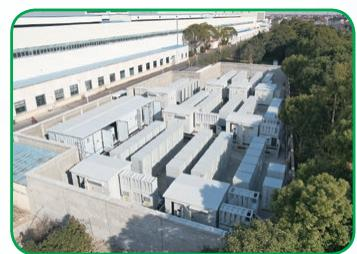

<details>
<summary>natural_image</summary>

Aerial view of a modern industrial facility with multiple modular units and a high-speed train in the background, surrounded by greenery (no visible text or symbols).
</details>

上海海亮18MW/36MWh储能电站并网运行

## 社会(S)

## 产品质量与创新

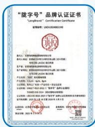  
甘肃海亮的铜箔双光锂电铜箔产品获甘肃省首批“陇字号”认证

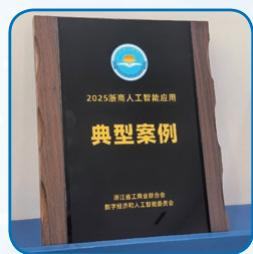  
海亮股份入选产业链产改省级案例、入选2025年浙江省“机器人+”应用标杆企业

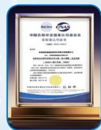  
甘肃海亮检测中心取得中国合格评定国家认可委员会(CNAS)认可证书

## 人才强企

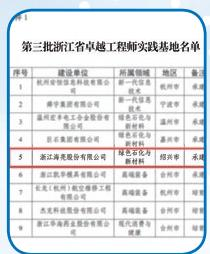  
海亮股份入选浙江省卓越工程师实践基地（第5位）

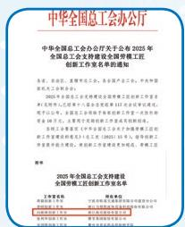  
冯焕锋劳模工匠创新工作室入选全国总工会支持建设名单

## 供应链管理

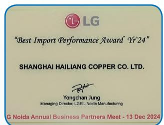

<details>
<summary>text_image</summary>

LG
"Best Import Performance Award 'Yr'24"
SHANGHAI HAILIANG COPPER CO. LTD.
Yongchan Jung
Managing Director, LG&EIL Noida Manufacturing
G Noida Annual Business Partners Meet - 13 Dec 2024
</details>

上海海亮获LG2024年度最佳供应商

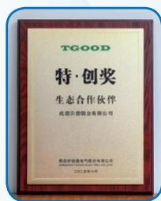  
成都贝德获青岛特锐德川开电气“特·创奖”生态合作伙伴

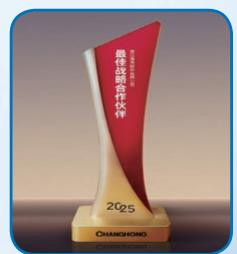  
海亮股份获长虹最佳战略合作伙伴

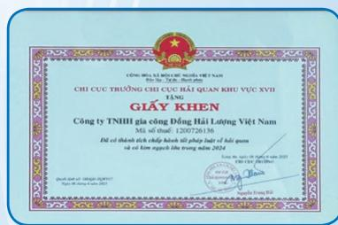

<details>
<summary>text_image</summary>

CÔNG TYU MEXI CHỦY VIỆN TÀNH
CHÍ CỤC TRƯỜNG CHÍ CỤC HẢI QUAN KHU VỰC XVII
TẦNG
GIẤY KHEN
Công ty TNHHi gia công Đồng Hải Lương Việt Nam
Mã số thải: 1200726136
Đất εi zhônh artist<|im_start|> Czech cói phát xuất của hai quan
vã cói kẽn ngệch thu trong năm 2024
Công ty TNHHi gia công Đồng Hải Lương Việt Nam
Mã số thải: 1200726136
Đất εi zhônh artist coffee kinh cói phát xuất của hai quan
vã cói kẽn ngệch thu trong năm 2024
Công ty TNHHi gia công Đồng Hải Lương Việt Nam
Mã số thải: 1200726136
Đất εi zhônh artist coffee kinh cói phát xuất của hai quan
vã cói kẽn ngệch thu trong năm 2025
Công ty TNHHi gia công Đồng Hải Lương Việt Nam
Mã số thải: 1200726136
Đất εi zhônh artist coffee kinh cói phát xuất của hai quan
vã cói kẽn ngệch thu trong năm 2025
Công ty TNHHi gia công Đồng Hải Lương Việt Nam
Mã số thải: 12<nl>
Dự đĩy đĩy ĐỊNG YI GUYI
Dự đĩy ĐỊNG YI GUYI
</details>

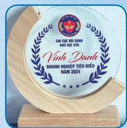  
越南海亮获越南海关2024年度优秀企业

## 科研平台与丰硕成果

## 2024浙江省科学技术奖

海亮股份“复杂场景下物流机器人关键技术及产业化应用”项目荣获“科学技术进步奖二等奖”；海亮环材的“复杂工业烟气多污染物低温协同治理材料与关键技术及产业化应用项目”荣获“科学技术进步奖三等奖”

## - 甘肃海亮荣获兰州新区创新荣誉两项

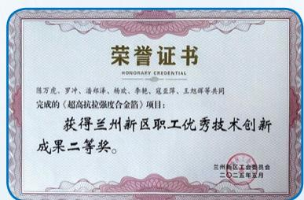

<details>
<summary>text_image</summary>

荣誉证书
HONORARY CREDENTIAL
陈万虎、罗冲、清郁泽、杨欢、李艳、寇亚萍、王旭辉等共同
完成的（超高抗拉强度合金箔）项目：
获得兰州新区职工优秀技术创新
成果二等奖。
兰州新区生命委员会
二〇二五年五月
</details>

“超高抗拉强度合金箔”项目获兰州新区职工优秀技术创新成果二等奖

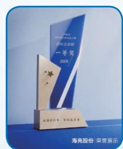  
“适配锂金属电池的新型负极集流体项目”在兰州新区第五届"丝路新引擎·智创赢未来”创新创业大赛荣获成长企业组一等奖

## 一省级科学技术奖及重点实验室一

## 全省先进催化与吸附材料重点实验室

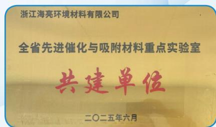

<details>
<summary>text_image</summary>

浙江海亮环境材料有限公司
全省先进催化与吸附材料重点实验室
共建单位
二〇二五年六月
</details>

浙江师范大学牵头，海亮环材、巨化新材料共建，成功获批成为“全省重点实验室”

## 其他高能级联合研究

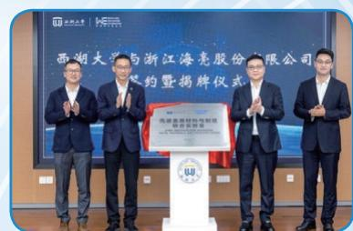

<details>
<summary>text_image</summary>

西湖大学与浙江海亮股份有限公司
签约暨揭牌仪式
</details>

海亮股份—西湖大学“先进金属材料与制造联合实验室”

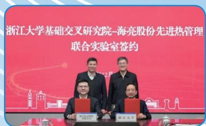

<details>
<summary>text_image</summary>

浙江大学基础交叉研究院-海亮股份先进热管理
联合实验室签约
</details>

海亮股份—浙江大学“先进热管理联合实验室”

## 治理(G)

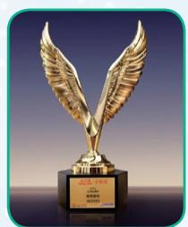  
海亮股份获上证鹰·金质量公司治理奖

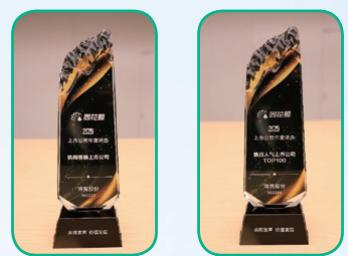  
海亮股份获同花顺2025上市公司年度榜单的“机构青睐上市公司”及“最具人气上市公司TOP100”奖项

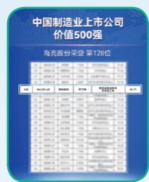  
海亮股份入选第九届中国制造业上市公司价值500强

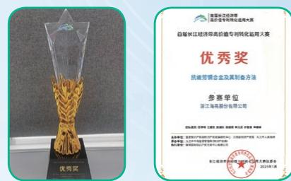  
海亮股份专利获首届长江经济带高价值专利转化运用大赛优秀奖

## 生产基地荣誉(部分)

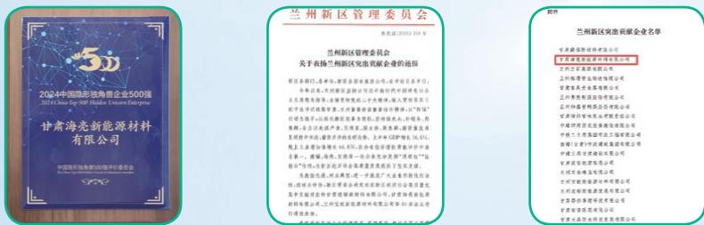  
甘肃海亮－宁德时代海外支持奖(获奖的唯一铜箔企业)、兰州新区突出贡献企业、双创大赛一等奖(即“创新创业大赛荣获成长企业组一等奖”)

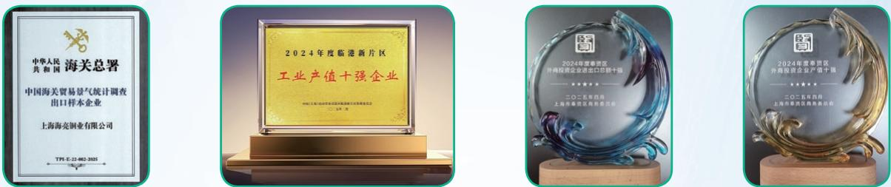  
上海海亮－2024年度临港新片区“工业产值十强企业”、2024年度奉贤区外商投资企业产值及进出口总额双十强、入选中国海关贸易景气统计调查样本企业

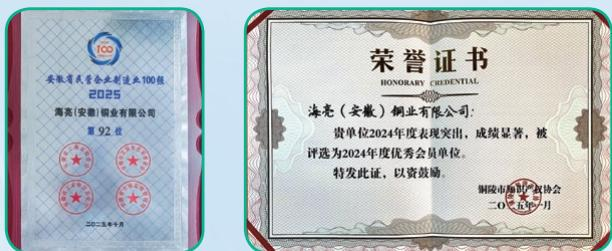  
安徽海亮一铜陵市知识产权协会2024年度优秀会员单位、2025安徽省民营企业制造业100强

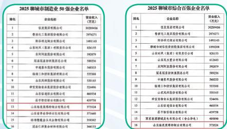  
山东海亮—聊城“2025年度综合百强企业”+“制造业50强企业”双项荣誉

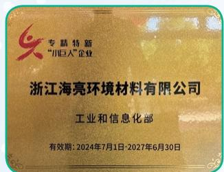

<details>
<summary>text_image</summary>

专慧特新
“小巨人”企业
浙江海亮环境材料有限公司
工业和信息化部
有效期: 2024年7月1日-2027年6月30日
</details>

海亮环材一专精特新“小巨人”企业

# “绿色共生：

# 谱写低碳发展新篇章

## Green Symbiosis:

Composing a New Chapter in Low-Carbon Development

”

作为全球领先的铜产品及新材料一站式供应商，海亮股份深知从研发创新、生产制造到产品交付的全价值链活动均与自然环境密切相关。积极应对气候变化、管理环境足迹，既是我们履行企业环境与社会责任的重要体现，也是提升经营韧性、支撑高质量可持续发展的核心战略方向。

## 2025年关键绩效

国内基地环保投入

1,493.82万元

国外基地环保投入

865.48万元 $^{2}$

获ISO14001管理体系认证的基地 $^{1}$

## 认证覆盖率100%满足法规要求

环境保护法规相关违规事件

0宗

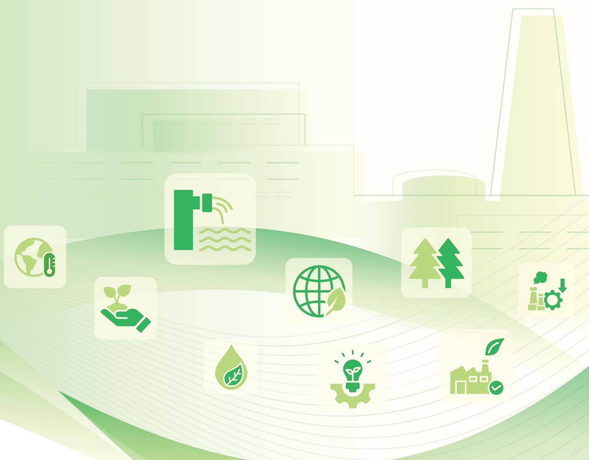

<details>
<summary>natural_image</summary>

Illustration of green icons representing sustainable energy and sustainability (no text or symbols)
</details>

## 本章节涵盖内容

√ 环境管理体系 √ 应对气候变化  
√ 可持续资源管理 √ 碳排放  
√ 废水排放管理 √ 碳足迹管理  
√ 废气排放管控 √ 生态保护  
√ 固废与危废综合治理 √ 低碳绿色材料  
√ 噪音管理 √ 绿色制造与系统创新  
√ 绿色办公空间

## 环境管理体系

我们将环境管理深度融入公司治理与运营全过程。我们首先确保在全球所有业务所在地均严格遵守《中华人民共和国环境保护法》等当地环境法律法规，并以此为底线，建立了自主管理框架。在此基础上，公司以“防治结合、改善环境、优化资源、实现新型工业化发展”为环境管理方针，指导各附属公司结合属地法律法规要求及生产营运实践制定《环境管理制度》，明确了各级单位在环境保护中的职责与义务。

同时，公司通过《能源、环保、安全考核责任书》，建立系统的环境绩效管理机制。该责任书依据各运营基地实际情况，设定水耗、能耗及环境保护等考核指标，明确其责任范畴：

  
污水处理

  
危废管理

  
一般固废管理

  
第三方环境检测

  
内部自查

## 公司要求基地发现问题及时整改，未达要求的基地将承担相应责任。

此外，公司还制定了《环境风险防范管理制度》《环境监测制度》及《环境突发污染事故应急处理预案》，形成全流程环境管理框架覆盖：

  
预防

  
监测

  
响应

  
复盘

  
追责

## 确保突发环境事件时能迅速有效应对，最大限度降低环境影响。


## 稳健合规经营成果

报告期内，公司未发生突发重大环境事件，未因环境事件受到生态环境等有关部门的重大行政处罚或被追究刑事责任。公司将持续加强环境风险防控，确保生产经营活动始终处于安全、合规、可控的状态。

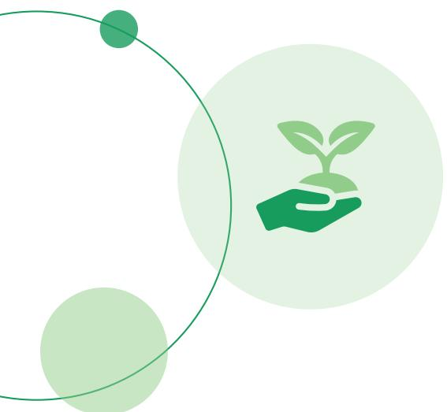

<details>
<summary>natural_image</summary>

Illustration of a hand holding a small sprouting plant inside a circular frame, with two smaller circles in the background (no text or symbols)
</details>


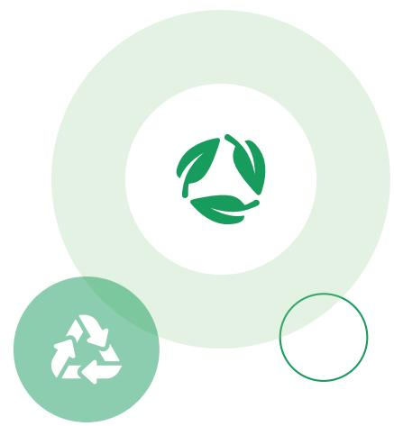

<details>
<summary>natural_image</summary>

Abstract graphic with green recycling symbols inside concentric circles (no text or labels)
</details>

## 环境管理架构

## 总裁

作为公司环保工作第一责任人,全面负责环境管理体系的制定与监督,明确实施环境管理体系的职责和权限

## 环保副总

## 运营管理部

规定各阶段环境管理职责,专职开展公司的环保工作,负责环境管理制度的制定、实施方案的推进,并对各子公司的环境管理行为进行指导与考核

检测中心

环保监察员

## 各子公司

各子公司日常环保设备维护、检测以及资料整理等各项事务

环保管理责任部门

安全环保员

公司持续加强环保团队建设，为全球环境管理提供有力支持。国内基地环保专兼职人员共33人，较上年增长17.86%。海外基地环保人员接近20人，团队具备化学工程与综合管理系统等多元背景，共同推动国际业务的可持续发展。


## 33人

国内基地环保专兼职人员

(同比 ↑17.86%)


## 接近20人

海外基地环保人员

目前，我们多个核心生产基地已成功建立并持续运行符合ISO 14001国际标准的环境管理体系，通过系统性的规划、实施、监督与持续改善流程，实现环境绩效的持续改善。

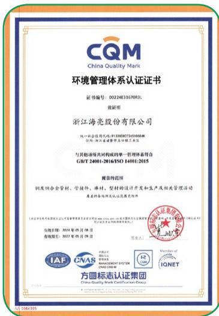

<details>
<summary>text_image</summary>

CQM
China Quality Mark
环境管理体系认证证书
证书编号：002243167093L
胡证明
浙江海亮股份有限公司
统一社会信用代码：913300073741568X
公司名称：浙江海亮集团有限公司
与其他保荐机构共同的单一管理人体系符合
GUT 24001-2016/ISO 14001:2015
健康防范
铜及铜合金管材、管接件、棒材、型材的设计开发和生产及相关管理工作
具有面向市场认证的项目
（以下简称“中国证监会”）（以下简称“中国证监会”）
危险日期：2024年05月08日
有效期至：2023年05月08日
负责人：
IAF
SNAE
MANAGEMENT SYSTEM
CHINA CO.,LTD.
Member of
IQNET
方圆标志认证集团
China Quality Mark Certification Group
</details>

海亮股份

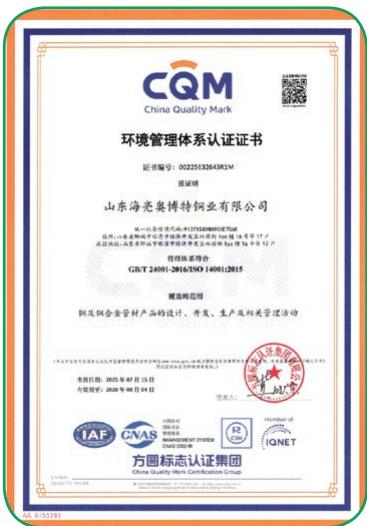

<details>
<summary>text_image</summary>

CQM
China Quality Mark
环境管理体系认证证书
证书编号：0022533264381M
资质证明
山东海亮集博特铜业有限公司
第一认证企业名称：SHENZHENHAIQIYU
注册地址：山东省烟台市芝罘区新港大道东段100号1幢1层17层
经营范围：金属材料(非金属材料)的生产及销售（限分支机构经营）；化工产品（不含危险化学品）的生产、销售。
组织体系符合
GB/T 24001-2016/SO/ISO 14001(2015)
建筑规范
铜及铜合金管材产品的设计、开发、生产及相关管理活动
专利日期：2025年4月15日
有效期至：2028年9月30日
负责人：
IAF CNAS MANAGEMENT SYSTEM CO.,LTD.
UNIT: IAC
ISSN: 0000000000000000
CNTEL: 000000000000000
UNIT: 12
UNIT: 12
UNIT: 12
UNIT: 12
UNIT: 12
UNIT: 12
UNIT: 12
UNIT: 12
UNIT: 12
UNIT: 12
UNIT: 12
UNIT: 12
UNIT: 12
UNIT: 12
UNIT: 12
UNIT: 12
UNIT: 12
UNIT:12
UNIT:12
UNIT:12
UNIT:12
UNIT:12
UNIT:12
UNIT:12
UNIT:12
UNIT:12
UNIT:12
UNIT:12
UNIT:12
UNIT:12
UNIT:12
UNIT:12
UNIT:12
UNIT:12
UNIT:12
UNIT:12
UNIT:12
UNIT:
IAC CNAS MANAGEMENT SYSTEM CO.,LTD.
UNIT: IAC
ISSN: 0000000000000000
UNIT: 12
UNIT: 12
UNIT: 12
UNIT: 12
UNIT: 12
UNIT: 12
UNIT: 12
UNIT: 12
UNIT: 12
UNIT: 12
UNIT: 12
UNIT: 12
UNIT: 12
UNIT: 12
</details>

山东海亮

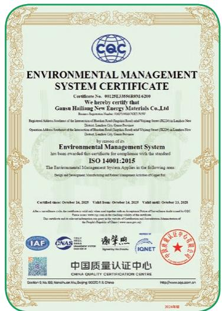

<details>
<summary>text_image</summary>

ENVIRONMENTAL MANAGEMENT SYSTEM CERTIFICATE
Certificate No. 0012523556RNI-6200
We hereby certify that
Gansu Halliag New Energy Materials Co.,Ltd.
Registration Address: Number of the Environmental Management System (ESMS) Board of Directors and Shipping Team (ECMS) in London New
Operation Address: Number of the Environmental Management System (EIMS) Board of Directors and Shipping Team (EIMS) in London New
Dedicated, London City, Gansu Province
by us of this
Environmental Management System
has been awarded this certificate for compliance with the standard
ISO 14001:2015
The Environmental Management System Applies in the following areas:
Design and Development: Manufacturing and Related Empowerment Architecture of Copper Inc.
Certified Date: October 14, 2025   Valid Date: October 14, 2025   Valid Date: October 13, 2025
After a surveillance audit the certification is only available within the Department of Environmental Health Bureau for CDC
Please note that the certification has been made available within the EMEA region. The certification will be issued to the Office of the EMEA region. This certification will be issued to the Office of the EMEA region. The certification will be issued to the Office of the EMEA region. The certification will be issued to the Office of the EMEA region. The certification will be issued to the Office of the EMEA region. The certification will be issued to the Office of the EMEA region. The certification will be issued to the Office of the EMEA region. The certification will be issued to the Office of the EMEA region. The certification will be issued to the Office of the EMEA region. The certification Will be issued to the Office of the EMEA region. The certification Will be issued to the Office of the EMEA region. The certification Will be issued to the Office of the EMEA region. The certification Will be issued to the Office of the EMEA region. The certification Will be issued to the Office of the EMEA region. The certification Will be issued to the Office of the EMEA region. The certification Will be issued to the Office of the EMEA region. The certification Will be used as part of the EMEA certification system. The certification will be used as part of the EMEA certification system. The certification will be used as part of the EMEA certification system. The certification will be used as part of the EMEA certification system. The certification will be used as part of the EMEA certification system. The certification will be used as part of the EMEA certification system. The certification will be used as part of the EMEA certification system. The certification will be used as part of the EMEA certification system. The certification will be utilized as part of the EMEA certification system. The certification will be used as part of the EMEA certification system. The certification will be used as part of the EMEA certification system. The certification will be used as part of the EMEA certification system. The certification will be used as part of the EMEA certification system. The certification will be used as part of the EMEA certification system. The certification will be used as part of the EMEA certification system. The certification will be used as parts of the EMEA certification system. The certification will be used as parts of the EMEA certification system. The certification will be used as parts of the EMEA certification system. The certification will be used as parts of the EMEA certification system. The certification will be used as parts of the EMEA certification system. The certification will be used as parts of the EMEA certification system. The certification will be used as parts of the EMEA certification system. The certification will be used as parts of EMEA certification system. The certification will be used as parts of the EMEA certification system. The certification will be used as parts of the EMEA certification system. The certification will be used as parts of the EMEA certification system. The certification will be used as parts of the EMEA certification system. The certification will be used as parts of the EMEA certification system. The certification will be used as parts of the EMEA certification system. The certification will be used as parts of the ESEA certification system. The certification will be used as parts of the ESEA certification system. The certification will be used as parts of the ESEA certification system. The certification will be used as parts of the ESEA certification system. The certification will be used as parts of the ESEA certification system. The certification will be used as parts of the ESEA certification system. The certification will be used as parts of the ESEA certification system. The certification will be used as parts of the ESEA certification systems and its associated entities or companies.
IAAF
CEAS
谢学熙
IGNET
中国质量认证中心
CHINA QUALITY CERTIFICATION CENTRE
December 9, 2010, Nanjing, Tianjin, Beijing 100279 P.O., China
http://www.eqj.com/101.cn
2014年8月
</details>

甘肃海亮

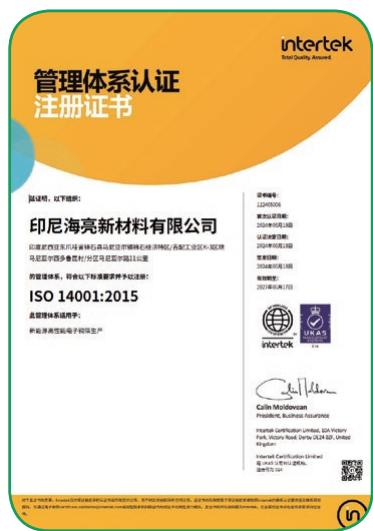

<details>
<summary>text_image</summary>

管理体系认证
注册证书

兹说明，以下简历：
印尼海亮新材料有限公司
印度尼西亚尼西亚特尔多斯石油马尼亚市普林特经济特区/南加州工业区X-8地块
马尼亚市西多鲁特尔区马尼亚市中山区13座
的管理体系，特尔以下标准要求予以注册：
ISO 14001:2015
质量管理流程手册：
新亚湾高强电子研发生产

证书编号：
122405006
第35位注册号：
2020年9月18日
证书有效期：
2020年9月18日
变更日期：
2020年9月18日
有效期：
2020年9月17日

intertek
Colin Moldovan
President, Business Assurance
Marshall Certification Limited, SA Victory
Park, Victory Road, Denver, USA 50, United
Kingston
Internal Certification Limited
www.intertek.com.cn
地址：中国

ISBN 978-7-777-7-777-7-777-7-777-7-777-7-777-7-777-7-777-7-777-7-777-7-777-7-777-7-777-7-777-7-777-7-777-7-777-7-
</details>

印尼基地

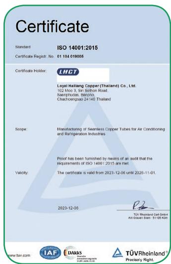

<details>
<summary>text_image</summary>

Certificate
Standard ISO 14001:2015
Certificate Registr. No 01 104 019005
Certificate Holder:
LHCT
Loyal Hailiang Copper (Thailand) Co., Ltd.
102 Mioo 3, Sir Solthon Road
Saerphucos, Bünpho,
Chachengsao 24140 Thailand
Scope: Manufacturing of Seamless Copper Tubes for Air Conditioning
and Refrigeration Industries
Proof has been furnished by means of an audit that the
requirements of ISO 14001:2015 are met.
Validity: The certificate is valid from 2023-12-06 until 2020-11-01.
2023-12-06
TÜV Rheinland Cert GmbH
Air Grenan Bank 51105 KBH
www.tav.com
DAKKS
TÜV Rheinland®
Precisely Right.
</details>

泰国基地

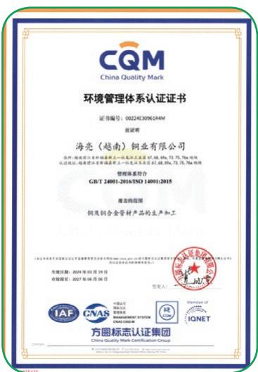

<details>
<summary>text_image</summary>

CQM
China Quality Mark
环境管理体系认证证书
证书编号：00224E3096134M
证照
海亮（越南）铜业有限公司
住所：海南省三亚市福清新区三环路工业区57、68、89a、73、75、76a地块
认证地址：海南省三亚市福清新区三环路工业区57、68、89a、73、75、76a地块
管理体系符合
GB/T 24001-2016/ISO 14001/2015
海亮的范围
铜及铜合金管材产品的生产加工
登记日期：2024年03月15日
有效期至：2027年08月08日
签发人：
IAF GVAS INVESTMENT SYSTEM CRASH GROUP
方圆标志认证集团
China Quality Mark Certification Group
Member of IQNET
</details>

越南铜管基地

通过强化管理、规范操作流程、持续提升全体员工的环保意识与节能减排责任感，公司在确保合规运营的基础上，进一步着力提升环境绩效、消除安全隐患。2025年，公司五项年度环保目标已全部完成。


## 2025年环保目标

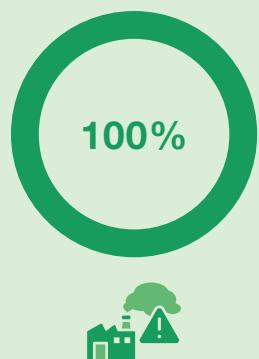

<details>
<summary>donut</summary>

| Category | Value |
| --- | --- |
| Total | 100% |
</details>

三废及噪声排放达标率

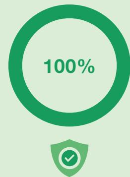

<details>
<summary>donut</summary>

| Metric | Value |
| --- | --- |
| Percentage | 100% |
</details>

危险废物处置合格率

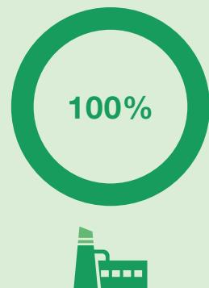

<details>
<summary>donut</summary>

| Category | Value (%) |
| --- | --- |
| Total | 100 |
</details>

熔炼岗位铜尘、粉尘排放达标率

  
突发环境事故

  
目标已完成

  
重伤以上工伤事故发生率/职业病数量

  
目标已完成

年内，海亮股份进一步增加环保领域资源投入，全面推进清洁生产与环境治理，国内生产基地在环保基础设施方面的累计投入达1,493.82万元，海外生产基地累计投入865.48万元。主要用于以下关键领域：


清洁生产方案的系统实施


废气与污水处理设施的运行维护


固体废弃物与危险废弃物的分类、运输、资源化利用及无害化处置


环境监测与检测


安全环保培训与能力建设

这些投入不仅体现了我们对全球各运营所在地环境责任的切实履行，更展现了我们持续推进绿色制造、强化环境管理体系的一致行动，为可持续发展奠定了坚实的设施与管理基础。

## 1,493.82万元

国内生产基地投入

## 865.48万元

海外生产基地投入

## 可持续资源管理

公司严格遵循国家节能环保相关法律法规及行业标准，恪守《中华人民共和国环境保护法》《中华人民共和国水污染防治法》《危险废物转移联单管理办法》《排污许可管理条例》等法规，积极履行对水资源、物料、能源及气候资源的保护责任。

## 水资源管理实践

公司依据《中华人民共和国水污染防治法》《中华人民共和国水法》等法律法规，持续优化用水结构，推进节水工艺与设备改造，在保障废水达标排放的基础上，不断提高废水回用率，减少新鲜水消耗。通过制定并执行《企业节约用水管理制度》，公司强化内部用水管控，采用分质供水、高效冷却与清洗、循环用水等先进节水技术与设备，着力降低单位产品(产值)耗水量，提升水资源循环利用水平。

<table><tr><td>用水指标</td><td>指标说明</td><td>国内基地数据</td><td>国外基地数据</td><td>汇总数据</td></tr><tr><td>新鲜水用量(吨)</td><td>报告期内企业新鲜水总用量</td><td>2,294,360.81</td><td>968,948.88</td><td>3,263,309.68</td></tr><tr><td>循环水用量(吨)</td><td>报告期内企业循环水总用量</td><td>13,110,567.47</td><td>11,970,060.00</td><td>25,080,627.47</td></tr><tr><td>水资源循环利用率(%)</td><td> $循环水用量 \div (新鲜水用量 + 循环水用量) \times 100\%$ </td><td>85.11%</td><td>92.51%</td><td>88.49%</td></tr><tr><td>水资源消耗强度(吨/吨产品)</td><td>单位产品耗水量</td><td>2.93</td><td>2.96</td><td>2.94</td></tr></table>

## 海亮股份节水管理与实践优秀案例

## 1. 体系化管理

通过建立权责明确的节水管理架构，以及标准化的工作制度与操作规程，将节水实践固化为日常管理流程，确保持续性与规范性。


## 节水专项管理

## 山东海亮：

- 由总经理牵头成立节水小组，设专职管理员；  
- 推进《节水工作会议制度》《用水计量管理制度》《用水设备巡检制度》建设；  
- 实行水资源统一管控与奖惩机制。


## 绩效考核

## 位于浙江基地：

- 成立节水管理小组；  
- 将节水成效纳入考核；  
- 对优秀部门与个人给予奖励，对造成浪费现象的部门或个人进行惩罚；  
- 基地已通过水平衡测试。


## 规范管理流程

## 越南管件基地：

- 推行“目标-行动-成果”管理流程；  
- 严格执行《水循环及冷却系统操作规程》，确保水循环系统高效稳定运行。

## 2. 工艺优化与设备升级

通过引进与优化关键设备及工艺，并应用自动化与数据化手段，提升生产环节的用水效率，降低单位产品水耗。


## 冷却塔与水泵改造

- 广东海亮：完成外循环水泵改造，采用恒温恒压控制与季节性水温调节，结合常态化巡检，实现精准供水与节能。改造后水泵吨耗下降33.3%，每年节水约2.4万吨，年节电200万千瓦时，综合节能降本超百万元。  
- 泰国基地：进行老化冷却水塔改造，并更新高能效电机水泵，显著提升循环冷却效率，有效减少系统补水量，改造后年节电约30万千瓦时。  
- 越南铜管基地：进行冷却塔改造，2025年进一步合并蓄水池，配备变频节能冷却塔与水泵，持续降低水耗与电耗。  
HME黄铜法国基地：于地下60米处设置深井水泵并配备车间冷却塔，以提升输水与冷却效率。


## 工艺革新与智能管控

- 上海海亮：在员工浴室部署IC卡智能控水系统，实现用水精准计量与管控，并将纯水生产过程中的尾水回收至轧机冷却水系统，年节水量约3万吨。  
- 美国基地：通过废水处理厂净化回用含油工艺废水，并安装计量表对回用水量进行精确管理。  
- HME黄铜意大利基地：通过系统改造提升循环效率，包括修复管道渗漏、恢复供水浮筒功能，安装三通阀启动处理后的酸性水循环系统用于冷却工艺，提升工业用水循环利用率。


## 水资源循环利用

- 浙江基地：建有车间设备冷却与产品冷却循环水池，实现冷却水重复利用，定期定量排放。此外，酸洗工艺采用温水处理，减少铜管表面酸液残留，从而降低清洗水耗。清洗废水经处理后，部分工业园区的废水会回收至循环水池再利用。2025年，海亮环材完成厂区管网改造。通过优化管网布局与回收高浓度废水用于设备清洗，系统性减少了水资源漏损并强化了循环利用能力。  
- 重庆海亮：建立循环水分级利用体系，对设备超标循环水进行过滤后回用。  
- 越南管件基地：熔炼与管件车间分设独立循环水池，设备冷却用水基本实现闭合循环，仅在低水位时少量补给自来水。

## 节能减排举措

能源管理是企业实现绿色转型与可持续发展的核心环节。为系统提升能源利用效率，降低运营能耗与成本，增强市场竞争力，海亮股份在各运营基地全面推进能源管理体系建设，积极实施多样化节能举措。

目前，我们多家基地已建立规范的能源管理体系。例如，甘肃海亮制定了《能源管理方针》，以构建“零碳排、高效率、可持续”的能源生态体系为目标，明确能源管理的原则与实施路径；印尼基地则依据《印度尼西亚能源法》及相关法规，制定《能源管理办法》，为日常能源使用、监督与考核提供制度依据，推动节能与降本增效协同发展。

同时，为实现可持续发展的能源管理目标，海亮股份持续推进节能降耗改造与绿色能源应用，在生产能效优化与能源结构转型方面取得显著进展。

## 一、能效提升与技术改造

我们持续推进生产系统优化与节能技改，提升单位产品能源利用率：


## 生产设备能效升级

1. 浙江基地：铜管事业部投资改造1#在线退火线圈，生产速度由400米/分钟提升至450米/分钟，单位能耗下降15.4%，预计年节电17.57万kWh。  
2. 海亮奥托：淘汰高能耗的1#熔铸炉，启用能效更高的3#熔炉；改造老化冷却水塔及水泵，年节电32.85万千瓦时。  
3. 泰国基地：更新高能效空压机，运行功率由417千瓦降至234千瓦，年节电160.3万千瓦时。  
4. HME黄铜法国基地：将线材车间热处理炉升级为电弧炉并加装余热回收系统，直接提升了能源利用效率。


## 工艺流程系统优化

1. 安徽基地：实行自动化、变频控制及系统独立运行三项技术改造，包括增设自动打饼机以减少物料搬运能耗、优化制氮房冷却水泵以适配不同季节运行需求、改造洛伊炉水循环系统使其独立运行。三项措施合计年节电超26.3万kWh，综合节省成本约37.7万元。  
2. 广东台山基地：采用MES生产管理系统，实时监控各工序生产数据，优化工艺参数，提高成材率，有效降低单位产品能耗。

得益于上述各基地的持续改进，国内铜管材单位产品综合能耗为142.94kgce/t，远低于《铜及铜合金加工材单位产品能源耗限额》(GB 21350-2023)中规定的1级指标( $\leq$ 190kgce/t)，处于行业领先水平。

## 二、绿色能源系统建设

为优化能源结构、降低碳排放，我们在全球多个基地积极推进光伏等可再生能源项目：

- 目前已在浙江、上海、安徽、重庆、中山、台山、泰国等多个运营基地开展光伏发电系统的开发与建设，逐步提升清洁能源在总能耗中的占比；  
- 上海海亮在实施改扩建项目中，同步加大绿色电力采购比例，进一步降低生产过程中的二氧化碳排放。

2023-2025年海亮股份光伏发电量  
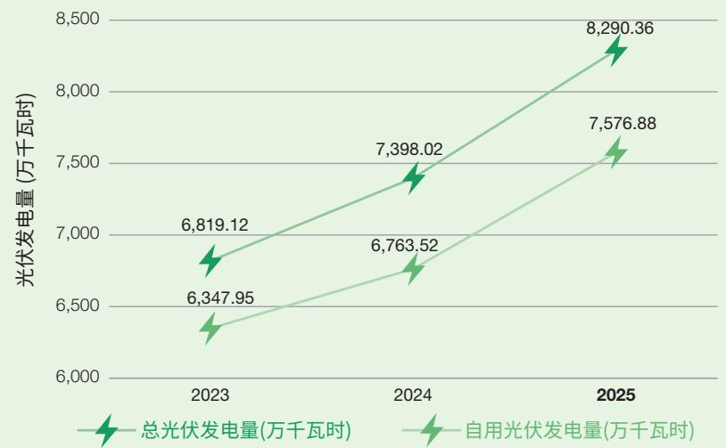

<details>
<summary>line</summary>

| Year | 总光伏发电量 (万千瓦时) | 自用光伏发电量 (万千瓦时) |
| --- | --- | --- |
| 2023 | 6,819.12 | 6,347.95 |
| 2024 | 7,398.02 | 6,763.52 |
| 2025 | 8,290.36 | 7,576.88 |
</details>

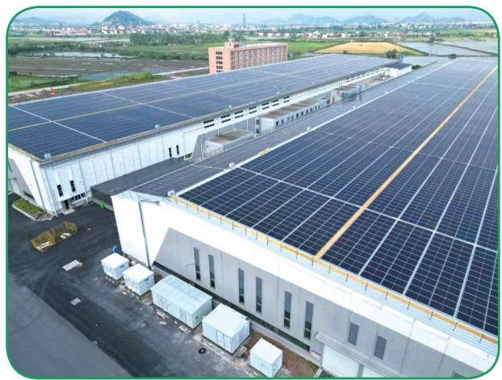

<details>
<summary>natural_image</summary>

Aerial view of a large industrial facility with multiple solar panels installed on rooftops, surrounded by greenery and distant hills (no visible text or symbols).
</details>

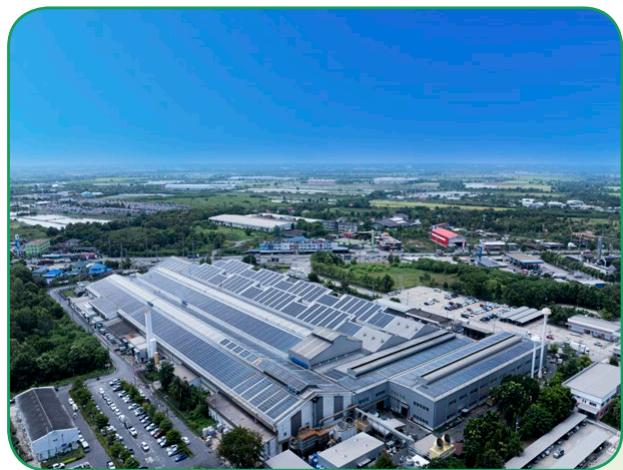

<details>
<summary>natural_image</summary>

Aerial view of a large industrial complex with solar panels on rooftops, surrounded by greenery and parking lots under a clear blue sky.
</details>

运营基地安装的光伏设备

## 三、能源管理实践与数字化赋能

海亮股份各基地积极推进能源精细化管理与创新技术应用，通过目标引领、数智赋能与运行优化等多重举措，全面提升能源使用效率：

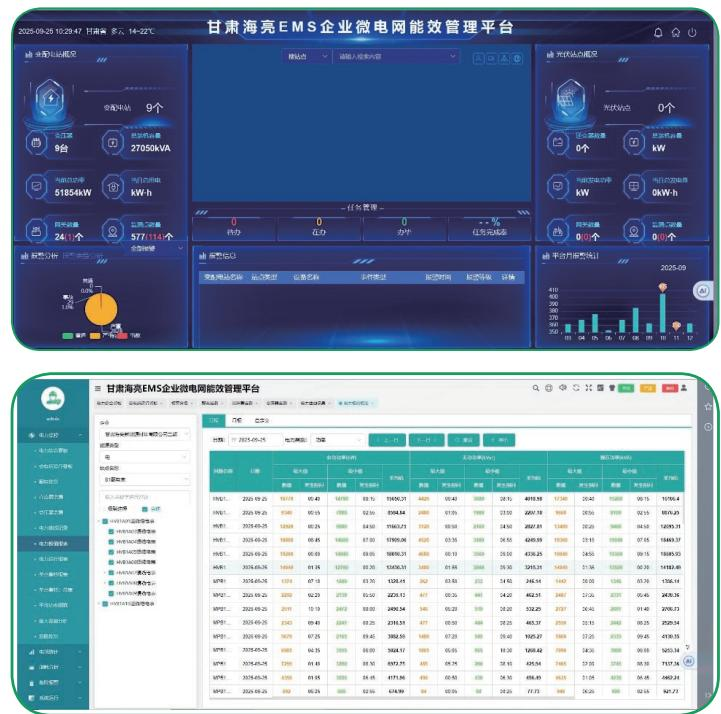  
甘肃海亮EMS企业微电网能效管理平台

- 甘肃海亮设立2025年单位产品综合能耗下降 $20\%$ 的目标，并分解为电力、水、气等具体指标。同时规划实施9项节能改造项目，如生箔槽压改造预计年节电3,344万千瓦时。  
- 甘肃海亮亦部署EMS能效管理平台，实时监测9个变配电站及577台设备运行状态，实现智能预警与能效绩效跟踪，形成“监测-分析-改进”管理闭环。  
- 山东海亮在制氮站实施峰谷电运行策略，高峰时段停机转用液氮，日节电约2,400千瓦时，实现了电力消耗与生产需求的动态匹配。  
- 越南管件基地针对退火炉等大功率设备，合理调度生产计划，安排在电力谷段运行，有效降低用电成本，并采用再生铜及车间铜沫作为黄铜棒主要原料，替代电解铜，显著节约生产能耗。

未来，海亮股份将持续完善能源管理机制，增强全员节能意识，通过技术创新、设备改造和评价体系优化，进一步调整能源结构、提升能源效率，扎实推进节能减排与降本增效，着力建设环境友好型企业。

## 国内外基地资源消耗情况

<table><tr><td colspan="2">不可再生物料消耗量 (万吨)</td><td>119.38 总计</td></tr><tr><td colspan="2">国内: 89.83</td><td>国外: 29.55</td></tr><tr><td colspan="2">有毒有害物料消耗量 (万吨)</td><td>30.07 总计</td></tr><tr><td>国内: 0.32</td><td>国外: 29.75</td><td></td></tr><tr><td colspan="2">化石能源消耗量 (吨标准煤)</td><td>26,518.06 总计</td></tr><tr><td colspan="2">国内: 16,637.63</td><td>国外: 9,880.43</td></tr><tr><td colspan="2">可再生能源消耗量 (万KWH)</td><td>7,576.88 总计</td></tr><tr><td colspan="2">国内: 6,883.72</td><td>国外: 693.16</td></tr><tr><td colspan="2">外购电力消耗量 (万KWH)</td><td>155,659.02 总计</td></tr><tr><td colspan="2">国内: 116,132.72</td><td>国外: 39,526.30</td></tr><tr><td colspan="2">能源消耗总量 (吨标准煤)</td><td>227,045.51 总计</td></tr><tr><td colspan="2">国内: 167,796.75</td><td>国外: 59,248.76</td></tr></table>

## 指标说明

## 不可再生物料消耗量

报告期内企业不可再生物料消耗量，以质量、尺寸、体积等单位计。指电解铜、废杂铜、锌等原辅材料消耗(万吨)

## 有毒有害物料消耗量

报告期间内企业有毒有害物料消耗量，以质量、尺寸、体积等单位计。指铅、乳化液、硫酸、盐酸、硝酸、金属清洗剂等原辅材料消耗(万吨)

## 化石能源消耗量

报告期内企业煤炭、焦炭、汽油、柴油、天然气消耗量(吨标准煤)

## 可再生能源消耗量

报告期间内企业可再生能源消耗量，例如自用光伏发电消耗量(万KWH)

## 外购电力消耗量

报告期内企业从外部电力供应机构购入并实际使用电量总和

## 能源消耗总量

报告期内企业能源消耗总量(吨标准煤)

## 废水排放管理

2025年，海亮股份在境内外生产基地全面推进废水综合治理体系建设，持续提升污水处理能力与合规排放水平。公司目前共运营39座污水处理站，每日总处理能力超过15,000立方米。报告期内，境内外基地废水排放总量为65.80万吨，在实现高效处理的同时，持续贯彻合规运营，全面落实了环保责任。

## 39座

## 污水处理站

日总处理水量

>15,000

立方米

境内外基地

废水排放总量

65.8万吨

海亮股份在全球范围内建立了系统性的废水管理机制，通过统筹规划与闭环管控，实现水资源高效利用与合规排放。我们的管理实践包含以下特点：


<details>
<summary>flowchart</summary>


</details>

## 国内基地废水管理

国内基地共设有 17 座污水处理站，日处理能力约 4,265 立方米，主要处理表面处理废水、熔炼冷却水及清洗废水。经处理达标的中水部分回用于生产环节，部分依规纳管排放；生活污水与食堂含油废水经隔油池、化粪池预处理后接入市政管网。2025年，国内基地废水排放总量为33.13万吨，废水污染物排放总量100.71吨，污染物排放浓度各项指标均符合《污水综合排放标准》要求。

## 国外基地废水管理

海外基地共设有 22 座污水处理站，日处理能力约 11,486.06 立方米，系统覆盖不同工艺废水处理需求。各基地严格遵循所在国环保法规，确保排放全程合规：

- HME黄铜法国基地：配备STN1酸性中和站与STN2最终处理站，专门处理工业废水；2025年完成酸水处理项目，实现生产废水在厂内中和处理，取代外部排放。  
- 泰国基地：无废水外排，全部废水于园区内用于浇灌；以自来水替代地下水，减少制水步骤，从源头降低废水量。  
- 印尼基地：通过制定并落实《水循环及冷却系统操作规程》(IDHL-PM-C-15)，实现了部分废水的循环利用，从而减少了废水产生量。  
- 越南铜管基地：通过密切关注排放水表数据、严格跟踪监督生产排放情况，并为纯水过滤废水安装管道以回收用于各个厕所，实现了废水回收利用。  
- 越南管件基地：2025年已完成扩建污水处理站，实现达标废水的循环利用。

2025年，国外基地废水排放总量为32.66万吨，所有排放均符合当地环保标准，体现了公司在全球运营中贯彻统一的环境管理准则。

## 废气排放管控

公司持续完善废气治理体系，从源头控制与过程处理双重路径推进减排。在能源结构方面，持续提升电能等清洁能源使用比例，从生产源头减少废气产生。针对生产过程中产生的各类废气，实施分类治理：含烟尘废气通过高效除尘设施实现达标排放；含非甲烷总烃废气则经除油脱油工艺处理，有效降低对环境的影响。

国内基地

26套除尘设施

国外基地

28套除尘设施

国内设施同步运转率

90%以上

## 本年度国内基地废气污染物排放总量为116.25吨 $^{3}$

各生产基地严格执行所在地废气排放标准，确保合规运营。国内基地普遍采用集气罩半密闭收集，经旋风与布袋二级除尘处理后，在不低于15米的高空排放，各项指标均符合《铸造工业大气污染物排放标准》《大气污染物综合排放标准》等法规要求。国外基地则采用集气收集与二级除尘工艺，排放高度均超过18米，实现合规排放。

## 各基地废气处理实践

为持续改善生产环境并落实环保责任，公司在各生产基地持续推进废气治理系统的升级与优化，主要举措包括：

## 1. 除尘系统提效改造

- 浙江基地铜管事业部(盘管)投资改造除尘系统，通过增加旋风分离器与洗涤塔冷凝水池，实现烟气水气分离效率80%-90%，除尘效率达99.9%，年节省费用约10.9万元。  
- 安徽海亮于竖炉除尘系统前段增加除水系统，对烟气进行冷凝分离。改造后颗粒物排放浓度大幅降低至年月均值4.225mg/m³，系统除尘效率99.9%，预计年节省费用9.5万元。

## 2. 有机废气与油雾治理

- 广东海亮对铜管产线油雾设备进行改造，通过喷淋冷却、雾化捕捉及油水分离工艺，实现含油废气高效处理与废水回用，有效改善车间空气质量。  
- 山东海亮在车间设有4套VOC除油烟设备(水喷淋+电捕集器+活性炭吸附)，有效处理生产废气，改善作业环境。

## 3. 多技术集成与高标准排放

- 甘肃海亮于上引车间的电熔化炉采用用“箱式顶吸集气罩+布袋式脉冲除尘”系统，除尘效率可达到99.5%以上，处理后经15米排气筒排放；铜箔生产厂房的酸雾经24套喷淋塔净化后通过12根27米排气筒排放；食堂配置油烟净化设施；锅炉采用低氮燃烧技术，确保废气稳定达标。  
- 海亮奥托集成火星捕集、旋风除尘、活性炭吸附及静电除油烟等多重工艺，配备4套废气处理设施（总设计风量37,000 m³/h），实现废气全面净化，处理后于15米以上高空排放。

## 4. 环境合规与系统管理

- HME黄铜意大利基地按期完成过滤系统更换与设备维护，并同步更新至环境管理系统(EMS)。全年排放系统运行稳定，未发生环境应急事件，且顺利通过ARPA年度合规检查。  
- HME黄铜法国基地铸造车间使用熔炉上方抽风罩收集粉尘，经旋风过滤器分离部分颗粒物后,由配备3个滤袋的除尘器完成最终收集至不同规格集尘袋，符合工厂许可要求并备有检测报告支持。基地严格遵循欧盟工业排放指令(IED)要求，于2025年向法国政府提交铸造及剥离工艺的工业排放合规报告，证明其符合欧盟最佳可行技术标准，对熔铸工序产生的空气污染物进行有效净化处理。


<details>
<summary>natural_image</summary>

Dense green tree canopy with sunlight filtering through, no visible text or symbols
</details>

# 固废与危废综合治理

海亮股份严格遵循境内外固体废物管理法规，持续完善废弃物分类、处置与循环体系，全面落实合规排放与资源化利用，各项废弃物处置均符合属地环保要求。

报告期内，公司共处置：

一般固废

0.82万吨

危险废物

1.35万吨

国内

0.38万吨

国外

0.43万吨

国内

0.92万吨

国外

0.43万吨

## 一般固体废物

海亮股份高度重视废物处置中的风险控制与合规管理。公司旗下基地已制定废弃物管理相关规范，包括海亮奥托《废物管理制度》、甘肃海亮及越南管件基地《废旧物资管理制度》、印尼基地《一般固体废弃物处置管理制度》等，形成覆盖不同地区、匹配业务特点的制度框架。各制度明确废物分类标准，规范从收集、暂存到处置的流程操作要求，推动废弃物源头减量与资源化利用。

## 源头减量与工艺优化

- 推进绿色采购与循环材料使用，减少原料浪费；  
- 引入先进生产设备与技术，优化工艺降低固废产生；  
- 实施5S管理与产废量动态申报，强化过程监控。

## 分类回收与资源循环

- 构建金属、纸板、塑料等专业回收体系，提升可回收物再利用率；  
- 推行包装材料回收、废油过滤再生等闭环措施；  
- 强化垃圾分类与危险废物定向处置，降低环境风险。

## 规范保障与能力建设

- 完善固废台账与封闭管理机制，实现全过程可追溯；  
- 开展环保培训与能力建设，提升员工减废与合规意识；  
- 通过设备预防性维护与工艺优化，持续降低废物产生。


<details>
<summary>flowchart</summary>

```mermaid
graph LR
  A["Recycling Icon"] --> B["Waste Disposal Icon"]
  C["Plant-Based Management Icon"] --> D["Waste Disposal Icon"]
  E["Waste Disposal Icon"] --> F["Waste Disposal Icon"]
  G["Waste Disposal Icon"] --> H["Waste Disposal Icon"]
  I["Waste Disposal Icon"] --> J["Waste Disposal Icon"]
  K["Waste Disposal Icon"] --> L["Waste Disposal Icon"]
  M["Waste Disposal Icon"] --> N["Waste Disposal Icon"]
  O["Waste Disposal Icon"] --> P["Waste Disposal Icon"]
  Q["Waste Disposal Icon"] --> R["Waste Disposal Icon"]
  S["Waste Disposal Icon"] --> T["Waste Disposal Icon"]
  U["Waste Disposal Icon"] --> V["Waste Disposal Icon"]
  W["Waste Disposal Icon"] --> X["Waste Disposal Icon"]
  Y["Waste Disposal Icon"] --> Z["Waste Disposal Icon"]
  AA["Waste Disposal Icon"] --> AB["Waste Disposal Icon"]
  AC["Waste Disposal Icon"] --> AD["Waste Disposal Icon"]
  AE["Waste Disposal Icon"] --> AF["Waste Disposal Icon"]
  AG["Waste Disposal Icon"] --> AH["Waste Disposal Icon"]
  AI["Waste Disposal Icon"] --> AJ["Waste Disposal Icon"]
  AK["Waste Disposal Icon"] --> AL["Waste Disposal Icon"]
  AM["Waste Disposal Icon"] --> AN["Waste Disposal Icon"]
  AO["Waste Disposal Icon"] --> AP["Waste Disposal Icon"]
  AQ["Waste Disposal Icon"] --> AR["Waste Disposal Icon"]
  AS["Waste Disposal Icon"] --> AT["Waste Disposal Icon"]
  AU["Waste Disposal Icon"] --> AV["Waste Disposal Icon"]
  AW["Waste Disposal Icon"] --> AX["Waste Disposal Icon"]
  AY["Waste Disposal Icon"] --> AZ["Waste Disposal Icon"]
  BA["Waste Disposal Icon"] --> BD["Waste Disposal Icon"]
  BE["Waste Disposal Icon"] --> BF["Waste Disposal Icon"]
  BG["Waste Disposal Icon"] --> BH["Waste Disposal Icon"]
  BI["Waste Disposal Icon"] --> BJ["Waste Disposal Icon"]
  BK["Waste Disposal Icon"] --> BL["Waste Disposal Icon"]
  BM["Waste Disposal Icon"] --> BN["Waste Disposal Icon"]
  BO["Waste Disposal Icon"] --> BP["Waste Disposal Icon"]
  BR["Waste Disposal Icon"] --> CS["Waste Disposal Icon"]
  CT["Waste Disposal Icon"] --> DU["Waste Disposal Icon"]
  DV["Waste Disposal Icon"] --> DY["Waste Disposal Icon"]
  EW["Waste Disposal Icon"] --> FX["Waste Disposal Icon"]
  FY["Waste Disposal Icon"] --> FG["Waste Disposal Icon"]
  GH["Waste Disposal Icon"] --> HI["Waste Disposal Icon"]
  IH["Waste Disposal Icon"] --> JI["Waste Disposal Icon"]
  JK["Waste Disposal Icon"] --> LY["Waste Disposal Icon"]
  JM["Waste Disposal Icon"] --> NY["Waste Disposal Icon"]
  OA["Waste Disposal Icon"] --> OR["Waste Disposal Icon"]
  OP["Waste Disposal Icon"] --> PQ["Waste Disposal Icon"]
  RQ["Waste Disposal Icon"] --> SR["Waste Disposal Icon"]
  SS["Waste Disposal Icon"] --> SY["Waste Disposal Icon"]
  SYD["Waste Disposal Icon"] --> SYE["Waste Disposal Icon"]
  SYF["Waste Disposal Icon"] --> SYG["Waste Disposal Icon"]
  SYH["Waste Disposal Icon"] --> SYI["Waste Disposal Icon"]
  SYJ["Waste Disposal Icon"] --> SYK["Waste Disposal Icon"]
  SYL["Waste Disposal Icon"] --> SYM["Waste Disposal Icon"]
  SYN["Waste Disposal Icon"] --> SYO["Waste Disposal Icon"]
  SYP["Waste Disposal Icon"] --> SYQ["Waste Disposal Icon"]
  SYR["Waste Disposal Icon"] --> SYS["Waste Disposal Icon"]
  SYT["Waste Disposal Icon"] --> SYU["Waste Disposal Icon"]
  SYV["Waste Disposal Icon"] --> SYX["Waste Disposal Icon"]
  SYT --> SYU
  SYU --> SYV
  SYV --> SYX
  SYX --> SYZ{"32"}
  SYZ -- "1" -.->|No Data| A
  SYZ -- "2" -.->|No Data| A
  SYZ -- "3" -.->|No Data| A
  SYZ -- "4" -.->|No Data| A
  SYZ -- "5" -.->|No Data| A
  SYZ -- "6" -.->|No Data| A
  SYZ -- "7" -.->|No Data| A
  SYZ -- "8" -.->|No Data| A
  SYZ -- "9" -.->|No Data| A
  SYZ -- "10" -.->|No Data| A
  SYZ -- "11" -.->|No Data| A
  SYZ -- "12" -.->|No Data| A
  SYZ -- "13" -.->|No Data| A
  SYZ -- "14" -.->|No Data| A
  SYZ -- "15" -.->|No Data| A
  SYZ -- "16" -.->|No Data| A
  SYZ -- "17" -.->|No Data| A
  SYZ -- "18" -.->|No Data| A
  SYZ -- "19" -.->|No Data| A
  SYZ -- "20" -.->|No Data| A
  SYZ -- "21" -.->|No Data| A
  SYZ -- "22" -.->|No Data| A
  SYZ -- "23" -.->|No Data| A
  SYZ -- "24" -.->|No Data| A
  SYZ -- "25" -.->|No Data| A
  SYZ -- "26" -.->|No Data| A
  SYZ -- "27" -.->|No Data| A
  SYZ -- "28" -.->|No Data| A
  SYZ -- "29" -.->|No Data| A
  SYZ -- "30" -.->|No Data| A
  SYZ -- "31" -.->|No Data| A
  SYZ -- "32" -.->|No Data| A
```
</details>

国内外基地具体的减废举措如下：

## 源头减量与工艺优化

- 国内基地  
- 铜管事业部与安徽海亮购置废油真空再生设备，对工艺油与模具油进行过滤复用。铜管事业部年再生工艺油4.08吨；安徽基地2025年处理含杂油35.76吨，再生可利用油32.20吨，有效降低油品消耗与废油处置量。  
- 国内外基地均会将生产过程中产生的边角料回炉再利用，提升原料使用效率。

## 分类回收与资源循环

- 国内基地  
- 委托专业再生资源回收公司或具备相应处置资质的外协单位，进行统一收集与处理。  
- 重庆海亮实现工艺废料回收，推动生产物料闭环循环。  
- 广东台山通过包材与模具返修利用，减少固废产生。2025年共修复外放板、木托、木条等包材逾26万件，改制及翻修石墨导模、芯棒等模具2.3万余个、合金铣刀1,100个，扣除五金及人工成本后产生经济效益225.29万元，节约模具采购成本64.44万元。

\- 国外基地

\- 泰国基地针对主要原材料铜材已建立完善的利用机制，确保资源有效使用；包装材料方面，亦落实回收与重复使用措施。

## 规范保障与能力建设

\- 国内基地

\- 海亮环材投资约6万元改建危废及固废仓库，规范储存管理，提升物资分类与风险防控能力。


<details>
<summary>text_image</summary>

无废城市细胞
2024年度
兹证明
浙江海亮股份有限公司
符合浙江省“无废企业集团”建设评估要求
博闻新能联合浙江海容城“无废城项目”建设，认真 together
践行“无废”理念，共建“无废城场”，共享及时未来。
发证日期：2024年11月26日
有效期：三年
绍兴市“无废城市”建设试点工作领导小组办公室
3M认证证书2024J131-0883
</details>

海亮股份荣获2024年度浙江省「无废城市细胞」--「无废企业集团」认证

## 危险废物

为提升危险废物管理水平并降低环境风险，各基地通过制度化建设系统管控危废处置全流程。例如印尼海亮《危险废弃物处置管理制度》、海亮奥托《危废收集安全操作规程》等制度，规范了危废从收集、转运到处置的安全技术标准。同时，各基地制定《环境突发污染事故应急处理预案》与专项应急预案，建立响应机制以应对突发污染事件。

同时，通过以下系统化的管理措施，各基地持续推进危险废物的源头减量、过程严控与合规处置：

## 源头分类与减量优化

## - 国内基地

\- 重庆海亮通过优化危废存放记录，详细记录危废来源，与历史数据对比，若数据异常增多则组织专项分析，并制定减量措施。

## - 国外基地

\- 危险废物采用欧洲特定编码体系精准分类，严格依据《危险废物识别标志设置技术规范》设置标识标牌，确保储存、运输过程全程可追溯。

## 合规处置与资源循环

## - 国内基地

\- 所有危险废物委托具备资质的第三方处理中心规范处置，并推行全品类分选回收机制以提升资源化率。

\- 危险废物储存仓库按标准建设，标识标牌与警示标志规范张贴，台账记录完整，现场监控与环保员实时联网。

## - 国外基地

\- 部分粉尘废物依据欧盟指令跨境转运至德国专业设施处理，实现合规闭环。

\- HME黄铜法国基地：作业过程产生的碎屑均已合规处置。

## 数字化 全周期监管

## - 国外基地

\- HME 黄铜
法国基地：依托法国“Trackdechet”授权软件，对危险废物从产生、运输到处置实施全生命周期追踪，同步执行电子联单与台账管理，确保数据透明、过程可溯。

## 风险防控与应急管理

\- 国内外基地共同实施

\- 危险废物仓库均按防渗、防雨、防尘标准建设，并纳入ISO14001认证的应急预案体系。

\- 持续开展应急演练及培训，确保员工掌握危险废物分类知识、储存运输及应急处置等内容。

\- 定期开展环境检测并向政府公开结果，以提升突发污染事件的应对能力。

## 噪音管理

为保障生产噪声符合环境规范，国内外基地依据法规要求实施系统性降噪管理。国内基地严格遵循《工业企业厂界环境噪声排放标准》，定期委托第三方进行噪声检测并报送报告；海外基地亦遵照当地法规，基本实现噪声达标排放。

主要降噪措施包括：


## 布局与设备优化

选用低噪声设备，优化产噪设施布局，加装噪声隔离装置。


## 设备维护与减振

定期维护设备、更换老化部件，增设减振垫及隔音设施以降低运行噪声。


## 合规监测与反馈

依据法规开展声学检查，如HME某车间经检测确认噪声符合限值，未收到相关投诉。

报告期内，重庆海亮投入215万元实施噪声专项治理，通过对冷却塔、泵站及除尘器进行全封闭改造，成功将厂界夜间噪声控制在48分贝以下。

上述技术与管理相结合的措施，有效保障了生产运营过程中的噪声合规控制。

## 绿色办公空间

公司上线了分布式智能节能管控平台，并实施共享打印项目，积极推行无纸化办公。我们通过多项措施降低能源消耗与运营成本，提升资源使用效能，推动企业向绿色运营与可持续方向发展。我们在办公区域设置垃圾分类指引，减少废弃物处理成本及对环境的影响。

## 边缘自控节能管理系统

## 1. 系统介绍

本公司长期坚持以科技创新推动绿色及可持续的高质量发展，践行“向科技节约靠技术降耗”的环保理念，持续探索低碳运营路径。这一发展方向与边缘自控产品“用科技呵护人与自然”的核心理念高度契合。该智能化节能系统的正式投用，将为海亮股份加速绿色转型、实现数字化与可持续发展深度融合提供有力支撑。

## 2. 系统功能

## 延迟关闭时间

在员工离开后，系统可自动切断设备电源，并支持对关闭前的延时时长进行个性化设置。

## 人与AI不冲突

系统采用人工智能自主调控，同时保留手动操控作为最高级别的指令权限。

## 环境感知自控

当环境温度与光照强度已达合适范围时，系统会保持空调与照明设备的关闭。

## 个性化调整

用户可根据自身需求，对系统运行策略进行灵活配置与个性化调整。

## 3. 控制策略


## 照明

公共区域空调固定温度：制冷26℃制热22℃

<table><tr><td>照明</td><td>自助开关</td><td>定时控制</td><td>关闭延时</td></tr><tr><td>独立办公室</td><td></td><td>/</td><td>5分钟</td></tr><tr><td>会议室</td><td></td><td>/</td><td>5分钟</td></tr><tr><td>茶水间</td><td>/</td><td>8:20-20:00</td><td>/</td></tr><tr><td>卫生间</td><td>/</td><td>/</td><td>30分钟</td></tr><tr><td>员工区</td><td></td><td>午休:11:40关灯+12:30开灯22:00~次日8:20手动开自助关</td><td>5分钟</td></tr><tr><td>前台+休息区</td><td>/</td><td>8:20-18:30</td><td>/</td></tr><tr><td>走廊</td><td>/</td><td>18:20-22:00</td><td>/</td></tr><tr><td>电梯间</td><td>/</td><td>8:20-22:00</td><td>/</td></tr></table>

<table><tr><td>照明</td><td>自助开关</td><td>定时控制</td><td>开启延时</td><td>关闭延时</td></tr><tr><td>独立办公室</td><td></td><td>/</td><td>15秒</td><td>5分钟</td></tr><tr><td>会议室</td><td></td><td>/</td><td>15秒</td><td>5分钟</td></tr><tr><td>茶水间</td><td>/</td><td>8:40-17:30</td><td>/</td><td>/</td></tr><tr><td>卫生间</td><td>/</td><td>/</td><td>15秒</td><td>30分钟</td></tr><tr><td>员工区</td><td></td><td>午休:11:40-12:30不控制22:00~次日8:20手动开自助关</td><td>15秒</td><td>5分钟</td></tr><tr><td>前台+休息区</td><td>/</td><td>8:40-18:30</td><td>/</td><td>/</td></tr><tr><td>走廊</td><td>/</td><td>/</td><td>/</td><td>/</td></tr><tr><td>电梯间</td><td>/</td><td>8:40-18:30</td><td>/</td><td>/</td></tr></table>

注：法定节假日、双休日手动开自动关(关周延时5分钟) 禁开厨开空调行为

## 应对气候变化

本公司董事会作为ESG的最高决策层级，高度重视气候相关议题，并承担最终监督责任。董事会负责审批气候管理方针、策略及目标，确保妥善管理气候风险。ESG工作小组则负责统筹识别、评估及管理气候相关风险与机遇，并制定气候管理方针及目标以供董事会审批。执行层则推动各项气候政策落地执行。

为应对气候变化，我们实施多项减碳策略，包括持续优化能源结构以减少碳排放。面对日益频发的极端天气，我们制定专项应急预案并定期组织演练，全面提升运营韧性。同时，我们密切跟踪气候相关政策法规，确保业务在转型过程中始终保持合规。

## 针对大气预警制定的分级应对策略

为响应国家环保政策与对气候变化管理的重视，海亮股份在各生产基地建立了系统化、差异化的重污染天气预警响应体系，依据预警级别执行相应的生产调控与运输管控措施。

<table><tr><td>预警等级</td><td>基地</td><td>生产调控措施</td><td>运输与车辆管理</td></tr><tr><td rowspan="4">黄色预警</td><td>浙江各基地 $^{4}$ </td><td>三园区:5吨熔化炉停3台,2吨熔化炉停3台一园区:5吨熔化炉停1台,2吨熔化炉停3台,1吨熔化炉停3台</td><td>停止国四及以下重型载货车辆(含燃气)运输</td></tr><tr><td>重庆海亮 $^{4}$ </td><td>熔炼工序减产50%(以熔炼炉与产能计)挤压、喷涂、辊涂等工序全线停产</td><td>停止国四及以下重型载货车辆(含燃气)进行运输</td></tr><tr><td>安徽海亮</td><td>停止1条生产线</td><td>停止国四及以下重载车辆运输</td></tr><tr><td>山东海亮</td><td>如上级发布III级重污染天气预警,燃气加热竖炉机组停产</td><td>停止国二及以下非道路移动机械及国四以下重型载货车辆(含燃气)运输</td></tr><tr><td rowspan="2">橙色预警</td><td>安徽海亮</td><td>·2条生产线停产</td><td>·停止国四及以下重载车辆运输</td></tr><tr><td>山东海亮</td><td>·如上级发布II级重污染天气预警,燃气加热竖炉机组停产</td><td>·停止国二及以下非道路移动机械及国四以下重型载货车辆(含燃气)运输</td></tr><tr><td rowspan="4">红色预警</td><td>浙江基地</td><td>·三园区:5吨熔化炉停5台,2吨熔化炉全部停产(5台)·一园区:5吨熔化炉停2台,2吨熔化炉全部停产(5台),1吨熔化炉全部停产(6台)</td><td>·停止国四及以下重型载货车辆运输</td></tr><tr><td>重庆海亮</td><td>·全线停产</td><td>·停止所有公路运输</td></tr><tr><td>安徽海亮</td><td>·全面停产</td><td>·停止国四及以下重载车辆运输</td></tr><tr><td>山东海亮</td><td>·如上级发布I级重污染天气预警,全面停产</td><td>·停止国二及以下非道路移动机械及全部公路运输</td></tr></table>

无论何种预警级别(冷冻期除外)，山东海亮均增加洒水与湿法清扫次数至每天4次，确保路面湿润、无扬尘；对原辅材料采取入库棚、入库或覆盖、封闭等手段，保证目视无扬尘。

通过上述分级响应机制，海亮股份在确保合规运营的同时，持续增强对环境风险的系统管控能力，推动绿色低碳与安全生产协同发展。

我们高度重视气候风险与机遇的潜在影响，已并与安全生产、合规运营风险实施一体化管理。

- 识别与评估：我们参考气候相关财务信息披露组("TCFD")框架及外部顾问建议，开展气候风险识别与评估工作，覆盖实体风险(包括台风、洪水、极端高温)和转型风险(如政策及监管、技术、市场、声誉)，我们按照风险的影响程度及发生可能性厘定风险等级。  
- 监控与应对：董事会全面负责监督环境风险管理。各基地负责落实具体应对措施(如针对极端天气的应急预案、针对政策风险的合规检查)，并持续关注政策变化与市场趋势。  
- 整合：未来我们将进一步把气候评估整合至整体风险框架，并透过定期检视与动态调整，持续完善对应措施。

## 气候风险识别与应对

本年度，公司基于行业特点与自身运营实际，系统梳理了气候相关风险的治理现状，并识别和评估了可能影响公司业务、战略及财务表现的主要气候变化风险。

<table><tr><td>风险类型</td><td>潜在风险</td><td>时间范围</td><td>风险等级(高/中/低)</td><td>潜在业务、策略及财务影响</td><td>应对措施</td></tr><tr><td>物理风险</td><td>台风、洪水</td><td>短期</td><td>中至高</td><td>生产仰赖稳定的电力供应。台风与暴雨等灾害可能导致停电,进而影响生产基地的运营。气候变化引发的极端飓风及洪水发生频率持续增加,可能大幅增加营运基地的维护成本,并加剧财产损失风险。恶劣天气下,员工通勤及供应链可能受极端状况影响,或会导致业务中断。</td><td>制定相应应急预案并定期进行演练,以提升员工应对极端天气事件的能力。为各基地配备沙袋、绝缘靴等防洪物资,并定期清理排水沟渠以确保排水能力充足。增加供应商货源的多样性,降低对单一供应商的依赖。密切监控天气预报,并在极端天气来临前及时发布预警。中山海亮优化雨水排水系统,提升防内涝能力;并定期维护检测防雷设施,保障雷雨天气安全运行。</td></tr><tr><td>物理风险</td><td>极端高温</td><td>长期</td><td>低</td><td>极端高温可能导致冷却系统能耗增加。极端高温可能降低营运效率、增加电力异常与火灾事故发生频率,并对研发及生产设施造成损害,从而提高财产损失风险。极端高温可能危害执行户外巡检与维护人员的健康,降低其工作效率,并威胁设备的及时维护,可能导致固定资产遭受财产损害。</td><td>采用节能型冷却系统。对生产设施与基地进行改造,使其适应高温环境,同时提升温度控制设备的能源效率,在同等条件下降低能源消耗。对员工实施安全教育与培训,内容涵盖防护装备的正确使用及安全操作程序。</td></tr></table>

## 转型风险及应对措施

已识别的主要转型风险概述如下表所示：

<table><tr><td>风险类型</td><td>时间范围</td><td>风险等级(高/中/低)</td><td>潜在业务、策略及财务影响</td><td>应对措施</td></tr><tr><td>政策及监管风险</td><td>中长期</td><td>低</td><td>·监管机构可能实施日益严格的气候相关披露要求,这可能使我们面临更高的可持续发展报告义务及更高的合规成本。</td><td>·密切监控各司法管辖区气候相关法规及政策的变化,强化气候相关披露及管理,确保营运活动持续符合所有当地法律及监管要求。</td></tr><tr><td>技术风险</td><td>中长期</td><td>低</td><td>·低碳与节能技术发展滞后可能削弱我们的竞争优势,并可能导致研发支出增加。·转型至低碳经济需增加资本投资。</td><td>·评估在我们营运中应用最新低碳与节能技术的可行性及效益。</td></tr><tr><td>声誉风险</td><td>中长期</td><td>低</td><td>·由于我们面临持份者对我们碳排放日益严格的审查,此方面表现欠佳,可能会损害我们的品牌形象及声誉,进而对收入造成负面影响。</td><td>·定期向持份者披露我们的温室气体减排措施。·强化气候相关披露,提升透明度。</td></tr><tr><td>市场风险</td><td>中长期</td><td>低</td><td>·客户对气候相关风险及机遇的关注度提升,可能改变消费偏好并导致收入减少。</td><td>·制定可持续发展策略,加强企业绿色低碳管理,以满足客户对环境责任的期望。·采用再生铜,促进资源循环利用。</td></tr></table>

展望未来，我们将持续深化以气候议题为核心的ESG治理体系。我们将积极识别与应对气候相关风险，将气候韧性融入业务规划与运营决策，并加大在节能减排、绿色创新及供应链协同减碳等领域的投入。通过不断完善管理机制并推动全员参与，我们致力于在应对气候变化中发挥更积极的作用，引领公司迈向高质量、可持续发展的未来。


## 碳排放

## 温室气体排放情况

报告期内，海亮股份温室气体全口径排放量(不含光伏自用)为85.40万吨 $CO_{2}$ ，其中范围— $CO_{2}$ 合计排放4.27万吨，范围二 $CO_{2}$ 合计排放81.13万吨。


<details>
<summary>flowchart</summary>


</details>

2025年海亮股份温室气体排放计算表

<table><tr><td></td><td>国内基地碳排放</td><td>海外基地碳排放</td><td>合计</td></tr><tr><td>范围一 $CO_2$ 合计(万吨 $CO_2$ )</td><td>2.17</td><td>2.10</td><td>4.27</td></tr><tr><td>范围二 $CO_2$ 合计(不含光伏自用)(万吨 $CO_2$ )</td><td>61.62</td><td>19.51</td><td>81.13</td></tr><tr><td> $CO_2$ 合计(不含光伏自用)(万吨 $CO_2$ )</td><td>63.79</td><td>21.61</td><td>85.40</td></tr></table>

注1：电力采用生态环境部2025年12月31日发布的《关于发布2023年电力二氧化碳排放因子的公告》表1 2023年全国电力平均二氧化碳排放因子0.5306kgCO₂/kWh  
注2：各国电网排放因子按运营当地政府公布为准；本报告使用的电力排放因子如下：意大利：0.3711；西班牙电力：0.1；德国：0.382；法国：0.0217；越南：0.659；美国：0.3373；泰国：0.475；印尼：0.8

## 清洁能源使用情况

截至2025年底，海亮股份光伏发电量合计8,290.36万千瓦时，其中自用7,576.88万千瓦时，上网713.48万千瓦时，可减少4.45万吨CO $_{2}$ 排放量。


<details>
<summary>donut</summary>

| 指标 | 数值 |
| --- | --- |
| 口径分布式光伏发电总容量 (MW) | 72.57 |
| 发电量合计 (万千瓦时) | 8,290.36 |
| 可减少 \(CO_{2}排放量\) (万吨) | 4.45 |
</details>

2025年国内基地能源消耗量计算表

<table><tr><td rowspan="2">能源名称</td><td rowspan="2">单位</td><td rowspan="2">采用折标系数</td><td colspan="10">能源消耗量</td></tr><tr><td>浙江</td><td>上海</td><td>安徽</td><td>广东台山</td><td>广东中山</td><td>重庆</td><td>成都</td><td>山东</td><td>甘肃</td><td>合计</td></tr><tr><td rowspan="2">电力(外购)</td><td>万千瓦时</td><td></td><td>20,570.184</td><td>14,796.094</td><td>4,073.288</td><td>8,891.237</td><td>4,479.776</td><td>3,723.883</td><td>901.380</td><td>6,713.850</td><td>51,983.030</td><td>116,132.722</td></tr><tr><td>t(标煤)</td><td>1.229</td><td>25,280.756</td><td>18,184.400</td><td>5,006.071</td><td>10,927.330</td><td>5,505.645</td><td>4,576.652</td><td>1,107.796</td><td>8,251.322</td><td>63,887.144</td><td>142,727.116</td></tr><tr><td rowspan="2">总光伏发电量</td><td>万千瓦时</td><td></td><td>2,357.624</td><td>1,046.610</td><td>1,520.194</td><td>2,035.798</td><td>246.996</td><td>358.768</td><td>-</td><td>-</td><td>-</td><td>7,565.990</td></tr><tr><td>t(标煤)</td><td>1.229</td><td>2,897.520</td><td>1,286.283</td><td>1,868.319</td><td>2,501.996</td><td>303.558</td><td>440.926</td><td>-</td><td>-</td><td>-</td><td>9,298.602</td></tr><tr><td rowspan="2">自用光伏发电量</td><td>万千瓦时</td><td></td><td>2,329.364</td><td>1,046.610</td><td>1,241.223</td><td>1,907.758</td><td>-</td><td>358.768</td><td>-</td><td>-</td><td>-</td><td>6,883.722</td></tr><tr><td>t(标煤)</td><td>1.229</td><td>2,862.788</td><td>1,286.283</td><td>1,525.463</td><td>2,344.635</td><td>-</td><td>440.926</td><td>-</td><td>-</td><td>-</td><td>8,460.095</td></tr><tr><td rowspan="2">天然气</td><td>万立方米</td><td></td><td>705.263</td><td>57.383</td><td>365.119</td><td>-</td><td>1.064</td><td>37.339</td><td>-</td><td>51.552</td><td>117.691</td><td>1,335.411</td></tr><tr><td>t(标煤)</td><td>12.143</td><td>8,564.009</td><td>696.801</td><td>4,433.639</td><td>-</td><td>12.925</td><td>453.406</td><td>-</td><td>626.000</td><td>1,429.117</td><td>16,215.895</td></tr><tr><td rowspan="2">柴油</td><td>t</td><td></td><td>144.565</td><td>33.700</td><td>12.800</td><td>19.876</td><td>11.671</td><td>4.665</td><td>-</td><td>12.358</td><td>30.520</td><td>270.155</td></tr><tr><td>t(标煤)</td><td>1.457</td><td>210.646</td><td>49.104</td><td>18.651</td><td>28.961</td><td>17.006</td><td>6.797</td><td>-</td><td>18.007</td><td>44.471</td><td>393.643</td></tr><tr><td rowspan="2">汽油</td><td>t</td><td></td><td>-</td><td>11.273</td><td>0.644</td><td>0.457</td><td>-</td><td>1.308</td><td>-</td><td>4.901</td><td>0.505</td><td>19.089</td></tr><tr><td>t(标煤)</td><td>1.471</td><td>-</td><td>16.587</td><td>0.948</td><td>0.673</td><td>-</td><td>1.924</td><td>-</td><td>7.211</td><td>0.744</td><td>28.087</td></tr><tr><td>能源合计(含光伏自用)</td><td>t(标煤)</td><td></td><td>36,918.199</td><td>20,216.587</td><td>10,983.823</td><td>13,300.926</td><td>5,535.576</td><td>5,477.782</td><td>1,107.796</td><td>8,895.328</td><td>65,360.732</td><td>167,796.749</td></tr><tr><td>入库产量</td><td>t</td><td></td><td>321,759.880</td><td>119,414.620</td><td>61,008.640</td><td>84,139.510</td><td>27,749.160</td><td>32,194.760</td><td>16,264.240</td><td>54,093.870</td><td>66,612.650</td><td>783,237.330</td></tr></table>

2025年国外基地能源消耗量计算表

<table><tr><td rowspan="2">能源名称</td><td rowspan="2">单位</td><td rowspan="2">采用折标系数</td><td colspan="12">能源消耗量</td></tr><tr><td>Brass-德国HME</td><td>Copper-德国HME</td><td>Brass-法国HME</td><td>Brass-意大利HME</td><td>IBERTUBE-西班牙HME</td><td>HME合计</td><td>越南铜业</td><td>越南金属</td><td>印尼</td><td>泰国</td><td>美国</td><td>合计</td></tr><tr><td rowspan="2">电力(外购)</td><td>万千瓦时</td><td></td><td>3,296.39</td><td>2,106.34</td><td>3,350.53</td><td>3,499.28</td><td>93.80</td><td>12,346.34</td><td>10,071.45</td><td>539.83</td><td>5,915.00</td><td>5,380.16</td><td>5,273.52</td><td>39,526.30</td></tr><tr><td>t(标煤)</td><td>1.229</td><td>4,051.26</td><td>2,588.70</td><td>4,117.80</td><td>4,300.62</td><td>115.28</td><td>15,173.66</td><td>12,377.82</td><td>663.45</td><td>7,269.54</td><td>6,612.22</td><td>6,481.15</td><td>48,577.83</td></tr><tr><td rowspan="2">总光伏发电量</td><td>万千瓦时</td><td></td><td>-</td><td>-</td><td>-</td><td>482.67</td><td>-</td><td>482.67</td><td>-</td><td>-</td><td>-</td><td>241.70</td><td>-</td><td>724.37</td></tr><tr><td>t(标煤)</td><td>1.229</td><td>-</td><td>-</td><td>-</td><td>593.21</td><td>-</td><td>593.21</td><td>-</td><td>-</td><td>-</td><td>297.05</td><td>-</td><td>890.25</td></tr><tr><td rowspan="2">自用光伏发电量</td><td>万千瓦时</td><td></td><td>-</td><td>-</td><td>-</td><td>451.46</td><td>-</td><td>451.46</td><td>-</td><td>-</td><td>-</td><td>241.70</td><td>-</td><td>693.16</td></tr><tr><td>t(标煤)</td><td>1.229</td><td>-</td><td>-</td><td>-</td><td>554.84</td><td>-</td><td>554.84</td><td>-</td><td>-</td><td>-</td><td>297.05</td><td>-</td><td>851.89</td></tr><tr><td rowspan="2">天然气</td><td>万立方米</td><td></td><td>273.33</td><td>168.19</td><td>179.15</td><td>104.02</td><td>-</td><td>724.68</td><td>-</td><td>-</td><td>-</td><td>48.35</td><td>-</td><td>773.04</td></tr><tr><td>t(标煤)</td><td>12.143</td><td>3,319.05</td><td>2,042.34</td><td>2,175.37</td><td>1,263.08</td><td>-</td><td>8,799.83</td><td>-</td><td>-</td><td>-</td><td>587.15</td><td>-</td><td>9,386.98</td></tr><tr><td rowspan="2">柴油</td><td>t</td><td></td><td>48.16</td><td>2.95</td><td>35.76</td><td>-</td><td>-</td><td>86.87</td><td>49.82</td><td>50.25</td><td>21.73</td><td>87.85</td><td>-</td><td>296.52</td></tr><tr><td>t(标煤)</td><td>1.457</td><td>70.17</td><td>4.30</td><td>52.10</td><td>-</td><td>-</td><td>126.57</td><td>72.59</td><td>73.22</td><td>31.67</td><td>128.00</td><td>-</td><td>432.06</td></tr><tr><td rowspan="2">汽油</td><td>t</td><td></td><td>-</td><td>-</td><td>-</td><td>-</td><td>-</td><td>-</td><td>13.01</td><td>4.97</td><td>5.37</td><td>2.33</td><td>16.05</td><td>41.73</td></tr><tr><td>t(标煤)</td><td>1.471</td><td>-</td><td>-</td><td>-</td><td>-</td><td>-</td><td>-</td><td>19.14</td><td>7.31</td><td>7.90</td><td>3.43</td><td>23.62</td><td>61.40</td></tr><tr><td>能源合计(含光伏自用)</td><td>t(标煤)</td><td></td><td>7,440.48</td><td>4,635.33</td><td>6,345.27</td><td>6,118.54</td><td>115.28</td><td>24,654.90</td><td>12,450.41</td><td>736.67</td><td>7,301.21</td><td>7,624.42</td><td>6,481.15</td><td>59,248.76</td></tr><tr><td>入库产量</td><td>t</td><td></td><td>38,035.22</td><td>33,513.29</td><td>27,505.66</td><td>56,804.47</td><td>1,024.00</td><td>156,882.64</td><td>86,296.63</td><td>2,512.26</td><td>13,793.84</td><td>45,896.59</td><td>21,657.62</td><td>327,039.58</td></tr></table>

注：由于摩洛哥基地尚未投入生产，未有包括在本次数据收集范围


<details>
<summary>natural_image</summary>

Wind turbines on rolling green hills with misty mountain ranges in the background (no text or symbols visible)
</details>

## 碳足迹管理

海亮股份持续推动产品全生命周期碳足迹管理，通过绿色能源应用、节能改造与资源循环等措施系统降低碳排放。

## 国内基地行动

2025年，公司旗下7个生产基地全面完成产品碳足迹认证，顺利获得第三方依据ISO 14067:2018标准颁发的认证证书。通过对产品全生命周期一一包括原材料生产、原材料运输、产品生产及产品运输各阶段的系统化碳足迹分析，精准识别出原材料生产为碳排放最高环节，为下一步针对供应链源头实施减碳举措提供了科学依据与坚实支撑。  
- 甘肃海亮：  
公司早于2023年针对锂电铜箔开展碳足迹核查，识别铜原料、电力消耗及包装材料为主要排放来源。通过推广木箱与FRP管循环利用、绿电使用、废箔回用、投加回用材料等举措，并完成了批量低碳铜箔的认证工作。通过这些措施，相较于初次核查，产品碳排放降低幅度超过90%。  
- 甘肃海亮依托智能化生产线与绿色工艺体系，系统整合新型电源、再生铜利用、中水回用、循环包装及激光抛磨等技术，持续降低能耗与排放强度。2025年，公司的高性能铜箔材料项目已实现9万吨产能的释放，并通过规模化低碳生产，显著降低单位产品碳足迹，成功获得国家铜箔产品碳足迹认证，成为甘肃省内首家获此认证的铜箔制造企业。  
- 上海海亮：2025年购买绿电证书34,452张，对应绿电使用量3,445.25万kWh。

## 绿色制造认可

海亮股份积极推进绿色制造体系建设，多个生产基地获评国家级与省市级绿色工厂：


通过系统性的碳管理与绿色生产实践，公司不断提升产品环境绩效，为行业低碳转型提供示范。

## 生态保护

公司重视生产经营对生态系统的影响，将生态保护理念贯穿于项目规划、建设与运营的全过程。


## 项目规划：从源头规避扰动

所有新建、改扩建项目均不在生态保护红线区内，同时依法进行环境影响评估，系统评估项目对生态环境的潜在影响，从源头规避对生态系统及重要栖息地的扰动，确保项目建设不侵占生物物种赖以生存的核心生境。


## 建设与运营：严格执行“三同时”原则

在项目建设与运营过程中，公司严格执行环保设施与主体工程同时设计、同时施工、同时投产使用的“三同时”原则，系统规划废气、废水、噪声及固废的污染防治措施，并依法申领排污许可证，建立常态化监测计划，确保各类污染物稳定达标排放，避免对生态环境及动物栖息地造成污染。


## 施工期间

针对施工期影响，公司在项目建设前充分评估可能带来的环境变化括植被减少、动物栖息地受影响以及雨水渗透路径改变等情况。


## 施工后期

施工后期，公司会及时对裸露土地进行绿化，选择本地植物恢复周边环境，同时增强地表固土能力，防止水土流失对周边生境的冲刷破坏，并促进雨水入渗、补充地下水，实现生态修复与水土保持的双重目标。

在土壤和水源保护方面，我们对项目生产废水废水进行收集处理，防止污染附近土壤和水源，并对原料及废弃物存放场所进行地面硬化防渗处理，最大限度降低对生态环境的影响。


## 与邻共生：维护和谐社区环境

公司始终秉持与邻共生的理念。在项目环评阶段，我们系统识别了周边的住宅区、自然村及学校等社区群体，将其作为重点环境保护目标，最大限度降低生产经营活动对周边群体的干扰，努力维护人与自然的和谐共生。

## 低碳绿色材料

随着全球能源转型加速，新能源汽车、电池、数据中心及AI服务器等终端领域对高性能铜材、铜箔及热管理材料的需求持续攀升。公司依托在铜基新材料领域的技术积累，积极深化低碳材料的研发与应用。通过推进生产流程优化、能源结构转型与资源循环利用，公司致力于构建覆盖全链条的绿色产业生态，系统降低产品碳足迹，积极探索新材料技术与可持续发展深度融合的创新模式，为行业绿色转型提供示范路径，并以先进材料支撑全球低碳产业升级。

## 再生铜

面对海外客户对低碳产品及碳足迹认证的日益严苛要求，公司凭借再生铜应用及全流程碳足迹核算能力，积极把握低碳产品领域的潜在市场机遇。海亮股份将再生铜业务作为实现循环经济与低碳转型的核心举措之一，系统推进原料管理、工艺优化与制度建设，持续提升再生资源利用率与环境效益。

2025年，公司持续响应国家《再生铜及铜合金原料进口管理新规》，严格规范进口流程，确保原料合规准入。同时，依据《铜冶炼行业清洁生产评价指标体系》，持续优化生产工艺，推进节能减排与清洁生产。

在管理体系方面，公司建立了《再生铜使用比例考核管理制度》与《再生铜进货检验管理制度》，依托破碎磁选等分选技术强化原料质量控制。2025年，公司再生铜使用比例提升至20.26%，较2022年(8.81%)增长130.02%，较2024年(18.51%)提升9.48%，资源循环利用率显著提高。

海亮股份在再生铜领域的系统实践，不仅增强了企业资源保障能力与绿色竞争力，也为有色金属行业推动循环经济与低碳发展提供了可复制的管理范例。未来，公司将继续深化再生铜产业链整合与技术创新，助力行业可持续转型。

较2022年(8.81%)增长  


130.02%

公司再生铜使用比例提升至  


20.26%

较2024年(18.51%)提升  


9.48%

## 铜箔绿色材料

海亮股份持续推动再生铜的规模化应用，其在减碳、增强市场竞争力及促进技术革新等方面具有重要价值。

甘肃海亮以实现内部回料完全利用为目标，通过“废箔回炉”与“废箔投罐”两项工艺路径，全年累计使用废箔投罐5,969吨、废箔投炉17,508吨，合计占投罐原材料总量的 $25.9\%$ 。甘肃海亮在绿色材料研发的成果更广受认同，2025年于兰州新区第五届创新创业大赛中，凭借“适配锂金属电池的新型负极集流体项目”荣获一等奖。该项目通过表面功能化改性技术实现铜箔与负极材料界面性能的显著提升，更采用回收高压缆作为原料，构建包材全周期回收体系，构建低碳铜箔闭环生产模式，推动锂电池向轻量化、高能化与绿色化发展。

在能源结构方面，2025年甘肃海亮外购电力中水电及新能源电量占比达97.33%，进一步支撑了生产过程的低碳化转型。

2025年甘肃海亮外购电力中新能源占比达到  


97.33%

甘肃海亮2024-25年绿色材料及技术创新奖项荣誉

<table><tr><td>序号</td><td>获奖时间</td><td>获奖名称</td><td>奖励等奖</td><td>授奖部门</td></tr><tr><td>1.</td><td>2024年</td><td>甘肃省工程研究中心</td><td>省级</td><td>甘肃省工业和信息化厅</td></tr><tr><td>2.</td><td>2024年</td><td>甘肃省企业技术中心</td><td>省级</td><td>甘肃省发展和改革委员会</td></tr><tr><td>3.</td><td>2024年</td><td>博士后创新实践基地</td><td>省级</td><td>甘肃省人社厅</td></tr><tr><td>4.</td><td>2024年</td><td>第十三届中国创新创业大赛(甘肃赛区)一等奖</td><td>省级</td><td>甘肃省科技厅</td></tr><tr><td>5.</td><td>2024年</td><td>甘肃省智能工厂</td><td>市级</td><td>甘肃省工业和信息化厅</td></tr><tr><td>6.</td><td>2025年</td><td>产品碳足迹认证企业</td><td>全国</td><td>国家市场监督管理总局</td></tr><tr><td>7.</td><td>2025年</td><td>兰州新区第五届“丝路新引擎·智创赢未来”创新创业大赛成长企业组一等奖</td><td>市级</td><td>兰州新区科技创新局</td></tr><tr><td>8.</td><td>2025年</td><td>“陇字号”品牌认证</td><td>省级</td><td>甘肃省市场监督管理局</td></tr><tr><td>9.</td><td>2025年</td><td>兰州新区突出贡献企业</td><td>市级</td><td>兰州新区管理委员会</td></tr></table>

## 绿色制造与系统创新

海亮股份围绕绿色化与智能化两大主线，系统推进产业转型与技术升级，明确将绿色制造、智能制造及数字化转型作为企业可持续发展的核心路径。

## 绿色制造体系构建

公司以绿色标准为引领，聚焦重点区域推动清洁化改造与能源高效利用，并通过固体废弃物高值化利用与循环经济园区建设，促进资源循环与产业协同。目前已形成以绿色产品开发、绿色工厂创建、绿色园区建设及绿色供应链整合为一体的系统性制造体系。

## 智能制造

通过引入数字化三维设计与仿真技术，公司建立产品数据管理系统，实现设计工艺一体化管控。车间实施全流程数字化建模与动态仿真，并借助数据采集与分析系统，对生产进度、设备状态、质量检测等关键环节进行实时监控与可视化管理。

在装备互联方面，公司持续提升产线数控化水平，推动高档数控机床、工业机器人、智能传感与物流系统间的信息互通与集成。同时构建覆盖工厂内外的通信网络架构，实现设计、工艺、制造、检验、物流等制造过程各环节之间,以及制造过程与ERP系统的信息互联互通。

绿色工厂与智能制造体系建设有助于获取绿色融资、拓展供应链合作机会，并为争取产品溢价空间奠定基础。公司将持续强化绿色产品战略，推动铜箔绿色材料等核心产品深度融入全球低碳产业链。


<details>
<summary>natural_image</summary>

Abstract green circular icons with plant, leaf, and gear symbols, no text or numbers present
</details>


<details>
<summary>natural_image</summary>

Two green circular icons with green symbols: one globe with recycling leaves and another sprouting plant, no text or labels present.
</details>

## 数字化转型路径

公司系统推进数字化转型，围绕战略制定、流程优化、人才发展与安全管理四大维度，构建可持续的数字驱动体系。


<details>
<summary>flowchart</summary>


</details>

公司将持续结合行业趋势与自身实际，动态优化转型路径，通过系统性的数字化建设，进一步增强创新效能与市场竞争力。

# 智造赋能：

# 开创产业升级新里程

## Smart Manufacturing

## Empowered:

Pioneering a New Era of Industrial Transformation

在产品制造环节，海亮股份引入多项尖端检测技术，以此筑牢产品品质的保障防线。通过涡流探伤、超声波探伤、智能视觉检测系统等专业技术手段，企业对全生产流程的产品实施严格且细致的监测。与此同时，公司投建了高水平检测实验室，该实验室已成功通过国家级实验室资质认定，为检测工作的科学性与权威性提供了进一步支撑。

在品质管控领域，海亮股份严格依照质量手册开展各项工作，依托一套完备的程序文件体系，实现对各类潜在风险的有效防控。上述文件覆盖了从风险管控、客户需求管理，到产品标识、防护、交付，再到不合格品处置、流程持续优化及纠偏预防措施制定的全链条环节，具体包含风险管理控制程序、顾客需求管理程序、产品标识和可追溯性控制程序、产品防护和交付控制程序、不合格品控制程序、持续改进管理程序、纠正和预防措施控制程序等多项内容。

## 2025年关键绩效

ISO9001质量管理体系认证覆盖率

100%

累计拥有专利

912项

公司牵头或参与起草并出版实施的国家行业标准

70项

客户满意及以上评价占比约

90%


<details>
<summary>natural_image</summary>

Abstract digital illustration of business intelligence and analytics icons, no text or symbols present
</details>

## 本章节涵盖内容

√ 管理体系认证 √ 可持续供应链建设  
√ 产品质量认证 √ 完善客户服务体系  
√ 研发与创新

## 管理体系认证

海亮股份在质量、环境、职业健康安全及能源管理等方面持续推进体系建设，目前已有多个国内外基地经AFNOR、LRQA、方圆标志等认证集团认证，获得ISO9001、ISO14001、ISO45001、ISO50001及IATF16949等国际权威认证。随着认证覆盖范围逐年扩大，公司及其子公司均通过ISO9001质量管理体系认证，现时我们已拥有十余个通过认证的生产基地。

<table><tr><td>认证类型</td><td>主要基地/公司</td><td>认证标准</td></tr><tr><td>环境管理体系</td><td>除摩洛哥基地及越南管件基地外,所有基地全部已获取认证</td><td>GB/T 24001-2016/ISO 14001:2015</td></tr><tr><td>职业健康安全管理体系</td><td>除泰国基地、越南管件基地外,所有基地全部已获取认证</td><td>GB/T 45001-2020/ISO 45001:2018</td></tr><tr><td>质量管理体系</td><td>所有基地全部已获取认证</td><td>GB/T 19001-2016/ISO 9001:2015</td></tr><tr><td>能源管理体系</td><td>海亮股份、海亮环材、安徽海亮、重庆海亮、甘肃海亮、HME黄铜德国基地、HME黄铜法国基地</td><td>ISO 50001</td></tr><tr><td>汽车行业质量管理体系</td><td>海亮股份、浙江海亮新材、海亮奥托、甘肃海亮、印尼基地</td><td>IATF 16949</td></tr></table>


<details>
<summary>text_image</summary>

CQW
China Quality Mark
能源管理体系认证证书
证编号：0025931589811
批准号：
浙江海亮股份有限公司
GSM 233312020154 990012018
REV 17-2018
REV 17-2018
车辆识别盒盖管、钢丝管、钢丝钉和金属结构件、钢丝线材的设计开发和
生产所需及能源管理活动
责任保险责任保证责任险
请提供相关资料
CNAS
方盛标志认证集团
China Quality Mark Certification Group
CNAS
JINET
</details>

海亮股份能源管理体系认证证书GB/T23331-2020/ISO50001:2018


<details>
<summary>text_image</summary>

能源管理体系认证证书
证书号：GDZ 20181000000429
证书号：
甘肃海润新能源材料有限公司
GB/T 23331-2020/ISO 599012018
RJ/T117-2014
通过认证机构申请，可登录
GB/T 23331-2020/ISO 599012018
认证机构：中国产品质量监督检验中心（集团）股份有限公司
证书编号：2020-03-25
证书有效期：2020年10月25日至2020年10月25日
证书类型：碳黑认证
证书名称：中国质量认证中心
CHINA QUALITY CERTIFICATION CENTRE
</details>

甘肃海亮能源管理体系认证证书GB/T23331-2020/ISO50001:2018


<details>
<summary>text_image</summary>

CQM
China Quality Mark
Quality Management System Certificate
Certificate Number 0022Q2332800M
CQM hereby certified that
Hailian Copper Texas Inc.
DAS/SHINESE PROPERTIES OF TECHNOLOGY AND REALTY SYSTEMS
Certification No. 1-4-00000000000000000000000000000000000000000000000000000000000000000000000
CJT 179161 2018/5/1 9991.2013
This certificate is valid to be obtaining unique design, development, production of copper and copper alloy tubes
China Quality Mark
Issued Date: 2012-06-19
Expiry: 2012-06-19
© 2012-11-19
IAF
SYXAS
ISSN 179161 2018/5/1 9991.2013
方图标志认证集团
Certification Number: CQM Quality Mark Certification Number:
ISSN 179161 2018/5/1 9991.2013
</details>

美国基地质量管理体系认证证书GB/T 19001-2016/ISO 9001:2015


<details>
<summary>text_image</summary>

CQM
China Quality Mark
质量管理体系认证证书
证书编号：0224232450302M
有效期：1年
海亮（越南）金属制品有限公司
证书编号：H1981-2016/ISO 9981-2015
批准的范围
钢及钢合金管操作的设计开发和生产
IAF CXAS
方盟标志认证集团
CNYS
CNYS-CQCM
检验标准：ISO 9981-2015
检验结果：合格
检验结论：合格
检验结论：合格
检验结论：合格
检验结论：合格
检验结论：合格
检验结论：合格
检验结论：合格
检验结论：合格
检验结论：合格
检验结论：合格
检验结论：合格
检验结论：合格
检验结论：合格
检验结论：合格
检验结论：合格
检验结论：合格
检验结论：合格
检验结论：合格
检验结论：合格
检验结论：合格
检验结果：合格
检验结论：合格
检验结论：合格
检验结论：合格
检验结论：合格
检验结论：合格
检验结论：合格
检验结论：合格
检验结论：合格
检验结论：合格
检验结论：合格
检验结论：合格
检验结论：合格
检验结论：合格
检验结论：合格
检验结论：合格
检验结论：合格
检验结论：合格
检验结论：合格
检验结论：不合格
</details>

越南管件基地质量管理体系认证证书 GB/T 19001-2016/ISO 9001:2015


<details>
<summary>text_image</summary>

环境管理体系认证证书
证书号：91322233886864060
证书号：
甘肃南充绿色新材料有限公司
QBT 24001-2016 ISO 140012015
通过认证周期T：
委托人：中国环境管理体系认证中心
IAF
PAS
净学思
IQNET
中国质量认证中心
CHINA QICU TYC CO.,LTD.
www.qicu.com.cn
</details>

甘肃海亮环境管理体系认证证书GB/T 24001-2016/ISO 14001:2015


<details>
<summary>text_image</summary>

Certificate
Standard
ISO 14001:2015
Certificate Register No: 91-568-99888
Certificate Holder:
LHYC
Loyds-Helang Copper (Thailand) Co., Ltd.
(Q2 9403, S#n Sibbon Ruze,
Baenarhara, Bajara,
Chaozhonghua 24143 Thailand
Scope:
Manufacturing of Ceramic Copper Tubes for Air Conditioning
and Refrigeration Industries
Prior has been furnished by the owner of all parts that the
measurement of ISO 14001:2015 are met.
Validity:
The certificate is valid from 2003-12-06 until 2004-11-01
2023-12-06
P3
Co. Registat (2nd Jan)
and Sun Year 17:12:00
www.tu.com
DAKES
TÜVRheinland®
Security Right
</details>

泰国基地环境管理体系认证证书ISO14001:2015


<details>
<summary>text_image</summary>

CQM
China Quality Mark
环境管理体系认证证书
证书编号：00129400088830M
委托机构：
浙江海亮新材料有限公司
统一社会信用代码：91570100MA2WJ6F
经营范围：环保工程设计与施工总承包（不含危险化学品等需许可审批的项目）
注册地址：GZT 24001-2016/ISO 14001/2015
编制单位：国信证券股份有限公司
登记机关/企业名称：国信证券股份有限公司
法定代表人：王洪波
注册资本：人民币1,000.00万元
经营范围：许可经营项目：环保工程设计与施工总承包（不含危险化学品等需许可审批的项目）
组织机构代码：33010100MA2WJ6F
组织类型：有限责任公司
经营范围：环保工程设计与施工总承包（不含危险化学品等需许可审批的项目）
注册地址：中国北京市海淀区东北旺西路中关村软件园B座1层
办公地址：北京市海淀区东北旺西路中关村软件园B座1层
法定代表人：王洪波
组织机构代码：33010100MA2WJ6F
组织类型：有限责任公司
经营范围：环保工程设计与施工总承包（不含危险化学品等需许可审批的项目）
注册地址：北京市海淀区东北旺西路中关村软件园B座1层
办公地址：北京市海淀区东北旺西路中关村软件园B座1层
法定代表人：王洪波
组织机构代码：33010100MA2WJ6F
组织类型：有限责任公司
经营范围：环保工程设计与施工总承包（不含危险化学品等需许可审批的项目）
注册地址：北京市海淀区东北旺西路中关村软件园B座1层
办公地址：北京海淀区东北旺西路中关村软件园B座1层
法定代表人：王洪波
组织机构代码：33010100MA2WJ6F
组织类型：有限责任公司
经营范围：环保工程设计与施工总承包（不含危险化学品等需许可审批的项目）
注册地址：北京市海淀区东北旺西路中关村软件园B座1层
办公地址：北京市海淀区东北旺西路中关村软件园B座1层
法定代表人：王浩
组织机构代码：33010100MA2WJ6F
组织类型：有限责任公司
经营范围：环保工程设计与施工总承包（不含危险化学品等需许可审批的项目）
注册地址：北京市海淀区东北旺西路中关村软件园B座1层
办公地址：北京市海淀区东北旺西路中关村软件园B座1层
法定代表人：王浩
组织机构代码：33010100MA2WJ5F
组织类型：有限责任公司
经营范围：环保工程设计与施工总承包（不含危险化学品等需许可审批的项目）
注册地址：北京市海淀区东北旺西路中关村软件园B座1层
办公地址：北京市海淀区东北旺西路中关村软件园B座1层
法定代表人：王浩
组织机构代码：33010100MA2WJ5F
组织类型：有限责任公司
经营范围：环保工程设计与施工总承包（含危险化学品等需许可审批的项目）
注册地址：北京市海淀区东北旺西路中关村软件园B座1层
办公地址：北京市海淀区东北旺西路中关村软件园B座1层
法定代表人：王浩
组织机构代码：33010100MA2WJ5F
组织类型：有限责任公司
经营范围：环保工程设计与施工总承包（不含危险化学品等需许可审批的项目）
注册地址：北京市海淀区东北旺西路中央商务区东三环北路2号A幢2单元22-24室
办公地址：北京市海淀区东北旺西路中央商务区东三环北路2号A幢2单元22-24室
法定代表人：王浩
组织机构代码：33010100MA2WJ5F
组织类型：有限责任公司
经营范围：环保工程设计与施工总承包（不含危险化学品等需许可审批的项目）
注册地址：北京市海淀区东北旺西路中央商务区东三环北路2号A幢2单元22-24室
办公地址：北京市海淀区东北旺西路中央商务区东三环北路2号A幢2Unit
</details>

浙江海亮新材职业健康安全管理体系认证证书GB/T45001-2020/ISO45001:2018


<details>
<summary>text_image</summary>

CQM
China Quality Mark
职业健康安全管理体系认证证书
证书编号：00226247392XM
注册地
重庆海龙铜业有限公司
统一社会信用代码：91510100MA7D8XJW
企业名称：重庆市渝中区国有资产监督管理委员会
住所：重庆市渝中区国有资产监督管理委员会
组织机构代码：CQY-30201010-430112019
通讯地址
购及购金会管的设计开发、生产、销售（预估）、销售的生产及相关手续活动
《中国证券报》和《上海证券报》详见2023年1月1日刊登在巨潮资讯网（www.cninfo.com.cn）的《中国证券报》和《上海证券报》及巨潮资讯网（www.cninfo.com.cn）的《中国证券报》和《上海证券报》及巨潮资讯网（www.cninfo.com.cn）的《中国证券报》和《上海证券报》及巨潮资讯网（www.cninfo.com.cn）的《中国证券报》和《上海证券报》及巨潮资讯网（www.cninfo.com.cn）的《中国证券报》和《上海证券报》及巨潮资讯网（www.cninfocom.cn）的《中国证券报》和《上海证券报》及巨潮资讯网（www.cninfo.com.cn）的《中国证券报》和《上海证券报》及巨潮资讯网（www.cninfo.com.cn）的《中国证券报》和《上海证券报》及巨潮资讯网（www.cninfo.com.cn）的《中国证券报》和《上海证券报》及巨潮资讯网（www.cninfo.com.cn）的《中国证券报》，以及《上海证券报》和《上海证券报》及巨潮资讯网（www.cninfo.com.cn）的《中国证券报》和《上海证券报》及巨潮资讯网（www.cninfo.com.cn）的《中国证券报》和《上海证券报》及巨潮资讯网（www.cninfo.com.cn）的《中国证券报》和《上海证券报》及巨潮资讯网（www.cninfo.com.cn）的《中国证券报》和《上海证券报》，以及《上海证券报》和《上海证券报》及巨潮资讯网（www.cninfo.com.cn）的《中国证券报》和《上海证券报》及巨潮资讯网（www.cninfo.com.cn）的《中国证券报》和《上海证券报》及巨潮资讯网（www.cninfo.com.cn）的《中国证券报》和《上海证券报》及巨潮资讯网（www.cninfo.com.cn）的《中国证券报》和《上海证大通股份有限公司关于以自有资金为他人提供担保的公告》（公告编号：2023-036）
保荐人：国信证券股份有限公司
联席主：国信证券股份有限公司
保荐代表人：国信证券股份有限公司
联席主：国信证券股份有限公司
保荐代表人：国信证券股份有限公司
联席主：国信证券股份有限公司
保荐代表人：国信证券股份有限公司
联席主：国信证券股份有限公司
保荐代表人：国信证券股份有限公司
联席主：国信证券股份有限公司
保荐代表人：国信证券股份有限公司
联席主：国信证券股份有限公司
保荐对象人：国信证券股份有限公司
联席主：国信证券股份有限公司
保荐代表人：国信证券股份有限公司
联席主：国信证券股份有限公司
保荐代表人：国信证券股份有限公司
联席主：国信证券股份有限公司
保荐代表人：国信证券股份有限公司
联席主：国信证券股份有限公司
保荐代表人：国信证券股份有限公司
联席主：国信证券股份有限公司
保荐代销人：国信证券股份有限公司
联席主：国信证券股份有限公司
保荐代表人：国信证券股份有限公司
联席主：国信证券股份有限公司
保荐代表人：国信证券股份有限公司
联席主：国信证券股份有限公司
保荐代表人：国信证券股份有限公司
联席主：国信证券股份有限公司
保荐代表人：国信证券股份有限公司
联席主：国信证券股份有限公司
保荐承销人：国信证券股份有限公司
联席主：国信证券股份有限公司
保荐代表人：国信证券股份有限公司
联席主：国信证券股份有限公司
保荐代表人：国信证券股份有限公司
联席主：国信证券股份有限公司
保荐承销人：国信证券股份有限公司
联席主：国信证券股份有限公司
保荐代表人：国信证券股份有限公司
联席主：国信证券股份有限公司
联席主：国信证券股份有限公司
保荐承销人：国信证券股份有限公司
联席主：国信证券股份有限公司
保荐承销人：国信证券股份有限公司
联席主：国信证券股份有限公司
保荐承销人：国信证券股份有限公司
联席主：国信证券股份有限公司
保荐承销人：国信证券股份有限公司
联席主：国信证券股份有限公司
保荐承销人：国信证券股份有限公司
联席主：国信证券股份有限公会社、中国证监会、上海证券交易所、深圳证券交易所有限公司、北京联合产权交易所、北京市国资委、北京市国资委、北京市国资委、北京市国资委、北京市国资委、北京市国资委、北京市国资委、北京市国资委、北京市国资委、北京市国资委、北京市国资委、北京市国资委、北京市国资委、北京市国资委、北京市国资委、北京市国资委、北京市国资委、北京市国资委、北京市国资委、北京市国资委、北京市国资委、北京市国资委、北京市国资委、北京市国资委、北京市国资委、北京市国资委、北京市国资委、北京市国资委、北京市国资委、北京市国资委、北京市国资委、北京市国资委、北京市国资委、北京市国资委<nl>
</details>

重庆海亮职业健康安全管理体系认证证书GB/T45001-2020/ISO45001:2018

## 产品质量认证

截至目前，海亮股份(不包括欧洲HME基地和美国基地)已取得多项产品认证，覆盖公司主要产品线，其中包括：北美IAPMO/CUPC认证、澳洲SAI与ApprovalMark认证、印度BIS认证、英国BSI/Kitemark和WRAS认证等。上述认证充分体现了公司在产品安全、质量管理及合规性方面的综合实力。

2024年，公司凭借持续改进与不懈努力，在EcoVadis评估中脱颖而出，荣获“快速进步奖”。进入2025年，海亮股份的成绩进一步巩固与提升：在环境维度的表现上，海亮股份斩获了65分的亮眼成绩，较往年提升5分；总部更获得EcoVadis承诺奖章，而上海基地获得EcoVadis铜牌。这一系列荣誉不仅是对海亮股份环境管理与可持续发展实践的高度认可，更彰显了企业在绿色转型与责任担当上的坚实步伐。


<details>
<summary>text_image</summary>

IAPMO RESEARCH AND TESTING, INC.
50816, Philadelphia Street, Ontario, CA 91761-Phone (950) 472-4180 - Fax (950) 472-6244 - www.iapmo.net
ANAB
ICURO
CERTIFICATE OF LISTING
IMAPM Research and Testing, Inc. is a product certification body in which the product certification system is capable of handling and testing all products available for the applications of the equipment or equipment parts to ensure compliance with the equipment of applicable codes and standards. This activity is designed with possible benefits of the supplier's quality and availability as well as the possession of the suppliers' facility and supervision system. This listing is suitable for the condition and forth in the documentation/following and not to be used for the information contained in this document by ANAB Research and Testing, Inc. of the products being approved by AMERICH CO., LTD.
Account No:
ZHEJIANG HAILIANG CO., LTD. C/O HAILIANG (VIETNAM) COPP
MANUFACTURING CO., LTD.
DANJOU MICHIN TOWN INDUSTRY ZONZHAU CITY, ZHEJIANG CHINA
Product:
Copper Water Tube
Products are in compliance with the following criteria:
Uniform Flaming Code (UFCC)
National Plumbing Code of Canada
File Number: 5136
Effective Date: November 2024
Valid After: November 2023*
Tim Ching
Custificator Product Certification
*This certificate is written in electronic form. The certification will be issued by INAMO RESEARCH INDUSTRIAL BANKING CO., LTD.
Including any certification details or special vehicle data on the product code, software, or other services, please contact INAMO RESEARCH INDUSTRIAL BANKING CO., LTD.
www.inamo.research.com
www.inamo.research.com
Page 14
</details>

IAPMO/CUPC 认证


<details>
<summary>flowchart</summary>

```mermaid
<fcel>This certifies that
ZHEJIANG HAILIANG CO LTD
has had the undersententioned product(s) examined, tested and certified as being of its appropriate manufacture and standard as required in the Water Supply (Water Fittings) Regulations and Scottish Water Bylaws, subject to scheme requirements being met when installed.
Model handovers
RANGE OF END FEED COPPER FITTINGS FOR USE WITH COPPER TUBE (MANUFACTURED TO BIL 1057): HLE11ECC-A, HLE11ECC-B, HLE11ECC-C, HLE11ECC-D, HLE11ECC-E, HLE11ECC-F, HLE11ECC-G, HLE11ECC-H, HLE18GQW, HLE20CC-A, HLE20CC-B, HLE20CC-C, HLE21RCC-A, HLE21RCC-B, HLE30TCC-A, HLE30TCC-B, HLE31TRC, HLE40CAP, HLQW, HLNSZJ, HLXW, HLWEZZJ, HLYWT, HLZDZT, HLDPMFWFT & HLDPMFZT.
(FOR SIZES COVERED BY THE SCOPE OF THIS APPROVAL PLEASE CONSULT THE WRAS ONLINE DIRECTORY AND CONTAINING WRAS APPROVAL LETTER)
The certificate is valid if not available for a valid website. Approved, confirmation of the current status was approved must be obtained from the WRAS Approved Directory (www.warts.co.uk/directory).
The product so mentioned will be valid until the end of:
August 2027
certify no.
2208084
Jan 1989,
YRDS Approvals Manager
```
</details>

海亮黄铜管件WRAS证书


<details>
<summary>text_image</summary>

CERTIFICATE OF
CONFORMITY
Intertek SAI Global hereby grants:
Zhejiang Haillang Co., Ltd.
1st Industrial Park, No. 158 Central Road, Diankoy Town, Zhejiang China
102 Uco 3 Stir Schon, Seaphadus, Bangno, Chaohongrugu, Thailand
Lot 157,73a, Long Gang District, Tai Larii, Hai Liqi, Hai Phuo
District, Tian Gang Province, Vietnam
Watermark Certificate of Conformity
Fearlisted to:
A$ 1432-2004 - Copper tubes for plumbing, gasflitting and drainage applications
The Watermark Limited's right to use or replace the site of the Watermark as shown herein by an expert of the public described and identified on the project's scheme. The watermark is not only intended to be used in accordance with the applicable regulations (including those listed to be registered in the United States). The Watermark Licensees recommend to comply with all the Rules and Terms and Conditions.
The Certificate is issued by the JASAN recorded certification body.
The Certificate Owner: Admagingal Body and Accrediting Body do not have any rights to any person or member. This certificate has been granted by the Securities and Exchange Commission for the sale of the Securities and Exchange Commission in Japan. To obtain any liability arising out of the use of this certificate, the Securities and Exchange Commission will accept the right to obtain a license from the Securities and Exchange Commission in Japan. To obtain any liability arising out of the use of this certificate, the Securities and Exchange Commission will accept the right to obtain a license from the Securities and Exchange Commission in Japan. To obtain any liability arising out of the use of this certificate, the Securities and Exchange Commission will accept the right to obtain a license from the Securities and Exchange Commission in Japan. To obtain any liability arising out of the use of this certificate, the Securities and Exchange Commission will accept the rights to any person or member. This certificate has been granted by the Securities and Exchange Commission in Japan. To obtain any liability arising out of the use of this certificate, the Securities and Exchange Commission will accept the right to obtain a license from the Securities and Exchange Commission in Japan. To obtain any liability arising out of the use of this certificate, the Securities and Exchange Commission will accept the right to obtain a license from the Securities and Exchange Commission in Japan. To obtain any liability arising out of the use of this certificate, the Securities and Exchange Commission will accept the equity arising from any person or member. This certificate has been granted by the Securities and Exchange Commission in Japan. To obtain any liability arising out of the use of this certificate, the Securities and Exchange Commission will accept the right to obtain a license from the Securities and Exchange Commission in Japan. To obtain any liability arising out of the use of this certificate, the Securities and Exchange Commission will accept the equity arising from any person or member. This certificate has been granted by the Securities and Exchange Commission in Japan. To obtain any liability arising out of the use of this certificate, The Securities and Exchange Commission will accept the equity arising from any person or member. This certificate has been granted by the Securities and Exchange Commission in Japan. To obtain any liability arising out of the use of this certificate, The Securities and Exchange Commission will accept the equity arising from any person or member. This certificate has been granted by the Securities and Exchange Commission in Japan. To obtain any liability arising out of the use of this certificate, The Securities and Exchange Commission will accept the equity arising from any person or members. This certificate has been granted by the Securities and Exchange Commission in Japan. To obtain any liability arising out of the use of this certificate, The Securities and Exchange Commission will accept the equity arising from any person or members. This certificate has been granted by the Securities and Exchange Commission in Japan. To obtain any liability arising out of the use of this certificate, The Securities and Exchange Commission will accept the equity arising from any person or members. This certificate has been granted by the Securities and Exchange Commission in Australia. To obtain any liability arising out of the use of this certificate, The Securities and Exchange Commission will accept the equity arising from any person or members. This certificate has been granted by The Securities and Exchange Commission in Australia. To obtain any liability arising out of the use of this certificate, The Securities and Exchange Commission will accept the equity arising from any person or members. This certificate has been granted by The Securities and Exchange Commission in Australia. To obtain any liability arising out of the use of this certificate, The Securities and Exchange Commission will accept the equity arising from any person or members. This certificate has been granted by The Securities and Exchange Commission in Australia. To obtain any liability arising out-of-the-use (IIS) insurance products or related financial products or related financial instruments or related financial instruments or related financial instruments or related financial instruments or related financial instruments or related financial instruments or related financial instruments or related financial instruments or related financial instruments or related financial instruments or related financial instruments or related financial instruments or related financial instruments or related financial instruments or related financial instruments or related financial instruments or related financial instruments or related financial instruments or related financial instruments or related financial instruments or related financial instruments or related financial instruments or related financial instruments or related financial instruments or related financial instruments or related financial units or related financial instruments or related financial instruments or related financial instruments or related financial instruments or related financial instruments or related financial instruments or related financial instruments or related financial instruments or related financial instruments or related financial instruments or related financial instruments or related financial instruments or related financial instruments or related financial instruments or related financial instruments or related financial instruments or related financial instruments or related financial instruments or related financial instruments or related financial instruments or related financial instruments or related financial instruments or related financial instruments or related financial instruments or related financial assets under management under IIS standards under IIS regulations under IIS regulations under IIS regulations under IIS regulations under IIS regulations under IIS regulations under IIS regulations under IIS regulations under IIS regulations under IIS regulations under IIS regulations under IIS regulations under IIS regulations under IIS regulations under IIS regulations under IIS regulations under IIS regulations under IIS regulations under IIS regulations under IIS regulations under IIS regulations under IIS regulations under IIS regulations under IIS regulations under IIS regulations under IIS regulation under IIS regulation under IIS regulation under IIS regulation under IIS regulation under IIS regulation under IIS regulation under IIS regulation under IIS regulation under IIS regulation under IIS regulation under IIS regulation under IIS regulation under IIS regulation under IIS regulation under IIS regulation under IIS regulation under IIS regulation under IIS regulation under IIS regulation under IIS regulation under IIS regulation under IIS regulation under IIS regulation under IIS regulation under IIS regulations under IIS regulations under IIS regulations under IIS regulations under IIS regulations under IIS regulations under IIS regulations under IIS regulations under IIS regulations under IIS regulations under IIS regulations under IIS regulations under IIS regulations under IIS regulations under IIS regulations under IIS regulations under IIS regulations under IIS regulations under IIS regulations under IIS regulations under IIS regulations under IIS regulations under IIS regulations under IIS regulations under IIS laws according to International Finance Bureau (ISO 2009) 10000000000000000000000000000000000000000000000000000000000000000000000000000000000000000000000000000<nl>
The Certificate is made by: 
*   **Certificate No:** VMMN21221
   **Origination Certificate:** 
   **Date:** 21 October 2026
   **Current Certificate:** 
   **Date:** 27 October 2026
   **Expense:** 
   **Date:** 21 October 2026
   **Amount:** 
   **Amounts:** 
   **Balance Sheet (USD million)**
   **Balance Sheet (USD million)**
   **Balance Sheet (USD million)**
   **Balance Sheet (USD million)**
   **Balance Sheet (USD million)**
   **Balance Sheet (USD million)**
   **Balance Sheet (USD million)**
   **Balance Sheet (USD million)**
   **Balance Sheet (USD million)**
   **Balance Sheet (USD million)**
   **Balance Sheet (USD million)**
   **Balance Sheet (USD million)**
    **Balance Sheet (USD million)**
    **Balance Sheet (USD million)**
    **Balance Sheet (USD million)**
    **Balance Sheet (USD million)**
    **Balance Sheet (USD million)**
    **Balance Sheet (USD million)**
    **Balance Sheet (USD million)**
    **Balance Sheet (USD million)**
    **Balance Sheet (USD million)**
    **Balance Sheet (USD million)**
    **Balance Sheet (USD million)**
    *Balance Sheet*
</details>

澳标 SAI


<details>
<summary>text_image</summary>

bsi.
Kitemark™ Certificate
This is to verify that:
Zhmbang Hailianz Co., Ltd.
Daliano Industrial Zone
Shuiz City
Zhmbang
China
Maks Certificate Number: 024 526466
In respect of:
88 (01) 1754 - 86 864 Part 2
Copper and copper alloy - Planning Rettings
This issue the right and license to use the Kitemark in accordance with the Kitemark Terms and Conditions governing the use of the Kitemark, as well as updated from time to time by 382 Assurance UK Ltd (the "Conditions"). All rights and licenses on this Certificate shall have the same meaning in the Conditions.
The use of the Kitemark is authorized in respect of the Product(s) detailed on this Certificate provided at or from the above address.
For and on behalf of BS:
First Issue: 2009-09-25
Latest Issue: 2006-03-08
Date: 2006-03-08
Effective Date: 2006-03-08
Expiry Date: 2007-08-25
Page: 1 of 99
The certificate has been issued by and consented for the Property of Kitemark in US, Kitemark Court, David Monroe, Newfield, Washington, NY 301, United States. The certificate is certified by the Securities and Exchange Commission for the contents listed below in the holder of a securities under the laws of applicable under the Securities and Exchange Commission. To obtain any information you can be familiar with your personal details or your personal reference to your personal authority or your personal responsibility for your personal responsibility under the Securities and Exchange Commission.
</details>

英标 BSI/Kitemark


<details>
<summary>text_image</summary>

ISO TYPE 5
CERTIFICATE OF CONFORMITY
ApprovMark International
Review: Zhejiang Hailing Co., Ltd
Nasdaq Gansu Road
Diankeu Zhuji
Zhejiang Province, 311838
Clyce
ISO Type 5 Certificate of Conformity
Evaluated to:
AS/ANZ 3698-2016 - Water supply and gas systems – Metallic fittings and end connectors
The ISO Type 5 Uzene shall comply with all the forms and conditions as important for the prevalence of the operating issues of the ISO Type 5 System and shall comply with the intended requirements at all levels including where the product is examined. The ISO Type 5 System only covers the product which is identified in the plasticized product schedule.
Certificate No.: AM-49863
Issued: 30th March 2006
Expire: 30th March 2009
John PRASAD
Director:
JAS-Meillonak International Pty Ltd
JAS-Meillonak International Pty Ltd (JAS-UN 162-2297197) and 16, 23 Helpline Road,
JAS-Meillonak International Pty Ltd (JAS-UN 162-2297197) are located in the United States and has been registered by:
JAS-Meillonak International Pty Ltd (JAS-UN 162-2297197) is located in the United States and has been registered by:
JAS-Meillonak International Pty Ltd (JAS-UN 162-2297197) is located in the United States and has been registered by:
JAS-Meillonak International Pty Ltd (JAS-UN 162-2297197) is located in the United States and has been registered by:
JAS-Meillonak International Pty Ltd (AIS-UN 162-2297197) is located in the United States and has been registered by:
JAS-Meillonak International Pty Ltd (JAS-UN 162-2297197) is located in the United States and has been registered by:
JAS-Meillonak International Pty Ltd (JAS-UN 162-2297197) is located in the United States
JAS-Meillonak International Pty Ltd (JAS-UN 162-2297197) is located in the United States and has been registered by:
JAS-Meillonak International Pty Ltd (JAS-UN 162-2297197) is located in the United States and has been registered by:
JAS-Meillonak International Pty Ltd (JAS-UN 162-22<nl>
Approval Mark International
Approved by: JAS-Meillonak International Pty Ltd (JAS-UN 162-2297197) and 16, 23 Helpline Road,
JAS-Meillonak International Pty Ltd (JAS-UN 162-2297197) is located in the United States and has been registered by:
JAS-Meillonak International Pty Ltd (JAS-UN 162-2297197) is located in the United States and has been registered by:
JAS-Meillonak International Pty Ltd (JAS-UN 162-2287197) is located in the United States and has been registered by:
JAS-Meillonak International Pty Ltd (JAS-UN 162-2287197) is located in the United States and has been registered by:
JAS-Meillonak International Pty Ltd (JAS-UN 162-2287197) is located in the United States and has been registered by:
JAS-Meillanak International Pty Ltd (JAS-UN 162-2287197) is located in the United States and has been registered by:
JAS-Meillanak International Pty Ltd (JAS-UN 162-2287197) is located in the United States and has been registered by:
JAS-Meillanak International Pty Ltd (JAS-UN 162-22871<nl>
</details>

ApprovalMark 认证

## 研发与创新

本年度，海亮股份各部门系统复盘过往实践经验，锚定公司长远发展蓝图，在大力推进人才引进与培育的同时，制定出台多项契合企业发展前景的政策制度，为高质量发展筑牢制度根基。

## 研发创新管理

## 研发创新管理机制与激励

公司制定了《海亮股份研发创新项目管理办法(试行)》，明确研发创新项目管理流程，鼓励员工积极参与新产品开发、新工艺优化、新装备设计等研发创新工作，培育高附加值产品，营造创新文化氛围，提升股份公司核心竞争力。  
围绕人才强企战略，公司出台绩效考核、干部管理、人才发展等系列管理规范，通过价值分配与能力提升的双向驱动，全力培育行业顶尖人才梯队，搭建适配业务全场景需求、覆盖人才全周期成长的供应链体系，以人才优势筑牢高质量发展的胜势根基。


## 2025年校企合作项目

浙江大学基础交叉研究院×海亮股份：共建先进热管理联合实验室，聚焦芯片热管理关键技术攻关，推动数据中心全链条散热解决方案。通过产学研深度融合，提升核心竞争力，助力高端算力供应链自主可控。

海亮股份x西湖大学：成立先进金属材料与制造联合实验室，探索液态金属工艺、铜基材料散热结构等前沿方向，锚定AI算力芯片、数据中心、机器人、新能源汽车等应用场景的热管理需求，攻关产业关键技术，加速科研成果转化。

浙江师范大学x海亮股份：共建浙江省先进催化与吸附材料重点实验室，未来三年将聚焦先进催化与吸附材料领域，开展有组织的基础与应用基础研究，助力浙江新材料产业与绿色低碳发展。

## 浙江海亮新材成立专利预审服务工作站

2025年，浙江海亮新材作为唯一一家民营企业，与中国科学院西北生态环境资源研究院、中国科学院近代物理研究所获批首批专利预审服务工作站，工作站期限2年。

浙江海亮新材专利预审服务工作站将受甘肃省知识产权保护中心委托，在锂电铜箔制造领域开展专利预审员专业技术培训实践，包括讲座、培训与参观，促进其与企业人员交流，提升预审服务效能；争取专项服务，提供专利挖掘布局等“全流程”指导及预审申请辅助；在甘肃省知识产权保护中心支持下，为企业定制知识产权实务培训，培育专业人才；同时结合企业研发实际，联合开展知识产权项目申报等工作，推动行业发展。


<details>
<summary>text_image</summary>

HAILIANG 海亮
甘肃省知识产权保护中心预审工作站
颁牌仪式
甘肃海亮新能源材料有限公司
专利预审服务工作站
甘肃省知识产权保护中心
二〇二四年十二月
</details>


<details>
<summary>flowchart</summary>


</details>

## 人才引进

公司坚持高层次人才引进与卓越后备力量储备双轨并行，依托各类高能级平台的资源优势精准筑巢引凤。2025年，公司累计引进硕士及以上学历人才318名，其中博士学历人才55名，本科及以上学历人员占公司全员比例达 $19.79\%$ 。与此同时，公司深入多所高校开展校园招聘宣讲与雇主品牌推广活动，积极拓展多元化校企合作路径，着力打造极具吸引力的引才高地。

## 人才培养

公司立足有色金属行业发展需求，积极探索特色化人才培养模式，为行业高质量发展培育经营管理、专业技术、高级技能三类核心人才。一方面，围绕绩效考核、干部管理、人才发展等关键领域出台系列管理办法，通过完善制度体系推动价值分配优化与员工能力进阶；另一方面，聚焦关键人才群体，持续开展能力评估与赋能提升工作，落地实施领航计划、扬帆计划、匠心行动、精英讲堂等多元化培训项目，自主开发内部课程超200门。

## 研发成果转化

公司制定《海亮股份知识产权管理办法》《商标管理制度》，以此规范知识产权成果认定、效益评定及全流程保护工作。

## 标准制定

自2000年开始，海亮股份通过积极牵头主持、参与国家标准起草制订，为我国铜管行业的整体技术进步、行业有序发展做出突出贡献，公司是我国有色金属标准化委员会委员单位，截至2025年12月31日，公司牵头或参与起草并出版实施的国家行业标准70项(其中国家标准34项、行业标准27项、团体标准7项、浙江制造标准2项)，覆盖产品、能源、安全、绿色低碳等领域。

## 国家标准34项

## 行业标准27项

## 团体标准7项

## 浙江制造标准2项

2025年，公司主导或参与铜及铜合金熔铸安全设计与生产规范(强制性标准)、铜及铜合金散热管、充电桩连接器用铜棒、铜及铜合金无缝管材外形尺寸及允许偏差、铜及铜合金管材内表面碳含量检测等国家／行业／团体标准共计9项，其中国家标准5项，行业标准1项，团体标准3项。其中GB30080-2025《铜及铜合金熔铸安全设计与生产规范》是国家强制性安全标准，由中华人民共和国应急管理部提出并归口，该标准分为设计与生产规范两部分，生产规范部分由公司牵头起草，规定了铜及铜合金加工企业熔铸安全设计与生产的安全技术要求和安全生产管理要求，适用于铜及铜合金加工企业新建、扩建和改建工程熔铸的设计、生产安全管理；GB/T46017-2025《充电桩连接器用铜棒》是针对新能源汽车产业制定的国家标准，是国家重点标准项目，公司作为第二起草单位参加，显示了公司在新能源汽车产业应用领域的重要地位，标准规定了充电桩连接器用铜棒的分类和标记、技术要求、试验方法、检验规则及标志、包装、运输、贮存、随行文件和订货单内容，适用于充电桩连接器用铜棒的生产和贸易等活动。

## 知识产权成果

2025年新增专利45项、新获专利证书88项

截至2025年末累计拥有专利912项、其中发明专利184项

## 实践

<table><tr><td>液冷散热器用铜排项目</td><td>铜铬锆合金管棒材项目</td><td>溅射靶材用铜产品开发项目</td></tr><tr><td>针对AI算力攀升催生的高端散热产品需求,公司研发出适配超算、大功率设备的高纯高导无氧铜排,产品性能满足多领域苛刻散热要求,助力公司切入AI散热新兴领域,夯实高端散热材料市场布局。</td><td>针对新能源汽车、轨道交通等行业对高性能铜合金材料的迫切需求,公司研发并量产铜铬锆合金(C18150)管棒材,突破多项核心技术实现产品成分与性能双提升,实现高性能特种铜合金领域自主突破。</td><td>针对集成电路封装技术升级对高纯溅射靶材铜材的高要求,公司研发出溅射靶材用高纯无氧铜材并搭建专属生产线,该产品已广泛应用于半导体、光伏电池等领域,有效增强相关新兴产业集群产业链竞争力。</td></tr></table>

## 荣誉认定

2025年获得研发方向荣誉:

- 省级新兴产业集群强链补链项目  
- 于技术创新、绿色制造、专利转化运用等多个大赛获优秀奖  
- 检测中心取得CNAS认可证书  
- 首批省级品牌认证  
- 工作室入选全国总工会支持建设名单及省级劳模工匠创新工作室联盟


## 可持续供应链建设

## 供应链安全平稳运行

## 供应商多元化管控

在当今瞬息万变的商业生态里，供应链的稳定性与弹性是企业稳健发展的核心要素。我们在供应商管理工作中积极落地多元化管理策略，为企业的稳健经营筑牢了坚实后盾。

## 供应商多渠道拓展策略

为保障关键原材料及核心零部件供应，海亮股份整合行业资源，与多家优质供应商建立深度战略合作。通过构建规模化、多元化的供应商网络，企业摆脱单一来源依赖，形成多重供应保障，显著降低个别供应商突发状况带来的中断风险，确保生产连续性与产品按期交付。

## 供应商地理布局优化

海亮股份优先选择分布在不同地域的优质供应商，构建地理覆盖广泛的供应体系。此举可有效分散地震、洪涝、政局动荡等区域性不可抗风险：当某一区域供应商无法履约时，其他地区渠道可迅速补位，保障生产连续性与业务稳定。

2025年采购合格供应商分布情况及数量占比  


<details>
<summary>pie</summary>

| Category | Percentage | Count |
| --- | --- | --- |
| 浙江省 | 31.65% | 697个 |
| 上海市 | 12.67% | 279个 |
| 江苏省 | 10.67% | 235个 |
| 广东省 | 9.99% | 220个 |
| 安徽省 | 3.91% | 86个 |
| 重庆市 | 3.13% | 69个 |
| 山东省 | 3.63% | 80个 |
| 其他省 | 24.34% | 536个 |
</details>

## 构建安全库存体系

在充满不确定性的商业环境中，物资供应的平稳是企业高效运营的关键前提。构建安全库存，已然成为公司防范供应端风险、维系生产与供应链条连贯的重要战略支撑。

## 精准把控库存合理区间

海亮股份建立多因素评估体系，联动市场需求预测、生产计划与供应周期，通过量化分析与动态调整，实现安全库存精准把控：既保障供应波动时生产不中断，又避免资金与仓储浪费。以季节性产品为例，公司结合历史销售与市场预判，在旺季前适度增加备货，有效应对供应延迟风险。

## 构建精准化库存盘点监控机制

海亮股份建立定期盘点机制，确保库存数据精准，及时排查库存管理中的潜在问题，为生产计划提供可靠依据。同时，公司依托信息化系统实现动态监控，一旦库存数值达到预先设定的补货阈值，系统将立即发出预警信号，助力企业迅速启动补货程序，确保安全库存维持在合理区间，免因缺货造成的生产停滞问题。

## 数字化转型引领供应链升级

我们精准研判行业发展方向，以数字化转型为契机，对供应链体系进行系统性重塑，持续提升供应链的灵活性与协同性，助力公司在激烈的市场竞争中脱颖而出。


<details>
<summary>natural_image</summary>

Abstract graphic with three blue circular icons: a cube with checkmark, handshake, and a circle with a checkmark, set against a white background (no text or symbols)
</details>


<details>
<summary>flowchart</summary>


</details>

## 打造全链路供应链信息一体化体系

我们通过引入一系列前沿信息技术工具，成功构建起全方位、一体化的供应链信息生态。

先进的供应链管理系统(SCM)精准调控供应链各环节的物流、信息流与资金流。  
供应商关系管理系统(SRM)搭建起与供应商的紧密协作通道，实现信息实时交互。  
主数据管理系统(MDM)对核心数据进行统一规范，保障数据质量。  
企业资源计划系统(ERP)整合内部资源，打破部门壁垒，推动生产、采购、销售等环节无缝衔接。

多系统协同实现数据实时共享，提升供应链透明度与可视性。数字化升级优化了供应链灵活性，通过数据驱动减少能耗与碳排放，提升资源利用效率；同时强化风险管理与合规保障，增强客户信任与市场竞争力。

## 大数据赋能供应链智慧决策：

充分激活大数据技术的潜能，对积累的海量业务数据展开系统性分析。

市场需求研判：深挖数据，捕捉消费偏好变化，预判市场走势，提前部署生产与采购。  
供应商管理：运用大数据分析交货准时率、质量稳定性等指标，量化筛选优质合作伙伴。  
物流管理：分析运输数据，优化路线，实现降本增效。

通过整合分析各环节数据，公司能够敏锐发现供应链潜在风险并提前防控，推动采购决策从经验驱动迈向数据驱动。


## 采购的精细化管理

高效的采购管理对公司成本控制、产品品质与可持续发展具有关键作用，必须严格规范并有序开展。


## 采购前期准备

## 筑牢根基

建立多维评估体系，除价格、质量、交期外，纳入社会责任(环保、用工)，优先合作优质供应商。

跨部门团队融合生产计划、市场需求、库存动态，精准测算需求，合理规划采购批量与周期。


## 采购执行

## 规范透明

制定采购流程手册，明确招标、询价、比价、议价、审批等环节标准，杜绝暗箱操作。

公示采购需求、技术规格、评标标准，保障平等参与；内部同步进展，接受督导室、内控审计中心监督。


## 采购决策

## 科学多维

综合考量价格、质量、信誉、可持续能力，采用加权评分法量化分析，筛选最优合作方。


## 签约环节

## 严谨诚信

法务团队起草审核合同，明确质量标准、交货时限、违约责任，从法律层面规避纠纷。

坦诚沟通，同步签订廉政协议，共同维护公平公正的市场秩序。


## 履约管理

## 协同共赢

严格按合同约定付款，减轻供应商资金压力，保障供应链稳定。

交付后及时检验，发现问题按约处置，建立反馈闭环，助力供应商改进。

优秀供应商享订单优先、价格优惠等激励；履约不力者予以警告、罚款、缩减订单或终止合作。

## 供应商评估考核

我们通过《风险评估表》对企业的ESG相关风险进行评估，通过对每个风险点进行评分评出高中低风险。

## 打造三位一体供应商评估指标体系

这套指标体系以环境、社会、经济为三大核心考核维度，对供应商的综合实力进行精准评判，助力企业筛选出符合可持续发展要求的优质合作对象，为供应链的稳定运行与长效发展筑牢根基。

## 环境维度：以绿色标准筛选合作方

面对日益严格的环保要求，供应商的绿色生产能力成为合作的核心前提。公司评估其节能减排实践、资源回收利用成效及环保合规情况，具体考察是否应用节能设备、构建废料回收体系，以及是否持有环保许可、严格遵守环保法规，确保供应商的生产活动与绿色发展理念相契合。

## 社会维度：以责任理念凝聚合作共识

社会维度的评估旨在筛选具有良好社会责任意识的供应商。一方面，聚焦员工权益保护，确保合作方薪酬合理、工时合规、杜绝童工，为员工提供安全健康的工作环境；另一方面，关注供应商与社区的共生发展，将参与社区建设、践行公益事业的表现作为重要评估依据。

## 经济维度：以稳健指标保障合作基础

经济维度的评估为供应链的稳定运行提供经济保障。通过分析资产负债率掌握供应商的财务健康状况，依据利润率评估其盈利稳定性，同时跟踪价格变化情况，确保采购成本稳定，筛选出经营稳健的优质合作方。


<details>
<summary>flowchart</summary>


</details>

## 实践：

我们依托《风险评估表》开展企业ESG相关风险专项评估，通过对各风险点逐项评分，实现供应商ESG相关风险的量化。

我们通过与供应商签订《供应商承诺书》要求供应商执行ESG相关标准。

## 科学匹配评估方法

两类评估方法协同配合，全面挖掘供应商核心信息，为精准判断供应商实力、筛选优质合作伙伴提供有力保障。


## 问卷与实地协同防控信息风险

公司将问卷调查与实地考察紧密结合，问卷覆盖环境、社会、经济核心维度，收集节能减排、员工权益、财务状况等基础信息；专业团队通过定期审厂，现场核实问卷内容，检查生产设备、环保资质、现场管理等实际情况，全面掌握供应商真实运营水平。


## 第三方资源强化评估决策价值

借助第三方数据与认证，提升评估的客观性与效率。通过信用评级报告判断供应商的商业信誉与经济稳定性，依托环境认证快速评估其环境管理能力，降低自主评估的专业门槛与风险。第三方资源的加入，为优质供应商的筛选提供可靠决策支撑。

## 分级施策动态调整

我们通过构建供应商分级管理体系，并配套动态调整机制，实现对供应商价值的精准研判与合作关系的灵活优化，为供应链的高效运作提供坚实保障。

## 精准分级明确管理重点

公司将采购物资按对生产经营的影响划分为三类：


## A类

属于产品的组成部分，当材料质量不合格时，会直接影响产品的质量。


## B类

跟产品直接接触的，当材料质量不合格时，会间接地影响产品质量。


## C类

跟产品不发生接触的，当材料质量不合格时或服务不符合要求时，会影响生产进度、设备运行等。

## 动态调整提升合作效能

依据物资分类及重要性，公司灵活调整供应商合作策略。以B类物资合作为例：对质量可靠、成本有优势、服务到位的供应商，加大合作力度并给予奖励；对存在风险者要求改进并跟踪，若未达预期则及时优化合作关系，确保资源集中于优质伙伴。

## 供应链合作与共建

## 构建高效合作沟通机制

在竞争激烈的商业环境中，供应链各环节协同合作很关键，建立合作沟通机制是提升竞争力的重点。

## ① 多层次会议体系筑牢沟通根基

公司建立起覆盖供应链上下游的定期会议机制，通过高层会议共商供应链重大决策与发展规划，中层会议落实业务对接细节，基层会议协调执行过程中的具体问题，确保供应链各环节诉求精准传递、协同策略有效落地。

## ② 多渠道平台激活沟通效能

为突破传统沟通模式局限，公司积极打造多元化沟通载体。供应链专属公众号及SRM二期在线协作平台为上下游企业提供了便捷的信息获取、观点交流及问题反馈渠道，实现合作问题的快速响应与高效解决，显着提升供应链整体协同效率与沟通质量。

## 共推联合项目

公司围绕产品迭代创新、生产工艺优化、综合成本管控等关键方向，企业与合作方共享技术资源、整合研发能力，共同打造兼具市场竞争力的产品与解决方案。

## 协同计划与预测

## ① 需求计划信息全域共享

公司推动各生产基地实现市场需求预测、生产计划、销售计划等核心信息的实时互通。通过打破信息壁垒，让各环节精准掌握供需动态，为生产排产、采购备货及物流调度提供统一依据，有效提升供应链对市场变化的响应速度与决策准确性。

## ② 跨主体协同制定计划

依托共享的全域信息，供应链上下游企业展开深度协同，共同敲定生产计划、采购计划及物流计划。这种协同模式确保供应链各环节紧密衔接、步调一致，从根源上减少供需错配、库存积压等问题，实现全链条资源的优化配置。

# 完善客户服务体系

我们运用智能化CRM管理体系，为客户构建从初次接洽、合约签署、订单交付到售后服务的全流程无忧服务体验，致力于在每一环节提供专业及周到的支援，确保客户获得安心及顺畅的服务体验。

## 客户满意度调查

本年度，我们从产品交期、产品售后、产品质量以及服务等的维度进行客户满意度调查，客户非常满意和比较满意的意见合计占比约90%。同时，我们调研梳理出客户亟待优化的核心问题，并已落地对应的改进措施。

客户可以透过以下方法联络我们：


客户服务热线:0575-87633707


公众号渠道:海亮股份-联系我们

## 客户投诉处理

我们制定了系统的客户意见处理规程，建立了完善的内部应对流程，确保每项客户反馈均能获得迅速且有效的响应。从接收诉求到解决问题，再到推动产品与服务质量的提升，形成完整的优化循环，以务实行动践行对客户的服务承诺。

我们制定了专属的客户联络中心，广泛收集来自不同渠道的反馈。无论通过电话、电子邮件或在线平台提出的客户需求，均能尽快得到回应。客户服务专员会迅速核实情况，以及准确判断问题性质，以专业解答与高效行动，妥善处理每项事务。服务完成后，我们还将进行后续跟进与信息归档，确保客户的每项诉求均能得到圆满解决。


<details>
<summary>natural_image</summary>

Close-up of hands typing on a laptop keyboard with floating UI icons (no readable text or symbols)
</details>

## “ 关怀成长：

## 培育人才，共创价值

## Caring for Growth:

Cultivating Talent, Creating Shared Value

我们已建立完善的招聘制度，全面覆盖招聘需求分析、渠道选择、简历筛选、面试安排、录用决策、背景调查以及新员工入职安排等环节，形成高效的雇佣管理体系。我们致力于促进平等机会，制定《海亮股份招聘管理办法》，明确禁止任何形式的就业歧视，严禁雇用童工和强迫劳动，确保用工符合《中华人民共和国劳动法》《未成年人保护法》等法律法规以及各运营所在地的劳动用工要求。

## 2025年关键绩效

本科、硕士及博士员工占比

20%

安全培训总时长为

599小时

2025年度新增就业岗位

273个

因工死亡事故

0宗


<details>
<summary>natural_image</summary>

Abstract illustration of digital business icons and data streams, no text or symbols present
</details>

## 本章节涵盖内容

√ 雇佣制度管理 √ 人才发展体系  
√ 人力配置概况 √ 保障职場安全  
√ 员工薪酬福利 √ 重视员工沟通  
√ 工作生活共融

# 人力配置概况

## 人力配置概况

截至2025年12月31日，公司共有员工9,367人，其中国内员工6,219人，海外员工3,148人。按性别划分，男性员工占77.85%，女性员工占22.15%。

硕士学历263人

博士学历55人员工男女比例
78:22


员工总数

9,367


<details>
<summary>donut</summary>

| Category | Value (%) |
| --- | --- |
| Segment 1 | 54 |
| Segment 2 | 37 |
| Segment 3 | 9 |
</details>

■ 1年内工龄员工比例  
1-5年工龄员工比例  
5年以上工龄员工比例


<details>
<summary>donut</summary>

| 年龄段 | 比例 |
| --- | --- |
| 15% | 15% |
| 23% | 23% |
| 62% | 62% |
</details>

30岁以内员工比例  
30-49岁员工比例  
50岁以上员工比例


<details>
<summary>donut</summary>

| 地区 | 员工人数 |
| --- | --- |
| 国内地区 | 6,219 |
| 海外地区 | 3,148 |
</details>


<details>
<summary>donut</summary>

| 职能类别 | 员工人数 |
| --- | --- |
| 生产人员 | 6,532 |
| 销售人员 | 908 |
| 技术人员 | 958 |
| 财务人员 | 299 |
| 行政人员 | 670 |
</details>


<details>
<summary>donut</summary>

| 学历 | 员工人数 |
| --- | --- |
| 博士 | 263 |
| 硕士 | 1,536 |
| 本科 | 1,542 |
| 大专 | 1,231 |
| 职称、中专、技校 | 1,686 |
| 高中 | 3,054 |
| 高中以下 | 55 |
</details>

# 员工薪酬福利

## 员工薪酬福利

我们根据不同岗位性质与工种，设置相应的薪酬体系，包括固定工资制、考核工资制、销售提成制、计件工资制等方式。另外我们也制定薪金核算及审批流程。

## （一） 固定工资制

## 1. 薪资结构

入职时确定年薪标准，包括每月发放标准，以及年终绩效

## 2. 发放规则

月发标准：

与每月考勤直接挂钩

年终绩效：

根据员工所在组织绩效系数，以及个人全年绩效系数核算

## （三）销售提成制

## 1. 薪资结构

基本每月薪金、销售提成、年终奖金

## 2. 发放规则

基本每月薪金：

入职时确定固定金额

销售提成：

按产品线销售政策计算，每月派发

年终奖金：

与考核/计件制相同核算方式

我们坚信具有竞争力的员工待遇及福利保障制度是吸引及保留人才的关键。我们亦制定《员工福利管理办法》，除五险一金外，还提供高温补贴、工龄津贴、节日福利，以及员工生日、结婚、生育等特殊场合的礼品和现金奖励。此外，我们还提供退休福利。公司为员工提供年度体检。同时，我们还实施了《外派出境人员管理制度》，详细规定了在其他国家工作的规则和员工福利。

我们亦制定了《考勤与休假管理办法》，其中规定了各种休假的规则，包括婚假、丧假、年假、产假、哺乳假和公务假。

## （二）考核工资制

## 1. 薪资结构

每月考核工资，以及年终岗位奖金

## 2. 发放规则

每月发放：

根据部门制定的岗位工资考核方案确定金额

年终奖金：

按岗位奖金标准，结合组织系数，以及个人绩效系数核算

固定工资制  


考核工资制  


销售提成制  


计件工资制  


## (四) 计件工资制

## 1. 薪资结构

每月计件薪金、年终岗位奖金

## 2. 发放规则

每月发放：

按工种定额及考核方案核算计件工资

年终绩效：

参照公司岗位奖金标准，结合组织绩效系数、个人绩效系数核算

# 工作生活共融

除提供具竞争力的薪酬及福利外，我们亦举办丰富多样的企业文化活动，包括游戏活动及员工运动会，帮助员工释放工作压力。我们也有举办送暖活动，为员工送上我们的心意。


<details>
<summary>natural_image</summary>

Group photo of construction workers in hard hats and uniforms outdoors, no visible text or symbols
</details>

2025年冬季趣味套圈活动


<details>
<summary>natural_image</summary>

Group of people playing tug-of-war outdoors in a park, surrounded by trees and buildings (no visible text or symbols)
</details>

2025年度员工运动会

此外，我们积极组织舞蹈、篮球、乒乓球、登山、网球等员工社团，定期开展徒步活动及团体赛事，鼓励员工在工作之余锻炼身体。公司还配备提供书吧、健康房、乒乓球室、台球室、羽毛球场、拳击馆、篮球场及游泳池等康乐设施，通过多元化的文体活动丰富员工业余生活，增强团队凝聚力与归属感。

我们于2025年度新增273个就业岗位。为进一步提升员工对企业的归属感与认同感，缓解驻外员工的思乡之情，并让员工家属更切实地感受海亮幸福文化的温度，本公司特别组织了驻外员工家


<details>
<summary>text_image</summary>

"ТИЗМОМА 21НТ ИЗ ЭУАН"
陕北
</details>

舞蹈社团

属代表探亲活动。2025年，我们已累计接待3户员工家庭参与本次“另类探亲”活动。另外，在公共设施建设方面，我们装修改造了园区食堂，提升员工就餐环境，以及重新规划园区停车场，满足厂区的停车场需求。我们同时也加强常态化安全巡查，营造我们员工安全住宿环境，以及加强食品安全把控，保障园区食品安全，提升企业员工满意度。

  
另类探亲活动

## 人才发展体系

我们重视员工成长，制定了《海亮股份人才发展制度》，致力建立多分层分类的培训培养体系，并制定科学合理的岗位职级体系，以打通多元通道的人才发展路径，切实发挥人才引领发展作用。


## 人才培养体系与管理梯队

我们已建立人才培养体系，并陆续开展领航、扬航、启航等管理梯队培养项目，不断推进匠心行动及精英讲堂等专业技能培训，同时加强前线员工队伍建设能力，充分发挥公司“蓝领岗位生态系列建设工程”平台作用，定期开展蓝领员工认证评估，建立人才储备及培训机制，为我们打造贴近市场需求的人才。


## 人才选拔及团队配置体系

我们制定人才发展及培养制度，规范人才选拔、任用及发展，以及持续完善人才团队，有效为我们配置合适的人才。


## 人才评估

实行人才评估制度，以及人才升级与优胜劣汰计划。


## 精兵强将

落实“精兵强将”计划，打造高效、创新、适应性强的人才队伍，实现我们的战略目标。


## 绩效管理

我们制定《海亮股份绩效管理制度》并每年评估一次组织绩效表现，每半年评估一次个人绩效，为我们员工的绩效奖金、调整薪金、晋升及人力发展提供依据。

  
年度评估  
组织绩效每年一次

  
半年度评估  
个人绩效每半年一次

报告期内，海亮股份总部年度培训支出约人民币 900,000 元。


## 保障职场安全

各生产基地严格遵循国家及地方安全生产相关法规，以及《海亮股份安全管理手册》，构建并落实各项安全制度与操作流程。《海亮股份安全管理手册》规范我们总部、各业务部门及子公司的安全工作实施和监督。各基地均设有职业安全管理部门及专职人员，同时成立运行安委会，重点开展全员安全生产责任制、双重预防机制及安全事故“四不放过”等，以提升工作安全。我们要求所有安全生产和管理人员必须接受政府安全监督部门的培训和考核，以及取得安全管理证书，并具备与其生产经营活动相关的安全知识和管理能力。本公司于报告期内为员工安排安全培训总时长为599小时，并在安全生产责任险投入333,350元，受安全生产责任险保障的人员覆盖率为18.5%。

我们每月对员工进行安全绩效评估，评估结果与晋升、奖励或处罚直接挂钩。每个部门每月必须组织一次全面的安全检查，并在安全会议或信息平台公布结果。

我们已明确规定各单位必须分析安全检查中发现的问题，以及找出管理原因，制定纠正措施，并明确责任人和完成期限。未能及时采取纠正措施或屡次出现问题的单位或个人将被追究责任，并受到纪律处分。

除当前工作安全措施外，我们增强了相关的内部措施，包括：

- 组织员工开展安全教育与操作培训，确保员工熟悉岗位安全操作规程，经考核合格后方可上班；  
- 对危险区域重新进行风险识别，更新风险管控清单；  
- 对危险作业区域设置警示标识及安全光栅联锁装置；  
- 加强员工现场应急处置能力的培训，以安全生产事故或突发环境事件作模拟场景，定期开展现场应急处置演练，要求开展全员安全培训，所有涉及机械操作的员工必须接受该岗位的安全操作规程培训，理论及实操考试合格后方可开始工作。

本公司于报告期内因工伤损失工作日数为4,324天，重伤以上工伤事故率为0.0116%，未发生致死事故和职业病案例，亦未发生突发环境污染事故。公司已对发生的安全事件逐一开展原因分析和整改闭环，并通过强化培训、设备升级和现场管理等措施，持续提升本质安全水平。

## 重视员工沟通

我们同时也建立面向员工的独立意见反馈渠道，并承诺在24小时内快速回应，确保每项申诉得到及时核实与处理，让员工的诉求能够尽快获得关注和响应。公司每月会对员工反馈与建议进行梳理，从中提炼建议并呈报管理层，全程跟进落实进度。

公司通过设立意见箱、热线及工会渠道等日常沟通机制，持续了解员工关切事项与建议。未来，公司将适时进行年度满意度调查，并结合调研结果持续优化管理举措。

# 心系责任：

# 回馈社会，共赢未来

## Embracing Responsibility:

Giving Back to Society, Winning Together for the Future


报告期内，我们持续投身各类慈善与社区支持活动，通过向大学捐款、助力当地社区建设、支持乡村教育发展等多种形式，积极履行企业社会责任。我们致力于在推动自身发展的同时，与社区共享成长成果，共创可持续价值。

## 本章节涵盖内容

√ 社区精准帮扶  
√ 履行纳税义务  
√ 塑造企业价值观

## 社区精准帮扶

针对乡村教育振兴项目，本公司向浙江海亮乡村教育振兴基金会捐赠20,155元，用于奖助学金、校园设施改善等项目。另外，我们连续第二年参与海亮乡村教育振兴项目，并在报告期内推进“求学筑梦”励学金项目，进一步完善“三层五翼”成长支持体系，为乡村学生提供持续援助，帮助他们获得继续接受教育的机会。

针对支持海外高等教育及当地社区发展，越南铜管基地于2023年至2025年间，向越南前江大学捐赠约16,000元。同时，我们积极投身美国当地社区事务与公益项目，包括赞助商会午餐、参与招聘活动，并为本地创造96个就业岗位，相关工作获得当地官员的肯定。此外，公司也参与了学区的公益倡议，持续践行企业社会责任。

  
越南铜管基地于2023至2025年间持续赞助越南前江大学

## 履行纳税义务

我们始终恪守依法纳税原则，严格遵循国家税务法律法规，确保税款缴纳全流程合规。为保障税务工作依法开展，我们基于最新法规与经营实际，构建了覆盖管理目标设定、职责界定、沟通机制到监督改进的全链条精细化税务管理体系。此外，我们积极履行信息披露义务，以规范透明的方式公开税务信息，在维护税收秩序的同时，践行企业社会责任。

## 塑造企业价值观

我们秉持“以人为本，诚信共赢”的理念。我们视人才为企业的第一资源，坚持德才兼备，以德为本的用人原则。在经营上，我们将诚信视为立企之本，强调对客户、员工、股东及社会恪守承诺，并为此在浙江省民营企业中首创“失信赔偿”制度，坚守“信用立企”原则。

我们建立完善的风险内控体系，确保合法合规运营。我们一直秉持“诚信、务实、稳健、高效、卓越”，并以“成为全球有色行业绿色智造引领者”为愿景，践行“为材料发展增色，为社会进步添彩”的使命。另外，我们强调实事求是、低调务实，聚焦经营有效性，提高整体运营效率。我们鼓励员工追求极致，不断突破自我，推动企业持续创新和改进。

我们亦致力塑造以“人本文化”、“学习型组”及“精益文化”为核心的文化氛围。


## 人本文化

我们已构建管理、职能、技术、技能等四类员工职业发展通道，打造内部工匠队伍，并通过校企合作开展定向培养，形成覆盖短、中、长期的多层次激励体系，实现企业与员工的共同创造与共享。公司同时关注员工福祉，坚持物质与精神并重，提供良好薪酬福利与生活配套，并建设“海亮花园社区”，提供职工公寓及疗养院，并投资疗养院、健身中心及图书馆等设施，全面提升员工生活品质。


## 学习型组织

我们致力于打造学习型组织，从组织、岗位与人员三个层面识别培训需求，针对不同群体制定差异化内容与形式，采用内训与外训结合模式，并重视效果评估与成果转化。通过定制化培训，我们有效提升员工职业素养，进一步强化人才优势。


## 精益文化

我们倡导精益管理，坚持“消除无效劳动与浪费”，推动企业迈向“零浪费、零缺陷、零事故”。通过优化流程、强化质量管控与提升效率，实现最小投入及最大效益。同时，我们从理念文化、经营原则、诚信建设、人才培养与品牌塑及文化氛围等方面推进价值观建设，促进企业可持续发展并创造更大价值。

# 臻于至善：

# 卓越治理，合规前行

## Pursuit of Excellence:

Governance with Integrity, Progress with Compliance


2025年，我们严格遵循《中华人民共和国公司法》、《中华人民共和国证券法》、《上市公司治理准则》、《深圳证券交易所股票上市规则》及《深圳证券交易所上市公司自律监管指引第1号主板上市公司规范运作》等法律法规及规范性文件，以及针对《浙江海亮股份有限公司章程》的要求，持续完善公司内部治理体系。

2025年关键绩效

<table><tr><td>召开董事会会议</td><td>共发布各类公告</td></tr><tr><td>10次</td><td>112项</td></tr><tr><td>全年重大事项披露及时性达标率</td><td>100%</td></tr><tr><td>管理层人员反贪污培训率</td><td>100%</td></tr></table>


## 本章节涵盖内容

√ 建设治理框架  
√ 利益相关方参与  
√ 合规稳健发展  
√ 重要性评估  
√ 内控审计流程  
√ 维护投资者权益  
√ 着重信息安全  
√ 规范信息披露  
√ 诚信经营之道  
√ 投资者关系管理

## 建设治理框架


<details>
<summary>flowchart</summary>


</details>

公司的治理权责在决策、监督与执行层面明确分立。股东会作为最高权力机构，下设董事会，负责主导公司的战略决策，以及审议批准战略目标，亦是管理环境、社会及管治（“ESG”）事务的最高决策层级。董事会下设的战略与ESG委员会、审计委员会、提名、薪酬与考核委员会成员分别联动战略发展中心、内控审计中心等职能单元，专项审查战略规划、审计监督、人才管理与薪酬考核等事项。整个体系的协同运作由董事会办公室与总裁室共同保障，确保治理的规范与专业。

2025年度，为进一步加强可持续发展管理工作，公司将ESG职责纳入原战略委员会，更名为战略与ESG委员会。该委员会由3名董事组成，其中包含至少1名独立董事，直接向董事会汇报，对董事会负责，其提案须提交董事会审议决定。根据职权范围，战略与ESG委员会主要负责公司长期发展战略规划、可持续发展相关风险与机遇的识别、可持续发展政策与战略的制定、相关工作进展监察及监管任务的落实，并负责对重大投资融资、资本运作及资产经营项目进行研究并提出建议。委员会每年至少召开一次定期会议，决议须经全体委员过半数通过。

同时，公司设立ESG工作小组，由运营管理中心负责人牵头，各职能部门协同配合，负责可持续发展策略的制定与执行，统筹可持续发展报告编制、合规跟踪及目标进度的监督管理工作。战略与ESG委员会下设战略发展中心，负责做好决策前期准备工作，对相关提案进行评审并向委员会提交正式提案，形成权责清晰、分层落实的可持续发展管理架构。

股东会严格依据《中华人民共和国公司法》及《股东会议事规则》等法律法规及内部制度要求，依法开展召集会议、提案审议到决议执行工作的落实，所有环节均遵循法定程序，以确保持股人的权利得到充分体现与保障。具体而言，每一项动议均需严格遵循法规要求，包括会议筹备、提案审核、议事程序、表决机制、决议执行及信息披露等整个流程，例如提案需经合规性审查后提交审议，表决程序采用现场与网络投票结合模式保障股东参与权，决议内容通过法定渠道及时披露，确保股东知情权与监督权。公司通过明确议事规则、优化表决透明度及强化决议执行监督等一系列制度性安排，保障股东各项法定权益得以有效落实，如知情权、参与权、表决权及收益权等。此外，所有相关会议均会聘请执业律师全程见证，并由律师提出法律意见书，确保程序与内容合法合规。

## 2025年度公司共组织召开

股东会

4次 (年度股东会1次,临时股东会3次)

董事会

10次 | 3次

非独立董事

6名

独立董事

3名

董事会严格遵循《中华人民共和国公司法》及《董事会议事规则》等法律法规及内部制度要求。本届董事会由9位成员组成，其中3位为独立董事。在成员遴选上，公司致力于实现年龄结构、文化背景及性别比例等多维度的均衡组合，确保决策视角的全面性。具体而言，非独立董事贡献其深厚的管理智慧与战略洞察，而独立董事则注入法律、财务及行业技术的丰富知识。通过多元组合，董事会能有效提升风险管控、战略创新与资源协同方面的综合能力。

审计委员会负责行使《中华人民共和国公司法》规定的监事会的职权，其运作严格遵循《公司章程》及《董事会审计委员会实施细则》等制度。审计委员会由3名外部董事(含2名独立董事)组成，每季度至少召开1次会议，聚焦财务审核、内外部审计监督及内部控制评估，督促外部审计机构规范执业，核查财务报告，并对违规人员有权提出罢免建议，形成有效监督闭环，保障公司与股东权益。

公司股东会、董事会与各委员会的运作均严格遵循《中华人民共和国公司法》与《公司章程》规定召开，其会议程序与决策结果合法合规，切实保障了股东与债权人的权益。

## 合规稳健发展

公司合规法务中心致力于构建贯穿业务始终的全流程风控体系，并主要负责从用印审核、合同审核等涉及公司主要业务的关键流程对公司内部合规风险进行预防、识别。我们会通过将风控合规人员嵌入审批节点做前置的风控合规审核，在过程中根据模板合同管理制度等制度及其他合规管控要求对相关流程进行检查，评估相关合规要求的执行情况，并根据检查情况提出审批流程完善建议。在风险事件发生后，我们则会对已发生的风险事件进行评估复盘。

在业务层面，合规法务工作聚焦于重点客户、重点供应商与重要合同作出持续监测，前瞻性地识别潜在风险并提供风控防控建议。针对已发生风险事件，我们会与业务部门强联动，及时采取诉讼或仲裁等措施维护公司权益。在机制制定层面，我们则通过合同及案件制定分级分类管理，实现针对性的风险识别与管控，并有效提升风险管控能力。

稳固的金融生态是企业运营的重要基石。本公司的董事会办公室因此积极组织防范非法金融活动的宣传教育。我们始终秉持积极态度，主动培育一个健康、透明及有序的金融市场环境，这不仅对公司自身实现长远发展意义重大，并能够稳固整个金融市场，并在与各利益相关方共创价值方面发挥关键作用。

我们作为国内铜加工行业首家引入期货工具开展套期保值的企业，自2006年起便自主研发以“原材料净库存管理”为核心的套期保值体系，通过期货与衍生品工具管理成本及汇率风险，对冲市场价格波动，增强财务稳健性，从而为提升股东价值与公司的可持续发展构筑坚实防线。我们通过套期保值与金融衍生品业务及锁定原材料成本，有效规避了市场价格与汇率波动的负面影响，以及为稳健经营奠定坚实基础。历经近二十载的实践，我们成功降低例如2008年金融危机等因金融市场波动引发的潜在经营风险。我们还加深对大宗商品套保的理解与运用，有力推动企业发展，持续保持同行业领先地位。我们为确保套期保值策略稳健运行，并持续采用集中套期保值、跨市场对冲选择及期现合并审计等方式，以巩固其行业领先优势。

## 内控审计流程

海亮股份设立了专职的内部审计机构——内控审计中心。该中心独立承担着对公司整体内部控制体系进行独立评估与监督的职责，并对财务信息的真实性与完整性进行客观验证。在组织架构上，内控审计中心由审计委员会直接领导，并需向其汇报工作。内控审计中心负责人由审计委员会提名，最终任免由董事会决定。

在公司治理框架内，董事会对内部控制的有效性、建立健全与有效实施负最终责任。内控审计中心则在董事会授权下，负责体系有效性的具体评估与财务核查。审计委员会则扮演独立督导角色，对内部审计的全过程进行质量监督与专业评议，以确保该职能得以充分、有效地履行。

在明确治理职责与组织分工的基础上，公司进一步通过内部控制与审计监督机制，推动风险识别、整改落实与持续改进，确保治理要求能够有效传导至经营管理各环节，例如公司建立了缺陷识别标准，并根据缺陷的性质和影响程度，将缺陷划分为重大缺陷、重要缺陷和一般缺陷，实施分类整改管理。同时，公司通过持续开展内部控制相关培训，将内部控制与合规要求融入日常管理与企业文化建设，不断提升各层级员工的内部控制意识和执行能力，推动内部控制体系持续有效运行。

## 着重信息安全

公司将信息安全与数据保护置于核心战略地位，致力于构建全方位的安全防护体系，以保障关键数据资产的机密性、完整性与可用性。2025年，通过制度、技术与合规管理的多维度协同，成功建立起一套纵深防御体系，实现了全年重大信息安全事故为零的卓越纪录，并成功获得ISO27001国际认证，标志着公司信息安全管理水平达到了全新高度。

为有效应对来自外部攻击、内部隐患以及监管合规等多重安全挑战，公司构建了完善的纵深防御体系。该体系覆盖数据与网络安全的各个环节，并在事前规范管理、事中实时监控到事后审计追踪的全流程治理机制中充分发挥作用，从而确保关键业务系统与数据平台能够持续、稳定且安全地运行。

在数据管理方面，我们设立了严格的数据需求申请流程。任何涉及敏感数据的使用，都必须由申请人提交正式申请，清晰说明需求背景、使用目的以及所涉及的隐私数据内容，确保数据访问行为在可控、合规的框架下进行。同时，我们定期委托第三方对网络安全、应用安全及数据合规性开展独立评估，通过专业机构的客观审查不断优化安全策略并提升整体安全防护能力。本公司于报告期未发生重大信息安全事故。


<details>
<summary>flowchart</summary>


</details>

## 诚信经营之道

公司秉持“诚信共赢”的核心价值观，将商业道德与廉洁从业视为文化根基。我们通过内部平台发起全员学习，不仅从自身创业史中提炼诚信案例，更引用历史典故“曾子杀猪”，深刻诠释“诚信乃立企百年之本”的文化内核。与此同时，公司通过发布完善的廉政制度与持续开展培训，致力于将这一理念内化为每位成员的行为准则，打造行业诚信标杆团队。

为持续深化公司党风廉政建设，将清廉理念深度融入至经济运营、文化塑造及内部环境治理等关键领域之中。我们制定《海亮股份诚信廉正教育制度》，要求所有员工必须进行廉正教育培训。新员工入职需接受诚信廉正专题培训，其他员工每半年最少一次利用半个工作日进行专门的诚信廉正学习。我们在报告期内有开展诚信廉正宣传月专项活动，以进一步深化纪律教育，弘扬廉洁新风形式包括展示诚信廉洁标语、明德学堂线上专项学习及各党支部廉正党日活动等，并覆盖全体员工，超过8,000人参与，其他报告期内反贪污培训相关数据如下：

## 2025年度反贪污培训情况

## 管理层人员参与

总人数 151人  
培训率 100%  
总时数 558.7小时

## 雇员参与

总人数 3,238人  
培训率 95.54%  
总时数 11,980.6小时

我们致力于建立诚信廉政制度的体系，有系统性地完善相关监督、教育、举报与问责机制，并对各项规范的内容、形式及标准作出了清晰界定，以确保制度能够全面落地与严格执行。我们制定《海亮股份奖励与问责管理制度》，相关部门一旦发现涉及诚信及廉正的问题，会与审计部门联合开展调查及查证，并会制定调查报告，最后会签字确认或提出反馈意见，并按情况作出惩处。2025年，公司接受举报共计9起，已办理完结7起，正在办理2起；最终移送当事人4名，除名1人。

同时，公司严格遵守《反不正当竞争法》《反垄断法》等法律法规，坚决禁止商业贿赂、虚假宣传、垄断协议及其他不正当竞争行为。报告期内，公司未因不正当竞争行为受到重大行政处罚或刑事追究。

## 利益相关方参与

为因应公司业务发展需求，并参照中国有色金属工业协会的规范标准，以及资本市场评级机构所关注的产业趋势，我们对现行重要性议题清单进行了全面审视与更新。同时，为更精确掌握各方关切，公司还针对政府及监管机构、投资者、供应商、客户、员工及社区等六大利益相关方，展开深度访谈与问卷调查，借此持续优化沟通策略与内容。

<table><tr><td>类别</td><td>例子</td><td>ESG关注议题</td><td>沟通方式与渠道</td></tr><tr><td>政府及监管机构</td><td>发改委、税务局、证监局、深圳证券交易所等</td><td>合规经营、绿色低碳发展</td><td>信息披露、往来函件、会谈、实地调研、政策执行</td></tr><tr><td>投资者</td><td>股东、机构投资者、潜在投资者</td><td>研发创新、风险管理、低碳智能制造、长期价值创造</td><td>股东会、信息披露、互动易、业绩说明会、券商策略会、路演及反路演、投资热线、实地调研</td></tr><tr><td>供应商</td><td>国内外公司重要客户伙伴</td><td>碳排放、产品质量与安全、可持续供应链</td><td>供应商会议与培训、定期评估/调查、日常沟通</td></tr><tr><td>客户</td><td>国内外公司重要供应商伙伴</td><td>产品质量与安全、绿色产品创新、客户服务</td><td>市场调研、满意度调查、客服热线</td></tr><tr><td>员工</td><td>蓝领工人、研发团队、管理层人员</td><td>职业健康与安全、职业发展与福利、多元化与包容性</td><td>员工满意度调查、反馈通道、申诉与举报机制、日常沟通</td></tr><tr><td>社区</td><td>周边居民、公益组织、乡村振兴帮扶地区</td><td>社区公益、环境共治、就业带动</td><td>社区活动、公益项目公示、ESG报告披露</td></tr></table>


<details>
<summary>natural_image</summary>

Close-up of two hands clasped together outdoors, no visible text or symbols
</details>

## 重要性评估

为更深入了解利益相关方的需求及期望，我们已进行重要性评估。我们在2025年度委聘独立ESG顾问协助进行重要性评估。此评估包含问卷调查以收集利益相关方关注事项及期望，供本公司后续厘定重要议题。重要性评估流程概述如下：


<details>
<summary>flowchart</summary>


</details>

重要性议题矩阵图


<details>
<summary>scatter</summary>

| 议题编号 | 对利益相关方的重要性 (相对位置) |
| --- | --- |
| 1 | 高 |
| 2 | 高 |
| 3 | 高 |
| 4 | 高 |
| 5 | 高 |
| 6 | 高 |
| 7 | 高 |
| 8 | 中高 |
| 9 | 中高 |
| 10 | 中高 |
| 11 | 中高 |
| 12 | 中 |
| 13 | 中 |
| 14 | 中 |
| 15 | 中 |
| 16 | 中 |
| 17 | 中 |
| 18 | 中 |
| 19 | 中 |
| 20 | 一般重要 |
</details>

对海亮股份业务重要性

<table><tr><td>编号</td><td>重要性议题</td><td>编号</td><td>重要性议题</td></tr><tr><td>1</td><td>产品质量与安全</td><td>11</td><td>知识产权保护</td></tr><tr><td>2</td><td>内控合规与风险管理</td><td>12</td><td>负责任营销</td></tr><tr><td>3</td><td>公司治理</td><td>13</td><td>供应链管理</td></tr><tr><td>4</td><td>数据安全与隐私保护</td><td>14</td><td>科技创新及数字转型</td></tr><tr><td>5</td><td>职业健康与安全</td><td>15</td><td>能源管理</td></tr><tr><td>6</td><td>反贪污</td><td>16</td><td>员工培训与发展</td></tr><tr><td>7</td><td>废水管理</td><td>17</td><td>社区发展与慈善公益</td></tr><tr><td>8</td><td>雇佣管理</td><td>18</td><td>投资者关系管理</td></tr><tr><td>9</td><td>水资源管理</td><td>19</td><td>气候变化与温室气体排放</td></tr><tr><td>10</td><td>污染物及废弃物管理</td><td>20</td><td>员工多元化</td></tr></table>

根据重要性评估结果，我们已识别六项高度重要的ESG议题，并在以下载列相关章节：

<table><tr><td>领域</td><td>高度重要的ESG议题</td><td>相关章节</td></tr><tr><td rowspan="3">社会</td><td>产品质量及安全</td><td>产品质量认证</td></tr><tr><td>数据安全及隐私保护</td><td>规范信息披露</td></tr><tr><td>职业健康与安全</td><td>保障职场安全</td></tr><tr><td rowspan="3">管治</td><td>内部控制、合规及风险管理</td><td>合规稳健发展</td></tr><tr><td>企业管治</td><td>建设治理框架</td></tr><tr><td>反贪污</td><td>诚信经营之道</td></tr></table>

## 维护投资者权益

本公司严格遵循相关法律法规、监管规定及公司《股东会议事规则》，依法依规完成股东会召集、召开及表决等各项流程。在表决机制上，明确采用单独计票与累积投票等安排，并为中小投资者提供便捷的网络投票方式，切实保障参与治理的权益。本公司高度重视并维护所有股东对公司重大事项的知情、参与、表决和监督权利，特别注重强化对中小股东权益的实质保障。

公司严格遵循《公司章程》及《股东会议事规则》等规定召集、召开股东会，确保股东对法律、行政法规和公司章程规定的公司重大事项决策的参与。在平衡企业成长与股东收益的基础上，本公司将投资者回报放在重要位置，通过制定合理的利润分配机制，持续推行现金分红，使股东能够实际分享公司经营成果。同时，公司还实施股份回购安排，进一步增强对企业价值与投资者权益的保障。


<details>
<summary>flowchart</summary>


</details>

## 规范信息披露

培训覆盖率

100 %

公告发布

112 条

海亮股份视合规经营为企业长期发展的根本保障，全面遵守中国证监会、深交所的监管规定与要求，扎实推进各项工作。通过完善《内幕信息知情人登记管理制度》，企业建立更为严格的信息披露标准，确保信息披露真实可靠、数据精准、报送及时、信息完整，切实维护全体股东平等获取信息的权利。在治理体系方面，公司着力强化董事及高级管理人员的合规意识与履职能力。2025年实现培训覆盖率100%，为企业依法合规运营构建了有力支撑。

我们认为优质而及时的信息披露为资本市场有效传递企业内在价值的重要途径。因此，公司持续完善内部重大信息的报送协调机制，优化披露材料的审核流程，并积极拓展自愿披露内容，多维度提升企业运营的透明度。在信息披露合规审核环节，公司严格把关，不断丰富定期报告的涵盖范围与内容深度，致力于为投资者提供更为全面及详实的经营信息。2025年度，企业共发布各类公告112项，通过公开及透明的沟通方式，有效增强市场信任，支持公司持续健康发展。

## 投资者关系管理

海亮股份不断完善投资者交流体系，以“线上与线下协同”的方式持续提升信息透明度。在线上渠道，公司通过官方网站的投资者专栏、互动交流平台、投资者关系信息表及企业微信公众号，及时更新ESG推进情况、运营近况及行业政策分析。全年累计共回应投资者问询27条，回复率100%。在线下交流方面，全年董事会办公室参与了209场线上及线下的投资者交流活动，涵盖公司实地调研超过40次，路演及策略会场次超过100场，以及电话会议超过50场，同时安排投资者现场考察生产基地，包括内外机构及个人投资者超过500人次。

公司建立“定期报告+快速响应”双轨机制，确保投资者权益。在近年发布的年度报告与中期报告中，公司设置“减少碳排放举措”专栏，披露使用清洁能源减少的二氧化碳排放量、节能技改等关键数据。面对投资者的各类问询，董事会办公室均能迅速回应，确保对重大信息的披露做到及时及准确，全年重大事项披露及时性达标率100%。

## 关键绩效

  
股票回购  
2025年度，公司以现金为对价，采取集中竞价交易方式回购股份支付的金额 4.97 亿元。2016年以来，公司共实施了两次员工持股计划和一次股权激励，累计向超过 1,000 人次的员工授予公司股份约 7,000 万股。

  
现金分红

公司于2025年度实施了半年度现金分红，实际现金分红总额为 2.21 亿元。2025年度预计派发现金红利 2.83 亿元。

综上，2025年度预计现金分红和股份回购总额超10亿元，占2025年度归属于上市公司股东净利润的比例约为106.09%。

  
增持计划

2024年12月10日至2025年1月8日期间，控股股东海亮集团增持公司股份，累计增持公司股份 27,591,600 股，累计增持金额为人民币近 3 亿元。

附录一、报告索引

<table><tr><td>一级议题</td><td>二级议题</td><td>三级议题</td><td>应披露事项</td><td>宜披露事项</td><td>深圳证券交易所上市公司自律监管指引第17号</td><td>对应页码</td></tr><tr><td rowspan="11">E环境</td><td rowspan="4">E.1资源消耗</td><td>E.1.1水资源</td><td>企业水资源管理体系和制度,报告期内企业水资源使用情况,如用水量及用水强度、工业用水重复利用率等</td><td>企业对受影响水源地的保护措施,节约用水、循环利用的目标和计划、行动与成果等</td><td>第三十六条</td><td>22</td></tr><tr><td>E.1.2物料</td><td>企业对物料管理体系、制度和处理措施,报告期内企业可再生物料、不可再生物料、有毒有害物料的使用情况,如消耗量及消耗强度等</td><td>企业加强可再生物料回收利用、减少不可再生和有毒有害物料消耗的目标与规划、行动与成果等</td><td>第三十七条</td><td>27,32-34</td></tr><tr><td>E.1.3能源</td><td>企业能源管理体系与制度,报告期内企业能源消耗情况,如能源结构、能源消耗总量和消耗强度、清洁能源使用情况等</td><td>企业提升能源使用效率、实现节能降耗、增加清洁能源使用比例的目标与规划、行动与成果等</td><td>第三十五条</td><td>24-27</td></tr><tr><td>E.1.4矿产资源</td><td>企业报告期内矿产的管理体系与制度,有效开采和加工矿产资源的技术和措施,矿山开发、收购和关闭计划及实施情况,尾矿、渣综合利用措施和成效等</td><td>企业遵循的负责任采矿原则和相关实践,绿色开采原则,绿色矿山建设,可持续开采目标和规划,矿山修复举措等</td><td>--</td><td>不适用</td></tr><tr><td rowspan="4">E.2污染防治</td><td>E.2.1废水</td><td>报告期内企业废水的处理情况,如执行的废水排放标准、废水排放量、污染物排放种类及浓度、废水管理措施、废水防治设施建设等</td><td>企业减少废水排放的目标、计划和措施。废水综合利用举措等</td><td>第三十条</td><td>28-29</td></tr><tr><td>E.2.2废气</td><td>报告期内企业废气的处理情况,如执行的废气排放标准、主要污染物种类及排放浓度、废气管理措施、废气防治设施建设情况等</td><td>企业减少废气排放的目标、计划和措施,废气综合利用举措等</td><td>第三十条</td><td>30-31</td></tr><tr><td>E.2.3固体废物</td><td>报告期内企业工业生产产生的一般固体废物及危险固体废物种类和数量,相应管理与处置方法及处置情况等</td><td>企业减少固体废物排放的目标、计划和措施,废物综合利用举措等</td><td>第三十一条</td><td>32-34</td></tr><tr><td>E.2.4噪声</td><td>报告期内企业噪声监测与管理情况及噪声污染防治行动</td><td>企业降低噪声的目标、计划和措施</td><td>第三十条</td><td>35</td></tr><tr><td rowspan="3">E.3气候变化与碳管理</td><td>E.3.1应对气候变化</td><td>企业应对气候变化相关治理行动、战略与规划、影响评估、风险和机遇管理措施、管理指标与目标等</td><td>企业识别出的重大气候风险事项,企业对气候变化的适应性评估,应对气候变化的转型计划、措施和成果</td><td>第二十一条至第二十八条</td><td>37-40</td></tr><tr><td>E.3.2温室气体排放</td><td>报告期内企业温室气体排放情况,温室气体排放管理措施、减排行动和成果、减排目标、计划措施和成效等;报告期内企业温室气体主要排放来源,温室气体排放范围一和范围二a排放量、排放强度及核算标准等</td><td>报告期内企业温室气体范围三b排放量、排放强度及核算标准等;碳资产使用及管理情况,如碳配额、碳信用、绿证等;第三方对碳排放数据的核查和鉴证情况</td><td>第二十一条至第二十八条</td><td>41-43</td></tr><tr><td>E.3.3绿色低碳产品</td><td>报告期内企业在绿色低碳产品设计、制造等环节的实践和创新,以及减碳成果等</td><td>企业主要产品碳足迹信息、降低产品碳足迹的目标及主要措施</td><td>第二十一条至第二十八条</td><td>44</td></tr><tr><td rowspan="3">E环境</td><td rowspan="3">E.4环境、生态与资源保护</td><td>E.4.1环境管理</td><td>企业环境管理制度与体系;企业针对环境事件风险的评估、监、监测和应急预案:报告期内企业业务活动对环境的影响及管理影响的措施,以及环境事件处罚等</td><td>企业环境管理的理念、目标、计划、创新实践等</td><td>第三十三条</td><td>18-21</td></tr><tr><td>E.4.2生物多样性</td><td>企业遵守的生态保护法律法规和自律标准,以及开展的生产活动、提供的服务和产品对所处环境生物多样性方面的影响情况及管理措施等</td><td>企业对生产经营场所周边受影响的生态环境保护与修复计划、行动及成果等</td><td>第三十二条</td><td>45</td></tr><tr><td>E.4.3自然资源保护</td><td>企业生产经营活动对气候、土地、水、森林、海洋等自然资源的重大影响及控制有关影响的行动等</td><td>企业对各类自然资源保护的战略、目标、规划和措施等</td><td>第三十二条</td><td>18-21, 45</td></tr><tr><td rowspan="10">G治理</td><td rowspan="2">G.1公司治理</td><td>G.1.1治理体系与架构</td><td>企业治理架构、职能及人员构成情况,如董事会、监事会及高管层人员构成及履职情况,管理会议召开情况,决策事项董事会专门委员会的设置及运作情况等</td><td>企业ESG治理架构的组成,如董事会ESG专门委员会设置,ESG专业管理人才的引入与培育等</td><td>--</td><td>82-83</td></tr><tr><td>G.1.2 ESG治理与监督</td><td>企业ESG管理战略、愿景、目标规划和主要手段等,如ESG管理体系建设,ESG信息披露,ESG履行情况监督等</td><td>企业董事会、行政管理层和各业务部门对ESG管理责任的落实情况,董事会和行政管理层薪酬与ESG绩效的关联等</td><td>--</td><td>82-83</td></tr><tr><td rowspan="3">G.2合规与风险</td><td>G.2.1合规管理体系</td><td>企业的内部合规管理机构设置和合规风险事件的预防、识别、处理机制等</td><td>企业识别的可持续相关合规风险及应对措施</td><td>第五十二条</td><td>84</td></tr><tr><td>G.2.2风险控制体系</td><td>企业的外部风险控制机构设置和风险及突发事件预防、识别、处理机制等</td><td>企业识别的可持续相关外部风险及应对措施</td><td>第五十二条</td><td>84</td></tr><tr><td>G.2.3信息与数据安全</td><td>企业保障信息与数据安全的主要措施与效果,如数据安全管理、网络安全管理等</td><td>企业对ESG信息与数据的共享与安全保障措施等</td><td>第四十八条</td><td>85</td></tr><tr><td rowspan="2">G.3利益相关方参与</td><td>G.3.1相关方沟通与反馈</td><td>企业利益相关方沟通及反馈机制和渠道建设情况,如利益相关方沟通会、定期信息公示、专项对话会组织、意见受理通道等</td><td>利益相关方沟通的有效性,如意见听取和反馈情况、相关方诉求的调查与解决情况等</td><td>第五十三条</td><td>87, 90-91</td></tr><tr><td>G.3.2利益冲突应对</td><td>企业应对相关方利益冲突事件的机制,如集体谈判、诉讼与非诉管理、舆情处理等</td><td>企业预防、避免和补救冲突事件发生的措施,如自律监督、舆情监控机制等</td><td>第五十三条</td><td>84</td></tr><tr><td rowspan="3">G.4商业道德</td><td>G.4.1企业价值观建设</td><td>企业价值观和道德,经营原则、标准和行为规范的制定等</td><td>企业对价值观和道德的宣传、品牌形象的建设、文化氛围塑造等</td><td>--</td><td>79</td></tr><tr><td>G.4.2反商业贿赂与反贪污腐败</td><td>企业反商业贿赂、反贪污腐败的管理情况,如举报处理数量、案件发生及处置情况等</td><td>企业对商业贿赂及贪污腐败自查与管理机制,如举报受理机制、审查机制、处罚机制、监督机制、对举报人的保护机制等</td><td>第五十五条</td><td>86</td></tr><tr><td>G.4.3反垄断与反不正当竞争</td><td>企业反垄断与反不正当竞争的制度,如公平竞争管理制度及规范等</td><td>企业反垄断与反不正当竞争的举措,如限制滥用市场优势地位进行竞争等</td><td>第五十六条</td><td>86</td></tr><tr><td rowspan="11">S社会</td><td rowspan="5">S.1员工聘用</td><td>S.1.1聘用制度</td><td>企业的聘用制度、原则和流程及执行情况,保障招聘和解聘程序合规透明的措施等</td><td>保障招聘、续聘与解聘等工作平等、公正、反歧视的制度和措施;劳工纠纷的处理情况等</td><td>第五十条</td><td>68-69</td></tr><tr><td>S.1.2薪酬与绩效</td><td>企业员工薪酬与绩效政策和制度及执行情况;报告期内合规支付员工工资情况;绩效考核管理与申诉情况等</td><td>企业ESG相关绩效指标体系建设及与薪酬挂钩的情况等</td><td>第五十条</td><td>72</td></tr><tr><td>S.1.3员工结构</td><td>报告期内企业员工构成情况,如员工总人数、不同年龄段员工分布、员工性别比例、员工受教育程度分布、第三方员工比例等</td><td>杜绝童工、反就业歧视、多元化与包容性建设政策和措施等</td><td>第五十条</td><td>68-71</td></tr><tr><td>S.1.4员工福利</td><td>企业员工工时和休假制度,如人均工时和工时计算规则,倒班、调休和带薪休假制度,延长工作时间或驻外工作的额外补助,保险及年金缴纳情况等</td><td>企业特色的员工福利设置及保障情况,如员工帮扶计划、各类补贴及福利政策实施情况等</td><td>第五十条</td><td>72, 101</td></tr><tr><td>S.1.5员工沟通</td><td>企业与员工沟通的情况,如定期听取员工意见并反馈,针对员工意见的处理措施等</td><td>企业定期开展员工满意度调研情况、员工工会运作情况、员工参与公司决策情况等</td><td>第五十条</td><td>75</td></tr><tr><td rowspan="2">S.2职业健康和安全</td><td>S.2.1职业健康</td><td>企业实施的职业健康管理与保障措施,如员工体检、劳保用品配置、员工健康档案等</td><td>企业给员工提供的健康保障支持,如心理健康服务、医疗补助等</td><td>第五十条</td><td>75</td></tr><tr><td>S.2.2职业安全</td><td>员工职业安全管理与保障情况,如安全生产制度的建设及落实情况,员工职业安全风险及来源识别与控制,隐患排查治理和应急救援,安全事故责任追究,工伤认定和赔偿,生产环境及设施设备管理和维护等</td><td>企业提升生产安全性的目标、计划和措施等。如完善安全管理体系、提升生产设备安全性能等</td><td>第五十条</td><td>75</td></tr><tr><td rowspan="2">S.3员工发展与培训</td><td>S.3.1职业培训</td><td>企业为员工提供职业技能培训的情况,如提供的职业培训种类、时长和培训效果等</td><td>企业为员工自主技能提升提供的政策支持等,如职业证书培训、考试假期或补助、继续教育机会等</td><td>第五十条</td><td>74</td></tr><tr><td>S.3.2职业发展</td><td>企业为员工提供的职业发展规划和晋升通道,以及配套的职位体系设置,晋升与选拔机制,职级、岗位与薪酬调整举措</td><td>企业推动员工实现职务晋升和职业路径多元化的举措,如职业发展规划服务、内部晋升机会的公开竞争等</td><td>第五十条</td><td>74</td></tr><tr><td rowspan="2">S.4产品与服务</td><td>S.4.1产品质量与安全</td><td>企业产品质量管理体系、制度和保障措施,产品质量认证,产品质检流程及合格率,质量与安全重大责任事故及处理措施等</td><td>企业提升产品和服务质量的战略、目标和计划,企业提供的产品增值服务等</td><td>第四十七条</td><td>50-53</td></tr><tr><td>S.4.2客户服务</td><td>企业对客户服务情况,如客户管理体系、产品售前售后服务、客户满意度、客户投诉处理等</td><td>企业提高客户服务水平的目标、措施和计划,如客制化服务、专人管理等</td><td>第四十七条</td><td>87</td></tr><tr><td rowspan="9">S社会</td><td rowspan="2">S.5可持续供应链</td><td>S.5.1可持续供应链管理</td><td>企业可持续供应链管理理念和体系,供应链稳定性分析,可持续供应商准入与评审标准及比例,供应商投诉和申诉机制等</td><td>企业加强供应链安全稳定的措施,供应商可持续风险评估与考核;供应链上下游合作交流与协同共建等</td><td>第四十五条</td><td>59-66</td></tr><tr><td>S.5.2负责任采购</td><td>企业自身在采购前期准备、执行、决策、签约和履行过程中践行的负责任理念和具体措施,如规范采购流程,诚信履约等</td><td>企业对其供应链上合作伙伴进行ESG监督、审查与管理活动,如开展供应链尽职调查,进行绿色供应商考核评估,制定供应链责任要求并监督供应商履行等</td><td>第四十五条</td><td>62-63</td></tr><tr><td rowspan="2">S.6研发与创新</td><td>S.6.1研发创新管理</td><td>企业研发创新管理与激励机制、创新研发投入、外部科研合作情况、人才引进和培养等</td><td>企业研发创新战略、规划和实施路线,如推进绿色制造、智能制造、数字化转型等</td><td>第四十二条</td><td>54-56</td></tr><tr><td>S.6.2研发成果转化</td><td>企业研发成果转化机制,如成果认定、效益评定、知识产权保护机制等</td><td>企业研发成果转化情况,如获得创新奖项、荣誉及专利情况、研发成果的实际效益等</td><td>第四十二条</td><td>57-58</td></tr><tr><td rowspan="2">S.7社区共建</td><td>S.7.1企业社区共建</td><td>企业支持当地社区建设的政策和重要举措,如创造就业岗位,移民动迁安置等情况</td><td>企业在社区基础设施及公共服务建设的投入,如电力、采暖设施,教育、医疗、养老机构等</td><td>第三十九条</td><td>76-79</td></tr><tr><td>S.7.2社区沟通</td><td>企业提高社区参与的重要举措,如与社区沟通渠道的建设和维护、对社区反馈的问题进行处理和解决等</td><td>企业参与社区治理的情况,如参与社区照顾、社区安全与综合治理、社区环境保护、社区文化和精神文明建设活动等</td><td>第四十条</td><td>76-79</td></tr><tr><td rowspan="3">S.8社会贡献</td><td>S.8.1税费缴纳</td><td>企业缴纳税费的情况,如缴税金额、税收优惠政策和补贴、税务处罚情况等</td><td>企业加强税务管理实现诚信纳税的主要制度和措施等</td><td>--</td><td>78</td></tr><tr><td>S.8.2社会公益</td><td>企业参与社会公益慈善事业的情况,如慈善捐助、志愿者活动、公益宣传等行动</td><td>企业对公益慈善理念的培育情况,如企业文化建设、员工引导等</td><td>第四十条</td><td>78</td></tr><tr><td>S.8.3社会响应</td><td>企业响应国家或经营所在地区域发展战略的情况,如支持乡村振兴、巩固脱贫攻坚成果等</td><td>企业参与国家和地区间合作的情况,参与行业治理的情况等</td><td>第三十九条</td><td>57, 78</td></tr></table>

附录二、公司ESG相关政策列表

<table><tr><td>分类</td><td>序号</td><td>制度名称</td></tr><tr><td rowspan="12">环境保护</td><td>1.</td><td>能源、环保、安全责任书</td></tr><tr><td>2.</td><td>环境管理制度</td></tr><tr><td>3.</td><td>环境保护维护保养制度</td></tr><tr><td>4.</td><td>环境保护设施设备运转巡查制度</td></tr><tr><td>5.</td><td>环境保护设施运行管理制度</td></tr><tr><td>6.</td><td>环境保护宣传教育制度</td></tr><tr><td>7.</td><td>环境风险防范管理制度</td></tr><tr><td>8.</td><td>环境监测制度</td></tr><tr><td>9.</td><td>环境教育培训制度</td></tr><tr><td>10.</td><td>环境突发污染事故应急处理预案</td></tr><tr><td>11.</td><td>交接班制度</td></tr><tr><td>12.</td><td>企业环境监督员制度</td></tr><tr><td rowspan="9">安全管理</td><td>13.</td><td>员工职工健康体检制度</td></tr><tr><td>14.</td><td>安全管理手册</td></tr><tr><td>15.</td><td>安全生产管理职责标准</td></tr><tr><td>16.</td><td>安全事故管理制度</td></tr><tr><td>17.</td><td>安全隐患整改管理制度</td></tr><tr><td>18.</td><td>危险化学品管理制度</td></tr><tr><td>19.</td><td>安全隐患整改管理制度</td></tr><tr><td>20.</td><td>安全生产考核制度</td></tr><tr><td>21.</td><td>安全基金管理办法</td></tr></table>

<table><tr><td>分类</td><td>序号</td><td>制度名称</td></tr><tr><td rowspan="5">创新驱动</td><td>22.</td><td>海亮股份研发创新项目管理办法(试行)</td></tr><tr><td>23.</td><td>海亮股份知识产权管理办法</td></tr><tr><td>24.</td><td>商标管理制度</td></tr><tr><td>25.</td><td>风险评估表</td></tr><tr><td>26.</td><td>供应商承诺书</td></tr><tr><td rowspan="8">雇佣管理</td><td>27.</td><td>探亲费用报销管理办法</td></tr><tr><td>28.</td><td>员工福利管理办法</td></tr><tr><td>29.</td><td>奖励与问责管理制度</td></tr><tr><td>30.</td><td>考勤与休假管理办法</td></tr><tr><td>31.</td><td>技术人员职级评聘及薪酬管理办法</td></tr><tr><td>32.</td><td>退休返聘管理细则</td></tr><tr><td>33.</td><td>员工荣退管理办法</td></tr><tr><td>34.</td><td>外派出境人员管理制度</td></tr><tr><td rowspan="2">人才培育</td><td>35.</td><td>人才发展制度</td></tr><tr><td>36.</td><td>绩效管理制度</td></tr><tr><td rowspan="6">合规经营</td><td>37.</td><td>公司章程</td></tr><tr><td>38.</td><td>股东会议事规则</td></tr><tr><td>39.</td><td>董事会议事规则</td></tr><tr><td>40.</td><td>董事会审计委员会实施细则</td></tr><tr><td>41.</td><td>廉正教育制度</td></tr><tr><td>42.</td><td>内幕信息知情人登记管理制度</td></tr></table>

## HAILIANG 海亮股份

## 成为全球有色业绿色智造引领者为材料发展增色为社会进步添彩