## 年 环境、社会和公司治理报告

## ENVIRONMENTAL, SOCIAL AND GOVERNANCE REPORT

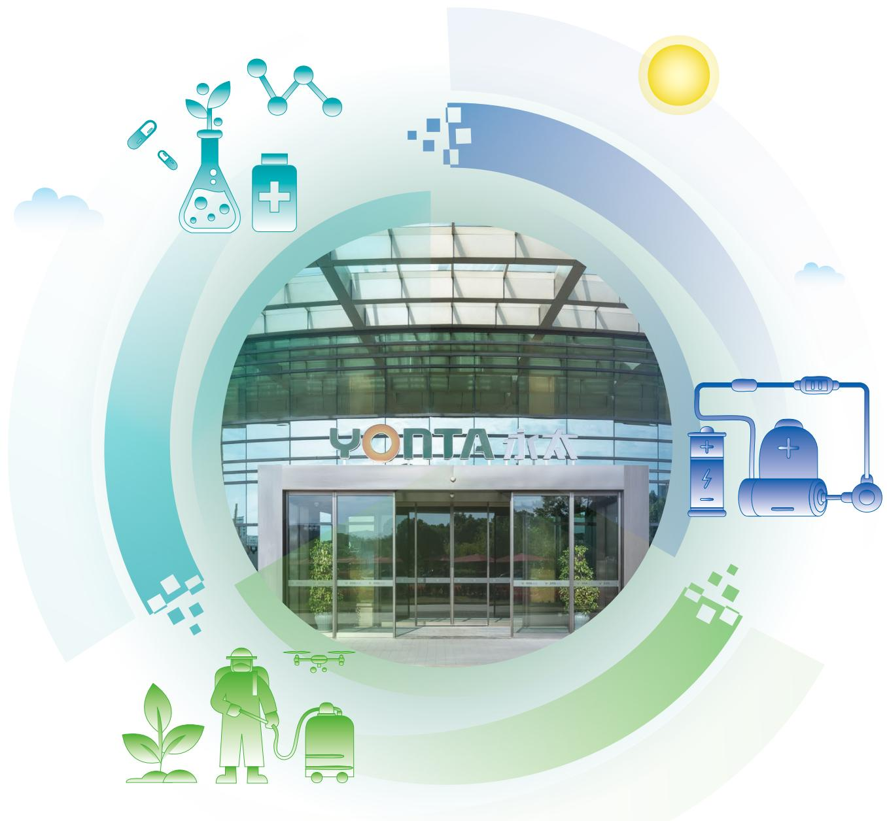

natural_image

Exterior view of a modern building with 'YOPTA' signage and surrounding icons representing health, energy, and agricultural practices (no readable text beyond signage)

## 目录 CONTENTS

<table><tr><td>关于本报告</td><td>01</td></tr><tr><td>董事长致辞</td><td>03</td></tr><tr><td>走进永太科技</td><td>05</td></tr><tr><td>公司简介</td><td>07</td></tr><tr><td>业务概况</td><td>07</td></tr><tr><td>发展历程</td><td>08</td></tr><tr><td>企业文化</td><td>09</td></tr><tr><td>重大荣誉资质</td><td>09</td></tr><tr><td>2025年ESG关键绩效</td><td>10</td></tr></table>

<table><tr><td>可持续发展治理</td><td>11</td></tr><tr><td>可持续发展目标与愿景</td><td>13</td></tr><tr><td>可持续发展治理架构</td><td>14</td></tr><tr><td>可持续发展实践</td><td>15</td></tr><tr><td>可持续发展风险与机遇管理</td><td>15</td></tr><tr><td>尽职调查</td><td>15</td></tr><tr><td>利益相关方沟通</td><td>16</td></tr><tr><td>重要性议题管理</td><td>17</td></tr></table>

natural_image

Illustration of a globe with solar panels and wind turbines under a sunny sky (no text or symbols)

<table><tr><td>附录</td><td>91</td></tr><tr><td>关键绩效表</td><td>91</td></tr><tr><td>指标索引</td><td>99</td></tr><tr><td>读者反馈表</td><td>101</td></tr><tr><td>免责声明</td><td>102</td></tr></table>

## 合规守正 筑治理防线

<table><tr><td>坚持党建引领</td><td>21</td></tr><tr><td>科学规范治理</td><td>22</td></tr><tr><td>优化内控合规</td><td>25</td></tr><tr><td>强化投关管理</td><td>26</td></tr><tr><td>秉持商业道德</td><td>28</td></tr><tr><td>维护信息安全</td><td>29</td></tr></table>

## 双碳引领 促绿色发展

<table><tr><td>应对气候变化</td><td>35</td></tr><tr><td>环境合规管理</td><td>39</td></tr><tr><td>资源利用与循环经济</td><td>48</td></tr></table>

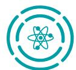

## 科创破局 强竞争根基

<table><tr><td>研发与创新</td><td>55</td></tr><tr><td>可持续供应链</td><td>62</td></tr><tr><td>产品质量管理</td><td>64</td></tr><tr><td>客户权益保障</td><td>70</td></tr><tr><td>数智化转型</td><td>71</td></tr></table>

## 同心共济 践公益初心

<table><tr><td>员工权益保障</td><td>75</td></tr><tr><td>员工民主建设</td><td>79</td></tr><tr><td>促进员工发展</td><td>80</td></tr><tr><td>安全生产与职业健康管理</td><td>83</td></tr><tr><td>行动回馈社会</td><td>90</td></tr></table>

## 关于本报告

## 报告说明

本报告是浙江永太科技股份有限公司发布的第二份环境、社会和公司治理(ESG)报告，本报告遵循客观、规范、透明及全面的原则，详细披露了永太科技在环境、社会和公司治理方面采取的实践举措以及所取得的成绩。

## 时间范围

本报告为年度报告，时间跨度为2025年1月1日至2025年12月31日，为增强报告可比性及前瞻性，部分内容有所延伸。

## 报告范围

本报告以“永太科技”为主体，如无特别说明，本报告的组织范围覆盖浙江永太科技股份有限公司及各子公司(具体详见浙江永太科技股份有限公司2025年年度报告)。

## 编制依据

深圳证券交易所《深圳证券交易所上市公司自律监管指引第17号—可持续发展报告(试行)》  
深圳证券交易所《深圳证券交易所上市公司自律监管指南第3号一可持续发展报告编制》  
中国企业改革与发展研究会等《中国企业可持续发展报告指南（CASS-ESG6.0）之一般框架》  
◎ 联合国2030年可持续发展目标（SDGs）  
全球报告倡议组织《可持续发展报告标准(GRIStandards)》

## 资料来源及可靠性保证

本报告引用的全部信息数据均来自永大科技正式文件，统计报告及财务报告，涵盖公司各部门及经营单位的内部数据和公开信息，并经公司统计、汇总与审核。同时，为确保阐释的完整性与连续性，公司在特定议题下对部分内容予以回顾和延展。货币计量若无特别标注，均采用人民币为计量单位。如财务数据与年报不一致，以年报为准。

称谓说明

<table><tr><td>释义项</td><td>释义内容</td></tr><tr><td>公司、永太科技、我们、企业</td><td>浙江永太科技股份有限公司</td></tr><tr><td>永太药业</td><td>浙江永太药业有限公司</td></tr><tr><td>上海浓辉</td><td>上海浓辉化工有限公司</td></tr><tr><td>永太新能源</td><td>浙江永太新能源材料有限公司</td></tr><tr><td>永太手心</td><td>浙江永太手心医药科技有限公司</td></tr><tr><td>浙江手心</td><td>浙江手心制药有限公司</td></tr><tr><td>佛山手心</td><td>佛山手心制药有限公司</td></tr><tr><td>内蒙古永太</td><td>内蒙古永太化学有限公司</td></tr><tr><td>永太高新</td><td>邵武永太高新材料有限公司</td></tr><tr><td>永太氟乐</td><td>浙江永太氟乐科技有限公司</td></tr></table>

## 报告获取

为了践行低碳环保和可持续发展的理念，本报告可以在深交所网站(http://www.szse.cn)在线阅读或下载报告电子版如果您还想了解本报告以外的公司其他信息，可查阅公司年度财务报告或浏览公司网站。

如有任何反馈及建议，请通过以下方式联系我们：

地址：浙江省化学原料药基地临海园区东海第五大道1号

联系电话：0576-85588006

传真：0576-85588006

电子邮箱：zhengquan@yongtaitech.com

## 董事长致辞

尊敬的各位股东、合作伙伴、社会各界朋友们：

大家好！

在全球可持续发展浪潮中，ESG已成为衡量企业核心竞争力与长期价值的关键标尺。作为以含氟技术为核心的制造型企业。永太科技始终坚信：唯有将环境责任、社会责任与公司治理深度融合，才能实现企业与社会、自然的共生共荣。在此，我谨代表公司董事会，向长期关注和支持我们的各方朋友致以最诚挚的感谢！

2024年是公司ESG发展的里程碑之年—我们首次编制并发布ESG报告，将环境、社会与治理领域的实践成果正式呈现于公众视野，为可持续发展工作搭建起系统化框架。2025年，面对复杂多变的市场环境，我们秉持坚定信念，以务实行动在经济效益与社会责任之间寻求动态平衡与协同共进，致力于塑造兼具价值创造能力与责任担当精神的企业形象。

natural_image

Professional portrait of a woman in business attire with glasses and a green necklace, against a plain gray background (no text or symbols visible)

## 以绿色技术为笔，绘就生态发展底色

作为制造型企业，我们锚定全球“双碳”战略机遇，将生态责任融入经营核心：一方面，我们聚焦绿色技术研发与环保产品创新，加速氟化液、新型有机补锂添加剂的商业化落地进程；另一方面，我们动态升级环保管理举措，持续完善废弃物分类回收与资源化循环利用体系，推动企业发展与生态保护同频共进，以实际行动践行绿色发展承诺。

## 以责任担当为尺，拓宽社会价值边界

我们立足社会实践，进一步拓宽责任边界。对员工，我们搭建专业化成长平台，完善职业健康与安全管理体系通过技能培训、晋升通道建设助力员工实现职业价值；对供应链，我们建立严格的合规与责任标准，助力上下游企业协同践行环保与社会责任，构建稳定可靠的产业生态；对社会，我们聚焦乡村振兴与教育帮扶领域开展公益行动，用点滴行动诠释企业担当。

## 以规范治理为基，筑牢稳健发展屏障

我们始终以党建引领为核心，持续优化公司治理架构，构建权责清晰、制衡有效的决策与监督体系，推动公司治理运行透明化、专业化。在投资者关系管理方面，严格遵循合规信息披露准则，搭建多元化投资者沟通桥梁，及时精准回应投资者关切，切实保障股东及社会公众的知情权与监督权。同时，持续强化内控体系建设与审计监督效能，健全全流程风险识别、评估与应对机制，为公司高质量发展筑牢坚实屏障。

道阻且长，行则将至。公司将紧跟时代步伐，继续以含氟技术创新为引擎，深化ESG全流程管理，在绿色生产、责任共生、规范治理的道路上稳步前行，努力实现商业价值与社会价值的协同增长，为可持续发展贡献永太力量！

## 走进永太科技

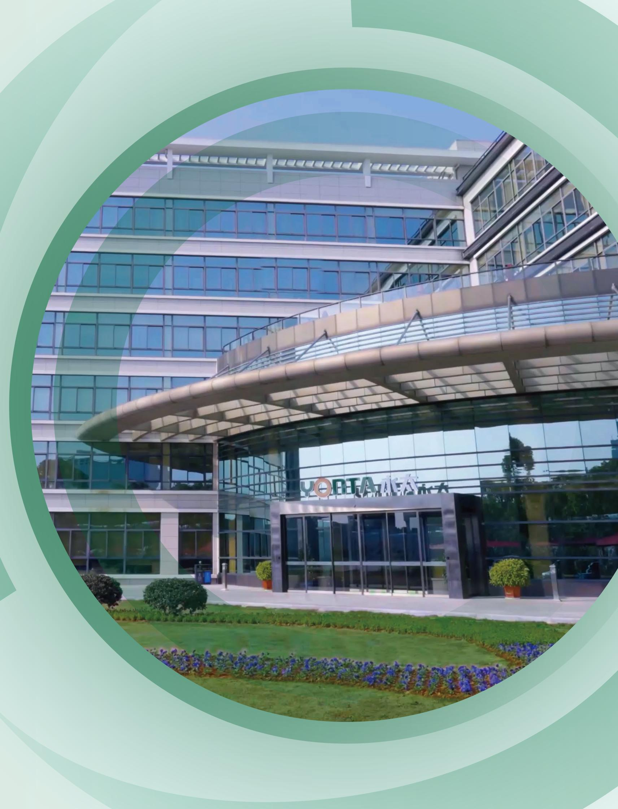

natural_image

Exterior view of a modern glass building with curved metal walkway and 'YORTA' signage, surrounded by landscaped gardens (no readable text beyond signage)

## 公司简介

浙江永太科技股份有限公司成立于1999年10月，于2009年12月22日在深圳证券交易所上市(股票代码：002326)，并于伦敦时间2023年7月11日成功发行全球存托凭证(GDR)，正式在伦敦证券交易所挂牌上市(股票代码：YTT)，成为深交所首家实现“深圳+伦敦”两地上市的公司，为全球战略布局与资本运作提供发展助力。

公司是一家以含氟技术为核心、以技术创新为动力、以智能制造为驱动的含氟医药、植保与新能源材料制造商，拥有垂直一体化的产业链、柔性化的综合生产平台和专业化的研发创新团队。公司不仅为国内外客户提供定制研发、生产及技术服务等业务，还依托子公司上海浓辉的贸易平台，开展全球植保产品的销售，实现研发、生产、贸易协同发展。

## 业务概况

永太科技已构建全球化运营与多元化业务布局，在台州、杭州、上海设有三大研发中心支撑技术创新，生产基地聚焦浙江内蒙古、福建、广东等核心区域，海外子公司及办事处覆盖60多个国家和地区。

公司生产的主要产品按终端应用领域划分为医药类、植保类、锂电及其他材料类三大板块。公司的含氟精细化学品系列品种十分丰富，主要应用于下游医药、植保、新能源与电子材料等不同的终端市场领域，为国内外客户的产品供应多元化的重要原料。其中，医药类产品涵盖心血管、糖尿病、中枢神经、抗感染、抗病毒等领域的关键含氟中间体、医药原料药和制剂；植保类产品主要有含氟类除草剂、杀菌剂、杀虫剂中间体，以及农药原药和制剂；锂电及其他材料类产品主要有锂电池材料、含氟液晶中间体、氟化液等。此外，公司贸易业务的主要品种以除草剂、杀菌剂、杀虫剂等农药原药、制剂为主，并涉及碳酸锂等化工产品贸易。

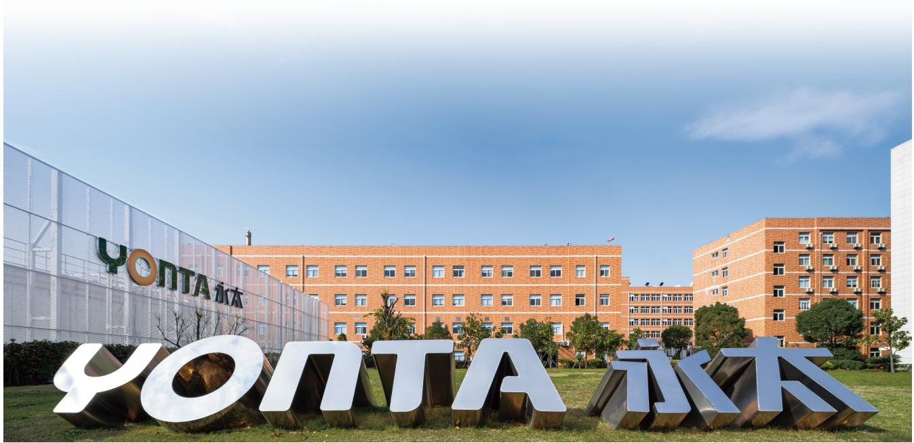

text_image

YONTA 永太
YONTA 永太

## 发展历程

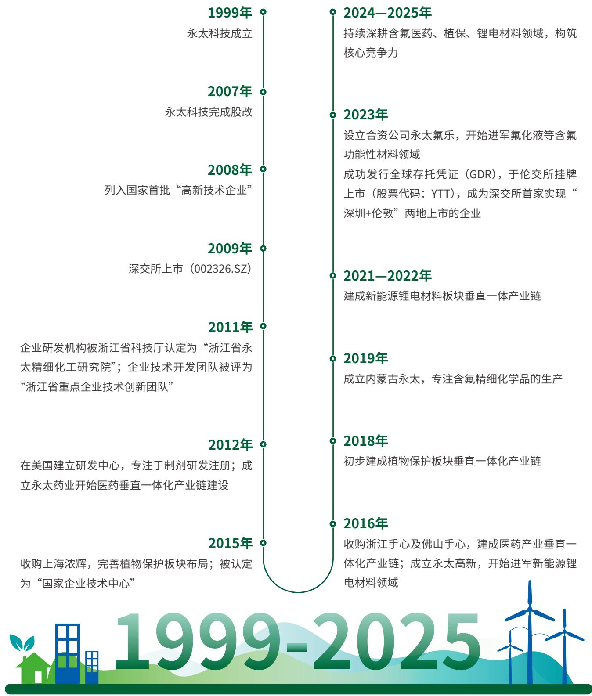

state_timeline

| Year | Event |
| --- | --- |
| 1999年 | 永太科技成立 |
| 2007年 | 永太科技完成股改 |
| 2008年 | 列入国家首批“高新技术企业” |
| 2009年 | 深交所上市 (002326.SZ) |
| 2011年 | 企业研发机构被浙江省科技厅认定为“浙江省永太精细化工研究院”；企业技术开发团队被评为“浙江省重点企业技术创新团队” |
| 2012年 | 在美国建立研发中心，专注于制剂研发注册；成立永太药业开始医药垂直一体化产业链建设 |
| 2015年 | 收购上海浓辉，完善植物保护板块布局；被认定为“国家企业技术中心” |
| 2016年 | 收购浙江手心及佛山手心，建成医药产业垂直一体化产业链；成立永太高新，开始进军新能源锂电材料领域 |
| 2018年 | 初步建成植物保护板块垂直一体化产业链 |
| 2019年 | 成立内蒙古永太，专注含氟精细化学品的生产 |
| 2021—2022年 | 建成新能源锂电材料板块垂直一体产业链 |
| 2023年 | 设立合资公司永太氟乐，开始进军氟化液等含氟功能性材料领域 成功发行全球存托凭证 (GDR)，于伦交所挂牌上市（股票代码：YTT），成为深交所首家实现“深圳+伦敦”两地上市的企业 |
| 2024—2025年 | 持续深耕含氟医药、植保、锂电材料领域，构筑核心竞争力 |

## 企业文化

## 使命

为实现人类高品质生活，永太将创造不息

## 愿景

成为全球氟化学产品领先者

## 价值观

明德，回馈，融通，超越

## 重大荣誉资质

公司作为国家第一批“高新技术企业”“浙江省专利示范企业”，技术创新与知识产权保护成果显著，曾荣获中国专利金奖专利优秀奖、中国石油和化学工业联合会科技进步奖以及省、市科学技术奖。

公司在含氟精细化工领域表现卓越，成功获评台州湾经济技术开发区“2024年度工业龙头企业”称号，锂电材料业务在2024年保持稳步增长，首次跻身国内电解液出货量前十。2025年乘势而上，排名跃升至第七位。

2025年，永太科技凭借含氟技术创新与未来产业布局荣获《证券市场周刊》市值管理“金曙光”新质生产力奖：同时，公司在FSG及碳中和领域的表现突出，荣颁“第三届国新杯·FSG碳中和金牛奖”。两项荣誉不仅是对公司长期践行可持续发展理念、积极投身碳中和行动的高度认可，更彰显了其在行业内的示范引领作用。

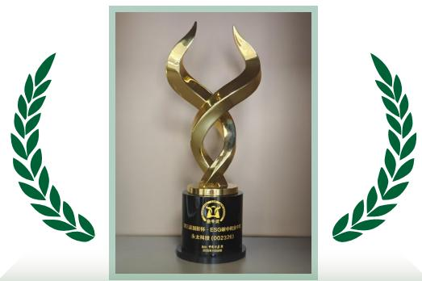

natural_image

Golden trophy sculpture with abstract wings, displayed against a plain background (no visible text or symbols on the trophy itself)

第三届国新杯•ESG碳中和金牛奖

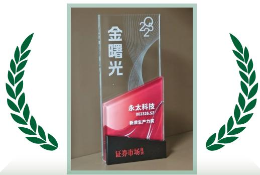

text_image

金曙光
永太科技
002326.SZ
新强生产力奖
证券市场

“金曙光”新质生产力奖

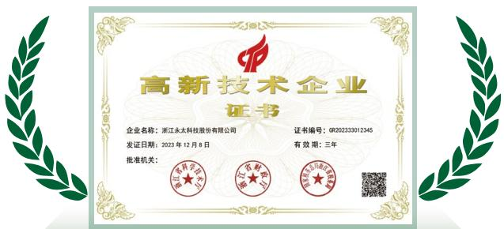

text_image

高新技术企业
证书
企业名称：浙江永太科技股份有限公司 证书编号：GR202333012346
发证日期：2023年12月8日 有效期：三年
批准机关：
浙江永太科技股份有限公司 审核机构 年限公司

高新技术企业

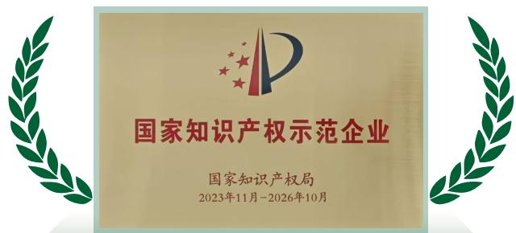

text_image

国家知识产权示范企业
国家知识产权局
2023年11月-2026年10月

国家知识产权示范企业

## 2025年ESG关键绩效

##

营业收入521,358.13万元 净利润-4,610.06万元 纳税总额8,470.69万元

股东会召开次数3次 董事会召开次数8次

董事会女性董事占比44.44% 董事会独立董事占比33.33%

## 环境绩

环保投入总金额9,155.75万元 温室气体排放总量278,203.99吨二氧化碳当量

温室气体排放强度53.36吨二氧化碳当量/百万元营收 能源消耗总量82,688.23吨标准煤

能源消耗强度15.86吨标准煤/百万元营收

##

14,899.18 研发投入占营业收入比例2.86%

研发团队总人数506人 产品合格率100%

客户满意度95.82分/100分

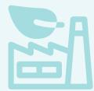

##

员工总人数3,437人 100

社会保险覆盖率96.77% 员工培训总投入32.81万元

安全生产投入3,037.52万元

## 可持续发展治理

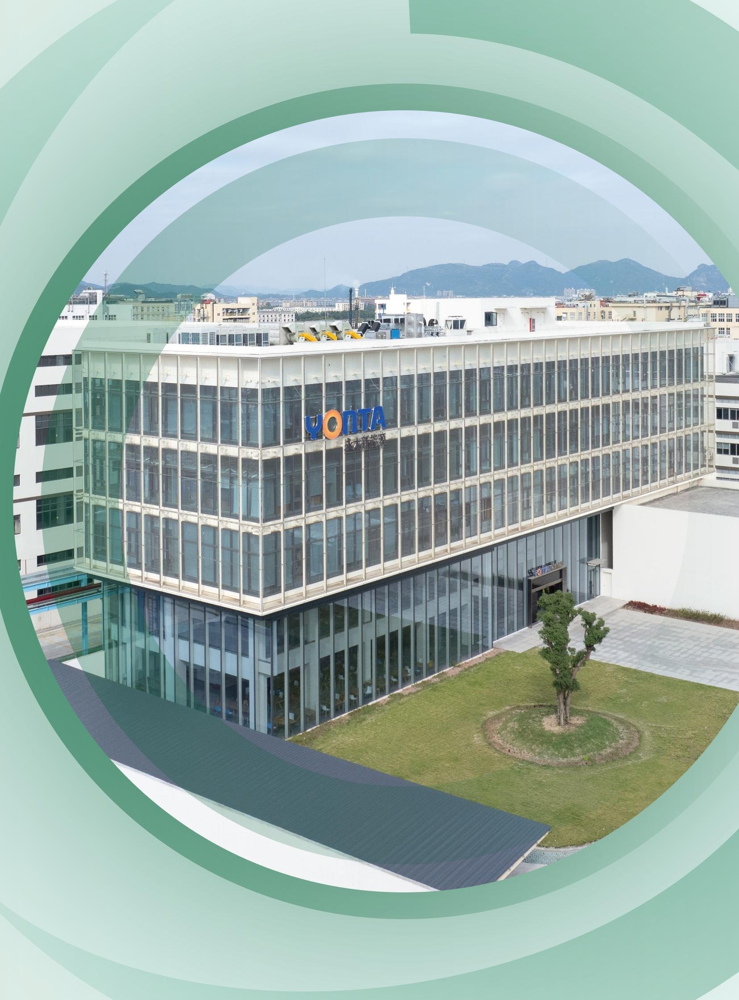

natural_image

Exterior view of a modern office building with 'YOTA' signage, surrounded by urban landscape and green landscaping (no readable text beyond signage)

## 可持续发展目标与愿景

永太科技支持联合国全球契约等国际准则和倡议，坚持战略引领，将ESG理念融入战略规划和日常运营管理中，追求经济社会和环境的协调发展，通过积极履行社会责任和环境保护义务，推动公司可持续发展。

公司立足行业特性，积极响应联合国可持续发展目标(SDGs)，推动可持续发展全方位实践。

<table><tr><td>管理维度</td><td colspan="2">SDGs</td><td>我们的响应</td></tr><tr><td>公司治理</td><td colspan="2">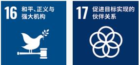</td><td>持续优化公司治理结构,完善内部控制和合规管理,坚决杜绝贪污腐败、商业贿赂等行为,维护公平的市场竞争秩序;坚决维护投资者权益,规范信息披露。</td></tr><tr><td>环境保护</td><td colspan="2">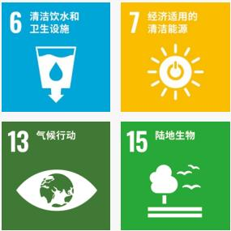</td><td>建立健全环境管理体系,积极应对气候变化,推行绿色低碳工艺以降低运营排放,发展循环经济,提升资源利用效率。</td></tr><tr><td>产业价值</td><td colspan="2">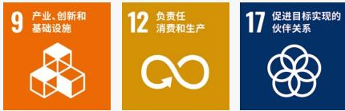</td><td>搭建高水平科技创新平台,推动落地转化;深化客户沟通机制,多举措提升服务水平;保证高质量产品及时供应,强化供应链ESG管理。</td></tr><tr><td>人力资源</td><td colspan="2">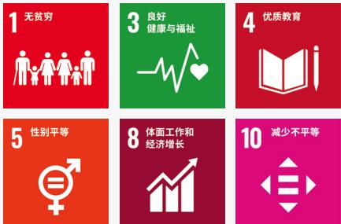</td><td>严格遵守法律法规,规范劳动用工管理,提供多元化员工福利、搭建完善的职业发展通道与培训机制,切实保障员工合法权益。</td></tr></table>

## 可持续发展治理架构

永太科技严格遵循《深圳证券交易所上市公司自律监管指南第3号——可持续发展报告编制》等法规要求，制定《ESG管理制度》，构建并完善“决策一管理一执行”三层级的可持续发展治理架构，通过明确各层级职责分工，保障公司可持续发展各项工作有序推进及落地。

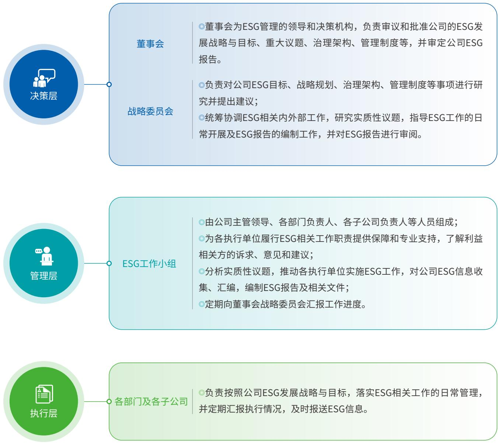

## 可持续发展实践

2025年9月，永太科技邀请外部专业机构开展2025年度环境、社会与公司治理报告专项培训。培训聚焦ESG前沿趋势、报告编制要求及工作流程等核心内容，全面提升相关人员的ESG专业认知与实践能力，强化公司可持续发展信息披露质量与水平。

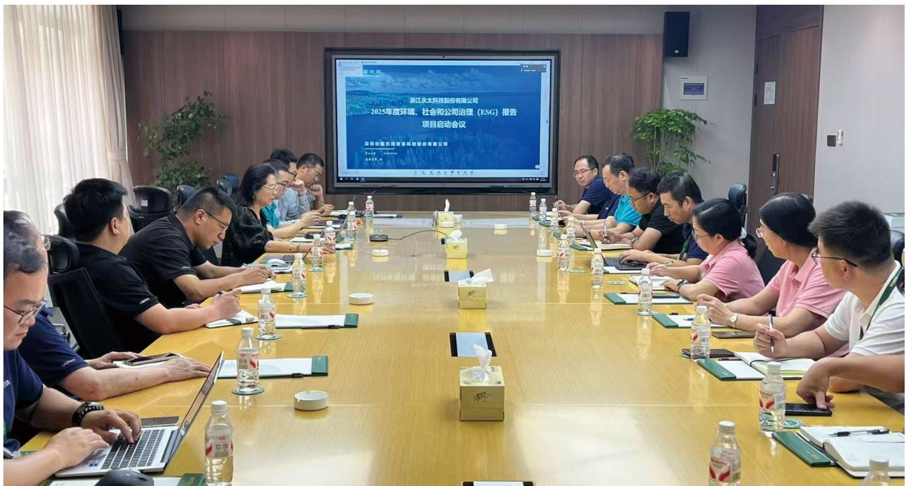

text_image

浙江永太科技股份有限公司
2025年度环境、社会和公司治理（ESG）报告
项目启动会议
浙江永太科技股份有限公司
2025年度环境、社会和公司治理（ESG）报告
项目启动会议

ESG报告项目启动会

## 可持续发展风险与机遇管理

公司在重大项目投资等关键决策中，将社会效益评估作为董事会及经营管理层的重要依据。公司通过系统识别、梳理FSG相关风险与机遇，持续深化与利益相关方的沟通，同时强化全链条合规管理，全面提升风险预判与应对能力。此外，公司依托技术革新、责任履约与治理优化，统筹平衡经济效益、环境影响与社会价值，积极塑造环境友好、员工福祉、治理高效、客户认可的可持续发展生态。

## 尽职调查

公司在业务全流程中，对自身运营及供应链，合资伙伴等利益相关方全面开展尽职调查。通过资质审查，现场审计及风险评估，识别环境保护，安全生产，劳工与人权，冲突矿产等领域的实际及潜在负面影响。员工招聘环节实施合规背景调查有效降低雇佣风险，持续提升ESG治理效能。

## 利益相关方沟通

永太科技重视利益相关方的意见与诉求，围绕利益相关方关切拓宽沟通渠道，通过多元化形式倾听并回应，开展实质性议题管理与披露，持续提升可持续发展管理水平，与各方共建互利共赢的发展格局。

<table><tr><td>利益相关方类别</td><td>诉求与期望</td><td>沟通与回应</td></tr><tr><td>政府及监管机构</td><td>响应国家战略守法合规经营反腐败与商业道德党建引领环境污染防治应对气候变化</td><td>政策执行依法合规经营信息披露官网、社交媒体优化环境管理体系</td></tr><tr><td>投资者及股东</td><td>保障股东权益公司治理信息公开透明内控及风险管理投资者关系管理</td><td>股东会投资者交流活动业绩说明会信息合规披露风险评估</td></tr><tr><td>客户</td><td>产品质量管理研发创新客户服务</td><td>提升产品质量加大研发投入客户满意度调查售后服务</td></tr><tr><td>供应商及合作伙伴</td><td>反腐败与商业道德供应链管理</td><td>交流调研廉洁采购尽职调查</td></tr><tr><td>员工</td><td>员工权益及福利平衡工作与生活技能培训和职业发展员工健康与安全</td><td>员工薪酬福利体系员工活动员工培训员工考核与晋升职业健康与安全生产措施职代会与工会</td></tr><tr><td>社区及公众</td><td>公益慈善关注弱势群体保护生态环境</td><td>公益活动环境合规管理</td></tr><tr><td>媒体</td><td>信息公开透明媒体采访与沟通</td><td>信息披露采访沟通</td></tr></table>

## 重要性议题管理

永太科技依据《深圳证券交易所上市公司自律监管指引第17号—可持续发展报告(试行)》要求，基于所处行业特征、公司性质及自身商业模式等，展开系统的可持续发展议题的重要性评估工作。

公司从财务重要性（议题对公司财务表现的影响）和影响重要性(公司活动对环境与社会的影响)两大维度进行分析，形成重要性议题矩阵，为公司明确可持续发展管理重点和可持续发展战略提供基础支撑。

## 重要性议题分析流程

## 识别议题

基于全球趋势、政策法规及行业特点进行分析，识别公司的利益相关方与公司面临的影响、风险与机遇。

## 议题确定

参考全球报告倡议组织GRI、联合国可持续发展目标SDGs、SASB、MSCI，以及国内外同行业相关议题，建立可持续发展议题库。公司对往年议题进行评估调整，最终确认30项与公司可持续发展相关议题。

## 重要性评估

影响重要性评估：梳理各议题对外部环境、社会和经济的潜在或实际的正面或负面影响。通过问卷的形式对利益相关方开展调研分析，报告期内共回收170份问卷回复，回复问卷来自股东、董事、管理层、员工、客户、供应商、政府或监察机构等11类内外部利益相关方。财务重要性评估：议题在短期、中期和长期内对公司商业模式、业务运营、发展战略、财务状况、经营成果、现金流、融资方式及成本等产生重大影响

## 议题审阅与确定

形成影响重要性和财务重要性议题清单，并确保相关议题透明、平衡且完整地披露于报告中。

natural_image

Stylized graphic with green hills, wind turbines, and city skyline (no text or symbols)

永太科技ESG实质性议题评估结果  
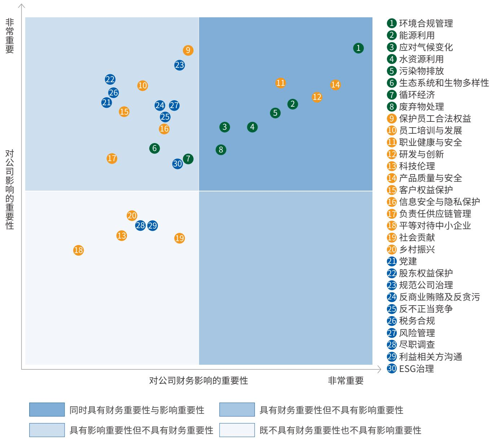

scatter

| ID | Topic | X-axis Position (Approximate) | Y-axis Position (Approximate) |
| --- | --- | --- | --- |
| 1 | 环境合规管理 | High | Very High |
| 2 | 能源利用 | Medium-High | High |
| 3 | 应对气候变化 | Medium-High | High |
| 4 | 水资源利用 | Medium-High | High |
| 5 | 污染物排放 | Medium-High | High |
| 6 | 生态系统和生物多样性 | Medium-High | High |
| 7 | 循环经济 | Medium-High | High |
| 8 | 废弃物处理 | Medium-High | High |
| 9 | 保护员工合法权益 | Medium-High | Very High |
| 10 | 员工培训与发展 | Medium-High | High |
| 11 | 职业健康与安全 | Medium-High | High |
| 12 | 研发与创新 | Medium-High | High |
| 13 | 科技伦理 | Medium-High | High |
| 14 | 产品质量与安全 | Medium-High | High |
| 15 | 客户权益保护 | Medium-High | High |
| 16 | 信息安全与隐私保护 | Medium-High | High |
| 17 | 负责任供应链管理 | Medium-High | High |
| 18 | 平等对待中小企业 | Medium-High | High |
| 19 | 社会贡献 | Medium-High | High |
| 20 | 乡村振兴 | Low-Medium | Medium |
| 21 | 党建 | Low-Medium | Medium |
| 22 | 股东权益保护 | Low-Medium | Medium |
| 23 | 规范公司治理 | Low-Medium | Medium |
| 24 | 反商业贿赂及反贪污 | Low-Medium | Medium |
| 25 | 反不正当竞争 | Low-Medium | Medium |
| 26 | 税务合规 | Low-Medium | Medium |
| 27 | 风险管理 | Low-Medium | Medium |
| 28 | 尽职调查 | Low-Medium | Medium |
| 29 | 利益相关方沟通 | Low-Medium | Medium |
| 30 | ESG治理 | Low-Medium | Medium |

Legend: Blue circle = 同时具有财务重要性与影响重要性; Orange circle = 具有财务重要性但不具有财务重要性; Light blue shaded area = 具有影响重要性但不具有财务重要性; White background = 既不具有财务重要性也不具有影响重要性.

# 合规守正筑治理防线

## 我们的行动

坚持党建引领

科学规范治理

优化内控合规

强化投关管理

秉持商业道德

◎ 维护信息安全

## SDGs

16 和平、正义与强大机构

17 促进目标实现的伙伴关系

##

##

##

##

##

##

##

##

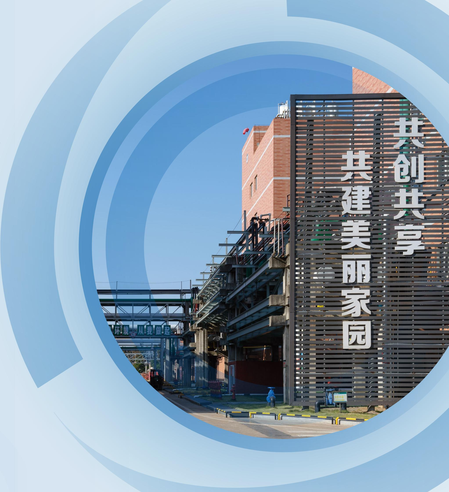

text_image

共建美丽家园
环境 从我做起
共创共享

## 坚持党建引领

## 党组织建设

永太科技将党的领导贯穿于企业决策、执行、监督各环节，实现从顶层设计到制度、事项、流程、清单的逐级细化，推动党的建设与企业改革发展同频共振，把党的政治优势、组织优势转化为企业的竞争优势、发展优势。

公司全面强化理论武装，深入学习贯彻习近平新时代中国特色社会主义思想和党的二十大精神，紧密结合公司发展战略，积极推动党的建设与生产经营深度融合，充分发挥高质量党建的引领和保障作用，推动企业高质量发展。

公司现有党总支部1个，党支部9个，党员117名，党支部组织架构健全。公司着力打造“6F党建”特色党建品牌，以“红色引领，助推创新，安全筑基，文化凝聚，以人为本，社会责任”为核心内涵，提升党建工作实效。

## 党建活动

公司通过建设党建信息化平台、开展联网培训、设立图书室等多种形式，支持党员及群众学习提升，持续提升全员政治站位，引导党员干部深入理解党的基本理论、路线和方略，增强“四个意识”，坚定“四个自信”，做到“两个维护”。

党总支常态化开展每月主题党日，组织“夏日送清凉”等特色活动，持续丰富党建载体形式，增强组织凝聚力与党建工作实效。

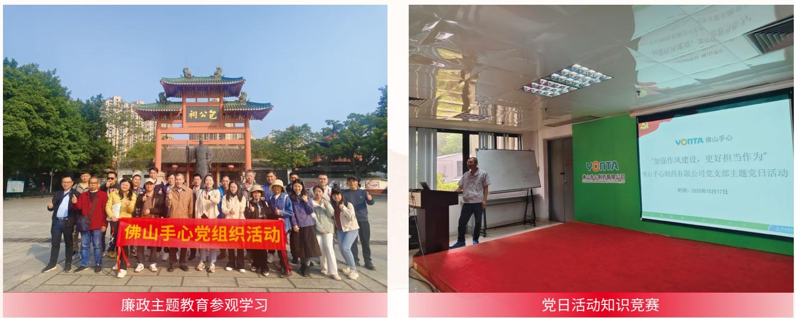

## 科学规范治理

## 公司治理结构

永太科技严格遵守《中华人民共和国公司法》《中华人民共和国证券法》《上市公司治理准则》等国家及运营所在地适用的法律法规要求，制定《公司章程》，构建由股东会、董事会和经理层组成的治理架构，保障公司各治理主体权责清晰，各司其职相互制衡与协调，持续提升公司治理的公正性和透明度。

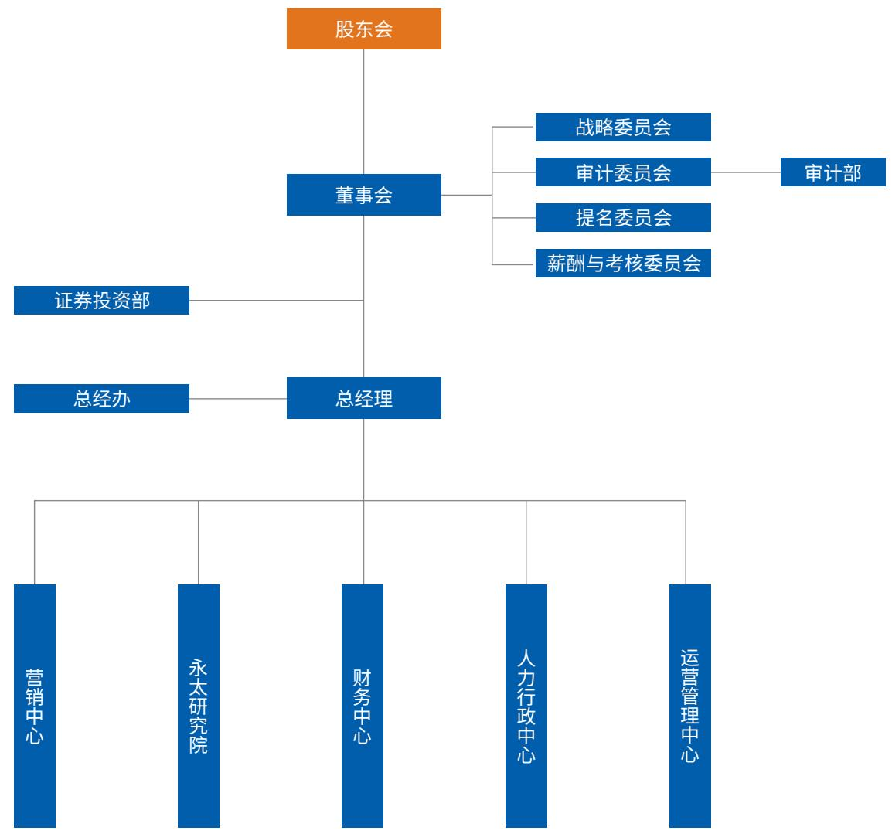

flowchart

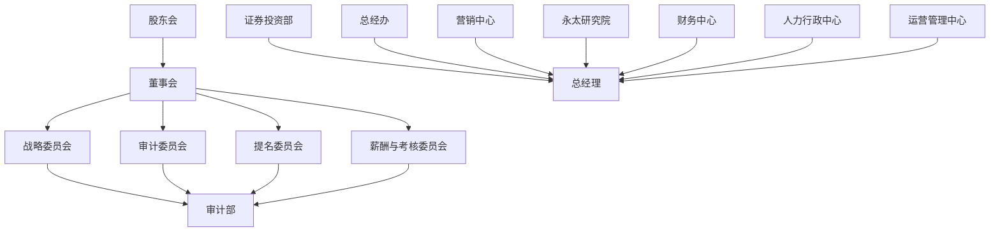
```mermaid
graph TD
  A["股东会"] --> B["董事会"]
  B --> C["战略委员会"]
  B --> D["审计委员会"]
  B --> E["提名委员会"]
  B --> F["薪酬与考核委员会"]
  C --> G["审计部"]
  D --> G
  E --> G
  F --> G
  H["证券投资部"] --> I["总经理"]
  J["总经办"] --> I
  K["营销中心"] --> I
  L["永太研究院"] --> I
  M["财务中心"] --> I
  N["人力行政中心"] --> I
  O["运营管理中心"] --> I
```

永太科技治理架构

## 股东会

股东会是公司的最高权力机构，负责选举更换董事并决定其报酬，审批利润分配等方案，决定增减资、发债、合并分立解散清算、变更公司形式及修改公司章程等重大事项

为规范公司行为，保障股东会依法行使职权，公司依据《上市公司股东会规则》《上市公司章程指引》及《公司章程》制定《股东会议事规则》，并严格依法依规召集和召开股东会，确保全体股东特别是中小股东，充分行使自己的权力。

报告期内，公司股东会均由董事会依规召集召开，并聘请律师进行现场见证：根据公司章程及相关法律法规要求，需提交股东会审议的事项均按规定权限履行审批程序后上会审议，不存在越权审批或先实施后审议的情况。

## 关键绩效

公司共召开股东会会议

3次

其中年度股东会会议

1次

临时股东会会议

2次

审议通过议案

15项

## 董事会

公司董事会严格按照《公司章程》《董事会议事规则》等相关规定，负责召集股东会、执行决议、决定经营计划、制定利润分配等方案、决定机构设置和高管聘任等重要事务。

董事会下设战略委员会、审计委员会、提名委员会、薪酬与考核委员会四个专门委员会。各专门委员会严格遵守相关制度规定各尽其责，有力加强了公司董事会工作的规范运作。

## 董事会多元化

公司建立董事会多元化政策，从多个方面考虑董事会成员多元化情况，包括但不限于性别、年龄、文化、教育背景、专业经验、技能、知识及服务任期。董事会成员由会计师、经济师、工程师等各领域人才构成，具备全面的专业背景；年龄分布涵盖60后、70后及80后，形成合理的梯队层次。

截至报告期末，公司共有董事9名，其中女性董事4名，占公司董事总数的44.44%，董事长、副董事长均为女性；独立董事3名，占公司董事总数的33.33%。

## 董事会独立性

公司独立董事严格遵守《公司意程》《董事会议事规则》和《独立董事工作制度》等规定，积极参与公司决策，充分发挥独立董事职能。独立董事在审计委员会，提名委员会，薪酬与考核委员会中占多数并担任召集人。审计委员会成员均为不在公司担任高级管理人员的董事。

<table><tr><td>专门委员会</td><td>成员人数(名)</td><td>独立董事人数(名)</td><td>独立董事占比(%)</td><td>独董是否担任召集人</td></tr><tr><td>战略委员会</td><td>5</td><td>3</td><td>60.00</td><td>否</td></tr><tr><td>审计委员会</td><td>5</td><td>3</td><td>60.00</td><td>是</td></tr><tr><td>提名委员会</td><td>3</td><td>2</td><td>66.67</td><td>是</td></tr><tr><td>薪酬与考核委员会</td><td>3</td><td>2</td><td>66.67</td><td>是</td></tr></table>

## 关键绩效

公司董事会共召开董事会会议 审议通过议案

8次

召开战略委员会会议

4次

召开提名委员会会议

2次

42项

审议通过议案

6项

审议通过议案

5项

召开审计委员会会议

5次

召开薪酬与考核委员会会议

2次

审议通过议案

19 项

审议通过议案

5项

## 经理层

公司经理层由1名总经理及6名副总经理组成，成员专业领域涵盖工程技术、财务会计、经济管理、税务合规等领域，形成互补协同的专业矩阵，为公司核心业务发展、多维度决策与全链条运营提供坚实专业支撑。

经理层各岗位权责边界清晰，严格依照《公司意程》《总经理工作细则》等内部治理制度开展工作，保障决策与执行的合规性：同时秉持勤勉尽责的工作态度，高效贯彻执行董事会各项决议，主动对接业务部门需求、跟踪任务落地进度，切实推动公司战略目标转化为实际经营成果

## 董事、高管薪酬管理

永太科技依照《公司章程》《董事、高级管理人员薪酬管理制度》等规定，持续完善薪酬与激励体系，充分调动董事、高级管理人员的积极性和创造性，全面提升公司整体管理水平。

公司已建立并持续优化与绩效挂钩的评价标准及激励约束机制，明确决策程序：董事薪酬由股东会审议决定，高级管理人员薪酬由董事会审议确定，独立董事采用固定津贴制

## 优化内控合规

## 合规经营

永太科技坚守合规经营原则，严格遵守国家法律法规、行业规范以及公司内部制定的各项规章制度，坚持公平竞争，坚决抵制任何形式的不正当竞争行为。2025年，公司未发生重大违规行为。

公司持续深化合规管理建设，以组织架构完备、机制覆盖全面、管控流程合理、岗位职责明确为目标，构建科学规范、全面覆盖的合规管理体系，有效防控重大合规风险，为企业稳健经营提供坚实保障。

## 风险管理

永太科技将风险管理视为保障企业稳健运营、达成可持续发展目标以及维护利益相关方核心权益的关键要素，构建全方位多层次，动态化的风险管理体系，实现对复杂内外部风险的精准识别、科学评估与有效应对。

## 内部控制

公司持续加强内部控制，依据相关法律法规，结合自身经营实际，积极探索优化内控管理模式，建立健全并有效落地实施内部控制体系。

公司采用内外部审计相结合的模式，全面开展财务审计与工程审计工作，每年聘请专业机构进行内部控制审计，出具专项审计报告。同时，公司不定期对内控制度执行情况进行审计监督，及时发现潜在问题，提出改进建议，推动问题整改并进行结果跟踪评估，持续保障内部控制体系的完整性、合理性、合规性与有效性，确保内控制度有效落地，切实筑牢公司管理防线，实现依法合规经营。

报告期内，公司不存在重大和重要的财务报告内部控制缺陷和非财务报告内部控制缺陷。

## 税务管理

公司持续完善税务管理体系，设立专职税务岗位并明确职责分工，定期开展税务自查，规范发票开具与取得流程，并依托OA系统实现财务审核及付款流程的线上化管控

公司与税务机关建立良好沟通合作机制，及时跟进税收政策更新，主动配合税务检查与审计工作，积极参与税收征管信阜共享。同时，公司强化税务团队专业能力建设，定期开展人员专项培训，并聘请合规税务代理机构协助办理自营出口申报业务。

此外，公司建立健全税务风险管理制度与合规监督机制，通过常态化内部审查与纳税风险评估，精准识别、防范潜在税务风险。对发现的问题及时整改，全面保障纳税工作合法合规，避免企业遭受税务相关经济损失。

## 关联交易管理

公司根据《中华人民共和国公司法》《中华人民共和国证券法》《深圳证券交易所股票上市规则》等有关法律法规及《公司章程》的相关规定，结合公司实际情况，制定《关联交易决策制度》，明确关联交易的具体事项与关联方的认定范畴，规定关联交易的审议披露程序、定价原则等。公司严格执行关联回避机制，关联董事、关联股东在审议关联交易事项时均需依规回避表决。

## 强化投关管理

## 合规信息披露

永太科技制定《信息披露管理制度》《年报信息披露重大差错责任追究制度》等制度，对定期报告、临时报告、信息披露管理职责，信息披露程序等内容作出明确规定，坚持以服务投资者关系，传达公司价值为重要出发点，公司指定证券时报中国证券报、上海证券报、证券日报和巨潮资讯网（www.cninfo.com.cn）为公司信息披露的指定报纸和网站，及时、公平充分地披露公司信息，确保信息披露的真实、准确、完整，提高信息披露透明度和质量。

## 关键绩效

公司共披露公告

145份

其中定期报告和专项报告

5

定期报告

4份（ ） + 1份

临时公告

140份

未因信息披露方面违规而受到处罚。

natural_image

Illustration of a person using a laptop with a gear and speech bubble, symbolizing data or analytics (no text present)

## 投资者关系管理

为加强与投资者的沟通，提升公司治理合规性，公司制定《投资者关系管理制度》，规范投资者关系管理的原则、职能部门及具体流程，搭建并持续完善定期报告与临时公告、公司官网投资者关系专栏、咨询热线、电子邮箱以及互动易平台等沟通渠道，加强与投资者及潜在投资者之间的沟通，增进其对公司的了解和认同，保护投资者合法权益。

报告期内，公司积极开展多形式投资者交流活动，举办年度及季度报告网上业绩说明会，由核心管理层在线回应投资者提问：接待多批次来自券商、基金、投资公司的机构投资者的现场调研，有效增进市场对公司战略价值和经营状况的理解展现公司开放、透明的治理形象。

## 关键绩效

2025年

接待投资者活动次数

11次

在互动易投资者提问总数

69次

接待投资者现场调研次数

8次

在互动易投资者回答问题数

69次

接待投资者现场调研人次

25人次

在互动易投资者回复率

100%

## 股东回报

在利润分配与股东回报方面，公司制定了清晰、稳定目持续的利润分配制度及未来三年股东回报规划方案，综合考虑公司所处发展阶段、盈利水平、现金流状况以及未来战略发展的资金需求，致力于实现股东回报的长期性与稳定性。

公司采用现金分红、股份回购等多种方式回馈股东，并在《公司章程》中明确现金分红的具体条件和比例，积极落实关于分红的各项指导意见。通过制定周期性的股东回报规划，公司向市场传递了重视股东回报、共享发展成果的坚定承诺，着力构建树立负责任的上市公司形象，增强投资者长期持股信心，实现公司与全体股东的共赢发展。

## 债权人权益保护

公司始终将债权人权益保护置于重要位置，在重大经营决策过程中，全面考虑并保障债权人的合法权益，同时保持信息披露的透明度，涉及债权人权益的重大事项均通过正式函件、公告等渠道及时、准确告知

在财务与资金管理方面，公司秉持稳健经营理念，持续优化债务结构，制定并严格执行科学的资金使用与偿债计划，有效保障资产与资金安全，切实维护债权人权益。

截至报告期末，公司资信状况优良，充分彰显了规范的财务管理水平与扎实的风险控制能力。

## 秉持商业道德

## 反商业贿赂及反贪污

公司已建立系统完整的反腐倡廉管理制度体系，明确覆盖从董事长到一线员工的全链条责任，形成了以《廉洁管理制度为核心、多项专项制度为支撑的制度框架，并通过回避、上缴、罚则、举报等多重机制确保制度落地执行。公司将密切关注内外部环境变化，持续优化管理体系，深化廉洁文化建设，以更高标准的合规经营推动公司稳健、可持续发展。

## 举报投诉管理

公司设置公开投诉渠道，开展多元化廉洁文化活动，营造风清气正的企业氛围，引导员工自省自律，严守廉洁底线。

同时，公司进一步明确举报人保护相关规定。针对实名举报的信访件及相关工作台账等材料，均设定密级并妥善保管，未经授权不得随意查阅、摘抄、复制、销毁或带离，严禁向被举报人及被举报部门透露举报人身份与举报内容。如举报人因举报遭受不公正待遇或人身安全受到威胁，将及时予以纠正并采取有效保护措施。

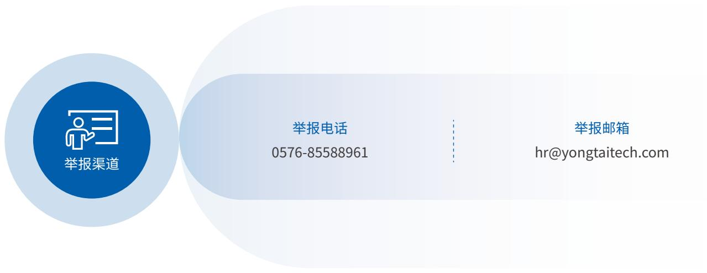

text_image

举报渠道
举报电话
0576-85588961
举报邮箱
hr@yongtaitech.com

## 反不正当竞争与反垄断

永太科技始终致力于营造公平、透明、有序的商业环境，严格遵守《中华人民共和国反垄断法》《中华人民共和国反不正当竞争法》等法律法规，制定《公司职业道德规范制度》等制度，确保所有商业活动都在法律框架内进行，坚决反对任何形式的不正当竞争行为。公司以诚信为基石，确保商业行为遵循道德规范和法律要求。

公司及员工不得以任何不正当手段妨碍或排挤竞争对手的公平竞争与正当经营活动，不得捏造、散布虚假信息损害竞争对手商誉，亦不得以任何违法方式侵犯竞争对手的商业秘密。

## 维护信息安全

## 信息安全体系

公司遵守《中华人民共和国网络安全法》《中华人民共和国数据安全法》等法律法规，秉持“以客户为中心，将安全意识融入日常工作、严格审查各项控制措施、及时消除安全隐患、保障业务连续性”的信息安全方针，制定《信息安全管理手册》等制度，严格规范信息安全管理工作，保障公司信息系统安全稳定运行。

公司建立由管理决策、监督检查、贯彻执行组成的三层信息安全组织架构，重点落实信息安全管理责任，筑牢全方位信息安全防护体系。

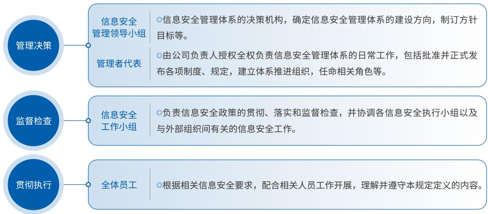

flowchart

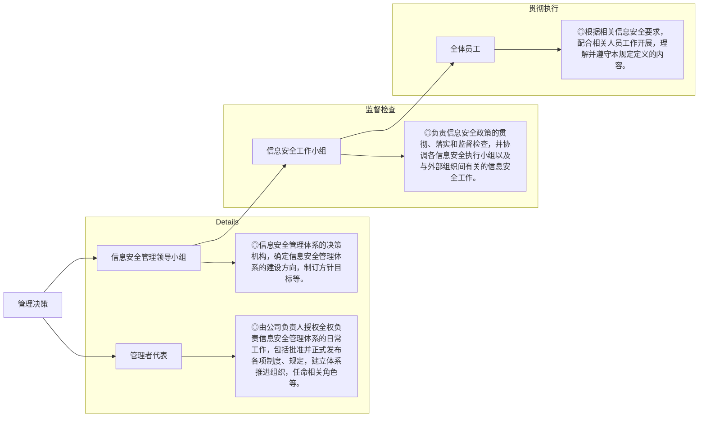
```mermaid
graph LR
  A["管理决策"] --> B["信息安全管理领导小组"]
  A --> C["管理者代表"]
  
  subgraph Details
  B --> D["◎信息安全管理体系的决策机构，确定信息安全管理体系的建设方向，制订方针目标等。"]
  C --> E["◎由公司负责人授权全权负责信息安全管理体系的日常工作，包括批准并正式发布各项制度、规定，建立体系推进组织，任命相关角色等。"]
  end
  
  subgraph Detail1["监督检查"]
  B --> F["信息安全工作小组"]
  F --> G["◎负责信息安全政策的贯彻、落实和监督检查，并协调各信息安全执行小组以及与外部组织间有关的信息安全工作。"]
  end
  
  subgraph Detail2["贯彻执行"]
  F --> H["全体员工"]
  H --> I["◎根据相关信息安全要求，配合相关人员工作开展，理解并遵守本规定定义的内容。"]
  end
```

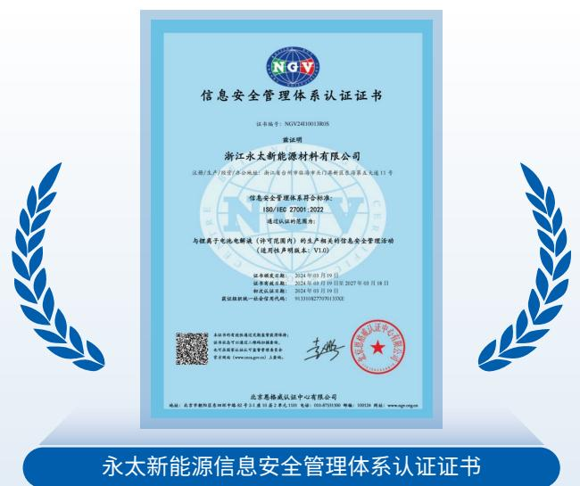

text_image

信息安全管理体系认证证书
证书编号: NGV2410013808
需证明
浙江永太新能源材料有限公司
注册/生产/经营/办公地址: 浙江台州市临海市南汇路新区张港第五大道11号
信息安全管理体系符合标准:
ISO/IEG 27001:2022
通过认证的范围为:
与锂离子电池电解液(许可范围内)的生产相关的信息安全管理活动
(适用性声明版本: V1.0)
证书有效期至: 2024年03月19日
授权有效期至: 2024年03月19日至2027年03月18日
相关认证日期: 2024年03月19日
登记机构统一社会信用代码: 913104279761153XE
北京奥桥威认证中心有限公司
地址:北京市朝阳区东四环中路62号31座10层3单元1101 电话:010-87693890 传真:100538 网址:www.njrg.com
永太新能源信息安全管理体系认证证书

## 专业能力提升

公司定期组织员工信息安全意识培训，内容涵盖数据保密规范，安全操作流程，钓鱼邮件识别等核心要点，通过理论讲解+案例分析的形式，提升各级员工的信息安全意识与风险防范能力。

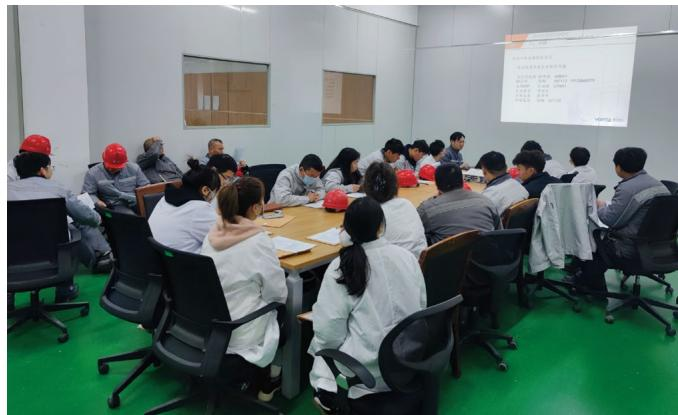

text_image

Meeting room photo with visible presentation screen showing Chinese text and data, participants in lab coats and red helmets seated around a conference table.

员工信息安全培训

## 监督与考核

公司不定期开展内审，管理评审工作，获悉信息安全管理体系的运行情况，建立对日常工作的监控检查和对信息安全管理体系的全面、系统化的监控和评审机制。同时，员工所在部门领导通过日常工作情况，根据岗位工作成绩量化指标，对员工的岗位目标进行量化考核，并对重要岗位人员的信息安全能力进行评估。如发现信息安全能力不足，相关部门负责人应及时向人力资源管理部提出。

## 信息安全管理措施

为强化数据安全管理，提升整体安全防护能力，公司通过网络态势感知，防火墙联动以及数据备份等举措保护公司数据资产安全，筑牢数据安全防线

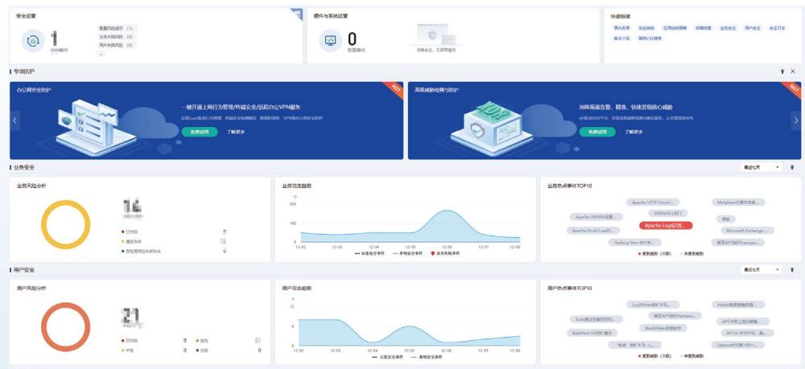

flowchart

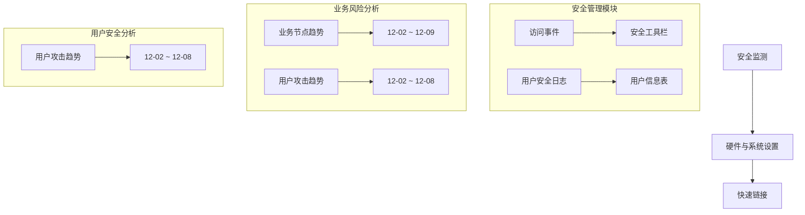
```mermaid
graph TD
  A["安全监测"] --> B["硬件与系统设置"]
  B --> C["快速链接"]
  
  subgraph Security_Side ["安全管理模块"]
  D["访问事件"] --> E["安全工具栏"]
  F["用户安全日志"] --> G["用户信息表"]
  end
  
  subgraph Risk_Side ["业务风险分析"]
  H["业务节点趋势"] --> I["12-02 ~ 12-09"]
  J["用户攻击趋势"] --> K["12-02 ~ 12-08"]
  end
  
  subgraph User_Side ["用户安全分析"]
  L["用户攻击趋势"] --> M["12-02 ~ 12-08"]
  end
  
  %% Details
  %% Section 1: Security_Side
  %% Section 2: Risk_Side
  %% Section 3: User_Side
  %% Section 4: Activity
  %% Section 5: Data Flow
  %% Section 6: Data Flow
  %% Section 7: Data Flow
  %% Section 8: Data Flow
  %% Section 9: Data Flow
  %% Section 10: Data Flow
  %% Section 11: Data Flow
  %% Section 12: Data Flow
  %% Section 13: Data Flow
  %% Section 14: Data Flow
  %% Section 15: Data Flow
  %% Section 16: Data Flow
  %% Section 17: Data Flow
  %% Section 18: Data Flow
  %% Section 19: Data Flow
  %% Section 20: Data Flow
  %% Section 21: Data Flow
  %% Section 22: Data Flow
  %% Section 23: Data Flow
  %% Section 24: Data Flow
  %% Section 25: Data Flow
  %% Section 26: Data Flow
  %% Section 27: Data Flow
  %% Section 28: Data Flow
  %% Section 29: Data Flow
  %% Section 30: Data Flow
  %% Section 31: Data Flow
  %% Section 32: Data Flow
  %% Section 33: Data Flow
  %% Section 34: Data Flow
  %% Section 35: Data Flow
  %% Section 36: Data Flow
  %% Section 37: Data Flow
  %% Section 38: Data Flow
  %% Section 39: Data Flow
  %% Section 40: Data Flow
  %% Section 41: Data Flow
  %% Section 42: Data Flow
  %% Section 43: Data Flow
  %% Section 44: Data Flow
  %% Section 45: Data Flow
  %% Section 46: Data Flow
  %% Section 47: Data Flow
  %% Section 48: Data Flow
  %% Section 49: Data Flow
  %% Section 50: Data Flow
```

信息防护

## 信息安全风险管理

公司采用PDCA过程方法对信息安全风险进行识别、评估及处置，依据《风险评估控制制度》开展信息安全风险全流程管理涵盖风险点识别、分级评估，及对应制定的规避、缓解、转移等应对措施，实现风险的可控化落地。

公司对月度安全工作会议中发现的信息安全问题进行评估，并进行风险处置。此外，公司每年开展信息安全风险评估活动并根据信息安全风险接受水平对活动中发现的中、高风险制定相应整改计划

## 阶段

## 主要内容

风险识别

识别信息安全管理体系范围内的资产及其责任人  
识别资产所面临的威胁  
识别可能被威胁利用的脆弱点  
识别丧失保密性、完整性和可用性可能对资产造成的影响

风险评估

对资产的保密性(C)、完整性(I)、可用性(A)及业务影响度(BI)赋值对公司资产丧失CIA(BI)所造成的后果进行判断  
通过计算资产的CIA(BI)、主要威胁和脆弱等相关赋值得出风险的等级

风险应对

依据风险评估结果，对风险采取了以下管控措施：风险接受，风险降低，风险转移和风险规避  
制定风险处置计划并执行相应的整改措施

## 指标与目标

为筑牢数据安全屏障，公司严格遵循信息安全方针，构建可操作、可测量的指标与目标体系，将信息安全需求转化为实际行动有力保障业务的持续性。

报告期内，公司未发生重大数据安全事件及泄露客户隐私事件。

  
2025年信息安全目标

  
达成情况

全年不发生重大信息安全事件和二级以上运行安全事故

2025年，公司有效保持信息安全平稳态势，全年未发生重大信息安全事件和二级以上运行安全事故，信息安全防线得到持续巩固

重要保障时期不发生三级以上安全事件

2025年，公司信息安全目标顺利实现，所有重要保障期间均未发生三级以上安全事件，安全防护体系持续有效运行

## 信息安全应急管理

公司制定《IT应急预案》，明确信息安全事件的分级响应机制，处置流程及责任分工，同时定期开展突击式应急演练，保障安全事件发生时能够快速响应、有效止损

2025年，永大新能源组织开展新能源核心交换机故障应急演练。本次演练模拟新能源核心交换机突发故障，停止运作的场景，还原了故障引发的员工正常办公受阻、生产工单发布异常等连锁问题，通过应急演练检验措施的可行性和有效性，本次演练共计12人参加。

natural_image

Illustration of a person interacting with books, gears, and a lightbulb, symbolizing knowledge or learning (no text present)

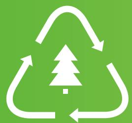

## 双碳引领促绿色发展

我们的行动

应对气候变化 环境合规管理 资源利用与循环经济

SDGs

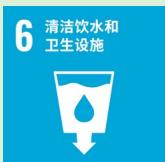

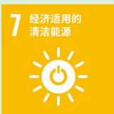

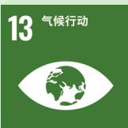

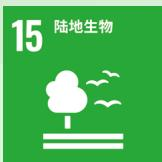

natural_image

Aerial view of a modern industrial park with multiple buildings, greenery, and distant city skyline under a clear blue sky (no visible text or signage)

## 应对气候变化

## 治理

永太科技积极响应国家“碳达峰、碳中和”目标，制定《减少能源消耗和温室气体排放管理制度》，将应对气候变化纳入公司核心战略与运营体系。公司董事会作为最高治理机构，负责审定气候变化相关战略与重大决策：战略委员会负责识别评估并管理气候相关风险，监督气候相关风险与机遇识别工作的开展；各部门及子公司负责具体推进节能减排工作。

## 战略

永太科技重视应对气候变化工作，从风险与机遇两个维度出发，结合气候政策、宏观环境及行业趋势等，根据公司业务特点对气候变化可能带来的影响进行系统识别与评估。公司按短期(1一3年)、中期(3一10年)、长期(10年以上)三个时间尺度开展分析，将评估结果深度融入战略规划，动态优化业务发展方向与资源配置，持续提升企业应对气候变化的适应力与韧性。

<table><tr><td colspan="3">风险类型</td><td>风险描述</td><td>财务影响说明</td><td>影响时间范围</td><td>影响价值链环节</td><td>应对措施</td></tr><tr><td rowspan="2">物理风险</td><td rowspan="2">急性风险</td><td>极端高温</td><td>1.制冷设备需求增大,增加运营成本支出;2.员工中暑、工作状态不佳,降低公司运营效率,同时员工健康维护成本增加;3.影响温度敏感的设备和化学试剂,仓储环节的爆炸、火灾等导致安全风险升高。</td><td>运营成本和员工健康维护成本增加,财务收入减少</td><td>短期</td><td>运营</td><td>1.合理配置制冷设备,优先采用节能环保的设备类型;2.制定并落实员工防中暑措施,开展防暑降温关心关爱活动;3.加强安全管理,严格控制仓储环节的条件,并定期开展消防检查、消防演练,普及员工消防意识。</td></tr><tr><td>自然灾害</td><td>1.由于气候变化导致的台风、风暴潮、洪水等自然灾害,可能对公司资产和生产经营带来直接损害;2.自然灾害可能导致供应链中断,为公司带来间接影响。</td><td>固定资产损失</td><td>短期</td><td>上游运营下游</td><td>1.加强和业务所在地政府、气象和应急部门的沟通联动,及时发布预警;2.持续完善自然灾害应急预案,加强应急能力建设,定期开展应急演练,做好自然灾害的应急处置,减少对公司生产经营的影响;3.加强供应链管理,建立更具韧性的供应链。</td></tr></table>

<table><tr><td colspan="3">风险类型</td><td>风险描述</td><td>财务影响说明</td><td>影响时间范围</td><td>影响价值链环节</td><td>应对措施</td></tr><tr><td rowspan="2">物理风险</td><td rowspan="2">慢性风险</td><td>气温上升</td><td>平均气温上升,可能造成设备冷却水增加、运营场所制冷与采暖需求增加等,进而导致运营成本上升。</td><td>固定资产损失,成本增加,收入减少</td><td>长期</td><td>运营</td><td>1.识别所在地区的气候风险,并将气候风险纳入基础设施建设之中;2.稳步提高节能降碳力度,提升水、废弃物等资源的使用效率,逐步降低对自然资源的依存度;3.开展气候变化相关科普教育,倡导践行低碳环保理念。</td></tr><tr><td>水资源短缺</td><td>主要生产基地的水资源紧张可能导致市政供水价格上涨。</td><td>增加用水成本</td><td>短期</td><td>运营</td><td>开展节水行动,实施节水改造。</td></tr><tr><td rowspan="4">转型风险</td><td>政策法规风险</td><td>环保法规趋严</td><td>业务所在地政府未来将实施更为严格的环保法规,对温室气体排放设置严格的限制和排放配额,遵守这些新规和标准会增加公司的合规成本。</td><td>运营成本增加,财务收入减少</td><td>长期</td><td>运营</td><td>1.密切关注并严格遵守碳排放和碳交易相关法律法规,积极采取措施减少碳排放,严格遵守业务所在国家或地区碳排放法规,加强碳资产的储备和管理,保障履约;2.提升公司低碳发展、气候风险管控水平。</td></tr><tr><td>市场风险</td><td>市场需求变化</td><td>对气候变化的关注可能促使市场倾向于选择低碳产品和服务。若公司未能紧跟低碳趋势,可能会在市场竞争力和客户认可度上趋于落后,影响市场份额及盈利能力。</td><td>财务收入减少</td><td>长期</td><td>运营</td><td>将气候因素纳入投资决策,加大绿色产品开发和生产。</td></tr><tr><td rowspan="2">声誉风险</td><td>公司形象</td><td>如果公司低碳发展目标、达成目标的路径与措施不及预期,可能会对公司的声誉和形象产生影响。</td><td>财务收入减少</td><td>中期</td><td>运营</td><td>细化绿色低碳具体部署和举措,强化监督;扩大全方位沟通交流,提升应对气候变化相关信息披露水平和透明度。</td></tr><tr><td>利益相关方期望</td><td>若公司相关气候指标未达利益相关方低碳期望,可能导致公司价值下降,资本成本增加。</td><td>合规成本提高,财务影响降低</td><td>短期</td><td>运营</td><td>加强与利益相关方的沟通,采取适当措施积极回应利益相关方期望。</td></tr></table>

<table><tr><td colspan="2">机遇类型</td><td>机遇描述</td><td>财务影响说明</td><td>影响时间范围</td><td>影响价值链环节</td><td>应对措施</td></tr><tr><td>气候机遇</td><td>技术进步</td><td>碳减排目标促使公司加强技术创新,减少碳排放,提高能源利用率,降低生产成本,提高竞争力。</td><td>降低生产成本,增加财务收入</td><td>中长期</td><td>运营</td><td>加强低碳技术研发,以科技手段大力推动节能、降碳、减污协同增效。</td></tr><tr><td>市场机遇</td><td>新能源锂电</td><td>在“碳达峰、碳中和”的目标引领下,政府政策支持和消费者观念转变使得新能源、绿色经济等具有环保理念的新兴市场走上了发展的快车道。</td><td>提升产品销售收入</td><td>短期</td><td>下游</td><td>在新能源锂电材料板块形成了相对完善的产品矩阵,同时将继续推动绿色产品与绿色工艺开发。</td></tr><tr><td>资源效率机遇</td><td>循环经济</td><td>通过循环技术回收利用材料,减少对原始材料的依赖,从而降低生产环节的碳排放,同时缩减原材料采购成本。</td><td>减少采购成本</td><td>短中期</td><td>上游</td><td>通过持续升级生产工艺与构建资源循环型生产体系,实现资源高效利用与碳减排目标。</td></tr><tr><td>能源效率机遇</td><td>采用可再生能源</td><td>减少对化石能源及传统能源的依赖。</td><td>运营成本降低</td><td>中期</td><td>运营</td><td>1.推动和优化能源管理系统,利用智能制造实现节约能源;2.推动生产工艺优化及节能降碳技术改造;3.优化能源结构,提高光伏及其他清洁能源的使用。</td></tr></table>

## 影响、风险和机遇管理

为有效应对气候变化带来的潜在风险与机遇，公司将气候相关风险与机遇纳入整体风险管理体系，并制定《风险和机遇控制程序》，构建气候变化风险识别，评估与应对的系统化流程，公司通过分析具体风险因素并制定相应管控措施，持续提升气候风险管理能力，努力降低气候风险对业务的潜在影响。

## 环节

## 具体措施

## 风险识别

◎以企业运营全链条为核心，结合行业特性、地域环境及政策导向，构建多维度识别体系，确保风险与机遇覆盖全面性。

## 风险评估

建立“影响程度+发生概率+时间维度”的多维度评估标准，科学判定风险与机遇的重要性等级，为后续决策提供依据。

## 风险应对

基于评估结果，建立“分级响应、责任闭环”的应对机制，确保应对措施科学落地并持续优化。

## 指标与目标

永太科技结合自身生产经营实际，持续推进温室气体核算工作，识别高排放源并制定针对性减排措施，同时淘汰低效落后的用能设备，持续降低公司运营层面碳排放

## 关键绩效

## 2025年

直接温室气体排放量（范围一)

48,779.82吨二氧化碳当量

温室气体排放总量

278,203.99吨二氧化碳当量

间接温室气体排放量(范围二)

229,424.17吨二氧化碳当量

温室气体排放强度

53.36吨二氧化碳当量/百万元营收

注：1.统计口径包括公司及子公司；  
2公司温室气体统计依据《温室气体核算体系:企业核算与报告标准(2004年)》《氟化工企业温室气体排放核算方法与报告指南(试行)》  
《ISQ14064-1:2018组织层面温室气体排放量和清除量量化和报告指南规范》，其中固定源，移动源采用排放因子法进行核算  
3.范围一温室气体排放包含天然气、汽油、柴油、液化石油气的化石燃料燃烧产生的排放与工业制程产生的排放  
4.范围二温室气体排放包括电力及热力产生的排放  
5各类能源低位发热量参考GB/T2589-2020《综合能耗计算通则》，排放因子参考国家温室气休排放因子数据库

## 碳管理行动

公司积极投身温室气体减排行动，大力推行节能减排举措，全方位优化运营流程，持续降低碳排放水平，稳步推进绿色低碳发展。

## 产品碳排放核算

公司每年对产品开展碳排放核算并编制碳排放报告，依据原料 生产工艺及能源消耗等各环节的碳排放数据，对生产全流程进行单元划分，识别高能耗，高排放环节，并针对性实施工艺优化与节能改造等降碳措施，持续推动生产过程低碳化转型

## 环境合规管理

## 治理

## 管理体系

永太科技严格遵循《中华人民共和国环境保护法》等法律法规，制定《环保设施运行管理制度》《环境因素识别管理程序》《环境保护奖励和考核制度》《环境与职业健康安全管理手册》等制度，规范公司环境保护管理工作。

公司建立健全环境管理组织架构，设立由总经理、管理者代表及各厂区厂长组成的FHS管理委员会，其中总经理为FHS最高管理者，负责环保工作的统筹与监督，各分厂厂长为分厂EHS的第一责任人和管理者，主持落实管理体系各项要求确保各项环保措施落实到位。报告期内，公司环保投入为9.155.75万元，占营业收入比例为1.76%。

截至报告期末，永太科技及部分子公司已获得GB/T 24001-2016/ ISO 14001:2015环境管理体系认证证书。

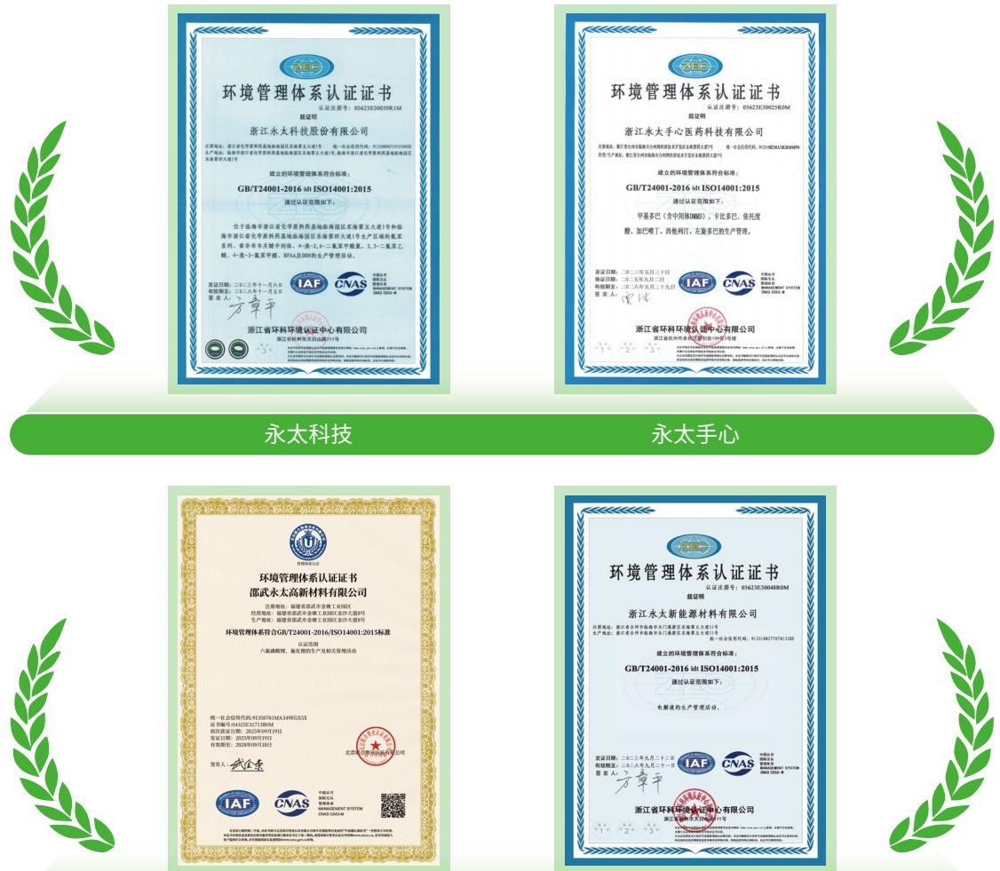  
永太高新  
永太新能源

## 专业技能培养

为强化全员环保合规意识，夯实公司环境管理基础，公司持续开展环保合规培训工作。

## 永太手心环保管理培训

2025年5月，子公司永太手心开展环保法律法规专项培训，内容聚焦法规政策、大气污染防治监督管理及重污染天气应对等核心要点，明确企业防治污染责任，切实增强员工的环保合规意识。

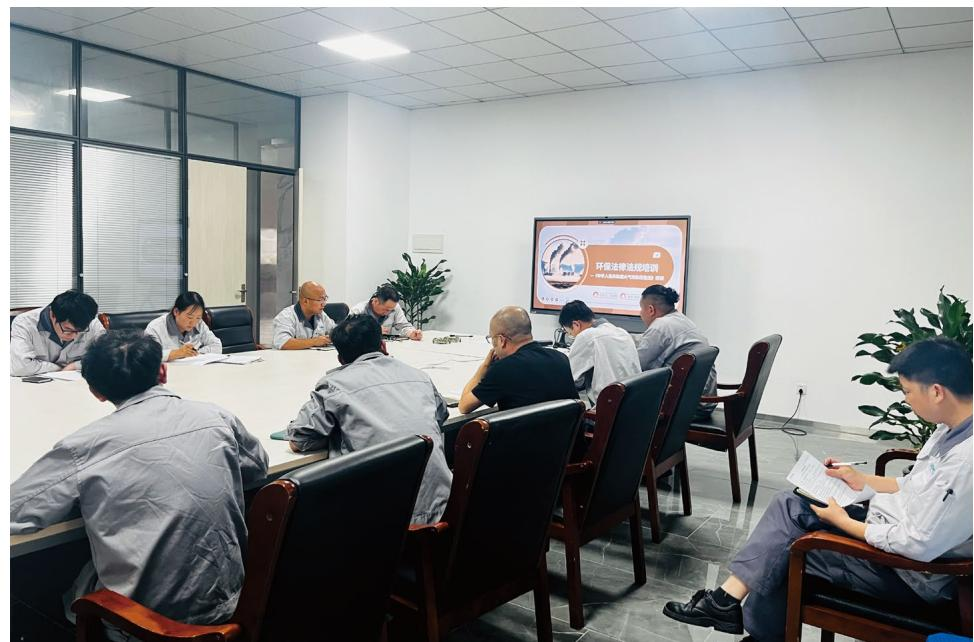

text_image

Meeting room photo with visible presentation screen showing Chinese text about environmental law enforcement and legal procedures

## 环保信息披露

永太科技严格遵守《企业环境信息依法披露管理办法》相关规定，公司及下属6家子公司属于生态环境部门公布的环境信息依法披露企业 。公司通过企业年度环境报告等形式，及时、准确向社会公开环境信息，主动接受政府监管与社会公众监督。

## 战略

公司全面识别环境风险因素及危险源，分析环境严重程度，确保在生产经营活动中环境危害因素得到有效控制，预防可能导致的污染事故发生。

<table><tr><td>风险类型</td><td>风险描述</td><td>财务影响说明</td><td>发生概率</td><td>影响大小</td><td>影响时间范围</td><td>影响价值链环节</td><td>应对举措</td></tr><tr><td>政策风险</td><td>政府将来可能出台更严格的污染物排放标准,企业需投入更多资金进行处理设施升级改造、改进处理工艺。</td><td>成本增加</td><td>大</td><td>大</td><td>短期</td><td>运营</td><td>1.加强环保投入,采取先进设备改进工艺流程控制污染物产生,降低污染物排放水平;2.及时关注行业相关环保法律法规,根据环保法规的趋势,改进处理设施及处理工艺。</td></tr><tr><td>末端排放故障风险</td><td>有机废气的收集、净化处理过程中废气处理装置运行故障,导致废气未得到有效处理,被在线监测设备监测到,可能遭受政府处罚,同时造成大气污染。</td><td>成本增加</td><td>小</td><td>大</td><td>短期</td><td>运营</td><td>1.严格遵守公司环保管理制度,加强环保设施的运行管理;2.尾气处理装置严格按操作规程操作、记录。</td></tr><tr><td>泄漏风险</td><td>废水输送、排放时输送管道发生泄漏、集水井发生满溢,处理不当引发环境污染,引发周边群众投诉。</td><td>成本增加影响公司形象</td><td>小</td><td>大</td><td>短期</td><td>运营</td><td>1.严格遵守公司环保管理制度;2.生产时开启车间环保装置;3.日常巡检,发现及时处理。</td></tr></table>

## 影响、风险与机遇管理

公司制定《环境因素识别管理程序》，明确由安环管理科统筹环境因素管理工作，构建风险识别与评估流程，确保环境风险得到有效管控，保障环境管理体系有效运行。

  
风险识别

◎各部门依据政策法规、设备、设施、服务、作业活动等可能产生环境因素进行调查；  
由安环管理科进行组织环境因素和重要因素进行识别评价，形成《重大环境因素清单》

  
风险评估

◎公司采用直接评价法与环境影响因素评价法，根据影响类型与影响的重要程度进行风险等级评估。

公司根据识别的环境因素制定针对性应对措施。

  
风险应对

  
风险更新

◎公司每年对环境因素进行更新，如外部政策法规、内部运营活动、相关方反馈等发生变化时予以更新，对重要环境因素进行重新评价。

## 应急管理

永大科技严格遵循《中华人民共和国突发事件应对法》等相关法律法规，制定《突发环境事件应急预案》，建立健全应急救援体系并设立应急指挥部。公司根据突发事故的严重性，紧急程度及影响范围，对突发环境事件实施分级管理，有效防范各类突发事件，降低其对公司运营及环境的潜在影响。

  
永太新能源三废站液碱泄漏应急演练

2025年1月，永太新能源组织开展应急演练，模拟巡查时发现液碱泵出口阀门处由干垫片挤压破裂突然泄漏的场景，培训员工在事故突发时的应急处置能力，规范处置流程。

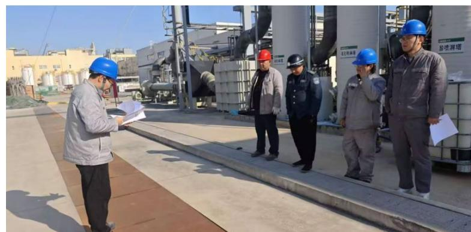

natural_image

Group of workers and officials in hard hats inspecting industrial equipment outdoors (no visible text or symbols)

## 隐患排查

公司制定《环保检查与隐患整改治理制度》，定期组织环保检查，持续完善环境隐患整改治理机制。车间实行班组日检、车间周检，EHS部开展月度排查与季度专项检查。对发现的隐患，车间内问题由车间自行整改，EHS部组织检查中发现的问题按“五定原则”下发整改通知，跟踪验证并纳入治理台账。

报告期内，公司环境隐患排查整改完成率100%。

## 环境监测

公司制定《环境监测管理制度》规范管理环境污染物监测工作，配备废水、废气在线监测系统。公司严格按照制定的监测方案委托有资质的检测机构定期对废水、废气、噪声等指标进行检测，并出具第三方检测报告。报告期内，所有污染物未有超标排放情况。

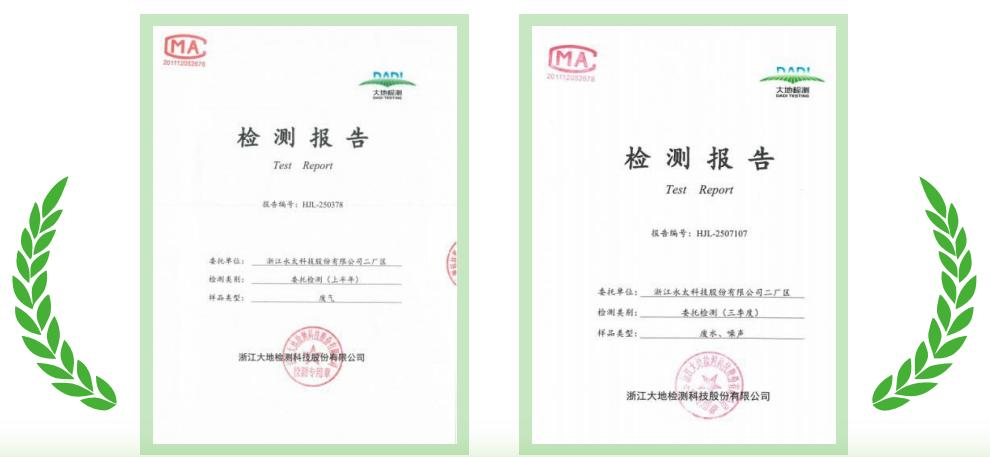  
环境检测报告

## 指标与目标

  
2025年环境目标

环境事故小于等于年度事故总指标

三废无超标排放

  
完成情况

已达成

已达成

## 污染物排放管理

永太科技重视废气、废水、固体废物和噪声等环境污染物的管理，制定《废气管理规定》《土壤和地下水污染防治管理制度》《废弃物管理规定》等制度，通过标准化处理流程和监测评估体系，增强污染治理能力，确保环保措施的有效性和可持续性

## 废水管理

为了规范废水处理系统的操作与管理，公司制定《废水处理系统运行安全操作规程》《废水处理系统安全操作规程》等制度，规范废水处理系统的操作与管理保证系统各单元的正常、连续、稳定运行。

公司废水来源主要为生产废水、生活污水与雨水。公司及各子公司已建立污水处理站，通过雨污分流方式进行处理，确保各类废水得到有效处理并符合排放标准。

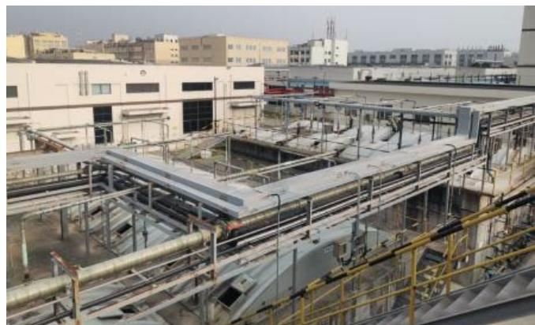

natural_image

Industrial facility with conveyor systems and machinery, surrounded by factory buildings (no visible text or symbols)

废水处理设施

## 永太高新分质处理与树脂吸附深度净化技术应用

公司生产废水含氟化物、氯化物等特征污染物，成分复杂目盐分高，传统处理工艺难以实现高效净化。公司通过采用“分质处理+树脂吸附”组合技术，氟化物、氯化物等特征污染物的去除效率显著提升，其中氯化物去除率达99.5%，全盐量去除率达92.2%。同时，有效降低了药剂消耗和污泥产生量，提升了处理系统的运行稳定性和经济性。

## 关键绩效

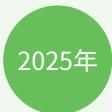

废水排放量

545,296.51吨

废水排放强度

104.59吨/百万元营收

悬浮物

4.50吨

化学需氧量（COD)

88.86吨

氨氮（NH -N）

5.17吨

五日生化需氧量（BOD₅）

17.78 3吨

总磷 (以P计)

0.23 3吨

## 废气管理

永太科技重视废气管理，制定《RTO(蓄热式高温氧化炉)操作规程》等专项制度，通过优化生产工艺，安装先进的大气污染治理设备等，保障各类生产废气的收集、处理和达标排放。

生产车间设置密闭隔间并设有废气收集设施，废气通过车间喷淋预处理后进入RTO处理，二厂区建有两套RTO，采用一备一用模式，保障废气处理系统持续稳定运行。

同时，子公司永太手心获评“浙江省重点行业大气污染防治绩效评级B级企业”，充分印证公司废气治理能力与环境管理水平达到行业良好标准。

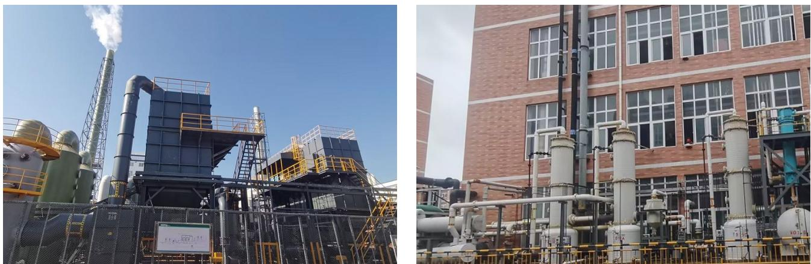  
废气处理设施

## 关键绩效

2025年

氮氧化物（NOx）排放量

14.40

挥发性有机化合物（VOC）排放量

33.91 L吨

硫化物（SOX）排放量

1.41

颗粒物（PM）排放量

0.62吨

natural_image

Illustration of an eco-friendly building with green plant silhouettes and two wind turbines (no text or symbols)

## 废弃物管理

永太科技严格遵守《中华人民共和国固体废物污染环境防治法》，制定《固废管理制度》，依法依规贮存、运输、处置各类废弃物，减少废弃物的排放对环境造成的影响，推动公司可持续发展。公司积极响应台州市全域“无废城市”建设，荣获台州市级“无废工厂称号”。

公司建立完善的固废管理体系，制定并严格执行危废管理计划。通过数字化系统优化固废联单管理，实现无纸化电子联单及危险废物溯源码附码管理，对危险废物的产生、包装、转移、储存各环节全程管控。公司对危废进行分类规范储存，所有危废均委托有资质第三方处置单位合规处理。

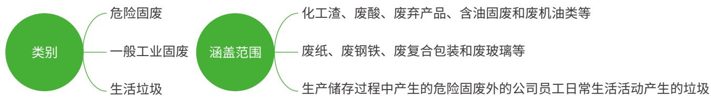

flowchart

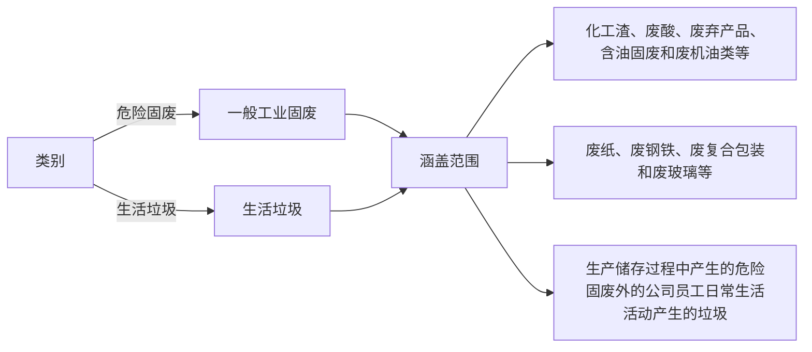
```mermaid
graph LR
  A["类别"] -->|"危险固废"| B["一般工业固废"]
  A -->|"生活垃圾"| C["生活垃圾"]
  B --> D["涵盖范围"]
  C --> D
  D --> E["化工渣、废酸、废弃产品、含油固废和废机油类等"]
  D --> F["废纸、废钢铁、废复合包装和废玻璃等"]
  D --> G["生产储存过程中产生的危险固废外的公司员工日常生活活动产生的垃圾"]
```

## 关键绩效

2025年

废弃物产生总量

23,039.09吨

有害废弃物产生量

20,356.08吨

无害废弃物产生量

2,683.01吨

废弃物处置量

23,053.70吨

回收再利用废弃物总量

6,318.58吨

废弃物产生强度

4.42吨/百万元营收

有害废弃物产生强度

3.90吨/百万元营收

无害废弃物产生强度

0.51吨/百万元营收

废弃物合规处置率

100%

废弃物回收利用率

27.42%

注：废弃物处置量包含往年库存量。

## 噪声管理

永大科技严格遵守《中华人民共和国噪声污染防治法》相关要求，制定并实施《噪声污染防治管理规定》，系统控制公司工业生产过程中产生的噪声。为保障作业过程中员工的人身安全和健康，公司发放劳动防护用品，同时委托第三方机构定期开展监测活动以进一步完善噪声污染防治。

## 产品环境影响管理

永太科技将绿色低碳理念融入生产运营全流程，聚焦生产环节绿色转型，完成多项技术迭代，减少产品生产过程污染物产生。

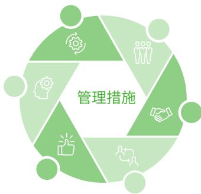

flowchart

```mermaid
graph TD
  A["Step 1"] --> B["Step 2"]
  B --> C["Step 3"]
  C --> D["Step 4"]
  D --> E["Step 5"]
  E --> F["Step 6"]
  F --> G["Step 7"]
  G --> H["Step 8"]
  H --> I["Step 9"]
  I --> J["Step 10"]
  J --> K["Step 11"]
  K --> L["Step 12"]
  L --> M["Step 13"]
  M --> N["Step 14"]
  N --> O["Step 15"]
  O --> P["Step 16"]
  P --> Q["Step 17"]
  Q --> R["Step 18"]
  R --> S["Step 19"]
  S --> T["Step 20"]
  T --> U["Step 21"]
  U --> V["Step 22"]
  V --> W["Step 23"]
  W --> X["Step 24"]
  X --> Y["Step 25"]
  Y --> Z["Step 26"]
  Z --> AA["Step 27"]
  AA --> AB["Step 28"]
  AB --> AC["Step 29"]
  AC --> AD["Step 30"]
  AD --> AE["Step 31"]
  AE --> AF["Step 32"]
  AF --> AG["Step 33"]
  AG --> AH["Step 34"]
  AH --> AI["Step 35"]
  AI --> AJ["Step 36"]
  AJ --> AK["Step 37"]
  AK --> AL["Step 38"]
  AL --> AM["Step 39"]
  AM --> AN["Step 40"]
  AN --> AO["Step 41"]
  AO --> AP["Step 42"]
  AP --> AQ["Step 43"]
  AQ --> AR["Step 44"]
  AR --> AS["Step 45"]
  AS --> AT["Step 46"]
  AT --> AU["Step 47"]
  AU --> AV["Step 48"]
  AV --> AW["Step 49"]
  AW --> AX["Step 50"]
  AX --> AY["Step 51"]
  AY --> AZ["Step 52"]
  AZ --> BA["Step 53"]
  BA --> BB["Step 54"]
  BB --> BC["Step 55"]
  BC --> BD["Step 56"]
  BD --> BE["Step 57"]
  BE --> BF["Step 58"]
  BF --> BG["Step 59"]
  BG --> BH["Step 60"]
  BH --> BI["Step 61"]
  BI --> BJ["Step 62"]
  BJ --> BK["Step 63"]
  BK --> BL["Step 64"]
  BL --> BM["Step 65"]
  BM --> BN["Step 66"]
  BN --> BO["Step 67"]
  BO --> BP["Step 68"]
  BP --> BR["Step 69"]
  BR --> CB["Step 70"]
  CB --> CD["Step 71"]
  CD --> CE["Step 72"]
  CE --> CF["Step 73"]
  CF --> CG["Step 74"]
  CG --> CH["Step 75"]
  CH --> CI["Step 76"]
  CI --> CJ["Step 77"]
  CJ --> CK["Step 78"]
  CK --> CL["Step 79"]
  CL --> CM["Step 80"]
```

工艺优化 优化生产工序；对关键中间体及特定产品的溶剂进行升级，减少污染物产生。  
物料减量 优化生产配方与投料方案，提升原料利用效率。  
废水减排 升级废水处理设施与工艺优化减少用水量。  
废气减排RTO废气处理设施优化，进行溶剂替代以降低挥发性污染物产生。  
固废减排工艺优化提升反应得率，减少副产固废。  
环境合规 持续完善污染防控体系与风险应急机制。

## 绿色运营

## 绿色办公

永太科技坚持绿色办公，通过使用电子文档管理、线上方式递交作业票与签名、采用金蝶ERP、OA等电子办公系统减少纸张使用，致力于降低环境影响，助力公司绿色发展。

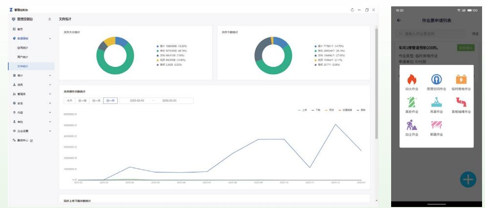

donut

| Category | Value |
| --- | --- |
| 上市 | ~1000000 |
| 下市 | ~100000 |
| 窗出 | ~100000 |
| 仓储仓储 | ~100000 |
| 售助 | ~100000 |

## 清洁生产

永太科技积极推行清洁生产，严格遵守《中华人民共和国清洁生产促进法》《清洁生产审核办法》等法律法规，设立清洁生产审核领导小组统筹指导公司清洁生产工作，持续推进设备更新，过程优化及资源综合利用。报告期内，公司已完成第四轮清洁生产审核评估，有效提升资源利用效率，减少污染物排放，推动公司清洁、高效生产。

## 生态环境保护

## 生态系统和生物多样性

内蒙古永大结合西北地区自然条件特点，强化区域生态环境治理。公司配备专职人员负责绿化维护，铺设精细化绿化洒水管网，采用微喷灌等节水技术，配置洒水车定期开展道路抑尘作业。截至报告期末，绿化面积达4万平方米，区域生态环境得到改善，生物多样性得到初步保护，实现生产运营与生态保护的协调推进。

## 土壤和地下水监测

永太科技建立健全土壤和地下水污染管理体系，制定《土壤隐患排查制度》《土壤和地下水污染防治管理制度》等制度，通过委托第三方监测机构定期、定点采集土壤及地下水样本进行监测，并出具《土壤和地下水自行监测报告》，确保运营范围内的土壤和地下水符合相关标准。截至报告期末，公司及子公司永太手心、永太药业已进行土壤和地下水监测，并编制了检测报告。

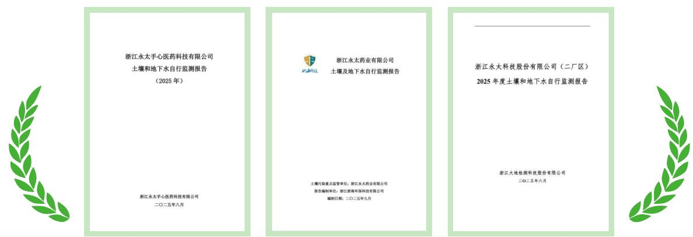

text_image

浙江永太手心医药科技有限公司
土壤和地下水自行监测报告
（2025年）
浙江永太手心医药科技有限公司
二〇二五年八月

浙江永太药业有限公司
土壤及地下水自行监测报告
浙江永太药业有限公司
土壤污染重点监管单位：浙江永太药业有限公司
报告编制单位：浙江唐海环保科技有限公司
编制日期：二〇二五年九月

浙江永太科技股份有限公司
（二厂区）
2025年度土壤和地下水自行监测报告
浙江大地检测科技股份有限公司
二〇二五年六月

土壤和地下水检测报告

## 资源利用与循环经济

## 资源管理体系

## 能源管理

公司遵循《中华人民共和国节约能源法》及相关法律法规，结合公司实际制定《能源管理制度》《资源管理程序》等制度规范明确由各厂区厂长为能源管理第一负责人，各生产部门协同推进能源管理与节能规划落地实施，避免能源浪费。同时，公司通过讲座、宣传栏等形式开展节能宣传教育，激发员工节约能源积极性，持续提高能源管理水平，为公司可持续发展筑牢根基。

## 水资源管理

永太科技严格遵守《中华人民共和国水法》等相关法律法规，制定了相关节水管理制度，重视水资源的合理利用，积极倡导节约用水，坚决杜绝“跑冒滴漏”现象，从源头遏制水资源浪费。

公司建立蒸汽冷凝水回收系统，替代自来水，显著提升水资源利用率。子公司永太手心实施精细化用水管理，建立年度用水绩效评估机制，科学制定用水基准线并实施日度、月度用水监控。同时公司采用低温乙二醇代替循环水对反应釜进行冷却从而减少自来水使用量，实现生产过程中水资源的高效利用。

## 资源节约培训

2025年11月，子公司永太高新根据国家节能减排、循环经济相关法律法规与政策要求，开展“节能节水、物料节约”主题培训。培训针对公司资源使用现状进行分析，宣贯各项节能节水及物料节约举措，提升员工专业技能和资源节约意识。

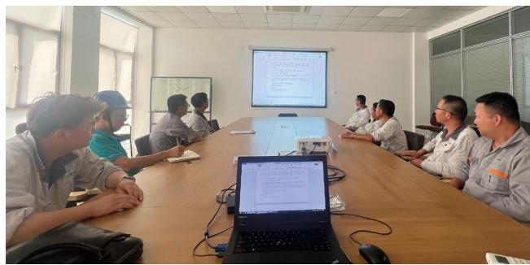

text_image

Meeting room scene with participants seated around a long table, one person using a laptop displaying a document on the screen.

## 战略

资源保障是可持续发展的基石之一，发展循环经济是企业实现可持续发展的必然选择。永太科技深刻认识到这一核心趋势积极识别资源使用的潜在风险，并持续推进资源风险与机遇的识别与评估，结合自身生产经营实际制定科学合理的应对策略。以实现绿色发展目标。

<table><tr><td>风险类型</td><td>风险描述</td><td>时间范围</td><td>受影响的价值链范围</td><td>财务影响</td><td>应对举措</td></tr><tr><td>物理风险</td><td>公司处于台风多发区域,强降雨或台风可能会破坏输送线路等能源设备,导致能源供应中断,影响生产进度。</td><td>短期</td><td>运营</td><td>增加运营成本</td><td>制定相应的防台防汛应急预案,进行应急演练,对能源设备进行加固维护。</td></tr><tr><td>市场风险</td><td>1.用电高峰期可能会出现限电,影响生产安排,可能导致订单无法按时交付,影响公司信誉;2.干旱可能会导致水资源紧缺,自来水价格上升,增加公司运营成本。</td><td>中期</td><td>运营</td><td>增加运营成本</td><td>1.构建全流程能源精细化管理体系,实现能源消耗精准计量与动态监控;2.利用蒸汽系统回收余热,减少能源消耗;3.持续完善蒸汽冷凝水循环系统,回收再利用冷凝水,节约自来水;4.制定停限电应急预案,合理安排生产计划。</td></tr></table>

## 影响、风险和机遇管理

公司依据《风险和机遇管理程序》，针对资源领域建立系统化管理机制，开展风险与机遇的识别、分析和评估。

  
风险识别

综合考量组织自身的内外部环境、其他相关方的需求与期望、各类环境因素、应遵守的合规义务以及其他相关问题

  
风险评估

对已识别的风险的严重度和发生频度进行评价，根据风险的严重度和发生频度确定风险系数

  
风险应对

对所识别的风险进行评估，根据评估的结果对风险采取措施，从而达到降低或消除风险的目的。

## 指标和目标

## 能源指标与目标

永太科技积极践行绿色发展理念，全面推进节能减排工作，致力于降低能源消耗。

能源使用情况

<table><tr><td rowspan="5">2025年</td><td>天然气</td><td>汽油</td><td>柴油</td><td>液化石油气</td></tr><tr><td>2,234.99万立方米</td><td>54.67吨</td><td>73.44吨</td><td>3.40吨</td></tr><tr><td>直接能源消耗总量</td><td>28,405.34吨标准煤</td><td>外购电力总量</td><td>30,891.72万千瓦时</td></tr><tr><td>外购热力总量</td><td>478,222.97吉焦</td><td>间接能源消耗总量</td><td>54,282.89吨标准煤</td></tr><tr><td>能源消耗总量</td><td>82,688.23吨标准煤</td><td>能源消耗强度</td><td>15.86吨标准煤/百万元营收</td></tr></table>

注：1.统计口径包括公司及子公司；  
2.能耗计算参考GB/T2589-2020《综合能耗计算通则》。

## 水资源指标与目标

永太科技作为节水型企业，持续规范水资源管理工作，聚焦冷却水回用等节水举措，进一步提升水资源利用率。

## 关键绩效

2025年

新鲜水取水总量

1,588,999.00吨

其中：市政购水量

1,587,429.00吨

其中：地表水取水量

1,570.00吨

新鲜水用量

1,588,999.00吨

雨水

36,221.79吨

水循环与再利用量

62,664.00吨

总耗水量

1,687,884.79吨

耗水强度

323.75吨/百万元营收

注：1.统计口径包括公司及子公司；

2.总耗水量=新鲜水用量+雨水+水循环与再利用总量。

## 资源高效利用

## 水资源管理举措

## 高盐废水资源化回收项目

公司废水处理新增“混凝沉淀+高密度沉淀池+臭氧氧化+生物滤池”深度处理系统，实现高盐废水净化回用，其中14.6万吨回用于生产车间补水，年节约新鲜水14.6万吨，废水回用率达80%。

## 生产装置节水升级项目

通过更换12台高效节能水泵配套变频调速装置，同步优化冷却系统，水泵运行效率同比提升15%，冷却系统冲洗水量减少35%，年节约新鲜水3.2万吨。

## 分质分流废水处理优化项目

公司重构排水体系，实现生产废水与生活污水分流处理；前端增设沉淀预处理单元减少废水处理过程中的水资源损耗，提升处理效率，间接年节水1.8万吨。

## 循环冷却水系统优化项目

通过添加高效阻垢剂，优化水质监测与旁滤系统，延长水循环周期，循环水利用率从92%提升至98.6%，年减少循环水补水量2.4万吨。

## 蒸汽冷凝水回收

车间周边设置蒸汽冷凝水收集罐。对生产过程中产生的蒸汽冷凝水进行集中收集，实现冷凝水自动回输至循环水池，回收利用蒸汽冷凝水约5.5万吨/年，实现循环水替代自来水，节约新鲜水。

## 能源管理举措

为推进节能降耗增效，公司持续淘汰低能效设备、实施设备改造优化，强化能源管理，提升能源利用效率。

## 淘汰低效落后用能设备

由于厂区部分用能设备效率低、能耗高问题，公司淘汰低效落后设备1.100台(套)更新购置1.125台(套)，并完成精馏塔冷冻机系统、循环水系统等30台(套)用能设备改造。项目完成后，变压器、泵、电机、冷冻机等设备能效达到二级能效水平，可节约电量776万kWh。

natural_image

Interior view of an industrial workshop with heavy machinery and a large saw blade (no visible text or symbols)

淘汰前

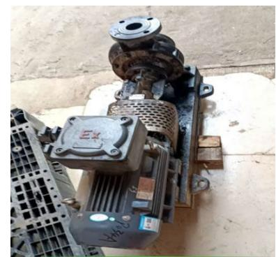

natural_image

Industrial electric motor with visible internal structure and control panel, placed on concrete ground (no text or symbols)

更新后

##

公司对蒸汽冷凝水及余热进行回收与循环利用，实现水资源与热能的双重回收，有效降低新鲜水消耗和燃料用量，提升能源利用效率，减少公司碳排放

## 物料管理

永大科技持续优化物料管理体系，制定《物资存储管理程序》等制度，明确物料分类存储标准及标识规范，实行“分区分类、分级”管理；建立“日巡查、周专项、月综合”的定期安全检查机制，预防物料变质、泄漏及安全事故。同时，依托物料扫码管控规范仓储管理，持续优化副产物回收技术，提升物料循环利用率。

##

公司持续升级工业互联网平台，并落地锂电行业电解液材料智造平台，依托防呆防错、MES生产管控系统及恒温恒压技术，实现仓储环节的数字化管理，提升生产运营的智能化与精细化水平。

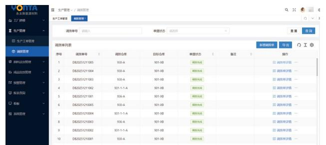

text_image

生产管理 - 测试管理
生产工单管理
调试单号
请输入
单管状态
调试件
数量
调试
调试单列表
序号	调试单号	调试合用	目标合用	单管状态	备注
1	DB20251211005	930-A	901-XB	断放完成
2	DB20251211004	930-A	901-XB	断放完成
3	DB20251211003	930-A	901-XB	断放完成
4	DB20251211002	931-1-1-A	901-XB	断放完成
5	DB20251211001	936-A	901-XB	断放完成
6	DB20251210005	930-A	901-XB	断放完成
7	DB20251210004	931-1-1-A	901-XB	断放完成
8	DB20251210003	936-A	901-XB	断放完成
9	DB20251210002	931-1-1-A	901-XB	断放完成
10	DB20251210001	930-A	901-XB	断放完成
操作
调试单评估
调试单评估
调试单评估
调试单评估
调试单评估
调试单评估
调试单评估

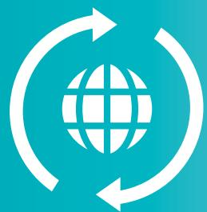

## 科创破局强竞争根基

## 我们的行动

◎ 研发与创新 ◎ 可持续供应链 ◎ 产品质量管理  
客户权益保障 数智化转型

## SDGs

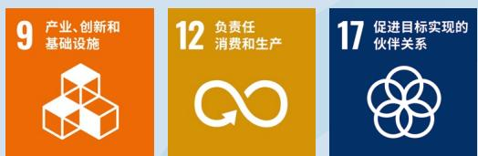

natural_image

Two scientists in lab coats examining a tablet in a laboratory setting (no visible text or symbols)

## 研发与创新

## 治理

永太科技坚持以创新驱动发展，建立从技术创新到产业化应用的全链条治理体系。公司确立总经理统筹、专家委员会评审的研发决策机制，强化技术创新与全球市场需求适配，并制定《知识产权合规管理工作手册》《产品设计与开发流程》《新产品设计和开发管理制度》等制度，规范研发项目全生命周期管理。报告期内，公司新产品开发项目数量47个，研发投入共计14,899.18万元，占营业收入2.86% 。

## 研发创新平台

公司积极搭建高水平科研创新平台，已成立国家企业技术中心、浙江省重点企业研究院、浙江省工程研究中心、博士后科研工作站等创新机构，形成以浙江总部为核心的创新体系；同时聚焦重点发展方向与研究领域，着力加强创新型人才培养致力于攻克行业共性、关键及前沿技术难题，推动产业高质量发展

  
台州研发中心

永太科技研发大楼占地4,224平方米，涵盖检测中心、微生物实验室、研发实验室及工艺安全评估实验室，基础设施完善，设备先进。

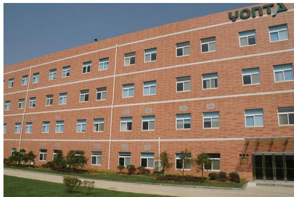

natural_image

Exterior view of a modern brick building with 'YONTA' signage on the roof (no other text or symbols visible)

  
杭州研发中心

公司在杭州建有AI智能化药物研发平台，通过高通量自动化合成、AI算法计算与研发管理系统矩阵，成功赋能多项合成工艺开发，显著提升了研发效率和生产转化能力。

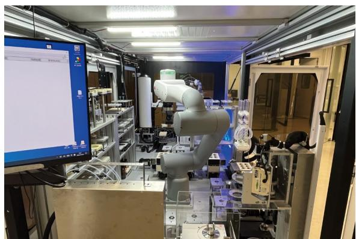

natural_image

Interior of a modern laboratory with robotic arm and lab equipment (no visible text or symbols)

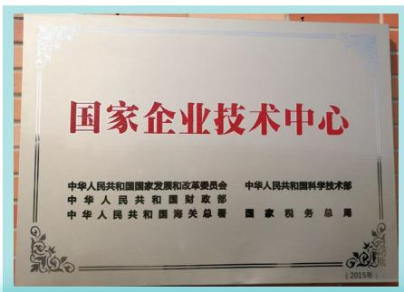

text_image

国家企业技术中心
中华人民共和国国家发展和改革委员会 中华人民共和国科学技术部
中华人民共和国财政部
中华人民共和国海关总署 国家税务总局
（2015年）

  
国家企业技术中心

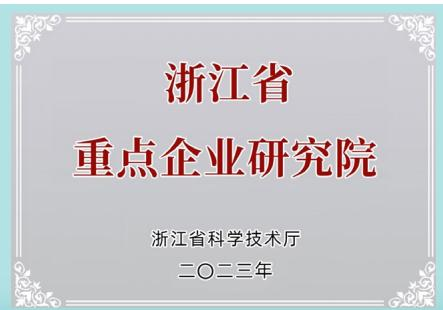

text_image

浙江省
重点企业研究院
浙江省科学技术厅
二〇二三年

浙江省重点企业研究院

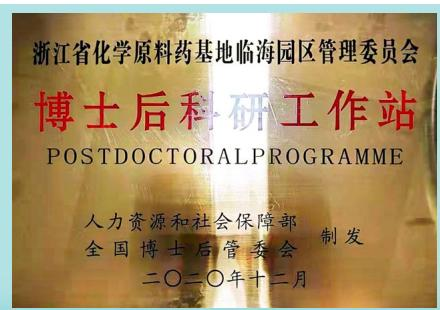

text_image

浙江省化学原料药基地临海园区管理委员会
博士后科研工作站
POSTDOCTORALPROGRAMME
人力资源和社会保障部
全国博士后管委会 制发
二〇二〇年十二月

博士后科研工作站

## 研发团队

公司积极引进高层次科技人才，制定《优秀人才引进制度》《技术人员培训管理》 等制度，对技术人员实施人性化、科学化相结合的管理模式，持续打造高质量研发梯队，为公司战略发展目标的实现提供坚实支撑。公司研发人员均具备本科以上化学相关专业学历，目前，公司共计拥有研发人员506名。

## 关键指标

2025年

按性别划分

348

158

## 研发成果

2025年度，永太科技凭借在含氟技术创新、研发成果持续转化方面的突出表现荣获《证券市场周刊》市值管理金曙光奖“新质生产力奖”，彰显创新驱动与高质量发展标杆实力。

公司子公司佛山手心研发产品“多潘立酮片”获得“广东省名优高新技术产品”称号。

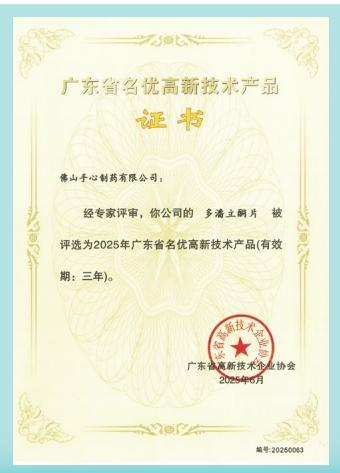

text_image

广东省名优高新技术产品
证书
佛山手心制具有限公司：
经专家评审，你公司的 多潘立翻片 被评选为2025年广东省名优高新技术产品(有效期：三年)。
广东省高新技术企业协会
2025年6月
编号:20250063

  
广东省名优高新技术产品

## 战略

公司以国家战略为引领，坚持创新驱动，密切关注技术前沿、行业绿色转型趋势及相关政策导向，并结合自身研发实力与业务布局，持续加强高层次人才队伍建设，优化研发管理体系与流程，为公司核心业务的技术迭代与市场拓展提供坚实的创新支撑。

<table><tr><td>风险类型</td><td>描述</td><td>财务影响说明</td><td>发生可能性</td><td>影响大小</td><td>影响时间范围</td><td>影响价值链环节</td><td>应对措施</td></tr><tr><td>政策风险</td><td>国家对含氟化合物的环保与安全监管不断加强,新物质、新工艺可能面临更严格的审批或限制,增加研发合规成本。</td><td>成本增加</td><td>大</td><td>大</td><td>长期</td><td>上游运营</td><td>1.及时掌握政策变化并调整研发方向;2.推行绿色工艺与清洁生产技术,攻克环保与安全性能差问题,降低环保压力。</td></tr><tr><td>技术风险</td><td>1.含氟材料和精细化学品的研发通常需要较长的试验周期和持续的资金投入,研发成果转化存在不确定性;2.研发工艺路线较复杂,对设备、安全控制和工艺优化要求极高,研发失败风险较大。</td><td>成本增加</td><td>中</td><td>大</td><td>中期</td><td>上游运营</td><td>1.加大研发投入,持续深化高质量研发平台的建设,壮大研发团队;2.与高校、科研机构合作,推进前沿技术开发和产业化落地;3.依托数智化系统,提高实验数据准确性与研发效率。</td></tr></table>

<table><tr><td>风险类型</td><td>描述</td><td>财务影响说明</td><td>发生可能性</td><td>影响大小</td><td>影响时间范围</td><td>影响价值链环节</td><td>应对措施</td></tr><tr><td>市场风险</td><td>下游应用领域如新能源、医药技术迭代迅速,研发方向可能与未来市场需求不匹配,导致研发成果市场化难度增加。</td><td>收入减少市场份额降低</td><td>高</td><td>大</td><td>中期</td><td>上游</td><td>定期与下游客户进行交流,了解市场上的产品需求,以市场为主要导向,根据市场需求调整研发方向,配合客户进行产品的设计开发。</td></tr></table>

<table><tr><td>机遇类型</td><td>描述</td><td>财务影响说明</td><td>发生可能性</td><td>影响大小</td><td>影响时间范围</td><td>影响价值链环节</td><td>应对措施</td></tr><tr><td>市场机遇</td><td>在环保政策压力和技术进步的不断推动下,氟化工行业新技术、新产品不断应用,加之汽车、电子、新能源、环保对于高性能氟聚合物、含氟精细化学品的刚性需求,氟化工在未来具有广阔的发展空间。</td><td>收入增加市场份额增加</td><td>中</td><td>大</td><td>长期</td><td>运营下游</td><td>1.参加行业内的技术交流会和产品展览会等活动,了解行业的发展动态,学习最新的前沿技术;2.参加行业论坛,并提前根据行业新标准,布局研发方向和进行技术储备;3.关注国家及地方政府在新能源电池、绿色技术、资源循环等领域的政策,确保创新技术始终契合国家战略导向。</td></tr></table>

## 风险、机遇与影响管理

公司已构建完整的风险管理体系，对研发，知识产权领域的风险与机遇开展系统的识别分析，评估及控制，并制定相应的程序规范。公司将相关风险纳入统一管理范畴并实施动态监控，要求各部门梳理职能范围内的风险清单，分析评估风险发生的可能性，频次，影响因素及潜在后果，开展风险分级并制定针对性控制措施，同时将相关风险和机遇管理方案纳入《风险和机遇识别分析表》统一管理。

## 指标与目标

永太科技立足整体发展战略，结合各子公司资源优势与业务特点，制定研发创新目标，将新产品的工艺开发、产品的节能降耗改进以及产业化项目的经济效益等关键创新指标纳入各部门的年度考核计划，考核结果作为重要绩效评估依据并与分管领导薪酬挂钩，保障创新目标的落实。

## 关键指标

2025年

授权专利累计数（有效期内的专利数）

285项

专利申请数

17项

## 按专利类型划分

授权发明专利累计数

186

授权实用新型专利累计数

95项

授权外观设计专利累计数

每百万元营收有效专利数

0.055项/百万元营收

## 其他知识产权

软件著作累计数

3项

商标累计数

161

每百万营收软件著作数量

0.00058项/百万元营收

发表论文累计数

3

## 企业创新能力认证

专精特新企业

4个

国家高新技术企业

3个

国家认定企业技术中心

1个

## 研发举措

## 激励机制

为充分调动员工创新研发积极性，激发全员创新活力，公司建立涵盖荣誉奖励与奖金奖研发激励机制，对获得专利授权。发表科技论文、研究成果落地应用的员工发放奖励。

## 产学研合作

永太科技持续深化产学研融合，与浙江大学、复旦大学等高校合作共建联合实验室等创新平台。其中，公司与复旦大学协同攻关中长时锂电池技术，加速推动其产业化落地，旨在为新能源汽车及储能系统提供高效、环保的活性锂损失补充方案通过前沿技术开发与产业化实践，公司积极搭建技术创新与产业转化的双向赋能桥梁，为企业可持续发展筑牢技术根基。

## 行业共建

为准确把握市场趋势、明确研发方向，公司定期与客户沟通交流，根据客户核心需求动态调整研发方向；同时主动参与行业技术交流会、产品展览会等活动，跟踪行业发展动态，学习前沿技术，确保研发工作始终与市场需求、技术潮流同频同步

## 永太氟乐科技冷却液展会

2025年6月，子公司永太氟乐携自主研发Fluquid系列浸没式电子氟化液产品LC-50(两相)、LC-100(单相）参加国际数据中心产业博览会，现场搭建动态演示平台，演示涵盖温控稳定性、电力消耗、散热效率等关键数据，呈现浸没式冷却在提升能效、延长设备寿命等方面的应用场景，凸显电子氟化液方案在降低碳排放、控制运营成本等方面的潜在价值。

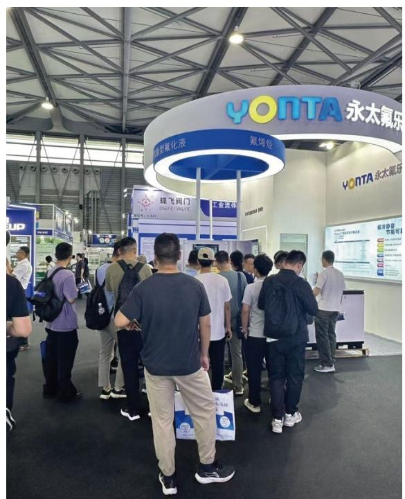

text_image

YONTA 永太氟乐
蜂飞阀门 DIEFEI VALVE
氟烯烃
工业达标
YONTA 永太氟乐

## 永太新能源新型有机锂补锂创新技术专题会

2025年5月，子公司永太新能源举办新型有机锂盐补锂创新技术专题会，重点发布三氟甲基亚磺酸锂补锂剂最新进展。相较于传统补锂技术，该产品拥有191mAh/g高理论比容量与3.8V低分解电压，可在电池化成过程中充分分解，适用于电解液补锂、正极补锂及电池修复等多场景。

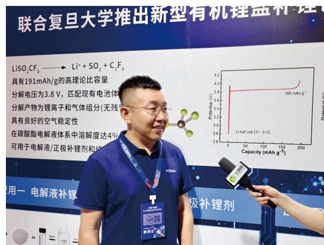

text_image

联合复旦大学推出新型有机锂盐补锂
LiSO₃CF₃ → Li⁺ + SO₂ + C₂F₆
具有191mAh/g的高理论比容量
分解电压为3.8 V，匹配现有电池体
分解产物为锂离子和气体组分(无残)
具有良好的空气稳定性
在碳酸酯电解液体系中溶解度达4%
可用于电解液/正极补锂剂和电
Potential (V)
190 mAh g⁻¹
Capacity (mAh g⁻¹)
Li half cell 25℃ 0.1℃
用一电解液补锂
极补锂剂

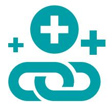

## 知识产权保护

为规范专利管理工作，保护创新成果，公司制定《知识产权管理制度》《专利管理制度》《专利管理实施办法》《知识产权维护控制程序》等制度，不断迭代专利风险监控信息，开展专利风险分析，有效控制风险。

同时，公司将知识产权战略全面融入整体发展规划，并持续推进管理体系的标准化与合规化。公司于2018年首次通过知识产权管理体系认证并完成后续再认证；2025年进一步通过企业知识产权合规管理体系认证，着力构建规范的知识产权管理体系。

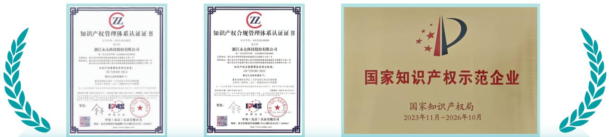  
知识产权管理体系认证证书  
知识产权合规管理体系认证证书  
国家知识产权示范企业

公司定期组织内外部专利相关培训，通过系统学习专利申请、布局、风险防控等关键内容，显著提升员工的知识产权意识与专业能力，进而强化公司的知识产权管理效能，为技术创新成果的有效保护与持续优化提供有力支撑。

## 知识产权合规管理培训

2025年度，公司在内部开展知识产权合规管理体系、企业知识产权风险防范与应对、专利检索数据库介绍、专利检索方法、专利信息分析等多项专题培训，强化知识产权管理体系运行，巩固员工专业技能，激发与提升员工技术创新能力以及风险防控意识。

此外，应对当前国际形势挑战，结合企业实际，参与由省市县职能部门及权威机构、行业协会组织的《新形势下的企业出海知识产权合规风险与应对》、《出海企业如何构建韧性的知识产权风控体系》、《海外商标“明雷”与“暗礁”：风险拆解与破局之道》等主题培训，学习、消化、吸收，完善知识产权风险防控体系的构建。

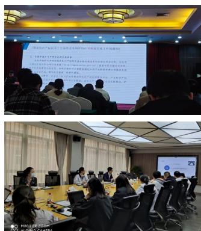

## 科技伦理

公司在研发创新过程中严格遵守国际规范及行业准则，始终保持对新技术应用过程中可能涉及的合规、环境与社会影响的高度关注，确保所有经营活动符合可持续发展的责任要求。目前，公司核心业务不涉及生命科学、人工智能伦理等敏感领域的科学研究、技术开发等活动。报告期内，公司未发生任何违反科技伦理的行为。

## 可持续供应链

## 供应商管理

为规范供应商管理、保障供应链稳定，公司制定并实施《供应商标准管理程序》《新供应商准入管理制度》，明确由采购部主导供应商筛选及问卷调查等资质评估工作，生产、质量等相关部门协同配合，实现供应商准入、分级管理、评估与淘汰的全生命周期规范化管理。同时，公司通过发展多元化供应商资源、签订长期供应协议等策略，持续提升供应链的稳定性与韧性。

## 供应商准入与评估

永太科技在供应商准入阶段实施精细化管理，由采购部门从资质合规性、供货能力、质量认证及用户评价等维度进行初步考察：经评估合格后，将供应商纳入《合格供应商名录》。公司根据日常检验监控、交货评价等信息对供应商进行持续综合评估，以确认其资格是否继续保留。此外，公司至少每五年对供应商开展一次复评，并同步更新相关资质信息。

## 供应商分级管理与淘汰

永太科技建立科学的供应商评估体系，每年由QA协同生产技术部、采购部等部门，根据供应商质量投诉情况、物料使用与检验结果、审计情况及供货及时性等指标进行评估，并根据评分结果将供应商分为|\~V级。其中，对于|级、Ⅱ级供应商作为合格供应商；Ⅲ级通知其进行整改，视改进情况进行评估；V级供应商将考虑取消其合格供应商资格。对于连续三次出现质量问题的供应商，公司将取消其合格供应商资格，并要求在规定期限内完成整改，整改完成后，公司将根据整改效果及相关评估结果，决定是否恢复其供应商资格。

## 供应商尽职调查

为降低供应链风险，采购部门通过《供应商问卷调查表》对供应商进行资质审查，重点核验供应商是否具备质量管理环境管理、职业健康与安全及GMP等相关体系认证，并与供应商签订《供应商质量保证协议》，明确双方质量责任：对关键物料，包材及高风险供应商实施现场审计，确保供应链质量可控。

## 供应商赋能

永大科技积极参加行业供应链展会。报告期内，公司参加了上海CPHI展会及供应商大会，通过学习前沿技术展示、了解新的供应链管理模式并开展高效资源对接，探索更多供应链合作机会。公司以合作共赢为理念，与供应商建立战略合作关系，持续增强供应链韧性。

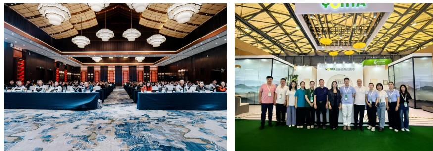

## 供应商风险评估管理

为系统管理供应链风险并把握发展机遇，公司建立供应链风险监测与动态管理机制，通过定期梳理市场波动、技术迭代等潜在风险，主动挖掘政策相关机遇。针对高风险环节，公司积极布局规划拓展多元化供应资源，同时为把握技术机遇与创新型伙伴合作，引入低碳、智能化解决方案。同时，公司通过制定应急预案与搭建机遇响应通道确保措施落地。此外，每季度复盘风险与机遇的实际影响，迭代管理策略，从而构建具有韧性的供应链体系。

## 供应链管理举措

## 供应商ESG管理

为建立健全可持续供应链，公司将可持续发展要求融入供应链管理中，要求供应商签署《供应商环保符合性声明》《不使用冲突矿产保证书》，以及提交《供应商原辅材料环境管理物质成分调查表》《供应商环境管理物质调查表》等相关文件。同时，公司对供应商准入与考核过程中，除物料供给能力外，还将安全生产、环境保护、劳工与人权等指标纳入关键考量范畴，强化供应链环境与社会风险管控，推动供应链可持续发展。

## 廉洁采购

永太科技高度重视供应链廉洁合规建设，在采购过程中通过与供应商签署《廉洁协议》，告知供应商相关行为准则，向供应商传递公司的廉洁和反腐败政策，同时对采购人员开展职业道德相关培训，提升员工的廉洁意识。

## 负责任矿产采购

为防范矿产供应链中潜在的劳工、人权、环境与冲突风险，永太科技制定并实施《负责任矿产采购政策》，将其纳入与供应商签订的合同与协议中。公司在明确要求供应商确保自身不涉及争议采购的同时，推动供应商向其上游传达负责任矿产采购原则要求，为矿产供应链各环节中涉及冲突敏感型采购提供指引，推动整个供应链合规管理。

公司持续建立健全冲突矿产管理机制，在供应商准入环节要求签署《不使用冲突矿产保证书》。公司郑重承诺实施负责任矿产采购，不支持、不使用冲突矿产以及来源不明的锡、钽、钨、金等矿产原料。

## 绿色运输

公司持续推进绿色运输管理，通过智能调度系统减少迂回运输、空驶里程，提升单车运载效率；严格执行车辆排放标准要求国五及以上排放车辆进厂送货，禁止国五以下车辆进入厂区，此外，公司针对关键原料开展碳足迹核算，进一步推动运输环节的低碳化与可持续发展。

## 平等对待中小企业

公司坚持平等对待中小企业供应商，严格按照合同约定的付款周期及时足额支付款项，避免逾期付款。公司定期对中小企业供应商的应付款项进行核查，确保不存在拖欠，克扣或其他损害其合法权益的行为，切实维护公平，公正的合作环境。

## 产品质量管理

## 治理

为确保质量体系有效运行，公司制定《质量管理体系》《质量方针与目标管理》《内部审核标准管理程序》等制度，设立由管理者代表牵头的ISO9000工作小组作为最高决策机构，负责审批质量方针、目标及重大事项等工作：下设质量中心作为执行机构，负责日常质量管理、监督及改进等工作；各子公司设有质量部门，落实各层级管理责任，确保质量控制与检验工作有效执行，实现产品质量持续改进，为客户提供安全、可靠的产品和服务。

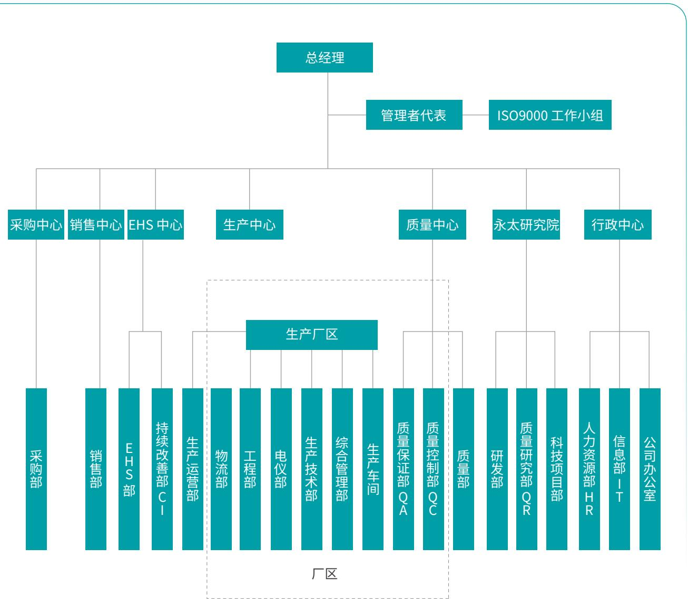

flowchart

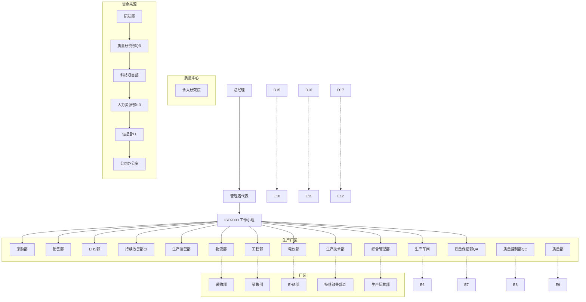
```mermaid
graph TD
  A["总经理"] --> B["管理者代表"]
  B --> C["ISO9000 工作小组"]
  
  subgraph Production [生产厂区]
    direction TB
    D1["采购部"]
    D2["销售部"]
    D3["EHS部"]
    D4["持续改善部CI"]
    D5["生产运营部"]
    D6["物流部"]
    D7["工程部"]
    D8["电仪部"]
    D9["生产技术部"]
    D10["综合管理部"]
    D11["生产车间"]
    D12["质量保证部QA"]
    D13["质量控制部QC"]
    D14["质量部"]
  end
  
  subgraph Quality [质量中心]
    direction TB
    Q1["永太研究院"]
  end
  
  C --> D1
  C --> D2
  C --> D3
  C --> D4
  C --> D5
  C --> D6
  C --> D7
  C --> D8
  C --> D9
  C --> D10
  C --> D11
  C --> D12
  
  subgraph Industry [厂区]
    direction TB
    E1["采购部"]
    E2["销售部"]
    E3["EHS部"]
    E4["持续改善部CI"]
    E5["生产运营部"]
  end
  
  D6 -.-> E1
  D7 -.-> E2
  D8 -.-> E3
  D9 -.-> E4
  D10 -.-> E5
  D11 -.-> E6
  D12 -.-> E7
  D13 -.-> E8
  D14 -.-> E9
  D15 -.-> E10
  D16 -.-> E11
  D17 -.-> E12
  
  subgraph Finance [资金来源]
    direction TB
    F1["研发部"]
    F2["质量研究部QR"]
    F3["科技项目部"]
    F4["人力资源部HR"]
    F5["信息部IT"]
    F6["公司办公室"]
  end
  
  F1 --> F2
  F2 --> F3
  F3 --> F4
  F4 --> F5
  F5 --> F6
```

质量管理体系组织架构图

## 质量体系管理认证

永太科技积极推进质量管理体系认证工作，通过实施严格的质量控制流程，确保产品满足客户期望与国际标准。报告期内公司及部分子公司已通过ISO9001质量管理体系认证，子公司永太高新、永太新能源已通过IATF16949:2016质量管理体系认证。同时，公司积极应对FDA药品生产质量管理规范检查，并依据《现场检查报告》（EIR）持续完善内部质量控制体系。

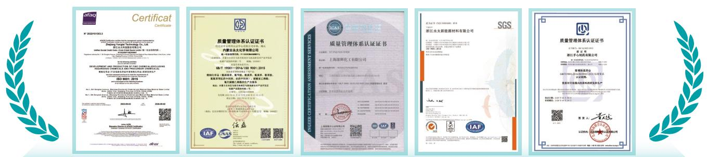

text_image

Certificat
Certificate
QF
质量管理体系认证证书
经北京市工商行政管理局注册，南汇
西安永太化学有限公司
QF/T 1901-2016/1920 9001:2015
上海新科化工有限公司
IGAS 质量管理体系认证证书
上海新科化工有限公司
SGS
质量管理体系认证证书
浙江永太新能源材料有限公司
SGS
质量管理体系认证证书
浙江永太新材料有限公司
SGS
质量管理体系认证证书
浙江永太新材料有限公司
SGS
质量管理体系认证证书
浙江永太新材料有限公司
SGS

ISO9001质量管理体系认证

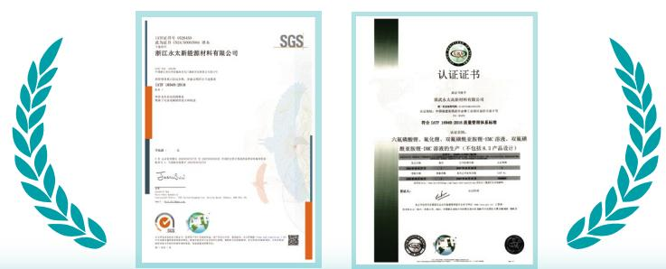

text_image

认证证书
浙江永太新能源材料有限公司
SGS
认证证书
浙江永太新能源材料有限公司
认证证书
浙江永太新能源材料有限公司
认证证书
浙江永太新能源材料有限公司
认证证书
浙江永太新能源材料有限公司
认证证书
浙江永太新能源材料有限公司
认证证书
浙江永太新能源材料有限公司
认证证书
浙江永太新能源材料有限公司
认证证书
浙江永太新能源材料有限公司
认证证书
浙江永太新能源材料有限公司
认证证书
浙江永太新能源材料有限公司
认证证书
浙江永太新能源材料有限
认证证书
浙江永太新能源材料有限公司
认证证书
浙江永太新能源材料有限公司
认证证书
浙江永太新能源材料有限公司
认证证书
浙江永太新能源材料有限公司
认证证书
浙江永太新能源材料有限公司
认证证书
浙江永太新能源材料有限公司
认证证书
浙江永太新能源材料有限公司
认证证书
浙江永太新能源材料有限公司
认证证书
浙江永太新能源材料有限公司
认证证书
浙江永太新能源材料股份有限公司
认证证书
浙江永太新能源材料股份有限公司
认证证书
浙江永太新能源材料股份有限公司
认证证书
浙江永太新能源材料股份有限公司
认证证书

IATF16949质量管理体系认证

## 质量文化建设

永太科技持续推进质量文化建设，通过构建内外结合的培训体系，培训内容覆盖产品质量体系、不合格品处理、物料管理等维度，并开展“质量月”活动，致力于提升公司的质量管理水平与实践成效。

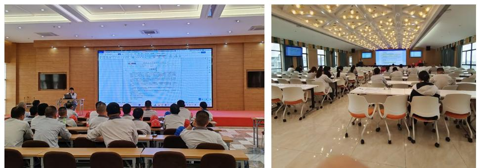  
质量管理培训

## 战略

公司严格遵守产品质量相关法律法规与标准，结合自身经营特点，从潜在影响、风险挑战与发展机遇等多个维度，系统识别并分析影响产品质量的各类因素。公司通过强化全过程质量管控，保障产品稳定达到高标准要求，持续提升公司的市场竞争力与行业影响力。

<table><tr><td>风险类型</td><td>描述</td><td>财务影响说明</td><td>发生可能性</td><td>影响大小</td><td>影响时间范围</td><td>影响价值链环节</td><td>应对措施</td></tr><tr><td>产品质量风险</td><td>产品研发阶段安全设计考虑不周、生产工艺参数偏差或过程管控漏洞,导致产品性能不达标、存在安全隐患,引发投诉或召回事件,增加公司成本,影响公司形象。</td><td>营收减少市场形象受损</td><td>中</td><td>大</td><td>中期</td><td>运营</td><td>1.定期进行GMP系统全面自查活动,确认公司内部质量系统稳定;2.每年进行一次产品质量回顾,及时发现缺陷问题并进行整改;3.通过时间隔断或空间隔断的方法来避免交叉污染,确保产品质量;4.严格执行产品放行标准,对相关岗位人员开展培训,确保产品检验合格。</td></tr><tr><td>供应链传导风险</td><td>上游供应商原材料质量不稳定、生产环境不达标或质量管控能力不足,导致缺陷原材料流入生产环节,影响最终产品质量安全。</td><td>成本增加</td><td>中</td><td>大</td><td>中期</td><td>上游运营</td><td>1.根据原辅料入库流程进行检验,确保原辅料质量达标;2.进行供应商资质审查,对关键原辅料进行小试。</td></tr></table>

<table><tr><td>机遇类型</td><td>描述</td><td>财务影响说明</td><td>发生可能性</td><td>影响大小</td><td>影响时间范围</td><td>影响价值链环节</td><td>应对措施</td></tr><tr><td>高品质产品机遇</td><td>消费市场对产品安全与质量的关注度持续提升,优质合规产品可形成差异化竞争优势,获得市场溢价并提升客户忠诚度。</td><td>利润增加市场份额增大</td><td>中</td><td>大</td><td>中期</td><td>运营下游</td><td>1.持续优化产品质量管理,完善产品全生命周期各环节管理;2.通过内外部审核,多渠道促进产品质量管理优化。</td></tr></table>

## 风险、机遇与影响管理

为有效管理产品质量风险并把握发展机遇，公司制定《质量风险管理规程》《风险与机遇管理程序》《产品共线风险评估管理规程》等制度，建立风险评估标准与管理程序，持续对产品质量影响因素进行识别、评估与更新。

此外，公司每年通过跨部门会议、客户反馈、市场与法规分析等方式，系统识别产品相关的风险与机遇，形成《风险和机遇识别评估分析表》，并实施全面的GMP系统自查、产品质量回顾，对发现的缺陷制定CAPA计划进行整改，从而降低产品质量风险。

## 质量风险管理程序

风险识别

每年通过内部审核，识别生产、物料和质量等系统的潜在缺陷。例如，检查生产及其他记录和客户反馈，发现物料不合格或工艺偏差等问题。

风险评估

采用风险矩阵法，结合发生概率(如高、中、低)和影响程度(如对产品质量影响)，将风险划分为不同等级。同时通过采用SWOT分析法，评估公司在内外部环境中的优势、劣势、机会和威胁

风险控制

## 针对不同风险等级采取差异化策略

预防性控制：对高风险，实施源头控制如优化设计或加强原料质量控制措施。  
应急响应计划：制定预案应对突发风险，如召回流程。  
持续改进文化：通过培训提升员工风险意识，强化人员质量意识。

风险回顾

每年末对质量风险评估进行回顾，包括对其纠正、预防或持续改进措施。若风险不能进一步缓解且超出可接受水平，则启动风险升级处置流程。

## 指标与目标

为持续提升产品质量，公司及各子公司制定年度质量目标并分解至每月，积极落实责任机制，不断强化质量管理，持续为客户提供优质、稳定的产品和服务。

  
质量目标

  
2025年达成情况

<table><tr><td>实施并持续改进ISO9001:2015质量管理体系和GMP体系</td><td>达成</td></tr><tr><td>产品合格率100%</td><td>达成</td></tr><tr><td>产品内控率≥99%</td><td>达成</td></tr><tr><td>中间体和产品单批(半成品)一次合格率≥99%</td><td>达成</td></tr><tr><td>原辅料进厂合格率≥99%</td><td>达成</td></tr><tr><td>产品市场抽检合格率100%</td><td>达成</td></tr><tr><td>质量原因的投诉≤6次</td><td>达成</td></tr><tr><td>质量原因的退货≤6次</td><td>达成</td></tr><tr><td>顾客调查满意率≥99%</td><td>达成</td></tr><tr><td>客户质量审计通过率100%</td><td>达成</td></tr></table>

注：以上质量目标为永太科技总部目标。

## 管理举措

## 产品质量全生命周期管理

永太科技建立贯穿产品全生命周期的质量管理体系，制定《检品检验标准管理程序》《原辅料验收、贮存、发放和退库标准管理规程》《中间体验收、贮存、发放和退库标准管理规程》《成品验收、贮存和发放标准管理程序》等程序规范，对原辅料中间体至成品的全流程进行严格管控，并配备先进检测分析设备和专业人才队伍，为产品质量管理提供全方位支持

## 质量控制流程

## 原料入厂

供应商评估：建立严格的供应商审核体系，定期评估资质与质量汇总，确保原材料符合标准。  
批次检验：对每批原料实施抽样检测，隔离不合格品，防止流入生产环节。

## 生产过程

工艺控制：识别关键控制点和工艺参数，减少工艺偏差，确保产品一致性。  
员工培训：加强操作规范 培训，提升异常处理能力 降低人为失误风险。  
预防性维护：制定设备维护计划，减少突发故障保障生产连续性。

## 成品放行

成品检验：实施成品检测和放行审核，确保出厂质量达标。  
追溯机制：建立产品批次追溯，快速定位问题源头。

## 售后跟进

收集市场反馈，识别质量问题，推动工艺优化和程序改进。

## 不合格品管理

公司制定《不合格品处理标准管理程序》，由OA部门主导不合格品的判定、处理及结果跟踪。公司对检验不合格的原辅料包装贴签材料、中间体、成品等实施隔离并开展调查分析，根据缺陷等级采取退货、返工或销毁等处置措施。处理完成后进行追踪检验，并将相关信息汇总至《不合格物料台账》，定期回顾，持续降低不合格率，保障产品质量稳定可控。

## 产品召回

为规范产品召回程序，确保存在安全隐患的产品如期召回，公司制定《产品召回标准管理程序》等制度，针对不同召回等级明确相应的时限要求，并对召回产品开展调查评估，依据问题根源制定纠正预防措施；子公司佛山手心制定《药品追溯管理规程》，对包装材料的追溯标识进行规范管理，确保公众能够对公司药品进行有效追溯。

公司每两年组织一次召回模拟演练，确保在产品出现质量风险时能够快速响应，同时提升应急处置与跨部门协作能力，明确职责分工，降低召回过程对客户及企业声誉的影响。2025年，公司已开展一次模拟召回，模拟召回过程全部按预定计划进行：报告期内，公司未发生产品召回事件。

## 产品安全与消费者健康

为确保产品符合相关国家标准及客户要求，公司建立完善的出厂检验标准程序，并制定《有害物质管理制度》《药品质量安全赔偿管理规程》等制度。公司定期委托第三方检测机构对产品开展RoHS、REACH、卤素等项目检测，保障产品在化学物质限制方面的合规性与安全性：同时要求关键物料供应商提供MSDS，为原材料安全追溯提供依据。

公司持续健全产品标识体系，通过产品合格证、厂内货物标签、客户标签、安全标签及RoHS标签等，清晰、准确地传达产品信息与安全警示内容。

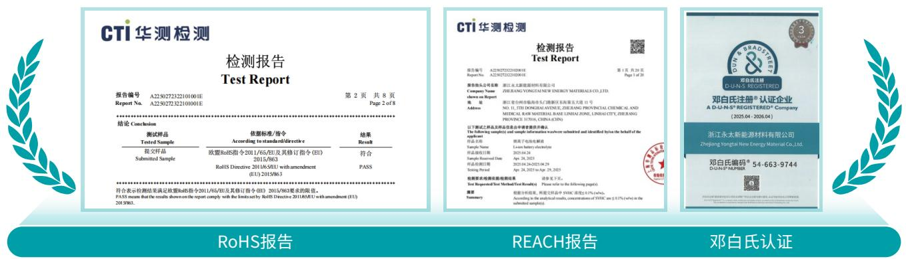

text_image

CTI 华测检测
检测报告
Test Report
报告编号 A22S027232210101E
Report No. A22S0272322101001E
第 2 页 共 8 页
Page 2 of 8
结论 Conclusion
测试样品
Tested Sample
提交样品
Submitted Sample
欧盟RoHS指令2011/65/EU及其修订指令(EU)
2015/963
RoHS Directive 2011/65/EU with amendment
(EU) 2015/963
结果
Result
符合
PASS
符合表示检测结果满足欧盟RoHS指令2011/65/EU及其修订指令(EU) 2015/963要求的限值。
PASS resume But the result shown on the report comply with the limits by RoHS Directive 2011/65/EU with amendment (EU)
PASS
本次认证
DNB认证
DUN'S REGISTERED
邓白氏注册认证企业
A D-U-N® REGISTERED® Company
(2025.04 - 2026.04)
浙江永太新能源材料有限公司
Zhejiang Yongtai New Energy Material Co.,Ltd.
邓白氏编码® 54-663-9744
DUN'S NUMBER
REACH报告
Test Reported/Test Method/Test Result(s) Please refer to the following page(s):
摘要
Summary
根据分项结果，所有文件中 WHC 可以 0.1% (w/w).
According to the analytical results, concentrations of WHC are ≤ 0.1% (w/w) in the
submitted samples.

## 客户权益保障

## 客户服务体系

公司制定《售前售中售后制度》，实现营销全流程的标准化覆盖，确保在各环节精准识别客户需求，提供专业的解决方案与技术支撑。同时，公司利用CRM系统整合客户数据，进一步深化需求洞察，为客户提供个性化服务，通过规范化的服务流程管理，不断强化服务团队的专业水平与整体服务质量

此外，公司建立分级响应的问题处理机制，设立24小时服务热线，依据紧急程度分级响应，以持续提升服务专业性与客户满意度。

## 客户服务培训

公司秉持以客户为中心的理念，制定《客户服务培训制度》，对营销及现场服务人员开展专业知识、沟通技巧、投诉处理等方面的系统培训，持续提升其服务意识与问题解决能力。

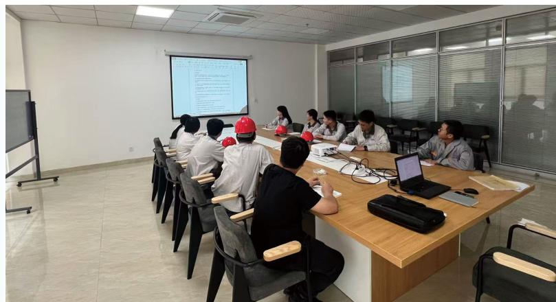

text_image

Meeting room photo with participants in work uniforms and a presentation screen displaying technical documents on the screen

## 客户投诉管理

公司制定《质量投诉处理标准管理程序》，明确OA、销售部等各部门职责。针对投诉事件，严格执行记录归档、调查分析等流程，评估其对产品质量的影响，并采取相应的处理措施及纠正预防措施，确保质量投诉得到及时、有效解决

## 客户满意度调查

为及时了解客户诉求与意见反馈，公司制定《客户满意度制度》《顾客服务与反馈管理程序》等制度，定期通过走访调查，传真电话及邮件向客户发放《客户满意度调查表》，从产品质量，交货期、包装与标识，服务响应等维度开展调查。公司将客户意见及时反馈至生产端与服务端，根据调查结果制定改善措施，并结合数字化工具实现个性化服务，持续提升客户满意度。报告期内，公司客户满意度为95.82分。

## 客户隐私保障

公司严格遵守《中华人民共和国个人信息保护法》《中华人民共和国数据安全法》等相关法律法规，制定《客户隐私保护制度》建立健全客户隐私保护管理体系，并将客户隐私保护工作纳入各部门及员工绩效考核体系，有效保障客户信息安全与合法权益。此外，公司通过防火墙、入侵检测、数据加密、病毒防护等技术与管理措施，持续防范信息泄露、篡改和丢失等风险。

子公司内蒙古永太制定《客户隐私泄露应急响应预案》，设立客户隐私保护领导小组，定期组织演练，保障客户信息与隐私安全。

报告期内，公司未发生内部和客户信息泄露事件及相关纠纷和诉讼。

## 负责任营销

公司始终将负责任营销作为核心经营准则，制定《责任营销制度与举措》，构建覆盖“内容起草、部门初审、法务合规复核授权终审”的全流程多层审查机制，对所有对外宣传物料的技术参数、产品性能及市场表述进行严格把关。

同时，公司定期结合《中华人民共和国广告法》《中华人民共和国反不正当竞争法》等法规及行业典型案例开展专题培训持续提升全员法律风险辨识与防范能力。通过落实相关举措，确保所有商业传播的真实、准确与合规，从根本上杜绝任何形式的虚假或误导性宣传，致力于维护公平的市场环境并保护消费者权益。

## 数智化转型

## 工业互联网平台建设

公司持续推进数字化转型，构建以数据为核心、全价值链协同的工业互联网平台。业务端通过部署ERP、SRM、CRM、OA等数字化系统，打通客户、供应商、财务与人力资源等关键环节，实现供应链、进销存及业财一体化管理。在生产端通过部署MES、DCS、SCADA、云渡平台等系统，实现生产全流程的可视化与可追溯。

基于各平台协同，公司打造营销、供应链、制造三大数据中心，支撑产品全生命周期协同，产业链设备全流程管理和生产过程的智能化管理，助力工业4.0建设。子公司永太新能源凭借其建设成果获评为“省级智能工厂”“省级工业互联网平台”。

natural_image

Illustration of a laptop with cloud and lightbulb icons, symbolizing digital connectivity (no text or symbols present)

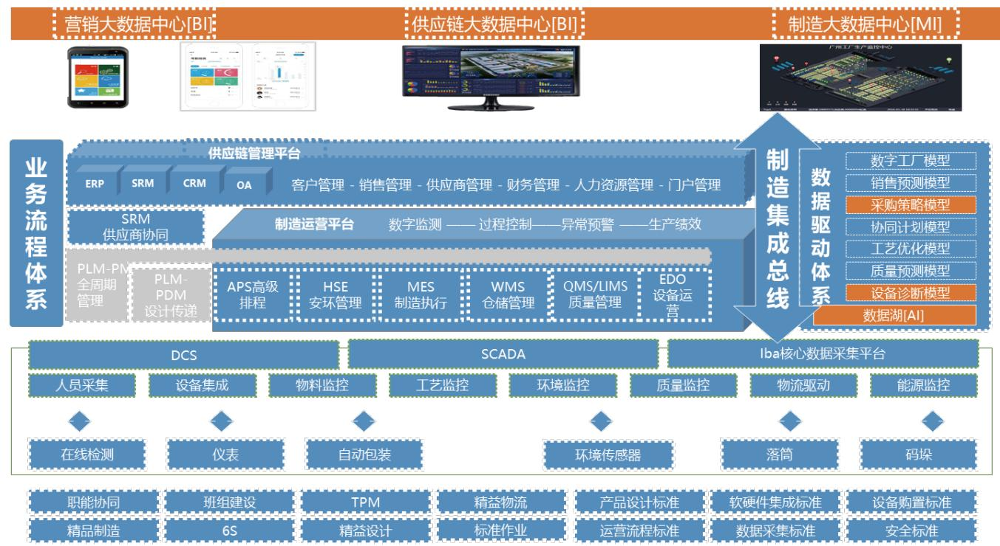

flowchart

```mermaid
graph TD
  subgraph DataProcessingSystem["业务流程体系"]
    direction TB
  A["&quot;营销大数据中心[BI"]"] --> B["&quot;供应链大数据中心[BI"]"]
  C["&quot;制造大数据中心[MI"]"] --> D["制造集成总线"]
  E["数据驱动体系"] --> F["制造集成总线"]
  end

  subgraph DataProcessingPlatform["DCS"]
  G["人员采集"] --> H["设备集成"]
  I["物料监控"] --> J["工艺监控"]
  K["环境监控"] --> L["质量监控"]
  M["物流驱动"] --> N["能源监控"]
  end

  subgraph DataProcessingPlatform["SCADA"]
  O["在线检测"] --> P["仪表"]
  Q["自动包装"] --> R["环境传感器"]
  S["落筒"] --> T["码垛"]
  end

  subgraph DataProcessingPlatform["IbaCoreDataAcqulationPlatform"]
  U["职能协同"] --> V["班组建设"]
  W["精品制造"] --> X["6S"]
  Y["TPM"] --> Z["精益物流"]
  AA["标准作业"] --> AB["产品设计标准"]
  AC["运营流程标准"] --> AD["软硬件集成标准"]
  AE["数据采集标准"] --> AF["安全标准"]
  end

  A -.->|"ERP\nCRM\nOA"| B
  B -.->|"SRM\n供应商协同"| C
  C -.->|"PLM-PM\n全周期管理\nPLM-PDM设计传递"| D
  D -.->|"数字工厂模型"| E
  D -.->|"销售预测模型"| F
  D -.->|"采购策略模型"| G
  D -.->|"协同计划模型"| H
  D -.->|"工艺优化模型"| I
  D -.->|"质量预测模型"| J
  D -.->|"设备诊断模型"| K
  D -.->|"数据湖["AI"]"| L
```

## AI创新应用

永太科技通过引入前沿技术构建集成自动化检测HPLC、AI计算平台及电子化研发管理系统的智能化研发平台。公司已将A技术全面融入药物研发全周期，涵盖从文献检索、项目评估到工艺开发、质量控制等多个关键环节，有效赋能工艺开发与优化，提升了研发效率与成果转化能力。为技术成果的产业化落地提供了坚实支撑

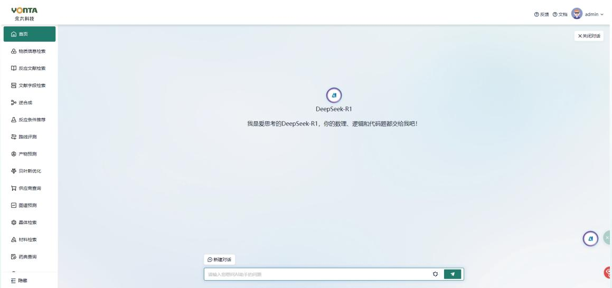

text_image

VONTA
紫瓦科技
首页
物质信息检索
反应文献检索
文献字段检索
进合成
反应条件推荐
路线评测
产物预测
贝叶斯优化
供应商查询
图谱预测
晶体检索
材料检索
药典查询
隐藏
DeepSeek-R1
我是爱思考的DeepSeek-R1，你的数理、逻辑和代码题都交给我吧！
新建对话
请输入您想吗AI助手的问题

AI计算平台

##

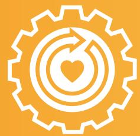

## 同心共济践公益初心

## 我们的行动

员工权益保障 员工民主建设 促进员工发展  
安全生产与职业健康管理 行动回馈社会

## SDGs

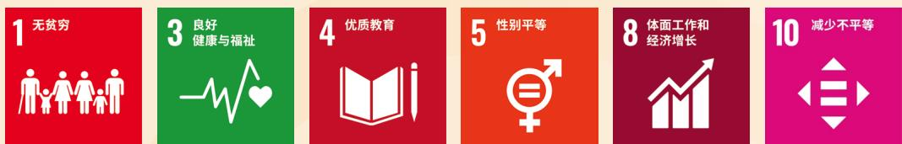

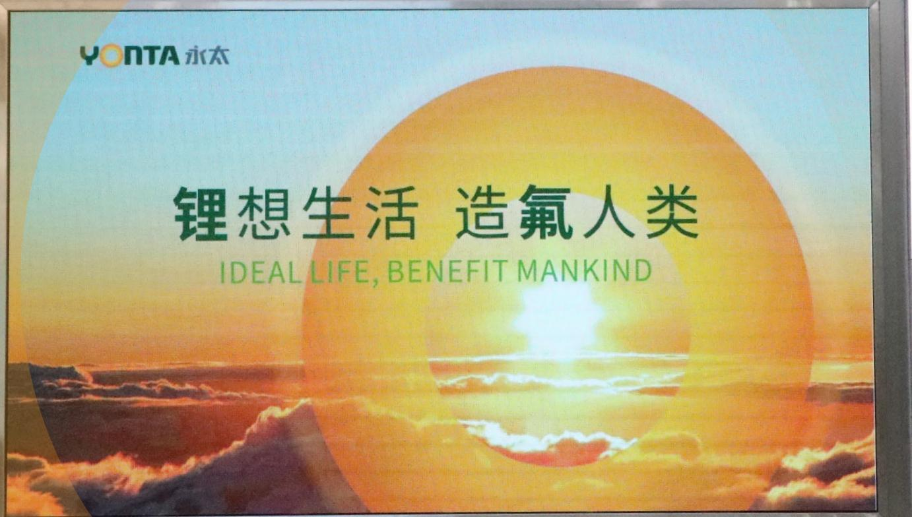

text_image

YONTA 永太
锂想生活 造氟人类
IDEAL LIFE, BENEFIT MANKIND

## 员工权益保障

## 多元平等雇佣

## 人才管理理念

公司严格遵循国家相关法律法规，坚持“以人为本”，将员工人权保障、合法权益维护作为人才管理的基石，实现合规雇佣与员工发展的双向共赢。公司依法与员工签订书面劳动合同，明确双方核心权利义务；建立员工档案管理规范，确保雇佣流程全环节合法合规，杜绝劳务纠纷风险，从源头规避劳务纠纷风险。

## 关键绩效

2025年

员工总人数

3,437人

残疾员工人数

14

少数民族员工数

116

退伍军人员工数

18

劳务派遣人员

31人

## 人才招聘管理

永大科技重视人才招聘与选任工作，严格遵守《中华人民共和国劳动法》《中华人民共和国劳动合同法》等法律法规，制定《人事聘用标准管理程序》《人事管理制度》等制度，以公平、公正、公开、平等就业、实绩考核和择优录取的原则规范招聘流程实现人事管理规范化、制度化和统一化，提升员工责任感、归属感。公司在职员招聘与任用上倡导举贤避亲、亲属或好友回避的原则为人才营造公平竞争环境。对已存在的亲属关系员工，公司会进行岗位调整，避免业务关联。

公司建立严格的招聘标准与规范化录用流程，构建起内部介绍、网络招聘、现场招聘、校园招聘、猎头招聘相结合的多元化招聘渠道。人力资源部紧密围绕公司业务发展战略，构建“岗位差异化+渠道精准化”招聘休系：针对生产类岗位采用“内部推荐+现场招聘+网络招聘+政府协同招聘”四维并行模式，高效保障基础人力需求：针对研发、质量、行政等核心及职能类岗位，整合人才网络平台、高端现场招聘会、内部推荐、第三方猎头，实现精准寻源与优中选优，全面适配各阶段人力配置目标。

报告期内，公司新进员工655人；员工劳动合同签订率100%。

## 多元、平等和包容

## 平等和多元化

永太科技保障全体员工在尊重、包容的职场环境中开展工作，公司对任何形式的歧视与骚扰行为秉持“零容忍”原则，维护员工合法权益与人格尊严。

公司秉持平等多元的招聘和用人理念，制定并实施《劳工人权保障标准管理程序》《童工、未成年工和女工保护管理程序》等制度，明确禁止基于种族、社会阶级、国籍、宗教、残疾、性别、工会会员资格及政治关联等维度的各类歧视行为，保障员工的信仰自由与选举权，杜绝一切强迫性、威胁性、侮辱性、剥削性言行，为员工构建安全、平等的职场环境。

公司通过明确制度与实操措施，坚决杜绝童工使用、强迫劳动及人口贩卖相关行为，坚守劳动用工底线。招聘环节严格核查应聘者身份证明文件，通过多维度验证确认年龄信息，杜绝因虚假信息导致的童工误招情况：定期排查用工情况，确保无童工聘用行为。

报告期内，公司发生劳工歧视事件0件；童工误用事件0件；强迫劳动、骚扰事件0件。

## 女性权益保护

公司聚焦女性员工职场权益与身心健康，依据《劳工人权保障标准管理程序》全面落实女职工特殊保护政策，明确禁止安排女职工从事第四级休力劳动及经期孕期，哺乳期禁忌岗位，并保障怀孕7个月以上女职工免于延长工时与夜班劳动公司通过制度规范与专项举措，保障女性员工在劳动用工、健康关爱等方面的合法权益，营造性别平等的职场氛围

此外，工会联合临海市妇幼保健院开展“两癌”筛查专项活动，为女职工提供宫颈癌、乳腺癌专业检查，全方位守护女性健康

## 关键指标

管理人员中女性人数

89人

享受育儿假员工数

31

有权享受育儿假的员工总数

33人

享受育儿假员工返岗率

100

## 员工薪酬福利

## 薪酬体系

公司制定《薪酬管理制度》《内外部沟通管理》等制度，为持续、快速、健康发展提供机制保障。薪酬管理坚持战略导向外部竞争性、内部公平性、激励与约束、薪酬保密原则，全面支持人才激励与组织效能提升

公司采用包薪制薪酬结构，员工薪酬由基本工资、绩效工资、加班工资、奖金及各类补贴等单元构成。根据岗位属性与人员特点，合理设定各单元比例，充分发挥不同薪酬单元的激励作用，有效调动不同岗位员工的工作积极性。

薪酬调整遵循动态适配机制，结合国家政策、物价水平等宏观因素，以及行业竞争态势、地区薪酬水平与公司经营效益统筹实施薪酬水平与薪酬结构双向调整。调整幅度由总经理根据公司实际经营情况核定，确保薪酬体系的科学性、公平性与市场竞争力。

##

公司制定《员工绩效考核标准管理程序》《个人绩效管理制度》等制度，搭建全员绩效考核体系，以支持员工职业发展、驱动组织效能提升。公司建立涵盖公司、部门和员工的三级考核管理机制，并针对全体员工设置月度、季度、半年度及年度多层级考核周期，严格遵循公正、公平、公开原则开展工作绩效评价。绩效考核结果与绩效奖金分配、岗位晋升、员工培训等紧密挂钩，实现绩效管理与人才发展的有效联动。

员工如对绩效考核结果有异议，可填写《绩效考核申诉表》向人事行政部提出书面申诉。人事行政部负责调查核实，并提交绩效考核小组审定。若申诉情况属实，公司将相应调整绩效结果并及时反馈员工。

## 员工福利

公司严格遵照国家政策要求，为全体员工缴纳社会保险、住房公积金及补充医疗保险，落实岗前、岗中，离职全周期体检福利，岗前体检费入职满一个月可报销，岗中及离职体检费由公司承担。此外，公司为员工提供带薪年假、生日礼金、端午及中秋等节日福利，并依法落实婚假产假及各类法定节假日休假权益。

##

公司社会保险覆盖率96.77

注：公司少部分员工为退休返聘人员，无需缴纳社保。

## 股权激励

为进一步完善公司治理结构，建立长效激励约束机制，吸引和留住核心人员，公司于2024年7月实施限制性股票激励计划激励对象覆盖公司（含子公司）任职的董事、高级管理人员、中层管理人员、核心技术(业务）人员。本次股权激励计划共向302名激励对象授予限制性股票1.164万股。

## 关爱员工生活

## 丰富员工活动

公司重视员工团队凝聚力与向心力建设，围绕传统节日及团队建设需求，定期组织团建旅游、知识竞赛、生日活动等丰富多彩的活动，全方位传递企业人文关怀，营造积极向上的企业文化氛围。

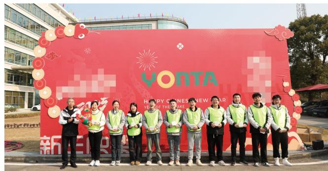

text_image

YONTA
INNOVATION BY NEW YEAR
THE NEW YEAR OF THE YONTA

“喜迎新春•乐聚同行”春节主题大联欢活动

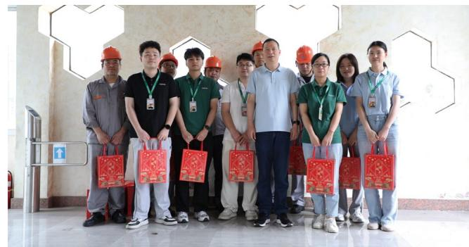

natural_image

Group photo of people in work uniforms and hard hats holding red gift bags indoors (no visible text or symbols)

“粽夏循香•端午安康”端午主题活动

## 困难员工帮扶

为深入落实“温情留临”工作要求，切实做好春节期间留临困难职工的关怀帮扶，公司于2025年组织开展困难职工申报工作。经个人申请、公司审核等程序，确定并向临海市总工会申报符合条件的留临困难职工，相关工作有效帮助职工缓解实际困难，体现公司对员工的切实关心与支持。

## 关注员工心理

公司重视员工心理健康，通过系统化举措为全体员工提供心理支持。为切实保证员工的心理健康关怀，2025年5月浙江手心工会聘请萧山第一人民医院心理学专家开展“情绪与心理压力”专题讲座，通过理论结合案例的形式普及心理健康知识、传授解压调适技巧，引导员工从容应对工作生活压力。

此外，公司特别关注海外派驻员工等群体的心理状态，通过外聘专家、组织主题交流活动等多种形式，持续营造包容、支持的发展环境，促进员工身心健康发展。

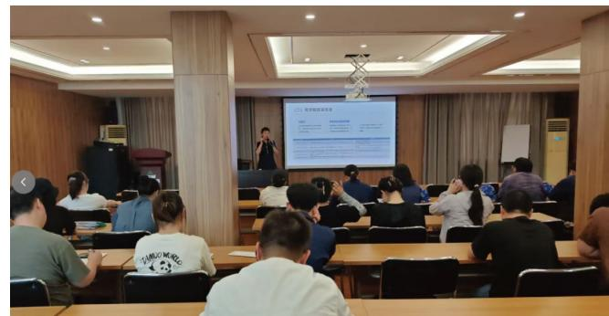

text_image

Classroom scene with attendees facing a presenter; screen displays Chinese text about 'WIKUAN' and related content.

## 员工民主建设

## 民主管理

公司建立完善的企业民主管理机制，通过集体协商、职工代表大会等形式，拓宽员工参与公司治理的渠道，强化双向沟通。2025年7月，公司成功召开第七届一次职工代表大会，以无记名投票方式选举产生新一届工会委员会、经费审查委员会与女职工委员会，保障员工民主权利

公司推行集体协商制度，与职工方代表签订《集体合同》《劳动安全卫生专项集体合同》《能级工资集体协议》及《女职工权益保护专项集体合同》等文件，全面保障员工合法权益。同时，公司重大决策及制度颁发均通过职代会、民主协商会、意见征集等方式，让员工参与决策，切实提升员工归属感与参与感。

## 多元化沟通

公司通过职代会、民主协商会、例会、班组会、座谈会等多种制度化渠道，搭建员工参与决策、制度共建与管理改进的平台。工会定期组织部门级与公司级会议，集中收集并推动解决管理相关意见。同时，公司设置总经理信箱、意见箱、匿名举报及邮件申诉等多元反馈途径，保障信息沟通畅通，并建立沟通反馈与落实机制，确保员工诉求得到有效响应。

## 员工满意度

为提高员工满章度和员工忠诚度，公司制定并实施《员工满章管理制度》，系统开展员工满意度调查与分析改进工作，明确要求每年至少开展一次员工满意度问卷调查，围绕岗位适配、福利保障，工作环境，后勤服务等核心维度，倾听员工心声洞悉员工期望。

员工满意度调查工作由人力资源部拟定调查通知与实施流程，经领导审核、批准后正式发出。调查结束后，人力资源部负责对回收的问卷信息进行系统归类、统计分析，形成《员工满意度调查报告》，并跟踪改善措施的落地执行情况。

报告期内，公司共有2,039名员工参与满意度调查，员工满意度为93.21%。

natural_image

Illustration of a person interacting with digital interface elements including charts and gear symbols (no text or labels)

## 促进员工发展

## 员工培训

## 员工培训体系

公司重视人才培养体系建设，制定《培训管理制度》等制度，构建“制度保障+平台支撑+多元培养”的员工培训体系，开设岗前在岗、特殊工种、岗位调换等多类型培训形式，精准匹配不同岗位、不同阶段员工的成长需求，持续提升员工职业能力与综合素质。

公司建立规范化培训需求电报机制，要求各部门结合业务发展需要，多渠道收集行业最新动态，重点围绕生产经营相关法规ISO管理体系、ICH及GMP等专业领域开展需求调研。各部门充分调研后填写《年度培训需求调查表》提交人力资源部，由人力资源部对申报内容进行专业审核，统筹安排培训计划，确保培训工作与公司发展战略契合。

##

## 高层管理者

根据企业经营策略确定公司高层的技能必备要求，由厂部领导和人力资源部分析及确定相应的培训需求。

## 中层管理者

根据企业为其制定的发展规划和绩效考评的结果，由厂部领导和人力资源部分析和确定下一步培训发展需求方向。

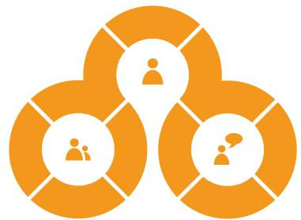

flowchart

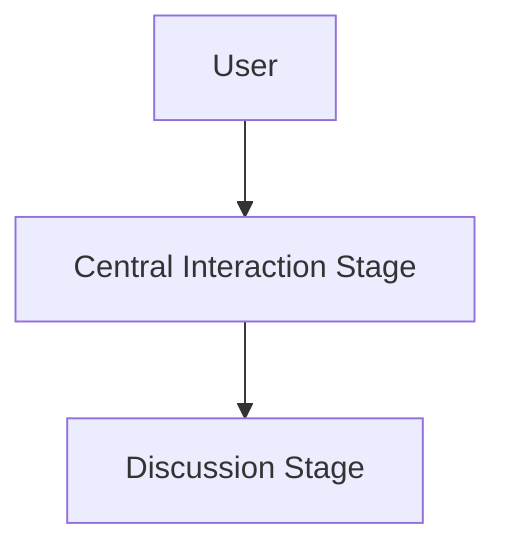
```mermaid
graph TD
  A["User"] --> B["Central Interaction Stage"]
  B --> C["Discussion Stage"]
```

## 基层管理者和普通员工

由中层管理者根据员工的绩效考评分析和确定培训需求，同样，员工也可以自己提出培训需求，得到上级领导及人力资源部认可。

## 培训平台建设

公司打造“永太学堂”，聘请专业培训师，围绕专业技术、业务知识等内容开发培训课程，为员工提供系统化、便捷化的学习渠道。

子公司上海浓辉搭建集课程学习、知识库等功能于一体的“专有学习域”数字化平台，为员工提供7×24小时个性化学习体验：建立正式“导师制”培养项目，促进内部经验传承与技能传递，同时为关键人才配备外部专业教练，提供深度专项辅导。公司每年按薪酬总额的一定比例划拨培训专项经费，并承诺员工年均培训时长不低于72小时

## 员工培训项目

公司系统开展涵盖专业技能、安全生产、环境保护、职业健康、质量管理等多元化培训项目，并配套实施新员工入职培训及团队拓展训练，通过全方位的人才培养机制持续提升员工综合素质与专业能力，不断增强企业核心竞争力，推动公司快速发展。

## 培训内容

## 化学检验员培训

## 气相色谱应用 技能专项培训

## 有机合成工培训

## 培训目的

规范检验操作，提升数据准确性，保障产品质量达标

熟练仪器操作与维护，精准完成样品定性定量分析

掌握合成工艺与安全操作，提升实验及提纯能力

## 培训现场

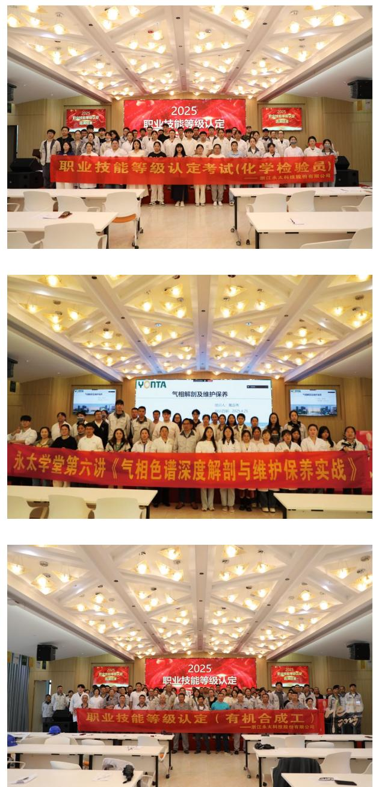

## 员工发展

## 职业发展与晋升

为积极响应国家“人才强国”战略，永太科技制定《晋升管理制度》，打造职业晋升多通道，明确划分本部和子公司在人事任用和干部晋升方面的管理权限，充分调动和发挥本部和子公司的管理功能，做到管理人员任免工作制度化，规范化，逐步建立起人才梯队培养机制

## 员工职业发展路径

## 其他更高职位

总经理

副总经理

总监

副总监

经理

副经理

主管

组长或班长

员工

## 首席科学家

特聘专家

高级工程师

工程师

助理工程师

技术员工

## 高级技师

技师

高级技工

中级技工

初级技工

## 营销副总

营销总监

营销经理

业务经理

业务员

业务助理

## 行政管理序列

##

## 技工序列

## 营销序列

## 内部转岗

公司建立规范的员工调动管理机制，明确本部门内部平级调动，内部越级调动及跨部门调动三种调动形式，各类调动均严格履行审批与备案程序。本部门内部平级调动经部门经理签署意见后生效，同步报人力资源及行政部备案。内部越级调动及跨部门调动鼓励合理有序流动，严禁内部控角，相关人员填写“调动电请单”并完成新岗位培训，按要求履行审批流程必要时经总经理核准。

## 人才激励

公司设置五类奖励形式，精神鼓励与物质鼓励相结合，对有突出贡献的员工予以重点奖励，如授予奖品或者奖金。

公司根据《生产一线员工岗位分类及技能补贴管理制度》，鼓励员工不断提升本岗位技能和学习其他岗位技能，并设立产品研发奖、技术进步奖、优秀个人奖、优秀团队奖，充分调动员工的积极性、创造性和主动性

## 安全生产与职业健康管理

## 治理

## 安全管理体系

永太科技秉持“安全第一、预防为主、综合治理”的管理方针，制定《安全生产责任制》《职业健康管理制度》《安全管理制度》等制度，设立EHS管理委员会，明确总经理为安全生产第一责任人，对公司安全生产工作全面负责；下设首席安全官，统筹协调安全生产与职业病防治管理；各部门严格落实本部门安全生产及职业病防护要求。

为落实各级安全责任，公司建立逐级考核机制，按季度对相关负责人开展安全绩效评估，确保责任落实到位。报告期内公司未发生重大安全事故：与员工、承包商签署《安全生产责任制》的覆盖率达100%

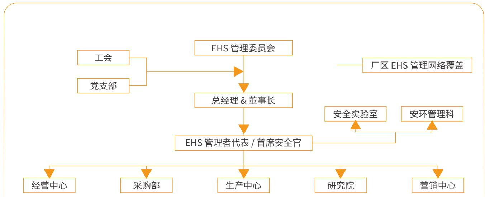

flowchart

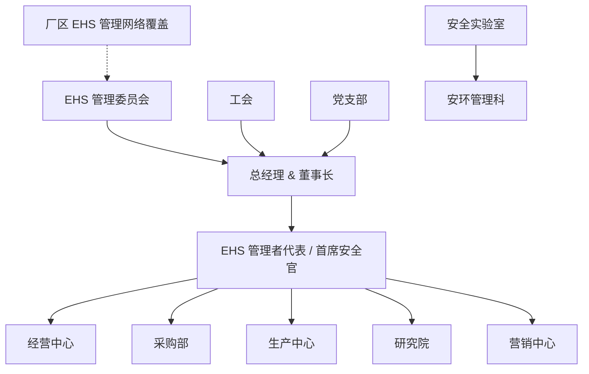
```mermaid
graph TD
  A["EHS 管理委员会"] --> B["总经理 & 董事长"]
  C["工会"] --> B
  D["党支部"] --> B
  E["厂区 EHS 管理网络覆盖"] -.-> A
  B --> F["EHS 管理者代表 / 首席安全官"]
  G["安全实验室"] --> H["安环管理科"]
  F --> I["经营中心"]
  F --> J["采购部"]
  F --> K["生产中心"]
  F --> L["研究院"]
  F --> M["营销中心"]
```

永太科技EHS管理架构

natural_image

Illustration of an industrial power plant with smokestacks and wind turbines in the background (no text or symbols)

报告期内，公司已通过GB/T45001-2020/ISO45001:2018职业健康安全管理体系认证及获得安全生产标准化三级企业证书。

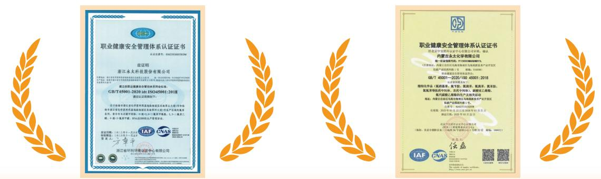

text_image

职业健康安全管理体系认证证书
企业证书号：SIA2315001878794
兹证明
浙江永太科技股份有限公司
GB/T 45001-2020 idf ISO45001-2018
浙江永太科技集团有限公司
浙江省永太科技集团有限公司
浙江省永太科技集团有限公司
浙江省永太科技集团有限公司
浙江省永太科技集团有限公司
浙江省永太科技集团有限公司
浙江省永太科技集团有限公司
浙江省永太科技集团有限公司
浙江省永太科技集团有限公司
浙江省永太科技集团有限公司
浙江省永太科技集团有限公司
浙江省永太科技集团有限公司
浙江省永太科技集团有限公司
浙江省永太科技集团有限公司
浙江省永太科技集团有限公司
浙江省永大科技集团有限公司
浙江省永太科技集团有限公司
浙江省永太科技集团有限公司
浙江省永太科技集团有限公司
浙江省永太科技集团有限公司
浙江省永太科技集团有限公司
浙江省永太科技集团有限公司
浙江省永太科技集团有限公司
浙江省永太科技集团有限公司
浙江省永太科技集团有限公司
浙江省永太科技集团有限公司
浙江省永太科技集团有限公司
浙江省永太科技集团有限公司
浙江省永太科技集团有限公司
浙江省永太科技集团股份有限公司
浙江省永太科技集团股份有限公司
浙江省永太科技集团股份有限公司
浙江省永太科技集团股份有限公司
浙江省永太科技集团股份有限公司
浙江省永太科技集团股份有限公司
浙江省永太科技集团股份有限公司
浙江省永太科技集团股份有限公司
浙江省永太科技集团股份有限公司
浙江省永太科技集团股份有限公司
浙江省永太科技集团股份有限公司
浙江省永太科技集团股份有限公司
浙江省永太科技集团股份有限公司
浙江省永太科技集团股份有限公司
浙江省永太科技集团股份有限公司

永太科技职业健康安全管理体系认证证书  
内蒙古永太职业健康安全管理体系认证证书

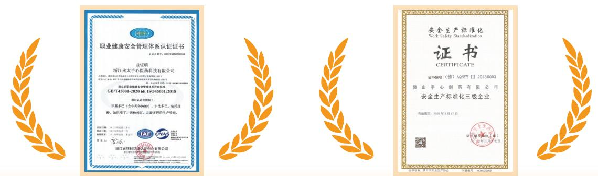

text_image

职业健康安全管理体系认证证书
兹证明
浙江永太手心医药科技有限公司
GB/Ta45001-2020 idt ISO45001:2018
通过认证程序指引：
甲基多巴（含中间体DMG）、卡比多巴、依托度酸、加巴啡丁、西地阿司、反氮多巴的生产资质。
IAP
CNAS
浙江省环保建设集团有限公司
安全生产标准化三级企业
证书
Work Safety Standardization
证书
CERTIFICATE
证书编号：（佛）AQBYY III 20230003
佛山手心制药有限公司
安全生产标准化三级企业
有效期至：2020年3月17日
证书编制：佛山市安全生产协会 编制编号：20202005

永太手心职业健康安全管理体系认证证书  
佛山手心安全生产标准化证书

## 安全意识建设

为提升员工安全生产与职业健康防护意识，公司制定《安全培训教育制度》，规定每年开展职业健康与安全相关培训，培训内容覆盖FHS因素识别、安全绩效考核、劳保用品规范使用、职业病防护用具管理及危险废物标识等，旨在通过持续强化意识与技能，筑牢企业安全生产防线，实现稳健运营。报告期内，公司共开展安全培训170场，参与培训21,577人次，培训总时长120,283.5小时。

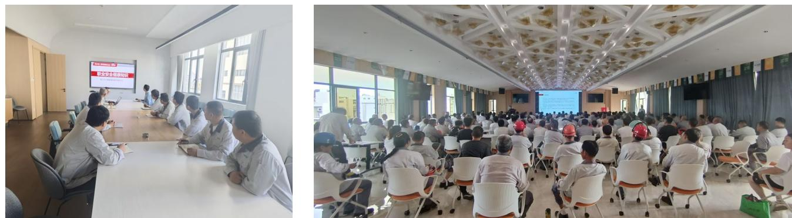

## 战略

永太科技重视员工生命健康，结合法律法规、行业特性及自身生产运营情况，系统地识别公司生产活动中的潜在风险与机遇，通过制定针对性的防控措施降低风险损失，转化机遇价值，切实保障员工健康与公司可持续运营。

<table><tr><td>风险/机遇类型</td><td>风险/机遇描述</td><td>财务影响说明</td><td>发生可能性</td><td>影响大小</td><td>影响时间范围</td><td>影响价值链环节</td><td>应对措施</td></tr><tr><td>法律风险</td><td>公司若对安全生产规定缺乏深刻理解,未能有效实施相关措施,可能会使公司遭受重大罚款、勒令限期整改等处罚,阻碍公司的日常运营。</td><td>营收减少</td><td>中</td><td>中</td><td>中期</td><td>运营</td><td>1.定期组织员工进行职业健康与生产方面的培训;2.组织开展安全生产宣贯活动,开展应急演练,提升员工应急能力。</td></tr><tr><td>声誉风险</td><td>忽视安全生产管理引发重大安全事故,将影响品牌形象,削弱公司的融资吸引力及业务拓展潜力。</td><td>收入减少</td><td>中</td><td>中</td><td>中期</td><td>运营</td><td>1.持续优化职业健康与安全管理体系,严格落实安全生产责任制;2.制定应急预案,定期组织开展应急演练。</td></tr><tr><td>营运风险</td><td>群体性职业健康或重大安全生产事故,可能被监管机构强制企业停产,导致订单违约赔付,同时员工医疗与工伤赔偿将大幅增加公司的运营成本。</td><td>营运成本增加面临罚款</td><td>中</td><td>中</td><td>短期</td><td>运营</td><td>1.加强员工安全教育培训;2.设置公告栏,公布有关职业病防治等相关管理程序;3.进行职业病危害告知,开展职业病健康体检;4.开展职业病危害因素进行检测。</td></tr><tr><td>管理机遇</td><td>优化职业健康安全的财务预算与管理流程,提高运营效率,降低事故发生的风险,从而避免由事故引发的高额财务成本。</td><td>成本降低</td><td>中</td><td>中</td><td>中期</td><td>运营</td><td>依托公司工业互联网平台,提升安全管理效率,保障员工安全。</td></tr></table>

## 风险、机遇与影响管理

为保障职业健康与安全管理体系有效运行，降低风险，公司制定《风险和机遇管理程序》《风险分级管控制度》等制度规范公司每年定期识别职业健康与安全生产方面的潜在风险与机遇，包括法律法规更新、外部环境变化、安全隐患及事故影响等根据识别结果评定风险的严重度与发生频度，计算风险系数并分析其对公司的影响。针对不同类型与等级的风险和机遇公司采取相应的应对措施，有效控制其对生产经营及员工安全的影响

## 隐患排查

为完善隐患排查治理的长效机制，公司制定《安全检查和隐患整改管理制度》，规范隐患排查与整改程序，并由EHS部对整改完成情况进行跟踪验证。公司通过日常检查、综合性检查与专项检查机制，明确各类别检查频率与责任人，推动隐患排查治理工作的常态化开展，切实筑牢公司安全生产防线。报告期内，公司安全生产隐患排查整改率为99.37%。

## 应急管理

公司制定《生产安全事故应急救援预案》《事故管理制度》等制度，明确实行厂长负责制，负责事故应急指挥职责。公司每年制定应急预案演练计划，并按计划组织开展部门级、车间级等多层级的实战演练，以持续强化员工的应急响应能力与风险防范意识，确保在突发情况下能够迅速响应。

##

2025年6月30日，公司编制应急演练方案和应急演练脚本，组织开展关于加氢车间冲料火灾事故应急演练活动，参演人员包括总指挥、指挥部成员、各应急小组人员及邻近车间员工等近60名员工，此次演练有效提升应急队伍的应急处置能力。

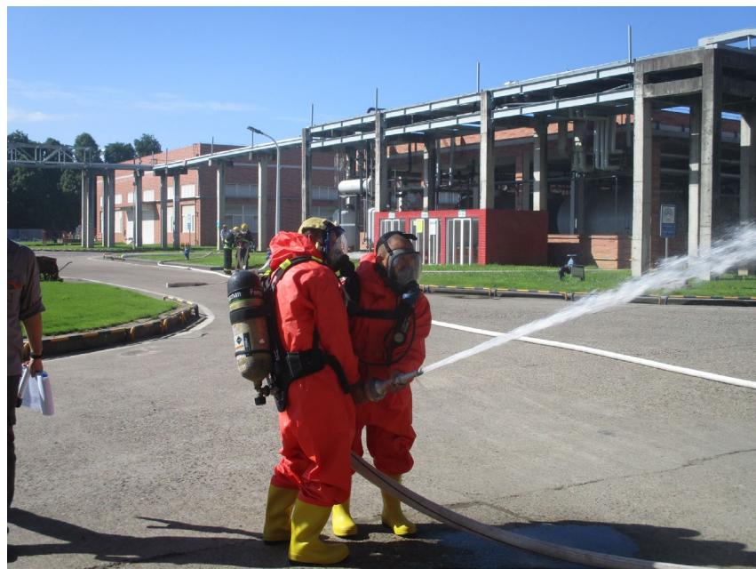

natural_image

Firefighters in red suits and yellow boots standing beside a fire hose on a paved road, with industrial buildings and clear blue sky in the background (no visible text or symbols)

## 指标与目标

永太科技制定《2025年公司EHS目标与指标》，并计划下一年度新增安全管理平台使用率100%目标。

  
2025年EHS目标

  
达成情况

<table><tr><td>职业病发生率0%</td><td>达标</td></tr><tr><td>安全教育培训实施率100%</td><td>达标</td></tr><tr><td>EHS检查实施率100%</td><td>达标</td></tr><tr><td>隐患整改率100%</td><td>达标</td></tr><tr><td>应急演练计划实施率100%</td><td>达标</td></tr><tr><td>职业健康体检率100%</td><td>达标</td></tr><tr><td>职业禁忌症处理率100%</td><td>达标</td></tr></table>

## 安全生产管理举措

## 化学品管理

## 危化品使用安全

为规范化学品管理，保障员工健康与安全，公司制定《危险化学品管理程序》《物资储存管理程序》《危险化学品运输、装卸安全管理制度》等，明确化学品在生产、使用、采购、运输、装卸、储存及报废等环节的管理要求。公司严格落实安全技术措施与个人防护措施，防止化学品泄漏或逸散，并定期对仓库、罐区及化学品使用场所开展安全检查。在化学品储罐区和车间生产环节，公司配置DCS自动化控制系统，通过远程控制进料与出料，最大限度减少现场作业人员暴露风险。

natural_image

Illustration of a computer monitor with gear icons and a wrench, surrounded by recycling symbols (no text or labels)

## 危险化学品使用全生命周期管理流程

## 购买

对供应商进行评估，向有资质单位进行购买：要求供应商提供危险化学品安全技术说明。

## 使用

根据生产需要，规定危险化学品的存放要求和最大使用量操作人员及生产、使用等场所，严格执行相关安全技术措施与个人防护措施。

## 储存

危险化学品储存场所符合法律法规要求，设有安全标识、出入口及消防通道通畅；危险化学品仓库采用隔离储存、隔开储存、分离储存方式进行储存。

## 装卸

装卸人员严格执行《职业卫生管理程序》，正确佩戴劳动防护用具。

## 运输

根据化学品特性，必须使用符合安全要求的运输方式和工具

## 报废

危险化学品的废弃包装、纸袋、容器等危险废物进行统一回收、登记，由专人负责管理含有危险化学物品的废弃容器、设备须清晰干净经验收合格后方可进行报废。

## 化学品信息平台

公司依托双重预防机制信息平台、重大危险源在线监测平台、人员实时定位平台及三废中心在线监测平台，构建集双重预防重点目标监控、特种作业管理、人员定位等功能于一体的安全管理平台体系。通过数字化手段，持续提升化学品管控水平，提升安全管理的智能化水平。

## 承包商安全管理

为确保施工、生产安全，公司修订《承包商管理制度》，明确主管部门对承包商的合法性、安全保障体系、安全业绩及人员资质进行预审。承包商入场前，公司与其签订《安全生产管理协议》，并对其人员开展入场安全培训与现场安全交底。公司每周对承包商施工现场进行安全检查并留存记录，每年开展承包商表现评价，作为是否续签合作的重要依据。

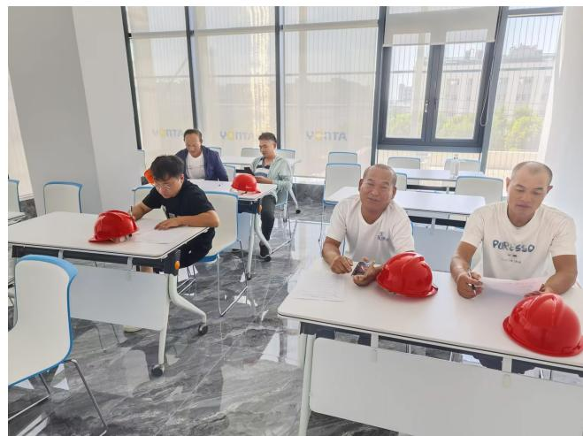

natural_image

Group of men seated at desks with red hard hats in a modern classroom or training room, no visible text or symbols on the main subjects.

承包商培训

## 职业健康保障

为有效预防、控制并消除职业危害，公司制定《职业卫生健康管理程序》《产生噪声岗位职业病卫生操作规程》等制度，明确由EHS部负责职业卫生工作的指导、监督与协调。公司对新员工实施“三级”职业卫生培训，不定期开展职业卫生教育持续提升员工防护意识；同时建立并完善职业卫生档案，为员工健康筑起坚实防线。报告期内，公司员工体检覆盖率为95.11%。

## 措施

## 具体操作

危害告知与警示

员工上岗前、调岗后进行职业病危害及后果、防护措施告知；对作业场所张贴警示标识与职业卫生提示，并明确职业卫生、劳动防护与应急措施

防治宣传教育培训

开展厂级、车间级、班组级职业卫生培训，内容涵盖职业卫生制度、政策方针、职业病应急救援方案与预防措施等，持续增强员工安全防护意识。

配备防护工具

为员工提供工作服、安全帽、安全鞋、防毒面罩等劳动防护用具，并告知正确穿戴与使用方法：建立事故应急预案，配备急救器材与药品，设立洗眼、喷淋或清水池等冲洗设施。

职业健康检查

新上岗员工须经过岗前检查，对于有职业禁忌者进行妥善安排；对于有接触职业危害作业人员，每年安排岗中职业健康体检：离岗后进行离岗职业健康检查：禁止安排孕妇、哺乳期女职工从事职业病危害目录岗位。

职业病危害因素检测

公司每年委托第三方机构对可能产生危害的作业场所进行一次职业病危害因素检测每三年进行一次职业病危害控制效果评价，确保员工安全。

## 行动回馈社会

## 社会公益

公司积极投身社会公益事业，定向捐赠支持临海市教育事业发展，并参与“焕新·家”关爱儿童公益行动，持续为社会弱势群体提供帮助

子公司浙江手心秉持“手牵手、心连心”的公益理念，积极参与社区建设与各类公益项目，每年向南阳街道捐赠30万元，用于帮扶困难个体与群体，以实际行动传递企业温暖。

子公司上海浓辉携手HelmCropSolutions联合开展松江东、西佘山垃圾清理公益活动。双方以“绿色发展、回馈社会”为宗旨，响应国家环保号召，共同守护佘山生态环境，同时通过公益合作加强企业间交流，带动更多社会力量关注景区生态保护报告期内，公司志愿活动时长为16小时。

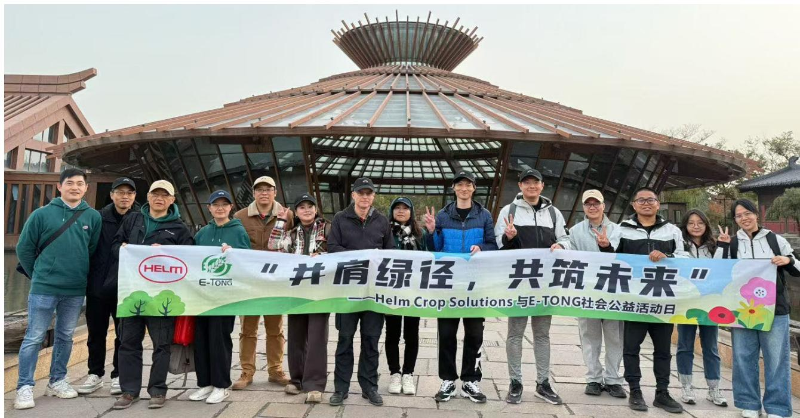

text_image

“井肩绿径，共筑未来”
——Helm Crop Solutions与E-TONG社会公益活动日

## 乡村振兴

公司积极响应国家乡村振兴战略，持续推进消费帮扶工作。公司充分发挥工会组织作用和企业凝聚力，每年多次向定点帮扶地区开展消费帮扶活动

2025年，子公司上海浓辉投入帮扶资金2万元，采购黄小米、哈密瓜等当地农副产品，以实际行动助力帮扶地区产业发展和农户增收，切实履行企业社会责任

## 附录

## 关键绩效表

<table><tr><td colspan="4">公司治理</td></tr><tr><td>议题</td><td>指标</td><td>单位</td><td>2025年</td></tr><tr><td rowspan="3">公司经营绩效</td><td>营业收入</td><td>万元</td><td>521,358.13</td></tr><tr><td>净利润</td><td>万元</td><td>-4,610.06</td></tr><tr><td>纳税总额</td><td>万元</td><td>8,470.69</td></tr><tr><td rowspan="11">公司治理</td><td colspan="3">股东会</td></tr><tr><td>召开总次数</td><td>次</td><td>3</td></tr><tr><td>审议通过议案数量</td><td>项</td><td>15</td></tr><tr><td colspan="3">董事会</td></tr><tr><td>董事会成员人数</td><td>人</td><td>9</td></tr><tr><td>男性董事人数</td><td>人</td><td>5</td></tr><tr><td>女性董事人数</td><td>人</td><td>4</td></tr><tr><td>独立董事人数</td><td>人</td><td>3</td></tr><tr><td>非独立董事人数</td><td>人</td><td>6</td></tr><tr><td>董事会召开次数</td><td>次</td><td>8</td></tr><tr><td>审议通过议案数量</td><td>项</td><td>42</td></tr><tr><td rowspan="3">商业道德</td><td colspan="3">向董事、管理层及员工提供的反商业贿赂及反贪污培训</td></tr><tr><td>参加反商业贿赂及反贪污培训的比例</td><td>%</td><td>100</td></tr><tr><td>参加反商业贿赂及反贪污培训的董事及高级管理层比例</td><td>%</td><td>100</td></tr><tr><td rowspan="7">投关管理</td><td colspan="3">投资者交流</td></tr><tr><td>接待投资者活动次数</td><td>次</td><td>11</td></tr><tr><td>接待投资者现场调研次数</td><td>次</td><td>8</td></tr><tr><td>接待投资者现场调研人次</td><td>人次</td><td>25</td></tr><tr><td>在互动易投资者提问总数</td><td>次</td><td>69</td></tr><tr><td>在互动易投资者回答问题数</td><td>次</td><td>69</td></tr><tr><td>在互动易投资者回复率</td><td>%</td><td>100</td></tr></table>

<table><tr><td>议题</td><td>指标</td><td>单位</td><td>2025年</td></tr><tr><td rowspan="9">投关管理</td><td colspan="3">信息披露</td></tr><tr><td>对外披露公告总数</td><td>份</td><td>145</td></tr><tr><td>其中:定期报告及专项报告数量</td><td>份</td><td>5</td></tr><tr><td>其中:临时公告数量</td><td>份</td><td>140</td></tr><tr><td>因信息披露方面违规而受到处罚次数</td><td>次</td><td>0</td></tr><tr><td colspan="3">数据安全管理</td></tr><tr><td>发生泄露客户信息事件数量</td><td>件</td><td>0</td></tr><tr><td>涉及侵犯客户隐私和丢失客户资料的经证实的投诉</td><td>件</td><td>0</td></tr><tr><td>经确认的泄露、失窃或丢失客户资料的总数</td><td>件</td><td>0</td></tr></table>

<table><tr><td colspan="4">环境管理</td></tr><tr><td>议题</td><td>指标</td><td>单位</td><td>2025年</td></tr><tr><td rowspan="4">应对气候变化</td><td>温室气体排放总量</td><td>吨二氧化碳当量</td><td>278,203.99</td></tr><tr><td>温室气体排放强度</td><td>吨二氧化碳当量/百万元营收</td><td>53.36</td></tr><tr><td>直接温室气体排放量(范围一)</td><td>吨二氧化碳当量</td><td>48,779.82</td></tr><tr><td>间接温室气体排放量(范围二)</td><td>吨二氧化碳当量</td><td>229,424.17</td></tr><tr><td rowspan="2">环境管理</td><td>环保投入总金额</td><td>万元</td><td>9,155.75</td></tr><tr><td>环保事故</td><td>件</td><td>0</td></tr><tr><td rowspan="10">能源管理</td><td>天然气</td><td>万立方米</td><td>2,234.99</td></tr><tr><td>汽油</td><td>吨</td><td>54.67</td></tr><tr><td>柴油</td><td>吨</td><td>73.44</td></tr><tr><td>液化石油气</td><td>吨</td><td>3.40</td></tr><tr><td>外购电力总量</td><td>万千瓦时</td><td>30,891.72</td></tr><tr><td>外购热力总量</td><td>吉焦</td><td>478,222.97</td></tr><tr><td>直接能源消耗总量</td><td>吨标准煤</td><td>28,405.34</td></tr><tr><td>间接能源消耗总量</td><td>吨标准煤</td><td>54,282.89</td></tr><tr><td>能源消耗总量</td><td>吨标准煤</td><td>82,688.23</td></tr><tr><td>能源消耗强度</td><td>吨标准煤/百万元营收</td><td>15.86</td></tr><tr><td>水资源利用</td><td>新鲜水取水总量</td><td>吨</td><td>1,588,999.00</td></tr><tr><td>议题</td><td>指标</td><td>单位</td><td>2025年</td></tr><tr><td rowspan="7">水资源利用</td><td>其中:市政购水量</td><td>吨</td><td>1,587,429.00</td></tr><tr><td>其中:地表水取水量</td><td>吨</td><td>1,570.00</td></tr><tr><td>新鲜水用量</td><td>吨</td><td>1,588,999.00</td></tr><tr><td>雨水</td><td>吨</td><td>36,221.79</td></tr><tr><td>水循环与再利用总量</td><td>吨</td><td>62,664.00</td></tr><tr><td>总耗水量</td><td>吨</td><td>1,687,884.79</td></tr><tr><td>耗水强度</td><td>吨/百万元营收</td><td>323.75</td></tr><tr><td rowspan="22">污染和废弃物</td><td colspan="3">废水排放情况</td></tr><tr><td>废水排放量</td><td>吨</td><td>545,296.51</td></tr><tr><td>废水排放强度</td><td>吨/百万元营收</td><td>104.59</td></tr><tr><td>总磷(以P计)</td><td>吨</td><td>0.23</td></tr><tr><td>化学需氧量(COD)</td><td>吨</td><td>88.86</td></tr><tr><td>悬浮物</td><td>吨</td><td>4.50</td></tr><tr><td>氨氮( $NH_3-N$ )</td><td>吨</td><td>5.17</td></tr><tr><td>五日生化需氧量( $BOD_5$ )</td><td>吨</td><td>17.78</td></tr><tr><td colspan="3">废气排放情况</td></tr><tr><td>氮氧化物( $NO_x$ )</td><td>吨</td><td>14.40</td></tr><tr><td>硫化物( $SO_x$ )</td><td>吨</td><td>1.41</td></tr><tr><td>挥发性有机化合物(VOC)</td><td>吨</td><td>33.91</td></tr><tr><td>颗粒物</td><td>吨</td><td>0.62</td></tr><tr><td colspan="3">废弃物排放情况</td></tr><tr><td>废弃物产生总量</td><td>吨</td><td>23,039.09</td></tr><tr><td>废弃物产生强度</td><td>吨/百万元营收</td><td>4.42</td></tr><tr><td>无害废弃物产生量</td><td>吨</td><td>2,683.01</td></tr><tr><td>无害废弃物产生强度</td><td>吨/百万元营收</td><td>0.51</td></tr><tr><td>有害废弃物产生量</td><td>吨</td><td>20,356.08</td></tr><tr><td>有害废弃物产生强度</td><td>吨/百万元营收</td><td>3.90</td></tr><tr><td>废弃物处置量</td><td>吨</td><td>23,053.70</td></tr><tr><td>废弃物合规处置率</td><td>%</td><td>100</td></tr></table>

<table><tr><td>议题</td><td>指标</td><td>单位</td><td>2025年</td></tr><tr><td rowspan="2">污染和废弃物</td><td>回收再利用废弃物总量</td><td>吨</td><td>6,318.58</td></tr><tr><td>废弃物回收利用率</td><td>%</td><td>27.42</td></tr></table>

<table><tr><td colspan="4">产业价值</td></tr><tr><td>议题</td><td>指标</td><td>单位</td><td>2025年</td></tr><tr><td rowspan="24">研发与创新</td><td>研发投入</td><td>万元</td><td>14,899.18</td></tr><tr><td>研发投入占营业收入比例</td><td>%</td><td>2.86</td></tr><tr><td>新产品开发项目数</td><td>个</td><td>47</td></tr><tr><td colspan="3">研发团队</td></tr><tr><td>研发团队总人数</td><td>人</td><td>506</td></tr><tr><td>研发人员占员工总人数比例</td><td>%</td><td>14.72</td></tr><tr><td colspan="3">按性别划分</td></tr><tr><td>男性</td><td>人</td><td>348</td></tr><tr><td>女性</td><td>人</td><td>158</td></tr><tr><td colspan="3">创新成果</td></tr><tr><td>授权专利累计数(有效期内的专利数)</td><td>项</td><td>285</td></tr><tr><td>专利申请数</td><td>项</td><td>17</td></tr><tr><td colspan="3">按专利类型划分</td></tr><tr><td>授权发明专利累计数</td><td>项</td><td>186</td></tr><tr><td>授权实用新型专利累计数</td><td>项</td><td>95</td></tr><tr><td>授权外观设计专利累计数</td><td>项</td><td>4</td></tr><tr><td>每百万元营收有效专利数</td><td>项/百万元营收</td><td>0.055</td></tr><tr><td colspan="3">其他知识产权</td></tr><tr><td>软件著作累计数</td><td>项</td><td>3</td></tr><tr><td>商标累计数</td><td>项</td><td>161</td></tr><tr><td>每百万营收软件著作数量</td><td>项/百万元营收</td><td>0.00058</td></tr><tr><td>发表论文累计数</td><td>篇</td><td>3</td></tr><tr><td colspan="3">企业创新能力认证</td></tr><tr><td>国家高新技术企业</td><td>个</td><td>3</td></tr><tr><td>议题</td><td>指标</td><td>单位</td><td>2025年</td></tr><tr><td rowspan="2">研发与创新</td><td>国家认定企业技术中心</td><td>个</td><td>1</td></tr><tr><td>专精特新企业</td><td>个</td><td>4</td></tr><tr><td rowspan="11">产品与服务质量</td><td colspan="3">产品质量与安全</td></tr><tr><td>产品合格率</td><td>%</td><td>100</td></tr><tr><td>产品召回数量</td><td>件</td><td>0</td></tr><tr><td colspan="3">客户服务</td></tr><tr><td>客户投诉数量</td><td>次</td><td>26</td></tr><tr><td>客户投诉解决数量</td><td>件</td><td>26</td></tr><tr><td>参与调查的客户数量</td><td>人</td><td>52</td></tr><tr><td> $客户满意度^1$ </td><td>分/100分</td><td>95.82</td></tr><tr><td colspan="3">客户服务考核</td></tr><tr><td>应对客户投诉响应考核次数</td><td>次</td><td>12</td></tr><tr><td>应对客户投诉响应考核通过率</td><td>%</td><td>100</td></tr><tr><td rowspan="13">供应链管理</td><td>供应商总数</td><td>个</td><td>2,511</td></tr><tr><td>国内供应商数量</td><td>个</td><td>2,465</td></tr><tr><td>港澳台及海外供应商数量</td><td>个</td><td>46</td></tr><tr><td colspan="3">供应商审查</td></tr><tr><td>拥有质量管理体系认证的供应商数目</td><td>个</td><td>946</td></tr><tr><td>拥有环境管理体系认证的供应商数目</td><td>个</td><td>798</td></tr><tr><td>拥有职业健康安全管理体系认证的供应商数目</td><td>个</td><td>685</td></tr><tr><td>因不合规被中止合作的供应商数目</td><td>个</td><td>10</td></tr><tr><td>因不合规被否决的潜在供应商数目</td><td>个</td><td>8</td></tr><tr><td colspan="3">供应商风险管理</td></tr><tr><td>供应链环节中具有重大风险与影响的事件数量</td><td>件</td><td>0</td></tr><tr><td>涉及人员数量</td><td>人</td><td>0</td></tr><tr><td>涉及供应商数量</td><td>个</td><td>0</td></tr></table>

注:¹客户满意度依据母公司及各子公司客户满意度得分算术平均值得出。

<table><tr><td colspan="4">人力资源</td></tr><tr><td>议题</td><td>指标</td><td>单位</td><td>2025年</td></tr><tr><td rowspan="28">劳动关系管理</td><td colspan="3">员工招聘与就业</td></tr><tr><td>劳动合同签订率</td><td>%</td><td>100</td></tr><tr><td colspan="3">多元化与机会平等</td></tr><tr><td>劳工歧视事件数</td><td>宗</td><td>0</td></tr><tr><td>童工误用人次</td><td>人次</td><td>0</td></tr><tr><td>强迫劳动、骚扰事件</td><td>件</td><td>0</td></tr><tr><td>员工总人数</td><td>人</td><td>3,437</td></tr><tr><td>少数民族员工数</td><td>人</td><td>116</td></tr><tr><td>残疾人员工数</td><td>人</td><td>14</td></tr><tr><td>退伍军人员工数</td><td>人</td><td>18</td></tr><tr><td>劳务派遣人员</td><td>人</td><td>31</td></tr><tr><td colspan="3">新进员工</td></tr><tr><td>新进员工数</td><td>人</td><td>655</td></tr><tr><td colspan="3">按性别划分的新进员工</td></tr><tr><td>女性</td><td>人</td><td>111</td></tr><tr><td>男性</td><td>人</td><td>544</td></tr><tr><td colspan="3">女性权益保护</td></tr><tr><td>管理人员中女性人数</td><td>人</td><td>89</td></tr><tr><td>有权享受育儿假的员工总数</td><td>人</td><td>33</td></tr><tr><td>享受育儿假员工数</td><td>人</td><td>31</td></tr><tr><td>享受育儿假员工返岗率</td><td>%</td><td>100</td></tr><tr><td colspan="3">福利与薪酬</td></tr><tr><td>社会保险覆盖率</td><td>%</td><td>96.77</td></tr><tr><td>困难员工帮扶人数</td><td>人</td><td>15</td></tr><tr><td>困难员工帮扶金额</td><td>万元</td><td>3.94</td></tr><tr><td colspan="3">员工满意度</td></tr><tr><td> $员工满意度^2$ </td><td>%</td><td>93.21</td></tr><tr><td>参与满意度调查的员工数量</td><td>人</td><td>2,039</td></tr></table>

注:2员工满意度依据母公司及各子公司员工满意度得分算术平均值得出。

<table><tr><td>议题</td><td>指标</td><td>单位</td><td>2025年</td></tr><tr><td rowspan="10">发展与培训</td><td colspan="3">员工培训</td></tr><tr><td>员工培训投入</td><td>万元</td><td>32.81</td></tr><tr><td>员工培训场次</td><td>场次</td><td>1,310</td></tr><tr><td>接受培训总人数</td><td>人</td><td>2,761</td></tr><tr><td>接受培训总人次</td><td>人次</td><td>34,527</td></tr><tr><td colspan="3">员工培训覆盖率</td></tr><tr><td>员工培训覆盖率</td><td>%</td><td>80.33</td></tr><tr><td colspan="3">培训时长</td></tr><tr><td>培训总时长</td><td>小时</td><td>68,612</td></tr><tr><td>每名员工每年接受培训的平均时长</td><td>小时/人</td><td>19.96</td></tr><tr><td rowspan="16">职业健康与安全</td><td colspan="3">安全生产</td></tr><tr><td>安全生产事故数</td><td>起</td><td>10</td></tr><tr><td>隐患排查整改率</td><td>%</td><td>99.37</td></tr><tr><td>安全应急演练次数</td><td>场次</td><td>283</td></tr><tr><td>安全生产投入金额</td><td>万元</td><td>3,037.52</td></tr><tr><td colspan="3">安全培训</td></tr><tr><td>安全培训场次</td><td>场</td><td>170</td></tr><tr><td>参与安全培训人次</td><td>人次</td><td>21,577</td></tr><tr><td>安全培训总时长</td><td>小时</td><td>120,283.5</td></tr><tr><td>人均安全培训时长</td><td>小时/人</td><td>35.00</td></tr><tr><td>安全培训员工覆盖率</td><td>%</td><td>100</td></tr><tr><td colspan="3">职业健康</td></tr><tr><td>工伤保险人员 $覆盖率^3$ </td><td>%</td><td>100</td></tr><tr><td>安全生产责任险人员覆盖率</td><td>%</td><td>100</td></tr><tr><td>员工体检覆盖率</td><td>%</td><td>95.11</td></tr><tr><td>职业病数发生数量</td><td>例</td><td>0</td></tr></table>

注:3工伤保险覆盖范围包含正式员工，退休返聘人员，劳务派遣人员，故工伤保险覆盖率高于社会保险覆盖率。

<table><tr><td>议题</td><td>指标</td><td>单位</td><td>2025年</td></tr><tr><td rowspan="2">社会贡献</td><td>公益慈善投入</td><td>万元</td><td>149.88</td></tr><tr><td>志愿活动时长</td><td>小时</td><td>16</td></tr></table>

## 指标索引

<table><tr><td colspan="2">报告章节</td><td>《全球可持续发展报告标准》(GRI Standards)</td><td>《中国企业可持续发展报告指南(CASS-ESG 6.0)之一般框架》</td><td>《深圳证券交易所上市公司自律监管指引第17号——可持续发展报告(试行)》</td></tr><tr><td colspan="2">关于本报告</td><td>2-1,2-2,2-3</td><td>P1.1-1.2</td><td>/</td></tr><tr><td colspan="2">董事长致辞</td><td>2-22</td><td>P2.1</td><td>/</td></tr><tr><td colspan="2">走进永太科技</td><td>2-6</td><td>P3.1-3.3</td><td>/</td></tr><tr><td>可持续发展治理</td><td>可持续发展治理</td><td>2-9,2-22,2-27,2-29,3-1,3-3</td><td>G1.1.1,G1.1.2,G1.1.5-G1.1.9,G1.3.2</td><td>第二条,第十二条,第五十一条,第五十二条</td></tr><tr><td rowspan="6">合规守正,筑治理防线</td><td>坚持党建引领</td><td>/</td><td>/</td><td>/</td></tr><tr><td>科学规范治理</td><td>2-9,2-10,2-12,2-19</td><td>/</td><td>第十二条</td></tr><tr><td>优化内控合规</td><td>207-1,207-2</td><td>/</td><td>第十二条</td></tr><tr><td>强化投关管理</td><td>2-29</td><td>/</td><td>/</td></tr><tr><td>秉持商业道德</td><td>205-3,206-1</td><td>G2.1.1-2.1.3,G2.2.1-2.2.3</td><td>第五十四条,第五十五条,第五十六条</td></tr><tr><td>维护信息安全</td><td>3-3,418-1</td><td>S3.4.1-S3.4.3</td><td>第四十八条</td></tr><tr><td rowspan="3">双碳引领,促绿色发展</td><td>应对气候变化</td><td>201-2,305-1,305-2,305-4</td><td>E1.1.1,E1.1.2,E1.1.3,E1.1.4,E1.1.6,E1.1.7,E1.1.8,E1.1.16</td><td>第二十条至第二十八条,第三十五条</td></tr><tr><td>环境合规管理</td><td>304-1,304-2,304-3,306-1,306-2,306-3,306-4,306-5</td><td>E2.1.1-E2.1.9,E2.2.1,E2.2.5,E2.2.7,E2.3.2,E2.3.3,E2.4.1-E2.4.3</td><td>第三十二条,第三十三条,第三十四条至第三十七条</td></tr><tr><td>资源利用与循环经济</td><td>301-1,301-2,301-3,302-3,302-4,302-5,303-1,303-2,303-3,303-4,303-5</td><td>E3.1.1,E3.1.3-E3.1.5,E3.2.1-E3.2.4,E3.3.4,E3.3.6</td><td>第三十五条,第三十六条,第三十七条</td></tr><tr><td rowspan="5">科创破局,强竞争根基</td><td>研发与创新</td><td>203-2</td><td>S2.1.1-S2.1.7,S2.1.9-S2.1.13</td><td>第四十二条</td></tr><tr><td>可持续供应链</td><td>308-1,414-1</td><td>S3.1.1-S3.1.4,S3.2.1</td><td>第四十五条,第四十六条</td></tr><tr><td>产品质量管理</td><td>203-2,416-1,417-1</td><td>S3.3.1-S3.3.5</td><td>第四十七条</td></tr><tr><td>客户权益保障</td><td>417-2,418-1</td><td>S3.3.6,S3.4.3</td><td>第四十八条</td></tr><tr><td>数智化转型</td><td>/</td><td>G1.1.12</td><td>/</td></tr><tr><td rowspan="5">同心共济,践公益初心</td><td>员工权益保障</td><td>2-27,401-2,401-3,405-1</td><td>S4.1.1,S4.1.3,S4.1.4,S4.1.6,S4.1.8,S4.1.11-S4.1.12</td><td>第四十九条,第五十条</td></tr><tr><td>员工民主建设</td><td>404-1</td><td>S4.3.3,S4.3.4</td><td>第四十九条</td></tr><tr><td>促进员工发展</td><td>404-2</td><td>S4.3.1,S4.3.2</td><td>第五十条</td></tr><tr><td>安全生产与职业健康管理</td><td>2-27,403-1,403-2,403-3,403-5,403-7,403-8</td><td>S4.2.1-S4.2.6</td><td>第五十条</td></tr><tr><td>行动回馈社会</td><td>203-1,413-1</td><td>S1.1.2-S1.1.3,S1.2.1,S1.2.2</td><td>第三十九条,第四十条</td></tr><tr><td rowspan="4">附录</td><td>关键绩效表</td><td>/</td><td>A2</td><td>/</td></tr><tr><td>指标索引</td><td>/</td><td>A3</td><td>第五十七条</td></tr><tr><td>读者反馈表</td><td>/</td><td>A6</td><td>/</td></tr><tr><td>免责声明</td><td>/</td><td>/</td><td>/</td></tr></table>

## 读者反馈表

尊敬的读者：

您好！感谢您在百忙之中阅读《永太科技2025年度环境、社会和公司治理报告》。为了不断改进报告编制工作，提升永太科技履责能力和水平，我们诚挚邀请您对本报告提出宝贵的意见和建议，帮助我们不断改进。

地址：

邮件：

1.您对我们履行ESG的总体评价是：  
□ 非常好 □ 好 □一般 □较差 □ 差  
2.您对本报告的总体评价是：  
□ 非常好 □ 好 □ 一般 □ 较差 □ 差  
3.您认为我们在利益相关方沟通方面做得如何？  
□ 非常好 □ 好 □ 一般 □ 较差 □ 差  
4.您认为我们在产品责任方面做得如何？  
□非常好 □好 □一般 □ 较差 □差  
5.您认为我们在环境、安全和职业健康方面做得如何？  
□ 非常好 □ 好 □ 一般 □ 较差 □ 差  
6.您认为我们在员工责任方面做得如何？  
□非常好 □好 □一般 □ 较差 □差  
7.您认为我们在ESG方面做得如何？  
□非常好□好□一般□较差□差  
8.您对我们履行ESG及本报告有何意见和建议？

## 免责声明

本报告所包含信息不构成任何投资建议，投资者不应以该等信息取代其独立判断或仅根据该等信息作出决策，本公司亦不对因使用本报告中的信息而引发或可能引发的损失承担任何责任。本公司所刊信息真实准确，若有与法定披露文件不一致之处，以法定披露文件为准。

本报告若构成前瞻性陈述的陈述，不构成对公司未来行动的约束，本公司无义务且不承诺会对本文件所刊载前瞻性陈述（如有）作出修订。

图片版权归原作者所有，如有侵权请告知删除。