## 山东墨龙石油机械股份有限公司

## 年度

# 环境、社会和公司治理（ESG）报告

股票简称：山东墨龙

## 目录

<table><tr><td>关于本报告</td><td>01</td><td>关键绩效</td><td>65</td></tr><tr><td>董事会声明</td><td>02</td><td>索引表</td><td>74</td></tr><tr><td>董事长致辞</td><td>03</td><td>意见反馈</td><td>87</td></tr></table>

<table><tr><td>走进墨龙 历程回望</td><td>公司简介</td><td>04</td></tr><tr><td></td><td>2025年墨龙大事记</td><td>05</td></tr></table>

<table><tr><td rowspan="3">ESG治理</td><td>ESG治理架构</td><td>07</td></tr><tr><td>利益相关方沟通</td><td>07</td></tr><tr><td>重要性议题评估</td><td>09</td></tr></table>

<table><tr><td>规范治理:</td><td>强化党建引领 凝聚发展合力</td><td>12</td></tr><tr><td>夯实发展根基</td><td>完善公司治理 提升治理效能</td><td>12</td></tr><tr><td></td><td>健全合规风控 防范经营风险</td><td>16</td></tr><tr><td></td><td>坚守商业道德 筑牢诚信底线</td><td>19</td></tr><tr><td></td><td>依法诚信纳税 彰显企业担当</td><td>23</td></tr></table>

<table><tr><td>绿色发展:</td><td>强化环境合规 践行绿色责任</td><td>25</td></tr><tr><td rowspan="4">守护生态家园</td><td>应对气候变化 推动低碳转型</td><td>28</td></tr><tr><td>优化能源管理 提升利用效率</td><td>30</td></tr><tr><td>强化资源管控 推进循环利用</td><td>30</td></tr><tr><td>规范排放管理 降低环境影响</td><td>31</td></tr></table>

<table><tr><td>责任担当:</td><td>践行安全责任 守护职业健康</td><td>37</td></tr><tr><td>赋能社会共发展</td><td>聚焦科技创新 提升核心实力</td><td>44</td></tr><tr><td></td><td>深化合作共赢 构建责任供应链</td><td>49</td></tr><tr><td></td><td>坚持以人为本 保障员工权益</td><td>57</td></tr><tr><td></td><td>投身公益事业 传递企业温暖</td><td>64</td></tr></table>

## 关于本报告

## 报告说明

山东墨龙石油机械股份有限公司(下称“公司”“我们”或“山东墨龙”）发布环境，社会和公司治理报告（下称“本报告”或“ESG振告”），秉承重要性、可量化、平衡性及一致性的原则，详细披露了2025年在积极承担社会责任、有效管理ESG风险与机遇的具体举措、重点实践、亮点案例和关键绩效，积极回应利益相关方期望。

## 时间范围

本报告为年度报告，报告期间设定与公司年报保持一致，即2025年1月1日至2025年12月31日，同时考虑到信息呈现的全面性，部分内容进行适度拓展与回溯。

## 报告范围

除另作说明外，本报告范围与公司年报合并报表范围保持一致。

## 报告编制依据

本报告遵循《深圳证券交易所上市公司自律监管指引第17号——可持续发展报告（试行）》《深圳证券交易所上市公司自律监管指南第3号——可持续发展报告编制》、香港联合交易所《香港交易所主板上市规则》附录C2《环境、社会及管治报告守则》相关要求编制。

## 报告语言及获取

本报告以中文简体、繁体及英文发布，可通过公司的官方网站（www.molonggroup.com）、巨潮资讯网（www.cninfo.com.cn）及联交所网站（www.hkex.com.hk）下载。

## 宝贵意见

您可在山东墨龙公司官方网站上查阅或下载本报告的电子版。公司将于未来不断完善及提升报告披露水平及本公司的ESG治理，如对本报告有任何疑问或建议，欢迎随时联系本公司：

地址：山东省寿光市文圣街999号

邮编：262700

电话：0536-5100890

邮箱：dsh@molonggroup.com

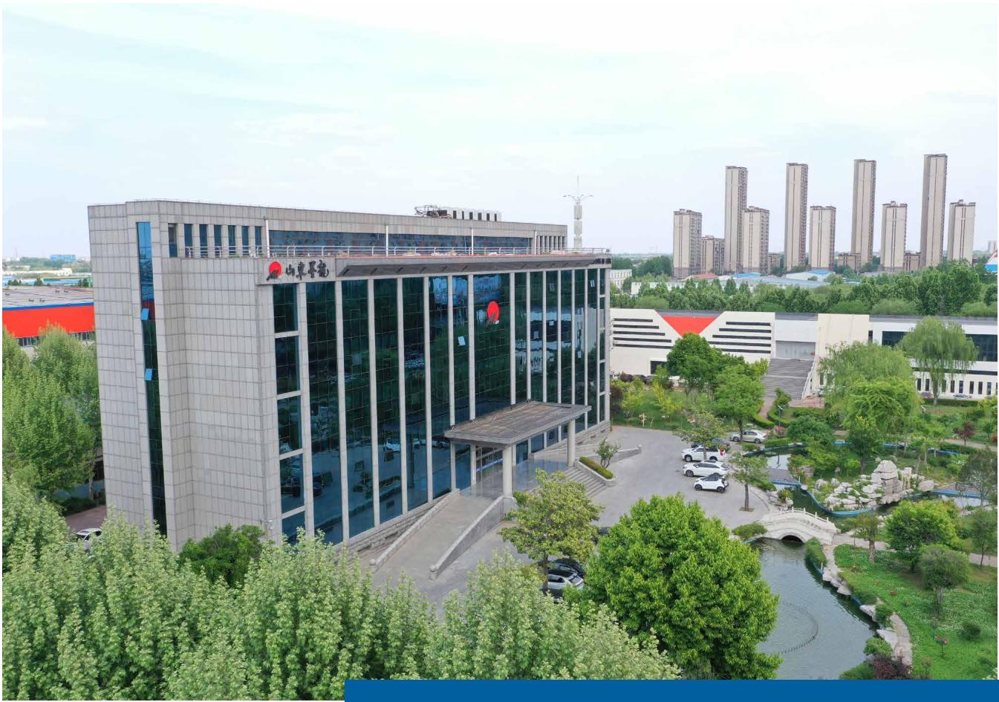

natural_image

Exterior view of a modern glass office building with surrounding greenery and high-rise buildings in the background (no visible signage or text)

## 董事会声明

公司董事会始终秉持ESG核心理念，将其深度融入公司战略规划、重大决策及日常运营之中，统筹兼顾企业高质量发展、生态环境保护与社会价值贡献，切实履行监管要求与企业社会责任，凝心聚力共筑可持续发展美好未来。

作为ESG事务最高决策机构 董事会明确各层级权责边界与分工搭建形成董事会统筹决策、管理层牵头执行、各部门协同落实、全员参与推进的闭环管理机制，确保ESG理念无缝贯穿生产经营、科技创新、合规管理等全流程，推动ESG与公司业务深度融合、协同发展。

董事会立足国内外宏观环境变化及ESG议题重要性评估结果，动态审视ESG领域面临的风险与机遇，统筹推进发展战略落地；持续健全ESG目标检讨机制，研判推进成效，督促相关举措优化完善、闭环落实；结合政策导向与利益相关方关切，动态优化ESG目标与策略，持续提升治理与实践水平。

ESG是覆盖公司全链条、跨部门的系统性工作，为有效提升ESG治理效能，公司董事会下设战略委员会，负责对公司长期发展战略、重大投资决策和ESG战略、议题及风险管理等事项进行研究并提出建议，组建ESG小组，作为执行主体，负责ESG相关政策的制定、日常管理及落地实施，以实际行动彰显责任担当。

未来，董事会将坚守ESG核心理念，恪守相关监管要求，持续优化ESG管理策略，深化ESG与业务融合，推动ESG战略落地，为各利益相关方创造长远价值。

## 董事长 致辞

时序更替，华章日新。2025年，是山东墨龙坚守初心、砥砺奋进的一年，更是将ESG深度融入企业血脉，实现高质量发展与责任担当双向赋能的一年。我们始终秉持“忠诚、守信、奉献、创新”的企业精神，以“合规经营、绿色发展、以人为本、共生共赢”为核心，在深耕主业、提质增效的同时，切实履行社会责任，完善公司治理，推动ESG理念从“被动合规”向“主动引领”转变，用实际行动回应利益相关方的信任与期许。

这一年，我们坚守绿色初心，守护生态家园。始终践行“绿水青山就是金山银山”的发展理念，将环境保护纳入发展战略，严格遵守各项环保法律法规；推进能源结构转型，优化生产工艺，实现生产用水全循环利用，持续降低废气、废水、废弃物排放，用绿色实践为行业低碳转型树立标杆。同时，我们系统推进生产过程低碳化，积极应对气候变化带来的机遇与挑战。

这一年，我们践行社会责任，凝聚发展合力。始终坚持“以人为本”，将员工权益放在重要位置，完善员工培训体系，组织岗位技能考试与各类培训，推动全员能力提升；设立困难扶助基金，帮扶困难员工，举办青年职工座谈会，为年轻人才搭建成长平台，实现员工与企业共同发展；坚守客户至上，严控产品质量，优化客户服务，客户满意度持续提升，用优质产品与高效服务回馈客户信任；深耕供应链协同，召开年度供应商座谈会，与供应商深化合作，坚守100%签署供应商行为准则的承诺，打造稳定、绿色、共赢的供应链体系；积极投身社会公益，参与区域协同发展，深化与各地企业、政府的合作，以实际行动传递企业温暖，彰显社会责任与担当。在海外市场，我们紧抓“一带一路”发展机遇，赴非洲、中东等地调研拓展，签署多项海外订单，实现海外业务重大突破，提升国际品牌影响力。

这一年，我们完善公司治理，筑牢发展根基。持续优化治理架构，规范股东会、董事会运作，严格履行信息披露义务，保障投资者知情权与参与权；健全内控与风险管控体系，搭建三级内控管理架构和完善的风险组织体系，定期开展内控审计与风险评估，有效防范各类经营风险，全年未发生重大风险事件与违规行为；坚守商业道德，强化反舞弊管理，明确反舞弊机构职责，开展反贪腐培训，营造风清气正的经营环境；严格践行反垄断和反不正当竞争要求，维护公平有序的市场秩序。

ESG不是选择题，而是企业高质量发展的必答题。未来，山东墨龙将继续以ESG为引领，坚守责任初心，深耕主业、勇于创新，在绿色发展、社会责任、公司治理的道路上持续发力，努力实现企业价值、社会价值与环境价值的有机统一，用更优异的业绩回报全体利益相关方，为行业进步与社会发展贡献更多墨龙力量！

## 走进墨龙，历程回望

## 公司简介

山东墨龙是一家专业从事能源装备制造与服务的上市公司，于1987年成立，实控人为寿光市国有资产监督管理局。公司于2004年4月在香港联交所上市，H股代码:00568；于2010年10月，在深交所上市，A股代码:002490。

一路走来，公司先后获得“国家高新技术企业”、“国家火炬计划重点高新技术企业”、“国家知识产权示范企业”、“中国工业行业排头兵企业”等多项殊荣。“墨龙”商标先后荣膺“山东省著名商标”、“中国驰名商标”、“重点培育和发展的山东出口名牌”等称号。

长期以来，作为中国四大石油集团公司的合格供应商，公司产品广泛应用于石油、天然气、页岩气、煤层气开采和煤炭挖掘机械、锅炉制造、工程机械制造等行业，并深得用户的认可和好评，为企业长期、稳健发展奠定了坚实的基础。公司已建立完善的IS09001质量管理体系、职业健康安全管理体系、环境管理体系和能源管理体系。

公司较早通过了美国石油学会API认证和欧盟CE认证等国际市场准入认证。当前，公司业务已覆盖至亚洲、欧洲、美洲、非洲和大洋洲等主要产油地区，并取得海外50多个国家和地区的产品入围资格。

展望未来，山东墨龙将秉承“诚信、专业、创新、共赢”的经营理念，围绕客户差异化需求，重点开发能够满足客户特殊用途的新产品，以优质产品和精准服务为能源装备行业的繁荣与可持续发展贡献墨龙力量。

## 企业文化

忠诚 守信 奉献 创新

## 公司愿景

矢志成为国际知名能源装备制造与服务商

## 经营理念

诚信 专业 创新 共赢

natural_image

Blue circular logo with a white dove inside, no text or symbols present.

## 核心价值观

持之以恒 精益求精 以人为本 科学发展

## 2025年墨龙大事记

## 0

## 山东墨龙赴非洲国家实地调研拓展国际合作

2025年2月，山东墨龙相关负责人率考察团赴尼日利亚、土耳其、突尼斯、埃及等非洲及中东国家实地调研，积极推介海外战略规划及产品，搭建国际合作交流平台。

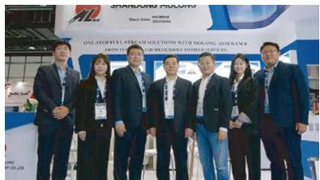

text_image

SHANGHAI MULIAO
ONE-STOP PTELLATEAM SOLUTIONS WITH MOGUNG AVERAGE.
PROJECT FOR PROGRESS SERVICE SERVICES

## 0

## 山东墨龙签署多国海外订单业务重大突破 1

2025年3月，山东墨龙加大展力度，先后与阿联酋、埃智利等国客户签署油套管和订单协议共计12万吨，实现大突破。

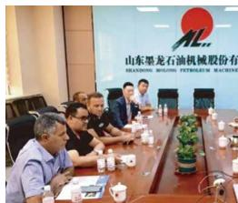

text_image

山东墨龙石油机械股份有
SHANXI NGOLONG PETROLEUM MACHINE

##

## 山东墨龙参加阿布扎比国际石油展

2025年11月3日—6日，阿布扎比国际石油展览会（ADIPEC）在阿布扎比国家会议中心（ADNEC）举办，山东墨龙参展并成功签订产品订单4万余吨，标志着公司海外市场拓展再结硕果。

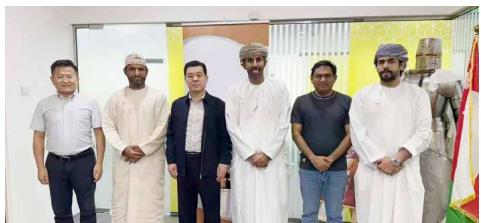

natural_image

Group photo of six men in traditional and modern attire standing indoors (no visible text or symbols)

##

## 山东墨龙参加第21届中国钢铁产业链峰会暨兰格钢铁网成立30周年启动大会

2025年11月14日，山东墨龙董事长韩高贵应邀出席第21届中国钢铁产业链峰会暨兰格钢铁网成立30周年启动大会并致辞。

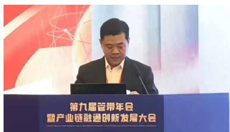

text_image

第九届管带年会
暨产业链融通创新发展大会

##

## 墨龙（海南）农业与儋州市办战略合作签约仪式

2025年12月17日，墨龙（海儋州市人民政府举行战略式。此次签约，不仅是墨业在海南布局农业项目的关为后期做强农业奠定了坚实

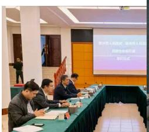

text_image

Meeting scene with attendees seated at a long table, presentation screen displaying Chinese text about a formal meeting or conference.

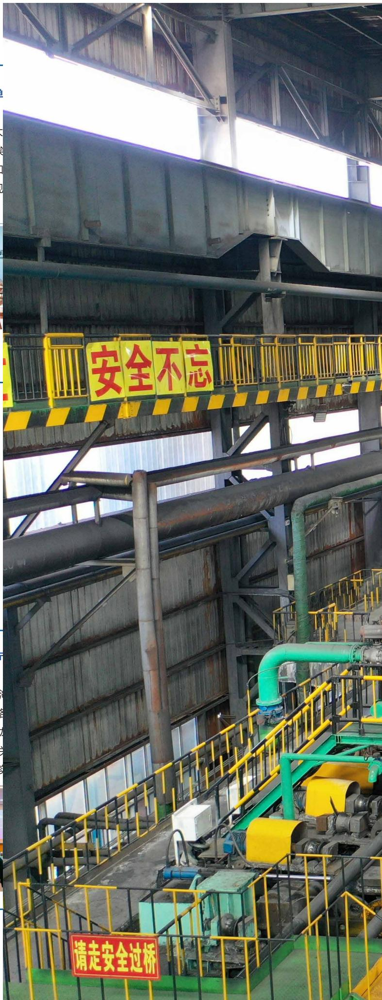

text_image

安全不忘
请走安全过桥

## ESG治理

山东墨龙持续完善ESG治理架构，夯实可持续发展的治理基础。公司积极与各利益相关方保持常态化沟通，通过科学识别、系统评估ESG实质性议题，为ESG战略决策实施提供有力支撑，推动公司与利益相关方协同发展、携手共创可持续发展新未来。

ESG治理架构 07

利益相关方沟通 07

重要性议题评估 09

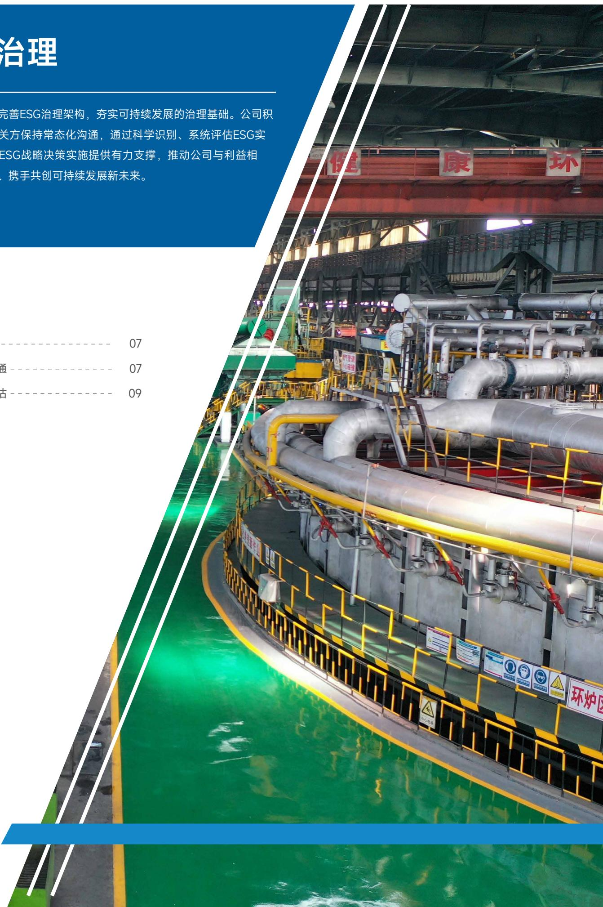

text_image

治理
完善ESG治理架构，夯实可持续发展的治理基础。公司积
关方保持常态化沟通，通过科学识别、系统评估ESG实
ESG战略决策实施提供有力支撑，推动公司与利益相
携手共创可持续发展新未来。
07
07
09
健康环
环炉区

ESG治理架构  
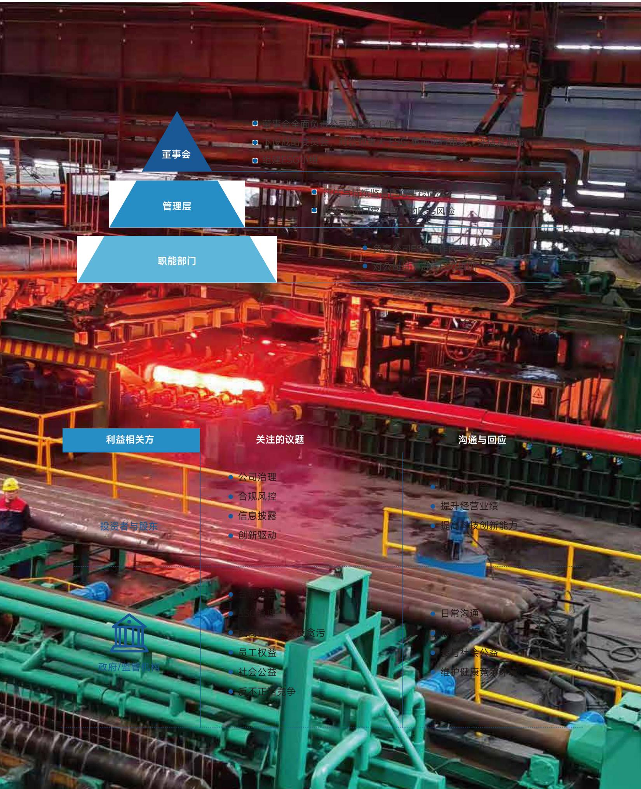

flowchart

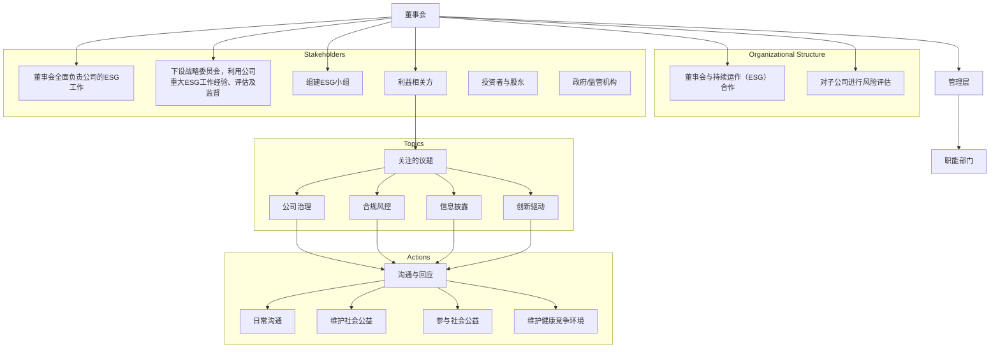
```mermaid
graph TD
  A["董事会"] --> B["管理层"]
  B --> C["职能部门"]
  
  subgraph Stakeholders
    D["董事会全面负责公司的ESG工作"]
    E["下设战略委员会，利用公司重大ESG工作经验、评估及监督"]
    F["组建ESG小组"]
  end
  
  subgraph Organizational Structure
    G["董事会与持续运作（ESG）合作"]
    H["对子公司进行风险评估"]
  end
  
  subgraph Stakeholders
    I["利益相关方"]
    J["投资者与股东"]
    K["政府/监管机构"]
  end
  
  subgraph Topics
    L["关注的议题"]
    M["公司治理"]
    N["合规风控"]
    O["信息披露"]
    P["创新驱动"]
  end
  
  subgraph Actions
    Q["沟通与回应"]
    R["日常沟通"]
    S["维护社会公益"]
    T["参与社会公益"]
    U["维护健康竞争环境"]
  end
  
  A --> D
  A --> E
  A --> F
  A --> G
  A --> H
  A --> I
  
  I --> L
  L --> M
  L --> N
  L --> O
  L --> P
  
  M --> Q
  N --> Q
  O --> Q
  P --> Q
  
  Q --> R
  Q --> S
  Q --> T
  Q --> U
```

<table><tr><td>利益相关方</td><td>关注的议题</td><td>沟通与回应</td></tr><tr><td>客户</td><td>产品质量客户服务数据安全与客户隐私保护</td><td>提升产品质量提高客户满意度搭建网络信息安全管理体系</td></tr><tr><td>供应商</td><td>供应商管理行业协同平等对待中小企业</td><td>依法履行合同诚信合作</td></tr><tr><td>员工</td><td>员工权益员工聘用与待遇职业发展与培训职业健康与安全</td><td>员工权益保障完善沟通渠道多渠道培训技能提升保障安全生产</td></tr><tr><td>社区</td><td>绿色生产环境合规管理社区公益</td><td>参与社会公益</td></tr><tr><td>环境</td><td>环境合规管理应对气候变化能源利用水资源利用循环经济污染物排放废弃物处理</td><td>绿色生产强化管理</td></tr></table>

## 重要性议题评估

山东墨龙将重要性议题评估作为ESG管理的关键环节，以此锚定公司ESG工作重心，明晰ESG战略方向，并为精准部署相关举措提供重要支撑。公司构建并持续优化双重重要性议题分析机制，以“调研梳理背景—构建议题清单—重要性评估确认—形成专项报告”为路径，围绕“财务重要性”与“影响重要性”两大核心维度，系统开展议题评估、科学排序与精准筛选。报告期内，公司在延续上年度重要性议题核心框架的基础上，结合公司业务发展动态、行业实践及监管披露要求，对相关议题进行针对性识别与适度调整，为后续ESG工作有序推进筑牢根基。

## 评估流程

## 调研梳理背景

结合自身经营活动与业务布局，重点识别价值链上下游可持续发展相关影响，同时跟踪外部宏观政策、产业导向、监管要求及行业热点，系统研判潜在影响。  
全面识别梳理内外部利益相关方，充分结合业务实际，调研ESG与可持续发展相关政策、标准、评级及同行实践，明确利益相关方类型及关注要点。

## 构建议题清单

以上年度识别议题为基础，结合监管相关规定与要求、行业标准与发展趋势、自身业务特征及行业对标情况，进一步识别潜在议题、新增议题，并对部分内容优化整合，持续提升议题管理的精准性与适用性。

## 重要性评估确认

影响重要性：以各内外部利益相关方为核心，通过专家咨询、利益相关方调研、内部研讨等多种形式，从影响规模、覆盖范围、发生概率及补救可行性等维度，综合研判相关议题表现可能带来的影响，最终形成议题影响重要性分析结论。  
财务重要性：通过问卷调研、内部研讨等方式，综合评估各类议题蕴含的风险与机遇，对公司商业模式、业务运营、发展战略及财务状况的影响程度与发生概率，形成议题财务重要性分析结论。

## 形成专项报告

根据议题重要性评估结果，搭建双重重要性议题矩阵，经公司董事会审议通过后，在报告中进行针对性回应。

## 评估结果

公司经识别，产品和服务安全与质量、数据安全与客户隐私保护等6项议题具有双重重要性，所示。

## 非常重要

## 影响重要性

社会贡献  
平等对待中小企业  
科技伦理  
反不正当竞争  
合规风控  
利益相关方沟通

员工  
产品和服务安全与质  
数据安全与客户隐私  
供应链安全  
尽职调查  
反商业贿赂及反贪污

环境合理管理  
应对气候变化  
资源管理  
循环经济  
生态系统和生物多样性保护  
乡村振兴

公司治理  
能源利用  
废弃物处理  
污染物排放  
创新驱动  
ESG治理

## 较重要

## 财务重要性

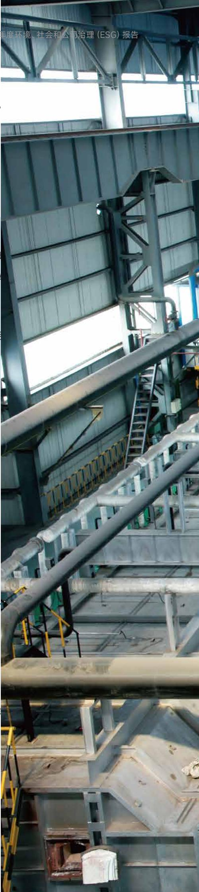

text_image

年度环境、社会和公司治理(ESG)报告

## G

## 规范治理

## 夯实发展根基

强化党建引领 凝聚发展合力 12

完善公司治理 提升治理效能 12

健全合规风控 防范经营风险 16

坚守商业道德 筑牢诚信底线 19

依法诚信纳税 彰显企业担当 23

16和平，正义与强大机构

17

促进目标实现的伙伴关系

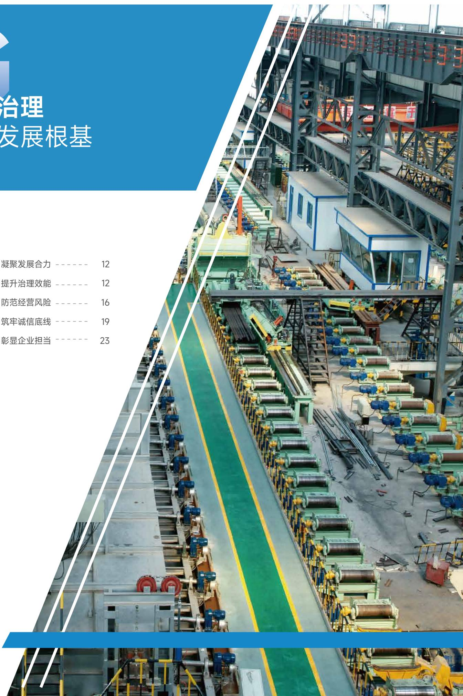

text_image

治理
发展根基

凝聚发展合力 ---- 12
提升治理效能 ---- 12
防范经营风险 ---- 16
筑牢诚信底线 ---- 19
彰显企业担当 ---- 23

## 强化党建引领 凝聚发展合力

山东墨龙坚持以政治建设为统领，持续强化理论武装与组织建设，不断优化党组织体系、严格党员教育管理、创新党建工作载体，切实筑牢基层战斗堡垒。公司持续深化党建工作与生产经营的深度融合，健全协同工作机制与考核评价体系，推动党建工作与业务发展同频共振、同向发力；加强作风建设，力戒形式主义，优化干部队伍建设，为公司高质量发展提供坚强政治保障与组织支撑；扎实推进党风廉政建设与监督执纪，坚决纠治不正之风，营造风清气正的治理生态。

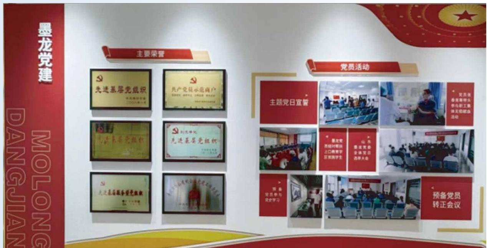

text_image

墨龙党建
DANGJIANG
主要荣誉
先进基层党组织
共产党员示范商户
党员领春党领导头参与职工集体贡献献益活动
党员领春党领导头参与职工集体贡献献益活动
党员领春党领导头参与职工集体贡献献益活动
党员领春党领导头参与职工集体贡献献益活动
党员领春党领导头参与职工集体贡献献益活动
党员领春党领导头参与职工集体贡献献益活动
党员领春党领导头参与职工集体贡献献益活动
党员领春党领导头参与职工集体贡献献益活动
预备党员参与党史学习
预备党员转正会议

墨龙党建窗口展示

## 完善公司治理 提升治理效能

山东墨龙始终将规范治理作为高质量发展的基石，通过构建权责清晰、运转高效的现代企业治理体系，持续提升决策科学性与执行效能。

## 规范管理运作

山东墨龙严格按照《中华人民共和国公司法》《上市公司治理准则》《深圳证券交易所股票上市规则》《深圳证券交易所上市公司自律监管指引第1号——主板上市公司规范运作》《香港联合交易所上市规则》等法律法规及规范性文件 建立健全以《公司章程》《股东会议事规则》等为核心的公司治理制度体系，持续完善治理结构、强化运作规范、提升治理效能，为高质量，可持续发展筑牢治理基础。

公司建立权责清晰，制衡有效的治理架构，股东会为公司最高权力机构:董事会为公司决策机构，董事由股东会选举产生董事会在股东会授权范围内行使决策权与监督权:公司管理层由董事会聘任，作为执行机构，全面负责公司日常经营管理工作 各副总经理分管不同部门以确保公司各方面业务的顺利进行，报告期内公司响应监管机构相关要求 取消监事会设置，将其监督职权移交董事会审计委员会。

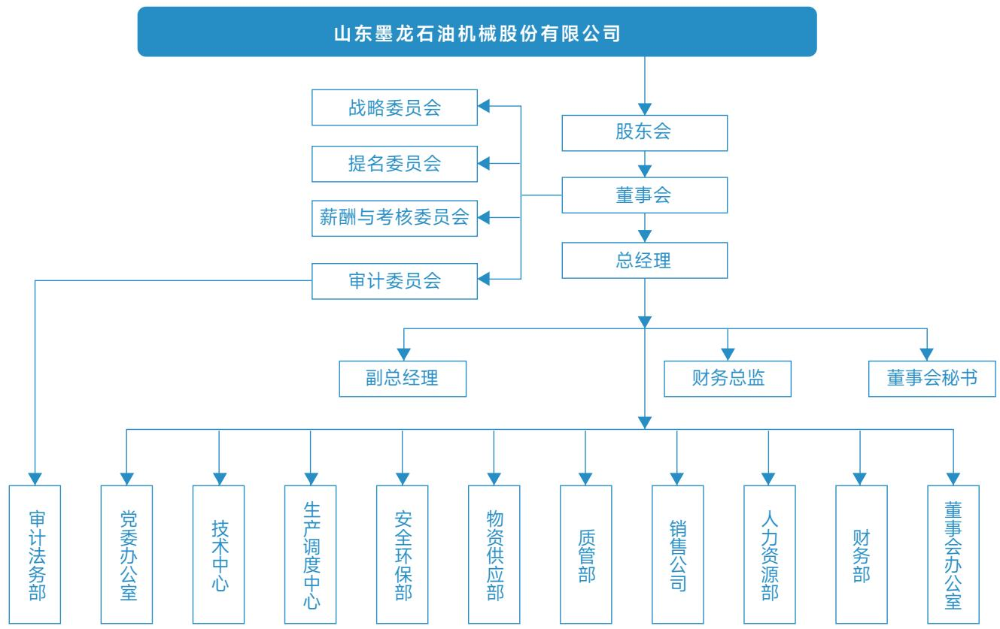

flowchart

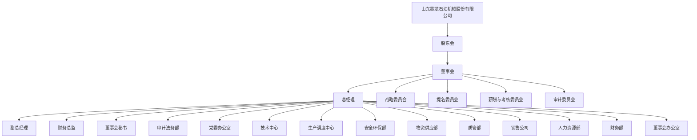
```mermaid
graph TD
  A["山东墨龙石油机械股份有限公司"] --> B["股东会"]
  B --> C["董事会"]
  C --> D["总经理"]
  C --> E["战略委员会"]
  C --> F["提名委员会"]
  C --> G["薪酬与考核委员会"]
  C --> H["审计委员会"]
  D --> I["副总经理"]
  D --> J["财务总监"]
  D --> K["董事会秘书"]
  D --> L["审计法务部"]
  D --> M["党委办公室"]
  D --> N["技术中心"]
  D --> O["生产调度中心"]
  D --> P["安全环保部"]
  D --> Q["物资供应部"]
  D --> R["质管部"]
  D --> S["销售公司"]
  D --> T["人力资源部"]
  D --> U["财务部"]
  D --> V["董事会办公室"]
```

9

负责采购管理、运输管理、仓储管理、外协管理等以及与之相关联的合同评审、出入库管理、物资供应部公司车辆管理、吊装作业等相关事项。

10

质管部 负责原材料、产品的质量管理及生产过程质量控制，负责公司QES管理体系的正常运行。

销售公司 负责国内外市场的客户开发、产品销售、市场维护等业务以及与之相关的合同评审、招投标、产品资料、发货、回款、市场信息等相关事项。

## 股东与股东会

山东墨龙严格规范股东会的召集，召开和表决程序，全面采用现场投票与网络投票相结合的方式，为全休股东行使权利提供便利条件，确保全体股东特别是中小股东能够充分行使股东权利。

报告期内，公司共召开1次年度股东会，2次临时股东会，会议均由董事会召集、召开。同时，公司聘请专业的律师进行现场见证并出具法律意见书，对会议召集、出席人员资格、召集人资格、表决程序及表决结果等事项出具法律意见，确保股东会的规范运作。

## 董事会多元化建设

山东墨龙将董事会多元化与包容性治理视为提升治理效能、保障科学决策、支撑长期可持续发展的重要基石。公司严格遵循《公司章程》等有关规定，依法依规开展董事提名与选聘工作，综合考量性别、年龄、文化与教育背景、专业经验、技能及知识结构等维度，持续优化董事会构成。公司现有董事9名，包括职工代表董事1名，非执行董事2名，独立董事3名。董事会人数、人员构成及资格均符合法律法规和公司规章的规定。

董事会结构  
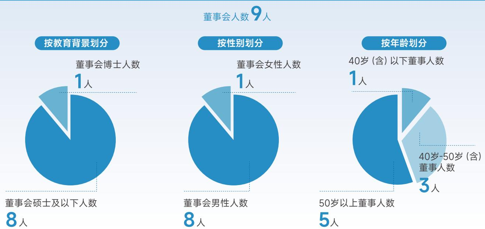

donut

| 分类 | 类别 | 人数 |
| --- | --- | --- |
| 按教育背景划分 | 董事会博士人数 | 1人 |
| 按教育背景划分 | 董事会硕士及以下人数 | 8人 |
| 按性别划分 | 董事会男性人数 | 8人 |
| 按性别划分 | 董事会女性人数 | 1人 |
| 按年龄划分 | 50岁以上董事人数 | 5人 |
| 按年龄划分 | 40岁(含)董事人数 | 3人 |
| 按年龄划分 | 40岁(含)以下董事人数 | 1人 |

## 董事会勤勉尽责

董事会严格执行股东会决议，积极推进公司各项工作，加强公司内部控制，完善公司治理结构，全面促进公司可持续发展，确保企业规范运作。全体董事恪尽职守、勤勉尽责，以科学、严谨的工作态度，积极参与公司各项重大事项的决策过程，努力维护公司及全体股东的合法权益。

报告期内，公司召开董事会会议13次，对定期报告、债务重组、聘任高管、关联交易等相关议案进行审议。

## 董事会专业委员会

董事会下设立战略委员会、审计委员会、提名委员会、薪酬与考核委员会四个专门委员会，专门委员会均由公司董事、独立董事担任，为董事会科学决策、高效运作提供专业支撑。审计委员会、提名委员会、薪酬与考核委员会中独立董事占多数并担任召集人，审计委员会的召集人为独立董事中的会计专业人士，审计委员会成员不在公司担任高级管理人员。

报告期内，公司战略委员会，审计委员会，提名委员会，薪酬与考核委员会正常履行职责，为董事会的决策提供科学和专业的意见参考。

组织召开审计委员会会议

7次

组织召开提名委员会会议

1次

组织召开战略委员会会议

2次

组织召开薪酬与考核委员会会议

1次

## 保障股东权益

山东墨龙高度重视股东权益保障，秉持股东平等理念，将投资者保护纳入常态化管理休系 以诚信经营，透明治理，责任担当回馈投资者信任，保障所有股东充分行使权利、享有平等法律地位。

## 强化信息披露管理

公司高度重视信息披露工作，严格按照有关法律法规以及《信息披露管理制度》《深圳证券交易所上市公司自律监管指引第5号信息披露事务管理》等相关要求 规范信息披露的内容，形式，流程，责任划分与保密管理 通过境内外指定披露平台，同步发布会议通知、决议公告等重要信息，保障全体投资者公平、公正、公开获取公司信息，持续提升信息披露质量与公司治理透明度。

## 加强投资者双向沟通

公司持续推进投资者关系管理，构建常态化、长效化沟通机制；指定董事会秘书为投资者关系管理负责人，负责协调投资者关系，接待股东来访，回答投资者问询，向投资者提供应披露之信息等工作；积极参与山东证监局投资者保护系列宣传活动，不断健全多元化沟通体系；通过电话、电子邮箱、投资者关系互动平台、投资者接待日等形式回复投资者问询，与投资者保持高效互动，及时传递公司经营动态与发展战略，切实维护投资者知情权与参与权。

## 保护中小股东权益

公司持续完善中小股东权益保护机制，通过制度修订、流程优化和透明沟通，构建全方位的中小投资者权益保障体系。公司不断修订完善《公司意程》《股车会议事规则》《董事会议事规则》优化公司治理结构，切实维护中小投资者合法权益采用现场与网络投票相结合的双重投票机制，确保所有股东无论持股规模大小均能平等参与公司重大决策:严格执行中小投资者表决单独计票制度，在审议重大事项时对中小投资者的投票结果进行独立统计和披露，确保中小股东的意见得到充分尊重与体现。

## 案例 5·15全国投资者保护宣传日——山东墨龙在行动

2025年5月15日，山东墨龙开展全国投资者保护宣传日活动，践行“以投资者为本”理念，构建规范有序的资本市场生态。

## 公司建立全方位投资者保护体系：

强化信息披露，确保财务报告、重大事项等信息真实准确完整，通过投资者热线、业绩说明会等多元渠道增强市场透明度。  
2 深化互动机制，定期举办业绩说明会及股东会，建立意见征集反馈机制，提升双向沟通效能。  
3 推进投教工程，通过官网及新媒体矩阵普及投资知识、提示风险，增强投资者风险识别能力。  
4 优化回报机制，实施利润分配方案，实现投资者权益保障与公司可持续发展统一。  
5 严守合规底线，完善“三会一层”治理架构，强化内部控制，打造优质上市公司标杆。

## 案例 山东墨龙开展2025年世界投资者周活动

2025年10月，山东墨龙在中国证监会山东监管局指导下，紧扣“科技和数字金融”“人工智能（AI）”“防范欺诈”三大主题，全面开展2025年世界投资者周活动，通过创新投教形式、丰富投教内容，助力构建规范有序的资本市场生态，展现了上市公司以透明沟通和主动服务守护中小投资者合法权益的责任担当。

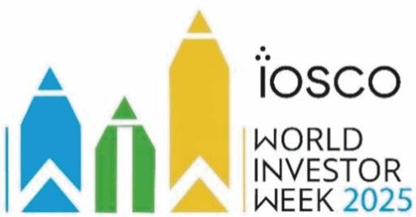

text_image

iOSCO
WORLD
INVESTOR
WEEK 2025

## 健全合规风控 防范经营风险

山东墨龙建立健全以合规管理为核心、以风险防范为导向的内部控制体系，构建全面覆盖、全员参与、全程管控、协同联动的风险防控机制切实提高公司经营稳健性

## 强化内控合规

山东墨龙高度重视内部控制与合规管理体系建设，持续完善治理架构与组织体系，不断健全内部管理制度与运行机制。通过搭建权青清晰，分工明确，协同高效的内控管理组织，强化全过程监督与常态化审计，持续提升内部管理水平与规范运营能力，为企业高质量发展提供坚实保障。

公司搭建由内控管委会，审计法务部以及各职能部门构成的三级内控管理体系，分层管理，分级负责，形成上下联动，协同高效的管理格局，按季度开展内控审计工作，确保内控体系的有效运行和持续改进。

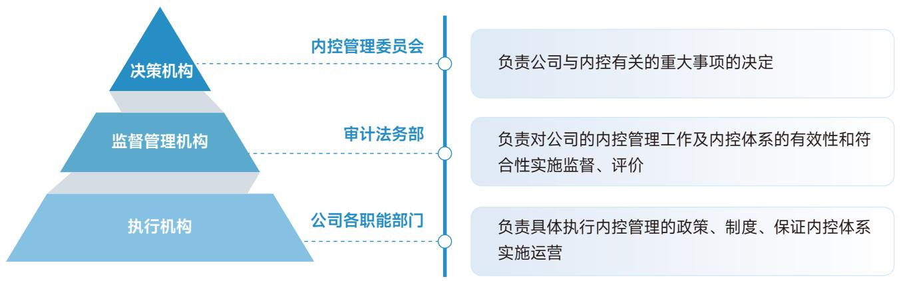

flowchart

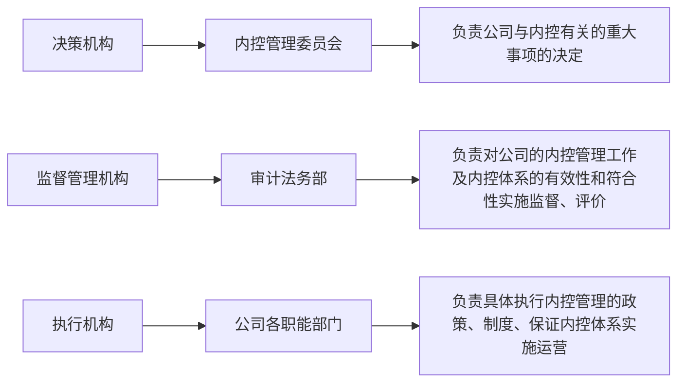
```mermaid
graph LR
  A["决策机构"] --> B["内控管理委员会"]
  C["监督管理机构"] --> D["审计法务部"]
  E["执行机构"] --> F["公司各职能部门"]
  B --> G["负责公司与内控有关的重大事项的决定"]
  D --> H["负责对公司的内控管理工作及内控体系的有效性和符合性实施监督、评价"]
  F --> I["负责具体执行内控管理的政策、制度、保证内控体系实施运营"]
```

内控管理委员会构成

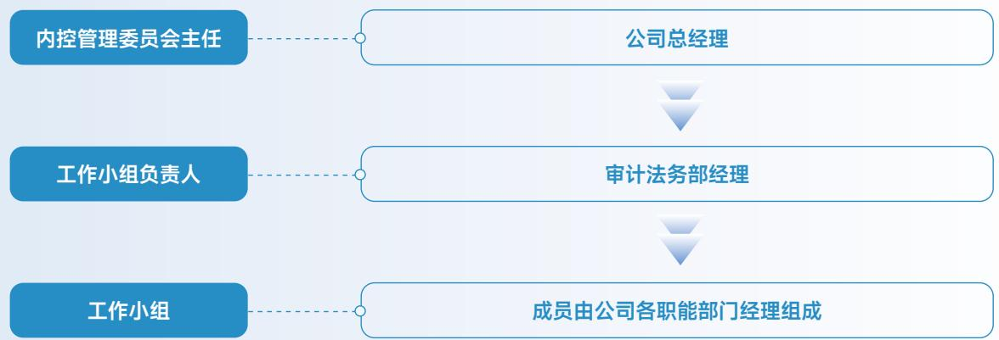

flowchart

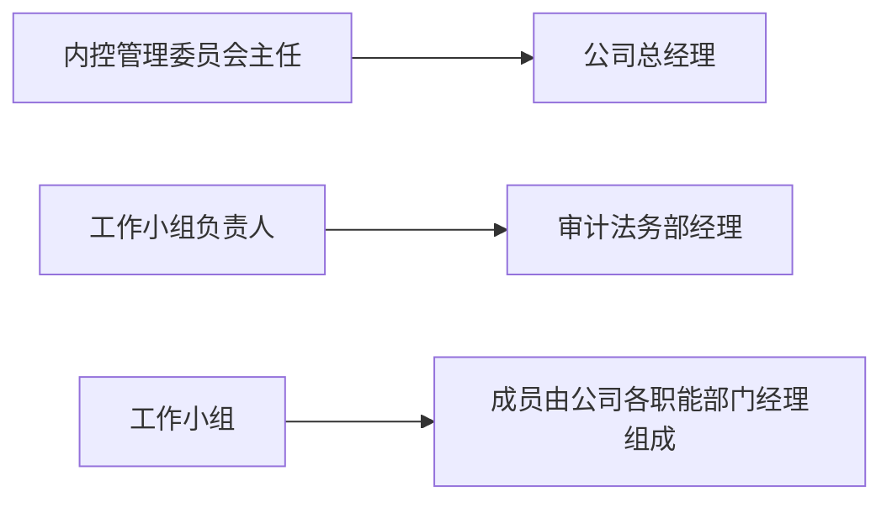
```mermaid
graph LR
  A["内控管理委员会主任"] --> B["公司总经理"]
  C["工作小组负责人"] --> D["审计法务部经理"]
  E["工作小组"] --> F["成员由公司各职能部门经理组成"]
```

公司根据《企业内部控制基本规范》《企业内部控制应用指引》等法律法规，制定《企业内部控制管理手册》作为公司建立、执行、评价及验证内部控制的依据，确保公司从思想上提升管理水平，增强风险防范能力、保障公司协调、持续、高质量发展。

报告期内，公司聘请致同会计师事务所（特殊普通合伙）作为年度审计机构，对内部控制关键环节开展审计，通过专业机构的独立审计进一步强化合规性，并针对审计发现的问题出具整改意见。

## 筑牢风控防线

为建立规范、有效的风险控制体系，提高风险防范能力，保证公司安全稳健运行，山东墨龙持续完善风险管理体系，提高风险控制水平，切实保障公司规范运营、稳健发展。

公司搭建风险组织架构体系，风险管理小组组长由董事会秘书担任，通过分级领导、多部门协同联动，充分发挥风险组织架构的管理效能，实现风险管理的系统化、规范化和科学化，为公司稳健发展提供有力保障。

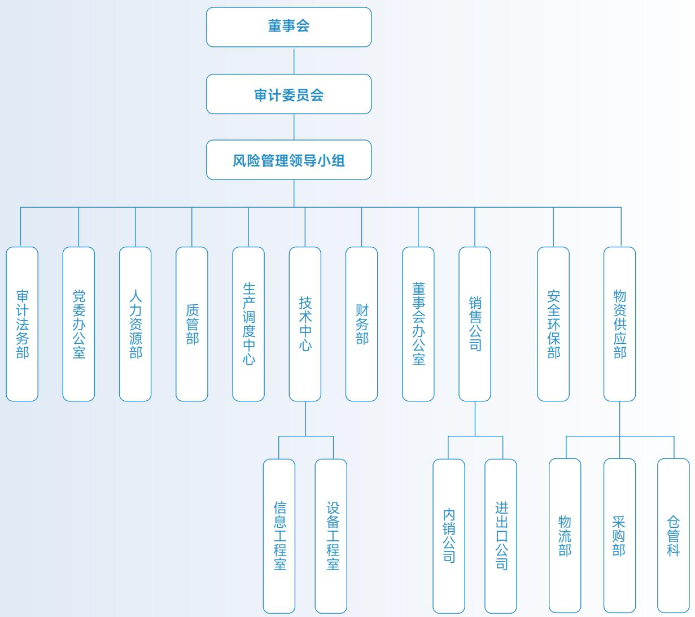

flowchart

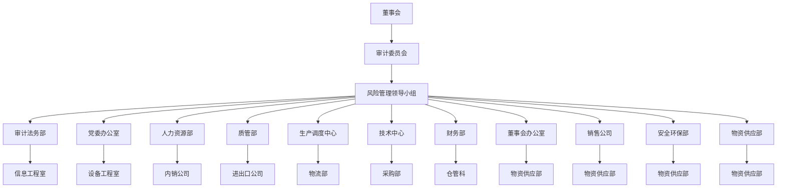
```mermaid
graph TD
  A["董事会"] --> B["审计委员会"]
  B --> C["风险管理领导小组"]
  C --> D["审计法务部"]
  C --> E["党委办公室"]
  C --> F["人力资源部"]
  C --> G["质管部"]
  C --> H["生产调度中心"]
  C --> I["技术中心"]
  C --> J["财务部"]
  C --> K["董事会办公室"]
  C --> L["销售公司"]
  C --> M["安全环保部"]
  C --> N["物资供应部"]
  D --> O["信息工程室"]
  E --> P["设备工程室"]
  F --> Q["内销公司"]
  G --> R["进出口公司"]
  H --> S["物流部"]
  I --> T["采购部"]
  J --> U["仓管科"]
  K --> V["物资供应部"]
  L --> W["物资供应部"]
  M --> X["物资供应部"]
  N --> Y["物资供应部"]
```

风险评估小组根据财政部《企业内部控制规范》相关要求，对公司各类风险开展全面评估，并制定相应风险应对策略，确保公司能够有效识别、评估和管理各类潜在风险。

## 风险识别

通过问卷方式由各分管副总及部门负责人对企业内外部存在的风险进行识别；  
对各个风险点的描述进行汇总分析，形成企业风险清单。

组织小组成员会议，根据风险评价的分值、频次以及涉及相关业务对企业发展目标的影响度进行评估；  
评估出重大、一般及轻微风险。

## 风险评估

## 风险整改

根据业务流程所属，由各部门对各个风险制订应对策略及整改措施，完善企业内部控制流程。

## 坚守商业道德 筑牢诚信底线

山东墨龙将商业道德与诚信合规置于经营发展的核心位置，坚决贯彻反垄断和反不正当竞争相关规定，全力维护公平有序的市场秩序，构建全方位、多层次的廉洁治理体系，切实保障各利益相关方的合法权益。

## 强化反舞弊管理

## 治理

山东墨龙严格遵守《中华人民共和国公司法》《中华人民共和国反不正当竞争法》等法律法规，结合公司经营实际，制定《反舞弊管理规定》等内部管理制度，清晰界定舞弊的概念及核心表现形式，系统明确舞弊预防与控制、案件举报调查与报告、补救措施与处罚等管理要求，同时结合诚信正直的企业文化培育与科学的内部控制机制建设，从源头预防和管控舞弊行为发生。

公司构建层级清晰、权责明确的反舞弊治理架构。董事会对公司反舞弊工作进行指导、监督及必要参与，审核管理层的反舞弊程序和控制措施；下设审计委员会负责公司反舞弊行为的指导工作，全面统筹反舞弊工作的整体指导与监督；审计法务部作为公司反舞弊工作常设机构，负责具体组织和执行跨部门、公司范围内的反舞弊工作，涵盖举报接收、调查处置、结果报告及处理意见提出等，并接受来自董事会和审计委员会的监督；各业务部门切实承担本部门反舞弊主体责任，将反舞弊要求融入日常经营管理各环节，形成多方协同、齐抓共管的反舞弊治理格局。

## 战略

山东墨龙紧密结合自身行业特点、业务范围，立足预防为先、系统管控、权责清晰、持续优化的核心原则，充分识别反商业贿赂、反贪污与反舞弊相关风险，以廉洁诚信筑牢内控防线、塑造企业核心竞争力，保障公司持续、稳定、健康发展。

针对识别的各类反商业贿赂、反贪污相关风险与机遇，公司明确其可合理预期产生重大影响的时间范围，并划分为短期（1—5年）、中期（5—10年）、长期（10年以上）。

natural_image

Illustration of two businessmen shaking hands with a rising arrow, symbolizing business partnership or growth (no text or symbols present)

<table><tr><td colspan="2">相关风险与机遇</td><td>影响</td><td>影响时间</td><td>应对举措</td></tr><tr><td rowspan="3">内部治理风险</td><td>权责边界模糊</td><td>·董事会、专门委员会对反贿赂、反贪污工作监督缺位,未将合规要求纳入战略决策;·管理层未设置专职合规部门,权责分散导致多头管理、无人负责。</td><td>短-中-长期</td><td>·明确审计委员会为反舞弊工作指导主体,审计法务部作为反舞弊常设机构承担全公司反舞弊组织执行工作,各业务部门承担本部门反舞弊工作;管理层将反舞弊纳入日常管理,从预算、人员配置、工作条件上为审计法务部提供充分保障;·赋予审计法务部独立调查、报告权,其工作直接向董事会、审计委员会负责,董事会与审计委员会对公司反舞弊工作进行全面指导与监督。</td></tr><tr><td>制度与流程漏洞</td><td>·未建立清晰的商业贿赂/贪污界定标准,或财务内控、合同审批、费用报销等流程存在缺陷,为违规行为提供操作空间。</td><td>短-中-长期</td><td>·编制涵盖舞弊界定、举报调查、处罚补救、档案管理的反舞弊制度规范,完善财务内控、合同审批等配套流程,确保制度覆盖全业务、全岗位;·建立反舞弊工作书面程序,规范举报接收、保留、处理全流程,所有调查结果、处理意见均按规定立卷归档,定期向董事会、审计委员会报告。</td></tr><tr><td>关键岗位权力寻租</td><td>·采购、销售、投融资、财务等核心岗位权力集中且缺乏制衡,存在一人审批“暗箱操作”空间,易引发回扣收受、利益输送、挪用资金等行为。</td><td>短-中-长期</td><td>·对采购、销售、投资等业务增设审计法务部前置审查环节,重点核查交易对手方背景、价格公允性、资金流向;·对拟聘用或晋升人员开展教育背景、工作经历、犯罪记录等背景调查,形成正式书面记录并存档;·涉及高层管理人员的舞弊举报,经董事会、审计委员会批准后成立特别调查小组开展联合调查。</td></tr><tr><td>外部关联风险</td><td>供应商腐败风险</td><td>·供应商、客户、代理商等为获取竞争优势,通过行贿、围标等方式拉拢企业员工,被动卷入违规链条。</td><td>短-中-长期</td><td>·与核心供应商、客户签订《廉洁合作协议》,联合开展合规培训,共享合规资源,对违规者列入黑名单并终止合作;·向外部合作方传递公司反舞弊政策及诚信道德要求。</td></tr><tr><td rowspan="2">人员意识风险</td><td>廉洁意识不足</td><td>·基层员工对“小额回扣”“人情往来”等隐性违规行为认知模糊,甚至默许违规以达成经营目标。</td><td>短-中-长期</td><td>·多形式公示反舞弊政策,将新员工培训纳入反舞弊、法律法规及诚信道德教育内容;·明确反舞弊职责,引导员工正确处理工作中的利益冲突与不当利益诱惑,开通实名、匿名举报渠道并向全员公布。</td></tr><tr><td>专业能力短板</td><td>·纪检人员缺乏跨领域专业能力(如涉及海外业务时),关键岗位员工未掌握业务场景中的反腐败要点。</td><td>短-中-长期</td><td>·强化审计法务部专业团队建设,配备具备法律、财务、行业经验的人员,开展常态化反舞弊专业能力培训;·高管带头践行反舞弊合规要求,将诚信正直融入企业文化;·调查重大、复杂舞弊案件时,视需要聘请外部专家,必要时直接移交司法机关处理。</td></tr><tr><td>声誉风险</td><td>突发贪腐事件舆情发酵</td><td>·因腐败事件被媒体曝光,导致投资者信任丧失、客户与合作伙伴流失,社会公众对企业“诚信底色”的质疑难以逆转。</td><td>短-中-长期</td><td>·对舞弊事件形成内部控制评估和改进的书面报告,对违规者按规定进行经济、行政处分,触犯刑律的移送司法机关;·详细披露反舞弊的制度、举措、成效及风险,主动回应投资者、监管机构的问询;·按要求召开反舞弊情况通报会,及时汇报处理进展,做好舆情应对。</td></tr></table>

## 影响、风险和机遇管理

山东墨龙坚守诚信正直的企业文化底线，将反商业贿赂、反贪污及反舞弊工作深度融入经营管理全流程，设立反舞弊工作常设机构，明确职责边界与运行机制，对舞弊及商业贿赂相关举报实行接收、调查、报告、处置意见提出的闭环管理。

## 倡导诚信正直的企业文化

最高管理层坚持以身作则，并带头遵守公司各项规章制度。  
通过员工手册、公司规章制度发布、宣传册或局域网、公司网站等方式将公司的反舞弊政策、程序及有关措施以多种形式进行有效沟通与培训。  
新员工培训必须加入反舞弊培训和法律法规及诚信道德教育内容。  
鼓励员工在公司日常工作和交往中遵纪守法和从事遵守诚信道德的行为，帮助员工正确处理工作中发生的利益冲突、不当利益诱惑。  
将公司倡导遵纪守法和遵守诚信道德的信息告知与公司直接或间接发生关系的社会各方。  
针对不道德行为和非诚信行为可以通过举报渠道进行实名和匿名举报；公司应制定并实施行之有效的教育和处罚政策。

## 开展背景调查

山东墨龙针对拟聘任或晋升至关键岗位的人员 开展任职前背景审查工作 重点核查教育经历，职业履历，无犯罪记录等关键信息，所有背景调查流程形成正式书面记录，并按规定统一归档留存。

## 舞弊案件的举报、调查、报告

山东墨龙配套制定《投诉、举报管理规定》，畅通实名与匿名举报双渠道，审计法务部对举报人信息实施严格保密管理，对违反保密规定的责任人员，公司将依据制度予以现金罚款直至解除劳动合同等相应处罚。建立标准化的举报工作流程，对所有举报事项留存书面记录 供高级管理层，董事会和审计委员会检查监督 针对不同层级举报事项实施分级调查处置

## 公司接受投诉、举报的路径

投诉举报热线电话号码：0536-5789086

电子邮箱地址：sjb@molonggroup.com

通信地址：山东省寿光市文圣街999号

邮政编码：262700

## 举报人保护

公司对举报人的姓名、工作单位、家庭住址等有关情况及举报内容严格保密。凡违反保密规定的责任人员，视具体情况，给予罚款直至解除劳动合同。

## 开展反贪腐培训

山东墨龙常态化开展反贪腐专项培训，点，明确员工行为边界与职业操守准则识与风险防控能力，筑牢合规运营与可

## 指标与目标

山东墨龙将强化内部控制、降低公司风长期稳健可持续发展。

## 指标名称

员工接受反贪污反腐败培训的总时

接受反商业贿赂及反贪污培训总人

商业道德/反商业贿赂及反贪污培训

## 践行反垄断要求

山东墨龙坚持公平竞争原则，严格遵守商业行为维护健康有序的市场竞争环境市场秩序。

报告期内，公司未因不正当竞争行为导

## 依法诚信纳税 彰显

山东墨龙将税务合规与贡献视为公司可规，持续完善税务管理体系，建立健全公司在积极服务地方经济发展、履行社

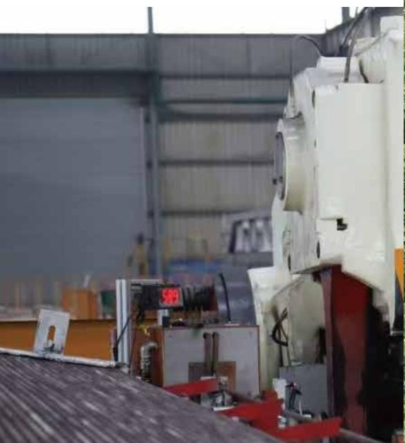

natural_image

Industrial factory interior with large white machinery and red safety railings (no visible text or symbols)

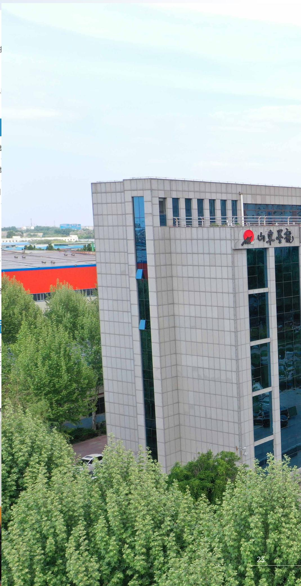

text_image

山东墨龙

## 绿色发展守护生态家园

强化环境合规 践行绿色责任 25

应对气候变化 推动低碳转型 28

优化能源管理 提升利用效率 30

强化资源管控 推进循环利用 30

规范排放管理 降低环境影响 31

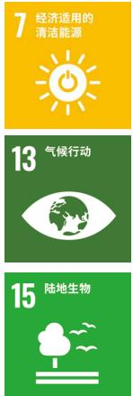

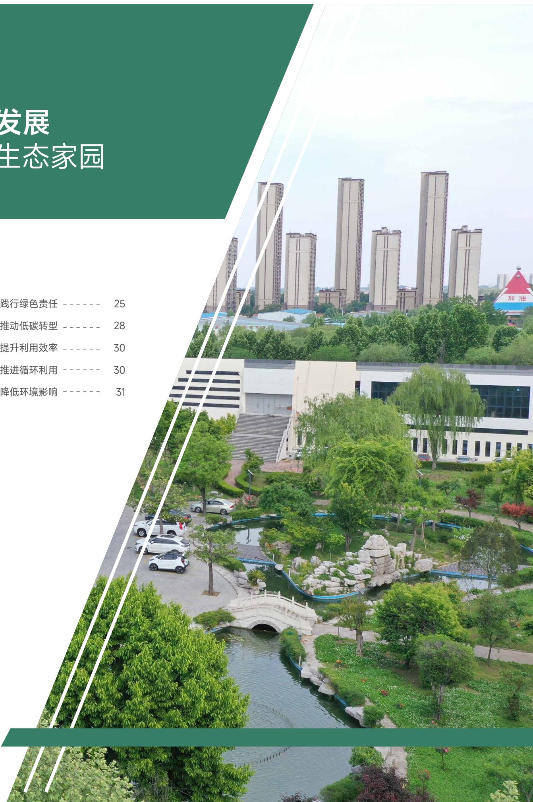

text_image

发展
生态家园

践行绿色责任 ---- 25
推动低碳转型 ---- 28
提升利用效率 ---- 30
推进循环利用 ---- 30
降低环境影响 ---- 31

## 强化环境合规 践行绿色责任

山东墨龙始终秉持生产经营与生态环境保护协同共进的发展理念，推动环境保护与生产经营同步规划、同步实施、同步提升， 通过健全环境管理组织体系、完善环境管理制度规范、强化环境风险防控与突发环境事件应急处置能力等系统性举措，全力推动经济效益与生态效益协调统一。

## 治理

山东墨龙认真落实《中华人民共和国环境保护法》《中华人民共和国节约能源法》《中华人民共和国固体废物污染环境防治法》《中华人民共和国大气污染防治法》《中华人民共和国环境影响评价法》《山东省大气污染防治条例》《山东省环境保护条例》等相关法律法规的要求，严格执行《排污许可证》的相关要求，明确环保责任制、危险废物管理、环保责任追究等核心管理要求，通过推广应用新技术、推行文明清洁生产、减少有害物排放、防范环境污染，为生态环境的改善贡献企业力量。

公司组建环境保护领导小组，设置专门的安全环保部，并在安全环保部和各生产区配备专职环保专员，确保环境管理的全

## 环境合规组织架构

配置需要的人员和

和目标，环境保护领导小组

督环境政策的执技术监督与环保

环保专员

公司已获得GB/T24001-2016/ISO14001:2015环境管理体系认证。

natural_image

Illustration of a light green leafy branch against a plain light background (no text or symbols)

## 环境管理体系认证证书

ENVIRONMENTAL MANAGEMENT SYSTEM CERTIFICATE

编号：No.00523E4890R4M

山东墨龙石油机械股份有限公司

## SHANDONG MOLONG PETROLEUM

: GB/T24001-2016/ISO14001:20

for EMS: "DESIGN, DEYELOPMENT ANE MANUFACTURING OF SUCKER RODS, PUMPS, SEAMLESS STEEL PIPE (SCOPE OF QUALIFIEE MANUYACTURINAGIOFSUCKERNROPPEPAND SOSE ACASING STEUPLING: MANUFAFTURING ER PETROLEUM MACHINERY ACCESSORIES, MUD PUMP CYLINDER SET AND VALVE BODIES\*.

This certificate is valid until: 13 January 2027

Issued on: 19 Novm

Issued by: Tian Wei

natural_image

Illustration of a leafy branch with leaves and stems, rendered in light green on a pale background (no text or symbols)

## 战略

山东墨龙定期开展环境风险识别与影响评估，重点检查废水及废气排放达标情况、固体废弃物的分类收集和存放规范情况等，对发现的环保问题及时督促整改，并跟踪整改效果，确保环保措施得到有效落实。

公司主营业务在生产运营过程中，对生态环境与自然资源利用存在一定影响。在资源消耗层面，生产经营需耗用大量金属原材料及能源，客观上面临资源集约利用与高效管理的挑战；在污染物排放层面，生产环节产生的废气、废水及固体废弃物，若管控与处置不到位，可能对区域大气、水体及土壤环境造成潜在影响，进而对生态系统稳定与自然资源可持续利用带来压力。

为积极应对上述环境影响，公司坚持绿色低碳与循环发展理念，持续推进节能减排与资源综合利用工作，通过健全能源管理体系、推广应用节能工艺技术、优化能源消费结构等举措，不断提升能源利用效率、降低综合能耗；对生产废水实施分类处理与循环回用，切实提高水资源利用效率、减少新鲜水消耗；对固体废弃物实行规范分类、回收利用与合规处置，最大限度降低环境风险。

## 影响、风险及机遇管理

为有效防范化解潜在环境风险，公司围绕生产运营全流程，实施工艺优化、设备运维、员工培训及管理制度建设等一系列预防性举措，并建立健全完善的应急预案明确应急组织架构，规范应急响应流程，配备充足应急资源保障 确保突发环境事件发生时能够快速高效响应，最大限度降低对生态环境及周边社区的影响。

公司结合自身业务活动，生产工艺及设施设备分布 全面识别可能引发环境事件的风险源头:通过对原材料，中间产品及废弃物的属性与用量开展系统分析，精准判定潜在环境风险类别，并结合风险特征，对环境事件发生的可能性及影响程度进行科学评估，重点考量有害物质泄漏概率、泄漏规模，以及对水体、大气环境与周边社区等可能造成的影响范围。

## 预防环境风险管理措施

## 工艺优化与设备维护

在生产环节优化工艺流程，尽量采用清洁生产技术，减少有害物质的使用：定期维护和检查设备，防止因设备老化、故障导致泄漏等环境事件风险。

## 开展环境安全培训

定期开展环境安全培训，使员工了解环境风险、熟悉操作规程，增强员工的风险意识和应急处理能力。

## 建立环境安全管理制度

建立完善的环境安全管理制度，规范日常操作流程，加强对环境风险的管控。

公司制定环境安全方针，构建突发环境事件应急管理体系并编制应急预案，每年定期组织应急培训与演练。同时，对内部人员开展环保培训，日常点检环保设施并组织环保检查。针对现有项目发生重大变化的情况，按规定及时办理环境影响评价相关手续，新建项目提前完成环境影响评价手续办理，并在投产前完成自主验收。

## 环境风险应急预案

## 明确应急组织架构

明确在突发环境事件中的指挥机构和各部门职责。  
设有抢险救援组（负责现场抢险和救援工作）、环境监测组（负责对事件影响的环境监测）、医疗救护组（负责对受伤人员的救治）、后勤保障组（提供物资和通信等保障）。

## 规定应急响应流程

明确规定事件发生后的响应级别和相应的行动步骤。  
接到事件报告后，根据事件严重程度启动不同级别的应急预案。

## 保障应急资源

建立应急物资储备库，储备防护用品、应急救援设备和清理工具等物资，并定期维护和更新。  
确保应急通信畅通，与外部救援力量（如消防、环保部门等）建立良好的协作关系。

## 指标和目标

山东墨龙参照国家及地方环保法规及行业技术标准，结合企业发展阶段、行业特性及监管要求动态调整环境管理目标，定期复盘评估指标完成情况，确保目标的科学性与可行性。报告期内，公司未发生重大环境事件，未因环境事件受到生态环境等有关部门重大行政处罚或被追究刑事责任。

## 应对气候变化 推动低碳转型

山东墨龙结合自身业务布局，紧密围绕气候变化情景，系统推进化石能源洁净化、洁净能源规模化以及生产过程低碳化等关键举措，逐年降低碳排放强度与排放总量。公司董事会下设战略委员会，负责识别、评估和应对公司经营中面临的气候相关风险，审核风险管理策略和重大风险管理解决方案。

公司顺应低碳化转型的发展趋势，制定中长期低碳发展目标，致力于在2030年前实现碳达峰，并在2050年达成净零排放目标，全面实现碳中和，助力“双碳”计划。

<table><tr><td colspan="2">风险类型</td><td>影响</td><td>应对举措</td></tr><tr><td rowspan="2">转型风险</td><td>合规风险</td><td>·政府为应对气候变化推出更严格的政策法规,可能导致相关诉讼或索赔增加,增加运营合规工作量。</td><td>·及时跟踪和解读政策法规变化,确保企业运营符合最新要求;·建立风险预警机制,提前识别潜在的合规风险,制定应对策略;·加强与政府部门的沟通,积极参与政策制定过程,争取政策支持。</td></tr><tr><td>市场风险</td><td>·原材料和能源成本上升;·化石燃料需求减少。</td><td>·与供应商建立长期合作关系,锁定原材料价格,降低采购成本;·实施节能改造,推广使用高效节能设备,减少能源消耗;·拓展能源供应渠道;·调整产品结构:开发低碳、高附加值产品,适应市场需求变化;·优化市场布局,降低单一市场风险。</td></tr><tr><td rowspan="2">实体风险</td><td>突发性风险:台风、暴雨等极端天气</td><td>·施工现场、办公楼建筑及设备损毁,造成资产损失;·因设备损坏、员工无法稳定生产、正常工作;·运输停滞,导致供应链中断。</td><td>·购买必要保险,启动保险理赔;·优先修复关键设备,启用备用设备;·建立多元化运输渠道,优化库存;·定期风险评估,更新应急预案;·加强设备维护,组织员工培训,优化气候适应性建设。</td></tr><tr><td>慢性风险:持续高温、干旱等</td><td>·增加了公司制冷设备的需求,导致能耗和运营成本上升;·高温天气可能限制员工户外工作时间,影响运营效率。</td><td>·优化制冷设备选型,采用节能型设备以降低能耗;·推行弹性工作制度,合理安排户外作业时间,避免高温时段作业;·加强员工防暑降温措施,提供必要的防护用品和休息设施。</td></tr></table>

山东墨龙积极应对气候变化，采取多项降碳减排措施，助力产业绿色发展转型。

## 降碳减排的具体措施

优先选择低能源消耗及高能源效益的产品以及可再生能源，以减少能源消耗量。  
倡导避免不必要的出外商旅，降低因商旅而乘搭交通工具（飞机等）所导致的碳排放。  
优先选用本地供应商，降低因货物运输而产生的能源消耗。  
在供应链管理中强调减少碳排放的重要性。  
厂房设置通风除尘、除毒及过滤系统，以减少废气排放污染。  
办公大楼装修时采用环保材料，使用前进行空气质量检测，合格后方可投入使用。

为推动实现碳达峰和零净排目标，公司搭建气候维度相关的指标休系，统筹考量合规要求与战略导向属性，公司范围一温室气体排放的主要来源包括运营中对柴油、汽油、天然气、液化石油气、乙炔、丙烷等自然资源和能源的消耗；范围二温室气体排放的主要来源包括外购电力和外购热力：由于公司产业链涉及项目较多，暂未开展范围三温室气体排放绩效统计，未来将逐步完善相关工作。

<table><tr><td>指标名称</td><td>单位</td><td>2025年</td></tr><tr><td>温室气体（范围1）排放量</td><td>吨二氧化碳当量</td><td>154,595.90</td></tr><tr><td>温室气体（范围2）排放量</td><td>吨二氧化碳当量</td><td>47,120.69</td></tr></table>

## 优化能源管理 提升利用效率

山东墨龙持续推进能源结构优化转型，在加热炉等关键环节积极应用天然气、电力等清洁能源，不断提升生产全生命周期内可再生能源与清洁能源的使用占比，为应对全球气候变化、保护生态环境发挥了积极示范作用，助力经济社会全面绿色低碳转型。为持续提升能源利用效率，公司不断健全能源管理体系，通过完善能源计量器具配置、推进节能降耗工艺技术升级改造等举措，持续优化能源配置与使用效率。目前，公司已实现能源系统安全稳定运行，节能减排绩效指标保持稳步改善，绿色低碳发展管理目标持续落地见效。

<table><tr><td>指标名称</td><td>单位</td><td>2025年</td></tr><tr><td>综合能源消耗量</td><td>吨标煤</td><td>46,245.59</td></tr><tr><td>柴油</td><td>吨</td><td>91</td></tr><tr><td>天然气</td><td>万立方米</td><td>3,131.67</td></tr><tr><td>电力</td><td>万千瓦时</td><td>9,432.48</td></tr></table>

## 强化资源管控 推进循环利用

山东墨龙将资源节约集约与循环高效利用作为企业绿色低碳发展战略的核心抓手，将资源全生命周期管控要求深度融入企业生产经营全链条，推动资源利用效率持续提升，助力实现绿色高质量发展与环境效益的协同提升。

## 践行节水理念

山东墨龙高度重视水资源管理，生产用水全部循环使用，通过多种措施实现水资源的节约与高效利用。在日常运营中，公司倡导节约用水，优化生产用水循环体系，严格管控废水处理流程，遵循“一水多用”原则，持续完善供水管网、升级水计量系统，显著提升了废水回流利用率。公司还通过在工作间、洗手间、茶水间、餐厅及员工宿舍张贴节水标语和宣传海报，积极营造节水文化，全面增强员工的节水意识，为水资源的可持续管理提供了有力支持。

<table><tr><td>指标名称</td><td>单位</td><td>2025年</td></tr><tr><td>市政购水量</td><td>吨</td><td>20,703.00</td></tr><tr><td>地下水使用量</td><td>吨</td><td>8,608.00</td></tr><tr><td>重复用水总量</td><td>吨</td><td>19,697.00</td></tr><tr><td>重复用水消耗量占比</td><td>%</td><td>100</td></tr></table>

## 合理利用物料

山东墨龙多举措助力环保意识提升与宣传，同时推动物料资源节约。在内部，通过张贴环保海报和定期组织环保培训，向员工宣传环保政策和知识，并融入物料节约理念，引导员工减少浪费、提高资源利用率；在外部，积极参与世界环境日宣传活动，向社会公众普及环保与资源节约的重要性，提升社会环保关注度，倡导绿色生活方式。

## 规范排放管理 降低环境影响

山东墨龙严格遵循《排污许可管理条例》《大气污染防治法》《噪声污染防治法》等法律规定，严格执行《排污许可证》相关要求，积极践行合规排放治理要求。报告期内，公司污水、废气、噪声达标排放，尽量避免环境污染事故和因环境影响被投诉的情况，确保危险废物的合规处理，并通过QES体系认证，建立系统化、标准化的环境管理体系。

公司建立环境管理台账记录制度，对各类与环保相关的活动进行详细记录。具体包括危险废物的产生、收集及处理情况，一般工业固体废物的产生台账和转运记录，污染物排放的监测数据，以及环保设备的维护保养记录等。在生产过程中优先考虑减少废物产生，采用清洁能源与清洁生产技术，高效利用能源和原材料，减少污染物的排放和废弃物的产生。

公司针对生产经营中产生的废气、废水、固体废物和噪声，均采取了有效治理措施，实现了污染物达标排放和资源循环利用，确保环保与生产协调发展。

主要有管坏、管体使用天然气炉进行加热时燃用天然气产生的燃烧废气，管体轧制过程中产生的工艺废气，管体喷涂产生的有机废气等等。

主要有设备运行、货物装卸等产生的噪声公司各类产噪设施均配备了基础减震、隔音罩、完整厂房等降低噪声排放的措施，厂界噪声排放符合相关标准。

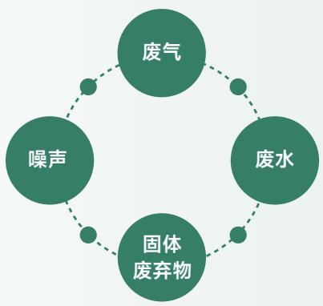

flowchart

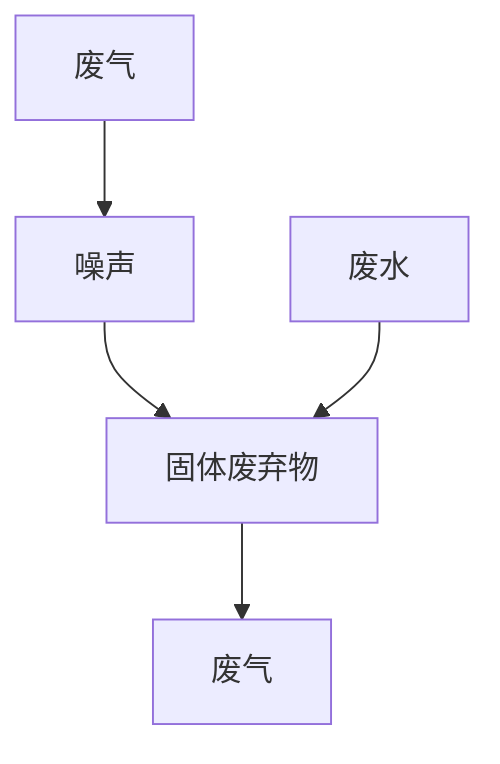
```mermaid
graph TD
  A["废气"] --> B["噪声"]
  B --> C["固体废弃物"]
  D["废水"] --> C
  C --> E["废气"]
```

主要包括管体及设备的冷却水和酸洗磷化产生的废水、所有工业废水经处理后全部循环使用，不外排。

主要包括废管头，氧化铁皮，铁销等一般工业固废和废切削液、废油、废活性炭等危险废物，一般工业固废统一外售综合利用，危险废物由专业机构统一处置。

## 报告期内，公司

环境污染事故发生次数为

因对周边环境影响被投诉次数为

危险废物不合规存放及处理次数为

## 强化废气治理

山东墨龙从源头控制入手，采用清洁生产技术、优化生产工艺，减少污染物的产生；依据废气成分和性质，匹配合适的末端处理技术，稳步推进污染物减排目标。通过安装高效的废气处理设备，如UV光氧+活性炭吸附装置、SCR脱硝+静电除尘、布袋除尘等，确保废气处理后达标排放。配套建设四套在线监测设施，实时监控污染物排放情况；制定重污染天气应急方案，在政府部门发布重污染天气预警时，严格按照响应级别落实减排措施，最大限度降低对环境的负面影响，全面实现污染物减排和环保合规目标。

<table><tr><td>指标名称</td><td>单位</td><td>2025年</td></tr><tr><td>废气总量</td><td>立方米</td><td>1,715,230,126</td></tr><tr><td>颗粒物</td><td>千克</td><td>3,236.38</td></tr><tr><td>硫氧化物</td><td>千克</td><td>2,381.45</td></tr><tr><td>氮氧化物</td><td>千克</td><td>34,850.91</td></tr><tr><td>挥发性有机物</td><td>千克</td><td>911.24</td></tr><tr><td>氯化氢</td><td>千克</td><td>83.28</td></tr></table>

## 优化废水处理

山东墨龙通过建设配套的污水处理站，采用絮凝、沉淀等先进工艺，有效去除污水中的杂质，并将处理后的水资源回用于生产环节，实现水资源循环利用。同时，公司高度重视水资源管理，秉承“一水多用”原则，通过节约日常用水、优化生产用水循环、严格控制废水处理等措施，持续完善供水管网、升级水计量系统，显著提高废水回流利用率；此外，公司通过在工作间洗手间 茶水间 餐厅及员工宿舍张贴节水标语和宣传海报 积极倡导全员节水理念 全方位推动水资源的可持续管理和高效利用。

<table><tr><td>指标名称</td><td>单位</td><td>2025年</td></tr><tr><td>工业废水总量</td><td>立方米</td><td>0</td></tr><tr><td>生活废水总量</td><td>立方米</td><td>19,800.00</td></tr><tr><td>化学需氧量(COD)</td><td>毫克/升</td><td>285.00</td></tr><tr><td>生化需氧量(BOD)</td><td>毫克/升</td><td>121.88</td></tr><tr><td>氨氮(NH3-N)</td><td>毫克/升</td><td>3.95</td></tr><tr><td>总氮(TN)</td><td>毫克/升</td><td>19.18</td></tr><tr><td>总磷(TP)</td><td>毫克/升</td><td>1.81</td></tr></table>

## 规范废弃物处置

公司根据自身行业特点、国家环保政策要求和可持续发展理念，设定长期污染物减排目标，严格遵守《中华人民共和国固体废物污染环境防治法》等法律法规，制定《危险废物管理制度》等内部文件。每年年底委托有资质的第三方进行危险废弃物的处置，并出具危废转移五联单。公司成立由公司高层管理人员、生产部门、采购部门、环保部门负责人等组成的环保领导小组，制定废弃物处理的总体策略和目标，协调各部门之间的工作，对环保重大事项进行决策。

在产品设计阶段，公司注重减少废弃物产生，通过优化工艺流程、推行清洁生产、更新生产设备以及选用环保型原材料，有效降低污染物排放:同时 将环保要求延伸至供应链 确保供应商提供环保型材料并符合环保标准 全面实现绿色供应链管理；公司严格管理危险废物，确保其存放和处理合规，报告期内未发生危废存放及处置不合规相关事项，整体实现了高效、环保的生产目标。

## 废弃物处理内部制度规范

## 《废弃物分类制度》

分类标准明确：制定详细的废弃物分类标准，明确规定哪些属于有害废弃物、哪些属于无害废弃物，以及各类废弃物的具体细分种类。

## 《废弃物产生记录制度》

记录内容详细：要求各部门记录废弃物的产生情况，包括废弃物名称、产生时间、产生数量、产生源等信息。

## 《废弃物暂存管理制度》

暂存设施规范：对废弃物暂存场所的选址、建设和管理作出规定。暂存场所要符合安全和环保要求，如地面要做防渗处理，要有防雨、防晒设施等。

<table><tr><td>披露项</td><td>单位</td><td>2025年</td></tr><tr><td>固体废弃物总量产生量</td><td>吨</td><td>35,105.35</td></tr><tr><td>无害固体废弃物产生量</td><td>吨</td><td>35,079.12</td></tr><tr><td>有害固体废弃物产生量</td><td>吨</td><td>26.23</td></tr><tr><td>回收再利用的废弃物占比</td><td>%</td><td>99.93</td></tr></table>

各类固废分类存放，储存区域设置标志牌和警示牌。  
●公司与处置单位签订合同明确双方的责任和义务同时跟踪处置单位的处置进度和质量。

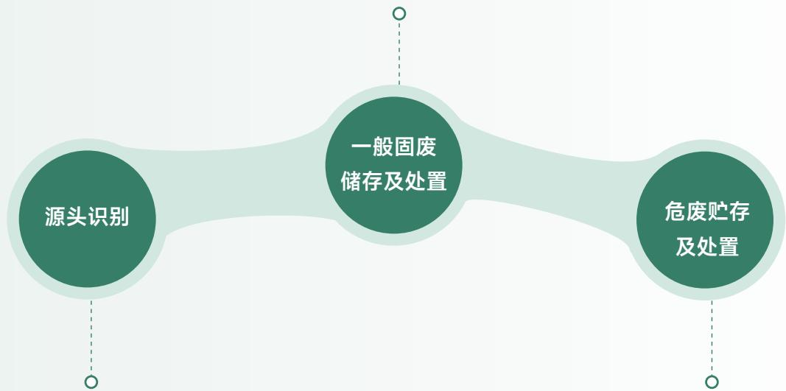

flowchart

```mermaid
graph LR
  A["源头识别"] --> C["一般固废储存及处置"]
  B["危废贮存及处置"] --> C
  C -.-> D[""]
  C -.-> E[""]
```

各部门对照环评手续、危废目录对生产废物或非生产性废物进行识别，确定废弃物类型，如一般工业固废、危险危废进行鉴别。  
根据固废类型和性质，设置不同的收集容器，存放区域进行分类贮存。

建设符合要求的危废暂存库，暂存场所要具备防雨、防晒、防渗漏等功能。  
在暂存容器和场所显著位置张贴危废标识，标明危废名称、成分、危险特性等信息。  
每年交由危废资质单位进行统一处置。

## 严控污染物排放

为全面保障环保合规和可持续发展公司持续跟踪国家和地方的环保法规，政策及排放标准 确保污染物排放始终合法合规；同时建立与环保部门的常态化沟通机制，主动接受监管，及时获取最新环保要求信息，防范因违规行为导致的处罚和声誉损失。公司从长远角度考量污染物排放管控对企业可持续竞争力的影响，并在污染治理过程中，综合平衡环保投资成本与潜在经济效益，实现环境保护与企业发展的双向平衡

针对新上产污设施或环保设施项目，公司召开专题会议讨论环保政策及排放管控要求等问题，明确污染物排放浓度和总量管控标准，防范因环保政策收紧引发的排放超标风险。公司各污染物产生环节均配备了有效的环境治理设施，确保各类污染物稳定达标排放，未对员工及周边居民造成不良影响。

公司由高级管理层直接领导安环部，并在各生产区设立安环科，同时配备具有专业背景的工程师和环保专员，负责制定并实施污染物排放治理策略，监督环境管理制度的执行，确保环保措施高效落实。

污染物排放治理各部门分工  
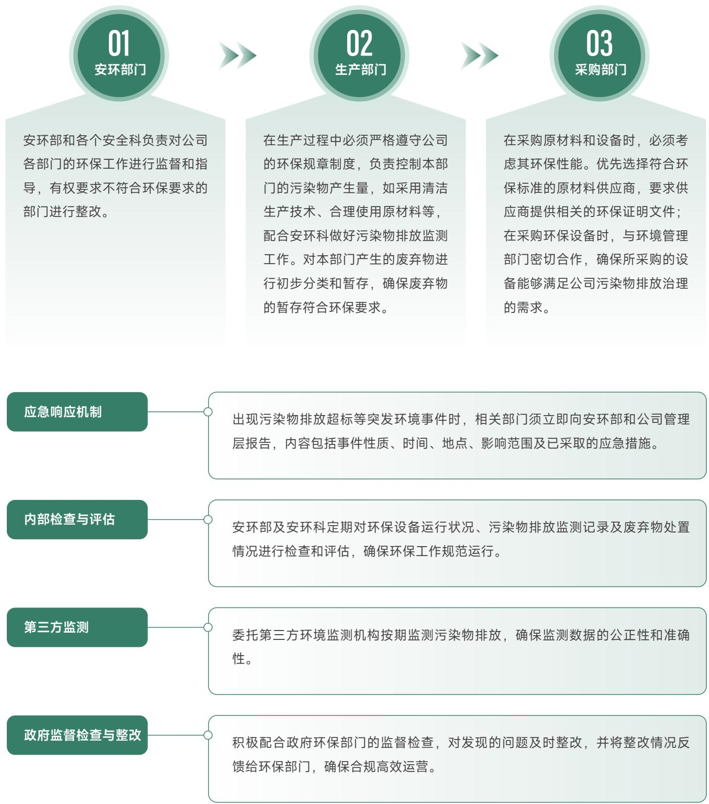

## 责任担当

## 赋能社会共发展

践行安全责任 守护职业健康 37

聚焦科技创新 提升核心实力 44

深化合作共赢 构建责任供应链 49

坚持以人为本 保障员工权益 57

投身公益事业 传递企业温暖 64

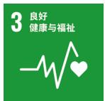

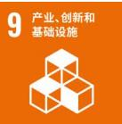

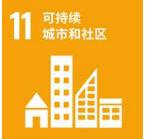

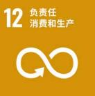

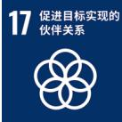

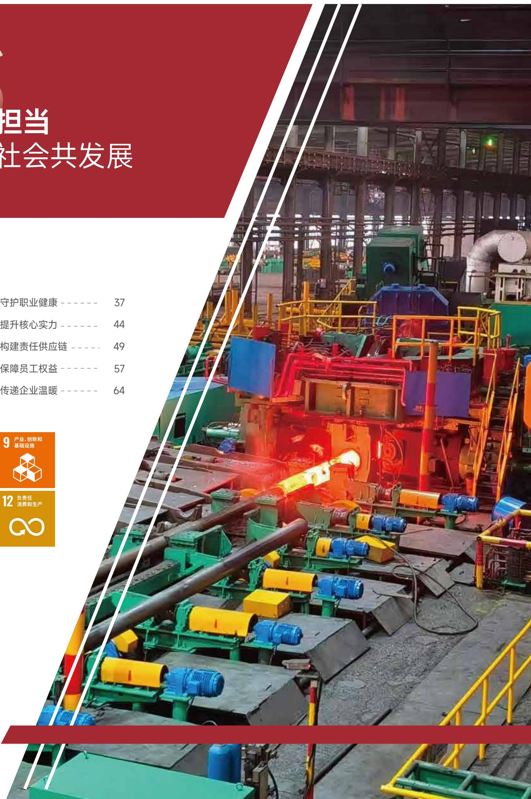

text_image

担当
社会共发展

守护职业健康------ 37
提升核心实力------ 44
构建责任供应链------ 49
保障员工权益------ 57
传递企业温暖------ 64

9 产业、创新和
基础设施

12 负责任
消费和生产

∞

## 践行安全责任 守护职业健康

山东墨龙始终坚守“以人为本，生命至上”的核心理念，将安全生产与职业健康保护纳入企业长远发展战略布局，深刻践行“安全第一，预防为主，综合治理”的国家安全管理方针及自身环境安全方针，结合企业生产经营实际，通过系统性的战略部署、常态化的管理推进，切实履行企业安全生产主体责任，守护全体员工的生命安全与职业健康，为企业高质量、可持续发展筑牢安全根基。

## 强化安全生产

山东墨龙持续建立健全安全生产标准化流程，完善安全生产责任制，推进安全风险管控与隐患排查的双体系建设，定期开展安全生产风险评估，及时制定有效的风险控制策略和防护措施。

## 治理

山东墨龙严格遵循《中华人民共和国安全生产法》《山东省安全生产条例》等法律法规，结合自身生产经营特点，构建了覆盖安全责任、奖惩、培训、应急等全维度的制度体系。公司制定《安全环保管理制度》，明确包含安全奖惩管理制度、安全生产晨会制度、相关方安全管理制度、工伤事故责任追究制度等6个专项制度，形成“安全环保部统筹监督、各部门分级落实、班组长现场管控、员工严格执行”的四级安全管理架构。

## 责任划分

安全环保部负责制度执行监督、现场安全检查与考核；各部门负责人承担本部门安全管理主要责任，落实安全检查与隐患整改；班组长负责组织召开安全生产晨会、现场作业安全监督等具体工作；员工严格遵守岗位安全操作规程，履行安全职责。

## 考核机制

建立多层次安全考核体系，对安全管理机构不健全、未签订《安全生产责任书》等情形，扣罚责任部门负责人当月考核1-3分；对安全事故处理未执行“四不放过”原则、隐瞒事故真相的，扣罚责任部门负责人当月考核5-20分；员工违反操作规程的，根据情节轻重处以50-500元罚款、扣减考核分，情节严重的予以开除。

## 资金保障

按制度要求保障安全生产投入确保安全设施配置，劳动防护用品采购，安全培训开展等各项工作的资金需求，为安全生产条件持续优化提供支撑。

报告期内，公司持续以安全生产标准化为抓手，严格落实制度汇编各项要求，确保安全管理体系有效运行。

## 战略

山东墨龙秉持“以人为本，生命至上”的安全管理理念，贯彻“安全预防、持续完善体系”的环境安全方针，遵循国家“安全第一 预防为主，综合治理”的安全管理方针 切实将安全管理要求落到实处，根据环境，安全管理手册，按照程序要求 确保安全生产管理体系正常、有效运行。定期进行阶段性检查，通过内部审核和管理评审，查找管理短板，采取有效纠正措施，持续改进环境安全管理体系。

## 影响、风险和机遇管理

山东墨龙严格落实安全风险分级管控与隐患排查治理双重预防机制，按制度要求开展全流程风险管控：

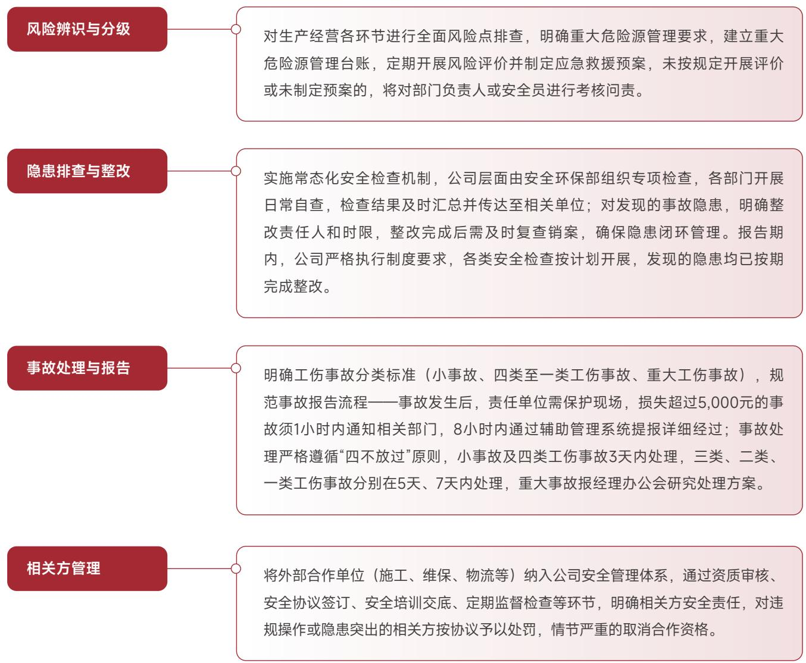

flowchart

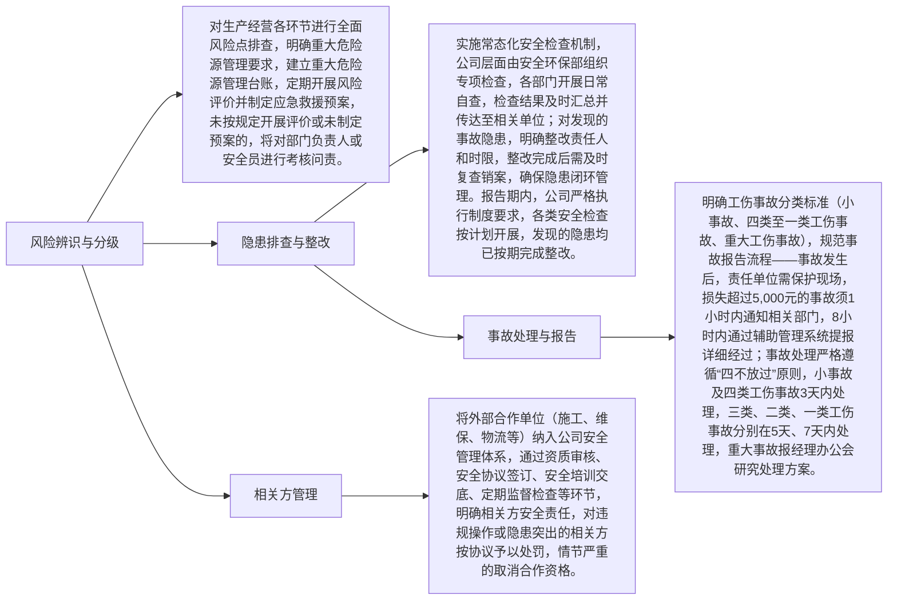
```mermaid
graph LR
  A["风险辨识与分级"] --> B["对生产经营各环节进行全面风险点排查，明确重大危险源管理要求，建立重大危险源管理台账，定期开展风险评价并制定应急救援预案，未按规定开展评价或未制定预案的，将对部门负责人或安全员进行考核问责。"]
  A --> C["隐患排查与整改"]
  C --> D["实施常态化安全检查机制，公司层面由安全环保部组织专项检查，各部门开展日常自查，检查结果及时汇总并传达至相关单位；对发现的事故隐患，明确整改责任人和时限，整改完成后需及时复查销案，确保隐患闭环管理。报告期内，公司严格执行制度要求，各类安全检查按计划开展，发现的隐患均已按期完成整改。"]
  C --> E["事故处理与报告"]
  E --> F["明确工伤事故分类标准（小事故、四类至一类工伤事故、重大工伤事故），规范事故报告流程——事故发生后，责任单位需保护现场，损失超过5,000元的事故须1小时内通知相关部门，8小时内通过辅助管理系统提报详细经过；事故处理严格遵循“四不放过”原则，小事故及四类工伤事故3天内处理，三类、二类、一类工伤事故分别在5天、7天内处理，重大事故报经理办公会研究处理方案。"]
  A --> G["相关方管理"]
  G --> H["将外部合作单位（施工、维保、物流等）纳入公司安全管理体系，通过资质审核、安全协议签订、安全培训交底、定期监督检查等环节，明确相关方安全责任，对违规操作或隐患突出的相关方按协议予以处罚，情节严重的取消合作资格。"]
```

## 安全生产应急预案

公司持续完善安全应急管理体系，设立了应急指挥中心，负责统一协调和指挥应急处置工作，依法制定了生产安全事故应急救援预案，明确各部门在应急管理中的职责，覆盖火灾、爆炸、机械伤害、化学品泄漏等多种可能的突发事件类型，明确应急处置流程和措施，旨在有效应对各类突发事件，及时发现、治理和消除安全事故隐患，保障员工生命财产安全和公司的正常运营。此外，公司还制定了应急物资储备和管理制度，确保应急物资充足、可用。

公司高度重视安全生产培训，制定应急演练和培训制度，每年制定详细的培训计划，明确培训内容、培训时间、参与人员及授课人员，按期为员工提供各类安全培训课程，定期开展安全生产月及应急演练，全面增强员工的安全生产意识和应急处理能力。

安全生产应急组织架构  
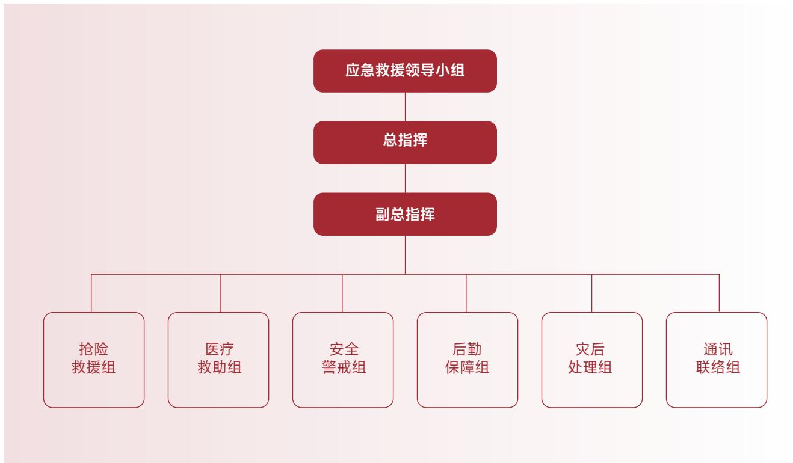

flowchart

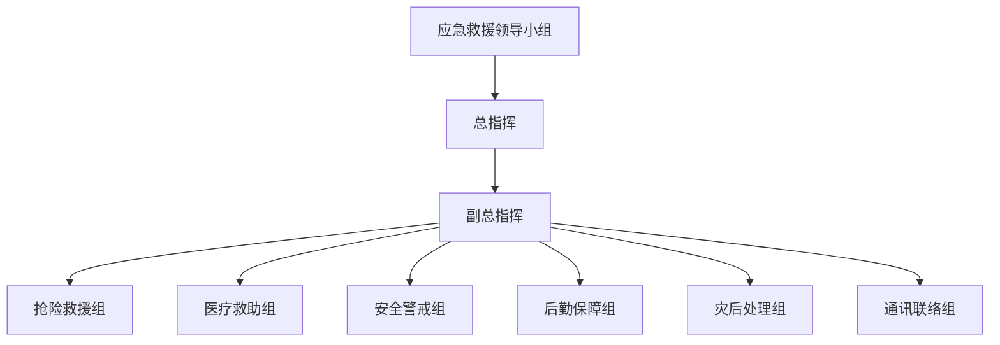
```mermaid
graph TD
  A["应急救援领导小组"] --> B["总指挥"]
  B --> C["副总指挥"]
  C --> D["抢险救援组"]
  C --> E["医疗救助组"]
  C --> F["安全警戒组"]
  C --> G["后勤保障组"]
  C --> H["灾后处理组"]
  C --> I["通讯联络组"]
```

<table><tr><td>2025年安全培训课程</td><td>参训人数</td></tr><tr><td>有限空间作业专项安全培训</td><td>154</td></tr><tr><td>高处作业安全知识培训</td><td>91</td></tr><tr><td>用电安全知识培训</td><td>51</td></tr><tr><td>动火作业安全知识培训</td><td>158</td></tr><tr><td>安全相关法律法规、规章、标准规范</td><td>1006</td></tr><tr><td>全员安全生产责任制培训</td><td>957</td></tr><tr><td>开工第一课安全教育培训</td><td>1007</td></tr><tr><td>安全生产管理制度、岗位安全操作规程和风险辨识及应急处置措施</td><td>943</td></tr><tr><td>工贸行业治本攻坚三年行动方案</td><td>954</td></tr><tr><td>特种作业监护人安全培训</td><td>66</td></tr><tr><td>应急救援队伍培训</td><td>15</td></tr><tr><td>安全标准化(包含双重预防体系)</td><td>929</td></tr><tr><td>“八抓二十项”创新举措</td><td>939</td></tr><tr><td>安全生产月培训及应急演练</td><td>935</td></tr><tr><td>生产安全事故应急预案、应急处置与逃生自救互救知识</td><td>934</td></tr><tr><td>劳动防护用品的正确使用及监督管理</td><td>933</td></tr><tr><td>特种设备作业人员安全技术培训</td><td>190</td></tr><tr><td>消防安全培训</td><td>985</td></tr><tr><td>专(兼)职安全管理人员培训</td><td>21</td></tr><tr><td>员工职业危害因素、法律法规、劳动防护用品佩戴</td><td>938</td></tr><tr><td>地震逃生自救知识培训</td><td>921</td></tr></table>

## 智慧安全生产

山东墨龙持续推进智能化工厂建设以及智慧安全生产进程，对控制（半）自动化生产线进行升级改造。公司现有的加工车间使用的工业软件，多数为控制（半）自动化系统，进一步推动了设备与制造系统的高效连接，为公司精准控制产品质量、提升产线安全性等方面打下了坚实的基础。

## 山东墨龙已投入使用的智能生产系统

智能生产系统名称

<table><tr><td>环形炉监控系统</td><td>穿孔机监控系统</td><td>连轧机组HGC监控系统</td></tr><tr><td>定径机监控系统</td><td>钢管矫直机监控系统</td><td>钢管漏磁控伤系统</td></tr><tr><td>水压试验系统</td><td>起重机全车监控系统</td><td>除尘系统</td></tr><tr><td>泵房系统</td><td></td><td></td></tr></table>

## 指标与目标

为夯实高质量发展的安全基石，山东墨龙建立清晰的安全生产目标体系，持续强化风险防控与本质安全建设，推动安全管理朝着系统化、智能化、标准化方向全面升级。

<table><tr><td>披露项</td><td>单位</td><td>2023年</td><td>2024年</td><td>2025年</td></tr><tr><td>安全生产投入</td><td>元</td><td>8,217,698.23</td><td>7,063,751.59</td><td>7,739,267.07</td></tr><tr><td>员工工伤保险投入金额</td><td>万元</td><td>159</td><td>44</td><td>57</td></tr><tr><td>安全生产事故数</td><td>起</td><td>14</td><td>8</td><td>2</td></tr><tr><td>员工工伤保险覆盖率</td><td>%</td><td>100</td><td>100</td><td>100</td></tr><tr><td>工伤事故起数</td><td>起</td><td>14</td><td>8</td><td>2</td></tr><tr><td>工伤人数</td><td>人</td><td>14</td><td>8</td><td>2</td></tr><tr><td>因工伤损失的工作日数</td><td>天</td><td>562</td><td>479.5</td><td>80</td></tr><tr><td>因工死亡事故起数</td><td>起</td><td>0</td><td>0</td><td>0</td></tr><tr><td>因工死亡事故人数</td><td>人</td><td>0</td><td>0</td><td>0</td></tr><tr><td>因工死亡事故人数占比</td><td>%</td><td>0</td><td>0</td><td>0</td></tr><tr><td>接受安全培训的员工人数</td><td>人</td><td>1,941</td><td>1,339</td><td>1,261</td></tr><tr><td>员工参加安全培训总时数</td><td>小时</td><td>38,804</td><td>49,685</td><td>46,946</td></tr></table>

## 深耕职业管理

山车墨龙建立了中用人单位职业病危害风险分级管控体系与用人单位职业病隐患排查治理体系组成的员工职业健康与安全管理体系，明确由质管部负责公司质量、环境、职业健康安全管理体系的统筹建设，安环部负责职业健康与安全管理体系的落地执行，公司已通过职业健康安全管理体系认证

flowchart

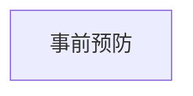
```mermaid
graph TD
  A["事前预防"]
```

明确告知员工作业场所和工作岗位存在的危险、危害因素、防范措施和事故应急措施；为员工提供符合国家标准或行业标准的劳动防护用品(安全帽，劳保服，防护手套等)并通过安全培训、现场监督等方式，确保员工按规定佩戴使用，对未按要求穿戴劳保用品的员工予以相应处罚。

## 事中管控

优化厂区布局与生产工艺，减少职业危害因素影响；定期对安全设施、特种设备、环保设备进行检测检验，确保设备正常运行；严格执行劳动作息制度，杜绝员工疲劳作业或酒后上岗，防范职业健康风险。

## 事后保障

建立员工职业健康体检制度，新员工入职需进行体检，在职员工定期免费体检；一线车间岗位员工离职时，需提交具有职业病体检资质的医院出具的离职体检报告，由厂区安全科审查并存档；对接触职业危害因素的员工，针对性开展职业卫生相关法律法规、标准规范及预防措施培训，提升员工自我保护意识。

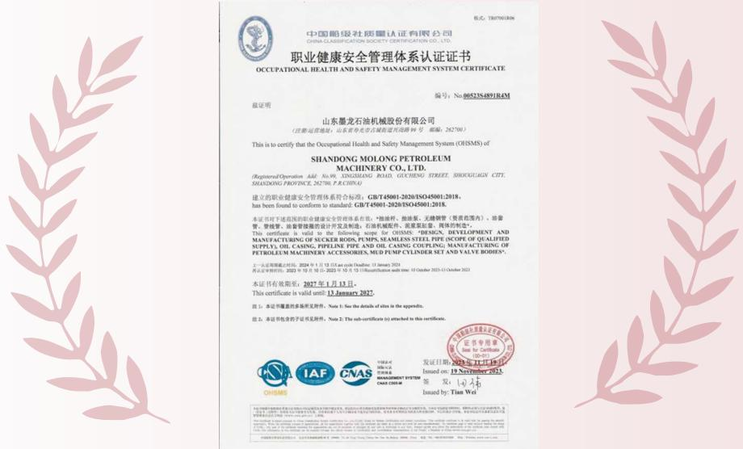

## 职业健康安全管理体系认证证书

OCCUPATIONAL HEALTH AND SAFETY MANAGEMENT SYSTEM CERTIFICATE

编号：No.00523S4891R4M

## 山东墨龙石油机械股份有限公司

## SHANDONG MOLONG PETROLEUM

MACHINERY CO.,LTE

管、管线管、油套管接箍的设计开发及制造：石油机械配件、混浆泵缸套、周体的制造 管、管线管、油套管接箍的设计开发及制造：石油机械配件、泥泵泵缸套、离体的制造，

TNCACTRINGOE S ER RODS PMPS SEAMLESSSTEEL PPE SCOPEOP OUALIFIED SUPPIYA OIL CASING PIPELINE PIPE AND OIL CASING COUPLING: MANUFACTURING OF SUPPLY), OIL CASING, PIPELINE PIPE AND OIL CASING COUPLING: MANUFACTURING OR

This certificate is valid until: 13 January 2027

职业健康安全管理体系认证证书

## 山东墨龙职业健康管理举措

## 引进生产工艺与设施

采用先进的生产工艺及设备，噪声与振动较大的设备在满足工艺的前提下尽可能安装在底层，各设备均设有减振基础，空压机单独布置，采用水性漆，设置排风扇和漆雾处理装置，磷化工位和前处理工位设置酸雾处理装置，维修工位设置焊烟净化器等，热轧车间抛丸机设置布袋除尘器。

## 优化厂区布局

产生噪声的车间与非噪声作业成品仓库分开布置。

## 配备并优化防护、劳保用品

为员工更换更舒适、防护性能更好的安全帽、劳保鞋等。  
为接触职业病危害因素的职工配备耳塞、防尘口罩、防毒口罩等。

## 开展职业健康与安全培训

新员工上岗前必须接受“三级安全教育”（公司级、车间级、班组级），其中包含职业健康相关内容，确保了解岗位危害因素及防护措施。  
在职员工每年安全培训时长不低于20学时，职业卫生培训作为核心内容之一，覆盖法律法规、危害预防、劳动防护用品使用等。  
特种作业人员、接触职业病危害因素的员工按规定接受专项培训，确保具备相应的安全操作技能和健康防护能力。

## 监察执行落实情况

每月组织职业卫生专员对工作场所进行全面检查，包括设备设施的安全性、安全标识的完整性等，对发现的问题及时下达整改通知，跟踪整改落实情况。  
随机对员工的安全操作行为进行抽查，对违规行为进行纠正和教育。

<table><tr><td>披露项</td><td>单位</td><td>2025年</td></tr><tr><td>职业病风险岗位员工人数</td><td>人</td><td>764</td></tr><tr><td>参加职业病员工体检人数</td><td>人</td><td>764</td></tr><tr><td>职业病发病员工人数</td><td>人</td><td>0</td></tr><tr><td>职业病发病率</td><td>%</td><td>0</td></tr><tr><td>公司参与体检的人数</td><td>人</td><td>764</td></tr></table>

## 聚焦科技创新 提升核心实力

山东墨龙以科技创新为核心驱动力，将其作为增强核心竞争力、实现可持续发展的关键战略抓手，立足能源装备制造主业发展实际，统筹规划科研创新、知识产权保护、质量管控及数据安全等重点工作，持续推动科技成果落地转化，不断夯实企业核心竞争力，为企业高质量发展注入强劲科技动力。

## 建设创新机制

山东墨龙秉承着“鼓群志，集群智，聚众德，创众业”的企业宗旨，深刻认识到核心技术是企业核心竞争力的根本，制定了《新产品开发管理办法》《工程师评聘管理办法》等科研创新管理制度。针对新品种、新规格两类新产品，公司成立新产品开发管理小组，明确各层级的主要职责。公司的研发领域聚焦油管、套管、管线管、抽油泵、抽油杆产品业务等方面，覆盖工程技术与材料科学两大核心领域。

公司建立了研发试验和技术支持人员团队，由Ⅲ级无损检测人员、Ⅲ级理化试验人员和高级工程师等组成。公司建立了科研项目与人才激励机制，制定《山东墨龙新产品开发和科技进步奖评审奖励制度》《关于推进新产品、新市场开发激励意见》《新产品科技成果申报》《科技成果奖评审及奖励办法（修订版）》等科研创新激励制度，鼓励科研人才积极开展技术创新，充分激发员工的创新活力和工作积极性，推动公司技术进步与业务发展，为公司的可持续发展注入强动力。

公司严格遵守国家与行业科技伦理相关准则，规范开展科技创新，筑牢科技伦理防线。

山东墨龙科研平台  
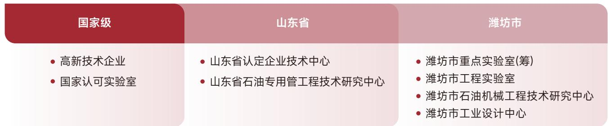

flowchart

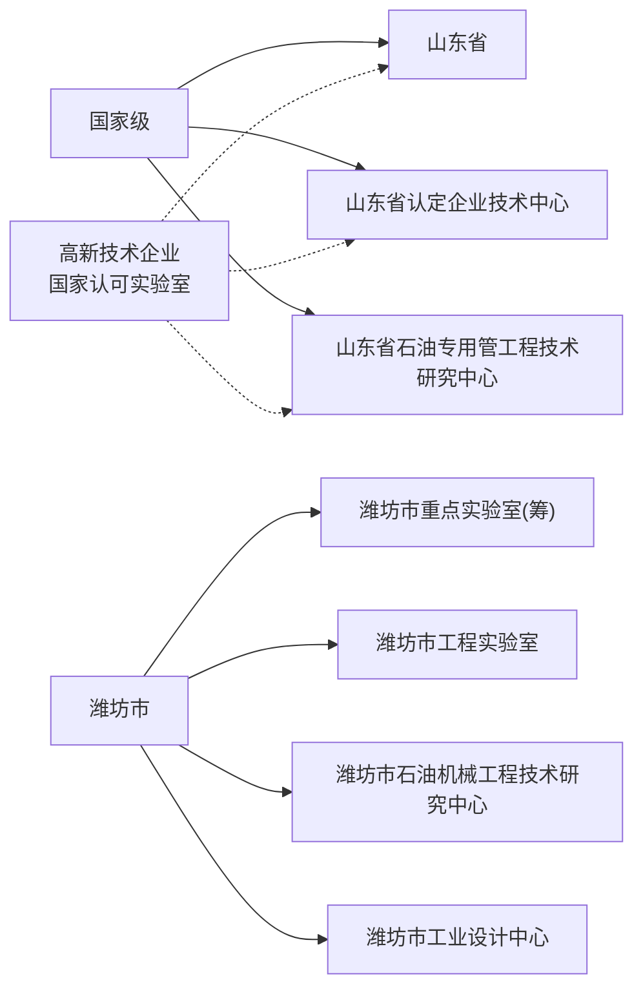
```mermaid
graph LR
  A["国家级"] --> B["山东省"]
  A --> C["山东省认定企业技术中心"]
  A --> D["山东省石油专用管工程技术研究中心"]
  E["高新技术企业\n国家认可实验室"] -.-> B
  E -.-> C
  E -.-> D
  F["潍坊市"] --> G["潍坊市重点实验室(筹)"]
  F --> H["潍坊市工程实验室"]
  F --> I["潍坊市石油机械工程技术研究中心"]
  F --> J["潍坊市工业设计中心"]
```

山东墨龙新产品开发标准流程

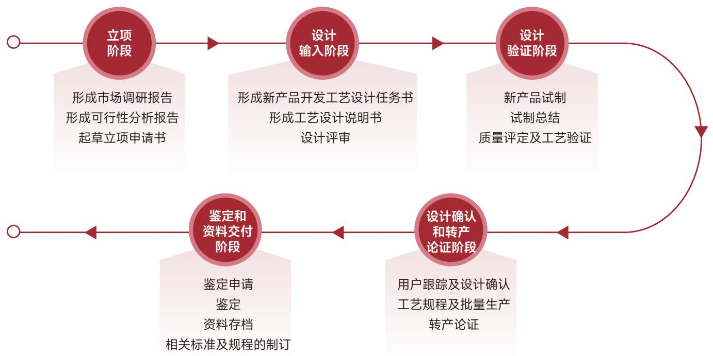

flowchart

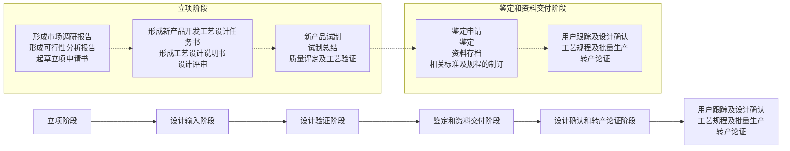
```mermaid
graph LR
  A["立项阶段"] --> B["设计输入阶段"]
  B --> C["设计验证阶段"]
  C --> D["鉴定和资料交付阶段"]
  D --> E["设计确认和转产论证阶段"]
  E --> F["用户跟踪及设计确认\n工艺规程及批量生产\n转产论证"]
  
  subgraph LeftStage ["立项阶段"]
    direction TB
    A1["形成市场调研报告\n形成可行性分析报告\n起草立项申请书"]
    B1["形成新产品开发工艺设计任务书\n形成工艺设计说明书\n设计评审"]
    C1["新产品试制\n试制总结\n质量评定及工艺验证"]
  end
  
  subgraph RightStage ["鉴定和资料交付阶段"]
    direction TB
    D2["鉴定申请\n鉴定\n资料存档\n相关标准及规程的制订"]
  end
  
  subgraph RightStage ["设计确认和转产论证阶段"]
    direction TB
    E2["用户跟踪及设计确认\n工艺规程及批量生产\n转产论证"]
  end
  
  A1 -.-> B1
  B1 -.-> C1
  C1 -.-> D2
  D2 -.-> E2
```

<table><tr><td>披露项</td><td>单位</td><td>2025年</td></tr><tr><td>研发投入</td><td>元</td><td>45,080,295</td></tr><tr><td>研发投入占营业收入比例</td><td>%</td><td>2.56</td></tr><tr><td>研发工作人员数量</td><td>人</td><td>148</td></tr><tr><td>研发人员比例</td><td>%</td><td>11.67</td></tr></table>

## 保护知识产权

山东墨龙积极响应国家知识产权强国建设相关政策，高度重视知识产权的申请、管理和维权工作，建立健全知识产权保护管理体系，制定了《知识产权管理手册》《知识产权文件控制程序》《知识产权管理评审控制程序》等管理文件，成立知识产权小组并明确相关权责。

公司持续完善知识产权风险管控机制和处置程序，积极电请专利，商标等知识产权 委托第三方专业机构完善专利保护等工作，确保创新成果得到充分的法律保护；公司要求内部专业技术人员以及进行对外涉密业务时均需签订保密协议。此外，公司认真学习并贯彻落实国家知识产权相关政策，定期组织内部知识产权培训，持续推动科研成果转化。

<table><tr><td>披露项</td><td>单位</td><td>2025年</td></tr><tr><td>专利总数</td><td>件</td><td>50</td></tr><tr><td>新增专利申请数</td><td>件</td><td>27</td></tr><tr><td>新增专利授权数</td><td>件</td><td>12</td></tr><tr><td>应用于主营业务的发明专利数量</td><td>个</td><td>11</td></tr><tr><td>报告期内发明专利的申请数</td><td>个</td><td>2</td></tr><tr><td>报告期内发明专利的授权数</td><td>个</td><td>1</td></tr><tr><td>有效专利总量</td><td>个</td><td>50</td></tr><tr><td>有效商标数量</td><td>件</td><td>17</td></tr></table>

## 匠心铸就品质

山东墨龙始终贯彻“瞄准环球市场优质臻誉自扬，信客皆我盟友 精诚相得益彰”的质量方针，持续优化产品质量管理体系与流程，致力于提供令客户与市场满意的卓越产品与服务

## 治理

山东墨龙构建了以制度为核心的质量管理体系，依托制度汇编中质量类专项制度，明确管理职责、流程标准与奖惩机制，形成“技术中心+质管部”双核心责任体系，推动质量管理规范化、标准化建设。公司制定《产品实现控制程序》《产品的检验、试验和验证控制程序》《质量风险管理控制程序》《质量事故管理制度》《质量奖罚管理办法》《外购产品质量控制管理办法》《产品质量证明书控制规定》等多项专项制度，覆盖产品设计、采购、生产、检验、售后全生命周期，明确各环节质量控制要求与责任划分。其中技术中心聚焦产品设计与工艺质量保障 质管部统筹质量监督，检验检测，体系审核等工作，各生产部门落实过程质量管控责任，形成“统筹策划－执行实施－监督检查－整改提升”的闭环管理机制。公司拥有独立的理化实验室，实验设备先进配置齐全，如拉伸试验机，冲击试验机、各种硬度计、光谱仪、金相显微镜、气体分析仪等，同时拥有80通道硫化氢腐蚀试验室，公司理化实验室通过CNAS国家实验室认可资质，实验数据得到国际互认。

公司阀类产品及无缝钢管产品材料通过欧盟CE认证、挪威船级社认证。公司已获得测量管理体系认证（AAA）证书。

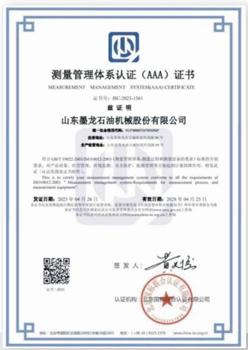

text_image

测量管理体系认证（AAA）证书
MEASUREMENT MANAGEMENT SYSTEM(AAA) CERTIFICATE
证书号：ISC-2023-1561
兹证明
山东墨龙石油机械股份有限公司
第一社会信用代码：9137000724785424P
注册地址：山东省寿光市金源区福和西路99号
生产经营地：山东省寿光市金源区福和西路99号
符合GB/T 19022-2803/ISO1001或2003《测量管理体系，测量过程和测量设备的要求》标准的全部要求，对产品质量、经营管理、环境监测、安全防护、检测管理等方面起到计量保障作用。特发此证（认证范围见证书的传入。
This is to certify your measurement management system certification to all the requirements of ISO/0012.2003 "Measurement Management System Requirements for Measurement process and measurement equipment".
发证日期：2023年04月26日
有效日期：2028年04月25日
本证书自有效起始日起以取得凭证进行登记审核。监督合格者须在年度内对符合标准的文件和年度审查报告为准。
本证书签署前的承诺函是公司管理层全会公告(www.china-in-c.org)之生效。
本证书是经中国证监会批准后向www.china-in-c.org注册。
签发人：
黄文信
认证机构：北京国联资产评估有限公司
地址：北京市朝阳区北辰路16号院1号楼2层2403 电话：（+8）10 8225 2378 www.china-in-c.org.cn

山东墨龙测量管理体系AAA级证书

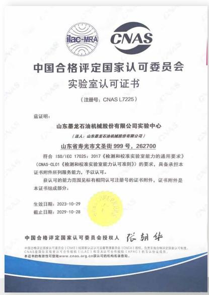

text_image

CNAS
中国合格评定国家认可委员会
实验室认可证书
（注册号：CNAS L7225）
兹证明：
山东墨龙石油机械股份有限公司实验中心
（法人：山东墨龙石油机械股份有限公司）
山东省寿光市文圣街999号，262700
符合ISO/IEC 17025：2017《检测和校准实验室能力的通用要求》
（CNAS-CL01《检测和校准实验室能力认可准则》）的要求，具备承担本
证书附件所列服务能力，予以认可。
获认可的能力范围见标有相同认可注册号的证书附件，证书附件是
本证书组成部分。
生效日期：2023-10-29
截止日期：2029-10-28
中国合格评定国家认可委员会授权人 张朝华
中国合格评定国家认可委员会（CNAS）根据认证认证监督管理委员会（CNAS）授权，负责实施评定国家认可制度。
CNAS是接受国家认可的机构，其认可方式为有效申报（APAC）的认证等级评定。本证书的有效性可登陆www.cnas.org.cn获认可的机构名录查询。

带有CNAS标志的国家认可实验室证书

## 战略

山东墨龙为实现“铸造墨龙品牌，拓展全球市场，实现稳步发展”的经营战略，在质量管理方面，公司始终贯彻“瞄准环球市场，优质臻誉自扬，信客皆我盟友，精诚相得益彰”的质量方针，将“管控前移”作为质量管理目标，加强管理举措的落实，持续完善质量管理体系，

## 影响、风险和机遇管理

山东墨龙从原材料至成品出厂建立健全了一整套控制流程，实现了质量管控的流程化管理，并配备了对应的检测设备，保证过程质量得到有效检测。公司计量器具配置齐全，设立内部计量室，搭建计量器具校定预警系统，对量具进行定期检定校准，充分保证了各种量具在受控状态下使用。公司生产过程中制定了水压试验工艺，水压试验记录填写清晰完整，记录曲线保存有效，可实现反复调阅，进一步增强质量管理的标准化与严谨性。

公司管理层每年实施一次管理评审，质管部每年组织实施一次内部审核，相关职能部门不定期实施体系运行日常监督检查，持续改进管理体系的适宜性、充分性和有效性。此外，检验员定期进行外观检验、尺寸检验及螺纹检验，对于出现的不符合要求的情况均要求整改。不合格品的处理严格按照《不合格品评审控制管理办法》执行，完整保留不合格品评审记录；审核发现的不符合项按《纠正措施控制程序》实施控制，全面完善质量风险与管理体系。

公司依据质量管理法规与标准，结合监管机构最新要求，每年定期对内部员工开展质量专项培训。培训内容涵盖专业技术知识、质量管理体系等方面，确保员工全面理解公司质量政策、流程与目标，全面提升员工质量管理能力与质量意识。

## 产品召回

山东墨龙制定了《质量事故管理制度》《不合格产品控制程序》《不合格品评审控制管理办法》等内部文件，针对需召回的问题产品 制定了完备的处理流程与应急方案 对产品质量问题开展成因识别，溯源追踪与整改优化 确保公司产品质量的稳定性。

## 针对客户反馈产品质量问题的解决与优化流程

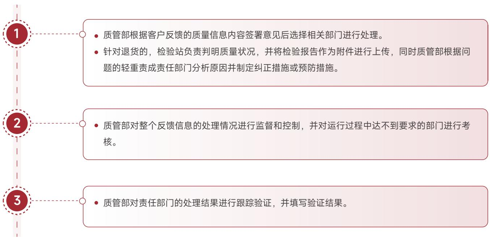

flowchart

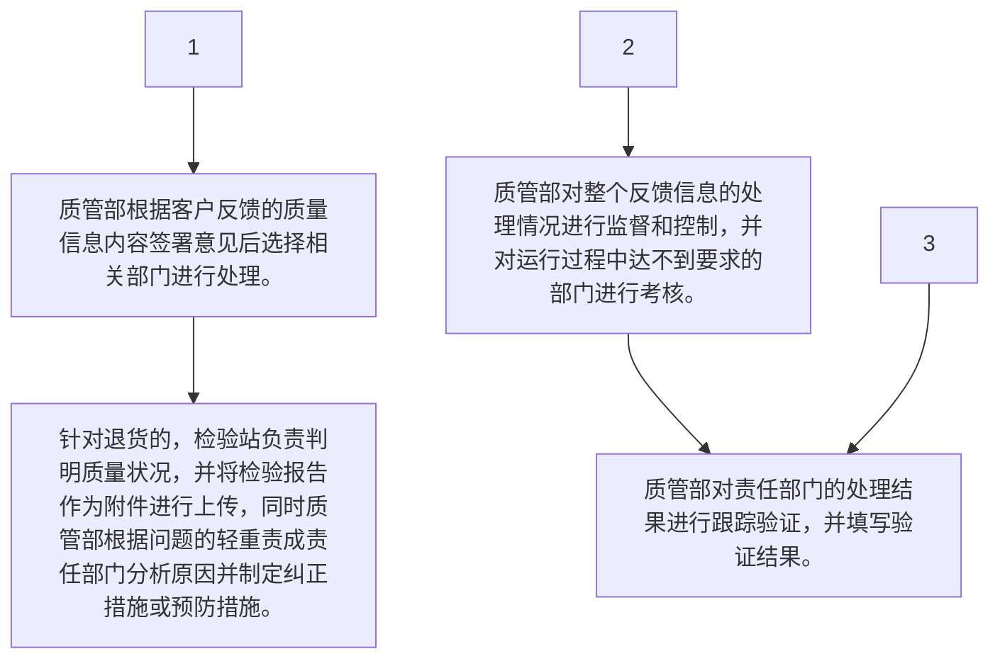
```mermaid
graph TD
  A["1"] --> B["质管部根据客户反馈的质量信息内容签署意见后选择相关部门进行处理。"]
  B --> C["针对退货的，检验站负责判明质量状况，并将检验报告作为附件进行上传，同时质管部根据问题的轻重责成责任部门分析原因并制定纠正措施或预防措施。"]
  D["2"] --> E["质管部对整个反馈信息的处理情况进行监督和控制，并对运行过程中达不到要求的部门进行考核。"]
  E --> F["质管部对责任部门的处理结果进行跟踪验证，并填写验证结果。"]
  G["3"] --> F
```

## 指标与目标

山东墨龙始终以客户为中心 定期对质量目标进行监测与分析 有效管理和控制质量风险，报告期内公司未发生产品和服务相关的安全与质量重大责任事故，未发生产品召回事件。

## 筑牢数据安全

山东墨龙注重客户隐私及数据安全保护，持续优化信息安全管理体系，制定信息安全风险应急预案，开展网络安全培训，进一步保障公司网络信息安全。

## 治理

山东墨龙恪守《中华人民共和国网络安全法》《信息安全等级保护管理办法》等相关法律法规要求，制定了《信息系统管理制度》《网络安全保护管理制度》《计算机管理规定》《机房管理制度》等内部客户隐私与数据安全管理文件，搭建了网络信息安全管理体系。此外，公司定期对员工开展网络安全培训，全面提升员工信息安全防范意识。

## 战略

山东墨龙客户隐私与数据安全管理主要覆盖招标比价，报价审批，合同签订等核心运营环节 涉及的客户隐私信息主要为客户基本信息。公司始终遵循“预防为主加强管控”的网络信息安全管理理念

## 影响、风险和机遇管理

山东墨龙建立了综合风险管理框架 通过科学方法识别，评估和消除信息安全风险 按照风险重要性分级管控 制定详细的应急计划和处置措施。为规范内部数据管理、提升信息化管理水平，公司制定《应对数据泄露管理制度》，一旦发生信息泄露行为，立即启动数据恢复程序，在采取常规技术措施恢复数据的同时，评估泄露行为造成的连锁损失，并采取相应措施。

公司信息部门定期进行全面的风险评估和漏洞检测；内部人员在工作过程中涉及敏感数据处理的，须提前与信息部门沟通并制定详细的数据处理安排。此外，公司针对数据安全泄露制定了完善的追责和处罚制度。

公司为加强信息安全管理，对ERP、OA等系统数据采取每日自动备份及异地备份举措，使用绿盾软件对重要资料进行加密处理，定期开展计算机病毒查杀，及时修复计算机及网络安全漏洞，有效保护供应商、合作伙伴及客户的隐私信息。公司还建立了追责制度以及日志审计制度，定期监督检查涉密人员保密情况。

## 公司加强数据安全的管理举措

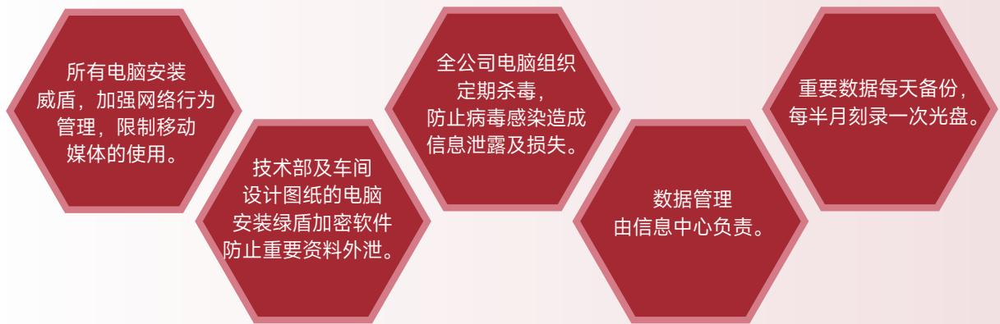

flowchart

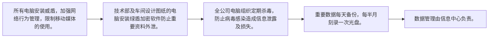
```mermaid
graph LR
  A["所有电脑安装威盾，加强网络行为管理，限制移动媒体的使用。"] --> B["技术部及车间设计图纸的电脑安装绿盾加密软件防止重要资料外泄。"]
  B --> C["全公司电脑组织定期杀毒，防止病毒感染造成信息泄露及损失。"]
  C --> D["重要数据每天备份，每半月刻录一次光盘。"]
  D --> E["数据管理由信息中心负责。"]
```

指标与目标

<table><tr><td>披露项</td><td>单位</td><td>2025年</td></tr><tr><td>信息安全审计次数</td><td>次</td><td>1</td></tr><tr><td>数据安全事件涉及的具体金额</td><td>万元</td><td>0</td></tr><tr><td>客户隐私泄露事件涉及的具体金额</td><td>万元</td><td>0</td></tr><tr><td>数据安全与隐私相关培训</td><td>次</td><td>1</td></tr><tr><td>数据安全与隐私培训覆盖人数</td><td>人</td><td>30</td></tr></table>

## 深化合作共赢 构建责任供应链

山东墨龙秉持合作共赢的发展理念，深耕产业链协同发展路径， 将责任供应链建设与多元合作赋能作为践行可持续发展的重要举措，紧扣能源装备制造领域的发展需求，以系统性思维谋划推进客户服务优化、供应商规范管理与行业协同赋能等重点工作，凝聚上下游合力构建共赢生态，助力产业提质升级，彰显企业可持续发展的责任担当。

## 优化客户服务

山东墨龙深刻认识到优质客户服务是增强客户信任、提升市场竞争力的重要因素，公司始终贯彻“以优质的产品质量赢得用户的信任”的服务理念，制定了完善的客户服务管理制度，搭建了高效的客户服务管理体系。

## 治理

山东墨龙持续优化客户服务工作，保障产品售后服务质量，公司制定《售后服务管理制度》《跟井服务管理办法》《销售业务管理制度》等客户服务管理制度，明确了相关部门的权责分配，同时为保障合作双方合法权益，公司与客户签订《保密协议》《诚信廉洁合作协议书》《战略合作协议》，构建合规、共赢的长期合作关系。

为提升客户服务可及性，公司在不同地区设立了专门的售后服务机构，确保产生市场服务需求时，能够讯速组织营销人员、技术专家、售后服务工程师等人员到场完成服务保障，同时配备了客服人员对问题处理情况进行全程跟踪，直至问题解决。公司定期对员工开展客户服务培训，提升员工的专业技能与服务意识，以优质的客户服务全面提升公司软实力。

natural_image

Silhouettes of business professionals in business attire standing with gears and a gear symbol (no text or symbols present)

## 山东墨龙售后服务分布

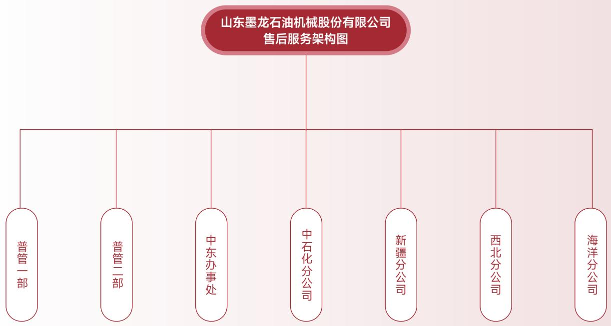

flowchart

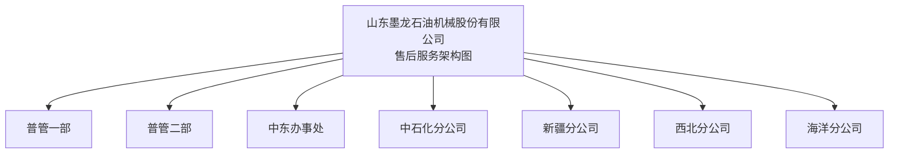
```mermaid
graph TD
  A["山东墨龙石油机械股份有限公司\n售后服务架构图"] --> B["普管一部"]
  A --> C["普管二部"]
  A --> D["中东办事处"]
  A --> E["中石化分公司"]
  A --> F["新疆分公司"]
  A --> G["西北分公司"]
  A --> H["海洋分公司"]
```

## 战略

山东墨龙客户服务理念为“鼓群志、集群智、聚众德、创众业；质量第一，客户需求第一，以优质的产品质量赢得客户的信任”；始终贯彻“铸造墨龙品牌、拓展全球市场、实现稳步发展”的客户服务管理战略。

## 影响、风险和机遇管理

山东墨龙建立客户服务全流程风险管控机制，聚焦客户投诉处理、满意度提升、责任营销等关键环节，持续优化服务质量。

## 客户投诉

根据《售后服务管理制度》，公司将客户投诉分类为产品质量投诉、运输包装的投诉、服务质量的投诉和其他方面的投诉等类别，通过客户交付反馈处理、满意度调查、客户座谈、市场占有率分析等多种方式，精准把握客户需求，持续优化产品质量与服务水平。

## 客户投诉信息反馈处理流程

01

销售公司设专人负责反馈信息的接收、录入和资料的保存工作。

02

每接到一次反馈信息，应确保信息的内容陈述准确详尽，指明该类信息涉及产品的供货时间、数量及用户对该批产品的处置意见等，必要时可附加相关资料。

03 了解信息后，及时录入纠正预防措施记录表中；按相应顺序选择质量负责人进行信息的处置。

04 并将检验报告作为附件进行上传，同时质管部根据问题的轻重责成责任部门分析原因并制定纠正措施或预防措施。

05 质管部对整个反馈信息的处理情况进行监督和控制，并对运行过程中达不到要求的部门进行考核。

06 质管部对责任部门的处理结果进行跟踪验证，并填写验证结果。

07 待所有反馈信息处理完毕后，由销售公司将处理结果和完成情况反馈给顾客，填写完最终结论。

为确保客户诉求能够及时反馈、高效处理，山东墨龙制定《顾客满意度控制程序》《信息反馈管理制度》等管理文件，通过定期问卷调研，不定期客户回访等方式收集客户反馈并了解客户满意度 持续优化客户服务举措，精准匹配客户需求

## 客户满意度问卷调研维度

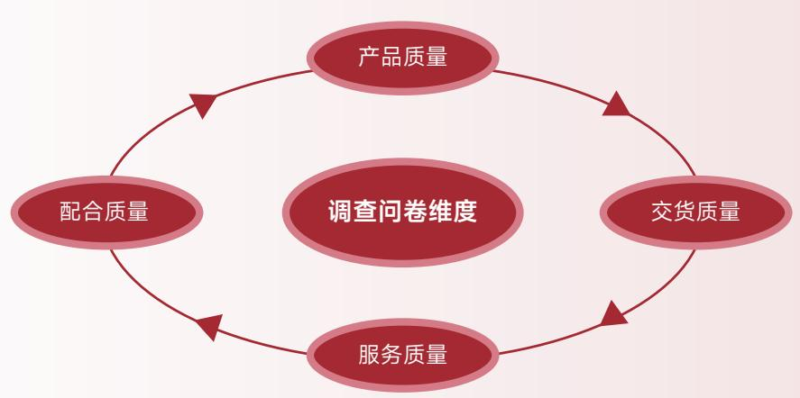

flowchart

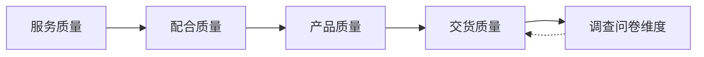
```mermaid
graph LR
  A["产品质量"] --> B["交货质量"]
  C["服务质量"] --> D["配合质量"]
  D --> A
  E["调查问卷维度"] -.-> B
  B --> E
```

## 责任营销

山东墨龙明确销售业务控制遵循风险管理原则、全面性与重要性相结合的原则，综合分析业务订单风险，及时制订预防策略，有效防范企业经营风险；同时对销售业务流程实施全面管控，重点强化职责权限、销售政策、信用管理及货款回收等环节的管控。

公司在产品贸易，出口，转售等业务中，严格遵守业务所在地法律法规以及相关制度要求，在为客户提供优质服务的同时始终强调负责任营销的重要性，坚决维护客户合法权益，要求员工及销售公司在业务销售、客户服务过程中严格遵守相关规范指引。此外，公司定期开展责任营销相关培训及课后考核，强化员工及销售公司责任营销意识，做到对产品、公司、客户负责。报告期内，公司未收到责任营销方面的客户投诉。

指标与目标

<table><tr><td>披露项</td><td>单位</td><td>2025年</td></tr><tr><td>接获关于产品的投诉数量</td><td>次</td><td>36</td></tr><tr><td>产品召回事件数</td><td>件</td><td>0</td></tr><tr><td>报告期内发生的产品和服务相关的安全与质量重大责任事故损害涉及的金额</td><td>元</td><td>0</td></tr><tr><td>质量管理体系认证覆盖的业务范围</td><td>%</td><td>100</td></tr><tr><td>已售或已运送产品中因安全与健康问题而须收回的产品占比</td><td>%</td><td>0</td></tr><tr><td>接获关于服务的投诉数量</td><td>次</td><td>0</td></tr><tr><td>客户投诉解决数量</td><td>次</td><td>36</td></tr><tr><td>客户满意度调查结果</td><td>%</td><td>97.94</td></tr><tr><td>接获投诉问题回访满意度调查结果</td><td>%</td><td>100</td></tr></table>

## 规范供应商管理

山东墨龙秉持可持续发展理念，立足物资采购全流程管理要求 以《物资采购管理制度》《供应商管理制度》等内部管理文件为准则，将供应商管理融入采购业务各环节，建立健全合格供应商调查、评价、开发及动态管理体系，推动供应商准入、筛选、合作全流程的标准化与规范化，强化供应链风险防控，保障供需双方合法权益，持续构建稳定、合规、高效的负责任供应链体系。

## 治理

山东墨龙供应商管理体系以《供应商管理制度》为核心指引，由采购部门牵头负责合格供应商的全流程管理工作，涵盖供应商调查、资质评价、优质供应商开发等全维度内容。在供应商准入环节，公司对新增供应商开展严格的资质审查，审核通过后按规定要求供应商签署承诺函，完成准入备案后方可纳入合格供应商库，参与公司采购业务竞标。

在供应商日常管理中，采购部门定期对公司主要物资的市场价格及供求变化进行分析：业务部门结合供应商供货质量，交付及时性，价格合理性等核心维度开展综合评估，形成供应商动态评价结果：针对评价中存在不足的供应商，公司要求其限期完成整改，整改不到位的将从合格供应商库中剔除，持续优化供应商梯队结构，同时，质量管理部门通过进货验收环节对供应商供货质量进行常态化监督，多部门协同形成供应商管理闭环。

## 山东墨龙供应商评估流程

## 01

业务部门每年通过向供应商索取更新资料、现场调查、统计分析等方式组织评价。评价指标包括企业基本情况、供货质量、供货及时性、交易额度、欠款额度、公平竞争等方面。

## 02

公司编制供应商评价表和供应商调查表，要求供应商填写并提供更新的资质类相关证书，如经营许可、生产许可、质量、安全环保等。

## 03

一旦发现问题，公司会要求供应商及时整改，并持续跟踪整改情况。若二次评价未达标，将移除供应商资格，终止合作。

## 战略

山东墨龙将供应链战略管理作为企业可持续发展的核心支撑，将供应链安全与韧性建设全面融入全面风险管理体系与日常运营全流程，以标准化管理筑牢供应链合规底线，以精细化管控提升供应链抗风险韧性，以绿色化转型推动产业链低碳协同，以生态化合作实现上下游互利共赢，全力构建稳定、合规、高效、负责任的现代化供应链体系。

针对供应链全链条面临的气候相关风险与机遇，公司全面识别影响因素，明确财务影响与发生周期，制定贴合企业运营实际的应对举措，具体如下：

<table><tr><td>类型</td><td>风险与机遇</td><td>影响</td><td>影响时间</td><td>应对举措</td></tr><tr><td rowspan="2">风险</td><td rowspan="2">技术风险</td><td>·供应链管理数字化、智能化技术迭代提速,若管理模式与技术工具未能同步升级,将导致供应链管控效率、追溯能力落后于行业水平,间接提升管理成本与合规风险。</td><td>长期</td><td>·持续对标行业先进供应链管理经验,完善采购全流程数字化管理体系,提升供应商管理、招标比价、库存管控等环节的线上化、可追溯化水平;·优化供应链管理相关制度流程,强化采购、质量、审计等多部门的系统协同,打通管理数据链路,提升全流程管控效率。</td></tr><tr><td>·现有采购与供应商管理系统运维不足,可能出现数据管理漏洞、流程管控失效等问题,影响采购业务合规性与连续性。</td><td>短-中期</td><td>·完善管理系统日常运维机制,保障采购审批、供应商评价、招标管理等核心模块稳定运行;·加强采购及相关岗位人员的制度与系统操作培训,提升团队规范化管理与系统应用能力。</td></tr><tr><td rowspan="3">风险</td><td rowspan="2">市场风险</td><td>成本波动:原材料价格受市场供需、地缘政治、汇率波动等因素出现大幅上涨;物流成本受燃油价格、运力市场变化增加,导致供应链总成本超预期上升,挤压企业盈利空间。</td><td>中-长期</td><td>依托合格供应商库,与核心优质供应商签订长期合作协议,稳定合作关系,锁定关键原材料采购成本;持续完善多区域、多渠道的供应商网络布局,分散单一渠道、单一区域的供应波动与成本上涨风险;优化采购计划管理,结合生产需求与市场价格走势合理管控采购规模与库存水平,降低价格波动带来的成本影响。</td></tr><tr><td>需求变化:下游市场需求出现突发波动时,供应链柔性不足将导致生产计划、采购规模调整滞后,引发交付延迟、库存积压或原材料短缺问题,影响企业经营效益与客户口碑。</td><td>中-长期</td><td>以供应商动态评价体系为抓手,培育优质柔性供应合作伙伴,建立弹性采购合作机制,保障需求波动下的采购调整灵活性;深化与核心供应商的协同联动,通过常态化沟通对接,同步生产与需求计划,提升供应链响应效率;优化库存管理模式,合理控制安全库存,平衡保供与降本双重目标。</td></tr><tr><td>声誉风险</td><td>上游供应商出现环保不达标、劳工权益违规、商业贿赂、产品质量不合规等问题,可能引发连带监管问责、品牌声誉受损,甚至面临合作中断、法律追责等相关风险。</td><td>长期</td><td>建立全流程供应商合规管控机制,在准入环节严格开展资质与合规审查,要求供应商签署合规承诺函,明确环保、劳工、反商业贿赂等合规要求;将环保、合规、社会责任履行情况纳入供应商常态化动态评价体系,定期开展合规核查,对存在问题的供应商要求限期整改,整改不到位的坚决剔除合格供应商库;在采购合同中明确合规违约条款与退出机制,压实供应商主体责任,从源头规避连带合规与声誉风险。</td></tr><tr><td rowspan="4">机遇</td><td>政策机遇</td><td>全球及国内监管层对供应链合规性、透明度、绿色低碳的要求持续提升,供应链管理规范的企业可更好地满足监管要求,获取政府项目合作、市场准入等政策红利。</td><td>中-长期</td><td>持续跟踪国内外供应链、绿色低碳、采购合规相关政策动态,及时优化完善供应商管理、绿色采购相关制度体系,确保供应链管理全流程合规;以合规化、绿色化供应链建设为抓手,积极拓展合规要求较高的市场与合作项目,抢占政策与市场先机。</td></tr><tr><td>市场机遇</td><td>高端装备制造、能源装备等下游行业升级,以及产业链协同发展趋势,为企业深化供应商战略合作、完善供应链布局、提升产业链话语权带来新机遇。</td><td>中-长期</td><td>常态化举办供应商座谈会等交流活动,深化与优质供应商的战略合作,推动上下游在技术、质量、保供等方面的深度协同;持续优化供应商梯队建设,开发优质供应商资源,完善供应链布局,匹配企业市场拓展与产能升级需求。</td></tr><tr><td rowspan="2">技术机遇</td><td>供应链数字化、智能化管理技术的推广应用,可助力企业实现采购流程、供应商管理、库存管控、质量追溯的全链路优化,降低运营损耗,提升资金周转与供应链管理效率。</td><td>长期</td><td>探索数字化工具在供应商评价、招标采购、库存优化、质量追溯等环节的应用场景,逐步提升供应链管理智能化水平;借鉴行业先进技术应用经验,稳步推进采购与供应链管理环节的数字化升级,在降本增效的同时强化全流程风险管控。</td></tr><tr><td>仓储、物流环节的自动化、智能化设备升级,可有效提升仓储周转效率,降低人工损耗与运营差错率。</td><td>中-长期</td><td>结合企业生产与采购需求,优化仓储管理模式,提升库存周转效率;对标行业先进仓储管理经验,逐步探索智能化仓储设备的应用,降低仓储环节的资源损耗与管理成本。</td></tr></table>

## 影响、风险和机遇管理

为全面提升供应链风险管控能力，山东墨龙将供应商风险管理嵌入采购业务全流程，从准入、合作、履约各环节设置风险防控节点，有效规避合作风险、质量风险及采购业务风险。在供应商合作前期，竞标供应商需签署承诺函，明确合作合规要求；采购部门在实施采购时，严格从合格供应商库中选择合作方，对不诚信、履约能力不足的供应商实施采购规避，从源头降低合作风险。

在采购业务开展过程中，公司建立供应商异常情况报告机制，业务部门发现供应商存在供货延迟、质量波动、资质变化等异常情况时，及时上报并采取应对措施；针对采购比价、招标过程中发现的供应商违规行为，采购部门联合审计部门开展核查，按制度要求谨慎处置，必要时增加审计部经理审核环节，强化风险防控。若供应商出现供货质量问题或违约行为，采购部门将按合同约定及时向供应商追索违约损失，质量管理部门同步出具质量鉴定意见，财务部门暂停执行付款条款，多部门联动落实风险处置。

公司严格遵守国家关于保障中小企业款项支付的相关规定，认真履行合作约定，切实维护中小企业合法权益。

## 绿色供应链

山东墨龙将绿色供应链建设与采购业务基本原则深度融合，在供应商筛选与合作中，以经济性原则和高效性原则为核心，优先选择具有环境体系认证证书，绿色工厂认证的供应商 推动供应链上下游协同提升运营效率 减少资源浪费：在采购物资管理中，通过合理制定采购计划、严控请购数量、优化库存管理等方式，降低库存资金占用，减少物资积压，实现采购资源的高效配置。

同时，公司通过供应商动态评价机制，引导合作供应商持续提升供货质量和履约能力，对存在质量问题的供应商要求限期整改，推动供应链整体质量水平提升，以优质供应链体系为公司绿色生产、高效运营奠定基础，实现产业链上下游的协同可持续发展。

## 阳光采购

山东墨龙严格遵循《物资采购管理制度》《供应商管理制度》《招标管理制度》等文件要求，构建阳光，透明的采购管理休系，对于达到招标限额的采购业务，严格按招标规定实施招标采购:除零星采购外，采购部门均从合格供应商库中选取三家及以上供应商进行询价，取得书面报价或系统报价后开展比价，确保供应商选择及采购定价的公开、公正、合理。

公司明确采购业务审批权限，按采购金额分级实施审批，招标、议标结果均由相关权限部门审核确认，采购全过程留存比价、审批、合同等记录，实现可追溯管理。同时，公司通过制度明确采购业务违规处罚标准，严禁采购人员分解采购计划、逃避招标及供应商管理流程，对采购环节中的违规行为实施严格考核，从制度层面杜绝采购舞弊，维护阳光采购的行业生态。

指标与目标

<table><tr><td>披露项</td><td>单位</td><td>2025年</td></tr><tr><td>供应商总数</td><td>家</td><td>267</td></tr><tr><td>签署供应商行为准则的百分比</td><td>%</td><td>100.00</td></tr><tr><td>经确定为具有实际和潜在重大负面社会影响的供应商数量</td><td>家</td><td>0</td></tr><tr><td>经确定为具有实际和潜在重大负面环境影响的供应商数量</td><td>家</td><td>0</td></tr></table>

## 加强行业协同

山东墨龙积极参与行业交流与校企合作，在行业协会履职，参与或协助编撰行业标准，推动行业知识共享，助力行业高质量发展。

公司积极参与行业交流，探讨行业发展新模式；在校企交流方面，公司积极搭建产学研合作体系，建立校企合作平台，推动科研成果向实际生产力转化，为行业发展注入新动能。

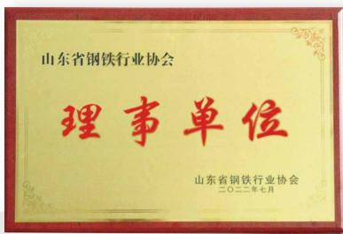

text_image

山东省钢铁行业协会
理事单位
山东省钢铁行业协会
二〇二二年七月

山东墨龙为山东省钢铁行业协会理事单位

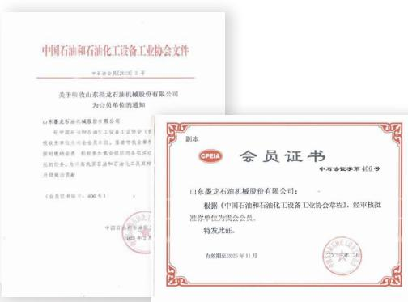

text_image

中国石油和石油化工设备工业协会文件
中石油企发[2025]2号
关于吸收山东墨龙石油机械股份有限公司
为分单位的通知
山东墨龙石油机械股份有限公司
经中国石油和石油化工工业协会（贵
级收费单位认可企业首位，须凭中金集团
授权委托书、授权参加全国法院的各项目
权的批准，参与我国石油和石油化工及其部
司最终做出审核
（会员证书编号：466号）
中国石油工程局
CPEIA 会员证书
中油协证字第496号
山东墨龙石油机械股份有限公司：
根据《中国石油和石油化工设备工业协会章程》，经审核批
准您单位为我会会员。
特发此证。
有效期至2025年11月
2025年11月

山东墨龙为中国石油和石油化工设备工业协会会员单位

## 坚持以人为本 保障员工权益

山东墨龙始终秉持以人为本的核心理念，将员工权益保障与成长发展作为企业可持续发展的重要根基，坚守合法用工底线，尊重员工主体地位，兼顾员工合法权益、成长需求与人文关怀。公司秉持公平公正、平等包容的原则，通过规范用工管理、完善激励机制，搭建成长平台，健全福利保障 倾听员工心声，凝聚员工力量，为员工提供全方位的发展支持与权益保障营造和谐向上、共建共享的工作氛围，实现企业与员工的共同成长、双向赋能。

## 保障员工权益

## 治理

山东墨龙严格遵守《中华人民共和国劳动法》《中华人民共和国工会法》等法律法规，编制《员工考勤及休假管理制度》《员工行为奖惩管理制度》《薪酬核算流程规定》等专项制度：公司人力资源部作为统筹管理部门 统筹开展员工招聘。教育培训、薪酬核算、奖惩考勤等全流程管理工作，确保人力资源管理合法高效，为公司战略目标实现与企业文化塑造提供支撑。

## 战略

山东墨龙坚守“公平、公正、公开、平等”的用工原则，依法规范劳动用工，杜绝童工聘用、强迫劳动，实行同工同酬，提供平等的晋升机会与发展平台保障全体员工的合法劳动权益

## 影响、风险和机遇管理

## 员工雇佣与结构

山东墨龙建立标准化招聘流程，明确录用条件、体检要求等合规性要求，从源头保障用工质量与员工权益，确保招聘工作全程符合法律法规及制度规定。

公司用人理念、用人标准与竞争机制  
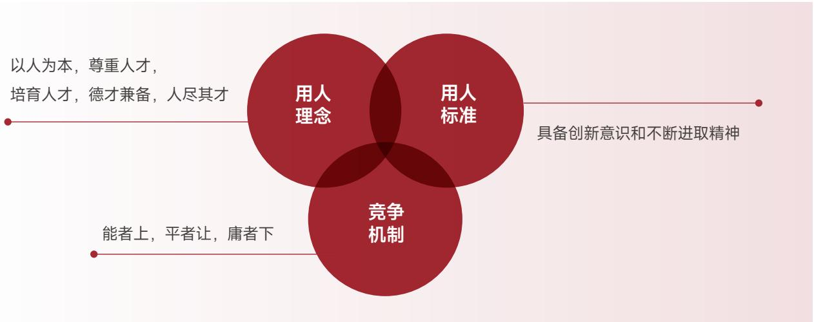

flowchart

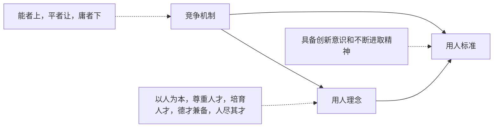
```mermaid
graph LR
  A["用人理念"] --> B["用人标准"]
  C["竞争机制"] --> A
  C --> B
  D["以人为本，尊重人才，培育人才，德才兼备，人尽其才"] -.-> A
  E["能者上，平者让，庸者下"] -.-> C
  F["具备创新意识和不断进取精神"] -.-> B
```

## 截至报告期末

公司雇佣员工 1,268人

## 报告期内

公司新雇佣员工80人

员工雇佣数据

员工总数1,268人

  
按性别

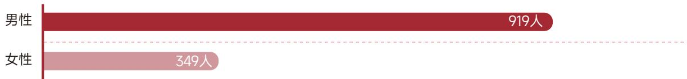

bar

| Category | Value (人) |
| --- | --- |
| 男性 | 919 |
| 女性 | 349 |

  
按雇佣类型

bar

| Category | Value (人) |
| --- | --- |
| 劳动合同制 | 1,268 |

  
按年龄

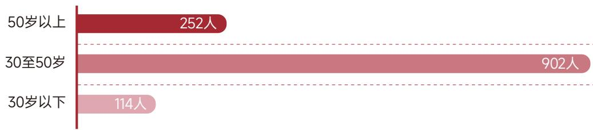

bar

| Age Group | Population (人) |
| --- | --- |
| 50岁以上 | 252 |
| 30至50岁 | 902 |
| 30岁以下 | 114 |

  
按学历

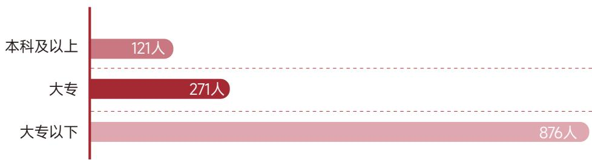

bar

| Category | Value (人) |
| --- | --- |
| 本科及以上 | 121 |
| 大专 | 271 |
| 大专以下 | 876 |

  
按雇员类别

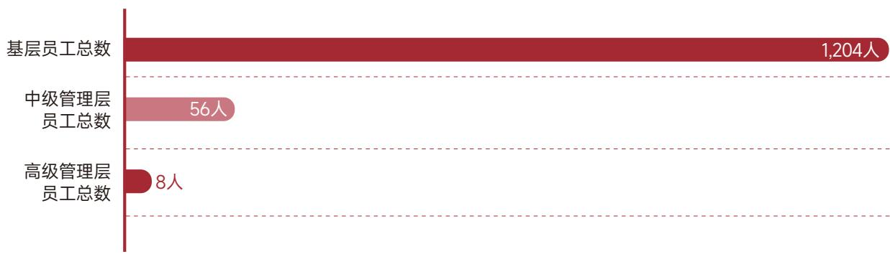

bar

| Category | Value (人) |
| --- | --- |
| 基层员工总数 | 1,204 |
| 中级管理层员工总数 | 56 |
| 高级管理层员工总数 | 8 |

  
按员工专业构成类别

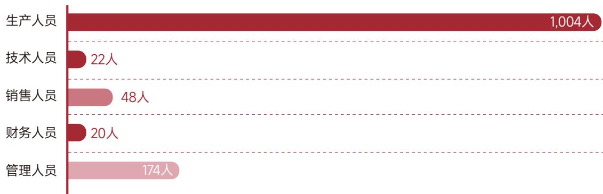

bar

| Category | Value (人) |
| --- | --- |
| 生产人员 | 1,004 |
| 技术人员 | 22 |
| 销售人员 | 48 |
| 财务人员 | 20 |
| 管理人员 | 174 |

## 员工激励

山东墨龙持续优化薪酬体系设计，构建“基本薪酬+绩效奖励+专项补贴”的多元化薪酬结构，在稳定员工收入的同时，实现“多劳多得”的激励导向。加大对技术、行政及一线生产人员的薪酬投入倾斜，修订《定薪员工薪酬管理制度》，为取得相关技能等级或职业资格证书的员工提供专项补助，有效提升员工稳定性与工作积极性。

## 员工民主管理

山东墨龙始终将民主管理作为企业发展的重要基石，严格遵照职工代表大会制度开展相关工作，切实保障职工的民主参与、民主监督权利，搭建起企业与职工高效沟通的桥梁。在信息公开层面，公司通过宣传栏、微信公众号、抖音等多元平台，定期向全体职工同步公司经营动态、发展规划等核心信息，保障职工对企业经营决策的知情权，也为职工代表做好上情下达工作奠定基础。

公司严格落实职工代表例会及相关会议制度，定期组织召开职工代表大会，全面汇报企业经营发展进展，将公司规章制度等重要事项提交职代会审议，充分保障职工代表的参与权与建议权。同时，以职工代表为核心沟通纽带，通过职工代表座谈会、线上沟通群等多种渠道，常态化搜集职工代表反馈的一线职工诉求、意见与合理化建议，切实做好下情上达，为企业经营管理、生产管理决策提供真实有效的基层依据

公司推动各部门协同配合，对职工代表反馈的各类意见建议进行专项跟进、有效解决，确保职工的合理诉求落地见效；职工代表也切实履行民主监督职责，对企业经营活动、行政管理等各项工作开展常态化监督，助力企业规范运营。此外，公司工会作为职工代表大会制度的归口管理部门，统筹推进民主管理各项工作的规范化、常态化开展，让职工民主管理在企业发展中发挥实际效能。

## 案例 山东墨龙组织召开青年职工座谈会

2025年10月13日，山东墨龙召开本科及研究生以上学历青年职工座谈会，针对青年职工的履职情况与成长诉求给予针对性指导与正向激励，围绕专业能力提升、职业发展规划、企业文化践行、纪律规范建设、高效沟通协作等维度，为青年职工的成长发展明确方向。

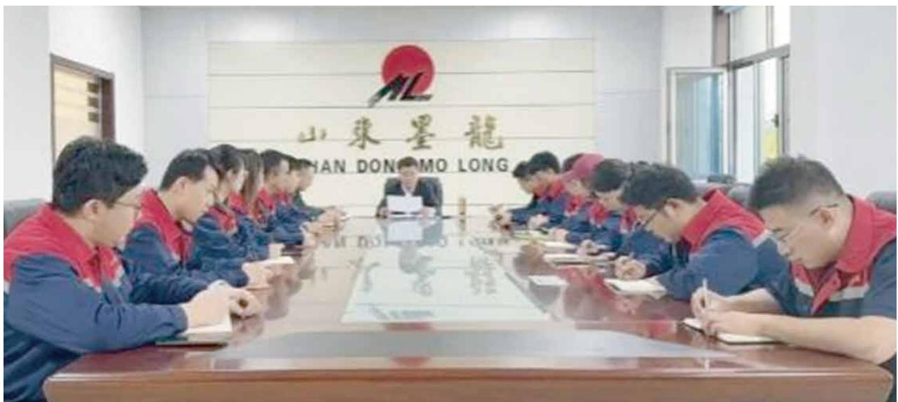

text_image

山東墨龍
JIAN DONGMO LONG

## 指标与目标

0.75%

本地化雇佣人数1,238人

## 完善培训体系

为提高员工整体素质和岗位操作技能，激发全体员工的积极性和创造性，山东墨龙持续优化“考、学、用”一体化人才培养机制，以常态化技能练兵推动全员职业素养与岗位效能升级，为企业可持续高质量发展筑牢人才根基。

## 治理

公司始终注重员工的培训工作 建立了长短期结合的培训体系和员工培训管理制度 制定年度公司培训计划将员工队伍建设为学习型组织，提高员工业务水平，拓展员工的潜能发挥。

## 战略

山东墨龙以“持续创新、适应时代发展”为指导，践行以人为本的管理理念，优化人力资源配置，加强人力资源开发，通过全方位、多层次的培训与晋升机制，推动员工与企业协同发展、共同成长。

## 影响、风险和机遇管理

为赋予员工更为宽广的职业晋升与成长空间，公司精心构建了涵盖业务、管理、技术以及技术工人四大领域的职业发展路径。员工可依托公开竞聘的机制，实现职位晋升，或从基层职员逐步迈向管理层面，充分挖掘并发挥个人职业潜力。

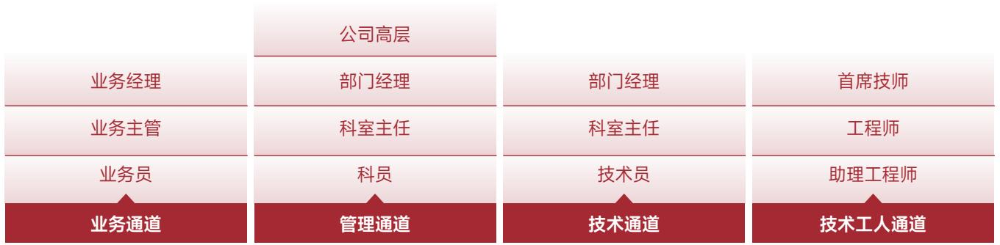

flowchart

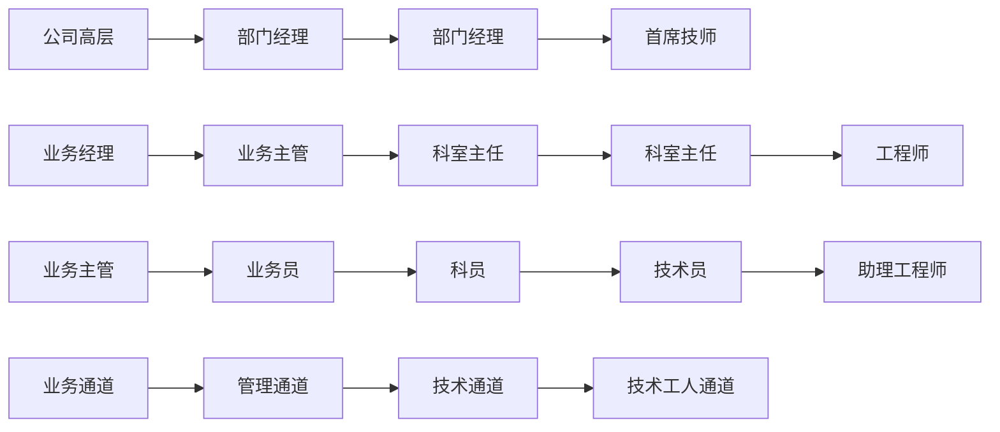
```mermaid
graph LR
  A["公司高层"] --> B["部门经理"]
  B --> C["部门经理"]
  C --> D["首席技师"]
  E["业务经理"] --> F["业务主管"]
  F --> G["科室主任"]
  G --> H["科室主任"]
  H --> I["工程师"]
  J["业务主管"] --> K["业务员"]
  K --> L["科员"]
  L --> M["技术员"]
  M --> N["助理工程师"]
  O["业务通道"] --> P["管理通道"]
  P --> Q["技术通道"]
  Q --> R["技术工人通道"]
```

## 员工职业发展通道

公司始络重视员工培训工作，建立长短期结合的培训体系和员工培训管理制度，将员工队伍建设为学习型组织，通过外派学习、在岗学习、短期培训、邀请专家、业内资深人士专题讲座等多种手段，提高员工业务水平，激发员工潜能。同时，注重更新现有人员的知识结构，年度员工培训率达到100%，显著提高了员工的操作技能和管理水平。

## 公司员工职称或技能发展条线

## 职称评级发展条线

积极鼓励综合能力较好的员工参加职称评审，按照技术员、助理工程师、工程师、高级工程师（副高）、高级工程师（正高）的晋升路线不断提高职称由公司落实相关待遇。

## 职业技能发展条线

鼓励实操经验丰富的员工参加国家人社部门认可的职业技能评价活动。公司自202年开始开展技能等级自主评价，由国家人社部门审批认可其效力。参加职业技能评价的员工按照学徒工、初级工、中级工、高级工、技师、高级技师、特级技师、首席技师的晋升路线不断提高技能水平并由公司对应其水平落实待遇。

为提高员工整体素质和岗位操作技能，激发全体员工的积极性和创造性，由人力资源部根据公司各部门培训需求制定公司年度培训计划，分为公司培训和部门培训两种形式。

公司培训具有全员普遍性，内容偏向于体系建设，类型主要分为质量管理、环境安全、产品工艺及其他类四大部分。

● 部门培训偏向于专业技能方面，着重于提高员工的专业知识，根据战略目标及发展需要，涉及无损检测知识、外观质量检验、计量器具管理、机械领域检测、安全管理知识、三抽产品各类作业文件、轧管工艺、油套管螺纹加工、公司产品知识等。

## 案例

## 山东墨龙组织开展岗位技能考试活动

2025年8月2日，山东墨龙组织380名管理人员参加管理能力与岗位技能考试，考试内容涵盖岗位知识、公司管理制度、技术研发及法律法规等多个维度，全面测评管理人员的知识储备与专业素养，并将考试结果作为企业人才科学选拔与合理任用的重要依据。

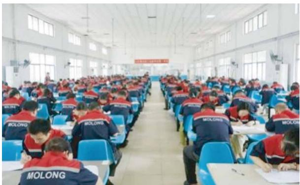

natural_image

Interior of a large classroom with students in red and blue uniforms seated at desks, no visible text or symbols on the desks or background.

指标与目标

<table><tr><td colspan="2">披露项</td><td>单位</td><td>2025年</td></tr><tr><td colspan="2">员工培训投入金额</td><td>万元</td><td>15</td></tr><tr><td colspan="2">员工培训举办场次</td><td>场次</td><td>26</td></tr><tr><td colspan="2">接受培训的员工总人数</td><td>人</td><td>1,268</td></tr><tr><td rowspan="2">按性别划分</td><td>接受培训的男性员工人数</td><td>人</td><td>919</td></tr><tr><td>接受培训的女性员工人数</td><td>人</td><td>349</td></tr><tr><td rowspan="3">按雇员类别划分</td><td>接受培训的基层员工人数</td><td>人</td><td>1,198</td></tr><tr><td>接受培训的中级管理层员工人数</td><td>人</td><td>56</td></tr><tr><td>接受培训的高级管理层员工人数</td><td>人</td><td>8</td></tr><tr><td colspan="2">员工培训覆盖率</td><td>%</td><td>100</td></tr></table>

## 健全福利保障

山东墨龙提供多元化员工福利，持续建立健全员工福利体系，为员工提供全方位的关怀与保障。公司致力于构建全面、贴心的员工福利休系，涵盖五险一金，生活与工龄补贴，职称与技能奖励，先进表彰等多维度激励措施：实行灵活休假制度 注重职业健康 提供定期体检与工作必需劳保用品：节日福利丰富多样 夏季特设降暑关怀 福利政策惠及员工家属。此外，公司配备完善的生活娱乐设施，组织多样文体活动，营造和谐工作氛围，关怀女性员工、退休员工以及困难员工，增强公司凝聚力与向心力。

入职即缴纳五险一金。  
生活补贴：工作满半年后可享受200元/月。  
工龄补贴：工作每满一年增加40元。  
职称补贴：助理工程师300元/月、工程师1000元/月、高级工程师2000元/月。  
技能补贴：技师200元/月、高级技师500元/月。  
先进奖励：季度发放管理建议及小改小革奖励，月度对市场开发、认证做出贡献的职工进行奖励，即时对为公司做出重大贡献的职工进行表彰奖励。

公司科室办公人员实行双休日；生产一线员工月休4天，可调休。  
每年免费进行一次职业健康体检。  
工作服每年2套，劳保用品每月定期发放。  
中秋节、春节等节日发放购物卡或等值实物。  
夏天为一线职工发放饮品、雪糕、茶叶、咸菜等降暑福利，还为公司中层职工父母发放生日蛋糕。  
公司建有集体餐厅、宿舍以及图书馆、健身房、台球室、乒乓球室等娱乐设施，并配有中央空调，公司不定期组织篮球赛、乒乓球赛等多种文体活动。

## 投身公益事业 传递企业温暖

山东墨龙始终深耕社会责任践行之路，坚守企业初心与使命，将社会价值创造融入企业长远发展布局。公司积极投身社会公益慈善事业，主动参加各类社会公益事业与暖心帮扶行动，以务实担当践行回馈社会的责任承诺，立足自身能力积极传递企业温情，持续赋能社会公益事业稳健发展。报告期内，公司发出倡议并组织员工开展无偿献血公益活动，以实际行动践行社会责任，彰显企业的社会担当。

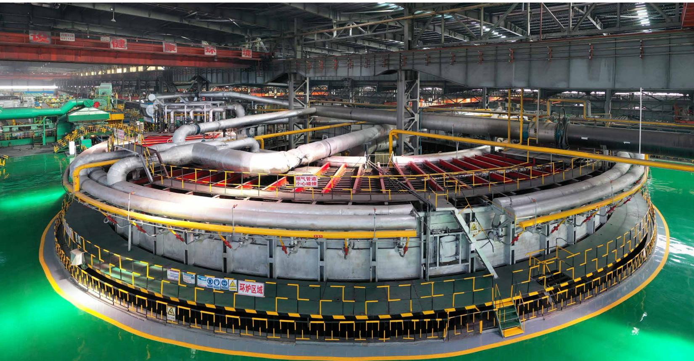

text_image

健康环境
燃气管道
小心碰撞
环炉区域

## 关键绩效

治理绩效

<table><tr><td colspan="2">披露指标</td><td>单位</td><td>2024年</td><td>2025年</td></tr><tr><td rowspan="16">公司治理</td><td>组织股东会会议</td><td>次</td><td>6</td><td>3</td></tr><tr><td>组织召开董事会会议</td><td>次</td><td>14</td><td>13</td></tr><tr><td>组织召开审计委员会会议</td><td>次</td><td>9</td><td>7</td></tr><tr><td>组织召开提名委员会会议</td><td>次</td><td>5</td><td>1</td></tr><tr><td>组织召开战略委员会会议</td><td>次</td><td>4</td><td>2</td></tr><tr><td>组织召开薪酬与考核委员会会议</td><td>次</td><td>1</td><td>1</td></tr><tr><td>独立董事占比</td><td>%</td><td>33.33</td><td>33.33</td></tr><tr><td>女性董事占比</td><td>%</td><td>11.11</td><td>11.11</td></tr><tr><td>股东会董事会成员出席率</td><td>%</td><td>100.00</td><td>100.00</td></tr><tr><td>女性高级管理层占比</td><td>%</td><td>/</td><td>12.50</td></tr><tr><td>独立董事任期超过6年的人数占比</td><td>%</td><td>0.00</td><td>0.00</td></tr><tr><td>在超过3家上市公司担任独立董事的独立董事数量占比</td><td>%</td><td>0.00</td><td>0.00</td></tr><tr><td>参加少于75%会议的董事人数</td><td>人</td><td>0</td><td>0</td></tr><tr><td>审计委员会独立董事占比</td><td>%</td><td>100.00</td><td>100.00</td></tr><tr><td>薪酬委员会独立董事占比</td><td>%</td><td>100.00</td><td>100.00</td></tr><tr><td>提名委员会独立董事占比</td><td>%</td><td>75.00</td><td>75.00</td></tr><tr><td rowspan="4">反贪污</td><td>监管部门对发行人或其雇员提出并已审结的贪污诉讼案件的数目</td><td>件</td><td>0</td><td>0</td></tr><tr><td>反贪污反腐败举报事件数</td><td>次</td><td>0</td><td>0</td></tr><tr><td>员工接受反贪污反腐败培训的总时数</td><td>小时</td><td>4</td><td>4</td></tr><tr><td>接受反商业贿赂及反贪污培训总人数</td><td>人</td><td>152</td><td>184</td></tr></table>

<table><tr><td colspan="3">披露指标</td><td>单位</td><td>2024年</td><td>2025年</td></tr><tr><td rowspan="8">反贪污</td><td rowspan="2">其中:</td><td>管理层</td><td>人</td><td>46</td><td>59</td></tr><tr><td>员工</td><td>人</td><td>106</td><td>125</td></tr><tr><td colspan="2">商业道德/反商业贿赂及反贪污培训覆盖率</td><td>%</td><td>13.74</td><td>14.06</td></tr><tr><td rowspan="2">其中:</td><td>管理层</td><td>%</td><td>100.00</td><td>100.00</td></tr><tr><td>员工</td><td>%</td><td>10.00</td><td>10.00</td></tr><tr><td colspan="2">违反反贿反腐制度的员工人数</td><td>人</td><td>0</td><td>0</td></tr><tr><td colspan="2">违反反贿反腐制度的管理层人数</td><td>人</td><td>0</td><td>0</td></tr><tr><td colspan="2">董事接受反贪污反腐败培训的百分比</td><td>%</td><td>100.00</td><td>100.00</td></tr><tr><td rowspan="5">反不正当竞争</td><td colspan="2">报告期内因公司不正当竞争行为导致诉讼或重大行政处罚的涉案金额</td><td>万元</td><td>0.00</td><td>0.00</td></tr><tr><td colspan="2">重大诉讼数量</td><td>个</td><td>0</td><td>0</td></tr><tr><td colspan="2">仲裁事项数量</td><td>个</td><td>0</td><td>0</td></tr><tr><td colspan="2">违规处罚次数</td><td>次</td><td>0</td><td>0</td></tr><tr><td colspan="2">违规处罚总金额</td><td>万元</td><td>0.00</td><td>0.00</td></tr></table>

环境绩效

<table><tr><td colspan="2">披露指标</td><td>单位</td><td>2024年</td><td>2025年</td></tr><tr><td rowspan="6">废弃物排放</td><td>固体废弃物总量产生量</td><td>吨</td><td>21,431.76</td><td>35,105.35</td></tr><tr><td>无害固体废弃物产生量</td><td>吨</td><td>21,420.47</td><td>35,079.12</td></tr><tr><td>有害固体废弃物产生量</td><td>吨</td><td>11.29</td><td>26.23</td></tr><tr><td>回收再利用的废弃物占比</td><td>%</td><td>/</td><td>99.93</td></tr><tr><td>每百万营收产生的有害废弃物总量</td><td>吨</td><td>/</td><td>0.01</td></tr><tr><td>每百万营收产生的无害废弃物总量</td><td>吨</td><td>/</td><td>19.91</td></tr><tr><td rowspan="7">水体污染物排放</td><td>工业废水总量</td><td>立方米</td><td>0.00</td><td>0.00</td></tr><tr><td>生活废水总量</td><td>立方米</td><td>7,217.20</td><td>19,800.00</td></tr><tr><td>化学需氧量(COD)</td><td>毫克/升</td><td>26.00</td><td>285.00</td></tr><tr><td>生化需氧量(BOD)</td><td>毫克/升</td><td>9.70</td><td>121.88</td></tr><tr><td>氨氮(NH3-N)</td><td>毫克/升</td><td>1.88</td><td>3.95</td></tr><tr><td>总氮(TN)</td><td>毫克/升</td><td>15.30</td><td>19.18</td></tr><tr><td>总磷(TP)</td><td>毫克/升</td><td>1.23</td><td>1.81</td></tr><tr><td rowspan="6">气体污染物排放</td><td>废气总量</td><td>立方米</td><td>1,248,901,104.00</td><td>1,715,230,126.00</td></tr><tr><td>颗粒物</td><td>千克</td><td>2,040.00</td><td>3,236.38</td></tr><tr><td>硫氧化物</td><td>千克</td><td>2,591.00</td><td>2,381.45</td></tr><tr><td>氮氧化物</td><td>千克</td><td>23,819.00</td><td>34,850.91</td></tr><tr><td>挥发性有机物</td><td>千克</td><td>377.00</td><td>911.24</td></tr><tr><td>氯化氢</td><td>千克</td><td>453.98</td><td>83.28</td></tr><tr><td rowspan="3">应对气候变化</td><td>温室气体排放总量 $^1$ </td><td>吨二氧化碳当量</td><td>/</td><td>201,716.59</td></tr><tr><td>范围1温室气体排放量</td><td>吨二氧化碳当量</td><td>/</td><td>154,595.90</td></tr><tr><td>范围2温室气体排放量</td><td>吨二氧化碳当量</td><td>/</td><td>47,120.69</td></tr></table>

注：公司产生的范围一温室气体排放的主要来源包括运营中对柴油、汽油、天然气、液化石油气、乙炔、丙烷等自然资源和能源的消耗；公司产生的范1围二温室气体排放的主要来源包括外购电力和外购热力；由于公司产业链涉及项目较多，暂未开展范围三温室气体排放绩效统计，未来将逐步完善相关工作。

<table><tr><td colspan="2">披露指标</td><td>单位</td><td>2024年</td><td>2025年</td></tr><tr><td rowspan="7">水资源使用</td><td>取水量</td><td>吨</td><td>26,372.20</td><td>29,311.00</td></tr><tr><td>总耗水量</td><td>吨</td><td>26,372.20</td><td>29,311.00</td></tr><tr><td>市政购水量</td><td>吨</td><td>12,353.00</td><td>20,703.00</td></tr><tr><td>地下水使用量</td><td>吨</td><td>14,019.20</td><td>8,608.00</td></tr><tr><td>重复用水总量</td><td>吨</td><td>18,931.00</td><td>19,697.00</td></tr><tr><td>重复用水消耗量占比</td><td>%</td><td>100.00</td><td>100.00</td></tr><tr><td>每百万营收水资源消耗量</td><td>吨</td><td>/</td><td>16.64</td></tr><tr><td rowspan="6">能源消耗</td><td>综合能源消耗量</td><td>吨标煤</td><td>30,969.81</td><td>46,245.59</td></tr><tr><td>柴油</td><td>吨</td><td>25.79</td><td>91.00</td></tr><tr><td>汽油</td><td>升</td><td>/</td><td>29,468.56</td></tr><tr><td>天然气</td><td>万立方米</td><td>2,002.22</td><td>3,131.67</td></tr><tr><td>乙炔</td><td>公斤</td><td>/</td><td>5,844.80</td></tr><tr><td>电力</td><td>万千瓦时</td><td>7,135.84</td><td>9,432.48</td></tr><tr><td>环保投入</td><td>公司环保投入</td><td>万元</td><td>429.25</td><td>750.79</td></tr><tr><td rowspan="3">环境合规</td><td>环境合规管理投入</td><td>万元</td><td>174.79</td><td>406.88</td></tr><tr><td>环保合规管理投入占营业收入比例</td><td>%</td><td>/</td><td>0.23</td></tr><tr><td>因环境事件受到生态环境等有关部门的重大行政金额处罚</td><td>万元</td><td>0.00</td><td>0.00</td></tr><tr><td rowspan="3">环保培训</td><td>接受环保培训的员工总人数</td><td>人</td><td>624</td><td>999</td></tr><tr><td>员工接受环保培训的总时长</td><td>小时</td><td>800</td><td>11,988</td></tr><tr><td>员工环保培训的平均时长</td><td>小时</td><td>53.18</td><td>12.00</td></tr></table>

社会绩效

<table><tr><td colspan="2">披露指标</td><td>单位</td><td>2024年</td><td colspan="2">2025年</td></tr><tr><td rowspan="5">数据安全及客户隐私</td><td>信息安全审计次数</td><td>次</td><td>1</td><td colspan="2">1</td></tr><tr><td>数据安全事件涉及的具体金额</td><td>万元</td><td>0</td><td colspan="2">0</td></tr><tr><td>客户隐私泄露事件涉及的具体金额</td><td>万元</td><td>0</td><td colspan="2">0</td></tr><tr><td>数据安全与隐私相关培训</td><td>次</td><td>1</td><td colspan="2">1</td></tr><tr><td>数据安全与隐私培训覆盖人数</td><td>人</td><td>51</td><td colspan="2">30</td></tr><tr><td rowspan="12">创新研发</td><td>研发投入</td><td>元</td><td>27,102,935</td><td colspan="2">45,080,295</td></tr><tr><td>研发投入占营业收入比例</td><td>%</td><td>2.00</td><td colspan="2">2.56</td></tr><tr><td>研发工作人员数量</td><td>人</td><td>162</td><td colspan="2">148</td></tr><tr><td>研发人员比例</td><td>%</td><td>12.24</td><td colspan="2">11.67</td></tr><tr><td>专利总数</td><td>件</td><td>43</td><td colspan="2">50</td></tr><tr><td>新增专利申请数</td><td>件</td><td>8</td><td colspan="2">27</td></tr><tr><td>新增专利授权数</td><td>件</td><td>5</td><td colspan="2">12</td></tr><tr><td>应用于主营业务的发明专利数量</td><td>个</td><td>10</td><td colspan="2">11</td></tr><tr><td>报告期内发明专利的申请数</td><td>个</td><td>1</td><td colspan="2">2</td></tr><tr><td>报告期内发明专利的授权数</td><td>个</td><td>1</td><td colspan="2">1</td></tr><tr><td>有效专利总量</td><td>个</td><td>/</td><td colspan="2">50</td></tr><tr><td>有效商标数量</td><td>件</td><td>17</td><td colspan="2">17</td></tr><tr><td rowspan="6">职业健康</td><td>职业病风险岗位员工人数</td><td>人</td><td>1,068</td><td colspan="2">764</td></tr><tr><td>参加职业病员工体检人数</td><td>人</td><td>1,068</td><td colspan="2">764</td></tr><tr><td>职业病发病员工人数</td><td>人</td><td>1</td><td colspan="2">0</td></tr><tr><td>职业病发病率</td><td>%</td><td>/</td><td colspan="2">0</td></tr><tr><td>公司参与体检的人数</td><td>人</td><td>1,223</td><td colspan="2">764</td></tr><tr><td>参与体检人数占比</td><td>%</td><td>91.30</td><td colspan="2">60.25</td></tr><tr><td rowspan="20">安全生产</td><td>安全生产投入</td><td>元</td><td>7,063,751.59</td><td colspan="2">7,739,267.07</td></tr><tr><td>安全生产投入占营业收入比例</td><td>%</td><td>/</td><td colspan="2">0.44</td></tr><tr><td>员工工伤保险投入金额</td><td>万元</td><td>44</td><td colspan="2">57</td></tr><tr><td>安全生产事故数</td><td>起</td><td>8</td><td colspan="2">2</td></tr><tr><td>员工工伤保险覆盖率</td><td>%</td><td>100.00</td><td colspan="2">100.00</td></tr><tr><td>安全生产责任险投入金额</td><td>万元</td><td>/</td><td colspan="2">0</td></tr><tr><td>安全生产责任险人员覆盖率</td><td>%</td><td>/</td><td colspan="2">0.00</td></tr><tr><td>工伤事故起数</td><td>起</td><td>8</td><td colspan="2">2</td></tr><tr><td>工伤率</td><td>%</td><td>/</td><td colspan="2">0.16</td></tr><tr><td>百万工时伤害率</td><td>%</td><td>/</td><td colspan="2">0.64</td></tr><tr><td>工伤人数</td><td>人</td><td>8</td><td colspan="2">2</td></tr><tr><td>因工伤损失的工作日数</td><td>天</td><td>479.5</td><td colspan="2">80</td></tr><tr><td>因工死亡事故起数</td><td>起</td><td>0</td><td colspan="2">0</td></tr><tr><td>因工死亡事故人数</td><td>人</td><td>0</td><td colspan="2">0</td></tr><tr><td>每亿营收因工死亡人数</td><td>人</td><td>0</td><td colspan="2">0</td></tr><tr><td>接受安全培训的员工人数</td><td>人</td><td>1,339</td><td colspan="2">1,261</td></tr><tr><td>员工参加安全培训总时数</td><td>小时</td><td>49,685</td><td colspan="2">46,946</td></tr><tr><td>人均安全培训时长</td><td>小时</td><td>37.11</td><td colspan="2">37.23</td></tr><tr><td>承包商:工伤人数</td><td>人</td><td>0</td><td colspan="2">0</td></tr><tr><td>承包商:因工死亡事故人数</td><td>人</td><td>0</td><td colspan="2">0</td></tr><tr><td rowspan="2"></td><td>员工培训投入金额</td><td>万元</td><td>/</td><td colspan="2">15</td></tr><tr><td>员工培训举办场次</td><td>场次</td><td>/</td><td colspan="2">26</td></tr><tr><td rowspan="14">员工职业发展</td><td colspan="2">接受培训的员工总人数</td><td>人</td><td>1,339</td><td>1,268</td></tr><tr><td rowspan="2">按性别划分</td><td>接受培训的男性员工人数</td><td>人</td><td>953</td><td>919</td></tr><tr><td>接受培训的女性员工人数</td><td>人</td><td>386</td><td>349</td></tr><tr><td rowspan="3">按雇员类别划分</td><td>接受培训的基层员工人数</td><td>人</td><td>1,285</td><td>1,198</td></tr><tr><td>接受培训的中级管理层员工人数</td><td>人</td><td>47</td><td>56</td></tr><tr><td>接受培训的高级管理层员工人数</td><td>人</td><td>7</td><td>8</td></tr><tr><td colspan="2">员工培训覆盖率</td><td>%</td><td>/</td><td>100.00</td></tr><tr><td colspan="2">员工接受培训的总时长</td><td>小时</td><td>480</td><td>480</td></tr><tr><td rowspan="3">按雇员类别划分</td><td>基层员工接受培训的总小时数</td><td>小时</td><td>120</td><td>120</td></tr><tr><td>中级管理层员工接受培训的总小时数</td><td>小时</td><td>72</td><td>72</td></tr><tr><td>高级管理层员工接受培训的总小时数</td><td>小时</td><td>48</td><td>48</td></tr><tr><td colspan="2">员工平均培训时长</td><td>小时</td><td>/</td><td>117.00</td></tr><tr><td colspan="2">每百万营收员工培训投入</td><td>万元</td><td>/</td><td>0.01</td></tr><tr><td colspan="2">接受绩效考核或职业发展考评的员工总人数</td><td>人</td><td>1,339</td><td>1,274</td></tr><tr><td rowspan="7">员工雇佣数据</td><td colspan="2">员工总数</td><td>人</td><td>1,339</td><td>1,268</td></tr><tr><td rowspan="2">按性别</td><td>男性</td><td>人</td><td>953</td><td>919</td></tr><tr><td>女性</td><td>人</td><td>386</td><td>349</td></tr><tr><td>按雇佣类型</td><td>劳动合同制</td><td>人</td><td>1,339</td><td>1,268</td></tr><tr><td rowspan="3">按年龄</td><td>50岁以上</td><td>人</td><td>250</td><td>252</td></tr><tr><td>30至50岁</td><td>人</td><td>963</td><td>902</td></tr><tr><td>30岁以下</td><td>人</td><td>126</td><td>114</td></tr><tr><td rowspan="22"></td><td rowspan="3">按学历</td><td>本科及以上</td><td>人</td><td>144</td><td>121</td></tr><tr><td>大专</td><td>人</td><td>270</td><td>271</td></tr><tr><td>大专以下</td><td>人</td><td>925</td><td>876</td></tr><tr><td rowspan="5">按雇员类别</td><td>基层员工总数</td><td>人</td><td>1,285</td><td>1,198</td></tr><tr><td>中级管理层员工总数</td><td>人</td><td>47</td><td>56</td></tr><tr><td>中级管理层中女性员工人数</td><td>人</td><td>4</td><td>5</td></tr><tr><td>高级管理层员工总数</td><td>人</td><td>7</td><td>8</td></tr><tr><td>高级管理层中女性员工人数</td><td>人</td><td>1</td><td>1</td></tr><tr><td rowspan="5">按员工专业构成类别</td><td>生产人员</td><td>人</td><td>1,068</td><td>1,004</td></tr><tr><td>技术人员</td><td>人</td><td>19</td><td>22</td></tr><tr><td>销售人员</td><td>人</td><td>48</td><td>48</td></tr><tr><td>财务人员</td><td>人</td><td>22</td><td>20</td></tr><tr><td>管理人员</td><td>人</td><td>182</td><td>174</td></tr><tr><td colspan="2">残障人士人数</td><td>人</td><td>25</td><td>28</td></tr><tr><td colspan="2">少数民族人数</td><td>人</td><td>/</td><td>0</td></tr><tr><td colspan="2">退伍复员军人人数</td><td>人</td><td>25</td><td>22</td></tr><tr><td colspan="2">新进员工人数</td><td>人</td><td>33</td><td>80</td></tr><tr><td colspan="2">员工流失率</td><td>%</td><td>/</td><td>0.75</td></tr><tr><td colspan="2">本地化雇佣人数</td><td>人</td><td>1,332</td><td>1,238</td></tr><tr><td colspan="2">困难员工帮扶人数</td><td>人</td><td>3</td><td>4</td></tr><tr><td colspan="2">每百万营收帮扶困难员工人数</td><td>人</td><td>/</td><td>0.0023</td></tr><tr><td colspan="2">社会保险覆盖率</td><td>%</td><td>/</td><td>100.00</td></tr><tr><td rowspan="7">供应链管理</td><td colspan="2">供应商总数</td><td>家</td><td>253</td><td>267</td></tr><tr><td rowspan="2">按地区划分</td><td>中国大陆供应商</td><td>家</td><td>253</td><td>267</td></tr><tr><td>港澳台及海外供应商</td><td>家</td><td>0</td><td>0</td></tr><tr><td colspan="2">签署供应商行为准则的百分比</td><td>%</td><td>100.00</td><td>100.00</td></tr><tr><td colspan="2">经确定为具有实际和潜在重大负面社会影响的供应商数量</td><td>家</td><td>0</td><td>0</td></tr><tr><td colspan="2">经确定为具有实际和潜在重大负面环境影响的供应商数量</td><td>家</td><td>0</td><td>0</td></tr><tr><td colspan="2">使用环境标准筛选的新供应商</td><td>家</td><td>31</td><td>47</td></tr><tr><td rowspan="9">客户服务</td><td colspan="2">接获关于产品的投诉数量</td><td>次</td><td>48</td><td>36</td></tr><tr><td colspan="2">产品召回事件数</td><td>件</td><td>0</td><td>0</td></tr><tr><td colspan="2">报告期内发生的产品和服务相关的安全与质量重大责任事故损害涉及的金额</td><td>元</td><td>0</td><td>0</td></tr><tr><td colspan="2">质量管理体系认证覆盖的业务范围</td><td>%</td><td>100.00</td><td>100.00</td></tr><tr><td colspan="2">已售或已运送产品中因安全与健康问题而须收回的产品占比</td><td>%</td><td>0.00</td><td>0.00</td></tr><tr><td colspan="2">接获关于服务的投诉数量</td><td>次</td><td>0</td><td>0</td></tr><tr><td colspan="2">客户投诉解决数量</td><td>次</td><td>48</td><td>36</td></tr><tr><td colspan="2">客户满意度调查结果</td><td>%</td><td>98.48</td><td>97.94</td></tr><tr><td colspan="2">接获投诉问题回访满意度调查结果</td><td>%</td><td>100</td><td>100</td></tr></table>

## 索引表

深圳证券交易所《上市公司自律监管指引第17号——可持续发展报告（试行）》

<table><tr><td>维度</td><td>序号</td><td>议题</td><td>对应条款</td><td>对应章节</td></tr><tr><td rowspan="8">环境</td><td>1</td><td>应对气候变化</td><td>第二十一条至第二十八条</td><td>应对气候变化 推动低碳转型</td></tr><tr><td>2</td><td>污染物排放</td><td>第三十条</td><td>规范排放管理 降低环境影响</td></tr><tr><td>3</td><td>废弃物处理</td><td>第三十一条</td><td>规范排放管理 降低环境影响</td></tr><tr><td>4</td><td>生态系统和生物多样性保护</td><td>第三十二条</td><td>/</td></tr><tr><td>5</td><td>环境合规管理</td><td>第三十三条</td><td>坚守环境合规 践行绿色责任</td></tr><tr><td>6</td><td>能源利用</td><td>第三十五条</td><td>优化能源管理 提升利用效率</td></tr><tr><td>7</td><td>水资源利用</td><td>第三十六条</td><td>强化资源管控 推进循环利用</td></tr><tr><td>8</td><td>循环经济</td><td>第三十七条</td><td>强化资源管控 推进循环利用</td></tr><tr><td rowspan="9">社会</td><td>9</td><td>乡村振兴</td><td>第三十九条</td><td>/</td></tr><tr><td>10</td><td>社会贡献</td><td>第四十条</td><td>投身公益事业 传递企业温暖</td></tr><tr><td>11</td><td>创新驱动</td><td>第四十二条</td><td>聚焦科技创新 提升核心实力</td></tr><tr><td>12</td><td>科技伦理</td><td>第四十三条</td><td>聚焦科技创新 提升核心实力</td></tr><tr><td>13</td><td>供应链安全</td><td>第四十五条</td><td>深化合作共赢 构建责任供应链</td></tr><tr><td>14</td><td>平等对待中小企业</td><td>第四十六条</td><td>深化合作共赢 构建责任供应链</td></tr><tr><td>15</td><td>产品和服务安全与质量</td><td>第四十七条</td><td>聚焦科技创新 提升核心实力深化合作共赢 构建责任供应链</td></tr><tr><td>16</td><td>数据安全与客户隐私保护</td><td>第四十八条</td><td>聚焦科技创新 提升核心实力</td></tr><tr><td>17</td><td>员工</td><td>第五十条</td><td>践行安全责任 守护职业健康坚持以人为本 保障员工权益</td></tr><tr><td rowspan="4">公司治理</td><td>18</td><td>尽职调查</td><td>第五十二条</td><td>ESG治理</td></tr><tr><td>19</td><td>利益相关方沟通</td><td>第五十三条</td><td>ESG治理</td></tr><tr><td>20</td><td>反商业贿赂及反贪污</td><td>第五十五条</td><td>坚守商业道德 筑牢诚信底线</td></tr><tr><td>21</td><td>反不正当竞争</td><td>第五十六条</td><td>坚守商业道德 筑牢诚信底线</td></tr></table>

香港联合交易所《环境、社会及管治报告守则》指标索引

<table><tr><td>强制披露项</td><td>强制披露规定</td><td>对应章节</td></tr><tr><td>管治架构</td><td>由董事会发出的声明,当中载有下列内容:(i)披露董事会对环境、社会及管治事宜的监管;(ii)董事会的环境、社会及管治管理方针及策略,包括评估、优次排列及管理重要的环境、社会及管治相关事宜(包括对发行人业务的风险)的过程;及(iii)董事会如何按环境、社会及管治相关目标检讨进度,并解释它们如何与发行人业务有关联。</td><td>董事会声明ESG治理</td></tr><tr><td>汇报原则</td><td>描述或解释在编备环境、社会及管治报告时如何应用下列汇报原则:重要性:环境、社会及管治报告应披露:(i)识别重要环境、社会及管治因素的过程及选择这些因素的准则;(ii)如发行人已进行持份者参与,已识别的重要持份者的描述及发行人持份者参与的过程及结果。量化:有关汇报排放量/能源耗用(如适用)所用的标准、方法、假设及/或计算工具的资料,以及所使用的转换因素的来源应予披露。一致性:发行人应在环境、社会及管治报告中披露统计方法或关键绩效指标的变更(如有)或任何其他影响有意义比较的相关因素。</td><td>关于本报告</td></tr><tr><td>汇报范围</td><td>解释环境、社会及管治报告的汇报范围,以及描述挑选哪些实体或业务纳入环境、社会及管治报告的过程。若汇报范围有所改变,发行人应解释不同之处及变动原因。</td><td>关于本报告</td></tr></table>

<table><tr><td>范畴</td><td>层面</td><td>不遵守就解释规定</td><td>对应章节</td></tr><tr><td></td><td></td><td>一般披露有关废气及温室气体排放、向水及土地的排污、有害及无害废弃物的产生等的:(a)政策;及(b)遵守对发行人有重大影响的相关法律及规例的资料。</td><td>规范排放管理降低环境影响</td></tr></table>

<table><tr><td>范畴</td><td>层面</td><td colspan="2">不遵守就解释规定</td><td colspan="2">对应章节</td></tr><tr><td rowspan="10">环境</td><td rowspan="5">A1:排放物</td><td>关键绩效指标A1.1</td><td>排放物种类及相关排放数据。</td><td colspan="2">关键绩效</td></tr><tr><td>关键绩效指标A1.3</td><td>所产生有害废弃物总量(以吨计算)及(如适用)密度(如以每产量单位、每项设施计算)。</td><td colspan="2">关键绩效</td></tr><tr><td>关键绩效指标A1.4</td><td>所产生无害废弃物总量(以吨计算)及(如适用)密度(如以每产量单位、每项设施计算)。</td><td colspan="2">关键绩效</td></tr><tr><td>关键绩效指标A1.5</td><td>描述所订立的排放量目标及为达到这些目标所采取的步骤。</td><td colspan="2">公司暂未设置相关目标,后续将进一步规划制定相关目标及举措。</td></tr><tr><td>关键绩效指标A1.6</td><td>描述处理有害及无害废弃物的方法,及描述所订立的减废目标及为达到这些目标所采取的步骤。</td><td colspan="2">规范排放管理降低环境影响</td></tr><tr><td rowspan="5">A2:资源使用</td><td colspan="2">一般披露有效使用资源(包括能源、水及其他原材料)的政策。</td><td colspan="2">强化资源管控推进循环利用</td></tr><tr><td>关键绩效指标A2.1</td><td>按类型划分的直接及/或间接能源(如电、气或油)总耗量(以千个千瓦时计算)及密度(如以每产量单位、每项设施计算)。</td><td colspan="2">关键绩效</td></tr><tr><td>关键绩效指标A2.2</td><td>总耗水量及密度(如以每产量单位、每项设施计算)。</td><td colspan="2">关键绩效</td></tr><tr><td>关键绩效指标A2.3</td><td>描述所订立的能源使用效益目标及为达到这些目标所采取的步骤。</td><td colspan="2">优化能源管理提升利用效率</td></tr><tr><td>关键绩效指标A2.4</td><td>描述求取适用水源上可有任何问题,以及所订立的用水效益目标及为达到这些目标所采取的步骤。关键绩效指标A2.5</td><td colspan="2">公司暂未设置相关目标,后续将进一步规划制定相关目标及举措。制成品所用包装材料的总量(以吨计算)及(如适用)每生产单位占量。</td></tr><tr><td rowspan="3"></td><td colspan="2"></td><td></td><td></td><td>不适用。公司为非生产性企业,不涉及包装材料的使用。</td></tr><tr><td colspan="2" rowspan="2">A3:环境及天然资源</td><td colspan="2">一般披露减低发行人对环境及天然资源造成重大影响的政策。</td><td>强化环境合规践行绿色责任</td></tr><tr><td>关键绩效指标A3.1</td><td>描述业务活动对环境及天然资源的重大影响及已采取管理有关影响的行动。</td><td>强化环境合规践行绿色责任</td></tr><tr><td rowspan="7">社会</td><td rowspan="7">雇佣及劳工常规</td><td rowspan="3">B1:雇佣</td><td colspan="2">一般披露有关薪酬及解雇、招聘及晋升、工作时数、假期、平等机会、多元化、反歧视以及其他待遇及福利的:(a)政策;及(b)遵守对发行人有重大影响的相关法律及规例的资料。</td><td>坚持以人为本保障员工权益</td></tr><tr><td>关键绩效指标B1.1</td><td>按性别、雇佣类型(如全职或兼职)、年龄组别及地区划分的雇员总数。</td><td>关键绩效</td></tr><tr><td>关键绩效指标B1.2</td><td>按性别、年龄组别及地区划分的雇员流失比率。</td><td>公司已披露员工流失率,未来将持续完善相关数据统计</td></tr><tr><td rowspan="4">B2:健康与安全</td><td colspan="2">一般披露有关提供安全工作环境及保障雇员避免职业性危害的:(a)政策;及(b)遵守对发行人有重大影响的相关法律及规例的资料。</td><td>践行安全责任守护职业健康</td></tr><tr><td>关键绩效指标B2.1</td><td>过去三年(包括汇报年度)每年因工亡故的人数及比率。</td><td>关键绩效</td></tr><tr><td>关键绩效指标B2.2</td><td>因工伤损失工作日数。</td><td>关键绩效</td></tr><tr><td>关键绩效指标B2.3</td><td>描述所采纳的职业健康与安全措施,以及相关执行及监察方法。</td><td>践行安全责任守护职业健康</td></tr><tr><td rowspan="11"></td><td rowspan="6"></td><td rowspan="3">B3:发展及培训</td><td colspan="2">一般披露有关提升雇员履行工作职责的知识及技能的政策。描述培训活动。</td><td>坚持以人为本保障员工权益</td></tr><tr><td>关键绩效指标B3.1</td><td>按性别及雇员类别(如高级管理层、中级管理层)划分的受训雇员百分比。</td><td>关键绩效</td></tr><tr><td>关键绩效指标B3.2</td><td>按性别及雇员类别划分,每名雇员完成受训的平均时数。</td><td>关键绩效</td></tr><tr><td rowspan="3">B4:劳工准则</td><td colspan="2">一般披露有关防止童工或强制劳工的:政策;及遵守对发行人有重大影响的相关法律及规例的资料。</td><td>坚持以人为本保障员工权益</td></tr><tr><td>关键绩效指标B4.1</td><td>描述检讨招聘惯例的措施以避免童工及强制劳工。</td><td>坚持以人为本保障员工权益</td></tr><tr><td>关键绩效指标B4.2</td><td>描述在发现违规情况时消除有关情况所采取的步骤。</td><td>坚持以人为本保障员工权益</td></tr><tr><td rowspan="5">营运惯例</td><td rowspan="5">B5:供应链管理</td><td colspan="2">一般披露管理供应链的环境及社会风险政策。</td><td>深化合作共赢构建责任供应链</td></tr><tr><td>关键绩效指标B5.1</td><td>按地区划分的供应商数目。</td><td>关键绩效</td></tr><tr><td>关键绩效指标B5.2</td><td>描述有关聘用供应商的惯例,向其执行有关惯例的供应商数目,以及相关执行及监察方法。</td><td>深化合作共赢构建责任供应链</td></tr><tr><td>关键绩效指标B5.3</td><td>描述有关识别供应链每个环节的环境及社会风险的惯例,以及相关执行及监察方法。</td><td>深化合作共赢构建责任供应链</td></tr><tr><td>关键绩效指标B5.4</td><td>描述在拣选供应商时促使多用环保产品及服务的惯例,以及相关执行及监察方法。</td><td>深化合作共赢构建责任供应链</td></tr><tr><td rowspan="10"></td><td rowspan="6">B6:产品责任</td><td colspan="3">一般披露有关所提供产品和服务的健康与安全、广告、标签及私隐事宜以及补救方法的:(a)政策;以及(b)遵守对发行人有重大影响的相关法律及规例的资料。</td><td>聚焦科技创新提升核心实力</td></tr><tr><td>关键绩效指标B6.1</td><td colspan="2">已售或已运送产品总数中因安全与健康理由而须回收的百分比。</td><td>关键绩效</td></tr><tr><td>关键绩效指标B6.2</td><td colspan="2">接获关于产品及服务的投诉数目以及应对方法。</td><td>深化合作共赢构建责任供应链</td></tr><tr><td>关键绩效指标B6.3</td><td colspan="2">描述维护及保障知识产权有关的惯例。</td><td>聚焦科技创新提升核心实力</td></tr><tr><td>关键绩效指标B6.4</td><td colspan="2">描述质量检定过程及产品回收程序。</td><td>聚焦科技创新提升核心实力</td></tr><tr><td>关键绩效指标B6.5</td><td colspan="2">描述消费者资料保障及隐私政策,以及相关执行及监察方法。</td><td>聚焦科技创新提升核心实力</td></tr><tr><td rowspan="4">B7:反贪污</td><td colspan="3">一般披露有关防止贿赂、勒索、欺诈及洗黑钱的:(a)政策;以及(b)遵守对发行人有重大影响的相关法律及规例的资料。</td><td>坚守商业道德筑牢诚信底线</td></tr><tr><td>关键绩效指标B7.1</td><td colspan="2">于汇报期内对发行人或其雇员提出并已审结的贪污诉讼案件的数目及诉讼结果。</td><td>关键绩效</td></tr><tr><td>关键绩效指标B7.2</td><td colspan="2">描述防范措施及举报程序,以及相关执行及监察方法。</td><td>坚守商业道德筑牢诚信底线</td></tr><tr><td>关键绩效指标B7.3</td><td colspan="2">描述向董事及员工提供的反贪污培训。</td><td>坚守商业道德筑牢诚信底线</td></tr><tr><td rowspan="3"></td><td rowspan="3">社区</td><td rowspan="3">B8:社区投资</td><td colspan="2">一般披露有关以社区参与来了解营运所在社区需要和确保其业务活动会考虑社区利益的政策。</td><td>投身公益事业传递企业温暖</td></tr><tr><td>关键绩效指标B8.1</td><td>专注贡献范畴(如教育、环境事宜、劳工需求、健康、文化、体育)。</td><td>未涉及</td></tr><tr><td>关键绩效指标B8.2</td><td>在专注范畴所动用资源(如金钱或时间)。</td><td>未涉及</td></tr><tr><td rowspan="2">气候相关披露</td><td colspan="2">管治</td><td colspan="2">(a)负责监督气候相关风险和机遇的治理机构(可包括董事会、委员会或其他同等治理机构)或个人的资讯。具体而言,发行人须指出有关机构或个人及披露以下资讯:(i)该机构或个人如何厘定当前或将来是否有适当的技能和胜任能力来监督应对气候相关风险和机遇的策略;(ii)该机构或个人获悉气候相关风险和机遇的方式和频率;(iii)该机构或个人在监督发行人的策略、重大交易决策和风险管理程序及相关政策的过程中,如何考虑气候相关风险和机遇,包括该机构或个人是否有考虑与该等气候相关风险和机遇相关的权衡评估;(iv)该机构或个人如何监督有关气候相关风险和机遇的目标制定并监察达标进度(见第37段至第40段),包括是否将相关绩效指标纳入薪酬政策以及如何纳入(见第35段);(b)管理层在用以监察、管理及监督气候相关风险和机遇的管治流程、监控措施及程序中的角色,包括以下资讯:(i)该角色是否被委托给特定的管理层人员或管理层委员会以及如何对该人员或委员会进行监督;(ii)管理层可以使用监控措施及程序协助监督气候相关风险和机遇;如有,这些监控措施及程序如何与其他内部职能部门进行整合。</td><td>应对气候变化推动低碳转型</td></tr><tr><td colspan="2">策略</td><td>气候相关风险和机遇(b)就发行人已识别的每项气候相关风险,解释发行人是否认为该风险是与气候相关物理风险或与气候相关转型风险;(c)就发行人已识别的每项气候相关风险和机遇,具体说明其合理预期可能影响发行人的时间范围(短期、中期或长期);(d)解释发行人如何定义短期、中期及长期,以及这些定义如何与其策略决定规划范围挂钩。</td><td>发行人须披露其资讯,以让人理解其合理预期可能在短期、中期或长期影响其现金流量、融资渠道或资本成本的气候相关风险和机遇。具体而言,发行人须:(a)描述合理预期可能在短期、中期或长期影响发行人的现金流量、融资渠道或资本成本的气候相关风险和机遇;</td><td>应对气候变化推动低碳转型</td></tr><tr><td rowspan="3"></td><td rowspan="3"></td><td>业务模式和价值链</td><td>发行人须披露让人了解气候相关风险和机遇对其业务模式和价值链的当前和预期影响的资讯。具体而言,发行人须作如下披露:(a)描述气候相关风险和机遇对发行人的业务模式和价值链的当前和预期影响;(b)描述在发行人的业务模式和价值链中,气候相关风险和机遇集中的地方(例如,地理区域、设施及资产类型)。</td><td colspan="2">应对气候变化推动低碳转型</td></tr><tr><td rowspan="2">策略和决策</td><td>发行人须披露:(a)有关发行人已经及将来计划在其策略和决策中如何应对气候相关风险和机遇的资讯,包括发行人计划如何实现任何其所设定的气候相关目标,以及任何法律或法规要求达到的目标。具体而言,发行人须披露以下资讯:(i)因应气候相关风险和机遇而在当前及预期将来对发行人业务模式(包括资源配置)作出的变动;(ii)已经或预期将进行的任何适应或减缓工作(直接或间接);(iii)发行人任何与气候相关转型计划(包括制定转型计划时使用的主要假设的资讯,以及该计划所依赖的因素),或若发行人并未有这样的计划,则作适当的否定声明;(iv)发行人计划如何实现第37至40段所述的任何气候相关目标(包括任何温室气体排放目标(如有));(b)有关发行人当前及将来计划如何为根据第22(a)段披露的行动提供资源。</td><td colspan="2">应对气候变化推动低碳转型</td></tr><tr><td>发行人须披露先前各汇报期内按照第22(a)段所披露计划的进度。</td><td colspan="2">应对气候变化推动低碳转型</td></tr><tr><td rowspan="3"></td><td rowspan="3"></td><td rowspan="2">财务状况、财务表现及现金流量</td><td>当前财务影响发行人须披露以下定性和量化资料:(a)气候相关风险和机遇如何影响发行人在汇报期的财务状况、财务表现及现金流量;(b)当存在将导致下一汇报年度相关财务报表中的资产和负债账面价值发生重要调整的重大风险时,关于第24(a)段中识别的气候相关风险和机遇的资讯。</td><td colspan="2">应对气候变化推动低碳转型</td></tr><tr><td>预期财务影响发行人须披露以下定性和量化资料:(a)发行人经考虑其管理气候相关风险和机遇的策略后,并考虑到以下各项,预期其财务表现在短期、中期及长期内将如何变化:(i)其投资及处置计划;(ii)其为实施策略所需的资金的计划资金来源;(b)基于发行人管理气候相关风险和机遇的策略,其预计其财务业绩及现金流量在短期、中期及长期的变化。</td><td colspan="2">应对气候变化推动低碳转型</td></tr><tr><td>气候韧性</td><td>在考虑发行人已识别的气候相关风险和机遇后,发行人须披露信息,使他人了解发行人的策略及业务模式对气候相关变化、发展或不确定性的韧性。发行人须按与其情况相称的做法,使用与气候相关的情景分析来评估其气候韧性。提供量化信息时,发行人可披露单一数额或区间范围。具体而言,发行人须披露:(a)发行人截至报告日对其气候韧性的评估,其有助于了解:(i)发行人的分析结果对其策略和业务模式的影响(如有),包括发行人需要如何应对气候相关情景分析中确定的影响;(ii)发行人在气候韧性评估中考虑的重大不确定因素的范围;(iii)发行人根据气候发展调整其短期、中期和长期策略和业务模式的能力;(b)如何及何时进行气候相关情景分析,包括:(i)使用的输入数据,包括:(1)发行人在分析中使用的气候相关情景及其来源;(2)分析是否涵盖多种不同的气候相关情景;(3)分析所使用的气候相关情景是否与气候相关转型风险或气候相关物理风险有关;(4)发行人在其情景中是否使用了与最新气候变化国际协议相一致的情景;(5)发行人认为所选择的气候相关情景与评估其气候相关变化、发展或不确定性的韧性相关的理由;(6)发行人在分析中所使用的时间范围;(7)发行人的分析所涵盖的运营范围(例如分析所涵盖的运营地点及业务单位);(ii)发行人在分析中所作的关键假设;(iii)进行气候相关情景分析的报告期。</td><td colspan="2">应对气候变化推动低碳转型</td></tr><tr><td></td><td>风险管理</td><td colspan="2">发行人须披露以下信息:(a)发行人用于识别、评估气候相关风险,以及确定其中优先级并保持监督的流程及相关政策,包括以下方面的信息:(i)发行人使用的输入数据及参数(例如数据来源及程序所涵盖的业务范围);(ii)发行人是否以及如何使用气候相关情景分析来识别气候相关风险;(iii)发行人如何评估相关风险影响的性质、可能性及程度(例如发行人是否考虑定性因素、量化门槛或其他所用标准);(iv)发行人是否以及如何就气候相关风险相对于其他类型风险进行优先级排序;(v)发行人如何监督其气候相关风险;(vi)与上一个报告期相比,发行人是否以及如何改变其使用的流程;(b)发行人用于识别、评估气候相关机遇,以及确定其中优先级并保持监督的流程(包括发行人是否以及如何使用气候相关情景分析来确定气候相关机遇的信息);(c)气候相关风险和机遇的识别、评估、优先级排序和监督流程是如何融入发行人整体风险管理流程,以及融入的程度如何。</td><td colspan="2">应对气候变化推动低碳转型</td></tr><tr><td rowspan="5"></td><td rowspan="5">指标及目标</td><td rowspan="2">温室气体排放</td><td>发行人须披露报告期内的温室气体绝对总排放量(以公吨二氧化碳当量表示),并分为:(a)范围1温室气体排放;(b)范围2温室气体排放;(c)范围3温室气体排放。</td><td colspan="2">关键绩效</td></tr><tr><td>发行人须:(a)除非监管机构或发行人上市的其他交易所另有要求,否则发行人须根据《温室气体核算体系:企业核算与报告标准(2004年)》计量其温室气体排放;(b)披露其用于计量温室气体排放的方法,包括:(i)发行人用于计量其温室气体排放的计量方法、输入数据及假设;(ii)发行人选择该计量方法、输入数据及假设计量温室气体排放的原因;(iii)发行人在报告期对计量方法、输入数据及假设进行的任何变更以及变更原因;(c)就根据第28(b)段披露的范围2温室气体排放,披露其以地域为基础的范围2温室气体排放,并提供有助于了解该排放的任何必要合同文件的信息;(d)就根据第28(c)段披露的范围3温室气体排放,根据《温室气体核算体系:企业价值链(范围3)核算与报告标准(2011年)》所述的范围3类别,披露发行人计量范围3温室气体排放中包含的类别。</td><td colspan="2">关键绩效</td></tr><tr><td>气候相关转型风险</td><td>发行人须披露容易受气候相关转型风险影响的资产或业务活动的金额及百分比。</td><td colspan="2">公司暂未量化受气候相关转型风险影响的资产或业务活动的金额及百分比</td></tr><tr><td>气候相关物理风险</td><td>发行人须披露容易受气候相关物理风险影响的资产或业务活动的金额及百分比。</td><td colspan="2">公司暂未量化受气候相关物理风险影响的资产或业务活动的金额及百分比</td></tr><tr><td>气候相关机遇</td><td>发行人须披露涉及气候相关机遇的资产或业务活动的金额及百分比。</td><td colspan="2">公司暂未量化受气候相关机遇影响的资产或业务活动的金额及百分比</td></tr><tr><td rowspan="6"></td><td rowspan="6"></td><td>资本运作</td><td>发行人须披露用于气候相关风险和机遇的资本开支、融资或投资的金额。</td><td colspan="2">公司暂未统计用于气候相关风险和机遇的资本开支、融资或投资的金额</td></tr><tr><td>内部碳定价</td><td>发行人须披露如下:(a)阐述发行人是否以及如何在决策中应用碳定价(例如投资决策、转移定价及情景分析);(b)发行人用于评估其温室气体排放成本的每公吨温室气体排放量定价;或者适当的否定声明,确认发行人没有在决策中应用碳定价。</td><td colspan="2">公司尚未在决策中应用碳定价</td></tr><tr><td>薪酬</td><td>发行人须披露气候相关考虑因素可有及如何纳入薪酬政策,或提供适当的否定声明。这可能构成根据第19(a)(iv)段作出的披露的一部分。</td><td colspan="2">气候相关考虑因素尚未纳入公司薪酬政策</td></tr><tr><td>行业指标</td><td>本交易所鼓励发行人披露与一项或多项特定的业务模式和活动有关的行业指标,或与参与有关行业常见特征有关的行业指标。在决定披露哪些行业指标时,本交易所鼓励发行人参考《(国际财务报告可持续披露准则S2号)行业披露指南》和其他国际环境、社会及管治报告框架规定的行业披露要求所述的与披露主题相关的行业指标,并考虑其是否适用。</td><td colspan="2">不适用</td></tr><tr><td rowspan="2">气候相关目标</td><td>发行人须披露:(a)其为监督实现其策略目标的进展而设定的与气候相关的定性及量化目标;(b)法律或法规要求发行人达到的任何目标,包括任何温室气体排放目标。</td><td colspan="2">应对气候变化推动低碳转型</td></tr><tr><td>发行人须就每个目标逐一披露:(a)用以设定目标的指标;(b)目标的目的(例如减缓、适应或以科学为基础的举措);(c)目标的适用范围(例如目标是适用于发行人整个集团还是部分(如仅适用于某个业务单位或地理区域));(d)目标的适用期间;(e)衡量进度的基准期间;(f)阶段性目标或中期目标(如有);(g)如属量化目标,其属绝对目标还是强度目标。(h)最新气候变化国际协议(包括该协议产生的司法承诺)如何帮助发行人设定目标。发行人须披露其设定及审核每项目标的方法,以及其如何监督达标进度,包括:(a)目标本身及设定目标的方法是否经过第三方验证;(b)发行人审核目标的程序;(c)用于监督达标进度的指标;(d)任何修订目标的内容及原因。</td><td colspan="2">未涉及未涉及</td></tr><tr><td rowspan="2"></td><td rowspan="2"></td><td rowspan="2"></td><td>发行人须披露有关每项气候相关目标的绩效的信息,以及对发行人绩效的趋势或变化分析。</td><td colspan="2">未涉及</td></tr><tr><td>就按第37至39段披露的每一项温室气体排放目标,发行人须披露:(a)目标涵盖哪些温室气体;(b)目标是否涵盖范围1、范围2或范围3温室气体排放;(c)此目标是温室气体排放总量目标还是温室气体排放净额目标。如为温室气体排放净额目标,发行人须另外披露相关的温室气体排放总量目标;(d)目标是否是采用行业脱碳方法得出的;(e)发行人计划使用碳信用抵消温室气体排放以实现任何温室气体排放净额目标。关于使用碳信用的计划,发行人须披露:(i)依赖使用碳信用以实现任何温室气体排放净额目标的程度及方式;(ii)该碳信用将由哪些第三方计划验证或认证;(iii)碳信用的类型,包括相关抵消是否是基于自然还是基于科技的碳消除,以及相关抵消是通过减碳还是碳消除实现;(iv)为让人了解发行人计划使用的碳信用的可信度和完整性所必需的任何其他重要因素(例如,对碳抵消效果的假设)。</td><td colspan="2">未涉及</td></tr></table>

## 意见反馈

## 尊敬的读者：

您好！

非常感谢您在百忙之中阅读《山东墨龙2025年环境、社会和公司治理报告》。为了向您及其他利益相关方提供更有价值的信息，并有效促进公司提升履行环境、社会以及公司治理的能力与水平，我们真诚期待您的意见和建议。

选择题（请在相应位置打√）

## 1.您对本报告的总体评价是：

□非常好

□好

□一般

□较差

□差

## �.报告对利益相关方所关心问题的响应和披露？

□非常好

□好

□一般

□较差

□差

## 3.您认为山东墨龙在经济责任方面做得如何？

□非常好

□好

□一般

□较差

□差

## 4.您认为山东墨龙在环境责任方面做得如何？

□非常好

□好

□一般

□较差

□差

## 5.您认为山东墨龙在安全管理方面做得如何？

□非常好

□好

□一般

□较差

□差

## 6.您认为山东墨龙在员工责任方面做得如何？

□非常好

□好

□一般

□较差

□差

## �.您认为山东墨龙在社区责任方面做得如何？

□非常好

□好

□一般

□较差

□差

## 8.报告披露的信息、指标、数据是否清晰、准确、完整？

□非常好

□好

□一般

□较差

□差

## 9.您认为本报告的内容安排和版式设计是否方便阅读？

□是

□否

## 开放性问题

您对山东墨龙履行社会责任及本报告有任何意见与建议