## 2025

## 环境、社会及治理(ESG)报告

博彦科技股份有限公司

natural_image

Isometric illustration of a smart city ecosystem with interconnected platforms, data visualization elements, and people interacting (no text or symbols)

## 目录

关于本报告 03

董事长致辞 05

走进博彦科技 07

我们的2025 13

ESG 管理 17

报告专题：数智创新·赋能千行百业

## 环境篇

## 绿动未来，共建低碳转型新生态

应对气候变化 31

环境友好运营 36

助推绿色发展 39

生物多样性保护 42

## 社会篇

## 科创领航，共启美好未来新篇章

打造和谐职场 45

聚焦创新发展 52

提供卓越服务 56

行业合作共赢 59

社区和美与共 64

##

## G

## 治理篇

## 责任固基，共筑行稳致远新格局

筑牢发展根基 71

诚信合规经营 76

信息安全与隐私 77

未来展望 81

附录 82

## 关于本报告

本报告是博彦科技股份有限公司发布的第三份《环境、社会及治理(ESG)报告》。报告旨在向利益相关方披露公司在经营中履行社会责任的理念、建立的管理方法、推行的工作与取得的成果。

## 报告范围及边界

本报告为年度报告，涉及的时间范围为2025年1月1日至2025年12月31日，为增强报告可比性及前瞻性，部分内容有所延伸。报告披露信息涵盖博彦科技股份有限公司及其子公司，与博彦科技(002649S7)合并财务报表范围一致。

## 报告数据说明

本报告所用所有数据来源于博彦科技股份有限公司内部文件或实际运行的原始记录。除特别注明计量单位(如港元、美元、新元)，本报告所示金额均以人民币(元）列示。相关财务数据与公司年度报告不符的，以年度报告为准。

## 报告称谓说明

为了便于表述和阅读，在本报告中“博彦科技股份有限公司”有时也以“博彦科技”“博彦”“公司”或“我们”表示报告所用简称均与2025年年度报告所界定者具有相同含义。

## 编制依据

• 全球可持续发展标准委员会(GSSB) 《GRI可持续发展报告标准》 (GRIStandards  
• 国际可持续准则理事会(ISSB) 《国际财务报告可持续披露准则第1号一可持续相关财务信息披露一般要求》 (IFRSS1)和《国际财务报告可持续披露准则第2号—气候相关披露》 (IFRS S2)等  
• 中国国家标准《社会责任报告编写指南》 (GB/T36001-2015  
·深圳证券交易所《上市公司自律监管指引第17号—可持续发展报告（试行)》《上市公司自律监管指南第3号可持续发展报告编制（2026年修订)》  
• 中国企业改革与发展研究会、中国社会科学院《中国企业可持续发展报告指南（CASS-ESG6.0)之一般框架》  
• 联合国 2030 年可持续发展目标(UN SDGs)

## 编制流程

本报告以博彦ESG实践为基础，按照“立项调研——收集素材——编制修订——高管层审议——董事会审议——对外披露”的流程推进，并在立项审批、编制修订等环节与有关利益相关方积极沟通，研究论证报告框架结构及内容。

## 发布形式

本报告电子版可在公司官网 （www.beyondsoft.com）、深圳证券交易所网站 （www.szse.cn）及巨潮资讯网 （www.cninfo.com.cn）查阅获取。

## 董事长致辞

2025年，博彦科技迎来而立之年，既是对三十年初心坚守的回望，更是革新前行、再启新程的关键节点。作为数字化服务领域深耕者，我们始终坚信，企业长远价值不仅在于商业增长，更在于与时代同频、与社会共进、与生态共生。我们将ESG核心理念深度融入战略决策、技术研发、运营管理与全球布局全链条，在追求商业成功的同时，担当推动数字经济高质量发展、守护生态可持续的中坚力量。

而立之年，我们以长期主义为引领，以技术创新筑牢可持续发展根基。我们持续加大研发投入，聚焦A、大数据领域构建“技术创新+可持续发展”双轮驱动模式。智能风控体系为金融机构筑牢数据安全屏障：虚拟电厂超级融合平台助力新能源高效消纳：数智农牧、数智兴渔、数智乡村三大专项方案，破解农业技术落地痛点，以数字技术为产业升级与乡村振兴注入新动能。

而立之年，我们以开放包容为底色，构建全球共赢的可持续生态。依托多年积淀，我们完善覆盖亚、美、欧的服务网络，深化跨境协同，推动全球业务提质增效。我们恪守国际规则与各地法规，尊重多元文化，履行属地责任，将技术优势与全球需求结合，提供绿色高效的数智解决方案，传递可持续发展理念，彰显中国科技企业的全球担当。

而立之年，我们坚守责任初心，全方位践行社会使命。我们完善公司治理，强化内控合规，提升信息披露透明度；坚持以人为本，搭建员工成长平台，健全权益保障机制，打造专业有担当的人才队伍；投身公益慈善，践行绿色运营以实际行动回馈社会、守护生态。

三十载栉风沐雨，新征程任重道远。2026年，博彦科技璧画“3+2+1”战略蓝图：深耕金融、能源、化工三大领域，锻造AI与大数据两大技术引擎，开拓全球化发展新格局。这一战略将ESG理念贯穿始终，引领企业从规模增长向价值增长、从全球布局向全球卓越跨越。

展望未来，我们将以ESG为核心引领，深化技术创新，推动绿色低碳、数字普惠方案落地：完善全球可持续生态，深化国际合作，共促全球可持续发展：优化公司治理，厚植人才沃土，深耕公益事业。我们将以技术为翼、以责任为魂与各界携手共筑数字时代可持续发展美好未来，为数字中国建设与全球可持续发展贡献博彦力量

韩法

2026年4月

natural_image

Portrait of a woman in professional attire (no visible text or symbols)

博彦科技股份有限公司董事长

## 韩洁

## 走进博彦科技

## 公司简介

## 公司介绍

博彦科技（证券代码：002649.SZ）是一家面向全球的咨询、行业解决方案与数智技术服务提供商，致力于成为中国领先的数智科技综合服务提供商。公司创立于 1995年，总部位于北京，旗下子公司、研发与交付中心已覆盖中国、美国、日本、印度、新加坡、马来西亚、西班牙、哥斯达黎加、印度尼西亚、菲律宾、巴西、英国、越南十三个国家和地区的主要城市。

公司业务涉及咨询、行业解决方案、数字技术服务、业务运营服务等多元领域，服务链路贯穿从咨询到实施和运维的全生命周期。公司拥有CMMI5、TMMi5、DTMM(数字化转型成熟度)三级、ISO体系等多项资质认证，兼备CCRC信息系统安全运维和软件安全开发、信息技术服务标准(ITSS)、CS等专业资质。公司先后获得中国T行业领军企业、中国十大数字服务领军企业、ITS数字化服务转型领军企业、金融科技创新企业等荣誉称号。我们始终坚持深耕行业、创新技术，致力于成为全球企业数字化转型的首选合作伙伴。

## 关键绩效

软件著作权及专利

2,000+

杰出专注的人才队伍

29,000+

值得信赖的全球交付中心

80+

覆盖亚、欧、南北美洲

13 个国家的交付网络

专业服务实践

30年

专注卓越服务的核心团队

100%

## 企业文化

  
愿景

成为全球行业数智化转型的首选合作伙伴。依托“3+2+1”战略蓝图，以行业深耕为基石、技术创新为引擎、全球网络为放大器，持续为客户创造深度价值，与全球企业共创数智未来

  
使命

博彦将秉承“超越期待，尽善尽美”的服务理念，一如既往的为客户提供优质、专业、高效的服务并将持续履行我们的社会责任，为优秀的人才提供一个开放、平等、机会丰富的工作平台，帮助他们实现自身的价值。

  
核心价值观

## 诚实守信

诚信是博彦科技从创立至今的立身之本。我们信守承诺，坚持自己，确保您的信息安全，绝不容许任何安全隐患。我们承诺按时保质交付，绝不在品质上放松要求

## 客户为本

我们坚持以客户为中心。客户的问题和需求就是我们要解决的问题和要满足的需求。我们会全力以赴，为客户交付超越期待，尽善尽美的解决方案

## 创新开拓

我们一直在寻找更新，更具创意的解决方案，以高效率，低成本确保客户的IT技术处于更有竞争力的地位。

## 团队合作

我们的团队文化鼓励员工互相了解，知识共享。精诚合作使得团队释放超越个体简单集合的力量。

## 追求卓越

我们信奉持续改进，不断追求更高的服务质量。在满足客户需求的基础上，我们更以超越客户期望值为荣。

## 发展历程

## 高科技与互联网

## 业务涵盖通用IT技术服务到定制化行业解决方案

## 1995

• 微软成就第一单，从操作系统到ChatGPT，携手同行三十年

## 1998

• 作为惠普固定合作伙伴，拓展全球化交付能力

## 2014

• 收购美国TPG，开展与丰田的合作，拓展商业智能服务

• 全球互联网头部企业全覆盖，提供产品研发全生命周期服务

## 2018

•	 服务于企业出海与跨境业务

## 2024

• 开启博彦咨询及行业解决方案业务新篇章

## 2025

• 推出“博问深析(BY-DeepSeek)全栈信创知识场景中枢一体机”，加速软硬件融合布局

## 产学研合作

## 2017

同西北大学经管学院达成战略合作，共建大数据与商业智能研究中心

## 2022

•	 云计算与互联网等相结合的智慧农业方案布局与探索

## 2023

布局AI大模型的行业应用与国内外大型厂商合作抢占 AIGC 发展机遇，推出 AL应用产品和解决方案

• 与上交大人工智能研究院共建数据智能联合实验室

•	 布局AI大模型的行业应用

## 2024

• 联合阿里云在甘肃庆阳上线国内首个农业产业云

## 2025

• 与对外经济贸易大学签署战略合作协议，共建数字经济创新生态

·与中国经济信息社共建新华财经金融科技实验室，打造金融科技新高地

## 金融科技

## 数据智能、移动金融、监管合规、风险管理、开放银行等定制化解决方案

## 2013

•	 开始持续为野村金融、日立金融等提供优质服务

## 2014

•	 收购上海泓智，成立金融科技事业部，拓展金融科技业务

## 2019

为新加坡星展银行(DBS)服务，开启东南亚金融客户的服务之旅

## 2021

•	 收购北京融易通，丰富移动金融领域解决方案与服务的能力

## 2022

战略投资诺祺科技，发力金融智能风控技术的创新和应用市场

## 2023

•	 以AIG为代表，进一步发力美洲区域的金融保险行业

## 2024

• 发布鸿蒙 HarmonvOS 移动金融技术平台

## 2025

• 作为鸿蒙生态重要合作伙伴，“技术+平台”双轮驱动智慧金融生态升级

• 金融科技领域形成覆盖前中后台AI全场景解决方案，并逐步推进落地应用

## ESG 与可持续发展

## 2015

• 援建希望小学，助学成就未来

## 2016

•	 助残助困，支持社区；捐款捐物，抗灾驰援

## 2023

启动ESG管理，积极开展可持续发展工作，积极推进可持续发展目标（SDGs

加入联合国全球契约组织，积极推进可持续发展目标（SDGs）

## 2024

•	 发布环境、社会及治理（ESG）管理制度

• 首次启动公司全国范围的碳盘查工作

## 2025

• 联合碳中和行动联盟发布《2025中国企业碳目标白皮书》

• 捐款 200 万港元驰援香港火灾

natural_image

Illustration of a modern blue glass building with curved facade and narrow entrance (no text or symbols)

## 海外业务拓展

## 2003

•拓展对日业务，为野村、日立、BIPROGY、三菱等客户服务

## 2016

• 印度研究与创新中心成功签约

## 2022

• 在新加坡成立博彦海外总部，进一步贴近全球客户

## 2024

•越南子公司正式成立，进一步完善公司海外布局

•中国投促会企业出海咨询服务工作委员会正式成立，达成出海业务的新里程碑

## 2025

•正式启动“新加坡创新中心”，出海战略全面升级，多措并举深度参与全球数字化建设

natural_image

Illustration of two people interacting with a large screen displaying play icons and programmingcode (no text or symbols present)

natural_image

Illustration of a person interacting with a digital interface and gears, symbolizing data or analytics (no text or symbols present)

## 行业生态合作

微软、阿里巴巴、腾讯、亚马逊云科技、华为云、微软Azure、腾讯云、阿里云、百度云、京东云、金山云、华为鸿蒙、百度文心一言、上海移动DICT、航天天域数据库、南大通用、SAP、渤化资产、中策资本、美锦能源、文化在线、百胜软件等

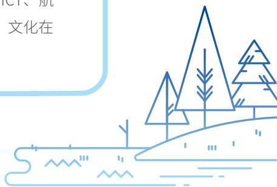

natural_image

Simple line drawing of a landscape with trees and a slope, no text or symbols present

## 服务与解决方案

## 咨询服务方案

战略咨询

业务和管理咨询

数字化技术咨询

出海咨询

AI 咨询

## 服务行业领域

金融

能源

化工

高科技

互联网

制造

农业

## 信息技术服务

AI技术服务

数字技术服务

通用技术服务

数字化运营

## 业务运营布局

博彦科技总部位于中国北京，旗下子公司、研发与交付中心已覆盖中国、美国、日本、印度、新加坡、马来西亚、西班牙、哥斯达黎加、印度尼西亚、菲律宾、巴西、英国、越南十三个国家的主要城市。

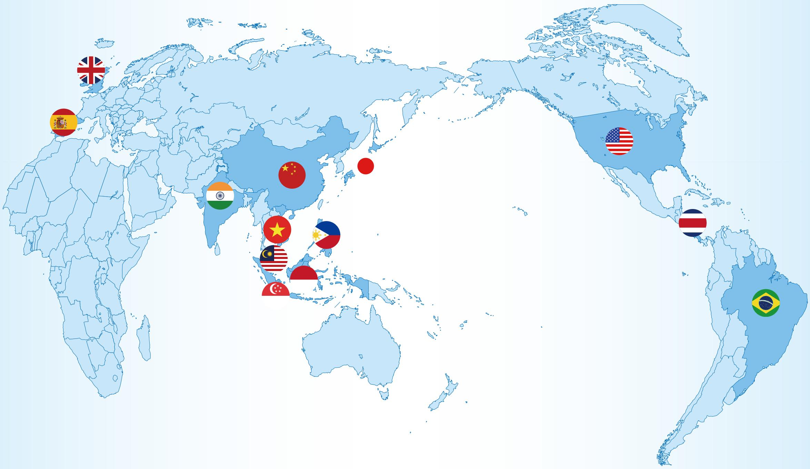

geo

| Country | Geographic Region |
| --- | --- |
| United Kingdom | North America |
| Spain | Europe |
| China | East Asia |
| India | South America |
| Vietnam | Southeast Asia |
| Malaysia | Southeast Asia |
| Philippines | Southeast Asia |
| Singapore | Southeast Asia |
| Indonesia | Southeast Asia |
| United States | North America |
| Costa Rica | North America |
| Brazil | South America |

## 我们的 2025

## 年度亮点绩效

## 经济绩效

营业收入

66.78亿元

纳税总额

4.35 亿元

利润总额

1.38 亿元

每 10 股派发现金红利 ( 含税 )

1.3 元

## 治理绩效

独立董事占比

42.86

数据安全与隐私保护培训时长

427.49

女性董事占比

14.29%

数字化投入

约 3,000 万元

合规培训总时长

160.46小时

## 环境绩效

环保违法违规事件与处罚

0 件

温室气体排放总量（范围一+范围二）

6776.13

获得ISO14001环境管理体系的企业家数（含母公司）

7 家

温室气体排放强度 （范围一+范围二

0.01 吨二氧化碳当量 / 万元营收

## 社会绩效

研发投入

2.97 亿元

员工培训投入

122.92万元

2,219件

员工培训总时长

4442.34

97.9%

229.47万元

## 年度大事件

## 3 月

博彦科技与中国经济信息社共建新华财经金融科技实验室，强强联合打造金融科技新高地

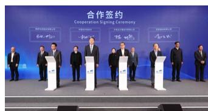

## 2 月

吉尔吉斯斯坦能源部长到访博彦科技，双方就行业发展现状和数字化议题展开交流

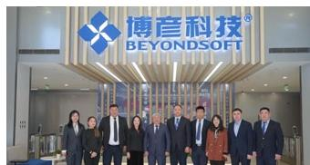

博彦科技与中华版权达成战略合作，共筑数字时代全球版权服务新范式

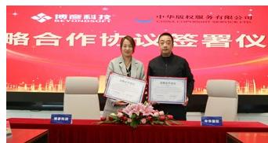

## 1 月

博彦科技携手美锦能源推进能源领域的数字化转型与可持续发展

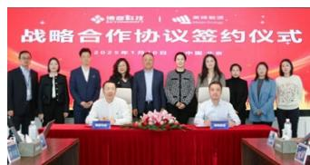

## 4 月

博彦科技与阿里云深化战略协同，共筑金融智能体创新变革

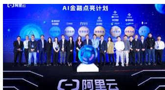

## 5 月

博彦科技正式加入全球智慧物联网联盟（GIIC），共建万物智联新时代

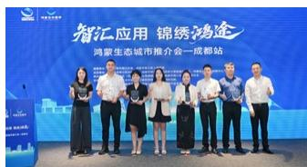

## 6 月

博彦科技启动大崎创新实验室(OSAKI Innovation Lab),打造全球AI共创共生前沿基地

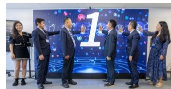

## 7 月

博彦科技荣登IDC 中国银行业IT解决方案报告前列，硬核竞争力再获行业认可

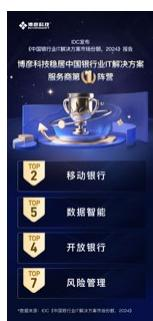

## 12 月

博彦科技联合碳中和行动联盟《2025中国企业碳目标白皮书》成果发布，以全栈能力支撑“双碳”落地

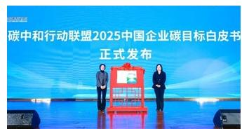

## 11 月

亚洲仿真联盟新加坡联络处(会员之家)落地博彦科技，全球化布局再添重磅引擎

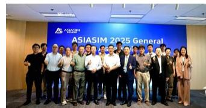

## 10 月

博彦科技主办 OVERSEAS LINKDAY企业出海闭门会，共筑全球化战略新支点

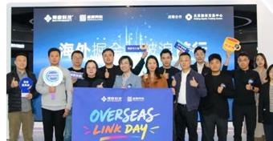

## 9 月

博彦科技亮相2025鸿蒙生态大会，以“5G+鸿蒙”助力化工行业智能变革

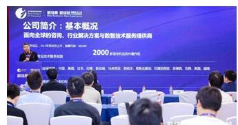

##

## 奖项荣誉

## 北京民营企业百强第76位

北京市工商业联合会

## 2025北京软件核心竞争力企业（平台赋能型）

北京软件和信息服务业协会

## 2024年度咨询解决方案领军企业

商业伙伴

## 2024年软件行业应用领军企业

中国软件行业协会

## 2025北京软件和信息技术服务综合实力

## 百家企业报告

北京软件和信息服务业协会

## 北京民营企业科技创新百强 第88位

北京市工商业联合会

## 2025年度未来产业之星 上市公司（未来信息）

中国上市公司产业发展论坛组委会

## 2024年软件行业数字化转型示范案例

中国软件行业协会

## Silver Sponsor Certificate

亚洲仿真联盟国际仿真大会

## 2025 第 5 届数字金融服务创新与场景应用案例

## 优秀案例奖

中关村互联网金融研究院

## 2025 服务贸易重点企业

中国国际投资促进会、北京国际经济贸易发展协会、北京市海淀服务贸易和服务外包企业协会

natural_image

Simple line drawing of a person standing above three stars (no text or symbols)

## 2025京津冀服务业企业百强第116名

北京企业联合会、北京市企业家协会

## 十大数字服务领军企业百强企业

中国国际投资促进会

## 优选级集成伙伴

华为企业业务集成伙伴计划

## 领航者卓越成就奖

中关村金融科技产业发展联盟

## 入选

## 《2024年度中国银行业IT解决方案市场分析报告》

工信部赛迪顾问

## 2025年度软件和信息技术服务竞争力海淀企业

中国电子信息行业联合会、北京市海淀区人民政府

## 最佳服务质量奖

交通银行数据中心

## 国际创新领航奖

中关村金融科技产业发展联盟

## 卓越贡献奖

中关村金融科技产业发展联盟

## 入选

## 《中国银行业IT解决方案市场份额，2024》

国际权威数据分析机构IDC

## 2025 数字贸易企业典型案例

## “基于能碳耦合预测与优化模型的智慧能源与运维平台”“数智化技术助力金融科技中企出海”

中国国际投资促进会、北京国际经济贸易发展协会、北京市海淀服务贸易和服务外包企业协会

## 国新杯·ESG 金牛奖百强

中国证券报

## 中国最佳 ESG 雇主奖

怡安（Aon）

## “2025ESG杰出案例奖”与“2025可持续发展引领企业奖”

2025第四届国际绿色零碳节暨2025ESG领袖峰会

## 2025北京软件和信息服务业企业社会责任治理水平

## AAA

北京软件和信息服务业协会

## 2025 年度 ESG 卓越企业

## 2025 年度最佳雇主

第二十届雇主品牌促进大会暨2025年度颁奖盛典

## 2025 企业 ESG 优秀成果论文（案例）三等奖

首都经济贸易大学中国 ESG 研究院、

《企业管理》杂志社

## 2025“金钥匙一面向 SDG 的中国行动”

## 杰出解决方案

可持续发展经济导刊

## 公益爱心单位

爱我中华·第十九届轮椅黄山行暨2025绿水青山轮椅跑公益活动

## “2025 年度公益践行奖”

## “2025 年度 ESG 实践先锋奖”

第十五届公益节暨 2025 ESG 影响力年会

## “文昌智慧渔业可持续发展平台——数字化驱动

## 产业升级”智慧农业与现代化银奖

ECI Awards 国际艾奇奖

## ESG 管理

博彦科技秉持“超越期待，尽善尽美”的责任理念，建立健全可持续发展管理体系和机制建设，2025年，公司修订《环境、社会及治理(ESG)管理制度》，整合内外部资源，将ESG风险与机遇识别、ESG议题管理、信息披露及监督考核全流程嵌入公司经营管理的各个环节，持续提升ESG治理的规范化和系统化水平，推动ESG治理与公司发展战略相融合。

## 完善ESG治理

我们构建了由董事会、董事会战略委员会、ESG领导小组组成的三层ESG管理架构，明确各层级核心职责与汇报机制将可持续发展纳入公司核心战略。董事会高度重视ESG工作，将ESG管理纳入战略委员会职能，建立完善的信息汇报与监督机制，根据ESG信息对公司的影响程度，通过书面、口头、会议等形式保障信息的及时和有效传递，推进公司ESG.工作的科学决策和高效执行。

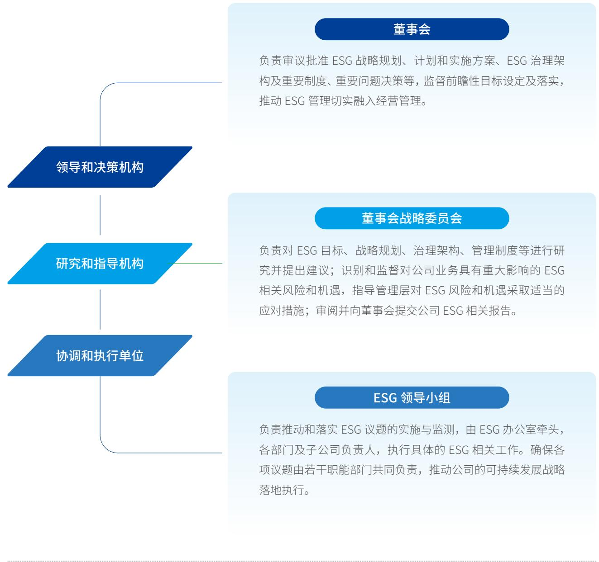

flowchart

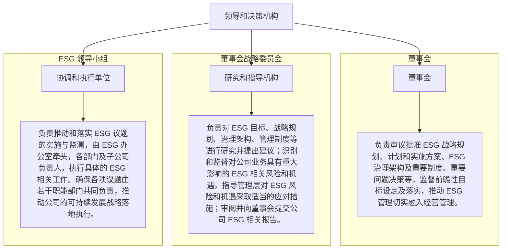

ESG 管理架构

## ESG能力提升

我们以全员参与为目标，持续完善ESG知识体系，为各层级、各职能人员提供多元化学习资源，全力推动ESG理念深度融入公司治理，夯实ESG管理基础。2025年，我们聚售ESG意识提升与信息共享开展内部赋能工作，通过公共邮箱OA系统等渠道持续性推送ESG相关主题内容，实现全员ESG理念宣贯与知识普及。公司还高度重视董事会ESG能力素养提升，组织开展董事会及高层ESG专项培训，提升公司决策层ESG责任意识与专业能力，为ESG战略落地提供坚实保障。

同时，我们持续总结梳理ESG优秀实践经验，积极参与外部权威奖项评选，2025年，公司凭借规范的ESG治理体系、扎实的制度落地成效与优异的ESG绩效，荣获WindESG评级 A级、华证 ESG评级 A级，及多项ESG领域相关荣誉彰显资本市场和社会各界对公司ESG治理水平与综合绩效的高度认可。

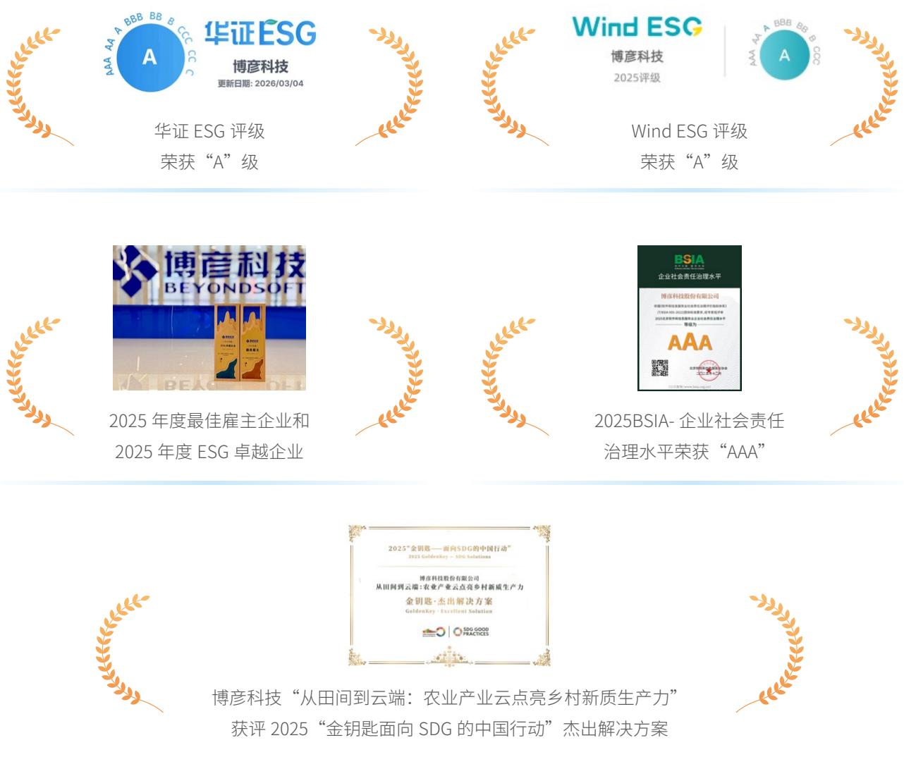

## 利益相关方沟通

我们建立常态化利益相关方沟通机制和多元化的沟通渠道，及时回应政府及监管机构、股东及投资者、员工、客户、供应商与合作伙伴、社区及媒体等核心利益相关方的期望与诉求，持续增进信任与合作，为公司可持续发展筑牢良好基础。

<table><tr><td>利益相关方</td><td>期望与诉求</td><td>回应方式</td></tr><tr><td>政府及监管机构</td><td>坚持合规经营促进经济发展绿色低碳运营保护生态环境</td><td>诚信经营、依法纳税参与政府项目、行业协作积极落实环保部门要求定期披露与不定期汇报沟通</td></tr><tr><td>股东及投资者</td><td>可持续投资价值优化治理框架信息公开透明</td><td>及时分析现状更新商业战略建立良好的投资者沟通机制定期披露经营信息</td></tr><tr><td>员工</td><td>保障员工合法权益重视职业发展和培训有竞争力的薪酬福利平衡工作生活</td><td>召开职工代表大会完善薪酬福利体系保障员工身心健康开展员工线上、线下培训丰富业余时间、举办活动</td></tr><tr><td>客户</td><td>提供优质技术及服务数据安全与隐私保护产品与服务的环境影响</td><td>优化质量管理体系技术研发与创新保障客户信息安全组织技术研讨会或培训开展客户满意度调研提供低碳转型赋能服务</td></tr><tr><td>供应商与合作伙伴</td><td>确保公平竞争实现诚信互惠推动行业发展和技术进步</td><td>打造负责任供应链沟通合作、坚持互利共赢维护行业健康发展、促进交流</td></tr><tr><td>社区</td><td>服务社区发展投身公益慈善创造就业机会助力乡村振兴</td><td>加强社区沟通、开展公益慈善活动带动就业和当地经济发展开展乡村振兴项目,推动乡村教育、人才、产业等发展</td></tr><tr><td>媒体</td><td>公开透明披露信息专项采访和交流</td><td>通过官方网站、报刊等媒体渠道及时公开信息建立完善的媒体沟通机制</td></tr></table>

## 实质性议题分析

博彦科技遵循《深圳证券交易所上市公司自律监管指引第17号—可持续发展报告（试行）》要求，开展ESG议题的双重重要性分析，综合考量ESG议题对公司的财务重要性与对经济、社会和环境的影响重要性。报告期内，结合相关监管要求与公司实际运营情况，通过发放议题调研问卷开展实质性议题评估，初步识别出对于公司具有双重重要性的议题，针对重点议题制定管理目标和策略，在报告中进行详细回应，持续推动公司可持续发展。

## 双重重要性评估流程

## 建立议题库

了解公司活动与商业关系，通过政策分析、规则与标准对标及同业分析，建立涵盖环境、社会、治理三大模块的议题清单。

## 影响重要性评估

通过发放利益相关方调研问卷，从影响发生的规模，范围可能性及不可补救性等维度评估各议题的正面和负面影响，识别出具有影响重要性的议题

## 财务重要性评估

内部管理层从“资源使用的连续性”和“对持续生产经营的关系依赖性”两个维度评估各议题的财务重要性，识别出具有财务重要性的议题。

## 双重重要性评估

针对影响重要性与财务重要性评估结果进行量化分析，通过矩阵形式呈现各议题整体的重要性优先级，共识别出18项实质性议题。其中，优质产品与服务、研发与创新、信息安全与隐私保护、应对气候变化 4 项议题双重重要性程度较高。

## 实质性议题分析

董事会战略委员会及ESG领导小组审阅并确认本年度议题矩阵，针对双重重要性程度较高的4项议题，我们按照“治理、战略、风险与机遇管理、指标与目标”的逻辑在报告内进行重点披露。

在实践层面，我们亦加强对各议题的整体管理，对议题进行业务相关性分析，识别风险、机遇影响时间范围，并根据公司战略规划、资源、组织进行相应匹配和管理，实现公司长足发展。

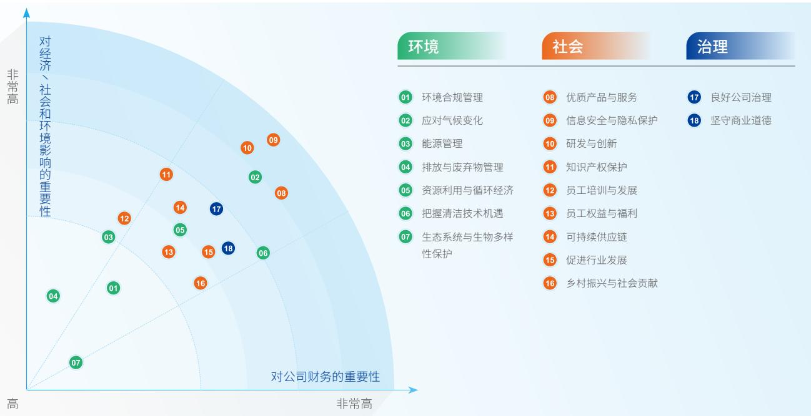

radar

| ID | Topic | Category |
| --- | --- | --- |
| 01 | 环境合规管理 | 环境 |
| 02 | 应对气候变化 | 环境 |
| 03 | 能源管理 | 环境 |
| 04 | 排放与废弃物管理 | 环境 |
| 05 | 资源利用与循环经济 | 环境 |
| 06 | 把握清洁技术机遇 | 环境 |
| 07 | 生态系统与生物多样性保护 | 环境 |
| 08 | 优质产品与服务 | 社会 |
| 09 | 信息安全与隐私保护 | 社会 |
| 10 | 研发与创新 | 社会 |
| 11 | 知识产权保护 | 社会 |
| 12 | 员工培训与发展 | 社会 |
| 13 | 员工权益与福利 | 社会 |
| 14 | 可持续供应链 | 社会 |
| 15 | 促进行业发展 | 社会 |
| 16 | 乡村振兴与社会贡献 | 社会 |
| 17 | 良好公司治理 | 治理 |
| 18 | 坚守商业道德 | 治理 |

贡献 SDGs

<table><tr><td>SDGs</td><td>博彦科技责任行动</td><td>章节索引</td></tr><tr><td>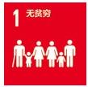</td><td>·在全球范围内提供近3万个就业岗位,提供体面工作机会,减少贫困·通过数字化手段提升农业生产效率,帮助农民增收,助力乡村振兴</td><td>社会篇(S):科创领航,共启美好未来新篇章</td></tr><tr><td>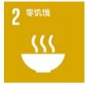</td><td>·利用大数据、物联网和AI技术优化农业生产流程,提高粮食和水产品产量与质量·构建智慧农业、智慧养殖等解决方案,提升农业资源利用效率,保障粮食安全</td><td>社会篇(S):科创领航,共启美好未来新篇章</td></tr><tr><td>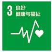</td><td>·关注员工身心健康,设立健身房、母婴室等设施,定期开展健康咨询和员工体检·支持残障人士体育事业,促进社会包容与健康</td><td>社会篇(S):科创领航,共启美好未来新篇章</td></tr><tr><td>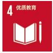</td><td>·援建河北献县希望小学,支持贫困地区教育发展·完善员工技能培训与职业发展体系,助力人才成长</td><td>社会篇(S):科创领航,共启美好未来新篇章</td></tr></table>

<table><tr><td>SDGs</td><td>博彦科技责任行动</td><td>章节索引</td></tr><tr><td>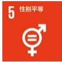</td><td>· 构建开放、包容的工作环境,尊重个体差异,构建多元化职场· 提供公平的职业发展平台,支持女性员工晋升至管理层,推动性别平等· 严格执行反歧视政策,确保招聘、晋升等环节的公平公正</td><td>治理篇(G):责任固基,共筑行稳致远新格局</td></tr><tr><td>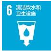</td><td>· 鼓励员工节约用水,保证废水合规排放· 通过物联网和大数据技术,开发水资源监测与管理平台,优化用水效率,减少浪费</td><td>环境篇(E):绿动未来,共建低碳转型新生态</td></tr><tr><td>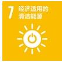</td><td>· 提供智慧能源业务,以技术赋能推动能源系统高效转型</td><td>环境篇(E):绿动未来,共建低碳转型新生态</td></tr><tr><td>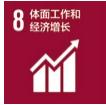</td><td>· 保障平等就业,维护员工权益与职业健康· 以数字技术赋能产业升级,带动高质量就业与经济发展· 推进智慧农业与产业云建设,助力乡村产业增收</td><td>社会篇(S):科创领航,共启美好未来新篇章</td></tr><tr><td>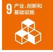</td><td>· 以创新技术赋能产品迭代升级,引领行业数智化转型· 为客户提供IT基础设施管理与运维服务,支撑关键行业数字化基础设施建设</td><td>社会篇(S):科创领航,共启美好未来新篇章</td></tr><tr><td>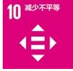</td><td>· 搭建残疾人就业支持体系,提供适配岗位与技能培训· 推动残健融合,打造多元、平等、包容的职场环境· 助力弱势群体平等融入社会与数字生活</td><td>社会篇(S):科创领航,共启美好未来新篇章</td></tr><tr><td>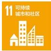</td><td>· 鼓励员工参与社区公益活动,营造多元包容的社区环境,增强社区凝聚力· 推行无纸化办公、节能减排措施,打造绿色办公环境</td><td>社会篇(S):科创领航,共启美好未来新篇章</td></tr><tr><td>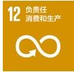</td><td>· 强化绿色供应链管理,优化资源配置,推动合作伙伴共同践行环保理念· 在软件开发和服务交付过程中,注重资源节约和环境友好</td><td>环境篇(E):绿动未来,共建低碳转型新生态</td></tr><tr><td>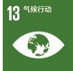</td><td>· 推广低碳办公与绿色园区运营,降低自身碳排放· 开展生态环保公益活动,推动生态保护</td><td>环境篇(E):绿动未来,共建低碳转型新生态</td></tr><tr><td>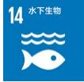</td><td>· 通过智慧渔业项目保护海洋与淡水生态系统· 利用技术赋能,实现水质实时监测,防止污染扩散</td><td>环境篇(E):绿动未来,共建低碳转型新生态</td></tr><tr><td>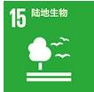</td><td>· 通过智慧农业项目,倡导科学种植与养殖,减少对土地资源的过度开发· 通过技术手段监测生态环境变化,支持生物多样性保护工作</td><td>环境篇(E):绿动未来,共建低碳转型新生态</td></tr><tr><td>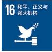</td><td>· 规范公司治理,建立高效、透明、责任的治理体系· 恪守商业道德,通过制度完善与廉洁培训提高全员、合作伙伴廉洁</td><td>治理篇(G):责任固基,共筑行稳致远新格局</td></tr><tr><td>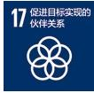</td><td>· 加入联合国全球契约组织· 与客户、供应商、高校等共建可持续生态· 联动社会组织,协同开展双碳、乡村振兴、助残等项目</td><td>社会篇(S):科创领航,共启美好未来新篇章</td></tr></table>

## 报告专题

# 数智创新·赋能千行百业

数字经济浪潮下，国家“AI+”行动、数字经济高质量发展等政策持续发力，推动数智技术与实体经济深度融合。博彦科技将数智创新纳入ESG核心实践与价值创造，依托人工智能、云计算、大数据等核心技术，聚焦金融、能源、农业医疗等领域转型需求，以技术赋能产业绿色低碳发展、运营效率提升与社会价值升级，为行业数智化转型与可持续发展提供可借鉴的实践范式。

## 数智赋金融，安全增效筑新篇

博彦科技深耕金融领域20余年，以“技术+数据+场景”为核心，构建覆盖全业务链条的金融科技解决方案体系，依托大数据控制平台、智能风控系统，优化工作流管理与商业智能分析，提升风险识别精度与产品迭代效率，助力金融机构实现数据有序治理与高效利用。

## 博彦科技与新华社中国经济信息社共建新华财经金融科技实验室，打造金融科技新高地

2025年2月28日，博彦科技与新华财经签署合作协议，双方将共建“新华财经金融科技实验室”，整合博彦在AI、数据智能领域的技术优势与新华财经的权威数据资源，聚焦投研、风控、拓客等核心场景开发创新产品从构建多源异构数据智能治理体系，到研发智能化金融信息工具，再到联合高校培养金融科技领军人才，全方位筑牢金融安全防线，推动金融服务向“高效化、精准化、安全化”升级，为金融强国建设注入数智动能。

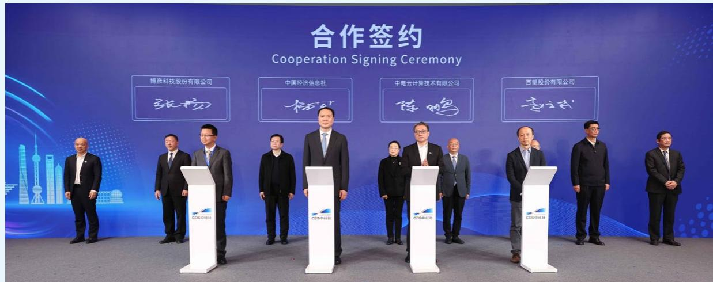

text_image

合作签约
Cooperation Signing Ceremony
博彦科技股份有限公司
张杨
中国经济信息社
杨可
中电云计算技术有限公司
陈鹏
百望股份有限公司
李立民

## 数智启能源，绿色低碳创价值

博彦科技以“数智赋能能源革命”为导向，构建“虚拟电厂超级融合平台”，覆盖能源数据采集监测，AL负荷预测多主体协同调度、电力交易管理全流程，已在青海、内蒙古等地区落地应用，有效提升新能源消纳率与电力市场交易效率。

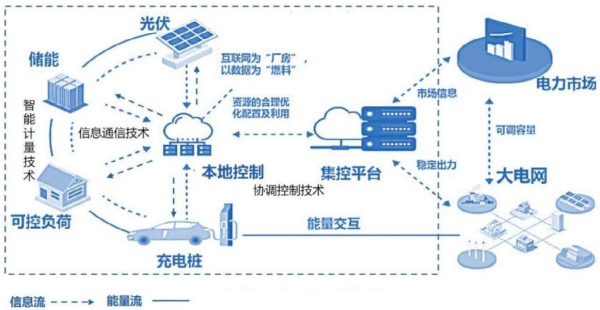

flowchart

This diagram illustrates the energy infrastructure and market dynamics of a large-scale power grid, showing how energy flows from storage, charging, control systems (clouds), and distributed platforms interact with various technologies like photovoltaic, smart counting, and energy storage.

为进一步释放储能资产价值，公司与日本RS科技达成深度合作，共同探索光储充一体化场景试点，通过“硬件+软件”协同优化储能电站运营，降低企业用能成本。同时，依托东京大崎创新实验室与北京创新孵化中心的“双引擎”联动持续探索Web3数字资产，量子计算在能源领域的应用，以数智技术驱动能源结构低碳转型，助力构建新型电力系统

## 数智润农业，丰产提质助振兴

博彦科技积极响应2025年中央一号文件“发展农业新质生产力”部署及《全国智慧农业行动计划(2024—2028年)》的相关要求，以“数智赋能农业，为产品降本增效”为核心目标，打造覆盖全产业链的智慧农业解决方案，破解农业数据利用率低、技术与需求脱节等痛点，助推农业数智化转型，助力中国农业迈向现代化、数字化、国际化的新高度。

博彦科技推动农业数智化场景化解决方案  
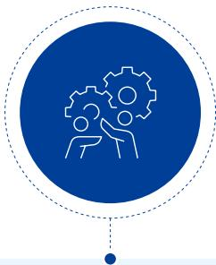  
农牧业智慧升级

优化“公司+农户模式”，实现新技术推广、产业升级及政府监管

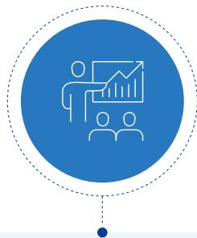  
渔业数智转型

数智兴渔解决方案涵盖多场景应用，实现渔业生产监管加强、运营效率提升等

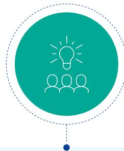  
乡村治理与产业升级

数智乡村解决方案、数智供销解决方案、数智农服解决方案

从标杆项目到联合阿里云建庆阳农业产业云、参与中国一东盟智慧农场项目，博彦科技以数智力量破解农业瓶颈，践行“藏粮于技、数智兴农”使命，助力乡村振兴与农业强国建设。

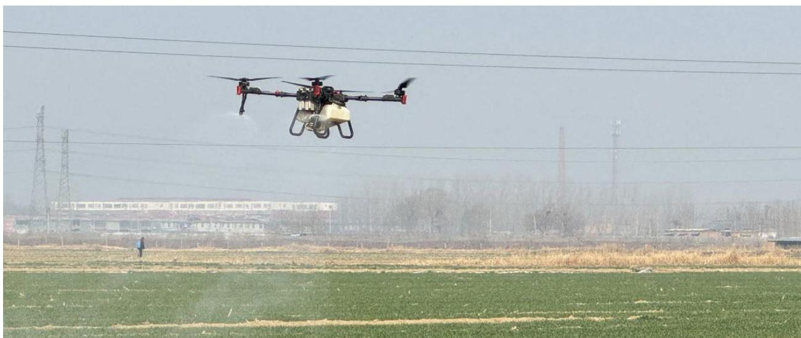

natural_image

Agricultural drone flying over a green agricultural field with power lines and distant buildings in the background (no visible text or symbols)

## 案例

## 博彦科技推出“莘州农服”小麦玉米全周期管理项目，推动粮食主产区转型

为了解决种植中数据孤岛、管理粗放等痛点，2025年，公司推出“莘州农服”小麦玉米全周期管理项目，项目立足山东“齐鲁粮仓”，针对，构建“耕一种一管一收”全流程数字化体系：耕播阶段依托物联网、北斗设备建立地块数字档案，指导良种选配与标准化栽培；生长阶段通过数据模型输出精准水肥、病虫害防控建议；收获阶段联动智能农机实现产量数据闭环，支撑种植方案优化。该项目实现大田运营成本降低 5%、效率提升 10%、水肥利用效率提升 13%；通过“小农户 + 村集体”联农模式，带动 3280 余农户参与，助力 60 余农户实现就业、村集体增收320万元，培训职业农民超千人次，有力推动产业增收与绿色种植协同发展。

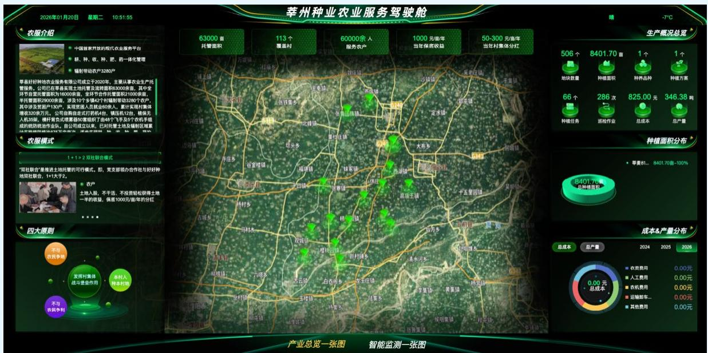

text_image

莘州种业农业服务驾驶舱
2026年01月20日 星期二 10:51:55
衣服介绍
中国首家开放的现代农业服务平台
耕、种、农、种、肥、奶一体化管理
辐射带动农户3280户
莘县好好种植农业服务有限公司成立于2020年，主要从事农业生产托管服务。公司已在莘县实现土地托管及流转圈和83000亩，其中全环节自置托管面积为16000亩，全环节合作托管面积21000亩，手托管面积29000亩，涉及10多个镇4个村辐射带达3260个农户，其中涉及原地户130个，未按原地人员或600余人，累计采样村集体覆盖3220亩。公司自置在式27号机46、辅机172台，植保无人机35辆，横杆有式喷雾器50套组织了由49个飞手及5个农机手组成的统防统治作业队。自公司成立以来，已对托管土地及辐射区域累
衣服模式
1+1+2双社联合模式
"双社联合"要推进土地托管的可行模式。部，常支部领办合作社与好特种地双社联合，1+1大于2。
农户
土地入股，不干港，不投资轻松获得土地一半的收益，保底1000元/亩/年的分红
四大原则
不与
农民争利
发挥村集体
战斗堡垒作用
本村人
禁止村地
不与
农民争利
63000重
托管面积
113个
覆盖村
60000余人
服务农户
1000元/亩/年
当年保底收益
50-300元/亩/年
当年村集体分红
生产概况总览
506个 8401.70亩 1个 1个
地块数量 种植面积 种养品种 种植方案
66个 286次 825.00元 346.38吨
种植任务 托绘作业 总成本 总产量
种植面积分布
8401.70亩 -100%
苹果81... 8401.70亩 -100%
总种植范围
成本&产量分布
总成本 总产量 2024 2025 2026
农药费用 0.00元
人工费用 0.00元
农机费用 0.00元
运输帮车... 0.00元
其他费用 0.00元
产业总览一张图 智能监测一张图

## 数智护医疗，精准惠民守安康

博彦科技深耕医疗健康领域，以数字化技术能力守护民众健康。公司聚售医疗行业信息化建设核心诉求，持续为医疗领域客户提供全周期、高品质的ERP系统维保等数字化服务，全力保障医疗信息系统稳定、高效运转，助力客户全面提升数字化管理水平与医疗服务质效，推动医疗行业信息化建设高质量发展。

2025年9月，博彦科技与张江科学大数据创新实验室签约，依托自身数据智能与数字技术服务优势，积极参与实验室在多源数据治理、可信数据空间建设及医疗健康场景创新应用等工作，推动医疗健康数智化建设。

# 绿动未来

# 共建低碳转型新生态

绿色发展是企业高质量发展的重要支撑。博彦科技秉持人类命运共同体理念，以低碳引领为核心，积极应对全球气候变化挑战；以节约减排为抓手，筑牢绿色运营坚实防线；以技术赋能为支撑，助力千行百业绿色转型；以生态共生为愿景，守护生物多样性与生态平衡，助力社会绿色转型发展和美丽中国建设，携手各利益相关方迈向更加绿色、可持续的未来。

开展安全应急演练

6 次

40 万元

件0

● 应对气候变化  
环境合规管理  
能源管理  
排放与废弃物管理  
资源利用与循环经济  
把握清洁技术机遇  
生态系统与生物多样性

CO2

## 应对气候变化

博彦科技积极响应《巴黎协定》气候变化倡议和中国“双碳”目标，持续完善气候治理架构，构建“双碳”主题战略路线，

## 气候相关治理

公司深刻认识气候变化对企业可持续发展的深远影响，高度重视气候变化相关风险和机遇的识别与管理，结合业务发展与实际需要，持续优化内部管理，逐步将气候治理纳入“董事会-董事会战略委员会-ESG领导小组”三级ESG管理架构的治理范围，由核心部门协同参与对包括气候变化在内的环境议题进行管理，努力采取措施减少温室气体排放，系统性应对气候变化挑战。

## 气候相关战略

公司结合国家“双碳”目标、相关政策要求及TCFD披露框架，评估重大气候风险与机遇对公司运营和财务状况的影响，识别短中长期的气候风险与机遇，根据识别结果制定相应的应对举措与策略。

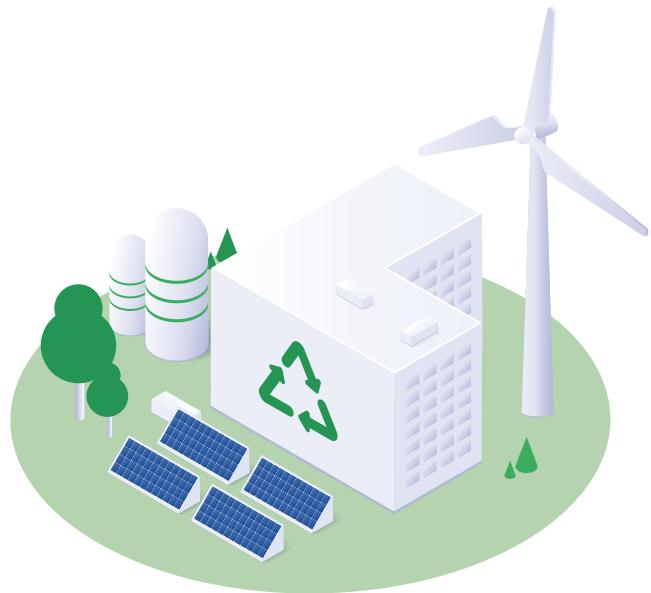

natural_image

Illustration of an eco-friendly energy system with solar panels, wind turbine, and recycling symbol (no text or labels)

气候变化风险分析

<table><tr><td>类型</td><td>风险项</td><td>影响描述</td><td>财务影响</td><td>影响周期</td><td>应对策略</td></tr><tr><td>物理风险</td><td>极寒</td><td>· 增加办公场所的保暖需求,能源消耗及设施维护、运营成本上升· 中断现场业务,为员工带来外勤安全隐患</td><td>· 运营能力下降造成的收入减少· 增加运营成本、管理费用、固定资产维护费用</td><td>短期</td><td>· 制定极端天气及突发环境事件的应急预案· 常态化温控系统检查与预警</td></tr></table>

<table><tr><td>类型</td><td>风险项</td><td>影响描述</td><td>财务影响</td><td>影响周期</td><td>应对策略</td></tr><tr><td rowspan="4">物理风险</td><td>极热</td><td>办公场所和设施的制冷需求增加,能源消耗及设施维护、运营成本上升电力供应短缺,部分地区限电政策影响正常运营中暑等员工健康风险提升</td><td>运营能力下降造成的收入减少增加运营成本、管理费用员工健康安全保障支出增加</td><td>短期中期</td><td>制定极端天气及突发环境事件的应急预案,建立电力短缺应急响应机制更换高能效设施,提高能源效率,减少制冷能耗储备防暑降温应急物资</td></tr><tr><td>热带气旋</td><td>沿海及低洼地区的运营点遭遇飓风、台风、极端降雨带来的洪涝灾害,道路受阻、局部断电及设施设备损坏等风险造成数据丢失和员工通勤安全风险数智化服务平台、算力设施停运,业务连续性受影响物流运输受阻导致硬件配套、项目物料供应不足</td><td>增加运营成本、管理费用、固定资产维护成本业务中断引发收入损失及客户赔偿成本</td><td>短期</td><td>在办公选址过程中考虑气候影响,将重要设备置于安全位置制定极端天气及突发环境事件的应急预案增加防台应急物资,组织专项应急演练</td></tr><tr><td>海平面上升</td><td>沿海地区面临水淹风险,设施和楼宇提前报废建设防水防潮改造将增加在沿海地区园区建设的成本极端情况下园区搬迁,导致业务大规模中断</td><td>固定资产减值、提前报废损失设施改造、园区搬迁导致运营成本、固定资产支出激增业务中断造成持续性收入减少</td><td>长期</td><td>对沿海地区设施进行风险评估,若风险过高,考虑逐步转移业务或提前制定搬迁规划园区选择考虑防水、防潮因素,提高设施抗水淹能力购买财产保险,分散资产损失风险</td></tr><tr><td>平均气温上升</td><td>办公场所和设施的全年制冷能耗持续增加,经营成本长期走高可能影响办公设备散热,增加设备故障率,运维成本增加长期高温环境影响员工身体健康</td><td>增加运营成本和管理费用</td><td>中期</td><td>优化办公场所和设施的通风散热系统加强设备维护管理,提升设备可靠性</td></tr><tr><td rowspan="4">转型风险</td><td>政策法规</td><td>气候转型目标和政策的监管和要求,导致能源价格上涨,能源结构改变,绿色能源需求增加;升级公司碳管理水平,增加合规与运营成本环保政策趋严导致现有高能耗设备因环保要求面临提前报废,资产减值研发低能耗的交付方案,从而增加研发支出</td><td>现有资产冲销和提前报废研发支出、运营成本、管理费用增加资本性支出上升,现金流压力增加</td><td>中期</td><td>遵守“双碳”目标要求,匹配软件服务业“高质量发展”导向,对涉及该风险的相关政策进行研究分析完善能源管理体系和碳管理体系,优化能源结构与节能降碳举措,加强绿色低碳技术研发;建设绿色可持续供应链</td></tr><tr><td>技术风险</td><td>传统数智技术及设备因低碳要求被淘汰,现有资产冲销和提前报废绿色技术研发及设备更新资本投入大,投资回收周期长</td><td>研发支出增加,从而降低利润产品需求下降引发收入减少增加资本成本、运营成本和管理费用</td><td>中期</td><td>依托“科技创新和产业创新融合”要求,强化绿色技术研发能力定期评估行业内新技术发展趋势,匹配“数字经济与绿色经济融合”趋势,制定技术引进和升级计划</td></tr><tr><td>市场风险</td><td>能源、算力、硬件零部件价格上涨,生产成本增加低碳产品和绿色解决方案的需求转变,在产品、运营、品牌、营销等全流程中持续投入,产品和运营成本上升。若未能满足客户的需求转变,将导致订单丢失,产品需求削弱或产品搁浅,以及收益减少</td><td>订单流失导致收入减少增加运营成本和管理费用</td><td>短期中期</td><td>积极宣传企业ESG及气候风险管理成果,提升品牌认可度响应“客户低碳数字化转型”需求,依托“碳市场建设”趋势,为客户提供碳算、碳管理数智服务等低碳数智解决方案</td></tr><tr><td>声誉风险</td><td>ESG表现受到资本市场高度关注,若评级下降及声誉受损,导致融资成本上升、可用资本减少客户审计关注ESG方面,声誉受损负面舆情扩散,影响品牌形象,产生销售影响</td><td>订单流失导致收入减少增加运营成本和管理费用</td><td>短期</td><td>匹配“企业可持续发展”要求,完善ESG治理与披露体系,确保信息披露的合法、合规性加强负面舆情监测,主动跟进整改,降低负面影响</td></tr></table>

气候变化机遇分析

<table><tr><td>类型</td><td>机遇描述</td><td>财务影响</td><td>影响周期</td><td>应对策略</td></tr><tr><td>资源效率</td><td>建设智能能源管理体系,降低能源消耗,节约运营成本推进设施节能改造,降低单位产值能耗</td><td>减少运营成本,提高固定资产价值固定资产利用效率提升,资产价值增加</td><td>短期中期</td><td>搭建智能能耗管理平台,实现精细化管控</td></tr><tr><td>能源来源</td><td>采用可再生能源,满足部分办公用电需求,降低对传统能源的依赖</td><td>减少运营成本</td><td>中期</td><td>响应“能源结构优化”要求,助力新型电力系统建设</td></tr><tr><td>产品与服务</td><td>针对客户在应对气候风险方面的需求,开发相关解决方案,拓展业务领域提升现有产品和服务的气候适应性、稳定性和可靠性,增强市场竞争力</td><td>改善竞争地位,提高收入提升产品市场竞争力,市场份额扩大</td><td>中期长期</td><td>制定针对性的产品研发计划,以碳管理为核心打造数智化解决方案加强品牌推广,提高新产品和服务的市场知名度</td></tr><tr><td>市场</td><td>为客户低碳数字化转型提供解决方案,获得更多市场机会政府政策鼓励带来的补贴及其他利好满足海外绿色数字经济市场需求,拓展全球业务</td><td>进入新型和新兴市场,提高收入政策补贴降低研发与运营成本,提升盈利水平全球业务拓展推动收入增长</td><td>长期</td><td>研究相关产业政策,匹配“产业生态构筑”趋势,推动低碳数智服务产业链协同发展加强机构合作,提升企业在低碳数字化转型等相关领域的知名度和影响力</td></tr><tr><td>韧性</td><td>建立完善的气候风险管理体系,提高企业应对气候风险的能力和韧性强化供应链气候风险协同管控,提升供应链韧性</td><td>企业运营效率提升,运营中断风险减小供应链稳定性提升,采购成本与交付成本下降</td><td>中期</td><td>制定气候风险应急预案,组织应急演练开展员工气候风险培训,增强员工应对气候风险的意识和技能强化供应商风险评估,建立绿色供应链合作体系</td></tr></table>

## 气候相关影响、风险及机遇管理

将气候风险管理纳入公司ESG管理体系和风险因素评估当中，梳理及识别气候相关信息可能会对公司的业务运营、策略制定、财务指标等带来的实际或潜在影响，从管理机制、管理工具等方面持续完善气候相关风险管理

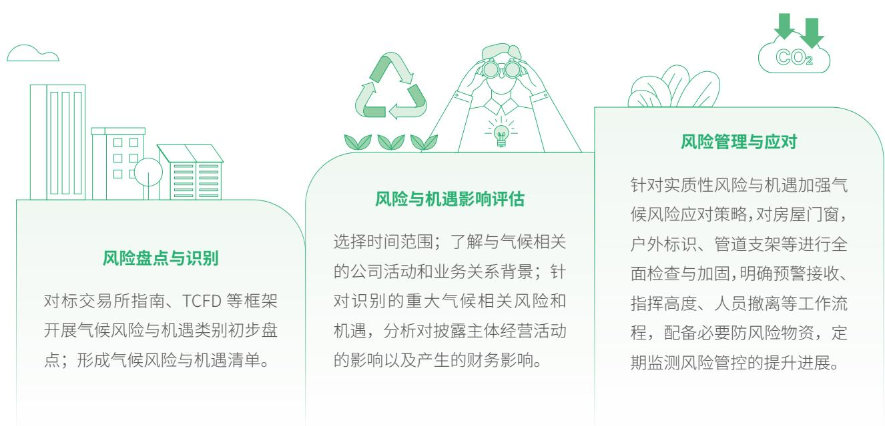

flowchart

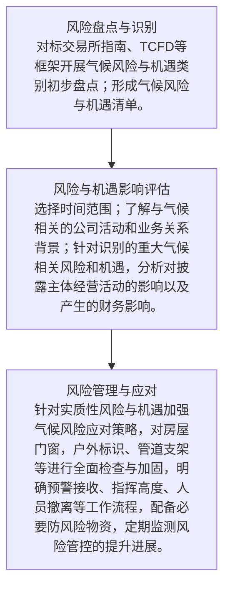

## 气候相关指标与目标

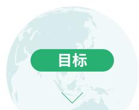

通过节能改造、资源循环等降碳行动，加强能耗、碳排放指标管理，努力减少排放，增强绿色低碳发展能力。

## 核心绩效

温室气体排放总量（范围一）

1,526.20

吨二氧化碳当量

温室气体排放总量(范围三)

308.94

吨二氧化碳当量

温室气体排放总量（范围二）

5,249.93

吨二氧化碳当量

温室气体排放总量

7,085.07

吨二氧化碳当量

## 环境友好运营

公司严格遵循《中华人民共和国环境保护法》等相关法律法规，依据ISO14001环境管理体系、ISO50001能源管理体系建立健全环境管理体系，定期开展环境因素和危险源识别和评价，规范环境应急管理，编制突发事件应急预案应对暴境管理平台，通过定期开展环保检查、考核监督等综合措施，全面落实生产、办公等环节各项环保措施，推动环境管理

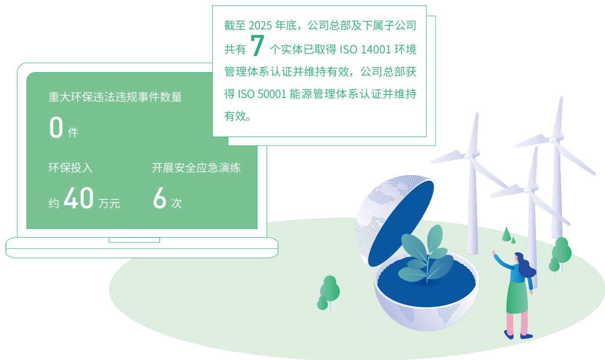

text_image

重大环保违法违规事件数量
0件
环保投入
约40万元
开展安全应急演练
6次
截至2025年底，公司总部及下属子公司共有7个实体已取得ISO 14001环境管理体系认证并维持有效，公司总部获得ISO 50001能源管理体系认证并维持有效。

公司持续规范应急管理，2025年，修订编制《防火防灾安全制度》，依据《突发事件应急管理预案》组织防爆、电动车起火触电，电梯故障，水浸与消防疏散等应急演练，提升员工的应急处置能力，有效保障突发环境事件的应急处置。

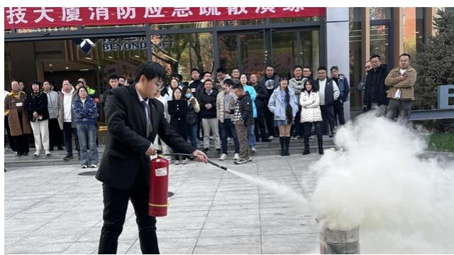

text_image

技大厦消防应急疏散演练
BEYOND OF

博彦科技开展消防演练

natural_image

Interior of a training facility with instructors practicing CPR on a man lying on the mat, surrounded by large windows and chairs (no visible text or symbols)

博彦科技开展触电事故演练

## 能源管理

公司实施精细化、智能化能耗管控，建立全流程能源管理机制。完成办公区域电力控制系统优化调研工作，设定年度节能目标，按月复盘能耗数据并进行优化；开展办公区域及无人公共区域每日常态化节能巡检，确保空调、灯具等设备关闭，杜绝能耗浪费；对健身房实行分时段开放管理，非开放时段关闭相关能耗设备；推进自有楼宇照明系统升级逐步替换|ED灯等节能设备并在部分区域设置智能感应灯源：优化通勤班车能源结构，新购进2辆新能源车替代原有的燃油车辆，配套建设电动洗车，电动车充电桩等设施，鼓励员工绿色通勤：完成机房空调系统升级改造，提升设备能效比、智能调控能力和冷却效率，在全面接入A算力背景下实现月均能耗保持可控水平。

## 水资源管理

公司以节水降耗、高效利用为核心，持续优化水资源管理体系。通过设定年度节水目标，定期监控耗水量并动态优化水资源利用方式：更新饮水供应模式，将桶装水更换为反渗透过滤直饮水机，从源头减少水资源浪费：实施卫生设施间节水改造，更换设备并优化冲水设计，避免长流水现象，持续提升水资源利用效率。

## 排放物与废弃物管理

公司建立排放物与废弃物规范化管理体系，实现合规处置与资源循环利用。推进排污处置规范化，强化食堂工作人员培训，优化食堂档口排污方式，经改良后污水统一通过隔油池处理：规范废弃物处置管理，整合隔油池清洗、化粪池清掏等处理供方，与专业有害垃圾处理机构签约，实现专业化、合规化处置；在办公区域设置分类垃圾桶，强化可回收物的分离处理，全面减少一次性用品使用，有效推动废弃物减量化和回收再利用。

## 核心绩效

总用电量

兆瓦时9,049.13

立方米91,992.72

总用水量

吨41,343.92

升48,767

吨415.9

## 绿色办公

公司大力推进绿色办公理念落地，构建数字化、低碳化办公模式。全面推行无纸化办公、采用电子签名、电子发票等方式，减少纸质单据使用；上线QA协同办公系统，将部分流程全面数字化；全面使用视频会议，优先采用线上会议开展跨地区沟通。

同时，公司持续推进闲置资产再利用，实现闲置办公家具于成都、重庆、北京等区域跨区域循环利用。此外，还向残障人员就业单位捐赠10台闲置电脑，推动资源高效循环

## 环保宣贯

公司积极践行低碳环保理念，组织开展捡拾垃圾、生态保护等主题环保行动。2025年，常态化举办“健康低碳达人竞赛”，吸引超400名员工参与，评选并授予“绿色倡导者”“碳中和先锋”及“健康守护者”三项荣誉称号，强化员工绿色发展意识。

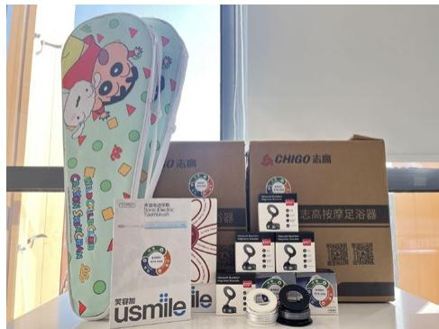

text_image

志高
CHIGO志高
志高按摩足浴器
usmile
美味加

## 案例

## 博彦科技组织举办“拾步青山，‘彦’续绿色”主题环保行动

2025年5月，博彦科技联合“手护自然”公益组织举办“拾步青山，彦’续绿色”主题环保行动。活动以“无痕山林”为理念，经过5.5小时的共同徒步，清理灌木与岩缝中的烟蒂、塑料瓶、铝罐等各类生活垃圾26千克践行绿色发展的责任担当。

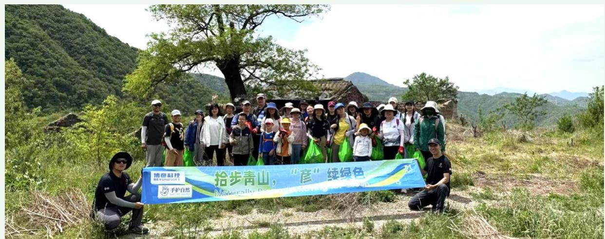

text_image

拾步青山，“彦”续绿色
博意科技
NABOPECO.COM
手护自然
Nabically Protected Area
Nabody's Green
Nabody's Sustainable Heritage

## 助推绿色发展

的全周期综合解决方案，打造博彦双碳六维服务体系。

## 博彦科技双碳六维服务体系

## 量化

企业碳核算、产品碳足迹、气候风险量化、生物多样性评估、活动碳核算、投融资碳核算

## 规划

双碳路径规划、企业/机构碳中和、区域双碳解决方案、综合能源解决方案、绿色循环经济方案

## 数字化

碳资产管理平台、可信碳数字空间、碳足迹追踪平台、RWA 通证平台、企业碳账户、ESG管理平台

## 行动

智慧工厂改造、碳减排项目落地、零碳园区建设、绿色供应链管理、ESG体系建设、绿色金融融资

## 资产

方法学申报、碳资产开发、碳资产交易、碳配额管理、绿证销售与电力交易

## 披露

ESG披露服务、碳信息披露、行业标准制定、行业白皮书

## 案例

## 智慧能源树立绿色转型标杆

2025年10月，博彦科技《基于能碳耦合预测与优化模型的智慧能源运维平台》项目，成功入选“浦东新区绿色低碳十大赛道”之“极致能效”创新实践案例。该平台构建了以“能碳耦合预测与优化模型”为核心的技术体系，通过AI算法对能源流与碳流进行综合预测与智能调度，实现能源消耗与碳排放的实时监测、数据分析与动态优化成为2025年浦东新区绿色低碳产业高质量发展大会中的焦点项目。

## 向绿焕新碳领未来 浦东新区绿色低碳产业发展成果展示

text_image

产业发展情况
· 目前汽车市场
· 发展规模
· 1-3月汽车市场销售量与销量的对比
· 4-7月汽车市场销售量与销量的对比
· 9-12月汽车市场销售量与销量的对比
· 1-3月汽车市场销售量与销量的对比
· 4-7月汽车市场销售量与销量的对比
· 9-12月汽车市场销售量与销量的对比
· 1-3月汽车市场销售量与销量的对比
· 4-7月汽车市场销售量与销量的对比
· 9-12月汽车市场销售量与销量的对比
· 1-3月新能源汽车
· 发展规模
· 1-3月新能源汽车销售量与销量的对比
· 4-7月新能源汽车销售量与销量的对比
· 9-12月新能源汽车销售量与销量的对比
· 1-3月新能源汽车销售量与销量的对比
· 4-7月新能源汽车销售量与销量的对比
· 9-12月新能源汽车销售量与销量的对比
· 1-3月新能源汽车销售量与销量的对比
· 4-7月新能源汽车销售量与销量的对比
· 9-12月新能源汽车销售量与销量的对比
· 1-3月新增新能源汽车
· 发展规模
· 1-3月新增新能源汽车销售量与销量的对比
· 4-7月新增新能源汽车销售量与销量的对比
· 9-12月新增新能源汽车销售量与销量的对比
· 1-3月新增新能源汽车销售量与销量的对比
· 4-7月新增新能源汽车销售量与销量的对比
· 9-12月新增新能源汽车销售量与销量的对比
· 1-3月新增新能源汽车销售量与销量的对比
· 4-7月新增新能源汽车销售量与销量的对比
· 9-12月新增新能源汽车销售量与销量的对比
广东新城区绿色低碳“十大赛道”创新实践案例
· 排放渠道
· 排放渠道
· 排放渠道
· 排放渠道
· 排放渠道
· 排放渠道
· 排放渠道
· 排放渠道
· 排放渠道
· 排放渠道
· 排放渠道
· 排放渠道
· 排放渠道
· 排放渠道
· 排放渠道
· 排放渠道
· 排放渠道
· 採放渠道
· 排放渠道
· 排放渠道
· 排放渠道
· 排放渠道
· 排放渠道
· 排放渠道
· 排放渠道
· 排放渠道
· 排放渠道
· 排放渠道
· 排放渠道
· 排放渠道
· 排放渠道
· 排放渠道
· 排放渠道
· 排放渠道
• 基金方式
• 基金方式
• 基金方式
• 基金方式
• 基金方式
• 基金方式
• 基金方式
• 基金方式
• 基金方式
• 基金方式
• 基金方式
• 基金方式
• 基金方式
• 基金方式
• 基金方式
 • 绿色产品
• 绿色产品
• 绿色产品
• 绿色产品
• 绿色产品
• 绿色产品
• 绿色产品
• 绿色产品
• 绿色产品
• 绿色产品
• 绿色产品
• 绿色产品
• 绿色产品
• 绿色产品
• 绿色产品
• 绿色产品
• 绿色产品
• 绿色品项
• 绿色产品项
• 绿色产品项
• 绿色产品项
• 绿色产品项
• 绿色产品项
• 绿色产品项
• 绿色产品项
• 绿色产品项
• 绿色产品项
• 绿色产品项
• 绿色产品项
• 绿色产品项
• 绿色产品项
• 绿色产品项

## 案例

## 博彦科技编制发布《2025中国企业碳目标白皮书》，推进“双碳”目标落地

2025年12月，博彦科技与碳中和行动联盟联合编制并发布《2025中国企业碳目标白皮书》。该白皮书为国内首份系统梳理A股上市公司“双碳”目标设定现状的研究报告，首次明确定义“企业双碳目标”，梳理分层推进态的总体披露现状，凸显披露率、财务指标相关性与披露意愿等多维度差异，总结目标类型与行业差异化特征针对性给予设定指引，结合多家典型企业案例与“属性适配、价值导向、系统推进、协同赋能”的成功经验，系统性呈现A股企业双碳实践的现状特征与发展逻辑，为企业科学设定目标，行业制定减排路径，政策精准落地提供实证支撑。

## 案例

## 数据管理推动新能源产业提质增效

博彦科技构建“设备层、数据层、业务层、展示层”全栈式一体化分布式光伏数据采集分析平台，助力西安某新能源科技有限公司对分布式光伏电站进行精细化管理。该平台聚焦解决跨系统数据互通难题，具有数据联动穿透、多维度自定义报表生成、故障快速定位溯源等关键能力，构建多业务场景高效调用、数据同源共享的核心数据资产池，推动实现新能源产业规范化发展。

geo

| 指标 | 数值 |
| --- | --- |
| 工商业 (MW) | 120154.62 |
| 工商业 (kWh) | 132639.12 |
| 工商业 (kWh) | 1572353.89 |
| 工商业 (kWh) | 9923236.84 |
| 工商业 (kWh) | 86271643.34 |
| 户建站点 (MW) | 1671 |
| 户建站点 (kWh) | 6 |
| 已处理故障数 (kWh) | 904 |
| 已处理故障数 (kWh) | 479 |
| 已处理故障数 (kWh) | 64.67 |
| 已处理故障数 (kT) | 34.49 |
| 已处理故障数 (kT) | 2.59 |
| 已处理故障数 (kT) | 2.59 |
| 已处理故障数 (kT) | 2.59 |
| 已处理故障数 (kT) | 2.59 |
| 已处理故障数 (kT) | 2.59 |
| 已处理故障数 (kT) | 2.59 |
| 已处理故障数 (kT) | 1.72 |
| 已处理故障数 (kT) | 1.29 |
| 已处理故障数 (kT) | 1.29 |
| 已处理故障数 (kT) | 1.29 |
| 已处理故障数 (kT) | 1.29 |
| 已处理故障数 (kT) | 1.29 |
| 已处理故障数 (kT) | 1.29 |
| 已处理故障数 (kT) | 1173 |
| 已处理故障数 (kT) | 1173 |
| 已处理故障数 (kT) | 1173 |
| 已处理故障数 (kT) | 1173 |
| 已处理故障数 (kT) | 1173 |
| 已处理故障数 (kT) | 1173 |
| 已处理故障数 (kT) | 1.72 |
| 已处理故障数 (kT) | 1.29 |
| 已处理故障数 (kT) | 1.29 |
| 已处理故障数 (kT) | 1.29 |
| 已处理故障数 (kT) | 1.29 |
| 已处理故障数 (kT) | 1173 |
| 已处理故障数 (kT) | 1.72 |
| 已处理故障数 (kT) | 1.29 |
| 已处理故障数 (kT) | 1.29 |
| 已处理故障数 (kT) | 1.29 |
| 已处理故障数 (kT) | 1173 |
| 已处理故障数 (kT) | 1.72 |
| 已处理故障数 (kT) | 1,720 |
| 已处理故障数 (kT) | 1,720 |
| 已处理故障数 (kT) | 1,720 |
| 已处理故障数 (kT) | 1,720 |
| 已处理故障数 (kT) | 1,720 |
| 已处理故障数 (kT) | 1,720 |
| 已处理故障数 (kW) | 3252.54 |
| 已处理故障数 (kW) | 17034 |
| 已处理故障数 (kW) | 17034 |
| 已处理故障数 (kW) | 17034 |
| 已处理故障数 (kW) | 17034 |
| 已处理故障数 (kW) | 17034 |
| 已处理故障数 (kW) | 17034 |
| 已处理故障数 (MW) | 20286.99 |
| 已处理故障数 (MW) | 17034 |
| 已处理故障数 (MW) | 17034 |
| 已处理故障数 (MW) | 17034 |
| 已处理故障数 (MW) | 17034 |
| 已处理故障数 (MW) | 17034 |
| 已处理故障数 (MW) | 17034 |
| 已处理故障数 (MW) | 17,034,000+ |
| 已处理故障数 (MW) | 17,034,000+ |
| 已处理故障数 (MW) | 17,034,000+ |
| 已处理故障数 (MW) | 17,034,000+ |
| 已处理故障数 (MW) | 17,034,000+ |
| 已处理故障数(单位: MW) | 2,100,000~2,590,000+ |

## 案例

## 零碳园区助力绿色低碳运营

博彦科技依托“数智大脑+场景赋能”核心架构，构建全维度智慧园区体系，助力张江某园区打造高端智慧园区。该园区通过搭建物联网数字底座，实现全域数据融通共享:构建|OC智慧运营中心，提升运营管控效能:引入A数字人客服系统，提供智能化、个性化服务体验，实现园区核心运营场景100%可视化管控，构建绿色低碳园区运营模式新标杆。

donut

| Category | Value |
| --- | --- |
| 碳排放趋势 | 115 |
| 碳排放指数 | 4.28 |
| 碳经济指数 | 2.71 |
| 园区政策 | 4,864万元 |
| 园区总金额 | 1,002万元 |
| 其他 | 9.00% |
| 光伏/氢能 | 18541KW |
| 光伏辅碳面积 | 172Whm² |
| 风能发电量 | 32MWh |
| 能源统计 | 天然气CO2排放量: 10.4%, 电力使用量: 1.8%, 水使用量: 1.2%, 碳减排强度: 10.4% | 
| 交易市场指数 | 6.17% |
| 交易CO2总量 | 16.9万吨 |
| 碳交易总额 | 3.85亿元 |

## 生物多样性保护

营活动对自然和生物界的直接和间接影响，探索以数智技术赋能生态保护实践，积极参与国家自然资源保护区项目，鼓励推动供应链协同参与生物多样性保护，全方位守护动植物赖以生存的美好家园，助力推动生态系统平衡。

## 案例

## 智慧平台赋能长江水产种质资源保护

2025年7月，博彦科技长江太仓段水产种质资源保护区智慧管理平台正式运营。该平台整合无人机巡检、AI智能识别、水质在线监测、大数据分析等技术，构建基础信息管理、保护区监管、涉渔工程管理、生态补偿、功能评估五大核心模块，形成“技术研发一硬件部署一运营落地一科学支撑”四方协同体系，实现种质资源保护成效显著、水质监管全覆盖、生态修复精准化，为全国水生生物资源保护提供标准化方案。

natural_image

Aerial view of a winding road cutting through dense green forest under mist, with no visible text or symbols.

# 科创领航

# 共启美好未来新篇章

社会价值是企业可持续发展的核心底色，博彦科技坚守以人为本，以和谐职场为基石，激活人才创新引擎；以卓越服务为纽带，赋能千行百业数智转型；以合作共赢为路径，重塑产业链韧性格局；以社区和美为愿景，推动科技普惠与社会共富，在高质量发展进程中深度践行企业使命，与员工、伙伴、社区同心同行，共筑可持续、有温度、共繁荣的美好社会。

员工总数

人 29,046

%97.9

研发投入

亿元2.97

获得ISO9001质量管理体系认证的公司数（含母公司）

家14

优质产品与服务

信息安全与隐私保护

研发与创新

知识产权保护

员工培训与发展

员工权益与福利

可持续供应链

促进行业发展

乡村振兴与社会贡献

## 打造和谐职场

## 核心绩效

员工总数

29,046 人

其中少数民族员工

1,185 人

247人

按性别

男性 17,083 人  

donut

| Category | Value (%) |
| --- | --- |
| Total | 58.81 |

女性 11,963 人  

donut

| Metric | Value (%) |
| --- | --- |
| Percentage | 41.19 |

按年龄  

donut

| Category | Value (人) |
| --- | --- |
| 30岁以下 | 13,345 |
| 31-50岁 | 15,394 |
| 51岁以上 | 307 |

按学历  

donut

| Category | Value (人) |
| --- | --- |
| 硕士及以上 | 814 |
| 本科 | 19,254 |
| 其他 | 8,978 |

按地区  

donut

| Category | Value (人) |
| --- | --- |
| 在中国大陆工作的员工（含港澳台） | 27,641 |
| 在其他国家和地区的员工 | 1,405 |

## 员工招聘与权益

公司严格遵守《中华人民共和国劳动法》《中华人民共和国劳动合同法》等国家法律法规和相关国际劳工、人权标准严格落实《反骚扰及反歧视政策》，禁止任何形式的歧视行为，持续建设“零骚扰工作场所”，严禁雇佣童工，抵制一切形式的强迫劳动，维护平等与包容的工作环境。2025年，公司积极响应《促进残疾人就业三年行动方案（2025-2027年）》要求，构建“平等就业、精准适配、全周期保障”的助残就业体系，共吸纳残障员工247名，就业岗位覆盖行政支持、财务、技术运维辅助等多个适配性岗位，切实保障残障员工劳动权益与发展机会。

## 坚持合法雇佣

公司严格遵循公平就业原则，杜绝性别、年龄、民族、宗教、身体状况等任何形式的就业歧视：建立多元化招聘机制积极吸纳不同背景、专业的人才：明确招聘标准、考核维度与录用流程，确保流程公开、透明、规范与结果客观公正在招聘中关注青年就业扶持，为就业稳定贡献企业力量：建设智能招聘系统，搭建涵盖简历来源管理、招聘过程管理人才库管理、招聘数据分析等模块的A招聘管理平台，推动招聘流程数智化升级。

## 优化薪酬管理

公司严格遵循相关法律法规为全体员工定时足额发放薪酬，遵循客观、公正原则开展绩效管理，定期开展薪酬调研，提升员工薪酬市场竞争力，确保员工享有公平、合理的薪资待遇。同时，通过《员工手册》向全体员工说明各类薪酬绩效相关制度，提供员工薪酬问题电诉沟通渠道，保障员工的薪酬知情权

## 完善员工保障

公司严格按照国家及地方相关政策要求，为全体符合参保条件的员工依法办理五险一金的登记、申报及缴纳手续，建立完善的参保人员信息台账，及时为新入职员工办理参保增员、离职员工办理减员手续，确保社保公积金缴纳流程的合规性与及时性，切实维护员工社会保障权益

## 健全民主管理

公司不断健全民主沟通渠道，设置员工建议邮箱收集员工意见并建立闭环落实机制，切实保障员工合法权益。此外，公司还为员工提供申诉与反馈机制渠道，员工可通过投诉邮箱，投诉电话或访问公司QA管理系统中“超级意见箱”等方式反馈侵犯员工权益的行为。公司承诺对电诉人员进行保护，对反映情况进行核查，对违法违规行为及时采取纠正措施，并处理相关人员。

## 核心绩效

1 次

1 名

## 案例

## 博彦科技护航残障员工职场深耕

博彦科技秉持“就业平等、能力导向”的人才理念，针对残障求职者的技能特质与身体状况，定制化开发适配岗位：将办公地点设置于公司总部职能部门一层无障碍通行专区，消除通勤与办公障碍，提供便捷目人性化的硬件支持；配备全面的商业医疗保险保障，以完善的福利机制消除员工的后顾之忧，通过构建多元包容的人才梯队，助力特殊群体实现经济独立与自我赋能，为企业发展注入差异化活力。

## 中国残疾人事业新闻宣传促进会

## 感谢信

岁拿云幕，驱骤施光，值北丙午马年即将未临的美好  
  
感疾人的频梁，的终验力子推动减客人审他文化事业繁染

## 职业健康与安全

公司高度重视员工身心健康，持续保障|SO45001职业健康安全管理体系有效运行，定期开展职业健康安全风险识别与评估，组织员工年度体检，全方位筑牢员工健康保障。办公区域配置自动体外除颤仪(AED），定期开展AED使用及应急知识培训；通过开展线上线下健康讲座、心理健康辅导服务、员工红十字会急救培训、中医义诊等多项活动，助力员工缓解压力、调节身心状态，提升员工健康管理意识与应急处置能力。

## 案例

##

2025年3月，博彦科技举办“曼陀罗绘画减压”专题心理团辅活动，邀请心理学专家主讲，以“压力测评+曼陀罗绘画疗愈”为形式，护航员工心理健康。

text_image

入党誓词
我志愿加入中国共产党,拥护党的纲领,
海淀区总工会职工心理健康服务活动“心伴路行”

## 案例

##

2025 年 7 月，博彦科技配合海淀区体育局组织开展第六次国民体质监测数据采集工作。该工作涵盖身体形态、身体机能、身体素质三大类18个项目，帮助员工发现健康短板，助力国家健康中国、体育强国建设。

## 职业发展与培训

## 员工培训体系

公司建立覆盖全员、分层分类的培训体系，持续优化“选、用、育、留”的全链条人才发展机制，针对不同层级、不同岗位员工开展定制化专项培训，全面提升员工在工作全流程中的专业技能、综合素质和创新能力，以完善的培训体系支撑人才梯队建设。

## 新员工培训

以线上培训形式为主，介绍公司文化、发展战略、规章制度和工作职责，传授岗位相关的基础技能，帮助员工提升综合能力和专业知识，快速融入工作团队。

## 中层管理者培训

持续推进运营商学院项目，通过采购外部培训机构课程，以线上形式分季度投放课件，帮助管理人员在领导决策与战略、领导选材与用人、领导艺术与方法、领导思维与创新及领导效能与发展等多方面获得提升。

natural_image

Digital illustration of a robotic hand interacting with glowing blue digital wave patterns (no text or symbols)

## 高管培训

选拔指派高级管理人员去外部商学院或者高等院校进行专项课程的深造和培训。

## 专项培训

各业务部门组织针对性的专业化专项培训，如语言类培训。

## 外部合作培训

与外部机构合作为全体员工提供资质考试渠道，助力开发、项目经理等岗位员工获取相关职业资格认证。

## 员工职业发展

公司持续完善员工职业发展通道建设，进行了职级体系的升级，以28个关键角色能力模型为专业基石，构建了“四序列、五层级、十五等级”职业发展框架：四个序列覆盖公司全部业务类型与岗位，实现人才分类管理的精细化；五个层级明确各层级核心贡献和责任要求建立统一的组织语言；十五个等级提供充分的成长空间，使员工职业发展路径可预期、可衡量。升级后的职级体系，打通专业与管理发展通道，使管理者和个人贡献者享有对等的职发展空间；以能力模型为工具，使人才评价标准清晰透明，使内部人才流动与晋升有据可依为组织长期可持续发展奠定制度基础。

## 案例

## 技能提升赋能人才队伍建设

2025年3月，博彦科技积极组织员工参加海淀工匠学院开展的中国软件专业人才培养工程（CSTP）技术能力等级培训，共21名参训员工通过考核并获得行业认证，拓宽职业发展空间。

## 案例

##

2025年6月，博彦科技联合海淀区团委、北京语言大学举办“感知海淀·链接全球—北语留学生科技行”交流会，吸引25国留学生参与，作为海淀科创代表，博彦科技搭建校企与国际学生三方交流平台展示全球化布局成果分享海外发展经验，并与留学生深度交流。通过与海内外院校合作开设AI，ESG等课程，培养本土及国际人才提供就业机会，积极推动与高校、科研院所的产研合作，助力技术落地，以校企协同模式推动国际人才培养，促进科教人才国际化与区域经济高质量发展。

text_image

「2025中关村毕业事·展望讲暨第三期」
感知海淀 链接全球
—北语留学生走进博彦科技—
主办单位：北京国联建、北京师范大学
承办单位：北京市海淀区创新创业服务中心 红子源和产业发展有限公司 博彦科技股份有限公司

## 员工关怀与福利

公司始终秉持人文关怀的理念，围绕员工工作、生活等核心需求，打造舒适、包容、有温度的工作环境，多措并举助力员工实现工作与生活的平衡发展，切实营造幸福和谐的职场氛围。

## 员工工作便利举措

覆盖日常上下班路线的班车、餐品丰富且餐标多样的食堂、低于市场价的公租房

## 女性员工需求保障

办公场所配置母婴室，落实孕检假、产假、育儿假等福利政策

## 员工活动配套设施

打造职工书屋、健身房等专属空间，为假期员工子女提供看管场所

## 困难员工慰问机制

每年对困难员工情况进行统计，为家庭困难的员工发放慰问金

## 多元文体活动

定期开展春节、中秋、月度生日会等各类节气节日庆祝活动，组织员工参与骑行、徒步、爬山、划船等体育活动

text_image

环境篇
绿动未来，共建低碳转型新生态
社会篇
科创领航，共启美好未来新篇章
治理篇
责任固基，共筑行稳致远新格局
未来展望
附录

## 聚焦创新发展

## 治理

公司逐步完善科技创新治理，明确创新管理责任，规范研发流程，保障创新工作有序高效推进重点聚售人工智能、数据要素等关键技术领域，精准布局研发方向

公司构建“内部开源+联合创新”双轮驱动的技术创新机制，激发内部创新活力，加强与行业伙伴，科研机构的协作联动提升创新成果转化效率·制定《研发项目管理办法》等制度文件，胆确研发项目的立项，开发，验收，复盘等全流程规范通过敏捷化管理机制，快速响应市场变化，合规、高效推进技术研发与产品迭代，确保创新成果贴合业务需求、实现业务价值持续增长。

## 战略

公司坚持创新驱动发展战略，将创新与业务发展深度绑定，确保创新方向贴合市场需求、契合行业趋势。定期与各业务线沟通联动，精准捕捉市场痛点与客户核心需求；同时组建专业团队，持续分析行业政策导向、技术发展趋势，重点跟踪人工智能、数据要素等领域的技术突破，结合公司业务布局，科学确定研发与创新的优先方向。

公司聚售核心技术深耕与创新成果转化，推动技术创新与业务场景深度融合，打造差异化技术与产品优势，助力业务升级，为行业数智化转型提供技术支撑，实现创新价值与业务价值的双向赋能

博彦科技创新发展风险与机遇及应对措施

<table><tr><td>风险/机遇</td><td>风险/机遇项</td><td>应对策略</td></tr><tr><td rowspan="4">风险</td><td>研发投入周期长</td><td>·建立科学完善的创新项目评估论证机制,综合关键要素开展调研·实行研发项目阶段性复盘,及时调整研发方向·推动研发成果与业务场景快速对接</td></tr><tr><td>人工智能、数据要素等领域技术迭代速度快</td><td>·加强与科研机构、行业龙头企业的合作·定期开展前沿技术培训·建立灵活的创新调整机制,快速适配技术迭代与市场变化</td></tr><tr><td>核心研发人才流失</td><td>·完善多元化创新激励机制与职业发展通道·营造开放包容的创新文化氛围,持续强化人才队伍的稳定性与凝聚力</td></tr><tr><td>创新成果的知识产权保护与核心技术安全相关风险</td><td>·完善知识产权管理制度,强化研发成果专利与软件著作权保护·常态化开展知识产权风险排查与防控</td></tr><tr><td rowspan="2">机遇</td><td>各行业数智化转型加速,AI、数据要素等技术市场需求持续扩容</td><td>·聚焦行业转型需求,打造适配多场景的创新解决方案·深化客户合作,拓展成果应用,提升市场核心竞争力</td></tr><tr><td>产学研融合、跨界创新趋势深化,开放协作生态持续完善</td><td>·深化产学研合作,联合高校、科研机构等共建研发平台、攻关核心技术·搭建开放创新生态,联动行业伙伴共享资源、协同创新,实现互利共赢</td></tr></table>

## 影响、风险及机遇管理

公司系统识别研发，创新全流程中的潜在风险与发展机遇，建立全周期风险管理机制，强化风险防控，抢抓发展机遇保障公司创新战略稳步落地，创新成果高效转化。

## 鼓励研发创新

公司坚持创新驱动发展战略，以客户需求为导向，以技术创新为核心驱动力，不断完善开放协同的创新研发机制，凭借先进的技术和创新的解决方案，高效联动内外部创新资源，为金融，能源，高科技，互联网，智能制造，新零售等行业客户提供前沿技术和优质服务，以创新实力为高质量发展注入持久动能

<table><tr><td>创新机制</td><td>举措</td></tr><tr><td rowspan="2">内部协同</td><td>·通过业务部门与行业客户直接沟通,了解市场新技术需求,预留技术探索空间</td></tr><tr><td>·组织公司内部具备相关技术能力的各个部门共同参与开发,整合各部门积累经验与成果,形成可复用的技术资源</td></tr><tr><td>联合创新</td><td>·与生态伙伴合作,建立基于场景的联合创新机制,共同推进创新项目</td></tr></table>

## 研发类项目开发流程

研发类项目由产品经理负责发起立项，经由领导审批后，配置管理人员创建项目库：产品经理对产品及版本进行规划，相关人员按照规划实现产品的迭代开发，在项目整个生命周期中产品经理及相关人员对项目进行跟踪监控，直到最终项目完结

flowchart

## 构建多元开放 的创新生态

公司积极与国内外行业生态伙伴开展深度合作。在国内，作为生态共建单位签约张江科学大数据创新实验室，深度参与多源数据治理、健康医疗可信空间建设及场景应用落地，依托实验室的全链条数据供给体系与红黄绿三级分区管理模式，联合发布《健康医疗可信数据空间技术规范》，探索公共数据要素化配置新路径，助力浦东打造数据赋能产业的标杆成果

同时，公司深化全球布局，整合中国A开发经验，联动行业领军企业及投资机构，搭建创新平台通过项目孵化、技术交流、圆桌论坛等形式，打破文化壁垒与产业边界，培育具有全球竞争力的创新企业：持续深化与微软、新华财经等行业伙伴的协作，形成“内部协同+联合创新+全球共创”的多元生态格局，汇聚全球智慧与资源，加速核心技术攻关与创新成果转化

## 指标与目标

为持续提升创新研发核心能力，公司以体系化管控推动创新研发工作闭环落地、技术能力持续迭代升级。同时，完善知识产权管理与科技伦理治理，筑牢创新发展底线。

##

•完善创新研发全链条运行机制，深化产研协同平台建设，推动技术资源与市场需求深度融合，持续提升创新成果转化效率  
• 深化产学研及生态伙伴战略合作，优化创新成果转化激励机制，激发全员创新活力，推动技术研究与产业应用双向赋能

核心绩效  

<table><tr><td>研发投入</td><td>研发投入占营业收入比例</td><td>研发人员数量</td></tr><tr><td>2.97亿元</td><td>4.44%</td><td>2,970人</td></tr><tr><td>研发人员占比</td><td>截至2025年底，累计持有软件著作权数量</td><td>累计持有有效专利数量</td></tr><tr><td>10.23%</td><td>2,170项</td><td>49项</td></tr></table>

## 知识产权保护

公司恪守《中华人民共和国商标法》《知识产权认证管理办法》等法律法规及行业规范，构建覆盖商标、专利、软件著作权、商业秘密等核心领域的全生命周期知识产权管理体系，通过线上数字化系统实现规范化运营与动态维护，坚定践行尊重并保护自身及他人知识产权的核心承诺。

公司制定《商标管理制度》 《海外公司商标管理指引》等专项文件，全面规范国内外商标的电请注册、日常使用、合规管理及维权保护全流程：通过开展年度商标检索监测到期续期提醒等常态化举措保障商标权利合法有效，针对潜在侵权行为建立快速响应机制，依法通过法律途径维权止损。报告期内，公司未发生任何重大知识产权侵权事件，也未因知识产权相关问题对经营发展造成重大不利影响。

## 科技伦理治理

公司始终将科技伦理作为技术创新的责任底线，严格遵循国家相关政策法规与行业伦理准则聚焦A等人工智能研发领域，建立覆盖技术研发、应用、落地的全生命周期的伦理治理框架通过全流程管控防范潜在风险，推动技术创新与伦理合规协同发展。

text_image

环境篇
绿动未来，共建低碳转型新生态
社会篇
科创领航，共启美好未来新篇章
治理篇
责任固基，共筑行稳致远新格局
未来展望
附录

## 提供卓越服务

## 治理

为保障卓越服务合规有序落地，公司建立完善的服务质量治理体系，以核心资质认证为支撑、常态化审核为保障确保服务质量稳定可控。目前，公司已拥有CMMI5级、TMMi5级、ISO9001、ISO27001、ISO20000、ISO22301ISO14001、ISO45001、ISO50001、ITSS三级、CS3、DTMM三级、CCRC相关资质，覆盖质量管理、信息安全、服务能力等关键领域，为卓越的服务交付提供坚实的体系支撑。

公司制定了《客户满意度调查工作指引》，规范满意度调查全流程，建立从客户声音获取，需求分析，问题整改到效果反馈的E2E闭环管理体系，确保客户满意度持续提升，为业务保驾护航。定期开展体系内审、外审及管理评审，及时排查优化管控环节，确保各类资质持续有效，推动服务质量精细化提升。

## 战略

公司将“以客户为中心”的服务理念深度融入企业发展战略，确立“追求客户满意、创造长期价值”的服务目标，将卓越服务作为核心竞争力培育的重要方向。结合软件与信息技术服务行业特性及客户需求迭代趋势，我们建立了快速响应的客户需求对接机制，依托全球化交付网络与专业化技术团队，为客户提供高质量、个性化、定制化的技术服务与解决方案。

同时，我们持续推动服务创新，将AI、大数据、云计算等前沿技术融入服务全流程，优化服务交付效率与体验；注重客户关系的长效维护，通过常态化客户沟通、满意度调研、需求反馈跟进等举措，深入了解客户潜在需求，持续优化服务内容与模式，构建长期稳定、互利共赢的客户合作关系，助力客户实现数字化转型与高质量发展。

博彦科技客户服务风险与机遇及应对措施

<table><tr><td>风险/机遇</td><td>风险/机遇项</td><td>应对策略</td></tr><tr><td rowspan="2">风险</td><td>客户需求提升,服务响应与体验适配能力不足</td><td>·建立以客户为核心的需求全周期响应机制,强化客户沟通与需求洞察能力·持续优化服务体验,提升客户满意度与合作忠诚度</td></tr><tr><td>行业监管与合规要求持续升级</td><td>·严格遵照双方合同约定的合规标准与行为准则,将合规管控深度融入服务全流程,确保商务合作全周期合规可控·严格遵循行业标准规范与客户专项合规要求,持续完善服务运营全流程机制</td></tr><tr><td rowspan="2">机遇</td><td>数字化服务需求持续提升</td><td>·以提升客户满意度为核心,建立长效客户合作运营机制·深度匹配客户长期发展需求,提供多元定制化服务,构建互利共赢的长期合作生态</td></tr><tr><td>前沿技术与数字服务深度融合</td><td>·以前沿技术赋能服务全流程升级,推动技术创新与服务场景深度融合·持续创新服务模式,打造智能化、高效率、高质量的服务体系,培育业务增长新动能</td></tr></table>

## 影响、风险及机遇管理

公司建立“识别一评估一控制一应对”的全周期风险管理闭环，围绕服务与项目全流程，系统梳理潜在风险与机遇，保障服务质量与客户价值。通过识别评估相关风险，将管控贯穿项目全周期，并依托复盘持续优化防控机制，实现风险可控、机遇抢抓。

我们始终秉承“客户为本”的核心价值观，建立健全投诉事件应急处理机制。2025年，我们新增客户投诉反馈渠道相关调研，客户可通过邮件(公司官网披露的指定邮箱)或面对面沟通等途径进行投诉。以最快速度处理投诉事件，把影响降到最低。针对重大疑难投诉事件，启动专项立项处理流程，必要时更换项目团队保障处置效果，并针对投诉进行回溯总结、处罚闭环，持续提高服务水平，树立品牌形象。

## 指标与目标

为持续保障客户权益、提供安全可靠的卓越服务，公司构建分层拆解中长期战略目标与年度落地目标，明确各项目标对应的达成路径、责任主体、监测指标及考核标准，以体系化管控推动信息安全与隐私保护工作闭环落地、持续升级。

我们坚持以客户为中心，全力以赴为客户提供超越期待，尽善尽美的服务

• 年度客户抽样调查满意度90%以上  
• 获得|SO9001质量管理体系认证的公司14家

## 核心绩效

97.9 %

14 家

## 责任营销

公司秉持负责任营销与合规传播的核心原则，构建了覆盖内容审核、行为规范的全流程管理体系，切实保障客户权益维护公司负责任的品牌形象。公司制定《博彦科技媒体宣传规范》等制度文件，对全渠道宣传资料实施统一规范与分级审核，严格保障信息的一致性、真实性与合规性：面向营销及品牌相关人员常态化开展宣传合规、版权管理、品牌形象维护等专题培训，强化全员合规意识，规范营销传播行为，切实保障客户知情权

公司建立重大舆情应急响应机制，通过“快速研判一分级处置一动态复盘”的闭环管理，及时应对负面舆情及突发传播事件，最大限度降低潜在影响。报告期内，公司未发生任何违反市场营销合规要求的事件，保持了良好的企业品牌形象。

## 助力客户数智化转型

公司积极响应国家关于推动企业数字化转型的战略部署，依托人工智能、大数据、云计算、物联网等核心技术能力，构建了覆盖咨询规划、平台建设、系统集成、运营优化的全链条服务体系，助力企业实现“智改数转”。

##

博彦科技聚焦客户能源管理粗放、数据孤岛、运营协同不足等核心转型痛点，以“客户数字智能焕新平台”为核心载体提供数智化转型支撑，通过部署覆盖水电气的全场景数据采集系统 集成IS014064/14067国际标准能碳管理模块、打通ERP与MES等核心业务系统数据链路，融合先进技术，实现能源消耗实时监控、碳足迹快速编制、生产仓储智能调度与园区一体化运营，以数智化力量筑牢绿色制造根基，引领行业低碳协同发展。

natural_image

Exterior view of a modern office building complex with surrounding greenery and urban skyline in the background (no visible signage or text)

客户总部实景图

bar

| Month | Brand 1 (Value) | Brand 2 (Value) |
| --- | --- | --- |
| Jan | ~450 | ~550 |
| Feb | ~480 | ~750 |
| Mar | ~460 | ~650 |
| Apr | ~430 | ~550 |
| May | ~420 | ~580 |
| Jun | ~480 | ~580 |

能碳双控平台组织碳排放板块系统

## 行业合作共赢

持续发展的产业生态，实现企业、客户、行业与社会的多元共赢。

## 推动行业发展

博彦科技立足自身在数智技术服务领域的深厚积累与行业影响力，积极拓展合作边界，通过与高校、企业、国家级平台等建立战略伙伴关系、融入行业协会生态、搭建交流合作平台、参与行业标准编制等多元举措，整合内外资源、凝聚发展合力，全方位助力行业规范化、创新化、高质量发展。

## 建立多元战略伙伴关系

公司与多家行业优质企业建立战略合作伙伴关系，围绕AI、无人机、数智零售、云安全等领域推动合作共赢，实现技术互补、资源共享、协同创新。

报告期内建立的部分战略伙伴关系

<table><tr><td>战略伙伴</td><td>共建行业生态</td><td>战略伙伴</td><td>共建行业生态</td></tr><tr><td>西安圣瞳科技有限公司</td><td>AI智慧巡检</td><td>上海异工同智信息科技有限公司</td><td>化工行业解决方案</td></tr><tr><td>深圳无边界技术有限公司</td><td>资产、设备、售后维护产品</td><td>TRANSACTION&amp;COMPANY</td><td>商业智能,数据分析等领域</td></tr><tr><td>金蝶软件(中国)有限公司</td><td>ERP产品</td><td>中策资本控股有限公司</td><td>数字化转型、运营效率提升等</td></tr><tr><td>北京眸视科技有限公司</td><td>巡检防爆机器人、非防爆机器人</td><td>思爱普(中国)有限公司</td><td>HR,财务,供应链等领域</td></tr><tr><td>航天时代飞鹏有限公司</td><td>无人机解决方案</td><td>广州智用开物人工智能科技有限公司</td><td>工业制造,农业,化工等领域</td></tr><tr><td>广州丽晶软件科技股份有限公司</td><td>零售行业解决方案</td><td>Tencent Cloud International Pte Ltd</td><td>腾讯国际相关合作</td></tr><tr><td>北京联云天下科技有限公司</td><td>AI工作手机</td><td>北京数字冰雹信息技术股份有限公司</td><td>能源,化工,农业,交通等领域</td></tr><tr><td>上海百胜软件股份有限公司</td><td>零售行业全渠道数智零售解决方案</td><td>中国联合网络通信有限公司北京市分公司</td><td>国内信息化集成项目合作等</td></tr><tr><td>上海飞络信息科技有限公司</td><td>云安全</td><td>北京文华在线教育科技股份有限公司</td><td>海外政企数智化培训联合运营战略合作</td></tr><tr><td>语核(上海)科技有限公司</td><td>AI Agent研发平台</td><td>YeeGoo Technology Limited</td><td>易雇科技-海外支付平台合作</td></tr></table>

## 深度融入行业协会生态

公司积极加入各类行业协会与国际组织，主动参与行业建设、标准制定与资源整合，提升行业话语权，推动行业规范化、规模化发展。

博彦科技加入的行业协会（部分）

<table><tr><td>协会名称</td><td>级别</td><td>协会名称</td><td>级别</td></tr><tr><td>北京信息化协会</td><td>会员</td><td>上海市浦东数商协会</td><td>发起单位副理事长</td></tr><tr><td>北京软件和信息服务业协会</td><td>常务理事</td><td>上海市浦东新区女企业家协会</td><td>理事</td></tr><tr><td>中国软件行业协会</td><td>副理事长</td><td>上海市张江科学城发展事务协商促进会</td><td>副会长</td></tr><tr><td>北京市海淀服务贸易和服务外包企业协会</td><td>理事</td><td>上海市数字贸易协会</td><td>副会长</td></tr><tr><td>中关村智科服务外包产业联盟</td><td>常务理事</td><td>上海环交所-碳中和联盟</td><td>行动成员</td></tr><tr><td>北京市海淀区国际商会</td><td>副会长</td><td>上海浦东新区绿色低碳产业发展联盟</td><td>会员</td></tr><tr><td>中国国际投资促进会</td><td>理事长</td><td>浙江物联网协会</td><td>会员</td></tr><tr><td>中国机电产品进出口商会</td><td>会员</td><td>杭州服务贸易投资促进会</td><td>理事</td></tr><tr><td>北京中关村高新技术企业协会</td><td>理事</td><td rowspan="2">四川省高科技产业化协会</td><td rowspan="2">常务理事单位</td></tr><tr><td>北京长风信息技术产业联盟</td><td>副会长</td></tr><tr><td>北京市海淀服务贸易和服务外包企业协会</td><td>副理事长</td><td>成都服务贸易协会</td><td>会员单位</td></tr><tr><td>中关村金融科技产业发展联盟</td><td>副理事长</td><td>深圳市服务贸易协会</td><td>副会长单位</td></tr><tr><td>北京数字贸易协会</td><td>理事长</td><td>武汉服务贸易行业协会</td><td>副理事长</td></tr><tr><td>上海新沪商联合会</td><td>副会长</td><td>中资企业(新加坡)协会</td><td>会员</td></tr><tr><td>上海市总部企业发展促进会</td><td>副会长</td><td>马来西亚中资企业总商会</td><td>会员</td></tr></table>

## 搭建行业交流合作平台

公司通过参与或共建行业核心创新平台，搭建技术交流、成果转化与资源整合的桥梁，促进行业内优势互补。

## 案例

##

2025年8月，博彦科技作为生态共建单位，参加张江科学大数据创新实验室启动仪式，携手各方开启数据赋能产业发展新篇。该实验室由上海市多部门指导，浦东新区主办，是上海首批数据创新实验室及浦东公共数据开发利用核心平台，以健康医疗数据为突破口，创新三级分区管理模式，发布相关技术规范，破解数据使用与安全平衡难题。博彦科技将参与实验室多源数据治理、可信空间建设等工作，探索公共数据要素化配置新路径助力浦东新区打造数据赋能产业发展标杆成果

text_image

数据与技术生态签约仪式
ZKJ
浙江奥佳
数聚张江·智启未来
上海爱建科技有限公司
Tianjin WAO
消费
消费
消费
消费
消费
消费
消费
消费
消费
消费

## 推动行业标准建设

公司积极参与行业关键领域标准编制工作，为行业发展提供统一、科学的技术指引与评价依据，推动行业向规范化、高质量方向迈进。2025年，博彦科技参与编制团体标准《出海新锐优质总部企业评价规范》(T/SHEDPA002—2025)，并作为首批次承诺执行单位，已于2025年10月21日正式发布并实施。

## 共建可持续供应链

公司严格遵守《联合国全球契约十项原则》的相关要求，致力于构建更具韧性、更负责任的供应链生态，制定《博彦科技绿色采购倡议与指引》等相关制度，明确供应商环境友好、社会责任、良好治理等领域的要求。2025年，公司新组建采购部门，设立采购专岗负责供应商管理工作。此外，公司还制定《博彦合作伙伴行为准则》，要求所有合作伙伴签署遵守行为准则的书面文件。2025年，公司持续深化供应商统筹管理，重点推进资源整合与产业链协同优化，进一步提升供应链的整体效能。

## 核心绩效

1,319 家

4 家

39家

100%

## 博彦科技供应商管理理念

## 价值引领，责任共生

采购决策应超越短期成本考量，着眼于长期的环境与社会价值创造，与供应商形成可持续发展共同体。

## 风险管控，稳健运营

主动识别并管理供应链中的环境与社会风险(如气候变化影响、资源短缺、劳工权益问题)，保障供应链的稳定与韧性。

## 透明沟通，持续改进

鼓励开放分享ESG信息与实践，与利益相关方保持沟通，共同追求绩效的持续提升。

## 供应商全生命周期管理

## 供应商准入管理

我们建立公平、公正、规范的供应商资质审核、初筛、讲标及评选机制，聚焦合规达标、资质完善和可持续性等，从源头保障供应链质量；将ESG内化干采购过程，在制定采购需求、招标文件及评估标准时，鼓励纳入相关的ESG问题与权重，并要求所有供应商签署《博彦合作伙伴行为准则》和《廉洁协议》：搭建数字化平台对所有供应商进行准入审核，包括但不限于供应商的财务状况资质情况、交付情况、利益冲突舞弊等，并通过信息化手段加强管理。

## 供应商考核与赋能

每季度定期开展供应商合同履行情况抽查，通过书面资料核查、现场访谈等方式对供应商合同履行情况进行审核，及时发现并纠正履约过程中的合规问题；依托供应商绩效仪表盘系统对供应商质量、交付、成本、服务支持、ESG表现、风控合规等考核指标进行动态评估：在供应商问卷调查或面谈中，增加关于环境管理、社会责任和商业道德的模块，以优先选择具有环保认证、历史业绩良好且具有良好商业道德的供应商。

我们持续推动供应商能力提升，通过开展专项培训、举办交流会等形式，共同探讨可行的改进方案，特别是对中小型供应商提供能力建设支持，助力供应商提升数字化与可持续发展能力。

## 供应商退出与优化

我们建立明确的供应商退出与优化机制，通过定期评价评级、分级奖惩引导等实现供应商体系动态优化。根据评估考核结果，将供应商划分为战略供应商、可选供应商和汰换供应商三类，采取差异化分级响应策略。对表现优秀的供应商，实施采购配额倾斜等激励措施，优先开展深度合作；对表现较差或存在重大风险的供应商，严格执行熔断机制，同步制定整改辅导计划，结合实际情况进行分级处置，督促其针对性优化提升，无法完成整改的纳入汰换范围。此外，公司鼓励各个部门识别并表彰在ESG方面表现卓越或取得显著进步的供应商，并将其案例内部共享，以激励更多伙伴共同进步。

## 强化国际合作

公司深化全球市场布局，通过搭建多元合作平台聚合全球政策、资本、技术、服务等优质资源，发挥全周期服务能力与数智技术优势，为企业出海提供全方位支持，助力中国企业拓展海外市场，推动全球产业资源的高效协同与深度融合。

## 聚合出海生态

我们持续深化全球创新生态，通过举办专业交流活动联动高校与行业协会等多元主体，构建覆盖政策、技术、资本、产业的出海生态网络，为企业全球化发展提供协同支撑，推动形成共探机遇、共享资源、共破难题的出海合作格局。

text_image

海外掘金·波浪旅行
OVERSEAS
>LINK DAY>

## 案例

## 博彦科技携手中国中小商业企业协会，助力中小企业“出海行”

2025年1月14日，博彦科技与中国中小商业企业协会签署了有关国际化合作的战略协议，成为协会国际合作部的出海服务供应商。公司充分发挥在人工智能、云计算、大数据、物联网等前沿技术领域的优势，为中小企业提供包括战略规划、市场洞察、产品本地化、技术支持等在内的一站式出海解决方案。

## 案例

## 博彦科技与印尼IPB大学签署合作备忘录，开启智慧农业国际合作新征程

2025年5月25日，博彦科技与印度尼西亚IPB大学（茂物农业大学）在印尼驻华使馆教育文化参赞及双方高层的共同见证下正式签署合作备忘录，从技术落地、联合投资、产品出海三大维度构建智慧农业新生态。双方将拓展“高校一企业一政府”合作网络，打造“技术+产业”闭环，为“一带一路”技术输出提供标杆案例。

text_image

PELANTIKAN DPC
INTERNASIONAL
HANGKOK HA IF

## 护航伙伴出海

我们集合全球化经验与技术优势，构建完备的出海服务体系，以“全球化+本地化+产业化+精细化+数智化”五位一体为核心服务体系，深度构建企业海外市场运维能力，为企业在海外市场的本地化运营提供全方位助力。

## 博彦科技助力伙伴出海举措

## 全球化

整合内外部多元资源，结合自 身业务运营实操经验，为每家 出海企业量身定制海外业务落 地运维方案。

## 本地化

项目实施前深入调研目标国政策法规、文化背景与市场需求，执行中联合当地团队推进方案落地，全球招募培养本地化人才，确保企业运营贴合本土实际。

## 产业化

紧跟行业动态，积极整合行业头部企业咨询服务经验，助力出海企业对标国际知名品牌的全球化发展路径。

## 精细化

为企业量身定制出海策略，从产品定位，品牌运维到组织管控进行精细化规划，帮助企业优化成本结构。

## 数智化

以AI、大数据技术为支撑，为企业搭建市场动态监测、风险预警系统，同时提供数据治理、智能运维等服务提升企业海外运营效率与风险管控能力。

## 社区和美与共

美好社区。

## 助力乡村振兴

公司积极响应国家乡村振兴战略，聚售教育、人才、产业等领域，将企业资源与乡村发展需求精准对接，通过捐赠帮扶教育帮扶、技术赋能等方式，改善乡村基础条件、拓宽增收渠道，推动县域数字转型，为乡村全面振兴提供全方位、多层次的支持。

## 教育帮扶

公司聚焦乡村教育薄弱环节，通过“硬件改善+资源补给”，为援建学校河北献县希望小学捐赠图书、更新基础设施，有效改善乡村学子学习条件、拓展知识视野，为乡村教育注入优质资源。

## 案例

##

公司持续支持河北献县希望小学援建工作，2025年，公司专门组织希望小学图书捐赠活动，累计捐赠图书190册，丰富学生课余阅读资源，拓宽知识视野:同时，聚售学校办学环境提升，支持学校设备设施更新，为希望小学更换门窗，切实改善学生的学习条件，以实际行动为乡村教育发展注入力量

## 产业振兴

公司创新践行产业振兴，通过消费帮扶，定向采购乡村特色农产品，打通了农产品产销链路；同时以技术赋能推动县域经济数字化转型，提升农业新质生产力，夯实县域人才发展基础，为乡村产业高质量发展注入持久动力。

text_image

中国医科院药植所&博彦科技
数智化中药材繁育栽培示范基地
签约仪式

2025年5.月28.日，博彦科技与河北安国中药材基地以“数智化中药材”为主题，打造中药材数字化栽培示范基地

text_image

博彦科技
BEYONDSOFT
渔业协会
Baoyun科技股份有限公司
签约章
茶佑立

博彦科技携手中国渔业协会，打造渔业全产业链金融解决方案实现精准投喂算法和水循环系统

##

2025年4月20日，博彦科技参加“南宁·中关村人工智能+国际创新生态大会”，并签署“绿色小规模区域（县域)智算与鸿蒙产业化应用”项目，以创新技术赋能县域经济与东盟合作。针对县域经济数字化升级的痛点，博彦科技推出“绿色小规模区域智算中心+鸿蒙产业化应用”创新解决方案。该方案支持多设备协同与边缘A算力弹性调度，能耗较传统方案降低30%以上，助力县域实现“双碳”目标。此外，通过轻量化部署与模块化扩展能力，可快速适配农业，政务，教育等县域场景需求，让智能服务下沉到“最后一公里”，还通过轻量化部署，模块化扩展、低运维成本，让县域数字基建“搭得快、用得省”，助推县域数字经济智能化发展。

##

2025年12月，博彦科技工会精心组织消费帮扶活动，采购原中央苏区宁都具(原国家级贫困县)赣南脐橙。活动秉持“以购代帮”理念，工会严格筛选赣南核心产区优质地理标志脐橙，通过直接对接产地农户的模式省去中间环节，帮扶效益直达果农、助力其增收。发放现场暖意融融。活动实现职工享福利、农户增收入的双赢，是企业践行社会责任、助力乡村振兴的生动实践。

text_image

博彦科技工会“橙”心“橙”意送温暖
面向全球的咨询，行业解决方案与智能技术服务提供商

text_image

赠·博彦科技股份有限公司工会委员会
科技赋能兴产业
消费帮扶橙意浓
中船务人民政府
二〇一五年十二月

## 赋能社会治理

公司积极响应国家数字化转型战略。以高品质、高科技、优服务，引领行业发展为目标，以AI+政务应用为核心驱动力，为政府监管安装“智能引擎”，为居民服务架起“数字桥梁”，以科技赋能城市精细化治理，提升社区居民获得感幸福感与安全感。

## 博彦科技推动住建领域数智化升级，以科技赋能城市精细化治理

博彦泓智在智慧房管领域深耕超二十载，凭借在大数据、云计算、人工智能等新一代信息技术上的积累，将其深度应用于物业监管领域，业务版图覆盖全国，研发项目已在上海、江苏、浙江等11个地区落地，累计为全国40多家住建单位提供数智解决方案

面对当前物业管理在资金监管透明度、居民服务精准度、政府治理协同度等方面存在的行业痛点，公司通过“技术+业务”双轮驱动模式，自主研发公共收益资金监管系统，深度融合全流程数字化管理与三方协同共治理念，有效破解物业领域核心矛盾、守护百姓“钱袋子”。从资产盘点、资金流转到审计公示，实现全链路闭环管控。通过业委会、物业企业、社区三方联动，打破信息壁垒，构建透明、公正、高效的监管体系。不仅填补了资金流失的漏洞，更重塑了物业企业、业主与政府间的信任纽带，推动物业服务回归本源、提升居民获得感与幸福感。

text_image

住建领域全场景物业监管解决专家
2016年6月30日-12月31日
市住宅小区智慧监督平台
小屋银行在线监测
首页
小屋银行
智能赋能基层
产季季季（含春节）：轻季季节，大季节（含国庆节）
1. 空地巡查 52.1
2. 轻度巡查 55.2
3. 消费监控 56.0
4. 食品巡查 55.9
5. 健康巡查 57.7
6. 跑动巡查 54.9
7. 热房巡查 54.4
8. 清洁巡查 54.3
1. 家庭巡查 57.1
2. 大学生活巡查 54.9
3. 烟酒巡查 52.3
4. 烘酒巡查 52.2
5. 烘酒巡查 52.7
6. 广播巡查 51.5
7. 广播巡查 51.4
8. 烘酒巡查 51.3
9. 烘酒巡查 51.0
10. 烘酒巡查 50.9
11. 烘酒巡查 50.8
12. 烘酒巡查 50.8
13. 烘酒巡查 50.8
14. 烘酒巡查 50.8
15. 烘酒巡查 50.8
16. 烘酒巡查 50.8
17. 烘酒巡查 50.8
18. 烘酒巡查 50.8
19. 烘酒巡查 50.8
20. 烘酒巡查 50.8
21. 烘酒巡查 50.8
22. 烘酒巡查 50.8
23. 烘酒巡查 50.8
24. 烘酒巡查 50.8
25. 烘酒巡查 50.8
26. 烘酒巡查 50.8
27. 烘酒巡查 50.8
28. 烘酒巡查 50.8
29. 烘酒巡查 50.8
30. 烘酒巡查 50.8
31. 烘酒巡查 50.8
32. 烘酒巡查 50.8
33. 烘酒巡查 50.8
34. 烘酒巡查 50.8
35. 烘酒巡查 50.8
36. 烘酒巡查 50.8
37. 烘酒巡查 50.8
38. 烘酒巡查 50.8
39. 烘酒巡查 50.8
40. 烘酒巡查 50.8
41. 烘酒巡查 50.8
42. 烘酒巡查 50.8
43. 烘酒巡查 50.8
44. 烘酒巡查 50.8
45. 烘酒巡查 50.8
46. 烘酒巡查 50.8
47. 烘酒巡查 50.8
48. 烘酒巡查 50.8
49. 烘酒巡查 50.8
50. 烘酒巡查 50.8
51. 烘酒巡查 50.8
52. 烘酒巡查 50.8
53. 烘酒巡查 50.8
54. 烘酒巡查 50.8
55. 烘酒巡查 50.8
56. 烘酒巡查 50.8
57. 烘酒巡查 50.8
58. 烘酒巡查 50.8
59. 烘酒巡查 50.8
60. 烘酒巡查 50.8
61. 烘酒巡查 50.8
62. 烘酒巡查 50.8
63. 烘酒巡查 50.8
64. 烘酒巡查 50.8
65. 烘酒巡查 50.8
66. 烘酒巡查 50.8
67. 烘酒巡查 50.8
68. 烘酒巡查 50.8
69. 烘酒巡查 50.8
70. 烘酒巡查 50.8
71. 烘酒巡查 50.8
72. 烘酒巡查 50.8
73. 烘酒巡查 50.8
74. 烘酒巡查 50.8
75. 烘酒巡查 50.8
76. 烘酒巡查 50.8
77. 烘酒巡查 50.8
78. 烘酒巡查 50.8
79. 烘酒巡查 50.8
80. 烘酒巡查 50.8
81. 烘酒巡查 50.8
82. 烘酒巡查 50.8
83. 烘酒巡查 50.8
84. 烘酒巡查 50.8
85. 烘酒巡查 50.8
86. 烘酒巡查 50.8
87. 烘酒巡查 50.8
88. 烘酒巡查 50.8
89. 烘酒巡查 50.8
90. 烘酒巡查 50.8
91. 烘酒巡查 50.8
92. 烘酒巡查 50.8
93. 烘酒巡查 50.8
94. 烘酒巡查 50.8
95. 烘酒巡查 50.
小屋(小屋)：小屋(小屋)：小屋(小屋)：小屋(小屋)
产季季季（含春节）：轻季季节，大季节（含国庆节）
周周满海水：周周满海水；周周满海水；周周满海水；周周满海水；周周满海水；周周满海水；周周满海水；周周满海水；周周满海水；周周满海水；周周满海水；周周满海水；周周满海水；周周满海水；周周满海水；周周满海水；周周满海水；周周满海水；周周满海水；周周满海水；周周满海水；
小屋(小屋)：小屋(小屋)：小屋(小屋)：小屋(小屋)
周周满海水：周周满海水；周周满海水；周周满海水；周周满海水；周周满海水；周周满海水；周周满海水；周周满海水；周周满海水；周周满海水；周周满海水；周周满海水；周周满海水；周周满海水；周周满海水；周周满海水；周周满海水；周周满海水；周周满海水；
小屋(小房屋)：小屋(小房屋)：小屋(小房屋)：小屋(小房屋)
周周满海水：周周满海水；周周满海水；周周满海水；周周满海水；周周满海水；周周满海水；周周满海水；周周满海水；周周满海水；周周满海水；周周满海水；周周满海水；周周满海水；周周满海水；周周满海水；周周满海水；周周满海水；周周满海水；周周满清水；
小屋(小屋)：小屋(小屋)：小屋(小屋)：小屋(小屋)
周周满海水：周周满海水；周周满海水；周周满海水；周周满海水；周周满海水；周周满海水；周周满海水；周周满海水；周周满海水；周周满海水；周周满海水；周周满海水；<nl>

## 支持公益慈善

博彦科技加强员工与社区、公益组织之间的责任协作，积极推动人文关怀项目的常态化发展，从赋能社会治理、帮扶弱势群体、驰援应急救灾到海外社区建设，不断探索科技企业“向内温润员工、向外温暖社会”的路径，以实际行动诠释企业的责任担当。

## 帮扶弱势群体

公司持续关注并支持残障群体的发展，联动员工志愿者、合作伙伴和专业机构等利益相关方通过就业支持、教育赋能、文化融合等多元化公益举措，帮助残障群体更好地融入社会，推动社会包容与可持续发展。

## 核心绩效

1,722+

116人

## 中国残疾人事业新闻宣传促进会

## 感谢信

刻，中国残疾人事业新阅宣传促进会谨向资单位以及倾心

帮励，更给予了精神上的数舞，让像们感受到社会的尊重

理解与期待，为他们融入社会、实观自我价俄票定了坚实

## 案例

##

2025年6月4日—6月13日，博彦科技联合金羽翼残障儿童艺术康复中心，在总部大厦共同举办了“彦启心窗羽见光芒”孤独症儿童原创画作展邀请员工走进“星星的孩子”的艺术世界，感受他们以独特方式表达内心的纯真与希望。展区涵盖前台、休息区、公共区等区域，展出了来自金羽翼康复中心孤独症儿童的数士幅原创画作。此外，活动现场还设置了公益画作义卖与金羽翼中心介绍区。超过1.000人次员工观展，公司认购8幅画作共计26,500元；员工捐款超800元。

text_image

植物景观
植物景观
植物景观
植物景观

## 案例

##

2025年11 月29 日至11月30日，“爱我中华·第19届轮椅黄山行暨2025绿水青山轮椅跑公益活动”在安徽黄山圆满举行。博彦科技组织9名员工志愿者到场服务。员工志愿者分工协作，承担了签到接待、路线引导、物资发放、秩序维护和无障碍陪跑等工作，与现场各方一道，为残障人十安全、顺利地参与活动提供了细致保障，在实际行动中践行“科技向善”的价值追求。

text_image

科技赋能 携手未来
博音科技
BEYOND SOFT
超越期待·巨善台
“两△”惠民 科技助
民乐中华
第19届赣梅黄山行
2023赣梅黄山旅游公益馆
一起向前冲

## 驰援应急救灾

公司积极承担社会责任，加强人文关怀，第一时间支援应急救灾，携手社会各界共同参与援助和重建工作，共同构建美好家园。

## 案例

##

2025年11月26日，香港特别行政区大埔宏福苑发生严重火灾，造成重大人员伤亡和财产损失。博彦科技心系灾区，第一时间发布捐款声明，向不幸罹难的同胞表示沉痛哀悼，向奋战在救援一线的消防、医护及相关工作人员致以崇高敬意。公司捐赠港币200万，专项用于支持相关紧急救援、伤员救治、临时安置心理疏导及灾后恢复等工作，协助受灾民众渡过难关、重建家园。

## 海外社区建设

博彦科技将海外社会责任践行与本土社区深耕紧密结合，联动海外合作伙伴与员工志愿者等将公益慈善力量持续融入海外社区发展，以实际行动履行海外企业公民责任，为企业与海外社区的共生发展奠定坚实基础。

## 案例

##

2025年8月29日，博彦科技参与通商中国高尔夫筹款交流赛。活动涵盖高尔夫球赛与慈善晚宴，200名志愿者全程参与助力，最终筹得100.000新币善款，捐赠给通商中国旗下基金会。该笔善款将专项用于通商中国旗下的活动及社区活动建设切实履行企业公民担当，让公益力量融入海外发展实践。

text_image

Group photo of golfers in white shirts on a golf field, with a large display board and banners in the background containing Chinese text.

## 案例

##

2025年12月27日，博彦科技在新加坡举办“博彦科技杯”社区少儿篮球赛。100名志愿者全程参与组织保障，直接惠及100名新加坡社区青少年，同时捐赠8,000 新币，赋能新加坡社区青少年成长发展，彰显海外企业公民的责任与担当。

text_image

COMMUNITY CHILDREN'S
BASKETBALL TOURNAMENT
U113v3

# 责任固基

# 共筑行稳致远新格局

完善的公司治理是企业行稳致远的核心保障，博彦科技始终将治理能力现代化摆在战略高度，坚持合规为先、诚信为本、安全为要，持续健全治理体系、强化内控管理、守护数据安全与用户权益，以高标准治理赋能高质量发展，以负责任的经营姿态守护股东、客户与社会各界的长期信赖，为企业可持续发展筑牢坚实根基。

股东会会议

次2

董事会会议

7 次

特、重大信息安全事故

起0

投资者热线问题/投诉表披露次数解决率

%100

● 良好公司治理  
坚守商业道德  
信息安全与隐私保护

## 筑牢发展根基

公司恪守商业道德准则，以规范治理架构为支撑，以党建引领为保障，以投资者关系管理为纽带，以合规内控为防线，持续完善治理体系、优化治理效能，强化各类风险防范，为公司高质量发展保驾护航。

## 完善公司治理

## 治理架构

公司严格依据《中华人民共和国公司法》《上市公司章程指引》等相关法律规范和监管指引，建立了由股东会、董事会构成的“股东会－董事会－经理层”两会一层治理架构。股东会为公司最高权力机构，董事会对股东会负责，权责明确、配合紧密。董事会下设战略委员会、提名委员会、审计委员会、薪酬与考核委员会四个专门委员会，为董事会决策提供支持和建议。

## 董事会成员构成

董事会成员分别在企业经营、财务、行业、法律等领域有着丰富的专业背景和管理经验。遴选过程基干年龄、性别、教育背景、专业经验等多元因素，保障董事会科学的决策与治理能力。独立董事严格按照上市公司合规要求参与公司重大事项监督和决策，充分发挥独立监督作用。截至2025年底，公司董事会由7名成员组成，其中女性董事1名、占比14.29%，独立董事3名、占比42.86%，平均年龄约52岁，专业背景涵盖工商管理、计算机、法律、财务会计等领域。为持续强化董事会决策与治理效能，公司建立常态化董事会赋能机制，通过分层分类的培训体系提升董事会成员履职能力。

核心绩效  

<table><tr><td>董事会成员</td><td>独立董事</td><td>独立董事占比</td><td>女性董事</td><td>女性董事占比</td><td>股东会会议</td></tr><tr><td>7名</td><td>3名</td><td>42.86%</td><td>1名</td><td>14.29%</td><td>2次</td></tr><tr><td colspan="2">全年召开董事会会议</td><td>开展董事会专项培训</td><td rowspan="2">培训内容涵盖上市公司规范运作、ESG</td><td rowspan="2" colspan="2">组织董事、高级管理人员参加北京上市公司协会相关培训4次,培训内容涵盖并购重组、指数化投资、监管重点、内部控制等</td></tr><tr><td colspan="2">7次</td><td>1次</td></tr></table>

text_image

井冈星火映初心 红色基因铸企魂
——中共博彦科技股份有限公司委员会

## 坚持党建引领

公司党委坚持以习近平新时代中国特色社会主义思想为指导，深入学习贯彻党的二十届四中全会及历届中央全会精神，落实新时代党的建设总要求和新时代党的组织路线，以高质量党建引领和推动企业发展，推动党建工作与经营发展深度融合。

## 核心绩效

在册党员

182 名

预备党员

2名

发展党员

2名

积极分子

1

严格落实党的组织生活制度，常态化、规范化开展“三会一课”、主题党日活动，持续强化思想引领，凝聚企业高质量发展的强大奋进力量。

创新党建实践形式，通过红色教育、爱国主义教育等活动，激发党组织活力与凝聚力。

## 案例 航空强国铸初心，爱国主义教育强担当

为纪念中国人民抗日战争暨世界反法西斯战争胜利80周年，持续深化党员及入党积极分子爱国主义教育、强化思想引领。2025年4月10日，博彦科技组织党员、积极分子赴中国航空博物馆开展主题党日活动，以沉浸式学习深化对航空国防事业的认知，凝聚爱国力量，同时以红色教育赋能员工思想成长，筑牢企业可持续发展精神根基。

text_image

矢志强军
逐梦空天
博音科技
BEYONDSOFT

博彦科技开展中国航空博物馆主题党日活动

## 案例 井冈星火传基因 红色精神促发展

为庆祝建党104周年，深入学习贯彻党的创新理论，激励党员传承红色基因、践行初心使命，2025年7月5.日至6日博彦科技党委副书记郭俊华带领20余名党员于部赴井山革命圣地，开展“#冈星火映初心·红色基因铸企魂”特色党建实践活动，在革命圣地汲取奋进力量。

## 投资者关系管理

公司始终高度重视投资者价值回报与权益保护，构建利润分配有保障、沟通渠道多元化、信息披露规范化的投资者管理体系。公司构建制定持续，稳定，科学的利润分配政策，坚持以现金分红为优先的利润分配政策，切实保障股东合法权益；搭建多渠道投资者沟通场景，建立常态化投资者关系管理机制，依托双向高效互动提升市场信息传导效率 ；严格遵循真实、准确、完整的信息披露原则，持续提升在资本市场的透明度与公信力。

## 长期利润分配

公司通过制定长期、稳定的利润分配政策，维护股东的收益权。上市以来累计实施14次现金分红，累计实现现金分红约8.9亿元，近三年累计分红/年均利润比例超过100%。

## 投资者关系管理

公司持续夯实投资者关系管理体系，切实保护全体投资者合法权益，搭建多元高效的投资者双向沟通桥梁。通过投资者咨询专线、互动易平台畅通中小投资者诉求响应渠道，依托IR专项专线、投资者调研、路演及业绩说明会等常态化活动，全面传递公司经营发展情况与长期投资价值：持续完善信息披露管理体系，严格保障信息披露真实、准确、完整、及时、公平；通过专项培训提升实践能力，建立投资者反馈机制，切实保护投资者权益，吸引长期投资者，营造公平透明的投资环境。

## 核心绩效

互动易回复总数量

投资者热线接待总次数

221

206次

4 次

投资者热线问题/投诉表披露次数解决率

100%

## 规范信息披露

公司严格遵循《信息披露管理办法》等相关法律法规，以“真实，准确，完整，及时，公平”为核心原则，建立配套延伸制度体系，规范信息披露全流程，切实履行信息披露义务。报告期内，公司定期报告披露质量良好，未出现超期披露或被监管问询的情况。公司临时公告全面覆盖董事会运作及其他重要事项，有效保障信息及时传递：公司设立专门信息保密机制，严防未公开重大信息泄露，持续提升信息披露的广度与深度，全面维护投资者合法权益，增强公司在资本市场的透明度与公信力。

## 核心绩效

95 份

## 合规管理

公司将合规内控作为稳健经营的核心防线，构建覆盖全面合规内控体系，制定《员工职务行为管理准则》，以制度规范员工与企业行为，强化合规风险防范和管理，通过多元监督举措实现有效管控与合规运营，为企业长远发展筑牢根基。

## 内控管理体系

## 体系构成

构建由董事会、管理层、内控部门及各业务部门组成的内控管理体系，董事会负责战略规划，管理层统筹执行，内控部门协助监督，各业务部门具体落实，各方协同确保内控体系有效运行。

## 管理措施

以风险控制矩阵为核心载体，联动内控政策、操作流程、权限管理等工具，实现对财务、运营、合规及社会责任、ESG等关键领域的全面覆盖，矩阵中明确列示各领域风险点、控制目标，通过权限管理与职责分工锚定责任部门，依托操作流程配套风险预案，保障业务合规高效运转。内控部门于每年12月开展年度内控评价，结合日常检查结果形成评价报告，报董事会审计委员会审议，持续优化内控体系。

## 合规风险管理

## 开展合规风险识别

建立动态风险识别机制，依据公司战略目标及外部监管变化，每季度复核、年度全面更新风险控制矩阵；针对新兴业务，提前开展专项风险排查，识别数据合规、海外税务等潜在风险 ；对高风险领域实施“事前审批+事中跟踪+事后审计”管控对外投资前需经内控部门出具合规意见，投资后由内部审计部门每半年核查进度：募集资金使用严格遵循专户管理要求，内部审计部门每季度审计资金流向，确保无挪用，变相改变用途情况。

## 强化内部控制

依托《内部审计制度》建立独立审计监督体系，董事会下设审计委员会。聚焦“合规性+有效性”双维度，重点审计财务报告真实性、重大事项合规性、ESG风险落实情况。

## 营造合规文化

通过开展劳动法、反不正当竞争法等普法宣传，针对性开展法律风险培训，强化公司全员合规意识，推动合规理念融入日常工作，构建“人人守合规，事事讲合规”的合规文化氛围。

## 诚信合规经营

公司严格遵守《中华人民共和国反垄断法》《中华人民共和国反不正当竞争法》《中华人民共和国反洗钱法》《关于禁止商业贿赂行为的暂行规定》等法律法规，秉持诚实诚信的原则，积极打造廉洁透明的企业文化，维护诚信公平的市场秩序。

## 反贪污反腐败

公司坚守诚信合规、廉洁从业的原则，构建起覆盖全员、全链条、全场景的廉洁合规管理体系，坚决杜绝各类腐败贿赂及不正当竞争行为的发生。以合规生态护航公司高质量发展。公司按照国内外监管要求、行业规范与上市公司治理准则，制定《反商业贿赂行为准则》等制度规范，细化各类腐败行为认定标准与处置措施，公开举报渠道，持续强化员工廉洁自律意识：聚售重要岗位、重点领域、关键业务环节，强化供应商廉洁管理和反舞弊责任管控，每季度开展供应商廉洁抽查，通过诚信信息核查，书面文件审核、过程资料评估等方式，防范腐败风险，压实全链条廉洁责任。

我们坚持预防为先、教育为本，创新开展反腐败宣传与廉洁培训，通过线上+线下一体化宣贯体系，强化员工自律意识和能力。聘请外部法律顾问录制《反商业贿赂培训》电子培训课程，上线公司内部培训平台，提升员工对于商业贿赂风险的识别与防范能力：开展反舞弊警示教育活动，将反腐败要求融入日常办公场景，推动廉洁文化深度融入企业经营发展。

## 核心绩效

1 次

164人次

## 举报机制

公司建立健全违规不当行为举报与权益保护全流程管理机制，鼓励员工和利益相关方对不当行为进行举报。对内，我们建立匿名投诉网站，在职工书屋旁设立超级意见箱，公开投诉电话及投诉邮箱，渠道适用于舞弊举报、骚扰歧视投诉，日常运营投诉，建议与意见，其他问询等多个领域，员工可以选择合适的方式和渠道发起申诉：对外，在《合作伙伴行为准则》中公开举报邮箱、举报电话及对应部门的举报渠道。针对所有受理的举报线索与案件，公司将严格根据案件涉及范围、情节轻重、性质严重程度进行分级分类管理，组织公司审计部门开展相关调查，保障各方合理权益。

公司对任何针对举报人的歧视或报复行为持“零容忍”态度。规范对举报人信息的管理，要求对举报人的身份进行严格保密，严禁以任何形式对举报人实行打击报复行为，绝对保护举报人的隐私安全。

举报投诉电话：010-50965521

举报投诉邮箱：audit@beyondsoft.com

职工书屋超级意见箱

## 信息安全与隐私保护

博彦科技将企业、客户及个人的数据安全与隐私保护置于经营发展的核心位置，严格遵守全球运营所在地数据安全、隐私保护相关法律法规与行业准则。公司构建起全维度、标准化的信息安全与隐私保护管理体系，持续强化信息安全防御、监测预警及应急处置全流程能力，稳步提升信息安全自主可控水平，切实保障数据主体合法权益。报告期内，公司未发生因违反个人数据及隐私保护相关法律法规受到监管机构行政处罚的情形。

## 治理

公司持续完善信息安全治理体系，结合《中华人民共和国数据安全法》《中华人民共和国个人信息保护法》等国内法规要求及全球跨境业务运营合规需求，修订《博彦科技信息安全管理办法》《博彦科技数据安全管理办法》等一系列核心管理制度，形成贴合业务实际、覆盖全流程的制度体系。公司已通过ISO27001信息安全管理体系认证、国家信息安全等级保护三级认证，以国际与国内双重权威标准规范信息安全管理全流程。

同时，我们设立信息安全领导小组与信息安全执行委员会两级专业管理架构，统筹负责公司日常信息安全管理工作明确各级管理权责，形成上下联动、协同高效的管理机制，全面保障公司信息系统的安全，稳定，高效运行，为公司全球化业务发展筑牢合规安全屏障。

## 组织架构

## 信息安全领导小组

设置信息安全领导小组，由公司主要领导及各部门负责人组成。信息安全领导小组负责根据国家和相关行业的法律法规要求，制定和批准符合公司信息安全管理要求的信息安全制度体系，以及特，重大信息安全事件的处置。

## 信息安全执行委员会

信息安全领导小组下设信息安全执行委员会，各业务及职能部门应指定专人担任信息安全执行委员。信息安全执行委员会负责制定中等、一般等级信息安全事件的分级、分类以及中等，一般等级信息安全事件的处置，负责对信息安全工作宣传，培训，执行，监督，检查。

## 战略

公司以保护客户信息安全作为企业经营发展与可持续运营的核心基石，持续完善全维度、标准化、全球化的信息安全与隐私保护制度体系，依托专业管理架构压实战略落地责任，以技术创新驱动安全能力升级，以全周期风险管理防范化解各类安全风险，统筹兼顾合规经营、技术创新与客户权益保障，全面提升信息安全自主可控与全球化合规运营能力，为公司数智技术创新、业务稳健发展、全球化生态布局筑牢坚实安全屏障，持续巩固可信赖的数字合作伙伴品牌形象。

博彦科技创新发展风险与机遇及应对措施

<table><tr><td>风险/机遇</td><td>风险/机遇项</td><td>应对策略</td></tr><tr><td rowspan="4">风险</td><td>数据隐私与合规风险</td><td>·建立动态适应全球主要司法辖区法规的合规框架,确保客户数据在任何业务场景下的绝对安全与隐私保护</td></tr><tr><td>供应链与生态风险</td><td>·将安全标准延伸至生态合作伙伴,开展供应链安全评估与协同防御机制,从源头消除潜在隐患,保障交付链条的连续性与稳定性</td></tr><tr><td>新技术衍生风险</td><td>·针对人工智能等前沿技术应用,建立“发展与安全并重”的治理准则,通过智能化手段提升对新型威胁的感知与响应能力,确保技术创新在安全轨道上运行</td></tr><tr><td>跨境与地缘风险</td><td>·顺应全球数据主权趋势,实施灵活稳健的区域化数据管理策略,有效化解地缘波动带来的运营不确定性</td></tr><tr><td rowspan="4">机遇</td><td>“安全即服务”增长极</td><td>·将内部验证成熟的安全管理能力转化为标准化咨询服务,助力千行百业提升数字化安全水平,培育公司业务增长的新动能</td></tr><tr><td>可信赖品牌护城河</td><td>·以国际权威认证与透明化沟通为基石,持续巩固“最值得信赖数字合作伙伴”的品牌定位,将安全信誉转化为核心市场竞争力与客户粘性</td></tr><tr><td>技术架构升级创新</td><td>·推动人工智能与安全技术的深度融合,打造行业领先的智能安全解决方案,引领技术服务模式升级</td></tr><tr><td>共建数字安全命运共同体</td><td>·发挥行业领军者作用,积极参与标准制定与最佳实践分享,带动上下游伙伴共同提升安全治理能力,营造健康、安全的数字产业生态</td></tr></table>

## 影响、风险及机遇管理

公司通过识别信息安全相关风险和机遇，分析应对策略，坚持预防为主，建立预防、预警机制，推行信息安全事件分级机制，每年接受等保复查；对公司级重要数据进行定期备份；定期开展灾难恢复演习；将日常业务连续性管理与应急处置有效结合，保障公司信息安全。

公司建立了标准化信息安全风险识别与评估全流程管理机制，按“识别一评估一控制一应对”四步推进风险闭环管理。

flowchart

## 指标与目标

为全面推动信息安全与隐私保护工作落地，公司构建了可追踪、可考核的信息安全与隐私保护目标管理体系，分层制定中长期总体目标与年度落地目标，明确目标达成路径，责任主体及监测标准。

总体目标

实施信息系统安全等级保护，建立和健全先进实用、完整可靠的信息安全体系，保证系统和信息的完整性、真实性、可用性、保密性和可控性、保障信息化建设和应用，支撑公司业务持续、稳定、健康发展

年度目标

达成全年无特大、重大信息安全事故。

## 核心绩效

安全课程更新

安全门户访问量

0 起

4 起

2 个

36,587 人次

## 案例

## 开展风险管理 保障客户业务安全

2025年下半年，某品牌安全设备及管理平台发生遭黑客入侵的供应链安全事件。博彦科技依托信息安全应急响应体系，第一时间启动风险研判与处置流程：通过跟踪该品牌官方安全公告推进受影响设备的补丁升级工作，对暂无法立即升级的系统采取配置优化、恶意流量阻断等临时防护措施，并同步开展内部风险排查与加固。本次事件中公司未发生信息泄露或系统被攻击情形，有效保障了自身业务系统的安全稳定运行。

## 未来展望

站在成立三十周年的新起点，博彦科技将坚守可持续发展初心，把ESG理念深度融入全球业务战略与全链条运营，以技术创新践行社会责任，以优质治理守护发展根基，持续推动可持续发展与企业高质量增长协同前行，携手各方共建绿色、包容、可持续的数智未来。

text_image

Night cityscape with overlaid digital network diagram and company logos, showing data flow from infrastructure to digital economy.

## 附录

## 关键绩效表

经济绩效

<table><tr><td>指标</td><td>单位</td><td>2023年</td><td>2024年</td><td>2025年</td></tr><tr><td colspan="5">经济表现</td></tr><tr><td>营业收入</td><td>万元</td><td>660,120.13</td><td>689,852.28</td><td>667,843.74</td></tr><tr><td>资产总额</td><td>万元</td><td>540,281.78</td><td>584,937.84</td><td>563,484.49</td></tr><tr><td>利润总额</td><td>万元</td><td>25,843.77</td><td>14,901.33</td><td>13,810.38</td></tr><tr><td>纳税总额</td><td>万元</td><td>42,395.11</td><td>40,626.45</td><td>43,517.61</td></tr></table>

治理绩效

<table><tr><td>指标</td><td>单位</td><td>2023年</td><td>2024年</td><td>2025年</td></tr><tr><td colspan="5">两会治理</td></tr><tr><td>董事会成员人数</td><td>人</td><td>7</td><td>7</td><td>7</td></tr><tr><td>独立董事人数</td><td>人</td><td>3</td><td>3</td><td>3</td></tr><tr><td>独立董事占比</td><td>%</td><td>42.86</td><td>42.86</td><td>42.86</td></tr><tr><td>女性董事人数</td><td>人</td><td>2</td><td>2</td><td>1</td></tr><tr><td>女性董事占比</td><td>%</td><td>28.57</td><td>28.57</td><td>14.29</td></tr><tr><td>董事会召开次数</td><td>次</td><td>4</td><td>4</td><td>7</td></tr><tr><td>股东会召开次数</td><td>次</td><td>2</td><td>2</td><td>2</td></tr><tr><td>信披公告数量</td><td>份</td><td>70</td><td>70</td><td>95</td></tr><tr><td colspan="5">投资者关系管理</td></tr><tr><td>互动易回复总数量</td><td>条</td><td>251</td><td>158</td><td>221</td></tr><tr><td>投资者热线接待总次数</td><td>次</td><td>213</td><td>236</td><td>206</td></tr></table>

治理绩效

<table><tr><td>指标</td><td>单位</td><td>2023年</td><td>2024年</td><td>2025年</td></tr><tr><td colspan="5">投资者关系管理</td></tr><tr><td>投资者关系活动记录披露次数</td><td>次</td><td>5</td><td>3</td><td>4</td></tr><tr><td>投资者热线问题/投诉解决率</td><td>%</td><td>100</td><td>100</td><td>100</td></tr><tr><td colspan="5">合规管理</td></tr><tr><td>开展合规培训次数</td><td>次</td><td>304</td><td>80</td><td>18</td></tr><tr><td>接受合规培训员工人次</td><td>人次</td><td>13,514</td><td>14,670</td><td>14,006</td></tr><tr><td>合规培训总时长</td><td>小时</td><td>266</td><td>359.17</td><td>160.46</td></tr><tr><td colspan="5">商业道德</td></tr><tr><td>监管部门对发行人或其雇员提出并已审结的贪污诉讼案件的数目</td><td>件</td><td>0</td><td>0</td><td>0</td></tr><tr><td>因公司不正当竞争行为导致诉讼或重大行政处罚事件</td><td>件</td><td>0</td><td>0</td><td>0</td></tr><tr><td>开展反腐败培训次数</td><td>次</td><td>2</td><td>2</td><td>1</td></tr><tr><td>参与反腐败培训人次</td><td>人次</td><td>328</td><td>325+</td><td>164</td></tr></table>

环境绩效

<table><tr><td>指标</td><td>单位</td><td>2023年</td><td>2024年</td><td>2025年</td></tr><tr><td colspan="5">环境合规管理</td></tr><tr><td>环保违法违规事件与处罚</td><td>件</td><td>0</td><td>0</td><td>0</td></tr><tr><td>获得ISO 14001环境管理体系的企业家数(含母公司)</td><td>家</td><td>6</td><td>7</td><td>7</td></tr><tr><td colspan="5">绿色运营</td></tr><tr><td>总用水量</td><td>吨</td><td>35,157</td><td>44,259.26</td><td>41,343.92</td></tr><tr><td>办公室用纸</td><td>吨</td><td>1.80</td><td>25.68</td><td>11.45</td></tr></table>

环境绩效

<table><tr><td>指标</td><td>单位</td><td>2023年</td><td>2024年</td><td>2025年</td></tr><tr><td>废弃物总量</td><td>吨</td><td>160.68</td><td>185.60</td><td>415.9</td></tr><tr><td>无害废弃物总量</td><td>吨</td><td>160.63</td><td>185.40</td><td>415.6</td></tr><tr><td>有害废弃物(灯管、废旧硒鼓)总量</td><td>吨</td><td>0.05</td><td>0.20</td><td>0.33</td></tr><tr><td colspan="5">能源管理</td></tr><tr><td>天然气使用量</td><td>立方米</td><td>107,395</td><td>108,195.51</td><td>91,992.72</td></tr><tr><td>汽油使用量</td><td>升</td><td>37,505</td><td>40,027</td><td>48,767</td></tr><tr><td>外购电力</td><td>兆瓦时</td><td>7,961.73</td><td>8,543.32</td><td>9,049.13</td></tr><tr><td>外购热力</td><td>吉焦耳</td><td>1,770.45</td><td>1,835.38</td><td>658.71</td></tr><tr><td colspan="5">应对气候变化*</td></tr><tr><td>范围一温室气体排放量</td><td>吨二氧化碳当量</td><td>1,752.85</td><td>2,005.87</td><td>1,526.20</td></tr><tr><td>固定源排放</td><td>吨二氧化碳当量</td><td>232.72</td><td>234.46</td><td>187.38</td></tr><tr><td>移动源排放</td><td>吨二氧化碳当量</td><td>88.67</td><td>94.63</td><td>104.31</td></tr><tr><td>逸散源排放</td><td>吨二氧化碳当量</td><td>1,431.46</td><td>1,676.78</td><td>1,234.50</td></tr><tr><td>范围二温室气体排放量</td><td>吨二氧化碳当量</td><td>4,850.63</td><td>5,169.09</td><td>5,249.93</td></tr><tr><td>温室气体排放总量(范围一+范围二)</td><td>吨二氧化碳当量</td><td>6,603.47</td><td>7,174.96</td><td>6776.13</td></tr><tr><td>温室气体排放强度(范围一+范围二)</td><td>吨二氧化碳当量/万元营收</td><td>0.01</td><td>0.01</td><td>0.01</td></tr></table>

注释：  
1.本年度统计范围为博彦科技境内运营主体(暂未包括境外分公司/子公司数据)。2025年，公司进一步精确碳排放数据统计边界和核算体系，使得该数据更加全面反映公司运营实际环境影响  
2温室气体排放量计算方法参考国家温室气体排放因子数据库、《综合能耗计算通则》 (GB/T2589-2020) 《2006年IPCC国家温室气体清单指南》，二氧化碳当量排放量计算基于IPCC全球暖化潜势的数值(GWP)AR6；范围二温室气体排放量数据基干全国电力平均碳足迹因子进行核算，参考中国生态环境部发布的《关于发布2024年电力二氧化碳排放因子的公告》:热力排放因子参考《公共建筑运营企业温室气体排放核算方法和报告指南(试行)》范围三温室气体排放量数据基于商务旅行与纸张采购计算。

社会绩效

<table><tr><td>指标</td><td>单位</td><td>2023年</td><td>2024年</td><td>2025年</td></tr><tr><td colspan="5">员工权益</td></tr><tr><td>劳动合同签订比例</td><td>%</td><td>100</td><td>100</td><td>100</td></tr><tr><td>社会保险覆盖率</td><td>%</td><td>100</td><td>100</td><td>100</td></tr><tr><td colspan="5">员工雇佣</td></tr><tr><td>员工总数</td><td>人</td><td>31,586</td><td>31,912</td><td>29,046</td></tr><tr><td colspan="5">——按性别划分</td></tr><tr><td>男性员工</td><td>人</td><td>18,450</td><td>18,904</td><td>17,083</td></tr><tr><td>女性员工</td><td>人</td><td>13,136</td><td>13,008</td><td>11,963</td></tr><tr><td colspan="5">——按年龄划分</td></tr><tr><td>30岁以下</td><td>人</td><td>18,861</td><td>16,909</td><td>13,345</td></tr><tr><td>30-50岁</td><td>人</td><td>12,417</td><td>14,287</td><td>15,394</td></tr><tr><td>50岁及以上</td><td>人</td><td>308</td><td>716</td><td>307</td></tr><tr><td colspan="5">绩效管理</td></tr><tr><td>核心岗位员工绩效考核率</td><td>%</td><td>100</td><td>100</td><td>99.8</td></tr><tr><td colspan="5">员工培训</td></tr><tr><td>员工培训投入</td><td>万元</td><td>207</td><td>157.15</td><td>122.92</td></tr><tr><td>员工培训参与人次</td><td>人次</td><td>29,254</td><td>35,200</td><td>38,457</td></tr><tr><td>新员工参训人次</td><td>人次</td><td>11,722</td><td>17,861</td><td>13,646</td></tr><tr><td>通用技能参训人次</td><td>人次</td><td>-</td><td>15,647</td><td>24,038</td></tr><tr><td>业务技能参训人次</td><td>人次</td><td>-</td><td>1,367</td><td>600</td></tr><tr><td>领导力培训参训人次</td><td>人次</td><td>299</td><td>325</td><td>173</td></tr><tr><td>员工培训总时长</td><td>小时</td><td>4,236</td><td>7,007.58</td><td>4,442.34</td></tr><tr><td>新员工培训时长</td><td>小时</td><td>2,320</td><td>534.67</td><td>1,503.58</td></tr><tr><td>通用技能培训时长</td><td>小时</td><td>-</td><td>441.75</td><td>1,325.91</td></tr><tr><td>业务技能培训时长</td><td>小时</td><td>-</td><td>1,643.17</td><td>1,478.35</td></tr><tr><td>领导力培训时长</td><td>小时</td><td>1,731</td><td>4,388</td><td>134.50*</td></tr></table>

注释:2025年，由于博彦面向高管团队开展的商学院领导力培训课程于年内完成结业，导致本年度领导力培训相关统计数据较往期有所波动

社会绩效

<table><tr><td>指标</td><td>单位</td><td>2023年</td><td>2024年</td><td>2025年</td></tr><tr><td colspan="5">职业健康与安全</td></tr><tr><td>获得ISO 45001 职业健康安全管理体系认证的公司数(含母公司)</td><td>家</td><td>6</td><td>7</td><td>7</td></tr><tr><td>员工体检覆盖率</td><td>%</td><td>100</td><td>100</td><td>100</td></tr><tr><td>因工伤损失工作日数</td><td>天</td><td>185</td><td>160</td><td>180</td></tr><tr><td>因工作关系而死亡的员工人数</td><td>人</td><td>0</td><td>0</td><td>0</td></tr><tr><td colspan="5">产品与服务</td></tr><tr><td>获得ISO 9001 质量管理体系认证的公司数(含母公司)</td><td>家</td><td>-</td><td>13</td><td>14</td></tr><tr><td>客户抽样调查满意度</td><td>%</td><td>100</td><td>92.6</td><td>97.9</td></tr><tr><td>涉及市场营销的违规事件</td><td>件</td><td>0</td><td>0</td><td>0</td></tr><tr><td colspan="5">供应链管理</td></tr><tr><td>供应商总数</td><td>家</td><td>773</td><td>1,048</td><td>1,319</td></tr><tr><td>内地供应商</td><td>家</td><td>638</td><td>909</td><td>1,279</td></tr><tr><td>港澳台供应商</td><td>家</td><td>52</td><td>53</td><td>16</td></tr><tr><td>海外供应商</td><td>家</td><td>83</td><td>86</td><td>24</td></tr><tr><td>开展了现场审核的供应商数量</td><td>家</td><td>-</td><td>13</td><td>39</td></tr><tr><td>因不合规被中止合作的总部供应商</td><td>家</td><td>5</td><td>0</td><td>4</td></tr><tr><td>因不合规被否决的潜在总部供应商</td><td>家</td><td>1</td><td>3</td><td>0</td></tr><tr><td colspan="5">信息安全与隐私保护</td></tr><tr><td>发生泄露客户信息事件数量</td><td>件</td><td>0</td><td>0</td><td>0</td></tr><tr><td>涉及侵犯客户隐私和丢失客户资料的经证实的投诉</td><td>次</td><td>0</td><td>0</td><td>0</td></tr><tr><td>数据安全/客户隐私保护相关培训次数</td><td>次</td><td>283</td><td>52</td><td>37</td></tr><tr><td>数据安全/客户隐私保护相关培训人次</td><td>人次</td><td>14,214</td><td>13,867</td><td>5,389</td></tr><tr><td>数据安全/客户隐私保护相关培训时长</td><td>小时</td><td>253.00</td><td>330.83</td><td>427.49</td></tr></table>

<table><tr><td>指标</td><td>单位</td><td>2023年</td><td>2024年</td><td>2025年</td></tr><tr><td colspan="5">职业健康与安全</td></tr><tr><td>获得ISO 45001 职业健康安全管理体系认证的公司数(含母公司)</td><td>家</td><td>6</td><td>7</td><td>7</td></tr><tr><td>员工体检覆盖率</td><td>%</td><td>100</td><td>100</td><td>100</td></tr><tr><td>因工伤损失工作日数</td><td>天</td><td>185</td><td>160</td><td>180</td></tr><tr><td>因工作关系而死亡的员工人数</td><td>人</td><td>0</td><td>0</td><td>0</td></tr><tr><td colspan="5">产品与服务</td></tr><tr><td>获得ISO 9001 质量管理体系认证的公司数(含母公司)</td><td>家</td><td>-</td><td>13</td><td>14</td></tr><tr><td>客户抽样调查满意度</td><td>%</td><td>100</td><td>92.6</td><td>97.9</td></tr><tr><td>涉及市场营销的违规事件</td><td>件</td><td>0</td><td>0</td><td>0</td></tr><tr><td colspan="5">供应链管理</td></tr><tr><td>供应商总数</td><td>家</td><td>773</td><td>1,048</td><td>1,319</td></tr><tr><td>内地供应商</td><td>家</td><td>638</td><td>909</td><td>1,279</td></tr><tr><td>港澳台供应商</td><td>家</td><td>52</td><td>53</td><td>16</td></tr><tr><td>海外供应商</td><td>家</td><td>83</td><td>86</td><td>24</td></tr><tr><td>开展了现场审核的供应商数量</td><td>家</td><td>-</td><td>13</td><td>39</td></tr><tr><td>因不合规被中止合作的总部供应商</td><td>家</td><td>5</td><td>0</td><td>4</td></tr><tr><td>因不合规被否决的潜在总部供应商</td><td>家</td><td>1</td><td>3</td><td>0</td></tr><tr><td colspan="5">信息安全与隐私保护</td></tr><tr><td>发生泄露客户信息事件数量</td><td>件</td><td>0</td><td>0</td><td>0</td></tr><tr><td>涉及侵犯客户隐私和丢失客户资料的经证实的投诉</td><td>次</td><td>0</td><td>0</td><td>0</td></tr><tr><td>数据安全/客户隐私保护相关培训次数</td><td>次</td><td>283</td><td>52</td><td>37</td></tr><tr><td>数据安全/客户隐私保护相关培训人次</td><td>人次</td><td>14,214</td><td>13,867</td><td>5,389</td></tr><tr><td>数据安全/客户隐私保护相关培训时长</td><td>小时</td><td>253.00</td><td>330.83</td><td>427.49</td></tr></table>

社会绩效

<table><tr><td>指标</td><td>单位</td><td>2023年</td><td>2024年</td><td>2025年</td></tr><tr><td colspan="5">创新驱动</td></tr><tr><td>研发投入</td><td>万元</td><td>32,678.72</td><td>32,250.04</td><td>29,653.13</td></tr><tr><td>研发投入占营收比例</td><td>%</td><td>4.95</td><td>4.67</td><td>4.44</td></tr><tr><td>研发人员数量</td><td>人</td><td>3,040</td><td>3,120</td><td>2,970</td></tr><tr><td>研发人员比例</td><td>%</td><td>9.62</td><td>9.78</td><td>10.23</td></tr><tr><td>持有有效专利数量</td><td>件</td><td>31</td><td>41</td><td>49</td></tr><tr><td>持有软件著作权数量</td><td>件</td><td>1,837</td><td>2,006</td><td>2,170</td></tr><tr><td>持有商标数量</td><td>件</td><td>159</td><td>159</td><td>178</td></tr><tr><td>年度新增授权专利数量</td><td>件</td><td>-</td><td>10</td><td>8</td></tr><tr><td>年度新增获得软件著作权数量</td><td>件</td><td>-</td><td>172</td><td>164</td></tr><tr><td colspan="5">社会贡献</td></tr><tr><td>社会公益投入</td><td>万元</td><td>20.70</td><td>101.22</td><td>229.47</td></tr><tr><td>志愿活动参与人次</td><td>人次</td><td>-</td><td>65</td><td>473</td></tr><tr><td>志愿活动总时长</td><td>小时</td><td>-</td><td>11</td><td>268</td></tr><tr><td>海外创造就业机会</td><td>人</td><td>767</td><td>729</td><td>628</td></tr></table>

指标索引表

<table><tr><td>报告框架</td><td>GRI 标准</td><td>《深圳证券交易所上市公司自律监管指引第17号——可持续发展报告(试行)》议题</td></tr><tr><td>关于本报告</td><td>2-2,2-3,2-4</td><td>-</td></tr><tr><td>致利益相关方的一封信</td><td>2-11,2-12</td><td>-</td></tr><tr><td>走进博彦科技</td><td>2-1,2-6</td><td>-</td></tr><tr><td>我们的2025</td><td>2-6</td><td>-</td></tr><tr><td>ESG管理</td><td>2-9,2-10,2-12,2-13,2-14,2-16,2-17,2-22,2-29,3-1,3-2,3-3</td><td>第十八条(一)、第十八条(二)、第十八条(三)</td></tr><tr><td>报告专题:数智创新·赋能千行百业</td><td>203-1</td><td>第三十九条、第四十二条</td></tr></table>

环境篇：绿动未来，共建低碳转型新生态

<table><tr><td>应对气候变化</td><td>2-12,2-13,2-22,305-1,305-2,305-3</td><td>第二十一条、第二十二条(一)、第二十二条(二)、第二十二条(三)、第二十三条(一)、第二十三条(二)、第二十四条、第二十五条(三)、第二十六条、第二十七条</td></tr><tr><td>环境友好运营</td><td>302-1,302-4,302-5,303-3,303-5,306-3</td><td>第二十九条、第三十一条(一)、第三十一条(二)、第三十三条(一)、第三十四条、第三十五条(一)、第三十五条(二)、第三十五条(三)、第三十六条(一)、第三十七条(二)</td></tr><tr><td>助推绿色发展</td><td>203-2</td><td>第二十条、第二十八条</td></tr><tr><td>生物多样性保护</td><td>304-3</td><td>第三十二条(二)</td></tr></table>

社会篇：科创领航，共启美好未来新篇章

<table><tr><td>打造和谐职场</td><td>2-7,2-19,2-25,2-27,401-2,401-3,403-1,403-3,403-5,403-6,404-2,405-1,406-1,407-1,408-1,409-1</td><td>第四十九条、第五十条(一)、第五十条(二)、第五十条(三)</td></tr><tr><td>聚焦创新发展</td><td>2-27</td><td>第四十一条、第四十二条、第四十三条、第五十四条</td></tr><tr><td>提供卓越服务</td><td>416-1,416-2,417-1,417-2,417-3</td><td>第四十四条、第四十七条(一)、第四十七条(二)、第四十七条(四)</td></tr><tr><td>行业合作共赢</td><td>2-6,203-1,203-2,204-1,308-1,308-2,414-1,414-2</td><td>第十一条(一)、第十一条(二)、第十一条(三)、第十一条(四)、第四十四条、第四十五条(一)、第四十六条</td></tr><tr><td>社区和美与共</td><td>203-1,203-2,413-1,415-1</td><td>第三十八条、第三十九条(一)、第三十九条(二)、第三十九条(三)、第四十一条</td></tr></table>

治理篇：责任固基，共筑行稳致远新格局

<table><tr><td>筑牢发展根基</td><td>2-9,2-10,2-12,2-13,2-15,2-16,2-17,2-18,2-26,2-27,405-1</td><td>第五十一条、第五十三条</td></tr><tr><td>诚信合规经营</td><td>2-12,2-13,2-23,2-24,2-25,2-27,205-1,205-2,205-3</td><td>第五十五条(一)、第五十五条(二)、第五十五条(三)</td></tr><tr><td>信息安全与隐私</td><td>2-9,2-12,2-2-13,2-25,2-27,418-1</td><td>第四十八条(一)、第四十八条(三)</td></tr><tr><td>未来展望</td><td>-</td><td>-</td></tr><tr><td>附录</td><td>-</td><td>-</td></tr></table>

## 意见反馈

## 尊敬的读者：

您好！

非常感谢您在百忙之中阅读《博彦科技股份有限公司2025年度ESG报告》。

诚挚地邀请您填写意见反馈，告诉我们您对博彦科技ESG表现及报告的宝贵意见，协助我们进一步提升 ESG 管理能力。

您可以通过扫描下方二维码的方式反馈宝贵意见。

text_image

QR code image containing encoded data, no visible human-readable text

扫一扫，反馈您的宝贵意见！

## 博彦科技

## BEYONDSOFT

地址：北京市海淀区西北旺东路10号院东区7号楼博彦科技大厦

电话：010-5096 5998

传真：010-5096 5998

邮编：100193

网址：https://www.beyondsoft.com/