

natural_image

Landscape view of a lush green garden with white shrubs, flower beds, and a winding path (no text or symbols visible)

2025 ESG REPORT OF

PB-HOLDINGS

# 普邦股份

# 2025年度ESG报告

## CONTENTS目录

报告说明 01

董事长致辞 02

关于普邦股份 03

荣誉资质 04

ESG治理 05

利益相关方沟通 05

双重重要性分析 06

附录 33

索引表 33

意见反馈 34

##

## 公司治理篇

完善治理体系，赋能高质量发展

坚持党建引领 07

完善公司治理 08

保障股东权益 11

强化风险控制 11

恪守商业道德 13

## 03

## 社会责任篇

聚焦人本价值，构筑共赢发展

携手员工共进 23

社会贡献 27

## 02

## 行业赋能篇

聚力创新，共促行业可持续发展

创新驱动发展 15

行业合作与发展 18

供应链安全 20

客户服务及品质保障 22

##

## 环境保护篇

践行低碳理念，守护生态环境

绿色低碳与生态建设 28

绿色运营与资源节约 32

## 报告说明

## 报告概述

本报告为广州普邦园林股份有限公司发布的环境、社会及公司治理（ESG）报告。本报告秉持客观、真实的原则，披露公司2025年在承担社会责任、管理可持续发展风险与机遇方面的具体行动与关键绩效。本报告旨在积极回应利益相关方关切，全面展现公司将ESG理念融入业务全生命周期的实践成果，致力于推动企业与环境、社会的和谐共生。本报告为年度报告。

## 报告范围

时间范围：2025年1月1日至2025年12月31日。为保持报告完整性，部分内容适当追溯以往年份或延伸至2026年。

组织范围：本报告披露范围涵盖广州普邦园林股份有限公司及其分、子公司，如无特别说明，覆盖范围与公司年度报告保持一致。

## 编制依据

• 深圳证券交易所《上市公司自律监管指引第1号——主板上市公司规范运作》  
• 深圳证券交易所《上市公司自律监管指南第3号——可持续发展报告编制》  
• 深圳证券交易所《上市公司自律监管指引第17号——可持续发展报告（试行）》  
è 中国上市公司协会《上市公司可持续发展报告工作指南》  
• 财政部 外交部 国家发展改革委 工业和信息化部 生态环境部 商务部 中国人民银行 国务院国资委 金融监管总局《企业可持续披露准则——基本准则（试行）》  
• 中国企业改革与发展研究会《中国企业可持续发展报告指南（CASS-ESG 6.0）》

## 数据说明

本报告中所采用的信息与数据均来自广州普邦园林股份有限公司内部正式文件、调查访谈记录、信息统计系统或公开披露信息。如无特殊说明，本报告以人民币为货币单位。若财务数据与财务报告不一致之处，以财务报告为准。

## 释义说明

<table><tr><td>释义项</td><td>释义内容</td></tr><tr><td>本报告</td><td>广州普邦园林股份有限公司2025年度环境、社会及公司治理(ESG)报告</td></tr><tr><td>本报告期、本年度、2025年度</td><td>2025年1月1日至2025年12月31日</td></tr><tr><td>普邦股份、公司、集团、我们</td><td>广州普邦园林股份有限公司</td></tr><tr><td>深交所</td><td>深圳证券交易所</td></tr></table>

## 报告获取

本报告以中文电子版形式向利益相关方及社会公众发布，电子文档可在公司信息披露网站巨潮资讯网（ http://www.cninfo.com.cn ）及公司官网（https://www.pblandscape.com）下载阅读。

## 联系方式

通讯地址：广东省广州市天河区海安路13号财富世纪广场A1幢34楼

联系电话：020-87526515

电子邮箱：zhengquanbu@pblandscape.com

## 董事长致辞

2025年适逢普邦股份成立三十周年的重要里程碑。三十载栉风沐雨，公司始终恪守“创造人与自然和谐之美”的企业使命，在生态文明建设的历史进程中笃行不怠。面对行业转型期与市场深刻变革的时代命题，普邦股份笃定以ESG（环境、社会和公司治理）理念为战略牵引，持续深耕公司治理、赋能产业升级、践行社会责任、筑牢生态屏障，奋力谱写企业高质量发展的新篇章。

筑牢治理根基，护航稳健经营。 公司始终将党建引领作为企业发展的“根”与“魂”，推动党建工作与现代企业治理体系深度融合。普邦党委连续两年蝉联广州市非公有制经济组织“双强六好”党组织称号。在此基础上，公司持续优化董事会治理结构，臻于完善内部控制与合规管理体系，全面提升决策的科学性与规范性。通过系统化的流程再造与制度夯实，公司进一步增强了治理透明度与运营效能，切实捍卫全体股东的合法权益，为企业的基业长青奠定坚实基石。

坚持创新驱动，赋能产业升级。 普邦股份秉持前瞻视野，持续深化研发投入，在植物新品种培育等核心领域屡获突破。面对数字化浪潮，公司全面拥抱技术变革，深度探索智能化技术与风景园林行业的融合应用，以新质生产力赋能传统产业转型。同时，我们积极搭建产学研用协同创新平台，高规格承办行业论坛与专项调研，引领行业在绿色低碳、生态修复及智慧化管理等维度的同频共振。此外，公司不断精进供应链体系与品质管控机制，以大国工匠精神淬炼精品，在推进行业高质量发展中彰显普邦担当。

践行以人为本，共创社会价值。 公司视人才为最核心的资产，全面保障员工合法权益，构建了完善的薪酬福利与多通道职业发展体系。依托“普邦学院”，我们常态化开展智能化技术应用、精益建造与风险管控等全矩阵培训，打造高素质人才梯队。我们高度重视生产安全与职业健康，扎实推进防暑降温、极端天气应急保障等专项工作，

切实筑牢一线员工的安全防线。同时，公司怀抱感恩之心，诚实守信、依法纳税，积极投身社会公益事业，以实际行动深度融入乡村振兴与社区共建，持续反哺社会。

厚植生态底色，守护绿水青山。 普邦股份紧扣国家“双碳”战略脉搏，将绿色低碳理念贯穿于项目规划、设计、施工及运营的全生命周期。从城市绿地碳汇计量到生物多样性保护，从红树林湿地修复到海绵城市技术转化，我们以科技攻坚筑牢自然生态基底，以专业积淀助力“美丽中国”建设。对内，公司大力推行绿色运营管理，将节能降耗、资源循环利用落实到日常点滴，致力于构建绿色、高效、可持续的新型发展模式，为守护绿水青山贡献普邦智慧。

三十而立，大道纵横；行稳致远，进而有为。展望未来，普邦股份将继续锚定ESG战略航向，以更严苛的标准擘画治理蓝图，以更坚定的担当引领产业勃兴，以更深厚的情怀履行社会责任，以更务实的举措守护生态环境。我们期冀与各界伙伴携手同心，共绘美丽中国新画卷，共创人与自然和谐共生的美好未来。

谨此，向长期以来鼎力支持普邦股份的全体股东、广大客户、全体员工及社会各界致以最崇高的敬意与最诚挚的感谢。让我们和衷共济，同心同行，共赴下一个璀璨辉煌的三十年！

## 关于普邦股份

## 公司简介

广州普邦园林股份有限公司（简称：普邦股份）成立于1995年，2012年在深交所上市（股票代码：002663）。作为国内园林行业龙头企业之一，普邦股份坚持可持续发展战略，持续深耕生态景观主营业务，重点布局城市运营、绿色建设业务，成功构建了覆盖“策划咨询、规划设计、工程施工、绿化养护、环卫保洁、水体修复、垃圾分类处理、基础设施维护、市容管理”的全方位城市服务链。

## 企业愿景

Corporate Vision

成为全球领先的人居环境

综合服务商

## 企业使命

Corporate Mission

创造人与自然和谐之美

## 企业文化

Corporate Culture

质量第一

诚信为先

## 企业宗旨

Corporate Purpose

走正道，做实事，

心中有别人

## 企业价值观

Corporate Values

## 三大业务板块

园林绿化养护  
有害生物防治  
公共设施管养

环卫保洁  
时花布置  
植物租摆

## 城市运营

规划设计  
苗木产销

工程建设  
花园艺术

## 生态景观

## 业务布局

BUSINESS

PORTFOLIO

水环境治理  
林业与园林技术咨询  
绿色建材

## 绿色 建设

## 荣誉资质

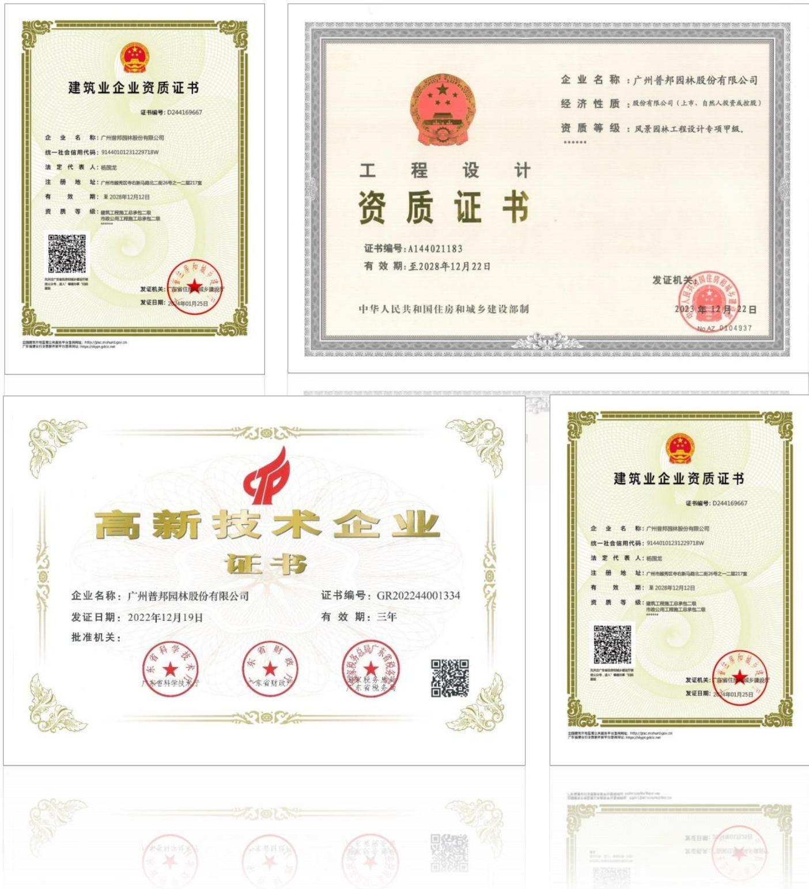

text_image

普邦股份2023年度ESG报告
2023-ESG REPORT OF PB-HOLDINGS

高新技术企业

风景园林工程设计专项甲级

建筑工程施工总承包二级

市政公用工程施工总承包二级

环保工程专业承包二级

古建筑工程专业承包二级

广东省清扫、收集、运输和清洁类环卫服务企业一级资质

广州环卫行业经营服务A级资质

林业调查规划设计单位资质乙级

造林绿化施工单位资质乙级

## 利益相关方沟通

公司与各利益相关方保持常态化沟通，通过梳理公司商业关系及业务场景，识别出7类主要利益相关方。2025年，公司持续收集并分析各方在环境、社会及治理方面的意见与关切，积极回应多元利益相关方的合理诉求与期望。

<table><tr><td>利益相关方</td><td>政府及监督机构</td><td>股东及投资者</td><td>员工</td><td>客户</td><td>供应商</td><td>行业</td><td>社区及公众</td></tr><tr><td>关注议题</td><td>·公司治理·税务管理·商业道德·环境保护·废弃物管理·社会责任</td><td>·公司治理·风险管理·信息披露·经济效益</td><td>·薪酬与福利·发展与培训·健康与安全·民主管理</td><td>·商业道德·产品及服务·研发与创新·数据安全与隐私保护</td><td>·商业道德·供应链安全</td><td>·商业道德·研发与创新·行业发展</td><td>·环境保护·废弃物管理·社会责任</td></tr><tr><td>沟通与回应</td><td>·遵守法律法规·依法足额纳税·接受检查和监督·保护生态环境·响应国家战略·提供就业岗位·履行社会责任</td><td>·股东会·定期报告及临时公告·日常沟通(电话、邮件、互动易平台)·投资者活动·内控审计</td><td>·完善薪酬福利体系·建立职业晋升路径·开展员工关怀·职业病防护与体检·职工代表大会</td><td>·反商业贿赂及反贪污·客户拜访·客户服务热线·满意度调查·监督举报机制·保障信息安全·技术创新</td><td>·反不正当竞争·反商业贿赂与反贪污·审核及评估·实地考察·合同执行</td><td>·反不正当竞争·技术创新·行业论坛、活动</td><td>·绿色运营·污染防控·社区活动·公益慈善</td></tr></table>

## 双重重要性分析

2025年度，公司结合行业发展情况及自身业务特点，依据《深圳证券交易所上市公司自律监管指引第17号——可持续发展报告（试行）》等相关要求，从财务重要性和影响重要性两个维度，对环境、社会及治理相关议题进行了梳理与分析。公司结合日常经营管理情况及与利益相关方的沟通反馈，对相关议题的重要程度进行综合评估，识别出对公司经营发展及外部环境具有较大关联性的重点议题。

## 双重重要性议题识别流程

## 背景梳理与范围界定

结合宏观可持续发展趋势、行业环境及公司经营实际，识别主要利益相关方及其关注重点，梳理公司在经营过程中面临的相关影响、风险与机遇，明确议题识别范围。

## 议题归集与综合评估

参考国内外ESG相关指引及同业披露情况，形成涵盖环境、社会及治理领域的议题清单。在此基础上，从影响重要性和财务重要性两个维度进行分析：一方面评估公司经营活动对经济、社会和环境产生的实际或潜在影响；另一方面结合行业发展及市场环境变化，分析相关议题对公司经营发展及财务表现可能带来的影响。

## 结果确认与应用

根据评估结果对议题进行排序和筛选，形成年度重要性议题，并 作 为 公 司ESG信息披露及后续管理工作的参考依据。

双重重要性议题矩阵图  
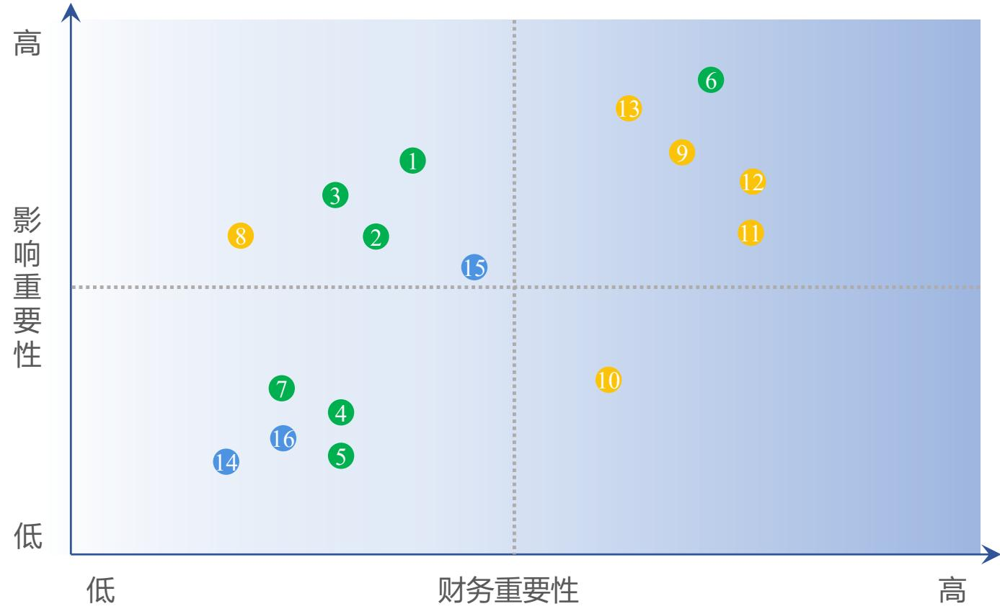

scatter

| Item | Financial Importance (range) | Impact Importance (range) |
| --- | --- | --- |
| 1 | ~35 ~45 | ~60 ~70 |
| 2 | ~35 ~40 | ~50 ~60 |
| 3 | ~30 ~35 | ~55 ~65 |
| 4 | ~30 ~35 | ~20 ~30 |
| 5 | ~30 ~35 | ~15 ~25 |
| 6 | ~60 ~70 | ~80 ~90 |
| 7 | ~25 ~30 | ~20 ~30 |
| 8 | ~20 ~25 | ~50 ~60 |
| 9 | ~65 ~70 | ~70 ~80 |
| 10 | ~60 ~65 | ~20 ~30 |
| 11 | ~75 ~80 | ~50 ~60 |
| 12 | ~75 ~80 | ~65 ~75 |
| 13 | ~60 ~65 | ~80 ~90 |
| 14 | ~20 ~25 | ~15 ~25 |
| 15 | ~45 ~50 | ~45 ~55 |

## 环境

1 应对气候变化  
能源利用2  
水资源利用3  
污染物排放4

5 废弃物处理  
生态系统和生物多样性保护6  
循环经济7

## 社会

8 社会贡献  
创新驱动9  
供应链安全10

产品和服务安全与质量11  
数据安全与客户隐私保护12  
员工13

## 社会

14 利益相关方沟通  
反商业贿赂及反贪污15  
反不正当竞争16

## 01

## 公司治理篇

## 完善治理体系，赋能高质量发展

## PART

## ONE

## 我们的行动

◼ 坚持党建引领  
◼ 完善公司治理  
◼ 保障股东权益

◼ 强化风险控制  
◼ 恪守商业道德

## 2025年绩效

召开股东会 3次

召开董事会 9次

修订治理制度 29 项

披露公告及相关文件 119 份

部门（单位）负责人《廉洁建设责任书》签署率

100%

## 贡献SDGs

12 负责任消费和生产

16 和平、正义与强大机构

17 促进目标实现的伙伴关系

## 坚持党建引领

普邦股份始终坚持以习近平新时代中国特色社会主义思想为指引，坚决筑牢党组织在公司治理中的“根”与“魂”，将党建引领深度融入生产经营与ESG治理全过程。2025年，公司持续加强党建工作，充分发挥党组织的战斗堡垒作用和党员的先锋模范作用，勇担社会责任，以高质量党建引领企业高质量发展。

## 组织建设

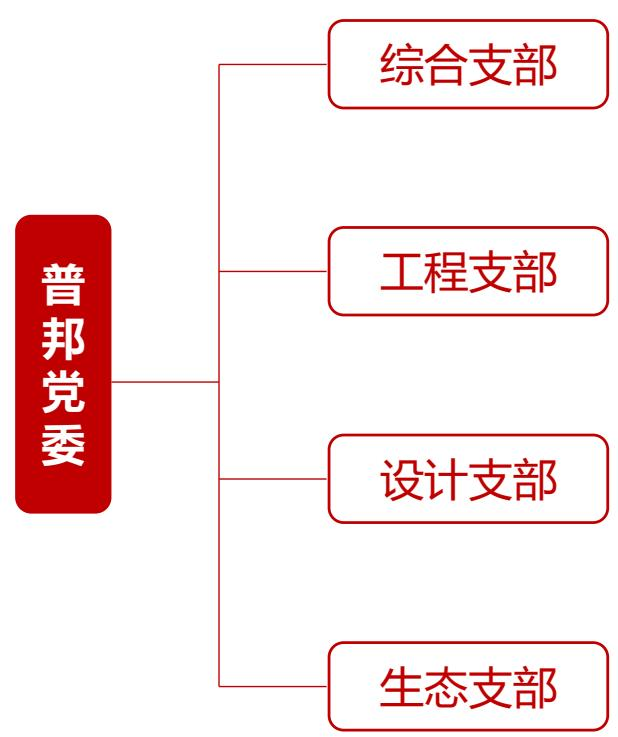

flowchart

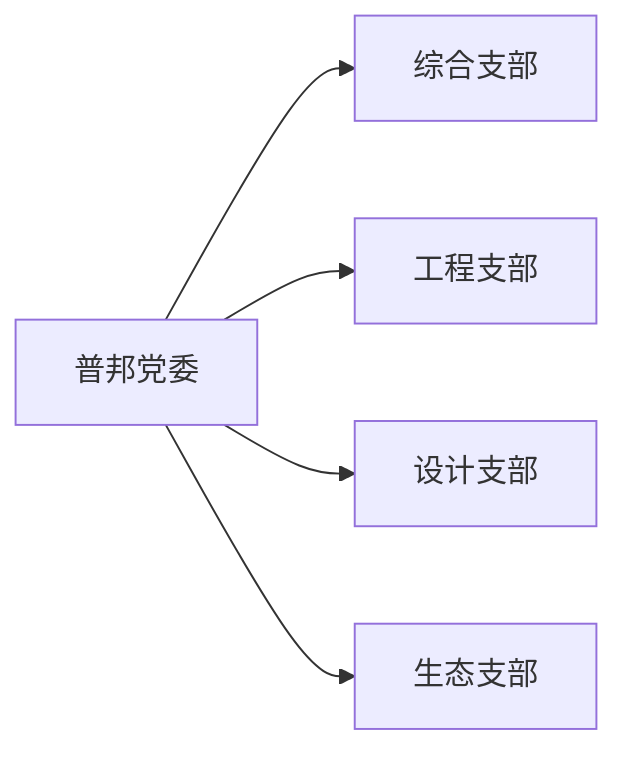
```mermaid
graph LR
  A["普邦党委"] --> B["综合支部"]
  A --> C["工程支部"]
  A --> D["设计支部"]
  A --> E["生态支部"]
```

普邦股份持续加强党的基层组织建设，将党建工作与业务发展高度融合，推动企业实现强管理、聚人才、促经营、增效益，把组织优势转化为发展优势，整体成效显著。

## 2025年

普邦股份党委共有党员

87人

## 党建荣誉

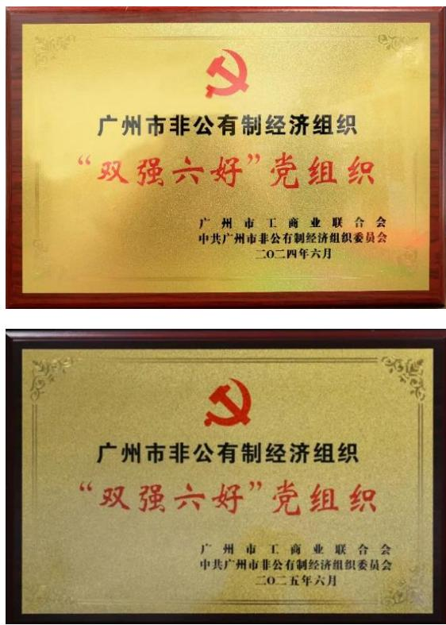

“双强六好”是基层党组织示范建设的重要标准。“双强”指发展强、党建强；“六好”则指生产经营好、企业文化好、劳动关系好、党组织班子好、党员队伍好、社会评价好。

2025年，中共广州普邦园林股份有限公司委员会（以下简称“普邦党委”）凭借扎实的党建工作、卓越的企业发展成果以及积极的社会贡献，再获广州市非公有制经济组织“双强六好”党组织称号。

## 普邦党委

连续 2年，获“双强六好” 党组织称号

## 党建活动

## 案例 组织观看九三阅兵直播

9月3日上午9时，中国人民抗日战争暨世界反法西斯战争胜利80周年阅兵仪式在北京隆重举行。普邦股份组织党员及员工集中观看阅兵盛况，共同感受大国崛起的磅礴力量，重温中华民族不屈不挠的抗战精神。

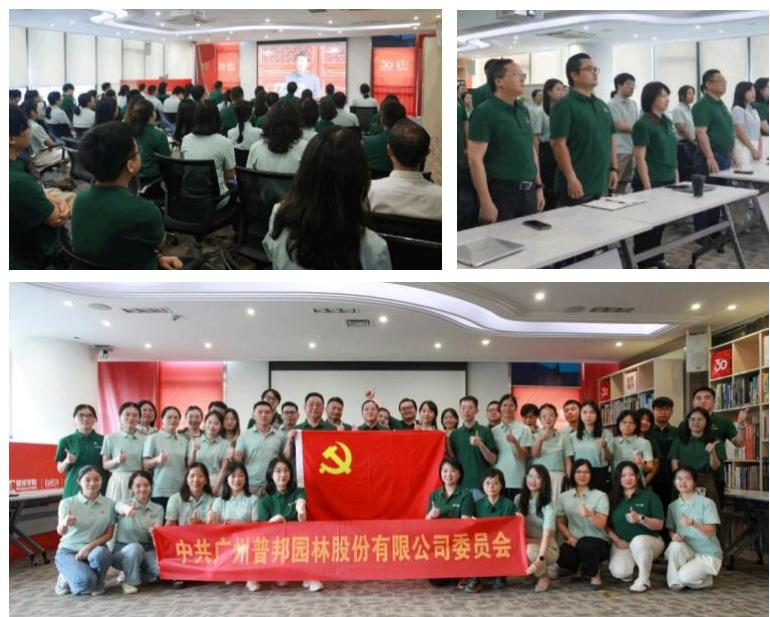

## 完善公司治理

## 治理体系

普邦股份严格遵循《中华人民共和国公司法》（以下简称《公司法》）、《中华人民共和国证券法》（以下简称《证券法》）及中国证监会、深圳证券交易所相关规定，结合经营实际持续完善法人治理结构，系统修订公司章程及内部制度，优化内控体系与业务流程，不断提升规范运作与风险管控水平。公司构建权责清晰、运作规范、制衡有效的治理架构，股东会、董事会及管理层依法依规履职，形成科学决策、有效监督与稳健执行相协同的运行机制，切实维护公司及全体股东权益，持续提升治理透明度与运行效率。

## 普邦股份治理架构图

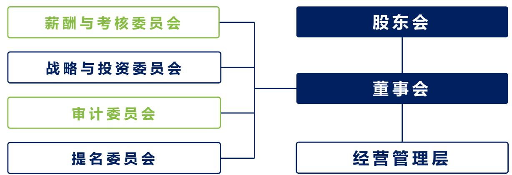

flowchart

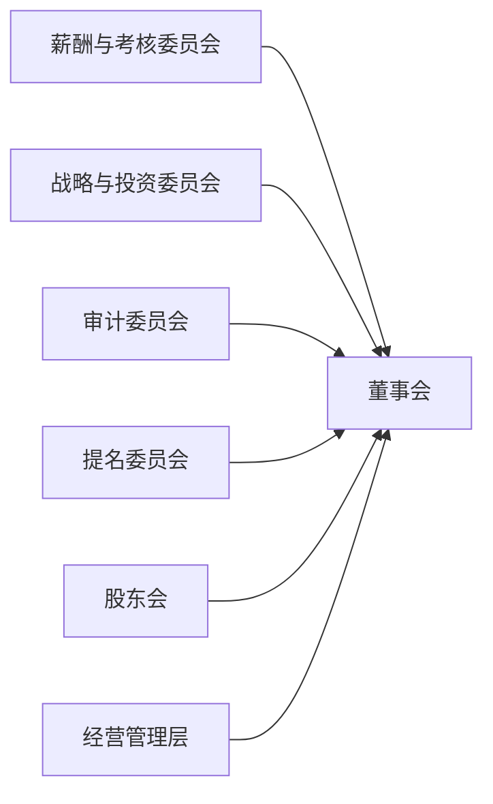
```mermaid
graph LR
  A["薪酬与考核委员会"] --> B["董事会"]
  C["战略与投资委员会"] --> B
  D["审计委员会"] --> B
  E["提名委员会"] --> B
  F["股东会"] --> B
  G["经营管理层"] --> B
```

## 关键绩效

text_image

普邦股份
累计修订治理制度 29项

## 取消监事会设置，审计委员会依法承接监督职权

依据新修订《公司法》（2023年修订）第一百二十一条的相关规定，公司于2025年依法启动并完成组织架构优化工作，取消监事会设置，其法定监督职权由董事会审计委员会承接履行。为确保治理架构调整依法合规、平稳有序推进，公司系统梳理原监事会职责清单，进一步明确审计委员会职权边界与议事规则，优化监督工作机制与流程安排，实现监督职能的有效衔接与连续运行。本次治理结构优化在符合法律法规要求的基础上，进一步提升了决策与监督协同效率，强化了内部制衡机制，推动公司治理体系向更加精简、高效、规范的方向持续完善。

## 股东会

股东会是公司的权力机构。普邦股份严格按照《公司法》《上市公司股东会规则》等法律法规及《公司章程》的相关规定，依法规范组织召开股东会，确保会议召集、提案审议、表决程序及信息披露等各环节合法合规。公司采取现场投票与网络投票相结合的方式召开股东会，为全体股东特别是中小投资者提供便捷、高效的参会与表决渠道，并对涉及重大事项的议案实行中小投资者单独计票机制，充分保障其知情权、参与权和表决权。通过持续完善股东会运作机制，公司不断提升决策透明度与规范性，切实维护全体股东依法享有的合法权益。

## 关键绩效

2普邦股份召开股东会

3 次

审议议

2案16 项参与投票股东

832 人次

## 董事会

公司严格依据《公司法》《证券法》及《公司章程》等相关规定规范董事会运作，持续优化董事会结构，于报告期内依法完成董事会换届选举工作，确保治理架构平稳过渡、规范衔接。董事会围绕战略规划、经营管理、财务管控及风险防控等重大事项依法审议决策，独立董事充分发挥专业与监督作用，不断提升公司治理质量与决策水平。

## 关键绩效

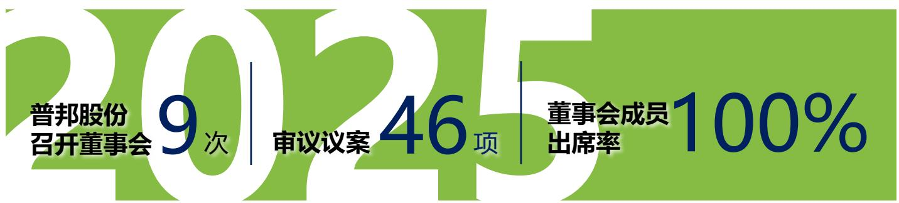

text_image

普邦股份
召开董事会 9次 | 审议议案 46项 | 董事会成员
出席率 100%

## 增设职工董事，优化董事会治理结构

公司于报告期内依法增设职工董事，由职工代表大会选举产生并进入董事会履职，进一步优化董事会成员结构。在此基础上，公司对董事会议事规则及履职机制进行了相应完善，促进职工董事依法依规参与董事会运作。本次董事会结构调整在符合法律法规要求的前提下，进一步完善了多元化治理结构，提升了决策的科学性与规范性，为公司治理体系持续优化夯实基础。

## 董事会多元化

普邦股份持续推进董事会多元化建设，在董事提名与选聘过程中，综合考虑候选人的专业专长、行业经验、性别结构及年龄层次等因素，注重董事能力结构与公司战略发展方向的高度契合。报告期内，结合董事会换届工作，公司进一步优化成员构成，形成涵盖公司主营业务领域以及公司治理与风险管控领域的复合型专业结构。多元互补的专业背景强化了董事会在战略规划、经营管理、财务监督及合规治理等方面的综合研判能力，为公司重大事项决策提供了更加系统、审慎和专业的支撑。

普邦股份董事专业构成  
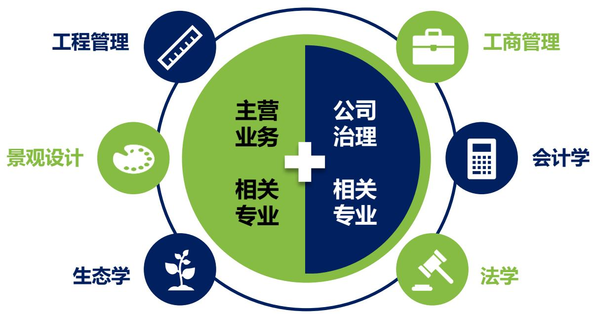

flowchart

```mermaid
graph LR
  Center(("Core Business & Professional Focus"))
  
  subgraph Core_Ops["Core Business"]
    direction TB
    A["主营业务\n相关专业"]
    B["公司治理\n相关专业"]
  end
  
  subgraph Core_Ops["Core Operations"]
    direction TB
    C["工程管理"]
    D["工商管理"]
    E["会计学"]
    F["法学"]
    G["生态学"]
    H["景观设计"]
  end
  
  Center --> Core_Ops
  Center --> Core_Ops
  
  %% Central Components
  Center ==> Core_Ops
  Center ==> Core_Ops
  
  %% Core OPs
  Center --> C
  Center --> D
  Center --> E
  Center --> F
  Center --> G
  Center --> H
  Center --> I
  Center --> J
  Center --> K
  Center --> L
  Center --> M
  Center --> N
  Center --> O
  Center --> P
  Center --> Q
  Center --> R
  Center --> S
  Center --> T
  Center --> U
  Center --> V
  Center --> W
  Center --> X
  Center --> Y
  Center --> Z
  Center --> AA
  Center --> AB
  Center --> AC
  Center --> AD
  Center --> AE
  Center --> AF
  Center --> AG
  Center --> AH
  Center --> AI
  Center --> AJ
  Center --> AK
  Center --> AL
  Center --> AM
  Center --> AN
  Center --> AO
  Center --> AP
  Center --> AQ
  Center --> AR
  Center --> AS
  Center --> AT
  Center --> AU
  Center --> AV
  Center --> AW
  Center --> AX
  Center --> AZ
  Center --> BA
  Center --> BB
  Center --> BC
  Center --> BD
  Center --> BE
  Center --> BF
  Center --> BG
  Center --> BH
  Center --> BI
  Center --> BJ
  Center --> BK
  Center --> BL
  Center --> BM
  Center --> BN
  Center --> BO
  Center --> BP
  Center --> BR
  Center --> BT
  Center --> BU
  Center --> BV
  Center --> BW
  Center --> BX
  Center --> BY
  Center --> BB
  Center --> BC
  Center --> BD
  Center --> BE
  Center --> BF
  Center --> BG
  Center --> BH
  Center --> BI
  Center --> BJ
  Center --> BK
  Center --> BL
  Center --> BM
  Center --> BN
  Center --> BO
  Center --> BP
  Center --> BS
  Center --> BT
  Center --> BU
  Center --> BV
  Center --> BW
  Center --> BX
  Center --> BYB
  Center --> BZB
  Center --> BZC
  Center --> BZD
  Center --> BZE
  Center --> BZF
  Center --> BZG
  Center --> BZH
  Center --> BZI
  Center --> BZJ
  Center --> BZK
  Center --> BZL
  Center --> BZM
  Center --> BZN
  Center --> BZO
```

  
关键绩效

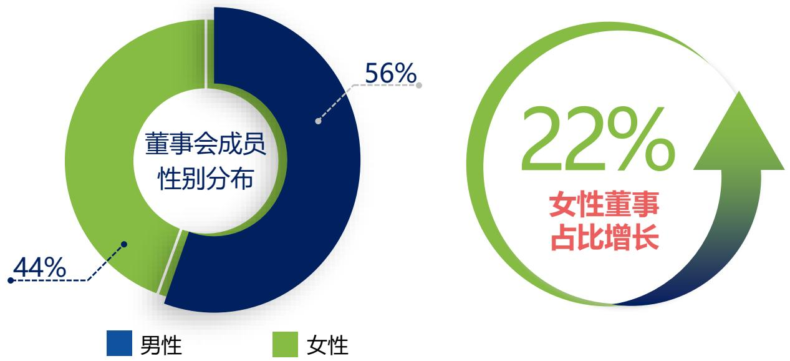

donut

| 性别 | 占比 |
| --- | --- |
| 男性 | 56% |
| 女性 | 44% |

## 专门委员会

为提升董事会专业化运作水平并强化协同履职机制，普邦股份在董事会下设战略与投资委员会、审计委员会、提名委员会和薪酬与考核委员会。各专门委员会依据法律法规及公司制度明确职责分工与议事规则，建立规范的议事程序和工作机制，强化专业分工与协同配合，为公司规范运作与稳健发展提供有力支撑。

## 战略与投资委员会

主要负责对公司长期发展战略和重大投资决策进行研究并提出建议。

## 审计委员会

审核公司财务信息及其披露，监督及评估内外部审计工作和内部控制，并行使《公司法》规定的监事会的职权。

## 提名委员会

负责拟定董事、高级管理人员的选择标准和程序，对董事、高级管理人员人选及其任职资格进行遴选、审核。

## 薪酬与考核委员会

负责研究制定公司董事及高级管理人员的考核标准与薪酬政策，组织开展考核并提出相关建议。

## 关键绩效

2025年

召开专门委员会会议

9 次

其中：

召开审计委员会会议 5次

召开提名委员会会议 2 次

召开薪酬与考核委员会会议 2 次

## 独立董事履职

公司严格遵照《上市公司独立董事管理办法》等相关规定，持续完善独立董事履职保障机制，报告期内对《独立董事工作制度》《独立董事专门会议工作细则》进行了修订更新，进一步规范独立董事履职程序。独立董事通过参加董事会及股东会、参与考察调研和培训、审阅会议材料以及与相关方沟通等方式履行职责，并通过召开独立董事专门会议对重大事项进行审慎审议并发表专业意见，有效促进董事会科学决策，维护公司及全体股东特别是中小股东的合法权益。

董事会独立董事占比33%

## 关键绩效

普邦股份

召开独立董事专门会议

01次

审议议案

8 项独立董事工作记录

62 份

## 保障股东权益

## 信息披露

普邦股份高度重视信息披露工作，严格按照《公司法》《证券法》《上市公司信息披露管理办法》及深圳证券交易所相关监管规则履行信息披露义务。公司持续完善信息披露管理制度体系，规范信息收集、审核及披露流程，强化内幕信息管理与责任落实，确保披露内容真实、准确、完整、及时、公平，切实保障投资者的知情权和合法权益。

## 关键绩效

2025年披露公告及相关文件

119 份

## 投资者关系管理

普邦股份严格按照监管规则开展投资者关系管理工作，通过业绩说明会、投资者调研、电话及电子邮件沟通、互动易平台等多种渠道，与投资者保持常态化交流，及时回应市场关切。在合规信息披露的基础上，公司主动传递经营发展情况和战略方向，促进资本市场对公司的理解与认知，不断提升公司治理透明度与投资者沟通质量。

## 关键绩效

## 互动易平台

回复投资者提问

65 次

回复率

100%

## 业绩说明会

举办业绩说明会

2 次

## 投资者热线

接听热线回复投资者

80+次收到投资者投诉

0次

## 强化风险控制

## 公司指定信息披露渠道

网站

巨潮资讯网

http://www.cninfo.com.cn

媒体

中国证券报 证券时报 上海证券报

2025年

1家指定信披媒体增加

普邦股份始终将风险管理作为保障企业稳健发展的重要基础，不断完善覆盖经营管理全过程的风险防控体系。公司通过制度建设、流程管控与监督机制相结合的方式，对经营活动中的各类风险开展系统识别、评估与应对，并持续强化对重点领域和关键环节的风险管理，推动风险管理与日常经营管理有机融合，促进企业持续稳健发展。

## 风险识别及应对

<table><tr><td>风险类型</td><td>风险描述</td><td>关键应对策略</td></tr><tr><td>宏观环境变化风险</td><td>宏观经济形势及产业政策变化带来不确定性可能对公司业务开展及经营发展产生影响</td><td>持续关注宏观经济形势及政策导向加强行业趋势研判与风险识别完善内部管理与风险管控机制</td></tr><tr><td>市场竞争加剧风险</td><td>行业参与主体较多,市场竞争日趋激烈项目获取及利润空间面临一定压力</td><td>提升生态景观领域品牌与服务能力推进业务结构优化与新业务拓展加强精细化管理与成本控制</td></tr><tr><td>资金回款风险</td><td>项目建设周期较长,资金占用较大结算周期延长或回款进度放缓</td><td>加强客户资信评估与项目风险审核强化合同管理和工程结算推进完善应收账款管理与催收机制</td></tr><tr><td>法律诉讼风险</td><td>行业项目周期长,工程纠纷或增加诉讼处理周期可能对经营产生影响</td><td>加强合同全流程管理健全法律风险防控机制提升法务与合规管理能力</td></tr></table>

## 案例 举办“投标流程规范与风险防控”专题分享会

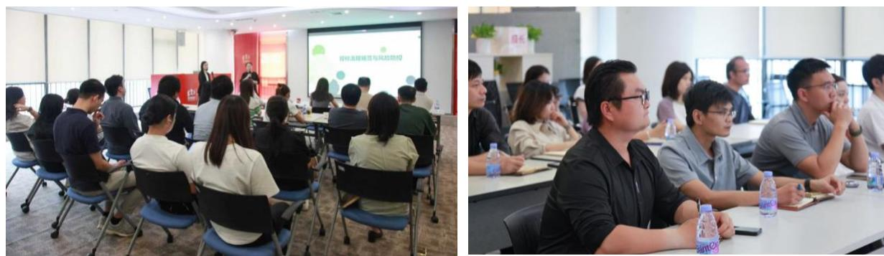

为进一步规范投标管理流程、提升风险防控能力，公司事业发展中心市场运营部2025年组织开展两期“投标流程规范与风险防控”专题分享会，集团主要业务部门及各分公司商务人员约150人次通过线上线下结合方式参加。

分享会围绕项目信息获取、投标报名、投标文件编制及投标递交等关键环节，对投标全流程进行了系统梳理，并重点分析各环节风险点及防控措施。通过本次分享会，公司进一步强化了投标管理的规范化与专业化水平，提升了关键岗位人员的风险防控意识，为公司的市场拓展和稳健经营提供支撑。

## 内控审计

## 内部审计制度

明确内部审计的职责、权限与工作流程，保障审计工作的独立性与权威性。

## 内部审计工作实施细则

细化内部审计具体操作流程，提升审计工作的规范性与可操作性。

## 离任审计制度

规范离任审计程序与要求，确保管理人员离任时履职情况得到全面、客观审查。

## 关键绩效

## 设有专业审计岗3名 普邦股份

## 内控岗 3名

## 关键绩效

## 普邦股份抽审项目

0692 个

## 发出审计问询函 526份

## 完成内部及份

## 以数字技术护航合规风控与内部治理

公司持续加强内部控制体系建设，通过推进信息系统升级与流程优化，不断提升合规风控和内部治理水平。报告期内，公司升级上线全链路智能化审核流程，建立涵盖发票验真查假、自动查重及“四流合一”校验等功能的自动化拦截屏障。随着相关系统的持续电子化升级，公司内控审批效率和资金处理效率得到有效提升，在强化内部控制与合规管理的同时，也进一步保障了合作方资金结算的及时性和规范性。

## 经营管理层及各职能支持部门

在日常经营管理中落实内部控制要求，通过实施控制措施、开展风险识别与评估，降低风险发生的可能性及其影响；  
各部门根据业务特点制定相应的风险应对流程，并对发现的内部控制缺陷及时落实整改和改进措施。

## 董事会审计委员会及审计监察部

1 通过定期开展内部审计、专项检查等方式，对公司运营管理情况进行监督检查，保障财务报告的真实性与合规性；  
1 针对审计过程中识别的内部控制缺陷或风险事项，提出整改建议并督促相关部门落实改进。

## 第三方审计机构

◼ 公司聘请独立第三方审计机构对财务报告和相关事项进行审计，通过提供客观、独立的审计意见，帮助公司及时识别潜在风险并提出改进建议，进一步提升公司治理水平，降低合规与经营风险。

## 第一道防线

## 第二道防线

## 第三道防线

## 恪守商业道德

普邦股份坚持诚信经营理念，严格遵守《中华人民共和国刑法》《中华人民共和国反不正当竞争法》《中华人民共和国反洗钱法》《中央纪委关于严格禁止利用职务上的便利谋取不正当利益的若干规定》《中国共产党廉洁自律准则》等法律法规及相关规定，将商业道德要求融入经营管理全过程。公司持续强化廉洁从业管理，明确员工行为规范，坚决防范贿赂、利益输送等违法违规行为，营造公平、公正、透明的商业环境。同时，公司高度重视商业秘密和信息安全保护，建立健全相关管理制度，规范重要信息的使用、传递与保密要求，强化员工保密意识和合规意识，切实维护公司及合作伙伴的合法权益。通过持续推进商业道德建设与合规管理，公司不断提升规范经营水平，推动企业稳健、可持续发展。

## 反商业贿赂及反贪污

为加强反商业贿赂和反贪污管理，防范舞弊与腐败风险，营造廉洁规范的经营环境，公司明确监察审计部为廉洁管理机构，并制定发布《廉洁管理制度》。2025年，公司对该制度进行了修订完善，进一步提升制度的针对性和约束力。《廉洁管理制度》明确了廉洁从业“十条红线”，并按照“谁主管、谁负责”的原则落实廉洁建设责任制，压实各级管理人员廉洁从业责任。集团各职能部门、事业部（含分公司）及控股子（孙）公司负责人均签订《廉洁建设责任书》，明确其作为本单位廉洁建设第一责任人，带头履行廉洁从业与监督管理职责。

## 关键绩效

2025年 67份签署《廉洁建设责任书》

部门（单位）负责人签署率 100% 签署率

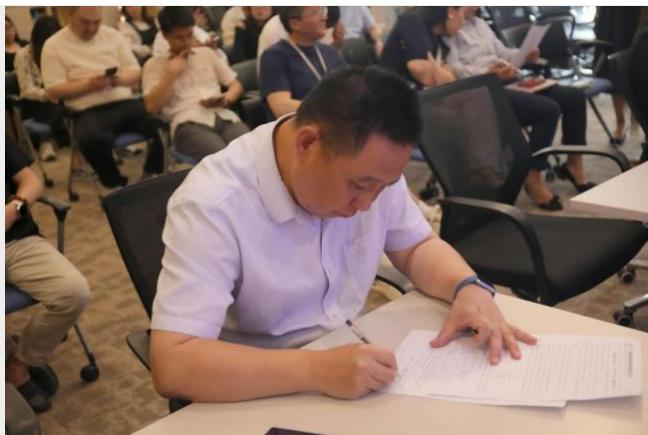

text_image

Man signing documents at a conference table with attendees seated in the background

# 案例 开展“树廉洁之心，行阳光正道” 员工廉政专题培训

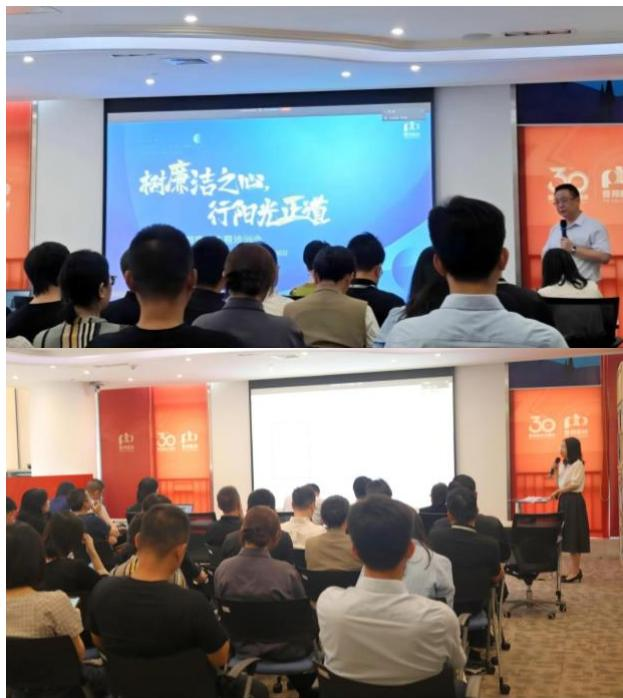

2025年，公司监察审计部联合集团党委组织开展“树廉洁之心，行阳光正道”员工廉政专题培训。培训围绕廉洁从业提出三方面要求：一是严守纪律底线，恪守廉洁自律准则，做到清正廉洁、公私分明；二是坚持正道实干，践行企业核心价值观，强化责任担当，深化客户服务；三是坚持有礼有度、有理有节，日常工作中严格贯彻落实中央八项规定精神。

本次培训旨在深入贯彻中央八项规定精神，强化廉洁风险防控，提升企业依法合规与廉洁

经营管理水平。培训采用“线下会议 + 线上直播”相结合形式开展，普邦股份党员领导干部、中高层管理人员等逾150人参加。

## 监督举报机制

公司建立健全监督举报机制，鼓励员工、合作伙伴及其他利益相关方对违规违纪行为进行监督举报。公司设立专门举报邮箱与举报热线，保障举报渠道畅通及信息保密。所有举报事项由内部审计部门依规开展调查，并根据调查结果采取相应处理措施。公司严格履行举报人保护承诺，确保举报人不因合法举报行为遭受不公对待。

## 举报监督渠道

## 举报热线

(020)87376637-转监察审计部

## 举报邮箱

pb\_sjb2025@163.com

## 商业秘密保护

公司高度重视商业秘密保护，持续完善相关管理制度和约束机制。在《员工手册》中设置“保密管理”专章，对公司秘密范围、保密要求及违规处理措施进行明确规定，并在劳动合同中设置保密条款，同时签署保密协议作为合同附件生效，进一步明确员工的保密义务及违约责任。通过制度规范与协议约束相结合的方式，公司持续强化商业秘密保护管理，防范商业信息泄露风险，切实维护企业合法权益。

## 全体员工

签署通用版本保密协议

## 特殊涉密岗位员工

签署专项保密协议

## 商业秘密保护

## 纳入员工

## 管理各

## 环节

## 入
职
阶
段

◼ 新入职员工（包括正式员工、试用期员工及实习生）均在入职当日签署保密协议。

## 在
职
期
间

◼ 对办公邮箱、云盘等实行严格的权限控制；  
◼ 涉密电脑实行专人专用及加密管理。

◼ 严格办理交接手续，要求员工交还所有涉密文件及存储设备；  
◼ 及时取消门禁及内部软件登录权限。

## 关键绩效

## 普邦股份

## 20在职员工保密协议签署率

## 25100%

## 保障信息安全

公司高度重视信息安全与数据隐私，严格遵守相关法规。我们构建了多重立体防护体系，依托实时入侵检测、动态访问控制等技术，有效拦截外部攻击并防范数据泄露。内部管控方面，公司全面推行“数据分级授权、分级加密及日志审计”机制，按机密性严格管控各业务系统的访问权限。同时对底层基础设施、核心服务器及各类安全硬件开展隐患排查与风险评估。通过不断优化的多层次防护策略，公司切实保障了客户、供应商及全体员工的数据安全。

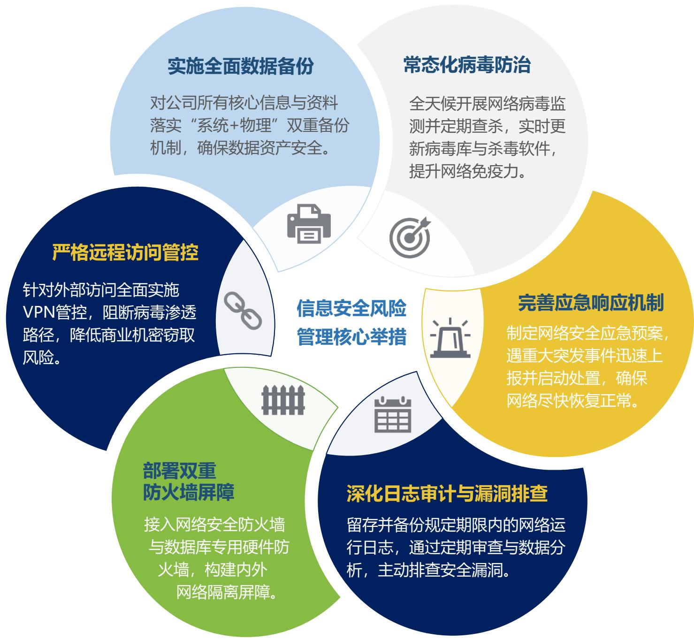

flowchart

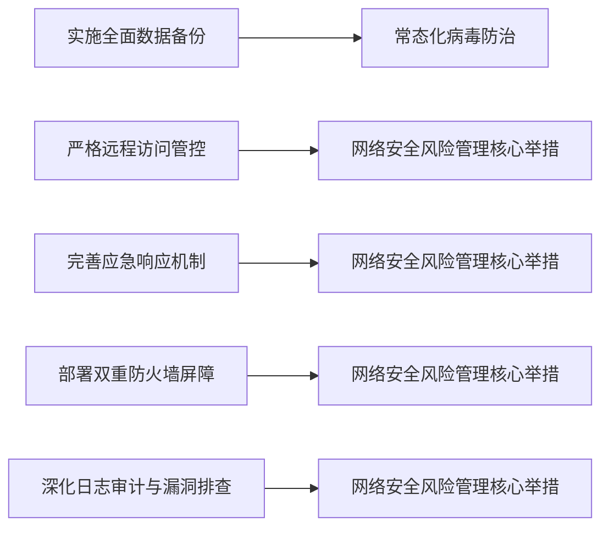
```mermaid
graph LR
  A["实施全面数据备份"] --> B["常态化病毒防治"]
  C["严格远程访问管控"] --> D["网络安全风险管理核心举措"]
  E["完善应急响应机制"] --> F["网络安全风险管理核心举措"]
  G["部署双重防火墙屏障"] --> H["网络安全风险管理核心举措"]
  I["深化日志审计与漏洞排查"] --> J["网络安全风险管理核心举措"]
```

## 行业赋能篇

## 聚力创新，共促行业可持续发展

## PART TWO

## 我们的行动

◼ 创新驱动发展  
◼ 行业合作与发展  
◼ 供应链安全  
◼ 客户服务及品质保障

## 2025年绩效

供应商廉洁协议签署率 100%

研发投入 5,111万元 授权专利累计数 126 项

## 贡献SDGs

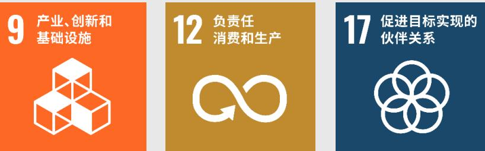

## 创新驱动发展

普邦股份坚持以研发创新驱动业务升级，将技术进步融入规划设计、工程实施与运营管养等关键环节。公司围绕设计优化、施工工艺提升、质量控制及精细化管养等方向推进技术研发与应用，通过跨专业协同不断提升复杂项目的综合技术能力。同时，加快成果转化与落地应用，推动创新在项目中的规模化实践，持续提升工程品质与运营效率，支撑企业高质量发展。

## 关键绩效

2025年普邦股份研发投入

5,111万元

占总营收

2.76%

natural_image

Magnifying glass icon with a heartbeat line inside, symbolizing medical or health-related analysis (no text or symbols)

## 研发团队及研发活动

公司持续完善研发管理体系，打造稳定且具备较强创新能力的研发团队，为技术创新与业务发展提供支撑。在人才培养与激励方面，依托普邦学院完善培养机制，通过专业培训、技术交流及进修学习等方式搭建多元成长平台；同时将研发成果与绩效考核、评优评先相结合，设立创新激励机制，持续激发研发活力，提升团队整体研发能力与创新水平。

## 研发人员 专业构成

园林

植物栽培

环艺

土木工程

生态学

信息技术

2025年研发人员

155人

同比增长9.15%

研发人员年龄分布  
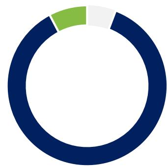

donut

| Category | Value |
| --- | --- |
| Dark Blue | ~85% |
| Light Green | ~10% |
| White | ~5% |

50岁以上  
30(含)-50岁(含)  
30岁以下

研发人员学历分布  
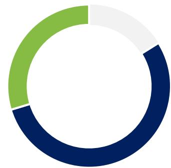

donut

| Category | Value |
| --- | --- |
| Dark Blue | ~60% |
| Light Green | ~33% |
| White | ~17% |

硕士研究生  
本科  
本科以下

## 外部

与高校、科研机构共同组建后人才培养创新基地，通过资源共享与协同创新，不断提升技术研发能力和人才培养水平。

## 内部

搭建了开放式创新创业平台，成立工匠人才创新工作室、大师工作室，以师带徒模式鼓励创新。

## 研发 人才 培养

## 创新链条

技术研发

科技成果

产业化应用

为企业形成具有自主知识产权的核心技术构建技术壁垒，巩固了核心竞争力。  
加速了创新成果从研发到产业化应用的进程，确保了技术创新的连贯性与可行性，创造了显著的经济和社会效益。

## 核心研究方向

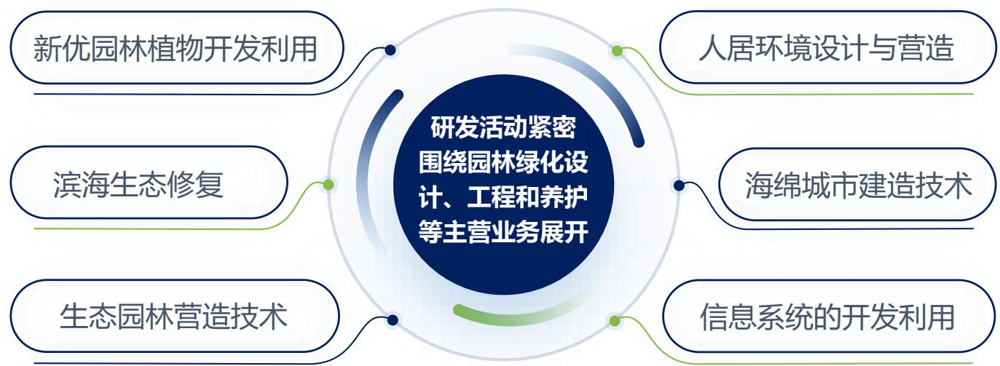

flowchart

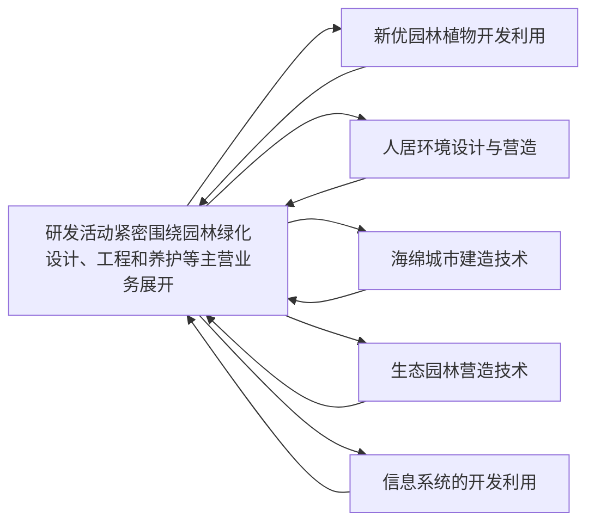
```mermaid
graph LR
  A["研发活动紧密围绕园林绿化设计、工程和养护等主营业务展开"] --> B["新优园林植物开发利用"]
  A --> C["人居环境设计与营造"]
  A --> D["海绵城市建造技术"]
  A --> E["生态园林营造技术"]
  A --> F["信息系统的开发利用"]
  B --> A
  C --> A
  D --> A
  E --> A
  F --> A
```

## 知识产权保护

公司高度重视知识产权保护，持续完善专利、商标及著作权等管理体系。2025年，公司通过优化专利检索、商标监控及版权存证机制，强化知识产权的创造、运用与保护能力，推动知识产权信息集中管理与动态监控，为技术创新和成果转化提供有力保障。

## 关键绩效

2025年

新增专利申请 4 份

新增专利授权 4 份

公司授权专利累计数

126项 软件著作 累计数

24 项商标累计数

55项

有效专利数

84项

有效

发明专利

32项

有效

实用新型专利

51项

有效

外观专利

1项

## 创新成果产出

## 关键绩效

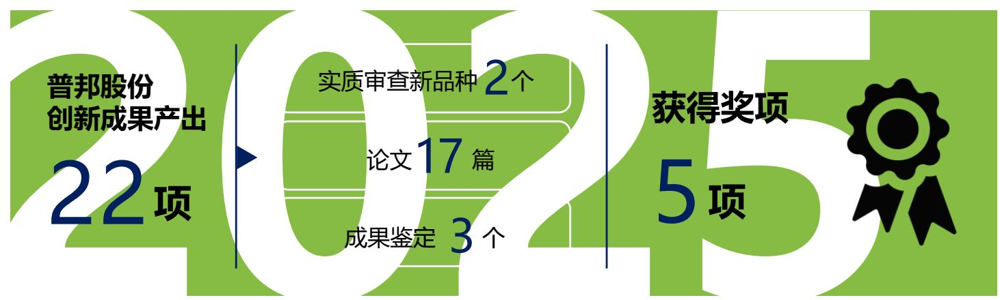

flowchart

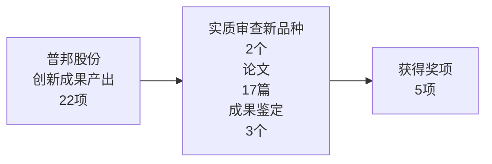
```mermaid
graph LR
  A["普邦股份\n创新成果产出\n22项"] --> B["实质审查新品种\n2个\n论文\n17篇\n成果鉴定\n3个"]
  B --> C["获得奖项\n5项"]
```

## 案例 自主培育"含绿""红颜"两项植物新品种

公司研发团队历经多年持续攻关，通过授粉杂交、多代扦插繁殖及系统性状观察，自主培育出植物新品种"含绿"与"红颜"，并获批国家林业和草原局植物新品种权。"含绿"株型饱满、叶色深绿、幼枝浅绿，花期长、花量大，兼具高观赏性与良好耐寒性，生长速度快；"红颜"色彩辨识度突出，花色、幼枝及新芽均呈紫红色调，同样具备株型饱满、花期长、花量大、耐寒性好、生长快等优良特性。两项新品种的成功培育为园林绿化与生态景观应用提供了优质品种支撑。

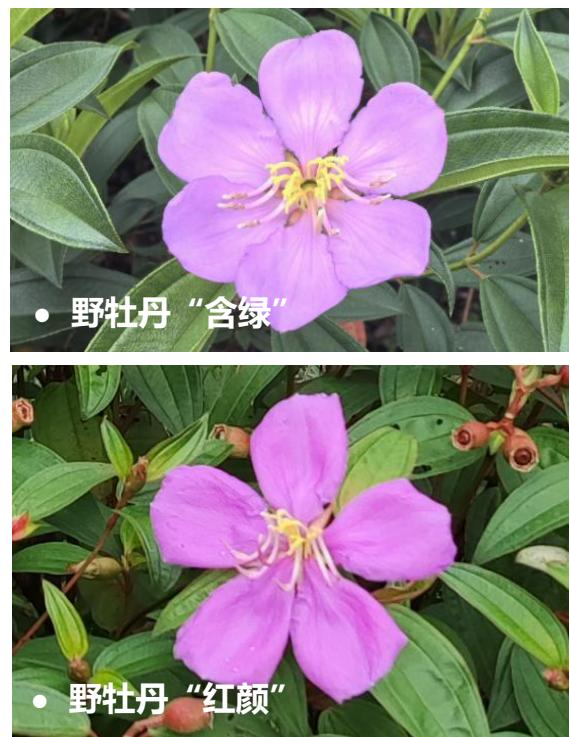

普邦股份

获得植物新品种累计数

6 个

获得农作物新品种累计数 5个

## 数字化转型

公司始终将数字化转型作为提升精细化管理和实现高质量发展的重要驱动力。公司自主研发并稳定运行多年的“工程支付管理系统”实现了从供应商入库、采购合同签订、送货收料、线上对账结算直至资金支付全价值链周期的信息化闭环运作，大大提升了公司的资源调控与周转效率。此外，公司深度应用“全景智能技术中心”系统，应用空间智能捕捉设备构筑全景立体化云端视图，有效辅助总部及分公司对全国各地项目进行的云端质量与进度巡检。

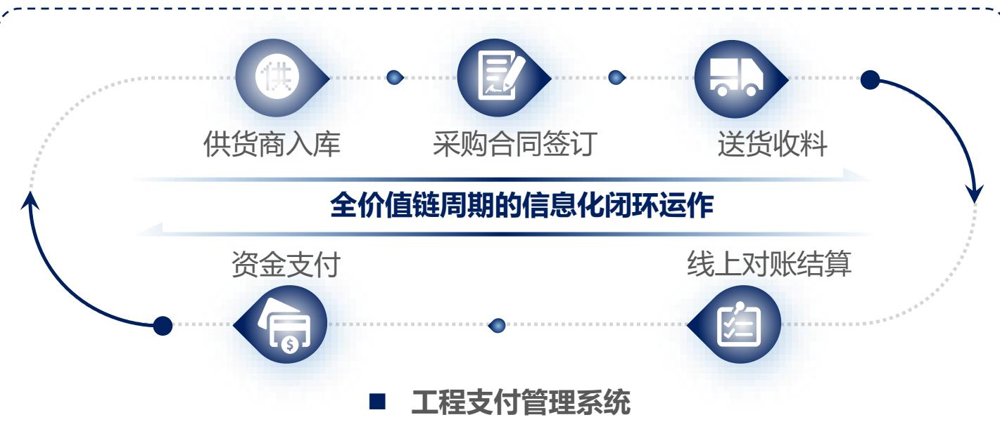

flowchart

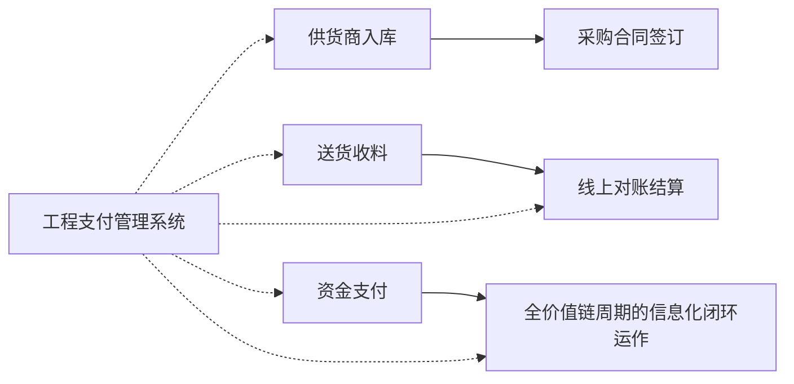
```mermaid
graph LR
  A["供货商入库"] --> B["采购合同签订"]
  C["送货收料"] --> D["线上对账结算"]
  E["资金支付"] --> F["全价值链周期的信息化闭环运作"]
  G["工程支付管理系统"] -.-> A
  G -.-> C
  G -.-> D
  G -.-> E
  G -.-> F
```

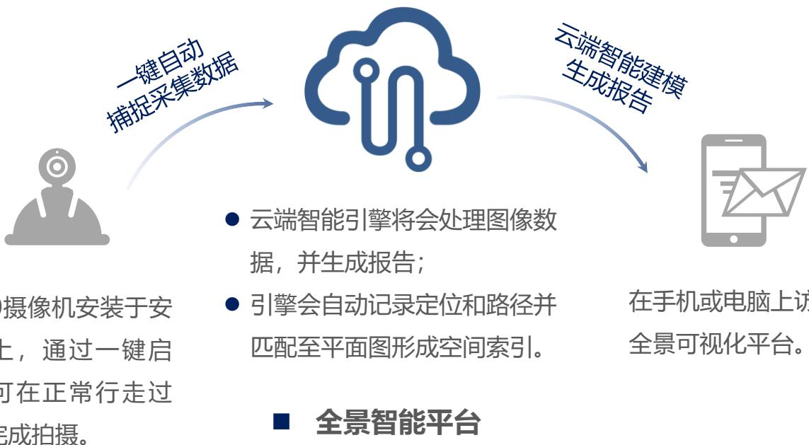

flowchart

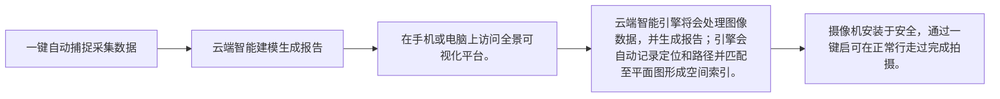
```mermaid
graph LR
  A["一键自动捕捉采集数据"] --> B["云端智能建模生成报告"]
  B --> C["在手机或电脑上访问全景可视化平台。"]
  C --> D["云端智能引擎将会处理图像数据，并生成报告；引擎会自动记录定位和路径并匹配至平面图形成空间索引。"]
  D --> E["摄像机安装于安全，通过一键启可在正常行走过完成拍摄。"]
```

借助全景智能平台探索施工现场管理新模式  
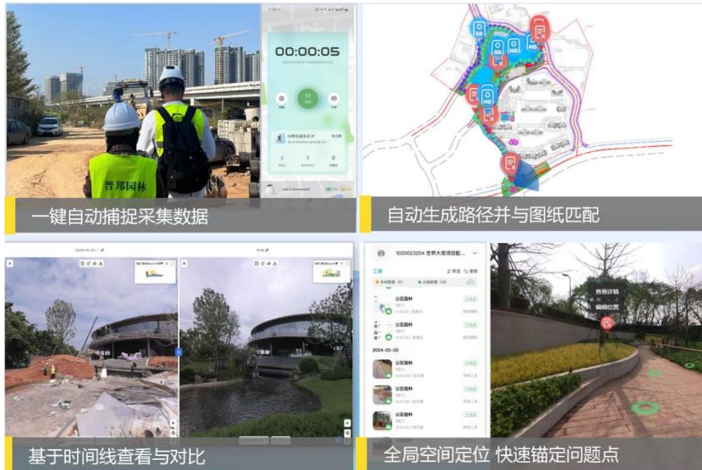

## 进度管理

◆ 全过程影像数据结构化存档和引用  
◆ 快速了解项目实施进展  
◆ 实现云端工程巡检和质量进度追踪

## 结算风险管理

◆ 协助结算对数  
◆ 提供全过程真实立体可视化全景影像，可作为纠纷存证  
◆ 记录运营类项目接手时养护情况

## 质量管理

◆ 辅助项目部、分公司、事业部及总部进行质量检查/质量控制工作  
◆ 实现与甲方监管现场情况的一键共享

## 支付管理

◆ 辅助预算、分公司负责人及分管领导开展支付审核与管理工作

## 行业合作与发展

普邦股份立足园林景观行业发展大局，持续通过专业能力输出与经验共享，促进产业协同与技术进步。公司围绕生态修复、绿色建造与精细化管养等重点领域，积极参与行业交流平台与专业活动，推动先进理念、成熟做法在行业内的推广应用。

同时，公司紧扣国家生态文明建设和“双碳”目标导向，强化与产业链上下游及专业机构的互动合作，共同探索符合行业特点的绿色低碳解决方案，助力行业在规范化、专业化和可持续发展方面不断提升，为园林景观行业高质量发展夯实实践基础。

## 关键绩效

普邦股份参加行业协会

254 家

同比增加

035%参加研讨会 /行业活动

217场

同比增加

570%参与制定国家标准

1项

## 行业组织参与

## 案例 普邦股份牵头成立的省设协风景园林分会获表彰

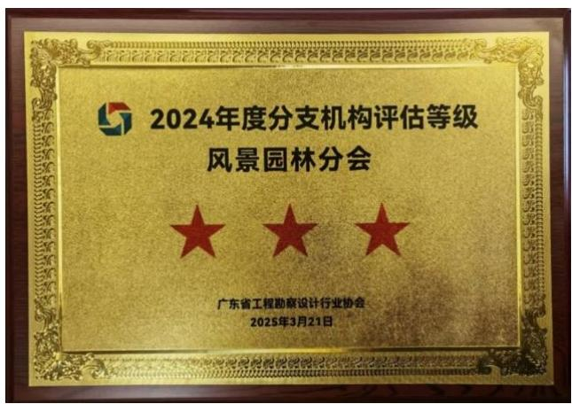

text_image

2024年度分支机构评估等级
风景园林分会
广东省工程勘察设计行业协会
2025年3月21日

在广东省工程勘察设计行业协会（以下简称“省设协”）2025年度分支机构工作会议上，由普邦股份牵头成立并担任会长单位的省设协风景园林分会荣获“2024年度三星分支机构”荣誉称号，连续6年荣获协会表彰。

2025年

普邦股份获得行业类奖项 / 表扬信

29 项

## 案例 参加广东园林学会年会并荣获多项行业荣誉

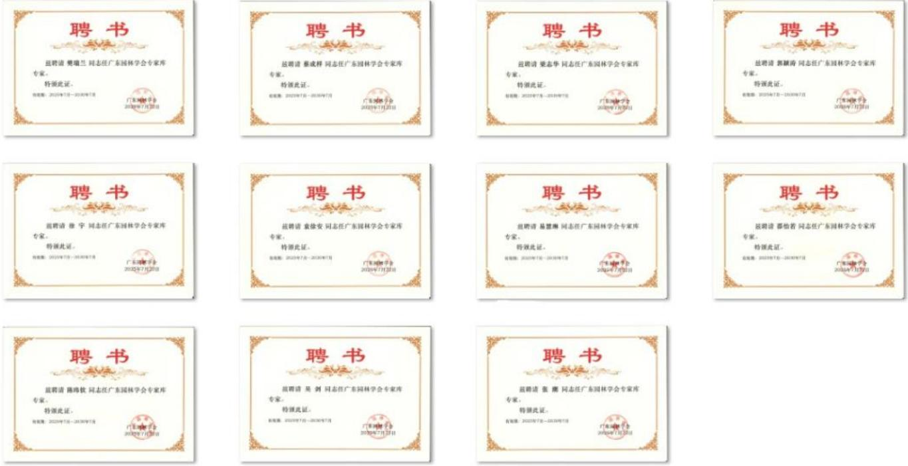

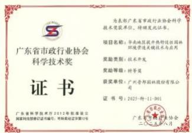

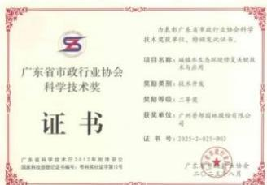

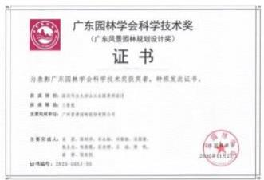

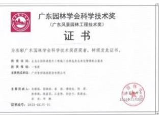

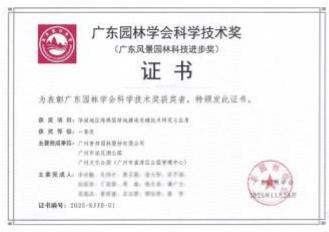

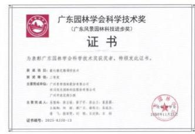

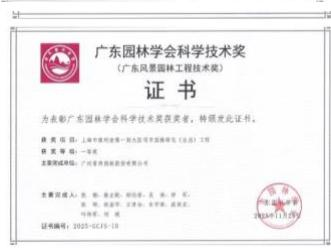

text_image

广东园林学会科学技术奖
(广东风景园林工程技术奖)
证书
为表彰广东园林学会科学技术奖获奖者，特照东北证书。
修改后：上海市园林绿化第一幼儿园市园林绿化（生活）工程
批准单位：广东省
主要承办单位：广州市贵林投资管理有限公司
主要经办人：李明、秦志刚、胡伯春、吴永涛、许文平
姓名：张明、杨志军、王学忠、朱孝源、徐延宏
性别：男
年份：1980年1月1日
证书编号：2020-00-FS-10
2020-01-11

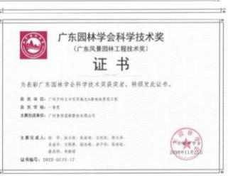

text_image

广东园林学会科学技术奖
（广东风景园林工程技术奖）
证书

为表彰广东园林学会科学技术奖获奖者，特颁发此证书。

参加单位：广州万润万丰公司年度股东大会授权委托书

指导单位：一等名

主要活动单位：广州市百联网络股份有限公司

主要经办人：如平、高志军、张洪涛、王庆松、周大华、吴志华、刘雪梅、徐丽萍、李子华、张荣勋。

承办单位：李俊波

证书编号：2019-12-19-17

2019年11月15日

## 2025年度广东园林学会科学技术奖

普邦股份荣获

7 项

科技进步奖 2 项

规划设计奖 1 项

工程技术奖 3 项

教学成果奖 1 项

## 入选第二批广东园林学会专家库

11人

## 技术交流与知识共享

## 案例 受邀参加“创新驱动园林·科技赋能未来”行业技术交流会

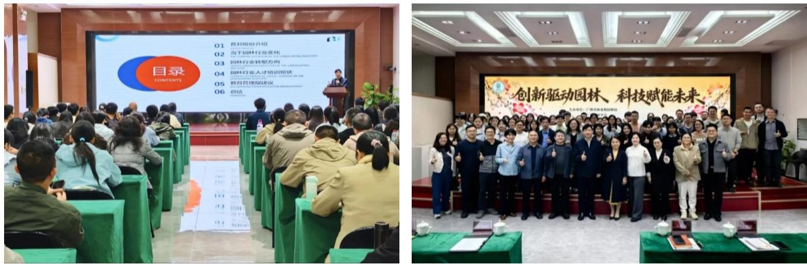

2025年12月，由广州市林业和园林局、广东园林学会联合主办的“创新驱动园林·科技赋能未来”技术交流会顺利召开，行业主管单位及院校代表等60余人参会。公司受邀参与并开展主题分享，围绕行业高质量发展与科技创新驱动，系统阐述数字化智慧化、生态修复、多元业态拓展及一体化运营等转型方向，并结合校企合作实践，就人才培养路径进行了交流。

## 案例 参与行业学术年会分享技术实践成果

2025年，中国风景园林学会园林植物与古树名木专业委员会及植物保护专业委员会学术年会在西安举办，围绕“园林植物与可持续发展”开展交流。公司受邀参与会议及专题论坛，围绕植物景观低维护与智慧管理等方向进行分享，结合项目实践系统阐述低维护景观的施工技术要求及全流程技术管理体系，并介绍广州云溪植物园、深圳福田虞园等项目的应用成效。

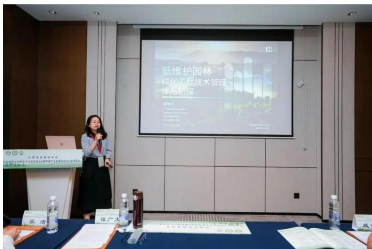

text_image

低维护园林
绿化工程技术管理
体系初探

## 行业交流平台建设

## 案例 承办城市公共文化空间景观叙事专业调研活动

2025年12月，由广东省工程勘察设计行业协会风景园林分会等主办、普邦股份联合承办的专业调研活动顺利开展，粤港澳大湾区20余家会员单位的50余位代表参与。活动围绕城市公共文化空间的场域功能与景观叙事创新展开研讨，并实地考察了深圳湾文化广场、深圳湾大街空中连廊等项目，就高密度城市公共空间的理念创新与多专业协同技术实践等议题进行交流。

## 案例 组织承办"破界与共生，园林新业态创新发展"论坛交流会

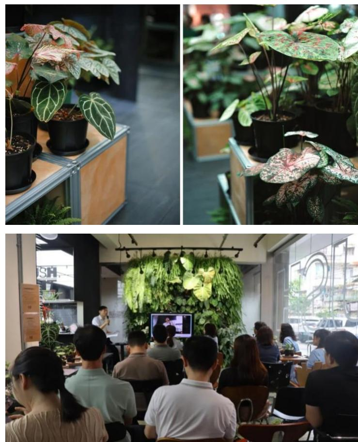

2025年9月，普邦股份联合广东省及广州市工程勘察设计行业协会风景园林分会共同举办"破界与共生，园林新业态创新发展"论坛交流会，50余家单位近200位代表通过线上线下方式参会。论坛围绕"园林+"新业态创新发展展开交流，聚焦生态、文旅、康养、教育等绿色空间复合功能方向，探讨园林行业突破增长瓶颈、实现可持续发 展 的 路 径。会 上，公 司 代 表 以RELUSH有时咖啡厅的营建与运营实践为例，分享了景观价值全场景落地的创新经验。

## 产学研合作

普邦股份高度重视产学研用一体化发展，积极与高校及科研机构深化合作，构建开放协同的创新生态。目前，公司已与中山大学、华南植物园、广州市林业和园林科学研究院、华南农业大学、仲恺农业工程学院等院校及机构建立长期稳定的科研合作关系，共建产学研基地，围绕园林行业前沿课题开展联合研究，推动科研成果向工程实践转化。

在人才培养层面，公司通过设立“普邦奖学金”、开展“校外导师合作培养研究生”等特色项目，将企业实践经验引入高校人才培养体系，有助于引导研发方向贴合行业实际需求，实现校企双向赋能。

## 关键绩效

普邦股份与

4 家

高校/机构建立产学研合作关系

共建 7个5产学研基地

## 人才培养合作

与仲恺农业工程学院合作

与中科院华南植物园合作

## 科技项目合作

普邦股份+华南农业大学

广东省林学会科技项目：《基于生物菌肥-菌根真菌的树木养护复壮技术研究》

普邦股份+广州市林业和园林科学研究院

广东省林学会科技项目：《野牡丹科观赏植物新品系选育及繁育技术研究》

## 供应链安全

普邦股份持续完善供应链管理机制，通过规范采购流程、强化供应商准入审核和动态评价管理，持续提升供应链运行的规范性与可靠性。公司注重从源头把控产品与服务质量，对供应商资质、履约能力及产品标准进行严格审查，并通过制度化管理推动合作伙伴共同提升质量与合规水平。同时，公司不断加强供应链协同管理与风险防控能力建设，推动形成稳定、高效、可持续的供应保障体系，为公司业务稳健发展提供支撑。

## 数字平台赋能供应商全程管控

## 系统：全过程管理系统（一期及二期）

✓ 全周期管控：准入、评价、拉黑机制  
✓ 资源库：供应商分类+采购数据沉淀  
✓ 拉黑停付：动态管控，降低合作风险

## 关键绩效

普邦股份

供应商总数

4,969家

新增供应商 1,318 家

因评价不达标而被中止合作的供应商

2,063家

评选出A\B级优秀供方

32家

供应商廉洁协议签署率

100%

  
供应商准入

完善制度与准入标准：持续更新《集团采购管理办法》等采购管理制度，制定集采单品（园建）实施细则，明确供应商引进标准与准入流程。  
强化资质审核与风险评估：对新供应商资质文件进行全面审查，重点核查有效性、合规性与真实性，综合评估潜在风险与履约能力，确保引入供应商符合公司管理标准。

  
供应商审核

建立持续评价机制：坚持公平、公开、公正原则，构建线上评价与线下考察相结合的供应商履约评价体系，对供应商实施动态持续管理。  
◼ 多维度开展履约考核：围绕资质、技术、质量、服务、价格、信誉、合作意愿及财务风险等维度定期开展综合评估，建立优质供应商信息库，形成优胜劣汰的良性竞争机制，持续提升供应链管理水平。

  
供应商分级管理

实施分级分类管理机制：根据绩效评估结果将供应商划分为三类：优秀供方（90分以上）、普通供方（60—90分）及黑名单供方（60分以下），并采取差异化合作策略。  
强化激励与约束机制：优秀供方优先合作，普通供方保持正常合作，黑名单供方限制使用直至淘汰，以此持续提升供应商在安全、质量与服务方面的水平，增强供应链稳定性。

  
供应链整合管理

◼ 推进集中采购与资源整合：结合行业市场情况与项目需求，系统梳理常用原材料资源，推进区域性集中采购，优化资源配置，减少供应链中间环节，提升采购效率与供应保障能力，并与供应商建立长期稳定的合作关系。  
提升供应链协同与管理水平：通过供应链整合持续优化采购流程，提升采购透明度与规范化水平，引导供应链各方遵守相关制度与行业规范，推动上下游提升资源利用效率、降低环境影响，促进供应链稳定运行与可持续发展。

## 合规采购

## 不相容岗位分离

实施采购申请与审批分离、采购执行与验收结算分离、供应商选择与付款分离，有效防范采购环节中的徇私舞弊风险。

## 法务风险管控

由公司法务部门负责采购合同的审核与签订，全程把控采购法务风险，确保合同条款合法合规，切实保障公司权益。

## 内控监督

建立分级授权审批机制，根据采购金额及业务性质设定差异化审批权限，所有采购合同须由授权代表签署并经内部审批，确保采购活动在规范授权范围内开展，保障采购决策符合公司管理要求。

## 外部审计

聘请专业第三方审计机构，定期对集团采购业务开展独立审计，覆盖采购需求发起供应商遴选、合同签订及结算支付等关键环节，重点核查采购活动的合规性，并针对发现问题推动整改落实，持续完善采购管理机制。

## 透明招标机制

依托自主建设的线上招采平台，通过公开招标与优质供应商遴选相结合的方式开展采购，强化采购信息透明度与流程规范化管理，确保采购活动在公开、公平、公正原则下有序推进。

## 廉洁采购承诺

严格遵循《反不正当竞争法》等相关法律法规，推进阳光采购管理机制，与合作供应商共同签署廉洁承诺书，明确双方合规要求与行为规范，坚决杜绝商业贿赂等不正当行为，营造诚信透明的合作环境。

## 客户服务及品质保障

普邦股份始终将产品质量与客户服务作为企业发展的核心。公司严格贯彻ISO9001质量管理体系标准及《工程项目质量管理制度》，建立覆盖项目全生命周期的精细化质量管控机制，持续规范质量标准与检验流程，为客户提供稳定可靠的产品与服务。在客户服务方面，公司建立规范化的投诉响应机制，对客户反馈实行专人跟进与全过程跟踪，快速启动响应流程，制定针对性解决方案，并在整改完成后跟踪确认问题不再复发，实现服务闭环管理，切实保障客户权益。

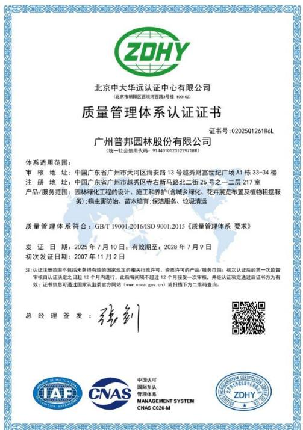

text_image

ZDHY
北京中大华远认证中心有限公司
(北京市朝阳区西坝河西路1号楼 100102)
质量管理体系认证证书
证书号:0202501261R6L
广州普邦园林股份有限公司
(统一社会信用代码:91440101231229718W)
体系适用范围:
审核地址:中国广东省广州市天河区海安路13号越秀财富世纪广场A1栋33-34楼
注册地址:中国广东省广州市越秀区寺右新马路北二街26号之一二层217室
产品/服务范围:园林绿化工程的设计、施工和养护(含城乡绿化、花卉展览布置及植物租赁服务);病虫害防治、苗木培育;保洁服务、垃圾清运
质量管理体系符合:GB/T 19001-2016/ISO 9001:2015《质量管理体系 要求》
发证日期:2025年7月10日;有效期至:2028年7月9日
初次发证日期:2007年11月2日
注:认证注册范围不包括未获得有效的国家规定的相关行政许可,资质允许的产品/服务范围;初次认证后的第一次监督审核自认证决定之日起12个月内进行,此后每间隔不超过12个月接受一次审核,并经认证决定通过后证书方为有效;证书信息可通过国家认证委官方网站(www.cnca.gov.cn)或扫描下方二维码查询。
总经理签发:张钊
AE CNAS 中国认可
国际互认
管理体系
MANAGEMENT SYSTEM
CNAS C020-M ZDHY

## 关键绩效

## 2025年 普邦股份获得客户类奖项 / 表扬信 21 项

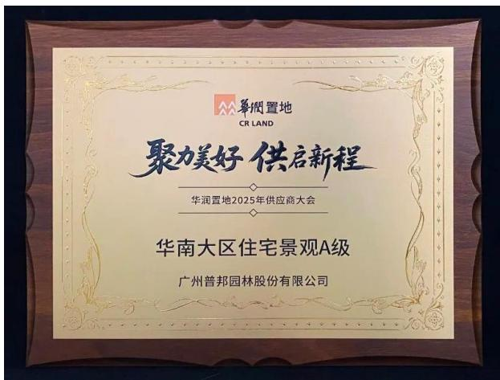

text_image

華潤置地
CR LAND
聚力美好 供启新程
华润置地2025年供应商大会
华南大区住宅景观A级
广州普邦园林股份有限公司

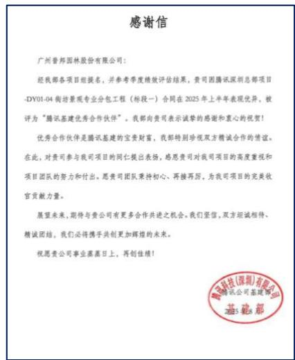

text_image

感谢信
广州普邦园林股份有限公司：
经我部各项目组提名，并参考季度绩效评估结果，贵司因腾讯深圳总部项目-DY01-04街坊景观专业分包工程（标段一）合同在2025年上半年表现优异，被评为“腾讯基建优秀合作伙伴”。我部向贵司表示诚挚的感谢和衷心的祝贺！
优秀合作伙伴是腾讯基建的宝贵财富，我部特别珍视双方精诚合作的情谊。在此，对贵司参与我司项目的同仁提出表扬，感恩贵司对我司项目的高度重视和项目团队的努力和付出。愿贵司团队秉持初心、再接再厉，为我司项目的完美收官贡献力量。
展望未来，期待与贵公司有更多合作共进之机会。我们坚信，双方坦诚相待、精诚团结，我们必将携手共创更加辉煌的未来。
祝愿贵公司事业蒸蒸日上，再创佳绩！

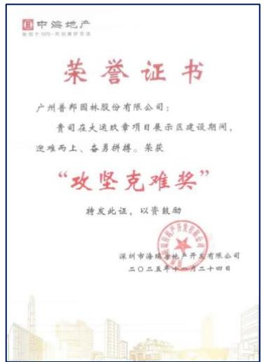

text_image

中海地产
股份于2015年4月1日
荣誉证书
广州普邦园林股份有限公司：
贵司在大运玖章项目展示区建设期间，
迎难而上、奋勇拼搏。荣获
“攻坚克难奖”
特发此证，以资鼓励
深圳市海欣房地产开发有限公司
二〇二五年十二月二十四日

## 全过程质量监督与常态化检查

公司质监部对工程项目自开工至移交实施全过程质量与安全管控，通过现场巡检与全景视频抽检相结合的方式开展质量检查；同时建立常态化监督机制，每月开展飞行检查，对施工质量、安全生产及文明施工情况进行系统监督，并提供专业技术指导与培训。针对发现问题，及时签发整改通知单并跟进落实，确保问题闭环管理。

## 质量评价与激励机制

公司设立"董事长质量奖"及质量管理委员会，对所有完工项目实施全覆盖管理。委员会每月对省内项目开展1—2次现场检查，对省外项目每月进行视频检阅并不定期开展现场考察，同时每年组织优秀工程项目评选活动，以激励机制持续推动工程质量提升。

## 施工标准化与技术培训

2025年，公司完成《普邦园林施工工艺标准化指导手册》编制，系统规范园林各专业施工工艺流程、关键控制要点及质量问题预防措施，并通过技术培训、经验分享及新工艺推广持续提升施工水平。全年累计完成5个先进工艺技术总结，并在全国多个项目推广应用。

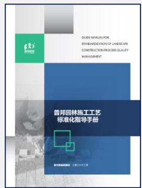

text_image

GUIDE MANUAL FOR
STANDARDIZATION OF LANDSCAPE
CONSTRUCTION PROCESS QUALITY
MANAGEMENT
普邦园林施工工艺
标准化指导手册
中国铁路建设集团 2017-2018

## 质量风险与信用监督

公司研究院负责企业信用风险监督管理工作，对项目质量管理相关风险进行监督与评估，维护企业诚信经营形象与品牌声誉。

## 社会责任篇

## 聚焦人本价值，构筑共赢发展

## PART

## THREE

## 我们的行动

◼ 携手员工共进  
◼ 社会贡献

## 2025年绩效

在职员工 1,231人 劳动合同签订率 100%

依法纳税 5,670 万元 对外捐赠 23 万元

## 贡献SDGs

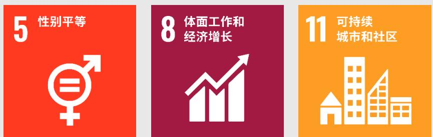

## 携手员工共进

普邦股份坚持以人为本的发展理念，将员工视为企业可持续发展的重要基石。公司严格遵守《中华人民共和国劳动法》《中华人民共和国劳动合同法》《中华人民共和国社会保险法》等相关法律法规，持续完善《招聘管理办法》《薪酬管理办法》《员工手册》等内部管理制度，切实保障员工合法权益。在此基础上，公司不断完善人才培养体系、优化职业发展通道、强化员工关怀机制，提升员工获得感与归属感，推动企业与员工协同发展。

## 合规与平等雇佣

公司严格遵守相关法律法规，依法与员工签订劳动合同，确保招聘、录用、在职及离职全过程管理规范、公开、透明，坚决杜绝任何形式的雇佣歧视与强迫劳动。公司坚持"公平、公正、公开、择优"的用工原则，统一规范招聘及晋升标准，以工作业绩与能力为核心依据，为不同年龄、性别及背景的求职者提供平等就业机会，促进多元包容的组织氛围建设。

## 关键绩效

2025年 81人新入职员工

15人

66人

◼ 高校毕业生

◼ 社会招聘

2025年劳动合同签署率

100%

## 不存在

## 不存在

因违反员工雇佣相关法律法规而被处罚的情况

生育歧视、使用童工、强迫劳工等违法违规行为

## 普邦股份员工结构

在职员工总数

1,231人其中包含少数民族

78人

残障人士

10人

外籍人士

1人

部门负责人以上级别的女性员工占比 30%

按性别划分  
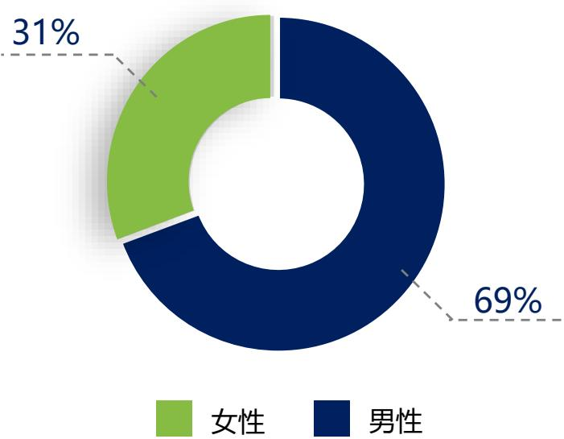

donut

| Category | Percentage |
| --- | --- |
| 女性 | 31% |
| 男性 | 69% |

按年龄划分  
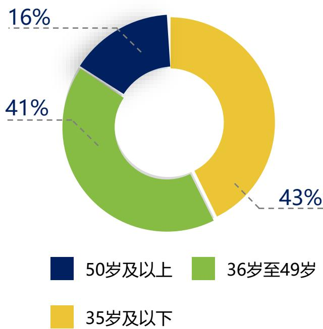

donut

| Category | Percentage |
| --- | --- |
| 50岁及以上 | 16% |
| 36岁至49岁 | 41% |
| 35岁及以下 | 43% |

## 薪酬福利与员工保障

普邦股份构建了涵盖职位价值、绩效管理、任职资格与劳动态度评估的四维评价激励体系，将员工发展与企业战略目标深度绑定。公司依法足额缴纳各项社会保险及住房公积金，并通过健康体检、节日慰问、高温补贴等多元福利举措切实关怀员工身心健康。2025年，公司进一步修订薪酬管理办法，强化薪酬的激励性与公平性，以合理的利益分配机制推动员工与企业共同成长。

## 核心原则

公平性 · 激励性 · 战略支撑 · 员工与企业利益共同体

## 绩效考核与激励体系

围绕四大体系建立赋能增效的评价激励机制

职位价值体系 以职位价值 定工资

任职资格体系以任职资格定晋升

“KPI+OKR”绩效管理体系以绩效定奖金劳动态度评估以愿景驱动目标

## 社会保险与公积金

按时足额缴纳，全员覆盖

⚫ 养老保险  
⚫ 医疗保险  
⚫ 失业 / 工伤 / 生育保险  
⚫ 住房公积金

## 员工关怀与福利

关注员工身心健康与生活

⚫ 每年组织健康体检  
⚫ 传统节日发放慰问品  
⚫ 对符合条件的户外作业人员发放高温补贴，开展高温慰问活动

## 关键绩效

## 2025年

工资按时足额发放率员工社会保险覆盖率住房公积金覆盖率

100%享受产假员工 27人产假返岗率 100%

举办员工关怀活动7次

投入资金约30万元

同比增加200%

## 案例 派发30周年员工专属纪念礼

2025年7月，正值普邦股份成立30周年，集团总部精心准备一份承载企业文化与心意的专属纪念礼献予每一位同行的普邦人。通过精选签字笔、POLO衫、冲锋衣、帆布袋，寓意“执笔承新，镌刻初心”“衫纳众志，聚力同行” “衣砺风雨，无畏征途”“袋载春秋，共赴新程”。每一件精选之礼皆满载心意，致敬过往的匠心坚守，拥抱未来的无限憧憬。

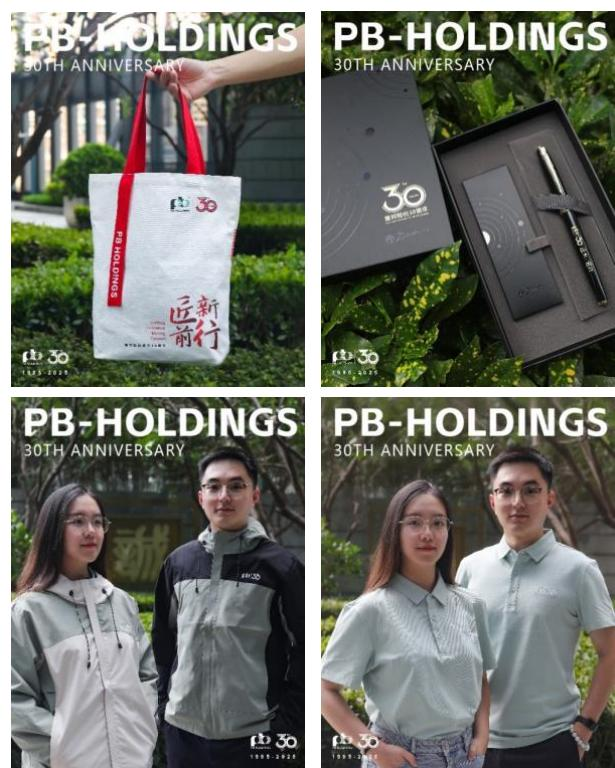

## 人才培养与职业发展

公司坚持以人才发展为核心驱动力，持续完善人才培养与职业发展体系，构建多通道、多层次的人才成长机制。通过优化职业发展路径、强化人才梯队建设与能力提升，推动人才合理配置与有序流动，不断激发组织活力与员工潜能，促进员工与企业的协同成长与价值共创，为公司高质量与可持续发展提供坚实的人才支撑。

## 关键绩效

开展培训

298场

培训总学时

02150+小时

普邦网络学院

上传课程

519门

开展

午间课堂

46次

## 畅通人才发展通道

公司围绕"任人唯贤，人尽其才，才尽其用"的人才理念，精心构建"邦·未来""邦·力量""邦·匠人"三大人才发展专项计划，并为员工量身定制职业成长双通道，助力员工快速提升专业能力，成就职业理想。2025年，公司根据业务发展及组织优化需要，结合人才特质、技能与发展需求，积极盘活内部人才资源，推动跨部门、跨岗位任用；同时持续完善关键岗位继任计划，夯实人才评价数据，保障组织稳健发展与核心能力的有效传承。

## 关键绩效

2025年

公司内部

跨部门调动

25人次

## 构建数智化人才培养新生态

2025年以来，普邦学院秉持“上接战略、中承文化、下达能力”的价值主张，结合公司成立30周年契机，围绕业务发展需求，在赋能一线、专业深化、风险管控与数智化应用等方面系统开展系列培训。公司积极探索园林行业智能化赋能路径，组织核心中高层开展智能化专题研讨与实践。与此同时，稳步推进工程项目全过程管理系统落地，通过系列培训加速数字化、智能化普及，持续强化集团平台的综合服务效能。

## 推进专业化人才队伍建设

公司秉持"人才是精品工程基石"的理念，持续深化专业人才队伍建设。2025年，公司通过优化职称评审体系、修订《专业技术人员管理办法》，为员工提供清晰的成长路径与制度保障，全年累计百余人次参与职称申报及技能考证。公司依托线上平台打造系列专业课程，实现专业知识高效共享；并为核心人才提供专家入库推荐、行业交流、荣誉评选及内部讲师选聘等多维支持，推动员工成长与企业高质量发展的双向赋能。

## 关键绩效

2025年

推荐申报行业内权威专家库

67人次

正高级工程师

228人

高 级工程师

002100+人

中级工程师

55200+人

专业执业人员

100+人

## 案例 “邦•力量”项目负责人专项提升培训

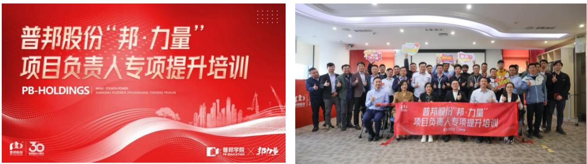

2025年2月，普邦股份30余名技术骨干参与公司举办的"邦·力量"项目负责人专项提升培训。本次培训采用"理论赋能+实战淬炼"模式，涵盖《复盘工作坊》《全过程管理系统与安全生产》《风险防范案例分享》《营销专题》等系列课程，并设置模拟投标面试实战演练，帮助学员全面提升项目管控、风险预判与营销策略等核心能力。

## 员工健康与安全保障

公司始终将员工安全与健康放在重要位置，致力于营造安全稳定的工作环境。公司持续落实各项安全生产管理要求，通过安全培训与隐患排查强化员工安全意识与风险防控能力，将安全理念融入日常作业与管理环节。与此同时，公司定期组织员工健康体检，推动健康风险的及时识别与管理，切实保障员工身心健康，为企业稳健发展提供有力支撑。

## 关键绩效

2025年体检覆盖员工

957人

## 完善制度与源头管控机制

公司制定《安全生产、文明施工管理标准》，明确安全生产及文明施工要求，配套违规处罚细则，强化制度执行力；针对危险性较大的分部分项工程，实行专项报备管理，从源头识别和管控安全风险。

2025年

重大安全事故被信用中国平台公示的行政处罚事项

0件

## 强化安全培训与过程管控

公司持续加强一线人员安全教育培训，通过对重点项目开展现场安全文明培训交底，提升员工安全意识与操作技能；同时定期发布安全文明提醒信息，在极端天气前强化风险提示，并通过项目巡检及“重危工程”全过程跟踪，及时排查和消除安全隐患。

## 案例 应急防暑药物覆盖160+项目部

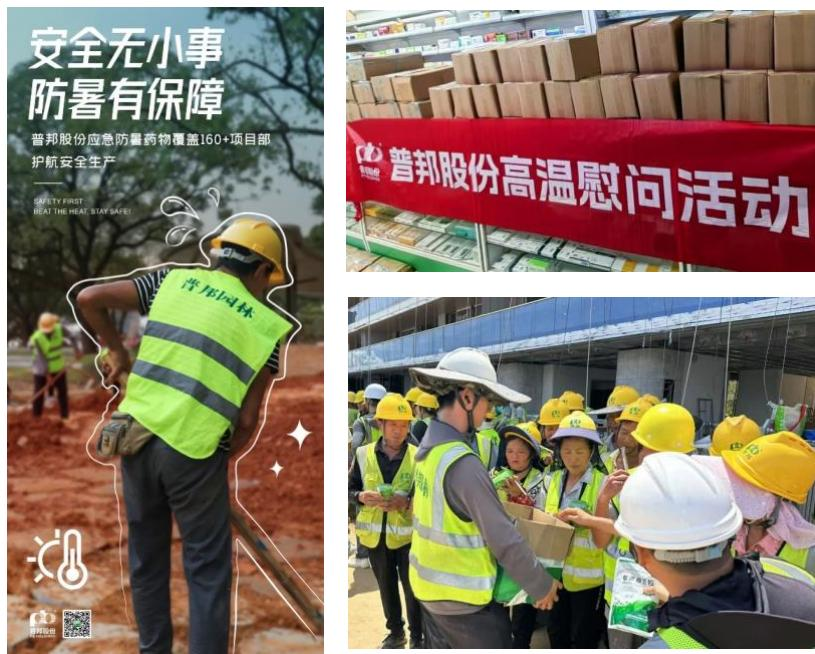

2025年7月，普邦股份启动高温季节防暑专项行动，向分布于全国30多个城市、160多个项目部快递配送防暑应急药物，将企业关怀精准送达一线作业人员，切实保障高温季节项目安全生产与员工健康。

## 案例 台风"桦加沙"应急响应

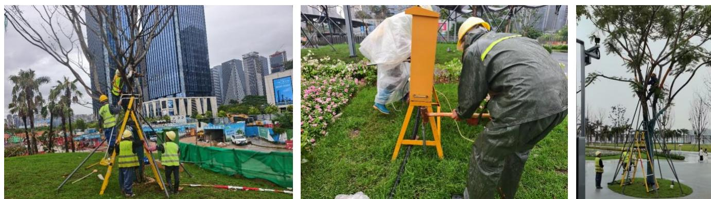

台风"桦加沙"预警发布后，公司密切跟踪沿海地区防控公告及台风路径动态，根据预警等级提前督促相关项目部开展隐患排查整改，重点对苗木加固绑扎、脚手架及临时设施稳固检查、排水设施疏通清理，并及时落实停工措施。同时通过"一对一"电话逐一核实到位情况，完成安全交底及灾后抢修准备工作，切实保障施工人员人身安全与项目财产安全。

## 健全责任落实与监督机制

公司建立项目安全文明承诺机制，要求项目负责人签订承诺书，明确安全生产责任；通过定期开展项目巡检及对"重危工程"全过程跟踪管理，及时排查消除安全隐患，保障施工安全与项目平稳运行。

## 关键绩效

2025年签订安全文明承诺书 49 份

在日常巡检中开具安全文明处罚单 2 份

## 社会贡献

公司积极履行社会责任，将社会贡献融入企业发展全过程，在依法合规经营的基础上持续创造社会价值。公司坚持依法纳税，切实履行纳税义务，为地方经济发展和社会公共服务提供支持；同时，积极参与社会公益活动，关注社会需求，践行企业责任担当。通过规范经营与公益实践相结合，公司不断提升对社会的综合贡献，推动实现企业发展与社会价值的协同共进。

## 依法诚信纳税

公司严格遵守国家税收法律法规，将依法诚信纳税作为企业合规经营的基本准则。公司建立健全税务管理制度，规范税务申报与缴纳流程，确保各项税款按时足额缴纳，切实履行企业纳税义务。通过依法合规纳税，公司积极为地方经济建设和国家财政收入贡献企业力量，以实际行动彰显负责任企业公民的担当。

## 关键绩效

2025年普邦股份依法纳税5,670 万元

## 践行社会公益

公司积极投身社会公益事业，将回馈社会作为企业发展的重要责任。公司持续关注教育、生态建设等领域的社会需求，通过多种形式参与公益慈善活动，将企业发展成果惠及更广泛的社会群体。公司相信，企业的长远发展离不开良好的社会环境，唯有与社会共生共荣，方能实现可持续的高质量发展。

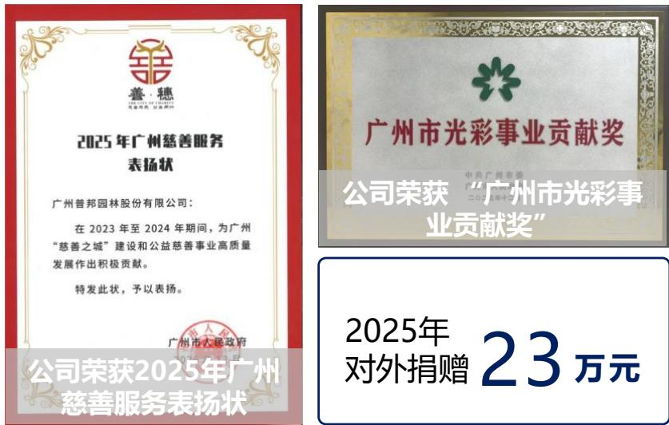

对外捐赠 23 万元 2025年

## 案例 积极参与“百千万工程”良明村共建帮扶工作

在广州市工程勘察设计行业协会的组织号召下，普邦股份积极参与从化区良口镇良明村共建帮扶活动，发挥专业优势完成村庄特色墙彩绘工程，助力当地村容村貌提升。

2025年1月，公司受邀参加联建共建活动，对老党员及五保户家庭进行慰问并送去生活物资，并参观东江纵队纪念馆及黄沙坑革命旧址纪念馆，深化党建学习教育。普邦股份荣获协会感谢状，以实际行动助力"百千万工程"与广州美丰乡村建设。

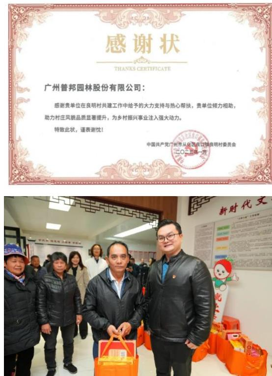

## 04 环境保护篇践行低碳理念，守护生态环境

## PART FOUR

## 我们的行动

◼ 绿色低碳与生态建设  
◼ 绿色运营与资源节约

## 2025年绩效

取得海绵城市相关专利 22 项

节约纸张 13.84 万张

## 贡献SDGs

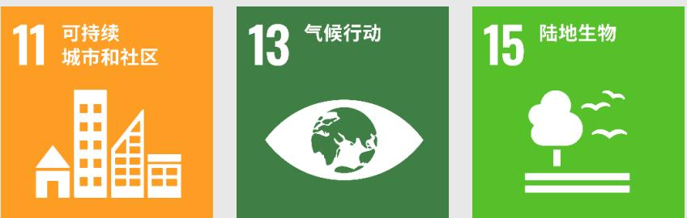

## 绿色低碳与生态建设

普邦股份积极响应国家"碳达峰、碳中和"目标与生态文明建设号召，围绕城市绿地建设与生态修复，持续深化绿色低碳领域的研究与实践。公司通过与中科院华南植物园、广州市林业和园林科学研究院、华南农业大学等权威机构开展产学研合作，在生态系统服务功能提升、功能型植物群落配置、城市树木复壮等方向持续攻关，并积极推进人工红树林生态修复、水生态修复及海绵城市建设，构筑绿色安全屏障，赋能城市绿地建设转型发展。

## 研究成果

## 2020—2023年

⚫ 与中科院华南植物园合作开展《粤北生态屏障生态系统服务功能提升技术》研究，攻关生物多样性保育、固碳增汇、涵水保土等关键技术，并结合项目实践推动相关技术大面积推广。

## 2024年

⚫ 参与广州市生态园林科技协同创新中心，开展环境友好型植物群落配置与管养关键技术研发，筛选蜜源型、保健型、减霾净化型、增汇型等功能型植物，构建城市森林、公园、道路绿地等多类型功能植物群落配置模式。

## 2025年

⚫ 与华南农业大学合作开发适用于城市树木复壮的根际菌根真菌群落构建技术体系，针对城市绿地植物生长势衰退等现实问题提供系统性解决方案。  
⚫ 自主研发城市绿地碳含量计算器并正式启用，相关技术已申请发明专利，进一步优化城市绿地碳计量手段。

## 案例 越秀公园低碳生态科普径建设

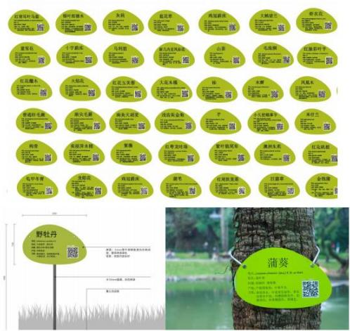

普邦股份参与规划建设《华南国家植物园城园融合（越秀公园）低碳科普径及生态科普宣教点建设项目》，以科学规划引进植物品种，提升低碳科普径的景观品质。项目依托越秀公园原有景观基底与植物本底条件，按照"科学的内涵、艺术的外貌、文化的底蕴"的植物园认证标准，系统完善低碳科普径、碳综合园科普展示空间及相关科普体系建设，将生态理念与公众科普教育有机融合，为市民提供兼具自然美感与低碳教育价值的城市绿色空间。

## 案例 以景观设计践行绿色低碳理念

普邦股份以"无界共生·生态共融"为设计理念，将环境保护与低碳城市营造贯穿广州知识城大厦景观设计项目全程，打造兼具生态功能与城市活力的新型产业园景观。

项目通过雨水花园建设实现雨水调蓄与生物栖息地营造，将园区花境生态景观转化为城市"绿肺"；采用乡土植物与低维护植物配置，在提升景观效果的同时降低养护成本与资源消耗。在空间设计上，项目将园区步行道、骑行绿道与城市慢行网络直接连通，鼓励低碳出行；屋顶花园融合"通勤+休闲"双功能流线，并与城市滨水步道相连，实现生态共享与城市融合，为市民提供亲近自然的绿色公共空间。

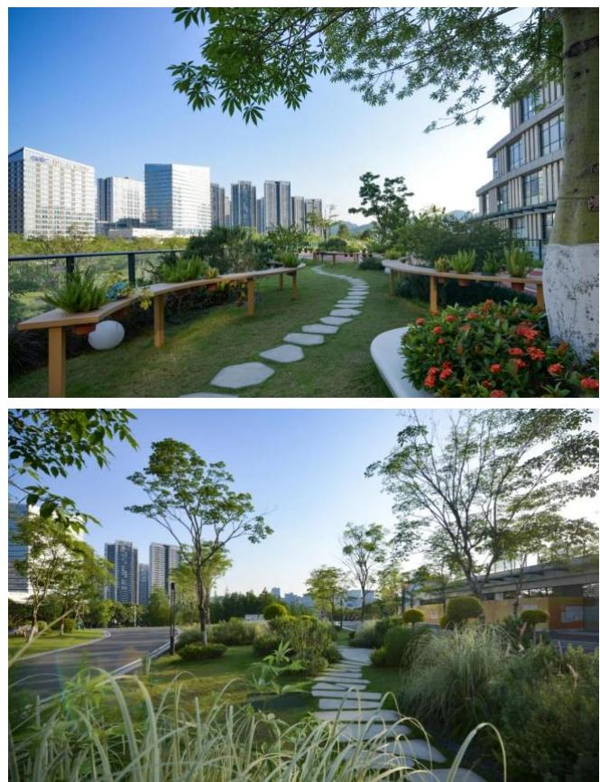

## 保护生物多样性

普邦股份积极履行生物多样性保护责任，将其融入项目规划、设计与建设的专业实践之中。公司积极参与广州市"1+3+N"城园融合体系建设，深度参与云溪生态植物园、云萝植物园、越秀公园、珠江公园和广州兰圃等重要公共绿地项目，为构建华南国家植物园体系、落实国家生物多样性保护战略贡献专业力量。公司通过技术研发、设计、建设及科普等多维度参与，助力打造植物迁地保护示范区与生态科普宣教点，并积极开展生物多样性科普宣传活动，提高公众对生物多样性的认知与保护意识，以实际行动履行企业生态责任与社会使命。

## 案例 顺利承办“城市公园植物多样性与养护技术交流”座谈会

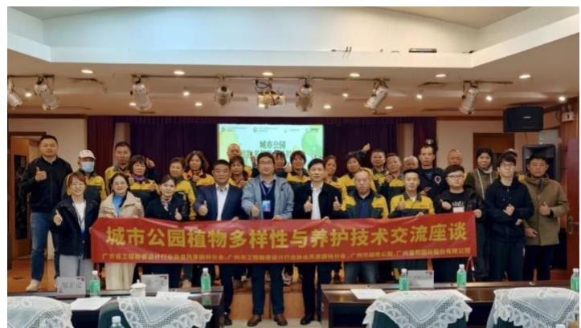

text_image

城市公园
城市公园
城市公园
城市公园植物多样性与养护技术交流座谈
广东省工程部建设行业运营人员培训代表、广州市工程部建设行业协会委员暨组织代表、广州市烟草公司、广西烟草局股份有限公司

2025年11月，普邦股份联合广州市越秀公园共同承办由广东省及广州市工程勘察设计行业协会风景园林分会主办的“城市公园植物多样性与养护技术交流”主题座谈会，吸引60余名园林技术管理及养护人员参与。 会上，公司专家围绕城市公园植物多样性变化特点、古树保护

及外来入入侵植物防治等议题，结合团队多年对白云山、越秀公园及兰圃的植物多样性研究成果，提出系统性管理策略，为行业搭建了高效的技术交流平台。

## 案例 大湾区文化体育中心

普邦股份承担大湾区文化体育中心项目的景观深化及施工图设计工作，在项目落地过程中注重生态理念的转化与实施支撑。在项目实施过程中注重生态理念的落地应用。依托南沙湿地生态基础，对生态空间布局进行优化，通过完善绿地系统、优化植物配置及滨水空间设计，提升鸟类栖息条件与区域生态连通性。同时，在岸线设计中融入生态工法，兼顾生态修复与功能需求，推动生物多样性保护在项目中的有效实现，实现生态价值与场地功能的协同提升。

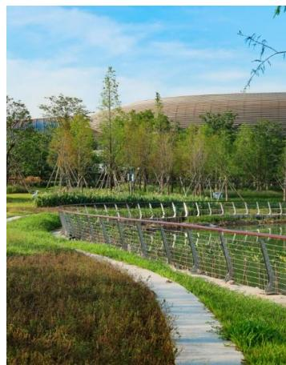

natural_image

Garden pathway lined with a metal walkway, surrounded by greenery and trees under a blue sky (no text or symbols visible)

# 案例 三亚海棠河生态公园二期项目

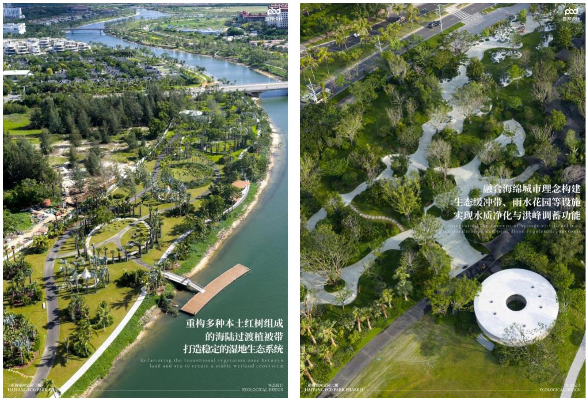

三亚海棠河生态公园二期河道长度10.1千米，设计范围约135公顷。普邦股份作为项目深化设计单位，以蓝绿基础设施为核心，统筹水环境治理与沿岸空间更新，系统实施"基底夯土、耕地保育、红树归来、林地再野、生境营造、动物友好"六步生态治理举措。

在绿色低碳建设方面，项目通过精细化土方计算与大地造型调整，实现全场零土方外运；联合海南种业实验室创新运用"原位生物改良+就地营建"技术修复贫瘠盐碱土壤，以自然解决方案替代大规模换土，有效降低间接碳排放。

在生态修复与生物多样性方面，项目系统清除外来入侵红树物种拉关木，恢复11种本土红树群落，预计吸引逾120种鸟类栖息；针对29公顷退化林地引入6大乡土植物群系，通过再野化撒播与定植相结合，促进次生林自然演替；同步迁地保护海南坡垒、沉香、望天树等近20种国家濒危及重点保护植物，构建热带植物"基因保存库"，为全球滨海生态脆弱区治理贡献中国方案。

## 案例 助力湾区少年迎十五运植英雄树活动

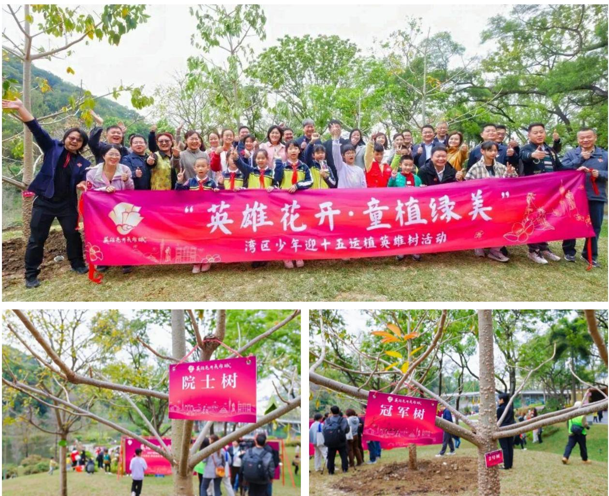

2025年3月，普邦股份作为支持单位参与在云溪植物园举行的"英雄花开·童植绿美"湾区少年迎十五运植英雄树活动。中国科学院院士吴硕贤、世界蹦床冠军蔡琪子携粤港澳百名青少年及各界代表共同参与，将五株本地木棉植入云溪沃土，以植木棉寄情志，共谱绿美湾区新篇章。

普邦股份全程配合此次活动的木棉树选型工作，并与此次活动形成呼应的是，延续了公司深耕城市生态建设的实践经验，并与此前完成的云溪植物园景观提升工程形成协同效应。云溪植物园景观提升工程通过优化植物群落结构、引入智能灌溉系统，使园区生物多样性指数提升37%，为湾区生态文明建设树立新标杆。

本次活动同步启动全国首个市花物候观测公民科学项目，依托云溪植物园建立常态化观测站点，系统记录木棉生长周期数据，构建城市生态数据库，推动公众参与城市生态保护。

## 海绵城市建设

## 关键绩效

## 普邦股份

已累计取得

海绵城市相关专利

22项

已累计取得

海绵城市相关省级工法

3项

3位

专家成功入选

由广州海绵城市建设领导小组办公室公布的专家库名单

## 案例 华南地区海绵型绿地建设关键技术研究与应用

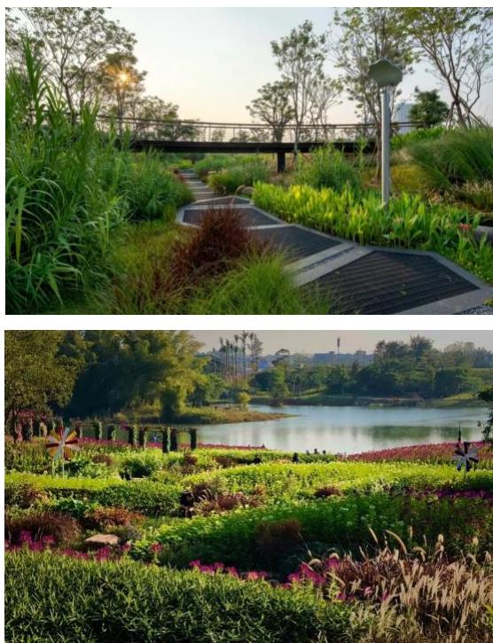

华南地区海绵型绿地建设关键技术研究与应用项目由普邦股份牵头主持，联合广州市流花湖公园、广州文化公园（广州市荔湾区公园管理中心）等单位合作完成。项目集成创新了海绵型绿地适生植物评价与试验、水体生态修复技术、海绵型绿地生态营建三大关键技术，构建了雨水渗、滞、蓄、净、用、排一体化技术体系，解决了污水深度净化，雨水下渗、收集和利用效率低等问题。获授权发明专利8件、实用新型24件、培育新品种4个、地方标准2项等成果，核心技术在广州、深圳、湛江、海南等地成功推广应用，获得同行专家评价为达到国际先进水平。

2025年度

广东园林学会科学技术奖

科技进步奖 | 一等奖

## 案例 沙河涌滨水碧道提升改造项目

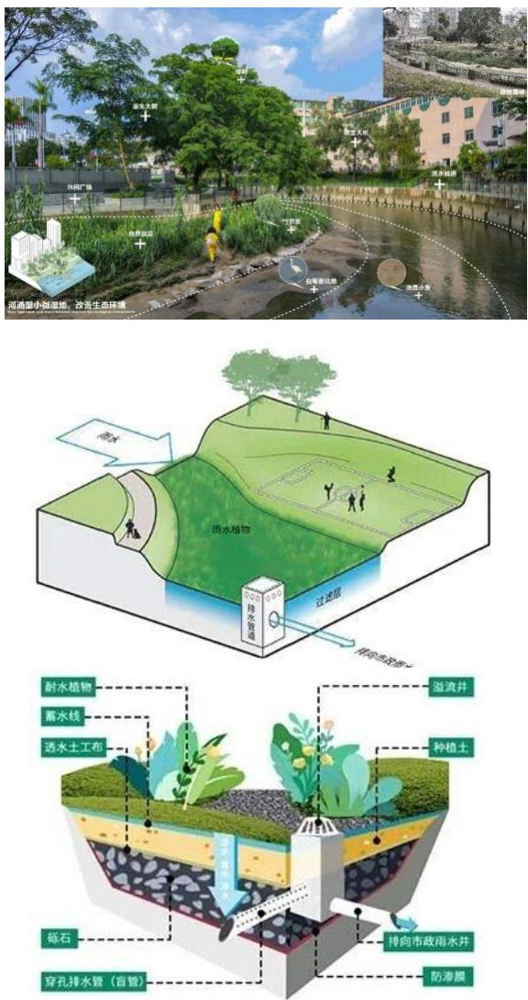

沙河涌跨白云、天河、越秀三区，干流全长约14公里，毗邻广州CBD，是越秀对外展示的重要窗口。普邦股份参与本次滨水碧道提升改造，围绕"秀水榕情·红动沙河"理念，将生态修复与文化传承有机融合。

在生态建设方面，项目在水渚边缘种植耐候性植物，营造自然生态沙洲与小微湿地景观，为水生动物及鸟类提供栖息空间；同步建设雨水花园，兼顾雨水汇聚与湿地生境功能；并在河道两侧设置自然教育解说系统，向公众普及小微湿地生态特征与生物多样性知识，增强公众湿地保护意识。

在空间营造方面，项目提升两岸滨水步道，激活榕树林下空间，优化存量绿地资源，让周边居民实现"出门见绿、步行入园、与水相伴"的体验，实现生态保护与城市活力的深度融合。

## 标本兼治的治水理念——低水位运行生态修复

## 城市河流生态环境现状

城市河流沟渠化、硬质化程度高，底泥淤积和污染严重水质不稳定，生态系统不稳定

## 传统高水位运行存在的问题：

①投资大，能耗高，难以长效维持。②自净能力低，不利于污染物扩散降解。③泥-水界面处于长期缺氧状态，底泥持续黑臭。④无法构建沉水植物，导致生态系统不健全。

## 低水位运行生态修复的做法：

城市河流在完成控源载污后，接河道水位降低，使其维持自然低水位运行。不大规模引水调水，而是利用污水厂布层优势，将污水厂星水再生利用补给河道，促进水体流动，同时让大自然充分做功，实现底泥的自然净化和修复，逐步构建完善的水生态系统。

## 低水位运行生态修复的优势：

低水位运行不仅可高效修复污染底泥，为河流生态系统构建提供基础条件，而且避免了大规模清淤、速、引调水等工程措施，是一种低碳、低成本治理模式，具有显著的生态效益、经济效益和社会效益。

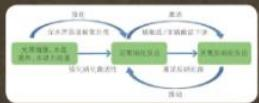  
低水位运行污染底泥自然修复机制示意图

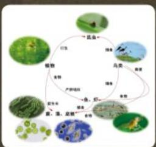  
生境多样性构建完整食物链示意图

## 白鹭与低水位运行生态修复

广州市水务局率先在猎德涌、沙河涌等多条城市河流开展了低水位运行实践，在控源截污清污分流等源头治理的基础上，采取了“降水位+少清淤+不调水”的做法进行水生态恢复，让淤泥贝阳光，中间走活水，形成的河底湿地长出了水草等植物，吸引了是中和鱼类，丰富涌的生态系统。在有色，有虫和水浅的情况下，白慧开始选择河涵栖息，它们捕食河涌里的售和浅滩上的昆中，排出卷便，进一步肥沃浅水深床和浅滩，形成一个息性生态精环圈。“城中斗变成为了“飞鸟之家”。

  
广州市猎德涌生态修复效果  
自莺在自云区石井河滩觅食  
自警在浅滩上活动

◼ 标识牌，向公众介绍小微湿地的生态特征、生物多样性等信息

## 城市更新与公共空间建设

## 案例 广州新中轴海珠片区景观设计

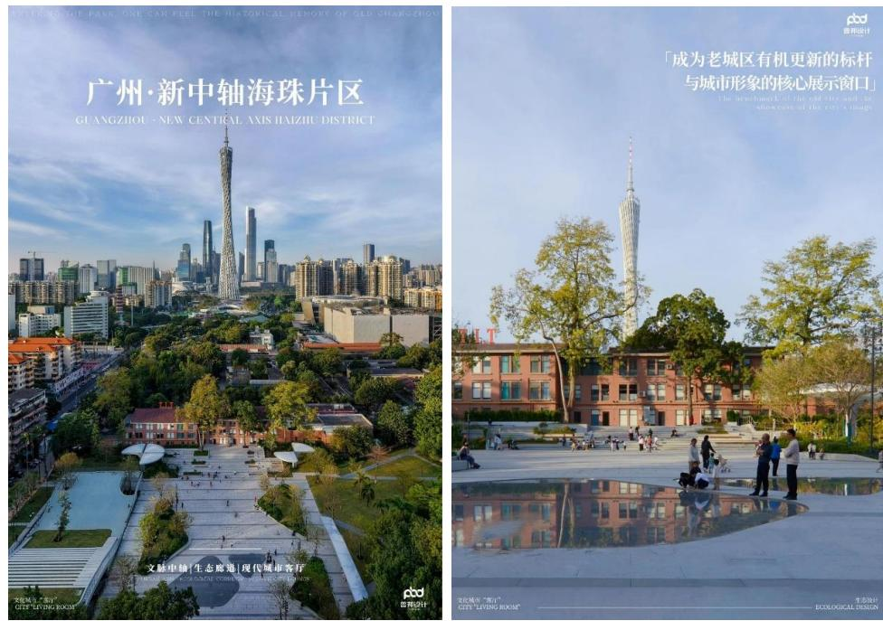

普邦股份承担广州新中轴海珠段景观设计工作，项目以广府文脉为主线，通过线性景观廊道与节点空间串联历史与现代空间，塑造城市文化展示载体。生态设计融入海绵城市技术与近自然修复理念，采用乡土植物构建立体植被群落，提升生态循环与环境品质。同时，完善无障碍慢行系统，满足市民休闲、文化活动等多元需求，助力老城空间品质提升。

## 案例 广州万科文冲项目城光A南地块景观工程

普邦股份承担广州万科文冲项目城光A南地块景观施工，围绕“居住品质”推进设计施工一体化，从材料与工艺全过程把控，打造高品质居住景观空间。施工内容涵盖入口门楼、廊架、景墙、水景、架空层铺装及绿化景观等。项目综合应用多项工法与专利技术，在延续场地历史肌理的基础上，以现代手法优化空间表达，兼顾历史传承与城市更新需求。

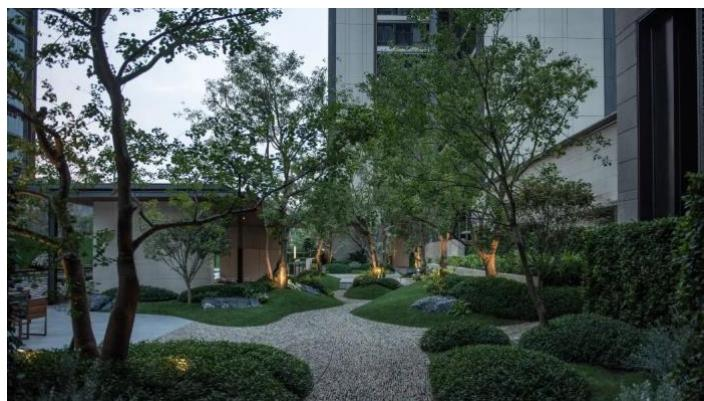

natural_image

Garden courtyard with manicured shrubs, tree-lined pathways, and modern buildings in the background (no visible text or signage)

2025年度

广东园林学会科学技术奖

工程技术奖

一等奖

## 绿色运营与资源节约

公司坚持绿色运营理念，将资源节约与高效利用融入日常管理与运营过程中，通过优化能源使用、强化节水措施、推进无纸化办公及提升资源循环利用水平，持续降低资源消耗与环境影响。同时，公司积极倡导低碳办公方式，提升员工节能环保意识，推动形成节约、高效、绿色的运营模式，为企业可持续发展提供支撑。

## 节约资源及循环利用措施

## 电能

• 优先采购高能效低功耗办公设备；  
• 空调温度标准：夏季≥26°C，冬季≤20°C；  
• 逐步推广LED及节能光源；  
• 倡导随手关闭电灯、空调、电脑；  
• 下班后巡查确认用电设备全部关闭。

## 2025年

广州办公区 用电量

947,720 度

同比下降 10.54%

## 2025年

广州办公区 用水量7,519吨

同比下降 32.82%

## 水资源

• 定期巡查管网，及时修复渗漏；  
• 安装直饮水机，替代瓶装水；  
• 张贴节水标识，引导员工节水意识。

## 办公资源

• 对闲置办公家具统一回收储备并调配使用，延长使用周期；  
• 文具类易耗品实行以旧换新；  
• 对功能完好的闲置电子设备集中管理并二次分配，减少资源浪费和电子废弃物产生。

## 2025年

公车使用次数

114 次

同比下降 46.48%

## 燃油

• 鼓励公共交通、步行、骑行通勤  
• 规范公务用车，减少非必要用车  
• 逐步置换油电混合动力车辆  
• 省外项目推行视频远程监管

## 纸张

• 推行无纸化办公，推动文件审批电子化及电子合同应用，减少纸质文件使用及传递过程中的资源消耗与碳排放；  
• 设置打印默认双面模式，建立废纸回收再利用机制，并通过优化排版格式提高单页信息承载量，持续提升纸张使用效率。

## 2025年

OA办公系统产生流程

21,343条

签订电子合同

7,435份

节约纸张 ①

13.84万张

减少砍伐树木 ②

46.13棵

注1：节约纸张数量按照每条OA流程平均约使用3张纸、每份合同平均使用10张纸进行测算。  
注2：减少砍伐树木数量按照每砍1棵树能造3000张纸进行测算。

<table><tr><td>报告章节</td><td>《中国企业可持续发展报告指南(CASS-ESG 6.0)》</td><td>《深圳证券交易所上市公司自律监管指引第17号——可持续发展报告(试行)》</td></tr><tr><td>报告说明</td><td>P1.2</td><td>第四条/第六条</td></tr><tr><td>董事长致辞</td><td>P2.1</td><td>\</td></tr><tr><td>关于普邦股份</td><td>P3.1/P3.2/P3.3</td><td>\</td></tr><tr><td colspan="3">ESG治理</td></tr><tr><td>利益相关方沟通</td><td>G1.3.2</td><td>第九条/第五十三条</td></tr><tr><td>双重重要性分析</td><td>G1.1.9</td><td>第五条</td></tr><tr><td colspan="3">公司治理篇</td></tr><tr><td>坚持党建引领</td><td>\</td><td>\</td></tr><tr><td>完善公司治理</td><td>\</td><td>\</td></tr><tr><td>保障股东权益</td><td>\</td><td>\</td></tr><tr><td>强化风险控制</td><td>S3.4.1/S3.4.2/S3.4.3/S3.4.4</td><td>第四十八条</td></tr><tr><td>恪守商业道德</td><td>G2.1.1/G2.1.2/G2.1.3</td><td>第五十五条</td></tr></table>

<table><tr><td>报告章节</td><td>《中国企业可持续发展报告指南(CASS-ESG 6.0)》</td><td>《深圳证券交易所上市公司自律监管指引第17号——可持续发展报告(试行)》</td></tr><tr><td colspan="3">行业赋能篇</td></tr><tr><td>创新驱动发展</td><td>S2.1.2/S2.1.3/S2.1.4/S2.1.5/S2.1.6/S2.1.7/S2.1.8/S2.1.9/S2.1.10/S2.1.11/S2.1.12/S2.1.13</td><td>\</td></tr><tr><td>行业合作与发展</td><td>\</td><td>\</td></tr><tr><td>供应链安全</td><td>S3.1.1/S3.1.3</td><td>第四十四条/第四十五条</td></tr><tr><td>客户服务及品质保障</td><td>S3.3.1/S3.3.3/S3.3.4/S3.3.6</td><td>第四十四条/第四十七条</td></tr><tr><td colspan="3">社会责任篇</td></tr><tr><td>携手员工共进</td><td>S4.1.1/S4.1.2/S4.1.3/S4.1.4/S4.1.5/S4.1.6/S4.1.8/S4.1.10/S4.1.11/S4.2.1/S4.2.2/S4.2.4/S4.2.6/S4.3.1/S4.3.2/S4.3.3/S4.3.4</td><td>第四十七条/第四十九条/第五十条</td></tr><tr><td>社会贡献</td><td>S1.2.1/S1.2.2</td><td>第三十八条/第四十条</td></tr><tr><td colspan="3">环境保护篇</td></tr><tr><td>绿色低碳与生态建设</td><td>E2.3.2/E2.3.3</td><td>第二十九条</td></tr><tr><td>绿色运营与资源节约</td><td>E3.1.1/E3.1.5/E3.2.1/E3.2.3/E3.3.2/E3.3.4</td><td>第二十条</td></tr></table>

## 尊敬的读者：

感谢您阅读本报告。我们非常重视并期望聆听您对本报告的反馈意见。您的意见和建议，是我们持续提高企业ESG信息披露水平、推进企业ESG管理与实践的重要依据。我们欢迎并由衷感谢您提出宝贵意见！

1. 您对本报告的总体评价：

□ 很好 □ 好 □ 一般 □ 差 □ 很差

2. 您认为本报告是否能反映公司对治理、社会和环境的重大影响：

□ 是 □ 否

3. 您认为本报告所披露信息、数据、指标的清晰、准确、完整度如何：

□ 很好 □ 好 □ 一般 □ 差 □ 很差

4. 您认为我们在公司治理方面做得如何：

□ 很好 □ 好 □ 一般 □ 差 □ 很差

5. 您认为我们在社会责任方面做得如何：

□ 很好 □ 好 □ 一般 □ 差 □ 很差

6. 您认为我们在环境保护方面做得如何：

□ 很好 □ 好 □ 一般 □ 差 □ 很差

7. 您对我们在ESG工作方面的其他意见：

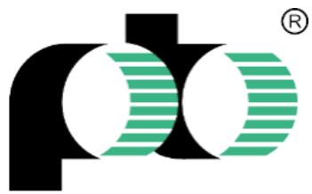

## 普邦股份

## PB HOLDINGS

公司地址：广州市天河区海安路13号财富世纪广场A1幢34楼

电话：020-87526515

电子邮箱：zhengquanbu@pblandscape.com