

natural_image

Composite image showing a modern office building, wind turbines, and solar panels in a natural setting, framed by a butterfly-shaped border (no text or symbols visible)

  
G

## 2025

## 环境、社会及公司治理(ESG)报告

Environmental, Social and Governance Report

## 目录

natural_image

Abstract orange gradient background with smooth curved lines (no text or symbols)

关于本报告 03

董事长致辞 05

## 关于江阴银行

公司介绍 07

组织架构 08

企业发展战略 09

企业文化 09

## 我们的 2025

ESG 绩效 10

荣誉奖项 11

## ESG 管理

ESG 治理架构 13

重要性议题管理 13

利益相关方参与 18

关键绩效表 97

指标索引表 100

## 绿色引领

## 共建美丽中国

应对气候变化 21

绿色金融 26

绿色运营 35

## 以人为本

## 共助区域发展

员工权益与发展 65

供应链管理 73

金融可及性 74

乡村振兴 75

社区公益 77

## 深耕本土

## 赋能实体经济

普惠金融 39

数字金融 44

养老金融 51

科技金融 52

消费者权益保护 54

信息安全与隐私保护 60

## 合规稳健

## 筑牢发展根基

党建引领 81

公司治理 83

风险与合规管理 87

商业道德与反腐败 93

## 关于本报告

本报告是江苏江阴农村商业银行股份有限公司的第七份环境、社会及公司治理(ESG)/社会责任报告（简称“本报告”).报告为年度报告，旨在披露公司在可持续发展方面的理念、实践和关键绩效，回应利益相关方关注的重要问题，接受各利益相关方的监督与建议，更好地提升公司ESG管理水平。

## 报告范围

## 组织范围

本报告覆盖江苏江阴农村商业银行股份有限公司总行及辖内机构。

## 时间范围

以2025年1 月1日至 2025 年12 月31日为主，为增强报告可比性及前瞻性，部分内容有所延伸。

## 编制依据

全球可持续发展标准委员会《GRI可持续发展报告标准》（GRI Standards）  
●《深圳证券交易所上市公司自律监管指引第1号—主板上市公司规范运作（2025年修订)》  
《深圳证券交易所上市公司自律监管指引第17号——可持续发展报告(试行)》  
《深圳证券交易所上市公司自律监管指南第3号—可持续发展报告编制(2025年9月修订征求意见稿)》  
中国证券监督管理委员会《上市公司治理准则》（2026）  
联合国可持续发展目标（SDGs）

## 信息来源

报告中所使用的全部信息数据来自公司正式文件、统计报告与财务报告。如无特殊说明，本报告中所涉及货币金额以人民币作为计量币种。

## 可靠性保证

公司承诺本报告内容不存在任何虚假记载、误导性陈述或重大遗漏，并对其内容真实性、准确性和完整性负责。

## 称谓说明

为了便于表述和阅读，在本年度报告中下列词语具有如下含义：

江阴银行 / 公司 / 本行 / 我行 / 我们指江苏江阴农村商业银行股份有限公司

江苏农商联合银行指江苏农村商业联合银行股份有限公司

央行 / 人行指中国人民银行

国金局、原银保监会指国家金融监督管理总局

## 报告获取途径

本报告电子版可在本行网站 www.jybank.com.cn 下载，同时刊载于深圳证券交易所网站 www.szse.cn 和巨潮资讯网 www.cninfo.com.cn。

## 联系方式

江苏江阴农村商业银行股份有限公司董事会办公室

地址：江苏省江阴市澄江中路 1 号银信大厦 11 楼

邮编：214431

电话：0510-86851978

传真：0510-86805815

## 董事长致辞

春华秋实、福启新程！

回望这一年，世界在变局中探索前行，行业在转型中迭代进阶。那些日夜奔赴的执着、脚踏实地的耕耘，都化作深浅不一的足迹，镌刻下我们奋力向前的坚实印记。

这一年，我们紧跟江阴区域中心城市建设，深耕地方、赋能产业、服务民生。我们用坚韧克服困难,用专业创造价值，用热爱激励彼此，扎实推进八大重点工作，交出了一份有担当、有作为、有口碑的年度答卷。

## 一是党建铸魂，品牌焕新，汇聚上下同欲、力出一孔的

奋进合力。站在中国式现代化建设承前启后的历史交汇点，我们深学细悟党的二十届四中全会精神，深入贯彻中央八项规定精神学习教育，以“齐努力、共奋进、创一流”企业精神，启动品牌文化形象焕新，构建“精彩金融、精益文化、精致形象”价值体系，实现稳健经营与价值进阶。2025年末，全行资产总额突破2100亿元，存贷款总额超3000亿元；市值实现稳定增长，上市以来现金分红达33亿元，是首发募集资金的3.4倍：全球千强银行排名跃升至506位、晋升26名，跻身全国服务业500强、江苏服务业100强荣获和谐投资者关系银行天玑奖等荣誉，凝聚起同心致远的磅礴动能。

## 二是科创赋能，链通实体，共筑区域中心、产业共荣的

生态高地。在经济增长模式深刻变革的关键时期，我们立足主业主责，全力服务产业科创之城建设。以科创金融中心与科技支行双擎驱动，用股债联动的全生命周期产品矩阵，陪伴全市60%的科技企业、78%的专精特新企业成长,科技贷款市场份额与增量稳居全市首位;紧扣“强链补链延链”主线，携手核心企业定制供应链金融方案辐射链属企业。全年实体经济、民营企业、制造业贷款占比稳固在88%、60%、30%左右，重点服务重大项目建设以金融活水润养产业升级，筑牢区域产业链韧性根基。

## 三是跨界融合，情系万家，擦亮全龄友好、幸福宜居的城

市名片。我们以“幸福+”项目为纽带，构建覆盖全龄、渗透生活的温暖金融生态。聚焦家庭幸福、银龄需求、儿童成长与女性关爱，落地江阴市“幸福同心站”，入围无锡首批“锡蕙妈妈”驿站，发布“颐享生活・银龄集市”品牌，研发儿童财商教育课程，以场景化、沉浸式服务回应民生期盼。高管带头深入一线，精准对接市场主体急难愁盼推出适配生意、生活、生命的多元金融产品；扎实推进“两卡一平台”建设，深耕医疗、校园、工会、文旅等民生工程电子市民卡功能覆盖公交地铁、图书借阅、日常消费等场景，累计发放社保卡160万张、市民卡180万张，以全维度、有温度的金融服务，持续擦亮金融为民、便民、惠民的江阴特色名片。

## 四是网点焕新，专业专注，打造功能集成、价值裂变的服

务枢纽。紧跟江阴全域功能区建设，拉开四级网点架构：产业端实现惠企政策“一键触达”，普惠端打造文旅、中医等乡村振兴特色网点，零售端深耕百姓财富管理，社区端推动政务、商务、村务、金融服务“四务融合”，持续完善产业引擎、普惠驿站、财富管家、智慧中枢四个功能，通过轻型化改造、数字化赋能,推动网点从“物理服务阵地”向“生态服务枢纽”转型。

## 五是数字驱动，智享便民，构筑科技领先、安全高效的智

慧生态。每年以5%营收投入科技创新，让数智基因绽放金融生态。2025年建成自主可控的分布式核心系统与绿色智能的科技信息中心，以科技硬实力跃居农商行创新第一梯队。部署 AI算力与 DeepSeek大模型，在智慧办公、智能审核等七大场景实现 80% 的效能跃升，驱动业务流程再造；构建智能安全屏障，打造数据治理闭环，以技术创新赋能营销精准化、风控智能化，为客户带来便捷安全的智慧金融体验。

六是精细管理，攻坚克难，迈出穿越周期、行稳致远的坚实步伐。面对复杂多变的经济形势，我们始终坚持“以客户为中心”，在拓客拓市、提质增效、风险防控中精耕细作，在优化业务结构、统筹资源配置、重塑价值链条中固本强基持续锻造穿越周期的稳健韧性。2025年,综合效益稳中有进资产质量持续优化，以扎实的经营成效筑牢发展根基，让高质量发展的步伐更加坚实有力

## 七是人才强基，协同聚力，筑牢内外联动、赋能发展的支

撑体系。深化组织变革，推动部门银行向敏捷型流程银行跃迁，以架构重塑、刚性考核激活组织末梢：融入江苏联合银行生态圈，实现资源共享、价值共创;同时，以“领军-骨干新锐”三级人才梯队为核心，构建训战一体、跨界融合的培养体系，参与“墩苗计划”，选派骨干赴部委办局、镇街及国资企业挂职历练，推动专业铁军在本土实践中淬炼成长，让五大金融向下扎根、向上生长。

## 八是勇担使命，践行责任，彰显扎根地方、回馈社会的时代

担当。我们坚守地方金融初心，主动融入乡村振兴、公益慈善、助残扶弱等社会事业，先后获评江苏妇女儿童慈善突出贡献单位、十佳养老金融服务示范单位等荣誉，以实干实绩赢得社会认可，打造了负责任、可信赖的地方金融标杆形象。

新的一年，江阴银行将紧扣“十五五”规划开局部署，坚守初心、感恩奋进、勇毅前行。以更宽视野谋划长远发展，以更实举措推动各项工作，以更强担当服务发展大局，聚焦主责主业，深耕地方实体经济，持续提升金融服务质效，为区域高质量发展走在前、做示范注入更强劲的金融动能，贡献更大金融力量!

text_image

萍
公司
月
06

## 宋 萍

江苏江阴农村商业银行股份有限公司

2026年4月

## 关于江阴银行

## 公司介绍

1951年，新中国成立之初百废待兴，央行决定试办农村信用合作组织。1953年，江阴县人民银行在长泾区试点，率先在龚世生生产互助组内建立信用互助小组，1954年底，犹如雨后春笋，江阴全县建成153个信用社。1977年6月，江阴县信用合作联社成立，江阴地区首家农村信用社宣告诞生，农村金融服务拉开新篇章。

改革开放后，江阴农信社经历由农业银行代管，再到“行社分家”服务社会主义市场经济阶段。20世纪九十年代，江阴乡镇企业脱颖而出，“苏南模式”响彻全国，在这片热土上，与乡镇企业休戚与共的农信社改革变得势在必行，法人制度变革悄然酝酿。

进入新世纪，江阴农信社在没有任何现成经验可借鉴的情况下，摸索迈出了全国农信改革第一步：2000年，破除重重障碍成功完成统一法人体制改革，组织活力得到极大释放：2001年12月3日，江阴农商银行正式注册，成为全国首批成立的3 家农商行之一。涅槃重生后的江阴银行，在支持“三农”和中小微企业的道路上，实干兴行，守正创新，创下了一个又一个第一。

在全国农村商业银行系统中，江阴农商银行第一家取得银行承兑汇票签发资格；第一家开办国际业务；第一家开办信用卡业务：成为第一批全国银行间同业拆借中心成员银行和第一批新巴塞尔协议联合建设成员。本行连续多年上榜“英国《银行家》杂志全球银行1000强”，多次获得“江苏省银行业金融机构普惠金融服务先进单位”、江苏资本市场“年度优秀投资价值企业”、“无锡市金融工作先进单位”、“无锡市金融支持制造业发展先进单位”等荣誉称号。

江阴农商银行坚守服务“三农”和中小微企业的战略定位，鼎力打造产业振兴、小微普惠、社区生活、财富管理“四大银行”。多年来，本行金融服务覆盖江阴辖内70%的上市及后备企业、80%的成长型企业、90%的规模以上企业及面广量大的小微企业，涉农及小微企业贷款占比超90%，存贷款市场份额、制造业贷款份额、金融服务覆盖面始终保持江阴辖内银行业金融机构首位。截至2025年末，存贷款和营业收入等关键经营指标持续保持健康增长，资产负债结构不断得到优化为地方社会经济发展持续注入金融“活水”。

截至 2025 年末

资产总额

2,193.00亿元

总存款

1,672.13亿元

总贷款

1,336.73亿元

组织架构  
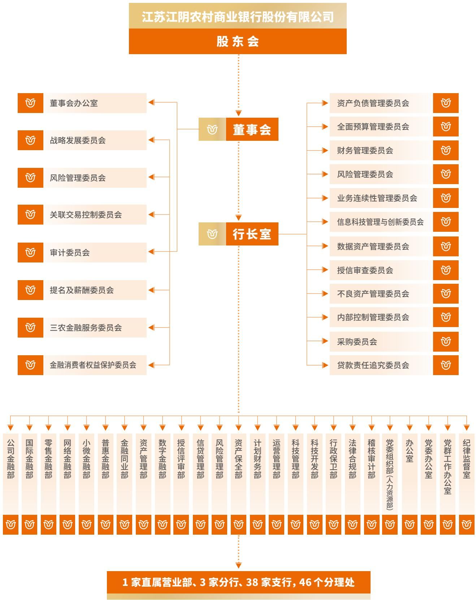

flowchart

This image displays the organizational structure and board of directors of Jiangsu Jingyuan Rural Commercial Bank Co., Ltd., showing the hierarchy from the Board to various committees, along with a breakdown of the board by department.

## 企业发展战略

本行坚持以市场为导向，聚焦主责主业，坚守普惠市场定位，立足“农小”，专注“普惠”，扎根“县域”，不断夯实“做小做散”的战略定力。强化重点风险管理，加强对大额贷款、纯线上贷款、房地产贷款、资金业务等重点领域的风险管理，保障全行稳健运营。加快推进科技信息中心建设，以数字化导向推动各项工作科学化、智能化、精准化。持续推进降本增效工作，不断提高管理质量、资产质量和经营效益。持续推进“12458”战略思路，坚持“服务三农、中小微企业、市民百姓”的战略定力，以习近平新时代中国特色社会主义思想为指导，秉持高质量党建引领高质量发展，以“数字化零售转型”和“全方位服务转型”为两翼，全面赋能高质量发展，打造“产业振兴的银行、小微普惠的银行、社区生活的银行、财富管理的银行”。

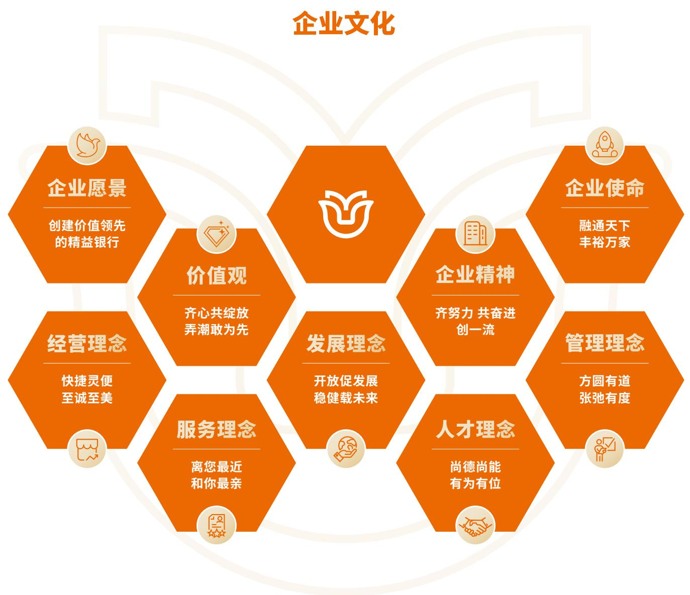

flowchart

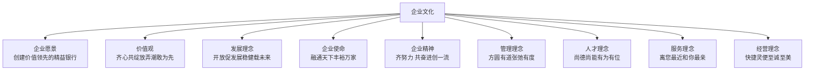
```mermaid
graph TD
  Center["企业文化"] --> A["企业愿景\n创建价值领先的精益银行"]
  Center --> B["价值观\n齐心共绽放弄潮敢为先"]
  Center --> C["发展理念\n开放促发展稳健载未来"]
  Center --> D["企业使命\n融通天下丰裕万家"]
  Center --> E["企业精神\n齐努力 共奋进创一流"]
  Center --> F["管理理念\n方圆有道张弛有度"]
  Center --> G["人才理念\n尚德尚能有为有位"]
  Center --> H["服务理念\n离您最近和你最亲"]
  Center --> I["经营理念\n快捷灵便至诚至美"]
```

## 我们的 2025

ESG 绩效

<table><tr><td>经济绩效</td><td>总资产2,193.00亿元</td><td>营业收入41.25亿元</td><td>净利润20.23亿元</td></tr><tr><td>环境绩效</td><td>绿色金融规模47.98亿元</td><td>“绿能贷”累计发放23,600万元</td><td>“环保贷”累计发放1,870万元</td></tr><tr><td>社会绩效</td><td>员工总数1,747人信息安全培训参与总人次1,815人次普惠型农户贷款和普惠型小微企业贷款余额391.13亿元</td><td>全年业务培训总人次43,652人次安全培训总人次25,684人次涉农与小微企业贷款余额1,156.81亿元</td><td>员工业务培训总支出424.62万元手机银行App累计用户数1,132,780人民营企业贷款余额754.20亿元</td></tr><tr><td>治理绩效</td><td>独立董事占比36.36%反贪腐培训覆盖率100%</td><td>董事会通过议案104个反洗钱宣传活动受众人次27,441人次</td><td>董事会成员出席率100%实施各类审计项目126个</td></tr></table>

荣誉奖项

<table><tr><td>奖项级别</td><td>获奖荣誉</td><td>授奖单位</td></tr><tr><td rowspan="14">国家</td><td>十佳养老金融服务示范单位</td><td>第十四届中国新型金融机构合作交流大会科技+数字+绿色:地方金融转型新路径</td></tr><tr><td>2025年优秀党建奖</td><td>上海证券报、中国证券网</td></tr><tr><td>2025年度全球银行千强榜——506名</td><td>《银行家》杂志</td></tr><tr><td>人工智能技术赋能网络安全应用测试第五名</td><td>国家计算机网络应急技术处理协调中心</td></tr><tr><td>2025年度和谐投资者关系银行天玑奖</td><td>证券时报、券商中国</td></tr><tr><td>投资者关系金奖(2024)——杰出IR团队</td><td>深圳市全景网络有限公司</td></tr><tr><td>2025金诺·金融品牌影响力案例名单——“链享融”供应链金融产品传播案例</td><td>中国银行保险报</td></tr><tr><td>2025年第六届鑫智奖——数字营销优秀案例奖</td><td>金融机构数智化转型优秀案例评选组委会</td></tr><tr><td>2025年度农村金融机构科技创新优秀案例评选——数智应用创新优秀案例</td><td>农村金融机构科技创新优秀案例评选组委会</td></tr><tr><td>2025年度农村金融机构科技创新优秀案例评选——产品创新优秀案例</td><td>农村金融机构科技创新优秀案例评选组委会</td></tr><tr><td>2025数字银行·臻选之光——手机银行智慧运营卓越案例</td><td>中国金融认证中心、电子银行网</td></tr><tr><td>2025卓越数字金融创新案例征集——提振消费行动先锋案例</td><td>金融数字化发展联盟</td></tr><tr><td>2025金融数字化发展金榜奖——年度最佳数字化转型实践奖</td><td>金融数字化发展联盟</td></tr><tr><td>第六届银行业金牛奖“固收类金牛理财产品”</td><td>中国证券报</td></tr><tr><td rowspan="5">省</td><td>2025江苏服务业100强(第72名)</td><td>江苏省企业联合会</td></tr><tr><td>2024年度江苏妇女儿童慈善突出贡献单位</td><td>江苏省妇女儿童福利基金会</td></tr><tr><td>江苏省工人先锋号</td><td>江苏省总工会、江苏省人力资源和社会保障厅</td></tr><tr><td>2025年银联信用卡发卡活跃奖</td><td>中国银联江苏省分公司</td></tr><tr><td>2025年银联创新业务推广奖</td><td>中国银联江苏省分公司</td></tr></table>

<table><tr><td>奖项级别</td><td>获奖荣誉</td><td>授奖单位</td></tr><tr><td rowspan="13">省</td><td>2025年度财务管理工作优胜单位</td><td>江苏农商联合银行</td></tr><tr><td>优秀审计项目三等奖(授信业务管理专项审计项目)</td><td>江苏农商联合银行</td></tr><tr><td>2025金融消保与服务创新优秀案例——银行网点服务创新案例</td><td>江苏农商联合银行、中国金融传媒股份有限公司</td></tr><tr><td>2025年度纪检工作第一等次</td><td>江苏农商联合银行</td></tr><tr><td>2024年度全省农商行组织人事工作先进单位</td><td>江苏农商联合银行</td></tr><tr><td>2025年度网络安全工作突出单位</td><td>江苏农商联合银行</td></tr><tr><td>2025资金业务“南北融合”工作——先进经验奖</td><td>江苏农商联合银行</td></tr><tr><td>金融工程实验室优秀成果</td><td>江苏农商联合银行</td></tr><tr><td>2025年度优秀小圆服务队</td><td>江苏农商联合银行</td></tr><tr><td>2025年度“圆鼎家园”五星级网点</td><td>江苏农商联合银行</td></tr><tr><td>数据安全压力测试全省第一名</td><td>中国人民银行江苏省分行</td></tr><tr><td>2024年度绿色金融评价工作——“好”评价</td><td>国家金融监督管理总局江苏监管局</td></tr><tr><td>江苏银行业金融为民服务实体先锋榜——普惠金融团队先锋</td><td>江苏银行业协会</td></tr><tr><td rowspan="4">市</td><td>服务地方发展优秀金融单位</td><td>无锡市委、市政府</td></tr><tr><td>2025年度征信工作优胜单位</td><td>人行无锡分行</td></tr><tr><td>2025年数字人民币试点工作优秀单位</td><td>人行无锡分行</td></tr><tr><td>2024年度平安金融建设优秀集体</td><td>无锡市平安金融建设领导小组</td></tr><tr><td rowspan="4">县</td><td>2025年度重点骨干企业</td><td>中共江阴市委、江阴市人民政府</td></tr><tr><td>服务地方发展优秀金融单位</td><td>中共江阴市委、江阴市人民政府</td></tr><tr><td>2026“江阴银行杯”第十一届元旦公益徒步大会突出贡献奖</td><td>江阴市人民政府</td></tr><tr><td>2025年度金融信息录用优秀单位</td><td>江阴人行</td></tr></table>

## ESG 管理

## ESG 治理架构

董事会作为本行社会责任管理的最高决策机构，决定本行社会责任管理架构及管理策略。2025年，本行董事会及其专门委员会先后审议通过《2024年度ESG报告》《2024年度消费者权益保护工作报告》《金融消费者权益保护委员会2024年工作总结和2025年工作计划》。

江阴银行ESG治理架构

<table><tr><td>管理结构</td><td>人员配备</td><td>具体职责</td></tr><tr><td>决策层</td><td>董事会及战略发展委员会、风险管理委员会、审计委员会、关联交易控制委员会、提名及薪酬委员会、三农金融服务委员会、金融消费者权益保护委员会</td><td>· 讨论社会责任相关风险及机会· 负责社会责任信息披露工作· 调配资源配合社会责任工作开展· 跟进上市规则和银行业关于环境、社会信息披露要求并确保持续合规</td></tr><tr><td>监督层</td><td>审计委员会</td><td>· 加强战略监督,跟进本行践行社会责任情况· 加强履职监督</td></tr><tr><td>管理层</td><td>高级管理层及各职能部门、分行/支行、子公司中层管理人员,董事会办公室作为主要协调部门</td><td>· 研究上市规则和银行业信息披露要求· 监督社会责任工作的具体落实· 向董事会汇报各项工作的开展情况</td></tr><tr><td>执行层</td><td>各职能部门、分行/支行、子公司指派的专职人员</td><td>· 信息收集整理报送· 落实具体工作任务· 及时回馈工作情况</td></tr></table>

## 重要性议题管理

江阴银行高度重视并持续完善重要性议题识别、管理及分析，将各利益相关方的关注作为制定可持续发展战略的重要考虑，以准确、有效地回应利益相关方关注的议题，为有序识别与管理自身风险及机遇提供重要参考。

## 重要性议题识别

有效识别、管理重要性议题，是企业有效开展可持续发展战略规划、风险与机遇管理、信息披露的基础与核心。为了准确识别与评估公司的重要议题，2025 年，江阴银行参考《可持续发展报告标准》（GRI Standards）《深圳证券交易所上市公司自律监管指引第17号——可持续发展报告(试行)》《国际财务报告可持续披露准则S1号——可持续相关财务信息披露一般要求》（IFRS S1）等可持续发展信息披露标准更新分析方法，面向各利益相关方开展双重重要性议题调研，从“影响重要性(即对经济、环境、社会可持续性影响的重要程度)”和“财务重要性(即对公司财务影响的重要程度)”两个维度开展重要性议题识别与评估工作，明确重要性议题，在本报告中进行重点披露和回应，并持续完善FSG管理，更好地满足利益相关方期望与诉求。

江阴银行双重重要性议题评估流程

<table><tr><td>梳理与识别 »</td><td>参考运营所在地的宏观政策以及所在行业的特定政策和标准,以内外部发展趋势分析为基础梳理ESG议题清单,识别16项重要的通用议题和行业特定议题。</td></tr><tr><td>调研与评估 »</td><td>遵循双重重要性原则,开展“影响重要性评估”和“财务重要性评估”,形成2025年重要性议题矩阵,确定本年度重要性议题及其优先级。参与相关方包括董事、高管、员工、客户、供应商、投资者、监管部门、媒体以及公众等。影响重要性:确定影响重要性评估因素与评分区间,由各利益相关方从正向影响、负面影响因素评估公司重要性议题,根据调研结果评估各议题的影响重要性,并由董事、高管及内外部ESG专家进行调研结果的审阅与确认。财务重要性:确定财务重要性评估因素与阈值,从议题所带来的风险/机遇是否预期在短期、中期和长期内对公司商业模式、业务运营、发展战略、财务状况、经营成果、现金流、融资方式及成本等产生重大影响等因素评估各议题财务重要性,并由董事、高管、财务部门及内外部ESG专家进行审阅与确认。</td></tr><tr><td>确认与回应 »</td><td>基于调研结果,从“影响重要性”以及“财务重要性”两个维度构建重要性议题矩阵,经由公司高层与外部专家的最终审阅与确认,确定ESG议题的优先级排序,并针对重要性议题在报告中重点披露其治理、战略、风险和机遇管理、指标与目标等。</td></tr></table>

江阴银行双重重要性议题矩阵  
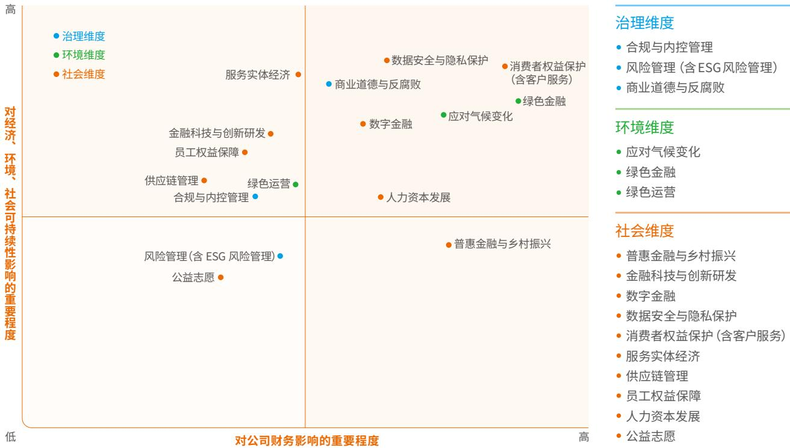

scatter

| Topic | Category | Importance to Finance & Social Continuity (Y-axis) |
| :--- | :--- | :--- |
| 服务实体经济 | 社会维度 | High |
| 数据安全与隐私保护 | 社会维度 | High |
| 消费者权益保护(含客户服务) | 社会维度 | High |
| 商业道德与反腐败 | 治理维度 | High |
| 绿色金融 | 环境维度 | High |
| 应对气候变化 | 环境维度 | High |
| 数字金融 | 社会维度 | High |
| 金融科技与创新研发 | 社会维度 | High |
| 员工权益保障 | 社会维度 | High |
| 供应链管理 | 社会维度 | High |
| 绿色运营 | 环境维度 | High |
| 人力资本发展 | 社会维度 | High |
| 合规与内控管理 | 治理维度 | High |
| 普惠金融与乡村振兴 | 社会维度 | Low |
| 风险管理(含ESG风险管理) | 治理维度 | Low |
| 公益志愿 | 社会维度 | Low |

## 风险与机遇管理

江阴银行针对关键的可持续发展议题，全面梳理其影响范围、影响时长、风险与机遇，并制定相应的应对策略，严格把控相关风险，积极把握相关机遇，实现长足发展。

<table><tr><td>重要性议题</td><td>风险</td><td>机遇</td><td>影响周期</td><td>应对策略</td></tr><tr><td rowspan="3">应对气候变化</td><td>信用风险:高碳行业客户受政策限产/极端天气影响,还款能力下降,贷款违约率上升,资产质量承压。</td><td>政策机遇:“双碳”政策释放定向降准、碳减排支持工具等红利,降低银行资金成本。</td><td rowspan="3">中期长期</td><td rowspan="3">优化授信结构:压降高碳行业授信。动态业务调整:跟踪气候政策,优化高碳关联业务布局以稳定收益。强化声誉管理:披露绿色业务进展,传递低碳合规的品牌形象。抢抓政策红利:对接碳减排工具,降低绿色业务资金成本。扩容绿色业务:加大绿色信贷、债券等产品供给,拓展市场份额。对接产业需求:聚焦绿色产业、低碳转型项目,拓展优质客户。</td></tr><tr><td>市场风险:高碳关联业务/大宗商品收益随气候政策波动,影响银行营收稳定性。</td><td>行业机遇:绿色金融体系完善,绿色信贷、绿色债券等业务空间扩容,拓展营收增长点。</td></tr><tr><td>声誉风险:高碳资产占比过高,收到社会、媒体负面评价,削弱客户与投资者信任。</td><td>产业机遇:绿色产业、传统行业低碳转型的融资需求增长,拓宽客户服务范围。</td></tr></table>

<table><tr><td>重要性议题</td><td>风险</td><td>机遇</td><td>影响周期</td><td>应对策略</td></tr><tr><td rowspan="2">绿色金融</td><td>信用风险:绿色项目如果未能按期完成或未达到预期的经济与环境收益,借款企业的偿付能力可能受到影响,银行面临贷款违约的风险。</td><td>拓展和创新绿色金融产品:绿色金融涵盖绿色信贷、绿色债券、碳金融等多个领域,银行通过打造多元化产品体系,积极培育业务增长点,提升品牌价值和市场竞争力。</td><td rowspan="2">短期中期长期</td><td rowspan="2">完善风险管理体系:对投融资活动的全环节进行环境、社会和治理风险管控。加强专业能力建设:加强对员工的培训,提高其对绿色金融政策、标准和业务流程的理解和执行能力。加大绿色金融支持力度:加大绿色低碳重点领域支持力度、有序推进碳金融重点工作、加大产品和服务创新力度。加强国际合作与交流:积极参与国际绿色金融合作组织和论坛,参与国际绿色金融标准的制定和推广,推动形成全球统一的绿色金融标准体系。</td></tr><tr><td>操作风险:绿色金融业务涉及复杂的环境评估、技术标准和监管要求,银行在项目评审、审批、监测等环节可能因操作失误、信息不完整或内部控制不完善而面临操作风险。</td><td>国际影响力提升:绿色金融是全球性议题,相关合作与交流有助于提升国际影响力,提高自身业务水平。</td></tr><tr><td rowspan="2">普惠金融与乡村振兴</td><td>信用风险:普惠金融和乡村振兴业务往往涉及大量的小额贷款和分散的客户群体,如部分借款人偿债能力不足,银行面临贷款违约的风险。</td><td>客户群体覆盖面:银行通过普惠金融与乡村振兴延伸服务触角,拓展客户基础,优化客户结构。</td><td rowspan="2">短期中期长期</td><td rowspan="2">加强风险管理:利用大数据、人工智能等技术,提高风险识别和预警能力,及时采取风险防控措施。提升专业能力:加强市场规划,及时优化信贷政策,完善风险分担机制,提升风险防控的主动性和有效性。提升金融科技应用水平:利用数字化技术,通过线上渠道拓展金融服务覆盖面,为农村客户提供更加便捷的金融服务。提高普惠金融服务水平:完善普惠金融服务机制,加大普惠信贷投放,持续提升普惠金融服务的覆盖面。</td></tr><tr><td>市场风险:部分普惠金融客户处于产业链末端,抗风险能力相对较弱,易受经济周期、行业波动影响。</td><td>品牌与社会责任:积极参与普惠金融和乡村振兴,有助于树立良好的社会形象,提高品牌价值。</td></tr><tr><td rowspan="2">数字金融</td><td>技术风险:系统故障、网络攻击、数据泄露等问题,导致业务中断或客户权益受损。</td><td>运营效率提升:数字化降低线下网点运营成本,优化服务流程,提升客户体验。</td><td rowspan="2">短期中期长期</td><td rowspan="2">强化技术防护:搭建网络安全防护体系,定期开展系统安全测试与漏洞修复。完善内控流程:明确数字化业务操作规范,加强员工技术与合规培训。迭代数字产品:优化手机银行、线上贷款、智能理财等产品功能,适配客户需求。数字化渠道建设:推进线上线下渠道融合,提升服务便捷性与覆盖面。</td></tr><tr><td>操作风险:数字化流程漏洞、员工技术操作不当,引发业务差错或合规问题。</td><td>客群拓展:触达线上年轻客群、县域下沉客群,扩大客户基数,优化客群结构</td></tr><tr><td>消费者权益保护(含客户服务)</td><td>合规风险:存在误导销售、信息披露不全、乱收费等问题,面临监管处罚。声誉风险:客户投诉处理不当、负面舆情扩散,损害银行公信力,导致客户流失。操作风险:服务流程不规范、员工服务意识不足,引发客户权益纠纷。</td><td>提升客户粘性:优质服务与权益保障可增强客户信任,促进长期合作。品牌形象升级:树立负责任金融机构形象,吸引注重权益保护的客户。</td><td>短期中期</td><td>健全管理制度:明确销售行为规范、信息披露要求、投诉处理流程。加强员工培训:提升员工服务意识与合规素养,规范服务言行。优化服务体系:完善智能客服+人工客服联动机制,提升投诉响应与办结效率。强化权益保障:开展金融知识普及宣传,主动披露产品风险与收费标准。</td></tr><tr><td>数据安全与隐私保护</td><td>法律风险:一旦出现数据泄露等违规行为,可能面临巨额罚款、法律诉讼等风险。声誉风险:数据泄露事件会严重损害银行的声誉,导致客户信任度下降,进而影响银行的长期发展。财务风险:数据安全事件可能导致银行遭受直接的财务损失,如赔偿客户因数据泄露而遭受的经济损失、支付监管罚款等。</td><td>增强市场竞争力:在注重数据安全的市场环境下,建立良好的数据安全管理体系,吸引更多注重数据安全的客户和合作伙伴,提升市场竞争力。</td><td>短期中期长期</td><td>管理层面:建立健全数据安全管理制度,明确数据管理的流程和责任;定期进行数据安全审计和风险评估,及时发现和整改安全隐患。合作与监督层面:加强对第三方的监督和管理,确保其遵守银行的数据安全要求。对于监管机构,要积极配合监管检查,及时了解和落实最新的监管政策。技术层面:采用先进的数据加密技术,对数据进行加密存储和传输;实施严格的访问控制。机制层面:落实国家数据安全法律和监管要求,持续完善数据安全和隐私保护制度体系。</td></tr><tr><td>商业道德与反腐败</td><td>声誉风险:若出现违背商业道德的行为,会严重损害银行的声誉,引发公众信任危机,导致客户流失。法律风险:不遵守商业道德的行为可能违反法律法规,银行将面临法律诉讼、监管处罚。</td><td>增强客户信任:秉持良好的商业道德,银行能够赢得客户的信任和认可,树立良好的品牌形象。提升市场竞争力:投资者和客户更倾向于选择具有道德优势的银行,从而提升银行在市场中的竞争力和市场份额。</td><td>短期中期长期</td><td>加强培训与教育:定期开展商业道德培训和教育活动,增强员工的道德意识和职业操守。加强合规文化建设:组织开展各项合规活动,推进“合规文化建设与发展实践联系点”建设,持续完善合规正向激励工作机制。持续完善机制建设:本行高度重视全员的职业素质及商业道德,迭代完善“正面有规定、反面有禁止、违反有处罚”三位一体的全行员工行为规范管理体系。</td></tr></table>

## 利益相关方参与

本行高度重视与利益相关方的沟通，建立多元化的服务与沟通渠道，充分倾听各方意见和反馈，及时满足诉求，切实履行本行社会责任，努力将本行打造为社会认可、客户信任、股东满意、员工依赖的金融机构。

<table><tr><td>利益相关方</td><td>关注议题</td><td>沟通方式</td><td>回应措施</td></tr><tr><td>政府及监管机构</td><td>合规与内控管理风险管理(含ESG风险管理)服务实体经济普惠金融与乡村振兴应对气候变化</td><td>日常沟通定期汇报现场考察</td><td>合规运营管理接受监管审核落实政府管理要求积极响应国家战略</td></tr><tr><td>股东与投资者</td><td>应对气候变化绿色金融绿色运营风险管理(含ESG风险管理)消费者权益保护(含客户服务)数据安全与隐私保护商业道德与反腐败金融科技与创新研发数字金融</td><td>信息披露股东会业绩发布会投资者沟通平台</td><td>稳健经营寻找利润增长点定期发布报告与公告加强与投资者沟通交流</td></tr><tr><td>客户</td><td>消费者权益保护(含客户服务)数据安全与隐私保护</td><td>客户满意度调查回访与投诉机制信息公开</td><td>提供优质产品服务回应客户诉求维护消费者权益</td></tr><tr><td>供应商及合作伙伴</td><td>供应链管理商业道德与反腐败</td><td>日常沟通战略合作行业交流</td><td>加强供应商管理打造责任供应链</td></tr><tr><td>员工</td><td>员工权益保障人力资本发展</td><td>沟通信箱职工代表大会员工活动</td><td>提供完善的薪酬福利体系提供学习、晋升的机会与平台保障员工职业健康安全加强员工关爱与沟通</td></tr><tr><td>社会与公众</td><td>普惠金融与乡村振兴公益志愿应对气候变化绿色金融绿色运营</td><td>公益志愿活动社区宣传信息披露</td><td>开展公益志愿服务提供公益慈善捐赠社区沟通活动定期发布报告与公告</td></tr></table>

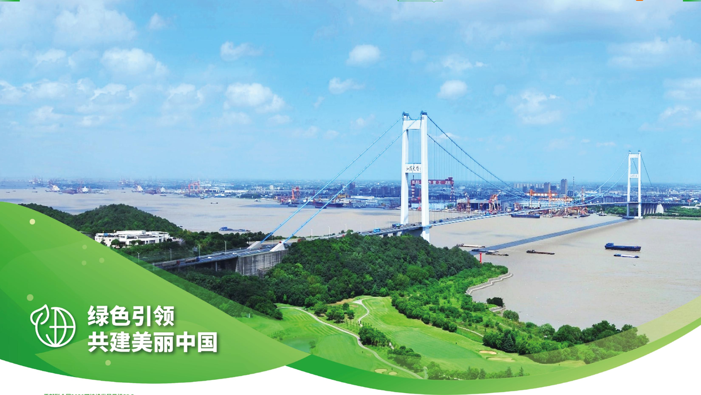

text_image

绿色引领
共建美丽中国
©2020可持续发展目标SPGs

贡献联合国2030可持续发展目标SDGs

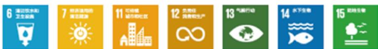

## 应对气候变化

江阴银行积极响应和落实国家碳达峰、碳中和战略目标，主动识别和评估气候风险，探索搭建气候风险管理体系，将包括气候在内的ESG风险纳入日常办公运营和业务开展流程中，并制定应对气候变化的行动方案和具体举措，为经济社会的绿色和可持续发展贡献力量。

## 治理

## 董事会

本行董事会高度重视气候风险管理相关工作，定期审议社会责任(ESG)报告，加强对绿色金融及ESG事宜的监督管理；在行长室下设绿色金融委员会，负责绿色金融业务的统筹协调、产品创新、业务推动、绿色金融债券募集资金的项目投放管理。

## 高级管理层

本行在管理层成立碳达峰碳中和工作领导小组，主要负责推进碳达峰碳中和目标实施以及协调推进各项“双碳”工作部署，完善资源保障与激励机制，有效配置资源协调推动全行各业务条线、各机构绿色金融业务发展，促进绿色低碳转型，持续提升本行气候风险管理水平。

同时，本行设立气候风险管理领导小组，统筹协调风险管理部、信贷管理部、授信评审部等多部门联动，推动气候风险与机遇管理，并持续完善气候风险及机遇的识别评估。

## 战略与管理方式

本行将气候风险管理纳入全面风险管理体系，并部署“数字化气候风险管理系统”强化风险识别并开展压力测试，完善绿色金融产品矩阵，加大绿色融资支持力度，推进转型融资工具落地，实现创新绿色担保、绿色保险联动

## 气候风险机遇识别与评估

本行密切关注气候风险的相关影响，主动做好气候变化的风险和机遇评估，与现行风险管理架构整合，并定期进行分析和评估，制定相应对策。

<table><tr><td>机遇类型</td><td>机遇描述</td><td>潜在影响</td><td>影响时间范围</td><td>应对措施</td></tr><tr><td rowspan="2">能源和资源效率</td><td>把握“双碳”政策机遇,发展绿色信贷支持企业节能改造,创新碳金融产品,拓展绿色中间业务。</td><td>提升绿色资产占比,增强客户黏性,助力国家“双碳”目标实现。</td><td>中期长期</td><td>·制定和完善绿色信贷指引,对高能耗企业贷款实施ESG准入。</td></tr><tr><td>办公场所和数据中心节能减排。</td><td>提高能源利用效率,减少能源消耗</td><td>短期中期</td><td>·推进网点绿色改造。·建立能源消耗监测平台,设定年度减排目标。</td></tr><tr><td>市场</td><td>绿色金融、转型金融等业务领域的投资增加。</td><td>加强对绿色低碳转型产业的业务布局。</td><td>中期长期</td><td>·研究“双碳”发展路径,把握“双碳”目标下的市场机遇,推动绿色金融和转型金融业务的发展。</td></tr><tr><td rowspan="3">气候韧性</td><td>开展投融资气候适应行动。</td><td>避免未来损失,产生正向经济收益以及额外的环境和社会收益,促进投资组合价值增加。</td><td>长期</td><td>·加大对可以为适应或减缓环境(气候)变化作出贡献产业的投融资支持力度。</td></tr><tr><td>健全绿色运营管理体系,提升温室气体排放管理能力。</td><td>对未来监管要求变动的适应性增强。</td><td>短期中期</td><td rowspan="2">·未来将系统推进节能减排工作,保障减排措施落地。</td></tr><tr><td>使用数字化管理技术。</td><td>增强自身运营的气候适应力和应对气候变化的实时响应能力。</td><td>短期中期长期</td></tr><tr><td>风险类型</td><td>风险描述</td><td>潜在影响</td><td>影响时间范围</td><td>应对措施</td></tr><tr><td rowspan="2">信用风险</td><td>物理风险:农业、渔业等行业以及基础设施、能源供应将受到台风、洪涝、干旱、热浪、寒潮等自然灾害及极端天气的影响。</td><td>极端天气事件(如台风、洪水)及海平面上升导致固定资产(如抵押房产)损毁,削弱第二还款来源,推高违约损失率(LGD),可能导致相关行业授信客户的资产缩水,进而给本行造成坏账损失。</td><td>中期长期</td><td>定期收集和分析农业、渔业等行业及能源供应等领域的相关数据,结合历史风险事件,建立风险预警指标体系,提前识别可能出现的风险。在授信审批过程中,充分考虑客户所在的行业和地区受极端天气及自然灾害的影响程度,对客户进行更细致的风险评估。</td></tr><tr><td>转型风险:国家对部分高碳行业严控规模,实施碳交易机制鼓励削减温室气体排放,限制高碳排放或低效能源的使用,加大环境执法力度,征收和提高环保税,倡导可持续土地使用措施等。</td><td>碳达峰碳中和政策(如碳税、技术标准)迫使高碳行业(钢铁、火电)成本攀升,叠加市场需求萎缩(如消费者绿色偏好),可能导致授信客户偿债能力恶化,进而给本行造成未来坏账损失。</td><td>中期长期</td><td>深入研究政策,预判高碳行业风险,将碳表现纳入客户准入评估。创新可持续发展挂钩贷款等金融产品,依客户转型绩效给予利率优惠。持续监测客户碳排放与经营,对减排不力者及时调整授信,降低潜在损失。</td></tr><tr><td>市场风险</td><td>转型风险:“双碳”战略目标驱动投资者风险偏好转变,高碳排放行业资产的价格波动性增加。</td><td>气候政策与灾害风险影响企业现金流预期,导致股票、债券估值调整。能源转型推动可再生能源替代,原油、煤炭价格波动加剧。</td><td>中期长期</td><td>持续优化资产和产品结构,开展绿色投资,开发绿色偏好产品,做好风险对冲。</td></tr><tr><td>操作风险</td><td>物理风险:极端高温、低温、干旱、冰雹、强风、龙卷风等极端天气将对重要业务所依赖的业务场地、设备、人员、信息系统等方面产生影响。</td><td>自然灾害可能直接导致金融机构营业中断,进而影响到本行业务连续性。</td><td>短期中期</td><td>建立灾备中心及远程办公系统,保障业务连续性。定期开展极端天气应急演练,强化人员安全培训。与气象部门合作建立预警联动机制,提前部署防御措施。</td></tr><tr><td>流动性风险</td><td>物理风险:极端天气、自然灾害等造成借款人财产损失,债务违约风险增加;客户运营资金及银行自身经营流动性受到影响。</td><td>可能带来客户违约风险上升、资金来源不足等风险,导致本行自身流动性受限,进而影响客户业务办理与自身运营。</td><td>短期中期</td><td>优化客户授信集中度,降低高风险区域信贷占比。开发线上替代渠道,保障极端天气下运营连续性。</td></tr><tr><td>声誉风险</td><td>转型风险:银行持有高碳资产过多;对高碳企业违规发放贷款等;由于环境和气候相关因素影响,导致利益相关方对银行经营管理等产生负面评价。</td><td>可能导致利益相关方对本公司经营、管理及其他行为产生负面评价,进而产生声誉风险。</td><td>短期中期长期</td><td>完善气候风险管理,建立高碳资产敞口监测机制。优化资产结构,加快高碳行业退出步伐并增加绿色金融产品供给。主动信息披露,回应社会关切。</td></tr></table>

## 持续做好绿色金融

本行积极响应“双碳”目标与可持续发展要求，践行绿色发展理念，将“绿色金融”“绿色发展”写入全行发展战略，做好绿色金融大文章，服务美丽中国建设。同时，本行持续强化绿色金融战略定位，系统性优化资源配置，重点支持清洁能源、节能环保、低碳交通等战略性新兴领域，并深化与政策性银行、多边开发机构的协同合作，探索跨境绿色融资模式，为绿色产业提供长期、低成本的资金支持。有关本行绿色金融的实践进展详见本报告“1.2绿色金融”一节。

## 气候风险压力测试

2025年，本行启动高碳行业气候风险压力测试专项工程，以高精度气候数据为基础，结合企业碳排放微观数据，选取本行重点支持的高碳行业作为研究样本，运用前沿风险评估模型与计量方法，深入探究气候风险在行业内部及金融系统间的传导路径，推动金融资源向低碳可持续领域高效配置，实现金融服务与气候治理的协同发展。

在物理情景下，本行结合贷款资产地理分布以及热浪、寒潮、台风等气候事件预测结果，压力测试综合评估结果显示，本行农业和渔业贷款资产面临的物理风险可控(有限)。在转型情景下，本行基于“有序转型”情景下的碳价预测，针对样本企业客户在碳价冲击下未来可能的财务指标变化曲线进行模拟，量化评估企业违约概率、行业贷款预期损失、银行贷款预期损失率，进而评估相关情景下本行稳健运营的可持续性，压力测试综合评估结果显示，样本企业转型风险对本行影响总体可控(有限)。有关本行气候风险压力测试的详细信息见《江苏江阴农村商业银行股份有限公司2025年气候风险评估与压力测试报告》。

## 案例 数字化气候风险管理系统

2025年，本行建立数字化气候风险管理系统，其中包括物理风险识别与预测预警、转型风险识别与压力测试两大模块。物理风险识别与预测预警模块能够持续滚动预测未来热浪、寒潮、干旱、洪水、台风等气候数据，并基于气候预测数据评估气候敏感型资产的物理风险暴露水平，实现气候风险的贷前预测、贷后预警。转型风险识别与压力测试模块集成了NGES(央行绿色金融网络)标准化气候情景库，包括有序转型、无序转型、温室世界等三大类情景，支持《联合国气候变化框架公约》2°C/1.5°C温控目标下的转型风险压力测试，覆盖电力、建材、钢铁有色、石化、化工、造纸、民航等八大高碳行业，从本行具体资产与业务单元出发，逐层评估气候风险对单体资产或业务单元的直接影响，通过风险敞口聚合与财务指标联动，最终汇总至银行整体层面，形成系统性风险量化评估框架。

## 开展金融碳核算

本行依据《金融机构碳核算技术指南(试行)》和《江苏省银行业金融机构环境信息披露指引(试行)》的相关规定，成立由董事会办公室牵头、多业务部门和子公司组成的专项工作组，开展全行范围的金融碳核算(包含自身经营碳排放、投融资碳排放、绿色资产碳减排)工作。有关本行金融碳核算的详细信息见《江苏江阴农村商业银行股份有限公司2025年环境信息披露报告》。

natural_image

Illustration of two business professionals at a desk with laptops and abstract data visualization elements (no text or symbols)

## 影响、风险和机遇管理

本行持续完善气候相关影响、风险和机遇管理流程，充分结合业务运营模式，广泛开展内部业务部门研讨、外部专家意见征询以及重要利益相关方调研等方法研究及意见征询，每年定期开展风险识别、评估及管理相关工作，并将气候相关影响、风险和机遇管理流程融入内部整体管理流程，逐步推动在全面风险管理体系、发展策略及业务工作流程中纳入相关风险因素考量。

指标与目标

<table><tr><td>指标</td><td></td><td>单位</td><td>2025年</td></tr><tr><td rowspan="3">温室气体排放量</td><td>直接温室气体排放量(范围一)</td><td>吨二氧化碳当量</td><td>320.74</td></tr><tr><td>间接温室气体排放量(范围二)</td><td>吨二氧化碳当量</td><td>10,636.48</td></tr><tr><td>温室气体排放总量(范围一和范围二) $^{1}$ </td><td>吨二氧化碳当量</td><td>10,957.22</td></tr><tr><td rowspan="2">温室气体排放强度</td><td>人均温室气体排放量</td><td>吨二氧化碳当量/人</td><td>6.27</td></tr><tr><td>单位面积温室气体排放量</td><td>吨二氧化碳当量/平方米</td><td>0.11</td></tr></table>

1 温室气体排放量仅指二氧化碳排放量不包含其它排放源所排放的用烷氧化亚氮等温室气体类型范围一温室气体排放量为汽油，天然气等化石能源燃烧活动和工业生产过程等产生的温室气体排放:范围一温室气体排放系数参考国家发展和改革委员会发布的《环境关键绩效指标汇报指引》计算，范围二温室气体排放量为外购电力和热力等所导致的温室气体排放，其中电力排放系数参考生态环境部、国家统计局联合印发的《关于发布2023年电力二氧化碳排放因子的公告》(公告2025年第47号)。

## 绿色金融

江阴银行将绿色金融理念深度融入企业发展战略、信贷文化、制度体系及产品服务全流程，持续完善绿色金融管理制度与长效机制建设，着力打造支持绿色生态发展的专业化银行服务体系。

## 治理

本行建立层级明确、职责清晰的绿色金融治理架构，董事会作为绿色金融工作的最高决策机构，负责审议包含绿色金融战略规划的议案，审批绿色金融发展经营计划，监督评估战略执行情况，并制定绿色金融债券发行方案:行长室下设绿色金融委员会在资产负债管理委员会统筹下，负责统筹指导绿色金融业务研究，审议全行绿色金融管理制度，制定绿色金融管理目标及工作规划，研究决定绿色金融重大事项；在管理层成立环境信息披露工作小组，负责制定绿色金融发展战略，明确绿色金融发展方向与阶段性目标，统筹全行绿色金融业务布局，并定期向董事会及高级管理层提交绿色金融进展报告，披露成效与待改进事项；在执行层由公司金融部作为绿色金融业务归口管理部门，并下设绿色金融产品创新中心，统筹协调跨部门职责分工，推进绿色信贷产品研发与推广，强化绿色金融机制建设。

## 决策层

## 董事会

审议包含绿色金融战略规划的议案，审批绿色金融发展经营计划，监督评估战略执行情况，并制定绿色金融债券发行方案。

## 绿色金融委员会

• 贯彻国家绿色金融政策，制定全行性绿色金融发展政策、规划、方针和制度；  
审议绿色金融战略规划,确保与全行经营管理规划有机衔接，有效支撑业务发展和管理需求；  
研究制定全行绿色金融政策体系、工作制度及操作规范，明确相关职能部门职责分工；  
监督指导全行绿色金融业务开展，针对存在问题及时研究对策，制定优化调整方案  
●审议绿色金融相关信贷、债券支持指导目录，建立国家/地方重点调控限制类行业及重大环境风险领域分类管理清单及相关配套政策  
• 其他需委员会审议的绿色金融事项。

## 管理层

## 环境信息披露工作小组

制定绿色金融发展战略，明确绿色金融发展方向与阶段性目标，统筹全行绿色金融业务布局；  
实施环境风险管理，开展投融资项目环境风险评估，制定风险缓释措施并监督执行；  
监督绿色信贷业务执行，确保业务符合监管政策及内部标准，强化流程合规性管理；  
推动绿色金融产品创新，研发绿色信贷、债券、基金等多元化产品，响应市场需求；  
•确保合规性管理，遵守绿色金融相关法律法规及监管要求，防范业务风险。

## 执行层

## 公司金融部及绿色金融产品创新中心

统筹全行绿色信贷业务规划与执行，牵头制定并优化绿色金融业务实施细则及操作规程；  
研发推广绿色金融产品体系，构建绿色信贷长效发展机制；  
联动生态环境等监管部门，建立环保信息对接机制，协助企业完成绿色项目入库电请及备案登记;  
统筹全行绿色信贷业务数据统计及成效分析，指导分支机构开展业务落地，推动绿色金融政策有效传导；  
筹备风险补偿申报材料执行及资金划转流程，持续完善绿色金融业务风险缓释机制。

## 各业务部门

公司金融部负责绿色信贷的辅助营销和贷款受理；  
普惠金融部负责绿色信贷业务的授信审查；  
• 授信评审部负责绿色信贷业务的授信管理及风险审核;  
● 风险管理部负责绿色信贷业务的风险监测与评估;  
信贷管理部负责绿色信贷业务的贷款发放及押品管理；  
法律合规部负责绿色信贷业务制度流程的合规性审核、合同文本的法律审查及业务开展后的法律支持  
● 资产保全部负责绿色信贷不良贷款的诉讼案件处理、应诉答辩及执行程序。

## 各分行

依据总行信贷管理规范及授信审批授权体系开展绿色信贷业务，经营机构负责业务受理、尽职调查、授信审查、资金支付、贷后监测、本息回收及不良资产清收处置，并向资产保全部专项报告风险化解进展。

本行遵循《银行业保险业绿色金融指引》《银行业保险业绿色金融高质量发展实施方案》以及相关国际公约、框架、倡议的要求，制定《绿色信贷管理办法》《绿色金融委员会议事规则》《绿色金融考核评价体系》《授信工作指引》《绿色金融综合服务方案（2024-2026）》等一系列内部政策制度，持续推进全行绿色金融业务开展，积极服务兼具环境和社会效益的各类融资活动，加大对绿色、低碳、循环经济的金融支持和金融服务，并规范和明确对高耗能、高排放、低水平投融资项目的风险管控要求，助力地方经济绿色转型与可持续发展。同时，本行将绿色金融指标纳入绩效考核体系，提高绿色信贷规模、增速及占比等关键指标的考核权重，引导经营机构主动服务双碳领域，将绿色低碳理念深度融入信贷品牌建设全流程。

## 《绿色金融委员会议事规则》

为绿色金融委员会提供工作指引,明确议事机制引导和支持绿色金融业务的研究与推进。

## 《绿色信贷管理办法》

规范绿色信贷业务开展，在绿色金融业务定价方面给予政策倾斜,为绿色信贷投放提供制度依据。

## 《绿色金融考核评价体系》

将绿色信贷余额、增速、占比等指标纳入考核加大相关考核分值，引导市场团队主动拓展双碳领域业务。

## 《授信工作指引》

明确授信准入标准，鼓励投向绿色金融等重点领域，严格禁止违规投向限制或禁止类领域，强化绿色信贷投向管控。

## 战略与管理方式

本行将“绿色金融”“绿色发展”写入全行发展战略，围绕各级监管机构绿色金融的工作部署，紧扣“双碳”目标与可持续发展要求，强化政策引导、完善工作机制，不断推进金融赋能经济绿色低碳转型，实现绿色信贷规模持续快速增长。同时本行与地方经济共生共荣、血脉相连，紧紧围绕江阴“勇当全国全省双碳先行区”的战略目标，发挥地方银行优势，在服务实体过程中践行绿色发展理念，让“绿色”成为我行高质量发展的鲜明底色。

## 核心定位

将“绿色金融”“绿色发展”写入全行发展战略，紧扣“双碳”目标与可持续发展要求，践行绿色发展理念，让“绿色”成为高质量发展的鲜明底色。

## 适配地方战略

与江阴“勇当全国全省双碳先行区”战略同频，立足地方经济特点，实现金融与地方经济共生共荣，助力经济社会绿色低碳转型。

## 授信导向

鼓励金融资源向绿色金融、科技金融、战略新兴领域集聚，严禁投向“两高一剩”、僵尸企业、违背环保要求的企业及不符合条件的项目，坚守环保合规底线。

## 运营理念

融入节约、低碳、环保理念，推进自身绿色治理和低碳运营，建设绿色智慧银行，同时引导社会绿色生活方式。

## 绿色信贷

本行持续推进绿色金融业务开展，积极服务兼具环境和社会效益的各类融资活动，加大对绿色、低碳、循环经济的金融支持和金融服务，推出“绿能贷”“环保贷”“美丽乡村贷”“村村贷”等专属绿色信贷产品，并利用创新楼顶光伏电站的质押方式，针对高碳行业推出转型金融贷款，通过利率优惠、延长贷款期限(最长5年)、优化担保方式(最优可信用贷等措施，降低绿色产业融资成本。同时，本行以实际行动支持“无废城市”建设、产业绿色转型、环境治理工程、美丽乡村建设等领域的发展，对接省市级重大绿色项目，引导更多资金投向绿色低碳发展重点领域。报告期内，本行累计为4个“无废城市”绿色项目提供超7亿元资金支持。覆盖节能环保、生态保护修复、污染防治、绿色农业、分布式光伏、高碳行业转型等多个绿色领域。

## 推出省内首笔转型金融贷款

本行响应《江苏省转型金融支持经济活动目录》，于2025年3月17日推出江苏首笔印染行业转型金融贷款1,000万元，助力高碳行业绿色低碳转型。

## “引江济太”环境治理 EOD 项目

本行给予该项目3亿元授信支持，助力江阴段环境治理与科创产业融合发展，推动区域生态环境改善。

## “环保贷”支持中小微企业绿色转型

本行与省财政厅、省生态环境厅联合推出“环保贷”，为江阴中小微企业节能节水、污染防治等业务提供资金支持，期限最长 5 年且支持信用贷。

## 案例 绿能贷

本行推出绿色金融产品“绿能贷”·面向分布式光伏电站建造商的客户发放。支持客户支付分布式光伏电站的建造款的贷款业务。“绿能贷”业务的开展，标志着本行在绿色信贷、节能环保贷款领域迈出了坚实的步伐。截至2025年末，本行共发放“绿能贷”客户29户，累计发放23.600万元，其中无锡辖内客户21户，累计发放18.030万元。

## 案例 环保贷

本行与省财政厅、省生态环境厅共同推出“环保贷”·主要支持中小微企业开展的污染防治，生态保护修复，环保基础设施建设及环保产业发展等项目的贷款业务。该产品具有期限长，利率低以及担保易等特点，解决了企业环保优化升级的融资问题，产生了较好的经济和社会效益。截至2025年末，本行“环保贷”业务累计发放5笔，累计发放金额1.870万元。

## 绿色智慧银行

本行积极拥抱科技转型浪潮，加快自身绿色治理和低碳运营，加速建设绿色智慧银行。报告期内，本行设立长泾支行为首家绿色支行，并配套成立专班负责支行自身绿色运营、绿色金融业务拓展、绿色考核等全面改造工作，强化地方绿色金融服务落地。

## 优化移动金融业务

持续完善移动办公、手机银行、微信银行、线上贷款等各类移动金融业务，坚持推进无纸化办公，提升内部工作效率，降低损耗，增强资源使用效能。

## 引导绿色生活方式

持续打造智慧医疗、智慧菜场、智慧交通、智慧商圈等金融服务生态圈，以金融为民的理念引导百姓绿色低碳生活。

## 营造绿色金融生态

与政府同心同向，与企业抱团成长，敢贷愿贷，以稳扎稳打的金融服务，为城市创造更多更优的“绿色经济”“智慧经济”，助力强富美高江阴发展。

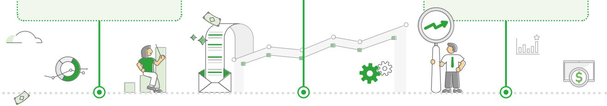

flowchart

```mermaid
graph LR
  A["Data Collection"] --> B["Agent"]
  B --> C["Payment Processing"]
  C --> D["Email Verification"]
  D --> E["System Integration"]
  E --> F["Cost Analysis"]
  F --> G["Analysis & Report"]
```

## 绿色金融产品矩阵

## 加大绿色融资支持力度

本行持续强化绿色金融战略定位，系统性优化资源配置，重点支持清洁能源、节能环保、低碳交通等战略性新兴领域。通过创新绿色信贷产品、扩大绿色债券发行规模、优化绿色贷款审批流程，构建差异化信贷政策体系，显著提升绿色资产在整体信贷组合中的占比。同时，深化与政策性银行、多边开发机构的协同合作，探索跨境绿色融资模式，为绿色产业提供长期、低成本的资金支持。

## 推进转型融资工具落地

本行紧跟央行江苏省分行相关通知及转型金融支持目录要求，紧扣本地经济特点，以创新举措精准支持绿色经济、提升绿色金融服务能力，迅速成立专项工作小组，对接监管、认证机构并走访企业，于2025年3月17日成功落地江苏首笔印染行业转型金融贷款，助力“五篇大文章”推进。截至2025年末，本行已服务转型金融企业6户，累计投放贷款4,300万元。

## 创新绿色担保绿色保险联动

构建“绿色担保+保险”风险共担体系，联合政府性融资担保机构设立绿色信贷专项担保基金破解绿色项目融资增信难题。深化与保险机构合作，开发绿色建筑性能保险，新能源设备质量保险等产品，覆盖项目全周期风险。创新“保险+期货”模式对冲市场价格波动风险，为绿色产业链上下游企业提供综合性风险保障，形成“融资+避险”双轮驱动的服务生态。

natural_image

Illustration of a person holding documents and charts on a laptop, surrounded by abstract digital interface elements (no text or symbols)

## 影响、风险和机遇管理

本行持续健全ESG风险管理体系，强化业务中对环境与气候等ESG风险的识别、评估、监控与应对，贯彻ESG尽职调查等风险防控举措，将ESG相关风险管理机制、流程及具体举措融入投融资业务的全流程管理。

## ESG 风险管理体系

本行严格遵循国家环保法律法规、产业政策及行业准入要求，构建环境、社会和治理(ESG)风险管理体系，明确绿色信贷支持方向与重点领域。通过实施差异化授信策略和动态风险管理机制，强化风险敞口管理，坚持“有保有压、优化结构”的信贷原则，确保信贷资源配置与产业升级规划协同推进，助力地方经济绿色转型与可持续发展

同时，本行将风险预警管理工作嵌入业务全流程，建立预警信息管理闭环，将绿色金融要求嵌入尽职调查，项目评估，评级授信、审查审批、合同签订、资金拨付以及贷后管理等各环节，将ESG风险因素纳入客户(项目）风险的重要评价内容，加强对ESG风险指标的识别、监测、缓释与控制，及时识别、防范和化解环境、社会和治理风险。我们贯彻落实国家有关“两高一剩”产业的监管政策，严禁投向“两高一剩”等限制或禁止领域，严禁投向违背环保要求的企业，严格遵守生态保护红线和环境质量底线等硬约束

## ESG纳入信贷政策

## 支持清洁低碳能源体系建设

·在《授信工作指引》中明确，引导金融资源向绿色低碳领域集聚，加快经济社会绿色发展，积极落实《银行业保险业绿色金融指引》要求，持续推进全行绿色金融业务开展，积极服务兼具环境和社会效益的各类融资活动,加大对绿色、低碳、循环经济的金融支持和金融服务。  
●在《绿色信贷管理办法》中规定，加大对国家节能重点工程、环境保护重点工程以及清洁能源、节能环保技术升级、新能源研发和产销、循环经济、低碳经济等绿色经济领域的重点支持，强化清洁能源与新能源领域金融支持要求。

## 支持重点行业和领域实施清洁生产

●在《授信工作指引》中明确，积极服务兼具环境和社会效益的各类融资活动，加大对绿色、低碳、循环经济的金融支持和金融服务，尤其是“绿色制造”“绿色乡村”“绿色消费”三大领域的金融支持和金融服务，以此确定对制造业绿色改造、清洁生产、低碳转型的金融支持政策，促进绿色制造体系建设。  
●在《绿色信贷管理办法》中规定，加大对国家节能重点工程、环境保护重点工程以及清洁能源、节能环保技术升级、新能源研发和产销、循环经济、低碳经济等绿色经济领域的重点支持，明确对节能环保技术领域的金融支持要求。

## 促进绿色低碳技术推广应用

●在《授信工作指引》中明确，绿色低碳技术是绿色低碳领域的重要组成部分，其推广应用是绿色、低碳、循环经济的关键抓手，由此得以确定对绿色低碳技术在全行业推广应用的金融支持，促进绿色低碳经济发展。  
●在《绿色信贷管理办法》中规定，加大对国家节能重点工程、环境保护重点工程以及清洁能源、节能环保技术升级、新能源研发和产销、循环经济、低碳经济等绿色经济领域的重点支持节能环保技术和新能源属于绿色低碳技术范畴，由此明确对绿色低碳技术领域的金融支持要求。

## 制定高耗能、高排放、低水平投融资项目差异化标准

●在《授信工作指引》中明确，严禁投向“两高一剩”领域，禁止不符合环保要求的企业和项目。同时，原则上限制类行业禁止新增授信，产能过剩行业（钢铁、煤炭、水泥、电解铝、平板玻璃等）实施有序退出。  
●在《绿色信贷管理办法》中规定，严格实施产业政策与环保合规性双控，对限制类新建项目不予授信：对允许技改的存量产能保留授信支持对淘汰类项目停止新增授信并收回存量融资。第二十条提出实施差异化区域信贷政策，同等条件下优先支持质检规范、安监严格、节能减排成效显著区域的客户与项目。

## ESG 融入授信评审

本行将ESG因素全面融入信贷决策全过程，并结合行业特点和客户类型，建立多维度考量体系，确保信贷资源向ESG表现优良的客户和项目倾斜。

  
环境因素

·绿色产业支持：重点考量客户是否属于绿色制造、绿色农业、绿色消费等国家鼓励的绿色低碳领域，是否符合《绿色金融综合服务方案（2024-2026）》要求，优先支持循环经济、节能环保、碳减排技术应用等项目。  
●环境合规性：审查客户是否具备完整的环保审批手续，是否存在环保处罚记录，生产经营活动是否符合国家环保标准；对钢铁、石化等传统行业客户，重点评估其绿色低碳转型进展，包括节能改造、污染物减排、清洁能源替代等措施落实情况。  
·环境风险防控:将企业环境信用评价结果、污染物排放指标、固废处理能力等纳入风险评估体系，对预期环境风险较高、不符合“双碳”战略导向的项目坚决不予授信，有序退出落后产能客户。

·践行普惠金融：重点考量客户是否属于民营企业、小微企业、个体工商户等普惠群体，是否符合国家普惠金融政策导向，对各类群体无差别提供金融服务，支持就业创业相关的信贷需求。

·履行社会责任：关注客户在员工权益保护、安全生产、消费者权益维护等方面的表现，审查企业是否存在安全生产事故记录、劳动用工违规情况:支持从事污水处理、垃圾处理等具有公共服务属性、能产生积极社会效益的市场化运作项目。

·推动区域发展：考量项目对当地经济发展、就业促进、民生改善等方面的贡献，避免支持可能引发社会矛盾或负面影响的项目;严格遵守网格化经营要求，严禁跨区域违规放贷，助力区域经济协调发展。

·公司治理结构：审查客户股权结构是否清晰，法人治理机制是否健全，是否建立规范的决策执行和监督体系；对集团客户，重点评估核心企业管控能力、成员企业协同性，审慎与非主业、层级低、经营效益差的成员合作。

·关联交易管理：严格核查关联方关系，依据董事会办公室提供的关联方名单拟定授信额度，“一般关联交易”备案管理。“重大关联交易”提交董事会批准，确保关联交易合规透明，防范关联方风险传导。

●合规与内控·审查客户是否存在违法违规经营记录，授信业务资料是否真实完整，融资用途是否合法合规:关注企业实际控制人，法定代表人信誉状况，对黑名单，历史逾期严重的客户坚决不予准入。

  
社会因素

  
治理因素

## ESG纳入尽职调查

本行在信贷业务系统中建立并持续完善客户ESG风险管理功能，将ESG风险纳入尽职调查，根据企业相关ESG风险因素，开展环境、社会和治理调查评估，对高碳行业等ESG风险密集型行业进行一定程度的ESG审查。

## ESG尽职调查触发因素和风险升级流程

## 建立ESG风险识别体系

强化风险预警监测，加强对 ESG 风险信息收集、识别，落实动态监测要求，对存在环保、违法处罚客户，根据实际情况，采取针对性管控措施。

## 强化管控要求

将环评信用等级纳入授信决策重要因素，严控后三类客户准入，积极引导信贷资源向绿色领域集聚，对在环境保护、安全生产等方面存在违法违规记录且未整改完成的，制定严格管控措施。

## 指标与目标

绿色信贷余额 47.98 亿元 较去年末增长 40.50%

natural_image

Illustration of two people discussing business data with charts and a target (no text or symbols)

绿能贷累计发放户数

29

累计发放

23,600 万元

其中无锡辖内客户

21

累计发放

18,030 万元

环保贷累计发放 5

累计发放金额1,870万元

## 绿色运营

江阴银行重视自身运营对环境的影响，在全行积极倡导绿色办公，着力减少资源消耗，提升能源利用效率，降低环境有害物质排放，全方位践行低碳运营。同时，我们通过推广互联网金融，使用安全环保装修材料，实行无纸化办公和线上会议等举措，积极落实节能降耗各项要求，努力打造资源节约型和环境友好型绿色银行

## 能源管理

本行主要能源消耗来自公务车辆汽油、天然气、外购电力等。本行严格遵守《中华人民共和国节约能源法》等相关法律法规要求，制定《办公场所管理实施细则》《公务用车管理制度(试行稿)》《基建管理办法》等相关内部制度，明确用电、电梯、空调及办公设备的节能管理责任和具体要求，以及在网点建设与装修中贯彻节能环保理念。报告期内，本行持续推进降本增效工作，其中总部办公楼银信大厦全年同比节约电费34.87万元，降幅达22%；江阴辖内支行同比节约电费26.18万元，降幅达8%。

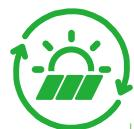

## 用电设备

空调管理：严格执行温度控制标准，冬季5℃以下开启暖空调(设置不高于20℃)，夏季28℃以上开启冷空调（设置不低于25℃)，无人时必须关闭空调，严禁开窗使用空调。

照明管理：充分利用自然光，杜绝“长明灯”，办公室无人时关灯，茶水间、走廊等公共区域根据需要少量开灯或使用感应灯具，午休时间关闭照明灯。

办公设备管理：电脑长时间不使用时关闭电源，下班前关闭打印机、复印机等设备电源。

## 公务用车

实行“一车一卡”加油管理，建立单车油耗台账，每月核算，公车油耗连续三年实现下降。

购置车辆时优先选用新能源汽车，老旧高能耗车辆按规定淘汰。公务用车实行统一管理和调度，用车需事前报批，提高车辆使用效能。

## 绿色数据中心

采用模块化机柜管理系统，通过封闭热通道机柜设计将隔离冷热气流，提升制冷效率。

部署了8台间接蒸发冷空调机组，最大程度利用自然冷源，实时感知室内外温湿度负荷，通过动态调节风机、水泵和压缩机的工作频率，始终使整机运行在能效最优区间，避免过度制冷和能耗浪费。

## 绿色能源

在各办公楼屋顶建立太阳能光伏发电系统，铺设太阳能单品硅300W组件共计52块，装机容量为16kW，光伏发电总功率与建筑物总装机容量的比例不低干0.5%，最大限度利用绿色能源。

<table><tr><td colspan="2">指标</td><td>单位</td><td>2025年数值</td></tr><tr><td rowspan="4">能源消耗量</td><td>汽油</td><td>吨</td><td>64.32</td></tr><tr><td>天然气</td><td>万立方米</td><td>5.78</td></tr><tr><td>外购电力</td><td>万千瓦时</td><td>1,825.38</td></tr><tr><td>能源消耗总量 $^{1}$ </td><td>吨标准煤</td><td>2,414.95</td></tr><tr><td rowspan="3">能源消耗强度</td><td>人均能源消耗量</td><td>吨标准煤/人</td><td>1.38</td></tr><tr><td>单位面积能源消耗量</td><td>吨标准煤/平方米</td><td>0.02</td></tr><tr><td>自有数据中心平均能源使用效率(PUE)</td><td>/</td><td>1.60</td></tr></table>

1 能源消耗总量参考国家市场监督管理总局和国家标准化管理委员会GB/T2589-2020《综合能耗计算通则》，折算成以标准煤为单位。

## 水资源管理

本行主要水资源消耗来自日常办公用水以及饮用水，采用市政用水以及瓶装水作为主要来源。本行为业务活动设计和实施高效的水资源管理措施，制定减少用水量的计划，通过采取适当措施持续提升公司的用水表现。2025年，本行水资源消耗相比去年减少4,500吨。

<table><tr><td colspan="2">指标</td><td>单位</td><td>2025年数值</td></tr><tr><td rowspan="3">水资源消耗量</td><td>总耗水量</td><td>吨</td><td>69,623.30</td></tr><tr><td>市政供水总量</td><td>吨</td><td>69,609.00</td></tr><tr><td>瓶装水消耗总量</td><td>吨</td><td>14.30</td></tr><tr><td>水资源消耗强度</td><td>人均耗水量</td><td>吨/人</td><td>39.85</td></tr></table>

## 日常节水

推广使用节水型器具（如感应水龙头），随手关闭水龙头，控制水流量。

## 设施维护

加强巡查，发现“跑、冒、滴、漏”现象及时报修。保洁用水阀门严禁长时间开启。

## 废弃物管理

本行主要产生的废弃物为办公用纸、快递纸盒、硒鼓墨盒、碳粉盒、废弃日光灯管、废弃电子设备等。本行鼓励减少、回收和循环使用废弃物，在可行情况下减少废弃物产生，以及减轻废弃物弃置造成的环境影响。

## 推行无纸化办公

持续优化办公流程，完善QA办公系统，推行无纸化办公，实行电子化办公，减少纸张使用量。

## 有害废弃物处置

废弃硒鼓、墨盒、电子设备等有害废弃物(包括显示器、打印机、硒鼓墨盒等），统一收集并委托有资质的第三方环保公司进行合规处置。

## 垃圾分类处置

办公区域实行垃圾袋装化，分类投放，由第三方物业统一清理。

<table><tr><td colspan="2">指标</td><td>单位</td><td>2025年数值</td></tr><tr><td rowspan="3">无害废弃物</td><td>办公用纸消耗量</td><td>吨</td><td>23.12</td></tr><tr><td>无害废弃物排放总量</td><td>吨</td><td>23.12</td></tr><tr><td>无害废弃物排放强度</td><td>吨/人</td><td>0.01</td></tr><tr><td rowspan="10">有害废弃物</td><td>废弃日光灯</td><td>吨</td><td>0.05</td></tr><tr><td>废弃硒鼓墨盒</td><td>吨</td><td>1.31</td></tr><tr><td>废弃铅酸蓄电池</td><td>吨</td><td>3.48</td></tr><tr><td>微机(主机)报废量</td><td>吨</td><td>1.12</td></tr><tr><td>显示器报废量</td><td>吨</td><td>0.78</td></tr><tr><td>打印机报废量</td><td>吨</td><td>0.70</td></tr><tr><td>服务器报废量</td><td>吨</td><td>3.00</td></tr><tr><td>废弃干电池</td><td>吨</td><td>3.48</td></tr><tr><td>有害废弃物排放总量</td><td>吨</td><td>13.92</td></tr><tr><td>有害废弃物排放强度</td><td>吨/人</td><td>0.01</td></tr></table>

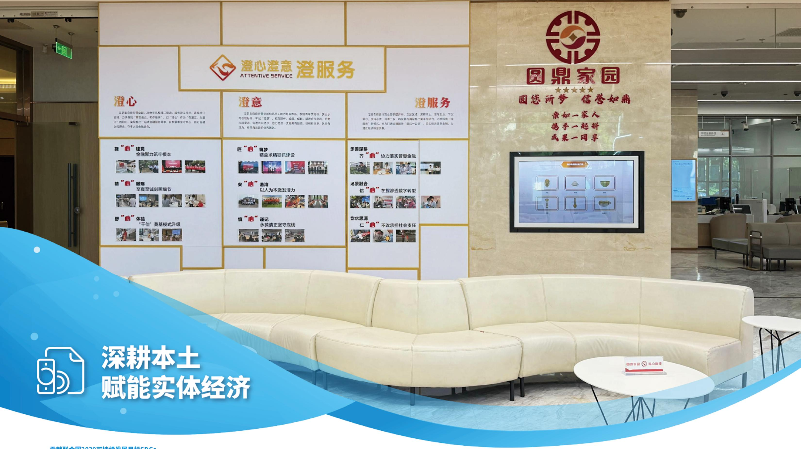

text_image

澄心澄意 澄服务
圆鼎家园
圆您所梦 信誉如鼎
亲如一家人
携手一起拼
成果一同享
深耕本土
赋能实体经济
奉献联合国2030可持续发展目标SDGs

贡献联合国2030可持续发展目标SDGs

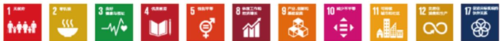

text_image

1 天底的
2 车机保
3 良好健康与福祉
4 优质教育
5 性别平等
6 快速工作和经济增长
7 产业、创新和基础设施
8
9 减少不平等
10 可持续城市和社区
11 可持续城市和社区
12 负责任消费和生产
13 变更环境和政策扶持奖励

## 普惠金融

江阴银行积极响应国家支持小微企业、发展普惠金融的政策导向，切实将信贷资源注入实体经济最活跃的细胞。

## 治理

在总行董事会层面，本行设有三农金融服务委员会，负责制定本行三农金融服务发展战略和规划，审议年度三农金融服务发展目标和服务资源配置方案，持续提升服务三农的特色化、专业化、精细化水平：在总行部门层面，设立普惠金融部，负责全行普惠金融业务拓展。在分、支机构层面，设置普惠客户经理队伍，进一步聚焦普惠业务，服务普惠客群。

本行制定《普惠信贷业务尽职免责管理办法》《个人贷款业务尽职免责管理办法(试行)》《线上贷款尽职免责管理办法》等制度，规范普惠信贷行为，并保护从业人员积极性，培育客户经理敢做、愿做的良好氛围。同时，我们建立普惠发展评价体系，根据综合支行、普惠支行不同类型机构设置差异化考核，逐步提升普惠零售指标得分权重，引导分支机构业务发展向普惠零售版块倾斜。报告期内，我行分支机构经营目标中增加社会责任考核，重点考核涉农与小微贷款、普小贷款、普惠型涉农贷款增量。

## 战略与管理方式

2025年，本行持续加大对普惠金融重点领域和薄弱环节的金融支持，切实做好普惠金融大文章，明确做小做散服务重点制定涉农、小微企业信贷计划，持续加强小微服务力度，积极落实再贷款政策及各项稳企纾困政策，并扩大供应链金融覆盖范围，推动普惠金融业务快速发展。

natural_image

Illustration of a business meeting with people using laptops and tablets in an office setting (no text or symbols)

## 拓宽小微客群

## 提升授用信覆盖率

●通过“三化六步法”构建营销长效机制，持续深化“数字化选客、网格化寻客、标准化营销”全流程管理体系，提升小微客群做小做散水平以及授用信覆盖率。报告期内，个人经营类、A类和整企三大客群新增授信29.001户，新增用信10.810户，新增用信金额 32.57 亿元。

## 构建全域覆盖服务网络

●结合全行网点布局，我们通过构建“物理网格+逻辑网格”双轨管理模式，科学划定283个物理单元网格，实现客群全覆盖，提升客群服务的精准度与有效性。  
●以客户关联关系为核心纽带，充分发挥主办行的沟通协调优势，深度触达小微客群产业链与生态圈，推动个人贷款业务实现批量式、规模化拓展。

## 优化产品体系

推出面向不同小微客群的线上多元化贷款产品，其中包括面向普适性常住居民的产品“江小鱼”、面向工作收入稳定群体的产品“e消费”以及面向有经营实体的个体工商户的产品“e经营”等产品。  
推出线下类贷款“江银快贷”系列，逐步完善产品序列，并结合实际信贷场景定制相应小微信贷产品。  
●推出政策类贷款“江银好贷”系列,其中包括政策类个贷产品“自主创业贷”“省农担”等。

## 案例 推出“e经营”个人线上经营性贷款产品

我行面向个体工商户、小微企业主，通过数据建模，推出“e经营”个人线上经营性贷款产品。该产品实现“线上+线下”的全客群触达，其中通过分析行内商户重点收单数据、行外客户结合征信授权、房产及他行贷款情况等数据，建立“千人千面”授信机制，并且产品流程简便，易上手，有效解决个体工商户类客户线上经营贷展业难题。截至2025年末，“e经营”在贷余额5.94亿元，户数4.260户，其中无锡地区在贷余额3.91亿元，户数2.768户。

## 案例 推出“纾困百宝箱”帮助小微群体

我行针对因受经济大环境影响导致经营收入下降，还款陷入困难的个休商户，小微企业，积极开展“贷款纾困工作，推出“纾困百宝箱”功能，通过调整还款方式、调整还款计划、调整结息频率、借新还旧、展期等多种形式灵活处置风险暴露客户，帮助客户渡过经营困难期。

## 供应链金融持续发力

我行通过“供应链金融”产品打造“1+N”链式营销服务模式，突破传统供应链金融“强核心依赖”的模式局限，将产品和服务内嵌到产业链各环节，满足产业链上下游企业的融资需求。同时，我们利用“链生链”拓展机制，以核心企业为起点，融合线下“现场评议”与线上“数据挖掘”方式，高效汇总产业链上信息流、资金流、发票流、货物流，构建起层层递进、网络式扩展的服务体系，显著提升了对产业链末端小微企业的触达效率，为普惠金融服务下沉开辟了全新路径

我们针对产业链各环节的差异化融资需求，构建起覆盖信用类、订单类、应收类及存货类四大融资场景的产品体系，其中包括税享融、钢享融、壹链通、物联网动产贷等多项产品，实现对产业链各类市场主体的精准赋能。

## 税享融

针对诚信纳税的小微企业，通过税务发票、司法征信等数据对其经营状况、信用状况进行评估，向符合企业发放线上信用贷款。

## 壹链通

向依托本行供应链平台，基于平台上核心企业签发给上游客户的应收账款债权为贸易背景和信用凭证的链属企业，发放的贷款。

## 钢享融

为符合我行供应链融资准入的贸易或原材料生产型核心企业的下游链属企业，提供订单融资服务，支持在线用款。

## 物联网动产贷

与优质监管机构合作，为有代采融资需求的客户提供委托采购服务。

供应链金融涉及核心企业

489 家

覆盖有效链属企业

9,523 家

供应链金融贷款户数

690

较年初增加

550户

贷款余额

13.67 亿元

11.99 亿元

## 建立普惠特色网点

本行坚持“区域深耕，特色鲜明，科技赋能，服务精准”导向制定普惠特色网点建设试点方案，系统推进普惠特色网点建设着力构建新型网点生态，全面激活基层发展动能。报告期内，我行选取璜土支行西区分理处、利港支行西石桥分理处作为首批试点网点，并组织试点团队赴条线部门开展跟岗实训，打造差异化服务标杆，为后续复制推广积累经验；深入摸排网格内产业特点与客户需求，配套实施双计考核机制，优化业务流程，提升普惠金融服务效率，推动服务模式从“被动受理”向“主动营销”转变，推动特色网点可持续、高质量发展。

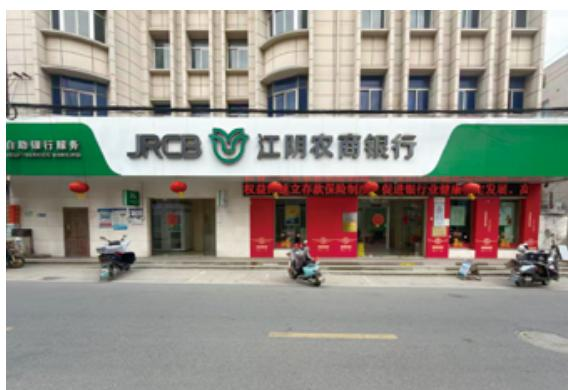

text_image

JRCB 江阴农商银行
自助银行服务
权益型企业存款保险制度，促进银行业健康发展，高

● 普惠特色网点

## 影响、风险和机遇管理

natural_image

Abstract line drawing of a computer monitor with abstract icons including speech bubbles, pie chart, and gear (no text or symbols)

<table><tr><td colspan="2">类别</td><td>描述</td><td>潜在影响</td><td>应对措施</td></tr><tr><td rowspan="3">风险</td><td>信用风险</td><td>普惠金融服务对象多为小微企业、农户、新型农业经营主体,这类客户普遍存在财务信息不规范、抗风险能力较弱的特点,抗风险能力通常较弱,抵押物不足或变现难。</td><td>经营主体受自然灾害、产品价格波动影响较大,市场需求变化,易导致企业还款能力下降,可能引发贷款违约风险,导致银行资产质量受损,坏账侵蚀利润,拨备计提压力加大。</td><td>· 积极优化信贷结构,提高信贷资源使用效率,把控信贷资产质量。· 加强统一授信管理,严格执行审贷分离、分级审批和授信管理制度,完善信贷决策与审批机制。· 建立健全客户信用风险识别与监测体系,加强贷后管理和信用风险管控,全面提高信用风险的防控能力和管理力度,保障信贷资产质量保持稳定。</td></tr><tr><td>欺诈风险</td><td>普惠金融业务下沉至农村和小微企业,对客户经理的专业能力要求较高,可能因专业不足导致客户需求挖掘不精准或风险识别不到位;也可能存在少数员工利用制度漏洞放松风险把控的道德风险,可能出现客户提供虚假材料、证明等情况。</td><td>触发监管处罚,损害信誉,且相关损失无法追回。</td><td>· 利用大数据模型应用,整合外部工商、司法、舆情数据,提升智能监测水平。· 多部门协同合规,建立涵盖责任追究日常工作、不良贷款通知稽核、尽职调查评价、监督违法违纪行为、人事处理的多部门协同的合规审查机制。</td></tr><tr><td>声誉风险</td><td>由于操作不当、负面舆情、重大事故等情况,影响银行品牌形象和市场声誉。</td><td>可能因应对不力、应对不及时等,对客户稳定性、业务连续性构成重大损害。</td><td>· 依据全员有责、分级预防、有效监测、及时报告、审慎管理的原则,持续加强声誉风险管理,建立声誉风险事件监测机制,实时关注舆情信息,严控重大声誉风险事件。· 积极开展舆论正面导向建设,与电视台、报社、网络媒体建立良好合作关系,维护良好社会形象。</td></tr><tr><td rowspan="3">机遇</td><td>政策红利持续释放</td><td>普惠金融是人民银行“五篇大文章”之一,国家对普惠金融的战略支持力度不断加大,为江阴银行普惠金融业务提供了明确的政策导向。</td><td>借助政策扶持,可能为业务拓展提供稳定的客户来源和资源支持。</td><td>·积极争取普惠金融政策支持,推动地方政府协同合作,借助政府资源提升覆盖率。</td></tr><tr><td>数字化转型</td><td>引入大数据模型和风控系统,支持信贷审批及管理。</td><td>持续推进模型应用,可能有效提升审批效率和决策效率,减少人工成本,缩减业务流程冗余。</td><td>·精确定位客户群体,构建真实客户画像,降低获客与运营成本。</td></tr><tr><td>差异化业务发展</td><td>小微企业存在“轻资产、无抵押、融资难”的普遍痛点,对特色化金融产品和高效服务需求强烈。依靠小微客户的地缘性、群体性特征,制定在地差异化发展策略。</td><td>通过满足小微客户的个体化、差异化需求,可打造银行独特业务优势,长期来看可提高银行的经济效益,支持地方特色经济发展。</td><td>·开发多元化业务场景,如供应链金融、灵活抵押信贷等。·聚焦客户需求研发产品,针对科技型小微企业“轻资产、无抵押”痛点,研发“科技企业贷”。·围绕产业链各环节需求,构建覆盖信用类、订单类、应收类、存货类的供应链金融产品矩阵。</td></tr></table>

## 指标与目标

2025年，本行按月制定“月月增”做小做散专项目标，从过程管控和业绩达成两个维度制定月度目标任务，推动全行落实做小做散指标与目标，加快零售转型。截至2025年末，通过持续9个月的“月月增”专项竞赛，全行有效个人贷款客户数达到47.272户，较年初净增2,590户；个人经营性贷款89.59亿元，较年初净增11.7亿元，增幅15.02%；全行普惠对公贷款余额339.12亿元，较年初净增42.85亿元，增幅14.46%;普惠对公信贷户数7.144户，较年初净增1.168户，增幅 19.54%。

全行涉农与小微企业贷款余额

1,156.81亿元

占比达

88.46 %

普惠型农户贷款和普惠型小微企业贷款余额

391.13 亿元

占比达

33.86 19,085

支农支小再贷款余额

68.90亿元

## 数字金融

江阴银行努力打造“创新驱动、数智转型”的高质量发展模式，持续深化科技创新和推进全行数字化转型，并通过数字化转型构建智慧金融服务生态圈，提升服务触达效率。

## 治理

本行建立科学高效的数字金融治理体系，行长室为数字金融工作的领导机构，设立信息科技管理与创新委员会，负责依据全行信息科技管理与创新情况，对信息科技管理与创新工作进行统一决策、协调和管理；委员会下设产品创新小组由数字金融部牵头，负责建立健全产品体系和新产品研发，制订全行产品运营策略和方案，评估运营质效，并定期向信息科技管理与创新委员会汇报工作。

本行在遵循《商业银行信息科技风险管理指引》《商业银行信息科技治理建设指导意见》等相关规定，制定《信息科技管理与创新委员会议事规则》《科技开发部项目管理办法》《科技开发项目管理流程》《科技开发变更管理办法》《科技开发变更管理流程》等一系列制度，规范金融科技研发流程，支持金融科技项目的推进和落地。

## 战略与管理方式

## 金融科技

2025年，本行以新核心项目工程群驱动数字金融建设，遵循“研发敏捷化、数据标准化、治理智能化”原则，升级技术架构打造高可用、高性能、高质量、自主可控四大能力，提升系统支撑业务发展的韧性：同时我们完善架构治理、数据治理、服务治理、运维治理、科技治理五项治理，优化科技管理体系，构建统一客户中心、统一产品中心、统一费用中心、统一核算中心、统一限额中心、统一对账中心六大统一中心，支撑业务敏捷创新与精细化管理；培养“科技+业务”复合型人才团队，为数字金融建设提供人才保障。

## 赋能运营提质增效

新核心项目群重塑业务与技术架构。通过重建我行核心业务系统，确保我行基础金融服务的稳固运行，构建高度可靠灵活可扩展的核心系统 以满足未来全融业务的发展需求，该项目涵盖核心系统，ECIE柜面系统，交易级大总账等5个新建系统工作，并对70余套相关系统进行配套改造。报告期内，新核心项目群已成功上线，并在用户体验、客户体验以及系统性能上实现极大提升，全面提高金融服务的可靠性和服务效率

新系统筑牢数字化转型基石。建设预期信用损失管理、统一对账、统一调度、数据开发及新一代外汇牌价采集等新系统，精准计量金融资产减值、强化风险管控，实现全链路资金对账保障安全，提升运维效率与智能化水平，为本行数字化转型打下坚实基础。

加强监管科技能力建设。按监管要求推进监管科技能力建设，完成一表通转EAST、1104模块部署，改造EAST5.0报送系统并获考核佳绩；开展金融基础数据报送校验改造，升级统一监管平台，推进各类报表开发与大集中改造，提高监管效率准度并保障2025年监管报送顺利推进。

加强内部管理与风险防控。深化AL应用，落地多项智能功能并完成信贷POC验证：推进联合银行“三用优化”，参与区域协同、共享技术资源；强化开发测试质量管控，完善审批流程、健全测试体系并实现需求审批线上化；建立供应商综合评价机制，提升管理精度与服务水平。

提升系统安全与业务效能。对本行31个重要业务系统开展用户信息核查整改，清理离职退休人员权限、调整岗位权限筑牢系统安全防线；优化移动柜面开卡业务流程与程序，压缩整体交易耗时，大幅提升业务办理效率。

## 支撑业务高质量发展

深化系统升级改造，促进普惠金融发展。完成资金业务系统全流程优化：优化“江银e贷”网贷风控规则，强化反欺诈能力并保障业务稳定：推进押品管理二阶段改造，实现全生命周期线上化管理，大幅提升效率、降低差错：完成国内信用证及福费廷线上化改造；国结系统完成 MX 报文升级并稳定处理相关清算业务；升级二代查征系统为分布式架构，提升系统稳定性。

丰富渠道服务体系，提升客户综合体验。整合手机银行拓展生活场景，强化安全与权益功能，打造儿童主题银行:优化网上银行，拓展银企直连并完善对公服务；完成统一门户鸿蒙版改造，核心功能上线目用户增长显著；创新特色场景与财富服务，推进场景融合与理财便捷化；推动权益与收单业务协同，升级权益、扩容商户并完成数币改造，全面优化个人与企业客户服务体验。

客群专属服务与生态融合。儿童俱乐部项目响应“金融+教育”融合趋势，搭建一体化平台，提供综合化金融与非金融服务增强少儿金融服务粘性：手机银行5.0项目焕新升级，推出多客群专属版本，优化服务与安全能力，提供个性化金融服务体验。

natural_image

Illustration of a hand holding a smartphone displaying a data dashboard, surrounded by abstract icons (no text or symbols)

手机银行 App 新增用户数

71,504

累计用户数

人1,132,780

月活跃用户数

人474,459

推广数字人民币实际应用。持续深化数字人民币在贴现业务及相关场景中的创新应用，不断优化服务流程、拓展覆盖范围，以更加安全、便捷、高效的金融服务赋能实体企业。2025年，公司票据中心实现数字人民币在贴现业务场景中的创新突破，成功为江阴市某钢管有限公司办理“江银秒贴”数字人民币贴现业务，资金以数字人民币形式实时划转至企业数币钱包，成为无锡地区农商行首笔落地的数字人民币贴现业务。

text_image

Illustration of a person interacting with a large digital dashboard displaying charts and graphs, symbolizing data analysis or analytics.

## 创新应用先进科技

普惠金融与供应链金融创新。依托我行风控决策引擎与微众信科技术底座，推进税票贷项目整合多维度数据，搭建线上化、去中心化风控体系，通过产业供应链数据穿透及动态知识图谱等技术，实现全流程智能风控，构建“信用科技+供应链”模式，提升中小微企业普惠金融覆盖度

区块链、大数据技术赋能政务民生。我行金易链（民政养老救助资金发放核查服务）运用区块链、大数据技术构建审核监管系统，通过自动化联网核查精准核实救助家庭经济状况，优化救助资金统筹管理，提升社会救助服务水平

AI 算力与大模型场景落地。搭建强大算力底座，积极探索 DeepSeek 大模型应用，搭建 Dify 智能体开发平台，落地智能代码助手、AI 办公、智能问数等多类业务场景，全面助力智能化升级。

## 激发科技创新活力

本行积极加强创新人才体系化培训，全年共组织科技专项培训15场次，创新采用"周末课堂"模式，有效覆盖全行科技条线业务骨于及各支行计算机专业储备人才，其中科技开发条线聚焦前沿技术应用的培训，涵盖Java编程开发DeepSeek 智能平台实操、RPA（机器人流程自动化）流程设计及 Python 数据分析等核心课程。

## 数字建设

## 数字化能力建设

本行以全行发展战略为指引，制定数字化转型战略，推进数字化重点项目实施，从数字化营销能力、数字化风控能力、数字化分析能力以及大模型技术应用能力四大方面推进数字化建设

## 提升数字化营销能力

●联动多业务条线推进二十项转型课题落地，构建上下协同的转型格局，实现零售、公司等客群规模与效益双增长。  
●优化数字营销平台，完成22项核心问题整改与7项系统优化，依托平台开展12个客群营销活动，覆盖35.9万人次，并通过大数据分析为营销活动提供支撑  
·完成网格化智慧营销功能升级，全年下发71个营销活动，覆盖客户53.39万人，江银e贷走访中，e 消费、e 经营累计共有16,363人成功授信，构建数字化营销体系。

## 强化数字化风控能力

●持续深化风控模型迭代与规则优化，完成两百余项信贷产品策略规则新增与迭代。复盘5万笔“江银e贷”授信申请，搭建常态化监控报表体系。  
●新增6大业务模型提升审批效率与风险识别能力，开发小程序线上贷款反欺诈功能并完成优化。  
●在外部数据应用上，续约百行征信数据，优化外部数据接口并迁移至金融云平台新增“阿福分”及全国婚姻数据接口，同时落实合规要求，完成外部数据征信业务合作排查。

## 深化数字化分析能力

●推进数据服务与报表体系建设，全年完成138项报表需求审核，新增68张关键业务报表、优化102张现有报表，覆盖多业务条线数据支撑需求。  
●持续完善B自助分析平台，开放业务报表供分支机构查询，开发分支行旺季专项竞赛考核日报，实现考核数据T+1 更新。  
●通过整合内外部数据资源协助多个业务部门开展客群划分、名单筛选及营销效果分析为精准决策提供数据抓手。

## 探索大模型应用技术

●新核心智能助手完成测试上线，知识库召回率达90%，解决柜面浏览器适配问题，发布使用手册并建立问题反馈修正闭环机制。  
●公司内部多部门联合外部厂商、同业开展5场大模型落地场景交流研讨，明确模型应用能力范围与基础准备方向。  
●公司内部多部门联合举办“数智赋能金融党建聚力创新”AI智能体创意设计大赛，涌现出一批创新解决方案，部分优秀成果进入孵化落地阶段。

## 数字服务民生

本行打造智慧医疗、智慧菜场、智慧交通、智慧商圈四大金融服务生态圈，将金融服务嵌入民生场景，打破金融服务与生活场景的壁垒，让客户在日常场景中便捷获取金融服务，提升服务触达效率与用户体验。

natural_image

Abstract 3D illustration of data analytics and business growth, featuring bar charts and a laptop (no text or symbols)

## 校园场景

新建智慧校园平台，以市民卡为校园一卡通载体，实现缴费、住宿、食堂、消费等统一管理。

## 驾培场景

开发智慧驾培平台对接驾培系统，实现学员缴费、驾驶培训费用托管、资金划转等功能。

## 工会场景

数字工会场景稳中有增，累计工会职工会员13万户，工会资金沉淀首次超1.5亿元；与工会举办党建共建签约，启动“周末去哪儿项目，设计职工文体旅线路并提供优惠。

## 家政场景

与“高整无忧”家政服务平台合作，平台整合江阴家政协会、求助中心等服务资源，为市民提供全品类家政服务。

## 旅游场景

与江阴市文体广电和旅游局共同发布“乐澄文旅”数字平台，为江阴市首个智慧文旅示范项目。

## 用车场景

推出智慧停车和智慧洗车两大模块，整合全国10万+停车场提供自动服务，并以车主需求为中心。打通洗车高频场景，实现多种智能功能。

## 市民场景

上线江阴电子市民卡板块，客户可在线完成电领，提供自助洗车、银龄服务、图书馆服务等生活场景服务。

## 医院场景

与卫健委、医院合作推出“健康江阴”智慧医疗服务平台，除实现自助挂号、线上缴费、报告打印等基础功能外，新增互联网医院、健康商城、夜间挂号等功能，提升市民就医体验。

影响、风险和机遇管理

<table><tr><td colspan="2">类别</td><td>描述</td><td>潜在影响</td><td>应对措施</td></tr><tr><td rowspan="2">风险</td><td>模型决策风险</td><td>用户行为改变可能影响原有模型参数,客户经理过度依赖AI助手和模型结论。</td><td>可能影响模型分析准确度和决策精准度,造成业务合规漏洞及操作错误。</td><td>定期开展现有金融产品模型评估评价。</td></tr><tr><td>外部数据质量风险</td><td>外部征信数据(如税务、司法)更新不及时,影响输入数据质量。</td><td>大数据模型基于“过期信息”可能做出误判。</td><td>对接客户交易系统、税务系统、工商系统,降低信息不对称可能性。</td></tr><tr><td rowspan="3">机遇</td><td>地方信用体系赋能机遇</td><td>地方信用资源开放,为信贷业务提供更丰富的客户信用维度,拓展信用类贷款客群,契合国家支持普惠金融的政策导向。</td><td>通过接入此类数据,可完善客户画像,破解“信息不对称”痛点,尤其在小微企业主贷、个人信用贷等业务中,能更精准评估客户还款能力。</td><td>扩大个人信用评分、全国婚姻数据的应用场景,将其纳入准入与授信模型,完善客户信用评估维度。探索对接无锡征信的企业销售额、纳税数据,辅助供应链金融客群筛选与风险评估,提升信用类贷款占比。</td></tr><tr><td>运营效能提升</td><td>实现线上自动审批,提升业务处理时效。</td><td>减少人工成本及人为错误概率。</td><td>推进反欺诈功能(如小程序场景欺诈中介识别)、外部数据(百行征信、世联房产数据)的深度应用。</td></tr><tr><td>线上化风控与产品创新机遇</td><td>线上信贷业务(如江银e贷、税享融、票享融)规模持续扩大,可进一步创新线上产品形态,覆盖更多“轻资产、无抵押”客群。</td><td>可进一步挖掘供应链上下游、科创企业、乡村振兴等细分产品需求,扩大线上普惠金融市场份额。</td><td>动态迭代现有线上模型,优化逾期客户画像相关模型,平衡风险控制与放贷规模。进一步创新“线上抵押贷+智能续贷”组合产品、供应链金融线上化解决方案等产品及服务。</td></tr></table>

<table><tr><td colspan="2">类别</td><td>描述</td><td>潜在影响</td><td>应对措施</td></tr><tr><td rowspan="2">机遇</td><td>数据中台与系统整合机遇</td><td>依托统一数据底座,能支撑更精准的客户信用评级、更实时的风险预警、更高效的跨部门协作,为数字化业务创新提供数据支撑。</td><td>ECIF系统上线实现全行客户信息统一管理,为数据整合奠定基础,可以打破信贷、关联交易、统计报送等系统的数据壁垒。</td><td>·规划建设“数字金融数据中台”“统一数据门户”,实现“客户数据+交易数据+风险数据”全量整合。</td></tr><tr><td>市场拓展机遇</td><td>小微企业对“快速获贷、灵活续贷”需求迫切,分支机构对“高效数据查询、精准营销支持”需求显著,市场仍有潜在拓展空间。</td><td>通过提升数字化水平,进一步优化对公智能续贷模型,组合不同服务模式,可提高客户服务效率。</td><td>·可结合“贷款+认股权”模式与数字化风控,为小微企业、科创企业提供综合金融服务,拓展高潜力客群。</td></tr></table>

指标与目标

<table><tr><td>指标与目标</td><td colspan="3">2025年达成情况</td></tr><tr><td>推进二十大数字化转型课题落地</td><td colspan="3">通过数字化转型全面夯实了业务发展基础,提升了服务效能与创新能力,为全行高质量发展注入强劲动能。</td></tr><tr><td rowspan="2"></td><td rowspan="2">科技投入金额1.50亿元</td><td>研发员工人数88人</td><td>年度新增软件著作权数量3项</td></tr><tr><td>研发员工比例5.04%</td><td>累计软件著作权数量17项</td></tr></table>

natural_image

Illustration of three people interacting with a computer screen and digital interface elements (no text or symbols)

## 养老金融

江阴银行养老金融战略发展规划，充分运用在客户服务、金融科技等方面积累的能力，三位一体推进养老金融服务体系建设努力为客户提供全方位、一站式、个性化的养老金融综合服务。

制定整体服务方案，引领养老金融新发展。贯彻落实全行养老金融战略部署，结合江阴地区老龄化趋势与老年客群实际需求，撰写印发《江阴农商银行养老金融服务方案》，方案围绕产品创新、服务优化、渠道融合、风险防控等多个维度，系统规划我行未来两年养老金融发展的实施路径与重点任务，努力打造具有江阴特色的养老金融服务体系，为我行养老金融业务高质量发展提供有力指引与支撑。

政银社协同共建，打造养老金融服务新生态。本行深度融合金融与非金融资源，通过主动对接政府资源、高效联动社区力量，与江阴市民政局、融媒体中心联合发布“颐享生活·银龄集市”品牌项目，积极构建养老金融服务生态圈，进一步提升养老服务的社会认知度和参与度。报告期内，我行澄丰支行养老顾问团队接受江阴市民政局正式授旗，并设立中山分理处为“银龄关爱主题银行”。

线上线下双发力，拓展养老金融服务新内涵。在线上，本行重点打造手机银行“养老金融专区”和“银龄关爱”微信小程序构建涵盖养老规划计算，专属金融产品，会员权益活动，积分商城服务等五大功能场景，提升老年用户数字化服务体验。在线下，本行持续推进“银龄关爱”主题网点建设，优化适老智能设备配置，完善无障碍服务设施，营造安全、便捷、温馨的适老化服务环境。

## 案例 银龄集市

江阴银行与江阴市民政综合服务中心、市民卡中心联合打造养老服务建设的品牌化公益项目“银龄集市”。该项目聚焦“品质养老”民生工程要求，紧扣“一老一小一家庭服务重点，以“一刻钟便民生活圈”为依托，将金融服务、政务服务、生活服务与养老需求深度融合，为老年人打造全场景、一站式适老服务生态通过线下集市形式，把适老服务送到老年人“家门口”打通服务老年人的“最后一公里”。2025年，本行共开展8场养老集市活动，内容涵盖政策咨询解读、适老化改造体验、健康义诊服务、金融社保业务办理等20余项便民项目。

  
●“银龄集市”活动现场

## 科技金融

江阴银行紧跟江阴市“产业强市”战略部署，关注重点领域战略布局，积极支持省市级重大项目、科技创新、战略新兴产业及绿色环保等行业加快发展，持续加大“科技企业贷”“科创贴息贷”“科技服务应用场景贷”等科创产品覆盖程度并促进传统制造业提质增效、转型升级

制造业贷款余额

占比

399.93

30.58%

民营企业贷款余额

占比

754.20 亿元

57.67%

## 双轮驱动服务架构

本行建立“科创中心+高新支行”双轮驱动的服务架构，其中科创中心专注服务种子期、初创期科技企业，重点覆盖股权融资早期、双创人才及孵化器在孵企业：高新支行侧重服务成长期、成熟期的高新技术企业与专精特新企业，两者协同实现“投早、投小、投成长”的全周期覆盖，形成差异化、精准化的服务格局。报告期内，我行积极试点“贷款+认股权”组合式金融服务，通过与企业及股东签署协议获取特定条件下的认股权，既有效缓解企业资金压力，又避免核心团队股权过早稀释、保障企业控制权稳定，共签约落地3笔，金额共计350万元，为其中2家提供了全行业首贷融资服务。

## 多元科创金融产品

本行持续深化科技金融体系建设，聚售科技型小微企业的全生命周期成长需求，通过专业化组织，特色化产品，差异化流程与生态化服务，全力支持区域科技创新与产业升级。报告期内，我行推出“科技企业贷”缓解初创科技企业首贷难题。已发放61笔，共计余额1.67亿元。

## 高效审批流程与机制

本行制定科创企业专属业务流程，推出“科创准入表”与“科创评分表”，成立科创评审小组，通过上门尽调、现场会办等方式，提升风险识别与决策效率，审批周期较传统流程压缩约60%，在风险可控的前提下实现服务提速。

natural_image

Illustration of a clipboard with charts and icons, surrounded by green leaves and digital icons (no text or symbols)

## 生态化服务与资源整合

本行积极构建“政银企研投”协同生态，与市科技局、高新区管委会共建“江银・高新科创服务中心”，派驻金融顾问挂职，打通政策与服务对接通道；组建专家智库，引入高校、产业、投资领域专家，为企业提供技术咨询与产学研对接；通过“贷款 + 认股权”等创新模式，联动股权投资机构，为企业提供“债权+ 股权”综合融资支持；开展政策宣讲、产业链对接、品牌传播等活动，助力企业拓展市场与资源网络。

## 案例 发放首笔“科创认定”贷款

江阴某半导体公司专注于半导体薄膜沉积设备研发，处于产业化前期，尚无销售收入，在传统授信模式下难以获贷。我行通过“科创评分表”对其进行综合评估，基于其技术先进性、团队背景及已完成近亿元股权融资的资本背书。快速审批发放1,000万元“科技企业贷”,支持其产线扩建与设备采购,成为我行首笔真正意义上的“科创认定”贷款。

## 案例 政银协同：成立“江银·高新科创服务中心”

2025年9月，本行与江阴高新区举办全面战略合作签约仪式，共同成立“江银·高新科创服务中心”，并现场签订《全面战略合作协议》。此次战略合作有利于深化金融赋能、加速产业转型升级，促进政银企三方协同发力，共谋高质量发展。

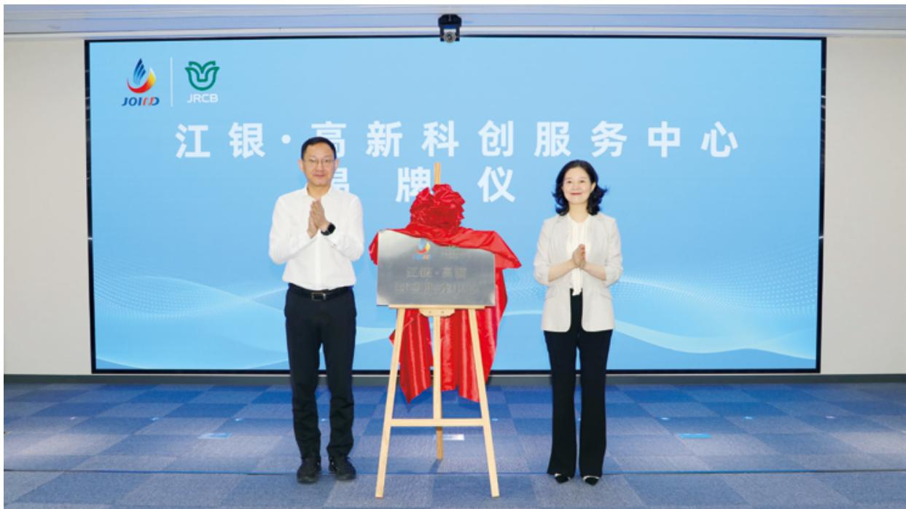

text_image

JOCB
江银·高新科创服务中心
昌牌仪
江银·高新
科技服务中心

● 签约仪式现场

## 消费者权益保护

江阴银行切实保障消费者的知情权与选择权，坚守“离您最近,和你最亲”的服务理念，建立系统化的责任营销机制，努力建设公平、透明、和谐的金融消费环境

## 治理

本行持续完善由董事会承担最终责任、高级管理层牵头执行、消保部门统筹协调、全员共同参与的消保工作治理体系，推动消保要求深度融入公司治理和经营管理的各个环节。

  
董事会  
负责承担消费者权益保护工作的最终责任，通过定期听取、审议报告，对全行消保工作保持全局性掌握与开展战略性指导。报告期内，董事会审议通过《2024年度消费者权益保护工作报告》《2025年上半年度金融消费者权益保护工作报告》2项消费者权益保护议案，指导开展消费者权益保护工作

  
金融消费者权益保护委员会  
作为专业议事机构，负责高效履行消保工作的决策支持与监督职能。定期听取高级管理层的工作汇报，就消保重大议题、重要政策进行专题研究与论证，并依据章程授权，对高级管理层及消保职能部门的履职情况进行全面监督，确保董事会决策有效传导与执行。报告期内，委员会修订《金融消费者权益保护委员会工作细则》议案持续优化自身运作机制

  
法律合规部与消费者权益保护中心  
作为消保牵头部门，下设消费者权益保护中心为专职二级部门，具体履行全行消保工作的组织、协调、督促和指导职责，负责制定年度工作规划，组织全行开展培训、检查、宣教活动，协调各部门及分支机构积极配合，确保消保任务落实到位。

  
各部室及分支机构

负责指定专人负责本单位宣传教育、投诉处理、台账管理及联系上报等工作，形成“统一领导、分级管理、全员参与”的工作机制。

本行建立以《消费者权益保护工作管理办法》为总制度，涵盖消保审查、信息披露、适当性、销售行为可回溯、个人信息保护、合作机构管理、投诉处理、纠纷多元化解、消保培训、消保考核、内部审计等11项机制的“1+N”消保制度体系。同时我们建立以《消费者权益保护审查管理办法》为核心，以《合同管理办法》《金融消费者权益保护工作管理办法》《金融创新业务风险评估管理办法(试行)》等为支撑的审查制度体系，其中明确规定审查的主体责任、覆盖范围、核心审查要点及标准化操作流程，确保对产品与服务在设计开发、定价管理、协议制定、营销宣传及合作机构准入等各环节中可能影响消费者权益的政策、规则、文本等进行系统化评估与风险提示，基本实现审查要点的全覆盖。

## 战略与管理方式

本行将消费者权益保护融入公司战略发展规划中，制定《2025年消费者权益保护管理工作规划》，确立“加快法治银行建设，力推消保业务融合，做深服务监督考核”为重要战略目标，并遵循“一年一主题，一年一攻坚”的递进式思路，分步骤、有计划地推进消保工作与业务经营的深度融合。同时，本行深度参与客户服务全流程治理，常态化开展客户满意度调查、投诉纠纷化解、服务质量提升等工作，切实保障金融消费者合法权益，不断优化客户服务体验，推动服务质量与客户价值深度融合。

## 消保管理体系

## 严格制度约束

本行在营销端建立多维度消保导向的责任营销制度约束机制，以业务指引为核心，融合消保合规要求构建全流程约束体系，明确授信准入与营销行为消保规范，划分授信投向范围并强化各环节消保风险提示。依托制度落地系列合规营销举措，严格落实信息披露要求，全面公示产品利率、期限等核心信息：落实适当性管理，为老年人等群体提供专属讲解与一对一答疑服务：建立批量营销监督机制，联动商会、协会核验信息、提示风险，形成双重监督。报告期内，相关制度要求全面嵌入支农支小、绿色金融等业务全流程，重点贷款产品营销严格执行消保披露与提示规定，全年无因营销信息不实、风险提示不到位引发的投诉或纠纷。

## 精准严格审查

本行严格按照相关制度要求对产品与服务在设计开发、定价管理、协议制定、营销宣传及合作机构准入等各环节中可能影响消费者权益的政策、规则、文本进行审查建立审查要点动态更新机制，定期结合内部投诉数据分析、外部舆情监测结果以及最新监管政策导向，对审查要点进行复盘与更新。报告期内，我行增加运营相关业务专业性审查流程，确保审查标准与风险变化及监管要求同步，并通过合规系统消保审查模块，对新增及发生实质性改变的80项产品与服务(包括相关制度、合同及营销文案)实施了100%的强制性审查，审查覆盖率与审查提出的实质性修改意见采纳率均达到100%。

## 营销过程合规

本行从销售过程管控上落实“双录”与销售可回溯要求，在监管基础上扩大销售关键环节录音录像覆盖范围，同时利用AI技术对“双录”内容进行质量检查和风险点识别，确保销售行为规范、信息告知到位，严格执行销售人员持证上岗制度保障销售人员仅营销自身具备相应资质和知识的产品

## 营销素养提升

本行制定《2025年消费者权益保护培训计划》，并按照计划全年共举办4场全行性消保专题培训，内容包括消保政策法规、我行制度要求等基础知识，以及更紧密结合投诉多发领域和风险较高业务，开展了如“银行网点优质服务标准与客户投诉处理”、“网点柜面内控风险防控”等针对性培训。报告期内，我行消保培训覆盖率达到100%。

本行针对不同业务部门开展不同类别的负责任营销培训和活动，依托绿色金融委员会、转型金融工作小组开展专项培训内容覆盖《授信工作指引》《绿色信贷管理办法》、产品信息披露规范、风险提示技巧及特殊群体服务礼仪等内容;通过内部办公平台、晨会夕会、业务通报会等渠道常态化宣传责任营销政策要求，解读典型案例，强化“合规营销、诚信服务”理念组织员工开展模拟营销场景演练，重点模拟老年人等特殊群体沟通、复杂产品风险提示等场景，以角色扮演、现场点评提升实操能力;将责任营销落实情况纳入员工考核评价体系并与业务绩效挂钩，对合规无投诉的员工给予正向激励，对违规营销行为实施问责。

## 优质客户服务

## 多元金融服务

我行始终坚守“金融为民”的服务宗旨，深刻理解金融服务的普惠性与包容性，致力于构建一个覆盖全客户生命周期、尊重个体差异、充满人文关怀的金融服务生态

## 老年客户

聚焦老年客户稳健理财与养老保障需求，代销市场优质理财产品作为银龄专享产品深化与保险公司合作推出多样化保障方案。  
●联合相关单位主办“银龄集市”惠老活动。提供居家适老化改造与金融方案咨询。  
在手机银行APP设置银龄关爱专区、开通关爱版本切换，通过远程客服提供线上人工服务，覆盖密码重置、个人信息维护等常用业务。

## 残障人士及 行动不便客户

严格执行相关网点创建标准，持续推进物理网点无障碍环境建设建立人性化服务应急机制。  
●依据特殊业务规定组建“小圆服务队”，在风险可控前提下，为无法亲临网点的客户提供上门办理开户、社保卡激活、密码重置等关键业务服务，让柜台服务“移动”起来。

## 军人、退役军人及外籍来华人员

在网点普遍设立“拥军优先窗口”，发行含专属权益的退役军人卡。  
为落实金融对外开放等政策，制定境外来苏人员支付服务提升方案，优化外币兑换、境外银行卡使用、账户开立等流程，编制多语种服务指南，提升外籍人十支付服务体验。

## 案例 构建“四大主题银行”服务体系

2025年，我行深化构建“银龄关爱”“儿童友好”“家庭幸福”“爱心妈妈”四大主题银行服务体系，以“金融为民”为底色，围绕不同客群核心关切打造特色场景，分别聚焦老年群体养老生态圈构建、儿童家庭财商启蒙青年与婚育家庭全周期支持及女性客户赋能。报告期内，本行累计开展主题活动80余场、参与人次超3,000人次，通过场景化、生态化服务满足客户多元需求，深度融入社区民生，实现从服务响应者到美好生活共建者的角色升华。

natural_image

Interior of a modern classroom or workshop with students seated around tables facing an instructor, large windows visible in the background (no text or symbols present)

●●儿童主题银行小y小咖啡师体验

text_image

爱心妈妈
吃爱秋梦
新智管理  新心肌
高精生  高心肌
北京快乐

●爱心妈妈主题银行活动

## 重视客户投诉

本行视投诉为改进服务、提升管理的重要资源，致力干构建一个“制度完善、系统智能、渠道畅通、响应迅速、闭环管理”的投诉处理工作机制。我们建立了以《消费投诉处理管理办法》及配套《消费投诉处理流程》为核心的制度体系，全面规范投诉的登记受理、分级流转、调查核实、沟通处理、结果反馈、统计分析、档案归集以及溯源整改等全流程管理要求。同时，我们依据《金融消费者权益保护重大事件应急预案》建立重大投诉的应急响应机制，明确组织指挥，处置流程，善后评估等环节的具体要求，确保突发事件的妥善应对。为确保制度刚性执行，我行将投诉处理纳入内部考核与问责体系，明确了针对投诉处理时效、配合度及重大投诉事件的考核评价标准与责任追究路径，形成有力约束。

## 持续优化技术支撑平台

在OA办公系统内嵌消保投诉处理模块，实现全行各渠道投诉的线上统一接入、标准化工单流转、处理时限自动预警、数据实时统计与多维报表一键生成，促进投诉处理的全流程线上化、透明化管理。同时，通过“首问负责制”整合客服热线、手机银行、网点柜台等投诉入口，实现简单投诉 24 小时内响应，复杂投诉48小时内制定方案。

## 严格履行投诉渠道告知义务

通过官方网站、手机银行APP、营业场所醒目位置公告栏、产品及服务合约文本等多种方式，清晰、准确地公示投诉受理电话、通讯地址、电子邮箱等信息。同时，本行客服热线专设“一键转投诉”快捷功能，最大限度为消费者表达诉求提供便利，确保投诉渠道“看得见、找得到、用得上”。

## 定期开展应急演练

本行严格按照应急预案要求，每两年组织一次全行性重大消费投诉应急演练。2025年，我行已按计划成功开展演练，通过模拟实战场景，有效磨合各部门协同机制，优化处置流程，提升应急队伍的快速反应与实战处置能力。

## 重视监管指导意见与外部监督

针对监管部门指出的问题，我行均第一时间启动内部溯源核查，深入分析问题成因，制定并落实针对性的整改措施，对相关责任人员予以问责教育，并按时向监管机构报送专项整改报告。同时，我行按规定定期准确、完整地向国家金融监督管理总局各级派出机构及省联合银行报送消费投诉统计分析、处理情况报告及相关数据，主动接受监督，并通过“受理-处理分析-整改-问责”的闭环管理，推动投诉数据反向驱动产品、服务和内部管理的持续优化。

natural_image

Line drawing of a person wearing a headset using a laptop, with abstract geometric shapes in the background (no text or symbols)

## 客户满意度调查

本行建立以柜面反馈为核心的客户满意度统计机制，依托各营业网点柜面窗口，在业务办理结束后，即时收集客户反馈重点统计客户对柜面服务效率、业务办理流程规范性、风险告知充分性、合同条款清晰度、工作人员服务态度等相关评价与诉求。同时，本行畅通柜面登记、客服热线、线上平台等多元反馈渠道，建立高效诉求收集机制，确保客户疑问、异议能快速反馈、妥善对接。

本行对柜面满意度数据及客户诉求进行梳理研判，精准识别服务短板，推动及时响应，针对薄弱环节，优化柜面流程，规范操作话术，强化人员培训，从源头减少纠纷，提升客户满意度，同时完善诉求处置机制，坚持公平高效原则，妥善处置投诉异议，维护客户权益与我行形象。2025年，本行客户满意度达98.83%，服务满意度持续提升。未来，本行将持续优化统计体系，细化统计标准、提升诉求处置效率，以客户满意度为导向优化服务质量，助力实现社会责任、经营效益与客户价值协同发展。

影响、风险和机遇管理

<table><tr><td colspan="2">类型</td><td>描述</td><td>潜在影响</td><td>应对措施</td></tr><tr><td rowspan="2">风险</td><td>客群营销与权益保障失衡风险</td><td>客户营销活动中的权益兑现滞后或不规范,老年客户等特殊群体服务适配性不足。</td><td>可能引发消费者对“营销承诺不兑现”的投诉,损害银行公信力。</td><td>· 分层化消保宣传与教育,针对老年、县域小微等特殊客群开展“3·15宣传周”“普及金融知识万里行”等活动。· 日常依托微信公众号发布原创消保内容,针对不同客群推送差异化宣教素材,推进服务管理规范化与适老化改造。</td></tr><tr><td>投诉处理与纠纷解决效率风险</td><td>随着个贷业务规模扩大,消费者投诉量可能同步增长,投诉响应机制可能不及时。</td><td>易导致投诉积压,引发消费者不满升级,甚至升级为监管投诉。</td><td>· 建立“全流程投诉管理机制”,整合客服热线、手机银行、网点柜台等投诉入口,定期复盘投诉数据,分析高频问题,反向推动产品话术、服务流程优化。</td></tr><tr><td rowspan="3">机遇</td><td>客群精细化运营机遇</td><td>根据不同客户数据提供分层服务和场景化服务,从而发掘更多权益增值机遇。</td><td>开发提升客户满意度,能够在保障客户权益的同时,提高客群服务满意度,推动业务转化和提升。</td><td>· 结合客群营销数据,针对不同客群设计差异化权益保障,引入涵盖专属客服、账户安全险、还款提醒定制等服务的“金融+权益保障”组合方案,在场景化服务中引入针对性消费者权益保障措施。</td></tr><tr><td>数字化客户服务平台建设</td><td>发展AI与大数据驱动的精准权益服务,完善数字化投诉处理平台建设工作。</td><td>提高客户权益服务精确度,提升客户服务响应效率,通过数字化平台主动推送服务,实现权益保护从“被动响应”向“主动预防”转变。</td><td>· 利用大数据分析消费者行为偏好,主动推送“还款记录可视化报告”“账户安全检测提醒”等增值服务。· 整合客诉接收、分级流转、进度查询、结果反馈全流程,提高一体化权益保障服务水平。</td></tr><tr><td>差异化竞争与客群信任度提升</td><td>重点关注老年与下沉客群的权益保障工作,加大风险客群纾困力度。</td><td>此类差异化权益保护服务可填补同业在下沉市场的服务空白,扩大县域小微金融市场份额。</td><td>· 推行“适老化权益服务”和“金融知识上门宣讲”,普及“防范电信诈骗”“识别虚假贷款广告”等知识,构建“标准化纾困流程+透明化沟通”工作机制,建立纾困客户回访机制。</td></tr></table>

## 指标与目标

## 指标与目标

## 2025年达成情况

投诉处理及时有效：即投诉及时办结率达100%

投诉件15 日办结率达100%

服务满意度：考核服务满意度持续提升

（满意客户/ 全量客户）

本年度客户满意率达 98.83%

较上年提升3个 BP

消保金融宣传活动

活动触及消费者

272 次

14.45 万人次

参与员工

网点覆盖率

1,932人次

100 %

参与网点数

264 家次

全年共受理投诉

895 件

求助、咨询及建议

650 件

同比减少

25.35 %

同比增长

24.76%

投诉件 15 日办结率

100

natural_image

Illustration of digital communication and analytics elements including a smartphone, envelope, camera, and user interaction (no text or symbols)

## 信息安全与隐私保护

江阴银行将信息数据安全与隐私保护作为践行可持续发展理念的重要内容，构建覆盖组织治理、技术防护、风险管控的全方位安全体系，持续深化安全能力与业务发展的融合共生。

## 治理

本行严格遵循《中华人民共和国网络安全法》《中华人民共和国数据安全法》《中华人民共和国个人信息保护法》《中华人民共和国国家安全法》等法律法规，制定《信息安全管理制度》《网络安全管理办法》《信息资产安全管理办法》《数据安全管理办法》《数据安全事件应急管理办法》等一系列政策制度和管理规范，构筑完善的信息安全与数据管理体系，建立信息安全事件自动预警机制，确保公司信息基础建设、信息应用系统、产品和客户的信息安全。

在信息安全方面，本行建立计算机安全工作领导小组，由行长任组长，分管科技副行长任副组长，科技管理部牵头，负责制定信息安全策略、年度信息安全管理工作规划、突发信息安全事件的应急预案处理，负责建立和实施信息分类和等级保护体系，执行年度信息安全管理工作规划和信息安全策略的部署。

在数据治理方面，我行成立数据资产管理委员会，负责全行数据资产管理研究和审议，牵头全行数据治理、数据管理事务制定数据资产管理的业务发展规划，其中委员会由行长担任主任委员，由分管数字金融部的副行长担任副主任委员，委员成员为各专业部门负责人。报告期内，我行共召开数据资产管理委员会6次，共讨论议题12个，议题涉及数据质量管理数据安全管理、数据标准管理、监管报送数据质量管理等数据治理相关内容。

## 战略与管理方式

我行根据国际国内主流监管法规、通用信息安全管理体系要求，参考行业最佳实践，建立起完善的信息数据安全与隐私保护管理体系，持续健全关键信息基础设施安全管理体系围绕制度、组织、人员、建设、运维等多方面落实信息安全管理措施，同时采用先进技术手段来保障公司内部数据的完整性、可用性，全方位保障公司内部信息安全。报告期内，本行未发生信息泄露事故。

“2025人工智能技术赋能网络

安全应用测试”

全国AI安全赛事第五名

2025年“数字争锋，金融强国”江苏金融

业数字化转型职工职业技能竞赛

网络安全攻防赛三等奖

## 信息安全管理

本行严格按照信息安全相关制度要求，对信息科技资产、人员安全、物理环境安全、网络通信安全、主机安全、应用系统安全等18项内容开展常态化日常管理，并定期对信息安全规章制度进行全面的检查，且当组织架构、业务状况、技术架构、法律法规或外部环境等发生重大变化时，及时对信息安全规章制度进行修订，确保信息安全规章制度的适宜性、充分性和有效性。

## 信息安全认证与审计

本行积极推进信息安全方面的管理体系资质认证工作，截至报告期末，公司已获得包括 ISO 27001 信息安全管理体系、ISO20000信息技术服务管理体系等3项认证和审核。

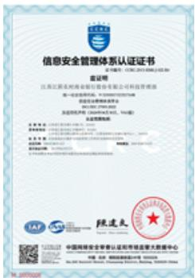

text_image

信息安全管理体系认证证书
江汉市江汉农村商业银行股份有限公司科技管理部
吴志明
江苏省江汉农村商业银行股份有限公司
基本信息管理系统
全国中小企业信用评级协会
及信用评级（2023年4月1日，70%）
基金管理人：中国建设银行股份有限公司
基金托管人：中国工商银行股份有限公司
投资者关系管理人：中国建设银行股份有限公司
产品名称：中国建设银行股份有限公司
产品代码：C100001
产品类型：保本浮动收益型
产品风险等级：低风险
产品期限：2023年4月1日至2023年4月29日
产品发行机构：中国建设银行股份有限公司
产品地址：中国北京市朝阳区建国路8号
产品有效期：2023年4月29日至2023年5月29日
产品编号：JAP
产品类型：保本浮动收益型
产品风险等级：低风险
产品期限：2023年4月29日至2023年5月29日
产品发行机构：中国建设银行股份有限公司
产品代码：C100001
产品类型：保本浮动收益型
产品风险等级：低风险
产品期限：2023年4月29日至2023年5月29日
产品发行机构：中国建设银行股份有限公司
产品代码：C100001
产品类型：保本浮动收益型
产品风险等级：低风险
产品期限：2023年4月29日至2023年5月28日
产品发行机构：中国建设银行股份有限公司
产品代码：C100001
产品类型：保本浮动收益型
产品风险等级：低风险
产品期限：2023年4月29日至2023年5月28日
产品发行机构：中国建设银行股份有限公司
产品代码：C100001
产品类型：保本浮动收益型
产品风险等级：低风险

通过ISO27001信息安全管理体系认证

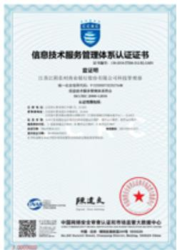

text_image

信息技术服务管理体系认证证书
公司名称：江苏江阴农村商业银行股份有限公司
法定代表人：吴建平
注册地址：江苏省南京市中山东路10号
经营范围：从事银行开户、贷款、融资、担保等业务，市场主体依法自主选择经营项目，开展经营活动，依法须经批准的项目，经相关部门批准后依批准的内容开展经营活动，不得从事本市产业政策禁止和限制类项目的经营活动。具体内容详见2023年6月29日《中国证券报》、《上海证券报》、《证券时报》及巨潮资讯网（www.cninfo.com.cn）披露的《江苏江阴农村商业银行股份有限公司信息技术服务管理体系认证证书》及其有效期限。具体内容详见2023年6月29日《中国证券报》、《上海证券报》、《证券时报》及巨潮资讯网（www.cninfo.com.cn）披露的《江苏江阴农村商业银行股份有限公司信息技术服务管理体系认证证书》及其有效期限。具体内容详见2023年6月29日《中国证券报》、《上海证券报》、《证券时报》及巨潮资讯网（www.cninfo.com.cn）

通过ISO20000信息技术服务管理体系认证

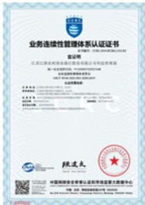

text_image

业务连续性管理体系认证证书
兹证明
江苏江阴农村商业银行股份有限公司科技发展部
第一创业证券研究所：中国证券监督管理委员会
注册会计师：王洪波
执业证书编号：2018-034
执业资质证书号：2018-035
执业期限：2018年06月19日至2018年06月20日
执业机构代码：2018-036
执业人员登记机关：中国证券监督管理委员会
执业人姓名：张建平
执业部门负责人：李晓明
执业联系电话：0755-8388-8888
执业邮箱：www.jjzq.com.cn
执业有效期：2018年06月19日至2018年06月20日
执业地点：江苏省南京市鼓楼区南京西路2号新天地大厦B座17层
执业时间：2018年06月19日至2018年06月20日
执业联系电话：0755-8388-8888
执业邮箱：www.jzq.com.cn
执业人姓名：张建平
执业部门负责人：李晓明
执业联系电话：0755-8388-8888
执业邮箱：www.jzq.com.cn
执业人姓名：张建平
执业部门负责人：李晓明
执业联系电话：0755-8388-8888
执业邮箱：www.jzq.com.cn
执业人姓名：张建平
执业部门负责人：李晓明
执业联系电话：0755-8399-9999
执业邮箱：www.jzq.com.cn
执业人姓名：张建平
执业部门负责人：李晓明
执业联系电话：0755-8399-9999
执业邮箱：www.jzq.com.cn
执业人姓名：张建平
执业部门负责人：李晓明
执业联系电话：0755-8399-9999
执业邮箱：www.jzq.com.cn
法定代表人：陈洪涛
中国网信安监会审计委员会和中国证券监督管理中心
地址：北京市西城区金融大街35号办公地址：北京市西城区金融大街35号法定代表人：陈洪涛

通过ISO22301业务连续性管理体系认证

2025年，本行组织开展信息科技全面审计，采用多维度穿透式审计方法，围绕信息科技治理、风险防控、数据安全等八大核心领域开展核查，覆盖治理架构、安全策略、系统全生命周期管理、生产运维、业务连续性、外包风控、数据安全治理等关键环节。本次审计识别风险隐患与薄弱点并提出改进建议，构建“规划-开发-运维-退出”全周期风险防控闭环，强化关键信息基础设施安全保障，为数字化转型下的业务连续性提供支撑。

## 信息安全增强技术和计划

本行建立全方位立体安全防护体系，在技术层面建立了以堡垒机、RSA双因素认证系统等各类安全系统及设备为主的全面信息安全防护体系，覆盖物理安全、网络安全、主机安全等多方面；网络层面通过防火墙、病毒防范、入侵检测等多项安全措施，实现各类安全管理功能；搭建全流量威胁分析系统等威胁监测分析系统，全方位检测威胁、及时处置以降低风险；同时与外部专业机构合作，开展网站实时安全监控、钓鱼网站及仿冒APP应急响应、电子银行业务安全评估等服务，进一步提升互联网业务安全。

## 信息安全文化建设

本行采用多元化培训形式提升员工安全素养，针对全行科技管理员，利用周末开设“周末课堂”，开展专项安全技术培训，内容涵盖系统防护、漏洞修复等实操技能；面向全体员工，在学习平台定期推送网络安全意识课程，通过案例分析、互动问答等形式强化安全认知，实现培训全覆盖。报告期内，本行共开展2次信息安全培训，覆盖1,815人次。

## 数据安全管理

## 数据分类分级管理

根据数据的重要性和敏感程度，将数据分为核心数据、重要数据、一般数据，并制定差异化的数据安全保护策略并落实保护措施，不断完善管控机制。

建立动态调整审批机制，当数据的业务属性、重要程度和可能造成的危害程度发生变化时，及时动态调整。

## 数据生命周期管理

数据收集：坚持“合法。正当、必要、诚信”原则，明确数据收集和处理的目的、方式、范围、规则。保障收集过程的数据安全性、数据来源可追溯。

数据访问：按照“业务必要授权”原则，对敏感级及以上数据严格实施授权管理，制定数据访问闭环管理机制，并对数据访问行为实施审计。

数据加工：在开展敏感级及以上数据清洗转换、汇聚融合、分析挖掘等数据加工活动时，采用匿名化去标识化或者其他必要安全措施保护数据主体权益。

数据删除及销毁·制定数据删除，销毁管理制度，按照国家、行业有关规定及与数据主体的约定进行数据册除或者匿名化处理：主动删除处理目的已实现、处理目的无法实现、为实现处理目的不再必要或者约定保存期限已届满等情形的业务数据。

## 个人隐私保护

最小化收集：收集个人信息限于实现金融业务处理目的的最小范围，不得过度收集个人信息不得利用所收集的个人信息从事违法违规活动。

主动告知：处理个人信息前，真实、准确、完整地向个人告知其个人信息的处理目的、处理方式、处理的个人信息种类、保存期限，个人行使其信息权利的申请受理和处理程序，以及法律法规规定本行当告知的其他事项。

## 第三方数据管理

与第三方机构的数据交互时，通过集中管理的外联平台或者应用程序接口实施，依据“业务必需、最小权限”原则，采取有效措施对接口设计、开发、服务、运行等进行集中安全保护管理。

## 业务连续性管理

本行建立，实施及维护信息安全相关业务连续性计划和控制措施，以确保在不利情况下信息安全连续性达到要求的级别。同时，我们定期通过应急演练等方式验证已建立并实施的信息安全连续性控制措施，以确保信息安全控制措施在不利条件下持续有效。报告期内，我行先后组织17次应用系统同城灾备切换应急演练，并对异地数据级灾备系统每月进行数据比对和数据恢复验证，有效检验灾备系统可用性，提高重要信息系统业务连续性能力。

## 影响、风险和机遇管理

本行建立并执行信息安全风险评估处置机制，持续监测信息安全风险，对发现的问题及时进行整改。报告期内，我行数据安全治理项目正式完成一期落地并进入持续深化阶段，总行管理部门及业务各条线联合开展数据安全评估，包括数据安全培训，问卷调研。业务访谈等，最终形成《数据安全风险评估报告》：报告覆盖数据安全组织保障，数据生命周期安全防护、信息系统运维保障三大维度，涵盖了全行27项重要系统，并针对重点风险项优先规划整改。

<table><tr><td>风险类型</td><td>风险描述</td><td>潜在影响</td><td>应对措施</td></tr><tr><td>组织架构风险</td><td>未明确数据安全管理的各层级组织架构的相关职责。</td><td>责任悬空、权责不清,可能导致数据安全管控流程无法有效落地执行。</td><td>制定数据安全管理办法制度,明确数据安全组织架构及各层级的职责分工。</td></tr><tr><td>制度体系风险</td><td>未见相关制度明确针对不同安全级别的数据,制定相应的安全策略和保障措施。</td><td>可能会造成防护资源错配,高密数据防护不足、低密数据过度管控,引发数据泄露或合规风险。</td><td>制定数据生命周期管理规范等制度办法,明确基于分类分级的差异化管控要求和措施。</td></tr><tr><td>人员管理风险</td><td>未制定培训计划定期开展数据安全意识教育与培训。</td><td>可能导致员工数据安全意识不足、操作行为不规范,增加人为引发数据安全事件的概率。</td><td>制定培训计划,并按计划开展数据安全培训、宣贯全行数据安全意识。</td></tr></table>

## 指标与目标

<table><tr><td>指标与目标</td><td>2025年达成情况</td></tr><tr><td>重要信息系统可用率不低于99.85%</td><td>已达成</td></tr></table>

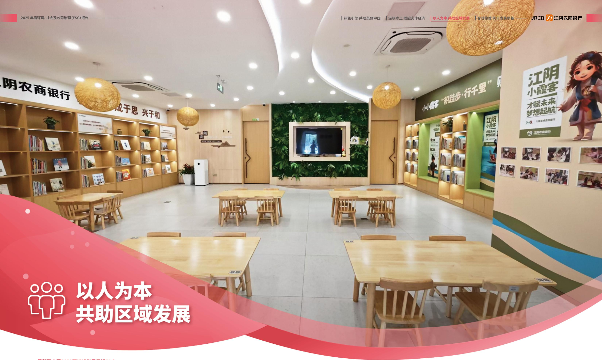

text_image

2025 年度环境、社会及公司治理(ESG)报告
绿色引领 共建美丽中国 | 深耕本土 赋能实体经济 | 以人为本 共励区域覆盖 | 合规稳健 讯电发展根基——JRCB 江阴农商银行
阴农商银行
成于思 兴于和
小小客“和睦步·行千里”
江阴
小霞客
才赋未来
梦想起航
江阴小霞客
才赋未来
梦想起航
江阴农商银行
以人为本
共助区域发展
新华社网2020可持续发展目标CDCs

贡献联合国2030可持续发展目标SDGs

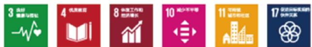

## 员工权益与发展

员工是企业发展的核心力量。江阴银行始终坚持以人为本，积极保障员工权益，注重人力资本培育，重视职业健康安全致力携手员工成长发展，为银行持续健康发展注入人才活力。

## 员工权益保障

本行严格遵循国际国内相关劳动法律法规，保障员工合法权益，建立健全薪酬福利机制，开展民主管理，打造有温度的职场环境，凝聚企业发展内生动力。

## 多元平等

本行严格遵循《联合国工商企业与人权指导原则》等各类人权保障国际公约，遵守《中华人民共和国劳动法》《中华人民共和国劳动合同法》等法律法规，坚持平等、公正招聘，制定《员工招聘管理办法》《劳动用工管理制度》《员工行为守则》等制度，规范人才招聘流程机制，促进公平就业。

我们充分尊重员工的多样性和差异性，将多元包容相关理念融入公司的招聘、培训、晋升和薪酬福利等方面，尊重多元共融的工作方式，不因性别、学历、年龄、种族、家庭状况、宗教信仰和文化背景等区别对待，杜绝雇佣童工、强制劳动等违反政策规定的用工及歧视骚扰行为，构建多元化、包容、平等、公正的工作氛围，为员工提供平等的机会和广阔的职业发展平台。报告期内，本行全年未发生员工歧视相关事件。

## 员工总 数1,747人

按性别划分的员工人数  
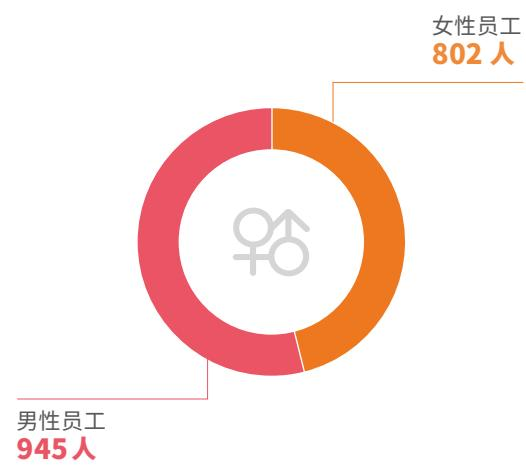

donut

| Category | Value |
| --- | --- |
| 女性员工 | 802人 |
| 男性员工 | 945人 |

按年龄划分的员工人数  
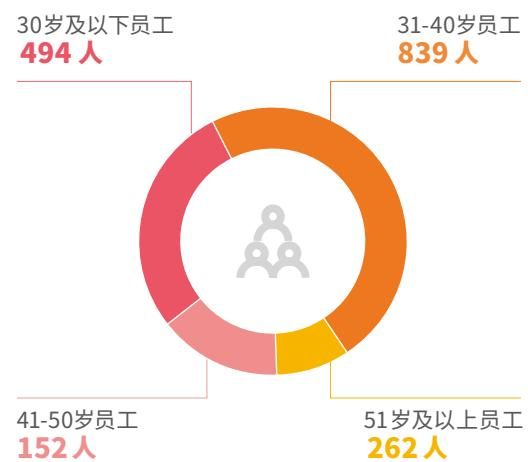

donut

| Category | Value (人) |
| --- | --- |
| 30岁及以下员工 | 494 |
| 31-40岁员工 | 839 |
| 51岁及以上员工 | 262 |
| 41-50岁员工 | 152 |

按层级划分的员工人数  
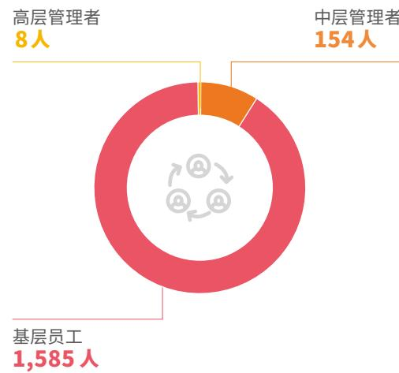

donut

| Category | Value (人) |
| --- | --- |
| 高层管理者 | 8 |
| 中层管理者 | 154 |
| 基层员工 | 1,585 |

按学历划分的员工人数  
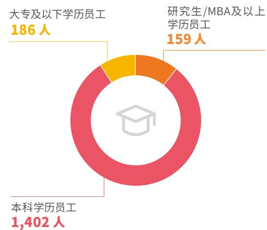

donut

| Category | Value (人) |
| --- | --- |
| 大专及以下学历员工 | 186 |
| 研究生/MBA及以上学历员工 | 159 |
| 本科学历员工 | 1,402 |

少数民族员工占比

0.5%

报告期内吸纳的就业人数

99

新招应届毕业生人数

77

中层管理者女性占比

35.1%

高层管理者女性占比

37.5%

劳动合同签订率

%100

社会保险覆盖率

100

育儿假返岗率

100

人均年带薪休假天数

天3.8

## 福利保障

本行持续做好职工结婚，生育，退休，生日福利发放工作以及节日慰问活动，为退休职工征订《江阻日报》，寄送《江银报》送上生日蛋糕祝福，并为高龄退休员工发放幸福长寿金。同时，我们在总部大楼新设立了洗车吧、咖啡吧、花吧、图书角，提升员工幸福感。

我们每季度对员工食堂用餐情况进行满意度调查，重点针对员工普遍关注的卫生状况、菜品种类及口味等议题，广泛收集意见和建议，通过对调查结果的深入分析，持续推动食堂加强管理，致力干提升员工就餐满意度，激发员工的工作热情增强员工的归属感。

## 民主沟通

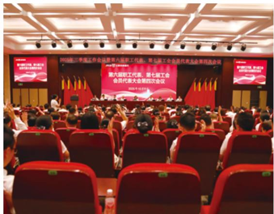

text_image

2015年三季度工作会议是第六届职工代表、第七届工会会员代表大会第四次会议
第六届职工代表、第七届工会
会员代表大会第四次会议
2015年12月

● 第六届职工代表、第七届工会会员代表大会第四次会议

本行每年开展职工代表大会，定期开展挂职人员交流会等民主会议，同时依托QA公邮在线反馈问题的沟通渠道，提升内部治理效能；制定《员工合理化建议管理办法》，倾听员工建议及心声，保障员工知情权、参与权和监督权。2025 年，本行召开第六届职工代表、第七届工会会员代表大会第四次会议，选举了第八届董事会职工董事，审议《江阴农商银行2025年度薪酬管理办法》等21个议案；审议通过2025年度工资专项集体合同。

员工工会入会率

100%

集体合同覆盖率

100%

## 员工关爱

本行注重平衡员工工作与生活，丰富员工的精神文化生活，组织开展形式多样、内容丰富、充满活力的职工文体活动，精心运营维护本行足球、篮球、羽毛球等18个俱乐部。报告期内，我行成功举办江阴农商银行第六届职工运动会，组织参加江苏省联合银行足球赛、羽毛球赛，无锡金融系统羽毛球赛、乒乓球赛、江阴市第九届全民运动会，完善升级“职工之家”活动场所，组织员工集体婚礼，全方位增强员工幸福感。

text_image

庆祝红色火
2023年1月1日 2023年第一次全国代表大会
庆祝中国共产党成立周年

迎新年会

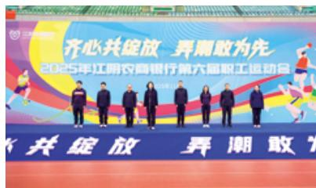

text_image

齐心共绽放 弄潮敢为先
2025年江阴农商银行第六届职工运动会
齐心共绽放 弄潮敢为

●● 第六届职工运动会

natural_image

Interior view of a conference room with attendees seated around long tables, facing a presentation screen (no visible text or signage)

三八节活动

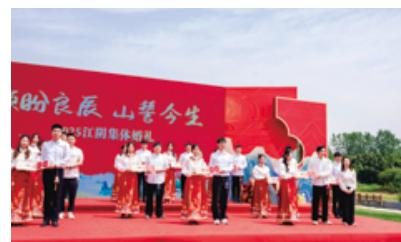

text_image

盼良辰 山誓今生
2025江阴集体婚礼

集体婚礼

我们积极深度开展员工帮扶服务，为职工集体投保家庭财产保险，参保市总工会的“江阻市在职职工医疗互助保障计划”。购置补充医疗保险及消费型终身重大疾病保险，严格执行市总工会的援助救助政策。同时，我们向江阴市总工会申请重大疾病救助慰问金，困难职工春节救助慰问金等。及时为面临困难的职工提供额外的关怀与支持

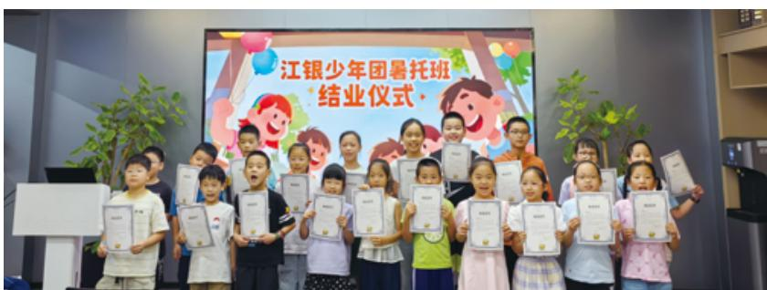

text_image

江银少年团暑托班
结业仪式·

●●江阻少年团暑托班结业仪式

我们重视职工子女的成长成才，携手江阴市沈鹏文化艺术促进会开设暑期青少年书法公益培训班，为职工子女提供免费的书法培训；开办“江银少年团”暑托班，切实解决职工子女暑期“看护难”问题，丰富职工子女的暑假生活。

## 人力资本发展

本行高度重视人力资本发展，构建分层分类的人才培养体系，开展专业技能、管理能力、综合素质等多元化培训，完善晋升通道与激励机制，激发员工潜能，打造高素质金融人才队伍，为银行高质量发展提供坚实的人才支撑。

## 治理

本行人力资本发展由高管负责，党委组织部（人力资源部）是具体责任部门。我们制定《劳动用工管理制度》《员工培训管理办法》《薪酬管理办法》《员工轮岗管理办法》等一系列制度，进一步规范员工权益保障、招聘与雇佣、晋升与发展等管理流程机制，以促进人力资本的全面发展和员工权益的全面保护。

## 战略与管理方式

本行主动适应金融发展新格局，将人才结构升级作为核心战略工程，以系统性举措全面提升队伍专业化水平，加大人才开发力度：坚持以联合银行人才发展目标为导向，以服务本行发展战略为目标，认真落实重大人才政策，构建高效集约的人力资源机制;持续优化人才结构，稳步提升人才素质，加强人才培养，搭建发展平台，赋能员工发展，为本行战略发展提供坚强人才支撑。

## 人才吸引

本行持续深化外部人才招聘，打造“专家型组织”形象，以专业形象吸引志同道合者，强化雇主品牌建设，将“考生体验”作为优化招聘流程的核心要素，从招聘信息的精准推送，面试流程的专业安排，到入职前的细致引导，通过组织参观行史馆、员工健身区、咖吧书吧等活动，直观展示本行独特的企业文化与价值观，增强新人的企业文化认同感与归属感。

我们注重内部人才选拔，实施“人才梯队建设计划”，创新管培生培养机制，定制化培育管理人才梯队：拓宽引才渠道矩阵综合运用名校宣讲、社会招聘、以才引才等多元方式，配套挂职交流、岗位轮换等培养政策，精准匹配人才成长需求。

## 员工培训

本行按照“建设育人体系，筑造人才方阵”目标，统筹优化培训资源，持续创新培养模式，强化学习成效评估，纵深推进学习型组织建设，全面推动培训形式与培训质量系统化提升，赋能员工成长发展。

## 丰富课程体系

## 转变培训方式

## 拓宽培训渠道

依据岗位课程体系建设战略思路，以客户经理课程为主要内容，从专业知识、营销能力、综合素质三个方向，进一步加强内训师队伍建设，稳步推进课程体系建设，提炼和整理本行实践经验，提升培训的实践性。

将专项培训作为主要的培训方式推进培训向系统化、小班化、专业化、精准化的转变，以项目式培训进行管理人员培养，以系列培训班的形式开展员工轮训，提升培训的有效性。

加强年轻干部的培养锻炼，选派优秀年轻于部到联合银行、部委办局等挂职锻炼，推动干部员工双向轮岗交流。以分享式培训进行内部经验交流，推出经验分享系列直播活动等，丰富培训的体验性。

## 专业人才 专题化培训

开设风险管理、科技开发、理财专员、后备客户经理、转岗客户经理等5个专题培训班。2025 年共计开展系列专题培训 30 期，累计参训 2,000 余人次。

## 营销人才 策略化培训

开展客户经理轮训项目，针对公司、高级普惠客户经理、初中级普惠客户经理及零售客户经理、新锐客户经理等不同类型人才分类培训，增强客户经理营销能力，提升客户满意度。

## 新员工精进化培训

开展新员工入职集中培训，涵盖警示教育、企业文化、核心系统操作与合规知识等重点模块，采用“理论授课+实操演练”相结合的模式，有效提升新员工的岗位基础技能、风险合规意识与职业认同感。报告期内，累计87名新员工参训。

## 中层管理人员提升化培训

组织开展向华为取经中层课程培训，系统借鉴其管理理念与实践精髓，重点提升中层干部的战略解码能力、团队引领水平与变革推动本领，增强我行整体市场适应力、核心竞争力和可持续发展能力，为全行高质量发展注入强劲的管理动能。

## 内训师分层化培训

依据内训师的资质与定位，将其细分并相应制定差异化的培训方案，参与培训的内训师共计120人，其中择优选拔表现突出的内训师进入深化培养阶段，并举办全行内训师授课大赛，强化知识沉淀与内部传播能力。

## 员工发展

本行积极畅通职业晋升通道，推进后备人才库及专业技术人才库建设，开展后备人才库训练营，采用“训战结合”方式配套完善人才培养机制,有效增补人才梯队力量，实现选人，识人，用人精准化。我们通过搭建财务风险专班，科技赋能专班后备客户经理专班，建立主管后备库、中层后备库等，完成后备人才库及专业技术人才建设，实现对人才“双通道管理”。

我们搭建人才交流机制，持续开展跨条线、跨地域交流，推动干部人才的多元融合，结合组织架构调整和经营需要，加大于部轮岗力度，促进总行与支行、本地与异地骨于的交流，加速于部的复合型培养。同时，我们选优配强于部队伍，常态化开展管理人员日常考察与年度考评，深化选人用人机制，践行能上能下用人导向：动态更新后备人才库，为年轻人才提供成长锻炼的舞台，推动于部队伍年轻化，优化并壮大营销队伍，鼓励更多员工走出舒适区，到一线岗位创造价值，推进部门人员分流和员工转岗。注重控掘现有人力资源潜力，加大营销人员占比。为零售转型重点突破，增户拓面有效提升注入更多人才力量。

## 薪酬绩效

我们根据国家人力资源和社会保障部门对薪酬的有关规定以及江苏农商联合银行《江苏辖内农村商业银行薪酬管理办法》，结合本行实际制定《薪酬管理办法》《绩效薪酬风险金延期支付管理办法》等，对基本薪酬和绩效薪酬、员工及高管薪酬等进行规范管理。

本行持续深化薪酬分配改革,完善绩效薪酬体系,按照“以岗定薪、岗变薪变、按绩取酬”的分配原则,促进薪酬向关键岗位一线岗位和紧缺急需的高层次人才倾斜，增强薪酬竞争力。坚持以岗位为基础、以业绩为导向，定量和定性分析相结合，横向与纵向相比对的综合评价方式。绩效考核结果作为薪酬兑现、职业发展、干部选拔任用的重要依据。在物质激励的基础上，选树一批优秀员工典型，提升人才的获得感、荣誉感，通过多种方式持续增强员工激励

本行持续优化绩效管理流程机制.每年考核制度讨论稿下发部门和分支行提供反馈意见，用积分形式展示客户经理业绩开展周末讲堂培训，讲解经营目标及绩效考核制度等，实现绩效流程机制的有效调整。

## 员工满意度

本行重视员工体验，在机构综合考核中设置“机构员工内部协作氛围满意度调研”,了解员工工作状态和环境，提升幸福感。我们每季度对员工开展满意度调查，体现出本行在管理创新，文化建设及员工关怀方面的卓越性，提高员工满意度显著降低核心人才流失率，提升本行在金融人才市场的吸引力。

影响、风险和机遇管理

<table><tr><td colspan="2">类别</td><td>描述</td><td>应对措施</td></tr><tr><td rowspan="2">风险</td><td>人才结构性短缺风险</td><td>金融科技发展迅速,金融科技、跨领域复合型人才短缺,基层员工数字化技能参差不齐,部分老员工新技术实操应用能力不足,专业技能薄弱将使业务人员难以匹配岗位需求,影响服务效能提升。</td><td>·主动适应金融发展新格局,将人才结构升级作为核心战略工程,全面提升队伍专业化水平,构建高效集约的人力资源机制,持续优化人才结构,稳步提升人才素质,为本行战略发展提供坚强人才支撑。</td></tr><tr><td>人才吸引与留存竞争风险</td><td>本地金融市场竞争日趋激烈,同行企业凭借更广阔的发展平台、更具竞争力的薪酬体系,对核心人才形成虹吸效应。本行基层网点多、服务半径广,一线员工工作压力大,核心人才流失面临挑战。</td><td>·深化薪酬分配改革,完善绩效薪酬体系,促进薪酬向关键岗位、一线岗位和紧缺急需的高层次人才倾斜,提供具有竞争力的薪酬。·深化外部人才招聘和内部人才选拔,开展员工关爱,保障身心健康,疏解心理压力,增强员工认同感与归属感。</td></tr><tr><td>机遇</td><td>多元化人才政策机遇</td><td>金融市场的开放和业务多元化(如科技金融、绿色金融)发展亟需跨领域人才。</td><td>·建设多元的人员队伍,针对不同类型员工精准开展培训,提升专业技能,赋能人才成长发展。</td></tr></table>

## 指标与目标

<table><tr><td>指标与目标</td><td>2025年达成情况</td></tr><tr><td>员工流失率低于5%</td><td>员工总流失率为2.31%</td></tr><tr><td>员工培训覆盖率达到100%</td><td>员工培训覆盖率100%</td></tr></table>

<table><tr><td colspan="2">指标</td><td>单位</td><td>2025年</td></tr><tr><td rowspan="2">按性别划分员工流失率</td><td>男性员工</td><td>%</td><td>1.27</td></tr><tr><td>女性员工</td><td>%</td><td>1.04</td></tr><tr><td rowspan="4">按年龄划分的工流失率</td><td>30岁及以下员工</td><td>%</td><td>1.33</td></tr><tr><td>31-40岁员工</td><td>%</td><td>0.92</td></tr><tr><td>41-50岁员工</td><td>%</td><td>0.06</td></tr><tr><td>51岁及以上员工</td><td>%</td><td>0</td></tr><tr><td rowspan="3">按层级划分员工流失率</td><td>高层管理者</td><td>%</td><td>0</td></tr><tr><td>中层管理者</td><td>%</td><td>0</td></tr><tr><td>基层员工</td><td>%</td><td>2.31</td></tr></table>

员工业务培训总支出

424.62万元

全年业务培训总人次

人次43,652

员工业务培训总学时

128,337小时

线上学习平台总学时

61,145 小时

员工培训覆盖率

100%

员工年人均业务培训时长

73.46

线上学习平台总学习人次

20,964 人次

按性别划分的员工培训覆盖率  
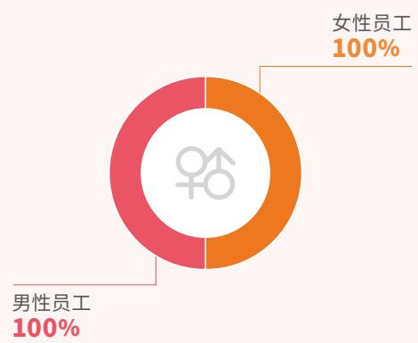

donut

| Category | Percentage |
| --- | --- |
| 女性员工 | 100% |
| 男性员工 | 100% |

按层级划分员工培训覆盖率  
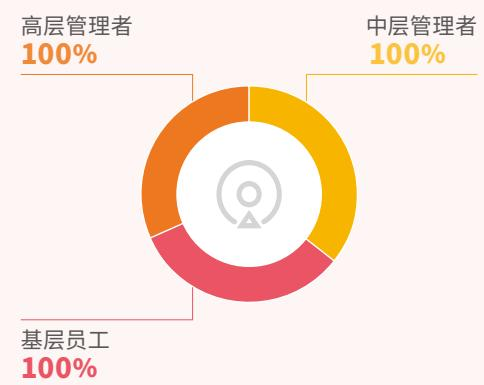

donut

| Category | Percentage |
| --- | --- |
| 高层管理者 | 100% |
| 中层管理者 | 100% |
| 基层员工 | 100% |

## 职业健康与安全

本行坚持“预防为主、单位负责、突出重点、保障安全”的方针，建立覆盖全行所有营业网点、办公场所及全体员工(含外包人员）的安全生产责任体系，制定《安全管理工作管理办法》《消防安全管理制度》《安全保卫突发事件应急处置工作办法》等制度，确保各项安全工作有章可循、操作规范。同时，我们坚持“党政同责、一岗双责”，通过逐级签署安全生产责任状，将安全保卫与职业健康责任落实到具体岗位，责任状签署率达 100%。

<table><tr><td>指标</td><td>目标</td><td>2025年达成情况</td></tr><tr><td>安全红线指标</td><td>全年确保无责任性刑事案件、无重特大火灾事故、无重大人身伤亡事故</td><td>2025年全年无责任性刑事案件、无重特大火灾事故、无重大人身伤亡事故</td></tr><tr><td>培训覆盖指标</td><td>全行员工安全教育培训覆盖率100%</td><td>2025年全行员工安全教育培训覆盖率100%</td></tr><tr><td>福祉保障指标</td><td>员工年度健康体检覆盖率100%</td><td>2025年度健康体检覆盖率100%</td></tr></table>

常态化演练：持续开展涵盖防抢、防暴、消防等场景的实战演习。全年共开展3次全行性安全及消防知识培训、1次保安技术大练兵；组织1次紧急救助与AED普课培训，1次AED考证培训，江阴辖内29名员工获得证书，促进技能提升。

消防安全管理：实行消防控制室24小时双人持证上岗值班制度；定期对办公大楼及各网点消防设施进行全面检测。

网点巡检：严格执行营业网点前、中、后的全流程安全检查，配备专业保安人员，全力维护客户及员工的人身安全。

健康体检服务：本行定期组织全体员工进行年度健康体检，保障员工及时了解自身健康状况。

环境监测与优化：办公场所全面禁烟，定期对办公区域的空气质量、照明强度及饮用水质进行监测。

关注心理健康：在客户经理培训和新员工培训中，开展情绪管理与压力疏导等相关课程：员工从被动承受压力转向主动管理（如时间规划，任务分解)，通过情绪管理，助力员工心理状态调节

健康及安全培训人次

25,684 人次

健康及安全培训总时长

25,684小时

因工伤损失总日数

0

工伤人数

0人

安全检查次数

534 次

因工死亡人数

0

事故数量

0 起

应急演练次数

次354

## 供应链管理

江阴银行严格遵守《中华人民共和国招标投标法》《国有金融企业集中采购管理暂行规定》等法律法规，制定《集中采购工作管理办法》《集中采购评审人员管理办法》及《评审实施细则》等内部制度，建立健全供应链管理的核心制度，明确采购规则、组织管理、采购方式、供应商管理等全流程管理要求，确保供应链的稳定性与连续性。

## 供应商全生命周期管理

本行建立完整的供应商全生命周期管理机制，通过供应商基本条件审核、电请入库，入围遴选，定期评价等环节进行规范约束，每季度开展供应商审查，确保供应链的稳定与优质。报告期内，本行对在库供应商进行四次动态核查，其中20家供应商已企业注销，6家供应商存在严重违法失信行为，均已报备并进行了出库处理：共计有3家供应商因中标后无法按约定实施放弃中标，均已报备采委会后列入黑名单。

## 供应商全生命周期管理

## 准入

严把供应商入围关，通过资格审核、综合测试、随机抽取等方式确定候选供应商范围；规范供应商准入流程，经过申请(填写《供应商入库电请表》、送审（项目管理部门初审)、审核（集采办及采购委员会审批)、入库四个环节，实现供应商入库。

## 定期评价

项目完成后，本行相关部门对供应商进行履约考评考核内容包括交付、质量、服务等维度。

## 动态复核及退出

建立在库供应商资信情况的动态查询复核机制，每季度运用科技手段对在库供应商资信情况进行查询复核。

对提供虚假材料、商业贿赂、恶意串通、履约考核不合格、结算超预算5%等行为的供应商，列入“黑名单”，禁止参与本行采购活动。

## 供应链ESG风险管控

本行在采购过程中积极开展供应链ESG风险管控，将商业道德与反腐败、绿色环保、劳工与人权等ESG因素纳入供应商管理流程，致力打造更具韧性的供应链。

## 商业道德与反腐败

在采购文件中明确要求供应商签署《廉洁承诺书》，承诺不向本行人员行贿、不进行利益输送，违反承诺将取消资格或终止合同；实行采购人员回避制度，防止利益冲突。

## 环境保护

明确“集中采购应当优先采购节能环保产品”的原则，在工程类供应商考核中，将“安全文明施工及环境保护措施”列为评价项目。

## 劳工与人权

准入条件中明确要求供应商有依法缴纳社会保障资金的良好记录:在服务类及工程类供应商考核中，包含对“安全保障”及“劳动力配备”的评价。

## 助力供应商成长

本行致力携手供应商成长，与供应商进行形式多样的沟通交流，明晰本行需求，帮助供应商提升服务能力，并积极提供技术支持，在综合测试和项目实施过程中，组织技术专家与供应商进行深入的技术交流和方案探讨，验证产品可用性，助力供应商提升产品竞争力。

<table><tr><td colspan="2">指标</td><td>单位</td><td>2025年</td></tr><tr><td>供应商总数</td><td></td><td>家</td><td>1,501</td></tr><tr><td rowspan="2">按地区划分的供应商数量</td><td>江苏省内</td><td>家</td><td>823</td></tr><tr><td>江苏省外</td><td>家</td><td>678</td></tr><tr><td colspan="2">供应商廉洁承诺书/协议签署比例</td><td>%</td><td>100%</td></tr></table>

## 金融可及性

江阴银行优化线下网点布局，拓展线上金融服务渠道，推动金融服务向乡镇、社区、园区延伸，降低金融服务门槛，提升金融服务的覆盖面与可得性，让金融资源惠及更多市场主体与城乡居民，切实打通金融服务“最后一公里”

## 金融宣传

本行常态化、多形式开展金融知识普及活动，积极探索创新金融教育新模式新方法，提升社会公众金融素养及风险防范能力，营造和谐健康的金融环境。

## 常态化教育宣传

全行88家营业网点均设立了独立的“金融知识宣传教育区”，配备充足的宣传折页、书籍、电子显示屏等，常年开展金融宣传。  
●主动“走出去”，深入社区、企业、学校、乡村，针对老年人、青少年、新市民等重点群体开展精准教育活动。  
·利用官方网站、“金芙蓉”微信公众号、视频号等自有媒体平台，设立金融知识专栏，定期发布原创的“以案说险”、风险提示、政策解读等图文、视频内容，拓展金融教育的广度和深度。  
结合社会热点和季节性风险，按季度策划并发布原创风险提示。报告期内，我行共发布5期，涵盖岁末年初资金安全、防范贷款中介陷阱、警惕非法集资与电信诈骗等内容，起到有效的预警作用。

## 特色主题教育宣传

●持续推进“送金融知识进社区”“守住钱袋子”“3:15宣传周”“普及金融知识万里行”“普及金融知识宣传月”等主题活动，并深度融入“银龄集市”平台，开展防骗反诈知识宣讲，有效提升老年客户的金融素养和风险防范意识。报告期内,我行累计组织各类特色助老活动达30场。

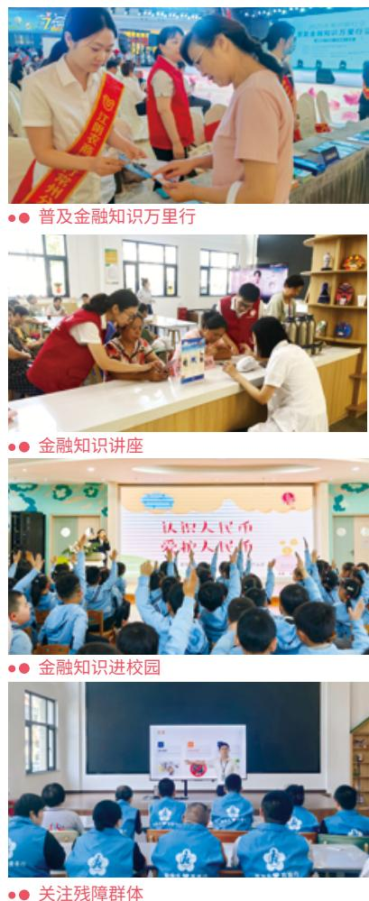

## 网点建设

## 提升网点资源配置和服务效率

本行针对城区网点布局合理性调研分析，对江阴城区现有26个网点的布局现状、运营效能、资源匹配度进行系统性评估识别布局痛点，发现管理半径过长、网点重叠、低效机构拖累整体盈利等问题，并提出合理性建议，为后续网点资源配置决策提供科学依据，致力为客户提供更便捷的网点服务。

## 提升网点资源配置和服务效率

本行积极构建四务融合便民服务网络，深入农村、贴近群众，全力推进集“村务、政务、商务、金融服务”的“四务融合金融便民服务点”建设，服务点不仅提供基础金融业务办理，还接入“苏服办”“人社就近办”政务服务项目，为群众提供涵盖户籍、证件、社会保障等30余类、200余项民生事项的政务查询及办理服务，真正实现“服务零距离”。

<table><tr><td>指标</td><td>单位</td><td>2025年</td></tr><tr><td>营业网点数量</td><td>个</td><td>88</td></tr><tr><td>自助银行数量</td><td>家</td><td>75</td></tr><tr><td>自助设备数量</td><td>台</td><td>201</td></tr></table>

## 乡村振兴

江阴银行立足金融主业，积极服务乡村振兴，巩固乡村振兴试点工作成果，充分发挥乡村振兴主办行优势，以整村授信三年行动方案为抓手，聚焦授用信覆盖面提升、先进典型示范区创建、数字人民币推广三大目标，紧盯农业产业布局，多维度助力农业强市建设，为乡村振兴注入金融活水。

## 巩固乡村振兴试点工作成果

本行大力推进金融挂职交流，把“讲政治、勇担当、守纪律、善创新”的于部骨于选派到挂职岗位，担当好银政企民联络员三农发展服务员，普惠金融宣传员创业致宫指导员“四员角色”，截至2025年末，本行先后与47个部委办局战略合作276.个行政村开展党建共建，为强村，富民，兴企提供有力支撑

## 支持农产品稳定供应

本行建立分层分类的新型农业经营主体金融支持体系，支持全市农业龙头企业、农民专业合作社、家庭农场、农业专业大户等新型农业经营主体发展壮大。我们围绕“藏粮于地”“藏粮于技”的战略要求，重点支持高标准农田建设、春耕备耕农机装备、粮食流通收储加工等领域金融需求，择优支持粮食供给、种业振兴等重点领域企业，为其提供精准适配的信贷支持。截至2025年末，本行支持粮食重点领域贷款余额达6.82亿元

## 提升涉农金融服务水平

整村授信与数字 人民币推广

推进2023-2025年整村授信行动方案，着力提升农村地区授用信覆盖面；将数字人民币推广纳入乡村振兴重点目标，进一步扩大其在涉农及民生场景的应用范围。

支持特色农业产业与新型农业经营主体

密切关注农业产业布局，持续扩大农村金融服务覆盖面，为优质水稻、绿色蔬菜等特色产业提供资金支持；深化与农业农村局的合作，对新型农业经营主体实施精细化分层分类名单制管理，建立详尽名单并开展“1+N”金融顾问服务机制，加大督促走访力度挖掘资金需求，同时主动深入关键区域，利用惠农政策性产品并加大金融产品创新研发，全方位助力农业龙头企业，农民专业合作社等新型农业经营主体稳健发展。

推动美丽乡村建设与村级集体经济发展

积极响应相关政策导向，从多维度加强对美丽乡村示范村的支持建设，推出“美丽乡村贷”“村村贷”等专属产品，配套制定深化农村集体经济改革的专项金融服务方案，支持美丽乡村示范村建设村级集体经济发展及乡镇企业转型升级。

## 社区公益

江阴银行秉持“源干社会、回馈社会”的理念，始终将社会责任视为发展的重要组成部分，坚持金融为民的初心使命，积极投身各类慈善捐赠与公益事业，以实际行动践行本土银行的责任与担当，为地方经济社会高质量发展贡献力量。

## 慈善捐赠

本行向本地经济相对薄弱村、澄江街道、江苏省慈善总会等累计捐赠540万元，组织员工参加本地慈善一日捐活动筹集资金近16万元。

## 公益活动

本行积极支持江阴市元旦公益徒步大会、江阴市半程马拉松、江阴市足球联赛、石榴籽民族运动会等公益活动，累计支出金额288万元。

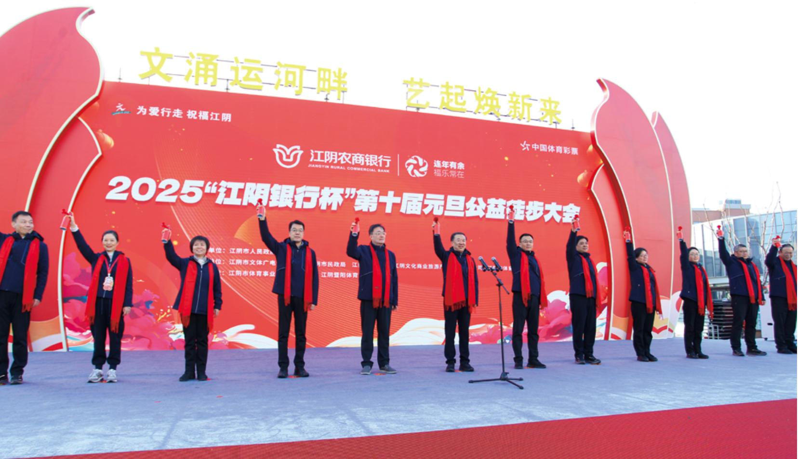

text_image

文涌运河畔 艺起焕新来
为爱行走 祝福江阴
江阴农商银行 | 连年有余
JIANGYIN RURAL COMMERCIAL BANK | 福乐常在
2025“江阴银行杯”第十届元旦公益徒步大会
单位：江阴市人民政府
单位：江阴市文体广电
单位：江阴市体育事业
中国体育彩票
江阴市民政局 江阴文化商业旅游厅
江阴登阳体育

●●江阴市元月公益徒步大会

## 志愿服务

我们持续开展“暖冬行动”“阳光行动”等系列志愿服务活动，参与无偿献血，走进社区开展志愿服务，宣传反诈知识，针对老年人群体开展节日慰问。其中，自2020年以来，本行每年坚持开展“暖冬行动”“，关爱贫困、重病、重残儿童，累计帮扶106名困境青少年。

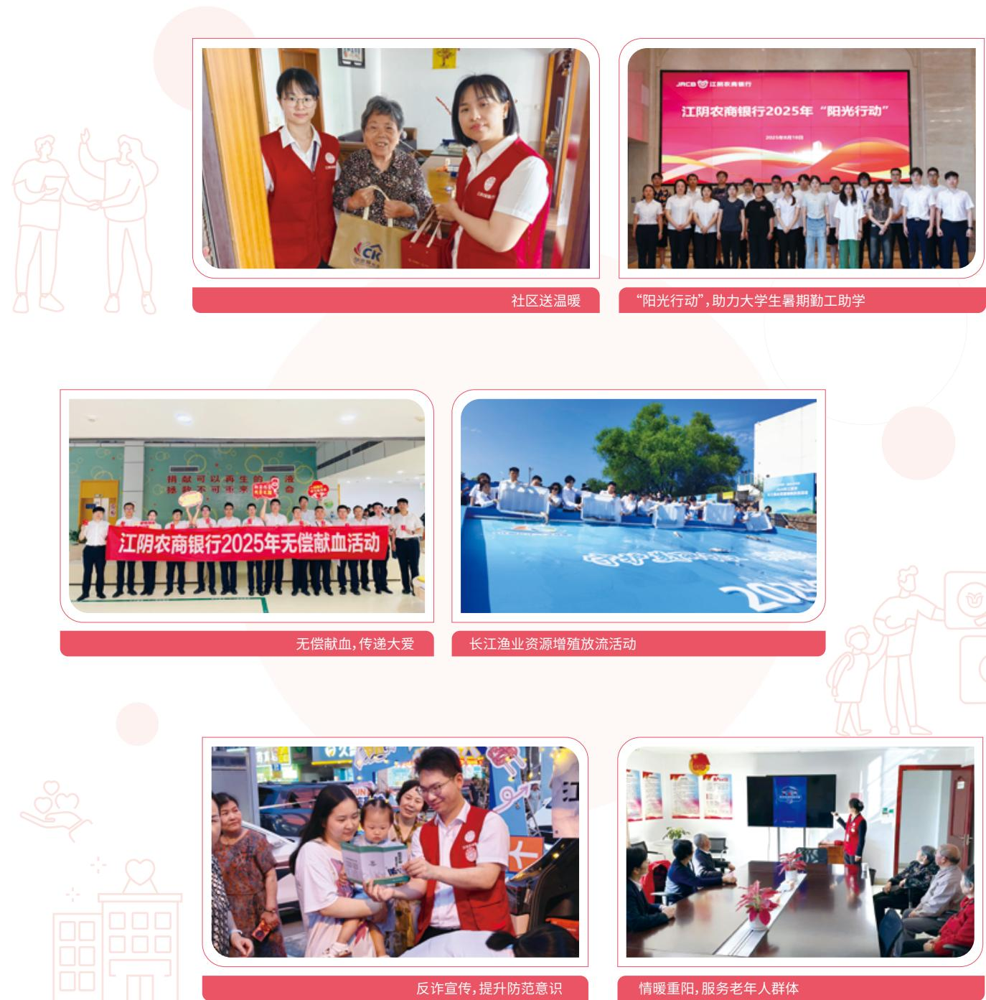

## 合规稳健筑牢发展根基

贡献联合国2030可持续发展目标SDGs

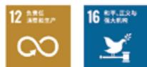

## 党建引领

2025年，江阴银行以习近平新时代中国特色社会主义思想为指导，深入学习贯彻党的二十大和二十届历次全会精神，学习贯彻中央八项规定精神，牢牢把握党管金融原则与金融工作的政治性、人民性，将党建与公司治理以及全行高质量发展深度融合，持续筑牢政治根基、拓展协同格局、激发内生动力，以高质量党建引领保障全行各项工作稳中有进。

## 党建治理融合

本行将党建与公司治理深度融合，2025年，本行在《公司章程》单列“党建专章”，明确党委的法定地位。通过党委会与董事会、管理层“双向进入、交叉任职”，并将党委研究讨论作为董事会、经营层决策重大问题的前置程序，使党委“把方向、管大局、保落实”的领导作用制度化、具体化。

## 党建赋能

报告期内，本行不断深化理论武装，以“第一议题”制度为抓手，完成党委会“第一议题”学习32次、党委理论学习中心组(扩大)学习会13次，指导各支部集中学习582次，协调推动专题党课202 场，实现全行教育全覆盖。同时，本行持续创新党建载体，开展党务专题培训7次覆盖400余人次,组建“金芙蓉”红色讲师团，上线“金芙蓉党务工作管理平台”，举办AI智能体创意设计大赛等特色活动，以数字化、多样化举措提升党建工作效能。

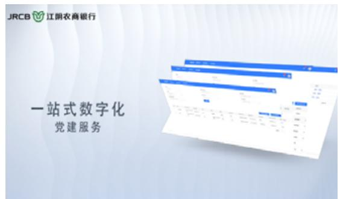

text_image

JRCB 江阴农商银行
一站式数字化
党建服务

●●金芙蓉党务工作管理平台

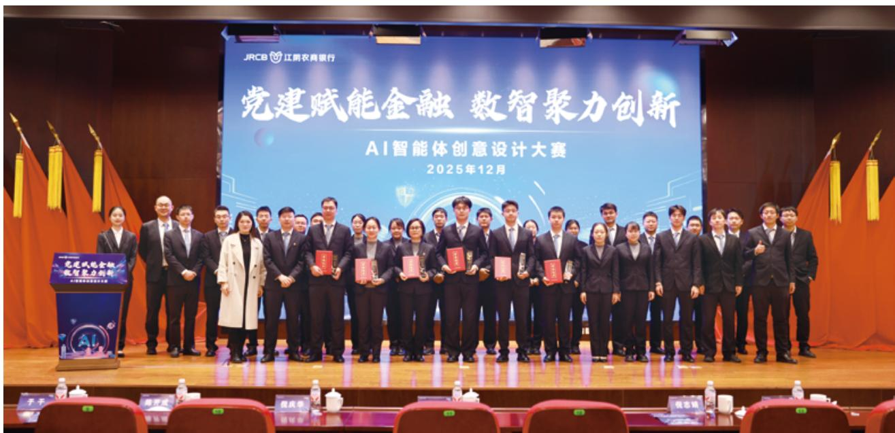

text_image

JRCB 江阴农商银行
党建赋能金融 数智聚力创新
AI智能体创意设计大赛
2025年12月

●AI智能体创意设计大赛

## 党建共建

本行以党建共建、合作共建为关键抓手，积极与政、校、企、村等多方对接合作，推动党建与业务深度融合服务发展。近年来本行积极构建“资源共享、优势互补、互相促进、共同提高”的党建共建格局，新增共建单位131个，总数达455个，涵盖党政机关、村居、企事业单位等。深化“三级网格”共建，全行党支部与279个村（社区）结对，带动存款增长，签约代发工资245户，升级88个“金融普法站”“苏服办”政务延伸点。同时，聚焦实体经济与民生需求，签订2025-2029年民营经济金融服务专项规划，目标投放500亿元；服务科技企业1,498户，贷款余额156.42亿元；共建智慧“三资”监管平台、“银医通”等14个民生金融平台，沉淀资金超48亿元，实现党建与地方经济、民生服务深度融合共赢。

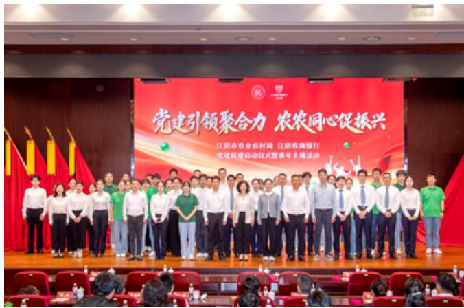

text_image

党建引领聚合力 农农同心促振兴
江阴市农业农村局 江阴农商银行
党建联建启动仪式暨青年主题活动

●●江阴农商银行与江阴市农业农村局开展党建联建启动仪式暨青年主题活动

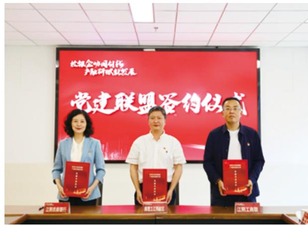

text_image

社银企协调网创伟
产融研讯就发展
党建联盟签约仪式
江阴交通银行
新郑工贸集团
江阴工农院

●●江阴农商银行、南理工、市工商联共同举办党建联建活动

## 党建品牌建设

本行积极推动党建品牌建设，激活基层组织与群团活力，凝聚全员奋进的发展合力。本行持续夯实基层组织基础，完善支部考核评价机制，累计获评省属金融企业“五星级”党支部6个、“四星级”7个、“三星级”35个：打造“岗区队”先锋体系，设立党员突击队41.个、责任区50个、示范岗44个，在“十百千”工程等重点任务中发挥先锋作用。同时，激活群团活力。开展职工特色活动6场次，举办第六届职工运动会，“金芙蓉”志愿者联盟开展主题活动200余场、动员900余人次；评选32名“江银先锋”，弘扬奋斗者文化，以品牌建设提升员工获得感与幸福感，为全行发展注入内生动力。

natural_image

Illustration of three people assembling large purple gears with connecting lines (no text or symbols)

## 公司治理

股东会召开

3次

通过议案

24个

董事会召开

6次

通过议案

104个

董事会成员出席率

100%

natural_image

Illustration of two business professionals holding laptops, one pointing upward and the other raising a fist (no text or symbols present)

## 公司治理体系

江阴银行建立以股东会、董事会、监事会及高级管理层为核心的治理架构，坚持以权责清晰、制衡有效原则规范治理运行机制、提升治理主体履职能力，依法合规推动各治理主体履行各自权责，着力提高上市公司企业治理水平，切实保障利益相关方的权益并提升企业价值。

2025年，本行衔接新《公司法》及金融监管新规，开展公司制度体系优化和治理架构调整工作。优化制度体系方面，修订《公司章程》《董事会议事规则》《股东会议事规则》等21个公司治理制度，完善优化7个专委会工作细则;调整治理架构方面，改“股东大会”为“股东会”，取消监事会并将职能划归董事会审计委员会，优化7个专门委员会设置，提升独立董事占比并主导关键委员会，强化独立监督，确保公司治理规章制度及运行机制符合最新监管政策要求。

召开战略发展委员会

6次

风险管理委员会

5 次

关联交易控制委员会

4 次

审计委员会

4 次

提名及薪酬委员会

6 次

三农金融服务委员会

2次

金融消费者权益保护委员会

2次

各董事会委员会成员出席率

100%

## 董事会有效性与多元化

## 董事会多元化

董事会是公司经营管理的决策机构，维护公司和全体股东的利益，在《公司章程》和股东会的授权范围内，负责公司发展目标和重大经营活动的决策。多元化的董事会是提升治理效能、驱动科学决策的重要保障。本行将持续推进多元化建设，逐步将多元化纳入考量，并针对候选人的教育背景、行业经验、技能专长、专业知识和工作履历等专业因素进行综合权衡，使董事会维持适当范围及平衡的才能、技能、经验、性别、年龄及文化教育背景。全体董事严格按照《董事会议事规则》《独立董事制度》《上市公司独立董事管理办法》等规定和要求履行职权，认真审议议案内容，审慎发表意见，出席董事会和股东会，勤勉尽责。

## 报告期内

女性董事

2

独立董事

4 名

董事会中女性占比

18.18 %

独立董事占比

36.36%

董事性别  
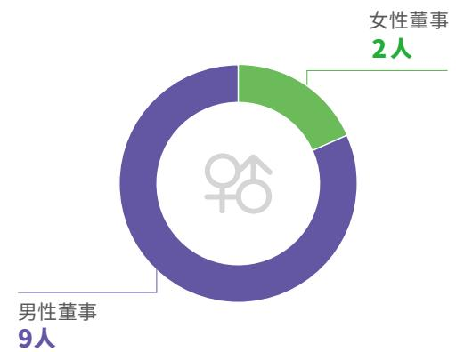

donut

| Category | Value |
| --- | --- |
| 女性董事 | 2人 |
| 男性董事 | 9人 |

董事职务  
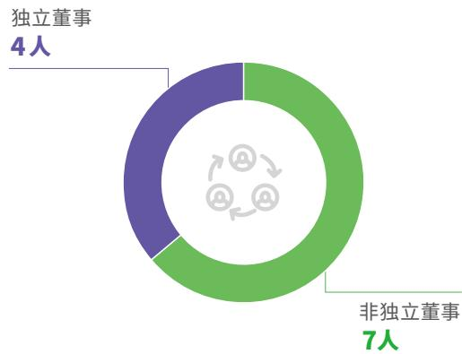

donut

| Category | Value |
| --- | --- |
| 独立董事 | 4人 |
| 非独立董事 | 7人 |

董事学历  
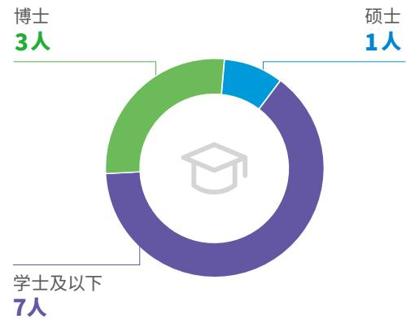

donut

| Category | Value |
| --- | --- |
| 博士 | 3人 |
| 硕士 | 1人 |
| 学士及以下 | 7人 |

董事年龄  
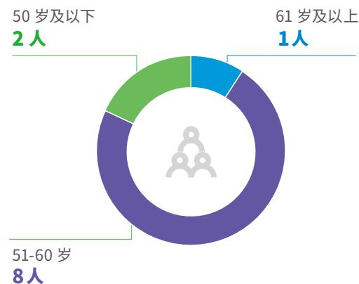

donut

| Category | Value |
| --- | --- |
| 50岁及以下 | 2人 |
| 61岁及以上 | 1人 |
| 51-60岁 | 8人 |

<table><tr><td rowspan="2">职务</td><td rowspan="2">姓名</td><td rowspan="2">性别</td><td colspan="5">专业能力</td></tr><tr><td>战略规划</td><td>行业经验</td><td>风险管理</td><td>财务会计</td><td>可持续发展</td></tr><tr><td>董事长、非独立董事、法定代表人</td><td>宋萍</td><td>女</td><td>✓</td><td>✓</td><td>✓</td><td>✓</td><td>✓</td></tr><tr><td>非独立董事、行长</td><td>倪庆华</td><td>男</td><td>✓</td><td>✓</td><td>✓</td><td></td><td>✓</td></tr><tr><td>独立董事</td><td>周凯</td><td>男</td><td>✓</td><td>✓</td><td></td><td>✓</td><td>✓</td></tr><tr><td>独立董事</td><td>汪激清</td><td>男</td><td></td><td>✓</td><td>✓</td><td>✓</td><td></td></tr><tr><td>独立董事</td><td>董斌</td><td>男</td><td></td><td>✓</td><td>✓</td><td>✓</td><td>✓</td></tr><tr><td>独立董事</td><td>朱南军</td><td>男</td><td></td><td>✓</td><td></td><td>✓</td><td></td></tr><tr><td>非独立董事</td><td>陆庆喜</td><td>男</td><td>✓</td><td>✓</td><td>✓</td><td>✓</td><td></td></tr><tr><td>非独立董事</td><td>范新凤</td><td>女</td><td></td><td>✓</td><td></td><td>✓</td><td></td></tr><tr><td>非独立董事</td><td>陈协东</td><td>男</td><td></td><td>✓</td><td>✓</td><td>✓</td><td></td></tr><tr><td>非独立董事</td><td>徐建东</td><td>男</td><td></td><td>✓</td><td></td><td>✓</td><td></td></tr><tr><td>职工董事</td><td>耿轶韬</td><td>男</td><td></td><td>✓</td><td>✓</td><td>✓</td><td></td></tr></table>

## 董事会有效性

2025年，本行聚焦董事会独立性与有效性建设，系统开展制度体系优化、治理机制完善、履职保障明确、绩效评价实施及能力建设提升等相关工作，全面夯实董事会规范运作基础，确保董事会高效履职、发挥核心治理作用。

## 完善制度体系

本行修订《独立董事制度》，明确董事会中独立董事占比不低于1/3且含一名会计专业人士，强化独立性要求，细化职责权限与履职保障；通过《股东会累积投票制实施细则》，独董与非独董的选举实行分开投票方式，候选人需经深交所审核。

## 优化治理机制

本行优化董事会专门委员会设置，其中风险管理委员会、审计委员会、关联交易控制委员会、提名及薪酬委员会均由独董担任主任委员，关键议案实行独董单独记录意见制度；建立独立性年度评估、述职与问责机制，切实保障独董监督独立性，充分发挥独董专业监督作用。

## 明确履职保障

本行切实为独立董事履职提供充分的信息与经费保障，定期向独董通报公司运营整体情况、提供相关工作材料，主动组织或配合独董开展实地考察等履职相关工作，积极协助独董全面履行职责，确保独董与其他董事、高级管理层及相关人员之间的信息畅通无阻。

## 健全绩效评价

本行定期开展董事会绩效评估工作，并将董事会和独立董事的履职质量与薪酬分配相挂钩；针对董事会整体，本行将“支农支小”考核目标完成情况纳入履职评价，衔接经营目标、社会责任与党建评价的综合考核体系；针对独立董事，本行董事会每年评估其独立性并出具专项意见，评价报告需提交股东会听取，内容涵盖参会次数、履职情况及反对意见处理等事项。

## 强化治理能力

为持续提升治理水平，本行积极组织董事会成员、高级管理层等人员参加专题培训，内容涵盖ESG信息披露、公司治理、绿色金融与反洗钱等主题，有效提升核心团队的专业认知与战略视野，帮助公司紧跟监管要求与市场趋势，将先进的治理理念融入决策与运营，为公司的规范运作与可持续发展提供坚实支撑。

## 投资者权益保护

本行秉持“开诚务实，为投资者创造长远价值”的投关理念，坚守合规、透明、公平、互动原则，根据《中华人民共和国公司法》《中华人民共和国证券法》《上市公司股东会规则》《深圳证券交易所上市公司自律监管指引第1号——主板上市公司规范运作》等相关法律、行政法规及规范性文件的规定，并结合《江苏江阴农村商业银行股份有限公司章程》相关规定，制定《信息披露管理制度》和《投资者关系管理办法》等管理办法。2025年度，本行修订《股东会议事规则》《独立董事制度》等制度，不断加强与投资者及潜在投资者之间的沟通，增进投资者对公司的了解和认同。

natural_image

Illustration of a person analyzing business growth with charts and bar graphs (no text or symbols)

## 投资者关系管理

召开投资者交流活动

2次

参与人次

38人次

接待投资者调研

5次

各渠道与投资者沟通互动

59次

投资者关系管理由本行董事会办公室主办，董事会秘书牵头，负责协调投资者关系接待股东来访、回答投资者问询等，倾听投资者声音，促进其对于公司的了解和认同。报告期内，本行高度重视投资者关系管理工作，持续通过多种方式加强与投资者之间的互动和沟通交流，及时解答投资者们关心的问题，切实保护投资者（尤其是中小投资者）的合法权益。

沟通渠道

公司官网、投资者热线、邮箱等渠道。

互动平台

中国投资者网、深圳证券交易所“互动易”平台、“全景网”投资者关系互动平台等外部网络平台。

交流方式

股东会、业绩说明会、路演、接待来访、座谈交流等方便投资者参与的交流方式。

## 投资者权益保障

2025年度，本行多措并举保障投资者权益。

2025 年

披露定期报告

4 份

临时报告

38 3份

·通过信息披露真实准确完整，保障全体投资者对公司经营的知情权;  
·临时提案权持股比例明确为1%，并在股东会投票表决程序中采用现场投票与网络投票相结合的方式，保障全体股东的参与权与话语权  
·通过实施稳健利润分配政策，留存利润补充资本以保障投资者的收益；  
·升级投资者关系管理系统，建立更高效的投诉处理流程，并目将投资者诉求的分析结果反馈至公司管理层和董事会，作为改善经营的参考，保障投资者的诉求表达权

## 2025年度和谐投资者关系银行天玑奖

## 投资者关系金奖(2024)杰出IR团队

在股东沟通与议事规则方面，公司召开董事会，审议通过了关于《2024年年度报告》及摘要的议案，确保信息披露内容真实、准确和完整；审计委员会承接法定监督职能，对于利润分配方案进行审核，审议程序规范，方案符合法律、法规及本行章程等规定，兼顾股东的即期利益和长远利益，满足资本充足率的监管要求，不存在违反法律、法规的情形，不存在损害公司或股东利益，特别是中小股东利益的情形：本行实行独立董事制度，以保障股东尤其是中小股东的权益；本行制定了《股东利益冲突管理办法》，以规范股东行为，保护股东利益。

上市以来累计分红

330,224.88公司建立健全公平透明的表决机制与信息披露制度充分保障中小股东的知情权与参与权，切实维护其合法权益。

## 风险与合规管理

江阴银行建立与业务运营相结合的风险管理框架与内部控制机制，旨在系统性识别、评估、应对与监控各类风险，保障公司稳健经营与合规发展。

## 风险管理

## 风险管理架构

本行以三年战略发展规划为指引，强化全面风险管理理念，提升风险量化管理能力，强化资产质量管理，积极推动风险防控数字化转型，持续优化全面风险管理体系。本行已建立组织架构健全、职责边界清晰的风险治理架构，董事会承担全面风险管理的最终责任，审计委员会承担全面风险管理的监督责任，高级管理层承担全面风险管理的实施责任。在此基础上建立“三道防线”风险管理体系，通过事前识别评估、事中审核监督、事后独立审计的协同机制，系统性地落实风险管控策略，三道防线各司其职，共同致力于风险管理目标的实现

## 风险管理三道防线

## 第一道防线

## 各前台业务部门、分支机构

各业务条线承担风险管理的直接责任，各类风险牵头管理部门承担制定政策和流程，监测和管理风险的责任。

## 第二道防线

## 风险与合规管理部门

制定风险管理策略、政策和程序，监测和计量风险。

## 第三道防线

## 稽核审计部

稽核审计部承担业务部门和各类风险牵头管理部门履职情况的审计责任。定期对各业务运营管理情况进行审计，发现潜在风险，并向管理层提出改进建议。

## 风险管理制度体系

本行持续完善风险管理制度体系，并落实风险管理政策。2025年，本行修订了《江苏江阴农村商业银行股份有限公司全面风险管理办法》《江苏江阴农村商业银行股份有限公司信用风险管理办法》等士余项制度，流程，持续强化全面风险管理理念，优化全面风险管理体系。在制度落实方面，持续落实风险管理委员会议事规则，通过风险管理委员会审议全面风险报告，模型变更，优化，对产品进行返检。不断强化风险管理制度的执行力度，提升风险精细化管理能力。

## 风险识别与管理

信用风险。本行承担信用风险的业务主要包括表内外授信业务。本行遵循稳健经营的原则，积极优化信贷结构，提高信贷资源使用效率，把控信贷资产质量。加强统一授信管理，严格执行审贷分离、分级审批和授信管理制度，完善信贷决策与审批机制建立健全客户信用风险识别与监测体系，加强贷后管理和信用风险管控，全面提高信用风险的防控能力和管理力度，夯实拨备信贷资产质量保持稳定。

市场风险。本行承担的市场风险主要表现为交易账簿利率风险和汇率风险。对于交易账簿利率风险，从风险源头出发，明确债券业务准入条件，严格控制交易业务损失率，持续监测市场风险因子变动情况，优化投资策略，确保收益与风险的合理平衡。对于汇率风险，通过外汇业务风险敞口控制、日常汇率风险监测、合理安排外币资金来源和运用、最大限度减少潜在币种错配等措施，保持汇率风险可控

操作风险。操作风险是本行业务运营中不可忽视的重要风险。本行在经营过程中，持续强化操作风险管理体系，落实内部控制制度，形成相互制约、权责明确的监督约束机制。减少内外部操作风险事件对全行资产造成的损失，严控重大操作区险事件发生。将依法合规作为经营发展的根本保证，加大重点领域和案件风险排查，健全内控管理体系，构建稳健经营长效机制，杜绝重大案件、重大安全事件的发生。

声誉风险。本行依据全员有责、分级预防、有效监测、及时报告、审慎管理的原则，持续加强声誉风险管理，建立声誉风险事件监测机制，实时关注舆情信息，严控重大声誉风险事件。积极开展舆论正面导向建设，与电视台、报社、网络媒体建立良好合作关系维护良好社会形象。

流动性风险。本行在确保流动性安全的基础上，均衡盈利性和流动性，优化资产负债摆布，在降低流动性风险的同时保持良好的盈利能力。合理持有流动性储备，完善优质流动性资产管理，确保全行在正常和压力情境下，能够及时满足短期、中长期表内外业务引发的流动性需求和履行对外支付义务。

natural_image

Illustration of business professionals interacting with large digital screens and charts, symbolizing data analytics or business development (no text or symbols present)

## 绩效挂钩与 ESG风险管理

构建“风险管控与绩效联动”闭环管理机制，将信用风险管控、风险偏好与限额执行情况纳入考核，推动风险管控与经营发展深度融合。同时，积极拓展风险管理边界，已将应对气候变化、绿色金融、信息安全等 ESG 相关风险整合至全面风险管理体系，未来计划制定专项ESG风险评估指引，进一步完善ESG风险管理框架，提升综合风险抵御能力。

## 信用风险精准管控

持续健全信用风险管控机制，根据监管要求、联合银行指导意见及业务发展实际，严把贷款准入关，强化内部管理与动态贷后监控，加强逾欠息及不良清降，持续开展风险排查，聚焦资产风险分类，确保风险可控，得益于系列举措，2025 年全行不良率持续控制在 1% 以内，资产质量保持稳定。

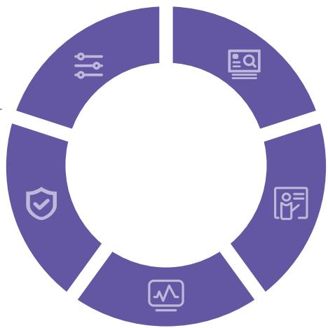

flowchart

```mermaid
graph LR
  A["Search"] --> B["Review"]
  B --> C["Audit"]
  C --> D["Monitoring"]
  D --> E["Security"]
```

## 重点业务风险防控

针对资金业务风险特点，强化专项管控力度，向资金业务条线派驻专职风险管理人员，全面负责日常风险管理工作，同时优化多项资金业务限额指标，从人员配置到指标设置形成双重保障，切实筑牢重点业务风险防线。

## 智能化监测

深化科技赋能，充分利用大数据模型应用、风险画像、风险偏好和限额管理、分层分类预警、业务模型平台和决策引擎等工具，整合行内信贷、运营、账户交易等数据、提升智能监测水平，赋能本行风险管理工作。

## 风险管理培训

建立常态化的培训机制，为进一步加强全行风险管理及监管统计工作管理，构建资产质量管控长效机制。2025年，本行组织开展全行金融资产风险分类培训，共计 600 余人参加此次培训，进一步提升资产质量管理水平。

## 合规管理

本行持续深化合规银行建设，厚植审慎合规文化，注重强化内控合规管理，彰显“合规创造价值”理念，发挥合规管理对业务稳健发展的支撑作用。

## 合规管理组织架构

本行建立由董事会、高级管理层、合规管理部门、内审部门、业务管理部门及专兼职合规管理员组成的合规管理架构。形成一道防线抓实自主管控、二道防线主动靠前管控、三道防线强化有效监督的合规管控体系

董事会是合规案防工作的最高权力机构，董事长为本行合规案防工作管理第一责任人，行长为本行首席合规官。

  
董事会

董事长任组长，行长及其他高级管理人员为副组长，总行机关各部室各分支机构负责人为组员

组员为各部室、分支机构专兼职合规管理员，负责人牵头本部门/机构、本条线围绕制度管理、流程操作、风险监督、检查评价等开展管理工作，配套设置合规操作员，按照本行合规管理办法开展日常工作。

  
合规案防工作领导小组

统筹开展合规管理、案防排查与处置、从业人员行为管理、问责监督机制建立等工作。

  
合规案防工作办公室

## 合规管理组织架构

## 合规管理制度体系

本行制定了《合规检查管理办法》《案件风险排查管理办法》《工作人员违规行为处理办法》《合规考核管理办法》等制度。为适应合规案防管理要求，确保各项业务合规、有序开展，2025年，本行持续健全完善合规管理制度体系，完成了《从业人员异常行为管理办法》《涉刑案件风险防控工作管理办法》《案件责任追究办法》《合规考核管理办法》《消费者权益保护工作管理办法》等5项重要制度的修订与发文工作，进一步筑牢内部治理的制度根基。

## 合规管理重点工作

完善合规体系。本行2025年召开3次内部控制管理委员会会议，在常规审议重要内控制度基础上，新增“审计发现问题整改汇报”机制，通过责任部门专项汇报、委员会集体审议提建议，形成闭环管控。建立合规管理季度分析机制，梳理合规扣分情况，通过排名、问题分类解析及案例剖析定位薄弱领域，编制专项报告报送党委会供决策。全年召开7次贷款责任追究委员会会议，完成新增及以往年度不良贷款责任认定与信息录入，完善追责细则、细化岗位责任条款，调整问责标准并提示风险点，推动信贷管理流程优化。

加强风险防控。本行多维度开展员工异常行为排查，通过家访，互评，客户回访等方式排查异常，对接外部数据核查员工经商办企、涉诉情况，解读征信报告并确定重点关注名单。由分管行长带队，以“现场+视频监控”方式开展飞行检查强化员工行为管理。推进员工与客户非正常资金往来专项排查，对问题研判追责，督导整改并开展警示教育。靶向开展首贷违约率、经营贷骗贷、涉老涉非等5类专项排查，对违约率靠前机构负责人问询谈话，整改代客操作、印意保管不规范、贷后检查不到位等问题。

强化运营合规。本行高效配合国金局现场检查，协调相关部门解决检查中的问题，联合科技开发部优化账户查询机制提升数据提取效率。强化检查信息传递与沟通反馈，牵头相关部门就发现问题多轮沟通，核实确认事实确认书内容。开展合规运作管理现场检查，通过调阅资料、查看监控、实地走访等方式，覆盖运营、信贷、网金业务等9大领域，同步开展合规辅导，分析问题成因，督促制定整改措施，对责任人考核记分，持续推进合规银行建设。

加强违规整改。定期通报合规管理分析报告，督促各条线管理部门针对性制定整改措施，持续跟踪整改进度。深挖案例浸润教育，对典型违规，屡查屡范行为进行多维度分析，形成案例剖析嵌入季度合规简报专栏，通过0A系统通报全行组织各机构开展学习和对照复盘，建立学习成果反馈机制，形成“学习-跟踪-问效”的提升路径。

培育合规文化。2025年，本行按照联合银行“合规文化提升年”活动部署，围绕“合规从高层做起、合规人人有责、合规创造价值”三大主题系统推进各项合规文化工作。2025年度，编发合规文化电子刊12期，聚焦案例警示与政策解读。为了提升全员合规知识储备与应用能力，本行推行“每月一主题，每月一测试”机制，2025年共组织8期合规考试。覆盖1.984人次，并将考试结果纳入机构年度考核；同时组织专兼职合规员参与省版平台考试，选派3名骨干参加“鼎行方圆”合规知识竞赛，获团体二等奖，2名员工获评优秀个人奖，展现出本行合规队伍专业素养。

natural_image

Illustration of people interacting with financial charts and stacks of coins, no text or symbols present

## 内部控制

本行制定《审计项目操作规程》《审计档案管理制度》《内部审计质量控制办法》等11项审计制度，全面规范公司上下审计工作开展。同时，本行设立独立的内审部门，稽核审计部是独立于业务经营管理职能之外由总行垂直管理的内部审计部门，董事长分管内审工作，审计委员会协管内审工作，具备独立性和权威性：稽核审计部接受董事会的委托对全行各部门、岗位、各项业务实施全面监督和评价，并直接对董事会负责，通过董事会审计委员会向董事会汇报工作和提交审计报告，接受审计委员会的指导、监督和考核。

## 推进审计数字化转型

本行坚持“科技赋能，数据分析为先导”，持续优化审计资源配置，深化数字转型。2025年，上线新一代审计系统，聚焦大数据和智慧审计人才培养;新建审计模型74个、优化89个，覆盖信贷业务、运营管理等领域，以全量化审计提升效率为现场审计提供有效线索，审计数字化转型初见成效。

## 规范审计实施流程

本行在审计实施过程中，积极发挥第三道风险防线作用，通过审计系统、信贷系统、运管系统、视频监控系统、风险预警系统等多系统开展线上影像检查，依托风险模型全量覆盖、多维分析；现场审计后及时与被审计单位沟通确认问题，审计报告充分征求意见，确保问题揭示精准、流程规范。

## 健全整改闭环管理

本行建立多层级汇报通报机制，每季度向董事会、行办会报告审计情况，协助分管行领导落实条线整改责任;每半年向中层管理人员通报风险点，通过决策层、管理层、条线部门协同，压实整改要求，形成闭环管控。

## 审计落实与成果转化

本行全年共组织实施各类审计项目126个，其中全面审计14个（涵盖9家分支行及5家村镇银行)：专项审计24个(线上贷款、资金理财、信息科技、代销业务、集中采购、商业道德与反腐败、反洗钱、不良资产管理、押品管理、数据安全、关联交易、工资薪酬，员工行为等)：离任审计80.个：后续审计5.个：强制体假审计2.个、履职审计1.个，本行以审计问题为导向，推动管理提升，各被审计机构积极整改，全行共修订制度19个、系统优化26个、管理提升22项，实现审计成果实质性转化，依托三年长远规划推进审计转型，保障本行各项业务健康、稳健、高质量发展。

# 商业道德与反腐败

## 治理

江阴银行建立由由共江苏江阴农村商业银行纪律检查委员会（以下简称“纪委”），纪律监督室，各党支部纪检委员及兼职纪律监督员组成的商业道德与反腐败治理架构，坚守“纪委监督、部门协同、全员参与”工作原则，推进全面从严治党系统构建权责清晰、流程规范、协同高效、监督有力的商业道德与反腐败管控体系，深入贯彻一体推进不敢腐、不能腐、不想腐战略部署，切实把党的纪律建设融入经营管理各环节，为全行高质量稳健发展筑牢廉洁自律防线

## 纪委

作为全行商业道德与反腐败最高监督决策机构，认真落实中央纪委和省纪委的工作部署，在派驻江苏农商联合银行纪检监察组的监督指导下，在本行党委领导下，审议工作规划、制度与重大部署，监督全行过程落实；处置重大违规违纪违法行为，开展监督执纪，推进清廉金融文化建设，落实金融领域反腐决策。

## 商业道德与反腐败工作领导小组

在纪委领导下统筹推进全行相关工作；下设纪律监督室负责日常协调、跟踪落实；各支部纪检委员、各单位纪律监督员，牵头开展警示教育、风险排查、监督整改，打通基层监督“最后一公里”。

## 纪律监督室

作为纪委核心办事与监督执纪部门，负责牵头制定制度与工作计划；开展廉洁教育、风险排查整治、线索核查与执纪问责；建立跨部门协同监督机制，组织警示教育，定期汇报工作。

## 各党支部纪检委员、兼职纪律监督员

作为基层监督延伸力量，负责传达上级部署、开展廉洁提醒；排查上报基层廉洁风险与问题线索；组织廉洁教育活动，配合监督核查与整改，实现基层监督全覆盖。

本行致力于构建廉洁，透明的商业环境，严格遵守《中华人民共和国公司法》《中华人民共和国反不正当竞争法》《中华人民共和国反垄断法》《中华人民共和国反洗钱法》等法律法规以及行业规范，制定并持续完善《公司纪律监督管理制度》《廉洁从业管理制度》等15项制度，对公司运营各环节的反贪腐、反贿赂行为制定了详尽的规范，并推动公司及合作伙伴共同遵守商业道德和反腐败规范。

## 战略与管理方式

## 廉洁防控

压实管党治党责任。2025年，本行召开2次全面从严治党专题会议，审议20项重点议题：组织49家党支部书记签订廉洁从业责任状。1.700余名于部员工签订承诺书。完成12家党支部巡查，修订5项相关制度：升级廉政档案系统。实现个人重大事项信息化管控，全年录入党委主体责任3.399条、纪委监督责任1.245条，分列全省第2、第3。通过监督谈话、提醒谈话压实“一把手”及班子成员责任，推动责任层层落实。

强化日常精准监督。常态化列席党委会，行办会等重要会议145次，监督集中采购，招投标等关键环节，严把选人用人廉洁关，出具48份廉洁从业回复函。开展关键环节，重大事项、“小切口”及4项专项监督，发送多份监督章见函，推动处置7个重大亏损项目、挽回损失2.770万元。深化“1+8”部门协同监督机制，凝聚监督合力，堵塞管理漏洞，筑牢商业道德与反腐败坚固防线。

## 廉洁文化建设

本行面向全体员工实施常态化反贪污反腐败、廉洁警示教育。通过专家授课、观看警示片、旁听庭审、新员工廉洁教育等形式，分层分级推进廉洁引导，增强教育实效。2025年，本行开展“清风常伴廉洁齐家”“月圆人廉国泰家安”等家庭助廉座谈会及“廉洁家书”活动(收集家书103封)，举办“芙蓉廉开”清廉金融文化作品征集活动，开发系列清廉课程，修订《廉洁风险点手册》并组织全员学习。

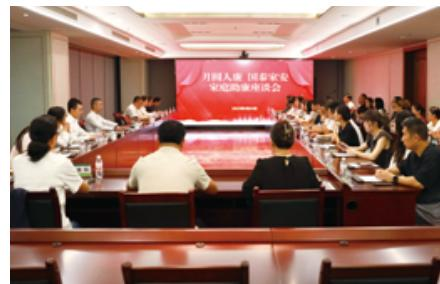

text_image

月园人道 国泰安安
家庭协商用法会

●“月圆人廉国泰家安”家庭助廉座谈会

<table><tr><td>腐败或贿赂违规事件发生数量0起</td><td>利益冲突违规事件发生数量0起</td><td>洗钱或内幕交易违规事件发生数量0起</td></tr><tr><td>员工参加反腐败培训人均时长1小时</td><td>开展员工反腐败培训次数12次</td><td>员工参加反腐败培训总人次3,933人次</td></tr><tr><td>反贪腐培训覆盖率100%</td><td>员工反腐败培训覆盖率100%</td><td>有效举报的处理率100%</td></tr></table>

## 举报与举报人保护

我们高度重视对举报腐败行为的处理，设立了举报热线（96078）、举报邮箱（jljds@jybank.com.cn）等多种渠道，为进一步规范举报流程、畅通举报渠道和保障举报人权益，确保举报得到及时、公正和有效的处理。制定《江苏江阴农村商业银行股份有限公司信访管理制度》，规定信访举报工作体系、职责和流程，明确举报人保护相关要求和信访工作的奖惩等内容与要求。

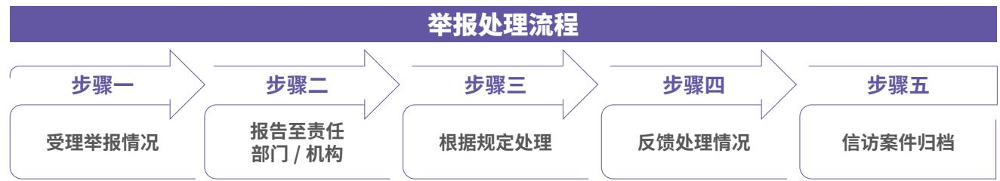

flowchart

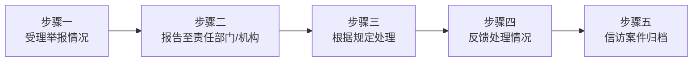
```mermaid
graph LR
  A["步骤一\n受理举报情况"] --> B["步骤二\n报告至责任部门/机构"]
  B --> C["步骤三\n根据规定处理"]
  C --> D["步骤四\n反馈处理情况"]
  D --> E["步骤五\n信访案件归档"]
```

## 反不正当竞争

本公司严格遵循《中华人民共和国反垄断法》《中华人民共和国反不正当竞争法》等法律法规要求，签署并履行中国银行业协会《银行业反不正当竞争公约》，坚持自愿、平等、公平、诚实信用的原则，依法维护金融市场秩序

本行严禁员工造谣，散布虚假事实损害同业信誉或声誉，对业务和产品作片面夸大宣传对比，捏造恶意贬低竞争对手或以不正当竞争手段拉拢客户等不正当竞争行为，特别强调准确，清楚地展示金融产品或服务的基本信息并显著提示风险避免夸大事实和误导消费者，以最大限度维护消费者合法权益。并通过业务模式评估、法律文本约束等方式，有效防范不正当竞争行为。对于违反商业竞争管理办法以及违反商业竞争规定的行为，按照内部规定问责处理相关责任人，涉嫌违法犯罪的，移交司法机关处理。2025年，未发生因不正当竞争行为导致的诉讼或重大行政处罚事件

## 反洗钱

本行成立以行长为组长、各副行长为副组长、各部门负责人为成员的反洗钱领导小组。反洗钱领导小组下设反洗钱工作办公室，负责我行的反洗钱日常工作，日常办公室设在运营管理部；各分支机构均成立反洗钱工作领导小组，负责执行反洗钱各项政策要求，落实相关反洗钱工作。本行还建立反洗钱领导小组会议机制、反洗钱联络员会议机制。报告期内，本行组织召开反洗钱领导小组会议3次、联络员会议4次，推进全行洗钱风险防控体系建设。

本行制定并持续完善《洗钱和恐怖融资风险管理办法》《洗钱风险自评估管理办法》《反洗钱检查审计管理办法》等一系列反洗钱内控制度，明确反洗钱各领域各层级的管理流程和责任要求。报告期内，本行系统修订13项基础制度，新增3项制度，废止2项原有制度。

## 完善监测系统与模型建设

建立并优化反洗钱监测系统，对信用卡溢缴款、ATM异常取现等8个既有模型提出优化建议。同时开发上线“医疗腐败专项监测模型”，新增境外异常取现、银证账户过渡交易等多个场景化风险预警模型，增强对新型洗钱手法的监测覆盖能力。

## 严守全流程客户尽职调查

我行严格履行客户尽职调查义务，构建全流程体系。 依托人脸识别、多因子认证拦截3,016笔个人客户 风险交易；通过强化工商核验等，全年拒绝对公客 户风险开户55次。动态调整存量客户风险等级，优 化系统，实现尽调与风控闭环管理。

## 构建多层次反洗钱培训体系

本行反洗钱管理中心坚持每周开展业务研讨，依托“运营加油站”开展多期专题培训，组织高管及联络员参加新《反洗钱法》培训，推动全员6,749人次参与线上培训及考试目通过率达100%。同时组织8场外部专项培训，拓宽团队专业视野。

## 常态化开展反洗钱审计

本行每年至少开展一次反洗钱专项审计工作，将反洗钱要求落实情况纳入日常业务审计范围，覆盖所有反洗钱相关部门和分支机构，确保反洗钱内部审计活动独立于业务经营、风险管理和合规管理。

## 严格履行交易报告义务

本行通过监测报送系统报送大额交易报告461,970份，生成可疑案例6,962份，甄别后上报可疑交易报告485份，含重点可疑报告1份。2025年累计向中国反洗钱监测分析中心提交可疑交易报告516份(含村镇)，积极配合行政调查和案件侦破，协助有权机关查冻涉案账户。

## 开展多维度反洗钱宣传活动

本行紧扣“3·15”“4·15”等重要时点开展4场线上线下宣传活动，举办反洗钱线上答题活动，实现员工100%参与、客户参与超4.250人次；其中 88个营业网点全面参与集中宣传，发放折页8.000余份，依托“小圆服务队”深入社区、企业和乡村，构建群防群治格局。报告期内，本行反洗钱宣传活动受众人次达 27.441 人次。

## 影响、风险和机遇管理

本行围绕商业道德与反腐败风险管理，以科技赋能为核心支撑，遵循“风险识别 -监测评估 - 应对”全流程闭环逻辑，聚焦员工异常行为、利益输送等关键风险点，搭建精准化、常态化的风险管理体系，全面筑牢商业道德与反腐败防线。

## 日常监测

每日批量检查全行易发风险业务数据，安排专职人员对预警信息分类处置（高风险逐条跟踪、低风险抽查），重点监测员工八小时外及深夜异常行为，结合个人征信报告核查资金进出风险，精准研判风险等级。

## 专项排查

持续开展员工与客户非正常资金往来经营贷骗贷、涉老涉非等专项排查。对各类排查、检查、监测发现的疑点线索建立总行牵头的快速核查机制，明确核查时限与标准。核查属实的，严格依据制度问责，并深入剖析管理根源，推动条线部门完善流程控制。

## 模型识别

依托新一代审计系统，搭建25个员工异常交易模型（如与贷款客户/关联人资金往来)、20余个预警模型，并整合员工本行/他行账户、亲属账号、IP/设备识别等多数据源，精准识别信贷、代客理财、民间借贷等领域利益输送、违规资金往来等潜在风险。

## 风险识别

依托新一代审计系统，搭建25个员工异常交易模型(如与贷款客户/关联人资金往来)、20余个预警模型，整合员工本行/他行账户、亲属账号、IP/设备识别等多数据源，精准识别信贷、代客理财、民间借贷等领域利益输送、违规资金往来等潜在风险。

## 风险监测 评估

每日批量检查全行易发风险业务数据，安排专职人员对预警信息分类处置(高风险逐条跟踪、低风险抽查)，重点监测员工八小时外及深夜异常行为，结合个人征信报告核查资金进出风险，精准研判风险等级。

## 风险应对

对异常交易深入核查背景，排查非法集资、违规拆借等关联违规行为，对违规人员“发现一个、查处一个”：定期开展员工行为管理、集中采购业务专项审计，从处置与监督两方面压实风险管控

指标与目标

<table><tr><td>指标与目标</td><td>2025年达成情况</td></tr><tr><td>廉洁警示教育工作</td><td>100% 完成年度目标</td></tr><tr><td>信访工作</td><td>100% 完成年度目标</td></tr><tr><td>健全员工廉洁档案</td><td>100% 完成年度目标</td></tr><tr><td>党风廉政建政策责任制</td><td>100% 完成年度目标</td></tr><tr><td>开展监督问责</td><td>100% 完成年度目标</td></tr></table>

## 关键绩效表

经济绩效

<table><tr><td>指标</td><td>单位</td><td>2024年</td><td>2025年</td></tr><tr><td colspan="4">财务数据(法人行+村镇)</td></tr><tr><td>总资产</td><td>亿元</td><td>2,002.32</td><td>2,193.00</td></tr><tr><td>营业收入</td><td>亿元</td><td>39.62</td><td>41.25</td></tr><tr><td>净利润</td><td>亿元</td><td>20.22</td><td>20.23</td></tr><tr><td>归属于上市公司股东净利润</td><td>亿元</td><td>20.37</td><td>20.49</td></tr></table>

治理绩效

<table><tr><td>指标</td><td>单位</td><td>2024年</td><td>2025年</td></tr><tr><td colspan="4">商业道德与反腐败(法人行+村镇)</td></tr><tr><td>开展审计总次数</td><td>次</td><td>133</td><td>126</td></tr><tr><td>员工参加反腐败培训总人次</td><td>人次</td><td>1,943</td><td>3,933</td></tr><tr><td>反贪污相关培训员工培训覆盖率</td><td>%</td><td>100</td><td>100</td></tr><tr><td>对公司及员工提出并已审结的贪污诉讼案件数目</td><td>件</td><td>0</td><td>0</td></tr><tr><td colspan="4">反洗钱(法人行+村镇)</td></tr><tr><td>反洗钱培训次数</td><td>次</td><td>21</td><td>28</td></tr><tr><td>反洗钱培训人数</td><td>人次</td><td>5,600</td><td>6,749</td></tr><tr><td>反洗钱宣传活动受众人次</td><td>人次</td><td>17,827</td><td>27,441</td></tr></table>

社会绩效

<table><tr><td>指标</td><td>单位</td><td>2024年</td><td>2025年</td></tr><tr><td colspan="4">消费者权益保护(法人行+村镇)</td></tr><tr><td>投诉件15日办结率</td><td>%</td><td>100</td><td>100</td></tr><tr><td>客户满意度</td><td>%</td><td>98.80</td><td>98.83</td></tr><tr><td>反贪污相关培训员工培训覆盖率</td><td>%</td><td>100</td><td>100</td></tr><tr><td>开展消保金融宣传活动次数</td><td>次</td><td>366</td><td>272</td></tr><tr><td>消保金融宣传活动活动触及消费者人次</td><td>万人次</td><td>33.5</td><td>14.45</td></tr><tr><td colspan="4">科技研发(法人行)</td></tr><tr><td>研发投入金额</td><td>万元</td><td>6,190.19</td><td>6,025.72</td></tr><tr><td>研发投入占营业收入比例</td><td>%</td><td>1.56</td><td>1.46</td></tr></table>

<table><tr><td>指标</td><td>单位</td><td>2024年</td><td>2025年</td></tr><tr><td>研发员工人数</td><td>人</td><td>84</td><td>88</td></tr><tr><td>研发员工比例</td><td>%</td><td>4.9</td><td>5.0</td></tr><tr><td>年度新增软件著作权数量</td><td>项</td><td>2</td><td>3</td></tr><tr><td>累计软件著作权数量</td><td>项</td><td>14</td><td>17</td></tr><tr><td>信息安全(法人行)</td><td></td><td></td><td></td></tr><tr><td>开展信息安全培训次数</td><td>次</td><td>2</td><td>2</td></tr><tr><td>信息安全培训参与总人次</td><td>人次</td><td>1,560</td><td>1,815</td></tr><tr><td>开展攻防演练次数</td><td>次</td><td>1</td><td>1</td></tr><tr><td>员工(法人行+村镇)</td><td></td><td></td><td></td></tr><tr><td>员工总数</td><td>人</td><td>1,712</td><td>1,747</td></tr><tr><td>招聘新员工人数</td><td>人</td><td>69</td><td>99</td></tr><tr><td>员工总流失率</td><td>%</td><td>3.23</td><td>2.31</td></tr><tr><td>员工业务培训总支出</td><td>万元</td><td>/</td><td>424.62</td></tr><tr><td>全年业务培训总人次</td><td>人次</td><td>/</td><td>43,652</td></tr><tr><td>员工业务培训总学时</td><td>小时</td><td>113,176</td><td>128,337</td></tr><tr><td>职业健康与安全(法人行+村镇)</td><td></td><td></td><td></td></tr><tr><td>工伤人数</td><td>人</td><td>1</td><td>0</td></tr><tr><td>因工死亡人数</td><td>人</td><td>0</td><td>0</td></tr><tr><td>职业病发生人数</td><td>人</td><td>0</td><td>0</td></tr><tr><td>安全培训总人次</td><td>人次</td><td>27,922</td><td>25,684</td></tr><tr><td>安全培训总时长</td><td>小时</td><td>27,922</td><td>25,684</td></tr><tr><td>普惠金融(法人行) $^1$ </td><td></td><td></td><td></td></tr><tr><td>涉农与小微企业贷款余额</td><td>亿元</td><td>1,054.70</td><td>1,156.81</td></tr><tr><td>普惠型涉农贷款和普惠型小微企业余额</td><td>亿元</td><td>347.06</td><td>391.13</td></tr><tr><td>普惠对公信贷客户数</td><td>户</td><td>5,976</td><td>7,144</td></tr><tr><td>公益志愿(法人行)</td><td></td><td></td><td></td></tr><tr><td>公益慈善捐赠总投入</td><td>万元</td><td>68.79</td><td>540.90</td></tr><tr><td>员工志愿者人数</td><td>人</td><td>298</td><td>270</td></tr><tr><td>志愿服务时长</td><td>小时</td><td>3,764</td><td>3,244</td></tr></table>

●1:因为涉农口径调整，主要为县(自治县、县级市)人民政府驻地所在的乡、镇或街道统计为城市区域，普惠金融2024年度相关数据也相应进行调整。

环境绩效

<table><tr><td>指标</td><td>单位</td><td>2024年</td><td>2025年</td></tr><tr><td colspan="4">绿色金融(法人行+村镇)</td></tr><tr><td>绿色信贷余额</td><td>亿元</td><td>34.15</td><td>47.98</td></tr><tr><td colspan="4">能源消耗(法人行+村镇)</td></tr><tr><td>汽油</td><td>吨</td><td>57.00</td><td>64.32</td></tr><tr><td>天然气</td><td>万立方米</td><td>9.60</td><td>5.78</td></tr><tr><td>外购电力</td><td>万千瓦时</td><td>1,604.60</td><td>1,825.38</td></tr><tr><td>能源消耗总量</td><td>吨标准煤</td><td>2,183.60</td><td>2,414.95</td></tr><tr><td>单位面积能源消耗量</td><td>吨标准煤/平方米</td><td>0.022</td><td>0.024</td></tr><tr><td>人均能源消耗量</td><td>吨标准煤/人</td><td>1.42</td><td>1.38</td></tr><tr><td colspan="4">温室气体排放(法人行+村镇)</td></tr><tr><td>直接温室气体排放量(范围一)</td><td>吨二氧化碳当量</td><td>381.27</td><td>320.74</td></tr><tr><td>间接温室气体排放量(范围二)</td><td>吨二氧化碳当量</td><td>9,013.04</td><td>10,636.48</td></tr><tr><td>温室气体排放量(范围一和范围二)</td><td>吨二氧化碳当量</td><td>9,394.31</td><td>10,957.22</td></tr><tr><td>人均温室气体排放量</td><td>吨二氧化碳当量/人</td><td>6.096</td><td>6.27</td></tr><tr><td>单位面积温室气体排放量</td><td>吨二氧化碳当量/平方米</td><td>0.097</td><td>0.11</td></tr><tr><td colspan="4">水资源消耗(法人行+村镇)</td></tr><tr><td>总耗水量</td><td>吨</td><td>74,120.00</td><td>69,623.30</td></tr><tr><td>人均耗水量</td><td>吨/人</td><td>48.10</td><td>39.85</td></tr><tr><td colspan="4">废弃物管理(法人行+村镇)</td></tr><tr><td>无害废弃物产生量</td><td>吨</td><td>/</td><td>23.12</td></tr><tr><td>无害废弃物排放强度</td><td>吨/人</td><td>/</td><td>0.01</td></tr><tr><td>有害废弃物产生量</td><td>吨</td><td>/</td><td>13.92</td></tr><tr><td>有害废弃物排放强度</td><td>吨/人</td><td>/</td><td>0.01</td></tr></table>

指标索引表

<table><tr><td>报告内容</td><td>深圳证券交易所可持续发展报告标准索引</td><td>GRI 标准 2021</td></tr><tr><td>关于本报告</td><td>/</td><td>2-2/2-3</td></tr><tr><td>董事长致辞</td><td>/</td><td>2-22</td></tr><tr><td>关于江阴银行</td><td>/</td><td>2-1/2-6/201-1</td></tr><tr><td>我们的 2025</td><td>/</td><td>/</td></tr><tr><td>ESG 管理</td><td>第十一条、第十二条、第十三条、第十四条、第十五、第十七条、第十八条、第五十一条、第五十二条、第五十三条</td><td>2-9/2-12/2-13/2-14/2-16/2-22/2-29/3-1/3-2/3-3/201-2</td></tr><tr><td colspan="3">绿色引领 共建美丽中国</td></tr><tr><td>应对气候变化</td><td>第十一条、第十九条、第二十条、第二十一条、第二十二条、第二十三条、第二十四条、第二十五条、第二十六条、第二十七条、第二十八条</td><td>2-27/3-3/201-2/305-1/305-2/305-3/305-4</td></tr><tr><td>绿色金融</td><td>第十一条、第十九条</td><td>2-27/3-3</td></tr><tr><td>绿色运营</td><td>第十九条、第二十九条、第三十一条、三十四条、三十五条、三十六条</td><td>2-27/302-1/302-3/302-4/306-1/306-2/306-3/306-4/</td></tr><tr><td colspan="3">深耕本土 赋能实体经济</td></tr><tr><td>普惠金融</td><td>第十一条、第十九条、第四十七条</td><td>2-27/3-3/413-1</td></tr><tr><td>数字金融</td><td>第十一条、第十九条</td><td>2-27/3-3</td></tr><tr><td>养老金融</td><td>/</td><td>413-1</td></tr><tr><td>科技金融</td><td>第四十二条</td><td>/</td></tr><tr><td>消费者权益保护</td><td>第十一条、第十九条、第四十四条、第四十七条</td><td>2-27/3-3/417-1/417-2/417-3/418-1</td></tr><tr><td>信息安全与隐私保护</td><td>第十一条、第十九条、第四十四条、第四十八条</td><td>2-27/3-3/418-1</td></tr><tr><td colspan="3">以人为本 共助区域发展</td></tr><tr><td>员工权益与发展</td><td>第十一条、第十九条、第四十九条、第五十条</td><td>2-7/2-23/2-27/2-30/3-3/401-1/401-2/401-3/403-1/403-2/403-3/403-4/403-5/403-6/403-7/403-8/403-9/403-10/404-1/404-2/406-1/407-1/408-1/409-1</td></tr><tr><td>供应链管理</td><td>第十一条、第十九条、第四十四条、第四十五条、第四十六条</td><td>2-27/3-3/204-1</td></tr><tr><td>金融可及性</td><td>第四十七条</td><td>/</td></tr><tr><td>乡村振兴</td><td>第三十八条、第三十九条</td><td>203-1/203-2/413-1</td></tr><tr><td>社会公益</td><td>第三十八条、第四十条</td><td>203-1/203-2/413-1</td></tr><tr><td colspan="3">合规稳健 筑牢发展根基</td></tr><tr><td>党建引领</td><td>/</td><td>/</td></tr><tr><td>公司治理</td><td>第十二条、第十三条、第十九条、第五十一条、第五十三条</td><td>2-9/2-10/2-11/2-12/2-15/2-17/2-18/2-19/2-20/2-27/405-1</td></tr><tr><td>风险与合规管理</td><td>第十二条、第十九条、第五十四条</td><td>2-27/207-1/207-2</td></tr><tr><td>商业道德与反腐败</td><td>第十一条、第十九条、第五十四条、第五十五条、第五十六条</td><td>2-27/205-2/205-3/206-1/3-3</td></tr></table>

## 江阴农商银行JRCB

text_image

QR code with embedded JRCB logo in center, likely for digital linking or authentication

微信银行

text_image

QR code image containing encoded data, no visible human-readable text

官方网站