## 2025

## 青岛农村商业银行股份有限公司

## 可持续发展（ESG）报告

## 青岛农商银行

QINGDAO RURAL COMMERCIAL BANK

natural_image

Illustration of sustainable urban and industrial sectors with circular design, featuring solar panels, cycling, shopping carts, and robotic arms (no text or symbols)

## 目录

关于本报告 001

党委书记致辞 003

2025 可持续发展亮点 005

2025 责任亮点: 007

做好新时代金融“五篇大文章”

走进青岛农商银行 009

公司简介 009

发展战略 011

发展历程 012

年度荣誉 013

可持续发展治理 015

可持续发展理念 015

响应联合国可持续发展目标 015

可持续发展治理机制 017

ESG 培训及宣贯 017

利益相关方沟通 018

重要性议题分析 019

## 01

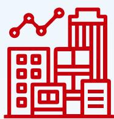

## 完善治理体系 夯实发展基础

规范公司治理 023

全面风险管理 031

贯彻合规运营 035

恪守商业道德 044

## 02

## 践行绿色理念 推动低碳转型

应对气候变化 051

发展绿色金融 056

建设绿色银行 071

## 03

## 深耕实体经济 助力普惠发展

服务“三农”普惠 075

服务实体经济 085

消费者权益保护 092

## 04

## 激发创新动能 守护数字安全

科技创新与数字化转型 103

数据安全与隐私保护 110

负责任采购 115

## 05

## 关注员工成长 创造社会价值

员工权益与发展 119

社会贡献 131

未来展望 135

附录 137

ESG 绩效表 137

索引表 146

意见反馈表 150

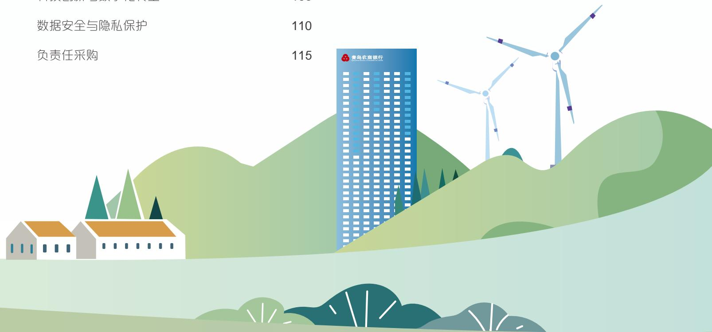

other

| Indicator | Value |
| --- | --- |
| 数据安全与隐私保护 | 110 |
| 負责任采购 | 115 |

## 关于本报告

About This Report

本报告是青岛农村商业银行股份有限公司对外公开发布的可持续发展（ESG）报告，旨在披露本行在可持续发展，即环境、社会以及公司治理方面的理念、实践及成果。

## 时间范围

本报告内容的时间跨度为 2025 年 1 月 1 日至 2025 年 12 月 31 日，为增强报告可比性及前瞻性，部分内容有所延伸。本报告的发布周期为一年一次，与财务年度保持一致。

## 报告范围

本报告以青岛农村商业银行股份有限公司（以下简称“本行”、“青岛农商银行”）为主体部分，部分内容涉及本行发起设立的村镇银行。

## 编制依据

《深圳证券交易所上市公司自律监管指引第17号——可持续发展报告（试行）》  
原中国银行业监督管理委员会《中国银监会办公厅关于加强银行业金融机构社会责任的意见》  
中国银行业协会《中国银行业金融机构企业社会责任指引》  
- 中国企业改革与发展研究会《中国企业可持续发展报告指南（CASS-ESG6.0）》  
中国公司治理研究院《中国上市公司绿色治理评价指标体系》  
全球报告倡议组织《可持续发展报告标准（GRI Standards）》(2021年版)  
联合国 2030 年可持续发展目标（SDGs）

## 数据说明

本报告所披露的各项数据与信息主要源于本行内部文件、报表和相关统计数据。除特别说明外，本报告财务数据均为合并报表数据，所涉及货币金额以人民币作为计量币种。

## 确认及批准

本报告于 2026 年 4 月 27 日获本行董事会批准，并与年报同期发布。董事会承诺对报告内容进行监督，并确保其不存在任何虚假记载或误导性陈述，并对内容真实性、准确性和完整性负责。

## 报告获取

本报告以电子版的形式发布，您可以在深圳证券交易所（http://www.szse.cn）、巨潮资讯网（http://www.cninfo.com.cn）或青岛农商银行官网（http://www.qrcb.com.cn）下载本报告电子文本，获取更多公司信息。

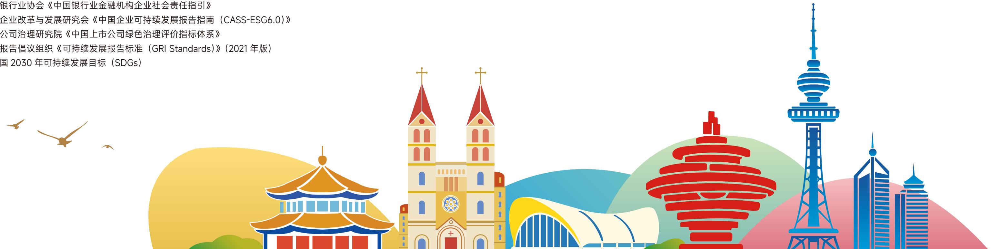

text_image

银行业协会《中国银行业金融机构企业社会责任指引》
企业改革与发展研究会《中国企业可持续发展报告指南（CASS-ESG6.0）》
公司治理研究院《中国上市公司绿色治理评价指标体系》
报告倡议组织《可持续发展报告标准（GRI Standards）》(2021年版)
国2030年可持续发展目标（SDGs）

## 党委书记致辞

Remarks by the Party Secretary

2025 年，青岛农商银行深入践行 ESG 发展理念，坚守服务实体经济根本宗旨和“支农支小”为主的市场定位，持续在绿色金融、普惠金融、乡村振兴、改革创新和公司治理等领域深耕发力，高质量发展迈出坚实步伐，以金融力量推动经济、社会与环境协调发展，不断提升可持续价值创造能力。

## 发展绿色金融 助力低碳转型

我们积极落实国家“双碳”战略，将绿色发展理念融入金融服务全过程，持续完善绿色金融产品与服务体系，不断加大对绿色产业、低碳项目和循环经济领域的金融支持力度。2025年末，绿色贷款余额165.12亿元，同比增长 $18.57\%$ 。同时持续推进绿色债券投资和可持续金融实践，引导更多金融资源投向绿色发展和生态保护领域，助力经济社会绿色低碳转型。

## 深化普惠金融 服务实体发展

我们始终把服务实体经济作为金融工作的出发点和落脚点，通过搭建十大重点行业产品支撑体系、丰富行业化金融服务方案，持续加大对小微企业和民营经济的支持力度。2025年末，现代制造、科技、绿色、普惠、海洋等重点领域贷款增速均高于贷款整体增速，小微企业贷款余额1,507.87亿元，较年初新增160.44亿元，增速 $11.91\%$ ，服务小微客户超5.5万户，规模与户数均居青岛金融机构首位。依托国际结算和外汇业务优势，持续提升跨境金融服务能力，跨境人民币结算量突破1,500亿元，位居山东省地方法人银行首位。

## 深耕 “三农” 沃土 助力乡村振兴

我们坚守服务“三农”的初心使命，持续加大农业农村重点领域金融支持力度。扎实开展“千村万户、千楼万企”行动，探索“三农”服务特色场景，推动政策信息与金融资源直达共享。2025年末，涉农贷款余额648.27亿元，同比增长 $23.63\%$ ，规模、增量、户数均居青岛金融机构首位。依托覆盖城乡的金融服务网络和数字化服务渠道，不断完善乡村金融服务体系，让金融服务更加贴近农村、贴近农民、贴近农业发展，以金融活水持续助力乡村全面振兴。

## 推进改革创新 激发数智动能

我们持续推进数字化转型，以科技与数据能力推动金融服务升级。全年上线企业级风控决策引擎等 22 个重点项目，通过国家数据管理三级达标认证，跻身全国中小农商银行首批数据质量达标行行列。连续两年获得央行认定的全省唯一地方法人银行“一级交易商”资格，成功发行全国首支浮动利率“三农”专项金融债、首单养老主题金融债及全国农商行首单科创金融债，在服务国家战略和支持实体经济方面不断实现创新突破。

## 完善治理体系 夯实稳健基础

我们坚持审慎经营理念，不断完善公司治理体系和全面风险管理机制，持续提升内控合规管理水平。不良贷款率连续三年稳步下降，风险抵御能力持续增强。同时不断强化消费者权益保护，打造“金帆护航”消保品牌，持续提升金融服务规范化水平。

## 履行社会责任 传递金融温度

我们持续完善员工关怀体系，建立员工健康管理平台，开展多样化员工活动，不断增强员工归属感与幸福感。积极开展公益服务，“微心愿”项目帮助700余名儿童实现心愿，并持续推进志愿服务行动，开展“盛夏送清凉”活动，为户外劳动者送去关怀。积极回应社会关切，向市残联捐赠专项资金支持听障儿童康复，同时对因病致困家庭开展精准帮扶，以实际行动传递金融温度。

扎根大地，滋养梦想，是我们不变的初心。青岛农商银行将继续以稳健经营与责任担当陪伴城乡发展，让更多奋斗与梦想在这片土地上开花结果。让生活更美好，我们一直在路上。

青岛农商银行党委书记

梁衍波

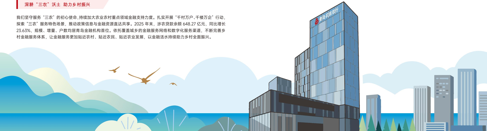

text_image

深耕“三农”沃土 助力乡村振兴
我们坚守服务“三农”的初心使命,持续加大农业农村重点领域金融支持力度。扎实开展“千村万户、千楼万企”行动,探索“三农”服务特色场景,推动政策信息与金融资源直达共享。2025年末,涉农贷款余额648.27亿元,同比增长23.63%,规模、增量、户数均居青岛金融机构首位。依托覆盖城乡的金融服务网络和数字化服务渠道,不断完善乡村金融服务体系,让金融服务更加贴近农村、贴近农民、贴近农业发展,以金融活水持续助力乡村全面振兴。

## 2025可持续发展亮点

Highlights of Sustainable Development 2025

<table><tr><td>经济绩效</td><td>单位</td><td>2025年</td></tr><tr><td>资产总额</td><td>亿元</td><td>5,027.83</td></tr><tr><td>营业收入</td><td>亿元</td><td>100.27</td></tr><tr><td>利润总额</td><td>亿元</td><td>30.15</td></tr><tr><td>净利润</td><td>亿元</td><td>31.39</td></tr><tr><td>纳税总额</td><td>亿元</td><td>12.69</td></tr><tr><td>总资产收益率</td><td>%</td><td>0.63</td></tr><tr><td>加权平均净资产收益率</td><td>%</td><td>7.94</td></tr><tr><td>不良贷款率</td><td>%</td><td>1.75</td></tr><tr><td>不良贷款余额</td><td>亿元</td><td>48.67</td></tr><tr><td>不良贷款拨备覆盖率</td><td>%</td><td>261.01</td></tr><tr><td>杠杆率</td><td>%</td><td>7.71</td></tr><tr><td>资本充足率</td><td>%</td><td>14.06</td></tr><tr><td>核心一级资本充足率</td><td>%</td><td>10.07</td></tr></table>

<table><tr><td>环境绩效</td><td>单位</td><td>2025年</td></tr><tr><td>绿色信贷余额</td><td>亿元</td><td>165.12</td></tr><tr><td>绿色信贷的增幅</td><td>%</td><td>18.57</td></tr><tr><td>绿色信贷占比</td><td>%</td><td>5.72</td></tr><tr><td>持有的存续期内的绿色债券余额</td><td>亿元</td><td>7.05</td></tr></table>

<table><tr><td>社会绩效</td><td>单位</td><td>2025年</td></tr><tr><td>支持战略性新兴产业贷款余额</td><td>亿元</td><td>85.73</td></tr><tr><td>科技型企业贷款余额</td><td>亿元</td><td>163.49</td></tr><tr><td>普惠重点领域贷款余额</td><td>亿元</td><td>558.12</td></tr><tr><td>普惠型涉农贷款余额</td><td>亿元</td><td>192.33</td></tr><tr><td>金融科技投入</td><td>万元</td><td>20,215.72</td></tr><tr><td>客户满意度</td><td>%</td><td>98.1</td></tr><tr><td>消费者教育年度累计活动次数</td><td>次</td><td>4,200</td></tr><tr><td>消费者教育受众人次</td><td>万人次</td><td>197.57</td></tr><tr><td>公益慈善投入</td><td>万元</td><td>147.13</td></tr><tr><td>员工总人数</td><td>人</td><td>6,025</td></tr><tr><td>劳动合同签订率</td><td>%</td><td>100</td></tr><tr><td>每股社会贡献值</td><td>元</td><td>2.64</td></tr></table>

<table><tr><td>治理绩效</td><td>单位</td><td>2025年</td></tr><tr><td>股东会召开总次数</td><td>次</td><td>2</td></tr><tr><td>董事会召开次数</td><td>次</td><td>14</td></tr><tr><td>董事会审计委员会召开次数</td><td>次</td><td>8</td></tr><tr><td>合规案防警示教育培训次数</td><td>次</td><td>895</td></tr><tr><td>合规案防警示教育培训人次</td><td>人次</td><td>21,562</td></tr><tr><td>反洗钱的培训活动次数</td><td>次</td><td>93</td></tr></table>

## 2025责任亮点:

## 做好新时代金融“五篇大文章”

Key Responsibilities for 2025: Advancing the "Five Major Initiatives" in Finance for the New Era

## 科技金融

- 建立了由“科企初创贷”“科企成长贷”“新质贷”“知识产权质押保险贷款”“知识产权质押贷款”“人才贷”“投保贷”“园区贷”“科企保贷通”“高企贷”等产品构成的“金穗惠科”科技金融产品体系，涵盖种子期、初创期、成长期、成熟期全生命周期的科技型企业或企业主。  
- 科技型企业贷款余额 163.49 亿元，户数 1,417 户。  
- 在人民银行青岛市分行发布的 2025 年第一季度、第二季度科技金融服务效果评估结果均为优秀档。

## 绿色金融

- 推出“绿色信贷 + 碳金融”组合产品，“绿碳转型贷”获评市级奖项，落地山东省首笔生物质能源可持续发展挂钩贷款。  
- 搭建“金碳算”碳核算平台，深化其在信贷审批、利率定价中的应用。  
- 绿色金融发展成效显著,荣获2025年财联社“绿水青山奖·ESG金融年度大奖”。  
- 绿色金融贷款 165.12 亿元，较年初增加 25.86 亿元，增速 18.57%。

## 普惠金融

- 打造“双千工程”特色营销品牌，健全网格化营销管理体系，深化小微企业融资协调机制，累计走访普惠客户20.44万户。  
- 南方周末“金标杆—普惠银行榜终榜”全国第七名，位列农商行系统第二名。  
- 小微贷款余额 1,507.87 亿元，较年初新增 160.44 亿元。  
- 普惠小微贷款余额 544.18 亿元，较年初新增 41.60 亿元。  
- 普惠型小微企业累计发放贷款年化利率 $3.94\%$ ，同比下降6BP，进一步降低小微企业的融资成本，助力小微企业轻装上阵、稳健前行。

## 养老金融

- 在银行间市场成功发行全国首单募集资金专项用于养老产业贷款投放的养老主题金融债。  
- 以“七彩康年”体系为核心，构建起多维度养老金融生态，入选山东省“2025好品金融”“五篇大文章”创新产品、第31届中国国际金融展养老金融实践展示案例。  
- 服务老年客户逾360万，依托广泛的线下服务网络与社保卡资源打通适老服务“最后一公里”。

## 数字金融

- 5C 零售客群经营管理平台、数智网格管理平台、企业级风控决策引擎等科技项目28个，荣获青岛数字金融创新大赛一等奖等20余项荣誉奖项。  
- 聚焦智慧政务，打造“政务 + 金融”一站式服务新模式，构建覆盖资金监管、财政非税、公共服务等的银政企数智生态，政务办理“就近办、一站办”服务新模式落地生根。  
- 聚焦产业金融,发力供应链“脱核”模式,围绕“强链、补链”推进E贴宝、E保理、E保函等产品迭代升级，将金融服务嵌入全产业链，缓解中小微企业融资难题。  
- 聚焦智能风控,构建 13 个维度 300+ 风险信号预警,推动风险管理从“事后被动”向“事前主动”跃变；引入图计算等技术嵌入风险管控场景，精准捕捉 80+ 风险场景，风险监测处置能力显著提升。

natural_image

Illustration of a lighthouse on a hillside with two buildings below, set against a stylized landscape (no text or symbols)

# 走进青岛农商银行

About Qingdao Rural Commercial Bank

## 公司简介

青岛农商银行是经国务院同意、原中国银保监会批准的全国副省级城市中 7 家全市整体改制成立的农商银行之一，2012 年 6 月 28 日挂牌开业，2019 年 3 月 26 日在深圳证券交易所上市（股票代码 002958），是长江以北第一家 A 股上市农商银行。目前，青岛农商银行拥有营业网点 370 个，在岗员工 6000 余名。

自 2012 年 6 月成立以来，青岛农商银行秉承“扎根大地，滋养梦想，让生活更美好”的企业使命，坚持把金融服务实体经济作为根本宗旨，坚定以“支农支小”为主的市场定位，立足青岛，辐射山东省青岛、济南、烟台等三大最具经济活力地区，不断探索改革发展新路径。青岛农商银行通过零售金融、公司金融、资金业务三大业务板块驱动发展，着力打造乡村振兴、国际业务、财富管理等特色业务，推动线上线下业务深度融合，存贷款市场份额位居青岛市金融机构前列，主要经营指标位居省内银行业前列，逐步走出了一条符合自身实际、创新经营、内涵增长、价值提升之路。截至 2025 年末，全行资产总额突破 5,020 亿元，品牌影响力持续提升，2025 年位列英国《银行家》杂志“全球银行 1000 强”榜单第 308 位，“中国银行业 100 强”榜单第 60 位。

在迈向金融高质量发展的新征程中，青岛农商银行将始终坚持以习近平新时代中国特色社会主义思想为指导，全面学习贯彻党的二十大及二十届历次全会精神，深入贯彻落实习近平总书记对山东、对青岛工作的重要指示要求，深刻把握金融工作的政治性、人民性，坚持把金融服务实体经济作为根本宗旨，认真践行“金融报国、金融为民”的使命担当，做实做好科技金融、绿色金融、普惠金融、养老金融、数字金融“五篇大文章”，助力发展新质生产力，为加快建设金融强国做出新的更大贡献！

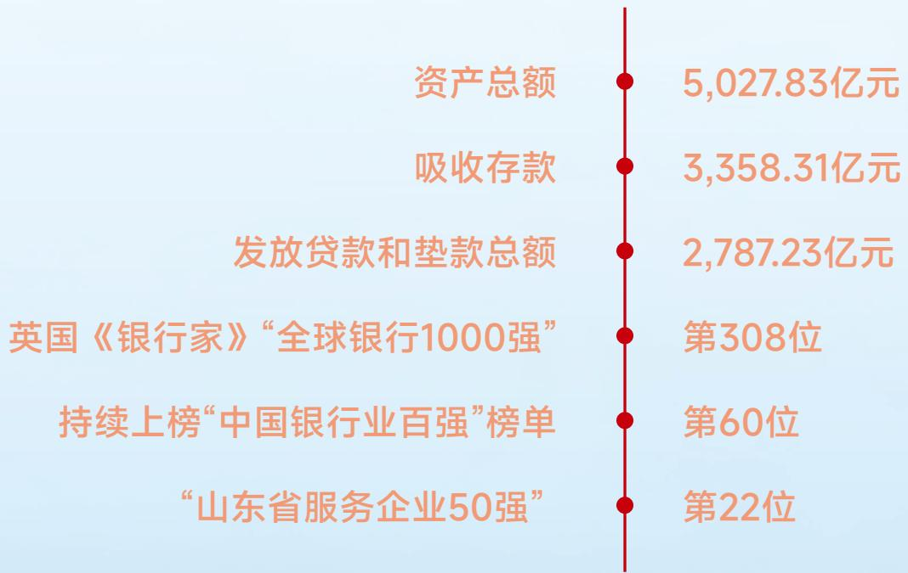

funnel

| 指标 | 数值 |
| --- | --- |
| 资产总额 | 5,027.83亿元 |
| 吸收存款 | 3,358.31亿元 |
| 发放贷款和垫款总额 | 2,787.23亿元 |
| 英国《银行家》“全球银行1000强” | 第308位 |
| 持续上榜“中国银行业百强”榜单 | 第60位 |
| “山东省服务企业50强” | 第22位 |

## 发展战略

本行始终坚持以习近平新时代中国特色社会主义思想为指导，深刻把握金融工作的政治性、人民性，以推动高质量发展为主题，以深化改革创新为主线，以服务实体经济和满足人民群众日益增长的优质金融需求为根本任务，坚持“支农支小”为主市场定位，聚焦做好金融“五篇大文章”，着力推动“1379”战略落地执行，坚定不移走好中国特色金融发展之路，为加快建设金融强国贡献青农商力量。

## 使命

扎根大地，滋养梦想，让生活更美好

## 愿景

打造现代标杆农商银行

## 7个战略遵循

坚持党的全面领导，走好中国特色金融发展之路

坚持服务实体经济，系统做好金融“五篇大文章”

坚持以客户为中心，坚守“支农支小”为主市场定位

坚持以奋斗者为本，锻造专业高效人才队伍

坚持稳健审慎经营，统筹高质量发展和高水平安全

坚持守正创新并重，以改革创新增强发展动能

坚持系统观念和协同推进，提升战略执行整体效能

## 发展历程

青岛农商银行按照现代商业银行治理理念，推动一系列重大改革。  
青岛农商银行改制成立。  
华丰、城阳、即墨、黄岛四家农村合作银行相继成立，胶州、胶南、平度、莱西四家农村信用联社陆续改制成为独立法人。  
农信社与农业银行脱离行政隶属关系，
转归人民银行管理。  
农信社划归农业银行管理，
实行所社合一，合署办公。  
青岛市第一家农信社在即墨移风店成立。

## 2022年8月

## 2012年6月

## 2005年6月

## 1996年10月

## 1980年4月

## 1951年11月

## 2025年12月

青岛农商银行在高质量发展的新征程上开启了崭新篇章。

## 2019年3月

青岛农商银行在深圳证券交易所A股上市。

## 2011年4月

原中国银监会正式批准筹建青岛农村商业银行股份有限公司。

## 2000年6月

青岛市农村信用合作社联合社正式开业。

## 1994年4月

农信社与农业银行基层所（处）实行分门办公。

## 1959年3月

农信社更名为信用部下放至人民公社管理。

## 年度荣誉

英国《银行家》杂志
全球银行1000强第308位
英国品牌评估机构“品牌金融”
(Brand Finance)
全球银行品牌价值500强第400位
中国银行业协会
中国银行业100强第60位  
山东省企业联合会
山东省企业家协会

山东省服务业企业 50 强第 22 位
中共山东省委金融委员会办公室、中国人民银行山东省分行国家金融监督管理总局山东监管局等
2025 好品金融 - 五篇大文章创新产品 - 养老金融品类  
中国人民银行、中国证监会
2024年度金融科技发展奖三等奖
山东省委宣传部、省委金融办
青岛农商银行企业文化中心 - 全省首批面向社会开放的金融文化场所  
中国人民银行山东省分行、山东省总工会
2025年山东省“聚力强省建设.建功高质量发展”创新创优劳动竞赛-人民币知识与技能竞赛团体二等奖、优秀组织奖
国家外汇管理局青岛市分局
2025年度青岛市银行外汇业务合规与审慎经营A类银行  
中国外汇交易中心
2025年度银行间本币市场最受市场欢迎的利率债做市商
2024年度人民币外汇市场100强
山东省企业联合会、山东省企业家协会
第五届山东省企业文化优秀成果二等奖  
中国上市公司协会
2025年上市公司可持续发展优秀实践案例、上市公司董事会优秀实践案例
上市公司董事会办公室最佳实践案例、上市公司2024年报业绩说明会优秀实践
2025年上市公司内部控制优秀实践案例
中央国债登记结算有限公司
优秀金融债发行机构、
自营结算100强  
银行业理财登记托管中心有限公司
2024年度理财信息登记优秀发行机构
国际金融理财标准委员会
首届养老金融财富规划大赛（2025）机构组织奖
中国证券报
2024年度金信披奖

防范和打击非法金融活动部际联席会议办公室、中国金融传媒公司  
全国第五届“守住钱袋子·护好幸福家”防范非法金融活动短视频征集大赛“最佳传播作品奖”  
★★★★★★  
中国信息通信研究院
第三届“IPv6技术应用创新大赛”
总决赛三等奖、金融赛道二等奖  
中国证券报
第六届银行业金牛奖“可持续投资金牛奖”、“固收类金牛理财产品”
★★★★★
中国基金报
第七届中国银行业理财英华奖“践行金融‘五篇大文章’优秀理财银行”
★★★★★  
南方周末新金融研究中心
2025年“金标杆——信用卡先锋榜”
中华合作时报社
2025农村金融优秀品牌创新机构
2025农村金融十佳养老金融机构  
中国经营报
2025卓越竞争力养老金融银行
《当代金融家》杂志
第七届“铁马”中小银行评选最佳金融市场业务中小银行奖  
财联社
ESG 金融年度大奖
固收最佳回报金榛子奖
★★★★★

东方财富
东方财富风云际会
“年度成长农村商业银行”
★★★★★

Wind ESG 评级
2025 年 WindESG 评级 A 级
★★★★★

全国地方金融论坛办公室
十佳零售业务创新银行
★★★★★

注：以上为

text_image

1
注：以上为
年度部分荣誉奖项

注：以上为  
年度部分荣誉奖项

## 可持续发展治理

Sustainable Development Governance

## 可持续发展理念

本行秉承可持续发展理念，协调推进环境保护、社会责任和公司治理，深化绿色治理机制，强化绿色金融实践，助力生态文明建设，共创绿色、和谐、繁荣的美好未来。

## 响应联合国可持续发展目标

本行在稳步推动自身业务发展的同时，主动响应联合国可持续发展目标（Sustainable Development Goals，简称SDGs），结合自身的企业文化和发展战略，深入对标SDGs，开展可持续发展行动。

<table><tr><td>章节</td><td>2025年我们的行动</td><td>对标联合国可持续发展目标(SDGs)</td></tr><tr><td>完善治理体系夯实发展基础</td><td>坚持党建引领,持续优化公司治理结构,推动治理机制规范高效运行;坚持稳健合规经营,强化风险防控与投资者沟通管理;恪守商业道德,切实维护股东、客户、员工等利益相关方的合法权益。</td><td>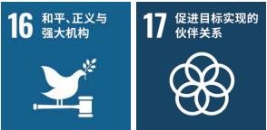</td></tr><tr><td>践行绿色理念推动低碳转型</td><td>积极响应“碳达峰、碳中和”目标,将绿色发展理念融入经营与业务实践,加大对绿色产业、低碳项目和循环经济领域的金融支持;持续推进节能降耗与绿色运营,探索绿色金融服务模式,稳步推进“绿色银行”建设。</td><td>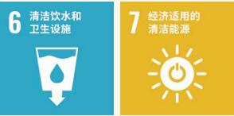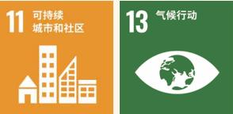</td></tr></table>

<table><tr><td>章节</td><td>2025年我们的行动</td><td>对标联合国可持续发展目标(SDGs)</td></tr><tr><td>深耕实体经济助力普惠发展</td><td>坚守“支农支小”为主的市场定位,加大乡村振兴重点领域金融支持力度,持续提升普惠金融服务质效;完善金融支持实体经济服务体系,助力传统产业转型升级和新兴产业发展壮大;健全消费者权益保护机制,完善投诉处理与风险防控体系,持续开展金融知识普及活动。</td><td>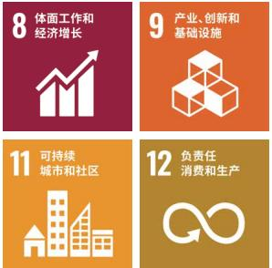</td></tr><tr><td>激发创新动能守护数字安全</td><td>推进数字化转型,以金融科技赋能业务创新和服务升级,持续提升客户服务体验;加强数据安全与客户隐私保护,完善信息安全管理体系;推进责任采购建设,强化供应商与合作伙伴管理。</td><td>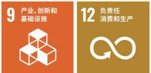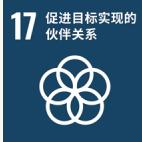</td></tr><tr><td>关注员工成长创造社会价值</td><td>坚持平等雇佣,吸引和培养优秀人才,拓展员工职业发展空间,保障员工合法权益;开展多样化员工关怀与企业文化活动,营造积极包容的工作环境;积极参与慈善公益和社区服务,以实际行动回馈社会。</td><td>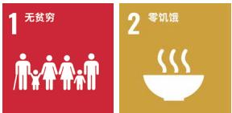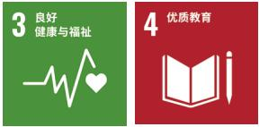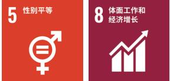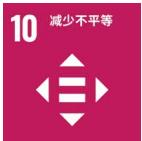</td></tr></table>

## 可持续发展治理机制

本行致力于建立层级清晰、权责分明的可持续发展管理体系，将 ESG 工作自上而下细化分解，落实到董事会、高级管理层和各职能部门，并明确各层级、各部门的工作职责，促进公司 ESG 管理工作的规范、有序开展。

## 董事会

对 ESG 重大事项进行审议与决策，完善 ESG 管理职能。

## 高级管理层

负责统筹 ESG 相关工作实施，制定全行 ESG 工作目标，每年度向董事会报告 ESG 工作情况等。

## 各职能部门

负责各项 ESG 工作的具体落实，定期向管理层进行汇报或提出相关建议，强化公司 ESG 工作管理力度。

## ESG培训及宣贯

为进一步提升在可持续发展方面的能力和水平，青岛农商银行开展 ESG 相关培训，提升全行在 ESG 方面的整体素养和能力。

## 【案例】开展ESG相关培训

本行组织开展和参与绿色金融与碳减排政策工具相关专题培训。培训采用线上 + 线下形式召开，主要围绕碳减排支持工具政策要点、信贷管理系统绿色升级操作流程、绿色金融标准解析与应用等内容展开，系统讲解绿色金融政策导向、业务操作要点及系统应用方法，进一步提升了全行对绿色金融政策工具和业务标准的理解与运用能力，对推动绿色金融业务规范发展、提升专业化服务水平具有较强的指导性和实践意义。

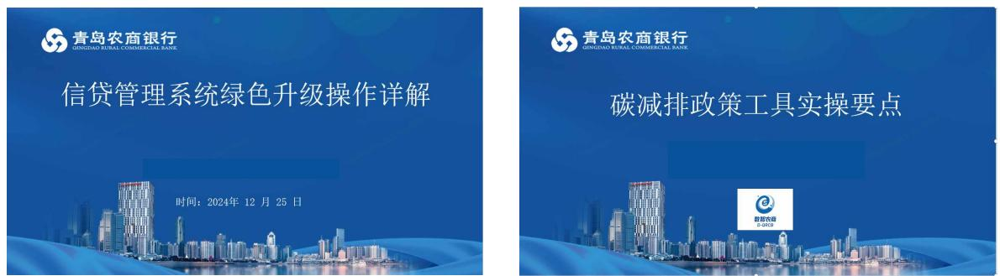

## 利益相关方沟通

本行高度重视利益相关方沟通在 ESG 治理中的关键作用，我们通过多元化的沟通渠道，主动识别各利益相关方的期望与诉求，并积极给予回应。

<table><tr><td>利益相关方</td><td>沟通渠道</td><td>期望与诉求</td><td>我们的回应</td></tr><tr><td>政府及监管部门</td><td>·走访、信息报送·工作汇报</td><td>·合规经营·风险防控·服务实体经济·维护金融稳定·税收贡献</td><td>·合规诚信经营·全面风险管理·普惠金融支持·落实监督检查·依法纳税</td></tr><tr><td>股东和投资者</td><td>·投资者热线·股东会·信息披露·互动易·网上集体接待日·业绩说明会·机构投资者线上交流</td><td>·投资回报·信息披露透明·公司治理</td><td>·提升经营业绩·优化公司治理·规范信息披露·投资者权益保护</td></tr><tr><td>客户</td><td>·网站及邮箱·官方微信平台·日常运营沟通·问卷沟通</td><td>·资金安全·服务便捷·优质产品·消费者权益保护</td><td>·创新金融产品·提升服务质量·推广数字银行·保护消费者权益</td></tr><tr><td>供应商及合作伙伴</td><td>·日常沟通·专题讨论沟通会·市场调研·采购政策及招标程序·问卷沟通</td><td>·公平合作·商业道德·可持续供应链</td><td>·诚信经营与合作·完善供应商管理</td></tr><tr><td>职工</td><td>·工会·职工代表大会·座谈会·慰问走访·工作评核·问卷沟通</td><td>·员工权益保障·员工职业发展·员工薪酬福利·良好工作环境</td><td>·提供员工培训·明晰晋升通道·完善薪酬福利·关注员工健康</td></tr><tr><td>社区与公众</td><td>·公益慈善活动·宣传走访·问卷沟通</td><td>·金融普惠·公益投入·社区发展</td><td>·助力乡村振兴·金融知识普及·支持公益慈善</td></tr></table>

## 重要性议题分析

我们依据自身运营特点、利益相关方关注方向及全球可持续发展趋势，并参考《深圳证券交易所上市公司自律监管指引第 17 号——可持续发展报告（试行）》、全球报告倡议组织《GRI3：重大主题》等国内外披露标准的评估方法，引入影响重要性和财务重要性的分析视角，识别和评估重要性议题，具体实施步骤如下：

## 重要性议题分析流程

1

## 了解公司背景

- 基于全球大趋势分析，中国产业发展趋势的宏观环境分析  
- 基于行业分析  
- 基于公司的商业模式分析  
识别公司的利益相关方与公司面临的影响、风险与机遇

2

## 议题初步筛选

参考全球报告倡议组织 GRI、联合国可持续发展目标 SDGs、SASB、MSCI，以及国内外同行业相关议题，建立可持续发展相关议题库

R

## 议题重要性评估

- 影响重要性评估  
梳理各议题对外部环境、社会和经济的潜在或实际的正面或负面影响，通过问卷的形式对利益相关方开展调研分析，回收802份问卷。  
财务重要性评估  
通过对影响性、依赖性和其他因素分析，结合专家判断，以及公司各部门对议题发生的可能性、财务影响的潜在程度问卷调研（共66份），识别和评估相关议题下的风险和机遇，评估出具有财务重要性的议题。

4

## 议题确认

形成影响重要性和财务重要性议题清单，并确保相关议题透明、平衡且完整地披露于报告中。

## 青岛农商银行重要性议题矩阵

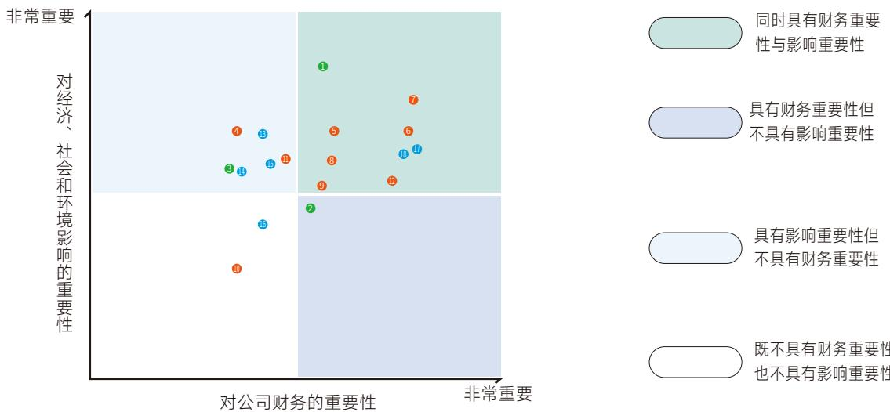  
同时具有财务重要性与影响重要性  
具有财务重要性但不具有影响重要性  
具有影响重要性但不具有财务重要性  
既不具有财务重要性也不具有影响重要性

## 青岛农商银行重要性议题清单如下：

## 维度

## 议题

## E 环境

① 绿色金融、② 应对气候变化、③ 绿色运营

## S 社会

④员工权益与发展、⑤金融科技创新、⑥践行普惠金融、

⑦服务实体经济、⑧客户权益保护、⑨信息安全与隐私保护、⑩负责任采购、⑪社会贡献、⑫乡村振兴、⑬科技伦理

## G 治理

⑭反商业贿赂及反贪污、⑮反不正当竞争、⑯尽职调查、

⑰利益相关方沟通、⑱风险管理、⑲合规运营

## 01

## 完善治理体系夯实发展基础

■ 规范公司治理  
■ 贯彻合规运营  
■ 全面风险管理  
■恪守商业道德

青岛农商银行持续完善公司治理体系，在党建引领下不断强化董事会治理、风险管理与合规运营机制，将稳健经营理念融入经营管理全过程。本行高度重视与投资者及各类利益相关方的沟通交流，坚持诚信经营与商业道德，持续提升治理透明度与风险管理能力，为长期稳健发展与可持续价值创造奠定坚实基础。

bar

| Category | Value |
| --- | --- |
| 1 | ~20 |
| 2 | ~35 |
| 3 | ~60 |
| 4 | ~50 |
| 5 | ~55 |
| 6 | ~30 |
| 7 | ~55 |
| 8 | ~35 |
| 9 | ~65 |
| 10 | ~85 |

text_image

DATA ANALYTICS
ONION

响应的SDGs

16 和平、正义与强大机构

17 促进目标实现的伙伴关系

## 规范公司治理

Improve corporate governance

## 坚持党建统领

青岛农商银行党委坚持以习近平新时代中国特色社会主义思想为指导，深入贯彻落实党的二十大及二十届历次全会精神，在市委、市政府的坚强领导下，持续以高质量党建引领保障高质量发展，推动全行改革动能加速释放，经营发展质效稳步提升，为实现战略目标提供了坚强的政治和组织保证。

## 党建体系

青岛农商银行严格按照《党章》要求设立了总行党委，由青岛市委金融工委直管。总行党委下辖9个基层党委，3个直属党总支和10个直属党支部。全行在总行本部及各分支机构中，依据党员和网点分布情况，共设立党支部252个，共有党员2921名，实现了党组织设置与党员管理全覆盖。

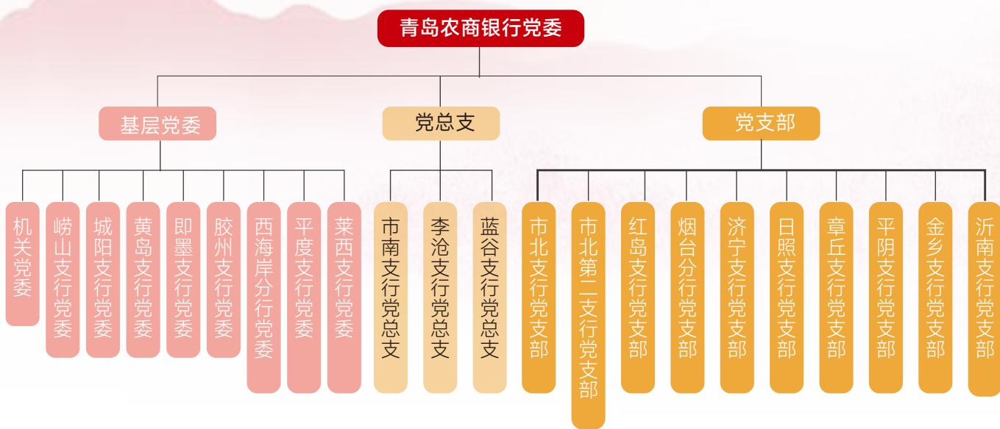

flowchart

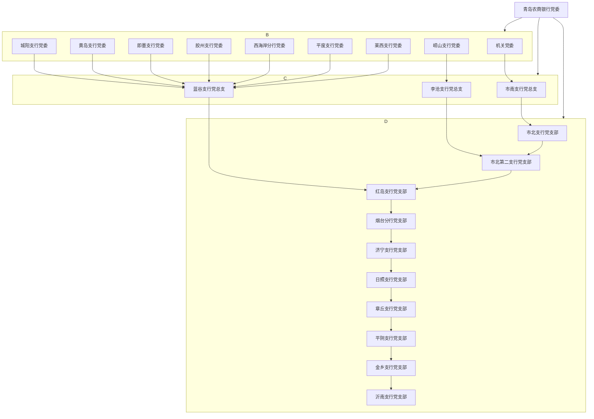
```mermaid
graph TD
  A["青岛农商银行党委"] --> B["基层党委"]
  A --> C["党总支"]
  A --> D["党支部"]
  
  subgraph B
    B1["机关党委"]
    B2["崂山支行党委"]
    B3["城阳支行党委"]
    B4["黄岛支行党委"]
    B5["即墨支行党委"]
    B6["胶州支行党委"]
    B7["西海岸分行党委"]
    B8["平度支行党委"]
    B9["莱西支行党委"]
  end
  
  subgraph C
    C1["市南支行党总支"]
    C2["李沧支行党总支"]
    C3["蓝谷支行党总支"]
  end
  
  subgraph D
    D1["市北支行党支部"]
    D2["市北第二支行党支部"]
    D3["红岛支行党支部"]
    D4["烟台分行党支部"]
    D5["济宁支行党支部"]
    D6["日照支行党支部"]
    D7["章丘支行党支部"]
    D8["平阴支行党支部"]
    D9["金乡支行党支部"]
    D10["沂南支行党支部"]
  end
  
  B1 --> C1
  B2 --> C2
  B3 --> C3
  B4 --> C3
  B5 --> C3
  B6 --> C3
  B7 --> C3
  B8 --> C3
  B9 --> C3
  C1 --> D1
  C2 --> D2
  C3 --> D3
  D1 --> D2
  D2 --> D3
  D3 --> D4
  D4 --> D5
  D5 --> D6
  D6 --> D7
  D7 --> D8
  D8 --> D9
  D9 --> D10
```

## 强化政治引领

坚持把党的政治建设摆在首位，持续完善党的领导融入公司治理机制。严格执行“第一议题”制度，全年组织总行党委学习40次，带动全行各级党组织学习超1,000次，确保党中央决策部署一贯到底。修订完善党委议事规则，落实重大事项党委前置研究，党委“管大局、把方向、保落实”作用充分彰显。

## 强化思想引领

坚持用党的创新理论凝心铸魂。扎实开展深入贯彻中央八项规定精神学习教育，动真碰硬推动作风转变。构建多层次、立体化的思想引领工作新格局，通过党委理论学习中心组、专题读书班、“微课堂”及系列思政教育短片，推动理论学习生动鲜活、入脑入心。严格落实意识形态工作责任制，压实主体责任，全年未发生涉意识形态风险。

## 强化组织引领

树立大抓基层鲜明导向，持续优化基层党组织建设，规范完成多家分支机构“两委”换届。坚持党管干部原则，树立正确选人用人导向，举办“亮绩”擂台赛，初步构建知事识人体系。大力推进“人才强行”战略，出台人才梯队建设管理办法，加强年轻干部挂职锻炼与专业序列培养。深化“金穗红帆”党建品牌内涵，以党建带工建促团建，推出“金穗红帆·同心远航”统战品牌，建立党外知识分子联谊会和企业欧美同学会（留学人员联谊会），群团组织活力有效激发，为全行发展凝聚广泛合力。

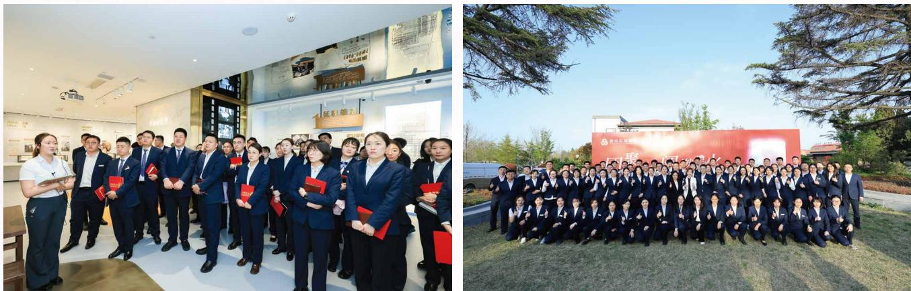  
2025 年 “青马工程” 培训班暨青年论坛

## 强化作风与纪律引领

坚决扛起全面从严治党主体责任，召开全行党风廉政建设工作会议，制定18项工作要点。紧盯“四风”隐形变异问题，在重要节点强化廉洁提醒，组织开展明察暗访16轮。创新构建“7+N”常态化警示教育体系，各级召开各类警示教育活动460余场次，以案促改、以案促治成效显著。党委监督办与机关纪委协同发力，深化政治监督与专项监督，规范问题线索处置流程，初步形成各类监督贯通协调的大监督格局。持续开展“为基层减负赋能”，推动清廉金融文化建设，风清气正、担当实干的氛围更加浓厚。

## 关键绩效

(截至报告期末)

本行各级党组织累计开展深入贯彻中央八项规定精神专题学习 1,036 次，讲授专题党课 259 次，组织警示教育会议 321 场，参观廉洁教育基地 21 次，组织观看警示教育片 54 场次，覆盖 13,484 人次。

## 完善治理结构

本行严格遵守《中华人民共和国公司法》(以下简称《公司法》)《中华人民共和国商业银行法》《中华人民共和国证券法》等法律法规的相关规定，建立由股东会、董事会组成的权责分明、有效制衡、科学决策、协调运作的公司内部治理结构，以保证两会运作合法合规，保证信息披露及时、准确、完整，保证内部控制规范有效，切实维护公司和广大投资者的利益。

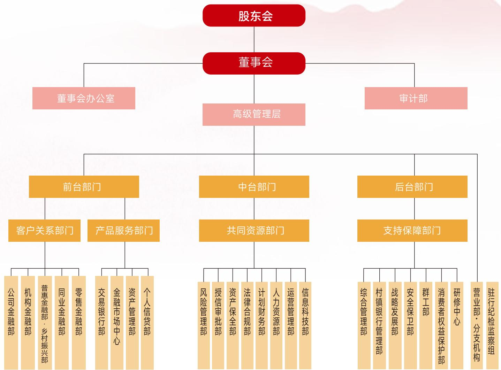

flowchart

```mermaid
graph TD
  A["股东会"] --> B["董事会"]
  B --> C["董事会办公室"]
  B --> D["高级管理层"]
  B --> E["审计部"]
  B --> F["前台部门"]
  B --> G["中台部门"]
  B --> H["后台部门"]
  B --> I["客户关系部门"]
  B --> J["产品服务部门"]
  B --> K["共同资源部门"]
  B --> L["支持保障部门"]
  
  C --> M["公司金融部"]
  C --> N["机构金融部"]
  C --> O["普惠金融部・乡村振兴部"]
  C --> P["同业金融部"]
  C --> Q["零售金融部"]
  
  D --> R["交易银行部"]
  D --> S["金融市场中心"]
  D --> T["资产管理部"]
  D --> U["个人信贷部"]
  
  F --> V["风险管理部"]
  F --> W["授信审批部"]
  F --> X["资产保全部"]
  F --> Y["法律合规部"]
  F --> Z["计划财务部"]
  F --> AA["人力资源部"]
  F --> AB["运营管理部"]
  F --> AC["信息科技部"]
  
  G --> AD["综合管理部"]
  G --> AE["村镇银行管理部"]
  G --> AF["战略发展部"]
  G --> AG["安全保卫部"]
  G --> AH["群工部"]
  G --> AI["消费者权益保护部"]
  G --> AJ["研修中心"]
  
  H --> AK["营业部・分支机构"]
  H --> AL["驻行纪检监察组"]
```

## 股东会

股东会作为最高权力机构,本行严格按照《深圳证券交易所股票上市规则》《公司章程》《股东会议事规则》等要求召集、召开股东会，平等对待所有股东，确保所有股东尤其是中小股东都享有平等的地位和权利。

## 关键绩效

(报告期内)

本行共召开股东会 2 次，其中，年度股东会 1 次，临时股东会 1 次，审议共通过了 21 项议案。

## 董事会

董事会作为本行的经营决策机构，对股东会负责，依据相关法律法规及《公司章程》的规定，围绕发展战略，切实履行股东赋予董事会的职责。本行董事会下设战略规划委员会、提名与薪酬委员会、审计委员会、风险管理与关联交易控制委员会、三农金融服务与消费者权益保护委员会，各委员会均按照《公司章程》和各专门委员会工作规则的规定履行其职责，对公司重大事项进行客观、审慎的判断，提高董事会的科学决策效率。此外，审计委员会的召集人为独立董事中的会计专业人士。

## 关键绩效

(报告期内)

董事会共召开 14 次会议，共审议通过 73 项议案，董事出席率 98.09%;

共召开专门委员会会议 34 次，审议议案 66 项，其中：

战略规划委员会会议 6 次，审议议案 12 项；

审计委员会会议 8 次，审议议案 19 项；

提名与薪酬委员会会议 5 次，审议议案 8 项；

三农金融服务与消费者权益保护委员会会议 6 次，审议议案 4 项；

风险管理与关联交易控制委员会会议 9 次，审议议案 23 项。

## 董事会多元化

本行董事均按照《公司法》《公司章程》的有关规定选举、聘任产生，立足企业的实际发展需求，在选聘时充分考虑包括性别、年龄、专业背景等多方面的平衡，致力于推动董事会多元化。本行董事成员覆盖会计学、金融学、经济学、管理学等各项专业领域，为公司经营决策和规范运作提供合理、科学的意见和建议。

## 关键绩效

(截至报告期末)

本行董事会董事成员为 12 名，其中，女性董事 2 名，占比 16.67%;

独立非执行董事 5 名，占比 41.67%。

性别百分比：  

donut

| Category | Percentage |
| --- | --- |
| 女性 | 16.67% |
| 男性 | 83.33% |

年龄百分比：  
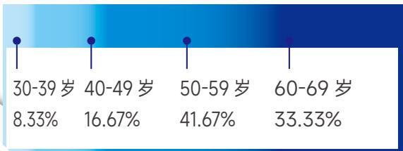

bar

| Age Group | Percentage |
| --- | --- |
| 30-39岁 | 8.33% |
| 40-49岁 | 16.67% |
| 50-59岁 | 41.67% |
| 60-69岁 | 33.33% |

学历百分比：  
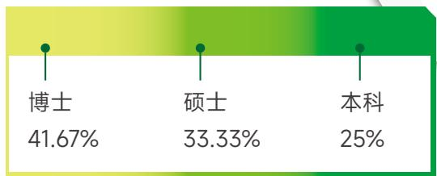

donut

| 学历 | 占比 (%) |
| --- | --- |
| 博士 | 41.67 |
| 硕士 | 33.33 |
| 本科 | 25 |

独立性百分比：  
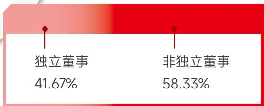

donut

| Category | Percentage |
| --- | --- |
| 独立董事 | 41.67% |
| 非独立董事 | 58.33% |

注：由于四舍五入，各部分之和可能不等于100%。

## 董事会独立性

本行注重发挥独立董事在公司治理中的积极作用，推动形成董事会内部制衡，提升董事会决策的科学性和专业性。报告期内，本行的独立董事根据相关法律法规以及《公司章程》《独立董事制度》的相关规定，认真审议董事会各项议案，独立董事对公司关联交易等重大事项发表了明确意见，诚实、勤勉、独立地履行职责，充分发挥独立董事的作用。

<table><tr><td>专门委员会</td><td>独立董事(名)</td><td>非独立董事(名)(包含执行董事与非执行董事)</td><td>独董是否担任主任委员</td></tr><tr><td>战略规划委员会</td><td>0</td><td>3</td><td>否</td></tr><tr><td>提名与薪酬委员会</td><td>2</td><td>1</td><td>是</td></tr><tr><td>审计委员会</td><td>3</td><td>1</td><td>是</td></tr><tr><td>风险管理与关联交易控制委员会</td><td>2</td><td>1</td><td>是</td></tr><tr><td>三农金融服务与消费者权益保护委员会</td><td>0</td><td>3</td><td>否</td></tr></table>

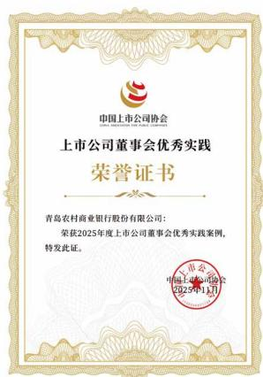

text_image

中国上市公司协会
上市公司董事会优秀实践
荣誉证书

青岛农村商业银行股份有限公司：
荣获2025年度上市公司董事会优秀实践案例，
特发此证。

中国上市公司协会
2025年11月

荣获 2025 年上市公司董事会优秀实践案例

## 高管薪酬管理

本行完善修订《青岛农商银行高级管理人员考核管理办法》，从经营业绩和管理能力两个维度测评高管履职情况。同时，本行定期在年度报告、股东会材料或相关公告中披露董事及高级管理层的薪酬情况，报告期末全体董事和高级管理人员实际获得的报酬详见公司2025年年度报告。

本行对高级管理人员的薪酬构成进行划分，按月支付基本年薪，年度考评挂钩绩效年薪，任期考核挂钩任期激励收入。持续加强内部分配管理，建立健全激励约束机制，促进本行稳健经营发展。

## 股东权益保护

## 信息披露

本行依据《上市公司信息披露管理办法》《商业银行信息披露办法》制定了《信息披露制度》，规范定期报告、临时报告及其他披露内容的披露程序，致力于促进公司与投资者之间的良性互动，开展投资者关系管理活动，不断规范信息披露工作，保障与投资者沟通的透明度和有效性。切实保护投资者合法权益，为股东创造更大价值。报告期内，公司未因信息披露方面违规而受到处罚。

2025 年，本行共对外披露各类文件 101 份，其中，披露公告 60 份。

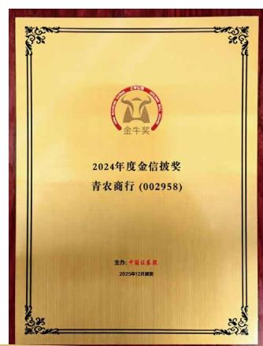

text_image

金牛奖
2024年度金信披奖
青农商行 (002958)
主办:中国证券报
2025年11月颁发

荣获 2024 年度金信披奖

## 投资者关系管理

本行制定《投资者关系管理办法》，董事会秘书负责组织和协调本行投资者关系管理工作，董事会办公室是投资者关系管理职能部门，负责本行投资者关系管理日常工作。本行通过公司官网、深圳证券交易所网站和深圳证券交易所投资者关系互动平台、新媒体平台、电话、传真、电子邮箱、投资者教育基地等渠道、平台、方式开展投资者关系管理工作，收集和答复投资者的咨询、投诉和建议等诉求，及时发布和更新投资者关系管理相关信息。报告期内，本行组织年度业绩说明会1次，参加年度青岛辖区上市公司投资者网上集体接待日活动1次，接待证券公司、基金公司、资管公司等50余家机构投资者到总行现场调研、参观、座谈沟通，广泛听取投资者的意见和建议，提升交流的针对性。

## 股东权益保护

本行高度重视股东利益，尤其是维护中小股东利益，在股东会召开过程中，对中小投资者的表决情况进行单独计票，并将具体表决情况披露在公司的股东会决议公告中。

本行高度重视股东的合理回报，严格按照监管要求，保持利润分配政策的连续性和稳定性，为投资者带来长期、稳定的投资回报。在保障自身发展所需资金的同时，我们始终将股东的利益和公司的长远发展放在首位，增强股东回报意识，积极通过现金分红的方式回馈投资者。

## 关键绩效

(报告期内)

本行实施 2024 年年度权益分派，每 10 股派发现金红利 1.2 元（含税），

派现总额 666,674,308.55 元（含税），

占归属于母公司股东净利润的 23.34%。

## 全面风险管理

Enterprise-wide Risk Management

青岛农商银行秉承“合规、稳健、主动、全面”的风险管理理念，通过完善风险管理制度，优化风险管理流程，升级风险量化工具，围绕风险管控数字化、智能化、精细化的建设目标，不断完善全面风险管理体系，不断增强风险管理的全面性、精准性、主动性。

## 治理

## 风险治理架构

本行建立了职责明确、清晰、完整的风险治理架构，明确了董事会、董事会审计委员会、高级管理层、风险管理部门、各业务部门和审计部门在风险管理中的职责分工，建立多层次、相互衔接、有效制衡的运行机制。本行已将全面风险管理纳入内部审计范畴，每年审查和评价全面风险管理的充分性和有效性。

## 董事会

承担全面风险管理的最终责任，主要职责包括构建风险文化，制定风险管理策略与风险偏好，审批风险管理政策、程序，监督高级管理层的风险管理工作，审议全面风险管理报告等。

董事会下设风险管理与关联交易控制委员会，对委员会职责进行授权，制定委员会议事规则，并按规定职责、频率召开会议。

## 董事会审计委员会

承担全面风险管理的监督责任，负责监督检查董事会和高级管理层在风险管理方面的履职尽责情况并督促整改。

## 高级管理层

承担全面风险管理的实施责任，执行董事会的决议，制定并推动执行相应的风险管理政策和程序，评估全面风险和各类重要风险管理状况并向董事会报告等。

## 风险管理部门

总行风险管理部负责牵头全面风险的日常管理。各风险管理部门承担制定政策和流程，监测和管理风险的责任。

## 各业务部门

总行相关部门负责牵头各专业风险的日常管理。

## 审计部门

总行审计部承担各业务部门和风险管理部门履职情况的审计责任。

风险管理治理架构图  
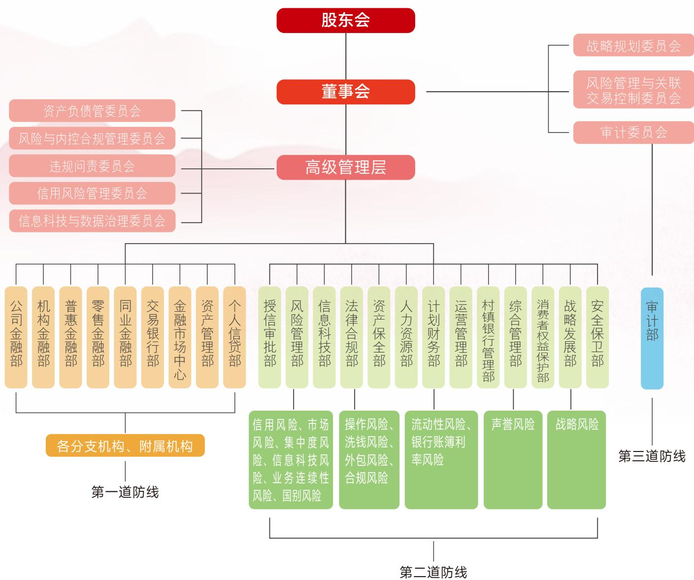

flowchart

```mermaid
graph TD
  A["股东会"] --> B["董事会"]
  B --> C["高级管理层"]
  B --> D["战略规划委员会"]
  B --> E["风险管理与关联交易控制委员会"]
  B --> F["审计委员会"]
  
  subgraph Board["董事会"]
    direction TB
    B
    C
    D
    E
    F
  end
  
  subgraph Subsidiary ["高级管理层"]
    direction TB
    C
    G1["资产负债管委员会"]
    G2["风险与内控合规管理委员会"]
    G3["违规问责委员会"]
    G4["信用风险管理委员会"]
    G5["信息科技与数据治理委员会"]
  end
  
  subgraph DeptA["各分支机构、附属机构"]
    direction TB
    H1["公司金融部"]
    H2["机构金融部"]
    H3["普惠金融部"]
    H4["零售金融部"]
    H5["同业金融部"]
    H6["交易银行部"]
    H7["金融市场中心"]
    H8["资产管理部"]
    H9["个人信贷部"]
  end
  
  subgraph DeptB["第二道防线"]
    direction TB
    I1["授信审批部"]
    I2["风险管理部"]
    I3["信息科技部"]
    I4["法律合规部"]
    I5["资产保全部"]
    I6["人力资源部"]
    I7["计划财务部"]
    I8["运营管理部"]
    I9["村镇银行管理部"]
    I10["综合管理部"]
    I11["消费者权益保护部"]
    I12["战略发展部"]
    I13["安全保卫部"]
  end
  
  subgraph DeptC["第三道防线"]
    direction TB
    J1["信用风险、市场风险、集中度风险、信息科技风险、业务连续性风险、国别风险"]
    J2["操作风险、洗钱风险、外包风险、合规风险"]
    J3["流动性风险、银行账簿利率风险"]
    J4["声誉风险"]
    J5["战略风险"]
  end
  
  A --> H1
  A --> H2
  A --> H3
  A --> H4
  A --> H5
  A --> H6
  A --> H7
  A --> H8
  A --> H9
  
  H1 --> I1
  H1 --> I2
  H1 --> I3
  H1 --> I4
  H1 --> I5
  H1 --> I6
  H1 --> I7
  H1 --> I8
  H1 --> I9
  H1 --> I10
  H1 --> I11
  H1 --> I12
  H1 --> I13
  
  subgraph Subsidiary ["第二道防线"]
    direction TB
    J1
    J2
    J3
    J4
    J5
    J6
    J7
    J8
    J9
    J10
    J11
    J12
    J13
  end
```

## 风险管理制度体系

本行制定了完善的风险管理制度体系,制定《青岛农商银行全面风险管理办法》,涵盖了信用风险、市场风险、操作风险、流动性风险、声誉风险、战略风险等各类风险。同时，本行制定了《青岛农商银行风险隔离管理办法》《青岛农商银行环境和社会风险管理办法》《青岛农商银行风险报告管理办法》等相关风险的管理办法，以确保对各类风险进行全面识别、评估、监控和有效管理。

本行制定了各类风险政策，包括《青岛农商银行 2025 年市场风险管理政策》《青岛农商银行 2025 年银行账簿利率风险管理政策》《青岛农商银行 2025 年流动性风险偏好及管理政策》《青岛农商银行信息科技风险管理政策》《青岛农商银行集中度风险管理政策》。同时本行对主要业务管理办法进行了更新，主要包括同业业务交易对手准入、非金融企业债券客户授信、同业客户授信、债券市场业务管理等管理办法。

战略

<table><tr><td>风险类型</td><td>风险描述</td><td>发生可能性</td><td>影响大小</td><td>影响的时间范围</td><td>影响的价值链环节</td><td>优先级排序</td><td>潜在财务影响</td><td>应对措施</td></tr><tr><td>合规风险</td><td>若风险管理体系存在的不足,可能影响本行及时遵守相关监管规定的能力。</td><td>低</td><td>高</td><td>中期-长期</td><td>运营</td><td>高</td><td>运营成本增加</td><td rowspan="2">不断完善风险预警及报告制度,建立风险责任约束和激励机制,促进风险管理工具和技术手段提升,重视培育全员的风险管理思想与文化。</td></tr><tr><td>操作风险</td><td>由于可使用的资源或工具有限,如果本行不能有效地实施、持续遵循或继续优化风险管理系统,本行的业务经营可能会受到不利影响。</td><td>低</td><td>高</td><td>中期-长期</td><td>运营</td><td>高</td><td>营业收入减少</td></tr></table>

说明：

1. 发生可能性：指风险 \ 机遇发生的频次间隔、发生的概率，主要根据历史发生的概率、外部情景、政策实施的进展和专家预测判断。发生概率从“低”到“高”。  
2. 影响大小：指通过冲击水平和风险 \ 机遇发生可能性判定影响的大小，综合考虑对商业模式、价值链、财务影响等因素。影响大小从“低”到“高”。  
3. 影响的时间范围：不同风险 \ 机遇对本行产生影响，本行将影响的时间范畴划分为短期（0-1 年）、中期（1-5 年）、长期（5 年以上）。  
4. 影响价值链环节：指上游（涉及资本筹集、资金管理与融资等环节）、运营（涉及贷款和信用服务、财富管理和投资服务、支付和结算、风险管理和合规等环节）、下游（涉及营销和客户服务等环节）。  
5. 优先级排序: 综合考虑发生可能性、影响大小、影响时间范围等因素, 结合本行实际, 优先级排序分为 “低”、“中”、“高”。(注：报告其他章节关于发生可能性、影响大小、影响的价值链环节、优先级排序定义与上文一致，将不再重复说明)

## 影响、风险和机遇管理

本行制定了清晰的风险管理策略，在内部资本充足评估程序中对风险管理有效性进行评估，风险管理策略能够反映风险偏好、风险状况及市场和宏观经济变化。本行制定了书面的风险偏好，做到定性指标和定量指标并重，并每年对风险偏好进行评估，及时向高管层和董事会汇报偏好、政策执行情况。

## 指标与目标

本行对信用、市场、操作、银行账簿利率、合规、信息科技、业务连续性等各类风险设定具体风险限额指标，定期监测执行情况，采取有效管理措施，严格控制各类风险。报告期内，本行开展全面风险评估10次，开展风险管理培训5场，培训覆盖员工6,025人次。

## 风险管理能力建设

本行将风险文化建设作为稳健经营的坚固基石，致力于通过完善制度框架与机制、组织风险管理培训活动来深化全体员工的风险防控意识。本行积极推动风险管理理念与日常经营活动的深度融合，不断加固风险防御体系，为业务的持续高质量发展奠定坚实可靠的保障。

## 【案例】贷后督导推动基层合规经营

本行持续推动贷后督导覆盖面，实现首次贷后检查每月全覆盖、定期贷后检查全年全覆盖，2025年现场召开贷后例会、开展分支机构培训64场次、印发通报15期、风险提示5次，全行风险意识、合规意识、贷后管理水平明显提升。分支机构每季度召开贷后监督例会，参会人员包括分支机构风险条线领导及相关工作人员，对公客户经理等。

## 贯彻合规运营

Ensuring Compliance in Operations

本行以“合规为先”、“质量为要”为经营方针，以“规范化”为经营原则，全面构建与经营范围、组织结构、业务规模、风险状况相适应的内控合规管理体系。2025年，本行制定《青岛农商银行2025年内控合规管理体系建设行动方案》，围绕好银行标准，全面推进内控合规“一体两翼八大体系”建设，打造青岛农商银行内控合规管理品牌。

## 治理

为完善公司治理结构,提高风险管理水平,本行根据《银行业金融机构全面风险管理指引》《商业银行内部控制指引》《商业银行业务连续性监管指引》等有关规定，制定《风险与内控合规管理委员会工作规则》《内控合规检查工作管理办法》等一系列制度，严格规范合规管理工作。

本行设立风险与内控合规管理委员会（以下简称“风控委”），在董事会风险管理与关联交易控制委员会的指导和总行高级管理层的领导下，负责具体实施本行全面风险管理与内控合规管理各项工作。风控委设有主任委员、副主任委员和委员。风控委办公室设在风险管理部，为风控委的日常办事机构。

合规管理组织架构  
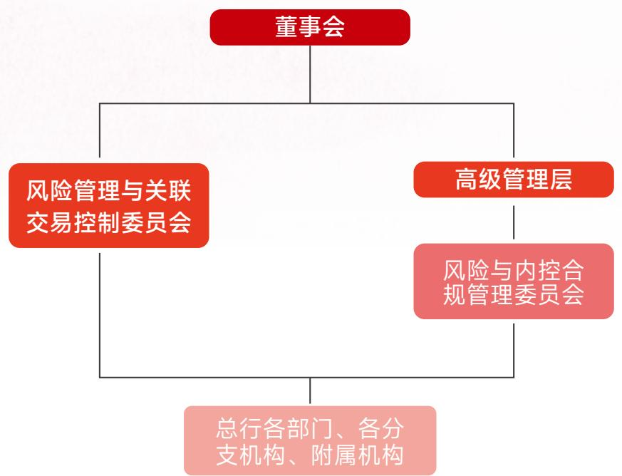

flowchart

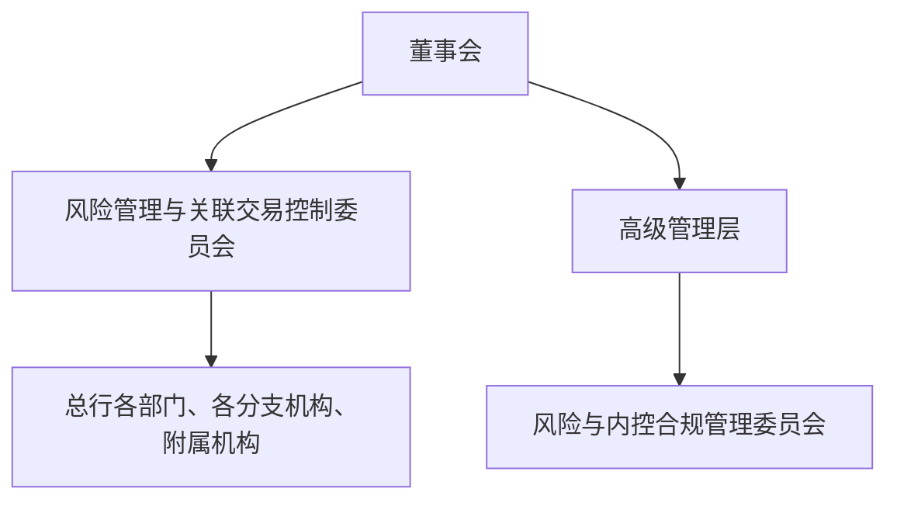
```mermaid
graph TD
  A["董事会"] --> B["风险管理与关联交易控制委员会"]
  A --> C["高级管理层"]
  B --> D["总行各部门、各分支机构、附属机构"]
  C --> E["风险与内控合规管理委员会"]
```

为增强合规管理效果，本行制定《2025年度运营管理条线考核办法》，将内控管理与运营效率作为核心考核维度，其中包含事后监督差错指标、风险防控系统预警信息处理、超限个人银行结算账户清理等。

战略

<table><tr><td>风险类型</td><td>风险描述</td><td>发生可能性</td><td>影响大小</td><td>影响的时间范围</td><td>影响的价值链环节</td><td>优先级排序</td><td>潜在财务影响</td><td>应对措施</td></tr><tr><td>合规风险</td><td>若没有遵循银行业相关法律、规则和准则,本行可能遭受法律制裁、监管处罚、重大财务损失和声誉损失。</td><td>低</td><td>高</td><td>短期</td><td>运营</td><td>高</td><td>营业收入减少,运营成本增加</td><td>全面构建和完善内控合规管理体系,确保依法合规经营。</td></tr><tr><td>洗钱风险</td><td>若不法分子借助本行渠道实施洗钱、恐怖融资或扩散融资行为,可能使本行面临法律诉讼、罚款、声誉损失等风险。</td><td>低</td><td>高</td><td>短期</td><td>运营下游</td><td>高</td><td>运营成本增加</td><td>严格遵守反洗钱法律法规,深入实践“风险为本”的管理理念,对洗钱风险进行持续识别、审慎评估、合理控制和全面管理,认真履行反洗钱社会责任和法定义务。</td></tr></table>

## 影响、风险和机遇管理

本行着力构筑“不想违规、不能违规、不敢违规”的内控合规长效机制，根据《青岛农商银行合规管理办法》等制度体系，有序开展合规检查、合规风险报告等合规内控管理工作，确保及时有效地防范和控制合规风险。

## 合规风险防范重点工作

## 规章制度建设优化

健全全行制度管理体系，修订规章制度管理办法，明确规章制度起草、审查、评价等要求，进一步规范规章制度管理。持续做好内规的“立改废”，制定年度规章制度制定计划，做好全行制度新制定、修订和废止管理工作。持续加强外规内化管理，实现“外规内化”线上管理。

## 合规风险监测警示

主动关注新出台的银行业法律法规、重点违规问题，通过编发《合规提示》《违规问责典型案例》方式，提示外规变化情况，剖析问责案例，警示全行规避类似违规行为。建设合规非现场监测模型，发挥合规非现场监测作用。

## 合规风险审查化解

加强合规审查，严格评估新制度、新产品、新业务、新合同的合规风险，从源头上防控合规风险；明确规章制度审查范围，重点从合规审查、反洗钱审查、消费者权益保护审查等方面进行。

## 强化员工行为管理

修订完善《涉刑案件管理办法》，前移案件管理工作重心，提升案件管理质效；加强员工异常行为排查，严格规范员工日常行为要求，综合运用座谈（谈心谈话）、走访（家访）、监督举报等方式，了解员工日常思想及行为动态等，及时预防、纠正、化解员工行为风险隐患。

## 指标与目标

为全面落实本行战略部署，根据《青岛农商银行内控合规管理体系建设规划纲要》，制定《青岛农商银行2025年内控合规管理体系建设行动方案》，全面提升全员全条线的合规履职能力，为全行高质量发展提供坚实的内控合规保障。

<table><tr><td>指标\目标</td><td>2025年完成情况</td></tr><tr><td>三升:监管评级等外部评级持续提升,合规履职能力和内部控制效能持续提升,合规文化引领作用持续提升。</td><td></td></tr><tr><td>两降:行政处罚、违规处分等内外部处理较近三年平均水平明显下降,监管通报、检查等发现的存量未整改问题数量加速下降。</td><td rowspan="3">已完成</td></tr><tr><td>一智能:实现制度管理、流程管理、检查管理、问题整改、问责管理、操作风险管理、非现场监测等内控合规管理工具与手段的线上化、信息流转的顺畅化、数据沉淀的自动化、统计查询的便捷化、数据分析的可视化。</td></tr><tr><td>零案件:有效实施防案查案措施,主动排查处置案件隐患,确保不发生重大案件。</td></tr></table>

已完成

## 合规文化建设

## 合规教育培训

本行针对性开发 6 门合规通识课程、构建多层次、立体化的培训内容框架。同时，定期组织重要岗位人员、新入行员工开展合规培训；开展了年初“一把手讲合规”“管理人员宣讲下基层”等活动，持续宣讲监管政策及合规经营要求；编发警示案例，开展警示教育，切实提升全员合规意识和履职能力。

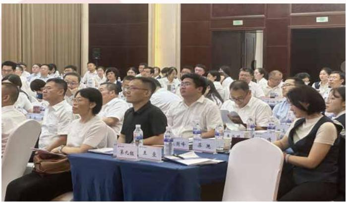

text_image

Conference hall photo with attendees seated at tables, nameplates visible on table

2025 年全行合规管理人员综合能力提升培训

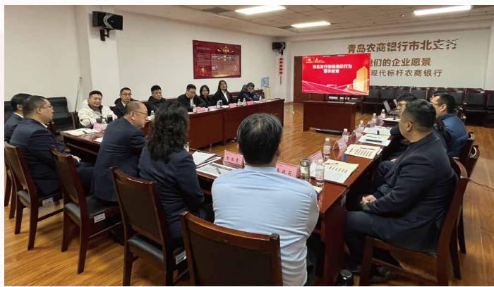

text_image

青岛农商银行市北支行
我们的企业愿景
现代标杆农商银行

分支机构高管综合会议合规宣讲

## 关键绩效

(报告期内)

本行共开展 432 次合规培训，参与人次 14,003 人次；

开展合规警示教育 895 期，覆盖 21,562 人次；

组织开展“一把手”讲合规、高管宣讲下基层等合规宣讲活动 476 场次，涉及员工 8,751 人次。

本行《“一体两翼八大体系”内控合规管理创新实践案例》被中国上市公司协会评为“上市公司内部控制优秀实践案例”。

## 合规文化宣传

本行创新开展多层次合规文化宣贯活动，通过组织全员合规宣誓仪式、签订合规履职承诺书、开展合规主题征文比赛等特色活动，营造浓厚的合规文化氛围。本行建立常态化宣传机制，持续开展防范非法集资宣传，定期编发《合规文化专刊》，系统解读监管政策、分享合规案例、推广最佳实践，持续深化合规文化理念传播。在防范和打击非法金融活动部际联席会议办公室指导、中国金融传媒公司主办的全国第五届“守住钱袋子·护好幸福家”防范非法金融活动短视频征集大赛中，斩获“最佳传播作品奖”，是青岛地区唯一获此奖项的金融机构。

## 反洗钱管理

本行制定了《洗钱和恐怖融资风险管理办法》，作为反洗钱工作总领性制度，将洗钱风险管理纳入全面风险管理体系，明确管理架构与职责分工，完善反洗钱管理制度、流程和组织架构，深化业务条线反洗钱职责，深入实践“风险为本”的反洗钱工作理念、合理配置行内资源，强化业务部门和分支机构反洗钱主体责任、勤勉尽职，有效预防洗钱活动及相关犯罪活动的发生。

## 反洗钱组织架构

本行设立反洗钱工作领导小组，组长由行长担任，副组长由法律合规部负责人担任，成员由公司金融、机构金融、普惠金融、同业金融、零售金融等相关部门负责人组成。董事会是洗钱风险管理的最高决策机构，承担本行洗钱风险管理的最终责任。高级管理层承担洗钱风险管理的实施责任，执行董事会决议，通过成立反洗钱工作领导小组方式履行洗钱风险管理职责。分支机构参照总行反洗钱工作领导小组的构成，成立本机构反洗钱工作领导小组，履行反洗钱义务。

## 绩效考核机制

本行建立不同层级的反洗钱内部检查机制，检查结果与业务部门、分支机构、相关附属机构绩效考核挂钩。将反洗钱工作评价纳入绩效考核体系，根据董事、高级管理人员、洗钱风险管理人员的洗钱风险管理履职评价结果计算绩效。将相关部门和分支机构的洗钱风险管理履职情况纳入考核。

本行建立反洗钱奖惩机制，对于发现重大可疑交易线索或防范、遏制相关犯罪行为的员工，给予适当的奖励或表扬。

## 反洗钱风险管理

本行建立《洗钱和恐怖融资风险管理办法》，合理配置资源，对本行洗钱风险进行识别、评估、监测、报告等全流程管理，有效防范洗钱风险。

<table><tr><td>风险识别</td><td>风险评估</td><td>风险监测</td><td>风险报告</td></tr><tr><td>广泛收集反洗钱监管政策、人民银行相关检查报告、监管意见、相关案例等信息,研究洗钱活动趋势、特征及地域特点,明确重点防控的洗钱活动类型,识别洗钱风险。</td><td>组织各业务部门对固有洗钱风险进行分析研判,评估风险控制措施的有效性,查找风险漏洞和薄弱环节。运用风险评估结果,有针对性地制定风险控制措施,融入相关业务操作流程。</td><td>使用省联社统一建设的反洗钱系统进行异常交易监测。各业务部门了解本条线产品(业务)及客户的洗钱风险程度和风险状况,在日常业务管理活动中加强风险监测。</td><td>按照季度和年度向董事会和高级管理层定期报告反洗钱工作开展情况;若发生重大及敏感洗钱风险事项应及时向上报告,并于发生后10个工作日内向人民银行报告。</td></tr></table>

## 反洗钱风险检查整改

本行印发《反洗钱合规手册》，严格规范反洗钱管理与工作行为。为贯彻“风险为本”的反洗钱工作理念，推动业务条线切实发挥洗钱风险管理的主体责任，本行对业务条线反洗钱履职情况进行专项检查，并对分支机构开展定期或不定期的反洗钱工作检查，对检查结果进行分析，对发现的问题进行积极整改。

## 反洗钱培训

本行通过开展多层次、多形式的反洗钱培训，逐步打造一支肯学、能干的反洗钱工作队伍。

## 现场培训

制作反洗钱通识课程，依托新员工入职培训，运营主管、客户经理、国际业务例会及专题培训等载体开展反洗钱现场培训宣讲，增强员工履职意识，提升履职能力。

## 专题学习

结合新《反洗钱法》履职要求变化，通过网络学院组织开展专题学习活动，全行5,700余人参加了学习，建立课程学习考评机制，确保学习成效。按季度组织员工学习反洗钱常用内控制度，增强履职意识。

## 能力测试

组织总行及分支机构反洗钱工作领导小组成员、条线部门反洗钱岗位人员、营业网点会计主管、柜面人员、理财经理、客户经理等反洗钱相关人员参加履职能力测试，检验反洗钱学习成果。

## 业务竞赛

组织开展反洗钱业务竞赛，选拔三名人员参加全省农商银行反洗钱业务竞赛，分别获得全省第一、第三和第六名，平均成绩位列全省第一，其中两名人员作为小组成员代表省联社参加山东省反洗钱业务竞赛，获得团体三等奖，一人荣获个人优胜奖。

## 【案例】组织管理员专项培训班

为提升反洗钱工作队伍履职能力，帮助新任反洗钱管理员快速熟悉岗位职责和实操能力，2025年5月、10月，总行法律合规部分两期举办了反洗钱管理员专项培训班。培训通过系统课程学习、岗位观摩与实操演练等方式，确保分支机构和村镇银行反洗钱管理员全面掌握岗位职责、工作流程与制度规范，有效提升独立开展反洗钱工作的能力，着力打造一支“懂制度、会管理、善履职”的专业反洗钱工作队伍。

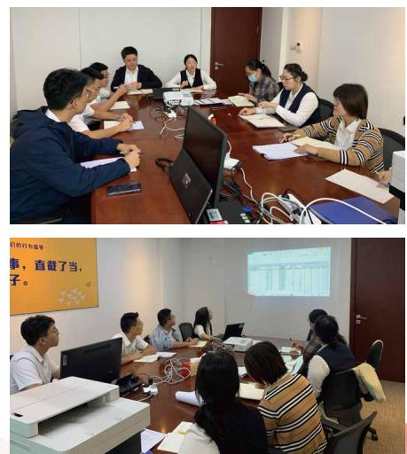

<table><tr><td>关键指标</td><td>单位</td><td>2025年</td></tr><tr><td>反洗钱的培训活动次数</td><td>次</td><td>93</td></tr><tr><td>反洗钱参与人次</td><td>人次</td><td>9,311</td></tr><tr><td>反洗钱培训总时长</td><td>小时</td><td>165</td></tr></table>

## 反洗钱宣传

通过 “线上 + 线下” 一体推进，“传统宣传 + 新媒体宣传” 融合发力的方式，开展精准、专业、务实的反洗钱知识普及，选择黄金投资、网络赌博、消费套现或收款码等与社会公众息息相关的主题，通过自媒体生动形象地向社会公众讲解洗钱特征及危害，提示洗钱风险，引导社会公众远离洗钱犯罪。

## 关键绩效

(报告期内)

公司共发放宣传折页 4 万余份，宣传受众 3.7 万人，为反洗钱工作营造良好社会氛围。

## 【案例】“汇聚金融力量,反洗钱知识进校园”

2025 年 5 月，青岛农商银行走进蓝村永安小学，开展 “警惕洗钱陷阱、保护自身权益” 反洗钱专题宣讲活动。工作人员通过生动讲解、场景模拟等方式，向师生普及反洗钱知识，传授个人信息保护技巧，直观揭示洗钱诈骗风险。活动有效强化了反洗钱宣传实效，切实维护群众财产安全与合法权益，推动反洗钱工作走深走实。

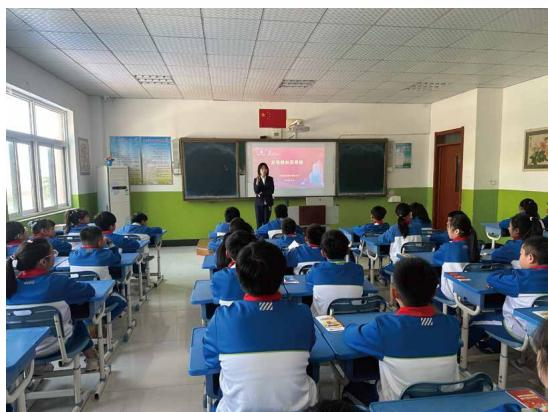

text_image

Classroom scene with students in blue uniforms and a teacher at the front, screen displaying Chinese text about a school event or presentation.

## 依法纳税

青岛农商银行严格遵循《中华人民共和国企业所得税法》《中华人民共和国个人所得税法》《中华人民共和国税收征收管理法》等法律法规以及各项税收政策要求，制定《青岛农商银行增值税发票管理办法》《青岛农商银行增值税发票开具操作规程》等制度，切实做好税务管理。

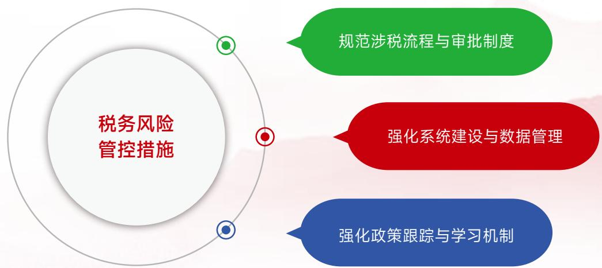

flowchart

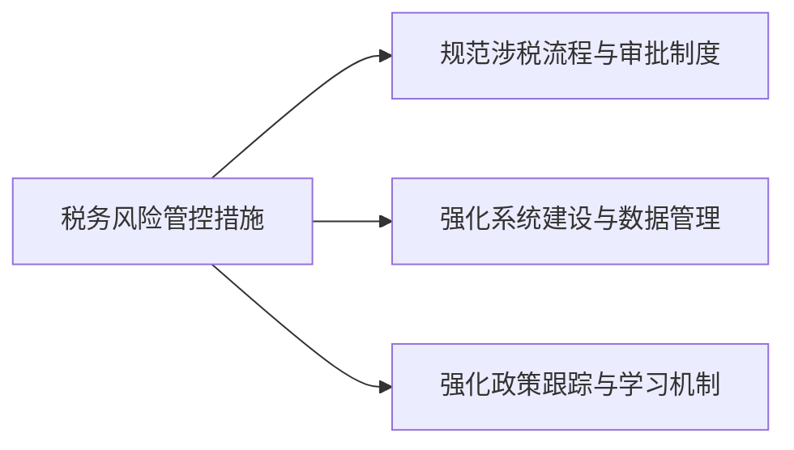
```mermaid
graph LR
  A["税务风险管控措施"] --> B["规范涉税流程与审批制度"]
  A --> C["强化系统建设与数据管理"]
  A --> D["强化政策跟踪与学习机制"]
```

## 恪守商业道德

Uphold business ethics

## 反商业贿赂及反贪污

青岛农商银行严格遵守反腐倡廉相关的国家法律法规、规章制度，持续完善反贪腐监督体系，规范本行经营行为和员工从业行为，加强把控公司各利益环节，维护及保障利益相关者的合法权益。

本行高度重视反贪腐监督体系建设，全力支持驻行纪检监察组开展纪检监察工作，成立党委监督办公室、党委监督组扎实开展内部监督，初步构建了纪检、监督、审计等监督主体相互贯通的大监督格局，切实推动党风廉政建设各项要求落实落地，健全完善领导干部插手干预重大事项记录制度，修订员工违规行为处理办法，积极创建清廉金融文化，清廉并举、担当实干的氛围更加浓厚。

## 落实廉洁监督

本行坚持从严治行，持续推动放大内部监督震慑作用，通过落实纪检监察等工作，纵深推进反腐败斗争，为本行高质量发展提供坚实的纪律保障。

## 廉洁监督措施

## 常态长效做精日常监督

制定“四谈四促”党内谈话办法,及时约谈总行部门和分支机构“一把手”，强化同级监督，压紧压实责任链条。

## 数智赋能拓展监督渠道

开通“码上监督”平台,设立基层监测点,开展问卷调查,编发纪检监察参考、监督工作动态。借助员工异常行为、信贷管理等数据平台，提高监督实效，紧盯关键少数、重点岗位。

## 选取切口抓实专项监督

深入落实市纪委《关于强化政治监督服务保障高质量发展的实施意见》，结合农商行和金融行业实际，选取普惠金融、绿色金融“小切口”开展专项监督检查。

## 锚定落点深化政治监督

聚焦 “国之大者”，围绕贯彻执行党中央决策部署，细化完善四个方面政治监督事项，建立基层联系点，推进政治监督具体化、精准化、常态化。加强对学习贯彻党的二十届三中、四中全会精神的监督检查，推动各级党组织落实党中央各项决策部署。

<table><tr><td>指标</td><td>单位</td><td>2025年</td></tr><tr><td>干部任前廉洁谈话数量</td><td>人</td><td>94</td></tr><tr><td>反腐倡廉培训覆盖人次</td><td>人次</td><td>7,805</td></tr></table>

## 【案例】总行召开2025年全面从严治党暨党风廉政建设工作会议

2025 年 2 月 25 日，为抓好全面从严治党和党风廉政建设工作，深化反腐败警示教育，总行组织召开全行 2025 年全面从严治党暨党风廉政建设工作会议。会议围绕提升政治监督质效、纪律建设质效、反腐同查同治质效、责任落实质效四个方面对全行工作做了统筹部署，并通过深度剖析违规违纪违法典型案例、组织观看警示教育片，引导全行以案为鉴，把全面从严治党带动全面从严治行引向深入，为全行高质量发展提供坚实保障。

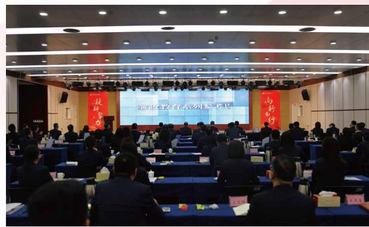

text_image

高新好
新旧教育大会参会厅

## 规范廉洁行为

为强化内控建设，促进依法合规经营，本行持续加强作风建设和廉洁从业管理，制定《青岛农商银行员工违规行为处理办法》等规章制度，引导全员形成良好的职业道德，主动预防和有效化解各类行为风险隐患。

## 廉洁承诺

组织全员签订《员工廉洁从业与合规履职承诺书》，要求各级领导干部和各岗位员工严格执行廉洁自律各项规定。

## 行为规定

实施《青岛农商银行员工行为禁令》，明确全员“严禁向客户吃、拿、卡、要、报”、“严禁与客户发生非正常资金往来”、“严禁通过各种形式谋取私利或实施利益输送”；在《青岛农商银行员工违规行为处理办法》中，明确“违反廉洁规定，吃、拿、卡、要、报”的行为属于违规行为。

## 违规问责

结合违规问责工作实际，从违规处理流程化、规范化、标准化方面入手，明确各类违规行为处理标准，规范违规问责程序。印发《关于进一步规范员工违规行为问责处理流程的通知》《关于建立违规处理公开机制的通知》《关于明确 < 青岛农商银行员工违规行为处理办法 > 执行标准的通知》，进一步规范问责处理和结果公开流程机制，统一各分支机构违规问责执行标准，针对廉洁违规行为进行严肃问责处理。

## 廉洁文化建设

本行持续强化党风廉政建设工作，扎实推动廉洁文化教育，积极组织开展党纪学习教育，建立《镜鉴》警示教育专栏，开展反腐倡廉培训等多元的廉洁文化宣传活动，营造风清气正发展环境。

## 【案例】各分支机构开展警示教育活动,弘扬廉洁文化

2025 年，全行积极开展警示教育活动，通过观看警示教育片、参观廉洁教育馆、集中学习典型案例等多种方式，强化员工自我警示、自我约束，弘扬廉洁文化。

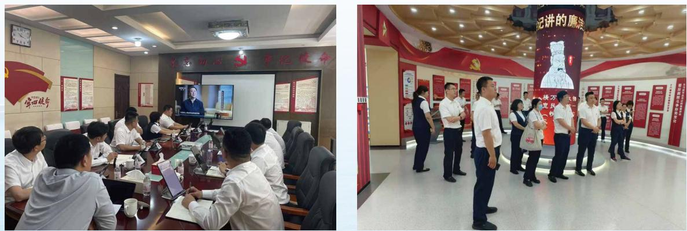

## 举报渠道

本行设立了热线电话公开举报方式，鼓励员工举报各类违法违规行为，共同维护廉洁、合规的经营环境。同时，本行重视保障举报人的合法权益不受侵害，防止其因举报行为受到打击报复。

举报热线：0532-85933728

## 反不正当竞争

本行严格遵循《中华人民共和国反不正当竞争法》及金融监管要求，坚守合规经营底线，持续完善内控机制，深化全员合规意识，规范开展经营业务。在经营活动中，本行自觉维护市场秩序，尊重同业合法权益，坚决杜绝任何形式的市场混淆、虚假宣传等不正当竞争行为，通过深化合规建设，切实保障消费者合法权益，共同营造健康有序的金融生态环境，为促进金融业高质量发展履行应尽义务。

报告期内，本行不涉及反不正当竞争行为、反垄断方面的重大法律诉讼。

natural_image

Aerial view of a coastal park with a red spiral monument, surrounded by green lawns and water, with people in the background (no visible text or symbols)

## 02/

## 践行绿色理念 推动低碳转型

■ 应对气候变化  
■ 发展绿色金融  
■ 建设绿色银行

青岛农商银行积极响应国家“双碳”战略，持续深化绿色金融实践，将环境因素融入金融服务与业务发展中。本行不断加大对绿色产业和低碳项目的金融支持力度，同时加强自身运营过程中的环境管理与碳排放管理，推动绿色金融与绿色运营协同发展，为经济社会绿色转型贡献金融力量。

响应的 SDGs

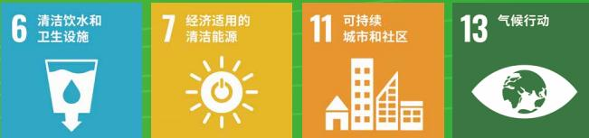

# 应对气候变化

Addressing Climate Change

青岛农商银行深刻认识到气候相关风险及机遇对自身业务发展的深远影响，参考 TCFD（气候相关财务披露工作组）的建议披露框架，围绕治理、战略、风险管理、指标与目标四个领域，全面提升气候管治能力与信息披露水平。

## 治理

青岛农商银行正逐步将应对气候变化的治理策略与流程纳入公司整体可持续发展管理工作中，将逐步完善气候变化治理体系，推动本行向低碳、绿色、可持续的方向发展。

## 战略

本行密切关注气候变化带来的广泛影响，参考 TCFD 的披露框架，系统性地识别与业务相关的气候风险和机遇。针对识别出的物理风险、转型风险及潜在机遇，制定了应对措施，致力于在复杂多变的气候环境中稳健前行，保障业务持续健康发展。

<table><tr><td colspan="2">风险类型</td><td>风险描述</td><td>发生可能性</td><td>影响大小</td><td>影响的时间范围</td><td>影响的价值链环节</td><td>优先级排序</td><td>潜在财务影响</td><td>应对措施</td></tr><tr><td rowspan="2">操作风险/物理风险</td><td>急性风险</td><td>极端天气事件,如洪水、暴风雨、台风、暴雪等,可能会导致青岛农商银行的网点设施、数据中心等物理资产遭受损害,影响银行的日常运营和客户的经济活动。</td><td>低</td><td>中</td><td>短、中期</td><td>运营、下游</td><td>中</td><td>营业收入减少</td><td>加强关键设施(如数据中心、支行网点等)的防灾设计;制定和实施灾后恢复计划。</td></tr><tr><td>慢性风险</td><td>气候变化带来的海平面上升、水资源短缺等问题,可能影响银行在某些地区的运营环境和客户群体。</td><td>低</td><td>中</td><td>长期</td><td>运营、下游</td><td>中</td><td>营业收入减少</td><td>加强气候变化的风险评估,优化贷款组合,推动绿色金融产品,增强客户的气候适应能力。</td></tr></table>

<table><tr><td colspan="2">风险类型</td><td>风险描述</td><td>发生可能性</td><td>影响大小</td><td>影响的时间范围</td><td>影响的价值链环节</td><td>优先级排序</td><td>潜在财务影响</td><td>应对措施</td></tr><tr><td></td><td>法律风险</td><td>随着全球向低碳经济转型,政府可能出台新的法规(如碳税、碳排放控制等),影响银行的运营模式和客户群体,特别是高碳排放行业的客户。</td><td>低</td><td>中</td><td>短、中、长期</td><td>运营</td><td>高</td><td>运营成本增加</td><td>密切关注气候相关法规的变化,提前调整银行业务和贷款政策;加强环境、社会和治理(ESG)相关的贷款风险管理,调整投资组合,加强绿色金融业务,推动低碳项目和绿色金融产品的开发。</td></tr><tr><td rowspan="3">转型风险</td><td>信息科技风险</td><td>随着绿色低碳技术的不断发展,银行可能面临技术更新带来的挑战,如新技术应用的不确定性、成本投入等。</td><td>中</td><td>中</td><td>中、长期</td><td>运营</td><td>中</td><td>运营成本增加</td><td>加强技术研发和合作,提升技术创新能力;逐步引入新技术,优化业务流程和风险管理。</td></tr><tr><td>市场风险</td><td>市场对气候变化的关注度和监管要求提升,可能导致银行在高碳行业的投资和贷款需求减少,尤其是石油、煤炭等传统能源行业。</td><td>中</td><td>高</td><td>短、中、长期</td><td>下游</td><td>中</td><td>营业收入减少</td><td>积极推动绿色金融服务的扩展,制定绿色贷款政策,增加低碳行业的投资组合,减少对高碳行业的依赖。</td></tr><tr><td>声誉风险</td><td>随着社会对气候变化问题的关注增加,青岛农商银行若未能有效应对气候变化,可能面临声誉损害,进而影响客户信任和投资者信心。</td><td>低</td><td>中</td><td>中期</td><td>运营、下游</td><td>中</td><td>营业收入减少</td><td>加强气候变化相关的信息披露,积极开展绿色金融、可持续投资等业务,展示银行在可持续发展方面的积极行动,提升品牌形象。</td></tr><tr><td>机遇类型</td><td>机遇描述</td><td>发生可能性</td><td>影响大小</td><td>影响的时间范围</td><td>影响的价值链环节</td><td>优先级排序</td><td>潜在财务影响</td><td>应对措施</td></tr><tr><td>资源效率</td><td>通过提升银行运营效率,如优化办公设施能源使用、提高运营流程的数字化程度,减少资源浪费;进一步推动低碳银行运营,减少对自然资源的依赖。</td><td>中</td><td>中</td><td>短、中期</td><td>运营</td><td>中</td><td>运营成本减少</td><td>加大数字化和智能化设施的投入,优化能源使用,推动绿色办公和无纸化办公,利用可再生能源降低环境足迹。</td></tr><tr><td>能源替代</td><td>通过替代传统能源(如化石能源)为绿色能源(如太阳能、风能)供应银行业务的能源需求,推动银行内部能源使用的低碳化。</td><td>中</td><td>中</td><td>短、中期</td><td>运营</td><td>高</td><td>运营成本减少</td><td>积极推动清洁能源采购和利用。</td></tr><tr><td>产品和服务</td><td>随着气候变化和可持续发展的关注度提升,青岛农商银行可以扩展绿色金融产品,提供绿色债券、绿色贷款等金融服务,满足客户对可持续投资的需求。</td><td>高</td><td>高</td><td>中期</td><td>运营</td><td>高</td><td>营业收入增加</td><td>加强绿色金融产品的研发和推广,支持可再生能源、节能减排项目的融资,开展绿色债券和绿色信贷等业务,构建绿色金融服务体系。</td></tr><tr><td>市场机遇</td><td>随着全球对气候变化的应对更加关注,绿色产业、低碳经济、新能源等领域的市场需求不断增长,青岛农商银行可通过拓展绿色市场、投资可持续发展相关行业,获得新的市场份额。</td><td>高</td><td>高</td><td>中长期</td><td>上游、下游</td><td>高</td><td>营业收入增加</td><td>加强对绿色行业和项目的关注,制定绿色产业投融资战略,推动绿色业务的发展。</td></tr></table>

<table><tr><td>机遇类型</td><td>机遇描述</td><td>发生可能性</td><td>影响大小</td><td>影响的时间范围</td><td>影响的价值链环节</td><td>优先级排序</td><td>潜在财务影响</td><td>应对措施</td></tr><tr><td>适应力</td><td>随着气候变化的影响逐步加剧,青岛农商银行可以通过提升自身的气候适应力,制定更完善的风险管理体系、应急响应机制和灾难恢复计划,确保银行运营的稳定性。</td><td>中</td><td>中</td><td>中期</td><td>运营</td><td>中</td><td>运营成本减少</td><td>建立气候变化应对和灾后恢复计划,增强业务连续性管理,进行气候风险评估,并采取相应的适应性措施,如优化资产配置和增强风险管理能力。</td></tr></table>

影响、风险和机遇管理

<table><tr><td>识别</td><td>评估</td><td>应对</td></tr><tr><td>参考 TCFD 的建议披露框架,从物理风险、转型风险和机遇三大类别,识别青岛农商银行面临的风险和机遇类型,并依据国家法律法规、政策要求,国内外可持续发展趋势和公司实际情况,与第三方专业机构合作,定义和描述气候变化为公司带来的风险和机遇。</td><td>针对识别出的风险和机遇,逐项评估可能造成的潜在财务影响、影响的时间范围、发生可能性和影响大小等。</td><td>结合识别和评估情况,制定相应应对措施,确保本行有足够的能力和资源应对气候变化风险、把握气候变化机遇,形成气候变化风险闭环管理机制。</td></tr></table>

青岛农商银行已将环境、社会和治理风险以及气候风险纳入全面风险管理体系，并制定《青岛农商银行环境和社会风险管理办法》，有效识别、监测、防控业务活动中的环境、社会和治理风险，防范、适应和减缓业务活动中的气候风险。针对重点关注客户（融资方）及其主要承包商、供应商因公司治理缺陷和管理不到位而在建设、生产、经营活动中可能给环境、社会带来的危害及引发的风险，将环境社会和治理要求纳入本行管理流程，强化信息披露和与利益相关者的交流互动，完善相关政策制度和流程管理。

## 气候风险压力测试

本行构建了系统化气候风险评估体系，并将其全面纳入全面风险管理框架。物理风险方面，依托 CFS 模式气候预测系统，重点研判热浪、寒潮等极端天气对农业、渔业等敏感行业的影响；转型风险方面，参考 NGFS 气候情景，针对化工、有色等高碳行业开展压力测试。

评估结果表明，本行气候物理风险总体可控；在转型风险情景下，2025年贷款预期损失率处于合理可控区间，资本充足率高于监管要求。气候风险评估成果为本行优化资产配置、创新绿色金融产品提供了科学支撑，有力推动业务稳健运营与“双碳”目标协同落地。

## 指标与目标

青岛农商银行正积极采取应对气候变化的策略行动，有序推进气候变化相关的管理体系建设，在运营活动中不断优化节能减排措施，致力于减少碳足迹，并全力支持国家实现“双碳”目标。

温室气体排放情况

<table><tr><td>指标</td><td>单位</td><td>2025年度完成情况</td></tr><tr><td>温室气体排放总量</td><td>吨二氧化碳当量(tCO2e)</td><td>24,348.58</td></tr><tr><td>经营活动的直接碳排放(范围一)</td><td>吨二氧化碳当量(tCO2e)</td><td>586.70</td></tr><tr><td>经营活动的间接碳排放(范围二)</td><td>吨二氧化碳当量(tCO2e)</td><td>17,631.81</td></tr><tr><td>经营活动的价值链碳排放(范围三)</td><td>吨二氧化碳当量(tCO2e)</td><td>6,130.07</td></tr><tr><td>人均温室气体排放量</td><td>吨二氧化碳当量/人(tCO2e/人)</td><td>4.02</td></tr></table>

统计口径：总行和分支机构，范围三不含投融资数据。

## 发展绿色金融

Developing Green Finance[

## 绿色金融规划

本行深入贯彻落实《中共中央国务院关于加快推进生态文明建设的意见》《关于构建绿色金融体系的指导意见》《银监会关于印发绿色信贷指引的通知》《银行业金融机构绿色金融评价方案》《银行业保险业绿色金融高质量发展实施方案》和《绿色金融支持项目目录（2025年版）》等文件精神，积极响应国家“双碳”目标，积极构建本行绿色金融制度体系，探索绿色金融推动经济转型升级，实现银企可持续发展、高质量发展。

绿色金融是本行发展目标和经营战略的重要组成部分。本行将绿色金融工作纳入全行发展战略规划，不断深化绿色金融的顶层规划设计，由总行公司金融部担任本行公司条线绿色金融业务管理的牵头部门，将绿色发展理念融入到业务发展与经营管理的各个环节之中，为经济社会的高质量发展注入绿色可持续的新动力。

绿色金融管理原则

<table><tr><td>可持续发展原则</td><td>全面管理原则</td><td>主动管理原则</td></tr><tr><td>绿色金融管理应以国家法律法规、产业政策、行业政策等作为管理决策的重要标准,合理有效地配置资源,加大对绿色、低碳、循环经济等领域的支持力度,最大限度地控制和减少资源、生态环境损耗,促进经济与生态环境协调发展,促进绿色金融可持续健康发展。</td><td>对客户的环境、社会和治理风险以及本行自身的环境、社会和治理表现实施全面管理。有效控制客户及其项目的环境、社会和治理风险,积极做好绿色投融资服务,切实支持绿色、低碳、循环经济;厚植绿色理念、履行社会责任,全面提升本行自身环境、社会和治理表现。</td><td>根据国家宏观变化情况,主动对环境、社会和治理风险进行监测、评估,并根据评估结果及时调整管理策略;在管理过程中主动发现问题、主动进行整改、主动提升工作水平,充分调动全行绿色金融管理的主动性,形成合力,持续优化绿色金融管理体系。</td></tr></table>

2025 年 12 月印发《青岛农商银行绿色金融高质量发展服务方案》。

发展目标

<table><tr><td colspan="6">未来五年,基本建成制度健全、管理规范、架构清晰、产品多元、风控有效的绿色金融体系,在服务产业结构升级、促进环境质量改善、助力能源结构转型等方面发挥积极作用。</td></tr><tr><td>打造“诚铸农商·绿惠万家”绿色金融服务品牌</td><td>构建完善的绿色信贷与绿色金融产品体系</td><td>绿色贷款余额年均增速不低于各项贷款平均增速</td><td>显著提升绿色信贷占比,优化信贷结构</td><td>建立专业化的绿色金融风控与服务体系</td><td>争取成为区域内有影响力的绿色金融特色银行</td></tr></table>

## 绿色金融治理

## 治理架构

本行持续完善绿色金融组织架构，强化绿色金融组织保障。本行搭建董事会承担主体责任、高级管理层负责组织实施、归口职能部门负责牵头“业务支持、风险管理、自身表现”等绿色金融领域、分支机构负责执行落实的绿色金融管理体系，并明确了各自职责分工和管理要求。

## 董事会

承担绿色金融主体责任，负责确定全行绿色金融发展战略。董事会指定专门委员会负责审议全行绿色金融战略，监督、评估全行绿色金融战略执行情况。

## 高级管理层

根据董事会的决定，制定绿色金融目标，建立机制和流程，明确职责和权限，开展内部监督检查和考核评价，每年度向董事会报告绿色金融发展情况。

## 总行各职能部门

在部门职责内执行绿色金融相关工作，系统性配合推进绿色金融各项工作。

## 分支机构

执行落实绿色金融相关工作。

## 政策与制度

本行为推动绿色金融的全面发展，制定了《青岛农商银行绿色金融管理办法（2026年修订）》《青岛农商银行绿色金融高质量发展服务方案》《青岛农商银行绿色金融体系构建实施方案》和《青岛农商银行绿色金融行动方案》，为本行绿色金融工作提供了宏观指导和行动指南，明确了绿色金融的发展方向和实施路径，为后续的绿色金融业务开展奠定了坚实基础。

在年度授信政策中，本行明确将绿色信贷作为行内鼓励投放领域，并制定绿色金融目标客群清单，鼓励分支机构为绿色信贷优先提供资金支持。

## 推进绿色金融业务规范化、标准化

印发《关于明确绿色贷款佐证材料要求的通知》，明确不同绿色贷款类别所需的核心证明材料（如项目备案文件、采购合同、说明材料等），夯实绿色贷款认定基础。  
印发《青岛农商银行可持续发展挂钩贷款业务管理办法》，将贷款利率与企业可持续发展目标紧密挂钩，通过设置节能减排、绿色技术等关键绩效指标，根据达成情况灵活调整融资成本，激励企业加速绿色转型。  
印发《关于明确公司绿色贷款认定流程的通知》，进一步规范了公司绿色贷款的认定流程，明确了相关部门岗位职责，并将绿色贷款认定统计工作纳入条线考核，推动绿色贷款认定业务规范开展，提升绿色贷款统计数据质量。  
印发《青岛农商银行“绿税贷”业务管理办法（暂行）》，聚焦西海岸新区气候投融资试点，深化银税互动，开启精准助力千企绿色低碳发展新模式，初步形成了可持续发展的绿色金融制度保障体系。  
修订印发《青岛农商银行碳排放权质押贷款业务管理办法》，增加碳排放权质押贷的合格抵质押物范围，包括碳排放权配额、国家核证自愿减排量（CCER），并指导分支机构利用全国碳市场的信息设置配额清缴期限内的贷款产品，盘活存量碳资产。  
印发《青岛农商银行绿碳转型贷业务管理办法》，在绿税贷基础上进行的产品更新，拓展覆盖范围，增补重点新兴产业。根据绿色低碳转型产业发展形势和特点，新增了温室气体控制、氢能“制储输用”全链条装备制造等一批新兴的绿色低碳转型重点产业，引导政策和资源支持相关产业健康发展。

## 专业能力建设

本行持续加大高层次绿色金融人才引进力度，着力培育绿色金融专业人才，深化与国内专业机构和金融机构合作，加强人员培训和能力建设。从高等院校吸收绿色环保技术、绿色金融专业毕业生，为本行发展绿色金融提供人才支撑。

## 考核与激励

为推动绿色金融持续发展，本行持续建立完善的长效机制，通过建立考核与激励机制，有效促进绿色金融业务的规范化、长效化发展。此外，绿色贷款利率定价上，本行给予资金成本优惠政策，绿色金融产品开发上优先进行费用支持，在正面激励上将新增绿色企业有效户纳入奖励范围，在绿色信贷流程上开辟绿色审批通道，提升绿色贷款审批质效。

## 考核与激励机制

设置绿色信贷考核指标,专设“绿色信贷争先奖”“碳减排政策支持奖”“绿色信贷产品创新奖”等奖项，激励分支机构开展绿色信贷业务的积极性。

在内部资金转移定价（FTP）和经济资本占用上，减少绿色信贷的经济资本占用内部考核，给予分支机构一定范围的利率定价权，大大激发分支机构绿色信贷的投放热情。

## 专项审计

为推动本行绿色金融业务稳健发展，有效防范业务风险。报告期内，根据年度审计计划，总行审计部对本行2025年度绿色金融工作开展情况进行了专项审计。

natural_image

Mountainous forest landscape with dense evergreen trees and misty mountains in the background (no text or symbols visible)

## 战略

本行从战略高度推进绿色金融，将环境、社会和治理风险以及气候风险纳入全面风险管理体系，建立环境、社会和治理风险管理体系，有效识别、监测、防控业务活动中的环境、社会和治理风险，防范、适应和减缓业务活动中的气候风险。

本行结合绿色金融风险与机遇分析，制定《绿色金融行动方案》，从顶层架构层面明确提出了对绿色信贷坚持“规模倾斜、审批倾斜、额度倾斜、考核倾斜、评价倾斜、绩效费用倾斜”的“六个倾斜”原则；明确了支持绿色行业、拓展绿色客户、发展绿色信贷、构建绿色金融体系的行动方向，将金融资源有效配置到节能环保、清洁能源、生态修复、产业升级、绿色交通、绿色建筑等领域，有效支持绿色转型。

<table><tr><td>风险类型</td><td>风险描述</td><td>发生可能性</td><td>影响大小</td><td>影响的时间范围</td><td>影响的价值链环节</td><td>优先级排序</td><td>潜在财务影响</td><td>应对措施</td></tr><tr><td>信用风险</td><td>绿色信贷项目往往涉及环保、节能、清洁能源等新兴产业,这些行业可能存在技术不成熟、前期投入大、投资回收期长等特点,导致借款人的还款能力存在不确定性。信息不对称等原因导致的环保数据不准确,可能增加违约风险。</td><td>高</td><td>中</td><td>短、中、长期</td><td>运营、下游</td><td>高</td><td>营业收入减少</td><td>建立健全绿色信贷风险评估体系,加强对借款人信用风险、环境合规风险等的识别和评估。加强对借款人的贷前审核和贷后管理,定期跟踪借款人的经营状况和环境合规情况,及时发现和应对潜在风险。</td></tr><tr><td>法律风险</td><td>贷款项目或运营可能不符合环保法规或标准,导致受到环保部门的处罚,进而影响其还款能力。银行在贷前调查中,若未能充分识别借款人的环境合规风险,可能导致贷款发放后出现不良后果。如果未能及时跟踪研究国家相关政策,并制定和落实具体的实施措施,可能会导致额外的成本支出,对本行的正常运营产生不利影响,甚至可能引发罚款、诉讼等法律风险。</td><td>高</td><td>中</td><td>短、中、长期</td><td>运营、下游</td><td>高</td><td>运营成本增加、营业收入减少</td><td>建立专门的政策研究团队,及时跟踪和分析国家绿色金融政策的变化。根据国家政策变化,及时制定和调整本行的绿色信贷政策和实施措施。确保政策实施措施的针对性和可操作性,降低因政策变化带来的额外成本支出和法律风险。</td></tr></table>

<table><tr><td>风险类型</td><td>风险描述</td><td>发生可能性</td><td>影响大小</td><td>影响的时间范围</td><td>影响的价值链环节</td><td>优先级排序</td><td>潜在财务影响</td><td>应对措施</td></tr><tr><td>市场风险</td><td>市场对气候变化的关注度和监管要求提升,可能导致银行在高碳行业的投资和贷款需求减少,尤其是石油、煤炭等传统能源行业。若无法搭建差异化的绿色产品,可能无法满足客户绿色融资需求,导致竞争力不足。</td><td>高</td><td>中</td><td>短、中、长期</td><td>上游、运营、下游</td><td>高</td><td>营业收入减少</td><td>逐步减少对高碳行业的贷款投放,增加对低碳、环保行业的贷款支持。优化信贷结构,提高绿色信贷在总信贷中的比重。深入了解客户的绿色融资需求,关注市场趋势和竞争态势。根据市场需求和客户反馈,及时调整和优化绿色信贷产品和服务。</td></tr><tr><td>声誉风险</td><td>随着社会对气候变化问题的关注增加,若未能有效提高绿色金融信息透明度,可能面临声誉损害,进而影响客户信任和投资者信心。</td><td>中</td><td>中</td><td>中期</td><td>上游、运营</td><td>中</td><td>营业收入减少</td><td>披露社会责任/可持续发展等对外公开报告,增强信息披露透明度。</td></tr><tr><td>操作风险</td><td>在绿色金融业务的开展过程中,未完善建立全面的ESG风险管理体系等,可能导致在业务操作中缺乏明确的指导和规范,增加操作风险。</td><td>高</td><td>中</td><td>中长期</td><td>运营</td><td>高</td><td>运营成本上升</td><td>建立健全的绿色金融制度流程,明确各项业务的操作规范和标准,确保业务操作的合规性和准确性。加强数字化建设,提高数据整合的效率和准确性。加强人员培训,培养绿色金融专业人才。</td></tr><tr><td>机遇类型</td><td>机遇描述</td><td>发生可能性</td><td>影响大小</td><td>影响的时间范围</td><td>影响的价值链环节</td><td>优先级排序</td><td>潜在财务影响</td><td>应对措施</td></tr><tr><td>政策机遇</td><td>一系列促进绿色金融发展的政策文件和监管措施,为银行实施绿色金融提供了有力的政策支持和监管引导。</td><td>高</td><td>高</td><td>中长期</td><td>运营、下游</td><td>高</td><td>营业收入增加</td><td>明确绿色金融战略和目标,明确在绿色金融领域的重点发展方向,结合自身禀赋特点,制定具体的绿色金融实施方案。</td></tr><tr><td>市场机遇</td><td>随着全球气候变化和环境保护意识的增强,绿色低碳转型已成为全球共识的加深,绿色低碳投资需求为银行实施绿色金融提供了较大的市场需求和增长潜力。</td><td>高</td><td>中</td><td>中长期</td><td>上游、下游</td><td>中</td><td>营业收入增加</td><td>研发和推广适合低碳、环保行业的绿色金融产品,满足客户的绿色融资需求。通过创新产品提高本行的市场竞争力。</td></tr><tr><td>产品和服务</td><td>银行可以通过创新绿色金融产品和服务,根据绿色产业的特点和需求,设计开发符合绿色产业需求的金融产品和服务,如绿色信贷、绿色债券、绿色基金、碳金融产品等。这些创新金融产品和服务不仅可以满足绿色产业的融资需求,还可以为银行带来新的收入来源和增长点。</td><td>中</td><td>中</td><td>短、中期</td><td>运营、下游</td><td>中</td><td>营业收入增加</td><td>结合本行的优势和特色,搭建差异化的绿色产品体系。通过提供个性化的绿色融资解决方案,满足客户的多样化需求。</td></tr></table>

## 影响、风险和机遇管理

为加强环境和社会风险的管理与控制，本行制定了《青岛农商银行环境和社会风险管理办法》，其中规定环境和社会风险全流程管理，包括授信尽职调查、授信审查、资金支付环节、贷后管理不同阶段对于环境和社会风险管理要求，旨在提高对环境和社会风险的识别、评估和管理能力。

本行将环境和气候风险纳入全面风险管理策略及信贷业务管理全流程，严格执行绿色金融授信政策，加快退出落后产能行业，有效控制了对高耗能、高污染、产能过剩行业企业的信贷投放，降低了绿色金融业务的风险敞口。

## 规范绿色贷款认定流程

为确保绿色贷款的准确认定和统计，本行印发了《关于明确公司绿色贷款认定流程的通知》，规范了绿色贷款的认定流程，明确了相关部门的职责，并将绿色贷款认定统计工作纳入条线考核。这一举措有效提升了绿色贷款统计数据的质量，为银行的绿色金融业务提供了更加准确的数据支持。

## 明确绿色贷款佐证材料

印发《关于明确绿色贷款佐证材料要求的通知》，明确不同绿色贷款类别所需的核心证明材料（如项目备案文件、采购合同、说明材料等），减少操作随意性，统一佐证材料标准，夯实绿色贷款认定基础。

## 实施差异化的分类管理机制

加大对传统产业在设备更新、技术改造、绿色转型发展等方面的中长期资金支持，鼓励对白名单企业融资开辟绿色通道。加强高耗能、高排放行业信贷风险管理，严格控制不符合国家产业政策的项目融资。细化产能过剩行业信贷管理要求，建立差异化的分类管理机制，避免盲目抽贷、断贷、压贷。

## 指标与目标

本行在《绿色金融高质量发展服务方案》明确了“打造“诚铸农商·绿惠万家”绿色金融服务品牌”“构建完善的绿色信贷与绿色金融产品体系”“绿色贷款余额年均增速不低于各项贷款平均增速”“显著提升绿色信贷占比，优化信贷结构”“建立专业化的绿色金融风控与服务体系”“争取成为区域内有影响力的绿色金融特色银行”的绿色金融工作目标。

## 关键绩效

(至报告期末)

本行绿色贷款余额 165.12 亿元，较年初增加 25.86 亿元，增速 18.57%，高于各项贷款增速；绿色贷款企业户数增长至 426 户，较年初新投放 177 户，增户扩面成效较为明显；绿色贷款占各项贷款比重提升至 5.72%，较年初增加 0.5 个百分点。

本行围绕清洁能源、节能环保、基础设施等重点领域，优先支持节能减排重点工程和项目，有序推进金融支持绿色转型。

natural_image

Beach scene with waves crashing against a coastal city skyline at sunset (no text or symbols visible)

<table><tr><td>关键指标</td><td>单位</td><td>2025年</td></tr><tr><td>绿色贷款余额</td><td>亿元</td><td>165.12</td></tr><tr><td>节能降碳产业贷款余额</td><td>亿元</td><td>15.16</td></tr><tr><td>环境保护产业贷款余额</td><td>亿元</td><td>11</td></tr><tr><td>资源循环利用产业贷款余额</td><td>亿元</td><td>14.57</td></tr><tr><td>能源绿色低碳转型产业贷款余额</td><td>亿元</td><td>14.11</td></tr><tr><td>生态保护修复和利用产业贷款余额</td><td>亿元</td><td>32.19</td></tr><tr><td>基础设施绿色升级产业贷款余额</td><td>亿元</td><td>70.7</td></tr><tr><td>绿色服务产业贷款余额</td><td>亿元</td><td>1</td></tr><tr><td>绿色贸易贷款余额</td><td>亿元</td><td>6.39</td></tr><tr><td>绿色贷款当年投放额</td><td>亿元</td><td>118.86</td></tr><tr><td>绿色投资余额</td><td>亿元</td><td>35.28</td></tr><tr><td>ESG主题理财产品累计管理规模</td><td>亿元</td><td>1.31</td></tr></table>

## 绿色金融产品与服务

## 绿色信贷

本行紧紧围绕七大绿色低碳转型产业目录，深耕节能领域、环保领域、资产循环利用、清洁能源、绿色建筑、绿色交通六类绿色客群，构建绿色产品服务体系，助力“无废城市”建设。

截至报告期末, 绿色贷款余额 165.12 亿元, 较年初增加 25.86 亿元, 增速 18.57%, 高于各项贷款增速, 绿色贷款余额、增量、增速均创历史新高。绿色贷款企业户数增长至 426 户, 较年初新投放 177 户。

2025 年绿色信贷投放情况

<table><tr><td>投放行业</td><td>投放占比</td><td>绿色信贷余额（亿元）</td></tr><tr><td>节能降碳产业</td><td>9.18%</td><td>15.16</td></tr><tr><td>环境保护产业</td><td>6.66%</td><td>11</td></tr><tr><td>资源循环利用产业</td><td>8.82%</td><td>14.57</td></tr><tr><td>能源绿色低碳转型产业</td><td>8.55%</td><td>14.11</td></tr><tr><td>生态保护修复和利用产业</td><td>19.49%</td><td>32.19</td></tr><tr><td>基础设施绿色升级产业</td><td>42.82%</td><td>70.7</td></tr><tr><td>绿色服务产业</td><td>0.61%</td><td>1</td></tr><tr><td>绿色贸易</td><td>3.87%</td><td>6.39</td></tr></table>

## 绿色产品创新

本行不断丰富绿色信贷产品序列，通过积极对接客户绿色金融创新服务需求，2025年成功落地山东省首笔生物质能源可持续发展挂钩贷款，为某能源科技公司投放4,219万元贷款，并将利率与生物质能源产业挂钩，实现“产量提升—融资成本下降—碳减排加速”的良性循环。这一创新不仅降低了企业融资成本，也探索出经济效益与环境效益相结合的新路径。

## 可持续发展挂钩贷

将贷款利率与企业可持续发展目标紧密挂钩，通过设置节能减排、绿色技术等关键绩效指标，根据达成情况灵活调整融资成本，激励企业加速绿色转型。

## 绿税贷

向服务辖区内纳税信用等级为 A、B、M 级的绿色产业领域企业或企业主发放的，符合节能环保、清洁生产、清洁能源、生态环境、基础设施绿色升级和绿色服务等六大绿色产业目录，用于在节能、减污、降碳、增绿、实施清洁生产及绿色低碳技术等方面所需资金的绿色贷款。

## 绿碳转型贷

是指向服务辖区内的绿色低碳转型产业领域企业或自然人发放的，符合节能降碳、环境保护、资源循环利用、能源绿色低碳转型、生态保护修复和利用、基础设施绿色升级、绿色服务等七大绿色低碳转型产业目录，用于实施绿色低碳转型等方面所需资金的绿色贷款。

## 碳排放权质押贷

将碳排放权及 CCER 纳入抵押担保品范围，盘活存量碳资产，是系统支持“双碳”目标、纵深推进绿色金融发展的一次有益探索和创新实践。

## 绿色债券

2025 年，本行承销绿色债券 16 只共 25.5 亿元，持有绿色债券余额 35.28 亿元，投资资金用于支持风电、光伏、水电、轨道交通等绿色领域，推动信贷资源从传统行业领域向绿色低碳环保产业聚集。

## 绿色理财

本行积极研发绿色理财主题产品，发行全国农商银行首款绿色增强、科技增强策略理财产品，优选符合绿色可持续、ESG理念的行业进行重点配置，将资金精准投向风电、光伏、新能源汽车产业链、绿色建筑等领域。

## 【案例】投资国家开发银行3年期绿色金融债券

2025年，本行投资了国家开发银行面向全球投资人发行的3年期绿色金融债券3.7亿元，配合国家开发银行大力实施绿色低碳金融战略，持续加大对绿色低碳重点领域的支持力度，做好绿色金融大文章。债券募集资金将全部用于节能环保产业、清洁生产产业、清洁能源产业、生态环境产业和基础设施绿色升级五类绿色产业项目。

## 绿色服务

本行立足地方特色与实体企业需求，持续创新绿色融资模式，深耕重点绿色客群，拓宽融资渠道，加快绿色金融数字化转型，将绿色化作发展最好的“底色”。结合辖内绿色产业的发展特点，本行建立营销精准、方案专业、流程便捷、审批高效、定价科学、管理严格的绿色信贷服务模式，制定与生产经营特点相匹配的差异化授信方案。

## 深耕六类绿色客群

建立节能领域、环保领域、资产循环利用、清洁能源、绿色建筑、绿色交通六类客群的白名单及营销指引，加大政策传导力度，引导分支机构吃透政策，找准需求，加大对接力度，增强绿色金融专业能力。

## 拓宽绿色金融渠道

加大与各级发改委、生态环境局、住建局、中科院的渠道沟通，积极获取青岛市“无废城市”项目、循环经济产业园区、星级绿色建筑、超低能耗建筑、装配式建筑、绿色建材采信名单企业、“公转铁”“公转水”等运输结构优化、废旧路面材料循环利用等交通基础设施降碳项目，多渠道、多方式引导更多资本进入生态环境领域。

## 加快绿色金融数字化转型

全力辅助省联社深化绿色金融数字化建设，充分发挥数字金融优势，打造涵盖绿色信贷识别、环境效益测算、碳排放管理、及ESG评级的一站式绿色金融综合服务平台。

## 助力环境信息披露

创新推出“金碳算平台”，运用金融科技为企业投融资客户提供精准核算，通过采集企业能耗数据，核算碳排放量及碳减排量，实现全行自身经营碳排放、投融资碳排放及绿色资产节能减排核算，并形成本行首版环境信息披露报告。

## 【案例】“金碳算”平台

2025 年，青岛农商银行紧扣国家 “双碳” 战略，上线 “金碳算” 环境信息披露与碳核算支持系统，聚焦碳排放核心核算需求，整合企业能源消耗、生产经营等多维度数据，实现碳排放量、碳减排效益等指标的精准核算、动态监测与可视化分析，还能自动生成符合监管要求的环境信息披露报告，解决了传统碳核算依赖人工、效率低下的行业痛点。为保障核算结果真实规范，系统从数据、合规、操作三方面强化风险管控，系统上线后效益显著，为中小银行开展环境信息披露提供了可复制的技术方案，也推动银行业碳核算标准化进程，助力区域经济绿色低碳转型。

## 【案例】绿色金融特色案例——可持续挂钩贷款

青岛农商银行紧扣地方绿色发展部署，为当地一家畜禽粪污资源化利用科技企业，落地首笔生物质能源可持续发展挂钩贷款。该企业项目前景向好但暂处亏损，传统信贷难以满足融资需求。我行创新推出利率与生物质能源产量挂钩的贷款产品，产量越高利率越优惠，同时突破传统财务指标评估模式，从项目运营、行业价值、环境效益等多维度综合评估，最终授信4,400万元，落地

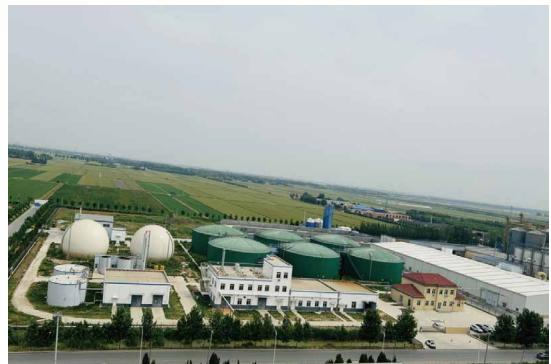

natural_image

Aerial view of an industrial facility with storage tanks and surrounding farmland (no visible text or signage)

首笔贷款 4,219 万元。项目现已实现年处理 13.5 万吨畜禽粪污、年产 1,000 万立方米沼气，预计年减碳 6 万吨，还能满足周边产业园 80% 蒸汽需求，实现生态与产业协同价值。

## 交流合作与研究

在国际倡议方面，将本行发展目标与联合国可持续发展目标和《巴黎气候协定》紧密结合，出台《绿色金融高质量发展服务方案》。

报告期内，本行在积极践行绿色金融理念、推动可持续发展方面取得了显著成效，并荣获外部认可。

## 绿色金融外部认可

- 2025 年，凭借在环境、社会和公司治理（ESG）领域的突出表现，获得 2025 年度财联社“绿水青山奖·ESG 金融年度大奖”荣誉，并连续两年入选“上市公司可持续发展优秀实践案例”。  
- 2025年,荣获“金岭先锋.榜样的力量”—2025金家岭金融区党建创新成果服务实体经济发展奖。

## 建设绿色银行

BUILD A GREEN BANK

## 绿色运营

本行积极响应“双碳”目标，依托先进技术，推进全行节能降耗、绿色运营的同时，不断探索创新绿色服务模式，持续推进“绿色银行”建设。本行开展自身运营“双碳”工作研究，分析全行节能降碳潜力和实施路径，指导全行在科技基础设施、建筑基础设施、日常办公、重点用能设施等4个领域开展节能降碳工作，设立本行内部碳足迹管理项目，不断建立和健全内部碳足迹管理的相关制度。

<table><tr><td>指标</td><td>单位</td><td>2025年</td></tr><tr><td>天然气消耗量</td><td>万立方米</td><td>8.46</td></tr><tr><td>自有车辆汽油用量</td><td>万升</td><td>18.93</td></tr><tr><td>外购电力</td><td>万千瓦时</td><td>2,468.80</td></tr><tr><td>外购热力</td><td>吉焦</td><td>17,525.40</td></tr></table>

$^{*}$ 注：以上数据统计范围为青岛农商行总行和分支机构。

## 资源节约

本行积极开展建筑节能、低碳办公、节水节电等资源利用行动，在全行范围倡导并推行绿色办公、绿色出行、绿色网点建设、“光盘”行动等绿色理念，推进“节约型”银行建设工作，树立节约是美德、节约是责任的理念，提高全体员工的节约意识，倡导“绿色办公，低碳生活”，将节约口号切实转化为节约行动。引导并带动全体员工营造节能降耗的良好氛围，节约一滴水、一度电、一张纸、一分钱、一升油，实行光盘行动。

<table><tr><td>指标</td><td>单位</td><td>2025年</td></tr><tr><td>耗水量</td><td>万吨</td><td>12.22</td></tr><tr><td>无害废弃物产生量</td><td>吨</td><td>315.43</td></tr><tr><td>营业办公纸张消耗量</td><td>万张</td><td>1,830.96</td></tr><tr><td>餐厨垃圾处置量</td><td>吨</td><td>221.63</td></tr><tr><td>硒鼓墨盒处置量</td><td>吨</td><td>0.58</td></tr><tr><td>视频会议</td><td>次</td><td>830</td></tr></table>

\* 注：硒鼓墨盒处置量和视频会议为青岛农商银行总行数据，其他数据统计范围为青岛农商行总行和分支机构。报告期内，本行信用卡电子账单占比为 100%。

## 绿色办公

本行持续践行绿色发展理念，将绿色办公作为推进低碳运营的重要抓手，通过制度约束、数字化赋能和资源节约等多种方式，持续降低运营过程中的资源消耗与环境影响，推动形成节约高效、绿色低碳的办公方式。

## 推进绿色办公与数字化办公融合

不断丰富办公信息化应用场景，推广“无纸化办公”，在内部沟通、文件传阅、会议管理等环节优先使用线上系统，持续完善智慧会议系统和3S智慧办公系统应用，通过线上审批、电子材料流转和视频会议等方式减少纸张消耗和差旅需求，在提升办公效率和协同水平的同时降低资源消耗。

## 加强资源节约与日常管理

制定日常行政厉行节约反对浪费工作实施细则，从用电、用水、空调管理、办公用品使用等方面细化节约管理措施。例如加强办公区域照明管理、规范空调温度设置、减少设备待机能耗、推进双面打印和纸张重复利用等，推动形成节约用电、节约用水、节约办公耗材的良好习惯，持续提升资源使用效率。

## 推动绿色采购与精细化管理

将绿色理念纳入采购管理制度，严格预算管理和集中采购机制，优先采购节能环保设备及可替换芯书写工具等绿色办公用品，减少一次性用品消耗。同时加强办公资源配置管理，根据实际需求合理采购和使用相关物资，避免资源浪费。

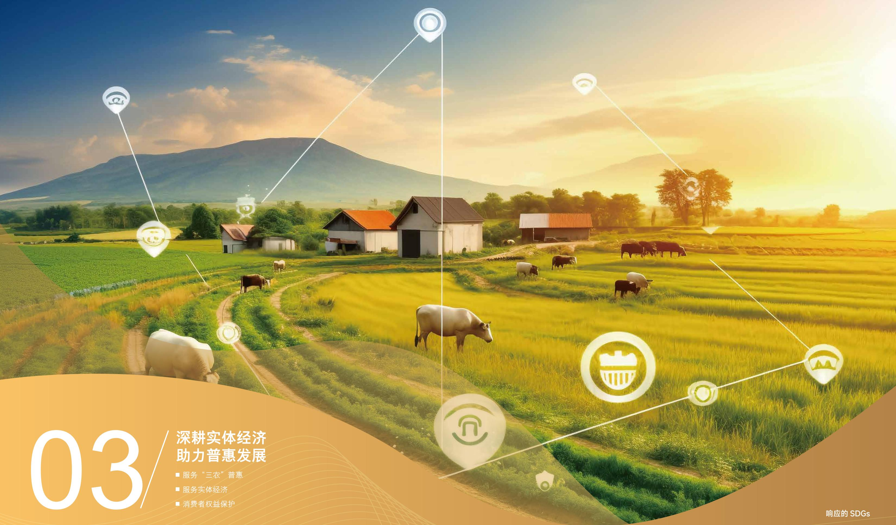

text_image

03/ 深耕实体经济
助力普惠发展
■ 服务“三农”普惠
■ 服务实体经济
■ 消费者权益保护
响应的 SDGs

## 03/

## 深耕实体经济助力普惠发展

■ 服务 “三农” 普惠  
■ 服务实体经济  
■ 消费者权益保护

青岛农商银行始终坚持服务实体经济的发展使命，持续提升支农支小金融服务能力，积极支持乡村振兴和小微企业发展，不断扩大普惠金融服务的广度与深度。同时，本行持续完善消费者权益保护体系，致力于为客户提供安全、便捷、优质的金融服务体验，让金融发展成果更好惠及社会民生。

响应的 SDGs

8 体面工作和经济增长

9 产业、创新和基础设施

11 可持续城市和社区

12 负责任消费和生产

## 服务“三农”普惠

INCLUSIVE SERVICES FOR AGRICULTURE, RURAL AREAS AND FARMERS

## 普惠金融治理

本行坚守市场定位，保障投放规模，稳固发展根基。将支持小微、“三农”发展提升至关乎长远稳健发展的战略高度予以考量，有序引导分支机构通过深耕小微和涉农信贷业务，为整体业务持续健康发展注入动力。

## 完善组织架构

## 理顺部门职责

将 3000 万元以下（含）小微企业贷款管理划归普惠金融部管理，普惠金融部由负责零售条线的行领导分管，协同公司金融部、交易银行部、个人信贷部，全面提升小微信贷服务效率。

## 增设专职人员

在各分支机构设立普惠金融部、零售金融部，增设专职工作人员，负责支撑全行小微业务、零售业务和涉农业务的营销和推广。

## 协调工作机制

推动小微企业融资协调工作机制落地，组建总行工作领导小组和分支机构层级工作专班，印发专项工作方案；与当地政府部门等对接，安排专人近距离配合政府工作专班，驻点参与相关活动。

## 考核机制

本行着力完善普惠业务考核机制，在综合考核中，充实和完善小微、普惠、涉农贷款管理指标，提高普惠贷款业务权重占比；独立设置普惠条线考核体系，聚焦贷款投放，兼顾过程管理，印发《青岛农商银行2025年度分支机构综合考核办法》《青岛农商银行经营指标分解指导意见》《青岛农商银行2025年普惠条线稳存量与促新增工作机制》《青岛农商银行普惠小微客群提升方案》等办法，进一步优化考核指标设定与分配；强化正向激励，增强对存量和新增业务的奖励力度，提升业务运营效率；加大重点客群营销激励，设立专项奖励费用，引导分支机构重点营销。

普惠金融战略

<table><tr><td>风险类型</td><td>风险描述</td><td>发生可能性</td><td>影响大小</td><td>影响的时间范围</td><td>影响的价值链环节</td><td>优先级排序</td><td>潜在财务影响</td><td>应对措施</td></tr><tr><td>信用风险</td><td>普惠金融服务的对象的信用风险较高,客户多为信用记录不完善的小微企业和农户。</td><td>中</td><td>高</td><td>中长期</td><td>运营下游</td><td>高</td><td>运营成本增加</td><td>通过与保险公司等第三方增信机构合作等业务模式,做好客户“精准画像”工作,从“前、中、后”全流程控制信用风险。</td></tr><tr><td>成本风险</td><td>普惠金融业务单笔金额小、服务成本高,可能导致盈利能力不足。</td><td>中</td><td>中</td><td>短、中、长期</td><td>运营</td><td>中</td><td>运营成本增加</td><td>通过“数字乡村工程”、青融通平台等数字化转型措施,降低运营成本,提高服务效率。</td></tr></table>

<table><tr><td>机遇类型</td><td>机遇描述</td><td>发生可能性</td><td>影响大小</td><td>影响的时间范围</td><td>影响的价值链环节</td><td>优先级排序</td><td>潜在财务影响</td><td>应对措施</td></tr><tr><td>政策机遇</td><td>国家出台的有关普惠或乡村振兴的金融政策可能带来政策红利和发展空间。</td><td>高</td><td>高</td><td>中长期</td><td>运营</td><td>中</td><td>营业收入增加,运营成本减少</td><td>积极争取政策支持,如财政补贴、税收优惠等,降低普惠金融业务的运营成本。明确普惠发展目标和实施路径。</td></tr><tr><td>市场机遇</td><td>农村地区、小微企业的金融服务需求巨大,公司可以通过普惠金融填补这一市场空白。</td><td>中</td><td>高</td><td>中长期</td><td>运营</td><td>高</td><td>营业收入增加</td><td>聚焦当地主导产业,因地施策设计符合其特点的金融产品和服务,提升客户黏性。</td></tr></table>

## 影响、风险和机遇管理

本行在普惠金融风险管理方面，通过制定《青岛农商银行业务创新管理办法》《青岛农商银行新产品新业务风险评估管理办法》等制度，明确业务创新在全行统一的风险管理框架下进行。通过建立针对新增产品、业务、服务、系统、管理方式方法等创新范畴的风险管理流程，本行不断增强公司风险抵抗能力，促进金融产品创新和管理模式创新持续健康发展，提高核心竞争力和综合效益。

## 指标与目标

本行深入贯彻落实普惠金融工作部署，立足自身发展实际，科学制定普惠金融发展量化指标体系，明确阶段性发展目标。通过细化实施方案、完善配套措施、强化过程管控，建立全方位的目标管理体系，确保各项普惠金融工作有序推进、有效落实。

<table><tr><td>指标</td><td>目标</td><td>2025年度完成情况</td></tr><tr><td rowspan="2">普惠小微贷款</td><td rowspan="2">普惠型小微企业贷款全年信贷计划新增量为40亿元,增速7.96%</td><td>普惠小微贷款余额 544.18 亿元,较年初新增 41.6 亿元。</td></tr><tr><td>增速 8.28%,高于各项贷款 2.34 个百分点。</td></tr></table>

## 服务小微

本行认真贯彻国家政策，落实市委、市政府决策部署，持续巩固和夯实服务小微、助力普惠的主体责任，积极推进机构网点建设，拓宽服务渠道，深化政银合作，创新金融服务，开展惠企政策宣传，实现小微企业金融服务质效持续提升。

## 关键绩效

(截至报告期末)

本行小微贷款余额（含个体工商户、小微企业主）1,507.87亿元

较年初新增

占全部贷款的

支持小微客户

较年初新增

160.44 亿元

54.72%

55,912户

396户

## 加大信贷投放力度

持续加大续贷、信用贷款投放力度，调整小微贷款定价标准，帮助小微企业减费让利；优化完善尽职免责制度，强化考核引导和正向激励。

## 聚焦小微产品创新

针对小微企业生命周期不同阶段提供适配的信贷产品，加大对小微企业中长期贷款支持，根据客户资金周转预期提供匹配期限、种类合理的金融产品。

## 下沉金融服务重心

牢牢把握“新农商挎包精神”，持续完善“千村万户”工作内涵，推出“双千工程”营销品牌，与小微企业融资协调机制深度融合，建立网格化营销体系，全年累计走访普惠客户20.44万户。

## 提升金融服务质效

创新“场景营销”模式，差异化场景贷款准入标准，梳理白名单集中审批。共准入场景81个，批量审批2,066户、35.47亿元，发放1,773户、28.92亿元；开展场景网格攻坚行动，重点打造21个覆盖辣椒、花生、粮食收购等领域的精品网格，共落地投放贷款278笔，金额6亿元。

## 加强政策有效宣传

开展金融惠企政策，会同辖区政府部门，梳理惠企政策，搭配金融产品，运用线上线下等形式，做好服务宣传，助力货币政策有效传导，惠企政策尽快落地。

## 关键绩效

(截至报告期末)

本行深化“双千工程”走深走实，推动小微企业融资协调工作机制落地见效，

全行走访普惠客户 20.44 万户

通过小微企业融资协调机制累计授信户数 44,770 户

授信金额 837 亿元

累放金额 589 亿元

## 【案例】数智赋能政银协作，破解个体工商户融资瓶颈

本行与青岛市市场监督管理局深化政银协作，创新推出“个体益贷”场景化融资服务方案。依托“青融通”平台数据共享与联合建模技术打造数据化信贷业务新模式，通过归集和分析个体工商户经营、信用等数据，实现分析分类精准授信。同时在平台设立个体工商户专属融资通道，支持线上申请，大幅简化了贷款流程，提高融资效率。

“个体益贷”聚焦民生领域，将信贷资源重点投放青岛市餐饮、零售、居民服务、商贸流通等民生关联度高的个体工商户群体，与保障民生供给、稳定市场秩序提供有力金融支撑。为精准对接个体工商户的融资需求，本行联合各区市市场监管部门主动作为，走访个体工商户超15,000户，通过面对面沟通，深入了解商户经营状况与资金需求，为符合条件的商户提供“个体益贷”服务，让金融支持精准触达有需要的群体。

截至报告期末，新增“个体益贷”7.04亿元、服务客户1,688户。个体工商户贷款余额突破150.36亿元，服务客户超3万户，为稳就业、保民生、促市场主体活力提供坚强金融支撑。

## 推进乡村振兴

## 管理机制

为全面落实总行党委战略部署，本行围绕服务乡村振兴研究制定行动方案，明确各部门与分支机构的工作任务。总行设立乡村振兴部，与总行普惠金融部合署办公，并成立乡村振兴工作领导小组，由总行行长担任组长，相关分管领导担任副组长，普惠金融部、公司金融部、零售金融部等部门主要负责人为领导小组成员。同时，各分支机构成立乡村振兴工作专班，建立工作协调推进机制，压实工作责任。

## 管理目标与成效

锚定战略目标，制定乡村振兴三十条举措及打造乡村振兴标杆行动方案，年末定量指标全部达成，涉农贷款规模稳步增长，规模和新增量保持全市金融机构首位，实现规模、质量、品牌效应协同提升。

<table><tr><td>指标</td><td>2025年度完成情况</td></tr><tr><td>涉农贷款规模</td><td>截至2025年末,本行涉农贷款余额648.27亿元,较年初新增123.92亿元,增幅23.63%。</td></tr><tr><td>重点投放领域</td><td>截至2025年末,本行农林牧渔业贷款规模71.65亿元,较年初新增22.04亿元;农户信用贷款规模54.1亿元,较年初新增11.32亿元,增幅26.46%,贷款规模保持同业首位。</td></tr></table>

<table><tr><td>指标</td><td>2025年度完成情况</td></tr><tr><td>贷款资产质量</td><td>截至2025年末,本行涉农贷款不良率1.07%,较年初下降0.04%,低于同业平均水平。</td></tr><tr><td>农村金融服务</td><td>与中国银联合作推动乡村振兴场景权益配置,持续推进乡村振兴信用卡的发放,同时根据“三农”场景优质客群特点,推进村组优质白金信用卡的发放,搭建起集合支付权益、支付优惠等在内的支付体系;通过“聚合支付”支付结算系统,聚合本行、微信、支付宝、银联等主流支付通道,实现支付“一码通”“扫码付”遍布青岛大街小巷、村头商户;通过建设遍布城乡的农村普惠金融支付服务点,助力农民在家门口就近办理助农取款、现金汇款、转账汇款、生活缴费及政务类服务,打通农村金融服务最后一公里。</td></tr><tr><td>涉农产品创新</td><td>涉农产品创新持续加强。创新推出“涉农动产质押(农链通)”产品,满足金乡大蒜、胶州辣椒产业集群仓单质押融资需求;聚焦农村大棚等非标资产盘活,推出“大棚托管贷”,落地全市首笔“大棚托管贷”300万元;针对共富公司及农业合作组织,打造“共富贷”。</td></tr></table>

## 服务“三农”

本行坚持支农支小定位，进一步倾斜信贷资源，加大涉农贷款投放力度，优先确保涉农贷款投放规模，全力服务乡村振兴战略。

## 关键绩效

(截至报告期末)

本行涉农贷款余额

648.27 亿元

较年初新增

123.92 亿元

增幅

23.63%

涉农贷款规模、增量、户数位居青岛金融机构首位

## 产品创新

## 银担合作类

## 专项支农类

## 涉农贷款 产品类别

## 支农贴息类

## 特色支农类

## 线上支农类

## 与融资担保公司合作支持涉农主体

本行引入担保增信机制，持续深化与融资性担保公司的合作，进一步探索新型“银担”合作模式。本行与青岛融资担保集团联合开发“福农贷”产品，满足农业经济化组织大额贷款融资需求；推出“保贷通”产品，实现“见贷即保”；与青岛农担公司推出“农担贷”产品，创新服务模式，拓宽担保覆盖面；推广农业农村部推出的“信贷直通车”服务，持续加大对农业经营主体的信贷支持。

## 农担贷

突出专项支农，助力乡村振兴。“农担贷”的产品服务对象限定为家庭农场、种养大户、农户、农民合作社、农业社会化服务组织、小微农业企业、农业龙头企业等涉农经营主体。创新银担合作，化解担保难题。由农担公司为农户提供担保，具有无抵押、无反担保措施、额度高的特点，切实解决涉农客户贷款“担保难”问题，提升贷款可得性。

提高办贷效率，提升服务体验。通过梳理业务流程，合理安排审查审批环节，建立影像传输交互机制，实现最大限度减少纸质材料内容和交换次数，提升效率和客户体验。

截至报告期末，“农担贷”贷款余额13.93亿元、1,535笔，较年初新增7,600万元，占全市在保余额的 $62.86\%$ ，为乡村振兴注入强劲动力，该项目在2020年获得青岛市金融项目创新奖第四名。

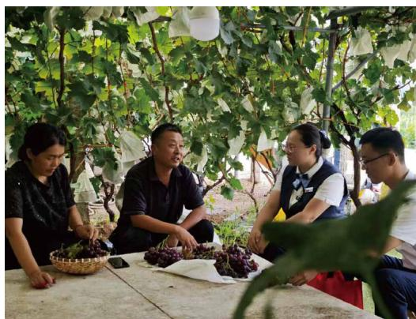

natural_image

Group of four people sitting under grapevines, examining grapes in a vineyard (no visible text or symbols)

## 围绕当地产业特性创新产品

本行围绕传统种养殖业、旅游业，推出“大棚托管贷”“崂山景区民宿贷”“美德积分贷”“金椒贷”等业务创新。

## 大棚托管贷

“大棚托管贷”是本行围绕农村大棚、农业设施等未取得权属证明的非标准资产创新推出，通过在农村产权交易中心进行抵押登记，将农村可流转、可评估、可变现的资产托管在“三资”农村产权交易平台，并实现不良资产挂牌处置拍卖，形成农村资产的闭环管理，目前已发放全市首笔贷款300万元。

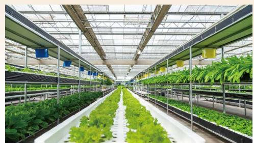

natural_image

Interior view of a modern vertical hydroponic farm with rows of green leafy plants and transparent roof structures (no visible text or symbols)

## 崂山景区民宿贷

本行以金融赋能崂山区文旅产业提质为目标，联合崂山区政府、民宿协会、区农业农村局、区文旅局、区工商联、崂山风管委及三大农区街道设计“崂山景区民宿贷”，创新推出“崂山景区民宿经营单位”为场景的批量化授信方式，嵌入创业担保、农担贷模式，有效破解了民宿经营者抵押担保能力不足的问题。制定场景化批量授信方案。截至报告期末，通过民宿场景批量总授信额度1.5亿元，已向30余家从事民宿经营的企业和个人发放贷款2,800余万元，有效支持了当地民宿产业发展。

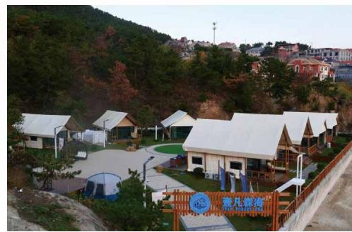

natural_image

Scenic view of a resort with white tents and a landscaped path, surrounded by forested hills (no visible text or symbols)

## 美德积分贷

围绕农村社会治理,根据人行《关于乡村美德积分金融转化机制建设实施方案》要求,深入推广“美德积分贷”。遵循农村美德积分金融转化机制和积分规则，如农村居民参加一次公益活动、献一次爱心等做的文明好人好事，都可以进行家庭道德积分，使每个农村家庭户的道德积分转化为对应的银行贷款额度和利率优惠，大力发展乡村普惠金融。截至报告期末，已发放“美德积分贷”5,800余万元。

## 金椒贷

围绕农资贸易客户，本行开发了银行流水标准化信贷产品“金椒贷”。面向经营辣椒加工、仓储、运输等行业客户，根据客户账户经营性流水按比例核定信用额度，信用额度最高可达300万元，丰富辣椒商户的融资方式。截至报告期末，本行支持辣椒贸易客户457笔、金额8.08亿元。

text_image

航恒食品

## 服务创新

本行切实履行支农支小、服务“三农”社会责任，紧紧围绕党委战略规划，强化制度保障，制定印发了《青岛农商银行金融助力乡村振兴三十条举措》，以“双千工程”为总抓手，创新“农时日历”服务模式，打造精品场景网格，科技赋能，创新推出数智普惠平台，极大提升办贷效率和金融服务“三农”水平，成功塑造了特色鲜明的“乡村振兴标杆银行”形象。

## 服务农时、满足农需

紧盯农时，建立“农时日历”模式。根据农副产品上市周期，制定差异化场景贷款准入标准，梳理白名单集中审批。统一场景营销工作流程和规范，全年共准入场景81个，批量审批2,066户、35.47亿元，发放1,773户、28.92亿元；开展场景网格攻坚行动，重点打造21个覆盖辣椒、花生等领域的精品网格，共落地投放贷款278笔，金额6亿元。

## 创新构建乡村振兴投融资机制

本行成功发行全国首单5亿元浮动利率三农专项金融债券，募集资金全额用于涉农贷款投放。通过多元化投融资产品创新，发挥债券资金成本优势，提升贷款创利。

## 打造乡村振兴特色支行

本行制定印发了《青岛农商银行 2025 年特色金融支行建设工作方案》，明确了平度明村乡村振兴特色支行建设方案。明村支行位于明村镇驻地，服务范围辐射新村 16 个，自然村 81 个。

## 重点推广“农担贷”产品服务模式

“农担贷”支农产品连续两次中标农业农村部支农创新试点政府采购项目，获得青岛市金融项目创新奖。2025年6月26日我行印发了《关于充分运用青岛农担公司担保费率政策加大农担贷款投放的通知》，对粮食收购、种植等重点行业、优质客户降低担保费率，制定了按月退保政策，有效地降低客户的融资成本。

## 养老金融服务

本行立足城乡, 服务百姓, 通过线上线下平台融合建设, 打造 “七彩康年” 养老金融特色服务体系, 践行 “党建 + 志愿、金融 + 生活、养老 + 享老” 理念, 以 “赤橙黄绿青蓝紫” 彩虹意象为载体, 构建覆盖财富管理、文旅活动、公益关怀、健康保障、适老服务、产业协同、科技赋能七大维度的综合性养老金融服务体系, 倡导 “晚年不褪色, 人生正精彩” 的价值主张, 积极探索和促进养老金融服务体系建设发展, 共谱养老金融高质量发展新篇章。

## 线下厅堂网点

遵循 “适老、便民、智能、温馨” 原则, 完成全行网点改造, 所有网点设置老年绿色通道、爱心专座, 配备便民设施, 保留优化人工窗口; 94 家通过国标认证, 19 家获评国家级 “适老服务示范网点”; 打造 10 家 “银龄乐享网点”, 建立 “专属团队 + 专项考核 + 专业培训” 三专机制, 实现城乡养老服务全覆盖。

## 线上渠道平台

升级手机银行 APP, 推出 “长辈模式”, 采用大字体界面、简约操作流程及语音辅助功能, 实现账户挂失、转账汇款等高频业务线上化办理; 依托 1,400 余个城乡服务点, 将基础金融服务延伸至村庄、社区、海岛及山村, 截至 2025 年末, 交易金额达 39.45 亿元, 打通农村老年客户服务 “最后一公里”; 客服热线 96,668 设立老年客户专属坐席提供优先响应服务; 拓展上门服务范围, 可办理借记卡开卡、社保卡激活等基础业务, 全方位满足老年客户服务需求。

## 养老金融支持

将养老服务业列为积极支持类行业，择优支持老年药品制造、老年医疗器械和康复辅具制造、机构养老照护服务、智慧养老服务、老年药品销售、老年医疗器械和康复辅具销售、养老设施建设、改造及装修维修等养老产业相关领域。

## 【案例】 银发市集

“银发市集”搭建政银企协同服务平台,实现民生改善、商户发展与银行赋能多方共赢。破解“生活+金融”双重痛点,围绕长者便利与安全需求,打造一站式服务,整合农特、适老产品让利惠民,设立社保卡即时办理点,提供开卡激活、养老规划等服务;延伸“健康+精神”关怀,联动医

疗机构提供健康服务，开展文娱反诈活动，覆盖长者衣食住行康养金全需求；探索“金融+民生”落地路径，融合惠民服务与适老保障，将社保政策解读、反诈宣传等公益服务纳入其中，推进适老化服务进社区，破解长者金融认知薄弱等问题，提升银发客群服务获得感与幸福感，彰显金融机构社会责任。

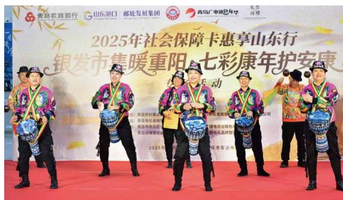

text_image

青岛农商银行
山东港口 邮轮发展集团
青岛广电促进年华
2025年社会保障卡惠享山东行
银发市集暖重阳·七彩康年护安康
活动
山东省农村商业银行
青岛市社会信用社
青岛市商业银行
青岛市淄博分行
青岛市淄博分行
青岛市淄博分行
青岛市淄博分行
青岛市淄博分行
青岛市淄博分行
青岛市淄博分行
青岛市淄博分行
青岛市淄博分行
青岛市淄博分行
青岛市淄博分行
青岛市淄博分行
青岛市淄博分行
青岛市淄博分行
青岛市淄博分行
青岛市淄博分行
青岛市淄博分行
青岛市淄博分行
青岛市淄博分行
青岛市淄博分行
青岛市淄博分行
青岛市淄博分行
青岛市淄博分行
青岛市淄博分行
青岛市淄博分行
青岛市淄博支行
青岛市淄博支行
青岛市淄博支行
青岛市淄博支行
青岛市淄博支行
青岛市淄博支行
青岛市淄博支行
青岛市淄博支行
青岛市淄博支行
青岛市淄博支行
青岛市淄博支行
青岛市淄博支行
青岛市淄博支行
青岛市淄博支行
青岛市淄博支行
青岛市淄博支行
青岛市淄博支行
青岛市淄博支行
青岛市淄博支行
青岛市淄博支行
青岛市淄博支行
青岛市淄博支行
青岛市淄博支行
青岛市淄博支行
青岛市淄博支行
青岛市淄博支行
青岛市淄博支行
青岛市淄博支行
青岛市淄博支行
青岛市淄博支行
青岛市淄博支行
青岛市淄博支行
青岛市淄博支行
青岛市淄博支行
青岛市淄博支行
青岛市淄博支行
青岛市淄博支行
青岛市淄博支行
青岛市淄博支行
青岛市淄博支行
青岛市淄博支行
青岛市淄博支行
青岛市淄博支行
青岛市淄博支行
青岛市淄博支行
青岛市淄博支 行

## 关键绩效

(报告期内)

本行共举行荣休仪式

1,925 场

开展投资者教育活动

1,000余场

覆盖老年客户

12.3万余人次

“七彩康年”养老金融特色服务体系成功入选山东省“2025好品金融”“五篇大文章”创新产品、第31届中国国际金融展养老金融实践展示案例，获评2024年度青岛市金融创新成果激励项目三等次、“2025卓越竞争力养老金融银行”。

## 发展数字普惠金融

本行始终坚守农村金融主力军职责使命，切实做到守土有责、守土负责、守土尽责。聚焦破解农村金融服务难点堵点，全力搭建农村数字普惠金融生态，着力构建支付便捷化、产品多元化、信贷数智化、风控数字化、服务便民化的农村普惠金融“五大体系”。传承弘扬“大挎包、铁脚板”优良传统，深度运用“数据要素 + 人工智能”创新驱动，以科技赋能农村金融发展，让普惠金融服务精准惠及广大城乡居民。

## “数智普惠”平台

本行打造“1+2+N”数智普惠平台，以“数智赋能、普惠乡村”为目标，构建以数智普惠中台为基础、小程序与移动办贷APP为两翼、N项创新动能为支撑的数字普惠金融新体系。平台围绕“做强平台、做优流程、做活数据、做精产品、做实风控”核心，全面重塑普惠金融办贷模式：

- 做强平台，提升产品、场景与创新能力，对接政府及产业数据平台，实现“政策 + 数据 + 金融”联动；  
- 做优流程，推行线上便捷申贷与移动现场尽调，优化差异化、标准化办贷流程；  
- 做活数据，融合农业与政务数据，构建专属风控模型，实现自动授信；  
- 做精产品，打造线上线下融合产品体系，实现全客群、全流程闭环服务；  
- 做实风控，运用数据与人工智能，实现全流程风险智能研判。

平台在服务模式、贷前尽调、风险防控、调查报告、数智营销等方面实现提质增效，推动传统普惠金融向移动化、线上化、智能化全面转型。

## 服务实体经济

SERVE THE REAL ECONOMY

本行坚持服务实体经济，提供多维度、深层次、全方位的金融服务，聚焦青岛市构建创新型“10+1”产业体系及细分赛道开展深度研究，推进“工赋青岛·智造强市”建设，加大支持力度，进一步完善金融支持实体保障体系，提升金融服务发展质效，助力传统产业转型升级、新兴产业培育壮大和未来产业超前布局，推动科技创新引领新质生产力的发展，努力走好青岛农商银行金融高质量发展“向新”之路。

## 治理

为全面落实总行党委战略部署，确保服务实体经济高质量发展取得实效，本行制定 2025 年服务实体经济行动方案，成立由行长任组长、各分管领导任副组长，总行各部门和各分支机构主要负责人为成员的领导小组，负责统筹谋划全行服务实体经济工作。

领导小组办公室设在总行公司金融部，具体承担领导小组日常工作，全面抓好组织、督导、落实工作，确保各项工作措施扎实落地、取得实效，为全行高质量发展提供坚实保障。公司金融部、普惠金融部、交易银行部作为本条线服务实体经济行动的牵头部门，按照总行领导小组及办公室部署要求，组织协调本条线，扎实做好服务实体经济行动各项措施，形成工作合力，确保实效。

战略

<table><tr><td>风险类型</td><td>风险描述</td><td>发生可能性</td><td>影响大小</td><td>影响的时间范围</td><td>影响的价值链环节</td><td>优先级排序</td><td>潜在财务影响</td><td>应对措施</td></tr><tr><td>信用风险</td><td>服务实体经济需下沉至小微和农业领域,但此类客户抗风险能力弱,抵押物不足,易受自然灾害(如台风影响胶东农业)、市场波动冲击。</td><td>中</td><td>高</td><td>中长期</td><td>运营下游</td><td>高</td><td>运营成本增加</td><td>建立行业限额管理,避免过度集中于单一产业;运用金融科技风控,建立小微客户信用评分模型;利用央行支农再贷款、财政贴息等政策降低资金成本。</td></tr><tr><td>运营风险</td><td>青岛聚集国有大行、城商行及互联网银行,在客户获取和产品创新上可能处于劣势。</td><td>中</td><td>中</td><td>短、中、长期</td><td>运营</td><td>中</td><td>营业收入减少</td><td>聚焦本地特色产业,深耕海洋经济、乡村振兴、绿色金融等差异化领域;提升服务响应速度,加强政银企合作,绑定核心企业生态。</td></tr><tr><td>机遇类型</td><td>机遇描述</td><td>发生可能性</td><td>影响大小</td><td>影响的时间范围</td><td>影响的价值链环节</td><td>优先级排序</td><td>潜在财务影响</td><td>应对措施</td></tr><tr><td>政策机遇</td><td>山东半岛城市群、RCEP经贸合作等政策推动本地基建、跨境金融需求增长。</td><td>高</td><td>高</td><td>中长期</td><td>运营</td><td>中</td><td>营业收入增加</td><td>发展跨境金融,提供外贸企业汇率避险、信用证融资等服务,依托本地网络参与项目融资。</td></tr><tr><td>市场机遇</td><td>特色产业如海洋经济(如水产冷链物流)、绿色产业等领域融资需求大,可开发专项信贷产品。</td><td>中</td><td>高</td><td>中长期</td><td>运营</td><td>中</td><td>营业收入增加</td><td>创新“蓝色金融”产品,如船舶抵押贷款、冷链物流金融;发展农村数字金融,结合电商平台,提供“产供销”全链条服务。</td></tr></table>

## 影响、风险和机遇管理

“服务实体经济”相关业务服从全行统一的风险管理措施，对于新产品新服务等业务创新，本行开展新产品新业务上线前的风险评估和投产一年后的风险评估，与前文普惠金融的影响、风险和机遇管理保持一致。

指标与目标

<table><tr><td>指标</td><td>2025年度完成情况</td></tr><tr><td>制造业贷款</td><td>制造业贷款余额252.32亿元,较年初净增11.69亿元,增幅4.86%。</td></tr><tr><td>科技型企业贷款</td><td>科技型企业贷款余额163.49亿元,较年初增长23.04亿元,增幅16.4%。</td></tr><tr><td>国际结算量</td><td>跨境人民币结算量1,545亿元,同比增长275%。</td></tr></table>

## 促进产业转型升级

## 聚焦科技金融

根据战略部署，本行聚焦辖区内科技类企业，创新金融产品、拓宽合作渠道，着重提高优质科技企业的市场覆盖率，不断扩大科技企业客群、做实科技金融大文章。

## 关键绩效

(截至报告期末)

本行科技型企业贷款余额

163.49亿元

户数

1,417户

在人民银行青岛市分行发布的2025年第一季度、第二季度科技金融服务效果评估结果均为优秀档

## 完善体制机制

成立由总行行长任组长的科技金融工作专班，在重点区域的二级支行成立科技特色支行。对科技特色支行制定专属政策、专属产品和工作目标。制定《青岛农商银行加大力量支持科技型企业融资行动方案》，从支持服务科技企业的总体目标、服务模式、以及组织架构、资源配置、产品创新、风险管控等方面进行总体规划。完善考核机制，制定科技金融专属考核，形成科技金融分解任务及考核方案。

## 优化办贷流程

建立信贷工厂，开通科技型小微企业绿色审批通道，推进调查中心、审查中心、放款中心建设，不断提高审贷专业性，提升审批效率。

## 优化产品体系

建立了由“科企初创贷”“科企成长贷”“新质贷”“知识产权质押保险贷款”“知识产权质押贷款”“人才贷”“投保贷”“园区贷”“科企保贷通”“高企贷”等产品构成的“金穗惠科”科技金融产品体系，涵盖种子期、初创期、成长期、成熟期全生命周期的科技型企业或企业主，为其提供包括信用、保证、抵质押多种担保方式的流动资金贷款和固定资产贷款。

## 开展异业赋能

持续与创投、保险、证券等公司开展业务合作，为科技型企业提供从传统的单一信贷产品拓展到涵盖授信融资、债券发行、股权投资、并购贷款等多元化服务，实现贷、债、股、保等多方面的综合金融服务，形成从科技企业贷款到资本市场融资的一站式服务体系。

## 【案例】“科企成长贷”助力人工智能企业腾飞

青岛某科技有限公司是一家专注计算机视觉算法的高科技企业，拥有多项专利技术，其 AI 视觉识别系统已在多个行业应用。但由于企业属于典型“轻资产”科技企业，缺乏抵押物，在扩大规模时一度面临融资难题。本行综合评估企业技术实力、研发团队、知识产权和市场前景，认定其符合“科企成长贷”支持条件。该产品不依赖传统抵押物，通过综合评价科技实力和成长潜力为企业提供融资支持。在专门审批通道下，快速完成调查和审批，从申请到放款仅 5 个工作日，为企业发放 1,000 万元贷款，及时缓解资金压力，助力企业加快产品迭代。

## 制造业金融支持

本行围绕制造业企业设备升级与产业链融资核心诉求，组合推出“制造固联贷”与“制造领航贷”2.0版；强化科技赋能与系统支撑，先后上线鑫链融2.0和3.0系统，支持多种业务渠道获客与业务模式，客户服务体验显著提升。2025年，为16家核心企业的30余家供应商提供服务，荣获中国人民银行2024年度金融科技发展奖、青岛市推动供应链金融发展突出贡献奖、全省农商银行数字化创新二等奖、清华金融评论2025中国银行业创新发展优秀案例。

## 支持区域协调发展

## 支持自由贸易试验区发展

本行推出《山东自贸区综合金融服务方案》(二十条)，从金融政策宣导、金融产品创新、便利化金融服务和风险管控保障四个方面，为自贸区企业提供全方位的金融服务方案。本行依托法人银行优势，全力加强对山东自贸区青岛片区内现代海洋、国际贸易、航运物流、先进制造等产业金融服务支持，并积极融入国际航运枢纽、东部沿海创新中心建设和海洋经济发展示范区建设，积极推进金融产品和服务模式创新，为自贸区内企业提供特色化、专业化、定制化和便利化的跨境金融服务。

## 关键绩效

(截至报告期末)

本行已累计与区内企业合作

492 家

办理资本项目便利化业务

9.01 亿元

累计发放贸易融资及贷款

187.65亿元

发放自贸助贷

1.54 亿元

首创跨境金融产品

5项

## 强化上合示范区建设

中国－上合组织地方经贸合作示范区落户胶州后，本行高度重视上合示范区金融建设，积极出台《上合示范区金融服务方案（二十条）》，内容涵盖优化业务模式、支持重点领域、践行外汇试点、优化风险管理等多方面。

## 关键绩效

(截至报告期末)

本行已为上合示范区内的项目和企业提供授信总额 55.04 亿元

实现国际结算量 14.70 亿美元

## 服务国家对外开放战略

近年来，青岛农商银行充分发挥法人银行优势，借助“线上+线下”、“本币+外币”的服务体系，为青岛市外贸企业提供了特色化、专业化、定制化和便利化的跨境金融服务，助力青岛沿海重要中心城市建设，打造新时代改革开放的新高地。

## 跨境金融服务

本行充分发挥法人银行优势，积极开展“优汇服务惠千家”活动，切实解决企业外汇业务“急难愁盼”问题，推动人民币国际化，提高跨境人民币服务水平，2025年实现跨境人民币结算量1,545亿元，同比增长275%。

## 服务创新

新获国家外汇管理局跨境金融服务平台企业汇率风险管理服务应用场景试点资格，依托跨境金融服务平台区块链技术优势，在出口应收账款融资、新型离岸国际贸易背景核验等6大场景实现全流程线上化办理；生态共建拓宽服务边界，以青岛国际商会首期轮值会长单位为依托，创新建立“总行－商会、支行－支会”双层级联动服务体系，成功搭建政银企高效沟通桥梁，夯实区域市场领先地位。

## 产品创新

● 举办以 “汇通二十载 携手创未来” 为主题的护航企业高质量出海暨开办外汇业务 20 周年发布会，推出 “中巴清算直通车”、“证保车融”、“跨境支汇通”、“银信融” 等创新产品。  
- 推出“百币速汇2.0”跨境结算产品，将支持的汇出币种从30个扩充至136个，不断升级新兴市场服务能力。

## 合作交流

本行积极践行金融先行的理念，切实发挥金融服务实体经济作用，以“护航出海汇全球”跨境金融系列产品为基，提供差异化跨境服务，助力外贸企业高质量发展；以同业合作为桥梁，为企业搭建交流对接平台，拓展多元化国际市场。

## 参与两岸金融交流

受邀参加第二届海峡两岸（青岛）青年交流发展大会，通过设立展台的形式，积极宣传青岛农商银行针对台商台企的金融服务举措与成果。

## 服务“一带一路”建设

通过产品创新、渠道建设，针对外贸企业跨境结算中的痛点堵点，主动对接、精准施策，着力打造特色鲜明和具有竞争力的“一带一路”服务体系，推出“中巴清算直通车”“百币速汇2.0”等创新产品，不断提升“一带一路”国家服务能力，有效助力企业降低结算成本、提升资金效率，展现了在外汇服务中的专业能力与敏捷响应，为“一带一路”国家进出口企业提供优质高效的金融服务。

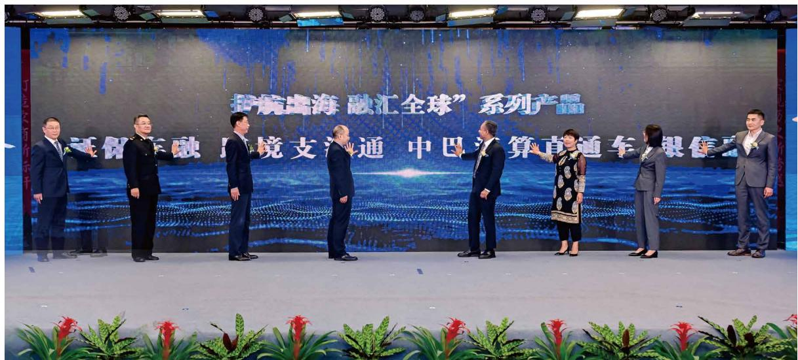

text_image

“沪航出海 融汇全球”系列产
证保车融 境支通 中巴济算直通车银信

赴巴西、南非、哈萨克斯坦、乌兹别克斯坦拜访相关金融机构和客户，在多个业务领域达成了合作意向，为青岛融入“一带一路”等国家倡议注入金融动能。

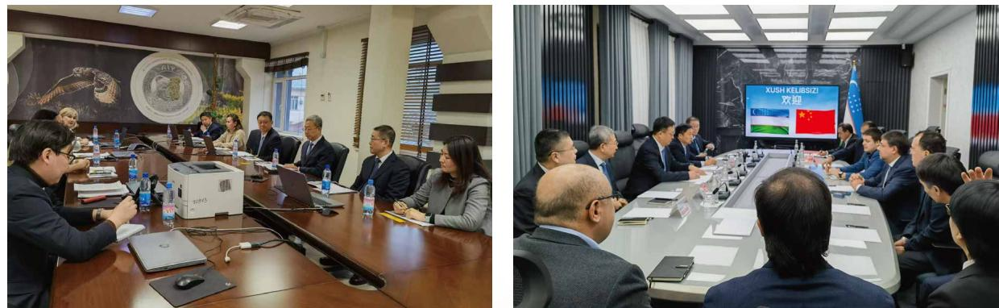

## 中巴交流

受邀参加巴基斯坦驻华大使馆在北京举办的中巴企业对接会，积极推动参会企业业务对接落地。

## 消费者保护权益

CONSUMER PROTECTION RIGHTS AND INTERESTS

青岛农商银行秉承“以人民为中心”的理念，坚持“党建引领促发展，优质服务树品牌”的组织路线，扎实推进“优质服务提升工程”建设，聚焦客户最佳服务体验。2025年，本行进一步夯实消费者权益保护工作基础，完善投诉风险防控处理体系，广泛开展金融知识宣传普及活动，全面提升消费者权益保护和优质服务水平。

## 治理

为进一步健全消费者权益保护工作管理体系，切实维护消费者合法权益，本行修订并完善《青岛农商银行金融消费者权益保护工作管理办法》《青岛农商银行分支机构内设部门职责》，明确总行各部门和各分支机构消保工作职责，确保各业务部门之间的横向信息共享以及工作协调配合机制有效运行，共同联合筑牢消保风险防控网，将消费者权益保护工作各项要求落到实处。

<table><tr><td>董事会</td><td>金融消费者权益保护工作的最高决策机构,承担金融消费者权益保护工作的最终责任。</td></tr><tr><td>三农金融服务与消费者权益保护委员会</td><td>负责制定消费者权益保护工作的战略、政策和目标,定期审议消费者权益保护工作专题报告等。</td></tr><tr><td>高级管理层</td><td>确保消费者权益保护战略目标和政策得到有效执行。</td></tr><tr><td>董事会审计委员会</td><td>对董事会、高级管理层消费者权益保护工作履职情况进行监督。</td></tr><tr><td>总行消费者权益保护部</td><td>本行高级管理层下实施消费者权益保护战略目标和政策的牵头统筹部门,组织、协调、督促、指导其他部门及分支机构开展消费者权益保护工作。</td></tr></table>

## 政策与制度

本行系统优化全行消保工作制度体系和体制机制，先后制定印发《青岛农商银行金融消费者权益保护工作管理办法》《青岛农商银行消费投诉处理管理办法》《青岛农商银行个人信息保护管理办法》《青岛农商银行消费者权益保护评估审查管理办法》《青岛农商银行消费者权益保护合作机构管理办法》《青岛农商银行营销宣传行为管理办法》等制度办法和工作方案，并于每年年初制定消费者权益保护工作指导意见和消费者权益保护条线考核办法，进一步完善细化了消费者权益保护的工作标准和工作内容，切实将消费者权益保护工作融入内控合规、风险控制、经营考核和职位晋升等各个方面，在全行上下形成强大的工作合力。

## 专业能力建设

本行高度重视消费者权益保护，印发《青岛农商银行消费者权益保护培训管理办法》，制定消费者权益保护员工教育培训计划，组织开展适当性管理、消费投诉、信息保护等监管重点领域消保培训；同时，针对不同岗位类别、员工工作需求差异化开展消保相关专题培训。通过完善培训管理制度、优化培训体系、强化员工教育，提升全行消保工作能力。

关键绩效  
(报告期内)

<table><tr><td>参考人数</td><td>考试合格率</td></tr><tr><td>5,882人</td><td>99.80%</td></tr></table>

## 考核与激励

本行充分发挥消费者权益保护综合考核和专业考核在规范经营行为和提升消保工作质效方面的激励约束作用，促进消费者权益保护与业务发展融合共进。

报告期内,本行印发《青岛农商银行2025年总行部门综合考评办法》《青岛农商银行2025年度分支机构条线考核办法》《青岛农商银行总行部门员工绩效管理办法》等，强化考核“指挥棒”作用，在全行综合考核办法中，对总行部门和分支机构涉及消费者权益保护工作的指标项进行考核设置，推动全行贯彻落实消费者权益保护工作各项要求。在高管薪酬考核体系中将消费者权益保护工作实施情况纳入管理型指标，切实将消保内部考核结果与机构问责体系和人力资源管理体系挂钩。

## 荣誉认可

报告期内,本行被青岛金融监管局评估为消保工作二级 A 机构,保持区域法人机构第一位。先后荣获中国银行业协会“理财业务投资者同行陪伴实体特色案例”、大众日报诚信 3.15 十佳金融消保科普奖、大众日报“3.15 促消费，惠民生 --共建诚信金融生态”系列榜单“3.15 普惠赋能优秀案例”、国家金融科技认证中心“现代化银行营业网点服务认证示范单位”、全国农信机构“百佳特色网点”，作为全省唯一上榜农商银行成功入选企业服务标准“领跑者”榜单，“青农商·馨服务”品牌管理模式加速推进。

战略

<table><tr><td>风险类型</td><td>风险描述</td><td>发生可能性</td><td>影响大小</td><td>影响的时间范围</td><td>影响的价值链环节</td><td>优先级排序</td><td>潜在财务影响</td><td>应对措施</td></tr><tr><td rowspan="2">合规风险</td><td>员工为完成业绩目标,未充分告知客户产品风险或夸大收益,导致纠纷或投诉。</td><td>中</td><td>高</td><td>短期、中期</td><td>运营、下游</td><td>高</td><td>运营成本增加</td><td>完善销售合规管理,加强内部审计与监督,建立客户投诉反馈机制,提高消费者保护意识。</td></tr><tr><td>消费者权益保护法律法规日趋严格,银行若未能及时适应,可能面临合规风险。</td><td>中</td><td>高</td><td>长期</td><td>运营</td><td>高</td><td>运营成本增加</td><td>建立合规管理体系,持续关注政策变化,优化内部审查流程,加强合规培训。</td></tr><tr><td>信息科技风险</td><td>客户个人信息(如身份信息、交易记录)因系统漏洞或员工操作不当泄露,损害客户信任。</td><td>低</td><td>高</td><td>短期、中期</td><td>运营</td><td>高</td><td>营业收入减少、运营成本增加</td><td>加强信息安全基础设施建设,采用数据加密、访问控制等措施,定期进行网络安全审计,提高员工数据安全意识。</td></tr><tr><td>操作与声誉风险</td><td>线上和线下客户服务质量参差不齐,响应速度慢、投诉处理不及时可能降低客户满意度。</td><td>中</td><td>中高</td><td>短期</td><td>运营、下游</td><td>中高</td><td>营业收入减少、运营成本增加</td><td>提升客户服务质量,优化客服响应机制,增强智能客服应用,提高投诉处理效率。</td></tr></table>

<table><tr><td>机遇类型</td><td>机遇描述</td><td>发生可能性</td><td>影响大小</td><td>影响的时间范围</td><td>影响的价值链环节</td><td>优先级排序</td><td>潜在财务影响</td><td>应对措施</td></tr><tr><td>信息科技机遇</td><td>通过手机银行、智能客服等数字化工具提升客户体验,降低服务成本,增强客户黏性。通过AI、大数据等技术优化消费者权益保护机制,提高风险识别和防范能力。</td><td>高</td><td>高</td><td>短期、中期</td><td>运营、下游</td><td>高</td><td>运营成本减少</td><td>加强金融科技投入,优化风控系统,利用智能客服和自动化监管工具提升客户保护能力。加强员工培训,提升数字化服务能力。</td></tr><tr><td>运营机遇</td><td>加强消费者金融知识教育,提高客户防范金融欺诈能力,增强客户信任和忠诚度。</td><td>中高</td><td>中</td><td>中期、长期</td><td>客户服务、市场营销</td><td>中高</td><td>营业收入增加</td><td>推出金融知识宣传活动,通过线上线下结合方式,提高消费者风险意识。</td></tr></table>

## 影响、风险和机遇管理

本行修订印发《青岛农商银行金融消费者权益保护工作管理办法》《青岛农商银行分支机构内设部门职责》，明确总行各部门和各分支机构消保工作职责，确保各业务部门之间的横向信息共享以及工作协调配合机制有效运行，共同联合筑牢消保风险防控网，将消费者权益保护工作各项要求落到实处。

青岛农商银行消保风险管理遵循事前识别、事中监测、事后跟踪强化的管理方法和工作流程，严格落实对消保风险的识别、评估、监测和管理。

## 事前风险识别

严格落实消保审查要求，规范审查流程，将各类营销宣传文本、图片等纳入消保审查机制，严格从消费者八大权益入手、对相关侵害消费者权益的情况进行事前识别和风险提示，对新产品、新服务可能存在的消费者保护、信息保护等潜在风险，采取主动措施逐步改善，推动市场结构、经营理念和服务方式与高质量发展要求相适应，有效发挥消保关口前移作用。

## 事中风险监测

严格按照法律法规、监管规定开展营销宣传，充分披露并提示产品、服务风险，明确告知权利义务、息费收益、纠纷处理等重要事项，做到客观宣传、诚信推介、规范营销，尊重消费者的知情权和自主选择权，将个人信息保护、营销宣传管理、信息披露、合作机构管理、可回溯性管理等消费者权益保护风险防控重点领域的合法合规性纳入各项消保检查、督导、自查、评估工作，对于存在的问题和风险隐患要求及时溯源整改，消除风险。

## 事后跟踪强化

不断加强各类审计、检查、自查、排查、评估结果运用，定期收集汇总并跟踪问题落实，定期开展客户满意度调研，高度重视客户评价和建议，有针对性地改进服务流程。定期全面梳理消费者金融信息保护、营销宣传行为、零售业务管理、信贷风险管理、财务收费管理、信息披露等主要消保政策要点，常态化印发消保风险提示及风险注意要点，不断深化员工责任意识和风险意识，实现对金融消费者权益保护工作的全流程、全链条、全方位管控。

## 金融产品审查

本行将消保审查硬性嵌入需审查事项审批流程中，在产品和服务设计开发、定价管理、协议制定、营销宣传、产品分类分级等环节进行评估审查，对相关风险进行识别和提示，并做到消保审查全覆盖，审查意见全采纳。报告期内，本行结合法律法规、监管要求及近年来监管检查、处罚重点领域和消保投诉高发领域问题等，对消保审查要点进行更新完善，内容覆盖个人信息保护、合作机构管理、营销宣传管控等多个方面，切实从源头把关防控侵害消费者权益的相关条款和操作。

报告期内，本行严格对面向消费者提供的产品和服务，在设计开发、协议制定、宣传推介等环节进行消保审查，2025年共完成消保审查825项，提出意见建议1,027个，有效防范和化解消保风险，保证消费者合法权益。

## 审计监督

本行将消费者权益保护工作纳入全行审计体系，定期对消费者权益保护工作的执行、开展、管理情况进行审计监督。本行印发《青岛农村商业银行股份有限公司内部审计章程》，并制定消保审计检查方案，以风险为导向，根据《银行保险机构消费者权益保护管理办法》《中国银保监会关于银行保险机构加强消费者权益保护工作体制机制建设的指导意见》等监管意见和本行消费者权益保护相关制度规定，采取现场审计和审阅相关制度等必要的审计程序开展年度消保审计工作，确保消费者权益保护工作扎实推进。

报告期内，根据年度审计计划，本行对 2025 年度消费者权益保护工作进行了专项审计，审计涵盖本行消保制度体系建设、消保制度执行、消保工作开展、内部考核与管理情况等各方面内容。

指标与目标

<table><tr><td>指标</td><td>目标</td><td>2025年度完成情况</td></tr><tr><td>服务投诉事件</td><td>减少服务投诉事件</td><td>接收监管转办服务类投诉27件,较去年同期下降28.95%</td></tr><tr><td>客户满意度</td><td>持续提升客户满意度</td><td>客户满意度达98.10%</td></tr></table>

## 金融教育与宣传

本行坚持“有温度，加速度”的金融服务模式，履行使命担当，持续强化金融宣教工作。创建“青农同行”宣教品牌，组建超千人的消保志愿服务队，制定年度宣教工作方案，以体系化部署推动宣教工作走深走实、见行见效。

报告期内,坚持“全年常态化宣传+关键节点集中攻坚”相结合,积极开展“五进入”活动,向消费者普及投资风险知识、倡导理性消费观念。聚焦老年客群、青少年群体、新市民群体，针对不同群体特点实施精准化科普，打通线上渠道，依托覆盖全市的“小微云”终端，全线上线消保风险提示及宣教图文内容，打破地域壁垒与传播限制，将金融消保知识精准输送至村庄、社区，实现消保服务触达“零距离”。不断创新传播形式，强化线上宣教矩阵建设，推动宣传重心下沉落细，制作《儿童常见金融陷阱快躲开》等短视频21个，开发《警惕骗票套路守住追星钱包》系列漫画，通过线上渠道扩大传播覆盖面，提升宣教内容的可读性与趣味性，借助新媒体平台放大传播声量，提升线上宣教覆盖面与影响力。持续织密线下网络，深化金融消保“村村通”建设，靶向制定覆盖山区、海岛、偏远地区的特色站点打造清单,年内完成187个消保“村村通”站点创建,实现优质消保服务向基层末梢延伸。深入推动“金融+非遗”“金融+公安”“金融+红色教育”融合宣教模式，编演消保皮影戏、通过开设“剪纸小课堂”、编演“消保皮影小戏”、“我为村民唱台戏”“挥墨迎春，共话消保”“猜灯谜、话消保”，将金融诈骗“演”给大家看，将消保常识“唱”给群众听，用传统艺术形式打造符合新时代消保宣传的样本，借传统文化引发群众对金融风险意识的“共鸣”。

## 关键绩效

(评价期内)

累计开展线上线下教育宣传活动超

4,200 场次

提供咨询答疑服务

32.8 万余次

总触达人数约

197.57 万人次

## 客户投诉响应

青岛农商银行持续完善消费者权益保护体系，强化投诉处理和纠纷化解机制。本行制定并优化《青岛农商银行消费投诉处理管理办法》《青岛农商银行纠纷调解管理办法》等制度，细化投诉处理流程，提高投诉响应效率和质量。同时，建立《青岛农商银行重大消费投诉处理应急预案》，明确重大消费投诉的预防、报告、应急演练及应急处理要求，组织分支机构开展重大消费投诉应急演练，发挥超前防范、预见式管理作用，提升基层对投诉的吸附力、对纠纷问题的化解力、对风险隐患的管控力。报告期内，本行剔除咨询和重复等事项后，共受理消费投诉1,342件，主要涉及贷款、借记卡、信用卡、支付结算等业务领域，投诉主要分布在胶州、平度和莱西等区域。

此外，本行制定了《青岛农商银行2025年度消费者权益保护条线考核办法》，在实际投诉管理过程中定性、定量从投诉各环节进行考核，夯实了投诉督导制度基础。

## 数据驱动优化投诉管理

建设投诉处理信息化系统，实现全渠道、全业务领域投诉分级分类管理，确保投诉处理闭环。依托“数字消保”“BI+AI”系统，对投诉数据进行深入分析，优化业务流程。

## 推动矛盾纠纷解决机制建设

积极推动矛盾纠纷解决机制建设，制定纠纷调解管理办法，将调解内容嵌入消费者权益保护条线考核，在工作例会中融入调解培训内容，引导分支机构运用纠纷调解化解矛盾纠纷。

## 提升客户满意度

青岛农商银行每年度组织各分支机构开展客户满意度调查，满意度调查对象为个人金融客户，调查方式包括微信公众号扫码参与调研和营业网点海报公示扫码调研，调查内容包括营业环境、服务设施、产品信息、人员服务、办理业务时长、柜员业务办理速度、信息披露、宣传教育、总体情况等16个指标项，并安排专人对客户满意度表现、服务水平感知变化等维度结果进行分析和研究，印发满意度调研分析报告，有针对性地创新服务内容、形式和手段，拓宽服务渠道和空间，不断提高服务质量和客户满意度。

## 关键绩效

(报告期内)

“神秘人”暗访平均得分96.99分

较去年同期提高1.08% 客户满意度达98.10%

## 提升服务可及性

为满足特殊群体特殊场景客户的银行服务需求和适老化建设，本行对内外设施进行无障碍改造，在网点设立爱心窗口，为特殊需求客户提供亲情化、人性化的金融服务；设立“拥军”服务窗口，开通服务绿色通道，对现役军人、退伍军人等提供柜面优先服务。在具备条件的营业网点内设置“爱心驿站”，为户外工作者提供临时休息、饮水热饭、免费WIFI、免费充电、外部用药、金融知识普及等便民服务。对行动不便或突发情况不能到网点的客户，依托“视频银行”和“便携式智慧柜员机”提供线上线下相结合的温馨服务，畅通特殊业务服务渠道。

natural_image

Aerial view of a coastal mountain range with turquoise sea and rocky slopes, no visible text or symbols.

text_image

04/ 激发创新动能
守护数字安全
■ 科技创新与数字化转型
■ 数据安全与隐私保护
■ 负责任采购
响应的 SDGs

## 04/

## 激发创新动能 守护数字安全

■ 科技创新与数字化转型  
■ 数据安全与隐私保护  
■ 负责任采购

青岛农商银行积极推进金融科技应用与数字化转型，通过科技赋能不断提升服务效率与客户体验。同时，本行高度重视数据安全与客户隐私保护，持续完善信息安全管理体系，并加强责任采购与合作伙伴管理，共同构建安全、可信的金融服务生态。

响应的 SDGs

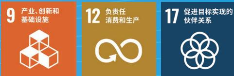

# 科技创新与数字化转型

TECHNOLOGICAL INNOVATION AND DIGITAL TRANSFORMATION

金融科技正在深刻颠覆银行业的经营理念和发展模式，发展数字金融、实现数字化转型已经成为银行发展的“必答题”。本行紧扣《青岛农商银行数字化转型战略规划（2023-2025年）》，研究制定《2025年数字化转型行动方案》，全面推进数字化转型战略：通过业务模式、管理模式和风控模式的系统性重塑，充分释放数字生产力；以实现精细客群拓展、严密风险防控、降低经营成本、提升运营效率为目标导向；着力打造全国农商银行数智赋能标杆，积极构建数字金融与科技金融、绿色金融、普惠金融、养老金融协同发展的新格局。

## 治理

## 创新管理体系

为规范业务创新管理,促进金融产品创新和管理模式创新持续健康发展,本行制定了《青岛农商银行业务创新管理办法》《青岛农商银行创新委员会工作规则》等，明确组织体系及职责、工作方式与流程等。本行业务创新的组织体系包括创新委员会、创新风险评估小组、创新需求发起部门。

## 创新委员会

高级管理层下设的实施创新与管理工作的专门机构，负责本行创新领域相关工作的宏观谋划、统筹领导、组织协调和具体部署。创新委员会下设七个创新专业委员会，按照相关工作规则，负责审议全行创新项目立项等事宜。创新委员会办公室设在总行公司金融部。

## 创新风险评估小组

负责对产品创新、管理创新在投产前和后评价阶段的各类风险进行识别和评估，提出相应控制措施、监控要求和决策建议。

## 创新需求发起部门

产品创新和管理创新的发起、组织和管理部门，总行各部门均可根据业务发展需求作为创新需求发起部门。

在数字化转型管理方面，本行设立数字化转型工作领导小组，负责数字化转型战略及行动方案的制定，由董事长担任组长，行长担任副组长，副行长为成员。数字化转型工作领导小组下设数字化转型办公室，办公室设在总行信息科技部，由总行信息科技部总经理兼任办公室主任。办公室下设秘书处，秘书长由总行信息科技部副总经理担任。

## 创新人才建设

本行设立博士后创新实践基地，与著名高等学校和科研院所（设立有博士后科研流动站）联合招收和培养高层次优秀人才，并通过考核机制引导博士后主动进行研究，推动成果持续产出。

本行着力打造精准高效、创造价值的数字基因队伍，与此同时，本行着力健全科创数智人才培育机制，通过开展“云梯·千数”初级数据分析师培养认证工作与组织数智赋能类竞赛，强化数字人才培养。报告期末，全行共有1,050名员工获得数据分析师认证资格。报告期内，本行研发团队总人数69人，占员工总数比例1.20%。

## 创新激励机制

为进一步营造创新、改革、提升的良好氛围，发扬“鼓励创新、实干为荣”的企业文化，本行制定《青岛农商银行创新奖励管理办法（试行）》，建立包含荣誉表彰、员工职业及薪酬绩效奖励、培训提升等在内的差异化奖励体系，激发全行上下创新实干的内生动力，以全员创新推动青岛农商银行高质量发展。

2025 年，本行在金融科技方面投入共计 20,215.72 万元，占营收比例 2.02%。

战略

<table><tr><td>风险类型</td><td>风险描述</td><td>发生可能性</td><td>影响大小</td><td>影响的时间范围</td><td>影响的价值链环节</td><td>优先级排序</td><td>潜在财务影响</td><td>应对措施</td></tr><tr><td rowspan="2">信息科技风险</td><td>研发项目缺乏有效的任务计划管理和质量监督,导致项目延期、超支、质量差。</td><td>低</td><td>中</td><td>短中期</td><td>运营</td><td>中</td><td>运营成本增加</td><td>规范研发项目管理流程,根据业务需求进行系统设计,并组织评审系统设计文档;加强项目质量监督,确保按时按质完成,控制成本。</td></tr><tr><td>数字化转型可能存在规划不明、执行不力、监督不足等,导致数字化转型规划目标无法实现。</td><td>低</td><td>高</td><td>短期</td><td>运营</td><td>中</td><td>运营成本增加</td><td>建立数字化转型组织体系,制定《数字化转型行动方案》,对数字化转型规划的细化,明确具体的工作要求;定期开展工作会议,监督推进工作,确保配置足够人力、财力资源,维持稳定、安全的信息科技环境。</td></tr></table>

<table><tr><td>机遇类型</td><td>机遇描述</td><td>发生可能性</td><td>影响大小</td><td>影响的时间范围</td><td>影响的价值链环节</td><td>优先级排序</td><td>潜在财务影响</td><td>应对措施</td></tr><tr><td>技术机遇</td><td>通过数字化转型提升服务效率、创新金融产品、增强客户体验、优化运营成本和拓展市场等。</td><td>高</td><td>高</td><td>短期、中期、长期</td><td>运营、下游</td><td>中</td><td>营业收入增加,运营成本减少</td><td>制定《数字化转型行动方案》,全面实施“2486”行动方案,持续深化金融科技赋能,推动全行数字化转型工作。</td></tr></table>

## 影响、风险和机遇管理

为加强新产品、新业务各类风险的识别与评估，有效控制新产品新业务各类风险，本行修订了《新产品新业务风险评估管理办法》等规章制度，并组建创新风险评估小组，负责针对创新类的产品及业务面临的各项风险进行识别评价，结合业务和产品开发部门对风险、风险防控措施等方面的认识，综合评价业务开办后的风险情况并提出风险防控措施。

## 风险识别

风险评估小组对产品创新、管理创新在立项、研发至运行维护全流程中的各类风险采用调查、检测等方式进行识别，掌握主要风险类型。

## 风险评估

通过基线风险评估法和资产风险评估法等方法分析、判断风险发生的可能性及影响程度，确定风险等级。

## 风险处置

采取风险规避、降低、转移等控制手段降低风险发生的可能性及造成的影响，将风险控制到可接受范围内。

## 指标与目标

本行数字化转型工作全面推行“2486”工程，暨以产品创新和管理创新“两翼”引领驱动，构建“四横”中台加“八纵”领域全面发展，完成“六维”既定目标的数智赋能体系，围绕科技创新与全行数字化转型，明确可量化目标，并制定《青岛农商银行2025年数字化转型行动方案》，为本行高质量发展奠定坚实基础。

## 数智赋能成果转化

本行持续运用数字化、智能化手段创新金融服务模式和产品，提升金融服务可得性和数字经济、实体经济融合力度，促进创新成果转化。

报告期内，本行 5C 零售客群经营管理平台、数智网格管理平台、企业级风控决策引擎等科技项目 28 个，荣获青岛数字金融创新大赛一等奖等 20 余项荣誉奖项。

## 升级智慧 Qimi 中台

依托 AI 大模型升级智慧 Qimi 中台，上线 AI 问答、思维导图等 11 个应用场景，文本处理等工作效率提升 20%。

## 5C 零售客群经营管理平台

上线5C零售客群经营管理平台，构建 $800+$ 个客户标签，支持1,400场营销活动；首次接入准实时账户资金变动数据，实现了数据传输从 $\mathrm{T} + 1$ 日到15分钟级的跨越式提升。

## 数智网格管理平台

上线数智网格管理平台，完成全行 800 万个个人客户、80 万工商注册企业 “批量入格” 工作，实现 3000+ 网格责任到人，赋能 “双千行动”。

## 企业级风控决策引擎

上线企业级风控决策引擎，按照“未病、除病、重病”分类施治的风控理念，构建 1000+ 贷后风险检测指标，实现客户多维度风险画像和风险分层。

## 奖项荣誉

(仅为部分展示)  
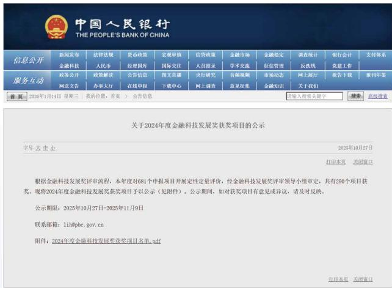

text_image

中国人民银行
THE PEOPLE'S BANK OF CHINA
信息公开
新闻发布
金融科技
法律法规
人民币
货币政策
经理国库
宏观审慎
国际交往
信贷政策
人员招录
金融市场
学术交流
金融稳定
征信管理
调查统计
反洗钱
银行会计
发建工作
支付体系
服务互动
政府公开
网图文告
政策解读
公告信息
图文直播
发行研究
网上调查
自媒体
市场动态
网上展厅
报告下载
报刊年鉴
首页 2026年1月14日 星期三 | 我的位置: 首页 > 公告信息
关于2024年度金融科技发展奖获奖项目的公示
字号: 大出企
2025年10月27日
打印本页  天闭窗口
根据金融科技发展奖评审流程,本年度对681个申报项目开展定性定量评价,经金融科技发展奖评审领导小组审定,共有290个项目获奖,现将2024年度金融科技发展奖获奖项目予以公示(见附件)。公示期间,如对获奖项目有意见或异议,请及时反映。
公示期限:2025年10月27日-2025年11月9日
联系邮箱:lihb@sbc.gov.cn
附件:2024年度金融科技发展奖获奖项目名单.pdf
打印本页  关闭窗口

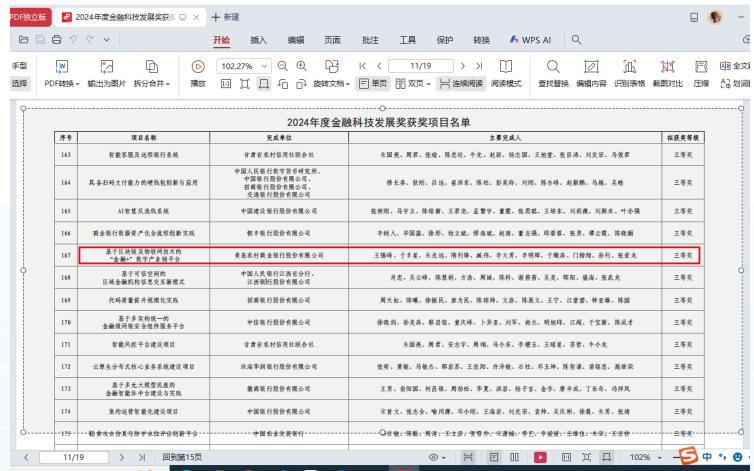

text_image

2024年度金融科技发展奖获奖项目名单
序号	项目名称	奖项单位	主要完成人	招投参考榜
163	智能客服及远程银行系统	甘肃省农村信用社联合社	头国美、周荣、张皓、陈思忠、牛戈、赵新、杨尔国、王地堂、张岩涛、刘炎荣、马俊荣	三等奖
164	具备扫码支付能力的硬件和软件应用	中国人民银行数字营销研究院、中国银行股份有限公司、招商银行股份有限公司、交通银行股份有限公司	蔡长春、狄刚、谷远、崔萍东、陈柱、彭英玲、刘珂、陈志峰、赵新鹏、马越、吴晗	三等奖
165	AI智慧医院系统	中国建设银行股份有限公司	张朝明、马学立、陈培新、王莉花、孟智宇、董霆、张思聪、王琼东、刘雨露、刘新水、叶小强	三等奖
166	黄金时报数字化物流创新实践	智丰银行股份有限公司	李树人、李国磊、徐伟、桂立斌、柳海波、赵波、董志强、郑蓉蓉、张勇、傅云霞、魏晓丽	三等奖
167	基于区块链物联网技术平台	青岛农村商业银行股份有限公司	王福峰、卡子豪、朱光远、傅利锋、臧伟、李大英、李明辉、于德晶、门楷铭、秦科、张爱龙	三等奖
168	基于可信访问的区域金融机构信息及更新模式	中国人民银行江西省分行、江西铜业股份有限公司	肖忠、吴云峰、陈慧刚、方浩、周琳、陈科、谢菲蓉、吴岚、邹阳、盛海、张武龙	三等奖
169	代码质量提升规模化上线	招商银行股份有限公司	周大虹、陈曦、徐振民、廖为民、陈昭玲、汤波、陈晨文、王宁、江荣睿、钟亚峰、陈国	三等奖
170	基于多架构的一套金融视频全屏服务平台	中信银行股份有限公司	徐晓珂、孙美兵、蔡启铭、董庆峰、卜步奎、刘军、尚杰、胡柏翔、江超、于宝源、陈成才	三等奖
171	智能风控平台建设项目	甘肃省农村信用社联合社	朱国英、周君、安吉宇、周娴、马小东、李熠玉、王耀星、苏普、冬小龙	三等奖
172	云维生态分布式产业系统建设项目	珠海华润银行股份有限公司	张朝明、黄艳华、马能升、邵菲菲、王仪阳、许洪敏、石柱、邓玉坤、陈智谦、潘铭恩、高斯梁	三等奖
173	基于多元大模型底层的金融智能体平台建设与实现	徽商银行股份有限公司	王芳、俞剑国、柯昌强、周伯松、李夏、徐芸、杨子宏、金孝、廖平成、丁乐东、冯祥凤	三等奖
174	集约运营智能化建设项目	中国银行股份有限公司	万有文、张念金、喻同源、刘小刚、王海苗、刘炎荣、张伟、吴天彬、修根、朱勇、张靖	三等奖
175	勒索坎合作与知识产权保护创新平台	中国农业发展银行	邱敏/傅敏/周建/王立生/常雪燕/宋清榆/李丹/李健敏/宋增信/朱洁/宋登怡	白玉英

2024 年度金融科技发展奖

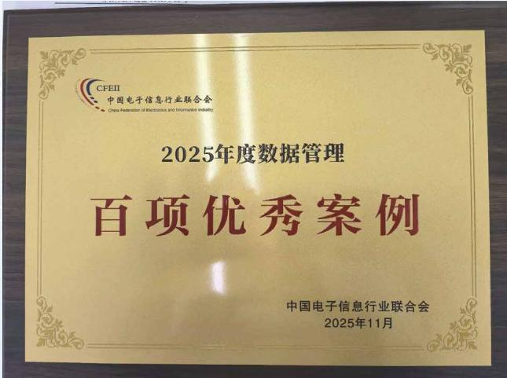

text_image

CFEII
中国电子信息行业联合会
China Federation of Electronics and Information Industry
2025年度数据管理
百项优秀案例
中国电子信息行业联合会
2025年11月

2025 年度数据管理百项优秀案例

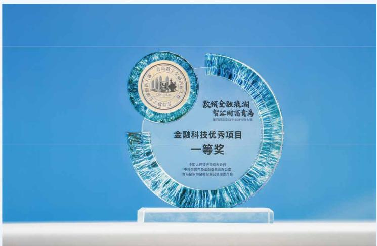

text_image

数额金融浪潮
智汇财富青鸟
第四届青岛市政学金融资助大赛
金融科技优秀项目
一等奖
中国人保银行青岛市分行
中医药市委金财部委员会办公室
青岛富春农村信用社区管理委员会

第四届青岛数字金融创新大赛 金融科技优秀项目一等奖

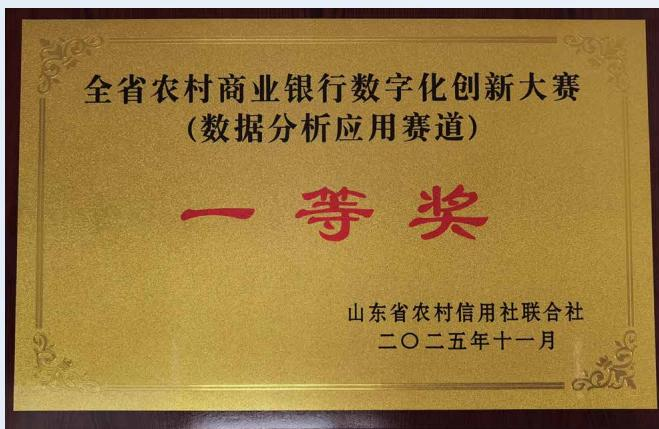

text_image

全省农村商业银行数字化创新大赛
(数据分析应用赛道)
一等奖
山东省农村信用社联合社
二〇二五年十一月

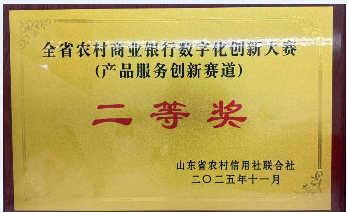

text_image

全省农村商业银行数字化创新大赛
(产品服务创新赛道)
二等奖
山东省农村信用社联合社
二〇二五年十一月

全省农村商业银行数字化创新大赛一等奖、二等奖

## 银企合作开发

本行积极构建开放协同的科技生态，与多家优质企业建立长期稳定的合作关系，合作领域覆盖业务支持、开发测试、运行维护、安全服务、场景创新、数据赋能等多个维度，形成全方位、多层次的银企合作格局。通过引入外部专业服务商的技术与资源，本行显著提升软硬件服务水平与业务运营效率，优化IT资源配置，降低运营管理成本，快速跟踪并应用金融科技前沿技术，为产品创新、服务升级与数字化转型提供有力支撑。在深化合作的同时，本行高度重视外包风险管理，建立全生命周期外包治理体系，通过严格的准入评估、合同约束、持续监控、常态化风险排查与应急演练，从合规管理、安全管控、服务质量、人员管理、业务连续性等方面构建严密防线，有效防范信息安全、业务中断及服务水平波动等风险，确保在借力外部资源的同时，牢牢守住业务稳定与信息安全底线，实现创新发展与风险防控的平衡。

## 金融标准化建设

本行重视金融标准化建设，现行有效的企业标准共3项，分别为《青岛农村商业银行营业网点服务基本要求》《应用程序接口安全管理规范》《数据能力建设规范》，以上标准均在企业标准信息公共服务平台进行公示。标准发布以来，本行严格按照规范要求开展相关工作，全行营业网点服务水平、应用程序接口和数据能力建设水平全面提升。

## 金融科技伦理

本行充分认识金融科技伦理治理的重要性和紧迫性，正确树立“以人为本、科技向善、权益保护、责任担当”的金融科技伦理理念，根据金融科技伦理管理的相关要求，切实履行金融科技伦理管理主体责任，探索设立金融科技伦理委员会，加强内部科技伦理审查，做好信息公开、自觉接受外界监督，积极运用数字手段强化伦理风险监测预警，提前预防、有效化解金融科技伦理问题。同时，通过常态化宣贯培训，引导从业人员将伦理要求内化于心、外化于行，不断提升从业人员科技伦理素养，打造德才兼备的金融科技人才队伍，为全行数字化转型加速推进、行稳致远保驾护航。

## 知识产权保护

本行严格按照《中华人民共和国专利法》《中华人民共和国著作权法》等相关法律法规，建立健全的知识产权保护体系并不断完善。为保护本行知识产权，提高科技竞争力及影响力，本行及时对自建上线项目进行分析论证，并申请软件著作权，切实维护创新成果。

## 关键绩效

2025 年获得发明专利 1 个

累计共取得国家发明专利 7 项、实用新型专利 3 项、外观设计专利 1 项、软件著作权 32 项

## 青岛农商银行专利登记证书

(仅为部分展示)  
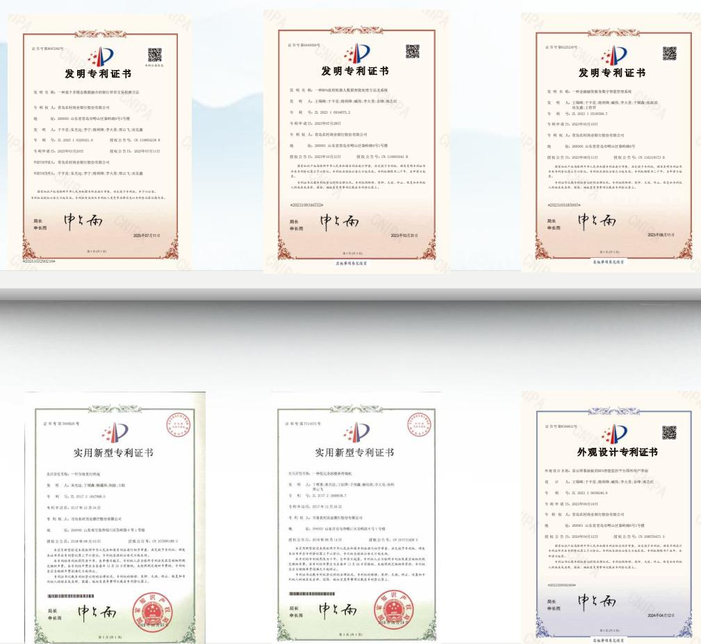

## 数据安全与隐私保护

DATA SECURITY AND PRIVACY PROTECTION

## 治理

本行依据《中华人民共和国数据安全法》《商业银行信息科技风险管理指引》《银行业金融机构数据治理指引》等法律法规，完善修订《青岛农商银行数据安全管理办法》与《青岛农商银行消费者个人信息保护管理办法》，设立信息科技与数据治理委员会（以下简称科数委），主任委员由分管信息科技工作的行领导担任，并进一步明确总行各部门及各分支机构数据安全管理的职责与分工，明确数据全生命周期安全管理策略，健全数据安全工作机制，提升数据安全管理能力，保障数据安全。

## 信息科技与数据治理委员会

负责组织协调数据安全相关工作，审议数据安全相关政策和制度，组织和指导数据安全相关风险防范。

## 科数委办公室

设在总行信息科技部，为科数委的日常办事机构，负责科数委日常工作联系与反馈。

## 总行信息科技部

数据安全的牵头部门，负责统筹协调全行数据安全工作，具体职责包括制定管理办法、推进数据分类分级管理、组织相关培训等，全方位筑牢数据安全防线。

## 总行各部门

数据安全管理的参与和执行部门，主要职责包括配合数据安全牵头部门制定数据安全相关制度、流程和策略，落实数据安全管理要求，开展数据安全风险监测预警工作等。

## 各分支机构

数据安全管理的执行部门，主要职责包括按照数据安全管理要求进行数据处理并进行授权审批，配合参与数据安全相关应急演练，组织其他相关数据安全管理工作等。

## 总行风险管理部

将数据安全风险纳入全面风险管理，监督数据安全执行部门做好风险监测，参与重大信息安全事件处置和评价。

## 总行审计部

数据安全管理的监督部门，主要负责将数据安全管理工作纳入审计范围。

战略

<table><tr><td>风险类型</td><td>风险描述</td><td>发生可能性</td><td>影响大小</td><td>影响的时间范围</td><td>影响的价值链环节</td><td>优先级排序</td><td>潜在财务影响</td><td>应对措施</td></tr><tr><td>操作风险</td><td>新技术应用快速,员工若缺乏必要的培训,可能因操作失误导致数据泄露。</td><td>低</td><td>高</td><td>短期</td><td>运营</td><td>高</td><td>运营成本增加</td><td>通过定期培训和演练,提升员工对数据安全和隐私保护的重视程度;引入专业人才,提升数据安全和隐私保护的专业水平。</td></tr></table>

<table><tr><td>机遇类型</td><td>机遇描述</td><td>发生可能性</td><td>影响大小</td><td>影响的时间范围</td><td>影响的价值链环节</td><td>优先级排序</td><td>潜在财务影响</td><td>应对措施</td></tr><tr><td>技术机遇</td><td>随着AI和大模型的飞速发展,DeepSeek作为国产开源模型,具备良好的本地化部署能力,在合规性与数据安全方面相较于闭源模型具有显著优势,为银行业提供了更优的选择。</td><td>高</td><td>中</td><td>短中期</td><td>运营</td><td>高</td><td>运营成本减少</td><td>通过引入DeepSeek大模型,建立属于青岛农商银行的企业级AI模型服务中台,大大提升运维效率与智能化服务效率。</td></tr></table>

## 影响、风险和机遇管理

本行制定《信息科技风险管理办法》，通过建立有效管理机制，实现对信息科技风险的识别、计量、监测、评估和控制，促进本行网络与信息系统安全、持续、稳健的运行，管理流程如下：

## 风险识别

采用源代码审查、漏洞扫描、系统运行监控等工作方式对影响信息科技各类目标实现的潜在事项或因素予以识别。

## 风险评估

对识别的风险通过定性和定量的方法围绕风险发生的频率、严重程度进行等级化处理。

## 风险控制与监测

信息科技部门和业务部门采取适当和科学的控制措施，降低风险发生的可能性或减轻负面影响情况，同时分析风险控制后剩余风险的性质和程度，并采取相应措施加强对剩余风险的监测。

## 数据安全事件应急管理

为有效预防和妥善处置数据安全信息事件,本行依据《中华人民共和国数据安全法》《中华人民共和国个人信息保护法》《银行业重要信息系统突发事件应急管理规范（试行）》《青岛农商银行数据安全管理办法》等规定，制定《数据安全事件应急预案》，明确不同数据泄露场景的应急处理流程及措施，提高数据安全信息事件快速处置能力，最大程度降低数据安全信息事件造成的危害和不良影响。

此外，本行针对数据泄露风险、应用系统、主机等方面定期开展专项应急演练，确保安全事件发生时能够得到及时妥善处置，提升本行应急安全管理水平。

## 关键绩效

(报告期内)

本行共开展了开展系统升级维护等 2,100 余次组织 40 余次信息系统应急演练，保障系统稳定运行

## 指标与目标

本行制定了信息安全风险管理指标与目标，通过收集相关指标信息，监测并统计信息安全风险，确保风险始终处于可控范围。

<table><tr><td>目标</td><td>2025年度完成情况</td></tr><tr><td>信息及客户隐私零泄露</td><td>报告期内,本行未发生信息泄露及客户隐私泄露事故。</td></tr><tr><td>重点突破终端数据泄露防护这一行业性难题,构建覆盖全场景的数据安全防护体系。</td><td>通过部署终端敏感数据防泄漏(DLP)系统,建立“监测-识别-阻断-追溯”四位一体防护机制。</td></tr></table>

## 加强数据安全管理

## 做强专业化数据安全防护

以“让数据使用更安全”为中心，本行构建了“管理、技术、运维”三维立体防护体系，将数据安全纳入信息系统全生命周期框架，覆盖数据全生命周期过程管理。在此基础上，本行通过落实加强访问控制、优化网络分区等技术手段持续提升数据安全技术防护的专业化水平，全方位筑牢数据安全防线。

加强访问控制避免越权访问

加强身份认证管理，采用短信验证码、人脸识别等多因素认证策略，确保身份验证多样性与安全性。同时，设置数据访问权限规则，建立特权访问审批机制，落实最小权限原则，杜绝越权访问。

推行安全技术确保数据安全

落实国密改造要求, 使用加密键盘确保密码安全; 通过报文加验签实现防篡改和抗抵赖; 运用数据脱敏工具, 采用掩码、重排等算法对敏感信息进行脱敏, 保障数据使用安全。

网络纵横分区实现安全隔离

构建纵向分层、横向分区的网络安全防御体系，部署流量清洗、防火墙、入侵防御系统等设备，对业务流量进行安全监测与威胁处置。网络分区之间通过下一代防火墙等设备进行隔离，建立加密传输隧道，确保数据传输的机密性和完整性。

强化终端管控降低泄露风险

优化终端准入系统，建立敏感数据泄露防护体系，实现数据外发审核和泄露追踪溯源。推进终端数据合规审计，通过敏感数据扫描、屏幕水印、外发控制等策略，提升终端设备数据安全防护能力，构建安全防护基座。

规范分类分级驱动差异管控

依据数据的安全级别、数据对系统运行的影响应制定备份策略和恢复策略，并按照月度频度进行数据库备份，如遇到数据库系统数据丢失，可执行服务器重启并使用备份数据进行还原。

## 厚植数据安全防护意识

本行高度重视数据安全宣贯及数据人才培养工作，通过举办全行网络和数据安全线上培训、金融科技大讲堂、邀请监管部门数据安全资深专家现场授课等活动，持续提升全行员工数据安全意识和工作履职能力，树立安全红线意识。同时，本行成立“蔚然菁英”网络安全创新实验室，参加青岛“网安·论道”网络安全大赛、“泰山杯”全省网络安全大赛，均获得优异成绩。

## 【案例】 开展数据安全培训

2025 年 11 月，为积极响应国家网络强国战略与数字中国建设要求，深入贯彻落实金融监管总局数据与网络安全最新规定，加强数据与网络安全管理能力，全面提升员工数据安全保护意识，本行邀请监管部门专家面向全行员工开展数据及网络安全培训。本次培训聚焦强化全行网络和数据安全意识，提升风险识别和应急处置能力，围绕当前网络安全新形势、数据安全新法规，结合数据安全领域典型案例进行讲解，兼具政策高度与实操价值。

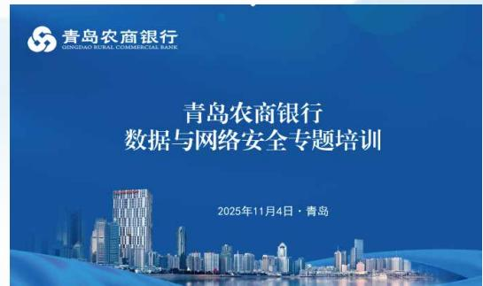

text_image

青岛农商银行
QINGDAO RURAL COMMERCIAL BANK
青岛农商银行
数据与网络安全专题培训
2025年11月4日·青岛

## 【案例】 数据分析人才培养

组织开展“云梯·千数”数据分析师培养工作，当前已培养50+高级数据分析师，150+中级数据分析师，800+初级数据分析师，为全行打造了一批“业·技·数”深度融合的数据分析人才，对外积极参与省、市组织的各类数据分析师竞赛，2025年在中国技工协会、山东省总工会组织的第二届全国数据技术与应用职业技能竞赛，山东省总工会、山东省信息和工业化厅、山东省大数据局组织的首届山东省职工数字信息职业技能竞赛中取得佳绩，斩获商务数据分析一等奖。

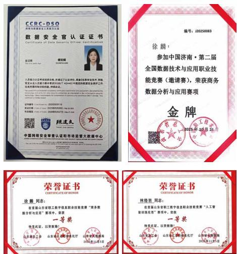

## 关键绩效

(报告期内)

全行开展网络安全培训 1 次，培训覆盖率 100%

## 数据安全审计

总行审计部每年对行内数据治理工作开展独立的内部专项审计，审计范围覆盖数据安全管理、信息安全管理架构及制度流程等，采取包括但不限于召开座谈会、调阅制度文件、抽查相关业务资料等审计方式。

关键绩效

<table><tr><td colspan="4">(报告期内)</td></tr><tr><td>共查阅制度文件及报表材料</td><td>运行非现场模型</td><td>发现问题</td><td>整改率</td></tr><tr><td>86份</td><td>18个</td><td>4项</td><td>100%</td></tr></table>

## 个人信息保护

本行修订印发《青岛农商银行个人金融信息保护管理办法（2024年版）》，明确个人信息收集、使用、保管规则，履行明示义务及授权要求，严格保障信息存储、查阅、复制、对外提供及合作过程中的安全。在此基础上，围绕个人信息保护重点领域开展自评估检查和排查，覆盖信息收集、存储、使用、提供、删除等环节，并将第三方合作机构的个人信息保护落实情况纳入评估范围，督促各单位加强管控，消除安全隐患。同时，本行在收集理财客户信息用于投资管理、监管报送、反洗钱、资质审核及销售适当性等法定要求时，严格遵循合法、正当、必要原则，并采取技术措施确保数据存储安全，制定并验证备份与恢复策略。

## 负责任采购

RESPONSIBLE PROCUREMENT

## 采购管理体系

负责任采购是本行履行社会责任、减少环境影响和促进良好治理的重要举措。本行通过制定一系列采购制度管理，规范采购行为，加强供应商管理，确保采购活动公开、公平、公正。

本行制定《青岛农商银行集中采购管理办法》，明确要求采购活动符合以下原则：优先选择国内供应商、优先选择环保产品，减少资源消耗和碳排放。采购活动中，本行遵守道德与合规原则，严格遵守反腐败法律法规，确保采购过程的透明和公正。制订《青岛农商银行集中采购评审专家管理办法》，规范采购评审行为，保证评审活动的公平、公正。制定《青岛农商银行招标代理机构管理办法》规范招标代理机构管理。制定《青岛农商银行集中采购供应商管理办法》，加强供应商管理，规范供应商行为，提高供应商履约能力，降低集中采购风险。

## 供应商管理

本行秉持“公平、公正、公开和充分竞争”的原则，对业务范围内的供应商准入、评价、奖惩和退出等各个环节实行严格把控和动态管理，定期对供应商履约情况进行评价，做好等级评定，确保供应商采购工作的合规标准化，增强采购的公开和透明性。

关键绩效

<table><tr><td>指标</td><td>单位</td><td>2025年</td></tr><tr><td>供应商总数</td><td>家</td><td>635</td></tr><tr><td>国内供应商数量</td><td>家</td><td>635</td></tr><tr><td>因不合规被中止合作的供应商数量</td><td>家</td><td>0</td></tr></table>

## 推进责任采购

本行坚持廉洁自律原则，推行阳光采购，强化采购流程管控，致力于构建良好采购环境。为加强采购廉洁管理，每年参加内外部组织的集中采购管理培训，培训内容包括合规采购、阳光采购和廉洁采购等。

## 【案例】 省联社集中采购专题培训

2025年8月，青岛农商银行组织相关人员参加省联社集中采购专题培训，深入学习国家关于集中采购的政策法规、制度要求与操作规范，进一步提升采购管理人员专业素养、合规意识与业务实操能力。

## 【案例】 全行集中采购专项培训

2025 年 9 月，组织开展全行集中采购专项培训，围绕采购流程管控、风险防范要点、制度执行落地等内容进行系统讲解，持续强化供应商准入、履约、评价、退出等全生命周期管理，推动采购工作更加规范高效、公开透明，确保全行集中采购活动依法合规、有序开展，不断提升制定执行力和采购管理质效。

text_image

05/ 关注员工成长
创造社会价值
■ 员工权益与发展
■ 社会贡献
响应的 SDGs
1 无贫穷
2 零饥饿
3 良好
健康可持续

## 05/

## 关注员工成长 创造社会价值

■ 员工权益与发展  
■ 社会贡献

青岛农商银行始终坚持以人为本的发展理念，持续完善人才培养与职业发展体系，保障员工合法权益，营造多元、包容、积极向上的工作环境。同时，本行积极参与社会公益事业，持续履行企业社会责任，与社会各界携手推动经济与社会的可持续发展。

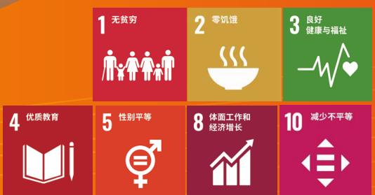

text_image

1 无贫穷
2 零饥饿
3 良好
健康与福祉
4 优质教育
5 性别平等
8 体面工作和
经济增长
10 减少不平等

# 员工权益与发展

EMPLOYEE RIGHTS AND DEVELOPMENT

我们严格遵守《中华人民共和国劳动法》《中华人民共和国劳动合同法》《中华人民共和国工会法》等法律法规，制定包括《招聘管理办法》《离职管理办法》《员工合规行为管理手册》《薪酬管理实施细则》在内的多项管理制度，明确招聘、离职、薪酬、绩效考核、福利、劳动合同管理等各项人力资源管理工作规范，拓展员工职业发展通道，充分全面保障员工权益。

## 员工招聘与就业

本行始终将人才战略置于企业发展的重要位置，制定了《招聘管理办法》等一系列规章制度，规范了从投递简历到签订协议的一整套入职流程，严格设定了覆盖员工招聘、入职审批、入职报到等环节的年龄、背景审核机制。我们致力于构建一个科学、高效且多元的人才引入体系，持续推进线上招聘与线下招聘相结合、校园招聘与社会招聘为互补的人员引进模式，力求广泛吸纳各阶层、各领域的优秀人才。报告期内，本行新进员工数358人。

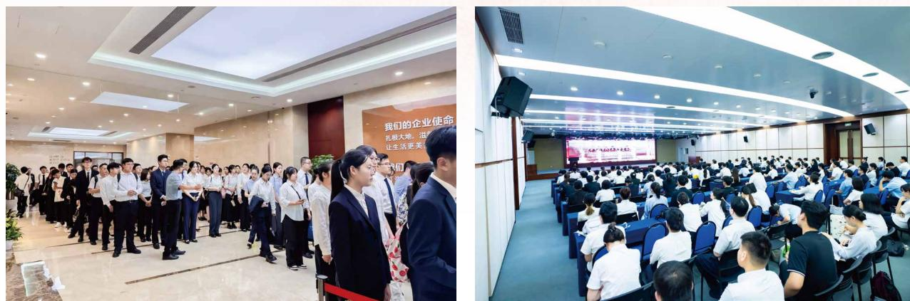  
招聘现场

报告期内，本行员工总流失率约为 3.72%，按性别、年龄组别及地区划分的员工流失率如下：

<table><tr><td colspan="2">指标</td><td>比例(%)</td></tr><tr><td rowspan="2">按性别划分</td><td>男性</td><td>2.57%</td></tr><tr><td>女性</td><td>1.15%</td></tr><tr><td rowspan="2">按年龄划分</td><td>30岁以下(不含30岁)</td><td>0.90%</td></tr><tr><td>30-40岁(含30岁,不含40岁)</td><td>0.48%</td></tr></table>

<table><tr><td colspan="2">指标</td><td>比例(%)</td></tr><tr><td rowspan="2">按年龄划分</td><td>40-50岁(含40岁,不含50岁)</td><td>0.13%</td></tr><tr><td>50岁及以上</td><td>2.21%</td></tr><tr><td>按地区划分</td><td>中国大陆地区</td><td>3.72%</td></tr></table>

## 员工构成情况

报告期内，公司员工总数 6,025 人，少数民族员工 33 人，员工具体分布如下：

<table><tr><td colspan="2">指标</td><td>单位</td><td>2025年</td></tr><tr><td rowspan="2">按性别划分</td><td>女性</td><td>人</td><td>2,905</td></tr><tr><td>男性</td><td>人</td><td>3,120</td></tr><tr><td rowspan="4">按年龄划分</td><td>30岁以下(不含30岁)</td><td>人</td><td>1,459</td></tr><tr><td>30-40岁(含30岁,不含40岁)</td><td>人</td><td>2,120</td></tr><tr><td>40-50岁(含40岁,不含50岁)</td><td>人</td><td>1,561</td></tr><tr><td>50岁及以上</td><td>人</td><td>885</td></tr><tr><td rowspan="4">按教育程度划分</td><td>本科以下</td><td>人</td><td>542</td></tr><tr><td>本科</td><td>人</td><td>4,796</td></tr><tr><td>硕士</td><td>人</td><td>678</td></tr><tr><td>博士</td><td>人</td><td>9</td></tr><tr><td rowspan="3">按地区划分</td><td>中国大陆</td><td>人</td><td>6,025</td></tr><tr><td>港澳台地区</td><td>人</td><td>0</td></tr><tr><td>国外</td><td>人</td><td>0</td></tr></table>

报告期内，公司劳动合同签订率为 100%，社会保险覆盖率 100%。

## 多元化、平等与包容性

本行始终秉持着公平、开放、包容的企业文化理念，确保在招聘途中对所有候选人公正无偏，在工作环节对所有职工平等尊重。我们积极吸纳少数民族同胞就业，力求为少数民族同胞提供公平、友好的就业环境，既实现少数民族同胞的经济增收和个人成长，也进一步丰富公司的文化内涵，为公司的可持续发展注入源源不断的动力。

## 薪酬福利与考核

## 薪酬体系

为合理确定各职位层级人员薪酬水平,进行科学分配,公司坚持以市场、能力、绩效为导向,遵循“人岗匹配、以岗定薪、以能定级、以绩定奖、岗变薪变”的原则，制定了涵盖总行部门和各分支机构的《薪酬管理实施细则》，并以此为方针开展本行的薪酬管理工作。

在薪酬构成方面，本行将薪酬明确划分为基本薪酬、可变薪酬和福利性收入等，丰富员工的综合收益；在薪酬设定方面，本行实行“一岗对多级”的宽带薪酬制，依据经营战略、市场同业水平、人才竞争情况等因素，在对应的薪酬区间内对同一岗位的薪资水平做出科学调整；在薪酬发放方面，本行坚持“有依据、有审批”的原则，保证薪酬发放的准确性和规范性；在薪酬调整方面，本行综合采用整体普调、等级调整、薪点调整等多种调整方式，立足多维度实现员工增收；在薪酬隐私方面，本行采取“制度透明、数据保密”的密薪制，尊重保护广大员工的个人隐私。本行通过对各个环节的综合设计和严格把控，构建起全流程、全方位、全岗位的薪酬管理体系，充分发挥薪酬的激励作用，为员工的职业发展和本行的可持续发展提供有力支持。

## 员工福利

本行始终将员工视为最为宝贵的财富，高度重视员工福祉，制订《职工福利费管理办法》，不断完善福利体系，积极打造暖心关怀机制，在保障员工基本福利的同时，进一步关注其多样化需求，给予员工补偿性福利、救助性福利以及各种其他福利，增强员工的满意度与归属感，共同推动构建充满人文关怀的企业生态。

## 福利待遇

## 社会保险及补充保险

包括养老保险、医疗保险、工伤保险、失业保险、住房公积金、补充养老保险（企业年金）、补充医疗保险。

## 职工补偿性福利

主要包括职工防暑降温费、义务献血补助、职工慰问、职工遗属生活困难补贴等。

## 职工救助性福利

为特困职工提供帮扶救助。

## 职工集体福利

主要包括工作餐支出、工作服饰、工装清洗、健康体检、职工疗休养、以及集体福利部门支出等。

## 其他职工福利

主要包括上述福利费项目外，按规定纳入职工福利费管理的项目。

报告期内，本行职工福利费支出为 9,846 万元。

★ 注：职工福利费是指为关心关爱职工、保障职工权益，用于职工补偿性、救助性、集体性和其他福利等方面的支出。

## 绩效考核与申诉

本行充分尊重员工的个人贡献，倡导按绩取酬，分别制定了《总行部门员工绩效管理办法》《分支机构员工绩效管理办法》，构建逐层、全面、动态、激励的绩效考核机制。本行倡导以人为本理念，通过动态循环的绩效管理过程，强化过程沟通和辅导，帮助员工持续提升工作能力，实现全行经营战略与个人职业目标协调发展。同时，将全行整体绩效和员工个人绩效有机结合，将员工收入、晋升发展与个人贡献科学挂钩，形成有效的激励约束机制。

为了保障员工的权益，本行建立了完善的绩效考核申诉流程，被考核人如果认为受到不公平对待或对评价结果不满意时，可在考核结果公布后的规定期限内向所在机构绩效管理办公室提出异议，并经由该办公室在一定期限内进行调查、沟通、认定、落实，真正确保绩效考核的公平性、准确性，进一步推动公司绩效和薪酬管理的规范化和科学化。

## 工时与休假制度

本行建立工时及休假制度,制定《青岛农商银行员工考勤管理办法》,其中明确了员工在勤及休假情况,并对事假、病假、婚假、丧假、产假、计划生育假、护理假等进行了规定。

## 员工民主管理

本行秉持科学民主的管理理念，为切实保障职工的民主权利，保障职工的主人翁地位，维护职工的合法权益，充分发挥职工的积极性和创造性，全方位落实职工的知情权、参与权、表达权、监督权，精心打造民主管理“阳光工程”，构建和谐稳定的企业发展环境。

本行设有工会委员会，工会下设 21 个分支机构工会，共有会员 6,025 人，已覆盖全体员工（占比 100%）。在职工代表大会建设工作方面，在全行系统建立了职工代表大会制度，形成了党委统一领导、工会主动作为、全员广泛参与的工作局面。职工代表要代表职工合法利益，反映职工的意见和要求，认真执行职工代表大会的决议，做好职工代表大会交办的各项工作。

在总行党委的领导下，本行先后出台了职工代表大会实施细则、职工代表提案等工作制度，聚焦全行转型发展难点、职工关注热点、涉及职工切身利益的关键点等重要问题，每年组织召开集体协商会议，就集体合同、工资薪酬、女职工权益保护、劳动安全卫生等问题进行协商，对职代会收集到的职工意见和建议，逐项梳理，要求相关部门按期完成提案的处理答复工作，做到件件有答复，事事有落实。

报告期内，职工代表大会共计审议通过议题 15 项。

本行在民主管理方面的卓越表现，得到了社会各界的广泛认可，先后被市总工会授予“推行协商民主 强化社会责任先进单位”、“工会工作先进集体”、“真情协商·和谐共赢”品牌创建活动五星级单位、工人先锋号等荣誉称号。

## 荣誉称号

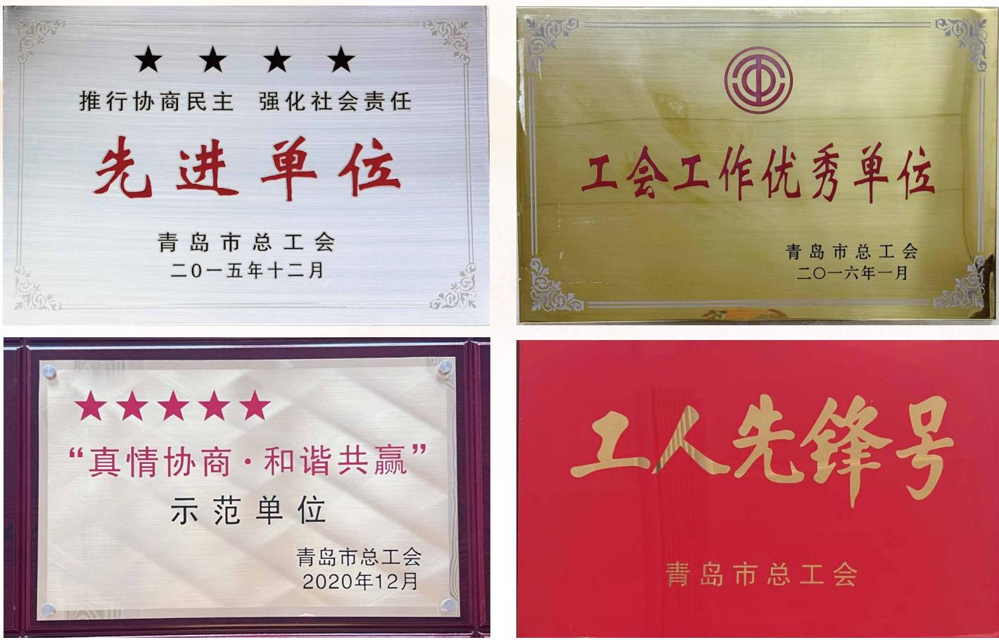

## 员工关怀与帮扶

本行时刻关注员工的精神生活动态，真心真意关爱员工，用情用心用力为员工办实事、做好事、解难题，切实将职工需求转化为“幸福账单”，不断为职工幸福指数“加码”。

## 丰富员工活动

积极开展丰富多元的企业文化活动，致力于为员工营造充满活力、温馨和谐的工作环境，不断深化与员工之间的友好关系，持续提升每位员工的满意度，增强幸福感和归属感。举办首期职工子女暑期托管班、“庆三八”主题团建、职工乒羽联赛、趣味运动嘉年华等活动，组队参与多项市级赛事并承办机关篮球邀请赛，在青岛市职工运动会上取得金牌榜第1名、总分榜第2名的历史最好成绩。

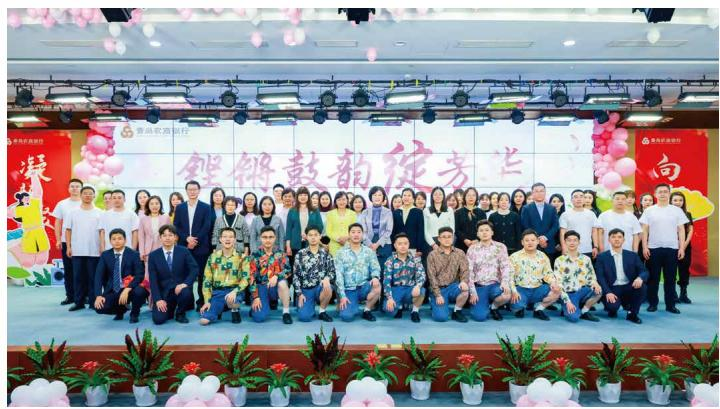

text_image

青岛农商银行
银鸽鼓韵徒交流

开展“铿锵鼓韵绽芳华”主题团建活动

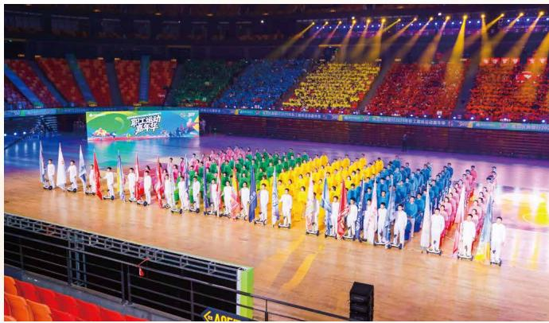

natural_image

Group of performers in colorful uniforms standing in formation inside a large stadium with colorful seating and stage lights (no visible text or symbols)

举办职工运动嘉年华

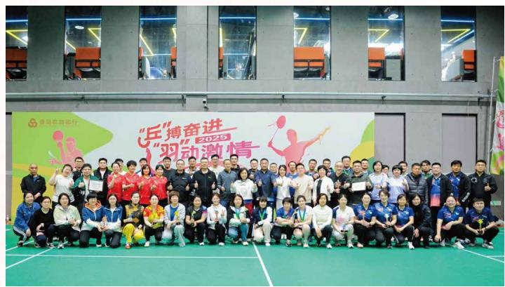

text_image

青岛农商银行
“乒”搏奋进
2025
“羽动激情

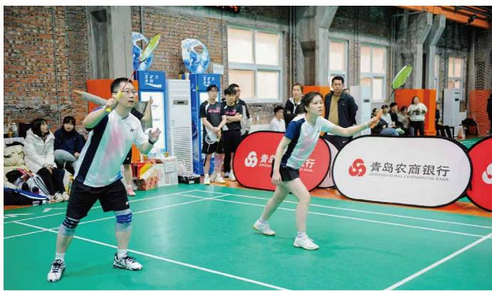

text_image

青岛农商银行
QINGDONG BAIJING COMMERCIAL BANK

举办职工乒羽联赛

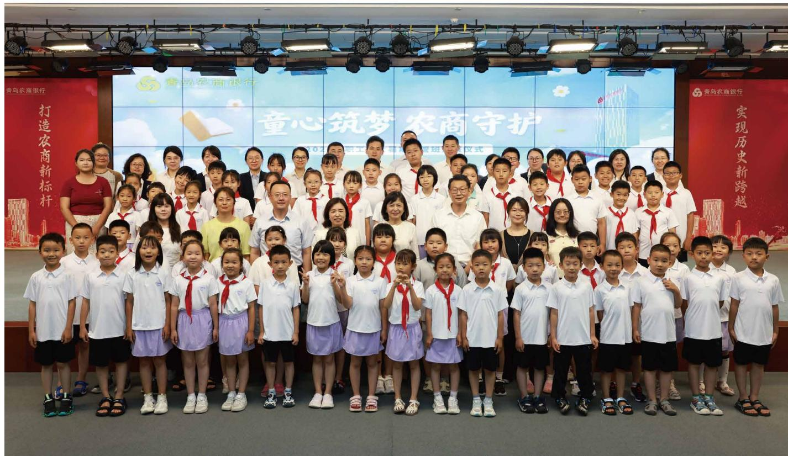

text_image

青岛农商银行
打造农商新标杆
青岛农商银行
童心筑梦 农商守护
2022年职工安全考核竞赛启动仪式
实现历史新跨越

举办“童心筑梦·农商守护”首期职工子女暑期托管班

## 女性员工关怀

本行积极保障女员工合法权益，丰富女员工精神文化生活，每年“三八”国际妇女节来临之际，积极组织丰富多彩的庆祝活动。

text_image

豪华续新
美好“青”的

“春华绽新，美好‘香’约”“女神节”香薰蜡烛 DIY 主题活动

## 员工帮扶

本行营造积极向上、健康且充满关怀气息的工作环境，通过切实的帮扶措施，为困难员工提供支持与关怀。在职工婚育时送上贺喜金，在员工困难时送去关心和帮助，切实解决职工生活水平下降、医疗费用沉重等问题，从经济上直接解决员工的部分困难。对于因病、因意外等原因陷入困境的职工家庭，本行始终高度重视，在全行组织开展困难职工帮扶救助活动。走访人员与职工聊家常、询困难，详细了解职工家庭生活状况，切实且有针对性地提供帮扶救助，为他们战胜挫折、克服困难增添动力。

## 关键绩效

(报告期内)

本行为结婚、生子的职工发放贺喜金，为生病住院、家中直系亲属死亡等有重大困难的职

工发放慰问金，全年落实婚、育、病、丧、困等慰问 468 人次，30 余万元，

发放荣休纪念品 149 份。

## 【案例】 慰问一线偏远网点及困难职工

2025 年，本行向全行基层网点、常年坚守偏远一线职工代表和困难职工送去了总行党委的慰问祝福和工会“娘家人”的浓浓暖意。对于因病、因意外等原因陷入困境的职工家庭，目前本行工会已累计帮扶救助特困职工 93 人，共计 60 余万元。除总行层面开展的慰问之外，青岛农商银行各分支机构也面向辖内一线职工、困难职工、退休职工等开展慰问活动，为他们送去组织的关怀和温暖，并致以诚挚的节日问候和美好的新年祝福。

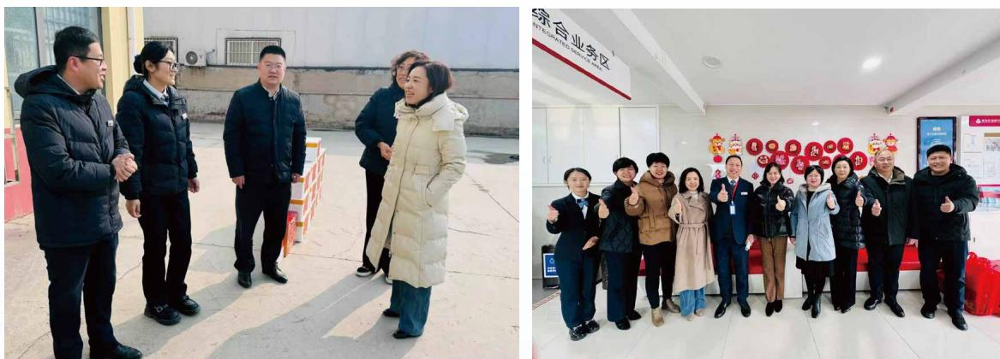

## 关键绩效

(截至报告期末)

本行工会已累计帮扶救助特困职工

93人

共计

60 余万元

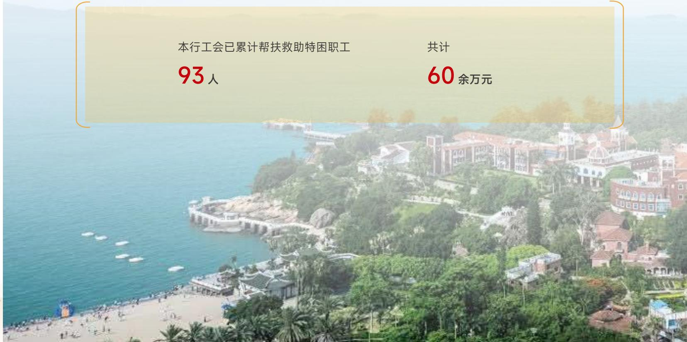

text_image

本行工会已累计帮扶救助特困职工 共计
93人 60余万元

## 员工培训与发展

## 强化员工培训

我们始终将员工的成长与进步视为企业发展战略的重要组成部分，以积极务实的态度致力于为员工打造一个多元化、多层次的学习与发展平台。本行制定了《青岛农商银行员工教育培训管理办法》《青岛农商银行“员工能力素质提升工程”实施方案》《青岛农商银行员工在职学习奖励办法》等制度，持续完善“上承战略、下接绩效”的教育培训体系，持续开发和丰富培训资源，根据不同类别和层级员工的需求，设计了分类别分层级的培训体系和培训计划，赋能员工发展，鼓励支持员工利用业余时间学习、考取学历（学位）证书、专业技术人员职业资格证书、金融行业证书，本年度全行共计89名员工考取各类学历（学位）、职称或金融专业证书，奖励金额共计29.7万元。

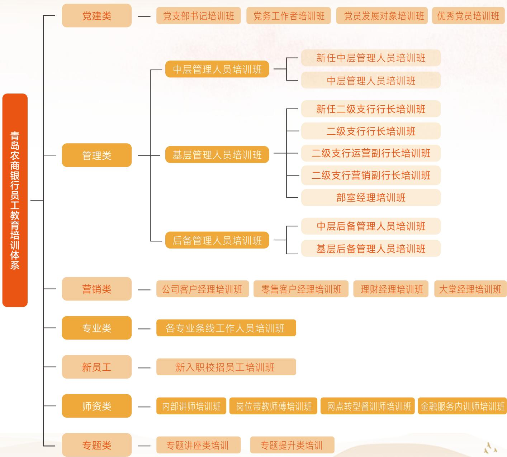

flowchart

```mermaid
graph LR
  Root["青岛农商银行员工教育培训体系"]
  
  subgraph Governance[" governance"]
  A1["党建类"] --> B1["党支部书记培训班"]
  A1 --> C1["党务工作者培训班"]
  A1 --> D1["党员发展对象培训班"]
  A1 --> E1["优秀党员培训班"]
  end
  
  subgraph Management["管理类"]
  M1["中层管理人员培训班"] --> N1["新任中层管理人员培训班"]
  M1 --> O1["中层管理人员培训班"]
  M1 --> P1["新任二级支行行长培训班"]
  M1 --> Q1["二级支行行长培训班"]
  M1 --> R1["二级支行运营副行长培训班"]
  M1 --> S1["二级支行营销副行长培训班"]
  M1 --> T1["部室经理培训班"]
  M1 --> U1["中层后备管理人员培训班"]
  M1 --> V1["基层后备管理人员培训班"]
  end
  
  subgraph Business["业务"]
  B2["营销类"] --> C2["公司客户经理培训班"]
  B2 --> D2["零售客户经理培训班"]
  B2 --> E2["理财经理培训班"]
  B2 --> F2["大堂经理培训班"]
  end
  
  subgraph Technical["技术"]
  K1["专业类"] --> L1["各专业条线工作人员培训班"]
  end
  
  subgraph New["新员工"]
    N2["新入职校招员工培训班"]
  end
  
  subgraph Staff["师资类"]
  S3["内部讲师培训班"] --> T3["岗位带教师傅培训班"]
  S3 --> U3["网点转型督训师培训班"]
  S3 --> V3["金融服务内训师培训班"]
  end
  
  subgraph Topic["专题类"]
  T4["专题讲座类培训"] --> U4["专题提升类培训"]
  end
  
  A1 -.-> M1
  M1 -.-> M2
  M2 -.-> M3
  M3 -.-> M4
  M4 -.-> M5
  M5 -.-> M6
  M6 -.-> M7
  M7 -.-> M8
  M8 -.-> M9
  M9 -.-> M10
  M10 -.-> M11
  M11 -.-> M12
  M12 -.-> M13
  M13 -.-> M14
  M14 -.-> M15
  M15 -.-> M16
  M16 -.-> M17
  M17 -.-> M18
  M18 -.-> M19
  M19 -.-> M20
  M20 -.-> M21
  M21 -.-> M22
  M22 -.-> M23
  M23 -.-> M24
  M24 -.-> M25
  M25 -.-> M26
  M26 -.-> M27
  M27 -.-> M28
  M28 -.-> M29
  M29 -.-> M30
  M30 -.-> M31
  M31 -.-> M32
  M32 -.-> M33
  M33 -.-> M34
  M34 -.-> M35
  M35 -.-> M36
  M36 -.-> M37
  M37 -.-> M38
  M38 -.-> M39
  M39 -.-> M40
  M40 -.-> M41
  M41 -.-> M42
  M42 -.-> M43
  M43 -.-> M44
  M44 -.-> M45
  M45 -.-> M46
  M46 -.-> M47
  M47 -.-> M48
  M48 -.-> M49
  M49 -.-> M50
  M50 -.-> M51
  M51 -.-> M52
  M52 -.-> M53
  M53 -.-> M54
  M54 -.-> M55
  M55 -.-> M56
  M56 -.-> M57
  M57 -.-> M58
  M58 -.-> M59
  M59 -.-> M60
  M60 -.-> M61
  M61 -.-> M62
  M62 -.-> M63
  M63 -.-> M64
  M64 -.-> M65
  M65 -.-> M66
  M66 -.-> M67
  M67 -.-> M68
  M68 -.-> M69
  M69 -.-> M70
  M70 -.-> M71
  M71 -.-> M72
  M72 -.-> M73
  M73 -.-> M74
  M74 -.-> M75
  M75 -.-> M76
  M76 -.-> M77
  M77 -.-> M78
  M78 -.-> M79
  M79 -.-> M80
```

## 【案例】 2025年中层管理人员培训班

为深入贯彻落实中央八项规定精神，全面提升中层管理人员的政治理论素养与领导能力，增强市场洞察力，打造高素质专业队伍，本次培训围绕党的最新理论成果、作风建设等重点内容开展教学，强化学员的政治素养与使命担当。在专业课程方面，培训涵盖绩效管理、客户营销、宏观经济分析及零售转型等多个实务领域，通过案例教学和实战分析，切实提升中层管理人员的管理与业务能力。

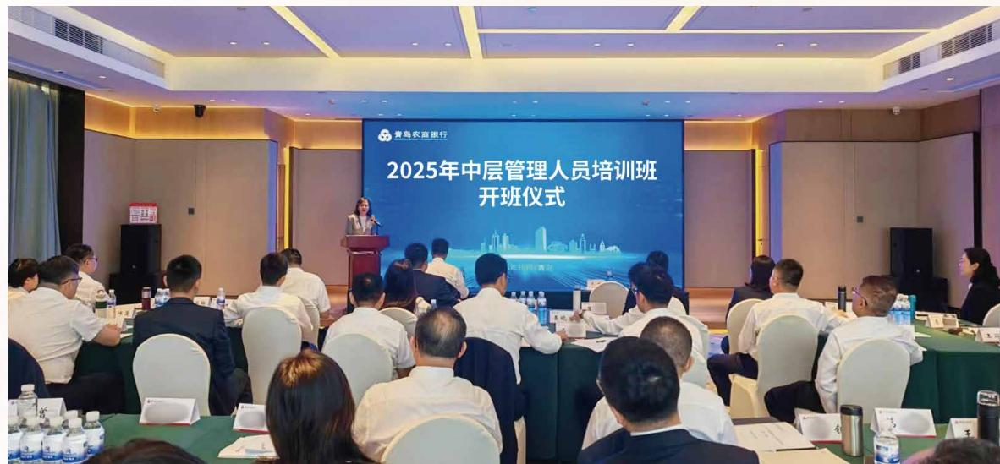

text_image

青岛农商银行
2025年中层管理人员培训班
开班仪式

## 【案例】2025年新入职校招员工培训班

为助力新员工系统认知青岛农商银行发展战略，厚植合规文化基因，构建岗位胜任能力，加速完成从“校园菁英”到“农商先锋”的蜕变，本行构建“文化浸润——合规筑基——服务淬炼——专业精进”多维培养的培训体系，实现新员工能力素质全方位提升。

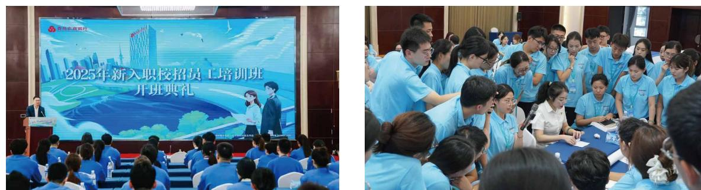

## 【案例】2025年优秀共产党员培训班和党支部书记示范培训班

为深入贯彻落实新时代党的建设总要求，全面提升党员干部政治素养与履职能力，本次培训班邀请青岛市委党校老师授课，重点围绕习近平新时代中国特色社会主义思想、中央八项规定及其实施细则精神等内容展开。通过案例剖析、互动交流，强化纪律作风建设，加强党性修养，筑牢党员思想根基，激励党员发挥先锋模范作用。

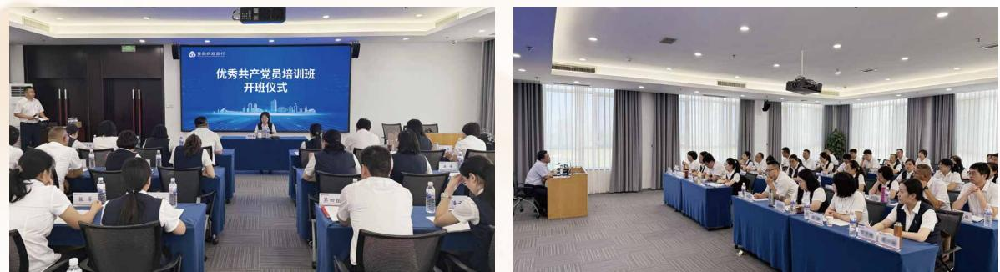

## 【案例】2025年零售客户经理培训班

培训围绕“全层级覆盖、核心能力提升”理念，针对不同职级客户经理设置了差异化课程内容。聚焦实战技能与专业能力进阶，切实提升一线人员对小微融资需求的理解与精准服务能力；同时引入数字化工具应用培训，助力客户服务向智能化方向转型；围绕复杂业务场景与综合创利能力展开训练，强化客户经理的整体思维与财富管理能力。此外，通过合规经营与展业规范专题学习，进一步筑牢风险防控意识。本次培训分三期开展，共设11个教学班级，全行600余名零售客户经理参训。

<table><tr><td>指标</td><td>单位</td><td>2025年</td></tr><tr><td>开展培训项目数</td><td>项</td><td>55</td></tr><tr><td>员工培训场次</td><td>场次</td><td>68</td></tr><tr><td>接受培训总人次</td><td>人次</td><td>7,115</td></tr><tr><td>员工培训覆盖率</td><td>%</td><td>100</td></tr><tr><td>培训总时长</td><td>小时</td><td>1,593</td></tr></table>

★ 注：2025 年培训数据不含线上培训项目。

## 员工晋升发展

我们秉持因事设岗、高效精简、多通道发展的原则，为完善全行岗位职级管理体系，明晰员工的岗位角色，修订了《青岛农商银行岗位职级管理办法》。为进一步畅通员工职业发展通道，搭建多元化职业发展路径，进一步打造高素质、专业化员工队伍，修订了《青岛农商银行员工职业发展管理办法》，为员工提供了清晰、完整的职业发展路径，助力其职业成长。

## 职业健康与安全

## 关爱身心健康

本行将维护员工的身心健康置于优先级工作重点，通过多渠道调研、综合评估筛选后选定专业体检机构，并结合员工年龄、性别、岗位特点等，有针对性地设计个性化体检套餐。体检结束后，组织专家对体检报告进行解读，针对异常结果提供一对一咨询服务，让职工及时全面了解自身健康状况，有效防范疾病风险，树立正确的健康观念。

  
解读体检报告

## 安全急救培训

青岛农商银行依据网点和办公区域的人员密度、空间结构,严谨地分析规划 AED 急救设施的装设,确保在紧急情况下,员工和客户能够在 3 分钟内获取到 AED 设备。同时，安排专人负责 AED 设备的定期维护，确保设备各项功能正常，一旦发现问题及时联系厂家进行维修或更换。

## 【案例】 AED使用培训普及与应急演练

青岛农商银行组织员工参加 AED 使用及急救知识培训，邀请具备丰富急救经验的专业急救人员进行现场教学，培训内容涵盖 AED 设备的正确使用方法、心肺复苏法（CPR）以及海姆立克急救法等常见急救技能，通过案例分析和模拟操作等，确保每位员工都能熟练掌握急救技能。

## 【案例】 消防应急演练与培训

为进一步强化安全意识，提升全员应急处置能力，检验应急联动机制有效性，青岛农商银行组织员工开展消防应急疏散演练。本次演练覆盖应急疏散、灭火器材实操、初起火灾扑救等关键环节，通过实战演练切实筑牢安全生产防线。疏散演练结束后，消防维保公司专家现场开展专题培训，系统讲解了高层建筑逃生要点，干粉灭火器的操作方法及消防水带连接技巧等，为本行高质量发展营造安全稳定的运营环境。

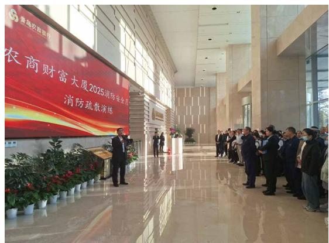

text_image

农商财富大厦2025消防安全月
消防疏散演练

消防应急知识培训

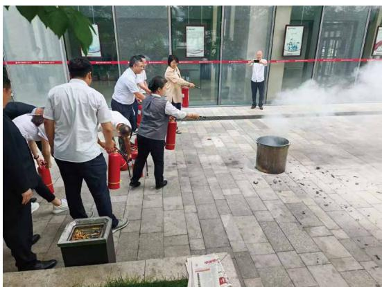

text_image

Street photo showing fire extinguisher fire drill with people and a fire extinguisher box, outside a building with visible signage

干粉灭火器使用知识培训实操

## 社会贡献

SOCIAL CONTRIBUTION

青岛农商银行多年来一直秉承关爱社会、回馈社会的理念，以实际行动践行企业社会责任与使命担当，通过慈善捐赠、公益实践，以及关注并帮助弱势群体等形式，积极投身公益事业。

## 开展慈善捐赠

本行积极投身慈善事业，用实际行动诠释企业担当，制定《对外捐赠管理办法》规范对外捐赠行为，加强对外捐赠事项管理。综合管理部作为本行对外捐赠工作的归口管理部门，负责管理并协调全行的各项捐赠与公益活动。

<table><tr><td>指标</td><td>单位</td><td>2025年</td></tr><tr><td>公益慈善捐赠金额</td><td>万元</td><td>147.13</td></tr><tr><td>开展各类公益活动次数</td><td>次</td><td>76</td></tr><tr><td>公益慈善项目数</td><td>个</td><td>4</td></tr><tr><td>公益慈善项目受助人次</td><td>人次</td><td>3,398</td></tr><tr><td>志愿者活动参与人次</td><td>人次</td><td>1,767</td></tr><tr><td>投入总时长小时</td><td>小时</td><td>409</td></tr><tr><td>每股社会贡献值</td><td>元</td><td>2.64</td></tr></table>

- 向青岛市残联捐赠20万元，助力青岛市残疾人事业发展。  
- 本年度，微心愿”项目累计投入20余万元，帮助700余名孩子实现心愿。对以往年度资助过的30户因病、因事致困的特困家庭保持关注，基金会为这些家庭送去共计3万余元慰问金及米面粮油等生活物资；本年度为2户因重大疾病陷入生活绝境的家庭，共计资助4万元，专项用于缓解医疗费用压力，帮助家庭暂时渡过难关。  
★ 注：以上仅为慈善基金会救助金额及事项。

## 助学公益行动

青岛农商银行长期以来一直重视教育事业发展，致力于推动教育公平，为贫困学生提供教育保障，助力贫困学子圆梦。

## 【案例】“圆梦微心愿 点亮小梦想”

2025 年，青岛农商银行组织 14 家分支机构在全市范围内陆续开展 “圆梦微心愿 点亮小梦想” 活动，为 700 余名困难及品学兼优的中小学生圆了心愿、点亮了梦想。作为 “金穗红帆” 助学体系重要组成，“微心愿” 已经固化为年度公益品牌，累计助学 427 余万元，自开展以来，受到包括青岛新闻网、蓝睛新闻等媒体的多次报导。以金融力量践行社会责任，展现本行 “慈心向善” 的为民担当。

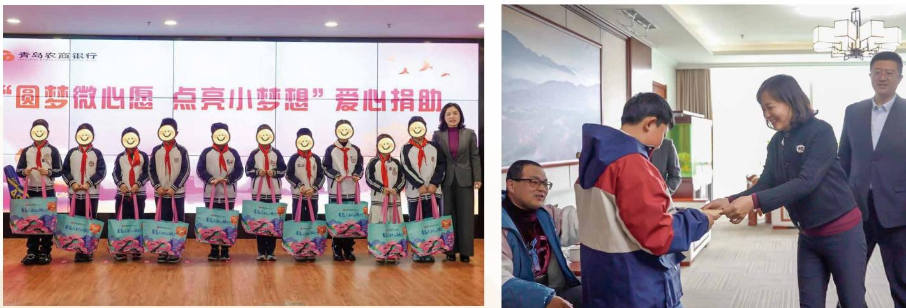  
“圆梦微心愿 点亮小梦想”爱心捐助活动

## 【案例】 爱心天使"志愿服务双百联合行动

2025 年 9 月,青岛农商银行西海岸分行通过携手区义务工作者联合会、区中小学 “爱心天使”,通过 “小小银行家” 启蒙课堂、“防诈小卫士” 安全讲座、“爱心书屋” 捐赠与共建、心理健康辅导活动、“爱心天使” 志愿服务活动等形式，开展系列 “贴心访、暖心帮、恒心助” 志愿服务双百联合行动，以实际行动传递金融温度，将爱心种子深植孩子心中的同时，播向更多需要关怀陪伴的角落。

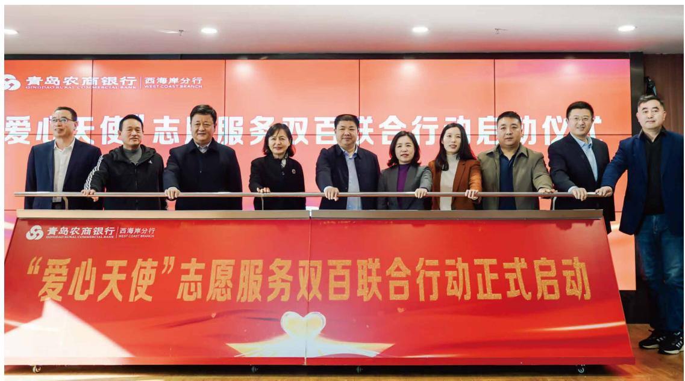

text_image

青岛农商银行 | 西海岸分行
GINGDAO RURAL COMMERCIAL BANK | WEST COAST BRANCH
爱心天使”志愿服务双百联合行动启动仪式
青岛农商银行 | 西海岸分行
GINGDAO RURAL COMMERCIAL BANK | WEST COAST BRANCH
“爱心天使”志愿服务双百联合行动正式启动

“爱心天使”志愿服务双百联合行动启动仪式

## 志愿服务活动

青岛农商银行积极响应上级单位的号召，持续提升服务水准，深刻认识到将自身力量拓展至每一处基层角落的重要意义，积极履行社会责任，开展服务新就业形态群体、保障民生福祉的实践活动，把服务人民的政治要求转化为富有温度的金融行动。

## 【案例】“情系劳动者 盛夏送清凉”

仲夏酷暑,热浪灼城。面对持续高温“烤”验，无数户外劳动者坚守在快递配送、环卫保洁、建筑施工等一线岗位辛勤付出。作为根植地方的金融主力军，青岛农商银行于2025年7月初全面启动“情系劳动者盛夏送清凉”志愿服务活动，以21家户外劳动者驿站为核心支点，联动16家分支行和9家村镇银行，将清凉关怀与普惠金融深度融合，在烈日下

筑起“金融为民”的坚实绿荫，获中央电视台《新闻联播》报道。本次志愿服务活动一周内即动员志愿者224人，累计供应矿泉水1.1万瓶、清凉物资6,000余份，日均服务超1,000余人次。

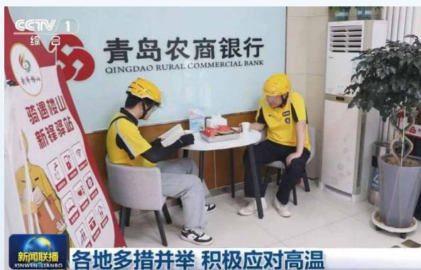

text_image

CCTV 1
综合
青岛农商银行
QINGDAO RURAL COMMERCIAL BANK
骆驼墩山
新程驿站
各地多措并举 积极应对高温
新闻联播
XINWEN TIANBO

natural_image

Aerial view of two white sailboats on calm blue water, with a small boat and another small boat in the distance (no text or symbols visible)

## 未来展望

FUTURE EXPECTATIONS

2026 年，是 “十五五” 规划的开局之年。站在新的发展起点上，青岛农商银行将继续扎根地方、服务实体，把可持续发展理念融入经营发展的各个环节，与城市成长同频共振，与社会进步携手同行。我们期待以更具温度的金融服务，为城乡发展注入新的活力。

## 让绿色金融守护蓝绿家园

青岛是一座海洋与生态交融的城市。未来，我们将紧扣青岛蓝绿交融的生态发展定位，持续加大对清洁能源、海洋生态保护和低碳产业的金融支持力度，创新绿色金融产品和服务模式，让更多金融资源流向绿色发展领域。通过绿色金融的持续投入，让城市更宜居、乡村更生态，让金融成为守护绿水青山的重要力量。

## 让普惠金融托举万千梦想

每一个小微企业、个体经营者和创业者,都是城市活力的重要源泉。我们将持续下沉服务重心,优化普惠金融产品体系,让融资更加便捷、服务更加贴心。通过不断提升服务触达能力，让更多小微经营主体能够获得适配的金融支持，让每一份努力都拥有成长的机会。

## 让“三农”金融孕育更多希望

农村稳、农业兴、农民富，是经济社会发展的重要基础。未来，我们将立足区域农业产业特色，围绕乡村优势产业链创新金融服务模式，支持现代农业升级，助力农村电商、乡村旅游等新产业发展。同时持续加大对美丽乡村建设的金融支持，让乡村更加宜居宜业，让更多人在家门口实现幸福生活。

## 让数字金融更加智慧便捷

科技正在不断改变金融服务的方式。未来，我们将持续推进数字化转型，迭代升级手机银行、微信银行等线上渠道，推动线下网点更加智能化，让客户随时随地享受高效、安全的金融服务。同时，通过大数据与智能风控技术，让金融服务更加精准、更加贴心，让科技为金融注入更多温度。

## 让责任金融汇聚温暖力量

责任，是金融最深沉的底色。未来，我们将持续深耕公益事业，关注“一老一小”和特殊群体需求，推动助学、适老、扶残等公益行动不断延伸。同时推出更多适配性的民生金融产品，主动承担社会责任，常态化开展便民公益活动，让金融不仅服务经济发展，也守护每一份生活的安心与希望。

展望未来，青岛农商银行将继续扎根这片土地，在服务发展、守护民生中创造更多价值。我们相信，金融的意义不仅在于推动经济前行，更在于让生活更加美好。青岛农商银行愿以责任为桥、以金融为翼，与社会各界携手同行，共同创造更加美好的未来。

## 附录 ↘

APPENDIX

ESG绩效表  
经济绩效

<table><tr><td>指标</td><td>单位</td><td>2023年</td><td>2024年</td><td>2025年</td></tr><tr><td>资产总额</td><td>亿元</td><td>4,679.37</td><td>4,950.32</td><td>5027.83</td></tr><tr><td>营业收入</td><td>亿元</td><td>103.25</td><td>110.33</td><td>100.27</td></tr><tr><td>利润总额</td><td>亿元</td><td>22.26</td><td>24.89</td><td>30.15</td></tr><tr><td>净利润</td><td>亿元</td><td>26.03</td><td>28.49</td><td>31.39</td></tr><tr><td>总资产收益率</td><td>%</td><td>0.58</td><td>0.59</td><td>0.63</td></tr><tr><td>加权平均净资产收益率</td><td>%</td><td>7.33</td><td>7.62</td><td>7.94</td></tr><tr><td>不良贷款率</td><td>%</td><td>1.81</td><td>1.79</td><td>1.75</td></tr><tr><td>资本充足率</td><td>%</td><td>13.21</td><td>13.96</td><td>14.06</td></tr><tr><td>拨备覆盖率</td><td>%</td><td>237.96</td><td>250.53</td><td>261.01</td></tr></table>

普惠金融

<table><tr><td>指标</td><td>单位</td><td>2023年</td><td>2024年</td><td>2025年</td></tr><tr><td>普惠重点领域贷款余额</td><td>亿元</td><td>-</td><td>-</td><td>558.12</td></tr><tr><td>普惠重点领域贷款余额占比</td><td>%</td><td>-</td><td>-</td><td>20.25</td></tr><tr><td>普惠型小微企业贷款余额</td><td>亿元</td><td>451.75</td><td>502.58</td><td>544.18</td></tr><tr><td>普惠型小微企业贷款余额占比</td><td>%</td><td>19.28</td><td>20.87</td><td>21.33</td></tr><tr><td>普惠型小微企业贷款余额增速</td><td>%</td><td>12.90</td><td>11.25</td><td>8.28</td></tr><tr><td>普惠型小微贷款客户数量</td><td>万户</td><td>5.40</td><td>5.43</td><td>5.45</td></tr><tr><td>小微企业专营机构数量</td><td>个</td><td>10</td><td>12</td><td>12</td></tr><tr><td>普惠型涉农贷款余额</td><td>亿元</td><td>151.57</td><td>160.51</td><td>192.33</td></tr><tr><td>普惠型涉农贷款余额占比</td><td>%</td><td>6.10</td><td>6.22</td><td>6.98</td></tr><tr><td>普惠型涉农贷款余额增速</td><td>%</td><td>1.99</td><td>5.90</td><td>19.82</td></tr></table>

注：普惠金融数据统计范围为母公司数据。普惠型小微企业贷款不含贴现。

服务“三农”

<table><tr><td>指标</td><td>单位</td><td>2023年</td><td>2024年</td><td>2025年</td></tr><tr><td>涉农贷款余额</td><td>亿元</td><td>579.33</td><td>680.37</td><td>648.27</td></tr><tr><td>农户贷款</td><td>亿元</td><td>186.57</td><td>208.51</td><td>252.47</td></tr><tr><td>农村企业及各类组织贷款</td><td>亿元</td><td>355.9</td><td>408.62</td><td>304.30</td></tr><tr><td>城市企业及各类组织涉农贷款</td><td>亿元</td><td>32.69</td><td>57.08</td><td>84.18</td></tr><tr><td>其他涉农贷款</td><td>亿元</td><td>4.17</td><td>6.16</td><td>7.32</td></tr><tr><td>县域贷款余额</td><td>亿元</td><td>537.22</td><td>590.42</td><td>629.91</td></tr><tr><td>县域贷款余额增速</td><td>%</td><td>9.81</td><td>9.90</td><td>6.69</td></tr></table>

★ 注：2025 年涉农贷款按照中国人民银行新口径统计，新口径较原口径范围有所缩小。服务 “三农” 数据统计范围为母公司数据。

服务渠道建设

<table><tr><td>指标</td><td>单位</td><td>2023年</td><td>2024年</td><td>2025年</td></tr><tr><td>分支机构数量</td><td>个</td><td>344</td><td>344</td><td>370</td></tr><tr><td>智能柜员机数量</td><td>个</td><td>407</td><td>407</td><td>432</td></tr><tr><td>设置无障碍通道的网点数量</td><td>个</td><td>247</td><td>323</td><td>324</td></tr><tr><td>村镇银行数量</td><td>个</td><td>8</td><td>9</td><td>4</td></tr><tr><td>农村普惠金融服务点</td><td>个</td><td>1,591</td><td>1,546</td><td>1,442</td></tr></table>

## 环境绩效

绿色金融

<table><tr><td>指标</td><td>单位</td><td>2023年</td><td>2024年</td><td>2025年</td></tr><tr><td>绿色贷款余额</td><td>亿元</td><td>108.2</td><td>139.26</td><td>165.12</td></tr><tr><td>节能降碳产业贷款余额</td><td>亿元</td><td>12.43</td><td>33.41</td><td>15.16</td></tr><tr><td>环境保护产业贷款余额</td><td>亿元</td><td>2.77</td><td>3.50</td><td>11.00</td></tr><tr><td>资源循环利用产业贷款余额</td><td>亿元</td><td>-</td><td>-</td><td>14.57</td></tr><tr><td>能源绿色低碳转型产业贷款余额</td><td>亿元</td><td>7.14</td><td>10.90</td><td>14.11</td></tr><tr><td>生态保护修复和利用产业贷款余额</td><td>亿元</td><td>33.37</td><td>29.16</td><td>32.19</td></tr><tr><td>基础设施绿色升级产业贷款余额</td><td>亿元</td><td>52.46</td><td>60.09</td><td>70.70</td></tr><tr><td>绿色服务产业贷款余额</td><td>亿元</td><td>0.03</td><td>2.21</td><td>1.00</td></tr><tr><td>绿色贸易贷款余额</td><td>亿元</td><td>-</td><td>-</td><td>6.39</td></tr><tr><td>绿色贷款当年投放额</td><td>亿元</td><td>75.42</td><td>108.60</td><td>118.86</td></tr><tr><td>绿色投资余额</td><td>亿元</td><td>28.67</td><td>47.60</td><td>35.28</td></tr><tr><td>ESG主题理财产品累计管理规模</td><td>亿元</td><td>1.0</td><td>1.04</td><td>1.31</td></tr></table>

注：绿色金融数据统计范围为母公司数据。

绿色运营

<table><tr><td>指标</td><td>单位</td><td>2023年</td><td>2024年</td><td>2025年</td></tr><tr><td>天然气消耗量</td><td>万立方米</td><td>2.00</td><td>9.25</td><td>8.46</td></tr><tr><td>自有车辆汽油用量</td><td>万升</td><td>7.18</td><td>6.30</td><td>18.95</td></tr><tr><td>外购电力</td><td>万千瓦时</td><td>726.22</td><td>781.26</td><td>2,468.80</td></tr><tr><td>外购热力</td><td>吉焦</td><td>-</td><td>6,500</td><td>17,525.40</td></tr><tr><td>温室气体排放总量</td><td>吨二氧化碳当量</td><td>4,296.52</td><td>5,246.21</td><td>24,348.58</td></tr><tr><td>直接温室气体排放(范围一)</td><td>吨二氧化碳当量</td><td>154.92</td><td>338.97</td><td>586.70</td></tr><tr><td>间接温室气体排放(范围二)</td><td>吨二氧化碳当量</td><td>4,141.60</td><td>4,907.24</td><td>17,631.81</td></tr><tr><td>经营活动的价值链碳排放(范围三)</td><td>吨二氧化碳当量</td><td>-</td><td>-</td><td>6,130.07</td></tr><tr><td>耗水量</td><td>万吨</td><td>2.17</td><td>3.08</td><td>12.22</td></tr><tr><td>无害废弃物产生量</td><td>吨</td><td>-</td><td>472</td><td>315</td></tr><tr><td>营业办公纸张消耗量</td><td>万张</td><td>150</td><td>192</td><td>1,831</td></tr><tr><td>餐厨垃圾处置量</td><td>吨</td><td>172</td><td>155</td><td>222</td></tr><tr><td>硒鼓墨盒处置量</td><td>吨</td><td>0.46</td><td>0.55</td><td>0.58</td></tr><tr><td>视频会议</td><td>次</td><td>748</td><td>883</td><td>830</td></tr></table>

★ 注：2023 年和 2024 年数据统计范围为总行大楼，2025 年硒鼓墨盒处置量和视频会议为青岛农商银行总行数据，其他数据统计范围为青岛农商行总行与分支机构。范围三不含投融资数据。  
温室气体排放计算方法: 将各类能源与资源消耗量乘以对应排放因子得出各项温室气体排放量。其中天然气、汽油、外购热力的二氧化碳排放因子参考《公共建筑运营单位（企业）温室气体排放核算方法和报告指南（试行）》附录二；外购电力的二氧化碳排放因子参考《2022年电力二氧化碳排放因子》、《综合能耗计算通则GBT2589-2020》。

## 社会绩效

消费者权益保护

<table><tr><td>指标</td><td>单位</td><td>2023年</td><td>2024年</td><td>2025年</td></tr><tr><td>审查新产品和新服务笔数</td><td>笔</td><td>6</td><td>30</td><td>7</td></tr><tr><td>消费者权益保护培训覆盖人次</td><td>万人次</td><td>0.5</td><td>0.4</td><td>0.58</td></tr><tr><td>消费者权益保护培训场次</td><td>场</td><td>183</td><td>237</td><td>242</td></tr><tr><td>消费者权益保护投入金额</td><td>万元</td><td>35</td><td>36.2</td><td>22.2</td></tr><tr><td>金融宣教投入金额</td><td>万元</td><td>33.9</td><td>34.2</td><td>19.8</td></tr><tr><td>消费者教育年度累计活动次数</td><td>次</td><td>3,500</td><td>3,700</td><td>4,200</td></tr><tr><td>消费者教育受众人次</td><td>万人次</td><td>157</td><td>168</td><td>197.57</td></tr><tr><td>客户咨询及处理</td><td>例</td><td>1,398</td><td>1,649</td><td>1,342</td></tr><tr><td>客户投诉处理率</td><td>%</td><td>100</td><td>100</td><td>100</td></tr><tr><td>客户投诉办结率</td><td>%</td><td>100</td><td>100</td><td>100</td></tr><tr><td>参与调查的客户数量</td><td>人</td><td>24,143</td><td>28,042</td><td>24,063</td></tr><tr><td>客户调查满意度</td><td>%</td><td>97.89</td><td>98.08</td><td>98.10</td></tr></table>

数据安全与隐私保护

<table><tr><td>指标</td><td>单位</td><td>2023年</td><td>2024年</td><td>2025年</td></tr><tr><td>信息安全培训次数</td><td>次</td><td>2</td><td>2</td><td>2</td></tr><tr><td>信息安全培训人次</td><td>人次</td><td>5,133</td><td>5,500</td><td>5,800</td></tr><tr><td>重大信息系安全和客户隐私泄露事件</td><td>例</td><td>0</td><td>0</td><td>0</td></tr></table>

员工权益

<table><tr><td colspan="2">指标</td><td>单位</td><td>2023年</td><td>2024年</td><td>2025年</td></tr><tr><td colspan="2">员工总数</td><td>人</td><td>5,500</td><td>5,832</td><td>6,025</td></tr><tr><td rowspan="3">按专业构成划分</td><td>管理人员</td><td>人</td><td>977</td><td>1,152</td><td>1,185</td></tr><tr><td>业务人员</td><td>人</td><td>4,230</td><td>4,391</td><td>4,531</td></tr><tr><td>行政人员</td><td>人</td><td>293</td><td>289</td><td>309</td></tr><tr><td rowspan="3">按学历划分</td><td>硕士及以上员工人数</td><td>人</td><td>524</td><td>585</td><td>687</td></tr><tr><td>学士员工人数</td><td>人</td><td>4,331</td><td>4,627</td><td>4,796</td></tr><tr><td>学士(不含)以下员工人数</td><td>人</td><td>645</td><td>620</td><td>542</td></tr><tr><td colspan="2">劳动合同签署率</td><td>%</td><td>100</td><td>100</td><td>100</td></tr><tr><td colspan="2">社会保险覆盖率</td><td>%</td><td>100</td><td>100</td><td>100</td></tr><tr><td colspan="2">员工体检覆盖率</td><td>%</td><td>100</td><td>100</td><td>100</td></tr></table>

员工培训及发展

<table><tr><td>指标</td><td>单位</td><td>2023年</td><td>2024年</td><td>2025年</td></tr><tr><td>员工培训课程期数</td><td>项</td><td>33</td><td>55</td><td>55</td></tr><tr><td>员工培训场次</td><td>场次</td><td>33</td><td>63</td><td>68</td></tr><tr><td>接受培训总人次</td><td>人次</td><td>12,144</td><td>6,877</td><td>7,115</td></tr><tr><td>员工培训覆盖率</td><td>%</td><td>100</td><td>100</td><td>100</td></tr><tr><td>培训总时长</td><td>小时</td><td>603</td><td>999</td><td>1,593</td></tr></table>

★ 注：不含线上培训项目

社会贡献

<table><tr><td>指标</td><td>单位</td><td>2023年</td><td>2024年</td><td>2025年</td></tr><tr><td>公益慈善捐款金额</td><td>万元</td><td>138</td><td>47.76</td><td>147.13</td></tr><tr><td>开展各类公益活动次数</td><td>次</td><td>44</td><td>75</td><td>76</td></tr><tr><td>公益慈善项目数</td><td>个</td><td>11</td><td>4</td><td>4</td></tr><tr><td>公益慈善项目受助人次</td><td>人次</td><td>15,139</td><td>3,210</td><td>3,398</td></tr><tr><td>每股社会贡献值</td><td>元/股</td><td>2.69</td><td>2.69</td><td>2.64</td></tr></table>

★ 注：每股社会贡献值 = （公司净利润 + 年内为国家创造的税收 + 向员工支付的工资 + 向银行等债权人给付的借款利息 + 对外捐赠额等为其他利益相关者创造的价值额 - 因环境污染等造成的其他社会成本）/ 公司股份总数。

## 治理绩效

公司治理

<table><tr><td colspan="2">指标</td><td>单位</td><td>2023年</td><td>2024年</td><td>2025年</td></tr><tr><td colspan="2">股东会召开次数</td><td>次</td><td>2</td><td>2</td><td>2</td></tr><tr><td colspan="2">年度股东会次数</td><td>次</td><td>1</td><td>1</td><td>1</td></tr><tr><td colspan="2">临时股东会次数</td><td>次</td><td>1</td><td>1</td><td>1</td></tr><tr><td colspan="2">累计审议议案</td><td>项</td><td>12</td><td>19</td><td>21</td></tr><tr><td colspan="2">董事会成员人数</td><td>人</td><td>12</td><td>12</td><td>12</td></tr><tr><td rowspan="2">按性别划分</td><td>男性董事</td><td>人</td><td>10</td><td>10</td><td>10</td></tr><tr><td>女性董事</td><td>人</td><td>2</td><td>2</td><td>2</td></tr><tr><td rowspan="2">按类型划分</td><td>独立董事</td><td>人</td><td>5</td><td>4</td><td>5</td></tr><tr><td>非独立董事</td><td>人</td><td>7</td><td>8</td><td>7</td></tr><tr><td colspan="2">董事会会议召开次数</td><td>次</td><td>10</td><td>13</td><td>14</td></tr><tr><td colspan="2">董事会累计审议议案</td><td>项</td><td>74</td><td>82</td><td>73</td></tr><tr><td colspan="2">董事会会议平均出席率</td><td>%</td><td>96.6</td><td>98.3</td><td>98.09</td></tr></table>

合规运营

<table><tr><td>指标</td><td>单位</td><td>2023年</td><td>2024年</td><td>2025年</td></tr><tr><td>开展法律培训次数</td><td>次</td><td>6</td><td>5</td><td>5</td></tr><tr><td>合规案防警示教育培训次数</td><td>次</td><td>295</td><td>368</td><td>895</td></tr><tr><td>合规案防警示教育培训人次</td><td>人次</td><td>17,596</td><td>17,132</td><td>21,562</td></tr><tr><td>反洗钱培训次数</td><td>次</td><td>91</td><td>88</td><td>93</td></tr><tr><td>反洗钱培训覆盖人次</td><td>人次</td><td>9,058</td><td>4,916</td><td>9,311</td></tr><tr><td>反洗钱培训总时长</td><td>小时</td><td>153.3</td><td>158</td><td>165</td></tr><tr><td>反诈骗培训次数</td><td>次</td><td>86</td><td>106</td><td>108</td></tr><tr><td>反诈骗培训覆盖人次</td><td>人次</td><td>5,535</td><td>5,772</td><td>5,801</td></tr><tr><td>反诈骗培训总时长</td><td>小时</td><td>160</td><td>204</td><td>206</td></tr></table>

## 索引表

INDEX TABLE

<table><tr><td colspan="2">报告章节</td><td>《全球可持续发展报告标准》(GRI Standards)</td><td>《中国企业可持续发展报告指南(CASS-ESG6.0)》</td><td>《上市公司自律监管指引第17号-可持续发展报告(试行)》</td><td>对应交易所议题</td></tr><tr><td colspan="2">关于本报告</td><td>2-1/2-2/2-3</td><td>P1.1/P1.2</td><td>第四条第六条</td><td>/</td></tr><tr><td colspan="2">董事长致辞</td><td>2-22</td><td>P2.1</td><td>/</td><td>/</td></tr><tr><td colspan="2">2025可持续发展亮点</td><td>201-1</td><td>/</td><td>/</td><td>/</td></tr><tr><td colspan="2">2025责任亮点:做好新时代金融“五篇大文章”</td><td>/</td><td>/</td><td>/</td><td>/</td></tr><tr><td colspan="2">走进青岛农商银行</td><td>2-1/2-6/2-8</td><td>P3.1/P3.2/P3.3</td><td>/</td><td>/</td></tr><tr><td rowspan="6">可持续发展治理</td><td>可持续发展理念</td><td>3-3</td><td>G1.1.7</td><td>第十一条第十三条</td><td>/</td></tr><tr><td>响应联合国可持续发展目标</td><td>3-3</td><td>G1.1.7/G1.1.11</td><td>第十一条第十三条</td><td>/</td></tr><tr><td>可持续发展治理机制</td><td>2-14</td><td>G1.1.1/G1.1.2/G1.1.4/G1.1.5/G1.1.6/G1.1.7</td><td>第十一条第十二条</td><td>/</td></tr><tr><td>ESG培训及宣贯</td><td>/</td><td>G1.1.3</td><td>第十二条</td><td>/</td></tr><tr><td>利益相关方沟通</td><td>2-16/2-29/3-1</td><td>G1.2.3/G1.3.1/G1.3.2</td><td>第九条第五十三条</td><td>利益相关方沟通</td></tr><tr><td>重要性议题分析</td><td>3-2/3-3</td><td>G1.1.8</td><td>第五条第五十二条</td><td>尽职调查</td></tr><tr><td rowspan="4">完善治理体系,夯实发展基础</td><td>规范公司治理</td><td>2-9/2-10/2-11/2-12/2-13/2-19/2-20/2-27/207-1/207-2/405-1</td><td>/</td><td>/</td><td>/</td></tr><tr><td>全面风险管理</td><td>207-1/207-2</td><td>/</td><td>/</td><td>/</td></tr><tr><td>贯彻合规运营</td><td>/</td><td>/</td><td>/</td><td>/</td></tr><tr><td>恪守商业道德</td><td>2-23/2-27/205-1/205-2/206-1</td><td>G2.1.1/G2.1.2/G2.1.3/G2.1.8/G2.2.2</td><td>第五十五条第五十六条</td><td>反商业贿赂及反贪污、反不正当竞争</td></tr><tr><td rowspan="3">推动低碳转型</td><td>应对气候变化</td><td>305-1/305-2/305-4</td><td>E1.1/1/E1.1.2/E1.1.3/E1.1.4/E1.1.7/E1.1.8/E1.1.15</td><td>第二十一条、第二十三条、第二十四条、第二十七条</td><td>应对气候变化</td></tr><tr><td>发展绿色金融</td><td>201-2/302-2/302-4/302-5/304-2/</td><td>E1.1.1/E1.1.2/E1.1.3/E1.1.4/E1.1.6/E1.1.15</td><td>第二十一条、第二十二条、第二十三条、第二十四条、第二十五条、第二十六条、第二十七条</td><td>/</td></tr><tr><td>建设绿色银行</td><td>302-1/302-4/303-5/306-3/306-5</td><td>E2.2.3/E2.2.6/E3.1.1/E3.1.5/E3.2.1/E3.2.3/E3.3.2</td><td>第三十一条、第三十五条、第三十六条、第三十七条</td><td>环境合规管理、废弃物处理、能源利用、水资源利用、循环经济</td></tr><tr><td rowspan="3">助力普惠发展</td><td>服务“三农”普惠</td><td>/</td><td>S1.1.1/S1.1.2/S1.1.4/S1.1.5</td><td>第三十九条</td><td>乡村振兴</td></tr><tr><td>服务实体经济</td><td>/</td><td>/</td><td>/</td><td>/</td></tr><tr><td>消费者权益保护</td><td>3-3/417-1</td><td>S3.3.1/S3.3.4/S3.3.6</td><td>第四十七条</td><td>产品和服务安全与质量</td></tr><tr><td rowspan="3">守护数字安全</td><td>科技创新与数字化转型</td><td>/</td><td>S2.1.1/S2.1.2/S2.1.3/S2.1.4/S2.1.5/S2.1.6/S2.1.7/S2.1.8/S2.1.10/S2.1.11/S2.1.12/S2.1.13</td><td>第四十二条</td><td>创新驱动科技伦理</td></tr><tr><td>数据安全与隐私保护</td><td>418-1</td><td>S3.4.1/S3.4.2/S3.4.3/S3.4.4</td><td>第四十八条</td><td>数据安全与客户隐私保护</td></tr><tr><td>负责任采购</td><td>308-1/308-2/414-1/414-2</td><td>S3.1.2/S3.1.3/S3.1.4</td><td>第四十五条</td><td>供应链安全</td></tr><tr><td rowspan="2">创造社会价值</td><td>员工权益与发展</td><td>401-1/401-2/401-3/403-1/403-2/403-3/403-5/403-6/403-9/404-1/404-2/405-1</td><td>S4.1.1/S4.1.3/S4.1.4/S4.1.5/S4.1.6/S4.1.8/S4.1.11/S4.1.12/S4.2.4/S4.3.1/S4.3.2/S4.3.3/S4.3.4/S4.3.5/S4.3.6</td><td>第四十九条、第五十条</td><td>员工</td></tr><tr><td>社会贡献</td><td>413-1</td><td>S1.2.1</td><td>第四十条</td><td>社会贡献</td></tr><tr><td colspan="2">未来展望</td><td>2-22</td><td>A1</td><td>/</td><td>/</td></tr><tr><td>附录</td><td>ESG绩效表</td><td>/</td><td>A2</td><td>第六条</td><td>/</td></tr></table>

<table><tr><td colspan="2">报告章节</td><td>《全球可持续发展报告标准》(GRI Standards)</td><td>《中国企业可持续发展报告指南(CASS-ESG6.0)》</td><td>《上市公司自律监管指引第17号-可持续发展报告(试行)》</td><td>对应交易所议题</td></tr><tr><td rowspan="2">附录</td><td>索引表</td><td>/</td><td>A3</td><td>第五十七条</td><td>/</td></tr><tr><td>意见反馈表</td><td>2-26</td><td>A6</td><td>第九条</td><td>/</td></tr></table>

《中国上市公司绿色治理评价指标体系》

<table><tr><td>绿色治理评价维度</td><td>主要素层</td><td>子要素层</td><td>对应报告章节</td></tr><tr><td rowspan="7">绿色治理架构</td><td rowspan="2">绿色理念与战略</td><td>愿景、使命</td><td>可持续发展治理</td></tr><tr><td>发展战略</td><td>可持续发展治理</td></tr><tr><td rowspan="5">绿色组织与运行</td><td>董事会</td><td>规范公司治理、可持续发展治理</td></tr><tr><td>经理层</td><td>规范公司治理、可持续发展治理</td></tr><tr><td>环保工作小组</td><td>可持续发展治理</td></tr><tr><td>环保专题会议</td><td>可持续发展治理</td></tr><tr><td>环境准则</td><td>建设绿色银行</td></tr><tr><td rowspan="7">绿色治理机制</td><td rowspan="5">绿色运营</td><td>合规性</td><td>建设绿色银行</td></tr><tr><td>绿色设备</td><td>建设绿色银行</td></tr><tr><td>绿色供应链</td><td>建设绿色银行、负责任采购</td></tr><tr><td>绿色技术</td><td>建设绿色银行</td></tr><tr><td>绿色产品</td><td>发展绿色金融</td></tr><tr><td rowspan="2">绿色投融资</td><td>投资环评</td><td>发展绿色金融</td></tr><tr><td>环保投入</td><td>建设绿色银行</td></tr><tr><td rowspan="5">绿色治理机制</td><td>绿色投融资</td><td>绿色融资</td><td>发展绿色金融</td></tr><tr><td rowspan="2">绿色行政</td><td>绿色IT</td><td>科技创新与数字化转型数据安全与隐私保护</td></tr><tr><td>绿色工作环境</td><td>建设绿色银行</td></tr><tr><td rowspan="2">绿色考评</td><td>绿色激励</td><td>发展绿色金融</td></tr><tr><td>绿色约束</td><td>发展绿色金融</td></tr><tr><td rowspan="9">绿色治理效能</td><td rowspan="4">绿色节能</td><td>单位能耗</td><td>建设绿色银行</td></tr><tr><td>水资源的节约</td><td>建设绿色银行</td></tr><tr><td>电的节约</td><td>建设绿色银行</td></tr><tr><td>新能源</td><td>建设绿色银行</td></tr><tr><td rowspan="3">绿色减排</td><td>三废达标排放</td><td>不适用</td></tr><tr><td>三废减排量</td><td>不适用</td></tr><tr><td>噪声的降低</td><td>不适用</td></tr><tr><td rowspan="2">绿色循环利用</td><td>可循环资源的采用</td><td>建设绿色银行</td></tr><tr><td>三废再利用</td><td>不适用</td></tr><tr><td rowspan="8">绿色治理架构</td><td rowspan="3">绿色公益</td><td>教育培训</td><td>员工权益与发展</td></tr><tr><td>绿色传播活动</td><td>建设绿色银行</td></tr><tr><td>绿色捐赠</td><td>社会贡献</td></tr><tr><td rowspan="3">绿色信息披露</td><td>充分性</td><td>关于本报告</td></tr><tr><td>及时性</td><td>关于本报告</td></tr><tr><td>可靠性</td><td>关于本报告</td></tr><tr><td rowspan="2">绿色包容</td><td>互动性</td><td>可持续发展治理,意见反馈表</td></tr><tr><td>和谐性</td><td>可持续发展治理</td></tr></table>

## 意见反馈表

FEEDBACK FORM

尊敬的读者：

非常感谢您阅读本报告。为进一步提升青岛农商银行可持续发展的能力和水平，加强与社会各界的沟通交流，我们衷心地希望您能够在百忙之中对我们的工作和报告提出宝贵的意见和建议。

1. 您对我们履行 ESG 的总体评价是：

□ 非常好    □ 好    □ 一般    □ 较差    □ 差

2. 您对本报告的总体评价是：

□ 非常好    □ 好    □ 一般    □ 较差    □ 差

3. 您认为我们在利益相关方沟通方面做得如何？

□ 非常好    □ 好    □ 一般    □ 较差    □ 差

4. 您认为我们在公司治理方面做得如何？

□ 非常好    □ 好    □ 一般    □ 较差    □ 差

5. 您认为我们在服务实体经济方面做得如何？

□ 非常好    □ 好    □ 一般    □ 较差    □ 差

6. 您认为我们在绿色金融方面做得如何？

□ 非常好    □ 好    □ 一般    □ 较差    □ 差

7. 您认为我们在客户服务方面做得如何？

□ 非常好    □ 好    □ 一般    □ 较差    □ 差

8. 您认为我们在保护员工权益方面做得如何？

□ 非常好    □ 好    □ 一般    □ 较差    □ 差

9. 您认为我们在公益志愿方面做得如何？

□ 非常好    □ 好    □ 一般    □ 较差    □ 差

10. 您对我们履行 ESG 及本报告有何意见和建议？

您可通过以下方式联系我们：

地址：山东省青岛市崂山区秦岭路6号1号楼

邮箱：qrcb@qrcb.com.cn