

natural_image

Illustration of a rural food scene with houses, milk, tofu, and soybeans on a path (no text or symbols)

## 2025

## 环境、社会和公司治理（ESG）报告

## ENVIRONMENTAL, SOCIAL AND GOVERNANCE (ESG) REPORT

祖名豆制品集团股份有限公司

## 目录 CONTENTS

报告编制说明 01

董事长致辞 03

ESG关键绩效数据表 76

对标索引表 79

## 0101 秉豆韵初心筑长效治理

走进祖名股份 07

可持续发展治理体系 13

## 0404 循绿色之道绘生态蓝图

应对气候变化 49

环境合规管理 52

资源管理 55

排放管理 59

生态系统和生物多样性保护 62

## 0202 守合规治企固稳健根基

公司治理 19

风险与合规管理 21

恪守商业道德 22

## 0505 聚同心之力 兴责任家园

员工权益与福利 65

员工培训与发展 69

职业健康与安全 71

乡村振兴与社会贡献 75

## 0303 以质安立本 凭科创致远

创新驱动 27

产品和服务安全与质量 31

供应链安全 36

负责任营销 40

助力健康中国 43

数字化转型与信息安全 44

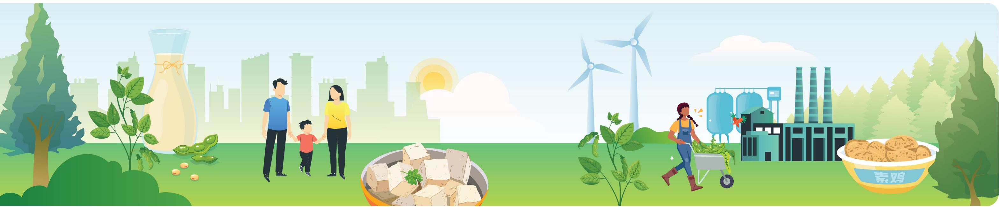

natural_image

Illustration of a rural ecosystem with people, plants, wind turbines, and a farm (no text or symbols)

## 报告编制说明

本报告为祖名豆制品集团股份有限公司发布的《环境、社会及公司治理(ESG)报告》，严格遵循客观、规范、透明原则，全面、真实披露公司2025年度在环境管理、社会责任、公司治理等领域的管理举措、实践行动与绩效成果。以下简称为本公司在本期内具有关键 ESG 表现与重大影响的子公司。

释义

<table><tr><td>释义项</td><td>指</td></tr><tr><td>本公司、公司、祖名股份、我们</td><td>祖名豆制品集团股份有限公司</td></tr><tr><td>安吉祖名</td><td>安吉祖名豆制食品有限公司</td></tr><tr><td>扬州祖名</td><td>扬州祖名豆制食品有限公司</td></tr></table>

## 报告范围

本报告经济绩效、社会绩效指标覆盖范围与公司年度财务报告合并范围一致：环境绩效指标覆盖公司各主要生产基地及运营主体。

## 报告期间

本报告报告期为2025年1月1日至2025年12月31日，除特别注明外，报告所载数据均为上述报告期内数据。

## 编制依据

本报告严格依据深圳证券交易所《上市公司自律监管指引第17号—可持续发展报告》、全球报告倡议组织(GR)《可持续发展报告标准(2021版)》等相关监管要求与行业规范编制

## 数据说明

报告中数据、案例均来源于公司正式运营记录、统计台账及内部管理文件。

财务数据币种为人民币，若与年度财务报告存在差异，以经审计的年度财务报告为准。

## 报告获取

本报告可以在深圳证券交易所官网（https://www.szse.cn/index/index.html）、巨潮资讯网（http://www.cninfo.com.cn/new/index）查询和下载电子版报告。

本报告电子版可在深圳证券交易所官网（www.szse.cn）及巨潮资讯网（www.cninfo.com.cn）查阅、下载。

## 意见与问询

如对本报告内容有任何疑问、意见或建议，敬请通过以下方式与我们联系：

联系邮箱：zumingzqb@chinazuming.cn

联系电话：+86-0571-86687900

## 报告编制原则

## 重要性原则

公司基于行业特性、区域特点及利益相关方关切，识别并确定ESG重要性议题，对可能显著影响投资者及利益相关方决策的重要事项进行重点披露。重要性议题评估过程与结果详见报告相关章节。

## 准确性原则

本报告力求信息真实准确、表述清晰规范。定量指标均明确统计口径、计算方法与核算依据，确保数据误差不构成误导性陈述。公司董事会对报告内容负责，保证报告不存在虚假记载、误导性陈述或重大遗漏。

## 平衡性原则

本报告秉持中立客观立场，完整反映公司运营实际，对正面成效与潜在风险均予以公允披露。

## 清晰性原则

报告以简体中文编制，通过目录、图表、对标索引等形式优化呈现方式，便于利益相关方快速理解、查阅关键信息，提升信息可读性与易用性。

## 一致性与可比性原则

报告披露关键定量绩效指标，并尽可能列示历史同期数据，同一指标在不同期间保持统计口径一致：若核算方法发生调整，将在附注中予以说明，便于利益相关方纵向对比与趋势分析。

## 完整性原则

本报告披露主体范围与公司合并财务报表范围保持一致，确保信息覆盖完整、无重大遗漏。

## 时效性原则

本报告为年度ESG报告，完整覆盖2025年度经营周期，及时反映公司当期ESG管理进展与绩效。

## 可验证性原则

报告所引用案例、数据均来源于公司原始运营记录、财务资料及内部凭证，来源可追溯、过程可复核，支持外部鉴证与核查工作开展

# 董事长致辞秉豆韵初心，筑长效治理

2025年，是祖名股份迈向集团化运营新阶段的里程碑之年。这一年，我们正式启动集团化升级，更名为“祖名豆制品集团股份有限公司”，通过整合旗下子公司，以更加协同、高效的姿态迎接市场机遇与挑战。在推动企业高质量发展的同时，我们始终秉承“做健康食品，关注人类健康”的核心理念，将环境、社会和公司治理(ESG)深度融入企业战略与日常运营，努力为客户、员工、股东及社会创造长期价值。

守合规治企，固稳健根基规范、透明、高效的公司治理是企业长青的基石。2025年，为适应市场竞争与业务创新，我们不断完善ESG管理架构，将合规理念融入生产运营与供应链管理的全环节，坚守商业道德对任何形式的贪腐保持零容忍，筑牢了稳健运营的合规防线。

以质安立本，凭科创致远质量与创新是我们永恒的追求，更是企业最重要的核心竞争力。我们坚守食品安全底线，选用东北产区优质非转基因大豆专属品种，从源头保障卓越品质。依托行业首家专业研究机构—祖名豆制品研究院，我们持续攻坚行业技术难题。2025年，我们在健康产品研发上取得重大突破拓展了“全豆”系列及低嘌呤产品矩阵，以实际行动助力“健康中国”战略。同时，我们加速数智化升级，以新质生产力全面赋能传统豆制品产业。

循绿色之道，绘生态蓝图我们积极响应国家“双碳”战略，将应对气候变化纳入公司最高治理体系。在生产端，我们深入推进节能减排与资源循环利用，打造了循环经济的“祖名样本”。我们坚持技术创新与绿色发展并行，自主研发湿豆渣烘于技术，并持续深化豆渣、蛋白渣等副产物的资源化利用项目，不断优化烘干工艺与产品适配性，成功将副产物转化为高附加值猫砂原料，不仅有效降低废弃物排放、节约生产成本，更为行业副产物综合利用树立了技术示范，以绿色技术赋能可持续发展；同时，安吉祖名实施的废水梯度利用及碳源替代工程，成功入选浙江省减污降碳协同试点标杆项目。我们以实际行动守护绿水青山，引领豆制品行业走向绿色低碳转型。

聚同心之力，兴责任家园员工是企业最宝贵的财富。我们始终坚守“员工与企业共同成长”的初心，不断完善薪酬福利与人才培养体系，用心推出工龄餐费补助、老员工疗休养等暖心关怀，全力守护每一位员工的职业健康与安全，致力打造有温度、更包容、平等互信的职场家园。与此同时，我们亦铭记“饮水思源，回报社会”的公益初心，积极响应国家乡村振兴战略部署，以责任与担当践行上市企业的时代使命。

责任重大，不敢懈怠;精益求精，不断创新。展望未来，祖名豆制品集团将继续以ESG理念为引领，坚持长期主义，做难而正确的事。我们将携手各利益相关方，在高质量、可持续发展的道路上阔步前行，为人类健康与美好生态奉献不竭的祖名力量

祖名豆制品集团股份有限公司

  
董事长蔡祖明

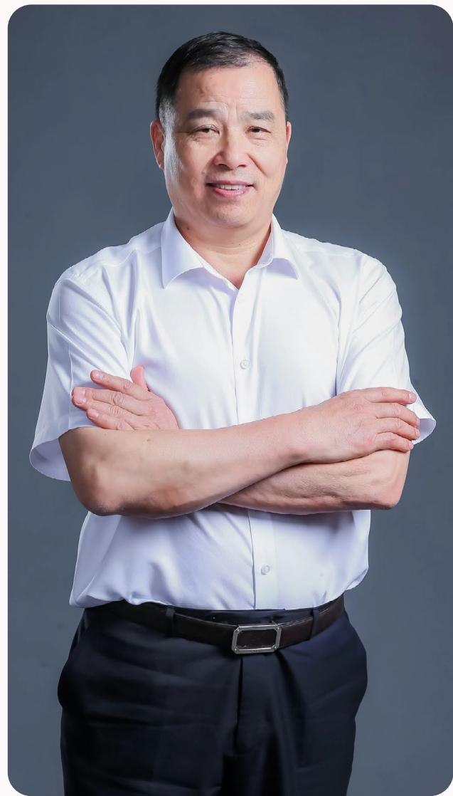

natural_image

Portrait of a smiling man in a white shirt and black trousers, arms crossed, against a plain gray background (no text or symbols visible)

# 01

# 秉豆韵初心筑长效治理

走进祖名股份

可持续发展治理体系

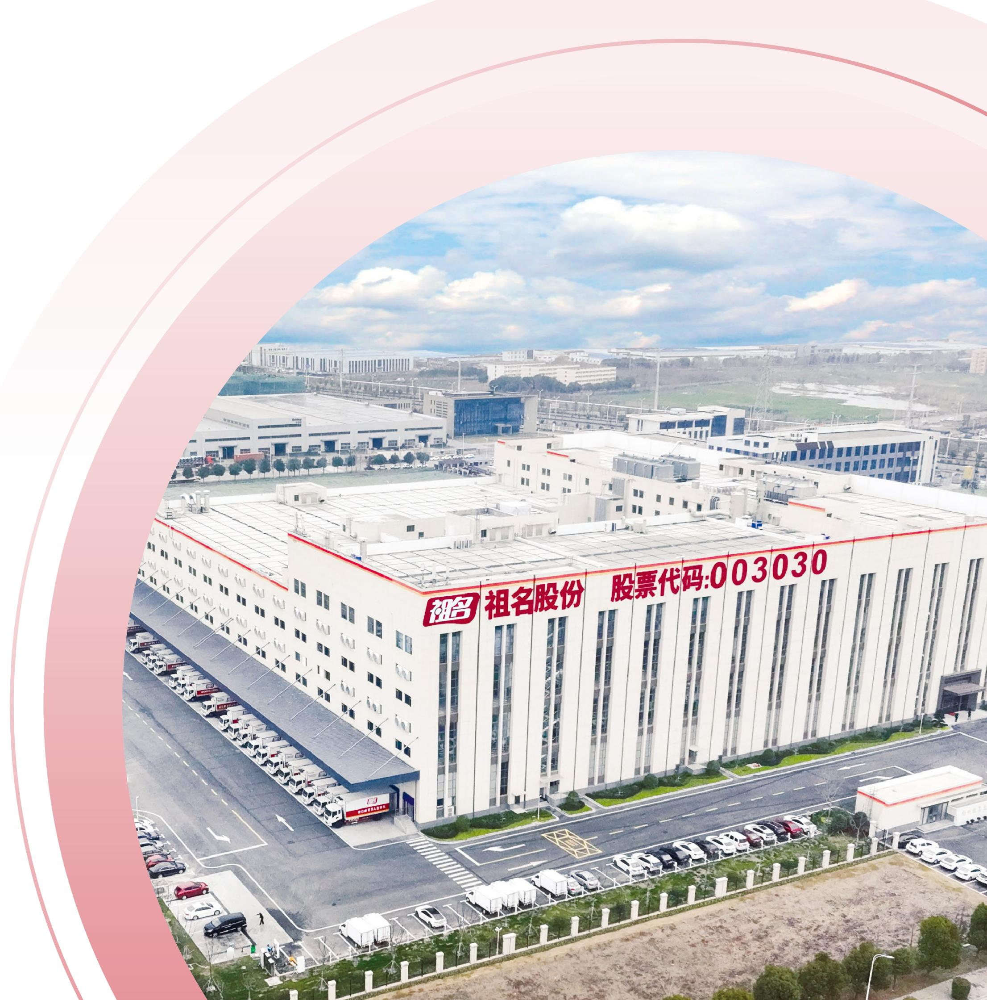

text_image

祖名股份 股票代码:003030

## 走进祖名股份

## 公司简介

祖名豆制品集团股份有限公司始创于1994年，总部位于杭州市滨江区，是集研发、生产、销售于一体的大型豆制品生产企业，产品涵盖生鲜豆制品、植物蛋白饮品、休闲豆制品及其他类，旗下拥有8家全资子公司，3家控股子公司，3家孙公司及6家分公司。业务覆盖浙江、江苏、安徽、上海、北京、山西、贵州及湖北等地区，部分产品已出口至美国、澳大利亚、加拿大、韩国等多个国家。

公司目前在全国范围内拥有七大生产基地，累计基地面积380亩，标准厂房面积31万平方米，年加工大豆能力超15万吨。公司是江浙沪地区的豆制品领导品牌之一，在江浙沪地区有较高的品牌知名度。公司先后荣获农业产业化国家重点龙头企业、全国农产品加工示范企业、浙江省农业龙头企业和浙江省科技农业龙头企业称号是CAC（国际食品法典委员会的简称）国际标准以及国家标准、多个行业标准起草单位之一，同时也是G20杭州峰会食材总仓供应企业、杭州第19届亚运会官方豆制品供应商。公司于2021年1月6日在深交所主板上市，股票简称：祖名股份，证券代码：003030。

## 企业使命

  
质量

  
创新

  
品质

## 价值观

## 诚信负责

## 先人后己

## 司训

## 责任重大

## 不敢懈怠

## 精益求精

## 不断创新

发展历程  
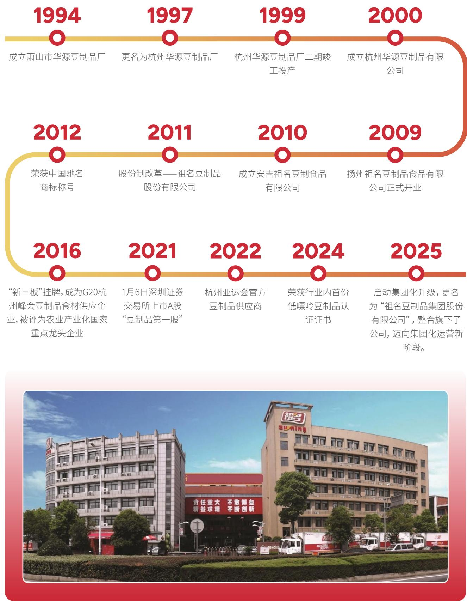

## 产品体系

公司专注于豆制品的研发、生产和销售，产品主要涵盖生鲜豆制品、植物蛋白饮品、休闲豆制品、其他类产品等400余种。

生鲜豆制品  
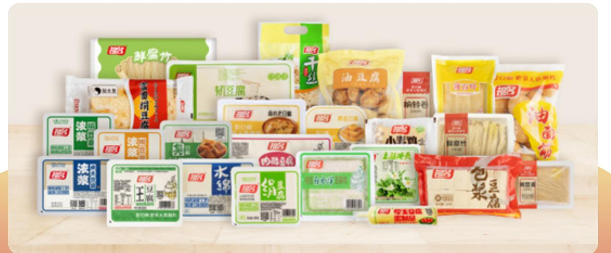

text_image

Collection of packaged food products with Chinese text labels, including rice, soy sauce, and instant noodles.

植物蛋白饮品  
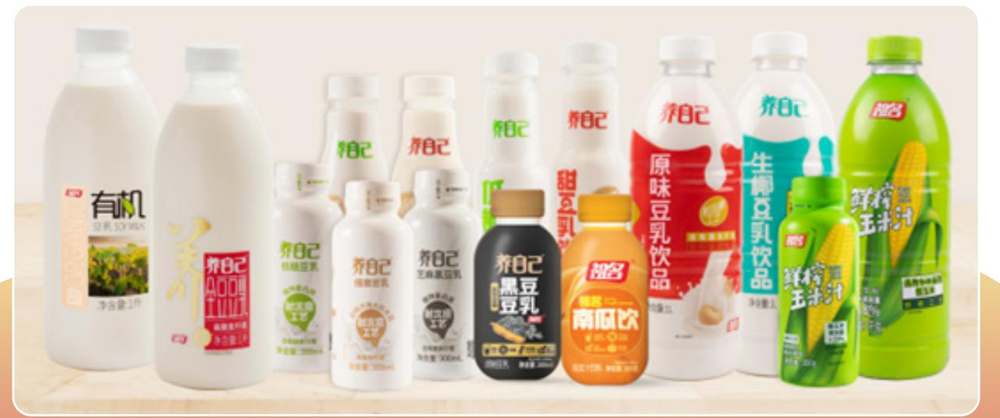

text_image

有机
900g
工业乳
养82
养82
原味豆乳饮品
养82
生椰豆乳饮品
鲜橙玉米汁
鲜橙玉米汁
鲜橙玉米汁
鲜橙玉米汁
鲜橙玉米汁
鲜橙玉米汁
鲜橙玉米汁
鲜橙玉米汁
鲜橙玉米汁
鲜橙玉米汁
鲜橙玉米汁
鲜橙玉米汁
鲜橙玉米汁
鲜橙玉米汁
鲜橙玉米汁
鲜橙玉米汁
鲜橙玉米汁
鲜橙玉米汁
鲜橙玉米汁
鲜橙玉米汁
鲜橙玉米升
鲜橙玉米升
鲜橙玉米升
鲜橙玉米升
鲜橙玉米升
鲜橙玉米升
鲜橙玉米升
鲜橙玉米升
鲜橙玉米升
鲜橙玉米升
鲜橙玉米升
鲜橙玉米升
鲜橙玉米升
鲜橙玉米升
鲜橙玉米升
鲜橙玉米升
鲜橙玉米升
鲜橙玉米升
鲜橙玉米升
鲜橙玉米升
鲜橙玉米提升
鲜橙玉米提升
鲜橙玉米提升
鲜橙玉米提升
鲜橙玉米提升
鲜橙玉米提升
鲜橙玉米提升
鲜橙玉米提升
鲜橙玉米提升
鲜橙玉米提升
鲜橙玉米提升
鲜橙玉米提升
鲜橙玉米提升
鲜橙玉米提升
鲜橙玉米提升
鲜橙玉米提升
鲜橙玉米提升
鲜橙玉米提升
鲜橙玉米提升
鲜橙玉米提升
鲜橙玉米升
鲜橙玉米升
鲜橙玉米升
鲜橙玉米升
鲜橙玉米升
鲜橙玉米升
鲜橙玉米升
鲜橙玉米升
鲜橙玉米升
鲜橙玉米升
鲜橙玉米升
鲜橙玉米升
鲜橙玉米升
鲜橙玉米升
鲜橙玉米升
鲜橙玉米升
鲜橙玉米升
鲜橙玉米升
鲜橙玉米升

休闲豆制品  
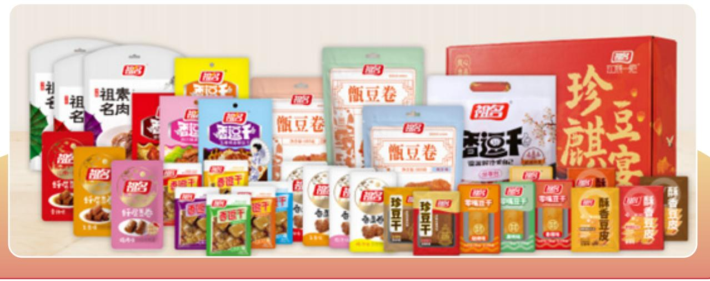

text_image

Product display image featuring various packaged snacks and packaging boxes with Chinese branding, including '珍豆卷' (Mintai卷) and '酥香豆皮' (Mintai fruit juice).

其他类产品

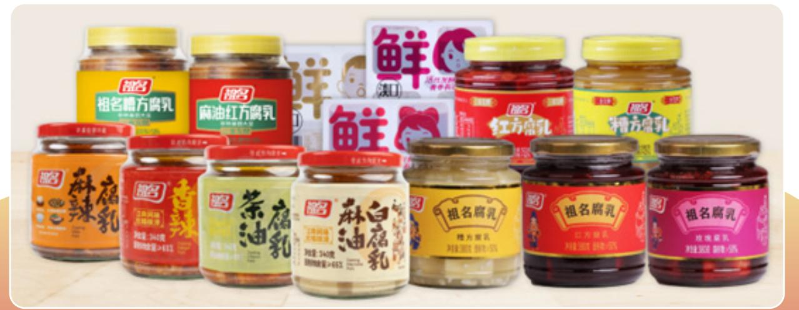

text_image

鲜
鲜
鲜
鲜
鲜
鲜
鲜
鲜
鲜
鲜
鲜
鲜
鲜
鲜
鲜
鲜
鲜
鲜
鲜
鲜
鲜
鲜
鲜
鲜
鲜
鲜
鲜
鲜
鲜
鲜
鲜
鲜
鲜
鲜
鲜
鲜
鲜
鲜
鲜
鲜
鲜
鲜
鲜
鲜
鲜
鲜
鲜
鲜
鲜
鲜
鲜

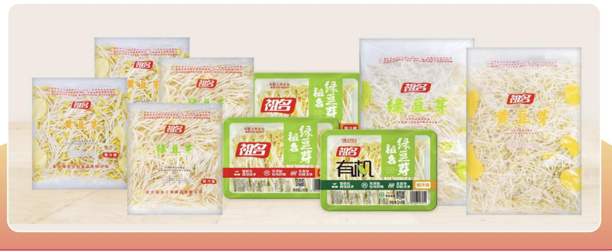

text_image

Product packaging images of various green bean sprouts, including '祖名' and '绿豆芽', arranged on a table.

## 年度荣誉

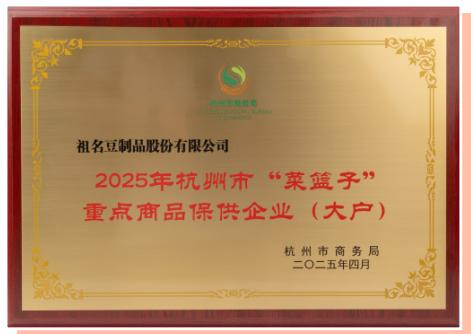

text_image

杭州市商务局
杭州电子商务有限公司
祖名豆制品股份有限公司
2025年杭州市“菜篮子”
重点商品保供企业（大户）
杭州市商务局
二〇二五年四月

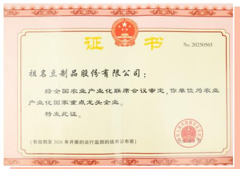

text_image

证书
No.20250565
祖名豆制品股份有限公司：
经全国农业产业化联席会议审定,你单位为农业
产业化国家重点龙头企业。
特发此证。
(有效期至2026年开展的运行监测的结果公布前)

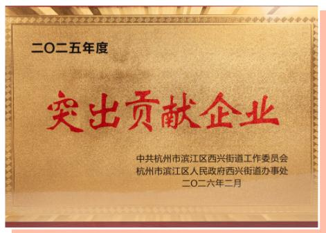

text_image

二〇二五年度
突出贡献企业
中共杭州市滨江区西兴街道工作委员会
杭州市滨江区人民政府西兴街道办事处
二〇二六年二月

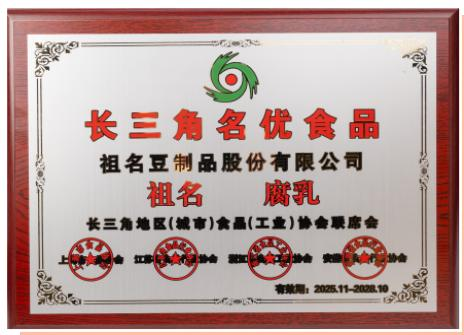

text_image

长三角名优食品
祖名豆制品股份有限公司
祖名 腐乳
长三角地区(城市)食品(工业)协会联席会
上海华谊集团 江苏银行股份有限公司 珠江农村商业银行 安徽市分行
有效期：2025.11-2028.10

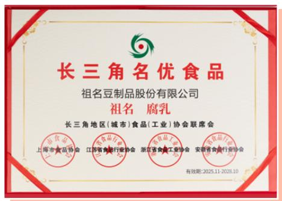

seal

长三角名优食品
祖名豆制品股份有限公司
祖名 腐乳
长三角地区(城市)食品(工业)协会联席会
上海市食品协会
江苏省食行行业协会
浙江省食品工业协会
安徽省食品厅行业协会

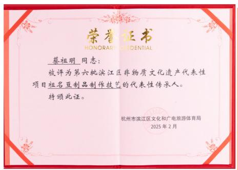

text_image

荣誉证书
HONORARY CREDENTIAL
蔡祖明同志：
被评为第六批滨江区非物质文化遗产代表性项目祖名豆制品制作技艺的代表性传承人。
特颁此证。
杭州市滨江区文化和广电旅游体育局
2025年2月

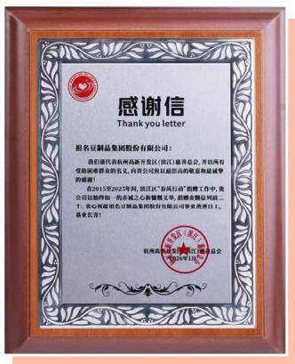

text_image

感谢信
Thank you letter
报名豆制品集团股份有限公司：
我们同意代表杨新海和李红（浙江）有限公司，并以所有
受邀请的单位的名义，向你公司出具的书面确认和最诚挚
的邀请！
在2015年至2025年间，浙江区“春风行动”暨工作中，我
公司应按照一份办妥之心和警戒义务，根据董事会授权证
上、关心权威报告北京制品集团股份有限公司年度总结以上，
董事长负责。
杭州商品交易所 财务部：浙江佳都总公司
2015年11月

## 年度ESG亮点绩效

## 经济绩效

营业总收入

20.25 亿元

## 研发绩效

研发投入

1,619.65 万元

研发投入占营业收入比例

0.80%

研发人员数量

66 人

研发人员占比

1.41%

累计授权专利数

92 个

## 环境绩效

人均耗电量

20.8 兆瓦时/人

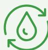

人均能源消耗

11.2 吨标准煤

人均温室气体排放量

33.9 吨二氧化碳当量/人

人环保总投入

1481.69

## 雇佣绩效

员工总数

4,680 人

女性员工占比

47.35%

员工培训次数

455 次

员工培训覆盖率

97.11%

## 可持续发展治理体系

## ESG管理体系

祖名股份高度重视ESG管理工作，将ESG治理视为企业可持续发展的核心支撑，搭建决策层、管理层、执行层三级协同的ESG管理架构，对策略制定、目标拆解、执行落地等全环节进行严格管控，实现从战略规划到业务落地的全链条闭环管理。

## 决策层

●公司董事会为ESG工作的最高决策机构，锚定公司ESG战略方向与长期目标，负责制定ESG战略方针与目标，审议决策ESG重大事项，并定期监督检查ESG相关工作进展，确保可持续发展理念深度融入公司经营全局。

## 管理层

●由各部门负责人牵头，将顶层ESG战略转化为部门级可执行目标与行动计划，统筹指导各相关部门开展ESG工作，并对实施成效进行评审与考核，保障战略落地的一致性与有效性。

## 执行层

●由各部门指派的专职工作人员组成，承担ESG日常管理的具体落地职责，推进ESG工作计划的实施，监测、收集ESG信息数据并报送报告，协调完成《环境、社会和公司治理(ESG报告》编制，确保ESG管理要求精准渗透至业务全流程。

ESG管理架构及工作职责  
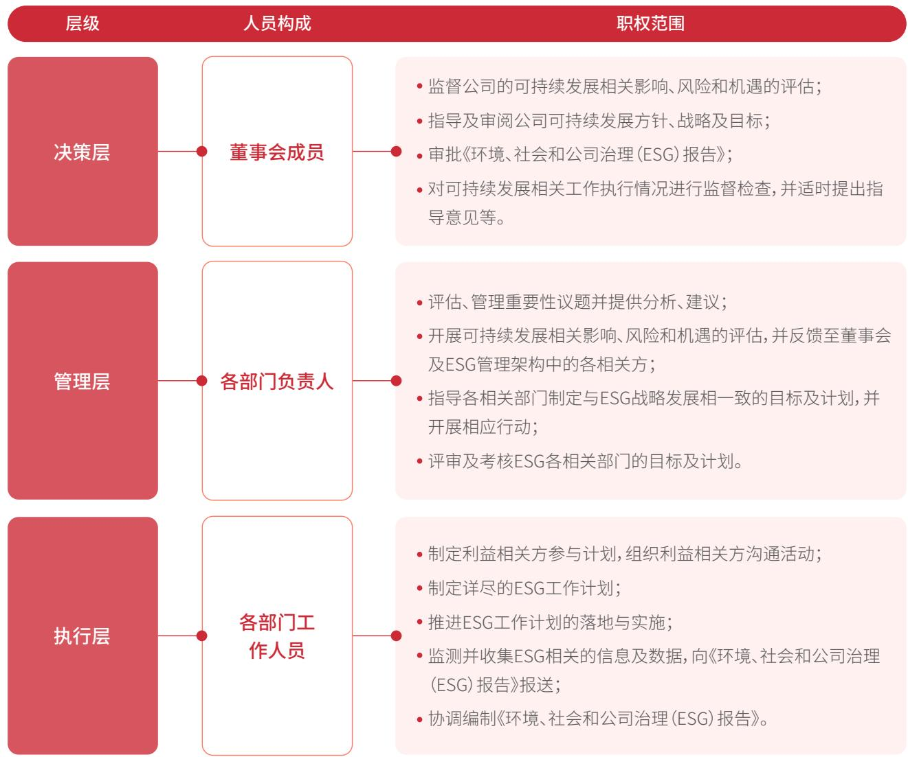

flowchart

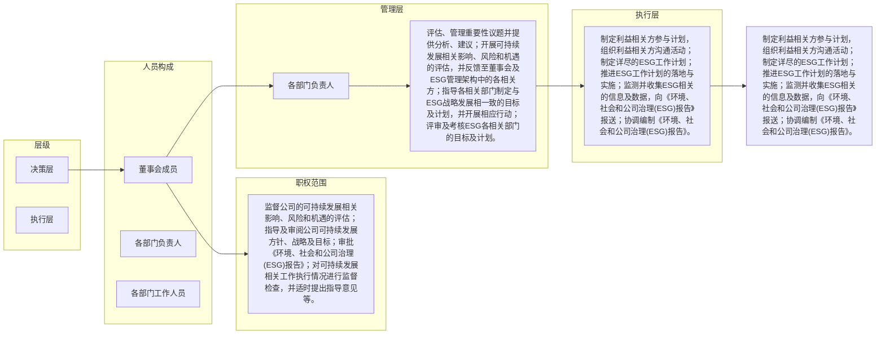
```mermaid
graph LR
  subgraph Layer["层级"]
    A["决策层"]
    B["执行层"]
  end

  subgraph Personnel["人员构成"]
    C["董事会成员"]
    D["各部门负责人"]
    E["各部门工作人员"]
  end

  subgraph Role["职权范围"]
    F["监督公司的可持续发展相关影响、风险和机遇的评估；指导及审阅公司可持续发展方针、战略及目标；审批《环境、社会和公司治理(ESG)报告》；对可持续发展相关工作执行情况进行监督检查，并适时提出指导意见等。"]
  end

  subgraph Management["管理层"]
    G["各部门负责人"]
    H["评估、管理重要性议题并提供分析、建议；开展可持续发展相关影响、风险和机遇的评估，并反馈至董事会及ESG管理架构中的各相关方；指导各相关部门制定与ESG战略发展相一致的目标及计划，并开展相应行动；评审及考核ESG各相关部门的目标及计划。"]
  end

  subgraph Execution["执行层"]
    I["制定利益相关方参与计划，组织利益相关方沟通活动；制定详尽的ESG工作计划；推进ESG工作计划的落地与实施；监测并收集ESG相关的信息及数据，向《环境、社会和公司治理(ESG)报告》报送；协调编制《环境、社会和公司治理(ESG)报告》。"]
  end

  A --> C
  C --> F
  C --> G
  G --> H
  H --> I
  I --> J["制定利益相关方参与计划，组织利益相关方沟通活动；制定详尽的ESG工作计划；推进ESG工作计划的落地与实施；监测并收集ESG相关的信息及数据，向《环境、社会和公司治理(ESG)报告》报送；协调编制《环境、社会和公司治理(ESG)报告》。"]
```

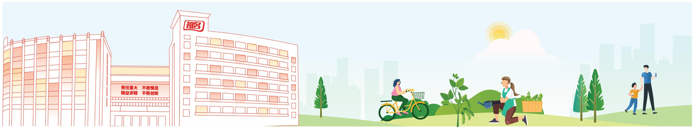

text_image

责任重大 不敢懈怠
精益求精 不断创新

## 利益相关方沟通

祖名股份秉持“开放、协同、共赢”的FSG治理理念，高度重视与各利益相关方的双向互动沟通。公司构建了覆盖政府与监管机构、股东与投资者、客户与消费者、员工、供应商及合作伙伴、社区的全维度沟通机制，通过定期审视沟通成效、持续倾听各方诉求，及时回应并优化管理举措，将利益相关方的反馈与建议深度融入经营决策与日常管理，携手各方共同推动豆制品行业高质量、可持续发展。

重要利益相关方关注议题及沟通途径

<table><tr><td>利益相关方</td><td colspan="2">核心期望与诉求</td><td colspan="2">沟通方式与回应举措</td></tr><tr><td>政府及监管机构</td><td>·依法合规运营·依法纳税·促进就业·保护生态环境·保供、稳价</td><td>·产品质量与安全·应对气候变化·环境合规管理·带动当地就业·乡村振兴</td><td>·遵守法律法规·报送报表数据·配合监管机构核查·参与政府调研活动</td><td>·政策执行·信息披露</td></tr><tr><td>股东及投资者</td><td>·依法合规运营·优化公司治理·提升投资回报·创新驱动·产品质量与安全</td><td>·风险管理·ESG治理·信披与投关</td><td>·信息披露·股东会·日常电话、路演、邮件沟通等</td><td>·业绩说明会·互动易平台交流·投资者调研</td></tr><tr><td>客户及消费者</td><td>·食品安全·绿色、健康产品·消费者权益保障·负责任营销</td><td>·信息安全与隐私保护·创新驱动·应对气候变化·供应链管理</td><td>·参加展会·行业交流与研讨活动·工作人员拜访、沟通·满意度调查</td><td>·售后服务与投诉渠道·公司官网</td></tr><tr><td>员工</td><td>·员工培训与发展·员工权益保障·薪酬福利·职业健康与安全</td><td></td><td>·定期和不定期会议·团建活动·设立申诉、反馈机制·满意度调查</td><td>·员工培训·各级沟通会</td></tr><tr><td>供应商及合作伙伴</td><td>·遵守商业道德·互利共赢、共同成长·供应链管理·促进行业发展</td><td>·平等对待中小企业·反贪污和廉洁建设·反不正当竞争</td><td>·供应商大会·日常合作交流·满意度调查·公开透明采购</td><td>·长期稳定合作·行业研讨交流</td></tr><tr><td>社区及公众</td><td>·公益慈善·区域发展·环境合规·乡村振兴</td><td>·废弃物管理·能源利用</td><td>·开展公益活动·社区走访·推动绿色低碳发展</td><td></td></tr></table>

## 重要性议题评估与管理

为充分应对内外部环境变化带来的挑战，祖名股份遵循双重重要性评估原则(即财务重要性与影响重要性)，依照深圳证券交易所《上市公司自律监管指引第17号—可持续发展报告》等监管要求，建立系统化的FSG重要性议题识别、评估与管理流程，确保可持续发展工作聚焦核心、精准落地。

重要性议题分析流程

<table><tr><td>议题识别</td><td>&gt;</td><td>议题排序</td><td>&gt;</td><td>议题审核</td><td>&gt;</td><td>议题检视</td></tr><tr><td>参考国内外监管要求、行业标准及豆制品行业特性,结合公司业务模式与发展战略,梳理核心业务、外部环境及利益相关方诉求,识别潜在ESG相关议题并建立初步清单。</td><td></td><td>通过定性分析(如专家评估、利益相关方访谈)与定量分析(如财务影响测算),从“财务重要性”与“影响重要性”两个维度,对议题清单中的各项议题进行重要性评估与排序。</td><td></td><td>由公司董事会及管理层对年度重要性议题评估结果进行审议与确认,形成最终的重要性议题矩阵。</td><td></td><td>持续检视并完善重要性议题评估流程,定期评判各议题的影响、风险与机遇,动态优化ESG管理举措,确保可持续发展工作的有效性与前瞻性。</td></tr></table>

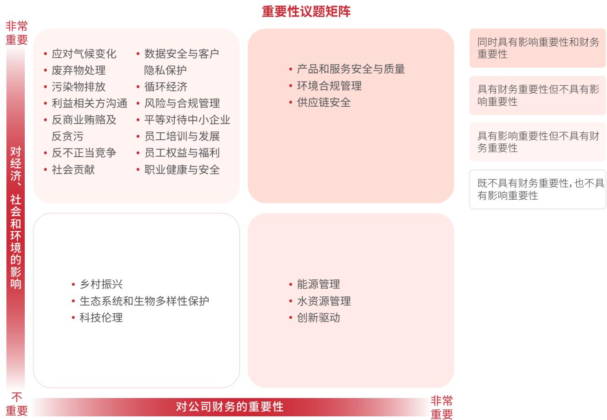

other

| 对公司财务的重要性 (Category) | 对经济、社会和环境的影响 (Category) | 重要性议题矩阵 (Category) |
| :--- | :--- | :--- |
| 非常重要 | 非常重要 | 同时具有影响重要性和财务重要性 |
| 非常重要 | 非常重要 | 具有财务重要性但不具有影响重要性 |
| 非常重要 | 非常重要 | 具有影响重要性但不具有财务重要性 |
| 非常重要 | 不重要 | 既不具有财务重要性,也不具有影响重要性 |
| 不重要 | 不重要 | 能源管理 水资源管理 创新驱动 |
| 不重要 | 不重要 | 乡村振兴 生态系统和生物多样性保护 科技伦理 |
| 不重要 | 不重要 | 社会贡献 反不正当竞争 反贪污 利益相关方沟通 污染物排放 废弃物处理 应对气候变化 |
| 不重要 | 不重要 | 数据安全与客户隐私保护 循环经济 风险与合规管理 平等对待中小企业 员工培训与发展 员工权益与福利 职业健康与安全 |
| 不重要 | 不重要 | 产品和服务安全与质量 环境合规管理 供应链安全 |

## 02

## 守合规治企固稳健根基

公司治理

风险与合规管理

恪守商业道德

bar

| Month | Subdivision 1 (Value) | Subdivision 2 (Value) |
| --- | --- | --- |
| June | ~3.5 | ~4.5 |
| July | ~4.0 | ~5.0 |
| August | ~4.5 | ~6.0 |
| Sept | ~5.0 | ~3.5 |
| Oct | ~5.5 | ~7.0 |
| Nov | ~6.0 | ~5.0 |
| December | ~6.5 | ~4.0 |

## 公司治理

祖名股份在经营管理过程中，严格遵守《中华人民共和国公司法》《中华人民共和国证券法》《中华人民共和国食品安全法》等相关法律法规及监管要求，坚持合规经营、规范运作，将合规理念融入公司治理、生产运营、供应链管理等各个环节，持续完善内部治理结构与运行机制，不断提升公司治理水平，保障公司长期稳定、健康可持续发展。

## 两会运作

公司构建了由股东会、董事会、管理层组成的内部治理结构，明确各层级决策权限与职责边界，形成权责清晰、相互制衡、协同高效的治理机制，保障公司规范、高效运行。

为适应市场竞争与业务创新，公司强化各业务板块协同联动，提升市场响应速度与运营效率，支撑公司多元化战略落地。

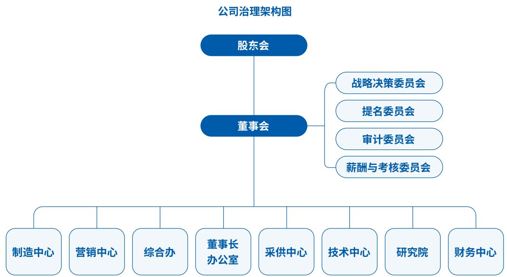

flowchart

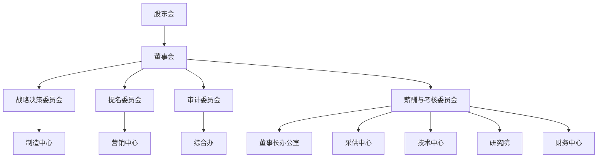
```mermaid
graph TD
  A["股东会"] --> B["董事会"]
  B --> C["战略决策委员会"]
  B --> D["提名委员会"]
  B --> E["审计委员会"]
  B --> F["薪酬与考核委员会"]
  C --> G["制造中心"]
  D --> H["营销中心"]
  E --> I["综合办"]
  F --> J["董事长办公室"]
  F --> K["采供中心"]
  F --> L["技术中心"]
  F --> M["研究院"]
  F --> N["财务中心"]
```

## 治理架构与职责分工

## 股东会

·股东会作为公司的最高权力机构，依法行使审议批准利润分配方案、选举及更换董事、修订公司章程、审议重大投资事项等法定职权，切实维护全体股东合法权益。各次会议的会议通知、召开形式、表决程序等均符合法律法规及公司章程规定，会议记录完整规范，决议内容及签署合法、合规、真实、有效，切实保障了全体股东依法行使股东权利。  
·报告期内，公司共召开股东会3次，其中年度股东会1次、临时股东会2次，累计审议通过议案14项。

## 董事会

·作为公司经营管理的决策机构，董事会对股东会负责，按照《公司章程》《董事会议事规则》及相关规定规范运作，行使制定公司经营计划和投资方案、制定公司年度财务预算方案和决算方案、制定公司利润分配方案和弥补亏损方案、选聘公司高级管理人员等职权。  
·董事会下设审计委员会、薪酬与考核委员会、提名委员会及战略委员会四个专门委员会，各专门委员会各司其职、协同配合，为董事会决策提供专业支持与咨询建议，确保董事会议事和决策的专业化与高效化。  
·报告期内，公司共召开了7次董事会，5次审计委员会，5次战略决策委员会，3次提名委员会和3次薪酬与考核委员会。

## 管理层

·管理层由总经理、副总经理、财务总监及董事会秘书等组成，在董事会授权范围内统筹日常经营管理，高效落实董事会决议，制定并执行经营计划与实施方案，统筹协调各业务单元协同运转，保障公司稳健运营与战略目标实现。

## 董事会多元化

公司重视董事会多元化建设，在董事构成中综合考虑专业背景、履职经验、性别等因素，持续提升董事会决策的科学性和有效性。

公司董事会由9名董事组成，设董事长1人，副董事长1人，独立董事3人。独立董事在董事会中的人数占比约为33%，女性董事在董事会中的人数占比约为11%。公司董事会成员具备企业管理、通讯工程、会计等多元专业背景，具有互补效应，能够以多元视角保障董事会决策的科学性。

## 风险与合规管理

为持续规范公司治理与运营行为，切实防范合规及运营风险，祖名股份已建立健全《关联交易管理制度》《募集资金管理制度》《信息披露管理制度》《投资者关系管理制度》《控股子公司管理制度》《内幕信息知情人登记管理制度》等一系列内部管控制度，形成覆盖投资、融资、关联交易、信息管理、内控监督等全领域的制度体系。

报告期内，公司严格执行各项制度要求，通过常态化宣贯培训、过程执行监督与事后考核评价，推动制度全面落地见效，不断提升公司运作的规范化、透明化与高效化水平，为企业稳健经营与高质量可持续发展提供坚实的制度保障。

## 风险管理架构

公司始终坚持依法合规经营，严格遵循国家相关法律法规的要求，建立了全面的风险管理架构，风险管理体系覆盖各部门及各分子公司，贯穿生产经营全过程，为公司业务持续稳健运行提供有力保障。

## 风险管理架构核心权责

## 董事会

●作为风险管理的最高决策机构，负责审定公司风险管理战略、总体目标及重大风险应对方案，统筹推进风险管理体系建设，对公司整体风险水平承担最终责任。

## 审计委员会

●受董事会授权，负责定期监督风险管理体系的执行成效，审查内部控制体系的完整性与有效性，监督外部审计工作规范开展：统筹公司经营风险与商业规范管理，结合行业趋势及监管要求，为董事会风险决策提供专业、客观的意见支撑，助力公司规范运营、稳健发展。

## 各部门及分子公司

●承担风险管理主体责任，结合自身业务特性，全面落实风险识别、信息汇总、管控措施执行等具体工作，确保风险管理要求渗透到业务全环节，形成“人人有责、层层落实”的风险防控氛围。

natural_image

Illustration of a person holding a tablet with gear and bar chart elements, symbolizing legal or business processes (no text present)

## 风险管理流程

公司建立“识别一分析一评估一应对一控制”全链条风险管理流程，坚持全面覆盖、重点突出、动态适配原则，针对环境、安全等ESG相关重点风险实施精细化管控，构建闭环管理体系。

## 风险识别

公司定期开展全面风险识别，结合行业特性联动各部门，识别合规、运营、环境、安全等风险；针对环境、安全重点风险，建立并动态更新标准化风险辨识清单，保障识别全面及时。

## 风险分析与评估

公司建立科学评估体系，研判风险的性质、影响及发生概率；在关键节点开展专项评估，分析风险财务与非财务影响，明确风险管理优先级，为应对提供依据。

## 风险分析与评估

搭建全环节风险控制体系，按风险等级制定差异化应对措施；重点强化安全风险防控，建立双重预防、隐患排查等制度，常态化开展应急演练，提升风险抵御及应急处置能力。

## 恪守商业道德

## 廉政管理

祖名股份始终秉持诚信合规、廉洁经营的理念，严格遵守《中华人民共和国刑法》《中华人民共和国反不正当竞争法》等法律法规，坚守商业道德行为准则，对任何形式的贪腐、收受贿赂等行为保持零容忍态度，严格要求员工及合作伙伴恪守商业道德，坚决抵制不正当竞争与商业腐败行为。

为夯实廉洁经营的制度基础，公司建立并持续完善《廉政管理制度》《合作伙伴廉洁处罚细则》等核心制度，明确廉洁从业要求与违规处置标准，同时不断完善廉洁制度建设、拓宽内外部监督渠道，打造多维度、全方位的腐败风险管理与监督体系：

## 员工端管控

每位入职员工均须签订《员工廉洁承诺书》，明确廉洁从业责任与义务；

## 合作伙伴端管控

要求供应商等合作方签订《合作伙伴廉洁承诺书》，确保其知悉并严格遵守公司廉政管理规定；

## 违规惩戒机制

对违反廉洁规定的合作商，公司将依据《合作伙伴廉洁处罚细则》采取警告、约谈、暂停合作、罚金、终止合作等分级惩戒措施。

## 廉政管理体系与组织架构

公司构建了“董事会指导、管理层负责、纪监部执行、各职能部门及子公司落实”的全链条廉政管理体系，明确各层级权责，形成协同高效的监督闭环。

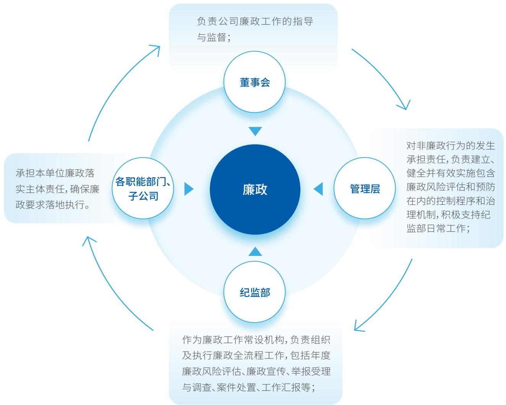

flowchart

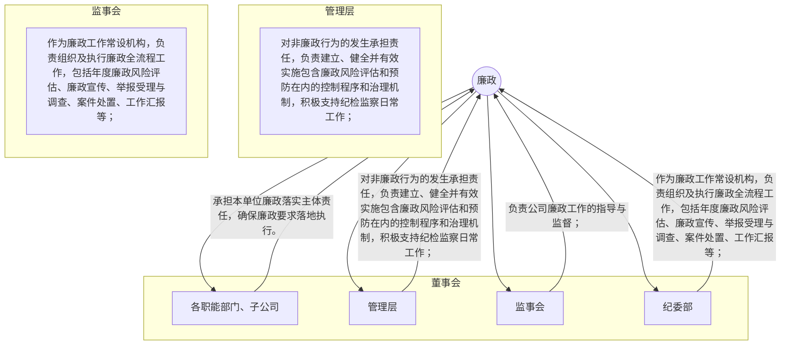
```mermaid
graph TD
  Center(("廉政"))
  
  subgraph Board["董事会"]
    direction TB
    Role1["各职能部门、子公司"]
    Role2["管理层"]
    Role3["监事会"]
    Role4["纪委部"]
  end
  
  subgraph Supervisory["管理层"]
    direction TB
    Role5["对非廉政行为的发生承担责任，负责建立、健全并有效实施包含廉政风险评估和预防在内的控制程序和治理机制，积极支持纪检监察日常工作；"]
  end
  
  subgraph SupervisoryLevel["监事会"]
    direction TB
    Role6["作为廉政工作常设机构，负责组织及执行廉政全流程工作，包括年度廉政风险评估、廉政宣传、举报受理与调查、案件处置、工作汇报等；"]
  end
  
  Center --> Role1
  Center --> Role2
  Center --> Role3
  Center --> Role4
  Role1 -->|"承担本单位廉政落实主体责任，确保廉政要求落地执行。"| Center
  Role2 -->|"对非廉政行为的发生承担责任，负责建立、健全并有效实施包含廉政风险评估和预防在内的控制程序和治理机制，积极支持纪检监察日常工作；"| Center
  Role3 -->|"负责公司廉政工作的指导与监督；"| Center
  Role4 -->|"作为廉政工作常设机构，负责组织及执行廉政全流程工作，包括年度廉政风险评估、廉政宣传、举报受理与调查、案件处置、工作汇报等；"| Center
```

根据《廉政管理制度》要求，公司每年召开一次廉政情况通报会，各职能部门负责人、各子公司总经理汇报本单位廉政工作开展情况，纪监部汇报廉政案件举报、调查及处理情况，听取董事会意见与指示，持续优化廉政管理工作。

## 廉政举报渠道

  
举报邮箱

zmls@chinazuming.cn

  
举报电话

0571-87005319

## 董事长信箱

对于收到的举报会在3个工作日内开展调查。该信箱每月由纪监部2名人员共同开启一次，并密封直接递交至董事长。

## 举报人保护

公司严格落实举报人保护制度，对举报人姓名、工作单位、家庭住址、联系方式等个人信息及举报内容严格保密；对泄露举报人信息，或对举报人、参与调查人员采取恐吓、威胁、打击报复的人员，公司将依规给予降级、解除劳动合同等处罚，触犯法律的移送司法机关处理。

## 廉政管理培训

公司定期开展商业道德与廉政管理专项培训，覆盖全职员工、兼职员工及劳务派遣人员等全体用工主体，强化全员廉洁从业意识与合规履职能力，筑牢廉洁经营的思想防线

## 反不正当竞争

祖名股份深知健康的商业环境是行业良性发展的基石，始终以公平、正当的方式参与市场竞争，严格遵守《中华人民共和国反不正当竞争法》《中华人民共和国反垄断法》等相关法律法规，恪守公平竞争的基本准则，坚持诚信经营。

为持续筑牢公平合规运营的底线，公司通过加强内控审查、组织专业培训等一系列举措，全面提升全员公平竞争意识与法律素养，将合规要求深度融入业务全流程，严防不正当竞争等违规行为发生，以合规经营促进行业健康可持续发展。

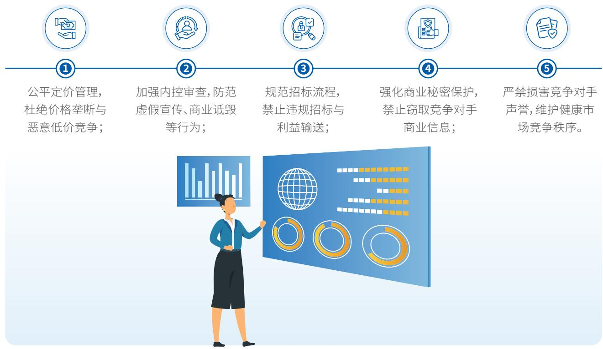

flowchart

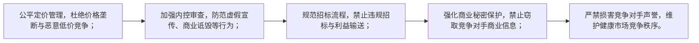
```mermaid
graph LR
  A["公平定价管理，杜绝价格垄断与恶意低价竞争；"] --> B["加强内控审查，防范虚假宣传、商业诋毁等行为；"]
  B --> C["规范招标流程，禁止违规招标与利益输送；"]
  C --> D["强化商业秘密保护，禁止窃取竞争对手商业信息；"]
  D --> E["严禁损害竞争对手声誉，维护健康市场竞争秩序。"]
```

## 03

## 以质安立本凭科创致远

创新驱动

产品和服务安全与质量

供应链安全

负责任营销

助力健康中国

数字化转型与信息安全

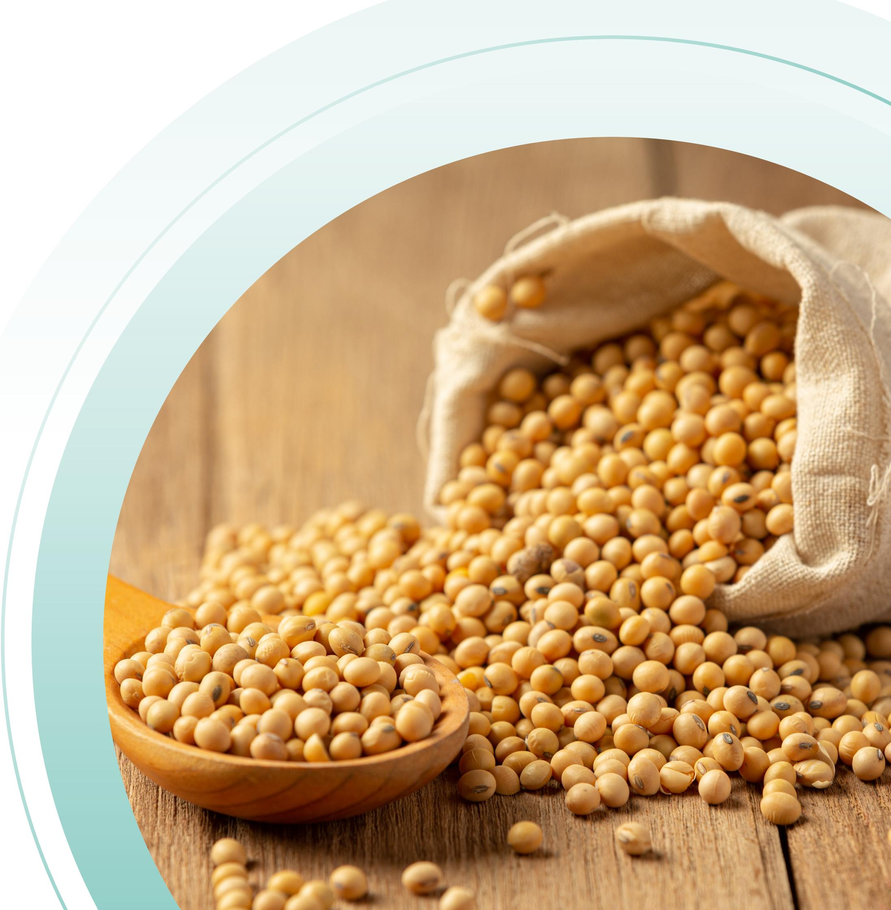

natural_image

Close-up of soybeans in a wooden bowl and sack on a wooden surface (no text or symbols visible)

## 创新驱动

科技创新是企业高质量发展的核心引擎，也是培育和发展新质生产力的关键支撑。祖名股份严格对照深交所可持续发展报告指引要求，秉持“创新为核、品质为基、可持续发展为导向”的管理理念，将创新深度贯穿于产品研发、工艺升级、资源利用全链条，视科技创新为提升核心竞争力、践行ESG目标、赋能产业绿色升级的关键动力。

## 研发创新战略与管理体系

为规范创新管理流程，确保创新活动有章可循、高效落地，公司从战略高度出发，建立了一套涵盖全生命周期的研发创新制度体系。目前已制定并严格执行的制度文件包括《设计开发管理程序》《新产品开发管理流程》《确认和验证控制程序》《外购新产品管理流程》等。同时，为保障科技成果合法权益，同步出台了《知识产权管理制度》及《企业专利管理制度》。

公司构建了“研究院统筹+跨部门协同+产学研联动”的三位一体创新管理体系。作为豆制品行业的领军者，公司设立豆制品研究院，统筹开展产品研发、工艺优化和技术成果转化等工作。研究院立足科技前沿，聚焦行业技术瓶颈与市场健康需求，集聚创新资源，持续解决制约豆制品行业发展的关键技术难题。

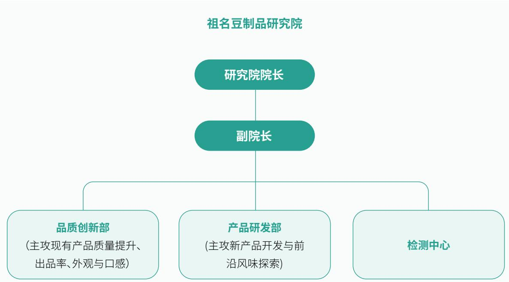

flowchart

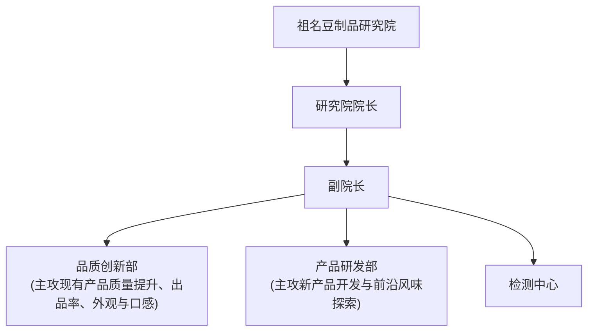
```mermaid
graph TD
  A["祖名豆制品研究院"] --> B["研究院院长"]
  B --> C["副院长"]
  C --> D["品质创新部\n(主攻现有产品质量提升、出品率、外观与口感)"]
  C --> E["产品研发部\n(主攻新产品开发与前沿风味探索)"]
  C --> F["检测中心"]
```

在日常管理中，公司建立并持续优化了从需求洞察到成果商业化的闭环管理机制。设立创新项目评审委员会对研发项目的技术可行性、市场前景及ESG契合度进行严格综合评估，保障研发资源高效配置。

## 研发创新闭环管理机制

<table><tr><td>需求调研</td><td>立项评审</td><td>研发实施</td><td>成果验收</td><td>市场推广</td></tr><tr><td>收集消费者反馈与趋势</td><td>评委综合评估技术与ESG契合</td><td>跨部门协作突破技术瓶颈</td><td>技术指标与质量双重验证</td><td>科技成果向产业转化</td></tr></table>

## 创新人才队伍与激励机制

科技创新离不开高素质的人才队伍。公司高度重视创新人才的培育与引进，建立“外引内培”的立体化人才机制

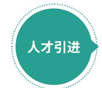

●对外通过校园招聘、社会招聘、行业猎头合作等多元渠道，大力引进具有丰富经验的研发专家与技术骨干。

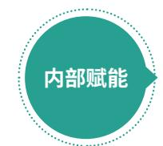

●对内依托“祖名·云学堂”线上学习平台，结合外部专家培训与行业交流研讨，持续提升研发团队的专业理论素养与实践攻关能力。

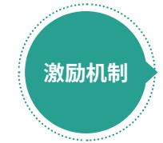

●公司制定了《研究院考核奖励办法》，全面实行项目奖金制度。对取得核心研发成果的团队给予专项重奖;同时鼓励研发人员申报专利、参与行业奖项评选，并根据专利授权层级与奖项重要程度给予一次性丰厚奖励，极大激发了科研人员的创新热情。

natural_image

Illustration of three people interacting with a computer screen displaying charts, surrounded by icons and text (no readable document content)

## 核心技术攻关与绿色成果转化

公司聚焦“产品创新、工艺升级、循环经济”三大核心方向，大力推进前沿技术在实际生产中的落地应用，致力于用科技力量提升经济、社会与环境综合效益。

## 先进工艺与设备研发

·公司深入研究并攻克了超微制浆、射流磨、在线自动点浆及保温成型等行业前沿技术。例如，安吉工厂持续优化引进的日本全自动豆芽栽培生产线运行参数，实现高精度自动化控制，大幅提升了生产效率与产品品质稳定性。

## 健康产品创新布局

·依托上述核心技术，公司成功研制出“全豆豆于、全豆豆腐、全豆豆乳”等系列全豆产品。该系列产品完整保留了大豆营养，具有口感韧弹、出品率高的特点，且基本达到低嘌呤标准，切实响应了现代消费者对健康饮食的诉求。

## 循环经济与减碳技术

·在绿色研发制造方面，公司自主开发出一套湿豆渣烘于技术。报告期内，深化了豆渣、蛋白渣的资源化利用项目，进一步优化烘于工艺与产品适配性(如转化为高附加值猫砂原料)，为行业内副产物综合利用提供了技术示范，有效降低了废弃物排放与生产成本。

natural_image

Illustration of a woman holding a magnifying glass over a document with icons, symbolizing environmental or corporate sustainability (no text present)

## 知识产权保护与行业标准引领

为保护核心技术资产，公司通过《知识产权管理制度》全方位加强专利申报与维权管理。公司多次邀请专利事务所专家开展专利申报知识专题培训，提升研发人员对发明点的挖掘能力，专利工作基础不断夯实，形成了丰富目高价值的自主知识产权矩阵。

同时，公司积极发挥行业龙头担当，致力于将内部创新成果与研发经验转化为行业共识，推动全行业协同提升作为CAC(国际食品法典委员会)国际标准及多项国家标准的核心起草单位，公司深度参与《非发酵豆制品》《豆制品预制菜生产流通管理指南》《大豆豆清液》《大豆组织蛋白》等多项国家及团体标准研制，以高标准引领行业规范化、高质量发展。报告期内，公司积极承办豆制品行业创新技术研讨会，邀请行业专家及上下游企业代表围绕工艺创新、资源循环利用等关键议题开展交流，并面向供应商开展原料优化、绿色生产等技术培训，以开放共享带动产业链协同创新，全面提升行业整体可持续发展能力。

## 创新绩效目标与指标

报告期内，公司研发成果丰硕，知识产权保护成效显著，有效巩固了企业的技术护城河。2025年度公司关键仓新绩效指标如下：

<table><tr><td>指标</td><td>单位</td><td>2025年</td></tr><tr><td>2025年累计实用新型专利申请数量</td><td>个</td><td>54</td></tr><tr><td>2025年累计发明专利授权数量</td><td>个</td><td>38</td></tr><tr><td>2025年累计获得授权专利总数</td><td>个</td><td>92</td></tr></table>

natural_image

Illustration of business professionals collaborating around a lightbulb with charts and gears (no text or symbols)

## 产品和服务安全与质量

祖名股份视产品质量为企业最重要的核心竞争力。我们深知，卓越的品质不仅是品牌立足市场的基石，更是企业履行社会责任的底线要求。公司坚持“具体执行标准高于国家标准”的原则，通过构建涵盖“研发、采购、生产、仓储、配送、销售”全价值链的质量受控体系，并依托ISO.9001及ISO22000双重体系认证，确保生产全过程得到有力监督，使每一件产品都能经得起消费者与市场的严苛检验。

## 治理

公司构建了“顶层设计、职能统筹、末端落实”的三级协同治理架构，确保质量管理指令能够穿透到每一个生产环节。

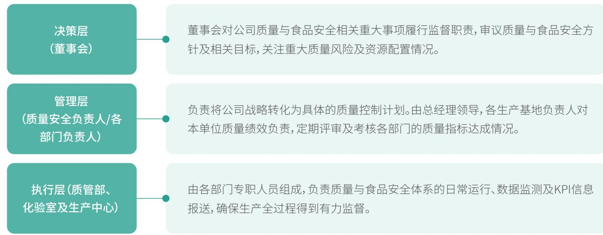

flowchart

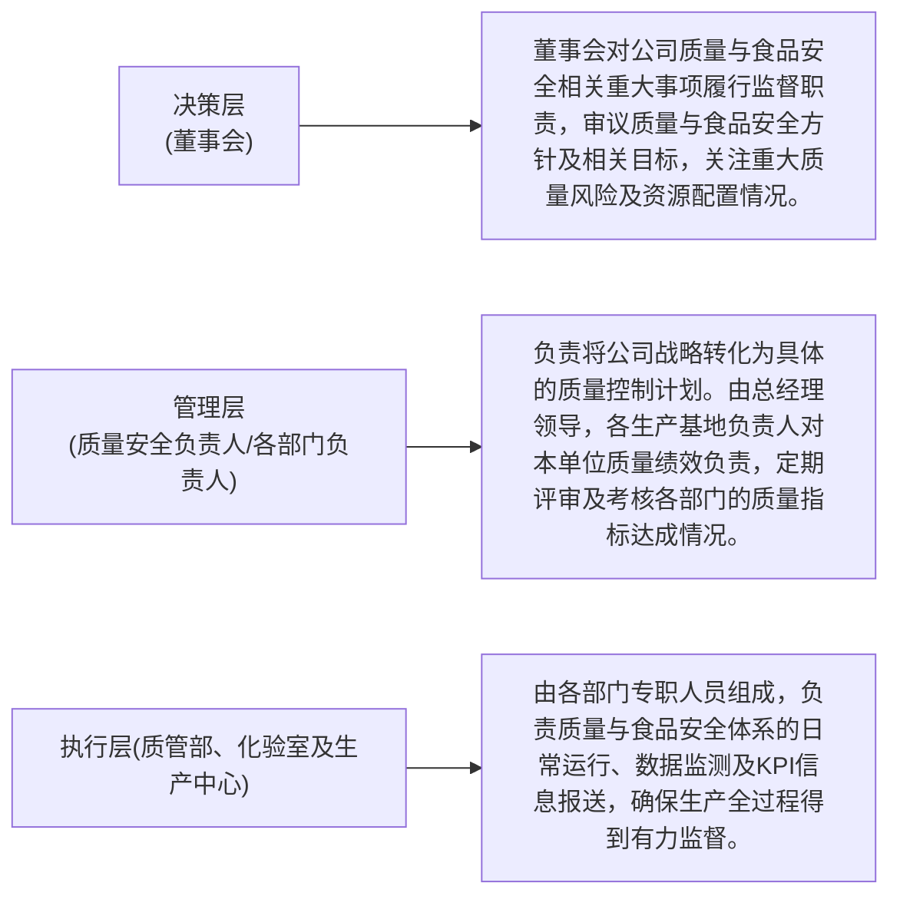
```mermaid
graph LR
  A["决策层\n(董事会)"] --> B["董事会对公司质量与食品安全相关重大事项履行监督职责，审议质量与食品安全方针及相关目标，关注重大质量风险及资源配置情况。"]
  C["管理层\n(质量安全负责人/各部门负责人)"] --> D["负责将公司战略转化为具体的质量控制计划。由总经理领导，各生产基地负责人对本单位质量绩效负责，定期评审及考核各部门的质量指标达成情况。"]
  E["执行层(质管部、化验室及生产中心)"] --> F["由各部门专职人员组成，负责质量与食品安全体系的日常运行、数据监测及KPI信息报送，确保生产全过程得到有力监督。"]
```

natural_image

Illustration of soy sauce, a pitcher, and a sprouting plant (no text or symbols)

公司成立了专业的食品安全小组，由总经理亲自挂帅，成员涵盖卫生质量控制、生产工艺技术、设备设施管理原辅料采购、仓库管理及销售等多部门人员。这种多部门联动的机制保障了从农田到餐桌的全流程食品安全。

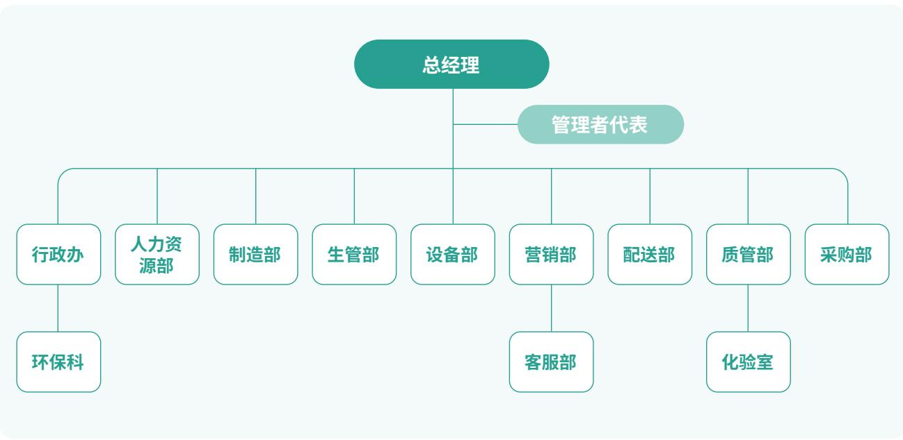

flowchart

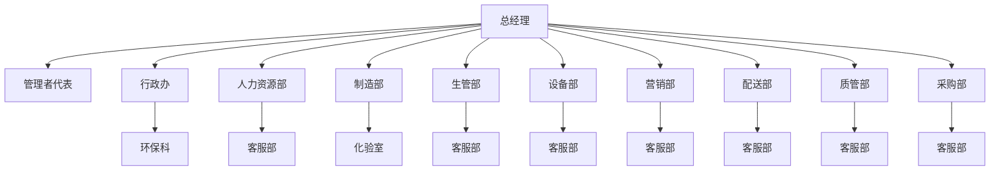
```mermaid
graph TD
  A["总经理"] --> B["管理者代表"]
  A --> C["行政办"]
  A --> D["人力资源部"]
  A --> E["制造部"]
  A --> F["生管部"]
  A --> G["设备部"]
  A --> H["营销部"]
  A --> I["配送部"]
  A --> J["质管部"]
  A --> K["采购部"]
  C --> L["环保科"]
  D --> M["客服部"]
  E --> N["化验室"]
  F --> O["客服部"]
  G --> P["客服部"]
  H --> Q["客服部"]
  I --> R["客服部"]
  J --> S["客服部"]
  K --> T["客服部"]
```

## 食品安全小组

  
卫生质量控制人员

  
生产工艺技术人员

  
设备设施管理人员

  
原辅料采购人员

  
仓库管理人员

  
销售人员

## 战略

祖名股份实施“品质领先”战略，将具体执行标准设定在国家标准之上，通过参与国际及行业标准制定，持续实企业发展基础。

## 1. 战略方针与管理手册

·公司确立了“责任重大，不敢懈怠：精益求精，不断创新”的质量/食品安全方针。为保障方针落地，公司制定并严格执行《质量，食品安全，环境和HACCP管理手册》及配套程序文件，通过加大管理投入和强化监督考核，提升整体质量管控水平。

natural_image

Illustration of three people working around a large green target with an arrow hitting the center, surrounded by gears (no text or symbols)

## 2. 标准化体系认证

公司严格按照GB/T 19001-2016（ISO 9001）、ISO 22000:2018以及危害分析与关键控制点（HACCP）体系认证要求，建立了覆盖全集团的质量与食品安全管理体系，并获得了中国质量认证中心颁发的各项证书。

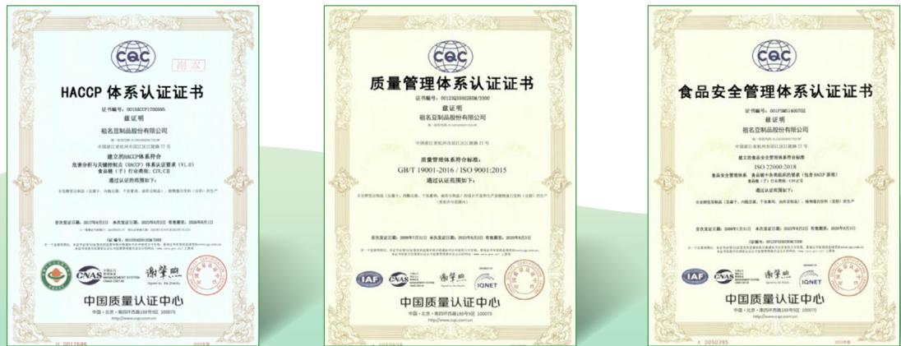

## 3. 引领行业与全价值链赋能

## 标准起草

公司作为CAC(国际食品法典委员会)国际标准《非发酵豆制品》的起草单位，同时参与了《腐竹》《大豆组织蛋白》等多项行业标准的起草，引领行业规范化发展。

## 源头管控

选用东北产区优质非转基因大豆专属品种，购置专用检测设备实现每批必检。

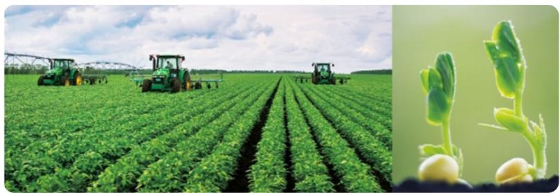

natural_image

Side-by-side comparison of a green agricultural field with tractors and seedlings under a cloudy sky; no visible text or symbols.

## 数字化赋能

依托ERP系统及智能化监管系统，实现产品生产过程的实时监控、透明监管与数据分析，确保每一环节均可追溯。

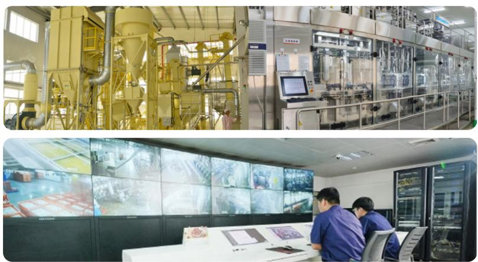

## 影响、风险和机遇管理

公司参考国际风险管理准则，建立了“识别一评估一响应”的动态循环机制，严格遵守《中华人民共和国食品安全法》《中华人民共和国消费者权益保护法》等法律法规

## 1 风险识别与评估流程

各部门结合业务性质与监管政策，定期识别原辅料质量波动、工艺偏差、冷链失控、合规变更等潜在风险，并建立风险辨识清单。公司通过分析风险事件在不同情景下的发生概率和影响程度，确定管理工作的优先级，从源头防范风险。

## 2 核心风险应对策略

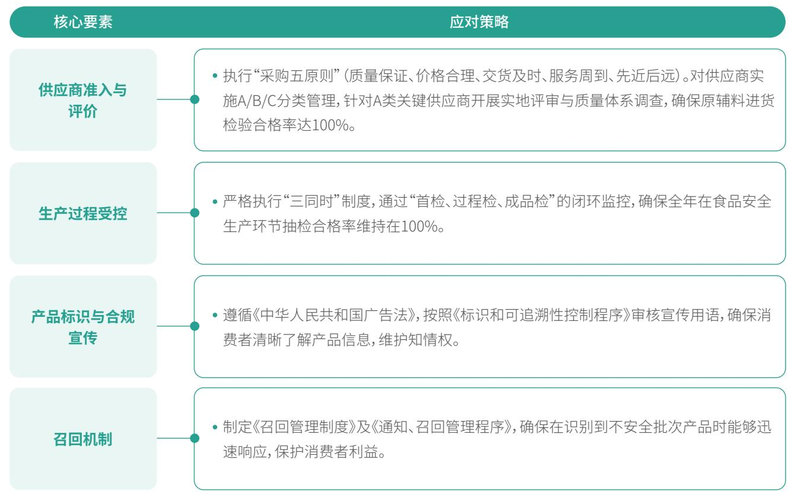

flowchart

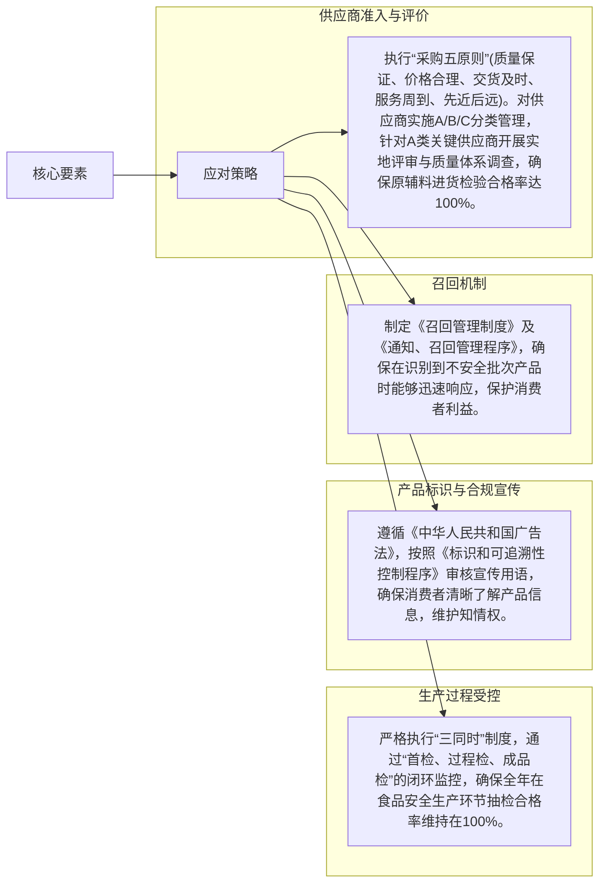
```mermaid
graph LR
  A["核心要素"] --> B["应对策略"]
  
  subgraph Supplier_Review ["供应商准入与评价"]
  B --> C["执行“采购五原则”(质量保证、价格合理、交货及时、服务周到、先近后远)。对供应商实施A/B/C分类管理，针对A类关键供应商开展实地评审与质量体系调查，确保原辅料进货检验合格率达100%。"]
  end
  
  subgraph Production_Process ["生产过程受控"]
  B --> D["严格执行“三同时”制度，通过“首检、过程检、成品检”的闭环监控，确保全年在食品安全生产环节抽检合格率维持在100%。"]
  end
  
  subgraph Product_Secumulation ["产品标识与合规宣传"]
  B --> E["遵循《中华人民共和国广告法》，按照《标识和可追溯性控制程序》审核宣传用语，确保消费者清晰了解产品信息，维护知情权。"]
  end
  
  subgraph Recall_Mgmt ["召回机制"]
  B --> F["制定《召回管理制度》及《通知、召回管理程序》，确保在识别到不安全批次产品时能够迅速响应，保护消费者利益。"]
  end
```

## 3 机遇捕捉与价值转化

祖名股份视“健康中国”战略为重大机遇，积极响应《健康中国行动(2019-2030年)》。通过“祖名豆制品研究院研发低嘌吟豆制品，高端植物基饮品等，满足消费升级需求，将政策导向转化为市场份额的增长点。

## 指标与目标

为保障质量战略的有效落地，公司设定了明确的年度管理目标，并通过关键绩效指标(KPI)进行实时监控。

<table><tr><td>关键指标</td><td>2024年达成情况</td><td>2025年达成情况</td></tr><tr><td>产品正品率</td><td>&gt;98%</td><td>&gt;98%</td></tr><tr><td>食品安全重大责任事故数量</td><td>0起</td><td>0起</td></tr><tr><td>生产环节抽检合格率</td><td>100%</td><td>100%</td></tr></table>

## 冷链物流系统的品质守护

公司现有900余辆冷藏车及专业配送团队，实施全程温度监控，确保生鲜产品在安全温度范围内送达。

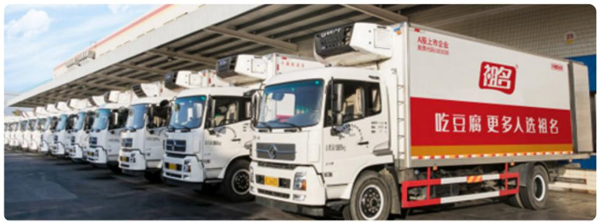

text_image

A股上市企业
股票代码:002185
吃豆腐 更多人选祖名

生鲜豆制品从出厂到终端消费全过程对低温保存要求较高，加之消费者越来越重视食品安全，低温控制能力决定了产品质量的稳定性，也决定了企业品牌能否长期被消费者认可，因此冷链配送物流体系在生鲜豆制品行业中起到不可或缺的作用。

报告期内，公司拥有900余辆冷藏货车，配送范围覆盖超过95%生鲜豆制品及冷藏植物蛋白饮品客户。生鲜豆制品和冷藏植物蛋白饮品运输使用经严格温度监控的冷藏车配送，产品进入商超等销售终端后，立即放入专用冷柜中进行销售，整个运输、销售流程中产品的温度均严格控制在安全范围内。与此同时，公司对于流程中的冷库、成品发货车间、运输车辆、周转箱等均进行定期清洗消毒。

公司凭借自有的冷链配送系统，实现了生产、储藏、出仓、配送及销售全过程冷链管理，配送范围覆盖浙江、江苏、上海、北京、安徽、山西、贵州、武汉等省市地区。一方面，公司全冷链配送系统，保障产品能够按照规定的温度保存，保证了产品质量的稳定及产品安全，另一方面可以扩大公司产品的销售半径。同时，公司点对点物流配送服务，使得公司在为客户提供完善服务的同时也构建了封闭的配送渠道，提高了其他品牌获取客户的难度。

## 供应链安全

祖名股份深知供应链的稳健与安全是企业持续经营及保障食品安全的核心。供应商的生产行为（如原料质量、环保合规、用工规范)直接影响社会公共健康及环境生态；原料供应的稳定性、供应商的合规风险以及采购成本的波动，也直接关系到公司的业务连续性、财务表现及品牌声誉。公司严格遵守《中华人民共和国民法典》《中华人民共和国食品安全法》《中华人民共和国环境保护法》等相关法律法规，建立了覆盖供应商准入、分类管理、定期评审及赋能发展的全链条供应链安全管理体系。

## 治理

公司制定了《采购管理制度》《采购控制程序》《供应商行为准则》等一系列制度，要求合作商在业务活动中遵循高标准的道德准则及可持续发展原则，所有合作商均需签订《合作伙伴廉洁承诺书》，确保其知悉公司对商业腐败的“零容忍”态度，共同构建廉洁、透明的供应生态。

## 战略

祖名股份以“源头严控、数字化追溯、定制化管理”为核心战略，致力于打造高标准的绿色供应链。公司在供应商筛选中始终坚持“质量保证、价格合理、交货及时、服务周到、先近后远”的五原则，兼顾品质、效率与低碳运输本地化采购）。

采购五原则  
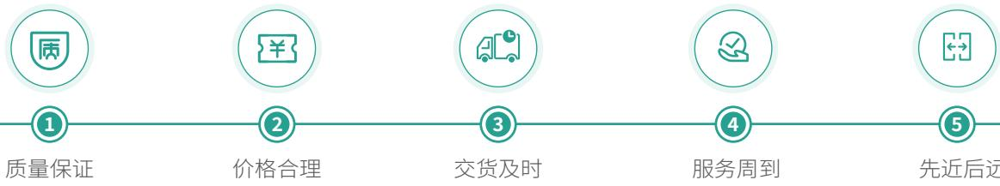

flowchart

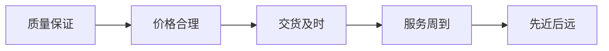
```mermaid
graph LR
  A["质量保证"] --> B["价格合理"]
  B --> C["交货及时"]
  C --> D["服务周到"]
  D --> E["先近后远"]
```

natural_image

Illustration of a person pouring grains from a funnel into a kitchen with storage tanks and bottles (no text or symbols)

## 源头严控

大豆作为核心原料，其安全性是公司战略的重中之重。

非转基因战略：选用东北产区优质非转基因大豆专属品种

批批检测机制：购置专用检测设备，要求每一批次大豆入库前均须通过非转基因检测，确保原料源头安全可追溯。

## 定制化管理

定制化辅料管理：为规避防腐剂等潜在食品安全风险，公司实施定制化战略。以酱油等辅料为例，公司坚持近20年定制无防腐剂辅料，从源头阻断非法添加剂的引入，维护产品纯正品质。

## 全链路数字化追溯

公司通过ERP系统及CRM系统构建数字化追溯体系，实现从原料采购、生产加工、仓储物流到销售终端的全流程数据实时监控。一旦识别到环节风险，系统可快速定位受影响批次并采取预警及召回措施。

natural_image

Illustration of two people examining a pie chart with gear and warning symbol, surrounded by abstract icons (no readable text)

## 影响、风险和机遇管理

祖名股份深知，稳定可靠的供应链安全体系是保障产品品质、增强消费者信任与品牌忠诚度、实现市场份额稳步提升的关键支撑。公司积极推动供应商规范化发展，助力豆制品行业质量标准升级，切实履行供应链社会责任

公司依据供应商所供物资的重要程度及对最终产品质量的影响差异，将供应商划分为三类，实施分级分类、差异化的风险管控。

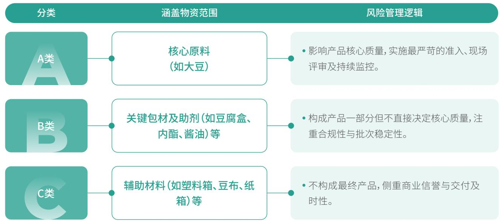

flowchart

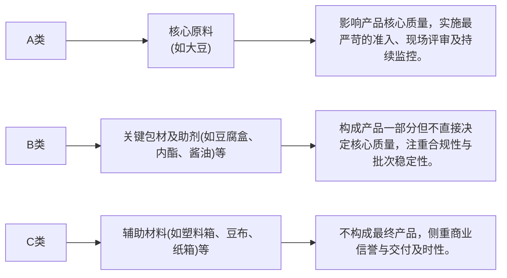
```mermaid
graph LR
  A["A类"] --> D["核心原料\n(如大豆)"]
  B["B类"] --> E["关键包材及助剂(如豆腐盒、内酯、酱油)等"]
  C["C类"] --> F["辅助材料(如塑料箱、豆布、纸箱)等"]
  D --> G["影响产品核心质量，实施最严苛的准入、现场评审及持续监控。"]
  E --> H["构成产品一部分但不直接决定核心质量，注重合规性与批次稳定性。"]
  F --> I["不构成最终产品，侧重商业信誉与交付及时性。"]
```

## 供应商评审与准入风险控制

## 初选评审

针对新供方，除“五原则”调查外，还需对其生产能力、技术水平、财务实力及商业信誉进行全方位评价。必要时开展现场抽样检验或试用。

## 合规性审核

重点审查供应商是否具备法定资质。例如在危废处置供方选择上，必须审核其是否具备收集、贮存、转运危险废物的环保资质，确保环境影响受控。

## 可持续评估

公司优先选择已获得ISO 9001、ISO 14001或绿色产品认证的供应商，将环境与质量管理体系作为加分项。

祖名股份积极捕捉供应链中的可持续发展机遇，致力干通过赋能与协同实现与合作伙伴的共赢。公司坚持将挑战转化为机遇，通过深度的“供应链帮扶”举措提升整体链条韧性：在质量赋能方面，公司的采购及技术团队深入生产一线，通过现场驻场检验和质量提升帮扶，有效帮助供应商提升供货合格率和质量管控水平;在沟通机制方面，公司通过定期举办供应商大会及开展满意度调查，构建了透明、高效的交流平台。

2025年，供应商综合满意度达到100%，公司通过认真分析供应商的需求期望与意见建议，并将其精准转化为内部管理的改进动力与具体工作措施，进一步巩固了互利共赢的供应生态。

## 指标与目标

<table><tr><td>关键指标</td><td>2024年达成情况</td><td>2025年达成情况</td></tr><tr><td>供应链安全事故数量</td><td>0起</td><td>0起</td></tr><tr><td>供应商审核比例</td><td>100%</td><td>100%</td></tr><tr><td>供应商满意度</td><td>≥98%</td><td>100%</td></tr></table>

natural_image

Illustration of global logistics with cargo ship, shipping truck, airplane, and globe (no text or symbols)

## 平等对待中小企业

公司重视与供应商构建良好的合作伙伴关系，始终尊重并平等对待所有供应商。对于中小企业供应商。公司一视同仁，在准入、合作等环节给予同等机会，不会因企业规模小而区别对待，以促进公平竞争的市场环境。同时，公司还积极与中小企业供应商协同发展，为其提供必要的支持与帮助，共同提升供应链的整体质量和效率。报告期内，根据“信用中国”网站公示结果，公司无逾期尚未支付中小企业款项相关严重失信行为。截至报告期末，公司未出现应付账款（含应付票据）余额超过300亿元或占总资产比重超过50%的情形。

## 凝心聚力·共赴新程

祖名豆制品集团股份有限公司于杭州、扬州、安吉三地举办2025年度客户答谢会，董事长蔡祖明等核心管理层悉数出席，与全国客户代表、管理干部及员工代表共叙合作情谊、共绘发展蓝图。为感恩伙伴长期支持，现场颁发优质忠诚客户、年度新星、新品推广、金牌合作、增长先锋、优质终端及潜力、先进、优秀、卓越合伙人等多项荣誉。本次答谢会既是对过往同心同行的感恩回馈，更是携手新程的重要起点。

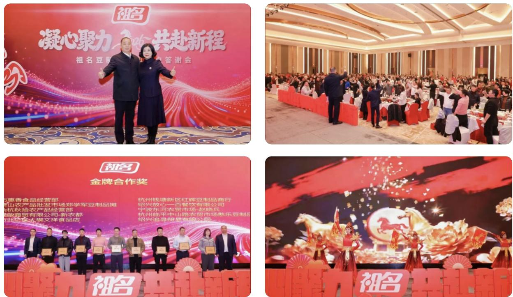

## 负责任营销

在渠道多元化与数字化转型的背景下，祖名股份始终坚持诚信经营与负责任营销的合规准则。公司严格遵守《中华人民共和国广告法》《中华人民共和国消费者权益保护法》《中华人民共和国反不正当竞争法》等法律法规，构建了覆盖营销材料审核、产品标识规范、电商直播管理及客户服务响应的闭环管理体系。我们通过建立严谨的营销材料审核机制、规范的产品标签标识管理以及闭环的客户反馈响应网络，切实保障消费者的合法权益与知情权。公司不仅关注产品交付的效率，更致力于通过专业化的售后支持、直播间合规监管以及科学的使用引导，持续优化用户服务体验并维护公平竞争的市场秩序

## 严谨的合规营销审核体系

为确保传递给消费者的信息真实，准确。公司制定了《与顾客有关的管理程序》和《服务控制程序》，从制度层面规范营销行为。

## 多部门联合监管

公司构建了严谨的营销材料审核机制，由营销部门牵头，质管部重点审核产品安全性及质量关键要素确保所有广告内容及宣传资料在真实性、合法性及可信度上均符合国家标准。

## 严禁虚假承诺

公司严禁在营销过程中出现夸大产品功效或误导消费者的表述，旨在维护消费者的知情权不受侵害。

## 规范的产品标识与信息追溯

公司深知清晰的标识是消费者安全选购的前提。依据《标识和可追溯性控制程序》，公司建立了全周期的标签管理机制：

## 标签规范审核

公司对每一款产品的包装标签和宣传用语进行专项审核确保成分标注，贮存条件等信息清晰、明确。

## 合理使用引导

针对生鲜豆制品对温度敏感的特性，公司通过产品包装、官方公众号推文等多种形式，详细展示产品详情及合理贮存、使用的方法，帮助消费者通过科学方式保障食品口感与安全。

## 交付环节防护

对有特殊运输储存环境要求的生鲜产品，公司在交付过程中实施专项防护，确保产品在抵达终端时依然保持高品质状态。

## 电商直播与公平竞争管理

针对日益增长的数字化营销需求，祖名股份加强了对抖音等新媒体电商平台的规范管理：

## 主播专项培训

●公司对直播人员开展合规性专项培训，确保推介内容全面、准确，严禁虚假宣传或给出无法兑现的承诺。  
●公司在直播过程中严禁通过虚构交易、虚假排名或误导性评价等不正当手段竞争，同时明确要求不得编造、传播虚假信息损害竞争对手声誉，筑牢公平合规运营底线。

## 维护市场秩序

## 客户服务与诉求响应机制

祖名股份高度重视客户和消费者的体验，建立了完善的“听取、分析、改进”闭环服务体系：

## 多渠道反馈网络

公司建立了质量信息反馈网，通过客服热线、实地走访广泛搜集反馈。

## 高效投诉处理

●所有投诉信息由客服部统一归类整理并实时反馈给营销、质管及制造部门。对于重大反馈，公司安排专业人员上门处理，确保反馈处理率达到100%。

## 负责任营销与客户反馈管理流程

## 合规审核

## 规范标识

## 负责任交付

## 满意度调查

## 持续改进

## 产品召回与安全保障

为应对潜在的食品安全风险，公司制定了《召回管理制度》及《通知、召回管理程序》。一日识别到不安全批次产品，公司能够迅速定位受影响批次，启动流通环节的不合格产品管控措施，最大限度保护消费者人身安全。

## 创新“小配送”赋能模式，构建产业链共赢生态

公司聚焦渠道升级与伙伴共生，创新推出“千城万店，配销一体化”合伙人模式，以“小配送”赋能体系深度赋能经销商伙伴：通过为合作方配置专业冷藏运输车辆，上线数字化智能订货系统，提供全流程专业运营培训展终端市场。截至报告期内，该模式已成功覆盖超6000个终端销售网点，不仅有效打通农产品流通“最后一公里”更带动产业链上下游协同发展，以营销模式创新激活渠道活力，实现企业、经销商与终端客户的多方共赢，彰显企业在产业链价值创造中的责任与担当。

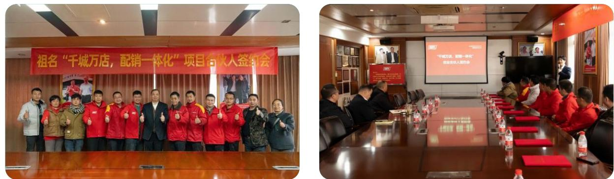

## 关键绩效

顾客满意度调查得分

≥98.3 分（满分为100分）

顾客反馈处理率

100%

## 助力健康中国

作为中国豆制品行业的领军企业，祖名股份深度对接《“健康中国2030”规划纲要》《健康中国行动（2019—2030年）》等国家战略，将“增加大豆及豆制品摄入”“豆类天天有”等健康倡导融入企业发展战略，以产品创新与品质升级助力国民健康水平提升。

祖名股份深知豆制品作为中国传统膳食的核心组成部分，是优质植物蛋白、膳食纤维及多种微量元素的天然来源。公司通过将可持续发展战略与科技创新深度融合，致力于为消费者提供更加科学、健康的食养方案。

## 1 科技赋能产品矩阵，满足多元健康需求

公司依托下设品质创新部与新品研发部的豆制品研究院，不断攻克行业关键技术难题。通过科技手段深度挖掘大豆营养，公司构建了涵盖400余种单品的健康产品体系，精准对接不同群体的健康关切

## 深耕生鲜与饮品矩阵

通过提升生鲜豆制品的出品率与口感，保障国民基础营养供给；重点开发豆乳系列作为乳制品的优质替代，助力平衡国民营养结构。

## 突破功能性工艺创新

深入研究超微制浆、射流磨等技术，研制出“全豆”系列产品，最大限度保留膳食纤维。针对尿酸代谢等特定健康关切，研发并推广低嘌呤系列豆制品，其成果已获得国内权威实验室认证。

## 科研赋能人才成长

利用“祖名：云学堂”等平台提升研发人员专业素养，通过项目奖金制度激励产品创新热情，确保持续输出行业领先的健康食品。

## 2 标准引领与严苛质控，筑牢健康安全防线

祖名股份深知行业规范与品质管控是健康保障的前提。

## 推动标准制定与质量提升

●公司作为CAC(国际食品法典委员会)国际标准《非发酵豆制品》及多项国家，行业标准的起草单位，积极参与《大豆组织蛋白》等团体标准的制定，提升了整个行业的健康准入门槛。

## 严守质量红线

·公司建立并严格执行《质量、食品安全、环境和HACCP管理手册》，通过了ISO22000食品安全管理体系及HACCP体系认证。从原辅料进货检验到成品放行，实施全过程有力监督，确保每一份产品都符合国家食品安全标准，守牢国民健康防线。

## 关键绩效

报告期内，公司健康相关产品抽检合格率达

100%，未发生健康相关合规违规事件。

## 数字化转型与信息安全

在当今数字经济深入发展的背景下，祖名股份深知数字化转型不仅是提升企业运营效率的工具，更是实现高质量发展与保障企业信息资产安全的关键路径。公司积极推进信息技术与业务流程的深度融合，通过构建全链路数字化体系与严密的安全防线，旨在打造一个透明、高效目受控的智慧化运营环境。

natural_image

Illustration of two people using laptops on a podium, with abstract pie charts and bar graphs in the background (no readable text or symbols)

## 数字化赋能引领业务升级

祖名股份致力于通过数字化手段赋能生产管理全过程，建立了涵盖研发、采购、制造、物流及销售的闭环数字生态，全面提升了公司的核心竞争力。

## 智慧生产：智能一体化管理

公司依托企业智能一体化综合管理系统及智能化监管系统，实现了生产现场的监控联网与精细化管理。

## 实时监控 与追溯

●通过在各生产基地安装监控系统，公司使产品生产过程始终处于受控状态。相关部门能够依据系统数据进行实时监视、检测，确保在生产环节及时发现并解决潜在问题，保障持续稳定的生产

## 决策支持

●数字化平台不仅提升了数据分析能力，还增强了监管的透明度，为管理层提供了科学的决策依据。

## 2 管理数字化：全链路追溯与协同

公司通过ERP系统与CRM客户管理系统实现了跨部门的业务协同与数字化监控。

  
全链监控

借助ERP系统，公司实现了从大豆原辅料采购、生产加工、冷链配送到末端销售的全流程数据监控。这一系统构建了数字化的追溯体系，使公司能够快速定位并解决任何环节出现的异常。

  
营销管控

CRM系统被用于对业务员的日常销售行为进行管控，所有客户信息通过系统进行分类管理，提升了市场响应的速度与精准度。

## 3 赋能合作伙伴：数字化销售模式

针对“小配送”销售模式，公司大力推进数字化工具的应用。

终端软件支持：公司为“合伙人”经销商及终端门店提供专业的订货、发货及结算软件，实现了快速下单与高效对账，显著提升了产业链末端的管理效率与透明度。

## 信息安全与隐私保护

祖名股份严格遵守《中华人民共和国个人信息保护法》等法律法规，将信息安全与隐私保护作为经营管理的重要组成部分，持续完善网络与信息安全管理机制，保障数据资产和个人信息安全。

## 1 制度保障与合规治理

公司制定了《信息系统安全制度》，建立了多维度的防护体系，覆盖数据安全、设备安全、网络安全及软件安全四大核心领域。

## 管理架构

公司设立了专门的信息安全管理组织，负责制定安全考核细则，将安全职责层层分解并落实到相关责任人。

## 外部对标

公司定期对标最新法规要求，持续提升网络安全技术防护能力，筑牢信息安全屏障。

## 2 四位一体的技术防护体系

祖名股份针对潜在的数字风险，构建了数据、设备、网络、软件“四位一体”的综合防御体系：

  
数据安全

实施严苛的数据加密与备份机制。公司将客户档案资料列为机密信息，非相关人员查阅必须经过部门负责人严格审批，严禁任何未经授权的数据导出行为。

  
网络安全

通过防火墙、入侵检测系统及内网隔离技术，有效防范外部攻击与病毒入侵，保障办公及生产网络的稳定运行。

  
设备安全

对服务器、机房设施及终端硬件实施物理隔离与实时监控，确保基础设施的可靠性。

  
软件安全

严格软件准入与版本管理，定期开展系统漏洞扫描与修复，防范系统性安全风险。

## 3 消费者隐私保护

在负责任营销及客户服务过程中，祖名股份高度重视消费者隐私。公司在客户服务和满意度调查过程中严格限定个人信息收集范围，并采取脱敏等措施加强隐私保护，防范信息滥用和泄漏风险。

natural_image

Illustration of a person interacting with a smartphone displaying a document, surrounded by icons like a shield, lock, gear, and people (no text or symbols)

# 04

# 循绿色之道绘生态蓝图

应对气候变化

环境合规管理

资源管理

排放管理

生态系统和生物多样性保护

natural_image

Close-up of green leaves with water droplets and bokeh background (no text or symbols)

## 应对气候变化

应对气候变化不仅是全球共同面临的严峻挑战，也是祖名股份实现长远稳健经营、履行企业社会责任的核心领域。公司积极响应国家“碳达峰、碳中和”战略目标，严格遵循《中华人民共和国环境保护法》等法律法规，并将应对气候变化纳入企业发展的战略高度。我们致力于通过深入识别气候相关风险与机遇，采取系统的节能减排举措，协同产业链上下游共同迈向低碳未来。

## 气候风险与机遇的系统识别

祖名股份公司参考《国际财务报告可持续披露准则第2号—气候相关披露》(IFRSS2)及深交所《上市公司自律监管指引第17号—可持续发展报告》的要求，结合豆制品行业的业务特性，对公司运营全生命周期中的气候风险进行了深度剖析与分类管理。

随着全球及国内绿色低碳政策的收紧，公司面临着多维度的转型挑战：

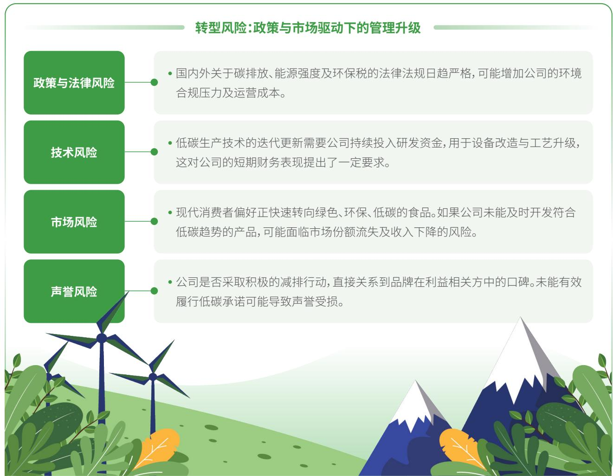

flowchart

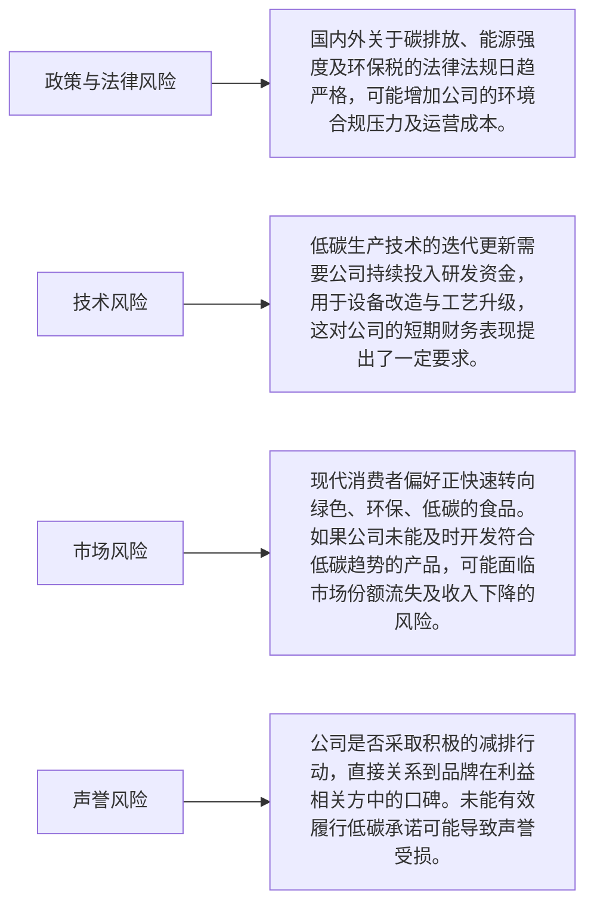
```mermaid
graph LR
  A["政策与法律风险"] --> B["国内外关于碳排放、能源强度及环保税的法律法规日趋严格，可能增加公司的环境合规压力及运营成本。"]
  C["技术风险"] --> D["低碳生产技术的迭代更新需要公司持续投入研发资金，用于设备改造与工艺升级，这对公司的短期财务表现提出了一定要求。"]
  E["市场风险"] --> F["现代消费者偏好正快速转向绿色、环保、低碳的食品。如果公司未能及时开发符合低碳趋势的产品，可能面临市场份额流失及收入下降的风险。"]
  G["声誉风险"] --> H["公司是否采取积极的减排行动，直接关系到品牌在利益相关方中的口碑。未能有效履行低碳承诺可能导致声誉受损。"]
```

气候变暖带来的急性与慢性风险直接影响生产基地的安全：

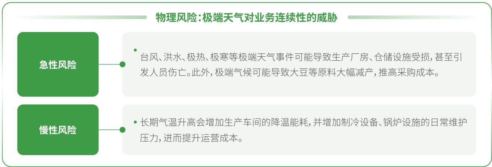

flowchart

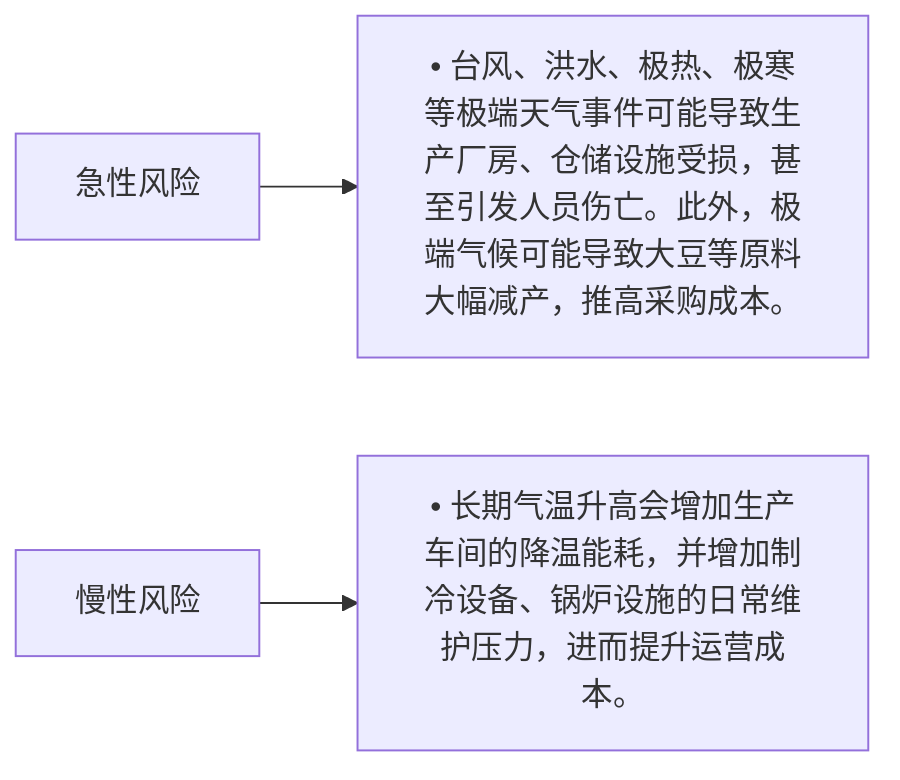
```mermaid
graph LR
  A["急性风险"] --> B["• 台风、洪水、极热、极寒等极端天气事件可能导致生产厂房、仓储设施受损，甚至引发人员伤亡。此外，极端气候可能导致大豆等原料大幅减产，推高采购成本。"]
  C["慢性风险"] --> D["• 长期气温升高会增加生产车间的降温能耗，并增加制冷设备、锅炉设施的日常维护压力，进而提升运营成本。"]
```

公司化被动为主动，将气候挑战转化为可持续发展的机遇

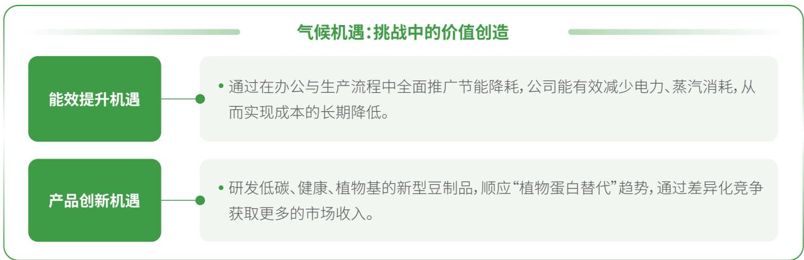

flowchart

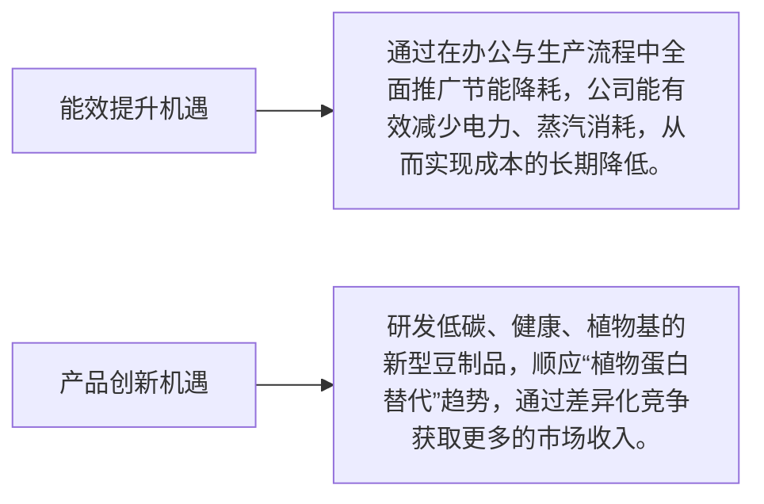
```mermaid
graph LR
  A["能效提升机遇"] --> B["通过在办公与生产流程中全面推广节能降耗，公司能有效减少电力、蒸汽消耗，从而实现成本的长期降低。"]
  C["产品创新机遇"] --> D["研发低碳、健康、植物基的新型豆制品，顺应“植物蛋白替代”趋势，通过差异化竞争获取更多的市场收入。"]
```

## 气候变化管理架构与职责分工

为保障应对气候变化各项工作的有力落地，祖名股份构建了分层负责的环境与气候管理组织架构，确保气候管理目标能够穿透至业务一线

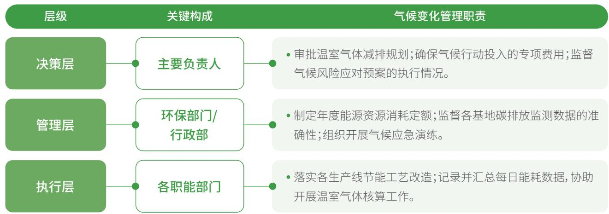

flowchart

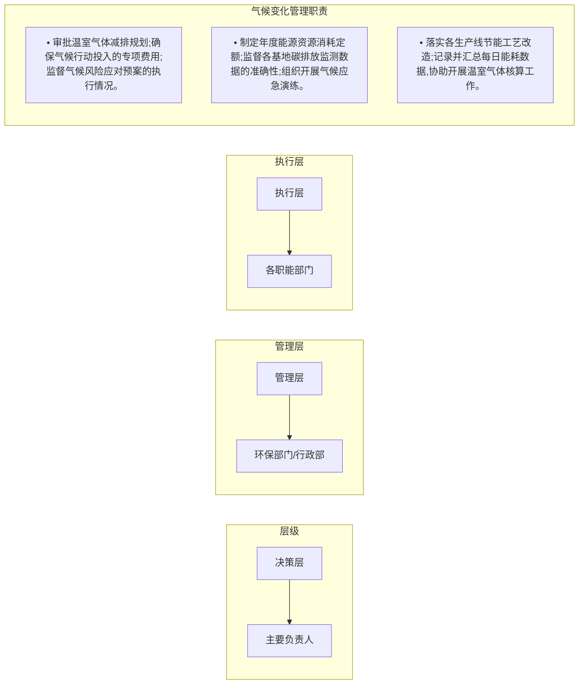
```mermaid
graph LR
  subgraph Layer["层级"]
    direction TB
  A["决策层"] --> B["主要负责人"]
  end
  
  subgraph Management["管理层"]
    direction TB
  C["管理层"] --> D["环保部门/行政部"]
  end
  
  subgraph Execution["执行层"]
    direction TB
  E["执行层"] --> F["各职能部门"]
  end
  
  subgraph Role["气候变化管理职责"]
    direction TB
    G["• 审批温室气体减排规划;确保气候行动投入的专项费用;监督气候风险应对预案的执行情况。"]
    H["• 制定年度能源资源消耗定额;监督各基地碳排放监测数据的准确性;组织开展气候应急演练。"]
    I["• 落实各生产线节能工艺改造;记录并汇总每日能耗数据,协助开展温室气体核算工作。"]
  end
```

## 气候变化应对措施与低碳路径

祖名股份探索从“管理减排、技术减排、结构减排”三个维度入手，全面构建绿色生产体系。

## 结构减排：能源转型的“阳光工程”

公司大力推进可再生能源的替代，充分利用各生产基地的屋面资源。

·分布式光伏建设：安吉祖名与扬州祖名已分别建成1.1MW光伏系统及1.6MW光伏系统，并在安吉基地配套建设9.2MWh储能设施。项目采用“自发自用、余电上网”模式，有效提升绿电使用比例；其中扬州基地光伏项目年发电量约2400MWh，显著降低范围二碳排放，安吉储能设施则通过峰谷优化实现用电成本节约。

## 技术减排：工艺优化与节能技改

·节能降耗管理：公司制定《能源资源管理程序》，将能源消耗指标细化到车间甚至产品类别。通过对动力制浆、后道杀菌等高能耗环节实施标准吨耗核算，并按实际消耗进行考核，激发了全员的节约意识。  
·设备升级改造：积极引进变频技术与高效锅炉设施，优化沼气收集与循环利用工艺。例如，通过沼气脱硫处理后作为燃气锅炉的补充燃料，实现了生物质能的循环利用。

## 管理减排：应急响应与供应链赋能

·环境突发事件预案：针对极端天气可能引发的环境泄漏或停电风险，公司制定《突发环境事件应急预案》，并定期开展演练。  
·低碳采购管理：科学制定大豆采购计划。针对气候灾害可能带来的原料波动，公司选择合适时机锁定采购价格保障了在极端气候年份下的成本稳健。

## 温室气体排放管理与核算

祖名股份建立了常态化的温室气体排放监测机制，通过精确核算生产经营过程中的排放情况，为科学制定减排路径提供数据支撑。

<table><tr><td>关键指标</td><td>单位</td><td>2025年数据</td></tr><tr><td>范围一</td><td>吨二氧化碳当量</td><td>36,217.24</td></tr><tr><td>范围二</td><td>吨二氧化碳当量</td><td>122,690.53</td></tr><tr><td>温室气体排放总量</td><td>吨二氧化碳当量</td><td>158,907.77</td></tr><tr><td>温室气体排放强度</td><td>吨二氧化碳当量/百万元营收</td><td>78.47</td></tr></table>

\*范围一(直接排放)·主要源于生产过程中燃气锅炉消耗的天然气、备用发电及运输车辆消耗的汽柴油、食堂消耗的液化石油气。排放因子参照《中国能源统计年鉴》  
\*范围二(间接排放)·主要源于外购电力及外购蒸汽。排放因子参照生态环境部及发改委发布的最新数据。

## 环境合规管理

祖名股份视生态环境为企业生存与发展的生命线，始终坚持“预防为主，防治结合”的环境保护政策。公司严格遵守《中华人民共和国环境保护法》《中华人民共和国水污染防治法》《中华人民共和国固体废物污染环境防治法》《中华人民共和国环境噪声污染防治法》《建设项目环境保护管理条例》等法律法规，构建了完善的环境管理体系，最大限度降低产品全生命周期对环境的影响，为绿色豆制品产业发展注入动力。

## 治理

祖名股份建立了由主要负责人、管理职能部门及业务执行部门组成的三级环境治理架构，确保环保责任层层落实

## 1 组织职责分工

根据《环境管理制度》，公司各层级的环保职责明确如下

## 决策层（公司主要负责人）

作为环保工作的第一责任人，负责建立健全环境保护管理体系和监管队伍，审议年度环保工作计划与重大问题，并确保环保费用的持续投入。 保工作计划与重大问题，并确保环保费用的持续投入。

## 管理层（环保部门/行政部）

0 负责贯彻国家环保方针政策，制定环保规划、年度目标及考核办法。下设专项岗位负责监督巡查各环境因素，定期通报环境状况，并编制污水处理站等设施的操作规程。

## 执行层（各职能部门/子公司）

0 落实“谁污染、谁治理”原则，负责生产工序中的清洁生产工艺实施、固废及建筑垃圾的分类回收，并按规定收集、储存危险废物。

## 内部监督与考评机制

公司推行环保目标责任制，将环境指标纳入各部门绩效。由公司精益管理检查小组、行政部及临时组建的环保安全专项检查组开展日常、月度及定期的监察巡视。

## 战略

公司通过标准化体系认证与全生命周期管控战略将合规要求内化为生产标准，推动从“末端治理”向“源头预防”转型。

natural_image

Illustration of a computer monitor displaying upward arrows, surrounded by icons for data visualization, pie chart, calendar, and coins (no text or symbols)

## 体系认证与标准化

公司按照GB/T24001-2016标准建立了质量、环境与食品安全/HACCP管理体系，并持续通过ISO14001环境管理体系认证。公司坚持具体执行标准优于国家标准，如安吉基地内部废水排放管控标准设定为COD≤100mg/L，严格于当地三级排放标准的500mg/L。

祖名股份  
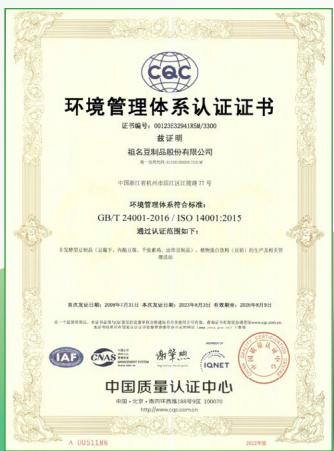

text_image

CQC
环境管理体系认证证书
证书编号：0012382941R5W/3300
兹证明
纽名克制品股份有限公司
统一社会信用代码：91320000MA7D6XJF
中国浙江省杭州市余杭区江虹路77号
环境管理体系符合标准：
GB/T 24001-2016 / ISO 14001:2015
通过认证范围如下：
多发塑型认证制品（金属手、内燃机、干聚苯、卤代尔制品）、植物蛋白试剂（注射）的生产及相关管理活动
首次发证日期：2009年5月31日 本次发证日期：2022年5月31日 有效期至：2025年5月15日
由一个重要事项，本企业须与国家发改委颁布的《中华人民共和国环境保护总局关于开展环境管理体系认证工作有关问题的通知》（国办发[2022]103号）下发。国家环境保护总局发布《环境管理体系认证认证申请表》（国办发[2022]103号）。
中国质量认证中心
中国·北京·南昌市南昌路188号院130070
http://www.qzq.com.cn/
A 00511885
2022年度

安吉祖名  
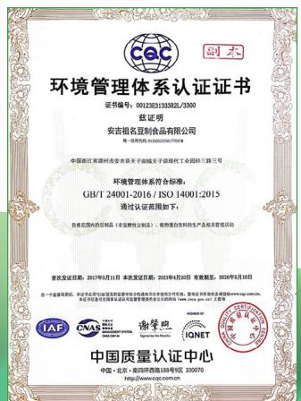

text_image

环境管理体系认证证书
证书编号：00123831353982/2300
兹证明
安吉祖名亚制食品有限公司
中国浙江省温州市安吉县关于加强电子感控工程的三路三号
环境管理体系符合标准：
GB/T 24001-2016 / ISO 14001:2015
通过认证范围如下：
资质范围内的项目标（中安集团中标），检测对象为环保的生产及相关费用活动
首次发证日期：2021年6月11日 本次发证日期：2023年6月20日 有效期至：2026年6月18日
在中国质量认证中心
中国·北京·高科环药路188号9区 100070

扬州祖名  
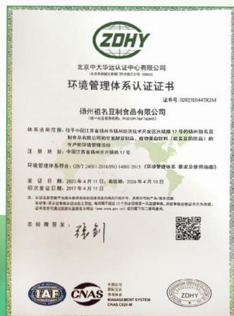

text_image

ZDHY
北京中大华远认证中心有限公司
环境管理体系认证证书
证书号: 020238344782M
扬州祖名豆制食品有限公司
地址: 中国(上海)自由贸易试验区
组织机构代码: 913301161160000
体系适用范围: 位于中国江苏省扬州市经济技术开发区兴城路17号的扬州祖名豆制食品有限公司的甘草豆制品、植物蛋白饮料（原名豆制品）的生产的环境管理活动
注册地址: 中国(上海)自由贸易试验区17号
环境管理体系符合: GBT 24001-2016ISO 14001-2015《环境管理体系 要求及使用指南》
发证日期: 2023年4月11日, 香晓晴: 2026年4月10日
初次发证日期: 2017年4月11日
注: 认证后须经国家工商行政管理总局颁发的注册证书后方可生产, 原材料可生产, 填充印刷。
咨询/评估/认证事项必须经过审批, 每项需经通过一个项目或单位统一签署审核, 并经董事会批准后方可办理。
证书有效期至登记机关登记机关登记机关登记机关登记机关登记机关登记机关登记机关登记机关登记机关登记机关登记机关登记机关登记机关登记机关登记机关登记机关登记机关登记机关登记机关登记机关登记机关登记机关登记机关登记机关登记机关登记机关登记机关登记机关登记机关登记机关登记机关登记机关登记机关登记机关登记机关登记机关登记机关登记机关登记机关登记机关登记机关登记机关登记机关登记机关登记机关登记机关登记机关登记机关登记机关登记
总经理签发: 张剑
JAF CNAS INDUSTRY CO.,LTD. BANANA MANAGEMENT SYSTEM CNAS 2023M

## “三同时”管理战略

祖名股份严格执行建设项目环保“三同时”制度。所有新改扩建项目、新工艺及新设备的引进，必须确保污染防治设施与主体工程同时设计、同时施工、同时投产使用。

## 环境投入保障

·公司坚持“不惜一切代价主动做好环保工作”。  
2025年度，公司及子公司在环保设备设施投入达141.26万元，环保费用支出1,481.69万元。  
公司计划继续加大在高效节能设备及高标准管材方面的投入，确保设备工作点位于高效区。

natural_image

Illustration of two people reviewing documents with a large clipboard and star ratings (no text or symbols)

## 影响、风险和机遇管理

公司建立了完善的环境风险识别与响应机制，通过精细化过程管控降低负面环境影响。

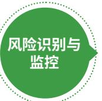

公司定期识别生产经营中的环境风险因素，建立风险辨识清单，涵盖废水污染、大气污染、噪声危害及固体废弃物事故等类型。

●监视与测量:通过《环境监视与测量控制程序》，采用自行监测、在线监测与第三方监测相结合的方式。废水排放口安装有在线监控设施，监测数据实时上传至环保主管部门。  
基础设施保障：管道系统设计选用良好管材，从硬件层面防范跑冒滴漏风险。

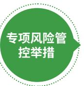

排污许可管理：严格执行排污登记与许可管理要求，坚持达标排放。

●危险废物合规管理:针对实验废液、废机油等危废，公司建立了《固废管理程序》，实施分类贮存并粘贴符合GB18597标准的标签。  
●2025专项合规实践:在2025年度危废处置管理中,公司指派专人负责对接业务，并严格审核7方收集、贮存、转运资质，确保转移联单等审批手续合法合规

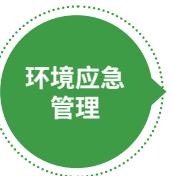

●公司制定了《突发环境事件应急预案》，成立了由主要负责人任总指挥的环境应急指挥领导小组。预案将环境污染事故按影响程度分为特大、重大、较大及一般四个等级，并定期组织消防灭火、抢险救灾、医疗组等专项演练，确保在突发状态下能迅速开展排险工作。

## 指标与目标

## 2025 年

## 情况说明

因环境事件受到生态环境等有关部门重大行政处罚的处罚金额

“报告期内.公司始终坚持严格的环境合规管理。2025年8月.杭州滨江厂区在生产运营过程中因污水站废气治理设备出现短暂波动，导致排气口臭气浓度出现偶发的短期超标情况

事件发生后，公司管理层高度重视，秉持立行立改的原则，第一时间积极配合属地生态环境局的调查，并讯速对污水站设备设施开展了全面的排查与检修，同时进一步加强了污泥的外运处理力度，从源头消除了环境影响。经全面、彻底的积极整改，公司于2025年9月1日通过了第三方检测机构的复测，各项废气排放指标均已完全符合《恶臭污染物排放标准》(GB1455493)的要求。

鉴于公司在此次事件中响应迅速、积极采取整改措施主动消除环境危害后果，且公司日常积极组织环保相关法律知识宣进，并在浙江省“环保e企管”平台积极学法获取了较高的学法积分，展现了良好的合规意识与态度，生态环境部门最终对公司做出了从轻处罚的决定(罚款人民币10万元)。

公司以此为契机，已全面复盘现有环保设施运行状况，进一步完善了废气日常监测预警机制坚决杜绝此类偶发事件的再次发生，持续夯实绿色生产根基。

## 污水处理站工艺提升与稳定运行实践

公司以打造「无废亚运工厂为目标，积极响应国家“碳达峰、碳中和”战略，将循环经济理念深度融入生产全流程全力推进企业绿色、可持续发展。

公司已通过ISO14001环境管理体系、ISO.9001质量管理体系、ISO22000食品安全管理体系等多项权威认证，累计投入超亿元用于环保节能改造，是杭州地区首家实施煤改气的豆制品企业，先后获评浙江节水型企业、“无废亚运工厂”等荣誉。在生产运营中，公司构建了固废科学处理、废水变废为宝、废气改造提升的全链条环保体系：通过豆渣、蛋白渣等固废的资源化循环利用，实现变废为宝:自建废水预处理站，严格落实雨污分流，保障废水达标排放持续推进废气循环经济、油烟净化升级与除臭改造，全方位守护生态环境，以实际行动践行绿色生产、赋能可持续发展。

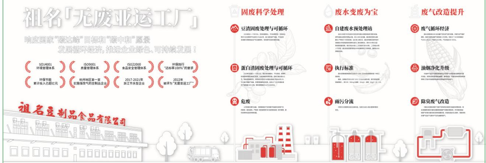

text_image

祖名「无废亚运工厂」
响应国家“碳达峰”目标和“碳中和”愿景
发展循环经济，推进企业绿色、可持续发展！
SO14001
环境管理体系
ISO9001
质量管理体系
ISO22000
食品安全管理体系
环保践行
"达标率100%"的要求
环保节能
累计投入超亿元
杭州地区第一家
实施煤改气的豆制品企业
2017-2021年
浙江节水型企业
2022年
被评为“无废亚运工厂”
固废科学处理
豆渣固废处理与可循环
蛋白清固废处理与可循环
危废
废水变废为宝
自建废水预处理站
执行标准
废气改造提升
废气循环经济
油烟净化升级
除臭废气改造

## 资源管理

祖名股份高度重视并充分理解资源管理对企业可持续经营的重要性。我们严格遵守《中华人民共和国节约能源法》《中华人民共和国循环经济促进法》《中华人民共和国水法》《中华人民共和国清洁生产促进法》等法律法规，将节能减排理念贯穿干生产运营的每一个环节。公司坚持“预防为主、防治结合”的原则，通过精益生产管理、工艺技术创新及清洁能源应用，积极提升水、能源及原材料的使用效率，致力干构建资源节约型与环境友好型企业。

公司建立了权责明确的资源管理体系，制定了《能源资源管理程序》，将资源节约目标分解落实到各职能部门，形成全员参与的节约文化。

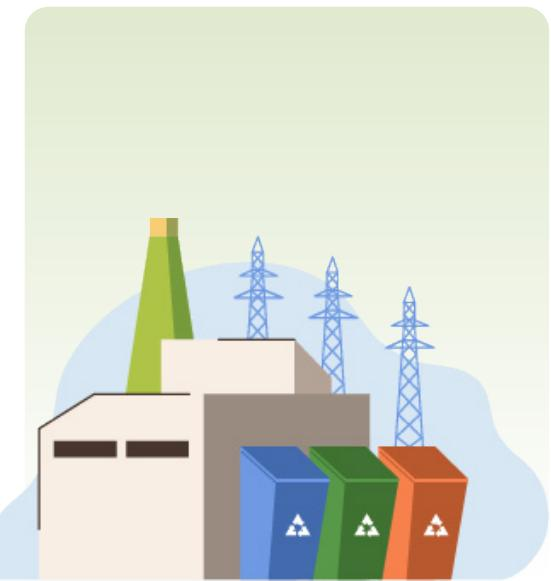

natural_image

Illustration of an industrial facility with smokestacks and transmission towers (no text or symbols)

## 组织职责分工

根据内部管理制度，公司各部门在资源管理中的职责如下：

·行政部/基建部：负责全公司取用水、电能及气能的统筹管理。主要职责包括定期记录实际用量、负责能源计量设备的维护与巡检，确保设备处干良好运行状态。  
·各生产中心/车间：作为资源消耗的一线单位，负责原材料消耗的定额控制，并落实本部门用水、用电、用气的节能措施。  
·车队/物流部：负责车辆汽油、柴油等燃料消耗的监控与管理。

## 过程管控机制

为实现精细化管理，公司推行以下管控举措

每日抄表记录：各车间管道安装独立水表/电表，执行每日抄表制度。通过核算当天能耗并查找差异原因，及时消除跑冒滴漏等浪费现象。  
·标准吨耗考核：公司根据产品和工艺类别，针对动力制浆、后道杀菌、休闲杀菌和豆皮生产等高能耗环节，核算标准吨耗，并按实际消耗进行严格考核。

## 包装物与循环利用

祖名股份积极探索循环经济发展模式，通过规范包材标准与强化固废回收利用，最大限度减少物料损耗。

## 1 包装材料标准化管理

公司严格执行《食品包装材料标准》及《搬运、贮存、包装、防护和交付控制程序》，确保所有包材质量符合国家下生与环保标准

## 合规采购

●要求供货商提供的包装袋(膜)、豆腐盒、瓦楞纸箱等材质必须符合GB4806.1(食品接触材料通用安全要求)、GB4806.7(食品接触用塑料材料及制品)等国家强制性标准。

## 减量设计

●公司在保障产品品质的前提下，持续优化包装结构，提高材料利用率。

## 2 废弃物循环与回收利用

公司坚持“减量化、无害化、资源化”的处置原则，推动废弃物向资源的转化：

## 生产边角料回收

各生产工序积极采用清洁生产工艺，努力实现废物综合利用。对于生产过程中产生的可回收固废（如废木板、废纸箱、废塑料管/桶/框等)，由采供部负责联系具有资质的单位进行回收变卖，并建立回收台账。

## 副产品高值化利用

针对豆制品生产特有的副产品（如豆渣），公司建立专项管理制度。湿豆渣由外部单位承包及时清运，确保“豆渣不落地”，并进一步开发豆渣干燥等利用技术，实现全豆综合利用。

## 办公资源节约

对办公过程中产生的废纸、旧报纸、塑料等分类存放。信息部对打印机墨盒等耗材采取记录登记及回交协议，确保资源闭环管理。

## 水资源管理

祖名股份严格遵守《中华人民共和国环境保护法》《中华人民共和国水污染防治法》等国家及地方水资源、环保相关法律法规，依法履行节水减排与水环境保护责任。公司立足全球水资源紧缺形势，秉持节水理念贯穿生产运营全过程的核心管理思路，将节水降耗纳入企业可持续发展核心工作。

## 1 节水工艺与设施优化

公司在管道系统设计中选用良好管材和标准较高的管道接口，从源头确保施工质量，防范暗管渗漏。

## 分质供水与梯级利用

公司推行“雨污分流、清污分流、综合治理”的用水模式。

## 循环用水体系

公司致力于实现生产废水闭路循环。例如生产车间严禁回用水溢流进入雨水管道并通过安装监控设施确保水资源的合理调度。

## 现场节水管理

## 定额化管理

·通过《环境管理制度》，公司要求各生产工序加强节水管理，严禁出现由于操作不当或设备维护不及时导致的“长流水”现象。

## 宣传教育

一 ·定期组织节约用水的宣传教育，增强员工节水意识。各区域负责人每天巡查下水道滤网及用水设备，确保无跑冒滴漏现象。

## 能源消耗管理

公司严格遵循《中华人民共和国节约能源法》等相关法律法规，将能源管理作为推动绿色低碳转型、实现可持续发展的核心抓手。公司已制定并执行《节能降耗管理制度》，以此为核心构建覆盖生产全流程的能源管理体系明确节能管理职责、流程与控制要求。

在管理实践中，公司建立能源管理考核制度，实行能源定额管理，将能耗指标与绩效考核挂钩，强化各部门及员工的节能责任：通过技术改造、流程优化与行为引导相结合的方式，系统推进节能降耗工作，确保能源管理举措落地见效。

## 节电管理

协调生产计划，错峰安排夜班生产，避开用电高峰时段；  
将车间传统照明灯全面更换为LED节能灯，将通道照明、车间排风扇等原串联电路改为并联电路；  
●开展内部节能培训，强化“人走灯关、作业结束设备停机禁空转”等规范:将用电量与工作时长标准能耗值挂钩纳入绩效考核，对超定额用电情况实施扣罚

## 蒸汽节约管理

在蒸箱、加温槽等核心用汽设备上加装感应装置，温度达标后自动关停，杜绝干烧与持续加热浪费；  
定期检查维护蒸箱、加温槽密闭性，及时修复泄漏点，防止蒸汽外漏；  
提升加温槽产线适配性，减少产线无法共用导致的蒸汽浪费；  
购置新型清洗设备、优化清洗流程，压缩煮布等班后高耗汽作业时长；  
·建立管理人员值班巡检制度，强化班后跑冒滴漏排查。

<table><tr><td>类别</td><td>单位</td><td>2025年</td></tr><tr><td>天然气</td><td>万立方米</td><td>916.27</td></tr><tr><td>液化石油气</td><td>吨</td><td>0.20</td></tr><tr><td>汽油</td><td>升</td><td>474,486.57</td></tr><tr><td>柴油</td><td>升</td><td>5,638,288.23</td></tr><tr><td>外购电力</td><td>兆瓦时</td><td>97,138.6</td></tr><tr><td>外购蒸汽</td><td>吉焦</td><td>646,861.06</td></tr><tr><td>综合能耗</td><td>吨标煤</td><td>52,641</td></tr></table>

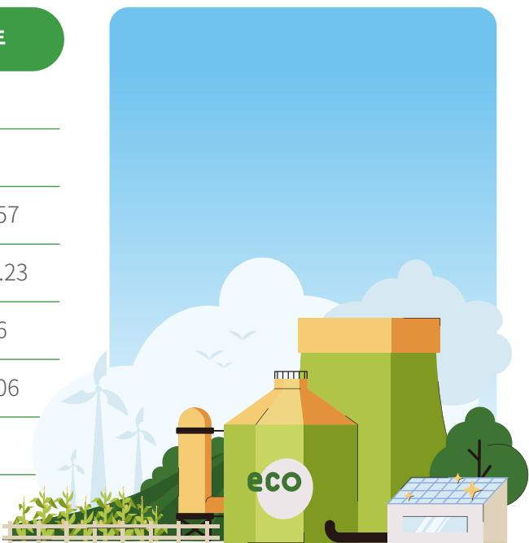

natural_image

Illustration of a green industrial facility with wind turbines and solar panels, labeled 'eco' (no text or symbols on the main scene)

## 排放管理

祖名股份始终坚持绿色低碳的可持续发展道路，将排放管理视为履行环境保护责任的核心环节。公司严格遵守中华人民共和国环境保护法》《中华人民共和国水污染防治法》《中华人民共和国大气污染防治法》《中华人民共和国固体废物污染环境防治法》等法律法规，奉行“预防为主、防治结合”的方针。我们坚持“减量化、无害化、资源化”的处置原则，通过建立健全的排放管理制度与先进的技术治理手段，致力于最大限度减少生产经营对环境的影响。

## 废水管理

水资源在豆制品生产中具有极其重要的地位，与之对应的废水排放管理则是公司环境治理的重中之重。公司严格执行“三同时”制度，确保污染防治设施与主体工程同时投产使用。

公司严格遵守《中华人民共和国水污染防治法》等法律法规，制定《污水控制管理程序》《环境监视与测量控制程序》，明确废水排放执行《污水综合排放标准》三级标准、《污水排入城镇下水道水质标准》，氨氮、总磷执行《工业企业废水氮、磷污染物间接排放限值》及地方相关标准。

## 废水排放标准与合规性

公司及下属子公司(如安吉祖名、扬州祖名等)严格按照排污登记管理要求,确保废水达标排放。

·纳管标准：废水处理排放严格执行当地纳管三级排放标准。以安吉基地为例，标准设定为COD≤500mg/L、pH值6\~9、氨氮≤35mg/L、总磷≤8mg/L。  
内部严控标准：为进一步降低环境负荷，公司设定了更为严苛的内部废水排放管控标准。安吉基地的内部管控标准为COD≤100mg/L、氨氮≤10mg/L、总磷≤8mg/L。

## 废水治理 工艺与设施 保障

公司通过“雨污分流、清污分流、综合治理”的模式，对生产过程中产生的所有废水进行集中收集并接入污水处理系统。

管道建设:在管道系统设计中，公司选用良好的管材和标准较高的管道接口，从源头确保施工质量，防范渗漏对土壤和地下水的污染。

●现场管理·废水产生区域负责人每天对各区域下水道滤网进行巡查，防止杂物进入污水处理系统。环管部负责排水口的阀门开启与闭合，确保非下雨天雨水排放口应急阀门处干关闭状态。

## 环境监视与测量

公司制定了《环境监视与测量控制程序》,构建了“自行监测+在线监测+第三方监测”的立体监控网络。

在线监控：公司在主要废水排放口安装了在线监控设施，监测数据实时上传至环保主管部门。  
●日常监测:环管部每天对雨水排放口的水质情况、在线监测设备及泵浦设备进行两次检查，并每周取样检测。同时，申请第三方机构定期对废水有组织排放的各项指标进行检测并形成报告。

## 废气管理

祖名股份严格遵守《中华人民共和国大气污染防治法》等法律法规，并制定了《废气排放管理程序》，针对生产过程中产生的燃气/沼气锅炉废气、生产线油烟、食堂油烟、污水处理站异味等，建设配套治理设施，明确各废气排放执行标准。同时公司按环保部门要求频次，委托第三方机构对废气有组织和无组织排放指标进行检测，形成报告备查。

## 1 废气治理工艺应用

公司严格按照工艺规范运行废气处理系统，确保排放指标满足相关国家及地方标准：

## 锅炉废气

燃气/沼气锅炉执行《锅炉大气污染物综合排放标准》二时段、二类标准。

公司通过沼气脱硫等技术手段，提升生物质能清洁利用率并减少硫氧化物排放。

## 油烟处理

生产线及食堂油烟执行《饮食业油烟排放标准》大型标准，采用油烟净化设施处理。

## 臭气异味治理

针对污水处理站及生产车间的异味，公司采用“碱喷淋+植物除臭+UV光解”工艺，并对易产生异味的区域实施加盖封闭处理。

## 2 废气监测机制

公司根据环保部门要求的频次，定期聘请第三方检测机构对废气排放口进行检测。2025年(及2026年持续执行)，公司针对臭豆腐卤制车间增设了碱喷淋加光催化等废气收集系统，进一步改善了周边大气的环境质量

natural_image

Stylized illustration of a city skyline with green and dark buildings under a cloudy sky (no text or symbols)

## 废弃物管理

公司严格遵守《中华人民共和国固体废物污染环境防治法》等相关法律法规，制定了《固废管理程序》，对一般工业固体废物和危险废弃物实施分类收集、规范储存与合规处置，建立管理台账，委托具备资质的单位处置，最大限度降低废弃物排放对环境的影响。

## 一般固体废弃物管理

公司产生的一般固废主要包括豆渣、废水处理产生的豆泥及废包装材料。

·循环利用：公司委托具备相应资质的单位对豆泥、包装物等进行回收综合利用。  
·豆渣高值化：湿豆渣由外部单位承包及时清运，严格落实“豆渣不落地”要求。公司进一步开发湿豆渣烘于等利用技术，提升资源转化价值。  
·生活垃圾：不可回收的生活垃圾运往垃圾房存放，由行政部联系环卫部门定期清运，确保生产生活区域于净整洁。

## 危险废弃物管理

公司高度重视危险废弃物的合规化处置，严格遵守法律法规要求。

·分类与标识：危险废物（如实验废液、废机油、废铅蓄电池等）必须安全收集并分类存于专用容器内。包装容器表面必须张贴符合GB18597标准的《危险废物贮存污染控制标准》标签，严禁异物掺杂。  
专业化处置：公司与具备收集、贮存、转运危险废物资质的单位（2025年度的乙方法定单位）签订《危险废物委托处置合同》，明确各方职责。  
·2025年度管理机制·公司指派专人负责危险废物的电报，转移联单审批手续及信息沟通。处置过程由公司全程监督，确保不发生滴漏、跑冒及违法倾倒现象。

废弃物排放数据表

<table><tr><td>类别</td><td>单位</td><td>2025年数据</td></tr><tr><td>无害废弃物排放总量</td><td>吨</td><td>15,694.66</td></tr><tr><td>无害废弃物排放强度</td><td>吨/百万元营收</td><td>7.75</td></tr><tr><td>危险废弃物排放总量</td><td>吨</td><td>17.14</td></tr><tr><td>危险废弃物排放强度</td><td>吨/百万元营收</td><td>0.01</td></tr></table>

## 生态系统和生物多样性保护

祖名股份致力于在提供高品质豆制品的同时，积极履行生态保护义务，通过科学的厂区规划、绿化建设及水资源综合利用，尽可能降低生产运营对周边生态环境的负面影响。公司严格遵守《中华人民共和国环境保护法》《中华人民共和国野生动物保护法》《中华人民共和国森林法》以及《建设项目环境保护管理条例》等法律法规，在建设与运营的全生命周期中深度融入生态文明建设理念，构建人与自然和谐共生的现代工厂。

## 建设规划：生态红线与环境修复

祖名股份在新建或改扩建项目初期，始终坚持生态保护优先。依据公司《环境管理制度》，在建设项目施工过程中，公司充分考虑对自然和周围环境的影响与破坏。

·环境影响评估：立项后通过具备资质的第三方开展环境评价，形成报告并提交环保部门审查  
·生态修复承诺：项目竣工后，公司严格要求承建商对建设过程中受破坏的环境进行修复，确保厂区及周边生态功能得到及时补偿。

## 厂区运营：构建空气净化与噪声隔绝系统

公司将厂区绿化管理视为提升微环境质量的重要抓手，通过精细化管护，建立起多功能的“绿色屏障”。

·树种科学选择·在厂区，宿舍及边界绿化中，公司优先选取具有空气净化作用的树种，采用乔，灌，灌木及草相组合的种植方式，旨在最大限度吸收生产过程中的粉尘及异味，扩大厂区绿化面积。  
·生物降噪机制：针对高噪声设备区域，公司通过行政部在厂区周围建设绿化带，利用绿色植被建立有效的绿色隔音屏障，降低噪声对周边生物及社区的影响。  
·动态生态管护：行政部定期开展绿化区域的蚊虫消杀、异味消除工作，并根据季节与气候变化调整控制频率，确保绿化区域无蚊虫、无异味、生机勃勃。

## 循环用水：非传统水源的生态灌溉

为了保护当地水生态平衡，祖名股份在绿化养护中推行“非传统水源替代战略”，减少对天然水资源的依赖。

水源分级管理：公司明确规定，绿化浇灌禁止使用消防用水。  
·循环用水矩阵：公司积极开发内部废水/雨水回用系统。灌溉水源优先采用雨水井收集水、豆芽生产回用水池水超滤产生的浓缩水，以及景观池水，实现水资源在厂区生态系统内的闭环流动。

## 05

## 聚同心之力兴责任家园

员工权益与福利

员工培训与发展

职业健康与安全

乡村振兴与社会贡献

natural_image

Silhouette of a family of four standing in a grassy field with mountainous background (no text or symbols)

## 员工权益与福利

祖名股份始终秉持以人为本的价值观，将员工视为企业最宝贵的资源与持续发展的动力源泉。我们致力于创造一个包容、尊重和公平的工作环境，通过不断完善薪酬福利体系、保障合法权益、强化民主沟通，追求员工物质与精神的双重幸福，构建企业与员工共同成长的共赢生态。

祖名股份严格遵守《中华人民共和国劳动法》《中华人民共和国劳动合同法》等相关法律法规，制定了《员工手册》《人力资源管理手册》等一系列内部管理制度，确保用工全过程合法合规。

## 规范合规雇佣

## 1 公平多元的招聘机制

公司通过校园招聘、内部招聘及社会招聘等多种渠道吸引多元化人才，承诺在招聘、薪酬制定、职位晋升等环节公平公正地对待每一位员工，坚决反对任何形式的性别、年龄、地域或民族歧视。

## 2 严苛的人权保护红线

## 禁止童工

公司始终遵循反童工政策。在招工阶段，对电请人身份证件进行严格查验以确保其达到法定年龄。对于未满18周岁人员坚决不予录用，并建立了完善的救济程序保障未成年人权益。

## 反对强迫劳动

公司坚决禁止任何形式的强迫劳动、抵债劳工。在招聘过程中严禁收取押金、扣押证件，反对限制员工人身自由或强行要求加班，确保所有员工在工作中享有充分的自由与尊严。

## 严惩职场骚扰

公司在工厂及办公场所坚决禁止胁迫、凌辱等不当行为。通过建立有效的申诉和投诉机制，员工一旦发现权益受损可立即举报，公司承诺采取有效措施维护员工尊严。

natural_image

Illustration of two people carrying a gift box with a red ribbon (no text or symbols)

## 科学的激励机制

公司建立了兼顾内部公平性与外部竞争力的薪酬激励体系，确保员工的付出得到公平回报，实现人才价值的最大化。

## 1 薪酬分配原则

公司遵循“责任与利益一致、能力与贡献一致、业绩与效益一致”的分配原则，以员工实际表现为基础，依据《祖名股份员工职等职级薪酬标准对应表》进行客观的绩效评估。

## 2 差异化绩效奖励

除基本工资外，公司针对不同业务系统设有专项激励，将企业效益与员工贡献深度绑定

## 生产系统

设有产量完成奖励、质量奖励、成本控制奖励及损耗控制奖励等。

## 销售系统

设有业绩完成奖励、新渠道开发奖励等，激发一线人员的开拓热情。

## 全方位福利关怀

祖名股份着力提升员工的生活质量，通过精细化的福利保障与文体活动，增强员工的归属感。

## 法定权益与休假保障

●公司严格执行法定节假日休假制度，并依法为员工提供育儿假、哺乳假、陪护假、产期护理假等各类福利假期。

## 特色住宿与生活关怀

●人性化“夫妻房”:根据公司双职工比例较高的特点，我们在员工宿舍区域专门设立了夫妻房及家庭用房，切实解决员工后顾之忧，为其生活提供便利保障

●节日礼包：在端午、中秋、春节等传统节日，公司统一发放饮料、水果、日用品及应节食品，传递企业温情。

●老员工疗养·公司依据员工福利与关怀制度，对长期服务的在职老员工定期组织专项疗养，以资表彰其持续贡献，确保参与者获得充分的身心休整与健康管理支持。

## 丰富多彩的文体生活

公司鼓励员工工作与生活的平衡，通过多元化的活动营造向上氛围：

●体育赛事：定期组织迎新春篮球赛、乒乓球赛、拔河比赛等，促进跨部门交流。

## 民主沟通机制

公司致力于构建畅通的沟通渠道，保障员工的知情权与参与权，打造透明、平等的职场文化。

## 民主参与平台

●公司通过定期开展职工代表大会，确保员工能够参与公司重大事项的审议。此外，各基地设立了董事长信箱，员工可直接向高层建言献策或反映问题。

## 动态满意度调查

公司建立了常态化的意见收集机制，针对食堂用餐、生产环节、设备维护等关键环节定期开展满意度调查。公司认真分析每一条建议，并将其转化为实际的管理改进措施。

## 文化阵地建设

·公司设立内部报刊《祖名报》，分享企业动态与员工故事。作为企业文化传播的重要载体，《祖名报》展现了员工在工作中的积极风貌，进一步增强了团队的凝聚力。

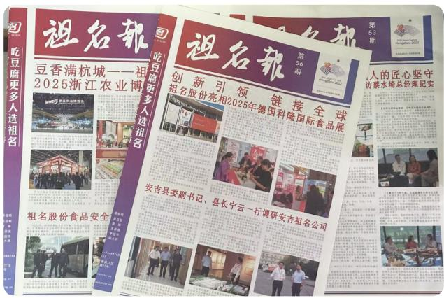

text_image

祖名报
吃豆腐更多人选祖名
豆香满杭城——祖2025浙江农业博
创新引领 链接全球
祖名股份亮相2025年德国科隆国际食品展
安吉县委副书记、县长宁云一行调研安吉祖名公司
人的匠心坚守
访紫水崎总经理纪实
第63期
第59期

## “关爱祖名宝宝”企业与家庭的温情互动

公司高度重视员工家庭与企业文化融合，持续开展一线员工家庭开放日系列专项活动。活动特邀一线员工子女走进生产基地与工作现场，近距离参观父母的工作环境、了解生产流程与岗位职责，直观感受父母的职业价值与企业严谨负责的工作氛围。通过沉浸式体验与互动交流，不仅增进了子女对父母职业的理解与认同，更让员工深切感受到企业的关怀与尊重，有效增强了员工的归属感、幸福感与职业自豪感，显著提升团队凝聚力与向心力。

此项特色关怀活动，进一步丰富活动形式与内容，庭三方联动的情感桥梁，发展合力，助力企业与员工共同成长。

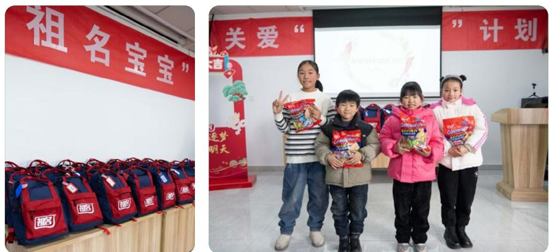

## 员工运动会

为平衡工作与生活，公司积极组织各类体育活动，促进员工交流协作，营造团结向上的氛围。2025年11月，祖名股份举办第二届员工运动会，以“豆趣横生·活力祖名·健康同行”为主题，涵盖团体竞技与趣味项目。此次运动会深化了团队凝聚力，生动诠释了“活力祖名”的企业精神。

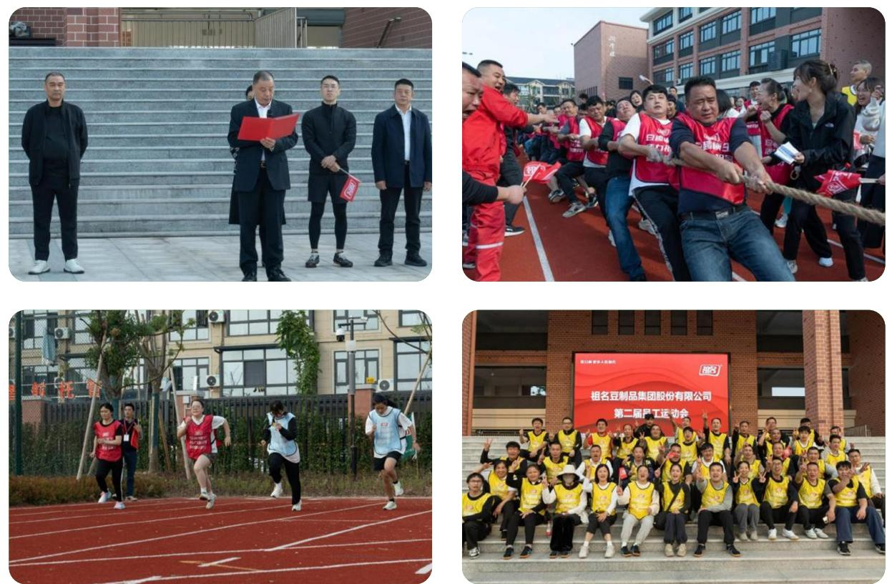

natural_image

Illustration of three people interacting with a large screen displaying abstract data and icons, no readable text or symbols present.

## 员工培训与发展

作为中国豆制品行业的领军企业，祖名股份深知人才的培养与发展是企业成功的关键。我们坚持“以人为本、人尽其才”的人才理念，不仅致力干提供高品质的健康食品，更致力于通过系统的培训与清晰的晋升路径，提升全员的综合素质与专业技能。公司积极响应国家《关于加强新时代高技能人才队伍建设的意见》，严格遵守《中华人民共和国劳动法》《中华人民共和国教育法》等相关法律法规，建立了完善的培训管理体系、课程体系和实施体系，旨在打造学习型组织，实现员工与企业的共同成长。

## 培训管理体系

祖名股份构建了涵盖决策、统筹与实施的三级培训管理架构，通过标准化的制度建设，确保培训资源的高效配置与培训效果的精准落地。

公司制定并严格执行《培训管理制度》，明确了各职能部门在人才培养中的具体职责。

## 人力资源部

负责全公司培训需求的汇总、年度培训计划的审批及培训效果的综合评估。

## 各业务部门

负责本部门专业技能培训的需求申报、内部进师队伍的选拔以及岗位带教工作的落实。

## 内部讲师团

由公司资深管理人员和技术骨于组成，负责核心课程的开发与授课，确保企业文化的传承与专业经验的萃取。

公司建立了科学的“需求导向型”计划制定流程，确保每一项培训投入都能精准对接公司战略与岗位需求。

## 祖名股份培训计划制定流程图

需求分析目标设定主题）

课程设计与开发实施与执行落地）

## 多维培训矩阵

祖名股份针对员工职业生涯的不同阶段，打造了差异化、模块化的培训矩阵，实现了从“职场新人”到“业务专家”的全方位覆盖。

## 新员工岗前培训

公司为每一位新入职员工提供系统的岗前教育，通过理论授课与现场参观相结合的方式，缩短其适应期。

·核心内容：涵盖企业文化背景、规章制度解读、从业道德规范及职业生涯规划指导。  
●安全红线：严格执行新职工公司级、车间级、班组级三级安全教育培训，确保“合格后上岗”。

## 核心业务人才培养：阿米巴经营与业务巴长培训

公司采用阿米巴经营模式，将经营责任落实到各“业务巴”。为了提升业务团队的整体战斗力，公司制定了专项的职业培训计划：

●新晋业务巴长培训：侧重于岗位基础能力的培养，通过知识培训(企业文化)、技能培训(工作流程）和态度培训(团队融合)三个阶段，帮助其快速胜任经营职责。  
·成熟业务巴长大轮训：以产品知识深度拆解为切入点，强化对公司战略方向及经营哲学的理解，通过内外结合的授课形式，持续提升其经营水平与管理高度。

## 在岗人员技能提升

公司鼓励全员通过持续学习实现自我超越，培训内容涵盖

·专业技能类：针对生产一线员工开展先进加工设备操作、产品质量标准及清洁生产工艺培训。  
·研发创新类：定期邀请专利事务所专家开展专利申报知识培训，提升科研人员在产品创新过程中的发明点挖掘能力。  
·通用素质类：包含管理技能提升、团队协作及个人素养修养课程。

## 晋升与发展

祖名股份不仅关注员工的“学”，更关注员工的“成”。公司建立了透明、公平的职等职级体系，为各类人才提供了广阔的发展空间。

## 科学的岗位职等体系

公司制定了《祖名股份员工职等职级薪酬标准对应表》，将岗位价值、员工能力与绩效表现有机结合。员工可以通过专业路径(技术/业务专家)或管理路径(各级行政主管）实现职业晋升，为员工提供专业序列和管理序列等多元发展路径，拓宽职业发展空间。

## 激励驱动与绩效考核

公司制定了《研究院考核奖励办法》等专项激励制度，对于在项目中表现优异、获得重大科技成果或专利授权的员工给予一次性奖励，对相关人员创新积极性起到了促进作用。

  
关键绩效

<table><tr><td>类别</td><td>单位</td><td>2025年数据</td></tr><tr><td>开展培训次数</td><td>次</td><td>455</td></tr><tr><td>参与培训总人数</td><td>人</td><td>4,720</td></tr><tr><td>员工培训覆盖率</td><td>%</td><td>97.11</td></tr><tr><td>员工培训总支出</td><td>万元</td><td>105.92</td></tr></table>

## 职业健康与安全

祖名股份视员工的生命安全与身体健康为企业发展的红线与基石。我们深知，作为一家深耕豆制品行业的制造型企业，保障员工在生产、加工、配送等全价值链环节的安全，是实现高质量可持续发展的根本前提。公司坚持“安全第一、预防为主、综合治理”的方针，严格遵守《中华人民共和国安全生产法》《中华人民共和国职业病防治法》《中华人民共和国突发事件应对法》《中华人民共和国消防法》及《工作场所职业卫生监督管理规定》等法律法规，持续构建并完善职业健康安全管理体系，致力于为全员打造一个安全、健康、和谐的职业环境。

## 职业健康安全治理架构

公司建立了“顶层设计、逐级落实、全员参与”的三级安全管理网络，确保安全责任从决策层穿透至生产班组一线。

## 安全生产领导小组

公司成立了专门的安全领导小组，作为职业健康安全管理工作的最高领导机构，负责审议年度安全生产目标、重大安全技术改造及大额安全费用投入。

## 安全管理职能部门（环管部）

配备专职安全管理人员，负责制定安全考核细则，组织日常及专项安全检查，监督安全隐患的整改闭环。

## 基层执行单元

各生产中心、基地及班组设立兼职安全员，负责落实每日班前安全教育及岗位危险预知(KYT)活动，确保操作规程落实到每一个节点。

公司力求实现“六个为零，四个达标”的安全生产工作目标。2025年度，公司未发生任何生产安全重大责任事故，职业健康安全管理绩效维持在行业领先水平。

## 完善的管理制度体系

祖名股份通过制度化建设夯实安全根基，构建了涵盖职业健康全生命周期的13项核心制度体系：

《职业健康管理制度》：确立职业健康管理的总纲。

《岗位职业卫生操作规程》;明确各具体工序的安全操作标准。

《环境职业健康安全生产责任制度》：界定各级人员的环保与安全职责。

《建设项目职业卫生安全“三同时”管理制度》：确保新改扩建项目从设计阶段即融入安全基因。

《劳动者职业健康监护及其档案管理制度》:规范员工健康档案的建立与流转。

《职业病防护设施维护检修制度》：保障降噪、排风等设施的有效运行。

《职业病防治责任制度》:落实职业病防治的主体责任。

《职业病危害监测及评价管理制度》：定期对生产现场有害因素进行定点监测。

《职业病危害警示与告知制度》:保障员工对工作环境风险的知情权。

《职业病危害事故处置与报告制度》:建立快速响应与溯源机制。

《职业病危害项目申报制度》：依法向监管部门履行申报义务。

《职业病危害应急救援预案制度》:针对突发职业卫生事件制定预案。

《职业健康安全教育培训管理制度》:规范员工安全素质提升路径。

## 风险识别与隐患排查治理

祖名股份积极开展安全风险管控体系建设，坚持“隐患就是事故”的理念，通过双重预防机制有效化解潜在风险。

## 排查

公司制定了《安全风险管控体系》，以班组为单位深度收集各岗位的危险预知信息。

第三方专业评估：公司委托专业安全服务机构进行现场安全风险排查和评估，通过定性与定量分析，确定各区域和岗位的风险等级(如高，中，低风险区)，并据此制定分级防范措施

每日监测：针对重点岗位，坚持每日班前安全检查，重点排查生产现场的临时用电、高空作业及机械防护装置的完好性。

## 隐患整改闭环

巡检通报·精益办每周对各生产班组进行品质，卫生，设备设施及人员操作的综合巡查，并由环管部每月组织全公司级别的安全生产大检查。

绩效挂钩：对发现的隐患开具整改通知单，明确责任人与期限，未按时整改的责任人将按考评细则予以处罚，确保整改力度不打折。

## 职业健康保护与劳动环境优化

公司坚持“以人为本”，通过技术改造与个人防护相结合，最大限度降低生产环境对员工身体的影响。

## 职业卫生管理

针对豆制品生产过程中涉及的噪声、高温及化学品接触，公司采取了针对性的管控措施：

·环境监测与告知：公司定期对生产现场的粉尘、噪声、氨氮等因素进行监测评价，并与相关岗位员工签订《职业病危害告知书》，提升其自我保护意识。  
·个人防护用品(PPE)配发：公司严格按照劳动保护规定，为操作人员发放工作帽、手套、安全鞋、安全帽等防护用品，并根据岗位需求配发耳塞及气体检漏器等专业装备。

## 员工健康监护

·定期体检：公司每年组织全员进行健康体检，特别是针对涉及职业病危害因素的员工，开展专项职业病体检。  
2025年，公司开展职业病体检，确保了“早发现、早干预、早健康”。

## 安全培训与文化建设

祖名股份致力于将“被动安全”转变为“主动安全”，通过多层次的教育体系提升全员安全素养。

## 安全教育培训体系

公司构建了常态化的安全培训机制，从人员层面筑牢公司经营安全的防护底线。

<table><tr><td>培训类别</td><td>涵盖对象</td><td>核心内容</td></tr><tr><td>新员工三级教育</td><td>所有新入职员工</td><td>公司级、车间级、班组级安全基础知识。</td></tr><tr><td>“四新”项目培训</td><td>技术改造项目相关人员</td><td>针对新技术、新工艺、新设备、新材料的专项安全操作培训。</td></tr><tr><td>特种作业培训</td><td>电工、焊工、压力容器操作工等</td><td>委派专业资质单位培训并确保证件齐备、定期复训。</td></tr><tr><td>班前五分钟</td><td>一线生产员工</td><td>每日工作前的安全注意事项提醒及危险点预知。</td></tr></table>

## 2 安全文化传播

公司通过下发安全简报、举办安全板报展览、播放安全宣传录像及举办知识竞赛等多种形式，将安全理念植入员工心中，营造“人人讲安全、事事抓安全”的文化氛围。

## 应急管理与生命救助

为确保在突发状态下能迅速开展救援，祖名股份建立了完善的应急响应机制。

## 应急演练与 演习

公司制定了《应急事件处理流程》，明确了组织架构与分工。  
通过实战演练，不断修正预案中的不足，提升全员的逃生与互救能力。

## 员工意外伤害救助基金

祖名股份展现了深厚的人文关怀，制定了《员工意外伤害福利待遇管理制度》。  
在法定的保险报销与补助外，公司针对因公或因私发生伤害的员工提供额外经济救助。  
●公司每年按上一年度利润的1%计提作为救助金，并联合工会援助，切实缓解受损员工及其家属的经济压力。

## 2025年度公司环管部相关安全教育培训演练

报告期内，公司环管部开展了《有限空间作业审批制度》以及各项安全生产专题教育的培训，组织学习了作业前“七不准”、作业流程四步法和救援“五严禁”等关键知识。在生产基地的有限空间工厂入口处都树立起了醒目的“有限空间作业安全告知牌”，充分提醒了有限空间进入需许可。

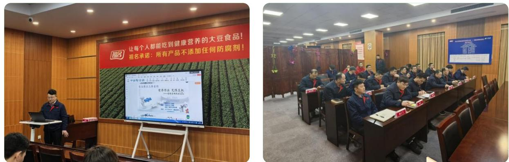

公司历来新年放假前，均会开展“节前安全生产教育专题培训”，通过全员努力，实现“零隐患停产，零事故复工”。

natural_image

Illustration of a business meeting with people working around a table, laptops, and presentation screens (no text or symbols)

## 乡村振兴与社会贡献

祖名股份积极响应国家乡村振兴战略，严格遵循《中华人民共和国乡村振兴促进法》及《关于巩固拓展脱贫攻坚成果同乡村振兴有效衔接的意见》，坚持“不脱困、不脱钩”原则，依托豆制品产业链优势，以产业赋能、就业带动与定向帮扶助力乡村发展。作为国家级农业龙头企业、浙江省商务厅认定的“民生保供重点企业”及杭州市滨江区慈善总会会员企业，公司始终秉持高度的社会责任感，坚守“做健康食品，关注人类健康”的发展宗旨，在民生保供、慈善公益、ESG建设、文化传承等领域持续发力，彰显行业领军企业的担当。

## 乡村振兴与对口帮扶

2025年，公司主动践行乡村振兴责任，与四川广元市朝天区大滩镇新生村达成帮扶协议，通过捐款形式精准支持该村乡村振兴建设，聚焦当地发展需求，注入企业力量，助力帮扶地区补齐发展短板、实现稳步发展，切实履行行业领军企业的社会责任。

## 民生保供，筑牢“菜篮子”安全防线

2025年，公司持续提升和完善供应链保供体系建设，在产能布局，生产人员保障等各方面加强精细化管理与系统性完善，不断提升应急保供能力，确保能够有效应对各类突发状况，切实满足市场民生供应需求。全年在浙江省市场的各类豆制品供应总量达15万余吨，其中杭州地区供应量达7万余吨，为浙江省及杭州市“菜篮子”市场稳定供应提供了坚实保障，凭借突出的保供贡献，再次被杭州市商务局认定为杭州市“菜篮子”重点商品保供企业。

## 慈善捐赠，传递企业温暖

公司始终热心慈善帮扶事业，2025 年持续投身各类社会慈善公益活动，践行“回报社会”的责任初心。作为杭州市滨江区慈善总会会员企业，公司积极参与“春风行动”：向杭州市滨江区癌症康复协会捐款，为各类社会公益活动贡献企业力量：向杭州市青荷公益基金会捐款，传递企业温暖与担当：同时通过专项公益项目捐赠，聚售弱势群体帮扶与民生改善。全年累计捐赠金额达112.920.10元。

## ESG 表现稳步提升

2025年7月，华证指数公布新一期ESG评级结果，公司获得B评级，在食品行业156家A股上市公司中排名第50位，这充分表明公司在环境保护、社会责任履行、合规经营等方面取得了可喜进步，得到行业与市场的认可，也体现了公司在ESG建设方面的持续努力与成效。

## 文化传承与企业发展提质

2025年，公司在传承传统豆制品文化方面持续深耕，继祖名豆制品制作技艺于2023年被评为第八批滨江区非物质文化遗产代表性项目后，蔡祖明董事长被评为第六批滨江区非物质文化遗产代表性项目传承人，进一步推动传统豆制品技艺的保护与传承。同时，公司顺利通过农业产业化国家重点龙头企业复评，并获评为长三角名优产品，彰显了企业在产业引领，产品品质方面的核心优势，实现企业发展与文化传承的双向赋能。

## ESG关键绩效数据表

经济绩效

<table><tr><td>指标名称</td><td>单位</td><td>2025年</td></tr><tr><td>营业总收入</td><td>元</td><td>2,025,086,137.88</td></tr><tr><td>归属于上市公司股东的净利润</td><td>元</td><td>25,295,791.91</td></tr><tr><td>总资产</td><td>元</td><td>2,252,723,083.03</td></tr><tr><td>归属于上市公司股东的净资产</td><td>元</td><td>1,008,130,427.10</td></tr><tr><td>资产负债率</td><td>%</td><td>54.57</td></tr><tr><td>基本每股收益</td><td>元</td><td>0.20</td></tr></table>

环境绩效

<table><tr><td>指标类别</td><td>指标名称</td><td>单位</td><td>2025年</td></tr><tr><td rowspan="4">温室气体排放</td><td>范围1直接碳排放量</td><td>吨二氧化碳当量</td><td>36,217.24</td></tr><tr><td>范围2间接碳排放量</td><td>吨二氧化碳当量</td><td>122,690.53</td></tr><tr><td>温室气体排放总量(范围1+范围2)</td><td>吨二氧化碳当量</td><td>158,907.77</td></tr><tr><td>温室气体排放强度</td><td>吨二氧化碳当量/百万元</td><td>78.47</td></tr><tr><td rowspan="5">环保投入</td><td>环保总投入</td><td>万元</td><td>1481.69</td></tr><tr><td>公司及子公司环保设备设施投入</td><td>万元</td><td>141.26</td></tr><tr><td>环保费用支出</td><td>万元</td><td>1,339.11</td></tr><tr><td>缴纳环境保护税</td><td>万元</td><td>1.32</td></tr><tr><td>环保总投入占营业收入比例</td><td>%</td><td>0.73</td></tr><tr><td rowspan="2">废水排放</td><td>废水排放总量</td><td>吨</td><td>3,567,366.99</td></tr><tr><td>化学需氧量(COD)排放量</td><td>吨</td><td>35.26</td></tr><tr><td rowspan="3">废气排放</td><td>废气排放总量</td><td>万立方米</td><td>2,600</td></tr><tr><td>氮氧化物(NOx)排放量</td><td>吨</td><td>1.88</td></tr><tr><td>硫氧化物(SOx)排放量</td><td>吨</td><td>0.04</td></tr><tr><td rowspan="2">固体废弃物</td><td>无害废弃物排放总量</td><td>吨</td><td>15,694.66</td></tr><tr><td>危险废弃物排放总量</td><td>吨</td><td>17.14</td></tr><tr><td rowspan="7">能源使用</td><td>汽油消耗量</td><td>升</td><td>474,486.57</td></tr><tr><td>柴油消耗量</td><td>升</td><td>5,638,288.23</td></tr><tr><td>天然气消耗量</td><td>万立方米</td><td>916.27</td></tr><tr><td>液化石油气消耗量</td><td>吨</td><td>0.20</td></tr><tr><td>外购电力消耗量</td><td>兆瓦时</td><td>97,138.60</td></tr><tr><td>外购蒸汽消耗量</td><td>吉焦</td><td>646,861.06</td></tr><tr><td>能源消耗总量</td><td>吨标准煤</td><td>52,641.00</td></tr><tr><td>水资源使用</td><td>总用水量</td><td>吨</td><td>3,161,811.00</td></tr></table>

社会绩效

<table><tr><td>指标类别</td><td>指标名称</td><td>单位</td><td>2025年</td></tr><tr><td rowspan="7">创新研发</td><td>研发投入总额</td><td>元</td><td>16,196,451.05</td></tr><tr><td>研发投入占营业收入比例</td><td>%</td><td>0.80</td></tr><tr><td>研发人员人数</td><td>人</td><td>66</td></tr><tr><td>研发人员占职工总人数比率</td><td>%</td><td>1.41</td></tr><tr><td>2025年累计实用新型专利申请数量</td><td>个</td><td>54</td></tr><tr><td>2025年累计发明专利授权数量</td><td>个</td><td>38</td></tr><tr><td>2025年累计有效专利总数</td><td>个</td><td>92</td></tr><tr><td rowspan="5">员工雇佣</td><td>员工总数</td><td>人</td><td>4,680</td></tr><tr><td>女性员工人数</td><td>人</td><td>2,216</td></tr><tr><td>女性员工占比</td><td>%</td><td>47.35</td></tr><tr><td>新招聘员工人数</td><td>人</td><td>2,621</td></tr><tr><td>新招应届毕业生人数</td><td>人</td><td>52</td></tr></table>

<table><tr><td>指标类别</td><td>指标名称</td><td>单位</td><td>2025年</td></tr><tr><td rowspan="4">员工培训</td><td>员工培训总投入</td><td>万元</td><td>105.92</td></tr><tr><td>开展培训次数</td><td>次</td><td>455</td></tr><tr><td>参与培训总人数</td><td>人</td><td>4,720</td></tr><tr><td>培训覆盖率</td><td>%</td><td>97.11</td></tr><tr><td>员工满意度</td><td>员工满意度</td><td>%</td><td>85</td></tr><tr><td rowspan="4">劳工准则</td><td>劳动合同签订率</td><td>%</td><td>83.02</td></tr><tr><td>社会保险覆盖率</td><td>%</td><td>93</td></tr><tr><td>员工歧视事件总数</td><td>件</td><td>0</td></tr><tr><td>职业健康体检覆盖率</td><td>%</td><td>10.62</td></tr></table>

治理绩效

<table><tr><td>指标类别</td><td>指标名称</td><td>单位</td><td>2025年</td></tr><tr><td rowspan="4">公司治理</td><td>股东会召开次数</td><td>次</td><td>3</td></tr><tr><td>董事会召开次数</td><td>次</td><td>7</td></tr><tr><td>独立董事占比</td><td>%</td><td>33.33</td></tr><tr><td>女性董事占比</td><td>%</td><td>11.11</td></tr></table>

## 对标索引表

《深圳证券交易所上市公司自律监管指引第17号—可持续发展报告（试行）》议题对标索引

<table><tr><td>维度</td><td>序号</td><td>议题</td><td>对应章节</td></tr><tr><td rowspan="8">环境</td><td>1</td><td>应对气候变化</td><td>第四章 循绿色之道,绘生态蓝图第一节 应对气候变化</td></tr><tr><td>2</td><td>污染物排放</td><td>第四章 循绿色之道,绘生态蓝图第四节 排放管理</td></tr><tr><td>3</td><td>废弃物处理</td><td>第四章 循绿色之道,绘生态蓝图第四节 排放管理</td></tr><tr><td>4</td><td>生态系统和生物多样性保护</td><td>第四章 循绿色之道,绘生态蓝图第五节 生态系统和生物多样性保护</td></tr><tr><td>5</td><td>环境合规管理</td><td>第四章 循绿色之道,绘生态蓝图第二节 环境合规管理</td></tr><tr><td>6</td><td>能源利用</td><td>第四章 循绿色之道,绘生态蓝图第三节 资源管理</td></tr><tr><td>7</td><td>水资源利用</td><td>第四章 循绿色之道,绘生态蓝图第三节 资源管理</td></tr><tr><td>8</td><td>循环经济</td><td>第四章 循绿色之道,绘生态蓝图第三节 资源管理</td></tr><tr><td rowspan="7">社会</td><td>9</td><td>乡村振兴</td><td>第五章 聚同心之力,兴责任家园第四节 乡村振兴与社会贡献</td></tr><tr><td>10</td><td>社会贡献</td><td>第五章 聚同心之力,兴责任家园第四节 乡村振兴与社会贡献</td></tr><tr><td>11</td><td>创新驱动</td><td>第三章 以质安立本,凭科创致远第一节 创新驱动</td></tr><tr><td>12</td><td>科技伦理</td><td>第三章 以质安立本,凭科创致远第一节 创新驱动</td></tr><tr><td>13</td><td>供应链安全</td><td>第三章 以质安立本,凭科创致远第三节 供应链安全</td></tr><tr><td>14</td><td>平等对待中小企业</td><td>第三章 以质安立本,凭科创致远第三节 供应链安全</td></tr><tr><td>15</td><td>产品和服务安全与质量</td><td>第三章 以质安立本,凭科创致远第二节 产品和服务安全与质量</td></tr></table>

<table><tr><td>维度</td><td>序号</td><td>议题</td><td>对应章节</td></tr><tr><td rowspan="2"></td><td>16</td><td>数据安全与客户隐私保护</td><td>第三章 以质安立本,凭科创致远第六节 数据安全与客户隐私保护</td></tr><tr><td>17</td><td>员工</td><td>第五章 聚同心之力,兴责任家园第一节 员工权益与福利第二节 员工培训与发展第三节 职业健康与安全</td></tr><tr><td rowspan="4">可持续发展相关治理</td><td>18</td><td>尽职调查</td><td>第二章 守合规治企,固稳健根基第二节 风险与合规管理</td></tr><tr><td>19</td><td>利益相关方沟通</td><td>第一章 秉豆的初心,筑长效治理第二节 可持续发展治理体系 利益相关方沟通</td></tr><tr><td>20</td><td>反商业贿赂及反贪污</td><td>第二章 守合规治企,固稳健根基第三节 恪守商业道德</td></tr><tr><td>21</td><td>反不正当竞争</td><td>第二章 守合规治企,固稳健根基第三节 恪守商业道德</td></tr></table>

全球报告倡议组织（GRI）《可持续发展报告标准》（GRI Standards 2021）

<table><tr><td>使用说明</td><td>祖名股份参照全球报告倡议组织(GRI)标准编制本报告,汇报期为2025年1月1日至2025年12月31日</td></tr><tr><td>使用的GRI 1</td><td>GRI 1:基础2021</td></tr></table>

<table><tr><td>维度</td><td>议题</td><td>对应章节</td></tr><tr><td rowspan="12">GRI 2:一般披露(2021)</td><td>2-1 组织详细情况</td><td>走进祖名股份</td></tr><tr><td>2-2 纳入组织可持续发展报告的实体</td><td>报告编制说明</td></tr><tr><td>2-3 报告期、报告频率和联系人</td><td>报告编制说明</td></tr><tr><td>2-4 信息重述</td><td>ESG数据表及对标索引表</td></tr><tr><td>2-6 活动、价值链和其他业务关系</td><td>公司概况与可持续发展治理</td></tr><tr><td>2-7 员工</td><td>员工权益与福利员工培训与发展职业健康与安全</td></tr><tr><td>2-9 管治架构和构成</td><td rowspan="4">可持续发展治理体系</td></tr><tr><td>2-12 在管理影响方面,最高管治机构的监督作用</td></tr><tr><td>2-14 最高治理机构在可持续发展报告中的作用</td></tr><tr><td>2-17 最高治理机构的共同知识</td></tr><tr><td>2-27 遵守法律法规</td><td>详见报告各章节</td></tr><tr><td>2-29 利益相关方参与的方法</td><td>利益相关方沟通</td></tr><tr><td rowspan="3">GRI 3:实质性议题(2021)</td><td>3-1 确定实质性议题的过程</td><td>重要性议题评估与管理</td></tr><tr><td>3-2 实质性议题列表</td><td>重要性议题评估与管理</td></tr><tr><td>3-3 实质性议题的管理</td><td>重要性议题评估与管理</td></tr><tr><td rowspan="2">GRI 201:经济绩效(2016)</td><td>201-1 直接产生和分配的经济价值</td><td>公司概况与可持续发展治理</td></tr><tr><td>201-3 固定福利计划义务和其他退休计划</td><td>员工权益与福利</td></tr><tr><td rowspan="2">GRI 203:间接经济影响(2016)</td><td>203-1 基础设施投资和支持性服务</td><td>乡村振兴与社会贡献</td></tr><tr><td>203-2 重大间接经济影响</td><td>乡村振兴与社会贡献</td></tr><tr><td rowspan="2">GRI 205:反腐败(2016)</td><td>205-2 反腐败政策和程序的传达及培训</td><td>恪守商业道德</td></tr><tr><td>205-3 经确认的腐败事件和采取的行动</td><td>恪守商业道德</td></tr><tr><td rowspan="4">GRI 302:能源(2016)</td><td>302-1 组织内部的能源消耗量</td><td>资源管理</td></tr><tr><td>302-2 组织外部的能源消耗量</td><td>资源管理</td></tr><tr><td>302-3 能源强度</td><td>资源管理</td></tr><tr><td>302-4 减少能源消耗</td><td>资源管理</td></tr><tr><td>GRI 303:水资源和污水(2018)</td><td>303-5 耗水</td><td>排放管理</td></tr><tr><td rowspan="5">GRI 305:排放(2016)</td><td>305-1 直接(范围1)温室气体排放</td><td>应对气候变化</td></tr><tr><td>305-2 能源间接(范围2)温室气体排放</td><td>应对气候变化</td></tr><tr><td>305-3 其他间接(范围3)温室气体排放</td><td>应对气候变化</td></tr><tr><td>305-4 温室气体排放强度</td><td>应对气候变化</td></tr><tr><td>305-5 温室气体减排量</td><td>应对气候变化</td></tr><tr><td rowspan="3">GRI 306:废弃物(2020)</td><td>306-1 废弃物的产生及废弃物相关重大影响</td><td>排放管理</td></tr><tr><td>306-2 废弃物相关重大影响的管理</td><td>排放管理</td></tr><tr><td>306-3 产生的废弃物</td><td>排放管理</td></tr><tr><td rowspan="2">GRI 401:雇佣(2016)</td><td>401-1 新进员工雇佣率和员工流动率</td><td>员工权益与福利</td></tr><tr><td>401-2 提供给全职员工(不包括临时或兼职员工)的福利</td><td>员工权益与福利</td></tr><tr><td>GRI 403:职业健康与安全(2018)</td><td>403-9 工伤</td><td>职业健康与安全</td></tr><tr><td rowspan="3">GRI 404:培训与教育(2016)</td><td>404-1 每名员工每年接受培训的平均小时数</td><td>员工培训与发展</td></tr><tr><td>404-2 员工技能提升方案和过渡援助方案</td><td>员工培训与发展</td></tr><tr><td>404-3 定期接受绩效和职业发展考核的员工百分比</td><td>员工培训与发展</td></tr><tr><td>GRI 405:多元性与平等机会(2016)</td><td>405-1 管治机构与员工的多元化</td><td>员工权益与福利</td></tr></table>

<table><tr><td>维度</td><td>议题</td><td>对应章节</td></tr><tr><td rowspan="3">GRI 417:营销与标识(2016)</td><td>417-1 对产品和服务信息与标识的要求</td><td>负责任营销</td></tr><tr><td>417-2 涉及产品和服务信息与标识的违规事件</td><td>负责任营销</td></tr><tr><td>417-3 涉及营销传播的违规事件</td><td>负责任营销</td></tr><tr><td>GRI 418:客户隐私(2016)</td><td>418-1 涉及侵犯客户隐私和丢失客户资料的经证实的投诉</td><td>数字化转型与信息安全</td></tr></table>