

text_image

社會責任
Corporate Social Responsible

2025

社會責任(ESG)報告

Corporate Social Responsibility (ESG) Report

## 目录

董事长致辞02  
2025年社会责任关键绩效04  
社会认可04  
关于我们06

natural_image

Abstract geometric design with blue and white shapes and a stylized letter T (no text or symbols)

## 强化治理夯实信达根基

公司治理10  
风险合规13  
责任管理15

natural_image

Abstract geometric design with blue and white shapes and a central staircase-like motif (no text or symbols)

## 聚焦主业践行信达使命

24 防范化解风险  
27 服务实体经济  
31 提升服务品质  
35 供应商管理

附录68  
编制说明68  
ESG 报告守则内容索引70  
读者反馈74

natural_image

Abstract icon of a light bulb with geometric shapes and scattered squares, set against a blue background (no text or symbols)

natural_image

Abstract geometric design with interlocking shapes and color gradients (no text or symbols)

## 以人为本凝聚信达力量

38 维护员工权益  
39 职业安全  
41 员工关怀  
42 员工发展

natural_image

Abstract geometric design with pink and white shapes and radial lines, no text or symbols present.

## 金融向善扛起信达责任

46 乡村全面振兴  
48 公益活动

natural_image

Abstract geometric design with green and white shapes and patterns (no text or symbols)

## 绿色发展谱写信达华章

52 气候治理体系  
53 气候风险与机遇管理  
54 气候风险与机遇识别、评估  
62 指标与目标  
66 低碳运营进展

natural_image

Silhouette of a person holding a document (no text or symbols visible)

natural_image

Illustration of two hands holding a white heart against a pink background (no text or symbols)

natural_image

Green circular icon with white arrows and leaf symbols around a central globe (no text or symbols)

## 董事长致辞

natural_image

Portrait of a man in a dark suit and patterned tie against a plain gray background (no text or symbols visible)

中国信达资产管理股份有限公司董事长

张卫东

2025年是“十四五”规划收官之年，也是“十五五”规划谋篇布局之年，公司坚持以习近平新时代中国特色社会主义思想为指导，深入贯彻党的二十大和二十届历次全会精神，落实中央金融工作会议和中央经济工作会议部署，践行金融工作政治性、人民性，树牢正确政绩观，围绕中投公司社会责任工作要求，聚焦防范化解风险、服务实体经济、关爱员工、乡村振兴和绿色发展等重要议题，持续深化履责行动，取得良好工作成效。

科学治理，筑牢持续发展坚实基础。坚持党中央对金融工作的集中统一领导，将党的领导有机融入公司治理全过程各方面，持之以恒推进全面从严治党。贯彻可持续发展理念，全面落实ESG监管规定，坚持廉洁从业，健全风险防控机制，强化合规内控管理，持续提升公司治理能力，荣获《中国经营报》2025“卓越竞争力资管公司”奖。

担当作为，紧扣金融工作永恒主题。坚持把防控风险作为金融工作的永恒主题，深耕不良资产主业，巩固提升专业经营能力，收购金融不良资产超3,000亿元，继续保持市场领先地位。充分发挥金融救助和逆周期调节功能，加大中小金融机构、房地产、地方政府债务等重点领域风险化解力度，有关破产重整案例被评为“全国破产经典案例”，充分发挥维护金融稳定压舱石作用。

攻坚克难，提升服务实体经济质效。坚持把金融服务实体经济作为根本宗旨，围绕客户不同需求，量身定制一揽子金融方案，加大服务国家战略，扎实做好金融“五篇大文章”，助力国企深化改革和民企健康发展，维护国家能源安全，支持新兴产业发展，服务“一带一路”项目建设，推进“数字信达”和不良资产生态圈建设，提高服务品质，有效发挥服务实体经济主力军作用。

奋斗为本，实现员工企业同向成长。功以才成，业由才广。公司坚持人才强司，拓宽员工成长渠道，通过开展企业文化建设年、组织业务实战训练营、深化“五个一”青年能力提升工程等工作，建设高素质专业人才队伍。维护员工合法权益，关爱员工身心健康，营造良好工作氛围，引导和激励员工为信达事业担当作为、攻坚克难、接续奋斗。

向善而行，乡村全面振兴再建新功。践行金融工作政治性、人民性，坚持党建帮扶引领，深入学习“千方百计”经验，全面开展帮扶工作，投入帮扶资金2,140 万元，精准实施“五大振兴”“两不愁三保障”项目，强化脱贫攻坚成果与乡村振兴有效衔接。开展社会公益实践，捐赠 558 万港元，驰援香港大埔火灾，支持抢险救灾和灾后重建。

绿色发展，助力“双碳”目标绘制新卷。贯彻可持续发展理念，加强气候风险管理，制定应对气候风险策略，助力“双碳”目标；在投资端加大服务企业低碳转型；在融资端提升支持绿色发展能力，碳中和融资项目入选《北京市可持续发展金融案例》；在运营端推广低碳办公和绿色出行，坚持开展绿色公益活动，以实际行动赋能美丽中国建设。

其作始也简，其将毕也必巨。2026年是我国“十五五”规划开局之年，也是公司“四五”规划第一年。站在新的起点，公司将坚定不移贯彻新发展理念，在中投公司党委的坚强领导下，深入践行金融央企初心使命，在经济、环境、社会和治理等领域争先进位，再创佳绩，推动高质量发展谱写新篇章！

## 2025 年社会责任关键绩效

  
经济

17,212.27 亿元

资产总计

  
环境

1,142.25吨二氧化碳

温室气体范围一排放总量

  
社会

11,745 个

为社会直接提供就业岗位

## 社会认可

《中国经营报》2025“卓越竞争力资管公司”  
2 上海联合产权交易所2025 年度“资本运营金奖”  
3 北京产权交易所2025 年度“最佳合作伙伴”  
中国互联网协会“集团企业数智化建设创新单位”4  
CBLJ《商法》优秀法务团队奖

13.77%

资本充足率

35.62亿元

归属本公司股东净利润

22,432.84吨二氧化碳

温室气体范围二排放总量

5,923.30吨二氧化碳

温室气体范围三排放总量

2,140万元

帮扶资金

中国银行业协会《银行业践行中国特色金融文化案例集》守正创新案例  
中国金融出版社《金融品牌高质量发展年度案例精选集（2024—2025）》媒介创新方向品牌传播年度案例7  
8 中国金融传媒“金诺·金融品牌年度创新案例”奖  
《政法论坛》2024 年度“全国破产经典案例”十大案例  
10 《北京市可持续发展金融案例》碳中和融资项目案例

## 关于我们

## 33家

在全国设有分公司

## 1.17万人

集团员工约

本公司的前身中国信达资产管理公司成立于1999年 4月，是经国务院批准，为有效化解金融风险、维护金融体系稳定、推动国有银行和国有企业改革发展而成立的首家金融资产管理公司。2010 年 6月，中国信达资产管理公司整体改制为股份有限公司。2012年 4月，引进全国社会保障基金理事会、UBS AG、中信资本控股有限公司和渣打银行等四家战略投资者。2013年12月，在香港联合交易所主板挂牌上市，成为首家登陆国际资本市场的中国金融资产管理公司。2025年9月，本公司控股股东由财政部变更为中央汇金投资有限责任公司。

公司主要业务包括不良资产经营业务和金融服务业务，其中不良资产经营是核心业务。公司在全国设有33 家分公司，在内地和香港拥有9家直接管理的从事不良资产经营和金融服务业务的平台子公司，包括南洋商业银行有限公司、信达证券股份有限公司、中国金谷国际信托有限责任公司、信达金融租赁股份有限公司、中国信达（香港）控股有限公司、信达投资有限公司、信达地产股份有限公司、信达资本管理有限公司、中润经济发展有限责任公司。集团员工约1.17万人。

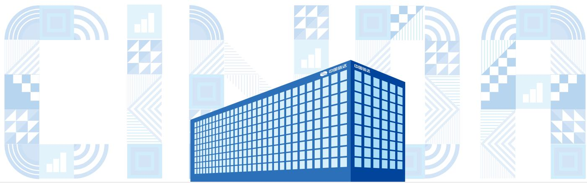

natural_image

Illustration of a modern blue office building with grid pattern, surrounded by abstract QR codes (no text or symbols on the building itself)

公司组织架构图  
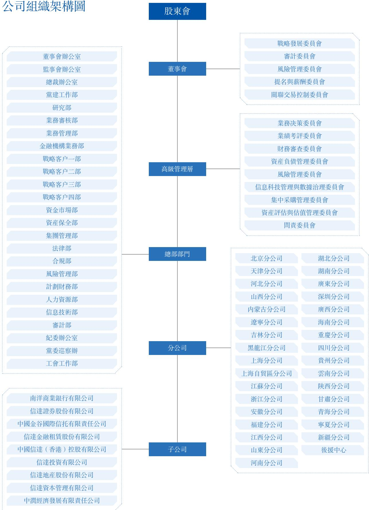

flowchart

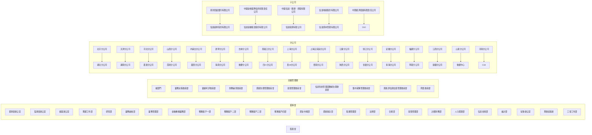

## 强化治理

## 夯实

## 信达根基

##

## 治理

##

##

##

##

公司治理

风险合规

责任管理

##

text_image

空
质量
座雪

##

##

##

## 党的领导

坚持以习近平新时代中国特色社会主义思想为指导，全面贯彻党的二十大及二十届历次全会、中央经济工作会议、中央金融工作会议精神，认真贯彻落实党中央决策部署，坚持党中央对金融工作的集中统一领导，将党的领导融入公司治理各环节。

公司围绕“四建四促”党建工作体系，有效发挥党建抓总职能，完善“双向进入，交叉任职”领导机制，构建权责法定、权责透明、协调运转、有效制衡的公司治理机制，在坚持“党管干部”原则的基础上实现与董事会、经营层依法依规选人用人的有机结合。

充分发挥党委“把方向、管大局、保落实”的领导作用，制定修订《公司党委关于落实“第一议题”制度的实施办法》《党委议事规则》《公司党委落实前置研究讨论程序实施细则（试行）》《党委重大事项请示报告规定（试行）》等关键性制度文件，完善公司党委议事内容清单，厘清党委和董事会等治理主体的权责边界，始终依托制度建设强化党的领导不放松，领导班子严格履行“一岗双责”，在高质量党建促进高质量发展中发挥带头作用。坚持以党建入章为切入口，着力推动党建和经营工作相融相促，实现党的领导融入公司治理的制度化、规范化、程序化，为公司内涵式高质量发展的行稳致远筑牢基础。

text_image

中国信达专题党委会
暨党的建设工作领导小组会议
（学习教育总结会）
2025年9月12日
中国信达
CHINA CINDA
中国信达专题党委会
暨党的建设工作领导小组会议
（学习教育总结会）
2025年9月12日
公司召開黨建工作領導小組會議

## 两会一层

## 股东会

股东会是公司最高权力机构，全年共召开股东会4次，审议议案19 项，报告事项3 项。

堅持同股同權。股東按其持有份額的種類和份額享有權利承擔義務同种类的每一股份具有同种权利。

保障股东权益。公司依法合规召开股东会，为股东行使表决权提供便利，保障股东合法权益。公司以信息披露和投资者关系管理为抓手，加强与股东的沟通交流，提升公司治理透明度，保障股东的知情权。

注重股东回报。公司章程规定，公司利润分配政策应保持连续性和稳定性，同时兼顾公司的长远利益、全体股东的整体利益以及公司的可持续发展，优先采用现金分红的利润分配方式。

## 董事会

董事会是公司经营决策机构。截至报告期末，公司董事会由 10 名董事组成，其中执行董事 3 名，非执行董事 2 名，独立非执行董事 5 名。公司董事会全年共召开11 次会议，审议议案65 项，报告事项23 项。

## 高级管理层

公司经营层坚持以人民为中心的经营理念，充分发挥金融救助和逆周期调节功能，在防范化解风险、服务实体经济等方面，深刻践行金融工作政治性、人民性。坚决履行社会责任并在ESG（环境、社会及管治）领域做出新的贡献，彰显金融央企的使命担当。

text_image

中国信达资产管理股份有限公司
董事会2025年第十一次会议暨
2025年第第四次定期会议
2025.12.24
中国信达资产管理股份有限公司
董事会2025年第十一次会议暨
2025年第第四次定期会议
2025.12.24
公司召開董事會會議

## 廉洁从业

公司严格遵守《中华人民共和国公司法》等法律法规及相关监管规定，持续加强正风肃纪反腐力度，健全完善对权力运行的监督制约机制，加强员工廉洁从业教育，积极培育清廉诚信的企业文化，努力营造风清气正的良好企业氛围和发展环境，切实保障利益相关方权益。

坚决贯彻党中央关于深化金融领域反腐败工作决策部署，坚持一体推进“不敢腐、不能腐、不想腐”，坚决查处滥权妄为、以权谋私、失职渎职等问题。扎实开展深入贯彻中央八项规定精神学习教育，严查快处违反中央八项规定精神问题，坚决防止“四风”问题反弹回潮。持续健全信访举报机制，完善来信、来访、电话和网络等举报渠道，切实保障各类渠道举报受理机制的完备有效。严格履行信访举报和问题线索办理程序，在“登记、受理、办理、告知、归档”全流程确保举报人信息严格保密，依规依纪依法处置信访举报和问题线索，并通过多种方式保障举报人利益，防止打击报复行为发生。

公司面向各职级、各岗位员工开展廉洁从业、反贪腐相关培训。组织开展专题学习教育、反腐倡廉培训、参观警示教育基地等活动，覆盖 2.9 万人次，持续营造诚实守信、清正廉洁的经营氛围。积极鼓励和组织董事参与不同形式的反腐倡廉培训 26 次，75人次参训 , 不断提高廉洁意识和履职能力。

关于贪污诉讼案件数目及诉讼结果等更多信息可参见司法公开信息。

## 风险合规

## 全面风险管理

公司持续完善全面风险管理体系建设，风险治理架构健全，董事会及高级管理层在全面风险管理体系中职责明确、边界清晰。将风险管理各项要求融入日常管理活动和业务流程中，建立风险管理的三道防线：各业务经营部门为第一道防线；风险管理职能部门为第二道防线；内部审计职能部门为第三道防线。2025 年，集团风险管控能力持续强化，各类风险均控制在可接受范围内。

公司对风险偏好、风险政策、风险限额方案进行重检完善，确保风险偏好在集团的统一传导。持续修订风险管理制度，加强风险穿透管理，筑牢风险底线，促进公司业务稳健开展。

公司积极应对国内外复杂严峻的风险环境和挑战，实施资产分类全覆盖，严格做实资产质量。紧盯重点区域、重大项目、关键环节，加大风险化解力度，加强对子公司及境外风险管控。通过智能风控平台前瞻识别的“技防”作用，强化风险源头管控。常态化开展风险项目复盘反思，提升风险应对能力。配合上级风险防控协同机制，开展宏观形势研究、风险项目化解工作交流，强化协同研究、化险能力，深入贯彻风险管理文化，保障公司业务高质量开展。

flowchart

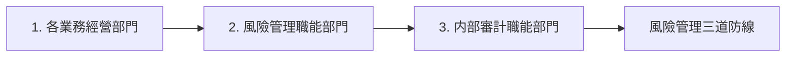

## 合规内控管理

公司依据《金融资产管理公司内部控制办法》《企业内部控制基本规范》《商业银行内部控制指引》《企业管治守则》等监管要求，建立内部控制管理架构，制定实施《内部控制基本规程》，明确从治理层到员工的内控责任分工和报告关系，持续建立健全内部控制管理体系。

公司深入开展内控合规提升活动，进一步加大各类监管问题整改力度，主动对照排查内控合规风险隐患，积极探索典型违规案例警示教育机制，着力推动公司经营管理由被动合规向主动合规转变；公司根据监管机构及上级单位管理要求，开展全面制度重检，持续完善制度体系，进一步提升内部管理规范性；完善负面清单管理机制，聚焦公司主营业务，制定《金融不良类项目操作负面清单》，促进提升制度执行，加强关键环节风险控制；聚焦重点加强检查和排查，持续夯实内控合规有效性。

公司严格遵守《中华人民共和国反洗钱法》等法律法规及监管要求，三道防线各司其职，认真履行机构反洗钱义务。持续完善洗钱风险管控体系，以科技赋能洗钱风险管理，提升工作规范性；落实新法新规要求，开展特定非金融子公司检查，进一步加强集团管控；组织开展 7 次特色培训，覆盖 4,351 人次，不断提升员工风险意识和履职能力。面向金融消费者和公众，制作中国传统节日反洗钱系列宣传，开展反洗钱、反电诈集中宣传活动，通过线上线下多种渠道资源，积极宣导非法金融活动高发领域和防范手段知识，助力提升识别和防范金融犯罪的意识和能力，共筑全民防非、主动拒非的良好社会氛围。

text_image

《存款保险条例》施行10周年
承認存款保障，更用心什么？
存款保险
什么是存款保险
你？留有哪些？
你？留很多？
3.15消费者权益保护教育宣传活动
——青海南北银行合肥分行&中国信达资产管理股份有限公司安徽省分公司
安徽分公司開展消费者權益保護教育宣傳活動

## 责任管理

公司在经营发展过程中始终坚持经济责任与社会责任相统一，深入落实可持续发展理念，严格执行港交所《环境、社会及管治报告守则》规定，常态化做好ESG 信息披露，持续推动公司高质量发展。

## 社会责任理念

## 助力化解风险的稳定器

深耕金融机构不良资产处置，有效缓释金融机构存量信用风险。积极参与防范化解中小金融机构、房地产、地方政府债务等重点领域风险，为牢牢守住不发生系统性风险底线贡献力量。

## 实现员工价值的共同体

坚持“人尽其才，有为有位”人才理念，切实维护员工合法权益，保障员工职业安全，提升员工核心能力，为员工提供干事创业舞台，携手员工共同成长。

## 增进社会福祉的企业公民

坚持以人民为中心的发展理念，以金融之力赋能乡村振兴，促进共同富裕 ；积极参与社区服务和公益慈善，助力实现人民对美好生活的向往。

## 服务实体经济的助推器

强化金融服务实体经济功能，聚焦重大战略、重点领域和薄弱环节，积极参与企业危机救助、深化国企改革发展、支持战略性新兴产业等工作，着力做好金融“五篇大文章”；践行“客户中心”理念，保障客户权益，持续提升服务品质和客户体验，携手客户共创价值。

## 参与环境保护的践行者

贯彻绿色发展理念，积极应对气候变化，围绕主责主业拓展绿色金融服务，支持传统产业低碳转型、绿色产业加快发展，积极践行低碳运营，助力实现“双碳目标。

## 董事会声明

公司董事会承担对公司 ESG 事宜的监管责任。董事会战略发展委员会负责研究公司环境、社会与管治相关的规划、政策、目标及重大事项，对公司 ESG相关工作执行情况进行监督，审阅公司 ESG 相关信息披露报告，并向董事会提出建议。

在董事会的监管指导下，公司立足自身实际，持续践行科学合理、融合经营特色的 ESG 管理策略：深入贯彻创新、协调、绿色、开放、共享的发展理念，严格遵守社会责任和 ESG 监管政策法规，积极落实“专业经营、效率至上、创造价值”的高质量发展理念，持续完善 ESG 管治架构和风险管理体系，聚焦不良资产核心主业，稳步推进“数字信达”建设，协同开展金融服务业务，着力提供优质客户服务，搭建员工发展平台，倡导绿色环保，增进民生社会福祉，努力创造优秀的经济绩效、环境绩效、社会绩效和管治绩效，助推公司长期可持续发展。

董事会负责审议 ESG 重要事项，参与 ESG 相关事项的识别、评估及重要性排序相关工作，动态关注审阅实施进展。结合公司整体战略与实际业务需求，检视 ESG 重要事项与目标进展，关注 ESG 相关风险，审议风险防范措施与解决方案。强化ESG相关风险管理，将ESG相关风险纳入风险管理及内部控制体系，ESG 主要事项总体风险可控。

公司制定经济、环境及社会目标，明确阐述公司主营业务、发展战略、ESG理念及社会责任使命。本年度，相关领域目标进展情况及实践举措检视情况如下：

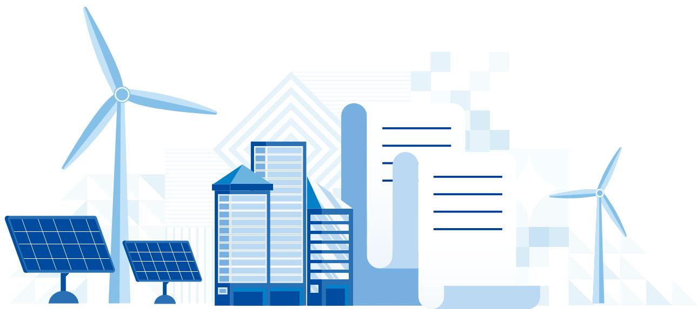

natural_image

Stylized illustration of renewable energy sources including solar panels, wind turbines, and urban buildings (no text or symbols)

<table><tr><td>目標類型</td><td>目標內容</td><td>進度檢視</td></tr><tr><td>經濟目標</td><td>堅持聚焦不良資產主業,提高系統性金融解決方案供給能力,切實履行好化解金融風險和服務實體經濟專業職責,實現價值增值,為股東創造最佳回報。</td><td>聚焦銀行不良資產風險化解,收購銀行不良資產超3,000億元。積極參與中小金融機構改革化險,扎實推動房地產風險化解,穩妥參與地方債務風險化解。圍繞服務國家戰略,助力國企深化改革,支持民營經濟發展壯大,提升服務實體經濟質效。</td></tr><tr><td>環境目標</td><td>持續加大綠色低碳辦公運營,實現企業綠色發展。</td><td>辦公運營相關環境目標進展情況詳見“低碳運營進展”。</td></tr><tr><td>社會目標</td><td>積極開展以鄉村振興為重點的幫扶投資及社會公益活動,關愛弱勢群體,推動社區發展,增進社會福祉;積極應對重大公共危機與灾害,履行企業公民責任;加強員工民主管理,保障員工權益,構建和諧勞動關係,實現員工與企業協同發展。</td><td>認真落實定點幫扶工作,投入和引進幫扶資金2,140萬元,開展多層次、全方位的幫扶活動,持續鞏固脫貧攻堅成果同鄉村振興有效銜接;組織員工參與社區服務,在扶弱濟困、教育助學等領域開展公益慈善獻愛心活動;開展安全維穩培訓和消防疏散應急演練;召開四屆九次職代會,持續做好員工健康管理,保障職業安全;完成各類培訓2,400餘期,超20萬人次參訓。</td></tr></table>

本报告阐述了上述工作具体情况，并详细介绍了公司积极承担社会责任、加强 ESG 管理方面的实践进展。本报告已由公司董事会于 2026 年 3 月 31 日审议通过。

## ESG 治理架构

公司不断优化社会责任和ESG 管理体系，围绕信达社会责任理念，构建了“决策层—管理层—执行层”自上而下、层层递进的 ESG 组织架构体系。各层级协同联动，有效发挥职能与专业优势，切实推动公司系统 ESG 管理工作的落地实施。

## 决策层

董事会是 ESG 管理决策机构，对 ESG 相关工作实施监督及指导。董事会负责监督公司 ESG 及社会责任目标的制定及执行，定期听取 ESG 相关工作进展，并确保在工作开展过程中 ESG 风险管理举措及内部监控机制的有效执行。董事会负责审阅公司定期发布的社会责任（ESG）报告，确保全面准确展现公司ESG 管理实践及履行社会责任方面的工作成效。

## 管理层

管理层负责落实董事会ESG 工作决议，履行制定战略规划、推动分工执行、开展指标考核、提升披露水平、组织培训宣导等职责，将公司 ESG 及社会责任理念有机融入业务决策过程，促进 ESG 管理提质增效。管理层密切关注业务运营涉及的 ESG 相关问题，切实推动经济、环境、社会及企业管治效益的深度融合。

## 执行层

执行层包括总部职能部室及各分子公司，主要负责 ESG 相关工作的落地实施。执行层以公司 ESG 及社会责任管理机制为指导，协同联动，高效配合，携手提升公司ESG 管理水平。

<table><tr><td>ESG工作事項</td><td>落實機構</td></tr><tr><td>社會責任(ESG)報告編制及社會責任考核工作</td><td>總裁辦公室</td></tr><tr><td>ESG事項管理與實踐</td><td>總部職能部室及各分子公司</td></tr><tr><td>ESG信息披露工作聯絡員,負責組織開展ESG實踐及信息整理</td><td>總部相關部室及各分子公司</td></tr><tr><td>辦公場所節能減排和綠色辦公</td><td>總務部、各分子公司後勤保障部門</td></tr><tr><td>開展各類綠色金融業務</td><td>總部、分公司及相關子公司業務部門</td></tr></table>

## 利益相关方沟通

公司高度重视与利益相关方的交流互动，积极搭建与股东和投资者、政府监管机构、客户、供应商、同业及行业协会、非营利组织、公益慈善机构、员工、管理层等利益相关方的多元沟通渠道。通过参与投资贸易洽谈会、举办医疗健康行业论坛、参加先进能源创新发展论坛等各项活动，同政府机构、产权交易所、券商投行、破产管理人、基金管理人等建立战略合作，积极对外传递公司经营理念和价值追求，回应各方诉求与期望，携手各方共创经济、环境、社会及企业管治价值。

## ESG 议题 重要性评估

2025 年，公司开展 ESG 议题重要性分析，通过 ESG 议题识别与评估，明确对自身影响重大、利益相关方普遍关注的关键性议题。根据议题分析结果，制定议题管理与披露策略。

## 步骤 1

## 议题识别

公司深入分析国家宏观政策、行业发展趋势和同业实践，参考香港联合交易所《环境、社会及管治报告守则》、联合国可持续发展目标（SDGs）、全球报告倡议组织《可持续发展报告标准》（GRIStandards）、明晟（MSCI）ESG 评级等国内外 ESG 相关信息披露要求与评级体系，并结合自身业务实际，对既有ESG议题进行整合与更新，共明确16项与公司和利益相关方高度相关的ESG议题。

与上一年度相比，新增公司治理议题，将员工权益保护、健康与安全、劳工准则 3 项议题合并为员工权益保护与福祉，将业务对环境及资源的影响、资源使用、排放物 3 项议题合并为绿色低碳运营，并调整部分议题名称与内涵。

## 步骤 2

## 调研分析

公司通过在线问卷的方式，针对 ESG 议题的重要程度开展专项调研，广泛邀请内外部利益相关方群体从“对公司业务的影响程度”“对利益相关方的影响程度”两方面进行评估。调研共回收问卷 610 余份，参与评估的利益相关方群体包括政府与监管部门、股东与投资者、董事和高级管理人员、员工、客户与消费者、供应商、行业协会、公益组织、高校与研究机构等。

## 结果披露

公司结合调研统计结果与 ESG 专家团队反馈，分析形成重要性议题矩阵，确定报告重点披露内容。

scatter

| Item | Importance to Company's Impact (X-axis) | Importance to Relationship with Profit & Group (Y-axis) |
| --- | --- | --- |
| 1 | ~25% | ~45% |
| 2 | ~45% | ~35% |
| 3 | ~10% | ~20% |
| 4 | ~85% | ~95% |
| 5 | ~95% | ~85% |
| 6 | ~85% | ~75% |
| 7 | ~80% | ~65% |
| 8 | ~60% | ~60% |
| 9 | ~55% | ~55% |
| 10 | ~45% | ~50% |
| 11 | ~45% | ~45% |
| 12 | ~25% | ~15% |
| 13 | ~60% | ~60% |
| 14 | ~75% | ~55% |
| 15 | ~50% | ~45% |
| 16 | ~30% | ~20% |

<table><tr><td>範疇</td><td>議題</td></tr><tr><td rowspan="3">環境</td><td>1 應對氣候變化</td></tr><tr><td>2 綠色金融</td></tr><tr><td>3 綠色低碳運營</td></tr><tr><td rowspan="9">社會</td><td>4 化解金融風險</td></tr><tr><td>5 服務實體經濟</td></tr><tr><td>6 支持國家戰略</td></tr><tr><td>7 客戶權益保護</td></tr><tr><td>8 員工權益保護與福祉</td></tr><tr><td>9 員工培訓與發展</td></tr><tr><td>10 鄉村全面振興</td></tr><tr><td>11 支持民生事業</td></tr><tr><td>12 供應鏈管理</td></tr><tr><td rowspan="4">管治</td><td>13 公司治理</td></tr><tr><td>14 内控合規與風險管理</td></tr><tr><td>15 “數字信達”建設</td></tr><tr><td>16 利益相關方溝通</td></tr></table>

natural_image

Abstract geometric design with blue and white shapes and a central staircase pattern (no text or symbols)

## 聚焦主业践行信达使命

line

| Month | 防範化解風險 | 服務實體經濟 | 提升服務品質 | 供應商管理 |
| --- | --- | --- | --- | --- |
| 7 | ~10 | ~15 | ~20 | ~30 |
| 8 | ~15 | ~20 | ~25 | ~40 |
| 9 | ~20 | ~25 | ~30 | ~50 |
| 10 | ~25 | ~30 | ~35 | ~60 |
| 11 | ~30 | ~35 | ~40 | ~70 |
| 12 | ~35 | ~40 | ~45 | ~80 |

防范化解风险

服务实体经济

提升服务品质

供应商管理

## 银行不良资产收购持续领先

2025 年，公司深化与全国性银行总行合作，持续加大银行不良资产收购，在银行公开批转市场竞得 360 个资产包、本金 1,600 余亿元，继续保持行业领先地位。公司加强与浦发银行合作，建立专班机制及工作小组，加强“总对总分对分”沟通，推动战略合作协议落地。

360 个

在银行公开批转市场竞得资产包

1,600余亿元

本金

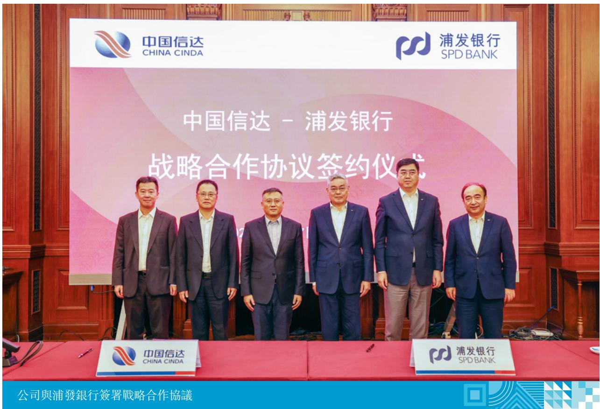

text_image

中国信达
CHINA CINDA
浦发银行
SPD BANK
中国信达 - 浦发银行
战略合作协议签约仪式
中国信达
CHINA CINDA
浦发银行
SPD BANK
公司與浦發銀行簽署戰略合作協議

## 服务中小银行改革化险作出新贡献

公司参与多地中小银行及信用联社改革化险，收购和受托处置 123 家地方中小银行不良债权本息超 1,200 亿元。辽宁分公司开展“春雨行动”，竞得辽宁省两家中小银行 5 个资产包、债权规模 35 亿元，以专业服务辽宁中小银行机构改革和风险化解。天津分公司竞得天津某中小银行不良资产包、债权规模超30 亿元，为区域金融风险化解作出积极贡献。

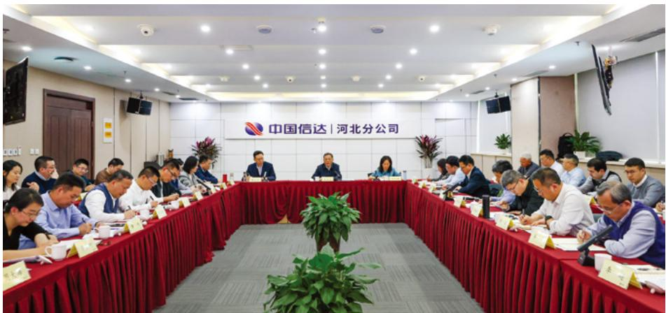

text_image

中国信达 | 河北分公司

公司召开中小银行化险模式总结与业务拓展会

## 拓展非银金融不良资产业务取得新进展

公司围绕信托、证券、保险资管、公募基金等非银金融机构，稳步拓展不良资产业务，累计收购债权本息合计 115 亿元。围绕监管新规与业务创新方向，加强与券商等金融机构协同，助力化解境内外本金超 50 亿元的不良资产，为深化与同类型金融机构合作、提升风险资产处置质效提供了实践样本。

## 完成某中小金融机构阶段性风险化解任务

某地方金融租赁公司被监管部门纳入风险化解任务清单，公司选调 20 多名托管清算和金融租赁专业经验丰富的业务骨干成立专项工作组，协助清算工作专班稳妥推动该公司阶段性风险化解，圆满完成清产核资、风险研判、方案设计、人员安置、风险出清等任务，助力维护区域金融和社会稳定，获得地方政府高度认可。

## 深化个贷不良资产业务纾困实践

公司积极拓展个贷不良资产业务，助力多家金融机构压降不良个贷、盘活存量资产。2025 年累计收购个贷资产包 31个，涉及债务人约 70 万名、债权本金超百亿元，资产覆盖信用卡透支、个人消费贷和经营贷等多类产品。公司通过对债务人开展“接续管理”，纾解民生压力，服务实体经济，深入践行金融工作政治性、人民性。

text_image

中华人民共和国国家版权局
计算机软件著作权登记证书
证件号：壹拾壹佰肆拾陆元整
软件名称：中国信达个贷不良资产智慧运营管理平台
YL0
著作权人：中国信达资产管理股份有限公司
权利取得方式：原始取得
权利范围：全部权利
登记号：2024SR3059723
根据《计算机软件保护条例》和《计算机软件著作权登记办法》的规定，经中国版权保护中心审核，对以上事项予以登记。
2024年10月12日

公司个贷不良资产智慧 荒运营管理平台登记证书

## 破产重整助力困境企业脱困重生

公司为陷入困境的大型集团和上市公司“雪中送炭”，投放12 个项目近85 亿元，化解问题企业债务超 3,000 亿元。其中，历时 2 年完成奥园美谷司法重整，化解负债 20 余亿元，保障约 3.5 万名股东利益、近 1,600 名职工就业。同时，新华联、中通国脉项目获评 2024 年度十大“全国破产经典案例”，新华联案例写入最高人民法院工作报告。

## 助推房地产风险化解和保交房成效显著

公司助推房地产行业风险化解和保交房工作，落地项目 45 个，投入资金 177亿元，实现保交房 4.8 万套，带动货值超 1,200 亿元项目复工复产。其中，推动上海大兴街危改项目存量银团贷款风险化解，全面完成1,000 余户拆迁安置，取得良好社会效益和经济效益。

## 支持地方债务风险化解稳妥推进

公司以存量盘活为重点综合施策，通过提供量身定做的一揽子服务方案，在 13 个省份落地 35 个项目，盘活资产超 450 亿元，获得多个省级地方政府充分肯定。某地方投资公司拖欠某企业投资款，导致数十个在建项目工程款支付受阻。分公司通过“流动性支持+债务重组”方案，解决长期“连环欠”难题，避免形成区域性风险，实现多方共赢。

## 超 450亿元

盘活资产

获得多个省级地方政府充分肯定

## 服务实体经济

## 助力能源安全和“双碳”目标

公司积极发挥煤炭能源行业优势，围绕煤炭绿色低碳转型，在山西、河南、陕西等煤炭主产区投放超100亿元。通过阶段性持有底层优质资产建新煤化股权，纾解控股股东周转困境收到良好效果；通过“资金注入+股权转让+产业赋能”，助力水发集团新能源板块降杠杆并盘活存量资产。聚焦主责主业，用好产品工具，有力支持传统能源产业智能化、绿色化、融合化发展。

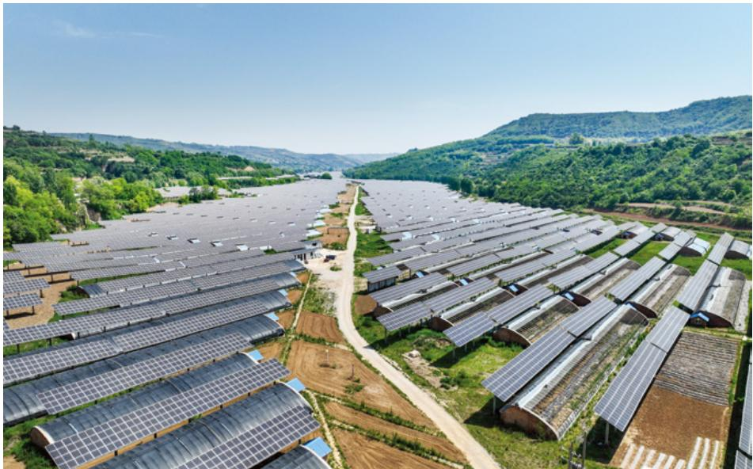

natural_image

Aerial view of a large solar farm installed on rolling green hills under clear sky (no visible text or symbols)

水发集团新能源电站

## 支持新质生产力发展

公司强化投研引领，通过破产重整、市场化债转股、存量盘活等方式集团在科技金融领域投放超 750 亿元。联合中芯聚源设立半导体并购重组基金，盘活存量股权；助力硅料龙头企业通威股份降杠杆，推动打造新兴支柱产业；支持高端装备制造企业东方电气优化资本结构。

## 超750亿元

集团在科技金融领域投放

## 服务国企改革、支持民企发展

公司支持央地国企深化改革，新增投放超 420 亿元，服务“两重”“两新”等重点领域。支持大红山矿业尾矿库建设，实现宝武集团首单合作落地。同时，与民企500 强新增合作超150 亿元。运用“股+债”模式助力全球兽药原料药龙头泰瑞制药旗下泰胜生物转型升级，破解民营企业融资难题；向北满特钢提供纾困资金，定向清偿历史破产重整债务。

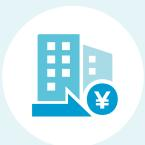

## 超420亿元

服务“两重”“两新”等重点领域，新增投放

## 超150亿元

与民企500强新增合作

natural_image

Aerial view of a modern industrial complex nestled in a mountainous valley, surrounded by vibrant red and orange foliage (no visible text or symbols)

大红山矿业尾矿库建设

## 服务国家战略迈出新步伐

公司成立服务国家战略领导小组，下发《关于做好服务国家战略工作的通知》，深入贯彻党中央、国务院服务国家战略工作要求，建立闭环管理机制，立足公司主责主业和功能定位，持续加大服务京津冀协同、长江经济带、粤港澳大湾区、长三角一体化等区域重大战略，着力支持西部大开发、东北全面振兴、中部地区崛起、东部地区现代化等四大板块协调发展，取得良好成效。

## 护航中资企业“走出去”

公司紧紧围绕服务国家战略，为企业“走出去”注入“金融活水”。战略性投资江西铜业境外子公司佳鑫国际资源港股 IPO，助力其实质性重组全球最大露天钨矿——哈萨克斯坦巴库塔钨矿，保障国家能源资源安全。

text_image

HKEX
香港交易所
28.08.2025
Jiaxin International Resources
Investment Limited
佳鑫國際資源投資有限公司
2058
JIAIXIN
INTERNATIONAL RESOURCE
佳鑫國際資源港股 IPO

## 做好金融 “五篇大文章”

公司及旗下子公司围绕“五篇大文章”，持续加大相关行业企业金融支持。

## 科技金融案例

2025 年 1 月，公司制定综合化债方案，受让某信息通信技术集团旗下上市公司股票，支持集团公司偿还重整计划到期留债、化解流动性危机。此后，又通过联合产业投资人共同投资等方式支持上市公司化解因履行强制回购义务而面临的流动性压力，推动我国信息通信技术龙头企业解除历史包袱，助力企业控制权全面回归中资，释放远期发展潜力，为高科技企业的高质量发展打开新篇章，体现金融央企使命担当，是公司扎实落实“五篇大文章”之一“科技金融”、推动金融高质量发展的具体实践。

## 绿色金融案例

金谷信托成功发行“天津泰达环保有限公司2025 年度第一期绿色定向资产支持票据（碳中和债）”，基础资产均来源于具有碳减排效益的绿色低碳产业项目。信达资本组建专业团队，通过设立绿色产业基金、开展直接投资等方式，积极参与上海电气风电科创板上市战略配售，助力提升风电整机研发能力和市场竞争力。

## 普惠金融案例

信达金租构建“四位一体”普惠金融服务体系，以厂商租赁为突破口，与全球工程机械 50 强企业深度合作，通过“厂商推荐 + 回购担保”模式，累计投资逾 10亿元，有效解决下游中小微企业购置设备的资金难题。

## 养老金融案例

南商中国向聚焦肿瘤诊疗与老年病防治的浙江金华某肿瘤医院发放 6,000 万元贷款，重点满足医院在老年人药品及专用耗材方面的采购需求；向湖北襄阳某国有企业发放 2 亿元养老金融专项贷款，用于现代化医养融合综合体项目建设，预计建成后将新增养老床位3,966 张、医疗床位99 张，每年培养养老专业人才千余人，有效缓解当地养老床位紧缺问题。

## 数字金融案例

公司围绕“数字信达”战略目标，持续提升数字化经营服务能力。落实“人工智能 +”，业务赋能取得初步成效。升级企业级移动平台，强化对新业务模式支撑。全面实现 EAST 监管数据自动报送及指标溯源，完善客户画像、综合贡献度计量，升级违约概率模型，上线财务分析平台，有效支持精准营销、风险管控及高效运营。2025 年，荣获中国互联网协会授予“集团企业数智化建设创新单位”称号。

## 提升服务品质

## 客户营销及生态圈建设

2025 年，公司根据政府机构、实体企业、金融机构及中介机构等不同客户群体需求，在 26 个省市组织综合营销和专项营销活动 69 场，累计签订战略合作协议 58 份。公司首次参加中国国际投资贸易洽谈会，向参会企业全面展示业务功能、专业服务优势和典型案例。安徽分公司组织特殊资产招商引资大会——投资安徽行活动，为特殊资产搭建资本与资产精准对接平台。海南分公司围绕“破产企业重整重生”主题，与破产管理人和协会交流座谈，探索共建“资金+智力+方案”一整套服务体系。

69场

组织综合营销和专项营销活动

58份

累计签订战略合作协议

text_image

中国信达
CHINA CINDA
始于信 达于行
2011年7月，中国工作座谈会，中国企业会
d'angliu's, p.m.
中国信达
CHINA CINDA

公司参加第二十五届中国国际投资贸易洽谈会

## 金融知识宣传

公司面向金融消费者和公众，聚焦非法金融高发重点领域，开展金融知识和反洗钱宣传教育，集中宣传防范非法金融活动和反诈相关知识，充分利用线上线下渠道资源，积极普及非法金融活动常见手段和防范措施，助力提升预防金融犯罪的意识和能力，不断加强消费者权益保护。

  
公司开展金融知识和反洗钱宣传教育

## 客户投诉管理

公司严格落实《消费投诉处理管理办法》，明确各层级机构投诉管理职能，规范消费者投诉处理全流程工作机制，持续强化投诉管理工作的审查机制与监督措施，切实保障客户投诉管理机制的优化与落实。重视客户反馈意见，完善客户沟通机制，对客户投诉做到接诉即办，加强投诉案件督办力度，最大限度保障消费者权益，提升客户服务体验。2025 年，子公司受理客户投诉933 件。

933 件

子公司受理客户投诉

## 信息及数据安全保护

  
在制度方面  
根据《中华人民共和国网络安全法》《中华人民共和国数据安全法》《中华人民共和国个人信息保护法》《银行保险机构数据安全管理办法》，公司制定《信息安全管理办法》《数据安全管理办法》，明确了数据安全管理职责和要求，加强了数据在需求、采集、传输、存储、使用和销毁等方面的要求。公司信息安全管理制度符合监管要求，并通过ISO27001 信息安全管理体系认证。

  
在技术方面

实施了数据库安全审计、终端安全管理、邮件安全网关、数据脱敏平台等数据安全保护措施，并启用注册 U 盘、屏幕水印、内外网隔离、应用层禁止敏感数据拷贝等技术管控措施，提升数据保护能力、避免信息泄露。

  
在日常管理方面

定期组织开展培训，增强全体员工安全保护意识；开展数据安全治理专项工作，建立数据安全管理体系，从严规范数据管理，保障公司数据安全。

## 知识产权保护

公司根据《中华人民共和国商标法》《中华人民共和国反不正当竞争法》《中华人民共和国著作权法》等相关法律法规，制定了《知识产权保护管理办法》，以规范公司知识产权管理工作，加强对知识产权的保护和利用，有效防范公司声誉风险，维护公司合法权益。

在管理机制上，总部知识产权管理归口部门负责知识产权管理工作的统筹安排及指导，各职能部门负责具体知识产权管理工作的落实。集团内各子公司按照《知识产权保护管理办法》的规定负责本单位所辖领域知识产权保护的管理和指导。为保障工作效能，公司聘请专业知识产权代理机构，为知识产权保护提供服务。

在保护机制上，实行“动态监测、及时维权”原则，对公司商标、logo、企业字号等专有权进行实时监测维护，对于他人涉嫌侵犯公司知识产权的行为，及时采取向有关主管部门申请异议或投诉、发送律师函等有效方式予以处理，实现对公司知识产权的全面保护。在具体业务开展过程中，公司也非常重视交易各方知识产权保护，凡可能涉及知识产权的具体业务，均会在交易合同中明确设定知识产权条款，在保证公司知识产权不受他人侵犯的同时，也有效防范自身侵犯他人知识产权的风险。

深入贯彻落实国家关于知识产权保护战略部署，积极稳妥推进使用正版软件工作，制定实施《软件正版化管理规范》，明确了软件需求采购、安装使用管理、监督检查及审批流程等相关要求，建立了软件清单（软件白名单、灰名单、黑名单）的定期更新、发布工作机制，对软件采购、安装、使用进行统一管理；制定《开源软件清单》，避免开源软件误用、滥用。

保证公司不被他人侵犯知识产权，在系统定制化开发合同条款中，对知识产权和纠纷解决机制有具体措施。

## “数字信达” 赋能不良资产 经营

公司深入推进“数字信达”建设，持续推动“智慧淘”迭代升级，不断提高“扩圈”“拓客”功能，提高不良资产处置质效。截至报告期末，累计推介债权资产总额超过万亿元，点击量超 485 万人次。通过加强与头部招商平台合作，协助金融机构和企业客户推介不良资产，上新“征寻合作机构、投资意向”等模块，拓展与区域市场客户合作的深度和广度，持续搭建开放共享的生态平台。

## 超过万亿元

累计推介债权资产总额

## 超485万人次

点击量

## 供应商管理

公司将绿色理念纳入采购管理，《采购管理规程》及《集中采购管理办法》均规定优先采购节能环保产品。在供应商选取和审核阶段，主动评估环境和社会等因素，切实防范供应商 ESG 风险，致力构建可持续供应链。截至报告期末，公司集中采购和常用中介机构入库供应商总数量 3,268 个。2025 年，供应商审查率 100%。

100%

供应商审查率

供应商数据

<table><tr><td>指標名稱</td><td>填報口徑</td><td>單位</td><td>2025年</td><td>2024年</td><td></td></tr><tr><td>入庫供應商數</td><td>總部、分公司、子公司</td><td>個</td><td>3,268</td><td>3,237</td><td>含評估、法律、審計、拍賣等常用中介機構備選庫和集中采購供應商庫</td></tr><tr><td>供應商審查率</td><td>總部、分公司、子公司</td><td>%</td><td>100%</td><td>100%</td><td>——</td></tr><tr><td rowspan="2">按供應商所在地區劃分的入庫供應商數</td><td>中國内地</td><td>個</td><td>3,167</td><td>3,147</td><td>——</td></tr><tr><td>中國港澳臺地區及國外</td><td>個</td><td>101</td><td>90</td><td>——</td></tr><tr><td>年度合作供應商數</td><td>總部、分公司、子公司</td><td>個</td><td>133</td><td>124</td><td>當年預算超過100萬元并由總部實施采購的新增集中采購項目中標供應商</td></tr></table>

公司供应商出、入库调整，由集中采购管理委员会进行集体决策审议确定。

严格执行集中采购决策管理职能与操作执行职能相分离的管理体制。由集中采购管理委员会审定供应商入选范围，由评标 / 谈判委员会推荐最优候选供应商，再由集中采购管理委员会审定，最终公示采购评审结果。通过两次集体审议过程，充分防范采购过程中可能出现的风险。

供应商库、常用中介机构备选库调整。一是组织总部相关部门对已合作供应商资质、产品性能或服务情况、售后及其他履约情况进行年度评价；二是结合公司需要和供应商实际情况对符合条件的供应商新增入库，对不符合条件的供应商进行退库处理，最终确定入库供应商名单。

natural_image

Abstract geometric design with orange background and layered geometric shapes (no text or symbols)

# 以人为本凝聚信达力量

other

| 項目 | 內容 |
| --- | --- |
| 維護員工權益 | ◆ |
| 職業安全 | ◆ |
| 員工關懷 | ◆ |
| 員工發展 | ◆ |

维护员工权益

职业安全

员工关怀

员工发展

## 维护员工权益

根据《中华人民共和国劳动法》《中华人民共和国劳动合同法》《中华人民共和国社会保险法》《中华人民共和国工会法》等法律法规，公司始终坚持以人为本，严格遵守劳动法规，充分尊重与保障公司员工合法权益，积极营造温暖和谐、多元公平的工作环境。

招聘工作中严格人员招聘条件，规范招聘流程，按规定开展招聘背景调查，注重对政治素质、专业知识、工作能力的全面了解，着力提升公司人才招聘引进工作的规范性、科学性、专业性水平。重视职场环境多元化与包容度，在招聘、薪酬、晋升、解聘等环节，坚决杜绝种族、性别、年龄、国籍、宗教信仰、文化背景或家庭情况等个人情况的歧视与区别对待，严禁选人用人不合规情况发生。

严格遵守国家基本福利制度，持续优化薪酬福利体系建设，依法合规保障员工的各项福利待遇。建立健全医疗、养老多层次保障体系，按规定为员工足额缴纳基本养老、基本医疗等各项社会保险，建立企业年金制度并按规定缴纳企业年金，为员工建立商业补充医疗保障体系。保障员工劳动和休息权利，建立严谨科学的用工管理机制，科学评估并积极回应员工对劳务分配的正当需求，坚决禁止任何形式的强制劳动行为。坚决反对、抵制、禁止雇佣童工，为避免发生雇佣童工情况，在招聘过程中，严格审验应聘者身份证件、年龄等相关信息，识别到存在强制劳动或雇佣童工的情况，公司将依据相关法律法规明确追责、严肃处理。2025 年，未识别到任何强制劳动或雇佣童工事件。

持续推进民主管理工作，召开四届九次职代会，指导基层工会召开职工（代表）大会 58 次、工会会员（代表）大会 21 次，推动司务公开、职工代表大会制度规范化运行，强化职工主人翁意识，畅通职工理性表达诉求通道。

natural_image

Illustration of a professional education scene with a graduation cap, checklist, magnifying glass, and audience (no text or symbols)

58次

召开职工（代表）大会

21次

工会会员（代表）大会

text_image

中国信达
CHINA CINDA
第四届职工代表大会
第九次会议
中国信达
CHINA CINDA
第四届职工代表大会
第九次会议

公司召开第四届职工代表大会第九次会议

## 职业安全

公司高度重视员工健康和安全，严格遵守《中华人民共和国突发事件应对法》《中华人民共和国消防法》《中华人民共和国职业病防治法》等法律法规，强化职场安全与卫生管理，开展安全隐患排查整治，切实保障办公环境安全与员工身心健康。

## 76项

整治整改安全隐患

## 2次

开展大型安全宣传培训活动

## 2次

安全员培训

## 8次

组织实战演练

制定《公司总部办公楼消防安全专项治理工作方案》，对重点安全领域和薄弱环境开展“地毯式”排查，整治整改安全隐患76 项，打造安全健康的工作环境。深化安全教育培训，开展大型安全宣传培训活动 2 次，安全员培训 2 次，围绕防汛、电动汽车火灾等突发事件组织实战演练8 次，提高员工应急响应与安全处置能力。组织员工学习心肺复苏法、体外自动除颤器（AED）等安全应急知识，丰富员工应急救护技能。

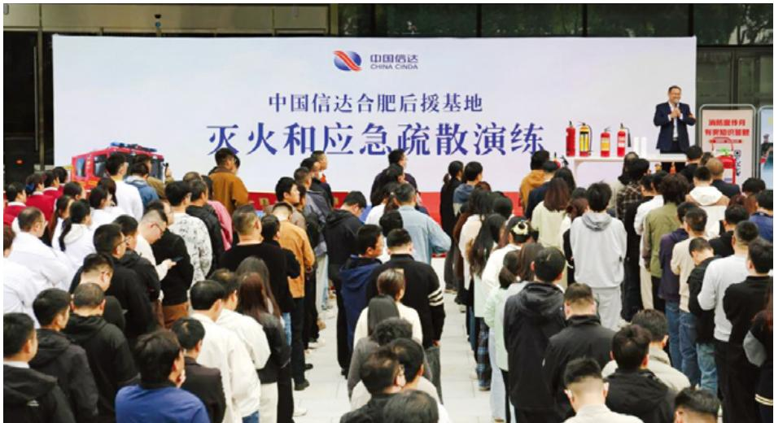

text_image

中国信达
CHINA CINDA
中国信达合肥后援基地
灭火和应急疏散演练

合肥后援基地举办灭火和应急疏散演练

密切关注员工身体健康，持续完善健康保障举措，定期组织员工体检，提供定制化体检方案并安排全流程跟踪服务，按月举办公司健康日活动，帮助员工改善亚健康和“慢病”状态，不断提高员工健康管理水平。深化员工关怀服务，提升员工餐饮质量，更新办公区域基础设施，优化办公区域空气质量，为员工营造舒心健康的办公环境。

## 13个

总部机关共开设兴趣小组

积极提倡“健康工作，快乐生活”理念，精心组队参加中投公司系统职工运动会并获方阵广播操、羽毛球赛第 2 名，积极参与中国金融工会举办的乒乓球、演讲比赛及职工书画摄影展；组织开展春季健步走、先进模范职工疗休养、员工健康管理、读书观影等活动；总部机关共开设 13 个兴趣小组，坚持开展各类文体活动，丰富员工业余文化生活。

## 员工关怀

公司深化员工关怀服务，常态化组织员工生日、结婚、生育、生病住院等关怀慰问活动，在元旦、春节期间对困难职工和退休老同志开展送温暖活动，不断增强员工的归属感和凝聚力。慰问外派偏远地区挂职干部，发放慰问款物。

公司持续推进“职工之家”“职工书屋”建设，充实员工精神文化生活。在“三八”国际妇女节，组织调香、手作等多种活动，为全体女员工送上节日祝福；为女职工发放卫生费，组织心理讲座，坚持保障女员工在结婚、怀孕、生育、哺乳等关键时期的权益。

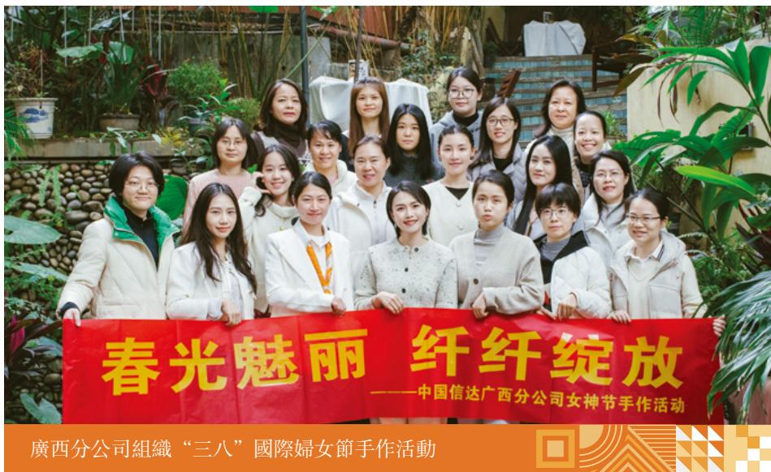

text_image

春光魅丽 纤纤绽放
——中国信达广西分公司女神节手作活动
廣西分公司組織“三八”國際婦女節手作活動

高度重视退休员工的权益保障，为退休员工举办荣休欢送会，切实增强员工荣誉感。组织全面体检、专项体检，提供商业医疗补充保险，举办健康知识讲座，真切关怀老员工身体健康。开展重阳节赏秋等活动，提供丰富多彩的退休生活。

根据《干部任职试用期管理实施细则》《员工培训管理办法》，公司在组织机构改革、人员结构调整与人力资源管理体系建设等方面持续发力，不断健全完善人才管理工作机制，持续推进人才库建设，完善干部员工交流机制，健全激励约束机制，激发员工的积极性、主动性、创造性，为员工成长发展提供保障。

在人才队伍建设方面，认真践行新时代党的组织路线，树立重担当、重实干、重实绩，德才兼备、以德为先的用人标准，不断加强市场化用人机制和员工招聘机制改革，注重专业化、多元化配备，着力打造以不良资产主业人才为引领，各类经济金融投行人才为支撑，财务法律风控团队为保障的高质量专业人才队伍。

在加强培训方面，充分发挥公司党委党校主阵地作用，深入开展党校培训工作，坚持不懈用习近平新时代中国特色社会主义思想凝心铸魂，持续开展党的创新理论体系化培训，推动党的创新理论入脑入心。加强干部队伍建设培训，重点举办公司系统“一把手”领导力提升领航训练营、新任中层干部领导力提升专题培训班、处级干部轮训、各类主题实战化训练营和入党积极分子培训班，全面提升各级干部员工政治能力、专业素养和履职本领。认真组织党建经营融合“空中课堂”系列培训答题、信达网络学习平台和名家讲堂公开课系列讲座活动，实现培训全覆盖。2025年公司系统各单位通过集中培训与视频讲座、线下自学与在线学习、空中课堂相结合，共完成各类培训2,400余期，超20万人次参训，持续提高培训工作的针对性和有效性，努力为公司高质量发展提供思想政治保证和履职能力支持。

员工数据表

<table><tr><td>指標名稱</td><td>單位</td><td>類型</td><td>2025年</td></tr><tr><td colspan="4">B1 雇傭</td></tr><tr><td rowspan="3">員工基本情況</td><td rowspan="3">人</td><td>年末員工總數</td><td>11,745</td></tr><tr><td>少數民族員工數</td><td>768</td></tr><tr><td>本年新進員工</td><td>704</td></tr><tr><td rowspan="2">按雇傭類型劃分的員工人數</td><td rowspan="2">人</td><td>正式員工</td><td>11,494</td></tr><tr><td>勞務派遣員工</td><td>251</td></tr><tr><td rowspan="2">按性別劃分的員工人數</td><td rowspan="2">人</td><td>男</td><td>6,623</td></tr><tr><td>女</td><td>5,122</td></tr><tr><td rowspan="3">按年齡劃分的員工人數</td><td rowspan="3">人</td><td>30歲及以下</td><td>1,526</td></tr><tr><td>31-50歲</td><td>7,734</td></tr><tr><td>51歲及以上</td><td>2,485</td></tr><tr><td rowspan="3">按工作所在地域劃分的員工人數</td><td rowspan="3">人</td><td>中國内地</td><td>9,989</td></tr><tr><td>中國港澳臺地區</td><td>1,741</td></tr><tr><td>海外</td><td>15(外籍)</td></tr><tr><td rowspan="2">按性別劃分的員工流失比率</td><td rowspan="2">%</td><td>男</td><td>4.32</td></tr><tr><td>女</td><td>4.12</td></tr><tr><td rowspan="3">按年齡劃分的員工流失比率</td><td rowspan="3">%</td><td>30歲及以下</td><td>13.89</td></tr><tr><td>31-50歲</td><td>2.88</td></tr><tr><td>51歲及以上</td><td>2.49</td></tr><tr><td rowspan="3">按工作所在地域劃分的員工流失比率</td><td rowspan="3">%</td><td>中國内地</td><td>3.95</td></tr><tr><td>中國港澳臺地區</td><td>5.86</td></tr><tr><td>海外</td><td>0</td></tr><tr><td colspan="4">B2健康與安全</td></tr><tr><td rowspan="3">因公死亡員工人數</td><td rowspan="3">人</td><td>2023年</td><td>0</td></tr><tr><td>2024年</td><td>0</td></tr><tr><td>2025年</td><td>0</td></tr><tr><td rowspan="3">因公死亡員工比率</td><td rowspan="3">%</td><td>2023年</td><td>0</td></tr><tr><td>2024年</td><td>0</td></tr><tr><td>2025年</td><td>0</td></tr><tr><td>因工傷損失的工作時間(工傷誤工時間)</td><td>人天</td><td>2025年</td><td>665.6</td></tr><tr><td colspan="4">B3發展及培訓</td></tr><tr><td>男性員工培訓比率</td><td>%</td><td>——</td><td>99.21</td></tr><tr><td>女性員工培訓比率</td><td>%</td><td>——</td><td>99.63</td></tr><tr><td>總部門級、分公司級領導幹部以上員工培訓人數</td><td>人</td><td>——</td><td>302</td></tr><tr><td>總部門級、分公司級領導幹部以上員工培訓比率</td><td>%</td><td>——</td><td>99.02</td></tr><tr><td>總部門級、分公司級領導幹部以下(不含)員工培訓人數</td><td>人</td><td>——</td><td>2,269</td></tr><tr><td>總部門級、分公司級領導幹部以下(不含)員工培訓比率</td><td>%</td><td>——</td><td>99.47</td></tr><tr><td>男性員工培訓總時長</td><td>小時</td><td>——</td><td>6,274</td></tr><tr><td>女性員工培訓總時長</td><td>小時</td><td>——</td><td>4,450</td></tr><tr><td>總部門級、分公司級領導幹部以上員工培訓總時長</td><td>小時</td><td>——</td><td>1,265</td></tr><tr><td>總部門級、分公司級領導幹部以下(不含)員工培訓總時長</td><td>小時</td><td>——</td><td>9,459</td></tr><tr><td>網絡學習平臺總小時數</td><td>小時</td><td>——</td><td>50,125</td></tr></table>

## 金融向善扛起信达责任

text_image

鄉村全面振興
公益活動

乡村全面振兴

公益活动

公司持续统筹系统力量，优化资源配置，深化帮扶举措，创新工作方法，健全长效机制，持续巩固脱贫攻坚成果同乡村振兴有效衔接，较好完成各项帮扶任务。

## 金融暖农心，振兴谱新篇

公司延续“党建引领、精准施策、全域联动、长效赋能”帮扶工作思路，从加强组织领导、聚焦重点领域、补齐短板弱项、深化消费帮扶四个维度精准施策，全年投入和引进无偿帮扶资金2,140 万元，实施“五大振兴”“两不愁三保障”六类 17 个项目，累计培训基层干部和专业技术人才 1,030人次，多渠道实现消费帮扶652 万元。

公司结合乐都区多民族聚居的地域特征，重点支持“乐都区铸牢中华民族共同体意识展陈馆”建设，打造集教育、展示、研究、体验于一体的综合性文化教育基地，为乐都区下一步打造民族和宗教工作青海样板打下坚实基础。

## 2,140万元

投入和引进无偿帮扶资金

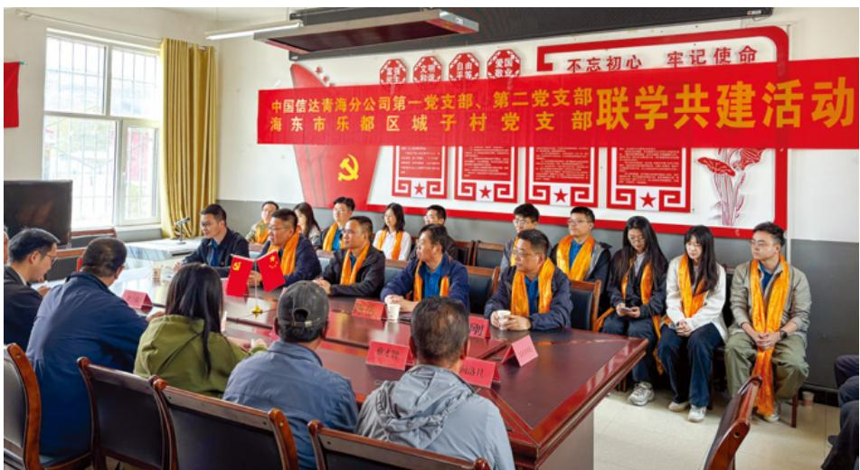

text_image

不忘初心 牢记使命
中国信达青海分公司第一党支部、第二党支部
海东市乐都区城子村党支部联学共建活动

青海分公司党支部与乐都区城子村党支部联学共建

## 扎根高寒区， 携手促振兴

2025 年，新疆分公司驻村点调整为新疆克孜勒苏柯尔克孜自治州阿克陶县布伦口乡盖孜村，地处帕米尔高原，属边境高寒牧区村，平均海拔 2,453米。新疆分公司围绕治理有效、产业提升、民生改善等重点任务，持续加大帮扶支持力度。

新疆分公司投入帮扶资金 80 余万元，实施村委会办公楼及锅炉升级改造、村内道路亮化、牧道修缮及环境整治等项目，切实提升基础设施、增进民生福祉；协调辖区企业，修建钢结构简易桥梁 1 座，解决牧民转场放牧难题；捐赠办公电脑和图书，有效改善村级信息化办公条件，助力乡村人才培育；协助销售牦牛肉等特色畜牧产品近10 万元，缓解牧民“丰产不丰收”之忧。一年来，助力帮扶村实现村集体收入 67 万元，完成全年目标任务的 134% ；村民人均收入达 2.8 万元，较上年增长0.2 万元，增幅7.7%。

## 67万元

助力帮扶村实现村集体收入

## 134%

完成全年目标任务

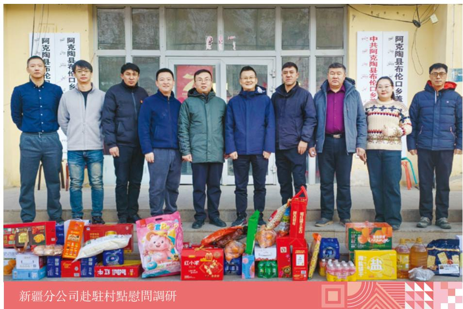

text_image

阿克陶县布伦口乡
阿克陶县布伦口乡
中共阿克陶县布伦口乡
阿克陶县布伦口乡
新疆分公司赴駐村點慰問調研

## 同心增福祉，助力乡村振兴

信达证券不断创新工作思路，因地制宜落实好各项帮扶措施，向青海乐都、贵州纳雍、贵州织金、云南元阳、新疆阿克陶五个结对帮扶县投入帮扶资金 502 万元，在生态、产业、公益、组织、消费等 5 个领域开展 26 个帮扶项目，积极践行金融服务实体经济，扎实推进各结对帮扶地区巩固拓展脱贫攻坚成果同乡村振兴有效衔接顺利收官。

## 502万元

向五个结对帮扶县投入帮扶资金

## 公益活动

公司始终将支持公益事业作为履行社会责任的重要内容，通过开展公益捐赠项目、鼓励员工参与公益志愿活动等不同方式，积极开展多元公益实践，以实际行动为社会增添更多美好，诠释信达人的责任与担当。

## 凝聚爱心力量，驰援灾后建设

2025 年 11 月，香港大埔宏福苑发生特大火灾。南商银行、信达香港捐赠 558 万港元，用于受灾居民过渡安置及灾后恢复工作。南商银行第一时间开通 7×24 小时紧急查询热线，延长周边分行营业时间，提供应急提款便利、银行卡补办便利、服务费用豁免、信贷还款弹性安排等多项应急服务措施，切实解决受灾民众的紧急金融服务需求；积极响应香港红十字会呼吁，组织员工开展献血活动支援医疗需求。信达香港发动员工连夜支援充电宝、生活用品和凉茶等物资，主动联络相关机构为内地运送援港赈灾物资开通“灾急送”跨境绿色通道。

## 558 万港元

南商银行、信达香港捐赠

## 投身志愿活动，助力社区发展

信达香港、南商银行积极响应香港中国企业协会的号召，开展“中企金融服务进社区”专题系列讲座，在学校、基层社区等地成功举办多场公益讲座，加强青少年金融素养，聚焦金融知识普及与防诈骗教育，提升市民对金融风险及网络陷阱的辨识力，获得社区居民及各界专业人士高度评价。

text_image

中企金融服務進社區專題講座
南商銀行開展“中企金融服務進社區”專題講座

信达地产旗下信诚智慧全年累计开展园区活动超 5,800 场，服务业主近 10 万人次，并通过建立 672 个文化社群与 406 个共享空间，提升社区文化活力与邻里互动。联动支付宝“蓝马甲”公益组织在天水街道开展“科学养生、智慧防诈”专题讲座，覆盖长者 173 人次，并在 21 个项目同步推进防诈宣传，累计吸引647 名业主参与。

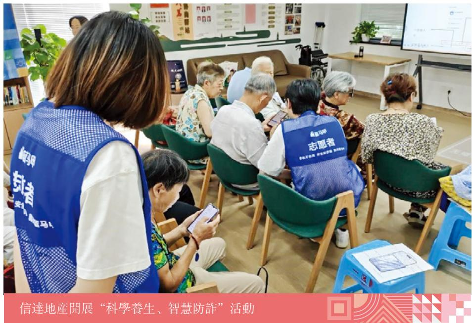

text_image

信達地產開展“科學養生、智慧防詐”活動

natural_image

Abstract geometric design with checkered pattern, square, and arrow elements on teal background (no text or symbols)

## 绿色发展

## 谱写

## 信达华章

other

| Indicator | Status |
| --- | --- |
| 氣候治理體系 | ◆ |
| 氣候風險與機遇管理 | ◆ |
| 氣候風險與機遇識別、評估 | ◆ |
| 指標與目標 | ◆ |
| 低碳運營進展 | ◆ |

气候治理体系

气候风险与机遇管理

气候风险与机遇识别、评估

指标与目标

低碳运营进展

## 气候治理架构

公司建立董事会（战略发展委员会）-高级管理层（风险管理委员会）-执行层（气候风险管理工作组）的三层气候治理架构。董事会是公司气候治理的最高机构，董事会战略发展委员会承担气候风险监督责任，有关董事在 ESG 及气候风险管理方面具有丰富经验（详见《公司2025 年度报告》董事及高级管理人员情况）。公司管理层风险管理委员会承担气候风险管理的实施责任。气候风险管理工作小组负责落实应对气候变化日常工作。

## 气候治理工作进展

## 加强制度建设

2025 年，公司认真落实将气候风险管理全面纳入公司整体风险管理体系的要求，完善《全面风险管理规程》，并制定《气候风险管理工作指引（试行）》。

## 提升专业能力

组织两场气候风险管理及相关披露工作培训，系统提升气候风险管理工作组及项目经理应对气候变化专业能力。

## 气候风险与机遇管理

气候风险识别、评估、监测及应对流程

公司《气候风险管理工作指引（试行）》从风险识别、评估、监测、应对等方面，全面规范气候风险管理的职责分工、流程、专业措施及要求。

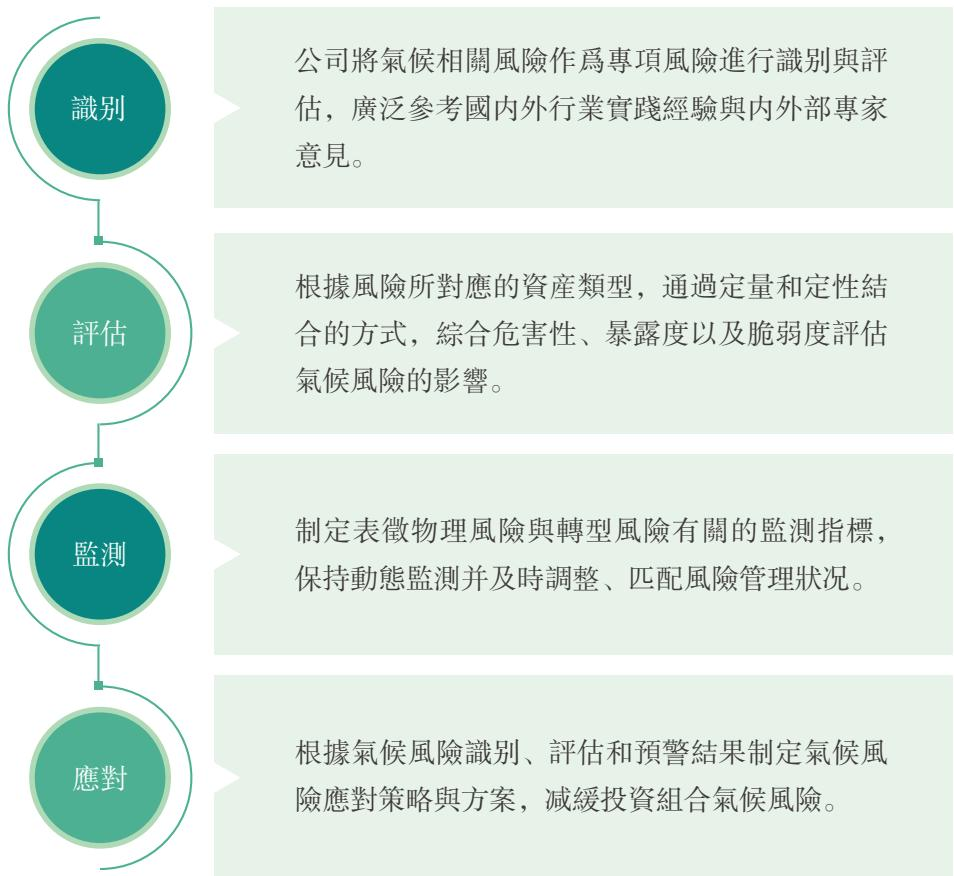

flowchart

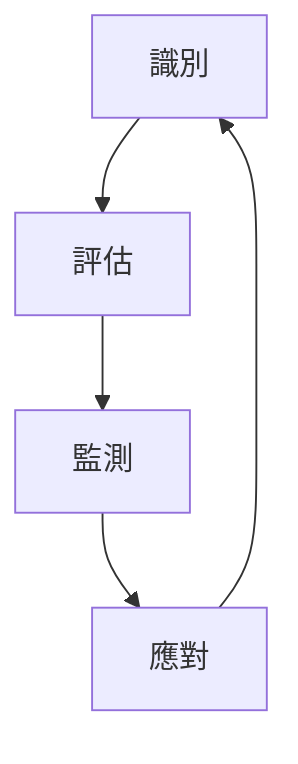

推动重点行业绿色低碳转型的业务策略

通过行业精准施策、资产结构优化提升资产组合气候韧性。针对重点行业，公司制定差异化投资指引，发挥资源整合、价值创造优势：优化化石能源产能结构和高效清洁利用；助力钢铁企业实现绿色转型和资产盘活；响应新能源基础设施、上游材料和关键矿产迫切需求；支持煤化工科技创新应用与效率提升；推进农业绿色智能化升级。

## 气候风险与机遇及其财务影响分析

物理风险

<table><tr><td>風險類型</td><td>風險/機遇描述</td><td>影響時間範圍*</td><td>對業務模式與價值鏈的影響</td><td>可能的財務影響</td><td>應對措施</td></tr><tr><td>急性物理風險</td><td>臺風、暴雨、洪水、幹旱和熱浪等極端天氣事件</td><td>短、中、長期</td><td>1.導致租賃及自有辦公點遭受運營中斷或直接財務損失。2.導致投資不動產價值受損或被投企業經營中斷,造成資產損失、資金清收受阻或投資收益減少。</td><td>資產減值收入減少資金周轉效率降低</td><td>持續監測氣候數據,研究極端天氣事件的發生頻率、強度和影響範圍,積極提升運營設施與被投資產的氣候韌性。</td></tr><tr><td rowspan="2">慢性物理風險</td><td>海平面上升</td><td>中、長期</td><td>1.辦公點或投資不動產被淹没,造成財務損失。2.被投企業沿岸資產被淹没導致生產經營中斷,現金償付滯後或投資收益不及預期。</td><td>資產減值收入減少資金周轉周期延長</td><td>通過壓力測試,評估中長期風險暴露程度與資產脆弱性,根據評估結果優化資產配置與處置方案。</td></tr><tr><td>平均溫度升高</td><td>中、長期</td><td>1.辦公點和被投客戶運營過程能耗、水耗增加,甚至出現水電供應不足導致經營受阻。2.對員工造成負面影響,包括健康、工作效率和通勤等。</td><td>運營成本增加收入減少</td><td>完善內部管理體系以及應急預案,保障員工職業健康安全。</td></tr></table>

注：影响时间范围短期指1-2 年，中期指3-5年，长期指5 年以上。

转型风险

<table><tr><td>風險類型</td><td>風險/機遇描述</td><td>影響時間範圍</td><td>對業務模式與價值鏈的影響</td><td>可能的財務影響</td><td>應對措施</td></tr><tr><td rowspan="2">政策風險</td><td>碳市場和碳關稅等機制下的碳價上升</td><td>短、中、長期</td><td>被投企業碳排放合規成本增加,盈利水平或債務償付能力下降。</td><td>收入減少資金周轉周期拉長</td><td rowspan="2">積極跟踪國家碳排放與產業綠色發展政策要求,及時更新投資業務發展重點;持續完善投前盡職調查與投後管理策略,推動被投企業落實溫室氣體減排,整合產業、技術和資金資源,賦能被投企業的綠色低碳轉型;每年度開展投資組合碳排放強度評估,根據測算結果不斷優化投資策略。</td></tr><tr><td>行業碳排放監管或產能限制加強</td><td>中、長期</td><td>1.煤炭、燃油車等行業生產銷售總量受限,資產提前報廢;被投企業收入減少,出現債務違約風險,投資回報收窄。2.部分行業碳排放強度標準提高,企業需增加研發投入,現金流與償債能力承壓。</td><td>資產減值違約率增加投資回報率下降</td></tr><tr><td>市場風險</td><td>消費者或投資者的低碳偏好</td><td>中、長期</td><td>碳密集型被投企業的盈利受到影響,出現資產擱淺或償債能力承壓。</td><td>資產減值收入減少違約率增加</td><td>分析發展趨勢,識別市場關注重點,調整資產配置策略;聯動產業和技術等各類資源助力被投企業升級既有業務,擴展綠色業務。</td></tr><tr><td rowspan="2">技術風險</td><td>低碳技術與服務替代現有產品與服務</td><td>短、中、長期</td><td>未及時轉型的碳密集型被投企業面臨資產擱淺,導致償債能力不足。</td><td>資產減值收入減少違約率增加</td><td>跟進綠色低碳技術進展,識別受技術發展影響的行業與投資標的,及時調整資產配置;支持被投企業實施技術升級改造。</td></tr><tr><td>低碳轉型技術成本高</td><td>短、中期</td><td>碳密集型被投企業的研發支出偏高,現金流與投資收益收縮,償債能力顯著承壓。</td><td>違約率增加投資回報率下降</td><td>加強投後管理,聯動內外部技術專家規劃務實的轉型路徑,采用經濟可行性高的减排技術。</td></tr><tr><td>聲譽風險</td><td>公司低碳戰略與行動滯後損害公司聲譽</td><td>中、長期</td><td>利益相關方對企業的氣候風險管理期望提高,被投企業若未及時應對,將面臨綠色價值受損、ESG評級下調風險。比如,因碳交易違約事件造成聲譽影響與監管處罰,進而影響公司資產風險敞口。</td><td>投資回報率下降</td><td>推進ESG體系建設,積極完善環境與社會風險管理體系,并提高相關信息透明度,强化底層資產風險管理,推動被投企業應主動落實减排與轉型措施。</td></tr></table>

气候机遇

<table><tr><td>機遇類型</td><td>風險/機遇描述</td><td>影響時間範圍</td><td>對業務模式與價值鏈的影響</td><td>可能的財務影響</td></tr><tr><td rowspan="2">綠色金融及轉型金融</td><td>響應“五篇大文章”,推進綠色投融資</td><td rowspan="2">短、中、長期</td><td>低碳產業市場規模穩步擴張,為投資組合優化提供了廣闊機遇,助力實現投資收益穩定增長與資產質量提升。</td><td rowspan="2">投資收益增長</td></tr><tr><td>支持既有客戶和潜在客户的低碳轉型</td><td>更多市場資金支持綠色產業發展與傳統行業轉型,推動被投企業融資渠道多元化、融資成本下行,實現運營效率提升、成本結構優化,經營韌性與盈利能力增强。</td></tr><tr><td rowspan="2">提升資源能源效率</td><td>提升運營層面能源與資源效率</td><td>短、中期</td><td rowspan="2">自身/被投企業運營層面用電、用水、用紙及其他資源消耗量減少,降低運營成本、改善盈利能力。</td><td>運營成本降低</td></tr><tr><td>助力被投企業的運營資源與能源效率提升</td><td>短、中期</td><td>投資收益增長</td></tr><tr><td rowspan="3">清潔能源</td><td>擴大綠色能源應用規模</td><td>短、中期</td><td>通過投資和應用新能源公務車、分布式光伏等綠色能源基礎設施,優化能源消費結構,減少外購能源費用。</td><td>運營成本降低</td></tr><tr><td>綠色稅費减免等獎勵性政策</td><td>短、中期</td><td>被投清潔能源企業或其他綠色企業可享受較低稅費。</td><td>投資收益增長</td></tr><tr><td>支持被投企業參與碳市場</td><td>短、中、長期</td><td>被投企業通過碳交易獲得額外收益。</td><td>投資收益增長</td></tr><tr><td rowspan="2">提升韌性</td><td>提升自身運營韌性,減少極端氣候事件造成的損失</td><td>短、中、長期</td><td rowspan="2">1.加固或優化各類設施,降低氣候風險造成的實際影響。2.強化員工應對氣候變化的專業知識儲備,提升項目氣候適應性。</td><td rowspan="2">資產和收入損失減少運維支出增長</td></tr><tr><td>支持氣候脆弱地區被投企業強化氣候適應能力</td><td>中、長期</td></tr></table>

<table><tr><td>高</td><td></td><td></td><td></td></tr><tr><td rowspan="3">氣候相關風險與機遇的影響程度</td><td>8 轉型行動滯後損害公司聲譽</td><td>15 提升自身/被投企業韌性</td><td>4 產能或行業排放限制加強9 綠色投融資機遇10 支持被投企業業務低碳轉型</td></tr><tr><td>5 消費者的低碳偏好</td><td>3 碳市場和碳税價格上升6 低碳技術與產品替代1 臺風、暴雨、幹早等急性物理風險</td><td>7 轉型成本高企11 提升自身/被投企業資源能源效率12 擴大綠色能源應用規模13 綠色稅費減免</td></tr><tr><td></td><td>2 海平面上升、平均溫度升高等慢性物理風險14 支持被投企業參與碳市場</td><td></td></tr><tr><td>低</td><td colspan="2">氣候相關風險與機遇發生的概率</td><td>高</td></tr></table>

## 气候情景分析

2025 年，公司选取具有代表性的金融类不良资产和非金融类不良资产，开展评估与测算工作。基于央行与监管机构绿色金融网络（NGFS）与 IPCC 压力情景，本次选取一种物理情景（RCP 8.5）和三种转型情景（当下政策、延迟转型、全球1.5℃温升目标）。

<table><tr><td>氣候情景類型</td><td>情景名稱</td><td>情景假設</td><td>評估周期</td></tr><tr><td>物理情景</td><td>RCP 8.5</td><td>無氣候變化相關政策進行幹預的高排放情景:全球溫室氣體排放總量和濃度不斷增加,到本世紀末,全球平均氣溫較工業化前水平上升4°C以上。</td><td>2030年2050年</td></tr><tr><td rowspan="3">轉型情景</td><td>當下政策</td><td>祇執行目前政策,將導致較高的物理風險。現有氣候政策仍然有效,但由于政策執行沒有得到有效加強,2080年前,全球平均氣溫較工業化前水平將上升3°C以上。</td><td>2030年2060年</td></tr><tr><td>延遲轉型</td><td>政府延後(通常在2030年後)且突然引入低碳轉型政策,政策力度會逐年快速加大,最終達到巴黎協定2°C控溫目標。</td><td>2030年2060年</td></tr><tr><td>全球1.5°C温升目標</td><td>各方立即出臺有雄心的氣候政策,將全球溫升控制在1.5°C以内,并于2050年前後實現全球二氧化碳净零排放。</td><td>2030年2060年</td></tr></table>

## 气候风险情景分析流程与关键假设

## 物理风险

物理风险情景分析结合资产地理位置、类型特征和资产价值信息，从灾害性、脆弱性和暴露度三个维度对气候风险因子可能造成的损失进行评估。测算中未考虑任何保险或物理应对措施。最终通过物理风险暴露程度表征资产因气候物理风险造成的损失占其资产价值的百分比。

## 转型风险

NGFS碳价  
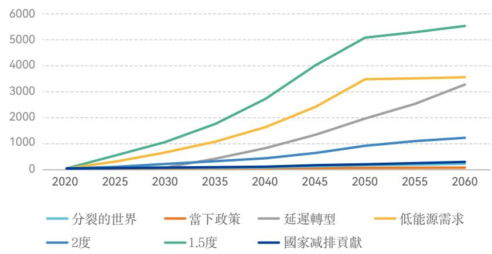

line

| Year | 分裂的世界 | 當下政策 | 延遲轉型 | 低能源需求 | 2度 | 1.5度 | 國家减排貢獻 |
| --- | --- | --- | --- | --- | --- | --- | --- |
| 2020 | ~0 | ~0 | ~0 | ~0 | ~0 | ~0 | ~0 |
| 2025 | ~100 | ~0 | ~100 | ~300 | ~100 | ~400 | ~50 |
| 2030 | ~200 | ~0 | ~300 | ~700 | ~200 | ~1000 | ~100 |
| 2035 | ~300 | ~0 | ~600 | ~1100 | ~300 | ~1700 | ~150 |
| 2040 | ~400 | ~0 | ~900 | ~1600 | ~400 | ~2700 | ~200 |
| 2045 | ~600 | ~50 | ~1400 | ~2400 | ~600 | ~4000 | ~350 |
| 2050 | ~900 | ~150 | ~2100 | ~3450 | ~900 | ~5100 | ~550 |
| 2055 | ~1100 | ~250 | ~2600 | ~3500 | ~1100 | ~5350 | ~750 |
| 2060 | ~1250 | ~350 | ~3300 | ~3550 | ~1250 | ~5550 | ~950 |

转型风险情景定量分析主要考虑政策风险（碳价）的影响，未考虑其他因素影响。碳价是指避免或释放二氧化碳排放的价格，反映各类气候政策作用下的边际减排成本，本次使用REMIND 模型中的碳价。

最终通过碳在险价值（CVaR）这一指标估量资产因以碳价为主的气候转型风险造成的资产损溢占其资产价值的百分比，资产损溢为该资产碳排放净成本，即碳在险价值（CVaR）= 以碳价为主的气候转型相关资产损溢 / 企业价值。CVaR 为正值代表碳排放总成本大于总机遇，负值代表避免碳排放的总机遇大于碳排放总成本。

本次纳入分析的金融类不良资产覆盖36 个代表性项目，共涉及68 处底层资产；非金融类不良资产覆盖 31 个代表性项目，共涉及 64 处底层资产。受金融类不良资产的数据可得性限制，本年度仅评估其物理气候风险。

根据气候情景分析结果，公司纳入评估的资产样本整体气候物理风险水平偏低，总体可控。2030 年内，非金融资产中有部分面临较高的水资源短缺风险；从中长期来看（2050 年），物理风险与短期内保持一致，仅水资源短缺风险和洪水风险较短期内小幅增加。

三种转型情景分析均显示，非金融类不良资产在中短期内（2030 年前）面临的转型风险较小，在电力和热力的生产和供应业存在转型机遇。仅在全球1.5℃温升目标情景下，其他原材料加工制造业资产中，存在较高等级损失风险。中长周期（2050 年）内，电力和热力的生产和供应业中的转型机遇进一步增强。

不同情景下行业平均碳在险价值  
（正值表示风险，负值表示机遇）

<table><tr><td>2030年</td><td>當下政策</td><td>延遲轉型</td><td>全球1.5°C温升目標</td></tr><tr><td>房地產業</td><td>0%</td><td>0%</td><td>3%</td></tr><tr><td>煤炭、石油和天然氣開采業</td><td>0%</td><td>0%</td><td>4%</td></tr><tr><td>化學原料和化學制品制造業</td><td>0%</td><td>0%</td><td>2%</td></tr><tr><td>石油加工煉焦和核燃料加工業</td><td>1%</td><td>1%</td><td>53%</td></tr><tr><td>其他制造業</td><td>0%</td><td>0%</td><td>0%</td></tr><tr><td>其他原材料加工制造業</td><td>9%</td><td>9%</td><td>100%</td></tr><tr><td>其他服務業</td><td>0%</td><td>0%</td><td>1%</td></tr><tr><td>金融業</td><td>0%</td><td>0%</td><td>0%</td></tr><tr><td>建築業</td><td>0%</td><td>0%</td><td>0%</td></tr><tr><td>電力和熱力的生產和供應業</td><td>-13%</td><td>-13%</td><td>-95%</td></tr><tr><td>燃氣和水的生產和供應業</td><td>0%</td><td>0%</td><td>23%</td></tr></table>

2050 年

<table><tr><td></td><td>當下政策</td><td>延遲轉型</td><td>全球1.5℃温升目標</td></tr><tr><td>房地產業</td><td>0%</td><td>5%</td><td>22%</td></tr><tr><td>煤炭、石油和天然氣開采業</td><td>0%</td><td>8%</td><td>25%</td></tr><tr><td>化學原料和化學制品制造業</td><td>0%</td><td>10%</td><td>36%</td></tr><tr><td>石油加工煉焦和核燃料加工業</td><td>3%</td><td>100%</td><td>100%</td></tr><tr><td>其他制造業</td><td>0%</td><td>0%</td><td>8%</td></tr><tr><td>其他原材料加工制造業</td><td>50%</td><td>100%</td><td>100%</td></tr><tr><td>其他服務業</td><td>0%</td><td>1%</td><td>7%</td></tr><tr><td>金融業</td><td>0%</td><td>0%</td><td>0%</td></tr><tr><td>建築業</td><td>0%</td><td>0%</td><td>7%</td></tr><tr><td>電力和熱力的生產和供應業</td><td>-37%</td><td>-95%</td><td>-95%</td></tr><tr><td>燃氣和水的生產和供應業</td><td>4%</td><td>100%</td><td>100%</td></tr></table>

## 气候指标

公司全面识别价值链气候影响，认真开展运营层面温室气体范围三排放核算，提升关键排放源管理能力。范围三核算类别具体包括：外购商品与服务（办公用纸）、运营中产生的废弃物、商务差旅、雇员通勤以及投资。

完善运营碳排放管理

<table><tr><td colspan="2">指標</td><td>單位</td><td>2025年</td><td>2024年</td></tr><tr><td rowspan="23">A1排放物</td><td>溫室氣體排放總量(範圍一、二)</td><td>噸二氧化碳當量</td><td>23,575.09</td><td>25,022.12</td></tr><tr><td>人均溫室氣體排放量(範圍一、二)</td><td>噸二氧化碳當量/人</td><td>5.24</td><td>4.31</td></tr><tr><td>範圍一:直接排放</td><td>噸二氧化碳當量</td><td>1,142.25</td><td>1,262.71</td></tr><tr><td>汽油</td><td>噸二氧化碳當量</td><td>878.48</td><td>870.01</td></tr><tr><td>柴油</td><td>噸二氧化碳當量</td><td>0</td><td>16.05</td></tr><tr><td>天然氣</td><td>噸二氧化碳當量</td><td>247.94</td><td>376.65</td></tr><tr><td>液化石油氣</td><td>噸二氧化碳當量</td><td>15.83</td><td>0</td></tr><tr><td>範圍二:間接排放</td><td>噸二氧化碳當量</td><td>22,432.84</td><td>23,759.41</td></tr><tr><td>外購電力</td><td>噸二氧化碳當量</td><td>19,066.61</td><td>21,025.07</td></tr><tr><td>外購熱力</td><td>噸二氧化碳當量</td><td>3,366.23</td><td>2,734.34</td></tr><tr><td>範圍三:其他排放</td><td>噸二氧化碳當量</td><td>5,923.30</td><td>/</td></tr><tr><td>人均溫室氣體排放量(範圍三)</td><td>噸二氧化碳當量/人</td><td>1.32</td><td>/</td></tr><tr><td>員工差旅-住宿</td><td>噸二氧化碳當量</td><td>1,086.08</td><td>/</td></tr><tr><td>員工差旅-道路旅行</td><td>噸二氧化碳當量</td><td>117.35</td><td>/</td></tr><tr><td>員工差旅-航空旅行</td><td>噸二氧化碳當量</td><td>3,454.93</td><td>/</td></tr><tr><td>員工差旅-鐵路旅行</td><td>噸二氧化碳當量</td><td>533.18</td><td>/</td></tr><tr><td>員工差旅-水路旅行</td><td>噸二氧化碳當量</td><td>0.84</td><td>/</td></tr><tr><td>員工通勤-公共交通</td><td>噸二氧化碳當量</td><td>255.84</td><td>/</td></tr><tr><td>員工通勤-私家車</td><td>噸二氧化碳當量</td><td>205.42</td><td>/</td></tr><tr><td>有害廢棄物</td><td>噸二氧化碳當量</td><td>5.21</td><td>/</td></tr><tr><td>無害廢棄物</td><td>噸二氧化碳當量</td><td>3.61</td><td>/</td></tr><tr><td>辦公用水</td><td>噸二氧化碳當量</td><td>260.62</td><td>/</td></tr><tr><td>辦公用紙</td><td>噸二氧化碳當量</td><td>0.23</td><td>/</td></tr><tr><td rowspan="3">A1排放物</td><td>範圍一温室氣體營收碳强度</td><td>噸二氧化碳當量/百萬元</td><td>0.02</td><td>/</td></tr><tr><td>範圍二温室氣體營收碳强度</td><td>噸二氧化碳當量/百萬元</td><td>0.31</td><td>/</td></tr><tr><td>範圍三温室氣體營收碳强度</td><td>噸二氧化碳當量/百萬元</td><td>0.08</td><td>/</td></tr><tr><td rowspan="26">A2資源使用</td><td>直接能源</td><td>兆瓦時</td><td>4,570.73</td><td>5,539.72</td></tr><tr><td>直接能源消耗量密度</td><td>兆瓦時/人</td><td>1.02</td><td>/</td></tr><tr><td>汽油</td><td>噸</td><td>294.32</td><td>296.94</td></tr><tr><td>柴油</td><td>噸</td><td>0</td><td>5.16</td></tr><tr><td>天然氣</td><td>萬立方米</td><td>11.35</td><td>21.54</td></tr><tr><td>液化石油氣</td><td>噸</td><td>5</td><td>0</td></tr><tr><td>間接能源</td><td>兆瓦時</td><td>44,481.44</td><td>41,467.03</td></tr><tr><td>間接能源消耗量密度</td><td>兆瓦時/人</td><td>9.88</td><td>/</td></tr><tr><td>外購電力</td><td>兆瓦時</td><td>35,934.05</td><td>34,562.13</td></tr><tr><td>外購熱力</td><td>吉焦</td><td>30,602.09</td><td>24,857.64</td></tr><tr><td>其他資源</td><td>-</td><td>-</td><td>-</td></tr><tr><td>員工差旅-住宿</td><td>人·天數</td><td>42,945.00</td><td>/</td></tr><tr><td>員工差旅-道路旅行</td><td>元人民幣</td><td>1,010,903.59</td><td>/</td></tr><tr><td>員工差旅-航空旅行</td><td>人·千米</td><td>39,260,531.03</td><td>/</td></tr><tr><td>員工差旅-鐵路旅行</td><td>人·千米</td><td>20,167,766.24</td><td>/</td></tr><tr><td>員工差旅-水路旅行</td><td>元人民幣</td><td>8,593.05</td><td>/</td></tr><tr><td>員工通勤-公共交通</td><td>人·千米</td><td>16,466,929.90</td><td>/</td></tr><tr><td>員工通勤-私家車</td><td>人·千米</td><td>5,969,019.70</td><td>/</td></tr><tr><td>有害廢棄物</td><td>噸</td><td>14.75</td><td>133</td></tr><tr><td>人均有害廢棄物</td><td>噸/人</td><td>0.0033</td><td>0.0229</td></tr><tr><td>無害廢棄物</td><td>噸</td><td>10.22</td><td>16.92</td></tr><tr><td>人均無害廢棄物</td><td>噸/人</td><td>0.0023</td><td>0.0029</td></tr><tr><td>辦公用水</td><td>噸</td><td>140,876.18</td><td>136,521.79</td></tr><tr><td>人均辦公用水</td><td>噸/人</td><td>31.31</td><td>23.52</td></tr><tr><td>辦公用紙</td><td>噸</td><td>130.89</td><td>150.94</td></tr><tr><td>人均辦公用紙</td><td>噸/人</td><td>0.03</td><td>0.03</td></tr></table>

注：1. 温室气体排放统计范围为公司总部、分公司和子公司总部办公场所。  
2. 核算标准：范围 1 和范围 2 温室气体排放根据中华人民共和国生态环境部刊发《企业温室气体排放核算方法与报告指南发电设施 (2022 修订版 )》和《关于发布 2023 年电力二氧化碳排放因子的公告》中的全国电力平均排放因子进行核算；范围3 排放主要根据生态环境部环境规划院的《中国产品全生命周期温室气体排放系数集（2022）》进行核算。  
3. 综合能源消耗量根据《综合能耗计算通则》（GB/T 2589-2020）、《中国能源统计年鉴 2023》中的能源加工转换效率表核算。  
4. 信达资产用水主要来自市政自来水，在求取水源上无问题。

## 探索投资层面 碳排放核算

公司投资层面碳排放核算覆盖的资产范围与情景分析涉及的资产范围一致，总排放量为 620.59 万吨二氧化碳当量。其中，采矿业和制造业是前两大温室气体排放源，约占本次核算资产组合总排放量的 89%；制造业和采矿业也分别是碳排放强度最高的两个行业，电力、热力、燃气及水生产和供应业碳排放强度位列第三。

投资层面范围三碳排放行业占比  
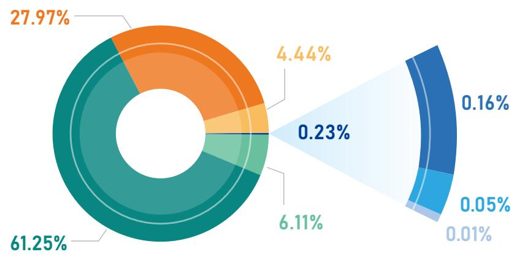

donut

| Category | Value (%) |
| --- | --- |
| Orange | 27.97 |
| Light Orange | 4.44 |
| Dark Green | 61.25 |
| Medium Green | 6.11 |
| Light Blue (Small) | 0.23 |
| Dark Blue (Small) | 0.16 |
| Medium Blue (Small) | 0.05 |
| Grey (Small) | 0.01 |

房地产业 租赁和商务服务业  
采矿业 金融业  
制造业 批发零售业  
电力、热力、燃气及水生产和供应业

## 环境与气候变化目标

基于香港联交所《环境、社会及管治报告守则》以及“量化”汇报原则，公司制定减排、减废、节能、节水等环境与气候变化目标，通过各类举措提升ESG管理水平，检视年度目标进展与完成情况。其中，运营层面的整体目标是：持续加大绿色低碳办公运营，实现企业绿色发展，应对气候变化风险，助力“双碳”目标。

<table><tr><td>目標類型</td><td>目標內容</td><td>進度檢視</td></tr><tr><td>減排目標</td><td>推行綫上化、無紙化會議,推廣使用電子會議材料,紙質文件實現雙面打印。</td><td>◆ 持續推動電子化辦公平臺、電話會議、視頻會議等的廣泛應用,使用無紙化電子會議材料,總部全年召開視頻會議2,485次。◆ 推行辦公用紙雙面打印,減少紙張消耗。</td></tr><tr><td>減廢目標</td><td>倡導辦公用計算機、打印機和復印機的硒鼓、墨盒、電子廢棄物等有害廢物無害化處置;公司生活垃圾推行分類處理。</td><td>◆ 總部全年通過原廠統一回收處理廢弃硒鼓、廢弃墨盒。◆ 推行文明用餐,努力減少餐食浪費現象及厨餘垃圾的產生。◆ 積極宣傳垃圾分類政策與知識,推進生活垃圾分类處理與循環利用。</td></tr><tr><td>節能目標</td><td>推廣倡導使用LED節能燈具,走廊等非辦公區域非工作時間減半配置照明。</td><td>◆ 持續開展光源設備更換工作,換用更加節電的LED燈具。◆ 嚴格設定辦公大樓空調溫度,對設備運行進行科學管理。◆ 督促員工在節假日期間及下班後及時關閉設備電源,做到人離燈熄,減少耗電量。</td></tr><tr><td>節水目標</td><td>公司自有產權辦公樓推廣采用環保節水龍頭。</td><td>◆ 持續落實各項節水措施,推動節水型水龍頭的使用。</td></tr></table>

## 低碳运营进展

## 节能减排

公司在运营中深入贯彻绿色发展理念，推进《关于落实习惯过紧日子要求》执行，积极采取节能减排措施，节约办公用电、用油、用水、用纸等能源资源消耗：持续推动电子化办公平台、线上会议的应用，使用电子会议材料，2025 年度总部全年召开视频会议 2,485 次，较上年增加 143 次；推行办公用纸双面打印及无纸化办公，减少纸张消耗约 20 吨；持续落实各项节水措施，推动节水型水龙头的使用；严格设定办公大楼空调温度，对设备运行进行科学管理；督促员工在节假日期间及下班后及时关闭设备电源，做到人离灯熄，减少耗电量。公司业务不涉及包装材料的使用，未披露相关信息和数据。

2,485次

总部全年召开视频会议

143次

较上年增加

20吨

减少纸张消耗约

## 废弃物处置管理

总部全年通过原厂统一回收处置废旧硒鼓、废弃墨盒；并通过捐赠对部分满足报废条件的无害设备进行再利用，2025 年公司产生电子废弃物较 2024 年减少约6 吨；推行文明用餐，努力减少餐食浪费现象及厨余垃圾的产生；积极宣传垃圾分类政策与知识，推进生活垃圾分类处理与循环利用。

## 绿色运营场所建设

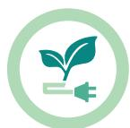

后援中心加大绿色园区建设，根据园区入住人数动态调整电锅炉运行参数，改造照明系统，采用低能耗的感应灯、LED 照明，2025 年同比降低电锅炉、照明用电约 2 万度。采购新能源汽车作为业务用车，配备充电桩为驾驶新能源汽车的员工和客户提供充电服务，推广使用新能源车充电。

积极推进绿色数据中心建设，采取 UPS（不间断电源）冷备、气流组织优化等节能措施，实现数据中心“安全稳定”与“绿色低碳”协同统一；在季节过渡期动态调整制冷系统运行策略，利用数据中心余热为基地办公供暖，平衡服务保障与绿色节能。

natural_image

Two men in suits standing at a data center aisle inside a server room, with no visible text or symbols on the image.

公司数据中心加强能耗量监控分析

## 绿色理念传播

公司持续开展义务植树、环境清洁、垃圾分类宣传等绿色低碳活动，传播生态文明理念，为实现低碳与可持续发展努力，共建美丽中国。

text_image

信达
CINDA REAL E
义务植树活动
主办单位：中国信
承办单位：太原市
组织基地
张而不舍植植十余春秋
久久为功彰显信达担当
（二）年三月四日

山西分公司被太原市北山义务植树基地授予锦旗

## 附录

## 编制说明

## 涵盖范围

本报告时间范围是 2025 年 1 月 1 日至 12 月 31 日，报告范围包括公司总部、分公司、子公司。

## 机构名称释义

中国信达资产管理股份有限公司公   司

集 团 本公司及其附属公司

本公司合肥后援基地管理中心后援中心

南商香港及其附属公司南商银行

南洋商业银行（中国）有限公司，为南商香港的全资附属公司南商中国

南洋商业银行有限公司，为香港持牌银行，本公司的附属公司南商香港

信达证券股份有限公司，本公司的附属公司信达证券

中国金谷国际信托有限责任公司，本公司的附属公司金谷信托

中国信达（香港）控股有限公司，本公司的附属公司信达香港

信达地产股份有限公司，本公司的附属公司信达地产

信达资本管理有限公司，本公司的附属公司信达资本

## 编制依据

本报告根据香港联交所《环境、社会及管治报告守则》、原中国银行保险监督管理委员会《银行保险机构公司治理准则》《关于加强银行业金融机构社会责任的意见》、中国银行业协会《中国银行业金融机构企业社会责任指引》的披露要求进行编制，并参考全球报告倡议组织《可持续发展报告标准》（GRIStandards）要求。

## 汇报原则

重要性：根据香港联交所《环境、社会及管治报告守则》重要性原则，本公司识别了主要 ESG 事项，评估并排序 ESG 事项的重要性水平，根据重要性评估结果对相关 ESG 事项披露，董事会审阅并确认了相关评估过程及结果。ESG 重要事项的识别及评估过程请参见“ESG 议题重要性评估”。

量化：本报告根据香港联交所《环境、社会及管治报告守则》量化原则，结合相关量化标准，对适用的关键绩效指标计量并披露，相关温室气体排放量及能源耗用量化所用的标准、方法、假设及 / 或计算工具的资料，以及所使用的转换因子的来源已在适当位置披露。

一致性：本报告的编报方式、统计方法或关键绩效指标的计量标准、方法、假设及 / 或计算工具、所使用的转换因子等与往年保持一致，未识别有可能影响与往年报告作有意义比较的变更。

## 编制流程

本报告以公司社会责任实践为基础进行编制，基本流程为收集材料→编制修订→高层审议→对外披露。报告披露的内容和数据已经公司董事会审议通过。

## 数据来源

本报告关键财务数据均摘自《中国信达资产管理股份有限公司 2025 年度报告》，该报告包含的合并财务报表经安永华明会计师事务所（特殊普通合伙）审计，其他数据均来自公司内部系统或人工整理。本报告计量货币为人民币。

## 发布形式

本报告以印刷版和网络版两种形式发布。网络版可在中国信达网站及香港联交所官网查阅。

## 联系方式

中国信达资产管理股份有限公司总裁办公室，北京市西城区闹市口大街九号院1 号楼，邮编：100031

ESG 报告守则内容索引

<table><tr><td colspan="3">指標</td><td>報告位置</td></tr><tr><td colspan="4">强制披露規定</td></tr><tr><td rowspan="9">ESG 報告管理</td><td rowspan="4">管治架構</td><td>發表董事會聲明。</td><td>16-17</td></tr><tr><td>披露董事會對 ESG 的監管情況。</td><td>16,18</td></tr><tr><td>披露公司/董事會的 ESG 管理方針及策略,包括評估、優先排序及管理重要的 ESG/ 可持續發展相關事宜(包括對發行人業務的風險)的過程。</td><td>16-21</td></tr><tr><td>披露董事會如何按 ESG/ 可持續發展相關目標檢討進度,并解釋它們如何與發行人業務有關聯。</td><td>16-17</td></tr><tr><td rowspan="4">匯報原則</td><td>描述或解釋在編備 ESG 報告時如何應用下列匯報原則:</td><td>69</td></tr><tr><td>重要性:ESG 報告應披露(1)識別重要 ESG 因素的過程及選擇這些因素的準則;(2)如發行人已進行利益相關方參與,已識別的重要利益相關方的描述及發行人利益相關方參與的過程及結果。</td><td>69</td></tr><tr><td>量化:有關匯報排放量/能源耗用(如適用)所用的標準、方法、假設及或計算工具的資料,以及所使用的轉換因素的來源應予披露。</td><td>69</td></tr><tr><td>一致性:發行人應在 ESG 報告中披露統計方法或關鍵績效指標的變更(如有)或任何其他影響有意義比較的相關因素。</td><td>69</td></tr><tr><td>匯報範圍</td><td>解釋 ESG 報告的匯報範圍,及描述挑選哪些實體或業務納入 ESG 報告的過程。若匯報範圍有所改變,發行人應解釋不同之處及變動原因。</td><td>68</td></tr><tr><td colspan="4">“不遵守就解釋”條文</td></tr></table>

主要范畴、层面、一般披露及关键绩效指标

<table><tr><td colspan="4">A.環境</td></tr><tr><td rowspan="7">層面A1:排放物</td><td colspan="2">一般披露有關廢氣排放、向水及土地的排污、有害及無害廢棄物的產生等的:(a)政策;及(b)遵守對發行人有重大影響的相關法律及規例的資料。注:廢氣排放包括氮氧化物、硫氧化物及其他受國家法律及規例規管的污染物。有害廢棄物指國家規例所界定者。</td><td>66</td></tr><tr><td>關鍵績效指標A1.1</td><td>排放物種類及相關排放數據。</td><td>62-63</td></tr><tr><td>關鍵績效指標A1.2</td><td>[于2025年1月1日刪除]</td><td></td></tr><tr><td>關鍵績效指標A1.3</td><td>所產生有害廢棄物總量(以噸計算)及(如適用)密度(如以每產量單位、每項設施計算)。</td><td>62-63</td></tr><tr><td>關鍵績效指標A1.4</td><td>所產生無害廢棄物總量(以噸計算)及(如適用)密度(如以每產量單位、每項設施計算)。</td><td>62-63</td></tr><tr><td>關鍵績效指標A1.5</td><td>描述所訂立的排放量目標及為達到些目標所采取的步驟。</td><td>65-67</td></tr><tr><td>關鍵績效指標A1.6</td><td>描述處理有害及無害廢棄物的方法,及描述所訂立的減廢目標及為達到這些目標所采取的步驟。</td><td>65-67</td></tr><tr><td colspan="3">指標</td><td>報告位置</td></tr><tr><td rowspan="6">層面A2:資源使用</td><td colspan="2">一般披露有效使用資源(包括能源、水及其他原材料)的政策。注:資源可用于生產、儲存、運輸、樓宇、電子設備等。</td><td>66</td></tr><tr><td>關鍵績效指標A2.1</td><td>按類型劃分的直接及/或間接能源(如電、氣或油)總耗量(以千個千瓦時計算)及密度(如以每產量單位、每項設施計算)。</td><td>63</td></tr><tr><td>關鍵績效指標A2.2</td><td>總耗水量及密度(如以每產量單位、每項設施計算)。</td><td>63</td></tr><tr><td>關鍵績效指標A2.3</td><td>描述所訂立的能源使用效益目標及為達到這些目標所采取的步驟。</td><td>65-67</td></tr><tr><td>關鍵績效指標A2.4</td><td>描述求取適用水源上可有任何問題,以及所訂立的用水效益目標及為達到這些目標所采取的步驟。</td><td>63,65</td></tr><tr><td>關鍵績效指標A2.5</td><td>制成品所用包裝材料的總量(以噸計算)及(如適用)每生產單位占量。</td><td>不適用</td></tr><tr><td rowspan="2">層面A3:環境及天然資源</td><td colspan="2">一般披露減低發行人對環境及天然資源造成重大影響的政策。</td><td>53,66</td></tr><tr><td>關鍵績效指標A3.1</td><td>描述業務活動對環境及天然資源的重大影響及已采取管理有關影響的行動。</td><td>52-64</td></tr><tr><td colspan="4">B.社會</td></tr><tr><td colspan="4">雇傭及勞工常規</td></tr><tr><td rowspan="3">層面B1:雇傭</td><td colspan="2">一般披露有關薪酬及解雇、招聘及晉升、工作時數、假期、平等機會、多元化、反歧視以及其他待遇及福利的:(a)政策;及(b)遵守對發行人有重大影響的相關法律及規例的資料。</td><td>38</td></tr><tr><td>關鍵績效指標B1.1</td><td>按性別、雇傭類型(如全職或兼職)、年齡組別及地區劃分的雇員總數。</td><td>42-43</td></tr><tr><td>關鍵績效指標B1.2</td><td>按性別、年齡組別及地區劃分的雇員流失比率。</td><td>43</td></tr><tr><td rowspan="4">層面B2:健康與安全</td><td colspan="2">一般披露有關提供安全工作環境及保障雇員避免職業性危害的:(a)政策;及(b)遵守對發行人有重大影響的相關法律及規例的資料。</td><td>39-40</td></tr><tr><td>關鍵績效指標B2.1</td><td>過去三年(包括匯報年度)每年因工亡故的人數及比率。</td><td>43</td></tr><tr><td>關鍵績效指標B2.2</td><td>因工傷損失工作日數。</td><td>43</td></tr><tr><td>關鍵績效指標B2.3</td><td>描述所采納的職業健康與安全措施,以及相關執行及監察方法。</td><td>39-40</td></tr><tr><td rowspan="3">層面B3:發展及培訓</td><td colspan="2">一般披露有關提升雇員履行工作職責的知識及技能的政策。描述培訓活動。注:培訓指職業培訓,可包括由雇主付費的內外部課程。</td><td>42</td></tr><tr><td>關鍵績效指標B3.1</td><td>按性別及雇員類別(如高級管理層、中級管理層)劃分的受訓雇員百分比。</td><td>43</td></tr><tr><td>關鍵績效指標B3.2</td><td>按性別及雇員類別劃分,每名雇員完成受訓的平均時數。</td><td>43</td></tr><tr><td rowspan="3">層面B4:勞工準則</td><td colspan="2">一般披露有關防止童工或强制勞工的:(a)政策;及(b)遵守對發行人有重大影響的相關法律及規例的資料。</td><td>38</td></tr><tr><td>關鍵績效指標B4.1</td><td>描述檢討招聘慣例的措施以避免童工及强制勞工。</td><td>38</td></tr><tr><td>關鍵績效指標B4.2</td><td>描述在發現違規情況時消除有關情況所采取的步驟。</td><td>38</td></tr><tr><td colspan="4">營運慣例</td></tr><tr><td rowspan="5">層面B5:供應鏈管理</td><td colspan="2">一般披露管理供應鏈的環境及社會風險政策。</td><td>35</td></tr><tr><td>關鍵績效指標B5.1</td><td>按地區劃分的供貨商數目。</td><td>35</td></tr><tr><td>關鍵績效指標B5.2</td><td>描述有關聘用供貨商的慣例,向其執行有關慣例的供貨商數目,以及相關執行及監察方法。</td><td>35</td></tr><tr><td>關鍵績效指標B5.3</td><td>描述有關識別供應鏈每個環節的環境及社會風險的慣例,以及相關執行及監察方法。</td><td>35</td></tr><tr><td>關鍵績效指標B5.4</td><td>描述在揀選供貨商時促使多用環保產品及服務的慣例,以及相關執行及監察方法。</td><td>35</td></tr><tr><td rowspan="6">層面B6:產品責任</td><td colspan="2">一般披露有關所提供產品和服務的健康與安全、廣告、標簽及私隱事宜以及補救方法的:(a)政策;及(b)遵守對發行人有重大影響的相關法律及規例的資料。</td><td>24-34</td></tr><tr><td>關鍵績效指標B6.1</td><td>已售或已運送產品總數中因安全與健康理由而須回收的百分比。</td><td>不適用</td></tr><tr><td>關鍵績效指標B6.2</td><td>接獲關於產品及服務的投訴數目以及應對方法。</td><td>32</td></tr><tr><td>關鍵績效指標B6.3</td><td>描述與維護及保障知識產權有關的慣例。</td><td>33-34</td></tr><tr><td>關鍵績效指標B6.4</td><td>描述質量檢定過程及產品回收程序。</td><td>不適用</td></tr><tr><td>關鍵績效指標B6.5</td><td>描述消費者數據保障及私隱政策,以及相關執行及監察方法</td><td>33</td></tr><tr><td rowspan="4">層面B7:反貪污</td><td colspan="2">一般披露有關防止賄賂、勒索、欺詐及洗黑錢的:(a)政策;及(b)遵守對發行人有重大影響的相關法律及規例的資料。</td><td>12</td></tr><tr><td>關鍵績效指標B7.1</td><td>于匯報期内對發行人或其雇員提出并已審結的貪污訴訟案件的數目及訴訟結果。</td><td>12</td></tr><tr><td>關鍵績效指標B7.2</td><td>描述防範措施及舉報程序,以及相關執行及監察方法。</td><td>12</td></tr><tr><td>關鍵績效指標B7.3</td><td>描述向董事及員工提供的反貪污培訓。</td><td>12</td></tr><tr><td colspan="4">社區</td></tr><tr><td rowspan="3">層面B8:社區投資</td><td colspan="2">一般披露有關以社區參與來了解營運所在社區需要和確保其業務活動會考慮社區利益的政策。</td><td>46-49</td></tr><tr><td>關鍵績效指標B8.1</td><td>專注貢獻範疇(如教育、環境事宜、勞工需求、健康、文化、體育)。</td><td>46-49</td></tr><tr><td>關鍵績效指標B8.2</td><td>在專注範疇所動用資源(如金錢或時間)。</td><td>46-49</td></tr><tr><td colspan="4">氣候相關披露</td></tr><tr><td colspan="3">(I)管治</td><td>52</td></tr><tr><td rowspan="5">(II)策略</td><td colspan="2">氣候相關風險和機遇</td><td>53, 57</td></tr><tr><td colspan="2">業務模式和價值鏈</td><td>54-56</td></tr><tr><td colspan="2">策略和決策</td><td>54-56</td></tr><tr><td colspan="2">財務狀況、財務表現及現金流量</td><td>54-56</td></tr><tr><td colspan="2">氣候韌性</td><td>58-64</td></tr><tr><td colspan="3">(III)風險管理</td><td>52-53,57-61</td></tr><tr><td rowspan="9">(IV)指標及目標</td><td colspan="2">溫室氣體排放</td><td>62-64</td></tr><tr><td colspan="2">氣候相關轉型風險</td><td>58-61</td></tr><tr><td colspan="2">氣候相關物理風險</td><td>58-61</td></tr><tr><td colspan="2">氣候相關機遇</td><td>58-61</td></tr><tr><td colspan="2">資本運用</td><td>54-56</td></tr><tr><td colspan="2">內部碳定價</td><td>59</td></tr><tr><td colspan="2">薪酬</td><td>參見本公司2025年度報告合并財務報表附注六.19“董事及監事薪酬”</td></tr><tr><td colspan="2">行業指標</td><td>58-64</td></tr><tr><td colspan="2">氣候相關目標</td><td>65-67</td></tr></table>

## 读者反馈

尊敬的读者：

非常感谢您对我们社会责任工作的支持，为向您及其他利益相关方提供我们更专业、更有价值的企业社会责任信息，进一步提升中国信达社会责任（ESG）报告的质量，欢迎您回答意见反馈表中的相关问题。

1. 您对报告是否满意？请作出您的评价。  
2. 您认为我们履行社会责任的情况是否完整披露？  
3. 您希望了解的信息在报告中是否被完整披露？  
4. 您对报告有哪些改进建议？

## 您的信息

姓 名

工作单位

职 务

联系电话

电子邮件

natural_image

Abstract geometric design with blue and white shapes and diagonal lines (no text or symbols)

## 中国信达

## CHINA CINDA

中国信达资产管理股份有限公司

CHINA CINDA ASSET MANAGEMENT CO., LTD.

地址：北京市西城區鬧市口大街9號院1號樓

郵編：100031

電話：86-10-63080000

傳真：86-10-83329205

網址：www.cinda.com.cn

混合产品

纸张|支持色责任林业

FSC° C159377