## 關於本報告

本報告是中國聖牧有機奶業有限公司連續第十年對公司的可持續發展和環境、社會及管治內容進行披露，本報告為2025年環境、社會及管治（ESG）報告。

## 時間範圍

本報告內容時間跨度為2025年1月1日至2025年12月31日，披露本公司2025年度可持續發展表現。

## 報告範圍

本報告覆蓋中國聖牧有機奶業有限公司總部，所有分、子公司，與財務報告合併報表範圍一致。

## 數據來源

本報告的數據和案例，主要來源於中國聖牧有機奶業有限公司的正式檔、統計報告及有關公開資料。

## 編制依據

本報告已遵守香港聯合交易所有限公司（以下簡稱 “香港聯交所”）頒佈的《香港聯合交易所有限公司證券上市規則》附錄 C2《環境、社會及管治報告守則》（以下簡稱《守則》）規定的所有 “強制披露規定” “不遵守即解釋” 條文，同時參考《國際財務報告可持續資訊披露準則第 2 號 - 氣候相關披露》（IFRS S2），結合公司當前發展階段與 ESG 工作實際編寫 2025年環境、社會及管治（ESG）報告。

## 聯交所ESG報告指引四項原則回應：

## 重要性原則：

報告中披露重大性議題矩陣，詳細闡述重大性議題判定的過程及最終結果，同時列舉重要的利益相關方，以及針對性採取的溝通措施。具體內容詳見 “可持續發展管理” 一章中的 “利益相關方溝通” 和 “實質性議題判定”。

## 量化原則：

報告中所披露的環境數據均注明參考標準、計算方法以及參數。

## 平衡性原則：

報告努力實現資訊披露客觀、不偏不倚，報告內容均來自內部管理檔、統計及公開披露資訊，以及公眾媒體報導，無不正當修改。

## 一致性原則：

本報告相較於公司2025年環境、社會及管治報告披露範圍無重大調整，使用一致的披露統計方法，並進一步細化部分聯交所指引對應披露類別。ESG數據的橫向對比，詳見本報告各章節。

## 稱謂說明

為便於表述，中國聖牧有機奶業有限公司在報告中分別用 “聖牧” “公司” 和 “我們” 指代。

## 獲取本報告

本報告可以在香港聯交所網站和中國聖牧官網流覽或下載。本報告分別以中文及英文編制，若中英文文本有任何歧義，概以中文文本為准。

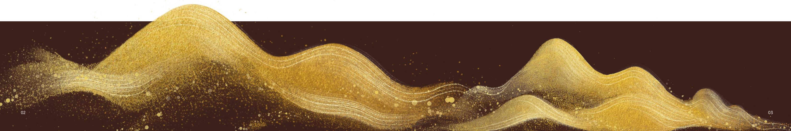

natural_image

Abstract golden wave pattern on dark background, no text or symbols present

natural_image

Illustration of a document with magnifying glass and globe, symbolizing China Shenyangmu (no text or symbols on the document itself)

## 目錄

關於本報告 02

高管致辭 06

關於我們 08

聖牧 “S” 計畫行動方案 10

企業文化 12

高光時刻 13

亮點績效 14

回應聯合國可持續發展目標（SDGs） 16

可持續發展管理 20

可持續發展治理 20

利益相關方溝通 21

實質性議題判定 22

未來展望 78

核實聲明 80

香港聯交所環境、社會及管治

報告守則 82

ISSB 準則索引 88

01

公司治理 24

管治 26

策略 27

風險管理 28

指標及目標 29

02

產品責任 30

管治 32

策略 33

風險管理 34

指標及目標 38

03

氣候中和 40

管治 42

策略 42

風險管理 45

指標 47

04

自然共生 48

管治 50

策略 50

風險管理 52

指標及目標 56

05

員工責任 58

管治 60

策略 61

風險管理 62

指標及目標 67

06

社區責任 72

管治 74

策略 74

風險管理 75

指標及目標 77

## 高管致辭

時序流轉，萬象更新。作為紮根烏蘭布和沙漠的有機產業鏈先行者，中國聖牧始終將可持續發展視為企業的生命線與戰略核心。ESG不僅關乎企業經營的長期穩健，更承載著我們對這片浩瀚沙海的深情守望、對生態責任的莊嚴承諾以及對企業治理能力的不懈追求。2025年，我們以可持續發展理念為燈塔，將生態治理、產業發展與社會價值創造深度融合，在推動企業高質量發展的征途中，讓可持續發展的根基在沙漠中愈發堅韌。

## 深耕生態保護，鑄就綠色發展DNA

自然生態不僅是聖牧產業發展的源泉，更是融入企業血脈的DNA圍繞環境保護與氣候應對，我們持續推進綠色生產體系建設，將生態治理理念如基因般貫穿於全程有機生態治沙產業體系。過去一年，集團系統推進碳排放管理與氣候治理工作，持續開展範圍一、範圍二及範圍三溫室氣體排放管理，穩步提升可再生能源在生產環節中的使用比例。同時，我們矢志不渝地推進沙漠生態治理與草場修復工程，在荒漠地區構建起穩定的生態循環體系，讓綠色成為沙漠最動人的底色。

2025年，集團在國際權威碳資訊披露平臺CDP 森林評估中首次獲得 “Leadership（領導力級別）” 評級，躋身行業最高水準。這一殊榮，是對我們長期以來默默踐行 “零毀林” 承諾——作為行業先行者最早作出這一莊嚴許諾，並始終謙遜篤行——以及推進生物多樣性保護、開展荒漠生態修復的最高褒獎。通過生態治理與產業發展協同推進，聖牧不斷探索生態價值轉化路徑，使生態保護與企業發展形成良性迴圈，讓沙漠煥發出前所未有的生機。

## 強化產業能力，推動可持續價值增長

聖牧始終堅持 “種好草、養好牛、產好奶” 的有機迴圈產業模式，以穩定可靠的產品品質支撐企業長期發展。面對行業週期與市場變化，我們不僅持續提升產業效率與管理水準，更以科技創新為引擎，以數位化管理為翼，推動生產體系全面升級。我們深入探索沙漠特有的資源稟賦，將科技力量注入每一寸沙地，讓有機產業在極端環境中綻放奇跡。

2025年 集團持續推進智慧牧場建設 通過數位化管理系統優化養殖管理與運營效率 同時進一步提升動物福利管理水準。依託通過國際互認的CNAS實驗室，我們持續完善品質檢測與追溯體系，確保產品品質穩定可靠。報告期內集團核心產品指標S級合格率位居行業最高水準 持續為消費者提供源自沙漠深處的純淨有機原奶 讓每一滴奶都承載著沙漠的饋贈與我們的匠心。

通過不斷完善產業管理體系與技術能力，集團在保障生態友好生產的同時實現穩健經營，為企業長期可持續發展奠定堅實基礎。

text_image

中國圣牧
CHINA SHENGMU
凝聚多方力量，共建可持續發展生態

## 凝聚多方力量，共建可持續發展生態

企業的可持續發展離不開人才的驅動與多方力量的彙聚。聖牧持續加強利益相關方協同，推動形成多方共建、價值共用的可持續發展生態。

在人才發展方面，集團持續優化人才結構，加強員工職業發展與技能培訓，並通過數位化與可持續理念培訓提升團隊能力，讓每一位員工都成為可持續發展的踐行者。在供應鏈管理方面，集團持續推動供應鏈夥伴開展碳排查與詳細的ESG評估，逐步構建可持續供應鏈體系，並通過金融賦能等手段，攜手夥伴共同邁向綠色未來。同時，集團積極深化村企合作，通過產業發展帶動周邊社區就業與經濟發展，讓可持續發展的成果惠及更多人群。

報告期內，集團生態治理與沙漠有機產業實踐持續獲得國際關注。在全球生態保護與荒漠治理交流平臺上，聖牧分享了烏蘭布和沙漠有機迴圈產業實踐經驗，展示了企業在生態修復與可持續農業方面的探索成果，為世界荒漠治理貢獻了中國智慧。

## 秉持 “三北精神”，久久為功繪就綠色畫卷

面向未來，聖牧將繼續像守護沙漠綠洲一樣，秉持 “三北精神”，以久久為功的韌勁，將可持續發展作為永恆的追求。我們將落實聯合國SDGs 目標 以可持續發展為核心導向 不斷完善管理體系 提升企業治理水準與風險管理能力集團將持續推進生態治理、綠色生產與數位化管理融合發展，推動沙漠有機產業模式持續升級，讓綠色發展的畫卷在烏蘭布和沙漠上徐徐展開。

我們相信，通過不斷深化可持續發展實踐，企業能夠在實現穩健經營的同時，為生態環境保護、產業可持續發展以及社會價值創造貢獻更大的力量。

未來，聖牧將繼續以務實行動推進可持續發展，與各方夥伴攜手，共同構建更加綠色、健康、可持續的產業生態，讓沙漠之花生生不息，讓綠色夢想照進現實。

## 關於我們

中國聖牧有機奶業有限公司作為中國最大的有機乳品公司，是一家 “種、養” 一體化沙漠有機迴圈原奶企業，業務涵蓋整個乳品行業價值鏈，包括牧草種植、奶牛養殖以及生產原料奶。2014年7月，聖牧成功登陸香港聯交所主板（股票代碼：1432），成為全球有機原奶第一股，是國內首家獲得中國和歐盟有機標準雙認證的原奶品牌。公司以安全奶源基地為核心，有機種養，立足高質量有機原料奶，穩固同下游乳業企業的合作關係。

自成立以來，聖牧以創建全球有機奶第一品牌為願景，始終秉持誠信、卓越、務實、激情的核心價值觀，創新地將沙漠治理與迴圈農業相結合，利用黃沙遍佈的烏蘭布和沙漠優渥的地理優勢和天然的環境保障，進行大規模的生態治理和沙產業建設，形成有機產業鏈，成為中國沙漠有機迴圈產業開創者、全球最大的沙漠有機原奶生產商。當前，奶業現代化進程迅速加快，資本、人才等要素資源向頭部企業迅速集中。在行業轉型過程中，聖牧創新提出新發展觀，堅持 “年輕、開放、變革” 的理念，共促 “可持續、共發展” 的行業蓬勃願景，力創全球有機奶第一品牌。

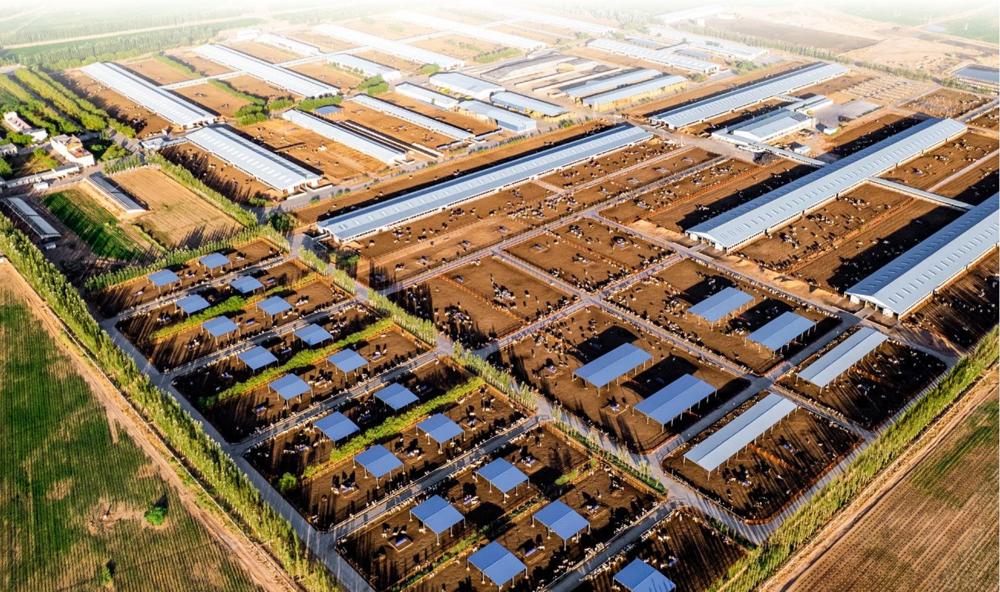

natural_image

Aerial view of a large agricultural facility with multiple warehouses, farmland, and livestock (no visible text or signage)

中国圣牧呼市牧业布局图  
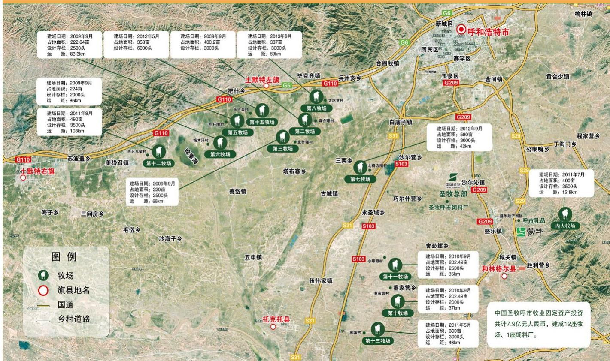

text_image

建场日期：2009年9月
占地面积：222.64亩
设计存栏：2500头
运距：83.3km
建场日期：2012年5月
占地面积：353亩
设计存栏：6000头
建场日期：2009年9月
占地面积：400.2亩
设计存栏：3000头
建场日期：2013年8月
占地面积：337亩
设计存栏：3000头
运距：69km
建场日期：2009年9月
占地面积：224亩
设计存栏：2000头
运距：86km
建场日期：2011年8月
占地面积：490亩
设计存栏：3500头
运距：108km
土默特左旗
把什乡
G110
第十五牧场
第五牧场
第三牧场
G110
G6
毕克齐镇
兵州东乡
G110
大圪查村
第八牧场
昌合坪村
白庙子镇
S31
G209
玉泉区
金河镇
黄合少镇
程家营乡
公喇嘛乡
丁沟门乡
海子乡
三间房乡
美岱召镇
第十二牧场
洛尔营乡
S103
塔布赛乡
善岱镇
古城镇
巧尔什营乡
S31
S103
S103
小平殿村
第十牧场
董家营乡
伍什家镇
五申镇
托克托县
S31
S31
G209
中国圣牧呼市牧业固定资产投资共计7.9亿元人民币，建成12座牧场、1座饲料厂。
图例
牧场
旗县地名
国道
乡村道路

中国圣牧巴市牧业布局图  
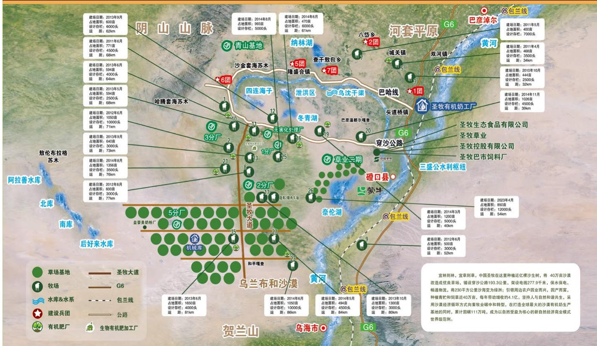

text_image

阴山山脉
八岱乡
巴彦淖尔
包兰线
河套平原
八岱乡
巴彦淖尔
巴彦淖尔
巴彦淖尔
巴彦淖尔
巴彦淖尔
巴彦淖尔
巴彦淖尔
巴彦淖尔
巴彦淖尔
巴彦淖尔
巴彦淖尔
巴彦淖尔
巴彦淖尔
巴彦淖尔
巴彦淖尔
巴彦淖尔
巴彦淖尔
巴彦淖尔
巴彦淖尔
巴彦淖尔
巴彦淖ler
巴彦淖尔
巴彦淖尔
巴彦淖尔
巴彦淖尔
巴彦淖尔
巴彦淖尔
巴彦淖尔
巴彦淖尔
巴彦淖尔
巴彦淖尔
巴彦淖尔
巴彦淖尔
巴彦淖尔
巴彦淖尔
巴彦淖尔
巴彦淖尔
巴彦淖尔
巴彦淖尔
巴彦淖尔
巴彦淖ル
巴彦淖尔
巴彦淖尔
巴彦淖尔
巴彦淖尔
巴彦淖尔
巴彦淖尔
巴彦淖尔
巴彦淖尔
巴彦淖尔
巴彦淖尔
巴彦淖尔
巴彦淖尔
巴彦淖尔
巴彦淖尔
巴彦淖尔
巴彦淖尔
巴彦淖尔
巴彦淖尔
巴彦淖尔
巴彦淖爾
巴彦淖尔
巴彦淖尔
巴彦淖尔
巴彦淖尔
巴彦淖尔
巴彦淖尔
巴彦淖尔
巴彦淖尔
巴彦淖尔
巴彦淖尔
巴彦淖尔
巴彦淖尔
巴彦淖尔
巴彦淖尔
巴彦淖尔
巴彦淖尔
巴彦淖尔
巴彦淖尔
巴彦淖尔
巴彦淖德市
巴彦淖德市
巴彦淖德市
巴彦淖德市
巴彦淖德市
巴彦淖德市
巴彦淖德市
巴彦淖德市
巴彦淖德市
巴彦淖德市
巴彦淖德市
巴彦淖德市
巴彦淖德市
巴彦淖德市
巴彦淖德市
巴彦淖德市
巴彦淖德市
巴彦 PQ10000000000000000000000000000000000000000000000000000000000000000000000000000000000000000000000000000<nl><fcel>青山基地<lcel><lcel><lcel><lcel><lcel><lcel><lcel><lcel><lcel><lcel><lcel><lcel><lcel><lcel><lcel><lcel><nl><fcel>沙金套海苏木<lcel><lcel><lcel><lcel><lcel><lcel><lcel><lcel><lcel><lcel><lcel><lcel><lcel><lcel><lcel><lcel><nl><fcel>四连海子<lcel><lcel><lcel><lcel><lcel><lcel><lcel><lcel><lcel><lcel><lcel><lcel><lcel><lcel><lcel><lcel><nl><fcel>纳林湖<lcel><lcel><lcel><lcel><lcel><lcel><lcel><lcel><lcel><lcel><lcel><lcel><lcel><lcel><lcel><lcel><nl><fcel>查干敖包乡<lcel><lcel><lcel><lcel><lcel><lcel><lcel><lcel><lcel><lcel><lcel><lcel><lcel><lcel><lcel><lcel><nl><fcel>隆盛合镇<lcel><lcel><lcel><lcel><lcel><lcel><lcel><lcel><lcel><lcel><lcel><lcel><lcel><lcel><lcel><lcel><nl><fcel>城关镇<lcel><lcel><lcel><lcel><lcel><lcel><lcel><lcel><lcel><lcel><lcel><lcel><lcel><lcel><lcel><lcel><nl><fcel>双河镇<lcel><lcel><lcel><lcel><lcel><lcel><lcel><lcel><lcel><lcel><lcel><lcel><lcel><lcel><lcel><lcel><nl><fcel>包兰线(包兰线)<lcel><lcel><lcel><lcel><lcel><lcel><lcel><lcel><lcel><lcel><lcel><lcel><lcel><lcel><lcel><lcel><nl><fcel>建场日期:2013年8月占地面积:993亩;设计存栏:500头;运距:61km;建设兵团:建设兵团;公路:公路;有机肥厂:有机肥加工厂;生物有机肥加工厂;<ecel><ecel><ecel><ecel><ecel><ecel><ecel><ecel><ecel><ecel><ecel><ecel><ecel><ecel><ecel><ecel><nl><fcel>六团(六团)<ecel><ecel><ecel><ecel><ecel><ecel><ecel><ecel><ecel><ecel><ecel><ecel><ecel><ecel><ecel><ecel><nl><fcel>哈腾套海苏木<ecel><ecel><ecel><ecel><ecel><ecel><ecel><ecel><ecel><ecel><ecel><ecel><ecel><ecel><ecel><ecel><nl><fcel>建场日期:2013年6月占地面积:450头;运距:68km;建设兵团:建设兵团;公路:公路;有机肥厂:有机肥加工厂;生物有机肥加工厂;生物有机肥加工厂;生物有机肥加工厂;生物有机肥加工厂;生物有机肥加工厂;生物有机肥加工厂;生物有机肥加工厂;生物有机肥加工厂;生物有机肥加工厂;生物有机肥加工厂;生物有机肥加工厂;生物有机肥加工厂;生物有机肥加工厂;生物有机肥加工厂;生物有机肥加工厂;生物有机肥加工厂;生物有机肥加工厂;生物有机肥加工厂;生物有机肥加工厂;生物有机肥加工厂; 生物有机肥加工厂;生物有机肥加工厂;生物有机肥加工厂;生物有机肥加工厂;生物有机肥加工厂;生物有机肥加工厂;生物有机肥加工厂;生物有机肥加工厂;生物有机肥加工厂;生物有机肥加工厂;生物有机肥加工厂;生物有机肥加工厂;生物有机肥加工厂;生物有机肥加工厂;生物有机肥加工厂;生物有机肥加工厂;生物有机肥加工厂;生物有机肥加工厂;生物有机肥加工厂;生物有机肥加工厂;生态牧业基地:生态牧业基地;草业三期:草业三期;草业三期:草业三期;草业三期:草业三期;草业三期:草业三期;草业三期:草业三期;草业三期:草业三期;草业三期:草业三期;草业三期:草业三期;草业三期:草业三期;草业三期:草业三期;草业三期:草业三期;草业三期:草业三期;草业三期:草业三期;草业二期:草业二期;草业二期:草业二期;草业二期:草业二期;草业二期:草业二期;草业二期:草业二期;草业二期:草业二期;草业二期:草业二期;草业二期:草业二期;草业二期:草业二期;草业二期:草业二期;草业二期:草业二期;草业二期:草业二期;草业二期:草业二期;草业一期:草业一期;草业一期:草业一期;草业一期:草业一期;草业一期:草业一期;草业一期:草业一期;草业一期:草业一期;草业一期:草业一期;草业一期:草业一期;草业一期:草业一期;草业一期:草业一期;草业一期:草业一期;草业一期:草业一期;草业一期:草业一期;草业二期:草业二期;草业二期:草业二期;草业二期:草业二期;草业二期:草业二期;草业二期:草业二期;草业二期:草业二期;草业二期:草业二期;草业二期:草业二期;草业二期:草业二期;草业二期:草业二期;草业二期:草业二期;草业二期:草业二期;草业三期:草业三期;草业三期:草业三期;草业三期:草业三期;草业三期:草业三期;草业三期:草业三期;草业三期:草业三期;草业三期:草业三期;草业三期:草业三期;草业三期:草业三期;草业三期:草业三期;草业三期:草业三期;草业三期:草业三期;草业三盛公水利枢纽(三盛公水利枢纽);圣牧生态食品有限公司(圣牧生态食品有限公司);圣牧农业(圣牧农业);圣牧控股有限公司(圣牧控股有限公司);圣牧巴布饲料厂(圣牧巴布饲料厂);圣牧生态食品有限公司(圣牧生态食品有限公司);圣牧农业(圣牧农业);圣牧控股有限公司(圣牧控股有限公司);圣牧巴布饲料厂(圣牧巴布饲料厂);圣牧生态食品有限公司(圣牧生态食品有限公司);圣牧农业(圣牧农业);圣牧控股有限公司(圣牧控股有限公司);圣牧巴布饲料厂(圣牧巴布饲料厂);圣牧生态食品有限公司(圣牧生态食品公司);圣牧农业(圣牧农业);圣牧控股有限公司(圣牧控股有限公司);圣牧巴布饲料厂(圣牧巴布饲料厂);圣牧生态食品有限公司(圣牧生态食品公司);圣牧农业(圣牧农业);圣牧控股有限公司(圣牧控股有限公司);圣牧巴布饲料厂(圣牧巴布饲料厂);圣牧生态食品有限公司(圣牧生态食品公司);圣牧农业(圣牧农业);圣牧控农(圣牧农业);圣牧农业(圣牧农业);圣牧农业(圣牧农业);圣牧农业(圣牧农业);圣牧农业(圣牧农业);圣牧农业(圣牧农业);圣牧农业(圣牧农业);圣牧农业(圣牧农业);圣牧农业(圣牧农业);圣牧农业(圣牧农业);圣牧农业(圣牧农业);圣牧农业(圣牧农业);圣牧农业(圣牧农业);圣牧农业(圣牧农业科技);圣牧农业(圣牧农业);圣牧农业(圣牧农业);圣牧农业(圣牧农业);圣牧农业(圣牧农业);圣牧农业(圣牧农业);圣牧农业(圣牧农业);圣牧农业(圣牧农业);圣牧农业(圣牧农业);圣牧农业(圣牧农业);圣牧农业(圣牧农业);圣牧农业(圣牧农业);圣牧农业(圣牧农业);圣牧农业科技(北洋) (北洋) (北洋) (北洋) (北洋) (北洋) (北洋) (北洋) (北洋) (北洋) (北洋) (北洋) (北洋) (北洋) (北洋) (北洋) (北洋) (北洋) (北洋) (北洋) (北洋) (北洋) (北洋) (北洋) (北洋) (北洋) 五分厂 (五分厂)
益翠美奶粉厂 (益翠美奶粉厂)
机械库 (机械库)
和平堰查 (和平堰查)
乌兰布和沙漠 (乌兰布和沙漠)
黄河 (黄河)
包兰线 (包兰线)
建场日期:2013年6月占地面积:165亩,设计存栏:400头,运距:81km;
建场日期:2014年6月占地面积:105亩,设计存栏:1000头,运距:86km;
建场日期:2014年5月占地面积:49亩,设计存栏:450头,运距:84km;
建场日期:2013年10月占地面积:130亩,设计存栏:300头,运距:80km;
建场日期:2012年6月占地面积:50亩,设计存栏:300头,运距:52km;
建场日期:2012年6月占地面积:55亩,设计存栏:55亩,运距:52km;
建场日期:2012年6月占地面积:55亩,设计存栏:55亩,运距:52km;
建场日期:2012年6月占地面积:55亩,设计存栏:55亩,运距:52km;
建场日期:2012年6月占地面积:55亩,设计存栏:84亩,运距:84km;
建场日期:2012年6月占地面积:55亩,设计存栏:84亩,运距:84km;
建场日期:2012年6月占地面积:55亩,设计存栏:84亩,运距:84km;
建场日期:2012年6月占地面积:55亩,设计存栏:84亩,运距 :8km;
建场日期:2012年6月占地面积:55亩,设计存栏:84亩,运距 :8km;
建场日期:2012年6月占地面积:55亩,设计存栏 :8km;
建场日期 :2012年6月占地面积 :8km;
建场日期 :2012年6月占地面积 :8km;
建场日期 :2012年6月占地面积 :8km;
建场日期 :2012年6月占地面积 :8km;
建场日期 :2012年6月占地面积 :8km;
建场日期 :2012年6月占地面积 :8km;
建场日期 :2<nl>

## 聖牧 “S” 計畫行動方案

聖牧的品牌理念是對聖牧 “S計畫” 內涵的延伸，是聖牧開拓畜牧行業 “有機、生態、可持續發展”的新模式的核心概念，體現聖牧將致力於人與自然、企業與環境與社會的和諧發展，實現生態保護與經濟發展雙重效益。

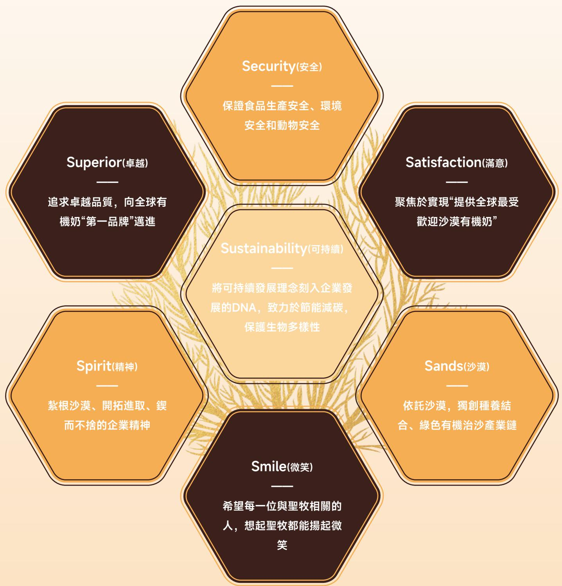

flowchart

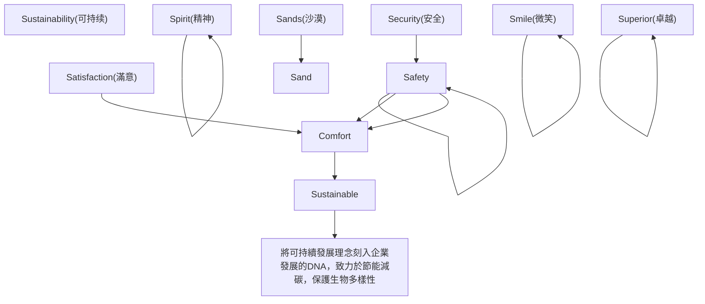
```mermaid
graph TD
  Center["Sustainability(可持续)"]
  
  Security["Security(安全)"]
  Satisfaction["Satisfaction(滿意)"]
  Spirit["Spirit(精神)"]
  Smile["Smile(微笑)"]
  Sands["Sands(沙漠)"]
  Superior["Superior(卓越)"]
  
  Security --> Safety
  Satisfaction --> Comfort
  Spirit --> Spirit
  Smile --> Smile
  Sands --> Sand
  Superior --> Superior
  
  Safety --> Safety
  Safety --> Comfort
  Safety --> Comfort
  Comfort --> Sustainable
  Sustainable --> DNA_DNA["將可持續發展理念刻入企業發展的DNA，致力於節能減碳，保護生物多樣性"]
```

聖牧作為中國最大有機原奶供應商與世界最大沙漠有機原奶供應商，始終秉持對可持續發展的堅定承諾，以 “自然受益、商業向善” 為核心，在全產業鏈中踐行可持續發展戰略，將沙漠治理與迴圈農業相結合，通過科學管理和技術創新，提高農業生產的生態效益和經濟效益，為實現農業的可持續發展做出更大的貢獻。

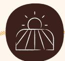

## 土地

•可持續農業  
• “零毀林” 行動  
•植樹固碳  
•涵養水源  
•生物多樣性保護

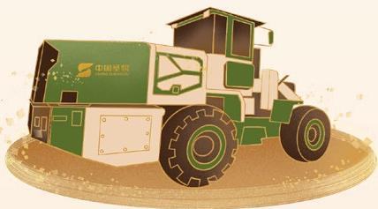

natural_image

Illustration of a green agricultural harvester on a sandy surface (no text or symbols visible)

## 種植

•有機草場

1.非轉基因草料種植  
2.不使用化肥、轉基因及農藥  
3. 糞肥還田  
4.封閉式管理

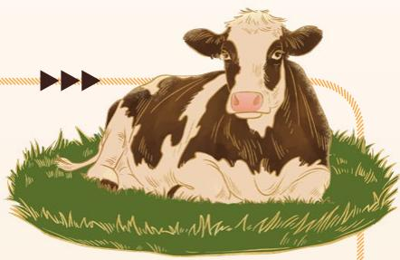

natural_image

Illustration of a black-and-white cow lying on grass, with no visible text or symbols.

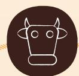

## 養殖

•智慧牛群管理  
1.散欄式牧場  
2.全程有機餐，不使用生長激素  
3.專業保障團隊

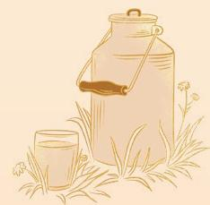

•綠色用能

1.提升種植過程綠電使用比例  
2.擴大林木種植  
3.提高水資源可持續利用率  
種植者夥伴關係  
•為當地農戶提供支援

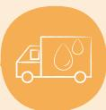

## 運輸

•減少運輸間碳足跡  
•保障運輸品質安全

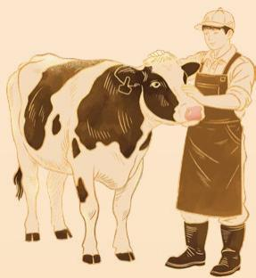

natural_image

Illustration of a farmer feeding a cow (no text or symbols present)

•動物福利  
•節能低碳技術運用  
•專業技術知識共用  
•行業可持續發展交流  
•維護女性權利

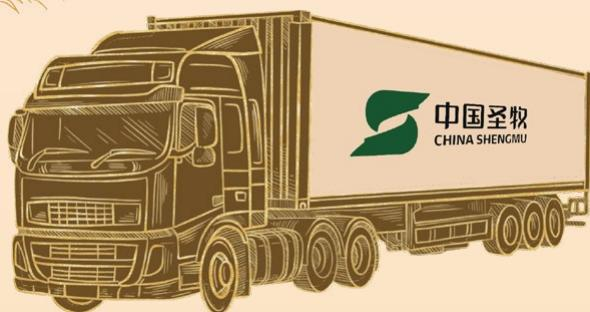

natural_image

Illustration of a semi-truck with a green logo and Chinese text '中国圣牧 CHINA SHENGMU' (no additional signage or data)

## 企業文化

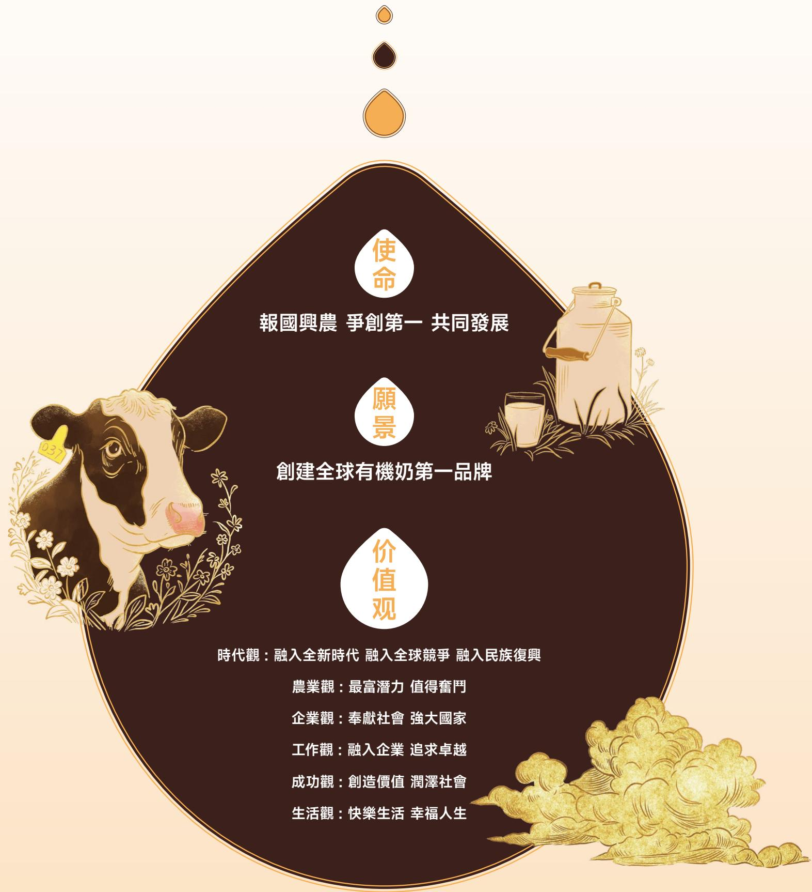

text_image

使命
報國興農 爭創第一 共同發展
願景
創建全球有機奶第一品牌
价值观
時代觀：融入全新時代 融入全球競爭 融入民族復興
農業觀：最富潛力 值得奮鬥
企業觀：奉獻社會 強大國家
工作觀：融入企業 追求卓越
成功觀：創造價值 潤澤社會
生活觀：快樂生活 幸福人生

## 高光時刻

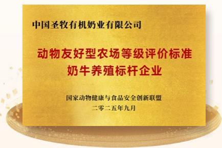

text_image

中国圣牧有机奶业有限公司
动物友好型农场等级评价标准
奶牛养殖标杆企业
国家动物健康与食品安全创新联盟
二零二五年九月

中國聖牧榮膺奶牛養殖行業首家

“動物友好型農場等級評價標準” 標杆企業稱號  

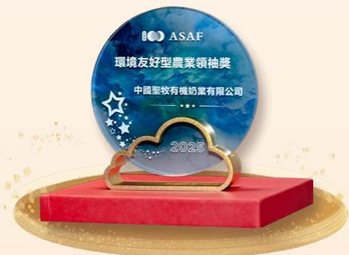

text_image

800 ASAF
環境友好型農業領袖獎
中國聖牧有機奶業有限公司
2025

中國聖牧榮獲亞洲百人可持續農食發展論壇

“環境友好型農業領袖獎”  

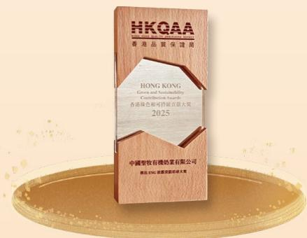

text_image

HKQAA
香港品質保證股
HONG KONG
Growth and Sustainability
Contribution Awards
香港綠色相可持續百國大獎
2025
中國聖牧有機奶業有限公司
華生 ESG 調查國際證券人賞

中國聖牧榮獲香港品質保證局頒發

“傑出ESG披露貢獻超卓大獎”  

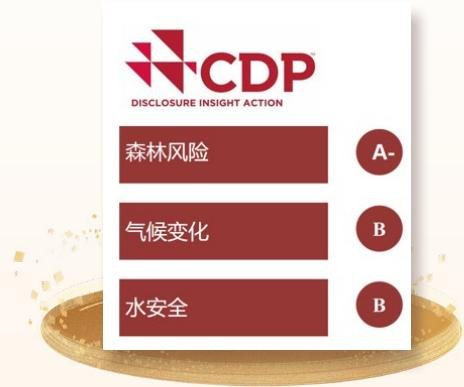

text_image

CDP
DISCLOSURE INSIGHT ACTION
森林风险
A-
气候变化
B
水安全
B

中國聖牧CDP 環境披露評分森林風險領域獲領導級評分

位居中國乳業行業第一  

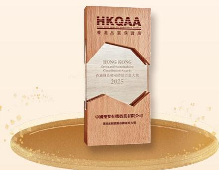

text_image

HKQAA
香港品質保基建
HONG KONG
Green and Sustainability
Contribution Awards
香港綠色鏡可持續百億大獎
2025
中國寶牧有機奶業有限公司
暨發佈國際權益證券大獎

中國聖牧獲香港品質保證局

“傑出氣候披露貢獻超卓大獎”  

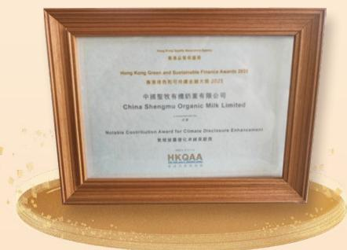

text_image

Hong Kong Equity Awards for Korea
香港证券交易所
Hong Kong Green and Sustainable Finance Awards 2020
香港特許可持續金融機構 2023
中國型牧有機奶業有限公司
China Shengmu Organic Milk Limited
Notable Contribution Award for Climate Disclosure Enhancement
HKQAA

中國聖牧獲香港品質保證局

“氣候披露優化卓越貢獻獎”  

## 亮點績效

## 環境

沙漠改造成優良的草場

35萬 畝

沙漠變為綠洲

220 平方公里

種植沙生樹

9,800 多萬株

## 社會

獲得現代奶業評價定級S 級的牧場

21 座 其中有機牧 座 7場

獲得中國良好農業規範（GAP）認證的牧場

8 座 其中有機牧場 6 座

獲得中國合格評定國家認可委員會（CNAS）頒發的國際質量體系ISO/IEC17025的檢測中心

2 家

支持產業鏈上下游合作夥伴

296 家

員工接受線上線下專業技術培訓學習達

人次 72,397

公益慈善捐贈款物價值

348.07 万元

natural_image

Illustration of a golden upward-trending arrow over a document with bar chart elements, symbolizing growth or progress (no text or symbols present)

## 公司治理

營業收入

元3,342百萬

同比下降

0.9%

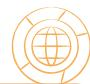

奶牛存欄數

147,036 頭

其中有機奶牛存欄數

113,985 頭

同比增長

1.9%

非有機奶牛存欄數

33,051 頭

成乳牛年化單產

12.40 噸 / 頭

同比增長近

2.9%

建設牧場

34 座

有機牧場

座 21

其中A2牧場

座1

非有機牧場

13 座

其中原生DHA牧場

1 座

組織廉潔警示教育、合規、反貪汙、安全健康等培訓共

57 場

成功獲得商標註冊證

47 件

natural_image

Golden trophy with Chinese text '中国圣牧 CHINA SHENGMU' on its body, surrounded by abstract light trails (no additional signage or data)

## 回應聯合國可持續發展目標（SDGs）

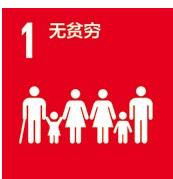

## 聖牧回應

1. 圍繞運營所在地（巴彥淖爾市磴口縣）特色養殖發展提供支持，帶動就業與增收，促進民生改善。  
2. 開拓產業治沙和有機農業發展新模式，推動當地農牧業供給結構性改革，沙產業成為調整當地經濟結構、轉變發展方式的重點產業。  
•助力鄉村振興捐款348.07萬元  
•帶動地區年增收超5.99億餘元

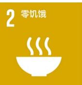

## 聖牧回應

1. 通過有機草場治理、糞肥還田等迴圈舉措提升土壤肥力，並增強作物在沙漠環境中的抗旱適應能力。  
2. 以產業治沙帶動綠色有機農業發展，生產高附加值有機農產品，助力區域農業可持續供給。  
•科學育種奶牛，提高產奶量，成乳牛年化單產12.40噸 / 頭，同比增長近2.9%。

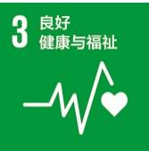

## 聖牧回應

1. 面向員工：提供免費年度體檢等健康福利，並對生產場所職業病危害因素開展監測與評估，配置應急救援設施(AFD)等保障措施。將廠區 AED 設備及緊急報警系統接入城市急救網路，。一旦觸發急救需求，急救平臺可立即回應，精准調度最近醫療資源  
2. 面向消費者：持續提供高品質沙漠有機奶，守護食品安全與營養健康需求。

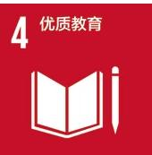

## 聖牧回應

1.依託 “牛人100” 等人才培養專案，力打造聖牧 “13224” 人才培養體系，從 “領導力” “專業勝任力” “通用力” 三個方面為員工職業發展提供成長幫助。分層分類提升員工領導力與專業技術能力。  
2 鼓勵員工在崗學習與能力提升 包括學歷深造，職業證書考取與專業職稱評定 推動員工成長與組織發展協同，通過專項培養專案，崗位技能訓練，線上課程建設等方式提升人才創造價值的能力  
•中級職稱申報11人，副高級職稱申報8人  
•選拔總監級2人、經理級後備幹部46人

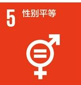

## 聖牧回應

1. 杜絕性別歧視，員工男女比例為62%:38%，實行男女同工同酬。  
2. 通過婦聯等組織與機制保障女性員工合法權益與福利，持續關注並提升女性管理層比例。  
•雇傭女性員工共849人

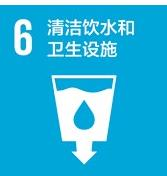

## 聖牧回應

1. 安裝水錶智能監控系統，通過物聯網實現了牧場用水智能化即時監控，及時糾正水資源浪費行為。  
2. 對奶廳廢水進行回收利用，減少地下水取用，降低牧場沼液排放。  
3. 改進清洗流程，升級節水設備，提高水資源可持續利用率，減少生產過程中用水。

•改進清洗流程，引進節水設備，單個牧場單日節水1噸

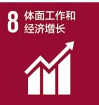

## 聖牧回應

1. 按照平等雇傭與擴寬人才廣度原則營造包容職場，堅持同工同酬，嚴禁童工與強迫勞動。  
2. 打造 “家” 文化，豐富員工生活並將關懷延伸至家屬，提升組織凝聚力與歸屬感。  
3. 通過牧場運營帶動周邊地區就業，促進當地農牧民年人均收入提升。

•員工活動、旅行等投入33.25萬元

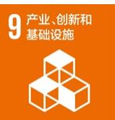

## 聖牧回應

1.引進智能除草機器人，將土壤和雜草撥開進行精准除草，為有機牧場健康生長“保駕護航”  
2. 推進糞汙資源回收再利用，減少處理過程中的溫室氣體排放，並提升資源迴圈效率。  
3. 持續探索並推進可再生能源等清潔能源的應用，助力生產基礎設施綠色升級。

•智能除草機器人雜草除淨率高達95%以上

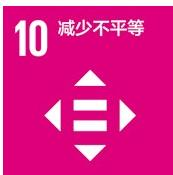

## 聖牧回應

1. 心系少數民族員工，尊重其風俗和生活習慣，確保少數民族員工享有同等待遇。  
•雇傭少數民族員工767名

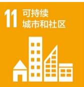

## 聖牧回應

1. 聖牧在烏蘭布和沙漠修建優良草場，完成基礎設施，促進生態改善，使社區居民獲得環境與發展層面的綜合收益。

## 12负青责 消费和生产

## 聖牧回應

1.在烏蘭布和沙漠締造了全球首創的 “有機牧草種植，有機奶牛養殖” 完整有機生態治沙產業體系，生產出高品質的有機原奶。  
2.有害廢物交由具備危險廢品處理資質的第三方依法合規處置（如高溫滅菌粉碎、發酵等方式）。  
3. 通過年度 ESG 報告對可持續發展理念、實踐與績效進行持續披露，提升資訊透明度與可追溯性。

## •舉辦環保培訓34場次

## 13 气候行动

## 聖牧回應

1. 秉持 “種養結合” 理念，使得奶牛養殖過程中的糞汙能夠得到合理的利用，形成無害化還田的迴圈生態系統。  
2. 圍繞國家 “雙碳” 目標和《巴黎氣候協定》“降低全球氣溫1.5℃” 的承諾，制定出一套科學有效的碳減排路線  
3.2025年 CDP 評級森林風險問卷實現了歷史性突破，躍升至 “領導力級別（Leadership）”，穩居中國乳業最高水準。

## •溫室氣體排放量592,980.93 噸二氧化碳當量

## 15 陆地生物

## 聖牧回應

1. 通過持續改造沙漠生態，烏蘭布和沙漠已經形成了區域性小氣候，物種數目增至數百種，被列入《世界自然保護聯盟》（IUCN）瀕危物種紅色名錄的虎鼬，國家二級重點保護野生動物沙狐，國家重點保護動物白琵鷺出現在烏蘭布和沙漠綠洲裏，除此以外還有越來越多國家級重點保護野生動物草原雕、遺鷗、荒漠貓、疣鼻天鵝、雪鸮等頻繁出沒。

## •較20世紀80年代，物種數目增至數百種，其中包括國家級瀕危保護物種

## 16 和平、正义与强大机构

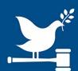

## 聖牧回應

1.不斷完善企業管治，加強反腐敗建設，致力建立高效透明的治理體系。  
2. 構建牛只溯源管控體系，牛群管理系統，大數據體系和協同體系 實現牛只360(提供新的具體的手段)重新確認度全方位指標體系管理和牧場各環節的智能化管控。

## 17 促进目标实现的 伙伴关系

## 聖牧回應

1. 與同行和高校等夥伴構建緊密的戰略合作夥伴關係，充分發揮各方資源優勢，共同促進綠色有機農業發展。  
2. 與供應商建立利益聯結機制，通過技術與資金等支持方式，協同打造更具韌性的 “有機” 供應鏈。

##

natural_image

Aerial view of a desert landscape with dunes, green trees, and sparse vegetation (no text or symbols visible)

## 可持續發展管理

聖牧堅持以長期價值創造為導向，將可持續發展理念融入公司治理與經營管理全過程，並以聯合國2030可持續發展目標（SDGs）為重要參照，持續推進與公司業務模式、資源稟賦及影響力相匹配的環境、社會及管治（ESG）管理工作。報告期內（2025年1月1日至2025年12月31日），公司在董事會監督下，依託既有治理體系與管理機制，持續識別ESG 相關風險與機遇，並通過制度完善、專項行動與過程複盤，形成 “規劃—執行—監督—改進” 的管理閉環。

## 可持續發展治理

在公司整體管治框架基礎上，我們進一步建立與業務發展階段相適配的可持續發展治理架構。董事會作為最高決策與監督層，統籌 ESG 相關方針、策略與目標；董事會轄下設置戰略及可持續發展委員會，為董事會履行ESG管治職責提供支持；公司可持續發展部牽頭推進日常ESG管理工作，並與各職能單位協同落實相關策略與舉措。公司按年度組織開展可持續發展相關風險與機遇識別評估，將評估結果作為年度經營計畫與重點議題管理的重要輸入，並通過制度優化與專項行動推動落地，形成持續改進機制。

•治理架構  
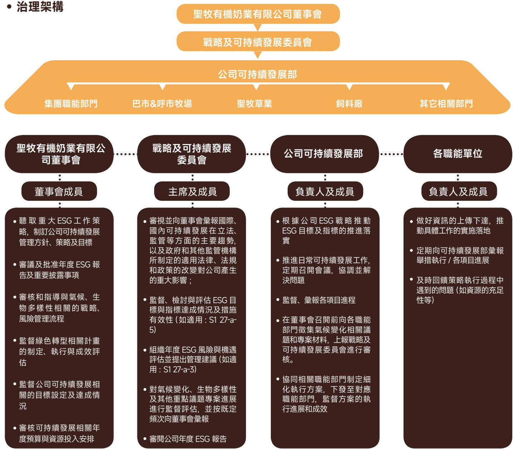

flowchart

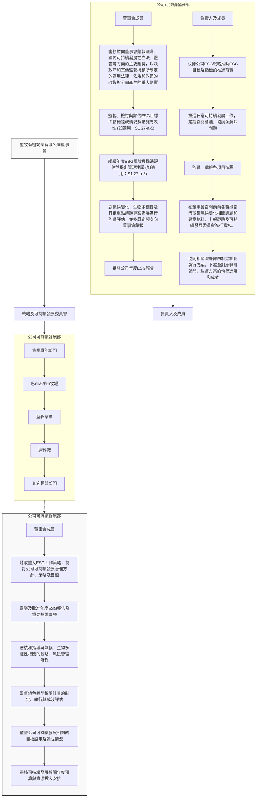
```mermaid
graph TD
  A["聖牧有機奶業有限公司董事會"] --> B["戰略及可持續發展委員會"]
  B --> C["公司可持續發展部"]
  
  subgraph C [公司可持續發展部]
    direction TB
  D1["集團職能部門"] --> D2["巴市&呼市牧場"]
  D2 --> D3["聖牧草業"]
  D3 --> D4["飼料廠"]
  D4 --> D5["其它相關部門"]
  end
  
  C -.-> E["聖牧有機奶業有限公司董事會"]
  
  subgraph E [公司可持續發展部]
    direction TB
  F1["董事會成員"] --> G1["聽取重大ESG工作策略，制訂公司可持續發展管理方針、策略及目標"]
  G1 --> H1["審議及批准年度ESG報告及重要披露事項"]
  H1 --> I1["審核和指導與氣候、生物多樣性相關的戰略、風險管理流程"]
  I1 --> J1["監督綠色轉型相關計畫的制定、執行與成效評估"]
  J1 --> K1["監督公司可持續發展相關的目標設定及達成情況"]
  K1 --> L1["審核可持續發展相關年度預算與資源投入安排"]
  end
  
  subgraph F [公司可持續發展部]
    direction TB
  F2["董事會成員"] --> G2["審視並向董事會彙報國際、國內可持續發展在立法、監管等方面的主要趨勢，以及政府和其他監管機構所制定的適用法律、法規和政策的改變對公司產生的重大影響"]
  G2 --> H2["監督、檢討與評估ESG目標與指標達成情況及措施有效性 (如適用：S1 27-a-5)"]
  H2 --> I2["組織年度ESG風險與機遇評估並提出管理建議 (如適用：S1 27-a-3)"]
  I2 --> J2["對氣候變化、生物多樣性及其他重點議題專案進展進行監督評估，並按既定頻次向董事會彙報"]
  J2 --> L2["審閱公司年度ESG報告"]
  end
  
  subgraph F [各職能單位]
    direction TB
  F3["負責人及成員"] --> G3["根據公司ESG戰略推動ESG目標及指標的推進落實"]
  G3 --> H3["推進日常可持續發展工作，定期召開會議，協調並解決問題"]
  H3 --> I3["監督、彙報各項目進程"]
  I3 --> J3["在董事會召開前向各職能部門徵集氣候變化相關議題和專案材料，上報戰略及可持續發展委員會進行審核。"]
  J3 --> L3["協同相關職能部門制定細化執行方案，下發至對應職能部門，監督方案的執行進展和成效"]
  end
  
  F["其他"] --> G4["負責人及成員"]
  
  style A fill:#f9f9f9,stroke:#333,stroke-width:2px
  style E fill:#f9f9f9,stroke:#333,stroke-width:2px
  style F fill:#f9f9f9,stroke:#333,stroke-width:2px
  style F fill:#f9f9f9,stroke:#333,stroke-width:2px
```

## •可持續表現與薪酬

為提升ESG目標落地的牽引力與執行力，公司持續探索並完善 “可持續表現與激勵約束相結合” 的管理機制，並通過制度安排將部分ESG關鍵議題納入管理層績效考核與激勵框架之中，制定《高管薪酬結構》《公司管理層持有公司股票管理制度》相關制度。從管理層開始試點，將公司CEO 績效獎金和長期激勵與公司ESG 表現掛鉤，涉及的重要ESG議題包括動物健康與福利、碳排放減少等。公司每年對CEO 進行一次全面的績效評估，同時每半年進行一次中期回饋，提升 CEO 的管理效能，確保 ESG目標的實現。未來，我們將根據實際情況考慮優化相關制度，完善董事會層面及基層主管的 ESG關鍵績效考核。（詳細資訊請見官網《高管薪酬結構》）

## •可持續培訓與交流

為強化董事 監事及高級管理層對ESG議題（含氣候相關風險與機遇等）的理解與履職能力 公司持續開展可持續發展相關培訓與交流，促進 ESG理念、監管要求與內部管理實踐的銜接，支持治理與決策的有效性。

## 利益相關方溝通

我們識別與公司經營及可持續發展密切相關的利益相關方，持續拓展溝通管道與頻次，瞭解各方關注點與期望，並將溝通結果作為策略制定、議題管理與資訊披露優化的重要依據。

木年度共組織策劃投資者活動17 場 參與業績發佈會 路演活動83 場 參加資木市場會議74 場 累計投入投資者關係活動資金471萬元 通過高頻次 多形式的溝通互動 有效傳遞公司價值與可持續發展理念 保障投資者知情權與參與權

<table><tr><td>主要利益相關方</td><td>主要關切點</td><td>主要溝通方式</td><td>主要回應措施</td></tr><tr><td>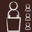股東</td><td>持續穩定的投資回報及時的信息披露合規的企業運營</td><td>股東大會年報及企業公告</td><td>持續提升經營管理水準與核心競爭力按要求開展資訊披露健全內控與合規體系,防範重大風險</td></tr><tr><td>員工</td><td>搭建職業發展空間豐富的薪酬福利完善健康安全保障</td><td>內部網站微信公眾號總經理信箱陽光溝通會</td><td>完善招聘、晉升與人才發展機制優化員工福利與關懷強化職業健康安全管理與培訓</td></tr><tr><td>供應商</td><td>公平透明採購流程合同履約與及時結算共同成長</td><td>採購/招標資訊公示品質要求溝通供應商大會</td><td>保障採購程式公開公正推動按約支付與結算管理開展供應商溝通與能力提升支持</td></tr><tr><td>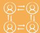客戶及合作夥伴</td><td>高質量的產品和服務把握客戶需求共同促進行業發展</td><td>客戶溝通機制行業交流與合作</td><td>加強產品品質管控提高創新實力推動行業經驗分享與協同發展</td></tr><tr><td>政府</td><td>帶動地方及周邊產業發展合規營運依法納稅</td><td>政府會議定期拜訪政府工作人員監察</td><td>提供就業崗位,貢獻稅收配合政府監察工作,完善內部合規監察制度遵守法律法規</td></tr><tr><td>社區</td><td>支持社區發展參與公益活動</td><td>社區代表溝通公益志願活動</td><td>保持密切溝通公益捐贈與幫扶</td></tr></table>

股東  
員工  
供應商  
客戶及合作夥伴  
政府  
社區

## 實質性議題判定

常態化的實質性議題管理是我們開展可持續管理以及資訊披露的關鍵。公司遵照《中國聖牧實質性議題管理》流程，根據《國際財務報告準則S1號——可持續相關財務資訊披露一般要求》（ISSB S1）、香港聯交所《環境、社會及管治報告守則》等披露準則更新評估方法，開展雙重重要性評估，全面分析ESG議題對公司財務以及經濟、環境和社會的影響，並依託自身風險管理與內部控制體系，嚴格把控相關風險，積極把握相關機遇，實現可持續發展。

## •聖牧實質性議題管理流程

## 議題篩選01

公司綜合考慮國際標準和倡議要求（包括 GRI 可持續發展標準、香港聯交所 ESG指引、可持續發展會計準則 SASB 行業標準和聯合國可持續發展目標 SDGs），市場趨勢，公司發展需求等，識別出23項實質性議題。

## 02 議題分析

公司通過對標國際標準和倡議（包括香港聯交所 ESG 守則、可持續發展會計準則 SASB 行業標準和聯合國可持續發展目標 UNSDGs），識別出對公司財務以及經濟、環境和社會具有重大影響的議題。同時，通過利益相關方訪談與問卷調研，收集並整理股東、員工、合作夥伴的訪談和問卷資訊，瞭解利益相關方對企業的期望與訴求。

## 03 議題確認

公司每年復核與確認實質性議題矩陣的工作由可持續發展部發起 通過徵求利益相關方意見後 提交可持續發展委員會。在年度《環境、社會及管治報告》發佈前期 經董事會、可持續發展委員會、審核委員會上會討論後 簽字確認 並在公司年度《環境、社會及管治報告》中披露。

•聖牧實質性議題矩陣  
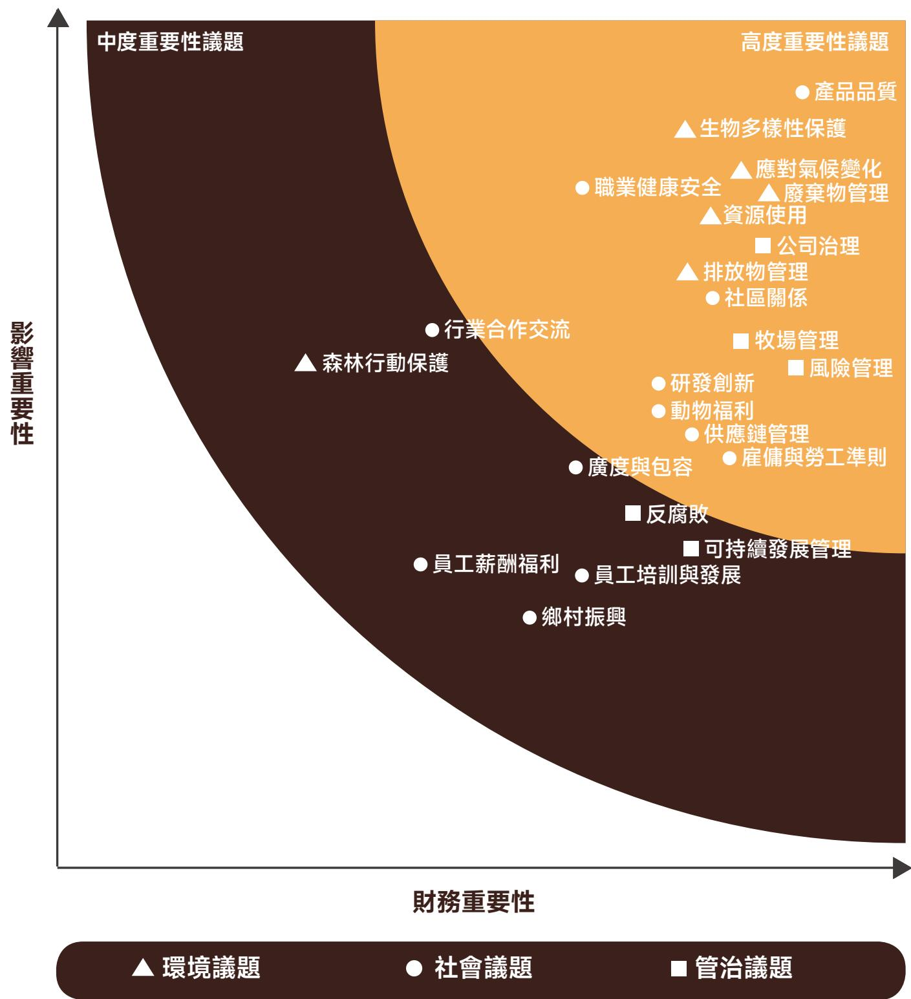

scatter

| Category | Topic |
| --- | --- |
| 環境議題 | 森林行動保護 |
| 社會議題 | 行業合作交流 |
| 管治議題 | 高度重要性議題 |
| 管治議題 | 風險管理 |
| 管治議題 | 可持續發展管理 |
| 管治議題 | 廠棄物管理 |
| 管治議題 | 應對氣候變化 |
| 管治議題 | 生物多樣性保護 |
| 管治議題 | 職業健康安全 |
| 管治議題 | 資源使用 |
| 管治議題 | 公司治理 |
| 管治議題 | 排放物管理 |
| 社會議題 | 社區關係 |
| 社會議題 | 研發創新 |
| 社會議題 | 動物福利 |
| 社會議題 | 供應鏈管理 |
| 社會議題 | 雇傭與勞工準則 |
| 社會議題 | 廣度與包容 |
| 社會議題 | 反腐敗 |
| 社會議題 | 員工薪酬福利 |
| 社會議題 | 員工培訓與發展 |
| 社會議題 | 鄉村振興 |

## 01

## 公司治理

公司堅持以規範、透明、有效的治理體系支撐長期價值創造。報告期內，我們持續對標適用法律法規及上市地監管要求，優化董事會及專門委員會運作機制，提升決策品質與監督效能；並將風險管理、內部控制、合規文化建設等關鍵要素嵌入經營管理流程，以更穩健的治理基礎應對外部環境變化與新興風險挑戰。

對聯合國可持續發展目標的貢獻

16 和平、正义与 强大机构

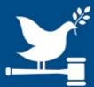

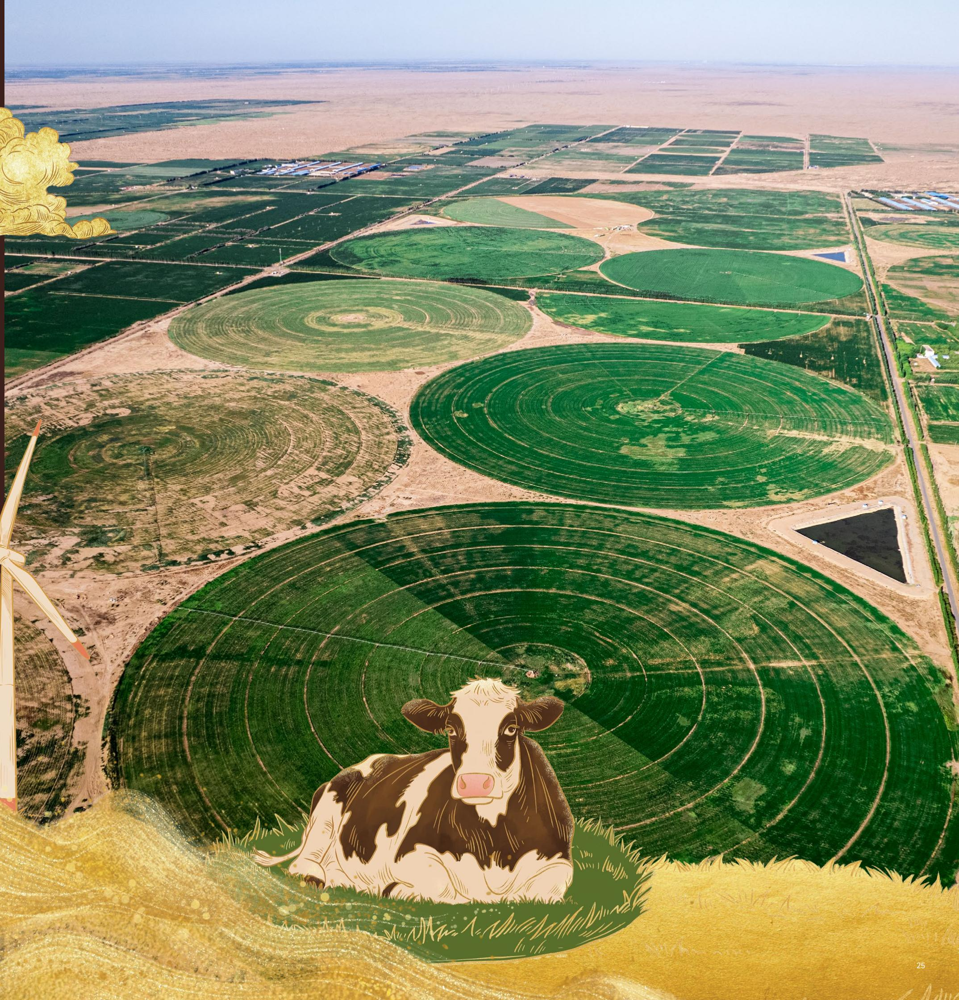

natural_image

Aerial view of agricultural fields with concentric green crop plots and a large brown cow in the foreground (no text or symbols visible)

## 管治

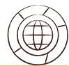

我們依據《公司章程》、國家法律法規及上市規則等要求，結合公司治理實踐與發展階段，持續完善董事會及其專門委員會的授權體系、議事規則與工作流程，推動形成職責清晰、運作規範、監督有效的治理格局，為公司可持續發展提供制度保障。 公司治理加横

•公司治理架構•  

state_timeline

| Role | Level |
| --- | --- |
| 审核委員會 | Top |
| 薪酬委員會 | Second |
| 報名委員會 | Third |
| 戰略及可持續發展委員會 | Fourth |

## 董事會構成

本公司共有董事9位，其中包括1名執行董事、5名非執行董事以及3名獨立非執行董事，其中女性董事1人。公司董事會、監事會以及高級管理人員由具有不同專業背景、技能和經驗的人組成，能夠從多方面對公司的重大決策進行分析和評估，保障公司治理結構的規範性和有效性。（有關董事會、監事會以及高級管理人員專業背景及任職情況的具體資訊，請見2025年年報）

## 董事會廣度

公司致力於優化董事會結構與多元化建設，在董事遴選過程中綜合考量候選人多維度背景與綜合能力，並結合公司戰略動態匹配。公司將定期評估董事會包容性及履職成效，持續完善治理實踐。

## 商業道德

公司高度重視廉政建設及反腐敗反貪汗工作 設立紀檢部門貫徹落實關於反腐敗工作的各項要求制定《禮品禮金管理辦法》《業務招待費用管理制度》《員工投資入股行為規範》《企業紀律處分工作辦法》等一系列制度規範，嚴令禁止公司員工接受任何形式的回扣、仲介費、好處費、禮品等饋贈，並要求管理層人員不得利用職務便利為親屬及特定關係人謀取私利，保證公司每一位成員堅守商業道德底線。

## 資訊安全

公司遵守《中華人民共和國數據安全法》《中華人民共和國個人資訊保護法》等相關法律法規要求，逐步建立覆蓋數據全生命週期的資訊安全與數據合規管理體系 並通過制度發佈，組織設置與流程落地 提升數據治理能力與安全防護水準。公司設置數據治理相關組織架構，統籌推進合規與隱私保護、數據安全執行、數據標準化等工作，強化數據安全管理的系統性與可執行性。

## 知識產權保護

公司遵循《中華人民共和國專利法》《中華人民共和國著作權法》等法規要求，建立知識產權管理與保護機制，並結合技術創新與品牌建設需要，安排資源支持商標、專利申報與技術保護。在創新活動中，公司注重知識產權風險的識別與防控，推動專利佈局優化與品質提升，維護公司核心競爭力與創新成果。

## 策略

公司堅持以更智慧、更綠色的方式推動可持續增長，結合國家及地方政策導向與資源稟賦，推進經營管理與治理能力提升，並圍繞公司治理相關風險與機遇形成識別、評估與應對的框架性安排。

公司治理相關風險和潛在影響

<table><tr><td></td><td>風險描述</td><td>潛在財務影響</td><td>風險管理舉措及應對措施</td></tr><tr><td>合規風險(S/M/L)</td><td>採購報銷及第三方往來中存在廉潔合規失範風險</td><td>可能導致行政處罰、訴訟仲裁、資產損失、整改成本增加。對客戶合作、融資溝通及品牌聲譽造成不利影響。</td><td>完善廉潔合規制度體系,細化禮品禮金、業務招待、費用報銷、供應商往來和利益衝突申報等管理要求。健全舉報受理、內部調查、問責追責和整改閉環機制。持續開展反腐敗、反商業賄賂和商業道德培訓,強化“紅線”意識。</td></tr><tr><td>內部控制風險(S/M/L)</td><td>重大事項管控及披露復核不足影響治理運行有效性</td><td>引發監管問詢、資訊更正、審計調整及融資溝通成本上升。</td><td>完善授權審批、內控復核、關聯交易審查及披露口徑管理。</td></tr><tr><td>數智資訊管理風險(S/M/L)</td><td>第三方接入管理不當引發數據安全風險</td><td>系統中斷、補救支出、賠償責任及合作信任受損。</td><td>強化分級分類、許可權控制、加密備份、第三方約束及應急演練。</td></tr><tr><td>知識產權與商業秘密風險(S/M/L)</td><td>研發合作及成果管理不嚴導致知識產權受損風險</td><td>增加維權成本,影響成果轉化、品牌價值及市場競爭力。</td><td>建立權屬台賬,強化保密約定、申報續展及侵權監測。</td></tr></table>

\*S-短期；M-中期；L-長期

公司治理相關機遇和潛在影響

<table><tr><td></td><td>機遇描述</td><td>潛在財務影響</td><td>機遇管理舉措及應對措施</td></tr><tr><td>合規機遇</td><td>· 在新業務領域和監管要求持續演進的背景下，公司通過完善合規管理與標準建設，有望識別新的業務拓展方向和發展空間。</td><td>· 有助於增強業務拓展能力，帶動收入增長。</td><td>· 持續完善合規管理體系，保持並鞏固權威有機認證，夯實原材料源頭品質管理基礎。</td></tr><tr><td>技術機遇</td><td>· 隨著供應鏈管理數位化、智能化水準不斷提升，公司有機會進一步優化生產、物流及協同管理效率。</td><td>· 有助於提升運營效率，降低管理及人力成本。</td><td>· 推動數字技術與業務場景深度融合，穩步拓展區塊鏈、人工智慧等技術在供應鏈管理中的應用。</td></tr><tr><td>品牌機遇</td><td>· 持續加強可持續發展實踐和利益相關方溝通，有助於提升公司責任形象與市場認可度。</td><td>· 有助於提升品牌價值，增強客戶及金融機構信任</td><td>· 拓展溝通覆蓋廣度，統籌官網、媒體及公共活動等傳播管道，持續提升品牌影響力和美譽度。</td></tr></table>

## 風險管理

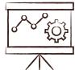

聖牧遵循香港聯交所上市規則附錄十四《企業管治守則》《企業內部控制基本規範》等要求，設立健全的風險管理組織架構，通過科學系統化的工作機制形成風險識別－評估管控－定期監測的閉環管理流程，並適時更新風險應對策略，確保整體風險管理流程行之有效，提升企業抗風險能力。

## 風險管理架構

公司設立由風險管理委員會、風險管理委員會辦公室以及三道防線組成的風險管理體系，負責全產業鏈內控制度建設、重大風險控制事項、完善及執行情況考核評價，對檢查中識別出的可能存在的缺陷和風險，提供完善和改進的管理支持，並制定重大風險應對的獎懲方案。

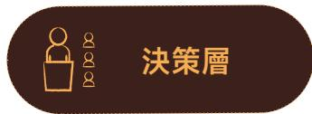

風險管理委員會：

負責確定公司風險管理總體目標、方針及策略以及重大風險相關事宜的決策

風險管理委員會辦公室：

保障公司風險管理規劃全面落地，資源的合理配置及統籌協調

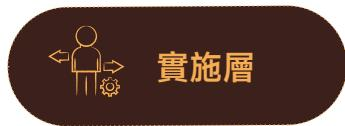

第一道防線：各牧場以及各獨立業務單元對應單位負責人為風險管理的第一責任人

第二道防線：各系統職能部門和風險管理部

第三道防線：審計部

## 風險管理流程

我們通過分析評估及選擇風險管理對象進行審核 通過審核提出風險控制解決方案及解決要求 跟蹤驗收風險控制處理過程及結果，實現有效管理控制風險的目的。

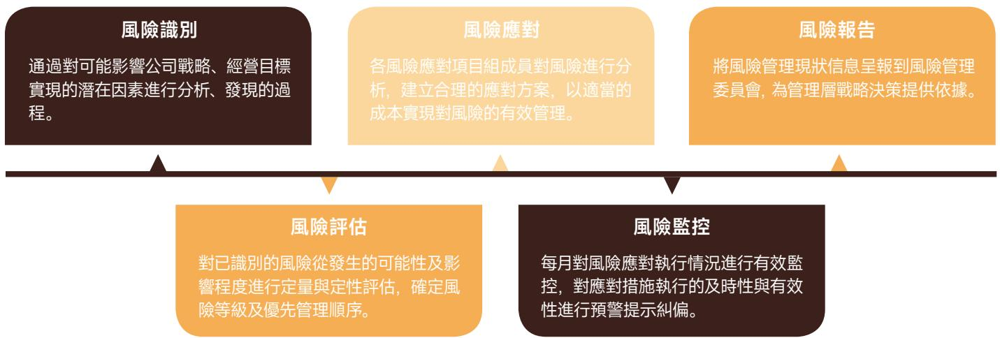

flowchart

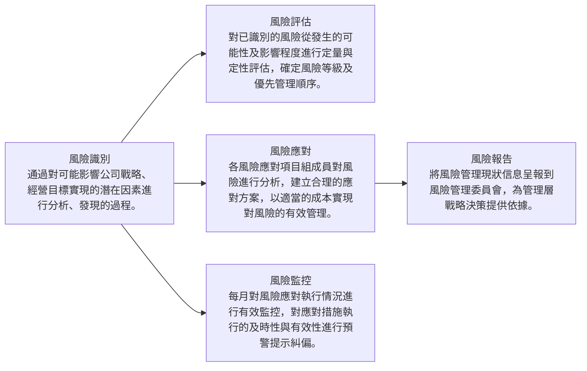
```mermaid
graph LR
  A["風險識別\n通過對可能影響公司戰略、經營目標實現的潛在因素進行分析、發現的過程。"] --> B["風險評估\n對已識別的風險從發生的可能性及影響程度進行定量與定性評估，確定風險等級及優先管理順序。"]
  A --> C["風險應對\n各風險應對項目組成員對風險進行分析，建立合理的應對方案，以適當的成本實現對風險的有效管理。"]
  A --> D["風險監控\n每月對風險應對執行情況進行有效監控，對應對措施執行的及時性與有效性進行預警提示糾偏。"]
  C --> E["風險報告\n將風險管理現狀信息呈報到風險管理委員會，為管理層戰略決策提供依據。"]
```

## 廉潔風險管控

公司通過廉潔審查 內部監督 廉潔承諾及員工監督等方式 持續持續拓寬廉潔風險防控的廣度 推動廉潔管理工作提質增效。

<table><tr><td>廉潔風險控制</td><td>針對高風險環節及重點領域持續加強監督檢查,開展日常檢查,鼓勵內部相互監督,並持續組織廉潔培訓,強化員工廉潔意識。同時,公司與全體供應商及合作夥伴共同簽署“陽光協議”,協同營造廉潔、規範的合作生態。</td></tr><tr><td>舉報人保護</td><td>公司鼓勵員工就財務報告、牧場運營、企業合規及其他方面可能存在的不當行為提出疑慮。員工可私下向審核委員會(由大多數獨立非執行董事組成的指定委員會)舉報相關不當行為。公司將對收到的投訴迅速、公正處理,並切實保護舉報人免受不公平解雇、人身傷害或不當紀律處分。</td></tr><tr><td>舉報方式</td><td>舉報電話:15148021310 15148031310舉報郵箱:jjjc@smorganic.cn</td></tr></table>

## 資訊安全防護

公司持續完善資訊安全管理機制，強化運維人員及終端使用人員的資訊安全意識和操作規範，切實保障資訊系統與數據安全，防範各類資訊安全風險。

<table><tr><td>日常辦公資訊安全管理</td><td>安裝反病毒軟體並開啟即時掃描功能,統一使用指定辦公軟體。嚴禁通過電子郵件、即時通訊工具等方式明文傳輸企業核心機密資訊,以及轉發、收取或發送集團內部機密資訊。</td></tr><tr><td>網絡安全使用管理</td><td>不利用公司網路發佈、流覽或傳播與工作無關的資訊,嚴禁使用移動終端、辦公終端等設備實施任何形式的網路攻擊行為。</td></tr><tr><td>數據安全管理</td><td>對資訊系統中涉及的客戶資訊等數據在存儲過程中採取加密措施。除工作需要外,任何人員不得以任何方式查詢或收集相關數據。公司同時制定數據銷毀策略和數據備份恢復策略,保障數據使用安全。</td></tr></table>

## 合規文化培育

公司開展風險、內控等知識培訓，推動全體員工將風險合規意識融入日常工作的每一個環節，形成主動的合規工作習慣。

## 指標及目標

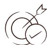

聖牧科學設置並管理公司治理相關的指標與目標，有針對性地制定並執行策略,同時定期檢視和評估我們的努力成果，積極穩妥地推進公司可持續發展。

  
目標

<table><tr><td>目標</td><td>2025年進展</td><td>完成情況</td></tr><tr><td>接受反貪腐培訓董事比例100%</td><td>100%</td><td>100%</td></tr><tr><td>接受反貪腐培訓的員工比例100%</td><td>100%</td><td>100%</td></tr><tr><td>全體員工商業道德培訓覆蓋率100%</td><td>100%</td><td>100%</td></tr></table>

  
指標

<table><tr><td colspan="2">指標內容</td><td>單位</td><td>2025</td><td>2024</td><td>2023</td></tr><tr><td rowspan="3">反腐敗</td><td>貪污訴訟案件的數目</td><td>件</td><td>0</td><td>0</td><td>0</td></tr><tr><td>接受反貪腐培訓的員工比例</td><td>%</td><td>100</td><td>/</td><td>/</td></tr><tr><td>接受商業道德培訓的員工比例</td><td>%</td><td>100</td><td>/</td><td>/</td></tr></table>

## 02

## 產品責任

聖牧始終以 “提供全球最高品質的沙漠有機奶” 為使命，依託 “有機牧草種植，有機奶牛養殖” 的完整有機生態治沙產業鏈，圍繞原奶品質安全、生產過程控制與動物福利管理等關鍵環節，持續提升產品品質與穩定性，力求為消費者提供安全、優質、營養、健康的產品供給。

## 對聯合國可持續發展目標的貢獻

3 良好 健康与福祉

9产业、创新和 基础设施

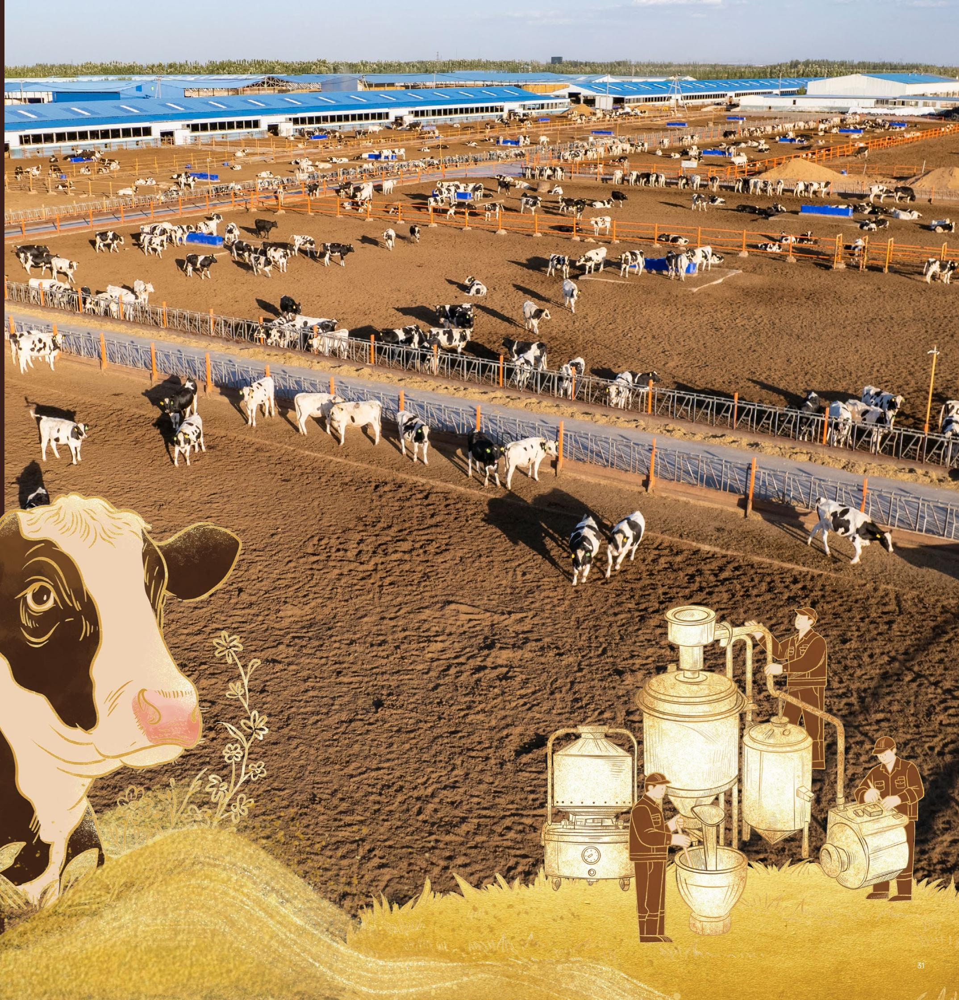

natural_image

Aerial view of a large-scale dairy farm with cows, processing equipment, and personnel in the foreground (no visible text or symbols)

## 管治

在原奶品質管理方面，公司遵循《中華人民共和國食品安全法》《乳品品質安全監督管理條例》《食品安全國家標準—生乳》等相關法律法規要求，明確安全品質中心在品質管控中的樞紐作用，並通過《奶廳管理制度》《營養與健康管理制度》等內部制度，形成覆蓋飼料採購、原奶生產、檢測放行與運輸交付等環節的全過程品質控制體系。同時，公司持續推進牧場6S 精細化管理，強化現場規範與過程一致性，降低產品品質波動風險。

在動物福利方面，我們制定《動物福利管理制度》，融入人文關懷與可持續發展理念，採用科學的飼養管理，定期進行動物健康與行為評估，確保奶牛得到妥善照顧。並積極推廣動物福利理念，與產業鏈上下游合作夥伴共用經驗，共同推動整個行業的動物福利水準提升。

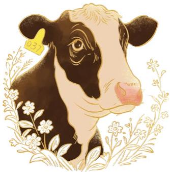

natural_image

Illustration of a brown cow with white fur and yellow label, surrounded by floral patterns (no text or symbols)

## 公司遵循基本動物福利原則

## 無饑無渴

提供充足的清潔水源和營養均衡的飼料，確保動物始終處於良好的營養狀態。

## 無不適

提供適宜的生活環境，包括足夠的空間、合適的溫度、舒適的休息區域，確保動物生活在健康、安全的環境中。

## 無痛無傷

避免任何形式的虐待和不必要的傷害，確保動物在飼養、運輸和處理過程中不受痛苦。

## 無恐無懼

確保動物不受恐嚇和壓力，提供安靜、和諧的生活環境。

## 無病無疾

通過科學的管理和預防措施，保持動物的健康，防止疾病的發生和傳播。

公司將可持續採購理念逐步纳入供應商全流程管理，採購中心作為供應商管理歸口部門，依據《供應商管理制度》對供應商准入評審、日常管理、績效評價與凍結管理等關鍵環節進行規範，推動形成公平、透明、可持續的供應鏈合作機制。

## 策略

聖牧以 “提供全球最高品質的沙漠有機奶” 為使命，紮根烏蘭布和沙漠，圍繞 “食品安全、生物安全、生產安全、環境安全” 等基本守則，持續完善產品責任相關的風險與機遇識別機制，並將識別結果用於優化管理策略與資源投入安排，以支持在複雜多變的市場環境下保持穩健運營與競爭力提升。

## 產品責任相關風險和潛在影響

<table><tr><td></td><td>風險描述</td><td>潛在財務影響</td><td>風險管理舉措及應對措施</td></tr><tr><td>運營風險(S)</td><td>·隨著消費者對有機認證、產品可追溯性及資訊透明度要求不斷提高,公司在原料採購、生產加工及品質披露等環節面臨更高管理要求。</td><td>·增加有機認證維護及更新投入,並帶來可追溯體系建設、資訊披露及技術應用等方面的運營成本。</td><td>·持續加強有機認證管理,確保原料採購、生產加工等環節符合有機標準。·通過第三方機構開展品質檢測與認證,提升產品可信度。·完善產品原料、生產過程及品質控制等資訊披露,增強消費者信任。·加強供應商管理,提升對供應商經濟、社會及環境表現的評價要求,並提供必要的技術支持。</td></tr><tr><td>合規風險(S/M/L)</td><td>·發生動物福利、食品安全或生產排放等方面的違規事件,對公司經營管理和合規運營造成不利影響。</td><td>·導致法律責任、行政處罰及經濟損失·對收入和利潤水準造成壓力。</td><td>·強化源頭管控、生產過程管理、品質監控及追溯體系建設,防範產品品質風險。·在養殖過程中持續關注動物福利,提升奶牛健康水準和疫病防控能力。·優化全產業鏈工藝流程,推進清潔生產和資源迴圈利用,提升合規管理水準。</td></tr><tr><td>聲譽風險(S)</td><td>·產品品質問題或資訊披露不充分,影響消費者信任和品牌聲譽,進而削弱利益相關方對公司的認可。</td><td>·導致品牌溢價能力下降、收入減少·並增加輿情應對及品牌修復等相關成本。</td><td>·建立並持續完善嚴格的品質管理體系。·嚴格遵守食品安全相關法律法規,定期開展風險評估和內部檢查。·建立產品事件應急處置預案並定期演練,提升跨部門協同和回應效率。·加強與利益相關方溝通,提升資訊披露的及時性和透明度。</td></tr></table>

\*S-短期；M-中期；L-長期

## 產品責任相關機遇和潛在影響

<table><tr><td></td><td>機遇描述</td><td>潛在財務影響</td><td>機遇舉措管理及應對措施</td></tr><tr><td>運營機遇</td><td>·通過加強與供應商的協同合作,並與行業專家保持交流,有助於持續推動養殖管理及生產技術優化。</td><td>·有助於提升生產運營效率,進而帶動收入增長。</td><td>·深化與供應商的合作關係,增強供應鏈穩定性。·嚴格篩選並培育優質供應商,推動其能力持續提升。</td></tr><tr><td>市場機遇</td><td>·健康消費需求持續增長,消費者更加關注有機產品品質、原料來源及動物福利等因素。</td><td>·有助於提升動物福利友好型產品的市場溢價與銷量。·動物福利改善可降低奶牛應激反應、疫病發生率及相關支出。·動物福利改善可降低奶牛應激反應、疫病發生率及相關支出。</td><td>·持續保持並鞏固權威有機認證,夯實產品品質基礎。·圍繞市場需求推進產品創新,提升市場競爭力。·持續增加動物福利設施投入,改善奶牛飼養環境。·完善營養配方、疫苗接種及疫病防控等管理措施,提高養殖水準。</td></tr><tr><td>品牌機遇</td><td>·全程有機閉環及生態迴圈模式有助於強化品牌差異化,提升可持續競爭力。</td><td>·有助於提升品牌價值,增強長期財務支撐能力。</td><td>·持續深化有機產業鏈佈局,拓展和完善生態迴圈發展模式。·加強品牌傳播,突出有機認證標識及健康價值。</td></tr></table>

\*聖牧主要產品為液態原奶，原料奶在生產環節(牧場)僅進行短期臨時的儲存與中轉，其盛裝容器為不鏽鋼儲奶罐保溫奶罐車，直接面向終端消費者的商品包裝(如利樂包塑膠瓶奶粉罐等)由下游客戶(乳粉/液態奶生產企業)負青完成 不屬於聖牧的生產環節。

## 風險管理

公司結合產品安全法律法規要求與利益相關方期望，持續開展產品責任相關風險與機遇識別、控制與監測工作，並通過制度、流程與技術手段提升管理有效性。

## 風險識別

圍繞產品品質、供應鏈管理及合作夥伴管理，識別相關風險對公司運營的影響。

## 風險控制/減緩

全面推行牧場6S精細化管理，從飼料採購、原奶生產到運輸，嚴格把控品質。  
提高動物福利設施設備投入。  
與供應商建立利益聯結機制。  
在供應商准入階段進行資質、認證、關聯關係及ESG方面的評審。

## 風險監控 /報告

建立追溯系統，對原奶生產全流程即時監控。  
各部門每年至少開展 2 次供應商檔資料合規性審查，審查範圍要求全品類預備供應商100%覆蓋。  
對供應商提供可持續相關培訓。  
強化專業獸醫隊伍。

## 打造高品質原奶

公司持續對標品質管理先進實踐，結合專家團隊定期現場評估與配方優化要求，將有機標準貫穿牧草種植、奶牛養殖與原奶交付各環節，強調過程透明、標準一致與風險可控，夯實高品質原奶供應能力。

## 2025年

有機奶牛數量

113,985 頭

原奶S 級合格率位居行業第一

99.00%

獲得現代奶業評價定級S 級牧场

21 座

其中有機牧場

7 座

獲得中國良好農業規範（GAP）認證牧场

8 座

其中有機牧場

6 座

家檢測中心獲得中國合格評定國家認可委員會

（CNAS）頒發的國際品質體系 ISO/IEC17025

2 家

## 原輔料品質管理

入場原料品質控制從合規性檢查、感官檢測、衛生指標檢測、理化指標檢測等方面進行監控。

合規性檢查：要求供應商到廠（場）原料隨車攜帶檢驗報告，到貨檢驗報告應符合集團品質標準或合同標準；飼料標識標籤要求符合GB10648、1773號公告中的相關規定。

感官檢測及衛生、理化指標檢查：原輔料依據《飼草料品質標準彙編》中感官標準進行驗收，依據衛生指標、理化指標要求進行判定。

## 營養健康管理

為牧場奶牛提供科學合理的日糧配方設計，實施奶牛健康監控，及時調整營養方案，進行功能性牛奶及新飼養方式的研發創新，提升奶牛的健康水準及生產性能。

## 生鮮乳品質管理

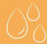

從奶牛產奶到生鮮乳出廠，通過科學嚴謹的流程對生產過程即時監督。

邀請專家開展生鮮乳檢測流程、慢抗檢測方法培訓和交流會，提高生鮮乳檢測能力，確保生鮮乳的高品質。

## 牛奶運輸品質管理

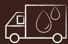

運輸人員必須按照公司規定的地點，線路拉運牛奶；保證運奶車車況良好，無破損；奶車出現滴漏等故障時，必須及時維修排除故障。

運輸途中，不得出現私自開啟鉛封、倒賣牛奶、摻假等行為；必須專車專用，不允許同車搭載貨物。

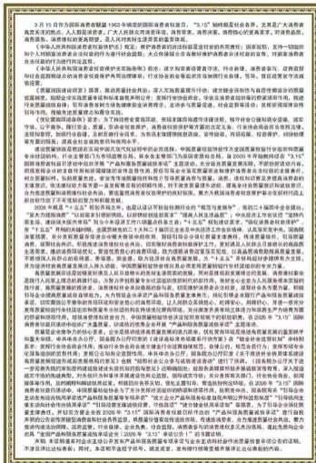

text_image

3月15日为刊登投资者的简报（1960年版的临时报告索引）。“三·15”网站地址是公众号，联系方式广大机构及有关网点的人，包括个人、自然人和公众投资者。具体内容详见公司于2020年4月28日在《中国证券报》、《上海证券报》、《证券时报》、《证券日报》、《证券时报》、《证券日报》、《证券时报》、《证券日报》、《证券时报》、《证券日报》、《证券时报》、《证券日报》、《证券时报》、《证券日报》、《证券时报》、《证券日报》、《证券时报》、《证券日报》、《证券时报》、《证券日报》、《证券时报》、《证券日报》、《证券时报》、《证券报》、《证券日报》、《证券时报》、《证券日报》、《证券时报》、《证券日报》、《证券时报》、《证券日报》、《证券时报》、《证券日报》、《证券时报》、《证券日报》、《证券时报》、《证券日报》、《证券时报》、《证券日报》、《证券时报》、《证券日报》、《证券时报》、《证券日报》、《证券报》、《证券日报》、《证券时报》、《证券日报》、《证券时报》、《证券日报》、《证券时报》、《证券日报》、《证券时报》、《证券日报》、《证券时报》、《证券日报》、《证券时报》、《证券日报》、《证券时报》、《证券日报》、《证券时报》、《证券日报》、《证券时报》、《证券报》、《证券时报》、《证券日报》、《证券时报》、《证券日报》、《证券时报》、《证券日报》、《证券时报》、《证券日报》、《证券时报》、《证券日报》、《证券时报》、《证券日报》、《证券时报》、《证券日报》、《证券时报》、《证券日报》、《证券时报》、《证券日报》、《证券时报》、《上海证券报》
（一）公司名称：深圳市前海开源基金管理有限公司
住所：深圳市福田区深南大道7088号招商银行大厦
办公地址：北京市西城区金融大街35号
法定代表人：王洪章
注册资本：人民币壹亿肆仟玖佰肆拾元整
经营范围：投资管理：资产管理；资产管理；企业管理咨询；经济信息咨询；经济信息咨询；经济信息咨询；经济信息咨询；经济信息咨询；经济信息咨询；经济信息咨询；经济信息咨询；经济信息咨询；经济信息咨询；经济信息咨询；经济信息咨询；经济信息咨询；经济信息咨询；经济信息咨询；经济信息咨询；经济信息咨询；经济信息咨询；经济信息咨询；经济信息咨询；经济信息咨询；经济信息咨询；经济信息咨询；经济信息咨询；经济信息咨询；经济 信息咨询;企业形象策划;企业形象策划;企业形象策划;企业形象策划;企业形象策划;企业形象策划;企业形象策划;企业形象策划;企业形象策划;企业形象策划;企业形象策划;企业形象策划;企业形象策划;企业形象策划;企业形象策划;企业形象策划;企业形象策划;企业形象策划;企业形象策划;企业形象策划;企业形象策划;企业形象策划;企业形象策划;企业形象策划;企业形象策划;企业形象集资管理;企业形象策划;企业形象策划;企业形象策划;企业形象策划;企业形象策划;企业形象策划;企业形象策划;企业形象策划;企业形象策划;企业形象策划;企业形象策划;企业形象策划;企业形象策划;企业形象策划;企业形象策划;企业形象策划;企业形象策划;企业形象策划;企业形象策划;企业形象策划;企业形象策划;企业形象策划;企业形象策划;企业形象策划;企业形象规划管理服务
（二）公司名称：深圳市前海开源基金管理有限公司
住所：深圳市福田区深南大道7088号招商银行大厦
办公地址：北京市西城区金融大街35号
法定代表人：王洪章
注册资本：人民币壹亿肆仟玖佰肆拾元整
经营范围：投资管理：资产管理；企业管理咨询；经济信息咨询；经济信息咨询；经济信息咨询；经济信息咨询；经济信息咨询；经济信息咨询；经济信息咨询；经济信息咨询；经济信息咨询；经济信息咨询；经济 信息咨询；企业形象策划；企业形象策划；企业形象策划；企业形象策划；企业形象策划；企业形象策划；企业形象策划；企业形象策划；企业形象策划；企业形象策划；企业形象策划；企业形象策划；企业形象策划；企业形象策划；企业形象策划；企业形象策划；企业形象策划；企业形象策划；企业形象策划；企业形象策划；企业形象策划；企业形象策划；企业形象策划；企业形象策划；企业形象策划；企业形象规划管理服务
（三）公司名称：深圳市前海开源基金管理有限公司
住所：深圳市福田区深南大道7088号招商银行大厦
办公地址：北京市西城区金融大街35号
法定代表人：王洪章
注册资本：人民币壹亿肆仟玖佰肆拾元整
经营范围：投资管理：资产管理；企业管理咨询；经济信息咨询；经济信息咨询；经济信息咨询；经济信息咨询；经济信息咨询；经济信息咨询；经济信息咨询；经营项目：投资管理，投资管理，投资管理，投资管理，投资管理，投资管理，投资管理，投资管理，投资管理，投资管理，投资管理，投资管理，投资管理，投资管理,投资管理,投资管理,投资管理,投资管理,投资管理,投资管理,投资管理,投资管理,投资管理,投资管理,投资管理,投资管理,投资管理,投资管理,投资管理,投资管理,投资管理,投资管理,投资管理,投资管理,投资管理,投资管理,投资管理,投资管理,投资管理,投资管理,投资管理,投资管理,投资管理,投资管理,投资管理,投资管理,投资管理, 投资者权益保护基金
（四）公司名称：深圳市前海开源基金管理有限公司
住所：深圳市福田区深南大道7088号招商银行大厦
办公地址：北京市西城区金融大街35号
法定代表人：王洪章
注册资本：人民币壹亿肆仟玖佰肆拾元整
经营范围：投资管理：资产管理；企业管理咨询；经济信息咨询；经济信息咨询；经济信息咨询；经济信息咨询；经济信息咨询；经济信息咨询；经济信息咨询；投资项目：投资管理，投资管理，投资管理，投资管理，投资管理，投资管理，投资管理，投资管理，投资管理，投资管理，投资管理，投资管理，投资管理，投资 管理服务
（五）公司名称：深圳市前海开源基金管理有限公司
住所：深圳市福田区深南大道7088号招商银行大厦
办公地址：北京市西城区金融大街35号
法定代表人：王洪章
注册资本：人民币壹亿肆仟玖佰肆拾元整
经营范围：投资管理：资产管理；企业管理咨询；经济信息咨询；经济信息咨询；经济信息咨询；经济信息咨询；经济信息咨询；经济信息咨询服务;企业管理服务
（六）公司名称：深圳市前海开源基金管理有限公司
住所：深圳市福田区深南大道7088号招商银行大厦
办公地址：北京市西城区金融大街35号
法定代表人：王洪章
注册资本：人民币壹亿肆仟玖佰肆拾元整
经营范围：投资管理：资产管理；企业管理咨询；经济信息咨询；经济信息咨询；经济信息咨询；经济信息咨询服务;企业管理服务
（七）公司名称：深圳市前海开源基金管理有限公司
住所：深圳市福田区深南大道7088号招商银行大厦
办公地址：北京市西城区金融大街35号
法定代表人：王洪章
注册资本：人民币壹亿肆仟玖佰肆拾元整
经营范围：投资管理：资产管理；企业管理咨询；经济信息咨询服务;企业管理服务
（八）公司名称：深圳市前海开源基金管理有限公司
住所：深圳市福田区深南大道7088号招商银行大厦
办公地址：北京市西城区金融大街35号
法定代表人：王洪章
注册资本：人民币壹亿肆仟玖佰肆拾元整
经营范围：投资管理：资产管理；企业管理咨询；
企业管理服务
（九）公司名称：深圳市前海开源基金管理有限公司
住所：深圳市福田区深南大道7088号招商银行大厦
办公地址：北京市西城区金融大街35号
法定代表人：王洪章
注册资本：人民币壹亿肆仟玖佰肆拾元整
经营范围：投资管理：资产管理；
企业管理咨询；
企业管理服务
（十）公司名称：深圳市前海开源基金管理有限公司
住所：深圳市福田区深南大道7088号招商银行大厦
办公地址：北京市西城区金融大街35号
法定代表人：王洪章
注册资本：人民币壹亿肆仟玖佰肆拾元整
经营范围：投资管理：资产管理；
企业管理咨询；
企业管理服务
（十一）公司名称：深圳市前海开源基金管理有限公司
住所：深圳市福田区深南大道7088号招商银行大厦
办公地址：北京市西城区金融大街35号
法定代表人：王洪章
注册资本：人民币壹亿肆仟玖佰肆拾元整
经营范围：投资管理：资产管理；
企业管理咨询；
企业管理服务
（十二）公司名称：深圳市前海开源基金管理有限公司
住所：深圳市福田区深南大道7088号招商银行大厦
办公地址：北京市西城区金融大街35号
法定代表人：王洪章
注册资本：人民币壹亿肆仟玖佰肆拾元整
经营范围：投资管理：资产管理；
企业管理咨询；
企业管理服务
（十三）公司名称：深圳市前海开源基金管理有限公司
住所：深圳市福田区深南大道7088号招商银行大厦
办公地址：北京市西城区金融大街35号
法定代表人：王洪章
注册资本：人民币壹亿肆仟玖佰肆拾元整
经营范围：投资管理：资产管理；
企业管理咨询；
企业管理服务
（十四）公司名称：深圳市前海开源基金管理有限公司
住所：深圳市福田区深南大道7088号招商银行大厦
办公地址：北京市西城区金融大街35号
法定代表人：王洪章
注册资本：人民币壹亿肆仟玖佰肆拾元整
经营范围：投资管理：资产管理；
企业管理咨询；
企业管理服务
（十五）公司名称：深圳市前海开源基金管理有限公司
住所：深圳市福田区深南大道7088号招商银行大厦
办公地址：北京市西城区金融大街35号
法定代表人：王洪章
注册资本：人民币壹亿肆仟玖佰肆拾元整
经营范围：投资管理:资产管理；
企业管理咨询；
企业管理服务
（十六）公司名称：深圳市前海开源基金管理有限公司
住所：深圳市福田区深南大道7088号招商银行大厦

CAQI

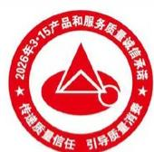  
兹此证明

内蒙古圣牧高科牧业有限公司

全国产品和服务质量诚信承诺企业

(2026年3·15产品和服务质量诚信承诺公告

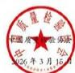

编号：中检协证明CPCA20260338号

“全國品質檢驗穩定合格產品”

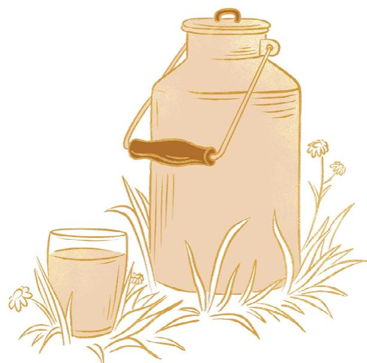

natural_image

Illustration of a glass of milk in a jar with a straw, surrounded by grass and flowers (no text or symbols)

## 保障動物福利

公司堅持以高標準養殖保障動物福利，從飼養管理、健康管理、人道處理以及行為與心理等維度建立系統化管理措施，確保飼養動物在健康、安全與人道條件下生長；並通過有機飼養要求（飲食、飲水、用藥等）與精細化管理相結合，支持奶牛健康狀態與原奶品質持續提升。

## 飼養管理

飼料與飲水：提供符合動物營養需求的優質飼料，確保24小時供應清潔的飲用水。

環境控制：根據動物種類和生長階段，提供適宜的溫度、濕度和通風條件。建立清潔衛生的生活環境，定期清理和消毒。

空間與活動：確保動物有足夠的活動空間，避免過度擁擠，允許動物自然行為的表達。

## 健康管理

定期檢查：安排專業獸醫定期檢查動物健康狀況，及時發現和處理疾病。

疫苗接種：按照科學的防疫計畫進行疫苗接種，預防傳染病的發生和傳播。

藥物使用：在奶牛飼養生產過程中，儘量減少出於預防目的的常規抗生素應用。根據不同藥物規定的休藥期，常規牧場按休藥期執行，有機牧場按雙倍休藥期執行。同時，不使用促進生長的激素和飼料，僅通過精細化飼喂保障奶牛產量。

## 人道處理

生產管理:不使用轉基因或克隆奶牛進行生產 並目保障不使用奸娠期的奶牛 不使用3個月大的犢牛進行生產。

訓練員工：對所有涉及動物管理的員工進行動物福利培訓，提高其動物福利意識和專業技能。

溫和操作：在搬運、驅趕等操作過程中，使用溫和、無害的方法，避免對動物造成恐懼和傷害。

## 行為與心理

豐富環境：通過提供玩具、社交互動等方式，豐富動物的生活環境，滿足其行為和心理需求。

減少應激：通過科學的管理手段，降低動物在各個環節中的應激水準，促進其心理健康。

## 案例 中國聖牧榮獲奶牛養殖行業首家 “動物友好型農場等級評價標準標杆企業” 稱號

2025年9月11日，第七屆動物福利科學大會在重慶隆重召開，本次大會由國家動物健康與食品安全創新聯盟、重慶國康動物福利科學研究院和西南大學共同主辦，吸引全球320餘名動物福利領域專家、學者及從業者齊聚一堂，圍繞行業前沿話題展開深入研討，搭建了專業的交流合作平臺。會議期間，主辦方舉行了 “《動物友好型農場等級評價標準》標杆企業” 頒發儀式，中國聖牧憑藉在動物福利領域的系統性實踐、顯著成效及行業引領作用，成功斬獲該殊榮，成為中國奶牛養殖行業首家獲此稱號的企業，同時作為主要起草單位之一，參與制定 T/CVDA 38-2025《動物友好型農場等級評價--奶牛》標準，彰顯了聖牧在動物福利管理領域的領先地位與行業擔當。

中国圣牧有机奶业有限公司

动物友好型农场等级评价标准奶牛养殖标杆企业

国家动物健康与食品安全创新联盟

二零二五年九月

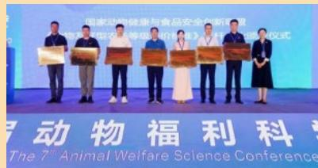

text_image

国家动物健康与食品安全创新联盟
The 7th Animal Welfare Science Conference

## 建設可持續供應鏈

公司持續優化供應商管理流程，逐步將環境、社會及管治（ESG）要素納入供應商全生命週期管理，提升供應鏈穩定性與透明度，並與合作夥伴共同推動更負責任的採購與交付實踐。

## 供應商尋源

多種管道獲取供應商資訊，通過邀請註冊或自主註冊成為潛在供應商，並對供應商的資質進行初步審查，以確認其可滿足公司採購需求。

## 供應商評審

以公平、公正、公開為原則，依據供應商資訊申報、供應商評審判定以及供應商評審實施等內容對供應商資質、環境品質等相關認證、關聯關係等進行評審。並優先選擇將環境保護、社會責任等融入業務運營的供應商。

## 供應商 績效評估

根據品類特點，對供應商供貨或服務過程中，在品質、交付、可持續發展（經濟、環境、社會、創新）、服務等多維度進行綜合評價，依據績效得分，對供應商進行A、B、C、D 分級。

## 供應商 激勵改進

評分為 A/B 級的供應商將給予同等條件下優先合作、樹立標杆等激勵措施，對於 D 級供應商給出整改措施和整改期限 推動整改。

## 供應商支持

與供應商建立了緊密的利益和技術合作關係，致力於解決其資金問題並提供必要的技術支持，提升供應商夥伴的綜合能力。

## 指標及目標

圣牧建立产品与供应链管理相关指标和目标，持续进行绩效监测及进展状况披露，助力公司可持续发展。

  
目標

<table><tr><td></td><td>目標</td><td>2025年進展</td><td>完成情況</td></tr><tr><td rowspan="4">產品治理</td><td>5年内:获得GAP认证的牧场数量达到10座10年内:获得GAP认证的牧场数量达到12座</td><td>8座</td><td>进行中</td></tr><tr><td>5年内:达到CNAS认可的检验室数量4座10年内:达到CNAS认可的检验室数量6座</td><td>2座</td><td>进行中</td></tr><tr><td>5年内:已通过领先的食品安全管理体系认证(例如FSSC/ISO/BRC)牧场数量2个10年内:已通过领先的食品安全管理体系认证(例如FSSC/ISO/BRC)牧场数量6个</td><td>1个</td><td>进行中</td></tr><tr><td>5年内:全球食品安全倡议(GFSI)审核的不合格率小于2%10年内:全球食品安全倡议(GFSI)审核的不合格率小于1%</td><td>0%</td><td>已完成</td></tr><tr><td rowspan="3">供應商管理</td><td>5年内:通过案头评估/现场评估评估的供应商占比85%10年内:通过案头评估/现场评估评估的供应商占比95%</td><td>43%</td><td>进行中</td></tr><tr><td>在纠正行动计划实施中支持的供应商占比100%</td><td>\</td><td>\</td></tr><tr><td>5年内:参与能力建设计划的供应商占比60%10年内:参与能力建设计划的供应商占比80%</td><td>12.4%</td><td>进行中</td></tr></table>

\*本報告期內，公司對核心供應商開展了全面的環境與社會風險評估，未識別出存在重大實際或潛在負面影響的供應商。

  
指標

<table><tr><td></td><td>指標內容</td><td>單位</td><td>2025</td><td>2024</td><td>2023</td></tr><tr><td rowspan="5">食品安全</td><td>全球食品安全倡議(GFSI)審核的產品不合格率</td><td>%</td><td>0</td><td>0</td><td>0</td></tr><tr><td>產品重大不合格率</td><td>%</td><td>0</td><td>0</td><td>0</td></tr><tr><td>對輕微不符合產品所採取的糾正行動完成率</td><td>%</td><td>0</td><td>0</td><td>0</td></tr><tr><td>發佈的產品召回次數</td><td>次</td><td>0</td><td>0</td><td>0</td></tr><tr><td>召回產品的總重</td><td>吨</td><td>0</td><td>0</td><td>0</td></tr><tr><td rowspan="2">抗生素在動物產品中的使用</td><td>使用過醫用重要抗生素治療的奶牛比例</td><td>%</td><td>0</td><td>0</td><td>0</td></tr><tr><td>使用過非醫用重要抗生素治療的奶牛比例</td><td>%</td><td>0</td><td>0</td><td>0</td></tr></table>

<table><tr><td></td><td>指標內容</td><td>單位</td><td>2025</td><td>2024</td><td>2023</td></tr><tr><td>動物及飼料採購</td><td>位於高或極高基線水壓力地區的生產商簽訂的合同比例</td><td>%</td><td>95.2</td><td>96</td><td>89.9</td></tr><tr><td rowspan="2">按地區劃分的供貨商數目</td><td>國內供應商數量</td><td>家</td><td>288</td><td>354</td><td>400</td></tr><tr><td>國外供應商數量</td><td>家</td><td>3</td><td>4</td><td>2</td></tr><tr><td rowspan="5">供應商篩選</td><td>一級供應商總數</td><td>家</td><td>148</td><td>115</td><td>\</td></tr><tr><td>一級重要供應商總數</td><td>家</td><td>51</td><td>37</td><td>\</td></tr><tr><td>一級供應商中的總支出百分比</td><td>%</td><td>49</td><td>26</td><td>\</td></tr><tr><td>非一級供應商的總數</td><td>家</td><td>142</td><td>243</td><td>\</td></tr><tr><td>重要供應商總數(一級和非一級)</td><td>家</td><td>131</td><td>94</td><td>100</td></tr><tr><td rowspan="9">供應商評估和/或開發</td><td>通過案頭評估/現場評估評估的供應商總數</td><td>家</td><td>125</td><td>298</td><td>\</td></tr><tr><td>通過案頭評估/現場評估評估的供應商占比</td><td>%</td><td>43</td><td>83.24</td><td>\</td></tr><tr><td>經評估具有重大實際/潛在負面影響的供應商數量</td><td>家</td><td>0</td><td>0</td><td>\</td></tr><tr><td>經評估具有重大實際/潛在負面影響的供應商占比</td><td>%</td><td>0</td><td>0</td><td>\</td></tr><tr><td>因存在重大實際/潛在負面影響而終止合作的供應商數量</td><td>家</td><td>0</td><td>0</td><td>\</td></tr><tr><td>在糾正行動計畫實施中支持的供應商總數</td><td>家</td><td>54</td><td>40</td><td>\</td></tr><tr><td>在糾正行動計畫實施中支持的供應商占比(具有重大實際/潛在負面影響)</td><td>%</td><td>0</td><td>11.8</td><td>\</td></tr><tr><td>參與能力建設計畫的供應商總數</td><td>家</td><td>36</td><td>6</td><td>\</td></tr><tr><td>參與能力建設計畫的供應商占比</td><td>%</td><td>12.4</td><td>2</td><td>\</td></tr></table>

## 03

## 氣候中和

一直以來，聖牧都高度關注生產、經營對環境與氣候的影響。隨著我國提出 “2030年碳達峰、2060年碳中和” 的目標，這對聖牧應對環境與氣候變化提出了新的要求，也明確了新的目標。圍繞我國「雙碳」戰略目標與《巴黎氣候協定》，聖牧於2021年向科學碳目標倡議（SBTi）提交減排目標，並做出了和《巴黎氣候協定》一致的降低全球氣候1.5℃的承諾。聖牧積極投身環境保護工作，在生產環節強調人與自然和諧共生，並建立了完整的綠色管理體系，為行業實現 “雙碳” 目標提供切實可行的解決方案。

對聯合國可持續發展目標的貢獻

13 气候行动

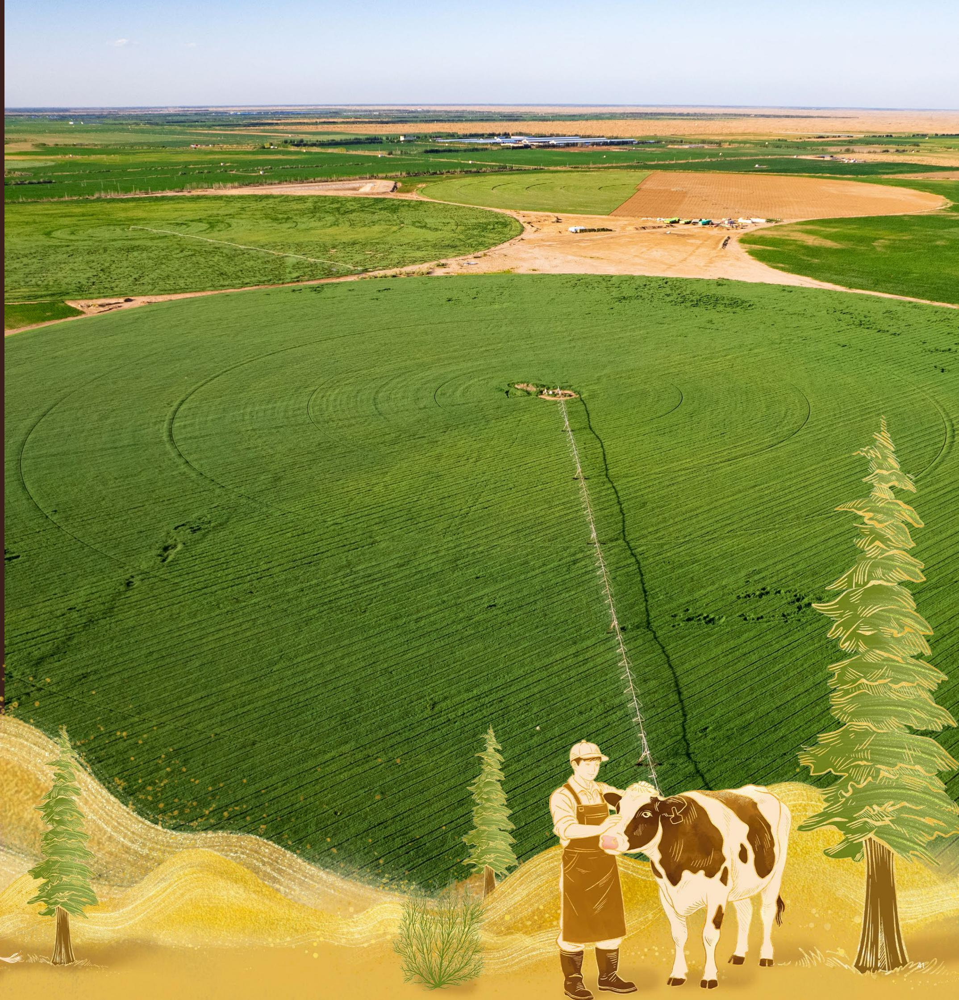

natural_image

Aerial view of a large agricultural field with a farmer, a cow, and surrounding trees (no visible text or symbols)

## 管治

健全的氣候治理機制是識別、評估並應對氣候相關風險與機遇的基礎。公司由董事會履行氣候相關事項的最高監督職責，並由董事會轄下的戰略及可持續發展委員會提供專業支持與過程監督；管理層與相關職能部門管理、專案推進與資訊披露工作，形成 “監督—管理—執行” 的職責鏈條。為增強治理有效性，公司建立氣候相關事項的資訊上報與議題審議機制（如：定期彙報、專項議題審議、重大風險 /重大投資事項的氣候因素評估等），並通過培訓與外部交流提升董事會及管理層對氣候議題的理解。

同時，公司持續探索將部分氣候相關績效納入激勵約束安排，以增強目標落地牽引力；聖牧將董事會5% 的獎金激勵與氣候相關績效掛鉤，以推動氣候相關戰略和目標實現。（具體管治架構及職責分工請見可持續發展治理章節）

## 策略

聖牧充分分析氣候變化帶來的風險機遇，並將其納入整體風險管理、戰略制定及財務規劃中，促進目標實現，形成 “種養減碳、農林草固碳” 雙元驅動的綠色低碳生態圈。

## 情景分析

為更系統地評估氣候不確定性帶來的潛在影響，公司在既有方法基礎上，參考IPCC公開可得情景並結合國家“雙碳” 目標，設置情景、關鍵參數、時間跨度及測算結

## 情景一

## 全球1.5℃路徑（SSP1-1.9）

假設全球各國嚴格履行《巴黎協定》，通過技術創新、政策協同與氣候融資，2050年實現碳中和，溫升控制在1.5℃以內。中國聖牧將在此情景下實現牧場100%綠電覆蓋，奶牛碳排放強度下降50%。

## 情景二

## 高排放延續情景（SSP5-8.5）

全球氣候行動力度不足，延續當前政策，全球溫升達3\~4℃，極端乾旱、洪澇頻率上升，牧場水資源壓力激增，原料供應鏈成本提高30%以上。

時間範圍：短期（0-1年）、中期（2-5年）、長期（大於6年）

氣候相關風險和潛在影響

<table><tr><td colspan="2"></td><td>氣候情景</td><td>潛在風險</td><td>潛在財務影響</td><td>風險管理舉措及應對措施</td></tr><tr><td rowspan="8">物理風險</td><td rowspan="2">極端高溫(S)</td><td>1.5°C情景</td><td>高溫天氣增多,奶牛熱應激加劇,產奶量預計下降約3%。</td><td>可能導致收入承壓,並增加降溫、飼養及健康管理成本。</td><td>定期識別和評估高溫風險,完善應急預案;優化牛舍通風、降溫和飼養管理,提升氣候適應能力。</td></tr><tr><td>3-4°C情景</td><td>熱應激天數明顯增加,產奶量預計下降約10%-15%。</td><td>可能帶來更明顯的收入波動,並增加設施改造和運營投入。</td><td>提升高溫預警和應急回應能力;加強關鍵設施耐候性改造,持續優化奶牛舒適度管理。</td></tr><tr><td rowspan="2">極端降水(S)</td><td>1.5°C情景</td><td>局部強降雨和內涝可能對場區道路、排水系統及設施運行造成影響。</td><td>基礎設施維護及修復成本可能上升。</td><td>完善排水、防涝及巡檢維護機制;針對重點場區制定極端降雨應急處置預案。</td></tr><tr><td>3-4°C情景</td><td>暴雨洪涝頻率和強度提升,部分核心牧場存在停運風險。</td><td>可能導致停產損失、交付延遲及恢復成本增加。</td><td>開展重點場區脆弱性評估;優化跨場區調度和應急供應安排,提升運營連續性。</td></tr><tr><td rowspan="2">疾病傳播(S)</td><td>1.5°C情景</td><td>氣候變化可能提升蟲媒傳播及疫病暴發風險,影響奶牛健康。</td><td>可能造成產奶量下降,並增加防疫、診療和管理成本。</td><td>強化生物安全、免疫接種和健康監測;完善隔離、診療及應急處置機制。</td></tr><tr><td>3°C情景</td><td>疫病傳播範圍和暴發強度上升,群體健康和生產穩定性承壓。</td><td>可能導致更大幅度的產能損失及處置支出。</td><td>提升獸醫資源和應急物資保障能力;加強跨牧場聯防聯控和複盤改進。</td></tr><tr><td rowspan="2">乾旱壓力(S)</td><td>1.5°C情景</td><td>區域降水波動可能推高飼草成本,影響牧草供應穩定性。</td><td>飼草採購和用水成本可能上升。</td><td>優化飼草儲備和採購策略;推進節水、回用和水資源高效利用。</td></tr><tr><td>3-4°C情景</td><td>水資源約束增強,飼草供應鏈中斷風險上升,影響產能與交付。</td><td>可能導致銷售收入波動,並增加資源保障投入。</td><td>開展水風險和飼草供應情景評估;構建廣度覆蓋的採購與資源調配機制</td></tr><tr><td rowspan="10">轉型風險</td><td rowspan="2">政策風險(S/M/L)</td><td>1.5°C情景</td><td>氣候披露、甲烷管控及能效要求持續提升,減排和合規改造壓力增加。</td><td>合規改造、數據管理和體系建設投入可能上升。</td><td>跟蹤監管要求,完善氣候資訊披露和排放管理機制;推進低碳牧場、低碳飼養及糞汙資源化專案。</td></tr><tr><td>3-4°C情景</td><td>區域差異化環保約束趨嚴,跨區域經營管理複雜度進一步提升。</td><td>隱性合規成本和管理成本可能增加。</td><td>加強政策評估與前置佈局,完善區域合規清單和內部標準。</td></tr><tr><td rowspan="2">技術風險(S/M/L)</td><td>1.5°C情景</td><td>如低碳技術和適應性技術升級不及時,可能削弱減排和抗風險能力。</td><td>可能影響運營效率,並增加後續改造支出。</td><td>制定技術升級路線圖;加強設備維護、健康管理和保險安排。</td></tr><tr><td>3-4°C情景</td><td>極端氣候叠加技術儲備不足,可能影響牧場經營穩定性。</td><td>單體牧場損失風險可能放大。</td><td>提升關鍵設備冗餘和應急保障能力;推進適應性技術儲備和示範應用。</td></tr><tr><td rowspan="2">市場風險(S/M/L)</td><td>1.5°C情景</td><td>客戶對低碳、可追溯和高透明度原奶的要求持續提高。</td><td>若應對不足,可能影響訂單穩定性和產品議價能力。</td><td>提升碳數據管理和可追溯能力;推進低碳原奶和綠色產品能力建設。</td></tr><tr><td>3-4°C情景</td><td>氣候衝擊可能導致原奶品質和供給波動,市場競爭進一步加劇。</td><td>可能對收入穩定性和毛利水準造成壓力。</td><td>強化品質穩定性管理和供應保障;優化成本結構,提升經營韌性。</td></tr><tr><td rowspan="2">聲譽風險(S)</td><td>1.5°C情景</td><td>若氣候管理和披露品質不足,可能影響外部評價和利益相關方信任。</td><td>可能增加溝通成本,並影響融資與合作條件。</td><td>建立統一的氣候議題溝通機制;提升披露一致性和透明度。</td></tr><tr><td>3-4°C情景</td><td>極端天氣或環境事件引發與情,可能削弱品牌信任。</td><td>可能增加聲譽修復支出並影響業務合作。</td><td>完善輿情監測和事件應對預案;加強環境與安全風險防控。</td></tr><tr><td rowspan="2">法律風險(S/M/L)</td><td>1.5°C情景</td><td>相關法規和執法要求趨嚴,違法違規成本提升。</td><td>法律合規支出可能增加。</td><td>加強法規跟蹤、合規審查和差距整改;定期開展重點領域內部檢查。</td></tr><tr><td>3-4°C情景</td><td>氣候災害叠加突發環境事件,可能引發索賠或訴訟風險。</td><td>可能產生賠付、訴訟及保險相關成本。</td><td>提升應急管理和環境風險防控能力;完善保險及法律應對安排。</td></tr></table>

\*S-短期；M-中期；L-長期

## 氣候變化相關機遇和潛在影響

<table><tr><td></td><td>氣候情景</td><td>潛在機遇描述</td><td>潛在財務影響</td><td>實現機遇的策略</td></tr><tr><td rowspan="2">價值鏈機遇(S/M/L)</td><td>1.5°C情景</td><td>糞肥轉化有機肥替代100%化肥施用。</td><td>減少原料購買及廢棄物處理成本。</td><td>採用“種養結合”的迴圈農業模式,推動牛糞還田,有效避免牲畜排泄物隨意處置造成的水源和土壤污染等問題</td></tr><tr><td>3°C情景</td><td>通過技術輸出為同行業提供減排服務。</td><td>增加新領域業務收入。</td><td>參與行業大會,與同行分享“種養結合”經驗</td></tr><tr><td rowspan="2">產品和服務機遇(S/M/L)</td><td>1.5°C情景</td><td>低碳有機原奶市場份額增加,採購價格上漲。</td><td rowspan="2">聖牧擴大有機牧場規模,以增加有機奶產量和市場銷售量,增加營業收入。</td><td rowspan="2">制定有機奶快速轉型5年增量規劃,並確立打造碳中和牧場、生產零碳原奶的目標,在增加有機奶產量的同時,生產零碳原奶,實現經濟與環境雙贏發展。</td></tr><tr><td>3°C情景</td><td>國際乳業供應鏈轉移需求,全球供應鏈重構催生區域低碳奶源中心建設需求。</td></tr><tr><td rowspan="2">技術機遇(S/M)</td><td>1.5°C情景</td><td>投放新型飼料添加劑,奶牛甲烷排放量降低55%。</td><td>因環保優勢獲得政策支持、提升品牌形象增加市場份額。</td><td rowspan="2">積極開展相關研究,優化牛群飼料成分和結構。</td></tr><tr><td>3°C情景</td><td>極端高溫推動抗熱應激基因編輯技術商業化,搶佔生物育種市場份額。</td><td>增加新領域業務收入。</td></tr><tr><td rowspan="2">政策機遇(S/M)</td><td>1.5°C情景</td><td>原奶碳排放強度≤0.07kg CO2e/kg 的牧場,獲得0.5元/kg 財政補貼。</td><td rowspan="2">獲得政府補貼,有利於改善公司利潤表現。</td><td rowspan="2">積極開展氣候變化應對相關管理,爭取獲得政府補貼。</td></tr><tr><td>3°C情景</td><td>極端高溫情況下,政府對種植端業務進行專項補貼。</td></tr></table>

\*S-短期；M-中期；L-長期

## 氣候韌性

聖牧的氣候轉型計畫不僅關注氣候變化木身，還綜合考慮了其他重要的環境問題 如水資源管理 森林保護和生物多樣性保護，確保公司的可持續發展戰略能夠全面應對環境挑戰，促進生態系統的健康和穩定。公司聚焦烏蘭布和，在種養協同基礎上，擴大有機牧場規模，制定有機奶快速轉型5年增量規劃，滿足消費者對有機低碳奶的需求。同時，確定打造碳中和牧場 生產零碳原奶的目標 從奶牛腸道發酵 糞便管理 綜合能源利用 生熊固碳等方面出臺8大減排舉措助力目標實現。

「截至本報告期 本公司已開展氣候相關風險與機遇的識別及情境分析工作 並就其對業務經營及相關財務表現的潛在影響進行評估與說明。

在此基礎上，公司亦持續推進氣候相關財務影響的識別與量化方法建設。鑑於目前相關評估方法及數據基礎仍處於逐步完善階段，部分氣候相關影響尚難以在財務報表項目層級進行單獨識別並形成具備充分可靠性的量化結果。

因此，本報告期內，公司主要以定性方式說明氣候相關風險與機遇對收入，成本結構，供應鏈及生產條件等方面的潛在影響 並結合相關財務項目作出說明

同時 就容易受氣候相關轉型風險，物理風險及相關機遇影響的資產或業務活動金額及百分比 以及用於氣候相關風險和機遇的資本開支，融資或投資金額 公司本年度以解釋性揭露為主 並就未進行量化揭露的原因作出說明。

## 風險管理

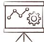

公司建立氣候相關風險與機遇的識別、評估、排序與監測流程，並與整體風險管理體系相銜接：通過 “自下而上” 的業務摸排 部門訪談與資訊歸集 形成風險清單與重要性判斷：再通過風險矩陣等方法開展風險量化評估 分級管控責任分，並與戰略規劃、專案管理相融合，同時開展過程跟蹤與複盤改進。

## 氣候變化相關風險和機遇的管理流程

## 氣候風險與機遇 評估

重要性氣候變化相關風險和機遇評估結果報送至可持續發展部。

## 氣候變化應對方案制定

可持續發展部根據評估結果協同相關職能部門制定應對方案。

## 氣候變化應對方案推進實施

應對方案報送戰略及可持續發展委員會審閱同意後，下發至各職能部門推進實施。

## 監督、匯報進展

可持續發展部監督方案進展情況定期向戰略及可持續發展委員會匯報。

## 能源管理

我們積極制定能源管理計畫，開展能源審計以識別提升能源績效的機會，並定期評估降低能源消耗方面的進展。

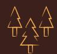

## 種植端

將35萬畝沙漠改造成優良草場，種植各類防沙樹木9,800萬餘棵，將220平方公里沙漠變成綠洲，累計實現碳固存138萬噸。

## 養殖端

改善奶牛日糧營養結構：調整牛群瘤胃內環境，抑制甲烷排放；研究氨基酸平衡對生產的影響，降低尿素氮水準。

提升奶牛飼料效率：通過砸牆、安裝卷簾，配齊風扇，提高牛舍通風；改造臥床高度、平整臥床，提高奶牛躺臥率和躺臥時間，減少碳排放。

## 2025年

总能耗

606,570.67千兆焦耳（GJ）

每万元收入能源使用

0.061吨标准煤 / 万元

## 綠電使用

我們注重能源結構優化，逐步提升可再生能源利用比例，減少化石能源的使用，實現溫室氣體排放的顯著降低。我們與裝載機廠家合作，研發適用養殖業使用的純電裝載機，減少牧場柴油耗用量。同時，建設牛舍分佈式光伏，支持傳統畜牧業實現能源轉型。

## 案例 案例：建設 “牧光一體” 的綠色牧場

聖牧致力於促進牧場的綠色低碳發展，於2025年完成智慧牧場牛舍光伏專案，將太陽能光伏發電應用至養殖牧業環節，形成 “牧光一體” 的綠色生產模式。據統計，智慧牧場2.5MW光伏專案從2025年開始，每年可減少3767.6噸 CO2e 排放量。

## 推進節能減碳

圣牧围绕中国 “双碳” 目标和《巴黎气候协定》“降低全球气温 1.5℃” 承诺，在 SBTi 框架下，制订科学有效的碳减排路线，到 2030 年，总排放量降至 51.43 万吨，其中范围一降至 45.12 万吨、范围二降至 8.02 万吨；同时，我们也针对范围三制定减排目标，即 10 年内范围三排放降至 30 万吨。

聖牧减排路徑圖  
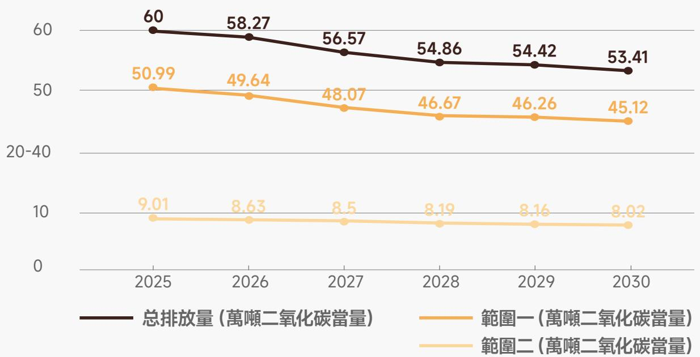

line

| Year | 总排放量 (萬噸二氧化碳當量) | 範圍一 (萬噸二氧化碳當量) | 範圍二 (萬噸二氧化碳當量) |
| --- | --- | --- | --- |
| 2025 | 60 | 50.99 | 9.01 |
| 2026 | 58.27 | 49.64 | 8.63 |
| 2027 | 56.57 | 48.07 | 8.5 |
| 2028 | 54.86 | 46.67 | 8.19 |
| 2029 | 54.42 | 46.26 | 8.16 |
| 2030 | 53.41 | 45.12 | 8.02 |

## 2025年

聖牧實際碳排放量為

594,600噸二氧化碳當量

## 指標

聖牧沿著公司科學有效的碳減排路線，將減碳融入各運營環節，科學設置並管理氣候變化相關指標，定期檢視評估減排成果。

<table><tr><td></td><td>指標內容</td><td>單位</td><td>2025</td><td>2024</td><td>2023</td></tr><tr><td rowspan="9">溫室氣體排放</td><td>溫室氣體排放量</td><td></td><td>592,980.93</td><td>660,337.15</td><td>662,373.52</td></tr><tr><td>範圍一排放</td><td></td><td>489,876.00</td><td>490,320.00</td><td>491,988.00</td></tr><tr><td>範圍一增量</td><td></td><td>559,876.00</td><td>565,320.00</td><td>579,988.00</td></tr><tr><td>範圍一減量</td><td>噸二氧化碳當量</td><td>70,000.00</td><td>75,000.00</td><td>88,000.00</td></tr><tr><td>範圍二排放</td><td></td><td>90,688.63</td><td>107,680.00</td><td>106,388.00</td></tr><tr><td>範圍三排放</td><td></td><td>12,416.25</td><td>62,337.15</td><td>63,997.52</td></tr><tr><td>單牛溫室氣體排放量-範圍1和範圍2</td><td>噸/頭</td><td>3.95</td><td>3.47</td><td>4.04</td></tr><tr><td>每萬元收入溫室氣體排放量-範圍1和範圍2</td><td>噸/萬元</td><td>1.74</td><td>1.96</td><td>1.70</td></tr><tr><td>每公斤奶溫室氣體排放量</td><td>噸/公斤</td><td>0.73</td><td>0.91</td><td>0.82</td></tr><tr><td rowspan="7">能源管理</td><td>總能耗</td><td>千兆焦耳(GJ)</td><td>/</td><td>/</td><td>1,537,563.92</td></tr><tr><td>電力</td><td>千瓦時</td><td>139,973,190.2</td><td>132,549,861.4</td><td>116,221,187.00</td></tr><tr><td>煤炭消耗量</td><td>噸</td><td>0</td><td>0</td><td>0</td></tr><tr><td>柴油消耗量</td><td>噸</td><td>2,859.49</td><td>3,027.72</td><td>2,404.67</td></tr><tr><td>單牛能源使用</td><td>噸標準煤/頭</td><td>0.15</td><td>0.14</td><td>0.12</td></tr><tr><td>每萬元收入能源使用</td><td>噸標準煤/萬元</td><td>0.064</td><td>0.0614</td><td>0.051</td></tr><tr><td>電網電量百分比</td><td>%</td><td>81.85</td><td>82.35</td><td>80.12</td></tr></table>

\* 範圍一溫室氣體排放量計算依據《2006 IPCC Guidelines for National Greenhouse Gas Inventories》，由煤炭、柴油使用量折算化石燃料二氧化碳排放量。  
\*範圍二溫室氣體排放量計算依據依據生態環境部《關於發布2023年電力二氧化碳排放因子的公告》内蒙古地區消耗每兆瓦時電按生產0.6479噸二氧化碳排放折算由用電量折算得出  
\*根據《綜合能耗計算通則》（GBT2589-2020），按照電力折算係數0.1229（千克標準煤 /千瓦時），柴油折算係數1.4571（千克標準煤 /千克）進行計算。現階段範圍三排放僅納入奶車運輸環節相關數據，截至本報告期末 公司尚未實施內部碳定價機制，未將內部碳價格應用於投資決策 營運管理及相關業務規劃中。未來公司將持續關注氣候變化相關政策要求與行業實務，適時研究並完善內部碳定價相關管理體系。

## 04

## 自然共生

聖牧堅持將生態保護、資源節約與迴圈利用理念貫穿經營全過程，從荒漠生態修復到有機牧場建設，持續探索兼顧生態價值與產業發展的路徑，努力推動形成土地修復、資源高效利用與產業協同發展的良性迴圈。我們希望通過系統化管理與持續改進，促進人與自然和諧共生，為區域生態改善和長期可持續發展創造更穩固的基礎。

## 對聯合國可持續發展目標的貢獻

6 清洁饮水科卫生设施

9 产业、创新和 基础设施

12 负责任消费和生产

15 陆地生物

## 管治

公司遵循《中華人民共和國大氣污染防治法》《中華人民共和國水污染防治法》《畜禽規模養殖污染防治條例》等適用法律法規，將自然相關議題納入ESG治理體系，明確董事會、管理層及相關職能部門在自然資源管理、生態保護與環境合規方面的職責分工，形成由上至下的管理機制。

在治理安排上，公司持續推動自然相關議題與經營決策、風險管理及績效考核相銜接，並探索將森林保護、水安全等重點事項納入激勵約束機制，以增強目標落實力度（將董事會10%，森林相關5%，水安全相關5% 的獎金激勵與自然相關績效掛鉤）。同時，公司通過定期培訓、專題討論及與外部專家、利益相關方溝通等方式，提升董事會及管理層對自然相關風險、機遇及行業實踐的理解與判斷能力。

公司已圍繞環境保護與自然資源管理建立或持續完善相關政策檔，包括環境聲明、零毀林承諾、可持續農業承諾及環境保護管理制度等，並根據經營實際和監管要求持續更新優化，目前聖牧公開發佈《中國聖牧環境聲明》《零毀林森林承諾》《可持續農業承諾》，修訂《集團環境保護管理制度》，持續完善環境管理體系，不斷探索綠色發展新模式。（具體管治架構及職責分工請見可持續發展治理章節）

## 策略

公司的經營活動在很大程度上依賴土地、水、能源及原材料等自然資源，同時也會對生態系統狀態產生影響。為更系統地識別與管理自然相關事項，公司參考LEAP 分析思路，對自身運營與價值鏈中的自然相關依賴、影響、風險及機遇進行梳理，並將分析結果作為治理、戰略制定、風險管理及資本配置的重要參考。

自然相關風險和潛在影響

<table><tr><td colspan="2"></td><td>潛在風險影響</td><td>潛在財務影響</td><td>風險舉措管理及應對措施</td></tr><tr><td rowspan="3">物理風險</td><td rowspan="2">慢性風險(M/L)</td><td>部分牧區處在水風險較高的地區,缺乏水資源會中斷牧場運營。</td><td>生產能力下降造成收入減少。</td><td>· 大力發展節水、水資源迴圈、水資源高效利用等設施設備,制定企業節水目標。
· 在供應商管理系統中,要求供應商節約用水並強調節水優先。</td></tr><tr><td>極端天氣可能使大豆和牧草等飼料出現供不應求的現象。</td><td>飼料價格上漲,採購成本增加。</td><td>· 制定環境相關應急預案。</td></tr><tr><td>急性風險(S)</td><td>全球變暖,降水模式發生變化,導致水資源缺乏,影響用水價格。</td><td>生產成本增加。</td><td>· 採用節水、水資源再利用、再迴圈和保護手段。</td></tr><tr><td rowspan="2">轉型風險</td><td rowspan="2">法律和政策風險(M)</td><td>中國政府對森林保護和生物多樣性保護關注度提升,對涉及森林和生物多樣性敏感區範圍調整,致使供應商可能面臨無運營許可證或需遷移經營地等風險。</td><td>供應商生產運營成本上升導致公司採購成本上升。</td><td>· 加強供應鏈管理,若發現有供應商可能面臨經營許可風險,及時提醒,並考慮更換供應商。</td></tr><tr><td>保護黃河流域水資源相關政策要求愈加嚴格,公司面臨的監管壓力逐步增強。</td><td>法律風險成本增加。運營成本增加。</td><td>· 嚴格按照要求對取水和排水的水質進行檢驗。
· 開發投入水循環設備。
· 加強源頭控制,審查供應商防治水污染的技術和方法。</td></tr></table>

<table><tr><td colspan="2"></td><td>潛在風險影響</td><td>潛在財務影響</td><td>風險舉措管理及應對措施</td></tr><tr><td rowspan="3">轉型風險</td><td rowspan="2">技術風險(S/M/L)</td><td>由於監管供應鏈資料的技術不成熟,可能導致部分供應商無法提供環境相關資料,對供應鏈溯源提出挑戰。</td><td>投入更多的資源進行供應鏈管理,直接運營成本增加。</td><td>·加強供應鏈管理,建立責任透明的營商環境,協助供應商向“自然受益”轉型,建議其投入更多綠色技術和綠色管理的設施設備。</td></tr><tr><td>水資源缺乏,影響用水價格,聖牧需加大力度投入節水設備。</td><td>投入更多的資源(財務、人力等)採購節水、水循環的設備,以及新設備培訓,增加運營成本。</td><td>·在牧場區域開展基於自然的解決方案,改善當地的小氣候,增加降雨量。</td></tr><tr><td>聲譽風險(S/M)</td><td>若聖牧沒有出臺避免大豆威脅森林的舉措,或發生從森林風險地區採購大豆的行為,可能會使企業品牌形象受損。</td><td>投資者和消費者降低對公司的信任,營業收入降低,嚴重可能導致公司面臨中止運營。</td><td>·重視環境議題管理,盡可能避免負面事件發生·開展“零毀林”大豆採購規劃,全力建設綠色奶業供應鏈。</td></tr></table>

\*S-短期；M-中期；L-長期

自然相關機遇和潛在影響

<table><tr><td></td><td>潛在機遇描述</td><td>潛在財務影響</td><td>機遇管理舉措及應對措施</td></tr><tr><td>資源效率(S/M)</td><td>改進鮮奶餘熱回用工藝,改進後,每噸鮮奶可降低使用0.4噸地下水,同時提供熱量5千瓦時。</td><td>減少公司購買資源的成本。</td><td>·積極改進生產工藝,升級改造設備,提升效率、減少資源消耗。</td></tr><tr><td>資本流動和融資(S)</td><td>獲得新的融資方案,融資管道增加。</td><td>拓寬企業融資渠道,融資金額1億元,融資期限2年。</td><td>·回應國家綠色發展政策,實現金融與環保的深度融合。</td></tr><tr><td>適應力(S)</td><td>聖牧通過涵養水源的實踐有效調節小氣候,使地區年降水量提升。</td><td>減少上游供應商引渠灌溉的成本和商業用水的成本。</td><td>·在烏蘭布和沙漠種植各類樹木,建設灌木、喬木防風林帶,加上田間的草本作物,逐級降低風力,已將當地平均6-7級的原始風力降低至4-5級。</td></tr></table>

\*S-短期；M-中期；L-長期

## 風險管理

公司參考TNFD 推薦方法，並結合ENCORE 資料庫及多元資本相關分析思路，對業務活動對自然的影響、依賴及其重要性進行識別和評估 以支持自然相關風險與機遇管理，相關評估結果與公司整體風險管理體系銜接 用於識別重黑議題、完善控制措施並優化資源投入。

## 自然相關風險管理流程

## 風險識別與排序

風險管理部主動分析價值鏈各環節與自然相關的風險點，識別自然相關(森林、水、生物多樣性)的風險與影響，並對風險與影響進行優先排序。

## 風險評估

對重要性自然環境(森林、水、生物多樣性)相關風險和機遇開展評估，評估結果報送至可持續發展部。

## 風險應對策略制定

可持續發展部制訂適當的風險應對策略，降低和規避重要風險對公司業務、戰略、財務規劃和可持續發展的影響。

## 執行與監督

應對策略經戰略及可持續發展委員會審閱同意後，下發至各職能部門推進實施，監督方案進展情況並定期匯報。

## 污染防治

我們將資源循環利用置於首位，針對運營過程中產生的廢水以及固體廢棄物進行循環利用的廢棄物，對於無法回收利用的廢棄物，嚴格遵循處理後再排放的原則，確保企業運營對環境的影響降至最低。

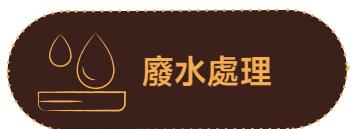

水質監測：

委託第三方檢測機構每月對牧場取水和排水水質開展檢測，並對檢測結果進行跟蹤

分析。

應急預案：

持續完善污水處理相關應急預案，針對停電、水質異常等突發情況明確處置流程，儘量避免不達標污水外排風險。

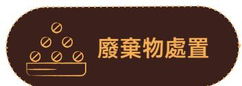

牛糞循環利用：

發揮 “種養結合” 優勢，將牛糞資源化還田；同時推進 “牛糞墊料回填臥床” 等工藝，提高糞汙綜合利用率，並降低相關排放壓力。

合規廢物處置：

對一般固體廢物、危險廢物、建築垃圾和生活垃圾等實行從產生、收集、暫存、運輸到處置的全過程管理，並由具備資質的第三方機構實施回收和處置。

## 案例 科技賦能節水農業 打造沙漠高效用水典範

為破解沙漠地區水資源緊缺難題，踐行國家水資源集約利用要求，聖牧積極推進節水技術創新與智慧化管理，引入以色列精准滴灌技術與物聯網智能控制系統，建設水肥一體化高效節水設施，實現按需供水、精准計量與高效灌溉，這項技術以0.35L/H的精准流量實施水肥一體化灌溉，結合物聯網遠程控制系統實現 “按需供水、精准計量”，將每畝用水量從500立方米降至340立方米，節水率超30%。

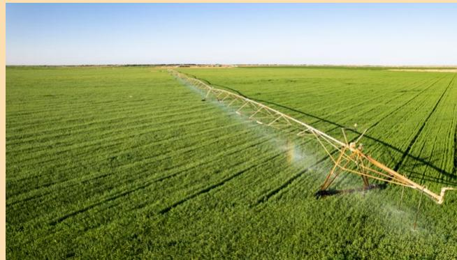

natural_image

Aerial view of a large agricultural field with a water spray irrigation system installed in the distance under clear sky (no text or symbols visible)

顯著降低單位面積用水量，提升水資源利用效率。專案以科技賦能沙漠有機種植，構建節水高效、生態友好、可持續的農業發展模式，相關實踐獲評綠色發展典型案例，為區域水權改革與乾旱地區節水農業發展提供可複製、可推廣的示範經驗。

2025年，聖牧重點從環保法規性、制度合規性、台賬培訓、危險廢物管理、環保應急演練四個方面培訓，共舉行環保培訓34場次，約2,100人次參與。

## 案例 數智化賦能 “智慧牧場”，打造沙漠有機牧業新標杆

中國聖牧積極擁抱數位化轉型，將物聯網（IoT）、大數據與人工智慧技術深度融入牧場運營，打造全鏈路 “智慧牧場”，以科技力量驅動產業的綠色與高效發展，在動物福利與健康管理方面、牧場全面引入智能穿戴設備，全天候精准監測奶牛的采食、反芻與體溫數據，通過構建健康預警模型實現疾病 “早干預”，從源頭降低用藥頻率並提升牛群健康水準。在資源精細化利用上、公司應用智能 TMR（全混合日糧）精准監控系統與環境智控設備 動態優化飼料配比與牛舍溫濕度，有效降低了飼料浪費與綜合能耗，提升了飼料轉化率，進而間接減少了養殖環節的碳排放。同時，聖牧打通了 “種草-養牛 -產奶” 的全產業鏈數據，建立原奶品質溯源系統不僅築牢了食品安全防線 確保 S 級原奶合格率穩居高位，也為管理決策提供了科學依據。此外，自動化擠奶與智能清糞系統的普及大幅降低了一線員工的重體力榮動強度，有效改善了作業環境與職業健康安全，助力員工實現向“現代牧場技術員的職業轉型。智慧牧場的全面落地，不僅是聖牧應對行業週期挑戰的 “效率引擎”，更是公司踐行高質量發展、引領沙漠有機乳業數智化與綠色化升級的關鍵實踐。

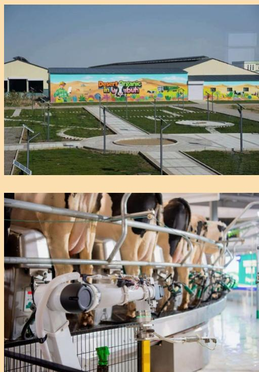

## 水資源利用

合理利用水資源是聖牧實現可持續發展的先決條件之一。我們對水資源的可持續利用與保護高度重視，力圖加強全產業鏈節水管理，降低資源浪費。

## 水資源管理

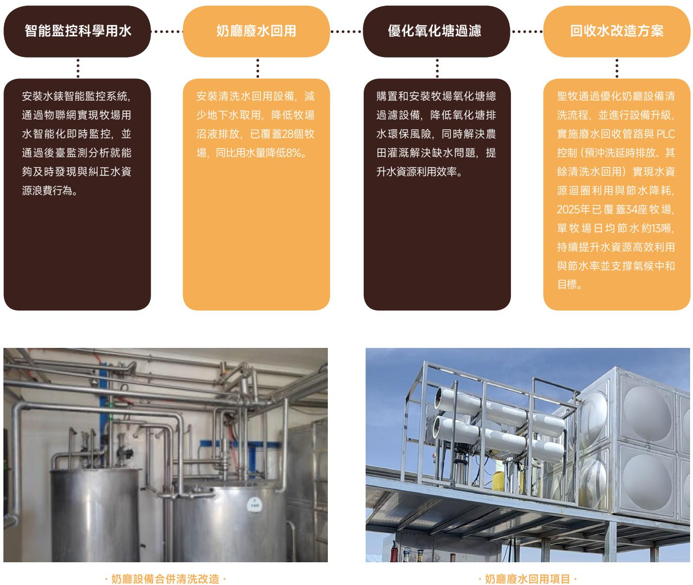

## 智能監控科學用水

安裝水錶智能監控系統，通過物聯網實現牧場用水智能化即時監控，並通過後臺監測分析就能夠及時發現與糾正水資源浪費行為。

## 奶廳廢水回用

安裝清洗水回用設備，減少地下水取用，降低牧場場，同比用水量降低8%。

## 優化氧化塘過濾

購置和安裝牧場氧化塘總過濾設備，降低氧化塘排水環保風險，同時解決農田灌溉解決缺水問題，提升水資源利用效率。

## 回收水改造方案

聖牧通過優化奶廳設備清洗流程，並進行設備升級，實施廢水回收管路與PLC控制（預沖洗延時排放、其餘清洗水回用）實現水資源迴圈利用與節水降耗，2025年已覆蓋34座牧場，單牧場日均節水約13噸，持續提升水資源高效利用與節水率並支撐氣候中和目標。

## 生物多樣性保護

為減緩運營活動對生物多樣性和自然生態的負面影響，我們從避免(Avoidance)、減少(Reduction)、減緩(Mitigation)與修復(Restoration)四個方向採取措施，降低自身對生物多樣性產生的負面影響。同時，充分尊重、利用區域自然環境，培育建植以自然修復為基礎的防護林與工程治沙體系，在提高水分利用效率、降低成本與地下水使用的同時，增加防護林( 工程 )的防風固沙效率。

我們持續探索迴圈型養殖與種植模式。通過施用有機肥，改善土壤糰粒結構，增強土壤保水保肥能力與土地肥力，持續修復土壤健康；同時，將奶牛養殖過程中產生的糞汙以有機肥、葉面肥等方式還田，促進資源再利用。通過堆肥場改造及精准施肥能力提升，有機肥腐熟發酵週期和利用效率不斷優化，進一步推動種植業、養殖業與生態環境之間形成更良性的能量與物質迴圈。

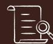

## 案例 聖牧案例入選《中國企業支持 NbS全球示範案例集》

在阿聯酋首都阿布扎比舉辦的第八屆世界自然保護大會上，中國聖牧的產業實踐《沙漠迴圈有機農業：以產業治沙實現生態與經濟共贏》入選《中國企業支持 NbS全球示範案例集》。向全球展示了中國企業在綠色發展、生態保護領域的卓越成果，為全球乾旱半乾旱地區生態修復與農業可持續發展提供了可複製、可推廣的 “中國方案” ！

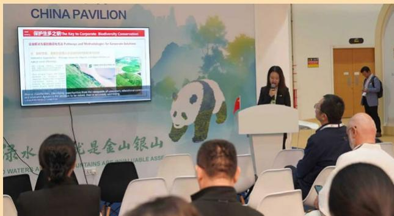

text_image

CHINA PAVILION
保护生多之明 The Key to Corporates Blueberry Conservation
全球水力与自然风光 Pathway and Worldlogistics for European Sciences
· 中国、美国、新加坡及台湾的可持续发展
《关于促进水资源高质量发展的意见》
《关于促进水资源高质量发展的意见》
《关于促进水资源高质量发展的意见》
《关于促进水资源高质量发展的意见》
《关于促进水资源高质量发展的意见》
《关于促进水资源高质量发展的意见》
《关于促进水资源高质量发展的意见》
《关于促进水资源高质量发展的意见》
《关于促进水资源高质量发展的意见》
《关于促进水资源高质量发展的意见》
《关于促进水资源高质量发展的意见》
《关于促进水资源高质量发展的意见》

## 案例 中國聖牧榮獲 “香港綠色和可持續金融大獎”

2025年12月 香港品質保證局（HKQAA）主辦的 “綠色和可持續金融論壇·2025” 於香港萬豪酒店圓滿落幕。會議聚焦 “共創綠色低碳未來”，對在綠色和可持續金融實踐、ESG治理及氣候行動等領域作出傑出貢獻的企業及機構進行表彰，旨在促進可持續金融與技術發展，推動業界及社會整體的可持續發展。中國聖牧在論壇期間獲得 “傑出氣候披露貢獻超卓大獎” 與 “氣候披露優化卓越貢獻獎”。

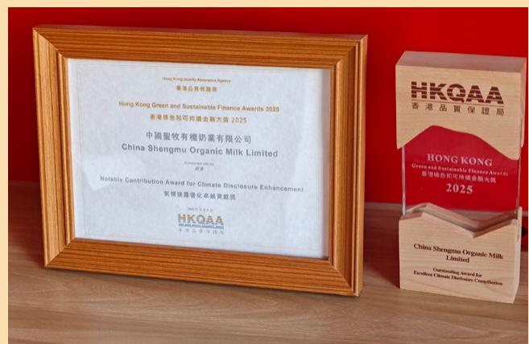

text_image

Hong Kong Green and Sustainable Finance Award
香港品質保證局
Hong Kong Green and Sustainable Finance Awards 2025
香港綠色和可持續金融大綱 2025
中國聖牧有機奶業有限公司
China Shengmu Organic Milk Limited
Notable Contribution Award for Climate Disclosure Enhancement
實體披露變化卓越與關注
HKQAA
HONG KONG
Green and Sustainable Finance Award
香港綠色和可持續金融大綱
2025
China Shengmu Organic Milk
Limited
Outstanding award for
Excellent Chinese Securities Certification

## 指標及目標

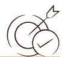

圣牧订立明确的目标以减少本集团业务对环境造成的污染排放，并对相关绩效进行持续的监控与改进。

目標

<table><tr><td></td><td>目標</td><td>2025年進展</td><td>完成情況</td></tr><tr><td rowspan="2">排放物</td><td>5年內：廢氣排放總量減少至70噸</td><td rowspan="2">150.98</td><td rowspan="2">100%</td></tr><tr><td>10年內：廢氣排放總量減少至65噸</td></tr><tr><td>有害廢棄物</td><td>醫療廢物產生量強度小於&lt;0.001噸/牛</td><td>0.0005</td><td>100%</td></tr><tr><td>無害廢棄物</td><td>牛糞產生量強度小於9噸/牛</td><td>11.80</td><td>76.3%</td></tr><tr><td rowspan="2">資源使用</td><td>5年內：總用水量強度小於22噸/牛</td><td rowspan="2">20.45</td><td>100%</td></tr><tr><td>10年內：總用水量強度小於20噸/牛</td><td>97.80%</td></tr></table>

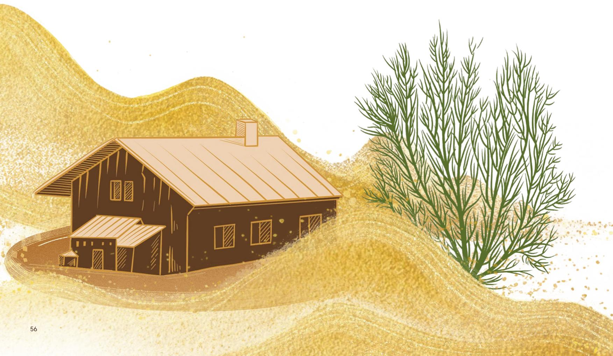

natural_image

Illustration of a brown house with a chimney and two bare trees in a golden, wavy landscape (no text or symbols)

指標

<table><tr><td></td><td>指標內容</td><td>單位</td><td>2025</td><td>2024</td><td>2023</td></tr><tr><td rowspan="5">水管理</td><td>總取水量</td><td>噸</td><td>3,006,834.00</td><td>3,153,746.00</td><td>3,383,613.20</td></tr><tr><td>高度/極度缺水地區的取水量占比</td><td>%</td><td>100</td><td>100</td><td>100</td></tr><tr><td>不符合水質許可證、標準和法規的事件數量</td><td>件</td><td>0</td><td>0</td><td>0</td></tr><tr><td>單牛耗水量</td><td>噸/頭</td><td>20.45</td><td>21.83</td><td>22.68</td></tr><tr><td>每萬元收入耗水量</td><td>噸/萬元</td><td>9</td><td>9.34</td><td>9.61</td></tr><tr><td rowspan="12">污染防治</td><td>廢氣排放總量</td><td>噸</td><td>150.98</td><td>159.83</td><td>126.94</td></tr><tr><td>SO2排放量</td><td>噸</td><td>57.19</td><td>60.55</td><td>48.09</td></tr><tr><td>NOx排放量</td><td>噸</td><td>93.39</td><td>99.28</td><td>78.85</td></tr><tr><td>煙塵排放量</td><td>噸</td><td>0</td><td>0</td><td>0</td></tr><tr><td>危害廢棄物</td><td>噸</td><td>2,660.70</td><td>2,915.78</td><td>2,628.37</td></tr><tr><td>醫療廢棄物產生量</td><td>噸</td><td>78.35</td><td>87.38</td><td>150.62</td></tr><tr><td>病死牛產生量</td><td>噸</td><td>2,582.35</td><td>2,828.40</td><td>2,477.75</td></tr><tr><td>單牛危害廢棄物產生量</td><td>噸/頭</td><td>0.019</td><td>0.02</td><td>0.018</td></tr><tr><td>每萬元收入危害廢棄物產生量</td><td>噸/万元</td><td>0.007</td><td>0.007</td><td>0.007</td></tr><tr><td>無害廢棄物</td><td>噸</td><td>1,734,364.00</td><td>\</td><td>1,292,976.02</td></tr><tr><td>單牛無害廢棄物產生量</td><td>噸/頭</td><td>\</td><td>\</td><td>8.735</td></tr><tr><td>每萬元收入無害廢棄物產生量</td><td>噸/萬元</td><td>\</td><td>\</td><td>3.673</td></tr><tr><td rowspan="3">土地利用與生態影響</td><td>產生的動物垃圾和糞便的數量</td><td>噸</td><td>\</td><td>\</td><td>1,295,453.77</td></tr><tr><td>根據營養管理計畫進行管理的百分比</td><td>%</td><td>100</td><td>100</td><td>100</td></tr><tr><td>按自然資源保護局(NRCS)保護計畫標準管理的牧場占比(按面積)</td><td>%</td><td>100</td><td>100</td><td>100</td></tr></table>

## 05

## 員工責任

人才是企業穩健運營和持續成長的重要基礎。聖牧堅持以人為本的發展導向，重視員工合法權益保障、職業發展支持、健康安全管理與人文關懷建設，努力營造包容、公正、健康、友好且具有成長性的工作環境，與員工共用發展成果、共建和諧組織。

## 對聯合國可持續發展目標的貢獻

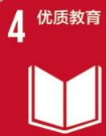

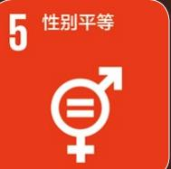

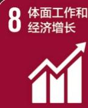

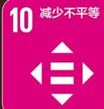

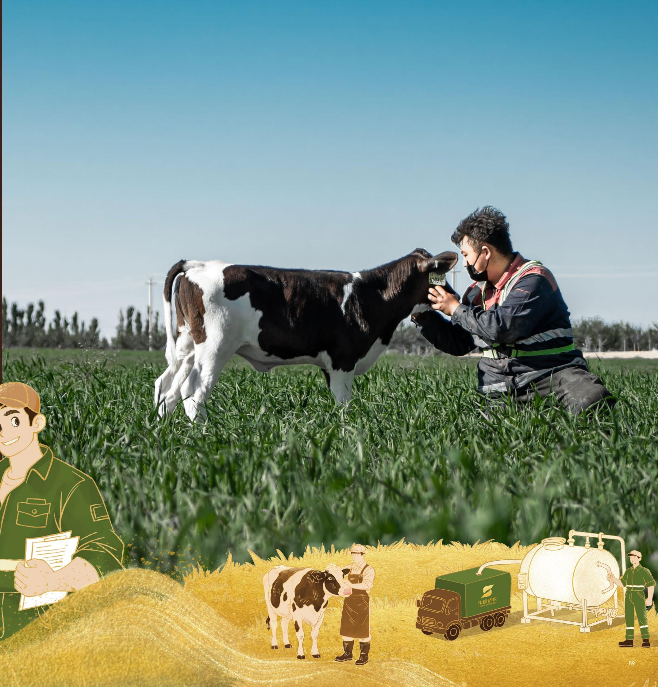

natural_image

Composite image showing a farmer feeding cows in a field, with workers and agricultural machinery in the foreground (no visible text or symbols)

## 管治

公司將人力資本管理納入整體治理體系，由人力資源部作為員工管理事務的歸口部門，依照適用法律法規和內部管理制度，持續完善勞動關係、招聘雇傭、薪酬績效、培訓發展與員工權益保障機制，努力確保員工在薪酬福利、成長機會與工作環境等方面獲得應有支持。圍繞員工管理，公司已建立與人權保障、薪酬福利、培訓發展等相關的制度體系，為雇傭及勞工常規管理提供制度基礎。（具體內容請見官網 “環境社會及管治(ESG)政策”）

## 員工管理政策

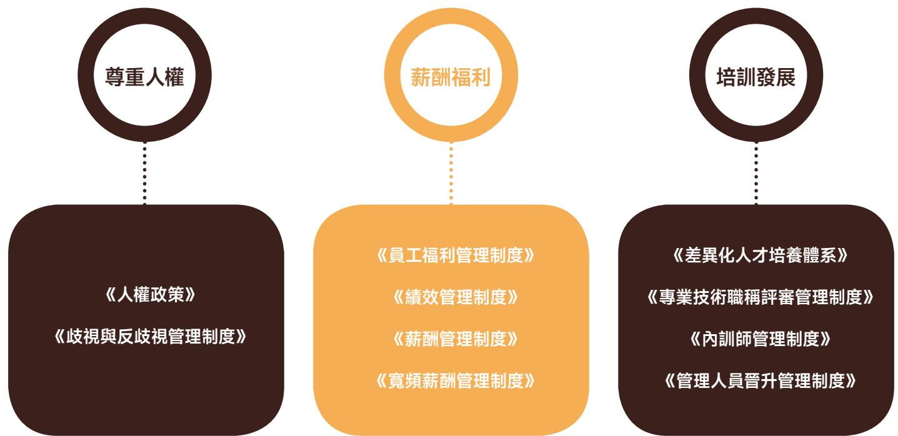

flowchart

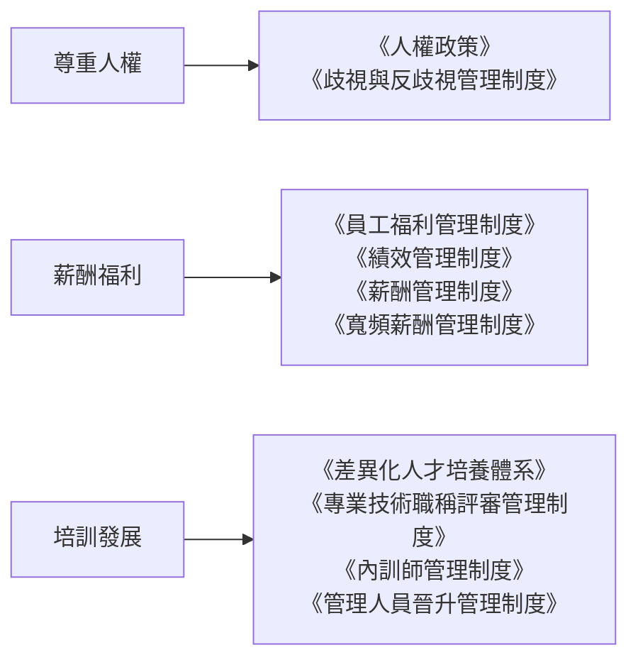
```mermaid
graph LR
  A["尊重人權"] --> B["《人權政策》\n《歧視與反歧視管理制度》"]
  C["薪酬福利"] --> D["《員工福利管理制度》\n《績效管理制度》\n《薪酬管理制度》\n《寬頻薪酬管理制度》"]
  E["培訓發展"] --> F["《差異化人才培養體系》\n《專業技術職稱評審管理制度》\n《內訓師管理制度》\n《管理人員晉升管理制度》"]
```

公司由安全環保部統籌推進員工安全與職業健康相關工作，嚴格遵守《中華人民共和國安全生產法》《中華人民共和団職業病防治法》等法律法規，持續健全安全生產責任體系、職業健康管理制度和現場風險防控機制，努力為員工提供安全、健康、和諧的工作環境。

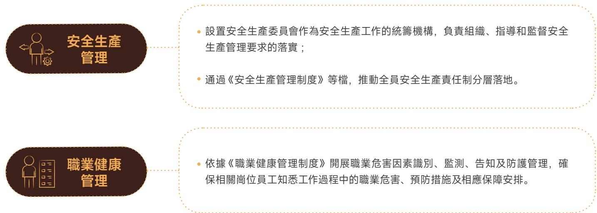

flowchart

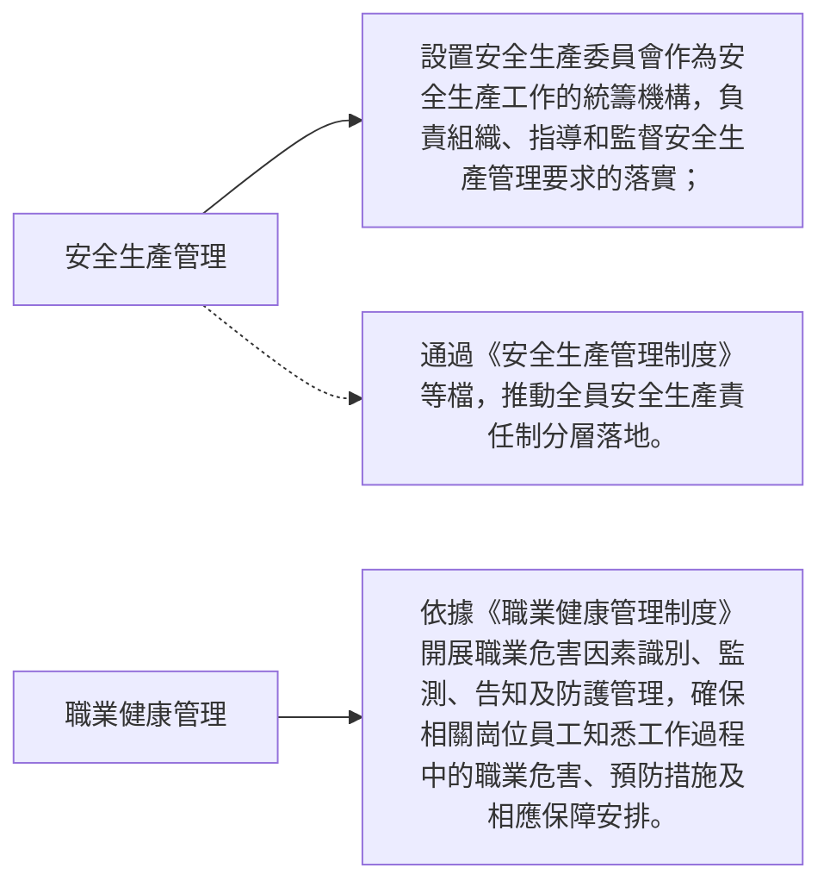
```mermaid
graph LR
  A["安全生產管理"] --> B["設置安全生產委員會作為安全生產工作的統籌機構，負責組織、指導和監督安全生產管理要求的落實；"]
  A -.-> C["通過《安全生產管理制度》等檔，推動全員安全生產責任制分層落地。"]
  D["職業健康管理"] --> E["依據《職業健康管理制度》開展職業危害因素識別、監測、告知及防護管理，確保相關崗位員工知悉工作過程中的職業危害、預防措施及相應保障安排。"]
```

## 策略

公司堅持將人才隊伍建設作為支撐長期發展的關鍵任務之一，並持續識別經營管理及生產運營過程中的人力資本相關風險與機遇，力求通過更加系統的員工管理 能力建設和保障機制 提升組織韌性與經營效率， 為公司可持續發展提供穩定的人才支撐。

## 人力資本相關風險和潛在影響

<table><tr><td></td><td>風險描述</td><td>潛在財務影響</td><td>風險舉措管理及應對措施</td></tr><tr><td>政策和法律風險(S/M/L)</td><td>在用工過程中,因未遵守用人相關的法律法規而引發勞動糾紛或勞動仲裁,進而導致面臨訴訟或行政處罰的風險。</td><td>· 引發的勞動糾紛或勞動仲裁會產生包括賠償金、補償金、律師費及仲裁費用等直接成本。· 可能存在損害企業聲譽,降低人才吸引力,增加管理成本等長期影響。</td><td>· 堅持平等雇傭,按照法律規定訂立、簽訂與履行勞動合同。· 及時繳納員工社保。· 確保員工工資不低於當地最低標準。· 遵守女職工勞動特別保護規定。· 明確禁止使用童工及強迫勞動,切實保障合法用工。</td></tr><tr><td>聲譽風險(S)</td><td>員工在生產經營中可能因意識不足、操作不當等行為造成安全事故。</td><td>· 可能導致生產線停工,影響生產和交付,造成訂單延誤和經濟損失。· 損害企業形象,影響客戶信任和市場競爭力。</td><td>· 持續健全員工健康安全保障機制,配備安全防護用品並為員工提供健康檢查福利。· 積極落實安全生產責任,規範生產及經營管理各個環節。</td></tr><tr><td>運營風險(S/M/L)</td><td>若未給員工匹配適當充足的培訓資源,可能導致員工能力提升跟不上企業發展需求,影響企業長遠發展。</td><td>· 員工技能不足,影響工作效率和產品質量,增加生產成本。</td><td>· 建立全方位的人才培養體系。· 提供明確的職業發展路徑和暢通的職業發展通道。</td></tr></table>

\*S-短期；M-中期；L-長期

## 人力資本相關機遇和潛在影響

<table><tr><td></td><td>機遇描述</td><td>潛在財務影響</td><td>機遇舉措管理及應對措施</td></tr><tr><td>運營機遇</td><td>構建兼具人員廣度、平等與包容的職場氛圍,有助於提高員工的幸福感與歸屬感,充分激發人才活力及潛能。</td><td>· 激發人才活力,提高企業效率和創新力,帶來更高的生產力和盈利能力。</td><td>· 禁止基於性別、年齡、種族、宗教、學歷、文化及其他任何形式的區別對待和歧視行為。· 堅持同工同酬,尊重少數民族員工風俗和生活習慣。· 選舉職工代表負責溝通協調員工與公司之間的關係。</td></tr><tr><td>市場機遇</td><td>完善的薪酬福利體系和人才培養體系,能夠填補因生活工作環境、醫療教育水平的落後,而造成的牧場勞動力流失。</td><td>· 降低企業招聘和培訓新員工的成本,提高員工忠誠度和工作效率,增加企業盈利能力和市場競爭力,帶來正面的財務影響。</td><td>· 持續優化薪酬及福利體系,給予員工具有市場競爭力的薪酬。· 為員工改善居住條件、豐富業餘生活,成立員工互助基金幫扶困難員工。· 打造差異化人才梯隊,幫助員工提升專業素養。</td></tr></table>

## 風險管理

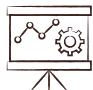

公司圍繞員工權益保障、職業發展、工作環境、健康安全及員工關懷等重點領域，持續完善人力資源風險識別、控制和監測機制，推動形成覆蓋 “識別—控制—監測—改進” 的管理閉環，確保員工在各項管理安排中獲得公平對待和有效保障。

## 風險識別

以保障員工權益、保護員工健康安全、支持員工職業發展及注重員工關懷等多個方面，識別人力風險對聖牧的影響。

## 風險控制/減緩

嚴格遵守法律法規，履行簽訂與履行勞務合同，切實保障合法用工。  
堅守安全紅線，建立健全員工健康安全保障機制。  
構建兼具人員廣度、平等與包容的職場，完善薪酬福利體系和人才培養機制。

## 風險監控 /報告

定期進行員工滿意度調查，收集員工意見和建議。  
監控在雇傭、加班時長、社保繳納、安全生產等方面的合規性。  
建立健全培訓體系， 監測員工技能更新情況和品質。

## 維護員工權益

公司堅持依法合規用工，注重通過平等包容、薪酬績效和民主溝通三方面夯實員工權益保障基礎，努力激發員工的積極性與創造力，增強員工對組織的認同感和穩定性。

## 平等包容

•堅決杜絕任何基於性別、年齡、種族、宗教信仰、學歷、文化或其他任何理由的歧視行為或區別對待，禁止任何形式的童工使用及強制勞工行為。  
•營造尊重、包容的工作環境，關注女性員工的成長，為女性員工提供發展平臺。  
•關注並尊重少數民族員工的獨特文化和生活習慣，在工作與生活的各個方面積極提供支援與援助。

## 薪酬績效

·優化員工薪酬福利體系 堅守同工同酬原則 確保為所有員工提供與市場相匹配、具備高度競爭力的薪酬待遇，並向員工支付足以維持生計的工資。  
•建立完善員工績效管理體系，根據績效計畫制定年度、季度、月度績效合同，為員工績效改進、晉升、薪酬調整等提供依據。

## 民主管理

•按時開展職工代表大會，完善以職工代表大會為基本形式的民主管理制度，積極聽取員工意見，執行民主程式，確保全體員工的合法權益得到充分保障。

2025年，員工福利體系綜合滿意度達91%（樣本1568人），同期提升6%，總體敬業度達85分（樣本數1588人），以 “幸福圈” 為核心，通過體系化建設與情感化運營，顯著提升員工滿意度與敬業度，有效增強企業凝聚力與人才吸引力。

## 健康體檢：

年度體檢覆蓋率60%， 成功排查出8名員工重大疾病隱患。

## 鵲橋相會聯誼活動:

158名單身參與， 其中有12人互加聯繫搭建社交平臺增強歸屬感。

## 義診活動:

服務員工358人次， 部分員工通過中醫針灸及推拿複位當時就得到改善， 滿意度達到99%， 提升員工健康意識。

## 員工家庭開放日:

共計60人參加， 增進員工及家屬對公司的瞭解與認同。

## 優秀員工家訪:

傳遞公司認可與關懷， 樹立良好雇主品牌。

## 賦能人才成長

我們建立全方位的人才培養體系，明確“牛人100”人才培養方案著力打造聖牧“13224”人才培養體系，從“領導力”“惠業勝任力” “通用力” 三個方面為員工職業發展提供成長幫助。同時，完善五大職級的職業發展通道，打造員工管理晉升通路和職業發展平臺促進員工成長與公司高效發展同步

## “牛人100” 人才培養專案

## 牛領袖培養

以培養公司未來領軍人才為目標，主要培養對象為牧場總經理、支持部門總監。

•開展培訓346期

## 牛星人培養

主要培養對象為實習生，為優秀班組長、優秀經理人儲備力量，提升牛星人專業技術能力、職業素養。

•開展培訓5期

## 牛新人培養

主要培養對象為新入職員工，提升新入職員工各項基礎能力，打造有意願、有品質、有能力、有潛力的 “四有新人”。

•開展培訓1,281期

## 牛精英培養

以培養公司精英人才為目標，打造全方位人才，主要培養對象為牧場儲備總經理、牧場部門經理。

•開展培訓2,534期

## 牛匠人培養

以培養精益求精的工匠精神，提升個人專業技術為目標，主要培養對象為部門主管/班組長、基層關鍵人才。

•開展培訓2,697期

## 牛講師培養

以培養核心內訓講師為目標，提升內訓師授課能力，保證培訓體系更好地傳承複製落地，主要培養對象為支持部門負責人、總經理、核心內訓講師、牧場人事行政專員等。

公司持續優化人才培養體系建設，關注不同層級、不同類別人才的發展需要，並通過專項培養專案、崗位技能訓練、線上課程建設等方式提升人才創造價值的能力。此外，公司開展《2025年人才盤點》專案，優化人才資源配置，夯實人才梯隊建設根基，支撐公司戰略發展。

## 2025年

共開展專業技術、領導力、通用管理三大類培訓

144,733 場

員工培訓

75,033 人次

總人課時

3,725.86 小時

針對牧場核心人員開展實施

“千人專才” 培養專案

開展無應激趕牛培訓

規範牧場新員工入職培訓，開發製作線上學習視頻課程

10 門

## 案例 跨國攜手，共築乳業新未來：中國聖牧與蒙古國奶牛養殖技術人才培養計畫

2025年3月，中國聖牧與蒙古國奶牛養殖技術人才培養計畫啟動暨首批學員入學儀式順利舉行，2025 年3月，中國聖牧與蒙古國開啟奶牛養殖技術人才培養合作，於內蒙古聖牧控股有限公司舉行專案啟動暨首批學員入學儀式，中蒙雙方相關領導及8名蒙古國青年學員出席，此次合作成為中蒙農牧業深度協作的重要實踐。

中國聖牧作為全球有機原奶第一供應商，擁有成熟的有機養殖技術與沙漠奶產業發展模式；蒙古國坐擁天然牧場資源，有機養殖產業發展潛力巨大，雙方優勢互補為合作奠定堅實基礎。專案回應中蒙兩國元首深化農牧業合作倡議，為期三個月的培訓設置12門核心課程，總學時480學時，理論與實操各占 240學時，涵蓋動物營養、繁殖育種、疾病防控、牧場管理等奶牛養殖全領域，由聖牧資深專家授課、技術人員全程指導實操。

培訓過程中，蒙古國學員系統學習專業知識，積極參與牧場實踐。2025年6月，7名學員順利完成全部課程學時要求 扎實掌握先進養殖技術與現代化管理模式此次人才培養，不僅為蒙古國有機奶牛養殖產業注入專業力量，助力其農業現代化發展，也進一步提升了中國聖牧的國際行業影響力，推動中蒙乳業技術交流融合，以人才共育為紐帶，為全球乳業可持續發展搭建起跨國合作的堅實橋樑。

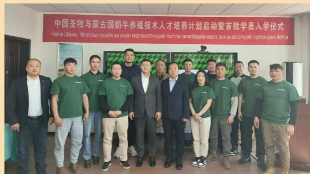

text_image

中国圣牧与蒙古国奶牛养殖技术人才培养计划启动暨首批学员入学仪式
Чайна Шонну Монтгальн усклин ак аутий моргэкспитнудийт баттам халтыбраийн квата, авоны експенций хулози вазах естол

## 守護員工健康

公司將職業健康與安全管理作為員工責任的重要組成部分，圍繞風險識別、防護配置、體檢管理和承包商安全等環節持續開展工作，努力降低職業健康風險，營造安全、穩定、和諧的工作環境。

<table><tr><td>風險評估</td><td>定期對生產區域內的職業病風險因素進行監測與評估,全面排查和整改作業環境中的安全隱患</td></tr><tr><td>風險防護</td><td>將工作過程中可能產生的職業危害及其後果、職業病防護措施和待遇等如實告知員工,並制定勞動防護用品配備標準,並購買符合標準的合格產品</td></tr><tr><td>健康體檢</td><td>為從事接觸職業危害的作業場所員工安排進行上岗前、在崗期間和離崗時的相關體檢,並建立職業健康監護檔案</td></tr><tr><td>承包商安全</td><td>要求承包商對存在職業危害的崗位員工進行崗前、崗中、離崗職業病體檢,並按照防護用品配備標準要求配備個人防護用品</td></tr></table>

## 2025年

牧場工作員工崗中職業健康體檢達

1,170 人次

## 悉心關愛員工

公司持續完善員工關懷機制，努力為員工營造溫馨舒適的工作和生活環境，並通過節日慰問、關愛活動、福利保障及互助幫扶等安排，增強員工的獲得感、幸福感與歸屬感。

員工關愛5.0版

目標：提升聖牧牛人幸福滿意度

讓員工心有歸屬，實現個人與組織共贏

人才培養體系

現金形式

非現金形式

員工互助基金計劃

離世員工子女助學計劃

員工關愛福利體系

中國聖牧孝行計劃 -弘揚孝文化

搭建系統全面的員工幸福計劃，選擇聖牧 幸福工作 快樂生活

## 案例

## 節前慰問送溫暖，真情關懷暖人心

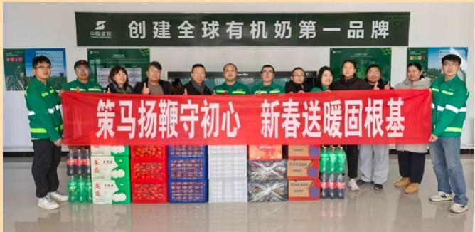

text_image

创建全球有机奶第一品牌
策马扬鞭守初心 新春送暖固根基

2025年1月，中國聖牧高管團隊赴呼市、巴市兩地走訪慰問，在慰問活動中、公司高管團隊與一線員工進行深入溝通，並贈送一批慰問品和禮物，感謝一線員工的辛勤付出。

## 指標及目標

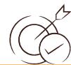

我們已建立聖牧人力資本相關指標和目標，持續進行績效監測及進展狀況披露，以合理的員工結構助力公司可持續發展。

目標

<table><tr><td colspan="2">目標</td><td>2025年進展</td><td>完成情況</td></tr><tr><td rowspan="5">人才廣度</td><td>5年內:女性員工在總數中所占比例達到40%10年內:女性員工在總數中所占比例達到45%</td><td>29%</td><td>进行中</td></tr><tr><td>5年內:所有管理職位中的女性比例達到30%10年內:所有管理職位中的女性比例達到35%</td><td>35%</td><td>已完成</td></tr><tr><td>5年內:女性擔任高層管理職位的比例達15%10年內:女性擔任高層管理職位的比例達20%</td><td>10%</td><td>已完成</td></tr><tr><td>5年內:在創收職能(如銷售)擔任管理職務的婦女占所有此類經理的比例達15%10年內:在創收職能(如銷售)中擔任管理職務的婦女占所有此類經理的比例達20%</td><td>10%</td><td>进行中</td></tr><tr><td>5年內:女性在STEM相關職位中的比例達15%10年內:女性在STEM相關職位中的比例達20%</td><td>10%</td><td>进行中</td></tr><tr><td>職業健康</td><td>員工損失工時傷害頻率每二十萬工時小於0.1%員工因工受傷的頻率每二十萬工時小於0.2%</td><td>0.23%</td><td>进行中</td></tr><tr><td>員工滿意度</td><td>5年內:員工滿意度達95%10年內:員工滿意度達98%</td><td>91%</td><td>进行中</td></tr></table>

指標

<table><tr><td></td><td>指標內容</td><td>單位</td><td>2025</td><td>2024</td><td>2023</td></tr><tr><td rowspan="3">招聘雇傭</td><td>雇員總數</td><td>人</td><td>2,272</td><td>2,217</td><td>2,701</td></tr><tr><td>新招聘員工人數</td><td>人</td><td>2,128</td><td>1,532</td><td>2,259</td></tr><tr><td>內部招聘填補空缺職位占比</td><td>%</td><td>45</td><td>43</td><td>42</td></tr><tr><td rowspan="7">性別構成</td><td>男性雇員總數</td><td>人</td><td>1,416</td><td>1,356</td><td>1,735</td></tr><tr><td>女性雇員總數</td><td>人</td><td>856</td><td>681</td><td>966</td></tr><tr><td>女性各級管理層員工占比(包括初級、中級和高級管理職位)</td><td>%</td><td>35</td><td>25.75</td><td>/</td></tr><tr><td>女性初級管理層員工占比</td><td>%</td><td>25</td><td>28.96</td><td>/</td></tr><tr><td>女性高級管理層員工占比</td><td>%</td><td>10</td><td>14.29</td><td>/</td></tr><tr><td>在創收職能中擔任管理職位的女性員工占比</td><td>%</td><td>10</td><td>/</td><td>/</td></tr><tr><td>在STEM相關職位中的女性員工占比</td><td>%</td><td>10</td><td>9.99</td><td>/</td></tr><tr><td rowspan="4">年齡構成</td><td>30歲以下雇員總數</td><td>人</td><td>664</td><td>664</td><td>846</td></tr><tr><td>30-39歲雇員總數</td><td>人</td><td>597</td><td>536</td><td>701</td></tr><tr><td>40-49歲雇員總數</td><td>人</td><td>665</td><td>657</td><td>737</td></tr><tr><td>50歲及以上雇員總數</td><td>人</td><td>268</td><td>361</td><td>415</td></tr><tr><td rowspan="3">其他構成</td><td>少數民族員工總數雇員總數</td><td>人</td><td>767</td><td>715</td><td>848</td></tr><tr><td>任職5年以上員工總數</td><td>人</td><td>431</td><td>643</td><td>646</td></tr><tr><td>職工代表人數</td><td>人</td><td>40</td><td>43</td><td>40</td></tr></table>

<table><tr><td></td><td>指標內容</td><td>單位</td><td>2025</td><td>2024</td><td>2023</td></tr><tr><td rowspan="11">員工流失</td><td>員工流失人數</td><td>人</td><td>169</td><td>106</td><td>172</td></tr><tr><td>員工流失率</td><td>%</td><td>7.51</td><td>6</td><td>5</td></tr><tr><td>女性員工流失率</td><td>%</td><td>11.40</td><td>2.51</td><td>/</td></tr><tr><td>男性員工流失率</td><td>%</td><td>5.13</td><td>3.56</td><td>/</td></tr><tr><td>30歲以下員工流失率</td><td>%</td><td>10.75</td><td>2.8</td><td>/</td></tr><tr><td>30-39歲員工流失率</td><td>%</td><td>10</td><td>5.73</td><td>/</td></tr><tr><td>40-49歲員工流失率</td><td>%</td><td>32.20</td><td>1.73</td><td>/</td></tr><tr><td>50歲及以上員工流失率</td><td>%</td><td>0</td><td>2.73</td><td>/</td></tr><tr><td>中國內地員工流失率</td><td>%</td><td>7.51</td><td>4.46</td><td>6</td></tr><tr><td>港澳台地區員工流失率</td><td>%</td><td>0</td><td>21.96</td><td>0</td></tr><tr><td>員工自願離職率</td><td>%</td><td>6.83</td><td>3.82</td><td>/</td></tr><tr><td rowspan="11">員工培訓</td><td>員工總培訓小時數</td><td>小時</td><td>79,010.10</td><td>82,436.53</td><td>64,088</td></tr><tr><td>員工人均培訓小時數</td><td>小時/人</td><td>35.1</td><td>41.69</td><td>41</td></tr><tr><td>男性員工平均培訓時長</td><td>小時/人</td><td>37.5</td><td>52.84</td><td>42</td></tr><tr><td>女性員工平均培訓時長</td><td>小時/人</td><td>30.5</td><td>24.04</td><td>39</td></tr><tr><td>高級管理層平均培訓時長</td><td>小時/人</td><td>24</td><td>28</td><td>20.5</td></tr><tr><td>中層管理層平均培訓時長</td><td>小時/人</td><td>16</td><td>17</td><td>30</td></tr><tr><td>基層員工平均培訓時長</td><td>小時/人</td><td>36.1</td><td>41.4</td><td>41</td></tr><tr><td>員工總培訓人次</td><td>人次</td><td>75,033</td><td>40,864</td><td>49,071</td></tr><tr><td>員工培訓投入</td><td>萬元</td><td>48.09</td><td>596.1</td><td>20.5</td></tr><tr><td>高級管理層培訓百分比</td><td>%</td><td>100</td><td>100</td><td>30</td></tr><tr><td>中級管理層培訓百分比</td><td>%</td><td>100</td><td>100</td><td>41</td></tr><tr><td rowspan="10">職業健康</td><td>總可記錄事故率(TRIR)</td><td>%</td><td>0</td><td>0</td><td>0</td></tr><tr><td>因工傷死亡員工比率</td><td>%</td><td>0</td><td>0</td><td>0</td></tr><tr><td>員工損失工時傷害頻率</td><td>%</td><td>1.12</td><td>1.51</td><td>/</td></tr><tr><td>員工因工受傷的頻率(每二十萬工時)</td><td>%</td><td>0.233</td><td>0.3</td><td>/</td></tr><tr><td>職業健康投入</td><td>萬元</td><td>160.77</td><td>/</td><td>/</td></tr><tr><td>員工工傷人數</td><td>人</td><td>5</td><td>/</td><td>/</td></tr><tr><td>員工因工傷損失工作日數</td><td>天</td><td>330</td><td>/</td><td>/</td></tr><tr><td>承包商因工傷損失工作日數</td><td>天</td><td>0</td><td>/</td><td>/</td></tr><tr><td>承包商損失工時工傷頻率(每二十萬工時)</td><td>%</td><td>0</td><td>/</td><td>/</td></tr><tr><td>承包商因工受傷的頻率(每二十萬工時)</td><td>%</td><td>0</td><td>/</td><td>/</td></tr><tr><td rowspan="3">員工福利</td><td>員工活動、旅行等投入</td><td>萬元</td><td>33.25</td><td>8.56</td><td>/</td></tr><tr><td>員工累計產假育兒假福利天數</td><td>天</td><td>2,630</td><td>3,140</td><td>3,603</td></tr><tr><td>員工滿意度</td><td>%</td><td>91</td><td>85.7</td><td>96.16</td></tr><tr><td rowspan="2">薪酬福利</td><td>平均女性工資</td><td>元</td><td>8,198</td><td>9,077</td><td>/</td></tr><tr><td>平均男性工資</td><td>元</td><td>11,392</td><td>16,537</td><td>/</td></tr></table>

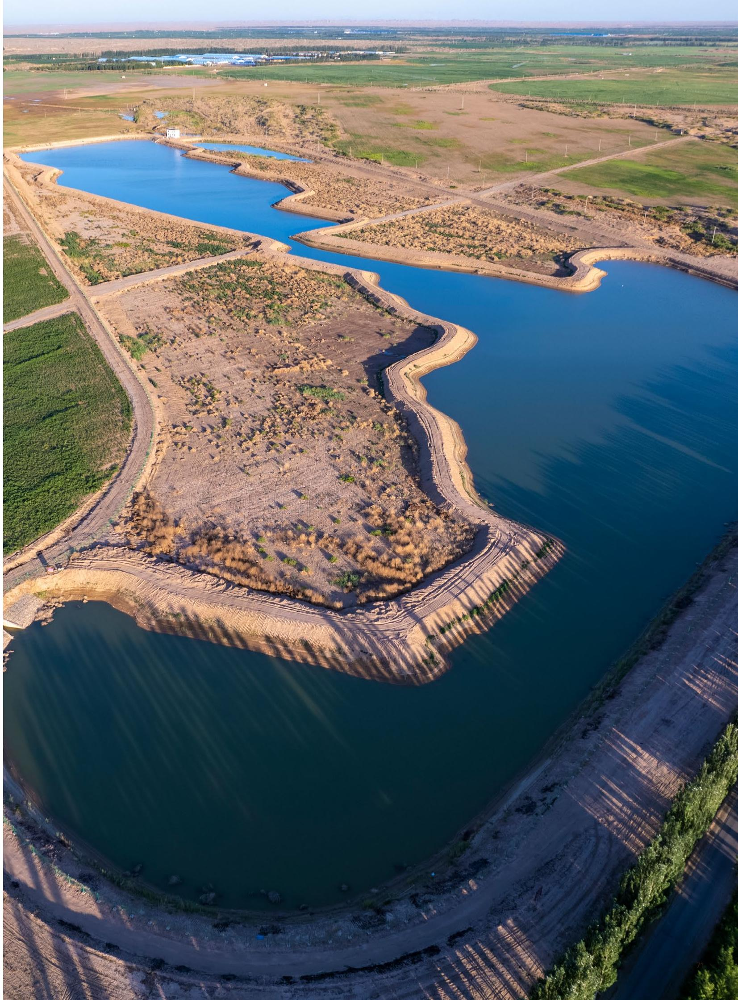

natural_image

Aerial view of a large water body with curved embankments and surrounding farmland (no visible text or symbols)

## 06

## 社區責任

作為負責任的企業主體，聖牧持續推動企業價值與社會價值相互促進、協同提升。我們不僅關注自身穩健經營，也重視與產業鏈夥伴、運營所在地社區及其他利益相關方共同構建更具韌性、更可持續的發展生態。圍繞社會需求與區域發展實際，公司持續關注公益慈善、行業協作、鄉村振興等重點方向，努力為社會和諧發展與區域繁榮作出積極貢獻。

對聯合國可持續發展目標的貢獻  
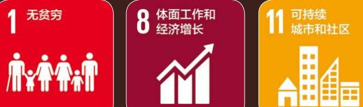

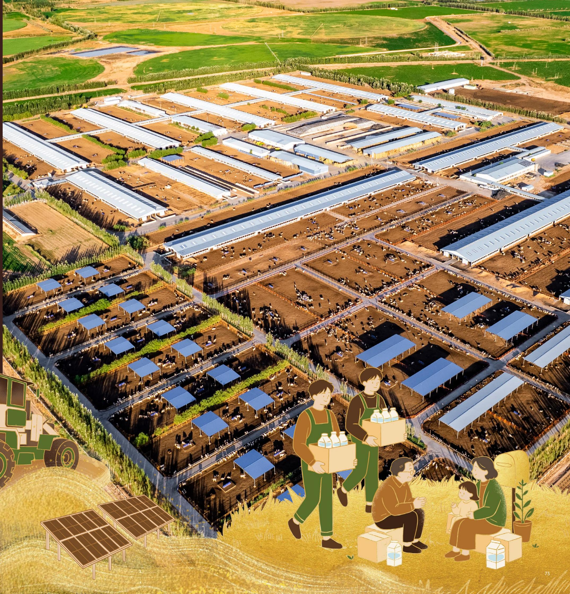

natural_image

Aerial view of a large agricultural facility with multiple greenhouses, solar panels, and people carrying boxes (no visible text or symbols)

## 管治

公司將社區責任、公益慈善及相關社會價值創造工作納入日常管理體系，由行政部作為相關事項的歸口管理部門，統籌推進從專案策劃、資源協調、執行落地到效果複盤的全過程管理。圍繞公司整體發展方向與社會責任要求，我們持續開展面向社區、教育、環保及其他公益領域的專案規劃與實施，推動社會責任工作更加規範、有序和有效開展。

## 策略

公司堅持以 “利益共用、風險共擔、協同發展” 為導向，持續識別價值鏈和社區關係中的潛在風險與發展機遇，努力在創造經濟價值的同時， 兼顧社會效益與區域長期發展需求，圍繞行業合作 社會公益 鄉村振興等重點領域，我們持續優化資源配置與行動路徑，推動社區責任管理與公司可持續發展戰略相銜接。

## 價值鏈風險和潛在影響

<table><tr><td></td><td>潜在风险</td><td>潜在財務影響</td><td>風險舉措管理及應對措施</td></tr><tr><td>聲譽風險(S/M/L)</td><td>面對廣度不斷拓展的社會需求和日益提高的公眾期待和日益提高的公眾期待,公司在設定公益目標、平衡各方利益訴求時,若處理不當,易引發輿論爭議。</td><td>· 爭議應對與形象修復帶來的運營成本提升。
· 長期品牌價值受損。</td><td>· 建立輿情監測系統。
· 與政府、非營利組織、社區及其他利益相關方保持緊密合作和良好溝通。
· 攜手各利益相關方開展鄉村振興專案。
· 推動農業普惠金融的發展。</td></tr></table>

\*S-短期；M-中期；L-長期

## 價值鏈機遇和潛在影響

<table><tr><td></td><td>潜在机遇</td><td>潜在財務影響</td><td>機遇舉措管理及應對措施</td></tr><tr><td>運營機遇</td><td>與行業專家交流合作，推動養殖技術創新。</td><td>· 提高生產運營水平，增加收入。</td><td>· 主動搭建行業交流平臺，引進先進養殖技術，提升生產效率。</td></tr><tr><td>品牌機遇</td><td>通過積極參與社區服務、舉辦公益活動，公司可樹立良好的社會形象和口碑，增強消費者和公眾對品牌的信任度。</td><td>· 品牌溢價能力提升。
· 品牌資產與融資能力提升。</td><td>· 根據公司自身特點和優勢，策劃並執行具有影響力和社會價值的公益活動。
· 推動社區發展，創造就業崗位。
· 鼓勵員工參與各類公益活動。
· 拓寬傳播渠道，提高品牌知名度。</td></tr></table>

## 風險管理

公司持續完善社區責任相關的風險識別與管理機制，將社會責任議題延伸至行業合作、公益慈善、鄉村振興及社區互動等多個層面 並通過跨主體協作 溝通回饋和影響跟蹤等方式 推動風險防控與價值創造並行 實現價值鏈相關方的互利共贏。

## 風險識別

從行業發展、鄉村振興、公益慈善方面，識別社會責任相關風險。

## 風險控制/減緩

與同行和高校等合作夥伴構建戰略合作夥伴關係。  
與當地政府、合作社、金融機構合作帶來社區融合發展,緩解企業可能對當地居民生產生活造成的負面影響。

## 風險監控 /報告

打造與專家學者交流、學習的平臺。  
與周邊社區建立常態化的溝通機制，及時瞭解社區關切和訴求。  
跟蹤並管理牧場建設、運營過程中對當地社區的潛在環境、社會和經濟效益影響。

## 促進行業發展

可持續發展已成為全球乳業持續關注的重要方向。公司圍繞有機農業、綠色農業與可持續產業發展，持續分享自身在沙漠治理 有機迥圈農業及產業協同方面的實踐經驗 積極參與行業交流，與各方共同探索更具前瞻性和可複製性的可持續農業路徑。

## 案例 中國聖牧受邀出席 2025 動物福利與可持續農食大會，分享沙漠有機產業鏈創新實踐

2025 年，中國聖牧受邀參加聯合國糧農組織與中國農業國際合作促進會聯合主辦的動物福利與可持續農食大會，在專題論壇分享其在動物福利、可持續供應鏈領域的標杆實踐。

作為國內首家通過 ICCAW 農場動物福利三星認證的企業，聖牧從多維度打造科學福利體系：為奶牛配備專屬活動空間與沙質臥床、牛體刷等設施，以深層淨化水源保障飲水品質；推行奶牛信號學培訓，讓員工精准識別奶牛行為信號，實現精細化福利管理。

聖牧將沙漠治理、有機農業與動物福利深度融合的實踐，為全球農食系統轉型提供了中國方案，驗證了生態保護與產業發展的相容性，也以市場化路徑實現了生態價值轉化，樹立了乳業可持續發展的行業典範。

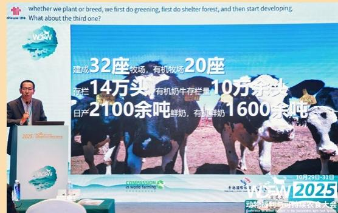

text_image

whether we plant or breed, we first do greening, first do shelter forest, and then start developing.
What about the third one?
建成32座牧场，有机牧场20座
存栏14万头，有机奶牛存栏量10万余头
日产2100余吨鲜奶，有罐牛奶1600余吨
COMEXSION
2025
10月29日 31日
2025
动植物和海洋体畜禽大会

## 案例 技术出海与人才赋能，共建跨国可持续农业生

2025年，圣牧将沙漠有机农业的先进经验推向国际舞台，携手蒙古国ENomad 公司联合落实了 “100名青年专业人员培训” 计划。该项目精准对接蒙古国畜牧业现代化的发展诉求，为当地青年人才提供涵盖现代奶业生产、牧场精益管理及可持续农业技术的系统性实践培训，从根源上为该国畜牧业的长期高质量发展注入了人才动能。这项致力于跨国能力建设的共赢举措，获得时任蒙古国副总理兼外交部长 Sainbuyan Amarsaikhan先生致圣牧总裁张家旺先生的正式感谢信。信中高度赞誉了圣牧在推动蒙古国畜牧业现代化进程中的关键贡献，并将此培训项目视为深化两国全面战略伙伴关系的典范。未来，圣牧将继续依托自身在沙漠有机乳业领域的标杆优势，以技术交流与人才培养为纽带，持续拓宽国际合作的广度，致力于在全球范围内构建更加繁荣、包容与可持续的现代农业生态。

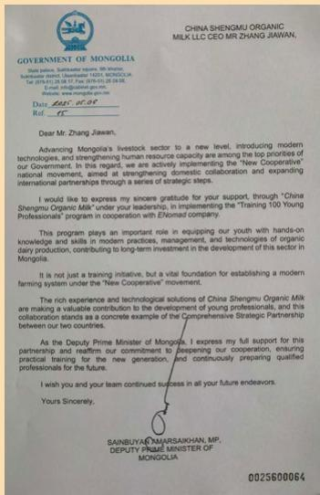

text_image

GOVERNMENT OF MONGOLIA
China SHENOMU ORGANIC
MILK LLC CEO MR ZHANG JIAWAN,
Date: 04/12/2017
Ref: 05
Dear Mr. Zhang Jiawan,
Advancing Mongolia's livestock sector to a new level, introducing modern
technologies, and strengthening human resource capacity are among the top priorities of
our Government. In this regard, we are actively implementing the "New Cooperative"
national movement, aimed at strengthening domestic collaboration and expanding
international partnerships through a series of strategic steps.
I would like to express my sincere gratitude for your support, through "China
Shengmu Organic Milk" under your leadership, in implementing the "Training 100 Young
Professionals" program in cooperation with ENomad company.
This program plays an important role in equipping our youth with hands-on
knowledge and skills in modern practices, management, and technologies of organic
dairy production, contributing to long-term investment in the development of this sector in
Mongolia.
It is not just a training initiative, but a vital foundation for establishing a modern
farming system under the "New Cooperative" movement.
The rich experience and technological solutions of China Shengmu Organic Milk
are making a valuable contribution to the development of young professionals, and this
collaboration stands as a concrete example of the Comprehensive Strategic Partnership
between our two countries.
As the Deputy Prime Minister of Mongolia, I express my full support for this
partnership and reaffirm our commitment to deepening our cooperation, ensuring
practical training for the new generation, and continuously preparing qualified
professionals for the future.
I wish you and your team continued success in all your future endeavors.
Yours Sincerely,
SAINBUAYA YAMARSAIKHAN, MP,
DEPUTY PRIME MINISTER OF
MONGOLIA
0025600064

## 社會公益

我們聚焦環保、教育等公益領域，開展公益專案，助力公益慈善成為公司可持續發展的重要部分。

## 資源調配 與籌款

整合內外部資源，籌集慈善資金，並合理分配至各個公益項目，確保慈善款項得到高效使用。

## 合作夥伴關係維護

與政府機構、非營利組織、學校及其他合作夥伴建立並保持良好的溝通協作關係，共同推進各項公益活動的落地。

## 合規性監督

確保所有慈善活動符合國家法律法規及行業規定，同時，通過完善的審計機制監督慈善專案的透明度和公正性。

## 成果評估與傳播

對已實施的慈善項目進行效果評估 並通過公關宣傳等方式 向內外部利益相關者展示聖牧的公益實踐，以提升社會影響力和品牌形象。

## 指標及目標

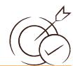

目標

<table><tr><td></td><td>目標</td><td>2025年進展</td><td>完成情況</td></tr><tr><td>行業合作</td><td>產學研項目申報個數每年達到2個</td><td>4個</td><td>已完成</td></tr></table>

指標

<table><tr><td></td><td>指標內容</td><td>單位</td><td>2025</td><td>2024</td><td>2023</td></tr><tr><td>公益捐贈</td><td>年度公益投入總金額</td><td>萬元</td><td>348.07</td><td>212.56</td><td>254.49</td></tr><tr><td>行業合作</td><td>產學研項目申報個數</td><td>個</td><td>4</td><td>10</td><td>/</td></tr></table>

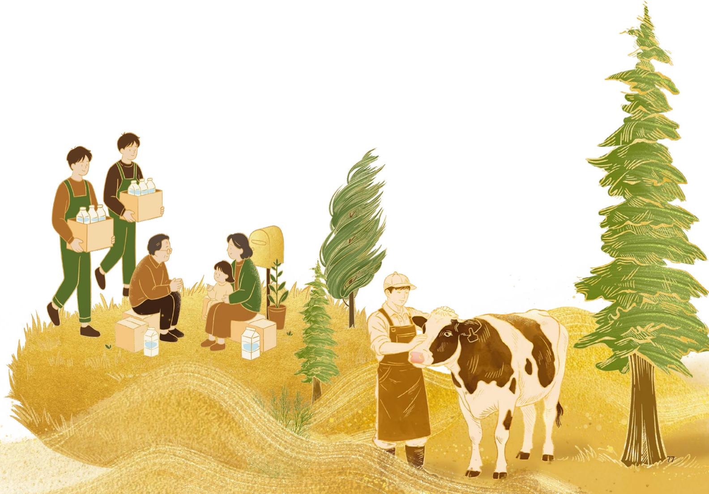

natural_image

Illustration of a rural scene with farmers, cows, and a tree in a golden field (no text or symbols)

## 未來展望

展望未來，中國聖牧將持續深化可持續發展戰略，緊扣乳業綠色轉型趨勢，錨定低碳運營、有機迴圈與協同共贏的前進方向。我們將以長期主義為指引，統籌推進生態治理、社會責任與公司治理的全面升級。公司將以系統思維統籌當前與長遠，持續夯實 ESG 管理根基，不斷提升經營韌性與核心商業價值，在推動自身高質量發展的同時，積極回應利益相關方的期許。

## 聚焦生態治理，深耕綠色低碳發展

我們將繼續把保護自然生態作為企業發展的核心底色，堅持烏蘭布和沙漠治理、種養結合和有機迴圈的特色產業路徑。未來，公司將系統推進低碳智慧牧場建設，在資源節約、廢棄物迴圈利用、水資源管理和氣候風險應對上持續發力。我們將不斷探索再生農業與生態價值轉化機制，厚植沙漠綠洲的生態優勢，致力於實現從單純 “減碳” 向 “自然受益的全面跨越，達成生態效益與商業效益的深度融合。

## 堅持以人為本，共創繁榮社會生態

我們將持續拓寬人才隊伍建設與職業發展的廣度，深化平等、包容的職場環境，完善人才選拔、培育與留用機制，打造與公司戰略高度契合的專業團隊。未來，公司將進一步健全員工職業發展通道與健康安全保障體系，激發組織內部的幹事創業活力。同時，聖牧將把企業發展與社區繁榮緊密相連，深化村企共建模式，積極投身社區發展與社會公益，拓展企業社會價值的創造邊界，與周邊社區實現共生共榮。

## 夯實合規治理，驅動全產業鏈升級

我們將把可持續發展理念全面融入企業管治架構 風險管理與日常運營 持續提升商業道德 制度執行與合規運營水準未來，公司將以數位化創新為驅動，強化品質追溯與運營效率。同時，我們將協同上下游供應商與合作夥伴，共同構建綠色可持續供應鏈，在應對氣候變化、資源約束等關鍵議題上發揮引領作用，以更具韌性的治理體系和科技支撐，保障企業在複雜的市場環境中行穩致遠。

## 行而不輟，未來可期

中國聖牧將始終堅守 “提供全球最高品質的沙漠有機奶” 的願景，保持戰略定力。我們將以更完善的可持續發展治理架構、更務實的綠色行動、更開放的產業協同，持續書寫綠色、責任、穩健發展的新篇章，為全球荒漠化治理與有機乳業的可持續發展持續貢獻 “聖牧方案”。

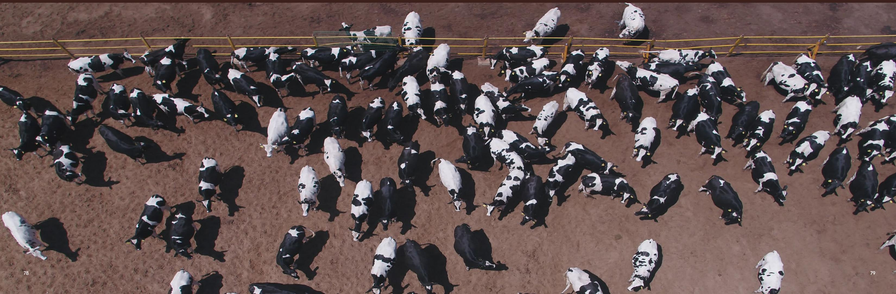

natural_image

Aerial view of a large flock of cows in a fenced pen farm, with no visible text or symbols.

## 獨立核證報告

## 1. 前 言

香港品質保證局(「HKQAA」 、 我們」 、「我們的」 )受 中圆聖牧有機奶業有限公司(「公司」)委证， 對 其於《2025年理境 、社會及管治報告》 (「報 告」 )中披露的可持縯發展信息 (「可持縯發展信息披露」雄行獨立核證1 涵蓋的報告期為2025年 1月1日至2025年 12月31日(「報告時問範醒」 ) ·並 出具本獨立核證報告 (「核證報告」 ) ·為 免産生疑義,載 於本核證報告末端所列的附録構成核證報告不可或缺的一部分，惟部分附録僅供公司内部使用。我們的可持縯發展信息核證工作及本核證報告均基於附録 A所載列的假設 、依赖因素 、邊界 、局限性、除外情况 、 角色和责任及孺立性進行 ·附 缘A的 通用版本可於香港品贸保超局官方網站 (wwww.hkqaa org )查閱 , 瀏覽路徑如下 ： 動態及資源 > 指引及表格 > 指引 > 可持縯核證 。

本次核證工作的目的是為可持縯發展信息披露提供一個獨立的结論,該結論基於有限保證·以判断可持绩發展信息披露是否遵循以下報告凖則編製 ：

香港聯合交易所有限公司主板上市規则附録C2所載之《環境 、社會及管治報告守則》 (「ESG守则」 )

核證組也参考《國 際財務報告準则第 S2 號——氟候相關披露》 檢閱報告 ，評估可持續發展信息披露是否有参考相關要求編製 。

## 2. 核 證方法

香港品質保證局的核證程序是参考國際核數及核證準則委員會發布的《國際核證業務準則第3000號》 (修 訂版 ) (「ISAE3000」 )進 行的 ·

證據收集過程乃按風險為本的方法設計 ,以獲得 ISAE3000所界定的有限保證水平 ·我們的核證程序包括但不限於 :

審閱公司提供的相關政策、程序、相關文件及記録，包括舆可持續發展相關信息的有關内容，如管治 、風險 識别及績效指標;  
· 訪談公司負責報告編製及可持縯發展相關管治的主要管理層及相關人员；

對披露内容進行分析性審查 ，以評估其合理性 ， 並核對其相關外部框架及内部支持數據的一致 性；  
按重要性及風险為重點 ,選取具代表性的披露檬本 ， 並運用判斷抽檬方法評估每個様本的基礎證據;  
· 評估所披露的假設 、依賴因素及邊界的透明度；  
· 評估涵蓋範圍是否符合報告凖则要求，包括檢視用於估算的方法論、敏感度分析及不確定性披露等 ·

## 3. 结 論

根據核證過程所執行的程序 、獲得的證據 , 以及在既定假設 、依賴因素 、邊界 、局限性和除外情况的前提下，我 們並未注意到任何情沉 ， 使 我們相信公司在其《2025年 環境 、 社 會及管治報告》 中於 2025年 1月 1 日至 2025年 12月 31 日期間的可持縯發展信息披露 ，在所有重大方面未按照《環境 、社會及管治報告守则》 的要求編製 。此外 ，我們也未發現任何情沉 ，顯示上述披露並未参考本核證報告前言部分所述的其他適用報告凖则。

本核證報告僅提供予中國聖牧有機奶業有限公司及其《2025年環境 、社會及管治報告》的使用者 ，以供其在遵循本核證報告前言所述之報告準则的目的下使用。我們不接受，亦不承擔對於本核證報告在向其他任何人士展示或被其持有時 ,於任何其他用途所産生的任何責任·我們確認 ,在開展本項工作期間 ,我們與中國聖牧有機奶業有限公司保持獨立性。

就出具本核證報告之核證業務的項目負責人為丁國滔 。

## 香港品質保 證局代表簸署

## 香港知質保證局

2026年 4月

参考编號:14994262

香港聯交所環境、社會及管治報告守則

<table><tr><td>層面、一般披露及關鍵績效指標</td><td>描述</td><td>披露頁碼</td></tr><tr><td colspan="3">範疇A:環境</td></tr><tr><td colspan="3">層面A1:排放物</td></tr><tr><td>一般披露</td><td>有關廢氣及溫室氣體排放、向水及土地的排污、有害及無害廢棄物的產生等的:(a)政策;及(b)遵守對發行人有重大影響的相關法律及規例的資料。</td><td>P50、51</td></tr><tr><td>關鍵績效指標A1.1</td><td>排放物種類及相關排放資料。</td><td>P56、57</td></tr><tr><td>關鍵績效指標A1.3</td><td>所產生有害廢棄物總量(以噸計算)及(如適用)密度(如以每產量單位、每項設施計算)。</td><td>P57</td></tr><tr><td>關鍵績效指標A1.4</td><td>所產生無害廢棄物總量(以噸計算)及(如適用)密度(如以每產量單位、每項設施計算)。</td><td>P57</td></tr><tr><td>關鍵績效指標A1.5</td><td>描述所訂立的排放量目標及為達到這些目標所採取的步驟。</td><td>P52-55</td></tr><tr><td>關鍵績效指標A1.6</td><td>描述處理有害及無害廢棄物的方法,及描述所訂立的減廢目標及為達到這些目標所採取的步驟。</td><td>P52-55</td></tr><tr><td colspan="3">層面A2:資源使用</td></tr><tr><td>一般披露</td><td>有效使用資源(包括能源、水及其他原材料)的政策。</td><td>P47、57</td></tr><tr><td>關鍵績效指標A2.1</td><td>按類型劃分的直接及/或間接能源(如電、氣或油)總耗量(以千個千瓦時計算)及密度(如以每產量單位、每項設施計算)。</td><td>P47</td></tr><tr><td>關鍵績效指標A2.2</td><td>總耗水量及密度(如以每產量單位、每項設施計算)。</td><td>P57</td></tr><tr><td>關鍵績效指標A2.3</td><td>描述所訂立的能源使用效益目標及為達到這些目標所採取的步驟。</td><td>P45-47</td></tr><tr><td>關鍵績效指標A2.4</td><td>描述求取適用水源上可有任何問題,以及所訂立的用水效益目標及為達到這些目標所採取的步驟。</td><td>P53-54、56</td></tr><tr><td>關鍵績效指標A2.5</td><td>製成品所用包裝材料的總量(以噸計算)及(如適用)每生產單位占量。</td><td>不適用</td></tr></table>

<table><tr><td>層面、一般披露及關鍵績效指標</td><td>描述</td><td>披露頁碼</td></tr><tr><td colspan="3">層面A3:環境及天然資源</td></tr><tr><td>一般披露</td><td>減低發行人對環境及天然資源造成重大影響的政策。</td><td>P50</td></tr><tr><td>關鍵績效指標A3.1</td><td>描述業務活動對環境及天然資源的重大影響及已採取管理有關影響的行動。</td><td>P50-54</td></tr><tr><td colspan="3">範疇B:社會</td></tr><tr><td colspan="3">雇傭及勞工常規層面B1:雇傭</td></tr><tr><td>一般披露</td><td>有關薪酬及解僱、招聘及晉升、工作時數、假期、平等機會、多元化、反歧視以及其他待遇及福利的:(a) 政策;及(b) 遵守對發行人有重大影響的相關法律及規例的資料。</td><td>P60-66</td></tr><tr><td>關鍵績效指標B1.1</td><td>按性別、僱傭類型(如全職或兼職)、年齡組別及地區劃分的僱員總數。</td><td>P68-70</td></tr><tr><td>關鍵績效指標B1.2</td><td>按性別、年齡組別及地區劃分的僱員流失比率。</td><td>P68-70</td></tr><tr><td colspan="3">層面B2:健康與安全</td></tr><tr><td>一般披露</td><td>有關提供安全工作環境及保障僱員避免職業性危害的:(a) 政策;及(b) 遵守對發行人有重大影響的相關法律及規例的資料。</td><td>P65</td></tr><tr><td>關鍵績效指標B2.1</td><td>過去三年(包括匯報年度)每年因工亡故的人數及比率。</td><td>P68-70</td></tr><tr><td>關鍵績效指標B2.2</td><td>因工傷損失工作日數。</td><td>P68-70</td></tr><tr><td>關鍵績效指標B2.3</td><td>描述所採納的職業健康與安全措施,以及相關執行及監察方法。</td><td>P65</td></tr><tr><td colspan="3">層面B3:發展及培訓</td></tr><tr><td>一般披露</td><td>有關提升僱員履行工作職責的知識及技能的政策。描述培訓活動。</td><td>P63-64</td></tr><tr><td>關鍵績效指標B3.1</td><td>按性別及僱員類別(如高級管理層、中級管理層)劃分的受訓僱員百分比。</td><td>P68-70</td></tr><tr><td>關鍵績效指標B3.2</td><td>按性別及僱員類別劃分,每名僱員完成受訓的平均時數。</td><td>P68-70</td></tr><tr><td colspan="3">層面B4:勞工準則</td></tr><tr><td>一般披露</td><td>有關防止童工或強制勞工的:(a) 政策;及(b) 遵守對發行人有重大影響的相關法律及規例的資料。</td><td>P60</td></tr><tr><td>關鍵績效指標 B4.1</td><td>描述檢討招聘慣例的措施以避免童工及強制勞工。</td><td>P62</td></tr><tr><td>關鍵績效指標 B4.2</td><td>描述在發現違規情況時消除有關情況所採取的步驟。</td><td>P60</td></tr><tr><td colspan="3">營運慣例層面 B5:供應鏈管理</td></tr><tr><td>一般披露</td><td>管理供應鏈環境及社會風險政策。</td><td>P34-35</td></tr><tr><td>關鍵績效指標 B5.1</td><td>按地區劃分的供應商數目。</td><td>P38</td></tr><tr><td>關鍵績效指標 B5.2</td><td>描述有關聘用供應商的慣例,向其執行有關慣例的供應商數目,以及相關執行及監察方法。</td><td>P38-39</td></tr><tr><td>關鍵績效指標 B5.3</td><td>描述有關識別供應鏈每個環節的環境及社會風險的慣例,以及相關執行及監察方法。</td><td>P34</td></tr><tr><td>關鍵績效指標 B5.4</td><td>描述在揀選供應商時促使多用環保產品及服務的慣例,以及相關執行及監察方法。</td><td>P34</td></tr><tr><td colspan="3">層面 B6:產品責任</td></tr><tr><td>一般披露</td><td>有關所提供產品和服務的健康與安全、廣告、標籤及私隱事宜以及補救方法的:(a) 政策;及(b) 遵守對發行人有重大影響的相關法律及規例的資料。</td><td>P32、37</td></tr><tr><td>關鍵績效指標 B6.1</td><td>已售或已運送產品總數中因安全與健康理由而須回收的百分比。</td><td>P38</td></tr><tr><td>關鍵績效指標 B6.2</td><td>接獲關於產品及服務的投訴數目以及應對方法。</td><td>P32</td></tr><tr><td>關鍵績效指標 B6.3</td><td>描述與維護及保障知識產權有關的慣例。</td><td>P26</td></tr><tr><td>關鍵績效指標 B6.4</td><td>描述質量檢定過程及產品回收程序。</td><td>P34-35</td></tr><tr><td>關鍵績效指標 B6.5</td><td>描述消費者資料保障及私隱政策,以及相關執行及監察方法。</td><td>P29</td></tr></table>

<table><tr><td>層面、一般披露及關鍵績效指標</td><td>描述</td><td>披露頁碼</td></tr><tr><td colspan="3">層面 B7:反貪污</td></tr><tr><td>一般披露</td><td>有關防止賄賂、勒索、欺詐及洗黑錢的:
(a) 政策;及
(b) 遵守對發行人有重大影響的相關法律及規例的資料。</td><td>P28、P29</td></tr><tr><td>關鍵績效指標 B7.1</td><td>于匯報期內對發行人或其僱員提出並已審結的貪污訴訟案件的數目及訴訟結果。</td><td>P29</td></tr><tr><td>關鍵績效指標 B7.2</td><td>描述防範措施及舉報程序,以及相關執行及監察方法。</td><td>P29</td></tr><tr><td>關鍵績效指標 B7.3</td><td>描述向董事及員工提供的反貪污培訓。</td><td>P29</td></tr><tr><td colspan="3">社區
層面 B8:社區投資</td></tr><tr><td>一般披露</td><td>有關以社區參與來瞭解營運所在社區需要和確保其業務活動會考慮社區利益的政策。</td><td>P74、76-77</td></tr><tr><td>關鍵績效指標 B8.1</td><td>專注貢獻範疇(如教育、環境事宜、勞工需求、健康、文化、體育)。</td><td>P77</td></tr><tr><td>關鍵績效指標 B8.2</td><td>在專注範疇所動用資源(如金錢或時間)。</td><td>P77</td></tr><tr><td colspan="3">範疇D:氣候相關披露</td></tr><tr><td>管治</td><td>a.負責監督氣候相關風險和機遇的治理機構(可包括董事會、委員會或其他同等治理機構)或個人的信息。(D19-a)b.管理層在用以監察、管理及監督氣候相關風險和機遇的管治流程、監控措施及程序中的角色(D19-b)</td><td>P20-21、42</td></tr><tr><td rowspan="5">策略</td><td>氣候相關風險和機遇(D20)</td><td>P43-44</td></tr><tr><td>業務模式和價值鏈(D21)</td><td>P43-44</td></tr><tr><td>策略和決策(D22)</td><td>P43-44</td></tr><tr><td>財務狀況、財務表現及現金流量(D23、D24、D25)</td><td>P43-44</td></tr><tr><td>氣候韌性(D26)</td><td>P44</td></tr><tr><td rowspan="3">風險管理</td><td>發行人用於識別、評估氣候相關風險,以及厘定當中輕重緩急並保持監察的流程及相關政策(D27-a)</td><td>P45</td></tr><tr><td>發行人用於識別、評估氣候相關機遇,以及厘定當中輕重緩急並保持監察的流程(包括發行人可有及如何使用氣候相關情景分析來確定氣候相關機遇的信息)(D27-b)</td><td>P45</td></tr><tr><td>氣候相關風險和機遇的識別、評估、優次排列和監察流程,是如何融入發行人的整體風險管理流程,以及融入的程度如何(D27-c)</td><td>P45</td></tr><tr><td rowspan="9">指標及目標</td><td>溫室氣體排放(D28-D29)</td><td>P47</td></tr><tr><td>氣候相關轉型風險(D30)</td><td>P43</td></tr><tr><td>氣候相關物理風險(D31)</td><td>P43</td></tr><tr><td>氣候相關機遇(D32)</td><td>P44</td></tr><tr><td>資本運作(D33)</td><td>/</td></tr><tr><td>內部碳定價(D34)</td><td>/</td></tr><tr><td>薪酬(D35)</td><td>P21、70</td></tr><tr><td>行業指標(D36)</td><td>P47</td></tr><tr><td>氣候相關目標(D37-40)</td><td>P46</td></tr></table>

ISSB 準則索引

<table><tr><td>披露要求</td><td></td><td>披露頁碼</td></tr><tr><td colspan="3">S1- 可持續相關財務資訊披露一般要求</td></tr><tr><td rowspan="2">治理</td><td>負責監督可持續相關風險和機遇的治理機構或個人</td><td>P20-21、42</td></tr><tr><td>描述管理層在評估和管理可持續相關風險和機遇中的角色</td><td>P20-21、42</td></tr><tr><td rowspan="5">戰略</td><td>可持續相關風險和機遇</td><td>P43-44</td></tr><tr><td>商業模式和價值鏈</td><td>P43-44</td></tr><tr><td>戰略和決策</td><td>P43-44</td></tr><tr><td>財務狀況、財務業績和現金流量</td><td>P43-44</td></tr><tr><td>韌性</td><td>P44</td></tr><tr><td rowspan="3">風險管理</td><td>用於識別、評估、優先考慮和監控可持續相關風險的流程和相關政策程</td><td>P45</td></tr><tr><td>主體用於識別、評估、優先考慮和監控可持續相關機遇的流程</td><td>P45</td></tr><tr><td>主體在多大程度上以及如何將識別、評估、優先考慮和監控可持續相關風險和機遇的流程整合至整體風險管理流程,並影響其整體風險管理流程</td><td>P45</td></tr><tr><td rowspan="2">指標和目標</td><td>針對每項可合理預期影響主體前景的與可持續性相關的風險和機遇進行披露</td><td>P43-44</td></tr><tr><td>主體為監測實現戰略目標的進展情況而設定的目標資訊,以及法律法規要求其達到的任何目標</td><td>P46</td></tr></table>

<table><tr><td>披露要求</td><td></td><td>披露頁碼</td></tr><tr><td colspan="3">S2-氣候披露</td></tr><tr><td rowspan="2">治理</td><td>負責監督氣候相關風險和機遇的治理機構(包括董事會、委員會或其他同等的治理機構)或個人</td><td>P20-21、42</td></tr><tr><td>管理層在監控、管理和監督氣候相關風險和機遇時所用的治理流程、控制措施和程式中的角色</td><td>P20-21、42</td></tr><tr><td rowspan="5">戰略</td><td>氣候相關風險和機遇</td><td>P43-44</td></tr><tr><td>商業模式和價值鏈</td><td>P43-44</td></tr><tr><td>戰略和決策</td><td>P43-44</td></tr><tr><td>財務狀況、財務業績和現金流量</td><td>P43-44</td></tr><tr><td>氣候韌性</td><td>P44</td></tr><tr><td rowspan="3">風險管理</td><td>用於識別、評估、排序和監測氣候相關風險的程序和相關政策</td><td>P45</td></tr><tr><td>主體用於識別、評估、優先考慮和監控氣候相關機遇的流程,包括有關主體是否以及如何使用氣候相關情景分析來幫助識別氣候相關機遇資訊</td><td>P45</td></tr><tr><td>主體在多大程度上以及如何將識別、評估、優先考慮和監控氣候相關風險和機遇的流程整合至其整體風險管理流程並影響其整體風險管理流程的</td><td>P45</td></tr><tr><td rowspan="3">指標和目標</td><td>氣候相關指標</td><td>P47</td></tr><tr><td>行業指標</td><td>P47</td></tr><tr><td>氣候相關目標</td><td>P46</td></tr></table>

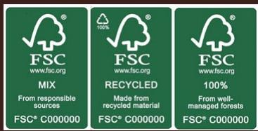

## 珍惜資源 呵護眼睛

本報告採用認證（FSC ™）紙張印刷，紙漿來源於負責任和可持續發展的森林，完全可再生回收

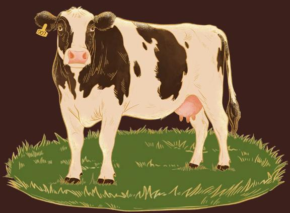

natural_image

Illustration of a black-and-white cow standing on grass, no text or symbols present

## 中国圣牧有机奶业有限公司

CHINA SHENGMU ORGANIC MIL KLIMITED

（股票代碼 : 1432）

香港銅鑼灣告士打道 262 號中糧大廈 32樓A室

中國呼和浩特經濟技術開發區沙爾沁工業新區開放大街聖牧總部

0471-3188899 轉 8000

smhr@smorganic.cn