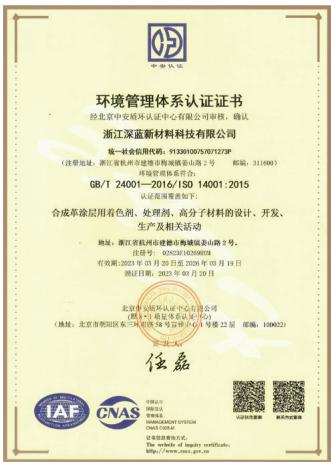
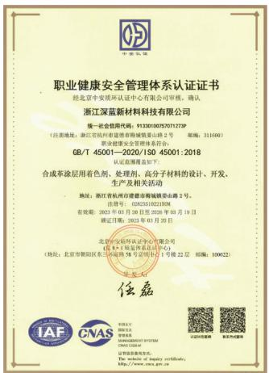
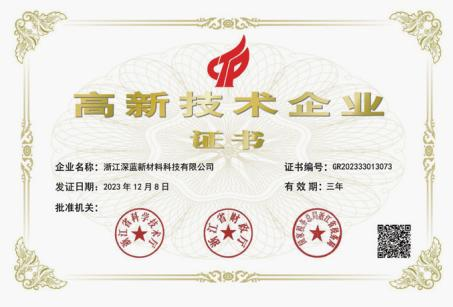
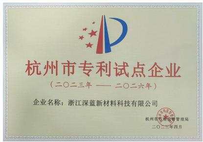
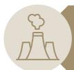
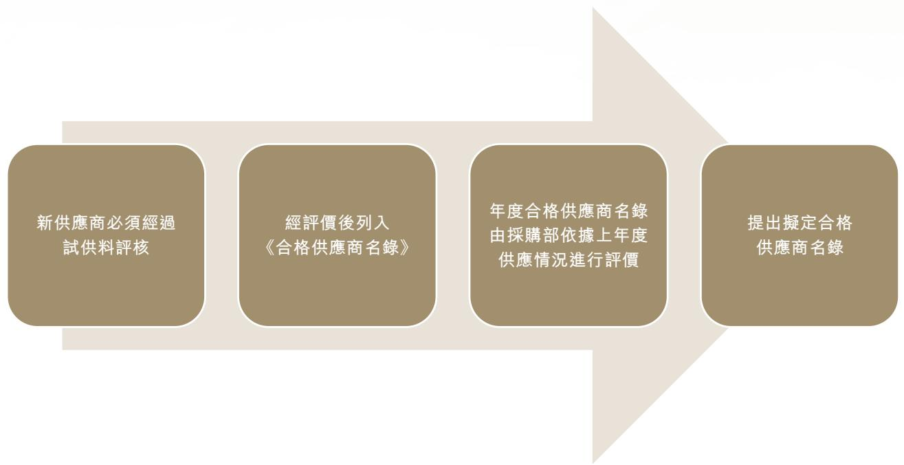
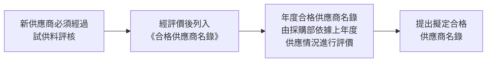

## DIWANG INDUSTRIAL HOLDINGS LIMITED

# 帝王實業控股有限公司

(於開曼群島註冊成立的有限公司)

(股份代號：1950)

## 2025

環境、社會及

管治報告

## 目錄

關於帝王實業控股 4

主要認證及成就.... 4

關於本報告 5

報告期間及範圍 5

編制依據 5

匯報原則 5

獲取本報告....6

持份者回饋....6

可持續發展管治....7

持份者參與....8

重要性評估 9

重要性議題.... 10

廉潔合規 11

廉潔行為規範....11

培養反貪污意識....11

舉報貪污行為....12

綠色營運....13

排放物管理 13

廢氣及溫室氣體排放.... 14

有害及無害廢棄物 15

有效使用資源....16

能源使用效率....17

水資源管理....18

减少包装材料....18

珍惜天然資源.... 19

## 應對氣候變化.... 20

## 供應鏈管理 32

供應商篩選及評估 32

供應商評審過程 33

## 產品責任 34

產品質量管理 34

客戶投訴處理 35

客戶私隱保障.... 36

廣告宣傳、標籤及知識產權 36

## 僱傭關係....37

員工概覽 38

僱傭管理政策.... 39

## 職業健康與安全....40

職業危害防護 40

安全培訓及消防演練.... 41

## 人才發展及培訓....42

## 勞工準則 42

## 社區投資 43

## 《環境、社會及管治報告守則》內容索引 44

## 《氣候相關披露》內容索引.... 50

## 關於帝王實業控股

帝王實業控股有限公司（「帝王實業控股」或「本公司」；或與其附屬公司統稱為「本集團」或「我們」）主要從事兩個業務：塗飾劑及合成樹脂的研發、製造及銷售（「人工革化學品業務」）及白酒產品的生產及銷售（「白酒業務」）。

本集團全資附屬公司－浙江深藍新材料科技有限公司主要是一家中華人民共和國（「中國」）人工革化學品製造商，主要從事塗飾劑（即著色劑、表面處理劑、助劑）及合成樹脂的研發、製造及銷售，我們的產品用作製造合成革，廣泛用於服裝鞋履、手袋箱包、汽車內飾、家居用品及運動器材等不同行業。本公司非全資附屬公司－貴州帝池王醬酒業有限公司的白酒產品包含一系列全面的具有不同產品包裝、酒精度、設計、口味等的產品，瞄準中國青中年大眾到中產階級的消費市場。

## 主要認證及成就

於2025年，帝王實業控股旗下附屬公司－浙江深藍新材料科技有限公司榮獲

text_image

环境管理体系认证证书
经北京中瑞环认证中心有限公司审核，确认
浙江深蓝新材料科技有限公司
统一社会信用代码：91320100757071737P
（注册地址：浙江省杭州市建邺区梅塘街道乐山路2号）邮编：311000）
环境管理体系协会：
GB/T 24001—2016/ISO 14001:2015
认证范围需参加如下：
合成革涂层用着色剂、处理剂、高分子材料的设计、开发、
生产及相关活动
地址：浙江省杭州市建邺区梅塘街道乐山路2号。
注册号：0282381102060658
有效期：2023年03月20日至2026年03月19日
购买日期：2023年03月20日
北京市朝阳区环评中心项目公司
（地址：北京市朝阳区东三环西路28号环球中心1号楼22层 邮编：100022）
法定代表人：
### 田磊
ISSNCCN
CNAS.COM.CM
©2023-03-01
©2023-03-01
©2023-03-01
©2023-03-01
©2023-03-01
©2023-03-01
©2023-03-01
©2023-03-01
©2023-03-01
©2
©2
©2
©2
©2
©2
©2
©2
©2
©2
©2
©2
©2
©2
©2
©2
©2
©2
©2
©2
©2
©2
©2
©2
©2
©2
©2
©2
©2
©2
©2
©2
©2
©2

\- 環境管理體系認證證書GB/T 24001 – 2016/ISO 14001:2015

text_image

职业健康安全管理体系认证证书
经北京中安质环认证中心有限公司审核，确认
浙江深蓝新材料科技有限公司
统一社会信用代码：9133010075707123P
（注册地址：浙江省杭州市建业路南城银城公路2号  编制：311000）
执业资格及管理委员会：
GB/T 45001—2020/ISO 45001:2018
认证范围见发以下
合成革涂层用着色剂、处理剂、高分子材料的设计、开发、
生产和相关活动
地址：浙江省杭州市建业路南城银城公路2号。
注册号：028235100221BDM
有效期：2023年03月20日至2026年03月19日
通过日期：2023年03月20日
北京中安质环认证中心有限公司
（地址）北京市朝阳区东三环西路78号富丽华主1号楼22层  编制：100022）
电话：010-66666666
传真：010-66666666
电子邮箱：www.cjty.com.cn
法定代表人：王健
注册资本：人民币壹亿肆佰肆拾贰万肆仟柒佰捌拾玖万肆仟柒佰零拾元整
经营范围：许可经营项目：职业健康安全管理体系认证
http://www.cjty.com.cn

• 職業健康安全管理體系認證證書GB/T 45001 – 2020/ISO 45001:2018

# 環境、社會及管治(ESG)報告

text_image

高新技术企业
证书
企业名称：浙江深蓝新材料科技有限公司
证书编号：GR202333013073
发证日期：2023年12月8日
有效期：三年
批准机关：
浙江省科学技术厅
浙江省财政厅
浙江省社会经济和信息化厅

- 高新技術企業證書；及

text_image

杭州市专利试点企业
（二〇二三年 —— 二〇二六年）
企业名称：浙江深蓝新材料科技有限公司
杭州市市场监督管理局
二〇一三年四月

- 杭州市專利試點企業

## 關於本報告

本環境、社會及管治（「ESG」）報告（「本報告」），旨在匯報本集團2025年度在ESG方面的政策、措施和績效，包括本集團在環境保護、僱員保障、安全生產、履行社會責任等方面的整體表現，讓各持份者更了解本集團於可持續發展議題的進程和發展方向。

## 報告期間及範圍

本報告呈現本集團2025年1月1日至2025年12月31日（「報告期間」或「2025年度」）的可持續發展方針及表現。除非另有說明，本報告的匯報範圍涵蓋及關注有關本集團位於中國內地的於環境及社會方面有相對重大影響的業務，包括人工革化學品業務。

## 編制依據

本報告遵循香港聯合交易所有限公司（「聯交所」）《證券上市規則》附錄C2所載的《環境、社會及管治報告守則》（「ESG守則」）的強制披露規定及「不遵守就解釋」條文編制而成。

## 匯報原則

本報告編製過程符合ESG守則中要求的重要性、量化及一致性原則。

## 重要性

## 量化

## 一致性

本集團以不同渠道收集持份者的意見，並進行內部重要性評估以識別及確定關鍵ESG議題。根據實際業務與行業特點，董事會識別並確定對本集團具有最重要影響的ESG議題。重要議題會於本報告中優先披露。

本集團收集環境及社會關鍵績效指標（「關鍵績效指標」）數據，並參照《如何編備環境、社會及管治報告》中的附錄二《環境關鍵績效指標匯報指引》及附錄三《社會關鍵績效指標匯報指引》作量化披露，以監察及評估本集團於履行環境及社會責任措施的進度。

本報告於數據收集及計算方法中使用一致的方法。考慮其於環境及社會方面的影響，匯報範圍專注於人工革化學品業務方面。

重要議題評估結果將用於指導本公司制定未來的環境、社會及管治工作計劃與目標，力求為持份者創造可持續價值。

## 獲取本報告

本報告載有中、英文版本，並已上載至聯交所網站。如中英文版本有任何互相抵觸或不相符的地方，概以中文版本為準。

## 持份者回饋

持份者的意見有助加深我們對持份者的了解，並推動我們持續改進。如閣下對本報告或本集團的可持續發展策略及表現有任何意見，歡迎通過電郵(ir@slkj.cn)聯絡我們。

## 可持續發展管治

在進行業務營運的同時，本集團關注日常運作對環境及社會的影響，努力滿足所有持份者、經濟、環境、社會和企業管治的利益，竭力達至最佳平衡，力求為社會樹立良好榜樣。我們已建立ESG相關管理體系，以更有系統地管理環境、社會及管治事宜。本集團的董事會（「董事會」）已成立ESG小組協助董事會作出可持續發展相關議題的決策。

## 董事會

全權負責ESG事宜的監督及決策工作，並透過定期召開會議及與ESG小組保持緊密溝通，履行以下職責，包括但不限於：

- 制定及檢討本集團ESG框架、策略、政策及程序；  
- 檢討及監察本集團ESG相關政策的執行；及  
- 設定適當的ESG目標、企業目標、績效的指標及措施，並定期檢討進度。

## 環境、社會及管治工作小組

## 負責ESG管理的統籌工作，包括但不限於：

• 協助董事會制定、檢討及落實本集團ESG框架、策略、政策及程序；  
• 定期評估本集團有關ESG的風險及內部監控系統；  
• 監督及指引各部門執行ESG政策；及  
- 改善本集團ESG政策及進行重要性評估，並向董事會提出意見。

本報告主要概述本集團於ESG方面的管治架構、董事會的相關職責及責任。有關本集團企業管治架構及其他相關資料，請參閱本公司2025年年報內「企業管治報告」部分。

## 持份者參與

本集團深明持份者的意見為本集團的長期發展及成功奠定堅實的基礎，並致力維持業務的可持續發展。我們與各持份者保持密切聯繫，希望透過具建設性的溝通方式，了解與內部及外部重要持份者的意見及需求，從而確定我們的可持續發展方向。本集團與持份者的主要溝通渠道詳列如下：

## 客戶

- 商務拜訪  
- 客戶服務熱線  
• 電郵  
- 溝通應用程式  
- 公司網站

## 供應商及業務夥伴

- 實地考察  
- 審核與評估  
- 資料及經驗共享  
- 商務會議

## 社區

- 電話及電郵  
- 公司網站  
- 參與社區活動

## 僱員

- 員工手冊  
- 員工績效考核  
- 入職及在職培訓  
- 年會、內聯網、內部刊物及研討會

## 投資者／股東

- 企業通訊  
- 股東大會  
- 投資者關係溝通  
- 公司網站

## 政府及監管機構

- 定期報告與公告  
• 會議  
- 合規評估報告  
- 實地考察

## 重要性評估

董事會結合各持份者的意見及營運情況，並對過往年度所識別的議題進行回顧，以評估議題於報告期間的適用程度，確保有效地識別對本集團的重大ESG議題。本次重要性評估流程如下：

## 識別重要性議題

- 本集團從多方面進行考慮，整理出本集團的重大ESG議題，包括：  
- 透過參考香港聯交所《環境、社會及管治報告守則》；  
- 可持續發展會計準則委員會(SASB)提及的ESG重要議題；  
- 明晟公司(MSCI) ESG行業重要性地圖提及的ESG重要議題；及  
- 於香港上市的同業公司所識別的ESG重要議題。

## 回顧及審視

\- 結合主要持份者的期望以及ESG議題對本集團的影響力，董事會對已識別的重要性議題進行審視及評估，以確立報告期間的重要性議題。

## 重要性議題確立

\- 完成各議題的審視及評估後，本集團認為報告期間共有19個重要性議題，涵蓋環境保護、僱傭及勞工常規、營運慣例、產品及服務責任及社區投資。

## 重要性議題

環境保護

<table><tr><td>1. 廢氣及溫室氣體排放</td><td>4. 業務活動對環境造成的影響</td></tr><tr><td>2. 廢棄物管理</td><td>5. 應對氣候變化</td></tr><tr><td>3. 有效使用資源</td><td></td></tr><tr><td>僱傭及勞工常規</td><td></td></tr><tr><td>6. 平等機會、多元化及反歧視</td><td>9. 培訓及發展</td></tr><tr><td>7. 僱傭關係、員工福利及待遇</td><td>10. 杜絕童工及強制勞工</td></tr><tr><td>8. 職業健康與安全</td><td></td></tr><tr><td>營運慣例</td><td></td></tr><tr><td>11. 反貪污舞弊</td><td>13. 供應鏈管理</td></tr><tr><td>12. 危機或緊急事故處理</td><td>14. 供應商環境及社會風險管理</td></tr><tr><td>產品及服務責任</td><td></td></tr><tr><td>15. 產品及服務質素與安全</td><td>17. 客戶滿意度</td></tr><tr><td>16. 客戶私隱保障</td><td>18. 保護知識產權</td></tr><tr><td>社區投資</td><td></td></tr></table>

19.社區投資及參與  
備註：  
獲納入重要範疇的議題會以粗階字體標示。

# 環境、社會及管治(ESG)報告

## 廉潔合規

本集團倡導誠信的企業文化，嚴禁任何賄賂、勒索、欺詐及洗黑錢等不道德行為，並持續推進廉政建設工作。本集團嚴格遵守相關法律及法規，包括但不限於《中華人民共和國反洗錢法》及《中華人民共和國刑法》。

報告期間，本集團並無發現任何對本集團或其僱員提出並已審結的貪污訴訟案件，亦不知悉任何嚴重違反有關防止賄賂、勒索、欺詐及洗黑錢的法律及法規，且對本集團有重大影響的事宜。

## 廉潔行為規範

我們制定多個內部政策，其中包括《反貪污政策行為守則》、《利益衝突申報及處理制度》及《環境、社會及管治政策及程序手冊》。我們對各崗位職責的員工進行了明確的責任承諾，避免發生與公司利益相衝突的行為，並要求員工在存在利益衝突時及時向公司報告。同時，所有董事、管理層及員工在日常工作中必須遵守國家及地方政府與防止賄賂、勒索、欺詐及洗黑錢相關的所有法律及法規。所有員工都有責任明白及遵守以上防止賄賂、勒索、欺詐及洗黑錢的政策，也有義務向適當人士舉報違反守則的行為。

## 培養反貪污意識

為提高員工在日常工作及營運中面對潛在貪污事件的警覺性，本集團員工入職時需參加反貪污培訓。此外，我們亦為董事提供有關關連交易及反貪污的培訓。報告期間，本集團的董事已完成相關培訓。

## 舉報貪污行為

本集團建立《不當行為的辨識及舉報機制》，鼓勵員工主動參與公司管理、監督和舉報違規行為，舉報程序如下：

員工可以書面或口頭方式向公司內部舉報管理領導小組辦公室（「舉報管理小組」）舉報不當行為，所有內容均會被保密。

會議由舉報管理小組組長主持，對舉報情況進行討論分析、性質認定，並制定責任追究方案及將整改措施上報。

舉報情況經舉報管理小組主任初審後，會提交舉報管理小組召開辦公會議。

根據舉報管理小組的意見，我們將對舉報情況相關責任人進行處理，解除該員工的勞動合同，不再支付經濟補償，並落實整改措施。

## 綠色營運

本集團深知環保對可持續經營的重要性，並致力將綠色環保理念融入每個業務流程。我們持續完善環境管理體系，已成立安全及環保部門，負責監督業務營運中環保政策的實施，以確保嚴格遵守相關法律及法規、政策及行業準則。我們已遵守與環境保護相關的法律及法規，包括但不限於：

- 《合成革單位產品能源消耗限額》;  
• 《排污許可證申請與核發技術規範制革及毛皮加工工業－制革工業》；  
• 《重點行業揮發性有機物削減行動計劃》;  
• 《中華人民共和國固體廢物污染環境防治法》;  
• 《中華人民共和國環境保護法》;  
• 《中華人民共和國大氣污染防治法》; 及  
• 《中華人民共和國水污染防治法》。

報告期間，本集團並不知悉任何嚴重違反有關廢氣及溫室氣體排放、向水及土地的排污、有害及無害廢棄物的產生等的法律及法規，且對本集團有重大影響的事宜。

## 排放物管理

由於本集團的業務涉及生產工序，因此在生產過程中會產生廢氣、溫室氣體、廢水及固體廢棄物。為確保我們符合相關國家法律及法規的要求，本集團積極採取措施減低對環境所帶來的不良影響，並致力檢討現有措施以減少產生廢棄物。

## 廢氣及溫室氣體(「溫室氣體」)排放

本集團的主要廢氣排放物由車輛汽油、柴油、天然氣及蒸汽燃燒所產生。相關化石燃料消耗所排放的廢氣包括氮氧化物、硫氧化物及顆粒物。在溫室氣體排放方面，本集團的直接溫室氣體排放源自車輛汽油及柴油燃燒，而間接溫室氣體排放則源自外購電力、天然氣及外購蒸汽使用。由於新增產品及生產量，本年度電力使用較去年大幅增加。報告期間，本集團廢氣及溫室氣體排放數據如下：

<table><tr><td>廢氣及溫室氣體</td><td>單位</td><td>2025年</td><td>2024年</td></tr><tr><td>廢氣</td><td></td><td></td><td></td></tr><tr><td>氮氧化物</td><td>公斤</td><td>27.22</td><td>27.47</td></tr><tr><td>硫氧化物</td><td>公斤</td><td>0.37</td><td>0.39</td></tr><tr><td>顆粒物</td><td>公斤</td><td>2.61</td><td>2.06</td></tr><tr><td>溫室氣體排放</td><td></td><td></td><td></td></tr><tr><td>直接排放(範圍一)</td><td>噸二氧化碳當量</td><td>69.19</td><td>74.36</td></tr><tr><td>能源間接排放(範圍二)</td><td>噸二氧化碳當量</td><td>2,033.24</td><td>1,096.78</td></tr><tr><td rowspan="2">溫室氣體總排放量</td><td>噸二氧化碳當量</td><td>2,102.43</td><td>1,171.14</td></tr><tr><td>噸二氧化碳當量/</td><td></td><td></td></tr><tr><td>密度</td><td>人民幣億元收益1</td><td>847.95</td><td>446.16</td></tr></table>

1 報告期內，上述部分之收益為人民幣247,942,000元。

本集團以持續減少業務營運中所產生的廢氣及溫室氣體為目標。為降低廢氣排放量，本集團採取了以下措施：

在生產車間自動配料區域安裝軟簾

在包裝區域加裝氣體收集罩

為配料鋼體增加蓋子防止氣體發散

將打包機安裝至密閉房間

在危廢庫、地磅配料區域安裝廢氣收集設施

## 環境、社會及管治(ESG)報告

廠區內所產生的廢氣主要來源自生產過程、廢水處理系統及食堂灶具燃燒。因此，我們針對這三個排放源頭落實減排措施。

## 生產過程

- 由吸風罩統一收集廢氣至處理裝置  
- 採用「三級水噴淋+活性炭吸附+催化燃燒」的方法去除氣體中的污染物  
- 主要為生化系統中微生物活動產生的硫化氫及氨氣  
- 經過密閉氧化吸收處理，達標才會排放

## 食堂灶具燃焼

\- 由於總量較少，統一由煙道引至樓頂，經煙氣淨化裝置處理後排放

## 有害及無害廢棄物

為妥善處置廢棄物，本集團已制定清晰具體的指引，並嚴格遵守當地的垃圾分類標準，對廢棄物進行分類投放。報告期間，有害及無害廢棄物的相關數據如下：

<table><tr><td>廢棄物種類</td><td>單位</td><td>2025年</td><td>2024年</td></tr><tr><td colspan="4">有害廢棄物</td></tr><tr><td>樹脂廢液</td><td>噸</td><td>22.28</td><td>32.01</td></tr><tr><td>著色劑過濾廢渣</td><td>噸</td><td>9.02</td><td>9.06</td></tr><tr><td>廢包裝及清洗雜物</td><td>噸</td><td>75.64</td><td>50.7</td></tr><tr><td>墨盒及廢活性炭</td><td>噸</td><td>10.66</td><td>13.69</td></tr><tr><td>廢機油</td><td>噸</td><td>0.83</td><td>-</td></tr><tr><td>污泥</td><td>噸</td><td>0.96</td><td>-</td></tr><tr><td>總量</td><td>噸</td><td>119.39</td><td>105.46</td></tr><tr><td>密度</td><td>噸/人民幣億元收益</td><td>48.15</td><td>40.18</td></tr><tr><td colspan="4">無害廢棄物</td></tr><tr><td>生產過程產生的固體廢棄物</td><td>噸</td><td>23.09</td><td>19.49</td></tr><tr><td>生活及辦公室廢棄物</td><td>噸</td><td>6.00</td><td>6.00</td></tr><tr><td>總量</td><td>噸</td><td>29.09</td><td>25.49</td></tr><tr><td>密度</td><td>噸/人民幣億元收益</td><td>11.73</td><td>9.71</td></tr></table>

本集團致力以源頭減廢及廢物循環使用為目標。我們堅持「綜合利用，循環使用」的原則，落實具體廢棄物管理及處理措施：

<table><tr><td>廢棄物處理程序</td><td>對實驗室垃圾及生活垃圾進行分類處理;車間的有害廢棄物分類明細化;委託具資格的機構處置危險廢棄物;及建立工業固體廢物管理台賬,並遞交網上申報資料。</td></tr><tr><td>源頭減廢措施</td><td>在辦公室張貼標識,鼓勵和引導員工減少廢棄物的產生;推行無紙化辦公,降低用紙量,並使用行政辦公系統減少紙張消耗;與供應商簽訂回收原材料包裝桶的協議,減少危廢桶產生量;及採用可循環使用的不銹鋼罐及塑料罐。</td></tr></table>

## 有效使用資源

為促進可持續發展，本集團致力提升能源效率，通過不斷監測能源消耗數據與優化能源管理作為實現節能減排目標的手段。

## 能源使用效率

報告期間，本集團能源消耗數據如下：

<table><tr><td>能源類型</td><td>單位</td><td>2025年</td><td>2024年</td></tr><tr><td>直接能源</td><td></td><td></td><td></td></tr><tr><td>天然氣</td><td>千個千瓦時</td><td>35.73</td><td>38.35</td></tr><tr><td>柴油</td><td>千個千瓦時</td><td>215.74</td><td>234.07</td></tr><tr><td>無鉛汽油</td><td>千個千瓦時</td><td>20.70</td><td>23.10</td></tr><tr><td>太陽能</td><td>千個千瓦時</td><td>1,748.14</td><td>1,405.96</td></tr><tr><td>間接能源</td><td></td><td></td><td></td></tr><tr><td>外購電力</td><td>千個千瓦時</td><td>3,696.78</td><td>1,765.72</td></tr><tr><td>外購蒸汽</td><td>千個千瓦時</td><td>3.36</td><td>2.91</td></tr><tr><td>能源總耗量</td><td>千個千瓦時</td><td>5,720.45</td><td>3,470.11</td></tr><tr><td>密度</td><td>千個千瓦時/人民幣億元收益</td><td>2,307.17</td><td>1,321.97</td></tr></table>

我們積極採取以下環保措施以提高能源使用效益：

- 於人工革化學品生產廠房的屋頂安裝太陽能發電設備，業務營運中使用由太陽能所產生的電力；  
- 在色片生產線中，我們投入一台螺出料捏合機以提高加熱效率和捏合效率；及  
- 在生產管理制度中大力倡導有效使用能源，提倡節約用電，提高員工在生產活動中的節能環保意識。

## 水資源管理

報告期間，我們於求取適用水源方面無任何問題。由於業務性質關係，本集團在生產過程中會消耗水資源。本集團耗水數據如下：

<table><tr><td>水資源</td><td>單位</td><td>2025年</td><td>2024年</td></tr><tr><td>耗水量</td><td>立方米</td><td>81,810</td><td>32,890</td></tr><tr><td>密度</td><td>立方米/人民幣億元收益</td><td>32,995.62</td><td>12,529.76</td></tr></table>

報告期間，由於產品結構變化，新增產品需水量較大，針對用水量的上升，我們已制定節水措施，以提升用水效益，並以持續減少用水為目標。我們循環使用生產設備冷卻工藝水，並將噴淋塔處理的噴淋水回收利用於水性黑色漿產品。我們亦確保及時修理滴漏的水龍頭及水喉，採用能有效節省用水的生產方法及器械。我們經常查驗耗水量，及盡量降低水壓，以減少耗水量。除此之外，我們正計劃進一步增加循環用水量的方法，以降低生產用水量。

## 減少包裝材料

本集團在產品製造及銷售過程中主要使用紙桶、紙袋、塑膠圓桶、塑膠袋及金屬桶等包裝物料。報告期間，本集團包裝物料用量如下：

<table><tr><td>包裝物料種類</td><td>單位</td><td>2025年</td><td>2024年</td></tr><tr><td>紙</td><td>噸</td><td>18.00</td><td>10.00</td></tr><tr><td>塑膠</td><td>噸</td><td>9.00</td><td>9.00</td></tr><tr><td>金屬</td><td>噸</td><td>477.00</td><td>421.00</td></tr><tr><td>木材</td><td>噸</td><td>36.00</td><td>25.30</td></tr><tr><td>總量</td><td>噸</td><td>540.00</td><td>465.30</td></tr><tr><td>密度</td><td>噸/人民幣億元收益</td><td>217.79</td><td>177.26</td></tr></table>

## 珍惜天然資源

由於業務性質，本集團於生產過程中會產生污染物，對環境造成一定程度的影響。為了減少企業排放對環境的影響，本集團制定了《「三廢」管理制度》，其中「三廢」包括：

廢液(初期雨水／生活廢水，生產廢水／廢溶劑)

廢氣

廢棄物（廢渣）等

此外，本公司安裝廢氣排放數據線上監測設備，以便實時監測廢氣排放情況。

## 「三廢」管理原則

- 根據環保法令分隔污染源及污染物；  
公司內部提倡循環使用，同時外部委託具資格的處理機構；及  
- 統一生產和包裝消耗處理費用，並分配到負責部門。

## 應對氣候變化

隨著全球氣候變化問題加劇，國際對此的關注持續升溫。作為一家負責任的企業，我們深刻認識到，企業活動與氣候變化之間的聯繫以及由此產生的風險。面對日益嚴峻的氣候形勢，環境保護不僅是全球性的挑戰，也直接關聯到我們的業務持續性與發展。

國家已經明確制定2030年實現碳達峰和2060年達到碳中和的「雙碳」目標，為我們提供清晰的方向。在此背景下，「十四五」生態環境保護的規劃將減碳轉型定為核心任務，凸顯了低碳發展的迫切性和重要性。我們堅信，轉向節能、降低能耗、減少碳足跡，將是企業未來成長的必經之路。因此，本集團將與國家的綠色發展目標保持一致，透過實施更為嚴格的環保措施，持續強化我們對氣候變化的應對策略。為此，本集團為客戶提供水性色漿。相對油性色漿，水性色漿以水為介質，含有的揮發性有害物質較少，同時在生產上降低整體能源及水資源的消耗，對環境的污染亦較少。除此之外，我們積極使用可再生能源以減低能源消耗對環境所造成的影響。我們在生產人工革化學品的廠房頂樓安裝太陽能發電系統，並架設太陽能板，將產生的電力儲存於電池中，供後續生產使用。

## 環境、社會及管治(ESG)報告

杭州市人民政府已制定《杭州市重污染天氣應急預案》，目的為有效應對重污染天氣、建立健全杭州市重污染天氣應急處置機制及提高杭州市重污染天氣預警及應急響應能力。我們意識到氣候變化對業務所帶來的潛在實體風險，並已根據《杭州市重污染天氣應急預案》設立杭州市工業企業重污染天氣應急響應措施「一廠一策」公示牌，並針對不同氣候響應等級採取不同的應急措施。

## 重污染天氣預警應急響應措施

## 液態著色劑工序

\- 停止使用1條液態著色劑工序生產線

## PU樹脂工序

\- 停止使用1條PU樹脂工序生產線

## 表面處理劑工序

\- 停止使用1條表面處理劑工序生產線

## 固態著色劑工序

\- 停止使用1條固態著色劑工序生產線

## 運輸

\- 停止使用國四或以下重型載貨車輛運行運輸

## 策略

本公司主要從事人工革化學品的研發、製造及銷售以及白酒產品的生產及銷售，生產運營涉及能源消耗、排放物治理、資源使用及供應鏈管理。本公司已將氣候相關議題納入整體發展戰略，並通過綠色營運、節能減排、環保產品升級及合規應對等措施，積極應對氣候變化帶來的風險與機遇。

## 氣候相關風險與機遇評估與識別

本公司深切認識到氣候變化風險和機遇的重要性，將應對氣候變化的策略深度融入到本公司的整體發展戰略之中。我們針對各類有可能對本公司業務模式或上下游價值鏈產生實質性影響的實體風險與轉型風險，分析潛在影響與影響時期，並對潛在財務影響進行分析。

實體風險

<table><tr><td>風險類型</td><td>風險描述</td><td>對業務模式的影響</td><td>對價值鏈的影響</td><td>影響時期</td></tr><tr><td>急性風險</td><td></td><td></td><td></td><td></td></tr><tr><td>重污染天氣</td><td>觸發地方應急預案，需實施減產、限產、運輸管控，影響生產連續性</td><td>生產計劃中斷，交付延誤，運營成本上升</td><td>原材料供應與產品出貨受阻，上下游協同效率下降</td><td>短期</td></tr><tr><td>暴雨/颱風等極端天氣</td><td>廠房設施、倉儲、供電供水系統受損</td><td>固定資產維修成本上升，停產帶來收入損失</td><td>供應商物流中斷，客戶供貨保障受影響</td><td>短期、中期</td></tr><tr><td>慢性風險</td><td></td><td></td><td></td><td></td></tr><tr><td>高溫熱浪</td><td>生產能耗顯著增加，設備運行負擔加重，員工作業效率下降</td><td>能源成本上升，生產效率降低</td><td>上游能源供應成本傳導，下遊客戶交付週期延長</td><td>長期</td></tr></table>

轉型風險

<table><tr><td>風險類型</td><td>風險描述</td><td>對業務模式的影響</td><td>對價值鏈的影響</td><td>影響時期</td></tr><tr><td>政策風險</td><td>環保、VOCs、碳排放、固廢管理政策持續加嚴，合規要求提升</td><td>環保投入與整改成本增加，不合規風險上升</td><td>供應商需同步滿足環保要求，供應鏈成本上升</td><td>長期</td></tr><tr><td>市場風險</td><td>下遊行業加速向低碳、水性、低VOC產品轉型</td><td>傳統產品市場空間收縮，需加快產品結構調整</td><td>下遊客戶綠色採購門檻提高，市場競爭加劇</td><td>中期、長期</td></tr><tr><td>技術風險</td><td>清潔生產、節能減碳、廢氣治理技術升級需求增加</td><td>技術改造與設備更新投入增加，轉型壓力加大</td><td>上游環保設備與技術服務成本上升</td><td>中期</td></tr><tr><td>聲譽風險</td><td>客戶與投資者對企業綠色低碳表現關注度提升</td><td>環保表現不足將影響品牌與客戶信任</td><td>優質客戶與合作夥伴准入門檻提高，業務拓展受限</td><td>長期</td></tr></table>

## 氣候相關機遇

我們同時關注到，受氣候變化驅動而加速的化工行業綠色轉型與環保產品市場擴容，有望為本公司帶來資源效率、市場、產品及服務層面的氣候機遇。

<table><tr><td>機遇類型</td><td>機遇描述</td><td>對業務模式的影響</td><td>對價值鏈的影響</td><td>影響時期</td></tr><tr><td>資源效率</td><td>提升電、水、能源及原材料使用效率，降低單位消耗</td><td>運營成本下降，盈利能力提升</td><td>上游資源消耗減少，供應鏈整體效率提升</td><td>短期</td></tr><tr><td>產品和服務</td><td>水性環保化學品、低VOC、低碳產品需求快速增長</td><td>綠色產品銷售佔比提升，業務增長空間擴大</td><td>下遊客戶綠色需求得到滿足，產業鏈競爭力增強</td><td>短期、中期、長期</td></tr><tr><td>市場</td><td>綠色製造、低碳認可企業更易獲得客戶、資本與政策支持</td><td>市場份額與品牌溢價提升，融資環境改善</td><td>綠色供應鏈優先合作，產業資源更為集中</td><td>短期、中期、長期</td></tr></table>

## 氣候情景分析

於報告期間，本集團進行氣候情景分析，以更深入了解及應對氣候變化的潛在影響。該分析涵蓋實體風險及轉型風險，並對各風險類別進行篩查及評估。為更好地確定及分析本集團可能面臨的潛在實體風險及轉型風險，我們採用政府間氣候變化專門委員會（「IPCC」）的「共用社會經濟路徑」以及央行與監管機構綠色金融網絡（「NGFS」）的「NGFS氣候情景」這兩種氣候情景。此方法使我們更深入了解在氣候變化波動下，我們氣候策略的韌性以及對核心業務的潛在影響，從而進一步提升我們應對氣候變化的能力。

實體風險

<table><tr><td>氣候情景</td><td>低風險情景</td><td>高風險情景</td></tr><tr><td></td><td>SSP 1-1.9</td><td>SSP 5-8.5</td></tr><tr><td>情景描述</td><td>全球快速淘汰化石燃料,全球二氧化碳排放量在2050年左右達致淨零。可再生能源成為主導,電力應用普及。大規模植樹造林。快速開發和應用低碳技術,包括儲能、氫能以及碳捕集與封存。全球廣泛合作,推行嚴格有效的氣候政策,消費者行為轉向低碳選擇。</td><td>依賴豐富且全球聯通的化石燃料資源。技術創新活躍,但主要集中在能源開採及消耗效率上,而非低碳替代方案。缺乏有效的全球碳定價機制或嚴格的國際氣候協議。全球收入差距縮小,對人力資本的投入增加。</td></tr><tr><td>預期升溫</td><td>到2100年升溫低於2°C。</td><td>到2100年升溫達4.4°C。</td></tr><tr><td>轉型風險</td><td></td><td></td></tr><tr><td rowspan="2">氣候情景</td><td>低風險情景</td><td>高風險情景</td></tr><tr><td>2050年淨零排放</td><td>現行政策</td></tr><tr><td rowspan="3">情景描述</td><td>· 即時實施嚴格的氣候政策,全球二氧化碳排放量在2050年左右達致淨零。</td><td>· 維持現行政策,不增加任何新減排承諾或措施。</td></tr><tr><td>· 碳價格早在2020年已達到較高水準(約每噸二氧化碳當量100美元),並持續快速上升,從而提高碳密集型商品及服務的成本,改變消費及生產模式。</td><td>· 技術變革緩慢,化石燃料仍主導能源體系,可再生能源的使用雖有增長,但不足以顛覆現有體系。</td></tr><tr><td>· 採用二氧化碳移除(「CDR」)技術以加速脫碳進程,但其規模受可持續發展因素制約。</td><td>· 碳定價偏低,未能有效推動深度脫碳。</td></tr><tr><td>預期升溫</td><td>到2100年將全球暖化升溫控制在1.5°C以下(概率50%)。</td><td>到2080年升溫超過3°C。</td></tr></table>

## 環境、社會及管治(ESG)報告

我們根據氣候情景評估氣候風險對本集團生產及經營活動的潛在影響、風險影響程度，以及如何與其策略決定規劃範圍掛鉤。本集團面臨的潛在氣候相關風險載列如下：

實體風險

<table><tr><td rowspan="2">風險類別</td><td rowspan="2">潛在影響</td><td colspan="2">風險水準</td><td rowspan="2">時間範圍1</td><td rowspan="2">緩減策略</td></tr><tr><td>SSP1-1.9</td><td>SSP5-8.5</td></tr><tr><td rowspan="3">頻繁的極端天氣事件(如暴雨、極端高溫、強烈氣旋、洪水、乾早及缺水)可能對本集團項目的建設及運營造成不利影響或潛在風險。</td><td>極端天氣造成的生產中斷可能影響電力系統、排水系統或生產設備等基礎設施,連帶相關維修損失。</td><td>低</td><td>中</td><td>短期</td><td>·本集團已制定了應急安排,密切監控我們的業務運營情況。</td></tr><tr><td>極端天氣的增加可能直接倉儲與生產基地的運營,進而導致成本增加。</td><td>低</td><td>中</td><td>中期</td><td>·為本集團的生產設施及員工購買保險。</td></tr><tr><td>極端天氣對物流供應鏈、生產效率及僱員通勤的影響,導致營運及財務損失。</td><td>低</td><td>中</td><td>中期</td><td>·惡劣天氣狀況下提早向僱員交代安排,以減少實體風險的可能影響。</td></tr><tr><td rowspan="4">氣候模式的長期變化可能對本集團構成慢性氣候風險,例如持續高溫可能導致海平面上升或長時間熱浪。</td><td>氣溫的長期系統性升高,將增加溫控等需求與能耗,可能導致運營成本上升,並加速生產設備的老化,推高維護成本。</td><td>低</td><td>中</td><td>中期</td><td>●本集團將識別該等風險,並優先考慮具有嚴重影響的風險,以便於第一時間採取預防措施。</td></tr><tr><td>高溫環境可能令僱員承受更高的熱壓力及健康危害風險,或會影響生產力及員工整體福祉。</td><td>低</td><td>中</td><td>短期</td><td></td></tr><tr><td>氣候變化可能改變不同地區消費者的生活習慣,影響產品偏好與選擇</td><td>低</td><td>中</td><td>長期</td><td></td></tr><tr><td>長期氣候風險事件的發生導致保險報銷減少。</td><td>低</td><td>中</td><td>中期</td><td></td></tr></table>

轉型風險

<table><tr><td rowspan="2">風險類別</td><td rowspan="2">潛在影響</td><td colspan="2">風險水準</td><td rowspan="2">時間範圍</td><td rowspan="2">緩減策略</td></tr><tr><td>2050年淨零排放</td><td>現行政策</td></tr><tr><td rowspan="3">氣候變化影響市場的方式複雜多樣,例如改變若干商品、產品及服務的供需。</td><td>未來供應鏈由於碳排放監管的加強,對於高能耗的生產設備等進一步納稅或限制使用。</td><td>中</td><td>低</td><td>中期</td><td>●本集團積極引進新的環保設備並逐步淘汰高耗能設施,以配合國家新能源政策發展。</td></tr><tr><td>隨著能源轉型,部分原材料的價格可能因上游供應商的減碳成本增加而上漲。</td><td>中</td><td>低</td><td>長期</td><td rowspan="2">●本集團會定期監測與氣候有關的現有及新興趨勢、政策及法規,在必要時取得合規諮詢服務,以避免因反應遲緩而導致的聲譽風險。</td></tr><tr><td>本集團的產品及服務或需適應潛在客戶就氣候相關事宜提出的各種需求。</td><td>低</td><td>低</td><td>中期</td></tr><tr><td rowspan="2">國內外氣候變化政策的轉變,以及中國碳達峰及碳中和目標等全球趨勢的演變,構成相關風險因素。</td><td>相關政策及/或法規收緊,導致滿足合規要求的成本增加,包括但不限於營運成本、保險成本、合規成本以及不合規罰款增加。</td><td>中</td><td>低</td><td>中期</td><td>●本集團繼續評估本集團應對氣候變化行動的有效性,並增強其應對氣候相關事宜的能力。</td></tr><tr><td>對於環境等資料披露要求嚴格,客戶對於合作方進行碳足跡審查,從而增加了管理難度</td><td>中</td><td>低</td><td>中期</td><td>●鼓勵僱員參與會議及培訓,以緊貼介入技術的最新發展。</td></tr></table>

儘管本集團留意到上文所述的眾多挑戰，但本集團亦關注到氣候變化帶來的機遇。市場對低排放產品的需求可能帶來商機。本集團致力於把握新興起的商機，與時並進，尋求可發展的機遇。

業務模式和價值鏈

<table><tr><td>氣候相關風險</td><td>當前影響</td><td>預期影響</td></tr><tr><td>頻繁的極端天氣事件(如暴雨、極端高溫、強烈氣旋、洪水、乾早及缺水)可能對本集團生產及運營造成不利影響或潛在風險。</td><td>持續的極端高溫和熱浪將對本集團的運營帶來挑戰。極端高溫可能導致能源需求急劇上升，進一步加重基礎設施的負擔。</td><td>極端天氣事件的嚴重性增加可能會危及本集團的財產和設備投資。急性的洪水可能導致電力故障，使我們的生產線無法運作，從而造成關鍵生產批次的損失。</td></tr><tr><td>氣候模式的長期變化可能對本集團構成慢性氣候風險，例如持續高溫可能導致海平面上升或長時間熱浪。</td><td>目前本集團的辦公室及生產基地運營過程中需要水資源。長期氣溫上升將增加水資源的利用。</td><td>持續的氣溫上升將需要本集團的冷卻系統支付更高的能源費用，從而可能增加本集團的運營支出。</td></tr><tr><td>氣候變化影響市場的方式複雜多樣，例如改變若干商品、產品及服務的供需。</td><td>本集團的供應商有機會將低碳轉型的成本轉嫁至原材料價格中。同時，市場對「可持續研發」的關注度提高，影響機構投資者對公司的估值。</td><td>隨著全球向低碳經濟轉型，市場對低碳排放製程的需求可能增加。此外，氣候變化可能改變消費者消費習慣，影響本集團的產品與市場定位。</td></tr><tr><td>國內外氣候變化政策的轉變，以及中國碳達峰及碳中和目標等全球趨勢的演變，構成相關風險因素。</td><td>本集團目前需就氣候變化相關政策及/或法規收緊，投入額外資源以符合新規。</td><td>需要投入更多資源以附合相關政策及/或法規。</td></tr></table>

# 環境、社會及管治(ESG)報告

## 策略和決策

本集團深明識別和減輕氣候變化帶來的任何重大影響的重要性，並已將氣候相關風險分析納入其核心風險偏好設置，以應對已識別的氣候風險。在現時及預期業務模式的變動與資源分配方面，本集團已積極配合國家新能源政策發展，逐步淘汰舊有的高能耗設備並引進新型環保設施。

在現時及預期的緩解努力上，本集團致力減少溫室氣體的排放並減少能源消耗，並為向低碳經濟轉型作出貢獻。我們在業務運營中堅持「3R」環保方針，即盡可能減少廢棄物、資源再利用及廢舊材料循環利用。建立無紙化工作環境，要求使用電子本以代替紙質文檔減少廢紙排放，以及實施有關廢棄物管理的政策等。同時，本集團針對實體風險已制定完善的適應措施，包括為員工實施惡劣天氣下的「應急計劃」與工作安排，以確保生產基地營運的連續性。我們亦為生產設施及員工購買保險，並透過優先識別具嚴重影響的風險來採取預防措施。

此外，本集團認識到人力資源是業務發展的基礎，因此定期向員工提供氣候相關的職業健康與安全培訓，增強其應對因極端天氣導致運營中斷的能力。本集團將持續監測與氣候相關的新興趨勢、政策及法規，並在必要時取得專業合規諮詢服務，以避免因反應遲緩而導致聲譽風險。通過不斷評估氣候行動的有效性並增強應對能力，本集團致力於在充滿挑戰的氣候環境中實現可持續發展。

## 風險管理

本集團已將氣候相關考慮因素納入其日常營運及本集團的企業風險管理系統。董事會對本集團的ESG事宜及相關匯報承擔全面責任，管理層負責應對可持續發展相關（包括氣候相關）的風險及機遇。我們持續監控該等風險，以確保其被納入本集團的發展、業務決策及審批流程中。本集團將確保其擁有或經營的辦公室及生產基地符合適用的環境法律法規所要求的合規標準。本集團非常重視與持份者之間的關係及其對我們業務及ESG事宜的反饋意見，期望可積極平衡各方利益，促進企業可持續發展。

## 供應鏈管理

本集團深明採購及供應鏈管理對我們的業務經營至關重要。因此，我們秉持誠信經營及遵守商業道德的承諾。為確保產品品質，我們在全國挑選優質供應商。截至2025年12月31日，本集團共有296家供應商，供應商地區全為中國內地。

## 供應商篩選及評估

為審查供應商資格、識別供應商環境及社會風險，本集團已建立全面的供應商評估機制，並在必要時由第三方機構進行審核。我們對於供應商的選擇提出七個應具備的條件：

1. 具有獨立法人的公司，本集團要求提供營業執照、銀行資料等相關法律及財務文件；對於有特殊資格要求的公司，則亦要求提供相應的資格證明；  
2. 遵守國家法律及法規以及相關的社會責任與道德規範，尤其對勞工權益、健康與安全、環境保護、商業道德等方面需要提供保障；  
3. 必須具有與本集團供貨規模相匹配的資金實力與供應能力以按期交貨；  
4. 了解本集團的採購需求，供應的物資能提供相關的技術指標、安全環保證明；  
5. 必須具有熟悉供應物資的業務人員與本集團聯絡，確保供應物資符合我們的要求；  
6. 供應操作過程應符合本集團管理要求，遵守本集團的相關規章制度；及  
7. 應當遵守商業操守，未經本集團同意，不得向任何單位和個人透露有關本集團的任何商業、技術信息。  
當供應商被發現不合乎本集團的政策或合約要求，本集團會終止往後的合作直到情況有所改善。

# 環境、社會及管治(ESG)報告

於每年一月，採購部負責進行供應商評估，檢查供應商的各項資格證書是否有效，以確保符合要求。採購部根據數據庫日常登記的數據，對供應商的全年情況進行評核。報告期間，我們已對所有主要的供應商進行評估。

## 供應商評審過程

flowchart

在人工革化學品業務方面，我們是中國合成革綠色供應鏈產業創新戰略聯盟發起成員單位之一。本集團注重綠色環保以及可持續發展的理念，並將綠色環保理念融入供應鏈管理及採購。在採購的過程中積極考慮產品或原材料對環境的影響，並優先選擇地理位置較近的供應商，以降低運輸中的碳排放。同時，我們在對供應商的審核中同樣要求杜絕使用童工或強制勞工。

## 產品責任

在我們的企業理念中，產品責任是公司可持續發展戰略的核心要素。因此，本集團高度重視產品質量，持續完善質量管理體系。同時，我們亦積極聆聽客戶的意見，採納他們的建議並做出改善來提升我們的產品及服務質素。本集團嚴格遵守相關法律及法規，包括但不限於《中華人民共和國消費者權益保護法》及《中華人民共和國專利法》。

報告期間，本集團並不知悉任何嚴重違反有關所提供產品和服務的健康與安全、廣告、標籤及私隱事宜以及補救方法的法律及法規，且對本集團有重大影響的事宜。報告期間，本集團擁有9項商標、20項專利以及2項在申請專利。

## 產品質量管理

我們持續實施嚴格的品質監管體系，確保每一件產品在投放市場前都符合最高的環境保護和社會責任標準，體現我們對優質產品承諾的堅定不移。為遵守不同的質量規管法律及法規及標準，我們制定了質量管理制度，其中質量管理的原則包括：(1)確立工作目標，理清管理流程；(2)日常工作實事求是，有據可查；及(3)管理工作有監督、有反饋，持續改進。另外，我們在製造部設質量管理科，主要管理製造部的質量工作，並配合公司制定相關質量管理流程。事業部總工程師負責相關事業部質量管理工作。事業部技術組負責制定檢測方法、檢測標準、標樣。事業部生產科負責日常原材料、中間體、產品及包裝品等的過程檢驗。本集團會在每年年初確定今年的質量目標，在每年年終根據以下目標進行考核。

投訴率產品不合格率

原材料降級率產品
降級率

為採用最合適的材料，所有新材料或不同供應商提供的同類材料都必須先取得小樣進行測試。所有新材料、新產品、新配方穩定批量購買、批量生產前，都必須進行中間階段的試驗。同時，為防止出現過多的實驗次品，我們按生產最小數量的批次開始進行中間階段的試驗。我們對產品質量鑒定過程嚴格把控，有一套完整的取樣以及留樣原則。

## 環境、社會及管治(ESG)報告

針對產品退貨，本公司制定了規範退貨流程，包括對於產品的檢查、登記以及費用核算。報告期間，本集團沒有已售產品因安全與健康理由而需回收。

## 客戶投訴處理

本集團深知客戶回饋對於持續改善我們的業務管治至關重要，因此我們堅持「以市場為中心，以顧客為導向」的經營觀念。為滿足顧客不斷變化的需求，我們加強產品售後服務工作，以提高顧客滿意度。我們已制定系統性的政策以處理客戶的投訴。

## 《投訴管理制度》

• 本集團的投訴及異常情況皆由董事長統一管理。  
- 涉及產品質量的投訴，若該被投訴的產品生產批號在1個月以內的，銷售部必須檢查並填寫該投訴批號的產品庫存及銷售情況。  
- 針對投訴情況，先由董事長確定本集團損失及責任人員，然後責任部門需分析問題及改善現有制度。  
如接獲的產品投訴源自原材料的問題，需要另寫原材料投訴報告。  
- 在處理過程中，整個投訴處理程序均由行政部跟進進展情況，並定時登記在質量投訴月報中，上傳至本集團的服務器，供所有員工參閱。

報告期間，本集團並不知悉有任何關於產品及服務的重大投訴。

## 客戶私隱保障

本集團確保在所有業務活動中，客戶的隱私信息得到妥善保護，以此彰顯我們對建立消費者信任的承諾。我們嚴格遵守相關法律條例。為加強保障力度，我們使用ERP系統，並對使用人設置權限。同時，我們已設立加密系統，對所有電子文檔進行加密，只有通過上級主管審批解密才可獲得或發送資料。

## 廣告宣傳、標籤及知識產權

本集團深刻認識到知識產權對於促進創新、維護公平競爭環境的重要性。本集團取得一種有機硅乳液的製備方法發明專利。本集團根據《中華人民共和國專利法》制定了詳細的專利管理制度，其中包括專利管理總則、專利的申請、專利獎勵、責任與處罰以及專利轉讓等，有效規範了本公司的專利使用及保護機制。

此外，本公司設立保護知識產權政策，旨在鼓勵創新與尊重智慧成果，同時確保商業活動的公正性和可持續性：

與僱員簽訂的勞動合同中載有保密條款，並規定僱員於其受僱期間的所有發明、設計、技術及開發或取得的任何其他知識產權均歸屬於本集團；  
- 在全體僱員的電腦上安裝加密軟件，倘加密文件需要解密及傳送至外部人士則須經其部門主管批准；

## 環境、社會及管治(ESG)報告

• 關鍵研發記錄已用密碼加密及該等資料僅可供少數核心人員查閱；及  
- 若干主要化學公式、生產程序及技術訣竅儲存於受密碼保護的電腦硬盤上，僅供相關核心僱員及研發人員使用。

為產品及服務進行推廣宣傳時，本集團謹遵《中華人民共和國廣告法》及《中華人民共和國消費者權益保護法》等相關法律及法規的規定，確保所有宣傳內容的真確性，以免誤導消費者。

## 僱傭關係

本公司深知員工是企業最寶貴的資產，他們的福祉與成長直接關係到公司整體的可持續發展，因此我們致力於創造一個具支持性和包容性的工作環境，確保員工能在健康、安全及公平的條件下工作和發展。本集團嚴格遵守《中華人民共和國勞動法》，制定了完善的制度，其中包括《員工僱用規章制度》、《員工手冊》及《行政人事管理制度》，施行雙方平等自願的聘用原則。

報告期間，本集團並不知悉任何嚴重違反有關薪酬及解僱、招聘及晉升、工作時數、假期、平等機會、多元化、反歧視以及其他待遇及福利的法律及法規，且對本集團有重大影響的事宜。

## 員工概覽

於2025年12月31日，於匯報範圍內，中國有177名全職員工，其按性別、年齡組別及僱傭類型的數據分佈如下：

<table><tr><td>員工分佈</td><td>單位</td><td>2025年</td><td>2024年</td></tr><tr><td colspan="4">按性別劃分</td></tr><tr><td>男性</td><td>人</td><td>136</td><td>151</td></tr><tr><td>女性</td><td>人</td><td>41</td><td>40</td></tr><tr><td colspan="4">按年齡組別劃分</td></tr><tr><td>35歲或以下</td><td>人</td><td>45</td><td>52</td></tr><tr><td>36-45歲</td><td>人</td><td>57</td><td>56</td></tr><tr><td>46-55歲</td><td>人</td><td>50</td><td>49</td></tr><tr><td>56歲或以上</td><td>人</td><td>25</td><td>34</td></tr><tr><td colspan="4">按僱傭類型劃分</td></tr><tr><td>全職</td><td>人</td><td>177</td><td>191</td></tr><tr><td>兼職</td><td>人</td><td>-</td><td>-</td></tr></table>

報告期間，匯報範圍之按性別、年齡組別及地區劃分的僱員流失率如下：

<table><tr><td>僱員流失率</td><td>單位</td><td>2025年</td><td>2024年</td></tr><tr><td colspan="4">按性別劃分</td></tr><tr><td>男性</td><td>百分比</td><td>16</td><td>17</td></tr><tr><td>女性</td><td>百分比</td><td>22</td><td>18</td></tr><tr><td colspan="4">按年齡組別劃分</td></tr><tr><td>35歲或以下</td><td>百分比</td><td>36</td><td>33</td></tr><tr><td>36-45歲</td><td>百分比</td><td>14</td><td>9</td></tr><tr><td>46-55歲</td><td>百分比</td><td>6</td><td>10</td></tr><tr><td>56歲或以上</td><td>百分比</td><td>16</td><td>12</td></tr><tr><td colspan="4">按地區劃分</td></tr><tr><td>中國</td><td>百分比</td><td>18</td><td>17</td></tr><tr><td>僱員流失率</td><td>百分比</td><td>18</td><td>17</td></tr></table>

# 環境、社會及管治(ESG)報告

## 僱傭管理政策

本公司深知保留人才對於維持企業競爭力和持續發展的重要性，因此本集團設有完善的僱傭管理制度，致力建立高品質人才團隊。

## 員工福利

本集團在員工手冊以及勞動合同中對員工權益及福利作出了清晰的規定，為所有員工保障其應有的權益和福利。我們為員工發放底薪、獎金以及各種津貼包括汽車、午餐、高溫、差旅、宿舍等，並為員工提供工作餐、聯誼活動、旅遊、免費體檢等福利。同時，根據《中華人民共和國勞動法》的相關規定，本集團按時為員工足額辦理住房公積金、養老保險金、醫療保險金、失業保險金等社會保險費用，員工同時也依法享有任何法律規定的薪酬、福利和假期，如工傷假、病假、婚假等。

## 招聘及薪酬

我們通過不同方法招募僱員，其中包括於招聘網站刊發招工通知。我們根據資格、職責、貢獻及工作經驗等因素釐定僱員的薪酬，薪酬政策的主要原則為按具有市場競爭力的方式為僱員提供薪酬。我們將竭盡全力吸納並挽留合適人員，持續評估可用的人力資源，並釐定是否需要增聘人員以配合我們的業務發展。

## 女性員工懷孕保障

本集團全力確保女性員工依法享有各類假期以及保險，給女性員工創造良好的工作環境。女性員工妊娠期間，需要進行產前檢查時，所花費的時間將按上班處理。若女性員工需要保胎休息，保胎期間的待遇按公司病假有關規定辦理。

## 晋升管理

我們承諾員工均享有平等的工作及晉升機會，並不會因年齡、性別、身體健康狀況、婚姻狀況、家庭狀況、種族、膚色、國籍、宗教、政治派別及其他因素等受到歧視。本集團根據員工的業績表現進行年度評估。我們在《行政人事管理制度》中明確列出評估標準，評估均按照實際情況進行。我們會優先考慮向優秀員工提供晉升機會。

## 工作時數與假期

我們依法實行標準工時制，工作時數及假期的相關規定已在《員工手冊》中列明。我們根據工作需要依據相關法律規定，安排員工加班，並依法保障員工休息的權利。

## 職業健康與安全

本公司深知員工的安全與健康對於實現可持續經營至關重要，因此我們致力於建立健全的工作環境，並實施有效的安全健康管理體系，確保每一位員工都能在一個安全、健康的環境中工作。為確保員工健康與安全，本集團嚴格遵守《中華人民共和國職業病防治法》，並制定《職業衛生管理制度》，規定一系列職業衛生相關的職責和安全措施，其中包括：

職業危害防治責任制度職業衛生危害警示與告知制度

職業健康宣傳教育培訓制度

職業危害
申報制度職業危害日常監測管理制度

職業危害事故處置與報告制度

報告期間，本集團並不知悉任何嚴重違反有關提供安全工作環境及保障僱員避免職業性危害的法律及法規，且對本集團有重大影響的事宜。

## 職業危害防護

本集團十分重視對員工的安全保障以及職業病防護。根據國家有關法律及法規，我們建立安全生產制度，並要求員工嚴格遵守本集團的勞動安全制度。我們在勞動合同裡明確規定勞動保護、勞動條件及職業危害防護條款，並嚴禁違章作業，防止勞動過程中的事故發生，以減少職業危害。報告期間，本集團工傷率及因工死亡率維持為零，於過去三年內（包括報告期間）亦沒有發生因工死亡個案。本集團於報告期間並無因工傷損失工作日數。

## 環境、社會及管治(ESG)報告

因應工作性質，員工在工作前會被告知工作過程中可能會產生的職業病危害及其後果，以提高危險意識。在夏季高溫條件下，我們會適度調整工作強度並且發放補貼。根據生產崗位的需要，我們按照國家有關勞動安全衛生的規定為員工提供必要的安全防護措施及發放必要的勞動用品。此外，本公司向技術人員及生產人員提供每年一次職業健康體檢，向其他員工提供非職業健康體檢，並組織員工參加線上及線下安全培訓。

## 安全培訓及消防演練

本集團已制定並實施保障員工安全的政策，積極舉行安全培訓及消防演練活動，其中包括：

## 安全培訓及消防演練

- 消防安全培訓與演練；  
- 典型事故及應急救援案例培訓；  
• 國家安全法律及法規培訓；  
- 特種作業中受限空間知識培訓；及  
- 夏季高溫防暑安全知識培訓。

## 保障員工安全的政策

- 為已識別為危險的工作設立安全執行程序；  
- 提供並確保辦公室及工作環境衛生安全、機器及設備會定期檢查；  
- 建立緊急事件諸如發生火災或爆炸時的應急措施；及  
- 設立機制以記錄及分析工傷意外的發生和原因。

## 人才發展及培訓

本集團深刻理解員工培訓與發展對於推動企業業務發展的核心作用，我們不斷投資於員工的專業成長和技能提升，認為這是實現集團長期成功的關鍵。為幫助員工個人成長，我們為員工提供形式多樣的在職培訓及崗外培訓。報告期間，我們舉行了包括新員工入職培訓、消防演練、新員工三級安全教育培訓、安全生產管理與生產技術知識培訓、崗位知識培訓、管理人員安全教育等在內的多個專項培訓內容。報告期間，匯報範圍內按性別及僱員類別劃分的培訓數據如下：

<table><tr><td>僱員培訓數據</td><td>單位</td><td>2025年</td><td>2024年</td></tr><tr><td>受訓僱員百分比</td><td></td><td></td><td></td></tr><tr><td>按性別劃分</td><td></td><td></td><td></td></tr><tr><td>男性</td><td>百分比</td><td>100</td><td>100</td></tr><tr><td>女性</td><td>百分比</td><td>100</td><td>100</td></tr><tr><td>按僱員類別劃分</td><td></td><td></td><td></td></tr><tr><td>高級管理人員</td><td>百分比</td><td>100</td><td>100</td></tr><tr><td>中級管理人員</td><td>百分比</td><td>100</td><td>100</td></tr><tr><td>其他</td><td>百分比</td><td>100</td><td>100</td></tr><tr><td>每名僱員完成受訓的平均時數</td><td></td><td></td><td></td></tr><tr><td>按性別劃分</td><td></td><td></td><td></td></tr><tr><td>男性</td><td>小時</td><td>8</td><td>8</td></tr><tr><td>女性</td><td>小時</td><td>8</td><td>8</td></tr><tr><td>按僱員類別劃分</td><td></td><td></td><td></td></tr><tr><td>高級管理人員</td><td>小時</td><td>8</td><td>8</td></tr><tr><td>中級管理人員</td><td>小時</td><td>8</td><td>8</td></tr><tr><td>其他</td><td>小時</td><td>8</td><td>8</td></tr></table>

## 勞工準則

本集團絕不容忍任何形式的童工及強制勞工，確保所有業務活動均符合人權法規，以展現我們對商業道德的堅定承諾。本集團嚴格按照相關法律要求，避免在業務運營中出現任何使用童工或強制勞工的情況，包括但不限於《禁止使用童工規定》及《中華人民共和國勞動合同法》。

## 環境、社會及管治(ESG)報告

針對人力資源部門，特別是負責招聘人員，我們舉辦童工及強制勞工預防培訓，制定措施以避免聘用非法勞工。在聘用任何應聘者之前，人力資源部應採取有效程序核實其年齡。人力資源部應檢查可證明應聘者年齡的文件，包括政府簽發帶有照片的身份證、出生證明、駕駛證、戶口本、學歷證書或者其它任何能夠證明出生日期的有效證件，並確保身份證上的照片與應聘者的長相相符。

如在本集團中發現未滿法定最低就業年齡的童工或強制勞工，我們將始終從最符合他們利益的角度出發，按照相關法律的要求採取以下措施：

1. 立即將該名員工帶離工作場所，以確保員工的安全；  
2. 立即通知人力資源部負責人，核實所有相關資料，證實當事人是否童工或強制勞工，並與其解除勞動關係；  
3. 如該員工為童工，我們會通知當地社會福利機構，並且採取補救措施以最大程度的保護其利益；  
4. 將當事人送往職業勞動健康檢查機構進行體檢，檢查其身心健康狀況；  
5. 進行調查走訪，充分了解其處境；及  
6. 立刻查明該問題營業地點招聘流程中存在的問題，並採取改善措施。

## 社區投資

本公司深信積極的社區投資對於建立企業與社會間的良好關係和促進共同繁榮至關重要，我們致力於出資支持醫療、教育、扶貧等公共事業，來承擔企業公民責任並實現可持續的社會影響。我們亦鼓勵員工參與志願項目及／或社區活動。本集團已採納有關政策來應對相關承諾。

報告期間，本集團積極履行社會責任，持續回饋當地社區。全年累計對外捐贈人民幣411,000元，主要捐贈項目包括教育基金、重陽節捐款以及春風行動公益捐款。展望未來，本集團會充分運用其業務優勢，為社區作出貢獻。

《環境、社會及管治報告守則》內容索引

<table><tr><td>主要範疇</td><td>內容</td><td>章節/披露</td></tr><tr><td>強制披露規定</td><td></td><td></td></tr><tr><td>管治架構</td><td>由董事會發出的聲明，當中載有下列內容：(i) 披露董事會對環境、社會及管治事宜的監管；(ii) 董事會的環境、社會及管治管理方針及策略，包括評估、優次排列及管理重要的環境、社會及管治相關事宜（包括對發行人業務的風險）的過程；及(iii) 董事會如何按環境、社會及管治相關目標檢討進度、並解釋它們如何與發行人業務有關連。</td><td>可持續發展管治</td></tr><tr><td>匯報原則</td><td>描述或解釋在編備環境、社會及管治報告時如何應用匯報原則（重要性、量化和一致性）。</td><td>關於本報告一匯報原則</td></tr><tr><td>匯報範圍</td><td>解釋環境、社會及管治報告的匯報範圍，及描述挑選哪些實體或業務納入環境、社會及管治報告的過程。</td><td>關於本報告一報告期間及範圍</td></tr><tr><td>A.環境層面A1:排放物一般披露</td><td>有關廢氣及溫室氣體排放、向水及土地的排污、有害及無害廢棄物的產生等的：(a) 政策；及(b) 遵守對發行人有重大影響的相關法律及規例的資料。</td><td>綠色營運</td></tr></table>

## 環境、社會及管治(ESG)報告

<table><tr><td>主要範疇</td><td>內容</td><td>章節/披露</td></tr><tr><td>關鍵績效指標A1.1</td><td>排放物種類及相關排放數據。</td><td>排放物管理-廢氣及溫室氣體排放</td></tr><tr><td>關鍵績效指標A1.2</td><td>直接(範圍1)以及能源間接(範圍2)溫室氣體排放量(以噸計算)及(如適用)密度。</td><td>排放物管理-廢氣及溫室氣體排放</td></tr><tr><td>關鍵績效指標A1.3</td><td>所產生有害廢棄物總量(以噸計算)及(如適用)密度。</td><td>排放物管理-有害及無害廢棄物</td></tr><tr><td>關鍵績效指標A1.4</td><td>所產生無害廢棄物總量(以噸計算)及(如適用)密度。</td><td>排放物管理-有害及無害廢棄物</td></tr><tr><td>關鍵績效指標A1.5</td><td>描述所訂立的排放量目標及為達到這些目標所採取的步驟。</td><td>排放物管理-廢氣及溫室氣體排放</td></tr><tr><td>關鍵績效指標A1.6</td><td>描述處理有害及無害廢棄物的方法,及描述所訂立的減廢目標及為達到這些目標所採取的步驟。</td><td>排放物管理-有害及無害廢棄物</td></tr><tr><td>層面A2:資源使用一般披露</td><td>有效使用資源(包括能源、水及其他原材料)的政策。</td><td>有效使用資源</td></tr><tr><td>關鍵績效指標A2.1</td><td>按類型劃分的直接及或間接能源總耗量(以千個千瓦時計算)及密度。</td><td>有效使用資源-能源使用效率</td></tr><tr><td>關鍵績效指標A2.2</td><td>總耗水量及密度。</td><td>有效使用資源-水資源管理</td></tr><tr><td>關鍵績效指標A2.3</td><td>描述所訂立的能源使用效益目標及為達到這些目標所採取的步驟。</td><td>有效使用資源-能源使用效率</td></tr><tr><td>關鍵績效指標A2.4</td><td>描述求取適用水源上可有任何問題，以及所訂立的用水效益目標及為達到這些目標所採取的步驟。</td><td>有效使用資源-水資源管理</td></tr><tr><td>關鍵績效指標A2.5</td><td>製成品所用包裝材料的總量(以噸計算)及(如適用)每生產單位佔量。</td><td>有效使用資源-減少包裝材料</td></tr><tr><td colspan="3">層面A3:環境及天然資源</td></tr><tr><td>一般披露</td><td>減低發行人對環境及天然資源造成重大影響的政策。</td><td>珍惜天然資源</td></tr><tr><td>關鍵績效指標A3.1</td><td>描述業務活動對環境及天然資源的重大影響及已採取管理有關影響的行動。</td><td></td></tr><tr><td colspan="3">B.社會</td></tr><tr><td colspan="3">層面B1:僱傭</td></tr><tr><td>一般披露</td><td>有關薪酬及解僱、招聘及晉升、工作時數、假期、平等機會、多元化、反歧視以及其他待遇及福利的:(a) 政策;及(b) 遵守對發行人有重大影響的相關法律及規例的資料。</td><td>僱傭關係</td></tr><tr><td>關鍵績效指標B1.1</td><td>按性別、僱傭類型、年齡組別及地區劃分的僱員總數。</td><td></td></tr><tr><td>關鍵績效指標B1.2</td><td>按性別、年齡組別及地區劃分的僱員流失率。</td><td></td></tr></table>

## 環境、社會及管治(ESG)報告

<table><tr><td>主要範疇</td><td>內容</td><td>章節/披露</td></tr><tr><td colspan="3">層面B2:健康與安全</td></tr><tr><td>一般披露</td><td>有關提供安全工作環境及保障僱員避免職業性危害的:(a) 政策;及(b) 遵守對發行人有重大影響的相關法律及規例的資料。</td><td>職業健康與安全</td></tr><tr><td>關鍵績效指標B2.1</td><td>過去三年(包括匯報年度)每年因工亡故的人數及比率。</td><td></td></tr><tr><td>關鍵績效指標B2.2</td><td>因工傷損失工作日數。</td><td></td></tr><tr><td>關鍵績效指標B2.3</td><td>描述所採納的職業健康與安全措施,以及相關執行及監察方法。</td><td></td></tr><tr><td colspan="3">層面B3:發展及培訓</td></tr><tr><td>一般披露</td><td>有關提升僱員履行工作職責的知識及技能的政策。描述培訓活動。</td><td>人才發展及培訓</td></tr><tr><td>關鍵績效指標B3.1</td><td>按性別及僱員類別劃分的受訓僱員百分比。</td><td></td></tr><tr><td>關鍵績效指標B3.2</td><td>按性別及僱員類別劃分,每名僱員完成受訓的平均時數。</td><td></td></tr><tr><td colspan="3">層面B4:勞工準則</td></tr><tr><td>一般披露</td><td>有關防止童工或強制勞工的:(a) 政策;及(b) 遵守對發行人有重大影響的相關法律及規例的資料。</td><td>勞工準則</td></tr><tr><td>關鍵績效指標B4.1</td><td>描述檢討招聘慣例的措施以避免童工及強制勞工。</td><td></td></tr><tr><td>關鍵績效指標B4.2</td><td>描述在發現違規情況時消除有關情況所採取的步驟。</td><td></td></tr><tr><td colspan="3">層面B5:供應鏈管理</td></tr><tr><td>一般披露</td><td>管理供應鏈的環境及社會風險政策。</td><td>供應鏈管理</td></tr><tr><td>關鍵績效指標B5.1</td><td>按地區劃分的供應商數目。</td><td>供應鏈管理</td></tr><tr><td>關鍵績效指標B5.2</td><td>描述有關聘用供應商的慣例，向其執行有關慣例的供應商數目，以及有關慣例的執行及監察方法。</td><td>供應鏈管理-供應商篩選及評估</td></tr><tr><td>關鍵績效指標B5.3</td><td>描述有關識別供應鏈每個環節的環境及社會風險的慣例，以及相關執行及監察方法。</td><td>供應鏈管理-供應商篩選及評估</td></tr><tr><td>關鍵績效指標B5.4</td><td>描述在揀選供應商時促使多用環保產品及服務的慣例，以及相關執行及監察方法。</td><td>供應鏈管理-供應商評審過程</td></tr><tr><td colspan="3">層面B6:產品責任</td></tr><tr><td>一般披露</td><td>有關所提供產品和服務的健康與安全、廣告、標籤及私隱事宜以及補救方法的：(a) 政策；及(b) 遵守對發行人有重大影響的相關法律及規例的資料。</td><td>產品責任</td></tr><tr><td>關鍵績效指標B6.1</td><td>已售或已運送產品總數中因安全與健康理由而須回收的百分比。</td><td>產品責任-產品質量管理</td></tr><tr><td>關鍵績效指標B6.2</td><td>接獲關於產品及服務的投訴數目以及應對方法。</td><td>產品責任-客戶投訴處理</td></tr></table>

## 環境、社會及管治(ESG)報告

<table><tr><td>主要範疇</td><td>內容</td><td>章節/披露</td></tr><tr><td>關鍵績效指標B6.3</td><td>描述與維護及保障知識產權有關的慣例。</td><td>產品責任-廣告宣傳、標籤及知識產權</td></tr><tr><td>關鍵績效指標B6.4</td><td>描述質量檢定過程及產品回收程序。</td><td>產品責任-產品質量管理</td></tr><tr><td>關鍵績效指標B6.5</td><td>描述消費者資料保障及私隱政策，以及相關執行及監察方法。</td><td>產品責任-客戶私隱保障</td></tr><tr><td>層面B7:反貪污一般披露</td><td>有關防止賄賂、勒索、欺詐及洗黑錢的：(a) 政策；及(b) 遵守對發行人有重大影響的相關法律及規例的資料。</td><td>廉潔合規</td></tr><tr><td>關鍵績效指標B7.1</td><td>於匯報期內對發行人或其僱員提出並已審結的貪污訴訟案件的數目及訴訟結果。</td><td></td></tr><tr><td>關鍵績效指標B7.2</td><td>描述防範措施及舉報程序，以及相關執行及監察方法。</td><td></td></tr><tr><td>關鍵績效指標B7.3</td><td>描述向董事及員工提供的反貪污培訓。</td><td></td></tr><tr><td>層面B8:社區投資一般披露</td><td>有關以社區參與來瞭解營運所在社區需要和確保其業務活動會考慮社區利益的政策。</td><td>社區投資</td></tr><tr><td>關鍵績效指標B8.1</td><td>專注貢獻範疇。</td><td></td></tr><tr><td>關鍵績效指標B8.2</td><td>在專注範疇所動用資源。</td><td></td></tr></table>

## 《氣候相關披露》內容索引

本內容索引根據聯交所ESG守則及國際可持續準則理事會(ISSB)的國際財務報告準則第2號－氣候相關披露編製。

<table><tr><td colspan="2">主要範疇、層面、一般披露及關鍵績效指標</td><td>章節/披露</td></tr><tr><td colspan="3">管治</td></tr><tr><td rowspan="2">19(a)(i) – (iv)</td><td rowspan="2">披露治理機構(如董事會)對氣候風險與機遇的監督情況,包括成員技能、獲知資訊的頻率、如何決策及如何監督指標與目標。</td><td>可持續發展管治</td></tr><tr><td>本集團在制定薪酬政策時,尚未將氣候相關績效與薪酬激勵機制掛鉤。</td></tr><tr><td rowspan="2">19(b)(i) – (ii)</td><td rowspan="2">披露管理層在監控及管理氣候風險與機遇中的角色,包括是否委派特定職位及相關的控制程式。</td><td>可持續發展管治</td></tr><tr><td>本集團在制定薪酬政策時,尚未將氣候相關績效與薪酬激勵機制掛鉤。</td></tr><tr><td colspan="3">策略</td></tr><tr><td rowspan="2">20(a) – (d)</td><td rowspan="2">描述可能影響財務狀況的氣候風險與機遇,包括風險類型(實體/轉型風險)、受影響的時界(短中長期)及定義。</td><td>應對氣候變化</td></tr><tr><td>對於各個時期的相關氣候機遇,我們將定期評估相關資訊是否符合寬免要求,並在可行的情況下在後續報告中展開進一步討論。</td></tr><tr><td rowspan="2">21(a) – (b)</td><td rowspan="2">描述氣候風險與機遇對業務模式及價值鏈的當前及預期影響,以及這些風險在價值鏈中的集中點。</td><td>應對氣候變化</td></tr><tr><td>對於各個時期的相關氣候機遇,我們將定期評估相關資訊是否符合寬免要求,並在可行的情況下在後續報告中展開進一步討論。</td></tr></table>

## 環境、社會及管治(ESG)報告

主要範疇、層面、一般披露及關鍵績效指標

<table><tr><td>22(a) – (b); 23</td><td>披露對氣候風險與機遇的回應及計畫,包括資源配置、轉型計畫、適應/減緩措施,以及如何調配資源;</td></tr></table>

披露往年度報告中披露過的計畫的執行進展。

<table><tr><td>24(a) – (b)</td><td>披露氣候相關因素對本報告期內財務表現的當前影響,以及下年度可能面臨重大調整的專案。</td></tr></table>

<table><tr><td>25(a) – (c)</td><td>披露氣候風險與機遇在短中長期內對財務狀況及現金流的預期影響,包含投資/融資計畫等。</td></tr></table>

<table><tr><td>26(a) – (b)</td><td>披露氣候韌性分析,說明如何使用情景分析評估韌性,包括所選情景、假設、時間界限及應對能力。</td></tr></table>

章節／披露

<table><tr><td>應對氣候變化</td></tr></table>

<table><tr><td>對於氣候相關轉型計劃我們仍在作進一步的內部討論,將在可行的情況下在後續報告中展開進一步討論。</td></tr></table>

<table><tr><td>對於相關氣候機遇,我們將定期評估相關資訊是否符合寬免要求,並在可行的情況下在後續報告中展開進一步討論。</td></tr></table>

<table><tr><td>本集團仍在作進一步的財務分析和內部討論,並計劃在可行的情況下在未來的報告中披露當前氣候相關風險和機遇的財務影響。</td></tr></table>

<table><tr><td>本集團仍在作進一步的財務分析和內部討論,並計劃在可行的情況下在未來的報告中披露當前氣候相關風險和機遇的財務影響。</td></tr></table>

<table><tr><td>應對氣候變化</td></tr></table>

<table><tr><td>對於相關氣候機遇,我們將定期評估相關資訊是否符合寬免要求,並在可行的情況下在後續報告中展開進一步討論。</td></tr></table>

<table><tr><td colspan="2">主要範疇、層面、一般披露及關鍵績效指標</td><td>章節/披露</td></tr><tr><td colspan="3">風險管理</td></tr><tr><td>27(a) - (c)</td><td>披露識別、評估、優先排序和監控風險與機遇的流程，以及這些流程如何整合至整體風險管理體系。</td><td>應對氣候變化</td></tr><tr><td colspan="3">指標和目標</td></tr><tr><td>28(a) - (c)</td><td>披露溫室氣體的絕對排放總量(噸二氧化碳當量)，分別列出範圍1、範圍2和範圍3的資料。</td><td>廢氣以及溫室氣體(「溫室氣體」)排放
對於範圍3的披露，本集團仍在作進一步的內部討論，並計劃在可行的情況下在未來的報告中披露。</td></tr><tr><td>29(a) - (d)</td><td>披露溫室氣體的計量方法、假設、選定類別的依據及範圍2的計量方式。</td><td>廢氣以及溫室氣體(「溫室氣體」)排放</td></tr><tr><td>30</td><td>披露易受轉型風險影響的資產或業務活動的金額及百分比。</td><td>本集團目前正審視市場上的分析和量化方法，藉以披露容易受過渡風險影響的業務百分比。</td></tr><tr><td>31</td><td>披露易受實體風險影響的資產或業務活動的金額及百分比。</td><td>本集團正收集額外數據和資訊(例如財務影響、緩解措施和剩餘風險)，藉以披露容易受實體風險影響的業務百分比。</td></tr><tr><td>32</td><td>披露與氣候機遇相符的資產或業務活動的金額及百分比。</td><td>本集團目前正審視市場上可用的更詳細分析和量化方法，藉以披露符合氣候相關機遇的業務百分比。</td></tr><tr><td>33</td><td>披露部署於氣候風險與機遇的資本開支、融資或投資金額。</td><td>本集團目前正審視市場上可用的更詳細分析和量化方法，藉以披露符合氣候相關機遇的資本開支、融資或投資金額。</td></tr></table>

## 環境、社會及管治(ESG)報告

<table><tr><td colspan="2">主要範疇、層面、一般披露及關鍵績效指標</td><td>章節/披露</td></tr><tr><td>34(a) – (b)</td><td>說明是否及如何應用內部碳定價，並披露具體的碳價格。</td><td>本集團目前沒有在決策中應用碳定價。</td></tr><tr><td>35</td><td>說明薪酬政策是否及如何考慮了氣候相關績效。</td><td>本集團在制定薪酬政策時，尚未將氣候相關績效與薪酬激勵機制掛鉤。</td></tr><tr><td>36</td><td>鼓勵披露與特定業務模式或行業特徵相關的行業指標。</td><td>不適用</td></tr><tr><td>37(a) – (h)</td><td>披露氣候相關目標及其細節：指標、目標、適用範圍、期限、基準期、里程碑、絕對值/強度及國際協議參考。</td><td>廢氣以及溫室氣體(「溫室氣體」)排放</td></tr><tr><td rowspan="2">38(a) – (d)</td><td rowspan="2">披露目標的設定及審核方法，包括是否經協力廠商驗證、審核流程及修訂記錄。</td><td>可持續發展管治</td></tr><tr><td>廢氣以及溫室氣體(「溫室氣體」)排放</td></tr><tr><td>39</td><td>披露相對於目標的實際表現及趨勢分析。</td><td>廢氣以及溫室氣體(「溫室氣體」)排放</td></tr><tr><td>40(a) – (e)</td><td>披露溫室氣體排放目標的額外細節：涵蓋的氣體及範圍、總額/淨額目標、脫碳途徑及碳信用額的使用。</td><td>廢氣以及溫室氣體(「溫室氣體」)排放</td></tr><tr><td>41</td><td>在編制策略和目標相關披露時，需考慮跨行業指標及行業指標的適用性。</td><td>不適用</td></tr></table>

## DIWANG INDUSTRIAL HOLDINGS LIMITED

## 帝王實業控股有限公司