## 2025

環境、社會及公司治理（ESG)報告

Environmental, Social, and Governance Report

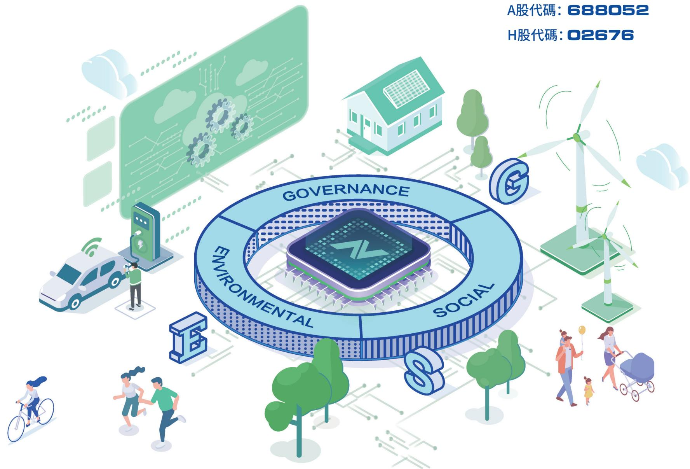

flowchart

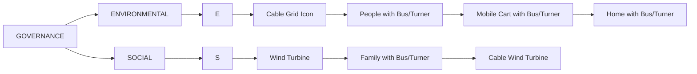
```mermaid
graph LR
  A["GOVERNANCE"] --> B["ENVIRONMENTAL"]
  A --> C["SOCIAL"]
  B --> D["E"]
  C --> E["S"]
  D --> F["Cable Grid Icon"]
  E --> G["Wind Turbine"]
  F --> H["People with Bus/Turner"]
  G --> I["Family with Bus/Turner"]
  H --> J["Mobile Cart with Bus/Turner"]
  I --> K["Cable Wind Turbine"]
  J --> L["Home with Bus/Turner"]
```

## CONTENTS

<table><tr><td>關於本報告</td><td>02</td></tr><tr><td>董事長致辭</td><td>03</td></tr><tr><td>董事會聲明</td><td>04</td></tr></table>

## 05 走進納芯微開啟新篇章

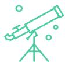

<table><tr><td>公司簡介</td><td>05</td></tr><tr><td>全球佈局</td><td>05</td></tr><tr><td>企業文化</td><td>05</td></tr><tr><td>核心事業</td><td>05</td></tr><tr><td>發展歷程</td><td>07</td></tr></table>

## 27 以人為本 培育成長沃土

<table><tr><td>我們的員工</td><td>28</td></tr><tr><td>員工權益</td><td>31</td></tr><tr><td>培訓與職業發展</td><td>36</td></tr><tr><td>職業健康與安全</td><td>39</td></tr><tr><td>公益行動與社會責任</td><td>41</td></tr></table>

## 42 共創共享 創造非凡價值

<table><tr><td>創新研發</td><td>43</td></tr><tr><td>品質管理</td><td>48</td></tr><tr><td>供應鏈管理</td><td>52</td></tr></table>

## 專題

## 08 用「芯」共築智能出行可持續未來

<table><tr><td>「芯」智造,驅動綠色安全出行</td><td>08</td></tr><tr><td>「芯」聚力,共建開放協同生態</td><td>10</td></tr></table>

## 56 綠色運營共繪生態畫卷

<table><tr><td>環境管理</td><td>57</td></tr><tr><td>節能減排</td><td>58</td></tr><tr><td>原材料使用</td><td>61</td></tr><tr><td>應對氣候變化</td><td>62</td></tr></table>

## 11 策略有方守護長足發展

<table><tr><td>合規治理</td><td>12</td></tr><tr><td>ESG 管理</td><td>18</td></tr><tr><td>信息安全</td><td>24</td></tr></table>

## 展望未來 66 附錄 67

<table><tr><td>榮譽與獎項</td><td>67</td></tr><tr><td>報告索引</td><td>68</td></tr><tr><td>意見反饋</td><td>76</td></tr></table>

## 關於本報告

## 報告簡介

本報告是蘇州納芯微電子股份有限公司發佈的第四份環境、社會及公司治理（Environmental，Social and Governance，以下簡稱「ESG」）報告，報告結合2025年度夯實公司治理、保障員工權益及堅持研發創新等具體實踐編製，旨在呈現本公司本年度踐行ESG理念，履行企業社會責任情況。

## 報告時間範圍

2025年1月1日至2025年12月31日，為增強報告的可讀性，部分內容適當溯及以往年份或延伸至後續年度。

## 報告組織範圍

除特別說明外，本報告與公司年報範圍保持一致。

## 稱謂說明

為便於表達和方便閱讀，蘇州納芯微電子股份有限公司及子公司在報告中以「納芯微」「公司」或「我們」表述。

## 數據說明

本報告引用的數據和案例均來自納芯微及其主要子公司的正式工作文件、財務報告及統計數據，並經由公司相關部門審核確認，確保不存在虛假記載、誤導性陳述或重大遺漏，若本報告所載有關數據與公司年度報告不一致，請以年度報告為準。

本報告涉及的貨幣種類及金額，如無特殊說明，均以人民幣為計量單位。

## 參考標準

本報告遵循《上海證券交易所上市公司自律監管指引第14號—可持續發展報告（試行）》、香港聯合交易所上市規則附錄C2《環境、社會及管治報告守則》，並參考全球報告倡議組織《可持續發展報告標準(GRI Standards)(2021版)》、中國社科院經濟學部企業社會責任研究中心《中國企業社會責任報告編寫指南(CASS-ESG 6.0)》編製。

## 報告獲取

本報告包括中文簡體、中文繁體和英文三種版本，若有歧義產生，以中文簡體版為準。您可以在蘇州納芯微電子股份有限公司網站（ www.novosns.com）下載本報告電子文本，獲取更多公司信息。

## 意見反饋

如您對本公司的可持續發展有任何意見或建議，歡迎通過以下方式反饋意見，幫助我們對報告進行持續改進。

電話：+86-512-6260-1802

郵箱：pr@ novosns.com

## 董事長致辭

## 尊敬的各位同事、合作夥伴、讀者 ：

2025年，是納芯微成立的第十二年。十二年來，我們始終秉持「可靠、可信賴、持續學習、堅持長期價值」的價值觀，與全體員工、客戶及合作夥伴攜手同行，堅持長期主義，夯實技術與產品能力，以穩健而有韌性的節奏一路成長。在登陸A股科創板的三年後，我們這個「少年」遠航出海了 ：2025年12月8日，納芯微正式在香港聯合交易所主板掛牌上市，標誌着公司在持續深耕國內市場的同時，加快全球客戶服務、供應鏈協同與產業生態建設，全球化戰略邁向新階段。在此，我謹代表董事會，向全體員工的不懈奮鬥、客戶的堅定信賴、合作夥伴的鼎力支持致以最誠摯的感謝！

## 產業換擋，深耕篤行

站在新的時間節點回望，半導體產業正逐步從階段性調整走向更加理性、結構化的發展階段。產業格局的持續演進，對企業的戰略判斷力、執行力與長期投入能力提出了更高的標準。從全球視野來看，模擬半導體行業繼續保持着穩健的增長韌性 ；聚焦中國市場，得益於本土產業的協同深化，其展現出的增長潛力尤為顯著，纳芯微始终圍繞既定方向穩步推進，聚焦核心應用，持續加強產品研發與能力建設，並不斷完善穩定的供應與交付體系，使公司能夠在複雜多變的行業環境中保持有序、可持續的發展節奏。

## 核心成就，持續增長

在汽車領域，納芯微的產品已覆蓋新能源車主驅逆變器、車載充電機、電池管理與熱管理等關鍵系統，並持續向車身電子、車載照明、智能座艙、底盤控制及安全系統等領域延展，助力低碳、安全、智能電動汽車的系統級創新。在泛能源領域，納芯微長期深耕，持續沉澱，已覆蓋新能源發電、輸配電及功率用電等核心場景。圍繞信號鏈、電源管理、傳感與實時控制等技術領域，公司已構建起完整的產品佈局，並持續向更高集成度、更廣應用場景拓展。與此同時，對於具身智能等新興方向，納芯微穩步推進，從功能需求出發，定位「智能終端」賽道，圍繞智能感知、智能決策與智能執行等環節，開展前瞻性技術儲備。這些進展，標誌着公司已具備在複雜系統中持續交付高可靠產品的能力基礎，也為未來的長期增長打下更穩固的根基。

## 綠芯引擎，著眼未來

納芯微的價值觀與可持續發展緊密相連，我們亦將可持續發展理念貫徹在公司經營管理中 ：在產品研發中大力投入有利於環境友好的研發，推動行業低碳化、智能化發展 ；關心每一位員工的發展，為員工創造安全、平等、多元、包容的工作環境，增強員工的認同感與歸屬感，「芯火」「芯石」「芯空」等特色培訓持續賦能團隊成長 ；秉持「質量始於設計，貫穿全生命週期」的管理理念，營造「質量第一」的質量文化，提高產品信任度和競爭力 ；不斷深化與全球產業鏈夥伴的協同合作，通過定制化解決方案提升客戶系統性能，利用靈活高效的服務優勢助力客戶實現成本優化與價值提升，共挖存量市場潛力，把握增量市場機遇。

## 立足中國，擁抱全球

紅日初升，其道大光。納芯微已開啟從中國邁向世界的新征程，我們立志成為在全球汽車與能源產業智能化、電動化浪潮中，那個不可或缺的「共建者」與「優選夥伴」，奮楫揚帆啟新程，願與各方繼續在可持續發展徵途上攜手並進，出海遠航，乘風破浪。

text_image

王升楊
納芯微董事長

## 董事會聲明

報告期內，董事會作為本公司ESG治理的最高決策機構，全面負責ESG事務的監督、指導及審核，確保ESG策略在日常運營中有效執行。董事會高度重視風險管理工作，已將ESG關鍵風險納入本公司全面風險管理體系，定期跟蹤環境目標、爭議事件，以風險評估、過程管控及事件應對為抓手，推進全面全員全過程風險管控。

本公司參照《上海證券交易所上市公司自律監管指引第14號—可持續發展報告（試行）》、香港聯合交易所上市規則附錄C2《環境、社會及管治報告守則》等監管要求，參考聯合國可持續發展目標（SDGs）、全球報告倡議組織（GRI）發佈的GRI標準，從影響重要性和財務重要性兩個維度出發，識別、評估並優次排序重大ESG議題，篩選出實質性議題並制定與業務運營相關聯的ESG目標。

本報告嚴格遵循上海證券交易所及香港聯合交易所相關規定編製，有關ESG報告指引遵循情況可參見本報告索引表。本報告經董事會審閱及批准發佈。

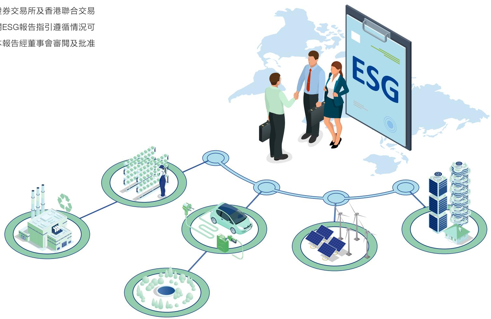

flowchart

```mermaid
graph LR
  A["ESG Report"] --> B["Central Node"]
  C["ESG Report"] --> D["Central Node"]
  E["ESG Report"] --> F["Central Node"]
  G["ESG Report"] --> H["Central Node"]
  I["ESG Report"] --> J["Central Node"]
  K["ESG Report"] --> L["Central Node"]
  M["ESG Report"] --> N["Central Node"]
  O["ESG Report"] --> P["Central Node"]
  Q["ESG Report"] --> R["Central Node"]
  S["ESG Report"] --> T["Central Node"]
  U["ESG Report"] --> V["Central Node"]
  W["ESG Report"] --> X["Central Node"]
  Y["ESG Report"] --> Z["Central Node"]
  AA["ESG Report"] --> AB["Central Node"]
  AC["ESG Report"] --> AD["Central Node"]
  AE["ESG Report"] --> AF["Central Node"]
  AG["ESG Report"] --> AH["Central Node"]
  AI["ESG Report"] --> AJ["Central Node"]
  AK["ESG Report"] --> AL["Central Node"]
  AM["ESG Report"] --> AN["Central Node"]
  AO["ESG Report"] --> AP["Central Node"]
  AQ["ESG Report"] --> AR["Central Node"]
  AS["ESG Report"] --> AT["Central Node"]
  AU["ESG Report"] --> AV["Central Node"]
  AW["ESG Report"] --> AX["Central Node"]
  A --> B
  B --> C
  C --> D
  D --> E
  D --> F
  D --> G
  D --> H
  D --> I
  D --> J
  D --> K
  D --> L
  D --> M
  D --> N
  D --> O
  D --> P
  D --> Q
  D --> R
  D --> S
  D --> T
  D --> U
  D --> V
  D --> W
  D --> X
  D --> Y
  D --> Z
  AA["ESG Report"] -.-> AB
  AB -.-> AC
  AC -.-> AD
  AD -.-> AE
  AE -.-> AF
  AF -.-> AG
  AG -.-> AH
  AH -.-> AI
  AI -.-> AJ
  AJ -.-> AK
  AK -.-> AL
  AL -.-> AM
  AM -.-> AN
  AN -.-> AO
  AO -.-> AP
  AP -.-> AQ
  AQ -.-> AR
  AR -.-> AS
  AS -.-> AT
  AT -.-> AU
  AU -.-> AV
  AV -.-> AW
  AW -.-> AX
  AX -.-> AZ
  AZ -.-> BA
  BA -.-> BC
  BC -.-> BD
  BD -.-> BE
  BE -.-> BF
  BF -.-> BG
  BG -.-> BH
  BH -.-> BI
  BI -.-> BJ
  BJ -.-> BK
  BK -.-> BL
  BL -.-> BM
  BM -.-> BN
  BN -.-> BO
  BO -.-> BP
  BP -.-> BR
  BR -.-> BT
  BT -.-> BU
  BU -.-> BV
  BV -.-> BW
  BW -.-> BX
  BX -.-> BY
  BY -.-> BB
  BB -.-> BC
  BC -.-> BD
  BD -.-> BE
  BE -.-> BF
  BF -.-> BG
  BG -.-> BH
  BH -.-> BI
  BI -.-> BJ
  BJ -.-> BK
  BK -.-> BL
  BL -.-> BM
  BM -.-> BN
  BN -.-> BO
  BO -.-> BP
  BP -.-> BR
  BR -.-> BT
  BT -.-> BU
```

## 走進納芯微 ：開啟新篇章

## 公司簡介

蘇州納芯微電子股份有限公司(簡稱納芯微，上交所科創板股票代碼：688052SH：香港聯交所股票代碼 ：02676.HK）是高性能高可靠性模擬及混合信號芯片公司。自2013年成立以來，公司聚焦傳感器、信號鏈、電源管理三大方向，為汽車、工業、信息通訊及消費電子等領域提供豐富的半導體產品及解決方案。

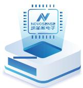  
全品類數模混合芯片提供商

  
國內汽車芯片領跑者

  
數字隔離、隔離驅動和傳感器芯片領跑者

## 全球佈局

## 研發和銷售佈局海內外

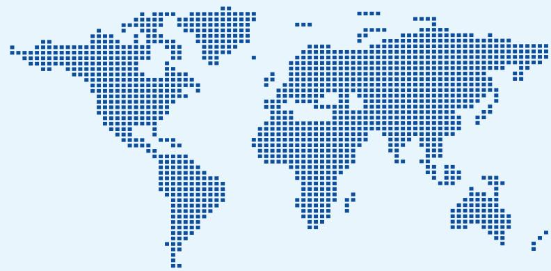

geo

| Region | Value (Relative) |
| --- | --- |
| North America | High |
| Europe | Medium |
| Asia | Low |
| South America | Low |
| Africa | Low |
| Australia | Low |
| Middle East | Low |
| Central Asia | Low |
| Southeast Asia | Low |
| Oceania | Low |
| Antarctica | Very Low |

蘇州、上海、深圳、北京成都、南京、杭州、合肥青島、武漢、重慶、天津  
德國，韓國，日本，美國

## 企業文化

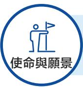

以「感知」「驅動」未來，共建綠色、智能、互聯互通的「芯」世界

可靠 可信賴 持續學習 堅持長期價值

  
價值觀

## 核心事業

## 產品佈局

納芯微始終秉承「可靠，可信賴，持續學習，堅持長期價值|的核心價值觀，為客巨提供可靠的產品做業界可信賴的合作夥伴。

我們擁有豐富的半導體產品組合，涵蓋傳感器（磁、壓力、溫濕度等）、信號鏈（隔離、接口、通用信號鏈等）、電源管理（驅動、功率路徑保護、高低邊開關等）、MCU和ASSP等多個領域。截至2025年末，已能提供3,900餘款可供銷售的產品型號。

## 核心事業

## 市場應用

納芯微圍繞不同的應用場景，不斷拓展產品品類，為汽車電子、泛能源1、消費電子等領域提供完整的解決方案，主要下游市場應用如下 ：

## 汽車電子

芯片是推動汽車技術創新、實現電動化與智能化的核心驅動力。納芯微專注於為汽車行業提供全面的芯片解決方案，其產品已廣泛應用於主驅逆變器、車載充電機、電池管理、熱管理等關鍵系統。同時，公司持續拓展創新方案，進一步覆蓋車身電子、智能座艙、車載照明、底盤控制及安全系統等領域，助力汽車行業邁向更智能、更高效的未來。

natural_image

Futuristic electric car with glowing blue trajectory rings on a grid background (no text or symbols)

## 可再生能源與電源

系統設計的高效率、小型化、高可靠性和長壽命是光伏、風電等可再生能源及能源行業的核心追求。納芯微憑藉高質量、小尺寸、高集成的芯片解決方案，為能源系統提供了多元、靈活的技術組合，全面滿足多樣化的應用需求。其產品廣泛應用於組串式及集中式光伏逆變器、微型及戶用儲能逆變器、儲能變流器、風電變流器、充電樁系統控 制 與 模 組、AC-DC及DC-DC電源、移動儲能設備、能量管理系統(EMS)、不間斷電源(UPS)等關鍵場景，助力能源行業實現更高效、更可靠的智能化升級，推動清潔能源技術的持續發展。

natural_image

Solar panel farm with wind turbines in the background under a clear blue sky (no text or symbols visible)

## 工業自動化

工業自動化行業正朝着更智能、更精準、更高效的方向快速發展。納芯微的低功耗、高可靠、高集成芯片解決方案助力工業系統實現節能降耗、降本增效，產品覆蓋工業變頻器、伺服、步進電機、智能儀表、工業機器人、人形機器人等多個場景，為工業控制系統的智能化、高效化和可靠性提供強有力的技術支撐。

natural_image

Industrial robotic arms in a factory setting, no visible text or symbols

## 消費電子

個人消費電子與家用電器正全面邁向智能化、精細化的新時代。納芯微憑藉先進的傳感器與驅動芯片技術，致力於實現「高精度檢測、高性能控制」，為行業注入更強的創新動力與競爭優勢。其解決方案不僅深度應用於洗衣機、空調、冰箱等傳統白色家電，更廣泛覆蓋掃地機器人、加濕器、掛燙機、咖啡機、養生壺等小型智能家電，為消費者的智慧家居生活提供全方位賦能，推動家居體驗向更智能、更便捷、更高效的方向持續演進。

natural_image

Product display of various electronic devices including washing machines, refrigerators, and a CRT monitor against a blue background (no text or symbols visible)

作為國內綠色智能芯片領域的先行者，納芯微積極響應國家生態文明建設號召，以傳感器、信號鏈、電源管理三大技術方向為支點，構建覆蓋汽車、工業、能源等關鍵領域的綠色產品矩陣，憑藉卓越的技術實力與前瞻性的戰略佈局，領航前行。

## 2025年，納芯微下游應用領域佔比：

汽車電子

35.22%

泛能源

52.92%

消費電子

11.86%

## 發展歷程

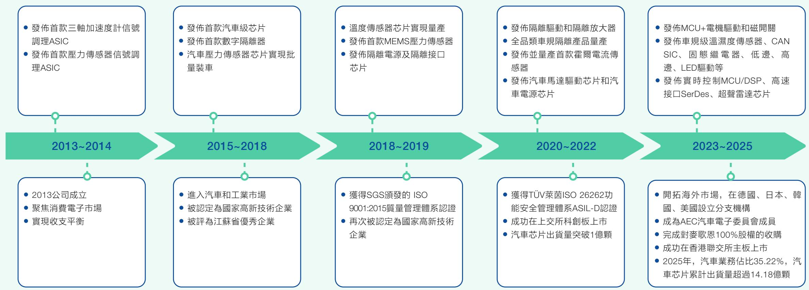

flowchart

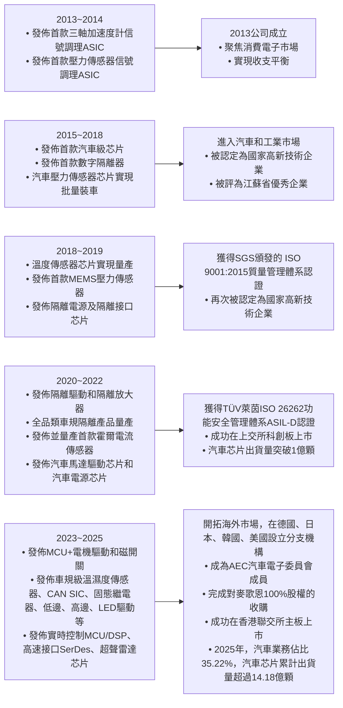
```mermaid
graph LR
  A["2013~2014\n• 發佈首款三軸加速度計信號調理ASIC\n• 發佈首款壓力傳感器信號調理ASIC"] --> B["2013公司成立\n• 聚焦消費電子市場\n• 實現收支平衡"]
  C["2015~2018\n• 發佈首款汽車級芯片\n• 發佈首款數字隔離器\n• 汽車壓力傳感器芯片實現批量裝車"] --> D["進入汽車和工業市場\n• 被認定為國家高新技術企業\n• 被評為江蘇省優秀企業"]
  E["2018~2019\n• 溫度傳感器芯片實現量產\n• 發佈首款MEMS壓力傳感器\n• 發佈隔離電源及隔離接口芯片"] --> F["獲得SGS頒發的 ISO\n9001:2015質量管理體系認證\n• 再次被認定為國家高新技術企業"]
  G["2020~2022\n• 發佈隔離驅動和隔離放大器\n• 全品類車規隔離產品量產\n• 發佈並量產首款霍爾電流傳感器\n• 發佈汽車馬達驅動芯片和汽車電源芯片"] --> H["獲得TÜV萊茵ISO 26262功能安全管理體系ASIL-D認證\n• 成功在上交所科創板上市\n• 汽車芯片出貨量突破1億顆"]
  I["2023~2025\n• 發佈MCU+電機驅動和磁開關\n• 發佈車規級溫濕度傳感器、CAN SIC、固態繼電器、低邊、高邊、LED驅動等\n• 發佈實時控制MCU/DSP、高速接口SerDes、超聲雷達芯片"] --> J["開拓海外市場，在德國、日本、韓國、美國設立分支機構\n• 成為AEC汽車電子委員會成員\n• 完成對麥歌恩100%股權的收購\n• 成功在香港聯交所主板上市\n• 2025年，汽車業務佔比35.22%，汽車芯片累計出貨量超過14.18億顆"]
```

## 專題 用「芯」共築智能出行可持續未來

面對全球碳中和的長期目標，碳減排依然面臨重要挑戰，半導體產業作為數字化與低碳化深度融合的核心載體，正肩負着賦能綠色轉型的重要使命。納芯微始終以「技術驅動可持續未來」為核心理念，將綠色低碳基因深植於產品創新與產業協作中，通過技術突破與開放合作雙輪驅動，為中國芯片行業的可持續發展注入新動能。

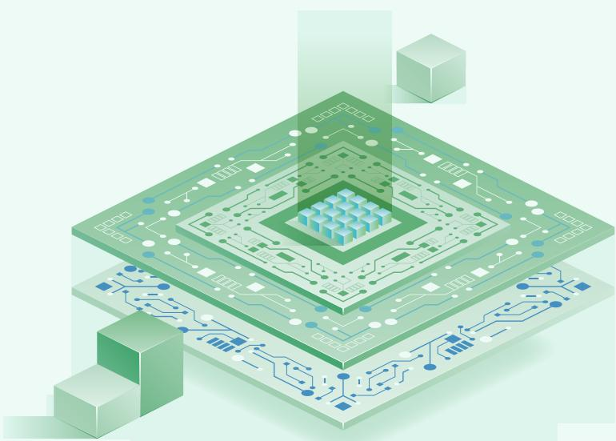

natural_image

Isometric illustration of a microchip with circuit board and integrated circuits, no text or symbols present

## 「芯」智造，驅動綠色安全出行

在汽車產業智能化與低碳化雙軌並行的浪潮中，芯片已成為定義產品性能與生態價值的核心。我們以傳感器、信號鏈、電源管理三大技術為基石，將安全可靠與綠色高效的設計理念深植於產品創新。通過一系列高集成、低功耗、符合最高功能安全標準的芯片解決方案，我們不僅守護着每一次出行的安全，更致力於降低車輛全生命週期的能耗與資源消耗，讓技術進步切實轉化為可持續的出行體驗。

## 智能LED車燈驅動芯片 ：安全可靠，讓出行更安心

納芯微LED車燈驅動芯片，專為汽車前燈與尾燈等關鍵照明系統設計，廣泛應用於貫穿式尾燈、轉向燈、制動燈、格柵燈及智能信號顯示ISD等場景，為智能車燈提供高集成度的驅動方案。該產品系列通過德凱(DEKRA)ISO 26262:2018 ASIL B功能安全產品認證，表明其在系統性失效及隨機硬件失效的應對能力已達到汽車功能安全ASIL B等級要求。該芯片集成多項安全機制，可有效檢測芯片自身及外部組件的異常情況，並通過額外的Fail Safe控制功能，確保系統在檢測到異常時能夠進入預期的安全狀態，有效提升駕乘人員及道路行人的安全水平。通過熱共享設計，該系列減少了芯片數量與系統發熱，降低了整車能耗並延長車燈系統壽命，從而在車輛全生命週期內減少維修、更換及相關資源消耗。該產品系列100%通過功能安全認證，助力車企及Tier1更高效地滿足全球汽車安全法規與供應鏈准入要求。

natural_image

Front view of a blue electric car with sleek design and illuminated rear panel (no visible text or symbols)

## 「芯」智造，驅動綠色安全出行

## 磁感應位置檢測開關芯片 ：讓感知更高效，讓設備更耐用

納芯微磁感應位置檢測開關芯片通過非接觸式感應技術，替代傳統機械開關與電位計，顯著降低系統功耗並延長終端設備使用壽命。該方案廣泛應用於工業物聯網、汽車、家電及消費電子領域，可實現設備低功耗管理、狀態監測與安全檢測。通過高可靠性設計、雙輸出架構及單一晶圓多配置方案，可有效簡化外圍電路、減少BOM物料使用、優化庫存管理並降低生產損耗。其小型化、低功耗設計支持終端產品更加緊湊，助力設備全生命週期的節能運行與資源高效利用。

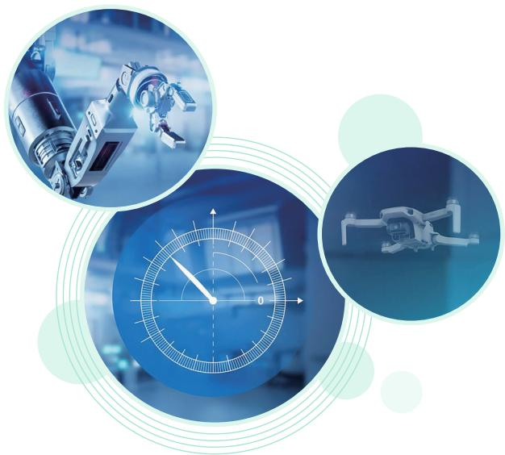

natural_image

Three circular icons representing industrial automation systems: robotic arm, drone, and a speedometer (no text or symbols)

## 車載音頻數字化解決方案 ：重構車載音頻架構，助力可持續出行

納芯微的車載音頻數字化解決方案基於全國汽車標準化技術委員會最新數字音頻網絡標準，採用單條非屏蔽雙絞線，實現最長 米的音頻、控制與時鐘同步傳輸，支持節點無獨立供電設計，並以低於微秒的確定性延時和最高 通道能力，滿足主動降噪與高清音頻等高端應用需求。通過數字化車載音頻網絡替代傳統多路模擬線纜，顯著減少線束數量與重量（約降低75%），降低原材料使用強度，並通過整車輕量化間接改善能源使用效率。

natural_image

Close-up of a car's rear dashboard with a blue laser beam and light trails (no text or symbols visible)

## 車身碰撞壓力傳感器 ：以更快響應，為駕乘安全築牢防線

納芯微車身碰撞壓力傳感器面向汽車側面碰撞等重要安全場景，精準解決了傳統加速度傳感器在快速柱碰撞中響應不足的問題。中國新車評價規程C-NCAP（2024版）新增側面碰撞試驗，對乘員保護提出更高要求，在7ms內完成有效識別成為側氣簾可靠觸發的關鍵。該方案通過在車門等位置引入壓力傳感器，與加速度計協同工作，可顯著提升側面氣簾觸發的及時性與可靠性，現已逐步從高端車型拓展至傳統車型應用，為駕乘人員提供更穩健的被動安全保障。在安全性方面，該傳感器方案按照汽車功能安全標準設計，滿足ASIL B(D)安全等級，並支持上層系統達到ASIL D，可在嚴苛工況下穩定工作，為關鍵乘員保護系統提供可靠信號輸入，保障整車安全性能。在滿足產品長期可靠性的同時，該方案在芯片設計階段同步評估無氟材料應用的可行性，為後續工藝選型提供更多可能，在提升車輛安全性能的同時，積極響應日益嚴格的環保法規要求，推動汽車電子產品向更安全、更可持續的方向演進。

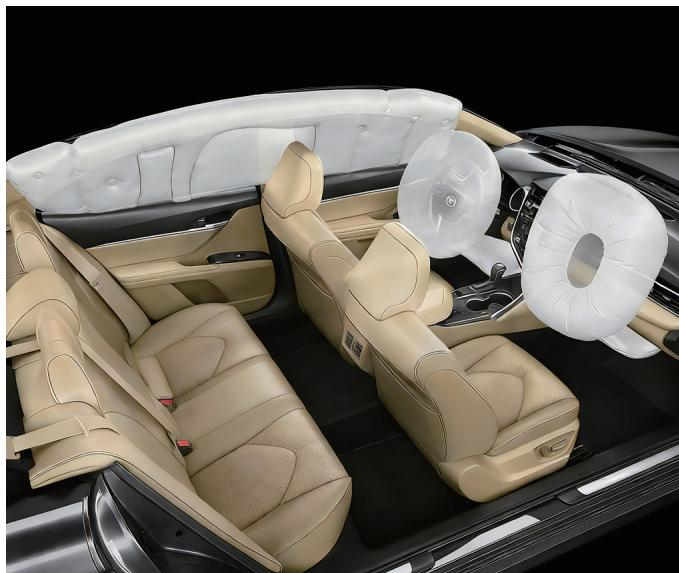

natural_image

Interior view of a luxury car with beige leather seats and white steering wheel (no visible text or symbols)

## 「芯」聚力，共建開放協同生態

在深耕技術創新的同時，公司秉持「開放共生|的產業理念，致力於與行業進行多元合作，推動芯片領域的共同進步。我們積極組織並參加行業峰會、論壇等活動，深度參與行業技術路線與標準制定，攜手產業鏈上下游夥伴開展協同創新與聯合攻關，與行業專家、企業和合作夥伴共享領先實踐、探討前沿技術，凝聚產業合力，共促高質量發展。報告期內，公司攜手生態夥伴在多個領域展開合作，共同打造技術共享、資源互補的產業協同效應。依托「技術突破+生態共建」的雙重實踐，公司不僅強化了在汽車電子、新能源等核心市場的競爭優勢，更以點帶面助力全行業向高效、清潔、低碳方向邁進。

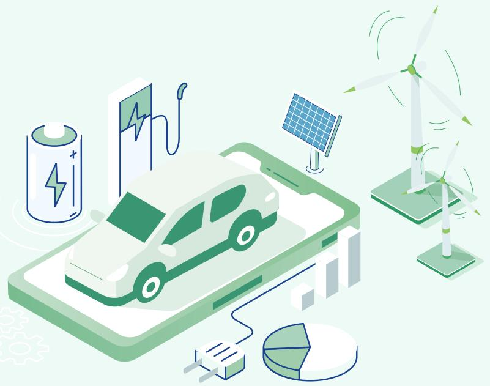

natural_image

Illustration of electric vehicles connected to renewable energy sources including battery, solar panel, wind turbine, and pie chart (no text or symbols)

## 納芯微深度參與《節能與新能源汽車技術路線圖3.0》編製

作為國產汽車芯片領域的代表企業，納芯微深度參與了《節能與新能源汽車技術路線圖3.0》中《汽車芯片專題技術路線圖》的編製工作。公司技術市場專家受邀擔任專家組成員，參與探討並制定車規級傳感器與驅動芯片等關鍵領域的技術路線、發展目標及標準框架，貢獻了來自納芯微的技術洞察與產業實踐。

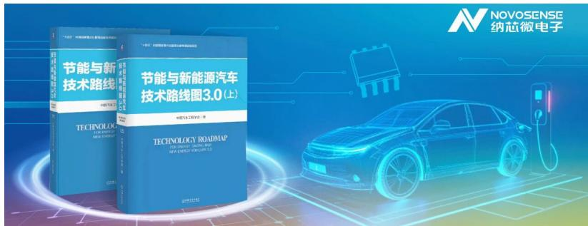

text_image

节能与新技术路线
TECHNOLOGY ROADMAP
“智能与新技术”技术路线图3.0(上)
NovoSENSE
纳芯微电子

## 智驅未來，賦能全域智能電動生態—納芯微出席2025百人會論壇

3月28日至30日，以「夯實電動化，推進智能化，實現高質量發展」為主題的中國電動汽車百人會論壇(2025)在北京釣魚台國賓館召開。作為國產汽車模擬芯片領域的領軍企業，納芯微創始人兼董事長、CEO王升楊應邀出席理事會議並接受媒體採訪。同時，納芯微副總裁姚迪也在智能汽車創新技術與產業論壇上發表精彩演講，分享國產芯片如何夯實電動化基礎、加速智能化進程，並參與全球產業鏈協同創新。

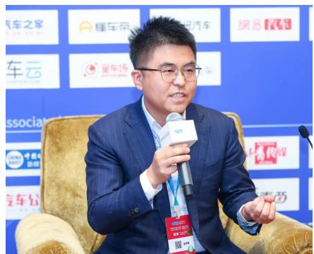

text_image

Man speaking at a conference with visible logos and banners in the background, including '汽车之家' and '星车场'.

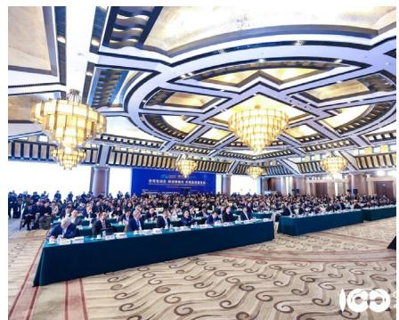

natural_image

Large conference hall with attendees seated at long tables under a decorative ceiling, no visible text or signage

## 策略有方

## 守護長足發展

12 合規治理  
18 ESG 管理  
24 信息安全

完善的公司治理是實現可持續發展的關鍵頂層設計，對於公司的長遠發展和基業長青至關重要。納芯微積極響應聯合國可持續發展目標中的第5、12、16項，持續優化公司治理結構。我們致力於推動企業的可持續發展，通過將ESG理念融入企業戰略，確保公司在未來能夠穩健前行並為社會貢獻力量。

## 我們的行動 ：

誠信經營，恪守商業道德，每年舉辦至少一次全員商業道德培訓，確保每位員工都能深入理解並踐行公司的核心價值觀  
持續提升性別多樣性，特別支持STEM（科學、技術、工程、數學）領域女性的職業發展，推動平等機會和包容性文化建設  
定期開展利益相關方溝通調研，傾聽各方意見和建議，確保公司決策能夠充分反映各利益相關方的需求和期望

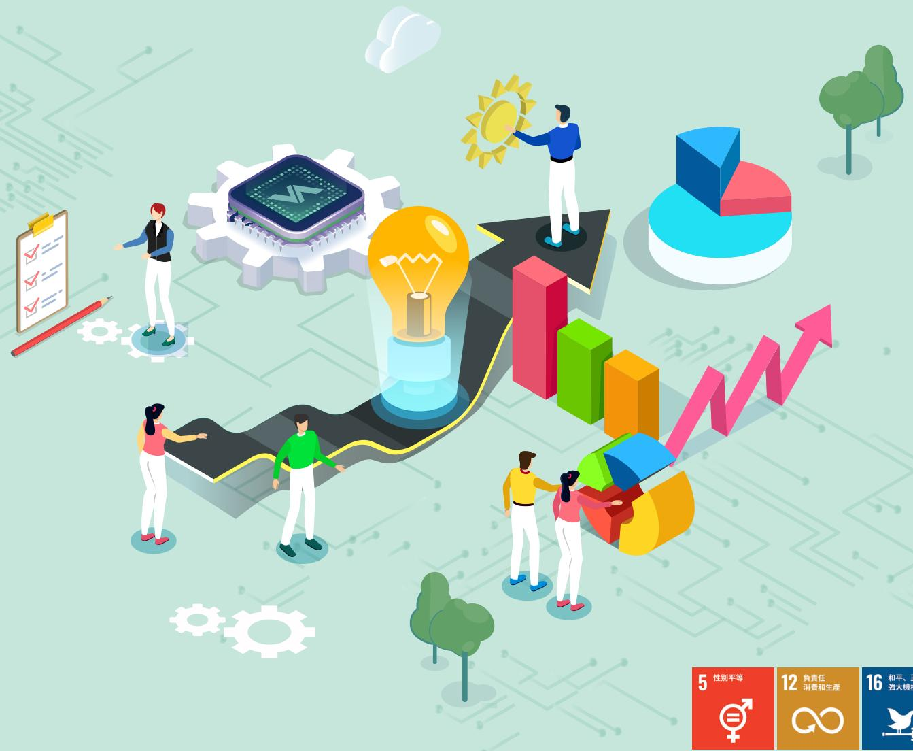

flowchart

```mermaid
graph LR
  A["Left Column"] --> B["Central Node"]
  C["Right Column"] --> D["Right Column"]
  E["Bottom Column"] --> F["Bottom Column"]
  G["Left Column"] --> H["Center Node"]
  I["Right Column"] --> J["Right Column"]
  K["Left Column"] --> L["Center Node"]
  M["Right Column"] --> N["Right Column"]
  O["Left Column"] --> P["Center Node"]
  Q["Right Column"] --> R["Right Column"]
  S["Left Column"] --> T["Center Node"]
  U["Right Column"] --> V["Right Column"]
  W["Left Column"] --> X["Center Node"]
  Y["Right Column"] --> Z["Right Column"]
  AA["Left Column"] --> AB["Center Node"]
  AC["Right Column"] --> AD["Right Column"]
  AE["Left Column"] --> AF["Center Node"]
  AG["Right Column"] --> AH["Right Column"]
  AI["Left Column"] --> AJ["Center Node"]
  AK["Right Column"] --> AL["Right Column"]
  AM["Left Column"] --> AN["Center Node"]
  AO["Right Column"] --> AP["Right Column"]
  AQ["Left Column"] --> AR["Center Node"]
  AS["Right Column"] --> AT["Right Column"]
  AU["Left Column"] --> AV["Center Node"]
  AW["Right Column"] --> AX["Right Column"]
  AY["Left Column"] --> AZ["Center Node"]
  BA["Right Column"] --> BZ["Right Column"]
  BC["Left Column"] --> CD["Center Node"]
  CE["Right Column"] --> CF["Right Column"]
  DG["Left Column"] --> AE["Center Node"]
  AF["Right Column"] --> AG["Right Column"]
  AH["Left Column"] --> AI["Center Node"]
  AJ["Right Column"] --> AK["Right Column"]
  BL["Left Column"] --> BM["Center Node"]
  BN["Right Column"] --> BO["Right Column"]
  BP["Left Column"] --> BR["Center Node"]
  BC["Right Column"] --> BD["Right Column"]
  BE["Left Column"] --> BF["Center Node"]
  BG["Right Column"] --> BH["Right Column"]
  BI["Left Column"] --> BJ["Center Node"]
  BK["Right Column"] --> BLB["Right Column"]
  BLB --> BMB["Middle Bar Chart"]
  BMB --> BMB_1
  BMB_2 --> BMB_2
  BMB_3 --> BMB_3
  BMB_4 --> BMB_4
  BMB_5 --> BMB_5
  BMB_6 --> BMB_6
  BMB_7 --> BMB_7
  BMB_8 --> BMB_8
  BMB_9 --> BMB_9
  BMB_10 --> BMB_10
  BMB_11 --> BMB_11
  BMB_12 --> BMB_12
  BMB_13 --> BMB_13
  BMB_14 --> BMB_14
  BMB_15 --> BMB_15
  BMB_16 --> BMB_16
  BMB_17 --> BMB_17
  BMB_18 --> BMB_18
  BMB_19 --> BMB_19
  BMB_20 --> BMB_20
  BMB_21 --> BMB_21
  BMB_22 --> BMB_22
  BMB_23 --> BMB_23
  BMB_24 --> BMB_24
  BMB_25 --> BMB_25
  BMB_26 --> BMB_26
  BMB_27 --> BMB_27
  BMB_28 --> BMB_28
  BMB_29 --> BMB_29
  BMB_30 --> BMB_30
  BMB_31 --> BMB_31
  BMB_32 --> BMB_32
  BMB_33 --> BMB_33
  BMB_34 --> BMB_34
  BMB_35 --> BMB_35
  BMB_36 --> BMB_36
  BMB_37 --> BMB_37
  BMB_38 --> BMB_38
  BMB_39 --> BMB_39
  BMB_40 --> BMB_40
  BMB_41 --> BMB_41
  BMB_42 --> BMB_42
  BMB_43 --> BMB_43
  BMB_44 --> BMB_44
  BMB_45 --> BMB_45
  BMB_46 --> BMB_46
  BMB_47 --> BMB_47
  BMB_48 --> BMB_48
  BMB_49 --> BMB_49
  BMB_50 --> BMB_50
  BMB_51 --> BMB_51
  BMB_52 --> BMB_52
  BMB_53 --> BMB_53
  BMB_54 --> BMB_54
  BMB_55 --> BMB_55
  BMB_56 --> BMB_56
  BMB_57 --> BMB_57
  BMB_58 --> BMB_58
  BMB_59 --> BMB_59
  BMB_60 --> BMB_60
  BMB_61 --> BMB_61
  BMB_62 --> BMB_62
  BMB_63 --> BMB_63
  BMB_64 --> BMB_64
  BMB_65 --> BMB_65
  BMB_66 --> BMB_66
  BMB_67 --> BMB_67
  BMB_68 --> BMB_68
  BMB_69 --> BMB_69
  BMB_70 --> BMB_70
  DMG_Sideholder_Sideholder_Sideholder_Sideholder_Sideholder_Sideholder_Sideholder_Sideholder_Sideholder_Sideholder_Sideholder_Sideholder_Sideholder_Sideholder_Sideholder_Sideholder_Sideholder_Sideholder_Sideholder_Sideholder_Sideholder_Sideholder_Sideholder_Sideholder_Sideholder_Sideholder_Sideholder_Sideholder_Sideholder_Sideholder_Sideholder_Sideholder_Sideholder_Sideholder Siderholder_Sideholder_Sideholder_Sideholder_Sideholder_Sideholder_Sideholder_Sideholder_Sideholder_Sideholder_Sideholder_Sideholder_Sideholder_Sideholder_Sideholder_Sideholder_Sideholder_Sideholder_Sideholder_Sideholder_Sideholder_Sideholder_Sideholder_Sideholder_Sideholder_Sideholder_Sideholder_Sideholder_Sideholder_Sideholder_Sideholder_Sideholder_Sideholder_Sideender_Sideholder_Sideholder_Sideholder_Sideholder_Sideholder_Sideholder_Sideholder_Sideholder_Sideholder_Sideholder_Sideholder_Sideholder_Sideholder_Sideholder_Sideholder_Sideholder_Sideholder_Sideholder_Sideholder_Sideholder_Sideholder_Sideholder_Sideholder_Sideholder_Sideholder_Sideholder_Sideholder_Sideholder_Sideholder_Sideholder_Sideholder_Sideholder_Sideholder_Mid Sector_Mid Sector_Mid Sector_Mid Sector_Mid Sector_Mid Sector_Mid Sector_Mid Sector_Mid Sector_Mid Sector_Mid Sector_Mid Sector_Mid Sector_Mid Sector_Mid Sector_Mid Sector_Mid Sector_Mid Sector_Mid Sector_Mid Sector_Mid Sector_Mid Sector_Mid Sector_Mid Sector_Mid Sector_Mid Sector_Mid Sector_Mid Sector_Mid Sector_Mid Sector_Mid Sector_Mid Sector_Mid Sector_Mid Sector Mids Sector_Mids Sector_Mids Sector_Mids Sector_Mids Sector_Mids Sector_Mids Sector_Mids Sector_Mids Sector_Mids Sector_Mids Sector_Mids Sector_Mids Sector_Mids Sector_Mids Sector_Mids Sector_Mids Sector_Mids Sector_Mids Sector_Mids Sector_Mids Sector_Mids Sector_Mids Sector_Mids Sector_Mids Sector_Mids Sector_Mids Sector_Mids Sector_Mids Sector_Mids Sector_Mids Sector_Mids Sector_Mids Sector_Mids Sector_Mid Sector_Mid Sector_Mid Sector_Mid Sector_Mid Sector_Mid Sector_Mid Sector_Mid Sector_Mid Sector_Mid Sector_Mid Sector_Mid Sector_Mid Sector_Mid Sector_Mid Sector_Mid Sector_Mid Sector_Mid Sector_Mid Sector_Mid Sector_Mid Sector_Mid Sector_Mid Sector_Mid Sector_Mid Sector_Mid Sector_Mid Sector_Mid Sector_Mid Sector_Mid Sector_Mid Sector_Mid Sector_Mid Sectors Mectors Mectors Mectors Mectors Mectors Mectors Mectors Mectors Mectors Mectors Mectors Mectors Mectors Mectors Mectors Mectors Mectors Mectors Mectors Mectors Mectors Mectors Mectors Mectors Mectors Mectors Mectors Mectors Mectors Mectors Mectors Mectors Mectors Mectors Mectors Mectors Mectors Mectors Mectors Mectors Mectors Mectors Mectors Mectors Mectors Mectors Mectors Mectors Mectors Mectors N/A
```

16 和平、正義與 强大機構  

## 合規治理

## 公司治理

## 公司治理

納芯微重視現代企業治理體系的建設，不斷提升管理水平。公司建立了健全的規章制度，確保股東會、董事會及其專門委員會和管理層之間權責明確、運作高效。各職能部門分工明確、協同配合，保障決策、執行、監督三項職能分離並有效行使。通過構建科學規範、有效制衡、運作高效的治理體系，納芯微實現了穩健的運營和發展。

截至報告期末，納芯微共有董事會9人（含獨立董事4人），其中女性董事會成員2人，男性7人，女性成員佔比22.22%。

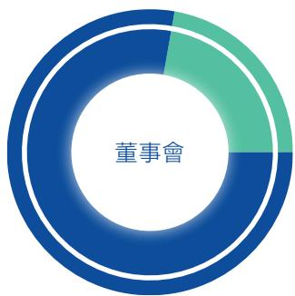

donut

| Category | Value |
| --- | --- |
| Blue | ~75% |
| Green | ~25% |

女性

22.22%

男性

77.78%

2025年，納芯微共召開 ：

<table><tr><td>股東(大)會</td><td>董事會會議</td><td>審計委員會會議</td><td>戰略與ESG委員會會議</td></tr><tr><td>4次</td><td>8次</td><td>6次</td><td>4次</td></tr><tr><td>提名委員會會議</td><td>薪酬與考核委員會會議</td><td>監事會會議</td><td></td></tr><tr><td>2次</td><td>3次</td><td> $6 \times 2$ </td><td></td></tr></table>

natural_image

Illustration of two people interacting with a laptop and charts, symbolizing business or data analytics (no text present)

## 合規治理

## 信息披露

納芯微嚴格遵守《上市公司信息披露管理辦法》等法律法規的要求，制定《信息披露管理制度》。我們細緻梳理了信息披露的工作流程，編製了《證券事務信息披露工作手冊》並不斷進行完善，以推進信息披露管理，確保信息披露工作的高效執行。秉持真實、準確、完整、及時、公平的披露原則，我們及時公佈對公司生產經營可能產生重大影響的信息，保障投資者的知情權。

與此同時，納芯微嚴格規範內幕信息知情人的行為和信息報備程序，加強未公開信息的傳遞、審核和披露流程管理。通過增強相關人員的內幕信息保密意識和登記意識，有效杜絕內幕交易的發生，進一步提升公司治理的透明度和合規性。

2025年，公司：

編製與披露定期報告共

4 份

發佈其他信息披露文件

170 份

natural_image

Illustration of a person pointing at a presentation board with multiple line charts (no text or labels visible)

## 投資者關係管理

納芯微致力於與投資者建立長期穩定的良好關係，秉持合規、平等、主動和誠實守信的原則，積極開展投資者管理工作。依據《上市公司投資者關係管理工作指引》，我們制定了《投資者關係管理制度》，以提升投資者關係管理水平，並構建雙向溝通平台，及時向投資者傳達公司經營管理和重大決策的相關信息，增進投資者對公司的了解和認同。

公司不斷完善與投資者的溝通機制，通過多種渠道保持積極互動。這些渠道包括股東（大）會、上交所e互動平台、投資者諮詢電話、接待機構調研、參與券商策略會以及開展業績說明會等。通過這些多樣化的溝通方式，我們不僅為投資者解答疑問，還傾聽他們的意見和建議，結合公司實際經營情況，為公司決策提供有價值的參考信息。

接待機構調研超

200場次

發佈投資者關係活動紀要

4篇

每日接聽

投資者電話

年報及一季報、中報業績說明會與會人員累計超過

650人次

回覆上交所e互動平台問題

39次

## 合規治理

## 風控及合規管理

依法合規經營是納芯微經營的底線，我們已將企業風險管理和合規管理納入發展戰略規劃，持續建設和完善合規體系和內部控制體系，樹立全員合規意識，提升公司的風險管理能力，確保公司的健康發展。

公司已建立完善的風險治理及合規管理體系，董事會下設審計委員會作為專業監督機構，公司內審部在審計委員會的指導下獨立開展工作，並直接向審計委員會報告，客觀地行使職權，不受其他部門或個人的干涉。具體職能職責如下 ：

風控及合規管理架構：

<table><tr><td>董事會</td><td>負責公司內部控制的建立健全和有效實施</td></tr><tr><td>審計委員會</td><td>負責指導和監督內部審計職能、內控體系和合規體系的建立和運作,包括:審閱公司年度內部審計工作計劃,聽取內審、內控合規治理相關工作匯報,評估內控體系和合規體系運行情況和工作成果,督促重要合規風險的治理以及重大問題的整改</td></tr><tr><td>經理層</td><td>負責公司日常經營過程中,公司流程及制度的設計,合規管理及內部控制活動的落實和有效運行</td></tr><tr><td>風控合規中心</td><td>下設內審部、內控部和合規部,保障公司規範運作與風險可控
•內審部:根據經審計委員會批准的審計計劃開展內部審計工作,對公司各職能部門及子公司的經營管理活動進行全面審計,並在內部審計過程中合理覆蓋潛在的舞弊風險。
•內控部:負責內部控制體系的建設與實施管理,指導公司開展內部控制管理工作,對內部控制的有效性進行監督檢查,並推動對發現的內部控制缺陷進行整改。
•合規部:建立健全合規管理體系,開展合規風險識別與評估,統籌推進合規風險治理與應對工作,並組織開展合規文化建設及專業合規培訓。</td></tr></table>

2025年，公司依據監管要求與業務需要，持續完善《合規管理運行規定》等相關制度，並圍繞重點合規領域，持續開展常態化的合規風險專項評估工作，覆蓋貿易管制、反商業賄賂、知識產權、反不正當競爭、信息安全、勞動用工等關鍵領域。依托既有的風險分類體系與業務流程框架，對相關合規風險進行系統識別與統籌分析。在此基礎上，公司結合風險發生可能性與潛在影響，對主要風險進行分級評估與綜合研判，形成配套的風險清單與應對措施，並通過高標準常態化的閉環管理，推動相關管控措施有效落實。合規風險評估作為公司風險管理體系的重要組成部分，已形成年度化、制度化運作機制，持續支持風險識別、應對與改進，助力公司穩健經營與長期可持續發展。同時，我們也積極開展合規相關培訓，2025年共計開展7場，合計11小時。

2025年共計開展7場合規相關培訓，

合計 11 小時

## 合規治理

## 商業道德

## 反舞弊與反賄賂

我們致力於建設廉潔、透明的企業文化，始終堅持誠信經營並恪守商業道德，對賄賂和腐敗行為秉持「零容忍」態度，並對所有商業行為負責，確保公司在商業運作中嚴格遵守法規和道德準則。在日常經營過程中，我們將一系列廉潔誠信管理措施融入日常工作中，建立了業界領先的管理體系 ；在監督機制方面，我們也建立了完善的多渠道舉報體系，保證舉報渠道暢通 ；除此之外，我們加強反腐敗反賄賂的培訓與宣貫，常態化開展商業道德相關教育，讓廉潔理念深入人心。

## 全员通知

## 关于反腐败反商业贿略的管理层承诺声明

社:会体董事，管理人员、员工和实习生

优思排务为核心的经管理念、防禁并及时发现纳芯做及各下星公司在经需管增中的结果及重大通纪、递规、期行为，绝正微于断安表和强化内别监督制制，保证公司财产安全，促进全业高道安全发展

苏州技美用电子振份有理公司

二

納芯微關於反腐敗反商業賄賂的

管理層承諾聲明

公司嚴格遵守《中華人民共和國公司法》《中華人民共和國反洗錢法》等關於廉潔自律和商業道德的相關政策和法律法規，制定《反商業賄賂管理運行機制》《反商業賄賂常見問題解答》等一系列規章制度。報告期內，公司對《反商業賄賂行為準則》例行修改，增擴規制行為類型。

納芯微已加入中國企業反舞弊聯盟和陽光誠信聯盟，進一步強化我們在反腐敗和誠信經營方面的承諾與實踐，確保公司的合規運營，並積極推動行業內的廉潔文化建設。

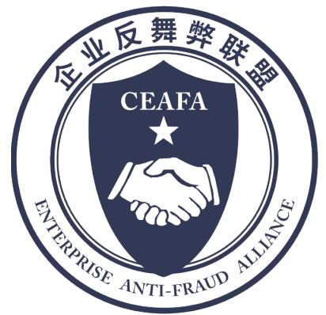

seal

企业反舞弊联盟
CEAFA
ENTERPRISE ANTI-FRAUD ALLIANCE

納芯微作為會員單位加入企業反舞弊聯盟

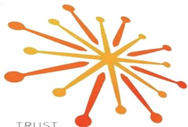

natural_image

Abstract radial pattern with orange and yellow dots radiating from a central point, labeled 'TRUST' at bottom (no other text or symbols)

阳光诚信联盟

納芯微成為陽光誠信聯盟會員單位  

natural_image

Illustration of two business professionals observing a laptop displaying financial charts (no text or symbols present)

## 合規治理

公司始終將合規與內控要求深度融入日常運營，通過流程和系統設計的有機結合，確保員工在工作中踐行廉潔自律的理念，共同維護企業誠信文化。例如，在採購和報銷系統中，我們在流程的關鍵環節嵌入風險評估機制，有針對性地識別和防範潛在風險，以強化合規管理。

納芯微致力於確保業務流程的誠信和透明度。我們積極與客戶簽署廉潔協議或承諾，並要求所有經銷商及重點供應商簽署《業務夥伴商業行為準則》。同時，我們也大力推進公司內部商業活動合規廉潔建設，內外並進，確保公司在商業行為上的100%合規。

## 供應鏈合規廉潔培訓與體系共建

2025年6月10日，公司開展供應鏈合規廉潔專題活動，通過培訓宣貫與員工共創相結合的模式，進一步深化供應鏈商業道德建設。本次活動面向採購等敏感崗位，立足業務實際，結合工作坊的形式，圍繞反商業賄賂基本要求、典型風險情形及行為準則等主題進行交流與規範。該培訓實現採購端管理層及員工100%覆蓋，有助於統一內部合規認知、強化廉潔自律意識，進一步提升員工對商業道德要求的理解與執行力。公司持續推動相關制度融入日常實踐，促進商業道德管理在供應鏈管理中的有效落實，為建設陽光、可持續的供應鏈體系提供支撐。

natural_image

Illustration of two people interacting with a large screen displaying charts and icons, no text or symbols present.

為有效防範內部利益衝突，推動經營管理規範化發展，公司制定《利益衝突管理制度》、嚴格防控潛在關聯關係、利益輸送等行為，保障公司及股東合法權益。同時，公司出台《反舞弊與舉報制度》，設立職業道德及舞弊案件專屬舉報郵箱，構建信函、電子郵件、電話、現場面談等多渠道舉報體系，保障舉報行為便捷、暢通。

對於舉報事項，公司在登記、受理、調查、報告、保管等實施嚴格的保密管理，嚴防信息洩露、資料遺失。嚴禁以任何形式對舉報人實施打擊報復，對違規洩露舉報信息、針對舉報人及調查人員開展打擊報復的行為，公司將依據制度予以撤職直至解除勞動合同的處分，涉嫌違法犯罪的，依法追究相關當事人的法律責任。

## 公司已搭建多維度舉報平台，具體渠道如下 ：

線上平台 ：辦公自動化（Office Automation，OA）平台舉報渠道

舉報郵箱 ：complaint@ novosns.com

通信地址 ：蘇州工業園區東蕩田巷9號，蘇州納芯微電子股份有限公司內審部

聯繫電話 ：+86-512-6260-1802（分機812）

## 合規治理

為強化全員商業道德素養與合規意識，公司將商業道德建設融入員工培訓、合規宣導、意識調研等全場景工作，構建常態化、體系化的宣貫培育機制 ：

## 培訓體系化落地

為實現合規及反商業賄賂培訓全員覆蓋，商業道德與行為準則納入各層級員工培訓以及宣貫內容，2025年開展此類培訓包括 ：年度全員合規及商業道德培訓1場、新員工合規及反商業賄賂專項培訓5場、供應鏈陽光體系建設工作坊1場、反商業賄賂納入管理者轉身計劃培訓以及公司領導力峰會專項議題等。

## 宣導陣地 常態化運營

2025年4月正式上線合規官方訂閱號，聚焦反商業賄賂與反腐敗、反不正當競爭、商業秘密保護等核心合規議題開展專題宣傳，2025年度共發佈專業宣導文章10篇，持續強化全員合規理念。

## 合規意識全面調研

2025年6至7月組織開展全員合規意識專項調研，全面摸排公司員工合規意識現狀，精準掌握全員對重點領域合規要求的理解與執行情況，為後續合規體系優化、宣導培訓升級提供數據支撐。

年，公司嚴格落實各項合規管理制度與宣貫培育舉措，合規經營、誠信運營的企業文化已深度融入日常經營管理。本年度，公司未收到任何涉及商業道德的賄賂、舞弊等相關舉報，亦未發生任何商業賄賂、貪污等訴訟事件，合規管理體系運行有效，為公司高質量發展築牢合規防線。

## 反壟斷與反不當競爭

公司高度重視反壟斷和反不正當競爭管理，恪守《反壟斷法》和《反不正當競爭法》等法律法規要求，構建完善的內部管控體系，先後制定並落地《反不正當競爭管理制度》《反壟斷合規管理辦法》《反壟斷合規手冊》等專項制度文件，明確全流程管理要求，規範經營行為與業務流程，從制度層面築牢反壟斷與反不正當競爭合規防線。

同時，公司強化全產業鏈合規協同，制定《業務夥伴商業行為準則》，明確業務合作方的合規經營標準與行為要求，推動上下游協同。公司將反壟斷、反不正當競爭合規要求納入《員工手冊》，明確員工從業行為規範，強化全員合規認知與風險防範意識，提升公司整體合規經營水平，有效防範各類不正當競爭及反壟斷相關經營風險。

## 透明納稅

依法誠信納稅是企業履行社會責任、彰顯商業信用的核心體現。公司嚴格遵守《中華人民共和國企業所得稅法實施條例》《關於深化增值稅改革有關政策的公告》等相關稅務法律法規，主動踐行納稅義務，依法向稅務機關足額、及時申報繳納各項稅款，積極配合國家稅收政策的實施，切實履行企業公民責任，為地方經濟發展和社會發展貢獻應有力量。

為有效管控稅務風險，公司建立常態化稅務風險管理機制，採用定期和不定期相結合的方式開展稅務風險評估，精準識別、及時防範稅務管理潛在風險。公司嚴格按照相關規定依法披露稅務信息，確保稅務管理全流程的合法性、規範性與透明度，堅決杜絕任何偷稅、漏稅行為。

2025年，公司未發生任何與反壟斷或反不正當競爭相關的違法違規事件。

natural_image

Illustration of three people collaborating around a laptop with a lightbulb on screen (no text or symbols)

2025年，公司未發生任何與稅務相關的違法違規事件，稅務管理工作合規有序開展。

## ESG管理

## ESG管治

公司建立健全ESG管治架構，構建董事會決策、高級管理層監督、各部門及分子公司執行落實的三級ESG管理體系，為公司可持續發展策略落地提供堅實保障。董事會層面設立戰略與ESG委員會，作為監管ESG事宜的核心監管與決策機構，全面統籌ESG策略規劃與落地監督，核心職責包括 ：

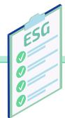

對公司長期發展戰略和重大投資決策進行研究並提出建議 ；  
指導公司可持續發展，ESG相關的戰略規劃，並指導公司相關工作的實施 ；  
關注對公司業務有重大影響的ESG相關風險和機遇，並提出相應建議 ；  
審議公司年度ESG報告。

公司高級管理層負責對公司可持續發展管理事宜的規劃和實際成果進行決策與監察，以支持戰略與ESG委員會的監管。各部門、各分子公司共同推進公司可持續發展管理相關事宜的藍圖規劃和業務，包括研究相關政策、完善內部制度、建立健全體系、開展ESG實踐、數據收集與覆核等。公司建立常態化ESG溝通與反饋機制，廣泛聽取內外部意見建議，精準傳達、溝通並落實環境、社會與管治方面的具體舉措和反饋意見，為公司可持續發展工作的推進提供強有力的組織保障。

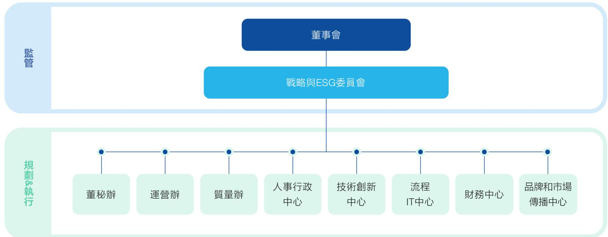

flowchart

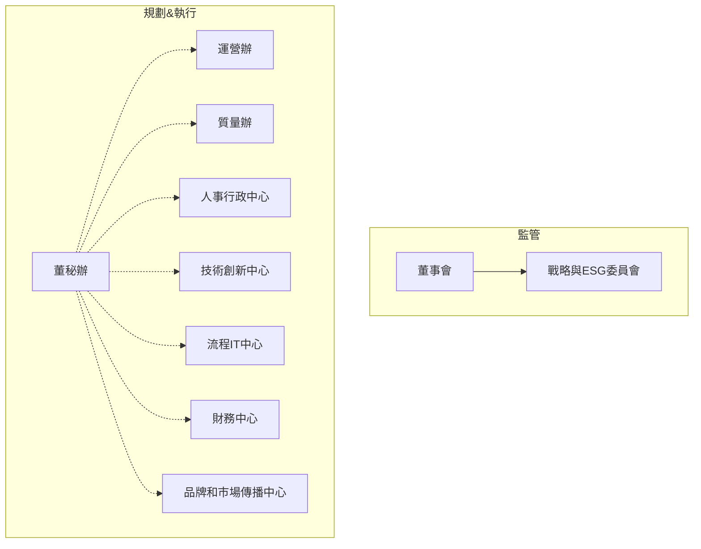
```mermaid
graph TD
  subgraph Supervisional["監管"]
  A["董事會"] --> B["戰略與ESG委員會"]
  end
  subgraph Planning & Execution["規劃&執行"]
    C["董秘辦"] -.-> D["運營辦"]
    C -.-> E["質量辦"]
    C -.-> F["人事行政中心"]
    C -.-> G["技術創新中心"]
    C -.-> H["流程IT中心"]
    C -.-> I["財務中心"]
    C -.-> J["品牌和市場傳播中心"]
  end
```

為推動ESG理念與公司經營發展深度融合，強化管理層對公司長期可持續發展的責任與動力，公司將客巨滿意度，發明專利數量，IP體系建設、技術平台化建設、研發能力建設、供應鏈體系建設、組織能力建設等多項ESG指標納入高管薪酬考核體系，以市場化激勵手段引導高管層聚焦公司長期價值創造，推動可持續發展理念深度融入公司經營管理各環節。

## ESG管理

## ESG目標

在管理層支持下，公司各部門結合業務實際制定了系統性的長期ESG工作目標，建立年度工作機制，定期回顧目標達成情況，並據此制定下一年度具體實施目標，穩步推進ESG工作落地。

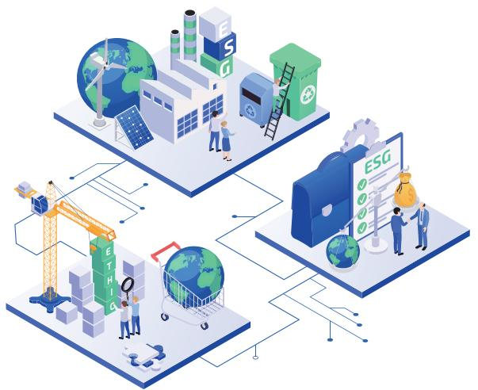

flowchart

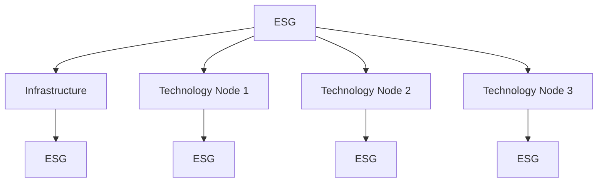
```mermaid
graph TD
  A["ESG"] --> B["Infrastructure"]
  A --> C["Technology Node 1"]
  A --> D["Technology Node 2"]
  A --> E["Technology Node 3"]
  B --> F["ESG"]
  C --> G["ESG"]
  D --> H["ESG"]
  E --> I["ESG"]
```

部分目標如下 ：

  
人事行政中心

持續對文化價值觀的建設，助力企業獲得ESG文化內驅力與員工認同  
基於員工滿意度調研，進行針對性的持續改善  
持續建設系統性的人才發展通道和培養項目  
整合企業知識資源，建設知識型組織

  
董秘辦

反商業賄賂宣貫，包括每年全員培訓1次 ；供應商培訓1次 ；高管層培訓1次  
落地反商業賄賂合規管理流程

  
運營辦

安全培訓100%覆蓋  
安全檢查100%覆蓋  
全年0安全環保事故  
● 保障安全生產所需資金投入  
加強與用車平台合作，使用新能源車輛服務，持續減少碳排放

## ESG管理

## ESG培訓及宣傳

公司將ESG理念融入企業經營與治理全流程，圍繞內部宣貫、外部傳播雙維度，搭建多樣化的ESG培訓與宣傳體系，持續提升全員ESG認知與實踐能力，積極傳遞企業可持續發展理念，推動行業綠色生態共建。

2025年12月，以ESG報告項目為契機，面向ESG工作小組和重點部門召開項目啟動會，開展1小時專項宣貫與動員工作，明確ESG工作推進要求與各部門職責分工。

2025年10月，組織ESG相關重點部門進行專題交流，聚焦各職能部門核心關聯ESG議題，結合公司過往ESG實踐以及行業良好實踐，通過互動交流探討了部門如何在日常工作中融入ESG思維、積累相關素材與行動，幫助大家更為具體直觀地理解ESG，有效提升了在工作場景中對環境、社會及治理因素的關注度與認知水平。

2025年6月，在世界環境日之際，圍繞ESG理念開展內外部宣貫活動。對外，在多種社交媒體平台發佈「芯動地球|納芯微的綠色減法」主題視頻，結合場景展示我們的產品環保價值，傳遞企業的可持續發展理念。對內，我們通過發起ESG知識問卷答題挑戰及線下活動互動，吸引超過150名員工積極參與，有效深化了員工對公司ESG成果的認知與認同。

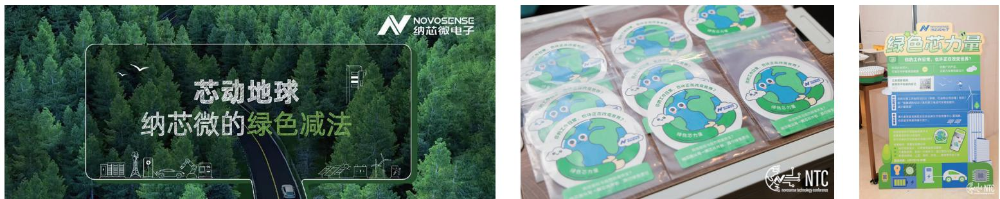

為響應行業可持續發展需求，公司秉持責任營銷理念，整合多元平台，搭建常態化ESG對外傳播陣地，借助線上線下多樣活動、創新展示載體，積極投身行業交流，推動ESG理念的行業普及與協同實踐。

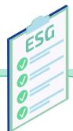

## 企業介紹宣貫

將ESG理念融入納芯微企業介紹中，通過可視化呈現方式，向客戶、合作夥伴等利益相關方清晰傳遞公司ESG價值觀與實踐方向。

## 官網專區

在官網開設「可持續發展」專區，集中展示ESG理念、規劃、實踐成果及相關動態，搭建對外披露ESG信息、傳遞價值理念的專屬窗口。

## 業務傳播

在線上推廣中，圍繞新能源汽車系統、可再生能源如光伏等領域進行推廣，推動ESG理念與核心業務深度融合，傳遞公司以技術創新支撐可持續發展的實踐路徑。同時積極參與標準制定、出席行業論壇，分享ESG實踐經驗，以技術創新與行業協同，助力推動行業綠色低碳轉型。

## 展廳ESG推廣

在公司展廳設置多媒體互動展示區域，以多媒體互動展示新能源汽車、光伏儲能等產品應用場景，直觀呈現產品在綠色出行、可再生能源利用、節能減排等方面的實際貢獻，強化利益相關方對公司ESG價值的認知。

## ESG管理

## 利益相關方溝通

納芯微視利益相關方溝通為可持續發展工作的基石，通過建立多元化、針對性的多渠道溝通反饋機制，收集並識別各利益相關方的訴求，將其所關注的環境、社會及公司治理層面的問題納入公司的戰略決策中，加深各利益相關方對ESG管理的參與程度，從而有針對性地提升公司的可持續發展表現並有效回應各方期望。

natural_image

Illustration of a computer screen with documents and decorative elements like a bird, magnifying glass, and green leaves (no text or symbols)

報告期內，我們還開展了各類多元化的利益相關方交流活動，如經銷商大會、媒體開放日等，以增加與利益相關方的溝通。

<table><tr><td>利益相關方類別</td><td>關注議題</td><td>溝通方式與公司回應</td><td>應對措施</td></tr><tr><td>公司員工</td><td>·產品質量管理·產品研發和技術創新·職業健康與安全</td><td>·匯報溝通·工作評估與考核·座談會</td><td>·開展圓桌會議及員工溝通大會·每年開展員工滿意度調研·組織多樣化的員工培訓項目</td></tr><tr><td>供應商</td><td>·信息安全與隱私保護·商業道德·供應鏈管理</td><td>·日常溝通·專題會議·召開供應商交流會</td><td>·採用TQRDC管理維度·重點供應商進行年度審核</td></tr><tr><td>客戶</td><td>·客戶權益保障·產品質量管理·產品研發和技術創新</td><td>·日常運營交流·專業服務團隊/銷售團隊·客戶座談</td><td>·制定「雙R」方針保障質量·開展客戶滿意度調查·建立完善投訴處理機制</td></tr><tr><td>媒體</td><td>·信息安全與隱私保護·商業道德·產品研發和技術創新</td><td>·向媒體公眾發佈信息·組織媒體見面會·接受媒體採訪</td><td>·開展信息安全、商業道德等培訓·多次參與採訪、會談等媒體活動</td></tr><tr><td>投資者或股東</td><td>·經濟績效·產品研發和技術創新·產品質量管理</td><td>·業績路演/業績說明會·投資者調研與交流·信息披露</td><td>·開展投資者交流、會議、路演等·定期發佈公告,真實準確完整披露信息</td></tr><tr><td>行業協會</td><td>·清潔能源與可再生能源使用·資源能耗管理·產品研發和技術創新</td><td>·行業協會活動·日常交流·信息披露</td><td>·加強戰略合作·開展經驗交流·堅持技術創新等</td></tr><tr><td>政府或監察機構</td><td>·風險控制·資源能耗管理·產品研發和技術創新</td><td>·現場檢查·項目報批·工作匯報/會議研討</td><td>·開展日常溝通與匯報·接受監督考核·加強合規運營管理</td></tr><tr><td>公益組織或社區組織</td><td>·公益慈善·員工關懷與權益·應對氣候變化</td><td>·文化交流·信息公開</td><td>·積極參與社區公益·開展多方合作,促進當地就業</td></tr></table>

## ESG管理

## 實質性議題分析

公司重視ESG議題的識別與管理，基於行業特點和公司運營管理的實際需求，系統地開展了可持續發展重要性議題的識別、評估和篩選工作。2025年，公司完成ESG實質性議題庫的更新優化，持續完善議題管理。

為了確保議題的全面性、精準性與科學性，公司採用標準對標、政策分析、同業對標相結合的方式，廣泛收集內外部利益相關方的意見與反饋。基於調研分析結果，公司完成梳理與論證，形成本報告所載的ESG實質性議題矩陣，為公司ESG工作的重點推進與落地提供核心指引。

## 重大議題分析流程

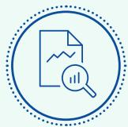

## 議題識別

廣泛參考同業領先實踐與行業熱點、結合各利益相關方反饋及外部專家意見、研究國內外可持續發展相關標準與資本市場ESG評級指標，識別出能反映公司對社會、環境及管治產生影響的實質性議題 ；

## 評分區間確定

識別並確認影響議題重要性評估的因素，並設定1-5分的評分區間 ；

## 利益相關方調研

廣泛邀請公司內外部利益相關方進行調研，評估各議題影響發生的可能性、規模和範圍等，從「財務重要性」和「影響重要性」兩個維度對重要性議題評估，分別得出各議題財務重要性和影響重要性評分 ；

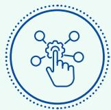

## 設置閾值

結合公司實際情況與國內外可持續發展相關標準，設置了3分作為議題重要性的閾值 ；

## 形成結論

將在調研中取得的議題重要性評分與閾值進行比較，形成議題重要性評估結論。

## ESG管理

矩陣將議題的實質性根據議題是否具有財務重要性和影響重要性分為四個層級，具體矩陣如下 ：  
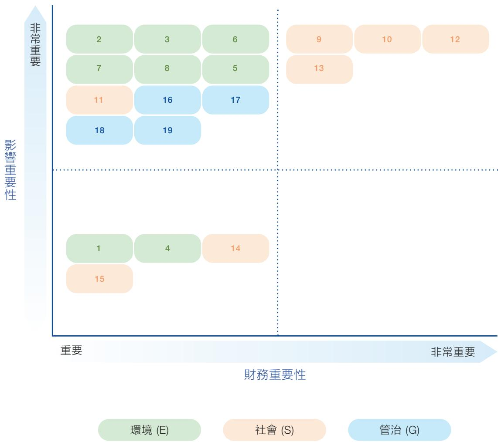

bubble

| ID | Category | Importance to Financial & Impact of A | Importance to Impact of A |
| --- | --- | --- | --- |
| 2 | 環境 (E) | High | High |
| 3 | 環境 (E) | High | High |
| 6 | 環境 (E) | High | High |
| 7 | 環境 (E) | High | High |
| 8 | 環境 (E) | High | High |
| 5 | 環境 (E) | High | High |
| 11 | 社會 (S) | Medium-High | Medium-High |
| 16 | 管治 (G) | Medium-High | Medium-High |
| 17 | 管治 (G) | Medium-High | Medium-High |
| 18 | 管治 (G) | Medium-High | Medium-High |
| 19 | 管治 (G) | Medium-High | Medium-High |
| 9 | 社會 (S) | Very High | Very High |
| 10 | 社會 (S) | Very High | Very High |
| 12 | 社會 (S) | Very High | Very High |
| 13 | 社會 (S) | Very High | Low-Medium |
| 1 | 環境 (E) | Low-Medium | Low-Medium |
| 4 | 環境 (E) | Low-Medium | Low-Medium |
| 14 | 社會 (S) | Low-Medium | Low-Medium |
| 15 | 社會 (S) | Low-Medium | Low-Medium |

<table><tr><td>序號</td><td>議題範疇</td><td>議題名稱</td><td>財務重要性</td><td>影響重要性</td></tr><tr><td>1</td><td>E</td><td>污染物排放</td><td></td><td></td></tr><tr><td>2</td><td>E</td><td>廢棄物處理</td><td></td><td>✓</td></tr><tr><td>3</td><td>E</td><td>環境合規管理</td><td></td><td>✓</td></tr><tr><td>4</td><td>E</td><td>應對氣候變化</td><td></td><td></td></tr><tr><td>5</td><td>E</td><td>清潔技術機遇</td><td></td><td>✓</td></tr><tr><td>6</td><td>E</td><td>能源利用</td><td></td><td>✓</td></tr><tr><td>7</td><td>E</td><td>水資源利用</td><td></td><td>✓</td></tr><tr><td>8</td><td>E</td><td>循環經濟</td><td></td><td>✓</td></tr><tr><td>9</td><td>S</td><td>員工</td><td>✓</td><td>✓</td></tr><tr><td>10</td><td>S</td><td>供應鏈安全</td><td>✓</td><td>✓</td></tr><tr><td>11</td><td>S</td><td>數據安全與客戶隱私保護</td><td></td><td>✓</td></tr><tr><td>12</td><td>S</td><td>產品和服務安全與質量</td><td>✓</td><td>✓</td></tr><tr><td>13</td><td>S</td><td>創新驅動</td><td>✓</td><td>✓</td></tr><tr><td>14</td><td>S</td><td>鄉村振興</td><td></td><td></td></tr><tr><td>15</td><td>S</td><td>社區貢獻</td><td></td><td></td></tr><tr><td>16</td><td>G</td><td>盡職調查</td><td></td><td>✓</td></tr><tr><td>17</td><td>G</td><td>反商業賄賂及反貪污</td><td></td><td>✓</td></tr><tr><td>18</td><td>G</td><td>反不正當競爭</td><td></td><td>✓</td></tr><tr><td>19</td><td>G</td><td>利益相關方溝通</td><td></td><td>✓</td></tr></table>

未來，我們將持續關注各方反饋、更新議題庫，並計劃於條件成熟時在原有參與實質性議題評估的利益相關方基礎上擴大調研規模，以更加全面、充分地了解多方訴求，從而支持經營管理戰略的調整與可持續發展工作的深化。

## 信息安全

## 信息和隱私安全

我們承諾對商業秘密、客戶及員工個人信息進行有效保護，並努力保障業務活動中的信息安全與數據合規。我們嚴守《網絡安全法》《數據安全法》等運營所在地法規，並已制定一系列內部管理措施，2025年公司還新制定了《信息安全管理委員會運作手冊》，並明確信息安全管理架構。

公司已獲得TISAX (Trusted Information Security Assessment Exchange )AL3認證，標誌着公司在數據安全保護、信息風險管理等方面達到行業先進水平，為業務開展及合作共贏築牢信息安全防線。

natural_image

Isometric illustration of a laptop with security icons surrounding it, surrounded by circular nodes (no text or symbols)

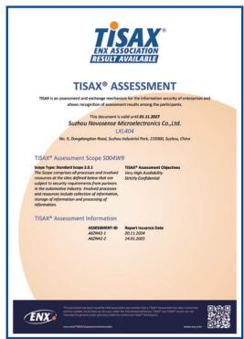

text_image

TISAX® ASSESSMENT
TISAX® IS AMOUNTED AND EXCHANGE MECHANICAL FOR THE INFORMATION Security OR INTEGRATION AND ALLOWED REVISIONS OF ASSISTANT RESULTS ARE AN A successful PARTIES. THIS DOCUMENT IS A NO Document 01-08-2017.
Sufthou Novosense Microelectronics Co.,Ltd.
No. 6, Darghanplan Road, Surfhu Industrial Park, 231000, Surfhu, China
TISAX® ASSESSMENT Scope 500499
Sibler Type: Standard Box 2.5.1
The Sibler type of products is not limited to the number of products that are available in the United States or other countries without access to any security requirement (or relevant security requirement) in the automotive industry, involved processes and viscosity, indicate collection of substances, storage or information and processing of information.
TISAX® Assessment Information
ASSESSMENT ID:
A24024-1
A24024-2
Report Issuance Date:
20.11.2014
24.01.2015
TISAX® Assessment Objectives
Brieliq Confidentiality
ENX® ENX ASSOCIATION REPORTS

在公司運營環節中，客戶或潛在客戶註冊登陸公司官網時需要填寫部分個人信息（包括姓名、郵箱、公司╱學校），業務往來時涉及客戶聯繫人╱合同聯繫人中的個人信息（姓名、電話、郵箱）等，這些涉及到信息安全和隱私保護。

為降低與信息安全有關的潛在風險，我們 ：

在公司官網啟用《用戶協議》（中英文版），確保信息收集取得用戶同意，以及告知內容的準確性、完整性和全面性 ；

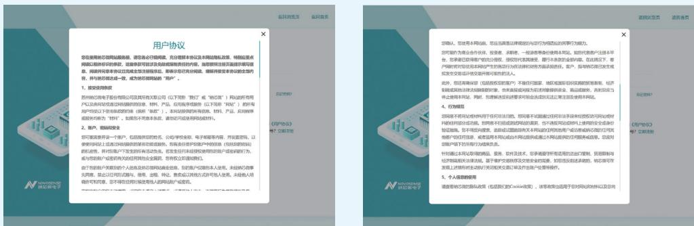

將個人信息保護要求納入《業務夥伴商業行為準則》，明確業務夥伴的合規責任，推動其建立相應管理流程，共同提升價值鏈隱私保護與信息安全治理能力 ；

## 信息安全

公司制定《員工手冊》，全員簽署，其中明確了保密要求和IT管理要求，包括保護賬戶和密碼、保護數據和文件、保護網絡安全、保護客戶隱私、報告安全事件、參與安全培訓等內容 ；

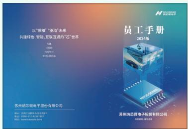

text_image

以"感知"驱动"未来
共建绿色、智能、互联互通的"艺"世界
苏州纳芯微电子股份有限公司
苏州纳芯微电子股份有限公司
员工手册
2024版
www.nancomer.com

制定《個人信息保護制度》，其中包括《個人信息影響評估(PIA)操作指導》，明確個人信息保護責任人，規範內部對客戶個人信息使用的要求，以使用目的為限並設置合理訪問權限，明確個人信息的刪除機制，確保個人信息存儲時間最小化，對超過時間的個人信息進行刪除或匿名化處理 ；

## 苏州纳芯微电子股份有限公司

个人信息保护制度

文件编号/Document No: NX-9.8-003

制定部门/Owner Dept：法务部

版 本/Version：A1

制定日期/Edited by：2024年12月19日

員工入職時需簽署《保密承諾書》，其中明確了公司商業秘密的範圍，包括公司所擁有的文件、資料、會議記錄、信件、方案、電腦軟件，公司現有或潛在的商業合作夥伴的資料，公司現有或潛在客戶的檔案、客戶信息、客戶名單、客戶聯繫方式等，明確了員工需要嚴格履行的保密義務和違約責任，覆蓋率達100%。

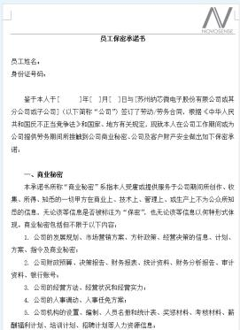

text_image

员工保密承诺书
员工姓名：
身份证号码：
鉴于本人于 [ ] 项 [ ] 月 [ ] 日与[苏州宏微电子股份有限公司或其分公司或子公司]（以下简称“公司”）签订了劳动合同、劳务合同，根据《中华人民共和国有关当事关系法》和国家、地方有关规定，现将本人在公司工作期间成为公司提供劳务期间所接触到公司商业秘密、公司及客户财产安全做出如下保密承诺：
一、商业秘密
本承诺函所称“商业秘密”系指本人受案或提供服务于公司期间所创作、收集、所得、结转的每一件方在商业上、技术上。管理上、或在产上不为公众所知悉的信息，无论该等信息是否被标为“保密”，也无论该等信息以何种形式体现，商业秘密包括但不限于以下内容：
1. 公司的发展规划、市场营销方案、方针政策、经营决策的信息、计划、方案、指令及商业秘密；
2. 公司财政预算、决算报告、财务报表、统计资料、财务分析报告、审计资料、银行账号。
3. 公司的经营方法、经营状况和经营实力；
4. 公司的人事调动、人事任免方案；
5. 公司机构的设置、编制、人员名称和统计表、实绩材料、考核材料、薪酬福利计划、培训计划、招聘计划等人力资源信息。

## 員工需要嚴格履行的保密義務和違約責任

## 覆蓋率達100%

natural_image

Illustration of two people interacting with a large open book, one holding a red ribbon (no text or symbols visible)

## 信息安全

我們也發佈了《保密制度》及《保密制度實施細則》，對信息分級制度、加密制度和審批制度進行了相關規定 ：

公司通過加密系統加密所有公司內部的敏感信息，以此防止數據洩露，敏感信息的外發需要通過上級審批進行管控 ；

員工使用公司電腦，所有文件均須標明密級， 至 少 為「秘 密密級 ；

在人員離職時會審核該人員的外發文件日誌，如發現異常會通知該員工上級及HR做進一步處理 ；

信息安全部門通過定期審計機制，對異常情況及時進行監督與核查。

同時，公司健全信息安全制度體系，配套制定《數據加密管理制度》《訪問控制管理制度》《信息資產管理制度》《供應商信息安全管理制度》《合規性義務管理制度》《信息安全審查制度》，構建全維度信息洩露防控機制。針對突發信息安全事件，制定《信息安全風險管理制度》《信息安全事件管理制度》《信息安全方針》，明確風險應對流程與處置標準，提升應急處置能力。

公司注重全員信息安全素養培育，定期組織覆蓋全體員工的信息安全培訓與實操演練，持續提升全員信息與隱私安全保護意識。本年度，累計開展2場全員信息安全意識培訓，包括6月全員安全培訓、9月網絡安全月培訓、新員工入職信息安全培訓及日常信息安全理念宣貫等，以及多次釣魚郵件演練，實現培訓全覆蓋。

## 網絡安全宣傳月活動

2025年9月，為響應國家網絡安全周「提升全社會網絡安全意識與防護技能、捍衛國家網絡安全號召，公司將年度網絡安全宣傳周升級為「網絡安全宣傳月」，進一步深化全員安全防護理念，築牢企業網絡安全防線。

本次活動採用「每周一主題」模式推進，通過IT服務台推送網絡安全防護知識，依托「內部信息溝通平台」平台引導員工圍繞釣魚郵件識別、密碼安全管理、數據保護規範及公共WiFi使用風險等核心議題開展互動討論。活動系統性提升了全員網絡安全意識與實操防護能力，有效強化了企業信息安全防線。

2025年，公司未發生客戶隱私洩露及重大信息安全事件。

natural_image

Illustration of a person using a key to access a computer screen with a lock and security icons (no text or symbols)

## 以人為本

## 培育成長沃土

28 我們的員工  
31 員工權益  
36 培訓與職業發展  
39 職業健康與安全  
41 公益行動與社會責任

納芯微秉承以人為本的理念，積極響應聯合國可持續發展目標中的第3、4、5、8、10項。我們廣納賢才，關愛員工，致力於提供安全、舒心的工作環境，並打造一個促進員工與企業共同成長的發展平台。

## 我們的行動 ：

●	 重視員工多樣性，確保每一位員工都能得到平等對待  
●	 不斷優化薪酬福利體系，保持行業競爭力，吸引和留住優秀人才  
每年進行員工敬業度與滿意度調研，就待改善項採取針對性措施，以持續提升員工滿意度  
開展多種形式的培訓課程，幫助員工不斷提升技能和能力，支持他們的職業發展  
●	 設立年度「零事故」目標，全面保障員工的職業健康和安全

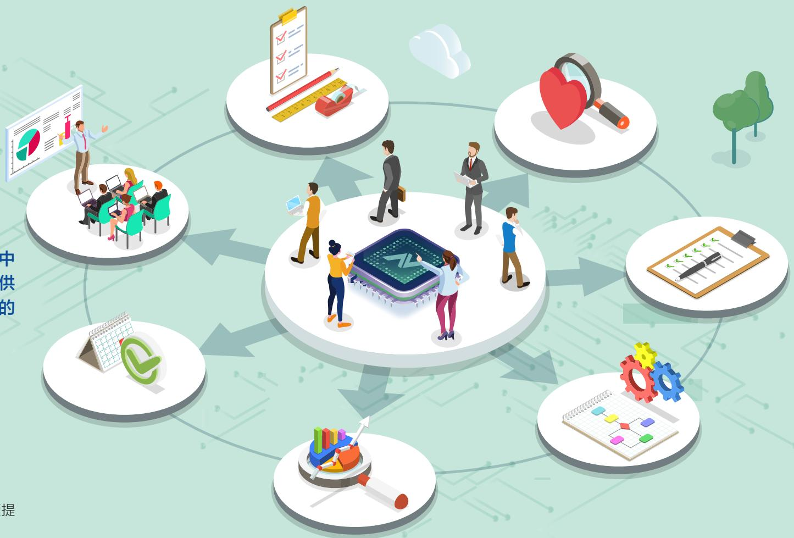

flowchart

```mermaid
graph LR
  A["Start"] --> B["Process Step 1"]
  B --> C["Process Step 2"]
  C --> D["Process Step 3"]
  D --> E["Process Step 4"]
  E --> F["Process Step 5"]
  F --> G["Process Step 6"]
  G --> H["Process Step 7"]
  H --> I["Process Step 8"]
  I --> J["Process Step 9"]
  J --> K["Process Step 10"]
  K --> L["Process Step 11"]
  L --> M["Process Step 12"]
  M --> N["Process Step 13"]
  N --> O["Process Step 14"]
  O --> P["Process Step 15"]
  P --> Q["Process Step 16"]
  Q --> R["Process Step 17"]
  R --> S["Process Step 18"]
  S --> T["Process Step 19"]
  T --> U["Process Step 20"]
  U --> V["Process Step 21"]
  V --> W["Process Step 22"]
  W --> X["Process Step 23"]
  X --> Y["Process Step 24"]
  Y --> Z["Process Step 25"]
  Z --> AA["Process Step 26"]
  AA --> AB["Process Step 27"]
  AB --> AC["Process Step 28"]
  AC --> AD["Process Step 29"]
  AD --> AE["Process Step 30"]
  AE --> AF["Process Step 31"]
  AF --> AG["Process Step 32"]
  AG --> AH["Process Step 33"]
  AH --> AI["Process Step 34"]
  AI --> AJ["Process Step 35"]
  AJ --> AK["Process Step 36"]
  AK --> AL["Process Step 37"]
  AL --> AM["Process Step 38"]
  AM --> AN["Process Step 39"]
  AN --> AO["Process Step 40"]
  AO --> AP["Process Step 41"]
  AP --> AQ["Process Step 42"]
  AQ --> AR["Process Step 43"]
  AR --> AS["Process Step 44"]
  AS --> AT["Process Step 45"]
  AT --> AU["Process Step 46"]
  AU --> AV["Process Step 47"]
  AV --> AW["Process Step 48"]
  AW --> AX["Process Step 49"]
  AX --> AY["Process Step 50"]
```

<table><tr><td>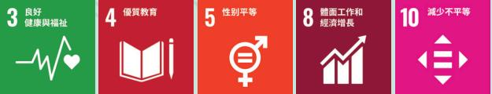</td></tr></table>

## 我們的員工

## 治理

公司嚴格遵守《中華人民共和國勞動法》《中華人民共和國勞動合同法》《中華人民共和國安全生產法》《中華人民共和國職業病防治法》等相關法律法規，制定了《薪酬管理制度》《招聘管理制度》《安全管理機構和管理人員管理制度》《職業健康管理制度》《消防控制管理制度》等制度，報告期內更新《培訓管理制度》，新增《全面績效管理制度》。

2025年，我們以實際行動贏得員工的信賴和支持，並獲得了外部認可 ：

2025人力資源管理傑出僱主  
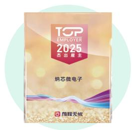

text_image

TOP
EMPLOYER
2025
杰出雇主
纳芯微电子
酷辉无忧

2025人力資源管理傑出獎（最佳培訓實踐）  
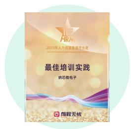

text_image

2025年人力资源稳基及奖
最佳培训实践
纯芯微电子
西辉无味

## 戰略

公司堅信人才是企業發展的核心資產，以暢通溝通渠道為紐帶，以完善制度體系為保障，切實維護員工各項基本權益。我們定期梳理人才隊伍現狀，預判行業人才發展趨勢，保障團隊核心能力適配未來發展需求。通過落地系統化人才發展戰略，打造多元包容的職場生態，助力員工提升專業能力，適配新技術應用與工作模式變革，為其提供公平的職業發展與轉型機會。同時，持續打造安全健康的工作環境，提升員工職場幸福感與歸屬感，讓每位員工都能在企業發展中實現個人價值與職業成長。

員工相關風險和機遇分析

<table><tr><td>類型</td><td>風險/機遇描述</td><td>發生概率</td><td>影響週期</td><td>潛在財務影響</td><td>應對措施</td></tr><tr><td>管理風險</td><td>人力資源激勵約束制度不合理、關鍵崗位人員管理不完善,可能導致人才流失、經營效率低下或關鍵技術、商業秘密和國家機密洩露。</td><td>低</td><td>中長期</td><td>運營成本增加</td><td>建立科學有效的薪酬福利體系,準確地進行薪酬的計算和處理。提高員工工作積極性,起到促進企業戰略發展的作用。</td></tr><tr><td>運營機遇</td><td>構建多元、平等、包容的職場氛圍,有助於提高員工的幸福感與歸屬感,充分激發人才活力及潛能。</td><td>高</td><td>中長期</td><td>運營成本減少</td><td>豐富員工關懷活動,制定富有吸引力的薪酬福利體系,持續提升員工滿意度。</td></tr></table>

公司就上述員工相關的風險與機遇，已制定相關的管理方法，請見本章節後述部分。

## 我們的員工

## 影響、風險和機遇管理

我們結合日常運營實踐，開展員工維度潛在風險與機遇的識別與評估，針對識別項，配套制定應對與管控措施，健全員工管理體系，助力人才活力激發與企業穩健發展。

## 風險識別

從員工權益保障、員工職業發展、人力資源合規管理多方面識別員工維度的潛在風險對公司發展的影響。

## 風險評估

對識別出的相關風險進行評估和響應級別的劃分，評估結果作為制定應對措施和管理方案的依據。

## 應對措施

人力資源部及相關責任部門針對不同響應級別的風險制定差異化應對策略。

## 風險監測

人力資源部及相關責任部門定期對人力資源控制流程執行情況持續進行檢查、測試，驗證應對策略是否有效運行。

## 指標與目標

截至報告期末，納芯微共有員工1,345名，具體分佈如下 ：

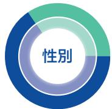

## 2025年

男性882人 女性463人

## 2024年

男性770人 女性402人

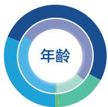

## 2025年

30歲以下419人 30-40歲696人

50歲以上13人40-50歲217人

## 2024年

30歲以下402人 30-40歲608人

50歲以上4人40-50歲158人

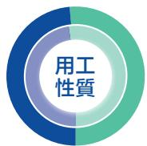

## 2025年

研發人員655人 非研發人員690人

## 2024年

研發人員560人 非研發人員612人

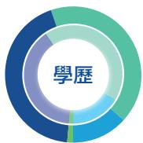

## 2025年

博士22人 碩士580人

本科567人 其他176人

## 2024年

博士19人 碩士458人

本科505人 其他190人

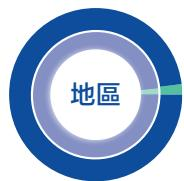

## 2025年

國內1,320人 海外25人

## 2024年

國內1,155人 海外17人

natural_image

Illustration of business professionals collaborating around a digital dashboard and charts (no text or symbols)

## 我們的員工

## 員工招聘

我們堅持公開招聘、平等競爭、擇優錄用的原則，在《員工手冊》中明確禁止民族、種族、膚色、宗教信仰、性別、年齡、傷殘等歧視，確保在招聘過程中公平對待每一位候選人。我們的招聘流程和人員甄選標準依據各部門的年度人員編製和招聘計劃為指導，確保一致性和透明度。

公司通過微信公眾號、官網、招聘網站等多種公開渠道，在信息發佈中採用無障礙、非歧視性語言，確保招聘啟事清晰易懂並體現包容性。同時，納芯微向面試官開展培訓，要求其遵循合規性，公平公正、任職資格准入、雙向選擇」的招聘原則。根據公司佈局海外業務的戰略，報告期內，我們還在多個國家開展了海外員工招聘，成功僱傭了來自日本、韓國、德國、法國、意大利和美國的員工。我們相信，不同背景的人才可以為公司帶來多樣化的觀點和想法，有助於提升團隊的創造力和績效。

2025年，37%的新入職者通過員工推薦加入公司。良好的薪酬福利待遇和廣闊的事業平台不僅提升了現有員工的滿意度，也吸引了更多優秀人才通過內部推薦渠道加入我們：17%的新入職員工來自校園招聘，這反映了我們在高校中的吸引力和對年輕人才的重視 ；83%的新入職員工來自社會招聘，這展示出公司的優良待遇和廣闊平台對社會優秀人才的吸引力。

## 2025年度新入職者

37%員工推薦

17% 校園招聘

83%社會招聘

## 員工離職

我們依法保障離職員工的權益，確保離職流程的合法合規。同時，我們對離職員工的重新加入保持開放態度，歡迎他們未來有機會再次加入納芯微。

2025年，納芯微離職率為13.61%，低於行業平均水平。

<table><tr><td colspan="2"></td><td>2025年度比例</td><td>2024年度比例</td></tr><tr><td rowspan="2">按性別劃分</td><td>男性</td><td>13.95%</td><td>/</td></tr><tr><td>女性</td><td>12.96%</td><td>/</td></tr><tr><td rowspan="2">按地區劃分</td><td>國內</td><td>13.64%</td><td>9.96%</td></tr><tr><td>海外</td><td>12.00%</td><td>5.88%</td></tr><tr><td rowspan="2">按年齡劃分</td><td>40歲以下</td><td>13.99%</td><td>9.80%</td></tr><tr><td>40歲以上</td><td>11.74%</td><td>10.49%</td></tr></table>

## 員工權益

## 員工權益保障

納芯微堅持以人為本，全力保障員工權益，營造良好的工作氛圍。我們嚴格遵守《中華人民共和國勞動法》《中華人民共和國勞動合同法》《中華人民共和國未成年人保護法》《中華人民共和國工會法》等運營所在地的相關法律法規，提供安全健康的工作環境，制定招聘及薪酬管理制度，尊重每一位員工的權益，並提供有競爭力的薪酬與福利保障，以實際行動贏得員工的信賴和支持，建立和諧穩定的勞動關係。

## 勞動合同簽署

公司確保全體員工100%簽訂勞動合同或勞務合同。合同中明確體現員工所從事的崗位、工作時間、勞動保護及報酬等內容，確保每位員工的合法權益得到充分保障。

## 禁止童工與強迫勞動

公司明確禁止僱傭未成年人，我們使用專業招聘平台，要求所有應聘者在入職前於系統中如實填寫年齡信息，並設置未成年人年齡提醒功能，同時後台可以查看所有應聘者的年齡信息，從源頭避免僱傭童工等情形出現。我們於《員工手冊》中提供就童工等事宜進行申訴的渠道，包括向直接主管及部門負責人、人力資源部等進行建議、投訴或申訴，建立員工之聲郵箱供員工聯絡並提供匿名申訴選項，充分保障員工權益。相關部門或責任人應在七個工作日內對員工的建議、投訴或申訴做出響應，並負責進行相關情況的調研、跟蹤，最終形成結論並答覆員工。

同時，我們確保所有員工得到適當的保護和福利，杜絕使用不具備相應工作能力和條件的員工、強迫或強制勞動等情況。通過完善的制度和機制來管理和監督員工的僱傭、培訓和工作條件，包括定期檢查、合規報告和投訴受理等，確保員工在工作中受到尊重和公平對待。

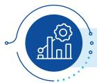

## 全面績效管理

納芯微在2025年度修訂《全面績效管理制度》，通過明確的績效目標、及時有效的過程管理及公平公正的績效評價，積極推進全面績效管理，形成PDCA閉環管理。績效管理以每個自然年為一個管理週期，員工會在績效管理全流程中，主動參與目標溝通、計劃制定、溝通反饋以及階段性複盤，形成持續改進的管理閉環。我們設立領導力賦能項目，為各管理者提供績效管理工具。為在績效考評時確保充分溝通，年度績效考評前公司專門組織面向管理者及員工群體的績效溝通輔導 ；我們通過員工、經理、高管、CEO的逐層評估與統籌，確保評價的相對公平性和客觀性。若員工對績效結果有異議，可通過合理渠道進行申訴，由人事行政中心牽頭進行溝通和反饋。

natural_image

Illustration of people interacting with a giant hand holding laptops and butterflies (no text or symbols)

## 員工權益

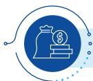

## 薪酬福利

根據國家法律規定及運營所在地相關規定，我們制定了《薪酬管理制度》，旨在建立一套科學、合理的薪酬體系，使薪酬與公司收益掛鈎，員工的薪酬與工作貢獻掛鈎，促進內部公平，起到吸引、激勵、留住人才的作用，公司遵循公平性、競爭性、激勵性、經濟性、合理性的原則進行薪酬管理，遵循國家及各地政府的相關法律法規、政策，為員工提供社會保險、住房公積金、法定年休假等國家法定福利。在國家法定福利基礎之上，我們致力於為員工提供更具有市場競爭力的補充福利項目，如帶薪福利年休假、補充商業保險、團建經費、節假日賀禮、員工生日祝賀金等。

2025年度，我們對《考勤與假期管理制度》進行修訂，進一步完善了對於國家法定節假日、公司福利年假的管理規範，並為員工提供靈活的工作時間，幫助員工平衡工作與生活。公司按照國家政策規定為女性員工提供產假、哺乳假等，以及為員工提供陪產假、育兒假等。

## 人性化管理

納芯微採取標準工時制度與靈活工時相結合的方式，採用人性化管理。在標準工時制度基礎上，員工經直屬領導同意可以靈活調整上下班時間。此外，我們也提供高效的VPN，為員工遠程或居家辦公創造條件，提升工作效率和生活質量。

## 工會活動

納芯微積極聆聽來自員工的訴求和反饋，致力於維護員工權益並推動企業的可持續發展。為此，我們建立了工會，並實現了公司全體員工全部加入。

通過工會這一平台，我們不僅確保了員工的聲音能夠被充分聽取，還積極推動各項有利於員工福祉和職業發展的舉措。工會定期組織各類集體活動，這些活動包括但不限於團隊建設、文化慶祝、健康促進等，豐富了員工的工作生活，提升了工作滿意度和歸屬感。

## 員工溝通

我們通過開展多樣化的溝通活動，構建了通暢無阻的員工溝通渠道，及時了解員工狀態，增強員工歸屬感和凝聚力。公司制定的多維度員工溝通體系建設項目解決方案分為三部分，包括 ：

自上而下固定活動 ：全員大會、高管面對面等

交互活動設計 ：圓桌會議、技術沙龍等

自下而上反饋渠道 ：公司圈、總經理郵箱等

text_image

自下而上反饋渠道：公司圈

針對海外員工，公司設有海外職能工作小組收集並響應員工訴求。

## 員工權益

## 員工敬業度與滿意度調研

我們每年定期開展員工敬業度與滿意度調研，旨在全面了解員工對公司的整體敬業度、認同度，以及對工作環境、勞動報酬、成長晉升等方面的滿意度。此次調研還為員工提供了一個平台，讓他們能夠提出自己的想法和建議。

調研結果於次年面向全員發佈，確保每位員工都能了解到公司整體的敬業度和滿意度情況，並知曉公司在改進員工體驗方面的計劃和措施。

## 2025年員工滿意度調查結果

在2025年員工敬業度與滿意度調研中，員工們踴躍參與（91.4%在職員工參與調研）。

在本次全員調研中，我們通過敬業維度（動機、成就、活力、忠誠、認同、滿意）了解員工對組織和工作持有的態度，通過滿意維度（好領導、好方向、好工作、好文化、好回報）識別驅動員工敬業度的因素，定位問題，了解根源 ；其中敬業度得分為88.0，滿意度得分為87.5。調研結束後，我們深入分析並聚焦了員工敬業度與滿意度待改善事項，由多部門負責人協同，制定改進舉措及階段性回顧計劃。

在職員工參與調研

91.4%

敬業度得分為

88.0

滿意度得分為

87.5

## 員工持股

納芯微已全面開展員工持股計劃，旨在激發員工的工作熱情，並實現個人成長與企業成長的緊密結合，促進員工帶領公司更好地發展。具體措施包括在A股上市前設立了「納芯壹號」、「納芯貳號」和「納芯叁號」三個員工持股平台，為員工提供了直接參與公司成長的機會 ；公司在A股上市後實施了兩次股權激勵計劃，進一步強化了員工與公司利益的一致性。通過這些舉措，我們不僅激勵員工在工作中發揮更大的積極性和創造力，還促進了員工與公司共同成長。

## 2025年，我們的員工持股情況如下：

自2022年上市後，

累計開展員工限制性投票激勵計劃

2 次

累計授予限制性投票

800萬股

累計授予員工

507人次

佔總股本

4.92%

text_image

Illustration showing two people discussing a bar chart with pie charts and graphs, likely representing data analysis or business analytics.

## 員工權益

## 員工活動

公司將員工關懷融入日常運營，通過多元化、普惠性的員工活動與福利舉措，構建包容有溫度的企業文化，增強員工歸屬感與幸福感，構建企業與員工共贏的可持續發展生態。

## 節日關懷與日常福利

我們圍繞節日與日常場景設計員工福利體系，確保關懷覆蓋不同地域、不同崗位的員工，強化員工與企業的價值聯結。

國際婦女節手工活動 ：3月7日，在蘇州、上海、深圳三地同步舉辦主題手工活動，為女員工派送節日禮品，通過沉浸式體驗傳遞節日問候。

傳統節日福利 ：端午節定制露營禮盒，鼓勵員工親近自然、平衡工作與生活。中秋節發放月餅與瑞祥卡，在保留傳統民俗的同時賦予員工自主選擇權，兼顧不同需求偏好，提升員工獲得感。

主題下午茶 ：自2025年起，各地辦公室推出月度主題下午茶，涵蓋元宵節、萬聖節等多元節日及冰淇淋DIY、童年小食分享等創意形式，為跨部門員工搭建平等交流的平台，減少組織壁壘，促進內部融合。

natural_image

Product display setup with vials, ink bottles, and a small book on a patterned tablecloth (no visible text or symbols)

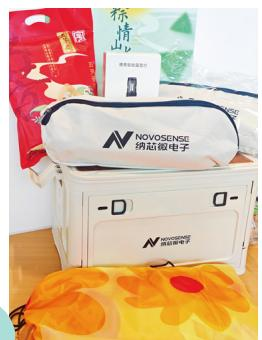

text_image

NOVOSENSE
房志强电子
- D
- D-
NOVOSENSE
房志强电子

natural_image

Illustration of a gift box with decorative ribbon and cityscape illustration, no text or symbols present.

natural_image

Display of various beverage bottles and desserts arranged on wooden shelves, with a vintage bicycle and small figurines nearby (no visible text or labels)

natural_image

Colorful outdoor dessert display with desserts, snacks, and decorative items (no visible text or symbols)

natural_image

Interior of a modern beverage shop with rows of packaged snacks and containers on a table (no visible text or signage)

natural_image

Illustration of a person holding a lemon, with a teapot, steaming cup, tomato, and lemon slices (no text or symbols)

## 員工權益

## 文體與健康活動

我們聚焦員工身心健康，搭建多樣化活動平台，引導健康生活方式，降低職業健康風險，促進員工全面發展。

## 30天健身打卡挑戰 ：

2025年5月， 發 起「體 重 向下 健康向上」主題打卡活動，鼓勵員工自願參與，引導員工養成規律運動習慣。

## 興趣俱樂部 ：

2025年7月，成立羽毛球、籃球、攝影、桌游等興趣俱樂部，打破部門邊界，讓員工基於共同興趣開展非工作場景交流，豐富精神文化生活，提升職場幸福感。

## 部門團建 ：

持續多年為各部門提供自主支配的團建經費，尊重員工個性化需求，通過自主組織的活動自然強化團隊信任。

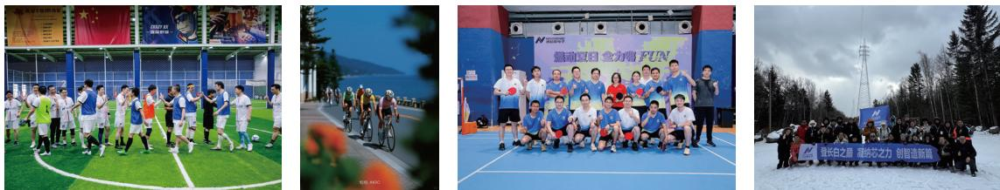

## 年度運動會

公司於2025年6月初在上海舉辦為期兩天的運動會。這不僅是一場體育活動，更是踐行員工關懷、提升團隊凝聚力的重要實踐。運動會直接促進了員工的身心健康與團隊協作，體現了公司對員工福利與身體健康的重視。豐富的項目設置（如趣味球賽）也營造了包容、多元的文化氛圍，增強了員工歸屬感與凝聚力。

## 家庭關懷與跨文化交流

我們聚焦員工家庭關懷與跨文化融合，搭建多元互動平台，減少協作壁壘，凝聚團隊合力，助力企業多元化發展。

## 家庭日活動

2025年8月，在蘇州、上海辦公室開展家庭日活動，以「芯系家庭，共赴美好為核心理念，將企業關懷從職場延伸至員丁生活的核心場景。活動設置跳蚤市場、趣味遊戲、「芯課堂等多樣環節，將企業關懷延伸至員工家庭。活動現場氛圍溫馨融洽，既讓員工獲得高質量家庭陪伴，也讓家屬感受企業關懷、認同員工工作價值，是企業踐行「體面工作」與「工作生活平衡」ESG理念的生動實踐。

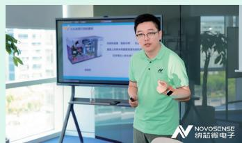

text_image

NOVOSENSE
纳芯微电子

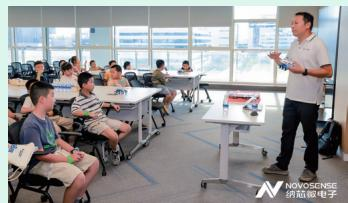

text_image

NOVOSENSE
防越敏电子

## 全球文化探索計劃

2025年7月，公司發起「全球文化探索計劃」，邀請海外員工以視頻、照片形式記錄所在國家的城市風貌與地道美食，分享異國文化。活動搭建了國內與海外員工的跨文化交流橋樑，直觀傳遞多元文化魅力，消除認知壁壘，助力全球化團隊的文化融合與包容協作，是踐行ESG多元化與包容性的具體實踐。

## 培訓與職業發展

## 員工培訓

公司圍繞員工能力提升與組織長期可持續發展，持續完善員工培訓與能力發展機制，通過規範化，系統化的培訓安排為員工提供持續、平等且高質量的學習與發展機會。

報告期內，公司更新並實施《培訓管理制度》，進一步規範公司級、重點業務領域及部門級培訓管理要求，強化培訓工作的規劃性、一致性與可持續性。納芯微人才培養體系圍繞領導力、專業力、通用力及三個核心維度設計，覆蓋全體員工，並通過線上與線下相結合的方式實施，支持員工根據崗位需求與業務場景自主參與學習，保障員工發展機會的公平性與可及性。

面向海內外新員工，公司持續拓展培訓覆蓋範圍，迭代優化培訓內容，通過線上學習平台與線下集中培訓相結合的方式，系統開展公司介紹、文化、質量管理、合規風控、IT等培訓，幫助員工理解公司運營體系與合規要求，強化責任意識與風險防範意識，為促進知識經驗的沉澱與傳承，公司通過技術沙龍等活動，推動業務經驗與專業知識的結構化輸出，逐步構建知識共享機制，支持員工能力共建與組織學習能力提升。

通過持續的能力建設與學習平台運營，公司不斷提升員工能力韌性與組織學習能力，為業務穩健運行、合規管理及長期價值創造提供穩定的人力資本支持。

## 上線「納芯微學苑」在線學習平台

2025年4月23日，納芯微學苑於式上線，成為員工成長旅程的智慧引擎。納芯微學苑鼓勵自主學習、知識貢獻和交流互動的行為，並會給予相對應的積分和學分激勵，已制定《納芯微學苑管理規範》。

natural_image

Illustration of a person using a laptop and two women standing on a staircase with gears, set against a stylized human head silhouette (no text or symbols)

## 培訓與職業發展

為了挖掘並培養內部培訓講師，公司邀請知識儲備量大、經驗豐富的同事進行知識萃取與分享，使隱性知識顯性化、顯性知識組織化，推動知識管理機制的搭建，助力學習型組織的建設。我們通過組織多元化的知識分享活動，以建立更積極開放的分享文化 ：

## 培訓開展

旨在更好地萃取和傳播組織成員的專業知識，提升組織的知識價值，踐行「持續學習」的文化價值觀。同時，為員工提供更多自我培養和發展的機會，達到公司和員工的雙贏。2025年，內部培訓講師增至216人，所提供的內部培訓覆蓋7,177人次。

## 知識分享

旨在促進公司內部知識與經驗的積累、共享和傳播，激發員工主動分享的積極性和熱情，實現內部資源的整合與人效提升，營造更好的學習型組織氛圍，並制定激勵舉措。

natural_image

Illustration of a presenter presenting data on a presentation board with audience members seated in front (no text or symbols visible)

2025年

<table><tr><td></td><td>受培訓比例</td><td>培訓平均時長/小時</td><td>受培訓比例</td><td>培訓平均時長/小時</td></tr><tr><td colspan="5">按性別劃分</td></tr><tr><td>男性員工</td><td>100%</td><td>25.67</td><td>100%</td><td>28</td></tr><tr><td>女性員工</td><td>100%</td><td>27.43</td><td>100%</td><td>29</td></tr><tr><td colspan="5">按職級劃分</td></tr><tr><td>高級管理層</td><td>100%</td><td>33.2</td><td>100%</td><td>24</td></tr><tr><td>中級管理層</td><td>100%</td><td>15.83</td><td>100%</td><td>36</td></tr><tr><td>基層員工</td><td>100%</td><td>25.49</td><td>100%</td><td>27</td></tr></table>

報告期內，納芯微在員工培訓方面投入近

400 萬元，

共舉辦培訓場次

356 場，

實現了

100% 員工覆蓋，

人均受訓時長

24.60小時。

這些投入和努力顯著提升了員工的專業能力和綜合素質，增強了公司的整體競爭力。

## 培訓與職業發展

## 員工發展

公司將人才梯隊建設視為支撐業務穩健運行與長期可持續發展的重要基礎，圍繞不同崗位與發展階段員工的能力需求，持續完善以能力培養為核心的人才梯隊培養與發展機制，強化關鍵崗位與核心能力的系統化建設。

公司構建了「管理+技術」雙向發展通道並行並輔以橫向發展機制的職業發展體系，為員工提供清晰、多元且可持續的職業發展指引。

員工職業發展通道  
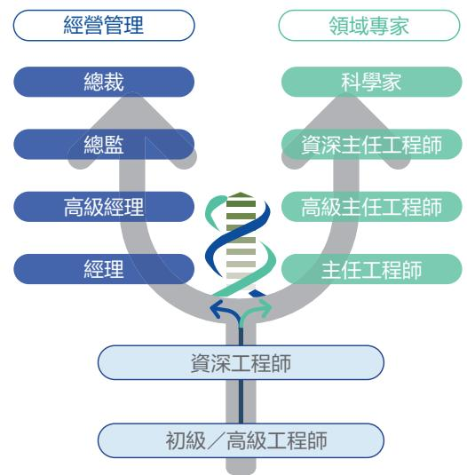

flowchart

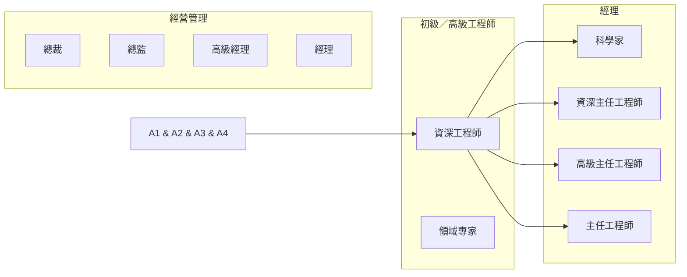
```mermaid
graph LR
  subgraph TopLevel["經營管理"]
    A1["總裁"]
    A2["總監"]
    A3["高級經理"]
    A4["經理"]
  end

  subgraph BottomLevel["初級／高級工程師"]
    B1["資深工程師"]
    B2["領域專家"]
  end

  subgraph ExecutiveLevel["經理"]
    E1["科學家"]
    E2["資深主任工程師"]
    E3["高級主任工程師"]
    E4["主任工程師"]
  end

  A1A2A3A4["A1 & A2 & A3 & A4"] --> B1
  B1 --> E1
  B1 --> E2
  B1 --> E3
  B1 --> E4
```

職業發展路徑：

<table><tr><td>專業路線</td><td>針對希望在技術領域深耕的員工,納芯微提供系統化的培訓和發展機會,幫助他們提升專業技術能力素質。我們鼓勵員工通過不斷學習和實踐,成為行業內的專家。納芯微完成了職業階梯標準、標桿崗位勝任力標準、技術專家榮譽資質標準及權責利的梳理併發佈,通過標準的建立更好地指引員工在技術領域的深耕和持續發展,其中標桿崗位勝任力標準能夠覆蓋65%的員工,並完成了首屆納芯微技術委員會委員的評定,持續開展技術沙龍分享活動。</td></tr><tr><td>管理路線</td><td>針對有志於向管理層發展的員工,納芯微提供配套的領導力項目,幫助管理者適應角色,提升管理能力和團隊領導力。納芯微進一步優化並明確管理者的「選用育留退」機制。在已有的基礎上,進一步明確管理者的使命、責任與勝任力要求,夯實新晉管理者轉身計劃、芯空計劃(針對有一定經驗的管理者)、納芯管理•高研班等領導力項目,並召開首屆納芯微領導力峰會。</td></tr><tr><td>橫向輪崗</td><td>對於希望拓寬職業視野的員工,納芯微提供內部轉崗和內部競聘的機會,幫助他們通過不同崗位的實踐積累更廣泛的經驗,拓寬職業發展道路。這種跨部門的合作不僅能提升員工的綜合素質,還能增強團隊間的協作。</td></tr></table>

在崗位發展與晉升方面，公司建立了以崗位勝任能力、工作表現及業務需求為核心的選拔與發展機制，並在相關制度框架下，綜合考慮員工發展意願，為符合條件的員工提供崗位職責拓展與發展機會。相關機制注重過程規範性與結果公平性，支持人才梯隊的有序建設與可持續發展。

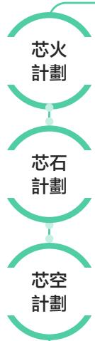

flowchart

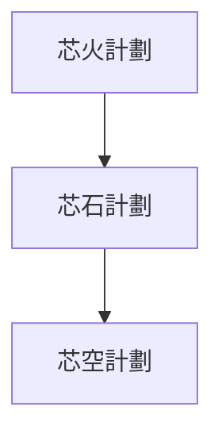
```mermaid
graph TD
  A["芯火計劃"] --> B["芯石計劃"]
  B --> C["芯空計劃"]
```

面向校招員工，公司通過階段化培養與崗位實踐相結合的方式，支持新員工完成從校園到職場的角色轉變，夯實專業基礎與組織融入能力，促進其在認知、適應與能力提升等方面的持續發展。報告期內，共有46名應屆畢業生參與「芯火計劃」。

面向核心業務骨幹，聚焦「胆規劃，強思維，善解決|三大關键通用能力維度，通過中長期培養與實踐結合的方式，塑造員工底層核心能力，夯實公司關鍵人才梯隊基礎。報告期內，首期項目共有 名員工完成系統化培養。

面向基層管理者，通過系统化的管理知識學習與實踐導向培養安排，支持管理者明確角色定位與責任邊界，提升業務推進與團隊管理能力，報告期內，共有24名員工參與[芯空計劃」

## 職業健康與安全

納芯微重視員工健康與安全，持續健全安全管理制度體系、夯實安全管理基礎，努力營造安全、健康的工作環境。公司以《中華人民共和國安全生產法》《中華人民共和國職業病防治法》等運營所在地的相關法律法規為基礎，不斷汲取全球領先實踐中的管理理念和方法，制定《安全管理機構和管理人員管理制度》《職業健康管理制度》《消防控制管理制度》。在報告期內，公司新增《危險化學品安全管理制度》，規範危險化學品的安全管理，對危險化學品的購買、運輸和裝卸、儲存、使用、報廢處理流程與要求進行明確。我們已成立安全生產委員會，各級部門及人員的安全生產責任清晰明瞭，並依據《安全生產會議管理制度》，每季度至少召開一次安全生產相關會議，確保安全管理工作的持續推進。

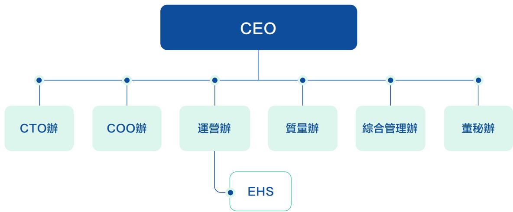

flowchart

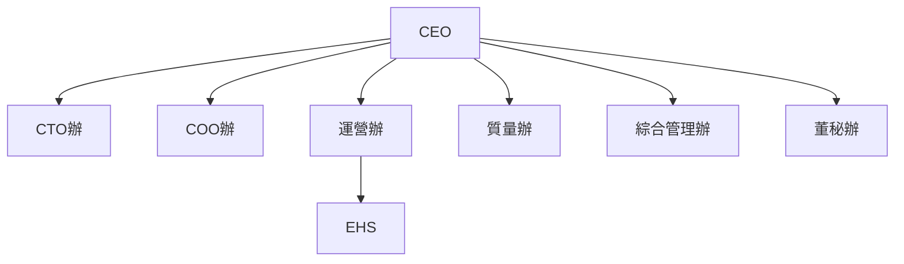
```mermaid
graph TD
  A["CEO"] --> B["CTO辦"]
  A --> C["COO辦"]
  A --> D["運營辦"]
  A --> E["質量辦"]
  A --> F["綜合管理辦"]
  A --> G["董秘辦"]
  D --> H["EHS"]
```

納芯微安委會組織架構圖

我們高度重視員工健康與安全，每年度邀請外部第三方對實驗室進行職業病危害檢測評價，檢測結果均達標。每年度EHS部門還會進行環境、健康與安全危險源辨識和風險評價，風險評估結果均處於較低水平。公司根據不同的風險類型從設備安全、管理措施等角度展開應急預防。

2025年，公司未發生任何安全違規事件，無員工工傷或職業病等事件 ；2025年及過去三年均無工亡事件發生，這反映了公司在安全管理方面的有效措施和持續努力。

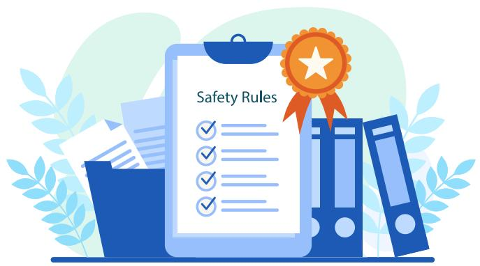

text_image

Safety Rules

## 職業健康與安全

## 安全生產培訓

我們持續完善安全文化建設，不斷在員工培訓中深化安全意識。圍繞職業健康安全管理體系，我們在多個維度定期開展安全意識和安全能力培訓，確保員工了解必要的安全生產知識，提高員工的安全素養與安全意識，提升員工對安全生產的重視程度，營造濃厚的安全生產氛圍。

公司在全年定期開展培訓，包括化學品專項、用電安全、輻射、安全防護品、安全教育、消防安全等多方面安全生產培訓。公司還在辦公區域安裝了自動體外除顫器（Automated External Defibrillator，以下簡稱AED）應急裝置，並邀請外部專業機構對員工進行AED培訓，培訓內容涵蓋心肺復甦基本理論知識、實踐操作技能、AED的使用方法等，增強安全防範意識，強化應急救護技能。

## 2025年消防演練活動

2025年11月25日，為進一步築牢安全防線、持續提升全體員工應對火災事故的應急處置能力，我們組織了一場消防應急演練。演練涵蓋員工有序疏散、集合地快速集合，以及滅火器規範使用等環節。演練結束後，團隊針對識別出的可改善項目展開研討，並迅速推進專項優化工作。

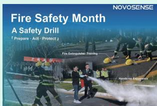

text_image

Fire Safety Month
A Safety Drill
「Prepare - Act - Protect」
Fires Extinguistic Training
Hands on Experience
NOVOSENSE

2025年納芯微安全生產數據：  
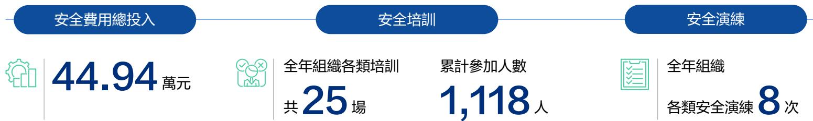

funnel

| 項目 | 數值 |
| --- | --- |
| 安全費用總投入 (萬元) | 44.94 |
| 安全培訓::全年組織各類培訓 (場) | 25 |
| 安全培訓::累計參加人數 (人) | 1,118 |
| 安全演練::全年組織 (次) | 8 |

## 職業健康管理與輻射防護

納芯微主要涉及的職業健康危害類型為X-ray崗位的電離輻射，我們已建立多層級防護體系 ：對輻射設備實施年度安全檢測與申報，作業區域配置便攜式輻射檢測儀並定期開展環境危害因素監測 ；人員管理方面，嚴格執行崗前、崗中及離崗職業健康體檢，相關崗位全員佩戴個人輻射劑量監測片，實時追蹤累積暴露量。通過設備合規管理、環境動態監控與個體防護三重保障，連續三年實現職業放射性疾病0發生。

納芯微高度重視員工對作業環境中健康與安全的反饋，我們定期對員工意見進行收集，主動獲取員工反饋，其中包括請員工評估勞保用品是否可用等，此外還會由EHS部門負責監督勞保用品的發放，並由質量辦交叉覆核相關用品是否按要求使用與存放，確保員工安全。

納芯微關心每位員工的身心健康，我們在培訓平台為員工提供多個心理健康與壓力紓解課程，引導員工關注與調節心理健康。此外，我們提供種類豐富的活動與資源，包括運動會、健身課、家庭日活動、興趣俱樂部等，幫助員工舒緩心理壓力，以實際行動關愛員工。

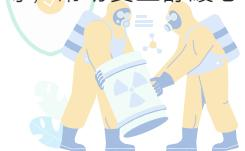

## 公益行動與社會責任

納芯微在企業快速發展、規模不斷壯大的同時，始終不忘履行企業社會責任。我們積極參與經營所在地的社區公益活動，通過捐贈、助農等行為回饋社會，致力於促進企業與社區的和諧共融，實現企業與社區的共同發展。

## 「芯肝寶貝計劃」捐贈

2025年9月，納芯微參與中國宋慶齡基金會「芯肝寶貝計劃」肝移植項目並捐贈10萬元，用於支持家庭困難兒童患者進行肝移植手術。

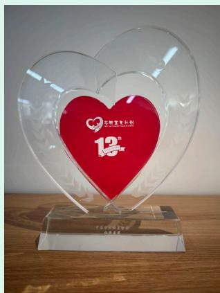

text_image

13
北京银行股份有限公司
中国建设银行
13

## 助農活動—購買愛心橙子

2025年12月初，納芯微開展了第三次「助農活動」——購買殘障果農的橙子，並向員工發放。此次助農金額達78,000元。這一溫暖的舉措不僅支持了特殊困難群體，傳遞了對員工的關愛，也踐行了我們的社會責任。

text_image

永兴
冰糖
永兴
冰糖
永兴
冰糖
永兴
冰糖
永兴
冰糖
永兴
冰糖
永兴
冰糖

text_image

冰糖
兴
电

## 獻愛心活動—關愛福利院

2025年5月29日，我們向蘇州工業園區仁愛學校的困境兒童（孤兒、重病、重殘、低保家庭等）捐贈物資，折合金額 元。此次物資捐贈活動不僅讓小朋友感受到了社會的溫暖，也讓工會成員關注到弱勢群體。

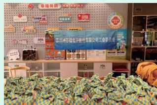

text_image

Classroom interior with wall posters and colorful bedding, featuring Chinese text on banners and wall decorations

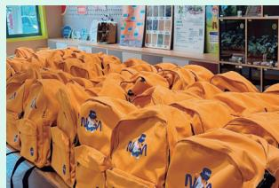

natural_image

Stack of orange backpacks with visible logos, arranged in rows on a shelf (no text or symbols)

納芯微始終相信，公司的發展壯大離不開社會的支持與信任。未來，我們將繼續積極推動社會公益事業發展，鼓勵員工參與公益慈善事業，以實際行動支持社會公益，為社會貢獻一份溫暖。

## 共創共享

## 創造非凡價值

43 創新研發  
48 品質管理  
52 供應鏈管理

納芯微積極踐行聯合國可持續發展目標第7、9、11和17項．致力於通過技術創新保障卓越品質，成為全球產業供應鏈可靠可信賴的合作夥伴。公司始終秉承「可靠、可信賴、持續學習、堅持長期價值」的核心價值觀，專注於研發創新，以「感知」「驅動」未來，推動共建綠色、智能、互聯互通的「芯」世界，為實現可持續發展貢獻力量。

## 我們的行動 ：

持續佈局可持續業務，公司汽車電子、可再生能源與電源、工業自動化業務佔比超八成  
●	 不斷壯大研發隊伍，公司約50%員工屬於研發部門  
●	 與多家院校合作，做好產學研的同時，亦注重人才的共同培養  
●	 通過技術創新保障卓越品質，成為全球產業供應鏈可靠可信賴的合作夥伴  
●	 增強供應鏈韌性，進一步確保業務連續性並贏得客戶信賴

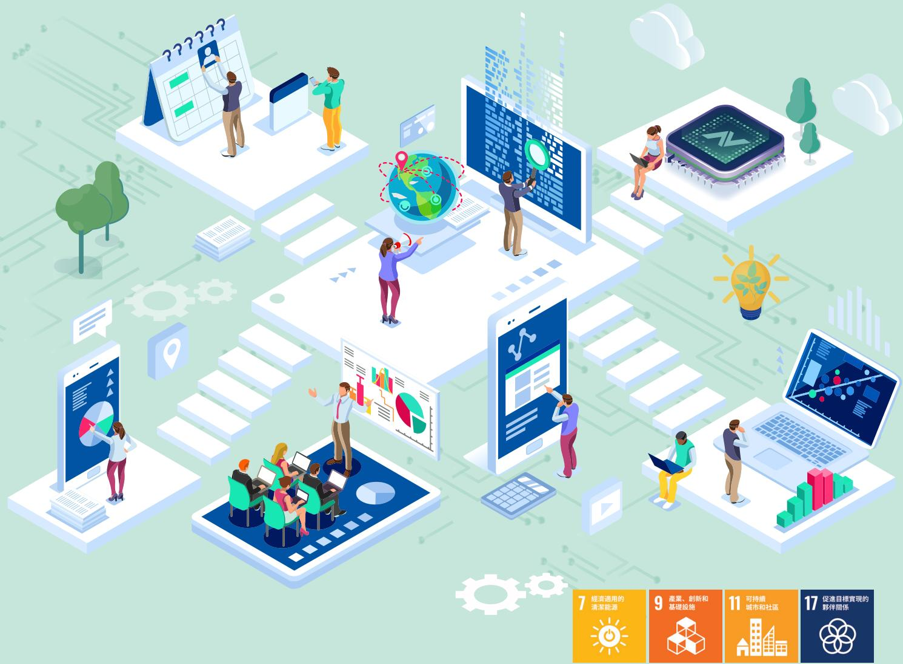

flowchart

```mermaid
graph LR
  A["7 經濟適用的清潔能源"] --> B["9 產業、創新和基礎設施"]
  C["11 可持續城市和社區"] --> D["17 促進目標實現的夥伴關係"]
  E["18 地圖化"] --> F["20 標籤圖像"]
  G["3 項目 A: 職合頁圖書\nE圖書\nF圖書\nG圖書\nH圖書\nI圖書\nJ圖書\nK圖書\nL圖書\nM圖書\nN圖書\nO圖書\nP圖書\nQ圖書\nR圖書\nS圖書\nT圖書\nU圖書\nV圖書\nW圖書\nX圖書\nY圖書\nZ圖書\nA1["智能电网圖書\nE圖書\nF圖書\nG圖書\nH圖書\nI圖書\nJ圖書\nK圖書\nL圖書\nM圖書\nN圖書\nO圖書\nP圖書\nQ圖書\nR圖書\nS圖書\nT圖書\nU圖書\nV圖書\nW圖書\nX圖書\nY圖書\nZ圖書\nA2["智慧財產圖書\nE圖書\nF圖書\nH圖書\nI圖書\nJ圖書\nK圖書\nL圖書\nM圖書\nN圖書\nO圖書\nP圖書\nQ圖書\nR圖書\nS圖書\nT圖書\nU圖書\nV圖書\nW圖書\nX圖書\nY圖書\nZ圖書\nA3["智慧財產圖書\nE圖書\nF圖書\nH圖書\nI圖書\nJ圖書\nK圖書\nI圖書\nM圖書\nN圖書\nO圖書\nP圖書\nQ圖書\nR圖書\nS圖書\nT圖書\nU圖書\nV圖書\nW圖書\nX圖書\nY圖書\nZ圖書\nA4["智慧財產圖書\nE圖書\nF圖書\nH圖書\nI圖書\nJ圖書\nK圖書\nI圖書\nM圖書\nN圖書\nO圖書\nP圖書\nQ圖書\nR圖書\nS圖書\nT地图書\nU地图書\nV地图書\nW地图書\nX地图書\nY地图書\nZ地图書\nA5["智慧財產圖書\nE圖書\nF圖書\nH圖書\nI圖書\nJ圖書\nK地图書\nI地图書\nM地图書\nO地图書\nP地图書\nQ地图書\nR地图書\nS地图書\nT地图書\nU地图書\nV地图書\nW地图書\nX地图書\nY地图書\nZ地图書",
```

## 創新研發

納芯微圍繞客戶系統應用，持續研發有競爭力的芯片產品，在傳感器（磁、壓力、溫濕度等）、信號鏈（隔離、接口、通用信號鏈等）、電源管理（驅動、功率路徑保護、高低邊開關等）、MCU和MCU+系列等多個領域構建了堅實的核心技術壁壘。同時，公司重視基礎研發能力的建設，包括核心IP積累、功能安全開發能力、工藝開發能力和產品工程能力，形成納芯微的研發基座。此外，公司鼓勵創新，尤其是圍繞客戶應用的創新，致力於通過新產品、新技術和新工藝，為客戶提供更大的價值。

## 治理

公司高度重視對於知識產權的管理和保護，制定了《知識產權管理制度》等內部制度，詳細規定了專利管理、商標管理、集成電路佈圖設計管理、計算機軟件著作權管理、知識產權檢索管理、知識產權代理機構管理等內容。公司建立了規範的專利評審機制，明確專利評審評價標準，並通過線上管理系統對專利進行統一管理，保障專利申請的效率和質量。同時要求員工嚴格遵守知識產權的相關法律法規和公司內部的知識產權規定，保障在研發、生產、銷售等環節的知識產權的合法合規性。

在研發體系方面，我們也已建立完整的體系流程 ：

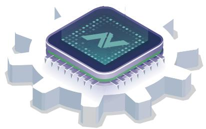

natural_image

Isometric illustration of a microchip with circuit board and chip, surrounded by abstract geometric shapes (no text or symbols)

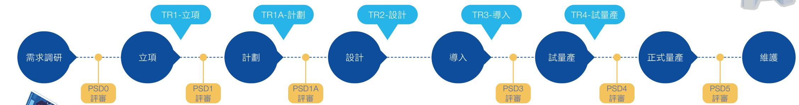

flowchart

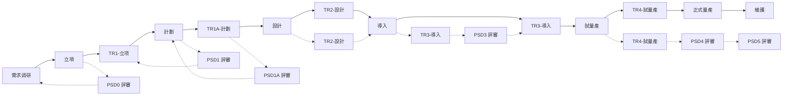
```mermaid
graph LR
  A["需求调研"] --> B["立項"]
  B --> C["TR1-立项"]
  C --> D["計劃"]
  D --> E["TR1A-計劃"]
  E --> F["設計"]
  F --> G["TR2-設計"]
  G --> H["導入"]
  H --> I["TR3-導入"]
  I --> J["試量產"]
  J --> K["TR4-試量產"]
  K --> L["正式量產"]
  L --> M["維護"]
  
  %% Feedback Points (PSD) at B
  B -.-> N["PSD0 評審"]
  N -.-> A
  D -.-> O["PSD1 評審"]
  O -.-> C
  E -.-> P["PSD1A 評審"]
  P -.-> D
  F -.-> Q["TR2-設計"]
  Q -.-> H
  H -.-> R["TR3-導入"]
  R -.-> S["PSD3 評審"]
  S -.-> I
  J -.-> T["TR4-試量產"]
  T -.-> U["PSD4 評審"]
  U -.-> V["PSD5 評審"]
```

註 ：技術評審（Technical Review, TR），產品狀態文件（Product Status Document, PSD）

## 創新研發

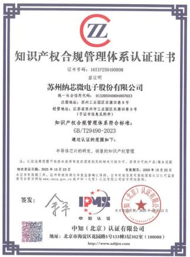

text_image

知识产权合规管理体系认证证书
证书号码：1651P25049080RM
兹证明
苏州纳芯微电子股份有限公司
统一社会信用代码：9132059406948078X3
注册地址：苏州工业园区东益田路9号
经营地址：江苏省苏州市工业园区东益田路9号
（下证信息及交易所）
知识产权合规管理体系符合标准：
GB/TZ9-190-2023
通过认证的范围如下：
半导体芯片的研发、销售的知识产权管理
注：认证范围不包含未经有效同意的国家版权的相关行政许可，获得许可的产品/服务范围
批准登记日期：2023年10月23日 有效期至：2026年10月22日
证书有效期至：证书有效期超过年度经审查确认。证件有效期至自给国家认证认可监督委员会官方网站www.cscs.gov.cn或中审（北京）认证有限公司官网查询为准。
签发：
中知（北京）认证有限公司
地址：北京市海淀区海淀园5号楼13层302室（100088）
http://www.zxj@jc.com

知識產權合規管理體系認證證書

為鼓勵研發創新，我們建立了系統化的知識產權激勵機制，通過規範、透明的制度對研發人員的創新成果予以獎勵。該機制有助於提升研發人員的創新積極性，增強關鍵技術人才的凝聚力，進而促進研發成果產出與高質量專利佈局，為可持續創新提供保障。

2025年，公司通過了《企業知識產權合規管理體系要求》(GB/T29490-2023)標準認證。

## 戰略

可持續的創新是公司與商業夥伴及其他利益相關方建立長期信任的重要基礎，也是公司保持技術競爭力和實現長期發展的關鍵支撐。公司通過持續的研發投入、人才培養及合作網絡構建，推進技術能力積累與產品體系優化，推動產品與解決方案向更高效、更智能方向演進，支持技術創新活動的穩步開展。

創新相關風險和機遇分析

<table><tr><td>類型</td><td>風險/機遇描述</td><td>發生概率</td><td>影響週期</td><td>潛在財務影響</td><td>應對措施</td></tr><tr><td>知識產權風險</td><td>公司擁有較多專利，在業務過程中可能存在知識產權未經許可被使用的風險。</td><td>低</td><td>短中期</td><td>營業收入減少</td><td>·開展知識產權培訓。
·建立知識產權侵權監測機制，利用大數據技術手段實時監測市場上侵權行為，並及時採取法律手段。</td></tr><tr><td>技術風險</td><td>技術人才短缺流失</td><td>低</td><td>短中期</td><td>營業收入減少</td><td>·保障員工權益。
·擴展招聘途徑。</td></tr><tr><td>市場機遇</td><td>技術突破推動產業向高端化、智能化發展</td><td>中</td><td>中期</td><td>營業收入增加</td><td>·採納尖端技術和創新管理模式，持續推動公司綠色發展，產業升級。</td></tr></table>

公司就上述創新研發相關的風險與機遇，已制定相關的管理方法，請見本意節後述部分

## 創新研發

## 影響、風險和機遇管理

公司將創新研發風險管理流程融入公司內部風險管理流程中。我們結合研發創新實際情況制定識別方法和評估途徑，有針對性地定期開展風險識別，並形成識別和評估、優先級排序、監測與管理、融入與調整的風險管理流程，從而實施行之有效的管理。

natural_image

Illustration of people using digital devices and computers, no text or symbols present

## 風險識別

結合宏觀經濟形勢、行業動態以及公司內部研發數據，全面審視研發業務的各個環節，從項目啟動、推進過程直至成果落地與驗收，系統地辨識並總結潛在風險，如技術可行性風險等。

## 風險評估

根據風險發生的可能性與影響程度進行分類與等級化處理。對於可能對研發項目造成重大不利影響且發生概率較高的風險，第一時間上報。

## 應對措施

開展知識產權保護及培訓，加強創新項目的知識產權成果轉化輸出。針對不同響應級別的風險制定差異化應對策略。

## 風險監測

對風險進行評估和管理，並詳細跟蹤風險發展態勢、應對措施執行進度、新出現的影響因素等，確保風險虚於持續監控之下，定期回顧風險應對措施的有效性。及時調整策略

## 創新研發

## 指標與目標

公司持續加強創新項目的知識產權成果產出與轉化。針對核心項目，公司圍繞目標市場定位、產品功能特性及應用場景，積極開展專利挖掘並進行系統化佈局，提升創新成果的知識產權保護水平。同時，公司制定年度專利申請目標，並結合業務發展實際需求，有序推進專利申請工作。

截至2025年底，公司及子公司累計已獲得知識產權項目共計511件。報告期內，公司新增知識產權項目申請110件，其中發明專利59件 ；本年新增獲得知識產權項目授權92件，其中發明專利40件。

<table><tr><td></td><td colspan="2">本年度新增</td><td colspan="2">累計數量</td></tr><tr><td></td><td>申請個數</td><td>獲得個數</td><td>申請個數</td><td>獲得個數</td></tr><tr><td>發明專利</td><td>59</td><td>40</td><td>304</td><td>163</td></tr><tr><td>實用新型專利</td><td>18</td><td>17</td><td>111</td><td>91</td></tr><tr><td>外觀設計專利</td><td>/</td><td>/</td><td>1</td><td>1</td></tr><tr><td>軟件著作權</td><td>/</td><td>/</td><td>37</td><td>38</td></tr><tr><td>集成電路佈圖設計</td><td>21</td><td>27</td><td>213</td><td>206</td></tr><tr><td>境外知識產權</td><td>12</td><td>8</td><td>54</td><td>12</td></tr><tr><td>合計</td><td>110</td><td>92</td><td>720</td><td>511</td></tr></table>

2025年，納芯微在研發創新領域投入

7.95 億元。

natural_image

Illustration of two people interacting with a calendar and screen, no text or symbols present

natural_image

Illustration of a classroom scene with a presenter pointing at a pie chart on a large screen, students seated at desks (no text or symbols visible)

公司每年開展與知識產權保護相關的培訓，2025年共開展8場，累計時長8小時，覆蓋全體研發人員，培訓內容涉及專利申請的一般流程、專利申請文件撰寫、專利侵權╱分析檢索、AI賦能研發創新、註冊商標的使用規範及風險提示等內容。

## 《專利申請與侵權應對全解析》知識產權培訓

2025年8月15日，公司組織開展知識產權專題培訓，圍繞侵權檢索、侵權分析、風險應對等關鍵內容，通過案例解析、技術特徵比對及相關法律法規解讀，系統梳理專利申請與侵權風險應對要點，持續提升員工在專利風險識別與防控方面的專業能力。

## 創新研發

## 協同創新

在報告期內，公司結合重點應用方向，與產業鏈夥伴開展戰略合作，探索面向實際應用場景的創新實踐，旨在拓寬技術邊界，為行業的可持續、高質量發展注入強勁動力。

## 納芯微攜手聯合電子與英諾賽科，共創新能源汽車功率電子新格局

2025年9月29日，納芯微、聯合電子、英諾賽科共同簽署戰略合作協議。三方將聚焦新能源汽車功率電子系統，聯合研發智能集成氮化鎵(GaN)相關產品。全新開發的智能GaN產品將依托三方技術積淀，提供更可靠的驅動及GaN保護集成方案，進一步提升系統功率密度。三方還將協同推動相關解決方案的產業化落地，助力新能源汽車產業的可持續發展與價值提升。

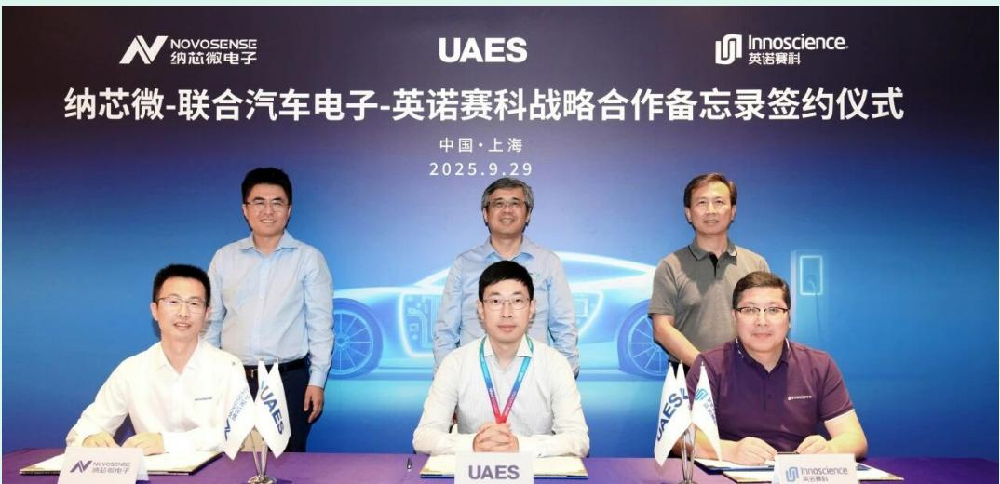

text_image

NOVOSENSE
纳芯微电子
UAES
Innoscience
英诺赛科
纳芯微-联合汽车电子-英诺赛科战略合作备忘录签约仪式
中国·上海
2025.9.29
NOVOSENSE
纳芯微电子
UAES
UAES
Innoscience
英诺赛科

此外，我們還積極投身於其他相關平台的產學研實踐，通過一系列與學界、行業的深度合作，展現出強大的創新活力與發展潛力。

## 納芯微出席2024年&2025年華人芯片設計技術研討會(ICAC)

華人芯片設計技術研討會(ICAC)是致力於為中國集成電路設計的學術界和產業界同仁建立一個頂尖的技術交流平台。本屆ICAC由復旦大學、澳門大學、電子科技大學、清華大學、東南大學聯合舉辦。

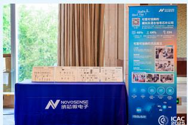

text_image

NOVOSENSEI
防结银电子

## 納芯微出席2025年第十九屆中國高校電子信息學院院長（系主任）年會暨第二屆全國高校電子信息學科建設論壇

中國高校電子信息學院院長（系主任）年會由中國電子學會發起，本屆由中國電子學會全國高校電子信息學科建設委員會和清華大學電子工程系聯合承辦。

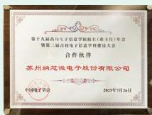

## 納芯微攜手硬禾科技開展第七期WeDesign芯片設計設計大賽

WeDesign是由硬禾學堂組織的，以「一起設計、一起體驗」為宗旨的活動，旨在邀請廣大愛好者共同設計，一起參與到芯片的打板驗證過程中，探索芯片的奧秘。

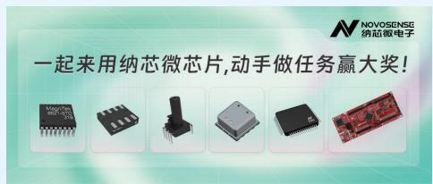

text_image

NOVOSENSE
纳芯微电子
一起来用纳芯微芯片,动手做任务赢大奖!

## 品質管理

## 治理

納芯微嚴格遵守《中華人民共和國產品質量法》《中華人民共和國消費者權益保護法》等法律法規以及相關國家標準，始終將產品質量與可靠性置於首位，堅持高標準、嚴要求。公司秉承「質量始於設計，貫穿全生命週期」的質量管理理念，構建了一套科學、系統的全面質量管理體系。通過加強組織能力與推動流程體系IT化，確保該體系有效落實與執行。截至報告期末，公司已經取得一系列可靠、可信賴的體系認證。

natural_image

Illustration of business professionals reviewing documents on a large laptop screen, with charts and pie charts in the background (no text or symbols)

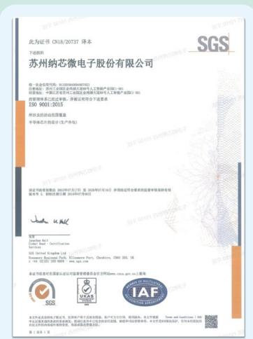

text_image

此为证书 CN18/20737 译本
下述机构:
苏州纳芯微电子股份有限公司
统一社会信用代码: 91320000MA4W8H02D
注册地址:苏州工业园区新港大道6号A座房产(2-701)
经营范围:中国江苏省苏工业园区金桥路与南桥路交叉口及门头桥改造工程(2-94)
经营财务公司已注册,中审未经审计;详见表
ISO 9001:2015
所持良好的流动性管理
年度报告的会计估计(合并口径)
身份证件有效期限:2013年07月17日 至 2016年07月16日
并经验证会要求的监督事项须持有
基本专用、编码信息截止 2016年07月08日
本公司及董事会全体成员保证信息披露的内容真实、准确和完整，没有虚假记载、误导性陈述或重大遗漏。
本公司及董事会全体成员保证信息披露的内容真实、准确和完整，没有虚假记载、误导性陈述或重大遗漏。
本公告内容未作任何虚假记载、误导性陈述或者重大遗漏。
© SGS
江苏纳芯微电子股份有限公司
JACAS
IAF
www.sgs.com.cn

2015年至今，獲得ISO 9001:2015質量管理體系證書

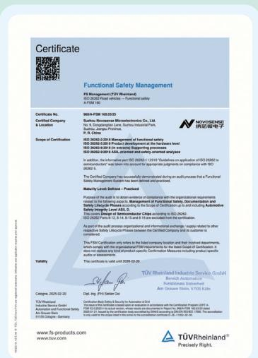

flowchart

```mermaid
graph LR
  A["Certificate"] --> B["Certificates No."]
  B --> C["Certified Company & Location"]
  C --> D["Scope of Certification"]
  D --> E["ISO 20006-2014 Management of functional safety\nISO 20006-2015 Product development at the hardware level\nISO 20006-2014 on an electronic packaging system\nISO 20006-2015 ASG, installed and safety-related analysis"]
  E --> F["In addition, the information posted by ISO 20006-1918 is available on application of ISO 20006 for sensoric solutions** was taken into account for appropriate judgments in compliance with ISO 20006-1918"]
  F --> G["The Certifier Company has successfully demonstrated during an audit process that a Functional Safety Management System has been implemented and produced"]
  G --> H["Maturity Level Software - Practical"]
  H --> I["Published the audit as a motion evidence or compliance with the organizational requirements\nFunctional Safety Support: Management of Functional Safety, Documentation and Safety Vision Level (Level 3).\nThis covers Design of Sondereinmechan China according to ISO 20002.NISO/ISO/ISO/ISO 1918, a 3-in-1-in-1-in-1-in-1-in-1-in-1-in-1-in-1-in-1-in-1-in-1-in-1-in-1-in-1-in-1-in-1-in-1-in-1-in-1-in-1-in-1-in-1-in-1-in-1-in-1-in-1-in-1-in-1-in-1-in-1-in-1-in-1-in-1-in-1 in compliance"]
  I --> J["All aspects of the audit process organized and informational enrichment: supply related to other operational safety measures. Please review the Certifier Company to the customer as well as compliance"]
  J --> K["The FSM Certification will refer to the listed company location and their involved departments, when currently with the organizational fit responsible for the listed issue of certification. It does not rely on specific product specificity. Confirmation Measures including product specificity and quality of certification"]
  K --> L["This certificate is valid with 2028-2029"]
```

2025年，功能安全管理體系獲得ISO 26262 ASIL D「DefinedPracticed」認證，納芯微的功能安全體系達到國際最高標準並具備成熟實踐能力，同時，高安全性車規級芯片通過最高等級ASIL D認證  

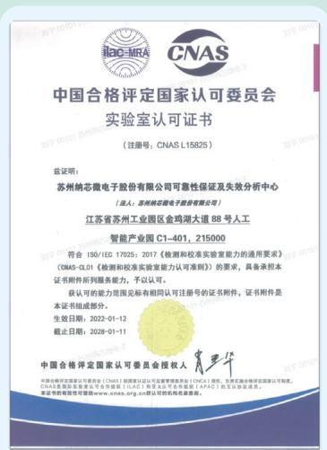

text_image

中国合格评定国家认可委员会
实验室认可证书
（注册号：CNAS L15825）
兹证明：
苏州纳芯微电子股份有限公司可靠性保证及失效分析中心
（法人：苏州纳芯微电子股份有限公司）
江苏省苏州工业园区金鸡湖大道88号人工
智能产业园C1-401，215000
符合ISO/IEC 17025；2017《检测和校准实验室能力的通用要求》
（CNAS-CL01《检测和校准实验室能力认可准则》）的要求，具备承担本
证书附件所列服务能力，予以认可。
获认可的能力范围见标有相同认可注册号的证书附件，证书附件是
本证书组成部分。
生效日期：2022-01-12
截止日期：2028-01-11
中国合格评定国家认可委员会授权人
中国合格评定国家认可委员会（CNAS）签署的认证证书及质量管理体系认证证书（CNAS）项目，负责实施合格评定认证认可制度。
CNAS签署的认证证书可获得CNAS认证证书后方可有效签署（APAC）的认证认证证书。
申请的审批凭许可证www.cnas.org.cn认可的机构书面审查。

2022年至今，納芯微可靠性保證及失效分析中心獲得實驗室認可證書

## 品質管理

## 戰略

公司確立了以Robust & Reliable為核心的「雙R」質量方針，為持續提供高品質產品與服務奠定堅實基礎。公司始終將產品和服務質量視為企業核心競爭力的關鍵體現，憑藉全面質量管理體系，從研發設計到生產製造，再到售後服務，質量管理貫穿產品和服務的全生命週期每一個環節。

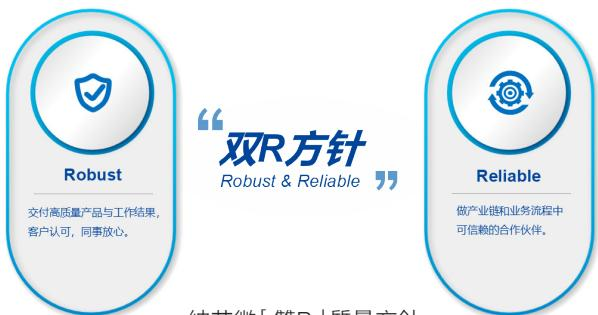  
納芯微「雙R」質量方針

質量相關風險和機遇分析

<table><tr><td>類型</td><td>風險/機遇描述</td><td>發生概率</td><td>影響週期</td><td>潛在財務影響</td><td>應對措施</td></tr><tr><td>市場風險</td><td>· 客戶傾向於選擇更加低碳、低功耗的產品，若不能在節能降耗等可持續發展表現方面達到客戶要求，公司可能會面臨客戶流失的風險。</td><td>· 中</td><td>· 短中期</td><td>· 營業收入減少</td><td>· 加大研發力度，優化產品設計逐步降低產品的能耗，提升產品的市場競爭力。
· 持續關注市場動向，保持創新活力。
· 在客戶服務方面，公司優化售後服務流程，引入ITR管理機制，顯著提升響應速度與客戶滿意度。</td></tr><tr><td>產品風險</td><td>· 產品質量低、合格率低導致的產品風險。</td><td>· 低</td><td>· 短中期</td><td>· 營業收入減少</td><td>· 公司關注質量管理內部建設，不斷完善相關培訓體系，加強質量管理培訓投入，2025年舉辦了37場質量培訓課程，共計138小時。
· 基於在研發－製造－銷售等全業務流程上均建立的完善內部機制，確保產品合格率。</td></tr><tr><td>市場機遇</td><td>· 汽車智能化趨勢帶來的市場機遇。</td><td>· 高</td><td>· 短中期</td><td>· 營業收入增加</td><td>· 加快產品的迭代速度，提升產品性能和能效比。</td></tr></table>

公司就上述質量相關的風險與機遇，已制定相關的管理方法，請見本章節後述部分。

## 品質管理

## 影響、風險和機遇管理

公司將質量管理要求融入日常運營與業務管理流程，結合產品特性與業務環節，開展質量相關風險與機遇的識別與評估，並配套建立管控與改進機制，推動質量管理體系不斷完善，支持產品和服務質量的持續提升。

報告期內，我們開展了全面客戶滿意度調查，覆蓋主要客戶群體，通過定量與定性分析相結合的方式，系統評估客戶對產品性能、服務質量、技術支持及響應效率等維度的滿意度水平。調查結果達成去年設定目標，整體評分相較2024年提升，反映客戶對公司綜合能力的高度認可。

## 戶滿風險識別

全面識別包括但不限於產品設計研發、測試度調查維護、存儲運輸、售後服務的每一個環節潛在的內部和外部風險。

## 風險評估

根據風險發生的可能性與影響程度，對識別出的風險設置不同響應級別。

## 應對措施

注重質量文化的建設，定期內部審計。加強質量管理培訓投入力度，提高員工在質量管理方面的專業水平。公司優化售後服務流程，引入ITR管理機制，提升響應速度與客戶滿意度。 C

## 風險監測

責任部門定期對產品質量控制流程執行情況進行檢查、測試，通過穿行測試、實地觀察等方法，驗證控制措施是否有效運行，持續優化產品質量風險管理流程。

為持續提升滿意度，公司採取多項針對性舉措 ：

## 機制優化

強 化 現 場 應 用 工 程師（Field ApplicationEngineer， 以 下 簡 稱FAE）與銷售團隊協同，加速客戶需求傳遞與問題解決，顯著縮短響應時間 ；

## 技術攻堅

針對應用失效等重點問題，加大技術支持團隊投入，提升精準解決方案輸出與現場問題解決率 ；

## 產品升級

基於客戶反饋優化產品功能設計，引入新技術增強穩定性與可靠性 ；

## 服務定制

為不同客戶群體提供個性化解決方案及專屬支持服務，深度契合實際業務場景需求。

通過這些針對性舉措，我們將客戶聲音轉化為服務與產品迭代的驅動力，持續鞏固客戶信任與合作黏性。

## 品質管理

## 客戶投訴處理機制

公司始終高度重視客戶投訴的受理與改進，將其視為優化產品和服務質量的重要反饋來源。我們通過多元渠道體系化收集客戶反饋和意見，包括定期拜訪客戶獲取意見，以及電子郵件、客服電話等官方渠道全天候接受客戶反饋。在此基礎上，我們建立了完善的「受理－分析－解決－改進」全流程閉環管理機制，確保每項客戶投訴均得到跟蹤處理並及時反饋結果。此外，我們專門設立產品安全與符合性代表（Product Safety Conformity Representative，以下簡稱PSCR）崗位，負責汽車產品合規性與符合性管理工作。通過持續的投入和改進，公司在客戶投訴處理方面近年來取得了顯著成效 ：

引入更加智能化的客戶投訴數據分析系統，能夠對投訴內容進行升級，並對趨勢做實時分析，幫助公司精準識別和解決產品或服務中的共性問題 ；  
優化資源以及組織架構，顯著縮短了投訴處理的響應時間，提升了客戶滿意度。此外，針對部分重點投訴，集中資源加大了處理力度，確保客戶的核心訴求能夠得到徹底解決。

在報告期內，已售產品未發生因安全和健康問題需要召回的情況。

未來，纳芯微將持續深化投訴管理體系的智能化與前瞻性，將客巨聲音轉化為產品創新與服務質量升級的基石。

natural_image

Illustration of three people interacting with a large screen displaying star ratings, no text or symbols present

## 供應鏈管理

## 治理

公司嚴格遵守《中華人民共和國招標投標法》等相關法律法規，已制定《採購控制程序》《供應商季度績效評估表》《供應商審核計劃》《業務連續性管理程序》《有害物質管理控制程序》《環保協議》等規章制度，以加強供應商的管理，從而與之建立長期互贏的合作關係。依托客觀且可量化的供應商管理制度，公司組織採購、質量、技術創新、法務、安環等多部門共同參與對技術、質量、響應、交期、商務及價格、企業倫理╱環境安全╱社會責任╱職業健康等可持續發展維度進行全方位考量，確保供應鏈的可持續性，並對核心供應商進行季度追蹤和考評。我們秉持公平、公正、公開的原則，對供應商進行資質確認及評定，全面構建覆蓋供應商准入、評估、風險管理、退出等環節的全流程供應商管理體系。2025年，公司對《供應商管理制度》進行修訂，進一步細化對於不同等級供應商的管理要求，持續提升供應鏈質量表現。

## 戰略

供應鏈是企業日常運營的核心組成部分，我們致力於踐行負責任的生產實踐，構建可持續的供應鏈體系。通過深化供應鏈管理、強化質量安全控制、推行環保理念等措施，我們努力構建多元化的供應商群體。同時，我們持續推動供應鏈向低碳轉型，以適應不斷變化的市場和社會需求。該策略旨在確保供應鏈的高效性、可靠性，同時體現了我們對負責任、可持續經營的堅定承諾。

供應鏈管理相關風險和機遇分析

<table><tr><td>類型</td><td>風險/機遇描述</td><td>發生概率</td><td>影響週期</td><td>潛在財務影響</td><td>應對措施</td></tr><tr><td>政策與法律風險</td><td>由於地緣政治等外部因素可能導致供應鏈不穩定風險。</td><td>中</td><td>中期</td><td>運營成本增加</td><td>· 持續推進供應鏈本土化，積極開展多元化採購。
· 技術自主化，加大研發投入，提升自主創新能力。
· 密切關注國際局勢，及時調整並制定供應鏈應急響應計劃。</td></tr><tr><td>市場風險</td><td>供應商集中度較高且部分供應商產品具有稀缺性，若不能保持穩定的合作關係，將對公司經營產生不利影響。</td><td>中</td><td>中期</td><td>運營成本增加</td><td>· 建立多元化供應商策略，降低對單一供應商的依賴。
· 與現有供應商建立長期緊密合作關係。</td></tr><tr><td>管理風險</td><td>供應商選擇不當，採購方式不合理，招投標或定價機制不科學，授權審批不規範，可能導致採購物資質次價高，出現舞弊或遭受欺詐。</td><td>低</td><td>短期</td><td>運營成本增加</td><td>· 實行採購全過程監督，嚴格履行相應審批流程，對採購進度進行有效管控，確保採購工作合規高效，保障公司業務正常運行。</td></tr><tr><td>機遇</td><td>通過與供應商建立長期深度合作，突破海外供應鏈限制，可提升國產化率。</td><td>高</td><td>長期</td><td>運營成本減少</td><td>· 持續提升供應鏈本土化比例。</td></tr></table>

公司就上述供應鏈管理相關的風險與機遇，已制定相關的管理方法，請見本章節後述部分。

## 供應鏈管理

## 影響、風險和機遇管理

公司將供應鏈管理要求融入日常運營與業務管理流程，結合供應商類型及業務環節特點，持續開展供應鏈相關風險與機遇的識別與評估，強化關鍵環節管控與協同管理，提升供應鏈運行的穩定性與整體韌性。

## 風險識別

定期對供應鏈原材料、產成品供應商選擇、採購、運輸、倉儲、生產各個環節的潛在風險進行識別。

## 風險評估

對供應鏈外部風險（如原材料價格波動、供應商破產、物流中斷等）進行全面評估。

## 應對措施

根據風險評估結果，制定詳細的應急預案，包括供應鏈中斷事件報告、評估、決策、執行和恢復等各個環節，以及具體的資源調配方案。

## 風險監測

建立有效的監測系統，及時獲取關鍵數據。每年不定期審查，通過對產品物流、倉儲地實地考察的方式實時監測供應鏈的運行情況，以便及時發現潛在問題。

公司建立《業務連續性管理程序》《業務影響分析(BIA)管理程序》，至少每半年進行一次突發事件管理(IMP)及風險系統評估，並針對可能造成供應商供貨中斷的情況制定業務連續性策略，保障公司生產連續性。2025年，對於核心供應商的BCM的風險評估均在低風險範圍內，公司通過季度供應商評分的方式，持續推動供應商完成改善。

在供應鏈風險管控方面，我們有相應舉措降低業務風險 ：

• 公司與各生產品類的戰略供應商達成深度合作並簽訂長期合作協議，同時嚴格把控供應源頭，保障原材料供應的穩定性和質量的可靠性。  
• 公司積極響應國產化戰略，持續推進供應鏈國產化進程，將工作前置到上游二級物料層面，開展全面的國產化評估與精細化管理。  
• 2025年公司新上線供應鏈管理數字化項目，形成完善的自動化採購報表、建立完善的價格系統、實現SRM系統和IPD研發流程的直接對接等，對信息交互和實時查詢進行了專項優化。

## 指標和目標

公司將本地供應商作為合作的考量因素，以促進技術進步，降低採購成本，同時減少運輸產生的碳排放。截至報告期末，公司共有1,358家供應商，本土化供應商及採購佔比超 70%，有效降低運輸碳排放、提升供應鏈效率與韌性，同時助力地方經濟發展與就業。

2025年，公司審核供應商的覆蓋比例達100%。此外，公司配合客戶審核的供應商覆蓋比例達100%，主要審核內容包括不同代工廠制程和體系等方面。截至報告期末，公司A級核心供應商100%獲得了ISO 9001認證，ISO 14001認證，ISO 45001認證。

公司將供應鏈管理視為保障業務連續性、產品質量與可持續發展的重要基礎，持續完善覆蓋供應商准入、履約評估、監督審核及退出管理的全生命週期供應鏈管理機制，推動責任供應鏈建設。

## 供應鏈管理

## 供應商准入管理

公司在供應商准入階段引入多維度評估機制，將技術能力、質量水平、響應效率、交付能力與成本表現作為基礎評估要素，並同步納入ESG和安全管理要求，對生產型供應商實施系統化准入評估與持續管理。

TQRDC評估標準

我們採用TQRDC（Technology，Quality，Response，Delivery，Cost）作為採購評估供應商的標準，對生產型供應商進行准入考量，每個季度都進行全面的評分，以確保他們在關鍵維度的表現符合要求。

ESG維度

在ESG（環境、社會及治理）方面對供應商進行考量，以確保供應鏈的可持續性和企業社會責任。

安全考量

供應商准入評估時，安全是我們考量供應商的另一個重要維度，包括網絡安全、信息安全以及員工人身安全。這一維度的考量是為了保障整個供應鏈在各個層面的安全性。

在准入過程中，我們實施系統化評估機制，圍繞技術能力、質量管理、業務連續性及運營合規等關鍵維度，對供應商開展多輪審核與專家評審，確保其具備穩定履約能力與可持續運營基礎。

公司持續推動供應商管理規範化，按照《技術評估表》《質量體系評估表》《質量過程評估表》《BCM審核表》等標準化評估工具識別潛在風險，並與供應商開展針對性溝通，推動相關事宜的確認與整改，直至問題閉環管理完成後方可納入合格供應商體系。

natural_image

Illustration of two business professionals reviewing documents and a large screen, with abstract icons and no readable text or symbols.

## 供應鏈管理

## 供應商評估與激勵

對於核心供應商，公司根據《供應商季度績效評估表》，由採購、技術創新、質量、外部製造以及EHS等跨部門構成的供應商審核小組，圍繞質量、交付、協同及ESG等維度對供應商進行綜合評估，並據此開展供應商分級管理、策略性合作與表彰，持續推動供應商能力提升，共同踐行永續經營理念，構建協同進步的責任供應鏈。

natural_image

Illustration of three people interacting with a trophy and stacks of charts, symbolizing data or business growth (no text or symbols present)

## 供應商ESG管理

公司在供應商准入及常規管理過程中，逐步將ESG相關因素納入考量。在《供應商體系審核表》中設置環境管理、職業健康與安全及質量管理體系等相關內容，評價範圍涵蓋環境保護、消防與生產安全、有害物質管理、員工培訓及次級供應商管理等方面，用於支持對供應商合規性及潛在ESG風險的基礎識別。

在供應商管理實踐中，公司根據供應商類別與風險特徵，開展週期性審核與評估工作，並結合三年週期審核、年度審核等方式，對供應商ESG相關表現進行持續關注。

同時，公司制定《保密協議》《質量協議》《環保協議》等專項協議，將環境、質量與合規相關要求納入供應商管理框架，推動供應鏈相關責任要求的逐步落實。公司已建立供應商退出機制及相應流程，以支持供應商結構的持續優化。2025年，公司未發生因ESG相關原因終止合作的供應商情況。

## 衝突礦產

作為芯片公司，我們持續關注國際社會對於衝突礦產方面的觀點及發展趨勢。公司制定《有害物質控制程序》對衝突礦產的合規性流程進行規範管理，明確內部治理與供應鏈管理要求，並建立相應的數據管理與報告機制，用於支持對供應鏈中衝突礦產風險的識別與信息披露。公司積極配合客戶開展相關信息申報工作，持續提升供應鏈透明度。

公司現有供應商已參考《衝突礦產報告》CMT進行調查，並按照流程對是否符合剛果民主共和國無衝突金屬的要求的調查結果進行判定。

## 調查結果及措施 ：

• 如不涉及衝突礦產事項，則通過該審核 ；  
• 如涉及衝突礦產事項，需重新選擇新的礦產來源並提供有效的證據，證明相應改善、預防措施，以符合無衝突金屬要求。

針對可能涉及衝突礦產的供應商，我們及時進行衝突礦產的信息調查，確認其無衝突礦產使用，以符合剛果民主共和國無衝突金屬要求。在適用的情況下，我們要求供應商根據國家或國際公認的盡職調查框架，對衝突礦產或其他礦產（包括鈷）的來源和監管鏈進行盡職調查和年度原產國調查。供應商應使用RBA官方網站的衝突礦產報告模板(CMRT)╱鈷報告模板(CRT)提供相應信息，必要時，要求供應商提供衝突礦產聲明。

此外，我們每年度對衝突礦物的精煉廠╱冶煉廠進行一次調查，確認精煉廠╱冶煉廠仍在RMI合格冶煉廠清單中。

2025年，公司要求核心供應商按照CMRT表單開展礦物申報，核心供應商申報覆蓋率為100%。根據本年度調查結果，公司在供應鏈調查結果未發現涉及使用衝突礦產的供應商。

公司將持續關注國際法規及監管動態，結合業務實際，不斷完善衝突礦產管理與信息披露機制，並與供應商、客戶及行業組織保持溝通與協作，共同推動負青任礦產採購實踐的持續落實。

## 綠色運營

## 共繪生態畫卷

57 環境管理  
58 節能減排  
61 原材料使用  
62 應對氣候變化

納芯微立足綠色、可持續業務，積極響應聯合國可持續發展第6、7、11、13項目標，秉持綠色發展、低碳發展的理念，在努力創新、奮勇開拓的同時，持續提升能源資源利用效率，並結合運營實踐不斷拓寬低碳運營新思路。

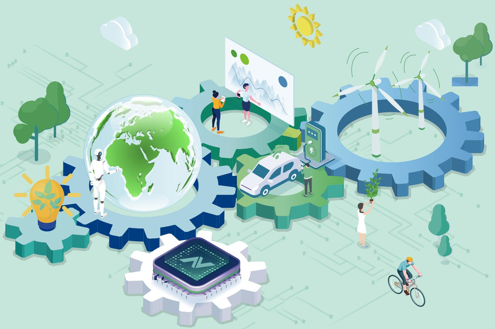

natural_image

Illustration of global smart energy concept with gears, globe, wind turbines, and people (no text or symbols)

## 我們的行動 ：

●	 推出綠色產品，為客戶賦能，共同實現綠色發展目標  
逐步降低碳排放，與用車平台合作，優先使用新能源汽車，減少運營過程中的碳排放  
●	 積極引入如光伏發電等清潔能源，優化能源結構  
●	 不斷培養員工環保意識，在公司內部營造環保氛圍

6 清潔飲水和衡生設施

11

13 氣候行動

## 環境管理

納芯微嚴格遵守《中華人民共和國環境保護法》《中華人民共和國節約能源法》等運營所在地法律法規要求，建立更新《能源資源管理控制程序》等制度，對能源與資源使用進行規範，並持續加強綠色辦公、綠色出行等環境保護相關內容宣貫，努力建設資源節約型、環境友好型企業，實現人、資源與環境的協調可持續發展。

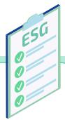

## 環境方針

遵守法規 ： 遵守國家法律法規和行業、地方環保政策

預防污染 ： 樹立全員環保意識，提高預防和控制污染事故發生的能力

節能降耗 ： 合理有效地使用能源資源，減少浪費，採用環保產品

持續改進 ： 針對需整改的問題實施有效的改進措施，持續提升環境績效

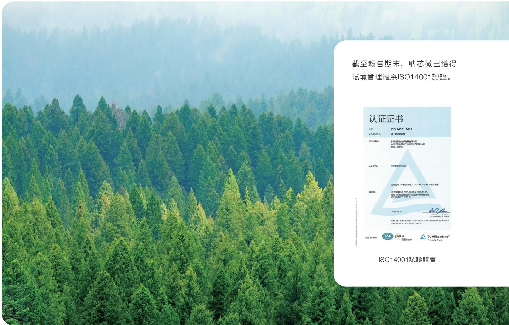

text_image

截至報告期末，納芯微已獲得
環境管理體系ISO14001認證。

认证证书
标准 ISO 14001:2015
证书登记号码 01-104 2232716

证书持有者： 苏州纳芯微电子股份有限公司
中国江苏省苏州工业园区东园路9号
邮编：215128

认证范围： 半导体芯片的设计

有限期： 证明完成了审核并满足了ISO 14001:2015 标成的要求。
证书有效期从2020-02-01至2029-01-31，
证本单位经过符合要求的监管审核保持有效。
初次认证始于2023年

2026-02-01

© iJX Pharmaceutical Cell GmbH
AutoCAD System © 2026.02.01

TRIBITION OF THE SPECIFIED CERTIFICATE OF ISO14001
www.tjx.com IAF DAXS TÜVRheinland® Precisely RightL

ISO14001認證證書

截至報告期末，納芯微已獲得環境管理體系ISO14001認證。

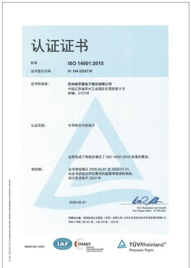

flowchart

```mermaid
graph LR
  A["ISO 14001:2015\n证书登记号码"] --> B["证书持有者："]
  B --> C["苏州芯诺微电子股份有限公司\n中国证券苏州工业园区东顶阳巷9号\n邮编：215126"]
  
  subgraph Certification Scope
    D["认证范围："]
    E["半导体芯片的设计"]
  end
  
  subgraph Approval Period
    F["有续期："]
    G["证明完成了审核并满足了ISO 14001:2015标准的要求。"]
    H["证书有效期从2020-02-01至2029-01-31，此证书经通过符合要求的监督审核保持有效。初次证起始于2023年"]
  end
  
  subgraph Website
    I["www.tuv.com"]
  end
  
  style A fill:#f9f9f9,stroke:#333,stroke-width:2px
  style B fill:#f9f9f9,stroke:#333,stroke-width:2px
  style C fill:#f9f9f9,stroke:#333,stroke-width:2px
  style D fill:#f9f9f9,stroke:#333,stroke-width:2px
  style E fill:#f9f9f9,stroke:#333,stroke-width:2px
  style F fill:#f9f9f9,stroke:#333,stroke-width:2px
  style G fill:#f9f9f9,stroke:#333,stroke-width:2px
  style H fill:#f9f9f9,stroke:#333,stroke-width:2px
  style I fill:#f9f9f9,stroke:#333,stroke-width:2px
  style J fill:#f9f9f9,stroke:#333,stroke-width:2px
  style K fill:#f9f9f9,stroke:#333,stroke-width:2px
  style L fill:#f9f9f9,stroke:#333,stroke-width:2px
  style M fill:#f9f9f9,stroke:#333,stroke-width:2px
  style N fill:#f9f9f9,stroke:#333,stroke-width:2px
  style O fill:#f9f9f9,stroke:#333,stroke-width:2px
  style P fill:#f9f9f9,stroke:#333,stroke-width:2px
  style Q fill:#f9f9f9,stroke:#333,stroke-width:2px
  style R fill:#f9f9f9,stroke:#333,stroke-width:2px
  style S fill:#f9f9f9,stroke:#333,stroke-width:2px
  style T fill:#f9f9f9,stroke:#333,stroke-width:2px
  style U fill:#f9f9f9,stroke:#333,stroke-width:2px
  style V fill:#f9f9f9,stroke:#333,stroke-width:2px
  style W fill:#f9f9f9,stroke:#333,stroke-width:2px
  style X fill:#f9f9f9,stroke:#333,stroke-width:2px
  style Y fill:#f9f9f9,stroke:#333,stroke-width:2px
  style Z fill:#f9f9f9,stroke:#333,stroke-width:2px
  style AA fill:#f9f9f9,stroke:#333,stroke-width:2px
  style AB fill:#f9f9f9,stroke:#333,stroke-width:2px
  style AC fill:#f9f9f9,stroke:#333,stroke-width:2px
  style AD fill:#f9f9f9,stroke:#333,stroke-width:2px
  style AE fill:#f9f9f9,stroke:#333,stroke-width:2px
  style AF fill:#f9f9f9,stroke:#333,stroke-width:2px
  style AG fill:#f9f9f9,stroke:#333,stroke-width:2px
  style AH fill:#f9f9f9,stroke:#333,stroke-width:2px
  style AI fill:#f9f9f9,stroke:#333,stroke-width:2px
  style AJ fill:#f9f9f9,stroke:#333,stroke-width:2px
  style AK fill:#f9f9f9,stroke:#333,stroke-width:2px
  style AL fill:#f9f9f9,stroke:#333,stroke-width:2px
  style AM fill:#f9f9f9,stroke:#333,stroke-width:2px
  style AN fill:#f9f9f9,stroke:#333,stroke-width:2px
  style AO fill:#f9f9f9,stroke:#333,stroke-width:2px
  style AP fill:#f9f9f9,stroke:#333,stroke-width:2px
  style AQ fill:#f9f9f9,stroke:#333,stroke-width:2px
  style AR fill:#f9f9f9,stroke:#333,stroke-width:2px
  style AS fill:#f9f9f9,stroke:#333,stroke-width:2px
  style AT fill:#f9f9f9,stroke:#333,stroke-width:2px
  style AU fill:#f9f9f9,stroke:#333,stroke-width:2px
  style AV fill:#f9f9f9,stroke:#333,stroke-width:2px
  style AW fill:#f9f9f9,stroke:#333,stroke-width:2px
  style AX fill:#f9f9f9,stroke:#333,stroke-width:2px
  style AZ fill:#f9f9f9,stroke:#333,stroke-width:2px
  style BA fill:#f9f9f9,stroke:#333,stroke-width:2px
  style BB fill:#f9f9f9,stroke:#333,stroke-width:2px
  style BC fill:#f9f9f9,stroke:#333,stroke-width:2px
  style BD fill:#f9f9f9,stroke:#333,stroke-width:2px
  style BE fill:#f9f9f9,stroke:#333,stroke-width:2px
  style BF fill:#f9f9f9,stroke:#333,stroke-width:2px
  style BG fill:#f9f9f9,stroke:#333,stroke-width:2px
  style BH fill:#f9f9f9,stroke:#333,stroke-width:2px
  style BI fill:#f9f9f9,stroke:#333,stroke-width:2px
  style BJ fill:#f9f9f9,stroke:#333,stroke-width:2px
  style BL fill:#f9f9f9,stroke:#333,stroke-width:2px
  style BM fill:# f4 #8 #5 #4 #5 #5 #5 #5 #5 #5 #5 #5 #5 #5 #5 #5 #5 #5 #5 #5 #5 #5 #5 #5 #5 #5 #5 #5 #5 #5 #5 #5 #5 #5 #5 #5 #5 #5 #5 #5 #5 #5 #5 #5 #5 #5 #5 #5 #5 #5 #5 #5 #5 #5 #<nl>
```

## 節能減排

## 能源與資源管理

## 能源消耗

公司能源消耗主要來源於辦公場所、研發環境及信息化基礎設施運行。公司持續關注能源使用效率，通過制度建設與技術手段相結合，推進能源管理的規範化與精細化。

<table><tr><td>納芯微能源消耗</td><td>柴油/升</td><td>電力消耗/千瓦時</td><td>綜合能源消耗³/噸標準煤</td><td>綜合能源消耗強度/噸標煤每百萬營收</td></tr><tr><td>2025年</td><td>14.00</td><td>18,958,959.00</td><td>2,331.10</td><td>0.69</td></tr><tr><td>2024年</td><td>0</td><td>12,702,719.00</td><td>1,561.16</td><td>0.80</td></tr></table>

綜合能源消耗量參考國家市場監督管理總局和國家標準化管理委員會頒佈的《綜合能耗計算通則》（GB/T 2589-2020）。2025年，公司新增設備，因此整體能耗有所增加。

隨着全球能源格局的深刻改變，公司積極探索提升能源使用效率的可行路徑，逐步引入智能化管理手段，並關注清潔能源應用的潛在空間。在此基礎上，公司已嘗試佈局分佈式光伏等清潔能源項目，項目發電量已100%自用。在日常運營中，公司通過模組化機房建設、空調系統智能調控，設備運維優化等方式，持續推進能源使用效率的改善。

## 模組化機房節能實踐

2025年，公司模組化機房正式投入使用，在實際運行過程中，相較於同等負載下的傳統機房，年用電量減少約24.78萬kWh。該方案採用模組化與標準化設計，兼顧靈活擴展性與運行可靠性，並引入節能技術及智能化管理系統，實現機房運行狀態的遠程監控與能效管理。同時，通過預組裝方式，縮短建設週期，提升實施效率。機房整體結構緊湊，配置直流變頻壓縮機及EC風機等節能設備，有助於降低機房運行過程中的能源消耗，年節約能耗量約50%。

## 辦公空調智能化管理

公司在主要辦公場所引入空調智能控制系統，對製冷溫度及運行時段進行統一設置，並結合季節變化、節假日安排等因素進行動態調整，在滿足辦公舒適度需求的同時，減少不必要的能源消耗，實現辦公場所的環保效益。

## 節能減排

## 水資源管理

公司在日常運營中主要涉及辦公用水，設計研發活動不涉及工藝用水。基於業務特點，公司將水資源管理重點放在規範管理與節約使用上，並通過《能源資源管理控制程序》對相關要求予以明確。

2025年，我們的耗水量相關數據如下 ：

<table><tr><td></td><td>總耗水量/噸</td><td>單位取水量/噸每百萬營收</td></tr><tr><td>2025年</td><td>10,703.00</td><td>3.18</td></tr><tr><td>2024年</td><td>8,724.00</td><td>4.45</td></tr></table>

公司將「培養節水意識」作為推進水資源管理的重要抓手，通過內部宣傳與日常管理相結合的方式，引導員工形成節水習慣。公司對主要用水設施開展日常巡檢與月度對賬，防範管道漏水等非必要損耗，並在衛生區域逐步配置感應式水龍頭及節水型馬桶，通過固定資產升級降低水資源浪費。此外，公司在辦公區域配置直飲機替代傳統桶裝飲水機，並定期委託供應商進行濾芯更換及水質檢測，以提升飲水管理的規範性與安全性。

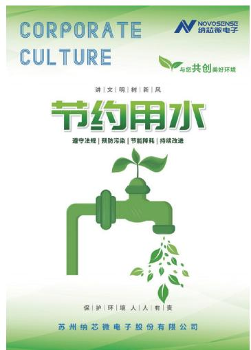

text_image

CORPORATE
CULTURE
讲 | 文 | 明 | 树 | 新 | 风
与您共创美好环境
节约用水
遵守法规 | 预防污染 | 节能降耗 | 持续改进
保 | 护 | 环 | 境人 | 人 | 有 | 责
苏州纳芯微电子股份有限公司

節約用水宣傳標語

## 污染物管理

公司嚴格遵守《中華人民共和國固體廢物污染環境防治法》等運營所在地環境保護和污染防治法律法規，在報告期內更新了《能源資源管理控制制度》，進一步明確廢氣監測及危險廢棄物處置等管理要求，對污染物實施分類、合規管理，盡可能降低對環境的潛在影響，促進資源循環再利用。

<table><tr><td></td><td>2025年</td><td>2024年</td></tr><tr><td>廢氣/萬立方米</td><td>3,305.1</td><td>3,792.6</td></tr><tr><td>其中,氯化氢/噸</td><td>0.01</td><td>0</td></tr><tr><td>其中,非甲烷總烴/噸</td><td>0.02</td><td>0.006</td></tr><tr><td>危險廢棄物/噸4</td><td>8.87</td><td>2.36</td></tr><tr><td>一般工業固廢/噸</td><td>101.93</td><td>57.5</td></tr><tr><td>其中,可回收廢棄物/噸</td><td>81.00</td><td>18.9</td></tr></table>

報告期內，公司未發生因環境問題受到處罰的情形。

## 節能減排

## 綠色辦公舉措

公司結合辦公場景特點，持續推進綠色辦公實踐，通過制度引導與日常管理相結合的方式，減少資源消耗與環境影響，包括 ：

倡導雙面打印，在打印區域設置「二手紙」循環使用區

推進電子化辦公，依托OA系統與數字化報銷流程，減少紙質單據使用

通過電話會議、視頻會議系統支持遠程協作，降低差旅及相關資源消耗

張貼綠色辦公與節能提示標語，提升員工環保意識

推動節約用電行動，選用節能型辦公設備與材料

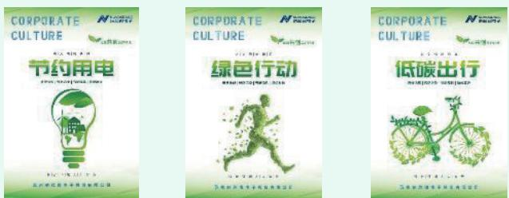

## 廢棄物管理

公司重視廢棄物的規範管理，並通過系列舉措加強相應的管理力度，明確相關部門職責，對辦公區及生活垃圾實施分類收集與合規處置。

  
無害廢棄物

主要來自辦公活動產生的生活垃圾，廢棄紙箱等可回收物由第三方統一回收處理。

  
有害廢棄物  
主要來自質量化學實驗室使用的化學品，相關危險廢棄物通過具備資質的單位處置，並通過政府網上申報系統完成備案。

  
辦公設備及耗材

複印機等設備為租賃資產，相關耗材由租賃商統一回收處理。

## 廢氣管理

納芯微上海和蘇州辦公室為主要辦公區域，不涉及廢氣排放，廢氣主要產生於質量實驗室的烘烤和實驗檢測等環節，公司通過配置活性炭吸附裝置、通風櫥等廢氣處理設施，對相關廢氣實施集中處理並有效減少無組織排放。同時，公司每年委託有資質的第三方機構對處理後的廢氣開展檢測，排放濃度均符合相關法規及標準要求。

## 廢水管理

廢水主要為辦公及生活廢水，按照當地環保部門要求排入市政污水管，並開展年度檢測。

## 原材料使用

## 有害物質管理

公司高度重視產品合規與環境風險管控，制定《有害物質管理控制程序》與《環保協議》，對公司內部運營及原材料採購過程中涉及的有害物質管理要求進行規範，明確相關物質的管控範圍、閾值標準及客戶與法規要求，防止含有害物質的材料、組件等進入產品，降低有害物質對環境和人體健康的潛在影響。

公司遵循歐盟ROHS指令及其附加指令、歐盟REACH法規及其最新的增補條款要求，確保最終交付的產品符合ROHS，REACH等綠色環保法規標準要求。

結合公司環保管理目標、產品特性及適用的法律法規與客戶要求，公司不定期更新內部環保要求，制定並持續維護包括《有害物質管控清單》在內的內部管控標準，並通過制度與溝通機制將相關要求向供應鏈傳達。

在能力建設方面，公司對從事有害物質評審及供應商審核的相關員工，至少每年開展一次有害物質管理相關培訓，內容涵蓋管理流程、法律法規更新及重點客戶要求 ；對採購執行相關崗位員工，公司至少每年開展一次有害物質基礎知識培訓，以支持有害物質管理要求的有效落實。

## 包材使用

在產品包裝管理方面，我們圍繞包材質量、資源利用以及生產效率等維度，對包材設計與選型進行優化，並通過與供應商開展標準化溝通與協同改進，在確保產品需求的前提下，減少冗餘包裝，促進資源的高效利用。

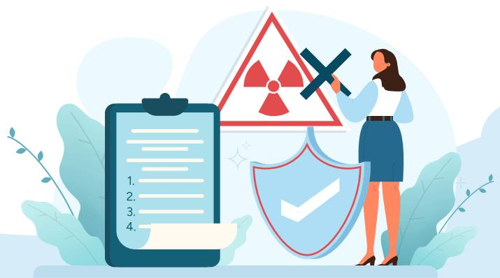

natural_image

Illustration of a person examining a warning symbol with a shield and cross, next to a clipboard with numbered items (no text or symbols present)

## 應對氣候變化

在全球綠色低碳轉型持續推進的背景下，氣候變化已成為影響產業發展方式和企業長期經營的重要議題。作為芯片設計企業，納芯微在關注自身運營層面能源使用與排放管理的同時，也重視通過產品在應用端釋放的能效價值，並在研發過程中關注低功耗、高可靠性及使用壽命等關鍵指標，以支持系統運行效率提升和終端產品生命週期延長。公司相關芯片產品廣泛應用於汽車、工業控制、能源管理等領域，有助於降低使用階段的能源消耗，間接支持下游應用的減碳目標。

在此基礎上，納芯微結合自身業務特點，將氣候變化議題納入公司治理與日常運營管理框架，圍繞治理、策略、風險管理及相關減排舉措，逐步形成與自身業務相匹配的氣候變化管理路徑，並持續推進相關工作的內部管理與實踐。

## 治理

在管治方面，董事會及下設的戰略與ESG委員會負責對氣候相關風險和機遇進行監督與指導，通過多部門協作機制，識別並評估氣候變化對公司經營活動及發展戰略可能產生的影響，並將相關議題納入公司治理與日常管理流程（詳見本報告「 管治」章節），逐步推動氣候變化相關議題在內部的系統化管理。相關管治架構請參見第18頁。

戰略

<table><tr><td colspan="2">類型</td><td>氣候相關風險及業務影響</td><td>影響週期</td><td>潛在財務影響</td><td>應對措施</td></tr><tr><td rowspan="2">實體風險</td><td>急性</td><td>暴雨、颱風等極端天氣事件的突發可能會引發如供應鏈端停產減產、產品運輸困難等一系列導致業務穩定性降低、成本上升的風險;重大極端天氣災害事件也極易引發員工安全事故等,增加不利因素。</td><td>中期</td><td>資本支出上升</td><td>·加強對極端天氣的預警和風險防控,不斷優化應對極端天氣的應急預案,將災害損失成本降到最低;·定期根據極端天氣頻次和規模,對資本支出帶來的影響進行評估,並在此基礎上設立專項資金用於災後重建。</td></tr><tr><td>慢性</td><td>較為長期的氣候模式轉變(例如持續高溫等)可能會引發如夏季製冷需求增加所導致的運營成本增加,以及後續用能結構調整所帶來的成本投入。</td><td>中長期</td><td>運營成本上升</td><td>·持續推進既有設施的節能優化,在節能的同時有效降低成本,並推廣使用清潔能源,評估可再生能源獲取的可行性和成本,提高可再生能源使用比例,降低未來化石燃料價格上升的風險。</td></tr><tr><td>轉型風險</td><td>政策和法律</td><td>隨着政策的完善和出台,監管部門必將採取愈加嚴格的溫室氣體限排措施,並強化溫室氣體排放披露要求;隨着中國碳排放權交易市場的加速推進和國際碳關稅等政策的陸續完善,後續為滿足碳排放合規要求,可能會導致成本的增加;政策的變動也可能導致高耗能設備等現有固定資產的提前淘汰;可能出現由於未符合相關氣候政策或法律被依法追究法律責任或面臨罰款、出現財務損失的風險。</td><td>中期</td><td>運營成本增加</td><td>·嚴格落實和執行政策法規,強化合規風險和節能減排方面的運營能力建設;·持續關注相關政策及法規的出台和更新情況,及時研究執行要求並制定響應措施;·加強內部碳管理,推動內部節能減排技術開展,探索內部碳價格機制。</td></tr></table>

應對氣候變化

<table><tr><td colspan="2">類型</td><td>氣候相關風險及業務影響</td><td>影響週期</td><td>潛在財務影響</td><td>應對措施</td></tr><tr><td rowspan="3">轉型風險</td><td>技術</td><td>生產技術革新迭代以應對環保要求和新產品的研發創新過程中可能會帶來對新技術投資，或採用/部署新操作和流程的前端成本的增加。</td><td>中長期</td><td>資本支出增加</td><td>·加強科技賦能，不斷提升數字化、智能化、綠色化水平。</td></tr><tr><td>市場</td><td>隨着政策和市場的引導，以及客戶低碳環保意識的逐步提升，客戶可能會轉向使用更綠色的產品，如獲得可持續認證的原材料等，使在原料採購方面受到影響；作為新能源汽車產業鏈中的供應商，客戶行為的變化，如客戶落實應對氣候變化相關項目也將對供應鏈提出相關要求。</td><td>中長期</td><td>運營成本增加
業務經營方向和服務內容調整</td><td>·與業主建立良性順暢的常態化溝通，及時了解需求偏好，滿足業主對環境友好產品的需要；
·持續推進既有設施的節能優化和廢棄物管理措施；</td></tr><tr><td>聲譽</td><td>隨着各利益相關方對應對氣候變化相關問題關注度的持續提高，若本公司未能滿足利益相關方期待或出現與此相關違法違規行為，可能會造成聲譽損害。</td><td>中期</td><td>運營成本增加</td><td>·持續向社會大眾傳達綠色運營、綠色生活的環保理念，並通過媒體渠道廣泛傳播，增強消費者信心。</td></tr></table>

<table><tr><td>類型</td><td>氣候相關機遇</td><td>影響週期</td><td>潛在財務影響</td><td>應對措施</td></tr><tr><td>技術</td><td>為實體經濟低碳數字化轉型提供解決方案，帶來更多的營業收入。</td><td>短中期</td><td>資本支出增加，但可能帶來更多的營業收入</td><td>· 以豐富的技術積淀、先進的工藝水平和持續的前沿研究，開發推廣綠色低碳產品和服務。</td></tr><tr><td>客戶偏好的轉變</td><td>提供符合客戶偏好以及滿足其碳中和需求的低碳產品，從而增加市場份額。</td><td>中期</td><td>資本支出增加，但可能獲得更大的市場份額</td><td>· 研究市場趨勢，助力能源升級轉型。</td></tr></table>

## 應對氣候變化

## 風險管理

公司結合自身業務模式與運營特點，圍繞氣候變化可能對業務連續性、合規要求及運營成本等方面產生的影響，將氣候相關風險與機遇初步納入風險管理環節，作為公司風險管理工作的有益補充。

風險識別

分析行業與同業最佳實踐，識別TCFD框架下的氣候風險與機遇，產出氣候風險與機遇清單。

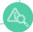

風險評估

建立了現場踏勘、調研和收集有關材料、內部意見徵集等一系列程序，並編寫《突發環境事件風險評估報告》。

應對 措施

組織了一支高效的專業應對團隊，並輸出了一套可執行落地的管理控制方案《業務連續性管理演練計劃》；跨部門合作，定期進行複盤和演練。

風險監測

定期監測氣候風險與機遇變化趨勢，以便及時採取行動。定期組織風險管理團隊回顧過去一段時間內的風險管理活動，評估策略的有效性，及時調整和優化風險管理措施。

## 指標與目標

2025年，納芯微溫室氣體排放總量為10,074.01噸二氧化碳當量5。具體數據如下 ：

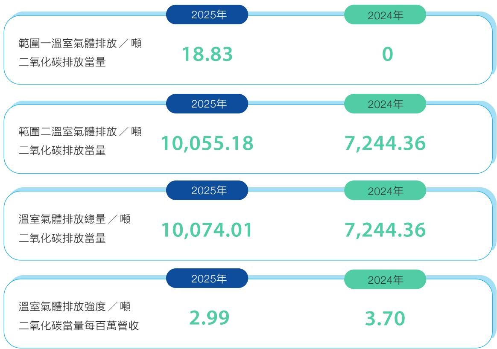

bar

| Category | 2025年 | 2024年 |
| --- | --- | --- |
| 範圍一溫室氣體排放／噸二氧化碳排放當量 | 18.83 | 0 |
| 範圍二溫室氣體排放／噸二氧化碳排放當量 | 10,055.18 | 7,244.36 |
| 溫室氣體排放總量／噸二氧化碳排放當量 | 10,074.01 | 7,244.36 |
| 溫室氣體排放強度／噸二氧化碳當量每百萬營收 | 2.99 | 3.70 |

5 直接溫室氣體排放量 ：公司製冷劑的逸散排放量及柴油使用量乘以對應排放因子，排放因子參考GHG Protocol、《IPCC,2014 ：氣候變化2014 ：綜合報告》；

間接溫室氣體排放量 ：公司外購電力量乘以對應排放因子。排放因子參考中華人民共和國生態環境部發佈的《關於做好2023—2025 年部分重點行業企業溫室氣體排放報告與核查工作的通知》中全國電網排放因子計算所得。

溫室氣體排放總量 ：直接溫室氣體排放量和間接溫室氣體排放量求和。

## 應對氣候變化

針對範圍二溫室氣體排放，公司結合自身運營場景與用能特點，規劃並逐步推進清潔能源的引入與使用，並在報告期內投入相關應用實踐，作為優化能源使用結構、提升清潔能源應用水平的階段性探索。

## 屋頂光伏應用實踐

納芯微在蘇州新辦公室建設過程中，結合辦公場所實際條件，規劃並實施了屋頂光伏項目，將清潔能源引入部分辦公用電場景，用於支持日常運營中的用能需求。該項目在不影響辦公運行穩定性的前提下，實現了以清潔能源替代部分常規用電，對減少運營過程中的溫室氣體排放形成了直接貢獻，同時也為辦公場所引入低碳用能方式提供了實踐經驗。

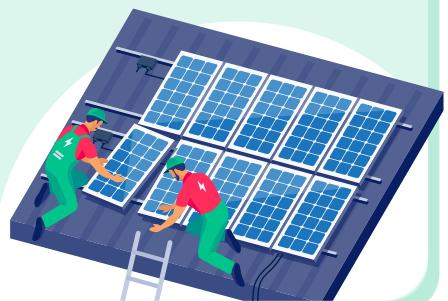

natural_image

Illustration of two workers installing solar panels on a rooftop (no text or symbols visible)

同時，我們也關注部分與業務相關的間接溫室氣體排放（範圍三），並結合自身實際，在員工差旅等可控場景中探索更低碳的出行方式。2025年，納芯微繼續攜手高德，為企業員工提供新能源車輛的差旅出行服務，在滿足業務出行效率與安全需求的前提下，引導和支持更加低碳的出行選擇。報告期內，通過該項合作，相關出行場景所對應的溫室氣體排放量較傳統出行方式有所減少，合計減排32,237kg二氧化碳當量。

此外，我們結合辦公場所實際，開展以提升員工環保意識和參與度為導向的綠色共建活動，將環境理念融入日常辦公與團隊文化建設中，推動形成更加節約、低碳的辦公氛圍。

## 植樹節綠色共建活動

2025年3月12日，為踐行綠色環保理念、積極履行企業社會責任，納芯微於植樹節當天組織員工在辦公室外圍開展植樹活動。活動現場，員工們協作完成樹苗栽種、培土澆水，在改善辦公周邊環境的同時，加深對生態保護與綠色發展的理解。該活動以實際行動倡導綠色理念，有助於提升員工的環保意識，並為公司持續營造綠色辦公文化提供支持。

natural_image

Illustration of two people planting a sapling with a watering can, surrounded by green plants (no text or symbols)

## 展望未來

納芯微立足於對核心市場的長期耕耘與深度理解，能夠敏銳洞察並把握政策環境、客戶需求、供應鏈及人才生態等方面的變化趨勢，實現快速、靈活、高效響應，運營優勢顯著。當今世界新一輪科技革命和產業變革加速演進，機遇與挑戰相互交織，納芯微力爭打造兼具市場競爭力與技術創新性的產品和服務，成為優質、創新、值得信賴的全球一流芯片公司。

未來，公司將繼續深度結合市場發展前景和客戶需求，提供豐富的半導體產品及解決方案，並持續深耕汽車、泛能源、智能終端領域。以「感知」「驅動」未來，共建綠色、智能、互聯互通的「芯」世界為使命，致力於為數字世界和現實世界的連接提供芯片級解決方案。

此外，我們將繼續貫徹可持續發展理念，在保持業務增長的同時，積極從環境(E)、社會(S)、管治(G)三方面履行企業社會責任，推動企業乃至整個社會的可持續發展。

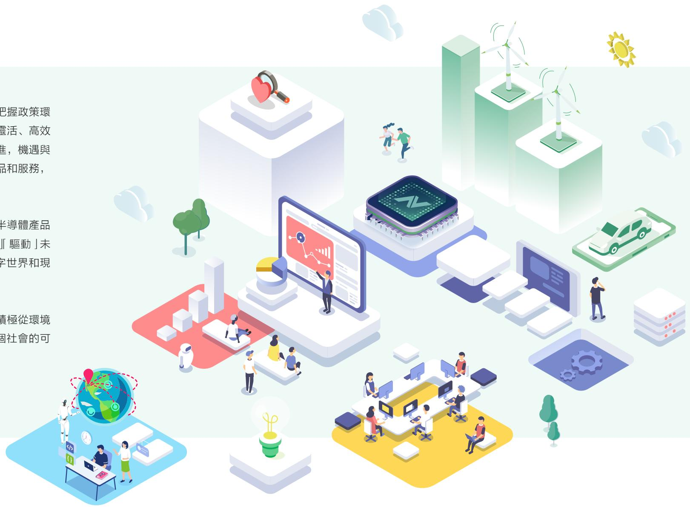

text_image

把握政策環
靈活、高效
進，機遇與
品和服務，
半導體產品
「驅動」未
字世界和現
積極從環境
個社會的可

## 附錄

## 榮譽與獎項

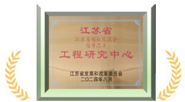

text_image

江苏省
江苏省级拟及奖金
信号芯片
工程研究中心
江苏省发展和改革委员会
二〇二四年八月

江蘇省模擬及混合信號芯片工程研究中心江蘇省發展和改革委員會

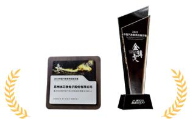

text_image

2018
中国平安保险股份有限公司
全国社保基金理事会
全国社保基金理事会
全国社保基金理事会
全国社保基金理事会
全国社保基金理事会

2025第七屆金輯獎中國汽車新供應鏈百強蓋世汽車

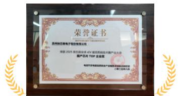

text_image

荣誉证书
苏州科达精密电子科技有限公司
荣誉2025年获得第40届第四届高新技术产业大会
颁奖典礼于2025年1月
中国科学院高新技术产业委员会第二十三次全国代表大会

2025年度國產芯片TOP企業獎NE時代

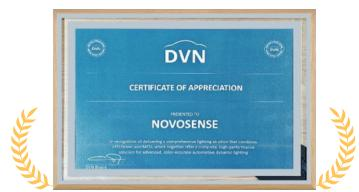

text_image

DVN
CERTIFICATE OF APPRECIATION
PROVED BY
NOVOSENSE

CERTIFICATE OF APPRECIATION DVN上海汽車照明研討會

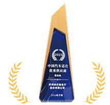

text_image

2022
中国汽车芯片
优秀供应商
奖项
2022年汽车
时尚消费企业
国际商业贸易
51%授予期

2025年度中國汽車芯片優秀供應商21 IC電子網

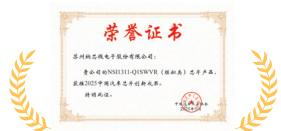  
2025中國汽車芯片創新成果（NSI1311-Q1SWVR）中國汽車工業協會

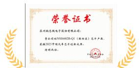  
2025中國汽車芯片創新成果（NSI6602B-Q1）中國汽車工業協會

  
優秀技術創新產品第二十屆「中國芯」

  
「整車芯應用」卓越產品第二十屆「中國芯」

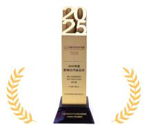  
2025年度影響力汽車芯片中國汽車芯片聯盟

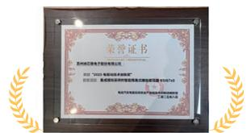

text_image

荣誉证书
2017-03-04 次级证书有效期至
2017-03-04
颁发的《荣誉证书》的年度最高额及最低金额为人民币1.5亿元
（盖章）

2025年電驅動技術創新獎NE時代

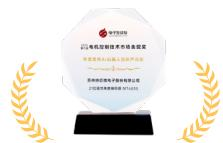  
2025年度優秀AI機器人創新產品獎電子發燒友

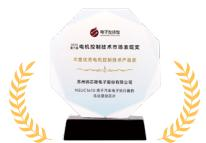  
2025年度優秀電機控制技術產品獎電子發燒友

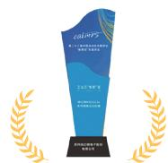  
工業芯「新質」獎工控網

natural_image

Isometric illustration of people climbing stairs and climbing platforms in a podium with a golden trophy (no text or symbols)

## 報告索引

《上海證券交易所上市公司自律監管指引第14號—可持續發展報告（試行）》

<table><tr><td>序號</td><td>議題</td><td>對應章節</td></tr><tr><td>1</td><td>應對氣候變化</td><td>應對氣候變化</td></tr><tr><td>2</td><td>污染物排放</td><td>節能減排</td></tr><tr><td>3</td><td>廢棄物處理</td><td>節能減排</td></tr><tr><td>4</td><td>生態系統和生物多樣性保護</td><td>不涉及(1)</td></tr><tr><td>5</td><td>環境合規管理</td><td>環境管理</td></tr><tr><td>6</td><td>能源利用</td><td>節能減排</td></tr><tr><td>7</td><td>水資源利用</td><td>節能減排</td></tr><tr><td>8</td><td>循環經濟</td><td>節能減排</td></tr><tr><td>9</td><td>鄉村振興</td><td>公益行動與社會責任</td></tr><tr><td>10</td><td>社會貢獻</td><td>公益行動與社會責任</td></tr><tr><td>11</td><td>創新驅動</td><td>創新研發</td></tr><tr><td>12</td><td>科技倫理</td><td>不涉及(2)</td></tr><tr><td>13</td><td>供應鏈安全</td><td>供應鏈管理</td></tr><tr><td>14</td><td>平等對待中小企業</td><td>不涉及(3)</td></tr></table>

<table><tr><td>序號</td><td>議題</td><td>對應章節</td></tr><tr><td>15</td><td>產品和服務安全與質量</td><td>品質管理</td></tr><tr><td>16</td><td>數據安全與客戶隱私保護</td><td>信息安全</td></tr><tr><td>17</td><td>員工</td><td>我們的員工
員工權益
培訓與職業發展
職業健康與安全</td></tr><tr><td>18</td><td>盡職調查</td><td>ESG管理</td></tr><tr><td>19</td><td>利益相關方溝通</td><td>ESG管理</td></tr><tr><td>20</td><td>反商業賄賂及反貪污</td><td>合規治理</td></tr><tr><td>21</td><td>反不正當競爭</td><td>合規治理</td></tr><tr><td>22</td><td>清潔技術機遇</td><td>綠色辦公
應對氣候變化</td></tr></table>

## 註釋 ：

1. 公司生產經營活動對生態系統和生物多樣性不產生重大影響。  
2. 公司未從事生命科學、人工智能等科技倫理敏感領域的科學研究、技術開發等活動。  
3. 公司期末應付賬款（含應付票據）餘額未超過300億元或佔總資產的比重超過50%。

香港聯合交易所《環境、社會及管治報告守則》索引表

<table><tr><td colspan="2">《環境、社會及管治報告守則》</td><td>報告內容</td></tr><tr><td colspan="2">B部分:強制披露規定</td><td></td></tr><tr><td></td><td>董事會聲明</td><td>董事會說明</td></tr><tr><td></td><td>匯報原則</td><td>關於本報告</td></tr><tr><td></td><td>匯報範圍</td><td>關於本報告</td></tr><tr><td colspan="2">C部分:「不遵守就解釋」條文</td><td></td></tr><tr><td colspan="2">A.環境</td><td></td></tr><tr><td colspan="2">層面A1:排放物</td><td></td></tr><tr><td>A1</td><td>一般披露有關廢氣排放、向水及土地的排污、有害及無害廢棄物的產生等的:(a) 政策;及(b) 遵守對發行人有重大影響的相關法律及規例的資料。註:廢氣排放包括氮氧化物、硫氧化物及其他受國家法律及規例規管的污染物。有害廢棄物指國家規例所界定者。</td><td>節能減排</td></tr><tr><td>A1.1</td><td>排放物種類及相關排放數據。</td><td>節能減排</td></tr><tr><td>A1.3</td><td>所產生有害廢棄物總量(以噸計算)及(如適用)密度(如以每產量單位、每項設施計算)。</td><td>節能減排</td></tr></table>

<table><tr><td colspan="2">《環境、社會及管治報告守則》</td><td>報告內容</td></tr><tr><td>A1.4</td><td>所產生無害廢棄物總量(以噸計算)及(如適用)密度(如以每產量單位、每項設施計算)。</td><td>節能減排</td></tr><tr><td>A1.5</td><td>描述所訂立的排放量目標及為達到這些目標所採取的步驟。</td><td>節能減排</td></tr><tr><td>A1.6</td><td>描述處理有害及無害廢棄物的方法,及描述所訂立的減廢目標及為達到這些目標所採取的步驟。</td><td>節能減排</td></tr><tr><td colspan="2">層面A2:資源使用</td><td></td></tr><tr><td>A2</td><td>一般披露有效使用資源(包括能源、水及其他原材料)的政策。註:資源可用於生產、儲存、運輸、樓宇、電子設備等。</td><td>節能減排</td></tr><tr><td>A2.1</td><td>按類型劃分的直接及/或間接能源(如電、氣或油)總耗量(以千個千瓦時計算)及密度(如以每產量單位、每項設施計算)。</td><td>節能減排</td></tr><tr><td>A2.2</td><td>總耗水量及密度(如以每產量單位、每項設施計算)。</td><td>節能減排</td></tr><tr><td>A2.3</td><td>描述所訂立的能源使用效益目標及為達到這些目標所採取的步驟。</td><td>節能減排</td></tr><tr><td>A2.4</td><td>描述求取適用水源上可有任何問題,以及所訂立的用水效益目標及為達到這些目標所採取的步驟。</td><td>節能減排</td></tr><tr><td>A2.5</td><td>製成品所用包裝材料的總量(以噸計算)及(如適用)每生產單位佔量。</td><td>節能減排</td></tr><tr><td colspan="2">層面A3:環境及天然資源</td><td></td></tr><tr><td>A3</td><td>一般披露減低發行人對環境及天然資源造成重大影響的政策。</td><td>節能減排</td></tr><tr><td>A3.1</td><td>描述業務活動對環境及天然資源的重大影響及已採取管理有關影響的行動。</td><td>節能減排</td></tr><tr><td colspan="2">B.社會</td><td></td></tr><tr><td colspan="2">層面B1:僱傭</td><td></td></tr><tr><td>B1</td><td>一般披露有關薪酬及解僱、招聘及晉升、工作時數、假期、平等機會、多元化、反歧視以及其他待遇及福利的:(a) 政策;及(b) 遵守對發行人有重大影響的相關法律及規例的資料。</td><td>我們的員工</td></tr><tr><td>B1.1</td><td>按性別、僱傭類型(如全職或兼職)、年齡組別及地區劃分的僱員總數。</td><td>我們的員工</td></tr><tr><td>B1.2</td><td>按性別、年齡組別及地區劃分的僱員流失比率。</td><td>我們的員工</td></tr><tr><td colspan="2">層面B2:健康與安全</td><td></td></tr><tr><td>B2</td><td>一般披露有關提供安全工作環境及保障僱員避免職業性危害的:(a) 政策;及(b) 遵守對發行人有重大影響的相關法律及規例的資料。</td><td>職業健康與安全</td></tr></table>

<table><tr><td colspan="2">《環境、社會及管治報告守則》</td><td>報告內容</td></tr><tr><td>B2.1</td><td>過去三年(包括匯報年度)每年因工亡故的人數及比率。</td><td>職業健康與安全</td></tr><tr><td>B2.2</td><td>因工傷損失工作日數。</td><td>職業健康與安全</td></tr><tr><td>B2.3</td><td>描述所採納的職業健康與安全措施,以及相關執行及監察方法。</td><td>職業健康與安全</td></tr><tr><td colspan="2">層面B3:發展及培訓</td><td></td></tr><tr><td>B3</td><td>一般披露有關提升僱員履行工作職責的知識及技能的政策。描述培訓活動。</td><td>培訓與職業發展</td></tr><tr><td>B3.1</td><td>按性別及僱員類別(如高級管理層、中級管理層等)劃分的受訓僱員百分比。</td><td>培訓與職業發展</td></tr><tr><td>B3.2</td><td>按性別及僱員類別劃分,每名僱員完成受訓的平均時數。</td><td>培訓與職業發展</td></tr><tr><td colspan="2">層面B4:勞工準則</td><td></td></tr><tr><td>B4</td><td>一般披露有關防止童工或強制勞工的:(a) 政策;及(b) 遵守對發行人有重大影響的相關法律及規例的資料。</td><td>員工權益</td></tr><tr><td>B4.1</td><td>描述檢討招聘慣例的措施以避免童工及強制勞工。</td><td>員工權益</td></tr><tr><td>B4.2</td><td>描述在發現違規情況時消除有關情況所採取的步驟。</td><td>員工權益</td></tr><tr><td colspan="2">層面B5:供應鏈管理</td><td></td></tr><tr><td>B5</td><td>一般披露管理供應鏈的環境及社會風險政策。</td><td>供應鏈管理</td></tr><tr><td>B5.1</td><td>按地區劃分的供貨商數目。</td><td>供應鏈管理</td></tr><tr><td>B5.2</td><td>描述有關聘用供貨商的慣例,向其執行有關慣例的供貨商數目、以及有關慣例的執行及監察方法。</td><td>供應鏈管理</td></tr><tr><td>B5.3</td><td>描述有關識別供應鏈每個環節的環境及社會風險的慣例,以及相關執行及監察方法。</td><td>供應鏈管理</td></tr><tr><td>B5.4</td><td>描述在揀選供貨商時促使多用環保產品及服務的慣例,以及相關執行及監察方法。</td><td>供應鏈管理</td></tr><tr><td colspan="2">層面B6:產品責任</td><td></td></tr><tr><td>B6</td><td>一般披露有關所提供產品和服務的健康與安全、廣告、標籤及私隱事宜以及補救方法的:(a) 政策;及(b) 遵守對發行人有重大影響的相關法律及規例的資料。</td><td>品質管理</td></tr><tr><td>B6.1</td><td>已售或已運送產品總數中因安全與健康理由而須回收的百分比。</td><td>品質管理</td></tr><tr><td>B6.2</td><td>接獲關於產品及服務的投訴數目以及應對方法。</td><td>品質管理</td></tr><tr><td>B6.3</td><td>描述與維護及保障知識產權有關的慣例。</td><td>品質管理創新研發</td></tr></table>

<table><tr><td colspan="2">《環境、社會及管治報告守則》</td><td>報告內容</td></tr><tr><td>B6.4</td><td>描述質量檢定過程及產品回收程序。</td><td>品質管理</td></tr><tr><td>B6.5</td><td>描述消費者數據保障及私隱政策,以及相關執行及監察方法。</td><td>信息安全</td></tr><tr><td colspan="2">層面B7:反貪污</td><td></td></tr><tr><td>B7</td><td>一般披露有關防止賄賂、勒索、欺詐及洗黑錢的:(a) 政策;及(b) 遵守對發行人有重大影響的相關法律及規例的資料。</td><td>合規治理</td></tr><tr><td>B7.1</td><td>於匯報期内對發行人或其僱員提出並已審結的貪污訴訟案件的數目及訴訟結果。</td><td>合規治理</td></tr><tr><td>B7.2</td><td>描述防範措施及舉報程序,以及相關執行及監察方法。</td><td>合規治理</td></tr><tr><td>B7.3</td><td>描述向董事及員工提供的反貪污培訓。</td><td>合規治理</td></tr><tr><td colspan="2">層面B8:社區投資</td><td></td></tr><tr><td>B8</td><td>一般披露有關以社區參與來了解營運所在社區需要和確保其業務活動會考慮社區利益的政策。</td><td>公益行動與社會責任</td></tr><tr><td>B8.1</td><td>專注貢獻範疇(如教育、環境事宜、勞工需求、健康、文化、體育)。</td><td>公益活動與社會責任</td></tr><tr><td>B8.2</td><td>在專注範疇所動用資源(如金錢或時間)。</td><td>公益活動與社會責任</td></tr><tr><td colspan="2">D部分:氣候相關披露</td><td></td></tr><tr><td colspan="2">D(I)管治</td><td></td></tr><tr><td colspan="2">負責監督氣候相關風險和機遇的治理機構</td><td>應對氣候變化</td></tr><tr><td colspan="2">管理層在用以監察、管理及監督氣候相關風險和機遇的管理流程、監控措施及程序中的角色</td><td>應對氣候變化</td></tr><tr><td colspan="2">D(II)策略</td><td></td></tr><tr><td colspan="2">氣候相關風險和機遇</td><td>應對氣候變化</td></tr><tr><td colspan="2">業務模式和價值鏈</td><td>應對氣候變化</td></tr><tr><td colspan="2">策略和決策</td><td>持續完善與補充</td></tr><tr><td colspan="2">財務狀況、財務表現及現金流量</td><td>持續完善與補充</td></tr><tr><td colspan="2">氣候韌性</td><td>持續完善與補充</td></tr><tr><td colspan="2">D(III)風險管理</td><td></td></tr><tr><td colspan="2">用於識別、評估氣候相關風險,以及釐定當中輕重緩急並保持監察的流程及相關政策</td><td>應對氣候變化</td></tr></table>

<table><tr><td>《環境、社會及管治報告守則》</td><td>報告內容</td></tr><tr><td>用於識別、評估氣候相關機遇，以及釐定當中輕重緩急並保持監察的流程及相關政策</td><td>持續完善與補充</td></tr><tr><td>氣候相關風險和機遇的識別、評估、優次排列和監察流程，是如何融入發行人的整體風險管理流程，以及融入的程度如何。</td><td>持續完善與補充</td></tr><tr><td>D(IV)指標及目標</td><td></td></tr><tr><td>溫室氣體排放</td><td>應對氣候變化</td></tr><tr><td>氣候相關轉型風險</td><td rowspan="3">已系統性識別氣候相關轉型、物理風險及機遇，但暫未開展相關財務量化分析，公司將在條件成熟後適時開展，屆時將納入披露</td></tr><tr><td>氣候相關物理風險</td></tr><tr><td>氣候相關機遇</td></tr><tr><td>資本運用</td><td rowspan="4">尚未開展氣候相關風險和機遇的資本運用、內部碳定價、氣候相關因素納入薪酬政策和氣候相關目標制定，將在條件成熟後開展相關工作，並於報告中披露</td></tr><tr><td>內部碳定價</td></tr><tr><td>薪酬</td></tr><tr><td>氣候相關目標</td></tr></table>

GRI標準索引表

<table><tr><td>使用說明</td><td>使用的GRI 1</td></tr><tr><td>蘇州納芯微電子股份有限公司在2025財年參照GRI標準報告了在此份GRI內容索引中引用的信息</td><td>GRI 1: 基礎2021</td></tr></table>

<table><tr><td>GRI標準</td><td>披露項</td><td>位置</td></tr><tr><td rowspan="15">GRI 2:一般披露2021</td><td>2-1組織詳細情況</td><td>公司簡介</td></tr><tr><td>2-2納入組織可持續發展報告的實體</td><td>關於本報告</td></tr><tr><td>2-3報告期、報告頻率和聯繫人</td><td>關於本報告</td></tr><tr><td>2-4信息重述</td><td>不涉及</td></tr><tr><td>2-5外部鑑證</td><td>暫未開展 計劃未來採納</td></tr><tr><td>2-6活動、價值鏈和其他業務關係</td><td>企業文化</td></tr><tr><td>2-7員工</td><td>我們的員工</td></tr><tr><td>2-8員工之外的工作者</td><td>我們的員工</td></tr><tr><td>2-9管治架構和構成</td><td>合規治理請參閱本公司年報</td></tr><tr><td>2-10最高治理機構的提名和遴選</td><td>合規治理</td></tr><tr><td>2-11最高治理機構主席</td><td>請參閱本公司年報</td></tr><tr><td>2-12在管理影響方面,最高管治機構的監督作用</td><td>合規治理</td></tr><tr><td>2-13為管理影響的責任授權</td><td>合規治理</td></tr><tr><td>2-14最高治理機構在可持續發展報告中的作用</td><td>ESG管理</td></tr><tr><td>2-15利益衝突</td><td>不涉及</td></tr></table>

<table><tr><td>GRI標準</td><td>披露項</td><td>位置</td></tr><tr><td rowspan="15"></td><td>2-16關鍵問題的溝通</td><td>合規治理ESG管理</td></tr><tr><td>2-17最高治理機構的共同知識</td><td>合規治理ESG管理</td></tr><tr><td>2-18對最高管治機構的績效評估</td><td>ESG管理</td></tr><tr><td>2-19薪酬政策</td><td>員工權益</td></tr><tr><td>2-20確定薪酬的程序</td><td>持續完善與補充</td></tr><tr><td>2-21年度總薪酬比率</td><td>持續完善與補充</td></tr><tr><td>2-22關於可持續發展戰略的聲明</td><td>持續完善與補充</td></tr><tr><td>2-23政策承諾</td><td>持續完善與補充</td></tr><tr><td>2-24融合政策承諾</td><td>持續完善與補充</td></tr><tr><td>2-25補救負面影響的程序</td><td>持續完善與補充</td></tr><tr><td>2-26尋求建議和提出關切的機制</td><td>持續完善與補充</td></tr><tr><td>2-27遵守法律法規</td><td>合規治理</td></tr><tr><td>2-28協會的成員資格</td><td>行業協會參與</td></tr><tr><td>2-29利益相關方參與的方法</td><td>ESG管理</td></tr><tr><td>2-30集體談判協議</td><td>持續完善與補充</td></tr><tr><td rowspan="3">GRI 3:實質性議題2021</td><td>3-1確定實質性議題的過程</td><td>ESG管理</td></tr><tr><td>3-2實質性議題列表</td><td>ESG管理</td></tr><tr><td>3-3實質性議題的管理</td><td>ESG管理</td></tr><tr><td rowspan="4">GRI 201:經濟績效2016</td><td>201-1直接產生和分配的經濟價值</td><td>請參閱本公司年報</td></tr><tr><td>201-2氣候變化帶來的財務影響和其他風險和機遇</td><td>應對氣候變化</td></tr><tr><td>201-3固定福利計劃義務和其他退休計劃</td><td>請參閱本公司年報</td></tr><tr><td>201-4政府給予的財政補貼</td><td>持續完善與補充</td></tr><tr><td rowspan="2">GRI 202: 市場表現2016</td><td>202-1按性別的標準起薪水平工資與當地最低工資之比</td><td>持續完善與補充</td></tr><tr><td>202-2從當地社區僱傭高管的比例</td><td>持續完善與補充</td></tr><tr><td rowspan="2">GRI 203: 間接經濟影響2016</td><td>203-1基礎設施投資和支持性服務</td><td>持續完善與補充</td></tr><tr><td>203-2重大間接經濟影響</td><td>持續完善與補充</td></tr><tr><td>GRI 204: 採購實踐2016</td><td>204-1採購實踐</td><td>供應鏈管理</td></tr><tr><td rowspan="3">GRI 205: 反腐敗2016</td><td>205-1已經進行腐敗風險評估的運營點</td><td>持續完善與補充</td></tr><tr><td>205-2反腐敗政策和程序的傳達及培訓</td><td>合規治理</td></tr><tr><td>205-3經確認的腐敗事件和採取的行動</td><td>合規治理</td></tr><tr><td>GRI 206: 不當競爭行為2016</td><td>206-1針對不當競爭行為、反托拉斯和反壟斷實踐的法律訴訟</td><td>合規治理</td></tr><tr><td rowspan="4">GRI 207: 稅收2019</td><td>207-1稅務方針</td><td>合規治理</td></tr><tr><td>207-2稅收治理、控制和風險管理</td><td>合規治理</td></tr><tr><td>207-3利益相關方參與和管理與稅收有關的問題</td><td>合規治理</td></tr><tr><td>207-4國別報告</td><td>持續完善與補充</td></tr><tr><td rowspan="3">GRI 301: 物料2016</td><td>301-1所用物料的重量或體積</td><td>節能減排</td></tr><tr><td>301-2所使用的回收再利用的物料</td><td>持續完善與補充</td></tr><tr><td>301-3回收產品及其包裝材料</td><td>節能減排</td></tr><tr><td rowspan="5">GRI 302: 能源2016</td><td>302-1組織內部的能源消耗量</td><td>節能減排</td></tr><tr><td>302-2組織外部的能源消耗量</td><td>節能減排</td></tr><tr><td>302-3能源強度</td><td>節能減排</td></tr><tr><td>302-4減少能源消耗</td><td>節能減排</td></tr><tr><td>302-5產品和服務的能源需求下降</td><td>持續完善與補充</td></tr></table>

<table><tr><td>GRI標準</td><td>披露項</td><td>位置</td></tr><tr><td rowspan="5">GRI 303:水資源和污水2018</td><td>303-1組織與水作為共有資源的相互影響</td><td>節能減排</td></tr><tr><td>303-2管理與排水相關的影響</td><td>節能減排</td></tr><tr><td>303-3取水</td><td>節能減排</td></tr><tr><td>303-4排水</td><td>持續完善與補充</td></tr><tr><td>303-5耗水</td><td>節能減排</td></tr><tr><td rowspan="4">GRI 304:生物多樣性2016</td><td>304-1組織所擁有、租賃、在位於或鄰近於保護區和保護區外生物多樣性豐富區域管理的運營點</td><td>公司無相關運營點</td></tr><tr><td>304-2活動、產品和服務對生物多樣性的重大影響</td><td>持續完善與補充</td></tr><tr><td>304-3受保護或經修復的棲息地</td><td>持續完善與補充</td></tr><tr><td>304-4受運營影響區域的棲息地中已被列入IUCN紅色名錄及國家保護名冊的物種</td><td>持續完善與補充</td></tr><tr><td rowspan="7">GRI 305:排放2016</td><td>305-1直接(範圍1)溫室氣體排放</td><td>應對氣候變化</td></tr><tr><td>305-2能源間接(範圍2)溫室氣體排放</td><td>應對氣候變化</td></tr><tr><td>305-3其他間接(範疇三)溫室氣體排放</td><td>持續完善與補充</td></tr><tr><td>305-4溫室氣體排放強度</td><td>應對氣候變化</td></tr><tr><td>305-5溫室氣體減排量</td><td>應對氣候變化</td></tr><tr><td>305-6臭氧消耗物質(ODS)的排放</td><td>節能減排</td></tr><tr><td>305-7氮氧化物(NOX)、硫氧化物(SOX)和其他重大氣體排放</td><td>節能減排</td></tr><tr><td rowspan="5">GRI 306:廢棄物2020</td><td>306-1廢棄物的產生及廢棄物相關重大影響</td><td>節能減排</td></tr><tr><td>306-2廢棄物相關重大影響的管理</td><td>節能減排</td></tr><tr><td>306-3產生的廢棄物</td><td>節能減排</td></tr><tr><td>306-4從處置中轉移的廢棄物</td><td>節能減排</td></tr><tr><td>306-5進入處置的廢棄物</td><td>節能減排</td></tr><tr><td rowspan="2">GRI 308:供應商環境評估2016</td><td>308-1使用環境評價維度篩選的新供應商</td><td>供應鏈管理</td></tr><tr><td>308-2供應鏈中的負面環境影響以及採取的行動</td><td>供應鏈管理</td></tr><tr><td rowspan="3">GRI 401: 僱傭2016</td><td>401-1新進員工僱傭率和員工流動率</td><td>我們的員工</td></tr><tr><td>401-2提供給全職員工(不包括臨時或兼職員工)的福利</td><td>員工權益</td></tr><tr><td>401-3育兒假</td><td>員工權益</td></tr><tr><td>GRI 402:勞資關係2016</td><td>402-1有關運營變更的最短通知期</td><td>持續完善與補充</td></tr><tr><td rowspan="10">GRI 403:職業健康與安全2018</td><td>403-1職業健康安全管理體系</td><td>職業健康與安全</td></tr><tr><td>403-2危害識別、風險評估和事件調查</td><td>職業健康與安全</td></tr><tr><td>403-3職業健康服務</td><td>職業健康與安全</td></tr><tr><td>403-4職業健康安全事務:工作者的參與、協商和溝通</td><td>職業健康與安全</td></tr><tr><td>403-5工作者職業健康安全培訓</td><td>職業健康與安全</td></tr><tr><td>403-6促進工作者健康</td><td>職業健康與安全</td></tr><tr><td>403-7預防和減緩與業務關係直接相關的職業健康安全影響</td><td>職業健康與安全</td></tr><tr><td>403-8職業健康安全管理體系適用的工作者</td><td>職業健康與安全</td></tr><tr><td>403-9工傷</td><td>職業健康與安全</td></tr><tr><td>403-10工作相關的健康問題</td><td>職業健康與安全</td></tr><tr><td rowspan="3">GRI 404:培訓與教育2016</td><td>404-1每名員工每年接受培訓的平均小時數</td><td>培訓與職業發展</td></tr><tr><td>404-2員工技能提升方案和過渡援助方案</td><td>培訓與職業發展</td></tr><tr><td>404-3定期接受績效和職業發展考核的員工百分比</td><td>培訓與職業發展</td></tr><tr><td rowspan="2">GRI 405:多元化與平等機會2016</td><td>405-1管治機構與員工的多元化</td><td>合規治理我們的員工</td></tr><tr><td>405-2男女基本工資和報酬的比例</td><td>持續完善與補充</td></tr></table>

<table><tr><td>GRI標準</td><td>披露項</td><td>位置</td></tr><tr><td>GRI 406: 反歧視2016</td><td>406-1歧視事件及採取的糾正行動</td><td>員工權益</td></tr><tr><td>GRI 407: 結社自由與集體談判2016</td><td>407-1結社自由與集體談判權利可能面臨風險的運營點和供應商</td><td>無相關運營點員工權益</td></tr><tr><td>GRI 408: 童工2016</td><td>408-1具有重大童工事件風險的運營點和供應商</td><td>無相關運營點員工權益</td></tr><tr><td>GRI 409:強迫或強制勞動2016</td><td>409-1具有強迫或強制勞動事件重大風險的運營點和供應商</td><td>無相關運營點員工權益</td></tr><tr><td>GRI 410:安保實踐2016</td><td>410-1接受過人權政策或程序的培訓的安保人員</td><td>持續完善與補充</td></tr><tr><td>GRI 411:原住民權利2016</td><td>411-1涉及侵犯原住民權利的事件</td><td>無</td></tr><tr><td rowspan="2">GRI 413:當地社區2016</td><td>413-1有當地社區參與、影響評估和發展計劃的運營點</td><td>公益行動與社會責任</td></tr><tr><td>413-2對當地社區有實際或潛在重大負面影響的運營點</td><td>無</td></tr><tr><td rowspan="2">GRI 414:供應商社會評估2016</td><td>414-1使用社會標準篩選的新供應商</td><td>供應鏈管理</td></tr><tr><td>414-2供應鏈中的負面社會影響和採取的行動</td><td>供應鏈管理</td></tr><tr><td>GRI 415:公共政策2016</td><td>415-1政治捐贈</td><td>無</td></tr><tr><td rowspan="2">GRI 416:客戶健康與安全2016</td><td>416-1對產品和服務類別的健康與安全影響的評估</td><td>品質管理</td></tr><tr><td>416-2涉及產品和服務的健康與安全影響的違規事件</td><td>品質管理</td></tr><tr><td rowspan="3">GRI 417:營銷與標識2016</td><td>417-1對產品和服務信息與標識的要求</td><td>品質管理</td></tr><tr><td>417-2涉及產品和服務信息與標識的違規事件</td><td>無</td></tr><tr><td>417-3涉及市場營銷的違規事件</td><td>無</td></tr><tr><td>GRI 418:客戶隱私2016</td><td>418-1涉及侵犯客戶隱私和丟失客戶資料的經證實的投訴</td><td>合規治理</td></tr></table>

## 意見反饋

尊敬的讀者 ：

您好！感謝您閱讀本報告。為了不斷提高和改進本公司可持續發展管理，我們真誠地希望聽取您的寶貴意見和建議。請您協助完成本頁內容並選擇以下方式反饋給我們。

郵箱 ：pr@ novosns.com

地址 ：蘇州市工業園區東蕩田巷9號

1. 您對本報告的總體評價是？

□好 □較好 □一般

2. 您認為本報告在信息和數據披露的清晰度、準確性和完整性上表現如何？

□是 □一般 □較低

3. 您認為本報告在反映本公司對經濟、社會和環境的重大影響方面表現如何？

□是 □一般 □否

4. 您認為本公司在維護相關方利益方面做得如何？

□好 □一般 □差

5. 您對本公司可持續發展管理的意見和建議 ：

## N NOVOSENSE纳芯微电子

## 苏州纳芯微电子股份有限公司

蘇州工業園區東蕩田巷9號  
+86-512-6260-1802 www.novosns.com