# 2025年度

## 环境、社会与

## 公司治理 (ESG) 报告

Environmental, Social

and Governance

(ESG) Report

natural_image

Aerial view of a highway with a white car driving through, surrounded by green forest and solar panels under bright sunlight (no text or symbols visible)

## CONTENTS目录

关于本报告 03

董事长致辞 04

走进中科电气 05

使命、愿景和经营理念 10

ESG亮点绩效 11

ESG管理体系 12

## 01规范治理夯实发展之基

## 02 逐绿前行塑造零碳未来

健全治理体系 19

坚守合规底线 23

恪守商业道德 24

保障信息安全 26

应对气候变化 28

高效利用资源 33

共建生态家园 36

## 03 初心如磐笃行尽责致远

引领科技创新 41

铸就卓越品质 44

携手伙伴共赢 48

建设责任供应链 49

## 04惠及社会绘就共享之景

赋能员工成长 54

守护员工健康 58

共建和谐社会 60

ESG关键绩效数据表 63

指标索引表 65

读者意见反馈表 68

## 关于本报告

本报告是湖南中科电气股份有限公司面向利益相关方发布的第三份环境、社会及治理（ESG）报告。报告时间范围为 2025年 1 月 1 日至 2025 年 12 月 31日，内容涵盖公司及其控股子公司在环境、社会与治理方面的实践与绩效。为保持报告的延续性与可比性，部分内容及数据可能会适当延伸至以前年度。

## 编制依据

本报告主要参照以下标准与指南编制：

《深圳证券交易所上市公司自律监管指引第17 号——可持续发展报告（试行）》  
《深圳证券交易所创业板上市公司自律监管指南第3号——可持续发展报告编制（2026年修订）》  
全球报告倡议组织《可持续发展报告标准》（GRI Standards）  
国际标准化组织《ISO26000:2010 社会责任指南》  
《GB/T 36001-2015 社会责任报告编写指南》

## 内容选择

在内容筛选过程中，公司遵循 标准提出的重要性、完整性及利益相关方包容性原则，围绕经济、环境与社会三大维度，重点披露公司在 ESG 治理、产品责任、环境保护、员工关怀、可持续采购、公益慈善等方面的实践与成效。报告所用数据与信息均依据公司现有管理制度与流程进行收集与整理。

## 数据来源

报告所载数据来源于公司及控股子公司的实际运营记录、年度财务报表、内部统计资料、第三方问卷调查及访谈评价等，部分数据已约整。报告中涉及的财务数据均以人民币为单位，若与经审计的财务报告存在差异，以财务报告为准。

## 指代说明

为便于表述，报告中部分名称使用简称：

“中科电气”“公司”“我们”均指湖南中科电气股份有限公司  
“湖南中科星城”指湖南中科星城石墨有限公司  
“贵州中科星城”指贵州中科星城石墨有限公司  
“贵安新区中科星城”指贵安新区中科星城石墨有限公司  
“云南中科星城”指云南中科星城石墨有限公司  
本报告版权归湖南中科电气股份有限公司所有。

## 发布方式

本报告以电子版形式发布，读者可通过以下途径获取：

公司官网：https://www.cseco.cn

巨潮资讯网：http://www.cninfo.com.cn

如对本报告有任何疑问或建议，欢迎通过以下方式与我们联系：

电话：0731-82203875

邮箱：cseco@vip.sina.com

## 董事长致辞

在全球能源转型纵深推进、 双碳 战略由政策导向转向产业实践的背景下， 年的新能源行业既迎来技术迭代加速、市场空间扩容的发展机遇，也面临绿色合规升级、全球竞争加剧的多重考验。中科电气坚守“为构建更洁净的家园做贡献”的初心使命，深耕“负极材料+ 磁电装备”双主业，践行可持续发展理念。泸州30万吨一体化超级工厂落子成势，阿曼海外基地破土启新，成都产投战略合作深度落地，负极材料出货量攀升至 万吨，磁电装备持续领跑国内市场，在规模扩张与质量升级中，交出了跨越式发展的年度答卷。

聚力治理效能提升，我们以规范经营筑牢发展底座。依据新《中华人民共和国公司法》优化治理架构，内控体系三道防线高效运转，决策科学性与风险防控能力同步提升。责任供应链建设有序推进，廉洁培训实现全链条覆盖。信息披露及时透明，以规范运作回馈股东信任，以治理现代化护航高质量发展。

立足创新驱动，我们以技术突破筑牢行业高地。全年研发投入超2.49亿元，获得授权发明专利34项（含海外专利 项），硅碳、硬碳等新型负极材料研发及其产业化取得关键突破。通过创新机制，深化与高校、科研院所的产学研协同，不仅夯实了核心壁垒，也为新能源产业绿色转型注入强劲动能。

笃行绿色发展道路，我们以务实行动打造低碳典范。开展多项节能改善项目，清洁能源（电力）使用比例高达73%，全年碳减排 1,749.41 吨。ISO 14001 环境管理体系实现所有生产基地全覆盖，废气、废水达标排放率与废弃物合规处置率均保持100%，践行生态责任，为制造业绿色转型提供实践样本。

坚守责任共生初心，我们以人文关怀汇聚价值合力。持续完善管理与专业双通道发展机制，优化六大岗位序列与技术职级体系，实现全员培训，推动员工与企业同频成长，员工满意度稳步提升；严守安全生产底线，健全职业健康安全管理体系，全年隐患整改率100%，坚定守护 零事故、零伤害 目标。作为负责任的企业公民，公司积极投身公益事业，以精准公益传递温暖，彰显企业与社会共生共荣的责任担当。

征程万里风正劲，重任千钧再出发。 年，中科电气将继续以 做新能源材料全球领导者和磁电技术领头羊 为愿景，紧扣全球新能源产业发展脉搏，聚焦技术创新、绿色升级，在全球化布局中拓展新空间，在产业链协同中凝聚新合力。感恩全体股东的坚定信任、员工的同心奋斗、合作伙伴的携手同行与社会各界的关心厚爱。未来，我们将以更坚定的决心、更务实的举措，在推动产业进步、增进社会福祉的道路上勇毅前行，书写商业价值与社会价值共生共荣的崭新篇章！

湖南中科电气股份有限公司 董事长

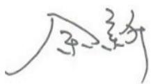

## 走进中科电气

## 公司概况

湖南中科电气股份有限公司成立于 2004 年 4月，并于 2009 年 12 月 25日在深圳证券交易所创业板挂牌上市（股票简称：中科电气，股票代码： ）。公司以长期主义为导向，坚持稳健经营与创新驱动并重，围绕产业发展趋势持续优化业务结构与能力布局，致力于在新材料与高端装备领域构建可持续的核心竞争力。

公司从事“负极材料+ 磁电装备”双主营业务，是国内锂离子电池负极材料行业领先企业和电磁冶金行业龙头企业。

公司致力于新能源电池负极材料解决方案、电磁冶金整体解决方案、节能减耗整体解决方案的研发和创新，是集现代制造和现代服务于一体的高新技术企业和软件企业。

近年来，公司继续保持磁电装备业务行业领先地位的同时，抓住新能源锂电产业发展机遇，聚焦资源发展负极材料产业，在湖南、贵州、云南、四川以及海外规划有锂离子电池负极材料生产基地，并持续提升规模化制造与综合服务能力。负极材料产能由 2017 年的 1.2 万吨大幅提升至2025年的34.87万吨（以上产能为当年月度有效产能的合计），出货量亦由年的 万吨大幅增加至 年的 万吨。

## 发展历程

2004 年 中科电气成立

2009 年 深交所创业板上市

2017 年 布局锂电负极业务

2018-打通石墨化加工产业链2019 年

2020 年 搭建事业部制管理架构

2021–携手产业链聚力发展锂电负极业务2022 年

2023 年 实施全球化战略；新一代锂电工程装备研发成功并上线应用

2024 年 全面开拓全球市场，成功开发多个海外客户

成都产投全面深化战略合作2025 年 30万吨一体化超级工厂锚定泸州全球最大海外负极材料生产基地落子阿曼

## 业务布局 负极材料业务

公司负极材料业务以新能源汽车动力类与储能类电池负极材料为主要发力方向，同时覆盖手机、平板电脑、无人机等消费类电池负极材料市场。公司负极产品体系较为完善，产品类型涵盖动力类石墨负极材料、储能类石墨负极材料、消费类石墨负极材料，以及硅碳、硬碳等新型负极材料，并持续开展前瞻性研究与技术储备，积极引领新能源电池材料的发展方向。公司深耕负极材料研发与生产二十余年，是较早布局动力负极材料的企业之一，已形成较为扎实的技术积累与客户渠道资源。据EVTank 统计数据，2025年公司负极材料出货量位居全球行业第三。

## 石墨负极材料

动力类-PQ系列  
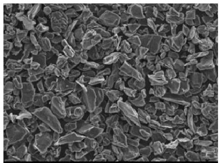

natural_image

Microscopic view of granular material with irregular particles (no text or symbols visible)

消费类-KC系列

储能类-ES系列  
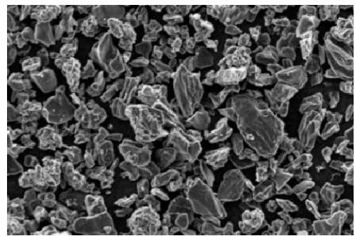

natural_image

Microscopic view of granular material with irregular particles (no text or symbols visible)

消费类-KE系列  
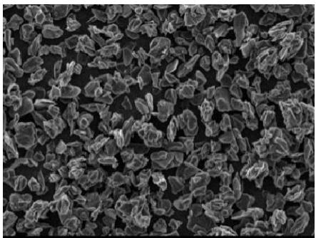

natural_image

Microscopic view of granular material with irregular particles (no text or symbols visible)

负极材料业务

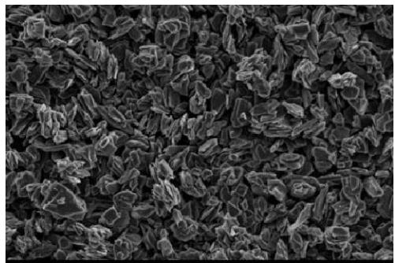

natural_image

Microscopic view of granular material with irregular, clustered structures (no text or symbols visible)

## 硅碳负极材料

S20 系列  
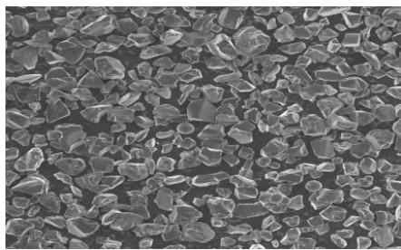

natural_image

Microscopic view of granular material with irregular crystalline shapes (no text or symbols)

S25 系列  
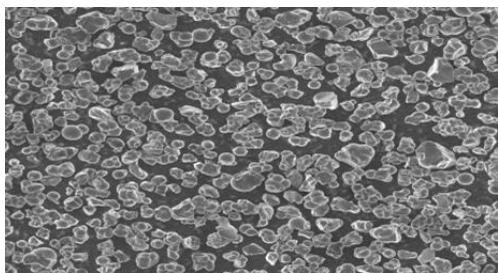

natural_image

Microscopic view of granular or cellular structures with irregular shapes (no text or symbols visible)

## 硬碳负极材料

H30 系列  
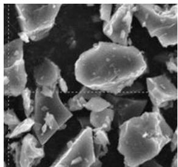

natural_image

Microscopic view of irregularly shaped particles or fragments, no text or symbols visible

H33 系列  
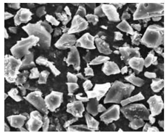

natural_image

Microscopic view of irregularly shaped granular particles (no text or symbols visible)

H35 系列  
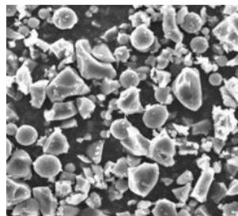

natural_image

Microscopic view of irregularly shaped particles or colloidal structures (no text or symbols visible)

## 磁电装备业务

公司磁电装备业务涵盖电磁冶金专用设备、工业磁力设备以及锂电专用设备的研发、制造、销售与服务。主要产品包括中间包通道式感应加热与精炼系统、连铸电磁搅拌成套系统、连轧电磁感应加热系统、起重磁力设备、除铁器、磁选机、卷筒，以及锂电自动化电气控制设备、锂电材料除磁设备、立式高温反应釜、新一代全自动智能型石墨化炉等，产品可广泛应用于钢铁、交通运输、造船、机械、矿山、锂电等行业。依托完整的产品线、领先的产品技术与稳定可靠的产品质量，公司磁电装备业务在行业内优势明显，电磁冶金专用设备市场占有率稳居国内行业龙头地位。

电磁冶金专用设备  
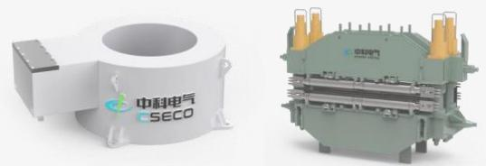

natural_image

Two industrial electrical components, one with a white label and 'SECO' logo, the other with a green internal structure (no visible text or symbols on components)

电磁搅拌产品

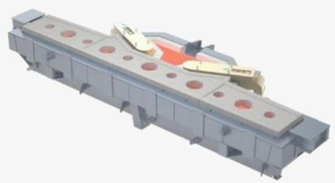

natural_image

3D rendering of a mechanical assembly with red circular holes and a central orange component (no text or symbols visible)

中间包电磁感应加热产品

工业磁力设备  
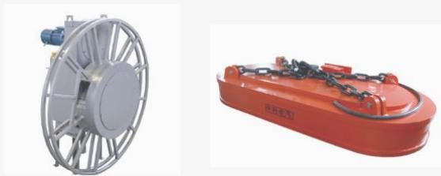

natural_image

Two industrial equipment: a metallic cylindrical device and an orange industrial tank (no visible text or symbols)

电缆卷筒  
电磁铁

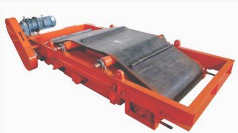

natural_image

Industrial conveyor belt with black mesh and orange base, no visible text or symbols

磁选机

锂电专用设备  
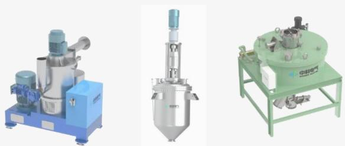

natural_image

Three industrial machinery units: a blue industrial machine, a stainless steel mixing tank, and a green cylindrical device on a green base (no visible text or labels)

整形机  
立式搅拌釜  
除磁机

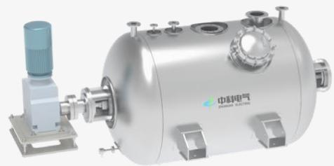

natural_image

Industrial gas storage unit with control panel and valve (no visible text or symbols)

卧式搅拌釜

## 经济绩效

年，锂电行业在前期调整基础上继续修复并保持回升态势。国内促消费与汽车更新等政策持续发力，快充车型渗透率持续提升。与此同时，国内外储能锂离子电池市场保持较快发展，为负极材料需求增长提供支撑。在此背景下，公司有序推进负极一体化产能建设，新增与优质产能逐步释放，把握快充与储能应用带来的增量机会，推动新能源电池负极材料产销量增长。

line chart

| Category | Value |
| --- | --- |
| 2018年1月 | 2819.34 |
| 2018年2月 | 2512.52 |
| 2018年3月 | 2703.14 |
| 2018年4月 | 2803.32 |
| 2018年5月 | 2926.21 |
| 2018年6月 | 2850.07 |
| 2018年7月 | 2822.23 |
| 2018年8月 | 2819 |
| 2018年9月 | 2513 |
| 2018年10月 | 2703 |
| 2018年11月 | 2903 |
| 2018年12月 | 2926 |
| 2019年1月 | 2850 |
| 2019年2月 | 32% |
| 2019年3月 | 37% |
| 2019年4月 | 37% |
| 2019年5月 | 37% |
| 2019年6月 | 37% |
| 2019年7月 | 37% |
| 2019年8月 | 37% |
| 2019年9月 | 37% |
| 2019年10月 | 37% |
| 2019年11月 | 37% |
| 2019年12月 | 37% |

<table><tr><td></td><td>2025年</td><td>2024年</td><td>本年比上年增减</td><td>2023年</td></tr><tr><td>营业收入(元)</td><td>8,467,654,590.68</td><td>5,581,049,946.40</td><td>51.72%</td><td>4,907,513,954.71</td></tr><tr><td>归属于上市公司股东的净利润(元)</td><td>469,965,685.30</td><td>303,022,659.00</td><td>55.09%</td><td>41,706,203.37</td></tr><tr><td>归属于上市公司股东的扣除非经营性损益的净利润(元)</td><td>437,498,381.99</td><td>345,322,078.29</td><td>26.69%</td><td>93,488,974.76</td></tr><tr><td>经营活动产生的现金流量净额(元)</td><td>-1,347,275,564.51</td><td>-125,691,789.85</td><td>-971.89%</td><td>976,637,534.14</td></tr><tr><td>基本每股收益(元/股)</td><td>0.6857</td><td>0.4392</td><td>56.12%</td><td>0.0577</td></tr><tr><td>稀释每股收益(元/股)</td><td>0.6857</td><td>0.4392</td><td>56.12%</td><td>0.0577</td></tr><tr><td>加权平均净资产收益率</td><td>9.77%</td><td>6.58%</td><td>3.19%</td><td>0.86%</td></tr></table>

<table><tr><td></td><td>2025年末</td><td>2024年末</td><td>本年末比上年末增减</td><td>2023年末</td></tr><tr><td>资产总额(元)</td><td>15,213,372,100.28</td><td>11,334,232,487.72</td><td>34.22%</td><td>10,372,599,212.97</td></tr><tr><td>归属于上市公司股东的净资产(元)</td><td>4,972,064,845.61</td><td>4,673,542,148.88</td><td>6.39%</td><td>4,694,301,626.28</td></tr></table>

## 2025年度荣誉表彰

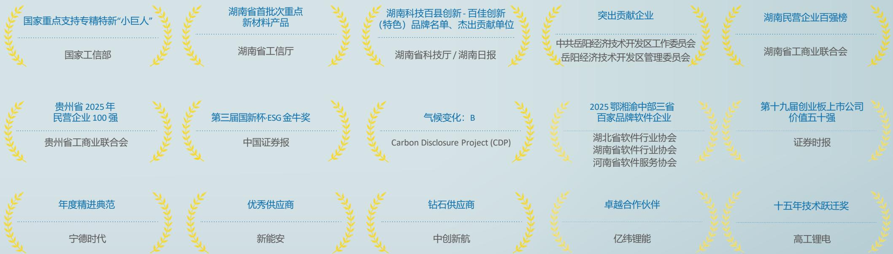

flowchart

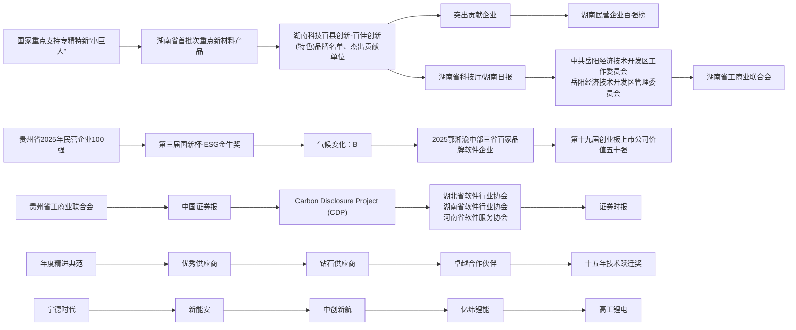

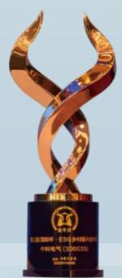

natural_image

Golden trophy sculpture with abstract swirl design, no visible text or symbols on the sculpture itself

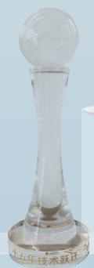

natural_image

Clear glass object with a spherical top, labeled '五年技术跃迁' at the base (no other text or symbols visible)

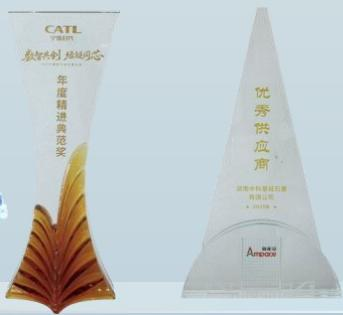

text_image

CATL
数字视讯 体验与芯
年度精进典范奖
优秀供应商
深圳市中技星磁石窗
有限公司
AUNDOO

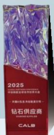

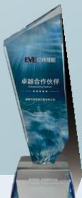

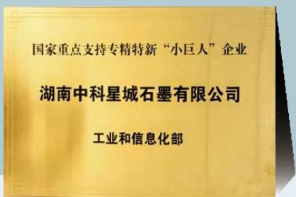

text_image

国家重点支持专精特新“小巨人”企业
湖南中科星城石墨有限公司
工业和信息化部

## 使命、愿景和经营理念

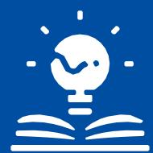  
使命

为构建更洁净的家园做贡献做新能源材料的全球领导者和磁电技术领头羊

  
愿景

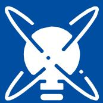  
经营理念

以人为本、创新驱动诚实守信、合作共赢

## ESG亮点绩效

## 治理

依据新《中华人民共和国公司法》优化治理结构，取消监事会，治理更贴合监管要求  
董事会独立董事、女性董事占比均达33%，结构多元均衡  
搭建内控体系三道防线，审计委员会独立履职，风险管控闭环高效  
信息披露及时透明，2025年披露公告110 项，“互动易”回复问题191条  
新员工100% 签署廉洁协议，供应商廉洁培训覆盖率达80%，实现商业贿赂及贪污诉讼案件零发生  
建立多渠道保密举报机制，严格保护举报人，构建廉洁监督长效体系

## 环境

## 节能降碳

通过减排项目与工艺改造，合计减少碳排放1,749.41吨  
清洁能源（电力）使用比例达到73%  
开展多项节能技改项目，年节电224.01万千瓦时（275.3吨标煤）

## 环境合规

进行全面环境风险识别与培训，完成 次年度环保应急演练活动  
环保总投入2,865万元，实现“环境污染零事件”目标  
●全年废气、废水100%达标排放，废弃物合规处置率为100%

## 社会

## 创新研发与质量管理

报告期内，公司研发投入为24,946.56万元  
年度获得授权发明专利34项（其中含海外专利1项），授权实用新型专利30项（其中含海外专利1项）  
通过ISO9001质量管理体系的认证，认证通过率为100%，其中新能源材料事业部各生产基地均通过IATF 16949 体系认证  
对客户投诉管理系统实施全面升级，客诉解决率100%

## 供应商管理

构建全生命周期管理闭环，形成覆盖开发准入、评价维护、绩效分级、合作赋能、动态退出各环节的全流程管理体系  
供应商廉洁承诺书、社会责任书、安全环保协议书签署率100%，全年童工、强迫劳动案件零发生  
参照OECD指南管控冲突矿产，承诺不采购高风险与人权违规原料

## 员工管理

拥有少数民族员工1,104人，在管理层中女性管理者占比23.17%  
员工整体满意度得分超  
通过职业健康安全管理体系监督审核，体系监督审核通过率100%

## 社会贡献

重视乡村振兴，投入资金帮扶岳阳周边乡村，助力乡村产业发展  
启动岳阳市云湖街道 爱心助学 教育赋能、宁乡市 爱心助学 结对帮扶、 中科育才专项教育资助 等文体公益项目，推动公益爱心与社会责任同频共振  
向大埔宏福苑援助基金捐赠港币100万元，通过“物质+ 能力+ 关怀”多维行动守护公众生命财产安全  
持续关注弱势群体，聚焦困境妇女儿童，乡村老年群体，残障人十，开展马路村“重阳敬老”慰问，支持湖南“出手吧，姐姐”妇女儿童帮扶等项目，让守护弱势群体的承诺化为可见行动

## ESG 管理体系

中科电气深知可持续发展是企业实现长远价值创造的基石。公司通过建立完善的 管理体系，积极回应并满足利益相关方的多元诉求与期望，致力于推动企业在经济、环境与社会层面的协调统一，实现稳健、可持续的良性发展。

## ESG 治理架构

中科电气高度重视可持续发展进程，制定并发布《湖南中科电气股份有限公司董事会战略与投资委员会工作细则》《湖南中科电气股份有限公司环境、社会与公司治理（ESG）管理办法》等内部政策，完善公司 ESG 治理体系，提升规范运作与治理水平，为公司稳健发展筑牢制度根基。

为推动可持续发展理念与公司治理深度融合，公司构建“决策层 - 管理层 - 执行层”三级 ESG 治理架构，由董事会及战略与投资委员会履行决策职责，ESG领导小组和 ESG专项小组作为管理层级协调统筹，事业部、子（分）公司及职能部门承担执行职能，通过明确各层级权责边界，确保ESG 战略规划有效落地，为公司实现高质量可持续发展提供坚实的组织保障。

natural_image

Simple icon depicting a person at a podium with three seated figures below (no text or symbols)

## 董事会

## 战略与投资委员会

## ESG领导小组

## ESG 专项小组

## 事业部、子（分）公司及职能部门

## 决策层

董事会：公司ESG 事宜的最高决策与责任主体，全面统筹ESG相关战略规划与重大事项决策，同时承担公司ESG报告的审议职责。

战略与投资委员会：公司 ESG工作的专业研究与指导机构，承担 ESG战略及议题管理的研究职责，提供专业建议，指导并监督工作落地执行，定期向董事会汇报工作进展。

ESG领导小组：公司ESG 工作核心执行机构，全面负责ESG相关工作的组织协调、统筹推进与落地落实。

ESG专项小组：负责ESG议题的信息收集、整理分析和改善提升等活动，了解和回应利益相关方期望，定期向ESG领导小组汇报ESG工作进展。

环境专项小组（EHS办公室）：负责管理温室气体排放管理及应对气候变化、污染物管理、水资源管理、能源管理和化学品管理等环境议题。  
产品专项小组（研究院及质量管理中心）：负责管理产品创新研发、产品质量与安全、负责任供应链、知识产权管理、信息安全与隐私保护以及客户服务与沟通等社会议题。  
员工专项小组（人力资源部）：负责管理员工权益与福利、员工发展与培训、雇佣与劳工准则、职业健康与安全和公益慈善等社会议题。  
公司治理专项小组（审计部）：负责管理治理结构、公平竞争、廉洁管理、合规运营、风险防控等治理议题。

## 管理层

事业部、子（分）公司及职能部门：负责开展落实本单位ESG管理工作，配合ESG专项小组相关工作。

中科电气ESG管理架构

## ESG发展战略与目标

中科电气将ESG理念深度融入企业战略全局，以“为构建更洁净的家园做贡献”为使命指引，把环境、社会与治理责任作为高质量发展核心支柱，通过系统化战略部署与可量化目标设定推动可持续发展理念落地实践，实现经济环境社会价值协同共赢。公司秉持 为客户创价值、为股东谋利益、为员工谋幸福、为社会做贡献”的核心导向，携手客户、股东、员工、行业伙伴及社会各界，筑牢绿色合规、责任共担的可持续发展根基，共同探索协同共进的可持续发展之路。

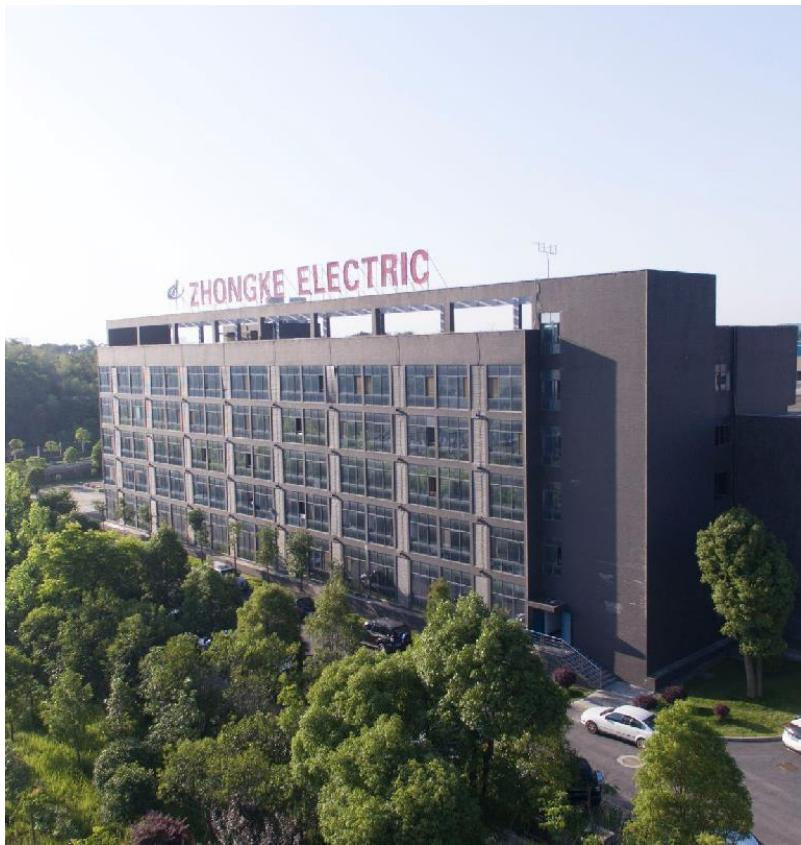

text_image

ZHONGKE ELECTRIC

## 中科电气ESG发展战略和目标

## 逐绿前行塑造零碳未来：持续开展节能减碳，通过设备优化与改造等措施实现能源效率提升

通过碳足迹和LCA 评价，推动产品生命周期内环境影响持续降低，到2030年，单位产品颗粒物排放量与2023 年基准年相比降低6%。  
提高可再生能源使用比例，到2030 年清洁能源（电力）占比提升至50%。  
构建循环经济体系，打造“负极生产→使用→回收与资源再生”的生态闭环，实现废电池负极材料的回收利用，减少对资源能源的消耗。

## 2025年目标完成情况

持续开展  
73%  
持续开展

## 初心如磐笃行尽责致远：产品品质是企业的生命线，创新是企业的生命力，为客户持续创造价值

强化质量体系建设，产品质量事故为0。  
增加研发费用投入，持续保持核心技术优势及前瞻性研发布局，为全球新能源电池客户提供一流的方案和服务。

## 2025年目标完成情况

0

24,946.56 万元

## 惠及社会绘就共享之景：保护员工权益，帮助经济困难群体脱困，实现共同成长和发展

提供就业机会，保障员工权益，创造安全有保障、关怀有温度的工作环境，实现企业和员工共赢发展。  
明确禁止雇佣童工和强迫劳动，职业病死亡人数为0，监督供应链伙伴避免童工、不人道待遇、强迫劳动情况出现，关键供应商的社会责任（CSR）协议签订率达100%。  
通过产业发展、稳定就业、教育振兴等方式，持续巩固脱贫攻坚成果，对经济困难的群体提供资金、就业、教育支持。

## 2025年目标完成情况

持续开展

职业病死亡人数为0；CSR 协议签订率 100%

提供资金支持124.59万元

## 规范治理夯实发展之基：持守正为本，遵规守法的商业道德准则

持续完善公司内部控制体系制度，确保生产安全、信息安全、财务安全、运营安全、政治安全，预防不可抗力因素。  
通过可持续采购，预防企业及供应链中存在的合规风险，到2025年，商业伙伴或供应商的反商业贿赂培训的比例达到80%。

## 2025年目标完成情况

持续开展  
80%

## ESG风险管理

围绕可持续发展背景与业务实际，中科电气初步识别并分析重要ESG议题相关的实际与潜在影响、风险及机遇，为后续ESG战略优化与责任实践提供精准方向。

<table><tr><td>议题</td><td>影响范围</td><td>影响类型</td><td>影响描述</td><td>影响周期</td></tr><tr><td>产品研发和创新</td><td>自身运营上下游价值链</td><td>机遇风险</td><td>创新是公司的核心竞争力之一。公司以高水平研发投入驱动创新发展,打造领先的研发成果,满足客户需求。公司坚持开放式创新,加强内外部融合发展,不断深化与高校、科研院所的合作,为行业创新发展贡献力量。若公司技术投入不足导致产品竞争力落后于行业,面临市场份额缩减风险。</td><td>短中长期</td></tr><tr><td>可持续供应链</td><td>自身运营上下游价值链</td><td>机遇风险</td><td>公司强化对供应商的 ESG 风险监督,助力供应链的可持续发展能力提升,满足下游客户需求。若公司未及时识别供应商 ESG 风险并协助其开展提升,可能导致供应商因 ESG 能力不足而丧失市场机会。</td><td>短中长期</td></tr></table>

<table><tr><td>议题</td><td>影响范围</td><td>影响类型</td><td>影响描述</td><td>影响周期</td></tr><tr><td>产品和服务安全与质量</td><td>自身运营上下游价值链</td><td>机遇风险</td><td>公司以数字化赋能自身全生命周期质量管理,提升产品质量管理效率和准确性,以品质交付超越客户的期待。若产品质量安全管理不够完善,可能导致相关负面事件发生,损害客户、终端用户等相关方利益。</td><td>短中长期</td></tr><tr><td>风险管理与合规运营</td><td>自身运营上下游价值链</td><td>机遇风险</td><td>公司前瞻性了解与业务相关的潜在风险,降低业务经营活动中的不确定性,强化包含企业自身与价值链伙伴的风险管理能力。公司内控失效会导致资产流失、决策重大失误或资金链断裂,直接威胁企业的现金流安全与持续经营。</td><td>短中长期</td></tr><tr><td>客户服务和满意度</td><td>自身运营下游价值链</td><td>机遇</td><td>公司不断提高客户服务效率和体验,保障服务品质。公司积极参与售后服务相关标准制定,助力行业整体服务水平提升。</td><td>短中长期</td></tr></table>

natural_image

Panoramic view of a vast green field with dense forest and distant clouds under a partly cloudy sky (no text or symbols visible)

## 利益相关方沟通

中科电气高度重视不同利益相关方的诉求与期望，制定《湖南中科电气股份有限公司信息披露管理制度》，为利益相关方沟通提供制度保障，结合行业发展趋势与公司经营实际明确主要利益相关方，通过股东会、日常交流等多元机制及时回应诉求。

中科电气利益相关方需求与期望及沟通渠道

<table><tr><td colspan="2">利益相关方</td><td>关注议题</td><td>沟通方式</td></tr><tr><td>股东及投资方</td><td></td><td>·风险管理与合规运营·ESG治理·利益相关方沟通</td><td>·财务报告发布·股东会·投资者热线·邮箱·业绩说明会</td></tr><tr><td>客户</td><td></td><td>·产品和服务安全与质量·客户服务和满意度·产品研发和创新·知识产权保护·数据安全与客户隐私保护</td><td>·客户满意度调查·客户沟通会议·客户投诉·售后服务承诺</td></tr><tr><td>合作伙伴</td><td></td><td>·反商业贿赂及反贪污·可持续供应链管理·尽职调查·产业合作与发展</td><td>·供应商会议·现场审核·合同谈判</td></tr><tr><td>员工</td><td></td><td>·合理薪酬体系·职业健康与安全·员工权益保护·员工培训和职业发展·员工关爱</td><td>·员工满意度调查·安全管理体系·内部会议·职工代表大会·座谈会·员工培训</td></tr></table>

<table><tr><td colspan="2">利益相关方</td><td>关注议题</td><td>沟通方式</td></tr><tr><td>环境</td><td>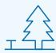</td><td>·应对气候变化·污染物排放·废弃物处理·生态系统和生物多样性保护·环境合规管理·能源利用·水资源利用·循环经济</td><td>·污染物监测·环境信息披露·ESG报告·产品宣传</td></tr><tr><td>社区及公众</td><td></td><td>·乡村振兴·社会贡献</td><td>·公益活动·文体活动</td></tr><tr><td>监管机构</td><td></td><td>·反不正当竞争</td><td>·政府会议、研讨会·接受监督考核·现场参观与沟通</td></tr></table>

## 双重重要性评估

为持续提升ESG管理绩效与信息披露透明度，中科电气系统性开展ESG双重重要性评估工作。公司结合行业特点、自身业务现状、监管政策趋势及利益相关方核心关切，从 影响重要性和 财务重要性 双重维度对相关议题进行了全面评估。确定并构建了本年度的重大性议题矩阵，为后续 ESG战略精准聚焦、高效实施提供了科学指引，确保 ESG管理工作与公司发展战略、利益相关方诉求同频同步。

natural_image

Misty forest landscape with dense green trees and misty slopes (no text or symbols)

## 中科电气双重重要性评估流程

## 背景分析与议题初步识别

分析公司内部活动和业务关系，包括价值链上下游可持续相关影响。  
了解外部客观环境，包括2025年宏观政策、产业政策、监管要求与行业热点，识别对公司存在的潜在影响。  
了解主要受影响的重点利益相关方，包括内外部相关方，予以梳理与分类。

## 建立议题清单

在深交所《指引》1设置的21项议题基础上，结合监管政策、规则、行业标准及发展趋势、同业分析等，增加公司特定议题，形成议题清单，共计29项相关议题。

## 议题 重要性评估

影响重要性评估：综合评估实际发生与潜在影响，并从影响规模、影响范围、不可补救性等多个维度进行综合评估，评估公司可持续发展相关议题的表现是否会对环境、经济与社会产生重大影响。  
财务重要性评估：公司识别各议题相关的财务指标，结合历史财务数据，综合评判相关议题对公司的商业模式、业务运营、财务状况等方面的影响。

## 议题审议 与确认

综合公司对所有议题的影响重要性及财务重要性评估结果，结合公司的运营管理能力设定重要性阈值标准，得出具有“财务重要性”的议题清单。  
形成双重重要性分析矩阵，评估结果经战略与投资委员会审核确认，就2025年度识别出的高重要性议题在本报告中进行重点披露。

2025年，重要性议题识别结果如下矩阵所示。  
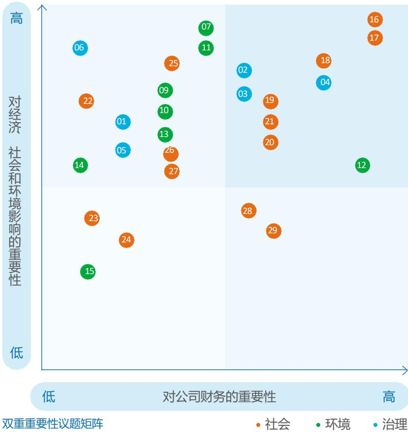

scatter

| ID | Category | Importance to Company Finance (X-axis) | Importance to Economic, Social & Environmental (Y-axis) |
| --- | --- | --- | --- |
| 06 | Governance | Low | High |
| 25 | Social | Medium | High |
| 07 | Environment | Medium | High |
| 11 | Environment | Medium | High |
| 09 | Environment | Medium | High |
| 10 | Environment | Medium | High |
| 02 | Governance | Medium-High | High |
| 04 | Governance | High | High |
| 18 | Social | High | High |
| 17 | Social | High | High |
| 22 | Social | Low | Medium-High |
| 03 | Governance | Medium-High | Medium-High |
| 19 | Social | High | Medium-High |
| 21 | Social | High | Medium-High |
| 05 | Governance | Low-Medium | Medium-High |
| 13 | Environment | Medium | Medium-High |
| 26 | Social | Medium | Medium-High |
| 20 | Social | High | Medium-High |
| 27 | Social | Medium | Medium-High |
| 14 | Environment | Low | Medium |
| 12 | Environment | High | Medium |
| 28 | Social | Medium-High | Low-Medium |
| 29 | Social | High | Low-Medium |
| 23 | Social | Low | Low-Medium |
| 24 | Social | Low-Medium | Low-Medium |
| 15 | Environment | Low | Low-Medium |
| 23 (lower) | Social | Low-Medium | Low |
| 24 (lower) | Social (lower) | Low-Medium | Low |
| 28 (lower) (lower) | Social (lower) | High-Medium | Low |
| 29 (lower) (lower) | Social (lower) (lower) | High-Medium | Low |
| 16 (upper) | Social (upper) | High | High |
| 17 (upper) | Social (upper) (upper) | High | High |
| 12 (lower) (lower) | Environment (lower) (lower) | High-Medium | Low-Medium |
| 06 (lower) (lower) | Governance (lower) (lower) | Low-Medium | High |
| 01 (lower) (lower) | Governance (lower) (lower) | Low-Medium | Medium-High |
| 05 (lower) (lower) | Governance (lower) (lower) | Low-Medium | Medium-High |
| 25 (lower) (lower) | Social (lower) (lower) | Medium-High | High |
| 26 (lower) (lower) | Social (lower) (lower) | Medium-High | Medium-High |
| 27 (lower) (lower) | Social (lower) (lower) | Medium-High | Medium-High |
| 14 (lower) (lower) | Environment (lower) (lower) | Low-Medium | Medium-High |
| 09 (lower) (lower) | Environment (lower) (lower) | Medium-High | High |
| 13 (lower) (lower) | Environment (lower) (lower) | Medium-High | Medium-High |
| 10 (lower) (lower) | Environment (lower) (lower) | Medium-High | High |
| 22 (lower) (lower) | Social (lower) (lower) | Low-Medium | High |
| 05 (lower) (lower) | Governance (lower) (lower) | Low-Medium | Medium-High |
| 23 (lower) (lower) | Social (lower) (lower) | Low-Medium | Low-Medium |
| 24 (lower) (lower) | Social (lower) (lower) | Low-Medium | Low-Medium |
| 15 (lower) (lower) | Environment (lower) (lower) | Low-Medium | Low-Medium |
| 03 (upper) (upper) | Governance (upper) (upper) | Medium-High | High |
| 02 (upper) (upper) | Governance (upper) (upper) | Medium-High | High |
| 04 (upper) (upper) | Governance (upper) (upper) | High-Medium | High |
| 18 (upper) (upper) | Social (upper) (upper) | High-Medium | High |
| 19 (upper) (upper) | Social (upper) (upper) | High-Medium | Medium-High |
| 21 (upper) (upper) | Social (upper) (upper) | High-Medium | Medium-High |
| 20 (upper) (upper) | Social (upper) (upper) | High-Medium | Medium-High |
| 07 (upper) (upper) | Environment (upper) (upper) | Medium-High | High |
| 11 (upper) (upper) | Environment (upper) (upper) | Medium-High | High |
| 12 (upper) (upper) | Environment (upper) (upper) | High-Medium | Low-Medium |

双重重要性议题矩阵

## 治理

01 ESG 治理  
02 反商业贿赂及反贪污  
03 反不正当竞争  
04 风险管理与合规运营  
05 尽职调查  
06 利益相关方沟通

## 环境

07 应对气候变化  
08 污染物排放  
09 环境合规管理  
10 废弃物处理  
11 污染物排放  
12 能源利用  
13 水资源利用  
14 循环经济  
15 生态系统和生物多样性保护

## 社会

16 产品研发和创新  
17 产品和服务安全与质量  
18 可持续供应链管理  
19 员工培训与发展  
20 合理薪酬体系  
21 员工权益保护  
22 员工关爱

23 乡村振兴  
24 社会贡献  
25 产业合作与发展  
26 职业健康与安全  
27 数据安全与客户隐私保护  
28知识产权保护  
29客户服务和满意度

## 2025 年

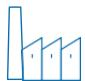

## 经识别，共计 10项双重重要性议题

产品研发和创新  
产品和服务安全与质量  
能源利用  
可持续供应链管理  
风险管理与合规运营  
员工培训与发展  
员工权益保护  
合理薪酬体系  
反商业贿赂及反贪污  
反不正当竞争

natural_image

Close-up of green leaves with visible veins, set against a blurred natural background (no text or symbols)

# 01规范治理夯实发展之基

中科电气将严谨的治理标准贯穿于决策与运营全过程，持续完善治理架构、建立全面有效的风险管控体系、恪守商业道德与反腐败准则，确保公司运作稳健、透明。

本章节对应的联合国可持续发展目标

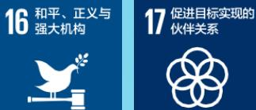

natural_image

Exterior view of a modern glass skyscraper under clear blue sky (no signage or text visible)

## 健全治理体系

中科电气建立完善的公司治理架构，明晰各层级管治责任，并建立畅通的信息沟通机制，全面推进合规经营，助力公司实现持续健康发展。

## 治理架构

公司严格按照《中华人民共和国公司法》《中华人民共和国证券法》《上市公司治理准则》《深圳证券交易所创业板股票上市规则》《深圳证券交易所上市公司自律监管指引第2号——创业板上市公司规范运作》等相关法律、法规和规范性文件的要求，制定并发布《湖南中科电气股份有限公司章程》《湖南中科电气股份有限公司股东会议事规则》《湖南中科电气股份有限公司董事会议事规则》等一系列内部政策，持续完善、健全内部治理体系，稳步推进公司治理各项工作，持续提升自身治理水平，为公司稳健发展筑牢制度根基。

公司搭建权责明确、运作规范、层级分明的治理结构，由股东会、董事会及专门委员会组成，保障治理决策的公正性与科学性，筑牢规范运作的组织基础。2025年，公司召开2024年度股东会，审议通过《关于修订 < 公司章程 > 的议案》。根据 2024 年 7 月 1 日起施行的《中华人民共和国公司法》相关规定，新修订的公司章程将“股东大会”调整为“股东会”，同时取消“监事会”相关设置，进一步优化公司治理结构，贴合监管要求。

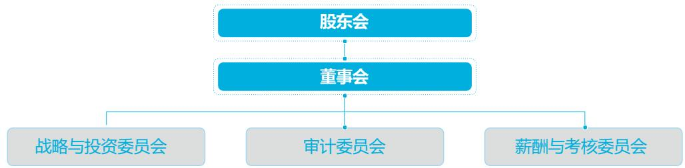

flowchart

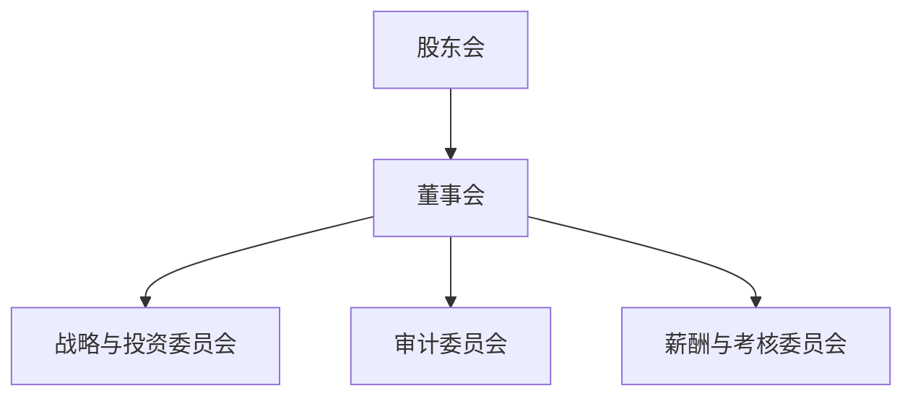

中科电气治理架构

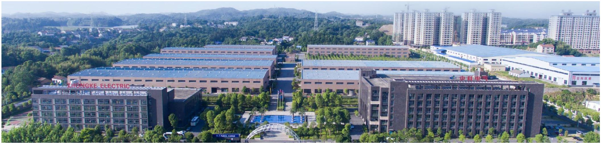

natural_image

Aerial view of a modern industrial complex with solar panel roofs and surrounding greenery, featuring 'Zhongke Electric' signage (no other text or symbols visible)

## 中科电气治理架构各层级名称及职责

## 股东会

公司遵守有关规定召集、召开股东会，平等对待所有股东，为股东参加股东会提供便利条件，确保股东权利得到充分行使，保护全体股东的利益。  
2025 年，公司召开股东大会4 次，共审议议案17项。

## 董事会

董事会是在股东会授权下对公司整体发展策略和政策的管治机构，对业务成果进行评价，并对管理层的履职情况进行监督。  
董事会下设战略与投资委员会、审计委员会、薪酬与考核委员会三个专门委员会，为公司在关键领域提供专注的监督和专业的指导。  
年，公司共有董事会成员 名，召开董事会会议 次，审议议案39 项。

## 战略与投资委员会

战略与投资委员会的主要职责是对公司长期发展战略、重大投资决策、重大资本运作进行深入研究，并向董事会提出专业建议。  
2025年，公司战略与投资委员会5人，召开战略与投资委员会议2次。

## 审计委员会

审计委员会负责审核公司财务信息及其披露、监督及评估内外部审计工作和内部控制。  
2025年，公司共有审计委员会成员3人，其中独立董事2名，召开审计委员会议4次。

## 薪酬与考核委员会

薪酬与考核委员会负责制定董事、高级管理人员的考核标准并进行考核，同时制定、审查董事、高级管理人员的薪酬决定机制、决策流程、支付与止付追索安排等薪酬相关政策与方案。  
年，公司薪酬与考核委员会 人，其中独立董事 名，召开薪酬与考核委员会议2次。

公司已建立并持续完善董事及高级管理人员的绩效评价与激励约束机制。薪酬与考核委员会牵头拟订并监督执行符合公司长期发展战略的薪酬与激励方案，确保激励与约束并重、权利与责任对等。董事、高级管理人员报酬事项严格遵循《湖南中科电气股份有限公司章程》规定，履行相关审核程序后实施，并依法进行充分信息披露。公司以绩效评价为核心导向，将高级管理人员的薪酬激励与公司整体经营业绩、个人履职成效紧密挂钩，构建科学合理、公开透明的激励约束体系，充分调动核心管理团队的积极性与责任感，助力公司长期稳健发展。

natural_image

Overhead view of three people working at a white desk with laptops and notebooks, no visible text or symbols

## 董事会有效性与多元化

公司董事会选聘与管理严格遵循公开、公平、公正、独立原则，充分保障中小股东在董事选举中的话语权。董事由股东会选举产生，经股东会决议可予更换或提前解除职务，确保治理机制灵活有效。董事每届任期三年，期满可连选连任，保持治理团队稳定性。董事会依法行使人事任免权，根据董事长提名，审议并决定总经理、董事会秘书的聘任或解聘；依据总经理提名，对副总经理、财务负责人等高级管理人员的任免作出决策，形成权责清晰、协同高效的管理体系，切实维护公司及全体股东利益。

公司高度重视董事会的独立性与多元化建设，以制度设计强化监督制衡能力。2025年，董事会共有 9 名董事，其中独立董事 3 名，女性董事 3 名，占比均达 33%。在董事提名环节，公司建立综合评估体系，将性别、专业背景、行业经验、教育水平等多维因素纳入考量，确保董事会成员具备互补优势。审计委员会、薪酬与考核委员会均有独立董事参与，其中审计委员会包含会计专业人士，且董事长及兼任高级管理人员的董事未在审计委员会任职，从结构上杜绝利益冲突，有效提升决策的客观性与专业性。

natural_image

Close-up of a wooden gavel resting on a wooden block, with a hand holding a gavel in the background (no text or symbols visible)

<table><tr><td>类型</td><td>指标</td><td>单位</td><td>2025年数据</td></tr><tr><td rowspan="2">独立性</td><td>独立董事人数</td><td>人</td><td>3</td></tr><tr><td>非独立董事人数</td><td>人</td><td>6</td></tr><tr><td rowspan="2">按性别划分</td><td>男性董事人数</td><td>人</td><td>6</td></tr><tr><td>女性董事人数</td><td>人</td><td>3</td></tr><tr><td rowspan="2">按专业划分</td><td>有财会背景人数</td><td>人</td><td>2</td></tr><tr><td>有法律背景人数</td><td>人</td><td>1</td></tr><tr><td rowspan="3">按年龄划分</td><td>40岁以下者</td><td>人</td><td>3</td></tr><tr><td>40-50岁</td><td>人</td><td>1</td></tr><tr><td>50岁以上者</td><td>人</td><td>5</td></tr></table>

中科电气董事会构成情况

## 投资者权益保护

中科电气以保障股东知情权与决策权为核心，秉持“完整、及时、透明”原则构建信息披露体系，严格遵循法规要求履行披露义务，主动披露ESG管理、研发投入、供应链责任等非财务信息，同步说明重大事项背景、影响及应对措施，确保信息披露的全面性与准确性。

## 投资者沟通

公司高度重视投资者权益保护和关系管理，依法制定《湖南中科电气股份有限公司信息披露管理制度》《湖南中科电气股份有限公司投资者关系管理制度》等规范性文件，通过投资者调研、业绩说明会、电话及邮件咨询、深交所“互动易”平台等多维渠道，持续完善公开、透明的投资者沟通渠道和信息披露，积极维护公司与投资者良好关系，助力投资者全面、及时了解公司发展战略、商业模式、经营状况等核心信息，充分传递公司投资价值，增强投资者对公司的认同感与信心，构建良性互动的投资者关系生态。

2025年，公司全年完成公告披露 110项，其中定期报告 6项，临时报告104项，完成业绩说明会2场，回复深交所“互动易”平台问题191条，保证投资者热线电话实时接听和反馈。

natural_image

Hand placing a wooden block on a white table, with blurred office background (no visible text or symbols)

中科电气信息披露情况

<table><tr><td>合计披露公告</td><td>定期报告</td><td>临时报告</td></tr><tr><td>110项</td><td>6项</td><td>104项</td></tr><tr><td>业绩说明会</td><td colspan="2">回复“互动易”平台问题</td></tr><tr><td>2场</td><td colspan="2">191条</td></tr></table>

公司始终将回报股东作为核心理念，在确保主营业务稳健运营的基础上，严格依据《湖南中科电气股份有限公司章程》及相关制度规定，审慎评估经营规划、现金流状况、融资环境及资金成本等多重因素，坚持实施连续稳定的现金分红政策，致力于为股东创造长期可持续的价值回报，实现发展成果的共享，切实保障全体股东利益并提升投资者获得感。

中科电气利益共享情况

<table><tr><td>派发现金红利</td><td>较2024年增长</td></tr><tr><td>2025年17,135.67万元</td><td>66.67%</td></tr></table>

## 坚守合规底线

中科电气始终严守法律与合规底线，将合规要求嵌入决策、执行、监督全链条，通过动态优化内控机制、强化全流程监督筑牢风险防线，守护企业长远利益。

## 合规管理体系

中科电气构建自上而下、全方位多层次的内控网络，健全风险治理“三道防线”机制，明确各部门风险管理职责。董事会任命审计委员会为顶层监管机构，统筹监督评估内部控制及内外部审计工作，推动建立有效内控机制，保障财务报告真实准确完整。内部审计部门独立于所有业务单元与职能部门，依法独立履职，形成权责清晰、制衡有力的风险防控闭环，为公司稳健运营筑牢防线。

中科电气风险治理“三道防线”  
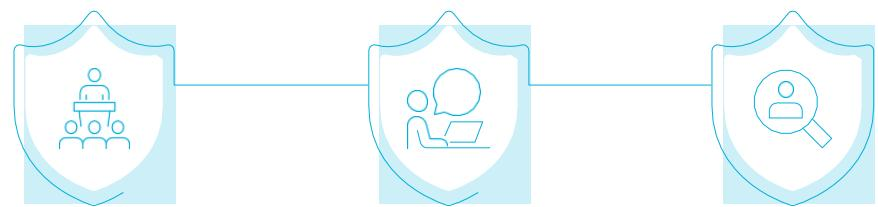

flowchart

## 第一道防线：业务部门

业务部门管理人员是风险的直接承担者及管理者，负责识别所管辖业务范围内的关键风险，及时报告风险变化，并对相关风险进行合理评估与控制。

## 第二道防线：内部审计部门

内部审计部门由公司的内部审计部门组成，不置于财务部门的领导之下，负责对重大风险管理与内部控制工作的有效性提供独立且客观的稽查与审核，直接向审计委员会进行工作汇报，确保内部审计结果的客观性、权威性及可信度。

## 第三道防线：审计委员会

审计委员会负责审核公司财务信息及其披露、监督及评估内外部审计工作和内部控制，定期向董事会汇报内部审计工作进度、质量及重大问题（如财务造假、内控失效等）。

## 合规管理工作

公司建立常态化内部审计监督体系，严格按《湖南中科电气股份有限公司董事会审计委员会工作细则》及年度计划执行审计监督工作，重点聚焦募集资金使用、担保、关联交易、大额资金往来、重大投资等高风险领域合规性审查，确保合规体系运行有效。

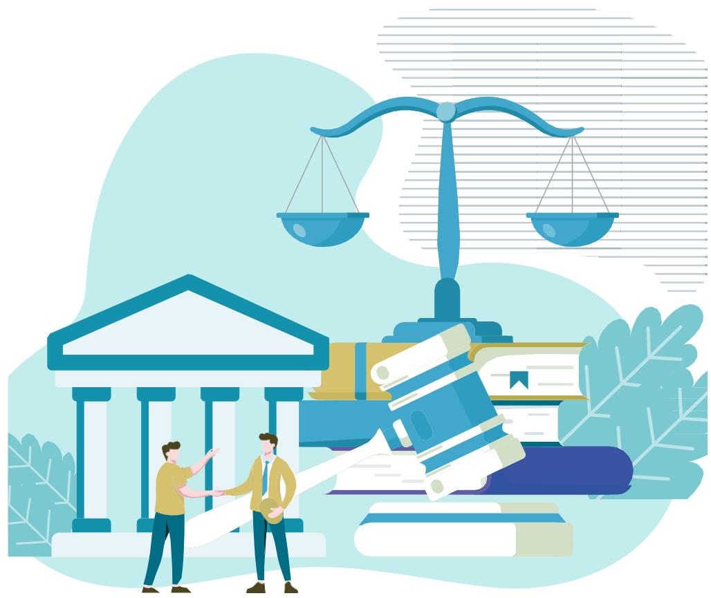

natural_image

Illustration of two people examining documents under a justice scale, with classical buildings and books in the background (no text or symbols)

## 恪守商业道德

中科电气将商业道德与反贪腐管理视为公司可持续发展的重要保障。公司严格遵守相关法律法规，建立系统化、常态化、可执行的内控与监督体系，把诚信经营原则贯穿于所有业务活动之中，以务实、透明的举措维护公平商业环境，筑牢公司长期发展根基。

## 商业道德治理

中科电气遵守《中华人民共和国刑法》《中华人民共和国反不正当竞争法》《关于禁止商业贿赂行为的暂行规定》等法律法规，构建覆盖全体人员及供应商的商业道德制度体系，制定并实施《公司廉洁风险控制行为准则》《员工手册》《礼品礼金上交管理制度》《业务招待管理制度》《采购管理政策》《供应商管理制度》《奖惩管理制度》等系列制度，明确行为边界与责任要求，完善廉洁风险防控长效机制。

公司秉持公平公正、诚信经营的商业道德准则，要求全员严守法律与道德底线。公司强化全员廉洁管理，要求新入职员工100%签署《廉洁自律协议》，结合《礼品礼金上交管理制度》等明令禁止员工收礼受贿行为。2025年，公司未发生商业贿赂及贪污诉讼案件。

## 供应商廉洁管理

公司系统化推进反商业贿赂培训，将合规要求延伸至商业伙伴及供应商。2025年，围绕法律法规、行为红线、典型案例等核心内容设计专项课程，全年累计完成培训覆盖主要商业伙伴、供应商等合作方的80%，有效强化了合作方的廉洁意识与风险识别能力。

## 反不正当竞争

中科电气依法诚信经营，严格遵守《中华人民共和国反垄断法》《中华人民共和国反不正当竞争法》等相关法律法规，制定《公司廉洁风险控制行为准则》，明确规定拒绝商业贿赂等不正当竞争行为，积极引导全体员工恪守良好商业行为规范，自觉维护行业正当竞争秩序。对于经查实存在违规行为的合作方，公司将在内部予以公示，并将其纳入失信黑名单，强化合作端合规管控。2025年，公司未发生因不正当竞争行为导致的诉讼或重大行政处罚事件。

natural_image

Two professionals in business attire reviewing and writing on a blueprint at a desk with computers and office supplies (no visible text or symbols)

## 举报人保护

中科电气持续加强商业道德监察举报工作，制定《湖南中科电气股份有限公司投诉举报管理制度》，明确举报管理流程与奖励机制。投诉举报调查遵循及时性、紧急性和保密性原则，监察部门在收到投诉线索或证据后，第一时间进行举报信息的收集梳理并判断真实性，形成专项调查团队，若查实存在违纪违规违法行为，将对当事人提出处分建议，涉嫌违法案件将根据性质移交相关执法机关处理。

公司高度重视举报人权益保护，在举报信息调查全过程中，严格做好举报人信息、举报内容、审计调查人员信息的保密管理，坚决杜绝打击报复行为。对于任何打击报复举报人的行为，公司将依据相关制度严肃处理，涉嫌违法犯罪的依法移交司法机关，切实保障举报人的安全与合法权益。

公司面向全体员工及利益相关方，设立公开畅通的多元化举报渠道，通过邮箱、公众号、微信等平台接收信访举报与问题线索，并依据线索价值与有效性对举报人给予相应奖励。举报途径同步刊登于公司官网，并通过内部邮件、公告栏等形式向全体员工及相关方公布，确保举报渠道可及性。公司严格按照既定程序受理举报事项，对线索及时启动调查、处理及问责程序，形成受理、核查、反馈的全流程闭环管理，保障举报机制的规范运行与公信力。

text_image

Tortor vitae nulla venenatis
Nulla mi ligula, fringilla et leo cu: Donec id euternod odio sagittis

## 举报渠道：

投诉举报电话号： 19100779162

投诉举报微信号 : zkdq19100779162

投诉举报QQ号： 3831216267

投诉举报邮箱（中科廉政）： zklz@cseco.cn

投诉举报公众号： 微信搜索中科电气公众号（湖南中科电气股份有限公司）、中科星城公众号（湖南中科星城石墨有限公司），进入投诉举报模块

投诉举报二维码：

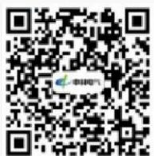  
中科电气投诉举报

## 保障信息安全

公司依据国家法律法规系统构建信息安全管理体系，编制信息安全方针、风险评估报告、适用性声明（SoA）、风险处理计划及文件控制、内部审核、纠正措施等程序文件，顺利取得ISO/IEC 27001 信息安全管理体系证书。2025年，公司拥有贵安新区中科星城石墨有限公司和贵州中科星城石墨有限公司两个生产基地的信息安全管理认证，全面提升信息安全管理的规范性与有效性，切实保障网络与信息系统安全、稳定、可持续运行。

此外，公司严格执行信息安全管理办法，明确客户资料保密要求，对外传输客户资料均实施加密处理，确保外部接收方无法访问；对内实行严格的访问权限控制，仅授权人员可访问相关数据，有效防范信息泄露风险，切实保障客户隐私与数据安全。

## 截至报告期末

## 未发生

公司数据安全、客户隐私泄露相关事件

信息安全与隐私保护举措

<table><tr><td>流程</td><td>具体措施</td></tr><tr><td>升级加密</td><td>·公司对内部关键部门和岗位文件全面加密,外发须经流程审核解密,同时记录U盘拷贝与打印行为,实现事前预防、事中管控、事后追溯的全流程安全审计机制。</td></tr><tr><td>安全评估</td><td>·公司定期开展 TMS、SRM、LIMS、EMS、DLP 等关键应用系统的安全评估,及时发现并修复安全漏洞,同步制定并执行数据备份计划,确保关键系统数据的完整性与可恢复性。</td></tr><tr><td>权限设置</td><td>·公司建立客户信息保护与访问权限控制管理程序,针对USB设备、文件解密、VPN 及堡垒机账号等数字化权限,定期开展 SAP 与 SRM 系统权限回顾,及时回收闲置或不合理权限,有效防范数据泄露风险。</td></tr><tr><td>信息安全宣传</td><td>·公司通过电脑屏保持续宣导锁屏管理、密码安全与敏感数据保护要求,有效提升员工信息安全防范意识。</td></tr></table>

natural_image

Close-up of a hand interacting with a laptop displaying a shield icon and digital icons (no readable text or symbols)

## 02

## 逐绿前行塑造零碳未来

中科电气积极响应国家“双碳”目标，将应对气候变化、碳排放管理纳入公司可持续发展重点。我们围绕气候治理方针与战略目标、风险管理体系、指标管理与数据审查等方面推进相关工作，持续优化能源结构、完善绩效跟踪与供应链协同减排机制，稳步提升自身气候韧性与绿色低碳竞争力。

## 本章节对应的联合国可持续发展目标

12 负责任消费和生产

13 气候行动

15 陆地生物

text_image

碳未来
碳排放管理纳
略目标、风险管
持续优化能源结
自身气候韧性与

## 应对气候变化

中科电气高度关注气候变化对生产经营与供应链稳定性带来的影响，将气候风险识别与应对纳入运营管理重点，持续完善预警机制与应急管理体系，提升极端天气等事件下的韧性与保障能力。公司同步关注低碳政策趋严、国际碳壁垒与客户绿色采购要求等转型因素带来的挑战，推动节能降耗、清洁能源（电力）使用与低碳技术研发工作，逐步提升绿色制造水平与合规披露能力，积极把握低碳发展机遇，稳步推进低碳转型。

## 应对气候变化

公司积极响应联合国《 年可持续发展议程》以及《世界环境公约》等重要国际环境保护倡议与公约，坚持以创新驱动低碳发展，面向国内外客户提供兼具性能与成本优势的低碳产品。同时，公司不断探索经济效益、社会责任与气候应对协同推进的可持续发展路径，致力于建设更加洁净、美好的生态家园。

## 治理

2025年，中科电气在既有ESG治理架构基础上，建立并完善气候变化治理机制，形成“决策层—执行层”管理体系，明确职责分工与汇报路径，确保气候变化相关战略、目标与行动计划得到有效制定、落实与监督。

natural_image

Snow-capped mountain range with evergreen trees in foreground under clear blue sky (no text or symbols)

## 董事会（最高责任机构）

气候变化等重大议题的统一监督决策  
审议并批准气候相关战略、管理举措及中长期规划  
监督气候相关信息披露的合规性与完整性

## 战略与投资委员会（董事会下设）

围绕气候相关战略与重点议题开展研究评估，提出专业建议并监督推进情况  
定期向董事会汇报气候相关重大事宜

## ESG 领导小组（执行层）

组织协调资源与跨部门协同，推动气候工作落地

## 环境小组（ESG 专项小组之一）

分解气候目标与任务，跟踪关键指标与进展，定期向领导小组汇报工作进展  
聚焦温室气体排放管理与应对气候变化，牵头开展碳盘查与气候应对工作，识别并跟踪气候风险与机遇  
推进能源、水资源、污染物及化学品等重点环境管理，形成改进措施

## 各事业部/ 子（分）公司及职能部门

按职责落实具体行动与管理要求，在本单位范围内执行相关措施  
形成 目标分解 过程推进 数据核验 进展汇报”的闭环管理机制  
配合完成数据报送、执行反馈与持续改进

气候治理架构

## 战略

在全球积极应对气候变化、我国持续推进“双碳”目标的背景下，中科电气将气候变化纳入经营管理重点，系统识别物理风险与转型风险并制定针对性应对举措，持续提升风险韧性与低碳转型能力。同时，公司积极协同供应商及合作伙伴推进绿色低碳行动，共同助力行业高质量发展。

结合公司业务特点并参考不同气候情景，中科电气进一步开展气候变化风险识别与评估工作，系统梳理生产运营、供应链管理、仓储物流及市场交付等环节可能面临的气候相关风险，综合评估风险发生的可能性与潜在影响，制定并落实针对性应对措施。同时，公司加强与供应商及合作伙伴的协同联动，推动价值链上下游共同提升气候韧性。

natural_image

Scenic mountain lake view with steep cliffs and forested slopes under a blue sky (no text or symbols visible)

气候变化风险识别及应对

<table><tr><td>风险类型</td><td>风险描述</td><td>应对措施</td></tr><tr><td rowspan="3">实体风险</td><td rowspan="2">急性风险</td><td>暴雨、台风、地震等自然灾害可能破坏厂房设施与储存环境(如高湿度、雨水渗入、异物混入等),导致原料和产品受损(公司产品涉及粉末状固体,对湿度及杂质控制敏感),造成生产停滞,增加质量控制难度导致经济损失。加强自然灾害预警,制定应急预案。加固厂房设施,做好防水、防雪等措施。合理规划物资存放,提高应急储备。对仓储区、配电系统、关键生产单元等高风险点位开展定期巡检与隐患排查,提升灾前防护与灾后快速恢复能力。</td></tr><tr><td>极端高温、连续强降雨等气候异常发生频率增加,可能带来用电负荷波动、公用工程系统运行压力上升,影响生产稳定性与能效水平。识别气候敏感环节与关键能耗环节,制定高温与汛期运行管控要点与岗位操作要求。加强关键设备冷却与高温点检维护,优化高温工况参数控制,降低故障与停机概率。完善供配电、循环水、空压等公用工程系统的维护保养与冗余保障,提升异常工况下连续运行能力。</td></tr><tr><td>慢性风险</td><td>全球变暖可能推高公司日常运营能耗成本,并增加员工健康与安全风险。积极建设智慧能源管理平台,实时监测运营环节能耗,有效优化能源利用。落实防暑降温与错峰轮班管理,配备防护与补给并开展高温风险培训,减少高温暴露与中暑风险。</td></tr><tr><td rowspan="4">转型风险</td><td>政策与法律风险</td><td>低碳政策与监管要求趋严,例如欧盟发布的《欧盟电池与废电池法规》(Regulation(EU) 2023/1542),可能对公司在面向国际客户的供应链合规管理、产品碳足迹信息披露等方面提出更高要求,进而增加合规建设、数据核算与第三方验证等工作量,提高管理与运营成本。</td></tr><tr><td>市场风险</td><td>国际碳壁垒(CBAM)可能影响出口链条与客户采购决策,带来订单结构调整、成本分摊与议价压力。</td></tr><tr><td>技术风险</td><td>新能源相关技术(如人造石墨)在满足高能量密度等需求方面存在一定局限,同时因技术工艺链条的高能耗与高电耗,公司对于成本与合规压力逐渐增长。</td></tr><tr><td>声誉风险</td><td>客户、投资者及社会公众对碳排放、绿色制造与供应链合规关注提升。若信息披露不充分、数据不一致或改进进展不及预期,可能导致客户审核趋严、合作门槛提升或品牌声誉受损。</td></tr></table>

## 气候变化机遇

## 机遇类型

产品与服务——低碳产品与市场竞争力提升机遇

资源效率——可再生能源利用机遇

## 机遇描述

通过开发低碳环保新材料、改进生产工艺、研发低碳产品，满足客户低碳采购偏好并提升市场竞争力  
公司在节能降耗基础上，持续提高清洁能源（电力）使用比例，逐步向低碳转型推进

## 风险管理

公司将气候与环境相关风险纳入整体风险管理体系，围绕负极材料与磁电装备业务特点，建立“识别—评估—应对—改进”的闭环流程，提升供应链与生产运营韧性，降低风险事件对经营的影响，并把握低碳转型带来的发展机遇。

风险管理流程  
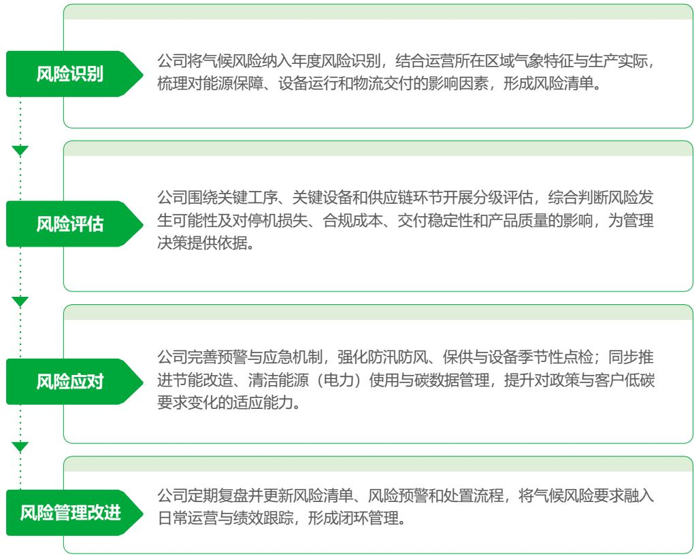

flowchart

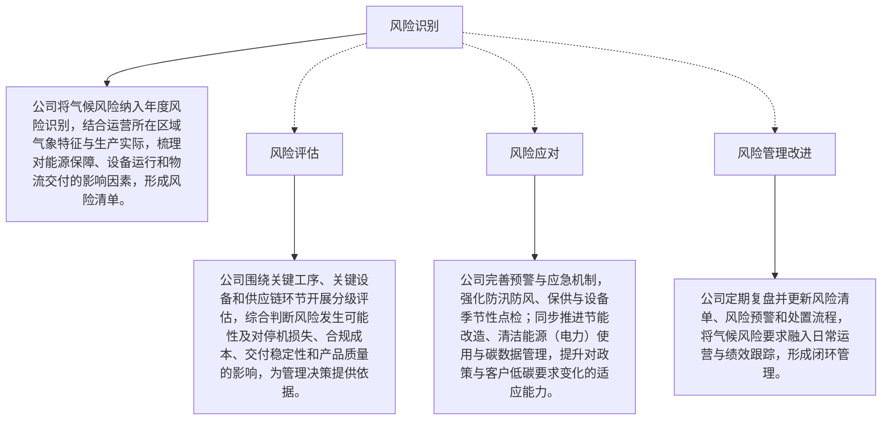

## 指标与目标

公司将“2050年实现碳中和”作为可持续发展战略目标，持续健全碳管理体系，系统推进温室气体排放盘查与产品碳足迹评估等工作，不断提升碳数据管理与减排能力。报告期内，公司参照ISO 14001、ISO 14064、ISO 14067 等相关标准推进温室气体管理基础工作，开展碳盘查与碳足迹评估，并通过节能减排项目和工艺改造提升能源利用效率，合计减少碳排放 1,749.41吨。

面向未来，公司将以提升能效、优化能源结构和推进绿色电力应用为工作重点，制定并落实中期减排目标，并持续完善数据管理与绩效跟踪机制，推动减排目标按计划落地。

## 目标：

到2030 年将清洁能源（电力）使用比例提升至50%  
到2035 年单位产品碳排放强度较基准年2022 年降低80%  
到2050 年实现运营层面（范围一、范围二）碳中和

温室气体范围一、二排放量3

<table><tr><td>指标</td><td>单位</td><td>2025年</td><td>2024年</td></tr><tr><td>温室气体直接排放量(范围一)</td><td>吨二氧化碳当量</td><td>41,495.98</td><td>10,485.59</td></tr><tr><td>温室气体间接排放量(范围二)4</td><td>吨二氧化碳当量</td><td>307,258.84</td><td>429,527.02</td></tr><tr><td>温室气体排放量(范围一、二)</td><td>吨二氧化碳当量</td><td>348,754.82</td><td>440,012.61</td></tr><tr><td>单位产品温室气体排放量</td><td>吨二氧化碳当量/吨产品</td><td>0.78</td><td>1.61</td></tr></table>

## 产品碳足迹

2025年，中科电气围绕低碳发展要求，积极推进产品碳足迹评估与管理工作。公司参照ISO14064 标准修订《温室气体盘查管理程序》，并参照 ISO 14067 标准制定《产品碳足迹管理程序》。在标准化制度框架下，我们逐步完善产品碳足迹核算边界与数据管理机制，推动碳足迹管理与生产运营、产品研发及供应链管理相衔接，为公司低碳转型提供可量化、可追溯的基础支撑。

公司结合产品全生命周期过程，对原材料获取、原辅料与包装材料运输、生产制造过程中的能源消耗、产品仓储与物流配送、产品交付及使用等环节开展碳足迹识别与分析，梳理各阶段的碳排放来源与关键影响因素，进一步识别碳足迹减排潜力与改进空间。在此基础上，公司将碳足迹评估结果用于指导生产工艺优化与资源效率提升，并推动研发与应用低碳环保新材料、开发低碳产品等工作，持续提升产品低碳竞争力。

## 产品碳足迹目标

中科电气根据客户对产品碳足迹信息披露与减排要求，持续开展重点产品的年度碳足迹核算工作。公司完成了 款产品碳足迹核算，其中 款人造石墨产品取得产品碳足迹认证。公司对指定产品进行核算，并在取得核算结果后，结合客户对该产品提出的碳足迹目标与要求，协同推进工艺优化、能效提升及绿色电力使用等措施，尽可能支持客户实现其产品端减排目标与供应链低碳管理需求。面向未来，公司将进一步夯实产品碳足迹管理能力，强化与供应链上下游的协同减排，推动产品端低碳改进措施落地实施。

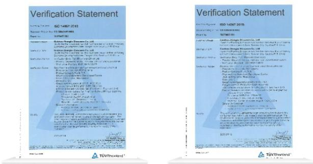  
碳足迹核查声明认证

natural_image

Aerial view of a dense forest with numerous green and yellow trees (no text or symbols visible)

## 高效利用资源

中科电气坚持将资源节约与循环利用贯穿生产运营全过程，推动能源、水资源与物料的精细化管理，持续提升资源利用效率。报告期内，公司结合生产工艺特点与基地运行实际，完善管理流程与台账机制，推进节能改造、清洁能源（电力）使用与水资源规范管理，同时强化固体废弃物分类回收与资源化利用，促进资源投入、过程消耗与末端处置的协同优化，助力绿色制造与高质量发展。

## 循环经济

中科电气将循环经济理念融入生产运营与供应链管理，持续推动资源节约、废弃物减量与资源化利用协同推进。

## 包材托盘循环利用

在运营层面推动包材托盘循环使用，与合作伙伴共建回收网络，显著减低包材托盘消耗。

## 副产物综合利用

探索废焦油等副产物综合利用路径，用于水泥窑热值供应或作为其他行业燃烧油制造原料，提升资源化利用水平。

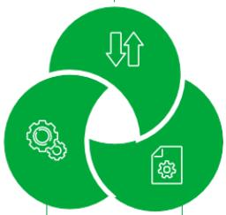

flowchart

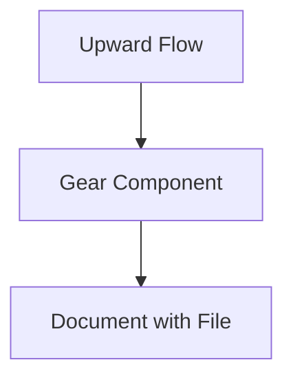

## 废弃物处置规范

对废吨袋、废金属、脱硫渣等固体废弃物实施分类收集并开展资源回收利用；持续完善废弃物管理与资源综合利用机制，围绕固废分类、回收处置、合规管理与台账记录等关键环节建立流程要求，并将相关要求嵌入日常运营管理与供应商协同，确保执行，以及监督过程。

2025年度，公司持续推进固体废弃物分类回收与资源化利用工作, 同时注重资源循环利用与副产物综合利用，带动原辅料消耗与处置成本优化，并形成环境效益与经营效益的协同提升。

## 能源管理

报告期内，公司完善能源管理统筹机制，通过修订《能源管理体系手册》进一步优化职责分工与管理边界，推动能源管理工作在制度执行、目标分解、过程监督与绩效评估等方面实现闭环管理。同时，公司持续强化能源管理体系建设，2025 年，湖南中科星城、贵州中科星城、贵安新区中科星城三大生产基地通过ISO 50001能源管理体系认证，体系覆盖率达到60%，为公司系统化推进减排工作提供制度保障。

在日常运营过程中，中科电气统筹推进节能降耗与清洁能源（电力）替代，围绕能源结构优化与用能效率提升两个方面协同发力。

## 优化能源结构

在能源结构方面，公司稳步提高绿电使用比例。2025年度，公司的绿电使用量为1,341,259,525kWh占公司总用电量73%，主要通过购买绿证、绿电交易及屋顶光伏发电方式实现。面向中长期，公司明确提出到 年实现清洁能源（电力）使用占比达 的目标，并在 年实现清洁能源（电力）占比73%的阶段性目标。

## 2025年清洁能源使用数据

清洁能源使用量（电力）

1,341,259,525千瓦时

清洁能源（电力）使用比例

73.00%

## 推进节能改造

公司聚焦于关键能耗环节开展节能改造与工艺优化，重点推进碳化 / 石墨化等重点工序设备升级、石墨化冷却水泵无铁芯电机应用改造等工作，并同步开展制粉工序流程优化、整形线真空系统升级、破碎产线改造、空压机能效提升及循环水泵能效升级等项目，推动节能措施由点及面落地。

## 节能改造措施实践案例

## 整形线罗茨风机代替真空机组项目

2025年2月，铜仁基地通过改造整形工序负压输送环节，将真空机组替换为罗茨风机，实现分区域控制降低能耗。项目实施后，累计节约电量 84.75 万 kWh，折合 104.15吨标煤。

## 隧道窑风冷节能改造

2025年3月，贵安基地完成隧道窑出口冷却风机控制技改，实现坩埚靠近才联动开启，降低空转能耗。项目实施后，累计节约电量8.67万 KWh，折合10.66吨标煤。

## 空压机能效提升项目

年 月，宁乡基地通过调配其他基地二级能效空压机，替换三级能效空压机，提高空压系统能效水平。项目实施后，累计节约电量41.5万kWh，折合51吨标煤。

能源消耗使用绩效

<table><tr><td>指标</td><td>单位</td><td>2025年</td></tr><tr><td>直接能源消耗量</td><td>吨标煤</td><td>10,109.18</td></tr><tr><td>--天然气消耗总量</td><td>万立方米</td><td>730.04</td></tr><tr><td>--汽油消耗总量</td><td>吨</td><td>20.77</td></tr><tr><td>--柴油消耗总量</td><td>吨</td><td>253.27</td></tr><tr><td>间接能源消耗量</td><td>吨标煤</td><td>226,786.52</td></tr><tr><td>--外购电力消耗总量</td><td>万千瓦时</td><td>184,529.31</td></tr><tr><td>综合能源消耗量</td><td>吨标煤</td><td>237,033.43</td></tr></table>

## 循环水泵节能改善项目

2025 年1-11月，宁乡基地停用15 台3级能效循环水泵，并陆续更换为1级能效，提高能效水平。项目实施后，累计节约电量89.09万kWh，折合109.49吨标煤。

## 水资源利用

公司高度重视水资源节约与规范管理，将降低用水消耗作为重要目标，持续制定并落实有效措施，完善用水全过程管理，提升水资源利用效率。

公司用水以冷却水循环使用为主，2025 年度，冷却水循环利用率为100%。

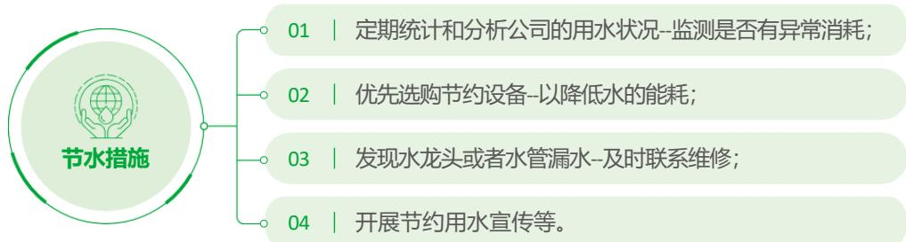

flowchart

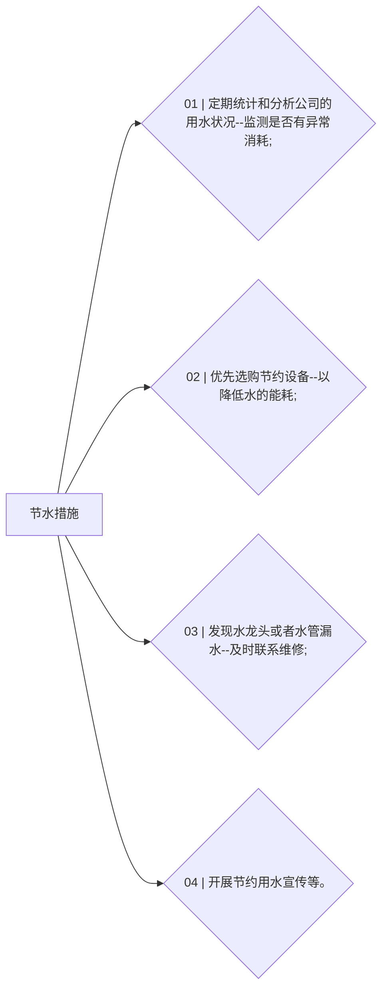

节水措施

2025年水资源管理数据

<table><tr><td>单吨产品耗水量</td><td>较2024年降低</td></tr><tr><td>4.08立方米</td><td>11.03%</td></tr></table>

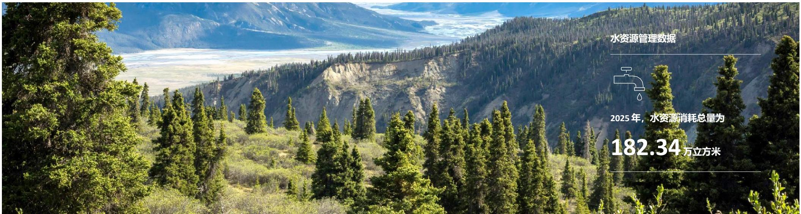

text_image

水资源管理数据
2025年，水资源消耗总量为
182.34万立方米

## 共建生态家园

中科电气将污染物排放控制、废弃物规范处置与生态系统和生物多样性保护纳入环境管理重点，持续完善管理机制与过程管控要求，推动各基地与职能部门落实合规处置与风险防控。公司坚持预防为先，极力降低自身运营对周边环境的影响，助力提升生态环境质量，推动企业发展与自然环境保护协同共进。

## 环境管理

2025年，中科电气进一步明确环境管理目标，提出“环境污染零事件”的年度目标并实现达成。围绕目标落实，公司持续开展环境风险识别与能力建设，强化应急预案与演练管理，推动环境管理体系有效运行与持续改进，为公司绿色运营与高质量发展提供坚实保障。我们将环境保护作为企业经营管理的重要内容，秉持设定的EHS方针，推动各生产基地环境管理能力稳步提升。

公司依据ISO 14001 环境管理体系标准建立并运行环境管理体系，采用PDCA闭环管理模式，系统的管控流程，确保环境管理工作规范化、制度化开展。2025年度，公司定期组织环境内部审核与管理评审，评价体系运行有效性及管理方针适宜性，并结合最新法律法规要求与公司实际情况，对相关管理方针与制度文件进行动态更新，持续提升环境管理水平与合规绩效。报告期内，公司完成 ISO 14001 环境管理体系监督审核，各生产基地均已获得体系认证，覆盖率为 100%。

## 2025年

各生产基地均已获得ISO14001体系认证，覆盖率为

100%

中科电气组织制定并实施《突发环境事件应急预案》，通过强化环保风险管理机制，不断提升环境事件处置与应对能力。 年，公司制定年度环保应急演练计划并组织实施，全年共开展应急演练3次，通过演练检验预案可操作性、完善应急流程，持续强化一线人员环境应急意识与处置能力。

此外，组织开展1次全面环境风险识别与培训，系统评估主要环保风险，并针对极端气候或气候不稳定、初期雨水处理不彻底等关键风险点制定改进措施，推动风险闭环治理与管理能力提升。

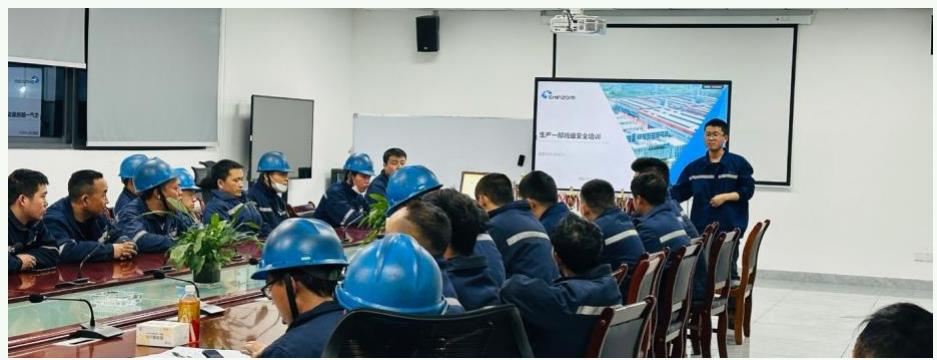

text_image

Meeting scene with a presenter and attendees wearing blue hard hats, facing a presentation screen displaying Chinese text about industrial production.

## 安全环保培训

报告期内，公司环保总投入为2,856万元，实现“环境污染零事件”的年度环境管理目标，全年未发生任何环境负面事件。

## 2025年

公司环保总投入为

2,856 万元

环境污染事件

0 件

## 废弃物与污染物管理

中科电气围绕排放合规、过程管控与风险防范开展统筹管理，持续提升污染防治设施运行稳定性与现场管理水平。

中科电气已制定“三废”管理制度，包括《废弃物管理制度》《噪声管理制度》与《废气管理制度》等。公司定期开展对各单位废弃物管理情况的月度监督检查，重点检查分类收集规范度、贮存规范度、台账完整性及处置合规性等，对发现问题下达《整改通知书》，明确整改期限与要求。我们同时设立落实责任追究制度，对违反制度规定的行为予以通报批评、经济处罚，构成违法的移送司法，并对危废分类贮存不规范、违规运输交叉污染、台账缺失或信息虚假不完整、监测设备未正常运行或隐瞒篡改监测数据、拒不整改或应急处置不力引发环境污染事件等情形进行严肃追责。 年，公司强化考核评价系统，将废弃物管理工作纳入各部门年度绩效考核，对严格遵守制度、实现源头减量或资源化利用成效显著的单位及个人予以表彰。

公司持续强化废气、废水及固体废弃物全过程管控，严格落实在线监测与第三方运维要求，推动污染物稳定达标排放与废弃物合规处置、资源化利用协同推进。

natural_image

Mountain landscape with lush green forested slopes under a partly cloudy sky (no text or symbols visible)

## 废弃物种类

  
废气排放

## 管制举措

监测与在线管控：公司重点管控颗粒物、二氧化硫、氮氧化物等废气污染物。主要排放口严格遵守《大气污染防治法》配置 CEMS 在线监测设备并落实“三监一控”管理要求，同时委托具备资质的第三方开展定期维护保养，确保监测设备稳定运行。一般排放口按要求制定年度环保自监测计划并按要求频率组织监测，按时向社会公开监测结果。  
合规排放：二氧化硫采用石膏脱硫法治理，VOCs采用焚烧法处理，颗粒物采用布袋除尘措施  
优化改造：公司于2025年度完成碳化焚烧炉更换改造，有效避免因补风导致的氮含量偏高问题，提升废气监测稳定性与有效性，保障排放数据质量与达标排放管理。

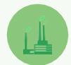  
废水排放

生活污水合规处理：生产运营过程中产生的生活污水送至厂区化粪池后进入生活污水管网，之后排入工业园区集中污水处理厂，废水排放符合《城镇污水排放》三级标准要求，达标率为100%。  
其他：公司运营不涉及工业废水，产生的实验室废液按危险废物规范收集并合规处置。

  
固体废弃物

公司主要一般固废包括脱硫石膏、废吨袋、焦油等。公司在确保一般固体废物与危险废物处置合规的同时，优先选择既具备资质又能实现回收价值的处置单位，保障废弃物处置达标并促进资源化利用。  
焦油等废弃物在合规处置基础上探索综合利用路径，可用于水泥窑热值供给或作为其他行业燃烧油制造原料，实现一定程度的资源有效利用。

公司固体废弃物坚持分类收集、规范贮存与合规处置。

生活垃圾委托环卫部门收集。  
工业废物由废品收购单位回收再利用。  
危险废物委托有资质第三方单位收集处置。  
吨袋、尾粉、木托盘等实施回收管理，脱硫石膏、废焦油等委托有资质的机构处置。

2025年度，公司污染物排放对周边环境无影响，未发生因污染物排放导致的重大行政处罚或追究刑事责任情况。相关污染物均实现达标排放，全年废气、废水实现100%达标排放，废弃物合规处置率为100%。

## 2025 年

全年废气、废水实现达标排放

100%

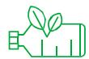

废弃物合规处置率为

100%

废弃物与污染物绩效表

<table><tr><td>名称</td><td>单位</td><td>2025年</td><td>2024年</td></tr><tr><td>无害废弃物产生总量(一般废弃物排放总量)</td><td>吨</td><td>7,505.10</td><td>3,036.95</td></tr><tr><td>有害废弃物产生总量(危险废物产生总量)</td><td>吨</td><td>6,067.94</td><td>3,748.68</td></tr><tr><td>废弃物产生总量</td><td>吨</td><td>13,573.04</td><td>6,785.63</td></tr><tr><td>可回收废物产生总量</td><td>吨</td><td>2,073.12</td><td>1,168.20</td></tr><tr><td>二氧化硫排放总量</td><td>吨</td><td>5.76</td><td>6.68</td></tr><tr><td>氮氧化物排放总量 $^{5}$ </td><td>吨</td><td>11.61</td><td>4.95</td></tr><tr><td>颗粒物排放总量 $^{6}$ </td><td>吨</td><td>2.65</td><td>19.14</td></tr></table>

natural_image

Aerial view of a winding road through a lush green forest beside a turquoise lake (no text or symbols visible)

52025 年增加4条造粒产线，相关产能增加致使氮氧化物排放总量增加。  
62024 年与 2025 年数据差异主要系统计口径差异，经调整后 2025年度相关数据与排污许可证许可排放统计口径一致。

## 生态系统和生物多样性保护

中科电气高度关注生产经营活动对生态系统与生物多样性的潜在影响，严格落实建设项目生态环境保护要求，将生态保护红线、自然保护地及饮用水水源保护区等敏感区域管控作为项目选址与建设运营的前置条件，通过环评合规审查、现场踏勘与基础信息调查等方式，系统识别并防范对生态敏感要素的扰动风险，确保公司项目建设与生态环境保护要求相一致。

公司重点关注建设项目生态环境管理，依托生态环境影响评价及合规管理机制，对项目用地合规性开展审查把关。2025年，公司所有项目均按要求完成生态环境评价，项目用地明确不涉及生态保护红线范围。

此外，公司在运营管理中强调生态保护要求，明确在日常运营过程中禁止对蛇类等野生动植物的捕猎及砍伐相关行为。同时，公司确认报告期内项目用地不涉及野生动植物保护、自然栖息地保护恢复等敏感事项。

## 案例｜贵安新区项目环境影响评价

公司在环评阶段查阅《贵州省生态保护红线管理暂行办法》（黔府发〔2016〕32 号）等文件，并对项目周边生态敏感目标进行现场调查与基础环境信息收集，获取包括植被现状、动物资源、土壤类型及分布等在内的生态环境基础信息。

经识别，项目区域不在“贵安新区松柏山水库集中式饮用水源保护区”及“贵阳市花溪水库集中式饮用水源保护区”范围内。同时，调查未发现国家重点保护的珍稀植物和古树分布。

natural_image

Aerial view of turquoise ocean waves crashing along a rocky shoreline surrounded by dense green forest (no text or symbols visible)

## 03

## 初心如磐笃行尽责致远

中科电气秉持笃行责任理念，以科技创新驱动绿色转型，持续提升产品品质与可靠性，构建以客户为中心的高效服务体系，健全数据治理机制，强化与利益相关方的双向沟通与协同共治。同时，公司积极推进责任供应链建设，构建绿色、合规、可持续的供应链生态，以实现经济、环境与社会价值的协同创造。

natural_image

Digital globe with interconnected icons representing technology, infrastructure, and user interaction (no text or symbols)

## 本章节对应的联合国可持续发展目标

8体面工作和工RITI 经济增长

9产业、创新和 基础设施

12 负清贡生产产 负责任

17 促进目标实现的伙伴关系

## 引领科技创新

我们始终将科技创新作为驱动可持续发展的核心引擎，持续加大研发投入，健全研发管理体系，优化创新资源配置，推动研发活动与战略目标全面对接。公司聚焦关键核心技术攻关，强化研发成果转化与产业化应用，不断提升技术领先优势与市场竞争力。同时，公司高度重视知识产权创造、运用与保护，构建全生命周期知识产权管理体系，有效支撑创新成果的合规化、资产化与价值化，全面夯实公司长期创新根基与可持续发展能力。

## 科研管理及投入

为保障创新战略的有效实施，公司建立了覆盖全流程的科技创新项目管理制度，形成从立项、过程管控到激励的闭环管理体系。

公司深刻认识到技术创新是推动企业可持续增长与支持环境友好转型的核心驱动力。我们加强研发平台建设与高端人才引育，系统构建可持续的自主创新能力体系。通过不断加大投入研发资金，公司不仅强化了核心技术的储备与迭代，也为产业链的绿色转型与低碳发展奠定了坚实的技术与产业基础。2025年，公司研发投入为24,946.56万元。

## 报告期内

公司研发投入

24,946.56万元实施分级预算审批，经技术评审、战略匹配、管理层核定三级把关，确保资金投向与战略高度契合。

科技创新项目管理制度

<table><tr><td>立项阶段</td><td>严格执行“申报-专家评审-管理层审批”三级机制;对项目进行技术可行性、市场前景、战略匹配度及预算合理性的综合评估;</td></tr><tr><td>实施过程阶段</td><td>通过阶段划分、动态跟踪与节点管控相结合的方式,建立进度、资金与风险联动的精细化监控机制;</td></tr><tr><td>激励层面</td><td>推行以成果转化为导向的分级奖励制度,依据专利产出、技术突破与经济效益等维度,匹配多元激励方案,持续激发团队创新动力,保障研发投入的有效性与战略性。</td></tr></table>

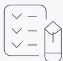

开立专项账户专款专用，支出需凭立项批复、费用明细等凭证结算。

强化审计与绩效挂钩，内部季度核查、外部年度审计，资金使用效率与项目负责人绩效考核直接关联。

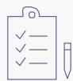

研发资金管理流程

公司搭建专业化、系统化的研发实验平台，覆盖负极材料与磁电装备两大核心业务领域。

## 研发实验平台业务

## 锂电负极材料研发实验室

▪ 配备国内先进的材料物理性能检测、半电池及全电池电化学测试体系  
建有涵盖粉碎、分级、烧结、包覆等关键工艺的完整试验生产线，支撑材料从研发到中试的全链条创新

## 磁电装备研发实验室

拥有流体仿真数字中心、电子电力实验室、水力试验平台、电磁搅拌系统联调平台、感应加热系统联调平台、磁选测试平台、大功率变频电源测试平台等多元化研发与测试设施，为装备技术的持续优化与突破提供平台支持

此外，公司高度重视人才在推动技术创新与可持续发展中的核心作用，着力构建了一支专业化、高水平的研发团队。团队成员具备深厚的专业背景与丰富的行业经验，核心骨干毕业于包括美国明尼苏达大学、厦门大学、北京师范大学、北京科技大学、西北工业大学、中南大学、湖南大学等在内的国内外知名高等院校。多元化的教育背景与持续的技术积淀，为公司在前沿材料与高端装备领域的研发突破提供了坚实的人才保障与智力支持。2025年，公司研发人员数量达463人，研发人员数量占比11.63%。

## 2025 年

公司研发人员数量达

463 人

研发人员数量占比

11.63%

## 科技研发成果

在技术创新战略的持续推动下，公司研发工作取得一系列实质性成果。通过系统化攻关，已成功突破并掌握关键核心技术，形成具有自主知识产权的技术体系，不仅体现了公司的自主研发与创新能力，也为业务可持续发展构筑坚实的技术壁垒，助力公司在负极材料与磁电装备领域保持技术领先地位。

## 科技创新项目案例

## 硬碳材料成功量产

完成硬碳材料全流程产品开发，突破关键工艺瓶颈，实现产品性能稳定达标。  
顺利打通规模化量产生产线，达成连续化、低成本稳定生产，形成可批量供货能力。

## 硅碳材料进入量产导入

经过头部客户多轮严格的测试验证，CVD硅碳材料产品各项性能指标均达到客户预期标准并符合实际应用需求，产品完成测试验证并进入量产导入阶段，为后续规模化生产、稳定供货奠定坚实基础。

## 石墨改性技术

通过元素掺杂改变石墨表面化学环境，从而调控SEI 组成和分布，快充性能显著提升，该技术已成功量产应用于6C负极产品。

## 高端钛材的精准控温技术

在宝鸡钛业股份有限公司、陕西天成航空材料有限公司实现了钛棒温度均匀性±15℃，优于进口装备。  
推动我国航空航天、医用植入体等高端钛材从“达标生产”迈向“精准控质”。

## 大功率高频感应加热技术

不仅在无头带钢连铸连轧（ESP）产线上实现了工业化应用，并成功签约国内首条国产化ESP产线项目，为行业提供“高效电能利用+ 绿色生产”的工业选择。

## 科技创新成果

## 高可靠高密度板坯电磁冶金关键技术

该技术已在日照钢铁、沙钢、包钢等企业成功应用，成功解决了超宽 、超厚连铸板坯冶金效果的稳定性难题。技术成果已被纳入冶金标准《连铸坯质量控制技术规范》，成为行业连铸坯质量提升的标杆技术，全面覆盖新能源硅钢、核电钢、航空轴承钢等关键材料。

## 复合磁场电磁搅拌技术

该技术成功攻克了高拉速连铸条件下，高品质特殊钢中心偏析与疏松的质量控制难题。目前，该技术已广泛应用于湘钢、沙钢等国内多家主流特钢企业，助力其轴承钢、齿轮钢等关键产品实现品质飞跃，有力推动了我国高效连铸技术向高拉速、高品质的战略转型。

## 知识产权保护

公司高度重视知识产权保护工作，严格遵循《企业知识产权管理规范》（GB/T29490-2013）、《质量管理体系要求》（GB/T19001-2016）及《知识产权文献与信息基本词汇》（GB/T21374-2008）等国家标准，结合自身业务特点与实际运营需求，系统制定了《专利申请管理制度》《专利质量管理规范》《专利检索规范》等一系列内部制度，持续完善知识产权管理体系。通过制度规范与流程优化，公司着力提升知识产权的创造、管理、运用和保护能力，有效激励员工开展自主研发与技术创新，推动生产技术持续进步，从而增强企业市场竞争力和经济效益。为强化知识产权保护在业务全流程中的法律效力，公司于2025年执行采购合同模板中增补知识产权的相关条款，进一步筑牢合规运营与风险防控的基础。

<table><tr><td>数据</td><td>2023年</td><td>2024年</td><td>2025年</td></tr><tr><td>研发投入(万元)</td><td>25,275.88</td><td>20,261.37</td><td>24,946.56</td></tr><tr><td>研发人员(人)</td><td>481</td><td>431</td><td>463</td></tr><tr><td>累计授权专利数据(项)</td><td>194</td><td>218</td><td>268</td></tr><tr><td>正在申请专利数据(项)</td><td>160</td><td>209</td><td>238</td></tr></table>

## 2025 年

授权发明专利 34项（其中含海外专利1项）

授权实用新型专利 30 项（其中含海外专利1项）

## 铸就卓越品质

在推动可持续发展的进程中，我们始终将产品与服务质量以及客户协同发展置于公司运营的重要位置。我们致力于通过构建并持续完善系统化的质量管理体系，全面保障产品全生命周期的可靠性与一致性，持续提升客户满意度，夯实公司长期健康发展基础。

## 质量体系管理

公司严格遵循 IATF16949 及 ISO 9001 等国际质量管理体系标准，系统构建并持续完善覆盖从产品设计开发、量产下线到客户端应用的全流程质量管控机制。通过科学策划与量化分解质量目标，建立健全并持有优化的制度与监控流程，确保体系要求有效执行，为产品质量的持续稳定与客户信赖提供坚实保障。 年，公司进一步聚焦重点产品，编制了《质量保证大纲》，并对维修技术标准开展了系统性修订。截至 年 月 日，各生产基地均通过ISO9001质量管理体系认证，通过率100%，其中新能源材料事业部各生产基地均通过IATF16949 体系认证。

## 截至 2025 年 12 月 31 日

各生产基地均通过了ISO9001质量管理体系认证，通过率

100%

其中新能源材料事业部各生产基地均通过IATF16949体系认证

natural_image

Interior view of a large industrial plant with multiple piping and steel structures, no visible text or symbols.

## 数字化建设

数字化质量管理是从“经验驱动”到“数据驱动”的质量范式跃迁。我们以数字技术重塑管理流程，通过全要素连接、全过程追溯与全场景智能，构筑起动态感知、实时预警、闭环优化的韧性质量体系。

## 数字化系统

## 成效

  
数据集成系统

公司通过集成SAP（企业管理软件系统）、LIMS（实验室信息管理系统）、QMS（质量管理系统）、SRM（供应商管理系统）及 OA（办公自动化系统）等核心系统，打破质量数据孤岛，实现跨平台数据融合与实时分析，推动质量管控前移，强化全过程监控与风险预警，显著提升质量预防能力与管理效能。

  
LIMS系统导入

为实现测试数据共享与快速抓取追溯，支持多设备数据格式兼容，提升数据准确性与实验室信息化管理水平，公司2025年积极推动宁乡、铜仁、贵安、曲靖等生产基地导入LIMS系统。

  
QMS系统上线

公司于 2025 年推动建设质量管理体系（QMS）数字化平台，实现了从传统线下管理向数字化质量管理的全面转型，有力推动了跨生产基地的数据共享与质量管理协同，确保流程可视化，显著提升了质量管控过程的透明度与响应效率。

为进一步强化系统功能，公司持续优化该平台，增加计量管理、质量数据管理及问题管理三大模块，以数字化手段不断完善全链条质量管理能力，为产品质量的稳定与提升奠定了坚实的技术基础。

## 质量文化活动

公司通过系统化的质量文化培育与多维度的管理实践，不断提升全员质量素养，深化全流程质量管控，以高品质产品与服务为客户创造长期价值。

## 案例｜组织开展系列质量提升行动

2025年9月，公司磁电装备事业部系统组织质量管理培训、知识竞赛、现场巡检与QC小组交流等活动，全面强化员工质量意识。我们聚焦关键环节，深化质量隐患排查与改进。同时，公司积极推动质量管理体系与数字化工具融合，提升全流程质量管控效能，将“树匠心、育匠人、出精品”的理念贯穿于生产经营各环节，为企业高质量发展提供坚实支撑。

text_image

Group photo of factory workers in uniform speaking at a meeting, with visible signage and a blue sign reading '下料车' (Down Material)

公司组织开展质量提升行动

## 案例｜开展“以敬畏致匠心，守红线谋长远”质量月活动

年，公司开展 以敬畏致匠心，守红线谋长远 主题质量月活动。公司新能源材料事业部各个基地联动开展了质量意识提升、制造体系穿透式审核、关键流程运行诊断与改进和基地特色活动四大关键活动，调动了全体员工参加的积极性，深入宣贯质量意识。

text_image

Classroom scene with students in blue uniforms seated at desks, featuring a safety poster on the wall reading '防火防盗防诈骗' (Fire Isolation, Is Fraud Police)

公司开展质量月活动

## 有害物质管理

公司参照 IECQQC 080000:2017《电气和电子元器件及产品有害物质过程管理体系要求》持续优化管理体系，于2025年对《有害物质限用管理规范》进行系统性修订，进一步扩充有害物质管控范围，并依据最新行业标准及法规要求，增加相应的有害物质送检项目。在此基础上，公司全面组织对旗下产品、原材料及半成品实施新一轮的送检工作，确保所有环节符合高标准环保要求。

同时，公司对特定岗位技能矩阵进行更新，明确增加有害物质管理相关技能要求，确保在应对有害物质相关投诉时，能够依据既定的投诉管理流程实施有效管控，并实现问题的闭环处理。

## 风险预警与应急机制

自2023至2025年间，公司未发生因有害物质的客户投诉事件，未发生因供应商来料有害物质处罚案件，持续为客户提供值得信赖的绿色解决方案，助力实现负责任的商业未来。

若进料、制程、成品或客户处发现产品环保材料中含有禁用物质或其含量超出技术规范，按照 环保材料品质异常处理流程”《应急预案》处置。

过程中将对相关产品实施有效隔离，系统追溯问题根源，并推动落实闭环整改，直至所有纠正与预防措施执行完毕，确保不符合事项得以彻底解决。

产品全生命周期环保规范化管理体系

## 客户服务管理

中科电气坚持以客户为中心，通过建立高效、透明的管理机制，为客户提供高质量服务。公司依据相关规定评审《顾客合同评审程序》《交付控制程序》《服务管理程序》《顾客满意度监视测量程序》等核心客户管理流程，全面识别关键服务环节的优化空间。为强化客户服务端风险防控，2025年，公司新增《出货评审流程》，要求依据文件规定在出货前系统识别潜在风险，切实防范问题流入客户端。

同时，公司深化客户服务质量监督机制，每半年开展顾客回访，对售后CRM工单执行情况实施抽样评估，全年回访合格率达100%，有效验证了服务流程的规范性与执行有效性，彰显公司在客户责任履行与内部质量管控方面的持续提升。

## 售后管理体系

公司依据ISO 9001 体系要求，系统构建了覆盖全生命周期的售后管理体系，制定并完善售后相关文件制度，确保对客户诉求的响应具备规范性、可追溯性与持续改进能力，切实提升客户投诉处理的及时性与有效性。

2025年，公司结合内外部反馈意见，对《客户投诉处理规范》进行修订，并发布《客诉处理作业指导书》，明确中心与基地业务部门的职责分工与操作标准，指导各层级高效响应《客户投诉处理规范》要求，确保客诉调查与处理全过程按SOP 推进、可追溯、可闭环。

在团队建设方面，公司整合并组建销售、研发与质量职能，组建跨部门协同的售后专项团队，实现客户要求从接收、传递到执行的全流程无缝衔接，有效避免信息断层与响应延迟，全面提升客户问题闭环管理能力与服务协同效率。

2025年，公司针对战略性及重点客户在售后质量服务方面深化专人专岗机制，并推行销售、技术与质量协同联动的“铁三角”服务模式，实现客户需求响应的高效协同与精准落地，全面提升服务质量和效率。

同时，公司持续优化CRM系统，由售后部门指定专人负责维护，对每笔安装调试、售后服务及技术支持工单实施全过程跟踪，确保服务过程可追溯、可闭环，有效提升客户服务质量与管理透明度。

2025年，公司对客户投诉管理系统全面升级，将系统由 OA 平台迁移至 QMS平台，实现流程集中化与数据可视化管理。该举措显著缩短了处理周期，提升了问题解决的及时性与透明度，进一步增强了客户满意度与服务可靠性。截至2025年12月31日，公司客诉解决率100%。

## 内部满意度评估开展情况

## 质量方面

强化全过程质量管控及流出端质量防守，全年重大客诉0起，客户端满 意度持续提升

## 交付方面

通过建立安全库存机制与制定应急响应计划，有效保障交付稳定性与及时性

## 商务方面

提升销售、质量与技术部门的跨职能协作效率，推动商务绩效稳步改善

## 携手伙伴共赢

公司始终秉持可持续发展理念，聚焦负极材料与磁电装备两大核心业务领域，近年来通过深化产业协同、优化战略布局，积极推动产业链绿色低碳转型与技术升级。

公司积极参与行业标准化建设，作为起草单位深度参与了《T/CAPS048-2025连铸坯质量控制技术规范》等团体标准的制定工作，致力于推动行业技术规范与质量提升。

2025年，中科电气与成都产业投资集团有限公司签署《全面深化战略合作协议》。双方围绕锂电负极材料业务开展全面协同，通过整合各自在资源、资金、管理及人才等方面的优势，合力构建绿色、可持续的产业合作体系，致力于推动负极材料产业链在四川省和成都市的低碳化、高质量发展，提升中国新能源材料在全球市场的综合竞争力，实现经济、社会与环境效益的协同共赢。

同时，公司高度重视人才发展与知识创新，积极与多所高等院校建立并深化战略合作伙伴关系。在锂电负极材料领域，公司与清华大学、中建材等8家单位联合开展了国家工信部2024年产业基础再造和制造业高质量发展专项—“电池用高性能石墨负极材料”项目，负责6C人造石墨负极材料验证和规模化量产，旨在突破高倍率快充型负极材料关键制备技术，提升产品循环稳定性与快充动力学性能，推动高性能石墨负极材料国产化替代与产业化落地。在特种冶金技术领域，公司与昆明理工大学联合开展了“特钢连铸MEMS+FEMS组合式电磁搅拌铸坯质量控制”关键技术开发项目，通过协同创新提升材料质量与工艺水平，助力行业技术进步。此外，公司与武汉科技大学共同推进感应加热技术在中间包结构优化方面的研发与应用，旨在通过工艺创新提升生产能效与资源利用效率。公司通过校企合作，积极推动产学研深度融合，为行业绿色转型与高质量发展注入创新动力。

natural_image

Aerial view of a modern industrial complex with red and blue facades, featuring a prominent 'SHINZOM' building in the foreground (no signage or text on main structures)

## 建设责任供应链

中科电气持续推进责任供应链建设，构建系统化治理架构与全链路风险管控体系，将责任理念与合规要求深度融入供应商遴选、合作评估、协同发展的全流程，以明确的管理战略、量化的绩效指

## 供应商管理

合规、安全、可持续的供应链是公司供应链管理的重点，中科电气遵守《中华人民共和国招标投标法》《中华人民共和国招标投标法实施条例》及其他运营所在地相关法律法规之要求，制定《供应商管理控制程序》《招标管理制度》《负责任供应链尽职调查管理体系》等内部管理制度文件，对供应商准入、分类、评价、审计、质量控制、风险管理与廉洁管理等关键环节进行全面管理，持续完善供应商全生命周期管理体系。2025年，公司细化《供应商管理控制程序》对原料供应的合规性、一致性提出明确指引，助力提升供应链原料管理的规范化水平。

flowchart

公司持续完善供应商全生命周期管理流程，2025年公司重点推进管理体系升级与数字化转型。在管理体系升级层面，构建形成覆盖开发准入、评价维护、绩效分级、合作赋能、动态退出各环节的全流程管理体系，打造“准入、考核、维护、赋能、退出”的管理闭环。

中科电气不断强化供应链安全，持续对所设定的相关指标与计划的达成情况进行定期跟踪，以确保供应链管理计划的有效执行。

中科电气供应链安全管理目标

<table><tr><td>目标</td><td>单位</td><td>2025年数据</td></tr><tr><td>重大供应中断</td><td>次</td><td>0</td></tr><tr><td>风险响应</td><td>小时</td><td>≤24</td></tr><tr><td>核心供应商双源覆盖率7</td><td>%</td><td>100%</td></tr></table>

7 核心供应商双源覆盖率中的“双源”，是指企业为核心物料（或关键零部件、战略物资）配置的两个独立供应商，旨在通过 主供应商 备选供应商 的组合，降低单一供应商依赖风险，提升供应链韧性与稳定性。

## 供应商准入

中科电气严格遵循《湖南中科电气股份有限公司供应商管理制度》《湖南中科电气股份有限公司招标管理制度》等相关规定，规范供应商准入全流程，构建 申请、初审、现场评审、综合审批”四阶段标准化准入机制，对潜在供应商开展全方位、多维度评估审核，从源头把控供应链合规与可持续风险。

公司准入评估维度全面覆盖资质合规性、产品质量稳定性、供应能力保障性及社会责任感，始终坚持绿色低碳优先导向，同等条件下优先遴选通过环境管理体系认证、安全生产标准化达标的供应商，将环保认证与社会责任履行情况纳入核心优先合作条件。同时，公司将ESG风险深度嵌入准入评估环节，把环境管理、社会责任、劳工标准列为准入核心指标，推动供应商同步提升环境与社会责任风险管理水平，助力供应链可持续发展提质增效。

2025年，公司进一步强化新准入供应商ESG风险管控，明确要求所有合作方签署《廉洁协议书》《社会责任书》《安全环保协议书》，分别就禁止商业贿赂、保障员工合法权益、落实环境合规与安全生产主体责任作出明确承诺。同时，通过尽职调查全面核查供应商法律纠纷及信用记录，将合规表现作为准入必要条件嵌入合同条款，并建立协议履行定期复核机制，实现ESG要求贯穿准入全链条，筑牢供应链责任根基，为构建绿色合规、可持续的供应生态提供坚实制度保障。

natural_image

Person gesturing while seated at a desk with a laptop displaying a digital interface (no visible text or symbols)

中科电气供应商合规管理情况

<table><tr><td>指标</td><td>单位</td><td>2025年数据</td></tr><tr><td>供应商廉洁承诺书签署率</td><td>%</td><td>100</td></tr><tr><td>供应商社会责任书签署率</td><td>%</td><td>100</td></tr><tr><td>供应商安全环保协议书签署率</td><td>%</td><td>100</td></tr><tr><td>使用童工和强迫劳动的负面案件</td><td>起</td><td>0</td></tr></table>

## 供应商考核与分级管理

中科电气构建监督机制与日常考核评价体系，强化供应链风险防控，通过合同约定、供应商自评、现场审核等多维方式开展监督，形成日常管理监督与考核评价一体化机制，基于考评结果实施差异化管控与合作策略，精准识别并防控环境与社会风险，2025年，公司在月度绩效评价中新增可持续管理评分标准，并将其纳入年度商务评分综合考量，推动责任要求在日常管理中落地见效。

公司实施年度全面绩效评价与分级管理，每年对供应商开展覆盖供货质量、价格、服务、交期等核心维度的全面评价，结果分为优秀、良好、合格、不合格四级。针对年度评价优良且对公司有重大支持或显著贡献的供应商，下一年度给予优先采购、增加送货比例等激励政策，针对不合格供应商，结合质量部门意见要求其限期整改，对整改不力的供应商，在保障供应的前提下直接取消合作资格，以分级施策实现供应链生态的持续优化。

中科电气供应商分级管理

<table><tr><td>供应商类别</td><td>级别</td><td>合作方式</td></tr><tr><td>考评绩效分数90分以上(含)的供应商</td><td>A(优秀供应商)</td><td>继续合作,并在采购物料的同时,优先考虑</td></tr><tr><td>绩效分数80分(含)-90分(不含)之间的供应商</td><td>B(良好供应商)</td><td>要求供应商对出现的问题进行限期整改,并提交改善报告</td></tr><tr><td>绩效分数70分(含)-80分(不含)之间的供应商</td><td>C(及格供应商)</td><td>限期整改,如果次月绩效评价重复出现不及格事项,降级为D级供应商</td></tr><tr><td>绩效分数70分以下的供应商</td><td>D(不及格供应商)</td><td>要求供应商限期整改,如果次月绩效评价结果仍为D,取消其合格供应商的资格</td></tr></table>

## 供应商赋能

公司以供应链赋能为抓手，通过识别供应商风险后实施帮扶改进与强制管控相结合，助力供应商能力提升与供应链稳定。

natural_image

Person working at a desk with documents and office supplies, including a calculator, graph charts, and notebooks (no visible text or symbols)

## 供应商帮扶改进与强制管控案例

## 案例｜识别供应商风险后：供应商帮扶改进与强制管控案例

## 石墨化加工供应商质量风险帮扶改进：

2025年，石墨化加工供应商质量异常，其出现异物，影响生产。公司联合质量部现场走访、诊断，协助供应商对异物管理流程进行优化并做出改善，经过异物专项整改，持续现场跟进落地情况，后续6个月未发生异物不良，异物管理显著提升，保障生产连续性。

## 供应商退出

中科电气严格规范供应商退出管理，明确退出规则，持续完善供应商全生命周期闭环管控。年，公司发布《湖南中科电气股份有限公司供应商准入和退出流程》，针对不同类别供应商制定并实施差异化退出流程，同步新增以物料品类为基础、参照《供应商绩效评价管理办法》的差异化退出机制，聚焦重大风险设定明确触发条件，具体涵盖发生交货延迟超期、质量不达标致产线停滞或客户投诉等重大合同违约情形，出现货物损毁、运输事故影响交付等重大运输质量问题，以及履约问题整改不积极、不配合协调工作且造成生产中断、成本激增等重大影响的情形。此举强化供应链风险前置防控，从源头淘汰低效高险合作方，保障业务连续性。

## 供应链稳定性

在持续管理过程中，公司通过推动供应商结构多元化分散潜在风险。针对同类物料供应商区域集中度较高、关键物料来源单一的情况，或市场出现具备实力的新供应商时，相关部门优先制定供应商新增计划，同时定期汇总分析主要物料供应商情况，针对合格供应商数量偏少的物料品类，推动商务部门积极引入新供应商，切实降低供应中断风险。

公司强化采购业务应急管理能力，定期组织采购业务人员开展应急预案专项培训，并对预案执行情况进行督导，结合奖惩机制推动落实到位，新入职业务人员的培训内容同步涵盖应急预案相关要求，确保相关制度在实际操作中有效落地。

## 负责任原材料管理

公司积极推进供应链上游原料资源管理，重点评估并分析关键原料供应商的 风险，编制《负责任供应链尽职调查管理体系》，将CAHRAs8 风险原料供应商纳入重点管控范围。公司严格参照国际经合组织（OECD）《关于受冲突影响和高风险区域矿石负责任调查指南》，明确承诺不采购、不使用涉及人权侵犯、贿赂欺诈、洗钱、恐怖主义融资、冲突资助，以及受益人为政治敏感人物或通缉人员等各类高风险原料，从源头筑牢责任供应链防线。

在产业链协同方面，湖南中科星城与中国石化炼油销售有限公司（中石化炼销公司）签订战略协议，成为首家与中石化炼销公司建立战略合作关系的负极材料企业，深度协同践行负责任采购理念。同时，公司针对非垄断原料生产商开展专项尽职调查，明确要求其签署不使用冲突矿产相关协议，将 责任要求全面延伸至上游生产环节，确保供应链全链条合规可控、坚守伦理底线。

## 平等对待中小企业

中科电气在供应链管理中坚持平等对待原则，通过多层次举措消除规模偏见，切实保障中小企业在供应链合作中的公平权益，推动中小企业与公司协同发展，进一步提升供应链韧性与活力。

8 （全称 ，中文意为 受冲突影响和高风险地区 ），在本文中特指高风险矿产尽职调查所针对的风险区域。

natural_image

Interior view of a large industrial warehouse with multiple processing units and stacked pallets (no visible text or symbols)

## 04

## 惠及社会绘就共享之景

中科电气始终秉持以人为本的发展理念，将员工成长、健康福祉与社区责任融入企业可持续发展战略。公司持续构建多元化发展通道，完善培训体系与职业发展机制，助力员工能力提升与价值实现；同时，公司关注员工身心健康，致力营造安全、包容、可持续的工作环境，推动健康促进与心理关怀机制建设；此外，公司积极履行企业公民责任，深化与社区的互动与协作，支持公益事业与地方发展，实现公司与员工、社区的协同发展与价值共创。

## 本章节对应的联合国可持续发展目标

1 无贫穷

3 良好 健康与福祉

4 优质教育

5性别平等

8体济工作和

10 减少不平等

text_image

10 减少不平等

## 赋能员工成长

我们高度重视员工成长，持续完善员工权益保障机制，构建公平透明的职业发展通道，实施以绩效为导向的薪酬激励体系，健全覆盖全生命周期的培训与发展机制，全面支持员工能力提升与价值实现，推动员工与公司共同成长。

## 员工雇佣

公司秉持“人品为先，德才兼备，培养人才比引进人才更重要”的理念，切实保障员工权益，营造平等、尊重、包容、多元的工作氛围，推动员工与企业共同成长。

我们构建公平、包容的职场环境，制定《工作时间控制制度》《禁止强迫劳动和保障自由制度》《禁止使用童工及童工救济制度》《无歧视、无骚扰、无虐待制度》及《女工与未成年工保护制度》等专项制度，全面禁止在招聘、晋升、调薪、培训等各环节发生基于年龄、信仰、民族、种族、肤色、宗教、性别、国籍、残障、服役经历等任何法律禁止因素的歧视或权益侵害行为，切实维护员工合法权益。

截至报告期末，公司共拥有员工3,980 人，少数民族员工1,104人，在管理层中女性管理者占比23.17%，多元包容、高素质的员工团队为公司可持续发展提供了坚实的人才支撑与长期保障。

职工基本情况

<table><tr><td>员工总数</td><td>男女职工比例</td><td>残疾员工</td></tr><tr><td>3,980人</td><td>4.29:1</td><td>13人</td></tr><tr><td>少数民族员工人数</td><td colspan="2">管理层中女性管理者占比</td></tr><tr><td>1,104人</td><td>23.17%</td><td>[DyGD]</td></tr></table>

donut

| Category | Value (Left Chart) | Value (Right Chart) |
| --- | --- | --- |
| 30岁及以下 | 1,340 | — |
| 30至50岁 | 2,432 | — |
| 50岁及以上 | 208 | — |
| 中专（高中）及以下 | — | 2,336 |
| 大专 | — | 989 |
| 本科及以上 | — | 655 |

2025 年，公司通过 BOSS直聘、智联招聘、校园招聘等线上线下渠道广泛吸纳人才，持续优化招聘体系与雇主品牌建设，为业务发展与社会就业提供有力支撑。

## 招聘亮点

高层次人才多维度补贴；  
通过校企合作，确保人才储备；  
获智联招聘“最佳雇主提名奖”。

## 员工权益

公司高度重视员工民主管理与参与，构建开放、透明、包容的沟通机制，通过员工申诉渠道、工会组织及员工代表大会等多元平台，保障员工知情权、参与权与监督权，推动公司治理与员工诉求的良性互动。

公司依托职工代表大会机制有效促进企业与员工间的双向沟通，增强组织凝聚力、员工归属感与责任意识，助力构建和谐劳动关系与可持续治理格局。 年，我们推动职工代表大会数字化转型，依托线上平台实现云南曲靖、贵州铜仁、贵安等基地员工远程参与议题讨论与意见提交，提升民主参与的时效性与覆盖面。报告年度内，公司工会累计举办了十余起员工代表大会，共同参与审议了员工奖惩管理制度、综合工时工作制方案、市劳模推荐等事项。

公司依法持续优化薪酬福利体系，提供具有市场竞争力的薪酬待遇，并在健康保险、补贴福利、工作生活平衡、职业发展、员工关怀及假期管理等方面不断创新，全面保障员工福祉，推动发展成果共享，提升员工获得感与幸福感。据统计， 年，公司员工平均工资与当地最低基本工资倍数为3.78-4.68倍，员工薪酬增长率为3.2%。

2025年薪酬基本情况

<table><tr><td>员工平均工资与当地最低基本工资倍数</td><td>员工薪酬增长率</td></tr><tr><td>3.78-4.68倍</td><td>3.2%</td></tr></table>

男女同岗位同薪酬比例

100%

劳动合同签订率

100%

社会保险缴存比率

100%

## 员工发展与培训

为系统加强人才管理与组织建设，公司于2025年发布《主要雇员管理办法》《轮岗管理办法》，全面推动人力资源可持续发展。《主要雇员管理办法》旨在建立与公司战略相匹配的人才选拔、任用、评价与发展体系，系统构建人才梯队。《轮岗管理办法》则通过推动有序的内部流动，培育复合型人才，增强组织韧性与协同效能。公司致力于提升组织活力、防范风险，为长期稳健发展奠定人才基础。

公司推行管理与专业双通道发展机制，实现管理序列与专业序列并行发展，为专业人才提供独立晋升路径与同等价值认可，充分激发人才潜能，促进多元化成长与组织可持续发展。为落实“公平、公正、公开”及“能者上、平者让、庸者下”的选人用人机制，公司依据有关规定并结合年度人才发展规划于2025年组织员工竞聘。通过系统化选拔流程，推动跨部门、跨岗位人才流动，我们于年内选拔出16名德才兼备的管理与专业人才，其中技术序列 4人，管理序列 12人，有效构建了可持续发展的人才梯队，支撑公司战略目标实现与组织活力提升。

## 员工培训体系

公司针对不同层级员工制定并实施涵盖常规类、专业类及体系建设类的多元化培训计划。202年，公司全面推进全系统人员线上学习，引入碎片化学习模式。公司重点开展数字化能力、管理工具应用与销售技巧等课程，有效提升员工综合素质与岗位胜任力，支撑组织可持续发展与人才能力建设。

natural_image

Person writing at a desk with a pen, laptop in background (no visible text or symbols)

## 2025年各层级员工参加培训活动

## 中高层

聚焦行业技术趋势（如硅基负极）、战略布局与精益运营，以研讨会、标杆参访为主。

## 中基层与技术骨干

强化工艺深度优化（如石墨化、包覆）、质量控制与团队管理，通过项目攻关、技术交流开展。

## 操作层（重点）

系统开展安全规范（如粉尘防爆）、标准化作业（SOP）、设备点检维护、5S/质量意识等全员培训。主要采用“师带徒”、技能比武、线下实训等方式，强调“干中学”。

## 2025年亮点培训项目

## 员工参加培训课程情况

<table><tr><td rowspan="2">员工参加培训课程情况</td><td>岗前培训</td><td>公司对新入职的产线操作员进行集中培训,内容涵盖公司文化、安全红线(重点粉尘防爆)及车间SOP。新员工安全考核通过率100%,上岗达标率100%。</td></tr><tr><td>在岗培训</td><td>公司全年在岗培训覆盖职能、营销、质量、供应链、研发、生产等全模块,参与人员覆盖基础、中层、管理层。例如,营销《国际贸易知识培训》、质量《VDA6.3》、生产《金牌班组长》等相关培训项目。</td></tr></table>

## 职业资格培训

公司按年度计划组织各部门参与国家职业资格培训。例如，质量IATF16949取证、计量取证、安全类取证等。

text_image

失产模式及影响分析
AIAGE Failure Management Effects 2015
SHINZOOM 湖南中科星城石墨有限公司
质量FMEA高级实战培训

质量FMEA高级实战培训

员工培训相关数据

<table><tr><td></td><td>2023</td><td>2024</td><td>2025</td></tr><tr><td>员工年度培训总课时(课时/年)</td><td>81,009.80</td><td>97,204.64</td><td>90,162.20</td></tr><tr><td>员工培训投入(万元/年)</td><td>465.21</td><td>481.80</td><td>297</td></tr><tr><td>培训课程种类数(个/年)</td><td>497</td><td>449</td><td>279</td></tr><tr><td>员工平均培训课时(课时/人/年)</td><td>21.23</td><td>24.59</td><td>19.8</td></tr><tr><td>员工培训覆盖率(%)</td><td>100</td><td>100</td><td>100</td></tr></table>

## 员工满意度

公司坚持将员工声音与管理标准相结合，通过定期开展满意度调查与常态化部门走访沟通，持续识别改进机会，推动服务优化与管理提升，切实增强员工获得感、归属感与幸福感，助力构建和谐、可持续的组织生态。2025年，公司通过线上问卷形式开展全员参与的员工满意度调查。调查内容涵盖食堂环境卫生与食品安全、宿舍服务等场所的维修响应及时性、厂区整体环境状况、接待与党工服务、活动策划与宣传工作质量、安保管理及车辆调度等多维度服务表现，全面覆盖员工日常工作与生活需求，员工整体满意度得分超过 。

2025年，公司积极营造温暖包容的组织氛围，组织开展新年开工仪式、妇女节主题活动、中秋游园会、员工生日会、职工运动会及歌手大赛等多元化文体活动，丰富员工精神文化生活，增强团队凝聚力。此外，我们开展了三八女神节关怀行动与夏日送清凉慰问，传递人文关怀。公司全年实施对员工子女爱心助学3人次，对14名员工家属遭遇重大疾病的情况开展专项慰问，体现对员工及其家庭的深切关爱，推动构建有温度、有归属感的可持续发展组织环境。

## 2025 年

员工整体满意度得分超过

90%

对员工家属遭遇重大疾病的情况开展专项慰问

14名

## 案例｜开展“家国同庆月满星城”第三届中秋游园会活动

年 月，中科电气开展 家国同庆 月满星城 第三届中秋游园会活动。本次中秋游园会精心设置各种趣味游戏，如中秋套鱼鸭、中秋粘好运、蒙眼盲铲惊喜奖品池等精彩纷呈的节目，让公司员工充分感受中秋佳节的喜庆欢乐氛围。

  
“家国同庆月满星城”第三届中秋游园会活动

## 守护员工健康

公司严格遵循ISO 45001国际标准，将员工身心健康与安全置于首位，以“零事故、零伤害”为目标，系统构建职业健康安全管理体系，持续致力于为全体员工营造安全、健康、可持续的工作环境。

## 职业健康与安全方针

安全第一，预防为主；以人为本，健康安全；落实责任，全员参与；科学管理，依法治企；消除隐患，规范操作；持续改进，追求卓越；

## 治理体系

环境、健康与安全（EHS）管理委员会作为公司健康与安全治理体系的重要组成部分，持续提升安全生产与职业健康管理水平，切实保障员工身心健康，为企业的长期稳健发展与人才价值提升奠定坚实基础。

## EHS管理委员会职责

贯彻落实政府、集团和事业部有关环境、健康和安全领域的法律法规、政策要求、制度规范等；  
综合管理公司有关环境保护、职业健康和安全生产等方面，负责协调、监督和指导EHS工作；  
制定并落实公司安全生产政策、EHS方针、目标、管理方案及年度安全工作计划；  
研究解决安全生产重大隐患及安全重大问题；  
组织协调EHS事故抢救及事故的调查和处理工作。

## EHS管委会办公室职责

代表EHS管委会负责开展环境、职业健康和安全工作，监督环境职业健康安全法律、法规及规章制度的执行情况；  
建立、健全、完善EHS管理体系，并督促体系落实；  
组织体系内审与管理评审，确保体系运行的持续改进，确保安全生产责任层层传递和落实；  
负责组织制定、实施事业部环境、职业健康安全管理工作目标、指标、工作计划；  
负责组织实施环境事故、安全事故应急救援、上报、调查处理工作；  
负责组织安全隐患排查、安全意识培训教育宣传的开展；  
负责组织EHS相关考核评估，提出有关EHS的表彰、奖励、惩处意见；  
负责组织EHS管委会会议的筹备及会议记录工作。承担EHS管委会的其他工作任务。

公司依据国家法律法规全面修订完善《隐患排查管理制度》《危险作业管理制度》《特种设备操作人员检查标准》等 项制度与标准，持续推进 管理体系系统化建设，进一步夯实管理基础。公司组织编制火灾、石墨化喷炉、尾粉自燃等15项重点事故现场处置方案，优化伤亡事故及火灾、喷炉等突发事件的上报与响应机制，强化应急准备能力。2025年公司及各生产基地均通过了职业健康安全管理体系认证审核，审核通过率100%。

## 管理行动

## 安全生产标准化建设

## 危险源管控

公司组织各基地EHS团队联合生产部门，对各生产基地开展全厂区危险源辨识，累计辨识危险源584项，其中重要危险源13项；

## 风险分级防控

公司依据风险矩阵法划分风险等级，制定“红、橙、黄、蓝” 四级管控清单，明确管控责任人和管控措施。

2025年，公司优化《职业健康安全环保检查及隐患排查管理制度》，并开发线上OA隐患整改流程，实现隐患闭环管理。本年度内，各基地厂长带队开展检查60次，专项检查12次。公司全年共发现隐患3,464项，全部完成整改，整改率达100%，有效提升风险识别与治理能力，切实保障生产安全与环境合规。

公司全年在各生产基地组织开展多层级、实战化应急演练共77场，通过5场综合演练、26场专项演练、46场现场处置方案演练的系统锤炼，全面检验并提升了各基地协同作战与实战响应能力，为持续安全生产与可持续发展奠定了坚实基础。

2025年，公司设定9项安全环保目标指标，其中明确两项量化目标，包括轻伤事故率低0.95%及百万工时损工率低于950PPM，全面推动安全绩效持续改善与风险可控。相较2024年，公司轻伤率同比下降30％，百万工时损工率下降20％。公司全年实现零重伤、零死亡、零重环境事件的目标，安全生产形势持续稳定向好。截至 2025 年 12 月 31 日，公司组织员工全面签订安全环保责任书，实现横向到边、纵向到底的全覆盖，责任落实率达100%，切实强化各级人员的安全环保主体责任意识。

## 案例｜开展安全月相关活动

公司以 “安全生产月”“职业病防治法宣传周” 为契机，开展安全知识竞赛、应急技能比武、安全标语征集等活动15项，覆盖员工3,000余人次；同时，公司在厂区设置安全横幅、宣传标语100余条，营造“人人讲安全、事事为安全”的文化氛围。

  
安全月相关活动

## 承包商安全管理

为系统化管控承包商健康安全风险，我们已建立并实施《相关方职业健康安全管理制度》，旨在明确对承包商在环境、健康与安全方面的过程监督与绩效评估要求，确保其运营活动符合公司的可持续发展准则及相关法规标准，共同构筑并持续强化现场安全屏障。

## 共建和谐社会

中科电气积极投身社区共建行动，通过持续的社会公益投入切实维护社区关系、创造共享价值，为实现包容、公平、可持续的社会贡献公司力量。

## 乡村振兴

中科电气高度重视乡村发展，以乡村振兴为己任，聚焦产业带动、设施共建、民生改善三大重点。公司积极探索可持续帮扶路径，构建企村协同发展新格局，以实际行动赋能乡村振兴，助力基层群众共创共享美好生活，彰显深耕本土型企业的责任担当。2025年，中科电气参与乡村振兴与慈善捐助金额总计约125万元。

## 案例｜开展乡村特色产业帮扶项目

2025年，公司助力周边乡村特色产业发展，聚焦黄桃、西瓜、葡萄及梨子等地方优势农产品产业，以实际行动为乡村产业注入动能，全年累计完成 万元配套物资定向采购。通过稳定订单、畅通销路、保障收益，切实带动农户增收与产业提质，以产业帮扶筑牢乡村振兴根基，让帮扶成果惠及更多基层群众，切实深化与乡村社区的和谐共生关系。

## 育才捐资

中科电气将支持文化、教育与体育事业，视为履行企业社会责任、创造共享价值的关键举措。公司持续资助各类文体公益项目，重点围绕文化传承、教育赋能、体育惠民，推动资源下沉基层、融合传统与现代，通过系统化，创新性的资源投入，助力构建充满活力，和皆共进的社会生态

## 案例｜开展云湖街道“爱心助学”教育

近年来，公司多领域、多层次参与教育慈善捐赠，先后向汨罗市教育基金会、湖南省妇女儿童发展基金会、岳阳市教育基金会等机构捐资，全力支持教育事业发展。 2025年，公司参与并支持云湖街道“爱心助学情暖王禾”暨“四点半课堂”启动活动，向云湖中心小学捐赠包含图书、书包、文具及体育用品总价值3 万元的成长礼包，整合多方资源为留守儿童提供特色课程、法制教育、心理疏导等服务，有效破解课后托管难题，获颁云湖街道王禾社区与云湖中心小学联合授予的荣誉证书。

  
四点半课堂”活动仪式现场

## 案例｜开展宁乡市“爱心助学”结对帮扶项目

2025年，公司参与“爱心宁乡”帮扶工程爱心大使聘任暨结对签约仪式，与宁乡市慈善会签订定向捐赠协议，专项资助特殊困难学生完成学业。帮扶计划为期五年（2025 年至 2029 年），预计资助两名学生总学费96,000元。

此次结对助学行动，是公司深耕公益助学领域的重要实践，既为特殊困难学生筑牢了安心求学的保障线，解决了其学业路上的经济难题，又以榜样力量传递公益正能量，彰显了公司助力教育振兴、回馈社会的坚定决心，推动公益爱心与企业社会责任深度融合、协同发展。

text_image

爱心助学结对签约仪式

爱心助学签约仪式现场

## 案例｜启动“中科育才专项教育资助”项目

2025年，中科电气启动“中科育才专项教育资助”项目，向岳阳市教育基金会捐赠10万元，专项支持 名家庭经济困难的大学新生入学。新生均为 年高考录取的本科生，来自农村低保、单亲或突发变故家庭，每人获5,000元助学金，精准覆盖首年学费缺口，以 资金 关怀 为他们铺就安心求学路。

此次助学行动是公司公益深耕的生动注脚，既为特殊困难学生架起安心求学的“保障桥”又以示范效应播撒公益火种，让助力教育振兴、回馈社会的决心化为行动自觉，推动公益爱心与社会责任同频共振、深度融合。

## 公共安全与赈灾捐助

中科电气在公共安全与赈灾捐助中主动担当，以传统捐赠筑牢灾害应对物质防线，投身“防救结合”全链条实践，通过“物质 + 能力 + 关怀”多维行动守护公众生命财产安全，提升社区抗灾韧性，践行企业社会责任。

## 案例｜向大埔宏福苑援助基金捐赠港币 100万元

2025年，香港新界大埔区宏福苑突发五级火灾，造成重大人员伤亡与财产损失。公司第一时间启动应急捐赠响应机制，通过香港全资子公司中科星城（香港）控股有限公司，向受灾同胞捐赠100万港元善款，善款专款专用，重点用于当地紧急救援、受灾群众过渡安置及灾后重建等关键环节。

此次应急公益捐赠，为香港受灾同胞筑牢了灾后救助的坚实保障线，切实解决受灾群众的急难愁盼问题，以实际行动传递公益正能量

## 2025 年

  
向受灾同胞捐赠善款

100万港元

中电气

## 星光聚力与港同行

11月26日，香港新界大埔区宏福苑突发五级火灾，造成重大人员伤亡及财产损失。灾情牵动人心，中科电气第一时间启动应急捐赠机制，通过香港全资子公司中科星城（香港）控股有限公司向香港受灾同胞捐赠善款100万港元，用于紧急救援、过渡安置及灾后重建等工作。

愿香江无恙，同胞安康。中科电气将与社会各界携手并肩，与香港同胞一路同行共助家园重建，共盼岁月安澜

湖南中科电气股份有限公司2025年12月1日

向大埔宏福苑援助基金捐赠港币100万元声明

## 关爱弱势群体

中科电气将关爱弱势群体作为履行社会责任的核心维度，以系统性思维构建“精准识别 - 资源聚焦 - 长效帮扶”机制，聚焦困境妇女儿童、乡村老年群体、残障人士，通过专项捐赠、定向慰问、权益保障支持等路径对接资源与需求，助力社会公平，让公益成为连接企业与社会的纽带。

## 案例｜专项支持湖南“出手吧，姐姐”妇女儿童帮扶项目

2025年，公司向湖南省妇女儿童发展基金会捐赠20万元，专项支持省级公益品牌“出手吧，姐姐”募捐活动。该活动以湖南困境妇女儿童为核心帮扶对象，善款精准投向妇女“两癌”救助、春蕾计划助学、留守儿童关爱三大民生领域，覆盖医疗救助、学业支持、心理陪伴等关键环节。此次捐赠为湖南困境妇女儿童提供 医疗 教育 关爱 的立体帮扶，让守护弱势群体的承诺化为可见行动。

## 2025 年

向湖南省妇女儿童发展基金会捐赠

20万元

text_image

授予：湖南中科电气股份有限公司
“出手吧姐姐”募捐活动
爱心企业
岳阳市妇女联合会
2026年1月

出手吧姐姐 募捐活动爱心企业证书

## 案例｜开展马路村“重阳敬老”慰问活动

2025年，公司新能源材料事业部贵安基地党支部开展“重阳敬老·情暖马路”慰问活动，为马路村 位 周岁以上老人送去节日祝福与生活关怀。活动筹备阶段，支部与马路村村支两委深度对接、细致摸排，精准确定慰问对象，精心筹备85份包含米面粮油、保暖用品等实用物资的“爱心礼包”，累计捐赠总额达8,000元。活动当日，支部书记带队，与村委代表一同入户走访，与老人们促膝长谈、亲切交流，关切老人饮食起居、身体健康状况，倾听晚年心声，为乡村老年群体筑牢生活关怀暖心线。

  
“重阳敬老”慰问活动

## ESG关键绩效数据表

经济及治理绩效

<table><tr><td>指标</td><td>单位</td><td>2023年</td><td>2024年</td><td>2025年</td></tr><tr><td>营业收入</td><td>万元</td><td>490,751.40</td><td>558,104.99</td><td>846,765.46</td></tr><tr><td>归属于上市公司股东的净利润</td><td>万元</td><td>4,170.62</td><td>30,302.27</td><td>46,996.57</td></tr><tr><td>总资产</td><td>万元</td><td>1,037,259.92</td><td>1,133,423.25</td><td>1,521,337.21</td></tr><tr><td>纳税金额</td><td>万元</td><td>25,138.16</td><td>21,471.87</td><td>22,147.97</td></tr><tr><td>投资者关系活动次数</td><td>次</td><td>5</td><td>3</td><td>2</td></tr><tr><td>股东大会召开次数</td><td>次</td><td>4</td><td>3</td><td>4</td></tr><tr><td>召开董事会会议次数</td><td>次</td><td>7</td><td>6</td><td>5</td></tr><tr><td>召开监事会会议次数</td><td>次</td><td>7</td><td>6</td><td>2</td></tr><tr><td>召开股东大会审议议案次数</td><td>次</td><td>27</td><td>15</td><td>17</td></tr><tr><td>召开董事会会议审议议案次数</td><td>次</td><td>38</td><td>42</td><td>39</td></tr><tr><td>召开监事会会议审议议案次数</td><td>次</td><td>21</td><td>22</td><td>14</td></tr><tr><td>公司不正当竞争行为导致诉讼或重大行政处罚数量</td><td>次</td><td>0</td><td>0</td><td>0</td></tr><tr><td>公司不正当竞争行为导致诉讼或重大行政处罚金额</td><td>万元</td><td>0</td><td>0</td><td>0</td></tr><tr><td>贪污腐败事件</td><td>次</td><td>0</td><td>0</td><td>0</td></tr></table>

环境绩效

<table><tr><td>指标</td><td>单位</td><td>2023年</td><td>2024年</td><td>2025年</td></tr><tr><td>外购电力消耗总量</td><td>万千瓦时</td><td>100,185.24</td><td>139,921.42</td><td>184,529.31</td></tr><tr><td>水资源总消耗量</td><td>万立方米</td><td>98.01</td><td>125.02</td><td>182.34</td></tr><tr><td>二氧化碳排放量</td><td>吨二氧化碳当量</td><td> $570,468.12^9$ </td><td>440,012.61</td><td>348,754.82</td></tr><tr><td>二氧化碳排放量(范围一)</td><td>吨二氧化碳当量</td><td>6,176.44</td><td>10,485.59</td><td>41,495.98</td></tr><tr><td>二氧化碳排放总量(范围二)</td><td>吨二氧化碳当量</td><td>564,291.68</td><td>429,527.02</td><td>307,258.84</td></tr><tr><td>温室气体排放强度</td><td>吨/万元</td><td>1.16</td><td>0.79</td><td>0.41</td></tr><tr><td>单位产品温室气体排放量</td><td>吨二氧化碳当量/吨产品</td><td>/</td><td>1.61</td><td>0.78</td></tr><tr><td>环保总投入</td><td>万元</td><td>2,399.12</td><td>4,358.73</td><td>2,856.00</td></tr><tr><td>全年污染事故发生数</td><td>次</td><td>0</td><td>0</td><td>0</td></tr><tr><td>无害废弃物产生总量(一般废弃物排放总量)</td><td>吨</td><td>1,387.56</td><td>3,036.95</td><td>7,505.10</td></tr><tr><td>无害废弃物产生密度(一般废弃物排放强度)</td><td>千克/万元营业收入</td><td>2.83</td><td>5.44</td><td>8.86</td></tr><tr><td>有害废弃物产生总量(危险废物排放总量)</td><td>吨</td><td>2,107.64</td><td>3,748.68</td><td>6,067.94</td></tr><tr><td>有害废弃物产生密度(危险废物排放强度)</td><td>千克/万元营业收入</td><td>4.29</td><td>6.72</td><td>7.17</td></tr><tr><td>废弃物产生总量</td><td>吨</td><td>3,495.20</td><td>6,785.63</td><td>13,573.04</td></tr><tr><td>可回收废物产生总量</td><td>吨</td><td>759.53</td><td>1,168.2</td><td>2,073.12</td></tr><tr><td>二氧化硫排放总量</td><td>吨</td><td>/</td><td>6.68</td><td>5.76</td></tr><tr><td>氮氧化物排放总量</td><td>吨</td><td>/</td><td>4.95</td><td>11.61</td></tr><tr><td>颗粒物排放总量</td><td>吨</td><td>/</td><td>19.14</td><td>2.65</td></tr></table>

9 对 2024 年 ESG 报告中披露的 2023年数据进行修正。

社会绩效

<table><tr><td>指标</td><td>单位</td><td>2023年</td><td>2024年</td><td>2025年</td></tr><tr><td>研发投入</td><td>万元</td><td>25,275.88</td><td>20,261.37</td><td>24,946.56</td></tr><tr><td>研发人员数量</td><td>人</td><td>481</td><td>431</td><td>463</td></tr><tr><td>研发人员数量占比</td><td>%</td><td>12.61</td><td>11.59</td><td>11.63</td></tr><tr><td>有害物质客户投诉事件</td><td>起</td><td>0</td><td>0</td><td>0</td></tr><tr><td>客户投诉处理率</td><td>%</td><td>100</td><td>100</td><td>100</td></tr><tr><td>劳动合同签订率</td><td>%</td><td>100</td><td>100</td><td>100</td></tr><tr><td>员工总人数</td><td>人</td><td>3,815</td><td>3,718</td><td>3,980</td></tr><tr><td>30岁及以下员工数量</td><td>人</td><td>/</td><td>1,190</td><td>1,340</td></tr><tr><td>30至50岁员工数量</td><td>人</td><td>/</td><td>2,417</td><td>2,432</td></tr><tr><td>50岁及以上员工数量</td><td>人</td><td>/</td><td>111</td><td>208</td></tr><tr><td>女性管理者占全体管理层的比例</td><td>%</td><td>/</td><td>21</td><td>23.17</td></tr><tr><td>员工平均工资与当地最低基本工资倍数</td><td>倍</td><td>3.72-9.04</td><td>3.72-4.38</td><td>3.78-4.68</td></tr><tr><td>男女同岗位薪酬比例</td><td>%</td><td>100</td><td>100</td><td>100</td></tr><tr><td>社会保险缴存比例</td><td>%</td><td>100</td><td>100</td><td>100</td></tr><tr><td>员工满意度</td><td>%</td><td>88</td><td>89</td><td>90</td></tr><tr><td>员工培训投入</td><td>万元/年</td><td>465.21</td><td>481.8</td><td>297</td></tr><tr><td>培训课程种类数</td><td>个/年</td><td>497</td><td>449</td><td>279</td></tr><tr><td>员工年度培训总课时</td><td>课时/年</td><td>81,009.8</td><td>97,204.64</td><td>90,162.2</td></tr><tr><td>员工平均培训课时</td><td>课时/人/年</td><td>21.23</td><td>24.59</td><td>19.8</td></tr><tr><td>员工受训比例</td><td>%</td><td>100</td><td>100</td><td>100</td></tr><tr><td>员工健康安全投入</td><td>万元</td><td>/</td><td>1,073.1</td><td>1,213</td></tr><tr><td>员工健康安全培训次数</td><td>次</td><td>/</td><td>258</td><td>1,075</td></tr></table>

<table><tr><td>指标</td><td>单位</td><td>2023年</td><td>2024年</td><td>2025年</td></tr><tr><td>健康安全生产培训参与人次</td><td>人次</td><td>/</td><td>3,718</td><td>4,154</td></tr><tr><td>健康安全培训课时数</td><td>课时/年</td><td>103,428</td><td>142,800</td><td>161,007</td></tr><tr><td>健康安全培训覆盖率</td><td>%</td><td>100</td><td>100</td><td>100</td></tr><tr><td>员工体检覆盖率</td><td>%</td><td>100</td><td>100</td><td>100</td></tr><tr><td>因公死亡人数</td><td>人/年</td><td>0</td><td>0</td><td>0</td></tr><tr><td>员工重伤事故数</td><td>起</td><td>0</td><td>0</td><td>0</td></tr><tr><td>重大安全事故</td><td>件</td><td>0</td><td>0</td><td>0</td></tr><tr><td>社会公益投入总金额</td><td>万元</td><td>69.5</td><td>24.5</td><td>124.59</td></tr></table>

## 指标索引表

## 《深圳证券交易所上市公司自律监管指引第17号

## ——可持续发展报告（试行）》对标索引

<table><tr><td>维度</td><td>序号</td><td>议题</td><td>对应章节</td></tr><tr><td rowspan="8">环境</td><td>1</td><td>应对气候变化</td><td>应对气候变化</td></tr><tr><td>2</td><td>污染物排放</td><td>共建生态家园</td></tr><tr><td>3</td><td>废弃物处理</td><td>共建生态家园</td></tr><tr><td>4</td><td>生态系统和生物多样性保护</td><td>共建生态家园</td></tr><tr><td>5</td><td>环境合规管理</td><td>共建生态家园</td></tr><tr><td>6</td><td>能源利用</td><td>高效利用资源</td></tr><tr><td>7</td><td>水资源利用</td><td>高效利用资源</td></tr><tr><td>8</td><td>循环经济</td><td>高效利用资源</td></tr><tr><td rowspan="3">社会</td><td>9</td><td>乡村振兴</td><td>共建和谐社会</td></tr><tr><td>10</td><td>社会贡献</td><td>共建和谐社会</td></tr><tr><td>11</td><td>创新驱动</td><td>引领科技创新</td></tr></table>

<table><tr><td>维度</td><td>序号</td><td>议题</td><td>对应章节</td></tr><tr><td rowspan="6">社会</td><td>12</td><td>科技伦理</td><td>/</td></tr><tr><td>13</td><td>供应链安全</td><td>建设责任供应链</td></tr><tr><td>14</td><td>平等对待中小企业</td><td>建设责任供应链</td></tr><tr><td>15</td><td>产品和服务安全与质量</td><td>铸就卓越品质</td></tr><tr><td>16</td><td>数据安全与客户隐私保护</td><td>保障信息安全</td></tr><tr><td>17</td><td>员工</td><td>赋能员工成长、守护员工健康</td></tr><tr><td rowspan="4">可持续发展相关治理</td><td>18</td><td>尽职调查</td><td>建设责任供应链</td></tr><tr><td>19</td><td>利益相关方沟通</td><td>健全治理体系</td></tr><tr><td>20</td><td>反商业贿赂及反贪污</td><td>恪守商业道德</td></tr><tr><td>21</td><td>反不正当竞争</td><td>恪守商业道德</td></tr></table>

GRI 指标索引

<table><tr><td>披露项</td><td>描述</td><td>页码</td></tr><tr><td colspan="3">组织概况</td></tr><tr><td>102-1</td><td>组织详细情况</td><td>5</td></tr><tr><td>102-2</td><td>纳入组织可持续性报告的实体</td><td>3</td></tr><tr><td>102-3</td><td>报告期、报告频率和联系人</td><td>3</td></tr><tr><td>102-6</td><td>活动,价值链和其他业务关系</td><td>6-7</td></tr><tr><td>102-7</td><td>员工</td><td>54</td></tr><tr><td>102-8</td><td>员工之外的工作者</td><td>54</td></tr><tr><td>102-9</td><td>管治构架和组成</td><td>19</td></tr><tr><td>102-10</td><td>最高管治机构提名和遴选</td><td>20</td></tr><tr><td>102-11</td><td>最高管治机构主席</td><td>21</td></tr><tr><td>102-12</td><td>在管理影响方面,最高管治机构的监督作用</td><td>20</td></tr><tr><td>102-13</td><td>为管理影响的责任授权</td><td>20</td></tr><tr><td>102-14</td><td>最高管制机构在可持续性报告中的作用</td><td>12</td></tr><tr><td>102-15</td><td>利益冲突</td><td>25</td></tr><tr><td>102-16</td><td>重要关切问题的沟通</td><td>15</td></tr><tr><td>102-17</td><td>最高管治机构的共同知识</td><td>19-21</td></tr><tr><td>102-18</td><td>对最高管治架构的绩效评价</td><td>20</td></tr><tr><td>102-19</td><td>薪酬政策</td><td>55</td></tr><tr><td>102-20</td><td>确定薪酬的程序</td><td>55</td></tr><tr><td>102-21</td><td>年度总薪酬比率</td><td>55</td></tr><tr><td>102-22</td><td>关于可持续发展的战略声明</td><td>13</td></tr><tr><td>102-23</td><td>政策承诺</td><td>54-55</td></tr><tr><td>102-24</td><td>融合政策承诺</td><td>54</td></tr><tr><td>102-26</td><td>寻求建议和提出关切的机制</td><td>15</td></tr></table>

<table><tr><td>披露项</td><td>描述</td><td>页码</td></tr><tr><td>102-27</td><td>遵守法律法规</td><td>19</td></tr><tr><td>102-29</td><td>利益相关者参与的方法</td><td>15</td></tr><tr><td>102-30</td><td>集体谈判协议</td><td>55</td></tr><tr><td colspan="3">实质性议题</td></tr><tr><td>103-1</td><td>确定实质性议题的过程</td><td>16</td></tr><tr><td>103-2</td><td>实质性议题清单</td><td>17</td></tr><tr><td>103-3</td><td>实质性议题的管理</td><td>17</td></tr><tr><td colspan="3">GRI 201 经济绩效2016</td></tr><tr><td>201-2</td><td>气候变化带来的财务影响以及其他风险和机遇</td><td>29-30</td></tr><tr><td>201-3</td><td>义务性固定福利计划和其他退休计划</td><td>54</td></tr><tr><td colspan="3">GRI 203 间接经济影响 2016</td></tr><tr><td colspan="3">GRI 205 反腐败 2016</td></tr><tr><td>203-1</td><td>基础设施投资和支持性服务</td><td>60</td></tr><tr><td>203-2</td><td>重大间接经济影响</td><td>60-62</td></tr><tr><td>205-1</td><td>已进行腐败风险评估的运营点</td><td>24</td></tr><tr><td>205-2</td><td>反腐败政策和程序的传达及培训</td><td>24</td></tr><tr><td>205-3</td><td>经确认的腐败事件和采取的行动</td><td>24</td></tr><tr><td>206-1</td><td>针对不当竞争行为、反托拉斯和反垄断实践的法律诉讼</td><td>24</td></tr><tr><td colspan="3">GRI 302 能源 2016</td></tr><tr><td>302-1</td><td>组织内部的能源消耗量</td><td>33-34</td></tr><tr><td>302-2</td><td>组织外部的能源消耗量</td><td>33-34</td></tr><tr><td>302-3</td><td>能源强度</td><td>33-34</td></tr><tr><td>302-4</td><td>减少能源消耗量</td><td>33-34</td></tr><tr><td>302-5</td><td>降低产品和服务的能源需求量</td><td>33-34</td></tr><tr><td colspan="3">GRI-303 水和废水2018</td></tr><tr><td>303-1</td><td>组织与水作为共有资源的相互影响</td><td>35</td></tr><tr><td>303-2</td><td>管理与排水相关的影响</td><td>35</td></tr><tr><td>303-3</td><td>取水</td><td>35</td></tr><tr><td>303-4</td><td>排水</td><td>35</td></tr><tr><td>303-5</td><td>耗水</td><td>35</td></tr><tr><td colspan="3">GRI 305 排放 2016</td></tr><tr><td>305-1</td><td>直接(范围 1)温室气体排放</td><td>31、63</td></tr><tr><td>305-2</td><td>能源间接(范围 2)温室气体排放</td><td>31、63</td></tr><tr><td>305-3</td><td>其他间接(范围 3)温室气体排放</td><td>/</td></tr><tr><td>305-4</td><td>温室气体排放强度</td><td>63</td></tr><tr><td>305-5</td><td>温室气体减排量</td><td>31、63</td></tr><tr><td colspan="3">GRI 306 废弃物 2020</td></tr><tr><td>306-1</td><td>废弃物的产生及废弃物相关重大影响</td><td>37-38</td></tr><tr><td>306-2</td><td>废弃物相关重大影响的管理</td><td>37-38</td></tr><tr><td>306-3</td><td>产生的废弃物</td><td>37-38</td></tr><tr><td>306-4</td><td>从处置中转移的废物</td><td>37-38</td></tr><tr><td>306-5</td><td>进入处置的废弃物</td><td>37-38</td></tr><tr><td colspan="3">GRI 308 供应商环境评估 2016</td></tr><tr><td>308-1</td><td>使用环境评价维度筛选的新供应商</td><td>50</td></tr><tr><td>308-2</td><td>供应链的负面环境影响以及采取的行动</td><td>/</td></tr><tr><td colspan="3">GRI 401-405 员工管理 2016</td></tr><tr><td>401-1</td><td>新进员工雇佣率和员工流动率</td><td>/</td></tr><tr><td>402-2</td><td>提供给全职员工(不包括临时或兼职员工)的福利</td><td>55</td></tr></table>

<table><tr><td>披露项</td><td>描述</td><td>页码</td></tr><tr><td>401-3</td><td>育儿假</td><td>/</td></tr><tr><td>403-1</td><td>职业健康安全管理体系</td><td>58</td></tr><tr><td>403-2</td><td>危害识别、风险评估和事故调查</td><td>58-59</td></tr><tr><td>403-3</td><td>职业健康服务</td><td>59</td></tr><tr><td>403-4</td><td>职业健康安全事务:工作者的参与、意见征询和沟通</td><td>59</td></tr><tr><td>403-5</td><td>工作者职业健康安全培训</td><td>59</td></tr><tr><td>403-6</td><td>促进工作者健康</td><td>58</td></tr><tr><td>403-7</td><td>预防和减缓与业务关系直接相关的职业健康安全影响</td><td>58</td></tr><tr><td>403-8</td><td>职业健康安全管理体系适用的工作者</td><td>58</td></tr><tr><td>403-9</td><td>工伤</td><td>59</td></tr><tr><td>403-10</td><td>工作相关的健康问题</td><td>59</td></tr><tr><td>404-1</td><td>每名员工每年接受培训的平均小时数</td><td>56</td></tr><tr><td>404-2</td><td>员工技能提升方案和过渡协助方案</td><td>56</td></tr><tr><td>404-3</td><td>定期接受绩效和职业发展考核的员工百分比</td><td>56</td></tr><tr><td>405-1</td><td>管治机构与员工的多元化</td><td>54</td></tr><tr><td colspan="3">GRI 414 供应商社会评估 2016</td></tr><tr><td>413-1</td><td>当地社区参与、影响评估和发展计划的运营点</td><td>/</td></tr><tr><td>414-1</td><td>使用社会评价维度筛选的新供应商</td><td>50</td></tr><tr><td>414-2</td><td>供应链的负面社会影响以及采取的行动</td><td>/</td></tr><tr><td colspan="3">GRI 416 客户健康与安全 2016</td></tr><tr><td>416-1</td><td>评估产品和服务类别的健康与安全影响</td><td>14</td></tr><tr><td>416-2</td><td>涉及产品和服务的健康与安全影响的违规事件</td><td>/</td></tr><tr><td>418-1</td><td>与侵犯客户隐私和丢失客户资料的经证实的投诉</td><td>/</td></tr></table>

## 读者意见反馈表

读者意见反馈

尊敬的读者，您好！

非常感谢您阅读了《湖南中科电气股份有限公司2025 年度环境、社会与公司治理（ESG）报告》。如果您对本报告有任何想法和建议，请您填写下面的意见反馈表，通过邮寄、传真或电子邮件发给我们。对于您的宝贵意见，我们致以深深的谢意！

姓名： 联系电话： 电子邮箱：

1.您认为哪些章节为您提供了重要信息？

□走进中科电气  
□ ESG 治理  
□规范治理夯实发展之基  
□逐绿前行塑造零碳未来  
□初心如磐笃行尽责致远  
□惠及社会绘就共享之景

2.您如何评价本报告？

易读性 □好 □一般 □不好  
完整性 □好 □一般 □不好  
中肯性 □好 □一般 □不好  
排版设计 □好 □一般 □不好  
总体印象 □好 □一般 □不好

3.您对我们下一年度报告的建议？

## 中科电气

## ZHONGKE ELECTRIC