#

# 环境、社会和公司治理(ESG)报告

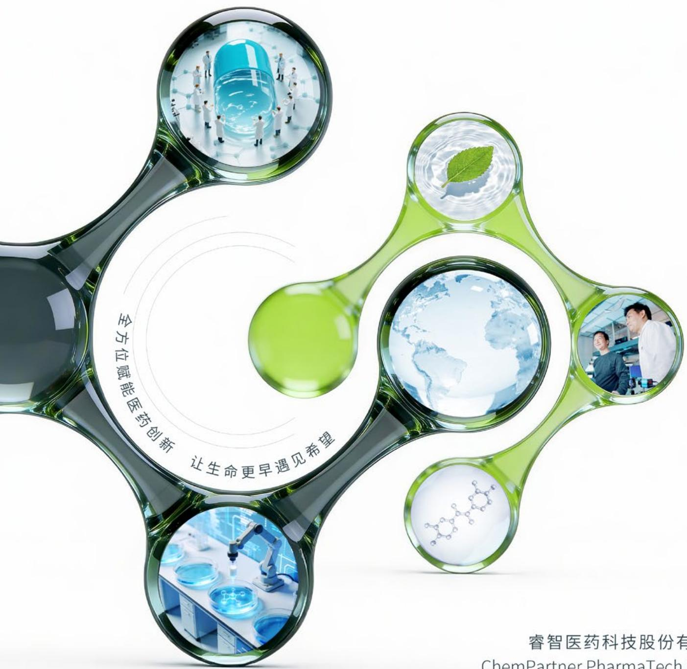

text_image

全方位赋能医药创新
让生命更早遇见希望
睿智医药科技股份有
ChemPartner PharmaTech

## 目录

## CONTENTS

报告编制说明 01

董事长致辞 03

关于睿智医药 05

ESG 治理 12

关键绩效表 75

指标索引 77

读者反馈 78

##

## 治理篇

## 筑牢合规基石，引领稳健致远

公司治理 17

投关管理 20

合规风控 23

商业道德 25

##

## 社会篇

## 汇聚创新动力，共创健康价值

创新研发 29

动物福利与伦理 34

品质管理 39

数智运营 42

可持续供应链 45

人才管理与员工关怀 47

行业共进 56

社会贡献与乡村振兴 60

##

## 环境篇

## 践行绿色承诺，共创低碳未来

环境合规管理 63

应对气候变化 66

高效资源使用 68

污染物与废弃物治理 70

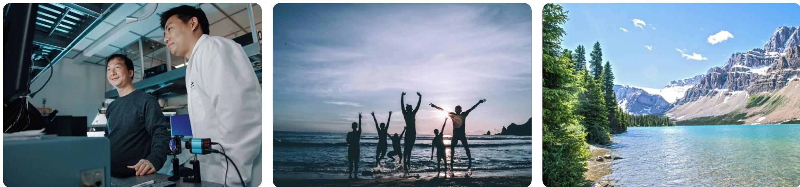

## 报告编制说明

## 报告说明

本报告是睿智医药科技股份有限公司面向利益相关方发布的第4份环境、社会和公司治理报告。报告详细披露了睿智医药科技股份有限公司2025年度在经济、环境、社会和公司治理等责任领域的实践和绩效，旨在与各利益相关方进行有效交流，系统地回应利益相关方的期望和要求。

## 时间范围

本报告为年度报告，时间跨度为2025年1月1日至2025年12月31日，为增强报告可比性及前瞻性，部分内容有所延伸。

## 报告边界

报告披露了睿智医药科技股份有限公司及其下属企业履行经济、社会、环境及公司治理等方面的责任信息，相关典型案例来自公司所属企业

## 编制依据

深圳证券交易所《上市公司自律监管指引第17号—可持续发展报告（试行）》

深圳证券交易所《创业板上市公司自律监管指南第3号—可持续发展报告编制》

联合国2030年可持续发展目标（SDGs）

全球可持续发展标准委员会《可持续发展报告标准》（GRI Standards）

可持续发展会计标准委员会准则（SASB Standards）

中国社会科学院《中国企业可持续发展报告编写指南》（CASS-ESG 6.0）

中国国家标准《社会责任报告编写指南》 (GB/T36001-2015)

## 称谓说明

为了便于表述和阅读，本报告中：

睿智医药科技股份有限公司简称为“睿智医药”“公司”或“我们”

上海睿智医药研究集团有限公司简称为“上海睿智”

成都睿智化学研究有限公司简称为“成都睿智”

凯惠睿智生物科技（上海）有限公司简称为“凯惠睿智”

广东弘元普康医疗科技有限公司简称为“弘元普康”

## 报告获取

本报告以电子版形式供您阅读，您可登录公司官网(https://www.chempartner.com/)或巨潮资讯网（www.cninfo.com.cn）阅读电子版报告。如对本报告有任何疑问或建议，敬请发送电子邮件至 ir@chempartner.com，或致电 020-66811798。

## 董事长致辞

尊敬的各位合作伙伴、投资者、员工及社会各界朋友：

2025年，是睿智医药持续推进可持续发展、不断夯实高质量发展基础的一年。当前，生物医药产业正处于深刻变革和高质量发展加快推进的重要阶段。作为服务医药创新的重要参与者，睿智医药始终坚持将环境社会和公司治理理念融入战略规划与经营管理全过程，统筹企业发展与责任履行，努力实现经营稳健、创新服务与社会价值的协同提升。

报告期内，公司持续完善ESG 治理架构，形成由董事会统筹领导、战略与可持续发展委员会研究审议并提供专业支持、ESG 管理委员会统筹协调执行与支撑层协同推进的闭环管理机制，推动可持续发展更加深入地融入公司治理，风险管理和日常运营。报告期后的2026年1月，睿智医药已正式加入联合国全球契约组织（UNGC），并将持续对标其倡导的相关原则，不断提升可持续发展管理水平。我们深知，规范、透明、稳健的治理体系，是上市公司实现长期健康发展的重要基础，也是回应股东，投资者，监管机构及其他利益相关方关切的重要保障。

围绕"全方位赋能医药创新，让生命更早遇见希望"的使命，过去一年，睿智医药持续推进创新能力建设和产业协同布局。公司波士顿研发中心投入运营，并持续推进与高校、医院及产业伙伴的合作，不断提升服务医药创新的能力。与此同时，公司围绕产业协同与创新生态建设，积极探索包括 CVC 在内的多元协同路径，持续增强创新资源链接与生态协同能力。

睿智医药也更加重视质量管理和服务保障、科技创新、实验动物福利与伦理（替代、减少与优化的3R原则）、职业健康与安全等关键议题，努力将责任要求落实到研发、运营和服务交付的各个环节。

在环境与运营责任方面，睿智医药持续推进环境管理、废弃物治理、资源节约和合规监测，不断夯实绿色运营基础；在质量与信息安全方面，成都睿智化学生物医药分析测试中心通过 CNAS 复评审及扩项评审，信息安全体系完成升级，进一步提升了规范运营和可持续交付能力。我们也将绿色运营、安全管理与责任履行贯穿于日常经营之中，持续提升企业稳健运营和长期发展的韧性。

面向未来，睿智医药将继续秉持"精诚高效，合作共赢"的价值观，以更高标准推进 ESG 实践把可持续发展要求更加深入地融入治理、创新运营与合作之中，不断提升稳健经营和长期发展能力，努力成为全球生命科学领域创新者值得信赖的伙伴，为医药创新和生命健康事业贡献更多力量。

睿智医药董事长

胡瑞连

关于睿智医药  
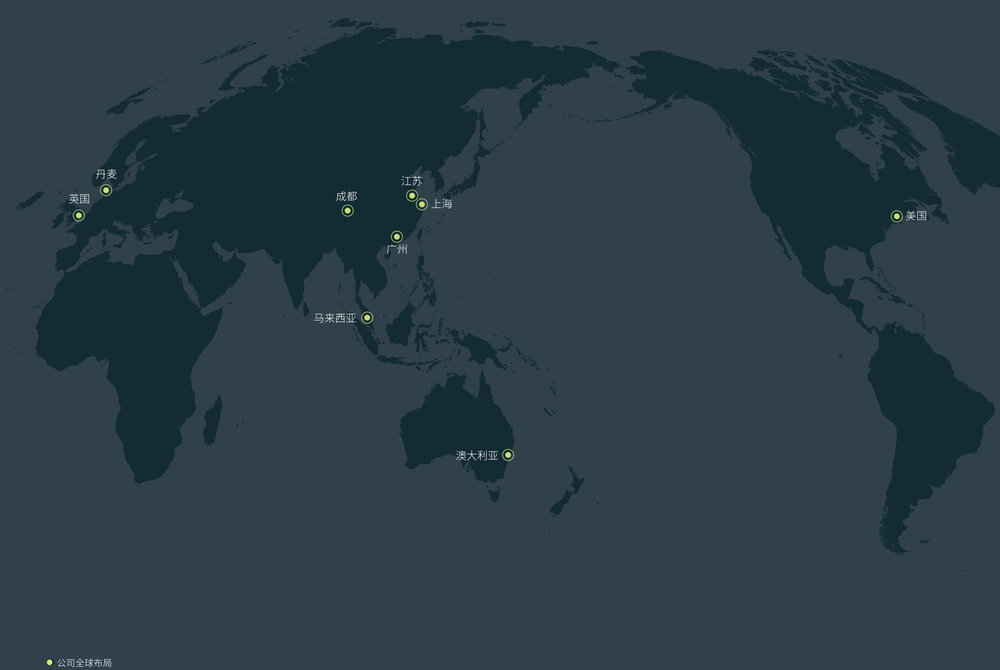

text_image

英国
丹麦
成都
江苏
上海
广州
马来西亚
澳大利亚
美国
公司全球布局

## 公司简介

睿智医药作为一家拥有领先水平的生物药、化学药一站式医药研发及生产服务提供商，公司始终秉持“全方位赋能医药创新 让生命更早遇见希望”的使命与“成为全球生命科学领域创新者值得信赖的伙伴”的企业愿景，致力于持续赋能全球医药健康产业创新策源。

作为国家级高新技术企业，公司汇聚了规模领先的科研服务团队，科研人员超过1,400人。公司总部位于上海，并在美国、欧洲及广州、成都、江门等地布局研究院、实验室、生产基地及运营实体，构建覆盖全球五大洲的业务与服务网络。依托多元化、前沿化的技术平台积累，公司持续为全球客户提供高质量的 CRO/CDMO 服务，推动医药研发效率提升与产业创新升级，为全球医药健康产业注入持续的创新动力。

## 企业文化

## 价值观

精诚高效，合作共赢

## 使命

使命全方位赋能医药创新

让生命更早遇见希望

## 愿景

成为全球生命科学领域创新者

值得信赖的伙伴

● 公司全球布局

## 2003 发展历程 2025

## 上海睿智成立

2003

## 2006

成都睿智成立，开展化学药研发业务，共建成都高新区生物医药公共服务平台

## 2007

开展生物与药理药效、药代药动及早期毒理研发业务

## 2008

凯惠药业成立，开展化学药的医药生产外包业务

## 2010

开展生物药的医药研发服务

## 2014

旧金山睿智成立

## 2015

凯惠睿智成立

欧洲睿智成立

开展生物药CDMO业务

## 2018

与量子高科（中国）生物股份有限公司 ( 股票代码 :300149)完成并购重组生物医药大健康产业全面升级

## 2019

上海睿智金科医药创新中心成功启用，成为全球研发中新策源中心

## 2020

集团成立 20 周年，更名为睿智医药，以医药健康产业创新领跑者的步伐，迈入飞跃式发展的全新纪元

## 2021

江苏启东大分子CDMO服务平台投产，提供生物药从早期发现到商业化生产的-体化解决方案

## 2024

与 Meta Bright“中马生物医药产业园”合作签约与华东师范大学签署战略合作框架协议与香港理工大学签署MOU睿智医药- 马来西亚国民大学战略合作签约睿智医药 ADC 全球创新中心启用

## 2022

与 英 国 Tate & Lyle InvestmentsLimited 签署量子高科股权转让协议，剥离益生元业务，聚焦发展CXO 业务在上海临港布局化学研发业务：持续升级 CRO一站式服务水平

## 2023

获得 ISO/SEC 27001 信息安全认证

## 2025

波士顿研发中心正式启幕与中国建筑（东南亚）有限公司、中国国际经济盗询有限公司“中马生物医药产业园”合作签约

## 2025 大事记

发布 2024年度业绩预告

2 月

香港中文大学（深圳）叶德全教授一行莅临睿智医药参观调研

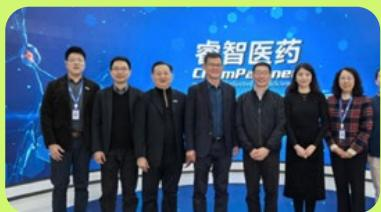

text_image

睿智医药
ChemParene

3 月

与华东师范大学签署协议，共建“AI药物智造联合实验室

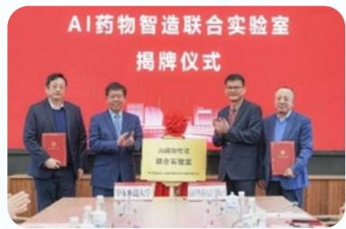

text_image

AI药物智造联合实验室
揭牌仪式
AI药物智造
联合实验室

与中国建筑（东南亚）有限公司、中国国际经济咨询有限公司共同签署“中国-马来西亚生物医药产业园”框架合作协议

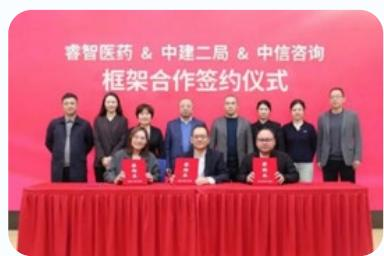

text_image

睿智医药 & 中建二局 & 中信咨询
框架合作签约仪式

4 月

睿智医药5项最新研究成果入选2025年AACR 年会并在会议现场以壁报形式展示

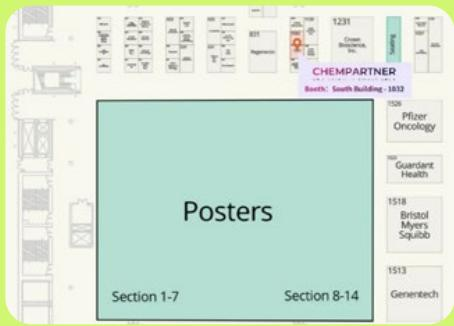

text_image

CHEMPARTNER
Booth: South Building - 1012
Posters
Section 1-7	Section 8-14
1526
Pfizer
Oncology
1502
Guardant
Health
1518
Bristol
Myers
Squibb
1513
Genentech

5 月

睿智医药参加第五届核酸药物产业深度聚焦峰会，首次公开展示了睿智医药小核酸药物平台能力和一体化服务模式

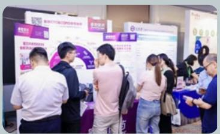

text_image

Street photo with visible store signboards and people interacting at an exhibition booth

6月

睿智医药与圣诺医药达成战略合作，共筑小核酸药物创新生态圈

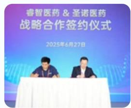

7 月

成都睿智化学生物医药分析测试中心通过 CNAS 复评审+扩项评审

成都睿智化学生物医药分析测试中心通过 CNAS 复评审 + 扩项评审

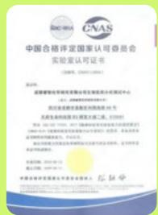

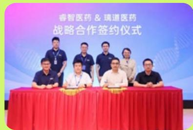

text_image

睿智医药 & 璃道医药
战略合作签约仪式

8 月

正式签约入驻粤港澳大湾区国家技术创新中心国际总部基地

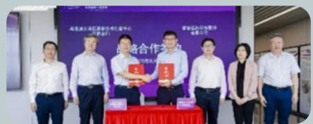

text_image

Group photo of seven men at a partnership event, with visible Chinese text on backdrop and table

9 月

与复星医药全球研发中心深化战略合作

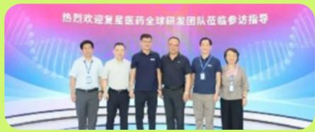

text_image

热烈欢迎复星医药全球研发团队在临参访指导

睿智医药波士顿研发中心在美国波士顿盛大启幕

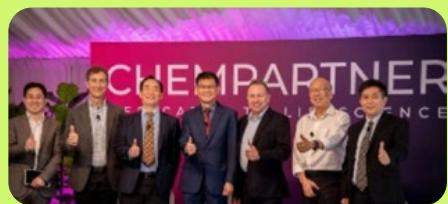

text_image

CHEMPARTNER
EPCALIFULIENCE

10 月

完成 ISO 27001：2022 认证升级

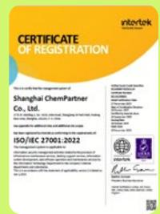

11 月

睿智医药联合华东师范大学，正式发布了全球首个适用于ADC(抗体药物偶联物)与核苷酸单体合成药物智造系统

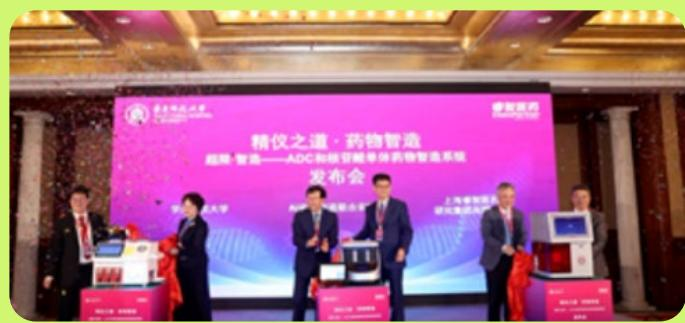

text_image

精仪之道·药物智造
超险·智造——ADC和轻智能单体药物智造系统
发布会
上海爱知医药
研究集团

与北京清华长庚医院签署协议共建“类器官创新中心”

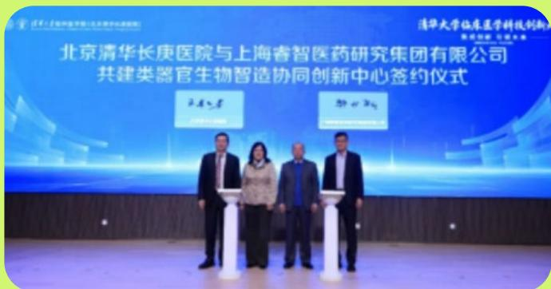

text_image

北京大学临床医学科技创新
北京清华长庚医院与上海睿智医药研究集团有限公司
共建类器官生物智造协同创新中心签约仪式

12 月

睿智医药与西安交通大学药学院，西安交通大学苏州研究院达成战略合作，携手构建产学研融合创新生态战略合作

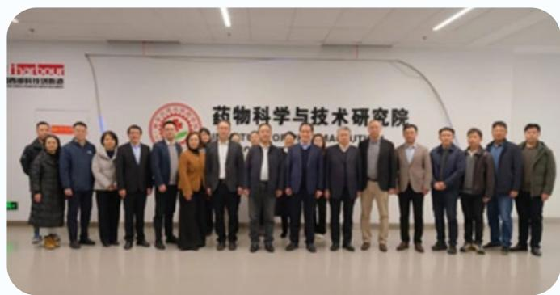

text_image

药物科学与技术研究院
COCTICAL SCIENCE AND TECHNOLOGY INSTITUTE

## 荣誉奖项

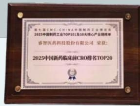

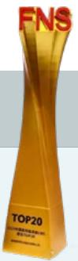  
获评“2025中国新药临床前CRO TOP20”

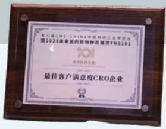

  
获评“最佳客户满意度CRO 企业”

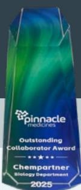  
获评“Outstanding collaborator Award Chempartner Biology Department”

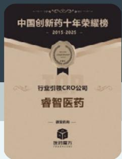

text_image

中国创新药十年荣耀榜
——2015-2025
行业引领CRO公司
睿智医药
——建设机构——
医疗南方

入选“中国创新药十年荣耀”榜单并获评“行业引领 CRO 公司”

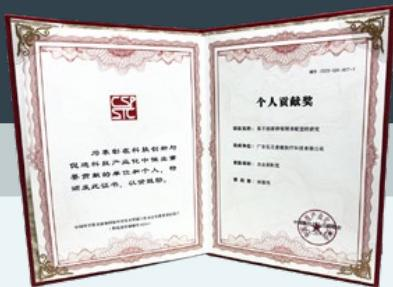

text_image

冷轧彩墨科技创和与
促进科技产业创新成果
要突破的单位和个人，特
研或武试布，以奖励给，
中国科学技术协会国家知识产权委员会关于个人贡献奖
个人贡献奖
荣誉表彰：基于科技创新领域的优秀评定
荣誉等级：广东人民儿童科学研究院评审委员会
荣誉表彰：个人贡献奖
荣誉等级：荣誉证书

弘元普康“基于肠菌移植精准配型的研究”项目获中国科技产业化促进会科学技术奖项“杰出贡献奖”

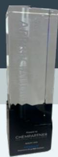  
获评“Present to CHEMPARTNER Dedicated to Lifescience”  
ESG管理架构

## ESG 治理

睿智医药建立了由董事会统筹领导、战略与可持续发展委员会专业决策、ESG管理委员会统筹协调、执行与支撑层协同推进的ESG管理架构，将可持续发展理念全面融入公司战略与经营管理全过程。

在该架构下，董事会负责把控ESG发展方向与重大事项决策；战略与可持续发展委员会负责统筹ESG战略制定、重大风险与机遇监督及信息披露审议：ESG管理委员会作为其下设的日常工作机构，负责统筹协调公司及各子公司的ESG工作，推进资源整合、执行督导与成效评估；相关执行与支撑部门负责具体落实与日常管理。各层级分工明确、协同联动，形成“决策一统筹一执行一反馈”的闭环管理机制，有效保障公司ESG工作的系统推进与持续优化

董事会

战略与可持续发展委员会

ESG管理委员会

各下属部门

## ESG能力建设

公司高度重视环境、社会与治理(ESG)能力的系统建设，通过定期开展专题讲座、内部研讨和专项培训，公司系统讲解ESG理念、政策趋势、行业实践及管理工具，持续提升各层级人员在可持续发展议题上的认知和履责能力。同时，公司结合业务特点和管理实际，将ESG理念有效融入战略规划、风险管理及日常运营，确保自上而下落地执行，为企业长期稳健和负责任的发展提供坚实的人才与组织支撑

## 报告期内

公司开展ESG培训

2

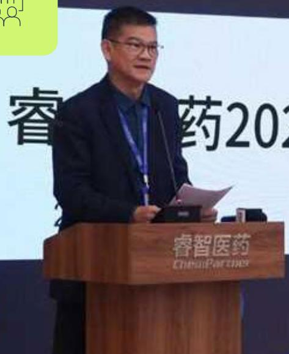

text_image

睿智医药202
ChenHaiParcher

药2026首次ESG培训大会

## 利益相关方参与

睿智医药始终将内外部利益相关方的沟通与交流置于重要位置，致力于构建并维护良好的利益相关方关系。通过多种形式的对话渠道，公司深入了解各方的需求与期望，积极争取信任与支持，推动双方建立更深层次的合作与理解，为公司的可持续发展提供坚实保障。

<table><tr><td colspan="2">利益相关方</td><td>期望与诉求</td><td>沟通与回应</td></tr><tr><td></td><td>股东及投资者</td><td>·公司治理·反腐败·股东与投资者权益·风险管理</td><td>·股东会·信息披露·路演·业绩说明会·投资者交流会</td></tr><tr><td></td><td>政府及监管机构</td><td>·反腐败·风险管理·应对气候变化</td><td>·遵守法律法规·配合监管检查·定期与临时信息披露</td></tr><tr><td></td><td>客户</td><td>·可持续采购·信息安全保护·质量管理和服务保证·科技创新·应对气候变化</td><td>·客户满意度管理·官方网站·社交媒体·客服热线</td></tr><tr><td></td><td>员工</td><td>·员工薪酬福祉·员工发展·职业健康与安全·多元与包容</td><td>·制度发布·管理会议·员工大会·内部线上沟通平台·员工培训·员工活动</td></tr><tr><td></td><td>供应商</td><td>·可持续采购·反贪腐·信息安全保护</td><td>·公开招标·阳光采购·供应商评估·供应商会议与培训</td></tr><tr><td></td><td>合作伙伴</td><td>·行业合作</td><td>·交流互访·行业论坛</td></tr><tr><td></td><td>社区及公众</td><td>·社区共建·动物伦理·医疗可及性</td><td>·志愿服务·社区活动·社交媒体</td></tr></table>

## 重要性议题分析

公司以 《深圳证券交易所上市公司自律监管指引第17号—可持续发展报告（试行）》为基础框架，结合国家政策导向行业发展趋势及公司战略重点，在综合考虑利益相关方关注重点的前提下，参考 Wind ESG等主流评级体系，组织外部专家与项目团队开展系统分析，对ESG 议题进行识别、整合与优化（包括必要的合并与拆解），构建形成公司ESG 重要性议题矩阵。

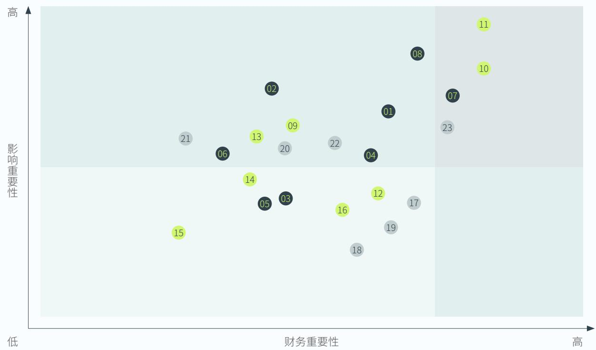

scatter

| Item | Financial Importance (approx) | Impact Importance (approx) |
| --- | --- | --- |
| 01 | ~75 | ~65 |
| 02 | ~45 | ~75 |
| 03 | ~50 | ~45 |
| 04 | ~65 | ~55 |
| 05 | ~45 | ~45 |
| 06 | ~35 | ~55 |
| 07 | ~85 | ~70 |
| 08 | ~75 | ~85 |
| 09 | ~50 | ~60 |
| 10 | ~85 | ~80 |
| 11 | ~85 | ~90 |
| 12 | ~65 | ~45 |
| 13 | ~45 | ~55 |
| 14 | ~40 | ~45 |
| 15 | ~30 | ~30 |
| 16 | ~60 | ~40 |
| 17 | ~70 | ~40 |
| 18 | ~60 | ~25 |
| 19 | ~65 | ~35 |
| 20 | ~45 | ~50 |
| 21 | ~30 | ~50 |
| 22 | ~55 | ~50 |
| 23 | ~80 | ~50 |

## 环境

环境管理体系  
废弃物排放管理  
03 水资源管理  
04 能源管理  
05 应对气候变化  
06 多元与包容  
07 职业健康与安全\*  
08 员工发展

## 社会

09 员工薪酬福祉  
10 质量管理和服务保证\*  
11 科技创新 \*  
12 知识产权保护  
13 行业合作  
14 可持续采购  
15 社区共建  
16 信息安全保护

## 治理

17 公司治理  
18 反腐败  
19 股东与投资者权益  
风险管理20  
ESG 管理策略21  
22 医疗可及性  
23 动物伦理\*

# 治理篇

# 筑牢合规基石 引领稳健致远

## 理念

睿智医药以稳健治理为基石，致力于可持续发展。公司持续优化治理架构，筑牢决策根基；强化透明投关管理，保障股东权益；健全内控与风控体系，严守合规底线；恪守商业道德，对贪腐与不正当竞争零容忍。通过将合规理念融入经营血脉，我们已构建起坚实的治理屏障，引领公司在高质量发展道路上笃定前行。

## 我们的行动

17 公司治理

23 合规风控

20 投关管理

25 商业道德

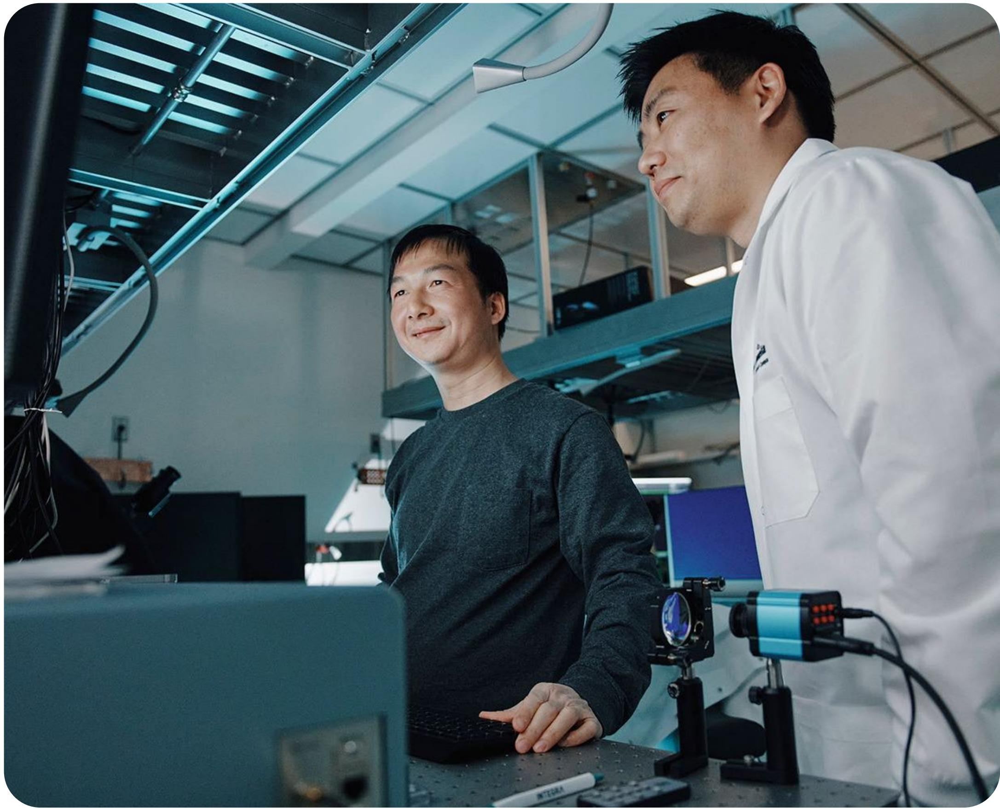

natural_image

Two scientists in lab coats working at a computer in a laboratory setting (no visible text or symbols)

## 公司治理

睿智医药立足公司治理长远发展，持续优化治理架构，严格遵循《公司法》《证券法》《上市公司治理准则》等相关法律法规及《公司章程》要求。

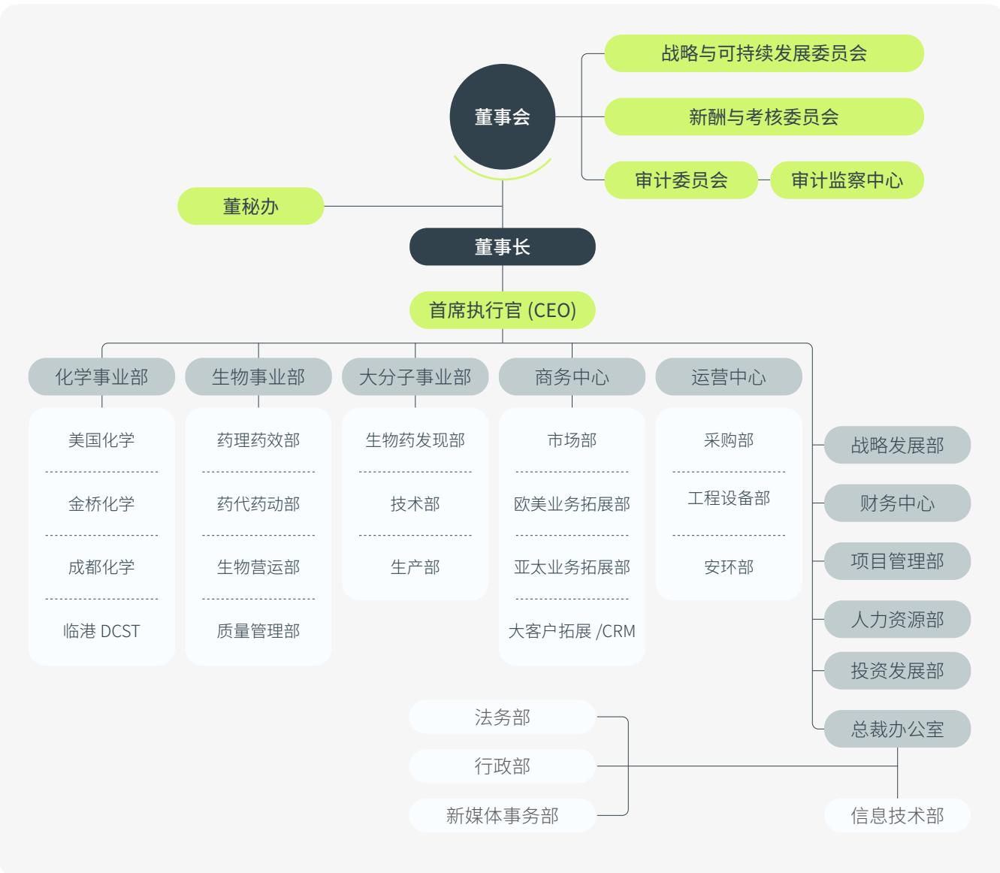

flowchart

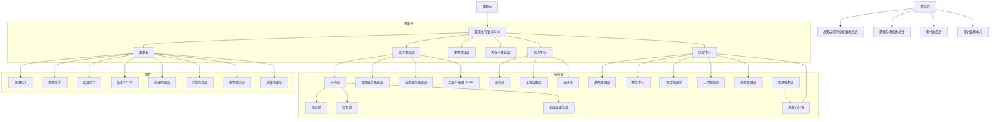
```mermaid
graph TD
  A["董事会"] --> B["战略与可持续发展委员会"]
  A --> C["薪酬与考核委员会"]
  A --> D["审计委员会"]
  A --> E["审计监察中心"]
  
  F["董秘办"] --> G["首席执行官 (CEO)"]
  
  subgraph Board [董事会]
  G --> H["董事长"]
  G --> I["化学事业部"]
  G --> J["生物事业部"]
  G --> K["大分子事业部"]
  G --> L["商务中心"]
  G --> M["运营中心"]
  end
  
  subgraph Departments [部门]
  H --> N["美国化学"]
  H --> O["金桥化学"]
  H --> P["成都化学"]
  H --> Q["临港 DCST"]
  H --> R["药理药效部"]
  H --> S["药代药动部"]
  H --> T["生物营运部"]
  H --> U["质量管理部"]
  end
  
  subgraph Exec [执行官]
  I --> V["市场部"]
  I --> W["欧美业务拓展部"]
  I --> X["亚太业务拓展部"]
  I --> Y["大客户拓展 /CRM"]
  end
  
  subgraph Exec [执行官]
  L --> Z["采购部"]
  L --> AA["工程设备部"]
  L --> AB["安环部"]
  end
  
  subgraph Exec [执行官]
  M --> AC["战略发展部"]
  M --> AD["财务中心"]
  M --> AE["项目管理部"]
  M --> AF["人力资源部"]
  M --> AG["投资发展部"]
  M --> AH["总裁办公室"]
  end
  
  subgraph Exec [执行官]
  V --> AI["法务部"]
  V --> AJ["行政部"]
  V --> AK["新媒体事务部"]
    AV["信息技术部"] -.-> AH
  end
```

公司组织框架

## 治理架构及运作

公司严格按照法律法规及《公司章程》规范运行股东会、董事会及各专门委员会机制，各治理机构权责清晰、运转协调保障了决策的科学性与执行的规范性。报告期内，根据新《公司法》第一百二十一条规定，公司取消监事会，由董事会审计委员会行使原监事会职权，负责监督公司财务报告、内部控制及风险管理。此项调整进一步完善了董事会治理结构，强化了内部监督机制。

## 股东会

股东会是公司的权力机构，公司严格依照法律法规、《公司章程》及相关议事规则召开股东会，确保股东能够依法行使权利

## 董事会

董事会是公司的常设决策机构，行使法律法规及《公司章程》赋予的职权，对股东会负责。报告期内，董事会运作规范高效议事规则清晰、决策机制有效运行，有力保障了公司治理的科学性与决策质量。

报告期内

<table><tr><td>公司召开股东会</td><td>审议通过议案</td><td>召开董事会</td><td>董事会成员出席率</td><td>审议通过议案</td></tr><tr><td>3次</td><td>30项</td><td>11次</td><td>100%</td><td>55项</td></tr></table>

## 董事会及专门委员会建设

公司持续优化董事会治理结构，强化独立董事职能，完善专门委员会运作机制，为科学决策提供有力支撑。

## 多元化与独立性

公司始终重视董事会成员的多元化背景与专业互补，持续优化董事会整体结构与履职能力。独立董事严格依据《独立董事工作制度》独立履行职责，在公司重大事项中审慎发表独立意见，并在关联交易、对外担保等事项中充分发挥制衡与监督作用。

报告期内  
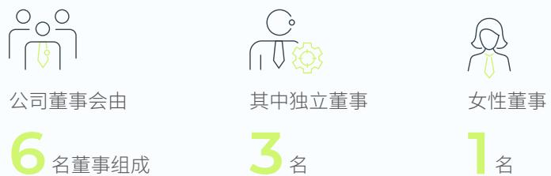

donut

| Category | Count |
| --- | --- |
| 公司董事会由 | 6名董事组成 |
| 其中独立董事 | 3名 |
| 女性董事 | 1名 |

## 专门委员会构成

公司董事会下设审计委员会、薪酬与考核委员会、战略与可持续发展委员会三大专门委员会，各委员会依据其专业领域承担相应职责。

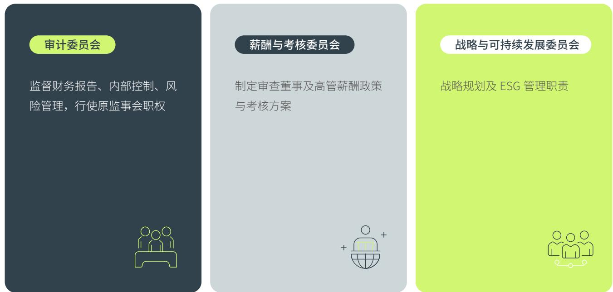

## 薪酬与考核委员会

制定审查董事及高管薪酬政策与考核方案

## 战略与可持续发展委员会

战略规划及 ESG 管理职责

公司组织框架

## 董事会有效性评估

报告期内，公司董事会及各专门委员会运作规范，会议的召集、审议及表决程序均符合相关制度要求，决策流程清晰、执行有序；董事勤勉尽责履行职责，积极参与重大事项讨论，能够充分发挥各自的专业背景与独立性优势，为公司战略制定与经营决策提供支持。同时，各专门委员会职责分工明确、协同配合良好，在各自领域内有效开展工作。总体来看，公司董事会运行稳健，能够较好保障公司治理的规范运作与决策质量。

## 报告期内

公司召开审计委员会会议

7 次

薪酬与考核委员会会议

2 次

战略与可持续发展委员会会议

5 次

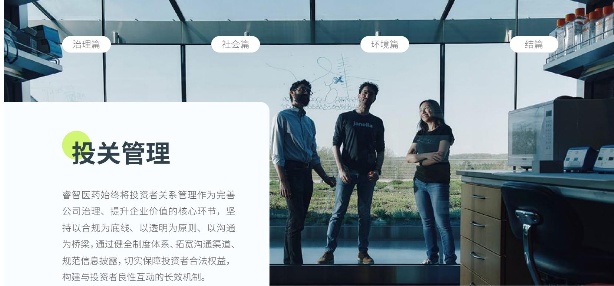

text_image

治理篇
社会篇
环境篇
结篇
投关管理
睿智医药始终将投资者关系管理作为完善公司治理、提升企业价值的核心环节，坚持以合规为底线、以透明为原则、以沟通为桥梁，通过健全制度体系、拓宽沟通渠道、规范信息披露，切实保障投资者合法权益，构建与投资者良性互动的长效机制。

## 投关管理

睿智医药始终将投资者关系管理作为完善公司治理、提升企业价值的核心环节，坚持以合规为底线、以透明为原则、以沟通为桥梁，通过健全制度体系、拓宽沟通渠道规范信息披露，切实保障投资者合法权益构建与投资者良性互动的长效机制。

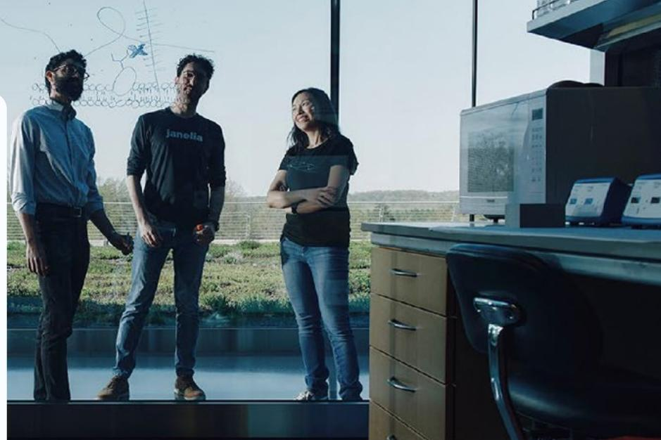

natural_image

Three people standing in an office with a computer and office chair in the background (no visible text or symbols)

## 投关管理制度

公司建立了完善的投资者关系管理体系，制定并实施了《投资者关系管理制度》《投资者投诉处理工作制度》《舆情管理制度》等制度。制度体系涵盖投资者沟通、投诉处理、舆情监测、信息保密等全流程管理，明确要求各相关部门协同配合确保投资者关系管理工作规范、高效开展，为保障投资者知情权、参与权和收益权提供坚实制度支撑

## 信息披露管理制度

公司严格遵循《公司法》，《证券法》《上市公司信息披露管理办法》等法律法规及《公司意程》要求，持续完善《信息披露管理制度》，明确信息披露的范围、标准、流程及责任主体。为保护中小股东权益，公司通过官方网站、交易所指定平台等多渠道及时、完整地进行信息披露，并通过一图读懂等多种方式确保股东能及时获知公司定期报告主要信息。同时强化内幕信息管理，明确内幕信息知情人范围及报备流程，防范内幕交易风险，保障全体投资者平等获取公司信息。

## 报告期内

公司共披露

181 份公告文件

其中定期报告

4份

临时公告

177 份

## 投资者沟通渠道

公司构建了多维度、立体化的投资者沟通体系，为投资者提供便捷、高效的沟通路径：

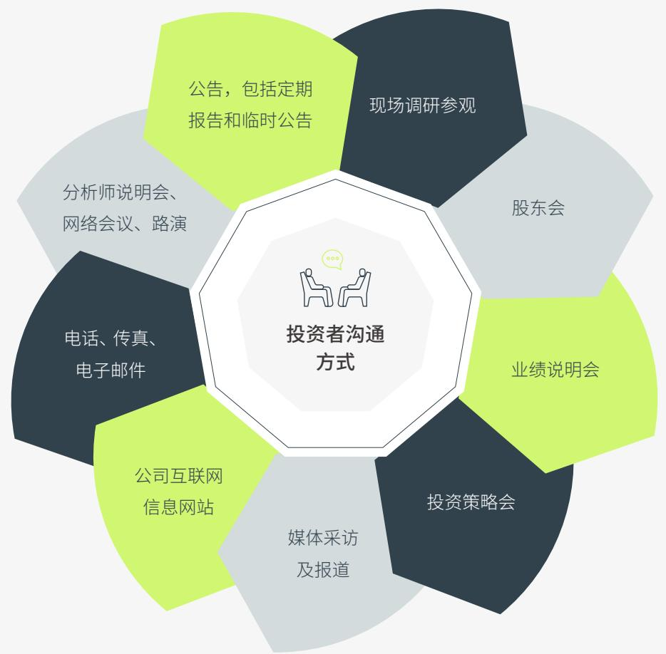

flowchart

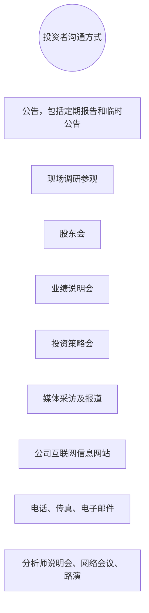
```mermaid
graph LR
  Center(("投资者沟通方式"))
  
  sub1["公告，包括定期报告和临时公告"]
  sub2["现场调研参观"]
  sub3["股东会"]
  sub4["业绩说明会"]
  sub5["投资策略会"]
  sub6["媒体采访及报道"]
  sub7["公司互联网信息网站"]
  sub8["电话、传真、电子邮件"]
  sub9["分析师说明会、网络会议、路演"]
```

投资者沟通方式

## 投诉处理机制（主要由董秘办承接）

受理各种直接投诉

调查、核实投诉事项，提出处理意见及时答复投诉人

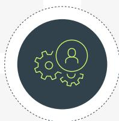

承接中国证监会“12386”投诉热线的转办件，及其他的间接投诉

定期汇总、分析投诉信息，提出加强与改进工作的意见或建议

## 投资者活动开展情况

公司持续深化与投资者的互动交流，提升沟通的针对性与实效性。2025年，公司积极配合机构调研，通过业绩说明会、投资者开放日等形式接待调研机构，全面、客观地介绍公司经营情况，增强市场信心。

## 报告期内

公司共开展投资者关系活动

7 场

## 2025上半年业绩说明会暨投资者开放日

2025年9月，公司召开了2025年上半年投资者开放日活动。本次活动通过实地参观、业绩解读、战略分享及深度互动，全方位展现公司经营成果与发展潜力，吸引了中信证券、东方证券、开源证券、银河基金等数十家机构投资者参与。活动不仅搭建了高效的沟通桥梁，更以扎实的业绩、明确的战略和强劲的创新动能，赢得了投资者的广泛认可与高度满意。

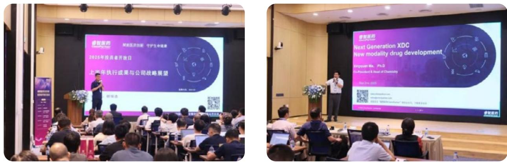  
现场照片

## ●“踔厉奋发新征程投教服务再出发”投资者走进上市公司活动

2025年11月，公司联合国新证券上海分公司开展“踔厉奋发新征程投教服务再出发”走进上市公司活动，在深圳证券交易所指导下，邀请20余名投资者实地参访公司。通过现场参观与交流，公司向投资者多角度展示业务布局与发展情况，增进市场对公司价值的理解与认知，进一步强化投资者沟通与保护，提升信息透明度与资本市场信任水平。

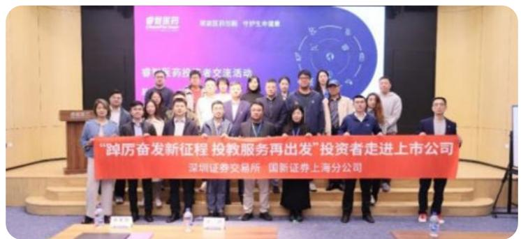

text_image

“踔厉奋发新征程 投教服务再出发”投资者走进上市公司
深圳证券交易所 国新证券上海分公司

现场照片

## 合规风控

睿智医药始终将合规风控作为企业稳健发展的核心保障，秉持构建了覆盖全业务流程的合规风控体系，通过健全组织架构完善制度规范、强化内审监督、明确目标导向及深化合规培训，全面提升风险防范与合规管理能力，为公司高质量发展筑牢安全防线。

## 内部控制管理

公司建立了“董事会统筹领导、审计委员会专业监督、内审部门具体执行、各业务部门协同落实”的内控组织架构，形成权责清晰、分工明确、协同高效的内控管理格局。同时，公司严格遵守相关法律法规，制定并持续完善《睿智医药受控文件编写规则》《睿智医药文件发布操作规程》等内控制度，明确制度制定、修订、发布、废止的全流程管理规范。

公司建立内控制度动态更新机制，每年定期开展制度有效性评估，根据法律法规变化、业务发展需求和内外部审计建议及时修订和完善相关制度。各业务条线结合自身特点，制定细化操作规程和管理细则，确保制度落地执行。

公司依据企业内部控制规范体系及公司治理结构相关制度、财务内部控制制度、公司基本管理制度、公司经营管理制度、公司人力资源管理制度、公司生产管理制度等日常内部管理制度组织开展内部控制评价工作。

公司董事会根据企业内部控制规范体系对重大缺陷、重要缺陷和一般缺陷的认定要求，结合公司规模、行业特征、风险偏好和风险承受度等因素，分别进行财务报告内部控制和非财务报告内部控制，研究确定了适用于公司的内部控制缺陷具体认定标准，并与以前年度保持一致。

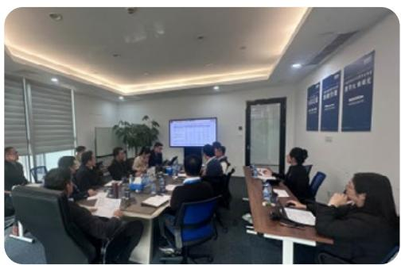

natural_image

Interior view of a modern office meeting room with attendees seated around a long table, no visible text or signage

## 内部审计

公司依据《公司法》《证券法》《审计法》等法律法规，并结合自身实际情况，制定了《内部审计制度》，内审工作严格遵循《内部审计制度》规定的程序开展，包括审前准备、现场实施、审计报告、问题整改和后续跟踪等环节。审计过程中内审人员通过访谈、查阅、测试、分析等方法，客观评价内部控制设计的合理性和执行的有效性。

## 内部控制审查工作

内审部按照有关规定实施适当的审查程序，评价公司内部控制的有效性，并至少每年向审计委员会提交一次内部控制评价报告。

内部控制审查和评价范围应当包括与财务报告和信息披露事务相关的内部控制制度的建立和实施情况。

内审部对审查过程中发现的内部控制缺陷，督促相关责任部门制定整改措施和整改时间并进行内部控制的后续审查监督整改措施的落实情况。

内审部在审查过程中如发现内部控制存在重大缺陷或重大风险，及时向董事会报告。

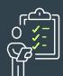

## 风险管理

为全面防范和化解经营管理各环节风险，保障公司战略目标实现和持续健康发展，公司严格遵循风险管理最佳实践，构建了权责清晰、协同联动、闭环管控的三道风险防线体系，形成“业务前端防控、中台监督评估、后端审计问责”的全流程风险管控格局。各道防线分工明确、相互支撑，共同筑牢公司风险防控屏障。在制度层面，公司制定并实施《风险管理制度》为风险识别、评估、应对与监控提供制度依据，进一步夯实风险管理基础

## 第一道防线

## 业务部门（前端防控层）

●风险识别与源头控制：在业务全过程中识别各类风险，建立并动态更新风险清单  
• 嵌入式风险管理：将风险控制嵌入业务流程，通过权限管理岗位分离等降低风险发生概率  
•风险应对与信息反馈：开展自评估与应急处置，及时向中台及审计部门传递风险信息

## 风险管理及职能部门（中台监督层）

• 体系建设与统筹管理：搭建并优化风险管理制度与流程，推动三道防线协同运作  
•监督评估与监测预警：开展风险评估与日常监督，建立指标体系并进行风险预警  
●专业支持与闭环整改：提供合规、法律等专业支持，跟踪整改落实，形成闭环管理

## 第二道防线

## 内部审计部门 （后端问责层)

• 独立审计与监督：对风险管理与内控执行情况开展独立审计  
• 有效性评估与专项审计：评估三道防线运行效果，针对重大风险开展专项审计  
•问责与持续改进：推动审计整改与责任落实，提出优化建议 提升治理水平

## 第三道防线

## 协同机制

• 信息共享与沟通机制定期会议+信息平台实现风险信息贯通  
• 风险分级与移交流程 重大风险逐级上报与分 层处置  
考核与问责机制：将风险管理纳入绩效考核：强化责任落实

## 报告期内

公司开展内控合规、风险管理相关培训

11场

培训总时长

22 小时

公司未发生 重大违法违规事件

## 商业道德

睿智医药始终秉持诚信经营原则，严格遵守法律法规，致力于构建公平、公正、透明的商业环境。公司对腐败、贿赂及不正当竞争行为实行零容忍，通过完善制度、强化培训及规范合作伙伴管理，持续筑牢商业道德防线。

## 反商业贿赂及反贪污

公司高度重视廉洁治理，将反商业贿赂和反贪污作为商业道德建设的核心内容，通过制度约束、教育培训和监督执纪相结合的方式，构建全方位反腐倡廉体系。公司将贪污腐败风险纳入整体风险管理体系，结合业务流程关键环节，识别潜在廉洁风险点，并通过制度约束、流程控制及定期评估等方式进行风险防控。同时，将廉洁要求嵌入采购、销售等重点领域降低商业贿赂风险发生的可能性。

## 反贪腐管理体系

公司建立由管理层统筹、各业务部门协同落实的反贪腐管理机制，明确各层级在廉洁合规中的职责分工。在制度层面，公司依据相关法律法规，结合行业特点和公司实际，制定并持续完善《道德行为规范准则》《反舞弊与举报机制》等制度文件，明确禁止任何形式的贪污、贿赂及利益输送行为，并要求员工及时报告任何已知或怀疑的不正当行为。

## 举报与投诉机制

公司制定《反舞弊与举报制度》，并建立了建立畅通的举报与投诉渠道，鼓励员工及外部相关方对违规行为进行监督与反馈。举报渠道包括热线电话及专用邮箱，由专人负责受理与跟进，确保举报信息得到及时处理与保密保护，形成有效的监督闭环。

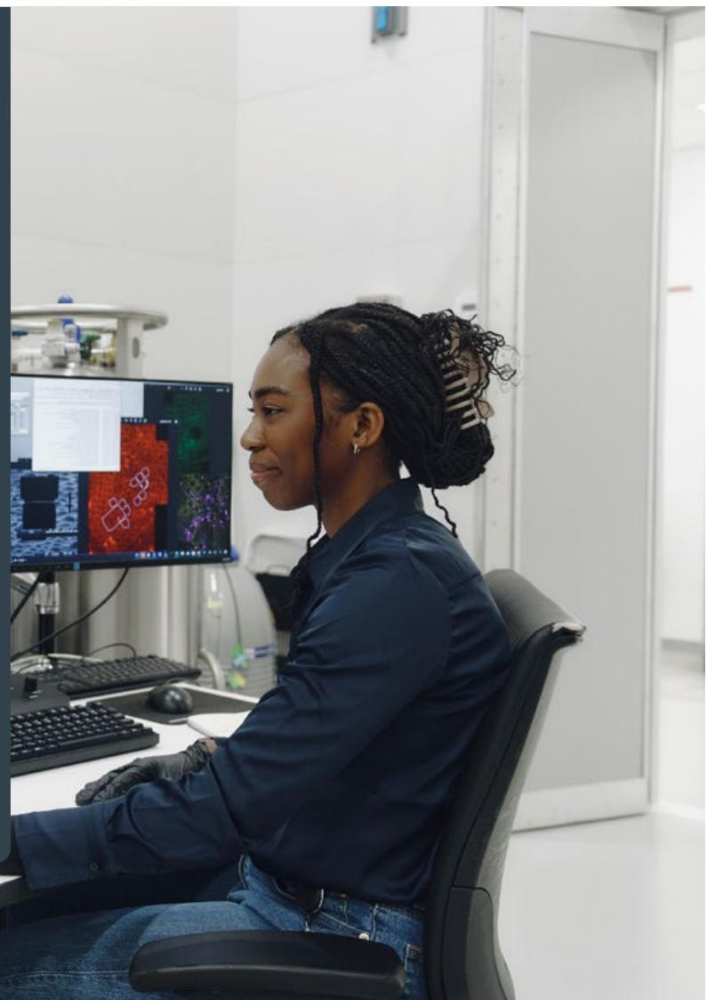

natural_image

Person sitting at a desk in an office, using a computer with visible data and brain diagrams on the screen (no text or symbols present)

## 商业伙伴廉洁管理

公司将反贪腐要求延伸至供应链及合作伙伴管理要求供应商在合作前签署《反商业贿赂协议》，并将廉洁合规表现纳入供应商准入及绩效评估体系对违反廉洁要求的合作方采取整改、降级或退出等措施，推动构建阳光透明的合作生态。

## 培训与宣导

公司持续强化全员廉洁教育，将反贪腐培训纳入年度合规培训体系，通过多层次、多形式的培训活动，不断提升员工廉洁意识和风险防范能力。

## 报告期内

公司未发生 贪污腐败事件

## 反不正当竞争

公司始终坚持依法合规经营，严格遵循反垄断及公平竞争相关法律法规，持续完善反垄断与公平竞争管理体系，规范市场行为，防范相关合规风险。公司将反垄断与不正当竞争风险纳入合规管理与风险控制体系，重点关注市场交易、合作协议、信息披露等关键环节，通过内部审查与流程管控机制，有效防范垄断行为及不正当竞争风险，确保经营活动合法合规。

## 报告期内

100% 的主要供应商均

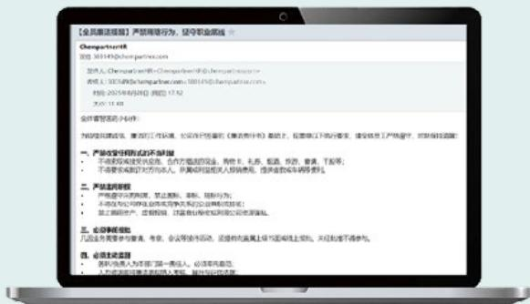

text_image

【全员激励政策】严禁随意行为，坚守职业底线
Chenpartson@1000.cn
岗位：2014@Chenpartson.com
负责人：Chenpartson@Chenpartson@Chenpartson@1000.cn
电话：0375/89@Chenpartson.com 1001@Chenpartson.com
时间：2025/6/24(周) 17:52
2025/11/10
会计师事务所的介绍
为保护员工的意识，维护员工的工作，以在计划管理的《管理办法》基础上，注重职级上下执行制度，建设员工的严格操作，尽职勉尽责。
一、产品宣传流程的开展与控制
· 不锈钢和钢包装供应、办公方便的供应、购销卡、礼码、纸张、印条、音像、下架等；
· 不锈钢采购相对方向本人，外购钢包装相关人员的销售员，提供金砖车间物资包。
二、产品流程
· 产品流程的实施、禁止销售、退换、售后服务；
· 不锈钢与钢包装供应相关业务的签订或授权委托；
· 加工钢包装生产、销售网络，对设备进行授权和合同的审批。
三、必要性措施
几类业务需要参与顾客、参观、会议等咨询活动，还须向其盖章上填写在线或线上填报，并未经批准不得参与。
四、必要性说明
· 需要负责人为本部门第一责任人，必须有意见；
· 人力资源部负责本部门人事部、财务部的监督

全员邮件廉洁宣导

## 报告期内

公司未发生因不正当竞争行为引发的诉讼、仲裁或行政处罚事件，市场经营行为合法合规

报告期内，公司制定并发布《睿智医药竞争与市场反垄断管理制度》（ChemPartner Competition and Market Anti-MonopolySystem)，明确反垄断与公平竞争的基本原则及行为规范，将合规要求嵌入业务开展全过程，为公司开展市场竞争提供制度指引。

# 社会篇

# 汇聚创新动力 共创健康价值

## 理念

睿智医药始终坚持将社会责任融入公司发展战略与日常运营实践。公司通过持续创新研发、品质保障、数智运营、可持续供应链建设及人才关怀等多维举措，全面提升医药健康服务能力。同时，公司积极参与行业合作与社会公益实践，推动科学技术与社会福祉深度融合，为健康产业发展与社区建设贡献力量。

## 我们的行动

29 创新研发 45 可持续供应链  
动物福利与伦理34 47 人才管理与员工关怀  
39 品质管理 56 行业共进  
42 数智运营 60 社会贡献与乡村振兴

natural_image

Silhouettes of people joyfully jumping on the beach at sunset, with ocean and rocky background (no text or symbols)

## 创新研发

睿智医药始终将创新研发作为驱动公司长期发展的核心动力，围绕新模态药物和智能化研发体系，构建科学、高效、可持续的研发治理与管理机制。公司通过制度化、标准化和数字化手段，优化研发全流程、提升决策科学性，并通过产学研协同技术平台建设及人才培养，持续增强研发能力和成果转化效率。在确保研发稳健性与合规性的同时，公司积极把握技术市场及绿色创新等机遇，推动创新成果快速转化为社会价值和商业价值。

## 治理

公司围绕创新驱动发展战略，构建了由董事会统筹、管理层推进、专业机构执行的多层级研发治理体系，确保创新研发方向与公司整体战略保持一致，并实现科学决策与高效落地。

在治理架构层面，公司董事会对创新研发相关重大事项进行统筹管理，重点关注研发战略方向，重大技术投入及潜在风险确保研发活动与公司长期发展目标相匹配。管理层负责组织实施董事会相关决策，统筹研发资源配置及年度研发计划推进保障各项研发工作的有效执行。

在具体运行层面，公司设立科学管理委员会作为创新研发的核心专业决策机构，负责对年度研发战略、科研项目立项及重大技术方向进行审议与把关。委员会由公司高管及各业务板块负责人组成，主任委员由首席执行官担任或授权任命，统筹研发决策并对关键事项进行把控。与此同时，公司引入外部专家参与重大项目评审，为前沿技术布局提供专业支持，提升决策的科学性与前瞻性。委员会下设秘书处，负责日常组织协调与项目跟踪，保障机制高效运转。

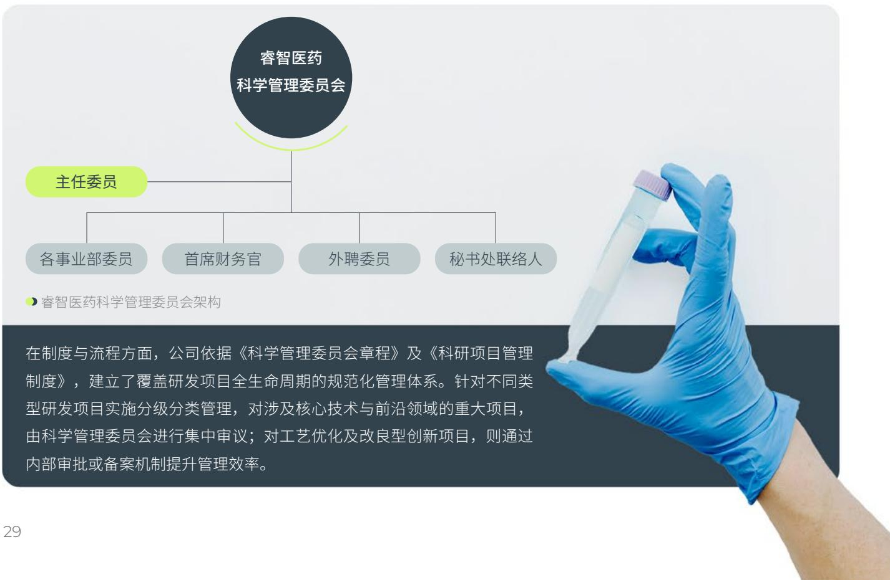

flowchart

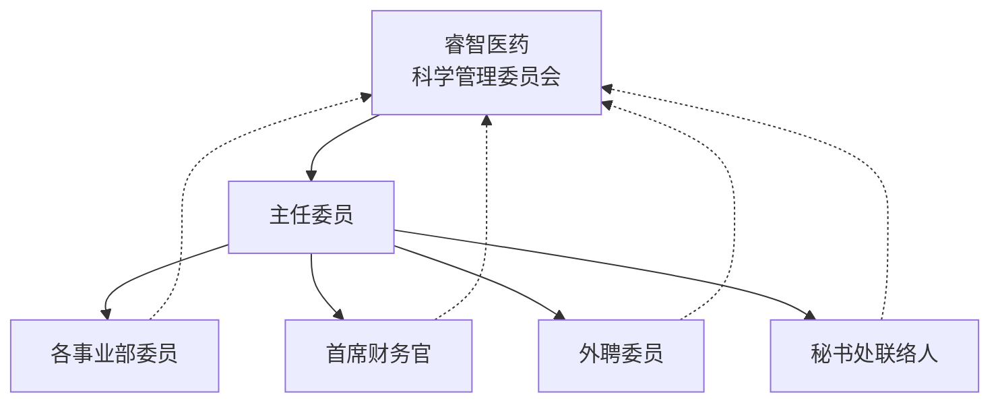
```mermaid
graph TD
  A["睿智医药\n科学管理委员会"] --> B["主任委员"]
  B --> C["各事业部委员"]
  B --> D["首席财务官"]
  B --> E["外聘委员"]
  B --> F["秘书处联络人"]
  C -.-> A
  D -.-> A
  E -.-> A
  F -.-> A
```

在制度与流程方面，公司依据《科学管理委员会章程》及《科研项目管理制度》，建立了覆盖研发项目全生命周期的规范化管理体系。针对不同类型研发项目实施分级分类管理，对涉及核心技术与前沿领域的重大项目：由科学管理委员会进行集中审议：对工艺优化及改良型创新项目，则通过内部审批或备案机制提升管理效率。

## 战略

公司围绕创新驱动发展，明确“聚售新模态与智能化的生态型创新加速器”战略定位，构建“技术平台、产业协同与全球布局”相结合的创新体系，持续推进研发体系升级与创新模式优化。在战略方向上，公司坚持“聚焦一协同一确定性”的发展逻辑重点布局抗体偶联药物(ADC/XDC)、小核酸及蛋白降解(PROTAC）等新模态药物领域，避免分散化投入，通过聚焦关键技术方向构建差异化竞争优势。同时，公司以智能化为重要抓手，将人工智能技术应用于药物研发全过程，推动研发模式由经验驱动向数据驱动转型，提高研发成功率与资源利用效率。

在明确战略方向基础上，公司结合行业发展趋势及自身业务特点，系统识别创新研发过程中面临的关键风险与机遇，并通过持续优化研发管理机制与资源配置，提升创新体系的稳健性与可持续性。

<table><tr><td>风险类型</td><td>风险说明</td><td>潜在影响</td><td>应对措施</td></tr><tr><td>技术风险</td><td>新模态技术研发不确定性风险</td><td>ADC、小核酸、PROTAC等新模态技术复杂度高,可能存在研发失败或周期延长情况,影响项目进度与投入产出效率</td><td>聚焦重点技术方向,依托科学管理委员会开展专业评审,引入外部专家参与论证,提升研发决策科学性</td></tr><tr><td>技术风险</td><td>技术迭代与替代风险</td><td>行业技术更新速度快,现有技术路径可能被新技术替代,影响公司技术领先性</td><td>持续跟踪前沿技术发展,强化AI赋能研发能力,提升技术迭代响应速度</td></tr><tr><td>运营风险</td><td>创新研发投入与成果转化风险</td><td>研发周期长、投入高且转化存在不确定性,可能影响经营效率及商业价值实现</td><td>实施分级分类管理与动态评估,优化资源配置;加强产业协同,提升成果转化能力</td></tr><tr><td>合规风险</td><td>政策及监管变化风险</td><td>医药行业监管趋严,可能对研发方向及产品注册带来影响</td><td>持续跟踪国内外监管政策,提前进行合规性评估,提升项目适配性</td></tr></table>

<table><tr><td>机遇类型</td><td>机遇说明</td><td>潜在影响</td><td>应对措施</td></tr><tr><td>市场/技术机遇</td><td>创新研发与技术赋能机遇</td><td>新模态药物市场增长与AI技术发展共同驱动研发效率提升及商业潜力释放</td><td>聚焦重点领域建设技术平台,推进AI应用,提升研发效率与竞争力</td></tr><tr><td>社会机遇</td><td>未满足临床需求驱动机遇</td><td>未被满足的临床需求为创新研发提供持续动力</td><td>聚焦临床价值导向,提升创新药物可及性与社会价值</td></tr><tr><td>环境机遇</td><td>绿色研发与降本增效机遇</td><td>绿色化学与智能制造可降低能耗与资源使用,提升可持续性</td><td>推动绿色工艺与智能化生产应用,减少研发及生产过程环境影响</td></tr></table>

## 影响、风险和机遇管理

针对创新研发过程中面临的技术不确定性、成果转化效率及资源配置等关键风险与机遇，睿智医药持续完善相关管理机制通过体系化举措提升研发活动的稳定性与可持续性。

公司围绕技术能力建设、产业协同及资源配置等方面开展管理优化。一方面，通过推进核心技术平台的模块化与平台化建设提升研发过程的标准化水平与资源利用效率，以应对新模态技术复杂性带来的研发不确定性风险；另一方面，通过设立产业基金、共建联合实验室及开展多方合作，加强与高校、科研机构及生物科技企业的协同创新，提升源头创新获取能力与成果转化效率，降低研发成果转化不及预期的风险。

同时，公司持续完善全球业务布局与资源配置机制，统筹境内外研发资源，提升创新要素配置效率与项目推进能力，以更好把握全球医药创新发展机遇，推动研发成果的转化与应用。

药物化学研发平台  
全方位抗体发现平台  
偶联药物研发平台 (ADC/XDC)  
靶向蛋白降解 PROTAC 新药研发平台  
• 细胞因子- 受体 PPI 测试平台  
靶点的药物作用机理 MoA研究平台  
多肽药物研发平台

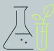

小核酸药物研发平台  
糖化学药物研发平台  
  
• 中草药和天然产物平台  
  
细胞生物学平台

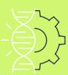

肿瘤免疫平台  
神经生物学平台(CNS)  
免疫炎症代谢心血管平台  
• 药代药动和生物分析平台  
● 定制化成药性评估服务平台

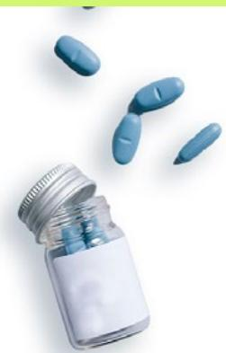

natural_image

White pill bottle with blue capsules scattered on white background (no text or symbols visible)

睿智医药全方位药物发现平台

在激励与人才保障方面，公司制定《科技及政府资金(荣誉)项目激励制度》，通过奖金激励与荣誉表彰相结合的方式对在科技创新及研发管理中表现突出的员工及团队给予支持，强化科研人员的积极性与创新动力。同时，公司面向全球引进高水平生物医药人才，并通过系统化培养机制打造专业化研发团队，为持续创新提供人才保障，从而应对研发动力不足及人才流失等潜在风险。

## 共建AI药物智造联合实验室，强化协同创新能力

2025年3月，睿智医药与华东师范大学签约共建“AI药物智造联合实验室”，围绕人工智能在药物研发与制造中的应用开展协同创新，重点聚焦新模态药物相关的关键前沿技术。该合作依托高校科研优势与企业产业化经验，通过共建技术平台与深化产学研协同，提升公司在AI赋能研发领域的技术布局能力与创新资源整合水平并促进科研成果向产业应用的转化。相关举措有助干提高研发效率与成果转化能力增强公司对新模态技术研发不确定性的应对能力，同时把握智能化驱动下医药创新发展的机遇。

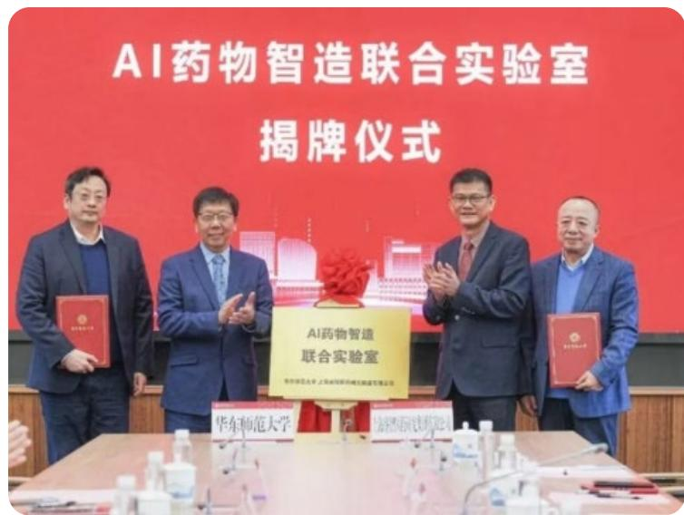

text_image

AI药物智造联合实验室
揭牌仪式
AI药物智造
联合实验室
华东师范大学 上海农村科学院城建集团有限公司

## ● 共建福田生物医药创新研发中心，强化产学研协同

2025年3月，睿智医药与香港中文大学(深圳)福田生物医药创新研发中心签署合作协议，共建“产学研医”协同创新平台。此次合作整合港中大（深圳）的前沿科研资源与睿智医药在新药研发及全球化临床经验的产业化能力，围绕AI药物筛选PROTAC技术及临床前研究开展联合研发与人才培养。该联合举措有助于提升公司在新模态药物研发领域的技术布局与创新资源整合能力，加速科研成果向产业化转化，缩短研发周期，同时增强对前沿技术研发不确定性及成果转化风险的应对能力为粤港澳大湾区乃至全球生物医药创新生态建设提供支撑，并推动创新药更快惠及患者。

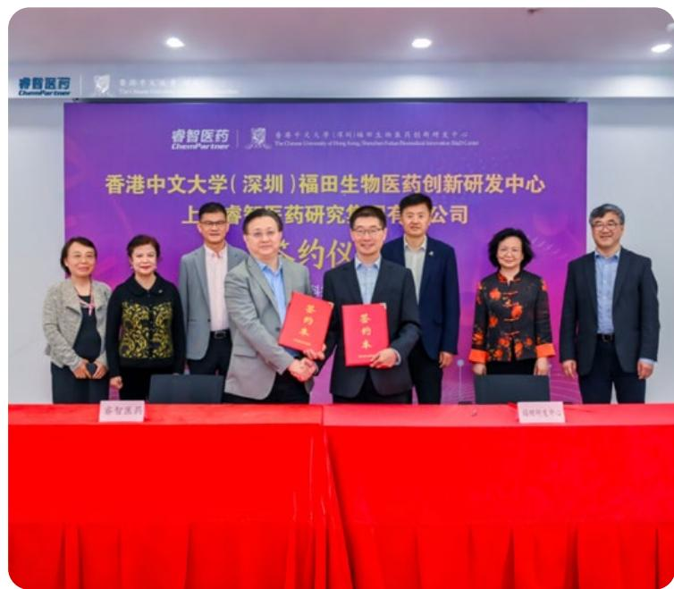

text_image

香港中文大学
香港中文大学(深圳)福田生物医药创新研发中心
上海睿智医药研究集团有限公司
签约仪式
睿智医药
The Chinese University of Hong Kong, Shenzhen Future Biological International Research Center
睿智医药
福州研究院

## 知识产权管理

公司高度重视知识产权在创新研发与成果转化中的核心作用，将其作为提升技术竞争力与保障创新成果的重要抓手。公司围绕专利、商标、著作权及商业秘密等多类型知识产权，建立覆盖研发、申请、保护与运用全过程的管理机制，持续完善知识产权管理体系。在此基础上，公司不断强化知识产权风险防控与合规管理，提升成果转化效率，推动创新价值实现与商业价值转化的有机统一，为公司可持续创新发展提供有力支撑。

## 医疗可及性提升

公司围绕降低研发成本、提升研发效率及支持未满足医疗需求等方面开展实践，助力创新药研发提速与医疗可及性提升。

## 降低研发成本与提升效率

建立标准化、模块化临床前研究体系，整合药效、安评、药代等研发环节，减少重复实验与多平台协同成本，提升研发效率。

## 支持未满足医疗需求

经系统疾病等领域创新药研发，关注老年患者、儿童等特殊人群用药需求，助力抗领域创新疗法开发，助力应对重大疾病与公共卫生挑战。

## 推动创新疗法可及

持续完善 ADC、细胞与基因治疗等技术平台能力，通过高质量研究数据支持新药申报与审评，助力创新药加速上市。

## 指标与目标

## 报告期内

公司研发人员

1,477名

占员工总数

83.40%

研发投入

5,984.17万元

占公司营业收入

5.27%

公司申请专利

15 )项

申请软件著作权

2项

公司持有有效专利

81 项

有效软件著作权

11项

有效商标

141 项

申请商标

21 项

## 动物福利与伦理

为保障科学研究的伦理性与可持续发展，睿智医药始终将实验动物福利视为企业社会责任的重要组成部分，致力于在科研创新与动物保护之间实现平衡。公司严格遵守国内外相关法规与标准，建立完善的动物福利政策框架，明确承诺遵循“3F原则”（替代、减少、优化），通过替代方法降低动物使用数量、优化实验设计减少动物痛苦，确保实验动物得到人道对待。

## 治理

公司建立了完善的动物福利管理体系，明确遵循国内外法规，贯彻“3R原则”，制度化管理实验动物使用流程。公司设立了系统化的动物平台组织架构，明确各部门职责，保障实验动物管理的专业性与高效性。IACUC(实验动物管理与使用委员会作为核心监管机构，负责监督动物实验的合规性，确保实验全过程符合伦理和福利标准，强化内部治理与科学决策。

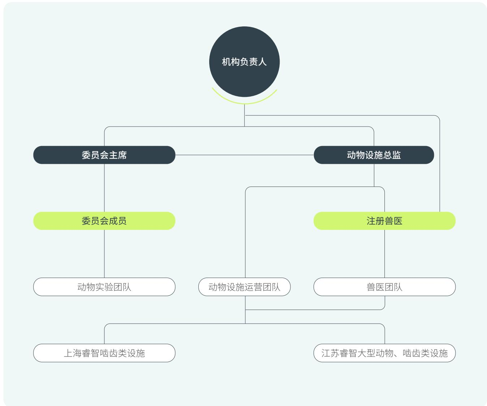

flowchart

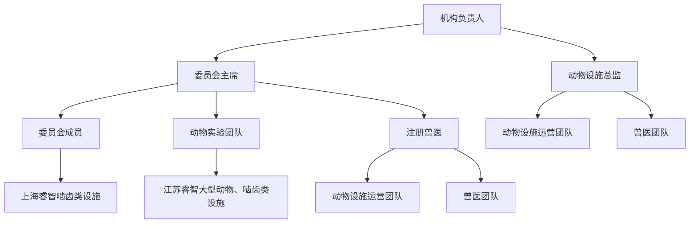
```mermaid
graph TD
  A["机构负责人"] --> B["委员会主席"]
  A --> C["动物设施总监"]
  B --> D["委员会成员"]
  B --> E["动物实验团队"]
  B --> F["注册兽医"]
  C --> G["动物设施运营团队"]
  C --> H["兽医团队"]
  D --> I["上海睿智啮齿类设施"]
  E --> J["江苏睿智大型动物、啮齿类设施"]
  F --> K["动物设施运营团队"]
  F --> L["兽医团队"]
```

## IACUC 成员

## IACUC 职责

IACUC 主席  
主治兽医（LAT）  
江苏设施兽医团队负责人  
动物设施主任  
科研人员6名  
非科研人员2名  
公众成员 1 名

●方案审查：审核动物实验的研究方案，确保符合伦理标准。  
● 半年评估：每半年进行一次动物护理和使用情况的评估。  
●政策与文档管理：负责相关政策和文档的制定与维护，确保符合法规。  
●遵循指导原则、政策和动物福利法规的合规性：确保所有动物实验都遵循相关的法规和伦理标准。  
●处理动物护理和使用的关注问题：解决有关动物护理和使用的各种问题和投诉。  
员工培训项目管理：管理动物实验相关的员工培训计划，确保实验人员具备必要的知识与技能。  
认证与合规保证：确保符合AAALAC认证&OLAW认证的相关要求。

## 报告期内

公司持有

AAALAC（国际实验动物评估与认证协会）认证

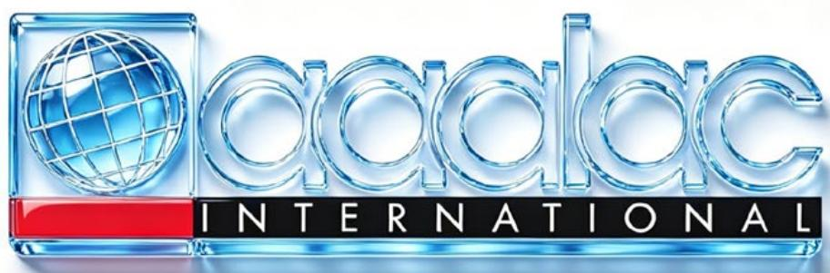

text_image

ccalac
INTERNATIONAL

## 战略

在科研创新战略中，公司将动物福利纳入核心考量，通过规范化流程与培训体系提升研究活动的伦理性，实现科学价值与社会责任的协同发展。为实现可持续创新和科研高效性，公司在战略实施过程中充分识别创新研发及实验动物管理环节的潜在风险与机遇。通过制度化管理、流程优化与培训教育，公司既能预防可能的不利影响，也能抓住提升科研伦理水平和社会责任声誉的机会。

<table><tr><td>风险类型</td><td>风险说明</td><td>潜在影响</td><td>应对措施</td></tr><tr><td>动物福利风险</td><td>实验动物健康与福利风险</td><td>若动物在实验中受到不当对待或健康异常,可能影响实验数据可靠性,并带来合规或法律风险</td><td>制度化管理、定期健康巡查、节假日巡查、动物福利培训、严格执行IACUC Protocol</td></tr><tr><td>员工操作风险</td><td>员工操作不规范</td><td>员工对3R原则理解不足或操作失误,可能导致动物福利受损</td><td>定期培训教育、考核试卷、制定标准操作程序(SOP)</td></tr><tr><td>声誉风险</td><td>社会舆论与声誉风险</td><td>动物福利事件被曝光可能影响公司社会责任形象</td><td>透明管理、完善动物福利制度、发布合规和伦理案例</td></tr></table>

风险清单

<table><tr><td>机遇类型</td><td>机遇说明</td><td>潜在影响</td><td>管理策略</td></tr><tr><td>动物福利机遇</td><td>提升科研伦理与合规水平</td><td>严格落实动物福利可增强实验科学性和数据可信度</td><td>制度化流程管理、培训教育、IACUC Protocol 审批、节日巡查等措施</td></tr><tr><td>市场机遇</td><td>动物福利合规驱动的市场准入机遇</td><td>国内外监管及客户对动物福利与实验伦理要求日益严格,良好的合规水平有助于提升客户认可度与市场准入能力</td><td>对标国际标准完善动物福利管理体系,加强合规管理与能力建设,提升客户信任与项目获取能力</td></tr></table>

机遇清单

## 影响、风险和机遇管理

## 动物健康管理

公司坚持“3R原则”作为动物福利管理的核心理念，在此基础上，公司建立了规范的动物健康管理程序，覆盖从异常动物识别、诊断、治疗到康复或人道处置的全流程，确保实验动物在整个生命周期中的健康状况得到有效保障与及时应对。

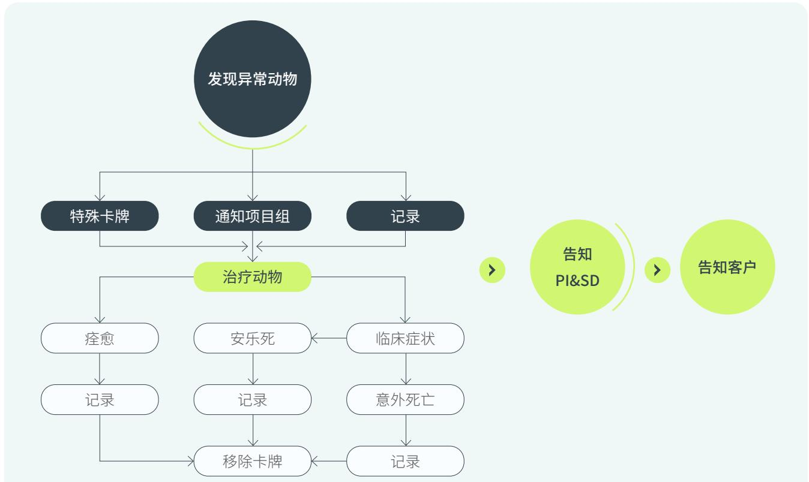

flowchart

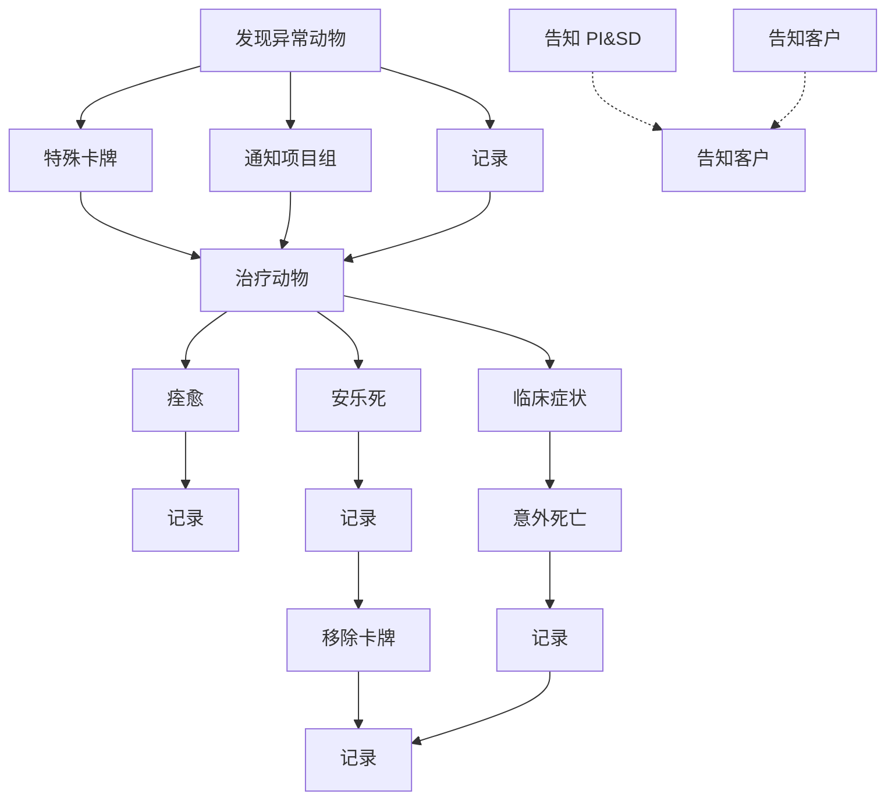
```mermaid
graph TD
  A["发现异常动物"] --> B["特殊卡牌"]
  A --> C["通知项目组"]
  A --> D["记录"]
  B --> E["治疗动物"]
  C --> E
  D --> E
  E --> F["痊愈"]
  E --> G["安乐死"]
  E --> H["临床症状"]
  F --> I["记录"]
  G --> J["记录"]
  H --> K["意外死亡"]
  J --> L["移除卡牌"]
  K --> M["记录"]
  L --> N["记录"]
  M --> N
  O["告知 PI&SD"] -.-> P["告知客户"]
  Q["告知客户"] -.-> P
```

动物健康管理程序

此外，为确保实验动物在节假日期间的健康与福利，公司定期向科研人员发布节前动物健康与福利通知，督促实验团队对动物进行自检，并安排兽医团队进行重点巡视和异常动物处置，落实《实验动物进出设施记录》等管理制度，以降低假期期间动物健康风险和实验安全隐患。

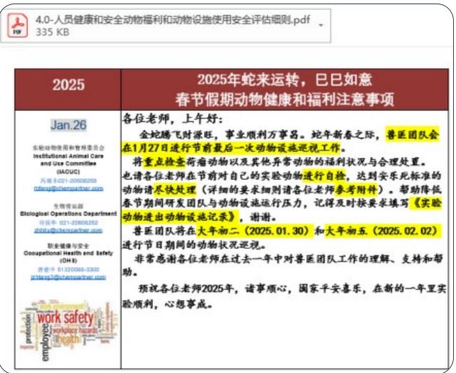

text_image

4.0-人员健康和安全动物福利和动物设施使用安全评估细则.pdf
335 KB
2025
2025年蛇来运转，已已如意
春节假期动物健康和福利注意事项
Jan.26
实验动物使用新智科委员会
Institutional Animal Care
and Use Committee
(MACUC)
冯瑞 8401-20068258
dfang@chemspartwr.com
生物资源部
Biological Operations Department
刘丽华 021-20606352
zhhu@chemspartwr.com
职业健康与安全
Occupational Health and Safety
(OH)
许建平 51320088-0300
gizhang@chemspartwr.com
work safety
workplace hazards
health
各位老师，上午好：
金蛇腾飞时漂旺，事业顺利万事昌。蛇年新春之际，兽医团队会在1月27日进行节前最后一次动物设施巡视工作。
将重点检查荷瘤动物以及其他异常动物的福利状况与合理处置。
也请各位老师在节前对自己的实验动物进行自检，达到实乐死标准的动物请尽快处理（详细的要求细则请各位老师参考附件）。帮助降低春节期间研发团队与动物设施运行压力，记得及时按要求填写《实验动物进出动物设施记录》，谢谢。
兽医团队将在大年初二（2025.01.30）和大年初五（2025.02.02）进行节日期间的动物状况巡视。
非常感谢各位老师在过去一年中对兽医团队工作的理解、支持和帮助。
预祝各位老师2025年，诸事顺心，国家平安喜乐，在新的一年里实验顺利，心想事成。

假期动物健康和福利注意事项通知

## 能力培养与文化建设

公司高度重视实验动物从业人员的能力建设，培训内容涵盖动物福利及相关专业知识，形式包括讲座、邮件推送、文件学习等，并配套试卷考核，确保员工充分掌握所学内容，从而全面提升其动物福利意识与操作水平，为实验动物福利提供有力保障。

<table><tr><td>编号Number</td><td>工程Type</td><td>是否连续与流程进行Weather completed and completion time</td></tr><tr><td>1.</td><td>金杯中心功能验收项目名称Site for starting and ending the animal faeces or lake Centre</td><td></td></tr><tr><td>2.</td><td>金杯中心功能验收人员资质及与照例Qualitative and protection of the person&#x27;s breeding and ending the Lake Centre animal faeces</td><td></td></tr><tr><td>3.</td><td>动物场地与灌溉设施出口使用及与监督事项Convenience and protection of protective facility (PFD) within the bars of animal faeces</td><td></td></tr><tr><td>4.</td><td>喷洒动物活动距离、喷洒水位及主要操作(Personers, valves of spray and ventilation of fisha breeding and leaving animal faeces)</td><td></td></tr><tr><td>5.</td><td>动物防护措施、委托人防溺性捕捞的作业Training on animal cues, wine and cosmetics</td><td></td></tr><tr><td>6.</td><td>动物排水设备与节气辅助设施及关键设备Manual Water Consumption and Annual Water Collection Units</td><td></td></tr><tr><td>7.</td><td>喷洒动物捕捞设施Banks to Special Care Entities to Student</td><td></td></tr><tr><td>8.</td><td>安装自动化及系统Guarantee for Defiance of Livelihood Assets</td><td></td></tr><tr><td>9.</td><td>运动推广及改造Actual car carrier disposed products</td><td></td></tr><tr><td>10.</td><td>开展监测及预警及检测与申请并用区域Compass Handsetology and Control Stage of Stage Notes</td><td></td></tr><tr><td>11.</td><td>天衡应急计划Drama Emergency Planning</td><td></td></tr><tr><td>12.</td><td>安装试验人员关系和实验结合与预习Introduction and prevention of artificial rules for laboratory staff and workers</td><td></td></tr><tr><td>13.</td><td>采集给木子采样遵守以上各项规定American cars and saved filling for experimental animal surgery</td><td></td></tr><tr><td>14.</td><td>指挥机关主管部门审批、组织审查Application, writing and review of formal and protocol</td><td></td></tr></table>

<table><tr><td colspan="9">单击题</td></tr><tr><td>1</td><td>2</td><td>3</td><td>4</td><td>5</td><td>6</td><td>7</td><td>8</td><td>9</td></tr><tr><td>11</td><td>12</td><td>13</td><td>14</td><td>16</td><td>18</td><td>17</td><td>18</td><td>19</td></tr><tr><td></td><td></td><td></td><td></td><td></td><td></td><td></td><td></td><td></td></tr></table>

培训考试试卷（部分）

<table><tr><td colspan="5">ChemPartner</td></tr></table>

<table><tr><td>ChemPartner</td><td>关于《化学工业设计研究院（2016）第3期》的报道</td></tr><tr><td></td><td>B. CP-04-13(2)《化工行业应用标准》征求意见稿(三)。A. 由中华人民共和国商务部进行研究,提出针对工业和化学工业的评价报告,提出针对工业和化学工业的评价报告,提出针对工业和化学工业的评价报告,提出针对工业和化学工业的评价报告,提出针对工业和化学工业的评价报告,提出针对工业和化学工业的评价报告,提出针对工业和化学工业的评价报告,提出针对工业和化学工业的评价报告,提出针对工业和化学工业的评价报告,提出针对工业和化学工业的评价报告,提出针对工业和化学工业的评价 报告</td></tr><tr><td></td><td>(2) 由中华人民共和国商务部进入生产、生产和使用的矿产资源,以下项目列入生产者或不适用(四) 为补充资料 (五) 为人员 (六) 为销售人员 (七) 为经济负责人 (八) 为财务负责人 (九) 为销售机构投资者(十) 为个人(十一) 为人事(十二) 为审计机构(十三) 为财务顾问机构和外部审计机构(十四) 为审计机构(十五) 为财务顾问机构和外部审计机构(十六) 为财务顾问机构和外部审计机构(十七) 为财务顾问机构和外部审计机构(十八) 为财务顾问机构和外部审计机构(十九) 为财务顾问机构和外部审计机构(二十) 为财务顾问机构和外部审计机构(二十一) 为财务顾问机构和外部审计机构(二十二) 为财务顾问机构和外部审计机构(二十三) 为财务顾问机构和外部审计机构(二十四) 为财务顾问机构和外部审计机构(二十五) 为财务顾问机构和外部审计机构(二十六) 为财务顾问机构和外部审计机构(二十七) 为财务顾问机构和外部审计机构(二十八) 为财务顾问机构和外部审计机构(二十九) 为财务顾问机构和外部审计机构(三十) 为财务顾问机构和外部审计机构(三十一) 为财务顾问机构和外部审计机构(三十二) 为财务顾问机构和外部审计机构(三十三) 为财务顾问机构和外部审计机构(三十四) 为财务顾问机构和外部审计机构(三十五) 为财务顾问机构和外部审计机构(三十六) 为财务顾问机构和外部审计机构(三十七) 为财务顾问机构和外部审计机构(三十八) 为财务顾问机构和外部审计机构(三十九) 为财务顾问机构和外部审计机构(四十) 为财务顾问机构和外部审计机构(四十一) 为财务顾问机构和外部审计机构(四十二) 为财务顾问机构和外部审计机构(四十三) 为财务顾问机构和外部审计机构(四十四) 为财务顾问机构和外部审计机构(四十五) 为财务顾问机构和外部审计机构(四十六) 为财务顾问机构和外部审计机构(四十七) 为财务顾问机构和外部审计机构(四十八) 为财务顾问机构和外部审计机构(四十九) 为财务顾问机构和外部审计机构(五十) 为财务顾问机构和外部审计机构(五十一) 为财务顾问机构和外部审计机构(五十二) 为财务顾问机构和外部审计机构(五十三) 为财务顾问机构和外部审计机构(五十四) 为财务顾问机构和外部审计机构(五十五) 为财务顾问机构和外部审计机构(五十六) 为财务顾问机构和外部审计机构(五十七) 为财务顾问机构和外部审计机构(五十八) 为财务顾问机构和外部审计机构(五十九) 为财务顾问机构和外部审计机构(六十) 为财务顾问机构和外部审计机构(六十一) 为财务顾问机构和外部审计机构(六十二) 为财务顾问机构和外部审计机构(六十三) 为财务顾问机构和外部审计机构(六十四) 为财务顾问机构和外部审计机构(六十五) 为财务顾问机构和外部审计机构(六十六) 为财务顾问机构和外部审计机构(六十七) 为财务顾问机构和外部审计机构(六十八) 为财务顾问机构和外部审计机构(六十九) 为财务顾问机构和外部审计机构(七十) 为财务顾问机构和外部审计机构(七十一) 为财务顾问机构和外部审计机构(七十二) 为财务顾问机构和外部审计机构(七十三) 为财务顾问机构和外部审计机构(七十四) 为财务顾问机构和外部审计机构(七十五) 为财务顾问机构和外部审计机构(七十六) 为财务顾问机构和外部审计机构(七十七) 为财务顾问机构和外部审计机构(七十八) 为财务顾问机构和外部审计机构(七十九) 为财务顾问机构和外部审计机构(八十) 为财务顾问机构和外部审计机构(八十一) 为财务顾问机构和外部审计机构(八十二) 为财务顾问机构和外部审计机构(八十三) 为财务顾问机构和外部审计机构(八十四) 为财务顾问机构和外部审计机构(八十五) 为财务顾问机构和外部审计机构(八十六) 为财务顾问机构和外部审计机构(八十七) 为财务顾问机构和外部审计机构(八十八) 为财务顾问机构和外部审计机构(八十九) 为财务顾问机构和外部审计机构(九十) 为财务顾问机构和外部审计机构(九十一) 为财务顾问机构和外部审计机构(九十二) 为财务顾问机构和外部审计机构(九十三) 为财务顾问机构和外部审计机构(九十四) 为财务顾问机构和外部审计机构(九十五) 为财务顾问机构和外部审计机构(九十六) 为财务顾问机构和外部审计机构(九十七) 为财务顾问机构和外部审计机构(九十八) 为财务顾问机构和外部审计机构(九十九) 为财务顾问机构和外部审计机构(一百) 为财务顾问机构和外部审计机构(一百零一) 为财务顾问机构和外部审计机构(一百零二) 为财务顾问机构和外部审计机构(一百零三) 为财务顾问机构和外部审计机构(一百零四) 为财务顾问机构和外部审计机构(一百零五) 为财务顾问机构和外部审计机构(一百零六) 为财务顾问机构和外部审计机构(一百零七) 为财务顾问机构和外部审计机构(一百零八) 为财务顾问机构和外部审计机构(一百零九) 为财务顾问机构和外部审计机构(一百一十) 为财务顾问机构和外部审计机构(一百一十一) 为财务顾问机构和外部审计机构(一百一十二) 为财务顾问机构和外部审计机构(一百一十三) 为财务顾问机构和外部审计机构(一百一十四) 为财务顾问机构和外部审计机构(一百一十五) 为财务顾问机构和外部审计机构(一百一十六) 为财务顾问机构和外部审计机构(一百一十七) 为财务顾问机构和外部审计机构(一百一十八) 为财务顾问机构和外部审计机构(一百一十九) 为财务顾问机构和外部审计机构(一百二十) 为财务顾问机构和外部审计机构(一百二十一) 为财务顾问机构和外部审计机构(一百二十二) 为财务顾问机构和外部审计机构(一百二十三) 为财务顾问机构和外部审计机构(一百二十四) 为财务顾问机构和外部审计机构(一百二十五) 为财务顾问机构和外部审计机构(一百二十六) 为财务顾问机构和外部审计机构(一百二十七) 为财务顾问机构和外部审计机构(一百二十八) 为财务顾问机构和外部审计机构(一百二十九) 为财务顾问机构和外部审计机构(一百三十) 为财务顾问机构和外部审计机构(一百三十一) 为财务顾问机构和外部审计机构(一百三十二) 为财务顾问机构和外部审计机构(一百三十三) 为财务顾问机构和外部审计机构(一百三十四) 为财务顾问机构和外部审计机构(一百三十五) 为财务顾问机构和外部审计机构(一百三十六) 为财务顾问机构和外部审计机构(一百三十七) 为财务顾问机构和外部审计机构(一百三十八) 为财务顾问机构和外部审计机构(一百三十九) 为财务顾问机构和外部审计机构(一百四十) 为财务顾问机构和外部审计机构(一百四十一) 为财务顾问机构和外部审计机构(一百四十二) 为财务顾问机构和外部审计机构(一百四十三) 为财务顾问机构和外部审计机构(一百四十四) 为财务顾问机构和外部审计机构(一百四十五) 为财务顾问机构和外部审计机构(一百四十六) 为财务顾问机构和外部审计机构(一百四十七) 为财务顾问机构和外部审计机构(一百四十八) 为财务顾问机构和外部审计机构(一百四十九) 为财务顾问机构和外部审计机构(一百五十) 为财务顾问机构和外部审计机构(一百五十一) 为财务顾问机构和外部审计机构(一百五十二) 为财务顾问机构和外部审计机构(一百五十三) 为财务顾问机构和外部审计机构(一百五十四) 为财务顾问机构和外部审计机构(一百五十五) 为财务顾问机构和外部审计机构(一百五十六) 为财务顾问机构和外部审计机构(一百五十七) 为财务顾问机构和外部审计机构(一百五十八) 为财务顾问机构和外部审计机构(一百五十九) 为财务顾问机构和外部审计机构(一百六十) 为财务顾问机构和外部审计机构(一百六十一) 为财务顾问机构和外部审计机构(一百六十二) 为财务顾问机构和外部审计机构(一百六十三) 为财务顾问机构和外部审计机构(一百六十四) 为财务顾问机构和外部审计机构(一百六十五) 为财务顾问机构和外部审计机构(一百六十六) 为财务顾问机构和外部审计机构(一百六十七) 为财务顾问机构和外部审计机构(一百六十八) 为财务顾问机构和外部审计机构(一百六十九) 为财务顾问机构和外部审计机构(一百七十) 为财务顾问机构和外部审计机构(一百七十一) 为财务顾问机构和外部审计机构(一百七十二) 为财务顾问机构和外部审计机构(一百七十三) 为财务顾问机构和外部审计机构(一百七十四) 为财务顾问机构和外部审计机构(一百七十五) 为财务顾问机构和外部审计机构(一百七十六) 为财务顾问机构和外部审计机构(一百七十七) 为财务顾问机构和外部审计机构(一百七十八) 为财务顾问机构和外部审计机构(一百七十九) 为财务顾问机构和外部审计机构(一百八十) 为财务顾问机构和外部审计机构(一百八十一) 为财务顾问机构和外部审计机构(一百八十二) 为财务顾问机构和外部审计机构(一百八十三) 为财务顾问机构和外部审计机构(一百八十四) 为财务顾问机构和外部审计机构(一百八十五) 为财务顾问机构和外部审计机构(一百八十六) 为财务顾问机构和外部审计机构(一百八十七) 为财务顾问机构和外部审计机构(一百八十八) 为财务顾问机构和外部审计机构(一百八十九) 为财务顾问机构和外部审计机构(一百九十) 为财务顾问机构和外部审计机构(一百九十一) 为财务顾问机构和外部审计机构(一百九十二) 为财务顾问机构和外部审计机构(一百九十三) 为财务顾问机构和外部审计机构(一百九十四) 为财务顾问机构和外部审计机构(一百九十五) 为财务顾问机构和外部审计机构(一百九十六) 为财务顾问机构和外部审计机构(一百九十七) 为财务顾问机构和外部审计机构(一百九十八) 为财务顾问机构和外部审计机构(一百九十九) 为财务顾问机构和外部审计机构(一百一百) 为财务顾问机构和外部审计机构(一百一百零一) 为财务顾问机构和外部审计机构(一百一百零二) 为财务顾问机构和外部审计机构(一百一百零三) 为财务顾问机构和外部审计机构(一百一百零四) 为财务顾问机构和外部审计机构(一百一百零五) 为财务顾问机构和外部审计机构(一百一百零六) 为财务顾问机构和外部审计机构(一百一百零七) 为财务顾问机构和外部审计机构(一百一百零八) 为财务顾问机构和外部审计机构(一百一百零九) 为财务顾问机构和外部审计机构(一百一百一十) 为财务顾问机构和外部审计机构(一百一百一十一) 为财务顾问机构和外部审计机构(一百一百一十二) 为财务顾问机构和外部审计机构(一百一百一十三) 为财务顾问机构和外部审计机构(一百一百一十四) 为财务顾问机构和外部审计机构(一百一百一十五) 为财务顾问机构和外部审计机构(一百一百一十六) 为财务顾问机构和外部审计机构(一百一百一十七) 为财务顾问机构和外部审计机构(一百一百一十八) 为财务顾问机构和外部审计机构(一百一百一十九) 为财务顾问机构和外部审计机构(一百二十) 为财务顾问机构和外部审计机构(一百二十一) 为财务顾问机构和外部审计机构(一百二十二) 为财务顾问机构和外部审计机构(一百二十三) 为财务顾问机构和外部审计机构(一百二十四) 为财务顾问机构和外部审计机构(一百二十五) 为财务顾问机构和外部审计机构(一百二十六)</td></tr></table>

公司将动物福利理念深植于组织文化之中，致力干营造重视生命、尊重伦理的科研文化氛围。公司每年举办动物福利日及纪念活动，组织员工向实验动物致敬，并要求实验动物从业人员签署动物福利承诺书，明确遵守人道主义及相关动物保护规范，形成制度化、可追溯的行为承诺。

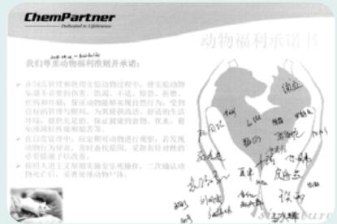

text_image

ChemPartner
Deplicated in Lightview
动物福利承诺书
我们尊重动物福利准则并承诺：
· 在居民管理和使用实验动物过程中，使实验动物保护基本必要的伤害、饥饿、不适、暂停、拆整、死虫的时期，使动物能够实现自然行为，受到良好的管理与现状，为我国提供活动，营造的长远环境，提供充足的保证健康的食物、饮水，避免或减轻轻重和痛苦等。
· 在日常管理中，定期辅导动物进行观察，若发现动物行为异常，及时查找原因，采取有针对性的措施。
· 披明人类主义原则实施安全和操作，二次确认动物死亡后，妥善处理动物尸体。

## ● 动物福利日活动——致敬实验动物

2025年4月24日，公司实验动物从业人员在实验动物纪念日组织纪念活动，前往实验动物纪念碑集体默哀三分钟并献上鲜花，向为科学进步和人类健康默默奉献的实验动物致敬。通过此次活动，公司不仅表达了对实验动物贡献的尊重，也强化了员工对动物福利与科研伦理的意识，进一步推动内部培训和制度落实，确保实验过程的人道性与合规性，为公司动物福利管理和科研责任实践提供了精神引领和示范作用。

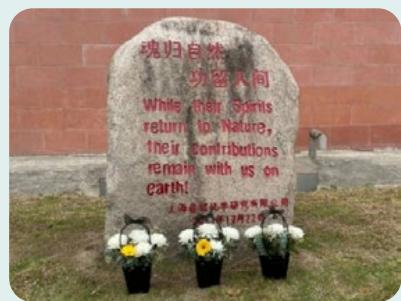

text_image

魂归自然
功臣人间
While their Spirits
return to Nature,
their Contributions
remain with us on
earth!
上海空港化学研究有限公司
2011年12月27日

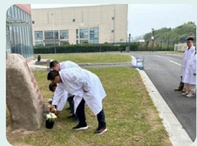

natural_image

Two people in lab coats cleaning a stone marker outdoors near a modern building (no visible text or symbols)

## 报告期内

公司动物福利相关培训共开展

7 场次

培训人员

452人次

## 品质管理

睿智医药秉持“科学卓越、质量优先、全方位服务”的质量理念，将品质管理贯穿研发、生产、检测及客户服务全流程，致力干构建覆盖全生命周期的质量管理体系。通过完善的制度建设、标准化操作规程、持续改进机制以及全员培训，公司确保每一个环节均符合法规及行业准则要求并满足客户期望。

natural_image

Interior of a modern laboratory with scientists in cleanroom suits working at desks and equipment (no visible text or symbols)

## 治理

公司在质量与客户管理方面由质量管理部统筹负责。公司已建立完善的GMP质量管理体系，并依托该体系制定了覆盖生产与研发全过程的质量管理规章制度，包括管理文件，标准操作程序、工艺规程、质量标准，批生产记录、检验记录等，同时开展与质量相关的风险评估，推动体系的持续改进。体系文件采用三层结构，涵盖质量手册、程序文件，标准操作规程，质量记录及技术记录表格，结合药代检测实验室的行业技术规范要求，基本覆盖全要素及各类工作环节。此外，为进一步完善客户服务，公司制定了《产品投诉管理规程》，确保客户投诉得到及时、有效的处理将影响降至最低。

## 战略

公司坚持“科学卓越、质量优先、全方位服务”的质量方针，致力于建立覆盖研发，生产，检测及客户服务的全生命周期质量管理体系。通过完善的文件体系、标准操作规程及持续改进机制，公司确保每一个环节符合监管要求、满足客户期望，并推动质量体系与业务战略方向一致。

为确保质量方针有效落地，公司对各环节的潜在风险与机会进行了系统识别和评估，并形成风险与机遇管理清单，以便持续改进和优化质量管理体系。

<table><tr><td>风险类型</td><td>风险描述</td><td>潜在影响</td><td>应对措施</td></tr><tr><td>质量控制风险</td><td>实验或生产过程中可能出现偏差或操作失误</td><td>数据可能不准确、交付物可能不合格</td><td>完善SOP,强化现场核查,偏差及时整改</td></tr><tr><td>合规风险</td><td>未完全遵守法规或认可准则</td><td>可能受到法律责任、监管处罚</td><td>QMS及DMS系统管理,内部审计和外部复评审</td></tr><tr><td>设备与设施风险</td><td>仪器设备故障或环境控制不达标</td><td>可能影响实验质量</td><td>定期维护校准,环境监控和管理制度</td></tr><tr><td>客户投诉风险</td><td>产品或服务不符合客户期望</td><td>可能导致客户满意度下降</td><td>建立投诉管理规程,快速响应和处理</td></tr></table>

风险清单

<table><tr><td>机遇类型</td><td>机遇描述</td><td>潜在价值</td><td>实施措施</td></tr><tr><td>培训与能力提升</td><td>持续开展员工培训与能力考核</td><td>提高操作规范性和工作效率</td><td>定期开展GLP/GCP培训、程序文件培训及现场考核</td></tr><tr><td>客户满意度提升</td><td>完善客户投诉及服务流程</td><td>增强客户信任和市场竞争力</td><td>定期回访、及时处理投诉、持续优化服务流程</td></tr><tr><td>风险预防能力增强</td><td>定期风险评估与监控</td><td>提前识别潜在问题,降低质量事故</td><td>建立风险清单,开展预防性管理和监督</td></tr></table>

机遇清单

## 影响、风险和机遇管理

为应对风险，把握机遇，公司建立并运行全生命周期质量管理体系(ELOMS)，覆盖从研发，试剂与样本管理，实验实施数据记录，分析检测到结果报告及客户交付的完整过程，确保研究数据质量可靠，为药物安全性监测和药物警戒提供坚实基础。公司主营业务为CRO/CDMO服务，不涉及终端产品销售，不涉及产品召回事项。报告期内，公司未发生重大质量事件

## 制度建设与文件管理

公司依据内部和外部审核发现、法规及行业标准要求，定期修订质量手册、程序文件、标准操作规程及相关记录表格，确保体系覆盖项目全周期各环节，并通过岗位培训或自学留存记录，实现制度与操作的有效衔接。

2025年，公司共计修订了14个程序文件、3个标准操作规程，1次质量手册，以及若于记录表格。所有修订后的体系文件均根据岗位职责要求进行培训或自行阅读。

## 流程风险评审

质量负责人组织各部门负责人对实验室全生命周期各环节进行风险与机遇评估，包括人员资质能力、健康及安全、设施设备管理、合同与供应链管理试剂和样本管理、实验方法与标准执行、环境控制、数据合规性及安全管理等关键环节，识别潜在风险点、评估现有措施充分性，形成风险评估报告，为后续改进和优化提供依据

## 人员能力建设

质量负责人组织各部门负责人对实验室全生命周期各环节进行风险与机遇评估，包括人员资质能力、健康及安全、设施设备管理、合同与供应链管理、试剂和样本管理、实验方法与标准执行、环境控制、数据合规性及安全管理等关键环节，识别潜在风险点、评估现有措施充分性，形成风险评估报告，为后续改进和优化提供依据。

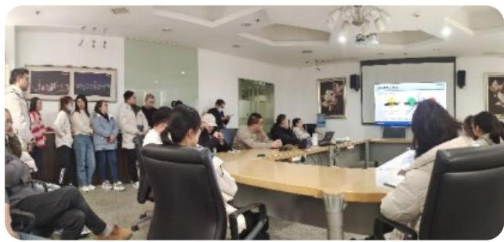

natural_image

Interior of a conference room with attendees seated around a conference table, facing a presentation screen (no visible text or symbols)

GMP基础培训

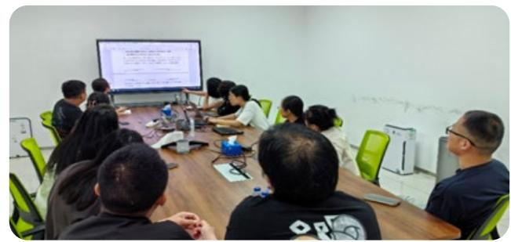

natural_image

Group of people seated around a conference table in a meeting room, facing a large screen displaying a document (no visible text or symbols on the screen)

CNAS核查后学习

## 系统支持与持续改进

公司利用电子化质量管理系统（QMS 系统 TrackWise）和文档管理系统（DMS/TMS）对偏差处理、变更控制、CAPA、文件记录及培训全过程进行管理，实现全流程可追溯和规范化运作。结合内部审核、风险评估及改进决策落实，保证全生命周期质量管理体系持续适宜、充分、有效，同时为提升实验流程效率、优化资源配置和增强客户满意度提供保障。

## 指标与目标

生物分析中心实际运行情况符合质量管理体系、认可准则以及质量管理规范的要求，质量管理体系的各项要求均在工作中得到全面的贯彻，体系保持有效运行和持续改进。

质量目标及完成情况如下：

<table><tr><td>质量目标</td><td>目标值</td><td>实际完成</td><td>达成情况</td></tr><tr><td>客户满意度</td><td> $\geqslant 98\%$ </td><td>均满意</td><td>达成</td></tr><tr><td>检测及时率</td><td> $\geqslant 95\%$ </td><td>均检测及时</td><td>达成</td></tr><tr><td>投诉处理率</td><td>100%</td><td>未被投诉</td><td>达成</td></tr><tr><td>检测结果差错率</td><td> $\leqslant 1\%$ </td><td>客户未反馈检测结果差错</td><td>达成</td></tr></table>

## 报告期内

公司对生物分析中心年度内部质量审核

60次

整改完成率

100%

接受客户审计

1次

全年共组织年度培训

20场

接受国家认可机构复评审

1次

培训总时长

553.5 5小时

## 数智运营

睿智医药以“预防为主、分级保护、持续改进、客户信赖”为信息安全管理方针，构建了分层分类的信息安全管理架构并制定《信息安全管理体系总纲》《信息安全事件管理办法》等制度文件，持续完善信息安全管理体系。报告期内，公司已通过IS027001信息安全管理体系认证，按照国际标准持续推进信息安全体系建设与优化

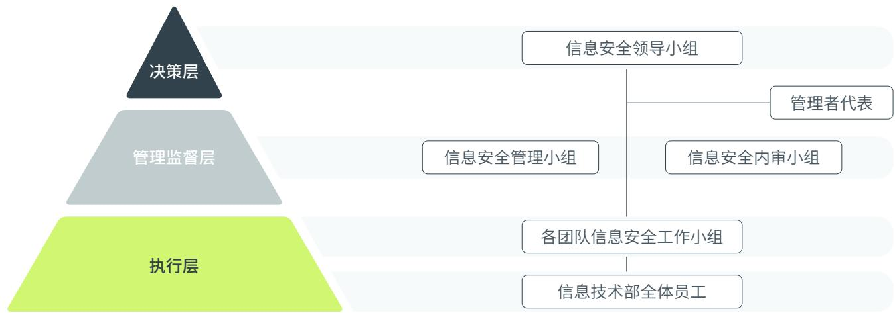

flowchart

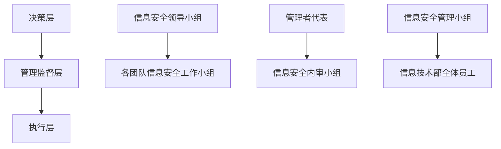
```mermaid
graph TD
  A["决策层"] --> B["管理监督层"]
  B --> C["执行层"]
  D["信息安全领导小组"] --> E["各团队信息安全工作小组"]
  F["管理者代表"] --> G["信息安全内审小组"]
  H["信息安全管理小组"] --> I["信息技术部全体员工"]
```

## 审查与监督机制

公司建立了多层级信息安全审查机制，包括年度信息安全合规审计、季度专项审查及事件触发审查。

## 年度信息安全合规审计

每年开展1次，由信息技术部联合内审团队执行，覆盖ISO 27001 及客户信息安全要求。

## 季度专项审查

每季度针对数据访问权限、安全策略执行情况进行抽查，重点核查员工账号权限变更、外部数据传输合规性。

## 事件触发审查

发生安全事件(如数据泄露、动专项审查，深信服团队配合复盘漏洞并更新控制措施。

## 报告期内

公司完成年度审计

1

整改完成率达

100%

季度审查

4

次，形成整改清单并闭环跟踪

## 数据与系统安全保障

公司围绕关键业务系统与核心数据构建多层级备份与容灾机制。备份范围涵盖临床试验数据管理系统、客户服务平台、邮件系统及数据库系统等关键系统，并覆盖服务器、存储及网络设备等核心硬件。同时，公司在上海总部之外建立异地灾备中心，实现关键数据高频同步，并每半年定期开展灾备演练验证系统恢复能力，确保在极端情况下业务连续性与数据可用性。

## 数据层面

●核心数据库：采用实时同步+每日全量备份+每小时增量备份，备份数据存储于本地高性能存储及异地灾备中心。  
业务系统配置：每日全量备份，配置变更后立即触发增量备份。  
•邮件系统：每日全量备份，保留周期为90天，重要客户邮件归档永久保留。

备份机制

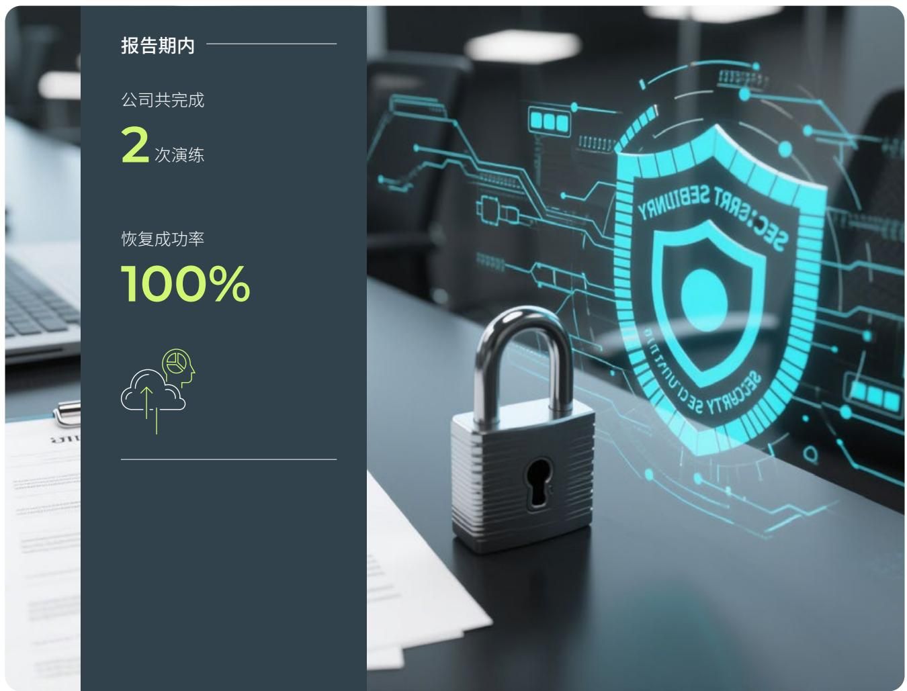

text_image

报告期内
公司共完成
2次演练
恢复成功率
100%

## 应急响应

公司建立了标准化信息安全事件处置流程，覆盖监测预警、识别定级、控制遏制、消除恢复及调查溯源等关键环节，一旦发生风险事件，快速开展系统隔离、权限管控及漏洞修复，并通过灾备机制恢复系统运行。同时，公司明确内部与外部沟通机制，确保在规定时限内完成管理层报告及客户、监管沟通。事后通过专项复盘与内审机制，持续优化安全策略与管理措施，不断提升信息安全管理的前瞻性与有效性。

同时，公司持续加强信息安全培训与宣贯，通过专题培训、案例复盘及日常提醒等多种形式，提升员工对数据安全、网络风险及合规要求的认知水平，并结合典型安全事件开展针对性培训与演练，强化员工风险识别与应急处置能力，推动信息安全管理要求在日常工作中的有效落实。

## 监测与预警

通过日志审计系统、入侵检测系统（IDS）、邮件过滤系统实时监测，发现异常（如批量数据导出、异常境外访问、钓鱼邮件成功触发）立即启动预警

## 识别与定级

●技术处置组1小时内完成数据泄露类型、范围、载体识别，FRT组长2小时内完成等级判定

## 控制与遏制

●立即切断受影响系统网络连接，暂停相关账号权限  
●隔离感染终端，禁用异常数据传输端口  
对泄露源头（如漏洞、账号、设备）进行临时封堵

## 消除与恢复

●修复系统漏洞，更新安全策略（如GPO配置、防火墙规则）  
●重置泄露相关账号密码，排查权限滥用情况  
●从异地灾备中心恢复于净数据，验证系统可用性

## 调查与溯源

联合内审部门开展技术溯源，分析泄露原因（人为失误、系统漏洞、恶意攻击），形成调查报告，明确责任主体

## 沟通与上报

●内部：24小时内向公司管理层上报  
●外部：涉及客户数据泄露，48小时内通知相关客户：涉及监管要求的，按法规时限上报：必要时发布官方声明，避免舆情扩散

●应急处置流程

## 可持续供应链

睿智医药持续完善供应链管理体系，围绕供应商准入、评估、监督与改进等关键环节，构建规范化、可追溯的供应链管理流程，推动供应链安全与责任管理水平不断提升。围绕供应链合规与风险管理，公司制定了《供应商社会责任行为准则》《供应商资格确认、取消及恢复管理规程》《供应商审计规程》《供应商评估标准化操作流程》《供应商投诉规程》等制度文件，明确供应商管理标准与流程要求。

## 供应商准入与尽职调查

公司建立了标准化准入流程，所有供应商均需通过资质审核与风险评估，涵盖企业信用、法律合规及ESG表现等维度，并通过国家企业信用信息公示系统等平台开展风险筛查。针对关键及主要供应商，公司要求签署《供应商社会责任行为准则《保密及反贿赂协议》，确保其在商业道德、人权保护、环境与职业健康安全等方面符合相关要求。

## 供应商分级管理与动态评估

公司根据采购规模与合作重要性，将供应商划分为“一般”“关键”“主要”三个等级，实施差异化管理。针对关键及主要供应商，开展季度及年度绩效评估，并设定量化标准，未达标供应商需进行整改或降级处理，形成动态管理机制。

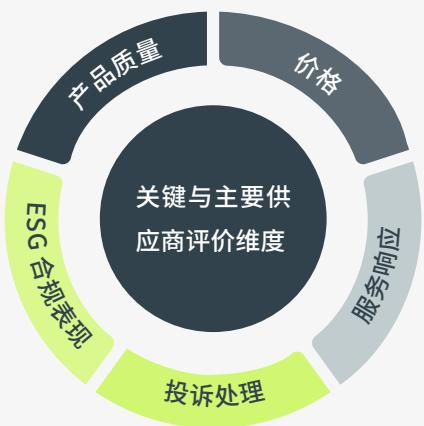

flowchart

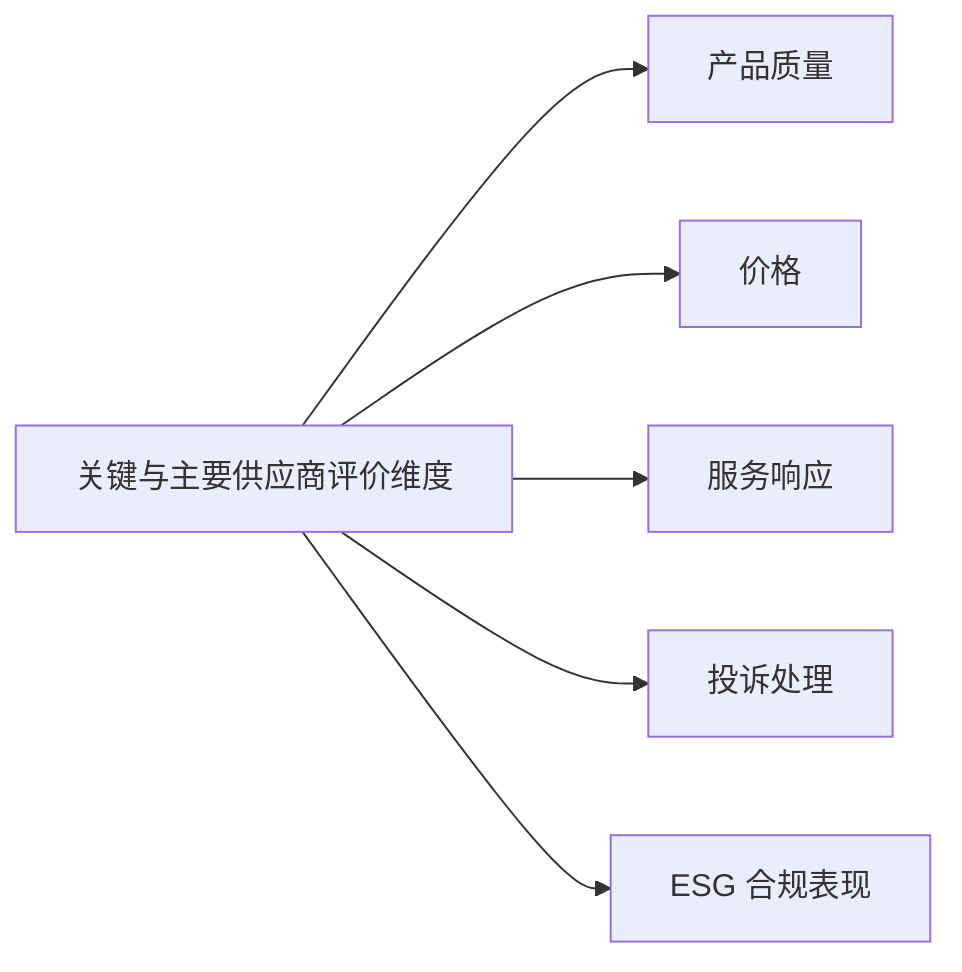
```mermaid
graph LR
  A["关键与主要供应商评价维度"] --> B["产品质量"]
  A --> C["价格"]
  A --> D["服务响应"]
  A --> E["投诉处理"]
  A --> F["ESG 合规表现"]
```

## 负责任采购

公司将ESG要求纳入供应商管理全过程，通过供应商ESG自评，第三方数据调研及现场审核等方式，持续跟踪供应商在环境。社会与治理方面的表现。同时，通过提供培训资料、问卷调研及能力建设支持，引导供应商提升ESG管理水平，推动供应链整体可持续发展。

  
供应商 ESG管理举措

供应商准入过程需签订 《供应商社会责任行为准则》 《保密及反贿赂协议》满足 PSC审计要求。  
通过第三方平台调研供应商ESG评级数据相关内容。  
●针对关键、主要供应商进行季度及年度绩效考评，ESG考评分值大于80分，视为达标80分以下通知供应商整改或进行供应商降级操作，ESG 为其中一项考核项目。

供应商ESG管理举措

## 监督与整改

公司建立供应商投诉与问题管理机制，对供应过程中的质量问题、交付异常及合规风险进行分级管理与持续跟踪。对于存在重大问题的供应商，公司要求限期整改并重新评估其合作资格，必要时启动退出机制，确保供应链稳定与风险可控

## 供应商沟通与能力建设

公司与供应商建立常态化沟通机制，通过邮件及即时通讯工具开展日常业务对接及风险沟通，并通过ESG宣传资料、在线平台及问卷调研等形式，对供应商开展持续培训与宣贯，提升其合规意识与管理能力。同时，公司也对内部采购人员开展 ESG 及制度培训，强化供应链管理执行力。

## 目录

1. 睿智医药介绍  
2. ESG简介  
3. ESG对企业的作用和功能  
4. 睿智医药供应商社会行为准则  
5. 央视宣传资料-ESG

供应商ESG宣传资料

natural_image

Man in business attire clapping hands with a laptop, smiling at the camera (no visible text or symbols)

## 报告期内

公司供应商总数

490 家

供应商本地化比例

62.86%

关键及主要供应商《保密及反贿赂

协议》签订率 100%

通过环境审核的供应商数

140家

通过社会审核的供应商数

140

供应商培训次数

60余次

培训总时长

60小时

关键及主要供应商培训覆盖率超

95%

## 人才管理与员工关怀

员工是企业最宝贵的财富，睿智医药始终坚持“以人为本”的发展理念，将员工福利、职业发展、健康安全、人文关怀融入ESG管理全过程，构建公平公正、包容多元、赋能成长的员工发展环境，凝聚企业与员工共同发展的强大合力。

## 人才招聘

睿智医药始终坚持“人才是企业发展的第一资源”的理念，将合法合规、公平公正、多元包容作为人才引进的根本原则2025年，公司持续完善招聘管理体系，致力于打造一支结构合理、持续竞争力强的多元化人才队伍，为公司高质量发展提供坚实的人才保障。

## 招聘管理制度

公司严格遵守《劳动法》《劳动合同法》《妇女权益保障法》《禁止使用童工规定》等法律法规，制定并持续完善《招聘管理制度》《人才推荐奖励管理细则》《员工手册》《反强迫劳动与合规用工管理制度》等内部制度，确保员工健康和安全的工作环境。

## 包容性和多元化

公司建立公平、公正、公开、择优的招聘机制，杜绝童工雇佣、强迫劳动等违法行为。同时，为营造多元包容的职场环境我们承诺不因种族、肤色、宗教信仰、性别、年龄、国籍、残疾状况、婚姻状况、退伍军人身份或任何其他受法律保护的特征而歧视任何人，保障女性员工权益，打造蓬勃向上的企业文化氛围。

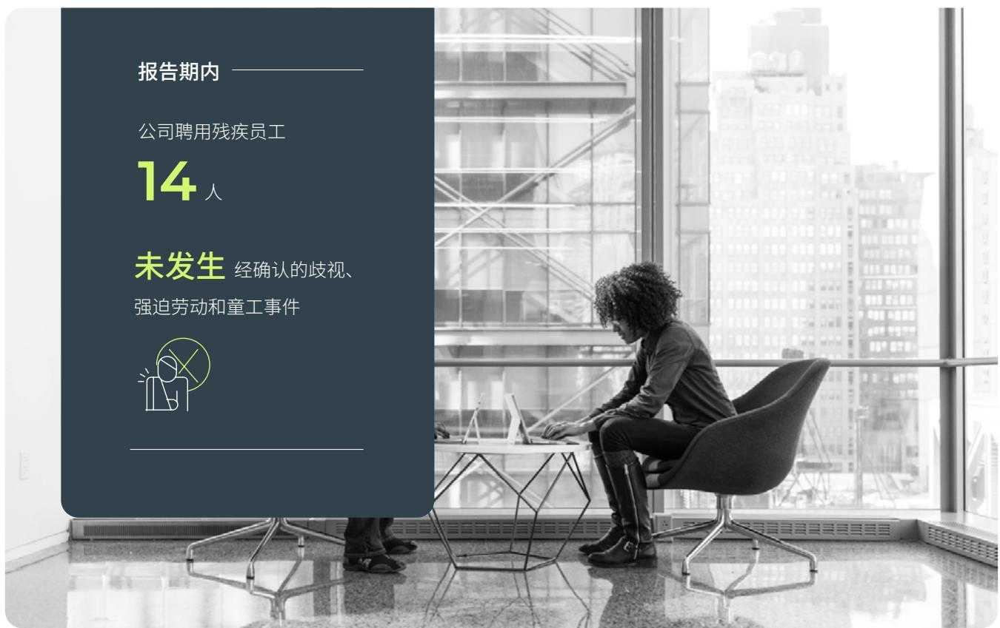

text_image

报告期内
公司聘用残疾员工
14人
未发生 经确认的歧视、
强迫劳动和童工事件

## 员工构成

公司持续优化人才队伍结构，注重多元化建设。报告期内，员工总数为1.771人，新进员工334人。

按性别划分（人）  
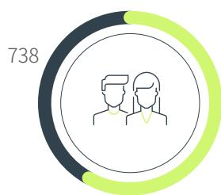  
女性员工人数  
男性员工人数

按年龄划分（人）  
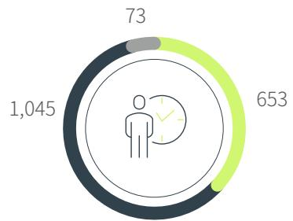

donut

| Category | Value |
| --- | --- |
| Dark Gray Segment | 1,045 |
| Light Green Segment | 653 |
| Grey Segment | 73 |

30岁以下员工人数  
30-50 岁员工人数  
50岁以上员工人数

按学历划分（人）  
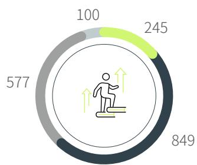

donut

| Category | Value |
| --- | --- |
| Segment 1 | 100 |
| Segment 2 | 245 |
| Segment 3 | 849 |
| Segment 4 | 577 |

本科及以下员工人数  
本科员工人数  
硕士员工人数  
博士员工人数  
员工构成

## 人才培训与发展

公司构建了系统化、多元化的人才培养体系，通过完善的培训制度、科学的绩效管理、先进的数字化平台，为员工提供持续学习和职业发展的广阔空间，实现员工价值与企业价值的共同成长。

## 培训体系及制度

公司由人力资源部下设培训中心统筹员工培训与发展工作，负责培训政策制定、资源配置及体系建设；各业务部门设立培训BP，负责培训需求收集、组织实施及效果反馈，形成上下协同的培训管理机制

2025年，公司发布新版《培训制度》，覆盖全体员工及实习生构建“需求调研一计划制定一组织实施一效果评估”的闭环管理体系，确保培训过程规范、结果可追溯。

## 培训理念

  
全面覆盖

• 人员全面覆盖 新员工、管理层、初级领导层、各部门各层级  
内容全面覆盖— 领导力、通用能力、专业技能、新员工培训  
●方式全面覆盖—线上、线下、外部

  
持续学习

培训计划贯穿全年，每个月都有相应的培训安排，鼓励员工持续学习和提升。  
通过定期的培训和考核，确保员工不断更新知识和技能，适应公司发展的需要。

员工培训理念

## 绩效管理制度

公司建立《绩效管理制度》，将企业经营目标层层分解至部门及个人，明确考核周期、流程与责任主体，形成闭环管理绩效结果不仅作为薪酬调整与晋升的重要依据，也用于识别员工能力短板，为培训与发展提供数据支持，实现考核与发展的联动。

同时，公司建立常态化的绩效沟通与申诉机制，保障员工在绩效管理全过程的参与权和知情权。在绩效指标设定阶段，上级主管与员工充分沟通，确保目标清晰、共识达成。

## 申诉条件

在绩效考核结果产生过程中，员工如认为受不公平对待，可在考核期间或考核结束后2天内直接向部门负责人、分管领导或人力资源部申诉。

## 申诉形式

填写表格《员工绩效考核申诉表》，提交部门负责人和人力资源部统一备案。

## 申诉处理

人力资源部组织由申诉人直接领导、部门负责人及分管领导组成的处理小组进行复核，并根据审批权限提请相应领导审定后形成最终结果，由人力资源部向申诉人反馈。

## 数字化学习平台

公司搭建线上培训与考试系统，整合课程学习、在线考试及技能评估，实现培训全流程数字化管理。报告期内，平台上线课程20余门并持续扩展，配套考试、签到及作业系统，实现学习过程、培训成果及认证情况的全流程可追踪，有效提升培训管理效率与学习体验。

同时，公司支持员工参与专业技能认证及外部培训，鼓励持续提升专业能力与综合素质。

## 职业发展与人才激励

在职业发展方面，公司优化职级体系，构建管理、销售、研发、职能及生产等多通道发展路径，明确员工成长方向，并结合绩效结果为高绩效员工提供晋升机会，持续提升人才吸引与保留能力。

报告期内，公司实施限制性股票激励计划。每股3.05元的授予价格，向123名激励对象授予总计4.456.00万股限制性股票，进一步完善中长期激励机制，提升人才稳定性与组织凝聚力。

## 报告期内

公司共开展培训

55 场

员工平均培训时长达

12.41 小时

培训总支出

286,174 元

培训覆盖率达

100%

## 员工权益与福利

公司致力于构建具有竞争力的福利保障体系，通过完善的薪酬福利制度、人性化的假期安排和丰富多彩的员工活动，不断提升员工的获得感、归属感和幸福感

## 员工福利体系

公司建立了多层次、多维度的福利保障体系，涵盖法定福利和公司福利两大层面，全方位关爱员工生活与健康。

## 法定福利

五险一金  
法定节假日  
岗前、岗中、岗后职业健康 体检  
带薪年休假（符合条件员工享有）、产假

## 公司福利

餐饮补贴、通讯费补贴、交通补贴、住房补贴  
针对应届生及异地员工提供短期过渡住房支持  
传统节假日及生日礼品礼金  
婚假、丧假、陪产假、育儿假、带薪病假  
团建福利  
退休关怀

员工福利类型

公司特别关注女性员工需求，除提供优于法定标准的产假及生育津贴外，还为怀孕员工设置灵活工作安排和弹性工作时间并在办公区域配备专用母婴室和哺乳室，营造家庭友好型工作环境，帮助女性员工平衡工作与家庭

## 薪酬福利管理制度

公司以“责任与利益一致，能力与价值一致，风险与回报一致，业绩与收益一致”为目标，制定并实施《薪酬福利管理制度》系统规范薪酬福利管理，制度明确遵守“同工同酬”，杜绝因性别，年龄，民族，户籍，身休状况等非绩效因素的薪酬差异公司薪酬委员会及内审部门每年开展薪酬公平性审计，确保薪酬决策无歧视。此外，公司还制定了《假期与考勒管理制度》确保员工休假权益得到有效落实。

## 员工活动

2025年，公司组织开展了形式多样、内容丰富的员工活动，营造积极向上，和谐温馨的工作氛围。

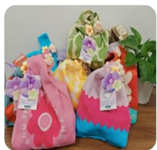

natural_image

Colorful handmade gift bags with floral decorations and a potted plant on a wooden surface (no visible text or symbols)

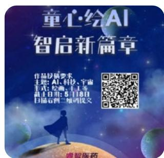

text_image

童心绘AI
智启新篇章
作品以膜要求
主题: AI、科技、宇宙
需求: 1-5%
截止日期: 5月18日
扫描右侧二维码提交
睿智医药

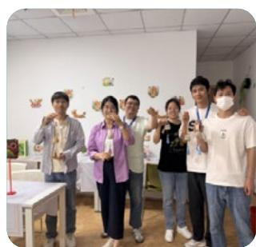

natural_image

Group photo of six people posing indoors, some holding microphones and phones (no visible text or symbols)

## 民主管理与沟通

公司建立多元化员工沟通机制，已设立职工代表大会，并积极推进工会建设，逐步形成“职代会+工会”的民主管理架构。通过年度职代会、月度全员大会及董事长信箱等渠道，构建常态化沟通机制，及时倾听员工诉求并推动问题闭环解决。职工代表覆盖各业务序列，一线员工占比超过50%，有效保障员工参与权与表达权。

公司重视劳动关系管理，建立规范的劳动纠纷处理机制，依法合规推进争议解决。报告期内，公司发生的劳动纠纷均按程序妥善处理。同时，公司明确工资不低于最低工资标准，社保公积金覆盖率保持100%，员工商业保险覆盖率亦达100%。

## 报告期内

公司开展员工满意度调查，员工满意度达

89.2%

## 职业健康与安全

公司始终将员工职业健康与安全生产置于企业运营的首要位置。公司严格遵守《安全生产法》《职业病防治法》等法律法规，建立健全职业健康安全管理体系，通过制度保障、资源投入、风险防控和应急管理，持续营造安全、健康、和谐的工作环境。

## 治理

公司建立了完善的职业健康安全管理体系，明确各级人员的安全职责，确保安全管理工作有章可循、责任到人。公司制定并严格执行《环境健康安全管理手册》，《职业健康监护及档案管理制度》，《职业健康安全管理》《职业病危害防治责任制度》《职业病防护设施“三同时”管理制度》，全面规范员工体检、医疗救助及工伤处理流程；《突发环境事件应急预案》明确火灾、爆炸、化学品泄漏等突发情景的应急处置流程；《个人防护用品管理程序》规范防护用品的评估、配备、使用和监督，确保员工在作业中获得有效防护

为加强对公司安全生产监察的力度，确保安全生产工作的有序进行，结合公司现行组织机构，成立公司安全生产委员会、安全生产办公室和安全生产小组，明确各层级、各部门在安全管理中的职责，形成“统一领导、分级负责、全员参与”的管理格局。

## 安全生产委员会（领导）

## 安全生产办公室（管理）

## 安全生产小组

安委会组织架构

## 战略

公司高度重视员工职业健康与安全，将保障员工安全、营造健康工作环境作为公司可持续发展的重要组成部分。公司秉持“预防为主、全员参与、持续改进”的原则，将职业健康与安全管理融入企业治理与风险管理体系，持续提升工作场所安全和员工健康水平。基于此，公司对潜在职业健康与安全风险及可能带来的管理机遇进行了系统识别，并制定了相应的应对措施。

<table><tr><td>风险类别</td><td>风险描述</td><td>可能影响</td><td>应对措施</td></tr><tr><td>工伤风险</td><td>员工操作不当或设备故障可能导致受伤</td><td>可能造成项目延误、医疗处理需求增加、员工安全感下降</td><td>定期开展操作培训,完善设备维护与安全防护措施,建立事故应急预案</td></tr><tr><td>环境风险</td><td>实验室或生产区存在化学品泄露或危险品暴露</td><td>可能引发员工健康问题、环境管理成本增加、合规压力</td><td>建立危险品管理制度,实施定期检测和环境监控,培训员工安全操作</td></tr><tr><td>合规风险</td><td>未遵守职业健康安全法规</td><td>可能导致监管问询、行政整改要求或报告义务</td><td>定期进行合规检查,完善内部审查机制,及时整改发现问题</td></tr></table>

风险清单

<table><tr><td>机遇类别</td><td>机遇描述</td><td>可能影响</td><td>管理策略</td></tr><tr><td>安全培训</td><td>定期开展全员安全培训和演练</td><td>提升员工安全意识,降低事故发生概率</td><td>制定年度培训计划,覆盖不同岗位和层级,结合演练和考核闭环</td></tr><tr><td>设施优化</td><td>改进生产和实验场所安全设施</td><td>提高工作环境安全性,减少潜在风险</td><td>定期评估安全设施,优先更新高风险区域设备,优化布局</td></tr><tr><td>健康管理</td><td>员工健康检查及职业病预防措施</td><td>促进员工健康水平,提升整体工作效率</td><td>建立年度健康体检计划,开展职业健康宣传和干预措施</td></tr></table>

机遇清单

## 影响、风险和机遇管理

公司系统识别职业健康与安全相关风险与机遇，评估其可能影响，并制定针对性的防控与应对措施。通过建立常态化的区险监测、应急演练、培训与流程管理，公司确保潜在事件得到及时应对，同时把握改善工作环境、提升员工健康水平和安全管理能力的机会，推动职业健康与安全管理体系持续优化。

## 风险防控与培训

公司持续加大职业健康安全投入，通过系统化培训和规范化流程，全面提升安全管理和应急响应能力。同时，公司分层分类开展安全教育培训，覆盖新员工入职安全培训、在岗员工年度安全复训、特种作业人员专项培训及应急技能实操训练。培训内容涵盖安全生产法律法规、岗位安全操作规程、个人防护用品使用、应急处置技能等。

## 开展火灾爆炸事故综合演练，提升全员应急响应与自救能力

2025年11.月，公司在临港开展火灾爆炸事故应急综合演练。演练在总指挥和副指挥的领导下，模拟了从警报拉响、人员疏散引导、集合清点到应急响应的全过程，并事先对全员进行了方案与消防知识培训。此次演练有效检验了公司应急预案的完整性与关键环节的有效性，提升了员工的消防安全意识、应急自救与疏散逃生技能，锻炼了应急指挥体系的组织与协同能力，为防范和应对此类突发事件提供了有力保障。

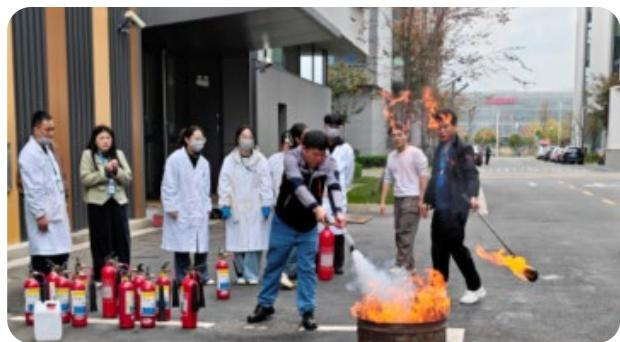

natural_image

Group of people in lab coats and masks gathered around fire extinguishers and a burning furnace outdoors (no visible text or symbols)

火灾爆炸事故综合演练

## 开展危化品泄漏实验室应急处置演练

2025年10月，公司在金科中心生物实验室进行了危险化学品及危废泄漏事故应急演练。演练模拟实验人员不慎打翻试剂造成泄漏。参演人员按流程报告、确认泄漏物、穿戴防护、竖立警示、使用蛭石围堵与吸附棉处理，最终将污染物安全收集并移交处置。演练增强了员工在化学品泄漏初期的规范处置能力，检验了应急预案的有效性，确保了员工熟悉个人防护与应急物资的正确使用方法。

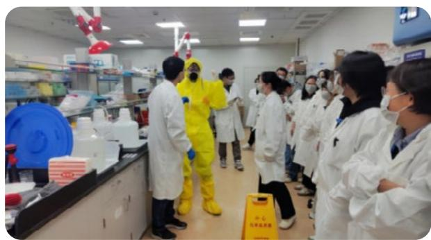

natural_image

Group of people in lab coats and masks gathered in a modern laboratory setting, one person in yellow protective suit standing beside equipment (no visible text or symbols)

## 安全生产月宣传与教育

2025年6月至7月，公司积极响应国家安全生产月主题“人人讲安全、个个会应急畅通生命通道，筑牢韧性根基”，在公司内部开展系列宣传教育活动。期间，公司在走廊电视机循环播放安全生产月纪录片，并在楼道张贴安全海报，覆盖全体员工。通过这些举措，员工对安全生产理念及应急知识的认知得到显著提升，提高了全员的安全意识和自我保护能力，为构建安全、健康的工作环境和企业韧性奠定了基础。

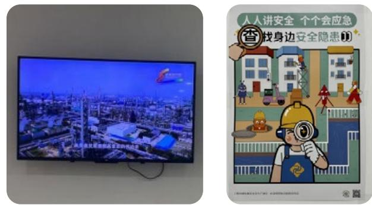

## 职业健康与安全管理

公司建立系统的职业健康监护机制，定期开展职业健康检查，确保员工健康状况与岗位要求相匹配，切实保障员工健康权益。公司针对各类岗位潜在职业病危害因素进行系统识别与评估，并委托具备资质的第三方机构定期开展职业病危害因素检测，形成检测报告，用于指导风险防控与健康管理措施优化，及时发现潜在健康风险并采取有效预防措施。

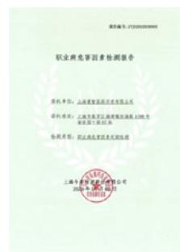

在职业安全防护方面，公司在实验室配备通风橱、万向罩，生物安全柜等工程防护设施，并在工艺环节使用低毒害物质同时为各岗位提供必要的个人防护用品(PPE)。公司建立应急物资清单，定期检查更新，并在办公区域配备医药箱及前台设置AFD装置，以确保突发事件能够快速响应。

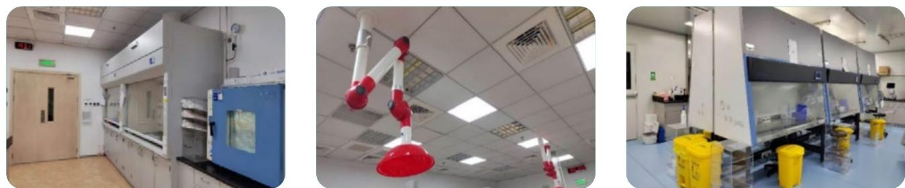

公司建立系统的职业健康监护机制，定期开展职业健康检查，确保员工健康状况与岗位要求相匹配，切实保障员工健康权益。公司针对各类岗位潜在职业病危害因素进行系统识别与评估，并委托具备资质的第三方机构定期开展职业病危害因素检测形成检测报告，用干指导风险防控与健康管理措施优化，及时发现潜在健康风险并采取有效预防措施。

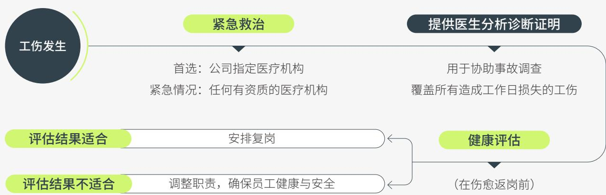

flowchart

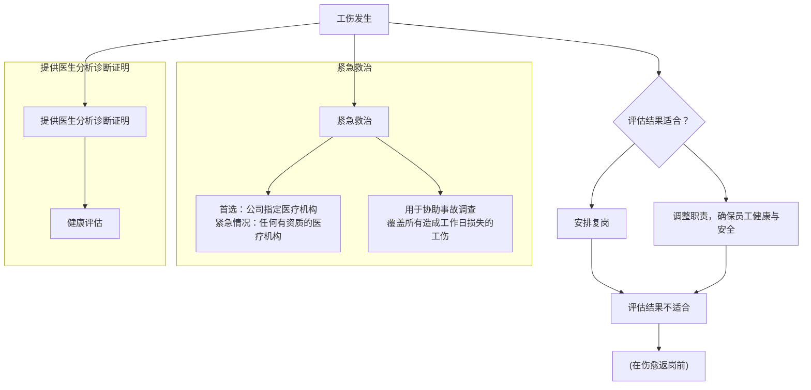
```mermaid
graph TD
  A["工伤发生"] --> B["紧急救治"]
  A --> C["提供医生分析诊断证明"]
  
  subgraph Emergency_Insult ["紧急救治"]
    direction TB
  B --> D1["首选：公司指定医疗机构\n紧急情况：任何有资质的医疗机构"]
  B --> E1["用于协助事故调查\n覆盖所有造成工作日损失的工伤"]
  end
  
  subgraph Diagnosis ["提供医生分析诊断证明"]
    direction TB
  C --> F1["健康评估"]
  end
  
  A --> G{"评估结果适合？"}
  G --> H["安排复岗"]
  G --> I["调整职责，确保员工健康与安全"]
  
  H --> J["评估结果不适合"]
  I --> J
  
  J --> K["(在伤愈返岗前)"]
```

指标与目标

<table><tr><td>目标</td><td>2025年达成情况</td></tr><tr><td>死亡(含交通责任)事故为零</td><td>已达成</td></tr><tr><td>火灾(爆炸)事故为零</td><td>已达成</td></tr><tr><td>重伤事故为零</td><td>已达成</td></tr><tr><td>职工职业病发病率为零</td><td>已达成</td></tr><tr><td>轻伤(损工日1日以上)事故不超过6起</td><td>已达成</td></tr><tr><td>轻微伤事故不超过10起</td><td>已达成</td></tr><tr><td>员工安全生产教育率为100%</td><td>已达成</td></tr><tr><td>特种作业人员持证率为100%</td><td>已达成</td></tr></table>

报告期内

<table><tr><td>公司员工体检覆盖率</td><td>职业病体检覆盖率</td><td>工伤险投入金额</td><td>工伤率</td></tr><tr><td>100%</td><td>100%</td><td>87.5万元</td><td>0.23%</td></tr><tr><td>开展安全生产应急演练</td><td>参与演练</td><td rowspan="2">因工死亡人数为0人</td><td rowspan="2"></td></tr><tr><td>20次</td><td>1,789人次</td></tr></table>

## 行业共进

睿智医药积极融入生物医药产业生态，通过参与行业会议与学术交流、深化产学研战略合作以及加入各类行业协会与专业学会，不断加强与产业链上下游、科研机构及行业组织的协同联动。公司在对外合作与交流过程中，持续分享技术经验跟踪前沿趋势、推动资源整合与成果转化，促进产业协同创新与规范发展，助力构建开放共赢的行业生态体系。

## 行业合作情况

## 签署“中国-马来西亚生物医药产业园”框架合作协议

2025年3月，睿智医药与中国建筑（东南亚)有限公司、中国国际经济咨询有限公司共同签署了“中国-马来西亚生物医药产业园”框架合作协议，标志着该项目进入实质性推进阶段。此举是公司探索中国生物医药企业国际化发展新路径、落实全球化战略的重要一步。

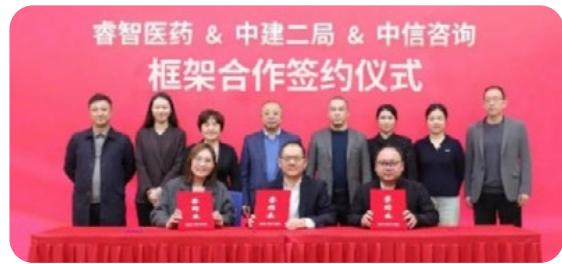

text_image

睿智医药 & 中建二局 & 中信咨询
框架合作签约仪式

## 深化小核酸领域技术协同与产业生态布局

2025年12月，公司与圣诺医药签署全球非独占许可协议围绕GalaHead及相关核酸药物递送技术平台开展深度协作，整合双方在技术与资源方面的优势，推动小核酸药物研发能力提升：同月，公司作为关键技术支持方参与杭州富阳小核酸产业基金建设，为基金投资项目提供覆盖药物研发全链条的专业服务。通过“技术平台合作+产业基金赋能”的协同模式，公司进一步强化在小核酸领域的技术布局与产业链接能力，助力相关技术的转化应用及产业化发展，推动生物医药创新生态持续完善。

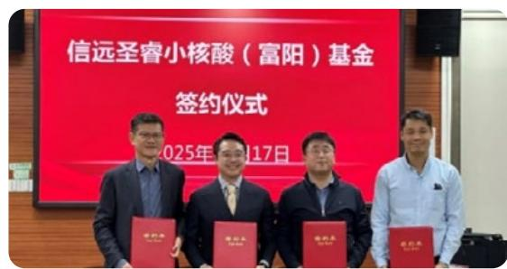

text_image

信远圣睿小核酸（富阳）基金
签约仪式
2025年1月17日

## ● 与西安交通大学药学院及苏州研究院达成战略合作，构建产学研融合生态

2025 年 12 月，公司与西安交通大学药学院及西安交通大学苏州研究院分别达成战略合作。三方将通过深度融合科研资源、平台优势与产业能力，共同构建产学研融合的创新生态，以推动医药健康领域的科技创新与产业转化。

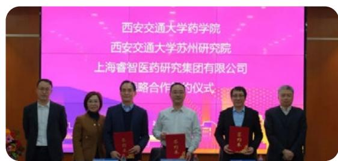

text_image

西安交通大学药学院
西安交通大学苏州研究院
上海睿智医药研究集团有限公司
战略合作签约仪式

●战略合作签约仪式

## 行业活动组织与参与

## 2025 年 2 月

参与BPI第十届生物医药创新大会，提升小分子创新药领域思想领导力

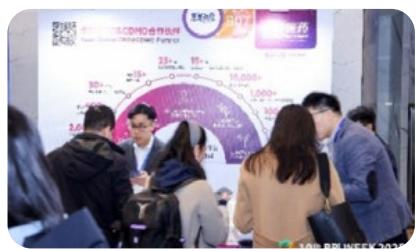

text_image

Street photo with visible store signboards and promotional graphics in Chinese

## 2025 年 5 月

出席第五届核酸药物产业深度聚焦峰会，分享小核酸化学破局之道

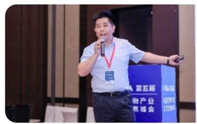

text_image

第五届
物产业
峰会

## 2025 年 5 月

举办第二十五期“睿智堂”学术讲座，聚焦转化医学赋能新药研发

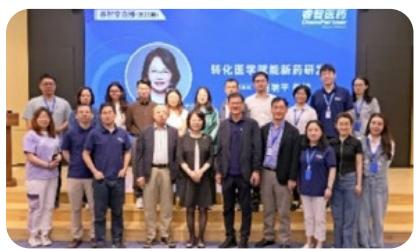

text_image

转化医学战略新药研讨会
2016年第一季度

## 2025 年 6 月

在中国肠道大会展示“菌群-药效”协同作用CRO平台研究新阶段

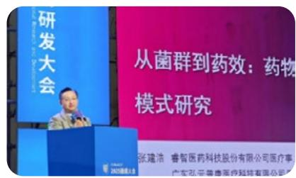

text_image

研发大会
从菌群到药效：药物
模式研究
张建浩 睿智医药科技股份有限公司医疗事
广东弘泽泰医疗科技有限公司

## 2025 年 6 月

深度参与 CBA-China 中国年会，冠名赞助并主办小核酸专题论坛

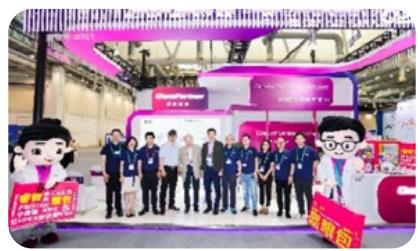

text_image

Group photo at an exhibition booth with visible Chinese signage and promotional banners

## 2025 年 7 月

联合同写意举办 ADC新药开发沙龙会 共探下一代药物前沿

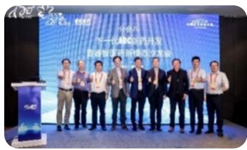

text_image

第一代ABC新药开发
暨中国医药创新大会

## 2025年10月

在波士顿成功举办首场 ChemPartnerSocialHour活动，链接本地创新生态

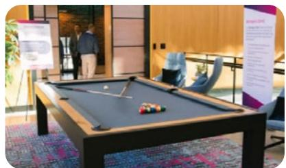

natural_image

Interior of a modern lounge or golf table with colorful balls and chairs, no visible text or symbols on the table or background.

## 2025年9月

联合主办成都核酸药物创新论坛，汇聚学界产业界权威

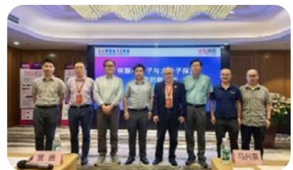

text_image

Group photo of eight men at an event with visible Chinese text banners and nameplates on the podium.

## 2025年9月

董事长出席哈佛大学医学院学术交流活动。共话前沿创新

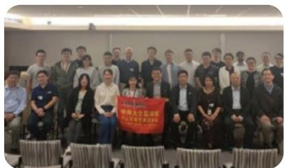

text_image

Group photo with visible banner text in Chinese and English, likely at a conference or event

## 2025年9月

波士顿研发中心盛大启幕，诺奖得主出席见证全球布局

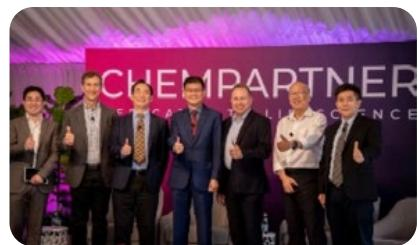

text_image

CHEMPARTNER
EXCAPITAL SERVICE

## 2025年9月

作为共建单位参与“粤秀药洲”产业生态高质量发展大会

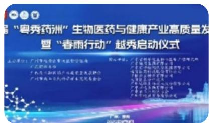

text_image

“粤秀药洲”生物医药与健康产业高质量发
暨“春雨行动”越秀启动仪式

## 2025年8月

签约入驻粤港澳大湾区国家技术创新中心国际总部

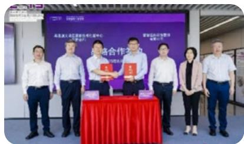

text_image

高端嵌入式装备安全与安全管理中心
战略合作交流会

## 2025 年 10 月

出席南方医药大会，倡议构建全链条药物研发创新生态

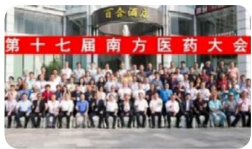

text_image

百合酒店
第十七届南方医药大会

## 2025 年 10 月

亮相波士顿 Discovery on Target 大会，前沿成果获行业认可

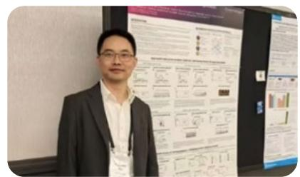

text_image

Man in suit standing in front of a wall display showing multiple document boards with text and diagrams

## 2025 年 10 月

参与博研商学院论坛，共探生物医药产业可持续发展路径

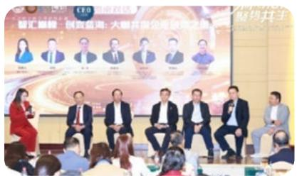

text_image

1.0 中国证券报
智汇融融 创富海：大鹏兴国定投投资之首

## 2025 年 10 月

联合举办创新药早期开发攻坚闭门会，聚焦IND 加速之道

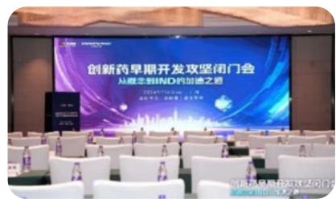

text_image

创新药早期开发攻坚闭门会
从概念到IND的加速之道

## 2025 年 11 月

深度参与大湾区生物医药创新者峰会，全景展示技术实力

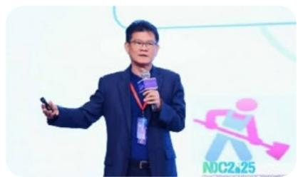

text_image

NDC2a25

## 2025 年 11 月

在整合肿瘤学大会签署协议，共建肿瘤创新诊断与验证中心

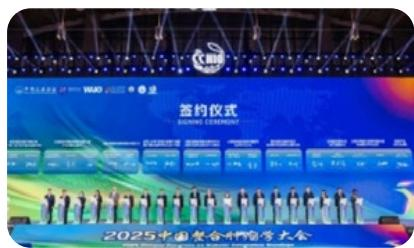

text_image

签约仪式
2025中国聚合科学大会

## 2025年12月

召开博士后工作站年度座谈会，总结成果并规划人才驱动创新模式

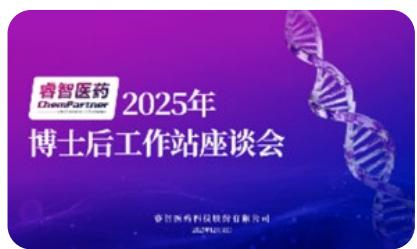

text_image

睿智医药
ChenPartner
2025年
博士后工作站座谈会
睿智医药科技股份有限公司

## 2025年12月

出席大湾区类器官论坛，分享技术实践与协同创新计划

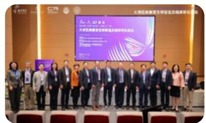

text_image

2017 广州区医療管理及醫療文化交流会
Guangxi Regional Women's Maternal Care and Ecosystem Sustainability Conference

## 2025年12月

参与高校科技成果交易会，助力破解成果转化“最后一公里”

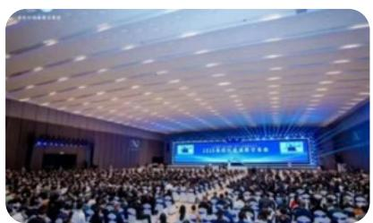

natural_image

Large indoor gathering with a large screen displaying Chinese text, surrounded by a dense crowd (no readable signage or text)

## 2025年11月

与清华长庚医院签约共建“类器官创新中心”

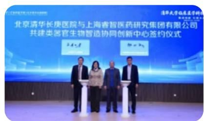

text_image

北京大学临港医学研究所
北京清华长庚医院与上海睿智医药研究集团有限公司
共建类器官生物智造协同创新中心签约仪式

## 2025年11月

在伦敦产业推介会阐述“中国创新+欧美科学+全球客户”全球化战略

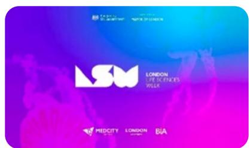

text_image

ASM
LONDON
LIFE SCIENCES
VILLE
MEDCITY
LONDON
BIA

## 2025年11月

联合华东师大发布全球首个ADC与核苷酸单体药物智造系统

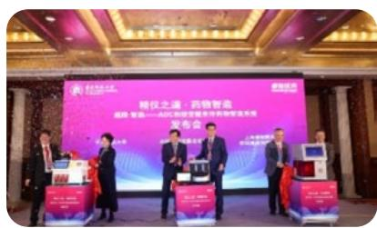

text_image

新材集团
健民之道·药物智赢
战略 发展——AIG创新药研发药物研发活动
发布会

## 行业协会参与

<table><tr><td>协会名称</td><td>参会主体</td><td>担任职务</td></tr><tr><td>上海市服务外包企业协会</td><td>上海睿智医药研究集团有限公司</td><td>会长</td></tr><tr><td>上海市生物医药行业协会</td><td>上海睿智医药研究集团有限公司</td><td>理事单位</td></tr><tr><td>上海市企业联合会/企业家联合会</td><td>上海睿智医药研究集团有限公司</td><td>会员单位</td></tr><tr><td>上海市浦东新区现代服务业促进会</td><td>上海睿智医药研究集团有限公司</td><td>副会长</td></tr><tr><td>上海市浦东新区生物产业行业协会</td><td>上海睿智医药研究集团有限公司</td><td>副会长</td></tr><tr><td>上海市浦东国际商会</td><td>上海睿智医药研究集团有限公司</td><td>理事单位</td></tr><tr><td>上海市浦东新区研发机构联合会</td><td>上海睿智医药研究集团有限公司</td><td>理事单位</td></tr><tr><td>上海浦东各地投资企业协会</td><td>上海睿智医药研究集团有限公司</td><td>会员单位</td></tr><tr><td>上海市张江科学城发展事务协商促进会</td><td>上海睿智医药研究集团有限公司</td><td>会员单位</td></tr><tr><td>上海市浦东新区张江科学城商会</td><td>上海睿智医药研究集团有限公司</td><td>会员单位</td></tr><tr><td>上海医药行业协会</td><td>上海睿智医药研究集团有限公司</td><td>会员单位</td></tr><tr><td>上海金桥经济技术开发区企业协会</td><td>上海睿智医药技术有限公司</td><td>会员单位</td></tr></table>

## 社会贡献与乡村振兴

睿智医药坚持“源干社会、回馈社会”的企业发展理念，将社会责任与乡村振兴融入企业战略。公司依托自身技术与资源优势通过精准帮扶与公益行动，推动乡村经济发展与居民福祉提升，充分体现企业的社会担当与价值创造能力。

## 大陂村新春慰问与乡村振兴实践

2026年1月，公司赴广东省韶关市浈江区新韶镇大陂村开展新春慰问活动，为孤寡老人、老党员及村民代表送上健康产品、生活物资及节日祝福。公司团队实地考察村基础设施与产业发展，与村干部围绕乡村产业培育、民生改善及基层治理进行交流，并承诺依托公司在大健康领域的技术与资源优势在健康服务、科普教育及乡村人才培养等方面提供持续支持。此次行动体现了公司在乡村振兴中的积极实践，助力提升居民健康素养与生活品质，同时彰显企业履行社会责任的担当。

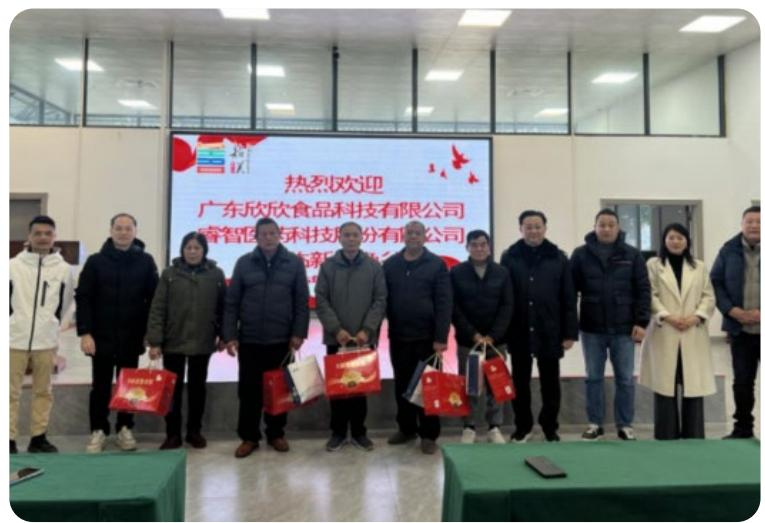

text_image

热烈欢迎
广东欣欣食品科技有限公司
睿智医疗科技股份有限公司

大陂村新春慰问

# 环境篇

# 践行绿色承诺 共创低碳未来

## 理念

睿智医药将环境保护置于企业发展的核心，构建并执行了系统的环境管理体系。公司严格遵守国家环保法规，建立了从治理架构、风险识别到应急响应的全流程管理机制，以全面践行绿色发展承诺，致力于共创低碳未来。

## 我们的行动

63 环境合规管理

68 高效资源使用

应对气候变化66

70污染物与废弃物治理

natural_image

Scenic view of a turquoise lake surrounded by snow-capped mountains and evergreen trees under a clear blue sky (no text or symbols visible)

## 环境合规管理

公司高度重视环境保护与合规管理，致力于构建系统化、标准化的环境管理体系，确保公司运营活动严格遵循国家及地方环保法律法规。公司通过制度建设、职责明确、风险识别与持续改进，将环境管理纳入企业治理、战略与日常运营管理框架实现环境绩效的持续提升与合规目标的全面达成。

## 环境管理体系

公司高度重视环境保护工作，严格遵循国家及地方环保法律法规，秉持“全面、协调、可持续发展”的理念。公司通过制定《环境保护责任制》，建立了完善的环境保护管理体系，明确了从执行总裁、各级部门到具体人员的职责，确保环境保护与生产经营同步推进。公司由EHS部门和专职环境管理人员根据要求管理公司环保事宜，此外，公司还设立了安全生产委员会并通过签订年度责任制，进一步明确了相关部门与个人的环境与安全责任。

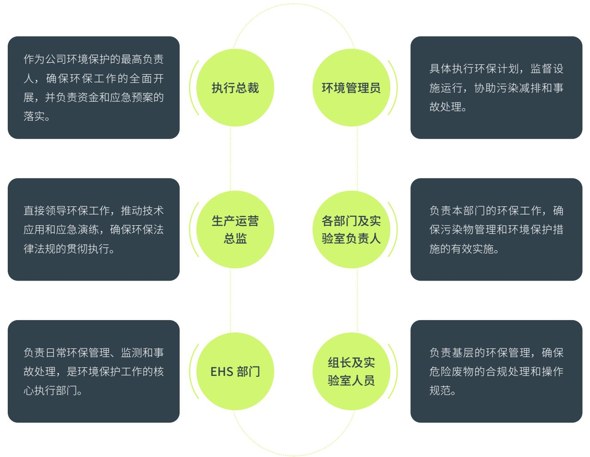

flowchart

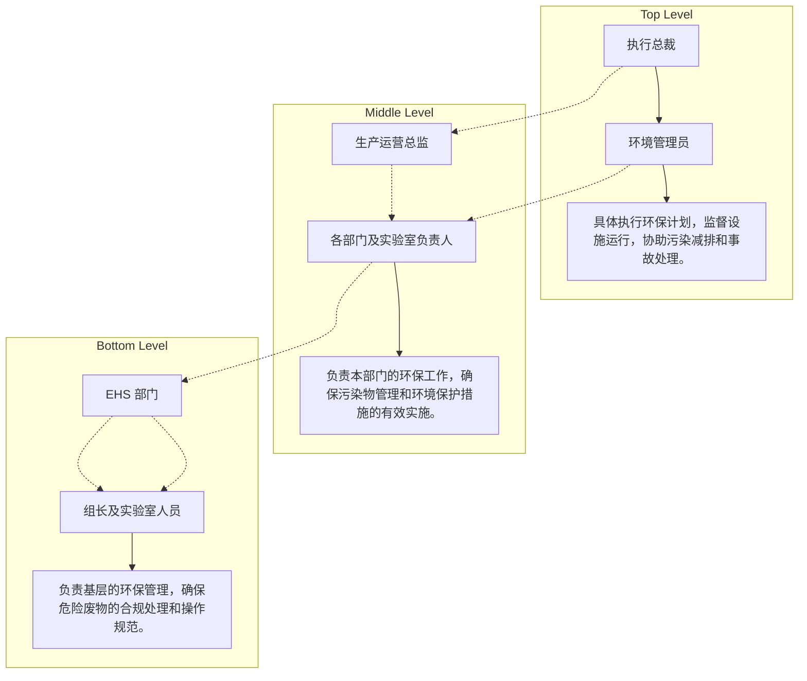
```mermaid
graph TD
  subgraph TopLevel["Top Level"]
    direction TB
  A["执行总裁"] --> B["环境管理员"]
  B --> C["具体执行环保计划，监督设施运行，协助污染减排和事故处理。"]
  end

  subgraph MiddleLevel["Middle Level"]
    direction TB
    D["生产运营总监"] -.-> E["各部门及实验室负责人"]
  E --> F["负责本部门的环保工作，确保污染物管理和环境保护措施的有效实施。"]
  end

  subgraph BottomLevel["Bottom Level"]
    direction TB
    G["EHS 部门"] -.-> H["组长及实验室人员"]
  H --> I["负责基层的环保管理，确保危险废物的合规处理和操作规范。"]
  end

  A -.-> D
  B -.-> E
  E -.-> G
  G -.-> H
```

环境管理职责  
公司环境保护措施

text_image

治理篇
社会篇
环境篇
结篇

## 环保制度建设

制定并完善环保规章制度，将环保目标纳入绩效考核体系。

## 污染减排

实施污染减排计划，定期核查减排效果，确保污染物排放符合国家标准。

## 环境监测

建立完善的环境监测体系，定期监测和抽查污染物排放情况。

## 危险废物管理

严格执行危险废物的分类、储存、转移和处理规定，确保危险废物的合规处理。

## 应急预案

制定并实施突发环境事件应急预案，定期组织应急演练，确保突发环境事件得到及时有效处理。

## 环境风险识别

公司通过系统化的环境因素识别与评价程序，全面识别和评估其活动、产品和服务中的环境影响因素，并每年定期更新依据其显著性制定管理措施，以实现持续改进，其风险识别流程涵盖识别，评价，等级划分及管理四个主要步骤，由各部门主管负责本部门因素识别与统计，EHS部门负责登记更新并制定目标指标，管理者代表则负责核准重大环境因素并监督改善计划实施。

公司编制了《突发环境事件应急预案》《突发环境事件风险评估报告》，建立了应急指挥部与工作组，并每年进行应急演练同时，子公司委托有资质的第三方机构进行环境监测，严格依据排污许可证要求按频次监测并出具报告，目将数据上报至全国排污许可证信息平台公示。2025年的受检测子公司监测结果均符合要求，无超标排放情况。

## 重大危险源的监控与管理

●对组织内部的各种活动、设施、设备进行全面评估，识别可能产生重大安全风险的因素。  
制定相应的风险管理计划，包括风险控制措施、责任分配、应急响应等内容。  
●制定相关的标准、规程、操作程序，明确重大危险源的监控和管理要求。  
制定完善的应急预案，包括事故应对程序、应急资源准备、人员疏散等内容。  
建立持续改进机制，不断优化重大危险源的监控与管理措施，提高安全管理水平。

## 环保培训

公司将环境保护培训纳入公司整体EHS(环境、健康与安全)管理体系的重要组成部分。各子公司通过组织环境保护年度培训，严格依据国家法规系统性地传授环境保护相关知识与技能，持续提升全体员工的环保合规意识与风险防控实操能力夯实企业可持续发展的安全根基。

## EHS专项培训

2025年6月，公司组织开展EHS专项培训，培训面向药理药效、药代药动及生物营运部门全体员工，严格依据《生产经营单位安全培训管理规定》开展，内容全面涵盖化学安全、生物安全、特种设备操作、职业卫生、环境保护及应急处置等相关知识与技能，系统性提升相关业务部门员工的环境、健康与安全意识及实操能力。

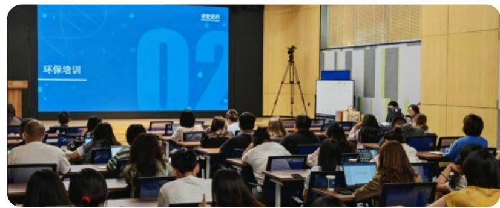

text_image

环保培训
02

## 报告期内

公司及子公司环境管理培训总时长

13,360 小时

环保投入总金额

542.53

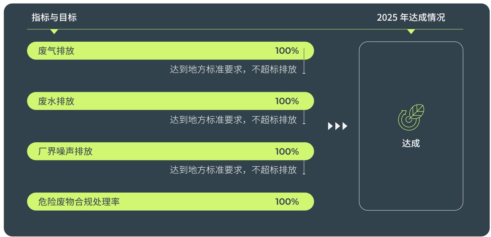

flowchart

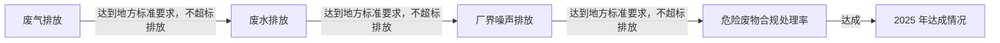
```mermaid
graph LR
  A["废气排放"] -->|"达到地方标准要求，不超标排放"| B["废水排放"]
  B -->|"达到地方标准要求，不超标排放"| C["厂界噪声排放"]
  C -->|"达到地方标准要求，不超标排放"| D["危险废物合规处理率"]
  D -->|"达成"| E["2025 年达成情况"]
```

## 应对气候变化

睿智医药高度重视气候变化相关议题，将其视为企业可持续发展和长期价值创造的重要因素。公司关注政策与行业趋势系统识别相关风险与机遇，致力干在稳健经营中积极应对环境挑战，推动绿色发展理念的贯彻落实，为企业可持续发展和社会价值创造奠定基础。

## 治理

公司将气候变化议题纳入ESG治理体系进行统筹管理，结合行业特点与运营实际，关注气候变化可能带来的风险与机遇在整体治理框架下，公司持续跟踪国家“双碳”政策、行业规范及科研实验室能耗管理要求，将节能减排、低碳研发及绿色生产理念逐步融入日常运营和管理流程，推动绿色办公、节能管理和实验室能效优化等措施落地。同时，公司完善气候变化相关管理制度和信息披露机制，确保在稳健推进业务发展的同时，有效提升企业应对气候变化的能力。

## 战略

公司将应对气候变化视为推动可持续发展的重要机遇，参照国际主流气候治理框架，构建适应公司业务特点的气候治理体系在研发实验、药物开发与生产全流程中，公司通过数字化平台优化实验设计、试剂耗材使用和能耗管理，推动绿色实验和低碳生产实践。同时，公司持续关注气候相关政策及行业发展趋势，识别气候变化对实验流程、供应链、能源使用及业务连续性可能带来的风险与机遇，并制定针对性的应对措施，以保障企业可持续发展和价值创造

<table><tr><td>维度</td><td>风险类型</td><td>风险说明</td><td>应对举措</td></tr><tr><td rowspan="2">转型风险</td><td>政策与法律风险</td><td>国内外环保及碳减排政策法规日趋严格,可能带来更高的合规成本,如碳税、更严的排放标准等</td><td>开展碳盘查:系统化掌握自身碳排放数据,为合规申报与响应奠定基础</td></tr><tr><td>市场风险</td><td>能源价格波动,可能直接增加公司运营成本</td><td>推行资源节约措施,优化能源与资源使用效率,通过节能降耗对冲能源成本上涨压力</td></tr><tr><td rowspan="2">物理风险</td><td>急性物理风险</td><td>极端天气事件可能对生产设施的正常运行造成干扰,导致研发数据中断或财产损失</td><td>制定并完善业务连续性计划与应急预案在设施选址与设计中考虑气候韧性因素</td></tr><tr><td>慢性物理风险</td><td>气温上升、降水模式变化等长期气候变化,可能对实验环境稳定性、设备运行效率及能源消耗水平产生影响</td><td>优化实验室及生产环境控制系统,提升温湿度调节与设备运行稳定性加强能源管理与能效提升,降低气候变化带来的能耗波动影响在设施规划与运维中纳入气候变化因素,逐步提升运营韧性</td></tr></table>

风险清单

<table><tr><td>维度</td><td>机遇类型</td><td>机遇说明</td><td>价值转化路径</td></tr><tr><td>资源效率</td><td>运营效率提升</td><td>通过深入实施节能、节水、减排措施,可直接降低能源资源消耗成本和废弃物处理成本</td><td>将优化能源与资源使用效率的措施落到实处,如进行设备节能改造、优化实验流程,实现直接的运营成本节约</td></tr><tr><td>产品与服务</td><td>绿色创新与市场准入</td><td>开发生物医药研发过程中更环保、更高效的绿色化学路径或节能工艺,可满足国内外创新药企对绿色、可持续研发供应链的偏好</td><td>将低碳、环保理念融入研发服务平台的优化中向客户展示公司在减少研发环节碳足迹方面的能力与承诺,提升服务附加值,吸引注重ESG的客户</td></tr></table>

机遇清单

## 影响、风险和机遇管理

公司基于碳排查数据，系统识别政策、市场及物理等维度的气候相关风险，并制定管理措施。同时，公司积极把握运营效率提升与绿色服务创新等机遇，将节能降耗与低碳理念转化为实际的成本优势与市场竞争力。

在研发环节，公司将“Alfor Science”技术贯穿研发全流程，通过构建“于湿实验闭环”和聚售新模态的研发知识图谱实现对新模态药物早期成药性预测的准确率提升至85%以上。这一举措能够有效缩短研发周期，降低实验耗材消耗和能源消耗，从源头减少创新过程中的环境足迹。

此外，公司发布的全球首个“ADC与核苷酸单体药物智造系统”，实现关键质量属性的毫秒级精准控制，同时提升生产效率并降低环境负荷，为公司在研发和生产环节创造了绿色创新机遇

## 指标与目标

公司积极响应国家“碳达峰、碳中和”战略，将企业发展与应对气候变化目标紧密结合。结合业务特点，公司持续推进节能降碳和绿色办公举措，优化能源使用效率，降低运营过程中的碳排放。未来，公司将结合政策导向和行业趋势，逐步完善温室气体管理体系与减排目标设定，推动企业运营向绿色低碳方向发展。

2025年温室气体排放量（吨二氧化碳当量）  
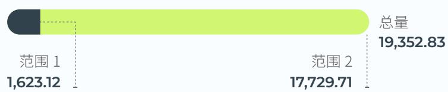

bar

| Category | Value |
| --- | --- |
| 范围 1 | 1,623.12 |
| 范围 2 | 17,729.71 |
| 总量 | 19,352.83 |

## 高效资源使用

睿智医药将资源高效利用作为环境保护的基石，通过系统性推进能源管理、强化水资源管理以及积极践行循环经济理念全面提升资源使用效率，为企业的可持续发展提供动力。报告期内，公司持续优化能源及资源使用，其中上海睿智年度水资源消耗量和用电量较2024年实现了显著降低。

## 能源利用

公司通过制定《节能降耗管理规范》《空调使用管理规范》等制度，系统推进节能减排工作，公司以能效提升，结构降碳为目标致力于优化能源结构，提升能源利用效率并加大清洁能源使用比例，从而有效降低能源消耗与碳排放，积极构建低碳，安全高效的能源管理体系，为践行绿色发展贡献力量。

## 节能管理体系建设

建立《节能降耗管理规范》《空调使用管理规范》等节能相关制度  
加强节能管理岗位的技术培训  
加强节能降耗宣传活动，提高员工全员节能意识

## 节能设备使用及技术升级

●采用高效节能设备：空调主机、燃气锅炉、变频风机等  
●升级冷水机组：空调冷冻机采用高能效比（COP≥ 5.6） 冷水机组，改造冷却水系统，提升能源转化率  
●安装变风量控制系统：实验室通风柜配备变风量控制，降低空调能耗  
● 节电技术改造：符合照明标准要求下更换低耗能节能灯具

## 日常节能措施

●推行“人走灯灭、人离机关”制度：下班后关闭照明、空调及通风系统 (除加班外)  
·空调温度控制：设定节能标准（夏季≥26℃、冬季≤20°C），并设置标识提醒

## 报告期内

公司电力消耗量为

33,040.82 兆瓦时

燃油量

20,494.06

## 水资源使用

公司将水资源视为生产运营的重要基础资源，通过水资源管理体系及先进节水技术及循环利用措施，最大限度减少水资源消耗，以实现可持续利用。

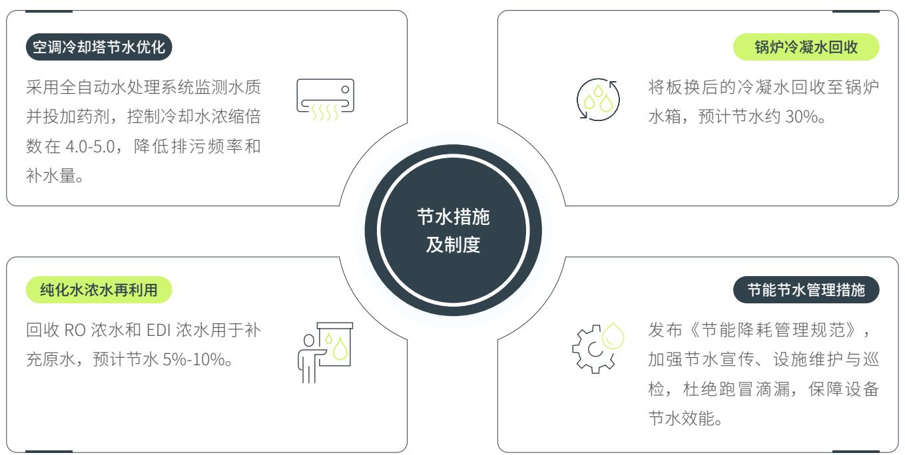

flowchart

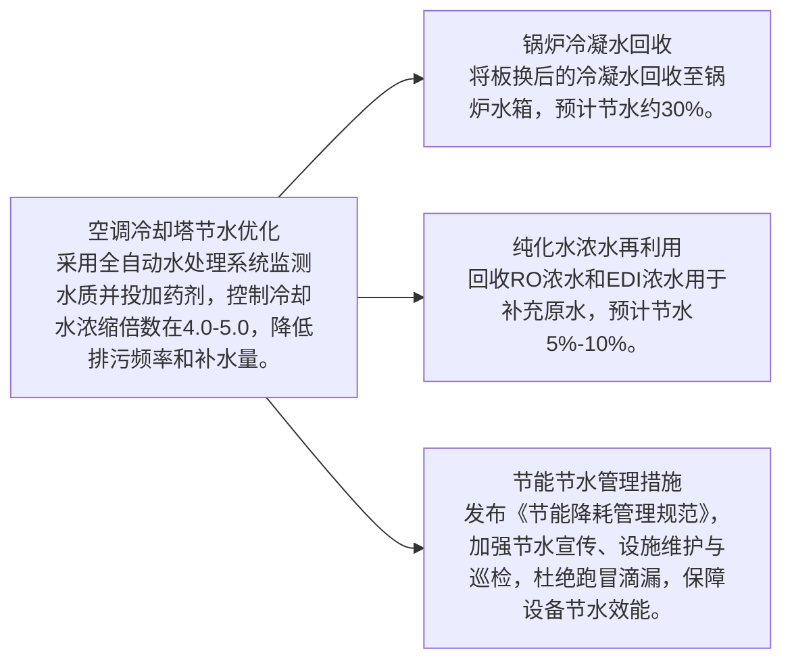
```mermaid
graph LR
  A["空调冷却塔节水优化\n采用全自动水处理系统监测水质并投加药剂，控制冷却水浓缩倍数在4.0-5.0，降低排污频率和补水量。"] --> B["锅炉冷凝水回收\n将板换后的冷凝水回收至锅炉水箱，预计节水约30%。"]
  A --> C["纯化水浓水再利用\n回收RO浓水和EDI浓水用于补充原水，预计节水5%-10%。"]
  A --> D["节能节水管理措施\n发布《节能降耗管理规范》，加强节水宣传、设施维护与巡检，杜绝跑冒滴漏，保障设备节水效能。"]
```

节水措施及制度

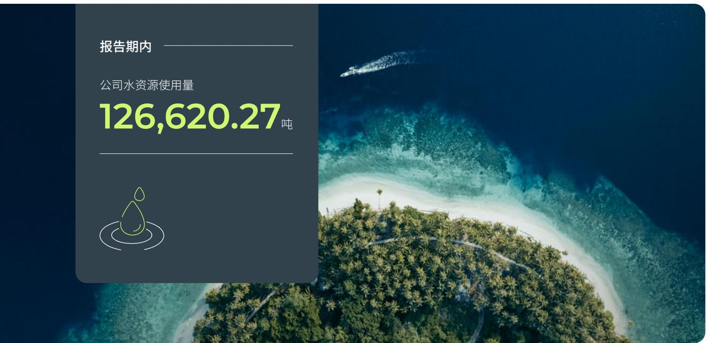

text_image

报告期内
公司水资源使用量
126,620.27吨

## 污染物与废弃物治理

公司将环境管理纳入运营管理体系，围绕污染物与废弃物治理构建覆盖全流程的管理机制，系统推进废气、废水及固体废弃物的规范化管理与减排工作。通过制度建设、过程管控与绩效考核相结合的方式，公司强化环境管理执行与持续改进促进资源高效利用与循环利用水平提升，降低运营活动对生态环境的影响。报告期内，公司已取得排污许可证，确保排放持续符合相关法规要求。

## 废气管理

公司严格遵守国家及地方大气污染防治相关法律法规，制定并实施《大气污染控制程序》，通过系统化的监测、设备维护技术改进及应急预案，确保废气排放符合标准，降低运营活动对大气环境的影响。

## 报告期内

公司 为

34.16 吨

## 排放监控 与检测

●对实验室楼宇大气污染排放口进行编号，并设置环保图形标志，确保排放源可追溯。  
EHS部门委托具备资格的环境检测机构每年进行一次排放测定，监测范围包括实验大楼的所有排放口。  
●当生产工艺，原材料或设施设备发生变更时，增加测定频度或范围，确保排放数据实时更新

## 设施维护 与检修

●工程部负责对大气污染治理设施进行定期巡查，确保其正常运行。  
●对治理设施进行维护及检修，防止因设备故障导致的超标排放。

## 无组织排放控制

●研发部门在日常工作中禁止在开放环境操作可能造成大气污染的化学品，避免无组织排放。

## 应急响应机制

●当排放超标时，立即启动应急措施，参照《紧急应变控制程序》采取控制对策  
●制定目标指标及管理方案，确保超标排放问题得到快速治理。

废气治理措施

## 废水管理

公司严格遵守水污染防治法律法规，制定并实施《水污染控制程序》，通过水质监控、液态危险废物管理及应急响应机制，保障污水排放达标，维护水环境安全。

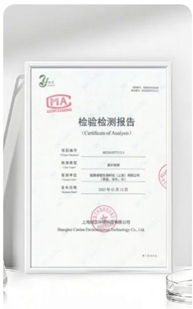

text_image

检验检测报告
(Certificate of Analysis)
项目编号
Project Name:
H2201077313.3
检测类型
Test Type:
基本检测
监测单位
监测单位
检测者管理科技（上海）有限公司
(季度、半年、年)
发布日期
发布日期
2021年4月12日
上海能蓝环境科技有限公司
Shanghai Canlan Environmental Technology Co., Ltd.
第1页共9页

## 排放监控与检测

EHS部门委托具备资格的环境检测机构每季度对实验大楼排放口的污水进行一次测定。  
当增加可能产生水体污染的设施、设备或出现异常时，增加测定频度或范围。  
根据测定结果与相关法律法规对照，将判定结果报告给环境管理者代表。

## 液态危险废物管理

各部门负责液态危险废物的处置管理，严禁通过下水道排放。  
确保液态危险废物的合规处理，防止其对水环境造成污染。

## 应急响应机制

●当污水排放超标时，立即启动应急措施，参照《紧急应变控制程序》采取控制对策。  
制定目标指标及管理方案，确保超标排放问题得到快速治理。

## 均质均量

● 污水首先通过机械格栅去除大颗粒和 杂质  
经过处理后的污水自流进入调节池  
●调节池利用内置鼓风机进行均质均量处理

## 水解酸化

均质均量处理后的度水通过提升泵送至水解酸化池  
● COD、BOD等有机污染物指标浓度得到一定程度降低，同时实现废水的反硝化脱氮，降低水中的TN，将硝化液中的硝酸盐、亚硝酸盐通过反硝化反应转化为氨气

## 消毒池

•上清液经消毒池消毒，使用氯片，确保微生物被充分灭活，总余氯度控制在 2-8mg/L  
之后废水进入市政管网，最终到达污水处理厂

## 二沉池

•接触氧化池好氧处理后的废水自流进入二沉池，进行泥水分离

## 接触氧化

• 水解酸化处理后的度水自流进入接触氧化池  
接触氧化池内 DO( 溶解氧 ) 控制在 2-4mg/L  
●废水中的大部分易氧化有机物被好氧微生物分解，导致COD、BOD等有机污染物指标大幅降低  
●废水中的氨氮被氧化为硝酸盐，亚硝酸盐实现度水氨氮指标的降低

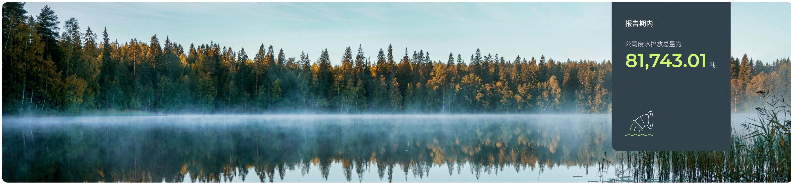

text_image

报告期内
公司废水排放总量为
81,743.01 吨

## 废弃物处理

公司建立了完善的废弃物管理体系，严格遵循国家及地方环保法规，制定了《危险废物贮存污染控制标准》《废弃物管理制度》《一般固体废物管理制度》等一系列制度。在管理执行层面，公司构建了职责清晰、协同联动的废弃物管理责任体系明确各相关部门在废弃物分类、收集、暂存及合规处置等环节的管理职责，通过全过程管控与闭环管理，确保废弃物管理规范运行。其中，对危险废弃物实施重点管控，强化转移与处置过程监督，确保危险废物合规处理率持续保持100%。

## 研发部门

## 行政部

## 安全部

## 工程部

## 负责分类与预处理

## 组织清理一般废物

## 监督危险废物转移与处置

## 保障暂存设施安全运行

废弃物处理职责

●危险废物：废液、固废（如硅胶、催化剂、针头等)。  
●医疗废物：感染性废物、损伤性废物、病理性废物等。  
·放射性废物：含放射性核素的废物。  
•一般废物：办公及生活区域产生的安全废物。

●记录内容：废弃物产生时间、名称、数量、处置情况等。  
●保存期限：相关记录保留 5年，由EHS部保管。

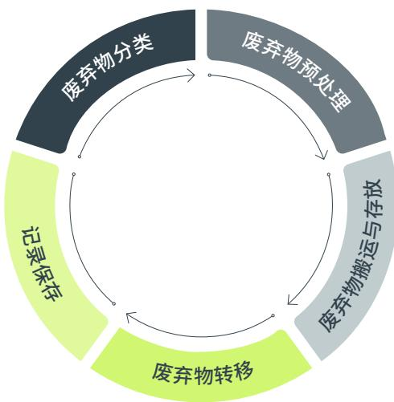

flowchart

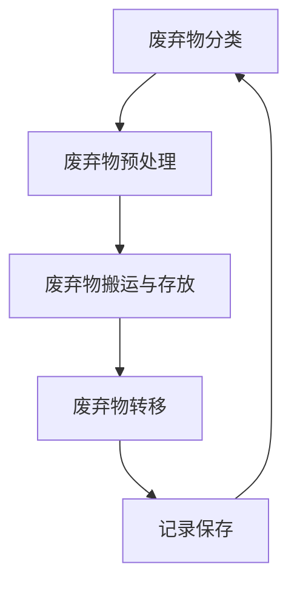
```mermaid
graph TD
  A["废弃物分类"] --> B["废弃物预处理"]
  B --> C["废弃物搬运与存放"]
  C --> D["废弃物转移"]
  D --> E["记录保存"]
  E --> A
```

公司废弃物管理流程

• 委托处置：由EHS 部委托有资质的处置公司处理。  
•合同签订：明确收集、搬运、处理要求，签订书面合同。  
•系统登记：在《上海市危险废物转移管理信息系统》登记并打印三联单。

废液：倒入专用废液桶，中 和、解毒，张贴危险标签。  
·危险固废：预处理后放入垃圾桶，活性化合物水封存放。  
·医疗废物：针头、刀片等单独收集，试剂瓶清洗后丢弃。  
●一般废物：直接清理并转移至指定区域。

·分类存放：危险废物、医疗废物、一般废物分开存放，标识清晰。  
•危险废物贮存：设置“危险废物”识别标志，填写登记表。  
•医疗废物贮存：消毒灭菌后封存，填写登记表。

## 报告期内

公司废弃物产生总量为

$$
1,080.10 \text{吨}
$$

其中有害废弃物产生量为

$$
1,050.30 \text{吨}
$$

无害废弃物产生量为

$$
29.80 \text{吨}
$$

## 公司危险废物合规处理率达到

## 100%

2025年达成情况

## 达成

## 循环经济

公司积极践行循环经济理念，通过推动资源回收、废弃物再利用及使用可再生材料，致力于实现资源的高效循环利用，为可持续发展注入新动能。

natural_image

Hand holding a green plant with leaves, against a plain white background (no text or symbols)

## 报告期内

公司持续推进可再生材料的回收与规范处置委托处置泡沫盒、纸箱等可再生材料合计

5.89 吨

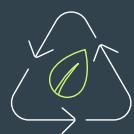

ESG 绩效

<table><tr><td></td><td>指标</td><td>单位</td><td>2024年</td><td>2025年</td></tr><tr><td colspan="5">经营绩效</td></tr><tr><td rowspan="3">经济</td><td>营业收入</td><td>亿元</td><td>9.70</td><td>11.35</td></tr><tr><td>资产总额</td><td>亿元</td><td>19.96</td><td>20.33</td></tr><tr><td>经营活动产生的现金流量净额</td><td>亿元</td><td>1.68</td><td>1.90</td></tr><tr><td colspan="5">环境绩效</td></tr><tr><td rowspan="4">温室气体排放</td><td>范围1温室气体排放量</td><td>吨二氧化碳当量</td><td>3,931.81</td><td>1,623.12</td></tr><tr><td>范围2温室气体排放量</td><td>吨二氧化碳当量</td><td>17,497.36</td><td>17,729.71</td></tr><tr><td>温室气体排放总量</td><td>吨二氧化碳当量</td><td>21,429.17</td><td>19,352.83</td></tr><tr><td>温室气体排放强度</td><td>吨二氧化碳当量/万元</td><td>0.22</td><td>0.17</td></tr><tr><td>环境管理</td><td>环保总投入</td><td>万元</td><td>749.96</td><td>542.534</td></tr><tr><td rowspan="3">废气</td><td>废气排放总量</td><td>吨</td><td>/</td><td>34.16</td></tr><tr><td>硫氧化物(SOx)排放量</td><td>吨</td><td>/</td><td>0.06</td></tr><tr><td>颗粒物质(PM)排放量</td><td>吨</td><td>0.04</td><td>0.17</td></tr><tr><td rowspan="3">废水</td><td>废水排放总量</td><td>吨</td><td>112,186.03</td><td>81,743.01</td></tr><tr><td>氨氮排放量</td><td>吨</td><td>0.07</td><td>0.15</td></tr><tr><td>化学需氧量(COD)排放量</td><td>吨</td><td>14.05</td><td>11.12</td></tr><tr><td rowspan="2">废弃物</td><td>有害废弃物总量</td><td>吨</td><td>845.83</td><td>1,050.30</td></tr><tr><td>无害废弃物总量</td><td>吨</td><td>551.53</td><td>29.80</td></tr><tr><td rowspan="3">能源使用</td><td>外购电力</td><td>千瓦时</td><td>32,607,825.50</td><td>33,040,822.68</td></tr><tr><td>天然气</td><td>立方米</td><td>759,232</td><td>573,584</td></tr><tr><td>汽油</td><td>升</td><td>20,380.06</td><td>20,494.06</td></tr><tr><td>水资源使用</td><td>总取水量</td><td>吨</td><td>175,085.92</td><td>126,620.27</td></tr><tr><td colspan="5">社会绩效</td></tr><tr><td>研发</td><td>研发投入</td><td>万元</td><td>5,955.09</td><td>5,984.17</td></tr></table>

<table><tr><td></td><td>指标</td><td>单位</td><td>2024年</td><td>2025年</td></tr><tr><td rowspan="3">研发</td><td>研发投入占比</td><td>%</td><td>6.14</td><td>5.27</td></tr><tr><td>研发人员数量</td><td>人</td><td>1,437</td><td>1,477</td></tr><tr><td>研发人员占比</td><td>%</td><td>79.2</td><td>83.4</td></tr><tr><td rowspan="3">知识产权</td><td>有效专利持有量</td><td>件</td><td>69</td><td>81</td></tr><tr><td>著作权持有量</td><td>件</td><td>9</td><td>11</td></tr><tr><td>商标持有量</td><td>件</td><td>127</td><td>141</td></tr><tr><td rowspan="3">供应商</td><td>供应商总数</td><td>家</td><td>551</td><td>490</td></tr><tr><td>本地供应商采购占比</td><td>%</td><td>56</td><td>63</td></tr><tr><td>签订《反商业贿赂协议》的主要供应商占比</td><td>%</td><td>100</td><td>100</td></tr><tr><td rowspan="8">员工</td><td>员工总数</td><td>人</td><td>1,814</td><td>1,771</td></tr><tr><td>残疾人员工人数</td><td>人</td><td>14</td><td>14</td></tr><tr><td>少数民族员工人数</td><td>人</td><td>42</td><td>57</td></tr><tr><td>员工流失率</td><td>%</td><td>13</td><td>12.76</td></tr><tr><td>劳动合同签订率</td><td>%</td><td>100</td><td>100</td></tr><tr><td>员工培训总支出</td><td>元</td><td>135,127.15</td><td>286,174</td></tr><tr><td>员工人均培训时长</td><td>小时</td><td>40</td><td>12.41</td></tr><tr><td>培训覆盖率</td><td>%</td><td>100</td><td>100</td></tr><tr><td rowspan="2">安全生产管理实践</td><td>安全生产投入</td><td>万元</td><td>531.07</td><td>333.21</td></tr><tr><td>安全生产培训时长</td><td>小时</td><td>10,891</td><td>10,860</td></tr><tr><td colspan="5">治理绩效</td></tr><tr><td rowspan="5">公司治理</td><td>董事会成员人数</td><td>人</td><td>6</td><td>6</td></tr><tr><td>女性董事人数</td><td>人</td><td>1</td><td>1</td></tr><tr><td>独立董事人数</td><td>人</td><td>3</td><td>3</td></tr><tr><td>召开股东会</td><td>次</td><td>4</td><td>3</td></tr><tr><td>召开董事会</td><td>次</td><td>9</td><td>11</td></tr></table>

## 交易所《指引》指标索引

<table><tr><td>议题</td><td>相关章节</td></tr><tr><td>应对气候变化</td><td>应对气候变化</td></tr><tr><td>污染物排放</td><td>污染物与废弃物治理</td></tr><tr><td>废弃物处理</td><td>污染物与废弃物治理</td></tr><tr><td>生态系统和生物多样性保护</td><td>不涉及。公司生产经营活动对生态系统和生物多样性不产生重大影响。</td></tr><tr><td>环境合规管理</td><td>环境合规管理</td></tr><tr><td>能源利用</td><td>高效资源使用</td></tr><tr><td>水资源利用</td><td>高效资源使用</td></tr><tr><td>循环经济</td><td>高效资源使用</td></tr><tr><td>乡村振兴</td><td>社会贡献与乡村振兴</td></tr><tr><td>社会贡献</td><td>社会贡献与乡村振兴</td></tr><tr><td>创新驱动</td><td>创新研发</td></tr><tr><td>科技伦理</td><td>动物福利与伦理</td></tr><tr><td>供应链安全</td><td>可持续供应链</td></tr><tr><td>平等对待中小企业</td><td>可持续供应链</td></tr><tr><td>产品和服务安全与质量</td><td>品质管理</td></tr><tr><td>数据安全与客户隐私保护</td><td>数智运营</td></tr><tr><td>员工</td><td>人才管理与员工关怀</td></tr><tr><td>尽职调查</td><td>ESG 治理 - 重要性议题分析</td></tr><tr><td>利益相关方沟通</td><td>ESG 治理 - 利益相关方参与</td></tr><tr><td>反商业贿赂及反贪污</td><td>商业道德</td></tr><tr><td>反不正当竞争</td><td>商业道德</td></tr></table>

## 读者反馈

尊敬的读者：

您好！非常感谢您在百忙之中阅读《睿智医药科技股份有限公司 2025 年环境、社会和公司治理（ESG）报告》。为了向您及其他利益相关方提供更有价值的信息，并有效促进公司提升履行企业社会责任、践行可持续发展的能力与水平，我们真诚期待您的意见和建议

## 选择题（请在相应位置打√）

1. 您对本报告的总体评价是：

□ 非常好 □ 好 □ 一般 □ 较差 □ 差

2.报告对利益相关方所关心问题的回应和披露情况如何？

□ 非常好 □ 好 □ 一般 □ 较差 □ 差

3.您认为睿智医药在公司治理方面做得如何

□ 非常好 □ 好 □ 一般 □ 较差 □ 差

4.您认为睿智医药在环境责任方面做得如何

□ 非常好 □ 好 □ 一般 □ 较差 □ 差

5.您认为睿智医药在安全管理方面做得如何？

□ 非常好 □ 好 □ 一般 □ 较差 □ 差

6.您认为睿智医药在员工责任方面做得如何

□ 非常好 □ 好 □ 一般 □ 较差 □ 差

7.您认为睿智医药在社区责任方面做得如何

□ 非常好 □ 好 □ 一般 □ 较差 □ 差

8报告披露的信息，指标、数据是否清晰，准确，完整？

□ 非常好 □ 好 □ 一般 □ 较差 □ 差

9.您认为本报告的内容安排和版式设计是否方便阅读？

□是 □ 否

10. 开放性问题

您对睿智医药履行ESG责任及本报告有任何意见与建议？

## 您的联系方式：

姓名： 电话： 电子邮件：

工作单位： 职称： 传真号码：

## ChemPartner睿智医药