## 四方精创

## FORMS SYNTRON

## 2025

2025年度环境、社会和公司治理（ESG）报告

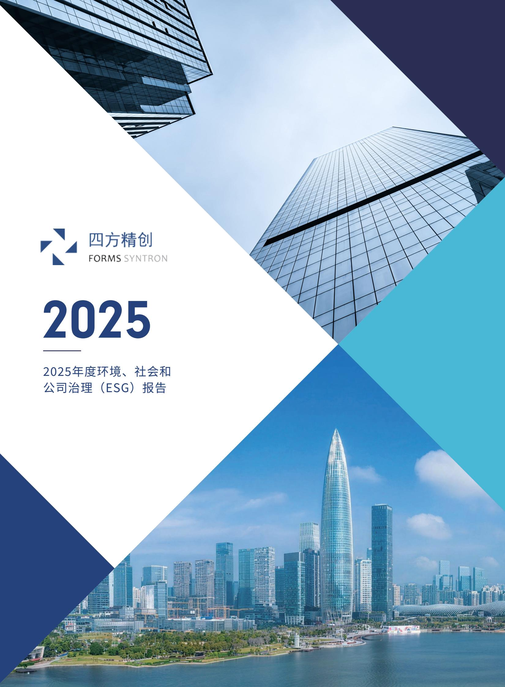

<details>
<summary>text_image</summary>

四方精创
FORMS SYNTRON
2025
2025年度环境、社会和
公司治理（ESG）报告
</details>

## 目录 CONTENTS

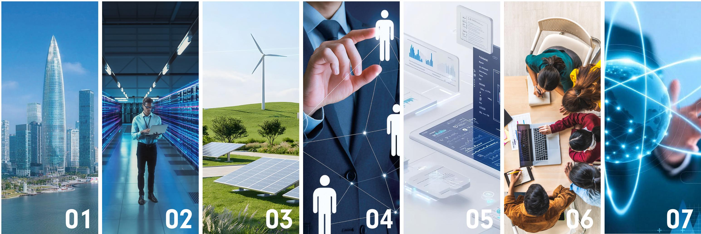

## ESG报告导读

<table><tr><td>企业基本信息</td><td>07</td></tr><tr><td>企业最高管理者致辞</td><td>09</td></tr><tr><td>四方精创介绍</td><td>11</td></tr><tr><td>专篇:责任同行,温暖四方</td><td>17</td></tr></table>

## 公司ESG概况

<table><tr><td>公司ESG管理结构</td></tr><tr><td>公司ESG实质性议题</td></tr><tr><td>公司ESG利益相关方识别</td></tr></table>

## 环境管理

<table><tr><td>环境政策和目标</td><td>29</td></tr><tr><td>能耗管理</td><td>30</td></tr><tr><td>本年度能耗及碳排放统计及未来规划</td><td>31</td></tr><tr><td>绿色办公倡导</td><td>33</td></tr><tr><td>办公安全与极端天气预防</td><td>33</td></tr><tr><td>健康饮水管理</td><td>34</td></tr></table>

## 公司管理

<table><tr><td>公司治理结构</td></tr><tr><td>商业道德</td></tr><tr><td>员工管理</td></tr></table>

## 创新&企业文化驱动的产品服务

<table><tr><td>37</td><td>创新理念</td><td>45</td><td>人才选拔机制</td><td>59</td></tr><tr><td>39</td><td>创新激励措施</td><td>48</td><td>人才培养机制</td><td>62</td></tr><tr><td>42</td><td>需求响应与客户满意度</td><td>50</td><td>人才梯队搭建</td><td>67</td></tr><tr><td></td><td>信息安全实施与管理</td><td>53</td><td>人才激励机制</td><td>67</td></tr><tr><td></td><td></td><td></td><td>员工沟通渠道</td><td>68</td></tr><tr><td></td><td></td><td></td><td>员工权益保障与福利</td><td>68</td></tr><tr><td></td><td></td><td></td><td>办公环境改善</td><td>71</td></tr></table>

## 展望未来

<table><tr><td>附件1指标索引</td><td>77</td></tr><tr><td>附件2ESG绩效数据表</td><td>79</td></tr><tr><td>附件3读者意见反馈表</td><td>82</td></tr></table>

## 关于四方精创

四方精创是技术领先,业务专精,全球交付的金融科技公司。公司成立二十多年来始终专注于以产品和技术赋能境内外金融机构,目前公司可为商业银行提供全流程、全渠道、智能化业务解决方案。

公司持续追踪前沿技术, 积极拥抱银行4.0变革, 具备金融行业数字化转型所需的咨询服务, 提供数字化技术底座和先进业务解决方案到数字化场景应用开发的全方位能力。

公司坚持以中国智慧服务全球的理念,致力于境内外业务的协同发展,业务足迹遍及大中华地区和东南亚,积累了深厚的跨境协同服务能力。

我们坚信金融科技是数字化未来主要动力,公司将时刻铭记“用科技让金融无处不在”的使命,与四方伙伴携手同行,推动金融科技造福社会。

公司将坚持“创新驱动, 客户至上, 全球布局”的经营策略, 稳健发展, 回报股东。

## 企业文化

## 四方携手 合作共赢


<details>
<summary>natural_image</summary>

Two people shaking hands in front of a modern glass skyscraper under a blue sky (no text or symbols visible)
</details>

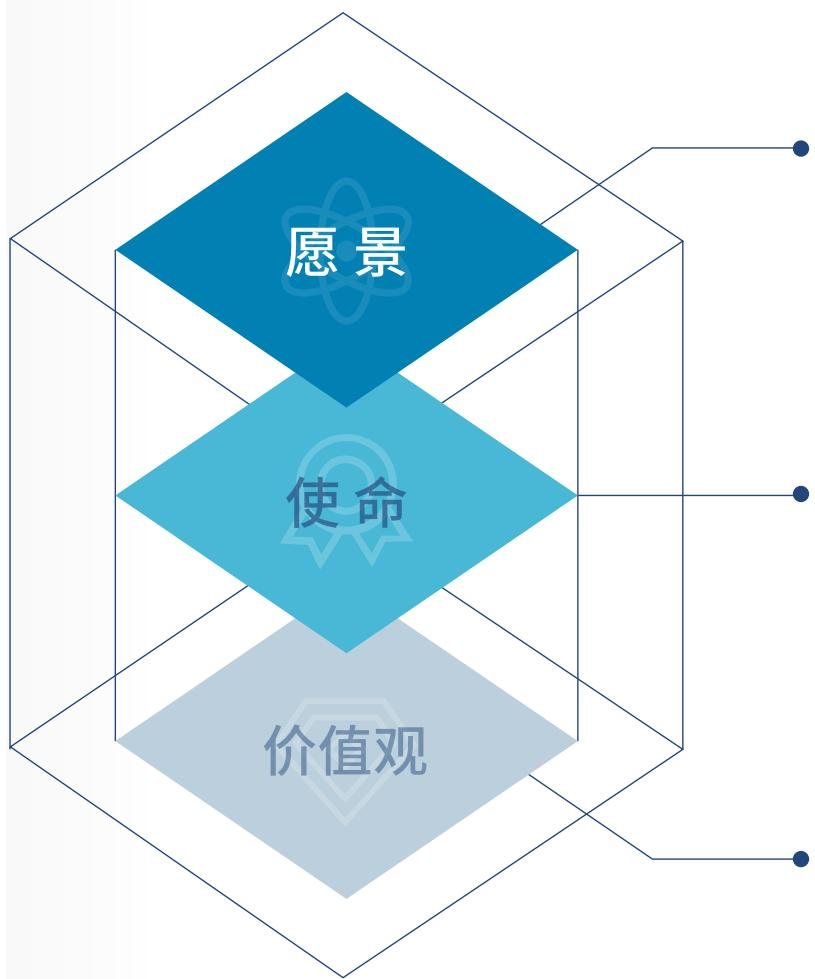

<details>
<summary>flowchart</summary>

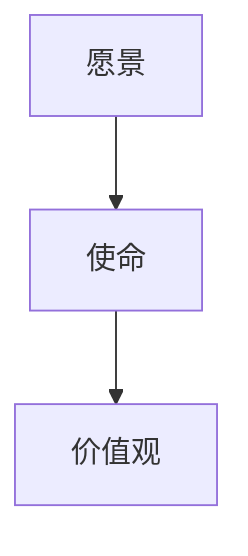
</details>

成为全球金融科技的探索者和引领者

用科技让金融无处不在

诚信敬业、使命认同、学习创新、协作并进

公司围绕市场和客户需求运作,组织自身的生产经营活动,主要的经营活动包括研发、销售和交付。


公司通过市场调研,客户需求发掘,技术趋势来制定研发项目计划,开发软件产品。


通过招投标、协议销售等直接销售渠道向金融行业客户销售软件产品、服务和系统集成方案。


遵循一系列标准化步骤,确保高效、高质量地完成项目并满足客户需求。

我们以业务需求为驱动、以产品研发推动销售，通过产品、服务的销售和交付为客户创造业务价值，从而实现自身的利润创造。

## 四方精创金融科技服务

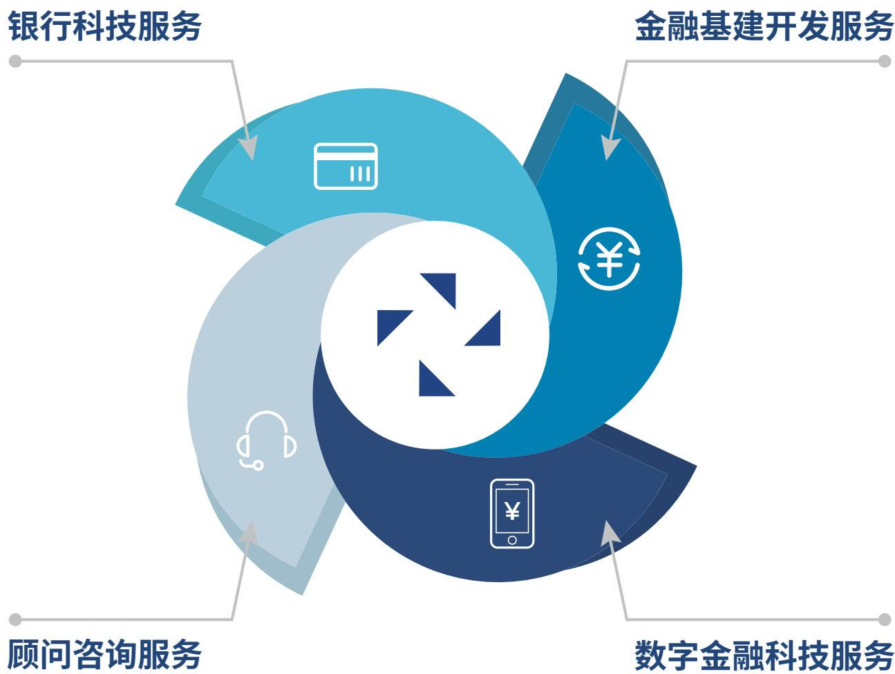

<details>
<summary>flowchart</summary>

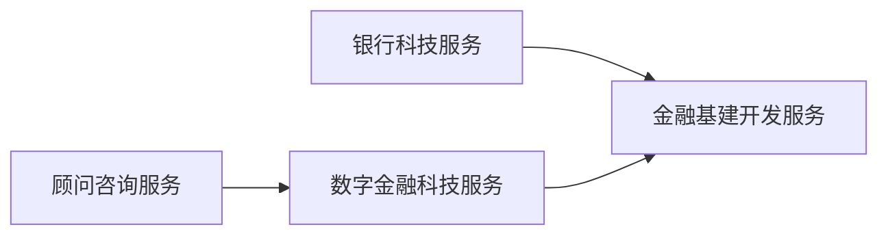
</details>

## 01

## ESG报告导读

企业基本信息  
企业最高管理者致辞  
○ 四方精创介绍

## 企业基本信息

<table><tr><td>组织范围</td><td>&gt;本报告覆盖深圳四方精创资讯股份有限公司(在本报告中称为“四方精创”、“我们”、“公司”)在E(环境)、S(社会责任)、G(公司治理)等方面的履职行动和绩效(成效)。</td></tr><tr><td>时间范围</td><td>&gt;2025年1月1日至2025年12月31日</td></tr><tr><td>参考标准</td><td>&gt;本报告主要参考《深圳证券交易所上市公司自律监管指引第17号——可持续发展报告(试行)》、《深圳证券交易所上市公司自律监管指南第3号——可持续发展报告编制(2026年修订)》、《企业ESG 环境、社会、治理报告编制指南》、《中国企业可持续发展报告指南》CASS-ESG 6.0、ISO ESG IWA 48:2024《实施环境、社会和治理(ESG)原则框架》、《联合国可持续发展目标》等法规标准作为编制依据进行信息内容收集&amp;编制汇总。</td></tr><tr><td>信息来源</td><td>&gt;本报告所有信息来源及数据均来自公司正式文件和统计报告;本报告中涉及的财务数据均以港元及人民币为单位,特别说明的除外。</td></tr><tr><td>其他说明</td><td>&gt;本报告作为公司的首个ESG信息自愿披露内容进行编制;本次报告作为四方精创可持续发展报告创建年进行ESG信息内容自愿披露,因此本报告中会超出“时间范围”内容进行重要信息披露,便于阅读者理解我们的重要“历史”;本报告中所有财务数据以《深圳四方精创资讯股份有限公司2025年年度报告》为准。</td></tr><tr><td>联系方式</td><td>&gt;四方精创可持续工作小组地址:广东省深圳市南山区高新南七道8号四方精创资讯大厦联系电话:+86-0755-86649962邮箱:formssyntronss@formssi.com</td></tr></table>

数说四方精创2025ESG

<table><tr><td colspan="4">经营绩效方面</td></tr><tr><td>资产总额176,815万元</td><td>2025年营业收入63,107万元</td><td>营业利润增长率6.83%</td><td>利润总额7,880万元</td></tr><tr><td colspan="4">环保(含安全)绩效方面</td></tr><tr><td>耗电总量3,091,510.46千瓦时</td><td>耗水总量26,323.33立方米</td><td>环境管理投入120万元</td><td>信息安全投入260万元</td></tr><tr><td colspan="4">科技创新方面</td></tr><tr><td>研发投入5992万元</td><td>研发人员总人数405人</td><td colspan="2">研发人员数量占公司总人数的比例19.3%</td></tr><tr><td colspan="4">售后服务方面</td></tr><tr><td>产品售后投诉闭环率100%客户满意度调查回收率85.7%</td><td>客户响应平均耗时15分钟客户满意度平均结论非常满意</td><td colspan="2">技术支持介入响应时间60分钟客户意见采纳率100%</td></tr><tr><td colspan="4">员工权益保障方面</td></tr><tr><td>劳动合同签订100%</td><td>员工培训覆盖率100%</td><td colspan="2">中高层管理者女性比例19%</td></tr><tr><td></td><td>员工薪酬总额37,179万元</td><td colspan="2">员工福利费215万元</td></tr></table>

## 企业最高管理者致辞


## 董事长致辞：

——致各位股东、合作伙伴、员工及社会各界朋友：

作为一家成立于2003年的企业，四方精创已经历了22年的发展，我们始终秉持“诚信敬业、使命认同、学习创新、协作并进”的核心价值观，深耕金融科技行业，为境内外商业银行的数字化转型赋能，与金融监管机构和金融业务运营机构一起探索从金融基建到商业场景的数字金融创新，致力于面向未来提供安全、合规的，绿色的金融服务，用科技让金融服务无处不在。

2025年, 是我们公司在创业板上市的十周年, 今年我们首次公开披露ESG报告, 我们希望借此向所有相关方阐释我们的可持续发展经营理念, 翻开我们ESG实践的新篇章。

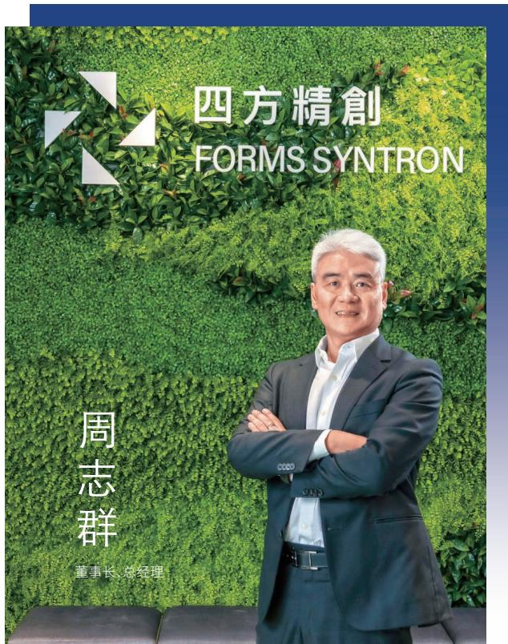

<details>
<summary>text_image</summary>

四方精創
FORMS SYNTRON
周志群
董事长、总经理
</details>

## 行稳致远,持续优化治理筑发展根基

我们始终认为规范的治理、完整的内部控制、强健的财务状况是公司发展的根基。过去的一年公司坚持“行稳致远、进而有为”的治理方针，我们进一步梳理组织架构，明确职能边界，健全内部管理制度，不断完善法人治理结构。我们以内控为抓手，加大内部审计力度，强化全面风险管控能力。我们以提质增效为目标，推动更广泛的办公自动化和智能化，提升了管理效率。在公司各部门的共同努力下，公司资产负债率7.05%，流动比率11.79，财务状况始终维持在一个非常健康的状态。公司已连续多年信息披露评价为A，并荣膺2025“上证鹰·金质量”公司治理奖。

## 合规为本, 以负责任的方式推动技术创新

我们坚持以技术创新引领发展，矢志用技术让金融更好的服务社会。同时我们也认为合规是金融服务的根本，始终以负责任的态度推动技术创新。在未来技术的合规应用探索中，我们始终和监管机构同行。在生成式人工智能方面，继2024年成为香港金管局首批GenA.I.沙盒技术合作伙伴后，2025年我们继续深化负责任AI的应用实践，与香港金融机构携手拓展反欺诈与可疑交易监控等关键场景，助力金融行业安全、合规地应用生成式人工智能。在合规Web3领域，我们积极参与香港金管局Ensemble项目，以“监管端基建+银行端平台”的双向落地模式，协助多间金融机构建立代币化存款发行与流通、资产全生命周期管理等可投产能力，推动虚拟资产生态系统的安全合规发展。我们坚信，唯有将合规基因深度融入技术创新，才能真正赋能金融行业高质量发展。

## 以人为本, 培育新生力量

在企业发展的同时, 我们始终认为, 员工是最核心的资产, 人才培育是产业发展的不竭动力。我们通过完善的培训体系、内部晋升机制, 打造自我生长的四方。我们尽力为员工营造安全、健康、尊重、包容、愉悦的工作环境, 通过多元报酬体系与员工共享企业发展成果。此外, 公司还通过实习计划与公益项目, 让有志于金融科技行业的青年学子走进公司, 让我们的行业专家走进校园, 组织研学活动积极向社会普及银行科技、金融基建、合规Web3知识, 为行业的永续发展储备新生力量。去年我们公司与香港数码港发起“区块链小镇”, 其中的目标之一“招募和培育区块链技术专才”即是我们为行业发展人才队伍计划的行动。

## 回馈社会,传递正向价值

作为企业公民，公司始终秉持回馈社会理念，积极投身社区关怀与应急救援等公益领域，以实际行动践行社会责任。在香港大埔区宏福苑大火后公司第一时间捐出100万港币用于受灾居民的医疗救助、过渡期安置、生活物资补给等。2025年我们继续通过与多家公益机构合作，为社区发展注入温暖力量，彰显企业担当。我们承办多期“共创明天”和“海关青年军”活动，关注青少年成长，助力弱势群体，激发他们向阳生长的动力，增进香港青少年与祖国大陆的交流。我们相信企业和社区共同努力的涓涓细流，将涵养社会发展的和谐生态。

感谢全体股东的信任、合作伙伴的同行、员工的坚守。正是这份同心同向，让我们在快速变化的时代中，不断前行、稳步发展，以创造更多的价值，共同迎接更加美好的明天！

—— 董事长

2026年4月


## 四方精创介绍

## 回顾四方精创

2025年作为四方精创公开披露ESG报告的第一年,为了更好的让所有人了解我们,因此我们披露公司自创立起至今的历程。

## 发展历程篇

## 2003年

\- 四方精创在深圳设立

## 2007年

\- 公司获评深圳市高新技术企业

## 2012年

\- 公司规模超过1000人

## 2015年

\- 公司在深圳证券交易所创业板挂牌上市

## 02

## 2009年

- 公司获评国家高新技术企业  
- 设立北京分公司、香港子公司，形成南北双中心和海外中心布局

## 2011年

\- 改制为股份有限公司

## 04

## 2016年

- 深圳总部大厦顺利封顶  
- 参与发起成立金链盟, 成为金融区块链的核心驱动力

## 2018年

- 发布Platform Universe 分布式平台, 引领金融分布式架构  
- 公司规模突破2000人  
- 海外市场收入占比首次超过50%

## 2021年

\- 公司通过TMMi3认证

## 2022年

- 成功实施定向增发, 向未来进发  
- 香港子公司建立FINNOSpace，开启创新动力引擎

## 2025年

- 公司获香港金融管理局选为第二期GenA.I.沙盒技术合作伙伴之一  
- 启动香港H股上市

## 05

## 2019年

\- 联合华为发布分布式开放银行服务解决方案Fincube

## 2020年

- 公司通过CMMI5认证  
- 参与多边银行数字货币桥 (mBridge)项目

## 07

## 2023年

- 联合微软发布“Banking copilot”智能助手,引领金融大模型应用实践  
- 联合微软发布FINNOSafe Web 3.0平台, 沉淀虚拟资产托管和交易核心能力  
- 公司协助多间银行完成数码港元 (e-HKD) 先导计划

## 2024年

- 公司获香港金融管理局选为第一期GenA.I.沙盒四家技术合作伙伴之一  
- 公司获香港金融管理局选择为Ensemble项目提供技术服务

## 近三年荣誉

2023

- 香港金融科技发展大奖2023  
应用基础科技 (Basic Technology)  
数字化信贷(Credit Digitalization)  
- IFTA 金融科技成就大奖 2022/2023  
- 企业金融科技成就奖  
- 区块链、加密货币和CEP(加密资产交易服务提供商)白金奖  
- 2023深圳500强企业  
- CMMI5级软件能力成熟度模型集成认证  
- 国家鼓励的软件企业

2024

- 金管局GenAI Sandbox Cohort I 合作伙伴认可  
- 南山区“绿色通道”企业  
- 2024年广东省数字经济100强  
- 国家高新技术企业

2025

- 恒生数据与生成式AI颁奖礼嘉许  
- 2024年度TMMi卓越实践奖  
- 中国软件诚信示范企业(2025-2028年)

## 近三年ESG荣誉

2023

香港公益金感谢状:赞助「公益金东亚慈善高尔夫球赛 2023」

香港海关感谢状:为「香港海关青年发展计划(Customs YES)」提供暑期实习机会

香港中文大学商学院亚太工商研究所感谢状: 就 Mini☒ MBA 领导力发展项目 (富邦银行〈香港〉有限公司) 所作出的支持与贡献

2024

香港公益金感谢状:赞助「公益金东亚慈善高尔夫球赛 2024」

香港特别行政区政府政务司司长办公室感谢状:感谢对「共创明Teen」计划第三期的支持

2025

2025“上证鹰·金质量”公司治理奖

香港公益金感谢状:赞助「公益金东亚慈善高尔夫球赛 2025」

## 四方精创2025年度事件记录

参加「数码港领航企业高峰论坛」: 公司有幸参与盛会, 成为本次峰会27家领航企业之一。

公司董事长兼总经理周志群先生与数码港首席执行官Dr. Rocky Cheng以及另外三家顶尖企业的领导者一起，参与了一场富有洞察力的小组讨论。他们共同分享了宝贵的行业经验和对技术创新的见解。

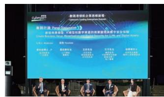

助力恒生银行完成HKMA第二阶段数码港元先导计划:我们为恒生银行数码奖励试点项目提供技术支持,助力其运用可编程数码货币,为消费者打造创新的数字优惠券平台。

该平台通过结合公有和私有的许可分布式账本技术, 实现了以模拟数字港元为基础的即时结算, 极大提升了中小企业商户的资金流动性和客户参与度。

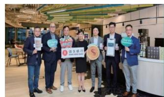

荣获2025“上证鹰·金质量”公司治理奖:在公司治理实践中,公司贯彻“行稳致远.进而有为”的治理理念,始终致力于提升股东回报,积极履行社会责任。通过持续地完善内部控制与风险防控体系,强化信息披露的及时性、准确性与完整性,切实维护投资者合法权益。

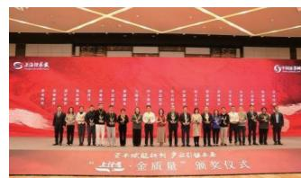

香港新界大埔区宏福苑多栋住宅楼发生五级火灾，许多同胞遭逢变故、痛失亲人，对此公司感同身受。

四方精创紧急捐赠100万港元，用于受灾居民的医疗救助、过渡期安置、生活物资补给及情绪疏导等工作。

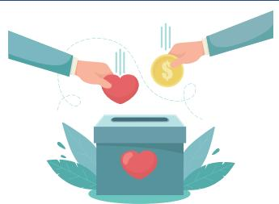

<details>
<summary>natural_image</summary>

Illustration of two hands holding a heart and a dollar coin, with a ballot box below (no text or symbols)
</details>

2025年11月公司与数码港签署合作备忘录，携手启动"区块链小镇@数码港"(Blockchain Valley@Cyberport)，打造以"区块链化"为本的共创中心，汇聚领先数字资产、Web3机构及区块链初创企业，推动香港成为全球数字资产及RWA创新领导中心。

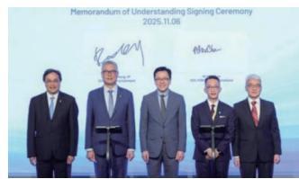

公司香港及国际业务CEO陈荣发先生参与香港金管局拍摄视频，与我们的两位客户一起探讨了公司的FINNOSafe分布式账本技术(DLT)代币化平台如何于国际领先的Project Ensemble开创链上实时支付与数字资产交收的新范式，分享了我们和前瞻性客户一起进行未来链上金融应用场景探索的激动人心的旅程。

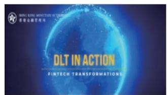

我们荣幸地连续第五年受邀成为“Global Fast Track”的企业领军企业之一，该活动是2025香港金融科技周的标志性项目，项目旨在连接高潜力金融科技公司、领先企业，为他们提供试点解决方案、探索合作关系和拓展新理念的机会。


2025年10月，金管局发布了第二期GenA.I.沙盒的参与者名单，进一步促进负责任AI的应用。公司继续以技术合作伙伴的身份参与，与香港金融机构及金融科技同行共同深化AI技术在反欺诈与可疑交易监控等领域的应用，推动金融行业的智能化转型。连续两届被选为GenA.I.沙盒的参与者，体现了公司在金融领域应用生成式人工智能的技术实力及行业认可。

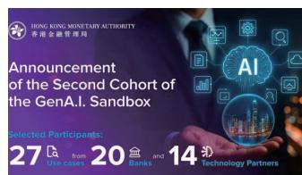

## 专篇

责任同行,温暖四方
——2025年公益足迹

我们的关注

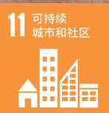

## 责任同行, 温暖四方——2025年公益足迹

四方精创始终坚信,企业的可持续发展离不开对社会的回馈与关怀。2025年,我们持续践行企业公民责任,积极参与多项社会公益活动,涵盖社区支援、弱势群体关怀、灾害救助等多个领域,以实际行动传递温暖与善意,推动社会共融与和谐发展。

## 支持特殊教育与共融发展

2月, 公司捐助由香港青草音符关爱有限公司主办的“NS31大型社区服务——同SEN同喜”活动, 旨在打破社会对特殊教育需要 (SEN) 群体的刻板印象, 深入了解其家庭的难处与需求, 关心其身心灵健康, 推动社会共融。

## 助力紧急救助与社区安全

4月, 我们参与香港公益金主办的“保境安民为公益”综艺大汇演, 捐款用于向因意外伤亡、天灾或突发困境而陷入生活困难的人士提供及时、直接的短期援助, 助力社区安全与应急支持。

## 支持智障人士体育发展

9月, 公司赞助香港特殊奥林匹克运动会举办的“香港特奥执法人员火炬跑”活动, 捐款用于支持智障人士体育发展, 促进他们在运动中建立自信、融入社会。

## 关注女性权益与社会弱势群体

11月中旬, 我们向香港妇女中心协会捐赠善款, 支持其在2025年中秋节期间开展的慈善项目, 致力于改善女性群体的生活处境, 关注她们的多元需求。

## 支持心理健康与社区服务

3月，公司参与“公益金东亚慈善高尔夫球赛2025”，为公益金会员机构所提供的心理健康服务筹集善款，助力提升社会对心理健康的关注与支持。

## 支持青少年成长与向上流动

8月及11月，公司先后参与“共创明『Teen』计划”第三期的两场星级导师活动，通过行业分享与企业参访，帮助来自弱势家庭的学生拓宽视野、增强自信、树立积极人生观，助力他们规划未来、实现向上流动。

9月, 公司接待香港海关青年发展计划 (Customs YES) 一行参观四方精创总部, 向青年学员介绍金融科技行业发展趋势及从业路径, 激发他们对科技与金融领域的兴趣, 助力培养未来人才。

## 响应灾害援助, 支援社区重建

11月底,香港大埔宏福苑发生严重火灾,造成多名居民受灾。公司迅速响应,向大埔宏福苑援助基金捐款港币100万元,用于支援受灾家庭及社区重建,展现企业对突发灾害的关注与责任担当。

2025年,四方精创累计投入对外捐赠1,039,660

元，覆盖教育、灾害救助、妇女支持、心理健康、青少年发展、社区共融等多个公益领域。我们以多元化的公益行动，持续践行“取之于社会，用之于社会”的责任承诺，积极投身社会公益事业，传递正能量，共建美好社会。

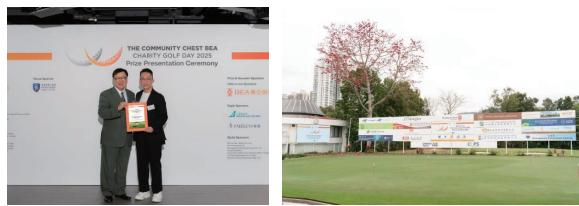  
2025年公益金东亚慈善高尔夫球赛

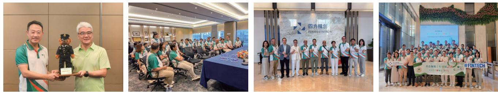  
香港海关青年发展计划 (Customs YES)参观及交流

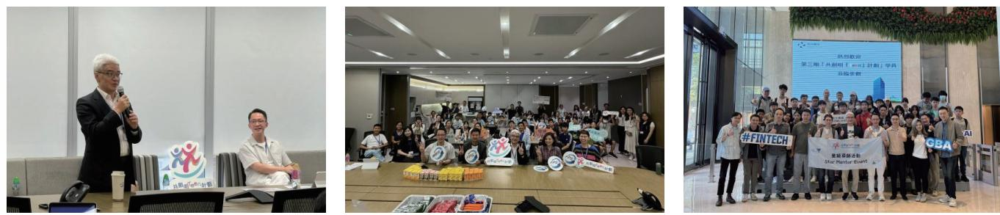  
2025年第三期共创明 Teen 计划

四方精创2025年公益捐赠

<table><tr><td>捐赠机构</td><td>相关活动</td><td>捐赠金额(以港币计)</td></tr><tr><td>香港青草音符关爱有限公司</td><td>NS31大型社区服务——同SEN同喜</td><td>5,000.00</td></tr><tr><td>香港公益金</td><td>「保境安民为公益」综艺大汇演</td><td>50,000.00</td></tr><tr><td>香港特殊奥林匹克运动会</td><td>香港特奥执法人员火炬跑</td><td>50,000.00</td></tr><tr><td>香港妇女中心协会</td><td>2025年中秋节慈善捐款</td><td>9,829.40</td></tr><tr><td>大埔宏福苑援助基金</td><td>香港大埔宏福苑五级火灾</td><td>1,000,000.00</td></tr></table>

## 02

## 公司ESG概况

○ 公司ESG管理结构  
公司ESG实质性议题  
○ 公司ESG利益相关方识别


<details>
<summary>natural_image</summary>

Interior of a data center with rows of server racks and a technician holding a laptop (no visible text or symbols)
</details>

## 公司ESG管理结构

2025年在公司董事长的领导下，正式成立了“四方精创ESG工作委员会”，公司ESG工作委员会小组成员由公司各项目组核心人员组成。ESG工作委员会主要依据我们的核心价值观“诚信敬业、使命认

同、学习创新、协作并进”与现状形成了适用于我们的ESG治理架构。

主要分为:公司治理专项组、可持续专项组、数字金融专项组、综合管理专项组及大环境安全专项组构成。并且通过成立会议明确了2025年的ESG治理议题与目标。

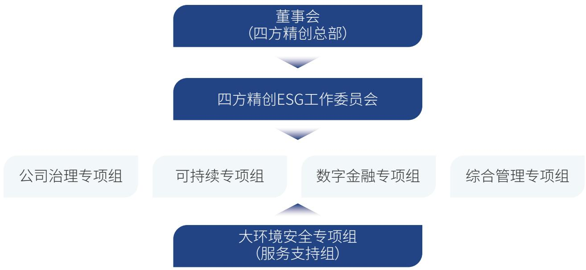

<details>
<summary>flowchart</summary>

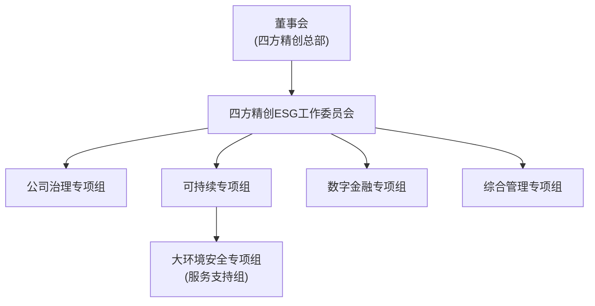
</details>

<table><tr><td>小组名称</td><td>主要ESG工作内容</td></tr><tr><td>公司治理专项组</td><td>建立治理架构、制定ESG内部目标、监督落实ESG、主导ESG能力建设等</td></tr><tr><td>可持续专项组</td><td>节能减排治理、向治理专项组提供技术支持</td></tr><tr><td>数字金融专项组</td><td>信息安全履职、科技金融创新管理规划实施、人才培养</td></tr><tr><td>综合管理专项组</td><td>信息舆情管理、合规经营、客户权益保障、员工福利、人才培养等</td></tr><tr><td>大环境安全专项组</td><td>支持与其他工作小组在开展工作中的:信息&amp;办公安全、环境安全,对应的培训与宣传及节能减排等收集并负责对于相关部门的ESG案例进行汇总,编制ESG信息披露报告</td></tr></table>

## 公司ESG实质性议题

公司参考联合国可持续发展目标(Sustainable Development Goals)缩写SDGs, 其中我们对SDGs中的性别平等、清洁饮水、健康与福祉、清洁能源、体面工作、工业创新、永续社区、负责任的生产、气候行动, 9个目标进行了解读, 并转换形成了“属于我们自己的ESG实质性议题”, 来确保我们在2025年制定的绩效目标达成, 目前形成了9个核心主体议题与关联的10个执行实施内容, 来确保我们的议题是

“有意义的”。

<table><tr><td>议题</td><td>实施内容</td><td>议题</td><td>实施内容</td></tr><tr><td>女性平等(性别平等)</td><td>男女员工比例、女性高管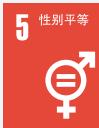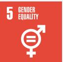</td><td>金融科技(工业创新)</td><td>支持金融合规经营(专利)、研发投入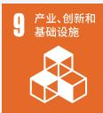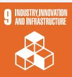</td></tr><tr><td>水资源利用(清洁饮水)</td><td>水资源管控、健康饮水管理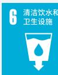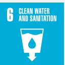</td><td>社区服务(永续社区)</td><td>公益活动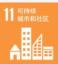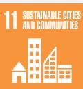</td></tr><tr><td>安全办公环境(健康与福祉)</td><td>员工福利、员工健康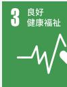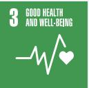</td><td>永续经营(负责任的生产)</td><td>信息安全体系管理、客户满意度、产品交付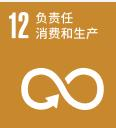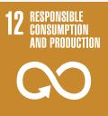</td></tr><tr><td>节能、减排(清洁能源)</td><td>节能宣传、能耗管理、低碳实践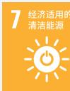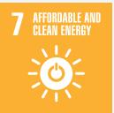</td><td>极端天气(气候行动)</td><td>极端天气预防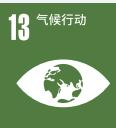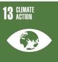</td></tr><tr><td>员工培养(体面工作)</td><td>青年培养、员工技能提升、员工晋升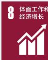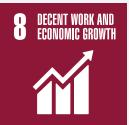</td><td></td><td></td></tr></table>

## 公司ESG利益相关方识别

四方精创在应对不断变化的外部环境来满足利益相关方的诉求与期望,我们的可持续工作小组在本年度对沟通的诉求结合四方精创的实际情况我们进行了实质性议题的识别,在满足企业基础合规的大前置条件下,绘制属于我们的自己的实质性议题矩阵,并期望通过2025年度的实施与实践在下年度寻求更多的机遇。

<table><tr><td></td><td>沟通诉求</td><td>四方精创的回应</td><td>沟通渠道</td><td>核心关联议题</td></tr><tr><td>政府</td><td>·依法经营企业·推动信息安全提升·推动技术改进·社会就业</td><td>·依法纳税·不断提升信息安全工作·提供就业机会·落实市场监督要求·实施节能工作</td><td>·定期日常会议·部门信息报送·定期专项会议</td><td>·数据安全信息预防·节能、减排实践</td></tr><tr><td>客户</td><td>·金融信息安全·商业道德·售后服务</td><td>·提供信息数据安全合规·提供负责任的产品·履行产品服务合同</td><td>·客户满意度调查·定期拜访与建议收集</td><td>·信息安全体系管理</td></tr><tr><td>员工</td><td>·基本权益保障·员工晋升机制·良好的工作环境</td><td>·遵守法律法规·员工个人发展规划·环境、职业健康、安全建设</td><td>·员工晋升报酬·员工培训及活动·员工福利活动</td><td>·员工技能提升</td></tr><tr><td>产业链</td><td>·诚信经营·履行企业社会责任,创建可持续未来·公平交易</td><td>·公开采购原则与合作机制·共创四方精创产品价值链·负责任采购与销售管理</td><td>·供应商管理机制·供应商审核/审计·招投标程序</td><td>·安心信息供应</td></tr><tr><td>社区</td><td>·社区发展·公益活动·参与社区建设·组织志愿者活动</td><td>·志愿者服务·社会公益活动组织实施</td><td>·参与公司志愿者服务活动·组织员工开展公益活动</td><td>·公益活动</td></tr><tr><td>环境</td><td>·水资源管控·办公环境持续改善·极端天气预防</td><td>·持续改善员工工作环境·安心饮水·制定应急处置方式</td><td>·环境管理制度·专职环境管理人员·开展环境管理提升</td><td>·健康饮水管理</td></tr><tr><td>股东/上级公司</td><td>·合规经营·持续改进公司治理·资产保护·投资者利益维护</td><td>·制定企业风险管控制度·维持/提升企业盈利能力·创建公司ESG治理机制·审计报告</td><td>·完整的企业信息披露</td><td>·ESG信息披露与公示</td></tr></table>

实质性议题矩阵

<table><tr><td>议题大类</td><td>执行内容</td><td>重要性</td><td>议题编号</td></tr><tr><td rowspan="2">性别平等</td><td>男女员工比例</td><td>一般议题</td><td>1</td></tr><tr><td>女性高管</td><td>中等议题</td><td>2</td></tr><tr><td rowspan="2">清洁饮水</td><td>水资源管控</td><td>中等议题</td><td>3</td></tr><tr><td>健康饮水管理</td><td>重要议题</td><td>4</td></tr><tr><td rowspan="2">健康与福祉</td><td>员工福利</td><td>中等议题</td><td>5</td></tr><tr><td>员工健康</td><td>重要议题</td><td>6</td></tr><tr><td rowspan="3">清洁能源</td><td>节能宣传</td><td>一般议题</td><td>7</td></tr><tr><td>能耗管理</td><td>中等议题</td><td>8</td></tr><tr><td>低碳实践</td><td>一般议题</td><td>9</td></tr><tr><td rowspan="3">体面工作</td><td>青年培养</td><td>重要议题</td><td>10</td></tr><tr><td>员工技能提升</td><td>重要议题</td><td>11</td></tr><tr><td>员工晋升</td><td>重要议题</td><td>12</td></tr><tr><td rowspan="2">工业创新</td><td>支持金融合规经营(专利)</td><td>重要议题</td><td>13</td></tr><tr><td>研发投入</td><td>重要议题</td><td>14</td></tr><tr><td>永续社区</td><td>公益活动</td><td>重要议题</td><td>15</td></tr><tr><td rowspan="3">负责任的生产</td><td>信息安全体系管理</td><td>重要议题</td><td>16</td></tr><tr><td>客户满意度</td><td>重要议题</td><td>17</td></tr><tr><td>产品交付</td><td>重要议题</td><td>18</td></tr><tr><td>气候行动</td><td>极端天气预防</td><td>中等议题</td><td>19</td></tr></table>

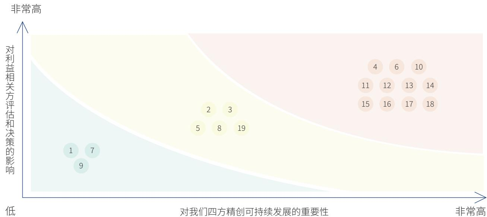

<details>
<summary>bubble</summary>

| ID | Importance to Four Comprehensive Development (Approximate) | Impact on Stakeholders' Effectiveness (Approximate) |
| --- | --- | --- |
| 1 | Low | Low |
| 7 | Low | Low |
| 9 | Low | Low |
| 2 | Medium | High |
| 3 | Medium | High |
| 5 | Medium | High |
| 8 | Medium | High |
| 19 | Medium | High |
| 4 | Very High | Very High |
| 6 | Very High | Very High |
| 10 | Very High | Very High |
| 11 | Very High | High |
| 12 | Very High | High |
| 13 | Very High | High |
| 14 | Very High | High |
| 15 | Very High | High |
| 16 | Very High | High |
| 17 | Very High | High |
| 18 | Very High | High |
</details>

## 03

## 环境管理

环境政策和目标  
能耗管理  
本年度能耗及碳排放统计及未来规划  
绿色办公倡导  
办公安全与极端天气预防  
健康饮水管理

我们的关注

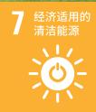

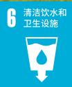

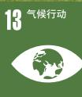

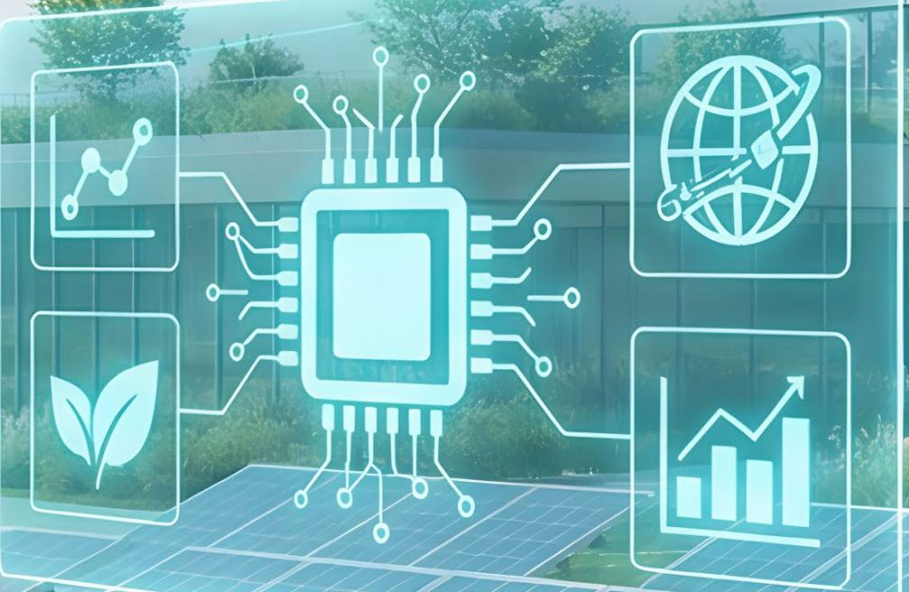

<details>
<summary>natural_image</summary>

Digital illustration of a central integrated circuit with four surrounding icons representing data, technology, growth, and environmental indicators (no text or symbols)
</details>

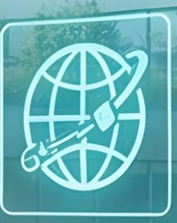

<details>
<summary>natural_image</summary>

Icon of a globe with a globe symbol and a hand holding a globe, set against a teal background (no text or symbols)
</details>

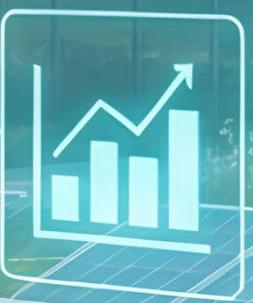

<details>
<summary>bar</summary>

| Category | Value |
| --- | --- |
| 1 | ~25 |
| 2 | ~45 |
| 3 | ~35 |
| 4 | ~60 |
</details>

## 环境政策和目标

作为一家具有强烈责任感的企业,我们始终将保护环境、节能降碳视为企业发展过程中的重要工作内容之一。金融科技服务企业和一般的工业企业环境管理与能耗管理存在显著差异,我们的碳排放主要集中公司运营的日常能耗上。

结合我们实际运营情况, ESG工作小组制定了一套符合自身特点的环境管理政策与目标, 将节能环保这一重要理念全面融入企业的日常运行之中。

我们目标建立一个更加健康、舒适的办公环境, 提高员工的办公舒适度, 并在这个前提之下尽可能地实现低碳节能以及绿色办公。

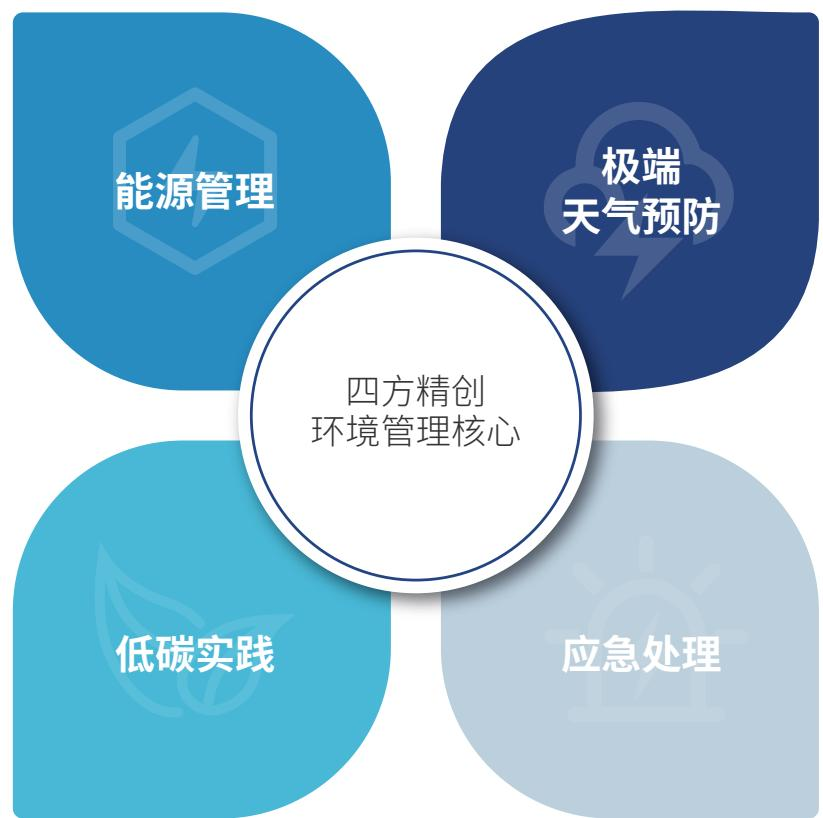

<details>
<summary>flowchart</summary>

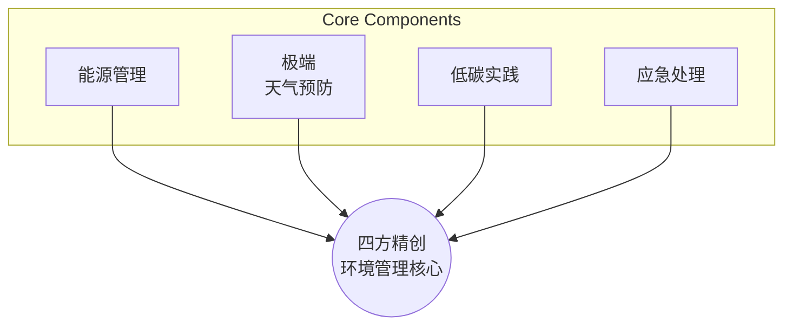
</details>

## 能耗管理

我们业务广泛, 拥有不少办公场所, 我们将管理和优化办公室运营的能耗作为抓手, 在不牺牲员工

办公舒适度的前提下,我们制定了如下能耗管理目标。

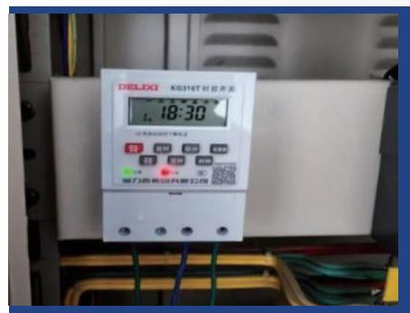

<details>
<summary>text_image</summary>

DELIXI K0316T时控开关
18:30
25 30 40
50 60 70
电力热能有限公司
</details>

## 确保公司不出现异常耗能


聘请持证的专职电力管理人员,每日巡检、每周例会、每月隐患排查与总结,以数据为引精细化日常用电量管控。

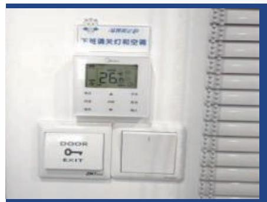

<details>
<summary>text_image</summary>

下堆调关灯和空调
26℃
A
B
C
D
E
F
DOOR
EXIT
200
</details>

## 人性化的节能降碳


根据天气情况动态化设置空调温度, 空调的自动关闭时间设置在18:30, 需要同事可自行重新开启, 目前员工办公舒适度反馈良好。

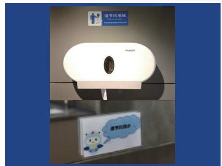

<details>
<summary>text_image</summary>

请节约期限
请节约喝水
</details>

## 提高员工节能意识


在空调面板、照明开关、洗手台周围等员工高频使用地点张贴节能标语，员工节能意识显著提高。

## 本年度能耗及碳排放统计及未来规划

基于2025年我们在广东、四川、北京、安徽、上海的实际经营情况，参照中国《2023年电力二氧化碳排放因子》中各省市数据，统计了我们在中国境内地区2025全年用水量、用电量及二氧化碳排放量，总用水量为26323.33吨，总用电量为309.15万千瓦时，总二氧化碳排放量为1363.56吨。

<table><tr><td>序号</td><td>办公场地所在(地区)</td><td>用水量(吨)</td><td>用电量(千瓦时)</td><td>二氧化碳排放量(千克 $CO_2$ )</td></tr><tr><td>1.</td><td>深圳</td><td>26193.7</td><td>3052132.4</td><td>1348737.31</td></tr><tr><td>2.</td><td>安徽</td><td>78.63</td><td>5326.06</td><td>3489.84</td></tr><tr><td>3.</td><td>四川</td><td>36</td><td>19015</td><td>2973.94</td></tr><tr><td>4.</td><td>北京</td><td>15</td><td>14368</td><td>7979.99</td></tr><tr><td>5.</td><td>上海</td><td>0</td><td>669</td><td>383.81</td></tr><tr><td>6.</td><td>总计</td><td>26323.33</td><td>3091510.46</td><td>1363564.89</td></tr><tr><td colspan="5">数据说明:1、深圳总部能耗管理将作为公司核心能耗治理点,并做持续改进工作。2、2025年我们的营收为63106.75万元,据此计算我们每排放一吨二氧化碳产生的产值约为46.28万元。</td></tr></table>


<table><tr><td>电力(千瓦时)</td><td>3091510.46</td></tr><tr><td>用水量(吨)</td><td>26323.33</td></tr><tr><td>二氧化碳排放量(千克 $CO_2$ )</td><td>1363564.89</td></tr></table>

基于如上统计可以发现我们在深圳的碳排放量占总体的98.9%, 用水量占总体的99.5%, 这主要因为我们总部位于深圳, 此地办公场所及机房较多, 未来我们将把深圳总部作为降碳试点目标。


我们将在2026年依据我们的节能治理结构对于核心耗能办办公场所进行实际治理行动。


<details>
<summary>flowchart</summary>

This image is a hierarchical organizational chart (tree diagram) illustrating the 'Four-Year Specialized Energy Reduction Governance Structure' framework. It details the main components of the governance structure, including legal regulations, implementation, and management, as well as specific operational goals for each.
</details>

## 绿色办公倡导

本年度我们同物业一起建立了《大厦垃圾分类与回收管理制度》并严格履行，重点关注垃圾源头化减量与回收，基于七分类(纸/塑/金/玻/湿/干/有害)适配LEED/无废认证进行垃圾分类并制定了如下源头减量制度，同时我们广泛放置各类型垃圾桶，避免员工面对垃圾无所适从。


<details>
<summary>text_image</summary>

综合事项
4
90
183
3
管理功能
组织资源
服务资源
项目资源
资料资源
采购资源
费用资源
运维资源
我的项目
用户
操作
</details>

## 减少用纸, 提高员工工作效率


借助协同办公平台和乐联推进无纸化与电子化办公将大量线下流程迁移至线上，2025年办公纸张消耗比2024年下降约38%。


<details>
<summary>natural_image</summary>

Exterior view of a modern building with three metal trash bins and two red bins, adjacent to a concrete sidewalk (no signage or text visible)
</details>

## 培养员工垃圾分类好习惯


每一工位都有工位回收盒，楼层做到每层双桶（可回收+其他），公共空间和茶水间放置四分类+密封厨余桶+有害垃圾箱。做到办公楼内外均有垃圾桶，鼓励员工分类投放。

## 办公安全与极端天气预防

我们以人为本始终将员工安全放在首位,投入大量资金购买消防设备,积极组织安全专项培训,结合公司生产经营实际情况,开展了丰富多样的安全宣传教育活动、知识竞赛、应急演练等,全体职工安全防范意识日益强化。


总安全投入

271万元


安全用品采购数

3058个


培训人次

336人


消防演练

9次


极端天气应急预防

2次

年度实施办公安全相关案例

<table><tr><td>时间</td><td>1至3月</td><td>4至6月</td><td>7至8月</td><td>9至12月</td></tr><tr><td>安全培训主题</td><td>年度整体安全规划反诈强化</td><td>员工安全出行应急联动强化反诈信息极端天气预防</td><td>防汛防台培训极端天气(台风)应急处置</td><td>电动车安全培训消防安全强化火灾应急疏散</td></tr><tr><td>核心目标</td><td>制定年度公司安全目标与实际公司所在区域的反诈核心</td><td>安全生产月应急演练夏季核心防汛防台预警</td><td>极端天气应急处置</td><td>热点事件安全培训与员工安全确保</td></tr><tr><td>触发因素</td><td>每年1月中国农历新年</td><td>实际事件安全生产月活动临近台风天</td><td>实际应急处置</td><td>社会热点事件风险规避</td></tr></table>


## 健康饮水管理

清洁、安全的饮用水与员工健康密切相关，也是保障员工身心健康的基础。我们持续优化办公场所的饮水环境，实现水资源管理与员工福祉的协同提升。

公司严格执行每月一次饮水机滤芯更换, 确保饮用水符合国家卫生标准, 这一举措不仅是环境管理中对水质安全的主动控制, 也是我们履行员工健康保护责任的具体行动。

## 04

## 公司治理

○ 公司治理结构  
○ 商业道德  
○ 员工管理

我们的关注

5 性别平等


9 产业、创新和基础设施


11 可持续城市和社区


<details>
<summary>natural_image</summary>

Businessman in suit interacting with digital network diagram (no text or symbols)
</details>

## 公司治理结构

四方精创根据《中华人民共和国公司法》等有关法律法规、《上市公司自律监管指引第2号——创业板上市公司规范运作》等政策文件，构建高效的治理架构，形成了权责法定、权责透明、协调运转、有效制衡的治理机制，保障了公司治理工作高效合规。


<details>
<summary>flowchart</summary>


</details>

## 商业道德

公司建立内部审计部, 协调、指导和监督反舞弊、反洗钱、反不正当竞争等相关工作的开展, 接受舞弊和不当商业竞争方面的投诉, 审阅舞弊案件的调查进展和结果, 建议后续处理和行动方案, 监督改进措施的落实。

我们高度重视商业道德，严格遵循《企业内部控制基本规范》、《深圳证券交易所股票上市规则》及《公司章程》等法律法规(制度)，建立相关管理机制及流程，打造透明、公平的商业环境。对处理利益冲突、打击贪污腐败、尊重竞争对手、防止欺诈与洗钱等方面作出明确要求，规范员工行为。

制度中明确规定了公司对于相关方的各类舞弊的“认定”说明,具体如下:

## 损害公司正当经济利益的舞弊

(一) 收受贿赂或回扣；  
(二) 将正常情况下可以使公司获利的交易事项转移给他人；  
(三)非法使用公司资产,贪污、挪用、盗窃、侵占公司资财;  
(四) 员工或其利害关系人与供应商存在不正当资金往来；  
(五)不真实表达或故意遗漏、虚报交易或其他事项,使公司为虚假的交易或事项支付款项;  
(六)授意他人或自己伪造、变造会计记录或凭证,故意误用会计政策和会计估计,提供虚假财务信息或报告;  
(七)利用电子商务技术存在的漏洞和缺陷损害公司利益；  
(八)泄露公司的商业或技术秘密；  
(九)未经授权,以公司名义进行各项谋利活动;  
(十)其他损害公司经济利益的舞弊行为。

## 谋取不当的公司经济利益的舞弊

(一)为不适当的目的而支出,如支付贿赂或回扣;  
(二) 出售不存在或不真实的资产；  
(三) 故意错报交易事项、记录虚假的交易事项，包括虚增收入和低估负债，出具错误的财务报告，从而使财务报表阅读或使用

者误解而做出不适当的投融资决策；

(四)隐瞒或删除应对外披露的重要信息；  
(五)从事违法、违规的经济活动；  
(六) 偷逃税款；  
(七)其他为公司谋取不当经济利益的舞弊行为。


<details>
<summary>text_image</summary>

NO!
</details>

为提高员工的道德意识,建设廉洁诚信文化,我们对公司员工开展了针对性的商业道德培训。

公司建立畅通的投诉举报渠道,鼓励利益相关方积极反馈不当行为。我们建立相应的工作流程,对举报事件进行调查和处理,高度重视举报人权益保护,坚决杜绝对举报人进行威胁或者打击报复的行为,具体如下:


非因职务需要,严禁故意泄露举报人的姓名、单位、住址等相关信息。


非因职务需要,不得故意向被调查部门或被调查人出示举报信等涉及举报人个人信息的材料。


所办舞弊案件与本人或者其近亲属有利害关系的,应当回避。


举报人认为受理举报的工作人员与被举报人存在有利害关系, 可能影响客观、公正处理的, 有权向内部审计部负责人或其上层主管提出回避要求。情况属实的, 有关人员必须回避。

公司建立了供应商备案与市场部从业廉洁制度，市场部人员均签署《廉洁从业承诺书》，其中规范了3条红线要求，并且涉及供应商的相关工作同样适用公司的《反舞弊制度》相关内容。

公司未以任何形式向采购方人员赠送回扣、有价证券、礼品等财物，以及提供吃喝和免费旅游等消费，并且未与其他供应商进行串通应答等有损贵公司利益的违法活动。


<details>
<summary>donut</summary>

| Category | Value |
| --- | --- |
| 01 | N/A |
| 02 | N/A |
| 03 | N/A |
</details>

公司愿主动接受监督与核查，如发现我方人员存在吃拿卡要、利益输送、违规违纪等行为，公司将第一时间严肃查处，绝不推诿包庇，营造风清气正的合作环境。

公司严格遵守公平公正的商业合作原则，不以权谋私、不暗箱操作，不利用合作关系为个人、亲属及第三方谋取不当利益，所有业务往来均依法依规。

供应商廉洁承诺签订率

100%


<details>
<summary>natural_image</summary>

Illustration of documents with a magnifying glass and a checkmark, symbolizing document review or verification (no text present)
</details>

## 员工管理

四方精创秉承多元化雇佣原则，坚持男女平等、同工同酬，致力于构建一个多样化和包容性的工作环境。我们坚决反对非法强迫劳动、雇佣童工的行为，对于不同信仰、民族、种族、宗教、性别、年龄等的劳动者一视同仁，坚决抵制任何形式的歧视、骚扰、欺凌或其他暴力行为，确保所有员工在招聘、劳动、薪资、培训、晋升、补偿等阶段享受同等待遇。此外，公司还积极倡导包容性文化，支持员工之间的交流与合作，以促进相互理解和尊重。


员工总人数

2097人


残疾员工

1人


少数民族员工人数

95人

性别比例
(含境内外数据)  


<details>
<summary>donut</summary>

| Category | Value |
| --- | --- |
| Dark Blue | ~75% |
| Light Blue | ~25% |
</details>

女性 22.7% 男性 77.3%

中高层管理者女性比例  


<details>
<summary>donut</summary>

| Category | Value |
| --- | --- |
| Dark Blue | ~75% |
| Light Blue | ~25% |
</details>

女性 19% 男性 81%

学历构成
(含境内外数据)  


<details>
<summary>donut</summary>

| Category | Value |
| --- | --- |
| Dark Blue | ~65% |
| Light Blue | ~12% |
| Medium Blue | ~8% |
| Light Blue (small) | ~7% |
</details>

- 大专以下 1.1%
- 专科 17.5%
- 本科 78.2%
- 硕士及以上 3.2%

年龄构成  


<details>
<summary>donut</summary>

| Category | Value |
| --- | --- |
| Light Gray | ~35% |
| Dark Blue | ~30% |
| Medium Blue | ~15% |
| Very Light Blue | ~5% |
</details>

30岁及以下 40% 30岁-35岁(含) 33%
35岁-40岁(含) 18% 40岁-50岁(含) 8% 50岁以上 1%

## 05

## 创新&企业文化驱动的产品服务

创新理念  
创新激励措施  
需求响应与客户满意度  
信息安全实施与管理

我们的关注  


<details>
<summary>natural_image</summary>

Futuristic digital interface with floating devices and a central holographic display (no readable text or symbols)
</details>


<details>
<summary>text_image</summary>

Digital dashboard displaying a bar chart and charts on a tablet screen, with Chinese text labels visible on the left side.
</details>

## 创新理念

四方精创的创新理念根植于“技术驱动+场景落地”的双轮模式，强调以前沿科技重构金融基础设施，推动银行4.0时代下的数字化跃迁。

公司坚持“用科技让金融无处不在”的使命，在分布式架构、区块链、人工智能合规Web3等方向持续突破，实现从技术探索到商业闭环的转化。


<details>
<summary>funnel</summary>

| Category | Value |
| --- | --- |
| 科研投入 | 5,992万元 |
| 研发人员数量 | 405人 |
| 研发费用占营业额比例 | 9.50% |
</details>

## 四方精创“绿色\*安全”金融矩阵树

PU (Platform Universe/Platform Unicorn)  
金融级分布式平台PU  


<details>
<summary>flowchart</summary>


</details>

本年度内我们获得了两项发明专利证书，在坚持诚信的理念与态度，通过自身的金融科技服务能力与创新投入的基础上，不断的向我们的客户提供优质的软件技术产品。

- 预先构建联盟链配置的强制性准入规则；  
- 对入链申请者发起的入链申请请求进行多维度审核并输出多维度资质特征；  
- 多维度资质特征满足强制性准入规则后, 计算与入链申请者的业务具有高关联度的高关联成员节点;  
- 再计算入链申请者对所有高关联成员节点的业务总促进度和业务总干扰度；再基于业务总促进度和业务总干扰度的大小决定是否判定入链申请请求通过。

  
一种联盟链自动化准入治理方法、系统及介质证书号第8380474号

优化了各节点投票的低效准入治理方式,采用强制性准入规则先进行初步判定,再分析入链申请者的准入对原有高关联成员节点的业务的促进与干扰,并据此实现动态的调整准入门槛,实现了入链申请者准入的自动化治理。

- 根据组网配置信息配置交易策略并发送节点身份信息至管理节点及其它各节点,根据接收的注册反馈信息生成本地钱包账户;  
- 接收到本地钱包账户的钱包交易信息则获取与当前时间对应的同步节点数, 发送与钱包交易信息对应的钱包交易加密信息至其它各节点;  
- 接收到与同步节点数相等的其它节点反馈的节点签名信息则对应生成交易记录信息, 对交易记录信息、节点排序及当前节点的节点签名信息进行加密并发送至各节点;  
- 接收各节点的运算反馈结果并验证是否与交易记录信息一致, 若一致则存储交易记录信息以完成交易结算。

  
基于多方安全计算的区块链钱包交易验证方法及装置证书号第8377122号

上述技术方法大幅提高了通过区块链网络进行交易结算的安全性。

## 创新激励措施

通过持续完善人力资源激励政策体系，全方位调动员工的工作积极性、主动性与创造性，引导员工树立正确的工作导向，全力以赴投入到本职工作中。在助力员工不断提升个人工作绩效、突破工作瓶颈的同时，为员工提供广阔的成长空间，助力其实现自身职业成长目标与个人自我价值，形成“企业发展与员工成长共赢”的良好局面。


建立科学规范、公平公正的晋升体系，以全面的综合评价、客观的绩效考核结果为核心导向，紧密结合员工的专业技术能力、管理统筹能力及岗位适配度评估，明确清晰的晋升标准与流程，确保晋升过程公开透明、有章可循。同时，为员工搭建多元化、差异化的职业发展通道，重点打造专业技术与综合管理两条并行且互通的发展路径，分别适配技术型、管理型等不同能力特质、职业诉求的员工，助力员工结合自身优势制定长期职业规划，实现稳步成长。


<details>
<summary>natural_image</summary>

Group of people seated at a long table in an outdoor banquet at night, with city skyline and illuminated ceiling in background (no visible text or symbols)
</details>

制定富有市场竞争力与内部公平性的薪酬福利体系,兼顾激励性与保障性,既要确保薪酬福利水平与行业接轨、具有吸引力,也要实现与员工的工作付出、岗位价值、绩效表现精准匹配,真正做到“多劳

多得、优绩优酬”。同时，丰富福利保障内容，覆盖员工工作与生活全场景，切实增强员工的归属感、幸福感与忠诚度，有效稳定核心人才队伍，为企业长远发展提供人才支撑。


健全奖惩分明、权责对等的管理制度，明确奖惩标准与实施细则，确保有据可依、执行到位。对工作表现突出、绩效优异、为企业发展作出积极贡献的员工，给予精神表彰与物质奖励相结合的激励，树立全员学习的标杆，充分激发全体员工的奋进动力；对工作态度懈怠、履职不到位、绩效持续不佳的员工，进行针对性的沟通引导、岗位培训与合理惩戒，倒逼其正视自身不足、提升工作质量，营造“比学赶超、求真务实、争先创优”的良好工作氛围。


<details>
<summary>natural_image</summary>

Illustration of four business professionals celebrating joyfully in an office setting (no text or symbols)
</details>

## 需求响应与客户满意度

## 高效金融科技服务团队管理

我们在深圳建立了总部交付基地,为多家境内外大型金融机构建立了远程交付中心(ODC),为客户提供从办公空间到技术资源的敏捷拓展能力。

我们有一支专业的人力资源团队，精通金融科技人才的引入和培训。我们在不同的城市展开不间断的招聘，持续壮大技术团队。我们还通过吸纳刚刚走出校门的毕业生，为他们提供实习培训和项目培训，不断增加我们的技术人才储备。

我司在香港、北京、上海、深圳、泰国、成都、合肥、南京等地设置分公司及子公司储备技术人才为客户提供本地化的贴心服务，公司人力资源部门在这些地区设置了专属的人力资源专员。具体实施流程如下：


## 四方携手 合作共赢

## 四方精创

## 组建团队

迅速响应需求启动项目工作。我们明白时间就是金钱，通常在签约后一周之内我们将组建项目团队，制定明确的组织架构，根据项目特点建立团队，明确项目经理、以及各小组组长和骨干成员等。

## 诚信敬业、使命认同、学习创新、协作并进

## 人力资源保障机制

项目组的资源配置是项目成功的关键保障,人员调整尽最大努力争取各方满意的安排。引入新成员时,和客户方协商,团队人员调离前,也会提前与客户沟通后方可安排离组手续,并办理好工作交接。

## 用科技让 金融无处不在

## 文化协同

尊重各方文化,使命必达。我们充分意识到项目的所有相关方都有自己独特的治理文化,这些文化包括沟通、合规、纪律、技术管理等,我们的团队努力理解各方的关切并遵守。

## 成为全球金融科技的探索者和引领

## 团队建设

聚散是常态, 但“聚是一团火, 散是满天星”, 我们在每一个团队组建之初就重视团队文化的建设工作, 我们更多的通过培训、沟通、活动、嘉奖等多种手段, 凝聚团队的向心力, 提升协作度、提高项目组工作效率。

## 技术人员的“筛优”机制

四方精创重视客户的每一个需求, 我们结合公司统一的项目执行标准流程和项目的特定需求开展项目团队组建。技术能力作为四方精创核心“服务”质量标准, 我们严格执行公司的《服务人员岗前培训手册》, 并在项目入组前和入组后都会组织专题培训, 并要求项目组成员在培训后签订必要的“履约文件”, 包括但不限于客户信息保密、信息安全及风险点检查、承诺书、舆情管理须知等。

## 客户满意度工作

为提升客户满意度,我们积极主动地对接所有项目客户,以电话回访、满意度问卷调查、改善意见反馈等方式持续改进我们的“金融科技服务”能力和方式,2025年我们主营业务发放问卷42份,问卷回收36份。

有效问卷调查结果  


<details>
<summary>bar</summary>

| Category | Value |
| --- | --- |
| 非常满意 (90分以上) | 32 |
| 满意 (70-90分) | 4 |
| 一般 (70-50分) | 0 |
| 不满意 (50-30分) | 0 |
| 非常不满意 (30分以下) | 0 |
</details>

## 平均结果为：“非常满意”

基于我们回收的客户满意度调查问卷显示我们取得了非常高的客户满意度，平均结果为“非常满意”。我们理解可能基于自身的管理文化而无法反馈正式的调查问卷，我们会通过替代方式获得客户反馈。

本年度开展了客户满意度信息收集的同时,我们也在收集相关“可持续改善建议”,我们非常重视每个客户对我们的建议,公司管理层牵头成立“意见改善工作组”,并立即着力于“实际落地”,通过一系列的公司内部质量改善我们得到了客户的认可。

## 客户认可案例-感谢信篇

## 客户描述

·凭借专业的技术实力、丰富的项目经验和高度的责任心，迅速投入工作  
·每一次的沟通交流,都能精准把握我们的需求,提出切实可行的解决方案  
·在项目交付后,你们依然保持着高度的服务意识,及时响应我们的反馈,积极解决后续出现的问题,确保系统的平稳运行


·扎实的技术功底和敏捷热情的全流程专业科技服务  
·连续奋战在最短时间磨合了问题解决和项目平稳落地


·克服重重困难,发扬精益求精的工匠精神攻坚克难的奋斗精神、密切协作的团队精神  
·共同实现了科技服务能力的跨越式提升  
·真诚期望在后续的工作中，能够得到贵司一如既往的支持


## 针对客户重保期的配合与支持

对于客户重保期的相关工作安排及信息安全、生产安全的要求，四方精创均积极配合与支持。

常见的重保期  


<details>
<summary>flowchart</summary>


</details>

## 信息安全实施与管理

公司编制了《深圳四方精创资讯股份有限公司信息安全管理规定》，严格按照“谁主管谁负责，谁使用谁负责；最小权限、最小暴露面”的原则进行分级信息管理，定期进行灾难恢复演练，部署各类防火墙确保公司、客户、员工的信息安全。


<details>
<summary>flowchart</summary>


</details>

## 保密承诺

我们承诺项目所有资料、经验、产品、包括工作内容、会议纪要等信息未经客户允许绝不复制、传播，不在其他项目中使用，相关系统不在项目以外地点登录、使用。要求所有参与项目的员工参与信息安全培训、签署保密承诺，严格遵守网络、设备、办公信息安全相关规定，严格控制普通移动设备使用。

## 主要管理内容

我们的信息安全管理工作主要由IT服务部负责执行,相应职责如下:


<details>
<summary>flowchart</summary>


</details>

我们基于“创新驱动,客户至上”的经营理念,以最大化降低信息安全风险为目标,不断提高自身防护能力,实现全流程管控,有效防止事故发生。我们的管理重点主要集中在网络安全和物理安全两方面。


<details>
<summary>flowchart</summary>


</details>

## 日常维护巡检

基于上述重点管理内容本年度IT部开展了大量的信息安全管理行动，防止公司信息泄露。


<details>
<summary>flowchart</summary>


</details>

我们定期开展巡检,形成标准化检查清单,要求及时整改、责任到人,年底按照全年巡检结果,识别系统性薄弱环节,评估信息安全风险。

巡查方面  


<details>
<summary>flowchart</summary>


</details>

## 应急响应

我们要求面对可能出现的紧急情况, 各部门能够临危不乱, 按照应急预案展开行动, 迅速实现灾难恢复。

<table><tr><td>处置流程</td><td>处置方式</td></tr><tr><td rowspan="3">应急响应</td><td>按事件分级标准定级</td></tr><tr><td>根据事件分级标准及时进行口头报告并尽快提供书面分析报告</td></tr><tr><td>建立应急联络机制</td></tr><tr><td rowspan="2">灾难恢复</td><td>根据业务部门需求,为核心系统制定业务连续性计划(BCP)与灾难恢复预案(DRP)</td></tr><tr><td>备份与恢复能力纳入系统上线验收标准</td></tr></table>

## 全员参与

我们的信息安全管理能取得这样的好成绩除了IT服务部以外也离不开全体员工的积极参与。

问题的反馈与解决机制  


<details>
<summary>flowchart</summary>


</details>

2025年度信息安全总投入

260万元


## 06

## 社会责任

○ 人才选拔机制  
人才培养机制  
○ 人才梯队搭建  
○ 人才激励机制  
○ 员工沟通渠道  
办公环境改善

\- 员工权益保障与福利

我们的关注


<details>
<summary>text_image</summary>

Laptop keyboard with visible function keys and a hand selecting the key, including options like 'command', 'option', and 'feedback'.
</details>

TIME FRAME  


<details>
<summary>text_image</summary>

TIT
ANUM
TO DO
LIST
</details>


四方精创深刻认识到,企业最核心的社会责任,始于对员工的尊重、培养与关怀。我们始终将员工责任作为企业社会责任的基石与重心,坚信只有构建起公平、健康、充满成长机会的职场环境,企业才能实现真正的可持续发展。

我们秉持“人才先行,基业长青”的理念,构建了以人才选拔、培养、评估、任用、激励为核心的人才管理体系,通过优化员工结构、完善招聘机制、实施系统化培训及绩效管理,为员工搭建成长平台。我们致力于将企业发展成果与员工个人价值紧密结合,不仅提供具有竞争力的薪酬福利与职业发展通道,更通过办公环境提升、健康关怀计划及文化建设等举措,营造积极向上的工作氛围。我们持续深化这种共生关系,让每一位四方精创人在实现企业愿景的过程中收获成就感与归属感,推动实现个人价值与企业发展的双向成就。

## 人才选拔机制

## 人才储备策略

为满足企业长远发展战略,我们从层次、数量、结构上优化人才设计,实行长期性、持久性、针对性的人才库存与培养。

## 培训生储备

组织脱产培训班,配备专职讲师、专门编撰的课程,教授贯穿前后端的从基础开发到中高级开发技术的系统课程

通过研发项目中的历练，
熟悉公司产品、技术架构

## 研发项目 人员储备

## 交付项目 人员储备

根据项目计划以及为更好的响应项目的突发需求,我们在项目组提前或超配资源

与此同时,我们积极拓展外部人才培育与储备渠道,为青年学生提供多元化实习与发展机会,助力本地及大湾区金融科技人才梯队建设,践行企业社会责任。

## 2025年, 我们重点推进了以下项目:

## 湾区专上学生金融科技双向实习计划

参与由行业机构主办的大湾区金融科技实习项目, 为两地专上学生提供跨境实习机会, 拓宽视野, 助力扩大本地金融科技人才储备。

## 金融科技人才加速器计划(FTA)

面向香港高校学生开展专项实习计划,通过系统化的项目实践与导师指导,加速青年人才成长,体现企业对青年发展与社会责任的双重承诺。

## Customs YES暑期工作实习计划

与香港海关青年发展计划(Customs YES)合作,为青年提供暑期实习岗位,支持其职业探索与能力提升,增强青年对社会的归属感与责任感。

  
湾区专上学生金融科技双向实习计划

通过上述内外部相结合的人才储备机制，四方精创不仅为自身发展夯实了人才基础，也为社区就业、青年成长及金融科技行业的可持续发展贡献了积极力量。

## 人才招聘管理

我们以“公开公正、人岗匹配、流程规范、择优录用”为原则制定了《招聘录用管理制度》，并定期组织专家团分析客户需求特点及计划，制定针对性招聘方案，确保进入客户方的人员具备服务稳定、信息保密素养、热爱学习、沟通顺畅、金融知识及问题解决能力等综合实力。

我们打造了强有力招聘队伍，由深圳总部人力资源部搭建体系并制定规划，北京、深圳设独立人事招聘专员，针对不同级别和技术方向设计明确的招聘要求。并打造金牌面试官队伍，定期评估面试官池，不断提升面试团队的专业水准。

我们设有多元化招聘形式，包括外部招聘（校园、网络、现场招聘会、猎头/中介、专业培训机构等）和内部招聘（员工推荐、内部竞聘等），确保我们能高效获取各类优质人才。

  
2025年数码港互动招聘博览


<details>
<summary>flowchart</summary>

```mermaid
graph LR
  A["绘制人才画像"] --> B["分析人力需求"]
  B --> C["拟定招聘计划"]
  C --> D["明确招聘步骤"]
  
  subgraph SubProcess [子流程]
    direction TB
    A
    B
    C
  end
  
  subgraph Details [子流程]
    direction TB
    A
    B
    C
    D
  end
  
  %% Details["子流程"]
  direction TB
  A
  B
  C
  D
  end
```
</details>

## 人才培养机制

## 员工职业发展路径规划

我们建立了职业发展通道, 员工可选择专业技术通道或综合管理通道, 职级与职位序列有明确划分, 以提高员工积极性, 使其有清晰发展规划和目标, 增强归属感。

晋升标准主要围绕部门定期绩效考核、管理绩效考核、年度考核的结果和专业技术能力和管理能力专项评估。


<details>
<summary>flowchart</summary>


</details>

## 员工培训

我们制定了《培训管理制度》，以公司经营战略为指导，以年度经营目标为基础，通过有计划的、系统的、持续的培训，提升全体员工的知识、技能和意愿，改善员工个体绩效，促进公司整体绩效达成。


<details>
<summary>flowchart</summary>


</details>

我们的培训渠道包括人力资源部培训、技术部培训、外部培训、跨部门培训。培训频率根据业务需求和员工实际情况设定，如每季度或每年至少一次。培训形式采用线上、线下相结合，如传阅培训材料、在线课程、讲座、研讨会等。

## 入职培训

让新员工了解企业情况等,人力资源部宣讲并签订《公司制度学习确认单》,课程涉及企业文化篇、规章制度篇、反诈骗安全普及等


## 岗前培训

涵盖办公规范及劳动纪律、外员管理系统及使用、信息安全及保密、ODC管理、质量问责、处罚条例、日常行为规范、安全生产、舆情管控、三反N防等多方面培训

## 在职培训

针对岗位要求及员工不足定期强化培训，实行师带徒制，开展业务知识、技能、突发事项等培训

#


## 职业资格培训

根据国家职业资格准入制度在相应岗位实行,如华为高斯培训等

## 个性化培训

对后备人才库员工根据拟任职务和岗位进行

二↑


## 综合培训

不定期进行职业道德、服务等综合培训


<details>
<summary>natural_image</summary>

Group of people seated around a conference table in a meeting room, facing a large screen displaying a presentation (no visible text or symbols)
</details>


<details>
<summary>text_image</summary>

Meeting room scene with participants seated around a table, large screen displaying Chinese text about business planning or presentation.
</details>


<details>
<summary>text_image</summary>

Meeting room scene with participants seated around a long table, one person presenting in front of a presentation screen displaying Chinese text.
</details>


<details>
<summary>text_image</summary>

Classroom scene with students seated facing a presenter, decorated with decorative banners and text on the wall
</details>


<details>
<summary>text_image</summary>

Classroom lecture scene with audience facing presenter and presentation screen displaying Chinese text about a 2023 event
</details>

## 2025年度重点特色培训

## 信息网络安全

帮助员工掌握网络安全防护基本知识与技能，增强在日常工作中的安全防范意识，有效识别钓鱼邮件、恶意软件等常见威胁，保障公司及个人信息资产安全。

02.18

## 信息技术服务内审员培训

培养具备内审能力的专业人员,帮助员工理解信息技术服务管理标准(如ISO20000),强化流程合规意识,推动服务质量管理体系的持续改进。

04.23

## 人员能力评价与培训管理流程培训

帮助管理者掌握科学的人员能力评价方法和培训管理流程,为人才盘点、岗位匹配及个性化培养提供依据,提升人才梯队建设的系统性与有效性。

06.27

01.15

## 信息安全风险评估培训

使员工能够系统识别和评估工作中的信息安全风险, 掌握风险评估的方法与流程, 提升主动防御能力, 确保项目交付与日常运营符合安全合规要求。

03.05

## 企业文化、公司制度

加深新老员工对企业文化、核心价值观及各项规章制度的理解,促进行为规范与公司导向保持一致,增强团队凝聚力和员工归属感。

05.16

## 管理技能培训

提升各级管理者的领导力、团队管理、目标分解与执行力等核心管理能力，促进团队协作效率与整体绩效的持续提升。

## 2025年度重点特色培训

## 基于风险思维的战略规划培训

培养员工从风险视角思考业务战略与项目规划的能力, 提高对潜在风险的预判与应对水平, 保障业务连续性与战略目标达成。

08.18

07.07

## 技术服务与问题解决流程培训

规范技术支持和问题处理的标准化流程, 提升员工响应速度和解决方案质量, 增强客户满意度与项目交付成功率。

## 高效沟通专题培训

提升员工跨部门、跨层级以及与客户之间的沟通技巧, 减少信息传递偏差, 促进团队协作, 提高工作效率与职场关系和谐度, 提升客户服务能力。

10.13

09.30

## 日志管理、服务器、存储、云计算

深化技术人员对基础架构的理解, 提升日志分析、服务器运维、存储管理及云平台操作能力, 为系统稳定运行和故障快速排查提供有力支撑。

## 应急准备与响应流程培训

使员工熟悉各类突发事件的应急响应流程与职责分工,提升危机处理能力,最大限度降低突发事件对业务的影响。

2025年度培训覆盖率

100%


<details>
<summary>natural_image</summary>

Interior view of a lecture hall with a presenter at the front and audience seated in rows (no visible text or symbols)
</details>

## 人才梯队搭建

## 人才任用原则

量才用人、职能相称；扬长避短、各尽所能；用人不疑、疑人不用；合理搭配、整体效能；五湖四海、宽以容才；合理流动，适才所用；爱护人才，关心帮助；重视培养，用养结合。

## 人才梯队建设

我们设置了人才盘点采用访谈、360评估、绩效考核结果、专业测评等方法，为员工提供可执行的发展计划。

人才梯队建设根据公司未来1-3年发展计划制定后备人才需求计划,明确关键岗位,通过部门领导、高职推荐、人力资源部推荐、员工自荐等方式甄选人员,实行导师制度,通过内部、外部、轮岗等培训方式帮助人才成长,建立后备梯队人才库。

## 人才激励机制

## 绩效管理

我们遵循“双向沟通、强调执行、正面激励”“公平、公开、公正”原则，制定了《深圳四方精创资讯股份有限公司绩效考核制度》，明确了对应分数范围和考核系数，形成“绩效-激励-成长”的良性循环，持续激发全员干事创业的内生动力。

## 薪酬奖励机制

我们建立了具有吸引力的薪酬政策包括调薪机制(员工每年根据公司营收情况享有调薪机会)和年终奖(结合公司营收、客户评价、年度绩效考核、考勤结果综合评估核发)，以切实的薪酬奖励全面激发员工的工作热情与创新动力。

2025年度公司员工中302人获得了绩效调整,员工年终奖覆盖率约90%

## 员工沟通渠道

我们已搭建起员工与公司之间的双向沟通渠道。我们制定了员工绩效考核结果争议处理机制(纳入员工绩效考核制度)，若被考核部门或个人对考核结果存在异议，可向所属部门领导逐级反馈，由人力资源部负责对考核情况展开调查并进行相应处理，切实维护员工合法权益与考核体系的公信力。我们亦通过访谈收集员工对自身的职业规划，和对公司的合理化建议。

在员工访谈方面, 本年度访谈人次950次, 我们收集员工真实反馈与建设性意见, 针对反映集中的问题, 推动问题逐一解决, 切实提升员工的归属感与工作体验。


<details>
<summary>natural_image</summary>

Illustration of two people seated at a desk with a large checklist and a speech bubble (no text or symbols present)
</details>

## 员工权益保障与福利

四方精创严格遵守《劳动法》、《劳动合同法》、《工伤保险条例》等国家法律法规的规定，深入贯彻合法合规的用工理念，员工入职公司即与员工签订劳动合同，劳动合同签订率100%。

同时公司为保障全体员工权益,不仅在制度设计上严谨规范,更在多个细节上体现了企业对员工的全方位关怀。从高于法律的福利保障,到系统的培训机制,再到人性化的假期安排和文化引导,都显示出企业致力于构建一个有温度、有底线、有发展的工作环境。这种“对员工负责”的态度,不仅有助于提升员工的归属感和认同感,也为企业的可持续发展奠定了坚实的人才基础。

## 基础福利

一档社保（五险一金）、带薪年假

## 补充 商业意外险

除法定社保外，公司为员工补充购买商业意外险，增强了员工的保障

## 带薪病假

员工每年除带薪年假外，还享有5天带薪病假（不含奖金和绩效工资），即使入职不满一年也按比例折算

## 婚假、产假、陪产假

公司对婚假、产假、陪产假等假期设置明确，且陪产假达15天

## 多样化福利项目

设有结婚奖、得子奖、置业奖等人情福利，并设置节假日福利（端午、中秋、春节）、父母红包、开工利是、不定期加油包、团建活动、员工体检等特殊福利

## 人情假期

丧假达5天，涵盖配偶、父母、子女、祖父母等，尊重员工家庭情感

## 人性化安排

对流产、难产等情况有明确假期安排，关注女性员工身心健康

## 公租房申请机制

为员工申请公租房，关注员工居住问题

2025年三八妇女节,我们以“魅力女神,绽放芳华”为主题开展节日活动,为每位在深圳区域内的女性员工发放礼盒一份+鲜花一束,并为其他办公地点的女性员工进行礼盒邮寄,共计发放礼盒387份、鲜花320束。


四方精创举办2025程序员节活动  


## 办公环境改善

2025年, 我们围绕“净化、美化、文化、人性化”四个维度, 对公司办公大楼及内部环境进行了一系列细致的改善与升级, 每一处改变都旨在为全体员工打造一个更洁净、更温馨、更有归属感的家。以下是本年度的部分环境改善回顾:


<details>
<summary>natural_image</summary>

Exterior view of a modern glass skyscraper with people on the roof, under clear blue sky (no signage or text visible)
</details>

## 幕墙清洗


我们启动了大楼幕墙深度清洗工程, 通过专业的高空作业, 将覆盖在玻璃幕墙上的污渍彻底清除。清洗过后的大楼在阳光下熠熠生辉, 不仅显著提升了建筑的采光通透度, 更让每一位步入其中的客户与员工, 都能感受到由外而内的清新与气派。


<details>
<summary>natural_image</summary>

Four-panel collage showing a healthcare or service facility: interior room with workers, cleaning equipment, interior room with workers in protective suits, and interior hallway with workers disinfecting disinfection equipment.
</details>

## 清扫与消杀


除了每日的常态化日常保洁，确保办公室洁净舒适外，我们在卫生安全方面也丝毫不松懈。我们制定了严格的消杀计划，将月度全面消杀与季度消杀相结合。针对换季传染病高发期及虫鼠害等易滋生季节，对楼层公共区域、设备房、卫生间、下水道、集水井、办公室、地下车库、绿化带、垃圾站、化粪池等关键区域进行重点处理，为员工的健康与办公卫生保驾护航。


<details>
<summary>text_image</summary>

四方精創資訊大廈
</details>

## 绿植配备及养护


我们为办公室、大楼公共区域、大厦外围引进了多样化的绿植并进行专业养护。从大厦外围的绿植景观，到公共区域的盆栽，再到办公室各个角落的绿萝等多样化的植物，专业的绿化团队定期浇水、修剪、施肥，确保绿植常青。这些“氧吧”不仅净化了空气，更在繁忙的工作间隙，为员工提供了一处舒缓视觉疲劳、放松心情的自然角落。


<details>
<summary>natural_image</summary>

Four-panel interior view of a modern office space with windows, ceiling, and floor (no visible text or symbols)
</details>

## 办公室及洗手间加装窗帘


我们为办公区及洗手间加装了窗帘，这一小小的改动，有效解决了办公区反光、视野干扰问题以及员工在洗手间的隐私保护需求，让员工在使用公共空间时能享受到更多的安心与放松。


<details>
<summary>text_image</summary>

FORMS SYNTHON
PLAT UNICAR
BQ天宇 BQ天翔
</details>

## 文化墙及公司logo墙


我们对部分楼层进行了文化升级，精心设计并制作了多面文化墙及logo墙。这些墙面不再是单调的白墙，而是变成了展示公司团队风采、核心价值观以及员工心声的画布。每一块展板都在讲述着我们公司的故事，增强了团队的凝聚力，也让来访的宾客能直观地感知我们独特的企业文化氛围。

## 07

## 展望未来

## 从“筑基”到“精进”四方精创五年新征程

○ 指标索引  
○ ESG绩效数据表  
○ 读者意见反馈表

2026至2030年是“3060碳达峰碳中和”政策的关键五年，也是四方精创ESG旅程从“筑基”迈向“精进”的关键五年。未来我们准备在《2025年四方精创可持续发展报告》中识别出的实质性议题上不断推进，持续深化“诚信敬业、使命认同、学习创新、协作并进”的核心价值观，将ESG理念全面、系统地融入公司发展战略与日常运营。

未来五年,公司将致力于从“信息披露与合规履约”阶段,迈向“战略引领与价值创造”的新阶段,目标是通过ESG管理提升企业韧性、驱动创新、强化品牌,最终实现“用科技让金融无处不在”使命下的可持续、高质量发展,成为金融科技行业ESG实践的引领者之一。

我们承诺将以坚定的决心、系统的规划和踏实的行动，携手所有利益相关方，共同推动经济、社会与环境的和谐发展，在创造商业价值的同时，履行对员工、客户及社区的长期责任，铸就一家更受尊敬、更具韧性的金融科技企业。未来我们将聚焦于以下三大可持续发展支柱。

## 深化绿色运营, 迈向低碳未来

我们将以2025年碳排放数据为基准，设定逐年减排目标。重点关注深圳总部通过采取精细化管控、技术节能手段、加强行为倡导，以强大的技术、管理双驱动实现能耗与碳减排管理。
通过进一步深化无纸化办公、打通循环经济、开展绿色采购等方法实现资源管理与绿色办公。

## 深耕社会责任, 共筑和谐生态


员工发展与福祉是我们可持续发展的活力源。我们将保持100%的劳动合同签订率。加强员工技能培训持续优化人才梯队系统，持续提供有竞争力的薪资福利，重点关注员工身心健康，并在2025报告的基础上进一步关注并披露多元化数据。

客户责任是我们的立足之本。我们将维持并提升客户满意度(目标保持在“非常满意”水平)，产品售后投诉闭环率保持100%。持续关注“意见改善工作组”及PDCA(计划-执行-检查-处理)闭环流程，把ESG因素融入产品开发当中实现负责任的创新。

社会参与和公益行动是我们可持续发展观的重要组成部分, 我们会继续加强在教育、应急救灾、社区发展的投入, 鼓励员工积极参与, 并及时披露我们的成果与影响。

## 完善治理架构, 夯实诚信基石


我们将持续提高我们的ESG工作委员会在公司整体运作中的参与度, 明确各专项组权责, 完善资源保障、建立常态化的工作汇报机制, 将ESG相关风险融入公司日常运行当中。

商业道德、合规经营是我们的红线。我们将保持反舞弊等商业道德培训100%覆盖率，确保举报渠道畅通且有效，重大合规事件零发生。把信息安全放在首要位置，不断加大信息安全投入，常态化开展商业道德、诚信文化培训，筑牢员工保密意识。

未来我们将在遵循深交所等监管要求之上不断提升报告的完整性、可比性和前瞻性。建立常态化的ESG数据收集、验证与核算体系，为高质量信息披露提供支撑。

## 附件1指标索引

<table><tr><td>披露内容</td><td>章节索引</td><td>CASS-ESG 6.0</td></tr><tr><td>公司简介</td><td>关于四方精创四方精创核心产品</td><td>P3.2 P3.3S3.4.1~S3.4.4</td></tr><tr><td rowspan="5">报告规范</td><td>组织范围</td><td></td></tr><tr><td>时间范围</td><td></td></tr><tr><td>参考标准</td><td>P1.1 P1.2</td></tr><tr><td>信息来源</td><td></td></tr><tr><td>其他说明</td><td></td></tr><tr><td>管理层致辞</td><td>企业最高管理者致辞</td><td>P2.1</td></tr><tr><td rowspan="2">责任聚焦</td><td>数说四方精创2025ESG</td><td>P3.1</td></tr><tr><td>四方精创发展历程</td><td>P3.3</td></tr><tr><td>专篇</td><td>责任同行,温暖四方——2025年公益足迹</td><td>S1.2.1~S1.2.6</td></tr><tr><td rowspan="6">公司治理</td><td>公司ESG管理结构</td><td></td></tr><tr><td>ESG实质性议题</td><td></td></tr><tr><td>公司ESG利益相关方识别</td><td>G1.1.1~G1.1.12</td></tr><tr><td>ESG实质性议题矩阵</td><td>G1.3.1 G1.3.2</td></tr><tr><td>商业道德</td><td></td></tr><tr><td>员工管理</td><td></td></tr><tr><td rowspan="6">环境管理</td><td>环境政策和目标</td><td></td></tr><tr><td>能耗管理</td><td>E1.1.1~E1.1.6</td></tr><tr><td>能耗及碳排放统计及未来规划</td><td>E2.1.1~E2.1.7</td></tr><tr><td>绿色办公倡导</td><td>E3.2.1 E3.2.4</td></tr><tr><td>办公安全与极端天气预防</td><td></td></tr><tr><td>健康饮水管理</td><td></td></tr></table>

<table><tr><td>披露内容</td><td>章节索引</td><td>CASS-ESG 6.0</td></tr><tr><td rowspan="4">创新&amp;企业文化驱动的产品服务</td><td>创新理念</td><td></td></tr><tr><td>创新激励措施</td><td>S2.1.1~2.1.13</td></tr><tr><td>需求响应与客户满意度</td><td>S3.3.4 S3.3.6</td></tr><tr><td>信息安全实施与管理</td><td>S3.4.1~S3.4.4</td></tr><tr><td rowspan="7">社会责任</td><td>人才选拔机制</td><td></td></tr><tr><td>人才培养机制</td><td></td></tr><tr><td>人才梯队搭建</td><td>S1.1.1~S1.1.5</td></tr><tr><td>人才激励机制</td><td>S4.1.1~S4.1.12</td></tr><tr><td>员工沟通渠道</td><td>S4.3.1~S4.3.6</td></tr><tr><td>员工权益保障与福利</td><td></td></tr><tr><td>办公环境改善</td><td></td></tr><tr><td rowspan="4">报告后记</td><td>展望未来</td><td>A1</td></tr><tr><td>ESG绩效数据表</td><td>A2</td></tr><tr><td>指标索引</td><td>A3</td></tr><tr><td>读者意见反馈表</td><td>A6</td></tr></table>

## 附件2ESG绩效数据表

办公安全与极端天气预防

<table><tr><td>指标</td><td>单位</td><td>2025</td></tr><tr><td>安全总投入</td><td>万元</td><td>271</td></tr><tr><td>安全用品采数</td><td>个</td><td>3058</td></tr><tr><td>培训人次</td><td>/</td><td>336</td></tr><tr><td>消防演习</td><td>次</td><td>9</td></tr><tr><td>极端天气应急预防</td><td>次</td><td>2</td></tr></table>

信息安全

<table><tr><td>指标</td><td>单位</td><td>2025</td></tr><tr><td>信息安全总投入</td><td>万元</td><td>260</td></tr><tr><td>软件维护投入</td><td>万元</td><td>40.4</td></tr><tr><td>IT服务部人员薪酬合集</td><td>万元</td><td>219</td></tr><tr><td>信息安全事故</td><td>次</td><td>0</td></tr></table>

环境管理

<table><tr><td>指标</td><td>单位</td><td>2025</td></tr><tr><td>环境管理投入</td><td>万元</td><td>120</td></tr><tr><td>电力</td><td>千瓦时</td><td>3091510.46</td></tr><tr><td>总耗水量</td><td>吨</td><td>26323.33</td></tr><tr><td>二氧化碳</td><td>kgCO2</td><td>1363564.89</td></tr><tr><td>排放每吨二氧化碳产生产值</td><td>万元</td><td>46.28</td></tr></table>

创新研发

<table><tr><td>指标</td><td>单位</td><td>2025</td></tr><tr><td>科研投入金额</td><td>万元</td><td>5992</td></tr><tr><td>研发人员总人数</td><td>人</td><td>405</td></tr><tr><td>研发人员数量占公司总人数的比例</td><td>%</td><td>19.3</td></tr><tr><td>作品著作权数量</td><td>项</td><td>1</td></tr><tr><td>软件著作权数量</td><td>项</td><td>348</td></tr><tr><td>发明专利申请数</td><td>项</td><td>10</td></tr><tr><td>发明专利授权数</td><td>项</td><td>6</td></tr><tr><td>累计中国专利数量</td><td>项</td><td>10</td></tr><tr><td>有效专利数</td><td>项</td><td>6</td></tr></table>

产品质量与服务

<table><tr><td>指标</td><td>单位</td><td>2025</td></tr><tr><td>违反产品和服务有关法律法规的事件</td><td>起</td><td>0</td></tr><tr><td>报告期内发生的产品和服务相关的安全与质量重大责任事故损害涉及的金额</td><td>万元</td><td>0</td></tr><tr><td>客户投诉及时处理率</td><td>%</td><td>100</td></tr><tr><td>与负责任营销有关的罚款、处罚或和解金额</td><td>万元</td><td>0</td></tr><tr><td>违反营销传播有关法律法规的事件</td><td>起</td><td>0</td></tr><tr><td>产品售后投诉闭环率</td><td>%</td><td>100</td></tr><tr><td>客户响应平均耗时</td><td>分钟</td><td>15</td></tr><tr><td>技术支持介入响应时间</td><td>分钟</td><td>60</td></tr><tr><td>客户满意度调查回收率</td><td>%</td><td>85.7</td></tr><tr><td>客户意见采纳率</td><td>%</td><td>100</td></tr></table>

员工权益

<table><tr><td>指标</td><td>单位</td><td>2025</td></tr><tr><td>在职职工总数</td><td>人</td><td>2097</td></tr><tr><td>残疾员工数量</td><td>人</td><td>1</td></tr><tr><td>少数民族员工人数</td><td>人</td><td>95</td></tr><tr><td>劳动合同签订率</td><td>%</td><td>100</td></tr><tr><td>员工培训覆盖率</td><td>%</td><td>100</td></tr><tr><td>中高层管理者女性比例</td><td>%</td><td>19</td></tr><tr><td>员工薪酬总额</td><td>万元</td><td>37179</td></tr><tr><td>员工福利费</td><td>万元</td><td>215</td></tr></table>

公司治理

<table><tr><td>指标</td><td>单位</td><td>2025</td></tr><tr><td>经确认的腐败事件的总数</td><td>件</td><td>0</td></tr><tr><td>已进行腐败风险评估的运营点的百分比</td><td>%</td><td>100</td></tr><tr><td>接受反商业贿赂及反贪污培训的非独立董事百分比</td><td>%</td><td>100</td></tr><tr><td>接受反商业贿赂及反贪污培训的管理层人员百分比</td><td>%</td><td>100</td></tr></table>

公司绩效

<table><tr><td>指标</td><td>单位</td><td>2025</td></tr><tr><td>资产总额</td><td>万元</td><td>176815</td></tr><tr><td>年营业收入</td><td>万元</td><td>63107</td></tr><tr><td>营业利润增长率</td><td>%</td><td>6.83</td></tr><tr><td>利润总额</td><td>万元</td><td>7880</td></tr></table>

## 附件3读者意见反馈表

## 尊敬的读者：

您好!感谢您阅读本年度ESG报告。为了向您及其他利益相关方提供更有价值的信息,并有效促进公司履行企业社会责任的能力与水平,我们真诚期待您的意见和建议。请您协助完成本页内容并选择以下方式反馈给我们。

## 您的意见:

1. 对于四方精创来说, 您所属的利益相关方类别是?

□政府及监管机构 □股东及投资者 □社会公众 □员工 □客户 □供应商及合作伙伴

2. 您对本年度ESG报告的总体评价：

□非常好 □好 □一般 □差

3. 您认为本年度ESG报告披露的信息：

□非常丰富 □较丰富 □一般 □较少

4. 您认为本年度ESG报告披露的信息质量：

□非常高 □高 □一般 □较低

5.您认为四方精创在环境责任方面做得如何？

□非常好 □好 □一般 □差

6.您认为四方精创在社会责任方面做得如何？

□非常好 □好 □一般 □差

7.您认为四方精创在公司治理方面做得如何？

□非常好 □好 □一般 □差

8.您对本报告的哪部分最感兴趣?(多选)

□公司治理 □环境管理 □创新&企业文化驱动的产品服务

□社会责任 □其他：

9.您对本年度ESG报告有何意见或建议？

10. 您对四方精创可持续发展/ESG工作有何意见或建议？


## 四方精创

## FORMS SYNTRON

四方精创可持续工作小组

地址:广东省深圳市南山区高新南七道8号四方精创资讯大厦

联系电话:+86-0755-86649962

邮箱:formssyntronss@formssi.com