## 中国船舶重工集团应急预警与救援装备股份有限公司   2025年度环境、社会及公司治理(ESG)报告

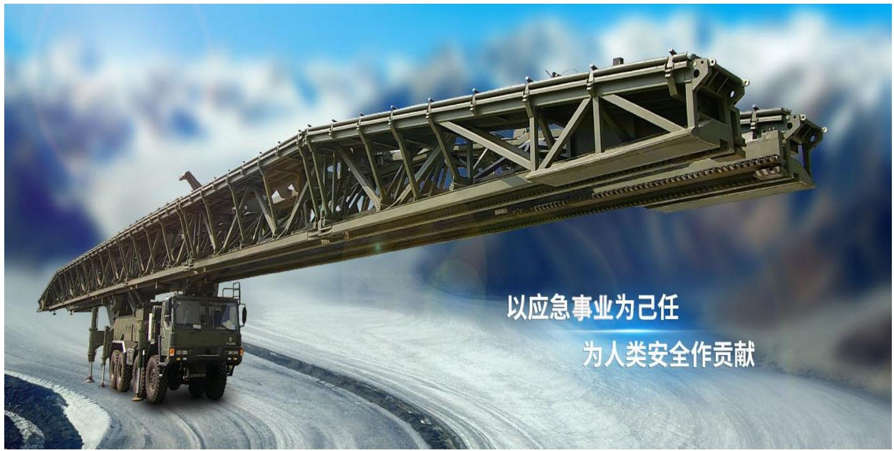

text_image

以应急事业为己任
为人类安全作贡献

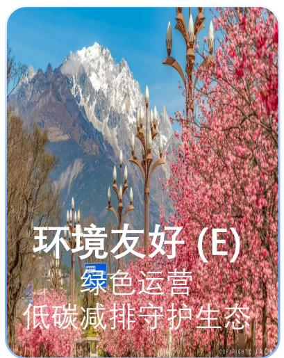

text_image

环境友好 (E)
绿色运营
低碳减排守护生态

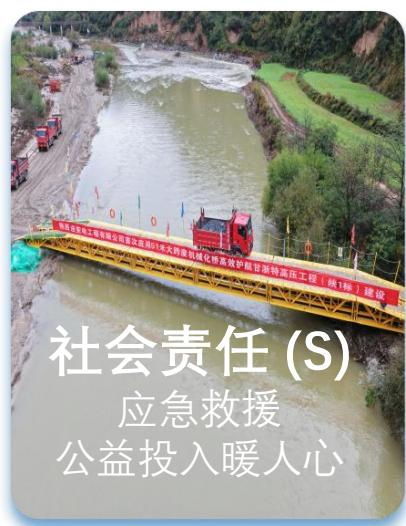

text_image

社会责任 (S)
应急救援
公益投入暖人心

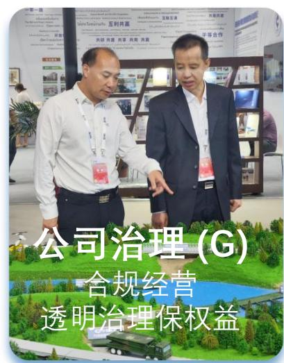

text_image

公司治理(G)
合规经营
透明治理保权益

发布时间：2026年4月

以责任为帆，以行动为桨，共创可持续未来

## 目录

## 02 公司治理

## 11 公司治理

法人治理、ESG治理、制度、内控体系建设

## 01 关于本报告

02 董事长致辞  
03 摘要：年度核心亮点回顾  
05 公司概况

## 04 和谐人文

25 客户满意度  
29 员工结构与劳动权益保障

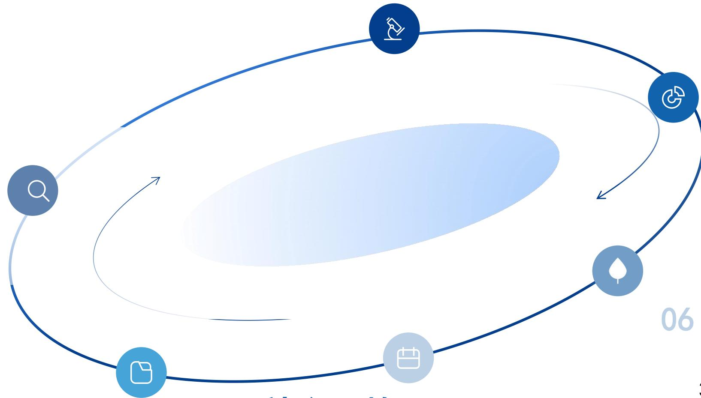

flowchart

```mermaid
graph LR
  A["Search"] --> B["Document Selection"]
  B --> C["Storage"]
  C --> D["Application"]
  D --> E["Process"]
  E --> F["End of Cycle"]
```

## 05 社会贡献

35 应急救援与社会责任担当  
36 公益事业与社区共建

## 03信赖共赢

17 信息披露  
18 股东与债权人权益  
19 商业道德与审计监督  
20 质量管理体系与卓越实践  
21 客户权益保障与品牌形象

## 06 绿色低碳

38 守护绿水青山，建设绿色工厂  
39 环境管理体系与合规运营  
41 排放物管理与污染防治  
42 应对气候变化与低碳发展

## 编制说明

欢迎阅读中国船舶重工集团应急预警与救援装备股份有限公司2025年ESG报告，为便于您的阅读，中国船舶重工集团应急预警与救援装备股份有限公司在本报告中以“中船应急”、“本公司”、“公司”、“我们”等方式进行表述。本报告反应了公司2025年履行环境、社会与公司治理责任的行动及其成效。

## 报告时间

2025年1月1日至12月31日，部分数据及内容超出上述范围。本报告为中国船舶重工集团应急预警与救援装备股份有限公司首次发布ESG报告暨自2022年度以来连续第四年发布社会责任报告。

## 信息来源

本报告所披露的信息和数据来源于中国船舶重工集团应急预警与救援装备股份有限公司内部正式文件、统计报告与年报。本报告的财务数据以人民币元为单位，若与财务报告不一致之处，以财务报告为准。

## 报告编制标准

深交所《上市公司自律监管指引第17号》

国务院国资委《央企ESG专项报告编制研究》

CASS-ESG 6.0《中国企业可持续发展报告指南》

GRI《GRI通用标准》（全球报告倡议组织）

UN SDGs（联合国可持续发展目标）

SASB准则（可持续发展会计准则委员会）

## 报告获取

报告语言为中文简体。

您可以登录、深圳证券交易所网站（www.szse.cn）或巨潮资讯网（www.cninfo.com.cn）下载本报告的电子文档。

本报告力求完整、客观、便于阅读，但受到各种条件限制，披露中难免有未尽如人意之处，欢迎您通过公司公告的联系方式，及时反馈意见与建议，推动公司社会责任披露工作的持续改进。公司将本着博采众议、精益求精的原则，力求下一年度社会责任报告披露工作日臻完善。

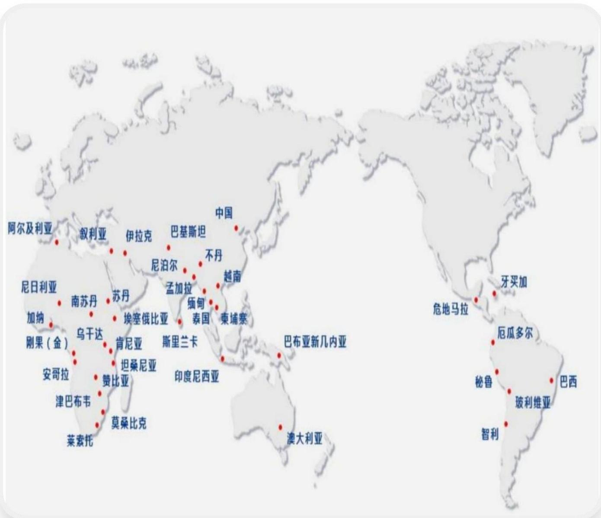

text_image

阿尔及利亚
叙利亚
伊拉克
巴基斯坦
中国
尼泊尔
不丹
越南
孟加拉
缅甸
泰国
柬埔寨
尼日利亚
苏丹
埃塞俄比亚
斯里兰卡
印度尼西亚
巴布亚新几内亚
危地马拉
牙买加
厄瓜多尔
秘鲁
巴西
玻利维亚
智利
刚果（金）
安哥拉
赞比亚
坦桑尼亚
莫桑比克
津巴布韦
莱索托
澳大利亚

公司不仅在国内三十多个省市、自治区拥有大批用户，还先后出口到亚洲、非洲、拉丁美洲等五十多个国家，是联合国救援机构应急采购的合格供应商。

## 董事长致辞

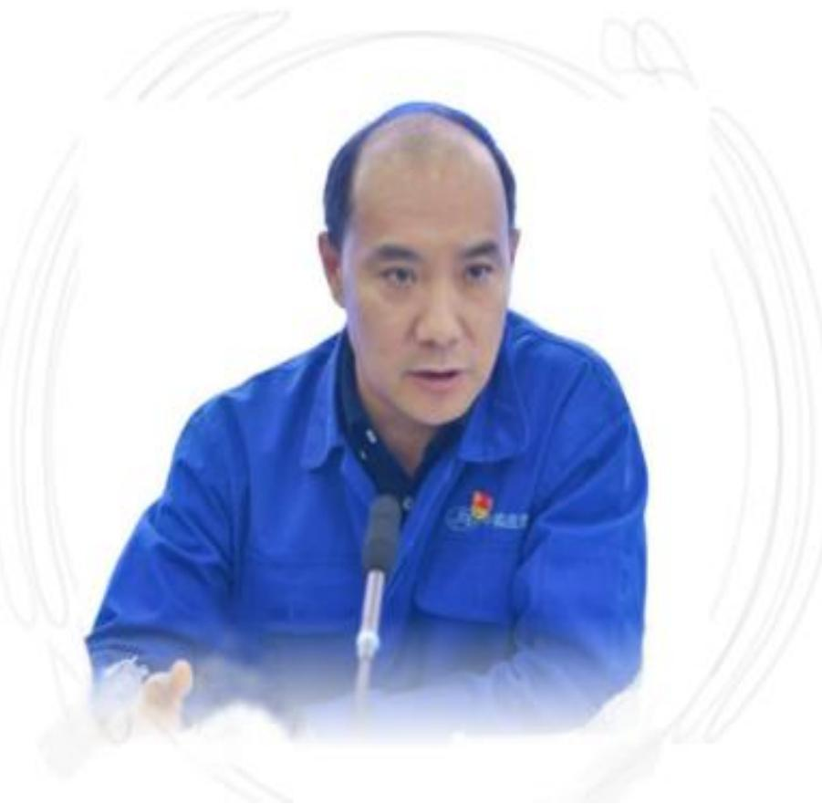

natural_image

Portrait of a man in a blue work uniform speaking at a podium (no visible text or symbols)

## 尊敬的各位投资者、各位伙伴、读者：

我谨代表公司董事会，衷心感谢各位长期以来对中船应急的信任与支持！

面对复杂多变的市场环境与行业挑战，我们坚持稳中求进，将ESG理念深度融入企业发展战略与经营全流程，持续完善治理体系，追求企业与环境、社会的可持续共生，全力推动高质量发展再上新台阶。

以治理强基，筑稳健之盾。

我们持续优化公司治理结构，构建了权责清晰、规范高效的治理体系。2025年，公司独立设立法律合规部，增设首席合规官，法治人才队伍实现跨越式扩充，形成了适配业务需求的专业梯队。我们深化“五位一体”全面融合，推动法律、合规、制度、风险、内控协同发力，建立法务前置研判机制，实现重大经营决策全流程法律把关。同时，通过完善合同标准化模板库、优化风险数据库，以数字化工具赋能内控管理，让规范运营成为企业发展的坚实底座。凭借完善的治理与风控能力，公司案件处置成效显著，存量案件大幅下降，为股东权益筑牢了安全屏障。

以绿色为径，践低碳之诺。

我们积极响应国家“双碳”目标，将绿色发展理念贯穿生产经营全过程。通过技术改造与精细化管理，公司主要能源消耗持续下降，赤壁、武汉厂区光伏项目成果斐然，绿电使用率显著提升。我们严格管控“三废”排放，确保环保达标，同时积极推进绿色工厂建设与产品碳足迹核算，探索装备全生命周期的低碳路径。在防务与应急装备研发中，我们同步探索低能耗、可循环的设计方案，让“应急”与“低碳”双向赋能，以科技力量守护绿水青山。

以责任聚力，赴共赢之约。

作为应急产业的国家队，我们始终将社会责任扛在肩上。我们坚持“以人为本”，完善员工福利保障，加大人才培养投入，为员工搭建广阔的成长平台，实现企业与员工的共同成长。我们深耕应急救援主业，以“绝对可靠”的装备与服务，在重大灾害救援与公共安全保障中践行使命，守护人民群众生命财产安全。同时，我们持续优化供应链管理，强化合规建设，推动产业链上下游协同发展，以开放透明的沟通与稳健的经营，为投资者创造长期价值，与社会各界共享发展成果。

展望未来，中船应急将继续以完善的ESG管理体系为保障，聚焦防务与应急装备两大核心板块，以创新驱动发展，以责任护航前行。我们将以更稳健的经营、更扎实的担当，与各位投资者携手同行，共筑可持续发展的美好未来！

王小丰

中船应急 董事长

二零二六年四月

## 摘要：年度核心亮点回顾

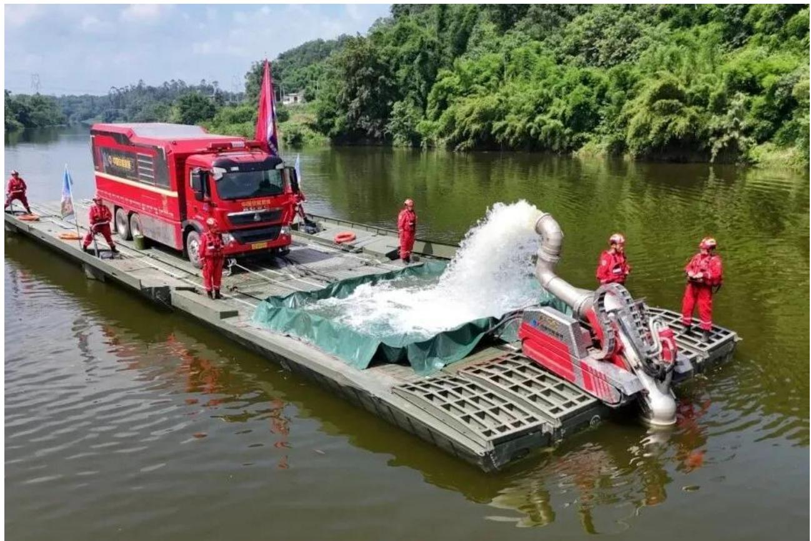

natural_image

Firefighters in red uniforms operating a red truck on a floating platform beside a river, with greenery and forested hills in the background (no visible text or symbols)

应急使命，服务社会

客户满意度 100分

深度参与多地实战抢险及重大应急演练，响应迅速高效绿色发展，守护环境

自建光伏累计发电超数百万KWh

能源消耗大幅下降，严格执行环保合规运营标准

以人为本，关爱员工

培训192场 / 6877人次

规范劳动用工，切实维护员工合法权益与职业发展

## 深化ESG治理融入战略

- 将ESG理念深度植入公司治理全流程与日常运营细节。  
- 董事会严格履职，对ESG策略制定及报告真实性负最终责任。

## 稳健运营，业绩向好

- 坚持稳中求进，核心经济指标超额达成年度目标。  
- 重点军工与民生保障项目建设进度条拉满，顺利交付。

## 科技创新，引领发展

- 累计获得国家科技进步一等奖1项，军队级科技进步一等奖6项，拥有有效发明专利215项。  
- 核心自主研发产品多次亮相国家重要活动，彰显硬核实力。

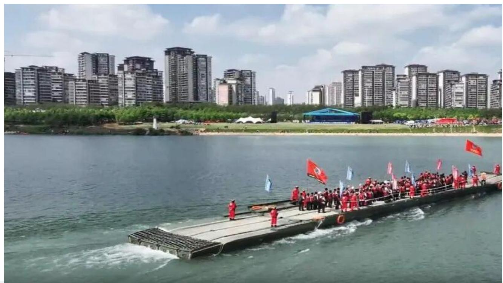

natural_image

Aerial view of a river with a large boat carrying people in red uniforms, set against a backdrop of modern high-rise buildings (no visible text or symbols).

以稳健为基·以绿色为引·以创新为翼——全面推进高质量可持续发展

## 公司概况

企业名称：中国船舶重工集团应急预警与救援装备股份有限公司

成立日期：1967年，选址湖北赤壁，厂名为军委工程兵舟桥厂

投产日期：1970年建成投产，划归第六机械部管理

资本运作：2010年搬迁到武汉并重组中北造船；2012年完成股份制改

造；2016年在深交所创业板上市，证券代码300527。

注册资金：1,016,770,372元

占地面积：1557亩

基地布局：武汉研发基地、赤壁制造基地、北京营销基地

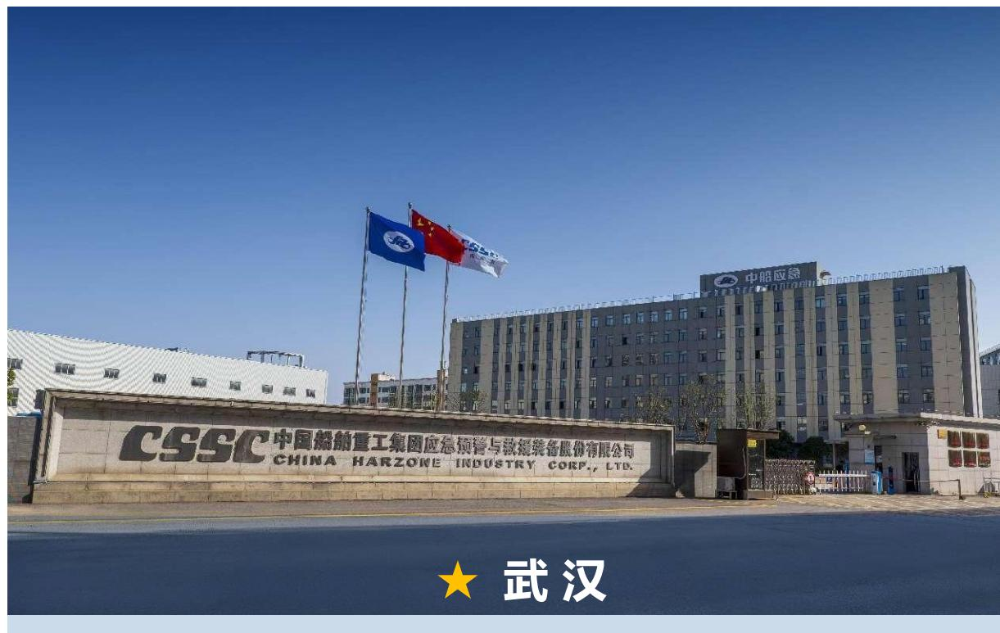

text_image

CSSC中国船舶重工集团应急预警与救援装备股份有限公司
CHINA HARZONE INDUSTRY CORP., LTD.
中船应急
武汉

## 武汉研发

聚顶尖人才，专注核心技术创新与产品研发

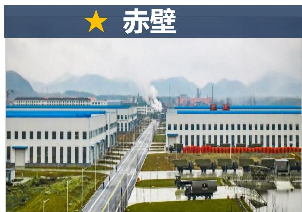

text_image

赤壁

## 赤壁制造基地

拥有现代化生产线，确保产品高质量规模化生

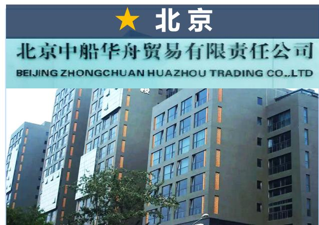

text_image

北京
北京中船华舟贸易有限责任公司
BEIJING ZHONGCHUAN HUAZHOU TRADING CO.,LTD

## 北京营销基地

负责市场拓展与客户服务，构建全国性营销网络

## 企业理念

## 发展历程：厚积薄发

01

精心设计，精细管理精雕细琢，一次做好

02

用抓住的机遇创造新的更大的机遇
共享共赢，追求持久

03

勤勉、务实
规范、高效

04

向顾客销售放心与成功

05

遵守法律法规、降低职业风险
爱护资源环境、安全和谐发展

## 企业使命

以应急事业为己任
为人类安全作贡献

## 核心价值观

合作、奉献、创新、超越

## 企业愿景

走专业化发展道路，做中国应急交通装备行业第一品牌

## 企业追求

成就事业，享受生活，与利益相关者共兴旺

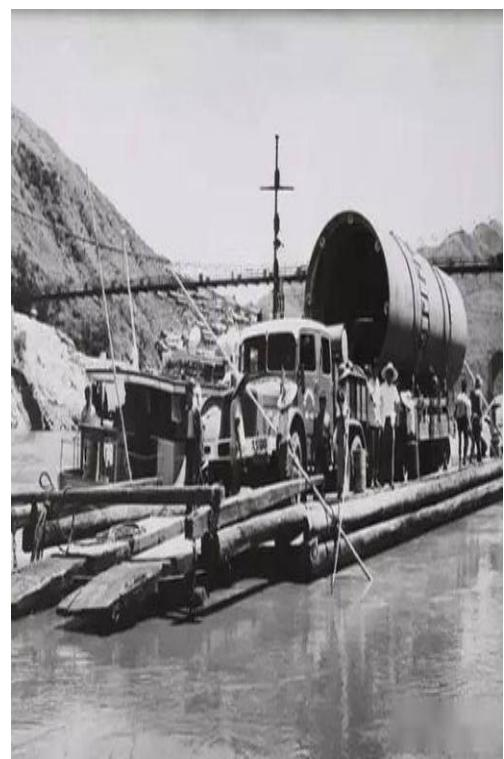

natural_image

Historic black-and-white photo of a large industrial vessel being transported by a truck on a river, with people nearby and hills in the background (no visible text or symbols)

1976

## 1967年 | 公司创建

秉持“以应急事业为己任，为人类安全作贡献”的企业使命，奠定坚实发展基础。

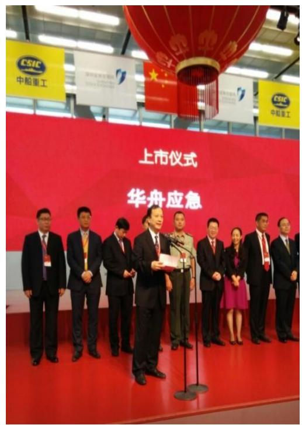

text_image

上市仪式
华舟应急

2016

## 2016年8月 | 成功上市

在深圳证券交易所挂牌上市（证券代码：300527），开启资本化发展新篇章。

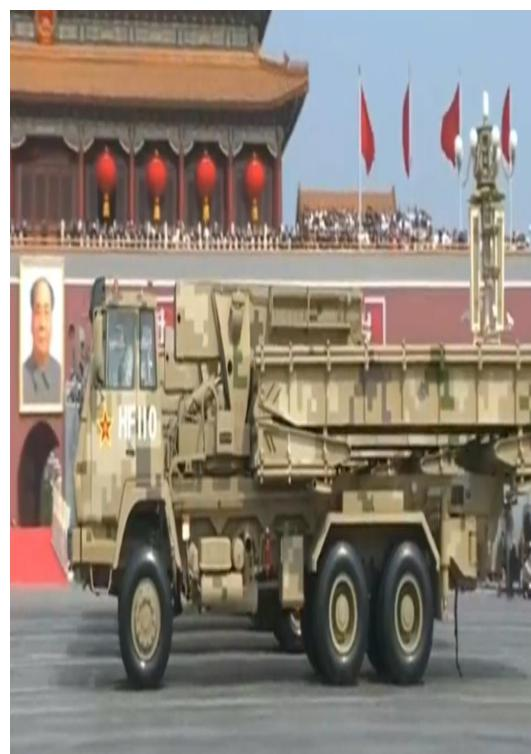

natural_image

Military truck with missile launcher in front of Tiananmen Gate, featuring national flags and portrait (no visible text or symbols on vehicle)

## 至今

## 至今 | 行业领航

发展成为中国应急预警与救援装备研发与创新基地，拥有多项核心技术与荣誉。

## 产业布局：聚焦两大板块，服务国家战略

按照集团公司“一盘棋”主业管理要求，公司“十五五”阶段形成两大核心产业板块，分别对标集团公司防务装备产业板块和新兴产业板块，全面提升核心竞争力。

## 防务装备产业

战略定位：对标集团公司
防务装备产业板块

## 核心任务

围绕跨域、跨军兵种联合作战需求，在巩固LJ保障装备核心业务的基础上，持续拓展全域支援保障、作战保障、勤务保障等应用场景，构建一体化的装备保障能力。

## 应急装备产业

战略定位：对标集团公司
新兴产业板块

## 核心任务

瞄准应急道路抢通、应急水路保通、应急航空保障等多元化民生与公共安全场景，打造技术领先的应急装备体系。同时，将应急场景的成熟技术与经验反哺防务装备产业市场，丰富和拓展作战保障场景。

## 防务装备产业：巩固核心，拓展全域

公司将围绕跨域、跨军兵种联合作战需求，在巩固LJ保障装备核心业务的基础上，持续拓展全域支援保障、作战保障、勤务保障等应用场景开展技术研究，构建一体化的装备保障能力，为国防建设提供坚实的装备支撑。

## 七大产品谱系布局

\- 舟桥装备系列

● 机械化桥装备系列

● 路面装备系列

钢桥系列

● 站台装备系列

● 卸载装备系列

● 其它军用应急装备

## 应急装备产业：瞄准市场，反哺防务

公司聚焦应急道路抢通、水路保通、航空保障等多元化民生与公共安全场景，打造技术领先的应急装备体系；同时将应急场景成熟技术与经验反哺防务装备产业，丰富作战保障场景。

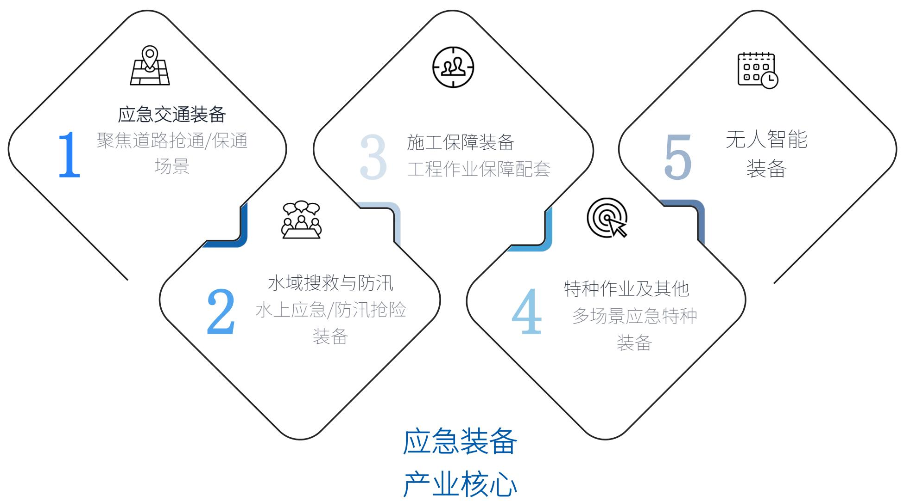

flowchart

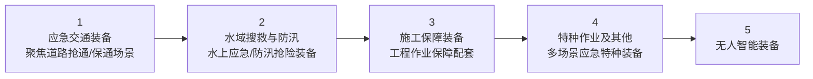
```mermaid
graph LR
  A["1\n应急交通装备\n聚焦道路抢通/保通场景"] --> B["2\n水域搜救与防汛\n水上应急/防汛抢险装备"]
  B --> C["3\n施工保障装备\n工程作业保障配套"]
  C --> D["4\n特种作业及其他\n多场景应急特种装备"]
  D --> E["5\n无人智能装备"]
```

## 品牌形象

公司重型机械化桥多次在国际军事比赛中取得好成绩；应急重型机动铁路站台、轮式冲击桥等装备参加了新中国成立60周年、新中国成立70周年、中国人民解放军建军90周年、“九三”阅兵等阅兵盛典。

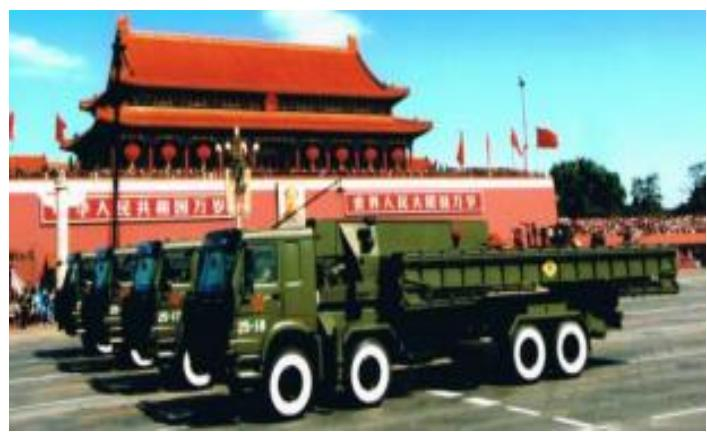

natural_image

Military parade vehicles in front of a large Tiananmen Gate with red banners (no visible text on vehicles or background)

★ 国庆60周年阅兵

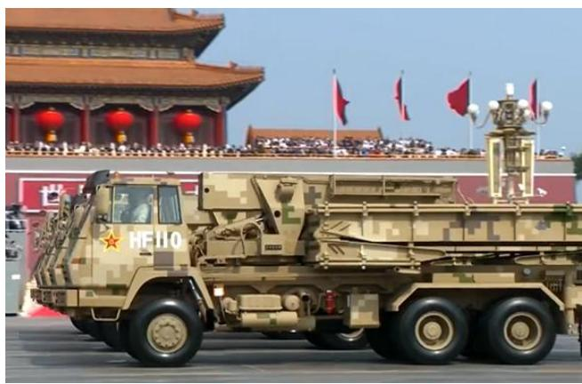

natural_image

Military truck with camouflage paint parked in front of a traditional Chinese building with red lanterns and flags (no visible text or symbols)

★ 国庆70周年阅兵

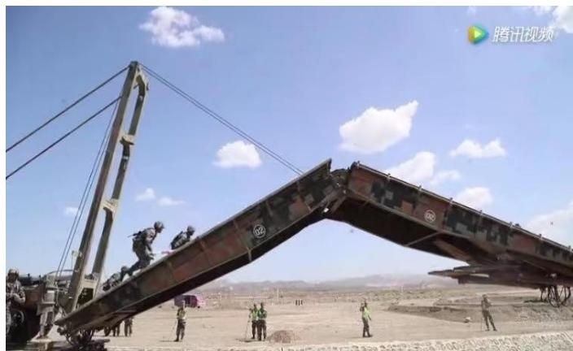

natural_image

Large military transport vehicle being lifted by crane in a desert landscape under a blue sky (no visible text or symbols)

★ 国际军事比武

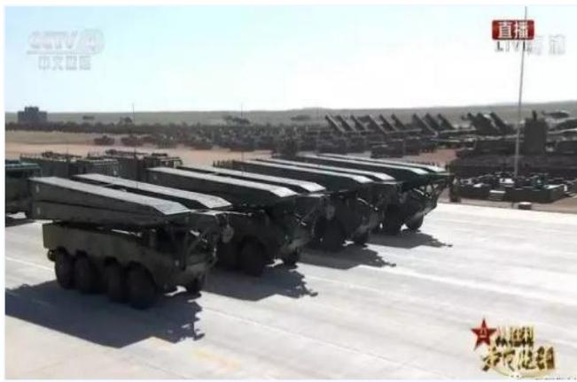

natural_image

Military parade scene with armored vehicles lined up on a tarmac, no visible text or symbols on the vehicles or background.

★建军90周年阅兵

<table><tr><td>大事记</td><td>参与装备</td></tr><tr><td>国庆60周年</td><td>应急铁路机械化站台</td></tr><tr><td>国庆70周年</td><td>应急机械化站台</td></tr><tr><td>建军90周年</td><td>轮式冲击桥</td></tr><tr><td>国际军事比武</td><td>重型机械化桥</td></tr><tr><td>军事演习</td><td>浅滩登陆栈桥</td></tr><tr><td>九三阅兵</td><td>某型装备</td></tr></table>

## 品牌形象

组建武汉市应急抢险救援队。参与江西鄱阳湖、河南郑州、甘肃天水、北京房山、河北涿州、辽宁盘锦、四川雅安、湖南怀化等地抢险救灾行动，动力舟桥被媒体誉为“救援航母”。

★ 2020年获首届“中国船舶质量奖”提名奖  
★ 2021年获第四届“中国质量奖”提名奖  
★ 2023年获“国家知识产权优势企业”称号  
★ 2024年承办“国际舟桥日”活动  
★2025年亮相第十七届国际交通技术与设备展览会、2025中国国际应急管理展览会、“筑基”强国路—中国制造“十四五”成就展等国家级行业平台

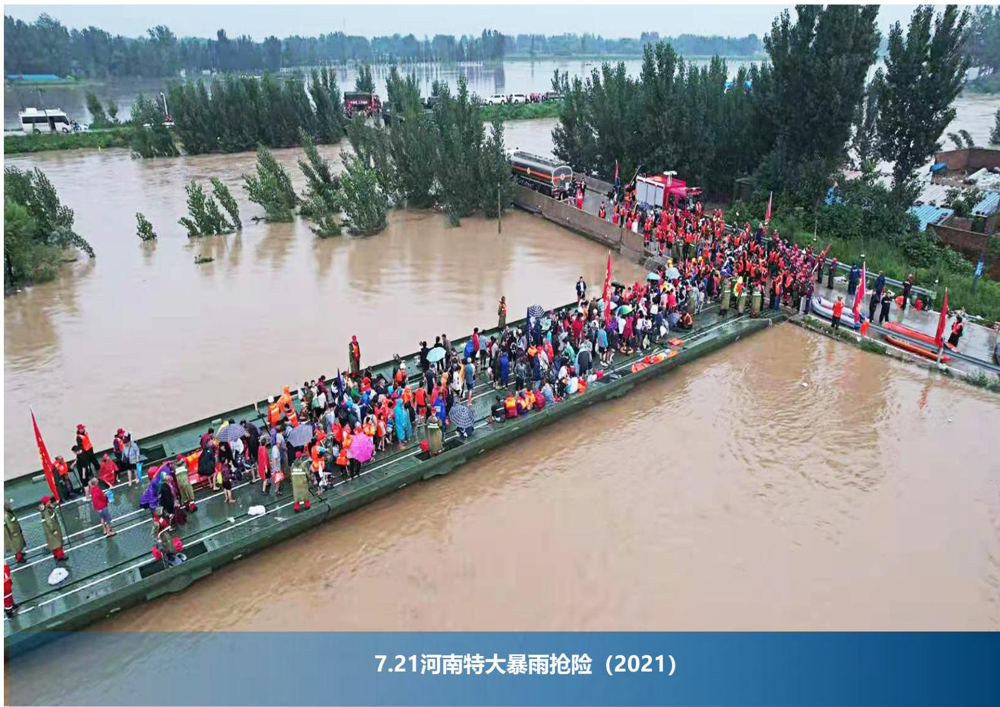

text_image

7.21河南特大暴雨抢险（2021）

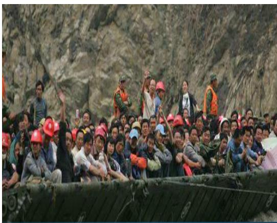

natural_image

Group of people in hard hats and safety vests gathered on a bridge over a rocky cliff, no visible text or symbols.

汶川地震抢险 (2008)

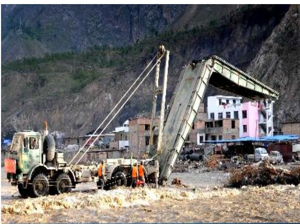

natural_image

Excavation site with heavy machinery and workers in orange vests, surrounded by muddy terrain and a damaged building (no visible text or symbols)

舟曲泥石流抢险 (2010)

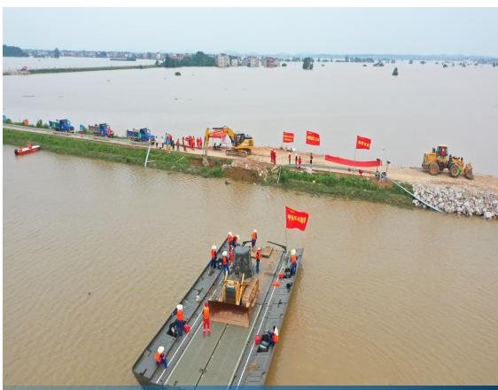

natural_image

River scene with construction workers on a barge, excavators, and red banners along the waterway (no visible text or symbols)

江西鄱阳湖抢险 (2020)

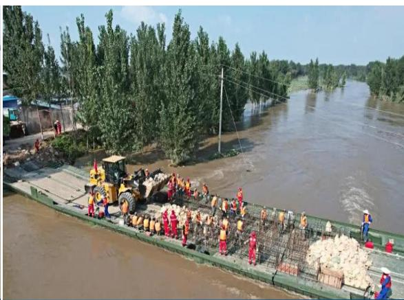

natural_image

Aerial view of a flooded riverside scene with workers in safety gear and a construction vehicle on a bridge, surrounded by trees (no visible text or symbols)

新乡洪水抢险 (2021)

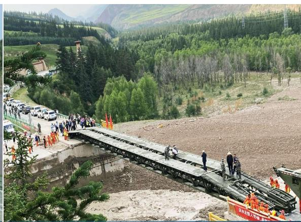

natural_image

Exterior view of a bridge crossing a muddy river in a mountainous area, with people and vehicles on the embankment (no visible text or symbols)

青海祁连泥石流抢险 (2021)

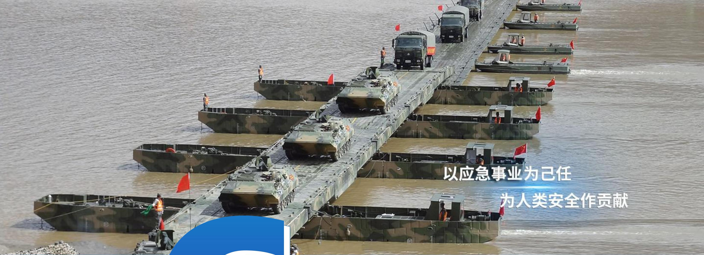

text_image

以应急事业为己任
为人类安全作贡献

natural_image

Blue stylized letter 'G' logo with white outline, no text or symbols present

## 公司治理篇(Governance)

## 法人治理

## 治理结构

中船应急坚持合规高效的公司治理，持续提升公司价值和责任承担。我们始终严格遵循《中华人民共和国公司法》《中华人民共和国证券法》《上市公司治理准则》《深圳证券交易所股票上市规则》等与公司治理相关的法律条文和《公司章程》的相关规定，不断完善内部管理体系，开展高质量信息披露，优化投资者管理，持续提升企业治理水平，最大程度保障股东及利益相关方的利益。

公司按照现代企业制度及《公司法》规定建立了由股东会、董事会(含专业委员会)和管理层构成的治理结构。各治理主体独立运作、有效制衡、协调运转，能提高决策效率和决策专业性，有效防范因个人决策失误对公司带来的风险。

根据最新监管规定，7月份组织召开董事会、监事会及股东会，审议通过关于修订公司章程及其他公司治理制度的议案，取消监事会并将其职责调整至审计委员会。

加强与各位董事的沟通汇报，每月编制规范运作专报，定期向董事汇报月度经营情况，重要事项专项汇报，同时加强财务部、内部审计部门、审计机构与审计委员会的沟通汇报，为各位董事履职提供充分保障。

股东会|召开3次，审议15个核心议题

董事会|召开5次，审议56个重大事项

监事会|召开2次，审议14个监督议题

专业委员会支撑决策

下设战略、薪酬与考核、提名、审计四委员会

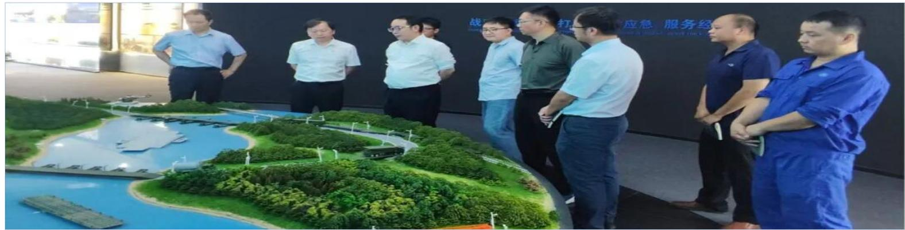

natural_image

Group of men observing a detailed architectural model of a green landscape with water bodies and infrastructure (no visible text or symbols)

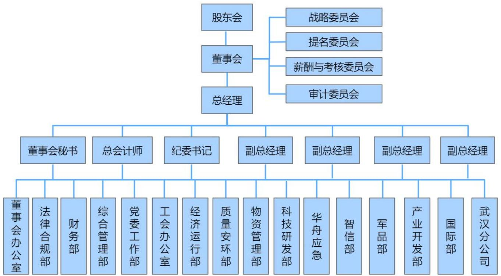

flowchart

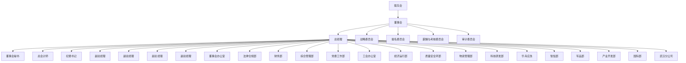
```mermaid
graph TD
  A["股东会"] --> B["董事会"]
  B --> C["总经理"]
  B --> D["战略委员会"]
  B --> E["提名委员会"]
  B --> F["薪酬与考核委员会"]
  B --> G["审计委员会"]
  C --> H["董事会秘书"]
  C --> I["总会计师"]
  C --> J["纪委书记"]
  C --> K["副总经理"]
  C --> L["副总经理"]
  C --> M["副总经理"]
  C --> N["副总经理"]
  C --> O["董事会办公室"]
  C --> P["法律合规部"]
  C --> Q["财务部"]
  C --> R["综合管理部"]
  C --> S["党委工作部"]
  C --> T["工会办公室"]
  C --> U["经济运行部"]
  C --> V["质量安全环部"]
  C --> W["物资管理部"]
  C --> X["科技研发部"]
  C --> Y["华舟应急"]
  C --> Z["智信部"]
  C --> AA["军品部"]
  C --> AB["产业开发部"]
  C --> AC["国际部"]
  C --> AD["武汉分公司"]
```

## 2025年度会议召开情况

2025 年度，公司董事会共召开 5 次会议，共审议通过 56 项议案，审议内容包括年度工作报告、利润分配、财务预决算、定期报告、关联交易、员工薪酬等重大事项。

历次会议的召集、提案、出席、议事、表决及会议记录，均按照《公司法《证券法》及《公司章程》《董事会议事规则》的相关要求规范运作，召开的会议合法、有效。

## ESG治理

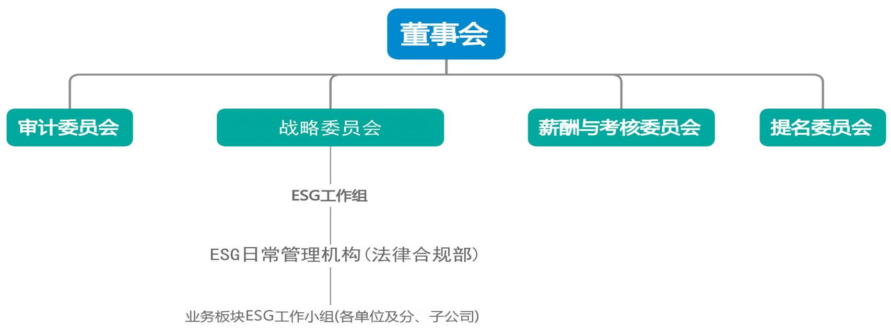

flowchart

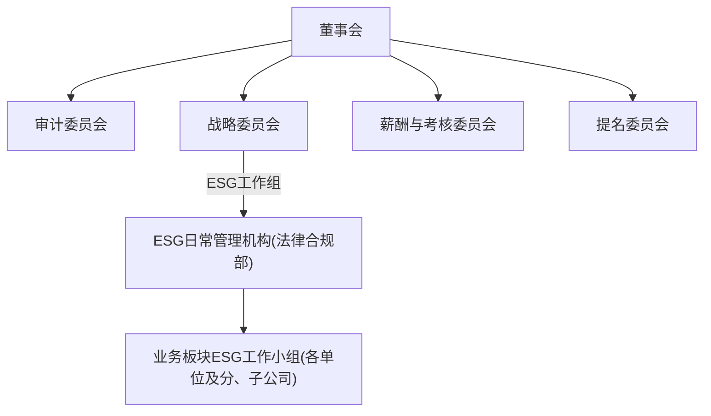
```mermaid
graph TD
  A["董事会"] --> B["审计委员会"]
  A --> C["战略委员会"]
  A --> D["薪酬与考核委员会"]
  A --> E["提名委员会"]
  C -->|"ESG工作组"| F["ESG日常管理机构(法律合规部)"]
  F --> G["业务板块ESG工作小组(各单位及分、子公司)"]
```

## ESG治理三级体系·闭环管理

公司设立了科学、高效、透明的ESG治理三级管理体系，从决策到执行层层递进，确保ESG理念与战略有效融入业务运营，实现闭环管理，推动企业可持续发展战略落地。

公司董事会下设战略委员会，负责研究公司 ESG 相关规划、目标、制度及重大事项，审阅 ESG 相关报告，向董事会提供咨询建议；公司法律合规部负责组织开展具体 ESG 相关工作，公司其他业务部门根据职责分工负责 ESG 细分领域具体工作。

## 01

## 决策层

战略委员会
负责顶层设计，研究制定ESG发展规划、年度目标及重大事项审批。

## 02

## 管理层

法律合规部作为核心枢纽，组织协调各部门，制定具体实施方案并监督进度。

## 03

## 执行层

ESG工作组
各业务部门分工协作，将ESG指标落实到日常运营，推进事项闭环。

## 制度体系建设：全面升级

  
制度建设标准化

制（修）订制度68项

全面梳理并修订《制度汇编》，确保制度条款与最新业务场景同步，实现管理“有章可循”。

  
管控流程信息化

覆盖率 >80%

推动管理制度化、流程化向信息化升级，已上线核心流程180条，大幅提升业务流转与审批效率。

  
风险防控精准化

关键风险 全面识别

深度识别业务流程风险，落实不相容职务分离与分级授权审批机制，从源头阻断经营风险。

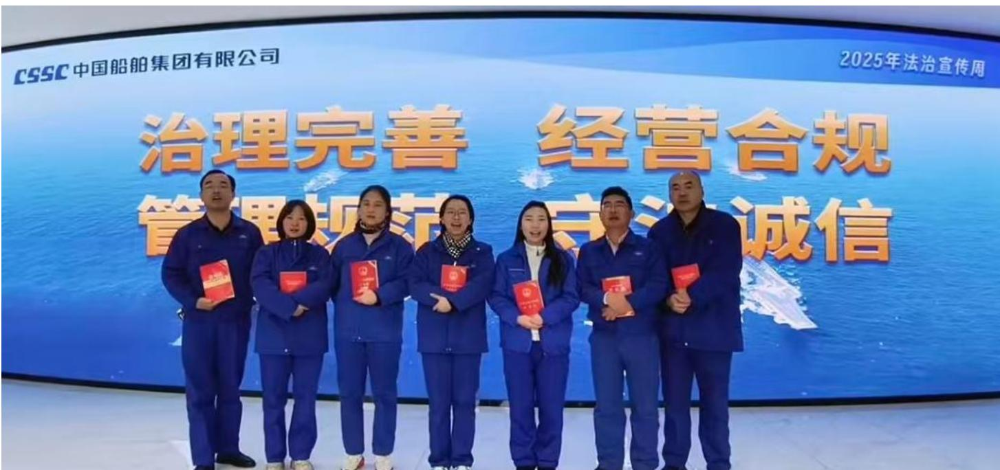

text_image

CSSC中国船舶集团有限公司
2025年法治宣传周
治理完善 经营合规
管理规范 京海诚信

风险管理：保障运营安全与合规

核心价值：以制度为基石·以科技强赋能·以风控筑防线  
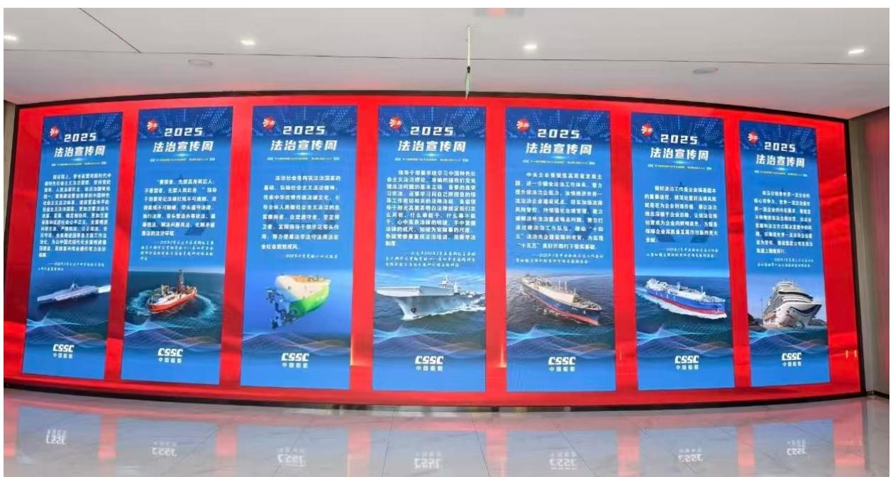

text_image

2025
法治宣传周
开展线上、手机及邮件等现代中国海洋法学会第五大会议，探索新的目标，打造新生态、打造太阳能和“三来”主题。要深刻地把握来自中国海洋法学会的未来发展，推动我国海洋法学会的发展，实现“十四五”期间的全面建设。通过加强“三来”行动，推进“三来”合作，为世界海洋法学会提供有力的支持。2025年法治宣传周
“四来者，为我获得新巨人；不管想看，先进入新势力。”每年的“一来”是全球最集中的新兴经济体，以“四来者”为一个核心组成部分。近年来，我国海洋法学会将建立“三来”体系，打造“三来”模式，构建“三来”功能，为世界海洋法学会提供有力的支持。2025年法治宣传周
法治社会是构筑泛海国家的基础，弘扬社会主义法治精神，传承中华优秀传统文化建设经验。引导全体人民积极社会主义法治的全面发展，自觉遵守守久、坚定守信、立意、立势、立势、立势、立势、立势、立势、立势、立势、立势、立势、立势、立势、立势、立势、立势、立势、立势、立势、立势、立势、立势、立势、立势、立势、立势、立势、立势、立势、立势、立势、立势、立势、立势、立势
法治社会是构筑泛海国家的基础，弘扬社会主义法治精神，传承中华优秀传统文化建设经验。引导全体人民积极社会主义法治的全面发展，自觉遵守守久、坚定守信、立意、立势、立势、立势、立势、立势、立势、立势、立势、立势、立势、立势、立势、立势、立势、立势、立势、立势
法治宣传周
“四来者，为我获得新巨人；不管想看，先进入新势力。”每年的“一来”是全球最集中的新兴经济体，以“四来者”为一个核心组成部分。2025年法治宣传周
“四来者，为我获得新年轻人；不管想看，先进入新势力。”每年的“一来”是全球最集中的新兴经济体，以“四来者”为一个核心组成部分。2025年法治宣传周
法治社会是构筑泛海国家的基础，弘扬社会主义法治精神，传承中华优秀传统文化建设经验。引导全体人民积极社会主义法治的全面发展，自觉遵守守久、坚定守信、立意、立势、立势、立势、立势、立势、立势、立势、立势、立势、立势、立势、立势
法治宣传周
“四来者，为我获得新巨人；不管想看，先进入新势力。”每年的“一来”是全球最集中的新兴经济体，以“四来者”为一个核心组成部分。2025年法治宣传周
法治社会是构筑泛海国家的基础，弘扬社会主义法治精神，传承中华优秀传统文化建设经验。引导全体人民积极社会主义法治的全面发展，自觉遵守守久、坚定守信、立意、立势、立势、立势、立势、立法期限的成就，鼓励为世界海洋法学会提供有力的支持。2025年法治宣传周
“四来者，为我获得新巨人；不管想看，先进入新势力。”每年的“一来”是全球最集中的新兴经济体，以“四来者”为一个核心组成部分。2025年法治宣传周
法治社会是构筑泛海国家的基础，弘扬社会主义法治精神，传承中华优秀传统文化建设经验。引导全体人民积极社会主义法治的全面发展，自觉遵守守久、坚定守信、立思、立势、立势、立势、立势、立势、立势、立势、立势
法治宣传周
“四来者，为我获得新巨人；不管想看，先进入新势力。”每年的“一来”是全球最集中的新兴经济体，以“四来者”为一个核心组成部分。2025年法治宣传周
法治社会是构筑泛海国家的基础，弘扬社会主义法治精神，传承中华文明依法治国之政，加强法律法规建设，加强法律合规管理，加强法律合规管理，加强法律合规管理，加强法律合规管理，加强法律合规管理，加强法律合规管理，加强法律合规管理，加强法律合规管理，加强法律合规管理，加强法律合规管理，加强法律合规管理，加强法律合规管理，加强法律合规管理，加强法律合规管理，加强法律合规管理，加强法律合规管理，加强法律合规管理，加强法律合规管理，加强法律合规管理，加强法律合规管理，加强法律合规理
法治社会是构筑泛海国家的基础，弘扬社会主义法治精神，传承中华文明依法治国之政，加强法律法规建设，加强法律合规管理，加强法律合规管理，加强法律合规管理，加强法律合规管理，加强法律合规管理，加强法律合规管理,加强法律合规管理,加强法律合规管理,加强法律合规管理,加强法律合规管理,加强法律合规管理,加强法律合规管理,加强法律合规管理,加强法律合规管理,加强法律合规管理,加强法律合规管理,加强法律合规管理,加强法律合规管理,加强法律合规管理,加强法律合规管理,加强法律合规管理,加强法律合规管理,加强法律合规管理,加强法律合规管理,加强法律合规管理,加强法律合规管理
法治社会是构筑泛海国家的基础，弘扬社会主义法治精神，传承中华文明依法治国之政，加强法律法规建设，加强法律合规管理，加强法律合规管理，加强法律合规管理，加强法律合规管理,加强法律合规管理,加强法律合规管理,加强法律合规管理,加强法律合规管理,加强法律合规管理,加强法律合规管理,加强法律合规管理,加强法律合规管理,加强法律合规管理,加强法律合规管理,加强法律合规管理,加强法律合规管理,加强法律合规管理,加强法律合规管理,加强法律合规管理,加强法律合规理
法治社会是构筑泛海国家的基础，弘扬社会主义法治精神，传承中华文明依法治国之政，加强法律法规建设，加强法律合规管理，加强法律合规管理，加强法律合规管理，加强法律合规管理，加强法律合规管理,加强法律合规管理,加强法律合规管理,加强法律合规管理,加强法律合规理
法治社会是构筑泛海国家的基础，弘扬社会主义法治精神，传承中华文明依法治国之政，加强法律法规建设，加强法律合规管理，加强法律合规管理，加强法律合规管理，加强法律合规管理,加强法律合规理
法治社会是构筑泛海国家的基础，弘扬社会主义法治精神，传承中华文明依法治国之政，加强法律法规建设，加强法律合规管理，加强法律合规管理,加强法律合规管理,加强法律合规理
法治社会是构筑泛海国家的基础，弘扬社会主义法治精神，传承中华文明依法治国之政，加强法律法规建设，加强法律合规管理，加强法律合规管理,加强法律合规理
法治社会是构筑泛海国家的基础
法治社会是构筑泛海国家的基础
法治社会是构筑泛海国家的基础
法治社会是构筑泛海国家的基础
法治社会是构筑泛海国家的基础
法治社会是构筑泛海国家的基础
法治社会是构筑泛海国家的基础
法治社会是构筑泛海国家的基础
法治社会是构筑泛海国家的基础
法治社会是构筑泛海国家的基础
法治社会是构筑泛海国家的基础
法治社会是构筑泛海国家的基础

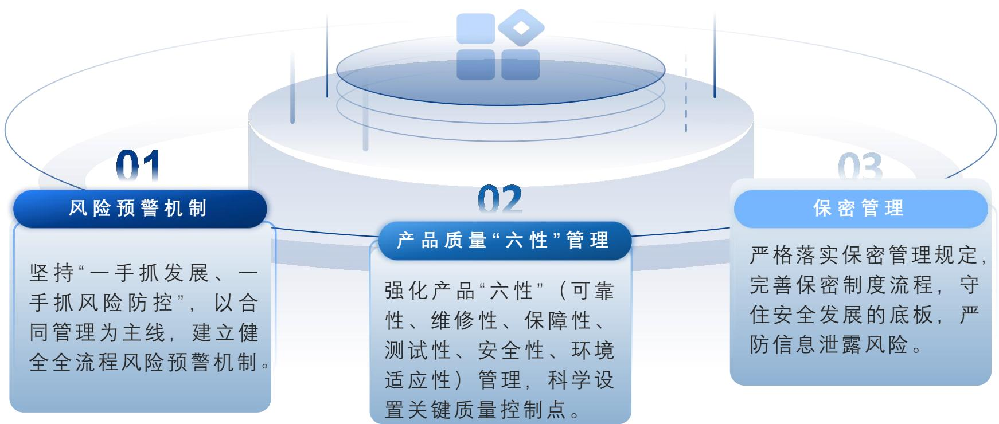

flowchart

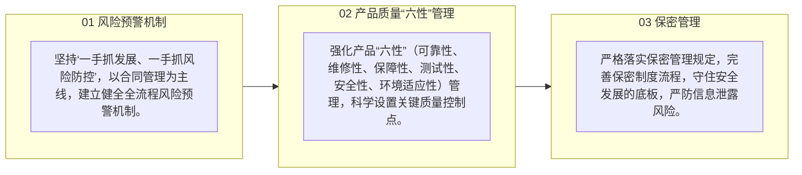
```mermaid
graph LR
  subgraph Component1["01 风险预警机制"]
    direction TB
    A["坚持‘一手抓发展、一手抓风险防控’，以合同管理为主线，建立健全全流程风险预警机制。"]
  end
  subgraph Component2["02 产品质量“六性”管理"]
    direction TB
    B["强化产品“六性”（可靠性、维修性、保障性、测试性、安全性、环境适应性）管理，科学设置关键质量控制点。"]
  end
  subgraph Component3["03 保密管理"]
    direction TB
    C["严格落实保密管理规定，完善保密制度流程，守住安全发展的底板，严防信息泄露风险。"]
  end

  Component1 --> Component2
  Component2 --> Component3
```

筑牢三道防线，构建全方位合规风控体系

## 内控信息化建设成果：数字化赋能，提升管理效能

公司积极推进“经营管理制度化、制度流程化、流程信息化”，通过信息化手段实现内控体系的集成应用和高效运行。

## 建设成果：关键数据指标

## 26个 / 180条

完成26个功能板块实施，上线180条核心业务流程。

## 80% 以上

主要业务流程信息化覆盖率，确保管控无死角。

## 消除信息孤岛

打破系统壁垒，实现多系统数据实时互通与共享。

## 核心应用：业务管控落地

## 合同全生命周期管理

线上流转留痕，关键审核节点系统自动嵌入。

## 采购流程透明化

规范采购行为，提升采购效率与合规透明度。

## 运营风险集中预警

建立集中管控模型，实现运营状态实时监控。

## 深化“五位一体”全面融合，参与经营业务管理

推进完善合规、内控、风险、审计、法律职能“五位一体”融合工作机制，加快形成监督保障合力，建立业务信息系统互联互通的“审法五位一体融合”管理系统，打通业务执行与监督的壁垒。

## 制度体系优化

制定《规章制度汇编》和《保密制度汇编》，全面梳理业务流程，形成权责清晰、流程规范的完善制度体系。

## 重点领域规范

针对高风险业务场景，编制《投资合规管理指引》等6项专项规范，明确标准，推动合规管理要求融入业务核心环节。

## 重大决策前置

建立健全法务前置研判机制，在项目投标、技术合作、合同谈判等关键节点提前介入，从源头规避经营与法律风险。

## 数字化赋能

推动OA系统与内控管理深度融合，实现业务全流程线上化管控；2025年迭代更新《内部控制手册》，新增管控流程31项。

## 信息披露：构建信任桥梁

2025年，公司积极做好投资者关系管理。

业绩说明会：召开年度业绩说明会3次——湖北辖区上市公司2025年投资者网上集体接待日活动、2024年度网上业绩说明会、中船集团控股上市公司2024年度集体业绩说明会暨2025年第一季度业绩说明会。

积极联系机构投资者：2025年，公司积极与机构沟通联系，邀请多个机构到公司调研，同时帮助公司了解市场动态。

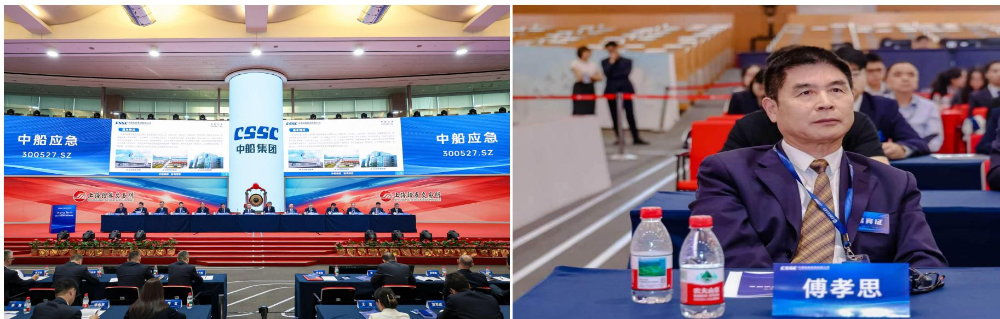

## 公告披露

## 2025年累计发布149条

严格遵循真实、准确、完整、及时、公平原则

## 互动易平台

## 沟通渠道畅通无阻

及时高效回复投资者提问，消除信息不对称壁垒

## 定期报告

## 全覆盖披露周期

按时披露年度、半年度及季度报告，展现经营全貌

## 业绩说明会

## 深度交流零距离

定期召开年度及季度说明会，面对面传递核心价值

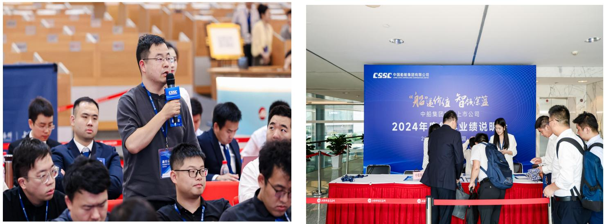

## 股东及债权人权益：诚信为本，责任至上

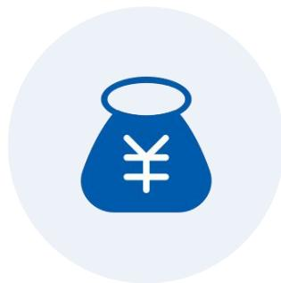

natural_image

Blue money bag icon with yen symbol, no text or numbers present

## 股东权益保护

- 积极分红：2025年实施现金分红1次，派发红利达到当年经审计可分配净利润的30%。  
- 沟通机制：建立常态化渠道，保障股东知情权与参与权。

natural_image

Blue shield icon with a plus sign, no text or symbols present

## 债权人权益保护

- 恪守契约：严格履行合同条款，维护商业信誉。  
- 债务履约：按时足额偿还本息，保持稳健的财务信用。

natural_image

Blue icon of a balance scale on a pole, symbolizing justice or equilibrium (no text or symbols)

## 商业道德建设

- 廉洁经营：建立反舞弊举报机制，签订廉洁协议。  
- 公平竞争：坚决抵制不正当竞争，维护市场规则。

“诚信是企业的立身之本，责任是发展的长久之基” —— 坚持透明经营，共建商业文明

## 商业道德与审计监督

## 维护商业诚信

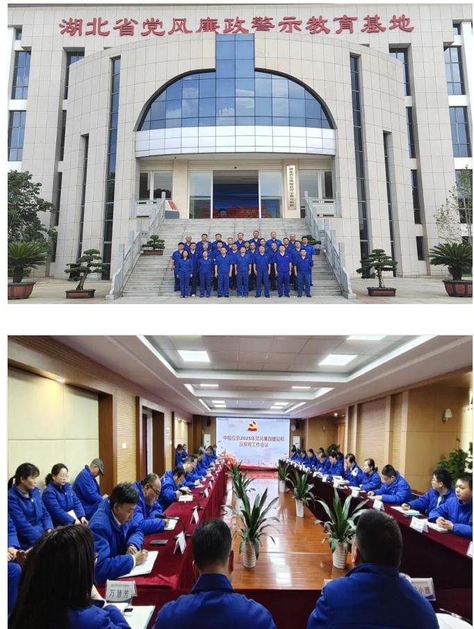

## 01 反舞弊与反腐败

- 建立反舞弊制度和举报机制，明确廉洁从业要求，畅通监督渠道。  
- 定期对全体员工开展廉洁教育，签署廉洁承诺，确保合规理念入脑入心。

## 02 公平竞争与合规经营

- 严格遵守反垄断法等法律法规，坚决抵制不正当竞争，维护市场秩序。  
- 尊重并保护知识产权，严禁窃取或侵犯他人商业秘密，保障创新成果。

核心准则：廉洁自律是底线，公平竞争是原则，商业诚信是基石

## 强化内部监督体系，保障合规运营

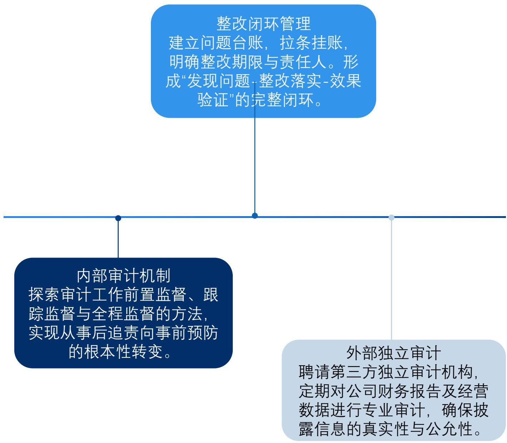

flowchart

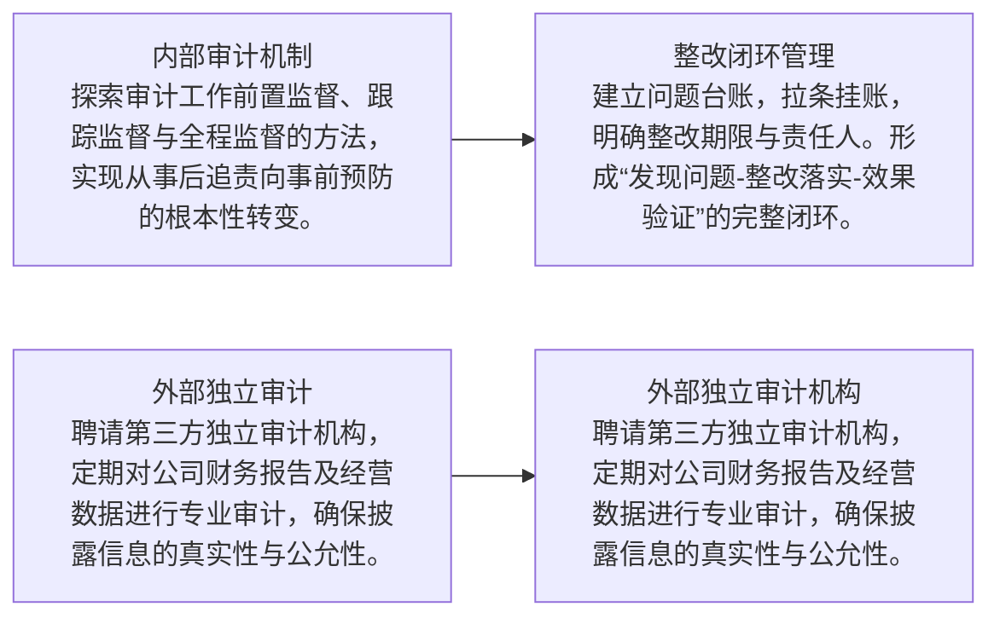
```mermaid
graph LR
  A["内部审计机制\n探索审计工作前置监督、跟踪监督与全程监督的方法，实现从事后追责向事前预防的根本性转变。"] --> B["整改闭环管理\n建立问题台账，拉条挂账，明确整改期限与责任人。形成“发现问题-整改落实-效果验证”的完整闭环。"]
  C["外部独立审计\n聘请第三方独立审计机构，定期对公司财务报告及经营数据进行专业审计，确保披露信息的真实性与公允性。"] --> D["外部独立审计机构\n聘请第三方独立审计机构，定期对公司财务报告及经营数据进行专业审计，确保披露信息的真实性与公允性。"]
```

构建全方位监督防线，筑牢企业稳健发展根基

## 质量管理体系与卓越实践：铸就“绝对可靠”的品牌基石

公司始终坚持“质量第一”方针，建立完善的质量管理体系，通过全员质量改进与创新实践，将卓越品质融入产品全生命周期。

## 权威体系认证

通过ISO9001质量管理体系认证，持续深化标准化建设，筑牢质量根基。

## 卓越实践与荣誉成果

◆QC攻关：荣获“华中片区特等奖”、“集团QC成果二等奖”  
◆标杆班组：装焊三组获“华中片区质量信得过班组特等奖”  
◆省级荣誉：QC小组荣获“湖北省优秀质量管理标杆奖”

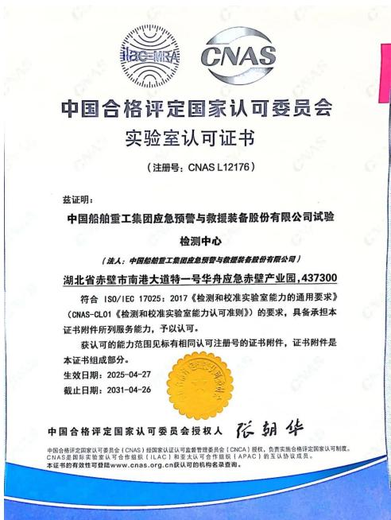

text_image

中国合格评定国家认可委员会
实验室认可证书
（注册号：CNAS L12176）
兹证明：
中国船舶重工集团应急预警与救援装备股份有限公司试验
检测中心
（法人：中国船舶重工集团应急预警与救援装备股份有限公司）
湖北省赤壁市南港大道特一号华舟应急赤壁产业园,437300
符合 ISO/IEC 17025: 2017《检测和校准实验室能力的通用要求》
（CNAS-CL01《检测和校准实验室能力认可准则》）的要求，具备承担本
证书附件所列服务能力，予以认可。
获认可的能力范围见标有相同认可注册号的证书附件，证书附件是
本证书组成部分。
生效日期：2025-04-27
截止日期：2031-04-26
中国合格评定国家认可委员会授权人 张朝华
中国合格评定国家认可委员会（CNAS）经国家认证认可监督管理委员会（CNCA）授权，负责实施合格评定国家认可制度。
CNAS国际实验室认可合作组织（ILAC）和亚太认可合作组织（APAC）的互认协议成员。
本证书的有效性可登陆www.cnas.org.cn获认可的机构名单查阅。

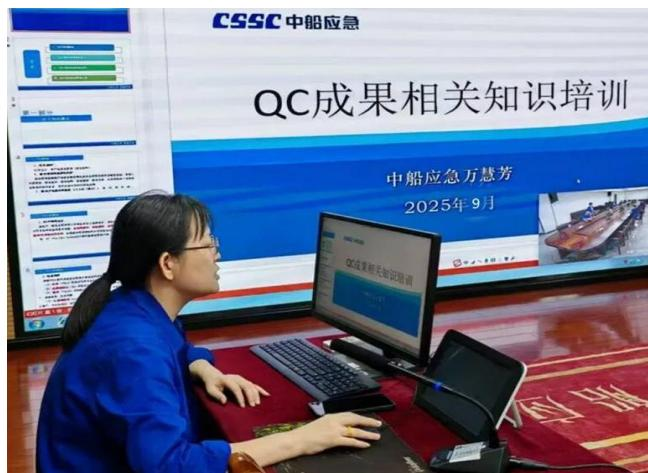

text_image

CSSC中船应急
QC成果相关知识培训
中船应急万慧芳
2025年9月
QC成果相关知识培训

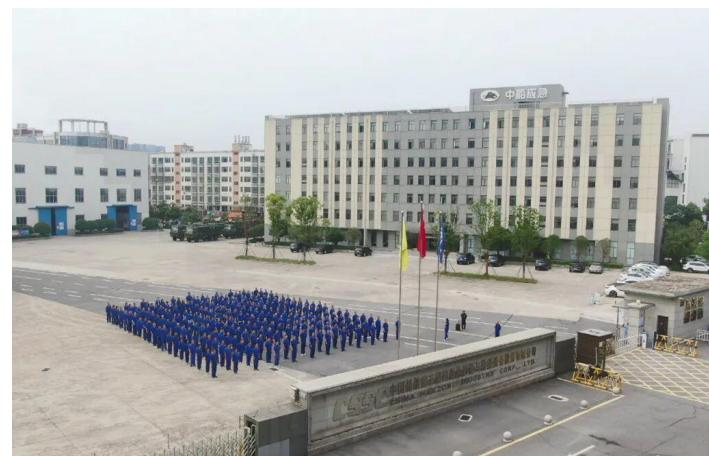

natural_image

Exterior view of a large industrial campus with blue personnel in formation and a flagpole, no visible signage or text on the main structure.

“以匠心致初心，用细节成就卓越”

## 售后服务体系

公司自1967年成立以来，高度重视售后服务管理工作。建立了售后服务管理体系机制，制定了条款全面、操作性强的售后服务制度，并建立了售后服务人员名单库。根据公司发展，不断进行修订完善，为持续加强和规范售后服务管理工作，提升服务质量，提高人员综合素养，确保顾客满意。

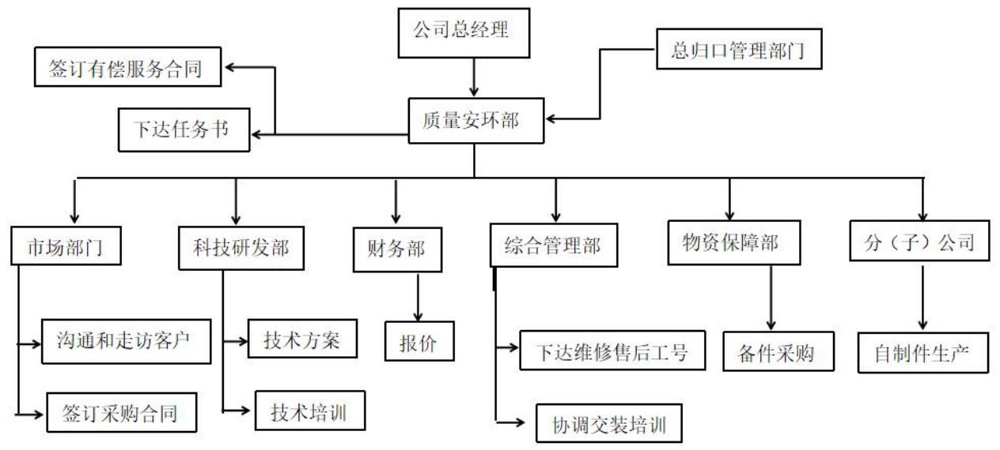

flowchart

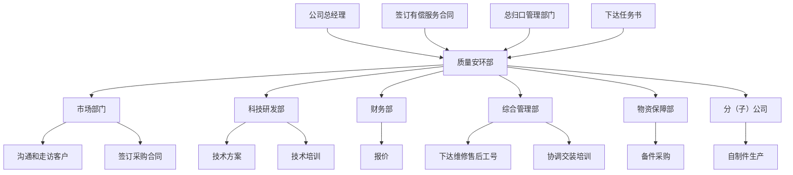
```mermaid
graph TD
  A["公司总经理"] --> B["质量安环部"]
  C["签订有偿服务合同"] --> B
  D["总归口管理部门"] --> B
  E["下达任务书"] --> B
  B --> F["市场部门"]
  B --> G["科技研发部"]
  B --> H["财务部"]
  B --> I["综合管理部"]
  B --> J["物资保障部"]
  B --> K["分（子）公司"]
  F --> L["沟通和走访客户"]
  F --> M["签订采购合同"]
  G --> N["技术方案"]
  G --> O["技术培训"]
  H --> P["报价"]
  I --> Q["下达维修售后工号"]
  I --> R["协调交装培训"]
  J --> S["备件采购"]
  K --> T["自制件生产"]
```

售后服务体系框架

树立“为顾客提供及时、优质的服务”的售后服务理念

将公司产品交付后开展的技术培训，产品安装指导、调试服务，保修服务，增值服务，年度走访和定期巡访，质量问题处理等纳入售后服务范围，加强和规范售后服务管理工作，提升服务质量，确保顾客满意。

<table><tr><td>客户来电</td><td>来电客户资料分析</td><td>派工</td><td>迅速通知</td><td>过程控制</td><td>报完工</td><td>回访</td></tr><tr><td>客户在使用中船应急设备出现故障时,无论在本区域还是在国内其他区域,均可拨打4001118446免费服务电话以获取快捷的服务。</td><td>将客户信息与客户电话号码关联,只要是关联过的电话,客户来电时系统就会自动弹出与该来电相对应的客户资料,如:客户单位名称、来电人姓名、设备编号、维修记录等。</td><td>服务调度指导客户排除故障,在故障不能排除时派出离客户最近且技能最合适的服务工程师上门服务。</td><td>向服务工程师发出派工通知,通知服务人员为客户服务。</td><td>服务工程师收到通知后,立即出发为客户服务或与客户约定上门服务时间。</td><td>服务工程师为客户排除故障后,请客户签字确认并报公司质量安环部完工。</td><td>客服代表回访客户,了解服务工程师服务的及时性。</td></tr></table>

售后服务流程

建立以客户需求为中心的售后服务体系框架

公司始终坚持以客户需求为中心，用一流的速度、一流的技能、一流的态度实现“超越客户期望，超越行业标准”的服务目标，公司售后服务体系框架组织机构及各部门主要工作职责。

# 预防式售后服务体系：超越客户期望，超越行业标准

秉持“为顾客提供及时、优质的服务”理念，构建全生命周期保障的服务闭环。

## 预防式服务理念

## 提前预防·主动前置

建立技术服务数据库与用户装备档案，前置维护保养与操作培训，提前储备易损件，将风险扼杀在摇篮。

## 精准对接 · 极速响应

坚持“急办不讲价、能办认真办、难办抓紧办”原则，提升应急反应速度，确保客户问题零延迟解决。

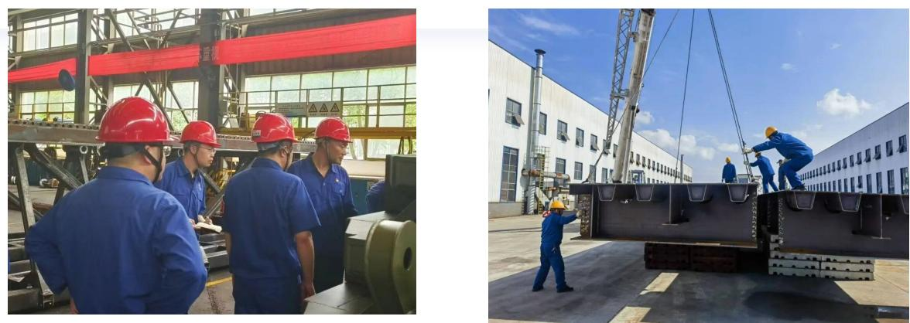

## 全维服务体系框架

## 全生命周期覆盖

覆盖技术培训、安装指导、调试服务、保修服务、增值服务及定期巡访，提供全流程无忧保障。

## 标准化制度护航

以《售后服务管理办法》为基准，通过现场服务反馈、满意度调查与定期走访，持续优化服务质量。

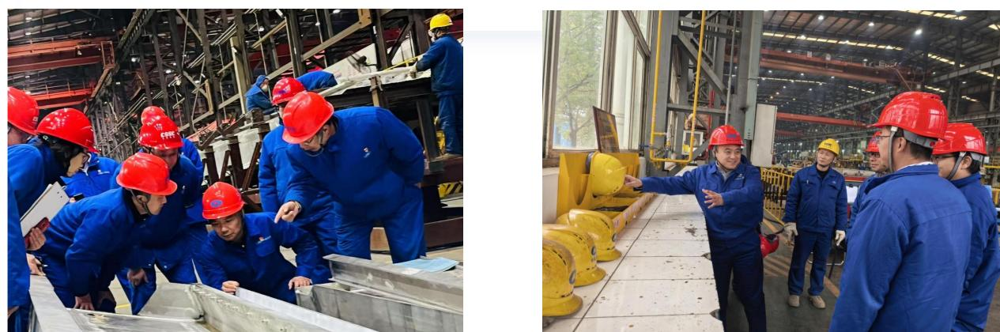  
核心价值：以预防为核心，以制度为保障，持续超越客户期望与行业标准

## 供应商管理与供应链建设：构建安全可持续的生态

公司供应商管理工作坚持“集中统一、依法合规、动态调整，公正公开、阳光透明”的管理原则，不断优化供应商布局和关系管理，实施供应商精准分类和动态评级，强化结果应用，实行“奖优汰劣”。

2025年遴选一批在技术、质量、成本、服务上具有领先优势的供应商，签订战略合作协议，开展技术共享、联合攻关、长期产能绑定等深度合作。积极推进国产化替代，制定详细的国产化推进计划，加强对国产潜力供应商的技术扶持，进一步强化供应链风险防控，为公司高质量发展提供坚实的供应链保障。

## 集中统一 · 依法合规 · 动态调整 · 公正公开 · 阳光透明

## 三大核心管理策略

## 精准分类与动态评级

实施精准分类，建立动态评级体系，严格“奖优汰劣”；建立ESG准入标准，源头控险

## 深化战略合作关系

遴选头部供应商签约，开展技术共享、联合攻关与研发。签署协议确保采购过程透明合规。

## 推进国产化替代

加速关键零部件国产替代，强化供应链风险防控能力

## 组织保障与人才支撑

## 高层挂帅的组织架构

设立采购与供应链管理委员会，由董事长亲自担任组长，统筹全局管理。

## 专业团队与专家认证

拥有20余人专业团队，其中3人已获国家级专家证书，能力过硬。

## 客户权益保障与品牌形象：以卓越表现赢得市场信赖

公司始终将客户需求放在首位，通过高质量的产品和专业的服务，积极参与国家重大活动和应急演练，全方位展示品牌实力与责任担当。

## 军方高度赞赏：绝对可靠

参加专项任务，实现“四零”目标，深度诠释了品牌的绝对可靠性。

## 实战演练认可：主流聚焦

参加东部战区演习及交通部抗震减灾演练，获央视等主流媒体广泛报道。

## 民品市场拓展：标杆示范

在“甘电入浙”等国家级项目中形成示范应用，实现品牌与市场双赢。

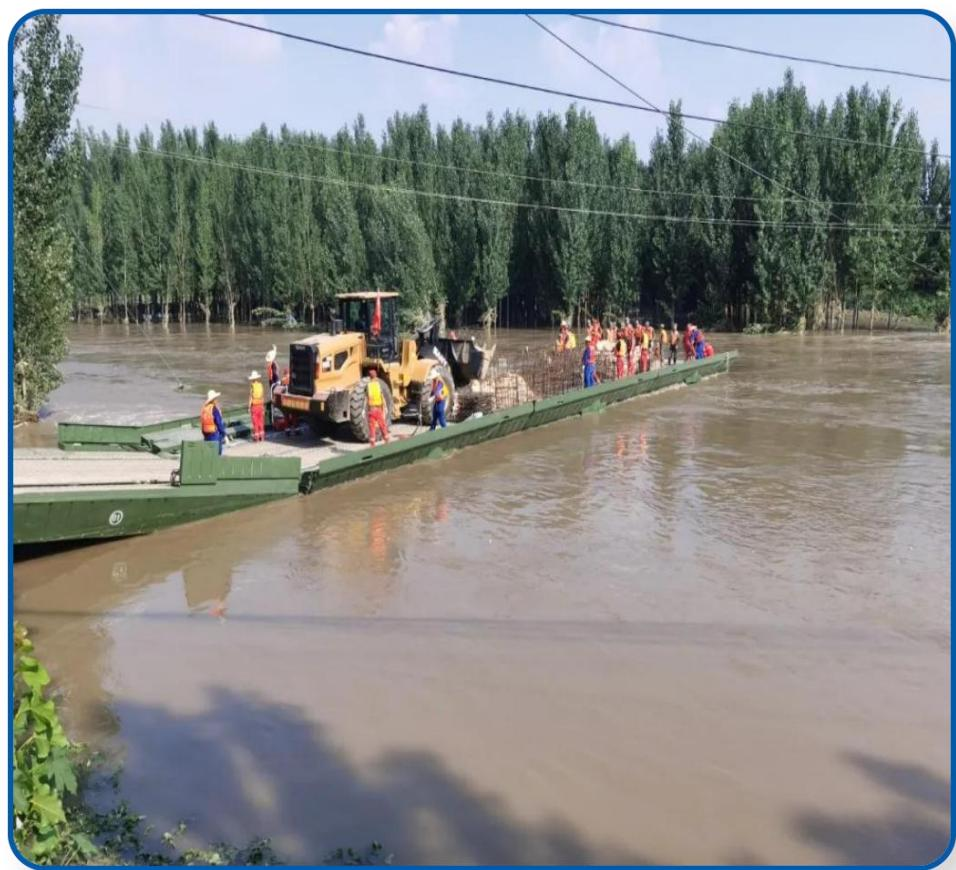

natural_image

Flooded river scene with workers on a green floating platform and a yellow construction loader, surrounded by trees (no visible text or symbols)

中船应急动力舟桥实战救援作业现场：快速搭建水上通道转移群众

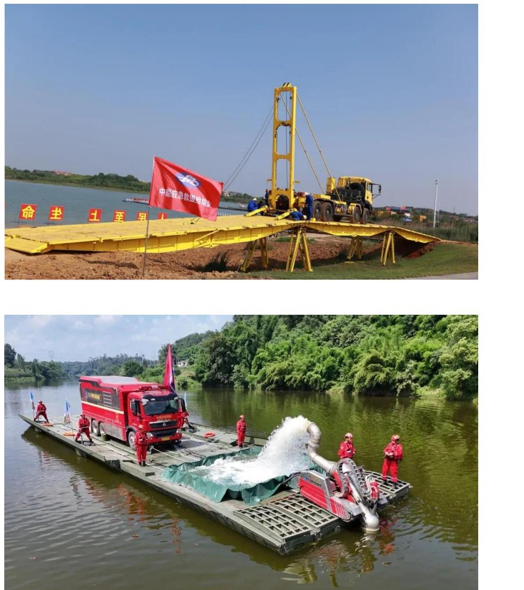

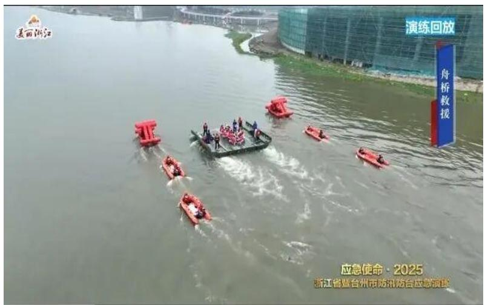

text_image

美丽浙江
演练回放
舟桥救援
应急使命·2025
浙江省暨台州市防汛防台应急演誓

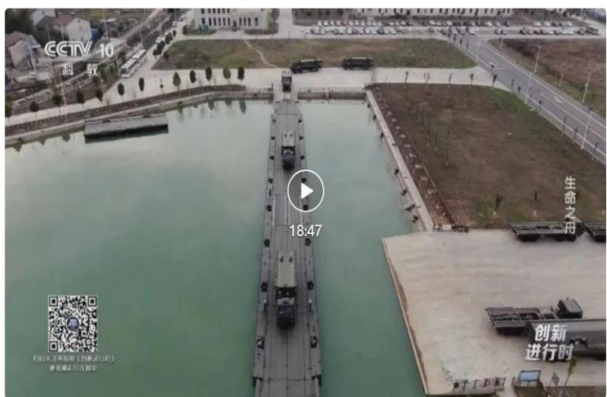

text_image

CCTV 10
科敏
18:47
生命之舟
创新
进行时

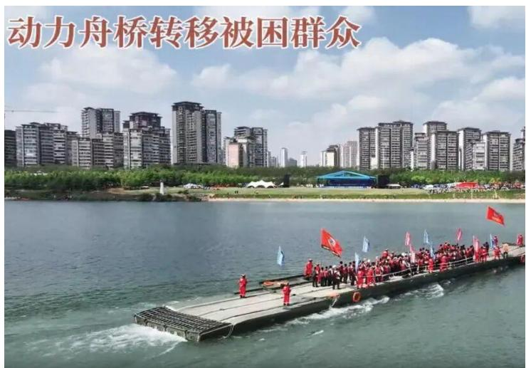

text_image

动力舟桥转移被困群众

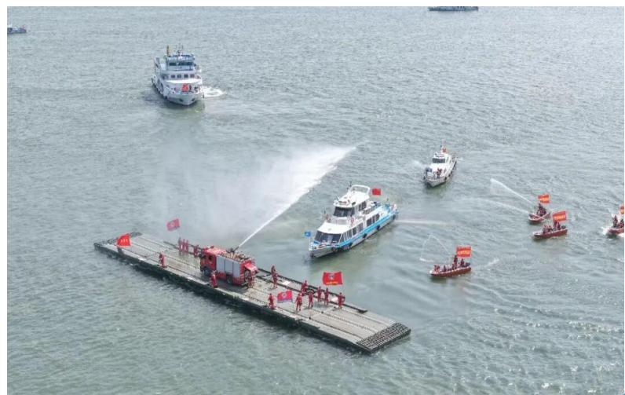

natural_image

Aerial view of a dragon boat on a floating platform with several boats and personnel in red uniforms, spraying water (no visible text or symbols)

## 客户满意度

## 客户满意度与品牌建设

● 满意度100分：全年零投诉，32份问卷全获“很满意”评价。  
● 品牌强曝光：亮相央视推广展会，深度参与东部战区演习，诠释绝对可靠。

100分

客户满意度

0 投诉

全年服务质量

65封感谢信

社会认可度

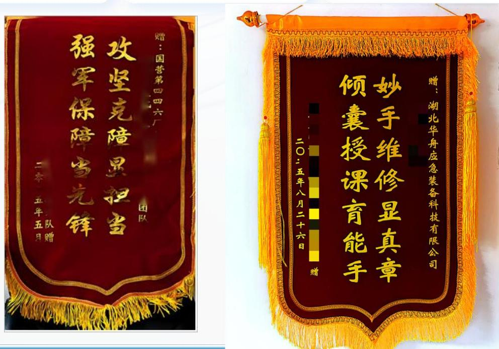

## 中共市委宣传部

## 感谢信

中国船舶重工集团应急预警与救援装备股份有限公司：

办。此次活动是■市深入学习贯彻习近平文化恳恳、认真贯彻落实党的二十大精神的生动实践，也是践行省委“文化创新战略”的具体举措，全面展现了长江文化的深厚底蕴与时代风采，有力彰显了支点建设的昂扬精神与磅礴力量。

活动期间，贵单位以高度的政治责任感和严谨的工作作风，全力做好活动的相关保障服务工作，为本次活动的圆满顺利、精彩呈现作出了突出贡献。在此特致以衷心感谢和诚挚敬意！

恳请贵单位一如既往地关心支持文化事业，望继续携手深入推进文化传承创新发展，大力实施文化创新战略，加快发展文化经济，为打造全省支点建设先行区提供有力支撑、贡献文化力量！

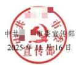  
感谢信

中船应急（国营第四四六厂）：  
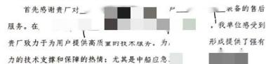  
兢兢业业谋服务、扎扎实实搞保障，倾囊相授装备操作技能及保养

维修技术，极尽所能帮助培养懂操作会保养的骨干，他们的敬业精神和专业技术水平，使在场的陪同人员感到由衷的钦佩，我单位感念至深！

在此，我单位转向中船应急（国营第四四六厂）售后工作人员和积极多方协调售后服务的管理人员及相关领导致以崇高的敬意和最真挚的感谢，感谢贵单位对用户装备建设不遗余力的付出！

向贵厂的工匠精神学习、致敬！

  
感谢信  
中船应急（国营第四四六厂）：

首先感谢贵厂对\_\_\_\_用户\_\_\_\_装备的售后服务。在\_\_\_\_装备\_\_\_\_过程中，我单位感受到贵厂致力于为用户提供高质量的技术服务，为用户战斗力形成提供了强有力的技术支撑和保障的热情；尤其是中船应急工作人员\_\_\_\_等同志，兢兢业业谋服务、扎扎实实搞保障，倾囊相投装备操作技能及保养维修技术，极尽所能帮助培养懂操作会保养的骨干，他们的敬业精神和专业技术水平，使在场的陪同人员感到由衷的钦佩，我单位感念至深！

在此，我单位特向中船应急（国营第四四六厂）售后工作人员和积极多方协调售后服务的管理人员及相关领导致以崇高的敬意和最真挚的感谢，感谢贵单位对用户装备建设不遗余力的付出！

向贵厂的工匠精神学习、致敬！  

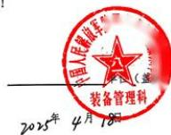

感谢信  
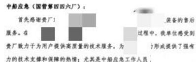

就业业谋服务、扎扎实实搞保障，倾囊相授装备操作技能及保养维修技术，极尽所能帮助培养懂操作会保养的骨干，他们的敬业精神和专业技术水平，使在场的陪同人员感到由衷的钦佩，我单位感念至深！

在此，我单位转向中船应急（国营第四四六厂）售后工作人员和积极多方协调售后服务的管理人员及相关领导致以崇高的敬意和最真挚的感

谢，感谢贵单位对用户装备建设不遗余力的付出！向贵厂的工匠精神学习、致敬！

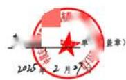

感谢信  
中船应急（国营第四四六厂）：  
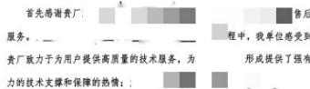

兢兢业业谋服务、扎扎实实搞保障，倾囊相授装备操作技能及保养维修技术，极尽所能帮助培养懂操作会保养的骨干，他们的敬业精神和专业技术水平，使在场的陪同人员感到由衷的钦佩，我单位感念至深！

在此，我单位转向中船应急（国营第四四六厂）售后工作人员和积极多方协调售后服务的管理人员及相关领导致以崇高的敬意和最真挚的感

谢，感谢贵单位对用户装备建设不遗余力的付出！

向贵厂的工匠精神学习、致敬！  
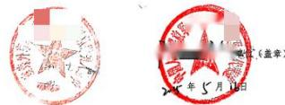

感谢信  
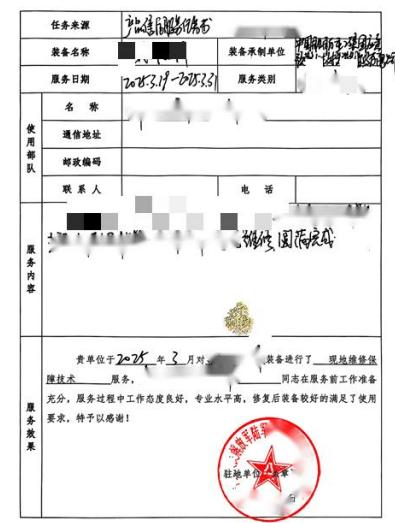

text_image

任务来源
产品售后服务表
装备名称
装备承制单位
使用部队
服务日期
2025.3.19-2025.3.31
服务类别
名称
通信地址
邮政编码
联系人
电话
服务内容
服务效果
贵单位于2025年3月对...装备进行了...现场维修保障技术...服务。_同志在服务前工作准备充分，服务过程中工作态度良好，专业水平高，修复后装备较好的满足了使用要求，特予以感谢！

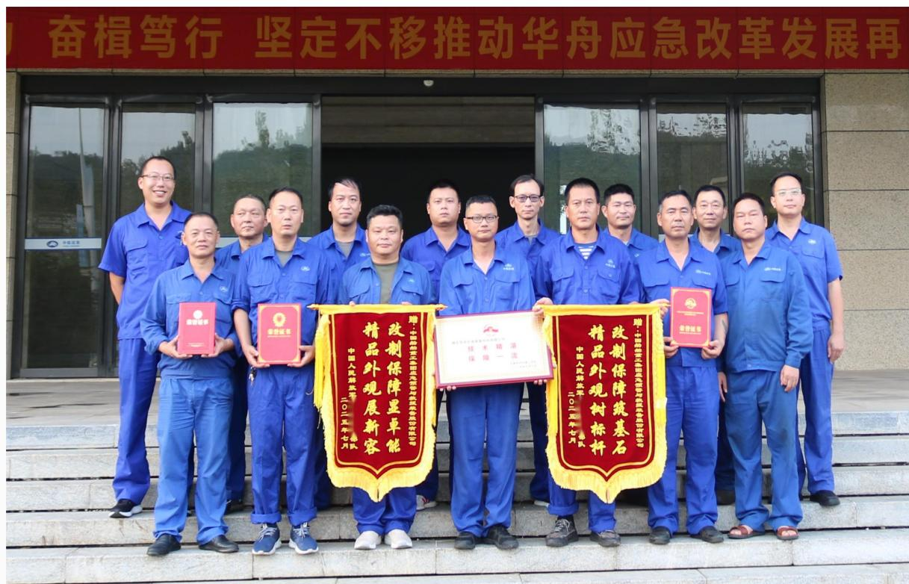

text_image

奋楫笃行 坚定不移推动华舟应急改革发展再
法制保障呈卓能
精品外观展新容
中国人民解放军
二〇一五年七月
法制保障呈卓能
精品外观封标杆
中国人民解放军
二〇一五年七月
法制保障呈卓能
精品外观展新容
中国人民解放军
二〇一五年七月
法制保障呈卓能
精品外观封标杆
中国人民解放军
二〇一五年七月
法制保障呈卓能
精品外观展新容
中国人民解放军
二〇一五年七月
法制保障呈卓能
精品外观封标杆
中国人民解放军
二〇一五年七月
法制保障呈卓能
精品外观展新容
中国人民解放军
二〇一四年七月
法制保障呈卓能
精品外观封标杆
中国人民解放军
二〇一四年七月
法制保障呈卓能
精品外观展新容
中国人民解放军
二〇一四年七月
法制保障呈卓能
精品外观封标杆
中国人民解放军
二〇一四年七月
法制保障呈卓能
精品外观展新容
中国人民解放军
二〇一四年七月
法制保障呈卓能
精品外观封标杆
中国人民解放军
二〇一四年七月
法制保障呈卓能
精品外观展的新容
中国人民解放军
二〇一四年七月
法制保障呈卓能
精品外观展新容
中国人民解放军
二〇一四年七月
法制保障呈卓能
精品外观展新容

## 应急

## S

## 社会篇 (Social)

## 科技创新

## 科研人才

★ 集团公司首席专家1名  
★ 青年拔尖科技人才1名  
★享受国务院特殊津贴专家2名

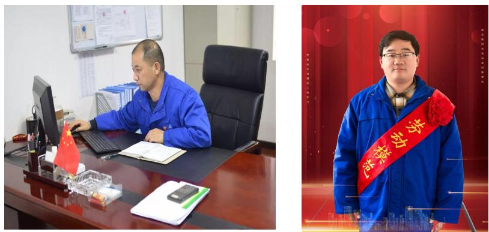

## 创新平台

★ 国家工程技术研究分中心、湖北省工程研究中心  
湖北省工程技术研究中心、博士后工作站  
★ 牵头或参与国家重点研发计划等科技创新项目9个

## 军企共建

★ 中国人民解放军国防大学、陆军工程大学、火箭军指挥学院、陆军军事交通学院科研教学基地

## 科研荣誉

★ 国家科技进步一等奖：带式舟桥  
★ 军队科技进步一等奖：轮式冲击桥、重型支援桥等  
★ 发明专利：215项  
★ 标准：国家标准2项、国军标7项、行业标准2项

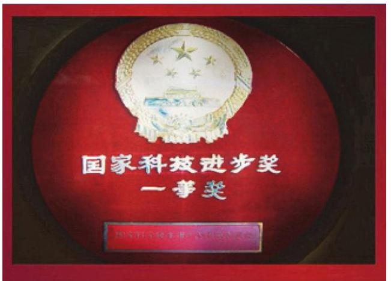

text_image

国家科技进步奖
一等奖

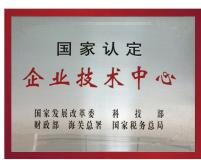

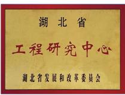

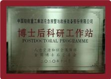

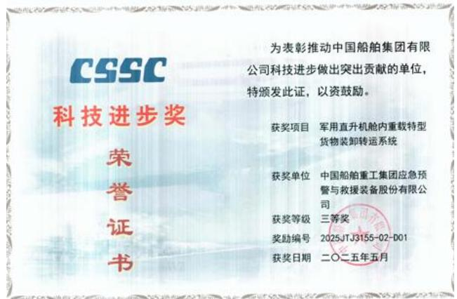

text_image

CSSC
科技进步奖
为表彰推动中国船舶集团有限公司科技进步做出突出贡献的单位，
特颁发此证，以资鼓励。
获奖项目 军用直升机舱内重载特型
货物装卸转运系统
获奖单位 中国船舶重工集团应急预
警与救援装备股份有限公
司
获奖等级 三等奖
奖励编号 2025JTJ3155-02-D01
获奖日期 二〇二五年五月

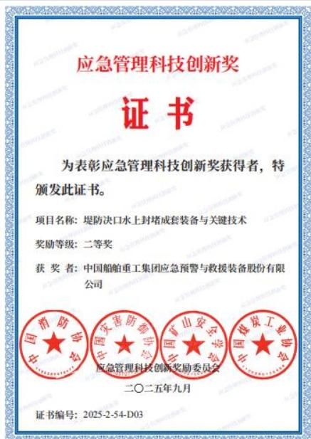

seal

中国船舶重工集团
应急管理科技创新奖励委员会
中国煤炭工业协会

## 科研成果

2025年围绕防务产业和新兴产业等核心业务板块申报发明专利76件，取得发明专利授权58项。参编并发布行业标准1项《公路交通应急处置技术规范》，团体标准2项《水陆两栖救援艇技术条件》《堤防决口封堵技术规范》。获得集团公司和行业协会科技进步奖2项。完成国家企业技术中心评价。

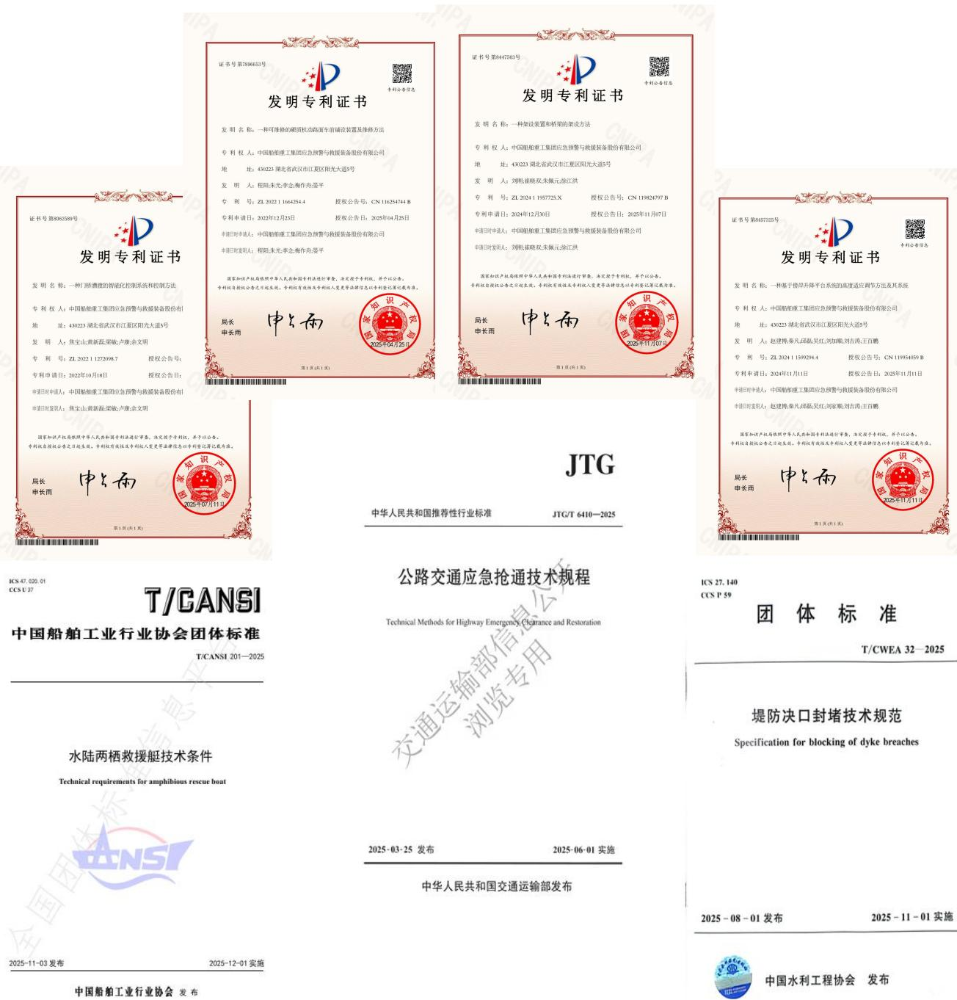

## 安全生产与职业健康：生命至上，安全第一

公司始终将员工的生命安全和身体健康放在首位，严格落实安全生产责任制，全方位构建安全保障体系。

“四不两直”：安全治理机制

狠抓班前/班后会排查隐患，实施周项目预警预测

安全治理升级：风险可控

识别多个危险源并四级管控；严肃考核问责。

班组建设：星级达标

四星级班组6个，三星级班组26个，夯实基层安全。

职业健康：全员覆盖

定期体检，职业病体检覆盖率达100%。

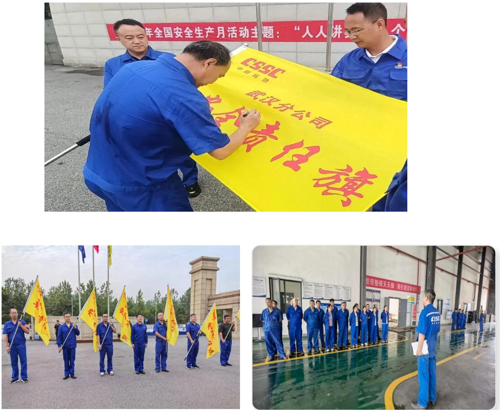

## 员工结构与劳动权益保障：以人为本，构建和谐劳动关系

## 员工结构概览（2025年末）

- 员工总数：1056人  
- 岗位分布：专业技术人员25.05%，技能工人51.89%

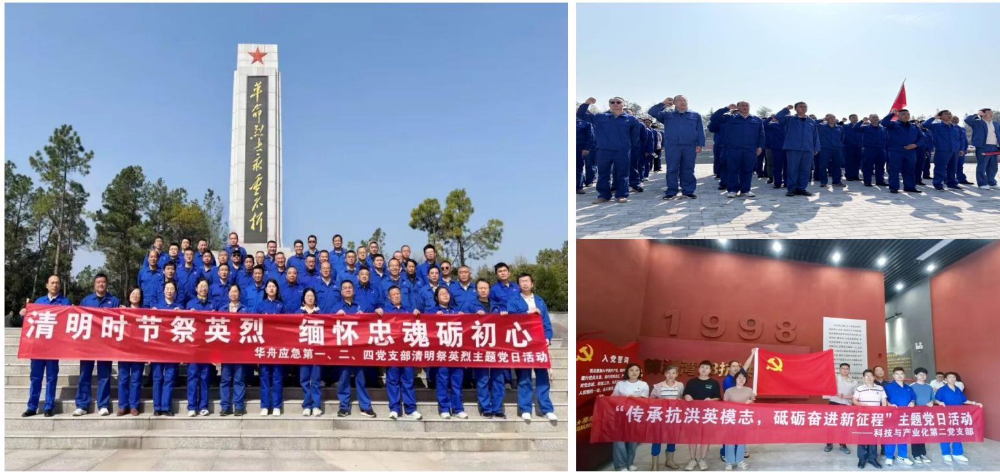

## 劳动权益保障体系

- 规范用工：每季度开展劳动用工专项检查，依法管理合同  
- 社保覆盖：社会保险覆盖率达到100%  
- 档案管理：及时清理、转出离职/退休人员人事档案

## 团结协作·积极向上的员工团队

核心理念：视员工为最宝贵的财富，致力于构建和谐、稳定的劳动关系

## 人才引育与职业发展：打造高素质专业化人才队伍

坚持人才强企战略，通过多渠道引才、多维度育才、多路径成才，为员工搭建广阔的职业发展平台。

## 2025 人才引育关键成果

44人

引进技术技能人才

36人

晋升专业技术职称

27人

提升技能等级

高层次人才申报：积极推荐骨干人才申报各级人才项目，打造核心领军人才梯队。

## 多维职业发展通道

## 职级认证

研发/营销人员开展职级评审，拉开收入差距，激发专业活力。

## 交流挂职

选派优秀年轻人才到关键岗位锻炼，强化后备干部储备。

## 干部选拔

选拔任用8名年轻助理副主任及内聘管理人员，优化人才结构。

## 多元化培训体系：赋能员工，助力素质全面提升

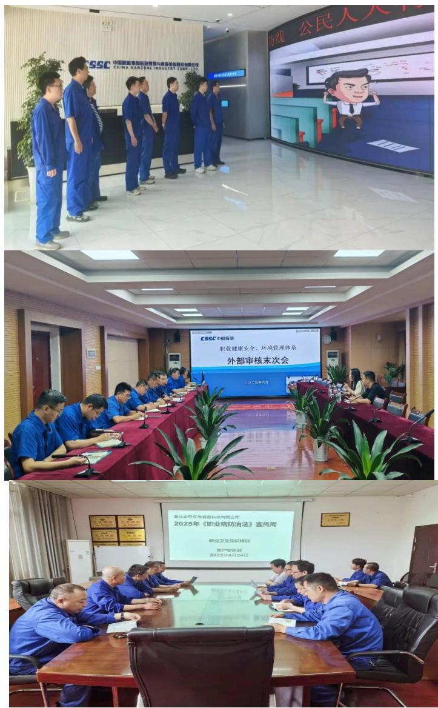

text_image

CSSC 中国船舶集团物业管理与商业港股份有限公司
CHINA HARZINE INDUSTRY CORP
一线 公民人大厦
CSSC 中船信息
职业健康安全、环境管理体系
外部审核末次会
二〇二二年六月
湖北华丹近东装备科技有限公司
2025年《职业病防治法》宣传周
职业卫生知识培训
生产授权期
2025年4月24日

6877人次

年度培训总人次
较往年大幅增长培训场次 192

内部专题班 109个
外部及网络班 83个全员覆盖

内容形式多样化
全方位赋能员工

内容丰富多元

财务/精益/质量/风险

形式创新多样

视频资源/公司讲坛
/劳模工作室

效果切实转化

绩效挂钩/评优评先

赋能员工成长 · 打造学习型组织 · 驱动企业高质量发展

## 精益人才与青年骨干培养：为未来发展储备核心力量

公司高度重视精益人才和青年骨干的培养，通过系统化的制度设计和实践锻炼，打造一支复合型人才队伍。

## 精益人才育成体系

## 制度保障·顶层设计

发布《精益人才管理规定》，从制度层面打通人才发展通道，确立明确的晋升与评价标准。

## 实践锻炼·能力提升

编制专项实施方案，鼓励青年骨干深度参与精益管理项目，在实战场景中提升解决问题的能力。

## 青年骨干培养

## 培养目标·战略储备

旨在培养一批能够满足任务高效执行、推动企业高质量发展的后备干部人才队伍，支撑长远战略。

## 关键举措·舞台与晋升

依托重大项目和重点工作，为优秀年轻人才提供展示才华的实战舞台，打通快速晋升的绿色通道。

## 员工关怀与文化建设：凝心聚力，共筑精神家园

## 精神文化建设

弘扬榜样力量，传承工匠精神

## ● 劳模先进宣讲

举办“百年传承，匠心筑梦”宣讲，
弘扬劳动精神与工匠精神。

## ● 先进典型宣传

开辟【榜样力量】专栏，宣传先进事迹，营造比学赶超氛围。

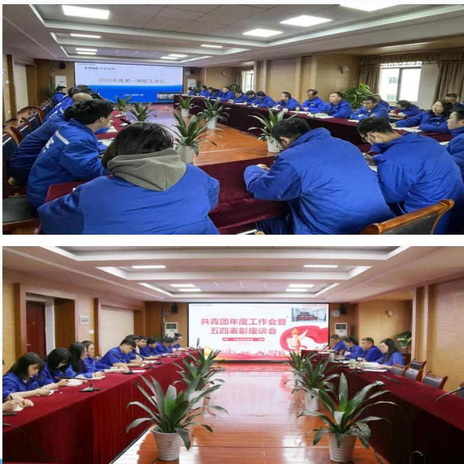

## 青年文化培育

凝聚青春力量，激发奋
进活力

## - 五四表彰座谈会

召开年度工作会暨表彰会，表彰先进，激发青年奋进力量。

## ● “青春同行”素质拓展

组织多地青年开展素质拓展，增强团组织凝聚力与团队协作。

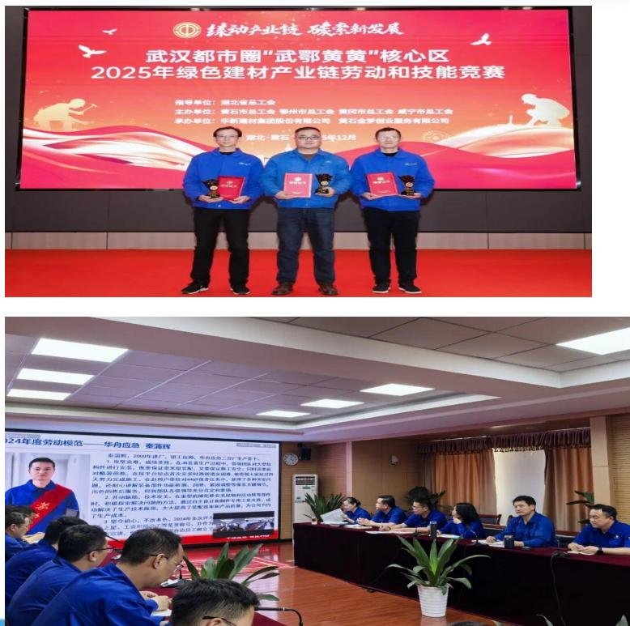

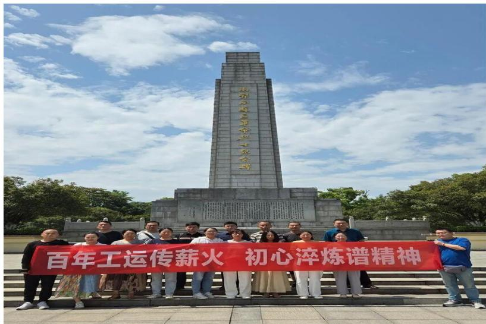

text_image

百年工运传薪火 初心淬炼谱精神

公司工会与团组织通过举办多元文体活动，搭建员工沟通桥梁，有效提升团队向心力，营造积极向上的企业氛围。

## 多元职工活动

各类团体赛吸引数百名爱好者，在竞技中展现拼搏精神与团队协作力。

## 安全生产文化深度融合

武汉、赤壁两地同步举行启动仪式与升旗礼，以庄严仪式强化全员红线意识。

成效：凝聚合力·和谐健康·积极向上

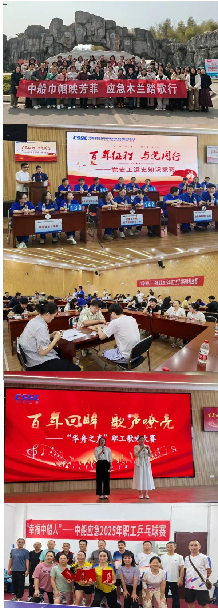

文体活动凝聚团队力量，丰富生活激发活力

## 薪酬福利与激励机制：共享发展成果，激发组织活力

公司致力于建立科学合理的薪酬福利体系和激励机制，坚持将企业发展成果与每一位员工共享，构建利益共同体。

area

| X | Y |
| --- | --- |
| 1 | ~20 |
| 2 | ~45 |
| 3 | ~30 |
| 4 | ~60 |

## 绩效管理优化

- 效率提升：信息化赋能考核效率  
- 考核落实：营收挂钩，结果导向

natural_image

Blue icon of a person with an upward arrow, no text or symbols present

## 薪酬激励倾斜

- 资源聚焦：向关键岗位与人才倾斜  
- 价值导向：合理拉大核心人才差距

natural_image

Blue umbrella icon on white background (no text or symbols)

## 福利保障升级

- 成果共享：2025年超额完成目标  
- 两金福利：为员工缴纳公积金和年金

公司员工工资薪酬采取以岗定薪，岗变薪变的分配原则；坚持工资薪酬向产品研发、市场营销、重要责任岗位倾斜的原则，重视高科技管理人才的引进，薪酬水平逐步和市场接轨；以效益优先的原则，视效益增长幅度调整员工收入水平。

实行月度工资与年终绩效工资分配形式：经营管理人员、科技人员、后勤辅助人员实行岗位工资制，一线生产工人实行计件工资制，年终绩效工资与年度业绩考核结果挂钩发放。

公司实行全员绩效考核管理，从总部到二级生产单位，二级生产单位到班组及员工，使每个部门和岗位职责明确责任上肩。薪酬与绩效挂钩、创新与业绩挂钩、绩效工资与年终业绩挂钩，为员工考核和（岗位）职务晋级提供上升空间，形成全覆盖的多级联动全员绩效考核体系。鼓励创新、激发活力的全员绩效考核体系使公司管理团队更具爆发力和团队协作精神，产品研发成果显著，销售市场不断拓展，为中船应急未来发展奠定坚实的基础。

## 应急救援与社会责任担当：闻险而动，守护生命

作为应急产业领军企业，中船应急始终坚守央企社会责任，依托核心装备优势，在全国多地的实战抢险和重大应急演练中发挥关键作用。

全年装备参与超过10场次由交通应急、应急管理等客户单位组织的大型综合演练、5次社会应急救援。

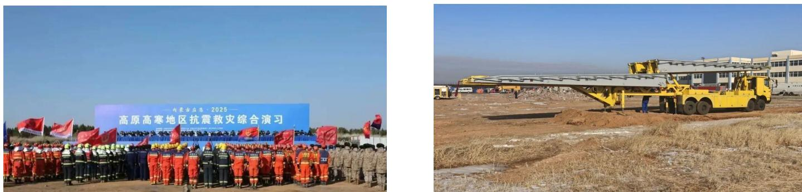  
2025年12月，中船应急携100米硬质机动路面与26米应急机械化桥参演，重点参与了“断路”场景下快速搭建陆上救援通道环节

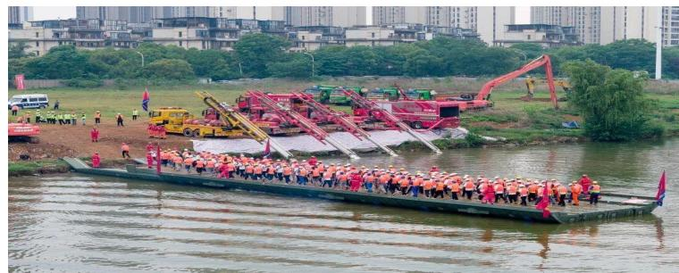

natural_image

Group of people in orange vests on a large boat at a river, with construction machinery and residential buildings in the background (no visible text or symbols)

4月28日，2025年武汉市“应急使命”防汛抢险救援综合演练在汤逊湖渔港路滩头区域举行，中船应急多型装备在演练中精彩亮相，表现抢眼。

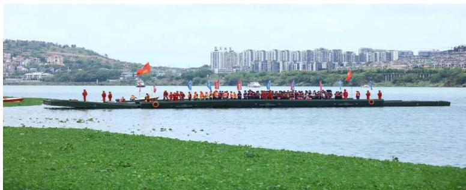

natural_image

Scenic view of a river with people on a small boat, flags, and a city skyline in the background (no visible text or symbols)

5月13日，中船应急多型装备参与广西“应急使命·2025”——台风防范应对演习。

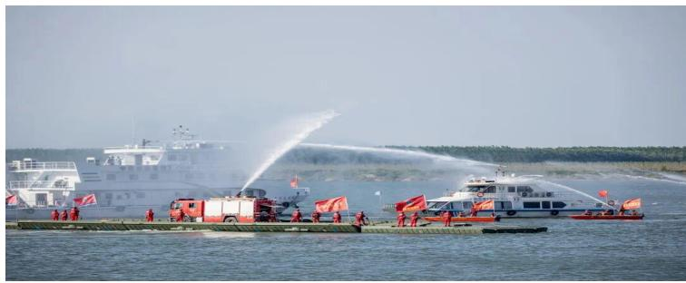

natural_image

Rescue operation scene with water spray from a boat and personnel in red uniforms on a floating platform near a large ship (no visible text or symbols)

6月18日，中船应急参与由湖北省防汛抗旱指挥部主办，湖北省应急管理厅、湖北省水利厅、国家华中区域应急救援中心承办的2025年湖北省抗洪抢险救援综合演练。

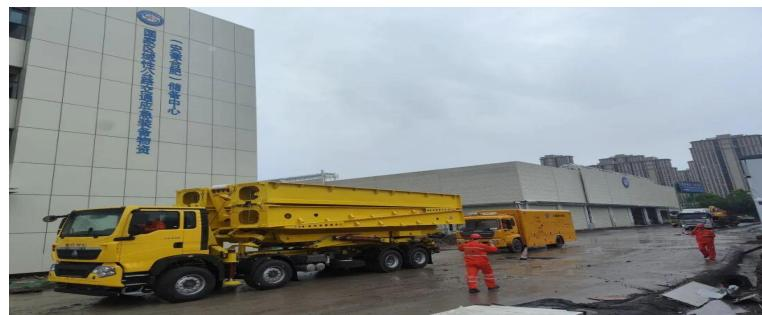

text_image

荣誉基地
荣誉基地
荣誉基地
荣誉基地
荣誉基地
荣誉基地
荣誉基地
荣誉基地
荣誉基地
荣誉基地
荣誉基地
荣誉基地
荣誉基地
荣誉基地
荣誉基地
荣誉基地
荣誉基地
荣誉基地
荣誉基地
荣誉基地
荣誉基地
荣誉基地
荣誉基地
荣誉基地
荣誉基地
荣誉基地
荣誉基地
荣誉基地
荣誉基地
荣誉基地
荣誉基地
荣誉基地
荣誉基地
荣誉基地
荣获基地
荣誉基地

6月24日，中船应急装备亮相2025年度全国公路交通部省联合应急演练

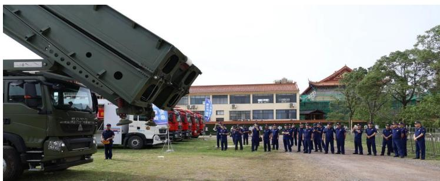

natural_image

Group of uniformed personnel standing in formation near military trucks and a traditional building (no visible text or symbols)

演练闭幕后，国家区域应急救援中心领导现场观摩公司装备。

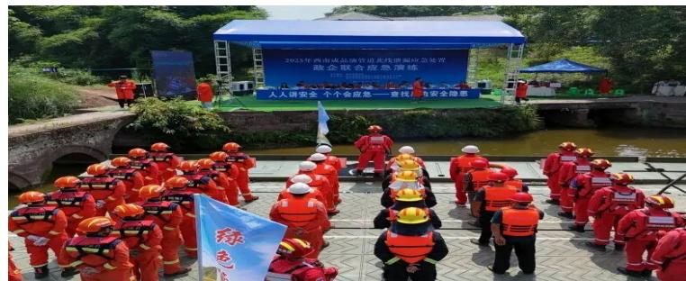

text_image

2025年西南成品油管道北线应急预案暨安全
政企联合会应急演练
人人讲安全 个个应急急——查找防安全隐患
绿光启

6月27日，中船应急装备参加2025年西南成品油管道北线泄漏应急处置演练

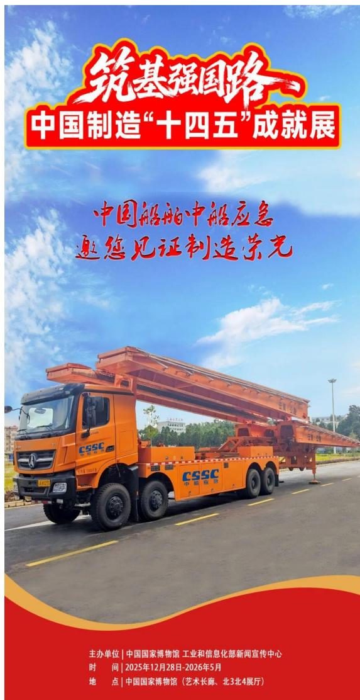

text_image

筑基强国路
中国制造“十四五”成就展
中国船舶中船应急
邀您见证制造荣光
主办单位 | 中国国家博物馆 工业和信息化部新闻宣传中心
时 间 | 2025年12月28日-2026年5月
地 点 | 中国国家博物馆（艺术长廊、北3北4展厅）

## 实战救援，闻险而动

- 洪涝救援：驰援广西南宁、百色等地防汛抢险  
- 事故救援：助力四川马尔康水电站垮塌救援

## 以练备战，锤炼能力

\- 参与多地防汛、应急演练、提升实战协同能力。

## 公益事业与社区共建：反哺社会，和谐共生

## 乡村振兴：定点帮扶

响应国家战略，选派1名中层干部担任驻村第一书记，扎根基层，精准助力乡村产业与民生发展。

## 教育支持：产学研共建

深化校企合作，建立人才培养基地，支持高校科研教学，为行业输送高素质后备力量，助力教育事业。

## 社区共建：和谐共生

常态化开展员工志愿服务，建立社区沟通长效机制，积极回馈邻里，营造和谐共融的周边环境。

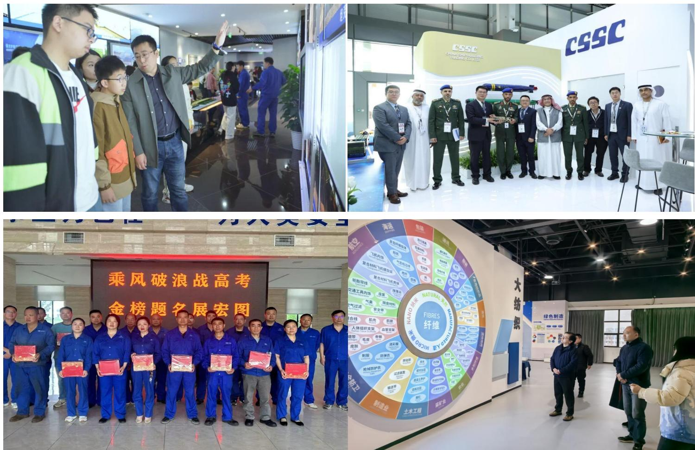

## 公益行动 · 温暖瞬间

从车间到国际展会，每一次躬身服务，都是我们对“企业公民”责任的践行与承诺。

## E

## 环境篇 (Environment)

践行绿色发展理念 · 共筑可持续未来

## 守护绿水青山，建设绿色工厂

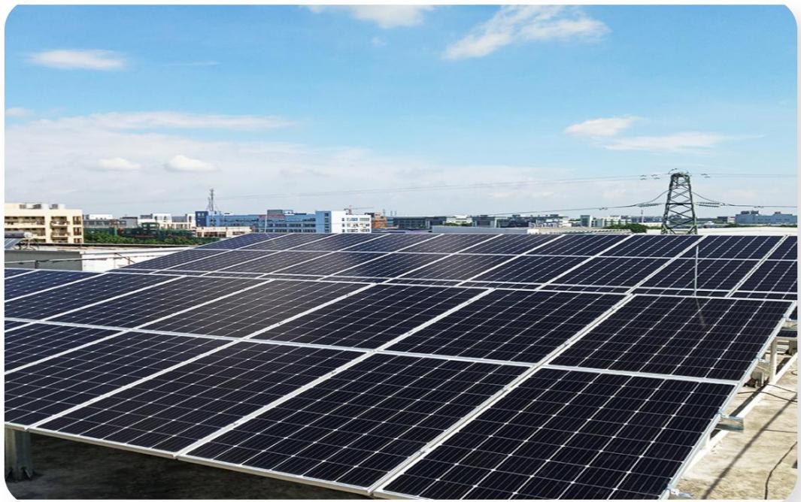

natural_image

Rows of solar panels installed on a rooftop under a blue sky with power lines and distant buildings (no text or symbols visible)

光伏实景 · 绿色生产示范基地

## 环境管理体系：合规与安全

废水/废气/固废100%达标排放；开展环保应急演练，全年无事故；完成绿色工厂自评价。

## 资源能源管理：节能与监测

建立能耗台账减少浪费；完成车间及道路LED节能改造；主要能源消费实时监测覆盖率100%。

## 清洁能源应用：光伏与低碳

自建光伏项目累计发电超数百万Kwh；启动Q80产品碳足迹核算，深化低碳设计。

## 节能降碳，步履不停

## 重点能耗设备管理优化

措施：建立台账，优化生产计划；消除管路泄漏。

成效：大幅降低空转与低效运行造成的能源浪费。

## 智能照明系统改造

措施：全面更换高效节能LED灯，优化控制回路。

成效：提升照明安全性，显著降低厂区电能消耗。

## 能源在线监测系统

措施：部署综合监测系统，实时监控能耗与碳排放。

成效：提供精准数据支持，助力节能决策与异常排查。

natural_image

Exterior view of a modern high-luminous LED light bulb (no text or symbols visible)

能耗最高降幅达70.3%

## 环境管理体系与合规运营：绿色发展，合规先行

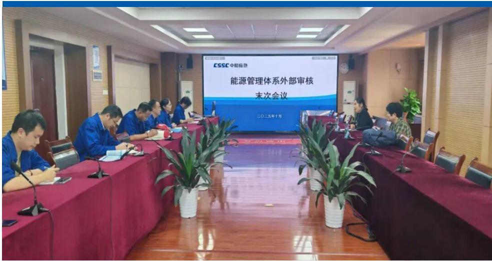

text_image

CSSC 中船检查
能源管理体系外部审核
末次会议
二〇二五年十月

## 环境风险防控体系

建立完善的环境管理体系，定期组织环境风险自查与隐患排查，常态化开展环保应急演练，切实筑牢生态安全防线。

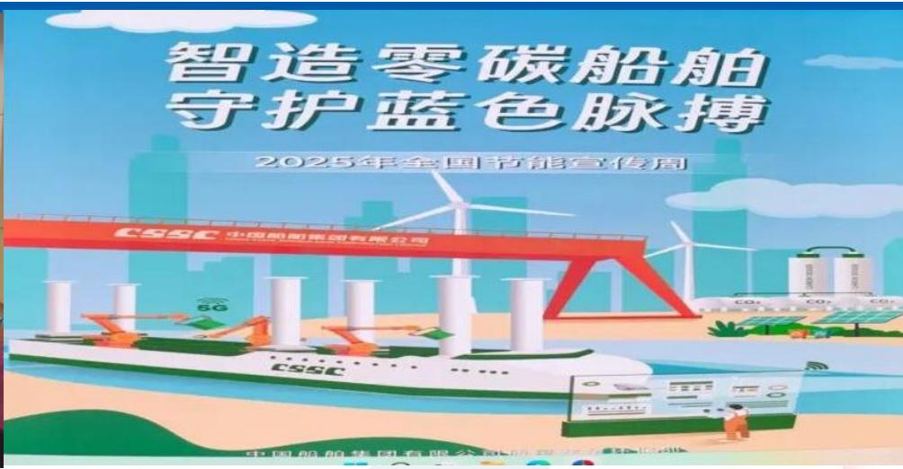

text_image

智造零碳船舶
守护蓝色脉搏
2025年全国节能宣传周
CSSC 中国船舶集团有限公司
CSSC
中国船舶集团有限公司新能源汽车

## 合规运营与整改

三废监测100%达标，无投诉督查整改9项|例行整改12项全部实现闭环管理。

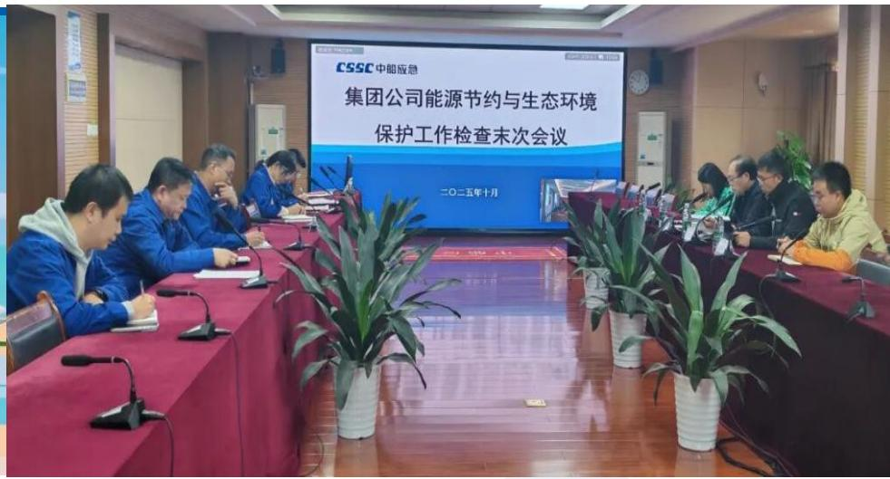

text_image

CSSC中船应急
集团公司能源节约与生态环境
保护工作检查末次会议
二〇二五年十月

## 环保投入与成效

持续投入资源保障环保设施稳定运行，2025年度未发生任何环境污染事故，实现经济效益与环境效益双赢。

以合规促发展，以绿色筑未来 —— 2025年度环境合规总结

## 资源使用与能源管理成效：节能降耗，绿色生产

公司通过能源精细化管理和技术改造，大幅降低资源消耗，在水、电、氩气等能耗指标上实现显著优化。

主要能耗平均降幅

> 8%

单项能耗最高降幅

70.3%

## 重点节能管理举措

高耗能设备

建立台账，科学排产

照明系统升级

全面更换高效LED

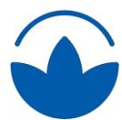

光伏绿色发电

年发电超307万Kwh

能源在线监测

实时监测覆盖率100%

已完成公司能源及碳排放综合在线监测系统一期工程，能源消费品种实时监测覆盖率100%。能源及碳排放综合在线监测系统二期实施计划已纳入公司绿色工厂建设内容之一，纳入两地厂区光伏电表、新增子公司二类水电表计量配置及重点设备设施用能计量器具配置。

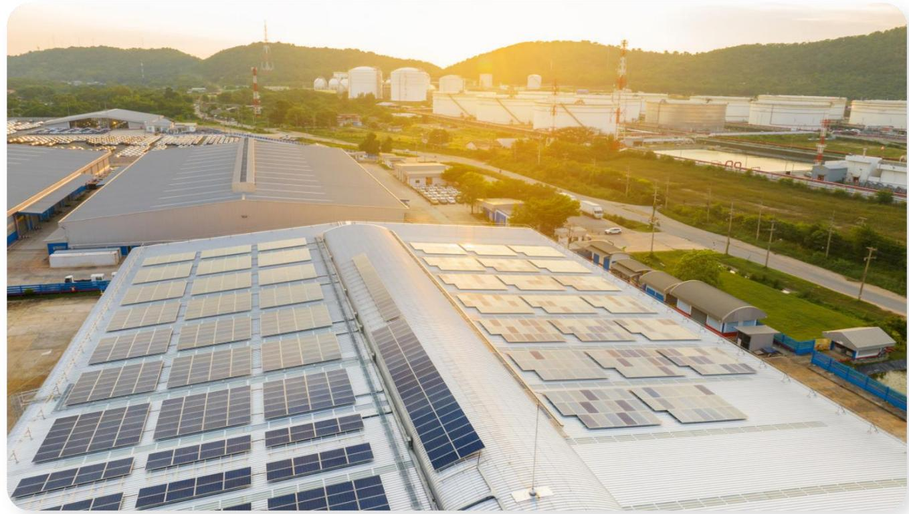

natural_image

Aerial view of a large industrial facility with solar panel arrays on rooftops and surrounding green hills at sunset (no visible text or symbols)

现代化工厂光伏基地

利用屋顶空间建设光伏电站，实现“自发自用、余电上网”，切实推动生产方式向绿色低碳转型。

2024年8月份，赤壁厂区2.45MV光伏项目已正式并网并发电，2025年1-9月份利用绿电率为66.77%；2025年5月份，武汉厂区4.9MV光伏项目已正式并网并发电，2025年5-9月份利用绿电率为47.43%。

## 排放物管理与污染防治：严控排放，守护绿水青山

公司严格执行国家及地方的污染物排放标准，建立了完善的排放物管理和污染防治体系，全方位守护生态环境。

## 废水净化管理

## A

建立标准化污水处理系统，生产与生活废水经多道工序处理后，确保各项指标均达标排放。

## 废气综合治理

## B

对生产过程产生的废气进行全流程收集，采用高效净化技术处理，确保废气排放符合国家标准。

## 固废合规处置

## C

严格分类一般与危险废物，委托有资质单位进行合规处理，实现固废100%安全处置，零二次污染。

## 环保应急响应

## D

全年开展2次专业环保应急演练，有效提升团队对突发环境事件的快速响应与妥善处置能力。

## 应对气候变化与低碳发展：前瞻布局，迈向碳中和

公司积极响应国家“双碳”目标，主动识别气候相关风险与机遇，将低碳理念融入全流程，推动企业向可持续方向转型。

natural_image

Blue factory icon with two windows, no text or symbols present

绿色工厂建设

稳步推进

完成建设前期自评价，确立线上单源采购流程，稳步推进绿色生产标准落地。

natural_image

Blue leaf icon inside a light blue circle (no text or symbols)

产品碳足迹核算

Q80 项目启动

完成原材料、零部件及物流阶段的初步估算，为后续低碳设计与生产提供精准数据支撑。

natural_image

Blue icon of a globe on a stand inside a light blue circle (no text or symbols)

气候战略融入

全流程覆盖

将应对气候变化列为核心战略议题，深度融合研发、制造及供应链管理，构建低碳发展闭环。

共筑绿色未来 · 迈向碳中和

## 2025年ESG核心绩效数据摘要

聚焦环境、社会与治理三大维度，全方位展现企业可持续发展核心成果

## 环境责任 (E)

单位产值能耗：显著下降

单位产值水耗：显著下降

可再生能源占比：显著提升

环保投入力度：持续增加

## 社会责任 (S)

应急演练与救援：15次

员工总数(人): 1056

培训覆盖率：100%

客户满意度：100分

## 公司治理 (G)

独董占比：33.33%

信息披露(条): 149

重大决策审查覆盖率：100%

现金分红(亿元): 0.0259

## 展望与未来目标：

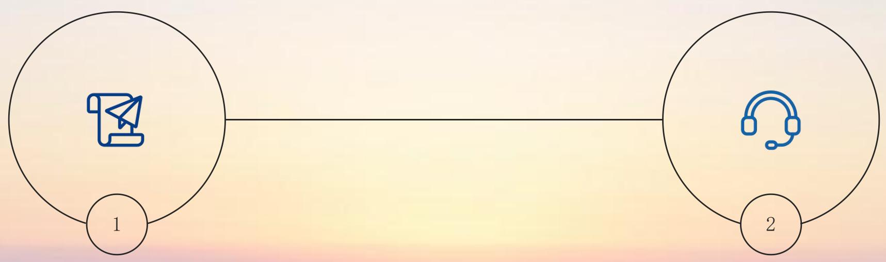

flowchart

```mermaid
graph LR
  A["Step 1"] --> B["Step 2"]
  B --> C["Final Result"]
```

## 下一年度

公司将认真落实党中央和中国船舶集团的决策部署，践行“一盘棋”“全级次”“穿透式”管理要求，参照公司已建立的覆盖全级次、全领域、全过程、全岗位的低碳环保责任体系，以及细化确定的各单位个性化节能降碳考核指标，推动节能降碳工作纳入绩效考核体系，进一步压实节能降碳责任。

## “十五五”期间

公司将深入贯彻习近平生态文明思想，坚定不移走绿色低碳高质量发展道路，将绿色低碳发展作为践行新发展理念、构建新发展格局的重要着力点。公司将秉持“以应急事业为己任，为人类安全做贡献”的企业使命，坚守保军主责、应急主业，把绿色发展理念融入生产经营各领域，加快推进产业链、供应链绿色转型升级。

# 安全为本 连接未来

我们致力于成为一家对环境负责、对社会有益、治理规范的优秀企业，以专业守护安全，以创新连接未来。

公司官网：https://www.china-huazhou.com/

联系邮箱：zfb@harzone.com.cn