## 2025

## 年度

## 环境、社会和公司治理（ESG）报告

吉林吉大通信设计院股份有限公司

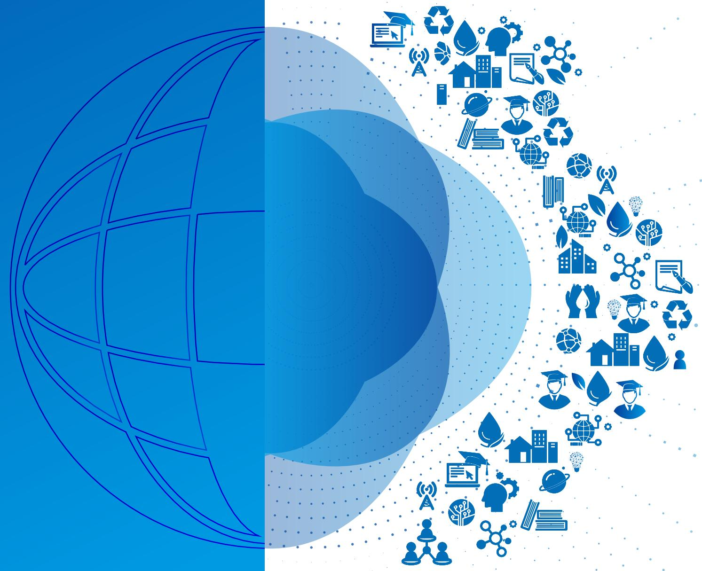

natural_image

Abstract illustration of a globe with diverse icons representing technology, education, and social sciences (no text or symbols)

## 吉林吉大通信设计院股份有限公司

电话：0431-85152089

传真：0431-85175230

电子信箱：jlucdi@jlucdi.com

地址：长春市朝阳区南湖学府经典小区第9 幢701室

## 目录

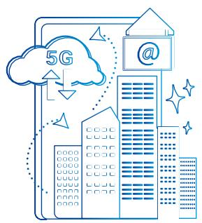

natural_image

Illustration of 5G technology with cloud, building, and @ symbol (no text or labels)

关于本报告 02

报告范围 02

发布周期 02

编制依据 02

数据来源说明 02

称谓说明 03

报告获取与反馈 03

董事长致辞 04

2025 年关键绩效 06

natural_image

Illustration of a person using a laptop with 5G symbol, surrounded by decorative stars and location pins (no text or symbols)

关于吉大通信 08

公司简介 08

企业文化 09

主要业务及布局 10

业务覆盖图 12

发展战略 12

组织架构 16

发展历程 18

年度荣誉 20

可持续发展管理	 24

可持续管理 24

利益相关方沟通 30

重要性议题管理 31

影响、风险和机遇管理 34

natural_image

Illustration of two people in a gym with social media icons and a Wi-Fi symbol (no text or symbols present)

治理篇 36

固本筑基，行稳致远

党建引领企业高质量发展 38

可持续发展的治理保障 41

natural_image

Illustration of two people using mobile phones with Wi-Fi and network icons (no text or symbols)

环境篇 56

绿色赋能，永续发展

应对气候变化 58

可持续发展的治理保障 69

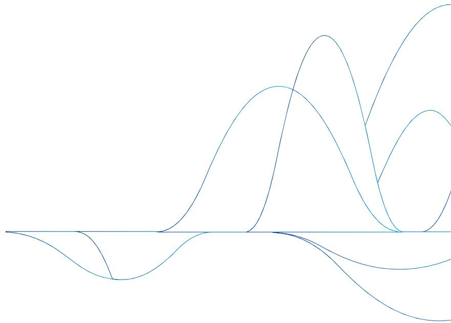

natural_image

Abstract line drawing with multiple overlapping curves and wavy base lines (no text or symbols)

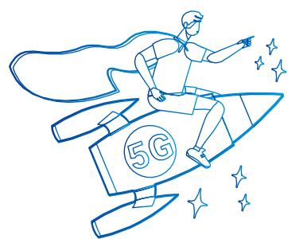

natural_image

Line drawing of a person riding a rocket labeled '5G' with stars in the background (no text or symbols on the main subject)

社会篇 88

履责笃行，聚力共生

创新驱动与科技伦理 90

产品和服务 103

供应链供应商管理 114

信息安全与隐私保护 117

员工 125

乡村振兴与社会贡献 145

附录 150

索引表 150

绩效表 152

意见反馈表 153

## 关于本报告

本报告是吉林吉大通信设计院股份有限公司公开发布的 2025 年环境、社会和公司治理 (ESG) 报告，这是本公司发布的第四份环境、社会和公司治理 (ESG) 报告。报告秉承客观、规范、透明和全面的原则，详细介绍了吉林吉大通信设计院股份有限公司及附属全资、控股子公司于2025年在环境、社会和公司治理领域的管理策略、实践及绩效。

## 报告范围

时间范围：报告的时间范围是 2025 年 1 月 1 日至 2025 年 12 月 31 日，为提高报告的可比性和完整性，部分表述及数据适当追溯和延伸。

组织范围：如无特别说明，本报告覆盖吉林吉大通信设计院股份有限公司及附属全资、控股子公司（具体详见吉林吉大通信设计院股份有限公司2025年年度报告）。

## 发布周期

报告为环境、社会和公司治理（ESG）报告，每年度发布一次。

## 编制依据

·《深圳证券交易所上市公司自律监管指引第2号——创业板上市公司规范运作》  
·《深圳证券交易所创业板上市公司自律监管指南第3号——可持续发展报告编制》  
·《深圳证券交易所上市公司自律监管指引第17号——可持续发展报告（试行）》  
· 国务院国有资产监督管理委员会《央企控股上市公司ESG 专项报告编制研究》  
· 国务院国有资产监督管理委员会《关于新时代中央企业高标准履行社会责任的指导意见》  
· 全球报告倡议组织《GRI可持续发展报告标准（GRI Standards）》  
· 中国企业改革与发展研究会《中国企业可持续发展报告指南（CASS-ESG 6.0）》  
· 联合国可持续发展目标（SDGs）

## 数据来源说明

本报告的财务数据摘自吉林吉大通信设计院股份有限公司 2025年年度报告，其他信息和数据来自公司各相关部门的数据统计汇总或公开文件，报告内容不存在任何虚假记载、误导性陈述或重大遗漏。如无特别说明，本报告中所涉及的货币金额均以人民币作为计量币种，若与财务报告不一致之处，以财务报告为准。

## 称谓说明

为便于表达和阅读，报告中使用“吉大通信” “公司” “我们”等称谓均指代“吉林吉大通信设计院股份有限公司”。“ESG”是指“环境、社会和公司治理”，“ESG报告”指“环境、社会和公司治理报告”。

<table><tr><td>释义项</td><td>释义内容</td></tr><tr><td>吉大通信、公司、我们</td><td>吉林吉大通信设计院股份有限公司</td></tr><tr><td>长邮通信</td><td>吉林长邮通信建设有限公司</td></tr><tr><td>菲律宾子公司</td><td>吉大通信(菲律宾)有限公司</td></tr><tr><td>中浦慧联</td><td>中浦慧联信息科技(上海)有限公司</td></tr><tr><td>丝路创科</td><td>深圳丝路创科投资有限公司</td></tr><tr><td>文思数智</td><td>文思数智(江苏)技术有限公司</td></tr><tr><td>吉鸿志信</td><td>青岛吉鸿志信投资管理有限公司</td></tr><tr><td>知行智跃</td><td>上海知行智跃体育科技有限公司</td></tr><tr><td>武汉分公司</td><td>吉林吉大通信设计院股份有限公司武汉分公司</td></tr><tr><td>长春分公司</td><td>中浦慧联信息科技(上海)有限公司长春分公司</td></tr></table>

## 报告获取与反馈

本报告以电子版的形式发布，您可以在深圳证券交易所网站（http://www.szse.cn）、巨潮资讯网（http://www.cninfo.com.cn）、吉林吉大通信设计院股份有限公司官方网站（http://www.jlucdi.com）查阅下载电子版报告。

若对报告有任何意见或建议，请通过以下方式联系我们，联络方式如下：

电话：0431-85152089

电子信箱：jlucdi@jlucdi.com

传真：0431-85175230

地址：长春市朝阳区南湖学府经典小区第9幢701室

## 董事长致辞

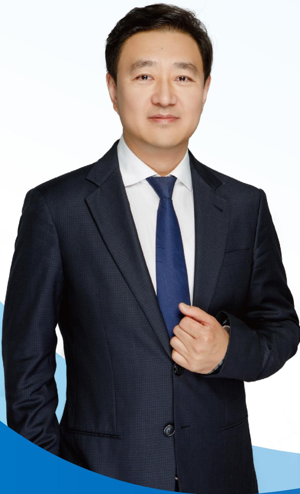

natural_image

Portrait of a man in a dark suit and blue tie, adjusting his tie (no visible text or symbols)

2025 年，吉大通信始终坚守初心，坚定“稳固传统业务，深化数智化转型”战略，紧抓全球人工智能产业发展机遇，全力推进企业数字化、智能化转型，持续优化公司治理体系，积极探索绿色低碳与创新驱动深度融合的高质量发展之路，稳步走好高质量、可持续发展之路，诠释了新时代的企业责任与价值。

紧跟“双碳”部署，锚定绿色发展方向。吉大通信始终紧跟国家政策导向，将 ESG 从战略理念转化为可量化、可落地的行动纲领。2025 年，吉大通信紧扣“双碳”目标进阶要求，大力推动绿色通信技术实际应用，加大人工智能技术研发力度，以技术创新赋能多场景低碳化的应用，助力实现能源高效利用与碳排放持续降低，为建设人与自然和谐共生的现代化贡献通信力量。

推进战略转型，构建全景业务矩阵。2025 年，吉大通信在创新浪潮和数智时代中守正创新，形成以通信技术服务业务、信息化产品集成运营业务、国际业务、投资业务为核心的“四轮驱动”业务格局，并在此基础上布局能源、体育、数据资产等多个领域，构建可持续发展的业务生态。通信业务作为吉大通信的立业之本和发展根基，已形成覆盖全国各省的服务网络，为整体业务矩阵提供稳固支撑。围绕国家数字经济发展战略导向与产业发展趋势，吉大通信应用前沿数字化技术，开展政企业务，为全国各区域全行业提供 ICT 整体定制化解决方案。吉大通信通过子公司中浦慧联信息科技（上海）有限公司布局智慧食堂业务，以科技数据双引擎，探索“节约、健康、智慧”三位一体的餐饮服务新模式，凭借该项目斩获2025年“数据要素 ×”大赛吉林省分赛一等奖。吉大通信持续强化人工智能领域研发力度，与吉林大学签订合作研发协议，共同成立“人工智能联合实验室”，强化产学研合作，助推公司在民生领域、产业领域研发以数据资源、产业体系和应用场景为基础的前瞻性人工智能技术。为积极响应国家对体育产业发展的指导意见，吉大通信通过子公司深圳丝路创科投资有限公司投资参股上海知行智跃体育科技有限公司，在 AI 体育生态领域进行至关重要的战略嵌入与深度融合。在数据资产方面，吉大通信依托 AI 大模型技术，围绕数据规范、数据完整、数据准确等六大维度，打造全方位的数据质量评估智能体。顺应全球能源“清洁化、智能化、多元化”转型与国内“双碳”政策要求，吉大通信以“推动能源绿色转型”为使命，整合南京分公司与北京中科新睿科技有限公司核心力量承接能源业务，打造新增长极。凭借多年布局积累，吉大通信已形成完善的企业评估体系，在投资决策中兼顾协同效应与多方共赢，促进吉大通信与被投企业的共同发展。吉大通信以菲律宾为核心布局，以武汉分公司为国内支撑，逐步构建起辐射全球的业务网络，目前已累计拓展 40 个国家。以华鸿学院作为主要载体，吉大通信通过教育培训、系统学习和公司活动，提高员工对企业运作行为的认可度和执行力，提升团队凝聚力，为公司战略目标落地与业务升级提供人才支撑。

优化治理体系，夯实可持续发展根基。完善的公司治理是ESG实践的基础支撑 员工与利益相关方的共同成长是企业永续发展的核心动力。2025年，吉大通信积极落实新《公司法》要求，全面优化公司治理结构，构建了权责清晰、决策科学、执行高效、监督有力的治理体系，在明确各职能部门职责边界的同时，提升治理规范水平；调整了董事会专门委员会的架构，将“战略委员会”调整为“战略与可持续发展委员会”，完善公司治理结构，提升公司 ESG 管理运作水平 将ESG嵌入到管理决策体系中，吉大通信始终坚持以诚信经营为本，严格遵守信息披露相关规定，切实保障投资者合法权益；凭借规范的公司治理与良好的社会责任表现，公司荣获“年度 ESG 价值上市公司”“优秀上市公司”等多项奖项，彰显资本市场对公司责任担当的高度认可。

强化党建引领，协同联动提效能。吉大通信始终坚持党的全面领导不动摇，持续深化党建引领作用，将党的领导融入公司治理全过程。公司党群组织充分发挥纽带作用，围绕员工、社区、上级党组织及工会组织等利益关联方需求开展工作。党群组织通过内外联动、线上线下融合的畅通多元沟通渠道，开展志愿服务、红色共建等特色活动，强化思想引领与外部协同；工会实现全员覆盖，设立多个基层工会及相关专项委员会，依托多元沟通体系，聚焦员工权益保障、服务提升等工作，助力公司与利益相关方协同发展。

我们坚信，一家企业的价值，在于与国家战略同频、与社会需求共振。2026 年，吉大通信将继续以绿色赋能转型，积极探索环境可持续发展道路。我们愿与合作伙伴、投资者、员工以及社会各界携手并肩，勇毅前行，在数智化与绿色化协同发展的道路上勇毅精进，共绘“人与自然和谐共生、企业与社会协同发展”的崭新图景。

## 周伟

吉林吉大通信设计院股份有限公司 董事长

## 2025 年关键绩效

## 经营绩效

营业收入

47,186.32 万元

归属于上市公司股东的净利润

-8,456.21 万元

资产总额

155,617.58 万元

纳税总额

2,392.46 万元

## 环境绩效

外购办公室用电（华东电网）

62,256 千瓦时

外购办公室用电（华中电网）

32,600 千瓦时

外购办公室用电（东北电网）

119,661.49千瓦时

外购办公室用电（海外）

19,740.72 千瓦时

外购热力总量

13,150.74 吉焦

温室气体排放总量

132.77

能源消耗总量

30.41 吨标煤

总用水量

13,820.96 吨

重大环境污染事故

0 次

废弃物合规处置率

100%

重大环境安全事故

0 次

环境指标达标率

100%

## 治理绩效

董事会独立董事人数

4 人

董监高女性人数

7人

董事、高管薪酬总额

551.43 万元

董事会审议通过议案数量

37项

股东会召开次数

5 次

董事会召开次数

10 次

监事会召开次数

2 次

## 社会绩效

员工人数

2,612人

在职男性员工数

2,234 人

在职女性员工数

378人

正式员工

2,612人

基层

2,495 人

高层

23人

中层

94 人

劳务派遣

0 人

劳动合同签订率

100%

社保覆盖率

100%

工会入会率

100%

安全培训覆盖率

100%

员工培训总学时

1,494小时

员工流失率

33.03%

研发投入

3,565.89 万元

研发人员数量

544 人

专利授权数量

113 项

产品合格率

100%

客户满意度

99.85%

乡村振兴总投入

5 万元

员工体检及健康档案覆盖率

100%

职业健康安全培训开展场次

27 次

论文累计发表数量

695 篇

因安全和健康导致召回产品数量

0 个

公益慈善总投入

5.14万元

志愿者活动参与人次

80 人次

## 证券简称：吉大通信

## 证券代码：300597.SZ

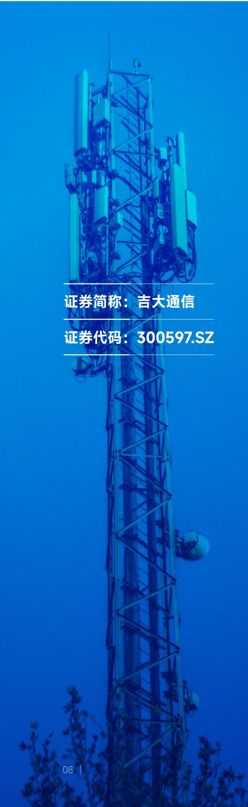

text_image

证券简称：吉大通信
证券代码：300597.SZ

## 关于吉大通信

## 公司简介

吉林吉大通信设计院股份有限公司成立于1985年4.月于2017年1月在深圳证券交易所创业板上市（证券简称：吉大通信；证券代码：300597.SZ）。作为一家吉林大学控股，专业为国内外通信运营商、政府机构、企事业单位提供通信及信息技术服务的高新技术企业，吉大通信始终坚持聚焦主营业务发展，深度融入国家数字经济发展战略布局，深化应用5G技术、探索 5G 应用新场景，依托大数据、“人工智能 +”等新一代数字技术底座，全面赋能工业互联网、智慧城市等战略性新兴产业创新发展。

吉大通信现已发展成为集通信网络设计服务、通信网络工程服务、信息技术服务、通信工程总承包服务及全社会信息化集成服务为一体的集团化公司，拥有通信及信息服务产业链上游环节核心技术能力。在工业 4.0 的浪潮中，公司以创新驱动为引擎，持续突破数字技术边界，引领产业智能化升级，驱动全行业数字化转型进程，致力于打造万物互联的智能社会新图景，为数字中国建设注入强劲动能。

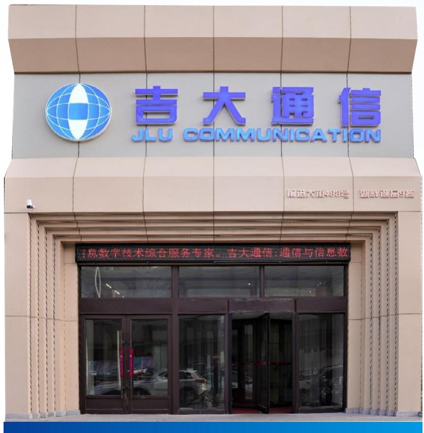

text_image

吉大通信
JLU COMMUNICATION
丽水大街488号 邮路1栋9栋
信息数字技术综合服务专家。吉大通信、通信与信息数

## 企业文化

## 企业使命

为客户，提供数字化、智慧化综合服务；为企业，推动价值增长、实现基业长青；为奋斗者，营造职业梦想成就的平台；为社会，贡献专业技术、践行责任担当。

## 企业愿景

做通信与信息数字技术综合服务专家做通信网络、数字社会、绿色低碳生活的卓越建设者。

## 核心价值观

明德 笃志 创新 共赢

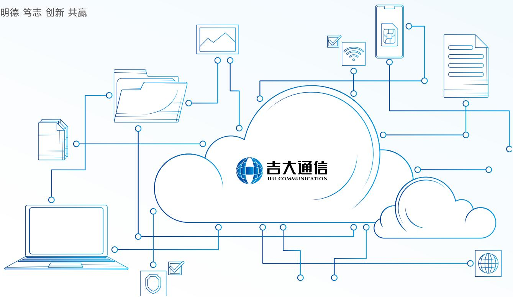

flowchart

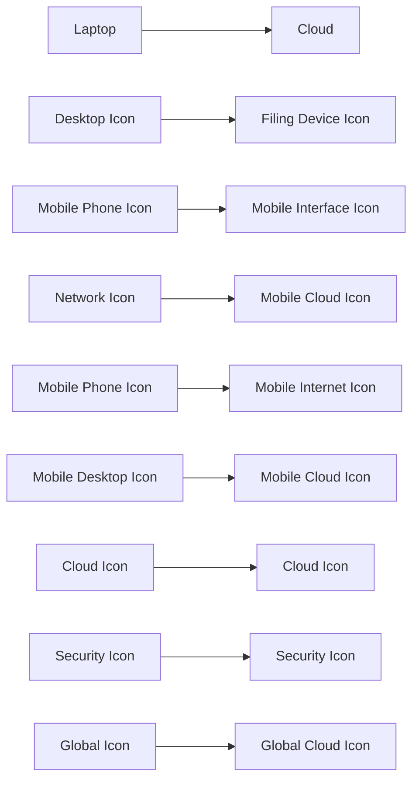
```mermaid
graph LR
  A["Laptop"] --> B["Cloud"]
  C["Desktop Icon"] --> D["Filing Device Icon"]
  E["Mobile Phone Icon"] --> F["Mobile Interface Icon"]
  G["Network Icon"] --> H["Mobile Cloud Icon"]
  I["Mobile Phone Icon"] --> J["Mobile Internet Icon"]
  K["Mobile Desktop Icon"] --> L["Mobile Cloud Icon"]
  M["Cloud Icon"] --> N["Cloud Icon"]
  O["Security Icon"] --> P["Security Icon"]
  Q["Global Icon"] --> R["Global Cloud Icon"]
```

## 主要业务及布局

本公司是一家专业为国内外通信运营商，政府机构，企事业单位提供通信及信息技术服务的高新技术企业 是国内领先的通信及信息技术服务商。报告期内公司持续推进战略转型，形成“四轮驱动”的业务格局，即通信技术服务业务、信息化产品集成运营业务、国际业务、投资业务。同时，公司积极培育新增长点，在软件服务、电力工程服务领域进行布局。

## “四轮驱动”业务格局

## 01/ 通信技术服务业务

## 通信网络设计服务

主要包括通信网络咨询、勘察设计及网络优化服务。

咨询业务包括规划咨询、可研咨询、评估咨询等咨询文件的编制及相关的技术服务，为客户提供通信网络的未来发展方向咨询及项目立项依据服务。

勘察设计业务包括通信工程项目的实地勘察、设计文件的编制及相关的技术服务，指导通信工程的实施。

网络优化业务包括网络测试、分析评估、网络优化方案等，保证通信网络达到最佳运行状态并为网络规划、可行性研究报告提供依据。

## 通信网络施工服务

主要提供通信网络工程施工及网络维护服务。

通信网络工程施工业务包括通信核心网、传输网、无线网、承载网等全网络工程建设与服务。

网络维护业务包括通信网络运行管理、网络设备日常巡检维护与保养、网络系统指标测试、通信网络设备故障抢修、网络维护的技术支撑与服务，保证通信网络设备正常运行。

## 通信工程总承包服务

按照合同约定对工程建设项目的设计、采购、施工、试运行等实行全过程或若干阶段的承包。

## 02/信息化产品集成运营业务

## 政企数智化业务

以数字中国、智慧城市、行业信息化等建设为契机，做政府、企事业单位的“信息化建设领域整体解决方案提供商”。聚焦全过程 + 服务领域（全过程服务 + 咨询、设计、总承包、集成、产品、运营），打造以全过程咨询服务为品牌特色的工程总承包，项目集成，项目运营，数据资产服务等业务格局。同时，围绕数据要素市场提供数据治理、数据资源化、数据资产化等服务，助力客户释放数据价值。

## 智慧产品产业化

公司运用物联网、大数据及AI人工智能等技术，自主研发智慧授权、智慧选餐等硬件设备，以及涵盖食安管理、进销存管理、AI 行为监测等功能的管理软件。同时，重点打造以用餐者健康为核心的智能化服务体系：通过饮食图像识别与营养分析技术实现餐品成分的精准解析与摄入追踪：基于个体健康数据 提供个性化健康指导与长期数据追踪:建立异常提醒与潜在风险预警机制主动识别并提示营养失衡，饮食异常等情况，公司面向高校、政企单位、园区、社区及医院等自选式团餐场景，提供集产品交付、系统实施、运维保障、定制化开发于一体的全栈式解决方案全面赋能团餐运营效率提升与用餐者全周期健康管理。

## 能源数智化业务

能源数智化业务深度服务能源行业电力系统建设与数字化转型，业务覆盖能源基础设施建设与数智化技术支撑两大核心领域。在基础设施建设方面，面向国家电网、南方电网及各类电力企业，围绕变电工程、输电工程、新能源工程等重点领域，提供勘察设计、工程施工等服务。在数智化技术支撑方面，面向大型能源集团下属的信通与数智化单位，聚焦 IT 系统建设、平台搭建及数智化转型等核心需求，提供专业技术工程师派驻与技术支撑服务，专注支持能源行业的信息化、数字化、智能化等 IT 项目建设。通过“基建 + 数智”协同并进，公司持续赋能能源行业高质量发展，致力于成为能源企业“最具价值的合作伙伴”。

## 03/ 国际业务

作为FTK(Full Turn Key)公司服务于海外通信运营商。按照合同约定对通信工程建设项目实施实行全过程或若干阶段的承包。

为通信运营商提供综合代维(SLI)服务。

## 04/投资业务

以自有资金对外进行投资、投资管理、资产管理、股权投资、股权投资管理。

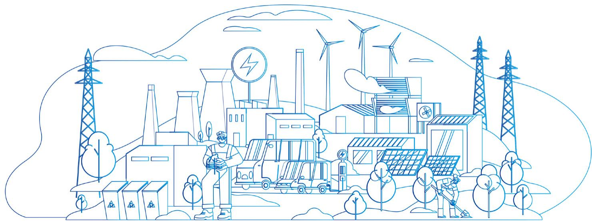

natural_image

Line art illustration of an industrial and energy sector with wind turbines, power plants, and workers (no text or symbols)

## 业务覆盖图

## 国内业务覆盖图

公司业务服务几乎遍布全国的所有省份；致力于为政府、企事业单位、运营商等提供数字中国、智慧城市、行业信息化等全过程服务及工程总承包服务。

## 生产经营人员分布图

辽宁、四川、山西、湖北、甘肃

吉林、广东、江苏、广西、青海

黑龙江、内蒙古、河北、河南、西藏

北京、上海、天津、重庆

湖南、新疆、山东、安徽

云南、福建、宁夏、陕西

江西、海南、贵州、浙江

## 发展战略

吉大通信积极响应国家核心战略布局以聚焦主营业务为发展原则，锚定新质生产力方向，以清晰的战略目标为导向 持续深化通信技术服务，信息化业务领域布局通过准确把握发展定位，充分发挥资源禀赋优势，深入融合人工智能技术，做精做深做强细分领域，以数智技术全面赋能企业战略转型，大力推进数智化转型业务以及智慧产品业务板块发展，力争在重点发展领域实现质与量的双重突破。

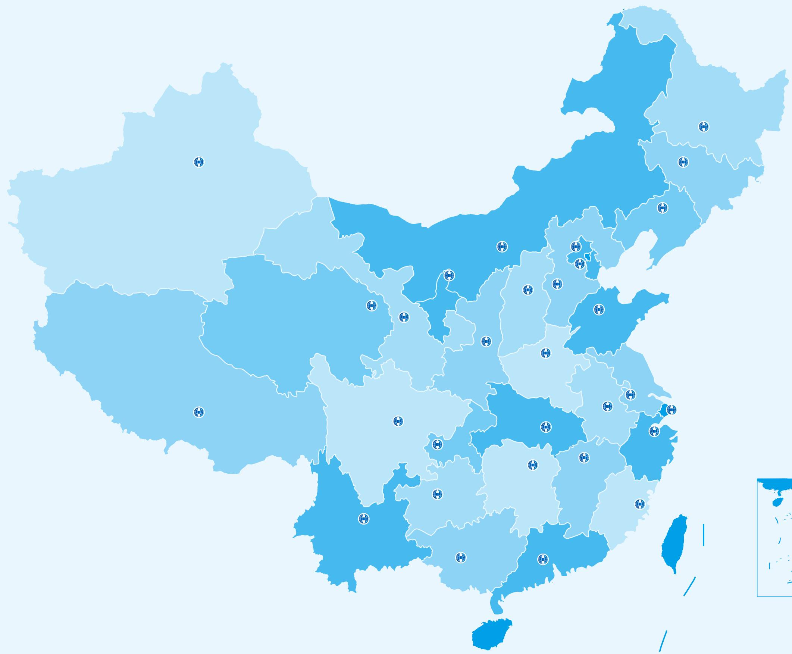

geo

| Region | Value |
| --- | --- |
| Northwest (North) | High |
| Northeast (South) | Medium-High |
| Central (West) | Medium |
| Southwest (East) | Medium |
| Southeast (Central) | Medium |
| Northeast (East) | Medium |
| Southwest (South) | Low-Medium |
| Southeast (West) | Low-Medium |
| Northwest (North) | Low |
| Northwest (South) | Low |
| Southwest (East) | Low |
| Southwest (West) | Low |
| Northeast (West) | Low |
| Northeast (East) | Low |
| Southwest (East) | Low |
| Southwest (West) | Low |
| Southeast (East) | Low |
| Southeast (West) | Low |
| Southwest (East) | Low |
| Southwest (West) | Low |
| Northeast (West) | Low |
| Northeast (East) | Low |
| Southwest (East) | Low |
| Southwest (West) | Low |
| Southeast (East) | Low |
| Southeast (West) | Low |
| Southwest (East) | Low |
| Southwest (West) | Low |
| Northeast (East) | Low |
| Northeast (West) | Low |
| Southwest (East) | Low |
| Southwest (West) | Low |
| Southeast (East) | Low |
| Southeast (West) | Low |
| Southwest (East) | Low |
| Southwest (West) | Low |
| Northeast (East) | Low |
| Northeast (West) | Low |
| Southwest (East) | Low |
| Southwest (West) | Low |
| Southeast (East) | Low |
| Southeast (West) | Low |

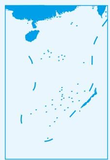

## 国际业务覆盖图

国际业务以菲律宾为核心布局，以武汉分公司为国内支撑，逐步构建起辐射全球的业务网络，主要为国外通信运营商及其他通信类企业提供通信网络技术服务，包括通信网络设计服务、通信网络工程施工服务和通信网络工程总承包服务。

海外业务将不断扩大业务体量，尽量多地承接规模大、集中度高的项目，将设计与采购、施工相结合，进一步向工程总承包、总集成的方向拓展。同时从通信技术向智慧类、行业类解决方案延伸，推动国内成熟解决方案的全球化复制，致力于从“解决方案提供者”升级为“价值合作伙伴”。

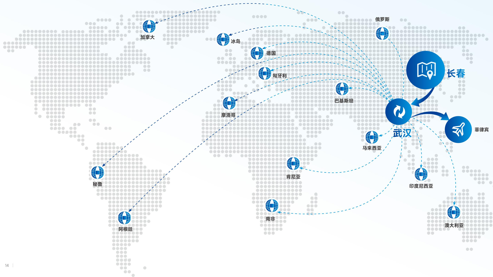

flowchart

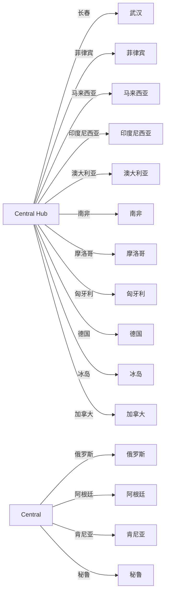
```mermaid
graph LR
  Center["Central Hub"] -->|"长春"| Route1["武汉"]
  Center -->|"菲律宾"| Route2["菲律宾"]
  Center -->|"马来西亚"| Route3["马来西亚"]
  Center -->|"印度尼西亚"| Route4["印度尼西亚"]
  Center -->|"澳大利亚"| Route5["澳大利亚"]
  Center -->|"南非"| Route6["南非"]
  Center -->|"摩洛哥"| Route7["摩洛哥"]
  Center -->|"匈牙利"| Route8["匈牙利"]
  Center -->|"德国"| Route9["德国"]
  Center -->|"冰岛"| Route10["冰岛"]
  Center -->|"加拿大"| Route11["加拿大"]
  Central -->|"俄罗斯"| Route12["俄罗斯"]
  Central -->|"阿根廷"| Route13["阿根廷"]
  Central -->|"肯尼亚"| Route14["肯尼亚"]
  Central -->|"秘鲁"| Route15["秘鲁"]
```

## 组织架构

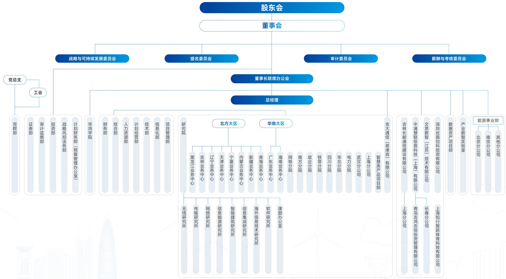

flowchart

```mermaid
graph TD
  A["股东会"] --> B["董事会"]
  B --> C["战略与可持续发展委员会"]
  B --> D["提名委员会"]
  B --> E["审计委员会"]
  B --> F["薪酬与考核委员会"]
  
  G["党总支"] --> H["工会"]
  H --> I["党群部"]
  
  subgraph Board_Companies
    C
    D
    E
    F
  end
  
  subgraph Director_Companies
    J["董事长联席办公会"]
    K["总经理"]
  end
  
  subgraph Departments
    L["北方大区"]
    M["华南大区"]
    N["研究院"]
    O["黑龙江业务中心"]
    P["吉林业务中心"]
    Q["辽宁业务中心"]
    R["天津业务中心"]
    S["宁夏业务中心"]
    T["内蒙古业务中心"]
    U["新疆业务中心"]
    V["青海业务中心"]
    W["广东业务中心"]
    X["海南业务中心"]
    Y["网络分院"]
    Z["南方分院"]
    AA["政企分院"]
    AB["铁塔分院"]
    AC["四川分院"]
    AD["华北分院"]
    AE["电力分院"]
    AF["武汉分公司"]
    AG["上海分公司"]
    AH["智慧类产品项目部"]
    AI["吉大通信（菲律宾）有限公司"]
  end
  
  subgraph Data_Archives
    AJ["能源事业部"]
    AK["产业数智实验室"]
    AL["数据资产项目部"]
    AM["上海知行智跃体育科技有限公司"]
    AN["长春分公司"]
    AO["文思数智（江苏）技术有限公司"]
    AP["中浦慧联信息科技（上海）有限公司"]
    AQ["吉林长邮通信建设有限公司"]
  end
  
  subgraph Research_Partnership
    BR["无线研究所"]
    CS["传输研究所"]
    DS["网络研究所"]
    IE["信息能源研究所"]
    IM["智能建筑研究所"]
    IN["信息集成研究所"]
    IO["海外信息技术研究所"]
    PP["软件研究所"]
    QD["课题办公室"]
  end
  
  H --> I
  I --> J
  J --> K
  K --> L
  K --> M
  K --> N
  K --> O
  K --> P
  K --> Q
  K --> R
  K --> S
  K --> T
  K --> U
  K --> V
  K --> W
  K --> X
  K --> Y
  K --> Z
  K --> AA
  K --> AB
  K --> AC
  K --> AD
  K --> AE
  K --> AF
  K --> AG
  K --> AH
  
  L -.-> BR
  L -.-> CS
  L -.-> DS
  L -.-> IE
  L -.-> IM
  L -.-> IN
  L -.-> IO
  L -.-> PP
  L -.-> QD
  
  M -.-> BR
  M -.-> CS
  M -.-> DS
  M -.-> IE
  M -.-> IM
  M -.-> IN
  M -.-> IO
  M -.-> PP
  M -.-> QD
  
  N -.-> BR
  N -.-> CS
  N -.-> DS
  N -.-> IE
  N -.-> IM
  N -.-> IN
  N -.-> IO
  N -.-> PP
  N -.-> QD
  
  AA -.-> BR
  AA -.-> CS
  AA -.-> DS
  AA -.-> IE
  AA -.-> IM
  AA -.-> IN
  AA -.-> IO
  AA -.-> PP
  AA -.-> QD
  
  AH -.-> BR
  AH -.-> CS
  AH -.-> DS
  AH -.-> IE
  AH -.-> IM
  AH -.-> IN
  AH -.-> IO
  AH -.-> PP
  AH -.-> QD
  
  AI -.-> BR
  AI -.-> CS
  AI -.-> DS
  AI -.-> IE
  AI -.-> IM
  AI -.-> IN
  AI -.-> IO
  AI -.-> PP
  AI -.-> QD
  
  AJ -.-> BR
  AJ -.-> CS
  AJ -.-> DS
  AJ -.-> IE
  AJ -.-> IM
  AJ -.-> IN
  AJ -.-> IO
  AJ -.-> PP
  AJ -.-> QD
  
  AK -.-> BR
  AK -.-> CS
  AK -.-> DS
  AK -.-> IE
  AK -.-> IM
  AK -.-> IN
  AK -.-> IO
  AK -.-> PP
  
  AL -.-> BR
  AL -.-> CS
  AL -.-> DS
  AL -.-> IE
  AL -.-> IM
  AL -.-> IN
```

## 发展历程

## 1985 年

4月，长春邮电学院设立，长春邮电学院电信工程设计室

## 1987 年

8 月，更名为长春电信工程设计所

## 1989 年

4月，改制为企业法人

## 1993 年

8 月，更名为长春电信工程设计院

## 2000 年

6 月，随长春邮电学院合并至吉林大学

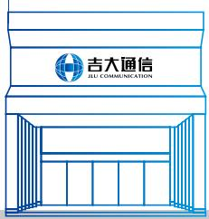

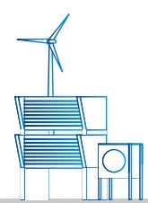

## 2008 年

5 月，更名为长春电信工程设计院有限公司

## 2010 年

5 月，改制为股份有限公司

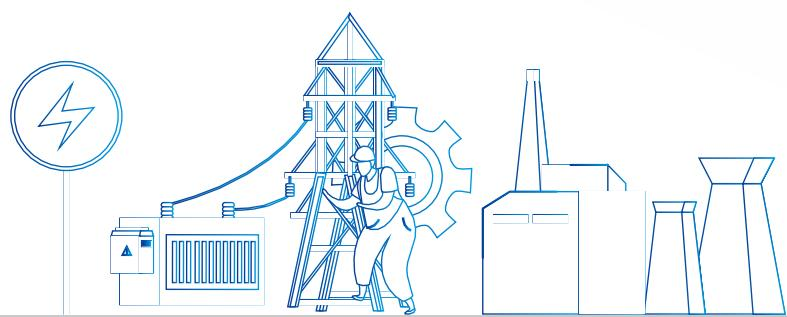

natural_image

Line drawing of industrial equipment including a tower, control panel, and factory structures (no text or symbols)

## 2012 年

12 月，收购长邮通信全部股权

## 2014 年

5 月，更名为吉林吉大通信设计院股份有限公司

## 2017 年

1月在深交所创业板上市股票简称“吉大通信”，股票代码 300597

## 2018 年

5月，成立吉大通信（菲律宾）有限公司

11 月，成立青岛吉鸿投资管理有限公司

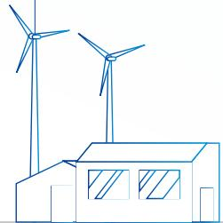

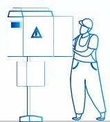

## 2019 年

10月，合资成立青岛吉鸿志信投资管理有限公司（吉大通信占股80%）

## 〇 2021 年

11月，青岛吉鸿投资管理有限公司更名为中浦慧联信息科技（上海）有限公司

## O 2023 年

1月，收购深圳丝路创科投资有限公司100%股权4月，收购北京中科新睿科技有限公司100%股权

## 2025 年

9月，参股上海知行智跃体育科技有限公司11月，北京中科新睿科技有限公司更名为文思数智（江苏）技术有限公司

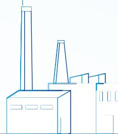

## 年度荣誉

<table><tr><td>编号</td><td>奖项名称</td></tr><tr><td>1</td><td>2025年资本力量年度评选优秀上市公司奖</td></tr><tr><td>2</td><td>第二十届中国上市公司董事会“金圆桌奖”优秀董事会</td></tr><tr><td>3</td><td>2025年度上市公司董事会典型实践案例</td></tr><tr><td>4</td><td>2025年度易董合规价值传播奖</td></tr><tr><td>5</td><td>2025年度董办数字化创新最佳实践奖</td></tr><tr><td>6</td><td>2025年度上市公司卓越投关建设奖</td></tr><tr><td>7</td><td>2025年度上市公司股东回报水晶球奖</td></tr><tr><td>8</td><td>2025年度上市公司投资者关系水晶球奖</td></tr><tr><td>9</td><td>上市公司2024年报业绩说明会-优秀实践</td></tr><tr><td>10</td><td>第十六届中国上市公司投资者关系管理天马奖-投资者关系管理优秀团队奖</td></tr><tr><td>11</td><td>2025年度ESG典范企业</td></tr><tr><td>12</td><td>第三届国新杯ESG新锐金牛奖</td></tr><tr><td>13</td><td>2025年度上市公司ESG水晶球奖</td></tr><tr><td>14</td><td>2025年度上市公司最佳ESG实践奖</td></tr><tr><td>15</td><td>金曙光成长力奖</td></tr><tr><td>16</td><td>2025上市公司年度评选最具人气上市公司TOP100</td></tr><tr><td>17</td><td>长春市希望工程爱心捐赠荣誉</td></tr><tr><td>18</td><td>吉林省创新人才100强品牌服务单位</td></tr><tr><td>19</td><td>2025年度AI前沿创新奖</td></tr><tr><td>20</td><td>2024上市公司乡村振兴优秀实践案例</td></tr><tr><td>21</td><td>2025年上市公司可持续发展优秀实践案例</td></tr><tr><td>22</td><td>吉林省工程咨询协会-资深会员单位</td></tr><tr><td>23</td><td>2025“数据要素X”大赛吉林省一等奖</td></tr><tr><td>24</td><td>朝阳区数据要素场景应用产品超市入驻资质(智慧食堂)</td></tr><tr><td>25</td><td>2024年度内蒙古自治区优秀咨询成果-《中国移动内蒙古公司2023年国家北斗导航位置服务数据中心内蒙古分中心云平台建设项目可行性研究报告》</td></tr><tr><td>26</td><td>2024年度内蒙古自治区优秀咨询成果-《2024年中国移动通信集团内蒙古有限公司通辽分公司第三批传输管道项目可行性研究报告》</td></tr><tr><td>27</td><td>2024年度内蒙古自治区优秀咨询成果-《中国移动内蒙古公司2024—2026年省内传输网专项发展规划》</td></tr><tr><td>28</td><td>2025年度吉林省优秀勘察设计项目通信工业工程设计(有线)一等奖-2017年中国移动内蒙古公司CMNet省干扩容工程一阶段设计</td></tr><tr><td>29</td><td>2025年度吉林省优秀勘察设计项目通信工业工程设计(有线)二等奖-中国移动辽宁公司城域传输SPN工程项目</td></tr><tr><td>30</td><td>2025年度吉林省优秀勘察设计项目通信工业工程设计(无线)二等奖-中国移动内蒙古公司2019年无线网通辽分公司流量风暴行动保障厚覆盖工程</td></tr></table>

注：以上奖项均为2025年颁布

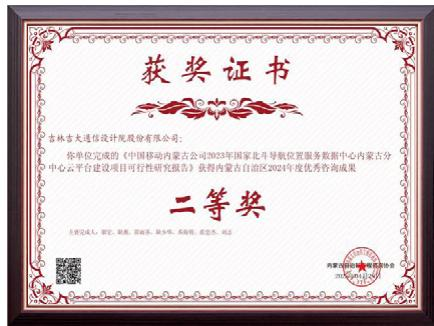

text_image

获奖证书
吉林吉大通信设计院股份有限公司：
你单位完成的《中国移动内蒙古公司2023年国家北斗导航位置服务数据中心内蒙古分
中心云平台建设项目可行性研究报告》获得内蒙古自治区2024年度优秀咨询成果
二等奖
主要完成人：郭宝、耿燕、黄淑英、张少华、苏海明、张思生、吴志
2024.01.11-11
北京国信信托投资担保协会
2024.01.11-11

《中国移动内蒙古公司2023年国家北斗导航位置服务数据中心内蒙古分中心云平台建设项目可行性研究报告》获得内蒙古自治区2024 年度优秀咨询成果

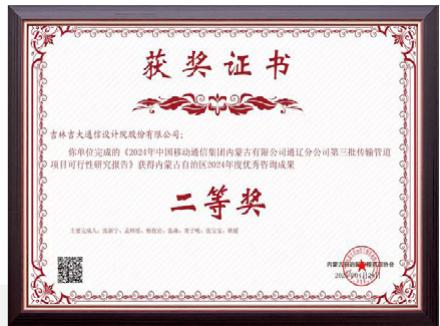

text_image

获奖证书
吉林吉大通信设计院股份有限公司：
你单位完成的《2021年中国移动通信集团内蒙古有限公司通辽分公司第三批传输管道项目可行性研究报告》获得内蒙古自治区2024年度优秀咨询成果
二等奖
主要负责人：张新宇、孟明松、杨俊岩、张森、梁子梅、张宝文、徐超
内蒙古国际招标有限责任公司
2024年9月1日

《2024 年中国移动通信集团内蒙古有限公司通辽分公司第三批传输管道项目可行性研究报告》获得内蒙古自治区2024 年度优秀咨询成果

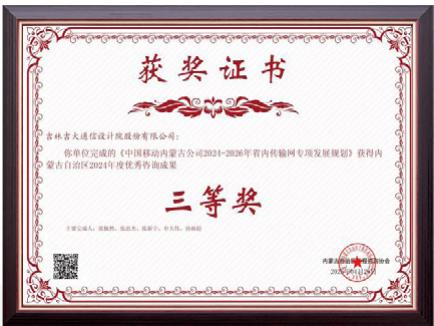

text_image

获奖证书
吉林吉大通信设计院股份有限公司：
你单位完成的《中国移动内蒙古公司2024-2026年省内传输网专项发展规划》获得内蒙古自治区2024年度优秀咨询成果
三等奖
主要负责人：张晓燕、范志杰、张新宁、叶先胜、孙成勋
内蒙古电力科学研究院
2024年1月1日

《中国移动内蒙古公司2024—2026年省内传输网专项发展规划》获得内蒙古自治区2024年度优秀咨询成果

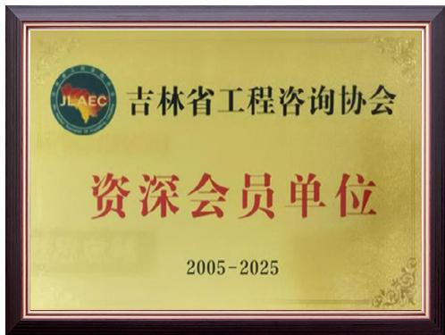

text_image

吉林省工程咨询协会
资深会员单位
2005-2025

吉林省工程咨询协会－资深会员单位

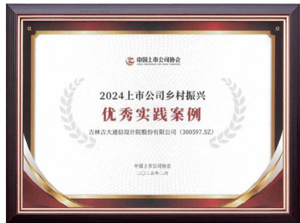

text_image

中国上市公司协会
2024上市公司乡村振兴
优秀实践案例
吉林吉大通信设计院股份有限公司（300597.SZ）
中国上市公司协会
二〇二五年二月

2024 上市公司乡村振兴优秀实践案例

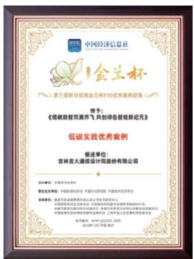

text_image

中国经济信息社
金兰杯
第三届新华信用金兰杯450奖案例征集
授予：
《低碳数智双碳背风 共创绿色智能新纪元》
低碳实践优秀案例
报送单位：
吉林吉大通信设计院股份有限公司
主办单位：中国建设银行股份有限公司
联系电话：021-63878888
联系人：吴志刚
承办单位：中国建设银行股份有限公司北京分行
法定代表人：李晓明
经办人：张建平
2024年12月1日

2025 年度 ESG 典范企业

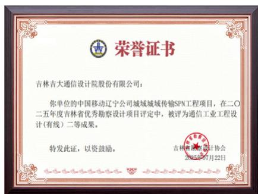

text_image

荣誉证书
吉林吉大通信设计院股份有限公司：
你单位的中国移动辽宁公司城城城城传输SPN工程项目，在二〇二五年度吉林省优秀勘察设计项目评定中，被评为通信工业工程设计(有线)二等成果。
特发此证，以资鼓励。
吉林市通达设计协会
2023年7月22日

2017年中国移动内蒙古公司CMNet省干扩容工程一阶段设计项目，在二〇二五年度吉林省优秀勘察设计项目评定中，被评为通信工业工程设计（有线）一等成果

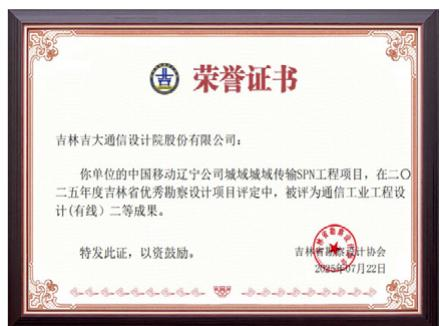

text_image

荣誉证书
吉林吉大通信设计院股份有限公司：
你单位的中国移动辽宁公司城域城域传输SPN工程项目，在二〇二五年度吉林省优秀勘察设计项目评定中，被评为通信工业工程设计（有线）二等成果。
特发此证，以资鼓励。
吉林市诚达设计协会
2025年07月22日

中国移动辽宁公司城域传输SPN工程项目，在二〇二五年度吉林省优秀勘察设计项目评定中，被评为通信工业工程设计（有线）二等成果

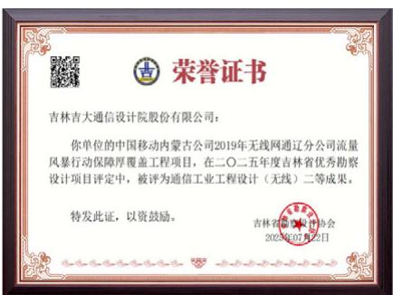

text_image

荣誉证书
吉林吉大通信设计院股份有限公司：
你单位的中国移动内蒙古公司2019年无线网通辽分公司流量
风暴行动保障厚覆盖工程项目，在二〇二五年度吉林省优秀勘察
设计项目评定中，被评为通信工业工程设计（无线）二等成果。
特发此证，以资鼓励。
吉林安德建设行业协会
2023年07月22日

中国移动内蒙古公司2019 年无线网通辽分公司流量风暴行动保障厚覆盖工程项目，在二〇二五年度吉林省优秀勘察设计项目评定中，被评为通信工业工程设计（无线）二等成果

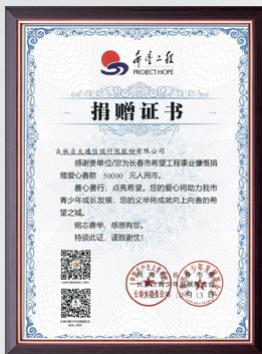

text_image

祥丰工程
PROBECHOP
捐赠证书
吉林士兰通信设计系统有限公司
特此单位/您为长春市有更工程事业缴费
爱心心款 50000 元人民币。
离心兼行、点亮希望。您的爱心将助力我市
青少年成长发展，您的义举将成就向上改善的希
望之城。
标志清华 感慨有证。
特此证，该致谢祝！

“长春市希望工程事业”捐赠证书

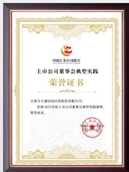

text_image

印刷上市公司峰会
上市公司董事会典型实践
荣誉证书
吉林吉大通信设计院股份有限公司：
荣获2025年度上市公司董事会典型实践案例，
特发奖证。
中国证券报
2013年5月13日

荣获2025年度上市公司董事会典型实践案例

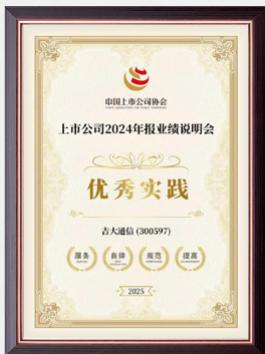

text_image

中国上市公司协会
上市公司2024年报业绩说明会
优秀实践
吉大通信(300597)
服务 身体 责任 推荐
2025

上市公司2024年报业绩说明会－优秀实践

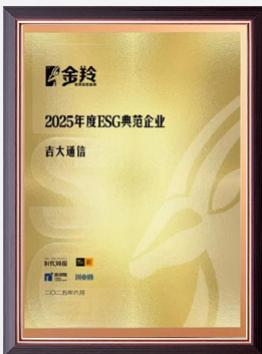

text_image

金羚
2025年度ESG典范企业
吉大通信
时代网信  著
中国证券报 招商银行
二〇一二年六月

2025 年度 ESG典范企业

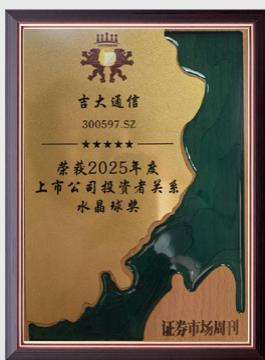

text_image

吉大通信
300597 SZ
荣获2025年度
上市公司投资者关系
水晶球奖
证券市场周図

2025年度上市公司投资者关系水晶球奖

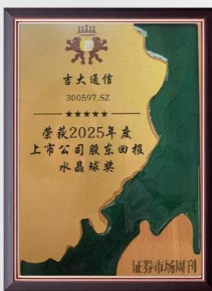

text_image

吉大通信
300597.SZ
荣获2025年底
上市公司股东回报
水晶球奖
证券市场周刊

2025 年度上市公司股东回报水晶球奖

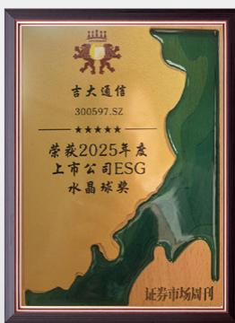

text_image

吉大通信
300597.SZ
荣获2025年底
上市公司ESG
水晶球奖
证券市场周闭

2025 年度上市公司 ESG水晶球奖

  
第十六届中国上市公司投资者关系管理天马奖-投资者关系管理优秀团队奖

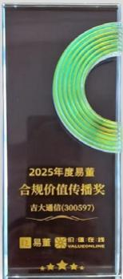  
2025 年度易董合规价值传播奖

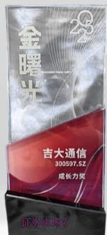  
金曙光成长力奖

  
2025上市公司年度评选最具人气上市公司 TOP100

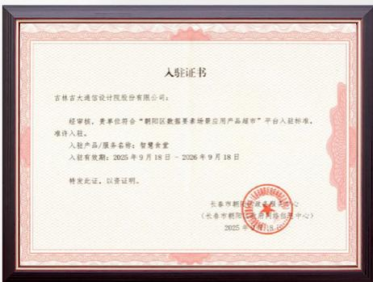

text_image

入驻证书
吉林吉大通信设计院股份有限公司：
经审核，贵单位符合“朝阳区数据要素场景应用产品超市”平台入驻标准，
准许入驻。
入驻产品/服务名称：智慧食堂
入驻有效期：2025年9月18日 - 2026年9月18日
特发此证。以资证明。
长春市朝阳区政务服务中心
（长春市朝阳区人民政府同创中心）
2025年9月18日

符合“朝阳区数据要素场景应用产品超市”平台入驻标准，准许入驻入驻产品/服务名称：智慧食堂

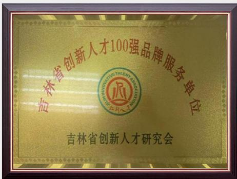

text_image

吉林省创新人才100强品牌服务单位
吉林省创新人才研究会

吉林省创新人才100强品牌服务单位

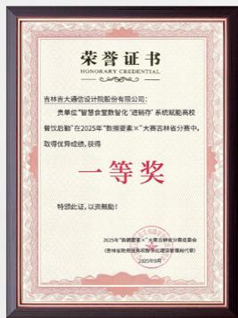

text_image

荣誉证书
HONORARY CREDENTIAL
吉林市大通设计院股份有限公司：
党争信“智慧教育孵化器”“芯源桥”系统距距离校
餐饮数据"在2025年"数据要素"大赛吉林省分展中，
取得优异成绩，获得
一等奖
特此证，以奖励！
2025年"数据要素"大赛注册积分组委会
(请参阅您提供的各项认证信息请参阅) 2025年8月

“智慧食堂数智化‘进销存’系统赋能高校餐饮后勤”在2025“数据要素X”大赛吉林省分赛中，取得优异成绩，获得一等奖

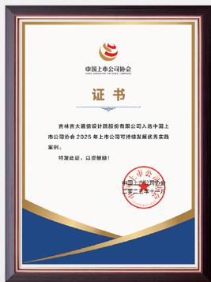

text_image

中国上市公司协会
证书
吉林光大通信设计股份有限公司入选中国上市公司协会2025年上市公司可持续发展优秀实践案例。
特发证，以司鼓励！
中国上市公司协会
第二十届

入选中国上市公司协会2025年上市公司可持续发展优秀实践案例

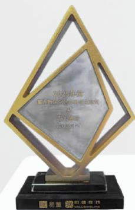

text_image

2025年
中国共产党的成立和建设
——中国共产党
（2025年1月）

2025年度董办数字化创新最佳实践奖

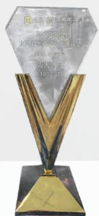  
2025 年度上市公司 荣卓越投关建设奖 市公

  
获第二十届中国上市公司董事会“金圆桌奖”－优秀董事会

  
第三届国新杯ESG 新锐金牛奖

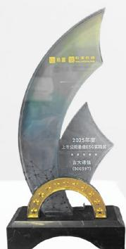  
2025 年度上市公司最佳ESG实践奖

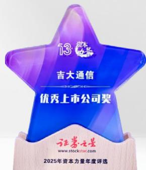

text_image

13 沪水生态
吉大通信
优秀上市公司奖
证券元基
www.stockstar.com
2025年资本力量年度评选

优秀上市公司奖2025年资本力量年度评选

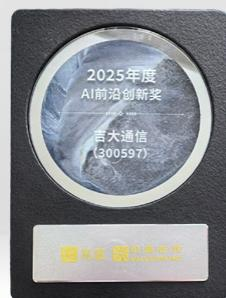  
2025年度AI前沿创新奖

## 可持续发展管理

## 可持续管理

## 可持续发展理念

公司秉承“以人为本，为绿色经济赋能”的宗旨，始终坚守企业经营与经济、社会、环境协调发展的理念，以“绿色低碳，创新共赢”为核心紧跟国家战略导向不偏移，加快实施创新驱动发展战略，人才强国战略和绿色环境保护战略，大力推进绿色建造，数字智造，持续推动企业绿色低碳发展，与各利益相关方携手共创共赢，智绘通信蓝图，助力智慧生活。

目标

公司通过将自身战略规划与行业发展方向有机融合，主动对接联合国可持续发展目标（SDGs）体系，并将其核心理念内化为履行社会责任的行动指南。在追求经济效益稳步提升的同时，致力于以创新实践推动环境保护与社会进步，实现商业成长与可持续发展的良性互动。

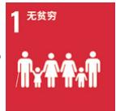

通过教育捐赠、社区帮扶与海外履责助力消除贫困，从教育赋能、社会保障和经济增长多维度缓解贫困。向额如乡中心小学定向捐款 5 万元建设音乐教室，提升教育水平与儿童发展潜力；深入社区走访困难家庭，提供物资支持并关切实际需求 缓解生活压力，在菲律宾创造700余个木地就业岗位，保障员工福利与税款缴纳，以经济发展促进民生改善。

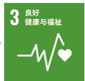

建立健全职业健康安全管理体系，已获得 ISO 45001 认证及安全生产许可证，持续监测并改进职业健康安全绩效。在员工保障方面，构建了“社会保险为主、商业保险为辅”的多重医疗保障体系，不仅提供五险一金和商业医疗保险，还针对特殊工种落实野外补贴、防护装备及疫苗接种等专项防护措施，并定期开展安全培训。此外，公司每两年组织全员健康休检，贯彻预防为主的健康管理理念，并为全休在职女职工额外投保特殊疾病互助保障，同时积极践行社会责任，在高温时节为一线环卫工人送去防暑物资，将职业健康关怀延伸至社区劳动者。

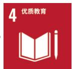

构建了完善的员工终身学习体系，通过线上线下平台提供灵活，多元的培训资源，涵盖技术，管理等多个领域 有效提升了员工的职业能力与综合素质:积极履行社会责任 2025年与长春市青少年发展基金会及前郭尔罗斯蒙古族自治县额如乡中心小学正式签署三方定向捐赠协议，捐赠人民币 50,000 元，专项用于该校音乐教室建设，改善了乡村学校美育教学条件，丰富了学生的艺术教育资源，促进了城乡教育均衡发展。

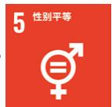

致力于构建平等的晋升环境，确保女性在各级管理层中占有重要比例并呈现稳步提升趋势；严格落实国家法律法规，并通过签订《女职工权益保护专项集体合同》，将“三期”（孕期、产期、哺乳期）保护、高于国家基准的产假（180天）及护理假（25 天）等福利明确固化，确保薪酬待遇不受影响。

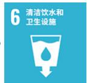

公司高度重视水资源节约管理，将节约用水要求纳入行政工作管理办法，通过日常宣传提示 引导员工树立节水章识杜绝水资源浪费，同时，公司切实保障员工饮用水安全，对办公区直饮水设备定期更换滤芯，确保饮用水卫生达标

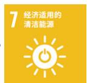

公司在项目设计与施工过程中，积极推动太阳能、风能等可再生能源的开发与利用，引导施工设计单位将风能、太阳能等绿色能源并入电网系统，切实降低对化石能源的依赖，助力经济适用的清洁能源普及。

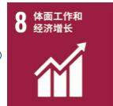

通过线上线下多渠道广泛招聘，报告期内参与招聘会 40 余场，筛选简历约 2500 份，成功吸纳 522 名员工，为人才提供稳定就业机会。同时积极探索项目制、短期顾问等灵活用工模式，响应新就业形态，满足弹性需求并创造多样化就业岗位。菲律宾子公司充分响应“一带一路”倡议，为当地创造了700余个就业岗位，保障员工福利并依法纳税，促进了本地经济发展与民生改善。

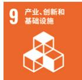

持续深耕通信技术服务，信息化产品集成等核心业务，着力构建四轮联动，协同发力的业务发展新格局：明确以“人工智能 +”、大数据、物联网等前沿技术为核心驱动力。通过技术与业务的深度融合，加快前沿技术与主营业务深度融合，不断提升技术赋能水平与综合服务能力。为强化源头创新，公司于2025年与吉林大学共建“人工智能联合实验室”，聚焦民生与产业领域开展前瞻性研发。同时，联合多所高校组建省级信息通信技术科技创新中心，加速科技成果成熟化与产业化，有效促进了产学研深度融合。

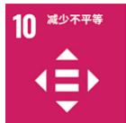

坚决杜绝基于民族、性别、年龄、宗教等任何因素的就业歧视，招聘过程严格以岗位胜任力为核心，并建立年龄审核机制从源头防范童工风险：积极践行包容性雇佣，为退役军人残疾人等群休提供平等就业机会，并适配岗位提供培训支持，助力其融入职场：致力于营造性别平等的环境，确保女性员工在各级管理层中占比稳步提升

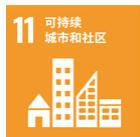

开展智慧城市传输体系与核心技术攻关，深度融合物联网、云计算及高速宽带网络等新一代信息通信技术，构建城市全域感知与智能研判体系；面向政府数字化需求，提供涵盖智慧政务、智能交通等场景的政企协同解决方案，赋能城市治理效能提升：在项目全生命周期践行绿色发展理念，助力低碳智慧城市构建：迭代升级智慧食堂产品矩阵通过团餐场景的数字化改造提升资源配置精度，有效降低运营损耗。

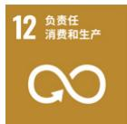

建立覆盖能源，水及物料的全流程管控机制，推行节能改造与循环利用，降低资源消耗强度：同时关注供应链与政策风险，通过技术升级与供应链多元化提升运营韧性：以智慧食堂解决方案为例构建了资源高效利用闭环：通过设备智能调控减少能耗，借助物联网监控降低食材损耗，并利用数据分析持续优化运营。

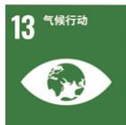

制定应对气候变化管理制度，系统规划并有效实施公司应对气候变化的策略与行动；定期编制公司温室气体排放清单，采取推广使用清洁能源、提高能效等措施，减少直接和间接温室气体排放。

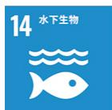

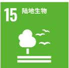

在勘察与施工项目中选择适宜的施工时间，通过合理设计减少对农田、森林等环境的破坏，保护生物多样性:参与森林智能管控体系，公益林监测项目等林业项目设计以及海洋生态保护项目

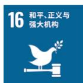

严格遵守国家法律法规，制定并持续宗善《合规管理制度》《诚信合规手册》及《廉洁体系制度》等内部规章，确保运营合法合规；通过开展全领域合规风险排查、重大决策合法审查以及系统化的税务管理，有效防范各类风险；严格落实反腐倡廉要求，建立健全反舞弊机制，报告期内未发生贪污腐败事件。

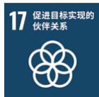

搭建公开透明的举报渠道，严格保障举报者信息安全与权益，并建立完善的受理与奖励机制，鼓励员工供应商及客户共同监督：将ESG理念深度融入供应商全生命周期管理，从准入审核到持续评估，推动供应商共同践行可持续发展承诺。

## 可持续发展治理

公司坚持“以人为本，为绿色经济赋能”的可持续发展宗旨，制定《吉大通信可持续发展（ESG）管理制度》《吉大通信可持续发展内部控制制度》《吉大通信可持续发展（ESG）信息管理制度》，从“决策层 - 管理层 - 执行层”搭建起全面系统的 ESG 治理架构，在推进战略落地、风险防控及重大事项决策的过程中，将 ESG 相关的影响、风险与机遇作为关键考量因素，持续将社会责任理念内化于战略规划与运营实践之中，以责任担当赋能企业高质量、可持续发展。

## 人员构成及职权范围

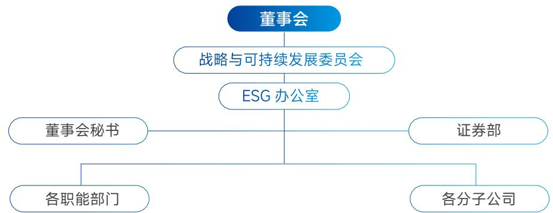

flowchart

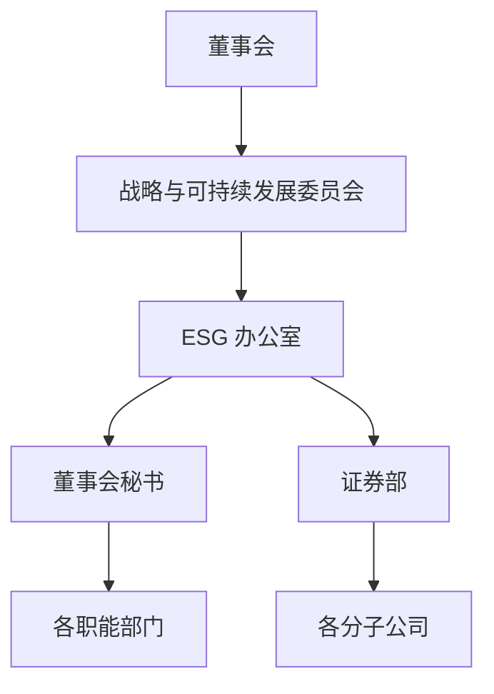
```mermaid
graph TD
  A["董事会"] --> B["战略与可持续发展委员会"]
  B --> C["ESG 办公室"]
  C --> D["董事会秘书"]
  C --> E["证券部"]
  D --> F["各职能部门"]
  E --> G["各分子公司"]
```

<table><tr><td>层级</td><td>架构</td><td>组成</td><td>定位</td><td>职责范围</td></tr><tr><td rowspan="2">决策</td><td>董事会</td><td>董事会成员</td><td>ESG工作的最高领导和决策机构</td><td>审定公司的ESG报告。</td></tr><tr><td>战略与可持续发展委员会</td><td>战略与可持续发展委员会成员</td><td>ESG工作的研究和指导机构</td><td>1.审议和批准公司的ESG发展战略与目标、重大议题、管理架构、管理制度等。2.识别和监督对公司业务具有重大影响的ESG相关风险和机遇,指导管理层对ESG风险和机遇采取适当的应对措施。3.监督公司ESG目标制定,以及相应的实施规划及绩效,定期检讨ESG目标达成的进度,并就需要提升表现所需采取的行动给予建议。4.审阅公司ESG相关披露文件,包括但不限于年度ESG报告。</td></tr><tr><td>管理</td><td>ESG办公室</td><td>董事会秘书、证券部</td><td>统筹ESG工作的整体实施,制定ESG相关制度文件,为履行ESG相关工作职责提供保障和专业支持</td><td>1.贯彻落实公司ESG发展战略与目标,组织和安排各执行单位实施ESG工作。2.负责拟定ESG制度文件、相关议题、阶段性工作计划及实施方案等。3.负责对公司ESG信息收集、汇编,编制ESG报告及相关文件。4.负责与咨询、评级机构沟通,组织开展ESG业务培训,跟踪ESG政策要求及趋势。5.总结ESG工作中的问题和成果,及时向战略与可持续发展委员会反馈ESG工作情况,提出合理化建议。</td></tr><tr><td>执行</td><td>各职能部门及分子公司</td><td>各部门、分子公司ESG联络人</td><td>承担职责范围内的主体责任,负责按照公司ESG发展战略与目标,落实ESG相关工作的日常管理,并定期汇报执行情况,及时报送ESG信息</td><td>1.协助编制可持续发展报告。2.负责公司可持续相关管理、数据统计与分析等方面的能力构建。3.执行可持续发展工作计划。4.定期将工作成果向管理层汇报。</td></tr></table>

##

2025年度公司战略与可持续发展委员会共召开五次全体会议，会议审议通过了《吉林吉大通信设计院股份有限公司可持续发展（ESG）管理制度》《吉林吉大通信设计院股份有限公司可持续发展内部控制制度》《吉林吉大通信设计院股份有限公司可持续发展（ESG）信息管理制度》，以及《关于参股 AI 体育项目公司的议案》《关于拟确定能源信息化业务发展方向的议案》《关于拟设立能源产业群的议案》等重要事项。

##

## 工作任务及目标设定

公司高度重视企业战略与全球可持续发展议题的协同，系统性地将联合国 2030 年可持续发展目标（SDGs）融入中长期发展战略与日常运营框架之中。深入分析了SDGs中的气候行动，产业创新，体面工作与经济增长等与行业及业务高度相关的目标领域，并将其转化为具体、可衡量的公司级行动目标。

2025 年公司董事会定期审查公司在可持续发展方面的绩效，并根据结果提出建议；公司 ESG 办公室统筹 ESG工作的整体实施，制定 ESG 相关制度文件，拟定 ESG 工作计划；各职能部门及分子公司按照公司 ESG 发展战略与目标，落实ESG相关工作的日常管理，并定期汇报执行情况，及时报送ESG信息。

## 专业技能及胜任能力

公司第五届战略与可持续发展委员会有四名独立董事，在治理维度 宋英慧教授的会计学背景为公司ESG信阜披露的准确性与财务合规提供了坚实保障；张晓阳博士的民商法学专长则强化了公司治理、商业伦理及法律风险管控能力。两者共同构筑了稳健的ESG治理基础。在社会维度，邓相军先生在信息通信技术领域的深厚产业经验，能指导公司通过技术创新推动数字包容，供应链责任等社会价值创造，在环境与战略融合维度，苏治教授在可持续金融与 ESG 投资方面的专长至关重要，能助力公司将环境风险管理、绿色机遇识别系统性地融入投融资决策与资本市场沟通。

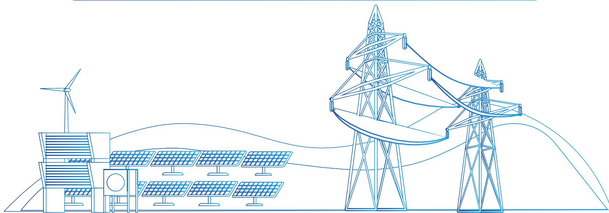

natural_image

Line drawing of a renewable energy system with solar panels and transmission towers (no text or symbols)

## 公司可持续发展治理机制

<table><tr><td>机制内容</td><td>具体行动</td></tr><tr><td>信息报告机制</td><td>1. 汇报内容:定期向公司管理层汇报 ESG 工作的进展情况、存在的问题、改进措施等。2. 汇报频率:根据公司实际情况,确定合适的汇报频率,如季度、半年或年度汇报。3. 汇报形式:采用口头汇报、书面报告、PPT 演示等多种形式进行汇报。4. 汇报对象:公司高层、ESG 相关部门及业务合作伙伴等。</td></tr><tr><td>监督程序及措施</td><td>1. 战略与可持续发展委员会识别和监督对公司业务具有重大影响的 ESG 相关风险和机遇,指导管理层对 ESG 风险和机遇采取适当的应对措施。2. 监督公司 ESG 目标的制定,以及相应的实施计划及绩效,定期检查 ESG 目标的完成进度,并就提升表现所需采取的行动给予建议。</td></tr><tr><td>考核情况</td><td>为将可持续发展理念深度融入公司治理与长期价值创造,公司已将 ESG 相关绩效指标系统性地纳入高级管理人员的薪酬考核体系。具体而言,在年度绩效考核及长期激励计划中,公司设定了明确的 ESG 关键绩效目标,涵盖环境保护、节能减排、安全生产、员工关怀、供应链管理、公司治理透明度等多个维度。这些量化与非量化指标与公司整体 ESG 战略紧密挂钩,其达成情况将直接影响高管绩效薪酬的评定与发放。公司通过建立此种“绩效对齐”机制,确保管理团队的利益与公司可持续发展目标高度一致。</td></tr></table>

## 可持续风险管理

为夯实企业长远发展的根基 公司建立了以《可持续发展内部控制制度》为核心的保障机制。该机制通过构建全面的风险管理体系，系统性地识别并评估环境，社会及治理层面的关键风险，并制定相应的应对策略，从而有效推动公司在ESC治理框架下迈向高质量发展。

## 风险识别

建立定期的可持续发展风险排查制度，利用问卷调查、案例分析及流程图分析等工具，广泛搜集并整合内外部信息，以全面、精准地识别经济、环境及社会领域的各类风险。

## 风险应对

根据风险评估结果，制定相应的风险应对举措，包括风险规避、风险降低、风险转移、风险接受等。明确风险应对措施的责任部门和责任人，确保风险应对措施的有效实施。

## 风险评估

搭建多维度的风险评估模型，综合运用风险矩阵法、蒙特卡罗模拟法等定性与定量工具 对已识别的各类风险进行系统分析，科学判断其发生概率与潜在影响程度。

## 风险监控

建立风险监控机制，定期对风险应对措施的实施情况进行跟踪和评估，根据监控结果及时调整风险应对措施，确保风险处于可控范围。

## 可持续发展培训

公司定期组织开展多维度、分层次的 ESG 专项培训，覆盖管理、投资、运营、信息披露等关键职能岗位，帮助相关人员了解 ESG 的国际标准与监管部门相关规定，深度把握其核心价值框架与前瞻性的实践路径。培训内容聚焦于 ESG 风险识别、碳中和路径规划、社会责任履行、公司治理优化等关键议题，紧密结合通信行业特点与公司实际业务场景，着力提升员工在日常经营、项目决策、供应链管理及产品创新中践行ESG理念的实操能力与整合思维。

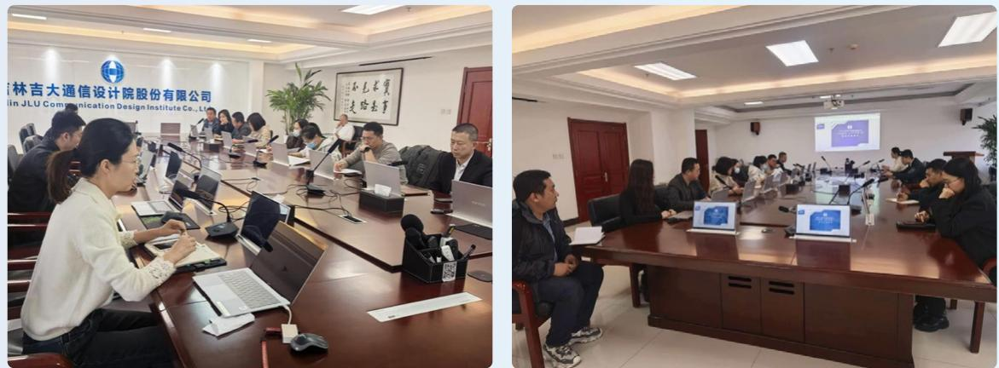  
可持续发展专项培训现场照片

## 可持续发展信息披露渠道

公司严格遵守《中华人民共和国公司法》《上市公司信息披露管理办法》《深圳证券交易所创业板股票上市规则》等法律法规建立健全信息披露制度，积极履行信息披露义务，持续完善信息披露体系，不断提高信息披露质量，切实保护全体股东特别是中小股东的合法权益。

年度披露:公司上市以来 连续四年披露ESG报告 向投资者等利益相关方就ESG实践情况进行信息传递与沟通。电子版 ESG报告可在吉大通信官方网站（https://www.jlucdi.com）及深圳证券交易所网站（https://www.szse.cn）查阅、下载。日常披露：公司官网设置社会责任专栏，披露公司ESG评级和ESG报告。

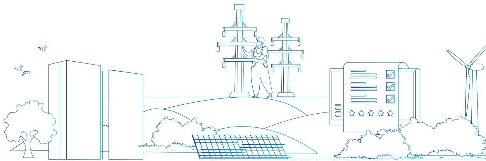

natural_image

Line art illustration of a renewable energy infrastructure system with solar panels, wind turbines, and power distribution towers (no text or symbols)

## 利益相关方沟通

公司深刻认识到，利益相关方是推动可持续发展的重要依托，其在企业决策中发挥着不可替代的导向作用。为此，公司持续优化利益相关方沟通机制，通过官方网站、会议、报告、活动及调研访谈等多元化渠道，针对政府及监管机构、股东及投资者，员工，客户，供应商等不同群体 分别建立精准化的沟通与回应路径 全面收集并系统回应各方的合理期望与核心诉求。通过统筹协调社会、股东与员工等各方利益，公司致力于构建和谐共赢的良性互动格局，为企业持续、稳健、和谐发展奠定坚实基础。

<table><tr><td>利益相关方类型</td><td>期望与需求</td><td>沟通方式</td><td>回应与行动</td></tr><tr><td>政府及监管机构</td><td>依法纳税合规经营促进就业绿色发展</td><td>信息披露监管机构定期会话</td><td>坚持合规经营依法纳税提供就业机会发展绿色业务、实行绿色运营遵守国家法律法规</td></tr><tr><td>股东与投资者</td><td>信息公开透明股东权益保护加强投资者关系管理良好盈利能力</td><td>股东会信息披露互动交流互动易平台投资者热线</td><td>投资者问题回应持续提升盈利能力提高信息披露质量</td></tr><tr><td>客户与合作伙伴</td><td>为客户创造价值高质量的产品与服务公平诚信合作隐私安全</td><td>日常运营互动定期高层交流客户满意度调查线下考察</td><td>加大研发创新保障产品质量提升服务效率保障客户信息安全依法履约,合规采购</td></tr><tr><td>员工</td><td>员工权益与福利人才培养与发展职业健康与安全平衡工作与生活</td><td>员工培训职工代表大会工会活动员工满意度调查</td><td>完善职业健康安全管理体系持续做好员工福利保障营造优质的工作环境助力员工成长与发展</td></tr><tr><td>行业协会</td><td>推动行业发展沟通渠道全面完整</td><td>行业协会活动日常交流与沟通</td><td>完善合作机制参与行业协会活动</td></tr><tr><td>乡村及社区</td><td>支持公益事业参与乡村、社区发展</td><td>公益捐赠志愿活动乡村振兴项目</td><td>开展公益活动组织志愿活动巩固拓展脱贫攻坚成果助力乡村振兴</td></tr></table>

## 重要性议题管理

## 议题“双重重要性”分析

公司依据《深圳证券交易所上市公司自律监管指引第 17 号——可持续发展报告（试行）》《深圳证券交易所创业板上市公司自律监管指南第 3 号——可持续发展报告编制》《GRI3：实质性议题》等国内外 ESG 披露标准，通过开展线上调研问卷和参考专家意见，识别重要性议题，引入影响重要性和财务重要性的双重分析视角，全面分析 ESG 议题对公司财务以及经济、环境和社会的影响，并在报告中披露。具体重要性评估流程如下。

## 步骤一：相关方识别与议题池构建

评估流程首先从识别与吉大通信业务运营直接或间接相关的内外部利益相关方开始，包括员工、客户与合作伙伴、股东与投资者、政府监管机构、行业协会、乡村及社区、媒体等。基于对公司业务、行业特点、可持续发展趋势的深入分析，并结合利益相关方的沟通成果，构建初始 ESG 议题库。

## 步骤二：建立议题清单

参考深交所创业板可持续发展报告编制指南、全球报告倡议组织 GRI、联合国可持续发展目标 SDGs、SASB、MSCI，以及同行业公司相关议题，建立可持续发展相关议题库。

## 2025 年议题库

## 环境（8项议题）

应对气候变化·  
污染物排放·  
废弃物处理·  
生态系统和生物多样性保护·  
环境合规管理·  
能源利用·  
水资源利用·  
循环经济·

## 社会（11项议题）

乡村振兴·  
社会贡献·  
创新驱动·  
科技伦理·  
供应链安全·  
平等对待中小企业·  
产品和服务安全与质量·  
数据安全与客户隐私保护·  
员工合法权益保护·  
职业健康与安全·  
员工培训与发展·

## 可持续发展相关治理﹙4 项议题）

公司治理

利益相关方沟通

反商业贿赂及反贪污

反不正当竞争

注：平等对待中小企业属于特定主体披露议题，公司暂不涉及，故不披露相关内容。

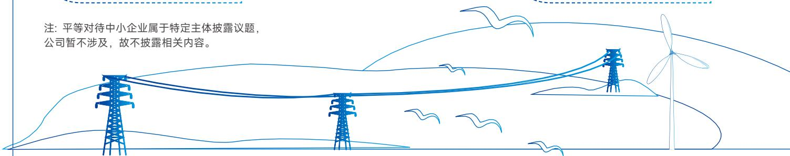

text_image

注: 平等对待中小企业属于特定主体披露议题,
公司暂不涉及, 故不披露相关内容。

## 步骤三：议题重要性评估

## 影响重要性评估：

通过利益相关方调研和专家评分的方式，评估各议题影响发生的可能性、规模、范围等，形成影响重要性评估结论。

## 财务重要性评估：

通过专家评分的方式，以及对公司内部相关部门及管理层，以及股东、投资者和债权人等利益相关方开展调研，识别影响或可能影响公司业务运营、财务状况、经营成果、现金流等的风险和机遇，评估是否产生重大财务影响，形成财务重要性评估结论。

## 步骤四：议题重要性矩阵绘制

在完成财务重要性和影响重要性双重评估后，将评估结果汇总，绘制 ESG 议题重要性矩阵，直观呈现各议题在财务和影响两个维度上的重要性程度。

## 步骤五：议题确认与披露

在完成重要性评估流程后，形成影响重要性和财务重要性议题清单，并在报告中披露议题重要性的分析过程及其结果。

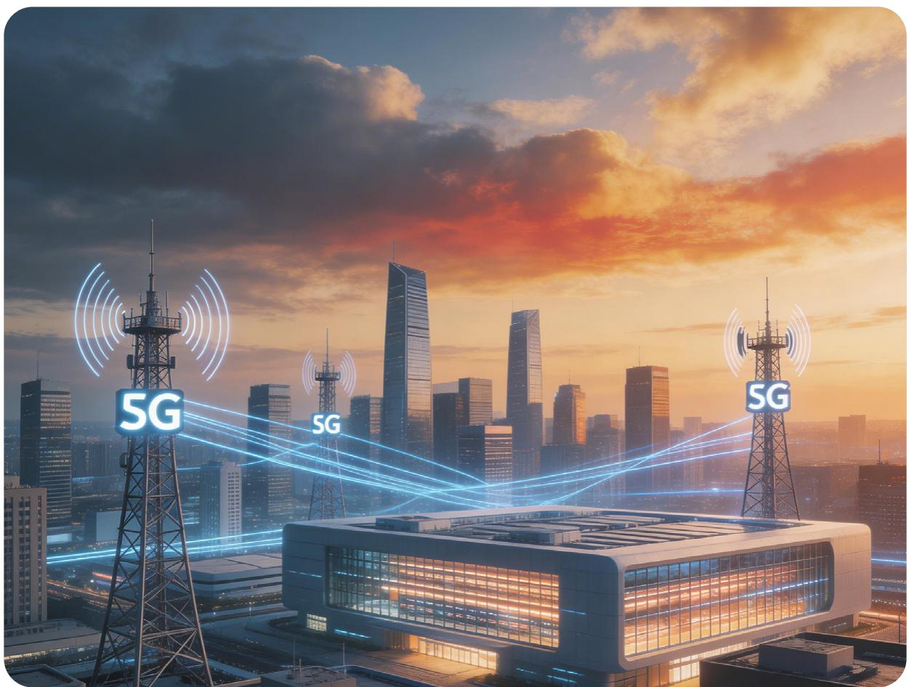

text_image

5G
SG
SG
SG

## 重要性议题评估结果

我们根据公司及行业的特点，结合利益相关方问卷调查结果，并参考专家意见，从“影响重要性”与“财务重要性”两个维度进行分析，形成重要性议题矩阵。

<table><tr><td>双重重要性程度</td><td>议题</td></tr><tr><td>高度重要(具有高度财务重要性及高度影响重要性)</td><td>产品和服务安全与质量 创新驱动供应链安全 员工合法权益保护 公司治理</td></tr><tr><td>比较重要(具有高度财务重要性或高度影响重要性)</td><td>职业健康与安全 应对气候变化员工培训与发展 环境合规管理能源利用 循环经济 废弃物处理 污染物排放水资源利用 反商业贿赂及反贪污数据安全与客户隐私保护生态系统和生物多样性保护</td></tr><tr><td>一般重要(相对其他议题的财务重要性或影响重要性程度一般,但仍具有较高重要性)</td><td>社会贡献 乡村振兴利益相关方沟通 科技伦理 反不正当竞争平等对待中小企业</td></tr></table>

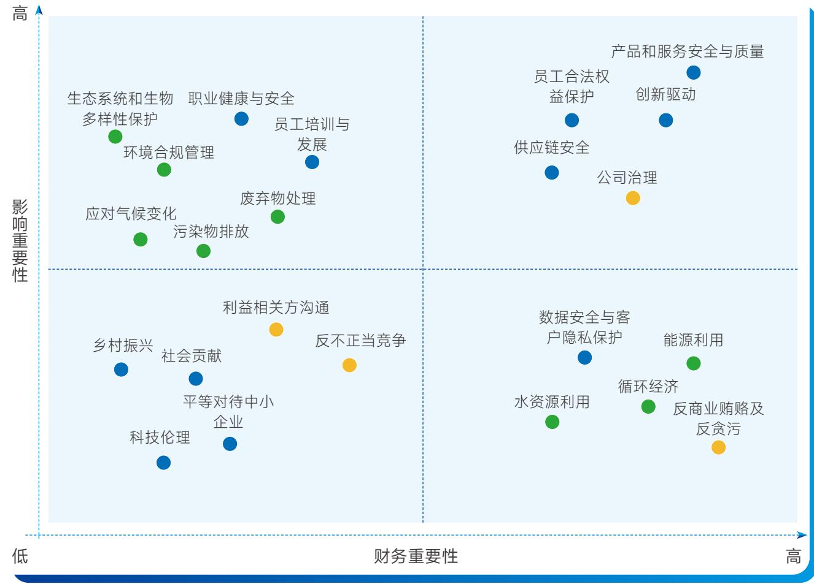

scatter

| Topic | Financial Importance (X) | Impact Importance (Y) |
| :--- | :--- | :--- |
| 生态系统和生物多样性保护 | Low | High |
| 环境合规管理 | Low-Medium | High |
| 应对气候变化 | Low | Medium-High |
| 职业健康与安全 | Medium | High |
| 员工培训与发展 | Medium | High |
| 废弃物处理 | Medium | Medium-High |
| 污染物排放 | Medium-Low | Medium |
| 乡村振兴 | Low | Low-Medium |
| 社会贡献 | Low-Medium | Low-Medium |
| 平等对待中小企业 | Low-Medium | Low |
| 科技伦理 | Low | Low |
| 利益相关方沟通 | Medium | Low-Medium |
| 反不正当竞争 | Medium-High | Low-Medium |
| 数据安全与客户隐私保护 | High | Low-Medium |
| 水资源利用 | High | Low |
| 循环经济 | High | Low |
| 能源利用 | High | Low |
| 供应链安全 | High | High |
| 公司治理 | High | High |
| 员工合法权益保护 | High | High |
| 创新驱动 | High | High |
| 产品和服务安全与质量 | High | High |
| 反商业贿赂及反贪污 | High | Low |

影响、风险和机遇管理

<table><tr><td rowspan="2">重要性议题</td><td colspan="3">影响范围</td><td>风险</td><td>机遇</td><td>影响周期</td></tr><tr><td>价值链上游</td><td>企业运营</td><td>价值链下游</td><td></td><td></td><td></td></tr><tr><td>应对气候变化</td><td>✓</td><td>✓</td><td>✓</td><td>气候变化可能导致极端天气频发、政策变化、市场偏好改变等影响,使公司面临实体风险和转型风险,详见“二、气候环境”。</td><td>公司可依托低排放能源结构转型、政策激励工具应用以及节能新技术落地,进一步探索碳市场参与机制,并通过提高清洁能源在分布式供应中的比例,系统性地提升能源利用效率,从而在能源成本优化与低碳转型中获取新的发展机遇。</td><td>中长期</td></tr><tr><td>污染物排放</td><td></td><td>✓</td><td>✓</td><td>若污染物排放管理不当,可能面临环境处罚和声誉风险。</td><td>建立完善的污染物排放管理体系,提升环境绩效,实现更少的环境排放,树立绿色环保的企业形象。</td><td>短期</td></tr><tr><td>废弃物处理</td><td></td><td>✓</td><td>✓</td><td>若废弃物处理管理不当,可能面临环境处罚和声誉风险。</td><td>建立完善的废弃物处理管理体系,提升环境绩效,实现更高效的资源利用,树立绿色环保的企业形象。</td><td>短期</td></tr><tr><td>生态系统和生物多样性保护</td><td></td><td>✓</td><td></td><td>1.合规与诉讼风险:施工项目若涉及生态敏感区(如自然保护区),可能违反环保法规,引发处罚或项目延期。2.声誉风险:在环保意识的提升下,生态破坏易引发社区反对或NGO关注。</td><td>1.绿色设计差异化:开发生态友好型设计方案(如共享基站、减少占地),提升市场竞争力。2.生态修复服务:拓展植被恢复、生态评估等增值服务。</td><td>中长期</td></tr><tr><td>环境合规管理</td><td>✓</td><td>✓</td><td>✓</td><td>1.政策风险:环保标准趋严,若未及时适应可能导致成本上升或资质丢失。2.供应链风险:供应商环境违规可能牵连公司声誉。</td><td>1.合规先行优势:建立高标准环境管理体系,吸引政府或大型企业客户。2.ESG评级提升:强化合规可提升投资者信心,降低融资成本。</td><td>长期</td></tr><tr><td>能源利用</td><td>✓</td><td>✓</td><td>✓</td><td>1.成本风险:能源价格上涨推高运营成本。2.碳减排压力:未来可能纳入碳配额管理,增加合规成本。</td><td>1.绿色节能设计:为客户提供低碳通信解决方案(如节能基站、新能源供电方案);2.运营优化:采用可再生能源、智能节能设备,降低自身碳足迹。</td><td>中长期</td></tr><tr><td>水资源利用</td><td></td><td>✓</td><td></td><td>区域性风险:在缺水地区施工可能受当地水资源管理政策制约。</td><td>节水技术应用:推广无水化施工工艺,作为技术创新亮点。</td><td>中长期</td></tr><tr><td>循环经济</td><td></td><td>✓</td><td>✓</td><td>1.成本风险:循环供应链建设需前期投入。2.技术风险:再生材料性能或供应链稳定性问题。</td><td>1.废物资源化:与回收企业合作,将废旧通信设备转化为收入来源。2.绿色供应链:要求供应商提供可回收材料,增强产业链影响力。</td><td>中长期</td></tr><tr><td>乡村振兴</td><td>✓</td><td>✓</td><td>✓</td><td>1.项目回报率低:乡村项目可能成本高、收益低,影响短期盈利。2.社区关系风险:土地征用、施工扰民等问题处理不当易引发冲突。</td><td>1.政策红利:国家乡村振兴战略推动农村基建投资,带来稳定订单。2.市场先发优势:提前布局农村通信市场,抢占未来增长点。</td><td>中长期</td></tr><tr><td>社会贡献</td><td></td><td>✓</td><td>✓</td><td>缺乏责任意识将难以获得社区和公众的认可。</td><td>树立积极正面的企业公民形象,提升品牌价值。</td><td>中长期</td></tr><tr><td>创新驱动</td><td></td><td>✓</td><td>✓</td><td>对研发资金和人才投入有较高要求,若无法跟上技术发展趋势,或将面临产品和服务竞争力下降的风险。</td><td>开发出差异化、有竞争力的产品和服务,有利于开拓新的市场领域,提高营收和市场占有率。</td><td>长期</td></tr></table>

<table><tr><td rowspan="2">重要性议题</td><td colspan="3">影响范围</td><td>风险</td><td>机遇</td><td>影响周期</td></tr><tr><td>价值链上游</td><td>企业运营</td><td>价值链下游</td><td></td><td></td><td></td></tr><tr><td>科技伦理</td><td></td><td>✓</td><td>✓</td><td>1.法律与声誉风险:数据泄露或算法歧视可能引发诉讼及公众质疑。2.技术滥用风险:设计的网络被用于非法监控等场景,间接导致伦理争议。</td><td>1.伦理差异化竞争:将隐私保护、公平性作为设计标准,吸引政府及高端客户。2.行业标准参与:牵头制定通信设计伦理规范,提升行业影响力。</td><td>长期</td></tr><tr><td>供应链安全</td><td>✓</td><td>✓</td><td></td><td>因供应链风险影响业务连续性、损害企业声誉、面临监管压力,进而导致运营成本增加。</td><td>确保供应商的合规、稳定合作和高质高效服务/供应等,构建可持续的供应链体系,强化可持续发展能力。</td><td>中长期</td></tr><tr><td>平等对待中小企业</td><td>✓</td><td></td><td></td><td>1.供应链集中风险:过度依赖大供应商,导致成本弹性不足。2.合规风险:若违反《中华人民共和国政府采购法》等对中小企业的保护条款,可能受处罚。</td><td>1.供应链韧性:与中小企业合作可增强供应链灵活性,降低断供风险。2.政策支持:符合国家扶持中小企业的导向,可能获得税收优惠或项目优先权。</td><td>短期</td></tr><tr><td>产品和服务安全与质量</td><td>✓</td><td>✓</td><td>✓</td><td>若服务与产品无法满足客户期待,可能导致客户流失、负面口碑传播及市场份额下降。</td><td>建立长期稳定的客户关系、提高客户忠诚度,提升竞争优势。</td><td>中长期</td></tr><tr><td>数据安全与客户隐私保护</td><td>✓</td><td>✓</td><td>✓</td><td>数据泄露、系统瘫痪、客户信息被滥用导致直接经济损失和监管处罚,损害客户信任度。</td><td>保障业务运营的稳定性和安全性,赢得客户信任。</td><td>短期</td></tr><tr><td>员工合法权益保护</td><td></td><td>✓</td><td></td><td>员工权益受损将导致员工不满、工作效率降低,可能出现劳资纠纷。</td><td>提高员工满意度和归属感,提升雇主品牌形象,降低招聘成本。</td><td>中长期</td></tr><tr><td>职业健康与安全</td><td></td><td>✓</td><td></td><td>工伤、健康状况不佳可能导致工时损失和赔偿,造成员工流失。</td><td>打造安全健康的工作环境,提升雇主品牌形象,增强员工归属感。</td><td>中长期</td></tr><tr><td>员工培训与发展</td><td></td><td>✓</td><td></td><td>员工技能不足无法满足业务发展需求,员工职业发展受限可能出现人才断层、流失。</td><td>提升员工技能水平和工作效率,实现有效留才,打造高素质的人才队伍。</td><td>中长期</td></tr><tr><td>公司治理</td><td></td><td>✓</td><td></td><td>公司治理水平不足或导致经营风险增加、难以吸引长期投资者、企业价值被低估。</td><td>实现高效透明决策,提升公司运营效率和企业价值。</td><td>中长期</td></tr><tr><td>利益相关方沟通</td><td>✓</td><td>✓</td><td>✓</td><td>1.项目延期风险:社区反对或审批延迟可能导致工程停滞。2.声誉危机:沟通不足易引发误解,放大负面事件影响。</td><td>1.社会许可经营:通过透明沟通获得社区支持,降低项目阻力。2.ESG投资吸引力:定期发布实质性ESG报告,提升长期资本关注。</td><td>中长期</td></tr><tr><td>反商业贿赂及反贪污</td><td>✓</td><td>✓</td><td>✓</td><td>1.法律风险:违反《中华人民共和国反不正当竞争法》《中华人民共和国刑法》等,导致高额罚款甚至吊销资质。2.经营风险:腐败抬高项目成本,破坏市场公平性。</td><td>1.廉洁竞争力:在国企、政府项目中,廉洁记录可成为投标优势。2.治理溢价:健全的内控体系可降低审计成本,提升投资者信心。</td><td>中长期</td></tr><tr><td>反不正当竞争</td><td></td><td>✓</td><td>✓</td><td>1.法律与处罚风险:违反《中华人民共和国反垄断法》《中华人民共和国反不正当竞争法》面临重罚。2.行业声誉风险:被列为“失信企业”,影响客户合作意愿。</td><td>1.良性竞合生态:倡导行业公平竞争,推动技术共享与标准合作。2.创新驱动:通过专利保护强化技术壁垒,提升定价能力。</td><td>中长期</td></tr></table>

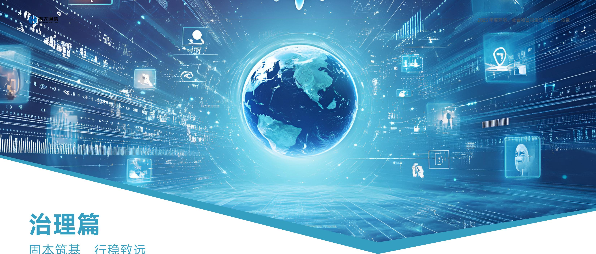

text_image

2015年度环境、社会和公司治理（ESG）报告
治理篇
周本筑基，行稳致远

# 治理篇

# 固本筑基，行稳致远

吉大通信坚持以习近平新时代中国特色社会主义思想为指导，以党建引领高质量发展，深化党建与生产经营、技术创新、项目攻坚的深度融合，创新党建工作载体，强化基层党组织建设，锤炼优良作风，凝聚全员合力为公司长期健康发展筑牢政治保障，注入精神动力。

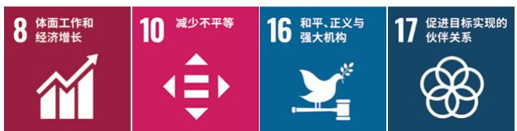

flowchart

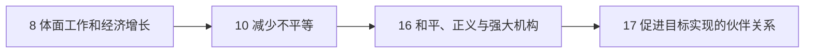
```mermaid
graph LR
  A["8 体面工作和经济增长"] --> B["10 减少不平等"]
  B --> C["16 和平、正义与强大机构"]
  C --> D["17 促进目标实现的伙伴关系"]
```

## 我们的实践

党建引领企业高质量发展

可持续发展的治理保障

38

41

## 党建引领企业高质量发展

吉大通信坚持以习近平新时代中国特色社会主义思想为指导，以党建引领高质量发展，深化党建与生产经营、技术创新、项目攻坚的深度融合，创新党建工作载体，强化基层党组织建设，锤炼优良作风，凝聚全员合力，为公司长期健康发展筑牢政治保障、注入精神动力。

## 01 | 党组织建设

公司坚持以习近平新时代中国特色社会主义思想为指导，深入落实新时代党的建设总要求和新时代党的组织路线，全面贯彻党的二十大精神。党总支制定完善《吉大通信工作制度汇编》，构建涵盖 14 项核心制度的长效机制，明确各类岗位职责，确保党建工作规范有序、责任到人。

通过党总支立足企业实际，将党的二十届四中全会精神关于数字中国、网络强国、科技创新等部署转化为公司发展动能，明确技术创新与业务融合、新兴领域拓展、双循环发展格局构建等战略方向，以党建凝聚党员干部责任担当，推动党的政策方针在企业落地生根，为公司高质量发展提供坚强组织保障。

公司党总支成立于2020年4月，下设公司党支部、长邮通信党支部、武汉分公司党支部、吉鸿志信党支部以及中浦慧联党支部共 5 个支部，截至报告期末，共有正式党员 75 人。党组织规模不断扩大，相较于去年增加了5名党员。

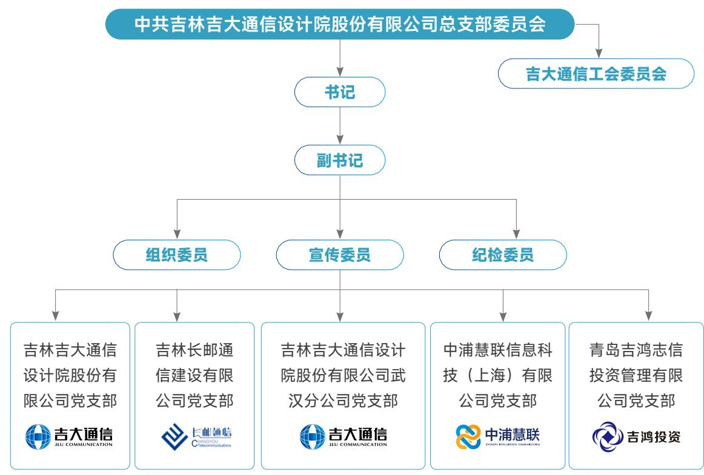

flowchart

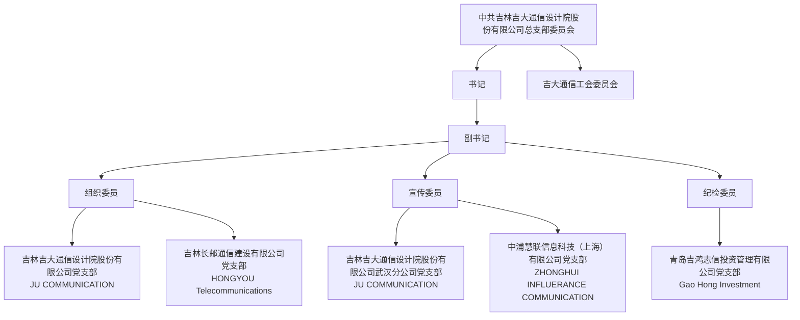
```mermaid
graph TD
  A["中共吉林吉大通信设计院股份有限公司总支部委员会"] --> B["书记"]
  A --> C["吉大通信工会委员会"]
  B --> D["副书记"]
  D --> E["组织委员"]
  D --> F["宣传委员"]
  D --> G["纪检委员"]
  E --> H["吉林吉大通信设计院股份有限公司党支部\nJU COMMUNICATION"]
  E --> I["吉林长邮通信建设有限公司党支部\nHONGYOU Telecommunications"]
  F --> J["吉林吉大通信设计院股份有限公司武汉分公司党支部\nJU COMMUNICATION"]
  F --> K["中浦慧联信息科技（上海）有限公司党支部\nZHONGHUI INFLUERANCE COMMUNICATION"]
  G --> L["青岛吉鸿志信投资管理有限公司党支部\nGao Hong Investment"]
```

## 02 | 党建品牌

公司党总支将党的领导全面融入公司治理，充分彰显党组织把方向、管大局、促落实的引领作用。党总支以“党建带群建、群建促党建”为党建品牌核心，既强化工会引领、健全党群协同机制，又锚定经济建设中心与“促和谐、惠职工、强组织”三大目标，深化党建与生产经营融合，以党群组织优势赋能企业高质量发展。

在具体实践中，吉大通信党总支积极推动党建与业务深度融合，通过开展“党员先锋岗”“党员责任区”等活动，引导党员在生产经营一线发挥模范带头作用。同时，党总支注重加强党员队伍建设，定期组织党员学习培训，提升党员的政治素质和业务能力，为公司发展提供坚实的人才支撑。

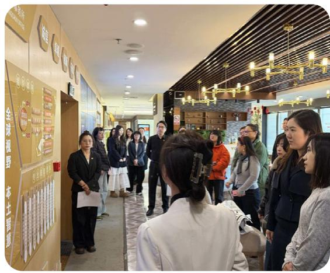

text_image

Group of people viewing educational posters in a modern indoor space, with visible Chinese text on display panels and wall signage.

2025年12月3 日参加南湖街道湖苑社区组织的“北京盈科律所”党建合创主题党日活动

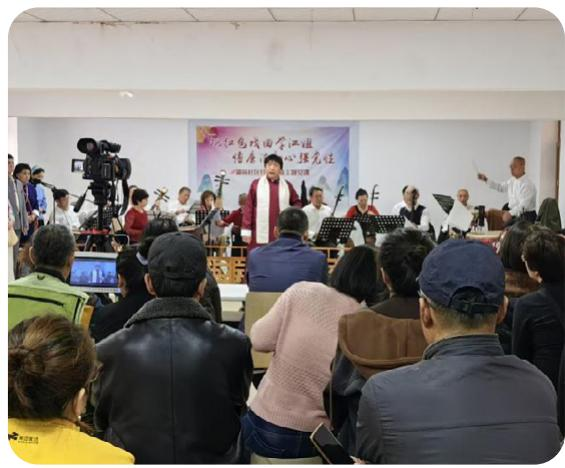

text_image

江西戏曲国家汇通
传承青春心强重任

2025年10月29日，参加南湖街道湖苑社区党委组织的“观红色戏曲、悟廉洁初心强党性”主题党课活动

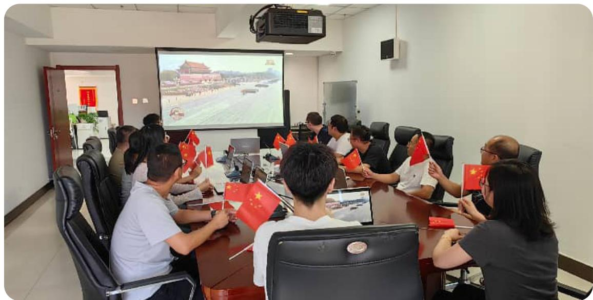

natural_image

Group of people seated at a conference table with Chinese flags, watching a large screen displaying Tiananmen Gate imagery (no visible text or symbols on main subjects)

2025年9月3日组织观看“纪念中国人民抗日战争暨世界反法西斯战争胜利80周年阅兵仪式”活动

## 03 | 党建活动

公司党总支坚持贯彻党的路线方针政策，持续深化“以党建带群建、以群建促党建”的协同机制；定期组织党支部书记专题培训、党建工作经验交流，全面激发基层党组织生机活力；深化“党建+服务”特色模式，聚焦服务群众根本导向，健全作风建设长效机制；精心组织策划系列主题党建活动，有效凝聚全体党员职工的向心力与使命感；持续夯实基层战斗堡垒，全面激发党组织生机活力。

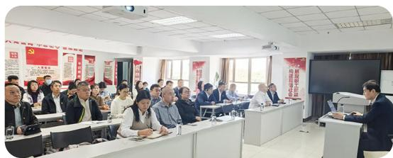

text_image

Group meeting in a conference room with visible banners and posters on the wall

2025年1 月25日吉大通信党总支组织学习贯彻党的二十届四中全会精神

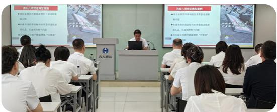

text_image

Conference scene with presentation screens showing Chinese text about industrial and environmental management, featuring attendees seated at desks.

2025年7月1日吉大通信党总支组织学习“坚持强化党的作风建设，全面进行学查改”

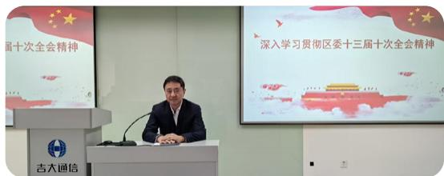

text_image

国十次全会精神
深入学习贯彻区委十三届十次全会精神
吉大通信

2025年12月17日吉大通信党总支党员集中学习区委十三届十次全会精神

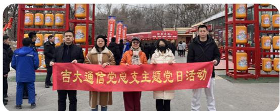

text_image

吉大通信党总支主题党日活动

2025年3月4日组织党员开展莲花岛党建基地参观活动

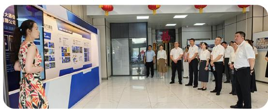

text_image

Group of people in a modern office hallway viewing an exhibition display with Chinese text and images, featuring visible signage and decorative lanterns.

2025年6月25日吉林大学产业党委一行莅临公司考察活动

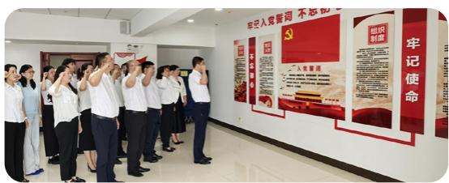

text_image

守空入党誓词 不忘初心
不忘初心
组织制造
牢记使命

2025年7月1日党总支七一重温入党誓词活动

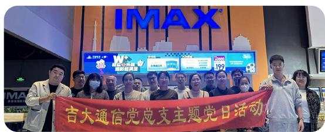

text_image

IMAX
吉大通信党总支主题党日活动

2025年9月26日组织党员开展主题党日观看电影《731》

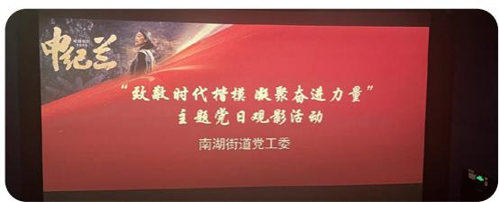

text_image

敬敬时代楷模 凝聚奋进力量"
主题党日观影活动
南湖街道党工委

2025年7月24 日组织党员开展主题党日观看电影《申纪兰》

## 关键绩效

报告期内，党总支委员会会议12次，开展主题党日活动9次，党员大会4次。

## 可持续发展的治理保障

## 01 | 健全治理体系

公司能够严格遵守《中华人民共和国公司法》《中华人民共和国证券法》《上市公司治理准则》《深圳证券交易所创业板股票上市规则》等相关法律法规制定并实施了一系列内部管理文件，包括以《吉林吉大通信设计院股份有限公司章程》（以下简称《公司章程》）《吉大通信股东会议事规则》《吉大通信董事会议事规则》《吉大通信独立董事工作制度》《吉大通信信息披露管理制度》以及其他内部控制制度，建立由股东会、董事会、董事会专门委员会、高级管理层组成的主体明确、分工清晰、权责分明，运行高效的治理架构，为公司的规范、稳定运作提供了坚实的制度保障与组织支撑。

股东会是公司的最高权力机构，依法对公司的重大事项行使决定权。董事会作为公司的经营决策中心负责执行股东会决议等，下设战略与可持续发展委员会、审计委员会、提名委员会及薪酬与考核委员会四个专门委员会。审计委员会作为监督机构对公司财务以及公司董事、高级管理人员履行职责的合法合规性进行有效监督，维护公司和股东的合法权益。

为适应制度、市场和业务发展变化的需要，确保公司治理的有效性，公司持续优化治理结构，强化内控体系，提高运作的规范性和透明度。在报告期内，对公司治理结构进行了调整，对公司制度进行了持续更新，共更新了35项制度。

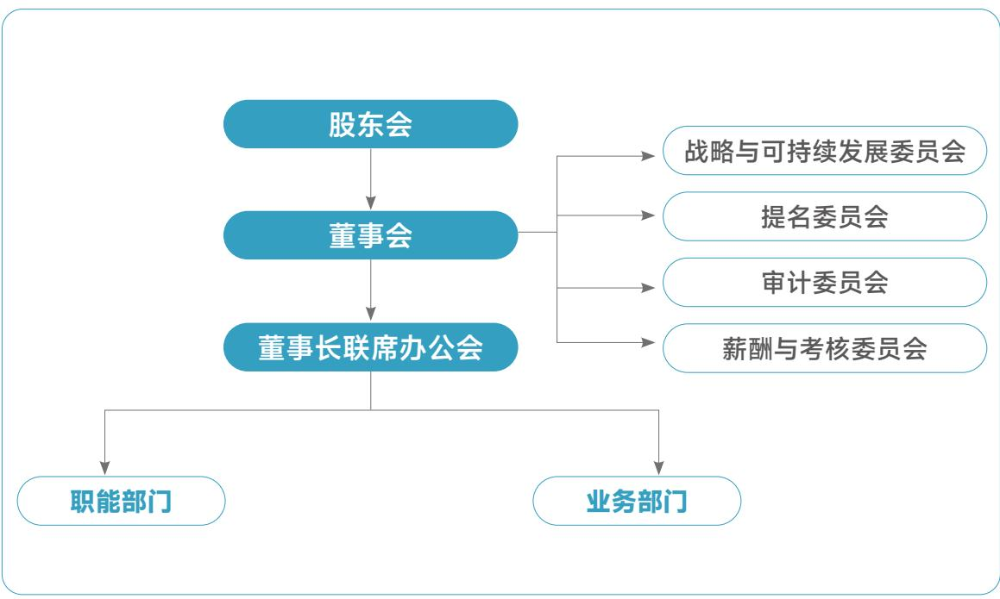

flowchart

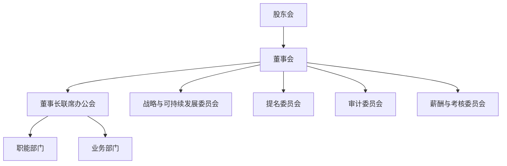
```mermaid
graph TD
  A["股东会"] --> B["董事会"]
  B --> C["董事长联席办公会"]
  B --> D["战略与可持续发展委员会"]
  B --> E["提名委员会"]
  B --> F["审计委员会"]
  B --> G["薪酬与考核委员会"]
  C --> H["职能部门"]
  C --> I["业务部门"]
```

公司治理体系图

## 02 | 公司治理体系

## 股东会

召开次数

5 （次）

审议并通过议案数量

20 （项）

股东会作为公司最高权力机构公司严格按照《中华人民共和国公司法》《上市公司股东会规则》等有关法律、行政法规、部门规章、规范性文件和《公司章程》等规定，规范股东会召集、召开、议事、表决等程序，股东会均采用现场投票与网络投票相结合的方式表决，聘请律师出席股东会，对会议程序出具法律意见并公告。切实保障股东依法享有的各项权利，确保全体股东平等参与公司决策。

## 董事会

召开次数

10 （次）

审议并通过议案数量

（37 项）

出席率

100 （%）

董事会作为公司决策机构，对股东会负责。公司严格遵循《吉大通信董事会议事规则》，明确董事会职权范围规范议事流程与决策机制充分发挥董事会在经营决策中的核心作用切实保障董事会高效规范有序运作，夯实公司可持续发展的决策治理基础。

## 董事会有效性

董事会治理效能是企业高质量发展的保障。2025年，公司董事会审议通过公司未来三年（2025年-2027年）股东分红回报规划、2025年度高级管理人员薪酬与考核方案等37项重大议案，决策效率不断提升。

## 关键绩效

报告期内，审计议案相较于去年增加6项

在制度建设方面，报告期内依据监管要求与经营发展需要，董事会对《吉大通信董事会议事规则》《吉大通信信息披露管理制度》等制度进行了修订。通过持续完善制度、优化决策流程、健全治理制度、优化决策流程，公司董事会运作的规范性与科学性进一步增强。

## 董事会多元性、多样性

目前，公司董事会由 11 名董事组成，其中独立董事 4 人。独立董事占董事会成员比例为 36.36%，女性董事占董事会成员比为36.36%，董事会汇聚企业管理、业务运营、信息技术、财务管理等多领域专业人才，具备多元从业背景与丰富实践经验。审计委员会配备 2 名会计专业人士，部分董事深耕风险防控领域，拥有扎实的专业素养与丰富的实操经验，能够有效协助企业识别、研判、防控及化解各类风险隐患，为董事会科学决策提供专业支撑与可靠依据。

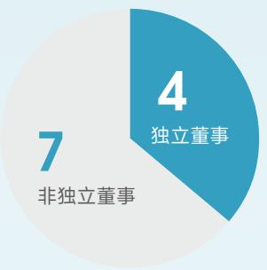

donut

| Category | Value |
| --- | --- |
| 独立董事 | 4 |
| 非独立董事 | 7 |

独立董事和非独立董事占比

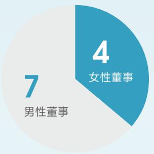

donut

| Category | Value |
| --- | --- |
| 女性董事 | 4 |
| 男性董事 | 7 |

董事中女性董事占比

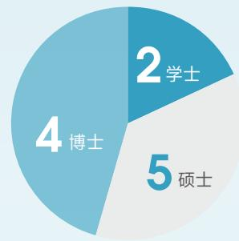

pie

| Category | Value |
| --- | --- |
| 学士 | 2 |
| 硕士 | 5 |
| 博士 | 4 |

董事学历占比

<table><tr><td>姓名</td><td>性别</td><td>年龄</td><td>学历</td><td>职位</td><td>专业知识与技能</td></tr><tr><td>周伟</td><td>男</td><td>51</td><td>博士</td><td>董事长、职工董事</td><td>注册会计师、正高级会计师、高级工程师,工商管理硕士(MBA)、金融管理博士</td></tr><tr><td>李正乐</td><td>男</td><td>52</td><td>硕士</td><td>董事</td><td>副研究员、历史学专业硕士</td></tr><tr><td>丁志国</td><td>男</td><td>57</td><td>博士</td><td>董事</td><td>经济学博士,吉林大学“匡亚明学者”卓越教授,国家社科基金重大项目首席专家</td></tr><tr><td>夏锡刚</td><td>男</td><td>48</td><td>硕士</td><td>董事、总经理</td><td>工商管理硕士、正高级工程师</td></tr><tr><td>李明华</td><td>女</td><td>46</td><td>学士</td><td>董事、副总经理</td><td>注册会计师、高级会计师,具有董事会秘书资格</td></tr><tr><td>胡连全</td><td>男</td><td>52</td><td>硕士</td><td>董事、副总经理</td><td>注册建造师一级、高级工程师</td></tr><tr><td>耿燕</td><td>女</td><td>46</td><td>硕士</td><td>董事、董事会秘书、副总经理</td><td>工程硕士,高级工程师,具有董事会秘书资格、证券从业资格</td></tr><tr><td>邓相军</td><td>男</td><td>61</td><td>硕士</td><td>独立董事</td><td>北京邮电大学毕业留校任教,中国科学院研究生院技术创新MBA</td></tr><tr><td>张晓阳</td><td>女</td><td>52</td><td>博士</td><td>独立董事</td><td>吉林大学民商法学法学博士,东北师范大学应用经济学博士后,索菲亚大学民商法学访问学者,现任东北师范大学政法学院教师</td></tr><tr><td>苏治</td><td>男</td><td>48</td><td>博士</td><td>独立董事</td><td>吉林大学数量经济学专业经济学博士,美国得克萨斯大学工商管理硕士,现任中央财经大学教授、金融科技系主任、联合数据研究中心执行副主任</td></tr><tr><td>王晓慧</td><td>女</td><td>43</td><td>学士</td><td>独立董事</td><td>高级会计师,吉林省财政厅会计咨询专家、吉林省科技厅科技专家库成员(财务专家),现任吉林电子信息职业技术学院数字商贸学院副教授</td></tr></table>

## 董事会专门委员会

公司董事会下设审计、提名、薪酬与考核、战略与可持续发展 4 个专门委员会，构建了完善的治理架构。报告期内，各委员会严格遵循议事规则，积极建言献策，及时将前置审核意见提交董事会审议，切实履行监督和决策支持职能。

## 审计委员会

由 7 名董事组成，其中独立董事 4 名。审计委员会由会计专业人士担任召集人，确保专业判断的准确性。负责统筹审核财务信息披露、监督评估内外部审计与内部控制有效性，并对财务报告披露、审计机构选聘等关键事项审议后提交董事会决策。

## 提名委员会

由 7 名董事组成，其中独立董事 4 名。提名委员会负责统筹董事及高级管理人员选任相关工作，拟定选任标准与程序、搜寻审核合格人选，就董事会规模构成、董事任免及高管解聘等事项向董事会提建议。

## 薪酬与考核委员会

由 5 名董事组成，其中独立董事 4 名。薪酬与考核委员会负责制定董事及高级管理人员的考核标准并对其进行考核，制定审查其薪酬政策方案并监督薪酬制度执行，就董事高管薪酬、股权激励及员工持股计划等事项向董事会提建议。

## 战略与可持续发展委员会

由 11 名董事组成，其中独立董事 4 名。战略与可持续发展委员会负责公司长期发展与 ESG 管理核心工作，研究并提出长期发展战略、重大投融资及资本运作等事项建议，审议并批准公司ESG 发展战略与目标、管理制度等。

董事会专门委员会召开次数以及成员出席比率

<table><tr><td>董事会专门委员会</td><td>非独立董事人数(位)</td><td>独立董事人数(位)</td><td>召开次数</td><td>审议并通过议案数量(项)</td><td>出席率(%)</td><td>独立董事是否担任召集人</td></tr><tr><td>提名委员会</td><td>3</td><td>4</td><td>1</td><td>2</td><td>100%</td><td>是</td></tr><tr><td>审计委员会</td><td>3</td><td>4</td><td>7</td><td>26</td><td>100%</td><td>是</td></tr><tr><td>战略与可持续发展委员会</td><td>7</td><td>4</td><td>5</td><td>10</td><td>100%</td><td>否</td></tr><tr><td>薪酬与考核委员会</td><td>1</td><td>4</td><td>1</td><td>1</td><td>100%</td><td>是</td></tr></table>

## 监事会

召开次数

2 （次）

审议并通过议案数量

14（项）

出席率

100 （%）

报告期内，公司依据新《中华人民共和国公司法》及上市公司治理相关规定，对内部监督架构进行优化调整：撤销监事会，不再设置监事职位，原监事会职权由董事会审计委员会行使。公司已修订《公司章程》，废止《吉大通信监事会议事规则》，实现监督职能平稳过渡与有效提升。

natural_image

Illustration of business professionals in a meeting setting with checkmarks and location pins, no readable text or symbols present.

## 03 | 董事、监事、高级管理人员薪酬管理

公司建立健全董事及高级管理人员的绩效评价与激励约束机制，由董事会薪酬与考核委员会牵头统筹董事及高级管理人员的绩效考核工作，构建科学规范的考核体系，结合 ESG 绩效考核，充分激发管理层履职积极性与创新活力，为公司战略规划的稳步落地提供长效保障。

报告期内，公司根据治理结构调整安排已取消监事职位；报告期内发放的监事薪酬，系按照相关法律法规、公司章程及原任职期间的约定执行，为对应履职期间的合理报酬。

董事及高管的薪酬体系严格遵循市场化、绩效导向原则，结合岗位权责特性实施差异化薪酬管理。

内部董事的薪酬构成及绩效考核标准，统一参照公司高管薪酬管理制度执行；

外部董事按规定领取固定年度津贴3万元/年；

独立董事仅享有公司发放的独立董事津贴6万元/年，不额外获取其他薪酬。

内部监事按照在公司任职的职务与岗位责任确定薪酬标准，外部监事领取固定年度津贴。

公司内部董事、高级管理人员的薪酬结构由基本薪酬、绩效薪酬及中长期激励收入等组成，绩效薪酬占比原则上不低于基本薪酬与绩效薪酬总额的百分之五十，绩效薪酬和中长期激励收入的确定和支付应当以绩效评价为重要依据。

## 关键绩效

报告期内，董事、高级管理人员从公司获得的报酬总额 551.43万元。

## 04 | 合规与风险管理

## 治理

合规管理是企业风险防控和可持续发展的重要保障，吉大通信参照《中央企业合规管理办法》及国内相关法律法规，在报告期内，公司结合实际情况，修订并发布《吉大通信合规管理制度》《吉大通信诚信合规手册》等内部合规管理制度，确保公司运营的合规性与稳定性。公司每年开展全领域合规风险排查，并制定针对性防范措施，切实降低合规风险。公司对重大决策、制度流程及文件进行合法合规性审查，并提出审核意见，确保管理流程的有效执行。

## 战略

参照国务院国资委《中央企业合规管理办法》中公司建立完善的合规与风险管理体系的要求，构建了组织严密、流程规范、运行高效的合规管理架构体系。通过定期开展合规风险排查，对识别出的合规风险进行评估，确定风险的可能性和影响程度，制定风险应对措施，及时发现和解决新出现的合规风险问题。

合规与风险管理体系

<table><tr><td>责任部门/人员</td><td>主要合规职责</td></tr><tr><td>董事会</td><td>负责批准公司合规管理战略、基本制度和政策,监督合规管理工作的实施。</td></tr><tr><td>董事长联席会及经营管理层</td><td>负责组织实施公司合规管理战略、制度和政策,建立健全合规管理体系,确保合规管理工作的有效运行。</td></tr><tr><td rowspan="3">合规管理部门</td><td>战略风控法务部:制定制度流程,识别评估风险,提供咨询。</td></tr><tr><td>审计监察部:监督制度执行,排查风险,监督违规行为。</td></tr><tr><td>华鸿学院:开展合规培训与考核。</td></tr><tr><td>各部门及分支机构</td><td>落实本单位合规管理要求,报告合规风险信息。</td></tr><tr><td>全体员工</td><td>对自身行为合规负责,遵守制度,参与培训,报告风险。</td></tr></table>

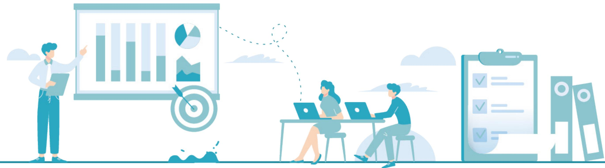

natural_image

Illustration of a presenter presenting data on a presentation board with charts and a target, alongside two people working at laptops; no text or symbols present.

## 影响、风险和机遇管理

## 健全管理制度

根据公司合规管理要求，制定发布《吉林吉大通信设计院股份有限公司合同审批管理办法》《公司吉大通信印鉴使用管理办法》等一系列制度，在合同管理、印章管理及其他公司运营环节规范企业行为，并主动跟踪重要法律法规变化，及时调整相关内容确保合规。

## 优化管理程序

风险管理方面，吉大通信通过优化风险管理程序，将风险管理融入企业运营各个环节，明确各层级在内部控制评价与风险评估活动中的具体职责，以强化风险源头管控能力，持续提升风险管理质量。在风险管理策略层面，公司实施“识别 - 评估 - 应对 - 监测”四维管理机制，科学设定风险承受底线，确保风险始终处于可控范围，以有效防范和化解经营过程中可能出现的各种风险。战略风控法务部以防范风险为导向，在董事会指导下开展系统性风险防控工作，通过持续完善风险管理制度，构建覆盖全业务链的风险管理机制，切实保障公司合规运营。同时，公司建立重大风险预警、报告工作机制，制定《关于落实董事会直属部门工作事务的通知》，明确风险事件报告及处置的相关要求及程序，防范重大风险事件的发生。

## 强化内部审计

公司通过内控政策、流程、权限、架构与信息系统的联动，全面覆盖财务、运营、合规关键领域，保障业务合规高效运转。同时，定期评估内控有效性，动态调整管控措施以应对内外部变化；常态化开展风险评估，及时整改内控缺陷并跟踪落实；借助内外部审计、日常监督等多渠道监督，确保内控机制科学有效。

为确保经营合法合规、资产安全、财务信息真实完整，吉大通信依据《企业内部控制基本规范》等规定 结合公司实际制定《吉大通信内部审计监察管理制度》等内控文件，明确审计监察部为内控评价工作的组织实施主体，通过规范流程、强化监督、定期自评，提升内控管理质效。公司建立“审前准备—审计实施—报告出具”的全链条内部审计流程，以科学机制推进审计工作，有效防控经营风险。报告期内，审计监察部按董事会审计委员会要求，完成货币资金、募集资金、分子公司年报及内控检查等12项工作，问题整改率100%。

## 严控合规风险

审查过程

业务部门提报风险事件

核查事件事 实情况

进行风险分析与评估出具风险审查文件，提出风险提示与建议

为防范重大风险发生 公司建立重大风险预警与报告工作机制并制定《关于落实董事会直属部门工作事务的通知》，明确风险事件报告及处置的具体要求与流程。公司按年度开展风险管理审查工作，以业务部门为切入点，通过风险提示、事件核查、风险分析评估等环节，最终出具风险审查文件，督促相关事项整改落实。

## 营造合规文化

为强化员工风险防范意识、提升全员法律素养，公司通过线上与线下相结合的形式，常态化开展风险防控及法律知识专项培训，全面增强员工的风险应对能力。

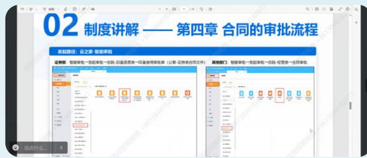

text_image

02 制度讲解 —— 第四章 合同的审批流程
发起路径：云之掌 智能审批
证源部 智能审批一发起审批一目标：印章资质类一印章使用审批单（公章 证券类合同文件）
其他部门 制度审批一发起审批一目标：经营类一合同审批

2025年12月9日合同审批管理办法培训

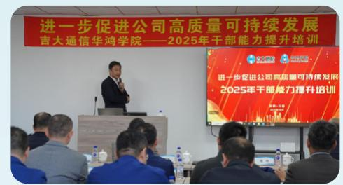

text_image

进一步促进公司高质量可持续发展
吉大通信华鸿学院——2025年干部能力提升培训
进一步促进公司高质量可持续发展
·2025年干部能力提升培训

2025年干部能力提升培训

## 税务管理

税务合规是企业合规经营的重要基础。吉大通信严格遵循《中华人民共和国税收征收管理法》《中华人民共和国企业所得税法》等相关法律法规，制定《财务管理制度》，按时申报并及时缴纳税款，规避税务风险，持续完善税务管理流程，构建起全面系统的税务管理体系。

## 税收风险防控措施

通过税务管理前置以及信息化事中监控的双重举措，构建全流程税务风险防控机制，保障公司税务合规。

1. 搭建专业化税务合规管理体系：在财务部设置专职税务合规岗位，负责动态跟踪行业税收政策变化、统筹应对税务稽查事项、组织开展内部税务合规培训，夯实税务管理基础。  
2. 强化业务全流程税务关键节点管控：

合同签订前完成业务税务定性，明确分项金额、税率及开票条款；

发票管理严格核验“四流一致”，防范虚开风险；

研发费用加计扣除等优惠事项留存完整备查资料；

借助财务软件设置税负率等指标预警，实现风险主动防控。

3. 常态化开展税务健康自查：按季度或半年度周期，对照税务风险清单，对纳税申报重点领域开展全面自查，及时识别并化解潜在风险。

4. 系统化组织税务专项培训：积极组织人员参与线下培训，深度学习最新税收政策与行业稽查典型案例；联合专业税务机构开展内部培训，覆盖财务及业务全员，提升整体税务风控意识。

## 指标

202

战略风控法务部完成风险审查工作共计 件。31

合同审查量共计 件，较去年同期增加 件。5041 210

内部审计次数共 次，问题整改数量 个。12 21

合规培训累计 小时，培训人次 次。12.5 703

报告期内，公司财务报告及非财务报告内部控制不存在重大缺陷、重要缺陷。

## 05 | 投资者权益保护

公司严格遵守《上市公司投资者关系管理工作指引》等法律法规及《公司章程》的有关规定，构建并持续完善投资者权益保护长效机制，健全信息披露事务管理制度。公司重视投资者诉求，加强与投资者及潜在投资者之间的沟通，力求与全体投资者共享发展成果，持续提升公司治理水平和企业整体价值。

## 治理

公司专设证券部，作为投资者权益保护工作责任部门，牵头统筹相关工作的组织实施，通过完善制度建设，优化流程管理，为投资者权益保护工作的高效推行筑牢机制保障，报告期内公司修订发布《吉大通信投资者管理制度》并严格落实相关规定，构建多渠道、多平台、多形式的投资者沟通交流体系，扎实开展投资者关系管理工作。公司董事会充分发挥监督和指导作用以全流程监督与专业化指导推动投资者权益保护工作落地见效，保障公司治理的透明公正，切实维护投资者的合法权益。

## 战略

坚持平等对待所有股东，切实维护中小股东与机构投资者的同等知情权、参与权。深化投资者关系管理体系建设，建立常态化、多元化沟通机制，高效回应投资者及市场关切。

恪守真实、准确、完整、及时、公平的披露原则，严格遵守信息披露相关法规规则，规范信息披露流程，确保投资者能够充分了解公司情况，做出科学合理的投资决策。

打造稳健可持续的投资回报机制，综合研判公司财务现状、发展规划与股东利益诉求，确保投资者获得公平合理、长期稳定的投资回报。

## 影响、风险和机遇管理

## 信息披露管理

公司严格遵守信息披露相关法律法规要求，在报告期内修订了《吉大通信信息披露管理制度》《吉大通信重大信息内部报告制度》等制度明确规范信息披露原则标准，管理与责任保密措施等事项，报告期内公司在中国证监会指定信息披露媒体上真实、准确、完整、及时地履行了信息披露义务。同时，公司加强内幕信息管理，防止内幕交易等违法违规行为的发生，切实维护市场的公平、公正、公开。报告期内不存在因违反信息披露规定而受到处罚的情况。

## 投资者关系管理

公司高度重视投资者关系管理，在报告期内修订发布了《吉大通信投资者管理制度》《吉大通信舆情管理制度》等相关制度，构建了多渠道、多平台、多形式的投资者沟通交流体系，扎实开展投资者关系管理工作。2025年，公司通过组织召开业绩说明会，机构调研接待及投资者交流等活动，针对投资者重点关注的公司战略方向、经营发展状况及5G技术应用与创新等核心议题，主动沟通，高效回应 深化投资者对公司业务和战略的理解，增强投资者对公司的信心。

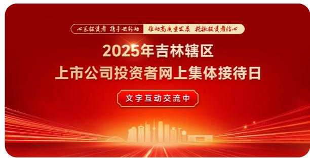

text_image

心系投资者 指手共活动 推动高质量发展 托旗投资者信心
2025年吉林辖区
上市公司投资者网上集体接待日
文字互动交流中

2025年5月27日吉林辖区上市公司投资者网上集体接待日

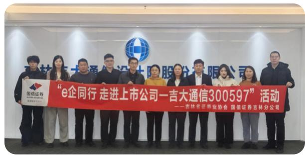

text_image

吉林大通电气股份有限公司
“e企同行 走进上市公司一吉大通信300597”活动
——吉林市证券业协会 国信证券吉林分公司

2025年12月26 日国信证券吉林分公司联合吉林省证券业协会走进上市公司

## 投资者回报

公司为切实贯彻《关于进一步落实上市公司现金分红有关事项的通知》《上市公司监管指引第 3 号——上市公司现金分红》等规范性文件要求，公司构建合理的投资回报机制，在报告期内，制定了《未来三年（2025 年 -202年）股东分红回报规划》，积极与股东共享发展成果，持续为股东创造价值。

公司自 2017 年上市以来，共实施 9 次分红，累计现金分红 4,008.44 万元。报告期内，公司以 2025 年 7 月 9 日为权益分派股权登记日，实施了 2024 年度权益分配方案，向全体股东每 10 股派发现金红利 0.04 元（含税），共计派发股利1,066,327.92元，不送红股，不转增。

鉴于公司 2025 年度未盈利，同时综合考虑公司目前生产经营和发展所需资金情况，为进一步提高公司长远发展能力，把握行业发展机遇，更好地维护全体股东的长远利益，拟定2025年度不进行利润分配，以实现公司持续、稳定、健康发展，为投资者提供更加稳定、长效的回报。

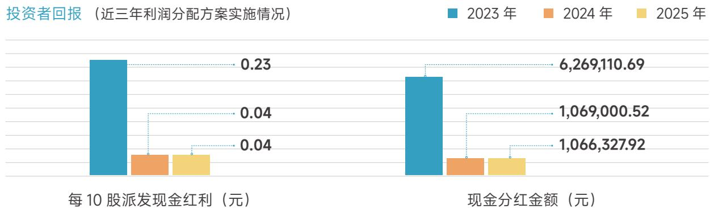

bar

| 指标 | 2023年 | 2024年 | 2025年 |
| --- | --- | --- | --- |
| 每10股派发现金红利 (元) | 0.23 | 0.04 | 0.04 |
| 现金分红金额 (元) | 6,269,110.69 | 1,069,000.52 | 1,066,327.92 |

## 指标

## 信息披露

披露定期报告 份4

临时报告 份148

深交所上市公司

年度信息披露考核 A

Wind-esg 评级 A

## 投资者关系

开展投资者交流活动 次1

与投资机构开展交流 次1

召开业绩说明会 次3

投资者问题回复率100%

互动易与投资者互动 次150

接听投资者电话 次240

## 06 | 商业道德

## 反商业贿赂及反贪污

深入贯彻落实国务院国资委党委《关于加强中央企业廉洁风险防控工作的指导意见》，系统构建廉洁风险防控长效机制，不断强化廉政建设与反腐败工作实效。

## 治理

公司严格遵循《关于禁止商业贿赂行为的暂行规定》等法律法规，建立健全《吉大通信廉洁体系制度》《吉大通信反舞弊制度》等内部管理制度。公司通过持续深化监督体系高效运行，全面提升预防腐败工作的制度化、规范化、科学化水平。

## 战略

公司恪守商业行为准则，持续推进企业反腐倡廉建设，坚决抵制腐败和欺诈行为，依法合规参与市场竞争，对贪腐行为采取零容忍态度，严禁任何形式的腐败，贿赂或舞弊行为，反对任何形式的商业贿赂洗钱、垄断、不正当竞争行为，树立廉洁和勤勉敬业的良好风气。

## 影响、风险和机遇管理

## 商业贿赂与贪污风险管理流程

识别与评估范围：  
定期开展风险识别工作，全面系统地识别业务环节、岗位职责、外部关系及其他方面所面临的相关风险。  
风险评估与排序：  
采用专家评估、流程图分析、风险矩阵等定性与定量相结合的方法，对所识别的风险进行评估，并按照发生可能性、影响程度进行排序。  
风险应对措施：

预防措施：不断完善《吉大通信反舞弊制度》《吉大通信廉洁体系制度》等制度；加强员工职业道德教育和廉洁从业培训；建立举报机制鼓励员工举报违规行为：对供应商进行廉洁评估，签订廉政从业协议

控制措施：严格执行采购流程，加强招投标管理；加强合同管理，明确双方权利义务；加强财务审计，防范资金风险。

补救措施：对违规行为进行调查处理，追究相关人员责任；完善内部控制制度，堵塞管理漏洞；加强企业文化建设，营造廉洁从业氛围。

## 廉洁反腐全覆盖

公司组织全员签署《吉大通信廉政从业协议书》，织密织牢横向到边、纵向到底的廉政责任网络，切实将反腐倡廉工作要求融入员工日常行为规范与岗位职责。

## 供应商廉洁管理

## 建立廉洁风险管理系统

利用大数据、人工智能等技术，对业务数据进行实时监控和分析，识别潜在风险。

## 开发电子化采购平台

实现采购流程透明化、规范化，减少人为干预。

## 应用区块链技术

确保数据真实可靠，防止数据篡改。

## 推广移动办公

方便员工随时随地处理业务，提高工作效率，同时加强流程监控。

## 举报与举报人保护

公司搭建高效畅通、公开透明的举报渠道，鼓励员工、供应商、客户及其他利益相关方，通过电子邮箱、信函邮寄等多种方式，对公司范围内的违法违纪行为进行实名或匿名举报，公司严格保障举报者的信息安全和权益承诺对举报者身份进行保密，并确保其不会因举报 而遭遇不公平解雇、伤害或不正当纪律处分。对于实名举报目经查证属实的公司将根据举报事项的性质，情节严重程度以及对公司造成的损失或影响范围给予举报人相应奖励。建立了完善的举报管理与处理机制，确保全体员工及相关方能够通过举报电话、举报邮箱等渠道，在保密前提下 举报与公司相关的违规行为。

## 举报渠道

受理部门：审计监察部  
受理人邮箱地址：jdtxsjjcb@163.com  
邮政编码：130000  
举报地址：吉林省长春市朝阳区湖畔诚品 9 栋 7 层审计监察部

## 指标

报告期内未发生商业贿赂及贪污事件。

廉政从业等有关商业道德书签署率 100%。

未有董事、管理层人员、员工由于商业贿赂或贪污行为而被解雇或受到处分、被有权部门调查。

未出现针对公司或其董事、管理层人员、员工商业贿赂或贪污行为的诉讼案件。

## 反垄断与反不正当竞争

吉大通信严格遵守《中华人民共和国反垄断法》《中华人民共和国反不正当竞争法》等法律法规，秉持“守法合规、预防为主、全员参与、持续改进”的原则。维护公平竞争的市场环境，保障良性有序的商业竞争秩序。

## 治理

公司制定了《反垄断与反不正当竞争合规管理制度》，规定董事会作为相关工作的监督机构，监督反垄断与反不正当竞争合规管理工作的实施。

## 影响、机遇和风险管理

公司制定并实施一系列举措，严格防范商业混淆、商业贿赂等不正当竞争行为。

## 防范商业混淆行为

相关部门在设计宣传资料、企业标识等内容时，须进行充分的市场调研，确保不与他人的标识或名称发生混淆。

## 防范商业贿赂行为

业务往来中，建立健全礼品、招待等费用管理制度，明确礼品赠送和招待的标准和审批程序，避免因不当的礼品赠送或招待行为被认定为商业贿赂。

## 防范虚假宣传行为

在进行广告宣传、产品推广等活动时，遵守国家法律法规等相关规定，并确保宣传内容真实、合法、准确、清楚、明白，具有充分的事实依据。

## 防范侵犯商业秘密行为

禁止通过盗窃、贿赂、欺诈、胁迫、电子侵入或者其他不正当手段侵犯竞争对手商业秘密。

## 防范诋毁商誉行为

不得编造、传播虚假信息或者误导性信息，损害竞争对手的商业信誉、商品声誉。

## 指标

报告期内，公司未发生因不正当竞争行为导致的诉讼或重大行政处罚事件。

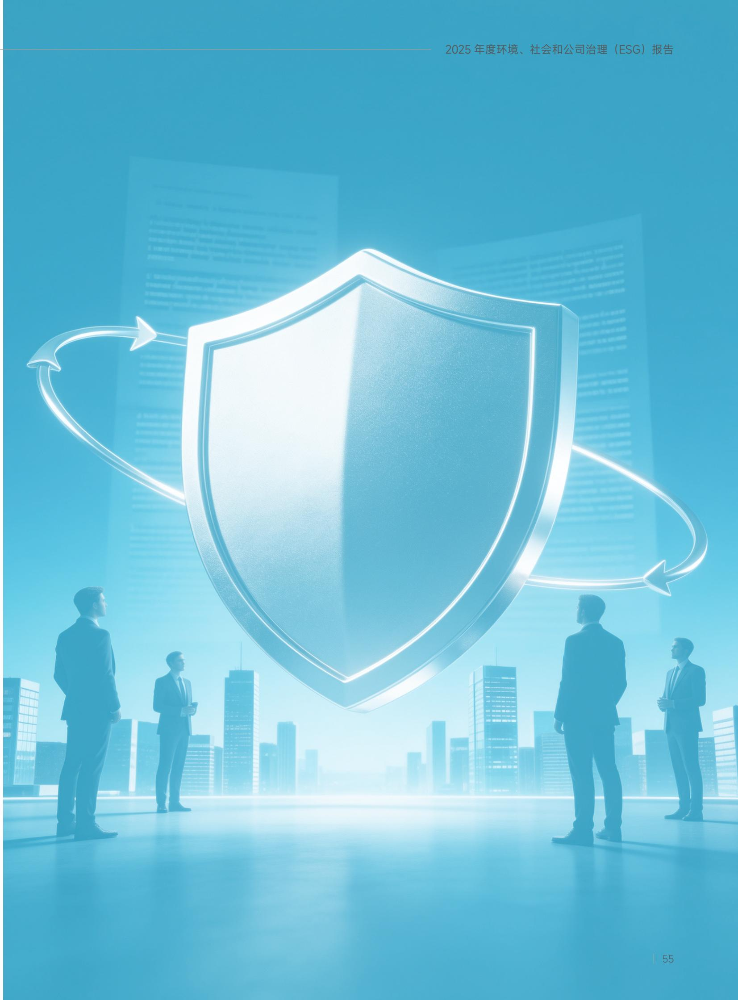

text_image

2025 年度环境、社会和公司治理（ESG）报告
55

## 环境篇

## 绿色赋能，永续发展

吉大通信将应对气候变化融入公司可持续发展战略框架，将环境保护作为公司高质量成长的基石，通护等多维行动，落实国家“双碳”目标要求，助力社会经济可持续发展。

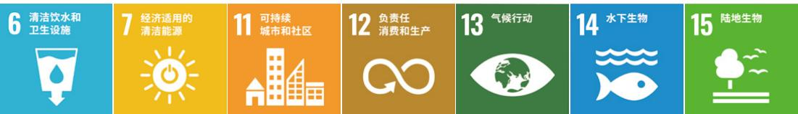

flowchart

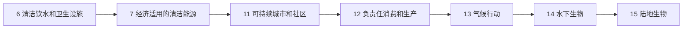
```mermaid
graph LR
  A["6 清洁饮水和卫生设施"] --> B["7 经济适用的清洁能源"]
  B --> C["11 可持续城市和社区"]
  C --> D["12 负责任消费和生产"]
  D --> E["13 气候行动"]
  E --> F["14 水下生物"]
  F --> G["15 陆地生物"]
```

## 我们的实践

应对气候变化 58

可持续发展的治理保障 69

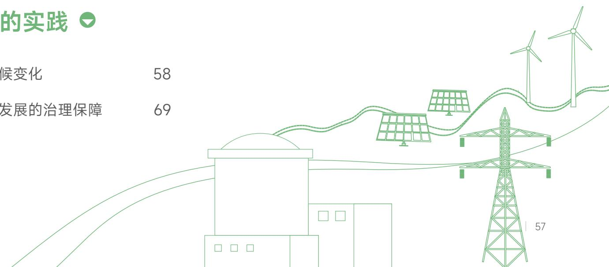

flowchart

This image displays a business process flow diagram illustrating the workflow of an environmental protection and governance system, including data collection for climate change and governance stability.

## 应对气候变化

面对全球气候挑战，吉大通信深度关切气候变化的长期影响，恪守国家法律法规与政策导向，围绕治理、气候风险与机遇评估、影响、风险和机遇管理、气候治理实践、指标与目标五个层面，系统推进气候相关风险识别与管理，积极落实国家碳达峰碳中和战略部署，致力于为全球可持续发展注入企业动力。

## 治理

公司制定并实施了《吉大通信应对气候变化管理制度》，构建了由董事会统筹的气候治理架构，将气候管理职责完整嵌入公司 ESG 体系，形成从决策到执行的整体管控机制，并将 ESG 及气候相关绩效指标与信息报送质量纳入各部门管理者的考核评价范围，从而为持续推动气候变化系统化管理奠定了坚实的制度基础与组织保障。

## 董事会

战略与可持续发展委员会

ESG与气候变化管理小组

ESG与气候变化执行小组

<table><tr><td>负责部门</td><td>工作职责</td></tr><tr><td>董事会</td><td>对 ESG 负有最高权力和最终责任,负责气候变化、人权等 ESG 问题的监督。</td></tr><tr><td>战略与可持续发展委员会</td><td>统管应对气候管理变化制度的实施。</td></tr><tr><td>ESG 与气候变化管理小组</td><td>1.建立气候变化在公司经营管理层面的实施机制,建立清晰的组织架构和职责分工,评估气候变化管理方法。2.建立对气候变化指标的测量和监控机制;联动和协调公司高级管理层和各相关部门,做好各项工作的组织、协调和督促检查工作,推动气候变化绩效目标完成。</td></tr><tr><td>ESG 与气候变化执行小组</td><td>1.完善公司的气候变化信息披露质量及报告编制机制,对标通用指标体系和国际标准,全面、规范地沟通和展示公司气候变化方面的绩效。2.持续落实和推进公司气候变化提升行动,收集和披露相关数据、信息,并保证信息的准确性、时效性、平衡性和一致性。3.定期开展气候变化信息收集、整理与分析、风险与机遇识别工作,并定期向 ESG 与气候变化领导小组汇报。4.回应利益相关方对公司气候变化事务的意见和问询。</td></tr></table>

## 战略

开展气候变化影响评估，识别公司运营中的气候相关风险和机遇:制定温室气体排放清单:统计和记录公司温室气体排放量；建立、保持并持续完善落实气候变化承诺的管理制度和信息系统；建立与各部门职责相匹配的部门层面的气候变化具体目标和指标，并将ESG与气候变化指标绩效及指标信息收集水平纳入部门管理者的考核体系。

## 气候风险与机遇评估

公司以系统化的气候变化影响评价为基础，全面辨识公司运行流程中所面临的气候相关风险及潜在发展机遇，并据此形成专项管理预案与实施措施，从而有效缓解气候因素对经营活动可能造成的负面影响，确保企业实现长远稳健经营。

<table><tr><td colspan="2">风险类型</td><td>风险描述</td><td>发生概率</td><td>影响大小</td><td>影响的时间范围</td><td>影响的价值链环节</td><td>优先级排序</td><td>潜在财务影响</td><td>公司采取的应对措施</td></tr><tr><td rowspan="2">物理风险</td><td>短期风险</td><td>极端天气(如台风和洪水)恶劣程度的增加。</td><td>低</td><td>高</td><td>短、中期</td><td>运营</td><td>高</td><td rowspan="2">1.由于生产能力下降(如运输困难、供应链中断),收入减少。2.由于对劳动力的负面影响(如健康、安全、缺勤),收入减少和成本增加。3.现有资产的注销和提前报废(如在极端天气高发地区对财产和资产的损坏)。4.运营成本的增加(如水电站的来水不足、核电站和火电厂缺乏足够的冷却水)。5.资金成本的增加(如设备损坏)。6.销售/产出降低引起的收入减少。7.保险费提高以及极端天气高发地区资产可投保险种减少的可能性。</td><td>1.构建贯穿监测预警、预案处置到实战演练的完整应急管理体系。2.制定针对不同类型极端天气事件的应急预案。3.加强关键基础设施的防洪、防风、抗震等设计,提升抵御极端天气事件的能力。4.建立极端天气预警机制。5.采取有效措施保障员工在极端天气下的安全。</td></tr><tr><td>长期风险</td><td>1、降水模式的变化和气候模式的极端波动。2、平均气温不断上升。3、海平面不断上升。</td><td>低</td><td>中</td><td>中、长期</td><td>运营</td><td>低</td><td>1.持续关注气候变化的进展和趋势。2.评估长期气候变化对企业运营的潜在影响。3.提前制定应对策略和措施。</td></tr></table>

## 战略

<table><tr><td colspan="2">风险类型</td><td>风险描述</td><td>发生概率</td><td>影响大小</td><td>影响的时间范围</td><td>影响的价值链环节</td><td>优先级排序</td><td>潜在财务影响</td><td>公司采取的应对措施</td></tr><tr><td rowspan="4">转型风险</td><td>政策和法律风险</td><td>1.上涨的温室气体排放配额价格。2.强化排放报告义务。3.现有产品和服务的强制要求和监管。4.诉讼风险。</td><td>低</td><td>高</td><td>短、中、长期</td><td>运营</td><td>中</td><td>1.增加的运营成本(例如,更高的合规成本、增加的保险费)。2.由于政策变动,现有资产的减值和提前报废。3.由于罚款和判决,产品和服务的成本增加和/或相应需求减少。</td><td>1.密切关注国际、国内环境和碳相关法律法规、政策变化。2.落实国家战略部署,系统推进气候变化管理体系建设,持续优化气候变化应对措施。3.及时了解和实施节能、安全和环保监督部门政策要求。4.系统性优化长期能效表现与成本结构。5.根据法律法规要求动态调整减排策略。对减排路径与实施方案进行定期审视与动态更新,确保经营活动始终符合合规要求,有效防范潜在法律与监管风险。6.加大常规和专项排查力度,及时发现风险,及时整改并配备符合要求的设备设施。7.进行节能、环保和安全法律法规知识培训,提高员工的节能、安全和环保意识。</td></tr><tr><td>技术风险</td><td>1.对现有产品和服务的低排放量替代品。2.对新技术的投资失败。3.向低排放技术转换的成本。</td><td>中</td><td>低</td><td>中、长期</td><td>运营</td><td>低</td><td>1.现有资产的注销和提前报废。2.对现有产品和服务的需求减少。3.在创新和替代技术方面的研发(R&amp;D)支出。4.在技术开发方面的资金投入。5.采用/部署新方法和流程的成本。</td><td>1.主动应对行业技术转型压力,加强对清洁技术与能效提升领域的战略性投入。2.着力推动新兴低碳解决方案的产业化落地与规模化应用。3.聚焦生产工艺优化与流程再造,系统部署并实施具有显著节能效益的技术方案。</td></tr><tr><td>市场风险</td><td>1.不断变化的客户行为。2.市场信号的不确定性。3.原材料成本的增加。</td><td>低</td><td>中</td><td>中、长期</td><td>下游</td><td>中</td><td>1.由于客户偏好的转变,商品和服务的需求减少。2.由于投入价格(如能源、水)和产出需求(如废物管理)的不断变化,生产成本增加。3.能源成本突然和意外的转变。4.由于收入组合和来源的变化,收入减少。5.资产的重新定价(如化石燃料的储备、土地估值、证券估值)。</td><td>1.在对产品需求、生产成本、能源价格、资产定价等因素充分调研的前提下,提前对公司市场前景和战略进行预判和规划。2.追踪市场需求变化,推出绿色、低碳、环保的产品及服务,满足客户对环保和可持续发展的更高要求。3.持续健全材耗、能耗等资源管理机制,推进生产环节的节能节材技术升级与应用,降低整体资源消耗水平。4.建立资源管理数据分析、常态化监测分析体系,持续改进运营效率,强化成本精细化管理能力。5.在进行充分市场调研的基础上开拓新的产品和业务领域,培育新的增长点和盈利点。</td></tr><tr><td>声誉风险</td><td>1.客户偏好的转变。2.某些行业的声誉风险。3.利益相关方的担忧增加或负面反馈。</td><td>低</td><td>中</td><td>短、中、长期</td><td>运营</td><td>低</td><td>1.由于商品/服务需求的减少,收入减少。2.由于生产能力下降(如计划审批拖延、供应链中断),收入减少。3.由于劳动力管理和规划(如吸引和挽留员工)的负面影响,收入减少。4.可用资金的减少。</td><td>1.预判行业及产品前景变化情况,规划公司中长期市场及产品战略。2.及时根据客户需求调整产品方向和种类。3.严格按照服务标准作业,不断提高服务质量。4.主动回应利益相关方的诉求和关切,并根据利益相关方的意见和建议及时做出调整和改进,打造负责任企业形象。</td></tr></table>

## 战略

<table><tr><td>机遇类型</td><td>机遇描述</td><td>发生概率</td><td>影响大小</td><td>影响的时间范围</td><td>影响的价值链环节</td><td>优先级排序</td><td>潜在财务影响</td><td>公司采取的应对措施</td></tr><tr><td>资源效率</td><td>1.使用更有效率的运输模式。2.使用更有效率的生产和配送流程。3.使用回收品。4.搬到节能效率更高的建筑物。5.减少用水和消耗。</td><td>高</td><td>中</td><td>短、中期</td><td>运营</td><td>中</td><td>1.降低运营成本(如通过效率提升和降低成本)。2.生产能力提高,从而增加收入。3.固定资产的价值增加(如节能效率等级高的建筑)。4.劳动力管理和规划的收益(如健康水平和安全条件的改善、员工的满意度)而带来的成本下降。</td><td>1.持续优化资源使用效率,深化绿色运营,加强水资源及其他资源的精细化管理。2.通过引入先进的生产技术和自动化设备,优化生产流程,减少生产过程中的资源浪费。3.加强生产环节的监控和管理,确保生产过程的稳定性和可控性,进一步提升生产效率和产品质量,提高产品和业务附加值。4.优化劳动力管理规划,通过科学合理的排班制度、技能培训与激励机制,提升员工工作效率与积极性,同时关注员工健康与安全,营造良好的工作氛围,进而降低因人员流动或效率低下带来的成本。</td></tr><tr><td>能源效率</td><td>1.使用低排放的能源。2.使用政策支持激励。3.使用新技术。4.参与碳市场。5.转向分散的能源产生来源(如增加清洁能源的占比)。</td><td>高</td><td>中</td><td>短、中期</td><td>运营</td><td>中</td><td>1.运营成本的降低(如通过使用最低成本的减排方法)。2.减少未来化石燃料价格上涨带来的影响。3.减少温室气体的排放,从而减少对碳排放成本变化的敏感性。4.低排放技术投资的回报。5.可用资金的增加(如更多的投资者青睐低排放的制造商)。6.声誉变好使产品/服务的需求增加。</td><td>1.构建低碳能源管理体系、提升清洁能源比例,系统性地提升能源使用效率,实现运营优化与环境绩效的双重提升。2.主动引入并落地创新技术,着力提高基础设施及运输工具的能效水平。3.参与碳交易机制,有效管理和控制碳排放水平,利用市场机制以较低成本实现减排目标。</td></tr><tr><td>产品和服务</td><td>1.低排放产品和服务的发展和/或扩张。2.发展适应气候变化的需求(如保险中的风险转移产品和服务)。3.通过研发和创新开发新产品或服务。4.多元化经营能力。5.客户偏好的转变。</td><td>中</td><td>中</td><td>中、长期</td><td>下游</td><td>中</td><td>1.对低排放产品和服务的需求增加使收入增加。2.提供适应需求的新解决方案增加收入(如保险中的风险转嫁产品和服务)。3.符合客户偏好的转变而处于更好的竞争位置,使收入增加。</td><td>1.通过绿色设计、绿色施工及绿色产品和服务提升市场需求,提高经济效益。2.持续监测市场偏好变化,灵活调整产品策略,快速推出符合市场新趋势的绿色产品,从而在竞争中保持竞争优势,实现稳步增长。3.促进产业链上下游协同低碳发展,实现降能减耗增效。</td></tr><tr><td>市场</td><td>1.进入新市场。2.申请获得公共部门的激励和奖励。3.进入需要保险覆盖的新资产和地区。</td><td>中</td><td>中</td><td>短、中、长期</td><td>下游</td><td>高</td><td>1.通过进入新市场(如和政府、开发银行合作)增加了收入。2.增加金融资产的多元化(如绿色债券和基础设施资产支持证券)。</td><td>1.积极拓展绿色技术、人工智能相关的新兴市场领域。2.不断扩大政企数字化业务,抓住数字中国、智慧城市、行业信息化等重大建设契机。3.不断增加智慧产品的覆盖面,自主研发智慧设备和智慧产品,实现智慧产品的产业化。</td></tr><tr><td>适应性</td><td>1.参与可再生能源项目,采取节能措施。2.资源替代/多样化。</td><td>中</td><td>中</td><td>中、长期</td><td>运营</td><td>中</td><td>1.通过风险抵御措施提高项目(如基础设施、土地、建筑)市场估值。2.提高在各种条件下供应链的可靠性和经营能力。3.通过新产品和服务确保稳健经营,从而增加收入。</td><td>1.提升应对气候变化的适应能力,持续推进可再生能源领域的项目投资与技术合作,实施系统性节能升级与能效管理。2.优化资源结构,完善关键资源的多元化配置与替代方案,增强供应链韧性,降低运营波动风险,主动把握绿色转型中的适应性机遇。</td></tr></table>

## 说明

发生概率：风险或机遇的发生概率主要基于其出现频率与可能性进行综合评估，该评估参考历史发生规律、外部情境变化、政策推进程度及专业研判意见等多重依据，最终以“低”至“高”的等级予以表述。

影响大小：影响程度反映了风险或机遇事件对组织产生的实质作用规模，其判定融合了事件冲击强度与发生可能性的双重维度，并统筹考量对业务模式、运营流程及财务表现等方面的综合作用。评估结果以由“低”至“高”的等级进行表征。

影响的时间范围：根据风险或机遇影响显现的时间特征，公司将相关作用周期界定为短期（1 年内）、中期（1 至 5 年）及长期（超过 5 年）三个阶段。

影响的价值链环节：所涵盖的价值链环节包括：上游（主要关联原材料供应、采购与物流等活动）、运营（聚焦于生产制造及内部流程管理）、下游（覆盖分销体系、销售与服务等环节）。

优先级排序：在评估风险与机遇时，公司依据发生可能性、影响程度及作用时间等多维度因素，并结合自身经营实际，对其重要性进行综合判定，最终将优先级划分为“低”“中”“高”三个等级。

## 影响、风险和机遇管理

公司通过系统性完善气候风险管理机制，持续开展风险排查与评估工作，强化相关风险的识别与防范能力，积极适应和管理气候环境变化，为企业的长期稳定运营构建有效屏障。

## 风险识别

公司依据《深圳证券交易所创业板上市公司自律监管指南第3号——可持续发展报告编制》以及TCED等国际框架的指引，结合自身行业属性与业务结构，系统梳理物理风险、转型风险及相关机遇三个关键维度，全方位排查可能对企业经营活动形成影响的气候相关因素。

## 风险评估

公司综合运用专家研判与行业基准数据，围绕发生可能性，作用强度及影响周期等关键维度，对已辨识的气候相关风险与机遇展开定量与定性相结合的评估以系统判断其潜在商业影响与应对优先级

## 风险应对

依据评估结论公司部署并执行相应的专项管理行动在有效防范风险的基础上积极捕捉发展契机以支撑企业财务健康与长期价值增长。

## 气候治理实践

## 气候变化因素与公司运作及业务的有机融合

公司深刻认识到气候变化对全球生态系统、经济社会运行及通信基础设施的长期深远影响。作为一家负责任的通信及信息技术服务商，公司积极将应对气候变化融入企业发展战略，通过技术创新与精细化管理，主动识别并管理气候相关风险，把握绿色低碳转型机遇。

公司致力于在业务方案设计、工程施工及项目管理全流程中，系统性地融入气候韧性思维，以保障通信网络的稳定高效。

## 业务方案设计中充分考虑气候变化因素

在为客户提供通信网络设计时，不仅着眼于当下的功能实现，更针对长期性气候变化的挑战进行前瞻性评估并提出应对方案。

## 施工中规避和防范极端天气的影响

在工程施工中，高度重视极端天气带来的物理风险，通过采用高韧性技术、制定专项预案、强化供应链管理等多重措施，提升通信基础设施的气候适应能力。

通过系统性管理，将气候风险纳入项目全生命周期进行管控，以减轻其对项目进度、成本和完成质量的潜在冲击。

## 温室气体减排实施

为系统推进气候战略实施，公司通过扩大清洁能源应用范围、推进生产流程绿色改造及强化能效管理水平等一系列措施，持续降低运营过程中的温室气体排放强度。

## 排放清单制作

为系统推进排放数据管理工作 公司按既定周期完成温室气体排放清册的更新与核定 确保全面覆盖各排放源并准确量化其对应排放数值。

## 能源效率优化

通过引入高效节能设备与先进技术，系统提升能源使用的综合效能水平。

## 学习培训

定期组织气候与节能相关知识学习，强化员工在日常工作中的环保意识与行为转化。

## 数据追踪与绩效评估

建立覆盖碳排放，能耗状况等核心参数的跟踪机制并按年度对相关管理规定的落实效果开展审查识别执行差距与改进空间，据此制定针对性优化方案。

## 气候治理实践

## 绿色能源战略应用

为优化能源供应结构，公司稳步推进太阳能、风能等清洁能源的应用部署，以逐步减少对传统化石燃料的依赖程度。

## 极端性气候的应对

针对极端性，突发性气候情况，公司制定了专项应急预案明确在面临高温，暴雨，台风等极端天气情况下针对可能出现的供应链中断，生产停滞等风险，对各部门需提前做好设备防护，物资储备。人员安全保障等工作做出明确要求。制定应急预案，确保在极端气候条件下公司业务的连续性和稳定性。

## 应急组织机构

建立统一领导、分级负责的应急组织体系。应急指挥部作为最高决策机构，负责灾害应对的全面指挥与决策。下设应急救援办公室，负责日常协调与机制建设。同时，设抢险救援、警戒疏散、通信联络、后勤保障、善后处理五个专职小组，分工明确。

## 应急响应程序

极端气候事件发生后，立即启动应急响应程序。

1. 第一发现人或现场负责人须第一时间向应急指挥部报告，同时组织开展人员疏散、危险隔离等先期处置。  
2. 接警后，总指挥或代理人迅速研判灾情，确定响应级别，下达启动预案指令。  
3.各应急救援小组接令后立即进入应急状态，赶赴现场按职责展开救援，各小组随时向指挥部汇报进展。  
4. 若灾情超出公司处置能力，指挥部将立即上报属地应急管理部门，协调消防、医疗等外部救援力量介入，确保响应升级顺畅，形成联动救援合力。

## 处置措施

针对不同极端气候，采取针对性处置措施。

1. 针对暴雨洪涝，组织人员向高处转移，远离电力设施，防止触电做好事后卫生防疫。  
2. 针对暴雪冰冻，添加保暖衣物，减少户外活动，防止冻伤，注意建筑物积雪荷载风险。  
3. 针对雷击事件，引导人员进入有防雷设施的建筑内，远离金属物、水体及空旷高地，停止户外作业与通联。  
4. 针对地震灾害，室内人员安全防护，公共场所就地避震后有序疏散；震后被困及时组织救援，严防次生灾害。

## 应急保障

为有效应对极端气候，公司建立多层次应急保障体系。

1. 通信与信息保障：确保 24 小时应急电话畅通，所有应急人员实时待命。  
2. 应急队伍保障：依托内部各应急救援小组，并建立与当地政府部门的外部救援力量的联动机制。  
3. 物资装备保障：储备必要的抢险工具、防护用品、急救器材及生活物资，实行专人维护与定期点检，应急状态下由指挥部统一调配。  
4. 其他保障：设立应急专项资金；与交通、医疗、公安等部门建立协作。

## 推广环保理念

公司以建设绿色文化为核心，通过多维度宣传与培训，切实增强全体员工的环保素养与行动能力，最终形成环境保护人人有责，人人尽责的良好生态

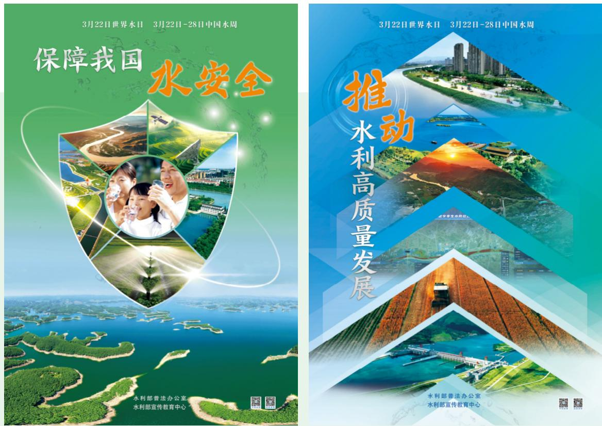  
2025 年“世界水日” “中国水周”

## 指标与目标

公司已围绕各职能板块构建起相应的气候管理目标与量化指标体系，系统性追踪温室气体排放情况，并以2030 年实现“碳达峰”、2060 年实现“碳中和”作为关键节点目标。在此基础上，公司将持续完善气候行动路径规划，有序推进应对气候变化的相关工作，为国家“双碳”愿景的落实提供支撑。

<table><tr><td>指标</td><td>单位</td><td>2025年</td></tr><tr><td>间接温室气体排放量（范围二）</td><td>吨二氧化碳当量</td><td>132.77</td></tr><tr><td>温室气体排放总量</td><td>吨二氧化碳当量</td><td>132.77</td></tr></table>

说明：基于当前运营模式，公司业务活动未消耗煤炭、天然气及汽油等传统化石燃料，因此不产生范围一温室气体直接排放。

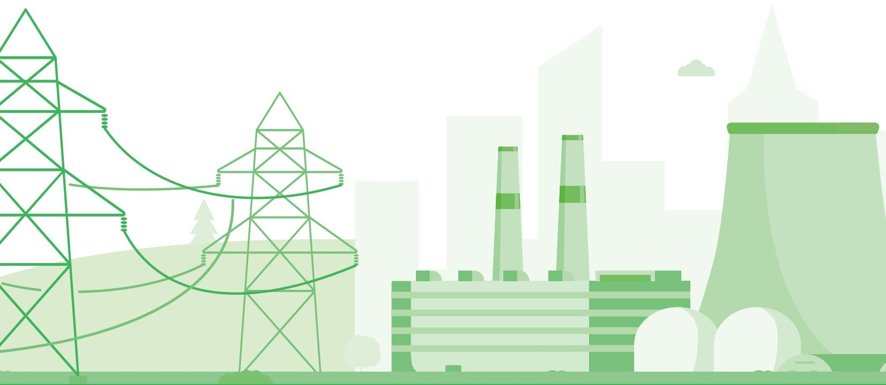

natural_image

Green stylized illustration of an industrial power plant with transmission towers and smokestacks (no text or symbols)

## 可持续发展的治理保障

## 治理

## 环境合规风险管理

公司依据《中华人民共和国环境保护法》等国家法规要求，以“节约资源、防控污染、共建绿色生态”为指引，编制并推行《吉大通信质量、环境和职业健康安全管理手册》等内部管控文件，规定由最高管理者统筹体系的实施与优化。在本报告周期内，公司已成功获得 ISO 9001、ISO 14001、ISO 45001、ISO/IEC 27001、ISO/IEC20000-1、ISO 50001 环境管理体系更新认证。

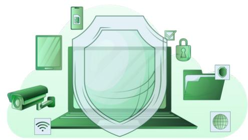

natural_image

Illustration of a shield over a laptop with various security icons (no text or symbols)

为落实环境管理职责，公司已将相关年度目标按部门进行拆解，并与绩效考核相挂钩，以保障 2025 年度各项环境管理任务的有效达成。

## 2025年度各项环境管理任务

实施固体废弃物系统分类与专项管控，危险废物安全处置率达到100%

确保勘察活动对环境无负面影响

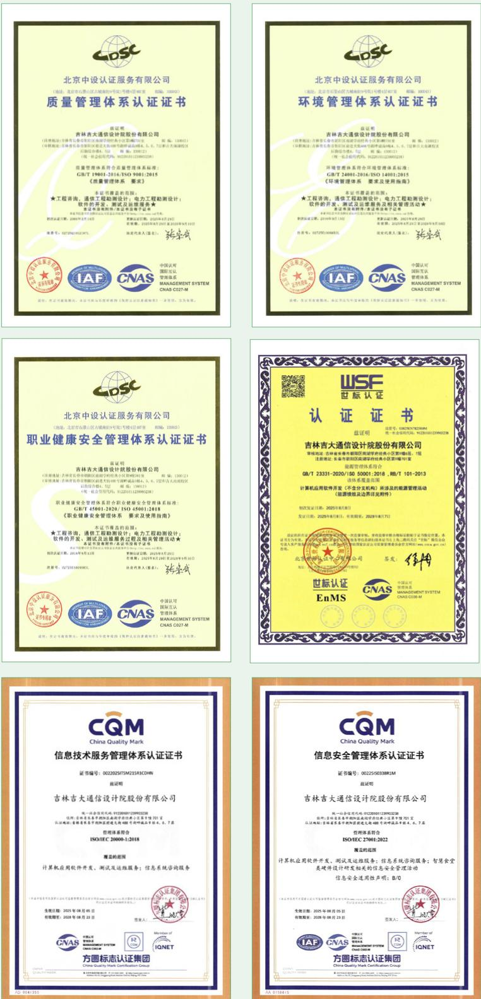

## 战略

公司将污染防治与生态系统保护、资源利用和循环经济作为环境管理的核心战略，致力于通过技术创新和科学管理，减少生产经营活动对环境的负面影响，积极推动绿色生产方式的普及。

同时，公司在设计施工过程中注重生态系统的保护与修复，参与生态保护项目、推广环保理念，促进人与自然和谐共生。在战略实施过程中，公司还加强与政府、社区及利益相关方的沟通与合作，共同推动区域环境的持续改善。

## 关键绩效

在报告期内，公司环境管理体系保持平稳有效运行，未出现任何环境损害事件或违反环境保护法规的情形，亦未受到相关监管处罚。

## 污染防治与生态系统保护

公司严格遵循《中华人民共和国大气污染防治法》《中华人民共和国固体废物污染环境防治法》等法律法规，依据《吉大通信环境因素的识别、评价和控制程序》的管理要求，定期进行环境监测，确保运营过程中的污染物排放与废弃物处理均符合国家环保要求。

作为非生产制造型企业，公司日常运营不涉及工业废气及废水排放。公司在运营过程中，严格履行环保责任，通过定期维护空调设备防止氟利昂泄漏、推广使用清洁燃料车辆以减少尾气排放、对固体废弃物进行分类管理和资源化利用等方式，积极践行可持续发展理念。

## 影响、风险和机遇管理

## 应急演练管理

依据国家生态环境部《国家突发环境事件应急预案》的指导要求公司编制了《吉大通信专项应急预案》与《吉大通信应急准备与响应程序》等内部文件，通过构建完善的应急组织体系，梳理并优化响应流程，并周期性开展综合演练，显著提升了预防与处置突发环境事件的水平，切实降低了事故可能引发的各类风险，保障了企业生产活动的平稳运行与社会影响可控。

## 培育绿色理念

公司系统推进可持续文化建设，借助多元化的环境宣传与培训项目，不断提升员工对环保议题的认知及行为转化能力，积极搭建全员参与、共同实践的组织氛围。

## “一户扫一层”

2025 年 1 月 24 日，为响应南湖街道湖苑社区党委关于加强老旧小区治理、提升居民幸福指数的整体部署，公司工会组织志愿者参与“一户扫一层”活动。

志愿者们深入辖区老旧小区，对楼道内的垃圾、杂物、灰尘等进行全面清扫，有效改善了老旧小区楼道环境卫生状况，为居民营造了整洁、舒适的居住环境，助力提升社区整体治理水平。

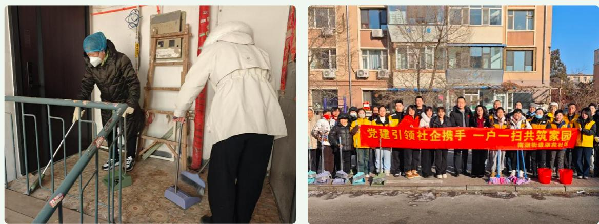  
“一户扫一层”志愿者活动

## 保护公园环境、清除垃圾活动

为践行社会责任，传递环保理念，公司党总支委员会携手证券部、审计监察部、战略风控法务部，走进公司附近的街道与公园，开展了一场“捡拾垃圾，美化环境”的公益活动。

活动现场，大家手持清洁工具，认真清理路面、绿化带及公园角落的烟头、纸屑、塑料瓶等各类垃圾。以实际行动净化了周边环境，也带动了过往市民的环保意识。

此次公益活动，不仅展现了公司员工的责任担当，更将“绿色低碳”的理念融入日常，为建设整洁优美的社区环境贡献了积极力量。

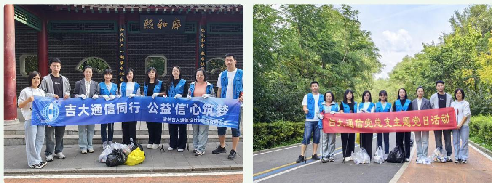  
“捡拾垃圾，美化环境”的公益活动

## 实践

## 污染物排放

公司全面遵守《中华人民共和国污染防治法》等法规，依据内部《吉大通信环境因素识别、评价与控制程序》开展常态化环境绩效监控，确保运营活动中的各类排放物符合国家环保标准。作为非生产制造型企业，公司日常运营不产生工业废气与生产废水，并通过定期检修空调系统以防止制冷剂泄漏、逐步推广清洁能源车辆以减少交通排放等方式，系统控制运营过程中的间接排放。

## 废弃物处理

公司严格执行《中华人民共和国固体废物污染环境防治法》及相关规定，基于环境管理体系要求对运营产生的固体废弃物实施分类管控与资源循环利用。通过建立办公垃圾分类投放机制、设置专项回收设施等措施，实现废弃物减量化与资源化处理，持续降低运营过程中的环境足迹。

<table><tr><td>地点、行动</td><td>环境相关影响因素</td><td>应对方法</td></tr><tr><td>办公场所</td><td>废灯管、废电池、可回收生活垃圾</td><td>建立垃圾分类收集与处理机制。</td></tr><tr><td>办公场所、办事处、勘察工作现场</td><td>不可回收生活垃圾,废气、废旧电池</td><td>执行垃圾专人专运至指定回收站点,并移交具备资质的处理单位进行规范化处置;在勘察设计业务中,优先选用可充电电池,对其报废后的废弃电池实施统一回收,严禁随意丢弃,确保合规处理。</td></tr><tr><td>复印、打印工作</td><td>废墨盒、废硒鼓等危险物品的废气</td><td>针对办公产生的废弃耗材(如墨盒、硒鼓等可回收物品),公司统一移交供应商进行集中回收处理;其余不可回收的固体废弃物,则由专人清运至市政指定收集点,并交由具备相应资质的专业机构进行最终处置。</td></tr></table>

## 施工过程当中的废弃物处理

根据公司应急管理体系，在通信网络项目施工过程中，对可能产生的各类污染物与废弃物实施严格的全过程管控，具体处理原则与措施

将施工污染与废弃物管理纳入项目现场应急与环保管理范畴。施工过程中产生的废弃物实行严格的分类收集与定点存放制度，对可回收利用的物资，交由具备相应资质的回收单位处理：对不可回收或无利用价值的废弃物，则严格按照环保法规要求，委托持有合法资质的专业清运单位进行合规处置。

针对施工可能产生的粉尘、噪音等现场污染，采取围挡、洒水、合理安排高噪音作业时间等措施，最大限度减少对周边环境与人员的影响。如涉及油品、化学品等潜在污染源，将划定专门区域存放与管理，严防泄漏，并制定专项应急措施，确保一旦发生意外能迅速控制，防止污染扩散。

所有施工污染物的处置活动，均在项目负责人统一指挥下进行。在施工结束后，善后处理组将协助委托专业机构进行必要的环境评估，确保现场遗留污染风险彻底消除 实现项目施工与环境安全，社会责任的有效统一。

## 生态保护和生物多样性

## 通信网络设计方案中充分考虑环境和生物多样性因素

在通信网络规划与设计阶段，公司将环境保护与生物多样性保护作为核心考量因素之一。

设计方案优先评估项目路径对区域生态环境的潜在影响，主动规避自然保护区、生态红线、重要栖息地等敏感区域。  
在线路路由与站点选址上，力求与现有景观相融合，减少对自然地形和植被的破坏。·  
积极采用节能高效的设备方案与新能源技术，从源头降低网络运行能耗与碳足迹。·

通过前瞻性的绿色设计，力求在构建优质通信基础设施的同时，最大限度地减少对生态环境的侵扰，保护生物多样性，实现技术部署与自然生态的和谐共生。

## 施工过程当中充分考虑对环境的影响和生物多样性

在项目施工阶段，公司将设计方案中的环保要求转化为具体、可操作的现场管理措施。

施工前，对施工人员进行专项环保培训，明确生态保护红线与行为规范。·  
施工中，严格限定作业带范围，采用无害化施工工艺，控制扬尘、噪音、污水排放，防止对周边水土和空气造成污染。·针对可能受影响的动植物，采取避让、减缓等措施，例如在鸟类繁殖等敏感时段调整施工计划。施工现场的废弃物、污染物由专人（后勤保障组 / 指定负责人）按预案进行分类、收集与合规处置，杜绝随意丢弃。

整个施工过程在项目管理体系的监督下进行，确保各项环保措施落实到位，将对环境和生物多样性的影响降至最低。

natural_image

Illustration of wind turbines on green hills with a cow grazing in the foreground (no text or symbols)

## 九台区国有林总场波泥河林场智慧林场建设项目

波泥河林场位于长春市九台区以南35公里处，经营面积3.7万亩，森林蓄积24.8 万立方米。

林场投入资金实施智慧林场建设项目，搭建起森林防火综合管理系统与“天地一体化”信息网络，全面提升森林资源管护能力，为区域生物多样性保护提供坚实保障。

项目前端采用探测距离达 10 公里的双光谱“森林眼”及 4 台长焦防火球机，终端通过可见光与红外热成像系统，实现全天候实时监测、智能识别烟火与自动定位火点，一旦发现疑似火情，系统立即预警，有效防止森林火灾对动植物栖息地的破坏。

同时，林区内的卡口视频监控及人脸、车辆智能识别系统，对出入敏感区域的人员、车辆进行动态管控，及时预警盗伐、盗猎等威胁生物多样性的违法行为林场还引进智慧物联网管理平台，通过气象监测站对林地的干湿度、降雨量、空气情况等 15 项环境要素进行动态监控，为评估野生动植物栖息地环境变化提供科学数据支撑。

此外，林场坚持“生态产业化、产业生态化”发展，种植大果榛子、黑果花楸等经济林，实现生态建设与产业发展的共赢，不断推进森林资源质量精准提升，有效保护了雪岭云杉等天然林生态系统及野生动植物栖息地，为区域生物多样性维持与可持续发展贡献积极力量。

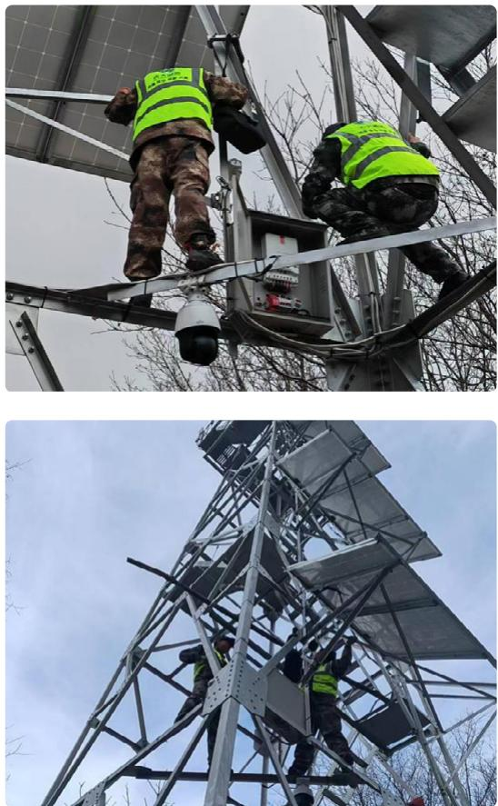

## 新疆伊犁州新源国有林管理局森林资源智能管护系统项目

新疆伊犁州新源国有林管理局森林资源智能管护系统项目投入中央财政林业补助资金 99.83 万元，通过技术升级全面加强森林生态系统与生物多样性保护。

项目新增的森林生态环境监测系统可实时采集负氧离子，温湿度，风向风速，光照，二氧化碳及雨雪量等数据为评估野生动植物栖息地环境变化提供科学依据；同时升级的视频监控与智能预警系统能够全天候监测森林火情、盗伐盗猎等威胁及时发现并制止破坏生物多样性的违法行为，有效保护雪岭云杉等天然林生态系统及野生动植物栖息地。

此外项目还扩容了太阳能供电系统以降低能源消耗，推动林业管护向绿色低碳转型，为区域生物多样性维持与可持续发展提供有力支撑。

## 吉林省沿边开放旅游大通道 (G331) 新改建二级公路工程和龙段通讯改迁工程

公司参与的“吉林省沿边开放旅游大通道 (G331) 新改建二级公路工程和龙段通讯改迁工程”，由和龙市公路建设项目服务中心统筹建设。项目位于生态敏感区域，涉及珍稀动植物栖息地及自然保护区核心地带等关键生态节点。为严格贯彻国家生态保护政策，强化生物多样性保护，降低工程建设对自然生态系统的干扰，现对原规划光缆路由进行科学调整，将其迁移至生态影响显著降低的区域，以实现基础设施建设与生态环境保护协调推进，履行企业生态责任。

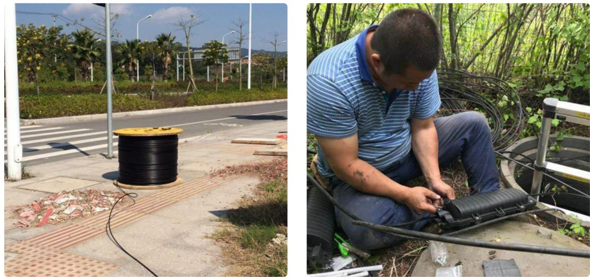

## 以科技之力守护生物多样性，共筑人与自然和谐共生

3 月 3 日，值“世界野生动植物日”之际，公司积极响应全球生物多样性保护倡议，将企业发展融入生态文明建设大局。

始终坚持“科技赋能、生态优先”的理念，通过数字化、智能化的技术手段，为野生动植物栖息地保护提供坚实支撑。

公司以智慧监测、火情预警、环境感知、网格巡护等系统建设，助力林区实现对生物多样性的全天候、全方位守护，筑牢生态安全屏障，推动人与自然和谐共生的美好愿景逐步成为现实。

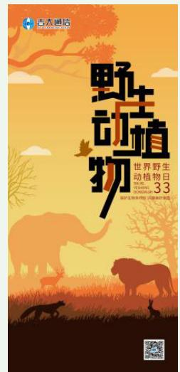

text_image

古木通信
野植物
世界野生
动植物日
33
2017年1月1日
SONGGUANG ZHENGJIN
中国农业科学院 中国地质科学院

## “生命皆平等，温情护冬行”

凛冬将至，为守护流浪动物温暖过冬，公司证券部、审计监察部、战略风控法务部的爱心志愿者们，带着精心筹备的狗粮、被褥等物资，奔赴流浪动物救助中心，为寒冬里的毛孩子们送去一份暖心关怀。

生命无高低，众生皆平等。此次公益行动，不仅是对流浪动物的温情守护，更是对人与动物和谐共生理念的生动践行。志愿者们以点滴善举，为弱小生命撑起一片温暖天地，也让尊重生命、善待生灵的文明之光，照亮更多角落。未来，公司也将持续践行社会责任，以实际行动传递温暖与善意，助力构建人与动物和谐共处的美好家园。

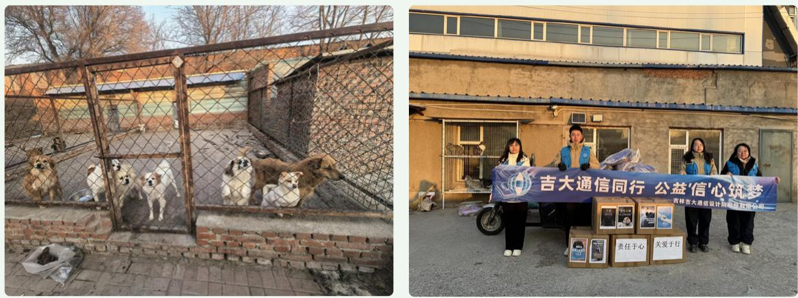  
守护流浪动物温暖过冬公益活动

## 赋能可持续发展 智慧产品产业化

运用物联网，大数据及人工智能等技术自主研发智慧授权设备，智慧选餐设备等硬件产品及食安管理，营养分析，健康指导，进销存管理，行为监测，明厨亮灶等功能软件为高校，政府机关，企事业单位，园区，社区及医院等具备自选能力的团餐场景，提供产品、实施、运维、定制化开发等一站式解决方案。

## “中浦慧联智慧食堂” 构建资源节约与低碳运营的智慧餐饮新模式

中浦慧联智慧食堂解决方案以数字化与智能化技术为驱动，在环境维度系统性地推动餐饮运营向绿色、低碳、可持续方向转型其环保价值主要体现在以下几个方面

## 从源头精准控制，大幅减少食物浪费与关联碳排放

传统食堂因无法精准预测就餐人数与菜品喜好，常因备餐过量造成大量食物浪费。本解决方案通过两大核心机制从源头遏制浪费：

智能选餐与实时计量：采用重力感应技术，实现“吃多少、取多少、计多少”的自助模式。系统自动记录每·笔消费数据，形成精准的菜品需求数据库  
大数据精准备餐指导：基于历史消费数据的智能分析，系统可为后厨提供未来餐期的菜品需求预测与食材用量建议，实现“按需采购、精准备餐”。

综合成效显示，该模式可助力单个食堂实现每年人均节约粮食约 100 公斤。

根据联合国粮农组织相关换算标准，减少粮食浪费直接意味着在种植、加工、运输、烹饪及废弃物处理全链条中节约了大量的水、土地、能源等资源，并显著降低温室气体排放。

经测算，该模式可相应实现每年人均减少二氧化碳排放约 269 公斤，是餐饮领域落实“光盘行动”与支持国家“双碳”目标的实质性技术路径。

注：上述数据根据某智慧食堂改造案例计算所得。

## 全流程无纸化与智能化，降低运营直接资源消耗

解决方案构建了从注册、选餐、支付到管理的全流程数字化闭环：

无感支付与电子化单据：彻底取代传统饭票、现金及纸质小票，减少了纸张消耗及相关印刷、流通环节的能耗。·  
线上管理与数字看板：后厨管理、库存盘点、经营报表等均通过系统完成，替代了大量纸质台账与表单，提·升了管理效率的同时也减少了办公耗材。

## 优化能源与资源管理，提升整体运营能效

智慧化手段被应用于资源使用的精细化管理中：

设备集成与智能调控：系统可对接食堂内的照明、空调及部分厨具设备，根据营业时间、人流密度进行智能启停或功率调节 减少待机能耗与无效运行  
食材供应链可视化：通过物联网技术对食材存储环境的温湿度进行监控，确保最佳保存条件，降低因变质造成的食材损耗。  
数据驱动的持续优化：系统提供的能耗与物耗数据分析，能帮助管理者识别资源使用异常点，持续改进节能降耗措施。

## 引导绿色消费观念，赋能可持续饮食文化

系统不仅管理运营，也积极影响消费者行为：

营养数据透明化：实时显示菜品营养成分，引导用户进行均衡、适量的膳食选择，从消费端促进健康、节约的饮食文化。  
环保理念融入体验：通过数据反馈（如累计节约粮食数量），让用户直观感知自身行为的环保贡献，增强其参与感与认同感。

中浦慧联智慧食堂解决方案的环境效益，超越了单一的“减排”概念，构建了一个从需求预测、精准备餐、智能取餐到消费反馈的完整资源高效利用闭环。它通过技术赋能，将环境保护理念深度融入餐饮运营的每一个环节，不仅在操作层面实现了显著的节粮减排目标，更在模式层面为餐饮行业提供了一条可量化、可复制、可持续的绿色发展路径，有效助力运营者履行环境责任，提升绿色品牌形象。

## 企业代表案例

## 中国联通中讯设计院主办公区智慧食堂

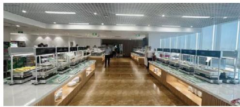

natural_image

Interior view of a modern retail store with display shelves and glass cases (no visible text or signage)

## 改造背景：

食堂原有小碗菜模式下，菜品识别准确率低，结算过程慢。

排队时间长，每餐 2-3 道菜品，饮食模式单一，员工体验差。

食材成本无法有效管控，后厨缺乏数字化管理手段。

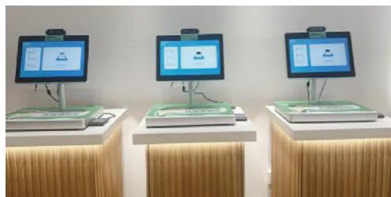

natural_image

Three digital health monitoring stations on display pedestals in a modern exhibition space (no visible text or symbols)

## 解决方案：

·

## 21 楼设置智慧食堂自选餐

配备 48 台智慧选餐设备，6 台智慧授权设备

## 3 楼设置特色档口区

配备 5 台智能收银机，1 台智能收银秤

· 引入智能进销存系统与成本卡模式管理食材成本。  
引入数字化农残检测设备，自动化实现蔬菜、肉类检测结果比对与报告生成。  
引入后厨 AI 行为识别分析与明厨亮灶系统，并通过数字大屏展示。

## 一站式赋能：

· 历经半年打磨，完成从立项调研至可行性研究的全部流程。  
利用夜间施工，仅耗时 2 周，未影响原有食堂正常营业。  
· 人员驻场 2 个月，完成系统全面对接与调试优化。  
· 用时半个月完成人员培训及试运行，保障项目如期落地。

## 改造效果

服务人员由 10 人缩减至 6 人，人员成本降低约 20000 元 / 月。

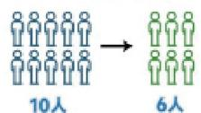

菜品种类提升 38%，员工人均选餐每餐由 2 道菜增加至 7-8 道菜。

从源头杜绝浪费，大幅提高食物入口率，餐余垃圾减少超 40%。

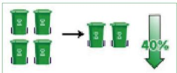

午餐就餐人数增加 46%、晚餐增加69%，强化了与周边餐厅的竞争力。

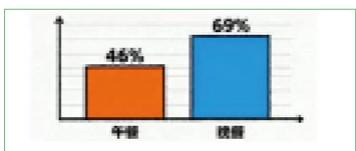

就餐效率提高，人均排队时间减少约 5 分钟。

开通员工评价渠道，

监督提升服务就餐质量。

## 指标与目标

报告期内，公司废弃物处置合规率为 100%，环境指标达标率 100%，全面满足监管要求。

## 资源利用与循环经济

## 影响、风险和机遇管理

公司将资源高效利用与循环经济理念深度融入运营管理，通过系统性管控实现环境效益与运营韧性的双重提升。公司针对能源、水资源及物料建立全流程管理制度，推行节能改造、智能监测与循环利用措施，有效降低资源消耗强度与运营成本。

在风险管理方面，公司关注资源价格波动、供应链中断及政策合规风险，并通过技术升级与供应链多元化增强应对能力；同时，积极把握绿色技术应用、循环模式创新及政策激励带来的发展机遇，探索资源再生、设备再制造与数字化管控等路径，推动价值链协同减碳。

未来，公司将持续完善资源闭环管理体系，强化数据驱动与生态合作，在履行环境责任的同时培育新的效益增长点，助力企业可持续与低碳转型。

## 能源利用

公司严格遵循《中华人民共和国节约能源法》等相关法规，通过建立系统的能源管理制度与组织体系，实现节能工作的体系化运作，同时 公司配套设立量化的激励与约束机制，对达成节能目标，提出有效改进建议以及在节能实践中表现优异的部门予以表彰与奖励：对存在能源浪费的情况，依据相关规定进行相应处理，以此推动能源管理效能的持续提升。电力是公司运营中的核心能源。在用电管理方面，公司对电器设备实施严格的使用监督，对用电设施执行定期维护保养，并持续优化电力配置体系，同时通过节能宣传提升全员的节约意识。

在本报告周期内，公司通过改造声控灯及节能 LED 灯等形式，节约用电，具体措施如下：2025 年节能改造 LED 灯总共38 个，实现了用电量的有效降低。未来公司将不断改造现有照明设备，节约能耗，促进资源循环与可持续发展。

natural_image

Illustration of a stylized eco-friendly landscape with wind turbines, solar panels, and green hills (no text or symbols)

<table><tr><td>架构层级</td><td>负责部门/小组</td><td>组成人员</td><td>主要职责</td></tr><tr><td>决策层</td><td>能源管理领导小组</td><td>董事长、总经理</td><td>1.审定能源管理总体方针与战略目标;2.审批重大能源政策、管理计划及投资方案。</td></tr><tr><td>管理层</td><td>能源管理办公室</td><td>综合部、财务部等部门负责人</td><td>1.制定并组织实施具体管理计划、制度与措施;2.负责能耗数据收集、分析与档案数据库建设;3.提出节能改进建议与方案;4.组织相关培训、宣传与交流活动。</td></tr><tr><td>执行层</td><td>各部门能源管理工作小组</td><td>组长:各部门负责人组员:部门相关岗位员工</td><td>1.依据公司总体目标,制定并落实本部门具体实施方案;2.组织开展部门内节能减排活动;3.对本部门能源管理工作进行自查与整改。</td></tr></table>

## 长春一汽CKD库区9MW分布式光伏工程设计

由公司负责工程设计的长春一汽 CKD 库区 9MW 分布式光伏项目，总投资 3720 万元。项目覆盖 5 个场址，利用厂房屋顶建设，采用“自发自用，余电上网”模式，遵循因地制宜，清洁高效，分散布局，就近利用的原则实现太阳能资源的就地开发与高效利用。工程设计涵盖光伏组件布置、光伏及升压站基础与电气系统、接入系统等内容 属典型高压并网光伏项目通过新建开关站及配套二次设备实现光伏发电经逆变升压后并入园区原有高压系统。项目投运后，年均发电量达 1,141.52 万千瓦时，每年可节约标准煤 3,432.55 吨，减少烟尘排放 0.19 吨、二氧化硫排放 0.95 吨、氮氧化物排放 1.52 吨，减排二氧化碳 9,406.12 吨，有效推动非化石能源消费比重提升，助力区域能源结构优化与绿色低碳转型，为长春市经济社会发展注入清洁动能。

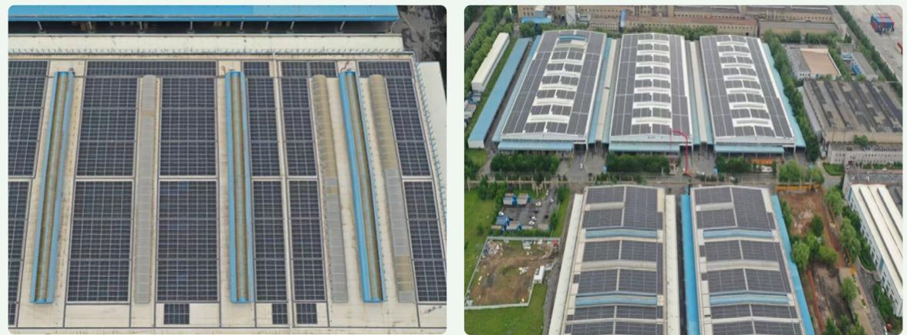

## 哈尔滨哈药六厂1.2MW分布式光伏工程设计

由公司负责工程设计的哈尔滨哈药六厂 1.2MW 分布式光伏工程，项目覆盖 4 个场址，采用“自发自用、余电上网”模式利用厂房屋顶建设 遵循因地制宜，清洁高效，分散布局，就近利用的原则实现太阳能资源的就地开发与高效利用。工程设计涵盖光伏组件布置、光伏基础结构、光伏一二次电气系统及接入系统等内容，属典型低压并网光伏项目，光伏发电经逆变器通过并网柜直接接入园区原有低压系统。项目投运后，年均发电量达 145.55 万千瓦时，每年可节约标准煤 437.6 吨，减少烟尘排放 0.02 吨、二氧化硫排放 0.12 吨、氮氧化物排放 0.19 吨，减排二氧化碳 1,199.33 吨。该项目在带来稳定经济效益的同时，有效推动区域能源结构优化与绿色低碳转型，兼具良好的社会与环境效益。

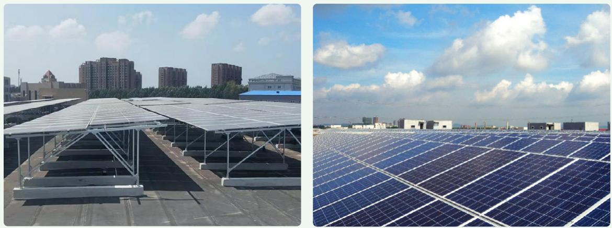

## 水资源利用

水资源是支撑社会发展的重要基础。公司全面遵循《中华人民共和国水法》等国家规定，依据《吉大通信能源管理制度》建立系统化的用水管控机制，包括对供水设施的定期检查、维护与及时维修，有效防范管道渗漏与无效流失。公司还通过开展常态化节水倡导与主题活动，不断提升员工的资源节约意识，推动节水行为融入日常。在当前报告期内，公司生产与办公用水均来源于市政供水系统，水源供应稳定，未出现水资源短缺或中断风险。

公司水资源消耗情况说明

<table><tr><td>指标</td><td>单位</td><td>2023年</td><td>2024年</td><td>2025年</td></tr><tr><td>总耗水量</td><td>吨</td><td>11,366.04</td><td>22,794.94</td><td>13,820.96</td></tr></table>

## 通信网络设计方案中充分考虑能源利用、水资源利用因素

在公司的通信网络规划与设计方案中，能源与水资源的集约高效利用是核心设计原则之一。

设计方案优先选用高能效、低功耗的主流设备与技术，并通过科学的网络架构优化，减少不必要的设备冗余，从源头降低系统运行的全生命周期能耗。

积极考虑在具备条件的站点引入太阳能、风能等可再生能源互补供电方案，减少对传统电网的依赖。

在水资源利用方面，设计环节会评估设备冷却等环节的用水需求，优先推荐采用自然冷源、闭循环冷却等节水型技术方案，并对站点雨水收集利用等可行性进行论证，从而在蓝图阶段就将绿色、低碳与资源节约的理念深度融入为构建环境友好的通信基础设施奠定基础

## 施工过程当中充分考虑能源利用、水资源利用

在项目施工实施阶段，公司依据设计方案要求，将能源与水资源保护措施落实到具体作业环节。

施工期间，对进场机械设备进行能效管理，合理安排工序以减少设备空转能耗，并优先使用节能型施工设备与照明工具。现场临时设施建设也贯彻节能理念。

在水资源利用上，严格管理施工用水，通过设置循环用水装置、收集利用雨水等方式提高用水效率，杜绝“长流水”现象；对可能产生的施工废水，设置沉淀池等预处理设施，确保达标排放或循环利用，防止水资源污染。确保能源与水资源利用符合环保设计要求，最大限度地减少施工活动本身的资源消耗与环境足迹。

## 绿色可持续办公

持续推广低碳办公文化，公司通过实施办公场所水电及物资精细化管理，系统推进节水节电、无纸化运作等措施，以提升资源利用效率降低运营过程中的环境负荷

在员工办公环境中融入循环经济理念，倡导使用可循环利用的办公用品，如再生纸，可替换笔芯等，减少一次性用品的使用；建立办公用品回收机制，鼓励员工将废旧办公用品进行分类回收，实现资源的再利用；优化办公空间布局，提高空间利用率，减少因空间闲置而造成的资源浪费。

## 节电环节措施

为进一步降低办公能耗，公司推行以下节能管理措施：

中浦慧联上海办公楼的办公区所有灯均为 LED 灯，办公区域全面采用节能 LED 照明，并严格执行按需启用、人离灯熄的原则，无人使用的区域照明保持关闭状态。  
● 会议室及培训教室使用结束后，立即关闭所有照明及电子设备电源。  
统一设定空调运行温度标准，各办公室及公共办公区域，室内温度在 18℃以下或 28℃以上方可使用空调。  
è 同时通过张贴醒目标识，开展宣传倡导等方式，持续强化全员节能意识  
各楼层电热水器实行自动控制，工作日烧水时间设定为：早 7:30 至晚 17:00，非工作日关闭不使用。如有加班员工使用，可选择临时运行。

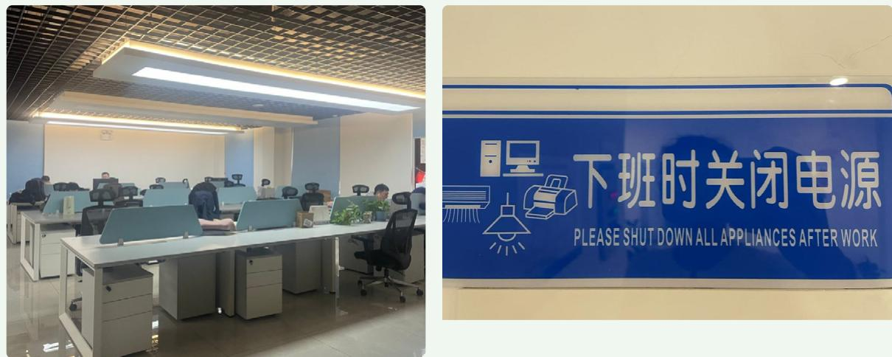  
节电环节措施

## 节水环节措施

为系统落实节水管理，公司在内部推行以下措施：

● 使用完毕后即刻关闭水源，避免无效水流。  
è 同时在用水区域显著位置设置节水标识，持续强化全员节水意识。  
è 中浦慧联上海办公楼的所有卫生间洗手处的水龙头均为感应水龙头。

  
节水环节措施

## 节纸环境措施

为推进办公流程绿色化，公司目前做出的举措有：

· 依托 OA 及金蝶等数字化平台，全面推行电子化流程以降低纸质文件依赖。  
同时明确内部打印规范，优先采用双面打印模式，切实减少纸张消耗。

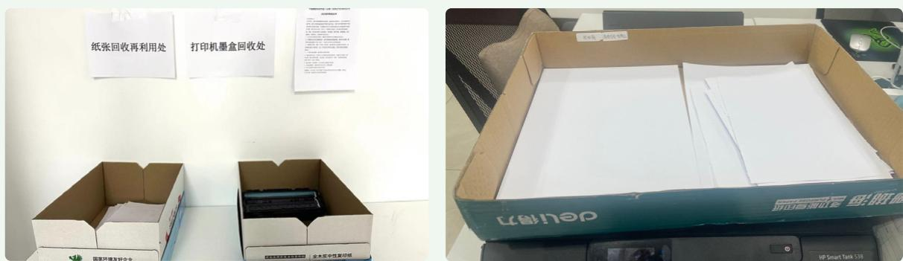  
节纸环境措施

## 垃圾分类及回收

公司推行职场垃圾分类管理体系，并实施以下措施：

è 制定并实施废弃物分类投放规程。  
● 同步在工作区域配置专用收集容器，用于集中回收纸张类废弃物、废旧电池及打印耗材等可循环资源。

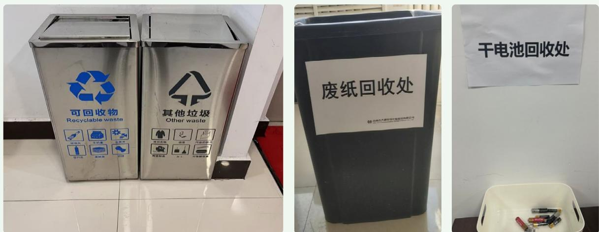  
垃圾分类及回收

## 员工办公环境

公司对于员工办公环境的要求举措有：

注重将环保理念融入办公空间规划，持续做好日常清洁维护。  
● 同时合理布置绿色植物，营造健康、舒适的职场环境。

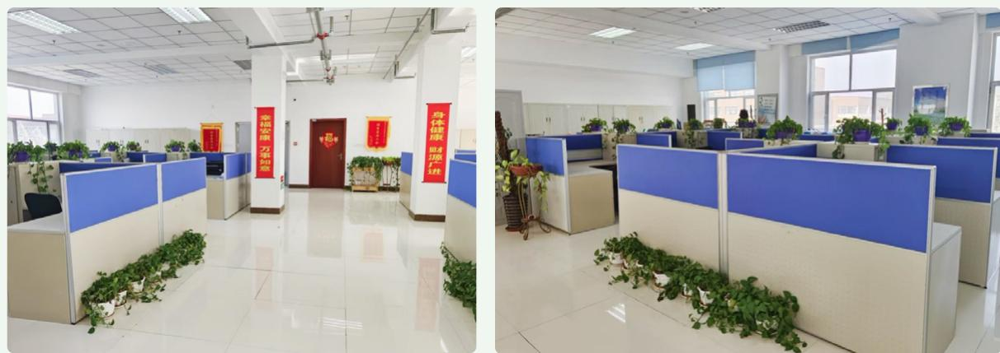  
员工办公环境

## 循环经济

## 通信网络设计方案中充分考虑循环经济因素

在规划与设计阶段，公司将循环经济原则前置融入。

1. 在设备选型与技术路线上，优先选择高集成度、低功耗、易于升级扩展的绿色设备与解决方案，以延长设备使用寿命，减少未来因技术迭代而产生的废弃量。  
2. 注重网络架构的集约化和资源虚拟化设计，通过共享基础设施（如基站铁塔、管道、机房）和提高资源池化利用率，从源头减少材料与能源的消耗，为网络全生命周期的资源高效利用奠定基础。

## 施工过程当中充分考虑循环经济

在工程建设实施环节，公司致力于将施工活动对环境的影响降至最低，并促进资源循环。具体措施包括：

1. 推行绿色施工工艺，严格控制能耗、水耗和建筑材料的浪费。  
2. 对施工产生的废旧线缆、金属件、包装材料等进行严格的分类回收与合规处置，积极与具备资质的回收企业合作，推动废弃物转化为再生资源。  
3. 优化物流与现场管理，减少运输能耗与现场损耗，从而实现施工过程的节能、降耗、减排与资源化目标。

## 物料管理

公司将物料管理作为企业运营管理的重要组成部分，通过系统化、精细化的管控机制，覆盖从采购计划、供应商评估、物料验收、仓储保管到领用发放的全过程。公司建立了严格的授权审批与职责分离制度，对不同层级的操作权限进行明确划分，并通过标准化流程设计实现对物资流转的有效监督与约束，从而确保物料管理工作的规范性、安全性与可追溯性。为强化供应链管理与内部控制，公司推动子公司中浦慧联制定了《存货管理制度》及《物资出入库管理制度》等内部规范，系统明确了物资从采购、验收入库、存储保管到领用出库的全流程职责与操作标准，通过权责分离、流程闭环和定期核查机制，有效提升了存货管理的规范化、透明化与合规运作水平。

## 公司物料管理措施

建立权责分明的组织架构：设立决策、管理、执行三层管理机制（如能源 / 存货管理领导小组、办公室、各部门工作小组），并实行不相容职务分离（如采购、验收、保管、记账职能分离）。

实施全流程标准化管控：对物料的请购、采购、验收、入库、保管、领用、出库、退库及处置各环节，均制定了明确的操作流程、审批权限与表单规范。

严格执行出入库审批与核对：所有物资出入库均需通过线上系统（如飞书）发起申请，经过多部门（需求部门、人力综合部、质控合规部、财务中心）审核，并实现单据、实物、账务的同步核对。

强化仓储保管与盘点：实行存货专人保管、分类摆放、标识清晰，并执行定期（月度、年度）与不定期的盘点制度，确保账实相符，及时处理盘盈盘亏。

规范存货核算与成本管理：财务中心统一进行存货成本核算（采用先进先出法），定期与仓库核对，并按规定计提跌价准备，确保存货价值准确。

嵌入质量检验环节：质控合规部负责对入库、退库物资进行质量检验，从源头控制存货质量风险。

建立监督与持续改进机制：管理层及财务中心对存货管理进行不定期检查与审计，对发现的问题要求责任部门整改，形成管理闭环。

## 指标与目标

公司围绕资源利用与循环经济设立了系统的量化指标与中长期目标，以驱动运营绿色转型与绩效提升。

在能源管理方面，公司以“单位产值综合能耗”为核心监控指标，并设定年度环比下降目标；同时持续推进照明系统 LED改造等专项节能计划，明确改造覆盖率与节电量目标。

水资源管理以“单位用水量”为关键效率指标，通过加强管网维护与节水宣传，致力于实现用水强度逐年降低。

在物料与废弃物领域，公司设定“废弃物综合回收率”及“关键物资循环利用率”等指标，推动办公垃圾分类、废旧设备部件再利用等举措落地，目标在于持续减少运营环节的自然资源依赖与最终处置量。

未来，公司将进一步结合“双碳”路径，逐步将供应链间接排放、产品全生命周期资源效率等纳入管理视野，通过数字化监测与定期评审，确保资源循环目标与业务发展协同推进。

公司能源消耗情况说明

<table><tr><td>指标</td><td>单位</td><td>2023年</td><td>2024年</td><td>2025年</td></tr><tr><td>国内电力消耗量</td><td>千瓦时</td><td>113,673.05</td><td>210,312.65</td><td>227,668.23</td></tr><tr><td>国外电力消耗量</td><td>千瓦时</td><td>18,921.73</td><td>22,180.58</td><td>19,740.72</td></tr><tr><td>能源消耗总量</td><td>吨标煤</td><td>16.30</td><td>28.57</td><td>30.41</td></tr></table>

natural_image

Illustration of a hydroelectric dam with transmission towers and water discharge (no text or symbols)

## 5G

# 社会篇

# 履责笃行，聚力共生

吉大通信始终秉持“以人为本”的理念，以科技创新为引擎，以员工关怀为根本，忠实履行社会责任，积极践行社会价值，从保障员工权益、促进社会就业，到投身公益事业、助力区域发展，以点滴行动

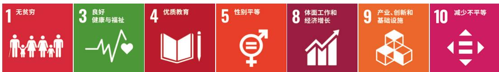

## 我们的实践

创新驱动与科技伦理 90

产品和服务 103

供应链供应商管理 114

信息安全与隐私保护 117

员工 125

乡村振兴与社会贡献 145

## 创新驱动与科技伦理

吉大通信紧密围绕信息化、数字化与智慧化的发展主线，聚焦主营业务，持续加大研发资源投入，致力于完善覆盖从基础研究到技术转化的科技创新体系。

## 治理

公司高度重视科研研发制度建设工作，制订了《吉大通信专业技术管理规定》《吉大通信科技创新战略规划》《吉大通信科研项目（省部级课题）管理办法》《吉大通信科研项目经费管理暂行办法》等一系列内部研发管理制度，明确了研发方向、项目管理流程和经费使用规范，为科研活动提供了制度保障。公司构建了权责清晰、协同高效的组织治理与创新管理体系。以董事会、总经理及总工程师为核心领导机构，确立了科技创新在公司发展中的战略地位，并确保相关资源投入与战略执行得到有效监督。

在此框架下，研究院作为核心研发部门，主要负责前沿技术探索、市场技术支撑及省部级重大课题攻关；技术部聚焦于设计过程的专业技术控制、全员培训体系与管理流程优化。为保障执行效能，研究院下设 8 个专业研究所及 1 个课题管理办公室，技术部设有 8 个专业院总工程师岗位。各专业院总工程师与研究所所长共同领导专业团队，其核心由研究所所长 / 专业院总工程师及在任的省级或地市级总设计师构成，由此形成了一套自上而下、贯通基础研究与应用转化的高效协同创新体系。通过结构化的流程与跨部门协同机制，将技术创新深度融入产品与解决方案的全生命周期，确保每一项研发投入都能精准响应市场需求，并转化为可持续的商业与社会价值。

  
智慧产品研发流程图

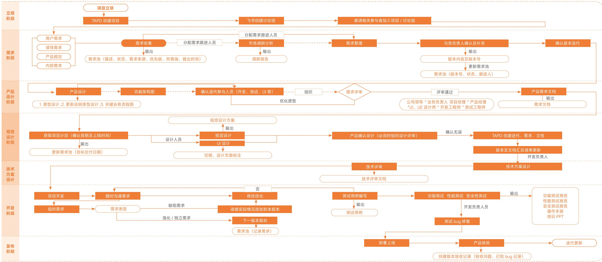

flowchart

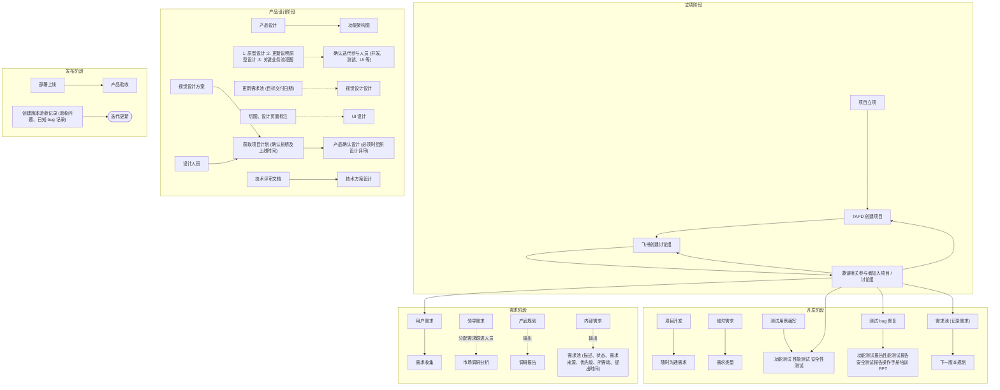
```mermaid
graph TD
  subgraph sg["立项阶段"]
  A["项目立项"] --> B["TAPD 创建项目"]
  B --> C["飞书创建讨论组"]
  C --> D["邀请相关参与者加入项目 / 讨论组"]
  end

  subgraph sg_2["需求阶段"]
  E["用户需求"] --> F["需求收集"]
    G["领导需求"] -.->|分配需求跟进人员| H["市场调研分析"]
    I["产品规划"] -.->|输出| J["调研报告"]
    K["内部需求"] -.->|输出| L["需求池 (描述、状态、需求来源、优先级、所需端、提出时间)"]
  end

  subgraph sg_3["产品设计阶段"]
  M["产品设计"] --> N["功能架构图"]
    O["1. 原型设计 ;2. 更新说明原型设计 ;3. 关键业务流程图"] -.-> P["确认迭代参与人员 (开发、测试、UI 等)"]
  Q["视觉设计方案"] --> R["获取项目计划 (确认排期及上线时间)"]
    S["更新需求池 (目标交付日期)"] -.-> T["视觉设计设计"]
    U["切图、设计页面标注"] -.-> V["UI 设计"]
  W["设计人员"] --> R
  R --> X["产品确认设计 (必须时组织设计评审)"]
  Y["技术评审文档"] --> Z["技术方案设计"]
  end

  subgraph sg_4["开发阶段"]
  AA["项目开发"] --> AB["随时沟通需求"]
  AC["临时需求"] --> AD["需求类型"]
  AE["测试用例编写"] --> AF["功能测试 性能测试 安全性测试"]
  AG["测试 bug 修复"] --> AH["功能测试报告性能测试报告安全测试报告操作手册培训 PPT"]
  AI["需求池 (记录需求)"] --> AJ["下一版本规划"]
  end

  subgraph sg_5["发布阶段"]
  AK["部署上线"] --> AL["产品验收"]
  AM["创建版本验收记录 (验收问题、已知 bug 记录)"] --> AN(["迭代更新"])
  end

  D --> B
  D --> C
  D --> E
  D --> AF
  D --> AG
  D --> AI
```

## 研发组织总体架构

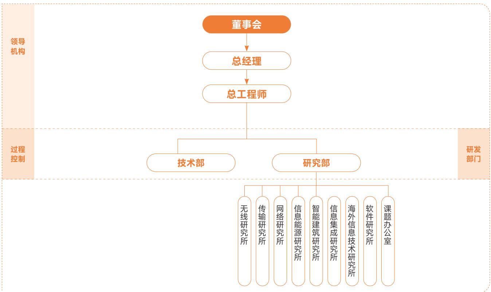

flowchart

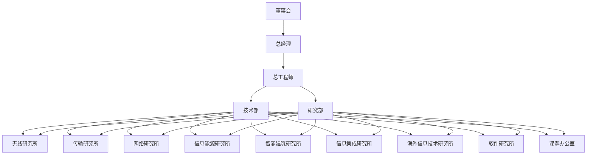
```mermaid
graph TD
  A["董事会"] --> B["总经理"]
  B --> C["总工程师"]
  C --> D["技术部"]
  C --> E["研究部"]
  D --> F["无线研究所"]
  D --> G["传输研究所"]
  D --> H["网络研究所"]
  D --> I["信息能源研究所"]
  D --> J["智能建筑研究所"]
  D --> K["信息集成研究所"]
  D --> L["海外信息技术研究所"]
  D --> M["软件研究所"]
  D --> N["课题办公室"]
  E --> F
  E --> G
  E --> H
  E --> I
  E --> J
  E --> K
  E --> L
  E --> M
  E --> N
```

## 科研团队打造

技术人才是最核心的战略资产与驱动创新的动力。公司坚持“内部培养与外部引进”相结合的战略，致力于构建一个梯队健全、能力复合、兼具前沿研发能力与丰富实战经验的专业化人才体系。

截至本报告期末，公司研发与技术团队总人数已达 544 人，占全体员工比例的 20.83%。这一结构充分体现了公司将创新置于发展核心的承诺，也为持续探索绿色技术等ESG关键议题储备了充足智力资源。

同时，公司建立了系统化的人才培养与发展机制，制定了《吉大通信研发技术人员培训管理制度》并实施系列创新人才发展计划， 通过组织多种形式的内外部专业技术培训、项目管理培训及行业交流活动，确保团队能力与产业绿色化、信息化、数字化智慧化转型趋势同步精进

  
研发团队总人数

544人

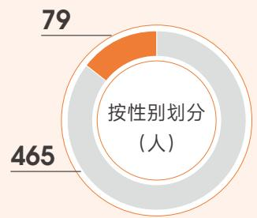

donut

| Category | Value (人) |
| --- | --- |
| 女性 | 465 |
| 男性 | 79 |

男性 女性

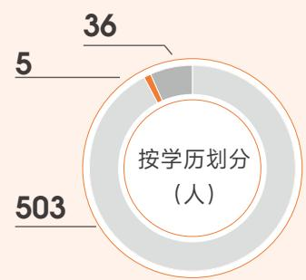

donut

| Category | Value (人) |
| --- | --- |
| 主要部分 | 503 |
| 小部分 | 36 |
| 其他部分 | 5 |

硕士 本科 本科以下

## 创新激励

公司建立起完整的科技创新激励体系，制定了《吉大通信科技成果实施及奖励管理办法》《吉大通信研发人员激励管理制度》等一系列制度，构建了积分考核体系与技术创新奖励相结合的复合激励机制，充分调动研发人员的积极性与创造性，引导研发团队聚焦于具有实质影响力的创新活动，提升研发效率与成果质量，持续强化了公司的核心技术创新能力与市场竞争力。

## 积分考核体系

实行全面的技术积分制度，员工技术工作的贡献度通过技术积分制度度量；员工的技术积分形成技术积分档案，具有年度及累积数据，供院内各部门参考使用，作为岗级评定等管理事项的技术依据。

## 技术创新奖励

奖励范围：院级课题、专利、软件著作权、论文、获奖、参编标准、专业建设计划成果、岗位评价体系培训等其他专业技术工作。

奖励方式：定额奖励和工时奖励。

## 资质认证

公司凭借扎实的技术积累与持续的创新能力，成功获评国家高新技术企业，并多次荣获全国及省级荣誉称号与奖项。同时，公司积极构建开放协同的创新生态，形成了集团内多层次、梯队化的创新主体布局。

为深化产学研用融合 公司携手长春工业大学 东北师范大学等高校，联合信息通信领域的知名教授与专家 共同组建省级科技创新平台——吉林省信息通信技术科技创新中心。该平台致力于汇聚行业创新资源，开展共性关键技术研发与工程化研究，有效促进了科技成果的中试熟化，示范应用与产业化转移，成为公司链接前沿学术研究与产业实际需求的重要枢纽。

截至报告期末 公司创新体系建设成效显著 累计获得国家高新技术企业认证2项，这一系列资质与平台不仅是公司技本实力的权威背书，更是我们将创新优势转化为绿色解决方案，赋能行业数字化转型，履行企业社会责任的坚实基石。

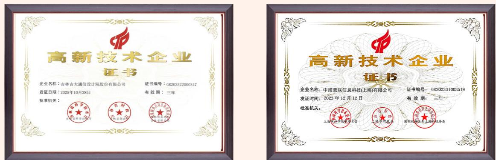  
高新技术企业证书

## 战略

公司紧密围绕国家“十四五”数字经济创新发展与“十五五”数智化发展战略，面对通信行业加速数字化转型与新一代信息技术深度融合的浪潮，持续推进战略转型，将人工智能、大数据、物联网等前沿技术作为核心战略方向，精准识别潜在风险并有针对性地制定风险策略，积极把握新兴技术突破及市场需求变化带来的发展机遇。

<table><tr><td>类型</td><td>风险与机遇描述</td><td>发生概率</td><td>影响大小</td><td>影响的时间范围</td><td>影响的价值链环节</td><td>优先级排序</td><td>潜在财务影响</td><td>应对措施</td></tr><tr><td>技术</td><td>风险:1.通信与信息技术行业技术更新迭代加快,若公司现有技术陈旧,研发成果滞后,则有可能失去市场竞争力。2.新的核心技术研发需要大量资金和人力投入,可能导致公司成本增加,收益减少。3.研发方向和路径的选择可能失误,存在失败风险。机遇:1.通过精准地把握通信与信息技术行业的发展趋势,提前布局前沿技术领域,如人工智能、大数据、物联网等,在市场竞争中占据先机。2.通过深入分析技术走向,开发出更具创新性和竞争力的产品与服务,满足客户不断变化的需求,进一步拓展市场份额。3.技术进步有助于公司优化研发资源配置,提高研发效率,降低研发成本,为公司的可持续发展奠定坚实基础。</td><td>中</td><td>中</td><td>短、中期</td><td>运营</td><td>中</td><td>运营成本增加营业收入减少</td><td>1.持续加大资金与人力资源投入,夯实自主创新能力。同时,积极深化与高校、科研院所的产学研用协同创新,通过共建研发平台、开展联合技术攻关等方式,加速创新资源的集聚与成果转化。2.建立了常态化的技术监测与评估机制,紧密追踪全球科技革命与产业变革趋势,定期对新兴技术进行前瞻性分析与评估。动态优化研发方向与资源配置,确保技术路线的先进性与战略匹配度。3.在新一代信息技术领域积极布局,加快相关技术的产业化应用研究与业务落地,并通过积极引入高端与复合型人才,为开拓新业务领域提供核心支撑。</td></tr><tr><td>市场</td><td>风险:市场需求快速变化,客户需求日益多元化、个性化,可能导致公司研发成果与市场需求脱节,产品和服务无法获得市场认可。机遇:1.多元化、个性化的客户需求促使公司不断探索新的业务领域和产品形态,为公司开拓新的市场空间提供了可能。2.公司可以凭借敏锐的市场洞察力,针对特定客户群体开发定制化的产品和服务,满足其独特需求,从而在细分市场中占据领先地位。3.快速变化的市场需求推动公司加快创新步伐,提升自身的技术水平和创新能力。通过不断研发新技术、推出新产品,公司能够树立良好的品牌形象,增强市场竞争力,吸引更多客户,实现业务的持续增长。4.积极应对市场风险还能促使公司优化内部管理流程,提高运营效率,降低运营成本,进一步提升公司的盈利能力和抗风险能力。</td><td>中</td><td>高</td><td>短、中期</td><td>运营</td><td>高</td><td>运营成本增加营业收入减少</td><td>1.构建以战略前瞻与市场洞察为导向的研发管理机制。2.紧密追踪国家产业政策导向、通信行业技术演进趋势及主要运营商(客户)的战略转型方向。3.通过对市场需求的深入研判,确保研发规划与资源投入精准契合外部环境变化与未来增长赛道。</td></tr></table>

## 影响、风险和机遇管理

在研发创新管理方面，公司构建了一套系统化与精细化的风险管控体系，贯穿了科研创新全生命周期。通过制度化的管理流程，对研发创新全过程进行全面的、多维度的风险评估与机遇识别，制定并实施差异化的应对策略，保障了研发创新的稳健推进，增强了公司的核心技术创新能力与成果转化效率，为培育新质生产力、提升长期市场竞争力奠定了坚实基础。

## 风险与机遇识别

系统收集行业动态、政策法规、技术趋势及市场需求等多维度信息，对研发项目进行全面排查，识别其中蕴含的各类风险与机遇，并分类整理形成结构化清单。

## 风险与机遇评估

采用定量分析、定性判断与专家经验相结合的方法，对已识别的风险与机遇清单进行评估，明确各项风险的发生可能性与影响程度（即风险等级），并研判机遇的潜在价值。

## 风险与机遇应对

依据风险评估结果，制定差异化的应对策略。针对高、中、低不同等级的风险，分别采取规避、转移、减轻或接受等相应措施。通过持续监控与定期复盘，及时总结经验并优化措施，从而有效降低风险冲击，并把握发展机遇。

## 科技创新实践

## 通信工程创新与合作

公司深刻理解，与核心客户及战略伙伴建立并维护长期、稳定、互信的共赢关系，是实现商业价值与社会价值协同增长的关键。公司与辽宁移动的合作成果，正是这一理念的生动实践与有力证明。2024 年度，公司在长期服务中国移动通信集团辽宁有限公司的通信工程勘察设计项目中，凭借一贯卓越的技术交付质量、高效的项目管理能力以及深度融合的协同服务，获得了客户方的高度评价与认可。

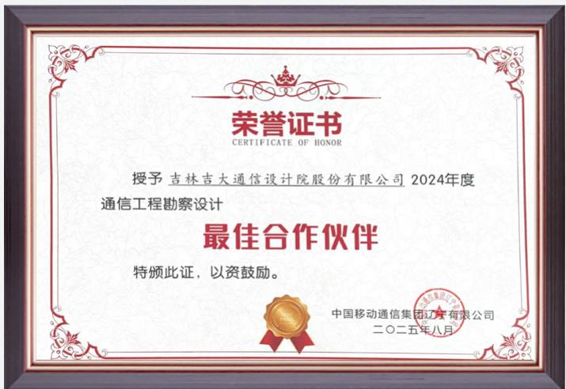

text_image

荣誉证书
CERTIFICATE OF HONOR
授予 吉林吉大通信设计院股份有限公司 2024年度
通信工程勘察设计
最佳合作伙伴
特颁此证，以资鼓励。
中国移动通信集团辽宁有限公司
二〇二五年八月

在 2025 年 9 月 29 日辽宁移动举办的“2024 年度最佳合作伙伴颁奖仪式”上，公司荣膺“辽宁移动 2024 年度通信工程勘察设计最佳合作伙伴”奖项。

## 数智化创新

2025 年 9 月 24 日，由吉林省政务服务和数字化建设管理局等部门主办，吉林市政务服务和数字化建设管理局承办的 2025 年“数据要素 ×”大赛吉林省分赛颁奖典礼暨数字经济产业招商推介会，吉大通信凭借《智慧食堂数智化“进销存”系统赋能高校餐饮后勤》项目在众多参赛团队中脱颖而出，荣获一等奖。

本届大赛自 6 月启动以来，吸引全国 278 支团队参赛 经过初赛，决赛的激烈角逐 28个优秀项目最终脱颖而出。大赛设一等奖3个，二等奖5个，三等奖 20 个，优秀奖 20 个。吉大通信的《智慧食堂数智化“进销存”系统赋能高校餐饮后勤》作为一等奖项目进行了路演展示，展现了数据赋能各传统行业领域的先进经验。

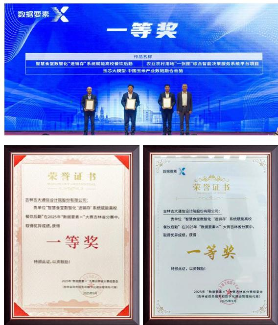

## 布局 AI 赛道

公司通过参股公司知行智跃，布局“AI+ 体育”赛道。知行智跃是我国 AI 领域新型科研机构“上海人工智能实验室”的科技成果转化实体，上海人工智能实验室作为我国人工智能领域的新型科研机构，采取有组织科研与原创探索深度融合的研究范式，开展前瞻性、基础性重大科学问题研究和关键核心技术攻关。实验室研发的书生·浦动体育技战术分析系统为国内首个AI体育技战术大模型。浦动无需借助穿戴设备，仅基于体育运动的视频画面，即可实时获取并分析出关键参数信息。该系统已在巴黎奥运会、哈尔滨亚冬会等国际顶级赛事中应用，提升了赛事转播的智能化水平与观赏体验，是人工智能赋能文化产业、促进全民健身的生动实践。是人工智能赋能文化产业、促进全民健身的生动实践。

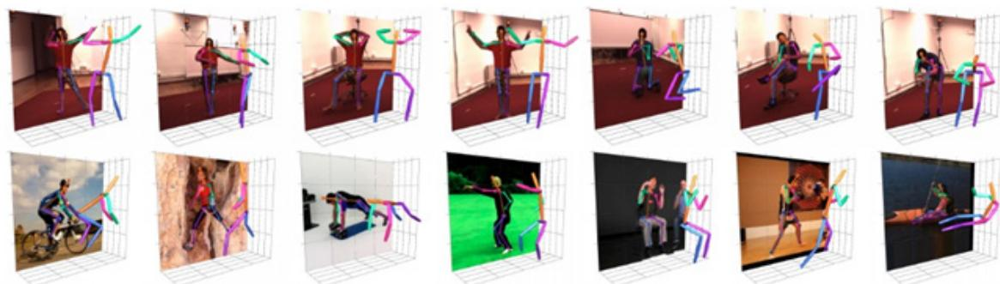

natural_image

Grid of 16 3D visualizations showing human figures in various poses with colored outlines, no text or symbols present.

## 产学研一体

吉大通信坚信一流的创新离不开开放合作的生态。公司高度重视与顶尖高校和科研机构的产学研用协同创新。2025 年 10 月，公司与吉林大学签订协议，共同成立“人工智能联合实验室”。该实验室将聚焦民生领域（包括但不限于城市治理、健康）和产业领域（包括但不限于通信产业、能源产业），研发以数据资源、产业体系和应用场景为基础的，具有前瞻性人工智能技术，高度贴合国家“十五五”规划中“人工智能 +”行动的要求。此举标志着公司在 AI 核心技术的源头创新上迈出了关键一步。

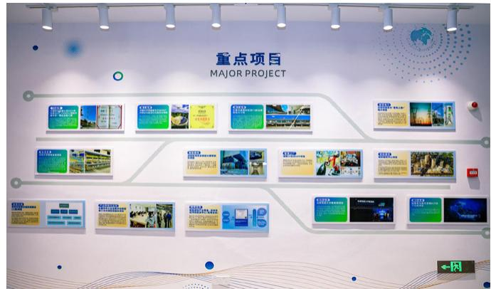

text_image

重点项目
MAJOR PROJECT

此外，公司与长春工业大学、东北师范大学等高校深度合作，共同组建了省级科技创新平台——吉林省信息通信技术科技创新中心，致力于促进科技成果中试熟化与产业化。公司还积极与吉林大学等高校合作开展省部级课题研发，目前在研课题6项。 这些合作有效汇聚了产业界与学术界的创新资源，加速了技术从实验室走向市场的进程。

## 智能网联汽车应用试点项目初步设计

公司围绕“车、路、云、网，图，安”一体化架构，全面推进长春市智能网联汽车基础设施建设与示范应用。初步设计包括：路侧基础设施方面，对全市主要路口和路段进行智能化改造，打通视频专网、数投专网、公安信息网等多类网络，建设云控基础平台，形成统一的算力与数据支撑体系；车辆与示范应用方面，面向公交车、出租车、自动驾驶车辆等不同类型车辆，开展协同预警、协同辅助驾驶及L4级自动驾驶示范应用；云控应用与系统平台方面建设包括统一运营平台，数字变生大屏 全量交通认知与研判系统安全监测系统低空警务系统等一系列云控应用；寒区特色方面，针对长春冬季严寒、冰雪天气等特殊环境，开展设备极寒适应性验证，形成可复制推广的寒区智能网联汽车发展模式；在产业发展方面，项目将充分发挥长春汽车产业基础优势 带动智能网联汽车产业链上下游协同发展培育新质生产力企业形成千亿级智能交通产业集群 助力长春打造全国智能网联汽车产业高地

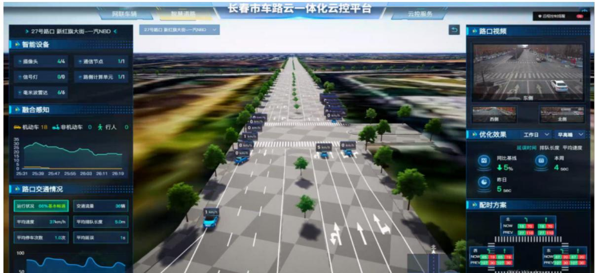

text_image

网联车辆
智慧道路
长春市车路云一体化云控平台
云控服务
27号路口 新红旗大街——汽NBD
智能设备
摄像头 4/4
通信节点 1/1
信号灯 0/0
路侧计算单元 1/1
毫米波雷达 6/6
融合感知
机动车 18 非机动车 0 行人 0
35
25
20
15
10
0
25:31 25:39 25:47 25:55 26:03 26:11 26:19
路口交通情况
运行状况 66%基本轮速 交通流量 36辆
平均速度 37km/h 平均排队长度 5.0m
平均停车次数 1.0次 平均延误 1s
1 km/h
5 km/h 0 km/h
优化效果 工作日 早高峰
延误时间 排队长度 平均速度
同比基线 本周
↓5%
昨日
5 SEC
配时方案
名 NOW 18.39 18.39
PREV 97.139 97.139
西 NOW 98.38 98.38
PREV102 90.07.36
东 NOW 97.90 97.90
PREV102 90.105.36

## 研发成果展示

自上市以来，公司研发投入逐年增长，坚守技术创新长期主义。研发投入紧密围绕主营业务，聚焦于通信与信息技术、“智慧食堂”相关产品方向，具体包括 5G+ 物联网技术研究、算力及网络演进技术、个人饮食报告数据产品，以及多场景智慧食堂应用系统与硬件设备的开发等，取得丰硕创新成果。

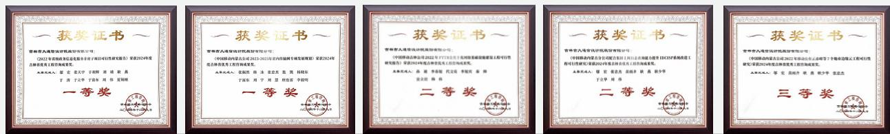

## 荣获吉林省

## 优秀工程咨询成果奖一等奖

《2022 年省级政务信息化服务非密子项目可行性研究报告》

《中国移动内蒙古公司 2023-2025年省内传输网专项发展规划》

## 荣获吉林省

## 优秀工程咨询成果奖二等奖

《中国移动吉林公司 2022 年 FTTR 全光千兆网络基础设施建设工程可行性研究报告》

《中国移动内蒙古分公司配合集团上网日志查询能力提升IDCISP系统改造工程可行性研究》

## 荣获吉林省

## 优秀工程咨询成果奖三等奖

《中国移动内蒙古公司 2022 年移动公有云赤峰等 7 个地市边缘云工程可行性研究》

## 参与制订标准

## 国家标准

架空光(电)缆通信杆路工程技术标准1.  
公共建筑光纤宽带接入工程技术标准2.  
住宅区和住宅建筑内通信设施工程验收规范3.  
4.住宅区和住宅建筑内光纤到户通信设施工程设计规范  
5 住宅区和住宅建筑内光纤到户通信设施工程施工及验收规范  
智慧城市数据融合第3部分：数据采集规范6.

7. 智慧城市基础设施　数据交换与共享指南  
8. 智慧城市基础设施电力基础设施火电站基础设施质量评价方法和运营维护要求  
9. 智慧城市基础设施 智慧交通中城市停车位匹配实施指南  
10. OPC统一架构与5G集成技术规范 第1部分：通用要求  
11. 地下空间应急救援数据与传输通用要求  
12. 信息通信管线工程项目规范（编制中）  
13. 工业5G终端通信通用技术要求及测试方法（编制中）

## 行业标准

通信工程制图与图形符号规定1.  
数字蜂窝移动通信网LTE核心网工程设计规范2.  
云计算资源池系统设备安装工程设计规范3.  
云计算资源池系统设备安装工程验收规范4.  
通信电源集中监控系统工程技术规范5.  
通信用柴油发电机组消噪音工程技术规范6.

分组传送网（PTN）工程技术规范7.  
波长交换光网络（WSON）工程技术规范8.  
通信线路工程技术规范9.  
云计算资源池系统设备安装工程技术规范10.  
切片分组传送网工程技术规范（编制中）11.  
互联网数据中心（IDC）工程技术规范（编制中）12.

## 重要研发成果展示

## 2025 年案例

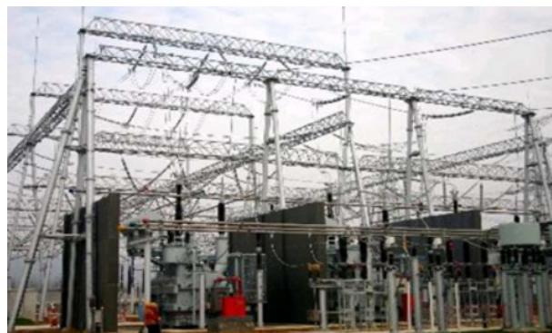

natural_image

Exterior view of a high-voltage electrical substation with transmission towers and insulators (no visible text or symbols)

风电接网：送变电工程设计齐齐哈尔龙江二期200MW 风电接网工程

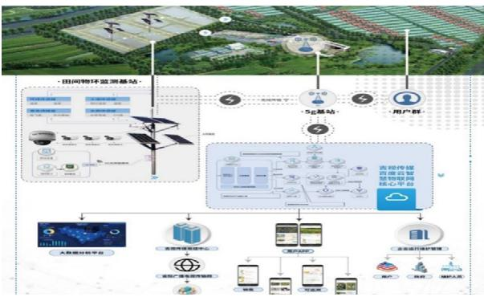

flowchart

This image is a system architecture diagram illustrating the data flow and workflow of a smart logistics network. It shows how user groups, 5G stations, and a channel monitoring station interact with various platforms to generate and manage data collection.

智慧农业：延边奢香米业项目

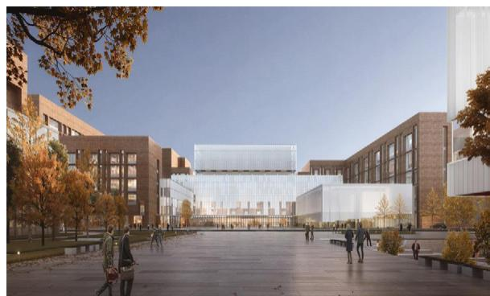

natural_image

Exterior view of a modern multi-story building complex with glass facade and surrounding trees (no signage or text visible)

智慧园区：雄安创新研究院科技园区项目

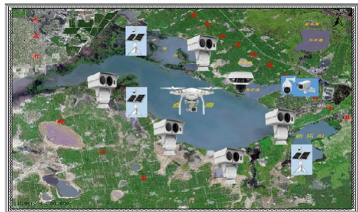

text_image

Satellite image of a drone system with labeled components and location markers, showing surveillance or monitoring stations.

数字生态：查干湖国家级自然保护区湿地保护与恢复建设项目

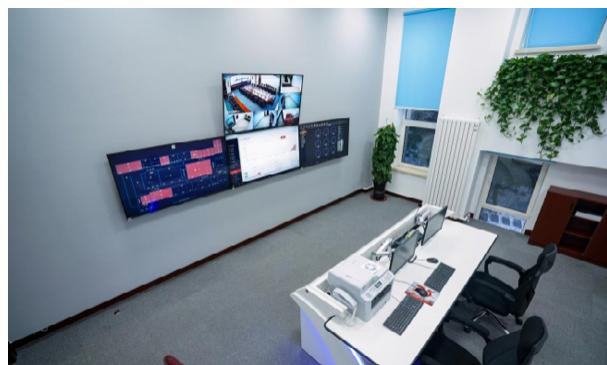

natural_image

Interior of a modern office with multiple digital screens and workstations, no visible text or symbols

数字政府：吉林省委政法委智慧政法建设项目

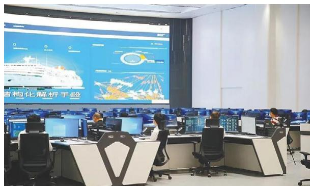

text_image

结构化解析手段

信息化平台：海南社会管理信息化平台建设项目

## 知识产权保护

公司坚持“保护知识产权，激励知识创新”的管理方针，制订了《吉大通信知识产权管理手册》《吉大通信知识产权管理体系程序文件汇编》等规范性文件，将知识产权管理贯穿立项、研发、采购、生产和销售全过程。

为确保知识产权管理体系的有效运行，公司设立了明确的知识产权管理目标，并成立了专门的知识产权责任部门，负责牵头协调企业内外部知识产权事务，并由知识产权主管全面负责各项工作推进。同时，公司建立了跨部门协同机制，要求各职能部门积极配合知识产权责任部门，共同做好知识产权创造、运用、保护和管理工作，为企业的创新发展提供强有力的知识产权支撑。

## 组织架构

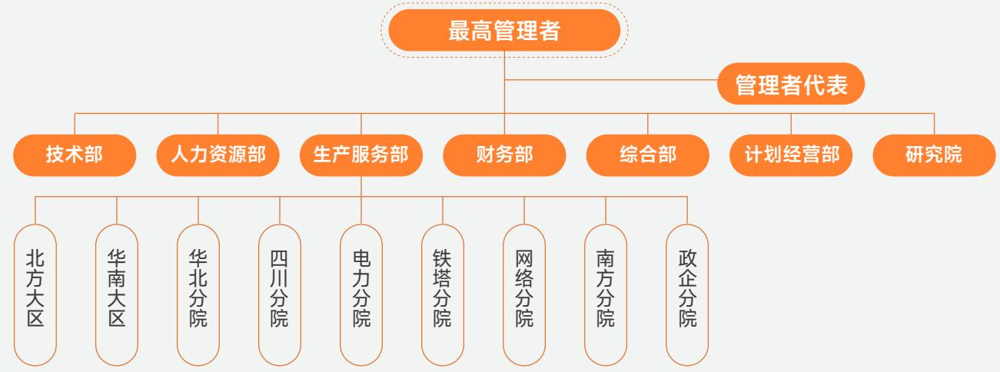

flowchart

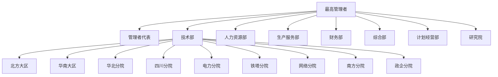
```mermaid
graph TD
  A["最高管理者"] --> B["管理者代表"]
  A --> C["技术部"]
  A --> D["人力资源部"]
  A --> E["生产服务部"]
  A --> F["财务部"]
  A --> G["综合部"]
  A --> H["计划经营部"]
  A --> I["研究院"]
  C --> J["北方大区"]
  C --> K["华南大区"]
  C --> L["华北分院"]
  C --> M["四川分院"]
  C --> N["电力分院"]
  C --> O["铁塔分院"]
  C --> P["网络分院"]
  C --> Q["南方分院"]
  C --> R["政企分院"]
```

## 知识产权保护措施

在研发项目立项阶段、研发完成后、生产阶段、采购阶段和产品销售阶段进行知识产权的评审。

建立知识产权档案，包括商标注册、专利申请等的相关资料和文件，以及研发活动的研发记录，知识产权评审资料等。

加强对企业员工尤其是科研开发人员行为的监督，与涉及知识产权工作的相关人员签订保密协议。

加强对员工知识产权知识的培训教育，形成全员保护知识产权的意识。

公司及员工发现侵权行为须及时报技术部，并帮助做好调查取证工作，必要时请示专利管理机关处理或向人民法院起诉。同时，公司避免侵犯他人的专利权。

报告期内，公司在各个专业领域共取得了 113 项专利和 224 项软件著作权，授权发明专利累计数 34项，授权实用新型专利累计数 7项，授权外观设计专利累计数 8项 商标累计数65 项 体现了深厚的技术积淀与行业影响力。

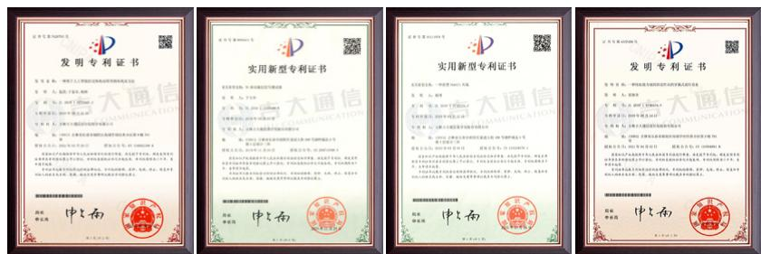

## 科技伦理

公司严格遵守国务院《关于加强科技伦理治理的意见》，在推进技术创新的进程中，严格遵守科技伦理规范，在数智化建设、人工智能、物联网、大数据分析等前沿科技领域开展研究与开发中，坚持透明、公正原则，并通过制度化建设确保科技伦理要求得以贯彻执行，坚守科技伦理底线，确保技术研发与应用符合社会道德和法律法规要求。报告期内，公司未发生因违反科技伦理相关规定被相关部门追责与处罚的情况。

## 指标与目标

公司紧密跟随国家“双碳”目标、数字经济及“人工智能 +”等战略要求，围绕公司“四轮驱动”的总体战略，系统规划与部署科技创新发展路径。深化通信技术服务、信息化产品集成运营等基础业务布局，做精做深做强细分领域，大力推进数智化转型业务以及智慧产品业务板块发展，构筑核心竞争力，培育新质生产力，为实现高质量可持续发展注入创新动力。

报告期内，公司研发投入达 3,565.89 万元，占营业收入比例 7.56%，较上年同期增长 20.35%研发项目数 27 项。

natural_image

Exterior view of a high-voltage transmission tower in a rural field with rolling hills in the background (no signage or text visible)

## 产品和服务

吉大通信践行高质量发展理念，不断强化质量管理体系和客户服务体系，保障产品质量和服务水平。报告期内，公司未发生产品或服务相关的安全与质量重大责任事故。

## 治理

公司严格遵守《中华人民共和国产品质量法》等法律法规，制定并实施《吉大通信质量、环境和职业健康安全管理手册》《吉大通信应急准备与响应程序》《吉大通信生产安全事故综合应急预案》《吉大通信专项应急预案》等规章制度，构建了覆盖全业务流程产品和服务的管理框架，系统地识别和分析公司在质量管理过程中可能面临的风险和机遇建立了系统化，规范化的生产安全风险管理体系公司针对工程设计环节制定了系统化的管控措施，包括《吉大通信工程设计控制程序》《吉大通信设计文件审核相关规定》《吉大通信设计文稿/文件监视、测量办法》等专项制度，形成了从设计输入、过程控制到成果输出的完整管理闭环，确保各项工作规范有序开展，持续提升企业核心竞争力。

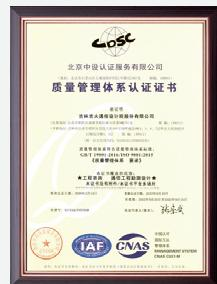

公司建立了完善的岗位责任体系，通过制定《吉大通信岗位说明书》，明确了与 QEHSMS 相关的管理、执行及验证等岗位的职责、权限和相互关系，为持续提升产品质量提供了坚实的组织保障。报告期内，公司已通过 ISO 9001 质量管理体系认证。

在大力推进科技创新的同时，吉大通信将信息安全与知识产权保护视为创新的生命线和必须履行的社会责任。

## QEHSMS 管理机构图

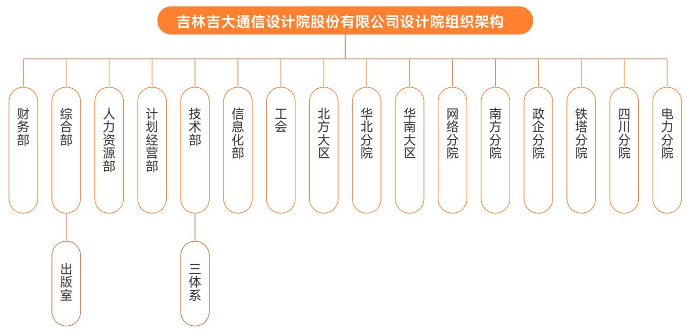

flowchart

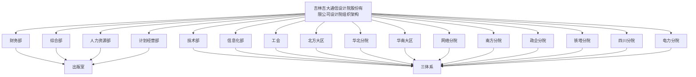
```mermaid
graph TD
  A["吉林吉大通信设计院股份有限公司设计院组织架构"] --> B["财务部"]
  A --> C["综合部"]
  A --> D["人力资源部"]
  A --> E["计划经营部"]
  A --> F["技术部"]
  A --> G["信息化部"]
  A --> H["工会"]
  A --> I["北方大区"]
  A --> J["华北分院"]
  A --> K["华南大区"]
  A --> L["网络分院"]
  A --> M["南方分院"]
  A --> N["政企分院"]
  A --> O["铁塔分院"]
  A --> P["四川分院"]
  A --> Q["电力分院"]
  B --> R["出版室"]
  C --> R
  D --> R
  E --> R
  F --> S["三体系"]
  G --> S
  H --> S
  I --> S
  J --> S
  K --> S
  L --> S
  M --> S
  N --> S
  O --> S
  P --> S
  Q --> S
```

## 战略

公司充分考虑组织内外部因素、相关方的需求和期望，定期识别在质量和服务管理过程中可能存在的风险和机遇，及时发现潜在的问题，并制定相应的应对措施，从而稳固提升产品与服务的质量水平。

<table><tr><td>类型</td><td>风险与机遇描述</td><td>发生概率</td><td>影响大小</td><td>影响的时间范围</td><td>影响的价值链环节</td><td>优先级排序</td><td>潜在财务影响</td><td>应对措施</td></tr><tr><td>产品与服务</td><td>风险:1.技术更新迭代加速、市场竞争激烈以及客户需求日趋多元化、个性化对公司产品和服务构成挑战。2.公司如不能紧跟行业发展趋势,及时进行技术升级与创新,可能导致产品性能落后,服务质量下降,市场竞争力削弱。机遇:1.国家对于通信行业的政策支持以及市场需求的不断增长,也为吉大通信提供了广阔的发展空间。2.随着数字化、网络化、智能化的快速发展,通信行业迎来了前所未有的发展机遇。吉大通信凭借其深厚的技术积累和敏锐的市场洞察力,可以及时捕捉行业发展趋势,将新技术、新应用融入产品与服务中,从而提升产品性能和服务质量。</td><td>中</td><td>高</td><td>短、中期</td><td>运营</td><td>中</td><td>运营成本增加营业收入减少</td><td>1.把握新一代信息技术发展机遇,积极布局通信网络技术与智慧产品研发。2.加速新业务产品的服务能力转化,降低市场拓展风险。3.注重相关人才引进与培养,通过完善激励机制激发核心团队的创新能力,并做好针对性的人才储备与技术攻关安排。4.不断提升产品与服务的差异化竞争优势,快速响应客户个性化和定制化需求,优化服务流程,提升服务质量,以确保在激烈的市场竞争中保持领先地位。</td></tr></table>

## 影响、风险和机遇管理

公司依据《吉大通信质量、环境和职业健康安全管理手册》等相关规章制度的要求，在产品和服务的安全与质量管理方面建立了完整的风险与机遇管理机制，系统地识别和分析公司在运营生产全过程全周期中可能面临的产品服务质量安全和生产安全的风险和机遇，并采取有效的控制措施进行风险防范和跟踪管理，以确保产品服务的质量和安全以及生产过程的安全有序。

## 风险识别

充分考虑组织内外部因素、相关方的需求和期望，由相关部门定期组织开展风险和机遇识别工作，识别风险和机遇的来源、类别等相关因素。

## 风险评估

对已辨识的风险发生可能性的高低、风险发生的条件以及风险对实现目标的影响程度进行评估分析。

## 风险跟踪

对已采取的风险控制措施进行跟踪，验证其对风险控制的有效性。

## 风险控制

公司根据内外部因素、发展战略，确定风险偏好、风险承受度、风险管理有效性及风险所需人力和财力资源配置 选择风险承担、风险规避、风险转移、风险补偿、风险控制等措施对风险进行管理。

## 质量管理措施

## 设计项目质量控制

公司建立了贯穿工程设计及咨询项目全生命周期的质量控制体系，严格遵循国家及行业规范，通过系统化的流程管理，确保从项目启动、方案设计到成果交付的全过程质量受控。

## 01

对设计文件的编制、审核、批准和归档等环节实施全方位质量监控，确保设计输入的科学性、设计过程的规范性和设计输出的准确性。

## 02

采用先进的质量管理工具和方法，对关键质量控制点进行实时监测和测量，确保每个项目始终处于受控状态，从而持续、稳定地为客户交付高质量的设计成果与专业化的咨询服务。

## 设计项目质量控制流程图

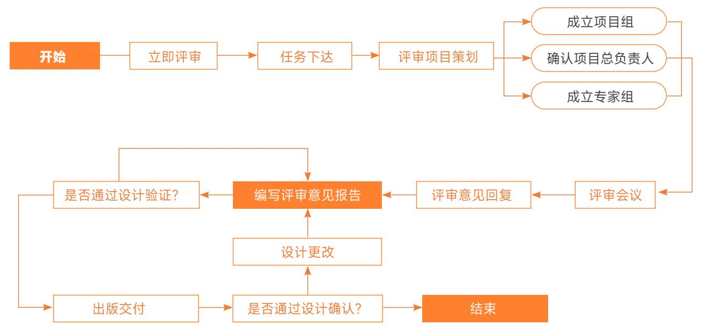

flowchart

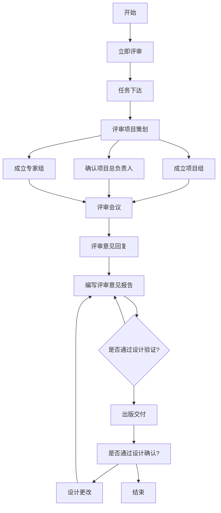
```mermaid
graph TD
  A["开始"] --> B["立即评审"]
  B --> C["任务下达"]
  C --> D["评审项目策划"]
  D --> E["成立项目组"]
  D --> F["确认项目总负责人"]
  D --> G["成立专家组"]
  E --> H["评审会议"]
  F --> H
  G --> H
  H --> I["评审意见回复"]
  I --> J["编写评审意见报告"]
  J --> K{"是否通过设计验证?"}
  K --> L["出版交付"]
  L --> M["是否通过设计确认?"]
  M --> N["设计更改"]
  N --> J
  K --> J
  M --> O["结束"]
```

## 不合格产品处置

公司制定并实施《吉大通信不符合（不合格）、事件调查、纠正措施控制程序》，确保不符合要求的产品和服务，以及不符合法律法规及管理规定的过程得到有效识别和控制，防止不合格品的非预期使用或交付，并对不符合的过程进行及时有效的控制和处理，从而确保公司产品和服务的质量。

## 不合格品处置措施

## 01

在设计文件校审中，各级审核人员严格执行《设计文件审核相关规定》，对设计文件进行逐级审查，有效控制，防止不合格品流入下一程序或交付。

## 02

对于存在的不合格采取纠正措施，以消除不合格原因，防止不合格再发生。对纠正措施进行可行性评价，使其与所发生问题的影响程度相适应

报告期内，公司产品合格率100%，公司获得的质量管理相关的认证、主要产品和服务质量管理体系认证2个，未发生产品召回事件。

公司开展质量文化培训 2 次，培训人数 595 人，质量文化培训总时长 8 小时。

## 安全生产管理措施

公司制订并严格遵循《吉大通信生产安全事故应急预案管理办法》和《吉大通信专项应急预案》，建立了完善的应急管理与持续改进机制。覆盖火灾、触电、高处坠落、自然灾害等多种情形，并建立了由应急指挥部、抢险救援组、后勤保障组等构成的应急组织体系，定期开展演练以保持应急响应能力。为确保应急预案高效执行，公司设立了专业化的应急组织机构，由应急指挥部统一领导，下设日常管理的应急救援办公室，并分设抢险救援、警戒疏散、通信联络、后勤保障及善后处理五个专业小组。通过明确各小组职责并建立协同联动机制，形成了响应迅速、处置有效的应急救援能力，为应对各类突发事件提供了坚实的组织与行动保障。

## 应急组织体系架构图

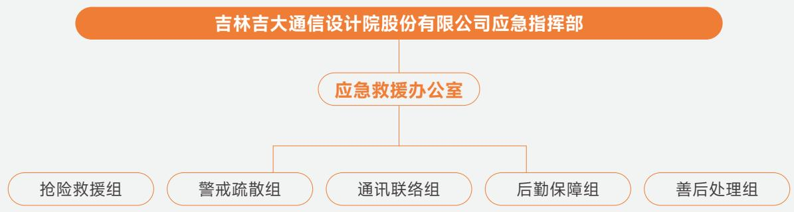

flowchart

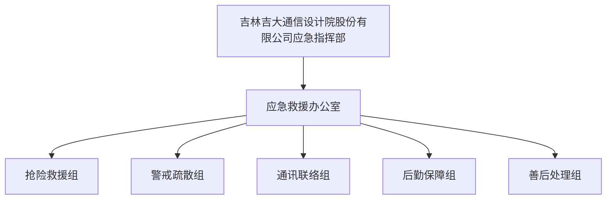
```mermaid
graph TD
  A["吉林吉大通信设计院股份有限公司应急指挥部"] --> B["应急救援办公室"]
  B --> C["抢险救援组"]
  B --> D["警戒疏散组"]
  B --> E["通讯联络组"]
  B --> F["后勤保障组"]
  B --> G["善后处理组"]
```

为有效应对突发事件构筑 起坚实的“双保险”防线，公司建立常态化的应急演练机制，定期组织开展各类应急预案的实战演练。通过模拟真实场景的演练活动， 结合演练效果评估与总结改进，持续提升公司整体应急响应能力和应急处置水平。报告期内，公司共组织开展6场安全应急演练。

为提高公司应对突发事件的能力，使员工具有在火灾突发情况下的自救、互救和逃生技能，公司总部、武汉分公司、长邮通信结合实际情况，组织开展消防逃生演练活动。

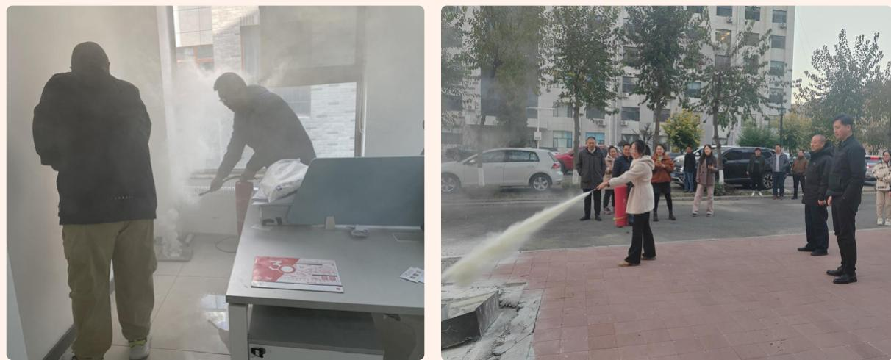

## 承包商安全管理

公司制定了《吉大通信承包商安全管理制度》，将承包商安全风险纳入公司整体管理框架。通过对承包商的准入资质、安全培训、安全检查与隐患排查、应急管理等方面做出明确规定，切实保障项目施工过程中的人员与财产安全。同时，建立系统的考核评估机制，并将考核评估结果作为承包商后续合作的重要依据。

## 安全文化建设

公司制定《吉大通信安全生产教育培训管理制度》，通过制度化、常态化的安全文化建设，全面提升员工安全意识和技能水平。

## 01

定期组织开展形式多样的安全培训与应急演练活动。根据重大节日、季节、天气等不同情况分别进行安全生产、车辆安全、消防安全等各类安全知识网络宣传，共计50条。

## 02

组织安全生产月施工现场消防安全培训、高处作业安全生产操作规范培训、驾驶员安全培训，增强全员安全意识。

## 03

每年定期举办消防安全知识讲座及消防逃生演练，公司领导全程参与并强调安全生产的重要性，通过理论讲解与实战模拟相结合的方式，有效提升了员工的消防安全意识、知识以及火场自救互救能力。

## 04

与公司华鸿学院的培训体系相结合，举办职工职业健康安全知识竞赛等线上活动，以赛促学，广泛普及职业健康安全知识，增强广大职工的安全防护意识。

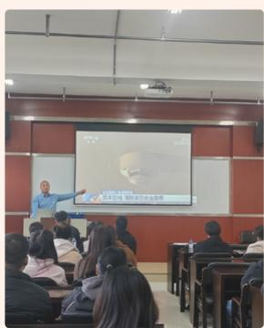

text_image

Presentation slide showing a speaker presenting to a screen with Chinese text about medical or health services, seated in a classroom setting.

组织安全生产月培训

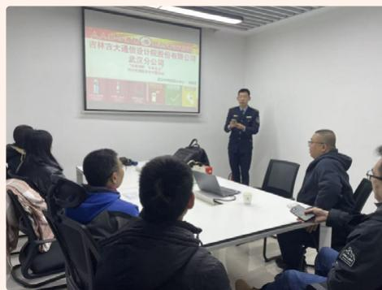

text_image

吉林吉大通信设计院股份有限公司
武汉分公司

消防安全培训

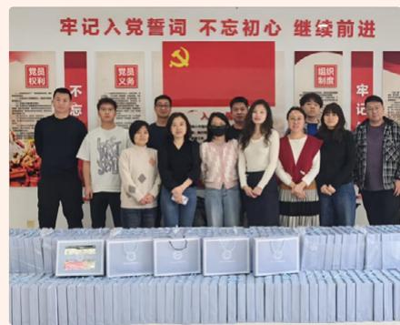

text_image

牢记入党誓词 不忘初心 继续前进
党员权利 不忘 党员义务 组织制章 安记

职工健康安全知识竞赛

<table><tr><td>序号</td><td>培训主题</td><td>时间</td><td>对象</td></tr><tr><td>1</td><td>公司各项安全管理制度、岗位安全操作规程、安全事故应急预案</td><td>4月22日</td><td>全员</td></tr><tr><td>2</td><td>施工现场消防安全培训</td><td>6月22日</td><td>施工人员</td></tr><tr><td>3</td><td>高处作业安全生产操作规范培训</td><td>6月22日</td><td>施工人员</td></tr><tr><td>4</td><td>驾驶员安全培训</td><td>6月22日</td><td>施工人员</td></tr><tr><td>5</td><td>公司各项安全管理制度、岗位安全操作规程、安全事故应急预案</td><td>10月21日</td><td>全员</td></tr></table>

## 指标

报告期内，公司开展安全教育培训27 次，参与安全教育培训4,062 人次，安全教育培训总时长503.5小时，安全教育培训覆盖比率100%，安全风险防护培训覆盖率100%。

## 客户权益保护

公司将“以客户为中心”的可持续发展理念转化为系统化的管理实践，制定并实施《吉大通信客户服务管理制度》等一系列规范性文件，明确了客户服务组织架构与职责、服务流程及满意度调查等要求，以全面提升服务品质与客户体验。同时，公司将客户满意度、服务响应时间、业务处理准确率、投诉处理及时率等关键指标纳入客户服务人员绩效考核体系，有效驱动服务团队持续优化服务流程、快速响应客户需求，不断提升服务水平，全方位保障客户权益。

公司已正式通过 GB/T 27922-2011 售后服务认证。

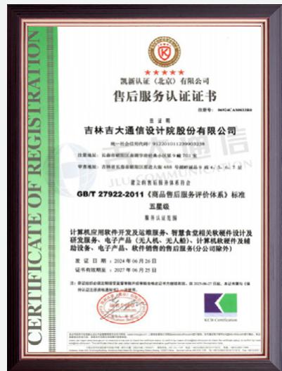

text_image

凯源认证（北京）有限公司
售后服务认证证书
注册号: 00134240053863
证书期
吉林吉大通信设计院股份有限公司
统一社会信用代码: 91220101122990XQX8
注册地址:长春市朝阳区金晖路华强中心东塔1幢701室
审批地址:吉林省长春市朝阳区前进大街438 号邮储成品库4.1-5.6.7 计量
建立的售后服务评价体系符合
GB/T 27922-2011《商品售后服务评价体系》标准
五星级
服务认证范围
计算机应用软件开发及运维服务、智慧食堂相关软硬件设计及研发服务、电子产品（无人机、无人机）计算机软硬件及辅助设备、电子产品、软件销售的售后服务(分公司除外)
发证日期: 2024年06月26日
证书有效期至: 2027年06月25日
注: 骨询法院根据定期报告签署的案件受理通知书及办理完毕时间,自2025年06月27日起,本证书需与《售后认证法律意见书》一致签署。
ACB Certification

## 客户服务管理架构

客户服务领导小组

客户服务管理部门

其他相关部门

## 由高层管理人员组成，总经理担任组长

制定客户服务战略和目标；  
审议和决策客户服务重大事项；  
协调各分院之间的客户服务工作。

## 计划经营部

制定和完善客户服务管理制度、流程和标准；  
建立和维护客户信息档案，对客户信息进行分析和管理；  
受理客户咨询、投诉和建议，跟踪处理进度并反馈结果；  
组织开展客户满意度调查，分析调查结果并提出改进建议；  
对客户服务人员进行培训、考核和管理；  
负责市场调研，了解客户需求和市场动态，为客户服务策略提供依据；  
协助客户服务部门进行客户开发和维护。

## 技术部

为客户提供技术支持和解决方案，确保服务的技术质量；  
配合客户服务部门解决客户技术方面的问题。

## 各分院

负责项目的实施和管理，确保项目按时、按质完成；  
及时与客户沟通项目进展情况，处理项目中的客户问题。

同时 公司下属各子公司结合业务实际，制定了符合自身特点的管理制度。其中 长邮通信制定了《投诉处理涉及流程》《保修服务措施》《客户服务沟通渠道》等规范，形成完整的售后服务应对流程，高效响应客户反馈，持续提升客户满意度；中浦慧联制定了《交付及售后部售后管理制度》，严格把控售后服务质量，维护公司品牌形象和信誉，确保业务健康发展。

## 客户服务流程

公司通过构建覆盖客户“咨询受理、方案定制、项目实施、验收交付至售后跟进”的全生命周期服务体系，针对公开招标与非公开招标等不同业务场景，制定了差异化的标准化服务流程。以规范化、精细化的过程管理，确保客户需求在任何环节都能得到专业、高效的响应和服务。

## 客户咨询与需求受理

公开招标的，公司主动采集公开招标信息，获取客户需求。

非公开招标的，客户可以通过电话、邮件、社交媒体等渠道向公司咨询业务或提出服务需求，客户服务人员须在规定时间内接待客户，准确记录客户咨询或需求内容。

## 方案制定与报价

公开招标的，通过资格预审后，获取招标文件，编制投标文件，参加竞标。

非公开招标的，相关部门根据客户需求进行详细分析，制定个性化的解决方案，相关人员根据方案制定合理的报价，并由客户服务人员反馈给客户。

## 合同签订与项目实施

公开招标的，竞标成功后，收到中标通知书，按照招标文件要求签订服务合同或服务框架协议。

非公开招标的，客户确认方案和报价后，双方签订正式合同；各分院按照合同要求组织项目实施，定期向客户汇报项目进展情况。

## 客户验收与交付

项目完成后，客户服务人员协助各分院组织客户进行验收。

## 售后服务与跟进

售后服务部门负责客户交付后的维护和支持工作，定期回访客户，了解客户使用情况和满意度。对客户提出的售后问题，及时响应并解决；对于需要现场服务的问题，在规定时间内到达现场。

## 客户投诉响应

公司建立并不断完善客户投诉机制和处理流程。针对不同类型的客户投诉，设立了多样化的客户投诉渠道。同时制定了相应的问题升级流程，确保投诉能够及时反馈至相关部门，并得到快速、有效地处理，最大限度地降低投诉对品牌形象和业务运营的负面影响。报告期内，公司未收到客户投诉。

## 投诉受理

客户服务人员接到客户投诉后，倾听客户的诉求，记录投诉的详细信息，包括投诉人姓名、联系方式、投诉内容，投诉时间等。

## 投诉调查

客户服务管理部门根据投诉内容，组织相关部门对投诉事项进行调查核实。

## 投诉处理与反馈

根据调查结果，制定合理的处理方案，并与客户沟通协商，争取达成一致意见。

## 投诉总结与改进

定期对客户投诉进行总结分析，找出投诉的主要原因和规律。根据总结分析结果，制定针对性的改进措施，防止类似投诉再次发生

## 客户服务培训

公司建立了常态化的客户服务人员培训与发展机制，定期开展涵盖通信及信息技术、有效沟通、投诉处理与客户心理分析等专业领域的培训。通过系统化、专业化的培训，持续提升服务团队的综合素养与专业能力，为客户提供更专业、高效的服务。

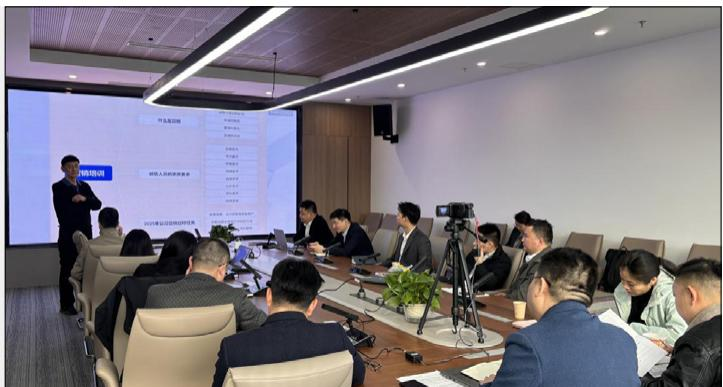

text_image

Conference room scene with presentation slide and attendees, showing Chinese text on screen and panel

在本报告期内，公司组织客户服务相关培训2次，培训时长135小时，实施客户投诉响应时效与质量考核14次，考核通过率为 100% 。

## 客户满意度

公司高度重视客户的声音与反馈，制定并实施《顾客及相关方满意评价程序》，建立了常态化的客户满意度监测与改进机制。公司每年定期开展顾客满意度调查，收集顾客意见和建议，计划经营部负责对顾客满意度进行评价和分析，并组织相关部门根据满意度调查结果采取相应的改进措施，持续提升服务质量与客户粘性。

## 指标

报告期内，公司累计有效发放满意度调查问卷有效数 175 份，参与调查的客户数量 60 人，参与调查的客户占比 2.96%，整体客户满意度达 99.85%。客户投诉响应专项培训 6 次，客户投诉响应专项培训人数 41 人，客户投诉响应专项培训总时长 13 小时，客户投诉响应专项培训考核次数 14 次，客户投诉响应专项培训考核人数 41 人，应对客户投诉响应考核一次通过率 100%。

## 可持续营销

公司制定并实施《吉大通信营销管理制度》，从合规管理、宣传规范、数据保护、价格管理、可持续营销、供应营销、文化尊重、营销人员管理等八个方面规范公司营销活动，提升营销效率和效果，增强市场竞争力，保障公司合法合规运营。

合规与诚信经营：制度要求所有营销活动严格遵守国家法律法规及行业规范，杜绝虚假宣传与不正当竞争，并通过定期培训与监督机制强化合规意识。

负责任的营销实践：制度强调客户导向与数据保护，在收集和使用客户数据时遵循合法、正当、必要原则，并保障客户权益。同时，将环境友好理念与社会责任融入营销宣传，积极推广绿色服务并参与公益事业，以提升品牌美誉度。系统化的运营保障：制度建立了涵盖宣传内容审核、价格管理、供应商评估及跨文化营销在内的全流程管控机制。通过科学的绩效考核与团队建设，旨在提升营销团队的专业能力与协作效率，确保营销活动与公司整体战略及可持续发展目标相一致。

## 合规管理

严格遵守国家法律法规、行业规范及标准，以及公司内部营销管理制度和流程，定期组织营销人员参加合规培训，确保营销活动的规范性和透明度。

## 宣传规范

严格执行宣传审核制度，确保内容真实、准确、合法，杜绝虚假或误导性信息。同时，选择合法、正规且具有影响力的宣传渠道进行广告投放。

## 数据保护

明确客户数据收集原则，建立健全客户数据安全管理制度，采取必要的技术和管理措施，保障客户数据的安全。

## 价格管理

遵循市场规律和成本效益的定价原则，规范价格调整管理程序，明确价格公示要求，杜绝不正当价格竞争。

## 可持续营销

在营销活动中，积极宣传公司的环境友好理念和可持续发展战略，推广绿色产品和服务，并将社会责任纳入营销活动的考量范围，积极参与公益事业，支持社会发展。

## 供应营销

分别就供应商选择与管理、供应链协同营销、供应风险预警与应对、供应商绩效评估作出具体规定。

## 文化尊重

在开展国际营销活动时，充分识别并尊重不同国家和地区的文化差异，避免因文化差异导致的营销失误。

## 营销人员管理

定期组织营销人员参加专业培训和业务学习，不断提升员工的营销技能和综合素质。

## 指标与目标

公司将高质量的产品与服务视为企业可持续发展的基石。为此，公司设定了清晰、可衡量的质量与服务管理目标，并严格遵循《中华人民共和国产品质量法》等法律法规，不断强化从设计到交付的全流程质量管理体系与客户服务体系。

## 01

通过精益求精的工艺与持续的服务创新，为客户提供稳定、可靠且卓越的产品与服务体验。

## 02

通过健全覆盖工程设计及咨询项目全生命周期的质量控制体系，全方位提升服务品质与客户满意度。

## 03

通过严格的安全生产措施，及时化解各类突发性安全生产风险，保障公司生产管理的延续性、稳定性和可持续性。

## 2025年质量和服务管理目标

遵守国家、地方法律法规要求，合规率100%

产品合格率达 100%

顾客反馈问题处理及时率达100%

员工参加本职工作方面的培训每年不低于5次

## 达成情况

## 已达成

## 供应链供应商管理

## 供应商管理

公司坚持“公平透明、质量优先、成本效益、长期合作、动态管理”的原则，依据国家相关法律法规，制定《吉大通信供应商管理体系制度》《吉大通信工程供应商管理办法》《吉大通信供应商管理程序》《吉大通信采购控制程序》等内部管理制度，全面推行供应商全生命周期管理模式，严格把控供应商准入，审核，评估及淘汰等关键环节，并把ESG理令和原则融入供应商管理，实现了对供应商风险的精准识别与有效防控，确保供应链运行的安全，稳定，高效与绿色，为企业的可持续发展提供坚实保障，

## 供应商开发与选择

通过获取潜在供应商信息，按基本资质、产品或服务能力、质量管理体系、价格竞争力、交付能力、服务水平、信誉口碑等标准进行筛选。

## 供应商合作管理

以合同管理为基础，明确产品或服务的核心条款并定期检查修订，同时规范订单下达、跟踪及变更流程。

## 供应商评估与考核

围绕质量、交付、价格、服务、技术、管理六大类指标，通过数据统计、现场评估、问卷调查等方法，按季度、半年度、年度开展评估，将供应商划分为优秀、良好、合格、不合格四级，分别对应激励、改进、警告、淘汰等处理方式。

## 供应商淘汰与退出

在出现绩效连续评估不合格且整改无效；出现严重质量问题造成重大损失或声誉损害；严重违反合同约定；发生重大违法违规行为；或经营状况恶化影响正常供应等情况下，供应商将被实施淘汰与退出。

## 供应商关系维护与发展

过签订长期协议、共享信息与技术、共同研发等方式，建立战略合作伙伴关系。定期组织供应商培训与交流活动，提升供应链整体水平。建立供应商激励机制，对表现优秀、积极创新的供应商给予奖励。

## 数字化管理

为提升管理效率和服务质量，公司引入金蝶系统对供应商实施精细化管控 并在各分子公司全面推广和深化应用。通过数字化手段替代传统文字记录，显著提升了各部门的工作效率，优化内部沟通机制。

## 供方管理流程

公司管理层

供应商管理

主管部门

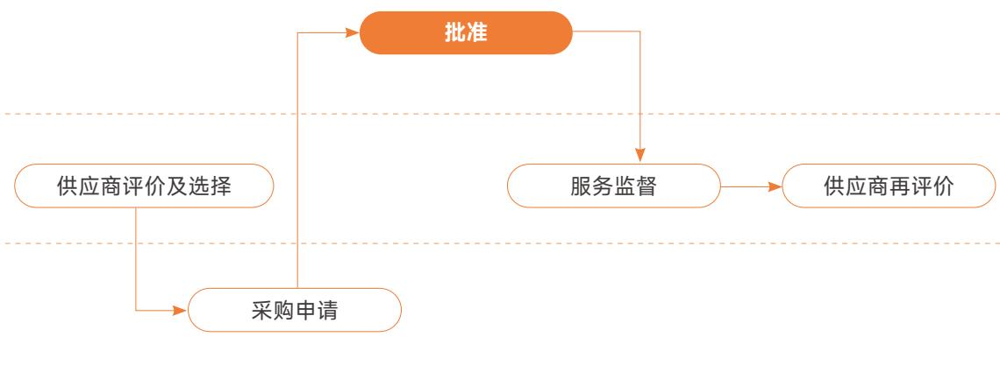

flowchart

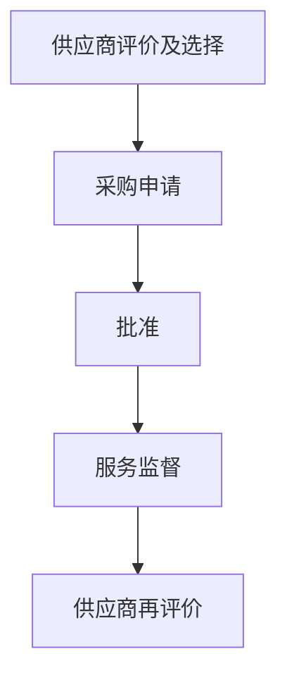
```mermaid
graph TD
  A["供应商评价及选择"] --> B["采购申请"]
  B --> C["批准"]
  C --> D["服务监督"]
  D --> E["供应商再评价"]
```

国内供应商合计 449 家，其中华东地区 40 家，华南地区 50 家，华中地区 21 家，华北地区 74 家，东北地区212家，西南地区40家，西北地区12家。

海外供应商39家。

## 供应商可持续发展

公司致力于打造可持续发展的绿色供应链体系。公司不仅关注供应商的产品质量与交付能力，从合法用工、劳动权益保障、社会责任履行到环境保护实践等多个维度进行综合评估，积极推动供应链上下游企业共同践行可持续发展理念，携手构建绿色、和谐、负责任的价值链生态体系。

公司将 ESG 理念作为核心指引，致力于打造可持续绿色供应链，将 ESG 原则和指标深度融入采购管理全流程。在供应商的选择与评价方面，除了传统的质量、成本、交付指标等因素，公司更注重其 ESG 表现，从环境保护、劳工权益、商业道德和社会责任履行等多个维度进行综合评估考量，引导和推动供应链向可持续绿色方向发展。

## 01

## 廉洁采购

将反商业贿赂和反不正当竞争相关条款明确纳入与供应商合同中，并要求供应商签署《廉洁诚信协议》，清晰界定廉洁从业的边界，明确禁止任何形式的商业贿赂、利益输送及其他违反廉洁规定的行为，严格规范双方合作行为，确保合作双方在公开、透明、合规的基础上开展业务往来，共同维护健康有序的商业生态。

## 02

## 绿色采购

公司积极推行绿色采购政策 致力于构建环境友好型供应链体系。在同等条件下优先选择通过环境管理体系认证、采用低碳生产工艺的供应商，并鼓励供应商提供环保产品、使用环保包装，降低能耗，最大限度减少供应链的碳足迹对环境的影响。

## 03

## 数字化采购

公司通过金蝶 EAS 系统推进采购数字化，实现从采购申请、订单生成，付款申请到入库的全流程智能化管理。该系统显著提升了业务执行效率与数据准确性，形成了完整，可追溯的采购数据链，既为经营决策提供了精准的数字化支撑，也让采购过程的管理更加绿色智能。

## 指标和目标

截至报告期末，合格供应商数 488 家，其中国内供应 449 家，海外供应商 39 家，向当地供应商采购支出的比率为 64.27%。

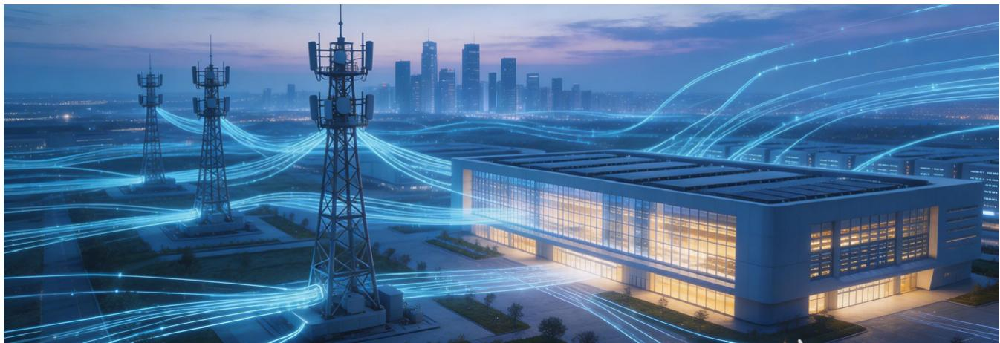

natural_image

Modern building with telecommunications towers and glowing blue signal lines over a city skyline at dusk (no text or symbols visible)

## 信息安全与隐私保护

## 治理

公司建立了完善的信息安全管理体系，通过制定并实施《吉大通信信息安全、信息技术服务管理手册》《吉大通信网络安全管理规范》《吉大通信信息安全事件管理规范》《吉大通信数据安全管理规范》等一系列制度文件，为信息安全工作提供坚实的制度保障。

公司设立了专门的信息安全管理组织架构，明确划分各部门和岗位的职责，确保信息安全管理体系的有效运行和持续改进。公司已建立并持续完善信息安全和隐私保护管理体系。

公司按照国际最佳实践，建立了一套系统化、流程化的信息安全管理机制，从而有效识别和管理信息安全风险，保障公司及客户数据资产的安全、保密与可用性。

## 总经理

对信息安全工作全面负责，负责批准信息安全方针，确定信息安全要求，提供信息安全资源。

## 管理者代表

由总经理任命，负责建立、实施、检查、改进信息安全管理体系，保证信息安全管理体系的持续适宜性和有效性。

## 信息安全管理委员会

保证信息安全管理体系的有效运行。

吉大通信于2022年首次获得 ISO/IEC 27001:2013 信息安全管理体系认证，并于2025 年成功完成了向 ISO/IEC 27001:2022 最新版的换版认证。

同时，公司也认证了 ISO/IEC 20000-1 信 息 技 术 服务管理体系，确保服务交付的可靠与高效。

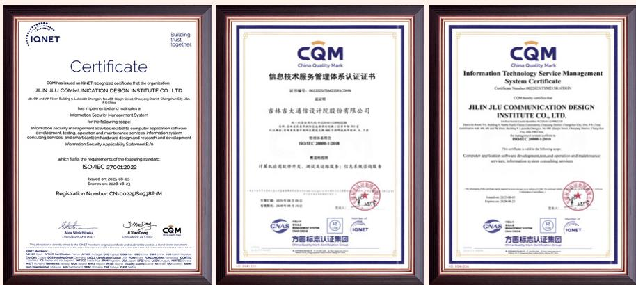

战略

<table><tr><td>风险类型</td><td>风险描述</td><td>发生概率</td><td>影响大小</td><td>影响的时间范围</td><td>影响的价值链环节</td><td>优先级排序</td><td>潜在财务影响</td><td>应对措施</td></tr><tr><td>政策与法律风险</td><td>若未及时落实运营地网络安全法律法规要求,可能导致发生网络安全事件,进而承担法律责任,包括被通报、警告或处罚等。</td><td>低</td><td>高</td><td>短、中、长期</td><td>运营</td><td>高</td><td>营业外支出增加</td><td>跟踪和研究国内外信息安全和隐私保护法律法规变化,及时调整公司相关制度和技术手段,确保公司数据处理活动始终符合最新的法律要求。</td></tr><tr><td>技术风险</td><td>若内部系统技术安全措施不到位,黑客利用钓鱼攻击、恶意软件等技术手段窃取企业敏感数据,可能导致信息系统被非法入侵,造成客户和合伙伙伴数据泄露。</td><td>中</td><td>中</td><td>短、中期</td><td>上游、运营、下游</td><td>高</td><td>运营成本增加营业收入减少</td><td>1.采用加密技术对重要数据进行加密存储和传输。2.建立严格的访问控制机制,对不同级别的数据设置不同的访问权限。3.定期开展信息安全攻防演练活动,检验防御措施的有效性。4.开展员工信息安全管理培训,帮助员工识别常见的网络攻击手段和防范方式,提升员工的防范能力和防范意识。</td></tr><tr><td>产品与服务风险</td><td>1、如公司核心技术或方案发生泄露,则可能导致客户和市场份额流失,竞争力下降。2、如发生客户信息资料泄露,则可能对公司的业务开展造成负面影响。</td><td>低</td><td>高</td><td>短、中、长期</td><td>运营、下游</td><td>高</td><td>收入减少</td><td>1.严格执行信息保密制度,加强员工培训,不断增强保密意识。2.采用先进加密技术保护数据传输与存储安全。3.设置访问权限控制降低数据泄露风险。4.部署实时监控系统及时发现并阻断潜在威胁。5.建立数据分类分级管理制度,针对不同敏感度的信息实施差异化保护策略。6.定期开展安全审计与漏洞扫描,确保防护措施持续有效。7.制定应急响应预案以快速处置安全事件。</td></tr></table>

根据自身业务特点，吉大通信通过识别信息安全和客户隐私保护过程中可能面临的风险和机遇，并采取针对性的措施，有效降低各种风险，切实保障客户隐私和信息安全，为业务可持续发展筑牢信息安全屏障。

<table><tr><td>机遇类型</td><td>机遇描述</td><td>发生概率</td><td>影响大小</td><td>影响的时间范围</td><td>影响的价值链环节</td><td>优先级排序</td><td>潜在财务影响</td><td>应对措施</td></tr><tr><td>技术机遇</td><td>随着5G、人工智能、大数据、云计算等新一代信息技术的发展,为企业提供了更加高效、便捷的数据安全和隐私保护手段,企业可以利用这些技术,提升数据处理的效率和安全性,降低数据泄露的风险。</td><td>高</td><td>中</td><td>中、长期</td><td>运营</td><td>中</td><td>运营成本减少</td><td>1.采用先进的数据加密、匿名化等技术手段来保护数据的安全和隐私。2.建立多层防护体系,防止黑客攻击和数据泄露。3.借助第三方安全机构对系统进行安全评估,及时发现和修复系统存在的安全漏洞和风险。</td></tr></table>

## 影响、风险和机遇管理

公司制定《吉大通信信息安全风险评估控制程序》《吉大通信风险和机遇控制程序》等规章制度，系统化识别、评估信息安全风险和机遇，并实施风险处置措施，确保信息安全风险始终处于可控状态。

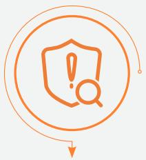

## 风险识别

按《信息安全风险评估控制程序》识别与信息保密性、完整性和可用性损失有关的风险，并确定每个风险的负责人。

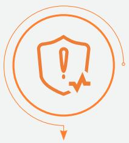

## 风险评估

采用先进的风险评估技术，定期进行风险评估，以分析风险发生的可能性和可能导致的潜在后果。

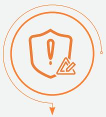

## 风险处置

制定信息安全风险处置计划并实施，按照风险接受准则评价实施效果。

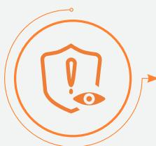

## 风险监督

定期对信息安全进行监督检查，建立业务持续性计划，防止关键业务过程受严重的信息系统故障或者灾难的影响，保障业务的连续稳定运行。

## 应急预案和演练

公司制定了《吉大通信信息安全突发事件应急预案》建立健全了信息安全事件的预防，响应，处置和恢复机制成立高层领导牵头的应急指挥领导小组，负责制定网络安全应急指挥的政策措施和指导意见，全面提升应对突发事件的能力和水平。

公司定期开展应急预案演练，通过模拟真实场景检验预案的可行性和有效性，并持续优化应急响应流程，确保响应团队熟悉流程、职责明确，提升实战能力。

吉大通信信息安全突发事件应急处置流程  
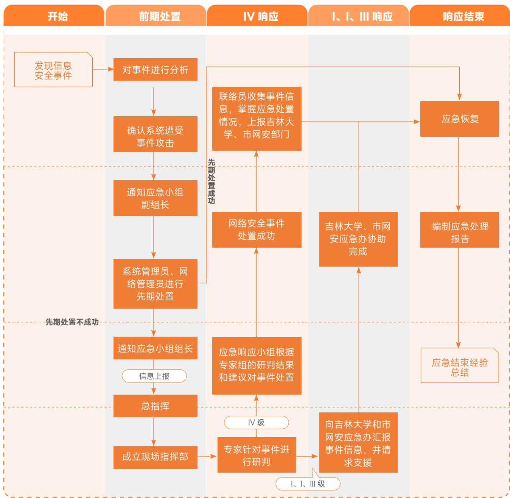

flowchart

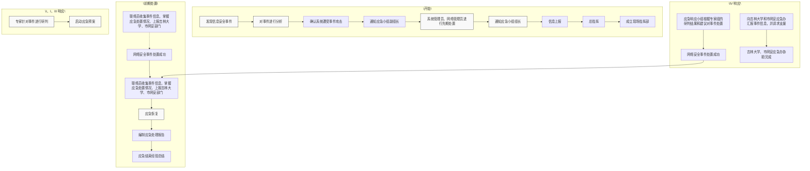
```mermaid
graph TD
  subgraph sg["\"开始\""]
  A["发现信息安全事件"] --> B["对事件进行分析"]
  B --> C["确认系统遭受事件攻击"]
  C --> D["通知应急小组副组长"]
  D --> E["系统管理员、网络管理员进行先期处置"]
  E --> F["通知应急小组组长"]
  F --> G["信息上报"]
  G --> H["总指挥"]
  H --> I["成立现场指挥部"]
  end

  subgraph sg_2["\"前期处置\""]
    J["联络员收集事件信息，掌握应急处置情况，上报吉林大学、市网安部门"] -.-> K["网络安全事件处置成功"]
  K --> L["联络员收集事件信息，掌握应急处置情况，上报吉林大学、市网安部门"]
  L --> M["应急恢复"]
  M --> N["编制应急处理报告"]
  N --> O["应急结束经验总结"]
  end

  subgraph IV["\"IV 响应\""]
  P["应急响应小组根据专家组的研判结果和建议对事件处置"] --> Q["网络安全事件处置成功"]
  Q --> L
  R["向吉林大学和市网安应急办汇报事件信息，并请求支援"] --> S["吉林大学、市网安应急办协助完成"]
  end

  subgraph I_I_III["\"I、I、III 响应\""]
  T["专家针对事件进行研判"] --> U["启动应急预案"]
  end

  style A fill:#f9f9f9,stroke:#333
  style B fill:#f9f9f9,stroke:#333
  style E fill:#f9f9f9,stroke:#333
  style F fill:#f9f9f9,stroke:#333
  style M fill:#f9f9f9,stroke:#333
  style U fill:#f9f9f9,stroke:#333
  style T fill:#f9f9f9,stroke:#333
```

## 信息安全审计

公司采用不定期内部审计与第三方审计相结合的方式，通过专业的审计团队和先进的审计工具，对信息系统的安全性、合规性进行多层次多维度的审计评估，确保公司在技术、管理和操作等各层面的信息安全，持续提升信息安全管理水平。报告期内，公司成立审核组开展了1 次信息安全及信息技术服务管理体系内部审核，并出具了《内审结论报告》。审核结果表明，公司建立的信息技术服务及信息安全管理体系运行适宜、有效，为公司的稳健运营提供了坚实保障。

## 信息安全管理

公司制定并实施包括《吉大通信商业秘密管理规范》《吉大通信数据安全管理程序》《吉大通信网络安全管理规范》《吉大通信病毒防范管理规范》《吉大通信相关方信息安全管理规范》等在内的十余项具体管理规范与工作程序，构建全方位、立体化的信息安全防护体系，切实保障公司、供应商、客户及员工的信息安全。

## 信息分级管理

根据信息事件的性质将信息事件分为公开级（1级）、受控级（2至5级）和秘密级（5级）三个等级，采取相应的管理措施。

## 数据备份

制定数据备份和恢复策略（包括备份媒体、备份周期、备份保存地点、备份保存期限），按《吉大通信数据备份策略明细表》对重要数据进行备份。

## 数据加密管理

识别重要数据的加密要求，对需要加密的信息，制定加密方案；使用经国家密码运维部门认可的商用密码产品。

## 终端准入管理

对接入公司网络的计算机终端设备进行准入控制，计算机软件由管理员统一安装。

## 安装互联网端口检测器

按照安全局保密要求安装先进的互联网端口监测器，实时监控网络流量，及时发现并阻止任何可疑的入侵行为或数据泄漏风险。

## 数据安全培训

持续加强信息安全意识宣贯，制定年度安全培训计划，定期开展信息安全培训活动，提升员工与第三方的信息安全保护意识。

## 防火墙特征库升级

面对不断变化的网络安全威胁，公司定期对防火墙的特征库进行升级。通过持续更新威胁情报和攻击模式，使公司防火墙能够更准确地识别和拦截各种恶意流量，如病毒、木马、勒索软件等。

公司于报告期内稳步推进关键系统的虚拟化迁移与版本升级。这包括将“理正”项目管理系统数据库及应用迁移至虚拟机环境，并完成其财务模块、决算、合作管理等功能的针对性升级与验收。同时，公司积极规划未来，已协同相关部门及“金蝶”厂家，全面梳理项目管理系统需求。

## 案例

## 报告期内：

è 1. 公司对“理正”项目管理软件进行了常态化的运维监控，累计完成基础信息、投标、经营计划、生产、合同、合作、产值决算等模块维护超过970次，服务器维护25次。  
● 2. 公司对金蝶 EAS 财务系统、SHR 人力资源系统、OA 及云之家协同平台进行了全方位维护，处理财务单据超 2162 次，完成企业建模、业务流程编辑等深度配置维护近 600 次，处理 HR 人事单据 212 次，维护组织与员工信息 328 次。  
● 3. 公司主动实施金蝶 EAS 平台至 9.0 版本的升级，并将其数据库迁移至虚拟机，解决了历史数据同步问题，重新构建了预算管理体系，实现了从模板制定、权限分配到手机端查看的全流程配置。  
● 4. 重点处理了设计类软件（如中望 CAD、Autodesk）的序列号回收、激活与侵权协调问题，累计回收中望 CAD 激活号 93 次，并对微软、WPS 等通用软件潜在的侵权风险保持警觉并积极处置。

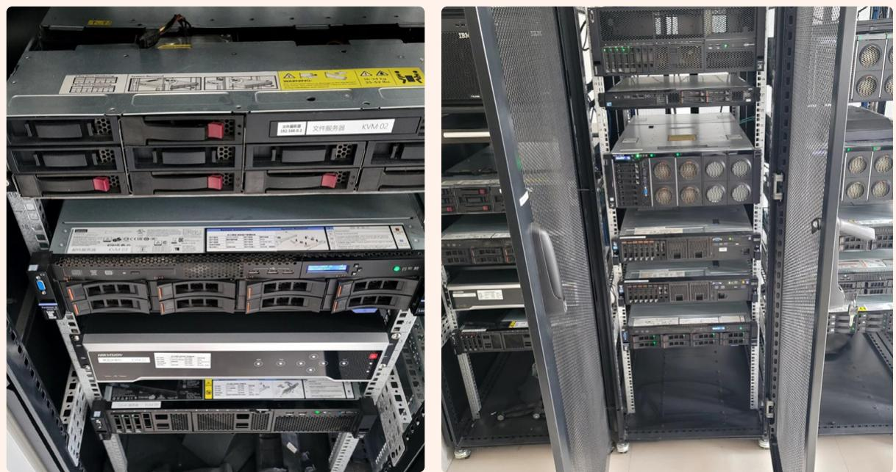

## 数据安全培训

公司采用线上线下相结合的方式，成功举办了数据安全、投标工作及军工保密相关知识等专题培训，共有 121 人参加，有效提升了员工的数据安全意识和风险防范能力。

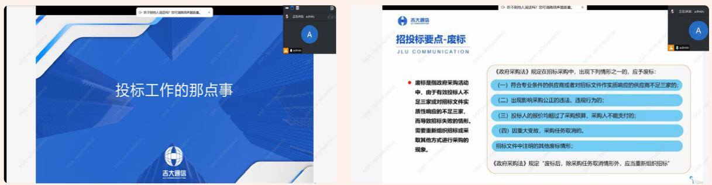  
数据安全培训-投标工作及军工保密相关知识培训

## 客户隐私保护

公司严格遵循《中华人民共和国个人信息保护法》等法律法规的要求，秉持“最小化收集、最大化保护”的原则，全面完整地构建了客户信息保护机制。公司对于任何客户或用户的个人信息，均遵循合法、正当、必要、诚信原则，在数据的收集、存储、使用与共享等各个环节，均建立了严格的安全措施和作业规范，最大限度地保护客户个人信息不被泄露与滥用，以确保为客户提供安全可靠的服务环境。

## 01

## 信息收集

在收集客户基本信息、业务需求信息、消费记录信息等内容的过程中，遵循合法、合规、自愿的原则，向客户说明信息收集的目的和用途。明示处理目的、方式和范围，并征得个人同意。

## 02

## 信息存储与安全

建立客户信息数据库，对客户信息进行分类存储和管理；采取必要的技术和管理措施，保障客户信息的安全，防止信息泄露、篡改和丢失；对涉及客户隐私的信息，严格保密。

## 03

## 信息使用与共享

公司内部使用客户信息遵循“最小必要”原则，仅用于客户服务、业务拓展等相关工作；如需要与外部合作伙伴共享客户信息，公司将事先取得客户的同意，并签订保密协议，确保合作伙伴对客户信息进行妥善保护。

## 指标与目标

为切实保障信息安全和客户隐私，公司制定了明确的信息安全管理目标，确保在各项业务开展过程中，信息的安全性和客户隐私得到充分有效地保护。

## 目标

总体重大信息安全事件（事故）为零

信息安全培训

信息安全宣贯覆盖率

## 2025年达成情况

已达成

9 次

100%

对涉密计算机执行定期病毒库更新 台次144

对涉密计算机实施密码更改 台次72

涉密及非密设备审计 次2

邮箱用户增删改操作 次113

各类配置维护 次31

安全检测与活跃度监测 次249

强制修改密码或禁用高风险账户 次35

## 员工

员工是企业发展的核心动力和宝贵财富。吉大通信始终秉持“以人为本”的理念，持续优化薪酬福利体系，高度重视员工职业发展和身心健康，着力营造公平、温馨的职场环境。在推动企业可持续发展的同时，我们积极承担社会责任，响应国家共建“一带一路”倡议和乡村振兴战略，以实际行动回馈社会，实现员工成长、企业发展与社会进步的协同共赢。

## 治理

公司高度重视员工治理结构与规意制度的完善，制定并实施了《吉大通信员工招聘管理办法》《吉大通信薪酬管理制度》《吉大通信年休假管理规定》等一系列规章制度 同时 将人力资源管理工作深度融入公司整体ESG治理架构。在日常管理中人力资源部及相关业务部门作为制度执行的核心负责具体规意制度的落地实施，积极收集员工反馈，对制度进行动态优化与调整。通过定期的制度培训与宣贯活动，确保每位员工都能深入理解并自觉遵守公司规章制度，营造出一种制度至上，规范有序的良好工作氛围。同时，公司还设立了专门的监督机制，对制度执行情况进行全面监督与评估及时发现并纠正执行过程中的偏差，确保公司治理的严谨性与有效性

## 人力资源管理治理结构

公司的人力资源管理治理结构以科学、规范、高效为核心，通过构建完善的制度体系与执行机制，确保人力资源管理工作与公司战略目标紧密结合。在治理框架下，公司不仅明确了各部门在人力资源管理中的职责与权限，还通过设立跨部门协作机制促进人力资源政策与公司整体运营的深度融合，此外，公司注重人力资源管理的透明化与公正性通过建立公开的沟通渠道与申诉机制，保障员工权益，提升员工满意度与归属感。这一治理结构的有效运行，为公司的持续稳定发展提供了坚实的人才保障。

## 战略

公司始终秉持“以人为本”的理念，将员工视为公司最核心的资产与可持续发展的根本动力，将员工权益保障与成长发展置于战略高度。

## 承接公司战略

对齐公司战略，将公司目标转化为人力资源战略可落地措施。

## 打造人才引擎

通过内部培养与外部引才相结合，打造结构合理、能力互补的人才梯队，构建高效稳定的人才供应链。同时强化管理层能力建设，扎实做好科技转型关键人才储备。

## 提升组织效能

构建敏捷高效组织，提升协同与响应速度。

## 激励与绩效体系

建立市场化规范化，激励性强的薪酬绩效与长期激励机制。

## 企业文化建设

倡导创新协同、高效协作的工作氛围，健全员工关怀机制，提升员工满意度与忠诚度；深化 ESG 理念践行，主动履行企业社会责任。

<table><tr><td>风险类型</td><td>风险描述</td><td>发生概率</td><td>影响大小</td><td>影响的时间范围</td><td>影响的价值链环节</td><td>优先级排序</td><td>潜在财务影响</td><td>应对措施</td></tr><tr><td>政策和合规风险</td><td>1、合规与法律风险劳动用工合规风险,竞业限制、保密协议执行不到位,核心人员泄密、跳槽、用工歧视、员工关系处理不当等。2、核心人才风险核心技术/业务/管理人才流失,关键岗位人才缺失、人才引进困难、高端人才薪酬成本过高、激励不到位。3、组织与运营风险人员结构失衡:老龄化、冗员、关键岗位缺人,组织效率低,扩张过快导致管理失控,裁员、缩编引发不稳定。4、薪酬与激励风险薪酬福利成本持续上涨,侵蚀利润。股权激励设计不当,绩效考核、晋升、招聘不透明。5、安全生产与职业健康风险工伤、职业病、安全事故,导致赔偿、停产、监管处罚。</td><td>中</td><td>高</td><td>短、中、长期</td><td>运营</td><td>中</td><td>运营成本增加、经营收益减少</td><td>1、用工合规管理完善劳动合同、社保、工时、薪酬制度,确保合法合规。建立劳动纠纷预警与处理机制,降低法律风险。2、核心人才保障建立关键岗位人才库,做好人才备份与继任计划。完善薪酬激励、晋升通道,减少核心人员流失。3、内控与治理规范规范招聘、晋升、绩效、薪酬流程,防止利益输送。强化人事数据管理,确保信息真实、安全、可追溯。4、员工关系与舆情防控健全沟通机制,及时化解内部矛盾。建立负面舆情应对预案,维护公司声誉。5、安全与职业健康落实安全生产、职业病防护措施,降低事故风险。定期开展安全培训与应急演练。</td></tr><tr><td>机遇类型</td><td>机遇描述</td><td>发生概率</td><td>影响大小</td><td>影响的时间范围</td><td>影响的价值链环节</td><td>优先级排序</td><td>潜在财务影响</td><td>应对措施</td></tr><tr><td>治理规范</td><td>1、治理规范化实施股票期权、限制性股票、员工持股计划,绑定核心人才,提升员工长期归属感。薪酬、绩效、晋升更透明,提升内部公平性与员工积极性。2、人才结构优化与专业化升级通过引入行业顶尖人才及高级技术人才,以及财务、法务、资本运作、数字化等专业人才,实现人才结构优化与专业化升级。3、ESG与社会责任完善员工关怀、培训发展、职场健康、多元化用工,提升ESG绩效,有利于融资、机构投资、政府项目与品牌口碑。4、企业文化与凝聚力打造正向文化,提升归属感,降低员工流失率。</td><td>中</td><td>高</td><td>短、中、长期</td><td>运营</td><td>中</td><td>运营成本增加、经营收益增加</td><td>1、强化人才吸引依托公司平台优势,优化招聘渠道,引进高端与专业人才。打造良好雇主品牌,提升人才竞争力。2、完善激励机制建立多元化激励体系(薪酬、绩效、奖金、股权等)。长期激励与短期激励结合,稳定核心团队。3、推进组织与管理升级优化组织架构,明确岗位职责,提升人效。推动HR数字化、流程标准化,提高管理效率。4、加强人才培养与发展建立培训体系、轮岗机制、晋升通道。支持员工职业发展,提升整体人才质量。5、赋能业务战略人力资源工作与公司战略、业务目标对齐。通过人才配置、组织优化支撑公司扩张与发展。</td></tr></table>

## 影响、风险和机遇管理

公司制定《吉大通信员工招聘管理办法》《吉大通信薪酬福利制度》《吉大通信年休假细则》及《吉大通信多元化、平等、包容及反歧视、反骚扰、反霸凌管理制度》等一系列规章制度，系统化识别、评估人力资源风险和机遇，避免核心人才流失，完善人才培养体系，为公司员工发展提供广阔空间。

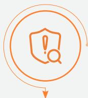

## 风险识别

由人力资源部门等相关职能部门根据离职率、员工投诉、员工意见反馈、员工满意度等指标定期组织开展风险和机遇识别工作，充分考虑组织内外部因素、相关方的需求和期望，识别风险和机遇的来源、类别等相关因素。

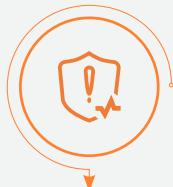

## 风险评估

对已辨识的风险发生可能性的高低、风险发生的条件以及风险对实现目标的影响程度进行评估分析。

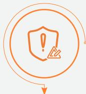

## 风险处置

公司根据内外部因素、发展战略，确定风险偏好、风险承受度、风险管理有效性及风险所需人力和财力资源配置，选择风险承担、风险规避、风险转移、风险补偿、风险控制等措施对风险进行管理。

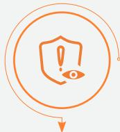

## 风险监督

对已采取的风险处置措施进行跟踪，验证其对风险处置的有效性。

## 报告期末，公司共有员工2,612名

## 按性别划分

男性 人2,234

女性 人378

## 按年龄划分

30 岁以下 人 40-50岁 人639 588

30-40 岁 人 50 岁以上 人1,260 125

## 按学历划分

本科以下 人1,465 硕士学历 人86

本科学历 人 博士学历 人1,059 2

## 招募与聘用

公司严格遵循《中华人民共和国劳动法》《中华人民共和国劳动合同法》等相关法律法规，秉持“人岗匹配，择优录用的招聘原则，制定《吉大通信员工招聘管理办法》《吉大通信内部招聘管理办法》等人力资源管理制度，对员工招聘、入职、转岗等流程进行了全面规范。

公司在招聘过程中坚持公开、公平原则

公开：所有招聘信息通过公司官网、官方招聘平台及合作渠道等公开发布，确保岗位职责、任职要求、薪酬范围等信息真实、准确、无误导。

公平：将公平就业原则置于首位，坚决杜绝就业歧视与违规用工，严格禁止并主动规避基于民族、种族、性别、宗教信仰、年龄等任何因素的歧视性内容，从根本上杜绝误招或使用童工的风险。

## 招聘流程

##

面

发起入职审批

发送录用通知

入职体检

签订劳动合同

## 公司通过多种社会招聘渠道吸引有经验和专业技能的人才

## 线上招聘

充分利用前程无忧、北极星招聘、一览电力、云校招、慧就业等各大招聘网站和社交媒体平台，发布招聘信息，吸引更广泛的求职者。

## 现场招聘

积极参加各类由长春市人才服务局组织的招聘会和职业博览会等，为求职者提供现场面试和交流的机会。

## 校园招聘

深化校企合作 安排宣讲会和招聘活动 参加各类由长春市人才服务局组织的“长春市百万大学生留长工程”“五优”服务进校园活动、长春国际会展中心等校园招聘会。与吉林大学、东北电力大学、长春理工大学等知名高校合作，吸引优秀的毕业生加入吉大通信的团队。

## 猎头服务

与猎头服务机构合作，通过他们的专业渠道和资源，寻找更具有特长和经验的高级人才。

## 灵活就业与用工

公司探索灵活用工，响应市场新形态，随着新就业形态的蓬勃发展，公司也在合规前提下，积极探索项目制、短期顾问、实习生等灵活用工模式。满足了业务波峰期或特定项目对人才的弹性需求，为社会创造了更多样化的就业机会。

## 指标

报告期内，共参加了40余场招聘会，筛选简历2,500余份，参加了20余场校园招聘会，收集简历800余份，组织面试 11 场，公司新进员工 1,029 人，按性别划分男性 903 人，女性 126 人；按地区划分，中国大陆地区597人，海外地区432人；按招聘渠道划分，校园招聘19人，社会招聘1,001人，其他渠道招聘9人。

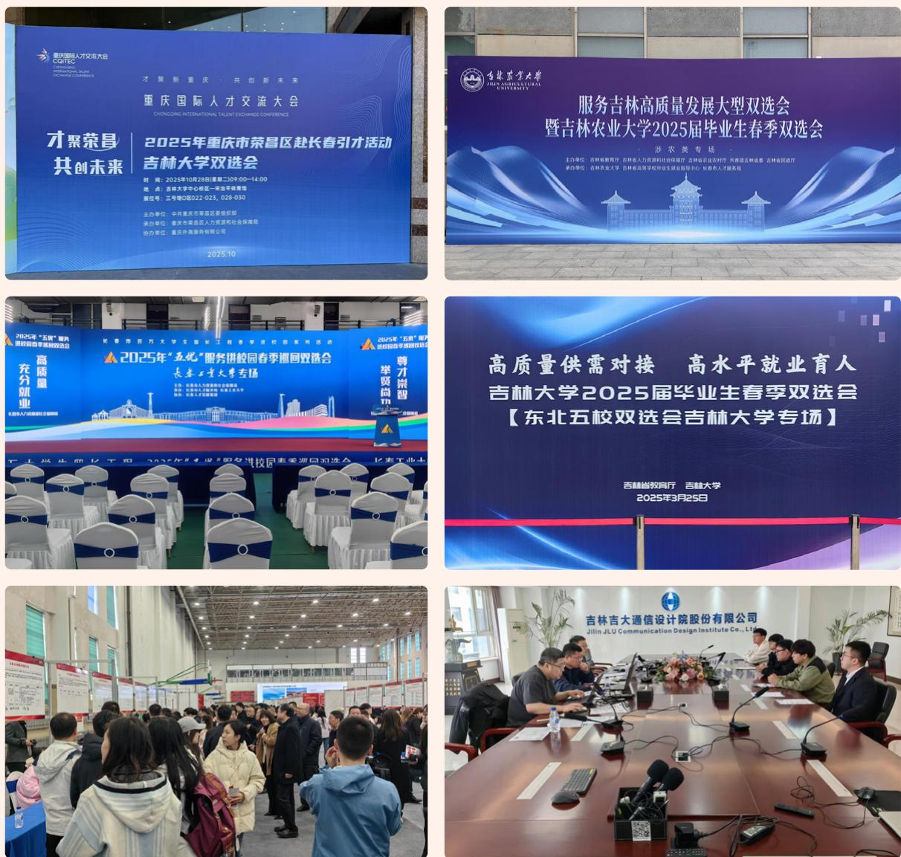  
招聘会及面试现场

## 薪酬绩效

## 薪酬与绩效

公司遵循“战略导向、业绩导向、公开性、客观性、时效性”的薪酬管理原则和“公开性、客观性、反馈性、时效性、责任自律”的绩效管理原则，制定了《吉大通信薪酬绩效指引》《吉大通信薪酬管理制度（试行）》《吉大通信绩效管理制度（试行）》等内部管理制度，规范了薪酬和绩效管理工作，建立了合法、有序的薪酬体系和具有长效激励约束作用的绩效体系，确保了公司在成长发展过程中凝聚员工、吸引、激励并留住优秀人才。

公司的薪酬体系由固定工资、绩效工资、津补贴、社保 / 公积金和专项激励构成。其中，绩效工资作为浮动部分。绩效考核由部门、项目组等多维度进行综合评价，主要围绕关键业绩、重点工作、能力态度、加减分项及否决项等指标对员工进行考核，考核结果直接应用于员工薪酬调整、岗位调整及年终绩效评定。

报告期内，公司足额、按期支付所有在职员工的工资，无任何拖欠情况，公司定期接受绩效和职业发展考核的员工比例为100％。

## 绩效考核流程

## 绩效计划制定

分解与量化目标，制定绩效计划。

## 绩效实施

通过沟通、辅导与过程监控，支持员工按计划推进工作。

## 绩效考核评价

对员工的工作成果、能力与行为进行客观、全面的评价。

## 绩效面谈

与员工一对一反馈考核结果，共同制定改进计划与发展目标。

## 绩效申诉与结果反馈

建立完善的绩效反馈与申诉机制，保障考核过程公平公正。

若员工对考核结果存异议，可在2个工作日内向间接上级提出书面电诉，若未达成共识，可进一步向财务部提出书面申诉，由财务部组织相关人员复核绩效考核过程与结果，并将复核结论告知申诉员工。如仍不满意，员工可向薪酬与考核委员会申请最终裁定，委员会将在收到书面申诉后5个工作日内予以答复。

## 指标

员工工资总额 21,011.76 万元 。

## 工时与休假

公司制定《吉大通信考勤与请假管理规定》明确规定工时制度，作息时间，考勤流程及假期管理，针对部分因业务性质无法执行标准工时制度的岗位，公司已通过长春市企业不定时工作制和综合计算工时工作制审批，实行综合计算工时制，确保员工权益得到充分保障。

公司严格遵守国家关于带薪年休假的规定，杜绝强迫劳动，并制定了《吉大通信年休假管理规定》等制度，明确规定了休假天数、计算方式、周期以及相关待遇，确保员工法定休息权得到充分尊重和保障。

## 指标

报告期内，人均带薪年休假 7.89 天。

## 福利保障

在福利保障方面，公司全面落实国家的各项福利政策待遇，为员工提供年休假、病假、婚假、产假、哺乳假等假期，并足额缴纳包含养老、医疗、工伤等在内的社会保险和住房公积金。此外，公司为员工提供高温补贴、证书津贴等特色福利，全面提升员工对公司的满意度和归属感。报告期内，福利总支出4,226.73万元。

## 福利种类

福利内容

## 法定福利

社会保险、住房公积金、法定节假日、婚假、产假等

## 商业保险

人身意外险

## 健康福利

健康体检

## 津补贴

高温补贴、采暖费补贴、证书津贴、电脑补贴和租房补贴

## 其他福利

新婚福利、传统节假日福利、生育福利、丧事慰问等；部门经费每人每年

1,500元，用于节假日礼品、聚餐、团建、旅游等

## 保险补贴

除依法为全体员工缴纳养老保险、医疗保险、失业保险、工伤保险、生育保险及住房公积金（“五险一金”）外，公司还为每位员工额外购买了人身意外伤害保险，并根据不同岗位的风险特性配置差异化的保额。

员工补贴方面，公司为归属于本部的应届毕业生提供为期三年的租房补贴（本科 500 元 / 月，硕士 1000 元 / 月），并积极协助符合条件的优秀毕业生申请“长春市人才住房保障支持项目”补贴，对派往市场区域的员工给予出差补助，同时对新疆及其他地市的本地员工设有驻在补贴，涵盖了其日常通勤与用餐成本。

在医疗保障方面，公司构建了“社会保险为主，商业保险为辅”的多重保障体系，每两年组织一次覆盖全体员工的健康体检，帮助员工及时了解自身健康状况，体现预防为主的健康管理理念。报告期内公司社会保险覆盖率 100％，员工体检覆盖率100%。

## 员工关怀

吉大通信通过开展困难员工帮扶、女性员工慰问以及丰富多彩的文体活动等方式，不断提升员工的归属感、幸福感和企业凝聚力，全力打造温暖、关爱、活泼、互助的工作环境和氛围。

## 困难员工帮扶

公司持续优化困难员工帮扶体系，充分发挥工会组织的桥梁纽带作用，通过定期开展困难职工慰问、组织爱心捐款等活动，切实为困难员工排忧解难，传递企业温暖，彰显人文关怀。

## 细微处传递温暖

公司工会作为员工之家，积极发挥关怀职能。2025年度，工会为1,378名职工送上了生日祝福（以蛋糕券、山珍礼盒等形式），为 36 名新婚职工赠送新婚贺礼（四件套），并为 42 名新生育职工发放了婴儿被等生育福利。

## 关注心理健康

公司高度重视员工的心理健康，倡导员工与管理层保持沟通，鼓励其及时反馈个人困惑和诉求，及时关注和有效缓解员工的心理压力，营造健康和谐的工作氛围。

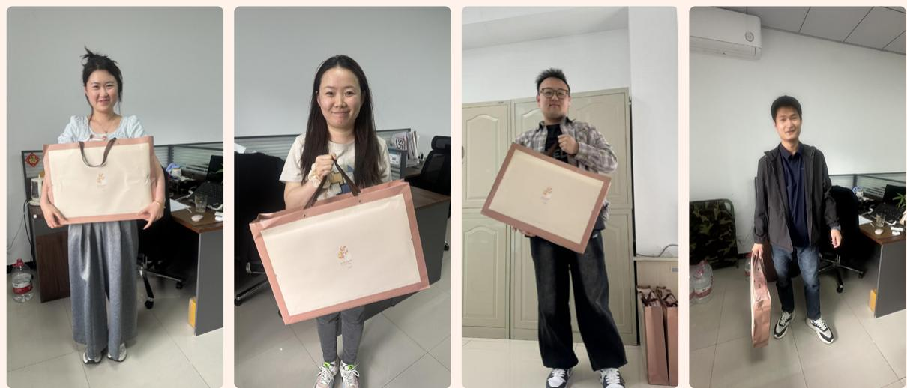

natural_image

Four-panel photo collage showing women holding gift bags in office settings (no visible text or symbols)

## 员工活动

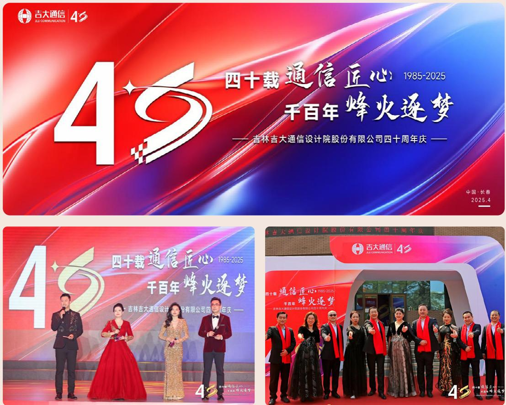  
公司通过组织团队建设、节日聚餐、旅游、文体活动等各类活动，丰富了员工的业余文化生活。公司举行成立四十周年庆活动，公司董事会、管理层全体人员和部分员工及家属共500余人参加了本次活动。

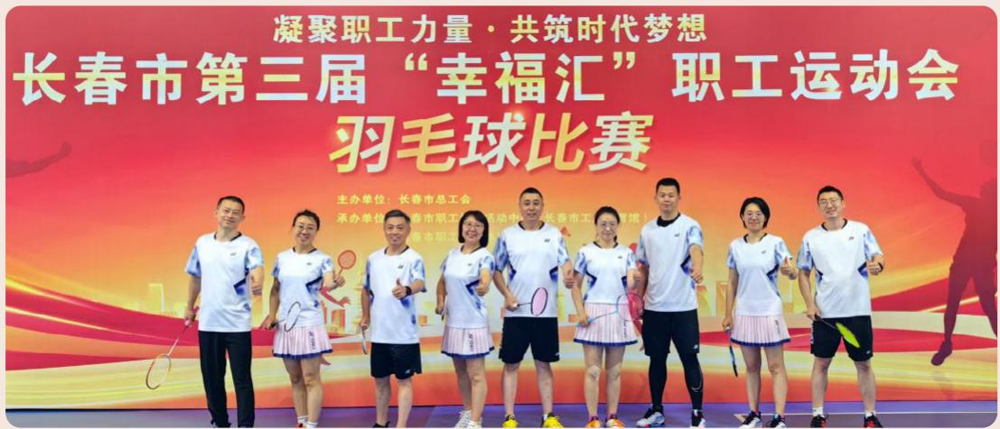

text_image

凝聚职工力量·共筑时代梦想
长春市第三届“幸福汇”职工运动会
羽毛球比赛
主办单位：长春市总工会
承办单位：长春市职工体育活动中长春市总工会宾馆

2025年6月11日吉大通信工会积极组织单位职工参加长春市第三届“幸福汇”职工运动会羽毛球比赛。

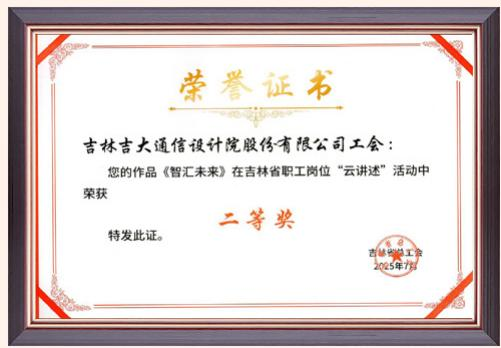

text_image

荣誉证书
吉林吉大通信设计院股份有限公司工会：
您的作品《智汇未来》在吉林省职工岗位“云讲述”活动中荣获
特发此证。
二等奖
吉林省总工会
2025年7月

2025 年 7 月公司工会积极响应吉林省数字信息产业工会号召，组织参与职工岗位“云讲述”活动，公司下属基层工会——中浦慧联长春分公司精心拍摄的短视频《智汇未来》，荣获本次活动二等奖。

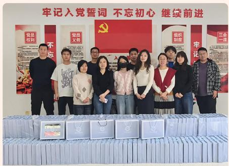

text_image

牢记入党誓词 不忘初心 继续前进
党员
誓词
不忘
党群义务
组织制度
三全一连
保证

吉大通信工会于2025年3月20日组织全院职工开展2025年度职业健康安全知识竞赛。

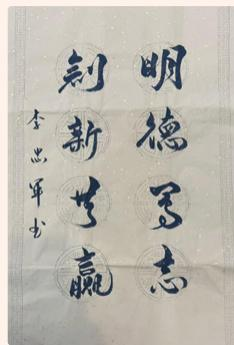

text_image

明德志
刺新生赢
李忠军生

员工书法作品：《明德笃志创新共赢》

吉大通信职工在吉林省工程咨询协会第四届“咨询杯”书法、摄影、诗歌大赛中，吉大通信共有 12 名职工参赛作品荣获奖项。

万

## 员工权益保障

公司积极构建并持续优化民主管理机制，打造多元、平等、包容（DEI）的职场环境，制定了《吉大通信多元化、平等、包容及反歧视、反骚扰、反霸凌管理制度》。通过开展人权、多元文化意识等主题培训活动，将尊重与保障员工基本人权和自由融入日常管理，切实维护每一位员工的合法权益。

## 民主管理决策

公司高度重视民主管理工作，依法设立工会组织，定期召开职工代表大会，切实保障员工参与企业民主管理的权利。报告期内，公司进一步完善工会组织建设，设立17 个基层工会组织，工会会员占在职员工比例100%（不含外籍员工），累计召开 5 次职工代表大会，审议并通过 3 项事关员工切身利益的重要议案，充分践行了民主决策程序。

## 畅通沟通渠道

公司着力打造开放包容的企业文化，通过设立意贝箱，开展谈心谈适，建立职工章见簿等多种渠道广泛收集员工意见建议，倾听员工心声，推动企业民主管理纵深发展，营造和谐共进的良好氛围。

构建投诉与调查机制，建立了多渠道、保密的投诉流程，规定了严谨、公正的调查程序，及时回应员工在遭遇不当行为时的投诉和申诉确保每一起投诉都能得到严肃处理

建立多元化委员会，促进不同背景员工之间的交流与合作，鼓励员工共同参与公司的多元化建设，为公司的发展提供多元视角和建议。

## 营造安全、受尊重的职场环境

公司制定了《吉大通信多元化、平等，包容及反歧视、反骚扰，反霸凌管理制度》对歧视，骚扰(包括性骚扰和霸凌进行了清晰界定，列举了从言语侮辱、不当接触到滥用职权进行排挤等具体的禁止行为。

公司在招聘、晋升等环节倡导接纳多元化人才，尊重个体差异，激发组织活力。

公司将 DEI 及反歧视、反骚扰等内容纳入新员工入职培训的必修课，并定期组织全员专题培训，持续提升员工的多元化意识与尊重他人的职场文化。

## 反歧视与少数人群权益保障

公司始终坚持平等雇佣原则，实行男女同工同酬，在招聘和用工过程中杜绝任何因国籍、种族、民族、宗教、性别或文化背景等因素而产生的歧视。

为招聘团队中的面试官提供专业培训，确保其具备专业的招聘技能和反歧视意识，制定明确的禁用问题清单，禁止在面试过程中询问应聘者的家庭情况、宗教信仰、父母国籍等与招聘无关的个人信息，避免因刻板印象而产生的隐性歧视。

公司关注特殊群体，践行社会责任，主动为退役军人、残疾人等群体提供平等的就业机会。报告期内，公司在职残疾员工 4 名，针对其特点，我们开发或适配了相应岗位，并提供必要的岗前培训与在职支持，帮助他们顺利融入工作环境，实现个人价值。

## 灵活就业人员权益保障

公司通过“小创云”合规灵活用工平台，为 300 余名兼职人员提供规范的薪酬支付服务。公司不仅定期、足额支付其劳动报酬，还通过平台为这些员工投保人身意外险，相关费用由公司承担，确保了灵活就业人员获得基本的工作风险保障。

## 反童工与反强迫劳动

公司坚决反对雇佣童工、强迫劳动及任何形式的骚扰行为。公司建立了严格的年龄审核机制。在招聘、入职审批及报到等环节，均会对申请人年龄进行核实，避免误招童工及引发的潜在问题。如发现招聘到童工，公司将立即停止相关流程，提供必要的帮助和赔偿，并对招聘程序进行全面检查和改进，防止类似情况再次发生，切实保障未成年人权益。针对年龄敏感的岗位，我们严格遵守法律规定，在核实申请人身份证明等材料以确保年龄真实性后方予聘用。

## 女性职工保护

公司高度重视女职工权益保护，严格贯彻落实《中华人民共和国妇女权益保障法》《女职工劳动保护特别规定》等法律法规，采取多项针对性措施，为女职工创造平等、安全、受尊重的工作和发展环境。

## 指标

报告期内，管理人员中女性人数比例 18.75%，享受产假员工数 17 人，产假返岗率 100%。

## 健康守护

2025 年，公司工会统一为 193 位在职女职工投保了《在职女职工特殊疾病互助保障》。这份额外的保险保障，是针对女职工特殊生理特点的贴心安排。

## 权益保障

公司通过签订《女职工权益保护专项集体合同》，将女职工的合法权益，特别是“三期”（孕期、产期、哺乳期）保护、生育福利等，以集体合同的形式予以明确和固化。公司制度严格规定，不得安排孕期、哺乳期女职工从事禁忌劳动或延长工作时间，并确保产假、哺乳假等期间工资全额发放。产假天数（180 天）、男方护理假（25 天）等均高于国家基准，体现了公司在此领域的积极作为。

## 女职工活动

“三八”国际妇女节，公司工会特别为女职工准备了精美的节日礼物，让每位女职工都能感受到公司的关怀与祝福。

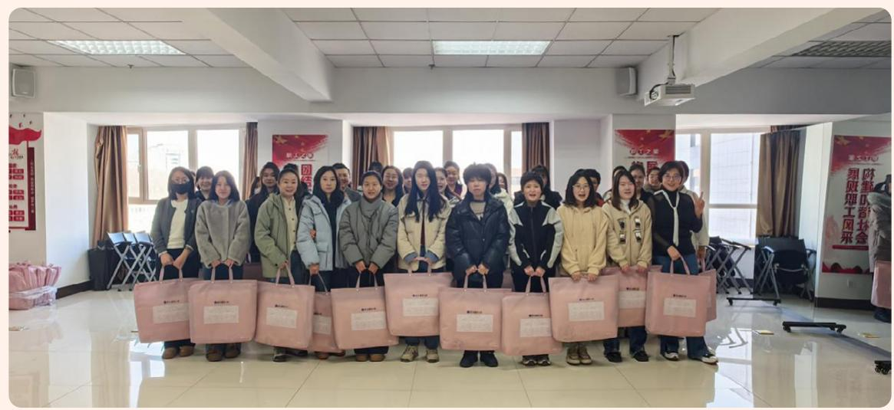

text_image

Group photo of people holding pink shopping bags in a room with banners and posters in the background

## 指标

在职残疾员工 4 名，少数民族员工 150 人，外籍员工数 747 人 。

## 员工培训

公司高度重视员工的持续学习与专业培训，构建了线上线下相结合的多元化培训体系。

线上培训平台提供丰富的课程资源，涵盖专业技能提升、行业前沿知识、管理能力培养等多个方面，员工可根据自身需求自主选择学习。线下培训则通过定期举办内部讲座、外部专家授课等形式，促进员工之间的交流与互动，提升团队协作能力。此外，公司还鼓励员工参加行业研讨会、学术交流会等活动，拓宽视野，紧跟行业发展趋势。

## 华鸿学院

华鸿学院是公司战略人才培养的核心平台，承担着后备干部培育、知识管理、组织创新与学习型组织建设的关键职能。学院以“专业、分享、创新、成长”为价值观，面向公司全员及分支机构，系统开设技术、管理、营销等多维度课程。依托科学的胜任素质模型与洋葱理论，学院建立了结构化的课程体系，并推行“统一标准、科学量化”的积分管理制度，通过培训积分档案实现学习过程的系统化与规范化，为公司可持续发展提供坚实的人才与智力支持。

  
洋葱模型

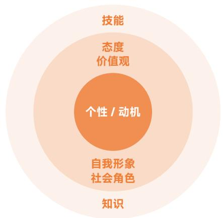

flowchart

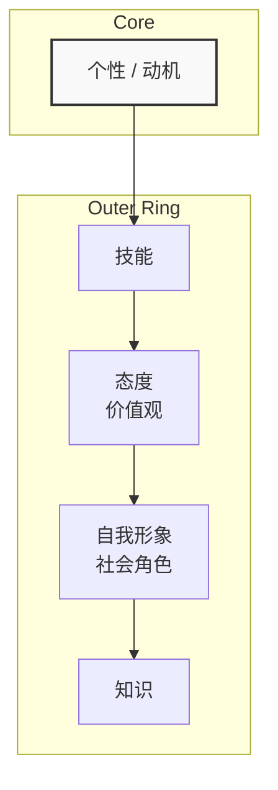
```mermaid
graph TD
  subgraph Core
    A["个性 / 动机"]
  end
  subgraph Outer Ring
    B["技能"]
    C["态度\n价值观"]
    D["自我形象\n社会角色"]
    E["知识"]
  end
  A --> B
  B --> C
  C --> D
  D --> E
  style A fill:#f9f9f9,stroke:#333,stroke-width:2px
```

  
管理者课程体系图

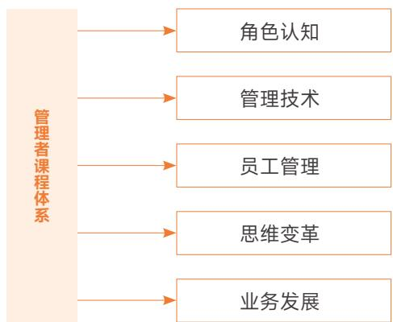

flowchart

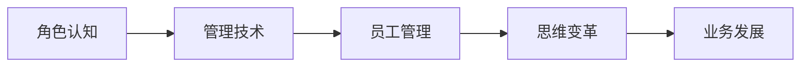
```mermaid
graph LR
  A["角色认知"] --> B["管理技术"]
  B --> C["员工管理"]
  C --> D["思维变革"]
  D --> E["业务发展"]
```

  
华鸿学院组织架构图

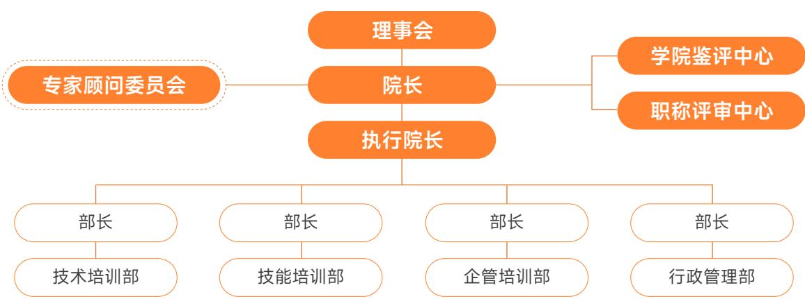

flowchart

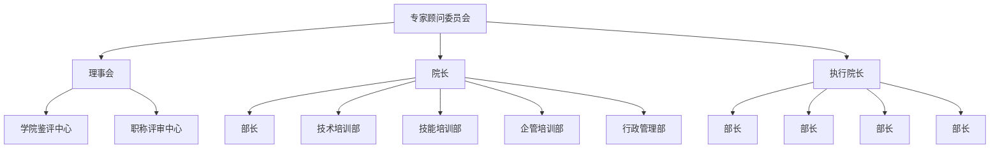
```mermaid
graph TD
  A["专家顾问委员会"] --> B["理事会"]
  A --> C["院长"]
  A --> D["执行院长"]
  B --> E["学院鉴评中心"]
  B --> F["职称评审中心"]
  C --> G["部长"]
  C --> H["技术培训部"]
  C --> I["技能培训部"]
  C --> J["企管培训部"]
  C --> K["行政管理部"]
  D --> L["部长"]
  D --> M["部长"]
  D --> N["部长"]
  D --> O["部长"]
```

## 培训体系

为系统推进学习型组织建设，公司制定了《吉大通信员工培训管理规定》等制度，将培训规范划分为内部培训、外出培训与在职教育三类，并设立相应考核机制。公司通过建立科学的评估与反馈体系，持续跟踪培训成效，确保员工发展计划有效落地与持续优化。

## 师资队伍建设

为构建系统化的人才培养体系，公司建立了多元复合的讲师队伍，整合了内部管理骨干、技术专家、大学教授及外部咨询顾问等多方资源。内部讲师队伍涵盖各级管理者、专业骨干与业务实践专家，为公司知识传承、梯队建设与创新能力提升提供了持续支撑。截至报告期末，公司内部讲师队伍已达 58 人。

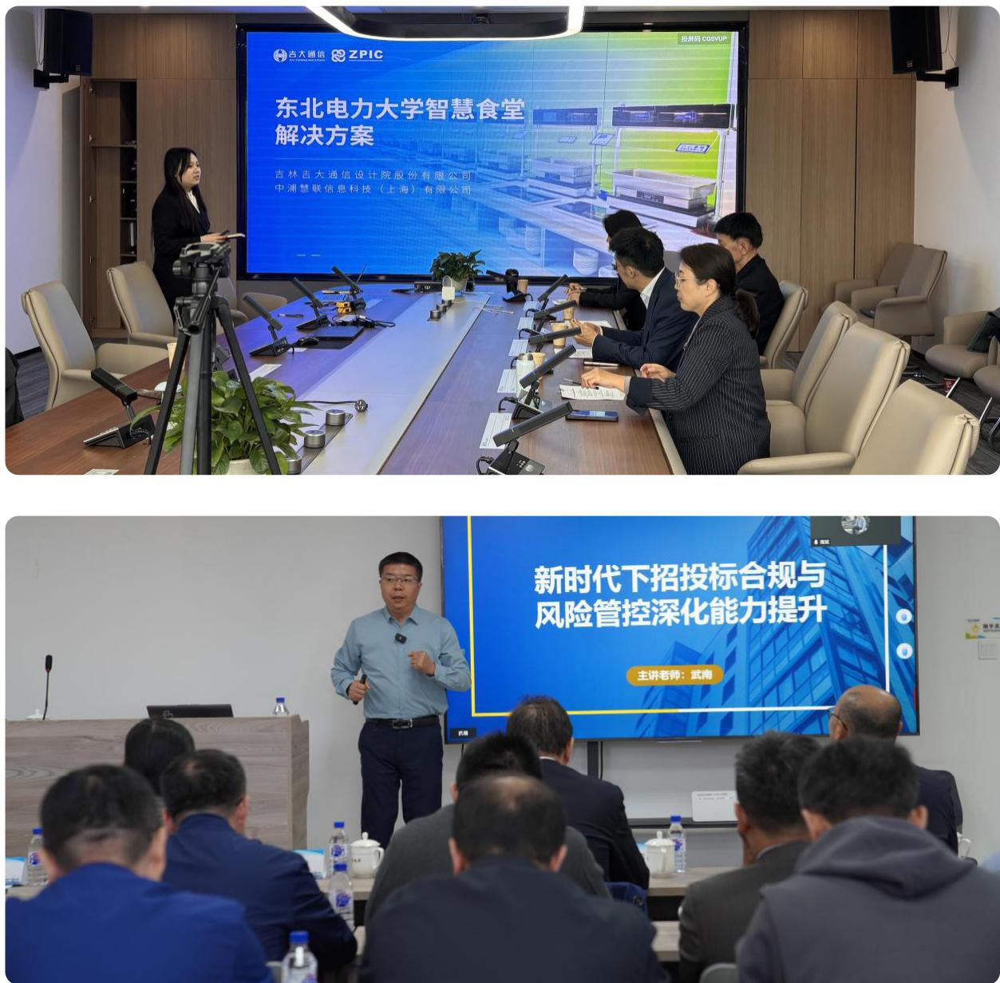

## 培训平台建设

线上培训平台是公司为支持员工自主学习而搭建的数字化学习体系。公司部署了金蝶线上学习平台，为员工提供灵活、高效、全方位的数字化学习体验。平台支持 PC 端与移动端（云之家）多入口便捷访问，涵盖在线课程、培训班级、考试中心、系列专题、知识智库、专家在线及圈子社区等丰富功能模块。

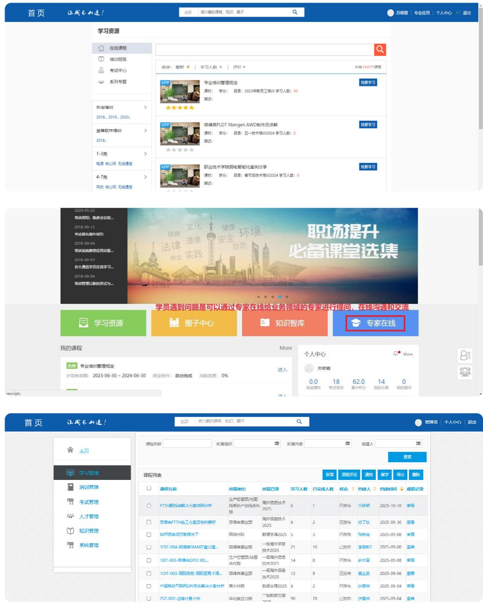

## 分层分级培训

公司建立了体系化的分层分级培训机制，针对管理人员、专业技术人员及新员工等不同群体，设计并实施差异化的培训项目。通过定制化培训方案，精准匹配员工职业发展需求，显著提升了培训的针对性与实效性。

## 专业技术培训

吉大通信华鸿学院 2025 年 5 月 29 日举行了工程咨询与投融资项目谋划专题培训。

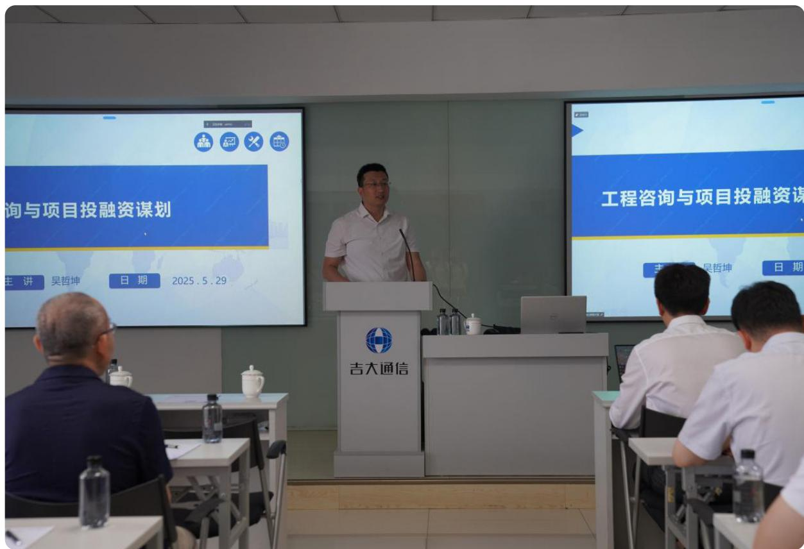

text_image

询与项目投融资谋划
主 讲 昊哲坤 日期 2025.5.29
吉大通信
工程咨询与项目投融资谋
主 讲 昊哲坤 日期

## 指标

报告期内，培训总次数 112 次，累计参与培训总人数 2,612 人，女性员工参与 378 人，男性员工参与2,234 人。高层管理人员参与 23 人，中层管理人员参与 94 人，基层员工参与 2,495 人。员工培训覆盖率 100%。

培训总时长累计 189 小时，并组织了 58 人次的内外部讲师进行授课，共开设 66 门次课程。全年学员总人次数（即每场培训参与人数之和）达到 7,787 人次。

## 员工成长

公司秉持“竞争择优、因才施用”的人才理念，建立“管理与专业双通道、多序列”的职业发展体系，采用十二级三档制，级别由岗位聘任确定，档级依据绩效与年度考核结果评定。公司秉持“公正、公平、公开”的晋升原则，通过综合评估员工素质、业绩及潜力进行岗位安排，并以实际贡献作为价值评判标准，确保各层级员工享有平等的发展机会与成长空间。

公司突破传统单一管理序列局限，打造管理序列、专业管理序列、专业技术序列、销售序列四大职业发展序列，各序列差异化配置岗位层级，形成“矩阵式”发展网络：

## 管理序列

总经理、副总经理、财务总监、常务副总经理、董助、执行副总、分院院长、分院副院长、主任、副主任、主管、专员

## 专业管理序列

技术总监、总工、副总工、专业总工、分院专业总工、省级项目经理、地市项目经理、单项项目经理

## 专业技术序列

大师级设计师、卓越设计师、高级设计师、中级设计师、初级设计师、辅助设计师

## 销售序列

大区总监、市场总监、高级市场经理、市场经理、客户经理

各序列内部纵向层级贯通，序列间支持横向流动，充分满足员工多元化职业发展需求。发展路径采用“十二级三档”的层级管理机制，每级别设 A、B、C 三档，其中级别根据员工聘任岗位确定，档级则依据工作绩效和年度考核结果评定，实现岗位价值与员工能力的精准匹配。

## 指标

报告期内，公司员工内部调动或内部应聘的人数为93人，员工内部调动或内部应聘比例为3.56％。

## 健康安全

公司始终贯彻“以人为本、全员参与、风险辨识预控”的职业健康安全方针，制订了《吉大通信质量、环境和职业健康安全管理手册》。明确了从管理层到一线员工的安全职责，规范了从日常办公到野外勘察、工程施工等各类作业场景的安全标准与操作流程，实现了安全管理的制度化、流程化。通过系统化、规范化的管理措施，切实保障员工职业健康与安全。

## 职业健康安全体系

严格遵守《中华人民共和国安全生产法》《中华人民共和国职业病防治法》等相关法律法规，制定并实施《吉大通信质量、环境和职业健康安全管理手册》《吉大通信安全工作管理办法》《吉大通信劳动保护用品配备控制程序》等一系列管理制度，报告期内，公司及子公司已通过ISO 45001职业健康安全管理体系认证。

## 安全生产管理

公司制定了包括《吉大通信安全工作管理办法》《吉大通信劳动保护用品配备控制程序》《吉大通信井下勘察作业管理规定》以及各类专项技术方案的多层次规章制度。

这些规章制度不仅覆盖了日常安全管理的方方面面，还针对特定作业环境如井下勘察制定了详细的管理规定，确保每一项作业都有章可循、有据可依。公司还定期组织安全教育培训，提升员工的安全意识和应急处理能力，确保每位员工都能熟练掌握安全操作规程，有效预防和减少安全事故的发生。

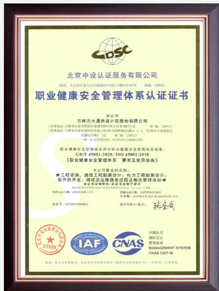

text_image

北京中设认证服务有限公司
（地址：北京市石景山区古城南路9号院1号楼2层67室 邮编：100043）
职业健康安全管理体系认证证书
银证证明
吉林吉大通保设计院股份有限公司
（注册地址：吉林省吉大通市南岗区南岗街道西岗社区东岗西路278号 邮编：100012
（审核地址：吉林省吉大通市南岗区南岗街道大同路48号2幢2层4、5、6、7层和吉大通院校区
任职单位代码：530 和编：100012
（统一社会信用代码：913201001120000228X）
职业健康安全管理体系符合职业健康安全管理体系标准：
GB/T 45001-3209/ISO 45001.2018
《职业健康安全管理体系 要求及使用指南》
本证书覆盖的范围：
★工程咨询、通信工程勘察设计、电力工程勘察设计；
软件的开发、测试及运维服务过程及相关管理活动★
本证书有效期自《企业法》生效之日起至2020年9月13日
BPO认证日期：2018年9月13日 更新认证日期：2021年8月29日
有效期：2021年8月29日至2020年9月13日
注册号：6275511006981L 社会代表人（盖章） 张永成
中国认可
国际认证
智能体系
MANAGEMENT SYSTEM
CNAS C027-M
说明：在证书有效期内，本证书与年度审核的《资质认证标准通知书》一并有效。为有效。

此外，公司还建立了完善的安全检查与隐患排查机制，通过定期自查与第三方审核相结合的方式，及时发现并整改安全隐患，公司根据不同岗位的风险特性配置差异化的保额，为每位员工购买了人身意外伤害保险。为员工营造个安全、健康的工作环境和保障。

## 安全生产管理架构

公司成立由董事长担任主任的安全生产委员会，负责生产和消防安全工作，安委会下设安全管理办公室，负责具体落实各项安全管理措施。同时 公司全面落实安全生产责任制 明确各岗位的责任人员，责任范围等内容 逐级签订《安全生产、消防及综合治理责任书》。

## 安全生产隐患排查

公司建立了系统化、规范化的安全风险管理体系，制定《吉大通信应急准备与响应程序》《吉大通信危险源辨识、风险评价和控制程序》，通过科学评估风险严重程度、发生频度和风险级别，形成《吉大通信风险和机遇评估分析表》，为风险防控提供决策依据。同时，公司建立了完善的安全隐患排查治理机制，定期组织开展全方位的隐患排查工作。此外，通过明确责任部门、制定整改方案、落实整改措施，并全过程记录形成《吉大通信安全自检本》《吉大通信安全隐患排查台账》等规范化档案文件，实现了隐患排查、整改、验收、复查的闭环管理。

## 指标

报告期内，公司对办公区域共开展 35 次安全检查，发现并整改安全隐患 1 处，隐患整改率 100%。

## 安全生产过程保障

公司高度重视生产作业过程中的风险预防和控制 ，在劳动防护方面，公司建立了科学的劳动保护用品管理体系。各部门需根据工程项目特点进行危险源辨识，据此制定并报备采购计划，确保为员工配备符合国家或行业标准的安全帽、工作服、防护鞋、登山杖等个体防护装备。公司严格执行用品的验收、登记、存储、发放、定期检查与更新报废流程，并监督员工正确佩戴与使用，杜绝移作他用，从物理层面筑牢员工安全的第一道防线。

在高风险作业控制方面，公司对井下勘察、海外人工立杆等特殊作业场景制定了详尽的安全管理规定与技术方案。

在菲律宾等地形复杂区域的人工立杆作业中，公司创新采用手扳葫芦、滑轮组等工具替代人工作业，严格规定杆下禁止留人，并由有经验人员统一指挥，确保“每一步做到万无一失”，显著提升了高风险作业的本质安全水平。

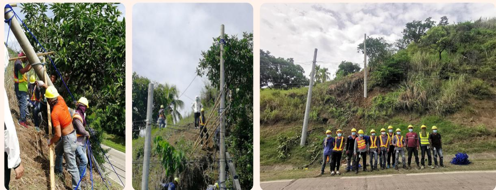

## 指标与目标

公司制定并实施《吉大通信安全工作管理办法》《吉大通信劳动保护用品配备控制程序》《吉大通信井下斯察作业管理规定》等规章制度，构建公司职业健康与安全管理体系，系统性地管控消防风险，保障员工生产安全，确保无重大责任事故发生。

## 2025年安全生产目标

安全生产无重大责任事故，年轻伤率 <3%

杜绝重大火灾事故发生，发生火灾事故 0次

劳动保护用品配备率100%

## 达成情况

已达成

报告期内公司特种作业人员持证上岗率100% 员工体检覆盖率100% 职业病危害因素检测率100%，职业病危害因素检测合格率 100%，职业病患病人数 0 人。公司共签订《安全生产、消防及综合治理责任书》1,850 份 ，未发生任何重大安全生产事故。

## 乡村振兴与社会贡献

公司积极履行企业社会责任，自觉践行企业公民义务，依据《中华人民共和国慈善法》等法律法规，制定了《吉大通信社会贡献管理制度》，秉持“合法合规、战略契合、可持续性、透明公开”的原则，对公司在公益慈善、对外捐赠、社区沟通、助力乡村振兴等社会贡献等活动行为进行了规范。积极响应国家乡村振兴和“一带一路”倡议，聚焦社区发展，助力社会和谐与可持续发展。

## 乡村振兴

## CC

在乡村振兴与教育支持方面，公司于2025年与长春市青少年发展基金会及前郭尔罗斯蒙古族自治县额如乡中心小学正式签署三方定向捐赠协议，捐赠人民币50,000元，专项用于该校音乐教室建设。改善了乡村学校美育教学条件 丰富了学生的艺术教育资源，促进了城乡教育均衡发展。

万  
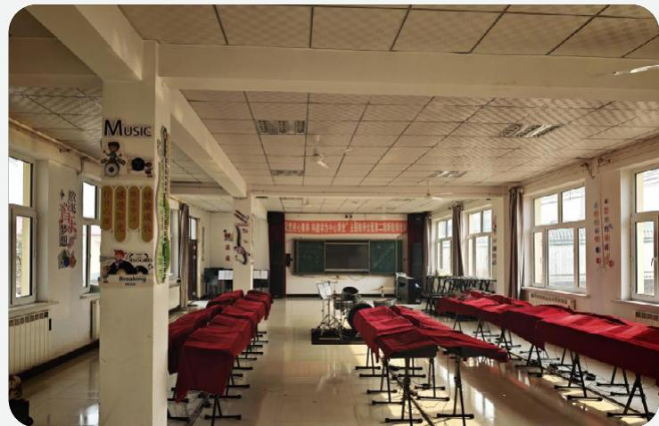

natural_image

Interior of a classroom with red chairs, blackboard, and wall decorations (no visible text or symbols)

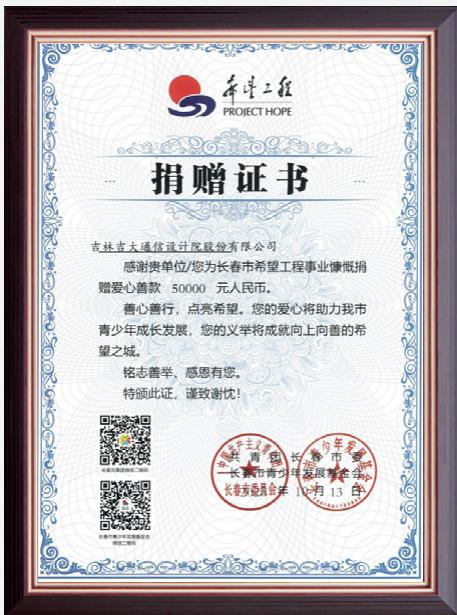

text_image

朱学工程
PROJECT HOPE
捐赠证书
吉林吉大通信设计院股份有限公司
感谢贵单位/您为长春市希望工程事业慷慨捐赠爱心善款 50000 元人民币。
善心善行，点亮希望。您的爱心将助力我市青少年成长发展，您的义举将成就向上向善的希望之城。
铭志善举，感恩有您。
特颁此证，谨致谢忧！
中共青岛市长春市委员会
长春市青少年发展基金会
长春市委员会年 10 月 13 日

“长春市希望工程事业”捐赠证书

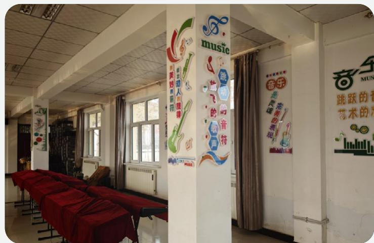

text_image

music
美妙的音乐
能动人的旋律
能动人的音乐
能动的音乐
音乐是灵魂的表演
音乐是灵魂的表演
音乐是灵魂的表演
音乐是灵魂的表演
音乐是灵魂的表演
音乐是灵魂的表演
音乐是灵魂的表演
音乐是灵魂的表演
音乐是灵魂的表演
音乐是灵魂的表演
音乐是灵魂的表演
音乐是灵魂的表演
音乐是灵魂的表演
音乐是灵魂的表演
音乐是灵魂的表演
音乐是灵魂的表演
音乐是灵魂的表演
音乐是灵芝的表演
音乐是灵芝的表演
音乐是灵芝的表演
音乐是灵芝的表演
音乐是灵芝的表演
音乐是灵芝的表演
音乐是灵芝的表演
音乐是灵芝的表演
音乐是灵芝的表演
音乐是灵芝的表演
音乐是灵芝的表演
音乐是灵芝的表演
音乐是灵芝的表演
音乐是灵芝的表演
音乐是灵芝的演出

前郭尔罗斯蒙古族自治县额如乡中心小学建设音乐教室

## 指标

报告期内，公司为当地社区贡献的就业岗位数量 1,106 个，为当地社区贡献的就业岗位占本公司岗位比例42.34%。

## 社区公益

## CC

2025 年 1 月 16 日，公司工会志愿者积极参与南湖街道湖苑社区党委组织的慰问活动，深入走访辖区困难家庭，不仅送去生活物资，更通过面对面交流详细了解其实际需求，以实际行动缓解他们的生活压力，传递了社会大家庭的关爱与尊重。

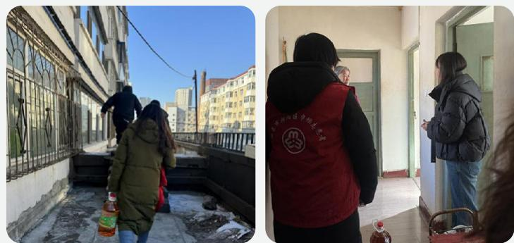

万

## CC

在社区公益与儿童关怀方面，公司于2025年上半年，由证券部、审计监察部、战略风控法务部等多部门联合组织，向长春市儿童福利院捐赠了一批聚焦儿童日常生活与学习需求的物资。该举措旨在为福利院儿童提供实质性的生活改善与成长支持，传递社会温暖与人文关怀。活动获得了福利院的积极反馈与认可，相关捐赠证书及记录亦体现了公司公益行动的规范性与公信力。

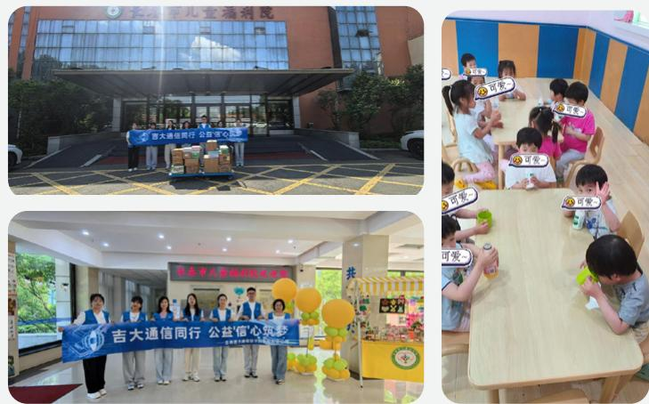

万

## CC

2025年7月10日，公司党总支在高温时节参与“夏日送清凉”活动，为一线环卫工人送去防暑降温物资。此举不仅是对劳动者辛勤付出的直接肯定，也体现了公司对户外工作者职业健康与安全的人性化关怀，是公司职业健康安全理念向社会的外延。

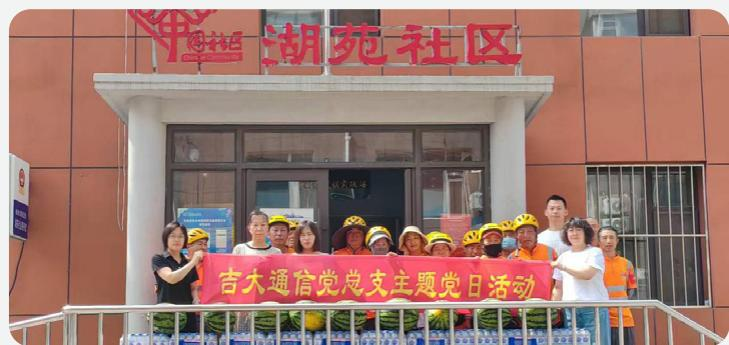

text_image

湖苑社区
吉大通信党总支主题党日活动

万

## 指标

报告期内，公司参与社区公益志愿活动 4 次，志愿者参与人数 80 人，志愿者活动总时间 16 小时。慈善捐赠金额 5.14 万元，捐赠项目数 2 个。

## “一带一路”

公司积极响应“一带一路”倡议，在菲律宾设立子公司。公司依托专业技术与丰富经验，积极推进光纤到户（FTTH）与通信基础设施建设，显著提升当地网络质量。与此同时为当地创造超过 700 个就业岗位，并通过健全的员工福利体系与依法纳税，切实助力当地民生改善。以实际行动践行“一带一路”共商共建共享的理念。

## 菲律宾子公司“一带一路”重点项目建设

菲律宾子公司自 2021 年试点综合代维 SLI（Subscriber Line Installation）项目，是覆盖菲律宾全国范围的一个综合安装维护项目，该项目从最初的 1 个业务区逐年扩展业务区，截止 2025年底已承接 13 个业务区的安装和维护工程。2025 年全年共计完成安装订单 42,700 单，维修订单 401,481 单。目前我们在综合代维项目中，98% 以上的员工为菲律宾本地员工。

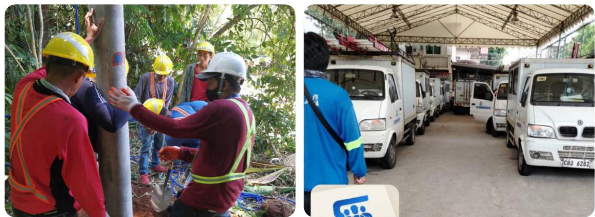

## 菲律宾团队队伍建设

菲律宾子公司投入队伍分为自建队伍 398 支，分包队伍 21 支，分布在 NCR,NLZ,VIS,MIN 等多个区域。在步入 2025 年之后，随着工程的平稳进行，综合代维项目目前发展势头良好，为下一步工作提供了有力的支持，目前已经以综合代维为平台逐步扩展业务。

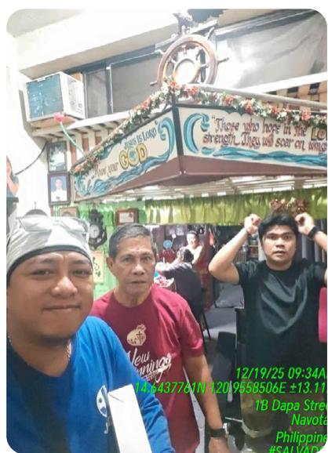

text_image

THE WORLD'S
"These you love in the LO
strength. They will soar on lungs"
12/19/25 09:34A
14:487761N 42019658506E ±13.11
1B Dapa Street
Navota
Philippine
#SALVAD

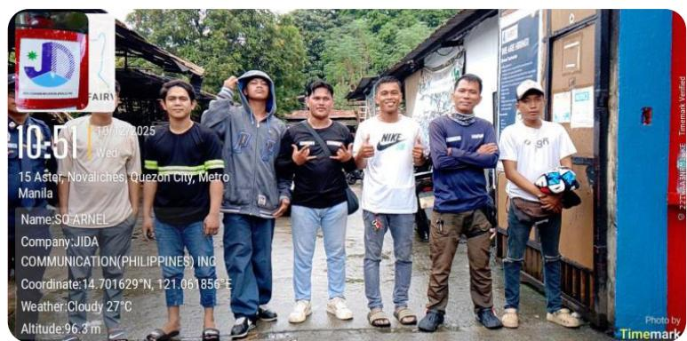

text_image

10:51
15 Aster, Novaliches, Quezon City, Metro
Manila
Name:SO ARNEL
Company:JIDA
COMMUNICATION(PHILIPPINES) INC
Coordinate:14.701629°N, 121.061856°E
Weather:Cloudy 27°C
Altitude:96.3m
Photo by
Timemark Verified

## 深化区域合作 助力海外高质量发展

## 2025年圣诞晚会

菲律宾为天主教国家，圣诞节是当地最重要的传统节日之一。为融入当地文化、尊重本土习俗，菲律宾子公司于 2025年 12 月 21 日在帕赛隆重举办年度圣诞晚会。本次晚会在欢庆节日的同时，全面回顾了公司 2025 年度工作，对表现突出的优秀员工及团队进行表彰，感谢大家一年来的辛勤付出与卓越贡献；公司管理层也对新一年发展方向与工作重点作出展望，进一步凝聚发展共识。晚会现场准备了丰盛美食、丰厚礼品及趣味互动游戏，员工踊跃参与，气氛热烈温馨、欢声笑语不断。此次活动有效增强了员工的认同感与归属感，搭建了良好的交流平台，促进了同事间沟通协作，提升了团队凝聚力与向心力，营造出积极向上的工作氛围，为公司新一年稳步发展注入强劲动力。

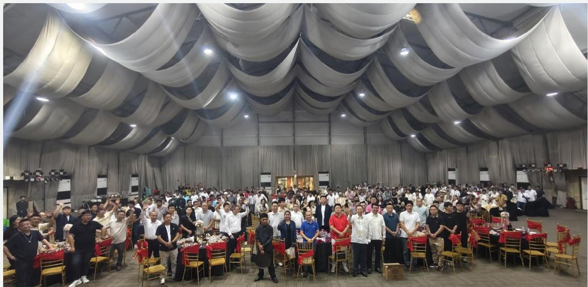

natural_image

Large indoor gathering with attendees seated at tables under a large canopy of white drapes (no visible text or signage)

2025 年 3 月 19 日

参加中国移动AI+时代全球发展论坛  
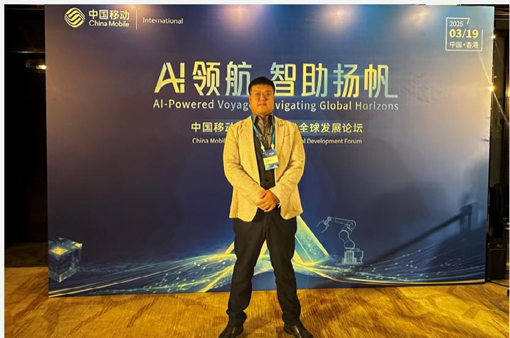

text_image

中国移动
China Mobile International
AI领航 智助扬帆
AI-Powered Voyage Investigating Global Horizons
中国移动全球发展论坛
China Mobile Development Forum
2025/03/19
中国·香港

2025 年 3 月 19 日  
参加中国移动AI+时代全球发展论坛  
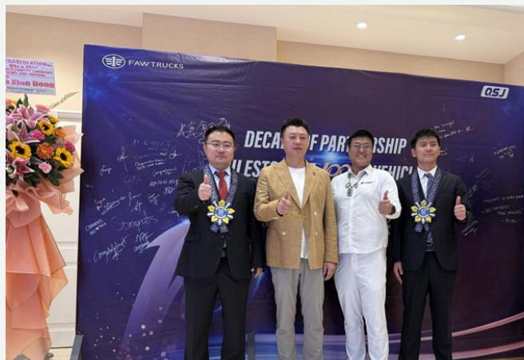

text_image

FAW TRUCKS
QSJ
DECAUSE OF PARTNSHIP
THE ESTEAST OF PARTNSHIP
FAW TRUCKS
FAW TRUCKS
QSJ
FAW TRUCKS
FAW TRUCKS
FAW TRUCKS
FAW TRUCKS
FAW TRUCKS
FAW TRUCKS
FAW TRUCKS
FAW TRUCKS
FAW TRUCKS
FAW TRUCKS
FAW TRUCKS
FAW TRUCKS
FAW TRUCKS
FAW TRUCKS
FAW TRUCKS
FAW TRUCKS
FAW TRUCKS
FAWTRUCKS
FAWTRUCKS
FAWTRUCKS
FAWTRUCKS
FAWTRUCKS
FAWTRUCKS
FAWTRUCKS
FAWTRUCKS
FAWTRUCKS
FAWTRUCKS
FAWTRUCKS
FAWTRUCKS
FAWTRUCKS
FAWTRUCKS
FAWTRUCKS
FAWTRUCKS
FAWTRUCKS
FAWTRUCKS
FAWTRUCKS
FAWTRUCKS
FAWTRUCKS
FAWTRUCKS
FAWTRUCKS
FAWTRUCKS
FAWTRUCKS
FAWTRUCKS
FAWTRUCKS
FAWTRUCKS
FAWTRUCKS
FAWTRUCKS
FAWTRUCKS
FAWTRUCKS
FAWTRUCKS
FAWTRUCKS

2025 年 8 月 13 日

参加中国移动东南亚区域合作会议  
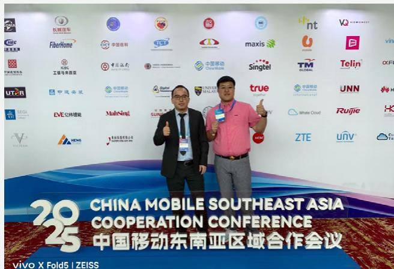

text_image

2025 CHINA MOBILE SOUTHEAST ASIA COOPERATION CONFERENCE
中国移动东南亚区域合作会议
vivo X Fold5 | ZEISS

2025 年 9 月 1 日

参加中国建筑第三局有限公司菲律宾公司业务发展交流活动  
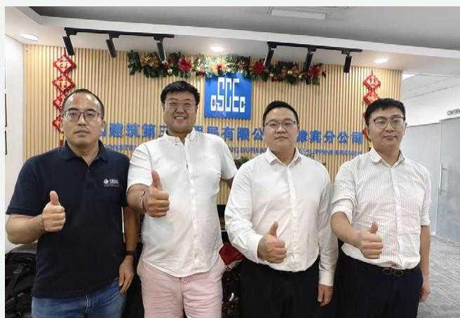

text_image

SOUTEC
北京城建工程有限公司 津滨分公司
SOUTEC
SOUTEC
SOUTEC
SOUTEC

2025 年 9 月 9 日  
参加第二届GTI数智香江国际论坛  
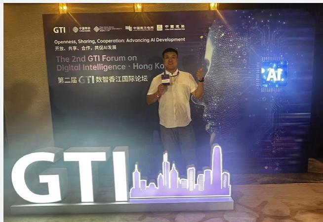

text_image

GTI
Openness, Sharing, Cooperation: Advancing AI Development
开放、共享、合作，共保AI发展
The 2nd GTI Forum on
Digital Intelligence · Hong Kong
第二届 GTI 数智香江国际论坛

2025 年 9 月 17 日

参加守护亚太地区和平与安全交流会  
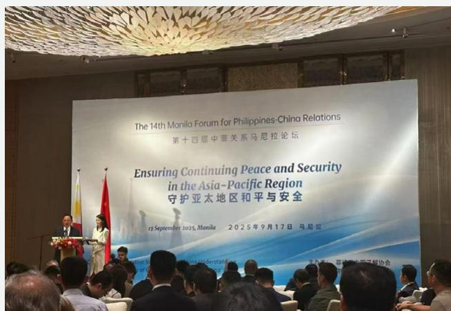

text_image

The 14th Manila Forum for Philippines-China Relations
第十四届中菲关系马尼拉论坛
Ensuring Continuing Peace and Security
in the Asia-Pacific Region
守护亚太地区和平与安全
13 September 2025, Manila 2025年9月17日 马尼拉

2025 年 10 月 10 日

参加中国移动全球合作伙伴大会  
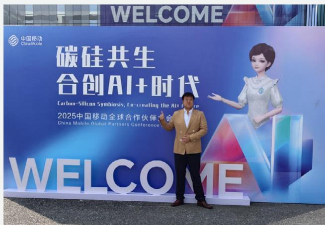

text_image

中国移动
China Mobile
碳硅共生
合创AI+时代
Carbon-Silicon Symbiosis, To-creating the AI Future
2025中国移动全球合作伙伴峰会
China Mobile Global Partners Conference
WELCOME

附录  
索引表

<table><tr><td colspan="2">报告章节</td><td>《深圳证券交易所上市公司自律监管指引第17号——可持续发展报告(试行)》</td><td>《中国企业可持续发展报告指南(CASS-ESG 6.0)》</td><td>国资委《央企控股上市公司 ESG专项报告编制研究》</td><td>《全球可持续发展报告标准》(GRI Standards)</td></tr><tr><td colspan="2">关于本报告</td><td>第四条 / 第六条</td><td>P1.1/P1.2</td><td>/</td><td>2-1/2-2/2-3</td></tr><tr><td colspan="2">董事长致辞</td><td>/</td><td>P2.1</td><td>/</td><td>2-22</td></tr><tr><td colspan="2">2025年关键绩效</td><td>第六条</td><td>A2</td><td>/</td><td>201-1</td></tr><tr><td colspan="2">关于吉大通信</td><td>/</td><td>P3.1/P3.2/P3.3</td><td>/</td><td>2-1/2-6/2-22</td></tr><tr><td rowspan="4">可持续发展管理</td><td>可持续管理</td><td>第十一条 / 第十二条 / 第十三条 / 第十八条 / 第十九条</td><td>G1.1.1/G1.1.2/G1.1.3/G1.1.4/G1.1.5/G1.1.6/G1.1.7/G1.1.11</td><td>G1.1.1/G1.1.2/G1.2.2/G1.3.3/G4.1.2</td><td>2-14/2-17/2-22</td></tr><tr><td>利益相关方沟通</td><td>第九条 / 第五十三条</td><td>G1.3.1/G1.3.2</td><td>/</td><td>2-15/2-16/2-29</td></tr><tr><td>重要性议题管理</td><td>第五条</td><td>G1.1.9</td><td>/</td><td>3-1/3-2/3-3</td></tr><tr><td>影响、风险和机遇管理</td><td>第十四条</td><td>G1.1.8/G1.1.9</td><td>/</td><td>3-1/3-2/3-3</td></tr><tr><td rowspan="2">治理篇</td><td>党建引领企业高质量发展</td><td>/</td><td>/</td><td>G1.1.4</td><td>/</td></tr><tr><td>可持续发展的治理保障</td><td>第五十五条 / 第五十六条</td><td>G2.1.1/G2.1.2/G2.1.3/G2.1.4/G2.1.8/G2.2.1/G2.2.2/G2.2.3</td><td>G1.1.1/G1.1.2/G1.2.2/G1.2.3/G1.3.1/G2.1.1/G2.2.1/G2.2.2/G2.3.1/G2.3.2/G3.1.1/G3.1.2/G3.1.3/G5.1.1/G5.1.2/G5.1.3/G5.2.1/G5.2.2/G5.2.3/S4.1.1</td><td>2-9/2-10/2-11/2-12/2-16/2-17/2-19/2-26/2-27/2-29/207-1/207-2/205-2/205-3/405-1</td></tr><tr><td rowspan="2">环境篇</td><td>应对气候变化</td><td>第二十一条 / 第二十二条 / 第二十三条 / 第二十四条 / 第二十七条</td><td>E1.1.1/E1.1.2/E1.1.3/E1.1.4/E1.1.5/E1.1.6/E1.1.8/E1.1.15/E1.1.16</td><td>E3.1.1/E3.1.2/E3.1.4/E3.2.1/E3.4.1</td><td>201-2/305-1/305-2</td></tr><tr><td>可持续环境管理</td><td>第二十九条 / 第三十条 / 第三十一条 / 第三十二条 / 第三十三条 / 第三十五条 / 第三十六条 / 第三十七条</td><td>E2.1.1/E2.1.3/E2.1.7/E2.2.1/E2.2.2/E2.2.3/E2.2.4/E2.2.5/E2.2.6/E2.2.7/E2.4.2/E2.4.3/E2.4.4/E3.1.1/E3.1.2/E3.1.5/E3.2.2/E3.2.3/E2.3.3</td><td>E1.1.1/E1.3.4/E2.3.2/E3.1.1/E3.1.2/E3.1.4/E3.2.1/E3.4.1/E4.1.1/E5.2.1/E5.2.2/E5.2.3/E5.3.1/E5.4.2/E5.4.4/E5.4.5/E5.4.6/E5.5.1/E5.6.1/E5.6.2</td><td>302-1/302-2/302-3/303-1/303-3/303-5/304-1/304-2/304-3</td></tr><tr><td rowspan="6">社会篇</td><td>创新驱动与科技伦理</td><td>第四十二条 / 第四十三条</td><td>S2.1.1/S2.1.2/S2.1.3/S2.1.4/S2.1.5/S2.1.6/S2.1.7/S2.1.8/S2.1.9/S2.1.10/S2.1.11/S2.1.12/S2.1.13</td><td>S2.3.1/S2.3.2/S2.3.3/S2.3.4</td><td>3-3</td></tr><tr><td>产品和服务</td><td>第四十七条</td><td>S3.3.1/S3.3.2/S3.3.4/S3.3.5/S3.3.6</td><td>S2.1.1/S2.1.2/S2.1.3/S2.2.1/S2.2.2</td><td>416-1/416-2/417-1</td></tr><tr><td>供应链供应商管理</td><td>第四十五条</td><td>S3.1.1/S3.1.2/S3.1.3/S3.1.4</td><td>E5.4.5/S3.1.1/S3.1.2/S3.2.1</td><td>/</td></tr><tr><td>信息安全与隐私保护</td><td>第四十八条</td><td>S3.4.1/S3.4.2/S3.4.3/S3.4.4</td><td>S2.2.3</td><td>/</td></tr><tr><td>员工</td><td>第五十条</td><td>S4.1.1/S4.1.2/S4.1.3/S4.1.4/S4.1.6/S4.1.7/S4.1.9/S4.1.10/S4.1.11/S4.3.6/S4.2.1/S4.2.2/S4.2.3/S4.2.4/S4.2.6/S4.1.12/S4.3.1/S4.3.2/S4.3.3/S4.3.4/S4.3.5/</td><td>S1.1.1/S1.1.2/S1.1.3/S1.2.1/S1.2.2/S1.2.3/S1.2.4/S1.3.1/S1.3.2/S1.3.3/S1.3.4/S1.4.1/S1.4.2/S1.4.3/S1.5.1/S1.5.2/S2.1.1</td><td>/</td></tr><tr><td>乡村振兴与社会贡献</td><td>第三十九条 / 第四十条</td><td>S1.1.2/S1.1.3/S1.2.1/S1.2.2/S1.2.3/S1.2.4</td><td>S4.2.2/S4.3.1/S4.3.2/S4.4.2/S4.4.3</td><td></td></tr><tr><td>附录一</td><td>索引表</td><td>第五十七条</td><td>A3</td><td>/</td><td>/</td></tr><tr><td>附录二</td><td>绩效表</td><td>第三十五条 / 第三十六条 / 第四十条 / 第四十二条 / 第四十七条 / 第五十条 / 第五十一条</td><td>A2</td><td>/</td><td>201-1</td></tr><tr><td>附录三</td><td>意见反馈表</td><td>第九条</td><td>A6</td><td>/</td><td>2-3</td></tr></table>

绩效表

<table><tr><td>议题</td><td>指标</td><td>单位</td><td>2025年</td></tr><tr><td rowspan="2">环境绩效</td><td>外购热力总量</td><td>吉焦</td><td>13,150.74</td></tr><tr><td>总用水量</td><td>吨</td><td>13,820.96</td></tr><tr><td rowspan="19">社会绩效</td><td>员工人数</td><td>人</td><td>2,612</td></tr><tr><td>在职男性员工数</td><td>人</td><td>2,234</td></tr><tr><td>在职女性员工数</td><td>人</td><td>378</td></tr><tr><td>正式员工</td><td>人</td><td>2,612</td></tr><tr><td>劳动合同签订率</td><td>%</td><td>100%</td></tr><tr><td>社保覆盖率</td><td>%</td><td>100%</td></tr><tr><td>工会入会率</td><td>%</td><td>100%</td></tr><tr><td>员工体检及健康档案覆盖率</td><td>%</td><td>100%</td></tr><tr><td>员工培训总学时</td><td>小时</td><td>1,494</td></tr><tr><td>安全培训覆盖率</td><td>%</td><td>100%</td></tr><tr><td>职业健康安全培训开展场次</td><td>次</td><td>27</td></tr><tr><td>研发投入</td><td>万元</td><td>3,565.89</td></tr><tr><td>研发人员数量</td><td>人</td><td>544</td></tr><tr><td>专利授权数量</td><td>项</td><td>113</td></tr><tr><td>客户满意度</td><td>分</td><td>99.85</td></tr><tr><td>慈善捐献</td><td>万元</td><td>5.14</td></tr><tr><td>志愿者活动参与人次</td><td>人次</td><td>80</td></tr><tr><td>志愿时数</td><td>小时</td><td>16</td></tr><tr><td>因安全和健康导致召回产品数量</td><td>个</td><td>0</td></tr><tr><td rowspan="2">治理绩效</td><td>董事会独立董事人数</td><td>人</td><td>4</td></tr><tr><td>董监高女性人数</td><td>人</td><td>7</td></tr></table>

## 意见反馈表

感谢您阅读《吉林吉大通信设计院股份有限公司 2025 年度环境、社会和公司治理（ESG）报告》，为持续改进 ESG 工作和进一步提升可持续发展管理，在此诚邀您填写意见反馈表中的相关问题，并通过以下方式反馈给我们。

您的意见是我们持续改进ESG工作和进一步提升可持续发展管理的重要依据，感谢您对我们ESG工作的大力支持！

您可以通过来电、发送电子邮箱或寄送反馈意见给我们！

## 联系方式如下：

电话：0431-85152089

电子信箱：jlucdi@jlucdi.com

传真：0431-85175230

地址：长春市朝阳区南湖学府经典小区第9幢701室

## 您属于以下哪类利益相关方：

□员工 □客户与消费者 □股东或投资者 □供应商 □政府及监管机构 □媒体/ 行业协会

□其他（请注明）

2、您对本年度ESG报告的整体评价：

□很好 □较好 □一般 □较差 □很差

3、您认为本报告

## 信息披露

□很好 □较好 □一般 □较差 □很差

## 版式设计

□很好 □较好 □一般 □较差 □很差

## 可读性

□很好 □较好 □一般 □较差 □很差

4、哪些议题最引起您的关注？（可选 3 项）

□规范治理 □气候变化 □环境管理 □资源管理 □研发创新 □产品质量

□优质服务 □员工权益 □安全运营 □社会责任

5、您所关注的信息在本年度ESG 报告中是否都有所体现：

□是 □否 （ 您还希望看到哪些信息

6、您对我们的ESG 报告或ESG工作和可持续发展管理方面还有哪些意见或建议？