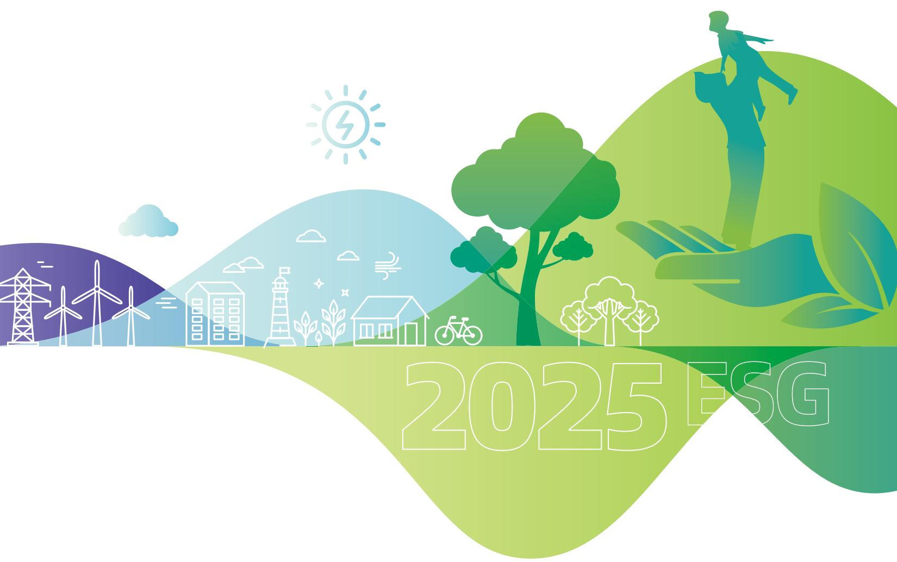

text_image

2025 ESG

## Contents目录

关于本报告 01

董事长致辞 02

关于新产业 03

新产业的2025 04

关键绩效 06

荣誉与认可 08

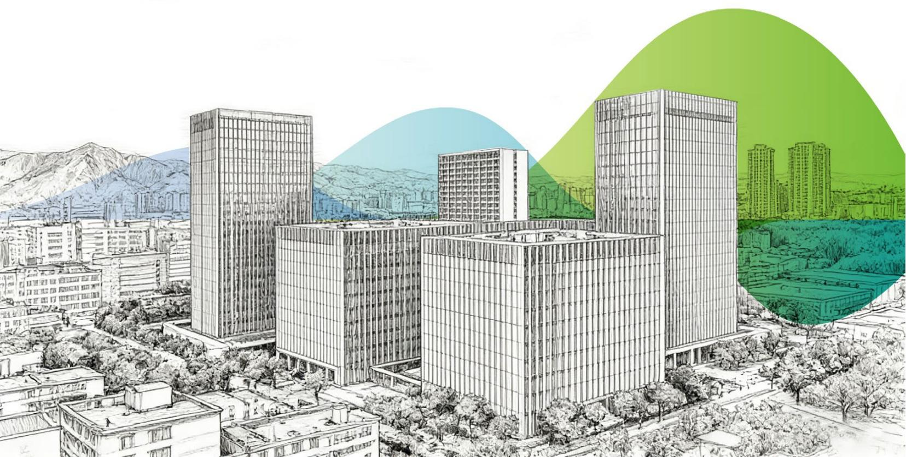

natural_image

Architectural sketch of modern office buildings with mountainous background (no text or symbols)

## 01 规范公司治理 09

公司治理 10

公司治理结构 10

维护股东权益 12

ESG管治 13

ESG治理结构 13

利益相关方沟通 13

重要议题评估 14

合规运营 17

风险管控 17

廉洁自律 17

信息安全 19

## 03 推进绿色运营 51

环境及职业健康安全管理 52

应对气候变化 54

绿色运营 56

排放物与废弃物管理 56

资源能源管理 57

## 04 赋能人才发展 58

人才吸引与留存 59

多元化及平等雇佣 59

员工权益与福利 60

员工关爱与沟通 62

员工培训与发展 64

培训体系 64

员工能力提升 64

员工晋升发展 66

职业健康与安全 68

职业健康 68

安全管理 69

## 02 严控产品与服务质量 21

产品质量与安全 22

质量管理体系 22

产品质量与安全管理 26

专注研发创新 30

不断完善的研发创新体系 30

研发创新能力 31

研发创新成果 35

知识产权保护 42

供应链管理 43

供应商管理 43

供应商交流与沟通 44

供应链可持续管理 44

负责任营销 45

责任营销管理 45

责任品牌建设 46

责任营销培训 49

客户服务质量 49

客户服务管理及能力 49

客户满意度 50

客户服务能力提升 50

## 05 践行社会责任 71

行业交流与合作 72

产学研合作及多中心研究 72

学术推广与普及 74

助力行业标准化 76

国际间交流与合作 78

社区公益 80

支持科研和教育 80

支持社区公益 82

关键绩效指标表 83

附录 88

## 关于本报告

报告概览 > 本报告为深圳市新产业生物医学工程股份有限公司发布的第五份环境、社会和公司治理（ESG）报告。本报告依据客观、规范、透明和全面的原则，详细披露了本公司2025 年度在环境、社会、公司治理等可持续发展领域的实践和绩效。  
报告范围 > 本报告为年度报告，覆盖2025 年1 月1 日至2025 年12 月31 日的相关数据。由于本报告中部分数据涉及连续性和可比性，部分内容根据需要做适当延伸或追溯。本报告覆盖的范围包括深圳市新产业生物医学工程股份有限公司及下属子公司。  
报告标准> 本报告主要参照《全球报告倡议组织（Global Reporting Initiative，GRI）报告标准》《深圳证券交易所上市公司自律监管指引第17号一可持续发展报告（试行）》《深圳证券交易所创业板上市公司自律监管指南第3 号——可持续发展报告编制》、联合国《可持续发展目标（Sustainable Development Goals，SDGs）企业行动指南》进行编制，以持续提升可持续发展报告的披露透明度，响应利益相关方的信息需求。  
释义说明 > 为便于表述和阅读，在报告中“深圳市新产业生物医学工程股份有限公司”也以“新产业生物”“新产业”“我们”或“公司”表示。本报告中所涉及货币金额以人民币为计量币种，特殊说明除外。  
确认及批准 > 本报告于2026 年4 月27 日获本公司第五届董事会第七次会议批准发布。本公司及董事会全体成员保证本报告披露的内容真实、准确和完整，没有虚假记载、误导性陈述或重大遗漏。  
报告获取及反馈>本报告包括纸质和电子版本 您可以在深交所指定信息披露网站巨潮资讯网（wwwCninfocom.cn）或新产业官方网站（www.snibe.com）上查阅和下载本报告电子文本，并获取更多公司信息。如对报告存在疑问或建议，请发送邮件至Snibeinfo@snibe.cn 或致电+86-755-86540062。本报告以中文进行编制，英文版本系依据中文版本翻译而来，如对英文版本理解上有歧义，请以中文版本为准。

## 董事长致辞

2025 年是“十四五”收官之年，体外诊断行业面临集采深化、周期调整与供应链重构等多重挑战。作为以“为人类生命健康事业不断创造价值”为使命的企业，我们坚信企业价值在于逆境中坚守初心、执着创新、勇担责任。这一年，我们在规范治理、自主创新、绿色运营与社会责任等方面深耕不辍，努力在行业波动中书写中国体外诊断企业的新篇章。

我们以规范治理筑牢发展根基。我们坚信规范治理是企业行稳致远的压舱石，紧跟新《公司法》实施步伐，全面修订《公司章程》及多项治理制度，增设职工代表董事，进一步优化董事会治理结构。面对集采常态化的市场环境，我们扎实开展审计监察与反商业贿赂工作，不仅严控营销合规，更通过精益管理提升运营效率。我们高度重视投资者关系，在行业估值重塑的周期中，向市场传递公司稳健经营的长远价值，切实保障股东尤其是中小投资者的权益。

我们坚持创新驱动，以技术突破定义行业高度。在行业竞争同质化加剧的情况下，我们专注于化学发光等优势赛道，持续突破单机测速与检测精准度的极限。在小分子检测、罕见病及老幼孕产品研发上不断突破，让创新成果惠及更广泛人群。同时敏锐把握“人工智能+ 医疗”的时代浪潮，我们通过数字化赋能研发，显著提高了研发效率和成功率。我们自主研发的全自动样品处理系统SATLARST8，样本检测全程急诊优先、智能调度，大大缩短了样本检测周转时间，以智能化解决方案助力实验室提质增效。

我们严控质量生命线，以责任担当守护患者福祉。在医保控费与集采降价的大环境下，我们始终践行“像捍卫生命一样捍卫产品质量”的企业精神。我们进一步强化全生命周期的质量管理体系，不断提升供应链的可追溯性与风险防控能力。我们追求的不仅是检测结果的精准，更是通过技术创新帮助临床降低误诊率、减少不必要的医疗支出，让每一份试剂、每一台仪器，都承载起降低患者诊疗负担的民生温度。

我们推进绿色运营，以低碳实践响应时代命题。随着国内外对可持续发展的关注度日益提升，我们延续了在节能减排、资源循环利用方面的努力，持续通过技术、设备及方法等改进提高能源、资源的使用效率。我们积极响应国家“双碳”战略，系统性地推进温室气体核算与管理，以实际行动响应全球气候变化治理号召。

我们赋能员工成长，以多元包容凝聚组织力量。我们始终将人才视为最宝贵的核心资产。我们深化多元平等雇佣理念，完善培训体系

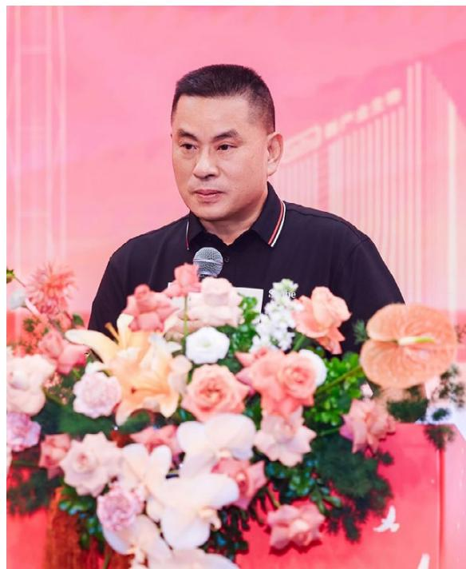

natural_image

Man speaking at a podium with floral arrangement, against a pink background (no visible text or symbols)

与晋升通道，建立完善的薪酬福利体系和激励机制，提供安心的工作环境以及多样的福利与关怀举措，塑造高粘性的人才环境，增强员工的归属感与成就感，促进员工与企业共同成长。

我们践行社会责任，以专业力量回馈社会期待。作为民族企业，依托专业优势，我们积极推动优质医疗资源下沉。我们联合多家医疗机构开展科研合作助力慢病早诊早治支持医学教育与人才培养。在全球医疗健康事业的宏图中，我们致力于以中国智造服务全球健康需求，为构建更加健康、公平、可持续的未来贡献中国力量。

可持续发展是一场永无止境的征程，我们始终秉持着对人类生命健康的敬畏之心，以创新为引擎回应时代需求，以责任为担当践行企业使命。展望未来，我们将继续以创新为引擎，以责任为担当，在变革中开新局，与每一位同行者携手，共同书写属于中国体外诊断企业的璀璨篇章

董事长：2026 年4 月27 日

## 关于新产业

## 公司介绍 >

新产业自 1995 年成立以来专注于体外诊断领域，是一家专业从事体外诊断领域产品研发、生产销售及客户服务的国家级高新技术企业。公司自成立之初起就始终坚持“以客户为中心，以市场为导向，通过持续不断的产品和技术创新，为人类生命健康事业不断创造价值”的企业使命，为客户提供更好的体外诊断产品与服务。经过 30 年的深耕发展、技术迭代及客户积累，公司产品打破了海外巨头对中国体外诊断市场的垄断和技术封锁的局面，新产业已成为中国体外诊断领域的领导者，并向全球体外诊断领域的先行者迈进。

## 企业文化 >

## 使命

以客户为中心，以市场为导向，通过持续不断的产品和技术创新，为人类生命健康事业不断创造价值

## 核心价值观

勇担重任 享受挑战 追求卓越

## 愿景

做中国体外诊断领域的领导者做全球体外诊断领域的先行者

## 精神

像捍卫生命一样捍卫产品质量

## 公司股权结构 >

截至报告期末，新产业实际控制人为翁先定，翁先定先生直接持股比例为 3.18%，通过西藏新产业投资管理有限公司控制公司股份比例为26.88%翁先定与西藏新产业投资管理有限公司合计持股比例为30.06%；第二大股东为公司董事长兼总经理饶微，持股比例为 13.77%；第三大股东为天津红杉聚业股权投资合伙企业（有限合伙）（以下简称：红杉聚业），持股比例为 10.62%（截至本报告披露日，红杉聚业持股比例为 8.78%）。

## 新产业的2025

## 大事记 >

## 原醛症临床多中心研究项目结题，助力高血压筛查诊疗

由中国心胸血管麻醉学会检验与临床分会主办，中国内分泌性高血压协作组协办，公司承办的“原醛诊断标志物系列研究结题会暨原醛诊疗现状、挑战与对策研讨会”在深圳隆重召开。此次原醛症筛查多中心研究结题，推动了国内原醛症筛查及诊断的标准化。

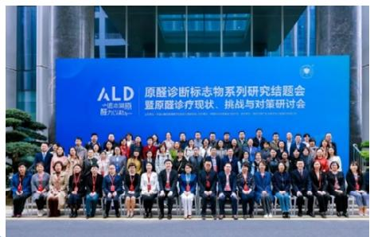

text_image

ALD
-原醛诊断标志物系列研究结题会
暨原醛诊疗现状、挑战与对策研讨会

## “高敏肌钙蛋白I浓度及变化判断急性心肌梗死的临床应用多中心研究”启动会成功召开

心血管疾病是威胁人类健康的“头号杀手”，严重威胁国民健康，早期诊断与精准诊疗是挽救生命的关键。本次会议围绕心肌梗死的精准诊疗及高敏肌钙蛋白在急诊分诊中应用展开深入探讨，为心血管疾病防控注入新动能。

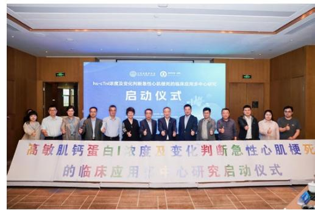

text_image

hs-CTri浓度及变化判断急性心肌梗死的临床应用多中心研究
启动仪式
高敏肌钙蛋白I浓度及变化判断急性心肌梗死
的临床应用多中心研究启动仪式

## “建立中国表观健康人群高敏肌钙蛋白参考区间的多中心研究”圆满结题

心血管疾病生物标志物的实验室检测易受多种因素影响，适宜精准检测的技术对于临床决策极为关键木次参考区间多中心研究广泛覆盖了多地区、多人群、多种族以及不同生活习惯等生物标志物检测的重要影响因素，其研究成果将为我国心血管疾病的预防、诊断与治疗开辟新路径，助力检验医学更好地服务于人民健康

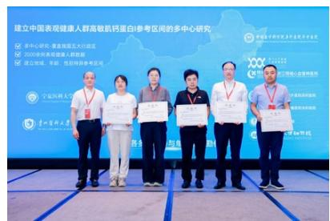

text_image

建立中国表观健康人群高敏肌钙蛋白参考区间的多中心研究
中心培训：建立我国乡村地区
2020年高校健康人群数据
建立区域、年龄、性别特征参考区
宁远县外人
中国医学学会
2020年全国儿童保健知识竞赛
2020年全国儿童保健知识竞赛
2020年全国儿童保健知识竞赛
2020年全国儿童保健知识竞赛

## 千速旗舰全自动化学发光免疫分析仪MAGLUMI® X10获证上市

MAGLUMI® X10 是新产业生物在体外诊断领域的又一重要突破，展现了其在临床应用和技术创新方面的领先实力，同时也为全球医疗行业注入了新的动能与活力。

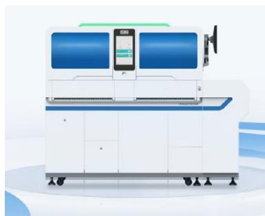

natural_image

Industrial machine with blue cylindrical components and control panel (no visible text or symbols)

## 2000速全自动生化分析仪Biossays®C10获证上市

Biossays® C10 的上市展现了公司在超高速生化分析仪上强悍的研发实力，这标志着国产生化分析仪领域又取得重大突破，向着更高水平迈进。

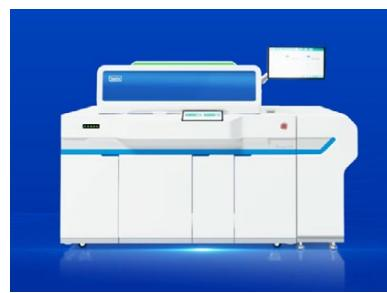

natural_image

Modern industrial machine with control panel and blue lighting against a solid blue background (no visible text or symbols)

## 高速全自动凝血分析仪Hemolumi® H6、高速全自动电解质分析仪Biossays® E6 Plus获证上市

Hemolumi® H6、Biossays® E6 Plus 的上市是公司在体外诊断领域的又一里程碑，通过模块化接入全实验室自动化流水线，为核心实验室提供了更加全面的解决方案。

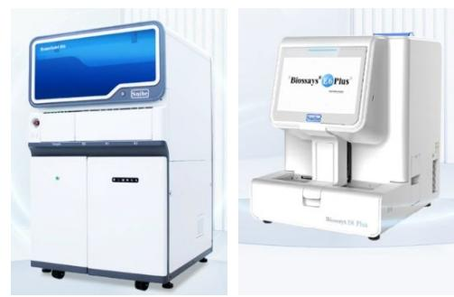

natural_image

Two medical imaging devices: a digital control unit and a biosay® 20 Plus machine, both without visible text or symbols.

## 公司荣获2025年中国产学研合作促进会科技创新奖

公司携手中国医学科学院阜外医院、北京大学人民医院、中国医学科学院阜外医院深圳医院、海南医科大学第二附属医院等顶尖机构，联合攻关的“小分子‘夹心法开启原发性醛固酮增多症精准诊断新纪元”项目凭借突破性的技术创新与显著的行业示范价值，荣获创新成果奖三等奖。

## 中国产学研合作促进会

## 2025年中国产学研合作促进会科技创新奖评审结果公示

根据《中国产学研合作促进会科技创新奖评奖办法》，我会组织专家对2025年中国产学研合作促进会科技创新奖进行了评审，现将评审结果公示如下(见附件)，公示期为：2026年2月6日-2月10日pjbiciur.org.cn。以单位名义提出的异议，须写明单位名称、联系人、联系电话和详细地址，并加盖单位公章：个人名义援出异议的须写响末人直实纸名、工作单位，联系电活和详细增林，并签名

附：1、2025年中国产学研合作促进会科技创新奖--创新成果奖名单3. 2035年中国产学研合作保进合科技创新奖—-创新人物奖名单

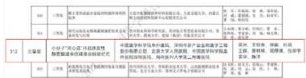

## 多项小分子“夹心法”检测试剂获证上市

截至 2025 年末，公司小分子“夹心法”检测试剂累计获 15 项产品注册证，检测技术日趋成熟，服务用户已从国内拓展至全球，在全球 100 多个国家和地区广泛应用，助力精准诊疗，为全球健康事业贡献力量。

## 新产业生物研发生产大厦正式开建

公司新产业生物研发大厦（暨新产业生物五期项目）于 2025 年 12 月正式开工建设，项目建成后，将进一步提升公司的研发创新能力与生产规模，为公司的全球化发展注入新动力。

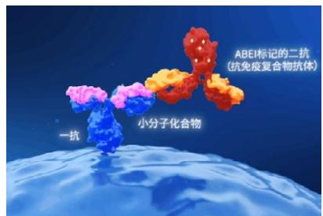

text_image

ABEI标记的二抗
(抗免疫复合物抗体)
一抗
小分子化合物

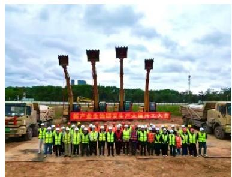

text_image

新产业基础研发生产大成示范大会

## 公司试剂关键原料及工艺研发团队荣膺“广东省先进集体”称号

公司试剂关键原料及工艺研发团队凭借卓越的创新实力与社会贡献，荣获“广东省先进集体”称号，彰显公司核心技术攻关实力。

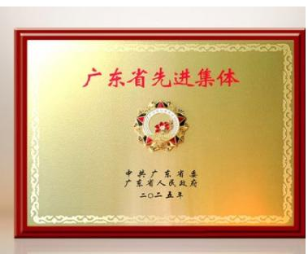

text_image

广东省先进集体
中共广东省委
广东省人民政府
二〇二五年

## 关键绩效 >

## 经济绩效

<table><tr><td>营业收入
45.77亿元</td><td>归属上市公司股东净利润
16.20亿元</td><td>每股收益
2.0621元/股</td></tr></table>

## 公司治理

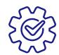

<table><tr><td>投资者交流近300场</td><td>信息披露考核成绩A</td><td>接受反商业贿赂培训员工比例100%</td><td>签署反商业贿赂承诺员工比例100%</td></tr></table>

## 产品与服务质量

<table><tr><td>研发投入金额4.78亿元</td><td>有效授权专利数426个</td><td>全球可提供检验的化学发光免疫试剂项目250项</td><td>质量管理体系认证证书3张</td></tr></table>

<table><tr><td>客户投诉处理综合满意度100%</td><td>收到的与侵犯客户隐私有关的经证实的投诉总数0</td><td>因违反规定而受到罚款或处罚的事件0</td><td>产品召回数量0</td></tr></table>

人才吸引与留存  

<table><tr><td>员工数量2,785人</td><td>女性员工比例36.62%</td><td>管理层中女性比例30.27%</td><td>高级管理层女性比例66.67%</td></tr><tr><td>本科以上学历员工比例73.29%</td><td>年末绩效考核覆盖员工比例100%</td><td>培训总时长96,743小时</td><td>社会保险覆盖率100%</td></tr></table>

环境及职业健康安全  

<table><tr><td>能耗强度0.0076吨标准煤/万元</td><td>碳排放强度0.0373吨二氧化碳当量/万元</td><td>取水强度0.5467立方米/万元</td><td>浓水回收量21,679.7立方米</td></tr><tr><td colspan="2">职业健康体检覆盖率100%</td><td>工伤导致的员工死亡数量0</td><td>环境及职业健康安全投入458万元</td></tr></table>

荣誉与认可 >

<table><tr><td>荣誉与认可</td><td>颁发机构</td></tr><tr><td>国家高新技术企业</td><td>深圳市科技创新委员会、深圳市财政局、国家税务总局深圳市税务局</td></tr><tr><td>国家企业技术中心</td><td>国家发展和改革委员会</td></tr><tr><td>广东省“产教评”技能生态链链主企业</td><td>广东省人力资源和社会保障厅</td></tr><tr><td>深圳市2025年出入境生物医药特殊物品试点企业(机构)“白名单”</td><td>深圳市发展和改革委员会</td></tr><tr><td>2025年广东企业500强</td><td>广东省企业联合会、广东省企业家协会</td></tr><tr><td>广东省先进集体(试剂关键原料及工艺研发团队)</td><td>中共广东省委、广东省人民政府</td></tr><tr><td>2025年亚洲中小上市企业200强</td><td>福布斯</td></tr><tr><td>2025年中国医药上市公司最具竞争力20强</td><td>E药经理人</td></tr><tr><td>深圳市第四批产教融合型企业</td><td>深圳市发展和改革委员会、深圳市教育局</td></tr><tr><td>深圳市终身职业技能培训载体-十佳示范载体</td><td>深圳市人力资源和社会保障局</td></tr><tr><td>坪山区科普教育基地</td><td>深圳市坪山区科技创新局</td></tr><tr><td>2025职业信用卓越雇主奖</td><td>广州市八方锦程人力资源有限公司</td></tr><tr><td>信息披露考评A级(连续四年)</td><td>深圳证券交易所</td></tr><tr><td>2024年度金牛奖最具投资价值奖</td><td>中国证券报</td></tr><tr><td>第十九届中国上市公司ESG百强</td><td>证券时报</td></tr><tr><td>MSCI ESG评级BBB级</td><td>摩根士丹利资本国际公司</td></tr><tr><td>Wind ESG评级AA级</td><td>万得信息技术股份有限公司</td></tr><tr><td>国证ESG评级AA级</td><td>深圳证券信息有限公司</td></tr><tr><td>华证ESG评级AAA级</td><td>上海华证指数信息服务有限公司</td></tr><tr><td>2025年A股上市公司ESG卓越表现100强</td><td>上海华证指数信息服务有限公司</td></tr><tr><td>2025年A股上市公司医药医疗行业ESG绩效20强</td><td>上海华证指数信息服务有限公司</td></tr></table>

## 01

## 规范公司治理

本章节回应的重大性议题

· 公司治理  
· 投资者关系  
· 合规运营  
· 可持续发展管理  
· 利益相关方沟通  
· 信息安全与隐私保护  
· 反商业贿赂与反贪腐  
· 反不正当竞争

本章节关联可持续发展目标（SDGs）

新产业始终将稳健规范的公司治理视为可持续发展的根基。我们不断完善治理架构，提升可持续发展管理水平将可持续发展理念深度融入日常运营，通过积极与利益相关方沟通，精准回应各方关切。我们持续强化合规管理，构建系统完备的内部控制体系，以廉洁自律的方式开展业务，为公司的行稳致远提供坚实保障。

## 公司治理

## 公司治理结构 >

公司严格按照《公司法》《证券法》《上市公司治理准则》《深圳证券交易所创业板股票上市规则》等有关法律、法规、规范性文件和中国证监会的相关要求，结合公司实际情况建立了由股东会、董事会和经营管理层组成的公司治理结构，制定和完善了《公司章程》及其他内部控制规章制度和工作程序，保障公司法人治理结构的规范化运行。

此外，公司董事会设立了战略委员会、提名委员会、薪酬与考核委员会、审计委员会四个专门委员会，并制定了相应的工作细则，形成较科学和规范的治理制度，有效地保证了公司的规范运作和可持续发展。其中，审计委员会作为董事会下设的核心监督机构，根据新《公司法》的规定，报告期审计委员会承接原监事会的职能，进一步强化了内部监督机制和公司的治理结构，简化了决策流程，提升了治理效能。

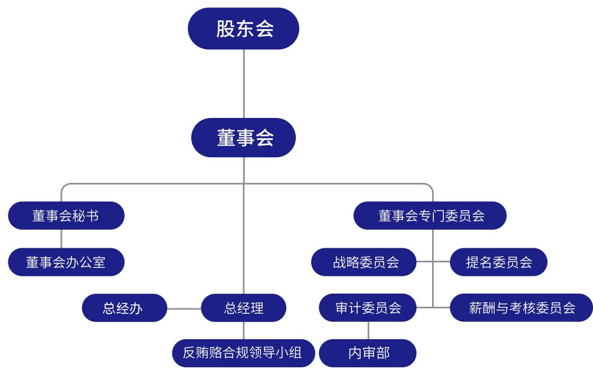

flowchart

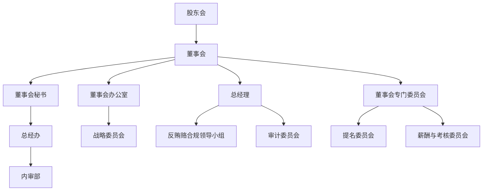
```mermaid
graph TD
  A["股东会"] --> B["董事会"]
  B --> C["董事会秘书"]
  B --> D["董事会办公室"]
  B --> E["总经理"]
  B --> F["董事会专门委员会"]
  C --> G["总经办"]
  D --> H["战略委员会"]
  E --> I["反贿赂合规领导小组"]
  E --> J["审计委员会"]
  F --> K["提名委员会"]
  F --> L["薪酬与考核委员会"]
  G --> M["内审部"]
```

公司治理结构

## 三会召开情况

公司严格按照《上市公司股东会规则》《公司章程》《股东会议事规则》等规定和要求，规范地召集、召开股东会，全面采取现场投票与网络投票结合的方式，审议影响中小投资者利益的重大事项时对中小投资者表决单独计票，并及时披露中小投资者的表决结果，确保全体股东特别是中小股东享有平等地位，并且能充分行使股东权利。

董事会对股东会负责，公司严格按照《公司章程》《董事会议事规则》的相关规定召集、召开董事会。独立董事独立于公司实际控制人、控股股东和其他关联方，能够独立地作出判断并发表意见，切实维护全体股东，特别是中小股东的利益。公司董事通过不断地学习、熟悉并掌握相关法律法规，维护公司和全体股东的最大利益，忠实、诚信、勤勉地履行职责。

2025 年 ，公司共召开三会情况如下：

<table><tr><td>股东会2次</td><td>董事会会议3次</td><td>董事会各专门委员会会议7次</td><td>独立董事专门会议3次</td></tr></table>

## 董事会与高管团队多元化

公司董事会由8 名董事组成，其中独立董事3 名，职工代表董事1 名，女性董事3 名。董事会成员分别在生物医学、财务审计、风险控制、法律等领域具备丰富的工作经验。

公司高级管理人员团队由6名高级管理人员组成，其中女性高级管理人员4名，团队成员背景涉及生物医学，财务，市场营销、临床检验等，拥有丰富的管理经验，能把握市场机遇并有效付诸实施。总经理及其他高级管理人员由董事会聘任或解聘。总经理主持公司的生产经营管理工作，组织执行落实董事会决议，并向董事会报告工作。

公司严格遵守《上市公司治理准则》，制定《董事、高级管理人员薪酬管理制度》，搭建科学、合理的薪酬结构，实现激励与约束的平衡。公司董事会薪酬与考核委员会依据《公司董事会薪酬与考核委员会工作细则》，负责拟定公司董事、高级管理人员的薪酬方案和考核标准，审查董事、高级管理人员的履职情况并对其进行年度考核，对董事、高级管理人员的薪酬执行情况进行监督。董事薪酬方案由股东会决定，高级管理人员薪酬方案由董事会批准，向股东会说明，并予以充分披露。公司高级管理人员的基本薪酬按照其在公司内部担任的职务，根据岗位责任等级、能力等级确定，年度绩效奖金与公司经营业绩直接挂钩，以公司年度经营目标和个人年度绩效考核指标完成情况为考核基础。

董事会与高管团队组成

<table><tr><td>董事会董事8名</td><td>非独立董事5名</td><td>独立董事3名</td><td>女性董事3名</td><td>独立董事占比37.5%</td><td>女性董事占比37.5%</td></tr><tr><td colspan="2">高级管理人员6名</td><td colspan="2">女性高管4名</td><td colspan="2">女性高管占比66.67%</td></tr></table>

董事会与高管团队基本情况

<table><tr><td rowspan="2">姓名</td><td rowspan="2">职务</td><td rowspan="2">性别</td><td rowspan="2">年龄</td><td colspan="5">专业能力</td><td rowspan="2">薪酬组成</td></tr><tr><td>行业经验</td><td>风险管理</td><td>会计</td><td>法律</td><td>市场营销</td></tr><tr><td>饶微</td><td>董事长、总经理</td><td>男</td><td>61</td><td>✓</td><td></td><td></td><td></td><td></td><td>基本薪酬+年度绩效奖金</td></tr><tr><td>翁鹤鸣</td><td>非独立董事</td><td>男</td><td>28</td><td></td><td>✓</td><td></td><td></td><td></td><td>未在公司领薪</td></tr><tr><td>饶捷</td><td>非独立董事</td><td>女</td><td>37</td><td>✓</td><td>✓</td><td></td><td></td><td></td><td>基本薪酬+年度绩效奖金</td></tr><tr><td>李旭</td><td>非独立董事</td><td>男</td><td>51</td><td></td><td></td><td></td><td>✓</td><td></td><td>未在公司领薪</td></tr><tr><td>伍前辉</td><td>独立董事</td><td>女</td><td>53</td><td></td><td>✓</td><td></td><td></td><td></td><td>固定独立董事津贴</td></tr><tr><td>沈卫华</td><td>独立董事</td><td>女</td><td>55</td><td></td><td>✓</td><td>✓</td><td></td><td></td><td>固定独立董事津贴</td></tr><tr><td>支毅</td><td>独立董事</td><td>男</td><td>46</td><td></td><td></td><td></td><td>✓</td><td></td><td>固定独立董事津贴</td></tr><tr><td>贺昕</td><td>职工代表董事</td><td>男</td><td>29</td><td></td><td></td><td>✓</td><td></td><td></td><td>基本薪酬+年度绩效奖金</td></tr><tr><td>丁晨柳</td><td>副总经理、财务总监</td><td>女</td><td>50</td><td></td><td></td><td>✓</td><td></td><td></td><td>基本薪酬+年度绩效奖金</td></tr><tr><td>李婷华</td><td>副总经理</td><td>女</td><td>48</td><td>✓</td><td></td><td></td><td></td><td></td><td>基本薪酬+年度绩效奖金</td></tr><tr><td>刘海燕</td><td>副总经理</td><td>女</td><td>46</td><td>✓</td><td></td><td></td><td></td><td>✓</td><td>基本薪酬+年度绩效奖金</td></tr><tr><td>张蕾</td><td>副总经理、董事会秘书</td><td>女</td><td>43</td><td></td><td>✓</td><td></td><td>✓</td><td></td><td>基本薪酬+年度绩效奖金</td></tr><tr><td>袁锦云</td><td>副总经理</td><td>男</td><td>39</td><td>✓</td><td></td><td></td><td></td><td>✓</td><td>基本薪酬+年度绩效奖金</td></tr></table>

## 维护股东权益 >

## 信息披露

以投资者需求为导向，以合规为准绳，新产业高度重视信息披露，严格按照有关法律法规以及《公司章程》《信息披露管理制度》等的要求，真实、准确、及时、公平、完整地披露有关信息，积极主动履行信息披露义务，公司指定《中国证券报》《证券时报》《上海证券报》和《证券日报》为信息披露报纸，巨潮资讯网为信息披露网站，确保广大投资者平等、及时获得准确的信息

2025 年，新产业共发布公告95 份，其中，定期报告4 份，临时公告91 份。在深交所上市公司2024 至2025 年度信息披露考评中，新产业荣获最高考核等级“A（优秀）”的评级，截至目前，公司已连续四年获得该评级，反映了监管机构和资本市场对新产业信息披露工作的高度认可。

## 投资者关系

新产业高度重视与投资者的沟通交流，严格按照有关法律法规及《公司投资者关系管理制度》等规定，由董事长负责领导投资者关系管理事务，董事会秘书、董事会办公室分别为投资者关系管理事务的负责人、职能落实部门。此外，我们持续学习优秀投资者关系管理经验，不断尝试以更加有效的方式开展投资者关系管理工作，通过畅通多元沟通渠道，保障所有股东平等地获取信息。

2025 年，我们共发布投资者关系活动记录表12 份；开展定期报告业绩说明会、反路演、券商策略会等，组织各类投资者交流活动共计近300 场次。凭借卓越的综合实力和稳健盈利能力，我们荣获第二十七届上市公司金牛奖“最具投资价值奖”。 深圳市新产业生物医学工程股份有限公司 深圳市新产业生物医学工程股份有限公司

## ESG管治

## ESG治理结构 >

完善的ESG 管理机制对于公司自上而下地落实可持续发展策略具有至关重要的意义，根据相关法律法规和上市公司可持续发展治理要求，新产业持续完善ESG 治理架构，优化内部可持续管理。

董事会是新产业ESG管治的最高决策机构，负责领导和监督公司ESG工作，审批公司ESG相关规划，目标和制度，董事会下设战略委员会，负责开展ESG 相关议题的探讨，定期向董事会汇报公司ESG 工作的绩效表现，为公司的ESG 工作的开展提供指导与建议，监督落实相应改进方案。

董事会战略委员会下设ESG 工作领导小组和ESG 工作执行小组，ESG 工作领导小组由公司总经理、副总经理组成，负责推动和落实ESG 相关工作的实施与监测，为公司董事会战略委员会决策提供支持；ESG 工作执行小组由董事会办公室牵头，各部门、子公司负责人作为小组成员并指定对接人，协同公司各部门、子公司具体落实ESG 工作相关工作，梳理汇总公司ESG 相关工作进展与绩效表现。

## 利益相关方沟通 >

新产业始终重视并保持与利益相关方的有效沟通，我们充分考虑自身运营对各利益相关方的影响，通过常态化沟通机制了解利益相关方的意见、建议以及对公司的期望，积极回应利益相关方的关注重点，以此作为公司履行可持续发展责任的基础。

<table><tr><td>利益相关方</td><td>关注议题</td><td>沟通形式及表现</td></tr><tr><td>政府及监管机构</td><td>应对气候变化合规运营反商业贿赂与反贪腐产品安全与质量行业交流与合作社公益</td><td>遵守国家法律法规完善合规管理体系建立反商业贿赂体系严格把控产品质量打造合作项目与平台积极参加政府项目响应政府政策开展公益慈善项目</td></tr><tr><td>股东与投资者</td><td>公司治理可持续发展管理合规运营投资者关系产品研发与创新产品安全与质量知识产权保护</td><td>完善公司治理体系完善合规管理体系强化风险管控履行信息披露义务组织参与投资者交流加大研发创新力度加强知识产权管理</td></tr><tr><td>客户</td><td>产品安全与质量产品研发与创新信息安全与隐私保护负责任营销反不正当竞争客户服务质量</td><td>严格把控产品质量加大研发创新力度加强客户隐私管理合规营销严守商业道德提升服务质量开展客户满意度调查</td></tr></table>

<table><tr><td>利益相关方</td><td>关注议题</td><td>沟通形式及表现</td></tr><tr><td>供应商与合作伙伴</td><td>产品质量与安全供应链管理反商业贿赂与反贪腐平等对待中小企业知识产权保护</td><td>严格把控产品质量加强供应商质量管理组织供应商会议及培训建立反商业贿赂体系加强知识产权管理</td></tr><tr><td>员工</td><td>多元化及平等雇佣员工权益与福利员工培训与发展职业健康与安全</td><td>举办员工关怀活动建立员工沟通渠道职工代表大会和工会提供多元化培训项目建立透明职级晋升制度完善员工薪酬管理与绩效管理制度建立环境及职业健康安全体系</td></tr><tr><td>行业协会与专业机构</td><td>产品研发与创新行业交流与合作</td><td>积极开展行业交流打造合作项目与平台提供实习和科研基地</td></tr><tr><td>社区及媒体</td><td>产品安全与质量排放物与废弃物管理行业交流与合作社公益生物多样性保护</td><td>严格把控产品质量严控废弃物排放打造合作项目与平台开展公益慈善活动参与志愿者服务与媒体保持良好沟通</td></tr></table>

## 重要议题评估 >

新产业高度重视并持续完善重要性议题识别、管理及分析，将各利益相关方的关注作为制定可持续发展战略的重要考虑，以准确、有效地回应利益相关方关注的议题，为识别与管理风险及机遇提供重要参考。

本年度，我们邀请各利益相关方以线上问卷的形式参与调研，了解各利益相关方关注重点，调研对象覆盖全体员工、客户、供应商与合作伙伴、股东与分析师、媒体、行业协会、政府机构、非政府机构等，依据“双重重要性”原则，即“财务重要性”和“影响重要性”，对议题进行评估与排序。

## 重要性议题评估步骤

## 1 议题识别与更新

参考《深圳证券交易所上市公司自律监管指引第 17 号——可持续发展报告（试行）》（以下简称《指引》）GRL Standards 等国际标准SDGs及同业优秀实践，结合公司业务发展及ESG实践情况，在深交所《指引》设置的21.个议题上识别了其他重要性议题，综合评估后形成议题清单。

## 2 议题调研

遵循双重重要性原则，邀请 各利益相关方开展“财务重 要性”和“影响重要性”评 估问卷调研。

## 3 结果分析及议题排序

综合考虑同行对标及根据利益相关方调研结果，从议题对经济、社会和环境影响的重要性和对公司财务的重要性两个维度进行评估与分析，对议题重要性进行排序。

重要性议题矩阵  
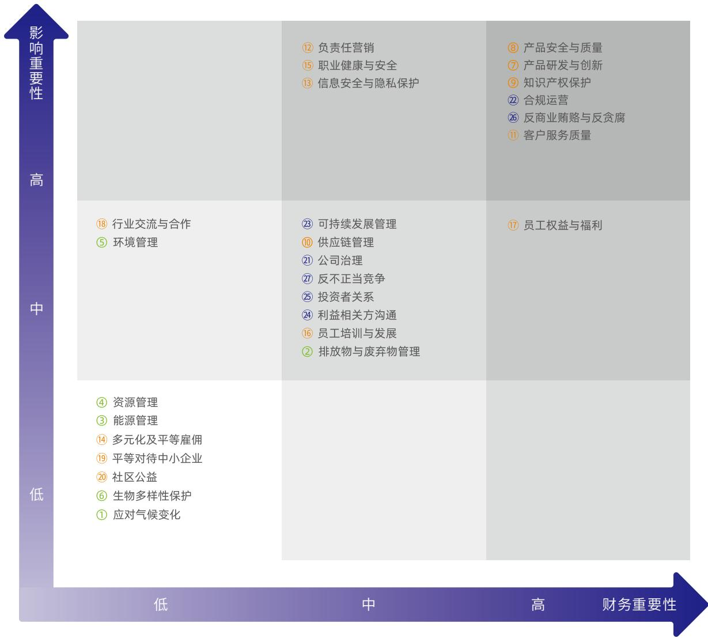

other

| Category | Impact Importance (High) | Financial Importance (High) |
| --- | --- | --- |
| ⑫ 负责任营销 ⑮ 职业健康与安全 ⑬ 信息安全与隐私保护 | 高 | 高 |
| ⑧ 产品安全与质量 ⑦ 产品研发与创新 ⑨ 知识产权保护 ⑳ 合规运营 ㉑ 反商业贿赂与反贪腐 ⑪ 客户服务质量 | 高 | 高 |
| ⑱ 行业交流与合作 ⑤ 环境管理 | 中 | 中 |
| ⑲ 可持续发展管理 ⑩ 供应链管理 ㉑ 公司治理 ㉗ 反不正当竞争 ㉕ 投资者关系 ㉖ 利益相关方沟通 ㉑ 员工培训与发展 ㉒ 排放物与废弃物管理 | 中 | 高 |
| ⑰ 员工权益与福利 | 中 | 高 |
| ④ 资源管理 ③ 能源管理 ⑭ 多元化及平等雇佣 ⑲ 平等对待中小企业 ㉞ 社区公益 ⑥ 生物多样性保护 ① 应对气候变化 | 低 | 高 |

<table><tr><td>环境范畴</td><td>社会范畴</td><td>治理范畴</td></tr><tr><td>1 应对气候变化2 排放物与废弃物管理3 能源管理4 资源管理5 环境管理6 生物多样性保护</td><td>7 产品研发与创新8 产品安全与质量9 知识产权保护10 供应链管理11 客户服务质量12 负责任营销13 信息安全与隐私保护14 多元化及平等雇佣15 职业健康与安全16 员工培训与发展17 员工权益与福利18 行业交流与合作19 平等对待中小企业20 社区公益</td><td>21 公司治理22 合规运营23 可持续发展管理24 利益相关方沟通25 投资者关系26 反商业贿赂与反贪腐27 反不正当竞争</td></tr></table>

针对七个财务重要性高的议题，我们进一步识别与其相关的风险与机遇，评估这些风险与机遇可能在短期（1-3 年）、中期（3-5 年）、长期（5 年以上）对公司战略、决策以及财务状况、经营成果、现金流等因素的影响。同时，针对各议题，本报告对应章节将系统披露公司在监测、预防、管理、控制及减缓影响等方面的举措。

<table><tr><td>财务重要性议题</td><td>风险及影响</td><td>机遇及影响</td><td>影响周期</td><td>管理措施所在章节</td></tr><tr><td>产品安全与质量</td><td>若产品安全与质量管理未能持续符合法规要求或不够完善,可能引发产品召回、监管处罚以及品牌声誉受损,导致客户流失、市场份额下降。</td><td>建立严于法规要求的全生命周期质量管理体系,通过严格的质量控制和质量管理体系,强化产品竞争力,同时高质量的产品和服务能够提升品牌价值,推动业务拓展。</td><td>短期中期长期</td><td>产品质量与安全</td></tr><tr><td>产品研发与创新</td><td>体外诊断行业技术迭代迅速,若创新方向与市场需求脱节,将导致研发投入无法产生预期收益,形成沉没成本,错失新兴市场窗口期,产品线迭代滞后,陷入同质化低价竞争,导致盈利能力下降。</td><td>前瞻性规划,聚焦临床需求,开发创新型解决方案,建立技术壁垒,通过差异化竞争开拓新市场,创造新的收入增长极。</td><td>短期中期长期</td><td>专注研发创新</td></tr><tr><td>知识产权保护</td><td>知识产权管理及专利布局若存在疏漏,可能导致核心技术遭侵权模仿,将削弱市场定价权与竞争护城河。</td><td>建立完善的知识产权管理体系及专利布局,构建技术壁垒,保护核心技术不被侵害,同时通过专利授权、技术合作等方式开辟新的盈利渠道。</td><td>中期长期</td><td>专注研发创新</td></tr><tr><td>合规运营</td><td>在体外诊断行业全球监管趋严的背景下,任何不合规行为,都可能引发财务损失,严重的违规事件可能导致业务被责令停业整顿,动摇企业的经营根基。</td><td>构建完善的合规管理体系,控制合规相关风险,保持良好的合规记录,有助于打开海外高端市场,增强客户的信任度,在行业洗牌中凸显管理优势,从而获得稳定的市场份额。</td><td>短期中期长期</td><td>合规运营</td></tr><tr><td>反商业贿赂与反贪腐</td><td>体外诊断行业业务涉及医院采购、经销商管理,属于腐败高敏感领域,商业贿赂、腐败事件可能给公司带来重大经济成本、法律后果。</td><td>建立完善的反贿赂管理体系,推行廉洁合规文化,持续健全和优化内部管理制度和流程,有效降低腐败风险,同时廉洁合规的品牌形象能够降低营销及市场进入成本。</td><td>短期中期长期</td><td>合规运营</td></tr><tr><td>客户服务质量</td><td>体外诊断的终端客户需要仪器维护、技术支持及结果解读的持续服务,若售后服务响应慢、技术支持不到位,将导致终端客户满意度下降,直接引发设备停用、试剂销量下降,最终影响主营业务的持续性。</td><td>通过数字化服务,快速响应技术支持,提升客户粘性和客户满意度,建立客户反馈机制,推动创新并优化服务体验,不断巩固客户关系,通过优质服务为业务的长期发展提供支持。</td><td>短期中期长期</td><td>客户服务质量</td></tr><tr><td>员工权益与福利</td><td>体外诊断行业对研发人员的技术积累及营销人员的专业推广能力依赖度高。若缺乏有竞争力的薪酬体系、职业发展通道或存在用工风险,将导致核心人才流失,影响产品研发进度和市场稳定性,增加管理难度和运营成本。</td><td>构建多元化、包容性的工作环境,提供有竞争力的薪酬激励体系、职业发展环境及健康安全保障,形成良好的雇主品牌,能够吸引行业高素质人才,激发创新活力和积极性,提升人均产出效能。</td><td>短期中期长期</td><td>人才吸引与留存</td></tr></table>

## 合规运营

## 风险管控 >

我们根据国家相关法律法规及《关于强化上市公司及拟上市企业内部控制建设推进内部控制评价和审计的通知》，结合财政部颁布的《企业内部控制基本规范》以及深交所发布的《上市公司内部控制指引》等文件为框架建立了内部监督体系，不断优化《内控控制管理手册》及《内部审计管理制度》，为内部审计监督工作提供了指引。

公司建立了完善的内部控制及风险管理架构，董事会下设立审计委员会，负责对公司内部控制、财务信息和内部审计等进行监督、检查和评价。在董事会及董事会审计委员会的领导下，公司设立内审部，负责制定与完善内部审计、内部控制等内部管理制度，对各业务流程进行全面的风险评估与监测，同时每年度对公司各业务部门及子公司独立开展内部审计及日常稽核工作，通过审计发现风险事项，形成审计报告与整改建议，持续跟进整改建议的落实情况，同时协助被审计部门或子公司完善相关的业务制度与风险管理流程，强化部门的风险管理能力，有效降低公司的经营风险。

为进一步提升风险管理的协同效能，内审部逐步实现法务、合规与内控的深度融合。通过打破职能壁垒，促进信息共享与数据整合，显著提升了风险识别的精准度。法务职能通过合同审查、法律咨询和纠纷处理，确保各项业务活动合法合规，从源头防范法律风险。内审职能则通过审计项目识别运营风险并监督整改执行，保障公司运营符合内外部规定。二者协同运作，全面提升公司整体风险管控水平。

2025年，内审部围绕营销，供应链，职能三大方向通过专人聚售各领域的审计工作，全面深度展开审计工作，木年度我们完成8 个国内办事处审计，156 家经销商走访，11 个核心职能部门合同流程管理审计，36 项工程走访、招标以及32项工程决算审核。从办事处到经销商，从合同流程到工程决算，内审部致力于通过独立的监督与评价职能，推动资源的高效配置与流程的持续优化，为公司的可持续发展保驾护航。

## 廉洁自律 >

新产业严格遵守《中华人民共和国反不正当竞争法》《中华人民共和国刑法》《关于禁止商业贿赂行为的暂行规定》等法律法规，秉持“合规先行”的管理理念，立足“稳健经营”的发展策略，贯彻落实公平、诚信、“正确行事”的合规文化。我们对任何形式的贿赂行为秉持“零容忍”的态度，严格禁止在公私领域开展业务过程中发生贿赂行为。2025 年，公司内部稽查未发现舞弊案件，也未收到贪污腐败的内外部举报。

## 反贿赂合规管理

公司建立了完善的反贿赂合规管理体系，我们在公司官网披露了《新产业反贿赂合规政策》以明确公司对反贿赂合规管理整体的目标、方针和要求。我们成立反贿赂合规领导小组，制定并持续实施《反贿赂合规管理手册》以及一系列合规管理规范和控制程序，以确保反贿赂管理体系的有效运行；由内审部及各部门内审员组成的反贿赂合规团队，承担反贿赂合规职能。

自顺利通过ISO.37001反贿赂管理休系认证审核以来，该休系平稳运行，我们密切关注外部监管动态，及时收集并依据最新的反贿赂政策与指引，对体系控制程序进行了系统性优化。为进一步提升体系的运行效能，强化各部门对贿赂风险的识别与应对能力，报告期我们对《贿赂风险控制程序》及《贿赂风险清单》进行了全面修订，使其更贴近实际业务场景，显著增强了实操指导性，为构建更具韧性的合规防线奠定了坚实基础。

## 打造廉洁氛围

为提升反贿赂合规意识和能力，我们定期向全员开展现场的反贿赂合规培训，并向新员工、管理层、合规团队、营销、财务、采购、HR 等重要岗位人员以及外部商业伙伴提供专项培训。我们通过公司官网、内部邮件、OA 系统等定期向员工提供反贿赂相关法律法规、案例及公司反贿赂政策宣贯。根据《员工手册》要求，所有员工在入职时需签订《反贿赂合规承诺书》，并且要求商业伙伴在合作前与公司签署《商业道德承诺书》《反商业贿赂协议》或签署反贿赂相关文书。

我们倡议我们的商业伙伴，能够与我司携手，保持充分的反贿赂合规交流和分享，共同打造诚信、透明、廉洁的反贿赂合规生态圈，共享合规经营带来的价值。

2025 年，我们针对公司内部员工及商业伙伴开展反商业贿赂培训合计14 场次，接受反商业贿赂培训及签署反商业贿赂承诺的员工比例均为100%。

随着海外业务的增长，报告期我们组织公司董事、管理层及海外营销主要负责人员针对性开展了医疗行业国际反贿赂、制裁和出口管制合规培训，提升海外业务开展的合规意识和风险防范能力。

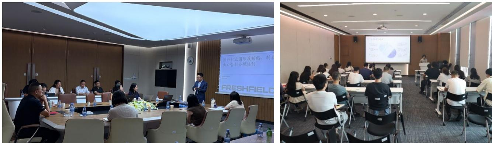

## 监督与改进

根据《内部审核控制程序》《纠正和预防措施控制程序》等制度及程序文件，反贿赂合规团队对反贿赂管理体系设计和执行的有效性开展持续监督，对缺陷和不足项进行自我整改。一方面，内审部将根据年度计划定期开展反贿赂合规内部审核，以发现体系缺陷和不足，并督促完成整改。另一方面，我们根据体系年度外部监督审核发现的改进意见，进行持续优化，确保体系的有效性。

公司官网对外公布了举报热线、电子邮箱及邮寄地址，确保外部相关方能够便捷、安全地反映问题。在公司总部园区内部公共区域设置了无监控覆盖的实体举报信箱，切实保护举报人隐私，鼓励内部员工依规监督。除被动接收举报信息外，内审部联合总经理办公室负责接受现场举报。同时，内审部每年通过实地走访经销商及供应商，主动收集来自业务链末端的反馈与投诉，将监督触角延伸至合作一线。对于通过举报线索或审计发现识别到的潜在违规行为，内审部将按照相关流程和要求进行调查，并根据调查结果，做出是否采取处分措施的建议。

## 举报渠道

公司官网地址：https://www.snibe.com/（监察举报模块）

通信地址：深圳市坪山区坑梓街道金沙社区锦绣东路 23 号新产业生物大厦，内审部，邮编：518122

电子邮箱：audit@snibe.cn

电话：+86-755-26706462

## 信息安全 >

新产业严格遵循《中华人民共和国数据安全法》《中华人民共和国网络安全法》《信息安全等级保护管理办法》等国家法律法规及行业规范，全面落实信息安全主体责任，持续深化信息安全体系建设。2025 年，公司未发生信息安全事故，也未出现客户、员工及商业伙伴信息泄露事件。

## 信息安全管理

公司高度重视信息安全管理，持续深化信息安全管理体系建设，不断加强自身风险管控能力。我们持续优化完善《新产业生物信息安全管理政策》《新产业生物通信安全管理规范》等内部管理办法，进一步规范信息安全管理体系和管理流程。2025 年，我们启动业务系统与服务器安全管理相关制度的制定，规范应用系统全生命周期安全管理。

本年度，公司持续保持ISO 27001 信息安全管理体系的有效性，顺利通过体系年度外审。公司Snibe Link 远程服务系统持续维持“国家信息安全等级保护三级”认证，并持续扩大信息安全合规覆盖。

信息安全管理模式

<table><tr><td>网络安全委员会公司高层领导及责任人</td><td>执行实体IT部</td><td>外部实体供应商等</td></tr></table>

## 管控及预防措施

通过制度化管理与常态化检查相结合，公司有效提升了信息安全防护能力。

在主动管理方面，公司应用数据泄露防护系统（DLP）、桌管存储介质管理模块等技术手段，保护资料安全。通过态势感知测试，对所有服务器及用户流量进行安全监控，实现异常告警百分百处置。通过开展系统渗透测试、实施堡垒机审计等，精准识别并有效应对潜在安全威胁。我们严格执行每半年一次的全量服务器漏洞扫描与修复机制，确保系统隐患及时闭环；并建立公共云盘敏感信息检索机制，主动排查违规存储行为，从源头防范数据外泄风险。公司全面升级360 终端安全系统后，实现病毒库每日自动更新与终端强制下发，确保全员终端处于最新防护状态，有效提升整体安全基线。公司内部员工通过域账号认证接入无线网络，访客采用手机短信验证码认证接入无线网络，确保无线网络接入安全。

在被动管理方面，公司全面升级终端防护软件、实行网络准入认证机制、引入防篡改备份系统以及优化网络分区访问控制策略，构建起多层次、立体化的安全防护体系。在应急突发事件的处理方面，公司制定了信息安全应急响应预案，明确发生紧急事件时的响应机制、处理流程及措施。

此外，公司高度重视信息安全意识宣贯，将员工安全意识提升作为关键环节，开展了多维度、多层次的安全培训活动。一方面，我们组织新员工信息安全入职培训，确保其入职起即树立正确的信息安全观念，同时，每年面向全体员工开展信息安全专项培训。

## 案例

## 信息安全培训

2025年，公司持续将员工信息安全意识培养作为重点工作方向，全面提升全员数字安全素养。我们采用“线下集中授课+线上直播互动相结合的混合式教学模式，系统组织开展了信息安全意识提升专项活动。培训内容紧扣实际工作场景中的安全痛点，精心设计了包含钓鱼邮件识别技巧、个人信息保护要点、常见攻击手法演示等实用性强的课程模块。本次活动广大员工广泛参与，全员安全意识和防范能力得到显著增强，有效提升了员工应对信息安全威胁的识别与处置能力，为公司筑牢数字安全防线打下了坚实基础。

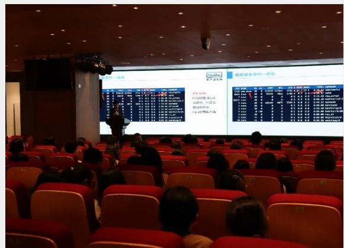

text_image

Conference scene with presentation screen displaying financial data and a speaker at podium, audience seated in red chairs

## 02

## 严控产品与服务质量

本章节回应的重大性议题

· 产品安全与质量  
· 产品研发与创新  
· 知识产权保护  
· 供应链管理  
· 负责任营销  
· 客户服务质量  
· 平等对待中小企业

本章节关联可持续发展目标（SDGs）

3

9

12 负责任消费和生产

17

“像捍卫生命一样捍卫产品质量”是新产业一以贯之的企业精神。在这一信念的引领下，我们持续优化质量管理体系，加大研发投入与设备升级力度，不断提升产品质量与供应链安全水平。通过持之以恒的产品与技术革新，我们为临床医生提供更加精准可靠的检测方案，持续为人类生命健康事业创造价值。

## 产品质量与安全

“像捍卫生命一样捍卫产品质量”早已成为了新产业的企业精神，公司长期以来在该企业精神的趋势下，不断优化质量管理体系，加大研发相关人员及设备投入，持续提升产品质量及增强供应链安全，通过不断的产品和技术创新，为临床医生提供更精准可靠的检测产品，为人类生命健康事业不断创造价值。

## 质量管理体系>

公司确立了“像捍卫生命一样捍卫产品质量”的质量方针，及严格的质量目标。公司建立了系统化、文件化、成熟完善的质量管理体系，并搭建了质量管理体系的组织结构，明确了管理职责，制定了质量管理体系的过程控制要求等，并通过持续不断优化改进，使得公司的产品质量管理能力得到了利益相关方的认可，保证了公司在业务快速发展过程中稳定的产品质量控制和安全。

我们设立质量保证部、试剂关键原料质控部、原材料检测部、试剂质控部、仪器质控部及零部件检测部等部门，保障产品生命周期全过程质量。我们严格遵守《质量管理体系要求》《医疗器械质量管理体系用于法规的要求》《医疗器械生产质量管理规范》等外部政策，制定并遵守《质量手册》《产品的监视和测量控制程序》等内部管理制度，详细规定公司质量管理体系过程、产品规范及设备使用规范等内容，有效保障高质量产品生产。

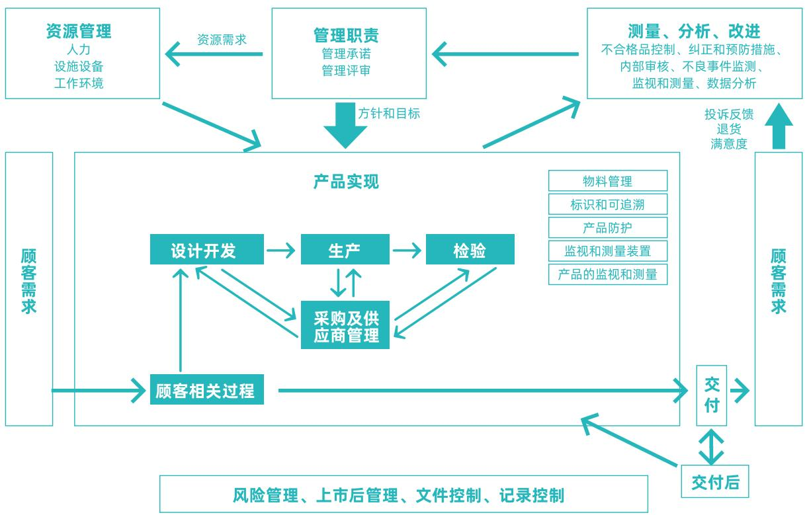

flowchart

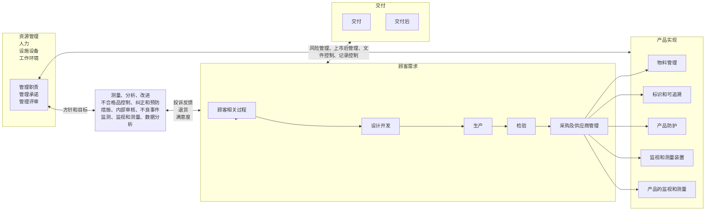
```mermaid
graph LR
  subgraph Customer["顾客需求"]
    direction TB
    A["顾客相关过程"]
    B["设计开发"]
    C["生产"]
    D["检验"]
    E["采购及供应商管理"]
  end

  subgraph Product["产品实现"]
    direction TB
    F["物料管理"]
    G["标识和可追溯"]
    H["产品防护"]
    I["监视和测量装置"]
    J["产品的监视和测量"]
  end

  subgraph Delivery["交付"]
    K["交付"]
    L["交付后"]
  end

  subgraph Management["资源管理\n人力\n设施设备\n工作环境"]
    M["管理职责\n管理承诺\n管理评审"]
  end

  subgraph Analysis["测量、分析、改进\n不合格品控制、纠正和预防措施、内部审核、不良事件监测、监视和测量、数据分析"]
  end

  Customer --> A
  A --> B
  B --> C
  C --> D
  D --> E
  E --> F
  E --> G
  E --> H
  E --> I
  E --> J

  M <-->|资源需求| Product
  M <-->|方针和目标| Analysis
  Analysis <-->|投诉反馈\n退货\n满意度| Customer
  Customer <-->|风险管理、上市后管理、文件控制、记录控制| Delivery
```

公司质量管理体系过程关系图

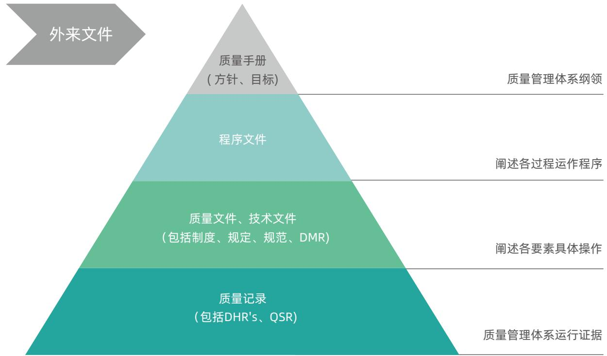

flowchart

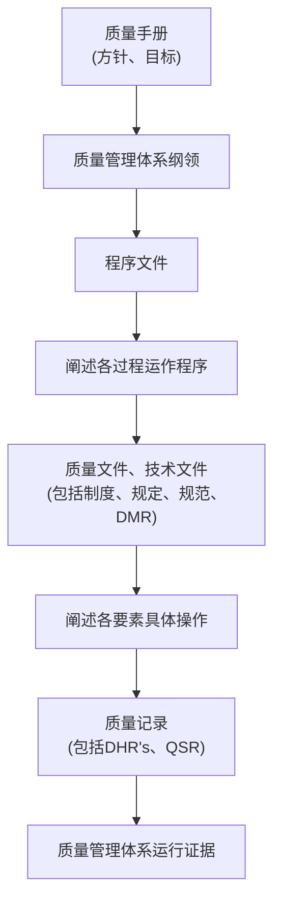
```mermaid
graph TD
  A["质量手册\n(方针、目标)"] --> B["质量管理体系纲领"]
  B --> C["程序文件"]
  C --> D["阐述各过程运作程序"]
  D --> E["质量文件、技术文件\n(包括制度、规定、规范、DMR)"]
  E --> F["阐述各要素具体操作"]
  F --> G["质量记录\n(包括DHR's、QSR)"]
  G --> H["质量管理体系运行证据"]
```

质量管理体系文件结构

为适应业务全球化进程，公司质量管理体系在完成MDSAP法规融合的基础上，通过整合各地区的法规要求，又完成了所有适用法规的融合，形成了相对完善的《质量内审法规手册》，统一了内审标准，便于全面系统地开展内审工作和提高审核效率。

随着公司在体外诊断新产品线业务的开拓，为确保新增产品线的质量得到有效管控，报告期公司获得了凝血产品的ISO 9001、ISO13485 体系认证证书。

新产业已通过的质量管理体系认证情况：

ISO 9001

质量管理体系认证

ISO 13485

MDSAP

## 质量管理体系内审

质量管理体系的有效运行离不开公司内部质量管理队伍的建设，公司以《内部审核控制程序》为依据组建内审组，任命内审组成员。我们对内审员开展专业知识技能培训与考核，覆盖质量管理体系标准和法规、内部审核技巧和方法等内容，确保每位内审员能准确发现和判定体系过程中存在的不合格或缺陷。

公司每年开展ISO9001、ISO13485、IVDR、生产质量管理规范等法规的覆盖全产品线的内部审核，确保公司管理体系得到有效实施和保持，及持续改进。

## 质量管理能力提升

为提升质量保证部部门内人员相关知识储备，本年度质量保证部内部共完成了55场培训和学习，共计超12,000小时，涵盖IVD 监管及体系上层法律法规（如飞检、监管与处罚）、设施设备管理、研发流程、风险管理、危化品处理、产品注册以及上市后监管等方面，通过系统化的学习和实践，有效提升部门人员的专业知识和技能水平，为公司的质量管理体系运行提供了坚实的技术支持和保障。

为提升公司在质量管理能力，推动质量管理体系相关要求的严格执行。2025 年，公司质量保证部共组织开展质量管理相关培训110 次，涵盖医疗器械行业法规、文件控制、设计更改、危化品管理、设备管理、风险管理、上市后监管等各个方面，参训人员包括研发、生产、检验、营销、质量管理等部门相关人员。

通过上述培训提升相关人员的专业知识、技能水平，合规意识和风险防范能力，为公司的发展提供了坚实的质量管理队伍人才保障。

## 案例

## 常态化法规更新与宣贯

2025年度，公司共开展常态化法规更新跟踪为基础法规知识分享会9场，聚焦行业重点法规文件，并针对性开展会议宣贯，如：免于进行临床试验体外诊断试剂目录（2025年）和全自动化学发光免疫分析仪注册审查指导原则（202年修订版）等，确保相关岗位人员可及时掌握最新法规要求，精准识别法规更新对公司质量管理体系的潜在影响为体系的合规性维护与持续改进提供了有力支撑。

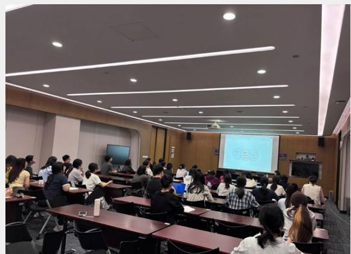

natural_image

Interior view of a conference room with attendees seated at desks facing a presentation screen (no visible text or symbols)

## 案例

## 质量管理体系运行文件控制培训

2025年度，公司共开展文件控制相关培训29场，包括综合的文件控制培训、软件文档审核要点培训、工艺文件审核要点等专题培训。培训全面提升人员在文件适宜性、规范性方面的意识以及专业能力，有助于公司质量管理体系持续改进。

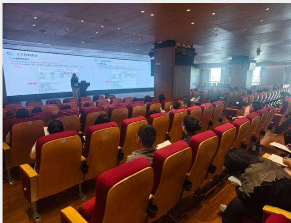

text_image

Conference hall photo with visible presentation screen showing Chinese text and data, audience seated in rows

## 质量管理体系的有效运行及持续优化

公司通过接受各外审单位的监督和审查的形式，对质量管理体系的做全面独立评估，并根据体系考核和现场检查结果来持续优化质量管理体系。

2025 年，公司接受来自广东省药品监督管理局、深圳市市场监督管理局等政府监管机构，TÜV、 DEKRA 德凯、SGS 等外部审核机构的质量管理体系审核共计13 次，其中包括第三方认证机构审核8 次、医疗器械生产质量管理规范审核2 次、医疗器械注册质量管理体系核查指南审核3 次，覆盖所有最终产品生产基地质量管理体系，实现审核通过率100%。

通过内审和外审持续跟踪质量管理体系的运行情况，公司质量管理体系实现了持续优化和质量管理能力得到不断的提升，保证了公司产品的高质量输出。

## 产品质量与安全管理 >

## 室间质量评价

室间质量评价（EQA）是为确保实验室维持较高的检测水平而对其能力进行考核、监督和确认的一种验证活动，而实验室参加EQA计划所使用的产品对其结果具有重要影响。为确保公司终端用户能维持较高的检测水平，我们积极推动国内及海外终端用户参与EQA 计划，同时也帮助公司及时跟进产品质量安全和性能。

在国内市场，2025年，公司产品共参加国家卫健委总计51个EQA计划，评估项目总数235个其中参加的国家卫健委常规室间质评连续四年100% 通过。截至2025 年末，国家卫健委所有已开展且我司已有注册证的化学发光试剂项目均已参加EQA计划。

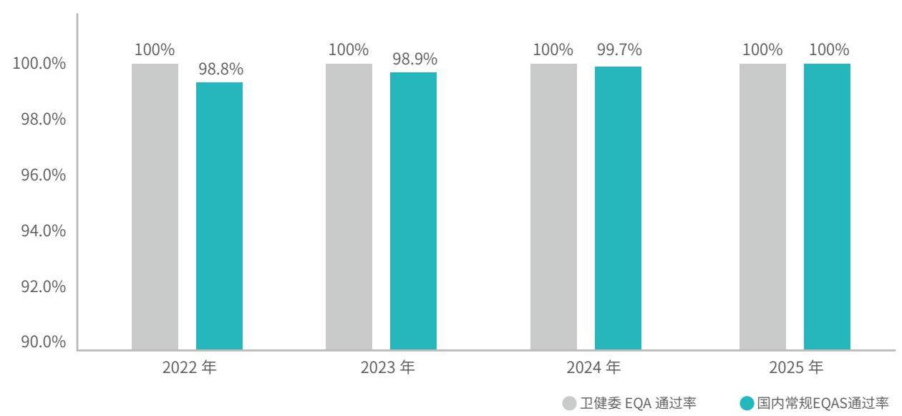

bar

| 年份 | 卫健委 EQA 通过率 (%) | 国内常规EQAS通过率 (%) |
| --- | --- | --- |
| 2022年 | 100 | 98.8 |
| 2023年 | 100 | 98.9 |
| 2024年 | 100 | 99.7 |
| 2025年 | 100 | 100 |

在海外市场，2025 年公司产品参加的美国伯乐公司（Bio-Rad EQAS)、英国朗道公司（RIQAS)、澳大利亚新西兰皇家病理学院质量保证计划 (RCPA-QAP）、美国病理学家协会（CAP）、德国生物分析参考研究所（RfB）、英国国家外部质量评估服务（UK NEQAS）、英国维生素D 定量评估认证机构（DEQAS）、国际临床化学和实验室医学联盟（IFCC）、美国国家糖化血红蛋白标准化计划（NGSP）等开展的室间质评共涉及公司产品120 项并取得良好成绩，也说明了公司产品质量的可靠性。

2025 年，公司获得英国维生素D（25-OH Vit D）室间质评计划（DEQAS）2025-2026 年度能力验证证书，参加了IFCC 与NGSP 的糖化血红蛋白认证，均取得优异成绩和相关证书。

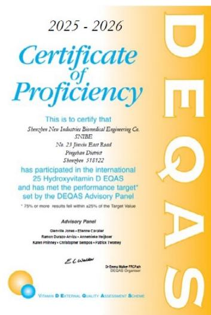

text_image

2025 - 2026
Certificate of
Proficiency
This is to certify that
Shenzhen New Industries Biomedical Engineering Co.
SNIBE
No. 23 Jiangsu East Road
Penghua District
Shenzhen 518122
has participated in the international
25 Hydroxyvitamin D EQAS
and has met the performance target*
set by the DEQAS Advisory Panel
* 75% or more results fell within ±25% of the Target Value
Advisory Panel
Gannilla Jones • Etienne Caviar
Ramon Durazzo-Ariou • Annaeske Beijper
Karel Pristney • Christopher Sempas • Patrick Weidsey
E. C. W. M.
Dr Eddy Hallei TFCqh
DEQAS Organiser
VITAMIN D EXTERNAL QUALITY ASSESSMENT SCHEME

## 参考检测实验室质量提升

公司参考检测实验室依据国际标准（ISO/IEC 17025 & ISO 15195）搭建专业的质量管理体系，并通过了中国合格评定国家认可委员会（CNAS）认可评审，取得CNAS 认可证书，通过持续引进国内外高端的测量设备、先进的参考物质、以及国际检验医学溯源联合委员会（JCTLM）和国家权威机构发布的参考方法，保证产品检测结果的计量溯源性。同时，公司参考检测实验室严格按照国家/ 行业标准，建立实验室试剂盒检测能力，推进公司注册自检平台的搭建，为公司产品质量把好检测关口。

公司还积极参与多项参考方法合作开发及参考物质协作赋值活动，并已成为检验医学溯源联合委员会（JCTLM）利益相关成员和国际临床化学和检验医学联合会（IFCC）的临床实验室管理委员会（C-TLM）、标准与参考物质委员会（C-STFT）、生物标志物委员会（C-BM）、应用蛋白质组学和质谱工作组（WG-APO MS）、临床分子诊断工作组（WG-CMT）等多个委员会和工作组担任企业通讯成员，参与和推动相关项目标准化和一致化进程。通过参与国内外参考系统合作研究、加强同行交流，将助力检验结果准确性和可比性提升。

截至2025 年末，公司已建立维生素、治疗药物监测、非肽激素、酶学等参考测量程序20 余项。其中，已有11 个参考测量项目获得中国合格评定国家认可委员会（CNAS)认可 包括酶学6项 17羟基孕酮 25 羟基维生素D3 总田状腺素 总三碘甲状腺原氨酸和睾酮。其中，三个酶学项目（ALT、CK、α-AMY）已获列入国际检验医学溯源联合委员会JCTLM 参考测量服务列表数据库。2025 年，医学参考检测实验室室间质量评价计划公布结果，公司参考检测实验室申请IFCC-RELA 项目8 项，申请NCCL-EQARL 共15 项，整体成绩优异，通过率满足要求。

2025 年，公司参考检测实验室顺利通过CNAS 监管机构1 次例行监督评审。

## 产品质量管理能力提升

公司2025 年在内部质量控制方面的提升方面开展了大量的工作，进一步提升公司产品质量管理能力。同时，公司也通过多种形式来宣贯质量管理的文化，提升员工的质量意识。

规范了公司对外部供应商的现场审核管理，建立了供应商现场审核管理规定和相应审核指南。

为对设施/ 设备/ 系统进行精细化管理，建立《关键/ 设施/ 设备系统分类评估管理规定》区分关键和非关键设施/ 设备/ 系统，并重新制定再验证/ 确认周期。

优化组织环境、相关方需求及风险和机遇控制程序，建立质量管理体系风险评估准则。

## 案例

## 2025年装配技能大赛

为提升装配团队专业技能，强化质量与效率意识，弘扬工匠精神，促进团队协作与经验交流，2025年度公司举办“匠心强技，提效创优”装配技能大赛，通过比赛形式贯宣质量文化，并推动质量文化和意识的落地。

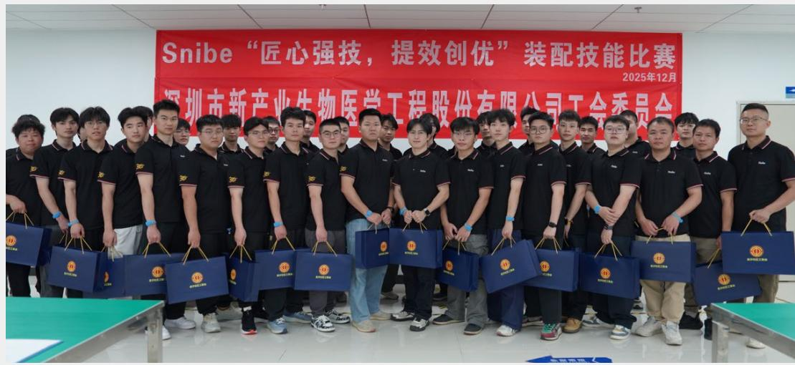

text_image

Snibe“匠心强技，提效创优”装配技能比赛
2025年12月
深圳市新产业生物医学工程股份有限公司工会委员会

## 产品标签及追溯管理

公司依据《标识和可追溯性控制程序》，在产品实现的过程中防止标识的混用和错用。我们为所有销售的医疗器械产品建立了医疗器械唯一标识（UDI）, 确保销售产品的可追溯。

## 不良事件及产品召回

公司持续跟踪并关注上市后不良事件的发生情况，同时密切关注国内外的上市后相关法规及行业标准的更新与变化。在此基础上，公司不断优化和完善产品上市后不良事件监测、召回以及忠告性通知等流程，以全面提升上市后监管工作的实效性。

为全面领导、组织和管理医疗器械不良事件监测工作，由总经理负责不良事件的总体控制和资源协调，并成立了多部门组成的医疗器械不良事件监测领导小组，建立了《不良事件控制程序》及配套流程和文件，确保及时收集医疗机构、经营单位、监管部门和其他相关方等反馈的不良事件。

公司定期向医疗器械不良事件监测工作领导小组汇报监管情况，针对发生的不良事件，我们严格执行调查与评价流程，深入剖析产品潜在风险，并定期输出医疗器械定期风险评价报告。通过数据分析，积极推动产品上市后的持续改进工作，实现对产品的全生命周期持续监督。

## 收集

● 监管机构系统或通告  
● 反馈及抱怨  
● 临床经验  
● 学术文献  
●其他

## 调查、分析和评价

● 调查  
● 原因分析  
● 关联性评价  
●风险评价  
● 措施制定

不良事件调查

## 报告

权代表

## 后续跟进

不良事件补充报告

## 不良事件处理流程

此外，公司依托各区域的售后服务驻点，确保收到客户投诉后24 小时内响应，提供完善的售后服务，迅速解决客户问题。在产品标签和公司官网上标注客户热线、邮箱和传真信息，确保客户有充足的渠道进行投诉及对产品问题进行咨询。

公司制定《反馈及抱怨处理控制程序》，明确反馈及抱怨处理中各关键流程节点，反馈信息的类别，以便于指导各区域专业工程师按照程序文件要求对反馈及抱怨进行调查、分析和跟进。

2025 年度公司已100% 处理所收到的抱怨投诉。

公司制定《医疗器械召回控制程序》，与抱怨、不良事件和上市后监管流程形成交联，及时对收集的各项信息进行分析、调查和评价，确保按各地区法规要求启动召回。

2025 年，公司发生产品召回0次，公司产品与服务也未收到任何监管机构的质量监管警告或处罚。

## 专注研发创新

创新植根于新产业的基因之中，也是公司的核心竞争力。我们注重研发能力的提升，持续优化公司产品研发流程，致力于打造更多品质卓越的创新产品，不断完善产品矩阵，为人类生命健康事业不断创造价值。

## 不断完善的研发创新体系 >

## 仪器研发平台

公司构建并持续优化符合自身特点的产品全生命周期研发管理平台，通过标准化、流程化和数据化管理，提升研发项目的可靠性、可预测性和合规性，助力产品开发更加稳健高效。经过多年的实践与迭代，我们的研发管理平台日益成熟，为产品创新、质量提升和市场竞争力增强提供了有力支撑，使公司能够不断推出满足客户需求、符合市场趋势的高品质产品。

## 智能化数据管理提升研发协同效能

构建高效的数据管理架构，实现产品全生命周期的数据集中存储、智能关联与动态更新。各业务团队可基于统一的数据源协同工作，确保信息的一致性与准确性，减少冗余与沟通成本。同时，系统优化了数据追溯和版本管理能力，使研发成果得以高效复用，助力知识积累与创新突破。

## 系统化流程管控提升项目执行力

贯穿产品定义、工程变更、版本管理等核心环节，确保各阶段流程的透明化、规范化和可追溯性，有效降低开发风险，缩短产品上市周期。

## 全流程质量控制保障产品卓越性

在研发管理平台的支撑下，我们能够系统化管理产品质量，包括设计验证、工程变更追踪和质量体系符合性，确保产品符合行业法规和高标准要求，进一步提升产品的稳定性与安全性。

## 试剂研发平台

公司以化学发光免疫分析产品为核心业务，经过近二十多年的不断创新与积累，掌握了抗原抗体标记技术、磁球- 抗原抗体偶联技术、化学发光剂的制备技术等核心技术，以及在小分子领域实现了革命性的技术突破。公司搭建了完善的试剂开发平台，覆盖了免疫诊断，生化诊断，免疫层析，分子诊断及凝血等休外诊断业务方向

试剂研发部新产品的研发流程以GB ∕T 42061-2022 IDT ISO13485:2016《医疗器械质量管理体系用于法规的要求》为框架和指南，建立适用于公司的《设计和开发控制程序》，对设计和开发过程的每个环节进行了要求。此外，对设计和开发的主要阶段部门内部也形成了相应的流程和规范， 并持续进行优化，如:试剂产品商业论证及立项策划流程，试剂产品工艺定型验证方案规范、试剂产品研发转生产流程、试剂产品设计变更控制流程，规范新产品研制过程的管理。

体外诊断试剂项目数量众多，市场讯息万变，信息繁杂，提炼客户核心需求的必要性，“做正确的事”是商业环境中必须要思考的前提，为了精准为市场提供必要的有需求的产品，公司试剂研发团队，坚持“以市场为导向的产品开发”及“产品全生命周期的商业论证”策略，建立了一种产品立项决策支持机制，进而来判断项目是否符合市场需求，是否可立项和可交付。

我们的商业论证的具体流程如图所示：

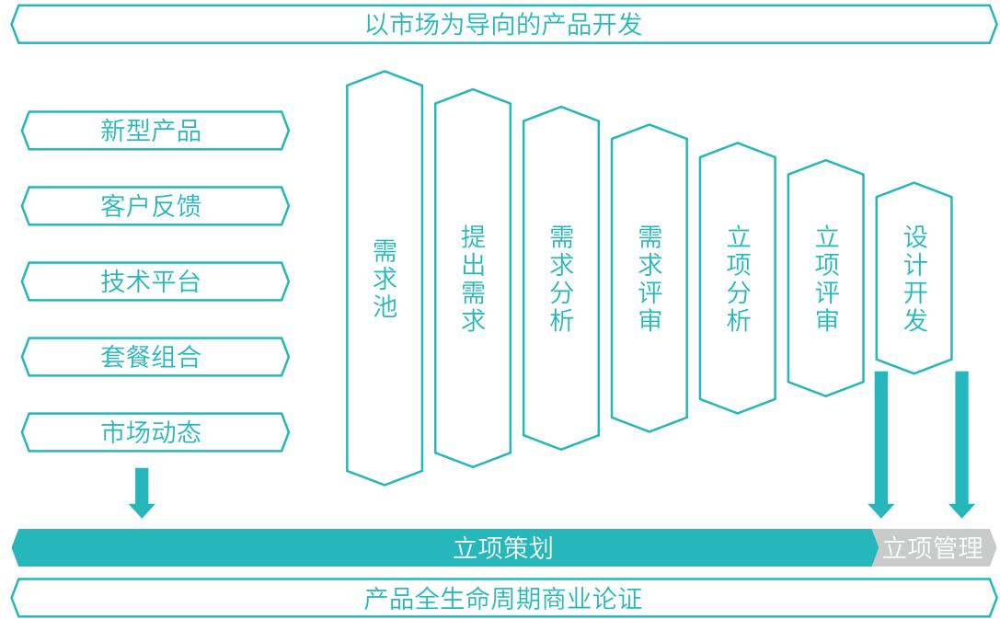

flowchart

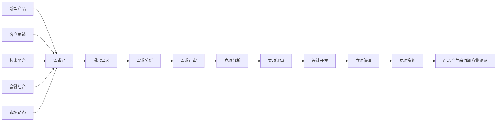
```mermaid
graph LR
  A["新型产品"] --> B["需求池"]
  C["客户反馈"] --> B
  D["技术平台"] --> B
  E["套餐组合"] --> B
  F["市场动态"] --> B
  B --> G["提出需求"]
  G --> H["需求分析"]
  H --> I["需求评审"]
  I --> J["立项分析"]
  J --> K["立项评审"]
  K --> L["设计开发"]
  L --> M["立项管理"]
  M --> N["立项策划"]
  N --> O["产品全生命周期商业论证"]
```

## 研发创新能力 >

新产业历经20 多年的努力，打造了完整的产业链研发平台，覆盖磁性微球研发、试剂关键原料研发、诊断试剂研发、全自动诊断仪器研发四大技术平台。

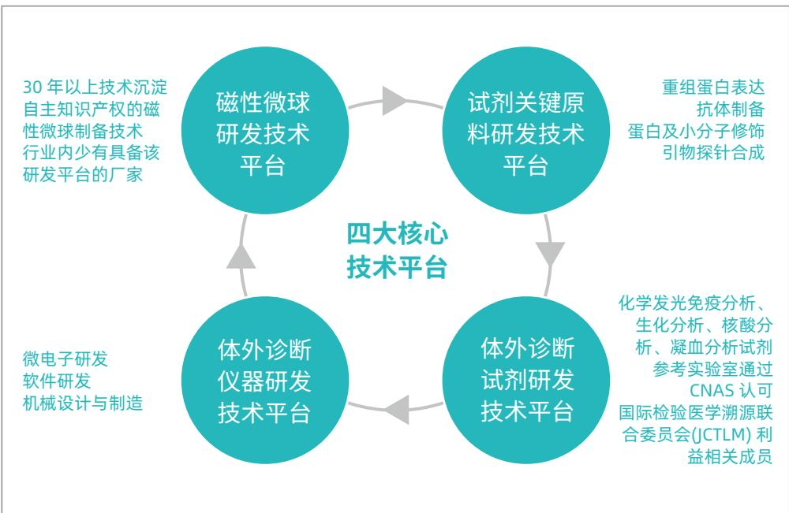

flowchart

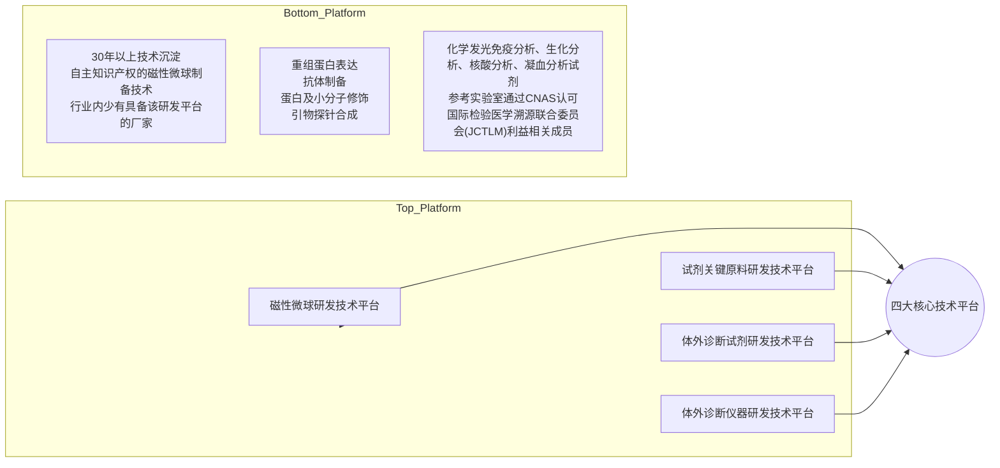
```mermaid
graph LR
  Center(("四大核心技术平台"))
  
  subgraph Top_Platform
    A1["磁性微球研发技术平台"]
    A2["试剂关键原料研发技术平台"]
    A3["体外诊断试剂研发技术平台"]
    A4["体外诊断仪器研发技术平台"]
  end
  
  subgraph Bottom_Platform
    B1["30年以上技术沉淀\n自主知识产权的磁性微球制备技术\n行业内少有具备该研发平台的厂家"]
    B2["重组蛋白表达\n抗体制备\n蛋白及小分子修饰\n引物探针合成"]
    B3["化学发光免疫分析、生化分析、核酸分析、凝血分析试剂\n参考实验室通过CNAS认可\n国际检验医学溯源联合委员会(JCTLM)利益相关成员"]
  end
  
  Top_Platform --> A1
  Top_Platform --> A2
  Top_Platform --> A3
  Top_Platform --> A4
  
  A1 --> Center
  A2 --> Center
  A3 --> Center
  A4 --> Center
```

## 研发投入与团队建设

公司通过与部分重点院校开展良好互动和交流，制定长期校招计划等，保证了公司人才资源的不断涌入，并通过广纳社会英才，自主培养研发核心人员及各研发小组负责人，打造了一批认同企业文化且高效优质的研发队伍。

截至2025 年末，我们共拥有781 名研发人员，占公司员工总数的28.04%，其中40 岁及以下研发人员占比97.57%，拥有硕士及博士学历的研发人员占比达49.68%，公司研发人员呈现出年轻化、高素质的特点，为公司研发创新提供强有力的保障。

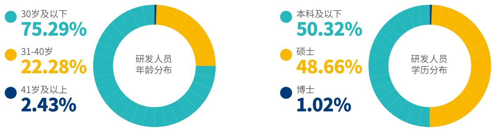

donut

| 类别 | 细分项 | 占比 |
| --- | --- | --- |
| 研发人员年龄分布 | 30岁及以下 | 75.29% |
| 研发人员年龄分布 | 31-40岁 | 22.28% |
| 研发人员年龄分布 | 41岁及以上 | 2.43% |
| 研发人员学历分布 | 本科及以下 | 50.32% |
| 研发人员学历分布 | 硕士 | 48.66% |
| 研发人员学历分布 | 博士 | 1.02% |

<table><tr><td>2025年,公司研发投入4.78亿元人民币</td><td>同比增长5.33%</td><td>占公司收入比重10.44%</td></tr></table>

## 研发能力提升

●仪器研发能力的提升

体外诊断仪器的研发是一项高度集成化的工作，涵盖电子学、机械工程、软件工程等多个领域。我们致力于构建行业领先的研发体系，持续提升核心竞争力，为IVD 领域开发更具突破性的仪器产品。为此，我们从以下五个方面不断深化和完善研发能力。

<table><tr><td>强化跨学科合作与技术融合</td><td>我们积极推动研发体系的开放合作,与高校、研究机构建立长期合作关系,促进前沿技术的应用转化。例如,我们设立博士后创新实践基地,引入多学科专家共同参与研发项目。通过跨学科协同创新,我们不断拓展技术边界,加速新技术在仪器研发中的落地。</td></tr><tr><td>构建系统化的知识产权管理体系</td><td>我们建立了一套完善的知识产权管理与保护体系,覆盖专利申请、技术保密、知识产权风险管控等多个环节。公司设有专门的知识产权管理团队,负责技术成果的评估与保护,确保创新成果得到合法有效的保障。同时,我们通过定期培训与内部宣导,提升研发人员的知识产权意识,推动高价值专利和软件著作权的持续产出。</td></tr><tr><td>激发创新思维培育探索精神</td><td>我们倡导创新驱动的发展模式,鼓励研发人员保持开放的思维,勇于挑战传统技术路径。公司为研发团队提供充足的实验资源与探索空间,支持前沿技术研究和新产品概念验证,鼓励从实验和迭代中不断优化产品设计,推动技术突破。</td></tr><tr><td>健全激励机制营造创新文化</td><td>我们构建了多层次的创新激励体系,包括项目立功奖励、技术创新奖励、专利激励计划、晋升激励机制等,充分激发研发团队的创造力。同时,公司倡导积极进取、科学求证的研发文化,支持合理范围内的技术探索与创新试验。在严格的质量控制体系下,我们鼓励研发团队通过数据分析和实验验证不断优化产品方案,推动技术进步,同时确保产品的安全性和可靠性。</td></tr><tr><td>持续加大研发投入夯实技术基础</td><td>我们坚持高强度的研发投入,为仪器研发提供先进的设备与完善的实验条件。2023年,公司完成了三期新产业生物研发大厦的建设,为研发团队打造了更优质的办公与实验环境,进一步提升仪器研发的整体实力与行业竞争力。</td></tr></table>

报告期内，公司仪器研发团队围绕高质量发展与可持续创新目标，持续完善研发治理体系。我们将数字化研发工具、数据驱动决策及跨部门协同机制深度嵌入产品全生命周期管理。通过融合前沿技术与科学方法论，我们构建了敏捷高效、绿色可持续的创新生态。这一变革进一步提升了产品的技术壁垒与质量卓越性，助力公司在行业竞争中持续保持领跑地位。

<table><tr><td>完善研发管理与质量控制体系</td><td>·将数字化设计、虚拟验证及跨专业评审机制纳入研发项目管理流程与质量控制节点,强化研发过程的制度化与可追溯性。·建立覆盖研发、测试、工艺、质量及售后等多职能角色的联合评审机制,提升复杂项目的治理能力与决策透明度。·持续推进研发知识资产沉淀机制,对历史项目经验、试验数据与改进记录进行系统化管理,支撑组织长期学习与能力积累。·将绿色设计与资源节约理念融入研发管理要求,引导项目在设计阶段同步关注材料利用率、可制造性与维护便利性。</td></tr></table>

## 数字化赋能与协同 研发实践

## （一）数字化设计与虚拟验证

• 在概念设计与方案论证阶段常态化应用三维建模与虚拟样机技术，提前开展系统级布局、干涉检查及装配可行性分析。  
• 通过线上化评审平台组织多专业协同评审，实现设计方案的可视化展示与高效沟通。

## （二）模拟分析与数据驱动优化

• 在关键模块中开展仿真分析与实测验证闭环，不断优化设计参数。  
• 建立标准化测试方案与问题闭环管理流程，将质量风险前移至设计与验证阶段。

## （三）3D 技术与制造协同

• 运用装配仿真和工艺验证减少样机反复修改，降低资源消耗。  
• 在量产准备阶段推动研发与制造联合评审，提高工艺成熟度。

## （四）敏捷研发与跨部门协同

• 通过阶段性评审与短周期迭代模式，加快问题识别和解决节奏。  
将终端使用反馈与售后经验纳入研发改进输入，持续优化产品可靠性与可维护性。

2025年，依托仪器研发治理机制的深度实践 公司仪器研发能力与质量稳健性持续提升，在决策端，研发决策更加数据化、前端风险识别能力显著增强；在执行端，设计返工与重复试制趋势得到有效控制，研发资源利用效率持续优化；在产品端，可靠性、可制造性与可维护性持续改进；团队协同，跨部门协同更加顺畅，项目推进节奏和问题闭环效率进一步提升，数字化与复杂系统开发能力显著增强。这一系列进展标志着公司仪器研发体系已具备高质量、可持续的内生增长动力。

## ●试剂研发能力提升

2025 年度，为了驱动研发产品质量，效率与可持续性的协同提升，我们的研发体系以流程/ 系统驱动为核心，建立了标准化、可视化的研发管理相关系统与知识库中心。该系统将产品全生命周期纳入考量，包括立项评审、设计验收、设计开发转移，产品注册等关键节点并通过持续不断的流程/ 系统迭代，识别产品开发过程中的最优实践，将产品质量与效率达到最大的平衡。

在研发人员培养方面，根据研发部门不同岗位需求，针对性地为员工提供专业技能培训。2025 年，试剂研发部共开展213场培训，涵盖项目经验分享，专业基础知识讲解以及专业工具的使用教学，帮助研发人员夯实理论基础，掌握核心操作技能，其中针对试剂研发部门新入职员工公司制定了系统化的培训计划，2025年，共开展169场业务方向专业技能提升课程，为新员工的成长提供了有力支持，为部门的高效运作和持续发展提供了人才保障，并为公司试剂研发能力提升奠定了坚实基础。

## ●试剂关键原料研发能力提升

通过持续不断的技术创新与产品开发，公司在小分子领域实现革命性的技术突破，试剂关键原料研发团队已完成抗伴型抗体（针对小分子抗原与其特异性抗体复合后形成新表位的抗体）研发平台的搭建，原料研发平台的突破加速了公司小分子免疫项目的开发速度，小分子夹心法检测结果与质谱具有高度一致性，很好地弥补了竞争法同类产品的不足。现已完成25- 羟基维生素D、醛固酮、雌二醇、孕酮、睾酮、雄烯二酮、他克莫司、维生素B12、叶酸、游离三碘甲状腺原氨酸、总三碘甲状腺原氨酸 游离用状腺素 总用状腺素 反三碘用状腺原氢酸 环孢震素 血管紧张素|共16顶小分子双抗体夹心法试剂

的产品注册。

抗体制备方向，公司搭建了单B 细胞制备技术平台，有助于公司研发高质量兔单抗等新型抗体，进一步提升试剂性能，并显著缩短小分子项目一抗的开发周期，提高抗体的开发质量。目前，公司已实现了磁球关键组分铁粉的自产，有助于把控自产铁粉的质量控制，减少铁粉的批间差异。同时，解决了铁粉的供货问题，进一步降低试剂盒成本，提高市场竞争力及产品的可及性。此外，公司持续加大对试剂关键原料的研发的人员和设备投入，提升试剂关键原料研发能力。

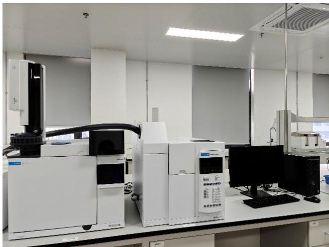

natural_image

Laboratory setup with scientific equipment including optical equipment and computer monitors (no visible text or labels)

气相色谱仪

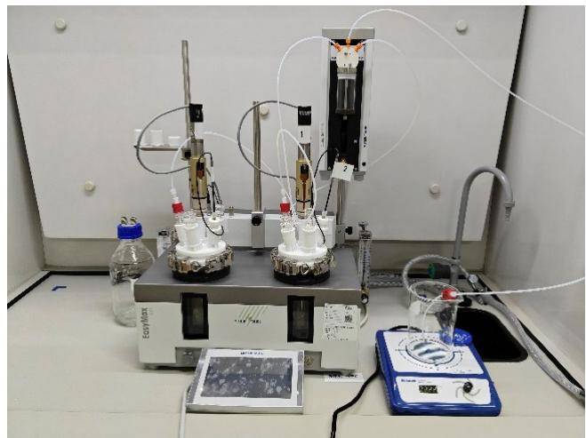

natural_image

Laboratory setup with scientific equipment including laboratory reactors, gas collection tanks, and a digital display unit (no visible text or symbols)

全自动化合成工作站

## 研发创新成果 >

我们的初心是“让老百姓看病做检测少花钱”，公司聚焦做强主营业务，勇担民族责任，坚持自主创新，为人类生命健康事业不断创造价值，最终实现优质医疗资源的人人可及。

## 仪器研发成果

我们持续加强自主研发，打磨出多款仪器产品，助力检测精准度及效率提升，为临床诊断提供可靠数据支持，并推动医疗资源的可及性，其中SATLARS mini-T8 全自动样品处理系统和Biossays C6/Biossays C6P 全自动生化分析仪为公司2025年在研的重点仪器类产品，该两款产旨在降低医疗终端可负担性，并提高检测效率。

## SATLARS mini-T8

## 全自动样品处理系统

SATLARS mini-T8 是一款为检验科紧凑空间打造的智能化流水线，高度集成样本前后处理功能，可实现样本从上机到检测、存储、丢弃的无人值守式自动化操作。

无需额外配置零散预处理、转运设备，有效解决检验科设备堆砌、空间利用率低的痛点，减少 80% 以上人工转运与交接步骤；

搭配 AI 视觉血清质量识别、自动质控功能，从源头杜绝样本污染、错检漏检、信息录入偏差等问题，大幅精简科室操作流程，提升样本周转效率，助力检验科实现样本标准化、智能化的高效运转。

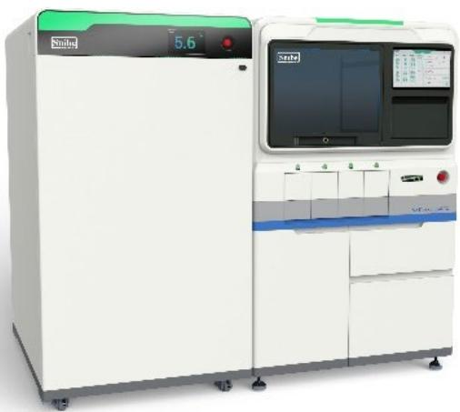

natural_image

Exterior view of a modern industrial machine with control panel and display screen (no visible text or symbols)

## Biossays C6 / Biossays C6P

## 全自动生化分析仪

Biossays C6/ Biossays C6P 为公司在研的中高端全自动生化分析仪，其生化模块检测速度 1000T/H，电解质测试模块 Biossays C6 配置自研电解质直接法模块，测速可达 500T/H，Biossays C6P 配置电解质间接法模块，测速可达 600T/H，满足不同终端要求；

支持全血直接上机，无需预处理，赋能临床高效诊断；

采用模块化设计，可与 MAGLUMI X6 化学发光免疫分析仪互联，组成生化免疫流水线；支持连入全实验室自动化系统，更好地满足大型终端需求。

## SATLARS T8

## 全自动样品处理系统（增加分杯模块）

SATLARS T8是公司开发的具有完全自主知识产权的开放式流水线，全面整合生化、免疫、电解质、凝血、分子五大专业领域；实现样本上样、传输、处理、检测、存储的全流程自动化，减少人工干预，提升检测效率；独特的双向四轨设计，使样本调度更灵活，可实现动态平衡；模块化设计和多类型轨道，通过灵活配置，可满足不同实验室空间与要求；急诊优先、智能调度，可大大缩短样本 TAT 时间；专业的数据处理与信息管理系统，提升科室质量管理能力。

2025 年完成了 SATLARS T8 分杯模块的开发。

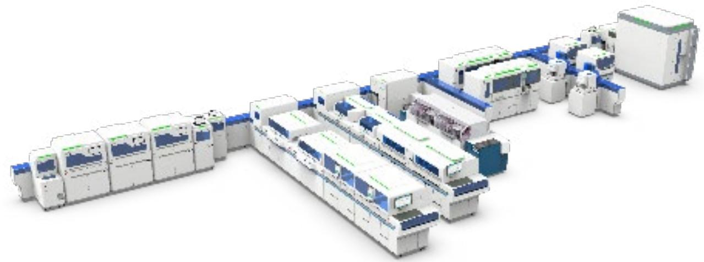

natural_image

Industrial production line with multiple white and blue machinery units (no visible text or labels)

2025 年度，公司生化免疫一体机 Biolumi CX10 获得 IDEA 国际设计卓越奖入围奖；公司电解质分析仪 Biossays E6Plus 获得法国设计奖金奖。本次公司产品获得的两项设计奖是对仪器研发团队和公司品牌影响力的极大认可，这也是公司首款获得此类奖项的产品。

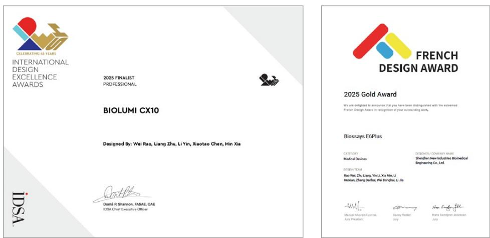

## 试剂研发成果

报告期内，公司完成 9 项发光试剂、9 项生化试剂新产品的国内注册，丰富了公司在自免抗体、肝纤维化、传染病等试剂项目种类。

## 关注罕见病

公司重视罕见病的研发，为罕见病患者的生命健康提供产品支持和保障。除前期已披露的罕见病菜单外，报告期公司开发的罕见病试剂菜单如下。

## 罕见病名称

## 非典型溶血性尿毒症

## 产品名称

## sC5b-9，可溶性末端补体复合物测定试

## 关注慢病管理与防治

随着我国人口老龄化加剧，慢性疾病已成为重大健康威胁。在价值医疗框架下，为解决这一困境，进一步优化慢病诊疗路径，我们通过检验医学前沿技术的创新与应用，推出适宜精准的检测技术，提供了价值医疗导向下慢病管理的新方向，助力慢病全周期管理和临床诊疗路径优化。

糖尿病是一种全球性高发慢性病，根据国际糖尿病联盟 2021 年报告，全球约 5.37 亿成年人患糖尿病，且这一数字预计到2045 年将升至 7.84 亿。中国是糖尿病患者最多的国家，患者人数约 1.4 亿，约占全球总数的 26%。为提高糖尿病患者的诊断率，公司报告期研发完成了抗锌转运蛋白 8 抗体（Anti-ZnT8）测定试剂盒（磁微粒化学发光法），根据我国新诊断经典性 1 型糖尿病（T1DM）人群谷氨酸脱羧酶抗体（GADA）阳性率约为 70%，联合检测蛋白酪氨酸磷酸酶抗体（IA⁃2A）和Ani-ZnT8 可提高 10%\~15% 的阳性率：Anti-ZnT8 产品的推出有效填补诊断盲区 提升检测效能 推动 1DM 的精准分型实现早期预警和个体化治疗决策。

在心血管领域，我司基于小分子夹心法技术研发平台，成功开发了 11- 脱氢血栓烷 B2 测定试剂盒（磁微粒化学发光法），凭借小分子夹心法原料与方法的技术优势，突破传统 ELISA 灵敏度限制，可量化血小板活化程度，精准识别生化抵抗患者，为高危人群强化干预提供依据，指导调整用药方案，且适配基层医疗机构，通过基层筛查分流低危患者，释放三甲医院资源，落实分级诊疗，直接服务于“健康中国 2030”降低心血管疾病死亡率的核心目标。

## 推动研发老幼孕相关产品

公司积极响应国家《“健康中国 2030”规划纲要》《国务院关于实施健康中国行动的意见》《“十四五”国民健康规划》等文件要求和世卫组织倡议，推动老幼孕相关诊断产品的研发。

预计 2050 年阿尔茨海默病（AD）全球治疗成本将达 1.89 万亿美元，早筛早诊可延缓疾病进展、减少中晚期照护需求，助力“健康老龄化”目标实现。为此，公司开展了AD相关脑脊液及血液检测产品的研发，助力全面推动老年期痴呆防控工作。截至报告期末，公司完成了多个 AD 血液检测试剂盒（Aβ1-40、Aβ1-42、p-Tau-181、p-Tau-217 等）的开发，对 AD 的防控具有重要意义。首先，该技术突破了早期识别瓶颈，脑脊液检测和 PET 检查有创且昂贵难以普及，而血液神经标志物检测技术凭借高敏感性与特异性且无创、高性价比的路径成为破局关键，同时支持社区大规模筛查，实现了便捷普适的早期诊断；其次，血液标志物能够动态监测疾病进程与疗效以指导精准干预，联合监测可量化病理进展；最后，我国 AD 患者数全球第一（60 岁以上患者超 1,100 万）且农村、女性人群风险更高，该技术能有效应对中国老龄化挑战并优化公共卫生防控体系，为我国老龄化社会构建“筛 - 诊 - 治 - 防”全链条体系提供核心工具，对逆转疾病进程、缓解公共卫生压力具有战略意义。

2024 年，国务院印发《关于加快完善生育支持政策体系推动建设生育友好型社会的若干措施》，将深入实施母婴安全行动提升计划和出生缺陷防治能力提升计划。人细小病毒B19可发生母婴传播，进而影响胎儿发育。公司积极响应国家政策部署，加快人细小病毒 B19 抗体检测方案的开发，并提供更全面、高质量的优生优育项目检测套餐。截至报告期末，已完成人细小病毒 B19 IgG 抗体检测试剂盒（磁微粒化学发光法）的已取得注册检验报告，并进入临床注册阶段。

## 助力提升全球公共卫生服务水平

呼吸道感染性疾病是全球公共卫生领域面临的长期挑战，其高传播性、病原体多样性以及症状相似性，给临床诊疗和疾病防控带来了巨大压力。

作为全球体外诊断领域的先行者，我们深刻认识到，诊断产品不仅是医疗工具，更是公共卫生防御体系的重要组成部分。2025年度我们开展了一系列旨在提升公共卫生服务水平，助力抗击传染病的检测产品的研发，其中包括呼吸道多重联检产品，检测的病原体包括：甲流、乙流、呼吸道合胞病毒、腺病毒、肺炎支原体等，旨在通过一次采样、一次检测，精准锁定致病原，特别是针对婴幼儿、老年人等易感人群，提供全面的病原学依据，指导精准用药，从而在源头上遏制抗生素耐药性的蔓延，降低医疗系统负担，守护人类公共卫生安全。

## 助力肿瘤的早筛早诊及个性化诊疗

公司践行国家早诊早治的政策，开展了肿瘤早筛早诊的产品开发，推进早筛查、早诊断、早治疗，助力降低癌症发病率和死亡率。

DNA 甲基化检测作为近年来发展迅速的肿瘤分子检测技术，在肿瘤早期风险评估和辅助诊断方面展现出良好应用前景。其具有无创或微创取样、潜在早期信号捕获能力等特点，适用于特定人群的风险评估及临床辅助决策。此外，在部分研究和特定应用场景中，DNA 甲基化标志物亦被探索用于疾病进展评估及预后分析。

公司在肿瘤甲基化早筛领域取得突破性进展。基于甲基化特异性 PCR 技术，公司开发了针对多种高发癌种的单癌种筛查或辅助检测产品，覆盖结直肠癌、宫颈癌等应用场景，用于检测人群中包括（粪便样本、人外周血血浆、宫颈脱落细胞）中特定基因的甲基化情况，辅助临床医生对患者的诊断。在甲基化仪器方面，截至报告期末已完成甲基化仪器的研发，助力相关疾病的早筛早诊。

恶性肿瘤已成为全球主要的疾病负担之一，而传统化疗的“试错”模式不仅延误患者治疗时机，更造成了巨大的医疗资源淚费与患者痛苦。伴随诊断作为精准医疗的“导航仪”，其核心价值在于在正确的时间，为正确的患者，找到正确的药物。为此，公司通过战略合作引入数字 PCR 平台，以其较高灵敏度和良好的定量能力，为肿瘤患者提供更精准的用药指导。报告期内，公司依托这一技术平台，在乳腺癌和非小细胞肺癌两大癌种领域取得关键突破。

通过数字 PCR 平台动态监测耐药突变，及时调整治疗方案，助力个性化诊疗方案，避免无效靶向治疗带来的巨额医疗支出及过度影像学检查的辐射暴露与资源消耗。这不仅是对生命的尊重，更是对有限医疗资源的最大化利用。

## 推动优质医疗资源可及性

公司始终坚持“让老百姓看病做检测少花钱”的初心，持续推动优质医疗资源的可及性。在2025 年，公司仪器研发部门持续将提升医疗服务可及性、改善临床使用体验和降低总体拥有成本作为研发治理的重要方向，在产品规划、设计开发与验证阶段系统性嵌入普惠医疗理念，通过集中式与分散式检测解决方案协同发展，助力不同层级医疗机构提升检验能力。具体开展的活动如下。

## 将医疗可

## 及性目标

## 纳入研发

## 战略布局

• 将面向中心型终端和基层医疗场景的产品布局纳入年度研发规划，重点支持区域实验室能力建设与分级诊疗体系发展。  
• 在新项目立项阶段同步评估设备部署条件、人员配置水平、运行成本及长期维护需求，将可及性与可负担性作为重要决策维度。  
• 建立跨部门协同机制，联合市场、售后、临床支持及供应链团队，将终端使用反馈和公共卫生需求纳入产品规划输入。  
• 将能源效率、耐用性与生命周期成本管理要求嵌入研发评价体系，推动产品在长期运行中的经济性与可持续性。

## 以创新设

## 计与平台

## 化研发提

## 升医疗服

## 务覆盖面

## （一）面向中心型终端的产品研发布局

公司正在研发两款面向中等通量集中检测终端应用场景的新产品，包括一款中速生化分析仪及一套集成式样本处理系统，即将上市：

• 两款产品以提升区域实验室检测能力、优化人力配置和提高运行效率为核心目标，适配集中式检测需求。  
• 在系统架构上强调模块化设计和可扩展能力，使医疗机构能够根据检测量逐步配置设备，降低一次性投入压力。  
• 通过集成样本前处理、自动化传输及信息系统对接功能，减少人工操作环节，提升流程稳定性。  
• 在设计阶段同步关注部署空间、电力条件及环境适应性，增强在不同区域医疗机构的适用性。

## （二）优化产品设计，提升可用性

• 持续改进操作界面和交互逻辑，降低培训成本；  
• 强化智能提醒、运行监控与远程支持能力，提升设备运行透明度；  
• 在研发阶段引入多场景使用验证，确保产品适配不同医疗环境。

## （三）模块化与标准化设计，提升可负担性

• 推进平台化架构与核心部件通用化，控制研发与制造成本；  
• 优化零部件选型和工艺方案，增强供应链稳定性；  
• 通过耐久性设计与维护友好结构，降低全生命周期运维成本。

## （四）支持基层与资源受限地区应用

• 优化安装部署方式，提升复杂环境下的运行可靠性；  
• 推动低能耗设计，降低运行负担；  
• 在验证阶段充分覆盖连续运行与简化维护场景。

## （五）数字化工具赋能实验室效率

• 通过数据分析与运行监控功能，帮助实验室缩短检测周转时间；  
• 强化系统互联能力，支持实验室信息化；  
• 通过软件升级延长设备生命周期。

通过将医疗可及性理念系统嵌入研发治理与产品开发实践，2025 年公司在促进医疗服务覆盖面方面取得积极进展，也体现了公司对社会责任的承诺。

未来，公司研发部门将持续推动技术创新与流程优化，致力于打造更多高质量、高性价比的医疗设备，助力医疗资源可及性的进一步提升，为全球医疗事业的可持续发展贡献力量。

## 绿色研发

公司仪器研发团队持续深耕可持续发展领域，将绿色环保原则贯穿产品全生命周期管理的每一处细节，从核心部件设计迭代到生产装配优化，再到后续使用与资源循环，始终以技术创新驱动环境影响最小化，延续并升级绿色发展理念，为客户提供高效环保解决方案的同时，持续强化公司在绿色医疗设备领域的责任担当。

## 案例

## 公司SATLARS mini-T8全自动样品处理系统践行绿色理念及全生命周期设计

## 绿色设计，深化轻量化和集约化

•结构轻量化减重，材料能耗双降：针对SATLARS mini-T8低温存储单元，在传承SATLARS T8产品结构优势的基础上，通过仿真分析优化结构设计，在保证零件强度达标的前提下，实现重量减轻约36%，有效减少材料使用并直接降低了产品在后续运输环节的碳排放，延伸了设计端的绿色价值。  
•存储效能升级，高效利用资源：通过系统性设计升级，SATLARS mini-T8低温存储单元实现了单位体积存储密度与整体能效比的同步提升，真正达成了“以更少资源，创更高价值”的绿色设计目标，间接减少使用过程中的能耗投入。  
•零件集成精简，源头控耗增效：对SATLARS mini-T8样本处理单元开展全方位的结构整合与精简。通过优化走线、精简传动与支撑结构、整合功能部件等措施，累计零件种类降幅约14%、零件数量降幅约11%，从源头简化了物料管理与资源消耗，同时为后续维护升级提供便利，减少了因更新换代而产生的资源浪费。  
•卡扣式连接优化，减少耗材使用：创新采用卡扣式固定方案，替代部分传统连接方式，不仅简化装配流程、提升效率，也显著减少了螺钉等小型耗材的使用数量，便于后续维护和回收，降低使用及处置环节的资源损耗。

## 绿色生产：推动高效低碳协同制造

•材料工艺优化，降低生产能耗：依托前端的轻量化与集成化设计，直接减少了原材料需求与加工复杂度。精简的结构降低了生产过程中的物料损耗与能源投入，同时装配工序的简化也减少了工时与能耗，实现了制造过程本身的低碳化。  
•供应链协同，全链路减碳：零件总量精简推动上游供应商原材料消耗精准化，降低多余物料的生产与废弃风险；产品整体重量减轻、结构优化，进一步降低物流运输中的燃油消耗与碳排放，推动供应链全链条绿色化进程。  
•耗材精准管控，减少废弃物量：SATLARS mini-T8样本处理单元减少螺钉等标准件用量（降幅约15%）、优化零件结构，大幅降低生产过程中加工耗材的使用量，减少生产废弃物产生；同时标准化、集约化设计也降低了后续耗材更换与维护的资源投入，形成了全周期的绿色物料管理体系。

## 绿色包装，践行可持续物流

•环保材料持续应用：在新产品中，我们继续积极推行以纸代塑、以纸代木，采用可循环再生的纸质基材与环保缓冲材料，显著降低了对传统塑料与木材的依赖，降低资源消耗与环境污染。  
•轻量化包装设计：通过优化包装结构、采用高强度薄型材料及多模块组合方案，有效减小了包装总体积与重量，不仅节省了仓储与运输空间，更直接降低了物流环节的能源消耗与碳排放。  
•严格遵循国际标准：所有包装材料均严格遵循国际环保法规与回收标准，确保其可回收、可降解，致力于为客户提供符合全球环保要求的绿色包装解决方案，助力可持续供应链建设。

## 知识产权保护 >

新产业严格遵守并执行《中华人民共和国专利法》《中华人民共和国商标法》等国家和地区法律法规及标准，制定《知识产权管理程序》《专利管理程序》《商标管理程序》和《著作管理程序》等管理文件，持续完善知识产权管理体系建设。

新产业注重知识产权保护，拥有专业的知识产权团队和完善的知识产权管理体系, 我们将知识产权创造和保护工作融入到公司的研发创新体系中，为公司的产品研发和技术创新提供了强有力的支撑与保障。对内，知识产权部通过对项目调研、立项、研发及上市等节点设置预警环节，实现对自研产品全流程风险管理，为公司的技术创新成果保驾护航；对外，在投融资及对外技术合作前设置预警环节，降低对外合作风险。同时，我们积极开展培训，促进员工了解知识产权合规及履行知识产权合规义务，强化员工在知识产权保护方面的意识与专业能力。

凭借在知识产权创造、运用、保护和管理等方面的卓越表现，新产业于2023 年荣获" 国家知识产权示范企业" 这一国家级殊荣，于2024 年再度荣获“国家高新技术企业”称号，充分彰显了新产业在核心技术自主掌控与知识产权战略布局上的示范引领作用。

截至2025 年末，公司累计申请专利743 件；有效授权专利426 件，其中有效发明专利197 件；累计有效核准注册商标742件，累计软件著作权60 件。

<table><tr><td>累计申请专利743件</td><td>有效授权专利426件其中有效发明专利197件</td><td>累计有效核准注册商标742件</td><td>累计软件著作权60件</td></tr></table>

## 供应链管理

供应链的稳定、质量、安全是公司能够为客户持续提供高质量产品的重要保证。新产业严格遵守《中华人民共和国招标投标法》等相关法律法规，制定了完善的供应商管理制度，除产品和服务质量外，公司还注重供应商在商业道德、环境意识、职业健康与安全等方面的管理，持续向供应商传达可持续发展理念，以确保供应商的质量以及可持续性。

## 供应商管理 >

公司制定了《招投标管理制度》《采购控制程序》《采购交易反贿赂控制程序》《供应商HSF 管理规定》等管理制度，对供应商开发准入、订购、绩效评估、再评价、资质管理、供应商剔除实施系统性的监督与管理，形成闭环管理，保障采购供应链公正、公平、有效运营。

我们持续优化供应商管理，按照相关体系要求，实现对重要商业伙伴的全方位、高标准管理。我们对重要商业伙伴开展反商业贿赂准入调查及年度评审，覆盖率达100%，从源头防范合规风险。组织供应商参加反商业贿赂培训与考核，并签署《反商业贿赂承诺书》或《反商业贿赂协议》，将廉洁合作内化为双方的共同准则。完成商业伙伴《环境及职业健康安全政策告知书》的签订，并与重要供应商完成《供应链信息安全协议》签署，构建环境及职业健康安全、信息安全的风控举措。此外，本年度，我们新制定《供应商现场审核管理规定》，不仅规范了对外部供应商的审核管理，更主动督促并辅导供应商在质量管理、反商业贿赂、环境、职业健康安全、信息安全等方面的管理提升。

根据《采购控制程序》的要求，公司对试合作供应商，合格供应商进行每年再评价，如出现不达标的情况，视物料类型将供应商移入到不合格供应商一览表，触发供应商整改与辅导，督促并帮助供应商完善管理流程与措施，确保供应商质量的稳定和提升，并淘汰不合格供应商。同时，通过建立供应商管理档案，对供应商的资质变更、合作动态及绩效表现进行定期记录，基于这些记录，我们定期开展供应商回顾与评价，对供应商是否保留合作资格进行监测和严格评审。

## 供应商准入

## 供应商再评价

## 供应商剔除

·剔除异常供应商

2025 年度，公司新进供应商50 家，因质量问题剔除供应商4 家。

## 供应商交流与沟通 >

开展技术交流是保障产品质量的重要措施。我们根据供应商绩效定期评审结果，对于评审中发现品质异常的，第一时间联动相关部门及供应商 共商解决方案，围绕且度来料合格率及交货及时率， 建立常态化沟通与反馈机制 针对未达标及绩效后的供应商，主动组织专项会议，邀其当面回顾质量绩效，通过深度研讨质量标准，形成双方统一管控标准，在此基础上制定有效的纠正预防与提升品质措施，进而进一步提升物料质量水平。2025 年，我们组织供应商线上、线下会谈330 余场次。

在新供应商准入前的现场审核阶段，采购部门会联合研发、质检等相关上下游部门人员共同开展现场参观及交流。根据供应商年度评价结果，以及根据日常供应商管理过程中发现的问题，我们制定年度走访计划或安排突击审核，针对审核发现的质量及可持续发展相关问题及时与供应商探讨并关闭整改内容，降低供货风险。2025 年，我们开展供应商准入前现场审核、年度现场审核共26 次。

## 供应链可持续管理 >

为保证重要物料质量和供货安全，依据供应物料对产品的重要性程度，公司将供应商分为A、B、C 类进行管理。根据供货物料的类别差异结合生产经营性质，对不同类型的供应商采取针对性的评审指标和评价标准。针对A 类物料供应商，要求建立健全的质量管理体系，并要求签订质量保证协议。

公司经过多年技术积累 建立了完善的供应链风险管理休系 一方面，加强核心零部件的安全库存管理，增加备选供应商另一方面，与国内厂家合作研发及申报深圳市重大专项，推动国产核心零部件的研发和替代。此外，针对关键元器件物料要求双方紧密配合实施全方位的物料承认工作 充分保障物料安全 针对部分关键物料 公司基于风险的考虑，制定备用方案，以应对供应链突发事件。针对用量较大的物料通常采取在两至三家供应商中同时采购的方式，以避免因物料短缺而影响产品生产的情况发生。结合制造业国产替代进口的大环境，公司经过验证也逐渐增加了国产替代的选择，进一步巩固供应链安全。此外，公司拥有研发实力强劲的试剂关键原料研发团队，是保证公司试剂产品原材料稳定供应的坚实后盾，目前，公司大部分试剂关键原料已实现自给自足，有效降低原材料采购渠道受限的风险，保障公司试剂关键原料物资供应的稳定性。在供应链运作和库存管理方面，公司与供应商实施年度预测与需求计划滚动更新（2+3，近期加远期），在供应商与公司内部建立动态安全库存，快速响应灵活的需求。同时，结合生产需求和采购计划，与供应商协同联动，商讨制定合理的备货数量和送货时间节点，并持续滚动刷新，保障供应链运作平稳，提升交付柔性与响应速度。

在供应资源的选择上，优先选择地域近、体系较完善的供应商合作，以期在交付上能够灵活配合及质量控制方面及时有效沟通与审核，在研发合作期间深入沟通并仔细评估，确保转产后供应平稳。

截至2025年末，公司供应商中，中国大陆供应商比例为

96.3%

港澳台及海外供应商比例合计为

3.7%

## 负责任营销

新产业始终将用户权益放在首要位置，通过强有力的品牌建设，及市场、营销和售后服务人员专业知识和能力提升，落实负责任营销，持续提升服务客户能力，赋能客户，推动行业的交流与合作，增强公司在行业的影响力。

## 责任营销管理 >

我们建立了《与顾客有关的过程控制程序》《国内经销商管理规定》《海外经销商管理规定》《宣传资料管理规定》《广告与展会知识产权管理规定》《市场销售知识产权管理规定》《经销商销售业务反贿赂控制程序》等管理制度，建立了完善的营销管理体系，确保业务开展过程中维护客户权益，提高客户满意度。

在国内外市场，我们秉承平等、互惠，诚信守法、实现双赢，长久合作、优势互补，日常管理、定期评估相结合，贿赂零容忍的五项原则对国内外经销商进行管理。

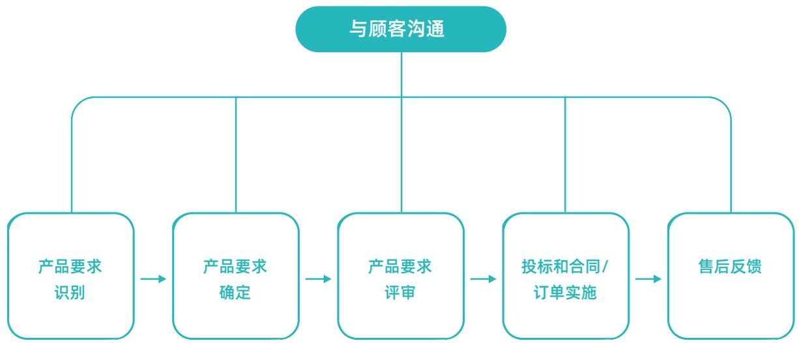

flowchart

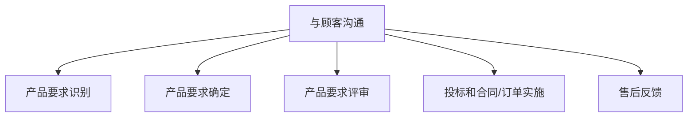
```mermaid
graph TD
  A["与顾客沟通"] --> B["产品要求识别"]
  A --> C["产品要求确定"]
  A --> D["产品要求评审"]
  A --> E["投标和合同/订单实施"]
  A --> F["售后反馈"]
```

根据公司《国内经销商管理规定》，我们严格遵守《中华人民共和国反不正当竞争法》《关于禁止商业贿赂行为的暂行规定》，为了推动品牌建设与市场开拓，我们制定了《国内学术会议管理制度》，规范学术会议组织和学术推广。此外，通过内部客户管理平台，覆盖客户管理、市场管理、产品管理、经销商管理、数据库五大模块，全面拓展营销人员对客户关系、会议流程、产品信息、经销商线上管理等信息掌握，推动负责任营销。

在海外市场，我们在公司ISO 13485 质量管理体系的框架下，遵循《海外经销商管理规定》，执行ISO 37001 反贿赂管理体系标准，要求海外经销商在当地合法合规开展业务。为保证公司产品在上市后符合各国家/ 地区法规要求，公司严格遵守各国家/ 地区对医疗器材产品的监管要求，在产品销售时设置相适应的标签，确保终端用户对产品信息的充分了解。例如：对于欧盟境内的经销商，我司在开展业务时，按照最新的IVDR 法规及过渡期要求改进产品和业务，包括加贴欧盟进口商信息，更新符合性声明等。为保障经销商及终端用户利益，针对换代或者停产的产品，我们积极主动与客户、终端医院沟通，告知停产产品的时间为用户提供缓冲周期，同时也为客户提供更优的替代方案。

## 责任品牌建设 >

## 品牌的管控与监督

公司营销部门在产品上市推广过程中严格按照公司《广告与展会知识产权管理规定》《市场销售知识产权管理规定》的要求，对上市销售的新产品、宣传材料（含广告委托设计）提交知识产权部进行审查，确保符合公司有关专利、商标、版权的保护要求。与此同时，我们要求宣传资料内容应真实、科学，与产品标签和说明书内容不得矛盾，不得夸大言词，禁止使用可能误导用户对产品预期使用目的和安全性和性能方面的文字、名称、图片或其他类似标识，且对外发送资料均严格落实内部审批。

公司市场部门负责在产品发布及宣传过程开展市场监督，进行分险控制及防范，公司也密切监控损害公司品牌建设的行为对处置侵犯公司知识产权的行为也明确的责任部门和处理措施，维护公司品牌形象。

## 品牌建设

2025 年为公司多款重磅仪器类产品上市的年份，包括超高速全自动化学发光仪MAGLUMI X10 超高速生化分析仪BiossaysC10、高速全自动电解质分析仪BiossaysE6Plus、高速全自动凝血分析仪Hemolumi H6，这些产品的接踵上市为公司品牌建设提供了重要机遇，公司积极推动各部门落实品牌建设，我们通过展会、学术会议、公众号等多种途径及形式继续开展品牌宣传，提升公司的行业影响力。

## 案例

## MAGLUMI X10和Biossays C10的推广

中国国际检验医学暨输血仪器试剂博览会（CACLP）上，公司首次在国内展出并发布全自动化学发光免

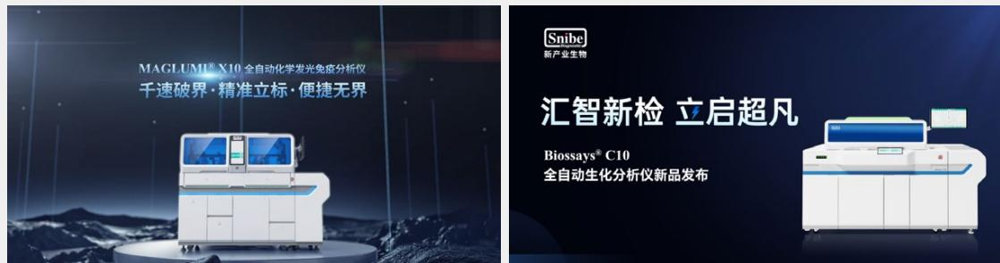

## 案例

## T8流水线、凝血分析仪、电解质分析仪的推广

2025年9月，中国医院协会第十四届临床实验室管理学术会议(NCCLab)在成都盛大召开。作为国内临床实验室管理领域的重要学术交流平台，公司携SATLARS T8、高速全自动电解质分析仪Biossays E6Plus、高速全自动凝血分析仪HemolumH6等系列优质实验室解决方案及疾病诊疗方案惊艳亮相。

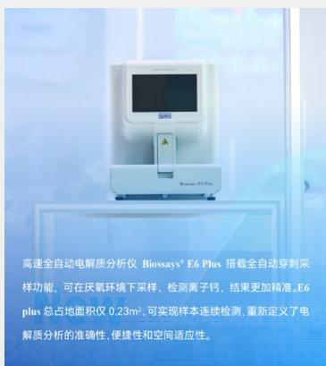

text_image

高速全自动电解质分析仪 Biosays® E6 Plus 搭载全自动穿刺采样功能，可在厌氧环境下采样、检测离子钙，结果更加精准。E6 plus 总占地面积仅 0.23m²，可实现样本连续检测，重新定义了电解质分析的准确性、便捷性和空间适应性。

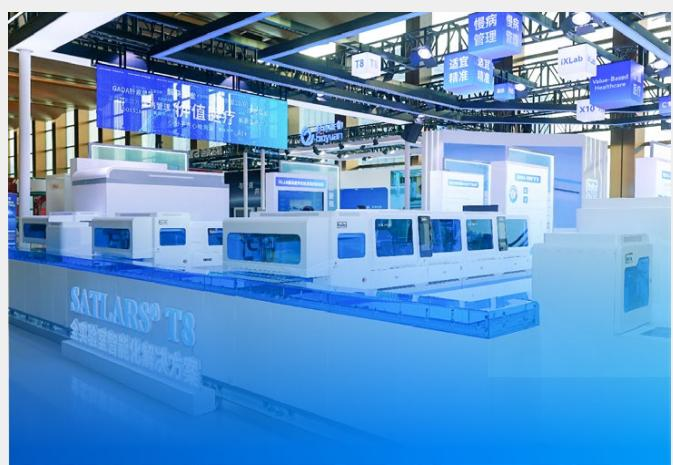

text_image

S4TLAR3® T3
全实验室智能化解决方案

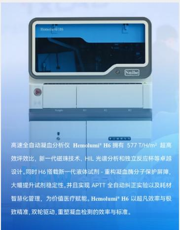

text_image

高速全自动凝血分析仪 Hemolumi® H6 拥有 577 T/H/m² 超高效坪效比，新一代磁珠技术、HIL 光谱分析和独立反应杯等卓越设计。同时 H6 搭载新一代液体试剂 - 重构凝血酶分子保护屏障，大幅提升试剂稳定性。并且实现 APTT 全自动纠正实验以及耗材智慧化管理，为价值医疗赋能。Hemolumi® H6 以超凡效率与极致精准，双轮驱动，重塑凝血检测的效率与标准。

在海外市场品牌建设方面，公司海外营销部、海外市场部通过举办Snibe Day 等学术交流活动，提升公司的国际品牌影响力。

“Snibe Day”是由公司携手国际临床化学与实验室医学联盟（IFCC）以及全球知名医学协会及实验室共同举办。活动聚焦医学实验室免疫检测领域的当前挑战、未来方向及关键议题，通过汇聚国际医学实验室科学领域的知名专家，分享最新临床应用与研究进展，推动科研成果向临床实践转化，有力促进了体外诊断领域的知识共享与跨境合作。

2025 年，我们成功打造了10 多场“Snibe Day”品牌系列活动，分别在中国及海外多国落地。“Snibe Day”活动超越了单向传递，公司以开放的姿态，邀请全球核心合作伙伴齐聚，共同亲历智慧产线，目睹精密仪器如何诞生；深入医院现场，见证设备如何驱动高效诊疗。当制造实力直面临床需求，我们共同缔造了信任的闭环。这不仅是展示，更是承诺：新产业让每一分技术，都经得起真实世界的检验。

## 案例

## 国际检验医学研讨会

2025年8月24日，国际检验医学研讨会（International Symposium onLaboratory Medicine）在新产业深圳总部举办，本次会议由国际临床化学和实验室医学联盟(IFCC)与Snibe联合举办，会议邀请了14位讲师，超300人参加。

此次会议还荣幸地邀请到了IFCC主席Tomris Ozben教授，IFCC前主席KhosrowAdeli教授和Maurizio Ferrari，以及欧洲检验医学协会（EFLM）主席MarioPlebani教授莅临出席。

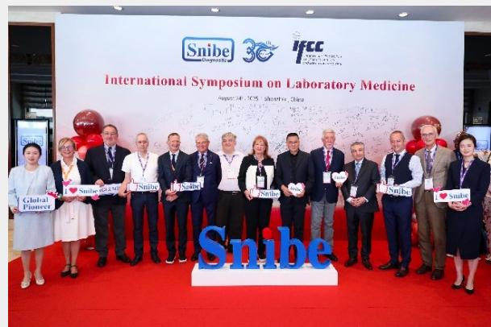

text_image

Snibe
International Symposium on Laboratory Medicine
September 24, 2015 Shantou, China
Snibe
Global Plancet
Snibe
Snibe
Snibe
Snibe
Snibe
Snibe
Snibe

## 案例

## 参加国际展会提升Snibe的品牌影响力

2025年，公司在全球范围内参与了超140场国际展会，包括Medlab Middle East中东迪拜国际医疗实验室展、Euromedlab欧洲临床化学与检验医学大会、ADLM美国临床化学年会及Medica德国国际医疗器械展等重要行业平台。我们在这些舞台上系统展示了前沿的实验室技术与创新解决方案，并与全球合作伙伴紧密协作，共同应对诊断领域的实际挑战，积极塑造未来医疗诊断的发展方向。

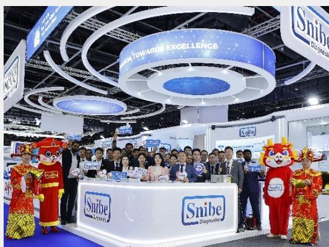

text_image

SNIBE
Diagnostic
SNIBE
Diagnostic
SNIBE
Diagnostic
SNIBE
Diagnostic
SNIBE
Diagnostic
SNIBE
Diagnostic
SNIBE
Diagnostic
SNIBE
Diagnostic
SNIBE
Diagnostic
SNIBE
Diagnostic
SNIBE
Diagnostic
SNIBE
Diagnostic
SNIBE
Diagnostic
SNIBE
Diagnostic
SNIBE
Diagnostic
SNIBE
Diagnostic
SNIBE
Diagnostic
SNIBE
Diagnostic
SNIBE
Diagnostic
SNIBE
Diagnostic
SNIBE
Diagnostic
SNIBE
Diagnostic
SNIBE
Diagnostic
SNIBE
Diagnostic
SNIBE
Diagnostic
SNIBE
Diagnostic
SNIBE
Diagnostic
SNIBE
Diagnostic
SNIBE
Diagnostic
SNIBE
Diagnostic
SNIBE
Diagnostic
SNIBE
Diagnostic
SNIBE
Diagnostic
SNIBE
Diagnostic
SNIBE
Diagnostic
SNIBE
Diagnostic
SNIBE
Diagnostic
SNIBE
Diagnostic

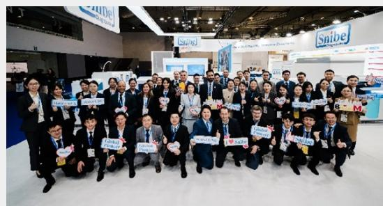

text_image

Group photo of Sinoj employees holding 'Sinoj' and 'Sinoj' signs at an exhibition booth with visible brand logos

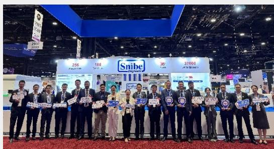

text_image

Group photo at a Snibe exhibition booth with attendees holding prize money and branded signage in the background

## 责任营销培训 >

公司高度重视营销团队的专业学术能力，公司已构建了一套系统化、常态化且成效显著的培训体系，该体系紧密围绕业务战略，有效赋能了营销前线与支持团队。

2025 年国内营销中心共组织54 期日常培训课程，包括推广策略、案例分享、知识培训（发光、仪器、生化、凝血）、政策等。具体如下：

国内营销中心建立了每周固定时间的三方团队（产品经理、销售、技术服务工程师）专业知识统一培训机制，确保信息同步。培训内容包括：（1）产品与技术知识，针对骨代谢、高血压、肿标等六大专栏，进行临床应用、报告解读及推广优势的深度培训；（2）解读市场动态与政策，第一时间推出组套依据课程；（3）定期分享优秀推广案例、经销商培育及标杆医院建设经验；（4）针对区域总监、副总监等管理层，定期组织专项策略培训，旨在统一区域领导层的推广共识，确保战略精准落地。

为确保培训效果，国内营销采用了“学- 考- 评”闭环，通过线上平台发布课后测试，确保学习效果即时检验。通过分析测试成绩分布，持续反哺培训内容与形式的优化，确保其与工作实战高度相关。

## 客户服务质量

新产业坚持“以客户为中心，以市场为导向”的核心战略理念，持续全方位优化客户服务方案，了解客户需求、及时响应客户投诉、提供专业精准服务、主动调研客户满意度，努力为客户提供安心、放心、创新的产品及服务。

## 客户服务管理及能力 >

我们践行“服务+”理念，不断提升客户服务体验，为客户创造无忧的服务价值。我们制定并落实《服务活动控制程序》等管理制度，规范客户的咨询与投诉处理流程，并通过系统的培训及专业指导，不断强化团队的专业能力和服务意识，持续优化客户服务质量。

2025 年，公司在全国设有190 个服务驻点，进一步建设或完善国内各区的驻点服务，强化客户服务的1-2 小时服务圈。为了更好的帮助各区技术工程师系统地解决客户的问题，我们通过自主开发Snibe Link 远程服务系统，保障客户服务的全面性和专业性。切实实现以客户为中心、快速响应，专业服务，创造无忧和增值的服务价值。

在海外市场，我们通过实施区域化管理，每个区域采用独立的营销、售后、市场及商务四位一体模式，强化产品销售与售后人员的联动，提升区域产品服务质量与能力，增加外籍技术服务人员数量，确保可及时响应经销商和终端客户的紧急需求。随着公司产品线扩充，海外渠道也不断增加，进一步提高产品流通渠道覆盖的广度与深度，将优质产品与服务普及更多区域及客户。在重点国家与市场，公司通过设立海外分支机构的模式，加强本地化建设。截至目前，我们已在16 个国家设立海外分支机构，通过招聘海外本地员工、申请产品流通许可证等举措，强化本地化运营能力，实现更细致、更全面市场覆盖，保障终端客户产品服务质量。

## 客户满意度 >

我们切实践行为客户提供及时、高效、专注，专业、精心、品质的服务宗旨。客户可通过官网“400”热线电话、官方邮件、《外部信息反馈表》等途径，及时向公司反馈产品问题。此外，技术服务人员严格执行公司制定的《反馈及抱怨处理控制程序》，通过定期维护、巡访等，及时与客户沟通和解决问题，形成闭环管理。2025 年，我们收到的抱怨或投诉事件案例均已100% 处理完毕，客户投诉处理综合满意度100%。

我们定期开展客户满意度调研，多维度了解客户对公司产品及服务的意见及建议。2025 年，公司国内外客户满意度均达98% 以上。

## 客户服务能力提升 >

我们始终以客户需求为导向，保持与客户的双向交流，持续赋能客户。ISO 15189 是国际公认的医学实验室质量与能力管理标准，为了助力医院检验科建立标准化质量管理体系，提升检验结果准确性与互认度，我们提供ISO 15189 全流程支持。本年度，我们持续为各地区终端客户提供ISO 15189 培训辅导服务，并搭建线上与线下相结合的专题培训及交流平台，全面赋能客户申报认可。此外，在日常服务过程中，我们与实验室老师探讨验证分析中遇到的问题及疑问，提升实验室老师对免疫产品应用的深入了解和认识，帮助实验室掌握产品应用事项和分析验证方法，提升实验室的质量管理。

我们高度重视技术服务工程师团队建设及培训工作。2025 年，我们组织国内技术服务工程师培训，组织海外代理商技术服务工程师在司现场培训及线上培训，全面提升专业服务能力。同时通过《Snibe Forum》线上平台，向代理商技术服务工程师进行知识传递，促进其了解最新的产品相关信息，产品知识不断更新，并且可快速进行学习和操作。

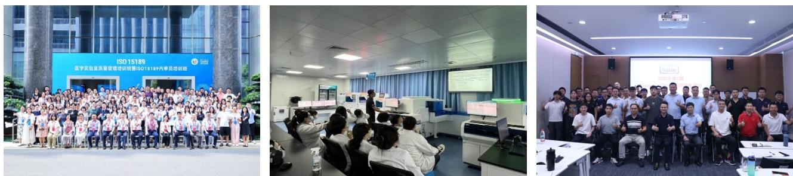

## 03

## 推进绿色运营

本章节回应的重大性议题

· 应对气候变化  
· 排放物与废弃物管理  
· 环境管理  
· 资源节约  
· 能源管理  
· 生物多样性保护

本章节关联可持续发展目标（SDGs）

新产业深入践行可持续发展理念，严格对标环保节约与安全生产管理标准，持续加强环境与职业健康安全管理体系建设。我们将绿色运营与安全生产理念贯穿于日常运营各环节，在保障员工安全与健康的同时，着力构建高效、环保的运营模式，推动绿色发展与安全运营深度融合。

## 环境及职业健康安全管理

员工安全及保护环境是企业持续稳定发展的重要保障，公司始终秉承着“保护环境、健康安全、遵守法规、持续发展”的方针，不断加强公司整体安全及环保建设。公司严格遵守《中华人民共和国劳动法》《中华人民共和国环境保护法》《中华人民共和国安全生产法》《中华人民共和国消防法》《中华人民共和国职业病防治法》等法律法规，根据法律法规以及内部管理需求，制定了相关配套管理制度，持续完善环境及职业健康安全管理。

2025 年，公司环境及职业健康安全共计投入

458 万元

## 环境及职业健康安全管理方针及目标 >

方针：保护环境 健康安全 遵守法规 持续发展。

目标：

（1）火灾发生次数为0  
（2）化学品泄漏爆炸发生次数为0  
（3）工伤事故：死亡事故为0；重伤事故为0  
（4）职业病发生次数为0

环境及职业健康安全管理举措 >

<table><tr><td>管理领域</td><td>管理举措</td></tr><tr><td>环境管理</td><td>废弃物管理:严格执行《废水、废气及噪声管理制度》《环境保护和无害化处理制度》,对生产与生活过程中产生的各类废弃物实施分类贮存、合规处置与全过程监控,确保处理合规、切实做到保护环境。资源能源管理:持续落实《资源能源消耗控制管理制度》,规范员工节约水电,并张贴节水、节电等宣传标识,提升员工节能减排意识,实行办公用品定额管控。产品设计与生产环节贯彻绿色设计理念,优化原辅材料使用,从源头减少资源浪费。危险废物管理:制定《危险废物管理制度》,明确危险废物的识别、分类、标识、贮存、转移及处置要求,建立危险废物管理台账,落实申报与转移联单制度,杜绝环境风险。</td></tr><tr><td>健康管理</td><td>生活用水管理:制定《生活饮用水管理制度》,明确生活饮用水水箱水质检测标准、关键指标限值要求以及直饮水水质检测标准。每半年委托外部机构进行水质检测,直饮水机定期委托第三方机构检测水质,饮水机每季度清洗内胆,确保公司生活饮用水符合国家生活饮用水卫生标准。职业健康管理:制定《职业病防治管理制度》,与职业病相关岗位员工签订职业病危害岗位告知书,明确岗位风险,所有职业病危害岗位均配备合规必要的劳保用品。每年全面开展职业病危害因素监测,组织职业病危害岗位员工开展上岗前、在岗期间及离岗时的职业病健康检查,建立员工职业健康档案,及时发现并处理职业健康问题。食堂安全管理:制定《食堂管理制度》,加强食堂卫生管理。所有食堂工作人员持证上岗,定期对食堂食品质量、卫生管理进行检查。对食堂供餐工作流程关键环节制定记录表单,实现食堂管理全程可追溯、风险可防控。制定食品安全应急处理专项方案,明确食物中毒等突发事件的应急响应流程、责任分工与处置程序。工伤管理:严格执行《工伤管理制度》,做好工伤事故报告、调查、认定与医疗救治流程,保障员工合法权益。</td></tr><tr><td>应急管理</td><td>应急程序管理:制定《应急准备与响应控制程序》,明确应急演练的组织流程、评估标准及改进机制,并统一了演练记录模板,推动应急管理工作的标准化与可追溯性。围绕火灾、危险化学品泄漏等主要风险,定期组织多部门参与的综合性应急演练,检验预案有效性,提升员工应急疏散、初期处置与协同响应能力。应急资源管理:严格执行《急救药箱药品管理制度》中药品配备、检查、更换及记录要求,确保各区域急救药品和器械始终处于完好备用状态。建立急救员团队,掌握基本的急救知识和技能。</td></tr><tr><td>安全管理</td><td>设备安全管理:制定各类安全操作规程和安全管理制度,严格执行岗前安全培训制度,确保特种设备/特种作业人员持证上岗。定期对生产设备、电气线路及安全防护设施开展检查与维护,保障设备设施安全稳定运行。危险作业安全管理:制定《危险作业管理制度》,完善对动火作业、高处作业、有限空间作业等高风险作业实施审批管理要求,强化作业前风险辨识、安全交底与防护措施落实,并安排专人现场监护,确保危险作业全过程安全受控。危化品安全管理:严格执行相关危险品管理制度,全面规范危化品分类、储存、标识、使用及废弃物处置等环节管理要求,由专人对各类化学品进行管理和登记,配备足够的消防和应急处理设施,并定期检查其有效性。消防安全管理:严格遵守相关消防安全规章制度,制定《消防器材及设施管理制度》,明确日常消防安全管理工作的组织与实施,各区域按要求配备相应的消防器材、紧急出口指示灯等,定期开展消防设备巡检与维护保养,组织全员消防演练与消防安全培训。</td></tr></table>

## 应对气候变化

新产业认同全球气候变化的物理环境及应对行动可能对公司业务产生重大影响或带来机遇。报告期内，我们结合企业业务发展及运营情况，识别了相关实体风险、转型风险及机遇，并制定了相应的应对措施。

<table><tr><td>类型</td><td>影响因素</td><td>具体影响</td><td>应对措施</td></tr><tr><td>实体风险</td><td>暴雨、台风等极端天气频繁发生或强度增加</td><td>公司运营所在地位于沿海城市,暴雨、台风等极端天气的频率或强度提升将影响厂区电力输送,导致停水停电或仓储、设备等损坏,威胁公司财产安全,影响公司运营的稳定性。</td><td>公司密切关注气候变化趋势,根据实际情况制定极端天气应急预案;公司密切关注天气预警信息,在极端事件来临前开展安全检查、疏通下水道、修缮屋顶、加固围墙、加装挡水门槛、加强通风、加强电路漏电保护、提高消防灭火能力等措施。</td></tr><tr><td rowspan="2">转型风险</td><td>受各国应对气候变化政策影响,能源价格上涨</td><td>公司目前主要能源消耗为外购电力,环境保护相关监管要求日趋严格,国家及地方政府陆续出台相关政策,对企业碳排放进行限制,化石能源价格上涨,影响公司运营的能源成本。</td><td>公司积极开展能源管理,通过技术升级、用电源头管控、加强节能减排宣传等多种方式,减少能源消耗,减少自身碳排放。</td></tr><tr><td>投资者对企业应对气候变化关注增加</td><td>公司已了解国内外投资者对于企业温室气体排放及减排目标的关注,倘若不进行积极的温室气体排放管理,则可能因如ESG评级下降、负面新闻等事件导致声誉下降,进而缩窄企业融资渠道,提升融资成本。</td><td>公司积极回应投资者关切,已自愿开展气候风险识别、温室气体排放管理等工作,并自愿进行披露。未来,公司将进一步结合企业发展需要,制定温室气体排放管理目标。</td></tr><tr><td rowspan="2">机遇</td><td>气候环境变化导致新产品需求增加</td><td>由于气候物理环境的变化,全球气温不断升高,可能导致人群感染和疾病爆发流行的机会增加、呼吸道系统疾病风险增加,为体外诊断公司带来新的产品机遇。</td><td>公司积极关注相关疾病的检测需求,及时开展相关疾病检测产品的研发。</td></tr><tr><td>气候变化政策促进企业技术升级及增加效益</td><td>能源及资源消耗的减少可降低企业排放量和运营成本。公司可通过采用更高效的生产技术,在提升资源使用效率的同时提高产能、增加收入。</td><td>公司积极开展节能减排项目,通过技术改造与设备升级等方式不断提升能源和资源使用效率,实现降本增效。</td></tr></table>

公司温室气体排放主要来源于生产和经营中电力、天然气、汽油及柴油的使用消耗，制冷剂的逸散导致的直接排放，以及消耗外购电力导致的间接排放。本报告期，我们委托国际权威认证机构SGS对公司开展了全面、细致的温室气体核查工作，并获得了SGS颁发的ISO 14064-1:2018温室气体核查声明证书。

2025年，公司运营所产生的二氧化碳排放总量（范围1和范围2）为17,071.48吨二氧化碳当量，其中直接排放量（范围1）为2,589.96吨二氧化碳当量，间接排放量（范围2）为14,481.52吨二氧化碳当量，碳排放强度为0.0373吨二氧化碳当量/万元①。

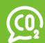

直接排放（范围1）

2,589.96

吨二氧化碳当量

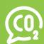

直接排放（范围2）

14,481.52

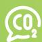

范围1、2的排放总量

17,071.48

吨二氧化碳当量

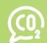

碳排放强度

0.0373

吨二氧化碳当量/ 万元

2025年，新产业能源使用情况如下：

外购电力

27,281,049.87

千瓦时

天然气

51,719

立方米

汽油

25.16

吨

9.89

吨

公司的碳排放目标为：在公司研发生产基地五期建设完成前，保持碳排放强度的平稳，五期建设完成并投入使用后，力争实现碳排放强度的平稳下降。主要依据为公司研发生产基地四期将于2025年度建设完成并投入使用，以及随着公司业务规模的增加，预计电力能耗将同比会有较大幅度增加，会对公司短期碳排放强度造成较大压力。

①直接排放（范围1）包括公司消耗化石燃料导致的直接排放，包括汽油，柴油，天然气等的燃烧，以及制冷剂的逸散导致的直接排放：间接排放（范围2)包括公司消耗外购电力等导致的间接排放。排放总量为直接排放及间接排放的总和。其中电力排放因子参考中华人民共和国生态环境部于2025年12月31日发布的《关于发布2023年电力二氧化碳排放因子的公告》中的全国电力平均二氧化碳排放因子，其他能源的热值系数和排放因子主要参考《省级温室气体清单编制指南》《综合能耗计算通则》。

## 绿色运营

公司严格遵守《中华人民共和国水污染防治法》《中华人民共和国大气污染防治法》《中华人民共和国固体废物污染环境防治法》《医疗废物管理条例》等法律法规，制定《环境因素控制程序》《资源能源消耗控制管理制度》《废水、废气及噪声管理制度》《危险废物管理制度》等管理制度，有效利用资源、能源，严格管控危险废物的处置流程。公司不属于环境保护部门公布的重点排污单位，2025 年，公司不存在环保违法违规事项，未受到环境保护部门的行政处罚。

## 排放物与废弃物管理 >

## 废水管理

公司依照“雨污分流、源头收集、重复利用”原则处理各类污水，推行环保的污水管理机制。按废水来源不同，分为雨水、生活污水和生产废水。基于分类管理的原则，我们对废水进行分类收集。对医疗废物化学性废液、空气过滤废水产生的源头进行收集，交由有资质的单位外运处置；对纯化水制备过程中产生的不含有任何化学试剂、附加剂的浓水，建立浓水回收池进行收集，用于厕所冲洗及园区绿化灌溉，并由市政生活废水管网排入沙田水质净化处理厂，从而节约资源，减少浪费。

## 废气管理

公司所产生的各类废气遵循“分类收集、集中处理、达标排放”的原则，对于公司生产废气，通过废气处置设施处理达标后排放，且定期进行废气检测。对于生产车间、各生产线产生废气的点位或区域均设置有独立的废气收集万向罩、通风橱。废气处理装置配置活性炭箱及喷淋塔，能将实验室废气处理达标后排放，满足环保要求。对于废气收集管道，均标示废气收集处置的流向，并定期安排第三方检测机构对废气进行检测，保证废气排放满足相关法规要求。

## 废弃物管理

公司设立专门的环保污染防治工作组对医疗废物、危险废物进行分类管理。医疗废物包括感染性废物、损伤性废物、化学性废物三类，三类医疗废物统一收集至专用医疗垃圾桶中，由有资质的单位外运处置。危险废物有十种，包括废活性炭、废机油、废灯管、废电路板、废温度计、废油墨炭带、废防锈油、废弃化学品、废弃包装物和喷淋塔废水，收集后统一由第三方机构进行转移和处置。

公司积极落实固体废弃物污染防治要求，全面推行生活垃圾分类制度，持续提升固废管理的精细化与绿色化水平。针对日常运营中产生的一般固体废弃物（包括生活垃圾、厨余垃圾等），公司严格执行分类管理，并委托具备资质的第三方机构进行规范运输、利用和处置，同时对受托方的技术能力进行严格审核，确保全流程合规。其中，办公废纸、废纸皮等可回收物交由专业回收单位进行资源化利用。

为进一步提升员工分类意识与投放准确率，公司持续优化园区分类设施配置与标识指引。针对各楼层生活垃圾及厨余垃圾，对垃圾桶布局与规格进行了专项升级，提升辨识度与投放便捷性。建立废弃电池常态化回收机制，在固定位置设置专用回收箱，规范废弃电池收集与处置流程，减少重金属等污染物对环境的潜在影响。

## 资源能源管理 >

## 水资源管理

公司严格管控水资源的使用，通过水资源的回收利用、设备调控等手段，提高回用水量，提升水资源利用效率。

建立健全用水设施巡检保养机制，将生活水箱、太阳能热水系统等关键用水设施纳入常态化巡查范畴，定期开展全面排查与维护保养，重点检查设施运行稳定性与管路密封性，及时更换老化破损的阀门、管道、水龙头等零部件，从源头杜绝跑冒滴漏现象，确保各类设施始终处于良好运行状态，保障用水安全与用水效率。在自来水总表加装远程智能表，通过智能系统实时监测用水量，有效避免人工抄表误差，快速发现用水异常，及时排查漏水或设备故障。

注重全员节水意识的培育与引导，通过办公区域张贴节水标语、内部通知推送等多种形式，倡导员工践行节约用水的良好行为习惯，引导全体员工树立“节水为荣、浪费为耻”的理念，共同营造绿色、低碳、节约的办公环境。

聚焦节水增效，主动优化用水管理措施，通过科学调整给水设备运行压力，合理控制末端卫生间水龙头的水压与水量，在保障员工正常用水需求的前提下，有效降低水资源消耗，同时缓解地下室给水设备运行负荷，实现节水与设备养护双重效益。在公司日常运营中，所产生的浓水主要源自纯化水制备工艺。该部分浓水水质经检测，完全符合《城市污水再生利用城市杂用水水质》（GB/T 18920-2020）标准。本着节约资源、减少浪费的理念，通过建立浓水储水箱，对浓水进行回收利用。目前，已建成100立方米及180立方米的浓水储水箱，分别用于公司二期、三期园区厕卫和绿化灌溉，有效降低了自来水消耗。

坚持将水平衡测试作为水资源管理的关键举措，通过对用水量进行系统测试、统计与分析，精准掌握水量平衡关系。以科学严谨的态度深入用水环节每一处细节，全面采集和分析数据，持续优化用水流程，确保生产、生活运营稳定，实现水资源的高效利用与最大化节约。

  
2025年公司总取水量

250,223

立方米

  
取水强度

0.5467

立方米/万元

  
浓水回收量

21,679.7

立方米

## 能源管理

公司积极控制能源的合理使用，持续通过技术、设备及各项手段改进提高能源使用效率，加强绿色理念的宣贯和实践，提高能源使用效率的最大化。

筑牢用电安全，将发电机组、供配电系统等核心设施作为巡查重点，定期开展全面维护保养。通过持续巡检与预防性维修，重点检查运行工况与线路安全，及时更换老化破损零部件，从源头消除安全隐患，保障电力系统稳定高效运行。全面摸排一次、二次及末端配电柜，统一张贴标识，清晰划分日常用电与应急电源，避免应急电源被占用，确保突发情况可快速识别处置。

强化全员节能意识，通过张贴标语、推送通知等方式，倡导节约用电、双面打印、随手关灯、节约用水、主动报修漏水等行为。在开关、空调面板张贴标识，提醒科学使用空调，即夏季不低于26℃、冬季不高于20℃，引导员工从点滴做起，共同营造绿色办公氛围。

持续推进精细化管理，对空调主机实施科学调控，结合季节变化与办公需求合理设定参数。在保障办公舒适度的前提下，最大限度提升运行效率，降低电力消耗，实现舒适度与能源效益的平衡。针对三期厂房特殊车间、地下车库等重点区域，科学调整开关时段与亮度，杜绝“长明灯”现象，确保照明资源高效利用。地下车库充电桩加装集中操控装置，与手机端联动设定定时关闭，避免长时间待机充电的安全隐患与电能浪费。园区庭院灯、停车场照明灯、LOGO 灯启用时控系统，通过手机远程精准调控，显著降低能耗。定期清洗保养太阳能板，提高热转化效率，最大化绿色能源效益。

## 04

## 赋能人才发展

本章节回应的重大性议题

· 多元化及平等雇佣  
· 员工权益与福利  
· 员工培训与发展  
· 职业健康与安全

本章节关联可持续发展目标（SDGs）

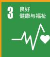

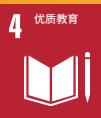

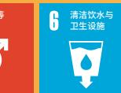

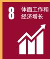

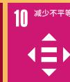

人才是企业可持续发展的核心动力。新产业始终将人才战略置于发展全局的关键位置，持续深化雇主品牌建设，全面提升人力资源管理的专业化水平。我们秉持开放包容的人才理念，构建多元化的人才引进机制，依法保障员工合法权益通过完善的职业培训体系与清晰的职业发展通道，为员工打造公平、透明的成长平台，充分激发组织创新活力。我们不断健全职业健康安全管理与福利保障体系，持续提升员工的归属感与幸福感，实现企业与员工的价值共创、共同成长。

## 人才吸引与留存

## 多元化及平等雇佣 >

## 平等雇佣

公司严格遵循《中华人民共和国劳动法》《中华人民共和国劳动合同法》等法律法规，制定《人力资源控制程序》《员工手册》《员工内部调动管理制度》《实习生管理制度》等内部制度，不断规范公司招聘及人才管理流程，组建高质量、多元化的人才队伍。我们在《人力资源控制程序》中明确指出禁止雇佣童工，反对性别、健康、年龄等歧视，倡导多元化，向每位员工和求职者提供平等的机会。我们在《防止歧视及骚扰管理制度》中明确员工在录用、培训、升职等过程中，不会因种族、社会阶级、国籍、宗教、残疾、性别等，而受到不公正的对待。

2025 年，新产业坚持贯彻“以奋斗者为本”的理念，在人才组织管理、职场环境、企业文化、薪酬福利、培训体系等多个维度积极探索与实践，首次搭建领英雇主生活页面并上线，建设与塑造优质雇主品牌形象，并且获得八方锦程“2025 职业信用卓越雇主奖”荣誉奖项。

## 人才吸引与储备

新产业高度重视人才梯队建设，制定了完善的人才发展策略，不断探索灵活多样的人才吸纳方式。目前人才引进的渠道主要分为校园招聘和社会招聘。

校园招聘方面，我们持续与高校保持合作交流，推进校企合作项目，目前我们与多所国内一流院校签订校企合作协议及挂牌实习实践基地；全年接待高校来公司参观交流的老师及学生近600 人；通过设立研究生联合培养基地、博士后科研联合培养及实习就业基地，为高校提供职业生涯讲座等方式，在校企合作上持续深耕，目前已与多所院校建立长期实习合作关系，在司实习生超150 人，我们为提前到岗实习生提供一对一指导带教，并对实习表现优异的同学优先给予转正机会。通过校企合作，我们为高校提供丰富的实践资源和就业机会，帮助学生将理论知识转化为实际操作能力，同时也为公司储备了丰富的后备人才。

社会招聘方面，我们与国内主流招聘平台、行业经验丰富猎头机构以及海外知名猎头机构深度合作，并且通过内部员工推荐，多渠道全方位打通人才引进渠道，加快实施人才强企战略，聚焦“高精尖缺”人才队伍建设，整合优势人才资源，为公司战略目标的实现提供人才保障。

## 员工多元化

新产业致力构建多元化、平等与包容的职场文化，实施多元包容的招聘政策，吸引和凝聚海内外卓越人才，鼓励不同背景的员工充分发挥才能。我们平等对待每一位员工，不因性别、年龄、民族、国籍等因素影响员工在招聘录用、晋升发展、薪酬福利等各环节应享受的权益。

我们持续关注和丰富员工多元化结构，倡导职场包容，积极关注弱势群体，为残疾人士提供就业机会。为了尊重外籍员工的宗教文化差异，在公司设置祷告室，并为外籍员工办理合法工作许可及工作居留证件，保障他们在中国合法就业。我们给予退休员工返岗工作的机会，鼓励并支持退休员工重返工作岗位，在充分考虑用工需求的同时，为其提供适宜的就业机会和相应的福利待遇。

截至2025 年末，公司共有员工2,785 人，其中少数民族员工168 人，女性员工占比36.62%，管理层中女性员工占比30.27%。

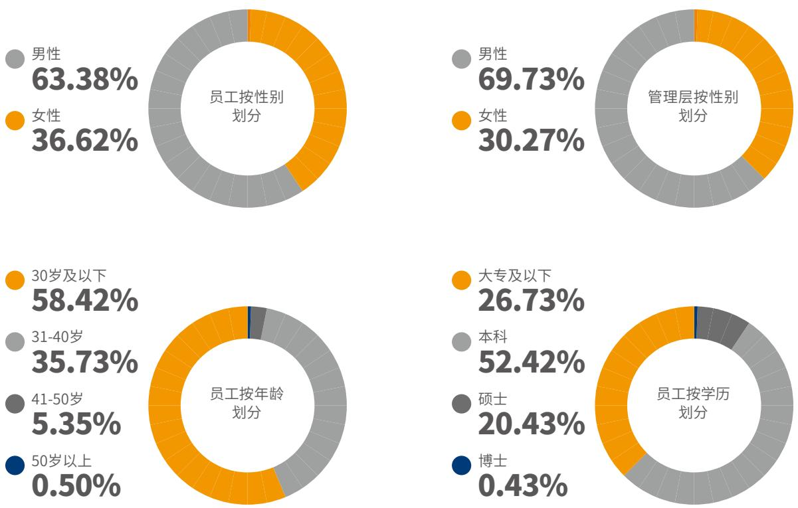

donut

| 分类 | 细分项 | 占比 |
| --- | --- | --- |
| 员工按性别划分 | 男性 | 63.38% |
| 员工按性别划分 | 女性 | 36.62% |
| 管理层按性别划分 | 男性 | 69.73% |
| 管理层按性别划分 | 女性 | 30.27% |
| 员工按年龄划分 | 30岁及以下 | 58.42% |
| 员工按年龄划分 | 31-40岁 | 35.73% |
| 员工按年龄划分 | 41-50岁 | 5.35% |
| 员工按年龄划分 | 50岁以上 | 0.50% |
| 员工按学历划分 | 大专及以下 | 26.73% |
| 员工按学历划分 | 本科 | 52.42% |
| 员工按学历划分 | 硕士 | 20.43% |
| 员工按学历划分 | 博士 | 0.43% |

## 员工权益与福利 >

## 薪酬及福利体系

为建立公平、有竞争力的薪酬体系，有效吸引、保留和激励人才，保障公司战略目标的实现与可持续发展，公司制定《员工薪酬管理制度》，为员工提供具有竞争力的薪酬体系。公司实行以岗位价值为基础，绩效结果为导向的薪酬体系，员工年度总薪酬由“月度薪酬总额+ 补贴/ 津贴+ 绩效奖金”组成。此外，我们为员工提供年度调薪机会，对爱岗敬业、能力突出且取得卓越成绩的团队和个人予以嘉奖，回馈员工为公司做出的卓越贡献。

我们依据国家及地方的规定，保障员工享有法定节假日和法定假期，为全休员工缴纳社会保险和住房公积金，并提供全面的非薪资福利，包括补充商业保险、年度体检、健康检测及咨询、节日活动、团建活动等，满足员工在身体及心理健康方面的需求。为加强职场女性福祉和关爱，除了向生育期女性员工提供国家法律规定的带薪婚假、产假、哺乳假等假期外，进一步丰富了女性员工关怀活动，为职场妈妈建设母婴室、开设瑜伽课程、开展“女神节”活动、母亲节活动等。

<table><tr><td>法定福利</td><td>员工福利</td><td>工作与生活平衡</td></tr><tr><td>● 法定节假日● 法定假期,包括病假、工伤假、婚假、丧假、产检假、产假、陪产假、哺乳假及年休假等● 社会保险,包括基本养老保险、医疗保险、失业保险、工伤保险、生育保险等● 住房公积金● 其他法定福利</td><td>● 过节费● 员工宿舍● 员工食堂● 公司班车● 年会抽奖● 纪念礼品● 活动经费● 协助员工落户● 补充商业保险● 职业健康体检● 健康咨询热线● 健康讲座及义诊活动</td><td>● 图书室● 健身房● 瑜伽课● 篮球场● 团建活动● 节日活动● 俱乐部活动● 业余文化活动</td></tr></table>

截至2025年末，公司员工签订劳动合同员工占比

100%

员工社会保险覆盖率

100%

## 生活与工作平衡

公司关注员工业余生活，致力于提供丰富多彩的员工文化精神活动以及节假日关怀活动，并鼓励全体员工参与。公司开展的员工活动如下：

公司在传统节假日，周年司庆 年会等期间，积极组织线上与线下活动 在妇女节 端午节 中秋节等节日期间，先后开展趣味打卡，护肤课堂，石膏版画制作，灯笼制作等特色活动，今年恰逢公司30周年司庆，我们举办了趣味运动会，主题集市等系列活动，拍摄了30 周年宣传片，圆满完成企业文化精神堡垒揭幕活动、部门树认领活动，并为全体员工定制周年文化衫、周边冰箱贴及专属工牌，进一步提升员工的参与感、荣誉感与归属感。  
● 为促进公司文化的传承和战略的实现，纪念“新产业人”的拼搏与付出，本年度，公司为司龄15 周年及以上的员工举行授勋仪式，颁发司龄纪念币及纪念奖杯，同时为入职满1、3、5、10 周年的员工发放司龄纪念币。为激励员工努力奋斗、追求卓越，公司举办2025 年度工作总结暨表彰大会，对年度重点工作中表现突出的个人与集体进行表彰。  
● 为鼓励员工劳逸结合，公司内部设有健身房、瑜伽室、图书室、篮球场等，并聘请外部专业瑜伽老师定期到公司开展瑜

伽课程。此外，公司租赁了外部的足球、羽毛球场地，定期开展相应的活动，向员工提供强身健体、丰富业余生活的平台。联动文体局开展免费观影、免费观看舞台剧等活动等，营造和谐健康的工作氛围，不断提升员工幸福感。

● 本年度首次举办家庭开放日活动，邀请员工亲属走进企业，参观工作环境、感受企业文化，进一步增强员工的家庭支持与认同感。联动坪山区党群服务中心开展多场员工联谊活动，致力于为单身青年职工搭建真诚交流与互动交友的平台，切实深化青年群体的人文关怀。  
● 为帮助新员工迅速熟悉园区环境，使其更好地适应公司文化，增强归属感，我们针对新员工入职事项专门设计制作了《园区生活指南》，并在入职当天进行面对面讲解，为了关爱新入职的应届生员工，我们举办校招生迎新会，促进其相互认识，快速融入新产业大家庭。

text_image

女神书
快乐
考号
能登墙

妇女节活动

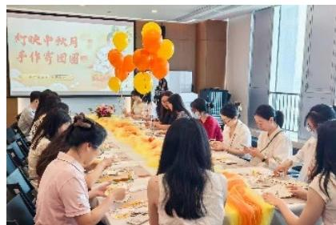

text_image

灯映中秋月
手作寄团圆

中秋节手作灯笼

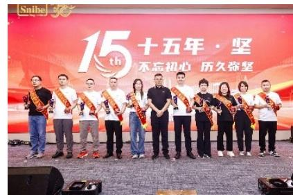

text_image

Smihe
15th 十五年·坚
不忘初心 历久弥坚

司龄纪念币授勋仪式

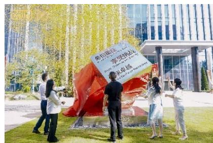

text_image

中国建筑
建筑体验
建筑体验

企业文化精神堡垒揭幕

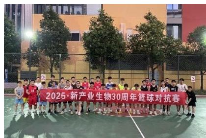

text_image

2025·新产业生物30周年篮球对抗赛

周年篮球赛

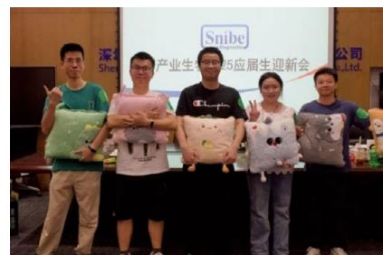

text_image

深
Shen
产业生25应届生迎新会
公司
Sino.Ltd.

应届生迎新会

## 员工关爱与沟通 >

## 搭建多维度沟通渠道

新产业重视倾听员工心声，充分尊重员工的意见与反馈。为使员工与公司管理层进行有效沟通，公司为员工开设了多层次、多渠道的反馈平台，打造平等高效的沟通环境。

我们组织公司全体员工开展年度满意度调查，调查维度涵盖自身工作、内部沟通与管理、职业发展、工作环境与办公软件、薪酬与福利、企业文化、行业环境与公司发展、整体满意度等八个维度，本年度员工满意度为89.2%，通过对调研内容进行系统化分板块归类与数据分析，我们在调查中识别出员工关注点主要集中在薪酬福利、自身工作、管理与沟通三方面，为后续提升管理服务工作提供了数据基础与决策依据。我们将根据员工的反馈不断优化各项举措，持续提升员工的工作满意度和幸福感 与员工共建美好工作环境

<table><tr><td>反馈平台</td><td>反馈及沟通机制</td></tr><tr><td>员工满意度调查</td><td>我们组织公司全体员工开展年度满意度调查,并将调查结果汇总并上报公司管理层,相关部门按照公司决策执行并跟进。</td></tr><tr><td>定期意见收集</td><td>我们每年末通过员工年终考评鉴定流程收集全体员工对公司各方面管理工作的意见或建议等,并汇总上报公司管理层,由相关部门执行并跟进。对新入职员工开展调研收集新员工的意见建议,通过座谈会等形式进行回复,并对拟离职员工进行离职访谈,针对性地完善人才保留计划。</td></tr><tr><td>智慧园区平台</td><td>我们持续优化新产业智慧园区线上平台,鼓励员工通过平台对员工食堂、园区设备报修以及各类园区服务等进行意见反馈。</td></tr><tr><td>内刊平台</td><td>我们设立内刊《新产业人》作为传递企业文化和员工表现自我的主要媒介,内容包括公司新闻动态、管理政策、员工精神风貌、工作感想、心声、业余生活等,在聆听员工心声的同时加强企业凝聚力。</td></tr><tr><td>征求意见邮箱及匿名信箱</td><td>我们设立征求意见邮箱及匿名信箱,员工若存在任何疑问或意见,可发送邮件至征求意见邮箱或投入匿名信箱,其建议得到管理层答复后将反馈给员工。</td></tr><tr><td>部门会议</td><td>我们部门的负责人通过部门会议、年度绩效沟通的形式及时了解员工诉求,及时了解员工心声及诉求。</td></tr></table>

## 工会及职工代表大会

公司将工会视作管理层与普通员工沟通的重要纽带。公司职工代表大会以保障职工权益、增强公司活力为宗旨，以此保障员工权益，为员工争取福利。公司工会依据职工代表大会相关规定定期筹备并召开职工代表大会，与员工保持密切沟通，让员工充分参与到公司重要事务决策中，并进一步健全完善各项规章制度，更好地维护员工权益。

2025 年，公司召开了2 次职工代表大会，审议通过了《国内外技术服务部工程师技术等级评定办法》《国内市场部产品经理专业知识技能考核管理办法》等多项制度，进一步完善了人才评价与培养体系。同时，大会圆满完成公司董事会职工代表董事的选举工作，切实保障了职工参与企业民主管理、民主监督的权利。

2025 年，公司人才引进及留存情况如下:

<table><tr><td>新引进员工212人</td><td>员工流失率 $^{\text{1}}$ 8.21%</td></tr></table>

## 员工培训与发展

## 培训体系 >

## 多元化培训体系

新产业认为员工培训对企业发展有着良好的促进作用，以《培训管理制度》为基础，并制定了《培训流程实施操作指引》《培训体系实施管理办法》等一系列培训相关的管理办法、细则及操作指引等来支持和规范培训工作。

我们持续完善和优化各项培训制度及流程，始终坚持“以人为本，人尽其用”的基本培训理念，搭建起以“人才建设”和“产品赋能”为核心、“双轨并举”的培训运营体系。为了更好地支撑公司内部各岗位实际业务运营，公司持续健全分层、分类、针对的多元化培训体系，不断完善各类型人才培养机制。我们采取线上线下相结合的培训方式，组织开展如新员工入职培训、新员工上（转）岗培训、管理类外请专家培训、在职员工专项（题）提升培训、质量& 仪器& 安全生产专题等多项培训，持续提升员工软硬技能、职场综合实力，满足员工自身发展需求，助力公司业务持续扩张和优化，并不断储备各项业务持续发展所需求的人才梯队。

2025 年，培训总时长

96,743 小时

33,899 人次

## 员工能力提升 >

## 全方位能力提升

基于企业发展战略和岗位业务需求，我们持续开发、升级培训课程，提高培训的针对性和实用性。

## ● 应届生培育

我们为应届生建立包括“入职”“成长”“成才”三个职业发展阶段的培养框架，通过新员工入职集训项目帮助应届生了解公司基本信息，快速学习并适应企业文化，完成从校园到职场的角色转换。在岗位实践中，我们通过导师带教、轮岗、座谈等机制帮助应届生快速融入团队、掌握岗位技能，并在部门直属负责人和导师的指导下开展工作，为后期能独立承担重要工作打下坚实基础。

## ● 通用知识及软技能提升

在产品通识科普及职场综合软技能提升方面，我们以Snibe 大讲堂的形式、借助钉钉云课堂专业在线学习平台来实现。通过多年的持续摸索和尝试，已初步搭建起职场通用知识与技能培训体系框架。本年度，我们开设了AI、沟通演讲、医学科普、总结汇报、四大慢病五大系列共37 门线上课程，并首次成功将线上课程二次开发，转化为线下课程，一经推出即成为热门，全年共开班40 期，累计6300+ 人次参与，人均学习时长约1 小时，满足了员工对通识技能的学习需求。

## ● 管理能力提升

我们全面加强对中基层管理人员的储备和培养，本年度，我们重点开展了市场营销团队的人员管理能力专项训练。针对海外营销中心，特聘外部专家，开展了主题为“打造高绩效跨文化团队——销售团队的识人用人”的3 天脱产特训，从“管目标、管过程、管能力、管意愿”四个维度，全方位地向管理人员传授了人员“选、用、育、留、激”的经验和技巧，加强了营销团队的管理能力。针对国内营销中心，通过续聘外部实战型专家，开展了主题为“年度目标管理与高效执行工作坊”的2 天脱产特训，从“管理者角色的认知与升级、目标管理与计划执行、部署培育及团队激励、沟通技巧与实战运用”四个方面，带领管理人员深入学习、自发思考，辅以情景模拟、角色扮演等学习模式，强化了学习效果。

## ● 岗位专业技能提升

我们借助兼职内训师团队资源和力量，以及“云课堂”的线上平台，开展“产品优化升级”系列、“性能验证”专题、“年度轮训”专项、“新产品赋能”系列培训等，以此满足员工的专业学习需求，夯实对新产品的理解和认知。本年度，我们进一步拓展了“质量& 仪器& 安全”主题、“医疗器械装配工·职级认定”序列、“试剂生产提质提效”专项等培训，满足员工更细、更深、更多的专业升级需求。此外，我们积极与行业专家、供应商等合作伙伴探索交流，以“临床检验大讲堂”“Snibe Day”“检验行业专家/ 专题交流会”等形式，进一步满足特定职能/岗位人员的“高、精、新”学习需求，并为推动内部技术革新、产品创新提供支持和动力。

此外，我们通过不断强化人才建设和人力资源整合，为员工提供更多学习、成长的机会和平台。我们于2023 年正式通过“深圳市高技能人才培训基地”认证，于2024 年获得深圳市人力资源和社会保障局颁发的“深圳市终身职业技能培训载体——十佳示范载体”奖项，为后续员工培训、人才培养提供了更多的机会与更广阔的平台。

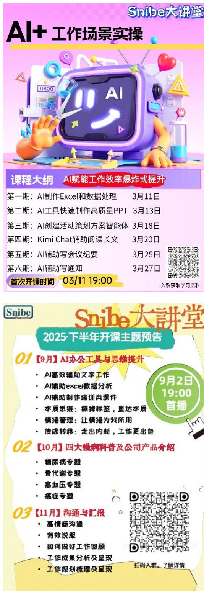

<table><tr><td>第一期:AI制作Excel和数据处理</td><td>3月11日</td></tr><tr><td>第二期:AI工具快速制作高质量PPT</td><td>3月13日</td></tr><tr><td>第三期:AI创建活动策划方案智能体</td><td>3月18日</td></tr><tr><td>第四期:Kimi Chat辅助阅读长文</td><td>3月20日</td></tr><tr><td>第五期:AI辅助写会议纪要</td><td>3月25日</td></tr><tr><td>第六期:AI辅助写通知</td><td>3月27日</td></tr><tr><td colspan="2">首次开课时间 03/11 19:00</td></tr></table>

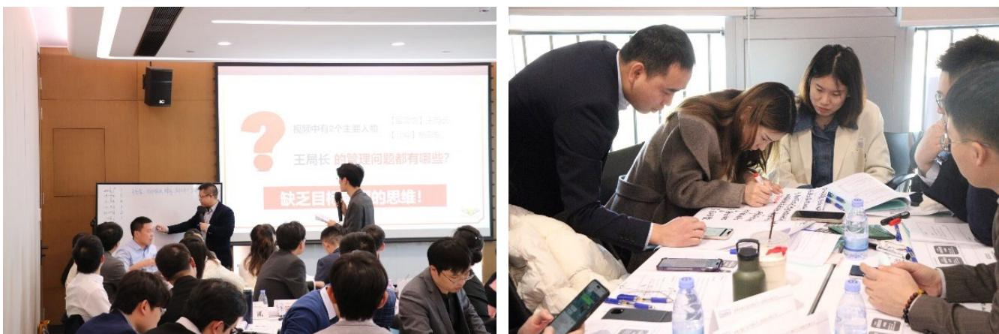

text_image

视频中有2个主要人物 【案例】王局长
【领导】张立根
王局长 的管理问题都有哪些？
缺乏目标 他的思维！

## 资质及人才认定

## ● 支持员工资质认定

我们支持所有员工参加各相关技能证书的认证考试、获取岗位专业资质，并为员工承担全部费用，帮助员工增强专业能力，员工脱产培训期间，公司为其提供交通、餐饮等各项补贴。截至2025 年末，员工获取各类技能证书百余份，证书类型覆盖特种设备安全、体系内审、医疗器械全生命周期管理、药品验证、电子产品测试、统计技术应用、计量检定及标准物质研制、化学品管理、企业合规、职业卫生等领域的专业技能资质认定等。

## ● 协助人才认定与职称申请

我们根据当地政府的人才政策积极协助符合条件的员工申报高层次人才，帮助符合条件的员工进行职称申报，鼓励员工不断精进专业水平。我们联合深圳高校举办技能节，发掘技能卓越的一线技能人才。2025 年，公司员工通过专业领域技术职称54 人。

## 员工晋升发展 >

## 多元晋升发展

我们秉承“人尽其才”的理念，设置清晰详细的员工晋升渠道，制定一系列明确的内部晋升制度，包括《职级管理办法》《试剂研发人员职级晋升管理办法》《研发人员晋级管理补充细则》《国内外技术服务部工程师技术等级评定办法》《国内市场部产品经理职级晋升管理办法》等，成立公司职级评审委员会为职级晋升和发展的最高权力机构，确保公平合理、科学合规地开展选拔工作。

我们始终秉承与员工共同成长与发展的理念，致力于打造契合公司发展目标和员工职业发展目标的岗位要求，为不同岗位、不同级别的员工设计清晰、明确和公平的职业发展通道，鼓励员工发挥自身才能挑战新岗位。我们建立“专业”“管理”“业务”三通道职业发展路径，为全体员工提供公平公正的职业选择及发展机会。通过执行“技术晋升”和“管理提拔”相结合的晋升方式，对有突出贡献或特殊才干的员工予以越级晋升，对综合能力强、专业能力突出的员工进行提拔培养，引导员工结合自身优势提升专业技能和综合素质。

为促进人才流动，我们推行灵活的内部转岗机制，定期关注并评估有转岗意愿的员工的工作绩效和专业能力并予以适当支持，为有意愿转岗且具备条件的员工提供跨部门、跨职能的转岗机会，打破岗位限制，激发员工发展潜力，增强组织活力和创新能力。此外，我们持续优化人才管理工作，陆续优化现有职级评定要求，让员工更清晰了解自身发展方向，定期输出各中心人才分析报告及人力资源管理报告，及时发现并激励工作表现卓越员工。

2025年，公司年末绩效考核覆盖员工占比

100%

80 余人

员工职业发展体系构成：

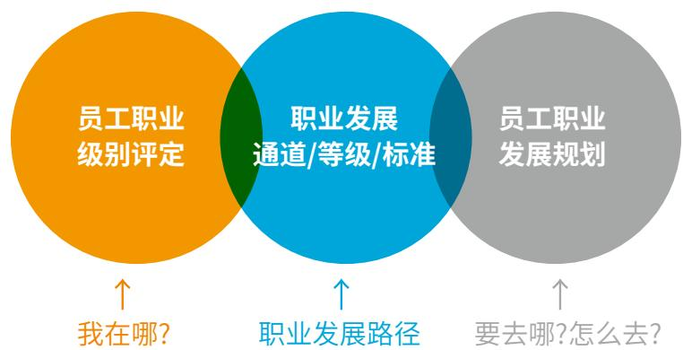

flowchart

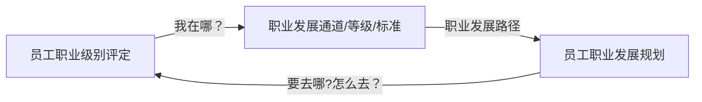
```mermaid
graph LR
  A["员工职业级别评定"] -->|"我在哪？"| B["职业发展通道/等级/标准"]
  B -->|"职业发展路径"| C["员工职业发展规划"]
  C -->|"要去哪?怎么去？"| A
```

员工晋升发展通道：

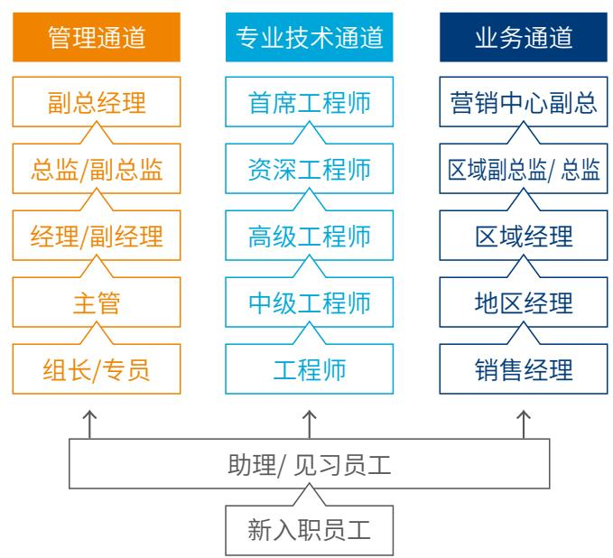

flowchart

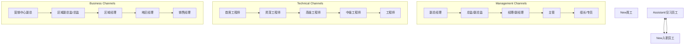
```mermaid
graph TD
  subgraph Management Channels
  A["副总经理"] --> B["总监/副总监"]
  B --> C["经理/副经理"]
  C --> D["主管"]
  D --> E["组长/专员"]
  end

  subgraph Technical Channels
  F["首席工程师"] --> G["资深工程师"]
  G --> H["高级工程师"]
  H --> I["中级工程师"]
  I --> J["工程师"]
  end

  subgraph Business Channels
  K["营销中心副总"] --> L["区域副总监/总监"]
  L --> M["区域经理"]
  M --> N["地区经理"]
  N --> O["销售经理"]
  end

  New員工
  Assistant/见习员工
  New入职员工
  Assistant/见习员工 <--> New入职员工
  Assistant/见习员工 <--> New入职员工
```

## 职业健康与安全

## 职业健康 >

新产业秉持“以人为本”的管理理念，始终将员工健康放在首位，通过各类举措，全方位保障员工身心健康。公司严格遵守《中华人民共和国安全生产法》《中华人民共和国职业病防治法》等职业健康安全相关法律法规，制定了《危险源控制程序》《职业病防治管理制度》《工伤管理制度》等管理制度，以识别、分析及管理日常运营中的潜在风险，保障员工的健康与安全。

<table><tr><td>工伤造成的死亡数量0人</td><td>工伤造成的重伤数量0人</td><td>除上述死亡及重伤之外工伤数量7人</td><td>因工伤损失工时数1,779小时</td></tr></table>

## 职业病防治

公司持续规范职业健康监护，预防职业病的发生。公司人力资源部对职业病危害开展统计分析和管理工作，在员工入职时如实告知其相关岗位职业病危害及其后果、职业病危害防护措施和待遇等，做好职业病防治措施，并签订《职业病危害岗位告知书》。

公司在生产车间醒目位置设置公告栏，发布有关职业病危害防治的规章制度、操作规程、职业病危害事故应急救援措施以及工作场所职业病危害因素检测和评价结果。公司每年度根据存在的职业病危害因素的类别、接触水平等情况，严格按照相关规定组织从事接触职业病危害因素和特殊作业的从业员工开展职业健康体检，并将体检报告存档形成个人职业健康档案，并如实告知员工职业健康体检结果。

## 保障身心健康

公司重视员工的身心健康，定期组织开展职业健康体检，常态化开展中医药健康讲座、义诊、解压心理讲座等活动，联动商业保险开展鹰瞳检测、中医把脉机等健康检测，设置心理健康咨询热线，保障员工身心健康发展。

为保障公司食堂食品卫生及生活饮用水安全水平，食堂工作人员均要求持证上岗，定期检查食品质量与卫生，对供餐关键环节实行记录表单化管理，实现全程可追溯，同时制定食品安全应急方案，明确突发事件处置流程。生活饮用水方面，明确水箱及直饮水检测标准与指标限值，定期委托外部机构检测水质，直饮水机定期清洗、更换滤芯，确保饮用水符合国家卫生标准。

## 安全管理 >

新产业始终将安全生产工作视为企业发展的生命线，坚定不移地贯彻落实安全生产责任制。为筑牢安全防线，公司通过定期举办安全宣贯和培训活动，多维度、深层次地增强员工的安全意识，全方位提升员工的安全技能，有效降低了各类安全风险。

## 牢筑安全根基

在安全培训与意识建设层面，公司构建了“入职必训+ 年度复训”的教育机制。本年度共开展6 期新员工入职安全专项培训及2 期全员安全再教育，实现岗位全覆盖。借助“安全生产月”与 “消防宣传月”等重要节点，通过知识宣讲、案例警示等多种形式，营造“人人讲安全”的文化氛围，不断强化全员安全理念与责任意识，筑牢思想防线。

在特种设备安全运维层面，公司建立起覆盖设备全生命周期的管理体系，严格落实电梯每日巡检与定期维护制度，完成特种设备安全标准化证书审验及技术档案更新，确保设备始终处于合规、安全、可靠的运行状态，从源头杜绝潜在隐患。

在消防安全管理层面，公司深入贯彻“预防为主、防消结合”的工作方针，持续优化消防设施配置，建立“日巡查、月检测、年维保”机制，定期开展设备功能测试。严格按照国家法规标准，确保办公区域内消防通道畅通无阻，配备齐全且符合标准的消防设施设备，并安排专人定期进行检查，及时消除安全隐患。

在危险品管理层面，公司严格执行危险品的有效管控。我们对各类化学品及易燃、易爆品分别按其特性进行妥善分类储存和防护。危险化学品仓库配备足够的防护设备、消防和应急处置设施，同时设立明显的警示标识。危险化学品根据其特性分类及SDS 文件存放于相应的危险化学品储存柜中，由专人按照规定对各类化学品进行管理和登记，由仓管员每季度对危险品进行盘点。

在应急管理层面，公司建立应急准备及响应机制。我们明确火灾、危险化学品事故、物品打击等多类应急事故的处置方案，按照应急方案的要求，配备应急物资，设备或设施，明确日常保管和检查责任人在应急资源配备上我们组建急救员团队，配置药箱及急救设备等。在应急疏散方面，全面规范办公及生产区域安全出口与疏散通道的标识管理，确保逃生路径清晰可辨。同步明确各楼层负责人与疏散引导员职责，构建起职责分明的应急指挥体系，为紧急情况下人员快速、有序撤离提供坚实保障。

## 应急演练及响应

公司持续贯彻执行安全生产应急预案体系。2025 年，我们围绕提升实战化应急处置能力，共组织各类应急演练与专项培训20 余场，全面覆盖重点风险场景，除消防疏散应急演练、危险化学品事故应急演练、剧毒品事故应急演练、危险废弃物污染处置等应急演练外，重点组织了宿舍消防应急演练、七氟丙烷气体灭火系统应急演练及电梯事故应急演练等专项应急演练，有效强化了全员的应急响应意识与实战处置能力。

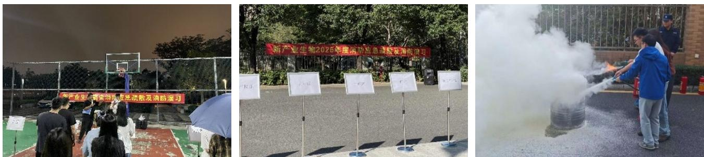

## 案例

## 危险化学品泄漏应急处置演练

2025年5月，我们在危化品仓库、危险废弃物暂存间等重点区域，开展了危险化学品泄漏专项演练。演练前，对涉及的仓库管理员、操作工及应急队员等1,000余名人员进行了系统培训，重点讲解了化学品危害特性、安全辨识及泄漏应急程序。演练模拟了泄漏事故发生、报告、初期处置及人员疏散的全过程，有效强化了关键岗位人员的风险防控与协同处置能力。

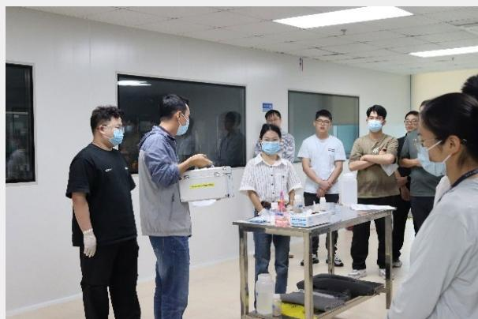

natural_image

Group of people wearing masks gathered around a table in an office setting, with medical supplies and equipment visible (no text or symbols)

## 案例

## 极端天气应急响应

2025年9月，超强台风“桦加沙”来袭，行政部闻“风”而动，迅速组建应急专班与巡查组。坚持从源头管控，提前全面清理下水道，加固地面及天台物体，筑牢安全防线。同时，强化常态防范，定期开展防雷检测，定期开展发电机组维保，并联合专业第三方维保机构出具专业维保报告，确保应急设施设备安全可靠。

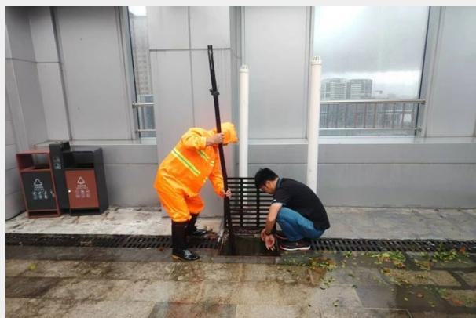

natural_image

Two people cleaning a manhole with a metal grate, one in orange raincoat and the other in black, on a rooftop (no visible text or symbols)

## 05

## 践行社会责任

本章节回应的重大性议题

· 行业交流与合作  
· 社区公益

本章节关联可持续发展目标（SDGs）

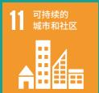

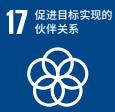

在稳步推进自身发展的同时，新产业始终不忘践行企业社会责任。依托专业优势与技术积淀，我们积极参与行业交流与合作，推动医疗检验知识普及，助力行业整体发展。我们联合多家医疗机构开展科研合作，推动慢病早诊早治，持续支持科研与教育事业，在诊断人才培养、医学研究推进等方面贡献我们的力量。

## 行业交流与合作

## 产学研合作及多中心研究 >

新产业积极响应《“十四五”医药工业发展规划》《“健康中国2030”规划纲要》，持续关注一线临床和检验的痛点和需求，高度重视“产学研医用”合作，与多家高校、医院、企业围绕疾病诊疗、医疗技术发展、体外诊断产品研发、技术产业化转移、人才联合培养等领域开展全方位合作，利用各方优势，共同推动体外诊断领域多元化的产品和技术创新。我们积极响应国家“四大慢性病防治行动”号召，联合多家医疗机构开展科研合作，助力慢病早诊早治。

## 案例

## 原发性醛固酮增多症患者醛固酮、肾素的筛查、确诊切点建立及临床应用评价多中心研究

2025年3月29日，公司参与并支持的“原发性醛固酮增多症患者醛固酮、肾素的筛查、确诊切点建立及临床应用评价”多中心研究及“我国不同地区醛固酮、肾素参考区间建立的多中心研究”在深圳结题。通过此次多中心研究推动了国内原醛症筛查及诊断的标准化，有助于进一步推动开展原醛基层筛查工作。

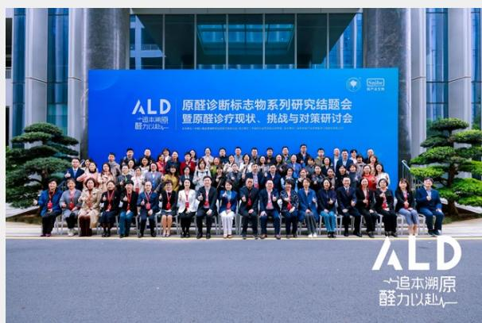

text_image

ALD
原醛诊断标志物系列研究结题会
暨原醛诊疗现状、挑战与对策研讨会
ALD
→追本溯原
醛力以赴

## 案例

## 高敏肌钙蛋白I浓度及变化判断急性心肌梗死的临床应用多中心研究

2025年4月19日，公司参与并支持的“高敏肌钙蛋白I浓度及变化判断急性心肌梗死的临床应用多中心研究”在南京召开启动会，此次多中心研究将联合机器学习算法转静态数据为时间序列动态、多模态诊断模型，开发更灵活、更精准、更满足中国人群诊疗需求的诊断方案，也标志着公司在心肌标志物临床应用研究领域再上新台阶。

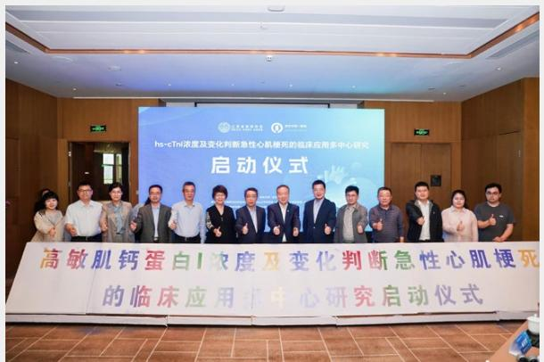

text_image

hs-cTnI浓度及变化判断急性心肌梗死的临床应用多中心研究
启动仪式
高敏肌钙蛋白I浓度及变化判断急性心肌梗死的临床应用多中心研究启动仪式

## 案例

## 肿瘤免疫治疗相关内分泌系统毒性谱系建立及其对患者临床结局影响的真实世界研究

2025年12月14日，我司与20家顶尖三甲医院合作的“肿瘤免疫治疗相关内分泌系统毒性谱系建立及其对患者临床结局影响的真实世界研究”在北京启动，本次多中心研究，通过系统性构建毒性管理模式，推动着肿瘤治疗从“以疾病为中心”向“以患者为中心”的深刻转变。

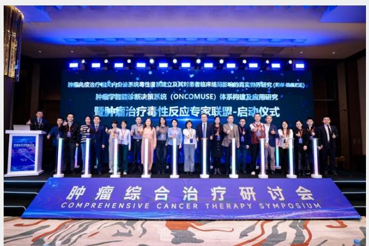

text_image

肿瘤免疫治疗相关内分泌系统毒性监测建立及其对患者临床结局影响的真实世界研究（肿瘤毒症）
肿瘤学智能诊断决策系统（ONCOMUSE）体系构建及应用研究
暨肿瘤治疗毒性反应专家联盟-启动仪式
肿瘤综合治疗研讨会
COMPREHENSIVE CANCER THERAPY SYMPOSIUM

## 学术推广与普及 >

## 助力慢病管理事业及价值医疗实践

我国医疗体系正经历深刻变革，DRG/DIP 支付改革的全面推进，标志着医疗价值评价体系从“以量计酬”向“以效定价”转变，价值医疗理念逐渐深入人心。公司充分发挥在检验医学领域的优势地位，推动慢病管理及价值医疗的探索实践。2025 年，公司持续在慢病管理领域组织开展了多项活动，相关会议汇聚了来自检验医学领域的专家学者，深入探讨疾病预防和治疗的策略、前沿理念、最新技术和实践挑战，旨在推动慢性病的精准诊断和临床管理，助力我国慢病管理事业的高质量发展，为“健康中国2030”战略目标的实现提供“适宜精准”的解决方案。

## 参与检验医学图书、临床手册的编制

公司作为主编单位参与了中国检验医学权威专家牵头主编的《医学检验装备与应用》（免疫部分、生化部分、实验室智能化信息化部分）、《体外诊断产品研发与评价专家共识》，并参与了《体外诊断企业运营与管理》教材的编写，将化学发光、生化、自动化流水线、试剂研发、实验室智慧化建设等领域的技术积累转化为标准化知识和共识，所出版书籍具有权威性与实践指导性，推动行业技术标准化，让体外诊断产品研发与评价更加符合当前需求，并助力新医科背景下医学检验技术专业特色人才培养的创新型教材的高质量发布。

为积极响应国家检验项目套餐优化政策，公司主导发起了《临床检验项目开展依据手册》编写，助力医疗终端开展真正有意义、有临床检验价值的检测项目，及相关疾病筛查、治疗、预后的精准检测，赋能价值医疗。

## 助力临床学术研究

截止到2025 年末，Snibe 全球用户发表Snibe 产品相关国际期刊论文超600 篇、学术海报约200 篇。围绕小分子“Snibe-NACA”检测产品，Snibe 联合多家权威医院，已开展16 项医学研究，目前相关学术论文已发表25 篇。大量真实客户研究数据显示，“Snibe-NACA”检测技术有效解决临床痛点，助力疾病精准诊疗。

## 普及检验知识

积极推动临床医学知识的普及是我们作为生物医药企业履行社会责任的重要组成部分，我们通过发布专业推文，科普海报线上专业知识交流等形式进行检验医学知识的普及。

公司联合丁香园通过医学论坛方式开展线上学术交流，以及组织开展了13 场线下学术交流会议普及检验医学知识，推动行业交流与合作。

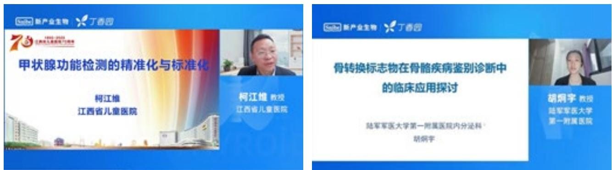

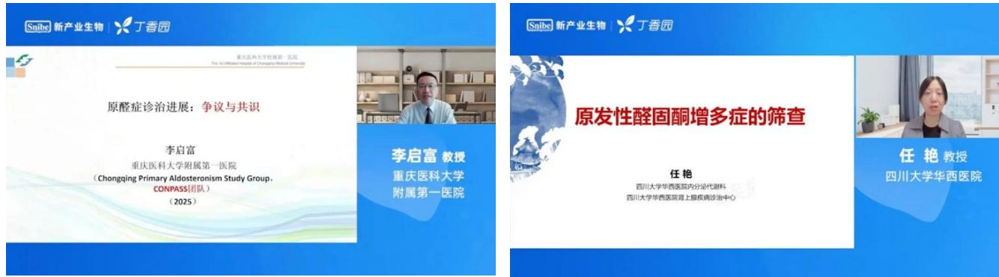

2025 年，公司海外市场部通过宣传海报形式，借助公司自媒体平台，依托世界健康重要节日的契机来宣传检验医学知识，履行企业社会责任。

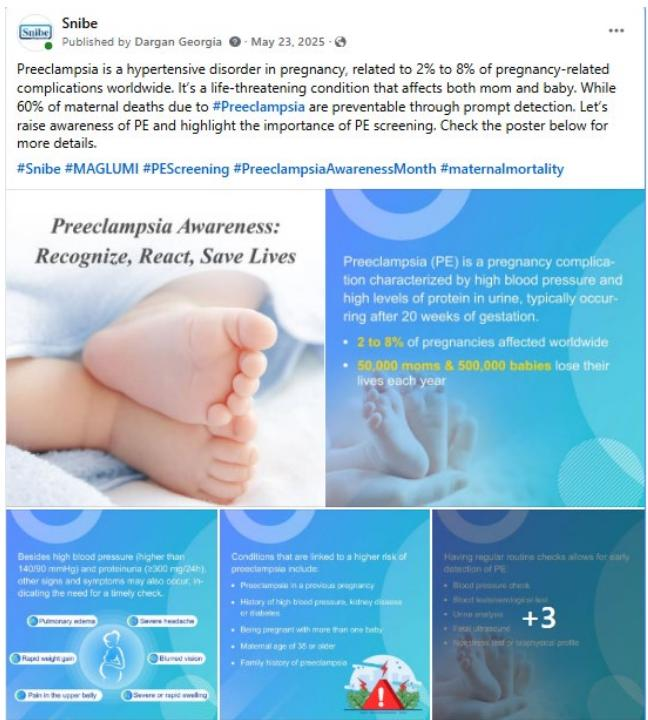

text_image

Preeclampsia is a hypertensive disorder in pregnancy, related to 2% to 8% of pregnancy-related complications worldwide. It's a life-threatening condition that affects both mom and baby. While 60% of maternal deaths due to #Preeclampsia are preventable through prompt detection. Let's raise awareness of PE and highlight the importance of PE screening. Check the poster below for more details.
#Snibe #MAGLUMI #PEScreening #PreeclampsiaAwarenessMonth #maternalmortality
Preeclampsia Awareness:
Recognize, React, Save Lives
Preeclampsia (PE) is a pregnancy complication characterized by high blood pressure and high levels of protein in urine, typically occurring after 20 weeks of gestation.
• 2 to 8% of pregnancies affected worldwide
• 50,000 moms & 500,000 babies lose their lives each year
Besides high blood pressure (higher than 140/90 mmHg) and protosthma (c/360 mg/24h), other signs and symptoms may also occur, indicating the need for a timely check.
Conditions that are linked to a higher risk of preeclampsia include:
• Preeclampsia in a previous pregnancy
• History of high blood pressure, kidney disease or diabetes
• Being pregnant with more than one baby
• Maternal age of 36 or older
• Family history of preeclampsia
Having regular routine checks allows for early detection of PE
• Blood pressure check
• Blood biotechnological test
• Urine analysis
• Fetal ultrasound
• Neckache test or biophysical profile
+3
Pulmonary edema
Severe headache
Rapid weight gain
Burned vision
Pain in the upper belly
Severe or rapid swelling

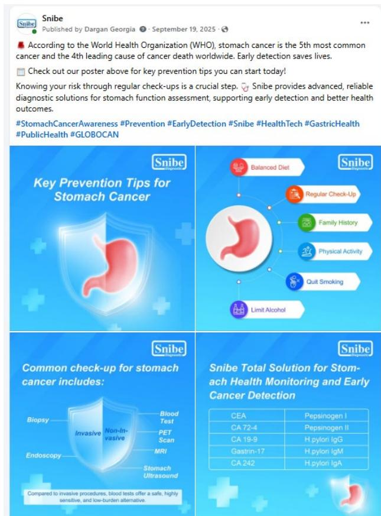

flowchart

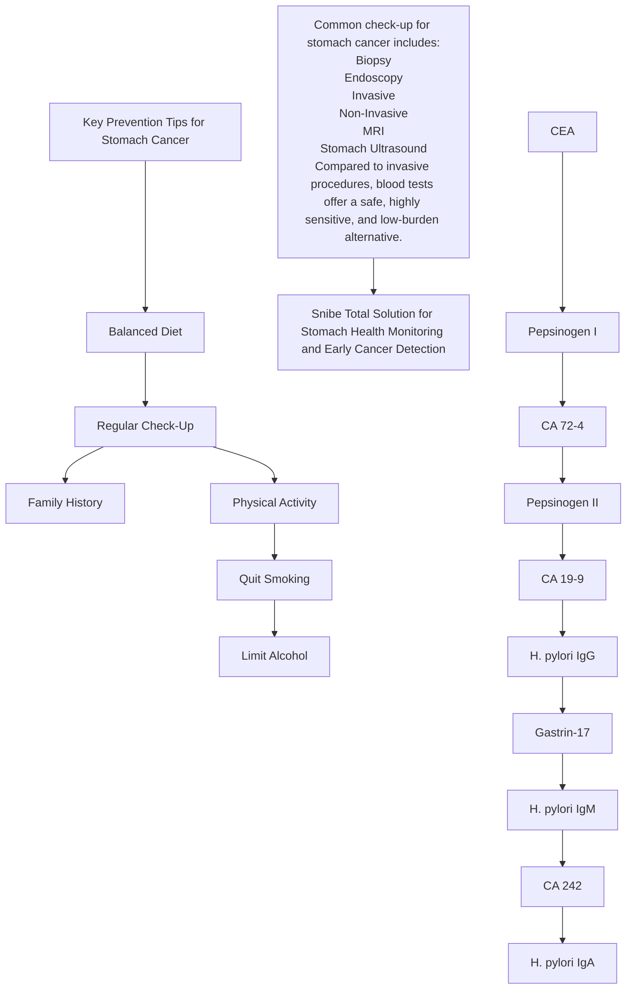
```mermaid
graph TD
  A["Key Prevention Tips for Stomach Cancer"] --> B["Balanced Diet"]
  B --> C["Regular Check-Up"]
  C --> D["Family History"]
  C --> E["Physical Activity"]
  E --> F["Quit Smoking"]
  F --> G["Limit Alcohol"]
  
  H["Common check-up for stomach cancer includes:\nBiopsy\nEndoscopy\nInvasive\nNon-Invasive\nMRI\nStomach Ultrasound\nCompared to invasive procedures, blood tests offer a safe, highly sensitive, and low-burden alternative."] --> I["Snibe Total Solution for Stomach Health Monitoring and Early Cancer Detection"]
  J["CEA"] --> K["Pepsinogen I"]
  K --> L["CA 72-4"]
  L --> M["Pepsinogen II"]
  M --> N["CA 19-9"]
  N --> O["H. pylori IgG"]
  O --> P["Gastrin-17"]
  P --> Q["H. pylori IgM"]
  Q --> R["CA 242"]
  R --> S["H. pylori IgA"]
```

## 助力行业标准化 >

## 深度参与标准化组织建设

公司积极投身行业标准化组织建设，主动参与各级标准化技术委员会工作并积极申请委员资格，以专业能力助力行业及标准化工作高质量发展。2025 年，公司成功加入两个国家级及国际对口标准化技术组织：饶捷同志入选 ISO/TC212 医学实验室和体外诊断技术委员会国内技术对口工作组 WG3 体外诊断产品小组成员，杜凯同志当选为 TC136 全国医用临床检验实验室和体外诊断系统标准化技术委员会委员。依托委员身份，公司将更深度参与行业标准化工作，持续为行业规范化、高质量发展贡献专业力量。

## 参与标准品研制及标准制修订工作

公司积极融入国内外标准化工作体系，不仅投身于国家及国际标准品的定值研究工作，还全方位参与到国家标准、行业标准以及团体标准的制定工作当中，凭借卓越的专业能力与深厚的行业积淀，充分发挥行业领军企业的带头作用，助力检验结果互认工作。

报告期内，公司参与研制和协作标定的国家标准品、国家参考品、国际标准品共20 个，主导或参与起草的试剂相关国家标准、行业标准以及团体标准共11 项，参考方法建立1 项，进一步加强以上诊断产品的溯源一致性和结果互认性。为行业发展提供了科学规范与指引，有力推动行业的标准化、规范化进程。

报告期公司参与的标准品、参考品及标准制定情况如下：

<table><tr><td>类型</td><td>项目简称</td><td>中文名称</td><td>进展</td></tr><tr><td rowspan="12">国家标准品</td><td>HCG</td><td>人绒毛膜促性腺激素</td><td>完成协助定值、均匀性、稳定性试验,已发布。</td></tr><tr><td>FSH</td><td>促卵泡激素</td><td>完成协助定值、均匀性、稳定性试验,待发布。</td></tr><tr><td>TSH</td><td>促甲状腺激素</td><td>完成协助定值、均匀性、稳定性试验,已发布。</td></tr><tr><td>tPSA</td><td>总前列腺特异性抗原</td><td>完成协助定值,待发布。</td></tr><tr><td>fPSA</td><td>游离前列腺特异性抗原</td><td>完成协助定值,待发布。</td></tr><tr><td>IGF-1</td><td>胰岛素样生长因子-1</td><td>完成期间核查实验</td></tr><tr><td>TNF- $\alpha$ </td><td>肿瘤坏死因子- $\alpha$ </td><td>完成协助定值,待发布。</td></tr><tr><td>IL-6</td><td>白细胞介素-6</td><td>完成协助定值,待发布。</td></tr><tr><td>17 $\alpha$ -OHP</td><td>17 $\alpha$ -羟孕酮</td><td>完成协助定值和适用性研究,待发布。</td></tr><tr><td>PROG</td><td>孕酮</td><td>完成协助定值和适用性研究,待发布。</td></tr><tr><td>TEST</td><td>睾酮</td><td>完成协助定值和适用性研究,待发布。</td></tr><tr><td>ALD</td><td>醛固酮</td><td>赋值和申报准备阶段</td></tr><tr><td rowspan="7">国家参考品</td><td>Anti-HCV</td><td>丙型肝炎病毒抗体</td><td>完成协助定值,待发布。</td></tr><tr><td>CMV IgM</td><td>巨细胞病毒IgM抗体</td><td>完成协助定值,待发布。</td></tr><tr><td>B19 IgM</td><td>人类细小病毒B19 IgM抗体</td><td>完成协助定值,待发布。</td></tr><tr><td>Toxo IgM</td><td>弓形虫IgM抗体</td><td>完成协助定值,待发布。</td></tr><tr><td>Rubella IgM</td><td>风疹病毒IgM抗体</td><td>完成协助定值,待发布。</td></tr><tr><td>HBs Ag(发光)</td><td>乙型肝炎表面抗原(发光)</td><td>完成协助定值,待发布。</td></tr><tr><td>HBs Ag(快检)</td><td>乙型肝炎表面抗原(快检)</td><td>完成协助定值,待发布。</td></tr><tr><td>国际标准品</td><td>TNF-α</td><td>肿瘤坏死因子-α</td><td>完成协助定值,待发布。</td></tr></table>

<table><tr><td>类型</td><td>标准名称</td><td>主办单位</td><td>进展</td></tr><tr><td rowspan="2">国家标准制定</td><td>医用全自动样本处理系统</td><td>全国医用临床检验实验室和体外诊断系统标准化技术委员会</td><td>参与起草,已于2025年10月发布。</td></tr><tr><td>体外诊断医疗器械制造商提供的信息(标示)第1部分:术语、定义和通用要求</td><td>全国医用临床检验实验室和体外诊断系统标准化技术委员会</td><td>参与起草,已进入标准报批阶段。</td></tr><tr><td rowspan="4">行业标准制定</td><td>17α-羟孕酮测定试剂盒(标记免疫分析法)</td><td>全国医用临床检验实验室和体外诊断系统标准化技术委员会</td><td>主导起草,已于2025年6月发布。</td></tr><tr><td>体外诊断医疗器械 建立量值计量溯源性的实施指南 第1部分:溯源至SI</td><td>全国医用临床检验实验室和体外诊断系统标准化技术委员会</td><td>参与起草,已进入标准报批阶段。</td></tr><tr><td>血氨测定试剂盒</td><td>全国医用临床检验实验室和体外诊断系统标准化技术委员会</td><td>参与起草,已进入标准报批阶段。</td></tr><tr><td>皮质醇测定试剂盒</td><td>全国医用临床检验实验室和体外诊断系统标准化技术委员会</td><td>参与起草,已进入标准报批阶段。</td></tr><tr><td rowspan="5">团体标准制定</td><td>血管内皮生长因子测定试剂盒(磁微粒化学发光法)</td><td>中国检验检测学会</td><td>参与起草,已于2025年7月发布。</td></tr><tr><td>免疫分析 测量结果的不确定度评定</td><td>中国计量测试学会</td><td>参与起草,已进入标准报批阶段。</td></tr><tr><td>实验室智慧化建设和评价指南第2部分:医学实验室</td><td>中国生产力促进中心协会</td><td>参与起草,已于2025年1月发布。</td></tr><tr><td>区域医学检验中心信息化建设技术要求</td><td>全国卫生产业企业管理协会医院管理与信息化建设分会</td><td>副主编单位参与标准编写,起草中。</td></tr><tr><td>全自动化学发光免疫分析仪</td><td>中国国际经济技术合作促进会标准化工作委员会</td><td>参与起草,已进入标准报批阶段。</td></tr><tr><td>检测参考方法建立</td><td>FT3/FT4小分子游离激素液相质谱标准参考方法的开发</td><td>国家卫生健康委员会临床检验中心、广东省中医院</td><td>方法建立验证,文章发表中。</td></tr></table>

## 助力实验室质量管理标准化

实验室质量管理和检验能力是不同医疗机构检查检验结果一致性的保障，是检验结果互认的基础。ISO 15189 作为当前国际上最权威的医学实验室能力认可标准，公司以国家政策为导向，推出标准化实验室建设解决方案，涵盖ISO15189 认可服务、质量监督服务，基层质量提升服务，全方位覆盖实验室多维度标准化建设需求，推动实验室“标准化”建设。

为推动ISO 15189 认证工作的普及，2025 年度共计为82 家医院提供ISO15189 培训辅导，其中三级医院占比高达87%。公司持续完善服务解决方案，全力推进卫生健康领域标准化与智慧化实验室的建设，助推“检验结果互认战略”的实施。

## 案例

## 医学实验室认可与质量管理培训班

2025年7月，由广东省中西医结合学会主办的“医学实验室质量管理培训班暨ISO15189内审员培训班”在公司总部举办，助力全面推进医学实验室质量管理体系规范化建设，提升实验室质量管理和技术能力水平，助力医疗机构高质量发展。

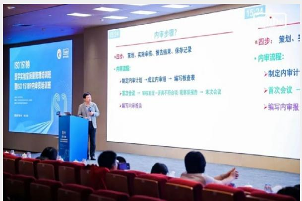

text_image

ISO 1519
是字实验室高质量管理培训班
ISO 1518中容易培训班

内审步骤？
• 四步：策划、实施审核、报告结果、保存记录
• 内审流程：
• 制定内审计划 → 成立内审组 → 编写核查表
• 首次会议 → 审核发现 → 开真不符合项、观察事项报告 → 次次会议
• 编写内审报告

四步：策划、实施审核、报告结果、保存记录
• 四步：策划、实施审核、报告结果、保存记录
• 内审流程：
• 制定内审计划 → 审核发现 → 开真不符合项、观察事项报告 → 次会议
• 编写内审报告

## 国际间交流与合作 >

## 战略合作

2025 年，我们与全球20 余个国家政府卫生部门、权威医学检验协会等签署战略合作备忘录，新增了拉丁美洲、中亚及大洋洲等多个地区的合作伙伴，签约机构类型也从之前的专业协会为主，拓展至政府、企业、高校及国际联盟等更广泛的领域此举标志着公司在国际医学检验领域的合作日趋深化，影响力不断提升，有助于推动体外诊断优质产品的进一步推广和普及。

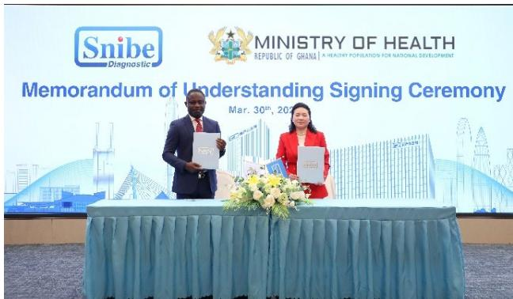

text_image

Snibe
Diagnostic
MINISTRY OF HEALTH
REPUBLIC OF GHANIA | A HEALTHY POPULATION FOR NATIONAL DEVELOPMENT
Memorandum of Understanding Signing Ceremony
Mar. 30th, 2021

2025 年3 月30 日，  
加纳卫生部部长Hon. Kwabena Minitah Akandoh与公司副总经理刘海燕女士在深圳共同签署战略合作备忘录。

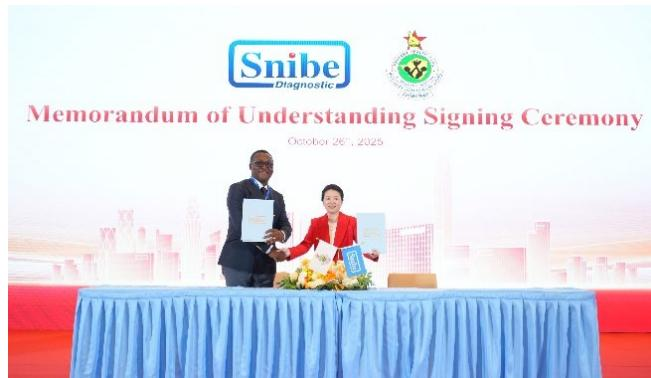

text_image

Snibe
Diagnostic
Memorandum of Understanding Signing Ceremony
October 26th, 2025

2025 年10 月26 日，  
津巴布韦卫生部部长Dr. Raiva Simbi 与公司副总经  
理刘海燕女士在深圳共同签署战略合作备忘录。

## 支持一带一路国家临床检验工作

我们积极响应“一带一路”倡议，大力推进在非洲的业务拓展，并在“走出去”的过程中致力于加强中非合作，实现互利共赢。

我们积极参与中非卫生健康合作论坛与非洲多国卫生部门官员，医学机构代表及行业专家共同聚售欠发达地区检验医学的发展路径与未来规划。我们系统分享了适用于资源有限环境的体外诊断解决方案与本地化实践经验，并就提升基层实验室能力、优化公共卫生筛查网络、加强人员培训与技术转移等关键议题展开务实讨论。通过搭建开放协作的对话平台，Snibe 致力于推动适宜技术普惠、促进中非检验医学领域的知识共享与能力共建，为提升非洲等欠发达地区医疗可及性、助力全球健康公平可及贡献专业力量。

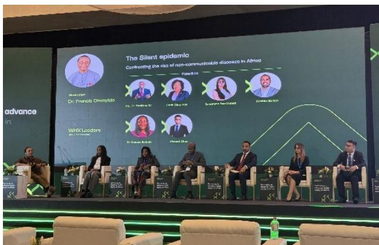

text_image

The Silent epidemic
Construsting the rise of non-communicable disposal in Aftrag
Papier III 104
Mehler/2007
Dr. Francisco Ohempido
WIK Leaders
Dr. Francis Bickin
Diane She
Suzhouheng Tanjia
Guan Liang Liang

2025 年12 月，  
在加纳WHX Leaders 我司代表参与论坛小组讨论。

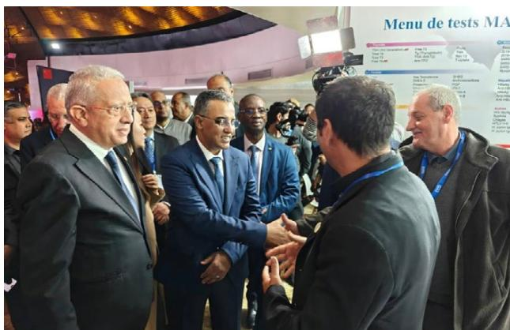

text_image

Photo of a formal indoor event with officials shaking hands, featuring visible signage including 'Menu de tests MA' and media recording equipment.

2025 年11 月，  
在突尼斯举办的中非医学发展论坛期间，突尼斯卫生部部长来我司展台观摩。

## 社区公益

## 支持科研和教育 >

## 支持科研工作

我们积极履行企业社会责任与义务，以能力所长，在普惠诊断知识、推动实验室可持续发展、培养诊断人才、支持教育和医学研究等方面做出实际贡献。

2025 年，公司正式成为EFLM GREEN LABS（绿色实验室）项目的官方赞助商，深度参与并支持这一推动临床实验室可持续发展的重要行业计划。该项目由EFLM“绿色与可持续实验室委员会”发起，致力于推动实验室医学向可持续医疗体系转型，从生态、社会和经济维度高效利用资源，在保障医疗服务质量的前提下，减少能源消耗、水资源浪费与危险化学品使用，助力欧洲实现2050 年碳中和目标。

## 案例

## 支持公共医疗卫生事业的发展

2025年10月，公司为促进公共医疗卫生事业的发展，推动检验医学相关项目的科学研究，公司向广东省钟南山医学基金会捐赠50万元。

我们密切关注临床化学与检验医学领域涌现的杰出青年研究者和科学家，通过连续支持IFCC设立青年研究者奖（IECCYoung Investigator Award）、实验室医学和患者护理杰出奖（IFCC Distinguished Award for Laboratory Medicineand Patient Care），表彰和鼓励在临床化学与实验室医学领域取得突出科学成就的青年学者，及在改善患者护理方面的应用以及在临床医学领域产生全球影响方面做出独特贡献的个人。

## 案例

## 赞助杰出青年研究者

2025年5月14日，在布鲁塞尔Euromedlab开幕式大会上，我司作为IFCC青年研究者奖（IFCC YoungInvestigator Award）的特别赞助商参与并支持这一重要奖项。该奖项旨在表彰40岁以下、在临床化学与实验室医学领域取得突出科学成就的青年学者。本届获奖者为Christopher Farnsworth博士。我司副总经理刘海燕女士受邀为获奖者颁奖，进一步向欧洲及全球行业专家与客户展现了Snibe的企业形象与专业影响力。

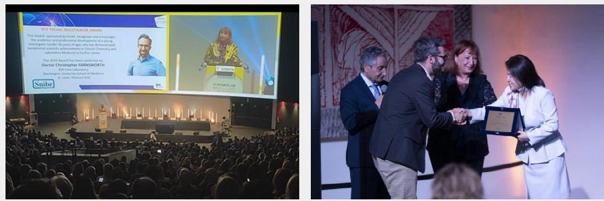

## 助力全球诊断人才培养

公司深知技术合作的重要性，近年来在非洲区开展了多项学术交流活动，定期邀请知名讲师分享检验技术及行业经验。这些活动提升了当地医务人员的诊疗能力，还推动了医疗技术的互学互鉴，强化了双方在专业领域的深度互动。

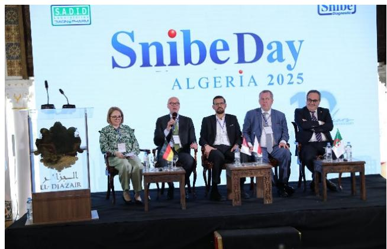

text_image

SADID
SnibeDay
ALGERÍA 2025
EL DIAZAIR

2025 年4 月24 日，

公司在阿尔及利亚与国际检验协会IFCC 联合举办Snibe day 国际检验医学学术讲堂。

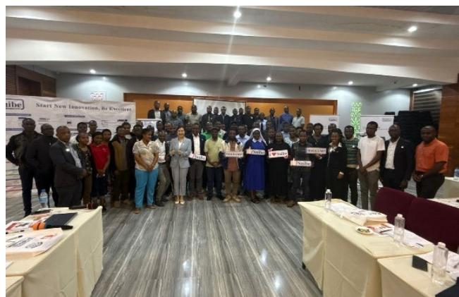

text_image

Start New Innovation, Be Excellent
2016

2025 年3 月14 日，

在坦桑尼亚举办检验医学知识研讨会。

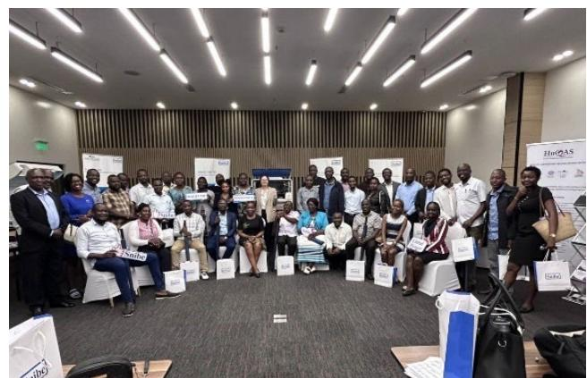

text_image

Group photo of participants in a conference room with visible signage including 'HerQAS' and 'SIBA'

2025 年3 月21 日，

在肯尼亚举办检验医学知识研讨会。

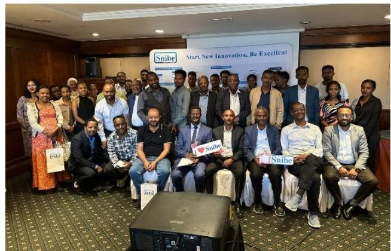

text_image

Snibe
Start New Innovation, Be Excellent

2025 年6 月28 日，

在埃塞俄比亚举办检验医学知识研讨会

## 支持社区公益 >

作为一家秉持强烈社会责任与民族担当的生物医药上市企业，公司始终将企业社会责任深度融入发展战略，主动扛起社会责任使命。

教育是国之大计、党之大计，公司高度关注教育事业的高质量发展，主动投身科普教育与公益助学实践，以实际行动为社会主义教育事业蓬勃发展添砖加瓦。2025年度，公司凭借在科普教育领域的扎实实践与突出贡献，荣获科创局颁发的“科普教育基地”荣誉称号，进一步夯实了科普教育工作的基础。公司坚守社会责任初心，扎实开展科普教育活动，2025 年度先后接待坪山外国语学校、东部湾实验学校师生参观交流，累计接待师生60 余人次，为学生们搭建起了解医疗器械领域前沿技术、行业发展的窗口，有效激发青少年对科学探索、生物医药领域的兴趣与热情，践行企业科普教育责任。

同时，积极响应国家乡村振兴战略号召，主动参与乡村振兴公益事业，向坪山区慈善会捐赠1 万元，以实际捐赠助力乡村发展，传递企业温暖，彰显民族生物医药企业的责任与担当。

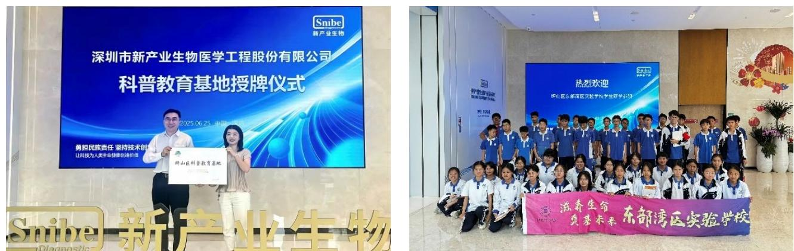

经济指标

<table><tr><td>指标</td><td>单位</td><td>2023年</td><td>2024年</td><td>2025年</td></tr><tr><td>营业收入</td><td>万元</td><td>392,965.57</td><td>453,540.45</td><td>457,675.95</td></tr><tr><td>营业成本</td><td>万元</td><td>106,247.60</td><td>126,653.49</td><td>140,724.23</td></tr><tr><td>资产总值</td><td>万元</td><td>822,248.88</td><td>961,945.35</td><td>994,075.80</td></tr><tr><td>资产负债率</td><td>%</td><td>8.25</td><td>10.84</td><td>8.01</td></tr><tr><td>归属上市公司股东净利润</td><td>万元</td><td>165,365.32</td><td>182,845.66</td><td>162,025.22</td></tr><tr><td>每股收益</td><td>元/股</td><td>2.1054</td><td>2.3271</td><td>2.0621</td></tr></table>

## 环境指标

温室气体排放

<table><tr><td>指标</td><td>单位</td><td>2023年</td><td>2024年</td><td>2025年</td></tr><tr><td>直接排放(范围一)</td><td>吨二氧化碳当量</td><td>452.82</td><td>1,138.78</td><td>2,589.96</td></tr><tr><td>间接排放(范围二)</td><td>吨二氧化碳当量</td><td>12,288.54</td><td>14,213.66</td><td>14,481.52</td></tr><tr><td>排放总量(范围一和范围二)</td><td>吨二氧化碳当量</td><td>12,741.36</td><td>15,352.44</td><td>17,071.48</td></tr><tr><td>单位营收碳排放强度</td><td>吨二氧化碳当量/万元营收</td><td>0.0324</td><td>0.0339</td><td>0.0373</td></tr></table>

能源

<table><tr><td>指标</td><td>单位</td><td>2023年</td><td>2024年</td><td>2025年</td></tr><tr><td>外购电力</td><td>千瓦时</td><td>21,735,492.00</td><td>26,480,307.55</td><td>27,281,049.87</td></tr><tr><td>天然气</td><td>立方米</td><td>51,093.00</td><td>55,181.00</td><td>51,719.00</td></tr><tr><td>柴油</td><td>吨</td><td>12.60</td><td>12.09</td><td>9.89</td></tr><tr><td>汽油</td><td>吨</td><td>27.30</td><td>27.33</td><td>25.16</td></tr><tr><td>直接能源消耗量</td><td>吨标准煤</td><td>120.57</td><td>124.84</td><td>114.23</td></tr><tr><td>间接能源消耗量</td><td>吨标准煤</td><td>2,671.29</td><td>3,254.43</td><td>3,352.84</td></tr><tr><td>综合能源消耗量</td><td>吨标准煤</td><td>2,791.86</td><td>3,379.27</td><td>3,467.07</td></tr><tr><td>单位营收能耗强度</td><td>吨标准煤/万元营收</td><td>0.0071</td><td>0.0075</td><td>0.0076</td></tr></table>

水资源

<table><tr><td>指标</td><td>单位</td><td>2023年</td><td>2024年</td><td>2025年</td></tr><tr><td>取水量</td><td>立方米</td><td>235,533</td><td>244,266</td><td>250,223</td></tr><tr><td>取水强度</td><td>立方米/万元营收</td><td>0.5994</td><td>0.5386</td><td>0.5467</td></tr><tr><td>浓水回收量</td><td>立方米</td><td>19,396.80</td><td>20,870.10</td><td>21,679.70</td></tr></table>

废弃物

<table><tr><td>指标</td><td>单位</td><td>2023年</td><td>2024年</td><td>2025年</td></tr><tr><td>医疗废弃物</td><td>吨</td><td>95.50</td><td>149.30</td><td>122.32</td></tr><tr><td>危险废弃物</td><td>吨</td><td>0.88</td><td>2.08</td><td>2.81</td></tr><tr><td>一般工业固废</td><td>吨</td><td>51.60</td><td>87.00</td><td>211.46</td></tr></table>

环境合规

<table><tr><td>指标</td><td>单位</td><td>2023年</td><td>2024年</td><td>2025年</td></tr><tr><td>重大罚款货币总值</td><td>人民币</td><td>0</td><td>0</td><td>0</td></tr><tr><td>非货币制裁总数</td><td>次</td><td>0</td><td>0</td><td>0</td></tr><tr><td>通过争端解决机制提起的案件</td><td>次</td><td>0</td><td>0</td><td>0</td></tr></table>

## 社会指标

多元平等雇佣

<table><tr><td>指标</td><td>单位</td><td>2023年</td><td>2024年</td><td>2025年</td></tr><tr><td>员工数量</td><td>人</td><td>2,627</td><td>2,841</td><td>2,785</td></tr><tr><td>男性员工</td><td>%</td><td>64.94</td><td>63.57</td><td>63.38</td></tr><tr><td>女性员工</td><td>%</td><td>35.06</td><td>36.43</td><td>36.62</td></tr><tr><td>管理层中男性占比</td><td>%</td><td>70.71</td><td>69.05</td><td>69.73</td></tr><tr><td>管理层中女性占比</td><td>%</td><td>29.29</td><td>30.95</td><td>30.27</td></tr><tr><td>30岁以下员工</td><td>%</td><td>62.31</td><td>62.44</td><td>58.42</td></tr></table>

多元平等雇佣

<table><tr><td>指标</td><td>单位</td><td>2023年</td><td>2024年</td><td>2025年</td></tr><tr><td>30岁-40岁员工</td><td>%</td><td>33.80</td><td>33.09</td><td>35.73</td></tr><tr><td>40岁-50岁员工</td><td>%</td><td>3.43</td><td>4.05</td><td>5.35</td></tr><tr><td>50岁以上员工</td><td>%</td><td>0.46</td><td>0.42</td><td>0.50</td></tr><tr><td>大专及以下</td><td>%</td><td>29.62</td><td>27.49</td><td>26.71</td></tr><tr><td>本科</td><td>%</td><td>52.87</td><td>52.76</td><td>52.42</td></tr><tr><td>硕士研究生</td><td>%</td><td>17.24</td><td>19.43</td><td>20.43</td></tr><tr><td>博士研究生</td><td>%</td><td>0.27</td><td>0.32</td><td>0.43</td></tr></table>

员工吸引与留存

<table><tr><td>指标</td><td>单位</td><td>2023年</td><td>2024年</td><td>2025年</td></tr><tr><td>新引进员工数</td><td>人</td><td>594</td><td>563</td><td>212</td></tr><tr><td>员工流失率 $^{\text{1}}$ </td><td>%</td><td>12.49</td><td>9.56</td><td>8.21</td></tr></table>

员工薪酬与福利

<table><tr><td>指标</td><td>单位</td><td>2023年</td><td>2024年</td><td>2025年</td></tr><tr><td>员工劳动合同签订率</td><td>%</td><td>100</td><td>100</td><td>100</td></tr><tr><td>员工社会保险覆盖率</td><td>%</td><td>100</td><td>100</td><td>100</td></tr></table>

员工培训和发展

<table><tr><td>指标</td><td>单位</td><td>2023年</td><td>2024年</td><td>2025年</td></tr><tr><td>培训总时长</td><td>小时</td><td>164,366</td><td>86,482</td><td>96,743</td></tr><tr><td>培训总人次</td><td>人次</td><td>33,109</td><td>13,298</td><td>33,899</td></tr></table>

职业健康与安全

<table><tr><td>指标</td><td>单位</td><td>2023年</td><td>2024年</td><td>2025年</td></tr><tr><td>环境及职业健康安全投入</td><td>万元</td><td>/</td><td>409.5</td><td>458</td></tr><tr><td>职业健康体检覆盖率</td><td>%</td><td>100</td><td>100</td><td>100</td></tr></table>

①员工流失率=年度离职人数/全年平均在职人数

职业健康与安全

<table><tr><td>指标</td><td>单位</td><td>2023年</td><td>2024年</td><td>2025年</td></tr><tr><td>工伤导致的员工死亡数量和死亡率</td><td>人;%</td><td>0</td><td>0</td><td>0</td></tr><tr><td>除死亡和重伤的工伤人数</td><td>人</td><td>5</td><td>6</td><td>7</td></tr><tr><td>因工伤损失工时数</td><td>小时</td><td>635.04</td><td>1,773.04</td><td>1779</td></tr></table>

反歧视

<table><tr><td>指标</td><td>单位</td><td>2023年</td><td>2024年</td><td>2025年</td></tr><tr><td>报告期内发生的歧视事件总数</td><td>件</td><td>0</td><td>0</td><td>0</td></tr></table>

产品与服务质量

<table><tr><td>指标</td><td>单位</td><td>2023年</td><td>2024年</td><td>2025年</td></tr><tr><td>质量管理体系认证证书</td><td>张</td><td>3</td><td>3</td><td>3</td></tr><tr><td>外部监管机构审核</td><td>次</td><td>5</td><td>6</td><td>5</td></tr><tr><td>第三方质量体系审核</td><td>次</td><td>7</td><td>8</td><td>8</td></tr><tr><td>客户投诉处理综合满意度</td><td>%</td><td>100</td><td>100</td><td>100</td></tr><tr><td>因违反规定而受到罚款或处罚的事件</td><td>次</td><td>0</td><td>0</td><td>0</td></tr><tr><td>因违反规定而受到警告的事件</td><td>次</td><td>0</td><td>0</td><td>0</td></tr><tr><td>违反自愿性守则的事件</td><td>次</td><td>0</td><td>0</td><td>0</td></tr><tr><td>产品召回数量</td><td>个</td><td>0</td><td>0</td><td>0</td></tr></table>

产品研发与创新

<table><tr><td>指标</td><td>单位</td><td>2023年</td><td>2024年</td><td>2025年</td></tr><tr><td>研发人员总人数</td><td>人</td><td>693</td><td>836</td><td>781</td></tr><tr><td>研发投入金额</td><td>万元</td><td>36,604.71</td><td>45,358.80</td><td>47,776.93</td></tr><tr><td>累计申请专利数</td><td>件</td><td>523</td><td>629</td><td>743</td></tr><tr><td>有效授权专利数</td><td>件</td><td>335</td><td>388</td><td>426</td></tr><tr><td>有效发明专利数</td><td>件</td><td>142</td><td>169</td><td>197</td></tr><tr><td>全球可提供检验的化学发光免疫试剂项目</td><td>项</td><td>199</td><td>224</td><td>250</td></tr></table>

供应商管理

<table><tr><td>指标</td><td>单位</td><td>2023年</td><td>2024年</td><td>2025年</td></tr><tr><td>新进供应商数量</td><td>家</td><td>35</td><td>36</td><td>50</td></tr><tr><td>因质量问题剔除供应商数量</td><td>家</td><td>0</td><td>4</td><td>4</td></tr><tr><td>中国大陆供应商比例</td><td>%</td><td>95.21</td><td>95.90</td><td>96.30</td></tr></table>

营销管理

<table><tr><td>指标</td><td>单位</td><td>2023年</td><td>2024年</td><td>2025年</td></tr><tr><td>因违反规定而受到罚款或处罚的事件</td><td>件</td><td>0</td><td>0</td><td>0</td></tr><tr><td>因违反规定而受到警告的事件</td><td>件</td><td>0</td><td>0</td><td>0</td></tr><tr><td>违反自愿性守则的事件</td><td>件</td><td>0</td><td>0</td><td>0</td></tr></table>

客户隐私

<table><tr><td>指标</td><td>单位</td><td>2023年</td><td>2024年</td><td>2025年</td></tr><tr><td>经确认的泄露、盗窃或丢失客户资料的总数</td><td>件</td><td>0</td><td>0</td><td>0</td></tr><tr><td>收到的与侵犯客户隐私有关的经证实的投诉总数</td><td>件</td><td>0</td><td>0</td><td>0</td></tr></table>

反贪腐

<table><tr><td>指标</td><td>单位</td><td>2023年</td><td>2024年</td><td>2025年</td></tr><tr><td>反商业贿赂培训场次</td><td>次</td><td>8</td><td>19</td><td>14</td></tr><tr><td>接受反商业贿赂培训员工比例</td><td>%</td><td>100</td><td>100</td><td>100</td></tr><tr><td>签署反商业贿赂承诺员工比例</td><td>%</td><td>100</td><td>100</td><td>100</td></tr></table>

《深圳证券交易所上市公司自律监管指引第17号—可持续发展报告(试行)》议题索引表

<table><tr><td>维度</td><td>序号</td><td>议题</td><td>报告章节</td></tr><tr><td rowspan="8">环境</td><td>1</td><td>应对气候变化</td><td>应对气候变化</td></tr><tr><td>2</td><td>污染物排放</td><td>绿色运营</td></tr><tr><td>3</td><td>废弃物处理</td><td>绿色运营</td></tr><tr><td>4</td><td>生态系统和生物多样性保护</td><td>/</td></tr><tr><td>5</td><td>环境合规管理</td><td>环境及职业健康安全管理</td></tr><tr><td>6</td><td>能源利用</td><td>应对气候变化</td></tr><tr><td>7</td><td>水资源利用</td><td>绿色运营</td></tr><tr><td>8</td><td>循环经济</td><td>绿色运营</td></tr><tr><td rowspan="9">社会</td><td>9</td><td>乡村振兴</td><td>社区公益</td></tr><tr><td>10</td><td>社会贡献</td><td>行业交流与合作、社区公益</td></tr><tr><td>11</td><td>创新驱动</td><td>专注研发创新</td></tr><tr><td>12</td><td>科技伦理</td><td>专注研发创新</td></tr><tr><td>13</td><td>供应链安全</td><td>供应链管理</td></tr><tr><td>14</td><td>平等对待中小企业</td><td>供应链管理、负责任营销</td></tr><tr><td>15</td><td>产品和服务安全与质量</td><td>产品质量与安全、客户服务质量</td></tr><tr><td>16</td><td>数据安全与客户隐私保护</td><td>合规运营</td></tr><tr><td>17</td><td>员工</td><td>人才吸引与留存、员工培训与发展、职业健康与安全</td></tr><tr><td rowspan="4">可持续发展相关治理</td><td>18</td><td>尽职调查</td><td>合规运营</td></tr><tr><td>19</td><td>利益相关方沟通</td><td>ESG管治</td></tr><tr><td>20</td><td>反商业贿赂及反贪污</td><td>合规运营</td></tr><tr><td>21</td><td>反不正当竞争</td><td>负责任营销</td></tr></table>

GRI指标索引表

<table><tr><td>GRI 标准指标编号</td><td>指标名称</td><td>报告章节</td></tr><tr><td colspan="3">GRI2:一般披露</td></tr><tr><td colspan="3">组织及其报告做法</td></tr><tr><td>2-1</td><td>组织详细情况</td><td>关于本报告</td></tr><tr><td>2-2</td><td>纳入组织可持续发展报告的实体</td><td>关于本报告</td></tr><tr><td>2-3</td><td>报告期、报告频率和联系人</td><td>关于本报告</td></tr><tr><td>2-4</td><td>信息重述</td><td>关于本报告、关键绩效指标表</td></tr><tr><td colspan="3">活动和工作者</td></tr><tr><td>2-6</td><td>活动、价值链和其他业务关系</td><td>供应链管理、负责任营销、客户服务质量</td></tr><tr><td>2-7</td><td>员工</td><td>人才吸引与留存</td></tr><tr><td colspan="3">管治</td></tr><tr><td>2-9</td><td>管治架构和组成</td><td>公司治理</td></tr><tr><td>2-10</td><td>最高管制机构的提名和遴选</td><td>公司治理</td></tr><tr><td>2-11</td><td>最高管制机构的主席</td><td>公司治理</td></tr><tr><td>2-12</td><td>在管理影响方面,最高管治机构的监督作用</td><td>公司治理</td></tr><tr><td>2-14</td><td>最高管治机构在可持续发展报告中的作用</td><td>ESG管治</td></tr><tr><td>2-16</td><td>重要关切问题的沟通</td><td>ESG管治</td></tr><tr><td>2-17</td><td>最高管制机构的共同知识</td><td>公司治理</td></tr><tr><td>2-18</td><td>对最高管治机构的绩效评估</td><td>公司治理</td></tr><tr><td>2-20</td><td>确定薪酬的程序</td><td>公司治理</td></tr><tr><td colspan="3">战略、政策和实践</td></tr><tr><td>2-22</td><td>关于可持续发展战略的声明</td><td>董事长致辞</td></tr><tr><td>2-23</td><td>政策承诺</td><td>合规运营</td></tr><tr><td>2-24</td><td>融合政策承诺</td><td>合规运营、供应链管理、负责任营销</td></tr><tr><td>2-25</td><td>补救负面影响的程序</td><td>合规运营</td></tr><tr><td>2-26</td><td>寻求建议和提出关切的机制</td><td>合规运营</td></tr></table>

<table><tr><td>指标编号</td><td>披露说明</td><td colspan="2">报告章节</td></tr><tr><td>2-27</td><td>遵守法律法规</td><td colspan="2">规范公司治理、严控产品与服务质量、赋能人才发展、推进绿色运营、附录</td></tr><tr><td colspan="4">利益相关方参与</td></tr><tr><td>2-29</td><td>利益相关方参与的方法</td><td colspan="2">ESG管治</td></tr><tr><td colspan="4">GRI3:实质性议题</td></tr><tr><td>3-1</td><td>确定实质性议题的过程</td><td colspan="2">ESG管治</td></tr><tr><td>3-2</td><td>实质性议题清单</td><td colspan="2">ESG管治</td></tr><tr><td>3-3</td><td>实质性议题的管理</td><td colspan="2">ESG管治</td></tr><tr><td colspan="4">GRI201:经济绩效</td></tr><tr><td>201-1</td><td>直接产生和分配的经济价值</td><td colspan="2">关键绩效指标表</td></tr><tr><td>201-2</td><td>气候变化带来的财务影响以及其他风险和机遇</td><td colspan="2">应对气候变化</td></tr><tr><td colspan="4">GRI203:间接经济影响</td></tr><tr><td>203-1</td><td>基础设施投资和支持性服务</td><td colspan="2">社区公益</td></tr><tr><td colspan="4">GRI204:采购实践</td></tr><tr><td>204-1</td><td>向当地供应商采购支出比例</td><td colspan="2">供应链管理</td></tr><tr><td colspan="4">GRI205:反腐败</td></tr><tr><td>205-2</td><td>反腐败政策和程序的传达及培训</td><td colspan="2">合规运营</td></tr><tr><td colspan="4">GRI206:反竞争行为</td></tr><tr><td>206-1</td><td colspan="2">针对反竞争行为、反托拉斯和反垄断实践的法律诉讼</td><td>关键绩效指标表</td></tr><tr><td colspan="4">GRI302:能源</td></tr><tr><td>302-1</td><td>组织内部的能源消耗量</td><td colspan="2">应对气候变化、关键绩效指标表</td></tr><tr><td>302-3</td><td>能源强度</td><td colspan="2">应对气候变化</td></tr><tr><td>302-4</td><td>减少能源消耗</td><td colspan="2">应对气候变化</td></tr><tr><td>302-5</td><td>产品和服务的能源需求下降</td><td colspan="2">应对气候变化、关键绩效指标表</td></tr></table>

<table><tr><td>指标编号</td><td>披露说明</td><td>报告章节</td></tr><tr><td colspan="3">GRI303:水资源与污水</td></tr><tr><td>303-1</td><td>组织与水作为共有资源的相互影响</td><td>绿色运营</td></tr><tr><td>303-2</td><td>管理与排水相关的影响</td><td>绿色运营</td></tr><tr><td>303-3</td><td>取水</td><td>绿色运营、关键绩效指标表</td></tr><tr><td>303-4</td><td>排水</td><td>绿色运营</td></tr><tr><td colspan="3">GRI305:排放</td></tr><tr><td>305-1</td><td>直接(范畴1)温室气体排放</td><td>应对气候变化、关键绩效指标表</td></tr><tr><td>305-2</td><td>间接(范畴2)温室气体排放</td><td>应对气候变化、关键绩效指标表</td></tr><tr><td>305-4</td><td>温室气体排放强度</td><td>应对气候变化、关键绩效指标表</td></tr><tr><td colspan="3">GRI306:废弃物</td></tr><tr><td>306-1</td><td>废弃物的产生及废弃物相关重大影响</td><td>绿色运营</td></tr><tr><td>306-2</td><td>废弃物相关重大影响的管理</td><td>绿色运营</td></tr><tr><td>306-3</td><td>产生的废弃物</td><td>绿色运营</td></tr><tr><td>306-5</td><td>进入处置的废弃物</td><td>绿色运营</td></tr><tr><td colspan="3">GRI308:供应商环境评估</td></tr><tr><td>308-1</td><td>使用环境评价维度筛选的新供应商</td><td>供应链管理</td></tr><tr><td>308-2</td><td>供应链的负面环境影响以及采取的行动</td><td>供应链管理</td></tr><tr><td colspan="3">社会</td></tr><tr><td colspan="3">GRI401:雇佣</td></tr><tr><td>401-1</td><td>新进员工雇佣率和员工流动率</td><td>人才吸引与留存、关键绩效指标表</td></tr><tr><td>401-2</td><td>提供给全职员工(不包括临时或兼职员工)的福利</td><td>人才吸引与留存、员工培训与发展</td></tr><tr><td colspan="3">GRI403:职业健康与安全</td></tr><tr><td>403-1</td><td>职业健康安全管理体系</td><td>环境及职业健康安全管理</td></tr><tr><td>403-2</td><td>危害识别、风险评估和事件调查</td><td>环境及职业健康安全管理、职业健康与安全</td></tr><tr><td>403-3</td><td>职业健康服务</td><td>环境及职业健康安全管理、职业健康与安全</td></tr></table>

<table><tr><td>指标编号</td><td>披露说明</td><td>报告章节</td></tr><tr><td>403-4</td><td>职业健康安全事务:工作者的参与、意见征询和沟通</td><td>员工关爱与沟通</td></tr><tr><td>403-5</td><td>工作者职业健康安全培训</td><td>环境及职业健康安全管理、职业健康与安全</td></tr><tr><td>403-6</td><td>促进工作者健康</td><td>环境及职业健康安全管理、职业健康与安全</td></tr><tr><td>403-7</td><td>预防和减轻与商业关系直接相关的职业健康安全影响</td><td>环境及职业健康安全管理</td></tr><tr><td>403-8</td><td>职业健康安全管理体系覆盖的工作者</td><td>环境及职业健康安全管理</td></tr><tr><td>403-9</td><td>工伤</td><td>职业健康与安全、关键绩效指标表</td></tr><tr><td colspan="3">GRI404:培训与教育</td></tr><tr><td>404-1</td><td>每名员工每年接受培训的平均小时数</td><td>员工培训与发展、关键绩效指标表</td></tr><tr><td>404-2</td><td>员工技能提升方案和过渡援助方案</td><td>员工培训与发展</td></tr><tr><td>404-3</td><td>定期接受绩效和职业发展考核的员工百分比</td><td>员工培训与发展、关键绩效指标表</td></tr><tr><td colspan="3">GRI405:多元化和平等机会</td></tr><tr><td>405-1</td><td>管理机构与员工的多元化</td><td>公司治理、人才吸引与留存、关键绩效指标表</td></tr><tr><td colspan="3">GRI406:反歧视</td></tr><tr><td>406-1</td><td>歧视事件及采取的纠正行动</td><td>人才吸引与留存、关键绩效指标表</td></tr><tr><td colspan="3">GRI416:客户健康与安全</td></tr><tr><td>416-1</td><td>评估产品和服务类别的健康与安全影响</td><td>产品质量与安全、客户服务质量</td></tr><tr><td colspan="3">GRI417:营销与标识</td></tr><tr><td>417-1</td><td>对产品和服务信息与标识的要求</td><td>负责任营销</td></tr></table>

## 深圳市新产业生物医学工程股份有限公司

地址:深圳市坪山区锦绣东路23号新产业生物大厦

网址:www.snibe.com 邮箱:snibeinfo@snibe.cn

邮编：518122