## 续初心，共赴新程

Environmental, Social, and Governance (ESG) Report 2025

2025年度环境、社会及公司治理（ESG）报告

## 目录 CONTENTS

## 01 关于本报告 ................ p08

（一）报告说明 ................ p08  
（二）报告范围 ................ p08  
（三）利益相关方 ................ p08

## 02 .关于我们. .............. p09

（一）公司概况 ................ p09  
（二）2025年度ESG实践全景 .............. p10  
（三）核心荣誉（2025年） ............... p12  
（四）2025年核心财务指标简表 .......... p13

## 03 .公司治理（G） ................ p14

（一）规范治理结构 ................ p16  
（二）投资者权益保护 ................ p21  
（三）内部控制与风险管理 ................ p22  
（四）商业道德与反腐败 ................ p23  
（五）ESG管理体系 ................ p23

## 04 环境（E） . p24

（一）环境战略与管理 ................ p26  
（二）绿色设计与生态实践 ................ p28  
（三）资源节约与绿色办公 ................ p42  
（四）应对气候变化 ................ p44

## 05 .社会（S） p46

（一）人才发展与员工关怀 ................ p48  
（二）儿童友好：核心社会责任 ................ p50  
（三）城市更新与文化传承 ................ p56  
（四）供应链与伙伴责任 ................ p60  
（五）公益与社区贡献 ................ p64

## 06 . 经营创新与高质量发展 ......... p68

（一）战略转型成效 ................ p70  
（二）技术与产品创新 ................ p72  
（三）质量与安全 ................ p80

## 07 2025年ESG绩效与评级表

## 08 .挑战与未来规划 ........... p92

（一）主要挑战 ................ p94  
（二）2026-2027年ESG规划 ............... p95

## 09 . 报告编制与联系方式 ...... p96

（一）编制机构 ................ p96  
（二）联系方式 ................ p96

生态为基，人文为本，永续创新，共筑美好人居

natural_image

Portrait of a man wearing glasses and a dark blue scarf (no text or symbols visible)

奥雅股份创始人、董事长兼首席设计师李宝章

尊敬的各位伙伴、股东及社会各界朋友：

作为奥雅股份创始人、董事长兼首席设计师，我始终以设计为核心、创新为驱动，深耕城市更新领域，坚守ESG长期主义理念。

我们以“为运营而设计”为核心，践行“AI赋能+人文坚守”路径，打造多个城市更新标杆项目，平衡文化保护、商业价值与公共需求，破解行业痛点。

2025年，奥雅继续以生态为基、人文为魂，深化行业协同，践行社会责任，与各界携手，共筑宜居、可持续的美好城市。

奥雅股份创始人、董事长兼首席设计师 李宝章

2026年4月

李宝章

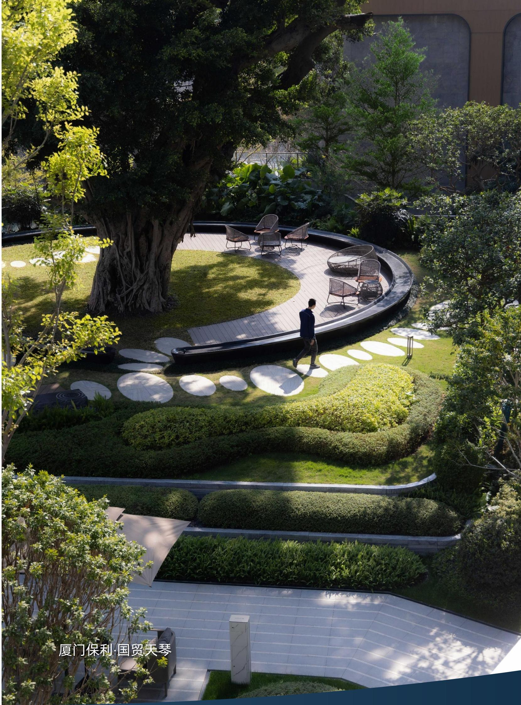

text_image

厦门保利·国贸天琴

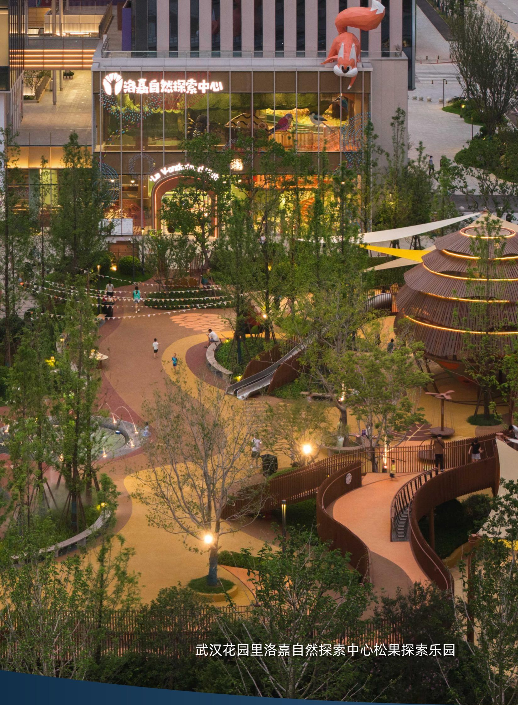

text_image

洛嘉自然探索中心
武汉花园里洛嘉自然探索中心松果探索乐园

武汉花园里洛嘉自然探索中心松果探索乐园

## 精治公司，稳健领航

奥雅股份创始人、董事、总经理李方悦

尊敬的各位伙伴、股东及社会各界朋友：

浴火重生，笃行致远。2024年，奥雅直面风险、革新内控，筑牢发展根基；2025年，我们坚守“创意设计+亲子文旅”双主业、“AI+IP”双引擎，将ESG理念融入全程，回馈信任、共赴未来。

我们抢抓城市更新战略机遇，深耕核心赛道，凭借洛阳洛邑古城、深圳南头古城、大连东关街等标杆项目的实践积淀，持续释放业务活力；洛嘉儿童历经十年发展，以“四位一体”产品体系践行初心。同时，依托“奥雅城市文旅焕新大模型”赋能升级，让创意快速落地。

秉持长期主义，未来我们将聚焦核心赛道、强化技术引领、优化股东回报，以科技赋能、责任立身，与各界携手，共筑可持续发展新蓝图。

奥雅股份总经理李方悦

2026年4月

natural_image

Portrait of a woman in a gray dress and patterned top, arms crossed, against a plain dark background (no text or symbols visible)

## 关于本报告

## 报告说明

本报告是深圳奥雅设计股份有限公司（以下简称“奥雅股份”“公司”或“我们”）正式发布的《2025年度环境、社会及公司治理（ESG）报告》，全面、客观、准确披露公司在2025年1月1日至12月31日期间，在环境管理、社会责任履行、公司治理完善三大领域的战略布局、具体实践、核心绩效及未来规划。

报告严格遵循深交所上市公司自律监管指引第17号等相关规范编制，所有披露数据均来源于公司正式文件、日常运营统计及第三方专业核验，部分内容结合历史年度相关实践进行追溯说明，严格恪守“双重重要性”原则，确保披露内容既贴合行业监管要求，又精准回应各利益相关方的核心关切。

## 报告范围

本报告披露范围涵盖公司总部、全国31个省市的全资子公司、控股子公司及核心参股企业，全面覆盖创意设计、亲子文旅、数字科技、文旅运营四大核心业务板块，完整覆盖各业务环节涉及的ESG相关风险与发展机遇，确保披露范围无遗漏、无偏差，全面反映公司ESG管理整体水平。

## 利益相关方

公司核心利益相关方包括投资者、客户、员工、供应商、政府部门、社区居民及行业协会等。2025年，公司通过投资者调研、业绩说明会、行业座谈、项目合作、公益互动等多种形式，与各利益相关方开展常态化、深层次沟通，精准捕捉各方ESG关切点，并将其全面融入公司ESG战略制定与实践落地的全过程，实现多方价值共赢。

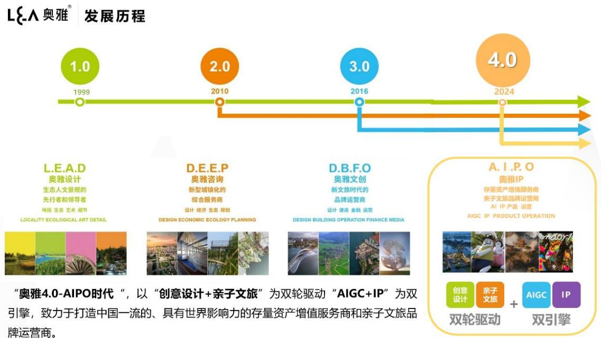

state_timeline

| Year | Milestone | Strategic Initiatives |
| --- | --- | --- |
| 1999 | 1.0 | L.E.A.D (奥雅设计, 生态人文景观的先行者和领导者, 地段、生态、艺术、细节, LOCALITY ECOLOGICAL ART DETAIL) |
| 2010 | 2.0 | D.E.E.P (奥雅咨询, 新型城镇化的综合服务商, DESIGN ECONOMIC ECOLOGY PLANNING) |
| 2016 | 3.0 | D.B.F.O (奥雅文创, 新文旅时代的品牌运营商, DESIGN BUILDING OPERATION FINANCE MEDIA) |
| 2024 | 4.0 | A.I.P.O (奥雅IP, 存量资产增值服务商, 亲子文旅品牌运营商, AI IP产品运营, AIGC IP PRODUCT OPERATION, 创意设计, 亲子文旅 + AIGC, IP, 双引擎) |

## 关于奥雅股份（股票代码：300949）

## 公司概况

公司使命——

创造更美好的人居环境，让空间赋予生命。

公司愿景——

成为全球领先的人居环境服务商，以设计赋能可持续发展，

用创意点亮生活，推动人与自然、城市与文化的和谐共生。

公司定位——

存量资产增值服务商和亲子文旅品牌运营商。

奥雅股份成立于1999年，2021年登陆深圳证券交易所，由李宝章先生担任董事长、首席设计师联合创始人李方悦女士担任董事、总经理。

公司构建“创意设计+亲子文旅”双主业、“AIGC+IP”双引擎的发展格局，采用“O+EPC+IP+O全产业链服务模式，业务涵盖创新设计、洛嘉儿童、文旅开发运营及AGI与数字艺术等板块，为城市更新、乡村振兴、文化古城等场景提供一体化解决方案。

旗下拥有洛嘉儿童、悦起文化等多个专业子品牌，总部位于深圳，在国内外设有30余家分子公司，拥有超1000位行业精英组成的国际化专业团队，累计落地项目5000+个。

公司具备风景园林工程设计专项甲级、建筑行业（建筑工程）甲级、城乡规划编制甲级等核心资质，是国家高新技术企业、商务部3A信用企业、深圳市工业设计中心，凭借深厚的行业积淀与核心竞争力，从设计企业成功转型为轻资产文旅开发运营民营领军企业。

2025年，公司重点打造衢州严家淤岛文旅、大连东关街历史文化街区、江西婺源乡村振兴等标杆项目，覆盖城市、生态、乡村三大场景，将使命愿景落地为实践，在生态保护、文化传承、人居改善等方面践行ESG理念，实现社会、环境与企业价值的协同发展。

## 2025年度ESG实践全景

奥雅股份作为国内景观设计行业的领军企业，已构建起完善的可持续发展与ESG管理体系。以下是企业在E（环境）、S（社会）、G（治理）三个维度的综合情况与特色亮点综述：

2025年，奥雅股份坚守“创造更美好的人居环境，让空间赋予生命”的使命，

以“创意设计+亲子文旅”双主业、“AIGC+IP”双引擎为支撑，

将ESG理念深度融入企业战略与经营全程，围绕环境（E）、社会（S）、治理（G）三大维度，

落地一系列实践举措，实现企业价值、社会价值与环境价值的协同共生，彰显民营领军企业的责任与担当。

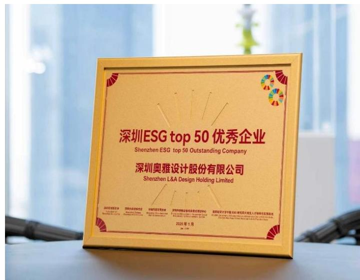

text_image

深圳ESG top 50 优秀企业
Shenzhen ESG top 50 Outstanding Company
深圳奥雅设计股份有限公司
Shenzhen L&A Design Holding Limited
深圳市国资委
深圳市国资委协会
深圳市国资委
深圳市国资委
深圳市国资委
深圳市国资委
深圳市国资委
深圳市国资委
深圳市国资委
深圳市国资委
深圳市国资委
深圳市国资委
深圳市国资委
深圳市国资委
深圳市国资委
深圳市国资委
深圳市国资委
深圳市国资委
深圳市国资委
深圳市国资委
深圳市国资委
深圳市国资委
深圳市国资委
深圳市国资委
深圳市国资委
深圳市国资委
深圳市国资委
深圳市国资委
深圳市国资委
深圳市国资委
深圳市国资委
深圳市国资委
深圳市国资委
深圳市国资委
深圳市国资委
深圳市国资委

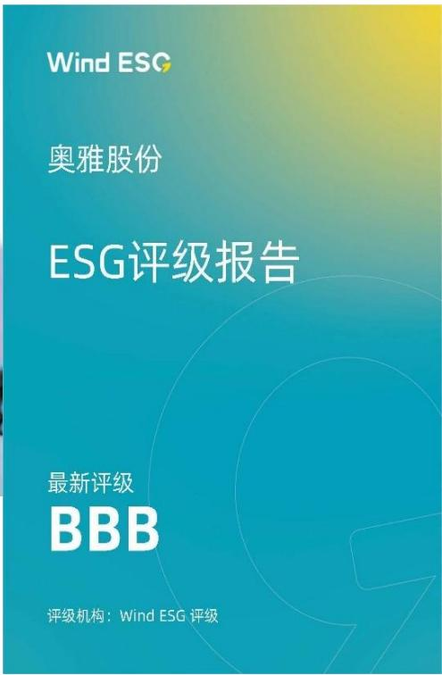

text_image

Wind ESG
奥雅股份
ESG评级报告
最新评级
BBB
评级机构：Wind ESG 评级

## E

## 环境维度（E）：

坚守生态优先，践行绿色发展。公司将碳中和理念贯穿项目全生命周期，在规划阶段采用LID低影响开发模式，场地设计注重低干预、低成本，维护管理强调低消耗，全力推动低碳实践落地。重点打造衢州严家淤岛文旅项目，完整保留原生湿地与乡土植被，配套建设雨水回收系统、低碳休闲步道及生态观景平台，打造“城市生态客厅”，提升区域生物多样性，实现人居与自然共生；同步推广绿色办公，推行无纸化办公、绿色通勤，强化员工低碳意识，将绿色理念融入企业文化，助力应对气候变化。此外，旗下洛塔智能游乐的可持续化环保模块化儿童游乐设备荣获2024年度国际人居环境可持续创新科技成果奖（金奖），持续以绿色产品赋能生态发展。

## S

## 社会维度（S）：

深耕价值共创，传递人文温度。在城市更新领域，大连东关街历史文化街区项目采用“文化解码+设计赋能+运营活化”模式，运用智能检测系统完成历史建筑数字化建档与结构加固，保留86栋历史建筑原貌，活化3项国家级非物质文化遗产，带动区域年产值增长至9.8亿元、新增就业岗位1200个，该项目更摘得2025年度国际可持续城市更新空间改造设计奖——金奖；在乡村振兴领域，重点推进江西婺源、广东清远等标杆项目，修复古民居、古驿道，打造农耕文化展示馆与生态设施，改善村民居住环境，带动村民稳定增收，实现乡村人居、文化与经济的共赢；在产业赋能方面，公司斩获2025年度国际可持续城市更新最具影响力机构（综合类），创始人李宝章先生荣膺该领域卓越人物奖，带动行业协同发展，吸引国际设计机构集聚。同时，公司依托“奥雅城市文旅焕新大模型”提升设计效率，通过悦起文化孵化城市专属IP，推动文化记忆触达更多人群，践行“为儿童而设计”的初心，以洛嘉儿童全生态产品体系，打造儿童友好空间。

## G

## 治理维度（G）：

强化合规经营，筑牢发展根基。公司完善法人治理结构，明确股东、董事会、管理层权责，坚守合规经营底线，严格落实反商业贿赂、反不正当竞争相关规定，保障数据安全与客户隐私。依托完善的内控体系，持续革新管理模式，优化决策流程，提升运营效率；作为国家高新技术企业，加大技术研发投入，在AI赋能、智能建造等领域形成多项专利，推动技术创新与业务升级；注重利益相关方沟通，兼顾股东、员工、客户、社区等多方诉求，在保障现金流安全的前提下，探索更灵活的分红政策，实现投资者利益共享，同时搭建国际化专业团队，完善员工发展体系，凝聚发展合力。

2025年，奥雅股份以实际行动践行ESG承诺，凭借在生态保护、文化传承、合规治理等方面的突出实践，斩获大湾区上市公司ESG100绿色发展年度环境守护奖等多项荣誉。未来，公司将持续深化ESG实践，完善“O+EPC+IP+O”全产业链服务模式，聚焦城市更新、乡村振兴等核心场景，以设计赋能可持续发展，用创意点亮生活，推动人与自然、城市与文化的和谐共生，书写ESG发展新篇章。

## 核心荣誉（2025年）

## 荣誉与奖项：国际与行业认可的社会责任贡献

2025年，奥雅股份凭借其在可持续设计、城市更新及人文关怀领域的卓越表现，获得了国内外多项权威奖项的认可，充分体现了公司在环境、社会及治理方面的综合实力。

<table><tr><td>获奖维度</td><td>荣誉/奖项名称</td><td>获奖主体/项目</td><td>社会意义/颁奖机构</td></tr><tr><td>国际认可</td><td>2025年度国际可持续城市更新最具影响力机构(综合类)</td><td>奥雅股份</td><td>聚焦环境韧性、社会包容及文化传承的国际权威认证</td></tr><tr><td>国际认可</td><td>2025年度国际可持续城市更新卓越人物奖</td><td>创始人 李宝章</td><td>表彰在可持续城市更新领域的行业革新与人文坚守</td></tr><tr><td>国际认可</td><td>国际可持续城市更新空间改造设计奖-金奖</td><td>大连东关街历史文化街区</td><td>历史文脉保护与社区活力再造的典范</td></tr><tr><td>社会影响力</td><td>第九届ELA国际景观大奖——年度最具社会影响力奖(3项)</td><td>大连东关街青岛东方伊甸园西安中铁天域儿童友好中心</td><td>强调项目对社会福祉、公众参与的积极推动作用</td></tr><tr><td>行业标杆</td><td>入选“深圳45年品牌发展典型案例”</td><td>奥雅股份</td><td>深圳官方认可的企业品牌发展与社会贡献范例</td></tr><tr><td>社区实践</td><td>首届“上海城市更新优秀实践案例”优秀奖</td><td>浦东缤纷社区(含童悦空间)</td><td>15分钟社区生活圈、全龄友好与儿童友好建设的标杆</td></tr></table>

## 国旅游业先锋力量TOP10

美国IDA国际设计奖

ELA国际景观大奖

......

## 95项

行业权威荣誉，彰显行业领先实力

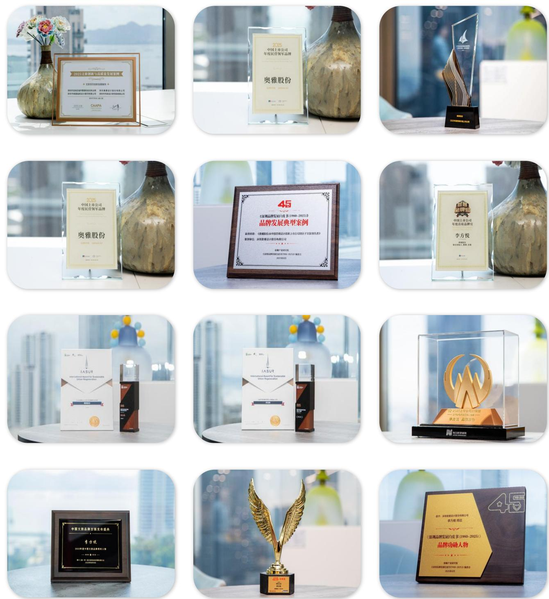

2025年核心财务指标简表

<table><tr><td>指标</td><td>数值</td><td>同比变动</td></tr><tr><td>营业总收入</td><td>4.34亿元</td><td>+5.28%</td></tr><tr><td>文旅综合业务收入占比</td><td>58.90%</td><td>首次超过传统设计业务</td></tr><tr><td>研发投入</td><td>0.28亿元</td><td>-9.62%</td></tr><tr><td>经营活动现金流</td><td>0.39亿元</td><td>+280.70%</td></tr></table>

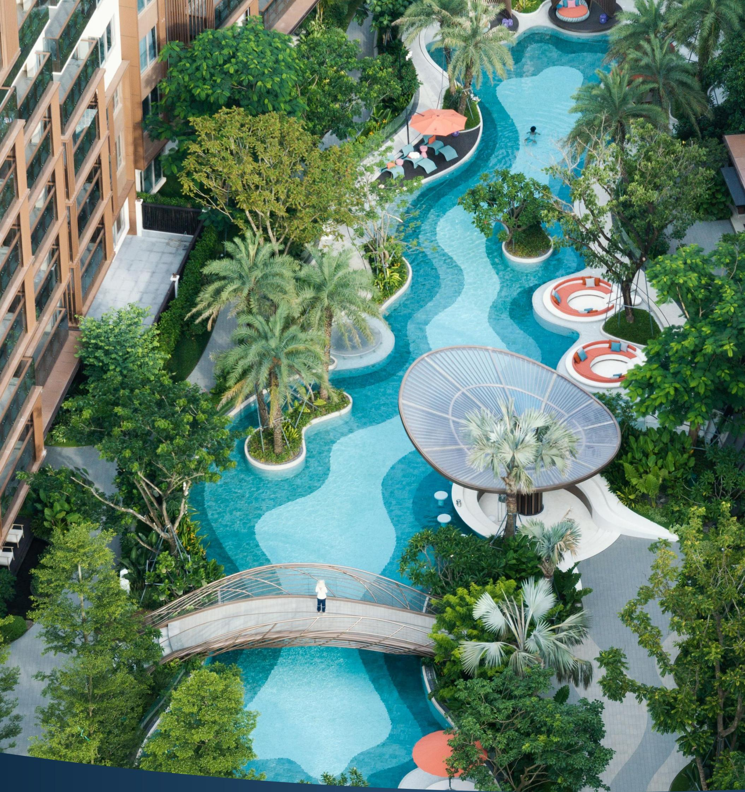

natural_image

Aerial view of a modern architectural complex with a central swimming pool, palm trees, and a bridge (no visible text or symbols)

## 03

## 公司治理（G）

## 公司治理

奥雅股份 2025 年度经营组织架构图  
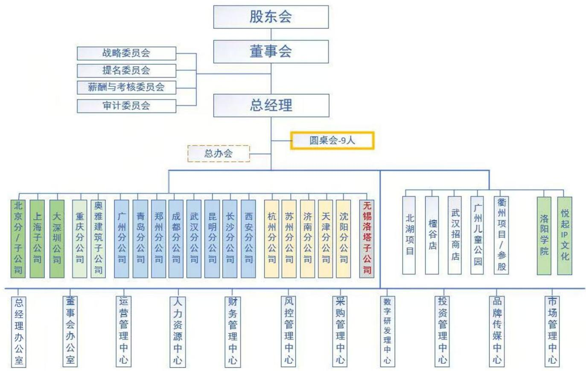

flowchart

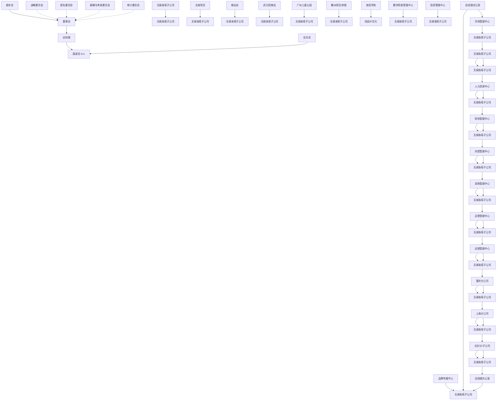
```mermaid
graph TD
  A["股东会"] --> B["董事会"]
  B --> C["总经理"]
  C --> D["圆桌会-9人"]
  E["战略委员会"] -.-> B
  F["提名委员会"] -.-> B
  G["薪酬与考核委员会"] -.-> B
  H["审计委员会"] -.-> B
  I["总办会"] --> D
  J["无锡洛塔子公司"] --> K["无锡洛塔子公司"]
  L["北湖项目"] --> M["无锡洛塔子公司"]
  N["檀谷店"] --> O["无锡洛塔子公司"]
  P["武汉招商店"] --> Q["无锡洛塔子公司"]
  R["广州儿童公园"] --> S["无锡洛塔子公司"]
  T["衢州项目/参股"] --> U["无锡洛塔子公司"]
  V["洛阳学院"] --> W["悦起IP文化"]
  X["数字研发管理中心"] --> Y["无锡洛塔子公司"]
  Z["投资管理中心"] --> AA["无锡洛塔子公司"]
  AB["品牌传媒中心"] --> AC["无锡洛塔子公司"]
  AD["市场管理中心"] --> AE["无锡洛塔子公司"]
  AF["运营管理中心"] --> AG["无锡洛塔子公司"]
  AH["人力资源中心"] --> AI["无锡洛塔子公司"]
  AJ["财务管理中心"] --> AK["无锡洛塔子公司"]
  AL["风控管理中心"] --> AM["无锡洛塔子公司"]
  AN["采购管理中心"] --> AO["无锡洛塔子公司"]
  AP["运营管理中心"] --> AQ["无锡洛塔子公司"]
  AR["运营管理中心"] --> AS["无锡洛塔子公司"]
  AT["重庆分公司"] --> AU["无锡洛塔子公司"]
  AV["上海分公司"] --> AW["无锡洛塔子公司"]
  AX["北京分/子公司"] --> AZ["无锡洛塔子公司"]
  BA["总经理办公室"] --> AC["无锡洛塔子公司"]
  BA --> AD["市场管理中心"]
  AE --> AF["无锡洛塔子公司"]
  AF --> AG
  AG --> AH
  AH --> AI
  AI --> AJ
  AJ --> AK
  AK --> AL
  AL --> AM
  AM --> AN
  AN --> AO
  AO --> AP
  AP --> AQ
  AQ --> AR
  AR --> AS
  AS --> AT
  AT --> AU
  AU --> AV
  AV --> AW
  AW --> AX
  AX --> AZ
  AZ --> BB["总经理办公室"]
  BB --> AC
```

## 治理基石：规范、透明、高效

在奥雅股份，卓越的公司治理不仅是合规的要求，更是实现可持续发展的核心引擎。我们建立了权责清晰、相互制衡、协调运转的现代企业治理结构，通过持续优化董事会及专门委员会的构成，不断提升决策的科学性与运行效率。

制度先行，夯实内控：报告期内，公司对治理体系进行了全面升级。通过对《公司章程》及股东会规则的修订，确保了权力机构的规范运行；同时，系统性地新增及修订了涵盖担保、内幕信息管理、信息披露、投资及专门委员会运作等领域的29项核心制度，构建了更为严密的内部管控网络，为企业稳健运营提供了坚实的制度保障。

奥雅股份建立权责清晰、运行高效、监督到位的现代法人治理结构，严格按照上市公司监管要求，形成股东会、董事会、专门委员会、经营管理层分层决策、有效制衡的治理体系。

董事会下设战略、审计、薪酬与考核、提名四大专门委员会，为科学决策提供专业支撑；经营层以董事长 / 总经理为核心，通过圆桌会、总办会统筹经营管理，构建 “前台利润中心、中台专业赋能、后台集团平台赋能”三级经营组织架构，保障公司合规运营、高效协同与可持续发展。

公司以“创意设计+亲子文旅”双主业为核心，统筹创新设计、工程项目、洛嘉运营三大业务板块，配套技术支持、产品研发、AI 研发、内容体验、造价成本、工程管理、品牌营销等专业中台能力，全面赋能业务落地；后台设立财务、人力、风控、采购、数字研发、投资管理、董事会办公室等职能中心，提供集团化支撑与风险管控。

公司在全国布局三十余家分 / 子公司及专业机构，形成覆盖广泛、响应快速、管理规范的全国化经营网络，以完善的治理架构与组织体系，持续为客户、股东与社会创造长期价值。

## 董事会高效履职：

公司董事会及其专门委员会积极发挥决策与监督职能。报告期内，董事会召开会议11次，审计、提名、薪酬委员会分别召开6次、2次、2次会议，所有董事均以100%出席率深度参与公司治理。

## 多元化与独立性：

我们深信董事会的多元化是战略决策质量的保障。截至报告期末，公司7人董事会中，独立董事占比达42.86%，并在审计、提名、薪酬等关键委员会中占据三分之二的多数席位，有效保障了决策的独立性与公正性。女性董事的加入也为董事会带来了多元的视角与洞察。

## 投资者沟通与关系管理

公司致力于构建与投资者之间有效、透明、畅通的沟通机制。报告期内，公司严格遵守《公司法》《上市公司治理准则》《上市公司投资者关系管理工作指引》《深圳证券交易所创业板股票上市规则》等相关法律法规及规范性文件的要求，制定并执行了《信息披露管理制度》《投资者关系管理制度》等内部规章制度。

公司由证券部作为信息披露和投资者关系管理的专职机构，董事会秘书全面负责相关工作的统筹与执行。董事会秘书在深度了解公司经营状况、运作管理及发展战略的基础上，通过投资者交流会、现场调研接待、公告发布、互动易平台交流、电话会议及新媒体平台等多元化渠道，主动与投资者展开沟通。公司高度重视听取投资者的反馈与意见，旨在为投资者依法参与公司决策管理提供便利条件，持续推动投资者关系管理的规范化与精细化。

奥雅股份始终将投资者权益保护作为公司治理的重要组成部分，坚信中小股东是公司发展的重要基石，秉持公平、公正、公开的原则，构建多层次、全方位的投资者沟通与权益保障体系，切实维护全体投资者尤其是中小股东的合法权益，传递公司发展信心，实现企业与投资者的长期共赢。

## 优化沟通机制，保障中小股东知情权

报告期内，公司持续完善投资者沟通渠道，通过互动易平台、投资者热线、专用邮箱等多种方式，确保与投资者沟通无障碍，及时回应市场关切，全面、准确、及时传递公司经营信息与发展动态。同时，严格遵循上市公司监管要求，在股东会审议相关事项时，对中小股东的投票情况进行单独计票，充分尊重中小股东的意愿，将计票结果及背后的股东诉求作为完善公司治理、优化发展战略的重要参考，切实保障中小股东的参与权与表达权。

## 坚守长期主义，赋能投资者长期价值

公司始终聚焦核心主业，持续推动“AI+IP”战略转型，通过“奥雅城市文旅焕新大模型”赋能项目效率提升，依托悦起文化Joykey布局国际化IP赛道，构建“ToB-ToC-ToB”的IP产业闭环，以扎实的业务实践与清晰的增长逻辑，为股东与投资者创造长期价值。未来，公司将继续深耕“AI+IP”领域，深化投资者沟通，完善权益保护体系，持续传递发展潜力，实现企业与投资者的共赢发展，助力文旅产业与城市更新领域升级。

## 沟通成效

公司保持高频率、高质量的信息披露，全年发布公告190份。在互动沟通方面，互动易平台留言回复率高达100%，展现了公司与资本市场的紧密联结；同时，组织投资者调研活动10次，深度传递公司价值。

## 深化投资者沟通，传递清晰发展信号

2025年5月16日，公司在深圳蛇口举办投资者交流会，邀请招商证券、中信证券、天风证券、西南证券、博时基金等45家机构的投资代表参会，全面展示“AI+IP”战略落地成效。

公司管理层围绕业务结构优化、技术生态构建、IP商业化路径等核心议题展开深度分享，其中集团数智化管理中心总监详细演示“奥雅城市文旅焕新大模型”功能及赋能成果，联合创始人、董事、总经理李方悦女士介绍公司“奥雅4.0”时代发展战略，明确“创意设计+亲子文旅”双轮驱动、“AI+IP”双引擎的发展方向，回应投资者对AI研发投入、IP商业化布局等核心关切。交流环节中，公司就IP业务销售、收入利润展望、订单情况、AI应用落地及股权激励等投资者重点关注的问题进行详细解答，现场互动氛围热烈，有效加深了投资机构对公司的了解与信任。

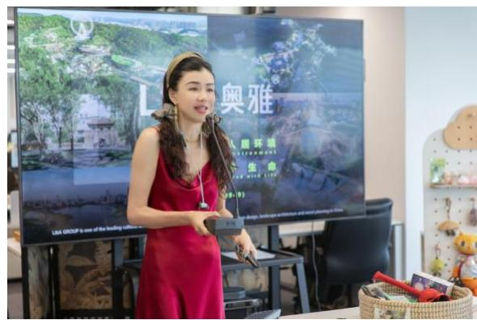

text_image

LIA
奥雅
人晨环境
生命
LIA GROUP is one of the hosting culture...

2025年5月16日投资者交流会  
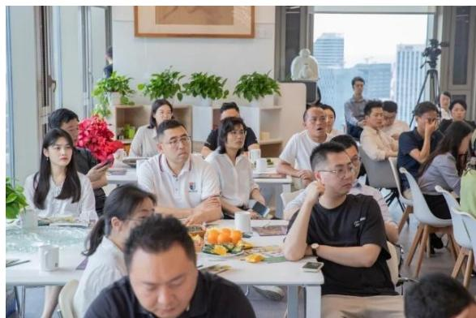

natural_image

Group of people seated at tables in a modern indoor setting, engaged in discussion or activity (no visible text or symbols)

natural_image

Simple L-shaped dark blue line on white background (no text or symbols)

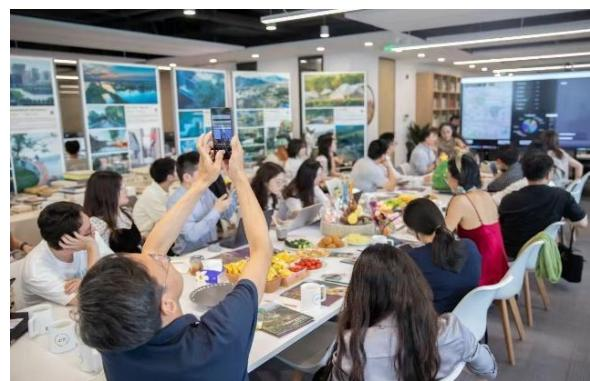

natural_image

Group of people seated at a long table in a modern office or training room, taking photos with a smartphone; background displays show photos and charts visible (no readable text or symbols)

text_image

尊敬的奥雅伙伴
一份专属献礼
为您呈上
JOYKEY
?
JOYKEY
?
立即领取
L & A GROUP
L&A 奥雅股份 出品
GOOD NEWS

以专属盲盒，携手同行之路：奥雅股份NFT股东回馈专场

奥雅股份「洛嘉IP世界」首发【探索珍藏】系列数字藏品正式上线！其热度远超预期，用户参与度空前，业内媒体发文表示“被‘撸崩’”，同时登榜财经商业报道同类新闻热度TOP1。

## 投资者权益保护

公司坚持稳定的分红政策切实维护中小投资者合法权益，践行治理维度核心披露要求。

2025 年，奥雅股份将规范透明的公司治理作为企业可持续发展的核心引擎，聚焦治理体系全面升级、董事会高效多元履职、精细化投资者关系管理三大核心方向，系统性完善内控制度、优化治理结构、畅通资本沟通渠道，同时将中小股东权益保障贯穿治理全流程。通过构建权责清晰、相互制衡、协调运转的现代企业治理体系，夯实内控基础、保障决策科学性与公正性，为企业稳健经营和长期发展提供了坚实的制度支撑与运营保障。

治理关键数据与举措表

<table><tr><td>治理维度</td><td>核心举措</td><td>量化数据/关键指标</td></tr><tr><td>制度体系建设</td><td>修订《公司章程》及股东会规则,新增/修订涵盖担保、内幕信息管理、信息披露、投资等领域核心制度,构建严密内部管控网络</td><td>新增/修订核心制度29项</td></tr><tr><td>董事会履职</td><td>董事会及审计、提名、薪酬专门委员会规范召开会议,履行决策与监督职能,全体董事深度参与公司治理</td><td>董事会会议11次;审计委员会6次、提名/薪酬委员会各2次;董事出席率100%</td></tr><tr><td>董事会结构</td><td>优化董事会多元化与独立性配置,独立董事占比超4成,关键专门委员会中独立董事占多数席位,女性董事加入丰富多元视角</td><td>董事会共7人;独立董事占比42.86%;审计/提名/薪酬委员会中独立董事占2/3多数席位</td></tr><tr><td>信息披露</td><td>设立证券部为信披专职机构,由董事会秘书统筹全流程工作,严格遵守法规要求,坚持高频率、高质量信息披露</td><td>全年发布公告190份;信披管理专职机构:证券部</td></tr><tr><td>投资者沟通</td><td>搭建多渠道沟通机制,通过投资者交流会、现场调研、互动易平台、投资者热线/邮箱、电话会议等方式主动传递公司价值</td><td>组织投资者调研10次;互动易平台留言回复率100%;召开2025年5月16日专项投资者交流会</td></tr><tr><td>中小股东权益保障</td><td>保障中小股东知情权与参与权,股东会事项单独统计中小股东投票结果,多渠道实现无障碍沟通,将中小股东意愿作为治理优化参考</td><td>股东会中小股东投票单独计票;沟通渠道:互动易、投资者热线、邮箱、线下交流会等</td></tr></table>

## 内部控制与风险管理

公司持续完善内部控制体系，实现财务、运营、合规、项目管理等全流程覆盖，建立ESG风险台账，明确风险等级、责任主体及整改时限，全年开展2次全面内控审计与年修风险排查工作，发现问题整改完成率达100%。强化合规管理体系建设，严格遵守《中华人民共和国公司法》《中华人民共和国证券法》及行业相关法规，2025年未发生重大违法违规行为及监管处罚事件，有效防范各类经营与治理风险。

1、2025 年 7 月，公司发布《内部审计制度》，构建审计委员会指导、审计监察部独立执行的监督体系。制度覆盖内控、财务、风控、反舞弊等关键领域，明确审计权限、底稿十年存档、缺陷整改与追责机制，以规范、透明、高效的内审管理，夯实合规运营与公司治理基础。

2、2025年修订了《举报管理制度》

舞弊防控：及时发现违规、造假等内控漏洞，防范风险。

合规必备：满足监管对上市公司内控反舞弊的强制要求。

监督补位：打通多方举报渠道，弥补常规监督盲区。

完善治理：强化权力制衡，规范行为，保障内控有效。

保护权益：维护投资者与公司利益，提升市场公信力。

3、公司内控、内审制度贯穿于日常工作，每季度出具内部审计工作报告及下一季度工作计划。

## 商业道德与反腐败

公司全面推行《商业行为准则》《反腐败反贿赂制度》，强化全员合规意识，2025年开展全员合规培训4场，培训覆盖所有员工，实现100%全覆盖。

建立供应商廉洁准入机制，对核心供应商开展廉洁审核，全年签订廉洁协议326份，坚持零容忍商业腐败原则，营造公平、透明、廉洁的商业环境，切实践行反商业贿赂及反贪污相关要求。

## ESG管理体系

奥雅股份ESG 管理体系运行流程：

1.组织成立：正式成立ESG 工作小组，由总经理牵头统筹  
2.协同推进：跨部门协同，推动ESG 战略落地与日常管理  
3.考核绑定：将ESG 战略纳入管理考核体系  
4.机制建设：建立健全激励约束机制  
5.信息披露：每年定期批露ESG 年度报告  
6.深度融合：推动ESG 管理与企业战略发展紧密融合。  
7.闭环监督：完善ESG 管理与监督闭环，保障工作高效有序推进

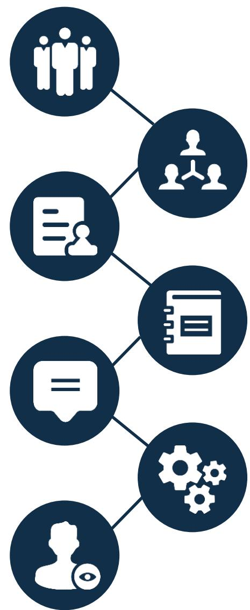

flowchart

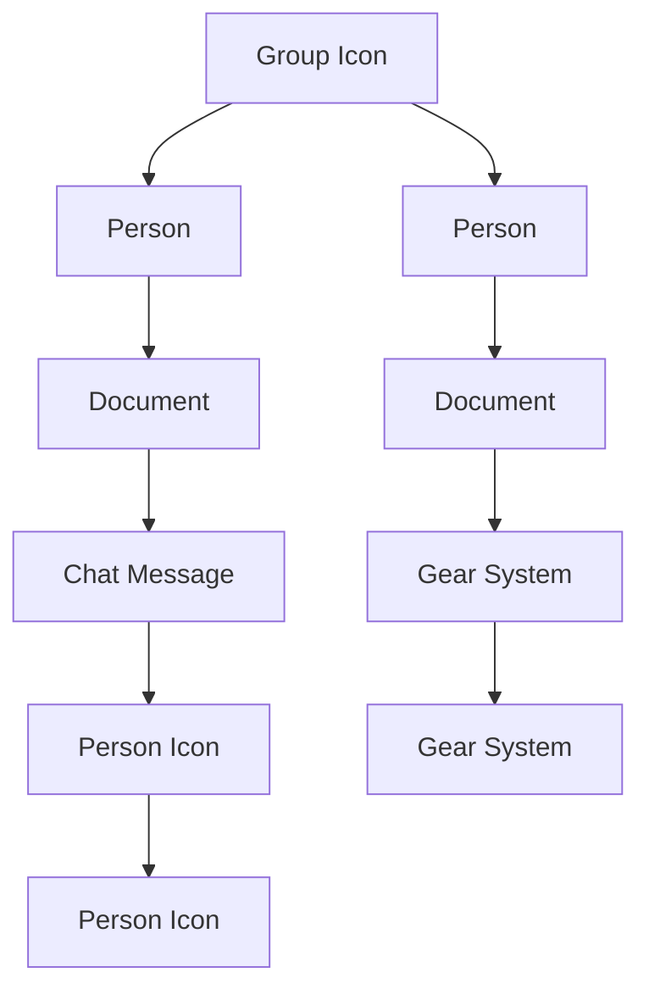
```mermaid
graph TD
  A["Group Icon"] --> B["Person"]
  A --> C["Person"]
  B --> D["Document"]
  C --> E["Document"]
  D --> F["Chat Message"]
  E --> G["Gear System"]
  F --> H["Person Icon"]
  G --> I["Gear System"]
  H --> J["Person Icon"]
```

## Esg内审工作职责简述

## 一、制度建设与内部控制

建立健全内部审计工作流程，保证内部向计工件有序开展、审计委员会定期审议相关报告誉向董事会汇报工作、全面助督审计工件及内部控制运行情况.

## 二、日常工作开展

报进责事会审计委员会

审计要员会

## 三、反舞弊机制执行

落实执行《基报管理制度》严格信守保来周则，全而保障据报人的乘私安全与合法权益，以独立，客观，公正的原则对据报事项进行核查与处理

世电话：1006610690

##

## 深圳奥雅设计股份有限公司

## 内部审计制度

## 第一章 总则

第一为推护投资者合法权益，强化深圳奥置设计股份有限公司（以下简称“分司”）经开管理提高经济的益 建立健全曲辉率计制度加强曲辉束际情况。特制定本制度

第二鲁本制度所政中部末计是一融种文 家观的确以和涨淑证动是期中分司电部率计制构或A员 对分司中部韵制和风险管理的有效性财务信息直北性和言整性以及经荷活动的效率和效果策开展的一种逐价话动明确中

## 第二章内部审计机构

第五叠 内部审计的实施机构是公司率计监察部（以下简称“内部事

第立龜内部率计部应当保趋独立性 配务专职率计人员 不得置于财务部

## 深圳息建设计股份有限公司

## 2025年第一季度内部审计工作报告量

## 第二季度内部审计工作计划

定，智据公司2025年度的经营情况和发展规划。内部审计部门按照己制定的年

## 一、2025年第一季度内董审计工作热行情况

## 1、内部南计理目东糖管况

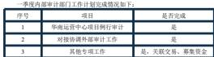

## (1)华南运营中众项目划行宣计

深圳龙岸大运书硬项日于2022年9月份开始营业，藏至2024年底，累计盈

现健康证件或健康证己试期的情况

## 深划集建设计股份有康公

## 2025年筹二季度内部审计工作报告置

## 第三季度内部审计工作计划

##

##

## 1、内警审计项且安填情况

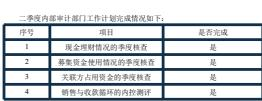

##

## (1) 混合理财情况的睡度核查

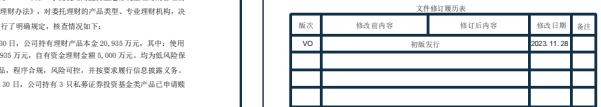

Lf.A 奥雅

## 深圳奥雅设计

## 股份有限公司

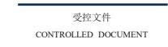

制定部门：审计中心  
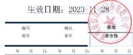

文件名称 文件编号 新次 页次LEA奥雅 4X7-14-001

##

## 第一音举报范用

## 深圳阜建设计股份有康公

## 2025年第三季度内部审计工作报告量

## 第四季度内部审计工作计划

##

## 一、2025年等三截度内都宣计工作参行管况

## 1、内警审计项且安幕情况

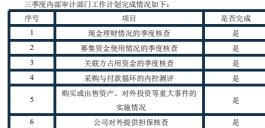

## （1）理金票时情况的稳度核

## 深圳集建设计股份有康公司

## 2025年第四季度内部审计工作报告里

## 2026年家内都审计工作计

##

## 二、2025年第双稳度内每富计工作热行情况

## 1、内部审计项目实施管况

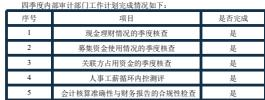

## (1)理金通时管况的重底持查

他用白有资全额财个额16230.00万元 他用模草资个财个额610.00万元

## 04

## 环境（E）

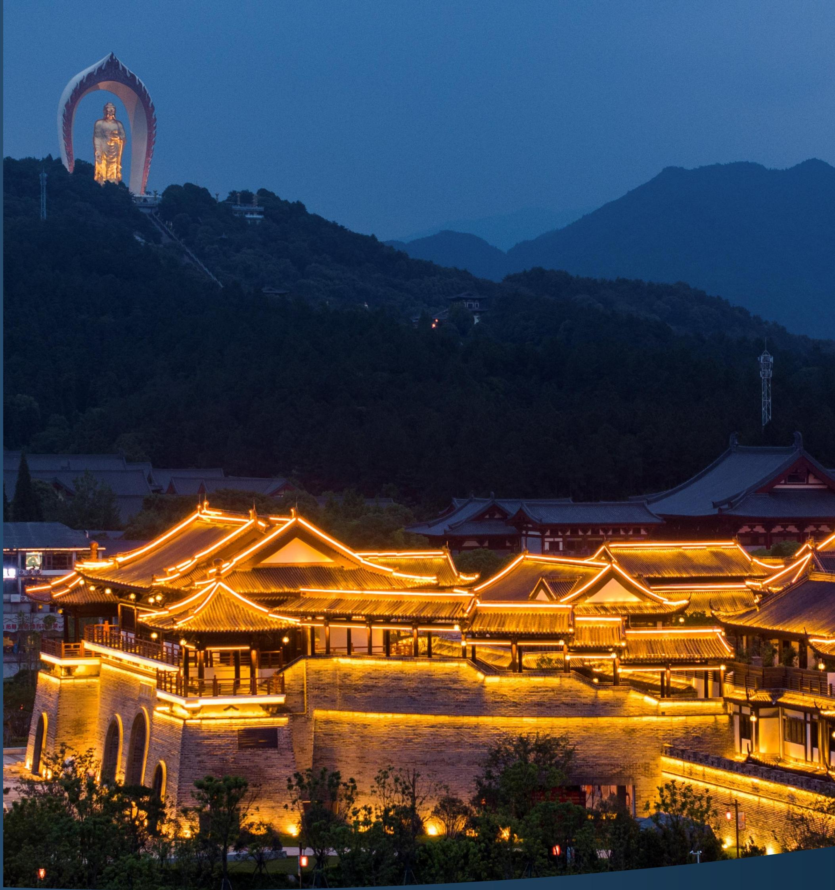

natural_image

Evening night view of a traditional Chinese temple complex illuminated with warm lighting, surrounded by forested mountains and a large statue in the background (no visible text or symbols)

## （一）环境战略与管理

## 生态为基：

坚持生态优先，以低干预、可持续设计践行环境责任，融合EOD开发模式，实现人与自然和谐共生。

奥雅股份以“碳中和·生态优先”为核心环境战略，将绿色发展理念融入全业务链条，结合环境维度8项核心议题，建立完善的环境管理体系，通过ISO14001环境管理体系认证，制定《绿色设计导则》《低碳运营手册》，形成“战略引领—制度保障—执行落地—监测优化”的完整闭环，明确碳减排、生态保护等核心目标。

在景观赋能低碳生态城市建设方面，公司形成核心发展观点：景观建设是实现低碳生态城市的核心系统工程，需从建设观念、景观类型、实施细节全方位转型。观念上，摒弃景观仅为装饰美观、依附于建筑交通的传统认知，强化其碳汇、净水、蓄水、生境培育的核心生态功能，以景观协调建筑与交通布局，践行景观都市主义与生态城市主义理念；类型上，摒弃大广场、大湖面等反生态、高碳排放的景观形态，重点布局城市森林、湿地、都市农业、垂直绿化等生态景观，提升城市低碳生态效益；细节上，摒弃三通一平基础上的人造景观模式，采用低影响开发理念，推广生态边沟、雨水花园、雨水收集装置等手段，减少对原有生境、土壤及径流的影响。

公司认为，低碳是生态城市的重要组成部分，而城市景观与绿地是城市碳汇的核心载体，同时在水生态保护、生物多样性培育方面发挥着不可替代的作用，与绿色建筑形成生态互补，甚至具备更高的生态效益。基于此，公司凭借持续科创实力赋能环境战略，连续16年蝉联国家级高新技术企业，上海公司同步获评，实现核心区域创新资质双认证；依托超500项知识产权（含230项专利）、246名技术研发人员组成的科创梯队，以及自主研发的奥创引擎及城市文旅焕新大模型，在30余个项目中落地应用，将策划效率提升40%-80%，以科技手段优化生态设计、减少资源消耗，推动景观低碳生态理念落地。

未来，公司将持续迭代升级AI技术，深化科创与环境战略、景观生态实践的深度融合，坚守景观在低碳生态城市建设中的核心职责，优化景观建设模式，助力生态保护与低碳发展，践行“创造更美好的人居环境，让空间赋予生命”的企业使命。

## 人文为本：

强调空间的人文温度与社会价值，承接地脉文脉，兼顾公共性与包容性，让设计惠及全民。

## 永续创新：

以 “AI 赋能 + 人文坚守” 推动城市更新，从 “重建设” 转向“重运营”，追求长期可持续的空间活力。

低碳途径与生态城市的关系  
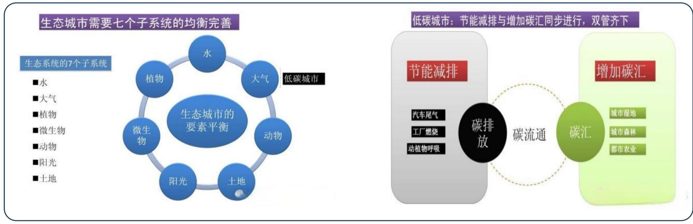

低碳的重点是节能减排  
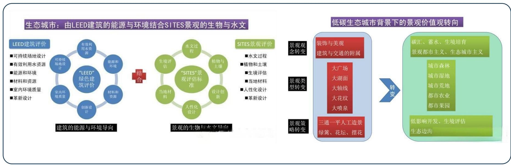

flowchart

```mermaid
graph LR
  subgraph Environmental_Dynamics_Environmental_Dynamics["\"Environmental Dynamics [Environmental Dynamics]"]
    direction TB
  LEED["LEED建筑评价"] -->|"可持续场地设计"| REIT["可持续场地设计"]
  LEED -->|"有效利用水资源"| REIT
  LEED -->|"能源和环境"| REIT
  LEED -->|"材料和资源"| REIT
  REIT -->|"室内环境质量"| REIT
  REIT -->|"创新设计"| REIT
  REIT -->|"有效利用水资源"| REIT
  end

  subgraph Environmental_Dynamics_Environmental_Dynamics_2["\"Environmental Dynamics [Environmental Dynamics\"]"]
    direction TB
  SITES["SITES景观评价"] -->|"水文过程"| SITES
  SITES -->|"植物与土壤"| SITES
  SITES -->|"设计创新"| SITES
  SITES -->|"当地材料"| SITES
  SITES -->|"生境评估"| SITES
  end

  subgraph Environmental_Dynamics_Environmental_Dynamics_3["\"Environmental Dynamics [Environmental Dynamics\"]"]
    direction TB
  SITES_1["SITES景观评价"] -->|"水文过程"| SITES_1
  SITES_1 -->|"植物和土壤"| SITES_1
  SITES_1 -->|"生境评估"| SITES_1
  SITES_1 -->|"当地材料"| SITES_1
  SITES_1 -->|"人性化设计"| SITES_1
  SITES_1 -->|"革新设计"| SITES_1
  end

  subgraph Environmental_Dynamics_Environmental_Dynamics_4["\"Environmental Dynamics [Environmental Dynamics\"]"]
    direction TB
  SITES_2["SITES景观评价"] -->|"水文过程"| SITES_2
  SITES_2 -->|"植物与土壤"| SITES_2
  SITES_2 -->|"生境评估"| SITES_2
  SITES_2 -->|"当地材料"| SITES_2
  SITES_2 -->|"人性化设计"| SITES_2
  SITES_2 -->|"革新设计"| SITES_2
  end

  subgraph Environmental_Dynamics_Environmental_Dynamics_5["\"Environmental Dynamics [Environmental Dynamics\"]"]
    direction TB
  SITES_3["SITES景观评价"] -->|"水文过程"| SITES_3
  SITES_3 -->|"植物与土壤"| SITES_3
  SITES_3 -->|"生境评估"| SITES_3
  SITES_3 -->|"当地材料"| SITES_3
  SITES_3 -->|"人性化设计"| SITES_3
  SITES_3 -->|"革新设计"| SITES_3
  end

  subgraph Environmental_Dynamics_Environmental_Dynamics_6["\"Environmental Dynamics [Environmental Dynamics\"]"]
    direction TB
  SITES_4["SITES景观评价"] -->|"水文过程"| SITES_4
  SITES_4 -->|"植物与土壤"| SITES_4
  SITES_4 -->|"生境评估"| SITES_4
  SITES_4 -->|"当地材料"| SITES_4
  SITES_4 -->|"人性化设计"| SITES_4
  SITES_4 -->|"革新设计"| SITES_4
  end

  subgraph Environmental_Dynamics_Environmental_Dynamics_7["\"Environmental Dynamics [Environmental Dynamics\"]"]
    direction TB
  SITES_5["SITES景观评价"] -->|"水文过程"| SITES_5
  SITES_5 -->|"植物与土壤"| SITES_5
  SITES_5 -->|"生境评估"| SITES_5
  SITES_5 -->|"当地材料"| SITES_5
  SITES_5 -->|"人性化设计"| SITES_5
  SITES_5 -->|"革新设计"| SITES_5
  end

  subgraph Environmental_Dynamics_Environmental_Dynamics_8["\"Environmental Dynamics [Environmental Dynamics\"]"]
    direction TB
  SITES_6["SITES景观评价"] -->|"水文过程"| SITES_6
  SITES_6 -->|"植物与土壤"| SITES_6
  SITES_6 -->|"生境评估"| SITES_6
  SITES_6 -->|"当地材料"| SITES_6
  SITES_6 -->|"人性化设计"| SITES_6
  SITES_6 -->|"革新设计"| SITES_6
  end

  subgraph Environmental_Dynamics_Environmental_Dynamics_9["\"Environmental Dynamics [Environmental Dynamics\"]"]
    direction TB
  SITES_7["SITES景观评价"] -->|"水文过程"| SITES_7
  SITES_7 -->|"植物与土壤"| SITES_7
  SITES_7 -->|"生境评估"| SITES_7
  SITES_7 -->|"当地材料"| SITES_7
  SITES_7 -->|"人性化设计"| SITES_7
  SITES_7 -->|"革新设计"| SITES_7
  end

  subgraph Environmental_Dynamics_Environmental_Dynamics_10["\"Environmental Dynamics [Environmental Dynamics\"]"]
    direction TB
  SITES_8["SITES景观评价"] -->|"水文过程"| SITES_8
  SITES_8 -->|"植物与土壤"| SITES_8
  SITES_8 -->|"生境评估"| SITES_8
  SITES_8 -->|"当地材料"| SITES_8
  SITES_8 -->|"人性化设计"| SITES_8
  SITES_8 -->|"革新设计"| SITES_8
  end

  subgraph Environmental_Dynamics_Environmental_Dynamics_11["\"Environmental Dynamics [Environmental Dynamics\"]"]
    direction TB
  SITES_9["SITES景观评价"] -->|"水文过程"| SITES_9
  SITES_9 -->|"植物与土壤"| SITES_9
  SITES_9 -->|"生境评估"| SITES_9
  SITES_9 -->|"当地材料"| SITES_9
  SITES_9 -->|"人性化设计"| SITES_9
  SITES_9 -->|"革新设计"| SITES_9
  end

  subgraph Environmental_Dynamics_Environmental_Dynamics_12["\"Environmental Dynamics [Environmental Dynamics\"]"]
    direction TB
  SITES_10["SITES景观评价"] -->|"水文过程"| SITES_10
  SITES_10 -->|"植物与土壤"| SITES_10
  SITES_10 -->|"生境评估"| SITES_10
  SITES_10 -->|"当地材料"| SITES_10
  SITES_10 -->|"人性化设计"| SITES_10
  SITES_10 -->|"革新设计"| SITES_10
  end

  subgraph Environmental_Dynamics_Environmental_Dynamics_13["\"Environmental Dynamics [Environmental Dynamics\"]"]
    direction TB
  SITES_11["SITES景观评价"] -->|"水文过程"| SITES_11
  SITES_11 -->|"植物与土壤"| SITES_11
  SITES_11 -->|"生境评估"| SITES_11
  SITES_11 -->|"当地材料"| SITES_11
  SITES_11 -->|"人性化设计"| SITES_11
  SITES_11 -->|"革新设计"| SITES_11
  end

  subgraph Environmental_Dynamics_Environmental_Dynamics_14["\"Environmental Dynamics [Environmental Dynamics\"]"]
    direction TB
    Sites["低碳生态城市背景下的景观价值观转向"]
  end
```

## （二）绿色设计与生态实践

奥雅股份依托完善的专业资质体系，为绿色设计、生态修复与可持续环境营造提供坚实支撑。公司拥有城乡规划编制甲级、风景园林工程设计专项甲级等核心资质，同时覆盖建筑工程设计、建筑装修装饰工程施工等领域，并持有安全生产许可证，形成 “规划 — 设计 — 施工” 一体化服务能力。通过总部与上海、北京、重庆等分子公司的全国化资质布局，公司具备在多区域开展生态景观营造、城市绿色更新、低碳空间设计的合规服务能力。在项目实践中，公司严格遵循资质管理要求与安全生产规范，将生态优先、低碳发展理念贯穿设计与实施全过程，持续以专业能力推动城市生态环境提升与可持续发展。

核心资质一览

<table><tr><td>序号</td><td>归属主体</td><td>资质类别</td><td>资质等级</td><td>有效期</td><td>核心业务价值</td></tr><tr><td>1</td><td>深圳奥雅设计股份有限公司</td><td>风景园林工程设计</td><td>甲级</td><td>2028/12/28</td><td>公司核心资质,可承接各类风景园林工程设计业务,支撑生态景观、城市绿建、公园绿地等绿色项目全流程设计</td></tr><tr><td>2</td><td>深圳奥雅设计股份有限公司</td><td>城乡规划(国土空间规划)编制</td><td>甲级</td><td>2026/3/31</td><td>业务范围不受限制,可开展国土空间规划、城乡发展规划等顶层设计,赋能区域生态保护与可持续发展布局</td></tr><tr><td>3</td><td>深圳奥雅设计股份有限公司</td><td>建筑工程工程设计</td><td>乙级</td><td>2028/12/27</td><td>可承接中小型建筑工程设计,实现景观设计与建筑设计一体化,保障绿色建筑、低碳建筑项目落地</td></tr><tr><td>4</td><td>深圳奥雅设计股份有限公司</td><td>建筑装修装饰工程专业承包</td><td>二级</td><td>2029/05/14</td><td>具备装饰装修工程施工承包能力,打通“设计+施工”全链条,保障生态景观、室内绿色装修项目落地实施</td></tr><tr><td>5</td><td>深圳奥雅设计股份有限公司</td><td>安全生产许可证</td><td>不分等级</td><td>2026/7/28</td><td>建筑施工合法合规凭证,保障施工类项目安全合规开展,践行安全生产与绿色施工理念</td></tr><tr><td>6</td><td>重庆奥雅建筑规划设计有限公司</td><td>建筑工程工程设计</td><td>甲级</td><td>2030/05/12</td><td>西南区域核心资质,支撑区域内建筑工程、生态建筑项目设计,拓展西南绿色设计业务</td></tr><tr><td>7</td><td>上海深圳奥雅园林设计有限公司</td><td>风景园林工程设计</td><td>乙级</td><td>2027/05/17</td><td>华东区域风景园林设计资质,服务长三角生态景观、城市更新项目</td></tr><tr><td>8</td><td>北京奥雅景观与建筑规划设计有限公司</td><td>风景园林工程设计</td><td>乙级</td><td>2030/06/17</td><td>华北区域风景园林设计资质,服务京津冀生态修复、景观提升项目</td></tr></table>

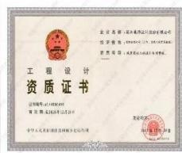

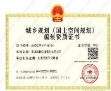

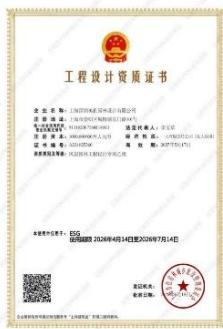

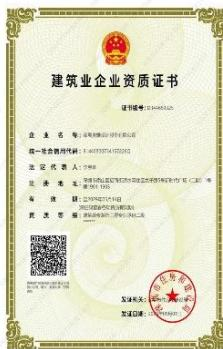

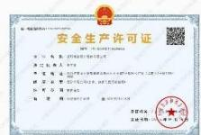

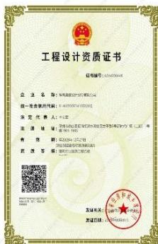

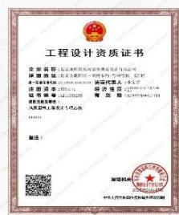

## 全链条资质体系，筑牢绿色设计核心能力

奥雅股份构建了 “规划 + 设计 + 施工 + 安全”的全链条资质矩阵：

以风景园林工程设计甲级、城乡规划编制甲级为核心，具备从国土空间生态规划、区域生态修复，到公园绿地、城市绿道、海绵城市等细分领域的全流程设计能力，为生态保护、低碳城市建设提供顶层设计支撑；

以建筑工程设计、装饰装修工程承包资质为延伸，实现景观设计与建筑、施工的一体化服务，保障绿色建筑、低碳施工、生态景观项目从方案到落地的全周期落地；

以安全生产许可证为保障，严格践行绿色施工、安全施工理念，在项目全周期落实环境、健康与安全（EHS）管理要求。

## 全国化资质布局，赋能区域生态实践

公司通过深圳总部 + 上海、北京、重庆分子公司的资质布局，实现了华东、华北、西南三大核心区域的资质覆盖，可就近为区域客户提供合规、专业的绿色设计服务：

西南区域依托重庆公司建筑工程设计甲级资质，深度参与成渝地区双城经济圈生态保护与城市更新项目；

华东、华北区域依托上海、北京公司风景园林设计乙级资质，服务长三角、京津冀生态修复、景观提升与城市绿化项目，助力区域生态环境改善。

## 资质合规与可持续管理

截至 2025 年末，公司所有资质均处于有效期内，其中多项资质有效期覆盖至 2028-2030 年，为公司长期开展绿色设计与生态实践业务提供了稳定的合规保障。公司建立了资质全生命周期管理机制，定期开展资质维护、升级与续期工作，确保资质与业务发展同频，持续提升公司在生态设计、低碳建造领域的专业服务能力，为践行ESG理念、推动行业绿色发展奠定坚实基础。

## 生态设计

## 一、核心内涵

以人与自然共生为核心，将人工系统纳入自然生态整体考量，摒弃末端治理，以源头预防、全过程控制为导向，构建良性循环系统，降污降耗，推动和谐共生。

## 二、基本原则

全生命周期原则：覆盖项目全流程，打破线性开发，建立 “从摇篮到摇篮” 资源闭环。

减量化与循环原则：践行“3R+Renew” 理念，优先减耗、延命、回收、选用可再生材料。

地方性与生物多样性原则：立足地域特征，用本土材料降能耗，修复栖息地，保护生物多样性。

生态效率与服务原则：通过技术与管理降负荷，探索“产品 + 服务” 模式，提升生态效益。

## 三、核心方法

LCA 评估：量化全周期环境影响，精准优化设计方案。

模块化设计：拆分独立模块，便于施工维护回收，提升循环效率。

仿生设计：借鉴自然原理，研发节能低碳方案。

PSS 模式：融合项目与服务，延长生命周期，减少废弃物。

## 四、实践应用

景观规划：践行海绵城市理念，推进湿地、矿山等生态修复，提升生态服务功能

建筑社区：采用被动式节能与环保建材，打造低能耗绿色建筑与生态社区。

文旅乡村：打造生态科普文旅项目，乡村设计兼顾生态保护与乡村振兴。

材料循环：规模化应用再生/ 本土材料，推行废料回收，践行循环经济。

## 五、综合价值

环境：降污降耗、修复生态、保护生物多样性；

经济：降低运维成本，提升品牌竞争力；

社会：传递绿色理念，推动行业绿色转型。

## 七、未来展望

奥雅股份将深化生态设计理念，完善全流程管控，加大绿色技术研发应用，

赋能全业务场景，助力行业低碳转型，共建和谐人居。

## 六、概念辨析

生态设计≠绿色设计：

后者侧重末端减害，前者强调系统共生；

是可持续设计在环境维度的核心落地路径。

natural_image

Aerial view of a wetland with numerous green vegetation clusters and winding waterways (no text or symbols visible)

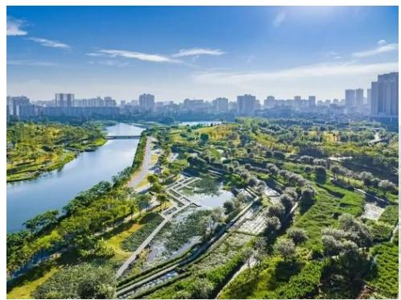

natural_image

Aerial view of a modern city park with lush greenery, winding river, and high-rise buildings under a clear blue sky (no visible text or symbols).

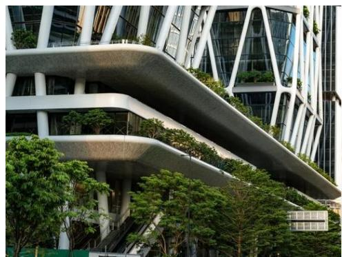

natural_image

Modern architectural building with curved glass facade and greenery, no visible text or symbols

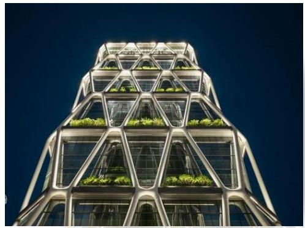

natural_image

Modern glass skyscraper with a hexagonal lattice facade and greenery, illuminated at dusk (no text or symbols visible)

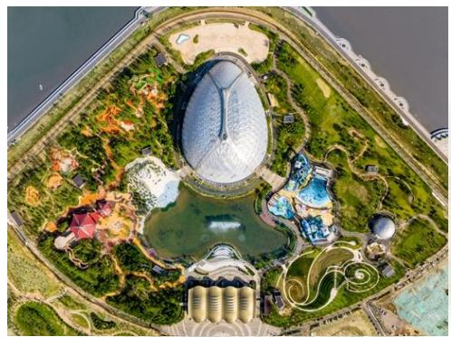

natural_image

Aerial view of a modern architectural complex with a dome-shaped structure, surrounded by greenery and water features (no visible text or symbols)

## 低碳项目落地：

2025年，公司重点推进洛阳关林城市更新、衢州严家淤岛文旅等大型低碳标杆项目，广泛应用海绵城市、雨水回收、节能建材等绿色技术，项目平均碳排放较行业标准降低18%，切实践行应对气候变化、高效利用能源的相关要求。

## 生态修复与保护：

全年完成12个生态修复重点项目，累计修复湿地、废弃地面积达35万平方米，保护乡土植物50余种，有效提升区域生物多样性，扎实落实生态系统和生物多样性保护相关议题要求。

## 绿色技术创新：

聚焦绿色设计与低碳运营，研发AI低碳设计系统、装配式景观模块、智慧生态监测等核心技术，全年获得8项绿色技术专利，持续推动设计流程绿色化、数智化升级，助力循环经济发展。

## 可运营的景观才是破局关键｜奥雅2025作品盘点

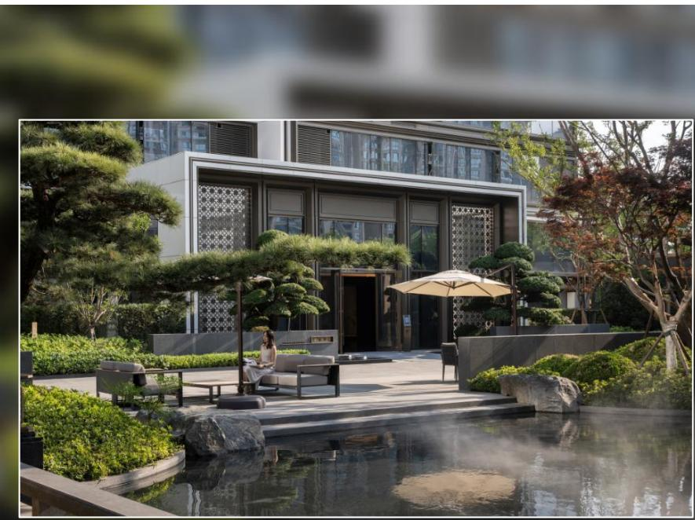

natural_image

Modern architectural exterior with glass building, traditional-style garden setting, and decorative trees (no visible text or symbols)

## 西安泰发祥檀府

兼具文化魂与设计美的人居典范ELA年度最佳住宅景观奖金奖

把东方的山水意境用现代手法融进生活场景。

从园林礼序到诗意栖居，让自然的骨架和诗画的灵魂，变成“可品的山水画廊”和“可居的意境庭院

这不仅是在家中完成的东方美学漫步，更成为家人休憩谈心、好友雅集赏景的日常空间。

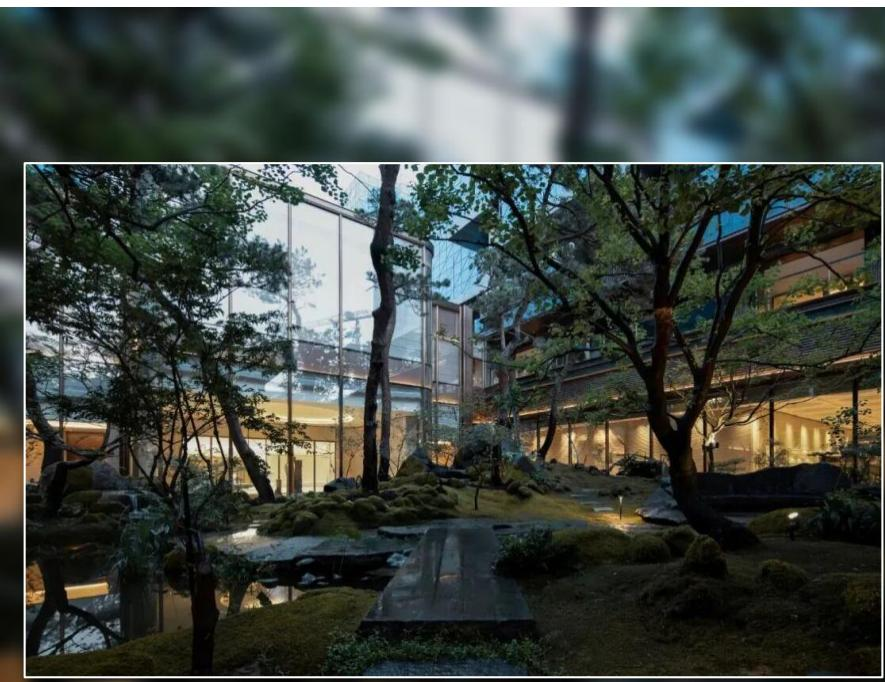

natural_image

Modern architectural complex with glass facade, surrounded by trees and greenery (no visible text or symbols)

## 郑州金茂璞逸云湖

首开热销11.6亿的高品质人居ELA年度最佳示范区景观奖金奖

用东方美学作画，借一方奢石铺开山水卷轴，看一草一木诉说四季故事。

在这里，家就是一座没有围墙的自然博物馆。从客厅到庭院，每一步都是风景，每一眼都是雅集这不再是遥不可及的诗意，而是邻里可以相约漫步、好友能够品茶赏景的“山水会客厅”。

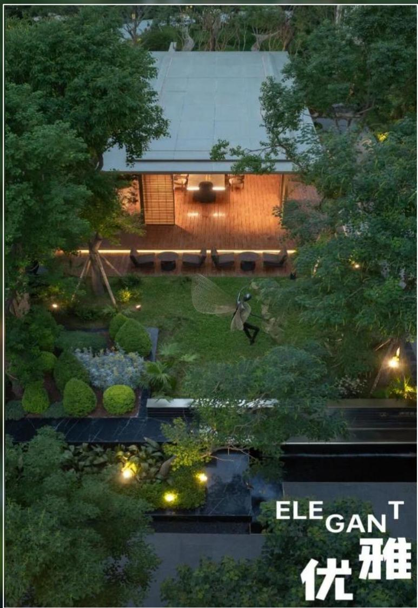

text_image

ELEGANT
优雅

## 西安大明宫金茂府

以低调隐奢成就顶级定制

第十六届园冶杯专业奖大奖

第十一届CREDAWARD 金奖

汲取盛唐园林的格局与意趣，把千年文脉转化为“可步入的山水长卷” 和 “可沉浸的微型唐园”。这是一处私享的、闹中取静的东方庭院，更是一个能散步、能会友、能打卡的生活秀场，让文化体验真正成为日常的一部分。

## 地产景观新逻辑

好看只是标配，会运营增值才是王道！

“开业即衰退”是城市更新的行业通病，病根在于“先造景后运营”的逻辑倒置。奥雅的破局关键的是：运营基因前置植入构建“空间-场景-业态-用户”的生长型生态这份运营思维藏于每个落地细节。

时针拨至2026年，奥雅早已跳出“只重画图”的传统景观设计框架：

让文化从“背景板”升级为“能体验、可社交”的圈粉，让自然从“远郊游”转变为“可生活、强体验”的刚需配套，更让景观从“单纯投入”蜕变为“能变现、高粘性”的增值引擎。

从11.6亿首开热销到国际大奖认证，从社区日常小景到城市标杆地标，2025年，奥雅用实打实的地产景观项目实践给出答案:地产景观的终极价值，从来不止“仅供观赏”，而是集“能变现、能体验、能生活、能社交”于一体的理想生活社区和全维度运营载体一一这，正是地产穿越行业周期的硬核底气。

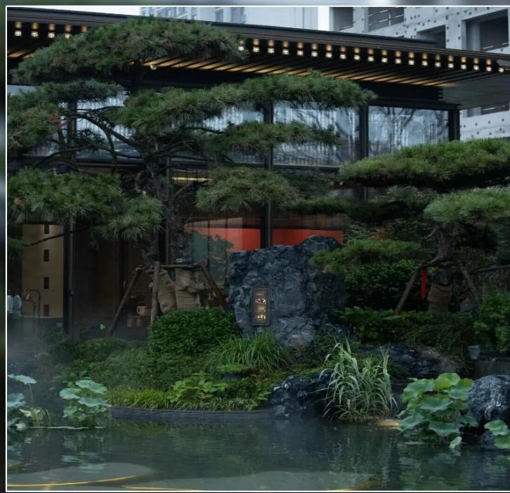

natural_image

Traditional Chinese garden scene with pine trees, rock formations, and a pond (no visible text or symbols)

## 天津金融街 融府

中式园林与江南庭院的完美融合

借鉴乾隆花园的造园智慧，融合皇家格局与江南意趣，把“御苑书韵”和“曲水雅脉”做成了 “可逛的皇家山水苑”和“可赏的江南画卷轴”。

这是一条尊崇归家的仪式动线，更升级为业主日常散步、会客品茶的“私家山水社交场”，让奢华感在日常中流动。

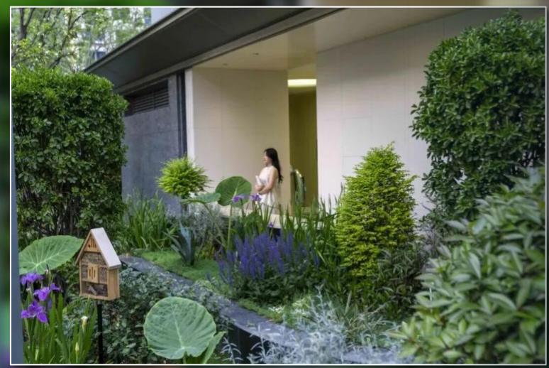

natural_image

Garden scene with miniature model house, lush green shrubs, and a woman standing in the courtyard (no visible text or symbols)

## 苏州中粮大悦风华苑

现代苏式园居社区

ELA年度最佳住宅景观奖银奖

把苏州园林的“小中见大”智慧，做成 “可游的咫尺山水”与 “可品的街巷园林”

一墙之隔，从城市繁华切换到私家宁静。这不仅是对东方居住哲学的现代致敬，更是业主们下楼即达的“园林会客厅”，散步、会友、打卡，让传统雅趣成为鲜活的社区日常。

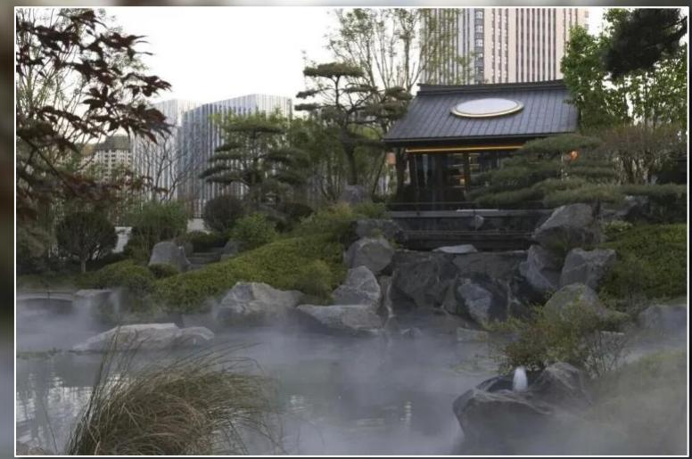

natural_image

Garden scene with traditional-style pavilion, rock formations, and modern high-rise buildings in the background (no visible text or symbols)

## 太原保利龙城璞悦

宋式美学生活典范

把宋式风雅“装”进现代生活，做出 “可感的简约风骨”与“可居的雅集空间”。

这里不仅有宋画里的清雅线条，更有士大夫式的社交意趣。它是审美在线的私人宅院，更是能办小型茶会、雅集沙龙的“现代文人客厅”，让千年前的文人情思成为今天邻里好友相聚的日常背景。

## 海口万华江东麓岛

奥雅股份联袂万华打造的旅居标杆作品

IFLA 住宅类卓越奖

ELA年度最佳住宅景观奖银奖

第十一届CREDAWARD 金奖

REARD全球地产设计大奖银奖

把“漂浮绿洲”的想象做成“可游的160米度假泳池” 与 “可逛的热带花园秘境”。这不仅是家门口的“岛居度假区”，更是一个随时能下水畅游、沿花园散步，与邻居偶遇闲聊的“热带风情社交场”，让度假感成为每天回家的日常体验。

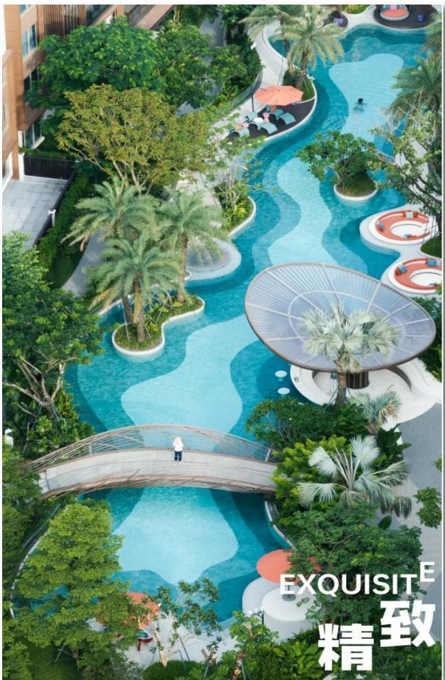

text_image

EXQUISIT
精致

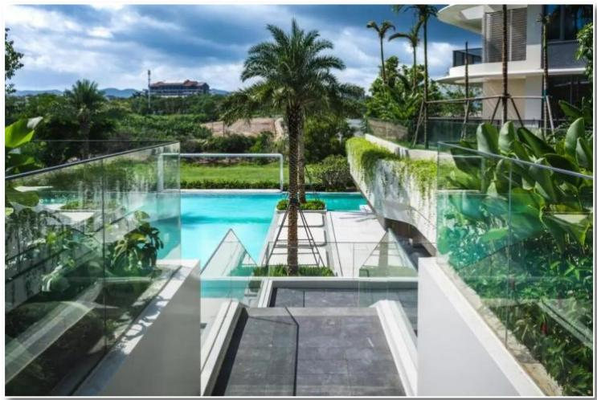

natural_image

Modern residential pool with glass access, palm trees, and greenery in the background (no visible text or symbols)

## 三亚中旅馥棠公馆

开盘即斩获区域销冠

把热带雨林与滨海风情，做成“可漫步的绿意长廊”和“可休憩的海韵阳台”。这不仅是对“繁华之上，自然之中”的立体诠释，更将社区变成了邻居们下楼即可相遇的“热带会客厅”——散步、观景、聊天，让雨林的呼吸与海浪的节奏，成为每天真实的社交背景音。

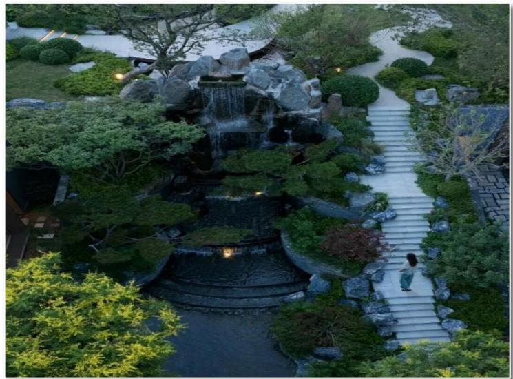

natural_image

Aerial view of a traditional garden with waterfall, stone pathways, and lush greenery (no visible text or symbols)

## 大连保利东港天汇

公馆场景×酒店艺术

把收藏级酒店的仪式感，做成“可生活的公馆客厅”与“可沉浸的复古艺廊”。

这不仅是对贵族生活方式的当代重塑，更将私密家宅升级为能举办私人酒会、艺术沙龙的 “高定社交主场”，让精奢与腔调在每一次待客中自然流露。

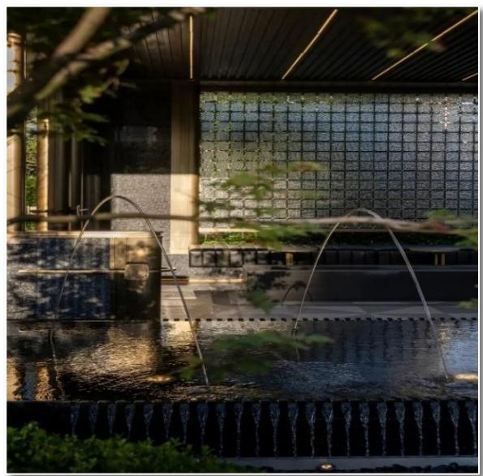

natural_image

Modern fountain with water and decorative lattice wall, framed by green foliage (no visible text or symbols)

## 衡水泰昌森缇

240米峡谷景观塑造立体多维山海

把整片森林山水“微缩”进社区，做成“可穿行的都市秘境”和 “可探索的奇幻森林”。

这是家门口的“超自然风景”，更是一个孩子们追逐探险、大人们散步放松的“立体自然游乐场”，让每一次下楼都像进入另一个世界，成为连接邻里关系的奇妙纽带。

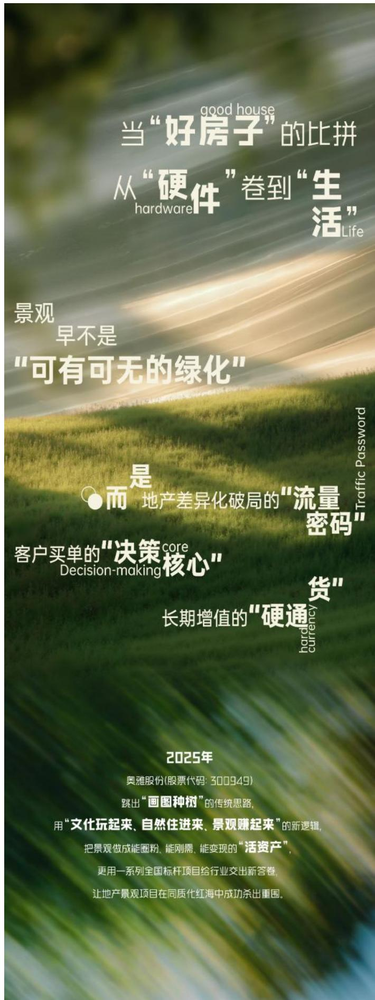

text_image

当“好房子”的比拼
从“硬件”卷到“生活”
hardware
景观
早不是
“可有可无的绿化”
是
而
地产差异化破局的“流量
密码”
客户买单的“决策core
Decision-making 核心”
货"
长期增值的“硬通
hard currency
Traffic Password
2025年
奥雅股份(股票代码: 300949)
跳出“画图种树”的传统思路,
用“文化玩起来、自然住进来、景观赚起来”的新逻辑,
把景观做成能圈粉、能刚需、能变现的“活资产”,
更用一系列全国标杆项目给行业交出新答卷,
让地产景观项目在同质化红海中成功杀出重围。

## 无障碍设计、弱势群体友好服务案例

广州市儿童公园儿童友好设计、无障碍游乐设施：

市儿童公园以1米高度为设计理念，全园设计颜色鲜明、造型可爱的游乐设施和标识系统、攀爬坐凳等；卫生间将卫生间服务半径从 250米缩短至150米左右，内设儿童洗手台、第三卫生间和母婴室，呈现儿童友好关怀。

“五羊号”乐园是为视障、听障等特殊儿童设立专门休闲游乐项目、无障碍设施.

该公园引进全国首例“轮椅秋千”设施方便特殊儿童游玩，这也是全国首个专门为残障儿童设计的游乐设施。

标识标牌均有盲文指示。

龙舟戏水乐园、沙滩乐园旁均设置“一米高度”水龙头，可在孩子游玩后进行清洁龙舟戏水乐园、沙滩乐园旁均设置“一米高度”水龙头，可在孩子游玩后进行清洁

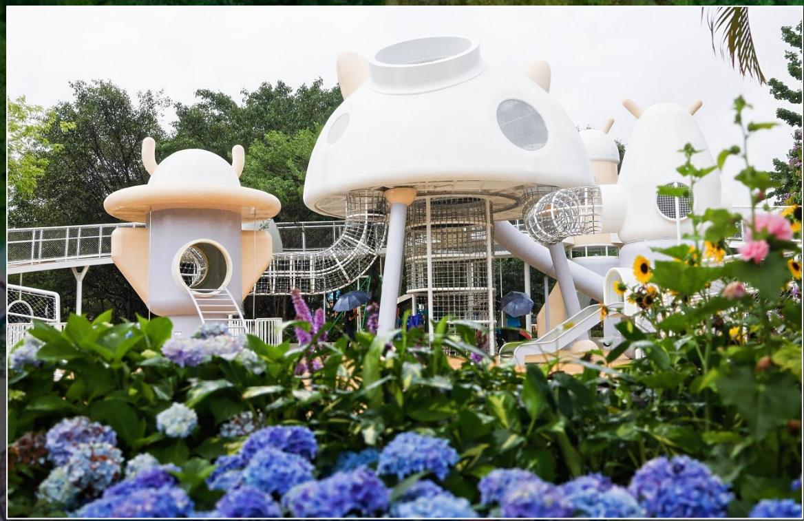

natural_image

Exterior view of a modern white children's play structure with cartoon pyramids and blue hydrangees in the foreground (no signage or text visible)

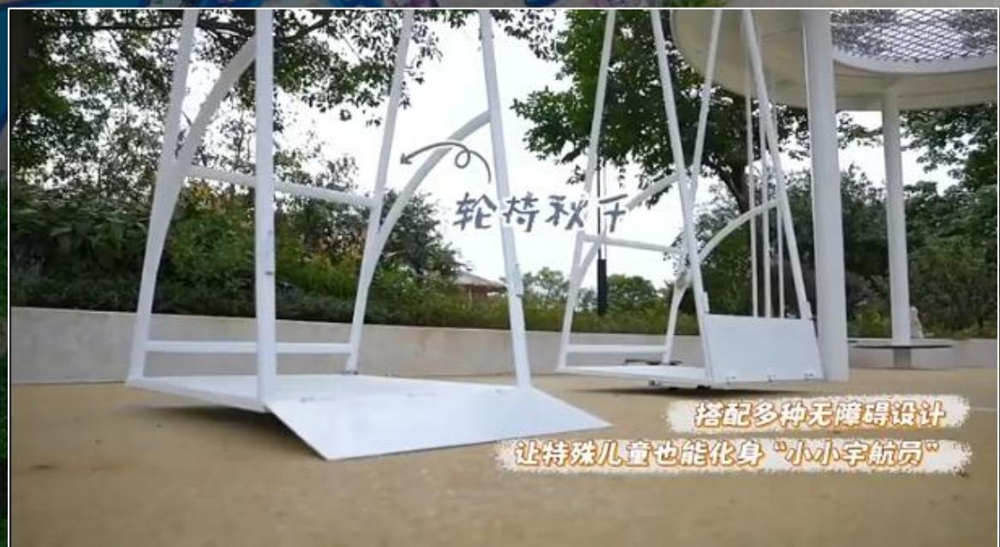

text_image

轮持秋斤
搭配多种无障碍设计
让特殊儿童也能化身“小小宇航员”

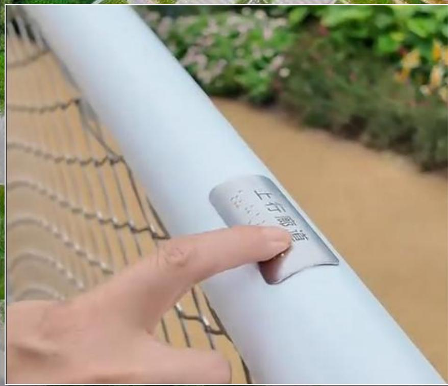

text_image

上行最適

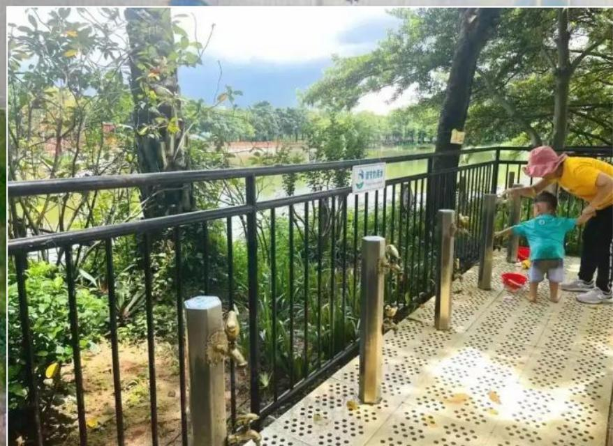

natural_image

Outdoor scene with a child and adult on a metal walkway, surrounded by greenery and trees (no visible text or symbols)

广州市儿童公园

## 绿色建筑设计案例：超级生命体，重新定义生态办公｜广州三一树根互联全球总部大厦

## 两大核心挑战：

一，东西塔楼被城市道路分割，需实现空间缝合与功能整合；  
二，200米高空受强风、台风、荷载限制，传统绿化无法落地。

奥雅联合业主及SOM事务所，确立现代有机、超级生命体、共生成长理念，将建筑打造为有机生命系统。

## 两大维度落地：

空间缝合：

摒弃分立思路，以“线性链接 + 功能整合”构建中枢，一层通过架空连廊打造一体化大堂，东西分设7米落客区，实现双楼一体与高效分流。

垂直生态：

联合哈工大（深圳）开展风洞试验，定制抗台风、适配高空的立体花园，构建从地面到高空的垂直生态链；建筑外围设乔木绿障，中庭打造水景，裙房全域覆绿，实现高空生态突破。

在寸土寸金的广州核心区，空间已不止于的“容纳”，而是“价值”的延伸。广州三一树根互联全球总部大厦的设计，本质上是一次“空间升维”。

项目打破“办公在室内、绿化在室外”的传统思维，将花园植入建筑肌理，让办公空间从“钢筋盒子”变成可呼吸、可互动的“城市森林”。

绿色实践与价值践行海绵城市与低碳理念，通过生态设施实现水资源循环，以立体绿化提升碳汇；构建全周期人才培育体系坚守生态底线；持续深化气候适应型设计，以技术创新赋能低碳转型，助力双碳目标与行业绿色发展。

## （三）资源节约与绿色办公

## 节能降耗：

在全国各办公区全面推广LED节能照明、智能控电系统及节水器具，2025年单位面积能耗同比下降12%、水耗同比下降15%，切实落实能源、水资源高效利用相关要求。

## 绿色办公：

全面推行无纸化办公模式，线上审批、视频会议覆盖率达95%，有效减少纸张消耗60%；积极倡导绿色出行，员工选择公共交通或新能源出行的比例达75%，践行绿色低碳运营理念。

## 废弃物管理：

严格落实废弃物分类管理要求，办公垃圾分类回收利用率达45%，项目施工废料资源化利用率达82%，严格规范危险废弃物处置流程，确保合规处置、绿色处置。

## 禁塑与环保倡议：

奥雅股份警醒地意识到塑料制品给我们环境带来的负担，环境的污染并非与我们单独的个体无关，每一份对环境的污染，最终都会间接对人类的生存造成侵害。

我们希望通过我们自己努力，扭转社会对于一次性塑料制品的依赖，通过每一位奥雅人的努力，做到“必不可少的少用，可以替代的到不用。”

## 我们郑重倡议：

用环保布袋替代塑料袋，少用一个塑料袋；

随身携带餐具，减少一次性制品的使用；

每周少点一次外卖，点外卖尽可能选择可降解餐盒；

全国所有集团公司不再使用瓶装矿泉水接待，前台常备柠檬水接待访客以及日常会议时使用的；

用紧凑型荧光灯或LED灯泡取代标准白炽灯泡。随手关掉不需要使用的电源；

节省纸张：尽可能避免用纸。使用数字文件而不是纸质文件。在电脑屏幕上而不是在纸上查看文件。购买环保的、可重复使用的信封。不重要的文件正反打印。

减少使用空调的次数，使用时调至环保温度。 鼓励员工步行、骑自行车或使用公共交通工具以减少排放。

奥雅股份希望以自己的价值观、信念和行为方式，影响所有与我们接触的人，用我们自己的行动塑造未来的地球。

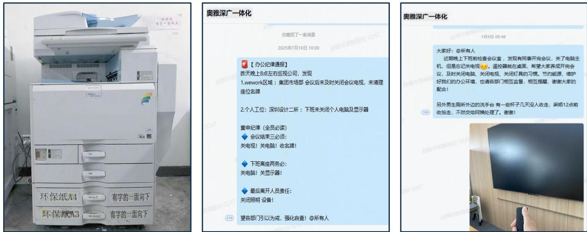

奥雅股份深广一体化办公区以践行ESG 理念为核心，围绕能源节约推进绿色办公建设：

明确 “会议结束三必须（关电视、关电脑、收名牌）、下班离座两务必（关电脑、关显示器）、最后离开关区域照明” 的全员节能规范，通过办公环境提升专项行动、常态化巡检通报、全周期宣贯等举措，系统性减少办公能源浪费，打造低碳、高效的绿色办公环境，践行企业社会责任。

## 办公区资源节约与绿色办公实践

公司积极践行 ESG 理念，在深广一体化办公区全面推行资源节约与绿色办公，推动低碳运营与节能增效。

公司建立明确节能规范：

会议结束后及时关闭电脑、投影、大屏等电器；

员工下班关闭个人电脑及显示器；

各区域落实电器责任制，最后离开人员关闭照明、风扇等设备，规范空调使用，杜绝能源浪费。

同时开展办公环境提升专项行动，通过夜间巡检、纪律通报与常态化宣贯，强化全员绿色办公意识。

通过精细化管理，办公区年度节电约 9600kWh，减少碳排放约 8 吨；办公用水同比节约约 120吨，降幅 8%；双面打印与无纸化办公推进后，办公用纸消耗量同比减少 1.8 吨，相当于少砍伐约 30 棵成年树木。

公司以实际行动践行低碳环保责任，持续完善绿色运营体系，不断提升ESG 管理水平。

## （四）应对气候变化

公司立足行业责任，制定2030年碳达峰、2060年碳中和路线图，2025年完成全公司碳盘查，范围1+2碳排放总量1280吨CO₂e，同比下降10%。将气候风险纳入项目前期评估，在重点项目中强化低碳适配等设计，推动企业与环境协同发展。

全球环境问题凸显，脱碳化是发展核心方向。作为行业领军企业，奥雅股份将气候韧性、生态友好理念融入企业战略与设计实践，推动全行业绿色低碳转型，共建人与自然和谐共生的未来。

## 气候理念与战略：以责任为基，锚定绿色未来

奥雅股份深刻认同：景观设计师不仅是空间创造者，更是生态问题的解决者与气候理念的传播者奥雅股份。公司深度融合国际前沿气候设计思想，以玛莎・施瓦茨教授等国际专家的 "气候危机设计" 理念为指引，构建 "全员参与、全链减碳、全域适应" 的气候应对战略体系。

战略初心：四年前，全球气候变化的严峻现实与生态危机的深刻影响，让我们坚定以设计回应气候挑战的决心 ——热爱设计，更致力于解决实际问题 奥雅股份 。通过系统研读专业文献、搭建跨学科研究团队、开展国际学术交流，持续深化气候应对认知与技术能力。

核心原则：坚持 "生态优先、低干预、低消耗、长周期"的设计准则，将气候、环境、资源因素作为项目规划的前置条件；倡导"少即是多"，最大化利用公共空间与自然禀赋，降低环境负外部性奥雅股份；以全生命周期视角规划项目，兼顾短期落地与长期生态效益.。

责任传导：将气候责任从企业延伸至行业与公众，鼓励设计师成为气候理念的 "传播者与教育者"，向客户、合作伙伴与社会大众传递环境友好理念，推动全民参与低碳行动。

## 绿色实践与技术创新

围绕三大核心领域，将气候理念转化为落地实践：

（一）水资源可持续：推行海绵城市与LID低影响开发模式，通过生态设施实现雨水收集回用；在河道净化等项目中实现污水净化与生态修复，倡导全民参与水资源循环。  
（二）脱碳与固碳：优先选用低碳环保建材源头减碳，增加城市绿化提升碳汇能力，在标杆项目中实现多重气候效益；优化公共交通，倡导绿色出行。  
（三）城市绿色转型：以小型绿色项目为切入点，构建城市绿色网络；联动多方力量，形成全民践行的可持续发展合力。

## 人才培育与行业赋能

构建“理论+实践+传承”三维人才体系，将气候相关内容纳入全员培训，引导设计师跨领域学习；深化国际合作，引入前沿理念搭建行业知识共享平台，推动行业共进。四、责任坚守与未来展望公司坚守生态底线，拒绝非绿色项目。未来将深化气候适应型景观设计，扩大绿色技术应用；加大技术研发投入，融合数字技术提升设计效率；参与国家“双碳”战略，开展公益科普，深化全球合作，以专业力量引领行业低碳变革。

苏州大阳山温室馆

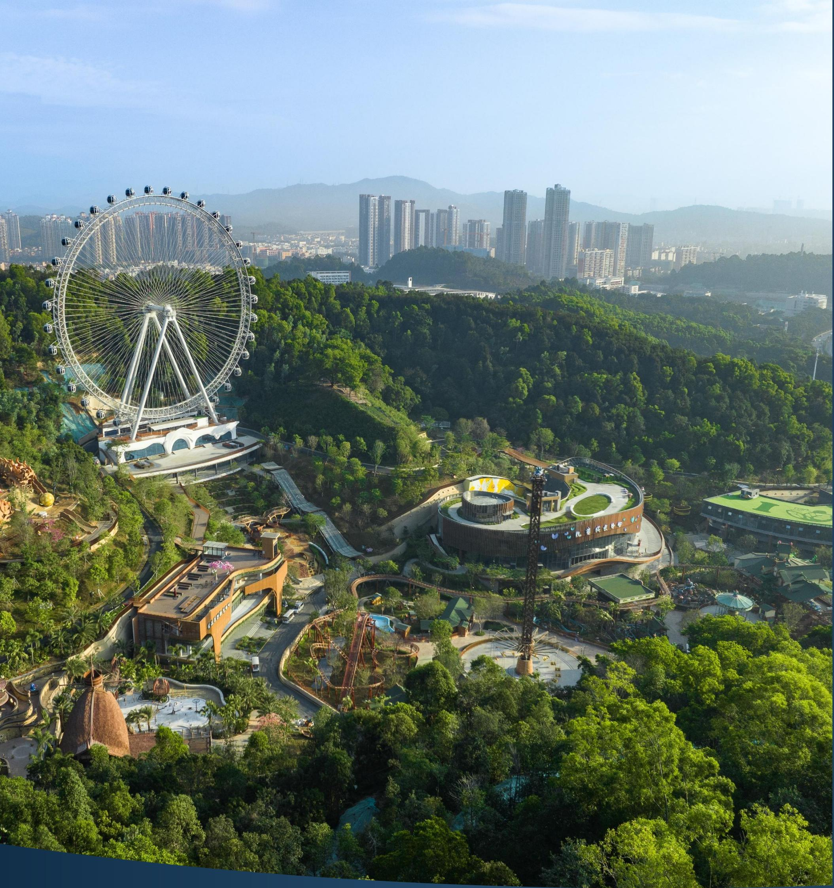

natural_image

Aerial view of a large Ferris wheel installation in a lush green mountain valley, with modern high-rise buildings and distant hills in the background (no visible text or symbols).

## 05

## 社会（S）

## （一）人才发展与员工关怀

887 人

）在职员工 人才

创新设计板块 546 人

EPC工程板块 93 人

文旅运营板块78 人

100 %

劳动合同签订率

社保公积金缴纳率100 %

住房公积金缴纳比例不低于7 %

92 %

员工满意度

薪酬福利兑现情况：

足额及时，男女薪酬公平

2025年度工伤 0

2025年度职业病事故0

126 场

2025年培训场次

全员人均培训时长8.19 小时

创新设计月度分享会 6 期

集团经营战略分享会3 期

20 %

内部员工晋升占比

10年以上员工 89 人 10%

5\~10年员工 264 人 30%

2\~5年员工 294 人 33%

## 温暖同行，聚力成长

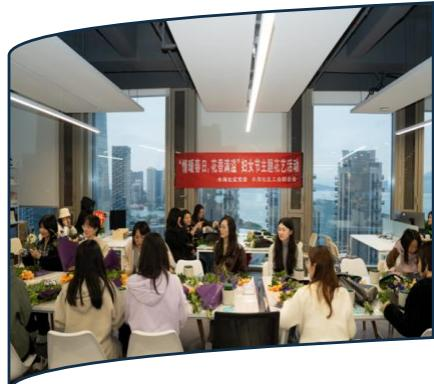

text_image

“福耀联众·花香满盈”数字金融活动
主办单位：中国银行股份有限公司

三八女神节花艺手作活动  
主题：情暖春日・花香满溢

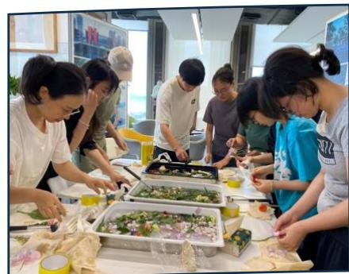

natural_image

Group of people preparing food at a table with trays and containers (no visible text or symbols)

端午主题月末会  
主题：放“粽”一夏，聚力前行

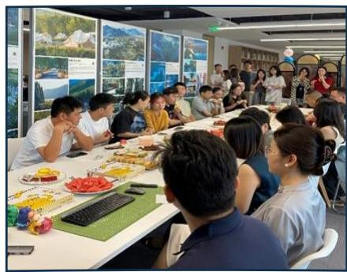

natural_image

Group of people seated around a long table in a meeting room with large wall displays showing landscape photos (no visible text or symbols)

6月月末会・年中PARTY  
主题：年中蓄力，快乐收官

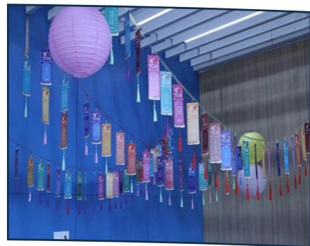

natural_image

Interior of a decorated room with hanging colorful lanterns and a large pink balloon against a blue wall (no text or symbols visible)

中秋 & 国庆双节游园会

主题：月满华诞，乐聚游园  
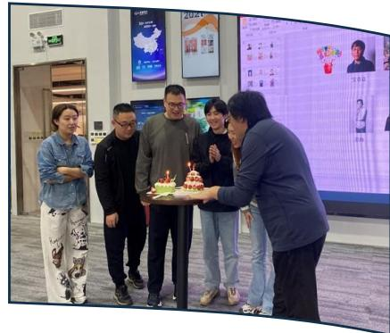

text_image

Group of people gathered around a birthday cake in an indoor setting, with a large screen displaying Chinese text and charts in the background.

圣诞 & 元旦双节暖心“换” 乐会主题：双节融合・惊喜与温暖并存

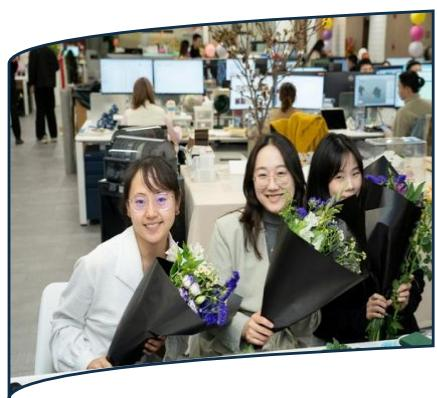

natural_image

Three women holding flower bouquets in an office setting with computers and employees in the background (no visible text or symbols)

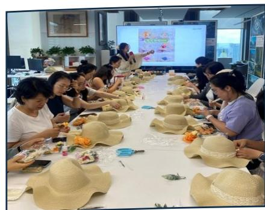

natural_image

Group of women crafting straw hats at a long table in an office setting (no visible text or symbols)

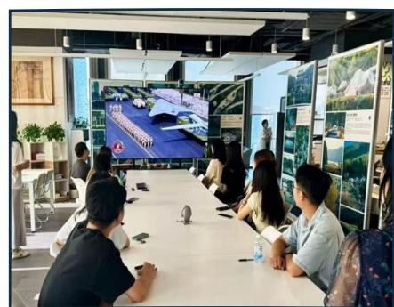

natural_image

Interior of a modern office or research center with people seated around a long table, facing a large screen displaying a projected landscape model (no visible text or symbols)

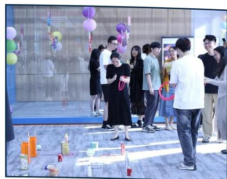

natural_image

Group of people gathered around a table with colorful balloons and products, in an indoor setting (no visible text or symbols)

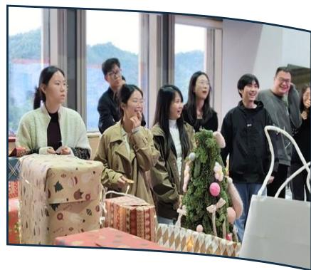

natural_image

Group of people gathered around gift boxes and a decorative Christmas tree indoors, with hills in the background (no visible text or symbols)

打造有温度的职场，构建充满归属感与幸福感的职场生态体系

三大维度：节日文化、员工成长、团队凝聚

年度成果：实现文化体验、专业成长与情感归属的有机结合

核心定位：打造业务成长+ 情感关怀”双轨交流平台

实现团队内部高频互动与连接• 核心价值：

兼顾专业能力提升与员工情感关怀，双向赋能团队成长

未来规划：

基于年度复盘经验，持续深化与迭代员工关怀体系

创造更多元、更有温度的职场体验

## （二）儿童友好：核心社会责任

奥雅股份秉持“为中国儿童带来可持续快乐”的初心，深耕儿童友好领域。受《森林里的最后一个孩子》启发，公司联合创始人、董事、总经理李方悦女士创立亲子文旅品牌“洛嘉儿童”，在国内率先提出“儿童友好设计”理念，是中国儿童友好城市建设的发起者与行业标准重要制定者，以先行者与引领者身份持续践行社会责任。

## 2025年儿童友好实践：

儿童友好项目：累计300+ 个｜2025 年新增 68 个

• 覆盖城市：新增20 座  
• 服务家庭：累计超50 万户  
• 公益活动：150 余场｜惠及儿童3 万人次  
• 行业标准：参编2 项  
• 权威荣誉：2个项目获评儿童友好示范；2个项目荣获重要规划设计奖项

凭借专业实践与标杆成果，奥雅股份荣获多项权威认可：在北京2025儿童友好城市建设成果发布活动中，从420余个区级推荐案例中脱颖而出，北京西红门创业大街入选“儿童友好街区”，北京八角新乐园获评“儿童友好活动基地”。

## 儿童友好与全龄关怀：聚焦“一老一小”的社会需求

奥雅股份持续通过旗下品牌“洛嘉儿童”推动儿童友好城市建设，并将关怀扩展至全龄段人群。

儿童友好空间获奖：在第九届ELA国际景观大奖中，奥雅在“儿童友好与社区营造”领域收获颇丰。电建·洛嘉重庆能量乐园、郑州苑城Park洛嘉森乐园、宁波生命科学城精灵鸟乐园等多个儿童空间获得金奖，体现了公司在儿童活动空间设计上的专业度与人文关怀。

社区儿童自然教育：在北京檀谷，洛嘉自然探索中心旗舰店作为中国首个社区儿童自然探索中心，持续运营。该中心不仅提供游乐空间，更融入了自然教育体验，为3-12岁亲子家庭提供自然美育、主题营会等活动，解决了社区儿童“放哪儿”的痛点，实现了从空间提供到内容运营的升级。

全龄友好实践：上海浦东缤纷社区（飞羽乐园）以儿童友好为抓手，通过激活桥下消极空间，不仅为儿童提供了安全的游乐场所，还增强了社区的整体凝聚力，提升了城市生活质量，真正实现了“让城市因儿童而生动”。

截至目前，公司已落地300 + 儿童友好项目，坚持以 “1 米视角” 做设计、以长效运营做保障，推动儿童友好从试点探索融入城乡发展，让城市更适配儿童、更具温度。

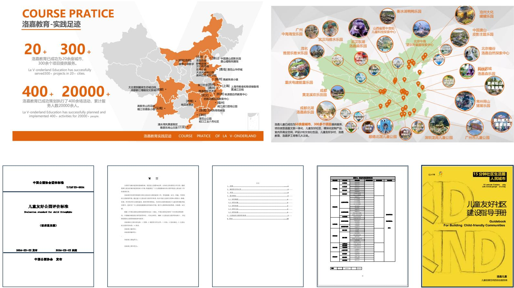

<table><tr><td>类别</td><td>核心字段</td><td>关键数据/内容</td></tr><tr><td>品牌初心</td><td>企业使命</td><td>为中国儿童带来可持续快乐</td></tr><tr><td>核心品牌</td><td>旗下品牌</td><td>洛嘉儿童</td></tr><tr><td>行业定位</td><td>行业地位</td><td>中国儿童友好设计先行者、领导者;儿童友好城市建设发起者与行业标准制定者</td></tr><tr><td>理念先行</td><td>核心理念</td><td>儿童友好设计、1米视角守护儿童成长</td></tr><tr><td>项目成果</td><td>2025年新增项目</td><td>落地68个儿童友好空间项目</td></tr><tr><td>项目成果</td><td>覆盖城市</td><td>新增覆盖20座城市</td></tr><tr><td>项目成果</td><td>累计服务家庭</td><td>超50万户</td></tr><tr><td>项目成果</td><td>累计项目总数</td><td>300+儿童友好项目</td></tr><tr><td>行业贡献</td><td>标准制定</td><td>参编《儿童友好公园评价标准》《儿童友好社区建设指导手册》</td></tr><tr><td>公益实践</td><td>公益活动</td><td>开展自然教育、美育课堂、亲子公益等150余场</td></tr><tr><td>公益实践</td><td>惠及人数</td><td>惠及儿童3万人次</td></tr><tr><td>荣誉认可</td><td>2025获奖项目</td><td>北京西红门创业大街:儿童友好街区北京八角新乐园:儿童友好活动基地</td></tr><tr><td>荣誉认可</td><td>评选规模</td><td>全市420余个区级推荐案例中入选</td></tr></table>

## 两项研发成果

《产品设计指导手册》建立标准化设计体系，提升安全与落地质量，应用于洛嘉儿童模块化产品落地、项目实施；

《儿童感觉统合训练资料整合》夯实儿童友好设计理论基础，贴合儿童身心发展需求，应用于儿童活动空间研发、游戏设施设计。

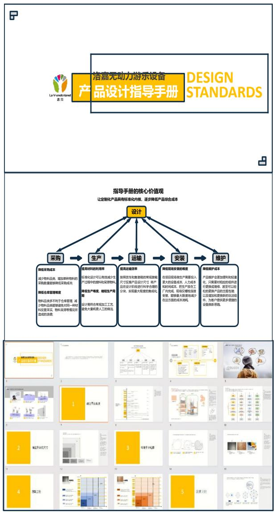

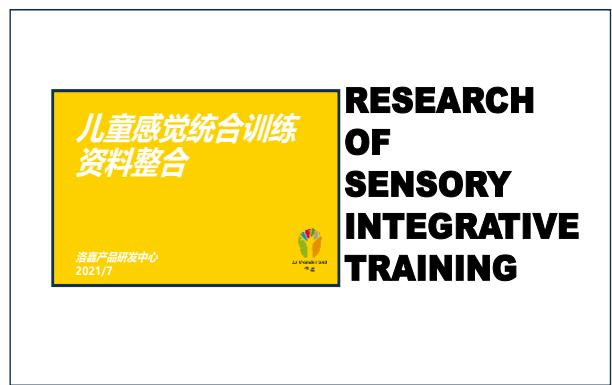

text_image

儿童感觉统合训练
资料整合
活塞产品研发中心
2021/7
RESEARCH OF
SENSORY
INTEGRATIVE
TRAINING

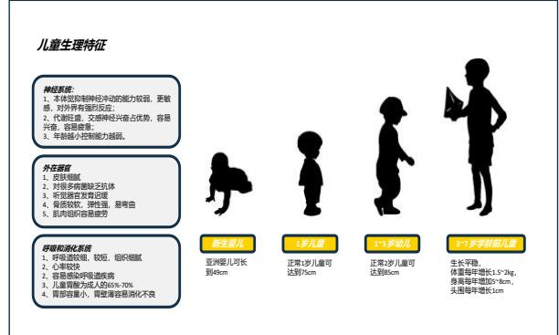

text_image

儿童生理特征
神经系统：
1. 本体变购制神经冲动的能力较弱，更敏感，对外界有胆肌反应；
2. 代谢症，交感神经兴奋占优势，容易兴奋，易感疲劳；
3. 年龄越小控制能力越弱。
外左器官
1. 皮肤细腻
2. 对外多角膜缺乏抗体
3. 听着发育缓慢
4. 骨质软软，弹性强，易弯曲
5. 肌肉组织容易疲劳
呼吸和消化系统
1. 呼吸滤较短，较短，组织细腻
2. 心率较快
3. 容量感染呼吸道疾病
4. 儿童规模为成人的95%-70%
5. 肾部容量小，骨骼滑容易消化不良
新生儿儿
亚洲婴儿可长到40cm
3岁儿童
正常1岁儿童可达到70cm
3~3岁幼儿
正常2岁儿童可达到80cm
3~3岁学龄胎儿儿童
生长平稳，
体重每年增长1.5~2kg，
身高每年增加5~8cm，
头周每年增长1cm

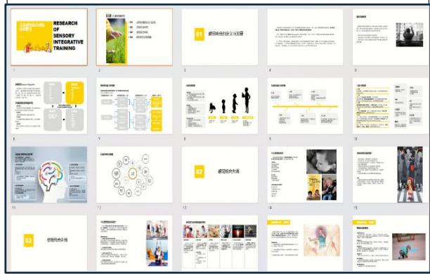

text_image

RESEARCH OF
SENSORY
INTEGRATIVE
TRAINING

1
21 联结场创新交流与拓展

3
4
5
6
7
8
9
10
11
12
13
14
15
16
17
18
19
20
21
22
23
24
25
26
27
28
29
30
31
32
33
34
35
36
37
38
39
40
41
42
43
44
45
46
47
48
49
50
51
52
53
54
55
56
57
58
59
60
61
62
63
64
65
66
67
68
69
70
71
72
73
74
75
76
77
78
79
80
81
82
83
84
85
86
87
88
89
90
91
92
93
94
95
96
97
98
99

EXPLORER SERIES 探险家系列 丨 TXJ230  
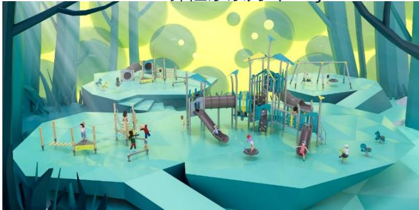

natural_image

Illustration of a colorful playground with multiple slides, climbing structures, and children playing on benches (no text or symbols)

AVIATOR SERIES 飞行家系列 丨 FXJ2306  
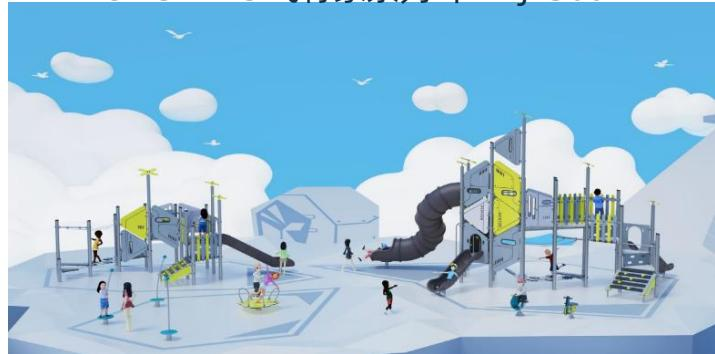

natural_image

Illustration of a children's playground with slides, climbing structures, and colorful equipment under a blue sky (no text or symbols)

## TÜV南德颁发产品认证证书

让孩子玩得更安全 | 奥雅股份旗下LALOT洛塔儿童游乐设施有TÜV南德颁发产品认证证书。

奥雅股份旗下高端儿童游乐设备品牌LALOT洛塔智能游乐在安全与质量领域拥有TÜV 南德意志集团（以下简称“TÜV 南德”）颁发的多张TÜV SÜD产品认证证书。LALOT洛塔产品通过欧洲EN1176和美国ASTM F1487的严格标准，兑现了其在儿童游乐设备领域的卓越品质和安全承诺。

TÜV南德依据欧盟的EN1176及美国的ASTMF1487标准对LALOT洛塔旗下探险家、飞行家、航海家、艺术家、科学家、梦想家等系列产品进行了评估和相关测试，包括图纸设计，关键部件结构确认，完整产品评估以及材料安全测试，确保了被测试产品在防跌落保护，防身体部位卡夹，成人进入辅助，结构布局等方面都满足了EN1176和ASTMF1487的标准要求，使得儿童在玩耍中获得快乐和成长的同时可以避免很多潜在的伤害风险。

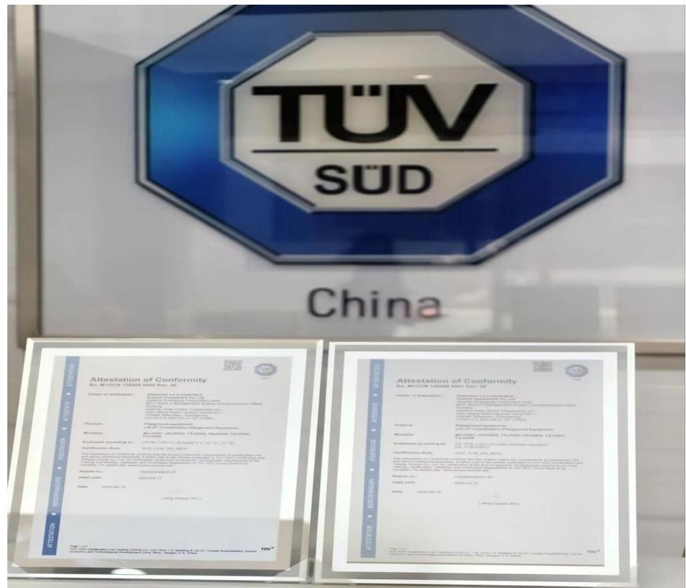

text_image

TÜV
SÜD
China
Attestation of Conformity
No. 91/2024, 12:00:00 (000) Feb. 30
Number of Issuitions:
December 14, 2024
Registered Issuitions:
Agricultural and Forestry
Biology and Forestry
Construction and Maintenance
Construction and Maintenance
Construction and Maintenance
Construction and Maintenance
Construction and Maintenance
Construction and Maintenance
Construction and Maintenance
Construction and Maintenance
Construction and Maintenance
Construction and Maintenance
Construction and Maintenance
Construction and Maintenance
Construction and Maintenance
Construction and Maintenance
Construction and Maintenance
Construction and Maintenance
Construction and Maintenance
Construction and Maintenance
Construction and Maintenance
Construction and Maintenance
Construction and Maintenance
Construction and Maintenance
Construction and Maintenance
Construction and Maintenance
Construction and Maintenance
Construction and Construction
Construction and Construction
Construction and Construction
Construction and Construction
Construction and Construction
Construction and Construction
Construction and Construction
Construction and Construction
Construction and Construction
Construction and Construction
Construction and Construction
Construction and Construction
Construction and Construction
Construction and Construction
Construction and Construction
Construction and Construction
Construction and Construction
Construction and Construction
Construction and Construction
Construction and Construction
Construction and Construction
Construction and Construction
Construction and Construction
Construction and Construction
Construction and Construction
Construction and construction
Construction and construction
Construction and construction
Construction and construction
Construction and construction
Construction and construction
Construction and construction
Construction and construction
Construction and construction
Construction and construction
Construction and construction
Construction and construction
Construction and construction
Construction and construction
Construction and construction
Construction and construction
Construction and construction
Construction and construction
Construction and construction
Construction and construction
Construction and construction
Construction and construction
Construction and construction
Construction and construction
Construction and construction
Construction and concrete building (LTM)
17-0006-58-17-0006-58-17-0006-58-17-0006-58-17-0006-58-17-0006-58-17-0006-58-17-0006-58-17-0006-58-17-0006-58-22-22-22-22-22-22-22-22-22-22-22-22-22-22-22-22-22-22-22-22-22-22-22-22-22-22-22-22-22-22-22-22-22-22-
Attestation of Conformity
No. 91/2024, 12:00:00 (000) Feb. 30

Attestation of Conformity
No. 91/2024, 12:00:00 (000) Feb. 30

Number of Issuitions:
December 14, 2024
Registered Issuitions:
Agricultural and Forestry
Biology and Forestry
Construction and Maintenance
Construction and Maintenance
Construction and Maintenance
Construction and Maintenance
Construction and Maintenance
Construction and Maintenance
Construction and Maintenance

Production:
1. Domestic production: 1.3 L/ton.
2. Domestic production: 1.3 L/ton.
3. Domestic production: 1.3 L/ton.
4. Domestic production: 1.3 L/ton.
5. Domestic production: 1.3 L/ton.
6. Domestic production: 1.3 L/ton.
7. Domestic production: 1.3 L/ton.
8. Domestic production: 1.3 L/ton.
9. Domestic production: 1.3 L/ton.
10. Domestic production: 1.3 L/ton.
11. Domestic production: 1.3 L/ton.
12. Domestic production: 1.3 L/ton.
13. Domestic production: 1.3 L/ton.
14. Domestic production: 1.3 L/ton.
15. Domestic production: 1.3 L/ton.
16. Domestic production: 1.3 L/ton.
17. Domestic production: 1.3 L/ton.
18. Domestic production: 1.3 L/ton.
19. Domestic production: 1.3 L/ton.
20. Domestic production: 1.3 L/ton.
21. Domestic production: 1.3 L/ton.
22. Domestic production: 1.3 L/ton.
23. Domestic production: 1.3 L/ton.
24. Domestic production: 1.3 L/ton.
25. Domestic production: 1.3 L/ton.
26. Domestic production: 1.3 L/ton.
27. Domestic production: 1.3 L/ton.
28. Domestic production: 1.3 L/ton.
29. Domestic production: 1.3 L/ton.
30. Domestic production: 1.3 L/ton.
31. Domestic production: 1.3 L/ton.
32. Domestic production: 1.3 L/ton.
33. Domestic production: 1.3 L/ton.
34. Domestic production: 1.3 L/ton.
35. Domestic production: 1.3 L/ton.
36. Domestic production: 1.3 L/ton.
37. Domestic production: 1.3 L/ton.
38. Domestic production: 1.3 L/ton.
39. Domestic production: 1.3 L/ton.
40. Domestic production: 1.3 L/ton.
41. Domestic production: 1.3 L/ton.
42. Domestic production: 1.3 L/ton.
43. Domestic production: 1.3 L/ton.
44. Domestic production: 1.3 L/ton.
45. Domestic production: 1.3 L/ton.
46. Domestic production: 1.3 L/ton.
47. Domestic production: 1.3 L/ton.
48. Domestic production: 1.3 L/ton.
49. Domestic production: 1.3 L/ton.
50. Domestic production: 1.3 L/ton.

ARTIST SERIES 艺术家系列 丨 YSJ2305  
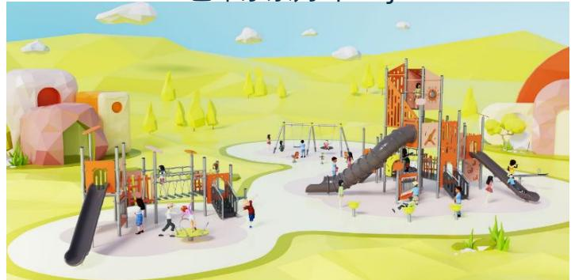

natural_image

Colorful cartoon illustration of a playground with slides, climbing structures, and children playing (no text or symbols)

SCISCIENTIST SERIES 科学家系列 丨 KXJ2304  
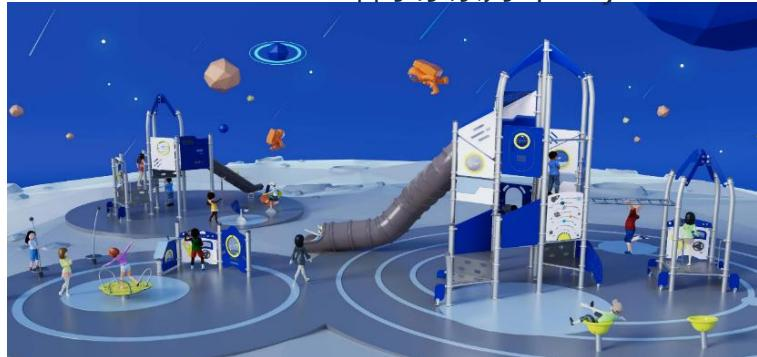

natural_image

Colorful children playing on a playground with slides, surrounded by floating objects and space (no text or symbols visible)

## 电建·洛嘉重庆能量乐园

奥雅股份&洛嘉儿童作品电建·洛嘉重庆能量乐园凭借在景观设计与亲子文旅领域的综合实力脱颖而出，荣 获 第 十 届REARD全球地产设计大奖-金奖、第四届“梦绮杯”美好儿童及青少年设计大奖-金奖。

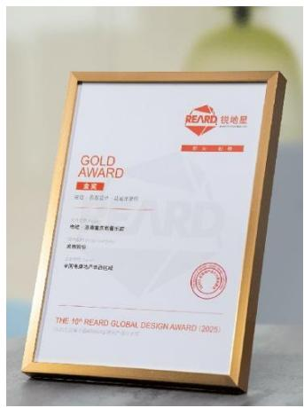

text_image

REARD
锐地星
GOLD
AWARD
主办
通过，负责设计、品牌宣传和
项目管理
地址：上海市浦东新区东门路
电话：上海市浦东新区东门路
传真号码：
中国电建地产总站区域
THE 10TH REARD GLOBAL DESIGN AWARD (2025)
CHINA ECONOMIC DEVELOPMENT & TRADE DEVELOPMENT CO., LTD.

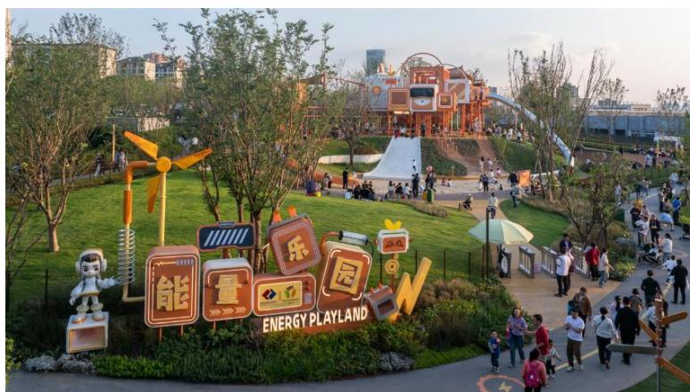

text_image

能量乐园
ENERGY PLAYLAND

电建·洛嘉重庆能量乐园作为重庆首个以能量为主题的亲子乐园，以室内外亲子乐园结合社区商业配套的形式，构建“研学、玩乐、休闲、餐饮”于一体的全龄友好生活空间，提供所见即所得的未来生活社区蓝本。

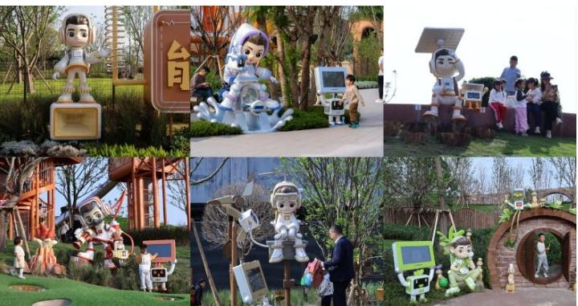

natural_image

Collage of five nature-themed park scenes including cartoon mascots, a pedestrian bridge, and children's group (no visible text or symbols)

结合电建企业使命，引入浑身充满“正能量”和未来科技感的特色IP——能量卫士，凭借游戏科普和沉浸式故事场景，深受孩子们欢迎。

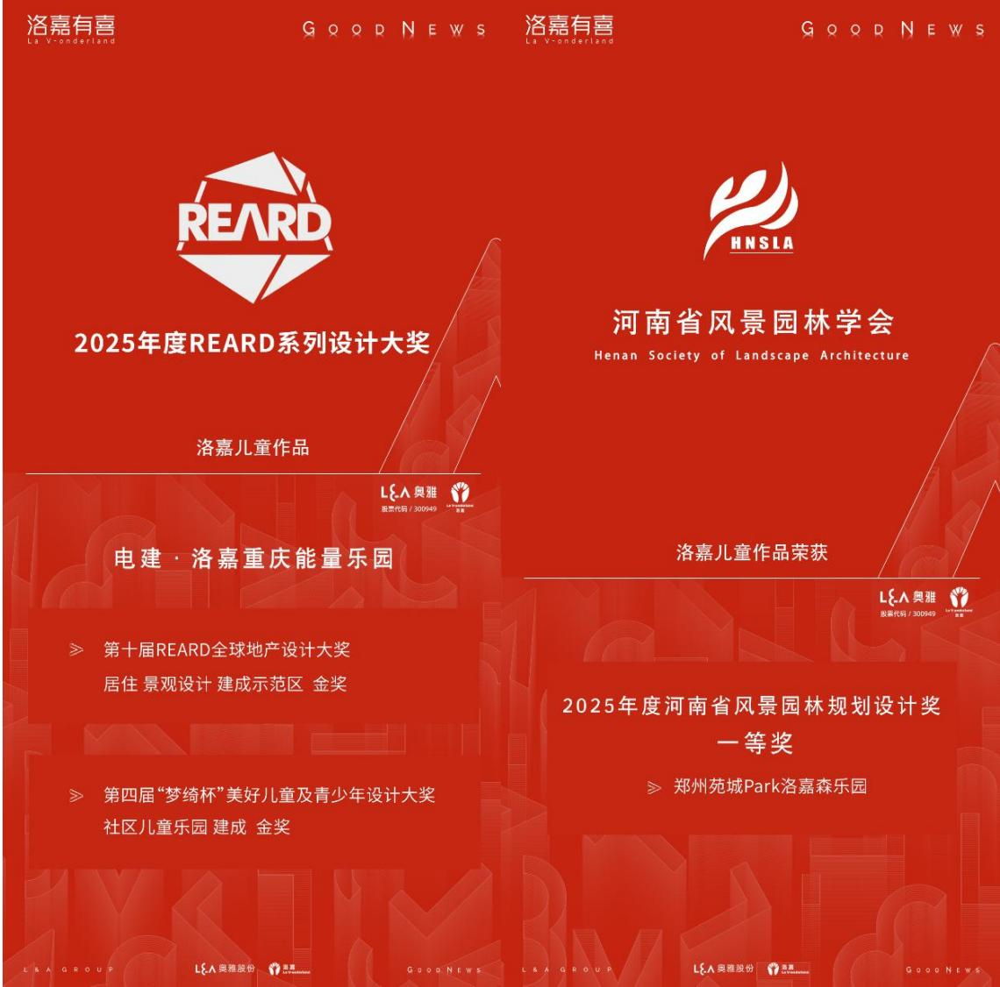

text_image

洛嘉有喜
La V-onderland
GOOD NEWS
洛嘉有喜
La V-onderland
GOOD NEWS
REARD
2025年度REARD系列设计大奖
洛嘉儿童作品
LEA 奥雅
获奖代码 / 300949
电建·洛嘉重庆能量乐园
≥ 第十届REARD全球地产设计大奖
居住 景观设计 建成示范区 金奖
≥ 第四届“梦绮杯”美好儿童及青少年设计大奖
社区儿童乐园 建成 金奖
HNSLA
河南省风景园林学会
Henan Society of Landscape Architecture
洛嘉儿童作品荣获
LEA 奥雅
获奖代码 / 300949
LEA 奥雅
获奖代码 / 300949
2025年度河南省风景园林规划设计奖
一等奖
≥ 郑州苑城Park洛嘉森乐园
LEA AGR GROUP
LEA 奥雅股份
Good News
LEA 奥雅股份
Good News

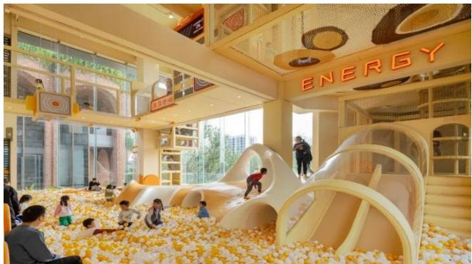

natural_image

Interior of a modern children's play area with colorful slides and yellow flowers, featuring 'ENERGY' signage (no readable text on main structures)

能量乐园中，室外公园划分为主设备乐园、研学探索花园、低龄萌宠乐园、水渠剧场、露营草地等五大分区。室内乐园“洛嘉自然探索中心”设有亲子互动课堂、售卖空间以及能量中心游玩区域，打造为多元融合的潮流生活场、重庆家庭的溜娃圣地。

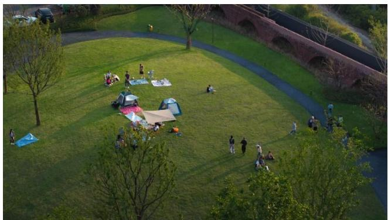

natural_image

Aerial view of a park with people resting on grass, scattered tents, and trees along a winding path (no visible text or symbols)

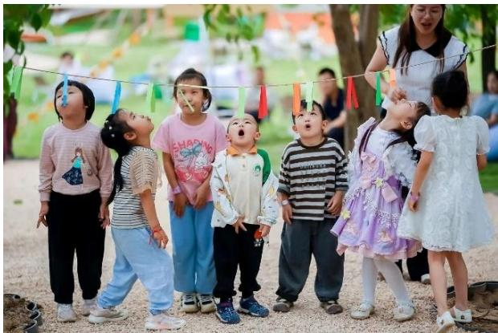

natural_image

Group of children outdoors watching a photo with musical instruments, no visible text or symbols

在园区结构上，洛嘉儿童团队将园区划分为苑苑古象、迷雾水溪、神奇树屋、流水淘金等十二大主题板块，形成“环状探索+节点体验”的游览动线。在这里，孩子们在丛林剧场感受自然魅力，在蹦蹦云体验跳跃乐趣，于自然中激发无限创造力。

## 郑州苑城Park洛嘉森乐园

奥雅股份&洛嘉儿童作品“郑州苑城Park洛嘉森乐园”凭借在遗址文化活化、生态景观营造与儿童友好空间设计的深度融合与卓越实践，荣获2025年度河南省风景园林规划设计奖一等奖。8月，项目亦成功斩获第八届“玉猴奖”2025年度十佳文旅消费创新奖。

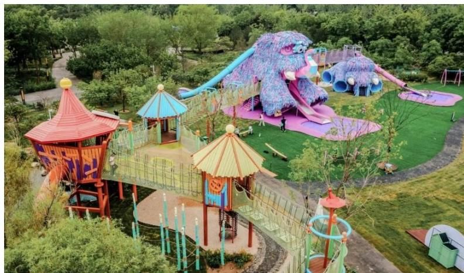

natural_image

Aerial view of a colorful playground with large painted slides, climbing structures, and colorful canopies on a green lawn (no visible text or symbols)

在郑州苑城Park洛嘉森乐园中，洛嘉儿童从规划、建设到运营保持设计逻辑一致，实现从理念到体验的完整闭环，突出了承载于规划设计中的可运营性与可持续性价值。

围绕“森林+文化+考古+儿童成长体验”，洛嘉儿童团队还创新融合考古文化与生态教育，打造“户外考古博物科学馆”，并原创“远古猛兽训练营”“沉浸式手工戏剧营”等系列探索课程和研学活动，以“儿童视角”带领孩子们在游戏中领悟文物发现的意义。

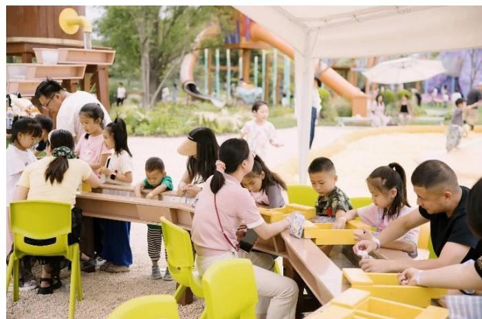

natural_image

Children participating in a playground activity with yellow chairs and wooden tables, surrounded by greenery (no visible text or symbols)

## （三）城市更新与文化传承

我国城镇化进入存量提质阶段，城市更新是实现“双碳”、提升人居品质的关键路径。传统更新偏重形态改造，存在同质化、短期化等问题。奥雅股份2025年以“续文脉、活空间、守初心、融价值”为核心，推动城市更新向人本、生态、长效升级。

## 核心理念

秉持“城市更新回归生活本真，唤醒空间生命力”的主张，坚持文化为根、空间为体、运营为魂，构建“五位一体”可持续实践体系。

## 2025年度重点实践

1. 历史街区与老旧社区：微更新、轻改造，保护肌理，完善服务，兼顾文脉与烟火气。  
2. 工业遗存：保护肌理、功能置换，融合创意文旅，实现存量空间再生与多元价值统一。  
3. 滨水与灰色空间：以生态修复为基础，打造全龄友好的公共开放空间，惠及市民。  
4. 智慧低碳应用：推广绿色建材与节能技术，运用数字化手段，推动更新低碳化、智慧化。

## ESG综合价值

环境（E）：存量更新降碳降耗，开展生态修复，助力“双碳”；社会（S）：改善人居，带动就业，传承文脉，推动社区共建；治理（G）：合规运营，强化全周期管控，构建多方协同模式。

## 未来展望

公司将拓展更新场景，深化低碳、数字技术应用，完善社区共建机制，落地标杆项目，助力建设宜居、韧性、智慧城市。

## 襄阳管家巷文化休闲街区特色文商旅体验街区

基于管家巷“L型”街巷空间及“闹街、慢巷、闲院”三大功能分区的基底，以“市井烟火气，袅袅书卷香”为主题，将商贸基因、诗书传统与现代生活有机融合，为千年古巷注入新的生机与活力。2025年春节期间，累计接待游客超七百万人次，全网曝光量破亿，成为湖北省文旅新地标。

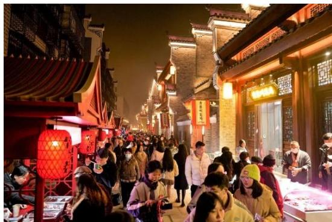

natural_image

Night street scene with crowded pedestrian and traditional Chinese architecture (no visible text or signage)

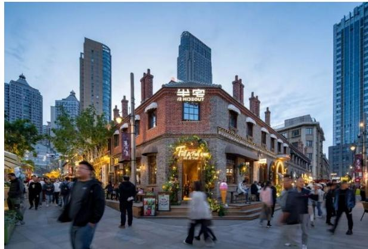

text_image

Street photo of a historic brick building with visible Chinese signage and illuminated entrance, surrounded by pedestrians and modern skyscrapers at dusk.

## 大连 东关街历史文化街区

大连特色历史风貌名片

2025国际可持续城市更新大奖金奖

ELA年度最佳城市更新项目奖金奖

ELA年度最具社会影响力奖

第七届REARD城市更新设计奖银奖

广东省园林学会规划设计奖二等奖

第十一届CREDAWARD 优秀奖

以“潮起东关·烟火重燃”为主题，采用“街、场、巷、院”四种空间形态串联整个片区，为百年街区注入新的生机与活力，让承载历史记忆的东关街，重现昔日民富市兴、烟火缭绕的繁华盛景。

## 合柴1972文创园

荣登大众点评合肥必玩榜第一

第十六届园冶杯城市更新金奖

以“城 市发 动 机”为核 心 理念，锚定“工业遗产+文化创意”的核心路径，充分尊重场地历史语境，通过空间再生、功能置换与文化叙事的协同，打造复合型公共文化空间。项目还荣获国家级文化产业示范园区、国家4A级旅游景区、安徽省特色小镇、大众点评合肥必玩榜第一等多项荣誉。

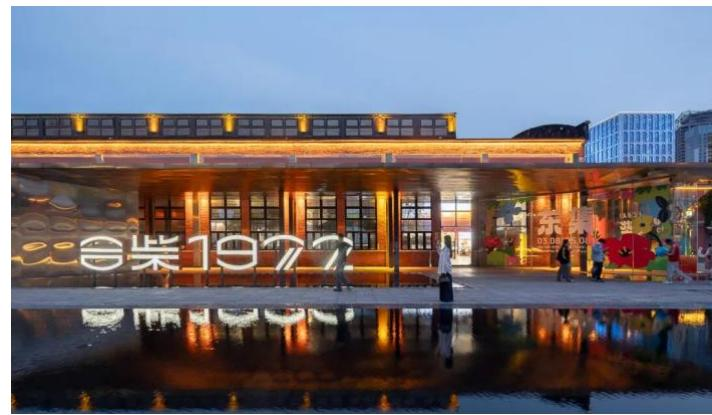

text_image

自柴1972

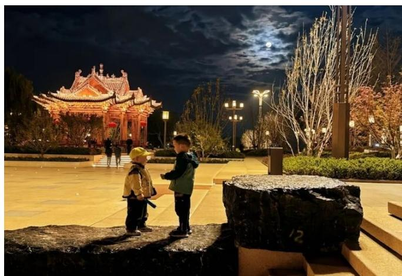

natural_image

Night scene of two children standing on a stone path beside a traditional Chinese-style building illuminated at night, with bare trees and streetlights in the background (no visible text or symbols)

## 万荣飞云楼后土文化广场

助力景区跻身“国家4A级旅游景区”。

以历史文化为根脉，以场景营造为载体、以日常生活为底色，逐层织补老城肌理，重塑人与历史、生活与文化的连接，让人们在此自在舒展、惬意栖居。在它的助力下，万荣飞云楼景区成功跻身“国家4A级旅游景区”，成为山西文旅新地标。

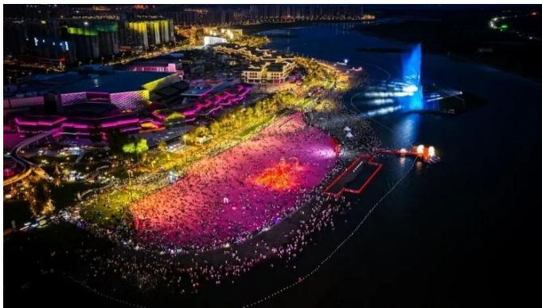

natural_image

Aerial night view of a brightly lit waterfront area with colorful lighting and crowds, featuring modern buildings and a blue-lit stage (no visible text or symbols)

## 长春 肆季南河伊通河岸

东北首个24小时沉浸式滨水轻度假目的地。

以“流动的母亲河”为设计灵感，通过“水岸叙事+场景革命”，打造东北首个24小时沉浸式滨水轻度假目的地，以“全时、全域、全员”的运营思维重塑滨水文商旅体验，为城市注入了强劲的活力的同时，显著带动了城市的文旅消费与区域发展。开业期间，吸引超10万人前来打卡，实现累计收入超300万元（含预售）。

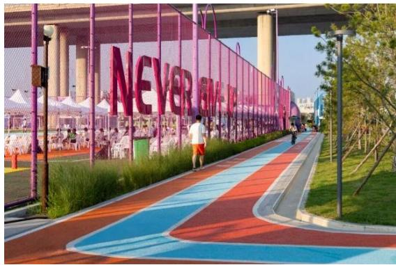

text_image

NEVER
P

## 青岛OPark橙岛时尚体育公园

高架桥下空间活化新标杆ELA年度最佳开放空间景观奖 银奖

通过“空间重构+功能复合+运营前置”三位一体的开发模式，将桥下空间转化为24小时活力的城市会客厅。以时尚运动为IP，结合场地特色，创新提出“1+6+N”模式（1个“核心”多功能运动场+6个配套运动场+N个休闲业态），JOY童趣、SPORTS运动、FASHION时尚在这里汇聚相撞，创造出独特的城市活力场域。

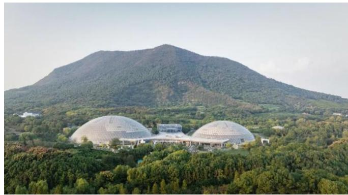

natural_image

Aerial view of two large dome-shaped buildings surrounded by lush green hills, with no visible text or symbols.

## 苏州大阳山植物园温室馆

生态复育+自然科普+文旅融合的更新范本

围绕“文旅融合与城市品牌塑造、生物多样性保护与科研支撑、公众科普与自然教育窗口”三大策略进行全面更新改造，深耕温室馆的内核价值，推动其从单纯的“成本中心”转型为兼具生态与品牌属性的“价值中心”。

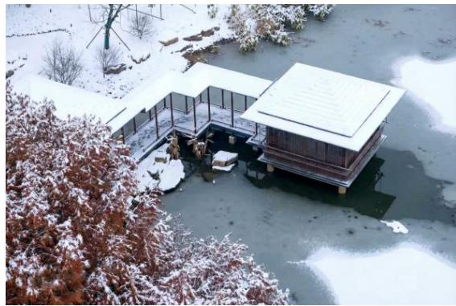

natural_image

Aerial view of a modern building with glass panels installed in a snowy, leafless pond surrounded by snow-covered trees (no visible text or symbols)

## 芜湖 神山公园人才会客厅

“文化+”赋能“公园+”新标杆

以建筑、景观、室内一体化设计，以“文化+赋能“公园+”，依托建筑在公园中心点各项优势，盘活更新闲置资产，聚焦“城市梦想会”，打造“人才会客厅”。

遵从激活城市资产、丰富游园体验、展示芜湖公园生活方式的设计原则，为前来芜湖工作交流的组织与个人，提供能体验芜湖公园生活之美的山水客厅。

## 无锡梁溪区公花园微更新

城市原点，历史街区的新生

ELA年度最佳开放空间景观奖银奖

ELA年度最佳商业景观奖金奖

1600余年深厚历史底蕴，被誉为“华夏第一公园”，更是无锡城市文明发展的原点。

深入调研，分阶段、轻介入、高效能改造，逐步激活街区活力，既让历史元素和传统风貌得以保存，也让历史街区重焕新生。

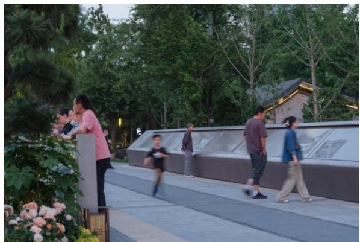

natural_image

Exterior view of a modern building with visitors walking along a stone path beside it, surrounded by trees and flower beds (no visible text or signage)

## 天津津一· PARK

工业锈带的重生

第十一届CREDAWARD 银奖

IFLA文化与城市景观类卓越奖

以“工业遗产·自然艺术”为主题， 采用“一馆、三园、八庭、四院”的空间结构串联整个片区，重塑历史辉煌、复兴人文生活场景，致力于将文旅商三者深度融合，构建“青年友好·儿童友好·全龄友好·宠物友好”的最具“松弛感”的城市目的地。

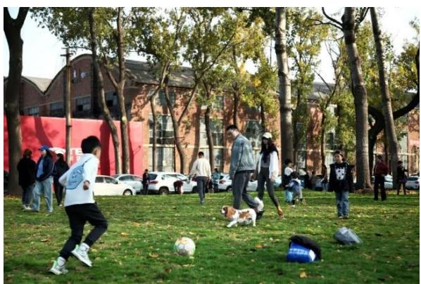

natural_image

Outdoor soccer field with players, a dog, and trees in background (no visible text or signage)

## 广州T.I.T原创荟廣氏菠萝啤厂

变身城市新地标，秉持“修旧如旧，赋新以韵”的理念，将老厂房重塑为融合文化底蕴与创意活力的城市新地标—

居所、坪地、店铺、工作室、工厂、河涌串联成活力链条，以场地文化为线索，引导人流穿行其中，构建起一个可漫步、可体验、可共创的城市生活舞台，让经典“廣氏味道”在新时代语境中焕发新生。

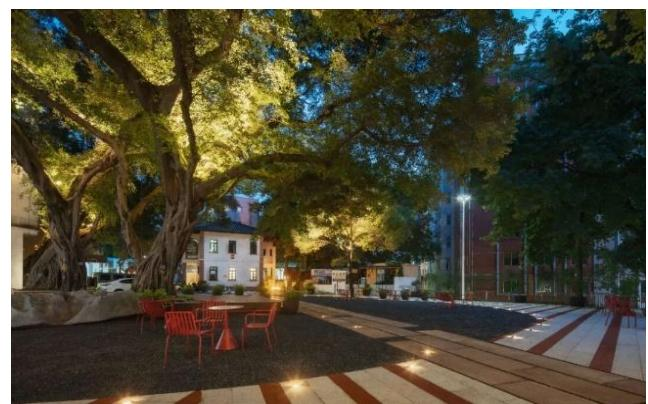

natural_image

Nighttime outdoor scene with illuminated trees, red chairs, and a building under bright sunlight (no visible text or symbols)

## 无锡环城古运河慢行系统贯通项目

重塑空间生态，复兴水岸生活

第十六届园冶杯城市更新金奖

以“一河两廊十三景”为理念，贯通运河两岸形成双层漫游廊道，将沿岸闲置场地变身为13处步移景异的花园节点，实现空间生态重塑与水岸生活复兴。

让城市更温暖，让诗意生活触手可及，让每个人，都能在这片古老而又充满活力的水域旁，找到属于自己的那份宁静与美好。

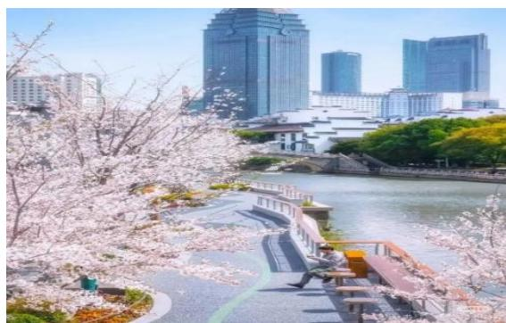

natural_image

Scenic view of a riverside park with blooming cherry trees and modern skyscrapers in the background (no visible text or signage)

## （四）供应链与伙伴责任

## 供应链

建立完善的绿色供应链体系，筛选380家核心供应商，将环保合规、劳工权益、商业诚信等ESG相关指标纳入供应商准入标准与年度考核体系，落实供应链安全相关要求，推动产业链协同可持续发展。

开展供应商ESG专项培训3场，重点覆盖ESG管理体系、绿色施工标准、产品质量规范等内容，有效提升供应商ESG管理意识与实践能力。

坚持公平交易、诚信履约原则，严格按照合同约定按时付款，2025年供应商履约率达99%，未发生重大合同纠纷，维护良好的合作伙伴关系，实现互利共赢。

具体举措包括以下几大方面：

1、建立完善了供应商管理制度；2、建立完善了相关采购标准文件；3、建立了供应商采购系统。

## 伙伴责任

2025年，奥雅股份秉持伙伴共赢、价值共创的可持续发展理念，深度联动政府部门、产业平台、头部房企、文旅集团等多元伙伴，在文化产业、城市更新、品质人居、文旅运营等领域开展深度协同。报告期内，公司以专业服务与责任担当，斩获衢州市大花园集团、徐州万科「优秀合作伙伴」、上海崇明生态旅游集团「杰出企业奖」等多项荣誉；圆满完成青岛东方伊甸园、济宁观唐等重点项目设计，获业主多封感谢信；同时赋能南山区工程服务业发展、深度参与第二十一届文博会，获政府及组委会正式感谢信，达成长期合作共识。展望未来，公司将持续深化战略合作，以设计赋能产业，携手伙伴共促社会高质量可持续发展。

供应商类型类别V2.0

<table><tr><td>序号</td><td colspan="2">一级类别</td><td colspan="2">二级类别</td><td colspan="2">三级类别</td><td colspan="2">四级类别</td><td>分类说明</td></tr><tr><td>1</td><td rowspan="45"></td><td rowspan="45"></td><td rowspan="27">A.01</td><td rowspan="27">工程服务类</td><td rowspan="5">A.01.01</td><td rowspan="5">监理</td><td>A.01.01.01</td><td>【工程监理】</td><td></td></tr><tr><td>2</td><td>A.01.01.02</td><td>【燃气监理】</td><td></td></tr><tr><td>3</td><td>A.01.01.03</td><td>【人防监理】</td><td></td></tr><tr><td>4</td><td>A.01.01.04</td><td>【爆破监理】</td><td></td></tr><tr><td>5</td><td>A.01.01.05</td><td>【其他工程监理】</td><td></td></tr><tr><td>6</td><td rowspan="5">A.01.02</td><td rowspan="5">咨询服务</td><td>A.01.02.01</td><td>【造价咨询】</td><td></td></tr><tr><td>7</td><td>A.01.02.02</td><td>【招标代理】</td><td></td></tr><tr><td>8</td><td>A.01.02.03</td><td>【工程保险】</td><td>建工一切险等</td></tr><tr><td>9</td><td>A.01.02.04</td><td>【其他咨询服务】</td><td></td></tr><tr><td>10</td><td>A.01.02.05</td><td>【工程服务咨询】</td><td></td></tr><tr><td>11</td><td rowspan="17">A.01.03</td><td rowspan="17">工程检测</td><td>A.01.03.01</td><td>【室内/外空气检测】</td><td></td></tr><tr><td>12</td><td>A.01.03.02</td><td>【桩基检测】</td><td></td></tr><tr><td>13</td><td>A.01.03.03</td><td>【基坑监测及边坡变形观测】</td><td></td></tr><tr><td>14</td><td>A.01.03.04</td><td>【土壤氡检测】</td><td></td></tr><tr><td>15</td><td>A.01.03.05</td><td>【主体沉降观测】</td><td></td></tr><tr><td>16</td><td>A.01.03.06</td><td>【消防检测】</td><td></td></tr><tr><td>17</td><td>A.01.03.07</td><td>【房屋鉴定】</td><td></td></tr><tr><td>18</td><td>A.01.03.08</td><td>【防雷检测】</td><td></td></tr><tr><td>19</td><td>A.01.03.09</td><td>【结构检测】</td><td></td></tr><tr><td>20</td><td>A.01.03.10</td><td>【人防检测】</td><td>人防设施、人防工程检测</td></tr><tr><td>21</td><td>A.01.03.11</td><td>【节能检测】</td><td></td></tr><tr><td>22</td><td>A.01.03.12</td><td>【环保检测】</td><td></td></tr><tr><td>23</td><td>A.01.03.13</td><td>【高支模检测】</td><td></td></tr><tr><td>24</td><td>A.01.03.14</td><td>【其他工程检测】</td><td></td></tr><tr><td>25</td><td>A.01.03.15</td><td>【甲醛治理】</td><td></td></tr><tr><td>26</td><td>A.01.03.16</td><td>【消杀灭蚊】</td><td></td></tr><tr><td>27</td><td>A.01.03.17</td><td>【游乐设备检测】</td><td></td></tr><tr><td>28</td><td rowspan="18"></td><td rowspan="18"></td><td rowspan="6">A.02.01</td><td rowspan="6">前期工程</td><td>A.02.01.01</td><td>【临时道路工程】</td><td></td></tr><tr><td>29</td><td>A.02.01.02</td><td>【临水工程】</td><td></td></tr><tr><td>30</td><td>A.02.01.03</td><td>【临电工程】</td><td></td></tr><tr><td>31</td><td>A.02.01.04</td><td>【施工围墙工程】</td><td></td></tr><tr><td>32</td><td>A.02.01.05</td><td>【文物考古发掘工程】</td><td></td></tr><tr><td>33</td><td>A.02.01.06</td><td>【其他前期工程】</td><td></td></tr><tr><td>34</td><td rowspan="12"></td><td rowspan="12"></td><td>A.02.02.01</td><td>【基坑支护工程】</td><td></td></tr><tr><td>35</td><td>A.02.02.02</td><td>【桩基础工程】</td><td></td></tr><tr><td>36</td><td>A.02.02.03</td><td>【土石方工程】</td><td></td></tr><tr><td>37</td><td>A.02.02.04</td><td>【地基处理工程】</td><td></td></tr><tr><td>38</td><td>A.02.02.05</td><td>【总承包工程】</td><td></td></tr><tr><td>39</td><td>A.02.02.06</td><td>【小总包工程】</td><td></td></tr><tr><td>40</td><td>A.02.02.07</td><td>【防水工程】</td><td></td></tr><tr><td>41</td><td>A.02.02.08</td><td>【室内地坪漆工程】</td><td>室内地坪漆、地面固化等</td></tr><tr><td>42</td><td>A.02.02.09</td><td>【人防工程】</td><td>含人防门供货安装</td></tr><tr><td>43</td><td>A.02.02.10</td><td>【垃圾处理工程】</td><td></td></tr><tr><td>44</td><td>A.02.02.11</td><td>【烟道工程】</td><td></td></tr><tr><td>45</td><td>A.02.02.12</td><td>【幕墙工程】</td><td>含外墙砖、石材、玻璃、铝板、陶板等外幕墙</td></tr></table>

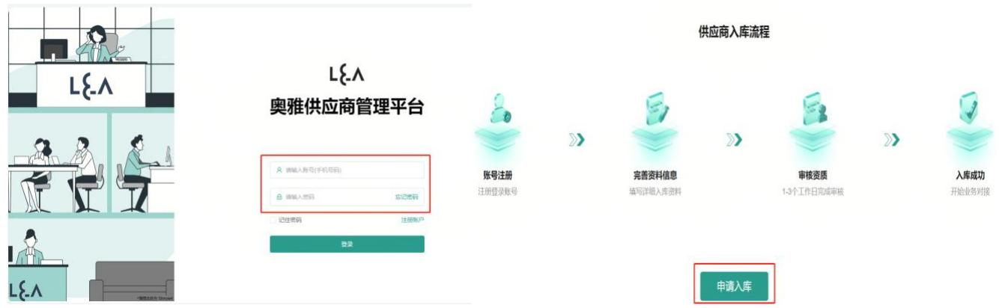

flowchart

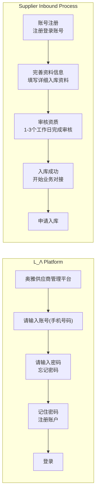
```mermaid
graph LR
  subgraph L_Platform["L_Λ Platform"]
    A["奥雅供应商管理平台"]
    B["请输入账号(手机号码)"]
    C["请输入密码\n忘记密码"]
    D["记住密码\n注册账户"]
    E["登录"]
  end

  subgraph Supplier Inbound Process
    F["账号注册\n注册登录账号"]
    G["完善资料信息\n填写详细入库资料"]
    H["审核资质\n1-3个工作日完成审核"]
    I["入库成功\n开始业务对接"]
    J["申请入库"]
  end

  A --> B
  B --> C
  C --> D
  D --> E
  F --> G
  G --> H
  H --> I
  I --> J
```

2025年度部份伙伴合作成果清单

<table><tr><td>序号</td><td>合作单位</td><td>合作项目/事项</td><td>核心成果与荣誉</td></tr><tr><td>1</td><td>衢州市大花园建设投资发展集团有限公司</td><td>城市建设相关合作</td><td>荣获「2025年度优秀合作伙伴」称号</td></tr><tr><td>2</td><td>第二十一届文博会组委会办公室、深圳国际文化产业博览交易会有限公司</td><td>第二十一届中国(深圳)国际文化产业博览交易会</td><td>创新策划、高效协作,为展会成功举办作出重大贡献,获组委会感谢信</td></tr><tr><td>3</td><td>济宁晟礼置业有限公司</td><td>济宁观唐项目</td><td>圆满完成景观设计,保障项目高品质交付,获业主感谢信</td></tr><tr><td>4</td><td>金茂山东公司设计管理部</td><td>青岛东方伊甸园项目</td><td>圆满完成景观设计,保障项目顺利开园,获业主感谢函</td></tr><tr><td>5</td><td>深圳市南山区住房和建设局</td><td>南山区工程服务业发展</td><td>以创新赋能区域高质量发展,获住建局感谢信,约定2026年持续携手</td></tr><tr><td>6</td><td>山东三发地产集团有限公司泗水分公司</td><td>三发江山赋项目</td><td>高效完成设计服务,保障项目工期,获业主表扬信</td></tr><tr><td>7</td><td>上海崇明生态旅游集团有限公司</td><td>文旅领域合作</td><td>荣获2025年度「杰出企业奖」</td></tr><tr><td>8</td><td>深圳市南山区南山街道办事处</td><td>城南古巷改造提升项目</td><td>提供全流程专业服务,获街道感谢信,携手打造城中村改造标杆</td></tr><tr><td>9</td><td>徐州万科企业有限公司</td><td>昆吾、云谷中城、淮海隐秀等项目</td><td>授予「优秀合作伙伴」称号,获业主对项目贡献的正式感谢</td></tr><tr><td>10</td><td>山东睿湖控股有限公司</td><td>济宁·睿湖时代项目</td><td>圆满完成景观设计,保障项目高品质交付,获业主感谢信</td></tr></table>

## 荣誉与感谢信一览

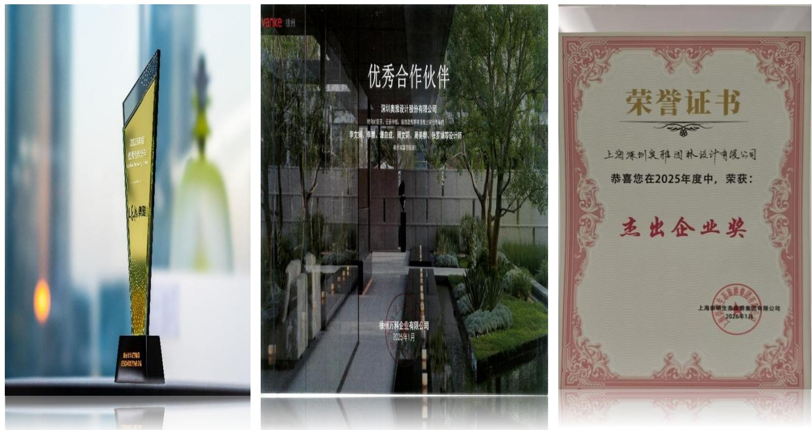  
感谢信

致深圳奥验设计股份有限公司青岛分公司

2025年，我司济宁：睿湖时代项目大区园满交付，景观设计营造独有社区体验，定义新时代优康人居生活样板。

意司作为本项目的观设计饮伴，始终展现出产溢的专业态度与高暖的责任心。最司团队对方案效果不断优化，在设计各阶段持续突破创新，实现项目顺利推进；施工阶段对各方沟通内容做到及时反谱、快速调整，高效解决现场问题，有力推动了项目从蓝图到实景的实呈现，也因止赢得了我司自上而下的广泛认同

递向贵可眩以诚类谢意，并对贵可青乌创新一组的全方始入与辛数付出表示特别减流期待未来攀续基手，在后续合作中再创誉逐精品，洪手共育。共拓前程！祝资司平业兴再创辉焊

## SANFA三发集团

## 山东三发地产集团有限公司泗水分公司

## 表扬信

致：买引类推资计股份有限公司

贵司承接我司三发江山建项目，代秀的设计团队给我可提告了优秀的设计理念及代质的设计照务，复我方相关二作的开展得以顺利进行。主责现京方合作以来，贵可设计团队能充分解读设计要求，紧抚市场提求、翔黏远用设计范，从我方负度出发，积板配合，公现了优秀药专业素养和事务意识。切实为我可考求，表现日良好的设成吴与美等能刀，始终保持高质寄效的出困或果确保项目二期。

鉴于音司在设计工作中的代参表现及优后的朋务想念，化自半言表示训。第财贵公司及贵司员工对我方工作约大力支持，希望考公司继续保持牛良当息务理念，并表心视品我们在今后的工作户能建诚合作，共铸释炼

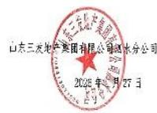

## 感谢信

数深圳奥雅设计股份有限公司青岛分公司

2025年，我司观唐项目大区置调交付，景观设计再现唐韵大观，打造典藏级东方美学

人居环境，为济宁带来全新的奢岗生活。

贵司在全程设计中展现出高度的专业水准与负责精神，与建筑设计、室内设计团队紧密协同，使观唐项目成为济宁高品质住宅项目。贵司团队通过对方案的持续推鼓与深化，为落地效果奠定了扎实基础。施工期间，贵司团队多次赴现场踏勘、定样，并与施工单位沟通工艺细节，有力保障了实景呈现与设计效果的高度一致。获得我司各级领导一致认可，为产品的成功交付打下坚实基础

在此，对责司表示由表的感谢，特别感谢贵司青岛创新一组对于项目的辛苦付出和大力支持！ 祝贵司事业革蒸日上

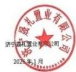

## 感谢信

深圳奥雅设计股份有限公司

第二十一届中国（深圳）国际文化产业博览交易会（下简称“文博合”）于2.025年5.月22日至26日在深圳国际会展中心成功举办，圆满落幕

本届文博会是在“十四五”规划收官之年、全面贯彻落实党的二十届三中全会精神关键之年举办的一次重要展会本届文博会紧紧围绕探索文化和科技融合的有效机制，重点水平，持续激发文化创新创造活力，着力打造“七个超级平台"。展会展示规模达16万平方米，共有6280家政府组团文化机构和企业线上线下参展，吸引了来自65个国家和地区、305家海外展商线上线下参展组织邀请了110个国家化产品12多万件，4000多个文化产业投融资项目在现场展示与交易，并开展近400项展示交易活动，展商数量、国际参展及采购商数量交易规模均实现新突破，新品首发：秀、首展、首演等数量大增，资源对接效果显著，大幅提升，受到社会各界的持续关注、宣传和广得相当大的成功实现了社会效益和经产文博会所取得的丰硕成果和非

智慧和汗水结品贵单位创新策划备展示内容携“金字招牌 “宝藏展品”和“创新密码“破圈方案”在文博会现场瑙璨绽放展示效果显著，交易成绩斐然，以切实的展示交易实效成为本届文博会的高光高点。贵单位同仁与我们心手相连、紧密协作、夙夜奋战，为文博会的安全、有序、顺利、成功举办作出了重大贡献，书写了携手奋进的动人篇章

在此，中国（深圳）国际文化产业博览交易会组委会办公室，深圳国际文化产业博览交易会有限公司全体同仁谨向贵单位给予的大力支持和倾情参与表示衷心的! 对参与文博合并启作战的备位领导，同志致以崇高的敬意和诚势的感谢 期待精诚合作，共襄盛举，共享成果，把2026年第二十二届文博会办得更精彩

特此致信，谨致谢

natural_image

Illustration of a cartoon character with blue hair and a yellow key, flowing over a colorful, wavy ribbon (no text or symbols)

##

## 感谢估

深圳奥雅设计股份有限公司

白贵公司参与“城南古巷”改造提升顶日以来，贵公司在深入调研、方案设计、顾问咨询诸方面，尽显卓越的服务热忱与高水准的行业理念实乃为项目之稳步推进筑牢坚实根基在辞迎新之际，我们对贵公司给予本项目的大力支持深表崇高敬章与卷券谢忱 尤其对李宝意董事长以及深圳设计二所(周宇晨且组）的杰出设计师致以最诚挚的问候

“城南古都”改造提升项目正稳健前行恰如“行稳致远进而有为”，我们殷切期望贵公司继续秉承优良的工作作风没化团队合作精神发挥更加卓越的专业优热为顶目之后续工作注入更多活力与智慧愿携手并肩，将“城南古巷“打造为文商旅融合的城中村改造新标杆而础沥奋讲

## 来自金茂山东公司设计管理部的感谢函

## 感谢函

致深圳奥雅设计股份有限公司青岛分公司

2025年6月28日，我司青岛东方伊甸园项目顺利开园璀璨亮相，揭开了“与水共生”的沉浸式体验序幕，一场以“水”为核心的科学探索之旅自此开启。

该项目是2025年青岛金茂在高新区布局的重点项目，设计建设之初面临标准要求高，时间紧任务重等诸多难度和挑战，贵司作为本项目景观设计单位，整合优秀团队资源，线上线下紧密配合，设计方案创新迭代，图纸质量严格把控，表现出精湛的专业能力和高度的敬业精神，项目亮效推进，成果获得我司各级领导一致认可

在此，对贵司表示由衷的感谢，感谢贵司：奥雅集团城市更新事业部总经理赵振，奥雅设计青鸟公司总经理工永镇，青鸟创新一组项目总监奕晓琳青岛公建创新组项目总监魏洪恺青岛分公司技术总监李彦博、资深高级植物设计师工涛、高级市场经理郭菁菁、运营经理王宁及项目成员陈博，冯剑羽，王盛娇，金鹏，潘燕妮，王伟全，张文超，姚凯、张书艳，刘昕童对于项目的亲苦付出和大大支持！

未来我们期待与贵司继续携手并进、精诚合作，为后续项目高质量呈现再接再厉，实现双方合作共赢！

谨祝商祺

金茂山东公司

设计管理部

2025年9月

## 感谢信

深圳奥雅设计股份有限公司

历程中，事不开贵司的大力支持、为辖区工程限务业发展注入了强劲动力。在此，我局特向贵司致以最诚势的感谢和量崇高的敬意！

供了强劲动力，更为区域经济的稳健增长筑牢根基、在推动工程服务业发展进程中、贵司程极响应政府号召、勇立创主潮头，持续探索新型发展模式与前沿技术应用，为行业树典范，引领南山区工程服务业迈向高质量发展新征程

深圳承办亚太经合组织（APEC）峰会的重要年份，南山区将以此为契机，进一步推进高质量发展，衷心期望在新的一年能继续与贵司携手同行，并疯奋进，我局将始终乘持服务金业之宗旨，营造优质的营商环境、与贵司共克时艰、把握转机遇，共同壁画南山区工程服务业发展的宏伟蓝图

杰出贡献！祝愿贵司在新的一年里蓬勃发展，再创辉煌顺祝商祺

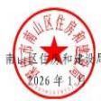

## （五）公益与社区贡献

奥雅股份在2025年深度聚焦“运营型好社区”的构建，通过系列沙龙、社区营造活动及空间微更新，积极推动居民参与，强化社区凝聚力与社会资本。

## 社区营造系列沙龙

发起了【全国城市行走计划】，围绕社区共建展开深入探讨。

成都站：以“公园城市里的未来社区”为主题，邀请行业同仁探讨通过“绿色空间全域化、社区治理协同化”重构人、城、自然的关系。重点阐述了从社区景观到社区营造的实践探索，旨在打造融合教育、健康等九大场景的未来生活功能社区。

北京站：聚焦“破译‘社交GDP’密码”，提出“让每一平米景观产生社交GDP”的理念。活动强调了景观设计从“美学载体”向“活力引擎”的转型，通过社群运营激发邻里互动，将社区转化为具有生命力的“社交生态容器”。

## 老旧社区焕新实践

上海曲阳路全龄友好街区：该项目获上海城市更新提名奖。通过“折叠的时光圈”理念，将老龄化严重的街道转变为全龄共享的“15分钟社区生活圈”。设计围绕“课后时光、邻里时光、童趣时光”三大人生阶段进行微更新，增加了适老适幼设施与公共交流空间，描绘了“上海最美社区风景线”，切实提升了居民的归属感。

## 企业-社区共生模式

在“广州康方临床研究与运营亚太总部项目”中，奥雅提出“企业与社区共生”理念。通过打破传统园区的封闭性，引入生态疗愈景观和社区互动节点，使园区不仅服务于企业员工，还与周边居民形成资源共享，打造了开放、包容的“微城市单元”。

## 公益行动

奥雅公益基金会聚焦儿童公益、生态保护、乡村振兴三大核心领域，援建5所乡村儿童活动室、3个乡村生态公园，切实助力乡村振兴与儿童成长，践行社会贡献责任。

积极参与社区志愿服务活动，全年开展86次志愿服务，涵盖设计科普、社区绿化美化、公益讲座等内容，助力社区可持续发展，拉近与社区居民的距离，传递企业温暖。

奥雅股份2025年公益行动：定向捐赠20000元，助力云南磨憨中学教育基础设施升级，践行东西部协作责任，赋能乡村教育发展。

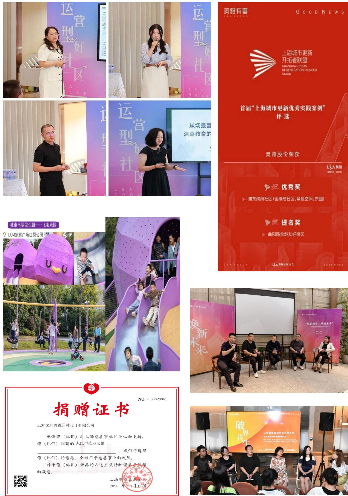

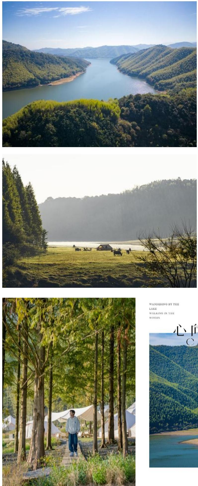  
LAKE

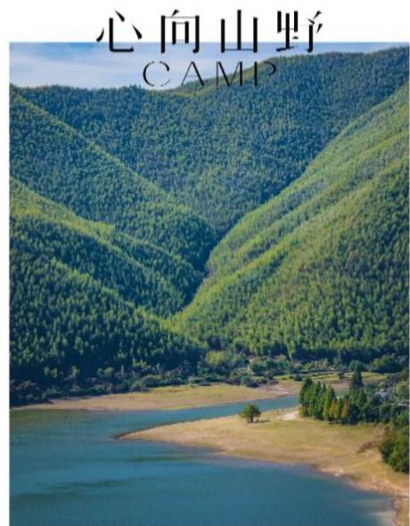

text_image

心向山野
CAMP

# 露营地

## 项目背景：乡村振兴的创新实践

2022年6月，小红书旗下社会企业“微拂 We Flow”与安吉县孝丰镇夏阳村集体合资共建，打造小杭坑生态露营地，成为小红书首个线下示范性文旅项目。项目以“文化旅游振兴乡村”为核心，在巩固脱贫攻坚、推进乡村振兴的国家战略背景下，探索“平台流量 + 乡村资源 + 专业设计”的可持续共富模式。

2024年11月，小杭坑生态露营地成功入选第五届“全球减贫案例征集活动”获奖案例，由世界银行、联合国粮农组织等国际机构联合评选，成为中国乡村振兴与减贫实践的标杆样本。

奥雅股份与小红书合作，深度参与安吉小杭坑生态露营地项目，以专业设计赋能乡村振兴。项目由小红书与夏阳村集体合资共建，奥雅团队主导规划设计，坚持生态优先、在地融合原则，打造“江浙沪自己的阿勒泰”。运营首年即实现营收1200万元，游客超15万人次。项目通过“保底分红 + 就业带动”模式，为村集体年增收超200万元，带动村民就业增收。该项目不仅荣获“全球减贫案例”，更成为全国首个“碳中和露营地”，是企业践行社会责任、推动生态保护与可持续共富的典范。

## 奥雅股份的专业赋能：设计点亮乡村

作为项目核心设计方，奥雅股份深度参与小杭坑整体规划、景观营造与场景打造：

生态优先：最大程度保留原生竹林、湖泊、山地肌理，拒绝过度人工化，让建筑与自然“共生”；

场景创新：规划核心景观区、精致露营区、自然体验区、文创工坊，形成“日间打卡+ 夜间露营 + 多元体验”的复合业态；

在地融合：以竹为材、以山为景，把安吉本土文化与现代露营美学结合，打造“江浙沪自己的阿勒泰”辨识度；

低碳可持续：选用环保材料、优化污水治理与竹林碳汇，助力小杭坑成为全国首个“碳中和露营地”（2023年9月获认证）。

“安吉不缺营地，但小杭坑是夏阳村的秘密基地——自然禀赋极致，我们用设计把它的美真正释放出来，同时让村民实实在在受益。”奥雅设计团队在现场介绍。

## 运营模式：村企共建、收益共享

合资共建：小红书参股60%、村集体（乡村基金）占40%，首期投入约1200万元；

保底收益：合资公司每年向村集体保底分红80万元，村民稳定获益；

就业带动：优先聘用本地村民，为60岁以上老人提供保洁、服务、运营等岗位，日薪约150元；开设咖啡、花艺、营地服务培训，让村民掌握新技能、在家门口就业；

经济倍增：运营首年游客超15万人次、营收1200万元；村集体收入从不足10万跃升至超200万元，带动民宿、餐饮、农产品全链条增收。

## 社会价值与ESG亮点

1.生态保护：从废弃垃圾场到碳中和营地，修复水环境与竹林生态，践行“绿水青山就是金山银山”；  
2.乡村减贫：从“外部输血”到“内生造血”，上千村民创岗增收，入选全球减贫案例，具有可复制推广价值；  
3.城乡融合：小红书流量链接城市消费与乡村资源，让村庄成为新潮生活方式目的地；  
4.可持续共富：村集体长期分红、村民稳定就业、生态持续优化，形成生态—经济—社区良性循环。

## 06

## 经营创新

## 与

## 高质量发展

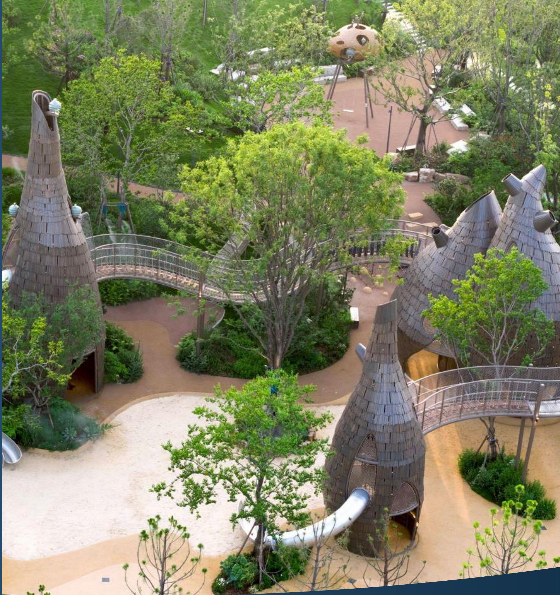

natural_image

Aerial view of a modern, landscaped park with distinctive conical-shaped structures and greenery (no visible text or symbols)

## （一）战略转型成效

2025年，公司实现战略转型关键突破，文旅综合业务收入占比达50.01%，首次超过传统设计业务，成功完成从“单一设计服务商”向“存量资产增值+亲子文旅运营”的转型跨越，结合ESG相关风险与发展机遇，实现企业高质量发展，进一步提升核心竞争力与行业影响力。

## 战略定力与稳健经营：在变革中筑牢根基

2025年，面对日趋激烈的市场竞争与行业深度调整的外部环境，公司在以创始人、董事长兼首席设计师李宝章先生为核心的战略引领下，坚持高质量发展主线，主动优化业务结构，稳固核心基本盘。

公司凭借在创意设计、城市更新及亲子文旅领域积累的深厚壁垒与持续创新力，有效抵御市场波动，整体经营保持稳健，战略转型成效获得市场与客户的充分认可。

## 经营质态飞跃：现金流历史性转正，转型成效关键验证

本年度，公司经营质量实现里程碑式突破——经营活动现金流成功由负转正。这一关键成果，标志着公司从传统EPC模式向“创意设计+亲子文旅”双主业、“AI+IP”双引擎及“O+EPC+IP+O”全链条运营模式的战略转型取得决定性胜利。

联合创始人、董事、总经理李方悦女士指出，此突破并非偶然，而是公司战略聚焦、全员协同、持续创新的必然结果。

通过主动退出低毛利、高资金占用的传统地产业务，全面转向政府主导的城市更新、存量资产增值与文旅运营项目，公司成功摆脱“垫资施工、回款周期长”的行业困境，实现“运营前置、高比例预付款、长效现金流”的健康业务闭环，财务结构与抗风险能力得到根本性改善，为公司可持续发展与价值创造提供了坚实保障。

## 我们创造了无数美好与欢喜 定格了诸多难忘瞬间

好设计 好产品 好运营

## 创新驱动发展：技术与模式双轮赋能

技术创新（AI引擎）：

公司积极拥抱数字经济浪潮，发布行业首个城市更新文旅焕新场景大模型，将AI技术深度融入设计全流程，显著提升创作效率与服务精度，以科技赋能传统业务，重塑核心竞争力。

模式创新（IP引擎）：

深化“IP+文旅”战略，通过洛嘉儿童等成熟IP与悦起文化的专业化运营，实现从空间建造商向内容运营商、品牌运营商的跨越，拓展盈利边界，增强用户粘性与复购率，形成长期、稳定的运营收益。

## 总结与展望

2025年，奥雅股份以战略远见穿越周期，以创新实践破局突围，实现了经营稳健、现金流转正、模式升级的三重成效。面向未来，公司将继续坚持“存量资产增值服务商与亲子文旅品牌运营商”的战略定位，以“经常庆功，才能成功”的信念凝聚团队，持续深化转型、强化创新、优化运营，为股东、客户与社会创造长期价值。

## （二）技术与产品创新

## 创新资质与体系建设

2025年度，奥雅股份及上海公司双双获评国家级高新技术企业，实现集团核心区域创新资质双认证。公司构建“设计+科技”双轮驱动与“AI+IP”双引擎战略，建立覆盖研发投入、过程管理、成果转化、人才激励的完整科创体系，以制度保障持续创新。

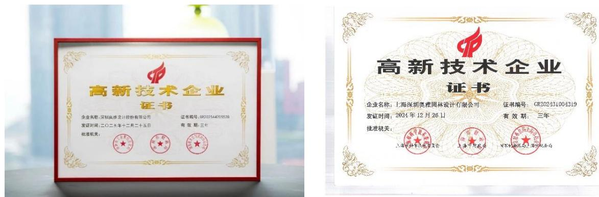

## 研发投入与知识产权

科创人才：汇聚国际化跨专业团队，技术研发人员246人；核心管理团队平均行业经验超25年；董事长李宝章为技术带头人，近三年主导20项核心技术研发。

知识产权：累计知识产权超500项（含专利230项），覆盖数字化、AI、洛嘉儿童等领域。2025年新增发明专利5项，强化关键技术保护。

<table><tr><td>1</td><td>商标样稿</td><td>商标类别</td><td>注册号码</td><td>商标名称</td><td>申请日期</td><td>注册日期</td><td>截止日期</td><td>商品/服务</td></tr><tr><td>2</td><td>* LA SOL *</td><td>22</td><td>77530709</td><td>洛借 LA SOL</td><td>2024-03-25</td><td>2025-01-07</td><td>2035-01-06</td><td>捕鱼用围网,帆,纺织纤维</td></tr><tr><td>3</td><td></td><td>35</td><td>80322077</td><td>洛嘉盒子 LA V-ONDERLAND BOX</td><td>2024-08-12</td><td>2025-04-21</td><td>2035-04-20</td><td>为建筑项目进行商业项目管理服务,商业管理和组织咨询,商业研究,公共关系,商业管理顾问,组织商业或广告展览,外包服务(商业辅助)</td></tr><tr><td>4</td><td></td><td>41</td><td>80310565</td><td>洛嘉盒子 LA V-ONDERLAND BOX</td><td>2024-08-12</td><td>2025-02-07</td><td>2035-02-06</td><td>安排和举办娱乐活动,提供关于消遣活动的信息,脸部彩绘,多媒体图书馆服务,娱乐服务,出借书箱的图书馆,提供娱乐设施,玩具馆服务,票务代理服务(娱乐),游乐园服务</td></tr><tr><td>5</td><td></td><td>43</td><td>80316252</td><td>洛嘉盒子 LA V-ONDERLAND BOX</td><td>2024-08-12</td><td>2025-02-07</td><td>2035-02-06</td><td>外卖餐厅服务,快餐馆,餐厅,食物点评服务(提供有关食物和饮料的信息),日间托儿所(看孩子),餐馆,备办宴席,咖啡馆,出租椅子、桌子、桌布和玻璃器皿,安排临时住宿</td></tr></table>

<table><tr><td></td><td>A</td><td>B</td><td>C</td><td>D</td><td>E</td><td>F</td><td>G</td><td>H</td></tr><tr><td>19</td><td>悦起</td><td>28</td><td>84726519</td><td>悦起</td><td>2025-04-15</td><td>2025-10-28</td><td>2035-10-27</td><td>长毛绒玩具,玩具模型,填充玩具,用于儿童教学的电子游戏器具,抓物游戏机,游乐场贤乘玩具,运动用球,积木,棋,玩具</td></tr><tr><td>20</td><td>JoyKey</td><td>41</td><td>84705481</td><td>JOYKEY</td><td>2025-04-15</td><td>2025-12-14</td><td>2035-12-13</td><td>娱乐,游乐园服务</td></tr><tr><td>21</td><td>Hefty Hug</td><td>20</td><td>85015462</td><td>HEFTY HUG</td><td>2025-04-28</td><td>2025-10-21</td><td>2035-10-20</td><td>木、蜡、石膏或塑料制半身像,木、蜡、石膏或塑料制艺术品,泥塑工艺品,人体模型,蜡像,树脂工艺品,石冷塑像,木制艺术品,塑料制塑像,抱枕</td></tr><tr><td>22</td><td>Hefty Hug</td><td>28</td><td>85015480</td><td>HEFTY HUG</td><td>2025-04-28</td><td>2025-10-21</td><td>2035-10-20</td><td>抓物游戏机,游乐场贤乘玩具,用于儿童教学的电子游戏器具,玩具,积木,长毛绒玩具,玩具模型,填充玩具,棋,运动用球</td></tr><tr><td></td><td></td><td></td><td></td><td></td><td>2025-04-</td><td>2025-10-</td><td></td><td>泥塑工艺品,塑料制塑像,木、蜡、石膏或塑料制半身像,石墨塑像,木、蜡,石膏</td></tr></table>

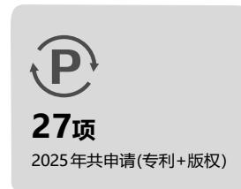

□ 2025年已授权专利续费共  
□ 2025年新授权专利缴费共28项  
专利费减备案，2025年1-4季度共减免年费、官费144840元  
□ 编制专利申请实用手册、发明专利申请指南及申请书模板、实用新型及外观申请指南  
□共配合各地市场部投标、供应商入库，配合各同事申请职称等事宜，提供相关专利资料 40次。

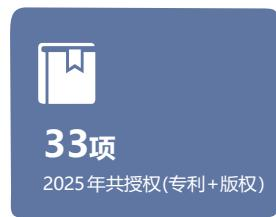

□悦起版权子公司支持：共登记9件

<table><tr><td>作品名称</td><td>作品类型</td><td>登记号</td></tr><tr><td>嘉Scarlet(基本型)</td><td>美术作品</td><td>国作登字-2025-F-00172056</td></tr><tr><td>JOYKEY</td><td>美术作品</td><td>国作登字-2025-F-00224789</td></tr><tr><td>Hefty Hug</td><td>美术作品</td><td>国作登字-2025-F-00224786</td></tr><tr><td>洛Lori(基本型)</td><td>美术作品</td><td>国作登字-2025-F-00172057</td></tr><tr><td>马多多MADODO</td><td>美术作品</td><td>暂未下证</td></tr><tr><td>小橘 The Orange cat</td><td>美术作品</td><td>暂未下证</td></tr><tr><td>布高兴 Angry Baby</td><td>美术作品</td><td>暂未下证</td></tr><tr><td>布高兴 Angry Baby(二维版)</td><td>美术作品</td><td>暂未下证</td></tr><tr><td>小松鼠zoe</td><td>美术作品</td><td>暂未下证</td></tr></table>

natural_image

Illustration of three colorful fox figurines with different designs and accessories, no text or symbols present.

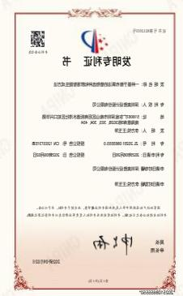

text_image

许亚诗堂视觉
北京天首管理咨询有限公司提供服务的项目介绍表——项目告知
办公会团体成员安排：人员详情
组织与应急应急处理流程及应急预案等事项于2021年1月1日发布。
业主大会者：人  电话：010-63879533
客服电话：95567
办公会团成员：人事
（身份证号码）：010-63879533
办公会团体成员安排：邮件通知表
业主大会者：请附后附表
承办单位：北京市海淀区司法局、北京市海淀区司法局
承办人：李晓峰
联系电话：010-63879533
联系人：陈云
邮政编码：010-63879533
附件：
附件内容：
附件编号：
附件名称：
附件地址：
附件邮编：
附件传真：
附件邮箱：
附件日期：
附件紧急性：

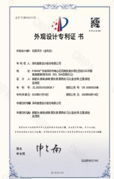

text_image

外观设计专利证书
专利名称：深圳市深国投股份有限公司
地址：深圳市深国投深圳科技园区深国投科技社区34号1栋
专利类型：实用新型专利
设计人：深圳市深国投集团有限公司
专利号：ZL202010006387
专利申请日：2020年9月18日
授权公告号：CN 2020052056
申请日期：深圳市深国投股份有限公司
申请时间：深圳市深国投集团有限公司
授权委托书签发日期：2020年9月19日
申请人：中南证券股份有限公司
承办人：张志刚
联系电话：0755-833333333
电子邮箱：www.zncc.com.cn
下载日期：2020年9月19日
ISBN:978-9-0001-0001
电子版号：CZ-0001-0001

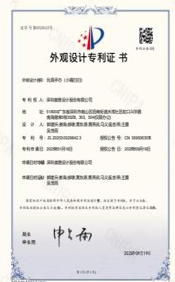

text_image

外观设计专利证书
专利名称：深圳捷成设计股份有限公司
地址：深圳市福田区深南大道6018号深南大厦31层
专利权期限：2020年04月19日
发明人：周晓峰
专利号：ZL2020102056643.3
授权公告号：CN 300060305
专利申请日：2020年04月18日
授权公告日：2020年04月18日
申请日期：深圳市捷成设计股份有限公司
申请日代码：2020-04-19
申请文件类型：实用新型专利证书
授权公告日期：2020年04月19日
专利权人：中雨
申请人：李长雨
2020年04月19日

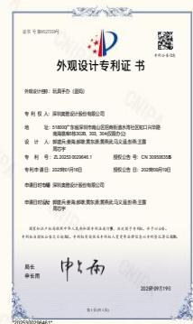

text_image

外观设计专利证书
外观设计师：张英中（邵阳）
专利权人：深圳爱迪尔股份有限公司
地址：深圳市福田区深南大道特区益田路234号招商局
邮政编码：002838 103 104(办公)
设计人：深圳市前海深港合作区深南东路2号汉口证券大厦
专利号：ZL202020269641
专利申请日：2020年9月9日
授权公告：CN 300005358
申请日期：2020年9月9日
中国科学院深圳爱迪尔股份有限公司
中国科学院深圳爱迪尔股份有限公司
深圳市前海深港合作区深南东路2号汉口证券大厦
授权公告：2020年9月9日
授权公告编号：2020-09-19
申请人：申万宏源证券有限责任公司
经办人：王立明、叶小玲、李小玲、周小玲、徐小玲、刘小玲、吴小玲、黄小玲、宋小玲、许小玲、陈小玲、罗小玲、杨小玲、彭小玲、周小玲、周小玲、周小玲、周小玲、周小玲、周小玲、周小玲、周小玲、周小玲、周小玲、周小玲、周小玲、周小玲、周小玲、周小玲、周小玲、周小玲、周小玲、周小玲、周小玲、周小玲、周小玲、周小玲、周小玲、周小玲、WJYUAN
申请人：申万宏源证券有限责任公司
经办人：王立明、叶小玲、李小玲、周小玲、徐小玲、周小玲、周小玲、周小玲、周小玲、周小玲、周小玲、周小玲、周小玲、周小玲、周小玲、周小玲、周小玲、周小玲、周小玲、周小玲、周小玲、周小玲、周小玲、周小玲、周小玲、周小玲、周小玲、周小玲、周小玲、<nl>

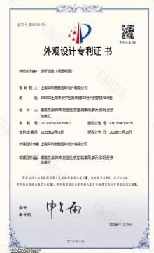

text_image

外观设计专利证书
外观设计(新签章)(请附图)
专利人:上海世博建筑设计院有限公司
地址:2003年上海市宝山区高新路48号1号楼第409室
设计人:谢杰杰提供网络技术改造及智慧能源系统软件著作权
专利号:ZL20101005006363
专利申请日:2020年4月2日
授权公告号:CN 30063375#
专利申请日:2020年4月2日
授权公告日:2020年4月2日
中国科学院上海理论与应用领域研究设计院有限公司
中国科学院上海理论与应用领域研究设计院有限公司
国家知识产权局关于专利权转让的公告
申请人:中国科学院上海市科学技术委员会
负责人:中占雨
2020年11月25日

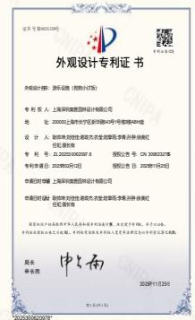

text_image

外观设计专利证书
外观设计(新名) (授权书/打印)
专利人: 上海市瑞康集团科技有限公司
地址: 200011上海市长宁区新桥路43号1号楼第409室
设计人: 肖伟杰特曼先生/胡杰夫克曼因多林多维异步独体认证
发明类型: 红色商标
专利号: ZL20202020020078.S
授权公告号: CN 200633278
专利申请日: 2020年10月2日
公告日期: 2020年11月2日
申请日期: 上海市瑞康集团科技有限公司
申请文件名称: 肖伟杰特曼先生/胡杰夫克曼因多林多维异步独体认证
发明类型: 红色商标
发明人: 申凡雨
专利权人: 2020年11月25日

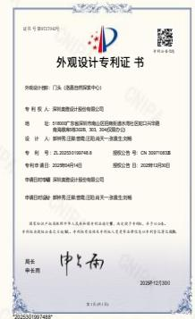

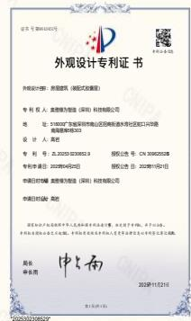

<table><tr><td></td><td>A</td><td>B</td><td>C</td><td>D</td><td>E</td><td>F</td><td>G</td><td>H</td></tr><tr><td>25</td><td>[IMAGE]</td><td>28</td><td>85036519</td><td>图形</td><td>2025-04-29</td><td>2025-10-14</td><td>2035-10-13</td><td>用于儿童教学的电子游戏器具,抓物游戏机,游乐场骑乘玩具,积木,长毛绒玩具,填充玩具,玩具模型,玩具,棋,运动用球</td></tr><tr><td>26</td><td>[IMAGE]</td><td>28</td><td>85030908</td><td>图形</td><td>2025-04-29</td><td>2025-10-21</td><td>2035-10-20</td><td>抓物游戏机,用于儿童教学的电子游戏器具,游乐场骑乘玩具,玩具模型,玩具,积木,填充玩具,长毛绒玩具,棋,运动用球</td></tr><tr><td>27</td><td>骞玺</td><td>42</td><td>85229733</td><td>骞玺</td><td>2025-05-12</td><td>2025-12-07</td><td>2035-12-06</td><td>人工智能技术领域的研究,人工智能领域的研究,人工智能技术咨询,建筑学服务,景观照明设计服务,娱乐场所建筑规划设计,平台即服务(PaaS),计算机平台的开发,云计算,计算机硬件和软件的设计与开发</td></tr><tr><td>28</td><td>问夫子</td><td>20</td><td>85792416</td><td>问夫子</td><td>2025-06-09</td><td>2025-12-28</td><td>2035-12-27</td><td>木、蜡、石膏或塑料制艺术品,塑料制塑像,人体模型,木制艺术品,石膏塑像,蜡像,木、蜡、石膏或塑料制半身像,树脂工艺品,泥塑工艺品,抱枕</td></tr></table>

<table><tr><td>A</td><td>B</td><td>C</td><td>D</td><td>E</td><td>F</td><td>G</td><td>H</td></tr><tr><td>洛嘉森友会La V-underland Friends</td><td>42</td><td>82232999</td><td>洛嘉森友会 LA V-ONDERLAND FRIENDS</td><td>2024-11-28</td><td>2025-05-28</td><td>2035-05-27</td><td>多媒体产品的设计和开发,人工智能领域的技术咨询,为他人研究和开发新产品,考古挖掘,包装设计,工业品外观设计服务,娱乐场所建筑规划设计,演出用布景设计,首饰设计,平面设计</td></tr><tr><td>Moon&#x27;s Deligt</td><td>43</td><td>82467519</td><td>MOON&#x27;S DELIGT</td><td>2024-12-10</td><td>2025-06-28</td><td>2035-06-27</td><td>度假村住宿服务,临时住宿处预订,家庭旅馆服务,酒店住宿服务,餐馆,快餐馆,旅馆,酒店提供的餐饮供应服务,提供野营场地设施,活动房屋出租</td></tr><tr><td>洛嘉自然探索中心</td><td>41</td><td>84673803</td><td>洛嘉自然探索中心</td><td>2025-04-14</td><td>2025-09-28</td><td>2035-09-27</td><td>票务代理服务(娱乐),娱乐服务,组织和安排娱乐展览,游乐园服务,玩具馆服务,安排和举办娱乐活动,脸部彩绘,提供娱乐设施,博物馆服务,多媒体图书馆服务</td></tr><tr><td>La V-underland Club</td><td>41</td><td>84691611</td><td>LA V-ONDERLAND CLUB</td><td>2025-04-14</td><td>2025-09-28</td><td>2035-09-27</td><td>多媒体图书馆服务,博物馆服务,组织和安排娱乐展览,娱乐服务,脸部彩绘,游乐园服务,玩具馆服务,票务代理服务(娱乐),安排和举办娱乐活动,提供娱乐设施</td></tr></table>

## 核心技术与产品创新（奥创引擎）

## Kynesis Engine城市文旅焕新大模型

自主研发行业空间设计大模型，打造“全球AI空间设计智能体”。

全链条赋能：整合海量项目数据，提供从诊断、策划、设计到运营的全流程数字化工具。

核心功能：“灵探”（空间价值分析）、“灵诊”（城市问题诊断）、“灵绘”（AI方案生成）。

应用成效：落地30+城市更新项目，策划周期从2周缩至数小时，设计效率提升40%–80%。

2025落地：完成15个数字科技重点项目，推出AI设计助手、数字孪生、沉浸式文旅等产品。

## IP商业化创新

自有IP：深化洛嘉儿童、洛塔智能、棠悦等IP运营。

产品开发：2025年新增文创产品约20款。

经营增长：IP授权与运营收入同比+40%，提升品牌附加值。

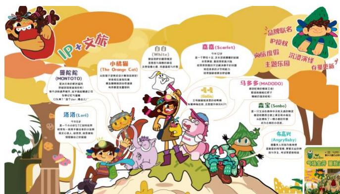

text_image

IP+文旅
爱陀陀
(MONTOTO)
小橘猫
(The Orange Cat)
白日
(White)
嘉嘉
(Scarlet)
马多多(MADDDO)
森宝(Senbo)
洛洛(Lorl)
1970年
第一个小行星的运动是科学的
特征和深度的交互
每个小行星的运动都是空间的
空间的运动都是空间的
空间的运动都是空间的
空间的运动都是空间的
空间的运动都是空间的
空间的运动都是空间的
空间的运动都是空间的
空间的运动都是空间的
空间的运动都是空间的
空间的运动都是空间的
空间的运动都是空间的
空间的运动都是空间的
空间的运动都是空间的
空间的运动都是空间的
空间的运动都是空间的
空间的活动
品牌联名
IP授权
豪悦度假
主题乐园
沉默演绎
存量更新
喜鹊人
(AngryBaby)

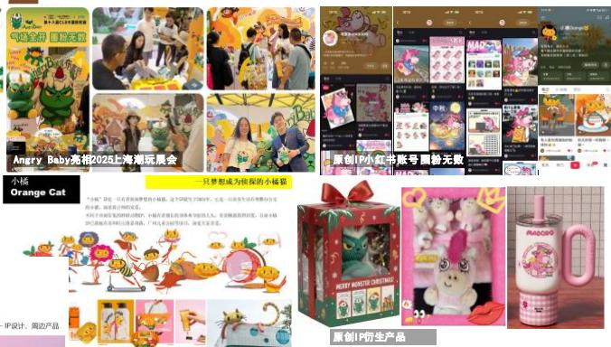

text_image

Angry Baby亮相2025上海潮玩展会
原创IP小红书账号圈粉无数
小橘
Orange Cat
一只梦想成为侦探的小秘窗
“小橘”萨拉·巴布的股票型的小秘窗，这个问题属于妈妈吃，它也是以商品生活为消费的分享的零食，享受好时尚的宝贝。
本产品属于中国家兔宝宝的快乐，与您更喜欢的宝宝都有不同的人生。在做健康的话里，我们不能从这点地购买到自己进行购物，扩大您在购物时长，避免大投资者。
IP设计、周边产品
原创IP衍生产品

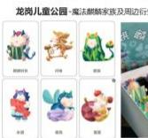  
广州花都蓝幕产业宣传IP-范宝及园动衍生

中国康山皮影主题乐园-P治计、坛营关现、动产品、坛本效事  

郑州苑城PARK-洛嘉森乐园-IP设计、周边产品  

衡州南孔洛喜春乐园-印识计，折置运平  
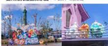

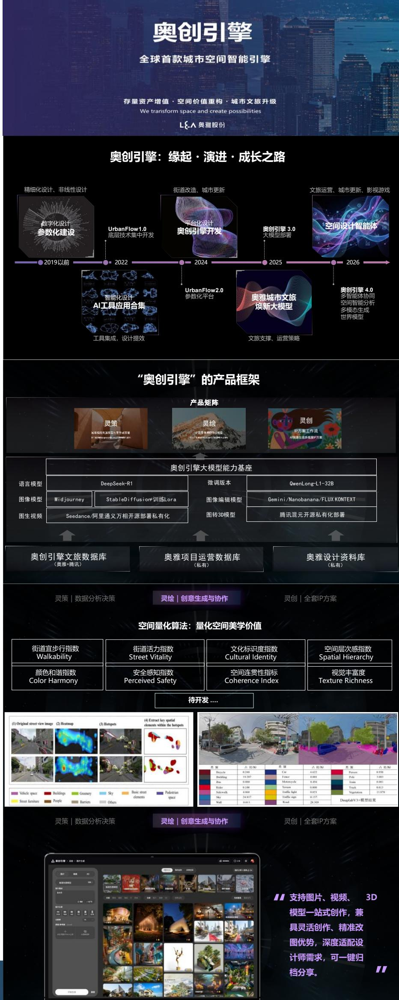

模型一站式创作，兼

具灵活创作、精准改

图优势，深度适配设

计师需求，可一键归

档分享。

## 创新价值与未来方向

以高新技术赋能城市更新、文旅消费、亲子业态，推动业务向“内容+科技+运营”综合服务升级。

2025年获“国际可持续城市更新最具影响力机构”等三项国际大奖。

未来持续迭代奥创引擎，深化AI与设计融合，以科技赋能美好空间与可持续城市发展。

## 创新成果

2025年，奥雅持续重视研发投入，定位做中国文化+科技的领军企业，自主开发的“奥雅城市文旅焕新大模型”已经落地，实现三大价值提升：

1、设计提效。AI辅助生成多版概念方案，创作周期缩短40-80%，加速设计创意落地；  
2、决策精准。基于城市文脉与消费数据，智能匹配业态，精准诊断城市发展问题，有效降低项目投资风险；  
3、服务下沉。推出“轻量化AI设计包”，将高端设计能力推广至县域项目，推动技术普惠。

在IP领域，奥雅成立悦起文化JoyKey，致力于成为全球领先的文创娱乐企业，将全面负责IP的孵化、开发、授权及商业化运营，为公司打开新的增长空间。与此同时，奥雅依托优质的国际资源，与全球各大电影学院中排名第一的美国南加州大学电影学院计划共建“IP叙事实验室”，打造城市文旅专属IP，构建“场景体验—IP内容—商业变现”的价值闭环。

## 创新战略与治理

2025年，公司锚定“科技+设计”核心战略，以AI技术赋能与IP生态运营为双引擎，系统性推进技术体系重构与产品创新落地。依托研发中心及专项技术团队，构建“基础研究—技术攻关—产品转化”全链条创新机制，全年研发投入持续加码，研发人员数量同比增长16.59%，研发人员占比提升至27.73%，硕士及以上高学历人才占比优化，形成“本科为主、硕士引领”的梯次化研发人才梯队，为技术创新提供核心支撑。

## 核心技术创新成果

2025年度广东园林学会科学技术奖获奖名单正式公布，奥雅股份作品凭借风景园林规划设计与科技研发领域的卓越实力荣获4项荣誉，覆盖城市更新、亲子文旅、历史街区保护、可持续发展等多元领域。此次获奖，既彰显行业标杆地位，更全方位印证了“好设计、好产品、好运营”理念的实践价值与综合科技创新实力。

广东风景园林规划设计奖类别一等奖：青岛伊甸园项目景观方案设计

广东风景园林规划设计奖类别二等奖：东关街历史文化街区保护与利用项目景观设计

广东风景园林科技进步奖三等奖：城市公园从开发建设到运营维护的可持续发展研究

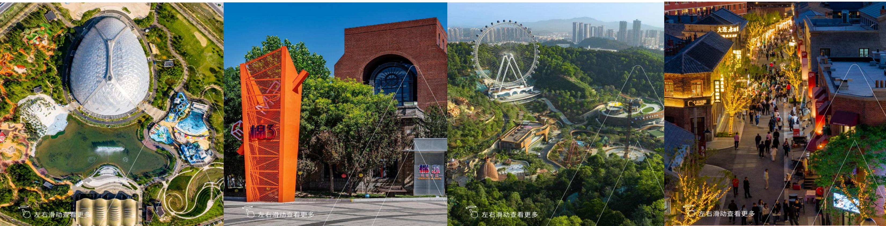

2025年度共全年维持31个课题（深圳21个/上海10个），执行“结题1个、新增1个”动态机制，

战略覆盖领域：重点布局数字化、AI、洛嘉儿童三大方向，实现技术创新与品牌价值双保护。

具体涵盖以下3大方面：

## 1. 人工智能设计技术：

核心打造KynesisEngine平台，压缩设计周期40%-80%；研发空间智能技术、城市文旅焕新大模型，赋能设计效率与决策科学性。

## 2. 低碳与生态技术：

构建风景园林全生命周期碳核算体系，研发儿童活动场地模块化技术及景观平面识别渲染技术，助力低碳实践与设计标准化。

## 3. 数字化与参数化技术：

搭建3D参数化工作平台，整合多源数据融合技术，推动公共空间设计向数据驱动升级，适配复杂场景需求。

## 产品创新与场景落地

1. 儿童友好空间产品：迭代标准化产品体系，已落地50余座城市，服务超百万家庭。  
2. 文旅与城市更新产品：搭建文旅数字化平台，开发城市更新智能设计工具，赋能项目管控与效率提升。  
3. 体验式与仿真模拟产品：通过仿真模拟减少设计试错成本，为多元场景提供高品质设计支撑。三、创新成效与价值转化

## 创新成效与价值转化

1. 核心设计效率提升，项目交付周期缩短30%以上，实现经营提质；  
2. 多项技术填补行业空白，荣获行业奖项；  
3. 完善全链条产品生态，推动公司转型，创造长期价值。

## 未来创新规划：拥抱科技，以智筑城，以心向未来！

2026年，公司将持续深化“AI+IP”双引擎战略，重点推进以下方向：

一是迭代KynesisEngine智能设计平台，拓展AI技术在乡村振兴、历史文化街区保护等场景的应用；  
二是完善风景园林碳核算技术体系，推动低碳设计全流程标准化；  
三是扩大儿童友好、城市更新等核心产品的落地规模，强化技术与产品的协同创新，持续巩固公司在创意设计与文旅领域的技术领先优势，助力行业高质量可持续发展。

## 541 项

## 知识产权总量超

## 5 项

## 2025年新增发明专利

其中专利230项，  
构建完善的知识产权 矩阵  
斩获科技奖项4项  
关键技术得到有效保护

## 27 项

## 2025新 增 专 利+版权申请

商标授权：35项

构建完善的知识产权 矩阵

## 31 项

## 在研发课题

其中2025年新增12项，构建完善的知识产权矩阵

## （三）质量与安全

公司严格落实全流程质量管控体系，从项目设计、施工到验收交付，实行标准化管理，2025年项目验收合格率达100%，荣获国家级优质工程奖3项、省级奖项18项，切实保障产品与服务质量。强化安全生产责任制，加大项目现场安全投入，安全培训覆盖率达100%，实现全年零重大安全事故，全力守护员工生命安全与项目安全。

<table><tr><td>类别</td><td>认证/资质名称</td><td>认证标准</td><td>证书状态</td><td>覆盖范围</td><td>核心作用</td></tr><tr><td>质量管理认证</td><td>ISO9001 质量管理体系认证</td><td>GB/T19001-2016idt ISO9001:2015</td><td>有效(2025.06-2028.06)证书号:04125Q30182R4M</td><td>景观设计、建筑设计、城乡规划、文旅工程 EPC 总承包</td><td>全流程质量管控,保障工程设计与施工质量合规、稳定、可追溯</td></tr><tr><td>职业健康安全认证</td><td>ISO45001 职业健康安全管理体系认证</td><td>GB/T45001-2020idt ISO45001:2018</td><td>有效(2025年5月通过)</td><td>工程施工、现场管理、人员作业全场景</td><td>系统化防控安全风险,保障员工职业健康与现场施工安全</td></tr><tr><td>施工安全资质</td><td>安全生产许可证</td><td>国家建筑施工安全生产规范</td><td>有效证书号:[粤] JZ 安许证字 [2023] 016121</td><td>建筑工程、景观工程、文旅配套工程施工</td><td>合法开展工程施工,满足项目安全准入与监管要求</td></tr><tr><td>产品安全认证</td><td>儿童游乐设备 TÜV 南德 AOC 认证</td><td>欧洲 EN1176、美国 ASTM F1487</td><td>有效</td><td>儿童无动力游乐设施设计、生产、安装</td><td>保障游乐设施安全合规,符合国际高标准安全要求</td></tr></table>

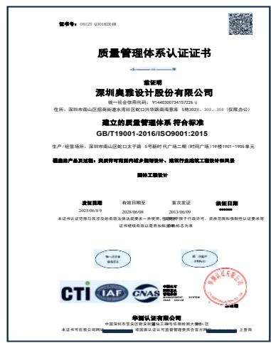

text_image

质量管理体系认证证书
企业名称
深圳奥雅设计股份有限公司
地址:深圳市南山区招商南路永明社区蛇口科学园南面南苑3楼3028、303、304（仅限办公）
建立的质量管理体系 符合标准
GB/T19001-2016/ISO9001:2015
生产/经营场所:深圳市南山区蛇口十字路5号新时代广场二层(封闭广场)19楼1901-1905单元
组织的产品及范围:首次许可范围内城乡规划、组织行业标准工程设计评审员
固体工程设计
登记日期 有效日期至 验次凭证 状态日期
2022/06/19 2028/06/08 2013/06/09
本证书认定范围与其涉及的有效法律法规要求一致使用，按照国家现行行政许可、资质范围和强制性认证要求办理
证书管理有效期以是否加盖缴纳标志为准
CTI IAF CNAS
华联认证有限公司
中国深圳市天安区科华大厦A座7楼A栋
本证书可登录公司网站：中国国家认证认证监督管理委员会官方网站 上官网

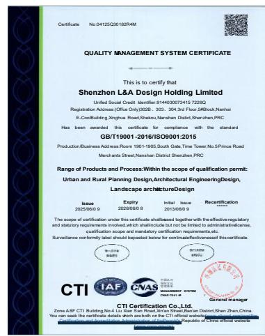

text_image

Certificate No.04125Q30182R4M
QUALITY MANAGEMENT SYSTEM CERTIFICATE
This is to certify that
Shenzhen L&A Design Holding Limited
United Social Credit Identifier:9144030073415 7228Q
Registration Address:Office Only 2028, Tower 62, Floor 508Block,Nanhai
E-CellBuilding,Xinghua Road,Shekou,Nanshan District,Shenzhen,PRC
Has been awarded this certificate for compliance with the standard
GB/T19001-2016/ISO9001:2015
Production/Business Address:Room 1901-1905,South Gate,Time Tower.No.5/Prince Road
Merchants Street,Nanshan District,Shenzhen,PRC
Range of Products and Process:Within the scope of qualification permit:
Urban and Rural Planning Design,Architectural EngineeringDesign,
Landscape architectureDesign
Issue 2025/06/09 Expiry 2026/06/09 Initial issue 2013/06/09 Recertification
Initial issue 2013/06/09
The scope of certification under this certificate shall be based together with the effective regulatory
and statutory requirements involved which shall include but not limited to administrative,quality
scope and mandatory certification requirements etc.
Surveillance conformity label should be above for continuous/exercised this certificate.
CTI Certification Co., Ltd.
Zone ASF CTI Building No.4 Lu Xian San Road,Xian Street,Baian District,Shen Zhen,China.
You can seek the certificate details which are both in the CTI official website.
General manage
CTI Certification Co.,Ltd.
Republic of China official website

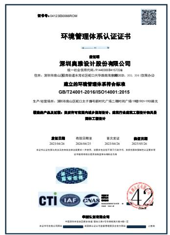

text_image

环评报号:04123B0066ROM
环境管理体系认证证书
登记项
深圳奥普设计股份有限公司
统一社会信用代码:91440283414702X
住所:深圳市南山区高新南大道北科社区科兴路南侧海澜路5020、303、304(仅限办公)
建立的环境管理体系符合标准
GB/T24001-2016/ISO14001:2015
生产/经营场所:深圳市南山区蛇口太子桥新时代广场二期时代广场1号楼1901-1903单元
硬质的产品及范围:无资质可范围内最小组织设计、制造的工业级工程设计和风景园林工程设计
企业日期  有效日期至  验次发证  快速日期
2023/04/26  2026/04/25  2023/04/26  2023/05/26
本证书中应经国务院有关部门审核并生效，未获审批后方可开展。该证书有效期至2023年5月1日
CTI IAF CNAS
华创弘泰有限公司
中国环保认证协会颁发的环境管理体系认证证书（盖章）
国家环保认证监督监督委员会审核发证
上海

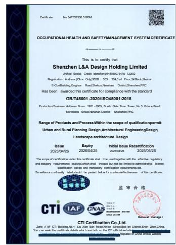

text_image

Certificatc No: 041235300 919EM
OccupationalHealth and SafetyManagement System Certificate
This is to certify that
Shenzhen L&A Design Holding Limited
Registration Address (Office, Dept. 3008 - 303 - 304.3rd Floor, Site#6666,Nerhai
E-Co#Building,Yinghua Road,Shekou,Nanahan District/Shenzhen/PRC
Has been awarded this certificate for compliance with the standard
GB/T45001-2020/ISO45001:2018
Production/Business Address: 1901-1905, South Gate Tower, Tower No.5 Prince Road,
Merchants Street/Nanahan District, Shenzhen/PRC
Range of Products and Process/Within the scope of qualification permit
Urban and Rural Planning Design, Architectural Engineering Design,
Landscape architecture Design
Issue Expiry Initial Issue Recertification
2023/04/26 2026/04/26 2029/04/26 2025/05/26
The scope of certification under this certificate etal. I be used together with the effective regulatory
and statutory requirements involved which shall include but not be limited to administrative license.
Qualification scope and mandatory certification requirements.
Surveillance ceremony should be posted before for continuous validation of this certificate.
监审合格
CTI AIF CNAS
CTI Certification Co.,Ltd.
Zone A 8F CTS Building No.4 Liu Jian San Road,Urban Street,Ben'an District,Shen Zhen,China.
You can see the certificate details which are both on the CTS official website.
General Manager
Republic of China official website

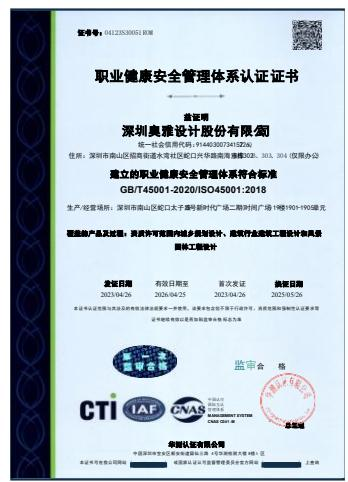

text_image

职业健康安全管理体系认证证书
企业证明
深圳奥雅设计股份有限公司
统一社会信用代码:9144020073412226
住所:深圳市南山区福华街道北华社区江兴中路南华厦28、30、31、304(仅限办公)
建立的职业健康安全管理体系符合标准
GB/T45001-2020/ISO45001:2018
生产/经营场所:深圳市南山区蛇口太子潭御时代广场二期时间广场19楼1901-1903单元
制造的产品及工艺:资质许可范围的城乡规划许可证、政府性金融工程设计和风险
团体工程设计
企业日期
2023/04/26
有效日期至
2026/04/25
首次发证
2023/04/26
批准日期
2025/05/26
本单位认证机构为深圳奥雅设计股份有限公司，注册资本人民币1.5亿元，经营范围是医疗器械行业领域内的医疗器械销售与技术服务。
CTI  IAF CNAS
证券代码:600888.SH
证券简称:STT
华创认证有限公司
中国注册会计师协会(以下简称“中国注册会计师协会”)注册会计师：王立明
注册会计师：王立明
注册地址：北京市西城区金融街2号东方君座D座1层
办公地址：北京市西城区金融街2号东方君座D座1层

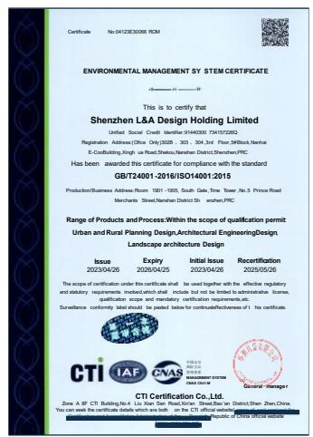

text_image

Certificale No.041283009 ROM
ENVIRONMENTAL MANAGEMENT SY STEM CERTIFICATE
This is to certify that
Shenzhen L&A Design Holding Limited
Shenzhen Sable: David D. Smith, 2005/06/2015
Registration Address: China, Orlg (2005) - 303 - 304-307, Road, Metro,Norbei
E-Coubuilding Xingx via Road, Sheku,Nanhen District,Shenzhen,PRC
Has been awarded this certificate for compliance with the standard
GB/T24001-2016/ISO14001:2015
Production/Business Address Room 1901-1905, South Gate, Time Tower, No.5 Prince Road
Marchare State, Henanhan District Sh, shenwan,PRC
Range of Products and Process: Within the scope of qualification permit
Urban and Rural Planning Design Architectural Engineering/Design
Landscape architecture Design
Issue
2023/04/26
Expiry
2026/04/25
Initial issue
2023/04/26
Recertification
2025/05/26
The scope of certification under this certificate shall be used together with the effective regulatory and statutory requirements involved, which shall include but not limited to administrative licenses, qualification scope and mandatory certification requirements etc.
Surveillance: conformity should be passed below for continued effectiveness of its certificate.
CTI Certification Co., Ltd.
Zone A BF CTB, Building No.4, Liu Xian San Road, Kirkan Street,Dao'an District,Shen Zhen,China.
You can seek the certificate details which are both in the CTI official setting.
CEC: National Regulatory Commission of China Official Service

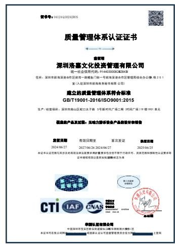

text_image

质量管理体系认证证书

深圳洛嘉文化投资管理有限公司
统一社会信用代码：91440300586343M
住所：深圳市前海深港合作区前湾一路鲤鱼门南一路鲤鱼门前海深港合作区管理局综合办公楼  格201
室（入驻深圳市前海商务秘书有限公司）

建立的质量管理体系符合标准
GB/T19001-2016/ISO9001:2015
生产/经营场所：深圳市南山区蛇口太子路5号新时代广场二座（房间广场）11楼1901单元
商品的产成品发运：无电力环保设备产品的检验分析报告

发证日期	有效日期至	首次发证	批准日期

2024/06/27	2024/06/26	2024/06/27	2025/06/25

本证书以经国务院有关部门批准并经国家工商行政管理总局登记注册方可经营，具体范围以限制性认证要求为准。

CTI IAF CNAS
中国科学院北京交通大学
中国科学院北京交通大学
中国科学院北京交通大学
中国科学院北京交通大学
中国科学院北京交通大学
中国科学院北京交通大学
中国科学院北京交通大学
中国科学院北京交通大学
中国科学院北京交通大学
中国科学院北京交通大学
中国科学院北京交通大学
中国科学院北京交通大学
中国科学院北京交通大学
中国科学院北京交通大学
中国科学院北京交通大学
中国科学院北京交通大学
中国科学院北京交通大学
中国科学院北京交通大学
中国科学院北京交通大学
中国科学院北京交通大学
中国科学院北京科技大学
中国科学院北京科技大学
中国科学院北京科技大学
中国科学院北京科技大学
中国科学院北京科技大学
中国科学院北京科技大学
中国科学院北京科技大学
中国科学院北京科技大学
中国科学院北京科技大学
中国科学院北京科技大学
中国科学院北京科技大学
中国科学院北京科技大学
中国科学院北京科技大学
中国科学院北京科技大学
中国科学院北京科技大学
中国科学院北京科技大学
中国科学院北京科技大学
中国科学院北京科技大学
中国科学院北京科技大学
中国科学院北京科技大学
中国科学院北京师范大学
中国科学院北京师范大学
中国科学院北京师范大学
中国科学院北京师范大学
中国科学院北京师范大学
中国科学院北京师范大学
中国科学院北京师范大学
中国科学院北京师范大学
中国科学院北京师范大学
中国科学院北京师范大学
中国科学院北京师范大学
中国科学院北京师范大学
中国科学院北京师范大学
中国科学院北京师范大学
中国科学院北京师范大学
中国科学院北京师范大学
中国科学院北京师范大学
中国科学院北京师范大学
中国科学院北京师范大学
中国科学院北京师范大学
中国科学院北京清华大学
中国科学院北京清华大学
中国科学院北京清华大学
中国科学院北京清华大学
中国科学院北京清华大学
中国科学院北京清华大学
中国科学院北京清华大学
中国科学院北京清华大学
中国科学院北京清华大学
中国科学院北京清华大学
中国科学院北京清华大学
中国科学院北京清华大学
中国科学院北京清华大学
中国科学院北京清华大学
中国科学院北京清华大学
中国科学院北京清华大学
中国科学院北京清华大学
中国科学院北京清华大学
中国科学院北京清华大学
中国科学院北京清华大学
中国科学院北京师范大学
中国科学院北京师范大学
中国科学院北京师范大学
中国科学院北京师范大学
中国科学院北京师范大学
中国科学院北京师范大学
中国科学院北京师范大学
中国科学院北京师范大学
中国科学院北京师范大学
中国科学院北京师范大学

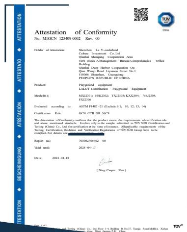

text_image

Attestation of Conformity
No. M1GCN 125409 0002 Rev. 00
Holder of Attestation:
Shenzhen La Vendelsdorf
Cathium Investment Co.,Ltd.
Qunhai Shuanggang Cooperation Area
6301 Block A Management Institute Comprehensive Office
Building
Qunhai Deep Harbor Cooperation Qu
Qian Wangyi Road Liyuan Street No.1
518066 Shenzhen,
PEOPLE'S REPUBLIC OF CHINA
Product:
Physlegend equipment
LALOT Combination
Plegyground Equipment
Media (to)
MXZ2301; HU2302; TXJ2303; KXZ2304; YMZ2305;
FXJ2306
Evaluated according to:
ASTM F1487-21 (Exclude 9.1; 10; 12; 13; 14)
Certification Rate: GCN_CCB_GR_S6CS
The determination of Conformity confirms that the product means the requirements of certification rule
and above mentioned standards. It covers only to the sample, submitted to IYV AOD Certification and Testing (China) Co., Ltd. for certification at the time of issuance. Alphaticable requirements of the Testing, Certification, Validation and Verification Regulations or IYV AOD Group have to be
compiled. For details see:
Certification of Conformity
Report no.: 703002405402 -00
Valid until 2025-04-17
Date: 2024-04-18
(Ning Caozu Zhu)
TEN®

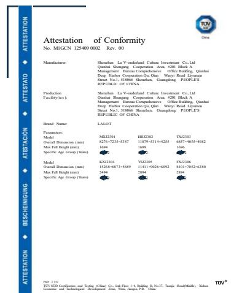

text_image

ATTESTATION
No. M1GCN 125409 0002 Rev. 00
Manufacturer:
Shenzhen La-Vo-onderal Culture Investment Co.,Ltd.
Qinsha Shuangang Cooperation Area, #201 Block A
Management Bureau Comprehensive Office Building, Qinshui
Deep Hair Corporation, Qin Wangji Road Liyuan
Street No.1: 51066 Shaoshan, Guangdong, PI3PLETS
REPUBLIC OF CHINA
Production
Facility(ies): Shenzhen La-Vo-onderal Culture Investment Co.,Ltd.
Qinsha Shuangang Cooperation Area, #201 Block A
Management Bureau Comprehensive Office Building, Qinshui
Deep Hair Corporation, Qin Wangji Road Liyuan
Street No.1: 51066 Shaoshan, Guangdong, PI3PLETS
REPUBLIC OF CHINA
Brand Name:
LALOT
Parameters:
Model
Overall Dimension (mm)
Max Fall Height (mm)
Specific Age Group (Years)
Model
Overall Dimension (mm)
Max Fall Height (mm)
Specific Age Group (Years)
TX22303
Y523305
X101-7052-6380
2494
2894
2894
ATTESTATION
BESCHENING
Page 3 et al.
[TS: ISO] Certification and Testing (China) Co., Ltd. Floor 1-4 Building B, No.37, Tsingta Road(Mall), Xizhou
Economic and Technological Development Zone, West, Yangsu, P.F. Class
TOV®

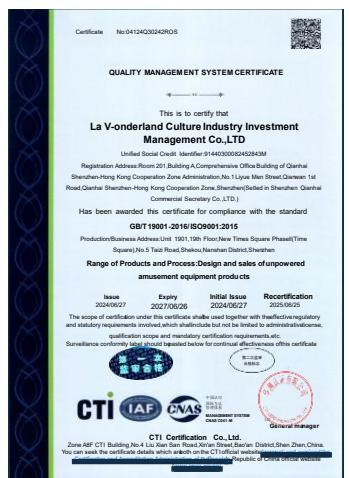

text_image

Certificate No:0413423024ROS
QUALITY MANAGEMENT SYSTEM CERTIFICATE
This is to certify that
La V-onderland Culture Industry Investment
Management Co.,LTD
Unified Social Credit Identifier:9144030008428243M
Registration Address:Room 201, Building A Comprehensive Office Building of Qianhai
Shenzhen-Hong Kong Cooperation Zone Administration, No.1 Llyan Men Street, Qianwan 1st
Road,Qianhai Shenzhen-Hong Kong Cooperation Zone,Shenzhen/Saided in Shenzhen Qianhai
Commercial Agency Co., Ltd.
Has been awarded this certificate for compliance with the standard
GBT19001-2016/ISO9001:2015
Production/Business Address Unit: 1901.19th Floor, New Times Square Phase(Time
Square), No.5 Talal Road, Shekou, Nanathan District,
Range of Products and Process:Design and sales of unpowered
amusement equipment products
Issue
2024/06/27
Expiry
2027/06/26
Initial Issue
2024/06/27
Recertification
2025/06/25
The scope of certification under this certificate shall be used together with the effective regulatory
and statutory requirements involved which shall include but not be limited to administrative/interse-
qualification scope and mandatory certification requirements. No.
Surveillance conformity should be repeated before for continued effectiveness office certificate
CTI Certification Co.,Ltd.
General Manager
CTI Certification Co.,Ltd.
Zone AIF CTT Building No.4 Liu Yan San Road, Xiei's Street, Barlan District, Shen Zhen, China.
You can seek the certificate details which will use the CT official working
www.cti.org/ccti.com.

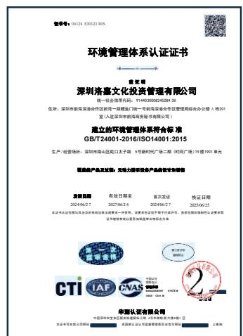

text_image

环评报
环境管理体系认证证书

普华报
深圳济嘉文化投资管理有限公司
地址：深圳市前海深港合作区前湾一路鲤鱼门第一号前海深港合作区管理局综合办公楼 1栋201
室（入驻深圳前海商务秘书有限公司）

建立的环境管理体系符合标准
GB/T24001-2016/ISO14001:2015
生产/经营场所：深圳市南山区蛇口工业路 3号新时代广场二期(刘阳广场)19楼1901单元
组织产品及范围：太阳能型单晶产品的研发和销售

发证日期
2024/6/27
有效日期至
2025/6/27
首次发证
2024/6/27
换证日期
2025/6/25

本证书由国信证券股份有限公司注册，经中国证券登记结算有限责任公司上海分公司审核，取得营业执照并持有效期限。

CTI IAF CNAS
华源认证有限公司
中国证券登记结算有限责任公司深圳分公司
注册地址：深圳市福田区深南大道6008号荣超经贸中心A座3层
上海市

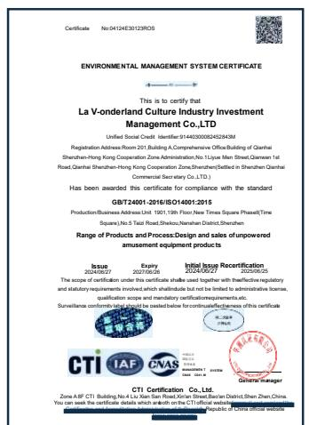

text_image

Certificate No:041243E301329ROS
ENVIRONMENTAL MANAGEMENT SYSTEM CERTIFICATE
This is to certify that
La V-onderland Culture Industry Development Management Co.,LTD
Unified Social Credit Identifier:0144030002452843M
Registration Address:Room 201, Building A Comprehensive Office, Building of Qianhai
Shenzhen-Hong Kong Corporation Zone Administration, No. Lique Men Street, Qianwen 1st
Road, Qianhai Center, Qianhai Hong Kong Corporation Zone, Qianhai(Hong Kong) Building in Shenzhen Qianhai
Commercial Secretary Co., Ltd.
Has been awarded this certificate for compliance with the standard
GB/T24001-2016/ISO14001-2015
Production/Business Address Unit 1001, 18th Floor New Times Squares (Phase)Time
Square No.:50 And Road, Shekou,Nanathan District,Shechen.
Range of Products and Process/Design and sales of unpowered
amusement equipment products
Issue	Expiry	Initial Issue Recertification
2024/06/27	2024/06/27	2024/06/27	2025/06/25
The scope of certification under this certificate is also used together with reliable regulatory and statutory requirements involved which should be limited to administrative licenses, qualification scope and mandatory certification requirements etc.
Surveillance certification will be checked below for continued/abnormality of this certificate.
CTI Certification Co.,Ltd.
CTI Certification Co., Ltd.
Zone A&F CTI Building No.4 Liu Xuan Yan Road,Xian Street,Baishan District,Shen Zhen China.
You can see the certificate details which are both on the CTI official website.
General Manager

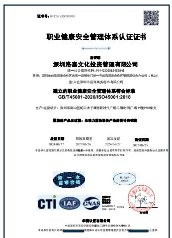

text_image

职业健康安全管理体系认证证书
深圳济嘉文化投资管理有限公司
统一社会信用代码：91440300MA2684B
住所：深圳市深南深港合作区深南一路鲤鱼门街一号前海深港合作区管理综合办公楼A栋201室
室入驻深圳市前海商务秘书有限公司
建立的职业健康安全管理体系符合标准
GB/T45001-2020/ISO45001:2018
生产/经营场所：深圳市南山区蛇口太子编号新时代广场二期四环广场19楼1901单元
联检产品及规格：无卤力型食品产品的设计和销售
发证日期 有效日期至 首次发证 秋证日期
2024/06/27 2027/06/26 2024/06/27 2025/06/25
本证书经认证后及注册机关登记，经审查后，该证书齐全并处于行政许可，具体范围和限制性认证要求等
证中所附证书是国家法律监督机构批准之文件。
CTI IAF GVAS
中国国家卫生健康总局关于职业健康安全管理体系认证
本证书可由本公司根据《中华人民共和国安全生产监督管理委员会关于职业健康安全管理体系认证管理办法》（国发[2023]103号）办理。

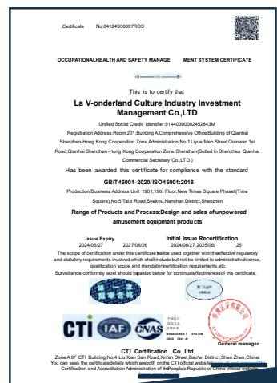

text_image

Certificate No: 04124530097905
OCCUPATIONALHEALTH AND SAFETY MANAGE
MENT CERTIFICATE
This is to certify that
La Vonderland Culture Industry Investment
Management Co.,LTD
Unified Social Credit Identifier: 9144030082482943M
Registration Address: Room 201, Building A Comprehensive Office Building of Ganzhai
Shenzhen-Hong Kong Cooperation Zone Administration, No.11Jye Men Street/Ganwan 1st
Road,Ganzhai Shenzhen-Hong Kong Cooperation Zone,Shenzhen/Selliet in Shenzhen Ganzhai
Commercial Secretary, J.P.A.
Has been awarded this certificate for compliance with the standard
GBT/445001-2020/ISO/445001:2018
Production/Business Address Unit: 1901.1399 Floor New Times Square Phase/(Time
Square), No 5 Tsai Road, Shakou, Nanshan District, Shenzhen
Range of Products and Process/Design and sales of unpowered
amusement equipment products
Issue Expiry
2024/06/27
2027/06/26
Initial Issue Recertification
2024/06/27 2025/06/ 25
The scope of certification under this certificate is used together with the following regulatory and
ability requirements involved which shall include but not be limited to administrative/external
qualification scope and mandatory certification requirements etc.
Surveillance conformity should be assessed before for continued/revised the certificate.
CTI Certification Co., Ltd.
Zona AIF CFTI Building No.4 Liu Xuan San Ren Road/Xian Street Barixie District,Shen Zhen China.
You can see the certificates directly which result on the CTI official website.
Certification and Accreditation Administration of the People's Republic of China (Shenzhen) Bureau of Technology

## 奥雅股份 质量与安全管理能力总结表

<table><tr><td>管理维度</td><td>核心内容</td><td>项目应用成效</td></tr><tr><td>质量管理体系</td><td>全链条质量管控;三方联合验收;信息化过程追溯;质量强市骨干企业</td><td>严家淤岛项目验收合格率100%;室内环境达标;工程质量合格</td></tr><tr><td>安全管理体系</td><td>ISO45001+安全生产许可双重保障;隐患排查+应急演练;全员安全培训</td><td>2025年度施工零事故、零伤亡、零环保投诉</td></tr><tr><td>一体化服务能力</td><td>EPC总承包+设计一体化;标准落地、过程管控、成果交付</td><td>高质量、高安全完成严家淤岛一期建设任务</td></tr></table>

## 核心认证资质

1. ISO9001 质量管理体系认证

认证标准：GB/T19001-2016 idt ISO9001:2015（现行有效版本）。

证书状态：在有效期内（2025.06-2028.06），证书号：04125Q30182R4M。

质量方针：精心设计，优质服务，持续改进，追求卓越。

覆盖范围：景观设计、建筑设计、城乡规划、文旅工程EPC 总承包全过程质量管控。

2. ISO45001 职业健康安全管理体系认证

认证标准：GB/T45001-2020 idt ISO45001:2018（替代 OHSAS18001）。

认证时间：2025 年 5 月正式通过认证，安全管理标准化、规范化。

核心目标：系统性防控施工与运营安全风险，保障员工健康与现场安全。

3. 安全生产许可证

证书编号：[粤] JZ 安许证字 [2023] 016121，合法有效。

适用范围：建筑工程、景观工程、文旅配套工程施工安全合规资质。

4. 产品安全与质量国际认证

旗下LALOT洛塔儿童游乐设备获TÜV南德AOC产品认证，符合欧洲EN1176、美国ASTM F1487安全标准。

## 质量管控体系

建立全流程项目质量管控体系，覆盖立项、设计、采购、施工、验收、运维全链条执行国家验收标准，落实设计— 施工 — 监理三方联合验收机制，确保工程一次合格依托信息化平台实时监控项目进度、质量、成本，实现过程可追溯、问题可闭环获评深圳市质量强市骨干企业、全国质量达标诚信服务单位，质量口碑行业领先

## 安全管理体系

构建ISO45001 + 安全生产许可双重安全保障体系，风险识别、隐患排查、应急处置标准化施工现场落实：降噪减振、围挡防护、扬尘管控、临时用电、机械安全、防汛防滑等专项措施全员安全培训、持证上岗、定期应急演练，零重大安全事故、零人员伤亡严格遵守施工场界噪声、大气、水土保持等环保安全要求，兼顾施工安全与生态安全

## 在项目中的应用（严家淤岛一期）

奥雅股份作为EPC工程总承包+设计单位，将ISO9001、ISO45001体系全面落地本项目。

全过程执行质量标准与安全规范，保障工程质量合格、室内环境达标、施工安全零事故。

为项目提供设计—建造—验收一体化高质量、高安全交付支撑，符合国企文旅项目ESG管控要求。

以下以2025年度重大EPC+O项目为例：

## 衢州严家淤岛文旅项目

## 一、项目概况

项目全称：衢州古城文化旅游区—— 严家淤岛建设项目（一期）

建设规模：一期用地190 亩，总建筑面积约15239㎡，总投资 9.42 亿元

建设单位：衢州市鹿鸣旅游开发有限公司

2025年节点：3月开工，9月全面竣工并通过验收

## 二、环境（E）・生态安全与绿色建设

• 合规底线：不占生态保护红线、永久基本农田、饮用水源保护区，符合国土空间规划与长江经济带负面清单要求。  
• 环保投入：总投资145 万元，占比0.15%，配套废水、废气、固废、噪声全流程治理设施。  
• 污染防控：施工期废水回用不外排，扬尘密闭管控；运营期雨污分流、餐饮油烟净化、萌宠区恶臭达标处置。  
• 固废安全：建筑垃圾资源化利用，动物粪便无害化处置，生活垃圾规范清运，无危险废物与生态风险。

## 三、社会（S）・工程质量与施工安全

## 质量管控

• 四方管控：建设、监理、施工、设计全过程质量监督，执行国家统一验收标准。  
• 验收结果：2025 年 1 月初步验收合格，9 月竣工验收合格，功能性试验 100% 达标。  
• 环境安全：室内空气（氡、甲醛、苯、TVOC等）检测全部符合Ⅰ 类民用建筑标准，保障人员健康。  
• 零事故目标：2025年度施工全过程零安全事故、零人员伤亡、零环保投诉。  
• 风险防控：降噪减振、限速禁鸣、水土流失防护、溢油应急处置等措施到位。  
• 社会责任：严控施工影响，保护周边社区、学校敏感目标，带动本地就业与文旅发展。

## 安全管理

## 四、治理（G）・合规与责任管理

• 手续齐全：完成项目备案、规划许可、土地出让、环评批复等全流程审批。  
• 责任体系：建立项目负责人负责制，落实质量、安全、环保“三同时”与闭环管理。  
• 持续改进：按专家意见优化工程与环保方案，接受政府部门全程监督。

## 五、年度核心成果

1. 工程质量：竣工合格率100%，建设内容全面落地，质量可靠。  
2. 安全生产：全过程安全平稳，无任何责任事故。  
3. ESG成效：绿色施工、生态保护、合规运营同步实现，树立文旅项目可持续建设标杆。

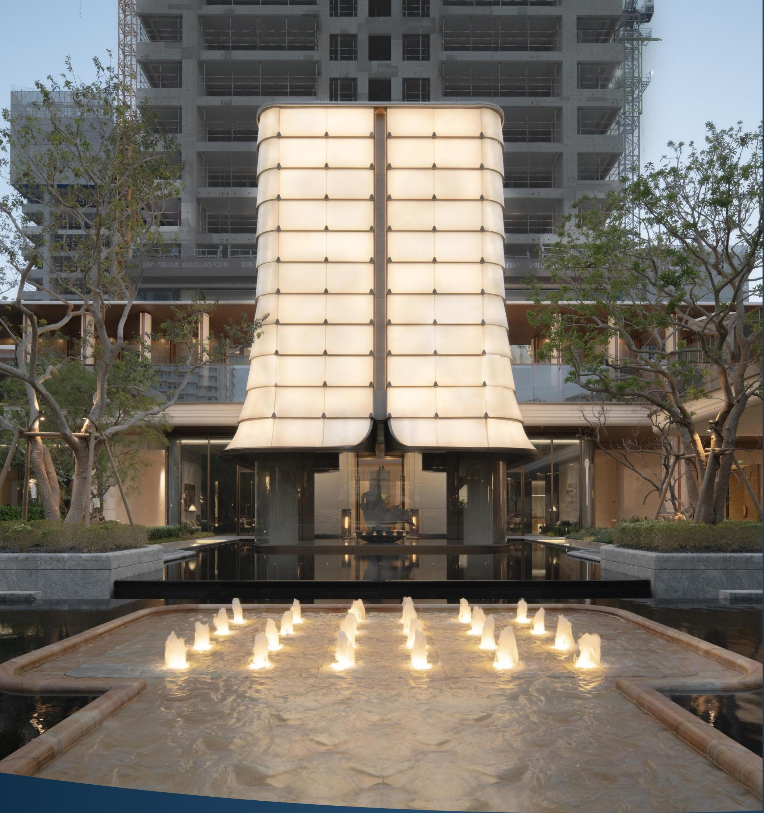

natural_image

Modern architectural building with a distinctive curved facade and fountain in front, surrounded by trees and construction scaffolding (no visible text or symbols)

## 07

## 2025年ESG

## 绩效与评级表

## 深圳奥雅设计股份有限公司2025年度ESG绩效与评级汇总表

核心评级与荣誉概览表

<table><tr><td>类别</td><td>评级/荣誉名称</td><td>授予机构</td><td>评级/结果</td><td>授予报告日期</td><td>核心说明</td></tr><tr><td>第三方评级</td><td>Wind ESG 评级</td><td>Wind 资讯</td><td>BBB 级</td><td>2025-12-17</td><td>建筑与工程III行业内排名31/253,综合得分6.96,显著高于行业均值5.93</td></tr><tr><td>行业荣誉</td><td>深圳企业ESG 优秀案例</td><td>第七届大湾区木棉论坛组委会</td><td>入选优秀案例</td><td>2026年1月</td><td>获评深圳企业ESG 优秀案例,获颁荣誉牌匾</td></tr><tr><td>综合荣誉</td><td>深圳ESG top 50 优秀企业</td><td>深圳市深商总会、深圳市商业联合会等</td><td>入选TOP50</td><td>2026年1月</td><td>获评深圳ESG TOP50 优秀企业,获颁官方认证牌匾</td></tr></table>

Wind ESG 评级核心绩效明细表

<table><tr><td>绩效维度</td><td>公司得分</td><td>行业均值</td><td>行业排名</td><td>核心表现</td></tr><tr><td>ESG 综合得分</td><td>6.96</td><td>5.93</td><td>31/253(前 12.3%)</td><td>综合表现大幅领先行业平均,评级持续稳步提升</td></tr><tr><td>环境(E)维度</td><td>2.05</td><td>3.02</td><td>-</td><td>聚焦绿色设计、超低能耗建筑等专项实践,持续优化环境绩效</td></tr><tr><td>社会(S)维度</td><td>7.63</td><td>4.30</td><td>-</td><td>行业领先水平,在工程质量、安全生产、员工发展、社会责任等维度表现突出</td></tr><tr><td>治理(G)维度</td><td>6.67</td><td>5.65</td><td>-</td><td>高于行业均值,公司治理、内控合规、信息披露体系完善</td></tr><tr><td>争议事件得分</td><td>2.95</td><td>2.94</td><td>-</td><td>与行业平均持平,近半年无重大负面争议事件,风险管控有效</td></tr><tr><td>管理实践得分</td><td>4.01</td><td>2.99</td><td>-</td><td>显著高于行业均值,ESG 管理体系、制度建设与落地执行能力行业领先</td></tr></table>

## 评级趋势与行业对标说明

评级趋势：WindESG 评级呈持续上升态势，从B 级稳步提升至BBB 级，体现公司ESG 治理能力的持续优化与成果落地。

行业对标：在建筑与工程Ⅲ 行业 253 家样本企业中，公司综合排名31/253，位列行业前12.3%，社会（S）维度得分大幅领先行业均值，是核心优势板块。

荣誉背书：2026 年 1 月同时获评「深圳ESG top 50 优秀企业」、入选「深圳企业ESG 优秀案例」，是公司ESG 实践获得行业与官方双重认可的核心体现。

## 2026 年度 ESG 提升规划

基于 2025 年度 ESG 绩效与评级结果，公司制定2026 年度 ESG 提升目标：

1.评级提升：推动 WindESG 评级从 BBB 级向 A 级迈进，力争行业排名进入前20%；  
2.维度补强：重点提升环境（E）维度绩效，扩大绿色低碳项目覆盖，完善碳足迹管理与披露；  
3.体系优化：持续完善ESG 管理体系，强化ESG 与业务的深度融合，提升管理实践得分；  
4.荣誉升级：冲刺更高等级ESG 荣誉，打造文旅行业ESG 示范标杆，提升公司品牌影响力。

## Wind ESG 评级核心绩效明细

## （一）综合绩效概览

奥雅股份 2025 年度 Wind ESG 综合得分为6.96 分，显著高于建筑与工程 Ⅲ 行业均值 5.93 分，整体绩效处于行业上游水平。其中社会（S）维度为核心优势板块，治理（G）维度稳定领先，环境（E）维度持续优化，形成 “优势突出、短板补强、全面提升”的 ESG 发展格局。

## （二）分维度绩效拆解

## 1. 环境（E）维度：绿色设计赋能，低碳实践落地

得分情况：2.05 分，行业均值3.02 分

核心实践：

①以超低能耗建筑设计为核心抓手，衢州古城严家淤岛项目等多个项目通过超低能耗建筑设计阶段测评，建筑综合节能率达68.16%，本体节能率44.99%，可再生能源利用率40.23%，践行绿色建筑理念；  
②全流程推行绿色设计、绿色施工，在文旅项目中融入生态保护、海绵城市、碳中和等技术，减少项目全生命周期碳排放；  
③持续优化环境管理体系，完善环境目标与考核机制，推动环境绩效稳步提升。

提升方向：后续将进一步扩大绿色项目覆盖范围，强化碳足迹核算与披露，提升环境维度行业竞争力。

## 2. 社会（S）维度：行业标杆表现，责任价值彰显

得分情况：7.63 分，大幅高于行业均值4.30 分，为公司核心优势维度

核心实践：

①质量与安全管理：持有ISO9001 质量管理体系、ISO45001职业健康安全管理体系认证及安全生产许可证，全流程落实工程质量管控，2025年度多个项目验收合格率100%，实现施工零安全事故、零人员伤亡；  
②员工发展与权益保障：完善人才培养体系，保障员工合法权益，落实职业健康安全管理，打造多元化、包容性workplace；  
③社会责任践行：深耕文旅行业，助力乡村振兴、城市更新与文化传承，带动项目所在地就业与经济发展，践行企业社会责任；  
④产品安全与客户服务：旗下儿童游乐设备获TÜV 南德国际安全认证，符合欧美最高安全标准，保障产品与服务质量。

## 3. 治理（G）维度：合规体系完善，治理水平领先

得分情况：6.67 分，高于行业均值5.65 分

核心实践：

①完善公司治理结构，健全内控内审、合规管理体系，严格遵守上市公司监管要求，保障公司规范运营；  
②建立 ESG 专项管理机制，明确ESG 治理责任，推动ESG 战略与公司业务深度融合；  
③强化信息披露透明度，定期发布ESG 报告，主动接受股东、监管与社会监督；  
④完善知识产权管理、商业伦理与反腐败机制，保障公司长期健康发展。

## 4. 辅助绩效维度

争议事件得分：2.95分，与行业均值2.94 分基本持平，近半年无重大负面争议事件，风险管控体系有效，合规运营能力稳定；

管理实践得分：4.01分，显著高于行业均值2.99 分，体现公司ESG 管理制度完善、落地执行能力强，可持续发展管理体系成熟。

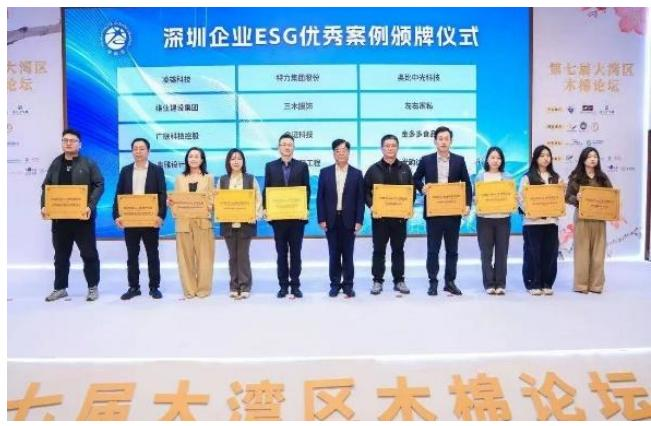

text_image

深圳企业ESG优秀案例颁牌仪式
宁波科技
特力集团股份
奥安中冷科技
绿色建设集团
三木圆新
友布深拓
广晟科技股份
海能科技
重庆云维
第七届大湾区
木棉论坛
第六届大湾区木棉论坛

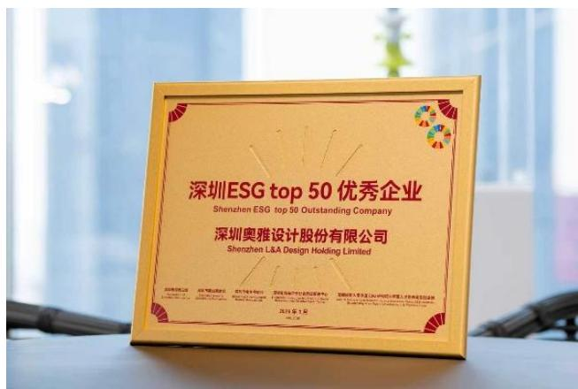

text_image

深圳ESG top 50 优秀企业
Shenzhen ESG top 50 Outstanding Company
深圳奥雅设计股份有限公司
Shenzhen L&A Design Holding Limited

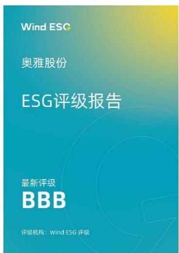

text_image

Wind ESC
奥雅股份
ESG评级报告
最新评级
BBB
评级机构：Wind ESG 评级

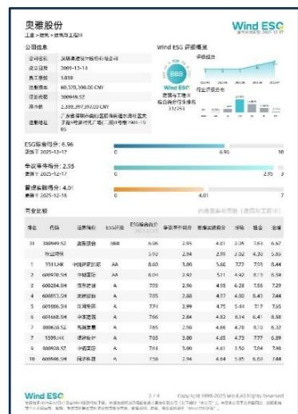

bar

| Company | Wind ESC (2009-12-14) | Wind ESC (2012-12-14) |
| --- | --- | --- |
| 公司名称 | 风格集团计划执行情况表 | 评估报告 |
| 证券代码 | 3888 | 6.95 |
| 股票简称 | 风格集团 | 风格集团 |
| 总市值 | 1,018 | 1,018 |
| 所有股本 | 60,378,300.00 CNV | 60,378,300.00 CNV |
| 持股比例 | 39.94% | 39.94% |
| 市盈率 | 2.085 / 2.091 / 2.092 | 2.085 / 2.085 |
| 市净率 | 1.74 / 1.74 / 1.74 | 1.74 / 1.74 |
| 流通股本 | 7,656,000,000 | 7,656,000,000 |
| 市场价值 | 1,746,797,477 (按A股计算) | 1,746,797,477 (按B股计算) |
| 市净率 | 2.93 | 2.93 |
| 市净率 | 2.93 | 2.93 |
| 市净率 | 2.93 | 2.93 |
| 市净率 | 2.93 | 2.93 |
| 市净率 | 2.93 | 2.93 |
| 市净率 | 2.93 | 2.93 |
| 布权平均值 | 4.20 | 4.20 |
| 市净率 | 0.85 | 0.85 |
| 市净率 | 0.85 | 0.85 |
| 市净率 | 0.85 | 0.85 |
| 市净率 | 0.85 | 0.85 |
| 市净率 | 0.85 | 0.85 |
| 市净率 | 0.85 | 0.85 |
| 布权平均值 | 6.96 | 6.96 |
| 市净率 | 10 | 10 |
| 市净率 | 10 | 10 |
| 市净率 | 10 | 10 |
| 市净率 | 10 | 10 |
| 市净率 | 10 | 10 |
| 市净率 | 10 | 10 |
| 市净率 | 10 | 10 |
| 市净率 | 7.97 | 7.97 |
| 市净率 | 7.97 | 7.97 |
| 市净率 | 7.97 | 7.97 |
| 市净率 | 7.97 | 7.97 |
| 市净率 | 7.97 | 7.97 |
| 市净率 | 7.97 | 7.97 |
| 布权平均值 | — | — |
| 市净率 | — | — |
| 市净率 | — | — |
| 市净率 | — | — |
| 市净率 | — | — |
| 市净率 | — | — |
| 市净率 | — | — |
| 市净率 | — | — |
| 市净率 | — | — |
| 市净率 | — | — |

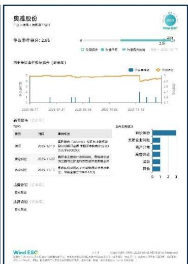

line

| 日期 | 股价 (元) |
| --- | --- |
| 2025-12-12 | ~4.8 |
| 2025-11-27 | ~4.7 |
| 2025-11-13 | ~4.6 |
| 2025-11-12 | ~4.5 |

## 08

## 挑战

## 与

## 未来规划

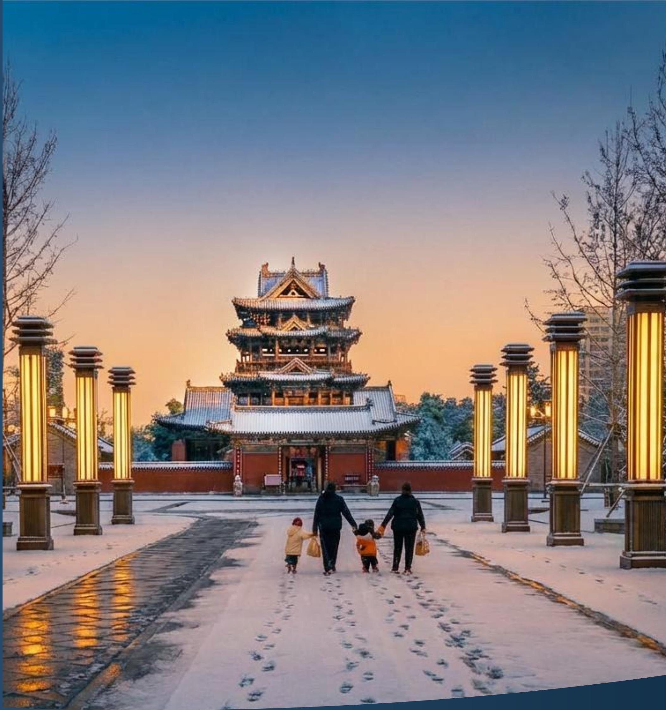

natural_image

Snow-covered traditional Chinese temple at sunset, with people walking along a path (no visible text or symbols)

## （一）面临的挑战

## 行业转型与市场环境挑战

随着城市化进程进入存量更新阶段，传统地产景观需求结构性收缩，行业同质化竞争加剧，短视化、功利化开发模式仍普遍存在，可持续设计理念落地不足。城市更新与人居环境营造涉及多方协同、全周期管理，对企业综合服务能力与长期运营能力提出更高要求，项目落地难度与复杂性持续提升。

## 可持续设计与长效价值实现难度加大

打造全生命周期、全龄友好的完整社区，需要兼顾人文关怀、生态效益与社会价值，但在实际推进中，易受成本、周期、短期效益导向制约，景观空间的长效运营、社区活力营造与精神价值沉淀仍面临落地瓶颈。

## 科技融合与数字化转型仍处探索期

公司坚定推进 AI 与设计产业深度融合，自主研发奥创引擎，但新技术在规模化应用、全产业链协同、数据安全与隐私保护等方面仍需完善，技术商业化与 ESG 效益转化路径尚需进一步验证。

## ESG 管理与评级提升压力显著

公司 ESG 综合表现与行业头部企业存在差距，环境（E）维度在低碳管理、资源利用、生态修复量化成效上仍有提升空间；社会（S）维度在员工发展、供应链 ESG 管理、社区共建深度上需持续强化；治理（G）维度在风险管控、内控内审、信息披露标准化上仍需优化。

## 运营与资金管理压力持续存在

业务转型过程中，应收账款、资产周转与现金流管理仍面临压力，投资决策与风险防控体系需进一步完善，以保障企业稳健经营与可持续发展。

## （二）未来发展展望

面向未来，公司将以“拥抱科技，以智筑城，以心向未来”为战略指引，将 ESG 理念全面嵌入战略规划、业务运营与企业文化，坚守设计初心，强化科技赋能，实现环境、社会与公司价值协同发展。

## 坚持心法、手法、算法三位一体，夯实可持续设计根基

以心法坚守人文初心，尊重土地肌理与在地文化，拒绝千城一面，让设计承载场所精神与城市记忆；

以手法精进空间营造，坚持精耕细作、匠造品质，打造全龄友好、全生命周期的完整社区，提升社区凝聚力与归属感；

以算法驱动数字创新，依托自主研发的奥创引擎，以 AI 技术提升创意效率、方案精准度与项目落地性，实现绿色低碳、高效普惠的设计服务。

## 以长效设计推动社区与城市可持续发展

持续深耕地产景观、城市更新与公共空间营造，推动景观从“视觉风景”向“生活载体”升级，通过多元共享空间促进邻里互动，让空间沉淀长效价值，成为城市文明与生态可持续的重要载体。坚持好设计、好产品、好运营一体化，让作品经得起时间与生活的双重检验。

## 深化科技与设计融合，构建全产业链可持续能力

坚定推进数字化、智能化转型，打通策划、设计、建设、运营全链路，搭建全产业链统筹平台。以科技赋能降本增效、减少资源消耗，提升项目生态效益；持续优化 AI 设计工具，推动绿色技术、低碳材料在项目中广泛应用，以技术创新助力碳中和与人居环境提升。

## 全面提升 ESG 治理水平，实现高质量可持续发展

针对环境、社会、治理各维度短板持续改进：完善环境管理体系，强化低碳运营与生态保护；健全人才发展机制，保障员工权益，提升团队专业能力与创新活力；加强内控内审与风险管理，提升公司治理规范化水平；深化供应链 ESG 管理，推动利益相关方共同成长。

## 坚守初心，与城市共生，与时代同行

公司将继续以设计为桥、以科技为翼，深耕城市更新、乡村振兴与公共空间营造，用专业能力创造生态价值、社会价值与经济价值。面向未来，奥雅已做好全面准备，以更开放的姿态、更坚定的信念，笃行致远，为建设更美好的人居环境持续贡献力量。

建筑设计 Architecture

室内设计 Interior Design

乐园设计 Theme Park

运营管理 Resorts Management

文旅运营 Resorts & Culture Tourism

城乡规划 Urban-Rural Planning

城市设计 Urban Design

景观设计 Landscape Architecture

生态规划 Ecological Planning

开发策划 Development Strategy

公共艺术 Public Art

品牌运营 Branding & Media

## 编制机构

深圳奥雅设计股份有限公司ESG工作小组

## 联系方式

地址： 深圳市南山区招商街道水湾社区太子路5号新时代广场（二期）1号楼1901-1905

电话：0755-2682 6690

邮箱：securities@aoya-hk.com

官网：www.aoya-hk.com

深圳奥雅设计股份有限公司