## 君亭酒店集团股份有限公司

## 环境、社会和治理（ESG）报告

君亭酒店集团

SSAW HOTELS & RESORTS

证券代码：SZ.301073

关于本报告 01

董事长致辞 03

关于我们 05

走进君亭 05  
企业文化 06  
年度荣誉 07

11笃行中国服务 智启全球新局专题  
15盘活存量资产 重塑业态布局专题

可持续发展管理 21

可持续发展管治 21  
利益相关方沟通 23  
重要性议题分析 24

## 附录

关键绩效表 123  
内容索引表 131  
读者反馈 133

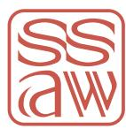

## 目录

## 01固本守正 治理为基

## 02奔赴绿色 新程可期

坚持党建引领1 33  
稳健公司治理2 37  
全面合规运营3 41  
恪守商业道德4 45  
保障投资者权益5 50

环境合规管理1 55  
应对气候变化2 60  
践行绿色运营3 66

## 03匠心筑信 品质致远

## 04同心同行 育才树人

## 05共建生态 共创价值

筑牢品质基石1 73  
维护客户权益2 79  
数智创新驱动3 85  
践行责任采购4 87

① 雇佣薪酬管理 97  
员工福祉关怀2 99  
员工培训发展3 105

行业交流发展1 113  
守护非遗传承2 118  
践行社会公益3 120

## 

## 关于本报告

本报告是君亭酒店集团股份有限公司（以下简称“君亭酒店集团”“本集团”“集团”或“我们”）发布的第4份环境、社会和治理(FSG)报告，秉持准确性、平衡性、清晰性、可比性、完整性、时效性、可验证性的原则，披露君亭酒店集团及其旗下酒店品牌在环境、社会和公司治理方面的管理理念、制度建设、实践进展与绩效成果，积极回应各利益相关方对公司可持续发展的关切与期待。

## 报告周期

本报告为年度报告，覆盖时间范围为2025年1月1日至2025年12月31日（即“报告期”）。为增强报告的完整性和可读性，部分内容适当延展至报告期前后。

## 报告主体

本报告披露的信息范围与公司年度报告保持一致，如无特别说明，覆盖君亭酒店集团股份有限公司及其旗下酒店品牌、各全资及控股子公司，财务数据以公司合并报表范围为准。

## 编制依据

本报告以深圳证券交易所《深圳证券交易所上市公司自律监管指引第14号—可持续发展报告(试行)》作为编制依据，参照全球报告倡议组织(GRI) 发布的《可持续发展报告标准(GRL Standards)》的相关要求，同时参考并回应联合国可持续发展目标(UN SDGs所关注的相关议题，结合君亭酒店集团2025年度可持续发展实践情况进行编制。

Pagoda

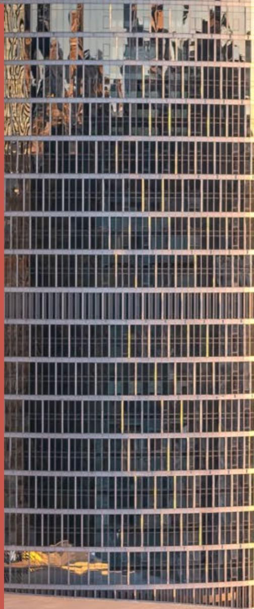

natural_image

Exterior view of a modern glass skyscraper with uniform windows and reflective surfaces (no signage or text visible)

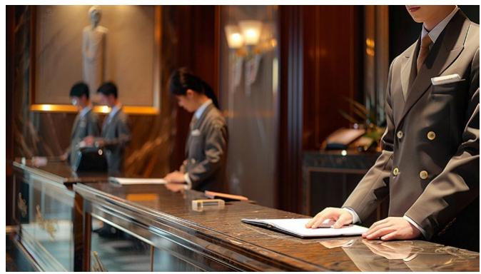

natural_image

Interior of a hotel lobby with staff in uniform handling documents at a counter (no visible text or signage)

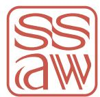

## 信息说明

本报告中所引用信息均来源于公司内部相关数据收集系统、统计报告、公开资料渠道。本报告承诺所引用信息及数据无任何不实、虚假记载、误导性陈述或重大遗漏，对其内容的客观性、真实性和准确性负责。如无特别说明，报告中所示金额均以人民币列示。

## 报告语言

本报告以简体中文编制，以简体中文版本为准。

## 获取方式

本报告以电子版发布，电子版下载地址

君亭酒店集团官网：http://www.ssawhotels.com

深圳证券交易所官网：http://www.szse.cn

巨潮资讯网：http://www.cninfo.com.cn

## 联系方式

如对本报告及其内容有任何疑问或反馈意见，欢迎通过以下方式与我们联系：

电话：0571-86750888；0571-88835939

电子邮箱：ssaw.shareholder.services@ssawhotels.com

联系地址：浙江省杭州市西湖区紫宣路18号浙谷深蓝中心3号楼

# 

## 董事长致辞

当前，酒店行业从增量市场迈入存量市场，以专业能力和运营效率为核心的价值竞争时代来临。面对存量时代的激烈市场竞争，君亭酒店集团以精益管理作为增长驱动力，通过全链路精细化运营，实现品质与效益的协同跃升。我们依托品牌建设与运营管理的深厚积淀，积极拓展战略合作空间，构建互利共赢的合作生态，切实回应投资人的价值期待。我们将可持续发展理念贯穿经营全局，以绿色低碳转型筑牢未来根基，以匠心服务塑造卓越宾客体验，以共融共生深化价值共创生态，以系统性人才战略赋能长远发展。

## 笃行绿色发展战略，引领低碳转型未来

我们始终将绿色可持续发展置于经营核心，持续建设科学完备的环境管理体系，以各类专项应急预案应对环境突发事件。我们主动识别并应对气候变化带来的挑战与机遇，确保各项绿色举措落地有效、执行有力。作为中国绿色饭店的积极倡导者，我们以自身实践建立能源管理体系，广泛采用节能高效设施设备，稳步提升整体能源利用效率，降低对化石能源的依赖。我们采用被动式建筑设计理念，优先采购通过环境管理体系认证或符合绿色建材标准的材料，在有效减少碳排放的同时，切实保障了宾客的健康安全。我们推行全链路绿色餐饮管理，从本地应季食材直采、节能炉灶推广，到适量点餐引导与减废宣传，将可持续膳食理念贯穿采购、烹饪与就餐全环节，实现环境效益与运营品质的双向提升。我们倡导绿色旅居与减塑环保，通过推行客房“轻减”服务、替换一次性制品及完善垃圾分类回收体系，引导宾客与员工共同践行低碳生活方式，实现环保承诺与服务品质的有机统一。一路走来，河北塞罕坝伯斯特君澜度假酒店被颁发“碳中和”认证、七仙岭君澜度假酒店三次蝉联“五叶级绿色饭店”称号、浙江世贸君澜大饭店获评“碳标签酒店”认证，我们以实际行动践行绿色管理，未来我们将在更多酒店启动“绿色饭店”创建工作。

## 深化数智服务体验，共筑增长新生格局

我们始终保持“持续向上”的发展活力，以高标准，精细化的服务理念贯穿酒店运营全程，深度打磨东方文化场景体验持续沉淀君亭品牌核心价值，令每一次入住成为宾客难以复制的专属体验。我们持续深化数智化转型，依托AI+系统性升级，通过迭代优化移动端客控系统及物联网平台，大幅提升客房设备响应速度与稳定性，实现从“功能可用”到“休验流畅”的跨越。我们推进无接触入住新模式，在多家核心门店落地部署，宾客可通过手机自助完成入住登记至消费结算的全流程操作。2025年，我们正式启动AI智能服务应用试点，以客户行程服务助手与智能客服为切入点，为宾客提供个性化行程规划、周边推荐与实时问答服务，以数智创新全面提升服务体验，共筑高质量可持续增长新格局。

## 深耕社区共建生态，赋能文商旅融合发展

我们秉持“商业向善”初心，探寻社会价值、经济效益与文化传承的共生之道。在乡村振兴领域，我们通过盘活闲置农宅，将民宿集群打造为产业赋能的新引擎，拓宽村民增收渠道，为青年人才创造发展空间，构建“酒店+文旅+乡村”协同共生的发展生态。我们将本地资源与传统文化深度融入旅居产品，以现代设计激活非遗文化的当代表达，让特色旅居体验作为人文桥梁，连接历史与现代、城市与乡村。我们以打造“中国服务”品牌为引领，立足中华文化底蕴与地域特色，凭借差异化的体验设计、专业的服务标准与持续的创新能力，在传承和保护非物质文化遗产的同时，塑造兼具民族底蕴与时代视野的独特品牌。我们对住宿、文化艺术、服务三大板块标准进行全面升级，优化宾客从入住到离店的全流程文化体验。我们积极把握文商旅融合的时代机遇，聚焦热衷文化体验的海外客群，通过特色服务与沉浸式场景构筑差异化壁垒，跳出“内卷”竞争，以“中国服务”的品牌张力，向世界讲述中国文旅的独特故事。

## 厚植人才发展根基，筑牢企业支柱

我们深知人才是品牌升级与规模化发展的核心引擎，持续深化多元、包容的文化内核，不断优化人才培养体系，助力员工全面成长。我们依托学习型组织建设，通过“未来总经理成长计划”与“造星计划”等构建起全方位的阶梯式培养体系。从技能进阶到领导力重塑，我们精准赋能，实现区域化人力资源管理的深耕落地。丰富多样的培训历练，不仅助力员工全面成长，更成就了支撑企业跨越式发展的坚实人才蓄水池

面向未来，君亭酒店集团将以更宏阔的战略视野把握行业转型机遇，以沉稳笃定的长线心态应对复杂多变的市场挑战。我们深知，每一位员工都是品牌前行的核心力量—唯有凝聚众志、同心共谋，方能在时代浪潮中行稳致远。我们将坚定走好中国民族酒店品牌的可持续发展之路，共同书写属于这个时代的崭新篇章

君亭酒店集团股份有限公司

董事长：朱晓東

## 关于我们

## 走进君亭

君亭酒店集团股份有限公司（证券代码：SZ.301073）于深圳证券交易所创业板上市，专注住宿业务近30年，是中国领先的中高端酒店运营商、高端商务酒店和度假酒店的重要实践者，也是中高端精选酒店与生活方式酒店领域的持续开拓者。

本集团主营业务涵盖酒店投资、运营与管理，总部位于中国杭州。我们坚持以“东方文化和生活方式的中国趣处”为价值立足点，持续深化品牌建设与产品创新，以长三角城市群为核心发展区域，稳步推进全国重点城市布局，致力于打造深受消费者喜爱的中国原创酒店品牌，成长为兼具东方气韵、时代精神与鲜明品牌个性的综合性酒店集团。

截至2025年12月，本集团投资和管理酒店已达506家，超十万间客房，遍布中国28个省(自治区、直辖市)。本集团位列全球酒店集团前五十强，是中国中高端酒店业的头部集团之一，也是亚太地区酒店业高星级全服务度假酒店的领先者。

目前，君亭酒店集团拥有横跨度假与商旅两大品类，涵盖全服务和精选服务，形成商务和度假的中高端多品牌矩阵。本集团旗下拥有“君澜理”“君澜大饭店”“君澜度假酒店”“夜泊君亭”“君亭酒店”“Pagoda君亭设计酒店”“观涧”“棠梨褐”“君亭尚品”“景澜酒店”“景澜度假”“景澜青棠”等品牌。

<table><tr><td></td><td>商务</td><td>度假</td><td>精选商务</td><td>城市生活</td></tr><tr><td>奢华</td><td></td><td></td><td></td><td>君澜 Narada Estate</td></tr><tr><td>超高端</td><td>君澜大饭店Grand HotelNARADA</td><td>君澜度假酒店Resert &amp; SpaNARADA</td><td>Pagoda君亭设计酒店</td><td>夜泊君亭ssaw garden hotel</td></tr><tr><td>高端</td><td></td><td>GINLAN JIA景澜度假</td><td>GWEN JANE观澜酒店</td><td>GINLAN JIA景澜酒店</td></tr><tr><td>中高端</td><td></td><td></td><td>NEOLAB棠梨褐</td><td>君亭酒店SSAW Boutique Hotel</td></tr><tr><td>中端</td><td></td><td></td><td>CYBO- STATION-君亭尚品酒店</td><td>GINLAN SONG景澜青棠酒店</td></tr></table>

## 企业文化

## 价值定位

诠释中国市场的中高端精选服务酒店特征投资规模终端，有品质的核心产品，适度消费，精选吻合当地市场的产品与服务设计

## 企业文化

感恩、宽容、守正、出奇

## 核心价值观

less is MORE

## 公司使命

成为具有文化特色及时代特征，极具品牌性格的综合性酒店管理集团。

## 发展理念

以细节彰显品质的旅程打造，旨在让宾客的每一次入住，倍感安心舒爽、焕发。沉下心来做好品牌，有所为，有所不为。

## 服务理念

关注住店客人的安全及隐私，强调“看不见人，看得见服务”，以看不见的用心，去换宾客脸上看得见的满意笑容。

## 战略理念

君亭酒店致力于成为中国中高端精选酒店品牌的引领者。力争保持“中高端有限服务酒店产品设计及创新的引领者”、“中高端有限服务酒店价格的引领者”、“产品品质及个性化服务内涵的引领者”、“中国本土文化艺术主题酒店的引领者”的行业地位。

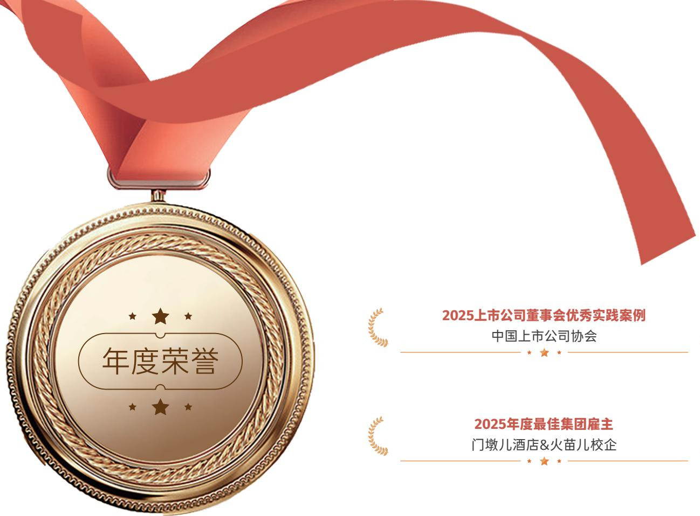

text_image

年度荣誉
2025上市公司董事会优秀实践案例
中国上市公司协会
2025年度最佳集团雇主
门墩儿酒店&火苗儿校企

2024年度国内高端酒店MBI十强品牌  
迈点研究院  
2025年度消费者挚爱酒店 2飞猪旅行  
浙江省重点商标保护名录 2025年度卓越酒店管理集团浙江省市场监督管理局（浙江省知识产权局） ff 周末酒店  
2025年上市公司董事会办公室最佳实践 2025年度创新合作伙伴中国上市公司协会 石油商旅  
2025年度卓越酒店管理集团 2025年度影响力酒店集团周末酒店 美团  
2025年度春秋旅游合作伙伴最具潜能奖 2025年度酒店领航者品牌春秋旅游 抖音  
2025年度创新合作伙伴 2025年度人气酒店集团美团 美团  
2025华客品质榜卓越品质管理酒店集团 2025年度行业引领合作伙伴上海华客信息科技有限公司 飞猪旅行  
“甄选品牌”奖 华中游玩年度营销先锋奖杭州绿云科技有限公司 抖音生活服务  
2025华客品质榜“卓越品质管理酒店集团” 2025年度最具未来合作价值上海华客信息科技有限公司 飞猪旅行  
最具影响力合作品牌 2025年度潜力品牌飞猪旅行 美团

2024年度中国饭店集团20强 ESG评级上调至A级中国饭店协会 华证指数ESG评级

2025年中国上市公司内部控制最佳实践活动优秀案例 《酒店数字化运营和服务规范》国家行业标准起草单位中国上市公司协会 中国饭店协会

2025中国酒店人才发展菁英奖 最具品牌价值合作伙伴中瑞酒店管理学院 携程

2024年上市公司乡村振兴优秀实践案例 2025年度中国上市公司ESG最佳实践100强中国上市公司协会 Wind

2025中国饭店业ESG创新大赛住宿企业ESG实践案例铜奖 2025年上市公司可持续发展优秀实践案例中国饭店协会 中国上市公司协会

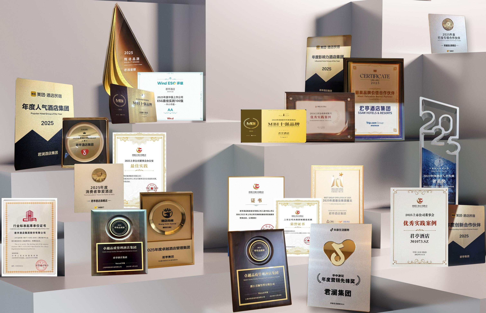

## 笃行中国服务 智启全球新局

## 专题

服务消费是扩大内需、推动经济高质量发展的关键引擎，党中央国务院多次对服务消费作出重要指示与部署，国家层面持续强化战略引领与政策支撑。2024年12月，习近平总书记在中央经济工作会议上强调“创新多元化消费场景，扩大服务消费”。2025年，党的二十届四中全会提出“以放宽准入、业态融合为重点扩大服务消费”，商务部等9部门联合印发《关于扩大服务消费的若干政策措施》，明确提出5个方面19项任务。2026年，培育“中国服务”品牌被首次写入政府工作报告，政府工作报告中郑重提出“健全服务业国家标准，培育中国服务’品牌”，意味着“中国服务”理念从行业倡议上升为国家战略。

本集团将持续推动“中国服务”品牌融入企业发展战略，在人口结构变化、消费结构升级和产业结构转型的背景下，我们立足中国本土的文化底蕴和地域特色，跳出单纯的标准化服务框架，以提升服务业数智化、标准化、融合化、国际化发展水平，打造兼具民族特色与市场竞争力的服务品牌。

## 国际化布局

国际化是“中国服务”走向世界、拓展发展空间的核心路径。本集团坚持“引进来”与“走出去”双向协同，以国际视野服务吸纳全球客群，以全球化合作放大品牌势能，构建内外联动、双向赋能的开放发展格局。

## “引进来”

在“引进来”层面，我们吸引海外游客“走进来、留下来、体验深”，紧抓入境旅游与消费升级机遇，制定入境旅游与消费品牌推广计划与差异化营销策略。我们以欧美等文化体验型客群为锚点，跳出传统服务的同质化竞争，深入挖掘地域文化内核，围绕京韵古建、中式美学等极具辨识度的文化主题，在空间设计、服务流程、产品创新中全方位植入文化内涵，通过沉浸式场景构建与精细化服务表达，赋予海外宾客超越住宿的文化感知与情感共鸣。

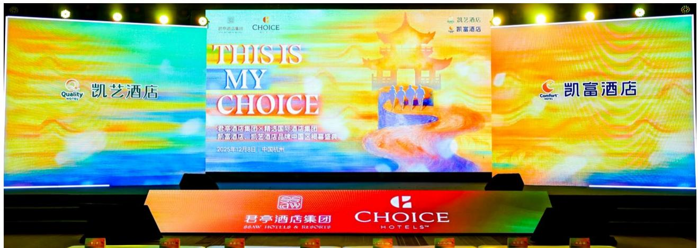

text_image

Quality
KOYCH
CHOICE
THIS IS MY CHOICE
北京京酒店集团×精选国际酒店集团
上海·竞店、凯艺酒店品牌中国区操导赛典
2025年12月8日 | 中国杭州
KOYCH
Comfort
KOYCH
君亭酒店集团
SHOW HOTELS & REPORTS
CHOICE
HOTELS™

凯富酒店、凯艺酒店品牌中国区揭幕盛典

## 北京华侨夜泊君亭酒店：历史建筑新生，诠释“中国服务”典范

北京华侨夜泊君亭酒店的前身是北京华侨饭店，由爱国侨领何香凝女士提议、建筑学家梁思成先生设计，承载深厚的文化底蕴和独特的中式庭院美学。北京华侨夜泊君亭酒店改造过程中，我们完整留存原建筑的古典立面、特色门头、琉璃瓦彩画、中轴线大楼梯等历史肌理构件，通过精细修复工艺重现历史风貌，深度挖掘北京地域文化精髓。

在空间功能优化上，我们破解老建筑空间局限，以文化赋能空间升级。中庭休息区融合古籍阅读、书法体验、北京小吃吧台三大功能，打造集文化展示、社交休闲于一体的共享空间：在空间服务上，我们以文化为主线重构服务体验。酒店三面环抱历史文脉，针对文化体验需求，我们推出系列特色服务：与华侨博物馆联合提供免费参观门票、推出京剧主题旅拍、菩提根手串DIY、专属旅游地图明信片、City-walk城市漫步等沉浸式项目，让宾客沉浸式探索老北京烟火气。餐饮方面亦兼顾传统传承与创新研发，我们推出“老北京炸酱面套餐”“宫廷点心拼盘”等地域美食、创新研发“板蓝根饺子套餐”、特调“豆汁拿铁”“二八酱拿铁”“茉莉花拿铁”三款特色咖啡等，成功打造出话题性与文化感兼具的用餐体验。

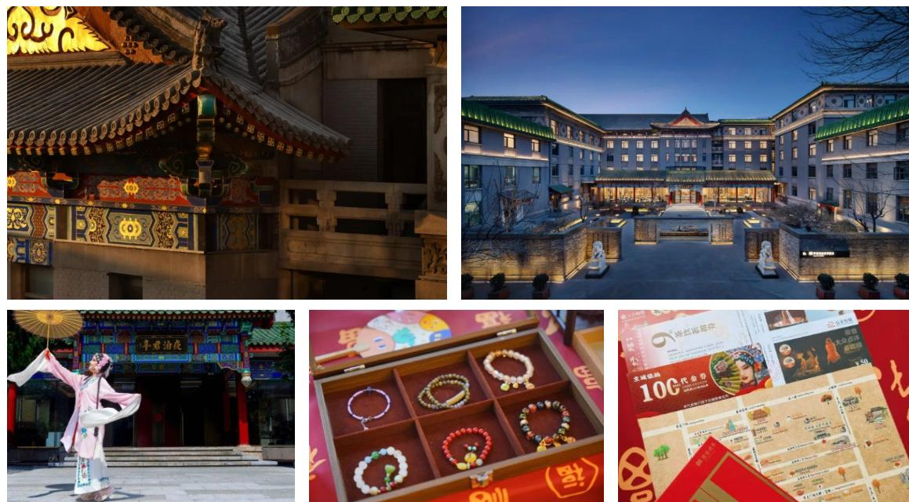

## 荣誉

2025年9月16日至18日，在中国旅游协会主办的第七届“中国服务”·旅游产品创新大会上，北京华侨夜泊君亭酒店凭借在老旧酒店资产盘活、文化赋能酒店体验、差异化服务创新等方面的卓越实践，斩获第七届“中国服务”·旅游产品年度创意案例。

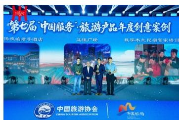

text_image

第七届“中国服务”旅游产品年度创意案例
侨铁馆游客酒店
正佳广场
秋华木丛民宿万家培训
中国旅游协会
CHINA TOURISM ASSOCIATION
中国标榜
WWW.CITIC

2025年2月，北京华侨夜泊君亭酒店凭借创新的设计理念与高品质空间营造，荣获意大利 IIDA AWARD 国际设计大奖酒店空间类银奖。此次改造与获奖，既实现了历史建筑的保护性活化利用，又通过在地文化与现代设计的深度融合，显著提升宾客旅居体验，进一步彰显集团在文旅酒店产品上的设计实力与品牌价值。

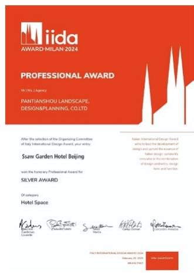

text_image

iida
AWARD MILAN 2024
PROFESSIONAL AWARD
16 (19th) / Agency
PANTIANSHOU LANDSCAPE,
DESIGN&PLANNING, CO.LTD.
After the selections of the Organizing Committee
of Italy International Design Award, your entry
Ssaw Garden Hotel Beijing
won the honorary Professional Award for
SILVER AWARD
Of categories
Hotel Space
Safar International Design Award
are to be used for the development of
design and design: the essence of
safar design, conductivity
innovates in the combination
of design aesthetics, design
tions and functions.
Safar International Design Award
are to be used for the development of
design and design: the essence of
safar design, conductivity
innovates in the combination
of design aesthetics, design
tions and functions.
Safar International Design Award
are to be used for the development of
design and design: the essence of
safar design, conductivity
innovates in the combination
of design aesthetics, design
tions and functions.
Savari International Design Award
are to be used for the development of
design and design: the essence of
savari design, conductivity
innovates in the combination
of design aesthetics, design
tions and functions.
Savari International Design Award
are to be used for the development of
design and design: the essence of
savari design, conductivity
innovates in the combination
of design aesthetics, design
tions and functions.

北京华侨夜泊君亭酒店获意大利IIDA AWARD国际设计大奖

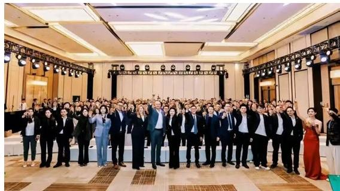

natural_image

Group photo of formally dressed individuals posing in a large hall with stage and decorative backdrop (no visible text or symbols)

凯富、凯艺品牌中国区授权品牌揭幕盛典

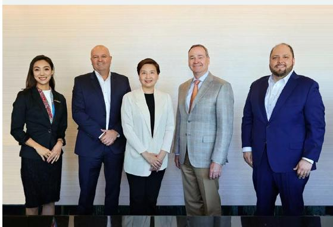

natural_image

Group photo of five professionals in business attire standing side by side (no visible text or symbols)

君亭酒店集团与精选国际酒店集团战略合作签约仪式现场  
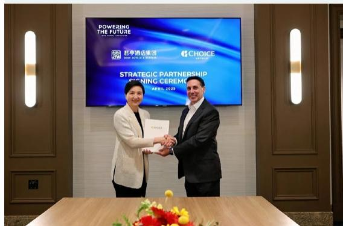

text_image

POWERING
THE FUTURE
STANDARD
TRUSTICE
STRATEGIC PARTNERSHIP
ONING CEREMES
MARCH 2015

君亭酒店集团董事长、总裁朱晓東女士与精选国际酒店集团资深副总裁、国际业务总经理RicardoLosada Revol先生签署合约

## “走出去”

在“走出去”层面，本集团以全球视野、开放合作、标准输出为方向，主动融入全球服务体系，推动民族品牌与国际标准接轨带动中国服务走向世界，实现从“本土品牌”到“全球参与者”的跨越。我们积极融入全球服务体系，通过战略合作接入全球分销网络，推动民族品牌与国际标准接轨，开启规模化布局新征程。

2025年，本集团与精选国际酒店集团正式达成战略合作，获得旗下COMEOR™M（凯富）和OUAUTYTM(凯艺）两大酒店品牌在中国大陆地区的独家品牌使用和特许经营权。本集团将Choice 两大百年品牌进行本土化定制，基于全球标准融合本土消费需求与投资回报诉求，打造适配中国市场的产品体系与运营标准，将国际领先运营服务质量标准融入公司品牌标准服务手册，构建“全球品牌+本土运营+精准产品”为核心的发展模式。

此次合作推动本集团旗下首批68家酒店接入精选国际其全球超7.000万会员的全球分销渠道，覆盖精选国际网站、移动应用程序等全球预订网络，有效打通境外客源触达通道。对外，极大便利精选国际全球会员及境外游客预订中国区域的酒店，填补国际品牌在中国大陆市场的布局空白：对内，显著拓宽本集团海外分销渠道，精准对接境外游客入境住宿需求，助力入境旅游市场复苏。

数智化是“中国服务”提质增效、优化体验的重要支撑。本集团以“中国服务”的标准为指引，对内部服务体系进行了全面升级，细化住宿、文化艺术、服务三大板块标准，覆盖宾客从预订、入住、体验到离店的全流程服务触点，推动数字化建设与精细化管理深度落地。我们积极引入智能客控系统、服务机器人、AI智能客服助手等智能化配置，优化服务流程、提升运营效率，减少人工等待时间，为宾客提供便捷、高效、个性化的入住体验。同时，以“中国服务”为创新导向，驱动各部门持续深耕文化挖掘、体验设计、服务升级，将数字化技术与人文关怀有机结合，让科技赋能更有温度，全面提升宾客满意度与服务口碑。

## 标准化建设

标准化是“中国服务”行稳致远、品质可控的核心保障。本集团将精益理念深度融入经营全流程、组织各环节，构建闭环式的精益管理体系，搭建了全方位过程管理体系。我们运用价值链分析、集中评审法等专业管理工具，对工程设计、采购供应、酒店服务等核心运营环节实施动态优化，将创新思维与效率理念深度融入流程设计，推动运营体系精益化升级。同时，引入PDCA(Plan计划-Do执行-Check检查-Act处理)循环管理工具，对各运营环节进行全周期动态管控，覆盖“明确目标-优化设计-推动实施-持续改进”全流程，形成闭环管理机制，确保运营质量持续提升。

为保障战略目标精准落地，我们搭建了涵盖绩效测量分析、知识信息管理、绩效持续改进的全维度绩效管理与测量体系，并引入平衡计分卡方法论，从财务，顾客与市场、内部运营，学习与发展四大战略维度，构建公司级核心KPL休系，通过科学的指标分解机制，将集团战略目标逐级细化至部门、岗位，形成公司级、部门级、岗位级三级联动的绩效测量体系，层层压实责任、全程跟踪管控，确保打造“中国服务”品牌相关战略执行落地见效、闭环推进。

未来，本集团将继续以国家战略为引领，以“中国服务”为抓手，持续深化国际化、数智化、标准化建设，创新服务场景、提升服务品质、彰显文化特色，打造具有国际影响力的民族服务品牌，为推动服务消费升级、助力经济高质量发展贡献力量。

## 盘活存量资产 重塑业态布局

## 专题

伴随“十五五”规划全面落地，国家层面持续出台顶层政策，为城市更新、存量盘活与文旅产业融合发展筑牢制度根基。2025年5月，中共中央办公厅、国务院办公厅发布《关于持续推进城市更新行动的意见》，明确到2030年城市更新行动的实施目标，提出完善城市更新体制机制、丰富经济业态、提高服务效能、改善人居环境、保护文化遗产、彰显风貌特色等核心要求。国务院办公厅此前发布的《关于进一步盘活存量资产扩大有效投资的意见》也明确提出，要有序盘活长期闲置但具有较大开发利用价值的老旧厂房、闲置建筑等资产，鼓励酒店等业态参与存量资产盘活。

在消费升级与行业转型的双重背景下，国内酒店行业已告别规模扩张的增量时代，全面迈入存量深耕、业态创新的全新发展周期。城市更新步伐提速、文商旅融合走向纵深，为行业带来重大机遇的同时，也提出了核心命题：如何顺应个性化、多元化的消费趋势，对存量空间进行价值再配置，实现功能焕新与价值重构。君亭酒店集团以此为契机，以“存量更新为空间基底，以“业态破局”为增长引擎，走出了一条兼具文化底蕴、运营效率与市场竞争力的特色发展之路。

## 活化乡土存量，乡村文旅赋能

本集团把握政策导向与行业趋势，助力乡村振兴中的项目转化，通过盘活老旧厂房、古村落等存量建筑，打造“小而美”“特而优”的文旅消费场景，木集团旗下景澜酒店以宋韵江南文化为核心底色，深耕在地文化传承与生活美学营造，专注打造具有地域辨识度的文化特色酒店。依托成熟的存量改造运营能力，景澜酒店广泛深化政企协同合作，高效盘活区域闲置资产，深度践行“两山理论”，串联生态资源、乡十文化与乡村文旅发展，成为助力乡村振兴、城乡融合发展的重要载体。迄今为止，景澜酒店已经在浙江、江苏、上海、湖南、广西、海南等13个省市，累计投资管理酒店近60家，客房数6,000余间。

natural_image

Scenic mountain landscape with snow-capped peaks, forested slopes, and a calm blue lake (no text or symbols visible)

## 福州城投大樟溪景澜·温泉宿集：生态共生，锚定乡土文旅新范式

福州城投大樟溪景澜·温泉宿集扎根福州市永泰县梧桐镇圻演村，地处大樟溪流域生态核心带，坐拥“八山一水一分田”的闽中乡村肌理，串联福州都市圈与永泰生态旅游带。依托优质生态与乡村肌理，项目助力推动“村庄转变为旅游场景、农产品转变为礼品、农房转变为客房、村民转变为股东”的“四个转变”，打造集“美景、美宿、美味、美育”于一体的全景式乡村度假目的地。作为“两山理论”实践地，项目荣获国家森林乡村、省级乡村振兴试点村等荣誉，以一级空气质量与Ⅱ类水质标准，呈现自然共生与乡土文化相融的高品质度假体验。

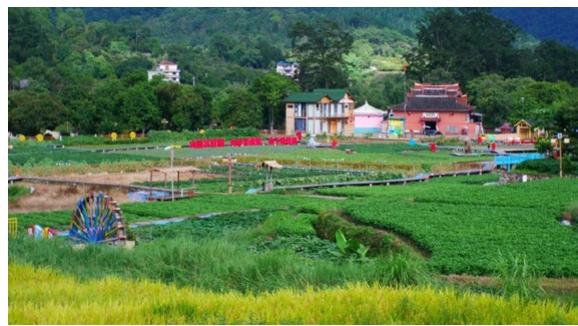

natural_image

Rural landscape with terraced fields, traditional buildings, and green hills in the background (no visible text or symbols)

农耕与研学乡村文化体验

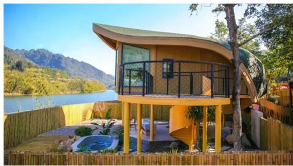

natural_image

Modern wooden building with curved roof and glass facade, situated beside a river and bamboo fence, with mountains in the background (no visible text or symbols)

院落式温泉树屋院子

## 资溪景澜·南源宿集：古村活化，引领乡宿产业升级

资溪景澜·南源宿集位于江西省抚州市资溪县国家4A级大觉溪景区内的南源村，由原始村落改建而成，已建成民宿20余栋。依托村落的溪流、田园、山林、房屋等资源，项目构造了竹文化的风景线，从竹建筑、竹长廊、竹空间、竹构装置艺术到千姿百态的生态竹，在突出竹元素主题的同时，呈现面包、白茶、非遗等在地文化。资溪景澜·南源宿集作为景澜酒店助力美丽乡村建设的重要实践，景澜酒店致力于对“宿集”的独特理解及优势，对当地发挥积极的带动作用。

江西省乡村产业振兴协会休闲乡宿分会成立大会上，公布了江西省首批“美丽活力乡村+乡宿”联动建设先行县、首批星级休闲乡宿名单并对其进行授牌，资溪景澜·南源宿集荣获首批“江西五星级休闲乡宿”及“江西四星级休闲乡宿”殊荣。

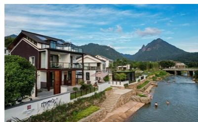

natural_image

Exterior view of a modern residential building beside a river with mountains in the background (no signage or text visible)

景澜旗下资溪景澜·南源宿集

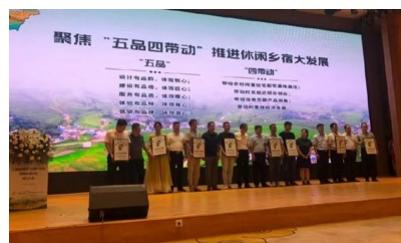

text_image

聚焦“五品四带动”推进休闲乡宿大发展
“五品”
“四品道”
设计有名称、领导核心：
领导专业指导、领导核心：
领导专业指导、领导核心：
领导专业指导、领导核心：
领导专业指导、领导核心：
领导专业指导、领导核心：
领导专业指导、领导核心：
领导专业指导、领导核心：
领导专业指导、领导核心：
领导专业指导、领导核心：
领导专业指导、领导核心：
领导专业指导、领导核心：
领导专业指导、领导核心：
领导专业指导、领导核心：
领导专业指导、领导核心：
领导专业指导、管理人：李明
领导专业指导、领导核心：
领导专业指导、领导核心：
领导专业指导、领导核心：
领导专业指导、领导核心：
领导专业指导、领导核心：
领导专业指导、领导核心：
领导专业指导、领导核心：
领导专业指导、领导核心：
领导专业指导、领导核心：
领导专业指导、领导核心：
领导专业指导、领导核心：
领导专业指导、领导核心：
领导专业指导、领导核心：
领导专业指导、领导核心：
领导行业标准：2018年1月1日
2018年1月1日
2018年1月1日
2018年1月1日
2018年1月1日
2018年1月1日
2018年1月1日
2018年1月1日
2018年1月1日
2018年1月1日
2018年1月1日

江西省乡村产业振兴协会休闲乡宿分会授牌

## 文商旅融合共荣，推动城市更新

在文商旅深度融合的发展浪潮下，城市商业街区、核心写字楼、老城街巷，既是城市功能承载的核心载体，更是文化展示、文旅体验、夜间消费的重要窗口。君亭酒店打破传统酒店服务边界，于城市核心区整合酒店住宿、写字楼、商业街区业态于一体，与周边文化地标、商业载体、文旅资源有机联动、流量互享，形成完整商业生态，构建“全景体验、全时消费、全业融合、全民共享”的发展格局

## 重庆大集Pagoda君亭：文商旅深度融合下的渝中区城市更新实践

重庆大集Pagoda君亭设计酒店，位于渝中区核心区域的供销大集保利国际中心内，与人民解放纪念碑、洪崖洞民俗风貌区等知名景区紧密相邻，四周云集多座大型商场，地理位置得天独厚。该项目具有深厚的历史文化底蕴，曾几度更名见证四个时代传奇：抗战时期的援华美军招待所、抗战胜利后的胜利大厦，新中国成立后的西南军区第一招待所、重庆宾馆直至21世纪原址重建的海航保利国际中心(现供销大集保利国际中心），见证了重庆母城近90年的历史沧桑。改造后的酒店位于大厦的45层及以上，拥有360度全景视野可尽揽重庆两江六岸山城风光，酒店286米的高度傲立于解放碑商业街区的核心，在酒店前台极目远眺，让人感觉仿佛漂浮于城市之上。江景，城景交织在视野之中，立体的重庆在眼前垂直打开，建筑高低错落，轻轨忙碌穿梭，桥梁横跨两江，脚下云聚云散。让人深刻领略到重庆这座8D魔幻城市的独特韵味，更能让宾客在此感受难以忘怀的俯瞰山城经历。酒店191间独具匠心的客房分布在45至56楼之间。简约时尚的客房设计、温馨舒适的居住氛围。客房内贴合人体曲线的精选床垫，搭配高品质床品提供温馨舒适的睡眠环境尽享零帕生活的愜意，于繁华都市中寻得一方宁静与舒适的栖息之所。

位于57层的大堂会聚点及好趣空间利用彩色玻璃间隔，与户外魔幻重庆交相呼应，充满了设计氛围。宾客能在全日餐厅内尽享川渝美食盛宴，也可以在开放融合的好趣空间办公悠闲。酒店还配备有180平米的高空江景会议室，30平方米的贵宾接待室和一间精致餐饮包厢，能够满足宾客的多重商务需求。

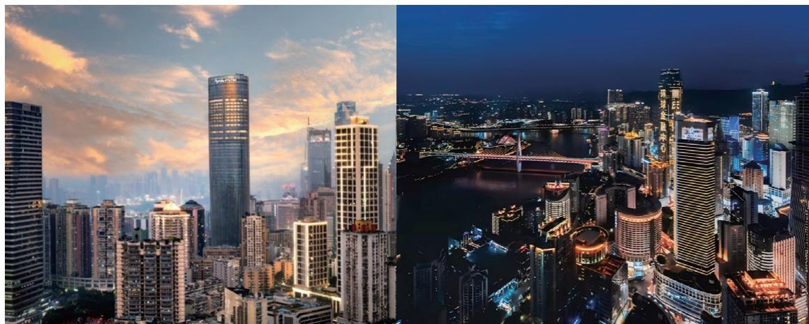

natural_image

Split image showing a city skyline at dusk and a nighttime aerial view of a modern cityscape with illuminated skyscrapers and a river (no visible text or symbols)

君亭酒店集团深度探索在地文化现代化表达，深挖城市人文符号，以现代设计语言重构地域文化美学，通过空间与业态的创新融合，让地域文化从展品变为可体验、可感知、可传播的旅居场景。以夜泊系列酒店为代表，立足成都地域特色，萃取蜀锦、竹艺、盖碗茶、芙蓉花、老茶馆等经典文化元素，将蜀锦纹样、竹编肌理、川式生活意境融入空间软装、艺术装置、导视系统与客房细节，让地域文化自然渗透旅居全场景。

## 成都夜泊君亭酒店：以蜀锦文脉为魂，打造城市文商旅融合新地标

成都夜泊君亭酒店以起源于战国、盛于汉唐，至今已有近3000年历史的中国四大名锦“蜀锦”为核心文化象征，立足成都“锦官城”深厚的历史底蕴，深度挖掘竹编、盖碗茶、茶馆竹椅、芙蓉花等城市文化符号，用现代设计语言完成传统文化的当代表达，让非遗美学从展品变为可体验、可感知、可传播的旅居场景。

在空间营造上，酒店将蜀锦经纬交织的工艺智慧转化为空间叙事逻辑，入口电梯厅以“锦上添花”传统纹样为原型，通过竹孔板点阵化设计，打造主题艺术橱窗装置：大堂天花以线性结构演绎现代织机意境，总台背景以金属丝线抽象呈现盘金绣工艺，沙发面料融入方方锦、雨丝锦经典纹样：客房以蜀锦云纹为灵感，采用压绗工艺营造光影肌理，搭配蜀锦主题装饰画、抱枕、地毯、门号牌等细节，形成从公区到客房的全场景文化渗透，让宾客沉浸式感受成都非遗魅力与东方美学意境。

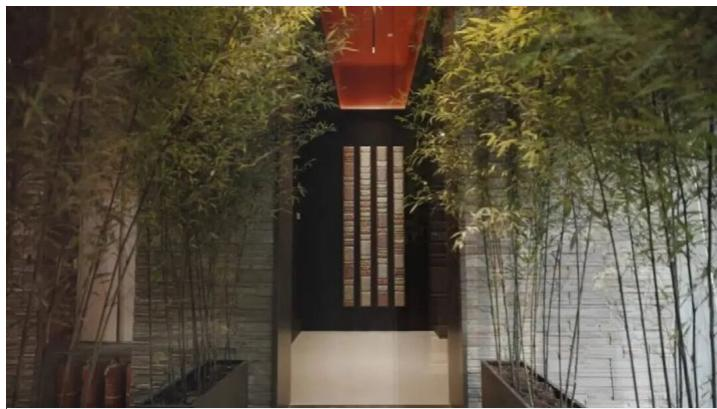

natural_image

Interior view of a modern building with bamboo and red-tiled roof, featuring a dark wooden structure and brick walls (no visible text or symbols)

电梯厅蜀锦纹样主题橱窗装置

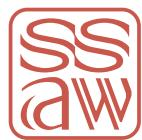

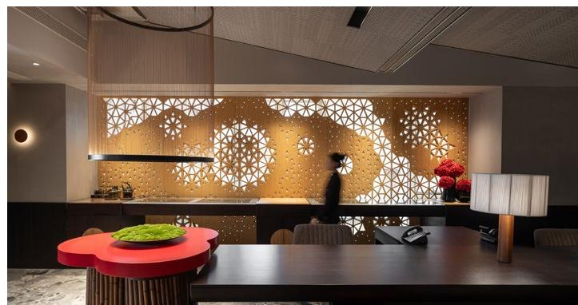

natural_image

Modern lounge or dining area with decorative wall panel, red table, and floral display (no visible text or symbols)

【锦上添花】- 传统蜀锦纹样呈现于竹孔板主题雕刻

## 多元业态融合，构建全时全龄生活圈

新零售专区为酒店业态创新提供了有力支撑。随着酒店朝着“住宿+”复合业态发展，公共区域成为新零售、社交的复合场景。专区的模块化产品、适配酒店空间与经营需求，助力住宿与新零售深度融合，提升非房收入；同时，线上线下融合的新零售模式，也为酒店打造私域流量、精准营销提供借鉴，推动其从“单一住宿服务商”向“生活方式服务商”转型。

## 景澜青棠酒店：创新复合业态，自营糖水铺子

景澜青棠酒店(GINIAN SONG)，以「只此宋韵」为核心美学内核，落地成都城市核心板块，为都市人群打造可居、可游、可赏、可憩的文化秘境。酒店创新复合业态布局，自营糖水铺延续川式烟火温柔，融合传统甜汤与时令风物：同时，餐厅与茶社打破功能边界，复刻老成都茶馆闲适氛围，兼具特色正餐、午后茶歇、夜间微醺等多元场景，让在地生活美学与现代旅居需求有机交融。

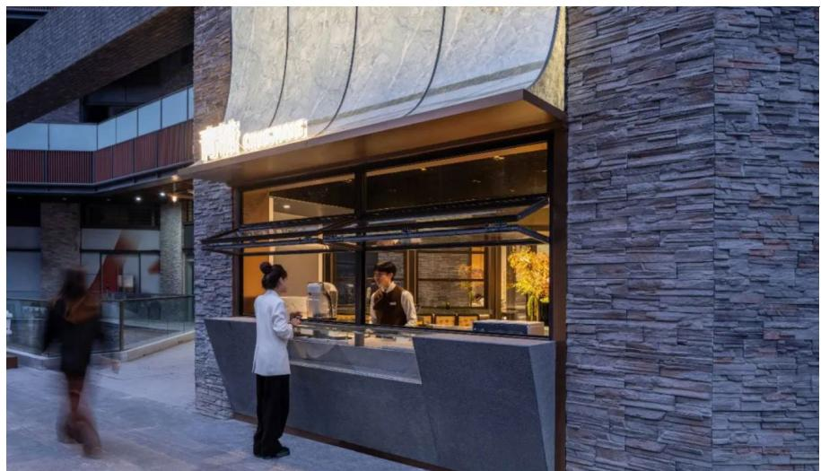

natural_image

Exterior view of a modern restaurant with visible signage and customers at the entrance (no readable text on main structures)

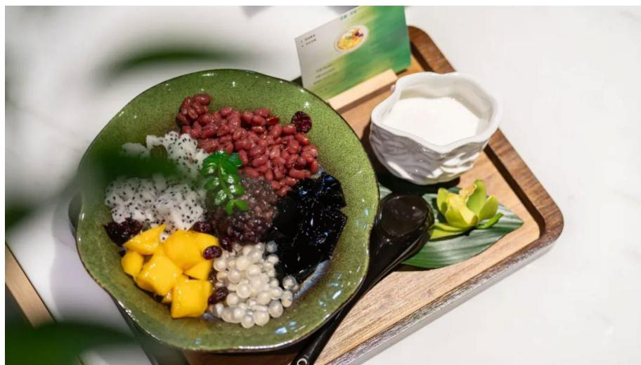

natural_image

A green ceramic plate with various food ingredients including red beans, dragon seeds, mangoes, and white rice, served on a wooden tray with decorative elements (no text or symbols visible).

君亭酒店集团把握人口老龄化趋势、满足多元化养老需求，创新布局“酒店+养老”跨界业态，成为文商旅的延伸与补充。“酒店+养老”模式以常规住宿为基础，叠加适老服务与特色康养业态，拓宽营收边界，推动酒店从单一住宿空间向全龄友好、跨界复合的生活空间转型，重构空间价值。

## 君澜度假酒店推出 “旅居养老”套餐

君亭酒店集团旗下君澜度假酒店拥有众多环境优美的度假村资源。君澜度假酒店利用现有度假酒店资源，以满足活力老人对高品质、休闲式养老生活的追求。部分君澜度假酒店推出“旅居养老”套餐，结合度假目的地的气候和自然资源，主打健康养生概念。例如，在海南、云南等地的酒店，提供中长期的住宿（月租或季租），配套基础的适老设施和健康餐饮，并组织适合老人的文化娱乐、养生休闲活动（如太极、书法、短途观光）。

## 荣誉

2023年，君澜酒店旗下的巴马赐福湖君澜度假酒店入围“广西旅居养老示范基地”名单、“长三角旅居康养基地”名单，成为国内首批入围的酒店品牌之一。

君亭酒店集团在存量更新与业态破局领域积极投入、稳步探索，通过一系列切实举措取得了显著成效，我们与行业分享经验做法以提供有益参考。未来，随着政策持续推动和市场不断变化，本集团将继续创新发展，为城市更新和文旅产业融合发展贡献更多力量。

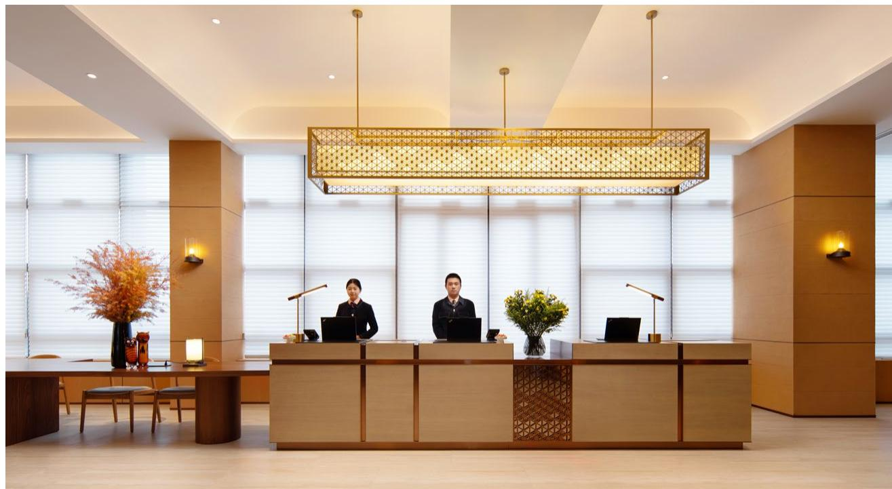

natural_image

Interior view of a modern hotel lobby with two service counters, decorative ceiling lights, and floral arrangements (no visible text or signage)

## 可持续发展管理

君亭酒店集团紧扣全球可持续发展趋势、国内外相关可持续发展准则要求，构建了完善的ESG管理架构，形成了可持续发展相关影响、风险与机遇的识别、应对及管理机制。同时，本集团积极搭建多元化利益相关方沟通渠道，倾听各方诉求并持续深化内部FSG能力建设，有力推动FSG战略落地实施，促进企业发展与社会、环境协同共进

## 可持续发展管治

## ESG战略

君亭酒店集团积极践行可持续发展理念，主动履行社会责任，维护社会公共利益，守护生态环境，以推动企业与社会协同永续发展。公司围绕践行绿色环保、社会价值共生、持续稳健治理三大ESG战略核心板块，为生态环境保护与社会高质量发展贡献自身及行业力量。

<table><tr><td>践行绿色环保</td><td>社会价值共生</td><td>持续稳健治理</td></tr><tr><td>·低碳转型:通过绿色建筑设计与改造、绿色入住运营,全面推动低碳运营,减少温室气体排放。·资源精细化管理:通过优化能源使用、节水用水管理、推行资源循环利用与无害化处理,实现节能降耗。</td><td>·品质服务:以匠心打造品牌特色服务体验,通过数智化手段提升服务品质。·员工发展:支持员工的职业发展和福利待遇,与公司携手同行共同发展。·负责任采购:携手供应商与合作伙伴,构建环境与社会的责任共同体,持续推进可持续供应链建设。·社会回馈:积极投身公益服务与乡村建设,支持开展文化遗产传承与保护。</td><td>·透明信息披露:通过健全的管治架构,以透明化和全面化的信息披露,保障利益相关方的权益。·风险管理:通过构建多层次的风险防控体系,充分评估、识别、应对业务经营中的各种风险。·道德合规:通过高标准恪守商业道德准则,与合作伙伴共同奉行廉洁承诺,拒绝不正当商业行为。</td></tr></table>

## ESG治理架构

君亭酒店集团已建立由“FSG管理委员会，ESG协调办公室，ESG执行工作组”构成的三级ESG治理架构，将可持续发展全面融入集团战略布局，依托层次清晰、架构完备、职责分明的ESG治理架构，保障集团可持续发展工作的有序推进。

在ESG管理委员会的总体部署下，本集团将ESG目标全面纳入公司中长期发展规划。本集团持续修订采购、运营、人力资源等内部管理制度，将环境保护、廉洁合规、社会责任相关要求融入公司治理。同时，本集团在高管年度考核中加入可持续发展相关绩效指标，推进ESG绩效考核与薪酬激励挂钩，确保可持续发展理念贯穿高层决策与经营全流程。

君亭酒店集团ESG治理架构

<table><tr><td>ESG管理委员会</td><td>由集团总裁担任负责人,成员包括集团高管及子公司、酒店高管。负责集团ESG战略制定、ESG重大事项审议,全面领导推进集团ESG事宜,落实ESG监督工作等。</td></tr><tr><td>ESG协调办公室</td><td>按照ESG管理委员会的总体部署,负责集团ESG工作的科学分配、上传下达、政策推动、行动策划与执行等。</td></tr><tr><td>ESG执行工作组</td><td>由各职能部门及门店负责人牵头,负责具体ESG事务的执行工作。</td></tr></table>

## ESG培训

为全面提升全员ESG专业能力，本集团已将ESG理念与知识纳入常态化培训体系。本年度，人力资源部门围绕ESG领域研发6门专项课程，总时长380分钟，相关课程已全部上线集团员工数字化学习平台。本集团董事及高级管理人员持续参与么司合规治理、绿色发展等相关内部培训及外部交流研讨活动，具体内容详见本报告“全面合规运营”。此外，我们邀请外部ESG顾问面向高级管理层及各职能部门负责人开展专题培训，内容涵盖ESG发展趋势与ESG信息披露等关键领域，累计参训人员百余人。

截至2026年2月，凭借扎实的实践成效，公司的可持续发展治理获得多项权威认可：

## ESG荣誉

## Wind ESG评级

AA评级，在酒店，餐馆与休闲综合行业的144家企业中，综合得分位居第一  
获“2025年度中国上市公司ESG最佳实践100强”  
  
A级，在酒店行业上市公司中排名第一

## ESG奖项

## 中国上市公司协会

2024年上市公司乡村振兴优秀实践案例  
2025年上市公司可持续发展优秀实践案例  
中国饭店协会  
2025年中国饭店业ESG创新大赛 住宿企业ESG实践案例铜奖

君亭酒店集团积极完善利益相关方沟通机制，畅通多元沟通方式与渠道，广泛听取外部建议，了解各利益相关方的期待与诉求。2025年，我们根据自身经营情况、业务范围和性质，识别多个内外利益相关方类别，包括政府及监管机构、股东与投资者、客户、员工、社会公众、供应商与加盟商。我们与各利益相关方保持高效透明的双向沟通交流，确保各方的意见和诉求能够得到及时反馈和处理。

<table><tr><td>利益相关方</td><td colspan="2">沟通渠道及反馈方式</td><td colspan="2">关注及沟通议题</td></tr><tr><td rowspan="4">政府、监管机构</td><td>信息披露</td><td>媒体发布</td><td>公司治理</td><td>生物多样性保护</td></tr><tr><td>公司制度建设</td><td>定期拜访</td><td>内控合规</td><td>美丽中国及乡村建设</td></tr><tr><td>内部审计与监督</td><td></td><td>商业道德</td><td>文化遗产保护</td></tr><tr><td>项目合作</td><td></td><td>环境合规管理</td><td></td></tr><tr><td rowspan="3">股东与投资者</td><td>信息披露</td><td>电话、邮件沟通</td><td>投资者权益</td><td></td></tr><tr><td>股东会</td><td>新媒体平台沟通</td><td>公司治理</td><td></td></tr><tr><td>来访活动</td><td>投资者关系互动平台</td><td>内控合规</td><td></td></tr><tr><td rowspan="3">客户</td><td>客户沟通会</td><td>满意度调查</td><td>绿色运营</td><td>客户隐私与数据保护</td></tr><tr><td>线上及线下客服沟通</td><td>新媒体平台沟通</td><td>客户服务与体验</td><td>数字化创新</td></tr><tr><td></td><td></td><td>客户健康与安全</td><td></td></tr><tr><td rowspan="3">员工</td><td>职工代表大会</td><td>文娱活动</td><td>多元平等包容</td><td>员工培训与发展</td></tr><tr><td>工会</td><td>员工内部沟通平台</td><td>员工合规雇佣</td><td>职业健康与安全</td></tr><tr><td>培训活动</td><td></td><td>员工薪酬与福利</td><td>数字化创新</td></tr><tr><td rowspan="5">社会公众</td><td>新媒体平台</td><td></td><td>能源管理</td><td>数字化创新</td></tr><tr><td>社区服务与公益活动</td><td></td><td>应对气候变化</td><td>生物多样性保护</td></tr><tr><td>信息披露</td><td></td><td>水资源管理</td><td>文化遗产保护</td></tr><tr><td></td><td></td><td>废弃物管理</td><td>公益与社区参与</td></tr><tr><td></td><td></td><td>绿色运营</td><td>美丽中国及乡村建设</td></tr><tr><td rowspan="3">供应商与加盟商</td><td>供应商座谈会</td><td>负责任采购</td><td>绿色运营</td><td>废弃物管理</td></tr><tr><td>现场走访</td><td>行业交流活动</td><td>能源管理</td><td>供应链管理</td></tr><tr><td></td><td></td><td>应对气候变化</td><td></td></tr></table>

报告期内，君亭酒店集团依据《深圳证券交易所上市公司自律监管指引第17号—可持续发展报告（试行)》(以下简称《指引》）等相关标准，全面开展双重重要性评估工作。通过从“影响重要性”和“财务重要性”两个维度进行深入分析，系统地评估了ESG议题对公司经济、环境和社会的潜在影响，同时充分考虑了各利益相关方的观点和期望，形成重要议题矩阵，为本集团的可持续发展提供了明确的指导和方向。

## 识别公司活动和业务关系背景

通过分析商业计划、战略、财务报表，考察公司活动、产品与服务，结合外部监管政策，识别6类利益相关方，并了解利益相关方的沟通反馈方式与利益相关方诉求期望。

## 建立重要性议题清单

我们审视宏观政策、规则与标准对标、同业分析，认为ESG重要性议题清单适用于本集团发展现状，因此对于ESG重要性议题清单予以沿用。同时，本报告期内，我们进一步识别重要性议题相关的影响、风险和机遇。

## 双重重要性评估

## 影响重要性

邀请利益相关方和专家，从正面或负面影响评估本集团在ESG议题方面的表现对经济、环境、社会的影响程度及其发生的可能性，并从影响规模、范围和不可补救性三个维度进一步判断影响程度。

## 财务重要性

通过内部财务专家和外部专家评分，分析集团在短、中、长期可能面临的风险与机遇，评估本集团在ESG方面的表现对自身财务(如对公司财务状况，经营成果，现金流等产生的实际或预期影响的影响程度和影响发生可能性。

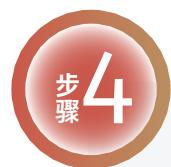

## 分析结果

整合影响重要性和财务重要性分析结果，形成双重重要性矩阵。

重要性评估结果由ESG管理委员会进行审核及确认，根据深圳证券交易所《指引》要求披露相关内容。

君亭酒店集团2025年ESG重要性议题矩阵  
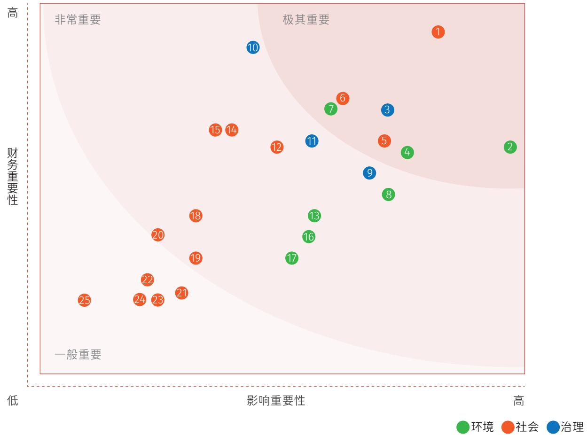

scatter

| ID | Category | Importance to Financial & Environmental Factors (Approximate) |
| --- | --- | --- |
| 1 | 社会 | High |
| 2 | 环境 | High |
| 3 | 治理 | High |
| 4 | 环境 | High |
| 5 | 社会 | High |
| 6 | 社会 | High |
| 7 | 环境 | High |
| 8 | 环境 | High |
| 9 | 治理 | High |
| 10 | 治理 | High |
| 11 | 治理 | High |
| 12 | 社会 | High |
| 13 | 环境 | Medium-High |
| 14 | 社会 | Medium-High |
| 15 | 社会 | Medium-High |
| 16 | 环境 | Medium-High |
| 17 | 环境 | Medium-High |
| 18 | 社会 | Medium |
| 19 | 社会 | Medium |
| 20 | 社会 | Medium |
| 21 | 社会 | Medium |
| 22 | 社会 | Low-Medium |
| 23 | 社会 | Low-Medium |
| 24 | 社会 | Low-Medium |
| 25 | 社会 | Low-Medium |

2025年重要性议题矩阵综合“影响重要性”和“财务重要性”两个维度。其中，极其重要的7个议题“客户服务与体验”“绿色运营”“公司治理”“能源管理”“应对气候变化”“客户健康与安全”“客户隐私与数据保护”，即代表其兼具相对较高的影响重要性和财务重要性。

ESG议题重要性程度

<table><tr><td>极其重要</td><td colspan="2">非常重要</td><td>一般重要</td></tr><tr><td>1客户服务与体验2绿色运营3公司治理4能源管理5客户健康与安全6客户隐私与数据保护7应对气候变化</td><td>8水资源管理9商业道德10内控合规11投资者权益12数字化创新13环境合规管理14加盟商管理15供应链管理</td><td>16废弃物管理17生物多样性保护18员工培训与发展19职业健康与安全20员工薪酬与福利</td><td>21公益与社会参与22员工合规雇佣23文化遗产保护24多元平等包容25美丽中国及乡村建设</td></tr></table>

## 重要性议题影响、风险与机遇分析

君亭酒店集团充分考虑《中华人民共和国国民经济和社会发展第十五个五年规划纲要》《中共中央办公厅国务院办公厅关于持续推进城市更新行动的意见》等宏观政策，参考《深圳证券交易所上市公司自律监管指引第17号⸺可持续发展报告（试行）》、全球报告倡议组织《可持续发展报告标准（GRI Standards）》、联合国可持续发展目标（UN SDGs）、WTT酒店可持续发展基准（HSB)等准则，结合同业企业优秀实践和公司自身FSG工作重点，进行议题清单的识别与更新作。本年度，我们沿用上一年度识别的25项议题，其中环境议题7项、社会议题14项、治理议题4项。

同时，根据深圳证券交易所《指引》要求，我们进一步分析对本集团极其重要的FSG议题的相关影响、风险和机遇

<table><tr><td rowspan="2">议题</td><td rowspan="2">受影响的利益相关方</td><td rowspan="2">影响周期*</td><td colspan="2">影响性质</td><td colspan="2">风险/机遇</td><td rowspan="2">风险/机遇描述</td><td rowspan="2">关联SDGs</td><td rowspan="2">对应《深交所指引》议题</td><td rowspan="2">报告位置</td></tr><tr><td>正面</td><td>负面</td><td>风险</td><td>机遇</td></tr><tr><td>绿色运营</td><td>●政府及监管机构●客户●员工●社会公众●供应商与加盟商</td><td>S,M,L</td><td>✓</td><td>✓</td><td>✓</td><td>✓</td><td>风险●政策及监管要求日趋收紧,若酒店不符合绿色建筑评价标准,不履行建筑能耗强度要求,或将面临资产估值折价及合规运营许可风险,无法通过绿色饭店评级,对室内环境质量、ESG认证资质敏感的商旅客户及合作伙伴或将遭流失。机遇●绿色消费趋势持续增强,推进绿色入住、绿色建筑有助于提升品牌绿色形象和客户认同,实现品牌溢价,提升酒店资产估值。同时,主动拥抱绿色建筑有助于酒店全生命周期的整体运营成本下降。</td><td>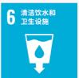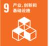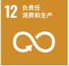</td><td>循环经济废弃物处理</td><td>绿色运营实践</td></tr></table>

\*S：短期(0-3年)，M中期(3-5年)，L长期(5年以上)

<table><tr><td rowspan="2">议题</td><td rowspan="2">受影响的利益相关方</td><td rowspan="2">影响*周期</td><td colspan="2">影响性质</td><td colspan="2">风险/机遇</td><td rowspan="2">风险/机遇描述</td><td rowspan="2">关联SDGs</td><td rowspan="2">对应《深交所指引》议题</td><td rowspan="2">报告位置</td></tr><tr><td>正面</td><td>负面</td><td>风险</td><td>机遇</td></tr><tr><td>能源管理</td><td>●政府与监督机构●客户●社会公众●供应商与加盟商</td><td>S,M,L</td><td></td><td></td><td></td><td></td><td>风险●国内住建能耗限额要求陆续出台,能源价格面临波动上涨,若运营能耗超标,或将接受严格监管与处罚;若酒店设备低效老化,或将直接降低运营净利润。机遇●通过高效设备改造、能源使用监控和优化控制策略,可以实现能耗节约,有助于持续降低能源成本。通过部署物联网能源管理体系,以数据驱动管理,降低酒店运营人力消耗,提升整体运营效率。</td><td></td><td>能源利用</td><td>能源利用管理</td></tr><tr><td>应对气候变化</td><td>●政府与监督机构●股东与投资者●客户●员工●社会公众●供应商与加盟商</td><td>M,L</td><td></td><td></td><td></td><td></td><td>风险●气候变化可能导致暴雨、台风、高温等极端天气事件频发,或将增加酒店设施维护成本、能源消耗和运营中断风险。●低碳转型要求、环境监管趋严及绿色消费偏好变化,将提高公司在合规管理、技术升级和品牌维护方面的投入压力。机遇●顺应低碳转型趋势,加强气候相关风险识别、管理及信息披露,有助于提升公司在ESG评级、投资者关系和市场竞争中的表现,增强品牌长期价值和经营韧性。</td><td></td><td>应对气候变化</td><td>应对气候变化</td></tr></table>

\*S：短期(0-3年)，M中期(3-5年)，L长期(5年以上)

<table><tr><td rowspan="2">议题</td><td rowspan="2">受影响的利益相关方</td><td rowspan="2">影响*周期</td><td colspan="2">影响性质</td><td colspan="2">风险/机遇</td><td rowspan="2">风险/机遇描述</td><td rowspan="2">关联SDGs</td><td rowspan="2">对应《深交所指引》议题</td><td rowspan="2">报告位置</td></tr><tr><td>正面</td><td>负面</td><td>风险</td><td>机遇</td></tr><tr><td>客户健康与安全</td><td>●客户●员工●社会公众●供应商与合作伙伴</td><td>S,M,L</td><td>✓</td><td>✓</td><td>✓</td><td>✓</td><td>风险●若在宾客食品安全、消防安全、公共卫生、入住安全等底线要求方面存在疏漏,可能引发安全事故或公共卫生事件,导致监管处罚、品牌声誉受损及客户信任下降,并对经营稳定性产生不利影响。机遇●通过持续完善宾客健康与安全管理体系,加强食品安全与膳食营养、酒店设施安全及应急管理能力,有助于提升客户信任度与满意度,增强品牌口碑,促进客户复购与长期价值提升。</td><td></td><td>产品和服务安全与质量</td><td>绿色入住提升宾客体验</td></tr><tr><td>客户服务与体验</td><td>●客户●员工●社会公众●供应商与合作伙伴</td><td>S,M,L</td><td>✓</td><td>✓</td><td>✓</td><td>✓</td><td>风险●若服务品质标准执行不到位,可能导致客户满意度下降及差评增加,影响品牌形象及平台评分,进而对入住率和经营业绩产生不利影响。若未妥善处理投诉,将使品牌可信度受损。机遇●通过优化服务流程、建立餐食安全与营养、舒适入住体验、推进数字化与个性化服务,有助于提升客户体验与运营效率,增强客户黏性与品牌差异化优势,带动收入增长与市场竞争力提升。</td><td></td><td>产品和服务安全与质量</td><td>提升宾客体验客户权益保障守护非遗传承</td></tr></table>

\*S：短期(0-3年)，M中期(3-5年)，L长期(5年以上)

<table><tr><td rowspan="2">议题</td><td rowspan="2">受影响的利益相关方</td><td rowspan="2">影响*周期</td><td colspan="2">影响性质</td><td colspan="2">风险/机遇</td><td rowspan="2">风险/机遇描述</td><td rowspan="2">关联SDGs</td><td rowspan="2">对应《深交所指引》议题</td><td rowspan="2">报告位置</td></tr><tr><td>正面</td><td>负面</td><td>风险</td><td>机遇</td></tr><tr><td>客户隐私与数据保护</td><td>●客户●员工●社会公众●供应商与合作伙伴</td><td>S,M,L</td><td>✓</td><td>✓</td><td>✓</td><td>✓</td><td>风险●随着数字化运营程度提升,若客户信息管理不当或发生数据泄露事件,可能面临监管处罚、法律风险及声誉损失,对客户信任和业务连续性造成不利影响。机遇●加强数据安全管理与隐私保护体系建设,有助于提升客户信任度,满足监管及平台合规要求,保障数字化业务稳定运行,支撑长期发展。</td><td>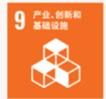</td><td>数据安全与客户隐私保护</td><td>严守信息安全</td></tr><tr><td>公司治理</td><td>●政府及监管机构●股东与投资者●员工</td><td>M,L</td><td>✓</td><td>✓</td><td>✓</td><td>✓</td><td>风险●若公司治理架构权责边界模糊、决策缺乏制衡,或将增加重大决策失误或利益侵占的风险;若董事及高管薪酬与合规安全等风险脱钩,董事会成员背景同质化,或影响议题决策与应对能力滞后。机遇●建立层级清晰、权责匹配的治理架构有助于提升决策效率、强化风险应对韧性;背景多元、决策独立的董事会成员构成,提供更广泛的决策视角;同时,董事及高管薪酬与绩效或激励计划挂钩的透明化披露,将有效驱动业务决策执行。</td><td>16和平、正义与强大机构17促进目标实现的伙伴关系</td><td>利益相关方沟通</td><td>稳公司治理</td></tr></table>

\*S：短期(0-3年)，M中期(3-5年)，L长期(5年以上)

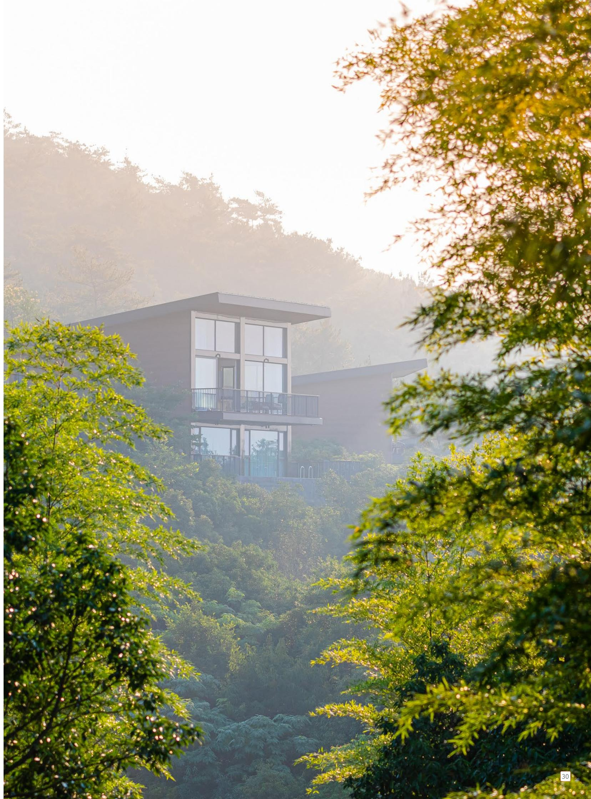

natural_image

Modern building nestled in a forested hillside with misty background, framed by green foliage (no visible text or symbols)

## 固本守正 治理为基

16 和平、正义与 和强大机构

1 促进目标实现的 伙伴关系

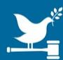

规范的治理体系是企业平稳运行的前提为此，君亭酒店集团不断优化公司治理架构，切实维护广大投资者的合法权益。同时，本集团持续细化风险管控与内部控制流程，严格坚守商业道德底线。我们全面落实反腐败与反不正当竞争的各项要求，以此保障企业的长远健康发展，力求在实现商业经济价值的同时，切实履行企业社会责任。

君亭酒店集团坚持以习近平新时代中国特色社会主义思想为指导，持续加强党组织建设，推动理论学习常态化长效化，全面提升党支部政治功能和组织功能。同时，本集团重视红色教育，持续推进党风廉政建设，深化党建与业务融合，充分发挥党建引领作用，为公司高质量发展提供坚强政治保证和组织保障。

## 理论思想武装

君亭酒店集团党支部严格落实“第一议题”制度，坚持把学习贯彻习近平新时代中国特色社会主义思想、党的二十大和二十届四中全会精神作为支部学习首要内容，融入“三会一课”、主题党日、集中学习全过程，引导党员不断提高政治判断力、政治领悟力、政治执行力，坚定拥护“两个确立”、坚决做到“两个维护”，严格规范组织生活，认真落实年度组织生活会、民主评议党员、谈心谈话等工作。

## 2025年党建活动开展情况

2025年君亭党支部共计组织召开或开展

党员大会4次  
党课4次  
支部委员会12次  
清廉活动1次  
主题党日12次  
党纪警示教育1次

natural_image

Abstract red wave graphic with a red star on top, no text or symbols present

## 案例：“探索光影科技·勇担时代使命”主题党日活动

2025年8月2日，为深入学习贯彻习近平新时代中国特色社会主义思想和党的二十届四中全会精神，进一步强化党员思想政治引领、激发创新意识与担当精神，我们参与上级党委组织的“探索光影科技·勇担时代使命”主题党日活动，并在西溪谷君亭酒店开展专题交流研讨。活动通过参观M511光影汇、体验沉浸式VR项目、走访文创及影视场地，进一步激发了党员的创新意识、进取精神和干事热情：活动围绕“感悟创新发展、践行党员使命、立足岗位建功”开展交流研讨，进一步强化了党员意识、责任意识和担当精神，达到了统一思想、增进团结、推动工作的目的。

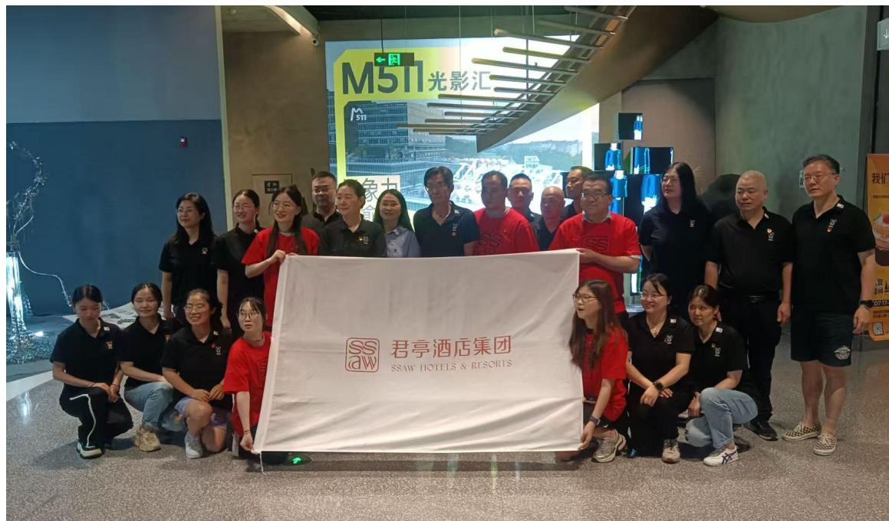

text_image

M511 光影汇
SSAW 君亭酒店集团
SSAW HOTELS & RESORTS

2025年8月主题党日活动

## 党风廉政建设

君亭酒店集团党支部全面推动从严治党，从严正风肃纪，涵养清廉生态。本集团党支部压实管党治党责任，认真落实党支部书记第一责任人职责、班子成员“一岗双责”，将党风廉政建设与业务工作同部署、同落实、同检查、同考核。同时，本集团党支部持续强化廉政教育监督，开展常态化警示教育、节前廉洁提醒、典型案例学习，以筑牢廉洁自律思想防线；加强对党员日常监督管理，对苗头性、倾向性问题早提醒、早纠正，营造风清气正、干事创业的良好氛围

2025年，为紧扣全面从严治党要求，君亭集团党支部持续深化党纪学习教育，组织党员学习《中国共产党纪律处分条例》等党规党纪，通过专题学习、警示教育、知识测试等形式，强化纪律意识、规矩意识，确保党员做到知敬畏、存戒惧、守底线

## 党业深度融合

党中央高度重视服务业发展，明确提出深化服务业改革、推动服务业高质量发展的系列要求，同时将扩大内需作为构建新发展格局的战略基点。酒店业作为服务业的关键领域，兼具生产性与生活性服务属性，在深化服务业改革与扩大内需战略中具有重要地位和独特作用。

为深入贯彻落实党中央决策部署，本集团党支部不断深化“党建+”融合模式，积极推进党建与业务工作同谋划、同部署、同落实。本年度，我们开展“党建+服务提质”“党建+项目攻坚”“党建+乡村振兴”“党建+志愿服务”等系列活动，以党建引领业务发展、以实绩检验党建成效。报告期内，本集团各党支部积极践行宗旨服务群众，主动开展便民服务、结对帮扶、文明实践等活动，不断增强党组织的向心力和群众认可度。

## 案例：景澜酒店党支部开展党建联建慰问活动

2025年6月18日，景澜酒店党支部与金华磐安仁川镇天山村党支部开展党建联建，慰问村困难低保户。此次活动将党组织关怀延伸至当地基层群众，推动党建工作与服务基层相结合，进一步传递了组织温暖，体现了党支部服务群众、履行责任的担当。

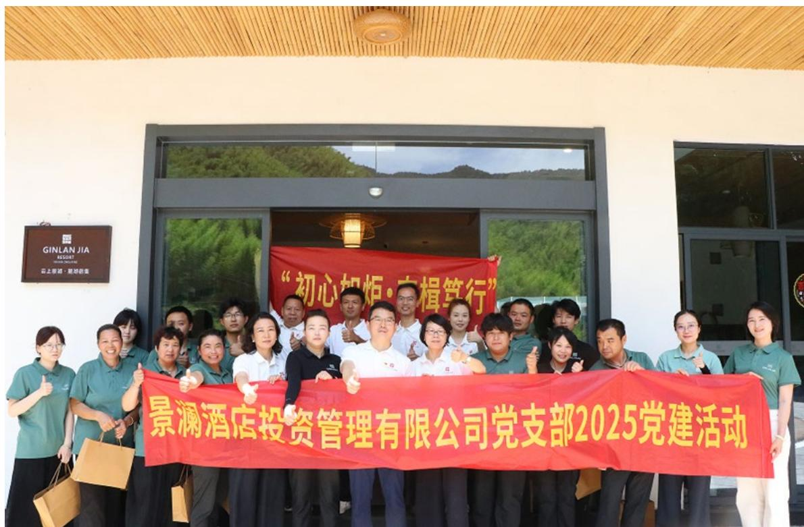

text_image

GINLAN JIA
GREAT
云上翠峰·展研创意
“初心火炬·直播笃行”
景澜酒店投资管理有限公司党支部2025党建活动

景澜酒店党支部与金华磐安仁川镇天山村党支部党建联建

## 案例：“红动君澜·服务先锋”主题党日活动

2025年11月，上级党委组织开展“红动君澜·服务先锋”主题党日活动，带领党员先后参观古海塘博物馆和“田立方·临平未来农场”。活动一方面通过了解古海塘修筑历史、治水智慧和文物保护成果，强化文化自信与责任意识；另一方面通过走进未来农场，学习“农业筑底、科创赋能、文旅驱动”的发展模式，感受现代农业科技和乡村振兴实践。这次活动将党建学习与历史文化教育，乡村振兴和企业发展结合，强调以党建引领凝聚奋进力量，推动高质量发展。

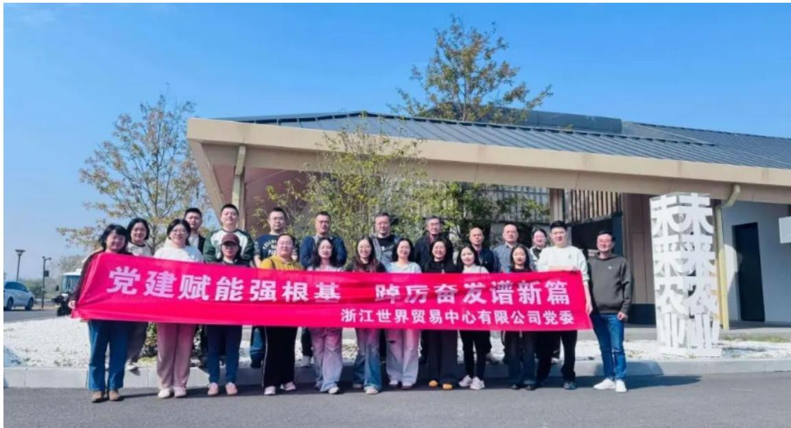

text_image

党建赋能强根基 跌厉奋发谱新篇
浙江世界贸易中心有限公司党委

“红动君澜·服务先锋”主题党日活动

area

| X | Y |
| --- | --- |
| N/A | N/A |

君亭酒店集团严格遵守《中华人民共和国公司法》《中华人民共和国证券法》以及《上市公司治理准则》等各项法律法规，本年度我们重点修订了《公司章程》《股东会议事规则》《董事会议事规则》等三十余份内控治理制度，以持续优化顶层设计，致力于保障公司决策的科学性与公正性，为企业的稳健发展打下坚实基础。

## 治理架构

2025年，为积极响应最新监管导向，我们结合《上市公司章程指引(2025年修订)》的具体要求及自身发展实际，对公司治理架构进行了重大调整，依法正式取消了监事及监事会的设置。

君亭酒店集团治理架构  
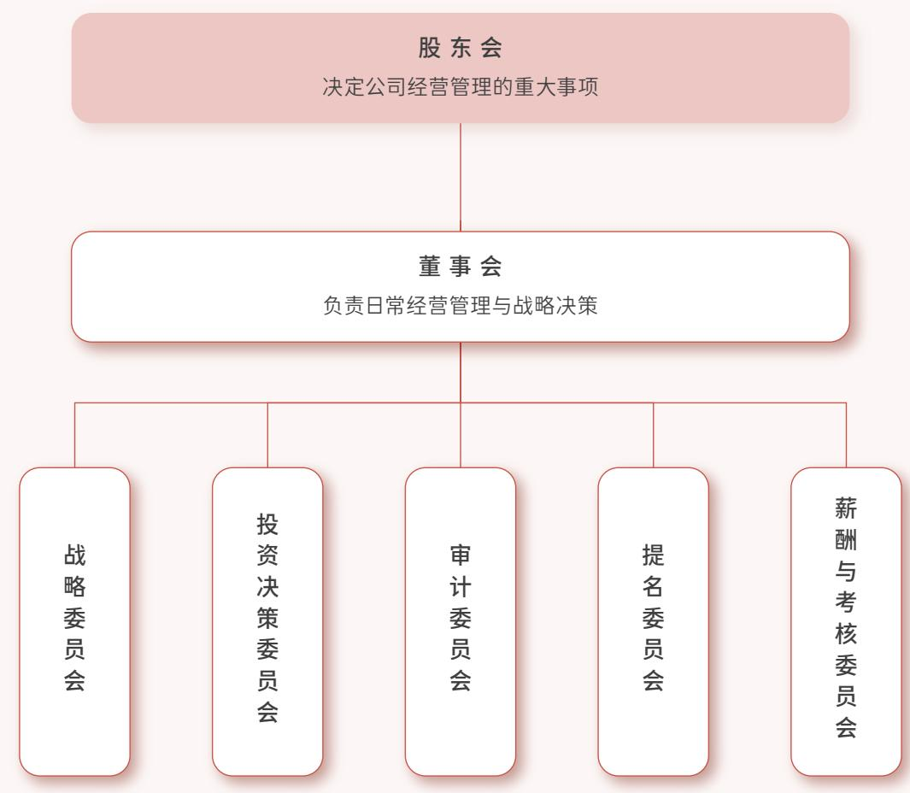

flowchart

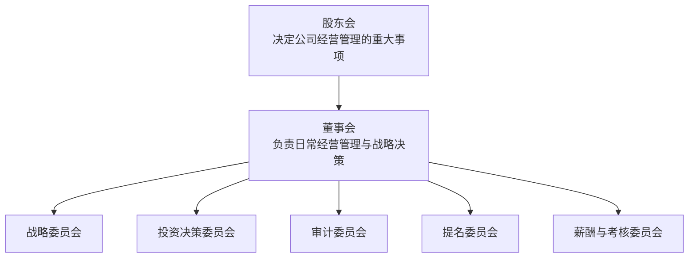
```mermaid
graph TD
  A["股东会\n决定公司经营管理的重大事项"] --> B["董事会\n负责日常经营管理与战略决策"]
  B --> C["战略委员会"]
  B --> D["投资决策委员会"]
  B --> E["审计委员会"]
  B --> F["提名委员会"]
  B --> G["薪酬与考核委员会"]
```

## 股东会

君亭酒店集团严格遵守《中华人民共和国公司法》《中华人民共和国证券法》等法律法规。我们持续健全《公司章程》及《股东会议事规则》的相关规定，清晰界定股东会的权责边界。本集团全面规范股东会的召集、召开与表决流程，切实保障股东会依法合规运行。

我们依法按期召集股东会。合法持有集团股份的股东均有权亲自或授权代理人出席会议，并依据其持股比例行使表决权，对利润分配、重大投资等关键议案进行决策。股东可自主表达表决意愿，表决结果由会议主持人当场公布。本集团历次股东会均聘请专业律师驻场，对会议的召集程序、出席人员资格以及最终表决结果出具书面法律意见，切实保证程序的合法与公正。在决议层面，普通决议必须经出席会议的股东所持表决权过半数同意方可生效，特别决议则需达到三分之二以上的赞成比例方能通过。

为充分保障股东的各项权利，股东可通过以下多种投票方式实现所拥有的表决权：

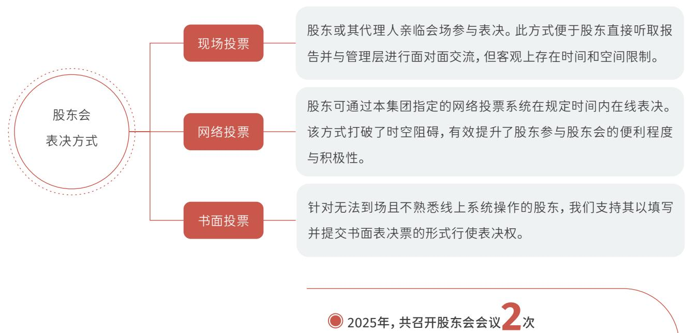

flowchart

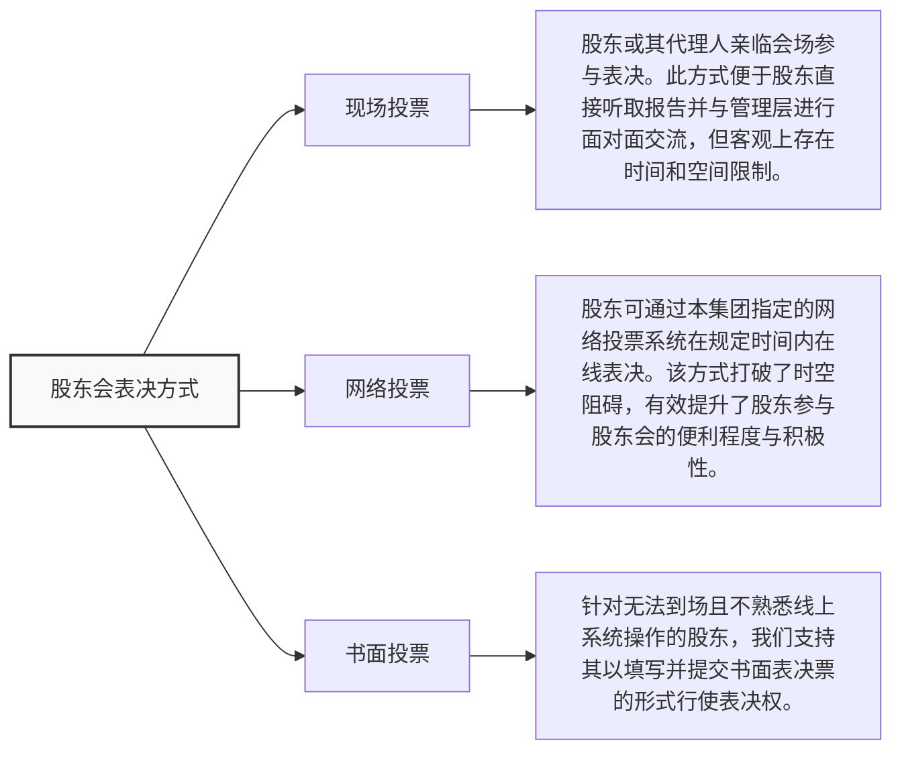
```mermaid
graph LR
  A["股东会表决方式"] --> B["现场投票"]
  A --> C["网络投票"]
  A --> D["书面投票"]
  B --> E["股东或其代理人亲临会场参与表决。此方式便于股东直接听取报告并与管理层进行面对面交流，但客观上存在时间和空间限制。"]
  C --> F["股东可通过本集团指定的网络投票系统在规定时间内在线表决。该方式打破了时空阻碍，有效提升了股东参与股东会的便利程度与积极性。"]
  D --> G["针对无法到场且不熟悉线上系统操作的股东，我们支持其以填写并提交书面表决票的形式行使表决权。"]
  style A fill:#f9f9f9,stroke:#333,stroke-width:2px
```

## 董事会

本集团董事会作为经营决策的核心机构，严格遵守《公司章程》与《董事会议事规则》等内部治理规范，持续推进董事会在多元化、独立性方面的建设。我们要求全体董事认真履行忠实与勤勉义务，通过召开董事会常规会议、董事会专门委员会会议并确保董事出席率，在董事会成员提名与遴选、战略规划与发展决策等关键环节强化治理透明度和规范性，持续评估董事会有效性，监督并保障集团的合规运营

## 董事会提名与遴选

在董事提名与遴选环节，本集团提名委员会负责制定选拔标准，并在充分听取各利益相关方意见后向董事会提出建议。所有候选人均须经过严格的资格审查，最终由股东会表决任命，确保股东对人事选举的直接参与。2025年，结合最新监管政策与《公司章程》的修订要求，本集团新增了1名职工代表董事。截至报告期末，董事会共由8名董事组成，其中包括非独立董事5名，独立董事3名。

## 君亭酒店集团组织开展新任董事专项培训

为确保决策层的专业性与合规性，本集团组织新任董事参与履职培训，本次培训全面、系统地讲解了上市公司的各项监管法规以及董事在公司治理中应尽的法定责任。此举有效帮助新任董事快速熟悉了履职要求，进一步夯实了董事会规范运作与科学决策的专业基础。

## 董事会多元化建设

本集团注重董事会成员的多样性，依据《君亭酒店集团股份有限公司章程》《董事会议事规则》，持续推进董事会多元化建设。报告期内，董事会成员中包含3名女性董事（占比达37.5%），1名职工代表董事，切实落实了决策层的多元化配置。依据深交所《独立董事和审计委员会履职手册》要求，董事会成员在战略规划、资本运作、品牌建设、财务管理、市场拓展及酒店管理等方面具备扎实专业能力和丰富从业经验，为本集团规范运作、治理发展做出更加明智和有效的决策。

## 董事会独立性建设

本集团严格遵照《上市公司独立董事管理办法》《深圳证券交易所创业板股票上市规则》等规定，规范董事会会议的召集与表决流程。依据本集团《独立董事工作制度》，我们明确了独立董事的独立性要求，每年组织开展独立董事工作述职，并每三年在换届时对其履职有效性进行全面评估。目前，本集团独立董事人数达到董事会总人数的三分之一以上，且兼任高级管理人员的董事未超过总人数的二分之一，保障了治理机制的有效运转。

2025年

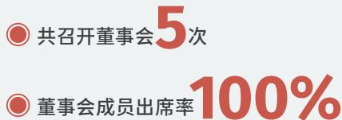

独立董事有效性评估方法

<table><tr><td>资格审查</td><td>依据相关法规和规定审查董事候选人的资格</td></tr><tr><td>备案审核</td><td>独立董事任职资格和独立性经深圳证券交易所备案审核</td></tr><tr><td>文件审查与自查</td><td>核查独立董事等签署的相关自查文件,审查董事的任职经历等</td></tr><tr><td>专业能力判断</td><td>从专业角度评估董事会成员的专业背景、行业经验等是否符合公司发展需求</td></tr></table>

## 董事会专门委员会

为进一步完善治理体系并保障集团战略的顺利推进，董事会专门下设了战略委员会、投资决策委员会、审计委员会、提名委员会以及薪酬与考核委员会。委员会各司其职又紧密配合，为董事会的科学决策与规范运作提供了强有力的专业支撑。

<table><tr><td>战略委员会</td><td>主要负责对公司长期发展战略规划、重大投融资决策、重大资本运作、资产经营项目等影响公司发展的核心事项进行研究与建议,并对上述事项的实施情况进行督导检查。</td></tr><tr><td>投资决策委员会</td><td>主要负责对重大投资项目、投资决策、新业务投资及其他影响公司发展的重大投资决策进行研究、评审和检查,并在董事会授权范围内进行决策、概预算审核及实施跟踪检查。</td></tr><tr><td>审计委员会</td><td>主要负责审核公司财务信息及其披露情况,监督和评估内外部审计工作与内部控制,公司内外部审计的沟通并行使《公司法》规定的监事会职权,促进公司财务治理与风险管控机制有效运行。</td></tr><tr><td>提名委员会</td><td>主要负责根据公司经营活动情况、资产规模和股权结构等对董事会的规模和构成向董事会提出建议,拟定董事及高级管理人员的选任标准和程序,广泛搜寻合格的人选,并对候选人及其任职资格进行遴选、审核与建议。</td></tr><tr><td>薪酬与考核委员会</td><td>主要负责综合考量董事及高级管理人员的职责、重要性、同行业相关岗位薪酬水平等因素制定其薪酬方案,对董事(非独立董事)及高级管理人员的履职情况进行年度考评,并监督公司薪酬制度的执行。</td></tr></table>

2025年度，本集团累计召开2次股东会、5次董事会，15次专门委员会，战略委员会会议次数1次，投资决策委员会会议次数7次，审计委员会会议次数5次，提名委员会会议次数1次，薪酬与考核委员会会议次数1次。

## 薪酬管理

为持续健全激励与约束机制，本集团严格遵循《中华人民共和国公司法》《上市公司治理准则》《上市公司独立董事管理办法》及《公司意程》的相关规定，设立了董事会薪酬与考核委员会。我们进一步规范了董事及高级管理人员的薪酬管理与考核机制，确保各项决策与日常管理切实服务于本集团的整体战略目标，全力维护全体股东与投资者的合法权益。

本集团确立了公开，公平，公正的薪酬标准，坚持薪酬与长远利益，实际经营效益相挂钩，实行激励与约束并重的原则。在具体执行层面，本集团对不同职务制定了差异化的薪酬方案。独立董事实行固定津贴制，津贴标准由股东会审议确定，核心在于保障其独立判断与监督职能。非独立董事及高级管理人员均实行年薪制，薪酬由基本年薪与绩效年薪构成。在本集团兼任高管的内部董事，以高管身份领取薪酬，不再额外领取董事津贴。绩效年薪则严格以签订的“年度目标责任书”为基准，结合个人指标及集团当年经营业绩，由薪酬与考核委员会考核后发放，确保薪酬体系公平、透明，激励高管团队推动公司稳健发展。此外，本集团将薪酬政策与节能降耗、公司治理等ESG相关绩效绑定，引导管理层着眼于长远目标为本集团的可持续发展贡献力量。

## 全面合规运营

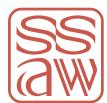

君亭酒店集团致力于打造坚韧的风险管理体系，持续深化多维度的风险防线。我们不断强化日常的风险评估与动态监控，确保各类潜在隐患得到早期识别与妥善化解。在此基础上，我们全面升级内控合规标准，通过严密的内部审计与全员合规宣贯，切实牢筑业务全链路的合规防线

## 风险管理

## 风险管理体系

为了有效防范经营风险，本集团制定了《全面风险管理制度》等内部制度，并以此为基础，建立了一套完善的风险管理体系。该体系涵盖了董事会、审计委员会、审计部、外部法律顾问以及各个业务部门，确保各方权责清晰、协同合作。此外，我们高度重视专业人才的培养，在选聘兼具法律与财务专业背景独立董事的基础上，建立健全人才储备、培养及激励机制

风险管理组织架构

<table><tr><td>董事会</td><td>担任风险管控的最高决策机构,对集团全面风险管理体系的最终运行成效负责。本集团董事会成员配备了高级经济师、执业律师及注册会计师等复合型风控专家,为科学决策与前瞻研判提供支撑。</td></tr><tr><td>审计委员会</td><td>履行风控体系的监督职能,并为风险防范工作提供专业化指导意见。</td></tr><tr><td>经营管理层及各控股、参股子公司</td><td>作为风险管控的一线执行方,负责将各项风控措施落实到位,并向董事会按期汇报执行成效。</td></tr></table>

## 风险管理机制

本集团持续优化整体的风险管控流程，在日常运营中严格执行“风险预警，风险识别，风险分析，风险应对”四大关键步骤，全力降低各类风险的发生概率，切实提升风险处置的精准度与有效性。面对识别出的重大风险信号，本集团董事会及审计委员会将深度介入，对各级单位上报的风险数据进行严格复核分析，并全程督导应对方案的落地落实。此外，审计部开展常态化的风险排查与专项检查，一旦发现重大内控缺陷或突发风险，将第一时间直报至董事会或审计委员会，确保区险信息的无障碍通达。

## 风险管理流程

## 风险预警

我们建立了高敏锐度的信息预警机制，确保各级管理层及相关部门能够及时捕捉业务异动与资产风险信号，实现隐患的前置预判。

## 风险识别

>

我们综合运用风险指标监控、内部审计及风险专项报告等多维工具，对所有运营环节进行全方位排查，精准锁定各类隐患的来源。

## 风险分析

结合定量与定性的科学评估方法，我们从发生概率、影响程度及重要性等多个维度，对已识别的风险进行深度分析与定级。

## 风险应对

秉持成本效益最优原则，我们在全面权衡后，针对性地制定并启动最契合实际情况的风险化解策略。

## 内控合规

为筑牢稳健运营的基石，君亭酒店集团始终严格遵照《中华人民共和国审计法》《企业内部控制基本规范》及《企业内部控制应用指引》等法定标准，建立健全集团内部控制架构及相关机制

2025年，本集团积极响应监管最新要求，对原有的内控制度体系展开了全面审视与系统更新，持续优化《内部控制手册》与《内部控制制度汇编》，最新修订了《公司章程》《董事会议事规则》《投资者关系管理制度》等多项核心规章，共计制定、修订33份核心治理与运营制度，并经审议落地。同时，本集团对各部门的管理制度进行更新，使内部控制体系更全面地覆盖集团各部门及业务各环节，更好地适配集团的发展进程。

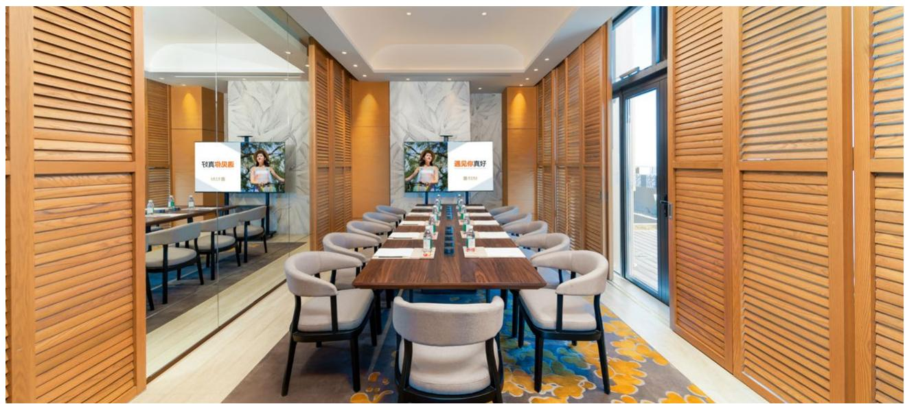

natural_image

Interior view of a modern conference room with wooden paneling, a long table, and two large screens displaying Chinese text (no legible signage or data)

<table><tr><td>董事会(决策机构)</td><td>负责内部控制的建立健全和有效实施。</td></tr><tr><td>财务中心(管理机构)</td><td>负责组织协调内部控制体系的推行和后续维护。</td></tr><tr><td>各部门、子公司(执行机构)</td><td>各部门负责人及子公司总经理负责集团内部控制在本部门或子公司中的实施、维护。</td></tr><tr><td>内审部门(监督机构)</td><td>负责定期组织检查、评估内部控制的有效性并提出改进建议。</td></tr></table>

本集团的内部控制已深度覆盖治理，财务，人力资源，营销，采购，技术，工程及资产等各大经营管理领域。为确保各项工作规范有序，本集团落实了五大核心内部控制运转机制：一是严格“不相容职责分离”机制，防范舞弊与差错；二是推行“预算控制”机制，合理调配资源与管控成本；三是依托“授权审批”机制，明确各级常规与特别授权界限；四是深化“绩效考评”机制，将预算执行、销售回款与客评指标与人员薪酬相挂钩：五是强化“财产保护”机制，定期盘点资产并归档重要文件。

内部审计是检验内控成效的核心。由审计部牵头，我们持续强化对业务运营、会计核算及内控执行的监督力度。2025年度，本集团扎实推进常态化与专项审计工作。在常态化审计监督方面，我们按月对所有直营门店开展财务收支与成木费用的真实性核查，并动态跟踪转租业务的租金履约风险。在专项风险排查方面，我们聚焦核心业务场景，深入开展了长账期挂账、提成发放等专项核查。在此基础上，我们重点加强了对项目资金管理及账务处理的穿透式监督，并及时查处运营过程中的各类不合规行为，切实保障整体运营的合规性与高透明度。

## 荣誉：本集团荣获上市公司内部控制优秀实践案例

2025年5月，本集团积极响应并参与中国上市公司协会发起的“2025年上市公司内部控制最佳实践案例征集活动”，获得“上市公司内部控制优秀实践案例”荣誉。

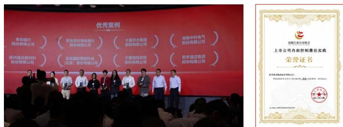

## 依法纳税

依法纳税是企业践行责任、支撑国民经济发展的重要基石。本集团始终秉持诚实守信的税务理念，严格遵守《中华人民共和国税收征收管理法》《中华人民共和国税收征收管理法实施细则》等各项国家税收法律法规。我们将税务合规要求深度嵌入《公司内部控制手册》，构建了系统化、标准化的财务报告与税务内控体系。面对“金税四期”全面深化应用及国家税收大数据监控体系日益趋严的宏观监管环境，本集团持续提升全员税务风险意识，进一步提高了税务合规的内部管控标准。

本集团组建了专业且高效的内部税务管理团队，按月准时、完整地完成增值税、个人所得税以及社保公积金等常规税费的核算与申报工作，并打造了“事先预防、事中防范、事后修正”的闭环税务风险管理机制，以化解潜在涉税风险。我们定期开展系统的税务风险自查工作，不断梳理并优化内部税务审批与控制流程，确保系统性风险得到全方位遏制。

面对税务法规变动、新投资项目或重大非例行交易等高风险复杂事项，本集团聘请专业会计师或税务师事务所等专业机构提供专业意见。2025年10月，本集团组织参加了外部税务机构举办的“税务监管信息化下风险防控与合规措施”专项研讨，进一步强化了应对复杂税务环境的能力。在内部税务能力梯队建设上，本集团针对市场变化实现了精准赋能。随着入境游全面恢复带来的境外渠道旅客激增，我们前瞻性地研究了境内外涉税申报的差异点，并与各子公司进行了深度的专项对接与赋能培训。

## 案例：本集团多维开展涉税与财务内控专项赋能

2025年，我们以解决酒店一线运营的实际业务痛点为导向，高频次开展内部能力建设培训。针对直营门店本集团全年共组织了超8场的综合技能培训 核心议题聚售涉税处理规范 供应链系统操作以及渠道结算等，该培训实现了直营店财务人员的100%覆盖。面向委托管理酒店，我们采取“按需定制、一对一精准培训”的模式，累计提供了5次针对性指导，有效解决了门店在渠道对账与税收政策理解上的难点。

## 案例：本集团积极参与财务监管相关外部交流

面对日趋严格的资本市场监管环境，本集团始终保持高度的合规敏锐度。2025年，我们常态化参与浙江省上市公司财务总监例会，通过与监管机构及同业的深入交流，我们第一时间学习并掌握了最新的信息披露要求与财务监管要求，这不仅有效拓宽了集团财务团队的合规视野，更为集团后续优化内部控制、前置防范税务与财务披露风险提供了坚实的认知基础。

君亭酒店集团恪守商业道德，坚决反对任何形式的贪污腐败和利益输送行为，严格遵守反垄断相关法律法规及行业规范，坚决抵制不正当竞争，坚守公平公正、廉洁自律的经营底线。

## 反商业贿赂及反贪污

## 反贪污与腐败管理体系

本集团构建了权责清晰的反贪污与反腐败管理架构。我们成立了由董事长领队，总经理、董事会审计委员会召集人、审计部负责人作为成员的反商业贿赂工作小组，负责对公司商业贿赂工作进行宏观指导与监督。本集团审计部作为常设执行机构，牵头落实各部门及分子公司的反贿赂具体行动。同时，我们明确各分子公司及部门的负责人为廉洁管控的“第一责任人”，确保各项规章制度层层压实、落实到岗。

2025年，本集团更新《反商业贿赂制度》，结合行业特性与实际运营情况，确立了涵盖诚实、正直、公平、尊重与合规的核心商业道德准则，明令禁止任何形式的利益输送与商业贿赂。我们将这一准则向全体员工进行了深度宣贯，收紧了反腐败与反贿赂的内部红线。

2025年，本集团未发生贪污诉讼事件。

## 君亭酒店集团商业道德准则要求

诚信经营

遵守承诺，不进行欺诈、误导或欺骗行为。

公平竞争

不滥用市场支配地位，避免价格歧视和不正当竞争。

廉洁自律

禁止商业贿赂、个人利益输送和腐败行为。

## 反贿赂及反贪污风险管理

本集团将廉洁风险防控纳入公司风险管理体系，结合各项商业活动开展的实际情况，评估、识别发生商业贿赂行为风险较高的领域和环节，针对性地完善内部控制制度、采取必要的预防措施。

我们聚焦采购、公司治理等重点领域的廉洁风险，制定防范措施：

采购销售

本集团为规范业务双方人员的廉洁从业行为、遏制腐败问题发生。我们在《廉洁协议书》中对索要(暗示)礼金礼品、有价证券、感谢费及其他影响合同公正执行的不廉洁风险行为做出规定：若发现任何形式的不廉洁行为，将视情节轻重予以处理，若违反本协议书行为的，本集团将有权中止合同，并将其列入“廉洁风险重点关注名单”，加强监管或直至限制与其进行合作。

利益冲突

本集团落实了严格的回避制度，以预防和化解潜在的利益冲突。当董事会审议关联交易等涉及利益冲突的事项时，关联董事必须主动提出回避，且绝对不得代理其他董事行使表决权。同时，本集团严禁董事利用内幕信息谋取私利、收受商业贿赂，坚决杜绝侵占或挪用公司资金的行为。我们通过对董事及高管选任的严格把关、高标准的信息披露透明度要求以及完善的内部制衡机制，全面维护集团与全体股东的合法权益。

## 商业伙伴廉洁

为构建透明、公平的合作生态，本集团不断夯实商业道德管理的制度根基与管理要求。我们明确将商业道德条款纳入《供应商管理制度》及《招投标管理制度》等核心规范中，为合作伙伴树立了严格的行为准则，并在日常运营中，积极向广大供应商宣贯诚实、正直与公平的商业操守，营造廉洁氛围。

在具体业务开展环节，我们全面推行阳光交易机制。本集团供应链中心与各供应商签署《阳光协议》，坚决杜绝一切暗箱操作及违法违规行为。该协议清晰划定了廉洁红线：严格禁止供应商以任何形式提供实物、现金或礼券等利益输送：同时，若遭遇内部人员任何形式的索贿或受贿企图，供应商有义务及时向集团举报。此外，我们通过全面推行公开招标与集团中央采购模式，从源头上进一步筑牢了业务合作的廉洁防线。

君亭酒店集团阳光协议

君亭酒店集团

## 阳光协议

为确保廉洁准则落地见效，本集团构建了常态化的监督与评估机制。2025年，我们完成了针对所有自营酒店的全面风险评估，成功实现100%的运营点覆盖。在持续深化供应链重点审核的基础上，2025年，我们首次将会议销售、旅行社合作等业务条线纳入评估版图，实现了风险管控的全面升级。对于考核与监督中发现的不廉洁供应商，我们坚决采取相应约束与清退措施。配合不断健全的举报奖励机制与定期审计工作，本集团正持续净化商业道德环境，切实坚守各方廉洁防线。

## 举报监督

本集团致力于畅通商业道德监督机制。我们面向全体员工及各利益相关方开通了专属电话、电子邮件及纸质信函等多元举报渠道，鼓励如实反映违规行为。在案件核查环节，我们严格遵循标准化调查程序，经调查取证后形成的报告及处理建议，须报送工作小组审批，最终处理决定将呈报董事会备案。为保障程序绝对公允，若当事人对结果存在异议，允许其在接到决定后的2个工作日内正式提出申诉；同时，我们严格执行回避制度，要求存在利害关系的调查人员必须退出。本集团对举报人实施最高级别的保护，坚决防范并杜绝任何形式的打击报复。

## 举报投诉渠道

## 电话

4006728666、0571-86750888

## 邮件

400@ssawhotels.com

## 反垄断与不正当竞争

君亭酒店集团严格贯彻《中华人民共和国反垄断法》《中华人民共和国反不正当竞争法》及其他适用的法律法规，确保在运营中恪守公平竞争原则，维持良好的市场竞争秩序。本集团最新制定《反商业贿赂制度》等相关制度文件中做出要求，在一切商业活动中均坚决拒绝不正当之商业行为，以防止损害公司、股东、消费者及员工合法权益的行为发生。本集团结合各项商业活动开展的实际情况，评估，识别发生商业贿赂行为风险较高的领域和环节，针对性地完善内部控制制度，采取必要的预防措施。若发现垄断与不正当竞争事件，审计部门将负责跟进被举报行为和事件的纠正及整改工作，并由相关责任部门具体实施。

2025年，本集团未发生垄断与不公平诉讼事件。

## 案例：君亭酒店集团开展防范不正当竞争行为线上主题培训

2025年，君亭酒店集团面向110位各项目酒店总经理及管理人员召开《防范不正当竞争行为》的线上主题培训，以倡导诚信正直的企业文化、营造反商业贿赂的企业文化环境。本次培训围绕2025年6月27日修订通过并于10月15日起正式施行的最新《反不正当竞争法》为背景，聚焦不正当竞争司法监管态势和酒店业合规问题现状，为参训员工树立防范不正当竞争行为“七大红线”，并以酒店业的场景化案例加深参训人员的认知，同时向项目酒店总经理们提供合规经营的方法建议，以提高日常经营中反不正当竞争的意识。

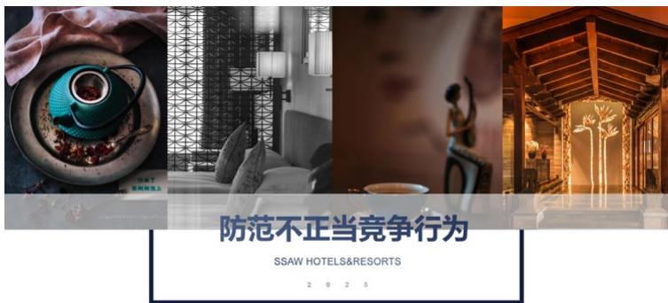

text_image

防范不正当竞争行为
SSAW HOTELS&RESORTS
2 0 2 5

君亭酒店集团

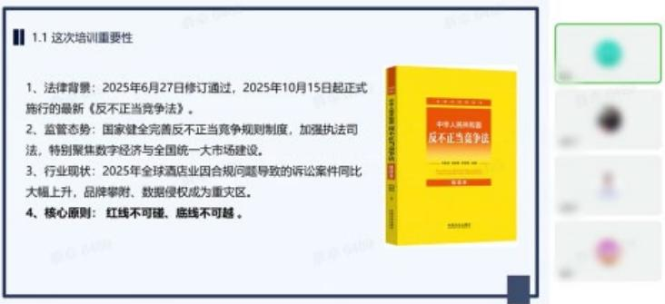

text_image

1.1 这次培训重要性
1、法律背景：2025年6月27日修订通过，2025年10月15日起正式施行的最新《反不正当竞争法》。
2、监管态势：国家健全完善反不正当竞争规则制度，加强执法司法，特别聚焦数字经济与全国统一大市场建设。
3、行业现状：2025年全球酒店业因合规问题导致的诉讼案件同比大幅上升，品牌掌附、数据侵权成为重灾区。
4、核心原则：红线不可碰、底线不可越。

## 2.7红线七：网络不正当竞争—“数字化违规”

## 1、法律规定：

不得利用数据、算法、平台规则妨碍破坏其他经营者合法服务，不得滥用平台规则恶意退单。

## 2. 酒店场景：

(1)利用爬虫软件非法抓取竞争对手的房价、房态数据。(2)针对竞争对手的恶意差评或批量虚假预订(刷单)。

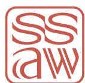

## 3.1 针对总经理：全面管控，建立防火墙

1. 名称自查：立即核查酒店全称，简称、公众号名称、APP图标是否存在侵犯他人在先权租(如知名商标)的情形  
2 完善制度：修订《反商业贿略协议》要求所有供应商，渠道合作方签署，并确保折扣佣金如实入账  
3 内部监察：建立举报投诉渠道(如集团廉政邮箱)对采购，销售岗位进行定期轮岗和审计。  
4. 应急机制：一月收到侵权告知函或法院传票，立即停止涉嫌行为，主动协商处理，

## 商业道德培训

本集团高度重视内部深植廉洁文化，制定了系统化的培训计划，定期开展《商业道德》专项培训，深度聚焦合规意识培养与风险防范技巧。我们灵活采用线上线下讲座、案例分析及情景模拟等教学方式，要求全体员工必须参训，以此塑造遵纪守法、廉洁从业的职业风貌。此外，针对党员群体及核心关键岗位，本集团进一步加大了教育力度，我们通过集中研讨学习，并辅以“集团审查+酒店自查”的监督模式，确保廉洁从业意识深化于心。

2025年，本集团持续推进商业道德与合规文化建设，针对不同层级的员工扎实开展了多维度的商业道德专项培训。报告期内，相关培训已有效覆盖各级人员，其中管理层共计230人参训，员工共计880人参训，切实将诚信与合规理念内化为全员的行动自觉。

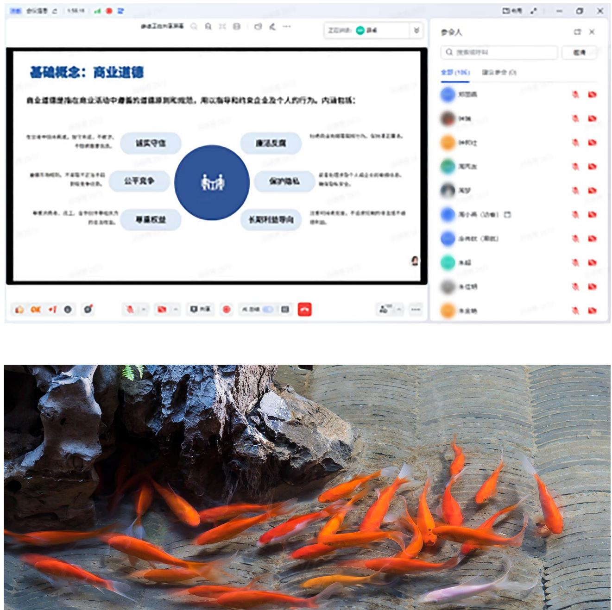

## 保障投资者权益

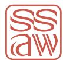

君亭酒店集团重视投资者关系，通过投资者沟通与信息披露，积极倾听市场声音，保障投资者知情权与参与权。我们立足长期稳健经营，为股东创造投资回报，维护全体投资者的权益，实现企业价值与股东价值的共同增长。

## 投资者沟通

君亭酒店集团始终严格遵循《中华人民共和国公司法》《中华人民共和国证券法》等法律法规，以及中国证监会的相关合规规定。除继续贯彻执行《信息披露管理制度》《重大信息报告制度》《信息披露重大差错责任追究制度》等内部规章之外，报告期内，本集团修订了《关联交易管理制度》《投资者关系管理制度》等核心规章，并最新制定了《对外担保管理制度》与《对外投资管理制度》。为了加强业务环节的风险防范，我们全面筑牢信息披露防线，致力于打造高度透明的沟通环境。

本集团严格依照《投资者关系管理制度》的要求，统筹并落实日常的投资者沟通工作。我们通过专线电话、互动易平台以及线上业绩说明会等多元渠道，积极回应资本市场关切，特别是在定期报告发布、控制权拟转让等关键节点，确保了沟通渠道的广泛覆盖与信息的高效传递。此外，我们在做好常规披露的同时，进一步强化了对财务数据与经营状况的深度剖机与解读，使股东能够更清晰地把握本集团的业务全貌，充分获取投资决策所需信息，切实保障其知情权与决策权

2025年，本集团在投资者交流方面取得了扎实成效。本集团年内线上组织了1场业绩说明会与1场加盟业务官宣交流会，累计吸引86人次参与。会上，我们围绕行业趋势、发展战略、生产经营、财务分红状况及潜在风险等核心议题进行了详尽解答，并于会后第一时间在巨潮资讯网披露了投资者关系活动记录表。此外，我们在互动易平台年内共答复投资者提问26次：同步开展了40余场线上及现场调研沟通活动，累计接待投资者近300人次，覆盖超百家主流投资机构。

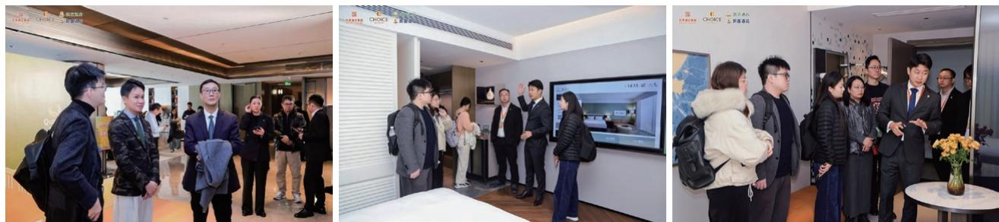

## 投资者沟通方式与渠道

## 信息披露

严格按照深交所规定，按时披露年度报告、半年度报告、季度报告，内容涵盖公司财务状况、经营成果、重大事项等

## 投资者联系电话

0571-88835939；0571-86750888

## 电子邮箱

ssaw.shareholder.services@ssawhotels.com

## 互动平台

深交所互动易

## 业绩说明会

在线上平台开展年度、季度业绩说明会

## 投资者回报

君亭酒店集团积极倡导价值投资理念，以实际行动积极回报投资者，2023年度至2025半年度，现金分红占当期归母净利润的平均比例为149.23%，累积现金分红总额为72,919,142.25元，达到平均净利润的266.23%。

现金分红占当期归母净利润的比例

<table><tr><td>年份</td><td>利润分配方案</td><td>现金分红占当期归母净利润比</td></tr><tr><td>2023</td><td>以公司现有总股本194,451,046股为基数,向全体股东按每10股派发现金股利1.5元(含税),共分配现金股利29,167,656.90元(含税),不送红股,不以公积金转增股本。</td><td>95.57%</td></tr><tr><td>2024</td><td>以公司现有总股本194,451,046股为基数,向全体股东按每10股派发现金股利1.5元(含税),共分配现金股利29,167,656.90元(含税),本年度不送红股,不以资本公积金转增股本。</td><td>115.75%</td></tr><tr><td>2025半年度</td><td>以公司现有总股本194,451,046股为基数,向全体股东按每10股派发现金股利0.75元(含税),共分配现金股利14,583,828.45元(含税),不送红股,不以资本公积金转增股本。</td><td>236.38%</td></tr></table>

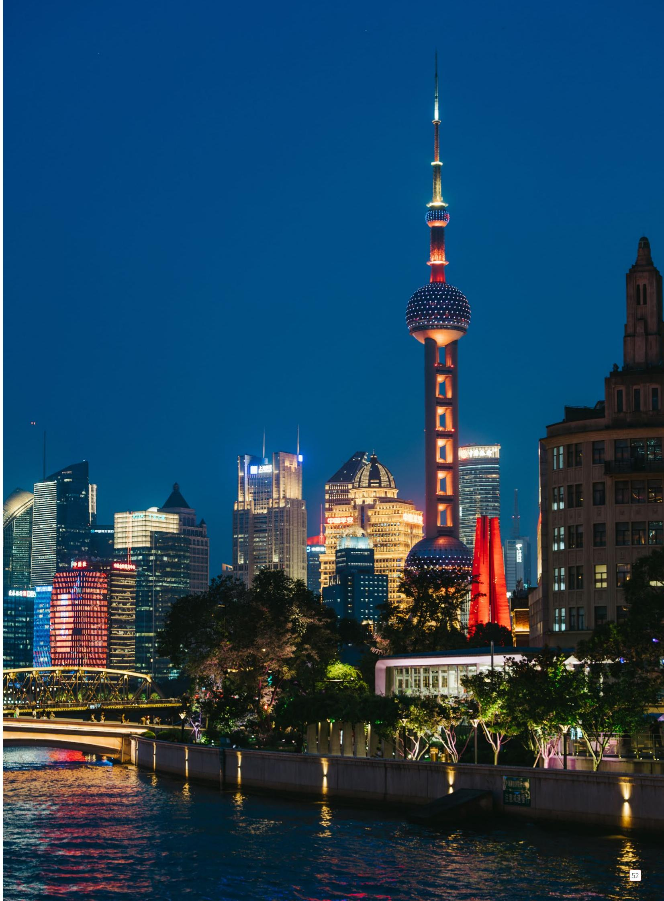

natural_image

Night view of Shanghai's skyline featuring the Oriental Pearl Tower and modern skyscrapers, with no visible text or symbols.

## 奔赴绿色 新程可期

6 清洁饮水和卫生设施

12 负责任消费和生产

13 气候行动

15陆地生物

君亮酒店集团坚持将绿色发展理念贯穿于酒店规划建设、运营管理与宾客服务全过程，以绿色建筑设计、节能降耗应用、资源循环利用及可持续消费场景建设为抓手，降低运营过程中的环境影响，倡导绿色低碳的旅居方式，为宾客打造可感知、可参与，可传播的可持续住宿体验。

SSAW HOTELS & RESORTS

本集团严格遵守《中华人民共和国环境保护法》等相关法律法规要求，持续完善环境合规管理制度，围绕环境管理体系、水资源管理、废弃物管理及生物多样性保护等重点领域，系统推进环境管理要求融入日常运营全过程，努力减少对生态环境的影响，推动企业经营与环境保护协同发展。

## 环境管理体系

## 环境管理体系与制度

本集团制定了《能源管理政策》《固体废弃物管理制度》《水资源管理承诺与声明》等相关政策制度，明确将环境管理要求纳入日常运营管理流程，推动环境管理工作规范有序开展。本集团持续推进环境管理目标责任机制。每年底，由董事长确立环保目标，有关部门负责目标逐级分解至各责任单位，并与责任单位签订《环保责任书》，确保目标落实到人。各责任单位据此制定、细化目标，并在日常运营中推进相关环保工作落实。次年年终，由专项部门进行检查评估，考核结果经管理层审议后与绩效奖金挂钩，形成覆盖目标制定、分解落实与考核评估的闭环管理机制，保障环境管理工作的有效推进。

2025年，本集团环保总投入达711.41万元（2024年：591.27万元）。

## 案例：君亭酒店集团开展绿色运营专题培训

2025年3月，本集团围绕酒店绿色运营主题，结合自身环境保护举措实践，开发《践行绿色理念，创建绿色酒店》课程，积极践行绿色低碳发展理念，并将此课程列入新员工入职专项培训。本课程内容包括宣贯绿色饭店标准、共享绿色饭店具体实践，培训强调在经营中减少对环境的污染，实现服务与消费的环境友好。本集团旗下各在营酒店于3月-4月开展员工培训，共57家门店参与，参训达1,362人次。

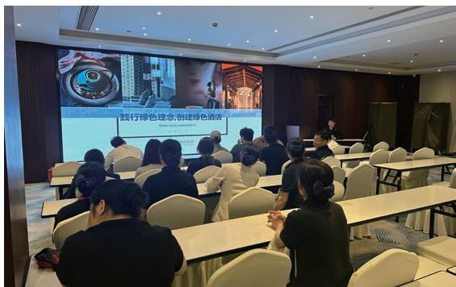

text_image

践行绿色理念,创建绿色酒店

上海徐汇同文君亭酒店开展绿色运营专题培训

## 环境风险应急管理

本集团建立重大环境风险事件的应急预案与应对措施，以全面提升对环境突发事件的预防、响应与处置能力。七仙岭君澜酒店在地方政府总体应急救援预案框架下，制定了《七仙岭君澜度假酒店生产安全事故应急预案》，对酒店运营管理过程中可能发生的火灾、触电、自然灾害等各类环境突发事件的应急处置做出规定，设置成立应急安全领导小组（应急指挥部)、应急处置小组以负责现场突发事件的预警干预、应急处置、信息报告工作

七仙岭君澜通过风险评估，识别出酒店涉及的主要环境风险、风险原因、可能发生的区域、事故后果。根据实际情况和风险的评估结果，建立针对各类生产安全事故的应急预案体系，酒店生产安全事故应急预案由综合应急预案、专项应急预案、现场处置方案构成。

## 七仙岭君澜酒店专项环境应急预案一览

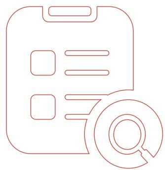

natural_image

Simple line drawing of a document with a magnifying glass, no text or symbols present

《山林防火预案》

《酒店突发火灾应急处置预案》

《防台预案》

《防蛇预案》

《防山体滑坡应急预案》

《酒店突发泳池温泉安全事件应急预案》

《烟花燃放事故处理操作细则》

## 案例：佛山君亭酒店配合应对公共卫生突发事件

2025年7月，佛山市出现本地基孔肯雅热病例，佛山君亭酒店第一时间响应市政府发布的疫情提示，迅速启动自主应急机制，以“保员工、护客户、控源头”为核心，在72小时内完成防控体系搭建。总经理牵头成立临时应急小组，通过增配驱蚊装置、强化各区域积水巡检、提升消杀频次(每月2次提升至每3天1次全覆盖消杀)，搭建“健康服务角”，向客户提供防疫安全包等多种方式对蚊媒传播风险进行防控，在基孔肯雅热流行期间实现员工与住客零感染，得到客户与属地街道办的赞赏与肯定。

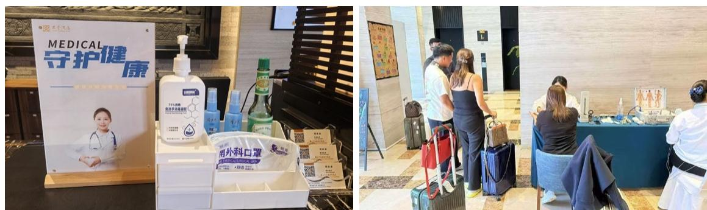

text_image

MEDICAL
守护健康
75%消毒
用于高毒药
用外科口罩
2018年1月1日
2018年1月1日
2018年1月1日
2018年1月1日
2018年1月1日
2018年1月1日
2018年1月1日
2018年1月1日
2018年1月1日
2018年1月1日
2018年1月1
2018年1月1日
2018年1月1日
2018年1月1日
2018年1月1日
2018年1月1日
2018年1月1日
2018年1月1日
2018年1月1日
2018年1月1日
2018年1月1目

## 案例：三亚大东海君亭酒店启动防台应急预案

2025年暑期，台风“蝴蝶”“剑鱼”先后登陆三亚，大东海君亭预先启动防台预案，提前准备挡水板、沙袋、应急手电、蜡烛等物资，停用电梯，确保无人困梯，并积极对接电网、物业，确保水电基本供应正常。对在住宾客发布“敬告宾客书”，向住客提供免费午餐、晚餐等服务，在酒店受损严重、无法运营的情况下有序转移住客至其他酒店入住，并完成各渠道预订单取消、退款及解释工作。台风过后，大东海君亭第一时间投入报损抢修工作，检修水电供应、电梯、空调等设施，对酒店内外区域及所有客房逐一进行排查与恢复，确保客房质量，并快速与OTA、旅行社等渠道沟通，提前安排恢复后团队入住。

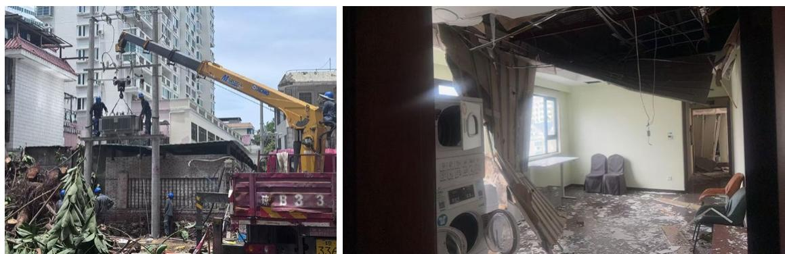

## 水资源管理

## 用水管理

君亭酒店集团持续推进水资源精细化管理，各部门制定水能耗定额预算、设定节水目标，将节约用水与合理用水贯穿于酒店运营全过程，各门店结合运营实际，围绕客房及运营重点场景优化用水管理，持续提升水资源利用效率。

在客房热水系统管理方面，本集团根据客房布局实行分区集中供水，并结合季节变化设定差异化出水温度标准：通过优化热水循环系统设计，减少等待热水过程中的水资源浪费：通过定期对热水循环系统进行检测与调节，保障回水稳定通畅避免因流量异常造成不必要的水资源损耗。

在客房生活用水方面，木集团持续推广节水型用水设备，持续优化水龙头流量控制及淋浴设施配置，实现用水定额管理。本集团旗下君澜酒店持续推进运营与管理环节节水工作，通过升级节水设备、控制客房用水强度，如应用智能卫浴设备及低流量花洒等措施，有效降低单位用水消耗：同时，推行布草按需更换服务，减少洗涤频次，进一步提升水资源利用效率。浙江世贸君澜大饭店对节水设备进行全面升级，智能马桶单次用水低于3.51，花洒流量控制在5.7L/min，年节水率达标。七仙岭君澜对餐饮、洗衣房等重点用水部门制定严格用水定额，节水举措落地见效。

同时，本集团加强员工节水意识引导，在日常运营及员工生活场景中强化节水管理要求⸺在客房服务区域和员工盥洗空间的醒目位置张贴用水制度条例与提醒标识，推动形成全员参与的节水管理机制。七仙岭君澜安排专人每日巡检水管线路，杜绝跑冒漏滴，从用水源头进行节水管控。

## 循环用水

在水资源循环利用方面，本集团积极探索循环用水的节水模式。本集团旗下香水湾君澜酒店自建水处理站，对生活污水进行回收处理，处理后的再生水达到特定水质标准，用于园林浇灌，有效提高了水资源循环利用效率，降低了对常规取水的依赖。七仙岭君澜通过中水系统的全年稳定运行，将处理后的水资源用于园区绿植浇灌、道路清洁、景观池补水，雨水收集系统同步补充绿化用水，循环用水量占25%。

## 水质管理

本集团注重水质管理，保障宾客饮水和用水安全。我们对于出水水质保持严格要求，持续落实定期水质检测，并对生活水箱进行清洗，确保日常用水安全卫生。我们坚持蓄水用水标准不变，蓄水池用水需通过三级沉沙池沉淀，再经过水净化器过滤，最后在蓄水池投放沉淀药和消毒药剂，最终保障水质卫生。

2025年，本集团进一步细化水质管理职责，建立水质安全风险应急预案。为防止中毒投毒等水质安全突发风险事件，七仙岭君澜工程部负责对酒店的山顶水质进行监测，确保水质卫生情况良好及清洁无污染，持续强化水质安全管理。

## 废弃物管理

君亭酒店集团高度重视废弃物管理工作，严格遵守《中华人民共和国固体废物污染环境防治法》等法律法规要求，将废弃物管理贯穿酒店日常运营全过程，持续推进废弃物减量化、资源化、无害化管理

2025年，本集团设置《君亭酒店集团股份有限公司固体废弃物管理制度》。我们在运营过程中产生的一般固体废弃物主要包括建筑垃圾(如石砖、地砖、木门等)，生活垃圾(如厨余垃圾，园林垃圾，办公物料等)，危险废弃物包括废电池、消杀药剂容器、废油漆、废灯管等。针对一般固体废弃物，我们持续落实分类收集与规范清运要求，推动源头减量和资源化利用，针对危险废弃物，我们严格执行专业收集，安全贮存要求，并交由具备相应资质的第三方进行合规回收与资源化利用。与此同时，我们通过完善分类收集系统、优化废弃物存放场所、强化员工培训及日常监管，不断提升废弃物管理的规范化水平，减少运营过程中的环境影响。

## 废弃物处置流程

<table><tr><td>合理存放</td><td>建有干湿垃圾房、园林垃圾场所,确保产生的垃圾分类投放、合理存放,设立场所环保标识供警示提醒</td></tr><tr><td>定期清运</td><td>与第三方专业垃圾清运公司及消杀公司达成长时间合作,产生的垃圾做到日产日清</td></tr><tr><td>消毒清洁</td><td>对垃圾场所进行消杀,防止蚊虫滋生</td></tr><tr><td>监管机制</td><td>对员工进行规范操作培训,每月均有清运、消杀记录台账,以便巡查管理</td></tr></table>

## 生物多样性与生态保护

君亭酒店集团重视生物多样性保护，持续关注酒店在规划、建设和运营过程中对生态环境可能产生的影响，并积极开展生物多样性影响评估与分析，识别酒店所在区域的生态环境特征及潜在影响因素。基于评估结果，本集团积极采取生态保护和修复举措，推动酒店运营与自然生态环境协调发展。

本集团注重保护场地内原有的自然水域、湿地、植被等生态要素，通过科学规划保留原有生态空间，保持场地内外生态系统的连贯性，避免过度开发对生态环境造成扰动。在空间布局方面，本集团坚持低影响开发理念，结合场地实际情况优化建筑设计与景观规划，尽可能降低建设和运营活动对自然生态系统的于扰，持续提升酒店项目生态环境保护水平。

## 案例：七仙岭君澜酒店保留原始地貌与生态

君亭酒店集团旗下七仙岭君澜酒店自筹建起便坚持“建筑为自然让步”的开发理念，秉承“宁可屋绕着树走，不可砍树建屋”的原则，在建设过程中最大程度保留原地形地貌和原始雨林生态。依托七仙岭区域独特的热带雨林生态本底，七仙岭君澜酒店将生态保护理念融入空间营造和度假体验之中，使宾客在入住过程中真实感受热带植物、野溪温泉等自然生态资源的独特魅力。

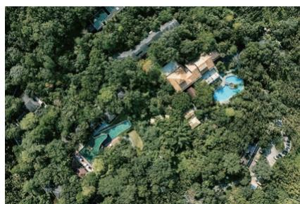

natural_image

Aerial view of a forested area with scattered buildings and greenery, no visible text or symbols.

## 应对气候变化

## 应对气候变化

气候变化作为当前日益严峻的全球性议题，我们已经意识到其对集团的战略布局与日常经营均会产生实质性影响。为此，君亭酒店集团立足绿色低碳发展方向，将国家"双碳"目标及相关政策要求纳入集团整体部署，有序推动低碳转型进程。

## 治理

君亭酒店集团的应对气候变化相关治理架构紧密依托于ESG治理体系，详见本报告“可持续发展管治”。最高管理层参与气候相关风险的识别与评估、目标设定、制定、监督和批准重要的ESG事宜及相关应对方案，保障应对气候变化相关管理举措在公司决策与运营中得到有效落实

## 战略

君亭酒店集团响应国家“碳达峰”“碳中和”战略目标，履行绿色饭店国家标准，将绿色运营融入集团发展战略，致力干在酒店建设与运营过程中最大限度减少对环境的负面影响，同时带动供应链协同践行绿色低碳。

## 风险管理

君亭酒店集团高度关注气候变化对酒店运营和价值链的实际和潜在影响，致力于减轻气候变化对酒店运营的负面影响并把握气候变化带来的机遇。本集团根据风险类型及随时间演变特性，按照运营所在地实际情况，识别出多项可能影响酒店运营的气候相关风险，并制定相关的减缓措施。

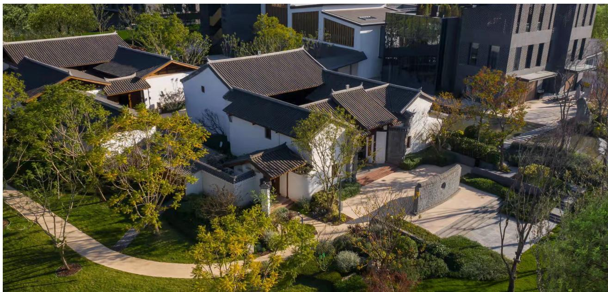

natural_image

Aerial view of traditional Chinese-style buildings with tiled roofs and surrounding greenery (no visible text or signage)

<table><tr><td colspan="5">气候变化相关风险</td></tr><tr><td>影响性质</td><td>风险类别</td><td>影响周期*</td><td>风险描述</td><td>应对措施</td></tr><tr><td rowspan="3">物理风险</td><td>急性风险</td><td>短期中期长期</td><td>●极端天气频发:气候变化背景下,涵盖暴雨、台风、热浪及寒潮等多种类型的极端天气频发,或将对酒店基础设施的完好性及运营连续性构成直接风险。在能耗层面,夏季高温或将致使制冷系统长期处于高负荷运转状态,冬季极寒天气则削弱供暖设备运行效率,增加能源消耗。</td><td>●在建筑结构方面,定期委托专业机构对屋顶、外立面、门窗及排水系统进行检查,确保主体结构具备抵御极端天气的能力。●在能源管理方面,积极推进节能改造,部署智能温控系统,同时引入太阳能光伏等可再生能源,减少极端气温条件下的能耗峰值压力。●在应急管理层面,制定并定期演练针对极端天气的应急预案,明确人员疏散路线与响应流程,切实保障宾客与员工的生命安全。●此外,增加建筑周边绿化覆盖,通过绿色屋顶、垂直绿化及遮阳构筑物等措施有效削弱热岛效应。</td></tr><tr><td rowspan="2">慢性风险</td><td rowspan="2">中期长期</td><td>●海平面上升:全球气候变暖加速将导致海平面持续上升,沿海及低洼地区的酒店资产面临日趋加剧的洪涝暴露风险。从长远维度审视,洪涝灾害的频繁化将对酒店资产价值形成持续侵蚀。</td><td>●在选址与改扩建规划阶段,将洪涝风险评估纳入决策依据,避免在低洼易涝区域新建关键基础设施。●优先对易涝区域进行防水加固,安装自动排水泵等物理防护设施,降低损失。</td></tr><tr><td>●水资源短缺:气候变化所引致的降水分布变化与蒸发强度上升,部分区域市政供水压力增大,加剧了淡水资源的供需矛盾。作为用水密集型行业,酒店在客房洗浴、餐饮运营等核心业务环节均对持续稳定的供水条件存在较高依赖。水资源趋紧将直接推升用水成本,并在供水紧张时期形成限水约束。</td><td>●系统推进节水管理,实时识别用水异常与漏损点,从源头控制无效耗水。●在设施改造方面,逐步推广低流量卫浴设备及循环冷却水系统等高效节水设备,长期计划建立雨水收集与中水回用体系,切实降低对市政供水的依赖。</td></tr><tr><td>转型风险</td><td>政策风险</td><td>短期中期长期</td><td>●政策法规趋严:酒店业面临日趋严格的环境监管压力。集团须严格遵守环保法规,确保各门店环境表现持续达标。若未能满足相关标准,将罚款及责令整改。随着国家“双碳”目标的深入推进,碳排放配额管理、强制性能效标准及绿色建筑认证要求等政策工具将逐步延伸至酒店行业,增加了运营成本和管理复杂度。</td><td>●推出“零碳会议”套餐,建立覆盖全体门店的环境合规管理体系,并定期委托第三方机构开展合规审计,确保各门店持续满足法规要求。●密切跟踪国家及地方层面的政策动态,将绿色建筑认证、能效标准升级等要求纳入中长期改造规划。</td></tr></table>

<table><tr><td>影响性质</td><td>风险类别</td><td>影响周期*</td><td>风险描述</td><td>应对措施</td></tr><tr><td rowspan="3">转型风险</td><td>技术风险</td><td>中期长期</td><td>●技术进步:绿色改造项目单店初期投入较高,若因选型失误、施工质量不达标等原因,或将导致改造效果未达预期,将造成较大规模的投资浪费。</td><td>●评估光伏发电、智能能耗监测及中水回用等技术方案的实际投资回报与运营适配性,以试点数据为依据优化选型标准后再行推广。●组建或培育内部绿色技术团队,持续跟踪行业技术演进趋势,建立与科技前沿企业的数智化合作。</td></tr><tr><td>市场风险</td><td>短期中期长期</td><td>●宾客偏好变化:随着绿色消费趋势愈发明显,若未进行绿色产品认证,推出低碳客房,获取绿色建筑或可持续旅游相关认证等,或将流失绿色消费敏感客群,流失ESG要求较高的合作伙伴,在市场竞争中丧失优势。</td><td>●加快推进绿色产品体系建设,积极申请绿色酒店认证或其他具有市场公信力的可持续旅游认证,强化绿色品牌形象。●推出低碳客房、绿色会议套餐等差异化产品,将碳足迹数据纳入产品说明。●要求供应商提供环保包装材料并优先采购本地食材,将绿色供应链标准纳入采购考核体系,从源头降低产品全生命周期的碳排放强度。●推广电子房卡、数字化账单及无纸化入离店流程,减少一次性物料消耗。</td></tr><tr><td>声誉风险</td><td>长期</td><td>●若酒店环境治理不达标,或将对酒店声誉产生负面影响,降低客人对酒店的信任度。</td><td>●定期披露ESG报告,参与可持续倡议,建立环境舆情监测机制,对涉及环保议题的用户反馈实施快速响应,将个案投诉化解于扩散之前。●通过倡导宾客参与环保项目,将宾客转化为绿色理念的共同践行者,以正向互动积累品牌的社会好感度。</td></tr></table>

\*影响周期的定义：短期0-3年，中期3-5年，长期5年以上

气候变化相关机遇

<table><tr><td>机遇类型</td><td>时间范围*</td><td>机遇描述</td><td>应对措施</td></tr><tr><td>能源效率与成本节约</td><td>短期</td><td>●能源成本节约:通过安装热泵系统、LED照明及智能能耗监测平台,并引入太阳能、地热能、生物质能等可再生能源和清洁能源,显著降低能耗。●水资源效率提升:节水技术的规模化应用可降低用水成本,并有助于规避部分地区因水资源紧张而实施限水管控所带来的运营风险。</td><td>●推进安装热泵系统、部署LED照明及能耗物联网监测平台,减少能源损耗和温室气体排放。</td></tr><tr><td>品牌价值与市场定位</td><td>中期</td><td>●将可持续发展纳入品牌核心叙事,通过ESG报告披露环境绩效、推进碳认证,可有效提升品牌透明度与公信力。</td><td>●通过推出“碳中和”住宿套餐及“零废弃”旅行产品,拓展绿色产品体系;同时与环保机构及属地社区建立长效合作机制,开发生态旅游路线设计与气候教育项目。●将可持续发展战略与品牌传播体系深度整合,在官网、社交媒体及宾客沟通触点中持续传递绿色理念。●推进绿色饭店倡议与认证,以第三方背书增强品牌公信力。●定期发布ESG报告,以可量化的环境绩效数据支撑品牌叙事。</td></tr><tr><td>技术创新机遇</td><td>长期</td><td>●智慧调控减负:数字化智能系统的引入为酒店运营效率优化开辟了新路径。智慧能源管理平台可实现能源分配的动态调节,并通过流程自动化降低人力投入。●循环经济模式:推动餐厨垃圾、布草物料等废弃物资源化利用,可在削减运营成本的同时,探索废弃物再生的新收入流。</td><td>●加快数字化智能管理系统的建设进程,整合能源、水资源管理数据,构建统一的运营监控平台,实现资源消耗的实时可视化与异常预警。●建立餐厨废弃物分类处理与资源化利用机制,探索与本地有机农场或废弃物处理企业的合作模式,将废弃物转化为可量化的成本节约或额外收益。●将供应商环保资质纳入评估标准,优先选择提供环保包装与本地食材的合作方,从供应链源头推动循环经济模式的落地。</td></tr><tr><td>政策转型机遇</td><td>长期</td><td>●政策激励支持:政策为绿色技术的研发应用(如分布式光伏、储能、热泵等可再生能源技术)提供支持和补贴激励。若酒店通过深度节能、光伏应用产生碳减排量,或能通过国家核证自愿减排量(CCER)机制参与交易,将减排转化为可交易的资产。</td><td>●符合政策要求及行业规则的酒店资产,或将在资产估值和融资交易中获得溢价。</td></tr></table>

\*时间范围的定义：短期为0-3年，中期为3-5年，长期为5年以上

## 指标和目标

君亭酒店集团开展温室气体排放盘查，细致梳理各类排放源，实施温室气体减排措施。本集团积极响应全球应对气候变化的行动，已将气候变化融入本集团长期发展战略中，未来我们将逐步设定温室气体减排目标，规划并推动温室气体减排路径。

<table><tr><td>指标</td><td>单位</td><td>2023年</td><td>2024年</td><td>2025年</td></tr><tr><td>直接(范围1)温室气体排放</td><td>吨二氧化碳当量</td><td>2,327.40</td><td>2,465.58</td><td>2,440.09</td></tr><tr><td>间接(范围2)温室气体排放</td><td>吨二氧化碳当量</td><td>21,719.00</td><td>25,004.68</td><td>24,873.61</td></tr><tr><td>温室气体排放总量</td><td>吨二氧化碳当量</td><td>24,046.39</td><td>27,470.27</td><td>27,313.69</td></tr></table>

注：  
1.直接(范围1)温室气体排放源包括汽油、柴油、天然气，其二氧化碳排放因子主要参考《公共建筑运营企业温室气体排放核算方法和报告指南》。  
2.间接（范围2）温室气体排放源包括外购电力与外购热水，其二氧化碳排放因子参考《公共建筑运营企业温室气体排放核算方法和报告指南》。

## 能源利用管理

2025年，本集团制定了《君亭酒店集团股份有限公司能源管理政策》，旨在推动能源高效利用的落地，不断提升公司的环境管理水平与积极履行上市公司的社会责任。我们建立能源管理体系，将能耗指标与经营绩效相挂钩，明确岗位责任，确保责任落实到人。与此同时，本集团重视能源使用数据的记录与分析工作，并根据分析结果及时调整和改进能源使用策略，以提升能源管理的科学性与有效性。

本集团消耗的能源种类包括电力，汽油和少量柴油。我们积极响应国务院《2024-2025年节能降碳行动方案》，并按《民用建筑能耗标准》(GB/T 51161-2016)等国标要求对新项目进行翻新改造，致力于通过引进先进设备与技术实现节能降耗，持续优化能源消费结构，推动节能降碳改造

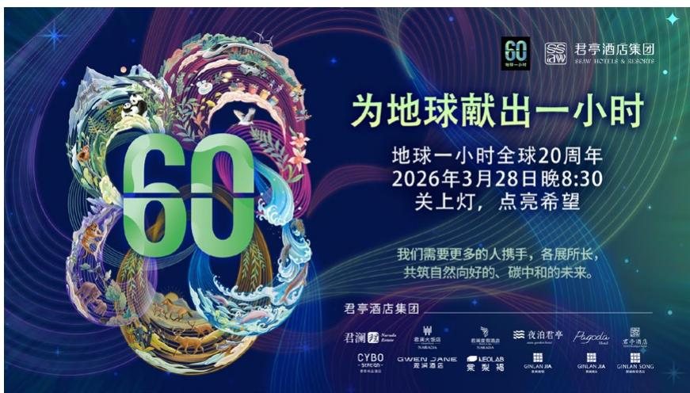

text_image

60
60
君亭酒店集团
GIAW HOTEL & REUNITS
为地球献出一小时
地球一小时全球20周年
2026年3月28日晚8:30
关上灯，点亮希望
我们需要更多的人携手，各展所长，
共筑自然向好的、碳中和的未来。
君亭酒店集团
君澜阁
CYBO
-SINGUO-
BEIJING JIAJ
W
普通酒店
SINGUOJA
GWIEN JANE
晨间酒店
LEOLAB
紫裂褐
夜泊哲亭
Sun good house
Pugodia
Heli
GINLAN BA
GINLAN JA
Hali
GINLAN SONG
BANJUJU

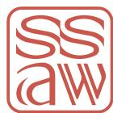

君亭酒店集团节能低碳改造措施

<table><tr><td>节能生产设备</td><td>●本集团引入空气源热泵、地源热泵等热泵系统高效电机、节能空调设备及高效蒸汽发生器和热交换器等节能生产设备,以降低对化石燃料的依赖并优化能源利用效率。</td></tr><tr><td>节能照明设备</td><td>●本集团替换传统白炽灯,采用LED照明;●部署智能控制系统,在公共区域根据自然光线强度及人员活动情况自动调节照明亮度,有效降低照明能耗。</td></tr><tr><td>节能温控设备</td><td>●本集团在旗下酒店安装智能温控设备,对空调及相关设备的运行温度进行实时监控与优化,避免过冷或过热现象的发生;●同时,本集团根据不同区域的客流量及活动安排,对空调温度设置实施分区动态调整,以实现节能目标。</td></tr><tr><td>蒸汽余热利用</td><td>●本集团充分利用蒸汽余热回收系统,将锅炉排放的废热用于预热生活热水,探索能源梯级利用模式,进一步提升能源利用效率。</td></tr><tr><td>可再生能源利用</td><td>●本集团在酒店屋顶或外墙安装太阳能发电系统,为酒店提供部分电力供应;●因地制宜利用地热资源,引入地热能系统,为酒店提供稳定的热能供应,持续优化能源消费结构。</td></tr><tr><td>能源使用监控</td><td>●本集团部署智能电表、智能水表、温湿度传感器等物联网设备,借助大数据分析对空调、照明、热水系统等能源消耗情况实施实时监控,并借助智能优化算法与大数据技术对能源使用实施动态优化管理(如在非入住时段降低空调功率);●本集团打造&quot;智慧住&quot;运营平台,覆盖前台接待、餐饮服务、客房管理等核心业务场景,支持手机远程操控客房设备,减少宾客离店后的待机能耗。</td></tr><tr><td>日常酒店运营</td><td>●我们选取非二氧化碳介质的灭火器;●客房内推行“布草更换按需服务”,建议宾客减少一次性用品的使用、布草更换洗涤频率,鼓励客人选择公共交通或骑行出行,以减少二氧化碳排放。</td></tr></table>

<table><tr><td>指标</td><td>单位</td><td>2025年</td></tr><tr><td>能源消耗总量</td><td>吨标准煤</td><td>5,754.05</td></tr></table>

## 践行绿色运营

君亭酒店集团致力于从门店运营到客户体验的各场景中，构建使消费者能够感知、接触并传播可持续理念的绿色生活体验场景，并将集团所践行的可持续品牌价值传递至广大消费者，推动实现全链条减碳生态。本集团建立了绿色建筑设计与材料选用、节能降耗与智能调控、适度饮食与减塑降塑倡议等方面的多维度绿色运营模式，在保障宾客入住舒适体验的同时，实现环境效益与运营效率的协同平衡。

## 绿色建筑

在建筑设计方面，君亭酒店集团采用被动式设计理念，在新建筑设计中，甄选具备隔热性能的墙体与屋顶建材（如加气混凝土砌块、保温隔热屋面），优化自然采光与通风（如大尺寸落地窗、中庭设计），减少了对空调、照明等外部能源的依赖，提升了建筑全生命周期的能源效率，同时改善室内空气质量。

在材料采购方面，君亭酒店集团将可持续标准贯穿于材料源头及各层级供应商管理之中，构建了覆盖全链路的绿色供应链体系。本集团优先选用再生混凝土、回收塑料等再生建材，以减少对不可再生资源的依赖。此外，本集团还优先采购通过环境管理体系认证（如ISO14001）或符合绿色建材标准的材料（如低VOCs排放的涂料、黏合剂），包括再生玻璃、塑料、金属及木材，不仅能够从材料采购端减少碳排放，也能够改善室内空气质量，保障宾客的安全与健康。

在室内环境方面，君亭酒店集团积极引入专业空气消毒设备，在酒店内部开展除甲醛工作，有效分解甲醛并抑制其产生。本集团优先选用环保材料，从源头减少甲醛排放，改善室内空气质量，降低室内污染水平，为宾客提供健康、安全的住宿环境。

在室内装饰方面，本集团选用有机材料制作的家具及装饰品，减少对化学合成材料的依赖。同时，本集团引入可循环利用材料，包括可重复使用的窗帘、床品及家具部件，延长材料使用寿命，减少资源浪费，全面落实可持续发展理念。

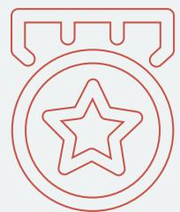

截至2025年末，

浙江世贸君澜大饭店获评“碳标签酒店”认证:河北寨罕坝伯斯特君澜度假酒店成为国内首家碳中和酒店：七仙岭君澜度假酒店三次蝉联“五叶级绿色饭店”：香水湾君澜度假酒店、君澜·江山国际度假酒店、湖州太湖君澜温泉度假酒店等均已启动“绿色饭店”创建工作，推动整体绿色运营向更高层次、更规范化发展。

## 绿色入住

君亭酒店集团专注于优化绿色入住体验，通过可持续的日常化经营，构建涵盖“食”“住”“行”的生活化低碳场景，以此将可持续消费场景融入消费者日常，倡导可持续生活方式

在食材采购环节，本集团优先采用本地应季食材，并以获得绿色认证的供应商作为首选合作对象，与当地绿色农场建立直供合作，以保障食材的新鲜度和绿色安全标准，并降低运输能耗与碳排放。在烹饪环节，本集团在厨房推广节能炉灶的使用，通过精准的火候调控与时间管理降低能源消耗。在就餐服务环节，本集团以“精致适量”为核心原则，优化菜品设计向宾客提供适量点餐建议，并干餐厅桌面及墙面张贴减少浪费的宣传标识，为宾客营造绿色用餐体验，传递可持续绿色膳食理念。

## 案例：君澜品牌推行餐食节约行动

君澜品牌全面推行可重复使用餐具，设置“小份菜”“半份菜”选项，餐桌摆放“光盘行动”温馨提示牌。据统计，自推行节约措施以来，君澜酒店餐饮成本降低10%，剩菜比例控制在8%以内，厨余垃圾减少近30%。

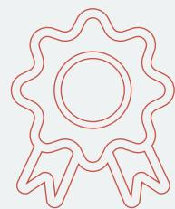

## 荣誉奖项

君亭酒店集团《绿色新旅“食住行”全链条绿色健康客房体验》案例，荣获中国饭店协会2025中国饭店业ESG创新大赛铜奖

君亭酒店集团积极倡导宾客践行与自然和谐共处的旅居方式，并于服务细节中落实环保承诺。在客房服务方面，本集团推行“轻减”理念，鼓励宾客降低床品及毛巾等用品的更换频次，并逐步淘汰一次性塑料制品，以可降解或可重复使用的环保材料及餐具器皿加以替代。此外，本集团在酒店内设置专项垃圾分类回收系统，定期收集和处理废弃物，并引导员工及宾客规范开展垃圾分类，提升资源回收利用率

<table><tr><td>客房易耗品</td><td>●牙刷:牙刷柄主材从PP料改为秸秆基材,刷毛为竹炭磨尖丝,经久耐用,并通过ISO 9001质量认证和ISO 14001环境管理体系认证。●包装与手提袋:外包装和手提袋从塑料卷膜改为石头纸材质(碳酸钙基材),减轻对环境造成的污染。我们使用的配套牛皮纸包装袋持有FSC产销监管链管理体系认证证书,符合FSC森林可持续经营标准,从包装源头践行绿色环保理念。●拖鞋:鞋面/鞋底采用再生无纺布和纤维材质,取得ISO 14001环境管理体系认证。拖鞋外包装进行极简设计,改用纸质腰封,减少塑料依赖。●洗护品:我们以可循环填充大瓶替代一次性小瓶洗护,大幅减少塑料包装废弃物,降低耗材采购及环保处理成本。</td></tr><tr><td>客房棉织品</td><td>我们选用符合全球回收标准(GRS)的羽绒被、枕头等芯类产品,以舒适耐用的品质为宾客提供沉浸优质的安睡体验。我们优选遵循绿色环保理念并通过欧洲生态环保纺织品Oeko-Tex Standard 100 认证、GRS(Global Recycling Standard)和 GOTS(Global Organic Textile Standard)国际认证的供应商,兼顾棉织品的绿色环保属性。</td></tr><tr><td>酒店纸品</td><td>我们选用具备CFCC森林认证、FSC认证的原生纯木浆纸品,由100%原木木浆制成,天然无荧光漂白、无化学添加,以减少森林砍伐压力。</td></tr><tr><td>咖啡渣循环</td><td>我们回收酒店废弃咖啡渣,加工制成客人可携带除味包,实现资源可持续循环利用。</td></tr><tr><td>清洁药剂</td><td>我们严格甄选经挪威船级社(DNV)国际认证、具备零碳工厂资质的清洁药剂供应商。相关产品配方采用60余种可生物降解原料,替代壬基酚聚氧乙烯类高COD物质、含磷清洗剂及含氯溶剂,在保障酒店清洁卫生标准的同时,减少对臭氧层与大气环境的影响。</td></tr></table>

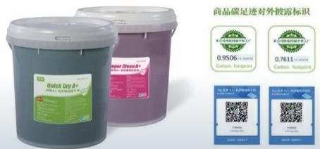

text_image

商品碳足迹对外披露标识
Quick Dry + -
0.9506
Carbon Resinance
0.7611
Carbon Resinance
商品碳足迹对外披露标识

某在用供应商进行商品碳足迹披露  
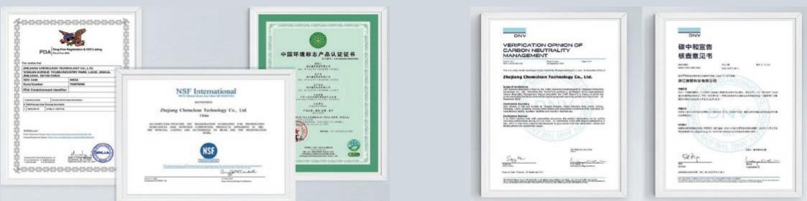  
某在用供应商取得FDA国际认证、NSF国际认证、十环认证 某在用供应商取得挪威船级社（DNV）国际认证证书

君亭酒店集团积极倡导绿色消费理念，发起“绿色入住”行为倡议，引导消费者进行理性购买和负责任消费，致力于与消费者共同构建一个更加绿色、低碳的住宿环境，为地球的可持续发展贡献力量。君澜酒店结合地球一小时、世界环境日等重要节点，策划“古镇漫游拾荒”、“海洋护蓝”行动等活动，绿色低碳传播总曝光量创新高，为文旅行业提供了可复制的生态友好范式。

## 案例：“植”此青绿“筝”春色⸺金华君澜大饭店植树节活动

2025年3月植树节期间，金华君澜大饭店结合春日时令与绿色理念，匠心开展植树节特色主题活动。活动特邀宾客沉浸式参与绿植栽种、风筝DIY两大趣味体验项目，以自然互动的形式拥抱春日美好，本次活动共计10名宾客积极参与。活动以践行绿色环保、传递生态理念为核心，借亲手植树播种绿意，凝聚守护自然的初心，助力生态保护与绿色发展。同时，饭店借此契机积极倡导低碳健康的生活方式，呼吁宾客立足日常点滴，自觉践行节约水资源、减少一次性用品使用、低碳减量等环保行为，让绿色低碳理念深入人心，以微小行动共建宜居生态环境。

## 案例：君亭酒店集团联合银联推出“绿色入住”碳账户 为宾客打造绿色旅居体验

君亭酒店集团与中国银联联合推出“绿色入住”项目，持续探索“绿色低碳酒店”创新解决方案。该项目致力于将ESG理念融入酒店消费场景，贯彻可持续建筑与绿色运营理念，推动节能减排的可持续生活方式的实践。通过“个人碳账户”机制，消费者在君亭酒店实施绿色行为（包括不使用一次性用品、办理智能入住、续住不换床品及开具电子发票等），可

获得相应的碳减排量与绿色能量奖励。中国银联与君亭酒店集团在消费者“预订、住房、退房”全流程中收集碳足迹信息，对由此产生的碳减排量进行科学核算，并以直观形式向消费者呈现低碳生活成效，传递低碳发展理念。

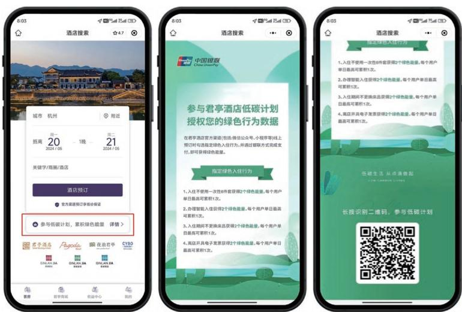

绿色饭店不仅是彰显社会责任的选择，更是关乎未来生存与增长的战略必然。面对机遇与挑战，绿色饭店发起人、君澜酒店董事长兼总裁王建平基于对行业与社会发展的深层思考，明确提出“饭店业绿色低碳发展理念”，倡导饭店建立低碳运行模式，通过创新引领，以智能化、绿色化，实现从简单的节能降耗向绿色低碳发展，引领饭店业合理的生产方式。饭店管理者应主动融入绿色理念，借助低碳材料、数字化科技等降低成本，既为消费者提供健康舒适的空间，也助力行业契合国家双碳战略。

## 案例：君澜品牌相关绿色饭店实践获行业认可

2025年12月，在第三届中国酒店业低碳创新合作论坛上，君澜品牌相关绿色发展实践获得行业认可。君澜品牌董事长兼总裁、浙江省饭店业协会会长王建平凭借其在绿色饭店理念推广、体系构建与行业实践中的开创性贡献与持续引领，荣获饭店业低碳发展的“领军人物”称号。

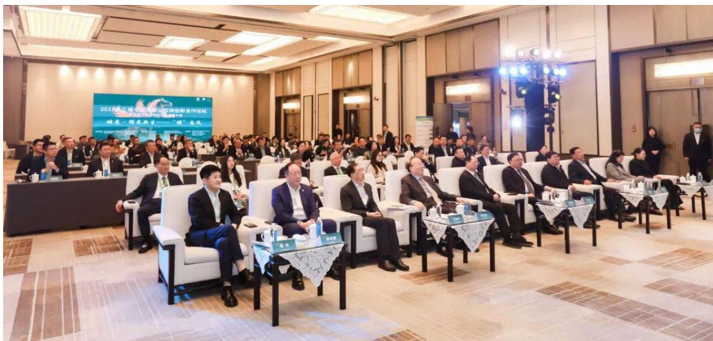

text_image

2025第三届中国大会暨全国创新合作论坛
暨“新年度”主题·新年度

2025第三届中国酒店业低碳创新合作论坛现场

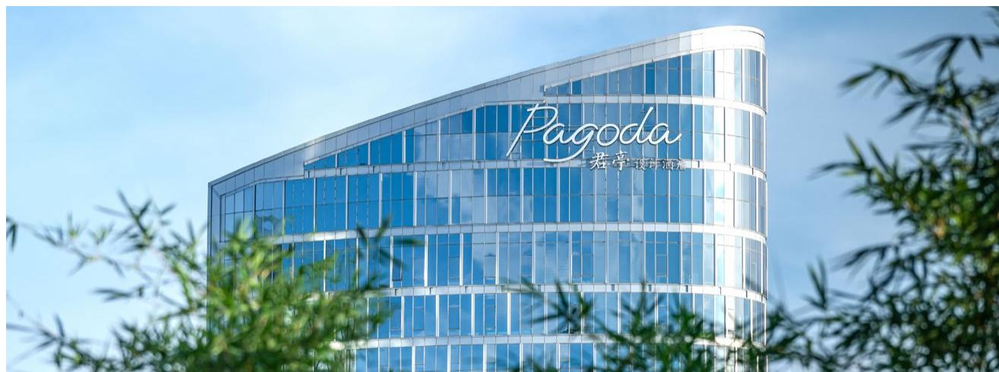

text_image

Pagoda
君亭-设计酒店

## 匠心筑信 品质致远

3 良好 健康与福祉

9 产业、创新和基础设施

12 负责任消费和生产

君亭酒店集团始终围绕宾客体验核心，构建完善的质量管控与安全运营体系，并融入数字化智慧服务，为宾客打造全流程高品质入住体验。此外，集团通过严格的数据安全与隐私保护机制，全方位守护宾客信息安全，持续筑牢客户信任基石。

## 筑牢品质基石

作为中高端服务酒店的代表，君亭酒店集团始终致力于产品与服务的双重提升，在全面满足国家标准的基础上，构建了一套更为严格、精细的安全管理与质量管理制度体系。

## 品质管理体系

在制度建设层面，本集团已制定《客房服务管理制度》《客房操作流程制度》《餐饮卫生清洁服务制度》《安全管理制度》等核心文件，为标准化运营提供有力支撑：在监督执行层面，依托《服务明查标准》与《服务暗访手册》等内控工具，对服务质量进行动态追踪与闭环管理。

2025年，本集团持续推进制度优化，正式制定并发布了《君亭酒店集团餐饮部运营手册》《君亭酒店集团管家部运营手册》《君亭酒店集团前厅部运营手册》，以更完善的制度体系指导服务质量持续提升。同时，本集团鼓励旗下各酒店品牌结合自身业务特点，细化集团制度要求，编制并实施适用自身定位的品质管理规范(例如《君澜酒店品质管理与服务标准指导手册》），使规范更具适配性与指导性。

在管理架构层面，本集团以流程化、精细化管理为牵引，构建了权责清晰、层级分明的品质管理架构。

本集团设立品质管理部作为品质管控的核心职能部门，全面负责集团品质控制体系的搭建、完善、监督与落地。在此基础上，本集团推动各门店设立品质管理小组，由门店总经理直接担任品管负责人，并指定专职品管联络人，负责本店品质工作的上传下达与协调推进。品质管理小组全面承担酒店质量管理的各项职责，致力干强化管理层与一线员工的品质意识，将品质管理深度融入操作流程与服务细节，从源头把控质量风险，以系统化机制保障服务与管理的高标准、高质量。其中，服务与安全部门承担监督职能，负责管理体系的落地与过程管控；各门店为执行主体，落实日常运营中的质量要求。

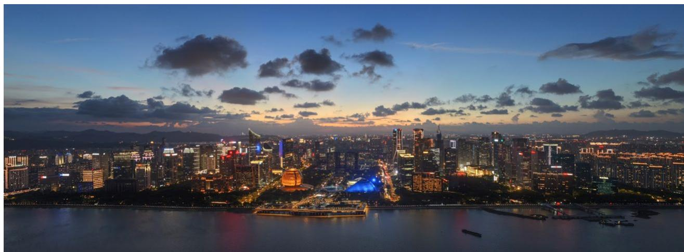

natural_image

Panoramic evening view of a modern city skyline at dusk, featuring illuminated skyscrapers and waterfront (no visible text or signage)

## 君亭酒店品质管理架构

集团

品质管理部

核心职能部门

各门店

品质管理小组

门店总经理-品管负责人

监督层

执行层

指定品管联络人

服务部门

负责服务质量监督

安全部门

负责安全管理监督

各部门

负责执行安全与质量管理措施

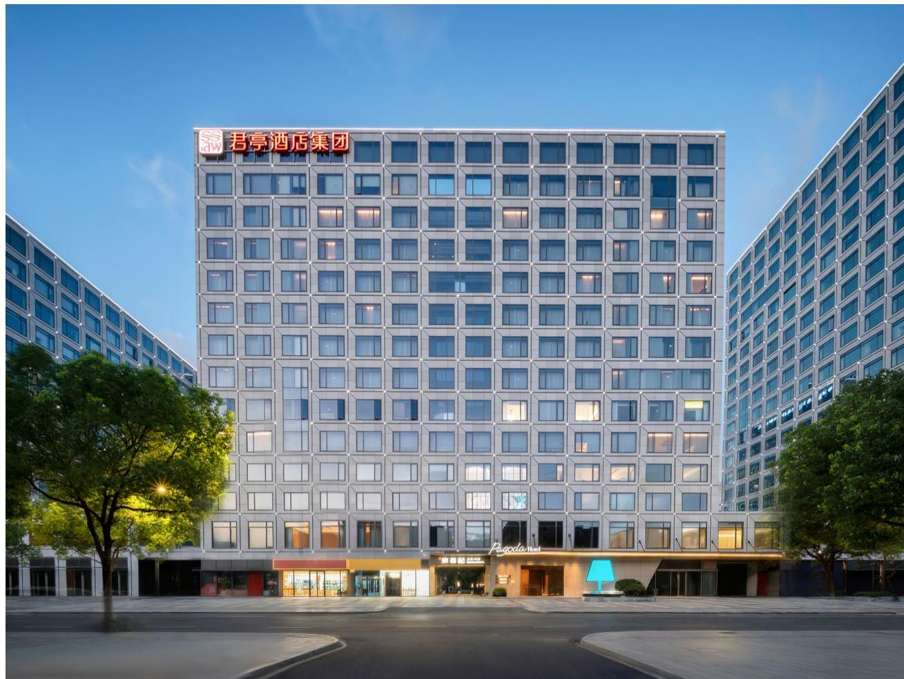

text_image

君亭酒店集团
Pagoda.net

## 品质检查机制

君亭酒店集团建立了系统化的质量管理自查与评价机制，通过定期开展全面检查与评估，形成了“制定与审批-分解与下达-分析与考核”的闭环管理流程，确保质量管理目标的科学性、可行性与可操作性。在此基础上，本集团每年更新质量管理目标，各门店每月开展自检工作，品质管理小组每季度组织自查与暗访，并将检查报告及时提交至集团备案与研判。

君亭酒店集团明察暗访体系规范

<table><tr><td>步骤</td><td>具体措施</td></tr><tr><td>明察工作</td><td>●由集团品质管理部统一组织●采取定期检查形式,对门店服务流程、环境卫生、设施设备、食品安全、仪容仪表、标准化执行等进行全面现场核查,现场反馈问题、下达整改要求并跟踪复查</td></tr><tr><td>暗访工作</td><td>●由集团品管部、第三方机构或专项小组执行●采取不定期、不提前通知、匿名体验形式,真实还原宾客视角,重点核查服务响应、隐性服务、细节品质、违规操作等问题,形成独立暗访报告</td></tr><tr><td>结果运用与整改</td><td>●明察暗访结果作为门店品质考核核心依据,对问题门店限期整改、复查复盘●对多次不合格或整改不到位的门店,启动通报、约谈与问责机制</td></tr><tr><td>数据汇总与提升</td><td>●定期汇总明察暗访数据,梳理共性问题、典型案例,下发各门店学习整改,推动品质问题持续优化</td></tr></table>

2025年，本集团进一步加大了对各门店的内部品质检查频次与力度，督促各店依据品质检查报告制定整改措施并推动闭环落实。君澜酒店自2024年依据《旅游饭店星级的划分与评定(GB/T14308-2023)》完成《君澜酒店集团服务品质检查手册》升级后，2025年为指导执行君澜品质管理标准的首年，暗访组通过对51个项目酒店（同比增长8.5%）进行预订体验、抵离店体验、客房体验、餐饮体验、康乐体验、公共区域设施与环境、设备系统、后台环境与管理、君澜服务体验等板块的巡检，各门店巡检得分提升较为明显。

截至本报告期末，本集团各项安全与质量管理制度执行到位，全年未发生食品安全、公共卫生、治安及消防等重大安全事件，亦无重大消费者投诉与纠纷，整体运营保持平稳有序。

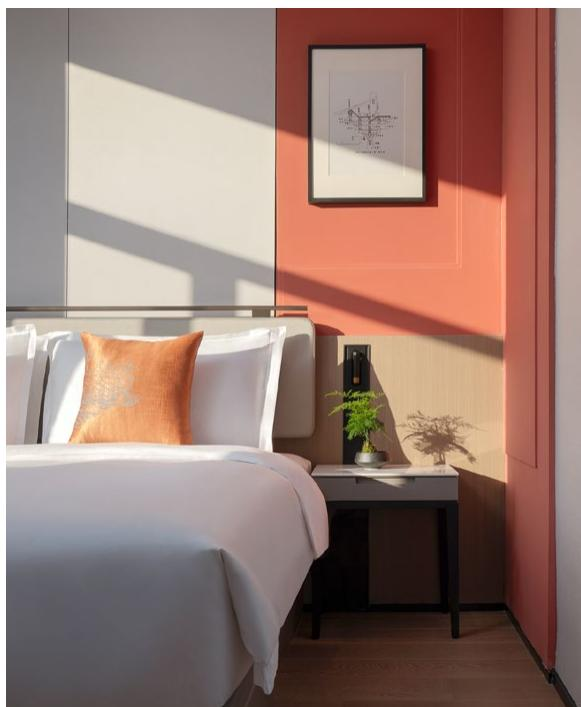

natural_image

Interior bedroom scene with a bed, orange cushion, and wall art (no visible text or symbols)

2025年君澜巡检各体验板块平均分  
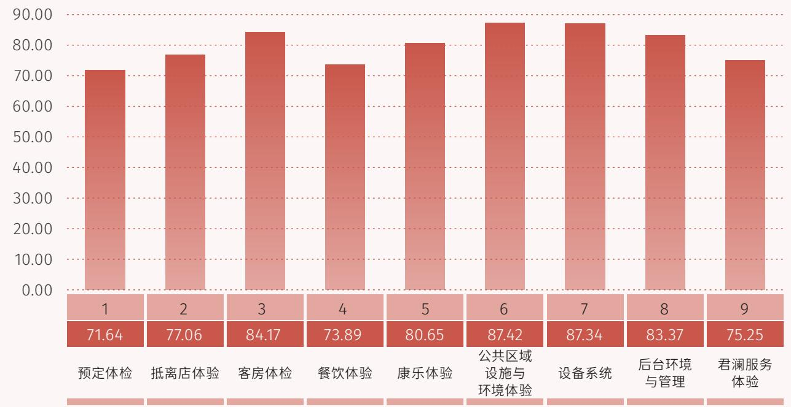

bar

| Category | Value |
| --- | --- |
| 预定体检 | 71.64 |
| 抵离店体验 | 77.06 |
| 客房体检 | 84.17 |
| 餐饮体验 | 73.89 |
| 康乐体验 | 80.65 |
| 公共区域设施与环境体验 | 87.42 |
| 设备系统 | 87.34 |
| 后台环境与管理 | 83.37 |
| 君澜服务体验 | 75.25 |

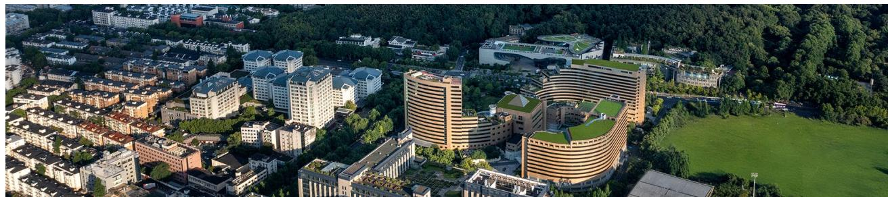

natural_image

Aerial view of a modern urban residential complex with curved buildings, green roofs, and surrounding greenery (no visible text or signage)

## 品质文化建设

品质文化建设是集团服务质量持续提升的内生动力。本集团通过系统化培训强化员工专业素养，将品质要求融入管理实践与日常运营，推动品质理念在各个环节有效落地。

## 品质培训

君亭酒店集团将品质管理队伍建设作为重点工作，通过常态化培训机制，不断提升管理团队在品质领域的专业能力和实操水平。2025年，本集团围绕服务质量提升开展专项活动，推动各项要求在各门店落地执行，为服务质量的长效提升奠定了基础。

## 案例：君亭酒店集团开展“匠心服务，臻于至善”服务质量月活动

2025年9月，君亭酒店集团在旗下所有酒店统一组织开展“服务质量月”活动，主题为“匠心服务，臻于至善”。活动期间，各酒店围绕五大目标推进：强化全员服务意识、规范SOP（标准操作程序）执行标准、提升关键岗位技能、优化宾客体验和改善酒店硬件环境。各酒店总经理作为第一责任人牵头成立专项工作小组，负责制定详细实施方案，结合OTA平台差评及日常运营反馈，梳理宾客触点与痛点，推动服务流程更新。同时，各小组组织客房及公共环境大清洁与维护保养，确保酒店处于良好运营状态。

此次活动使全员服务意识显著增强，服务流程进一步规范，关键岗位技能得到提升，宾客满意度明显提高。各店以此为契机，将活动中形成的有效做法制度化、常态化，初步建立起服务质量提升的长效机制。

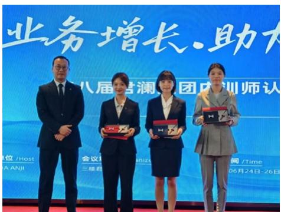

text_image

业务增长·助
八届合澜 团内训师认
位 /Host
会议
三楼君
时间 /Time
06月24日-26日

君澜酒店内训师培训

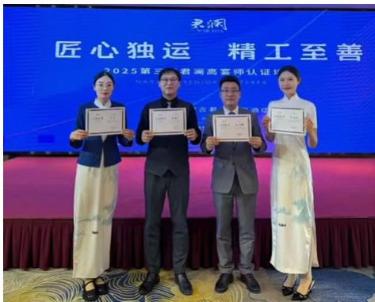

text_image

匠心独运 精工至善
2025第三届 君澜高宴师认证

第三届君澜高宴师认证培训

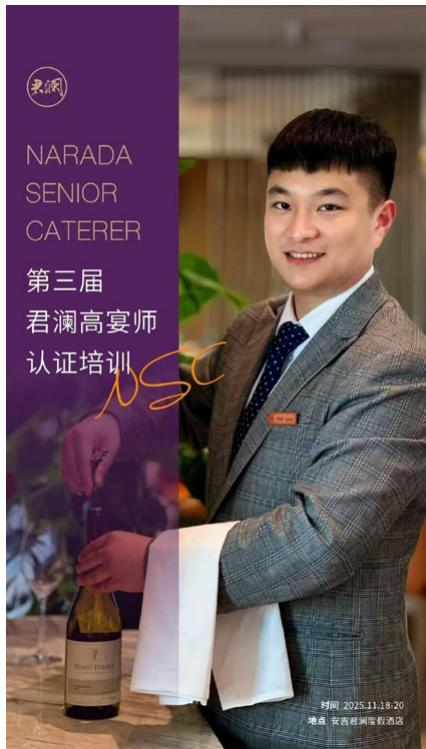

text_image

NARADA
SENIOR
CATERER
第三届
君澜高宴师
认证培训
NSC
时间 2025.11.18:20
地点 安吉翠洲度假酒店

第三届君澜高宴师认证培训

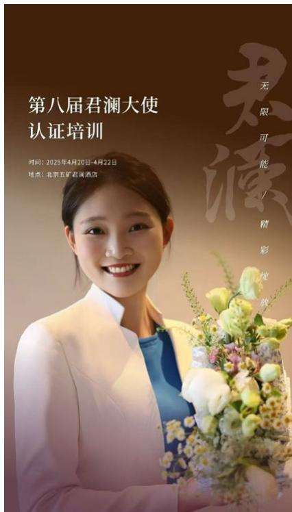

text_image

第八届君澜大使
认证培训
时间：2025年4月20日-4月22日
地点：北京五矿君澜酒店
无限
可能
精彩
绽放

第八届君澜大使认证培训

## 品质荣誉

## 2025年君亭酒店集团获得的品质荣誉

text_image

卓越品质管理酒店集团
2025华客品质榜
2025年度酒店领航者品牌
抖音生活服务

text_image

2025年度影响力酒店集团
美团·酒店民宿
最具品牌价值合作伙伴
携程集团

## 2025营销领航品牌

绿云

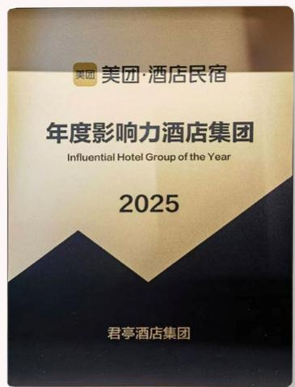

text_image

美团·美团·酒店民宿
年度影响力酒店集团
Influential Hotel Group of the Year
2025
君亭酒店集团

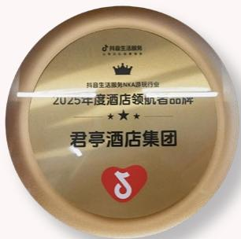

text_image

抖音生活服务
NKA游戏行业
2025年度酒店领航者品牌
★★★
君亭酒店集团

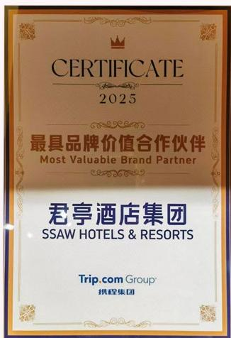

text_image

CERTIFICATE
2025
最具品牌价值合作伙伴
Most Valuable Brand Partner
君亭酒店集团
SSAW HOTELS & RESORTS
Trip.com Group®
携程集团

## 维护客户权益

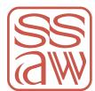

君亭酒店集团始终秉承“以客为尊”的服务理念，健全宾客健康安全管理体系，从安全入住、舒适居住、健康餐食全流程提升宾客体验。我们以保障宾客权益为重点，规范客诉处理机制，坚持理性营销倡导，严守信息安全底线，构建安全透明、可持续的客户服务管理体系。

## 提升宾客体验

君亭酒店集团高度重视运营安全与服务品质，将宾客入住安全与餐饮健康管理纳入核心制度体系。通过搭建系统化的管理制度与相应的管理部门，从入住安全、餐饮安全关键环节入手，全面强化风险防控与流程规范，为每一位宾客提供安心、放心、舒心的旅居保障

<table><tr><td></td><td>入住安全</td><td>餐饮安全</td></tr><tr><td>制度管理</td><td>·本集团已制定《紧急事件处理手册》《客房服务管理制度》《安全管理制度》《公共卫生应急预案手册》等内部制度,确保各项设施和服务的安全运行,保障酒店内部及客人的人身和财产安全,预防和处理各类安全事故。根据门店运营经验,本集团持续优化和细化各项管理规范。</td><td>·本集团严格遵守《中华人民共和国食品安全法》及运营地食品安全规定,持续完善食品安全管理体系,全流程保障食品营养与安全。·本集团制定《总经理运营手册》《君亭酒店集团餐饮部运营手册》《早餐图例手册》,确保酒店餐饮业务按运营地规范合规开展,明确各级管理人员的管理职责。</td></tr><tr><td>负责部门</td><td>·应急指挥中心、公共卫生应急防处置小组:由总经理牵头负责,统筹前台、安保、工程等多个部门第一负责人的工作职责。</td><td>·餐饮部:部门直属上级为酒店总经理,统筹战略规划、运营管理及品牌增长;部门直属下级为餐饮部经理/厨师长。</td></tr></table>

## 入住安全保障

本集团通过统一配置应急物资、搭建智能预警体系、规范应急疏散流程，构建起从风险预判、高效处置到有序疏导的全链条安全管控机制。

<table><tr><td>常态管理</td><td>●严格落实入住实名登记工作●定期对消防器械、消防通道、应急照明、安全疏散指令标识、电线电路等进行检查●客人入住期间,保证前台24小时不间断值守</td></tr><tr><td>应急安全</td><td>●本集团制定《紧急事件处理手册》,对火警、疏散、医疗救急、炸弹威胁、宾客死亡等紧急事件设置管理流程●明确各部门所属责任,确保在突发事件发生时,能够迅速、有序地开展应急处置工作,全力保障客人安全</td></tr><tr><td>数字护航</td><td>●本集团增强与公安系统的联动,进一步实现酒店与公安旅业系统的合规直连,以数智化驱动,通过刷脸人证比对核验住客身份,基于终端进行一键管理</td></tr></table>

## 餐食营养健康

在健康餐食方面，本集团从原料采购、验收、存储、使用全链条建立严格管控机制，强化供应商管理并签订食品安全协议实现食品来源可查、去向可追、责任可究，有效降低食品安全风险。同时，本集团依据《餐饮卫生清洁服务制度》等内部管理制度，规范餐食制作、膳食搭配、场所卫生、餐厨废弃物处置等关键环节，全方位保障宾客餐饮安全与健康。

<table><tr><td>原料管理</td><td>●保障质量管理体系有效实施,避免质量问题带来的风险</td></tr><tr><td>原料储存</td><td>●建立完善的原材料采购体系,对原材料的质量进行严格的质量验收,并选择信誉良好、质量可靠的供应商建立长期稳定合作关系</td></tr><tr><td>原料使用</td><td>●严格执行原材料使用标准,确保原料不受潮、不污染、不变质●由品管部门对原材料使用进行定期检查,及时发现并处理不合格品,督促整改潜在质量问题</td></tr><tr><td>餐食运营</td><td>●从场所及设备常态维护、食品添加剂使用、餐厨废弃处置、健康膳食搭配、餐具清洗消毒、食物留样等方面,严格把控旗下各品牌酒店的餐饮质量</td></tr></table>

## 舒适居住体验

本集团主要聚焦光环境与声环境优化，全面提升宾客居住舒适度。为打造舒适宜人的光环境，我们科学规划自然光利用与照明设备选型，全面覆盖智能灯光控制系统并优化室外视野

## 自然光照保障

●自然光补给：注重室内自然光的分布，确保每个房间和公共区域都能获得充足的自然光。  
●良好遮光：在窗户和门廊等区域设置百叶窗、窗帘等遮光材料，减少阳光强烈照射。

## 应急安全

●柔和光源：使用柔和的白炽灯或LED灯，避免使用冷光LED灯或强光LED灯，以减少光污染和视觉疲劳。  
●智能调节：在部分区域设置智能调光系统，可以根据顾客的行为习惯或设定的时间自动调节亮度，避免光的闪烁和频繁变化，从而降低光敏感人群的不适感。  
●光谱控制：部分高技术区域使用具有宽光谱的照明系统，帮助缓解视觉疲劳，同时提供更自然的光线体验。  
●个性设置：提供多种照明亮度选项，供顾客根据个人需求进行选择。

为营造静谧休憩空间，我们通过优化隔声设计与智能声环境控制系统，有效降低噪音于扰，助力宾客实现深度睡眠与身心放松。此外，本集团旗下各酒店均配备健身设施，满足宾客日常锻炼需求，倡导健康旅居生活方式。

<table><tr><td rowspan="2">建筑隔声设计</td><td>门窗隔音</td><td>●高质量隔音门:确保门缝和密封条的密封性良好,减少外部声音传入。</td></tr><tr><td>门窗隔音</td><td>●隔音墙或隔音板:在关键区域设置,实现双向降噪。●吸声处理:墙面、地面、天花板三位一体进行吸声处理,在天花板悬挂微孔吸音板;在墙面装饰声学软包材料,以轻质、多孔材料(如隔音海绵、发泡材料)为主;在地板铺设高弹性隔音海绵,减少声音的反射和混响,确保公共区域安静。</td></tr><tr><td rowspan="3">环境降噪优化</td><td>静音电器配置</td><td>●空调:更换低噪音空调风机,安装减震支架,定期清理滤网减少异响,降低空调运行噪声至30分贝以下。●其他客房电器:更换低分贝静音型号的冰箱、迷你吧电机,定期预防性维护以避免老化产生噪音。</td></tr><tr><td>管道系统降噪</td><td>●排水管道:固定松动管道,管道包裹3D隔音棉。●卫浴设备:安装静音马桶或缓降式水箱卫浴配件。</td></tr><tr><td>动态监测与智能调控</td><td>●专业仪器:用于测量房间内噪声水平、回响时间、声压等声环境指标,识别评估声环境舒适度。●声压管理系统:可根据房间类型和客户需求自动调节噪声水平。●声学优化技术:用于确保房间内的声音传播效率和混响时间符合人体舒适标准。</td></tr></table>

## 保障宾客权益

本集团将客户投诉视为发现服务短板、防范品牌声誉风险的重要切入点，通过每一单投诉的妥善处理积累信任资产，将负面反馈转化为服务迭代的契机。在此基础上，本集团不断优化服务触点管理，强化一线员工投诉处理能力。

本集团设立预订客服中心与酒店客服中心，提供24小时热线咨询服务确保客户反馈与投诉能够在第一时间得到响应与处理。针对客户诉求本集团建立完善的投诉管理流程，通过填写《集团投诉记录表》、协调投诉处理、开展客户回访等环节，形成闭环响应机制，持续提升问题解决效率与客户满意度。2025年，本集团及各运营点共受理客户投诉90次，投诉解决率达100%。

根据第三方专业点评工具对全平台客户情感指数的统计分析，2025年，君亭酒店旗下所有君亭直营门店的综合客户服务好评率达93.29%；景澜酒店旗下所有门店在携程平台的客户服务好评率为93.8%；君澜酒店的客诉曝光率\*为0.19%，全年客诉率4.33%，客需一次解决率达92.65%。

\*客诉曝光率=住后差评量/客诉量\*100%，数值越低，表明酒店对客诉的有效安抚越多，能有效降低差评量

2025年

本集团及各运营点

共受理客户投诉

90次

投诉解决率达

100%

<table><tr><td>客户投诉渠道</td><td colspan="3">●投诉邮箱:400@ssawhotels.com●投诉电话:0571-86750888●全国统一投诉热线:4006728666</td></tr><tr><td rowspan="6">客户投诉处理流程</td><td>客诉发生</td><td colspan="2">第一时间代表集团向客人致歉</td></tr><tr><td>客诉处理</td><td colspan="2">登记完整信息、准确记录客人投诉需求,包括涉事酒店、事件经过、客人诉求及联系方式</td></tr><tr><td></td><td colspan="2">派发督办填写《集团投诉记录表》,并发送至酒店总经理邮箱,由总经理跟进处理</td></tr><tr><td></td><td>已处理完成的投诉</td><td>由中央预订中心对客人进行回访</td></tr><tr><td>客诉回访</td><td>二次投诉</td><td>由门店总经理亲自处理二次投诉情节严重的投诉或多次协商未解决的客诉,由集团本部做最后的投诉处理</td></tr><tr><td>经验总结</td><td colspan="2">复盘提升每月汇总全集团投诉数据,梳理共性问题与典型案例,下发各门店开展专项培训,持续优化服务,降低同类投诉发生率</td></tr></table>

## 坚持负责任营销

本集团严格遵守《中华人民共和国消费者权益保护法》《中华人民共和国广告法》及相关法律法规，将保障消费者知情权与参与权贯穿于营销活动的全过程。报告期内，本集团制定《君亭酒店2025年会员微信端营销与活动运营规划》，围绕节日营销、会员权益深化、季节性场景运营、新店与跨界合作四大模块，确保营销内容真实透明，权益规则清晰易懂，让消费者在充分知情的基础上自主选择、积极参与。

同时，本集团持续加强销售人员和新媒体账号及内容运营人员的负责任营销培训，培训内容包括普及产品知识、服务细则、运营规范、相关法律法规等，确保一线人员在向消费者传递信息时准确、客观、完整，切实维护消费者的合法权益。本年度，我们开展会员操作及规则培训合计32场，会员电商培训合计35场。

## 严守信息安全

君亭酒店集团始终将客户个人信息安全与隐私保护置于重要位置，持续完善信息安全保障体系。本集团构建协同高效的信息安全管理机制，健全信息安全管理制度与隐私保护策略，制定并落实《酒店用户个人信息泄露应急预案》，强化全流程规范管控，切实保障客户的隐私与数据安全。本集团以数字信息中心为核心，统筹各相关单位协同落实，实现客户信息规范管理与有效防护。

## 数字信息中心工作职责

监控与评估

●定期开展安全漏洞扫描、渗透测试与全面信息安全风险评估工作。

●持续监控与评估公司信息系统安全状况，定期输出安全评估报告并提出优化改进建议。

●负责信息安全事件与安全事故的应急处置、调查分析、溯源及闭环整改。

日常维护

●负责公司安全设备与安全软件的日常管理、配置、运维及版本更新。

组织培训

●组织开展员工信息安全培训与宣导，监督员工严格遵守信息安全管理规

外部合作

●建立与外部安全机构、监管单位的协同机制，联合保障公司信息安全。

本集团成立应急指挥中心，明确由酒店总经理担任组长、副总经理担任副组长、各相关负责人为成员，并负责统一领导、指挥与协调信息泄露事件的应急处置工作，有效应对数据泄露风险

本集团以常态化安全建设为基础、以应急响应为保障，构建全流程信息安全风险防控体系。我们持续推进信息安全常态化体系建设，强化客户信息全生命周期管控。在此基础上，我们规范信息泄露事件报告程序，完善事故应急处理流程。若有信息安全风险事件发生，我们将及时启动技术修复、开展调查核实，客观准确发布处置信息，根据评估结果对信息系统进行整改优化，不断提升应急响应能力与员工风险应对水平。

2025年，本集团未发生信息泄露事件。

## 常态化信息安全建设

●加强服务器设施建设，设置安全组加强安全防护，保障服务器稳定运行；  
●对客户信息进行分类加密存储，设置备份与还原机制；  
● 严格权限管理，提升个人账户安全等级；部署防火墙、防入侵系统等，对网络实施监控，加强安全防护；  
●定期进行数据安全审计与合规性检查，降低信息安全风险；  
● 开展定期安全培训，提升员工信息保护意识，全方位保障客户信息安全。

## 信息泄露应急预案

●快速排查并精准界定数据泄露的范围、程度及影响；  
● 立即采取技术与管理措施阻断泄露源头，及时修复系统漏洞；  
●第一时间上报管理层并通知相关责任部门，正式启动应急处置流程；  
●联合多部门开展事件调查、溯源分析与原因研判；  
●依法依规告知受影响用户，并提供必要的风险提示与协助支持；  
● 按要求完成数据泄露事件总结报告，积极配合监管部门开展核查与处置工作。

natural_image

Close-up of a keyboard with glowing highlights against a dark background, no visible text or symbols.

## 数智创新驱动

君亭酒店集团坚持以数智化转型为发展引擎，通过智慧酒店运营管理与智慧服务建设，全面提升酒店管理效率、服务品质与宾客体验：在运营端，依托数字化系统与智能工具实现流程优化、数据整合与科学决策，提升管理精细化水平：在服务端，聚焦宾客全流程体验，打造便捷化、智能化、人性化的智慧服务体系，以技术创新赋能酒店高质量可持续发展。

本集团积极推进智慧酒店建设，构建覆盖宾客入住全流程的智慧服务体系，将数字化能力融入前台接待、餐饮服务、客房管理等核心服务场景，实现从集团到单店的集中化、标准化管理。管理人员可通过APP开展智能分房、动态排班与服务流程实时监控，有效提升运营效率与服务质量。同时，本集团依托运营数据的自动归集与分析，形成数字化决策依据，持续优化经营策略与营销体系。

报告期内，本集团正式启动“智能化全域数字化经营管理系统”项目，以进一步提升运营管理效率与决策科学性。该系统对前端营销运营、中端PMS、后端人财物等多维度数据进行打通与整合，构建可视化分析模型与智能预警机制，为门店提供动态管理、能耗优化、精准营销等全方位决策支持，并为集团研判市场趋势、优化经营策略提供数据支撑，实现运营数字化、分析可视化、决策智能化的闭环管理。

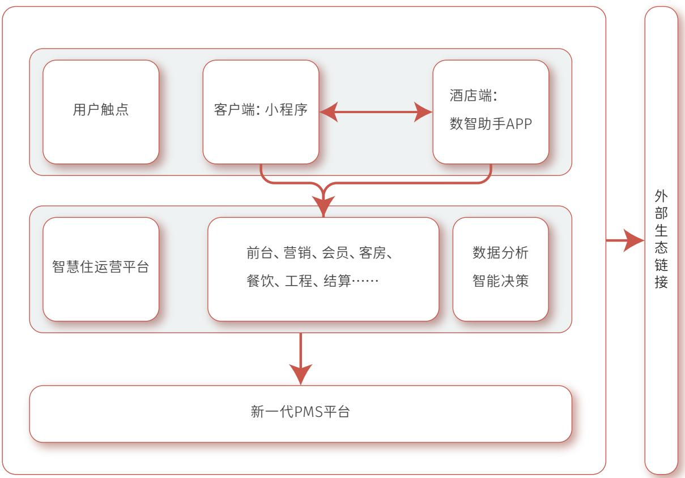

flowchart

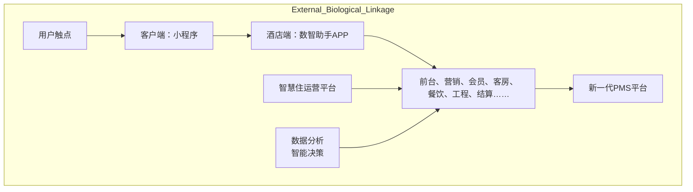
```mermaid
graph TD
  subgraph External_Biological_Linkage
  A["用户触点"] --> B["客户端：小程序"]
  B --> C["酒店端：数智助手APP"]
  C --> D["前台、营销、会员、客房、餐饮、工程、结算……"]
  E["智慧住运营平台"] --> D
  F["数据分析\n智能决策"] --> D
  D --> G["新一代PMS平台"]
  end
```

## 2025年君亭酒店集团数字化服务建设重点

## 目标达成情况

## 智慧住平台优化

●聚焦于设备的普适性与服务的无感化，全面完成了智慧住设备及平台的系统性升级。  
●通过对移动端客控系统及后台物联网平台的迭代优化，大幅提升客房设备响应速度与稳定性，优化人机操作界面使其更趋人性化，实现了从“功能可用”到“体验流畅”的跨越。

## 无接触入住体验

●积极推进新型入住模式试点应用，完成“支付宝碰一碰入住”在多家核心门店的落地部署。宾客可通过手机自助完成入住登记至消费结算全流程操作。

本集团顺应AI时代发展浪潮，积极把握数字化转型机遇，以智能服务升级为方向、以持续创新为驱动，将“数字化酒店集团”向“AI原生的酒店平台”作为数智化长期发展战略目标。我们聚焦平台交互、快捷入住、AI赋能等关键场景，着力构建主动响应、更具温度、兼顾效率的智慧服务体系，全面提升宾客体验质感与服务智能化水平。

2025年，本集团正式启动AI智能助手升级方案。在重构用户体验方面，我们通过线上产品界面动效化改造、个人中心情感化设计、沉浸式开屏页等视觉交互升级，构建统一品牌视觉语言，提升用户操作流畅度与功能触达效率。从服务生态智能化转型方面，我们引入AI客服系统，实现90%常见问题秒级响应，构建“智能预判+场景化引导”的服务模式，在行程规划、产品推荐等关键节点提供主动式服务介入。

## AI智能服务应用

## 已启动AI应用场景的试点测试：

●客户行程服务助手·通过AI为客人提供个性化的行程规划，周边推荐及实时问答。例如设置景区AI客服，代替人工，帮助游客做行前规划、行中服务以及售后订单的查询。  
●AI智能客服·着力于高效处理住客日常咨询与需求。通过语音识别，自然语言处理，语义理解等技术，实现与客户的自动交互。AI智能客服能够24小时不间断地提供服务，快速响应用户咨询，减少等待时间。

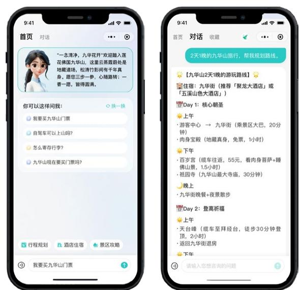  
自定义形象AI智能客服  
根据宾客问题推荐行程

## 践行责任采购

君亭酒店集团高度重视供应链管理规范化建设，通过制度完善、流程优化及技术赋能，构建了覆盖全链条的供应商管理体系，有效提升合作效率与合规水平。报告期内，我们持续深化供应商管理机制改革，借助数字化工具强化全流程管控能力，为业务稳健发展奠定基础。

## 供应链管理体系

本集团严格遵守《中华人民共和国招标投标法》等法律法规要求，保障供应链管理的合规性和公平性。为夯实管理基础本集团构建了以《采购管理制度》《存货管理制度》《供应商管理制度》《招投标管理制度》为核心的供应链制度框架，从采购流程、存货管控、供应商准入、评价及合作等方面实施标准化管理，保障各环节规范高效运行。在管理职责层面，集团采购部负责工程供应商与集采供应商的统一管理，制定采购策略并监督执行：各酒店总经理作为属地第一责任人，全面负责本地供应商的关系维护与供应质量把控，确保供应链管理权责清晰、执行到位。

## 供应链风险管理

供应链风险管理是保障企业运营连续性与稳定性的重要基础。本集团构建“准入-审核-整改-闭环”的全流程管理机制通过严格准入审核、动态监测管控、数字化平台赋能等举措，确保供应链安全可控。本集团不断完善系统化风险管理机制，积极应对内外部各类不确定因素，保障供应链安全平稳运行

本集团定期开展供应链风险识别，覆盖自然灾害、地缘政治、供应商财务状况、环境风险等多个领域，并运用定量与定性相结合的方式，评估风险发生概率及影响程度，为每类风险设定不同的风险等级。

为保障供应链稳定运行，本集团着力构建丰富的供应商网络，推行多元化采购策略，有效规避对单一供应商或特定地区的过度依赖。同时，本集团优先选用本地供应商，降低长途运输引发的各类风险，助力本地经济发展。此外，本集团定期对供应商财务状况进行评估，确保其拥有持续稳定的供货能力。

## 供应商评估与审核

构建高效，规范的供应商全周期管理休体系，是君亮酒店集团实现采购合规运营，风险全面管控与合作品质持续提升的重要支撑。本集团以全流程闭环管理为核心，建立覆盖供应商准入、动态评估、分级管理及退出的一体化管控机制，切实保障采购业务稳定、透明、可持续开展。

## 供应商准入

本集团采购部门联合相关职能部门对供应商资质开展多维度审核，通过建立《供应商考察名录》，确保潜在合作方满足准入基本要求。针对重要物资供应商，本集团进一步实施现场核查，形成《实地评估记录表》，从生产保障、产品品质、服务能力等方面实施严格把关。

2025年，本集团将ESG正式纳入新供应商准入强制评审，覆盖物资、服务、施工全类别，重点审核环境合规、用工安全、反贿赂与反腐败绿色供应，设置一票否决项，实行量化评分与现场核查，不符合ESG管理要求则不予准入。

供应商ESG准入要求

<table><tr><td>环境维度</td><td>●要求所有供应商必须通过ISO 14001环境管理体系认证,并定期更新证书。</td></tr><tr><td>社会维度</td><td>●要求供应商遵守必要的劳工标准及提供符合要求的员工福利。●要求供应商定期为员工提供安全培训,确保其掌握必要的安全知识和技能,并为员工提供必要的健康保障,包括定期体检、职业病防治等。</td></tr><tr><td>商业道德</td><td>●要求供应商遵守法律法规及政策文件中涉及商业道德的有关规定,禁止任何形式的贿赂和腐败行为,确保其商业行为的透明性和公正性,并与供应商签署《君亭酒店集团阳光协议》。</td></tr></table>

同时，本集团实施分类差异化评审，结合供应商类型与业务场景，分别设定相应的FSG审核重点。

<table><tr><td>供应商类别</td><td>ESG审核重点</td></tr><tr><td>物资类</td><td>环保材料、食品安全、绿色包装、碳足迹相关要求</td></tr><tr><td>服务类</td><td>服务过程环保、人员合规、应急与安全管理</td></tr><tr><td>施工类</td><td>现场环保、安全生产、文明施工、农民工工资保障</td></tr></table>

## 供应商评估

本集团对供应商实行分层分类管理，由不同主体分别开展针对性评价：集采供应商由采购部负责年度综合评价。工程供应商在项目完工后开展全面考评，酒店自主选用的供应商由总经理牵头组织服务评价。评价维度包含质量，供货能力，售后服务等关键指标，且评价结果每年至少反馈一次，以此推动供应商持续优化提升。此外，本集团构建绿色供应商评价模型，通过环境效益，资源利用率，碳排放强度等多维指标对供应商进行动态评估

## 供应商退出

本集团建立规范的供应商退出机制，明确整改期限与退出标准。对评级不达标，或在质量、环保、合规等方面存在重大问题的供应商，先限期整改，整改无效则终止合作。同时，本集团对关键品类实行多备供应，保障供应链稳定与风险可控。

2025年

本集团新增合格供应商

21家

2025年

淘汰/终止合作供应商

3家

## 可持续供应链建设

君亭酒店集团将绿色低碳理念深度嵌入采购与供应链管理环节，聚焦绿色采购、可持续建筑材料选用、环境友好型供应链构建等关键工作，通过严格准入标准、强化绿色供应商合作、推动全链条低碳化管理，持续打造符合ESG发展要求的可持续供应链。

## 可持续供应链管理

2025年，本集团进一步完善供应商管理制度体系，修订《供应商管理制度》，将ESG、廉洁合规与绿色采购纳入核心管理要求，并在准入标准、评分等级、淘汰更换等方面强化全流程管控。

## 供应链可持续管理要求

环境维度

●以“减塑、低碳、循环、合规”为核心要求，将绿色理念深度融入酒店运营全场景：重点管控一次性用品消耗、餐饮废弃物、工程装修污染、机电设备能耗等重点环境风险  
●2025年，本集团要求以“量化指标+认证门槛+动态监测”为核心，实现全链路绿色管控。

## 供应链可持续管理要求

社会维度

●以“员工安全健康+劳工权益”为核心要求，将职业健康与权益保障要求覆盖全供应链层级；重点管控布草洗涤、餐饮加工、工程施工等劳动密集型环节存在的社会风险。

●2025年，本集团要求以“零容忍红线+EHS体系+员工访谈”为核心，保障供应商员工的合法权益与安全健康。

商业道德维度

●以“廉洁合规、公平透明、反舞弊”为核心，筑牢供应链信任防线；重点管控采购回扣、串标、知识产权侵权、数据泄露等商业道德风险，强化源头防控与全过程监督。

●2025年，本集团要求以“制度约束+审计监督+匿名举报”为核心，实现零容忍管控。

君亭酒店集团以全链条绿色发展为导向，围绕采购，生产，包装及运输各关键环节，设立明确可持续发展目标，系统推进供应链低碳化、规范化建设，与上下游伙伴共筑绿色低碳、长期稳定的高质量供应链生态。

供应链环节  
具体目标  
具体计划

<table><tr><td>采购</td><td>实现100%可持续采购,确保所有原材料和产品符合环保和社会责任标准</td><td>●建立供应商评估体系,优先选择通过环保和社会责任认证的供应商●推动供应商实施绿色生产和管理措施,提供培训和支持定期审核供应商的ESG表现,确保其持续改进</td></tr><tr><td>生产</td><td>减少生产过程中的环境影响,提高资源利用效率</td><td>●引入先进的生产技术和设备,优化生产流程,减少能源消耗和废弃物排放,实施清洁生产●推广循环经济模式,提高原材料和资源的循环利用率</td></tr><tr><td>包装</td><td>实现包装材料的可持续化,减少包装废弃物</td><td>●采用可降解、可回收的环保包装材料,减少塑料使用,优化包装设计,减少包装材料的使用量,推广包装回收和再利用计划,鼓励消费者参与包装回收</td></tr><tr><td>运输</td><td>降低运输过程中的碳排放,提高物流效率</td><td>●优化物流网络,减少运输距离和频次,提高运输效率,推广使用新能源车辆和清洁能源运输工具,减少碳排放</td></tr></table>

## 可持续采购实践

2025年，本集团以“低碳、环保、可持续”为核心，将绿色采购全面融入供应链管理全流程，聚焦物资、服务、施工三大采购品类，并结合酒店运营场景（客房、餐饮、工程等），落地多项绿色采购实践。

## 供应商类别

## 绿色采购实践举措

<table><tr><td>物资类</td><td>●客房物资:全面采购可降解一次性用品(如可降解牙刷、梳子、餐具),替代传统塑料用品;选用无甲醛、低VOCs(挥发性有机化合物)环保布草、客房家具,降低宾客接触性污染;采购节能型客房电器(如LED灯具、节能空调、智能节水洁具),减少运营能耗。●餐饮物资:优先采购有机、绿色、本地溯源食材,减少食材运输过程中的碳排放;选用可降解餐饮包装、环保餐具,杜绝一次性不可降解塑料包装;与食材供应商签订绿色供应协议,要求其提供环保运输、包装方案,减少供应链碳足迹。●工程及清洁物资:采购绿色环保建材(如无醛板材、低碳涂料、节能保温材料),适配酒店装修、改造需求;选用浓缩型、环保型清洁用品,减少化学污染物排放;优先采购可回收、可循环利用的工程辅料,降低建筑及清洁废弃物产生。</td></tr><tr><td>物资类</td><td>●洗涤及保洁服务:选用采用环保洗涤工艺、使用绿色洗涤用品的洗涤供应商,杜绝含磷洗涤剂使用;保洁服务优先选择提供环保清洁方案、使用节能清洁设备的供应商。●运维服务:筛选具备节能运维能力的供应商,负责酒店空调、水电、消防等设备的运维,推行节能运维方案,降低设备运行能耗;优先选择可提供设备回收、翻新服务的供应商,延长设备使用寿命,减少资源浪费。</td></tr><tr><td>物资类</td><td>●环保合规资质:供应商需提供完整的环保生产资质、排污许可证、危废处置资质,近3年无重大环保处罚记录;优先选择通过ISO 14001环境管理体系认证、绿色建材产品认证的供应商;要求其严格按照绿色施工标准作业,落实环保降噪、扬尘控制、废弃物分类处置措施。●节能材料供应能力:供应商需具备节能型建筑材料的研发、生产及供应能力,能提供符合设计阶段节能指标(如保温、隔音、采光节能)的材料,且可提供材料节能性能检测报告、碳足迹报告,明确材料全生命周期的节能效益。●可持续供应链能力:考量供应商的原材料采购合规性,优先选择采用可再生、可回收原材料生产的供应商;要求供应商建立原材料溯源体系,确保材料源头无破坏环境、违规开采等问题,同时具备材料回收再利用的配套服务能力(贴合酒店建筑长期运营后的环保处置需求)。</td></tr></table>

在内装改造设计阶段，本集团实现供应链管理与设计和工程环节深度协同，围绕节能降耗、绿色环保、低碳可持续核心目标，对建材供应商及建筑材料的节能、环保属性进行全方面评估，从源头把控酒店建筑绿色品质，并联动供应商构建可持续供应体系。

## 可持续建筑材料选择

<table><tr><td>节能材料选择</td><td>●保温隔热材料:优先选用节能型保温材料(如挤塑板、岩棉板、真空绝热板等),要求供应商提供的材料导热系数低、保温效果好,可有效降低酒店空调、采暖能耗;同时考量材料的耐用性,降低长期能耗及维护成本。●采光与节能门窗材料:联合供应商选用Low-E中空玻璃、断桥铝型材等节能门窗材料,减少室内外热量传导,降低空调负荷;同时优先选择透光性好的材料,提升自然采光利用率,减少白天人工照明能耗,契合酒店公共区域、客房的采光设计需求。●节能饰面与结构材料:选用导热系数低、散热慢的墙面、地面饰面材料(如节能瓷砖、环保涂料),减少建筑热量流失;结构材料优先选择高强度、轻量化材料,降低建筑自重。●节水配套材料:联动供应商选用节水型管材、管件及配套材料(如PPR环保管材、防渗漏接头),减少管道漏水损耗;结合酒店卫生间、厨房设计,选用适配的节水型洁具配套材料。</td></tr><tr><td>环保材料选择</td><td>●低污染、无有害挥发:优先选用无甲醛、低VOCs(挥发性有机化合物)的材料,如环保涂料、无醛板材、水性胶粘剂等,要求供应商提供材料环保检测报告,确保材料符合国家绿色建材标准。●可回收、可再生与可降解:考量材料的可回收利用率,优先选用可再生材料(如再生钢材、再生木材)、可降解材料(如可降解保温材料),要求供应商具备材料回收再利用的配套能力;设计阶段同步规划材料后期回收方案,联动供应商落实环保处置。●低碳环保属性:优先选用碳排放量低的建筑材料,优先选择低碳生产、低碳运输的供应商,降低建筑材料全生命周期的碳排放。●生态友好性:避免选用破坏生态环境的原材料(如非法开采的石材、木材),优先选择通过FSC森林认证、生态建材认证的材料,要求供应商的原材料采购符合生态保护要求。</td></tr></table>

## 供应链协同生态

本集团积极构建开放共赢，可持续发展的供应商协同生态，通过常态化培训与专业指导持续赋能供应商能力提升，同时健全权益保障机制，维护公平公正、合规透明的合作环境，与供应链伙伴携手，实现稳定高效的共同发展。

## 供应商赋能

本集团与主要供应商不定期开展沟通与培训，围绕质量管理，环境管理，社会责任，合规管理及技术创新等内容，帮助供应商提升环境管理水平、规范用工与职业健康安全管理，提高生产效率与服务质量，确保符合集团在质量、安全、环保及社会责任方面的标准要求。培训主要结合供应商到访、线上形式开展，并根据新政策、新标准及实际需求按需实施。

2025年，本集团建立供应商ESG专项激励机制，以ESG评估结果为依据，覆盖物资类、服务类、施工类全体合作供应商，引导供应商持续提升环境、社会及治理水平。对ESG表现优秀的供应商，本集团在采购订单、付款结算等方面予以优先支持，同时提供FSG培训、技术指导与标准辅导等协同支持。激励结果与供应商年度评级、合作权限及后续准入直接挂钩形成“评估-激励-改进-再评估”的闭环管理，助力供应链绿色可持续发展。

## 供应商权益保障

本集团始终致力于构建公平透明、可持续的供应链合作生态。2025年，我们在供应链管理中同步更新供应商权益保障相关政策与举措，与既有ESG专项激励机制形成互补，围绕公平合作、合规履约、权益保障进一步明晰合作双方权责，有效提升供应商合作意愿与供应链稳定性。

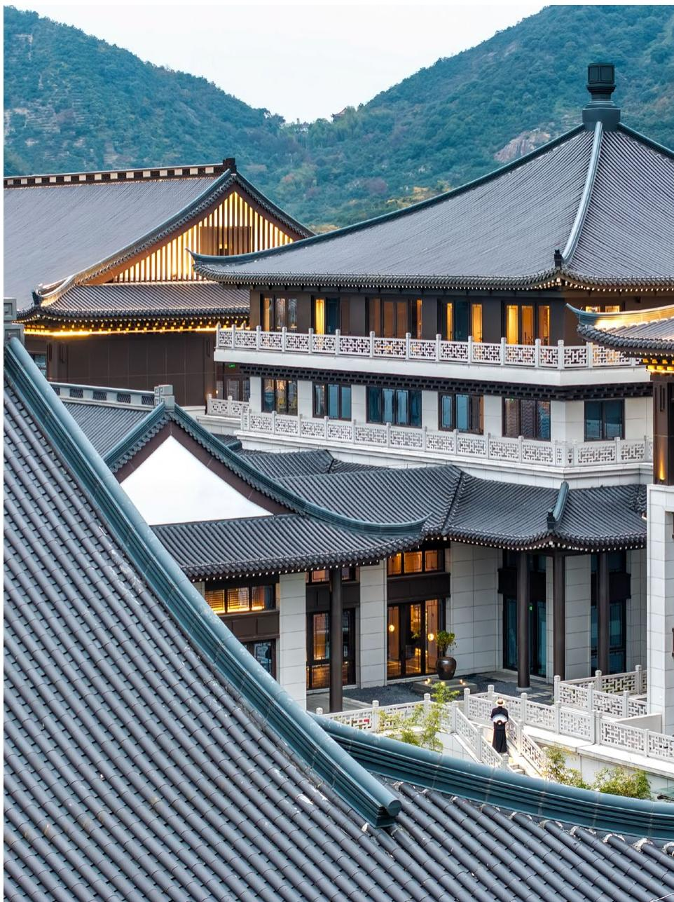

natural_image

Exterior view of a traditional Chinese-style building with tiled roofs and modern architecture, set against a backdrop of green hills (no signage or text visible)

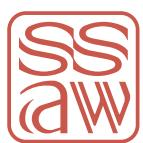

## 权益保障层面

## 具体措施

<table><tr><td>合作公平性</td><td>●准入公平:明确准入评审标准、流程全公开,杜绝暗箱操作,对所有符合条件的供应商一视同仁,不设置歧视性门槛(除品类差异化合规要求外);●竞争公平:采购招标、订单分配过程公开透明,优先选择综合实力(含ESG表现)达标供应商,不强制供应商接受不合理附加条件(如强制垫资、低价倾销);●分级公平:供应商分级、绩效评估标准公开,评估结果及时同步供应商,允许供应商对评估结果提出异议,建立异议复核机制,确保分级公平公正;●杜绝不合理要求:严禁集团采购人员向供应商索要回扣、礼品、宴请等不正当利益,严禁强制供应商提供超出合同约定的服务或物资,一经发现严肃处理。</td></tr><tr><td>履约与结算权益</td><td>●合同权益:规范采购合同条款,明确双方履约责任、付款周期、验收标准、违约责任,杜绝“霸王条款”,保障供应商履约后的合法收益;●结算保障:优化付款流程,明确账期标准(物资类30-60天、服务类60-90天、施工类按工程节点结算),无正当理由不拖延付款;对ESG优秀供应商,额外给予付款优先、账期适度缩短的便利;●如期支付大中小供应商款项:本集团在与中小微企业合作的过程中,始终秉持平等公正的原则,保持稳定良好的合作关系,切实履行财务支付责任。我们向所有供应商包括中小企业,均严格按合同约定的付款条件,按期支付款项。报告期末,应付账款(含应付票据)余额占总资产比重为1.51%。●验收保障:明确验收流程、标准及时限,验收合格后及时出具验收凭证;对验收异议,2个工作日内响应、7个工作日内完成复核,不无故拖延验收、拒绝付款。</td></tr><tr><td>发展与协同权益</td><td>●培训支持:除ESG专项培训外,新增供应商合规、合同履约、质量管控等免费培训,帮助供应商提升综合能力,降低合作风险;●风险共担:针对突发情况(如疫情、物流中断),与供应商协商调整交付计划、结算周期,不单方面违约、不转嫁风险;●长期合作保障:对ESG表现优秀、履约稳定的供应商,签订长期合作协议,明确合作份额、优先合作权利,保障供应商长期发展权益,实现供应链共赢。</td></tr><tr><td>措施落地与监督</td><td>●责任落实:明确采购部为供应商权益保障牵头部门,联合其他相关部门,负责政策落地、诉求处理、合规监督;●监督核查:每年开展一次供应商权益保障专项核查,通过供应商问卷、现场走访等方式,排查不合理合作行为,及时整改;●结果应用:将供应商权益保障落实情况,纳入采购人员绩效考核,确保各项措施落地见效,推动供应链长期稳定、合规共赢。</td></tr></table>

## 同心同行 育才树人

3 良好 健康与福祉

5性别平等

8 体面工作和经济增长

10 减少不平等

16 和平、正义与

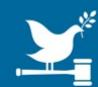

君亭酒店集团持续完善员工管理与发展体系，围绕雇佣管理、福利保障、培训发展等方面夯实人力资源基础。本集团坚持依法合规用工，不断优化招聘、薪酬、绩效等管理机制，营造公平稳定的工作氛围：同时立足平等包容、沟通关怀、职业健康等维度，切实维护员工权益，并通过搭建学习平台完善培训体系、推进人才发展项目，持续提升员工综合能力，为企业高质量发展提供人才保障。

SSAW HOTELS & RESORTS

## 雇佣薪酬管理

君亭酒店集团高度重视员工雇佣管理与薪酬激励，始终坚持依法合规用工，持续完善人力资源管理机制，确保招聘引进、内部调动、薪酬福利、绩效考核等环节规范透明。本集团不断提升人才引进与配置效率，建立兼顾市场竞争力与员工价值体现的薪酬管理体系，持续加强劳动关系合规管理，为员工营造和谐、公正、稳定的工作环境。

## 员工雇佣

君亭酒店集团始终依法规范用工，依据《中华人民共和国劳动法》《中华人民共和国劳动合同法》及《禁止使用童工规定》等法律法规，落实用工管理要求，严禁使用童工，拒绝任何形式的强迫、强制劳动，持续营造和谐公正的就业环境。2025年，本集团未发生劳动纠纷案件，亦未出现雇佣童工、强迫劳动或强制劳动事件。

本集团以区域化管理为抓手，建立区域化管理标准，明确各区域岗位胜任力模型，并通过拓宽招聘渠道提升人才精准引进效率。在内部流动管理方面，我们持续完善内部调动机制，员工入职满一年后，申请人可填写《人事变动表》，经所在部门负责人及相关接收部门负责人审批同意后，进行酒店间、单体酒店内部部门间或部门内等不同形式的内部调动。

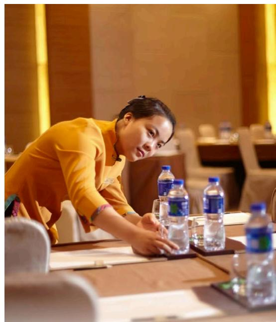

natural_image

A woman in a yellow uniform preparing water bottles at a conference table (no visible text or symbols)

## 员工激励

君亭酒店集团依据市场同业情况及公司实际经营状况，建立合理的员工薪酬福利政策，使其兼顾市场竞争力与员工价值休现，各酒店在薪资休系制定或调整过程中，均须报经君亭酒店管理层严格审批，以保障相关安排的合理性与公平性，君亭酒店始终按时足额发放员工薪酬及各项福利，涵盖但不限于社会保险和公积金：同时，持续维护和谐稳定的劳动关系确保未发生劳动纠纷案件，并为员工营造和谐、公正的工作环境。

为持续完善员工激励机制，木集团将薪酬管理与绩效管理有机衔接，依托科学合理的绩效管理体系，将员工日常工作表现、团队协作能力及创新能力等关键指标纳入薪酬评价依据。我们通过绩效面谈、评分等多种方式，对员工绩效考核结果进行全面、客观认定。报告期内，全体员工均接受定期绩效和职业发展考核。景澜酒店结合自身运营实际，制定并发布了涵盖总部员工，项目总经理，拓展，直营店等在内的多个考核方案，为公司全年运营管理制定绩效制度和目标。

<table><tr><td>2025年君亭酒店集团重点工作</td><td>目标达成情况</td></tr><tr><td>打造高效人力,以标准赋能高效运营</td><td>区域化人力资源管理;严格执行《人力资源管理手册》;落实人力资源管理SOC检查标准</td></tr><tr><td>细化成本管控</td><td>控制人力成本;优化灵活用工;深化校企合作</td></tr><tr><td>赋能人才进阶</td><td>注重课程研发,建立集团课程库;组织各类培训;持续推进未来营和未来总经理成长计划</td></tr></table>

natural_image

Close-up of hands assembling puzzle pieces against a bright golden sunset background (no text or symbols visible)

## 员工福祉关怀

君亭酒店集团持续完善员工福祉关怀，围绕平等包容与沟通、员工福利与关怀、职业健康安全等方面，切实保障员工合法权益。君亭酒店坚持公正、公平、公开原则，积极营造包容多元的就业环境，畅通员工沟通与参与渠道；同时，持续细化工时与休假管理安排，开展多样化员工关怀活动并为困难员工提供帮扶支持，不断健全职业健康安全管理体系、强化培训与风险防控，努力提升员工满意度、幸福感和安全保障水平。2025年，君亭酒店集团人力资源部通过核查核心业务模块、规范操作流程，形成了复用性强、普适性强的SOC标准流程检查表。

## 平等包容与沟通

根据本集团《人力资源管理制度》，我们始终坚持公正、公平、公开的雇佣原则，严禁任何基于种族、性别、年龄、家庭背景、宗教信仰等因素的歧视行为。围绕招聘、劳动、薪酬、培训、晋升、福利等各个环节，本集团为全体员工提供平等无差别待遇，持续维护劳动者权益，充分尊重并保障员工的合法权益和合理诉求，支持员工与公司共同成长。

本集团高度重视残疾人权益保护，积极促进残疾人就业。各门店通过专门招聘渠道和定制化培训计划，为残疾人员工提供平等就业机会，努力营造包容多元的工作环境。

为切实维护员工合法权益，进一步加强员工参与和沟通，本集团设立工会并定期召开职工代表大会，为员工提供意见表达和参与决策的渠道。在此基础上，君亭酒店持续完善工会建设，充分保障员工权益，不断提升员工满意度。同时，本集团积极建设员工多元沟通机制，借助定期会议沟通、意见箱、线上平台等方式，鼓励员工提出建议和反馈，并及时回应员工关切。

2025年，本集团员工满意度达88%。其中，景澜酒店员工满意度为85%，七仙岭君澜酒店员工满意度为89%，香水湾君澜酒店员工满意度为91%，君行酒店员工满意度达100%。

## 员工福利与关怀

## 工作时间与合理休息

君亭酒店集团始终将员工合法权益保障作为重要工作内容，严格落实国家关于工作时间和休假管理的相关法律法规，并依据《人力资源管理制度》等内部制度，对工作时间及休假管理要求作出进一步细化。

围绕工作时间管理，本集团严格按照劳动法要求，结合业务需求统筹安排员工上下班时间，并在法律允许范围内实施灵活调整。针对不同岗位及业务特点，本集团实行标准工时制、不定时工作制和综合计算工时制等多种工时制度，以适应多样化工作需求。同时，为在制度规范与管理弹性之间实现平衡，部门经理及以上管理人员可通过调休方式平衡工作负荷，保障工作效率与员工福祉的平衡

本集团向员工提供带薪年假，具体天数按照员工工龄确定，对法定节假日休假安排予以明确，切实保障员工休息休假权益。

## 员工特色文体活动

本集团通过开展退休欢送会、员工生日会等活动，持续营造温暖和谐的工作氛围，促进员工之间的情感交流，提升员工归属感。

## 2025年君亭酒店集团系列特色活动开展情况

## 温情时刻守护

君亭酒店常态化举办退休员工欢送会、员工生日会等活动，通过富有仪式感的互动，强化员工间的情感联结，提升团队向心力。

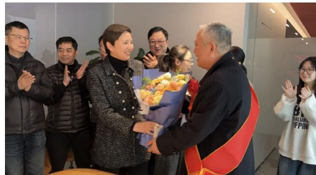

natural_image

Group photo of people clapping and exchanging flowers indoors, no visible text or symbols

君亭酒店本级员工退休仪式

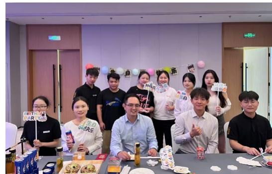

text_image

Group photo of people posing with paper cutouts and festive decorations in a conference room setting

深圳宝安前海Pagoda君亭设计酒店第三季度员工生日会

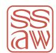

## 夏季暖心关怀

2025年7月，君亭酒店集团开展“夏季送清凉”活动，为本部及各项目酒店员工配备防暑礼包与清凉物资，关注员工工作环境与健康状况，切实传递企业关怀。

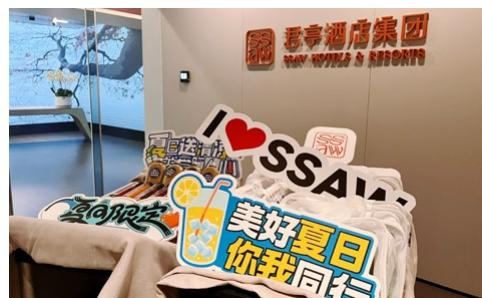

text_image

君亭酒店集团
WWW.WORLD'S RESIDENTS
I ❤️ SSAW
美好夏日
你我同行

君亭酒店集团本级及紫金港门店高温慰问活动

## 员工拓展活动

2025年9月，君亭酒店集团举办“同频奔跑，共赢未来”乐跑活动，组织君亭、君澜、景澜三大品牌员工共同参与，增进跨品牌团队凝聚力。

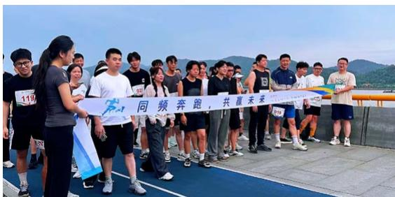

text_image

同频奔跑，共跟未来

君亭、君澜、景澜部分员工参加“同频奔跑，共赢未来”乐跑活动

## 实习生团建活动

2025年11月，君亭酒店集团面向实习生策划“同心、同行、同成长”专场团建，通过团队协作游戏、产品知识竞赛等互动环节，助力实习生快速融入工作环境。

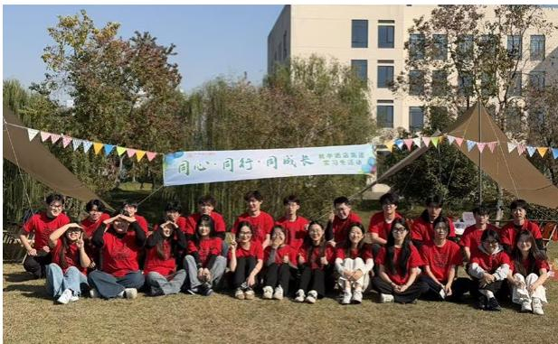

text_image

同心·同行·同成长
教学活动策划
实习生活者

杭州区域实习生团建活动

## 迎新团建活动

2025年12月，君亭酒店开展“元旦迎新”团建活动，营造辞旧迎新的欢乐氛围。

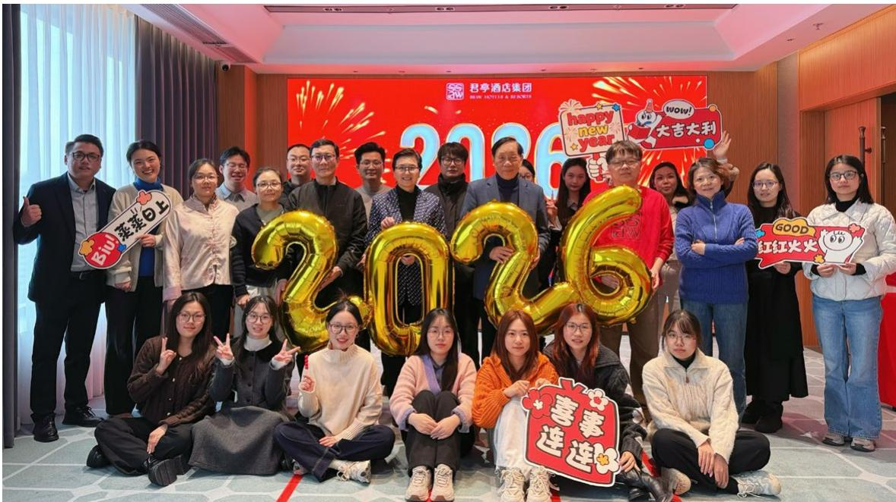

text_image

君亭酒店集团
NEW YEAR'S GENDER
2026
happy
new year
wow!
大吉大利
2026
good
红红火火
喜事连连心

君亭酒店集团本级员工“Hello,2026”主题元旦活动

## 案例：创新企业文化传播路径，深化品牌价值认同

君亭酒店集团持续创新企业文化传播路径，依托“我的君亭生活”视频号打造短视频文化宣传阵地，以生动鲜活的内容传递企业文化内核。2025年，君亭酒店累计发布企业文化主题短视频19个，总观看量达57,092人次，有效提升员工对公司价值观的认同感与归属感，推动君亭特色企业文化深入人心。

此外，本集团还通过员工生日贺卡及礼物、年底外派员工家属礼品慰问、飞书APP入职周年祝福及生日祝福等方式，积极塑造独特目富有凝聚力的企业文化，充分挖掘员工的潜在能力，使团队合作能力得到显著提升，进而为企业发展注入源源不断的动力，实现员工与企业的共同成长与进步。

## 困难员工帮扶

针对生活遇到困难的员工，本集团从经济支持和工作适应支持两方面积极提供援助。在经济支持方面，我们设立困难员工专项帮扶基金、评估员工困难程度并给予生活补助、在传统佳节送上物资慰问：在工作适应支持方面，我们通过提供职业发展及晋升指导、灵活工作排班选择、免费一对一心理咨询服务等，给予员工间接援助。

2025年

本集团共帮扶困难员工

17人

## 案例：景澜酒店党支部慰问一线员工

2025年6月18日，景澜酒店党支部前往旗下磐安项目酒店慰问一线员工，为全体一线员工送上防暑降温的爱心物资，感谢他们的辛勤付出，希望能用点滴行动为他们撑起一片“绿荫”。

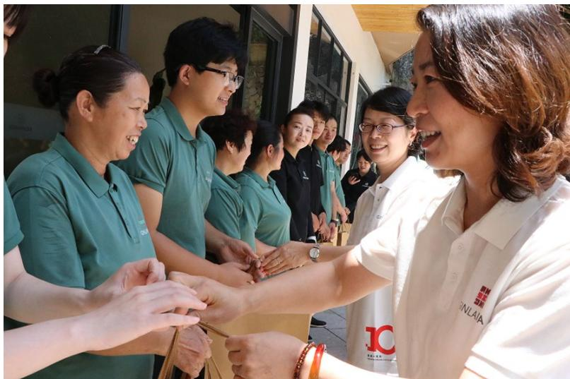

natural_image

Group of women in green uniforms interacting outdoors, one handing a small object to another (no visible text or symbols)

## 职业健康安全

君亭酒店集团将员工职业健康与安全置于首要位置。2025年，本集团新下发《管家部营运手册》《餐饮部营运手册》《前厅部营运手册》，在既有规范基础上，进一步健全和优化安全管理制度体系，推动安全管理要求覆盖全岗位、贯穿全流程，重点强化一线关键部门的风险防控与健康保障。

本集团职业安全管理范畴延伸至危险作业管控、消防安全、施工维保、电梯运行、厨房操作、用电安全等多个关键领域形成闭环管理机制。同时，我们坚持开展常态化安全巡查和隐患排查治理，做到早发现、早预警、早处置，并建立规范严谨的安全事故调查、复盘与改进流程，持续提升整体安全管理水平，为员工职业健康安全和酒店平稳运营提供坚实保障。

2025年，本集团围绕各岗位关键风险点，编制并发布《酒店岗位安全风险与预防措施》《工程部岗位安全手册》《恶劣天气应急知识》等专项安全指引资料，组织开展分层分类宣贯培训，推动安全要求精准落实到岗、到人。报告期内，本集团共开展职业健康与安全相关培训1.108场，培训内容涵盖生产安全、食品安全、消防安全、消防演练、作业安全及突发事件应对等，共有10,353人次参加。通过系统化培训与实战化演练，本集团进一步强化了全员安全责任意识，提升了风险防范与应急处置能力，为酒店各板块安全稳定运营提供坚实保障。

## 生产安全培训

君澜酒店2026年1月27日组织安全生产管理专项培训

2025年3月，各门店员工于集团统一进行防范电信诈骗相关培训

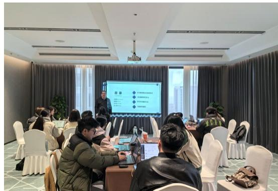

text_image

Conference room scene with presentation slide displaying Chinese text and audience seated at tables

## 食品安全培训

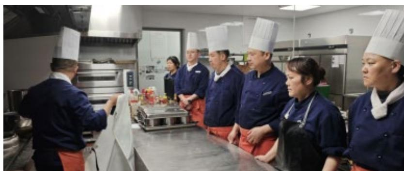

natural_image

Group of chefs in a modern kitchen setting, one in blue uniform and two in white uniforms, observing food at a counter (no visible text or signage)

重庆陆海国际Pagoda君亭设计酒店开展食品安全培训

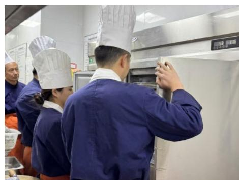

natural_image

Three chefs in blue uniforms and white hats preparing food in a kitchen (no visible text or symbols)

杭州紫金港Pagoda君亭设计酒店开展食品安全培训

## 消防安全培训

各酒店定期、不定期组织员工进行消防培训，涵盖防火、防燃气泄漏、防恐、防盗等各方面，部分酒店联合消防所、应急局、燃管办等机构向员工提供专业的消防知识培训，以增强员工的消防意识及消防风险处理能力。

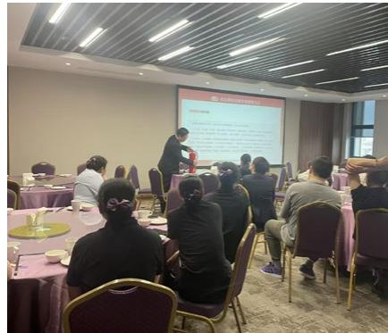

text_image

Conference room scene with attendees seated at tables facing a presentation screen displaying Chinese text and slide content

杭州汇和君亭酒店开展消防安全培训

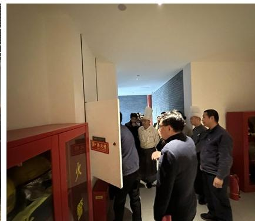

text_image

Group of people gathered around a red cabinet with visible Chinese signage, likely in a room or exhibition setting.

北京华侨夜泊君亭酒店开展燃气泄漏应急处理培训

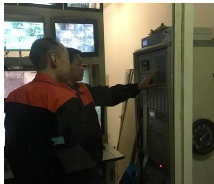

text_image

Two men in a control room pointing at an industrial machine, with surveillance monitors and wall-mounted screens visible in the background.

上海外滩中星君亭酒店开展电梯安全知识培训

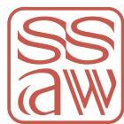

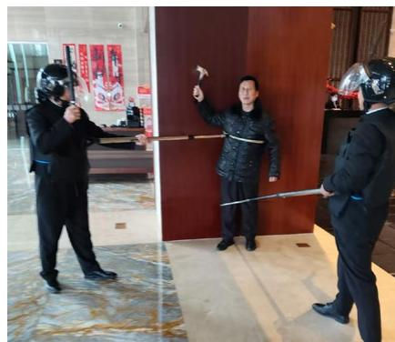

natural_image

Two individuals in formal attire with face shields, one holding a large axe, in an indoor lobby (no visible text or symbols)

桐庐世贸君亭酒店开展防恐安全演练

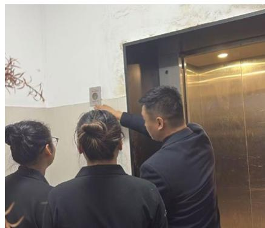

natural_image

Three people standing in an elevator, one pointing at a wall-mounted device (no visible text or symbols)

西昌邛海将军府夜泊君亭酒店开展电梯困人应急处理演练

<table><tr><td>指标名称</td><td>单位</td><td>2025年</td></tr><tr><td>职业健康安全管理体系覆盖员工数</td><td>人</td><td>1,594</td></tr><tr><td>可记录工伤数量</td><td>人</td><td>8</td></tr><tr><td>工伤导致的死亡数量</td><td>人</td><td>0</td></tr><tr><td>工伤保险、安全生产责任险的投入金额</td><td>万元</td><td>38</td></tr><tr><td>工伤保险、安全生产责任险的人员覆盖率</td><td>%</td><td>100</td></tr></table>

## 员工培训发展

君亭酒店集团持续完善员工培训与发展体系，围绕学习平台建设、职业发展规划、阶梯式培养路径规划、培训体系优化及培训项目实施等方面，不断强化员工成长支持体系，为员工提供覆盖基础技能、专业能力和领导力发展的系统化成长支持。

## 职业发展体系

为提升员工综合素质并支持其全面发展，本集团持续完善人才培养体系，进一步夯实公司人才基础。2025年，本集团按照“5支人才队伍+5步培训项目实施流程+4项培训管理工作+1套制度保障”的框架，建设人才发展体系

“5支人才队伍”分别为管培生、门店部门经理、营运总监、储备总经理、总经理  
“5步培训项目实施流程”分别为需求调研、计划制定、组织实施、效果评估、总结提升；  
“4项培训管理工作”包括课程开发、讲师体系建设、培训供应商管理、培训预算管理；  
“1套制度保障”即培训管理制度。

2025年，本集团更新《人力资源管理手册2.0》，优化项目酒店及集团岗位职责。本集团人力资源部门搭建了阶梯式职业发展规划体系，并推出“起航计划、远航计划、续航计划、领航计划”等项目，聚焦的员工基础技能、专业能力和领导力发展，全方位支持员工职业成长与个人发展。2025年，本集团围绕“起航计划、远航计划、续航计划、领航计划”，持续组织各项培训工作落地实施。报告期内，共组织实施培训160场(同比2024年增加105.13%)，平均授课评分达4.94分(满分5分)，整体培训实施成效良好。

natural_image

Close-up of a person in a black suit and white shirt touching their hand on a white fabric (no text or symbols visible)

## 君亭酒店集团人才进化论

<table><tr><td rowspan="4">职业发展路径</td><td>起航计划</td><td>远航计划</td><td>续航计划</td><td>领航计划</td></tr><tr><td>门店员工晋升培养MT管培生培养</td><td>储备店总培养</td><td>店总提升计划</td><td>高管提升计划</td></tr><tr><td>面向门店基层员工及MT管培生设置培养计划,推动员工由行业新人逐步成长为业务骨干。</td><td>基于门店总经理胜任力模型,采用行业专家导师制培养认证方式,培养储备店总。</td><td>聚焦门店总经理成长提升,计划开展多元行业、领域知识赋能。</td><td>围绕高管群体开展提升计划,着力提升其领导力、决策力和组织运作能力。</td></tr><tr><td>●“未来营”部门经理认证●“未来营”营运总监认证</td><td>●“未来营”——店总认证●浙大城市学院、上海师范大学-本科学历提升计划</td><td>●“混沌研习社”●“周末悦读”●“总经理讲习所”</td><td>●“大师讲堂”</td></tr></table>

## 案例：君亭酒店集团启动“未来总经理成长计划”

为适应持续增长和业务发展需要，打造与发展阶段相四配的高素质管理人才队伍，君亭酒店集团持续深化“未来总经理成长计划”，进一步打通基层员工向中高层管理者发展的培训与成长通道。2024年9月至2025年5月，君亭酒店人力资源部实施首期“未来总经理成长计划”，共培养16位储备总经理，其中7位已晋升为项目总经理，人才培养成效初步显现。基于首期项目经验，2025年8月君亭酒店集团对项目进行全面升级并启动第二期计划，吸纳20位学员参与培养，重点推动学员实现由“业务执行者”向“经营管理者”的思维转型，持续培养具备全局视野和实战能力的复合型管理人才，目前项目进展顺利。

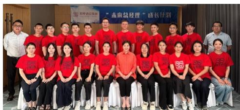

text_image

“未来总经理”董事长计划

未来总经理成长计划第一期结营

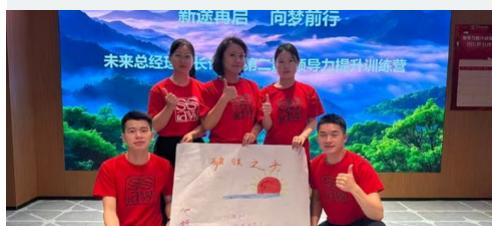

text_image

新途再启 向梦前行
未来总经理 长长 王三二 建导力提升训练营
团结之力

未来总经理成长计划第二期开营

## 2025年君亭酒店培训项目实施情况

组织“未来营”管理人才培训

合计参训

4期

67人

开展“总经理讲习所”

合计参训

5期

686

开展门店培训员培训

包括TTT培训

53场

8 场

开展集团数字化系统系列培训

合计参训

23 场

2,362人

服务宾客系列课程内训

19 场

门店培训标准与操作流程培训

合计参训

8场

849人

开展项目拓展团队系列培训

合计参训

4场

44人

开展运营管理培训

合计参训

14场

1,755人

开展“混沌研习社-周末悦读”视频直播课程

28门

在职总经理合计参训

其他培训

合计参训

5场

264

1,158人

## 员工培训成长

为使培训内容符合最新趋势，本集团持续关注行业前沿动态，深度萃取一线业务标杆实践，重构课程体系，提升课程内容与业务场景的匹配度，2025年合计研发课程55门，课程总时长达3.889分钟，覆盖管理人才培养，ESG.门店运营，数字化应用及一线服务能力提升等多个领域。

2025年课程体系研发情况

<table><tr><td>课程类别</td><td>具体内容</td><td>课程数量</td><td>合计课时</td></tr><tr><td>管理类人才培养类</td><td>《未来总经理成长计划-领导力提升训练营》《“君行未来”管理训练营》相关课程</td><td>16门</td><td>1,410分钟</td></tr><tr><td>门店员工培训类</td><td>门店培训员TTT培训课程</td><td>1门</td><td>60分钟</td></tr><tr><td>门店运营类及安全管理类</td><td>●门店运营类通用课程10门(涵盖服务质量3门、设备设施2门、品牌知识2门、对客服务标准3门)●安全管理类课程3门(酒店厨房安全知识1门、岗位安全风险2门)</td><td>13门</td><td>901分钟</td></tr><tr><td>集团数字化管理类</td><td>“集团数字化系统”系列课程</td><td>14门</td><td>508分钟</td></tr><tr><td>一线员工服务类</td><td>一线员工“服务我的宾客系列课程</td><td>5门</td><td>630分钟</td></tr><tr><td>ESG相关</td><td>ESG相关课程研发</td><td>6门</td><td>380分钟</td></tr><tr><td colspan="2">合计</td><td>55门</td><td>3,889分钟</td></tr></table>

本集团建设并迭代数字化学习平台、补充课程库资源，为员工提供集知识学习、经验交流与内容共享于一体的高效平台。截至报告期末，已建立共计203门课程，合计课时19774分钟的内部课程库，课程内容覆盖集团通用类、运营管理类、“未来营”认证课程、“造星计划”实习生课程及服务标准五个领域，持续提升培训资源供给能力

## 案例：数字化系统系列课程培训

2 0 2 5 年 9月1 7日，君亭酒店集团开展《总经理讲习所（第二十五期）：繁会商城产品售卖经验分享》培训课程

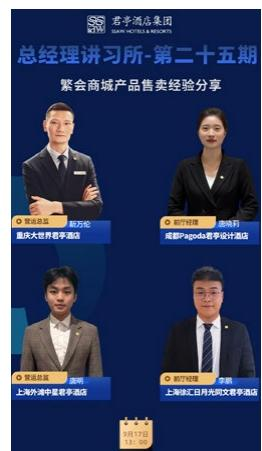

text_image

君亭酒店集团
SANYHETALGROUER
总经理讲习所-第二十五期
繁会商城产品售卖经验分享
● 贸亭酒店
——重庆大世界君亭酒店
● 贸亭酒店
——上海外滩中星君亭酒店
● 贸亭酒店
——上海徐汇日月光同文君亭酒店

2025年10月16日，君亭酒店面向各酒店前厅经理、前台员工组织开展《数字化系统系列培训——会员&遇君亭官微培训》

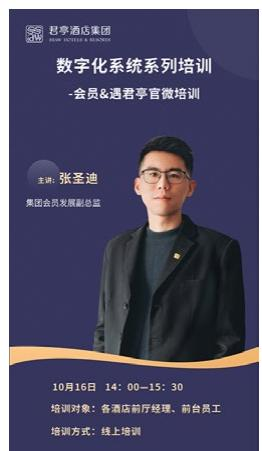

text_image

君亭酒店集团
Digital System Training
-会员&遇君亭官微培训
主讲: 张圣迪
集团会员发展副总监
10月16日 14:00-15:30
培训对象: 各酒店前厅经理、前台员工
培训方式: 线上培训

本集团着力加强门店培训员队伍建设，强化技能内训，深化场景实战赋能。以岗位需求为导向，本集团持续推进门店技能培训常态化、场景化开展，并按照“新员工入职训-老员工提升训-管理层赋能训”的分层思路完善培训内容设计。

## 案例：君亭酒店集团持续推进门店技能内训体系建设

2025年，君亭酒店举行8场培训员培训，合计参训309人次，并组织49位新任职门店培训员参加《门店培训标准与操作流程》培训，推动培训执行规范统一。围绕岗位实际需求，集团进一步强化门店技能培训能力，对各级员工实行体系化分层培训。

针对新员工，君亭酒店完善“师带徒”机制，制定门店各岗位《新员工入职培训考核记录表》，要求员工转正前通过实操考核；针对老员工，重点围绕前台复杂客人投诉处理、新会员招募、客房布草成本控制、餐饮食品安全及全员安全风险等场景开展在岗技能强化培训；针对管理层，君亭酒店邀请6位门店资深管理人员围绕客房、餐饮、工程模块开展经验分享，不断提升门店管理团队专业能力与实战水平。

与此同时，在讲授《“服务我的宾客”系列课程》过程中，门店培训员通过角色扮演、案例分析等方式，进一步提升员工解决实际问题的能力。

## 案例：君亭酒店集团开展“造星计划”，深化校企合作

为构建与君亭酒店集团发展相匹配的人才梯队，本集团持续深化校企合作，夯实人才发展基础。2025年本集团大力开展院校宣讲推广，拜访10余所新院校，新增合作本科及大专院校2所，全年累计开展院校宣讲超20场次，合计招聘实习生101人。在此基础上，本集团持续深化“造星计划”，将人才选拔端口前移至实习期，在江西生物科技职业学院、江西现代职业技术学院及浙江旅游职业学院三所院校中，精准识别即将结束实习的高潜学生，并通过3至5年的定制化培养与实战历练，加速其向酒店管理层转化。

同时，本集团持续推进浙大城市学院和上海师范大学专升本学历提升项目，2025年新增8名被浙大城院专升本录取的员工，浙江区域累计参加学历提升项目员工达53人(含2023级已毕业13人）；上海师范大学录取6人，进一步优化本集团员工学历结构，为人才梯队建设提供有力支撑。

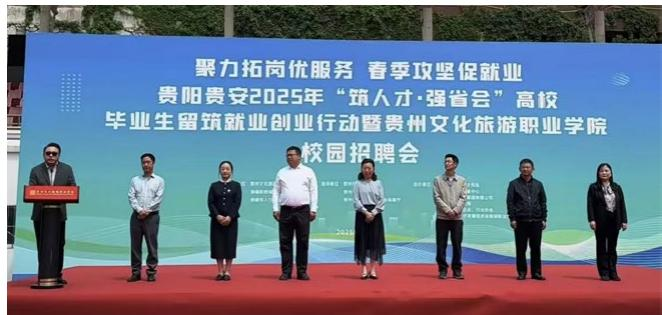

text_image

聚力拓岗优服务 春季攻坚促就业
贵阳贵安2025年“筑人才·强省会”高校
毕业生留筑就业创业行动暨贵州文化旅游职业学院
校园招聘会

校企合作宣讲

报告期内，本集团加强对旗下各品牌酒店培训实施情况的监督与管控，全年门店月人均培训时长保持在4小时以上的稳定水平，持续夯实员工能力提升基础

<table><tr><td colspan="2">指标名称</td><td>单位</td><td>2025年</td></tr><tr><td colspan="2">员工培训开展次数</td><td>次</td><td>13,427</td></tr><tr><td colspan="2">员工培训支出金额</td><td>万元</td><td>19</td></tr><tr><td colspan="2">员工培训覆盖率</td><td>%</td><td>100</td></tr><tr><td colspan="2">员工培训总时数</td><td>小时</td><td>134,834</td></tr><tr><td colspan="2">员工培训人均时长</td><td>小时</td><td>73</td></tr><tr><td></td><td>门店员工</td><td>小时</td><td>38</td></tr><tr><td rowspan="2">按类型划分的员工培训的平均小时数</td><td>门店管理人员</td><td>小时</td><td>27</td></tr><tr><td>总部管理人员</td><td>小时</td><td>29</td></tr></table>

## 共建生态 共创价值

8 体面工作和 经济增长

9 产业、创新和 基础设施

11 可辣社区区

12负清责我生产产

1 促进目标实现的

君亭酒店集团坚持将开放合作、文化传承与社会责任融入企业发展全过程，持续深化行业交流合作，推动品牌价值提升与行业协同发展：积极探索非遗文化与酒店场景的融合创新，助力传统文化保护与传播；并通过公益慈善、乡村振兴及人才建设等实践，持续拓展企业社会价值边界，推动实现经济效益与社会效益协同提升

君亭酒店集团持续拓展合作边界，深化与战略伙伴、产业链伙伴及行业组织的协同联动，积极参与行业交流与经验共享，不断提升品牌影响力与市场竞争力，携手各方共同推动行业高质量与可持续发展。

## 战略合作

2025年，本集团以“开放互联”为核心策略，积极拓展多元化合作渠道，成功构建了覆盖电商、出行、文旅、内容平台、酒店同业及垂直领域的全景式数字化生态。

我们与同业伙伴签署多项合作协议，聚焦品牌协同、资源共享和平台共建，在酒店管理、市场拓展及合作模式创新等领域展开深度合作，持续提升品牌竞争力并推动行业协同发展。

同时，我们通过与唯品会、支付宝、京东等平台深度对接、达成合作，融入其亿级消费流量池，我们的自有会员规模已突破1.900万，年增联盟会员达15万。我们携手滴滴、海航等出行伙伴，嵌入旅客行程场景。同时，我们积极拓展内容引流渠道，与抖音平台完成日历房对接，并深化与书香集团、建发酒店、万达等酒店同业的会员权益互通，实现了跨品牌的客户资源共享。

## 君亭酒店集团与山东文旅酒店集团共拓战略合作蓝图

2025年7月，君亭酒店集团与山东文旅酒店集团正式签署战略合作框架协议。基于此次合作，双方将围绕品牌共创、资源互通、平台共建等方向，在酒店管理、会员体系、设计建设、品牌联名及联合投资等领域开展深度协同，充分整合双方在投资、运营、设计及创新等方面的优势资源，共同提升品牌影响力与市场竞争力，构建长期稳定、可持续发展的战略合作伙伴关系。

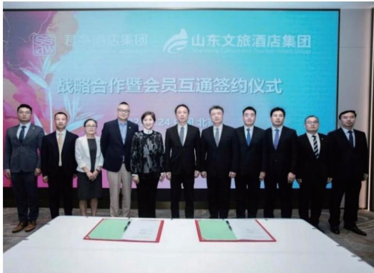

text_image

君亭酒店集团
山东文旅酒店集团
Wenzhou Culture and Tourism Holdings Group
战略合作暨会员互通签约仪式
2024年1月北京

君亭酒店集团与山东文旅酒店集团战略合作签约仪式

## 君亭酒店集团与供销大集达成深度战略合作

2025年12月，君亭酒店集团与供销大集集团股份有限公司正式签署酒店业务深度战略合作协议。双方将在酒店投资开发、运营管理、项目拓展及供应链整合等领域开展全面合作，依托供销大集的优质物业资源与君亭酒店集团的品牌运营优势，逐步推动合作项目落地实施，持续提升项目价值与市场竞争力，共同探索酒店行业协同发展的新路径

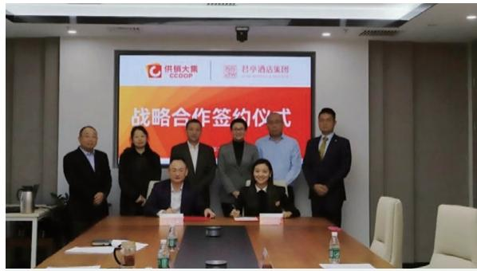

text_image

供销大集
CCDDP
君亭酒店集团
战略合作签约仪式

君亭酒店集团与供销大集集团战略合作签约仪式

## 君亭酒店集团参与国际酒店业投资论坛-2025 亚太峰会 (IHIF Asia)

2025年9月17-19日全联旅游业商会住宿业分会 (CHLA) 组织部分中国内地酒店业同仁赴香港参加国际酒店业投资论坛-2025 亚太峰会(IHIFAsia)。国际酒店业投资论坛-亚太峰会(IHIEAsia)以汇聚顶尖目多元投资者、贷款机构及潜在合作伙伴著称，旨在搭建高收益合作渠道、发掘新兴市场机遇，并探索创新交易结构以实现卓越回报，是亚太酒店业市场首屈一指的投资合作论坛。本次峰会吸引了500多位参会者，覆盖酒店投资生态全链条，直通资产管理、法律咨询、建筑设计与旅游政策领域的关键力量。

中国民族品牌的影响力与品牌价值在世界舞台崭露头角。本次峰会，以君亭、锦江、越秀为代表的中国本土品牌集团的积极参与，让中国品牌再一次赢得瞩目与掌声，备受国外投资机构关注。作为全联旅游业商会副会长、君亭酒店集团董事长，朱晓東女士带领君亭首登酒店业国际舞台，让世界听到来自中国民族酒店品牌的声音。

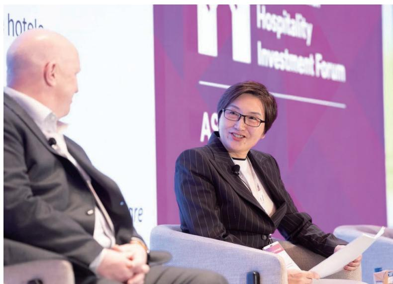

text_image

Hospitality
Investment Forum

君亭酒店集团亮相国际酒店业投资论坛-2025亚太峰会

## 行业交流

君亭酒店集团坚持以开放合作、互学互鉴的理念，积极参与行业交流与案例分享，持续输出创新实践成果，充分发挥品牌影响力与示范作用，推动行业服务创新与高质量发展。

## 君亭酒店集团参加2025 AHF亚洲酒店及旅游业论坛，共议“双碳”背景下酒店业可持续发展

2025年3月，君亭酒店集团受邀参加2025AHF亚洲酒店及旅游业论坛暨第二十届中国文旅星光奖颁奖典礼。君亭酒店董事、副总裁、董事会秘书施晨宁受邀参与“ESG目标下的行业革命”圆桌对话，与行业嘉宾围绕“双碳”政策、零碳酒店认证标准及酒店供应链可持续发展等议题展开交流。通过参与本次论坛，君亭酒店进一步加强了与行业伙伴的沟通互动，展现了公司对绿色低碳发展和可持续运营的持续关注。

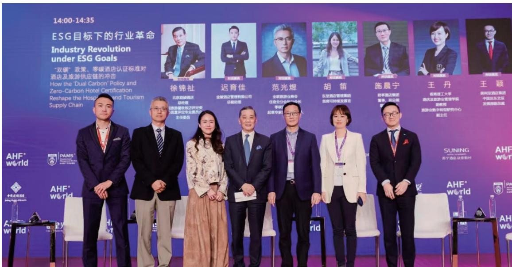

text_image

14:00-14:35
ESG目标下的行业革命
Industry Revolution
under ESG Goals
“双碳”政策、零碳酒店认证标准对
酒店及旅游供应链的冲击
How the “Dual Carbon” Policy and
Zero-Carbon Hotel Certification
Reshape the Hospitality and Tourism
Supply Chain
徐锦祉
北京励峻酒店
总经理
迟育佳
金陵酒店管理有限公司
总裁助理
范光煜
全联京旅游业商会
任商业分会全体副会长
李政
起草专家委员会委员
胡笛
东亚酒店管理集团
首席可持续发展官
施晨宁
教学酒店集团
董事、副总裁
王丹
香港理工大学
酒店及旅游业管理学院
教授级
旅游业数字转型研究中心
副主任
王颖
美利亚酒店集团
中国及东北亚
发展阶段总监
AHF®
world
PAMS®
world
AHF®
world
SUNING
CHINA LEAFIRIA
苏宁酒店 总经教材
AHF®
world

君亭酒店集团亮相AHF亚洲酒店及旅游业论坛

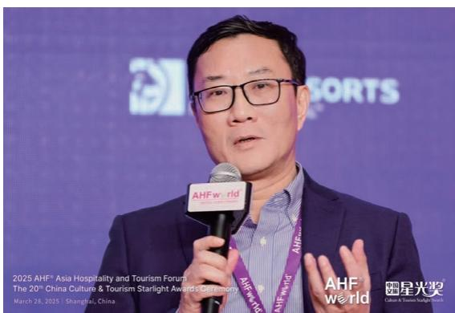

text_image

2025 AHF® Asia Hospitality and Tourism Forum
The 20th China Culture & Tourism Starlight Awards Ceremony
March 28, 2025 | Shanghai, China
AHFworld
AHFworld
AHFworld
AHFworld
AHFworld
AHFworld
AHFworld
AHFworld
AHFworld
AHFworld
AHFworld
AHFworld
AHFworld
AHFworld
AHFworld
AHFworld
AHFworld
AHFworld
AHFworld
AHFworld
AHFworld
AHFworld
AHFworld
AHFworld
AHFworld
AHFWorld
AHFWorld
AHFWorld
AHFWorld
AHFWorld
AHFWorld
AHFWorld
AHFWorld
AHFWorld
AHFWorld
AHFWorld
AHFWorld
AHFWorld
AHFWorld
AHFWorld
AHFWorld
AHFWorld

君亭酒店董事、副总裁、董事会秘书施晨宁受邀参与“ESG目标下的行业革命”圆桌对话  
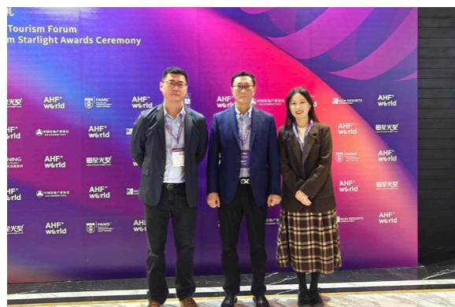

text_image

Tourism Forum
from Starlight Awards Ceremony

## 君亭酒店集团参与“2025酒店评论人才发展论坛”

“2025酒店评论人才发展论坛”由中瑞酒店管理学院主办，邀请20余位酒店行业精英针对酒店人力资源的痛点和前沿问题展开了深入讨论和经验分享，君亭酒店集团董事长，总裁，中国旅游饭店业协会人力资源分会会长朱晓東受邀为论坛致辞。她表示，过去一年行业在复苏变化中重塑，于波动中发展蓄力，受消费需求变化，数字化定义绿色转型加速，新业态崛起，以及工程技术的驱动，中国酒店行业经历着深度调整和结构转型，行业对人才的需求也发生了根本性的改变。这些变化直接推动了行业人才培养与职业培训体系的深刻重构。

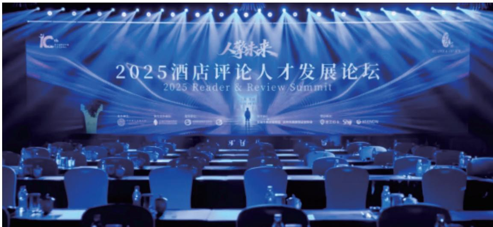

text_image

人擎未来
2025酒店评论人才发展论坛
2025 Reader & Review Summit

2025酒店评论人才发展论坛

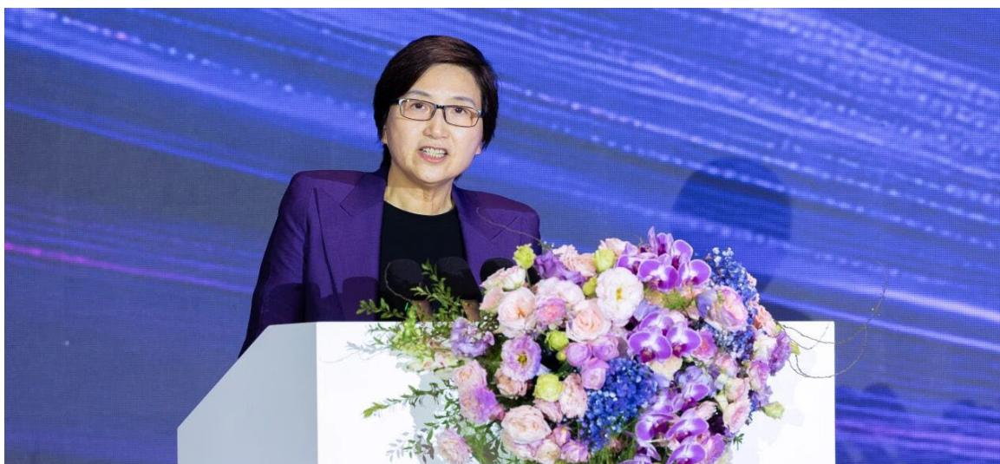

natural_image

Woman speaking at a podium with floral arrangement, against a blue abstract background (no visible text or symbols)

君亭酒店董事长、总裁朱晓東女士为论坛致辞

## 君亭酒店集团出席2025门墩儿火苗儿中国酒店发展大会

2025年5月23日，中国杭州—“敢想·敢为|2025门墩儿火苗儿中国酒店发展大会暨首届门墩儿产业与院校联合会会员大会”在杭州英冠索菲特酒店圆满落幕，本届大会由门墩儿与火苗儿校企联合主办，中国旅游饭店业协会人力资源分会指导，并由浙江省饭店业协会、江苏省旅游协会旅游饭店分会等机构联合协办，参会人员包括全球酒店业领袖、专家学者及行业精英，共同解码中国酒店业高质量发展新路径。中国旅游饭店业协会人力资源分会会长、君亭酒店集团董事长、总裁朱晓東女士致欢迎辞，强调行业需以创新应对变革，为大会拉开序幕。在“全球化与本土化的协同之道”巅峰对话环节，朱总围绕“全球化品牌战略与本土化深耕”展开和行业专家深度探讨，强调品牌需以文化融合与技术创新实现可持续增长。

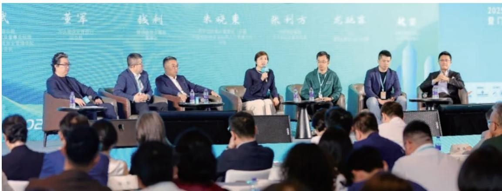

text_image

董军 钱利 朱晓東 张利方 龙跳菲 赵雷
2025
厦门

君亭酒店集团董事长、总裁朱晓東女士参与行业交流分享对话

## 君亭酒店集团以北京华侨夜泊君亭酒店为例分享存量酒店更新改造与服务创新探索成果

2025年9月，北京华侨夜泊君亭酒店亮相第七届“中国服务”·旅游产品创新大会，并荣膺“中国服务”旅游产品创意案例。大会期间，君亭酒店集团围绕老旧酒店资产盘活、文化赋能与差异化体验创新等主题分享实践经验，充分展现了集团在存量酒店更新改造与服务创新方面的探索成果。未来，君亭酒店集团将继续深化行业交流与经验共享，为旅游行业高质量发展贡献更多创新实践。

荣誉：北京华侨夜泊君亭酒店获评第七届“中国服务”旅游产品创意案例

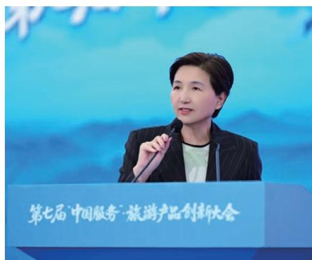

text_image

第七届“中国服务”旅游产品创新大会

君亭酒店集团董事长、总裁朱晓東女士分享经验

## 守护非遗传承

君亭酒店集团致力于打造以非物质文化遗产为特色的主题酒店，以非遗文化特色产品与服务为基础，将中国各地域文化、民族文化及特色艺术文化与酒店服务有机融合，在为宾客提供独特文化体验的同时，助力游客深入感受非遗文化魅力，实现文化价值与商业效益的协同发展。

我们共拥有16个文化遗产项目，拥有满族、蒙古族、黎族等不同民族风情的特色酒店10家，拥有汉、唐、宋、道家、佛家茶道等不同历史，宗教，文化特征的主题酒店24家，将体验式产品与专业化品牌运营有机统一，最终实现文化价值与商业效益的双赢，为非遗文化的保护与传承添砖加瓦。

## 苏州山塘街夜泊君亭酒店体现江南含蓄匠心

苏州山塘街夜泊君亭酒店深度挖掘山塘街与姑苏古城文化内涵，将吴地非遗、水乡民俗、运河文化融入酒店空间设计，在客房中加入古琴、电影、苏式旗袍等主题元素，并联动周边非遗工坊，开展水乡文化体验活动，促进了在地文化的保护与传承。

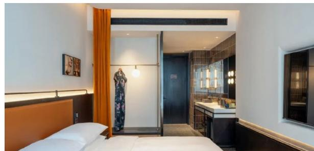

natural_image

Interior view of a modern hotel bedroom with bed, window, and decorative wall art (no visible text or symbols)

苏州山塘街夜泊君亭酒店-苏氏旗袍元素客房

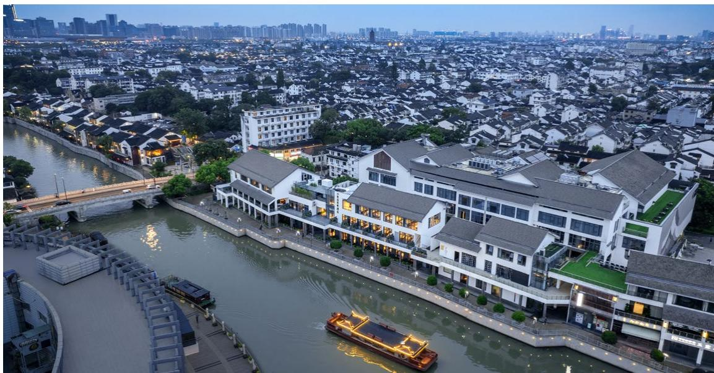

natural_image

Aerial view of a historic city with traditional-style buildings, a river, and a lit ferry, with a modern city skyline in the background (no visible text or symbols).

苏州山塘街夜泊君亭酒店夜景

## 成都夜泊君亭酒店以蜀锦为媒串联非遗美学

成都夜泊君亭酒店将“盘金绣”“方方锦”工艺融入大堂设计，以蜀锦的“经纬交织”作为客房的设计灵感，并定期举办蜀锦文化沙龙与手作体验，酒店以蜀锦为媒，串联起非遗美学的雅致与成都的慢生活韵味，为住客呈现一场深度文化旅居

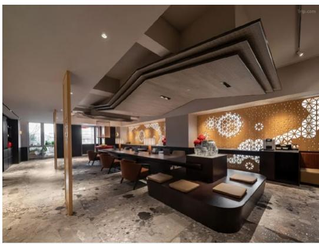

natural_image

Interior view of a modern, spacious lounge or hotel lobby with minimalist ceiling design and decorative wall art (no visible text or symbols)

成都夜泊君亭酒店大堂-金属丝线抽象演绎“盘金绣”工艺的艺术墙

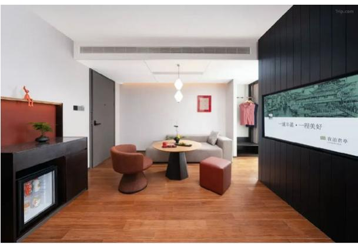

natural_image

Interior view of a modern living room with wooden flooring, coffee table, and decorative wall panels (no visible text or symbols)

成都夜泊君亭酒店房间-以蜀锦“经纬交织”为设计灵感

## 杭州国寿君澜大饭店新春雅集·非遗手作体验

杭州国寿君澜大饭店推出金箔画、竹编扇、宋锦编织、中药相框等非遗活动，通过沉浸式的手作体验，诠释东方传统之美，丰富住客的旅程。

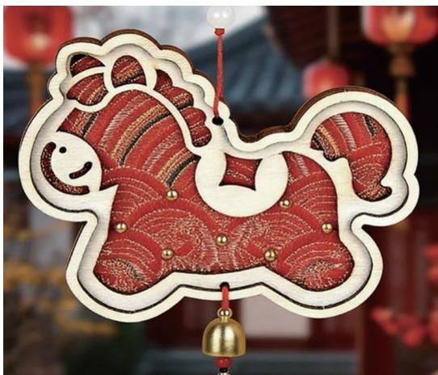

natural_image

Decorative Chinese New Year lantern featuring a red and gold rabbit-shaped object with a bell, set against a blurred background of red lanterns (no text or symbols visible)

宋锦编织

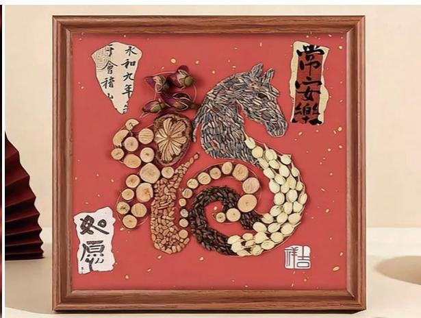

text_image

常安樂
永和九年
于倉稽山
知原

中药相框

## 践行社会公益

君亭酒店集团秉持商业向善的发展理念，持续探索社会价值与经济价值的共生路径。本集团积极投身公益慈善活动，推动形成社会效益与经济效益良性互动的可持续发展闭环：持续关注乡村振兴和美丽乡村建设，积极践行企业社会责任，展现高度的责任意识与社会担当。

## 公益志愿

本集团秉持高度的社会责任感，2025年持续关注公益慈善与生态共建等社会议题。我们积极参与“青春·中国梦”公益募捐活动，以实际行动践行社会责任与爱心使命：同时发起“君亭酒店集团公益林”植树活动，倡导绿色低碳生活方式，积极传递生态保护理念。通过持续参与公益捐赠和生态公益实践，本集团不断拓展公益行动的广度与深度，展现了回馈社会、服务社会的责任担当。

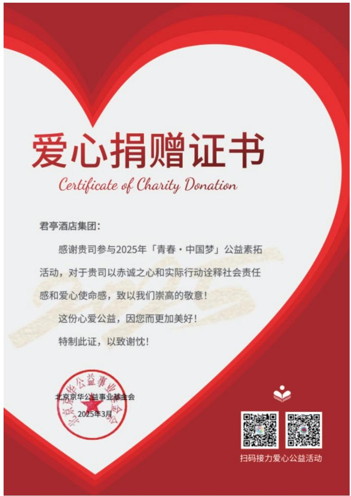

text_image

爱心捐赠证书
Certificate of Charity Donation
君亭酒店集团：
感谢贵司参与2025年「青春·中国梦」公益素拓活动，对于贵司以赤诚之心和实际行动诠释社会责任感和爱心使命感，致以我们崇高的敬意！
这份心爱公益，因您而更加美好！
特制此证，以致谢忱！
北京京华公益事业基金会
2025年3月
扫码接力爱心公益活动

君亭酒店集团参与“青春·中国梦”公益募捐活动

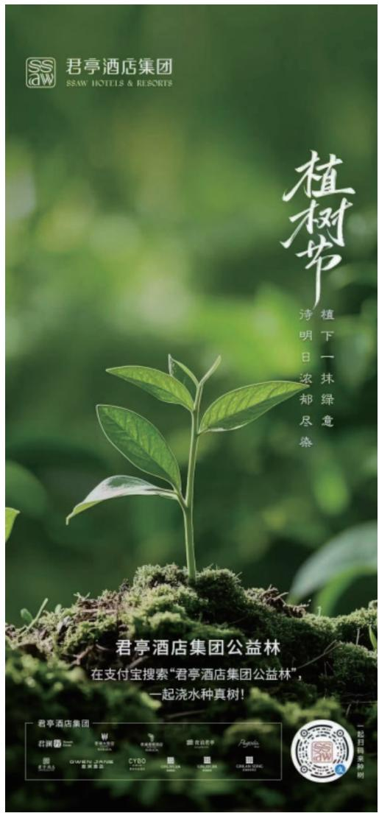

text_image

君亭酒店集团
SSAW HOTELS & RESORTS
植树节
诗明日浓郁尽桑
植下一抹绿意
君亭酒店集团公益林
在支付宝搜索“君亭酒店集团公益林”，
一起浇水种真树！
君亭酒店集团
社源
GWW现代-2号社源
新湖运动
CY80
CHINA BAO
CHINA BAO
CHINA BAO
一起扫码采样例

发起“君亭酒店集团公益林”植树活动

2025年1月，金华君澜大饭店举办“腊八节公益送温暖”活动。金华君澜大饭店部门负责人及以上人员共16人前往银湖暖夕阳、金东区社会福利中心，向特殊群体及护理员派发720盒腊八粥，并捐赠10袋大米、食用油等给银湖暖夕阳、金东区社会福利中心。本次活动过程中，金华君澜大饭店严格遵守食品卫生标准，确保腊八粥的安全和卫生，尊重特殊群体的意愿和需求，避免给他们带来不适。活动结束后，及时清理活动现场，保持环境卫生。

## 乡村振兴建设

作为本土民族品牌，本集团旗下景澜酒店依托对时代趋势的敏锐洞察力，凭借浓郁的“宋韵江南”文化基因和对“在地文化”的传承与创新，打造具有在地文化特征的生活美学酒店，以“文化+生态+农业旅游”的全新理念，推出景澜宿集+露营产品，通过乡村建筑改造、带动乡村就业等方式，以旅游唤醒乡村活力，与地方国企携手助力乡村文化传播、乡村规划治理、乡村就业。

2025年，本集团乡村振兴实践进一步获得社会认可，入选中国上市公司协会“2024年上市公司乡村振兴优秀实践案例”。同时，本集团还结合党建共建与实地调研等形式，关注农文旅融合、现代农业与乡村振兴协同发展的实践路径，持续为乡村振兴注入新动能。集团旗下景澜品牌持续深化美丽乡村建设，2025年，景澜携手福州市建总投资发展有限公司，于福州市永泰县梧桐镇圻演村(习近平总书记“两山理论”实践地)打造“福州城投大樟溪景澜·温泉宿集”，项目荣获“国家森林乡村”“省级乡村振兴试点村”“福建省委党校现场教学点”“中小学生劳动教育实践基地”等荣誉，串联起“美景”“美宿”“美味”“美育”为项目四大支柱，使住客在度假休闲的同时，与乡村互动，感受农耕文化的智慧与乡村振兴的力量。

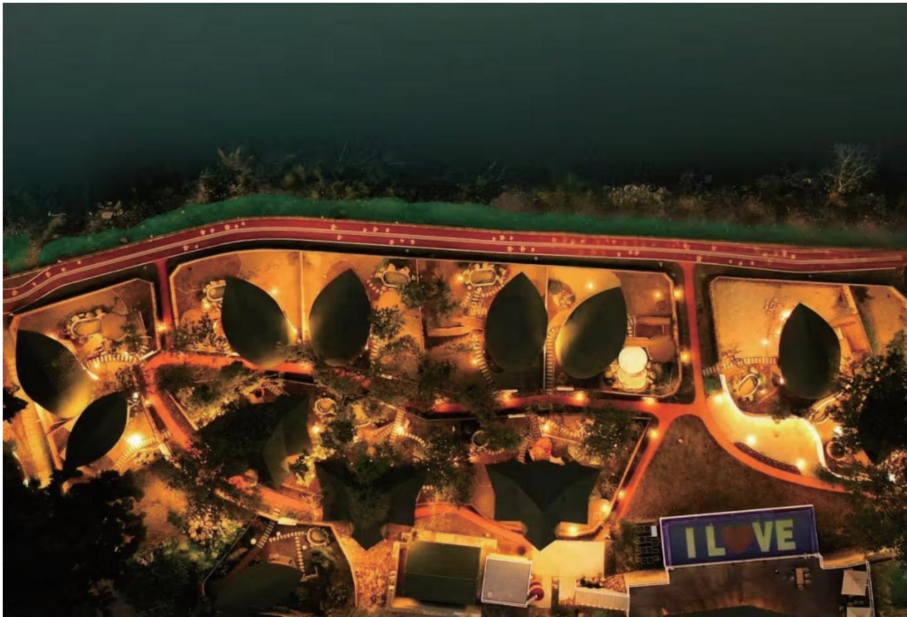

natural_image

Aerial night view of a modern illuminated building complex with large leaf-shaped structures and surrounding greenery (no visible text or symbols)

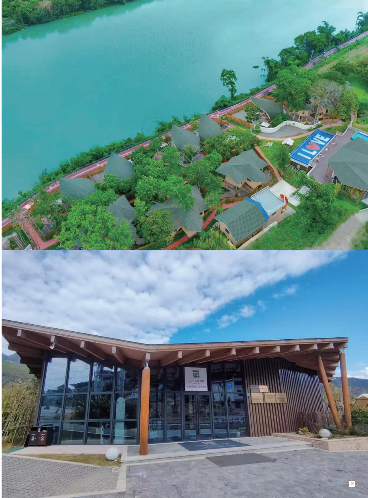

## 关键绩效表

## 环境类

<table><tr><td>指标名称</td><td>单位</td><td>2023年</td><td>2024年</td><td>2025年</td></tr><tr><td colspan="5">环境合规管理</td></tr><tr><td>环保总投入金额</td><td>万元</td><td>826.2</td><td>575.27</td><td>711.41</td></tr><tr><td>环保总投入金额占营业收入(万元)百分比</td><td>%</td><td>1.55</td><td>0.85</td><td>1.06</td></tr><tr><td colspan="5">应对气候变化</td></tr><tr><td>温室气体排放总量</td><td>吨二氧化碳当量</td><td>24,046.39</td><td>27,470.27</td><td>27,313.69</td></tr><tr><td>直接(范围1)温室气体排放</td><td>吨二氧化碳当量</td><td>2,327.40</td><td>2,465.58</td><td>2,440.09</td></tr><tr><td>间接(范围2)温室气体排放</td><td>吨二氧化碳当量</td><td>21,719.00</td><td>25,004.68</td><td>24,873.61</td></tr><tr><td>温室气体排放强度</td><td>吨二氧化碳当量/已售间夜</td><td>0.03</td><td>0.03</td><td>0.03</td></tr></table>

  
1、能源与温室气体排放量统计边界为君亭各直营门店及控股子公司。  
2、直接（范围1）温室气体排放源包括汽油、柴油、天然气，其二氧化碳排放因子主要参考《公共建筑运营企业温室气体排放核算方法和报告指南》。  
3、间接（范围2）温室气体排放源包括外购电力与外购热水，其二氧化碳排放因子参考《公共建筑运营企业温室气体排放核算方法和报告指南》。

<table><tr><td colspan="2">指标名称</td><td>单位</td><td>2023年</td><td>2024年</td><td>2025年</td></tr><tr><td colspan="6">能源管理</td></tr><tr><td colspan="2">综合能源消耗总量</td><td>吨标准煤</td><td>3,287.50</td><td>4,160.28</td><td>5,822.57</td></tr><tr><td colspan="2">已出售酒店间夜</td><td>已售间夜</td><td>793,731</td><td>1,014,018</td><td>1,067,632</td></tr><tr><td colspan="2">能源消耗密度</td><td>千瓦时/已售间夜</td><td>29.36</td><td>28.74</td><td>28.63</td></tr><tr><td colspan="2">汽油消耗量</td><td>吨</td><td>20.37</td><td>18.12</td><td>18.82</td></tr><tr><td colspan="2">柴油消耗量</td><td>吨</td><td>134.1</td><td>116.4</td><td>614.03</td></tr><tr><td colspan="2">天然气消耗量</td><td>立方米</td><td>852,838.25</td><td>945,646.36</td><td>962,430.00</td></tr><tr><td colspan="2">电力消耗量</td><td>兆瓦时</td><td>23,307.05</td><td>29,145.53</td><td>30,569.45</td></tr><tr><td colspan="2">外购热水</td><td>吨</td><td>76,609.00</td><td>76,209.00</td><td>67,635.00</td></tr><tr><td colspan="2">可再生能源使用总量</td><td>吨标准煤</td><td>49</td><td>56</td><td>30</td></tr><tr><td colspan="6">废弃物管理</td></tr><tr><td colspan="2">垃圾填埋量</td><td>吨</td><td>/</td><td>2499.12</td><td>2676.50</td></tr><tr><td colspan="2">回收再利用废弃物总量</td><td>吨</td><td>774</td><td>825</td><td>825</td></tr><tr><td colspan="6">水资源管理</td></tr><tr><td colspan="2">总取水量</td><td>吨</td><td>162,338</td><td>674,075</td><td>651,808</td></tr><tr><td colspan="2">取水密度</td><td>千克/已售间夜</td><td>0.20</td><td>0.66</td><td>0.61</td></tr><tr><td colspan="2">指标名称</td><td>单位</td><td>2024年</td><td>2023年</td><td>2022年</td></tr><tr><td colspan="6">员工合规雇佣</td></tr><tr><td colspan="2">员工总数</td><td>人</td><td>2,148</td><td>2,337</td><td>1,856</td></tr><tr><td rowspan="3">按类型划分的员工数量</td><td>正式员工</td><td>人</td><td>1,983</td><td>2,132</td><td>1,629</td></tr><tr><td>劳务派遣</td><td>人</td><td>165</td><td>170</td><td>187</td></tr><tr><td>兼职员工</td><td>人</td><td>0</td><td>35</td><td>40</td></tr><tr><td rowspan="2">按性别划分的员工数量</td><td>男性</td><td>人</td><td>1,174</td><td>1,178</td><td>911</td></tr><tr><td>女性</td><td>人</td><td>974</td><td>1,159</td><td>911</td></tr><tr><td rowspan="3">按年龄划分的员工数量</td><td>30岁以下</td><td>人</td><td>688</td><td>703</td><td>532</td></tr><tr><td>30-50岁</td><td>人</td><td>979</td><td>1,120</td><td>895</td></tr><tr><td>50岁以上</td><td>人</td><td>471</td><td>514</td><td>396</td></tr><tr><td colspan="2">少数民族员工数量</td><td>人</td><td>276</td><td>226</td><td>208</td></tr><tr><td colspan="2">少数民族员工占比</td><td>%</td><td>12.85</td><td>9.67</td><td>11.21</td></tr><tr><td colspan="2">新进员工总数</td><td>人</td><td>706</td><td>615</td><td>528</td></tr><tr><td rowspan="2">按性别划分的新进员工数量</td><td>女性</td><td>人</td><td>343</td><td>351</td><td>204</td></tr><tr><td>男性</td><td>人</td><td>365</td><td>264</td><td>324</td></tr></table>

<table><tr><td colspan="2">指标名称</td><td>单位</td><td>2023年</td><td>2024年</td><td>2025年</td></tr><tr><td></td><td>30岁以下</td><td>人</td><td>349</td><td>275</td><td>237</td></tr><tr><td rowspan="2">按年龄划分的新进员工数量</td><td>30-50岁</td><td>人</td><td>253</td><td>241</td><td>212</td></tr><tr><td>50岁以上</td><td>人</td><td>104</td><td>99</td><td>79</td></tr><tr><td colspan="2">员工流失数量</td><td>人</td><td>502</td><td>526</td><td>544</td></tr><tr><td colspan="2">员工总流失率</td><td>%</td><td>23.37</td><td>22.51</td><td>29.31</td></tr><tr><td rowspan="2">按性别划分的员工流失数量</td><td>男性</td><td>人</td><td>247</td><td>287</td><td>219</td></tr><tr><td>女性</td><td>人</td><td>255</td><td>239</td><td>325</td></tr><tr><td rowspan="3">按年龄划分的员工流失数量</td><td>30岁以下</td><td>人</td><td>259</td><td>260</td><td>213</td></tr><tr><td>30-50岁</td><td>人</td><td>152</td><td>187</td><td>216</td></tr><tr><td>50岁以上</td><td>人</td><td>91</td><td>79</td><td>115</td></tr><tr><td colspan="6">员工薪酬与福利</td></tr><tr><td colspan="2">休育儿假的员工总数</td><td>人</td><td>2</td><td>4</td><td>3</td></tr><tr><td colspan="2">困难员工帮扶人数</td><td>人</td><td>1</td><td>2</td><td>17</td></tr><tr><td colspan="2">公司发放的福利费数额</td><td>万元</td><td>277.33</td><td>328.73</td><td>410.32</td></tr><tr><td colspan="6">员工培训与发展</td></tr><tr><td colspan="2">员工培训开展次数</td><td>次</td><td>9,180</td><td>12,149</td><td>13,427</td></tr><tr><td colspan="2">员工培训支出金额</td><td>万元</td><td>50.23</td><td>58.83</td><td>18.76</td></tr><tr><td colspan="2">员工培训覆盖率</td><td>%</td><td>100</td><td>100</td><td>100</td></tr><tr><td colspan="2">员工培训总时数</td><td>小时</td><td>88,614.97</td><td>134,164.43</td><td>134,834.36</td></tr><tr><td colspan="2">员工培训人均时长</td><td>小时</td><td>41.25</td><td>57.41</td><td>72.65</td></tr><tr><td rowspan="2">按性别划分的员工培训的平均小时数</td><td>男性</td><td>小时</td><td>174.38</td><td>183.32</td><td>205.86</td></tr><tr><td>女性</td><td>小时</td><td>199.28</td><td>218.85</td><td>300.79</td></tr><tr><td></td><td>门店员工</td><td>小时</td><td>32.63</td><td>35.80</td><td>38.01</td></tr><tr><td rowspan="2">按类型划分的员工培训的平均小时数</td><td>门店管理人员</td><td>小时</td><td>27.17</td><td>24.04</td><td>27.39</td></tr><tr><td>总部管理人员</td><td>小时</td><td>27.10</td><td>29.49</td><td>28.93</td></tr></table>

职业健康与安全

<table><tr><td>职业健康安全管理体系覆盖员工数</td><td>人</td><td>1,298</td><td>1,390</td><td>1,594</td></tr><tr><td>可记录工伤数量</td><td>人</td><td>4</td><td>11</td><td>8</td></tr><tr><td>工伤导致的死亡数量</td><td>人</td><td>0</td><td>0</td><td>0</td></tr><tr><td>工伤保险、安全生产责任险的投入金额</td><td>万元</td><td>191.34</td><td>220.65</td><td>38</td></tr><tr><td>工伤保险、安全生产责任险的人员覆盖率</td><td>%</td><td>100</td><td>100</td><td>100</td></tr></table>

客户服务与体验

<table><tr><td>2024年客户投诉总数量</td><td>件</td><td>95</td><td>100</td><td>149</td></tr><tr><td>2024年客户投诉解决量</td><td>件</td><td>95</td><td>100</td><td>149</td></tr><tr><td>2024年客户投诉解决率</td><td>%</td><td>100</td><td>100</td><td>100</td></tr></table>

<table><tr><td>指标名称</td><td>单位</td><td>2023年</td><td>2024年</td><td>2025年</td></tr><tr><td colspan="5">供应链</td></tr><tr><td>供应商总数</td><td>个</td><td>385</td><td>459</td><td>374</td></tr><tr><td>开展环境或社会影响评估的供应商数量</td><td>个</td><td>15</td><td>18</td><td>28</td></tr><tr><td colspan="5">社会公益</td></tr><tr><td>公益捐赠总额</td><td>万元</td><td>56</td><td>2</td><td>1</td></tr><tr><td>志愿活动投入金额</td><td>万元</td><td>3.0915</td><td>2.53</td><td>0.01</td></tr><tr><td>员工志愿服务人次</td><td>人次</td><td>1,765</td><td>592</td><td>460</td></tr><tr><td>员工参与志愿服务时长</td><td>小时</td><td>375.67</td><td>745.50</td><td>32.00</td></tr><tr><td colspan="5">公司治理</td></tr><tr><td>董事会人数</td><td>人</td><td>9</td><td>7</td><td>8</td></tr><tr><td>董事会女性人数</td><td>人</td><td>4</td><td>3</td><td>3</td></tr><tr><td>女性董事占比</td><td>%</td><td>44</td><td>42.86</td><td>37.50</td></tr><tr><td>独立董事人数</td><td>人</td><td>3</td><td>3</td><td>3</td></tr><tr><td>独立董事占比</td><td>%</td><td>33</td><td>42.86</td><td>38</td></tr><tr><td>董事会召开次数</td><td>次</td><td>8</td><td>5</td><td>5</td></tr><tr><td>董事会成员的出席率</td><td>%</td><td>100</td><td>100</td><td>100</td></tr><tr><td>审计委员会会议次数</td><td>次</td><td>5</td><td>7</td><td>5</td></tr><tr><td>薪酬委员会会议次数</td><td>次</td><td>1</td><td>1</td><td>1</td></tr><tr><td>提名委员会会议次数</td><td>次</td><td>1</td><td>2</td><td>1</td></tr><tr><td>审计委员会独立董事占比</td><td>%</td><td>66.67</td><td>100</td><td>100</td></tr><tr><td>薪酬委员会独立董事占比</td><td>%</td><td>66.67</td><td>66.67</td><td>66.67</td></tr><tr><td>提名委员会独立董事占比</td><td>%</td><td>66.67</td><td>66.67</td><td>66.67</td></tr><tr><td>股东会会议次数</td><td>次</td><td>2</td><td>1</td><td>2</td></tr><tr><td>监事会会议次数</td><td>次</td><td>4</td><td>5</td><td>2</td></tr></table>

<table><tr><td colspan="2">指标名称</td><td>单位</td><td>2023年</td><td>2024年</td><td>2025年</td></tr><tr><td colspan="6">内控合规</td></tr><tr><td colspan="2">所涉重大诉讼、仲裁事项等风险事件数量</td><td>件</td><td>/</td><td>0</td><td>0</td></tr><tr><td colspan="6">商业道德</td></tr><tr><td rowspan="3">按类别划分的反商业贿赂及反贪污培训百分比</td><td>董事会</td><td>%</td><td>0</td><td>0</td><td>100</td></tr><tr><td>管理层人员</td><td>%</td><td>100</td><td>100</td><td>100</td></tr><tr><td>员工</td><td>%</td><td>100</td><td>100</td><td>100</td></tr><tr><td colspan="2">商业贿赂及贪污举报事件</td><td>件</td><td>0</td><td>0</td><td>0</td></tr></table>

## 内容索引表

<table><tr><td colspan="2">报告章节</td><td>《深圳证券交易所上市公司自律监管指引第17号——可持续发展报告(试行)》</td><td>《全球可持续发展报告标准(GRI Standards 2021)》</td></tr><tr><td>关于本报告</td><td>--</td><td>第四条、第六条</td><td>2-1; 2-2; 2-3; 2-4</td></tr><tr><td rowspan="4">关于本公司</td><td>走进君亭</td><td>--</td><td>2-1; 2-6</td></tr><tr><td>企业文化</td><td>--</td><td>--</td></tr><tr><td>年度荣誉</td><td>--</td><td>--</td></tr><tr><td>可持续发展管治</td><td>--</td><td>--</td></tr><tr><td rowspan="2">可持续发展</td><td>利益相关方沟通</td><td>第九条,第五十三条</td><td>2-29; 3-1</td></tr><tr><td>重要性议题分析</td><td>第五条</td><td>2-23; 3-1; 3-2; 3-3</td></tr><tr><td rowspan="5">固本守正治理为基</td><td>坚持党建引领</td><td>--</td><td>--</td></tr><tr><td>稳健公司治理</td><td>第二条、第五十一条</td><td>2-9; 2-10; 2-11; 2-12; 2-13; 2-20; 2-26; 3-3; 405-1</td></tr><tr><td>全面合规管理</td><td>第五十三条</td><td>2-23; 2-26; 3-3</td></tr><tr><td>恪守商业道德</td><td>第五十四至五十六条</td><td>2-23; 2-24; 2-26; 2-27; 2-29; 3-3; 205-1; 205-2; 205-3; 206-1</td></tr><tr><td>保障投资者权益</td><td>第五十三条</td><td>2-9; 2-12; 2-16; 2-26; 2-29; 3-3; 201-1</td></tr><tr><td rowspan="3">奔赴绿色新程可期</td><td>环境合规管理</td><td>第二十条,第二十九至三十三条</td><td>2-27; 3-3; 303-4; 304-2; 305-6; 305-7; 305-3</td></tr><tr><td>应对气候变化</td><td>第二十至二十八条</td><td>3-3; 201-2; 302-1; 305-1; 305-2; 305-1; 305-2; 305-5</td></tr><tr><td>绿色运营实践</td><td>第二十条、第三十四至三十七条</td><td>3-3; 302-4; 302-5; 303-1; 303-3; 303-5</td></tr></table>

<table><tr><td colspan="2">报告章节</td><td>《深圳证券交易所上市公司自律监管指引第17号——可持续发展报告(试行)》</td><td>《全球可持续发展报告标准(GRI Standards 2021)》</td></tr><tr><td rowspan="4">匠心筑信品质致远</td><td>筑牢品质基石</td><td>第四十七条</td><td>2-23; 2-24; 2-25;2-27; 3-3; 416-2; 418-1</td></tr><tr><td>维护客户权益</td><td>第四十七条</td><td>2-23; 2-24; 2-25;2-27; 3-3; 416-2; 418-1</td></tr><tr><td>数智创新驱动</td><td>第四十一至四十三条</td><td>3-3; 302-4</td></tr><tr><td>践行责任采购</td><td>第四十四至四十五条</td><td>2-23; 2-24; 2-25; 2-27; 3-3; 308-1;308-2; 414-1; 414-2; 408-1; 409-1</td></tr><tr><td rowspan="3">同心同行育才树人</td><td>员工雇佣管理</td><td>第四十九至五十条</td><td>2-7; 2-23; 2-24; 3-3;401-1; 401-2; 407-1; 408-1; 409-1</td></tr><tr><td>员工福祉关怀</td><td>第五十条</td><td>2-7; 2-23; 2-24; 3-3; 401-2; 401-3;403-1; 403-3; 403-4; 403-5;403-6; 403-8; 405-1; 406-1</td></tr><tr><td>员工培训发展</td><td>第四十九至五十条</td><td>2-7; 2-23; 2-24; 3-3; 401-1;401-2; 401-3; 404-1; 404-2;</td></tr><tr><td rowspan="3">共建生态共创价值</td><td>行业交流发展</td><td>第四十条</td><td>--</td></tr><tr><td>守护非遗传承</td><td>--</td><td>--</td></tr><tr><td>践行社会公益</td><td>第三十八条至第四十条、第四十二条、第四十三条</td><td>3-3; 203-1; 203-2; 413-1</td></tr></table>

尊敬的读者：

您好！非常感谢您在百忙之中阅读《君亭酒店集团股份有限公司2025年环境、社会和治理（ESG）报告》，为提高报告质量和水平，持续改进公司ESG工作，我们诚邀您对此份报告提出宝贵的建议，谢谢！

读者姓名：

联系方式：

单位：

电子邮箱：

1.您对本报告的总体评价是:

□较好

□一般

2.您认为本报告是否能反映公司对经济、社会、环境的重大影响：

□能

□一般

□不了解

3.您认为本报告披露的信息、数据、指标的清晰度、准确性、完整性如何：

□高

□较高

□一般较低

□低

4.您认为本报告的排版设计和内容安排是否便于阅读:

□是

□否

5.您希望进一步了解哪些信息？

6.您对君亭酒店集团下一年度履行社会责任有什么期待？

联系电话：0571-86750888；0571-88835939

电子邮箱：ssaw.shareholder.services@ssaw-hotels.com

联系地址：浙江省杭州市西湖区紫宣路18号浙谷深蓝中心3号楼