## 2025 年度

## 环境、社会及公司治理(ESG)报告

## ENVIRONMENTAL, SOCIAL AND GOVERNANCE (ESG) REPORT

natural_image

Exterior view of a modern glass office building with 'otima' signage, set against a clear blue sky (no other text or symbols visible)

## 目录

关于本报告 01

走进鸥玛软件 03

响应SDGs目标 19

ESG管理 21

## 附录

关键绩效 95

对标索引 99

读者意见反馈 100

## CONTENTS

## 铸造数智责任

## 与行业共创选才价值

数智创新全面赋能选才 27

数智品质安全护航选才 37

可信数据守护客户隐私 49

责任供应链路稳健共进 58

协同合作共建行业生态 60

## 夯实善治根基

## 以责任护航稳健发展

公司治理 63

投资者关系管理 65

风险与合规管理 67

反商业贿赂及反贪污 70

反不正当竞争 72

## 厚植人本关怀

## 与社会共享发展成果

员工雇佣与权益保障 75

员工培训与职业发展 80

职业健康与安全 83

乡村振兴与社会贡献 86

## 践行绿色运营

## 以低碳赋能持续发展

应对气候变化 89

绿色运营 92

资源利用 92

污废管理 94

## 关于本报告

## 时间范围

本报告时间跨度为2025年1月1日至2025年12月31日，为增强报告可比性与完整性，部分内容向前后年度适度延伸。

## 报告边界

本报告以山东鸥玛软件股份有限公司（以下简称“鸥玛软件”或“公司”或“我们”）为主体，报告范围与公司2025年年报合并报表范围保持一致。

## 数据来源

本报告使用的定性、定量信息均来自鸥玛软件公开披露文件、内部经营统计数据、多部门交叉核验数据及第三方权威认证结果，财务数据均与公司年度报告保持一致。

## 报告称谓

组织范围：除另有说明外，本报告中的政策、声明、资料等覆盖山东鸥玛软件股份有限公司及其附属公司的实际业务范围，报告主体与《山东鸥玛软件股份有限公司2025年年度报告》一致。

## 编制依据

Ÿ 《深圳证券交易所上市公司自律监管指引第17号——可持续发展报告（试行）》  
Ÿ 《深圳证券交易所创业板上市公司自律监管指南第3号——可持续发展报告编制》  
Ÿ 《中国企业可持续发展报告指南（CASS-ESG 6.0）》  
Ÿ 全球报告倡议组织（GRI）《可持续发展报告标准》（GRI Standards）  
Ÿ 联合国可持续发展目标（SDGs）

## 可靠性保证

报告核心数据经公司多部门交叉核验，环境、社会、治理关键指标参照国家及行业标准核算口径统计，公司及董事会全体成员保证披露内容真实、准确、完整，没有虚假记载、误导性陈述或重大遗漏。

## 报告获取

本报告可通过深圳证券交易所官网、鸥玛软件官方网站（www.oumasoft.com）下载，如有疑问与建议，可通过公司官方邮箱（info@oumasoft.com）与我们联系。

## 走进鸥玛软件

## 公司概况

山东鸥玛软件股份有限公司（股票简称：鸥玛软件，股票代码：301185）是中国考试与测评领域领先的数智化综合服务提供商，国家级高新技术企业、国家鼓励的重点软件企业，是国内考试与测评领域唯一的国有控股企业及独立上市企业。公司源于百年学府山东大学，始终秉承“与时偕行、以信致远”的核心价值观，以“创新产品、创造价值”为使命，致力于以先进的技术、创新的产品、精准的服务，为国家部委、行业协会、教育机构、企事业单位等提供考试与测评领域全流程的数智化解决方案。

依托国资背景与现代化治理体系，公司以高标准、规范化服务保障国家级及省市级重大考试平稳有序实施，以数智化技术全面提升考试组织效能，切实维护考试公平公正，为推动我国考试与测评行业的数智化变革及“人才强国”战略的实施提供坚实的技术支撑与服务保障。

## 我们的使命与承诺

让考试更公平，让测评更智能，让人才评价更科学——这是鸥玛软件始终不变的追求。

考试公平是社会公平的重要基石，人才评价是创新驱动的关键支撑。二十年来，公司深耕考试与测评信息化领域，从纸笔考试数字化到无纸化考试全流程智能服务，从人工评卷到人工智能辅助评阅——我们以持续的技术创新守护每一次考试的公平公正，以实际行动践行国有企业的社会责任。

面向未来，公司将继续践行创新驱动发展战略，以人工智能、大数据、云计算等前沿技术为引领，不断完善智能化服务体系，全力推进考试与测评领域数智化转型。

## 我们郑重承诺：

  
以治理筑根基

完善现代企业治理体系，坚持规范运作与透明披露，以规范高效的治理保障公司行稳致远。

  
以创新促发展

持续加大研发投入，深化AI技术在考试与测评领域的创新应用，以自主可控的核心技术筑牢发展根基。

  
以责任传递价值

守护数据安全与客户隐私，赋能员工成长，践行国企担当，让技术发展的成果惠及更广泛的社会群体。

natural_image

Exterior view of a modern multi-story office building with glass facade and surrounding landscaping (no signage or text visible)

## 核心业务与技术体系

公司主营业务为考试与测评领域信息化产品的研究、开发、销售及服务，主要为国家部委、行业协会、教育机构、企事业单位等提供考试与测评的信息化建设整体解决方案、系统平台建设与运营维护、考试与数据处理服务、应用软件开发与服务以及硬件产品等。同时，公司通过应用大数据、人工智能、云计算等新一代信息技术，推动考试与测评领域数字化、智能化发展。

公司业务涵盖从考试报名、题库建设、考务管理、考试评卷、成绩分析、电子证书、大数据挖掘到人才评价的全流程。

## 核心产品与服务包括：

## 基于AI技术的无纸化考试一体化服务平台

集考试报名、试卷生成、上机考试、网上评卷、成绩合成、统计分析于一体，覆盖从命题到数据分析的考试全过程管理，通过AI技术实现“命题-考试-评卷-分析”全链条智能闭环，推动考试模式从传统纸笔向全流程数字化、智能化转型，为考试机构构建安全、智能、可靠的数智化考试服务生态。

## 数字化网上卷智能服务平台

以计算机网络技术和电子扫描技术为依托，实现选择题自动评卷、非选择题网上评卷。平台深度融合深度学习、自然语言处理、知识图谱等前沿技术，持续推进非选择题规模化、智能化评阅，通过辅助或部分替代人工评卷工作，可显著提升评卷效率，降低评卷成本。平台已实现对纸质答卷、音频、视频等多模态数据的智能化评阅，支持智能识别、智能质检等辅助功能，支持全流程数据监控、实时统计分析、评卷异常预警、智能报表分析等功能，助推考试评卷科学、公平、公正。

## 国家级数字化公共服务平台

面向国家部委及各级管理机构建设的综合业务政务平台，支持信息交换、数据共享及业务协同，实现“一门一网”的一体化服务。服务范围覆盖人员信息管理、审核管理、考务管理、证书管理、继续教育、电子档案管理、行业自律、申投诉管理、专家管理等业务。该平台凭借其先进的技术架构与完善的服务体系，已面向多个国家部委及考试机构提供业务管理与数据服务。

## 智能题库平台

融合知识图谱、领域命题大模型、检索增强生成等前沿技术，支持多学科试题的自动化、规模化与个性化生成。平台具备命题素材管理、知识点管理、考试大纲管理、多维数据反馈等核心功能，覆盖从征题、审题、组卷、审卷到题库管理的试题全生命周期管理，能够同时满足大规模标准化考试与个性化测评的多元需求。该平台实现了试题生产与管理的全流程智能化闭环，已入选山东省高端软件与人工智能产业链新技术新产品名单。

## 云服务平台

公司依托“学、考、选”三位一体的公共服务体系，以鸥玛云平台为基础，融合在线学习、在线考试测评、在线面试答辩三个场景，建设面向个体及机构受众的个性化生态空间。“学，就成”“考，就成”“选，就成”云服务平台为行业专业人员水平测试、高校招生考试、招聘考试、区域公务员考试等提供在线云考试服务，拓展了考试服务模式和领域。

公司依托人工智能创新研究院，在自然语言处理、多模态识别、知识图谱、生成式大模型等关键领域持续突破，通过打造“数据-知识库-大模型”三位一体的AI引擎，已形成以智能识别、智能命题、智能考试（含智能巡考）、智能评卷、智能数据分析与评价为核心的全域生态智能技术体系。该体系已实现多场景、多类型考试的规模化落地，相关技术已获得多项发明专利和重要荣誉，构建起从数据、知识库到算法模型的完整技术闭环。

企业文化  
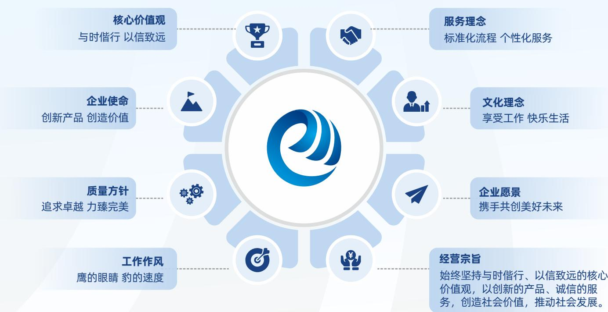

flowchart

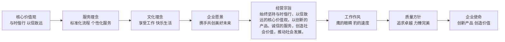

## 发展历程

## 2005

Ÿ 公司自成立以来，始终坚持以自主知识产权的软硬件产品为核心，以技术创新为驱动，专注于考试与测评领域的数字化与智能化服务，致力于为相关政府部门、行业协会、教育机构及企事业单位等提供信息化建设整体解决方案与专业化技术服务，推动我国考试与测评领域从传统模式向数智化跨越， 为人才科学选拔与教育公平贡献技术力量。

## 2006-2007

Ÿ 创建专业化的数据处理基地，以自主研发的“TS系列高速智能扫描仪”和“数字化网上阅卷综合管理系统”为支撑承接国家级考试服务与数据处理业务。  
Ÿ 率先实现国家级考试全国网上统一报名。  
Ÿ “数字化网上阅卷综合管理系统”获2007年度山东省科技进步奖二等奖。

## 2008-2009

Ÿ 设立山东省软件工程技术中心。  
Ÿ 开启国家级考试服务平台建设的新起点。

## 2010-2011

Ÿ 设立山东省图像采集与处理工程技术研究中心。  
Ÿ “海量图像数据存储与处理系统”获2010年度山东省科技进步奖二等奖。  
Ÿ “大规模纸笔考试信息化处理系统”获2010年度全军科技进步奖一等奖。

## 2012-2013

Ÿ “鸥玛数据中心”建设完成，成为国内规模最大的专业化考试数据处理基地。  
Ÿ 多个国家级考试服务平台上线运行，推动我国考试管理信息化建设。  
Ÿ 启动人工智能辅助评卷技术的研发与模型训练。  
Ÿ “低成本、低功耗、云架构的新型信息化系统”获2013年度山东省科学技术一等奖。

## 2014-2015

Ÿ 无纸化考试系统首次成功应用于国家级考试，实现行业重要突破。

## 2016-2017

“山东山大鸥玛软件股份有限公司”成立，注册资本金增至3,699万元，并于2016年11月18日在全国中小企业股份转让系统成功挂牌。  
Ÿ 向原股东等比例发行股票500万股，募集金额1,500万元，注册资本金增至4,199万元。2017年12月27日，公司完成工商变更登记。

## 2018-2019

Ÿ 以非公开定向发行股票的方式增发1,500.00万股，募集资金总额为人民币22,500.00万元，注册资本金增至8,218.40万元。  
Ÿ 与山东大学合作开展人工智能图文转换、人工智能评卷的研究，并在国家教育考试、资格考试中试用成功。  
Ÿ “考场监考信息化整体解决方案及实现”获2018年度军队科技进步奖二等奖。

## 2020-2021

Ÿ 2021年11月19日，正式登陆深圳证券交易所创业板，股票简称“鸥玛软件”，股票代码301185，成为中国考试与测评领域第一股。  
Ÿ 联合山东大学成立“山东大学-鸥玛软件人工智能创新研究院”。

## 2022-2023

Ÿ 与山东国家应用数学中心达成战略合作；与山东人才发展集团有限公司达成战略合作，推动考试测评与人才服务的深度融合。  
Ÿ “视觉内容表示与识别关键技术及应用”获2022年度山东省人工智能科学技术一等奖。  
Ÿ “基于文本的人工智能评卷系统研究应用”获2022年度大数据科学技术奖二等奖。  
Ÿ “人工智能技术在机器评卷领域的研究与应用”获2023年度山东省计算机学会科学技术奖二等奖。

## 2024

Ÿ 鸥玛数据产业园区建设项目正式开工建设，旨在打造国内大规模、专业化、综合性的考试服务基地。  
Ÿ “考试与测评领域人工智能关键技术创新研究与应用”获2024年度山东省计算机学会科学技术奖二等奖。

## 2025

Ÿ 完成国有股权无偿划转，公司控股股东由山东山大资本运营有限公司变更为山东省国有资产投资控股有限公司，实际控制人由山东大学变更为山东省人民政府国有资产监督管理委员会，迈入国有资本赋能的新发展阶段。

## 核心荣誉与奖项

2020年度山东省大数据产业创新中心

山东省2021年度工业企业“一企一技术”研发中心第五批山东省软件产业高质量发展重点项目

济南市首批人工智能大模型推荐名录

第九批山东省首版次高端软件产品

通过2022年度济南市工程实验室（工程研究中心）运行评价

山东省首批人工智能大模型典型应用案例

山东省高端软件与人工智能产业链新技术新产品

2025年度山东省大数据产业“三优两重”项目

通过山东省软件工程技术中心2025年度考核评价

2025年度济南优势工业产品名录

2025年度山东省大数据企业50强

通过济南市企业技术中心2025年度运行评价

2025年度济南市创新产品应用推荐目录

text_image

奖
山东省工程技术研究中心
济南市人民政府
二〇一一年二月

山东省工程技术研究中心

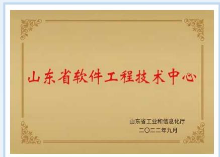

text_image

山东省软件工程技术中心
山东省工业和信息化厅
二〇二二年九月

山东省软件工程技术中心

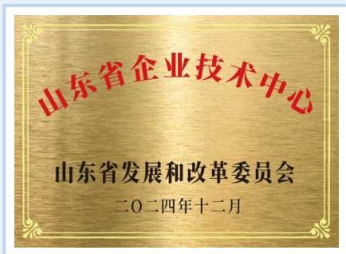

text_image

山东省企业技术中心
山东省发展和改革委员会
二〇二四年十二月

山东省企业技术中心

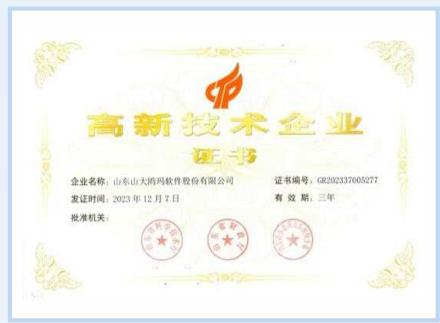

text_image

高新技术企业
证书
企业名称：山东山大鸿玛软件股份有限公司
发证时间：2023年12月7日
批准机关：
证书编号：GR202337005277
有效期：三年

高新技术企业

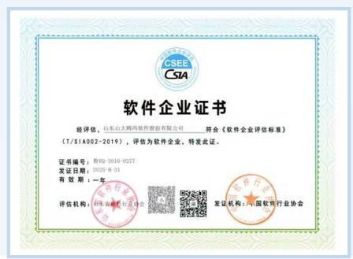

text_image

CSEE
CSIA
软件企业证书
经评估，山东山大鸿网软件股份有限公司——符合《软件企业评估标准》
（T/SIA002-2019），评估为软件企业，特发此证。
证书编号：参RQ-2016-0227
发证日期：2025-8-31
有效期：一年
评估机构：广东省科学技术厅协会
发证机构：中国数字行业协会

山东省软件企业

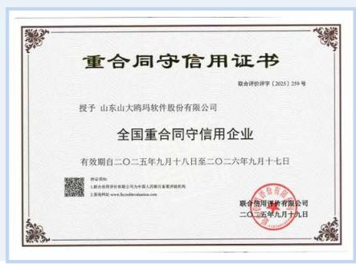

text_image

重合同守信用证书
联合评审签字（2025）259号
授予 山东山大鸥玛软件股份有限公司
全国重合同守信用企业
有效期自二〇二五年九月十八日至二〇二六年九月十七日
联合信用鉴证有限公司
二〇二五年九月十九日

全国重合同守信用企业

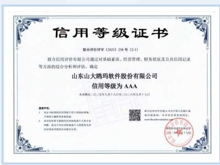

text_image

信用等级证书
联合信用评价字（2025）258号（2-1）
联合信用评价有限公司通过对基础素质、经营管理、财务状况及公共信用记录等方面的综合分析和评估，确定
山东山大鸥玛软件股份有限公司
信用等级为AAA
有效期自二〇二五年九月十八日至二〇二六年九月十七日
重大事件：
1. 本单位将持有的信用等级用于担保额度，
下同了银行等金融机构。
2. 本单位将下属机构以机构和个人为个人
判断，基于不同信用级别或个人的经济本评
标标准和信用等级相结合条款。
联合信用评级有限公司为中国人民银行
及评级机构，本评估经监管部网站：
www.bocichina.com.cn
《信用等级评定公告》
（二〇一四年八月十五日）

信用等级AAA认证

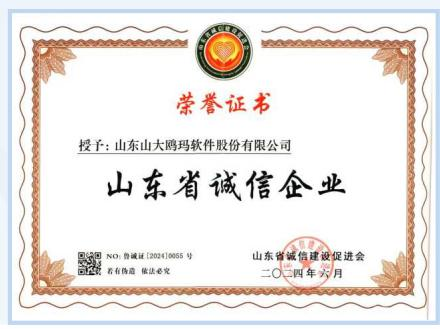

text_image

荣誉证书
授予: 山东山大鸥玛软件股份有限公司
山东省诚信企业
NO: 普诚证 [2024]0055号
若有铸造 依法必究
山东省诚信建设促进会
二〇一四年六月

山东省诚信企业

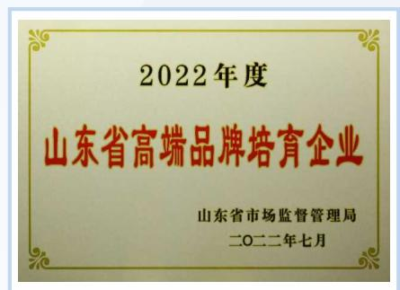

text_image

2022年度
山东省高端品牌培育企业
山东省市场监督管理局
二〇二二年七月

2022年度高端品牌培育企业

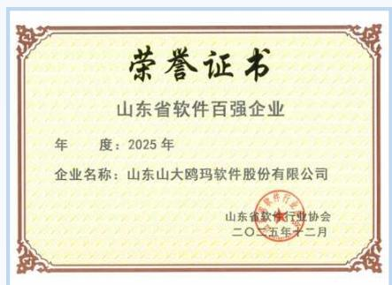

text_image

荣誉证书
山东省软件百强企业
年度：2025年
企业名称：山东山大鸥玛软件股份有限公司
山东省软件行业协会
二〇一五年十二月

2025年度山东省软件和信息技术服务业综合竞争力百强企业

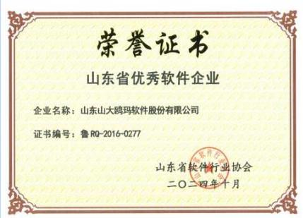

text_image

荣誉证书
山东省优秀软件企业
企业名称：山东山大鸥玛软件股份有限公司
证书编号：鲁RQ-2016-0277
山东省软件行业协会
二〇二四年十月

山东省优秀软件企业

natural_image

Abstract blue circuit board pattern with interconnected lines and nodes (no text or symbols)

## 2024-2025年

## 与人工智能相关的发明专利

text_image

发明专利证书
发明名称：普莱特授权中COCB识别结果的修正方法、系统、设备及
注册号：250101 山东山大西洋软件股份有限公司
地址：250101 山东省济南市高新区经路128号
发明人：李长雨  专利号：ZL 2023 12376668.X  授权公告号：CNJ 120200040 B
专利申请日：2025年02月26日  授权公告日：2025年11月18日
申请时间：中国（上海）自由贸易试验区
申请对应人员：李长雨 李长雨
国家知识产权局受理中华人民共和国专利登记注册申请，决定授予专利权，并予以公告。
专利权委托书应为权利义务。专利有效期至授权书签署日期前不得变更或终止。
申请人：申长雨
第1页（C1）

答卷一致性校验中OCR识别结果的修正方法、系统、设备及介质

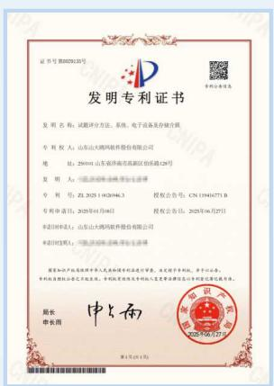

text_image

证书号:202029120号
发明专利证书
发明名称:试验评定方法、系统、电子设备及存储介质
专利权人:山东大同风帆股份有限公司
地址:291011 山东省济南市高新区伯乐路128号
发明人:山东大同风帆股份有限公司
专利号:ZL 2025 11062046.3
专利申请日:2025年01月08日
授权公告号:CN 11046371 B
授权公告日:2025年06月27日
申请时间:山东大同风帆股份有限公司
申请日期:2025年06月27日
国家知识产权局行政许可人员出具的法律意见书,决定授予专利权,并于公告。
专利权期限自登记日起生效。中国专利局及专利权人变更注册或登记至专利登记机关办理。
局长:申长雨
申请人:
申长雨
第1页(共1页)

试题评分方法、系统、电子设备及存储介质

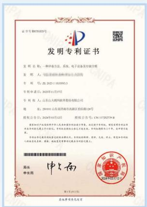

text_image

证书号:2024102035号
发明专利证书
发明名称:一种病毒方法,系统、电子设备及存储介质
发明人:XXX
专利号:ZL 2023 13339933
专利申请日:2023年11月17日
专利权人:山东山大数码网络股份有限公司
地址:289091 山西西南高新区高新路128号
授权公告号:2024年03月12日
授权公告号:CN 117252738
国家知识产权局科学技术部关于专利申请的受理、发证通知书、授权使用专利证书和申请书的登记手续。专利权委托经公证机关审核,专利权期限为十年,申请书可续期。
专利权登记至专利登记时间前的申请文件名:专利权委托书、复印、无误、终止、恢复和专利权人的权利义务证明、国知、地局变更事项的记录在专利登记上。
国家知识产权局科学技术部关于专利申请的受理、发证通知书、授权使用专利证书和申请书的登记手续。专利权委托书、复印、无误、终止、恢复和专利权人的权利义务证明、国知、地局变更事项的记录在专利登记上。
第1页(见第1页)
基地事务所信息

一种评卷方法、系统、电子设备及存储介质

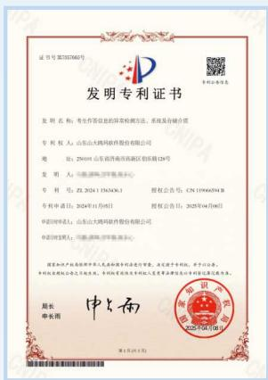

text_image

证书号第1857680号
发明专利证书
发明名称：考生内容信息的保密检测方法、系统及存储介质
发明人：山东山大鸿网软件股份有限公司
地址：250101 山东省济南市高新区招新路128号
发明人：中国科学院工商管理处
专利号：ZL 2024 1356346.1
授权公告号：CN 19960594 B
专利申请日：2024年11月8日
授权公告日：2025年04月08日
中国科学技术部：山东山大鸿网软件股份有限公司
申请时间：2024年11月8日
国家知识产权局根据中华人民共和国专利法进行审查，决定授予专利权，并予以公告。
专利权委托书已生效。本专利授权委托书由申请人签署并盖章后方可有效登记并有效存续。
邮编：
中长雨
第1页（2014）

考生作答信息的异常检测方法、系统及存储介质

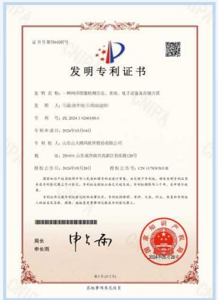

text_image

发明专利证书
发明名称：一种科学物理检验方法、系统、电子设备及存储介质
发明人：张小明 2024年1月18日
专利号：ZL 2024104049860
专利申请日：2024年03月04日
专利权人：山东山大鸿邦软件股份有限公司
地址：250911 山东省济南市高新区科创路128号
授权公告日：2024年03月26日
授权公告号：CN 17780361B
国家知识产权局中华人民共和国科学技术部注册，决定授予专利权。国家知识产权局专利申请书经审查后方可生效。专利权期限为六年，并在取得许可后，可向专利局提交专利申请文件。
专利权登记机关和登记机构已取得受理通知书，有权向专利局、专利人、技术员、负责人、执业人员办理相关手续并领取相关文件。
申请人：申长雨
制发日期：2024年03月26日
其他事项见底页

一种网评图像检测方法、系统、电子设备及存储介质

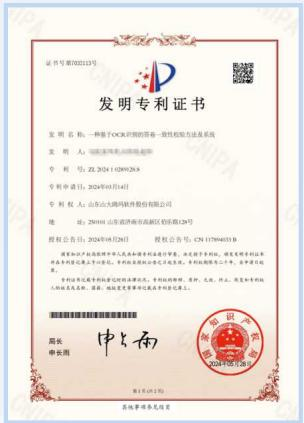

text_image

发明专利证书
发明名称：一种基于OCR识别的答案一致性检验方法及系统
发明人：张明先生
专利号：ZL 20241108912838
专利申请日：2024年05月14日
专利权人：山东大西洋焊接件股份有限公司
地址：290101 山西省济南市高新区经十路128号
授权公告日：2024年05月26日
授权公告号：CN 175904533B
国家知识产权局中华人民共和国专利申请备案，决定授予专利权。现将发明专利证书形式并登记至公司名册。专利权属登记企业已开展，专利权期限为三年，申请日期为两年。
专利权登记事项须经国家工商行政管理总局登记机关核准并公告。
申请人：申长雨
专利权人：李晓东
专利权人：徐建平
专利权人：周伟、周俊、周俊、周俊、周俊、周俊、周俊、周俊、周俊、周俊、周俊、周俊、周俊、周俊、周俊、周俊、周俊、周俊、周俊、周俊、周俊、周俊、周俊、周俊、周俊、周俊、周俊、周俊、周俊、周俊、周俊、周俊、周俊、周俊、周俊
专利权人：李晓东
专利权人：徐建平
专利权人：周伟、周俊、周俊、周俊、周俊、周俊、周俊、周俊、周俊、周俊、周俊、周俊、周俊、周俊、周俊、周俊、周俊、周俊、周俊、周俊、周俊、周俊、周俊、周俊、周俊、周俊、WJYU
专利权人：李晓东
专利权人：徐建平
专利权人：周伟、周俊、周俊、周俊、周俊、周俊、周俊、周俊、周俊、周俊、周俊、周俊、周俊、周俊、周俊、周俊、周俊、周俊、周俊、周俊、WJYU
专利权人：李晓东
专利权人：徐建平
专利权人：周伟、周俊、周俊、周俊、周俊、周骏
专利权人：李晓东
专利权人：徐建平
专利权人：周伟、周俊、周俊、周骏
专利权人：李晓东
专利权人：徐建平
专利权人：周伟、周俊、周骏
专利权人：李晓东
专利权人：徐建平
专利权人：WJYU
专利权人：李晓东
专利权人：徐建平
专利权人：WJYU
专利权人：李晓东
专利权人：徐建平
专利权人：WJYU
专利权人：李晓东
专利权人：徐建平
专利权人：WJYU
专利权人：李晓东
专利权人：徐建平
专利权人：WJYUU
专利权人：李晓东
专利权人：徐建平
专利权人：WJYUU
专利权人：李晓东
专利权人：徐建平
专利权人：WJYUU
专利权人：李晓东
专利权人：徐建平
专利权人：WJYUU
专利权人：李晓东
专利权人：徐建平
专利权人：WJYU
专利权人：李晓东
专利权人：徐建平
专利权人：WJYUU
专利权人：李晓东
专利权人：徐建平
专利权人：WJYUU
专利权人：李晓东
专利权人：徐建平
专利权人：WJYU
专利权人：李晓东
专利权人：徐建平
专利权人：WJYU
专利权人：李晓东
专利权人：徐建平
专利权人：WJYUU
专利权人：李晓东
专利权人：徐建平
专利权人：WJYU
专利权人：李晓东
专利权人：徐建平
专利权人：WJYUU
专利权人：李晓东
专利权人：徐建平
专利权人：WJYU
专利权人：李晓东
专利权人：徐建平
专利权人：WJYU
专利权人：李晓东
专利权人：徐建平
专利权人：WJYU
专利权人：李晓东
专利权人：徐建平
专利权人：WJYUA
专利权人：李晓东
专利权人：徐建平
专利权人：WJYUA
专利权人：李晓东
专利权人：徐建平
专利权人：WJYUA
专利权人：李晓东
专利权人：徐建平
专利权人：WJYUA
专利权人：李晓东
专利权人：徐建平
专利权人：WJYUU<nl>专利权人：李晓东
专利权人：徐建平
专利权人：WJYUU
专利权人：李晓东
专利权人：徐建平
专利权人：WJYUU
专利权人：李晓东
专利权人：徐建平
专利权人：WJYUU
专利权人：李晓东
专利权人：徐建平
专利权人：WJYUU

种基于OCR识别的答卷一致性校验方法及系统

text_image

发明专利证书
发明名称：一种基于教材和印刷的普通方法、系统、仓储终端及存储介质
发明人：张小明
专利号：ZL 2023.1.120733.4
专利申请日：2023年09月19日
专利权人：山东大西洋网络股份有限公司
地址：29101 山东市高新区高新区临泽路128号
授权公告日：2024年01月30日
授权公告号：CN 11695580转
国家知识产权局授权中华人民共和国专利申请注册，该授权于专利权。授权使用专利证书并由专利申请登记至下册单位。专利权属登记证书为有效。专利权期限为三年，全部可自授权之日起算。
专利权登记至国家知识产权局的申请，专利权期限为两年，无异议，待处理并存续。
权利人或其配偶、父母、子女、配偶或者兄弟姐妹在专利申请登记手续上。
国家知识产权局受理的专利申请书已取得受理通知书。
申请人：申小雨
发证日期：2024年01月30日
其他事项请参见后附页

一种基于教材知识图谱的智能命题方法、系统、命题终端及存储介质

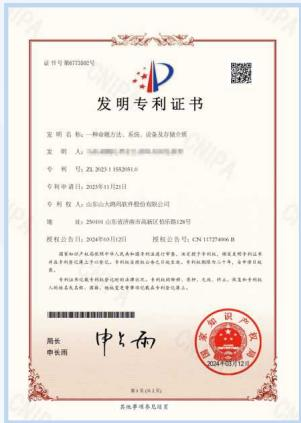

text_image

证书号:961728407
发明专利证书
发明名称:一种命物法、系统、设备及存储介质
发明人:####
专利号:ZL 2023 15528511
专利申请日:2023年11月21日
专利权人:山东山大鸿利软件股份有限公司
地址:296981 山西济南高新区(松原路128号)
授权公告日:2024年03月12日
授权公告号:CN 117274966 B
国家知识产权局深圳市中级人民法院进行审查,决定授予专利权,现将专利权委托给山东省科技厅办公室,并由山东省科技厅办公室受理。专利权期限为六年,专利项目进展正常。
专利权登记事项的登记时间及批准程序详见山东省科学技术厅
《发明专利证书》
周长
申长雨
中国国新汽车集团有限公司
2024年03月12日
第1页(共1页)
其他事务部信息

一种命题方法、系统、设备及存储介质

text_image

证书号第40888号
发明专利证书
发明名称：一种英语口语语言的评测和评测方法，系统、计算机及可读存储方法
专利权人：山东山大鸿网软件股份有限公司
地址：259101 山东沂源市高新区伯桥路128号
发明人：张建平 于 2024年9月24日
专利号：ZL 2021 1 1436055.0
授权公告号：CN 114123971 B
专利申请日：2021年11月25日
授权公告日：2024年9月24日
申请时间：山东山大鸿网软件股份有限公司
申请日（受审）：2024年9月24日
国家知识产权局受理的专利申请书及注册登记表，未使用专利权。不得公开。
专利权委托书已提交，授权有效期至专利权人变更后取得该专利的书面同意并送达。
局长
申长雨
中山西
2024/07/24

一种英语口语语音识别及评测方法、系统、计算机及可读存储介质

text_image

发明专利证书
发明名称：融入示范的作文评选与成立力。装置、电子设备及存储介质
专利权人：山东山大网鸽软件股份有限公司
地址：25000山东省济南市历下区高新区包括路128号
发明人：中国科学院上海市第一人民医院
专利号：ZL 2024 1105294.X
授权公告号：CN 118395053.D
专利申请日：2024年06月28日
授权公告日：2024年09月28日
中国科学技术部：山东山大网鸽软件股份有限公司
中国科学技术厅：中国科学院上海市第一人民医院
国家知识产权局授予中华人民共和国专利证书后实施，决定授予专利权，并予以公告。
专利权期限自申请日起至授权书签署日止。专利权有效期至专利权人签署日期届满后方可有效登记并有效办理。
申请人：
周长
申长雨
申小雨
第1页（17）页

融入元示例的作文评语生成方法、装置、电子设备及存储介质

flowchart

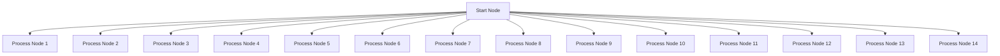

数说2025年

<table><tr><td>经营亮点</td><td>营业收入18,772.43万元</td><td>净利润5,822.30万元</td></tr><tr><td></td><td colspan="2">公司现金分红总额达4,602.53万元</td></tr><tr><td rowspan="2">治理亮点</td><td>召开股东会3次</td><td>召开董事会7次</td></tr><tr><td>公司独立董事占比33.33%</td><td>开展反商业贿赂与反贪污专项培训2次</td></tr><tr><td></td><td>反商业贿赂与反贪污培训员工覆盖率100%</td><td>发生经确认的商业贿赂及贪污事件0起</td></tr><tr><td rowspan="3">创新与运营亮点</td><td>研发投入金额3,426.93万元</td><td>占营业收入比例达18.26%</td></tr><tr><td>研发人员数量185人</td><td>占员工总数比例50.55%</td></tr><tr><td>新增专利授权数量7件</td><td>新增计算机软件著作权数量84件</td></tr><tr><td></td><td>AI相关授权发明专利数量24件</td><td>产品验收合格率100%</td></tr></table>

<table><tr><td rowspan="2"></td><td>客户综合满意度达98.20%</td><td>客户投诉量为0起</td></tr><tr><td>发生重大数据安全和个人信息泄露事件0件</td><td>售前方案制定化满意度达99%</td></tr><tr><td></td><td>售中项目实施按时完成率达100%</td><td>售后问题解决率达100%</td></tr></table>

社会责任亮点

<table><tr><td rowspan="5">社会责任亮点</td><td>劳动合同签订率达100%</td><td>员工社保缴纳覆盖率达100%</td></tr><tr><td>工会入会人数比例达100%</td><td>员工整体满意度达96%</td></tr><tr><td>召开职工代表大会3次</td><td>员工培训总时长累计3,574小时</td></tr><tr><td>职业健康与安全类培训总时长达732小时</td><td>开展安全演习2次</td></tr><tr><td>员工工伤保险覆盖率达100%</td><td>员工职业健康与安全责任险覆盖率达100%</td></tr><tr><td></td><td>乡村振兴与社会贡献总投入额为24.39万元</td><td></td></tr></table>

## 党建引领 笃行不怠

公司坚持党的全面领导，以高质量党建引领高质量发展，将党建工作深度融入公司治理、战略决策与经营管理全过程。

## 履行全面从严治党责任

聚焦“举旗定向”，强化政治建设统领力。坚持把政治建设摆在首位，教育引导全体党员干部深刻领悟“两个确立”的决定性意义，增强“四个意识”、坚定“四个自信”、做到“两个维护”，推动党建工作与业务工作同频共振、深度融合。

聚焦“凝心铸魂”，提升思想建设引领力。将学习党的创新理论作为首要政治任务，坚持用党的创新理论武装头脑、指导实践、推动工作。通过集中学习、专题研讨、个人自学、线上培训等多种形式，深入学习党的二十届四中全会精神、习近平总书记重要讲话精神，以及党章党规党纪。全年组织集中学习27次，专题研讨17次。在重大节日、纪念日组织开展形式多样的主题教育活动12次。

聚焦“固本强基”，增强组织建设战斗力。以提升组织力为重点，推动基层党组织全面进步、全面过硬。加强党员教育管理，高质量组织召开年度组织生活会和开展民主评议党员工作，严肃认真开展批评和自我批评，锤炼党员干部党性修养，激励党员发挥先锋模范作用。

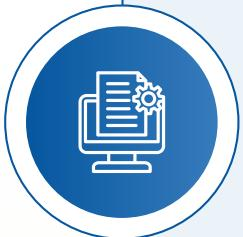

聚焦“正风肃纪”，推动从严治党管制力。持之以恒抓好作风建设，深入贯彻中央八项规定精神学习教育，坚决纠治形式主义、官僚主义。认真组织学习《中国共产党纪律处分条例》等党内法规，开展警示教育，引导党员干部知敬畏、存戒惧、守底线。加强日常监督，抓早抓小、防微杜渐，切实筑牢全面从严治党防线。

## 严抓基层党建工作

natural_image

Abstract graphic with a blue circular icon containing a document symbol, connected by a dashed arrow (no text or symbols present)

## 强基固本抓党建，筑牢发展“压舱石”。

严格执行“三会一课”、主题党日、谈心谈话等制度，全年主持召开支部党员大会6次，支委会17次，讲授专题党课4次。围绕公司年度重点任务、重大项目、改革难题，设立“党员责任区”“党员示范岗”，组建“党员突击队”，引导党员在关键岗位中担当作为。

flowchart

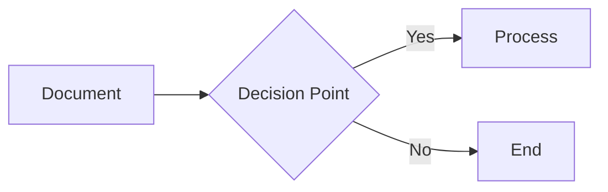

## 靶向发力促发展，扛起履职“硬担当”。

紧扣党的二十届四中全会精神，立足公司发展实际，从市场、研发、服务三大核心领域靶向发力，以党建引领业务全链条提质增效。着力发展新质生产力。市场端精准对接客户需求，拓展业务边界与合作场景；研发端聚焦人工智能等关键技术攻关，推动产品迭代升级；服务端优化流程、提升效率，打造高品质服务体系。

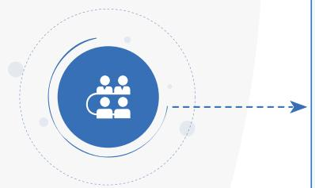

flowchart

## 联学共建强交流，激活发展“新动能”。

先后与山大校友办党支部、园区建设方党支部开展结对共建，围绕理论共学、资源共享、难题共解开展系列活动。通过搭建交流平台，推动党建经验互鉴互促，将组织优势转化为发展优势。与多家合作单位联合成立临时党支部，设立党员先锋岗与攻坚小组，围绕合作重点课题联合攻关，通过党建阵地共建、应急处置协同、服务效能共升，推动党建经验互鉴与业务深度融合。

natural_image

Illustration of a red flag with golden pillar, red ribbon, and two doves flying against a white background (no text or symbols)

## 响应SDGs目标

鸥玛软件将可持续发展核心理念深度融入企业战略与日常经营，围绕 “铸造数智责任、夯实善治根基、厚植人本关怀、践行绿色运营” 四大核心维度系统推进各项行动，立足考试与测评数智化服务商的独特定位，将自身发展与全球可持续发展进程深度绑定，以技术创新守护社会公平、以规范治理筑牢发展底线、以人本关怀凝聚成长力量、以绿色实践助力“双碳”目标，切实履行国有企业社会责任，推动企业价值与社会价值协同提升。

## 铸造数智责任，与行业共创选才价值

9 产业、创新和基础设施

12 负责任消费和生产

17 促进目标实现的伙伴关系

公司深耕考试与测评全流程数智化，构建覆盖报名、命题、考试、评阅、评价的全流程智能化解决方案，持续保持高强度研发投入，构建“数据-知识库-大模型”AI技术引擎，推动智能命题、智能评卷等核心技术产业化应用，升级国家级数字化考试服务基础设施，引领行业数智化转型与产业创新；公司构建全生命周期数据安全与质量管控体系，拥有数字水印、加密认证等自主技术，通过ISO27001、ISO27701等权威认证，实现重大数据及个人信息泄露事件零发生，筑牢考试公信力防线，维护社会公平正义；深化产学研协同与行业生态共建，公司与高校共建人工智能创新研究院，深度参与行业标准制定，打造责任供应链，与上下游伙伴共享发展成果，荣获山东省软件百强、大数据50强等荣誉，多项AI产品入选省级推荐目录，构建开放共赢的产业生态。

## 夯实善治根基，以责任护航稳健发展

公司建立“董事会决策统筹- 管理层组织实施- 各部门协同落实”的三级ESG治理架构，推动董事会多元化与专业化建设，完善信息披露与投资者关系管理，以透明规范的治理保障企业行稳致远；构建全面风险管理与合规体系，对商业贿赂、不正当竞争实行零容忍，全年未发生相关违规事件，维护公平有序的市场环境，保障中小企业合作伙伴平等竞争权利；坚持稳健经营与价值创造，持续优化股东回报机制，以稳定的经营业绩和现金分红回馈投资者，助力经济高质量可持续增长。

## 厚植人本关怀，与社会共享发展成果

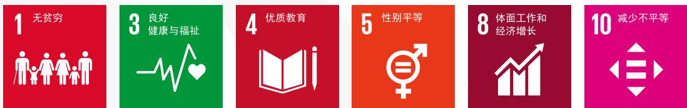

公司坚持平等雇佣原则，全面保障员工合法权益，实现劳动合同签订率、社保缴纳覆盖率、工会入会率100% 杜绝任何形式的就业歧视，保障男女同工同酬与平等职业发展机会；建立覆盖全员的职业健康安全保障体系，通过ISO45001认证，实现职业病与工伤发生率双零，足额缴纳工伤保险与商业意外险，定期组织全员健康体检与安全应急演练，守护员工身心健康；构建全周期人才培养体系，为员工提供从入职引导到专业赋能的系统化培训，畅通职业晋升通道，助力员工能力提升与职业成长；积极践行国企社会责任，投入专项资金开展乡村振兴帮扶，通过资金捐赠与消费帮扶相结合的方式，助力欠发达地区巩固拓展脱贫攻坚成果，缩小区域发展差距。

## 践行绿色运营，以低碳赋能持续发展

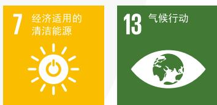

公司积极响应国家“双碳”战略，以全流程无纸化考试解决方案为核心抓手，从源头大幅减少纸张消耗与碳排放，推动考试行业绿色转型；完善环境管理体系并通过ISO14001认证，全年无环境违规事件；推行绿色办公与节能降耗，完成园区太阳能照明改造，优化办公区域能耗管控，建立能耗精细化监测机制，提升能源使用效率；规范办公废弃物与污水处置，实行生活垃圾分类管理与电子废弃物专业回收，推行环保耗材采购与资源循环利用，最大限度降低运营活动对生态环境的影响，以低碳运营助力气候行动与陆地生态保护。

## ESG管理

## 可持续发展理念与战略

鸥玛软件深知，在数字经济与实体经济深度融合的时代背景下，可持续发展已成为企业长期价值创造的核心驱动力。公司将可持续发展理念全面融入公司战略与日常经营，致力于为政府及监管机构、股东与投资者、客户（考试机构）、考生、供应商及合作伙伴、员工、社区与公众等持续创造价值，贡献积极力量。

公司以ESG治理为高质量发展的制度保障，依托国有控股的治理优势，在三个维度上系统推进：

## 治理（G）

持续完善现代企业治理体系，坚持规范运作与透明披露，以稳健治理保障行稳致远。

natural_image

Illustration of a hand holding three circular icons: lightbulb, document, and water drop, symbolizing knowledge or service (no text present)

## 创新与社会责任（S）

以人工智能、大数据、云计算等前沿技术为引领，筑牢自主可控的核心技术根基；守护数据安全与客户隐私，赋能员工成长，践行国企担当，让技术成果惠及更广泛的社会群体。

## 环境（E）

以无纸化考试解决方案推动行业绿色转型，持续降

低自身运营的碳足迹，助力“双碳”目标实现。

以治理筑根基、以创新促发展、以责任传递价值——这是鸥玛软件持之以恒的行动准则。我们将以ESG为标尺，在服务国家“人才强国”战略的同时，实现企业与社会的共生共荣。

## ESG管理架构

公司建立了由董事会决策统筹、管理层组织实施、各职能部门协同落实的三级ESG治理架构。形成上下贯通、协同推进的ESG管理闭环。同时，公司坚持党的领导，将党建工作深度融入ESG治理全过程。党委在公司重大决策中发挥把方向、管大局、保落实的作用，确保ESG工作与国家战略、国资监管要求同频共振。

董事会 负责审议ESG战略规划、重大议题与年度目标

管理层 负责推动ESG工作落地执行，定期向董事会汇报进展

各职能部门 依照职责分工推进ESG相关工作

## 利益相关方沟通

公司高度重视利益相关方的关切与诉求，将其作为ESG工作的重要出发点和落脚点。我们明确政府及监管机构、股东与投资者、客户（考试机构）、考生、供应商及合作伙伴、员工、社区与公众为核心利益相关方，通过业绩说明会、投资者调研、客户座谈会、职工代表大会、供应商大会、公益项目对接等常态化沟通机制，持续收集各方诉求与建议。

<table><tr><td>利益相关方</td><td colspan="2">关注议题</td><td colspan="2">沟通渠道</td></tr><tr><td>政府及监管机构</td><td>·公司治理·ESG管理·风险与合规管理</td><td>·环境合规管理·应对气候变化·尽职调查</td><td>·合规履职·依法纳税·监管对接</td><td>·政策响应·专项工作汇报·安全合规自查报备</td></tr><tr><td>股东与投资者</td><td>·公司治理·投资者关系管理</td><td>·创新驱动·利益相关方沟通</td><td>·定期报告披露·投资者沟通活动·业绩说明会</td><td>·互动易平台·股东会·内控体系提升</td></tr><tr><td>客户</td><td colspan="2">·产品和服务安全与质量·创新驱动·数据安全与隐私保护</td><td>·专属项目对接·常态化需求沟通·满意度调研</td><td>·技术方案共创·售后全流程优化</td></tr><tr><td>考生</td><td colspan="2">·产品和服务安全与质量·数据安全与隐私保护</td><td>·官方服务热线·在线智能客服·考试服务指引发布</td><td>·考点现场服务支持·考生常见问题答疑专区</td></tr><tr><td>供应商及合作伙伴</td><td>·供应链安全·反商业贿赂及反贪污</td><td>·反不正当竞争·尽职调查</td><td>·供应商准入与分级管理·责任供应链建设·常态化合作交流</td><td>·联合技术攻关·廉洁共建·年度履约评估</td></tr><tr><td>员工</td><td colspan="2">·员工雇佣与权益保障·员工培训与职业发展·职业健康与安全</td><td>·制度保障·系统化培训发展体系·内部沟通反馈平台</td><td>·员工健康防护·薪酬激励机制·工会服务保障</td></tr><tr><td>社区与公众</td><td>·社会贡献与乡村振兴·资源利用·污染物排放与废弃物管理</td><td>·应对气候变化·利益相关方沟通</td><td>·公益捐赠·社区共建·乡村振兴帮扶</td><td>·行业技术交流分享·公众信息公开</td></tr></table>

## 重要性议题分析

鸥玛软件参照ESG国际通行标准、国内监管要求及软件与信息技术服务行业先进实践，结合自身考试与测评领域信息化综合服务商的战略定位与业务特征，构建完善、规范的实质性议题识别与评估机制。2025年，公司共识别形成20项重要性议题，全面覆盖环境、社会及治理三大领域，并严格引入双重重要性方法开展系统评估，兼顾议题对公司经营发展的财务影响、经营风险与机遇，以及对经济、环境和社会的可持续发展影响，充分响应各利益相关方核心诉求。

## 鸥玛软件重要性议题分析步骤

## 第一步：议题对标与筛选

基于公司核心业务发展与ESG管理现状，参考国家可持续发展政策、行业监管要求、国内外可持续发展标准，对标同行ESG信息披露实践与资本市场ESG评级机构关注重点，全面识别与公司经营、考试服务管理和可持续发展相关的ESG议题，搭建涵盖治理、社会、环境三大维度的议题库。

## 第二步：利益相关方沟通

公司持续关注国家政策、行业趋势、社会需求与资本市场动向，重点跟进考试安全合规、数据安全、教育公平等领域监管要求与行业变化。通过多元化沟通渠道，与政府、监管机构、股东、投资者、考试机构、考生、供应商、合作伙伴、员工、社区与公众等全维度利益相关方保持常态化沟通，收集其对可持续发展事项的关注重点、诉求与意见，为议题评估提供依据。

## 第三步：议题重要性评估

在前期议题识别与利益相关方沟通基础上，公司开展实质性议题分析，筛选确认与可持续发展、核心业务相关的重点议题；结合利益相关方关切，采用双重重要性评估法，系统评估议题对公司经营、财务、风险管控及利益相关方、经济社会与环境可持续发展的影响程度，完成重要性排序与矩阵分析，确定3项高优先级双重重要性议题，作为年度ESG管理与信息披露核心重点。

重要性议题分析矩阵  
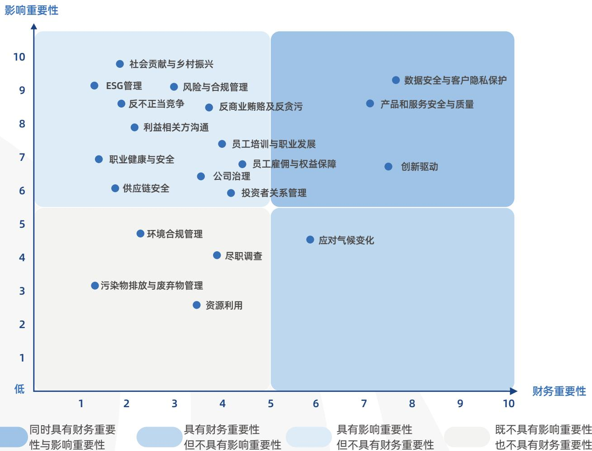

scatter

| Topic | 财务重要性 | 影响重要性 |
| :--- | :--- | :--- |
| 社会贡献与乡村振兴 | ~2.0 | ~9.8 |
| ESG管理 | ~1.5 | ~9.1 |
| 风险与合规管理 | ~3.0 | ~9.1 |
| 反不正当竞争 | ~2.0 | ~8.6 |
| 反商业贿赂及反贪污 | ~3.8 | ~8.5 |
| 利益相关方沟通 | ~2.2 | ~7.9 |
| 职业健康与安全 | ~1.5 | ~6.9 |
| 供应链安全 | ~1.8 | ~6.1 |
| 员工培训与职业发展 | ~4.0 | ~7.4 |
| 公司治理 | ~3.5 | ~6.4 |
| 投资者关系管理 | ~4.2 | ~5.9 |
| 员工雇佣与权益保障 | ~4.5 | ~6.8 |
| 应对气候变化 | ~5.8 | ~4.5 |
| 污染物排放与废弃物管理 | ~1.5 | ~3.2 |
| 尽职调查 | ~3.8 | ~4.1 |
| 资源利用 | ~3.5 | ~2.6 |

## 环境议题

环境合规管理  
资源利用  
应对气候变化

污染物排放与废弃物管理

## 社会议题

社会贡献与乡村振兴  
创新驱动  
供应链安全  
产品和服务安全与质量  
数据安全与隐私保护  
员工雇佣与权益保障  
员工培训与职业发展  
职业健康与安全

## 治理议题

公司治理  
ESG管理  
投资者关系管理  
风险与合规管理  
反商业贿赂及反贪污  
反不正当竞争  
利益相关方沟通  
尽职调查

## 

## 第一篇章

## 铸造数智责任， 与行业共创选才价值

## 核心理念

公司坚持以科技创新塑造发展动能，以卓越品质夯实立业根基，以安全合规守护长期价值，持续推动技术能力、产品服务、数据治理与产业协同的深度融合。公司深刻认识到：在考试与测评这一关乎社会公信力与公平价值的核心领域，创新是提升效率、拓展市场的关键引擎，而品质与安全则是保障考试公平、规范行业秩序、赢得客户信任的核心基础。基于此，公司持续强化自主可控能力、全过程质量管理能力及产业生态协同能力，积极与高校建立产学研深度合作，共建行业生态，推动企业成长与行业进步同频共振，为教育数字化、考试信息化和“人才强国”战略落地贡献坚实力量。

## 核心行动

数智创新全面赋能选才  
数智品质安全护航选才  
可信数据守护客户隐私  
责任供应链路稳健共进  
协同合作共建行业生态

9 产业、创新和基础设施

12 负责任消费和生产

17 促进目标实现的伙伴关系

## 第一节 数智创新全面赋能选才

鸥玛软件坚持将创新驱动作为提升核心竞争力和服务国家“人才强国”战略的重要支撑，持续推动技术研发与业务发展深度融合。面对考试与测评行业高安全、高稳定、高公信力要求以及大规模人才选拔场景不断升级的服务需求，公司持续强化自主研发、成果转化和技术积累能力，推进创新资源由单点突破向体系协同升级，不断提升对行业变革趋势和客户多元需求的响应能力，为公司高质量发展和行业数智化升级注入持续动能。

## 治理

鸥玛软件持续完善研发创新治理机制，依据《研发管理规范》等制度文件，建立分工清晰、协同高效的研发管理体系，统筹常规业务系统开发与前沿技术攻关。围绕考试与测评领域高安全、高稳定、高公信力的业务需求，公司持续推动研发管理与主营业务深度衔接，强化关键技术攻关、自主可控能力建设和成果转化应用，不断提升对教育考试数字化、人才选拔智能化和行业规范化发展的支撑能力。

## 鸥玛软件创新驱动治理架构

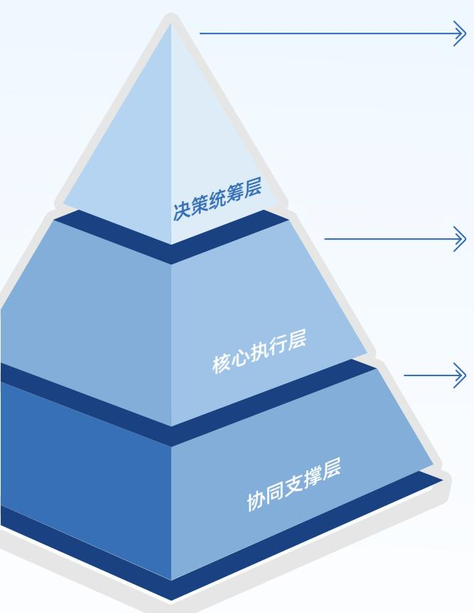

flowchart

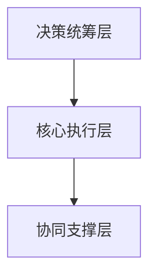

决策统筹层由公司管理层牵头，负责审定研发战略、年度研发计划与投入预算，审批重大研发项目立项并协调跨部门资源，监督研发进度、质量与成果转化；同时研判行业技术趋势及新技术发展动向，确立考试与测评领域核心研发项目的战略方向与布局。

公司设立多个专职研发部门作为常规业务系统开发的执行核心，按业务场景精准分工；同步设立创新研究院专攻前沿技术，下设四大研究中心，形成常规研发与技术创新双轮驱动格局。

质量管理部负责研发全流程质量管控与产品测试；技术服务中心、数据处理中心承接研发成果落地与运维，反向优化产品；财务部、人力资源部分别保障研发资金核算、研发人才建设与激励，形成完整研发支撑体系。

## 创新平台支撑

公司充分发挥山东省软件工程技术中心、山东省图像采集与处理工程技术研究中心以及教育测评智能技术济南市工程研究中心的创新支撑作用，加强技术攻关、资源支持、人才培养、联合攻关、关键技术突破。以原始创新为基础、技术创新为核心、产业创新为目标，依托创新平台协作攻关，针对各项研究领域内的新形势、新技术、新问题，采取有效模式推进平台的建设，持续提高企业技术创新能力，加速科技成果产业化。

公司依托人工智能创新研究院，在自然语言处理、多模态识别、知识图谱、生成式大模型等关键领域持续取得突破性进展。公司通过打造“数据-知识库-大模型”三位一体的AI引擎，形成了覆盖考试全场景的智能技术矩阵。

## 案例：开展研发管理专项培训，全面提升项目管理效能

2025年12月，鸥玛软件组织技术骨干开展研发管理专项培训，重点强化需求管理与运维管理等核心模块。培训后，禅道任务更新及时率提升20%，配置库使用规范率达92%，需求变更留痕率达88%，各项管理指标均实现进一步优化与提升。关键管理指标显著提升，项目标准化管理能力再上新台阶，为公司高质量研发交付提供了有力支撑。

## 战略

鸥玛软件将技术创新置于战略核心位置，把创新驱动深度嵌入发展战略与经营管理全过程，以技术自主创新构筑核心壁垒，以成果转化赋能业务提质增效，为公司高质量可持续发展注入强劲创新动能。公司系统性地识别了在技术预研、项目研发、成果转化及市场应用等环节面临的潜在风险与机遇，并制定了针对性的应对策略，确保在把握技术变革机遇的同时，有效控制创新过程中的不确定性。

公司识别的与“创新驱动”议题相关的风险与机遇结果如下：

<table><tr><td>风险/机遇</td><td>具体描述</td><td>潜在财务影响</td><td>应对策略</td></tr><tr><td colspan="4">风险</td></tr><tr><td>技术迭代与研发项目管理风险</td><td>新技术快速演进或研发项目失败,可能导致产品竞争力下降或投入沉没。</td><td>收入增长放缓;研发回报率下降;成本沉没。</td><td>建立技术预研评估机制;采用敏捷开发模式;加强项目关键节点评审。</td></tr><tr><td>知识产权侵权与保护不足风险</td><td>知识产权侵权或成果确权不及时,可能引发法律纠纷,并削弱技术成果的独占性和商业价值。</td><td>法律赔偿费用;诉讼与许可成本;技术成果收益流失;市场独占性受损。</td><td>建立知识产权检索与预警机制;研发前开展专利检索;完善专利和软著申请流程;定期开展合规审查和专利挖掘;加强知识产权意识培训。</td></tr><tr><td>核心技术与人才流失风险</td><td>核心研发人员流失可能导致关键技术外泄或项目受阻。</td><td>招聘与培养成本增加;项目延期造成收入损失。</td><td>完善薪酬激励与职业发展通道;实施核心代码分级管理;加强保密协议管理。</td></tr><tr><td colspan="4">机遇</td></tr><tr><td>AI技术深化应用与产品化机遇</td><td>AI技术成熟可推动新应用场景落地,加快创新能力向商业化转化。</td><td>服务附加值提升;新项目收入增加;利润率提升。</td><td>加大AI研发投入;与考试机构开展试点合作;加快AI产品化进程。</td></tr><tr><td>考试制度改革与平台升级机遇</td><td>考试制度改革及平台升级,将持续释放系统建设与运维需求。</td><td>新项目直接收入增加;长期服务合同增强现金流。</td><td>密切跟踪改革动态;总结成功案例并复制推广;保障现有平台稳定运行。</td></tr></table>

## 影响、风险与机遇管理

鸥玛软件围绕技术预研、项目研发、成果转化、知识产权保护、政策研判和市场应用等关键环节，建立覆盖风险与机遇识别、优先级评估、分类应对和动态复盘的创新管理机制。公司坚持将创新管理与行业趋势、客户需求和经营目标协同推进，持续强化研发过程控制、知识产权保护和成果转化应用，推动创新资源高效配置和创新成果稳健落地，更好支撑考试与测评领域数字化、智能化发展。

## 指标与目标

鸥玛软件坚持将创新驱动管理目标落实到技术成果、知识产权积累、创新项目推进和人才能力建设等具体指标，始终注重研发投入的深度和广度，已连续9年保持12%以上的年研发投入强度。作为具有国资控股背景、服务大规模考试与人才选拔场景的数智化企业，公司持续以创新能力建设支撑国家“人才强国”战略实施，着力提升对人才选拔路径安全性、规范性和可靠性的保障能力。

## 2025年

研发投入金额 ,.

研发投入占营业收入比例 .%

研发人员数量人

研发人员占员工总数比例 .

## 研发创新管理

鸥玛软件围绕全场景考试信息化需求，构建了“基础技术—支撑平台—行业产品”三级产品研发体系，依托人工智能创新研究院与多级研发平台，形成 “技术研发 — 产品落地 — 场景应用 — 迭代优化” 的闭环管理机制，实现跨部门的协同、全流程、全要素的统一管理。公司将创新激励深度嵌入薪酬、绩效、荣誉、成长等全维度管理体系，通过项目进度、研发质量、技术突破、知识产权成果与绩效奖金、专项奖励、职业晋升直接挂钩，持续激发研发团队活力，为保障国家教育考试与人才选拔安全、高效、公平开展提供坚实技术支撑。

## 鸥玛软件研发体系

## 基础技术研究

实现技术创新引领与关键技术突破，为支撑平台研发提供新技术、新架构和新应用模式。海量图像存储与检索技术、图像识别技术、智能评卷技术等为公司发展起到了引领作用。

## 技术支撑平台

构建了由软件开发平台、鸥玛云在线平台、数据服务平台、信息安全平台组成的技术支撑体系，结合成熟的技术框架和AI智能体研究，为行业应用产品的研发提供坚实的平台支撑。

## 行业产品研发

面向政府、事业单位、协会、企业及个人等，围绕考试与测评领域研发考试测评、教育培训、数据处理、知识服务等系列产品，构建覆盖报名、命题、监考、评阅、评价全流程的智能化解决方案。依托AI技术贯穿“命题-考试-评卷-分析”全过程，以技术支撑平台为底座，快速响应市场需求，提供标准化与个性化相结合的定制化产品与服务。

natural_image

Close-up of hands holding puzzle pieces, no visible text or symbols

## 鸥玛软件研发创新考核激励管理措施

## 绩效考核

依据《员工绩效考核管理办法》将项目进度、任务质量、技术突破、创新成果、专利申请等纳入研发人员绩效考核，并与绩效结果联动。

## 薪酬激励

依据《薪酬管理制度》建立与岗位价值、能力水平和绩效表现相衔接的薪酬机制，强化对研发岗位和核心人才的差异化激励。

## 成果奖励

依据《科技奖励管理办法》对专利、软件著作权、科技项目、论文著作及政府专项成果等给予奖励，推动创新成果价值转化。

## 荣誉表彰

依据《鸥玛精英评选管理办法》开展创新类评优表彰，树立研发创新先进典型。

## 专业成长

依据《关于对取得专业技术证书的员工予以奖励的办法》对取得专业技术证书的员工给予奖励，鼓励持续提升专业能力。

## 核心人才管理

依据《核心研发人员管理制度》对核心研发人员实施认定、培养、保密、竞业限制和离职交接管理，强化关键技术人才稳定。

## 2025年

研发培训总时长

, 小时

研发人员培训覆盖率 

## 研发创新成果

在数字经济蓬勃发展、技术创新日新月异的当下，公司以“AI+”为引领，构建覆盖报名、命题、监考、评阅、评价全流程的智能化解决方案，推动考试与测评领域迈向更高效、更公平、更科学的未来。未来，公司将持续深化“AI+考试测评”垂直领域的战略布局，通过技术创新与场景应用双轨并进，打造更安全可控、更高效智能的考试与测评体系，运用AI技术全面重构考试测评模式。

## 人工智能应用成果

基于知识图谱、大语言模型、检索增强生成等技术，实现多学科试题的自动化生成。通过命题素材管理、知识点管理、考试大纲管理、多维数据反馈等功能，实现规范化批量试题命制，可满足大规模标准化考试与个性化测评的多元需求，显著提升命题效率与科学性。

  
智能命题

  
智能评卷

基于自然语言处理、深度学习、数据挖掘等技术，实现主观题智能评阅，多种算法模型适配不同类型的考试、科目及题型，能够全面满足多元化的评卷需求。与人工评卷形成优势互补，建立“人评+机评+人工复核”的应用新模式，确保评卷效率提升。

基于多模态生物特征识别、环境感知等技术，实现对考场动态的实时监测与分析，打造“身份核验-异常监测-数据防护”三维安防体系，形成“事前预防-事中监控-事后追溯”的全链条管理体系，筑牢考试公平防线。

  
智能巡考

年度重点创新项目成果

<table><tr><td>序号</td><td>项目名称</td><td>项目简介</td><td>项目成果/荣誉</td></tr><tr><td>1</td><td>鸥玛智能阅卷系统V1.0</td><td>基于人工智能技术的智能评卷系统,实现主观题自动评阅与智能辅助质检</td><td>入选2025年度济南优势工业产品目录</td></tr><tr><td>2</td><td>鸥玛文档扫描采集管理系统V5.0</td><td>文档图像采集与处理系统,支持海量答卷、文档的高速扫描与数字化处理</td><td>完成版本升级,应用于多项国家级考试项目</td></tr><tr><td>3</td><td>基于AI技术的无纸化考试一体化服务平台建设项目</td><td>基于题库资源和智能算法的自动组卷系统,支持多题型、多学科智能组卷</td><td>完成研发并投入试点应用</td></tr><tr><td>4</td><td>数字化网上评卷智能服务平台建设项目</td><td>网上评卷核心平台,支持大规模考试答卷扫描、评卷、成绩合成全流程管理</td><td>入选2025年度济南优势工业产品目录、2025年度济南市创新产品应用推荐目录</td></tr><tr><td>5</td><td>基于大数据的人工智能命题系统V1.0</td><td>依托知识图谱和大语言模型的智能命题系统,支持试题生成、查重、质量评估</td><td>完成研发并应用于部分考试机构命题服务</td></tr><tr><td>6</td><td>鸥玛无纸化考试统一考场系统V1.0</td><td>面向无纸化考试的考场管理与监控系统,支持考生身份验证、行为分析等功能</td><td>入选2025年度济南市创新产品应用推荐目录</td></tr><tr><td>7</td><td>鸥玛通用选拔和资格考试人机阅卷系统V2.0</td><td>人机协同评卷系统,首创“智能初评-人机协同-智能监测”混合评卷架构</td><td>入选第九批山东省首版次高端软件产品名单</td></tr><tr><td>8</td><td>面向考试领域的外语口语智能考试及测评技术研究与应用</td><td>深度融合语音信号处理、多语种语音识别、自然语言理解等技术,实现多题型口语考试的自动化测评与智能评阅</td><td>入选第五批山东省软件产业高质量发展重点项目名单</td></tr></table>

## 案例：深耕AI+考试测评技术创新，多项成果获省级权威认可

2025年，鸥玛软件以“AI+考试测评”为战略引领，持续攻坚核心技术，多项创新成果斩获省级权威认可。公司自主研发的“智能评卷”“智能题库”入选山东省高端软件与人工智能产业链新技术新产品名单；“鸥玛智能命题大模型”入选济南市人工智能大模型推荐名录及山东省首批人工智能大模型典型应用案例；人机阅卷系统入选山东省首版次高端软件产品，外语口语智能测评技术项目入选山东省软件产业高质量发展重点项目。同年，公司再获智能评卷领域发明专利，累计拥有AI相关授权发明专利20余项。系列成果构建起覆盖考试全流程的智能解决方案，已广泛应用于各类考试场景，显著提升考试效率与公平性，引领行业数智化转型。

山东省首批人工智能大模型典型应用案例名单

<table><tr><td>序号</td><td>应用案例名称</td><td>申报单位</td></tr><tr><td></td><td></td><td></td></tr><tr><td>IT</td><td>基于互联网企业智能体大规模的企业知识智能自动驾驶管理应用</td><td>山东博网传媒股份有限公司</td></tr><tr><td>18</td><td>鸥玛智能命题大模型助力智能命题与知识创新应用</td><td>山东山大鸥玛软件股份有限公司</td></tr><tr><td></td><td></td><td></td></tr><tr><td>PP</td><td>面向装备有偿额度的大型智能驾驶系统应用</td><td>山东恒远智能科技有限公司</td></tr><tr><td>20</td><td>RikolIFT 医疗赋能治疗平台应用</td><td>点阳健康科技集团有限公司</td></tr></table>

“鸥玛智能命题大模型”入选山东省首批人工智能大模型典型应用案例

## 案例：研发上线零五印刷ERP管理系统，以数字创新赋能考试印刷产业升级

2025年9月鸥玛软件历时两年自主研发的零五印刷ERP管理系统顺利完成验收并正式上线，该系统紧扣试卷印刷高标准、高安全核心场景，依托信息基础设施、生产标准规范、数据共享管理三大支撑体系，全面覆盖生产、供应、押运、命题中心、财务五大核心业务模块，集成百余项实用功能，打造行业领先的一体化数字管理平台，实现跨部门信息流与业务流高效协同。系统以全流程信息化构建试卷印刷全寿命周期管控体系，助力零五印刷在运营效率、质量控制、安全保障方面实现显著提升，推动其打造试卷印刷领域标准示范基地。此次创新实践充分展现公司在一体化业务管理软件研发与运维的核心技术实力，以数字创新驱动考试印刷产业现代化升级，为考试事业高质量发展注入强劲创新动能。

## 知识产权保护

鸥玛软件依据《知识产权管理制度》，持续完善覆盖成果归属、申请确权、资料归档、借阅审批、侵权监督与外部版权合规使用的知识产权保护机制，并通过引入专业专利代理服务提升专利申报的规范性与专业性。公司将知识产权保护贯穿研发、服务、宣传和经营管理全过程，持续强化对专利、软件著作权、商标、技术秘密等无形资产的系统管理，维护公司合法权益、巩固技术成果转化基础、提升核心竞争力和品牌价值。截至2025年末，公司累计拥有专利技术及软件著作权600余项，获得多项省部级科技成果一等奖、二等奖及荣誉称号。

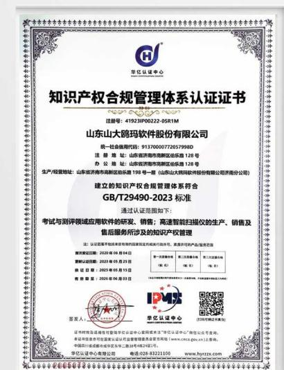

text_image

华亿认证中心
知识产权合规管理体系认证证书
注册号：41923F00022-05R1M
山东山大鸥玛软件股份有限公司
统一社会信用代码：91370000772057998D
注册地址：山东省济南市高新区临乐路126号
办公地址：山东省济南市高新区临乐路126号
生产经营地址：山东省济南市高新区临乐路196号第一（山东山大鸥玛股份有限公司济南分公司）
建立的知识产权合规管理体系符合
GB/T29490-2023 标准
通过认证范围如下：
考试与测评领域应用软件的研发、销售、高速智能扫描仪的生产、销售及
售后服务所涉及的知识产权管理
注：以记账单作为技术信息的软件或软件的系统进行登记，须凭许可产品查询查询
查询索引日期：2020年06月04日
查询索引日期：2020年06月25日
查询索引日期：2020年06月15日
查询索引日期：2020年06月23日
第一章审核事项 第二章审核 第三章审核
(审) (审) (审)
IPMS
华亿认证中心
华亿认证中心
华亿认证中心有限公司 电话:035-83211100 www.hzztz.com.cn
华亿认证中心（中国）有限公司 电话:035-83211100 www.hzztz.com.cn

鸥玛软件通过知识产权合规管理体系认证

## 鸥玛软件知识产权治理架构

决策统筹层

归口管理层

研发执行层

保护支撑层

统筹审定知识产权战略、年度目标与预算，审批重大知识产权布局、确权及纠纷处理事项。

负责知识产权工作的实施与管理，包括申报、备案、认定、登记、维持及档案管理等工作。

负责按计划组织知识产权申报基础材料，对申报资料的完整性、真实性负责，并做好在研和已完成项目资料的收集整理与知识产权保护。

对自主研发产品和在研产品的知识产权保护；签订核心研发人员保密协议、竞业限制及培训管理。

## 鸥玛软件知识产权保护管理措施

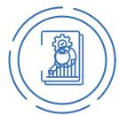

权属确认与成果确权

将专利、软件著作权、商标、域名、技术秘密等纳入统一管理；围绕自主研发产品和技术成果，按类别及时开展商标注册、软件著作权登记及专利申请。

研发过程保护

将知识产权保护嵌入研发全过程，对源程序、设计文档、技术资料等研发成果进行收集、整理、保管和移交，强化在研产品和核心技术资料的全过程留痕与保密管理。

档案与资料 管控

对知识产权证书、技术文档及相关档案实行统一归档管理，借阅和使用须履行申请审批程序；员工调离、离职及合作结束前，须按要求交回全部技术资料，防范资料流失风险。

侵权防控与合规使用

要求各部门和员工履行知识产权保护责任，发现侵权行为及时制止并上报处理；同时规范软件、图片、文字等外部资源使用，优先使用正版资源，防范侵权及合规风险。

外部专业协同

通过委托专业机构开展服务，并在合同中明确技术资料、知识产权信息归属、保密义务及履约约束要求，提升申报的规范性和保护力度。

## 2025年

新增专利授权数量

件

新增计算机软件著作权数量

 件

累计拥有专利授权数量

 件

累计拥有计算机软件著作权数量

 件

## 科技伦理治理

鸥玛软件始终严守《中华人民共和国数据安全法》等法律法规，将科技伦理贯穿研发创新全流程。公司确立了算法透明、数据公平、可解释性、应用边界、隐私保护五大核心伦理原则，并将其嵌入人工智能、大数据等技术的研发与应用底层。通过构建公开透明的运行机制与权益保障体系，公司主动接受社会监督并积极回应关切。在人工智能研发应用中，公司建立严格的隐私保护与数据管控机制，杜绝敏感信息泄露与滥用风险，持续健全科技伦理治理体系，践行负责任的研发理念。

报告期内，公司未发生任何违反科技伦理的行为，也未受到相关处罚。

## 第二节 数智品质安全护航选才

鸥玛软件始终将产品和服务的安全与质量视为公司可持续发展的基石，依托在考试与测评领域多年积累的技术优势、研发体系和客户服务经验，构建了覆盖产品研发、项目实施、数据处理、客户服务的全生命周期质量与安全治理体系。公司以制度规范为基础、以流程管控为抓手、以体系认证为支撑、以持续改进为目标，全方位保障产品性能稳定、服务交付可靠、信息安全可控。

## 治理

鸥玛软件以产品为中心、以客户需求为导向，始终贯彻“追求卓越，力臻完美”的质量方针，建立了跨部门协同、全流程、全要素的质量与安全管控体系，形成闭环管理机制。

## 质量管理体系

公司依据GB/T19001-2016《质量管理体系要求》和SPCA软件能力成熟度模型等级5，协同《质量管理制度》《研发管理规范》《知识产权管理制度》等内部制度，搭建覆盖产品研发、项目实施、服务交付、数据处理、运维优化全链条的立体化质量管理体系，将质量标准、安全要求与过程管控深度嵌入业务全流程，实现从源头设计到终端交付的全程可控、可追溯、可改进。

## 客户服务管理体系

公司严格遵循ISO/IEC20000-1:2018《信息技术 服务管理第1部分：服务管理体系要求》，搭建覆盖服务设计、服务转换、服务交付、服务支持和服务保障的全生命周期客户服务管理体系，将客户需求精准识别、服务协议落地、服务过程监控、投诉闭环处理、满意度测评、服务评审和持续改进等关键环节纳入统一管理框架。

natural_image

Digital illustration of a glowing blue circular logo with city skyline in background, no visible text or symbols on the graphic itself.

## 信息安全管理体系

公司依据ISO/IEC27001:2022和ISO/IEC27017:2015，协同《信息安全管理制度》《保密管理制度》等内部管理制度，构建覆盖数据采集、传输、存储、处理及销毁全流程的信息安全管理体系，采用数据加密、数字水印、访问控制、多模态生物特征验证等核心技术手段，切实保障考生信息、考试数据与核心业务系统的保密性、完整性和可用性。定期开展信息安全培训、漏洞扫描与应急演练，持续提升网络攻击防范和重要信息泄露风险应对能力，确保为客户提供安全可靠的考试与测评服务。

鸥玛软件建立了覆盖产品全生命周期的质量管理组织架构：各部门在质量管理部牵头下，通过跨部门质量评审、定期巡检和问题闭环管理机制协同运作，形成了覆盖研发、服务、数据处理全流程的立体化质量管理体系，持续提升大规模考试场景下产品和服务的稳定性、准确性与安全性。

## 质量管理部

作为核心职能部门，负责产品测试、内部验收、管控体系运行及质量制度制定。

## 研发部门

研发全流程遵循《研发管理规范》实施质量把控，从需求分析到上线全阶段保障产品质量。

## 技术服务中心和数据处理中心

分别在项目实施和数据处理环节承担一线质量保障与问题反馈职责。

## 资产管理部

从资源配置角度支持质量管理投入。

## 鸥玛软件通过产品和服务质量与安全外部认证

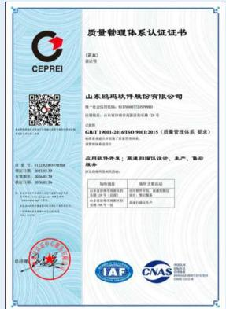

text_image

质量管理体系认证证书
（证本）
验证号
山东鸿玛软件股份有限公司
统一社会信用代码：9137000072017978D
注册地址：山东省济南市高新区经十路128号
办公地址：山东省济南市市南区经十路128号
CIFT 19901-2016/NSO 9901-2015《质量管理体系 要求》
批准注册机关及部门的资质审查。
应用软件种类：普通打印协议设计、生产、备存
服务标准：
授权范围：一般项目需提交申请
经营范围：计算机软硬件及辅助设备
产品型号：PCB4
产品规格：3.5L
产品类型：电子元件
产品编码：30045336
产品有效期：2016年1月1日至2016年1月20日
产品上市地点：CNAS
CNAS 03/01/2016
CNAS 03/01/2016

ISO9001质量管理体系认证

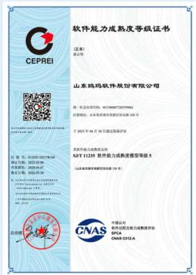

text_image

软件能力成熟度等级证书
（证本）
CEPREI
山东鸿玛软件股份有限公司
统一社会信用代码：91320007207976D
注册地址：山东省济南市历下区东三路125号
于2021年8月30日通过国海评估
名称：山东鸿玛软件股份有限公司
SJT-11235 软件能力成熟度模型等级 5
（山东省济南市历下区东三路125号）
中国认证
CNAS
推荐书及功能为成熟度评估
SPCA
CNAS-CN2A

SPCA软件能力成熟度5级认证

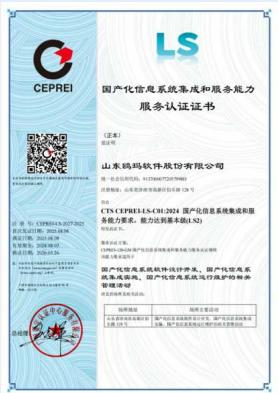

text_image

CEPREI
LS
国产化信息系统集成和服务规范
服务认证证书

（盖章）
CCTS CEPREI LS-CCH-2024 国产化信息系统集成和服务
能力要求，能力达到基本值(LS)

技术要求：
CPU/IP 以实现产品性能与服务的匹配性及性能
性能要求

国产化信息系统集成、国产化信息系统集成和维护的标称
智能模块设计

服务标准
产品名称：国产化信息系统集成系统开发、国产化信息系统集成
功能：PCB、PCB、PCB、PCB、PCB、PCB、PCB、PCB、PCB、PCB、PCB、PCB、PCB、PCB、PCB、PCB、PCB、PCB、PCB、PCB、PCB、PCB、PCB、PCB、PCB、PCB、PCB、PCB、PCB、PCB、PCB、PCB、PCB、PCB、 PCB、PCB、PCB、PCB、PCB、PCB、PCB、PCB、PCB、PCB、PCB、PCB、PCB、PCB、PCB、PCB、PCB、PCB、PCB、PCB、PCB、PCB、PCB、PCB、PCB、PCB、PCB、PCB、PCB、PCB、PCB、PCB、PCB、PCA
总包

国产化信息系统集成和服务能力服务LS2级认证

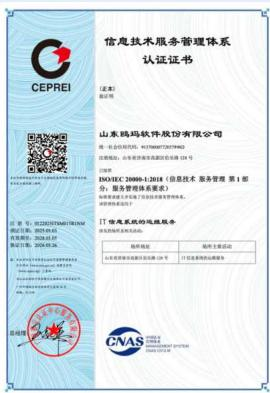

text_image

信息技术服务管理体系
认证证书

山东鸿玛软件股份有限公司
统一社会信用代码：91320007MA7C74X6D
注册地址：山东省济南市高新区经七路124号

ISOIEC 20000-1-2018（信息技术服务管理第1部分）
服务管理体系要求书

IT 信息技术服务的远程服务
具体服务标准如下：

现场地址	现场主要活动
山东省济南市高新区经七路124号	计划业务流程与服务
CNAS

ISO20000信息技术服务管理体系认证

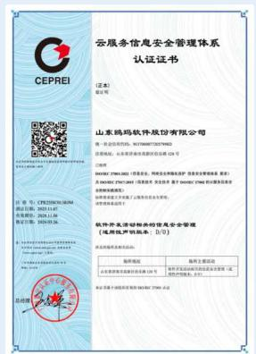

text_image

云服务信息安全管理体系
认证证书

（盖章）
公司

山东鸿玛软件股份有限公司
统一社会信用代码：91370487270757946D
注册地址：山东省济南市历城区经七路8号
办公地址：山东省济南市历城区经七路8号
经营范围：软件开发、技术咨询、技术服务、技术转让、技术推广；计算机软硬件及辅助设备销售；计算机软硬件及辅助设备销售；计算机软硬件及辅助设备销售；计算机软硬件及辅助设备销售；计算机软硬件及辅助设备销售；计算机软硬件及辅助设备销售；计算机软硬件及辅助设备销售；计算机软硬件及辅助设备销售；计算机软硬件及辅助设备销售；计算机软硬件及辅助设备销售；计算机软硬件及辅助设备销售；计算机软硬件及辅助设备销售；计算机软硬件及辅助设备销售；计算机软 Hardware 1.00000000000000000000000000000000000000000000000000000000000000000000000000000000000000000000
软件开发与登记标准的云服务安全管理
（凭相关审批机关备案：1111111111111111111111111111111111111111111111111111111111111111111111111111111111
名称：云服务信息安全管理体系认证证书
（盖章）
公司

山东鸿玛软件股份有限公司
统一社会信用代码：91370487270757946D
注册地址：山东省济南市历城区经七路8号
办公地址：山东省济南市历城区经七路8号
经营范围：软件开发、技术咨询、技术服务、技术转让、技术推广；计算机软硬件及辅助设备销售；计算机软硬件及辅助设备销售；计算机软硬件及辅材制造；计算机软硬件及辅助设备制造；计算机软硬件及辅助设备制造；计算机软硬件及辅助设备制造；计算机软硬件及辅助设备制造；计算机软硬件及辅助设备制造；计算机软硬件及辅助设备制造；计算机软硬件及辅助设备制造；计算机软硬件及辅助设备制造；计算机软硬件及辅助设备制造；计算机软硬件及辅助设备制造；计算机软硬件及辅助设备制造；计算机软硬件及辅助设备制造；计算机软硬件及辅助设备制造；计算机软件开发与登记标准的云服务安全管理
（凭相关审批机关备案：111111111111111111111111111111111111111111111
名称：云服务信息安全管理体系认证证书
（盖章）
公司

山东鸿玛软件股份有限公司
统一社会信用代码：93372222222222222222222222222222222222222222222222222222222222222222222222222222222222222222222222222222<nl>

ISO27017云服务信息安全管理体系认证

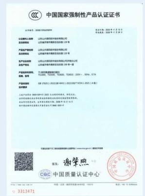

text_image

中国国家强制性产品认证证书
证书编号：2008-196264999
企业名称：中国国家强制性产品认证中心
企业类型：有限责任公司
产品生产类别：以自有资金向投资者销售（限分公司）
产品注册地址：北京市西城区西直门南大街1号
生产企业性质：有限责任公司
经营范围：许可经营项目：药品、医疗器械、日用百货、日用品、办公用品、办公用品、办公用品、办公用品、办公用品、办公用品、办公用品、办公用品、办公用品、办公用品、办公用品、办公用品、办公用品、办公用品、办公用品、办公用品、办公用品、办公用品、办公用品、办公用品、办公用品、办公用品、办公用品、办公用品、办公用品、办公用品、办公用品、办公用品、办公用品、办公用品、办公用品、办公用品、办公用品、办公品种
产品编码：GB 176375.1-2022-GB 4944.1-2022-GB 8354.1-2022 (A类)
生产厂家：中国国家认证中心
产品有效期：2022年1月1日至2022年1月1日至2022年1月1日至2022年1月1日至2022年1月1日至2022年1月1日至2022年1月1日至2022年1月1日至2022年1月1日至2022年1月1日至2022年1月1日至2022年1月1日至
产品有效期：自2022年1月1日至2022年1月1日至2022年1月1日至2022年1月1日至2022年1月1日至2022年1月1日至2022年1月1日至2022年1月1日至2022年1月1日至2022年1月1日至2022年1月1日至<nl>
产品有效期：自2022年1月1日至2022年1月1日至2022年1月1日至2022年1月1日至2022年1月1日至2022年1月1日至2022年1月1日至2022年1月1日至2022年1月1日至2022年1月1日至<nl>
产品有效期：自2023年3月3日至2033年3月3日，自《中华人民共和国药品管理法》批准之日起至【】年【】月【】日止。详见【】
产品有效期：自《中华人民共和国药品管理法》批准之日起至【】年【】月【】日止。详见【】
产品有效期：自《中华人民共和国药品管理法》批准之日起至【】年【】月【】日止。详见【】
产品有效期：自《中华人民共和国药品管理法》批准之日起至【】年【】月【】日止。详见【】
产品有效期：自《中华人民共和国药品管理法》批准之日起至【】【】年【】月【】日止。详见【】
产品有效期：自《中华人民共和国药品管理法》批准之日起至【】【】年【】月【】日止。详见【】
产品有效期：自《中华人民共和国药品管理法》批准之日起至【】【】年【】月【】日止。详见【】
产品有效期：自《中华人民共和国药品管理法》批准之日起至【】【】年【】月【】日止。

CCC国家强制性产品认证

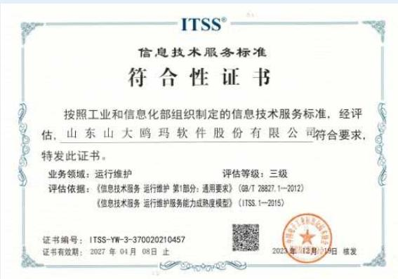

text_image

ITSS®
信息技术服务标准
符合性证书
按照工业和信息化部组织制定的信息技术服务标准，经评估，山东山大鸥玛软件股份有限公司符合要求，特发此证书。
业务领域：运行维护  评估等级：三级
评估依据：《信息技术服务 运行维护 第1部分：通用要求》（GB/T 28827.1—2012）
《信息技术服务 运行维护服务能力成熟度模型》（ITSS.1—2015）
证书编号：ITSS-YW-3-370020210457
证书有效期：2027年04月08日止
2023年12月19日 核发

ITSS信息技术服务标准符合性三级认证

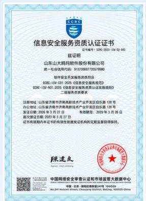

text_image

信息安全服务资质认证证书
证书编号: CCRC 2023-15V-04-94
兹证明
山东山大鸿码软件股份有限公司
统一社会信用代码: 91370000720579880
软件安全开通及服务资质符合
CCRC-15V-C01-2025《信息安全规范》
CCRC-15V-801-2025《信息安全服务认证实施规则》
二级资本资质要求
注册地址 山东省济南市市南高新技术产业开发区伯乐路139号
办公地址 山东省济南市市南高新技术产业开发区伯乐路138号
登记日期: 2026年3月27日 有效期至: 2029年3月25日
证书有效期至: 2023年3月27日
证书有效期至本证书的有效有效期限及发证机构的定期监督获得保持。
陈逢良
中国网络安全审查认证和市场监管大数据中心
中国·北京·朝阳区商务楼24号楼100020
No.247 National Street, Chiangyang District, Beijing, 100020 China

软件安全开发服务通过CCRC二级认证

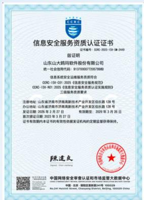

text_image

信息安全服务资质认证证书
证书编号：CCB-2023-159-08-2449
兹证明
山东山大鸿鹄科技股份有限公司
统一社会信用代码：913700007220579889
信息安全系统安全维护服务规范符合
CCB-159-C01-2025《信息安全服务规范》
CCB-159-807-2025《信息安全服务认证实施规则》
三重服务资质要求
注册地址：山东省济南市济南高新技术产业开发区伯乐路138号
办公地址：山东省济南市济南高新技术产业开发区伯乐路138号
发证日期：2025年3月27日
有效期限：2025年3月25日
登记证书有效期：2025年3月27日
证书有效期内本证书的有效有效登记证书的定期监督获得保持。
陈逢良
中国网络安全审查认证和市场监督管理数据中心
中国·北京·招商局能源局24号楼100029
No.247 National Street, Chongqing District, Beijing, 100029 China

信息系统安全运维服务通过CCRC三级认证

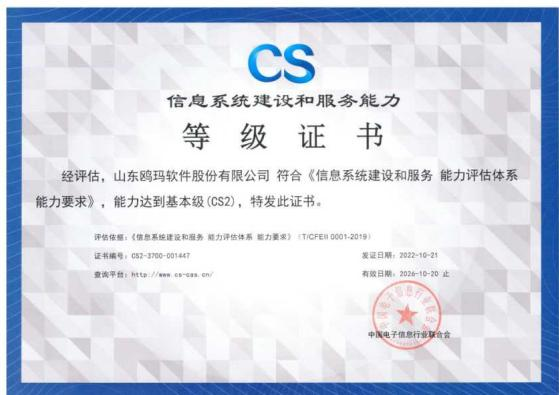

text_image

CS
信息系统建设和服务能力
等级证书
经评估，山东鸥玛软件股份有限公司 符合《信息系统建设和服务 能力评估体系
能力要求》，能力达到基本级(CS2)，特发此证书。
评估依据：《信息系统建设和服务 能力评估体系 能力要求》（TiCFEII 0001-2019）
证书编号：053-3700-001447
发证日期：2022-10-21
查询平台：http://www.cs-cas.cn/
有效日期：2026-10-20 止
中国电子信息行业联合会

信息系统建设和服务能力CS2级认证

## 战略

鸥玛软件立足考试与测评领域高安全、高可靠、高稳定特性，系统识别产品和服务质量与安全相关风险和机遇，将风险防控、能力提升、价值创造相结合，保障经营稳定与品牌口碑。

公司识别的与“产品和服务安全与质量”议题相关的风险与机遇结果如下：

<table><tr><td>风险/机遇</td><td>具体描述</td><td>影响期限</td><td>财务影响</td><td>应对策略</td></tr><tr><td colspan="5">风险</td></tr><tr><td>产品质量缺陷风险</td><td>产品质量缺陷或性能不稳定,可能影响考试实施效果、客户体验和数据采集质量。</td><td>短期至中期</td><td>项目违约赔偿;返修返工成本增加;订单流失;品牌修复成本上升。</td><td>严格执行《研发管理规范》;强化技术评审、功能测试和自动化测试;加强过程质量控制;建立质量问题追溯和闭环整改机制。</td></tr><tr><td>发生考试事故的风险</td><td>在考试保密、评卷系统等环节出现错误、泄露、遗漏等事故,将影响考试公平公正,对经营与声誉造成重大冲击。</td><td>短期至长期</td><td>项目终止、合同违约赔偿;市场准入与投标资格受限;收入大幅下滑,持续经营受到影响。</td><td>完善考试全流程制度规范与操作SOP;强化技术保障、双人复核、系统自动校验与多级审核机制;针对重大考试制定专项保障方案,实现全过程闭环管控与应急处置。</td></tr><tr><td colspan="5">机遇</td></tr><tr><td>AI赋能质量提升与数据增值服务机遇</td><td>人工智能与数据分析能力的深化应用,有助于提升质量管理效率,并拓展数据增值服务空间。</td><td>中长期</td><td>服务附加值提升;新收入来源增加;质量纠错成本下降;客户黏性增强</td><td>加大AI相关技术研发投入;在现有项目中试点AI应用;建立数据治理体系;开发分析模型和工具,推动相关能力产品化。</td></tr></table>

flowchart

## 影响、风险与机遇管理

鸥玛软件围绕产品研发、项目实施、服务交付和客户反馈等关键环节，建立覆盖风险与机遇识别、分级评估、过程监控、问题整改和复盘优化的全过程管理机制，通过多部门协同、过程控制和闭环改进，不断提升产品可靠性、服务稳定性和客户满意度。

## 鸥玛软件产品和服务质量与安全风险识别管理措施

## 分级识别与管控

定期收集内外部质量安全信息，形成风险与机遇清单，按发生概率影响程度和经营影响等维度开展分析评估，明确优先级和管控重点。

## 产品研发与交付控制

产品研发阶段执行需求评审、设计验证、测试验收、过程监督；服务阶段执行方案预审、模拟演练、现场保障。

## 动态监测与整改

依托标准化流程和管理机制，对产品研发、项目实施、运维支持、事件处理和现场保障进行动态监测，并通过技术评审、问题登记、原因分析、整改关闭和结果回访推动风险快速化解。

## 客户反馈驱动优化

以投诉处理、服务评审、满意度调查为抓手，识别改进点，制定专项优化方案，持续提升产品与服务品质。

鸥玛软件产品质量风险分级管控机制

<table><tr><td>风险等级</td><td>管控重点</td><td>管控措施</td></tr><tr><td>高风险</td><td>涉及国家级、省级重大考试项目,或对考试公平公正性、系统连续运行稳定性及客户信任度具有重大影响的产品与服务事项</td><td>制定专项保障方案;加密关键节点监测频次;开展全过程质量核查与压力测试;建立问题直报通道,重大问题第一时间上报管理层重点督办;完成整改后开展复盘评估,形成闭环管理与长效改进机制。</td></tr><tr><td>中风险</td><td>涉及重点产品功能稳定性、项目实施质量、客户投诉处置及时性、关键供应或技术环节运行效果,可能影响服务交付质量与客户满意度的事项</td><td>纳入重点跟踪清单,明确责任部门、整改要求与完成时限;通过测试验证、过程检查、客户反馈等多渠道持续监测风险进展;定期汇报整改进度,确保问题按期闭环;针对共性问题开展根因分析,优化流程与技术方案,防止风险升级。</td></tr><tr><td>低风险</td><td>对项目交付与客户体验影响相对有限,可通过日常质量管理及时纠偏的一般性质量问题</td><td>纳入常规质量管理范围,由责任部门按制度要求完成整改与闭环处理;结合例行检查、服务评审、客户满意度调查,定期收集问题并开展持续优化;建立问题台账,跟踪同类问题重复发生情况,推动源头改进。</td></tr></table>

## 指标与目标

鸥玛软件坚持将产品和服务质量与安全要求量化为可衡量指标，结合考试与测评行业对系统稳定性、服务准确性和运行安全性的高标准要求，通过体系目标、客户调查结果、交付表现和全生命周期管理成效验证治理效果。

<table><tr><td>目标指标</td><td>目标值</td><td>目标达成情况</td></tr><tr><td>产品验收合格率</td><td>100%</td><td>100%</td></tr><tr><td>产品及服务重大安全事故</td><td>0起</td><td>0起</td></tr><tr><td>客户满意度</td><td>≥95%</td><td>98.2%</td></tr><tr><td>客户投诉量</td><td>≤3起</td><td>0起</td></tr></table>

## 质量管理与保障

公司坚持将质量要求前置至产品研发源头，并贯穿测试验证、过程监督、问题整改和持续优化各环节，持续提升产品质量稳定性、交付可靠性和过程可追溯性，为高标准考试与测评场景提供坚实保障。

## 鸥玛软件产品质量管理措施

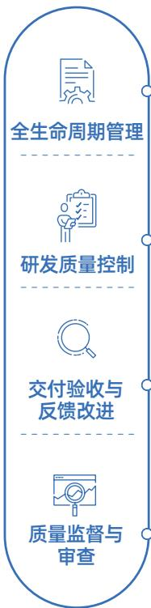

flowchart

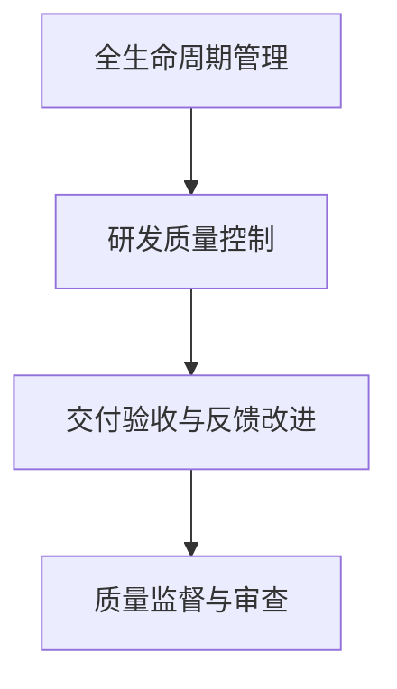

围绕产品和服务全生命周期开展质量管理，从产品立项、研发设计、交付验收到运维优化各环节落实质量安全保障要求，形成全过程、闭环式管理链条。

在产品研发阶段严格执行立项、需求分析、设计、编码、测试、验收及变更控制流程，通过项目评审、测试和发布管理，对研发过程和产品质量实施监督检查。

在产品交付和项目实施后，通过客户试用、问题反馈、质量跟踪和整改关闭等方式持续优化产品性能和交付质量，推动问题闭环解决和产品迭代升级。

对产品研发、项目实施、运维及服务过程开展监督检查，并通过体系运行、过程记录和问题追踪强化质量控制。

natural_image

Business people holding tablets and a tablet, with a star rating overlay (no text or symbols on main subjects)

## 案例：全流程技术保障多类考试竞赛，筑牢服务质量与公平公正防线

2025年，鸥玛软件依托自主研发的基于AI技术的无纸化考试一体化服务平台，落实“定制化方案+全流程保障+远程智能指挥”精准服务体系，全年高质量完成了认证人员注册全国统一考试、证券行业专业人员水平评价测试、全国会计专业技术资格考试等多项国家级及省级大规模无纸化考试的技术保障工作，服务平台在智能算法、功能体验、场景适配、安全防护等方面得到进一步提升；首次承接并成功实施重庆市人事考试中心六项无纸化考试、河北省二级造价工程师职业资格无纸化考试服务等项目；成功助力广东、湖北、黑龙江等省高等教育自学考试专网无纸化考试试点工作顺利推广，为国家教育考试推行无纸化考试模式起到示范引领作用；为中国认证认可协会境外考试提供全方位支持，首次同步实现全球15个国家（地区）考点的统一管理。通过部署AI智能监控、全流程数据加密、代码相似度检测、跨境多时区适配等技术，构建全方位防作弊体系，搭配专业团队全程运维与多级应急响应，确保所有考试安全、公平、高效运行，获得各主办方高度认可，充分彰显了公司过硬的服务质量与技术实力。

## 质量提升培训

鸥玛软件坚持“追求卓越、力臻完美”的质量方针，构建覆盖全业务链条的专项培训体系，将标准化操作与精细化管理深度融入考试全流程各环节。公司通过系列培训实现技术流程的高度统一，显著增强团队应对高压力、大规模考试任务的实战韧性，全方位夯实考试安全运行的防线。

## 案例：全国中小学教师资格考试答卷扫描培训规范操作，保障项目服务零差错

2025年3月，公司组织开展了教师资格考试答卷扫描流程专项培训。培训内容涵盖扫描系统操作规范、质量检查、数据核查及上传流程、常见问题处理等，参训人员考核通过率达100%，后续教师资格考试扫描工作中平稳高效实施。

## 案例：公务员报名培训提升服务能力，保障报名工作顺畅进行

2025年10月，公司组织开展了公务员考试报名系统操作与服务规范培训。针对公务员报名人数众多、系统压力大的情况，培训内容涵盖报名系统操作、常见问题解答、应急预案、服务礼仪等。培训后客服响应速度提升40%，问题一次性解决率达92%，报名期间系统平稳运行，无重大投诉。

## 客户服务管理

鸥玛软件严格遵循ISO9001质量管理体系、ISO20000信息技术服务管理体系、ITSS信息技术服务标准等规范要求，依托CS信息系统建设和服务能力认证、LS国产化信息系统集成和服务能力认证，打造适配不同考试场景的定制化服务方案，满足各类客户的差异化需求。同时，以ISO27001信息安全管理体系、ISO27701隐私信息管理体系、ISO27017云服务信息安全管理体系等为支撑，构建全维度的数据安全防护网，确保考试数据的保密性、完整性和可用性。

2025年，公司进一步完善客户服务管理体系。一方面，强化业务连续性保障，结合ISO22301业务连续性管理体系、应急预案管理体系，优化极端情况下的应急响应机制，通过模拟演练提升团队快速处置能力，确保考试服务项目不受突发情况影响。另一方面，深化数据驱动的服务优化，基于DCMM数据管理能力成熟度认证，搭建客户服务数据中台，通过分析服务过程中的各类数据，精准定位客户需求，优化调整服务方案。此外，公司拓展服务覆盖范围，增设本地化服务站点，结合ISO27018公有云个人信息安全管理体系，实现线上、线下服务的无缝衔接，进一步增强服务的便捷性和可靠性。

## 鸥玛软件客户服务管理措施

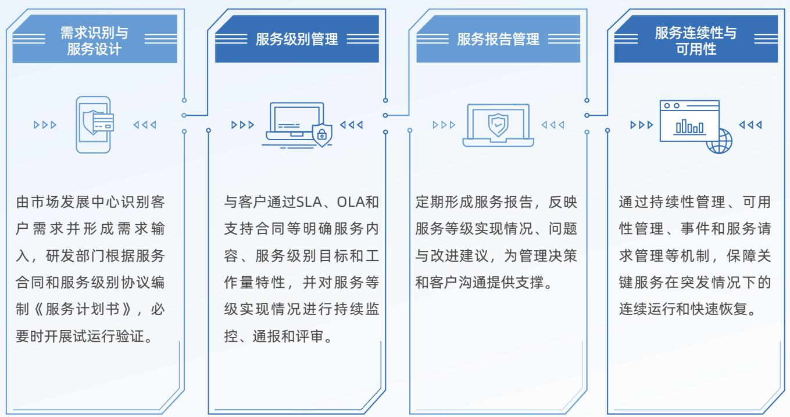

flowchart

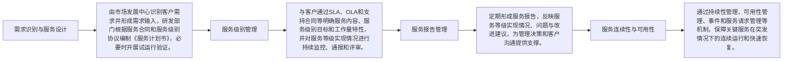

## 产品和服务应急预案

鸥玛软件围绕无纸化考试、网上评卷等关键产品和服务业务场景，持续完善覆盖事前预防、事中响应和事后恢复的应急保障机制。公司依据GB/T 30146-2023《安全与韧性 业务连续性管理体系 要求》搭建应急预案体系。

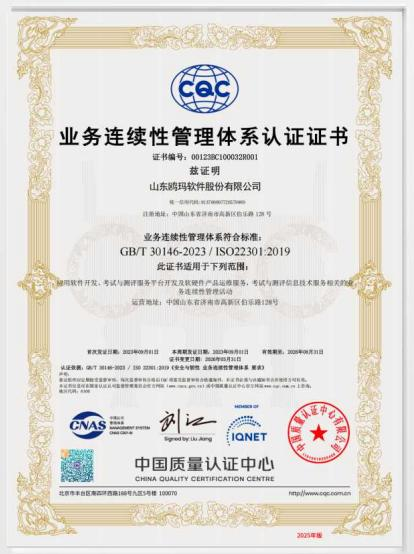

text_image

业务连续性管理体系认证证书
证书编号：001238C1000328001
兹证明
山东鸥玛软件股份有限公司
统一信用代码：913700067725E794D
注册地址：中国山东省济南市高新区伯乐路128号
业务连续性管理体系符合标准：
GB/T 30146-2023 / ISO22301:2019
此证书适用于下列范围：
经营期限：2021年06月01日
本年度通过日期：2021年06月01日
证书有效期：2020年06月31日
认证依据：GB/T 30146-2023 / ISO 22301:2019《企业与管理人业务连续性管理体系》第3章
CNAS
Signed by: Jiu Jiangang
IQNET
中国质量认证中心
CHINA QUALITY CERTIFICATION CENTRE
北京市丰台区南四环西路188号九层5号楼 100070
http://www.cqcc.com.cn
2023年底

鸥玛软件通过业务连续性管理体系认证

依据GB/T30146-2023 标准搭建覆盖系统故障、网络中断、电力异常、现场突发事件的应急预案体系，明确分级处置流程、责任分工与协同机制。

  
预案体系  
针对关键服务场景强化双路供电、UPS备用电源、服务器热备或双活架构等保障措施，开展模拟演练和流程检查，提升突发事件防范能力。

  
恢复与改进

鸥玛软件产品和服务应急处理机制

  
事前准备

对事件进行记录、分析和整改，推动类似问题防范和服务能力持续提升。

  
应急响应

建立快速响应机制，对现场异常、系统故障、网络中断及服务问题及时启动处置流程，快速排查并恢复运行。

## 客户投诉与反馈处理

公司以“精准反馈—高效改进—持续提升”为核心，搭建全链条客户反馈管理闭环，通过多环节协同运作，推动服务体系不断优化升级。

## 解决客户投诉与反馈机制

## 多渠道响应全量受理客户反馈

受理环节打通客服中心、专属对接人等多元反馈渠道，确保客户诉求便捷传递。所有反馈信息均通过标准化流程登记建档，明确记录诉求内容、反馈时间等关键要素，实现100%响应率，保障每一条意见都能进入规范处理流程。

## 多部门联动精准调查问题根源

调查环节由专属服务团队牵头，联合市场、服务、研发等跨部门力量，通过复盘服务流程、深度沟通客户、现场确认等方式，全面还原服务场景，精准定位问题根源。对于涉及信息安全、数据隐私的反馈，严格遵循ISO27001、ISO27701等体系要求开展回访，确保调查过程合规、客户信息保密。

## 差异化处理高效同步解决方案

处理环节实施差异化策略，针对不同类型的反馈定制专属解决方案。处理结果第一时间向客户同步，同时明确后续跟进计划，兼顾解决效率与客户体验。

## 多形式回访检验处理实际效果

回访环节通过电话、问卷、现场走访等多种形式，深入了解客户对处理结果的满意度，收集进一步改进建议，切实检验处理效果，为服务优化提供直接依据。

## 周期性复盘推动服务持续升级

改进环节定期汇总分析所有反馈信息，提炼共性问题与服务短板，将其转化为具体优化举措，推动服务体系持续迭代升级，形成“反馈-改进-提升”的良性循环。

## 客户满意度调查

鸥玛软件始终将客户满意度作为服务质量的核心标尺，构建覆盖全链条、多维度的管理体系，精准洞察需求，驱动产品与服务持续进化。

2025年

<table><tr><td>公司客户满意度综合评分达98.20%</td><td>其中产品和服务适配性评分98.50%</td><td>服务全流程质量评分98.10%</td><td>技术支持能力评分97.80%</td></tr><tr><td>售前方案定制化满意度达99%</td><td>售中项目实施按时完成率达100%</td><td>售后问题响应平均时长控制在30分钟</td><td>解决率达100%</td></tr></table>

natural_image

Two business people giving thumbs-up gestures at a table with documents and charts (no visible text or symbols)

## 第三节 可信数据守护客户隐私

鸥玛软件严格遵守《中华人民共和国个人信息保护法》《中华人民共和国数据安全法》等法律法规，持续完善覆盖组织管理、技术防护、流程控制、人员培训和应急响应的数据安全与客户隐私保护体系。立足考试与测评行业数据敏感度高、社会关注度高、人才选拔公信力要求强的业务特点，公司围绕考试数据、考生个人信息及业务系统安全，持续强化全生命周期管理和全过程风险防控，为保障国家级考试和职业资格考试项目安全平稳运行、维护客户信任和人才选拔路径安全提供坚实支撑。

## 治理

鸥玛软件依据《信息安全管理制度》，构建覆盖决策、管理、执行、监督四个层级的数据安全与客户隐私保护治理架构，并依托信息安全管理委员会及跨部门应急联动机制推动各项要求落地执行。公司持续以制度约束夯实管理基础，以外部认证提升体系规范性和公信力，推动数据安全与客户隐私保护由技术防护向体系化、标准化、责任化管理延伸，为考试组织实施、客户数据保护和稳健经营提供有力支撑。

鸥玛软件数据安全与客户隐私保护治理架构  
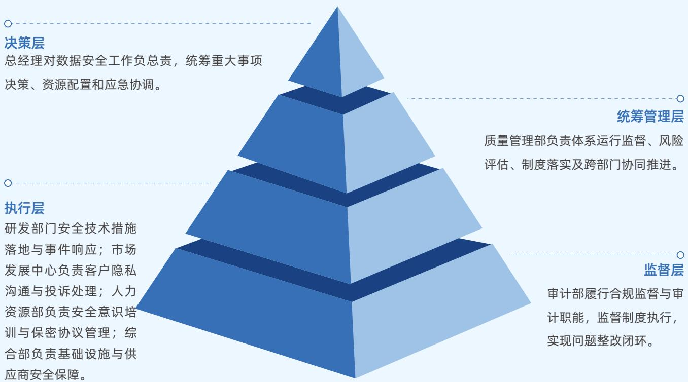

flowchart

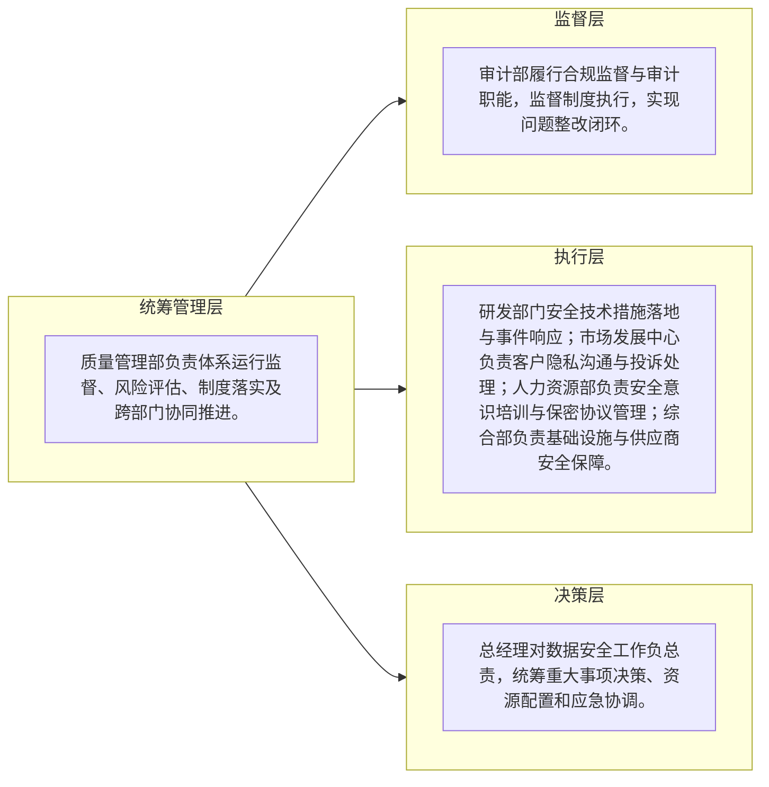

鸥玛软件通过数据安全与隐私保护相关外部认证  
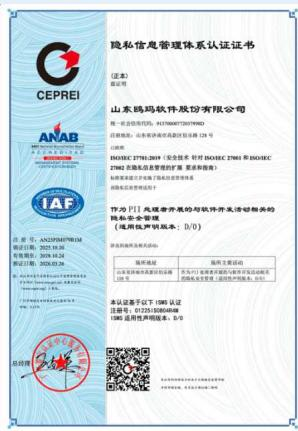

text_image

隐私信息管理体系认证证书
（证书）
地址：山东省济南市高新区经十路128号
山东鸿码软件股份有限公司
统一社会信用代码：9137068720719902
注册地址：山东省济南市高新区经十路128号
办公地址：山东省济南市高新区经十路128号
ISOSEC 2701-2019 (安全技术) 时代 ISOSEC 27041 和 ISOSEC 27082 非金融信息管理的扩展要求指南)
具体内容请见上一版《企业内部控制与风险管理规定》。
IP:70 口门 光波数字采集与软件开发活动相关的
病毒字母等级（使用声明和版本：B/D）
申请文件类型及授权内容：
身份证号码	编码(主要字段):
企业名称/营业执照号码/注册号	负责人/项目负责人/组织人/法定代表人/组织机构/业务主管/组织机构/产品名称、单位
本认证证书已于 1986 注册号：1325-150506868
1302 适用声明和版本：B/D

ISO27701  
隐私信息管理体系认证

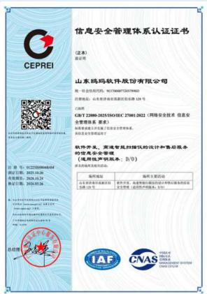

text_image

信息安全管理体系认证证书
CEPREI
山东妈妈软件股份有限公司
地址：山东省济南市市中区经七路8号
经营范围：电子政务网络系统设计及应用（限120号）
注册号：CJB/T 22080-2020/SSOIEC 27041-2022（网络安全技术 信息安全管理体系）
联系电话：0531-83699999
基本信息查询证明
软件开发、研发及培训的设计和售后服务的
信息安全管理体系
《电信用户认证标准》：B/0
证书有效期至发证机关登记
编码地址	场所主要活动
从本单位发布到本单位名称：GJW_1201	首次申请，本次申请以发行前的文件为准。
经营范围：互联网产品销售、转让、销售、代理、发布广告；企业形象策划、设计、制作、发布广告；企业形象策划、设计、制作、发布广告；企业形象策划、设计、制作、发布广告；企业形象策划、设计、制作、发布广告；企业形象策划、设计、制作、发布广告；企业形象策划、设计、制作、发布广告；企业形象策划、设计、制作、发布广告；企业形象策划、设计、制作、发布广告；企业形象策划、设计、制作、发布广告；企业形象策划、设计、制作
ISBN 97-7-7-0004-0144
第1页：2023.10.26
第2页：2023.10.24
第3页：2023.05.26
总览
CNAS
ISSN-4-1
ISSN-4-1
ISSN-4-1
ISSN-4-1
ISSN-4-1
ISSN-4-1
ISSN-4-1
ISSN-4-1
ISSN-4-1
ISSN-4-1
ISSN-4-1
ISSN-4-1
ISSN-4-1
ISSN-4-1
ISSN-4-1
Issa#e#e#e#e#e#e#e#e#e#e#e#e#e#e#e#e#e#e#e#e#e#e#e#e#e#e#e#e#e#e#e#e#e#e#e#e#e#e#e#e#e#e#e#e#e#e#e#e#e#e# e## #D
ISSN-4-1
ISSN-4-1
ISSN-4-1
ISSN-4-1
ISSN-4-1
ISSN-4-1
ISSN-4-1
ISSN-4-1
ISSN-4-1
ISSN-4-1
ISSN-4-1
ISSN-4-1
ISSN-4-1
ISSN-4-1
总览

ISO27001  
信息安全管理体系认证

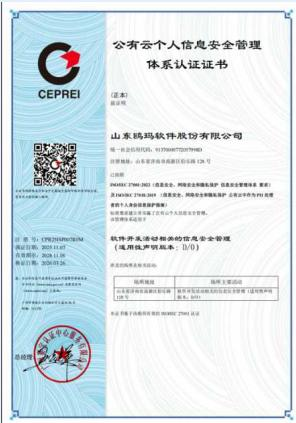

text_image

公有云个人信息安全管理
体系认证证书
[证本]
请注明

山东数码软件股份有限公司
统一社会信用代码：911706872075794D
注册地址：山东省济南市高新区经济街126号
公司
客服电话：95533 2799-2802（微信公众号、网信公众号等终端产品）及企业主管部门
电子邮箱：JDWQJ 2799-2803（投资者关系、网络安全等终端产品，企业可作为FID代理
的个人股东或自然人）
办公地址：山东省济南市历下区经济街126号A座10楼
注册地址：山东省济南市历下区经济街126号A座10楼
软件开发及存储相关的信息安全管理
（选用噪声说明表、I/O）
提供的系统和功能介绍

现场地址
服务主要活动
山东省济南市高新区科技路1号
法定代表人：王洪波
联系人：周晓明
联系电话：0532-833333333
电子邮箱：www.xuomao.com.cn

山东数码软件股份有限公司
地址：山东省济南市历下区经济街126号
办公地址：山东省济南市历下区经济街126号
注册地址：山东省济南市历下区经济街126号
法定代表人：王洪波
联系人：周晓明
联系电话：0532-833333333
电子邮箱：www.xuomao.com.cn

山东数码软件股份有限公司
地址：山东省济南市历下区经济街126号
办公地址：山东省济南市历下区经济街126号
注册地址：山东省济南市历下区经济街126号
法定代表人:王洪波
联系人:周晓明
联系电话：0532-833333333
电子邮箱：www.xuomao.com.cn

山东数码软件股份有限公司
地址：山东省济南市历下区经济街126号
办公地址：山东省济南市历下区经济街126号
注册地址：山东省济南市历下区经济街126号
法定代表人:王洪波
联系人:周晓明
联系人联系电话：0532-833333333
电子邮箱：www.xuomao.com.cn

山东数码软件股份有限公司
地址：山东省济南市历下区经济街126号
办公地址：山东省济南市历下区经济街126号
注册地址：山东省济南市历下区经济街126号
法定代表人:王洪波
联系人:周晓明
联系人联系电话：

ISO27001及ISO27018公有云个人信息安全管理体系认证

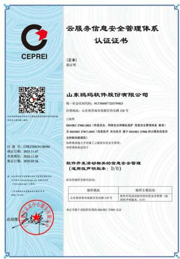

text_image

云服务信息安全管理体系
认证证书
(证本)
登记号
山东鸥玛软件股份有限公司
统一社会信用代码：91370000722057998D
注册地址：山东省济南市高新区伯乐路128号
已启用
ISOIEC 27981-2822（信息安全、网络安全和隐私保护 信息安全管理体系 要求）
及 ISOIEC 27981-2845（信息技术 安全技术 基于 ISOIEC 27981 的公共服务安全
全制和披露）
标准要求建立完善了公共服务信息安全管理。
该管理体系建设于
软件开发活动相关的信息安全管理
(适用性声明基本：I/0)
提供的培训主要内容:
培训地址	培训主要活动
山东莱茵市高新区伯乐路128号	教育研究与应用的信息化管理（适用性声明基本：I/0）
本证书基于流程性和集约 ISOIEC 27981 认证

ISO27001及ISO27017云  
服务信息安全管理体系认证

text_image

CMM
数据管理能力成熟度（乙方）
等级证书
依据国家标准《数据管理能力成熟度评估模型》（GB/T 36073-2018），经评估，山东鸥玛软件股份有限公司 数据管理能力成熟度达到受管理级（2级），特发此证书。
评估机构：广州赛宝认证中心服务有限公司
评估依据：《数据管理能力成熟度评估模型》（GB/T 36073-2018）
证书编号：DCMM-V-2-3700-000890 发证日期：2024年06月27日
查询平台：https://www.dcmm-cfeii.com 有效日期：2027年06月26日止
中国电子信息行业联合会

DCMM数据管理能力  
成熟度2级认证

text_image

网络安全等级保护
备案证明
依据《中华人民共和国网络安全法》和
《信息安全等级保护管理办法》的有关规定，
山东山大鸿玛软件股份有限公司
单位
的：
第3级
精玛大规模无组织化考试
综合管理中心
系统
证书编号：37011699009-25001
予以备案。
中华人民共和国公安部监制
备案机关机关章
年月日
2025.11.24

seal

中华人民共和国公安部监制
网络安全等级保护
备案证明
依据《中华人民共和国网络安全法》和
《信息安全等级保护管理办法》的有关规定，
山东山大略玛软件股份有限公司
单位
的：
地王超 网络层服务平台系统 系统
予以备案。
国家公安厅办公室
年 月 日
2020-11-25

seal

山东山大略玛软件股份有限公司
山东省高级网络安全监督管理委员会
山东省公安机关办公室

网络安全等级保护三级备案

## 战略

鸥玛软件系统识别数据安全与隐私保护相关的风险与机遇，将合规认证、品牌口碑和技术创新带来的发展机遇转化为市场竞争力。

公司识别的与“数据安全与隐私保护”议题相关的风险与机遇结果如下：

<table><tr><td>风险/机遇</td><td>具体描述</td><td>影响期限</td><td>财务影响</td><td>应对策略</td></tr><tr><td colspan="5">风险</td></tr><tr><td>数据泄露与隐私合规风险</td><td>数据处理和个人信息管理不当,可能引发数据泄露、隐私侵权及合规处罚。</td><td>中长期</td><td>监管处罚;法律赔偿;整改投入增加;客户流失;品牌修复成本上升</td><td>严格执行《信息安全管理制度》和相关保密要求;强化数据加密存储与传输;建立隐私影响评估、告知同意和处理清单机制;定期开展安全审计和渗透测试;持续保持相关体系认证有效。</td></tr><tr><td>数据完整性与业务连续性风险</td><td>系统故障、攻击或异常操作可能导致数据受损、丢失或业务处理中断。</td><td>短期</td><td>考试重组成本;合同违约赔偿;应急恢复成本;客户关系受损</td><td>强化数据备份与异地容灾;制定业务连续性计划;建立容灾切换演练机制等。</td></tr><tr><td>技术迭代与数据生命周期管理风险</td><td>新技术应用偏差或数据全生命周期管理不到位,可能带来安全、合规和处理失真风险。</td><td>短期至中长期</td><td>技术改造成本增加;市场推广受阻;数据存储浪费;潜在损失扩大</td><td>新技术应用前开展安全测试和隐私影响评估;建立算法审计和模型安全加固机制;规范过期数据清理和介质销毁流程;对生命周期各环节实施监督与验证。</td></tr></table>

natural_image

Abstract line drawing with interconnected circuit-like lines and dots, no text or symbols present

<table><tr><td>风险/机遇</td><td>具体描述</td><td>影响期限</td><td>财务影响</td><td>应对策略</td></tr><tr><td colspan="5">机遇</td></tr><tr><td>合规认证与市场拓展机遇</td><td>安全与隐私保护资质积累,有助于增强高安全项目竞争优势和市场拓展能力。</td><td>中长期</td><td>提升中标率;带动收入增长;形成安全服务增收空间</td><td>持续保持合规认证有效性;在投标文件和市场宣传中突出安全合规能力;探索数据安全审计、隐私合规咨询等增值服务。</td></tr><tr><td>安全品牌与客户经营机遇</td><td>良好的安全保障记录,有助于强化品牌形象并提升客户信任与合作黏性。</td><td>中长期</td><td>毛利率提升;续约率提升;获客成本下降;新业务转化增加</td><td>加强安全品牌传播;提炼成功案例并强化对外展示;建立客户满意度回访机制,持续收集安全口碑反馈。</td></tr><tr><td>数据安全技术创新与增值服务机遇</td><td>数据安全技术创新可提升防护能力,并推动产品化和增值服务拓展。</td><td>中长期</td><td>提升市场竞争力;形成新增收入来源;降低安全事件潜在损失</td><td>加大数据安全研发投入;与高校、科研机构合作开展前沿研究;推动创新成果专利化、产品化和场景化应用。</td></tr></table>

## 影响、风险与机遇管理

鸥玛软件将数据安全与客户隐私保护管理贯穿数据采集、传输、存储、处理、使用、归档和销毁全过程，围绕考试数据、考生个人信息、业务系统和关键基础设施，形成“识别评估—过程监测—应急处置—持续优化”的一体化管理机制。结合考试与测评行业数据敏感度高、业务连续性要求强、人才选拔公信力要求高的特点，公司统筹推进制度约束、技术防护与岗位履责，持续强化重点风险预判、关键环节管控和异常事件响应能力，为高敏感考试场景安全稳定运行提供保障。

## 鸥玛软件数据安全与隐私保护风险识别管理机制

## 风险识别与评估

围绕数据全生命周期及研发、技术服务、采购、数据处理等关键环节，持续识别数据泄露、隐私合规、权限管理、第三方协同、数据完整性、业务连续性等重点风险与机遇，并结合影响程度、发生可能性和经营影响开展综合评估。

## 前置审查与技术监测

对信息系统实行上线前评估检测和必要的第三方检测，持续落实数据加密、权限控制、日志审计、漏洞修补、病毒防护、备份恢复及异地备份等措施，强化日常安全监测。

## 过程管控与应急处置

对数据交接、存储介质、备份清理和销毁实施全过程管理，建立信息安全应急预案和报告机制，发生异常时及时启动预案、保留证据、快速上报并组织处置。

## 培训宣导与持续改进

通过专项培训、入职培训和制度宣导提升员工安全意识与操作规范，并结合审计检查、管理评审、认证维护和事件处理结果持续优化制度、流程和防护措施。

## 指标与目标

鸥玛软件坚持将可量化、可检查、可追踪作为数据安全与客户隐私保护目标管理的重要原则，围绕安全事件控制、隐私保护、风险整改、体系运行和培训覆盖等方面设置目标，并结合考试与测评行业对数据准确、系统可靠和个人信息保护的高要求，通过内部审核、管理评审和日常运行监测推动目标落实。

<table><tr><td>目标设定</td><td>目标达成情况</td></tr><tr><td>重大信息安全事件为零</td><td>已达成</td></tr><tr><td>个人信息泄露事件为零</td><td>已达成</td></tr></table>

## 数据安全管理能力提升

鸥玛软件围绕考试数据、考生个人信息、信息系统和网络设备安全等考试相关重点领域，持续完善覆盖组织管理、技术防护、制度执行和人员约束的数据安全管理机制。公司将数据安全要求嵌入项目实施、系统运行、数据交接和日常运维各环节，通过强化备份恢复、加密传输、权限控制、日志审计和网络防护等措施，不断提升数据安全防护能力和管理规范性，为高敏感考试场景安全稳定运行提供支撑。

## 鸥玛软件数据安全分类管理措施

## 数据信息安全

对项目实施数据及文档实行备份管理，关键数据异地备份；涉密数据传递采用加密手段，人工交接实行双人负责；交接完成后及时清除相关数据。

## 移动存储介质安全

对办公用移动存储介质实行统一管理、按需领用、加密使用和归还清空，严禁借给外单位或他人使用。

## 设备安全

对计算机、服务器及网络设备实施统一管理，涉密终端强制安装数据防泄密软件。

## 病毒防护

对终端和服务器部署病毒防护软件并定期升级病毒库，发现感染及时中断运行并清除风险。

## 网络安全

通过防火墙、IPS、网络分区、漏洞修补和网络数据包监控等措施强化网络安全防护。

## 案例：强化数据安全培训，筑牢考试信息安全防线

2025年1月，公司在总部组织开展数据安全、安全编码及安全运维专项培训。技术专家深入讲解数据加密、系统防护及隐私合规等核心规范。本次培训实现研发部门全员参与，参训率达100%，有效提升了研发人员的安全实操能力。

## 2025年

数据安全总投入金额

.万元

重大数据安全事件发生数

 起

信息安全与隐私保护相关培训次数

场

培训总时长

小时

培训覆盖人次

人次

text_image

1000 110 100 101
0010 11 110 100 101
0 110 110 101 111 10
110 00-11101 001 00
DATA
110 00 11101 001 00
10 11 110 100 101
0 110 110 101 111 10
1000 110 100 101

## 信息安全应急预案

鸥玛软件依据《信息安全管理制度》建立信息安全应急预案和事件报告机制，将系统故障、信息泄露、网络攻击等情形纳入统一应急管理范围。针对考试与测评业务时效性强、数据敏感度高、运行容错要求严的特点，公司坚持“快速响应、及时上报、有效处置、责任追溯”的原则，持续强化应急准备、定期检查和实战演练，不断提升数据安全事件处置效率和业务恢复能力，防范事件扩散对考试组织实施和数据安全保障造成不利影响。

## 鸥玛软件信息安全应急管理机制

## 预案建立

要求相关部门制定信息安全应急预案，部门负责人为第一责任人，并设置信息安全员专人负责。

## 应急启动

止事件扩大和损失蔓延。

## 检查与演练

要求各业务部门定期检查预案有效性并开展定期演习，持续提升快速响应和协同处置能力。

## 处置与追责

对事件处置全过程进行记录和证据留存，按要求及时上报分管领导和公司；对造成损失的责任人员、部门安全员、部门负责人及分管领导依法依规追责。

## 2025年

公司开展信息安全应急演练次

## 客户隐私保护

鸥玛软件将客户隐私保护作为数据安全管理的重要组成部分，围绕个人信息收集、传输、存储、使用和销毁等关键环节，持续强化合规要求和过程控制。公司依托ISO27701隐私信息管理体系及相关管理措施，不断完善隐私保护机制，强化对考生个人信息和客户数据的合规处理与安全防护，切实守护考试与测评场景中的个人隐私安全，夯实客户信任基础和考试服务公信力。

## 鸥玛软件客户隐私保护管理措施

## 隐私合规管理

持续保持ISO27701隐私信息管理体系认证有效性，并结合个人信息保护相关要求，推进客户隐私保护制度化、规范化管理。

## 个人信息过程控制

对涉及个人信息的数据处理活动强化加密传输、加密存储、权限控制和操作审计，并在采集、传输、存储、使用到销毁各环节落实脱敏、分类分级及彻底销毁要求。

## 客户沟通与投诉处理

由市场发展中心负责客户隐私相关沟通与投诉处理，及时响应客户关切，维护客户合法权益。

## 人员与责任落实

通过签署保密协议、开展培训、离岗及时收回权限等措施，强化员工隐私保护责任意识，防范因人员管理不到位引发的隐私风险。

## 2025年

公司未发生任何泄露客户信息事件

## 第四节 责任供应链路稳健共进

鸥玛软件制定《采购管理制度》《招投标管理制度》等核心制度，公司围绕采购计划、供应商筛选、采购实施、合同履约、过程监督等关键环节，不断提升供应链运行的规范性、协同性与稳健性。

## 供应商审核与准入

鸥玛软件供应链管理实行分层管理、分级负责。管理层负责供应链战略规划与重大事项审定；执行部门严格按照制度要求，建立并动态管理合格供应商目录；相关岗位依规落实各项具体工作，形成闭环管理。

## 鸥玛软件供应商审核准入管理措施

## 前置审核

由需求部门提出申请，履行审批程序，资产管理部进行库存核查，综合部办理采购手续；招标事项中，执行部门负责投标单位资质预审。

natural_image

Abstract gear-shaped icon with a document and magnifying glass symbol (no text or symbols)

## 比选准入

根据采购类别采用招标采购、竞争性磋商、单一来源采购、询价采购等方式；常规采购事项均要求不少于3家供应商参与比选，在综合比对价格、方案、质量等基础上择优筛选合格供应商。

## 分级审批

针对达到既定金额标准或预算外的采购事项实行分级审批，强化重大采购事项的风险把关。

## 可持续供应链

鸥玛软件持续将合规经营、绿色低碳和资源节约理念融入供应链管理实践，推动采购活动由满足业务需求向兼顾效率、合规与环境效益延伸。结合考试与测评行业对设备保障、服务配套和交付稳定性的实际要求，公司围绕招投标规范管理、绿色采购实践和零部件循环利用等方面稳步推进，持续提升供应链韧性与资源利用效率，为考试服务连续运行和公司可持续运营提供支撑。

## 鸥玛软件可持续供应链建设措施

## 廉洁采购

在招投标活动中坚持公开、公平、公正、诚信原则，由执行部门牵头组织、关联部门参与监督、法律顾问参与风险管控，保障采购活动规范合规。

## 绿色采购

公司积极响应政府采购支持绿色建材相关政策号召，将园区照明升级项目作为绿色采购实践载体，择优选定节能太阳能灯具完成照明改造，践行低碳发展理念。

## 供应商培训赋能

鸥玛软件将培训赋能视为提升供应链韧性和协同效率的重要抓手，持续推进内部采购人员和外部供应商双向能力建设。结合考试与测评行业对交付协同、服务保障和合规管理的实际要求，公司通过强化制度理解、合规意识和协同要求，逐步夯实采购管理基础，带动合作伙伴提升风险意识与协作水平，推动形成更加稳健、高效的供应链协同生态。

## 案例：开展采购人员培训，夯实合规采购与专业管理基础

2025年4月，鸥玛软件组织采购相关岗位人员开展专题培训，通过理论授课、政策解读及案例研讨等形式，围绕采购政策法规、供应商管理、谈判技巧、成本控制等内容进行系统学习，参训人员培训率达到100%。本次培训进一步提升了采购人员的合规意识、专业能力和风险防控水平，为公司采购工作规范化、高效化开展奠定了坚实基础。

## 案例：开展供应商专题培训，强化协同共建与合规管理水平

2025年9月，鸥玛软件组织相关部门会同合格供应商开展专题培训，参与对象涵盖服务类、软硬件供应、云服务等多类供应商核心对接人员。培训围绕《中华人民共和国政府采购法》《中华人民共和国招标投标法》等内容，通过授课、研讨和答疑强化协作要求，参训人员培训合格率达到100%，有效提升了供应商合规意识、技术协同能力和合作管理水平。

## 第五节 协同合作共建行业生态

鸥玛软件坚持开放协同、合作共赢的发展理念，积极联动高校、科研院所、平台机构、上下游企业，深化技术交流、标准共建、成果转化与产业协同。通过参与行业标准制定、开展技术研讨、搭建产学研合作平台、推进重大项目联合攻关，公司持续输出成熟解决方案与安全运营经验，推动数据安全、考试公平、智能评卷、无纸化考试等领域规范化、标准化发展，与产业链伙伴共建可信、高效、绿色的考试测评新生态。

## 案例：签约未来产业科技服务平台，拓展产研协同与成果转化空间

2025年9月，鸥玛软件受邀出席第七届世界一流企业研发与创新管理论坛，并与国家重点研发项目成果——未来产业科技服务平台达成战略合作。此次签约有助于公司借助平台在技术、数据与资源整合方面的优势，增强对前沿产业趋势的洞察与创新要素配置能力，推动技术示范合作与成果场景化落地，为培育未来产业生态、提升企业高质量发展动能提供支撑。

text_image

未来产业科技服务平台签约仪式
国家重点研发计划重点专项成果发布

鸥玛软件与未来产业科技服务平台达成战略合作签约

## 案例：深度参与数字化考试标准研讨，助推自学考试转型升级

2025年11月，鸥玛软件代表赴深圳参加数字化考试标准研讨会，深度参与数据交换、界面功能及人工智能应用等核心标准议题讨论。公司结合在无纸化考试领域的技术积累，为标准草案提供了多项建设性专业意见，展示公司技术硬实力，为行业标准完善奠定基础，有力推动全国自学考试数字化改革的标准化与规范化进程。

## 夯实善治根基，以责任护航稳健发展

## 核心理念

合规是企业行稳致远的根本前提，完善的治理体系是企业高质量发展的核心保障。公司始终坚守合规为先、诚信经营、治理完善、风控筑牢的核心理念，严格遵循《中华人民共和国公司法》《中华人民共和国证券法》《上市公司治理准则》等法律法规与监管要求，持续健全现代企业治理架构，完善全流程风险与合规管理机制，严守商业道德底线，建立健全合规管理与反腐败体系，严格遵循数据安全法规，以透明治理保障考试公平公正，切实保障全体股东与利益相关方合法权益，推动企业在规范运作中实现可持续发展。

## 核心行动

公司治理  
投资者关系管理  
风险与合规管理  
反商业贿赂及反贪污  
反不正当竞争

## 第一节 公司治理

公司严格遵循《中华人民共和国公司法》《中华人民共和国证券法》《上市公司治理准则》等法律法规与监管要求，持续构建权责分明、决策科学、运行规范、有效制衡的现代企业治理架构。公司不断强化董事会规范运作与多元化建设，充分发挥各专门委员会专业职能，以规范的治理流程、科学的决策机制、完善的监督体系，保障公司长期稳健经营，推动企业治理能力持续提升，为服务国家考试治理、教育数字化和人才选拔相关业务安全有序开展筑牢治理根基。

## 治理架构

公司持续强化董事会规范运作与多元化建设，严格遵循《中华人民共和国公司法》《中华人民共和国证券法》《上市公司治理准则》等法律法规，构建完善的权责分明、相互制衡的公司治理架构。公司董事会下设审计委员会、战略委员会、提名委员会、薪酬与考核委员会等相关专门委员会，各专门委员会依照公司章程和董事会授权履行职责，保障公司规范运作、科学决策。

## 董事会多元化与专业性

公司执行多元化与专业性的董事会建设，明确专业背景、从业经验、年龄、性别等多元化建设维度，构建均衡多元、专业互补的董事会结构。

公司董事会成员专业背景全面覆盖教育考试信息化、数据安全与网络安全、国资运营管理、财务审计、法律合规等核心领域，独立董事均具备相关领域深厚专业积淀，能够为公司战略决策、风险防控提供独立、客观、专业的意见，充分保障董事会决策的科学性与前瞻性，适配公司服务国家人才选拔的核心业务定位。

2025年

<table><tr><td>公司董事会共有董事</td><td>其中独立董事</td><td>独立董事占比</td></tr><tr><td>9名</td><td>3名</td><td>33.33%</td></tr><tr><td>职工董事</td><td>女性董事</td><td></td></tr><tr><td>1名</td><td>2名</td><td></td></tr></table>

## 董事会有效性

董事会运作的有效性是公司治理效能的核心体现，更是保障企业科学决策、合规发展的关键支撑。公司持续完善独立董事制度，明确独立董事在风险管理、审计监督等领域的专项履职权责，不断优化独立董事专业结构，覆盖法律、财务、数据安全、教育信息化等多个领域，充分发挥独立董事的独立监督与专业支撑作用。同时，公司建立董事会有效性定期评估机制，以年度为周期开展自评与他评相结合的全面评估工作，针对评估发现的问题制定专项改进方案，并将评估情况对外公开披露，通过常态化复盘优化持续提升董事会运作质效与科学决策水平。

text_image

ouma鸥玛

## 第二节 投资者关系管理

鸥玛软件始终秉持公开、公平、公正的原则，以保障投资者知情权、参与权、收益权为核心，制定《信息披露事务管理制度》《投资者关系管理制度》《利润分配管理制度》等专项制度，构建起规范、透明、高效的投资者关系管理体系。公司持续提升信息披露质量，搭建多渠道、常态化的投资者沟通机制，及时回应投资者诉求，持续优化股东回报机制，切实维护中小投资者权益，着力构建互信共赢、良性互动的投资者关系。

## 信息披露

公司高度重视信息披露管理工作，构建了覆盖全流程、全环节的信息披露制度体系，制定了《信息披露事务管理制度》《信息披露暂缓与豁免管理制度》《年报信息披露重大差错责任追究制度》《内幕信息知情人登记管理制度》等一系列专项制度，明确信息披露的标准、流程、权责与追责机制，严守信息披露监管底线，确保披露信息的真实、准确、完整、及时、公平。

## 2025年

公司发布定期报告

项

临时报告

项

## 全年未发生

因信息披露违规导致的处罚事件

## 投资者沟通

公司搭建多渠道、常态化的投资者沟通体系，通过多元化沟通渠道与投资者开展双向互动，全面保障投资者的知情权与话语权，向资本市场充分传递公司服务国家“人才强国”战略的行业价值、长期成长逻辑。

## 投资者沟通渠道

业绩说明会

投资者调研

互动易平台

投资者热线

董秘信箱

## 案例：召开年度业绩说明会，深化投关交流增强投资者认同

2025年4月，鸥玛软件通过“中国证券报·中证路演中心”举办业绩说明会，公司副董事长、总经理张立毅，董事会秘书、财务总监马克等核心管理层及独立董事出席。会议围绕公司2024年财务状况、研发投入与突破、无纸化考试服务现状及发展空间等核心内容展开详细解读，并有针对性地回答投资者提出的问题。年度业绩说明会搭建了高效的投资者沟通平台，推动了公司与投资者的深度信息交互，让投资者全方位了解企业经营发展全貌，有效提升投资者对公司的认知与认同，夯实了公司投资者关系管理的工作基础。

## 关键荣誉：

2025年11月，在《证券市场周刊》主办的“2025年市值管理金曙光奖评选”中，公司董事会秘书马克凭借在合规运作、信息披露及投资者关系管理等领域的专业表现，荣获“金曙光优秀董秘奖”，公司投资者关系管理工作获得资本市场高度认可。

## 2025年

公司召开年度业绩说明会

次

全年通过互动易平台收到投资者问题

个

参与网上集体接待日活动

次

回复投资者问题

个

接待特定对象调研

次

回复率达

. %

## 投资者权益保护

公司始终高度重视中小投资者权益保护，严格遵守《公司章程》《利润分配管理制度》，提高利润分配决策的透明度，方便股东对公司经营和利润分配进行有效监督；积极推动股东权利的平等行使，确保所有股东，特别是中小股东，能够公平、公正、公开地享有公司股东权益，在公司决策中发挥应有作用。同时，公司持续优化股东回报机制，建立科学、持续、稳定的利润分配制度，兼顾股东的即期利益和长远利益，充分维护公司股东依法享有的资产收益权利。

## 2025年

2025年4月，公司经董事会、股东会审议通过《关于2024年度利润分配预案的议案》，向全体股东每10股派发现金红利

. 元（含税）

合计派发现金红利

,,.元（含税），

该利润分配方案已于2025年5月21日实施完毕。

## 第三节 风险与合规管理

公司秉持“全面覆盖、全程管控、预防为主、防控结合”的核心理念，构建了覆盖战略、财务、运营、合规、数据安全等全领域的全面风险管理体系，以《内部控制制度》《内部审计制度》《信息披露事务管理制度》等核心制度为支撑，明确各治理层级的风控与合规权责，形成全员、全流程、全领域的合规管理框架。公司持续深化内控体系建设，强化内部审计监督效能，建立风险分级管控与隐患排查治理双重预防机制，重点防范影响考试公平、公正、连续运行和人才选拔安全的各类风险，为公司持续稳健运营筑牢风控防线。

## 合规风控治理架构

## 决策与监督层

## 董事会及审计委员会

董事会及审计委员会负责监督风险管理与内控体系运行；审议内控评价、风险评估报告；督办重大风险与隐患整改；监督重点领域风险排查与管控。

## 管理执行层

## 总经理及高级管理层

总经理及高级管理层统筹机制落地执行；协调跨部门风险管控与隐患整改工作；跟踪重要风险、重要隐患的管控整改进度。

## 落地执行单元

## 审计部及各业务部门

审计部作为牵头执行部门负责组织年度全面风险评估、内控评价，开展高风险领域专项审计排查，建立整改台账、监督闭环整改；

各业务部门负责部门内风险日常识别、一般风险常态化管控，开展隐患日常自查，落实整改要求，提报风险与隐患相关原始数据。

公司定期开展全面风险评估，2025年已完成年度风险评估工作，系统识别公司经营过程中的核心风险，针对识别出的各类风险制定专项应对方案，建立风险分级管控与隐患排查治理双重预防机制。公司识别出的风险及应对措施如下：

<table><tr><td>风险类别</td><td>风险描述</td><td>应对措施</td></tr><tr><td>市场竞争风险</td><td>更多的潜在竞争者进入该领域,未来市场竞争可能会进一步加剧。</td><td>·关注市场动态与政策变化;·持续投入研发,引入新技术,加强新技术应用,提升服务品质;·深化合作,储备前瞻性技术。</td></tr><tr><td>核心技术人员流失及核心技术泄漏风险</td><td>核心研发人才流失或管理不到位,可能导致项目推进受阻或核心技术外泄。</td><td>·不断完善薪酬制度、绩效考核制度和职业晋升机制,优化人力资源管理体系,提高员工稳定性及忠诚度;·加强企业文化建设,提升员工向心力与凝聚力;·建立健全技术保密、知识产权保护制度,与核心人员签订保密及竞业限制相关协议,强化核心技术全流程管理,防范技术泄密风险。</td></tr><tr><td>重要信息泄露风险</td><td>因网络恶意攻击、软件漏洞及违规操作等原因可能导致信息泄露。</td><td>·完善运维体系与安全保密管理制度,改进网络信息安全体系和信息披露审核流程;·完善业务风险清单与应急处置预案,从信息、系统、网络、物理等多层面提供技术保障。</td></tr></table>

## 案例：借鉴先进经验，筑牢内控防线

2025年1月，公司组织管理层及内控关键岗位人员，参与内部控制体系建设专题交流会，借鉴行业优秀实践，围绕内控体系建设、合规管理运行、风险防控机制等内容开展研讨与培训，进一步明晰内控优化方向与提升路径，持续强化全员内控意识与风险管理能力，不断夯实公司合规运营与稳健发展的制度基础。

## 案例：抓实内控审计全维监督，筑牢企业经营风控防线

2025年，鸥玛软件审计部严格遵照上级内控审计工作要求，高效完成各项审计工作，切实协助审计委员会履行监督职责。同时聚焦经营发展重点领域，对鸥玛数据产业园项目建设实施常态化监督，强化工程项目风险防控；全程跟进年度招标采购项目监督工作，严格核查招标流程的合规性与公正性。从关键环节防范重点项目运营违规风险，进一步完善公司内控监督体系，切实保障公司资产安全，强化公司整体风险防控能力。

## 2025年

公司未发现内控重大风险点

未发生重大风险事件

不存在财务报告及非财务报告内部控制重大缺陷、重要缺陷

natural_image

Person interacting with a tablet displaying a digital globe with interconnected user icons (no text or symbols)

## 第四节 反商业贿赂及反贪污

鸥玛软件严格遵守《中华人民共和国公司法》《中华人民共和国证券法》《企业内部控制基本规范》《上市公司治理准则》等法律法规和监管要求，始终坚持阳光经营、廉洁从业，将廉洁合规要求融入公司治理、内部控制和监督管理全过程，不断夯实规范运作基础，提升风险防范能力和责任落实水平，持续强化廉洁文化建设和诚信经营导向，维护公平透明的经营秩序，保障资产安全与经营稳健，筑牢公司高质量发展的廉洁底座。

## 鸥玛软件反商业贿赂与反贪污组织架构

## 领导层

## 公司党委

履行全面从严治党主体责任，领导公司反贪污反腐败工作；对廉洁治理重大事项进行前置研究把关，确保符合国家政策与国资监管要求。

## 监督层

## 董事会审计委员会

负责审议公司反舞弊、反腐败相关工作情况，对相关工作发挥统筹监督作用。

## 执行与监督层

## 审计部

负责反贪污腐败、舞弊风险排查及内部监督审计工作；协助建立健全反舞弊机制；在审计过程中关注、检查可能存在的舞弊行为；对举报线索及相关问题开展核查、跟踪与反馈。

## 落实层

## 各级管理层及全体员工

按照公司内部控制与审计管理要求，在职责范围内落实廉洁从业、配合监督检查、及时报告异常情况，共同承担反商业贿赂与反贪污执行责任。

鸥玛软件坚持将廉洁要求落实到风险识别、风险防控、教育培训、责任追究和整改提升等关键环节，持续提升对商业贿赂、舞弊和贪腐行为的识别、防范与处置能力，推动形成规范透明、廉洁自律的经营环境。

## 鸥玛软件反商业贿赂与反贪污管理措施

## 教育培训与廉洁宣贯

结合党风廉政建设和反腐败工作安排，组织开展反贪污腐败专题培训，围绕廉洁纪律要求、党风廉政建设要求和典型案例开展学习宣贯，持续强化全体员工的纪律意识、规矩意识和廉洁自律意识。

## 问题处置与责任追究

对监督检查中发现的问题，依据制度要求开展核查和处理；对重大违反国家财经法纪的行为依法追究责任，对违反公司规章制度的行为依规处理处罚，推动形成有责必问、违规必究的管理导向。

## 整改落实与持续改进

将廉洁从业与反贪污腐败相关要求纳入内控体系持续运行和审计监督过程，结合问题排查、整改落实和专题教育，不断完善管理机制，推动反商业贿赂与反贪污工作常态化、长效化。

## 举报与举报人保护

鸥玛软件建立健全举报监督与举报人保护机制，充分发挥内部监督在风险防范、合规运营及问题治理中的重要作用，通过畅通举报渠道、规范线索受理与核查、强化保密管理和严格保护举报人权益，持续提升举报机制的有效性和公信力。

## 鸥玛软件举报受理处置流程

## 线索接收

通过已建立的便捷举报渠道接收商业贿赂、贪腐及舞弊相关举报线索，覆盖内部员工和外部利益相关方。

## 事项受理

对收到的举报事项进行统一受理，并将相关信息纳入后续核查处理范围。

## 核查处理

对举报事项依法依规开展核查处理，匿名举报与实名举报同等对待，确保线索处置的严肃性和规范性。

## 跟踪反馈

对举报事项处理情况进行跟踪，推动相关问题闭环管理，提升举报机制的执行效果。

## 资料归档

对举报相关材料、记录实行专人归档和规范管理，保障线索可追溯，防范信息泄露风险。

## 鸥玛软件举报人保护管理措施

信息保密 对举报人的个人信息、举报内容及相关材料严格保密，严格控制信息知悉范围，严防信息泄露。

匿名举报 允许举报人以匿名方式提交举报线索，匿名举报与实名举报同等对待，并依法依规妥善核查处理。

反报复保护 明确严禁对举报人实施任何形式的打击报复，对查实的打击报复行为将对相关责任人严肃处理。

规范管理 对举报相关材料、记录实行专人归档、闭环管理，在保障线索可追溯的同时降低泄密风险。

## 廉洁宣贯

## 案例：召开反贪污腐败专题培训会，推动廉洁教育融入日常管理

为持续强化廉洁合规文化建设，健全反贪污腐败长效机制，鸥玛软件于2025年3月组织开展全员廉洁从业与反贪污腐败专题培训。培训逐级进行，覆盖公司全体员工，聚焦党风廉政建设、廉洁自律规范、反商业贿赂与反舞弊要求，结合典型案例开展警示教育，引导全体员工强化纪律意识、底线意识与合规意识。

## 案例：开展中央八项规定精神专题辅导培训，强化纪律意识与廉洁履职能力

2025年4月，鸥玛软件组织全体党员及关键岗位管理人员，通过线上直播集中参加中央八项规定精神专题辅导培训，围绕公务接待、差旅、办公用房等廉洁纪律要求及典型警示案例开展学习、自查和交流，进一步强化纪律规矩意识和廉洁自律意识，有效防范作风失范与廉洁风险，为年度党风廉政建设和反腐败工作夯实思想基础。

## 2025年

反商业贿赂与反贪污专项培训次数

次

反商业贿赂与反贪污培训参与人次

人次

反商业贿赂与反贪污培训员工覆盖率

%

经确认的商业贿赂及贪污事件发生数量

起

## 第五节 反不正当竞争

鸥玛软件严格遵守《中华人民共和国反垄断法》《中华人民共和国反不正当竞争法》等法律法规，秉持公平竞争、诚信经营原则，不断规范市场竞争行为，防范不正当竞争风险。公司将反垄断及公平竞争合规审查，纳入销售、市场推广、招投标及合同管理等业务的常规审计范畴，重点针对政府类、国家级考试项目的招投标环节，严格遵守相关法律法规，杜绝串标、虚假宣传、商业诋毁等不正当竞争行为，维护公平有序的市场秩序。

同时，公司始终坚持平等对待各类合作伙伴，尤其是中小企业供应商，严格落实准时付款政策，持续优化支付流程，保障款项及时到位，切实维护合作各方的合法权益，为中小企业营造公平、透明的合作生态。

## 2025年

公司未发⽣经确认的违反公平竞争事件， 未因不正当竞争受到行政处罚。

## 

## 第三篇章

## 厚植人本关怀，与社会共享发展成果

## 核心理念

鸥玛软件深刻理解，人才是驱动创新的核心引擎，社会是企业发展的价值源泉。作为国有控股的考试与测评领域领军企业，我们秉持“与时偕行、以信致远”的核心价值观，将员工的成长与福祉置于首位，构建公平、包容、安全、充满活力的职场环境。同时，我们积极践行国企担当，以专业能力服务“人才强国”战略，在创造经济效益的同时，践行国企担当，积极参与乡村振兴与社会公益，以真诚行动回馈社会，致力于实现企业、员工与社区的共生共荣与可持续发展。

## 核心行动

员工雇佣与权益保障  
员工培训与职业发展  
职业健康与安全  
乡村振兴与社会贡献

text_image

1 无贫穷
3 良好
健康与福祉
4 优质教育
5 性别平等
8 体面工作和
经济增长
10 减少不平等

<table><tr><td>1</td><td>无贫穷</td><td>3</td><td>良好健康与福祉</td><td>4</td><td>优质教育</td><td>5</td><td>性别平等</td><td>8</td><td>体面工作和经济增长</td><td>10</td><td>减少不平等</td></tr></table>

## 第一节 员工雇佣与权益保障

鸥玛软件严格遵守国家法律法规，坚持平等雇佣与人文关怀并重，通过构建完善的员工权益保障体系与规范的用工管理机制，坚决维护员工合法权益，致力于为每一位员工提供有竞争力、有温度、有保障的职场环境，让奋斗者无后顾之忧，为人才的成长与进步提供广阔的发展空间。

## 合规雇佣与平等权益

公司严格遵循《中华人民共和国劳动法》等法律法规，落实《人力资源管理制度》与《劳动合同管理制度》，坚持公开、公平、公正的招聘原则，从源头上杜绝招用童工、杜绝任何形式的歧视与强迫劳动，确保同工同酬。公司依法与所有员工签订劳动合同，并严格履行全员社会保险与住房公积金的缴纳义务，切实保障员工的合法权益。

2025年

<table><tr><td>公司劳动合同签订率100%</td><td colspan="2">员工社保公积金缴纳覆盖率100%</td></tr><tr><td>经确认的童工事件0例</td><td>经确认的强迫劳动事件0例</td><td>经确认的歧视事件0例</td></tr></table>

## 多元化平等雇佣

公司珍视人才的多样性，致力于打造一个性别、年龄、背景均衡的团队，为所有员工提供平等的职业发展机会。

donut

| 教育程度 | 人数 |
| --- | --- |
| 博士人数 | 1 |
| 硕士人数 | 43 |
| 本科人数 | 242 |
| 专科人数 | 71 |
| 专科以下人数 | 9 |

donut

| 性别 | 人数 |
| --- | --- |
| 男性员工人数 | 297 |
| 女性员工人数 | 69 |

在职场多元化建设方面，公司致力于营造包容的职场氛围。公司通过完善的职级晋升机制，确保不同性别的员工拥有平等的职业发展机会。目前，女性员工广泛分布于公司的各个职级序列，从基层岗位到中级、高级管理层，均有女性员工参与关键业务的推进与决策管理，充分体现了公司人才结构的多元化。

2025年度各职级员工性别分布  

bar

| 基层 | 男性员工人数 | 女性员工人数 |
| --- | --- | --- |
| 高级管理层 | 7人 | 1人 |
| 中级管理层 | 37人 | 12人 |
| 基层员工 | 253人 | 56人 |

## 民主管理与沟通

2025年，鸥玛软件共召开三次职工代表大会，就涉及员工切身利益的制度修订、激励政策、体制改革及治理架构等重大事项进行审议表决。所有议案均通过平等协商与民主投票产生。

## 案例：召开职工代表大会，保障员工权益

2025年，公司先后召开三次职工代表大会，充分保障职工权益。2月召开第一次会议，审议通过《关于对取得专业技术证书的员工予以奖励的办法》及《考勤管理制度》，调动员工提升专业能力的积极性、实现员工成长与公司发展同频共振的同时，严格落实地方条例要求，保障员工合法休息休假权利；7月召开第二次会议，审议通过职工分流安置方案，针对劳动关系延续、社保及公积金变动等员工切身利益相关事项及时回应关切，切实保障职工在体制改革过程中的劳动权益；11月召开第三次会议，选举产生第三届董事会职工代表董事，进一步健全公司法人治理结构，畅通职工诉求表达渠道，保障职工依法参与公司民主管理与民主监督。

## 员工满意度调查

公司视员工反馈为优化管理的重要依据，于2025年12月面向全体正式员工开展了年度满意度调查。本次调查采用匿名形式以确保结果的真实性与广泛性，覆盖率高达98%；调查结果显示，2025年度员工整体满意度达到96%，充分反映出员工对公司管理及文化的高度认可。

flowchart

## 2025年

职工代表大会召开次数

次

工会入会率

 %

员工流失/离职率

.

员工满意度为

%

## 薪酬管理体系

公司制定了《薪酬管理制度》，建立以“岗位工资+差异奖+绩效奖”为核心的薪酬体系，将个人贡献与公司发展紧密挂钩，充分体现“多劳多得”的激励原则。公司依据《鸥玛精英评选管理办法》开展年度“鸥玛精英”评选，表彰做出突出贡献的优秀员工，营造积极向上的成长氛围。

## 案例：年度鸥玛精英评选，激发员工工作热情

2025年末，为表彰优秀员工、树立岗位标杆、激发全员工作热情，公司开展年度鸥玛精英评选活动，采用部门推荐、集体评选的方式，评选出精英奖、提名奖、推荐奖等多个奖项获奖人员，公司召开表彰会为其授予奖杯及奖金，以表彰他们为鸥玛事业作出的突出贡献，有效激发全员争先意识。

## 绩效申诉与反馈

公司严格执行《员工绩效考核管理办法》，员工可在绩效结果公布5个工作日内，向人力资源部提交书面申诉，确保考核透明、申诉有门。

## 绩效考核处理流程

flowchart

## 员工福利与关怀

公司始终坚持以人为本，严格落实国家法定保障制度，并结合实际建立多维度的特色关怀机制，提供完善的福利保障，除法定五险一金、带薪年假外，还包括团体综合意外伤害险、年度健康体检、节日福利、员工慰问金等，全方位提升员工的幸福感与归属感。

在夯实物质保障的基础上，公司同样重视员工的精神文化需求与团队融合，通过组织丰富多彩的文体活动，营造积极向上、团结奋进的工作氛围。

## 员工关怀与福利保障机制

## 法定福利保障

R 社会保险与住房公积金  
R 法定节假日与带薪休假

## 特色员工关怀

R 人性化弹性办公：允许1小时内灵活上下班；完善出差、外派员工补签机制。  
R 餐饮与补贴：提供免费早午餐，发放防暑降温费与取暖费。  
R 健康与形象关怀：为员工提供年度体检；额外购买团体综合意外伤害保险；定期订做工装。  
R 精准人文慰问：针对员工结婚、生育、住院等情况发放慰问金。

## 案例：开展企业文化节活动，营造团结奋进工作氛围

2025年，鸥玛软件以第十六届企业文化节为契机，组织全体员工开展系列主题活动。4月举办“踏春而上 聚力前行”登山活动，9月开展“悦享金秋共创美好”健康运动活动。通过文体活动，进一步凝心聚力、增进交流，营造积极向上、团结奋进的工作氛围，切实传承与弘扬鸥玛软件企业文化，展现鸥玛人昂扬向上的精神风貌。

## 第二节 员工培训与职业发展

鸥玛软件始终将人才培养作为企业可持续发展的核心支撑。2025年，公司围绕“AI+”战略发展需求，依托《学习交流与培训管理制度》，构建覆盖新员工融入、在职员工赋能、校企人才储备的全周期培训体系。对内，通过体系化的入职引导、专项技能培训以及线上专业学习平台，赋能员工专业成长；对外，依托校企合作，精准布局软件人才储备。内外联动的育人体系，有效提升了组织效能，为公司业务创新提供了坚实的人才支撑。

## 校企合作与人才储备：产学研融合，精准储备未来人才

公司积极探索产学研深度融合新模式，通过与高校建立紧密的人才培养合作关系，精准对接产业需求，构建多层次人才储备体系。

## 案例：校企携手，共育软件人才

2025年3月，公司受邀参加山东大学软件学院2025年校企合作峰会，与学院及齐鲁软件园共商产教融合新路径，正式启动全年合作。项目期间，公司选派多名技术骨干作为“飞行导师”参与课程共建。此外，双方围绕实际技术痛点启动“校企联合攻关项目伙伴计划”，组织学生团队参与课题研究。合作进一步强化了产学研协同效应，公司获评山东大学软件学院“2025年度合作伙伴”，在校内雇主品牌知名度稳步提升。

## 2025年

全年培训总场次

次

年度培训支出金额

.万元

员工培训人数

人

员工培训覆盖率



## 员工培训时长

培训总时长

, 小时

人均参与培训时长

.小时

女性员工人均培训时长

.小时

男性员工人均培训时长

.小时

基层员工人均培训时长

.小时

中级管理层人均培训时长

.小时

高级管理层人均培训时长

 小时

## @ouma鸥玛

## 员工培训

## 新员工培训：夯实基础，加速融入

为新员工设计了系统化的入职培训方案，通过集中授课、互动答疑、参观讲解、案例分析等多种形式，帮助新员工快速认同企业文化、融入团队，培训成效显著，新员工满意度保持在95%以上。

新员工满意度保持在

95%以上

## 案例：新员工入职培训系列助力融入成长，提升团队凝聚力

2025年，公司对新入职员工开展入职培训，涵盖研发、财务、技术服务等多个部门。培训内容包括公司简介、组织架构、企业文化、规章制度、公司业务介绍、信息安全等。培训方式采用集中授课、互动交流、参观讲解、案例分析等多种形式，由HR、相关部门负责人、业务骨干授课分享。培训成效显著，新员工满意度达到95%以上，多名员工提出的创新建议被采纳，公司根据收集的多条建议优化了入职引导流程，显著增强了团队凝聚力和跨部门协作顺畅度。

natural_image

Group of business people giving thumbs-up gesture (no text or symbols visible)

## 在职员工专业赋能：线上线下融合，激发成长活力

公司高度重视在职员工的专业成长与能力迭代，构建了“集中授课+自主学习+经验分享”三位一体的混合式培训体系。

## 在职员工培训体系

围绕研发管理、数据安全、人工智能、项目管理等核心能力，开展针对性专项培训，有效解决了业务实操中的痛点。例如，研发管理专项培训后，任务更新及时率提升20%，配置库规范使用率及需求变更留痕率分别增至92%和88%。

## 线下专题培训

引进专业在线学习平台，为员工提供人工智能、大数据等前沿技术课程，支持碎片化自主学习，拓展技术视野。

## 线上学习平台

通过主题分享会等形式，鼓励员工沉淀经验、互通有无，营造了浓厚的学习氛围。

## 内部分享机制

## 第三节 职业健康与安全

安全是发展的前提，健康是幸福的根本，鸥玛软件始终将职业健康管理贯穿经营全过程，建立起从制度规范、教育培训到健康体检的全方位保障体系。2025年，公司有效提升了全员应急能力与健康水平，致力于营造安全、健康、有归属感的工作环境。

## 管理体系

公司高度重视职业健康与安全管理，将其视为企业可持续发展的核心基石。公司已依据ISO45001职业健康安全管理体系标准，建立了覆盖风险识别、过程执行、应急响应、法律合规、持续改进的全方位管理架构，并制定了《环境安全管理制度》《消防安全管理制度》等一系列公司制度，确保职业健康与安全责任层层落实到位，切实保障员工的生命安全与身体健康。2025年，公司顺利通过ISO45001职业健康安全管理体系年度监督审核，标志着公司职业健康与安全管理水平持续保持与国际标准接轨。

  
鸥玛软件通过职业健康安全管理体系认证

## 职业健康与安全管理组织架构

flowchart

## 安全目标

公司始终坚持“安全第一、预防为主、综合治理”的方针，结合ISO45001体系要求，制定了全方位的安全考核指标。2025年度，公司各项目标圆满达成，整体职业健康与安全形势持续稳定。

<table><tr><td>目标设定</td><td>2025年完成情况</td></tr><tr><td>重大职业健康与安全事故0起</td><td>已达成</td></tr><tr><td>重大火灾事故0起</td><td>已达成</td></tr><tr><td>重大公务交通事故0起</td><td>已达成</td></tr><tr><td>职业病发病率为0</td><td>已达成</td></tr><tr><td>一般职业健康与安全事故不超过1起</td><td>已达成</td></tr></table>

## 安全培训与演练

公司高度重视职业健康与安全教育工作，通过组织系统化的理论培训与实战化的应急演练，全面提升全员的消防安全意识、责任意识及突发事件的应急处置能力。通过理论与实践相结合的方式，公司不断完善火灾风险防控体系，为构建全员参与、群防群治的安全管理格局奠定了坚实基础。

## 案例：春季消防安全公开课，夯实安全基础

2025年3月，公司组织员工开展《春季消防安全公开课》主题活动。针对员工开展消防安全培训，内容系统涵盖了火灾预防原理、消防器材使用规范及应急逃生技巧等理论知识。员工培训通过率达100%。此次公开课有效提升了员工对消防安全的认知水平与责任意识，成功向员工传递了“预防为主、防消结合”的安全理念，促使员工在日常工作中严格落实消防要求，助力公司构建全员参与、群防群治的安全管理格局。

## 案例：“119”消防宣传月疏散逃生演练，提升应急能力

2025年11月，公司组织开展以“全民消防、生命至上——安全用火用电”为主题的疏散逃生演练。全体员工按预定路线快速撤离，通过率达100%。此次演练有效提升了全体员工的消防安全意识和应急处置能力，成功检验了公司应急预案的可行性和有效性，促使员工在面对突发火情时能够沉着应对、有序逃生，为公司筑牢消防安全防线奠定了实践基础。

## 2025年

职业健康与安全类培训总时长

 小时

安全演习（火灾、有毒气体泄漏等）次数

次

人均职业健康与安全类培训时长

小时

安全演习覆盖员工比例

 %

## 职业健康保障

公司通过落实法定保障与推行自主福利政策相结合的方式，构建了“预防+保障”的职业健康体系。一方面，公司足额缴纳工伤保险与团体综合意外伤害险，确保员工在岗位安全上拥有坚实保障；另一方面，公司注重主动防范职业健康风险，自2017年起实施《关于为员工提供健康查体福利的决定》，将健康体检福利作为长效机制，每年为员工提供定期体检，通过“预防性”关怀增强员工的归属感。公司将职业健康投入视为核心投资，致力于为员工创造安全、健康、放心的工作环境。

## 案例：员工健康体检报销，构筑职业健康保障防线

为关注员工身体健康、防范职业健康风险、提升员工幸福感，公司于2025年面向全体员工实施健康体检报销制度。员工完成体检后，凭票据按公司流程办理报销，有效提升员工健康管理意识，降低职业健康隐患发生率。

## 2025年

## 职业健康与安全投入

员工工伤保险投入金额

.万元

员工工伤保险覆盖率

 %

员工团体综合意外伤害险投入金额

.万元

员工团体综合意外伤害险覆盖率

 %

## 职业病发生情况

新增职业病员工数量

 人

职业病发生率

 %

## 工伤发生情况

重大设备事故

 起

工伤率

%

因工死亡人数



因工伤损失工作日数

日

## 第四节 乡村振兴与社会贡献

鸥玛软件始终勇担国有企业社会责任，坚持服务国家战略、助力乡村振兴、践行公益慈善的公益理念，重点关注定点帮扶、助农增收、公益捐赠等公益慈善领域。此外，公司通过制定相关举措与激励政策，积极鼓励员工参与志愿服务，以实际行动传递社会正能量。

## 案例：定点帮扶河南省确山县，助力乡村振兴

2025年，鸥玛软件为深入贯彻落实乡村振兴工作部署，切实履行国有企业社会责任，对河南省确山县开展定点帮扶工作；采用资金帮扶与消费帮扶相结合的方式，向河南省确山县捐款20万元，同时帮销当地农副产品4.39万元。有效助力确山县巩固拓展脱贫攻坚成果，持续推动当地乡村发展和乡村全面振兴。“十四五”期间，公司累计向乡村振兴与发展事业捐赠158.39万元，充分彰显了公司的社会责任与担当。

## 2025年

乡村振兴与社会贡献总投入金额.39万元

natural_image

People reaching for a red heart in the sun, surrounded by green trees (no text or symbols visible)

# 践行绿色运营，以低碳赋能持续发展

## 核心理念

鸥玛软件积极响应国家 “双碳” 战略目标，将绿色低碳发展理念深度融入经营全流程，以全流程无纸化考试解决方案的研发与推广为核心抓手，持续深化绿色办公、节能降耗与资源高效利用，以数字化技术赋能考试测评行业绿色转型，推动行业碳减排，持续降低自身运营碳足迹，实现企业运营提质与生态环境保护协同发展。

## 核心行动

应对气候变化  
绿色运营  
资源利用  
污废管理

text_image

6 清洁饮水和
卫生设施
7 经济适用的
清洁能源
13 气候行动
88

6 清洁饮水和卫生设施

13 气候行动

## 第一节 应对气候变化

在全球气候变化的现实背景下，鸥玛软件积极响应国家“双碳”战略目标，主动识别气候变化对公司全国考试测评服务运营、核心数据机房运维等核心业务环节带来的各类风险，系统制定并落地针对性应对措施，持续增强公司在气候变化多情景下的运营韧性，不断提升气候相关风险的全流程应对与管控能力。

## 战略

鸥玛软件对自身业务所面临的气候变化风险与机遇进行了全面分析与评估，识别与“应对气候变化”议题相关的风险与机遇结果如下：

<table><tr><td>风险/机遇类型</td><td>风险/机遇描述</td><td>影响周期</td><td>潜在财务影响</td><td>应对措施</td></tr><tr><td colspan="5">实体风险</td></tr><tr><td>急性实体风险</td><td>极端气候变化引发的台风、暴雨、洪水等自然灾害,可能影响公司运营场地、机房及考试服务站点的基础设施与核心设备,导致资产受损、业务中断,推高维修、运维及保险成本</td><td>短期、中期</td><td>营业收入减少、运营成本增加、资产减值</td><td>提前开展极端天气预警,制定专项应急预案,配备应急物资并定期演练;新运营场地及机房选址优先规避自然灾害高风险区域</td></tr><tr><td>慢性实体风险</td><td>气候变化导致平均气温上升,增加办公场所、数据机房的制冷通风需求,推高能源消耗与运营成本,同时可能影响服务器等硬件设备的使用寿命与运行稳定性</td><td>中期、长期</td><td>运营成本增加、营业收入波动</td><td>持续优化能源使用效率,强化能耗精细化监控;升级机房高能效设备,全面推行绿色办公,降低整体能耗需求</td></tr><tr><td colspan="5">转型风险</td></tr><tr><td>政策法规风险</td><td>“双碳”目标持续推进,国内节能环保、碳排放管控相关政策持续收紧,碳排放权交易机制逐步完善,公司面临更高的合规要求与合规成本</td><td>短期、中期</td><td>运营成本增加、合规风险上升</td><td>密切跟踪环保与碳排放相关政策变化,持续完善合规管理体系,确保全流程运营符合政策要求</td></tr></table>

<table><tr><td>风险/机遇类型</td><td>风险/机遇描述</td><td>影响周期</td><td>潜在财务影响</td><td>应对措施</td></tr><tr><td colspan="5">转型风险</td></tr><tr><td>市场风险</td><td>受气候变化与能源转型影响,电力、硬件设备等采购价格上涨,推高公司运营成本;市场对绿色低碳信息化产品需求提升,若公司产品无法适配转型需求,将面临市场竞争力下降的风险</td><td>中期、长期</td><td>运营成本增加、营业收入减少、市场份额下降</td><td>与优质供应商建立长期战略合作,强化供应链风险应对能力;加大绿色低碳产品与解决方案研发投入,适配市场绿色转型需求</td></tr><tr><td>声誉风险</td><td>环境信息与ESG披露要求日益严格,增加公司合规与声誉维护成本;若公司气候变化相关管理举措不到位、环境表现不达标,可能对品牌声誉造成负面影响</td><td>短期、中期</td><td>运营成本增加、品牌价值受损</td><td>持续监测披露监管要求,规范开展ESG与环境信息披露;完善气候变化管理体系,持续提升环境治理表现</td></tr><tr><td colspan="5">转型机遇</td></tr><tr><td>市场拓展机遇</td><td>“双碳”背景下,教育考试、行业测评等领域对无纸化考试、绿色测评等低碳信息化解决方案需求持续增长,为公司核心业务拓展带来增量市场空间</td><td>中期、长期</td><td>营业收入提升、市场份额扩大、盈利水平提升</td><td>深耕绿色无纸化考试核心技术,打造全流程低碳测评解决方案,积极对接各领域考试测评市场的绿色转型需求</td></tr><tr><td>运营优化机遇</td><td>气候变化应对推动的节能降耗、绿色办公举措,可有效降低公司能源消耗与运营成本,提升精细化管理水平与运营效率</td><td>短期、中期、长期</td><td>运营成本下降、盈利水平提升</td><td>持续推进全场景节能降耗改造,深化无纸化办公与线上化运营,建立长效节能管理机制,实现降本增效</td></tr><tr><td>品牌提升机遇</td><td>积极响应气候变化应对、践行绿色低碳发展,可有效提升公司ESG表现与品牌形象,增强客户、资本市场等相关方认可度,强化企业综合竞争力</td><td>中期、长期</td><td>品牌价值提升、市场竞争力增强</td><td>将绿色低碳理念融入公司发展战略,持续完善气候变化应对与环境管理体系,主动披露ESG治理成效,传递企业社会责任价值</td></tr></table>

## 影响、风险和机遇管理

鸥玛软件紧扣行业全国服务站点广、核心数据机房运维要求高、考试服务连续性刚性强的特性，将气候变化应对全面融入ESG治理与业务运营全流程。针对极端天气可能影响考点服务、机房稳定运行的风险，公司常态化开展极端天气预警提醒与全国服务站点、核心机房基础设施巡检排查，筑牢考试服务安全防线；制定防台风防汛等专项应急预案，定期开展演练复盘，全力保障各类考试测评服务平稳运行。公司持续跟进气候相关法律法规与政策要求，完善气候变化管理体系，深化机房与办公场景节能管控，持续降低能源耗用与碳排放影响，同时紧抓行业绿色转型机遇，以全流程无纸化考试解决方案助力考试行业低碳升级，以绿色治理赋能企业高质量发展。

指标与目标

<table><tr><td>定量指标披露项</td><td>单位</td><td>2025年数据</td></tr><tr><td>温室气体排放总量(范围1+范围2)</td><td> $吨CO_2$ </td><td>589.71</td></tr><tr><td>直接温室气体排放量(范围一)</td><td> $吨CO_2$ </td><td>0</td></tr><tr><td>间接温室气体排放量(范围二)</td><td> $吨CO_2$ </td><td>589.71</td></tr><tr><td>温室气体排放强度</td><td> $吨CO_2/百万元营收$ </td><td>3.14</td></tr></table>

text_image

ESG
Team Work

## 第二节 绿色运营

鸥玛软件坚持绿色低碳、节约集约发展理念，将绿色运营贯穿经营管理与业务运营全过程。公司主营考试与测评信息化服务，日常以办公研发、技术服务、系统运维等非生产性活动为主，无工业生产类资源消耗及污染物排放，对自然生态与生物多样性直接影响较小。

公司严格遵守生态环保相关法律法规，确保经营活动不破坏生态环境。在办公运营中，以资源高效利用、污染物与废弃物闭环管控为核心，健全环境管理体系，通过节能降耗、资源循环利用、绿色办公等举措减少资源消耗与环境压力，引导员工践行节约理念，间接助力生态系统稳定恢复。

依托信息化技术优势，公司大力推广无纸化考试、网上评卷等绿色服务，推动考试服务模式转型，从源头降低纸张消耗与碳排放，实现运营提质与生态保护协同发展。同时通过优化系统算法、提升设备能效等方式降低数字化服务能耗。

text_image

环境管理体系认证证书
证书编号：41924101820-1280M
山东鸥玛软件股份有限公司
统一社会信用代码：91370000772057598D
注册地址：山东省济南市高新区经济路128号（总部）
办公地址：山东省济南市高新区经济路128号（总部）
生产经营地址：山东省济南市高新区经济路128号（总部）
建立的环境管理体系符合
GB/T24001-2016 / ISO14001:2015《环境管理体系 要求及使用指南》
通过认证范围如下：
考试与测评领域应用软件的研发、高速智能扫描仪的设计及售后服务
所涉及的环境管理活动
国家注册日期：2024年12月23日
获批注册日期：2024年12月23日
身份证号：2024年04月01日
税务登记证：2027年12月22日
申请人：
安永大
IAF CNAS
中国银行股份有限公司
中信证券股份有限公司
客服电话：400-821-2110  www.chysec.com
（特此公告详见公司于2024年12月23日刊登在《中国证券报》和巨潮资讯网）

鸥玛软件通过ISO14001环境管理体系认证

未来，公司将持续以数智化、精细化运营降低环境足迹，深化考试服务绿色转型，在合规前提下探索气候应对、资源管理等环境管理路径，以务实举措支持生物多样性保护与可持续发展。

## 2025年

公司未发生相关环境违规事件

未受到 任何环境相关行政处罚

## 第三节 资源利用

鸥玛软件日常运营以办公研发、技术服务、系统运维等非生产性活动为主，无工业生产类资源消耗。公司运营资源消耗与利用覆盖能源、水资源、办公耗材三大核心维度。能源消耗以办公研发、机房运维所需电能为主；水资源源于市政供水，用于办公日常运营；办公耗材以日常办公、业务配套的纸张、打印耗材等物料为主。公司严格遵守国家法律法规、国家标准以及属地节能节水与资源利用相关管理条例要求。公司将绿色低碳、节约集约理念融入日常运营全流程，重视资源高效利用与精细化管控，健全资源管理体系，优化全流程管控举措，从源头减量，提升资源利用效率，履行资源节约与生态保护社会责任。

  
能源管理

设备全周期管理：建立办公及研发设备全生命周期管理机制，定期清查与处置闲置、报废设备；规范办公设备使用，引导员工非使用、非工作时段及时关闭设备电源，减少待机能耗，节约用电。  
温控系统节能管控：制定办公区域空调科学使用规范，合理设置温度与时段，非必要时段关闭，优先自然通风，减少启停频次，降低能耗。  
能耗精细化监测：建立常态化能耗监测与分析机制，定期统计、记录与分析办公区域用电数据，识别异常节点，制定优化措施，实现能源全流程闭环管理。  
公共设施节能优化：针对电梯、公共照明等公共用能设施，制定节能运行方案，优化高峰与非高峰时段模式，在非高峰时段启用节能策略，降低无效能耗。  
机房能效持续提升：持续评估与优化升级机房及数据中心设备，选用高能效设备及冷却系统，优化运行管理策略，提升能源利用效率。

  
水资源管理

节水理念全员宣贯：通过内部培训、宣传引导、线上宣发等形式，将节水理念融入公司日常运营，引导员工树立节水意识，养成良好用水习惯。  
节水设施全面升级：在茶水间、卫生间等公共用水区域，全面配置感应式水龙头、节水型马桶等节水器具，减少水资源无效消耗。  
用水设施常态化巡检：建立用水设施与管网常态化巡检维护机制，定期巡检公司各类用水设施及管网线路，及时修复跑冒滴漏问题，杜绝水资源浪费。

  
办公耗材与无纸化办公管理

耗材全流程闭环管理：建立办公耗材采购、申领、使用、回收全流程管理机制，规范使用标准，严控非必要申领与消耗，优先选择环保可回收耗材，推动循环利用。  
全场景线上化办公推广：依托信息化技术，推行线上与无纸化办公模式，将日常业务审批、公文流转、研发协作等流程迁到线上，提升效率并减少纸张消耗。  
数字化会议全面普及：推广线上视频会议、远程协作模式，减少线下会议纸张浪费，优先使用电子屏、电子文档展示分享会议内容。  
电子票据全环节覆盖：在财务报销、业务往来、采购管理等全业务环节，推广电子发票、电子回单、电子合同等数字化票据与凭证，鼓励员工优先用电子票据，减少纸质票据打印与流转消耗。

## 2025年

外购用电量 ,,千瓦时

用水总量,立方米

## 第四节 污废管理

鸥玛软件日常运营以办公研发、技术服务等非生产性活动为主，无工业生产环节，无工业废水、废气及固体废物的产生与排放。公司运营中环境相关排放与废弃物主要是办公场所产生的生活废水、生活垃圾、废弃办公耗材等一般固体废物，以及电子废弃物等有害废弃物。公司严格遵守国家环保相关法律法规，以及属地生态环保条例与管理要求，遵循国家规范标准。高度重视污染物与废弃物全流程闭环管理，将环保理念融入日常办公运营各环节，推进废弃物源头减量与规范处置，降低运营对周边生态环境的影响，履行环保主体责任。

## 污染物与废弃物管理举措

## 有害废弃物规范处置

针对办公运营产生的废弃电子电器产品、废硒鼓墨盒等有害废弃物，建立专项处置流程，定期委托有合法专业资质的第三方机构，按国家及地方危险废物处置标准规范处置，全流程管控处置环节，杜绝环境污染隐患。

## 生活垃圾分类与台账管理

针对生活垃圾、废弃纸张、废弃办公耗材等一般固体废物，严格遵循属地生活垃圾分类管理条例，在办公区域合理布设分类垃圾桶，通过内部宣导引导员工规范分类、精准投放。分类废弃物由公司物业统一归集后，交有资质的环卫单位规范化清运处置。同时，建立废弃物管理台账，详细记录各类废弃物的产生类型、归集清运、处置去向等信息，实现可追溯管理。

flowchart

## 生活废水合规管控

办公场所日常运营产生的生活废水，全部接入市政污水管网，纳入城镇污水处理系统统一处理，确保废水排放符合国家及地方标准，无违规排放。

## 办公噪声合规管控

公司办公运营活动无高噪声设备与作业环节，日常运营严格遵守属地环境噪声污染防治管理要求，通过合理布局办公区域、规范内部行为等方式，有效控制办公噪声排放，确保厂界噪声达标，不对周边环境造成噪声影响。

## 关键绩效表

公司治理绩效

<table><tr><td>指标</td><td>单位</td><td>2025年数据</td></tr><tr><td>股东会召开次数</td><td>次</td><td>3</td></tr><tr><td>董事会召开次数</td><td>次</td><td>7</td></tr><tr><td>审计委员会会议次数</td><td>次</td><td>6</td></tr><tr><td>战略委员会会议次数</td><td>次</td><td>1</td></tr><tr><td>薪酬与考核委员会会议次数</td><td>次</td><td>1</td></tr><tr><td>董事会总人数</td><td>人</td><td>9</td></tr><tr><td>独立董事人数</td><td>人</td><td>3</td></tr><tr><td>独立董事占比</td><td>%</td><td>33.33</td></tr><tr><td>职工董事人数</td><td>人</td><td>1</td></tr><tr><td>女性董事人数</td><td>人</td><td>2</td></tr><tr><td>信息披露报告总数</td><td>项</td><td>55</td></tr><tr><td>现金分红总额</td><td>万元</td><td>4,602.53</td></tr></table>

创新研发绩效

<table><tr><td>指标</td><td>单位</td><td>2025年数据</td></tr><tr><td>研发投入金额</td><td>万元</td><td>3,426.93</td></tr><tr><td>研发投入占营业收入比例</td><td>%</td><td>18.26</td></tr><tr><td>研发人员数量</td><td>人</td><td>185</td></tr><tr><td>研发人员占员工总数比例</td><td>%</td><td>50.55</td></tr><tr><td>研发培训总时长</td><td>小时</td><td>1,998</td></tr><tr><td>研发人员培训覆盖率</td><td>%</td><td>100</td></tr><tr><td>新增专利授权数量</td><td>件</td><td>7</td></tr><tr><td>新增计算机软件著作权数量</td><td>件</td><td>84</td></tr><tr><td>累计专利授权数量</td><td>件</td><td>68</td></tr><tr><td>累计计算机软件著作权数量</td><td>件</td><td>579</td></tr><tr><td>AI相关授权发明专利数量</td><td>件</td><td>24</td></tr></table>

客户服务绩效

<table><tr><td>指标</td><td>单位</td><td>2025年数据</td></tr><tr><td>软硬件产品出厂合格率</td><td>%</td><td>100</td></tr><tr><td>产品及服务重大安全事故</td><td>起</td><td>0</td></tr><tr><td>客户综合满意度</td><td>%</td><td>98.20</td></tr><tr><td>客户投诉量</td><td>起</td><td>0</td></tr><tr><td>售前方案定制化满意度</td><td>%</td><td>99</td></tr><tr><td>售中项目实施按时完成率</td><td>%</td><td>100</td></tr><tr><td>售后问题平均响应时长</td><td>分钟</td><td>≤30</td></tr><tr><td>售后问题解决率</td><td>%</td><td>100</td></tr><tr><td>重大数据安全事件</td><td>起</td><td>0</td></tr><tr><td>个人信息泄露事件</td><td>起</td><td>0</td></tr><tr><td>数据安全总投入金额</td><td>万元</td><td>60.70</td></tr><tr><td>信息安全应急演练次数</td><td>次</td><td>1</td></tr></table>

反贪合规绩效

<table><tr><td>指标</td><td>单位</td><td>2025年数据</td></tr><tr><td>反商业贿赂与反贪污专项培训次数</td><td>次</td><td>2</td></tr><tr><td>反商业贿赂与反贪污培训参与人次</td><td>人次</td><td>366</td></tr><tr><td>反商业贿赂与反贪污培训员工覆盖率</td><td>%</td><td>100</td></tr><tr><td>经确认的商业贿赂及贪污事件</td><td>起</td><td>0</td></tr><tr><td>经确认的违反公平竞争事件</td><td>起</td><td>0</td></tr><tr><td>不正当竞争相关行政处罚</td><td>起</td><td>0</td></tr></table>

人力资源绩效

<table><tr><td>指标</td><td>单位</td><td>2025年数据</td></tr><tr><td>员工总数</td><td>人</td><td>366</td></tr><tr><td>其中:男性员工</td><td>人</td><td>297</td></tr><tr><td>其中:女性员工</td><td>人</td><td>69</td></tr><tr><td>高级管理层员工人数</td><td>人</td><td>8</td></tr><tr><td>其中:女性高级管理层</td><td>人</td><td>1</td></tr><tr><td>中级管理层员工人数</td><td>人</td><td>49</td></tr><tr><td>其中:女性中级管理层</td><td>人</td><td>12</td></tr><tr><td>基层员工人数</td><td>人</td><td>309</td></tr><tr><td>其中:女性基层员工</td><td>人</td><td>56</td></tr><tr><td>劳动合同签订率</td><td>%</td><td>100</td></tr><tr><td>员工社保缴纳覆盖率</td><td>%</td><td>100</td></tr><tr><td>工会入会人数比例</td><td>%</td><td>100</td></tr><tr><td>员工流失/离职率</td><td>%</td><td>5.46</td></tr><tr><td>员工整体满意度</td><td>%</td><td>96</td></tr><tr><td>职工代表大会召开次数</td><td>次</td><td>3</td></tr><tr><td>员工培训总时长</td><td>小时</td><td>3,574</td></tr><tr><td>人均参与培训时长</td><td>小时</td><td>9.77</td></tr><tr><td>女性员工人均培训时长</td><td>小时</td><td>9.22</td></tr><tr><td>男性员工人均培训时长</td><td>小时</td><td>9.89</td></tr><tr><td>中级管理层人均培训时长</td><td>小时</td><td>17.40</td></tr><tr><td>员工培训总场次</td><td>次</td><td>28</td></tr><tr><td>员工培训覆盖率</td><td>%</td><td>100</td></tr><tr><td>职业健康与安全类培训总时长</td><td>小时</td><td>732</td></tr><tr><td>人均职业健康与安全培训时长</td><td>小时</td><td>2</td></tr><tr><td>安全演习次数</td><td>次</td><td>2</td></tr><tr><td>员工工伤保险覆盖率</td><td>%</td><td>100</td></tr><tr><td>员工职业健康与安全责任险覆盖率</td><td>%</td><td>100</td></tr><tr><td>新增职业病员工数量</td><td>人</td><td>0</td></tr><tr><td>工伤率</td><td>%</td><td>0</td></tr><tr><td>因工死亡人数</td><td>人</td><td>0</td></tr></table>

环境绩效

<table><tr><td>指标</td><td>单位</td><td>2025年数据</td></tr><tr><td>温室气体排放总量(范围1+范围2)</td><td>吨 $CO_2$ </td><td>589.71</td></tr><tr><td>直接温室气体排放量(范围1)</td><td>吨 $CO_2$ </td><td>0</td></tr><tr><td>间接温室气体排放量(范围2)</td><td>吨 $CO_2$ </td><td>589.71</td></tr><tr><td>外购用电量</td><td>千瓦时</td><td>1,111,408</td></tr><tr><td>用水总量</td><td>立方米</td><td>6,249</td></tr><tr><td>环境违规事件</td><td>起</td><td>0</td></tr><tr><td>环境相关行政处罚</td><td>起</td><td>0</td></tr></table>

社会贡献绩效

<table><tr><td>指标</td><td>单位</td><td>2025年数据</td></tr><tr><td>乡村振兴与社会贡献总投入金额</td><td>万元</td><td>24.39</td></tr></table>

指标索引

<table><tr><td>报告章节</td><td>对标深交所可持续发展报告指引条款</td><td>对标 GRI Standards</td></tr><tr><td colspan="3">第一篇章 铸造数智责任,与行业共创选才价值</td></tr><tr><td>数智创新全面赋能选才</td><td>第四十二条</td><td>GRI 201: Economic Performance 经济绩效</td></tr><tr><td>数智品质安全护航选才</td><td>第四十七条</td><td>GRI 416: Customer Health and Safety 客户健康与安全</td></tr><tr><td>可信数据守护客户隐私</td><td>第四十八条</td><td>GRI 418: Customer Privacy 客户隐私</td></tr><tr><td>责任供应链路稳健共进</td><td>第四十四条、第四十五条</td><td>GRI 414: Supplier Social Assessment 供应商社会评估</td></tr><tr><td>协同合作共建行业生态</td><td>第五十四条</td><td>GRI 206: Anti-competitive Behavior 反竞争行为</td></tr><tr><td colspan="3">第二篇章 夯实善治根基,以责任护航稳健发展</td></tr><tr><td>公司治理</td><td>第十二条</td><td>GRI 2: General Disclosures 治理结构相关披露项</td></tr><tr><td>投资者关系管理</td><td>第五十三条</td><td>GRI 201: Economic Performance 经济绩效</td></tr><tr><td>风险与合规管理</td><td>第十八条、第五十二条</td><td>GRI 207: Compliance 合规</td></tr><tr><td>反商业贿赂及反贪污</td><td>第五十四条、第五十五条</td><td>GRI 205: Anti-corruption 反腐败</td></tr><tr><td>反不正当竞争</td><td>第五十六条</td><td>GRI 206: Anti-competitive Behavior 反竞争行为</td></tr><tr><td colspan="3">第三篇章 厚植人本关怀,与社会共享发展成果</td></tr><tr><td>员工雇佣与权益保障</td><td>第四十九条</td><td>GRI 401: Employment 雇佣、GRI 405: Diversity and Equal Opportunity 多元化与平等机会、GRI 406: Non-discrimination 反歧视</td></tr><tr><td>员工培训与职业发展</td><td>第五十条</td><td>GRI 404: Training and Education 培训与教育</td></tr><tr><td>职业健康与安全</td><td>第五十条</td><td>GRI 403: Occupational Health and Safety 职业健康与安全</td></tr><tr><td>乡村振兴与社会贡献</td><td>第三十九条、第四十条</td><td>GRI 203: Indirect Economic Impacts 间接经济影响</td></tr><tr><td colspan="3">第四篇章 践行绿色运营,以低碳赋能持续发展</td></tr><tr><td>应对气候变化</td><td>第二十一条至第二十八条</td><td>GRI 305: Emissions 排放</td></tr><tr><td>绿色运营</td><td>第二十条</td><td>GRI 207: Compliance 合规</td></tr><tr><td>资源利用</td><td>第三十四条、第三十五条、第三十六条、第三十七条</td><td>GRI 302: Energy 能源、GRI 303: Water and Effluents 水资源与污水</td></tr><tr><td>污废管理</td><td>第三十条、第三十一条</td><td>GRI 303: Water and Effluents 水资源与污水、GRI 306: Waste 废弃物</td></tr></table>

## 读者意见反馈表

尊敬的读者：

您好！非常感谢您在百忙之中阅读《山东鸥玛软件股份有限公司2025年度环境、社会及公司治理（ESG）报告》。为了向您及其他利益相关方提供更有价值的信息，持续提升公司ESG管理水平与报告质量，我们真诚期待您的意见和建议。

选择题（请在相应位置打√）

您对本报告的总体评价是：

□ 非常好 □ 好 □ 一般 □ 较差 □ 差

报告对利益相关方所关心问题的回应和披露情况：

□ 非常好 □ 好 □ 一般 □ 较差 □ 差

您认为鸥玛软件在治理责任方面做得如何？

□ 非常好 □ 好 □ 一般 □ 较差 □ 差

您认为鸥玛软件在产业发展与创新责任方面做得如何？

□ 非常好 □ 好 □ 一般 □ 较差 □ 差

您认为鸥玛软件在环境责任方面做得如何？

□ 非常好 □ 好 □ 一般 □ 较差 □ 差

您认为鸥玛软件在员工与社会责任方面做得如何？

□ 非常好 □ 好 □ 一般 □ 较差 □ 差

报告披露的信息、指标、数据是否清晰、准确、完整？

□ 非常好 □ 好 □ 一般 □ 较差 □ 差

您认为本报告的内容安排和版式设计是否方便阅读？

□ 是 □ 否

## 开放性问题

您对鸥玛软件履行ESG责任及本报告有任何意见与建议？

## 联系我们

地址：山东省济南市高新区伯乐路128号

电话：0531-66680735

邮箱：info@oumasoft.com