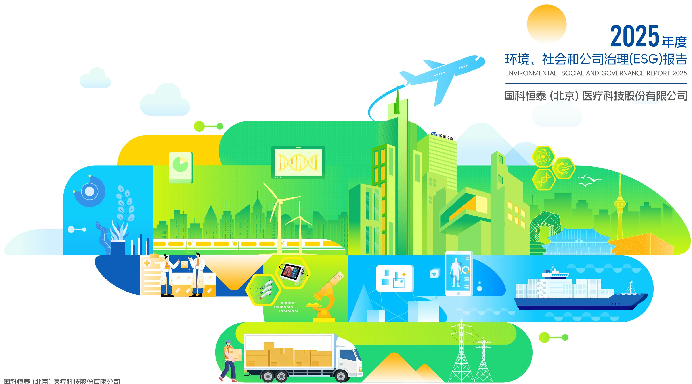

text_image

2025年度
环境、社会和公司治理(ESG)报告
ENVIRONMENTAL, SOCIAL AND GOVERNANCE REPORT 2025
国科恒泰（北京）医疗科技股份有限公司
国科恒泰（北京）医疗科技股份有限公司

## contents

## 目录

关于本报告 ��

董事长致辞 ��

���� 年可持续发展亮点 ��

走进国科恒泰 ��

可持续发展之路 ��

可持续管理体系 ��

可持续发展目标 ��

利益相关方沟通 ��

重要性议题管理 ��

## 01

## 治理为基护航稳健经营

坚持党建引领 ��

规范公司治理 ��

筑牢风控管理 ��

优化投关服务 ��

恪守商业道德 ��

## 03

## 绿色为径践行低碳承诺

应对气候变化 ��

环境合规管理 ��

统筹资源利用 ��

助力循环经济 ��

## 02

## 智链为擎重塑流通效能

提升服务质效 ��

促进科创研发 ��

产业平台赋能 ��

打造责任供应 ��

保障数据安全 ��

## 04

## 人本为怀延伸责任温度

员工权益保护 ��

构建成长体系 ��

守护职业健康 ��

践行社会公益 ��

未来展望 ��

附录 ｜ 索引表 ���

natural_image

Illustration of a city skyline with wind turbines and a blue autonomous delivery truck (no text or symbols)

## 关于本报告

本报告是国科恒泰（北京）医疗科技股份有限公司发布的第三份环境、社会和公司治理（简称“ESG”）报告。本报告依据客观、规范、透明和全面的原则，详细披露了国科恒泰2025年在环境、社会和治理方面的理念承诺和实践绩效。

## 报告范围

本报告以国科恒泰（北京）医疗科技股份有限公司为主体，包括所属分、子公司及直属机构，除特别说明外，本报告范围与本公司年报范围保持一致。

## 时间范围

报告的时间范围为：2025年1月1日至2025年12月31日（以下简称“报告期”或“本年度”）。为增强本报告的对比性和前瞻性，部分内容适当追溯以往年份或具有前瞻性描述。本报告的发布周期为一年一次，与财务年度保持一致。

## 报告影响时间范围

报告中的影响时间范围的短期、中期、长期分别定义为1年以内、1—5年、5年以上。

## 编制依据

深圳证券交易所《深圳证券交易所上市公司自律监管指引第17号——可持续发展报告（试行）》《创业板上市公司自律监管指南第3号——可持续发展报告编制》  
国务院国资委《央企控股上市公司ESG专项报告编制研究》  
中国企业改革与发展研究会《中国企业可持续发展报告指南（CASS—ESG 6.0）》  
联合国可持续发展目标（UN SDGs）  
全球报告倡议组织《GRI可持续发展报告标准（GRI Standards）》  
可持续发展会计准则委员会SASB准则

## 数据来源及可靠保障

报告使用数据来源包括公司实际运行的原始数据、政府部门公开数据、年度财务数据、内部相关统计报表、第三方问卷调查、第三方评价访谈等。本报告的财务数据以人民币为单位，若与财务报告不一致之处，以财务报告为准。

## 称谓说明

为了便于表述和阅读，本报告中“国科恒泰（北京）医疗科技股份有限公司”也以“国科恒泰”“公司”或“我们”表述。此外，报告中的“国家”“政府”为中华人民共和国及其行政机构。

<table><tr><td>公司简称</td><td>公司全称</td></tr><tr><td>国科恒泰、公司、我们</td><td>国科恒泰(北京)医疗科技股份有限公司</td></tr><tr><td>国科恒兴</td><td>国科恒兴(北京)医疗科技有限公司</td></tr><tr><td>国科恒瑞</td><td>国科恒瑞(北京)医疗科技有限公司</td></tr><tr><td>国科智合</td><td>国科智合(天津)医疗科技有限公司</td></tr><tr><td>湖北恒通</td><td>湖北国科恒通医疗科技有限公司</td></tr><tr><td>国科瑞泰</td><td>国科瑞泰(湖北)医疗科技有限公司</td></tr><tr><td>天津恒翔</td><td>国科恒翔(天津)医疗科技有限公司</td></tr><tr><td>国科恒优</td><td>河南国科恒优医疗科技有限公司</td></tr></table>

## 报告获取

您可以在深圳证券交易所（http://www.szse.cn）或国科恒泰（北京）医疗科技股份有限公司官方网站（http://www.gkht.com）浏览或下载本报告。

## 意见反馈

若您对本报告有任何意见或建议，欢迎通过以下方式与我们联系。

电 话：010-67867668

邮 箱：stock@gkht.com

## 董事长致辞

在全球经济格局深度调整、民生健康需求持续升级的背景下，国科恒泰始终秉承“专注服务与创新，开拓生命健康之路”的企业使命，将ESG理念全面融入公司治理与战略落地。2025年，是“十四五”规划圆满收官之年，也是“十五五”规划谋划之年，我们以专业赋能行业进步，以绿色引领发展转型，以责任回应社会期待，持续深化医疗科技成果转化模式创新，在服务国家战略和守护民生健康的征程中，奋力书写高质量发展的“国科恒泰答卷”。

77

## 这一年，我们强化合规治理，筑牢高质量发展根基。

我们坚持以党建为引领，持续开展党员红色教育；完善公司治理，构建完善的内部风险管控与合规管理体系，为公司的持续高质量发展提供坚实的法治保障；加强投资者沟通与交流，保障股东合法权益；恪守商业道德，落实反商业贿赂及反贪污管理，营造公平公正的市场环境，推动行业健康发展。

## 这一年，我们加大研发创新，激发平台化赋能活力。

我们持续加码创新领域投入，依托数智化服务产品打通产业链数据闭环，助力全链条提效降本，推动服务能级跃升。我们坚持供应链责任管理，强化产品全生命周期可追溯性，以卓越品质守护客户权益。我们搭建信息安全管理体系，全方位筑牢数据资产与客户隐私的安全防线。

## 这一年，我们践行节能减碳，树立绿色企业形象。

我们积极响应国家“双碳”政策，将应对气候变化纳入公司管理，通过推广低能耗设备、运用数字化手段优化办公与物流仓储运营流程、采用循环包装材料等务实举措，持续降低运营过程中的资源消耗与碳排放，以切实行动树立绿色企业形象。

## 这一年，我们完善员工福利，传递有温度的履责担当。

我们深化员工和谐劳动关系建设，优化招聘与福利体系，构建员工分层培养体系，畅通员工晋升通道，打造公平、包容、奋进的职场生态。我们履行社会责任，开展社会公益与员工志愿活动，以微光汇聚温暖，促进社会和谐发展。

展望未来，国科恒泰将继续秉持“用心服务，合作共赢”的核心价值观，以创新驱动发展，以责任诠释担当，通过构建产业协同生态，融通上下游资源，精准把握市场脉搏，突破技术瓶颈壁垒，致力于成为中国走在行业前沿的医疗器械数字化产业链综合服务商。

国科恒泰（北京）医疗科技股份有限公司 董事长

刘冰

## 2025年

## 可持续发展亮点

## 治理绩效

召开股东会

6次

股东会审议议案

21项

召开董事会

10次

董事会审议议案

43项

natural_image

Illustration of four business professionals in a meeting around a table, discussing documents and charts (no text or symbols present)

## 社会绩效

研发总投入

2,964.4万元

客户投诉解决率

100%

客户满意度

98分

员工总数

873人

少数民族员工

39人

残疾员工人数

5人

natural_image

Illustration of a medical professional in a clinic setting with patient and checklist items (no text or symbols)

## 经济绩效

营业收入

698,711.1万元

归属于上市公司股东的净利润

6,815万元

经营活动产生的现金流量净额

67,830.7万元

natural_image

Illustration of two people interacting with a large screen displaying charts and graphs, surrounded by abstract background elements (no text or symbols)

## 环境绩效

温室气体排放强度

0.00439

吨二氧化碳当量/万元营收

能源消耗强度

0.00128

吨标准煤/万元营收

natural_image

Illustration of an electric vehicle charging at a city with wind turbines and solar panels in the background (no text or symbols)

natural_image

Illustration of a cargo ship loaded with shipping containers sailing in water, with seagulls flying overhead (no text or symbols)

natural_image

Illustration of green urban landscape with city skyline, transportation trucks, and people running on a sports field (no text or symbols)

## 走进国科恒泰

## 公司概况

国科恒泰（北京）医疗科技股份有限公司（简称“国科恒泰”，股票代码：301370.SZ）成立于2013年2月，注册资本为4.7060亿元人民币，是中国科学院控股有限公司控股的东方科仪控股成员企业。国科恒泰结合医院发展需求，聚焦整体服务，与众多国内外医疗器械领域的一线品牌供应商合作，融合创新经营模式，一直致力于成为走在行业前沿的中国医疗器械数字化产业链综合服务商。

历经十余年发展，公司在全国31个省、市、自治区建立了103个物流分仓，其中9个分仓可以开展第三方仓储物流业务，形成了2小时送达全国80%以上三级医院的双向物流服务能力。公司与众多国内外知名医用耗材生产厂商建立并保持了长期、稳定的合作关系，业务覆盖高值、低值、IVD、医疗设备等医疗器械全领域产品。

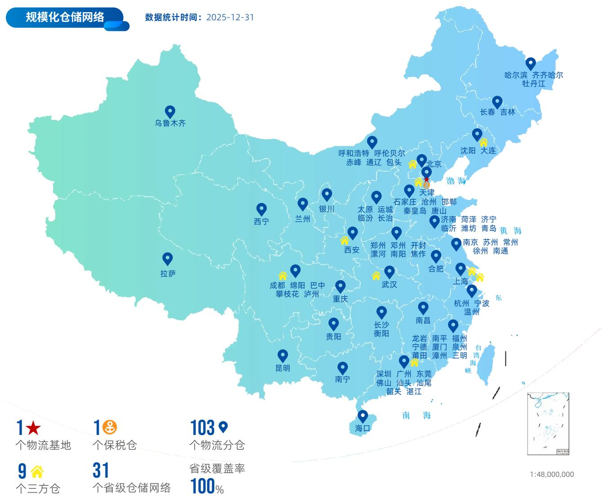

geo

| Category | Count |
| --- | --- |
| 1 Star (Stacked) | 1 |
| 1 Circle (Single) | 1 |
| 103 Circles (Single) | 103 |
| 9 Houses (Three) | 9 |
| 31 Houses (Single) | 31 |
| 100% (Single) | 100% |

## 主要服务

国科恒泰经过10余年的发展，依托“强资金、强运营”的优势，实现了一件产品从出厂到手术室的一站式全链条供应链综合服务，全面提升了产业链的效率，精准响应了国家对医用耗材管理提出的明确导向和要求。

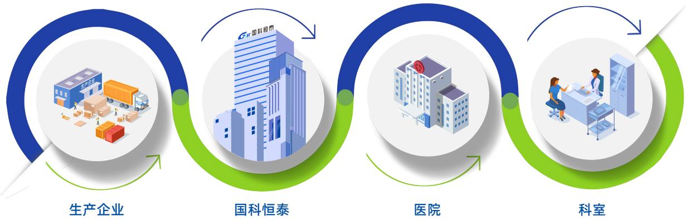

flowchart

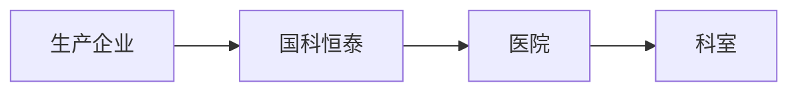
```mermaid
graph LR
  A["生产企业"] --> B["国科恒泰"]
  B --> C["医院"]
  C --> D["科室"]
```

## 供应链管理服务

## 做渠道供应链管理的 “全能管家”

“一站式供应链综合服务”  
渠道经销商管理服务  
渠道服务商管理服务  
渠道价值链赋能服务  
精准运营管家式服务

## 医院管理服务

## 做医院供应链管理的 “智慧管家”

集中采购服务（GPO）  
集中配送服务  
SPD 院内物流服务  
医院精细化管理服务

## 信息管理服务

## 做全领域全场景供应链 管理的“信息管家”

政府监管信息平台服务  
供应链管理信息平台服务  
渠道管理信息平台服务  
医疗器械电商平台管理服务  
数字化决策和分析展现平台服务

## 产品介绍

国科恒泰主营医疗器械产品的分销与直销业务，以高值医用耗材领域为切入点，逐渐向高值医用耗材、低值医用耗材、医疗设备、体外诊断的医疗器械全细分领域市场拓展。

<table><tr><td>大类</td><td>类别</td></tr><tr><td rowspan="4">血管介入治疗类材料</td><td>冠脉介入治疗材料</td></tr><tr><td>外周血管介入</td></tr><tr><td>脑血管介入</td></tr><tr><td>心脏介入</td></tr><tr><td>骨科材料</td><td>骨科材料</td></tr><tr><td>非血管介入治疗类材料</td><td>消化介入材料</td></tr></table>

企业文化  
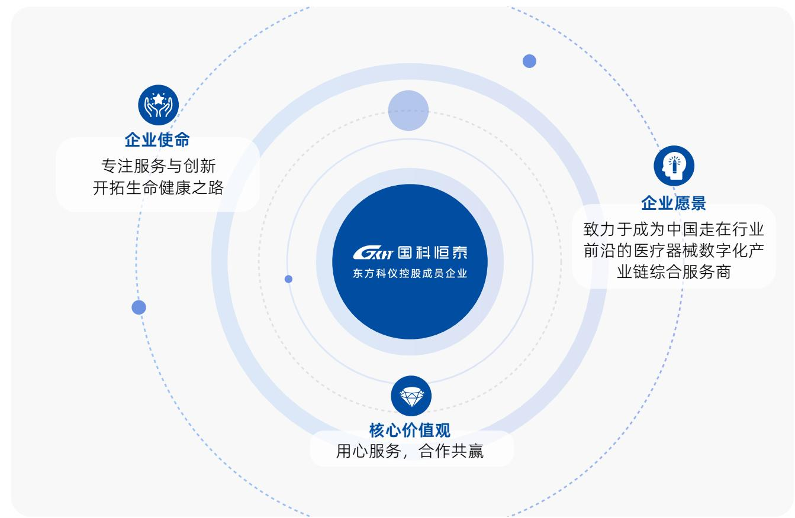

flowchart

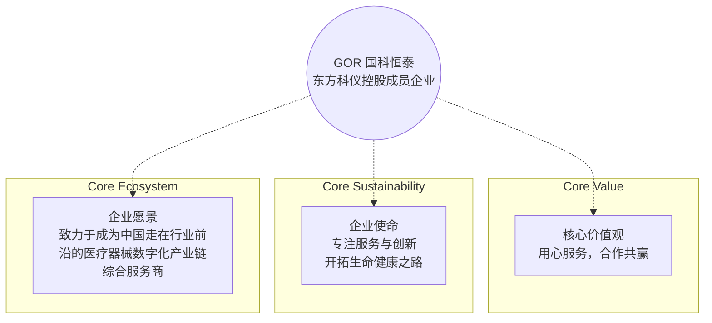
```mermaid
graph TD
  Center(("GOR 国科恒泰\n东方科仪控股成员企业"))
  
  subgraph Core Value
    A["核心价值观\n用心服务，合作共赢"]
  end
  
  subgraph Core Sustainability
    B["企业使命\n专注服务与创新\n开拓生命健康之路"]
  end
  
  subgraph Core Ecosystem
    C["企业愿景\n致力于成为中国走在行业前沿的医疗器械数字化产业链综合服务商"]
  end
  
  Center -.-> A
  Center -.-> B
  Center -.-> C
```

发展历程

2014年

与微创骨科合作关节业务与法国LDR、迈迪顶峰、美精技、海斯凯尔、施乐辉等生产企业签约合作

2016 年

开展口腔类业务

natural_image

Illustration of a dental professional attending to a patient in a clinical setting with surgical equipment (no text or symbols visible)

2013年

公司成立，正式进入高值耗材流通领域  
与波士顿科学开启全线合作  
成立首年即实现盈利并通过ISO 9001及ISO 13485认证

2015年

与美敦力合作开展业务，标志公司骨科元年来临  
正式开始全国仓储一体化布局，开展大外科业务

2017年

获得美敦力独家代理  
成立第一家院端合资子公司，开展院端业务

2024年

天津项目获得保税仓资质  
全资子公司国科恒兴获得北京市“专精特新”中小企业证书

2025年

第三方生成制造（CDMO）共享服务平台初见成果荣获“首批WB/T1142-2024《医院院内物流服务规范》行业标准试点企业”  
全资子公司国科恒翔保税仓首批货物成功入仓首个仓储自动化项目竣工运行

2023年

国科恒泰（股票代码：301370.SZ）在深交所挂牌上市，成功登陆创业板  
è 天津医疗器械数字化生产及供应链综合服务平台项目正式落成

2021年

首个自主研发的“天津医疗器械数字化生产及供应链综合服务平台项目” 正式落成，投资6.8亿元

natural_image

Illustration of two men in suits exchanging a large blue gong (no text or symbols present)

2022年

与施乐辉、维力、安保达成合作  
持续拓展低值耗材领域业务

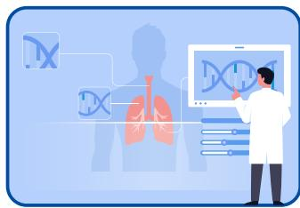

natural_image

Illustration of a medical professional examining lung and DNA sequencing data, with no visible text or symbols on the diagram itself.

2018年

全面开展医院集采集配业务

2019年

引入泰康人寿、招商局资本等医疗领域头部投资机构

2020年

开展IVD领域供应链服务成功通过CMMI 3级认证

组织架构  
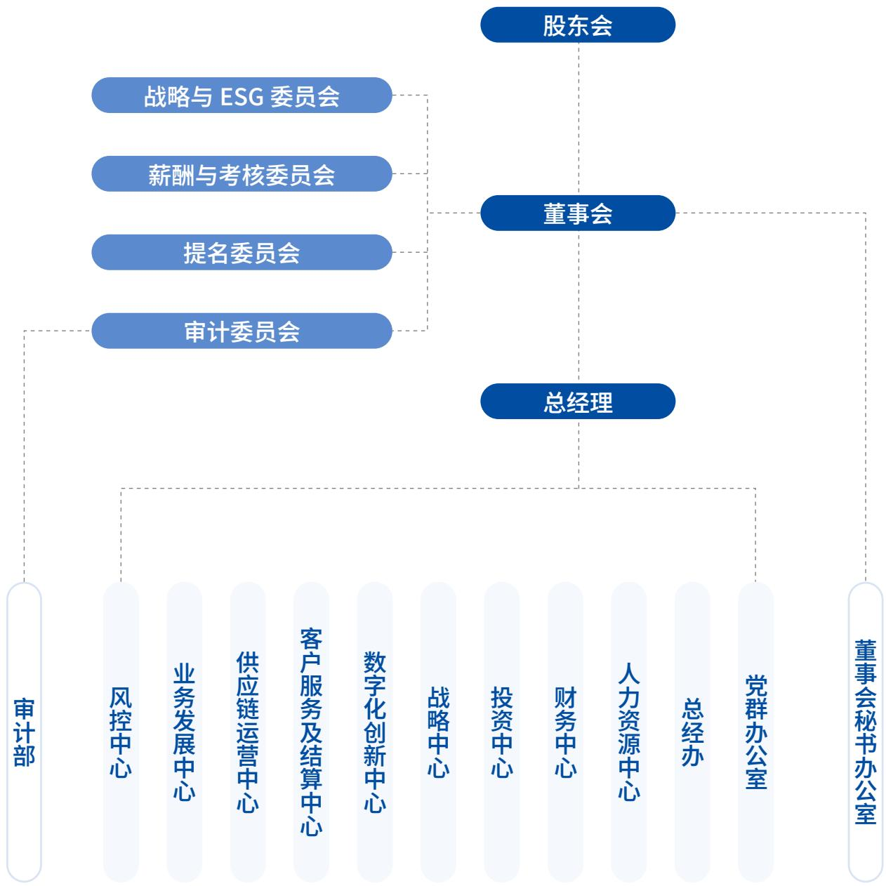

flowchart

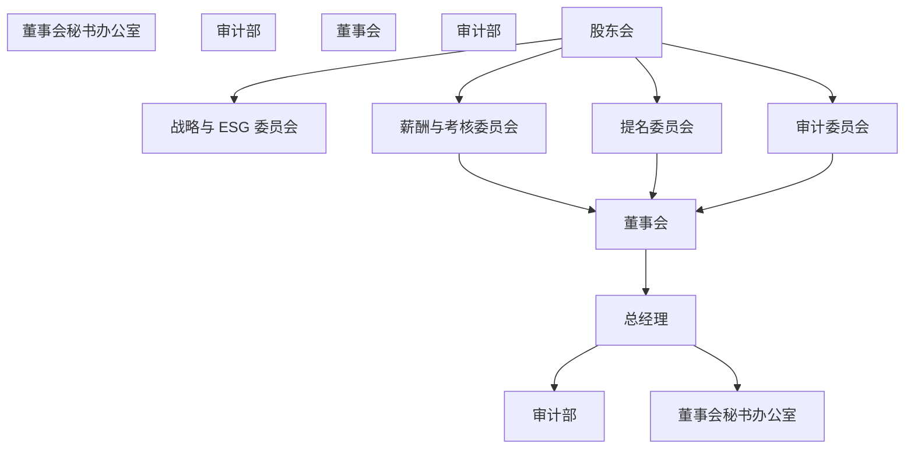
```mermaid
graph TD
  A["股东会"] --> B["战略与 ESG 委员会"]
  A --> C["薪酬与考核委员会"]
  A --> D["提名委员会"]
  A --> E["审计委员会"]
  C --> F["董事会"]
  D --> F
  E --> F
  F --> G["总经理"]
  G --> H["审计部"]
  G --> I["董事会秘书办公室"]
  
  subgraph AuditDept ["审计部"]
    direction TB
    direction LR
    direction LR
    direction LR
    direction LR
    direction LR
    direction LR
    direction LR
    direction LR
    direction LR
    direction LR
    direction LR
    direction LR
    direction LR
    direction LR
    direction LR
  end
  
  subgraph Board["董事会"]
    direction TB
    direction LR
    direction LR
    direction LR
    direction LR
  end
  
  subgraph AdministrativeDept ["审计部"]
    direction LR
    direction LR
    direction LR
    direction LR
    direction LR
  end
  
  subgraph Departments ["董事会秘书办公室"]
    direction LR
    direction LR
    direction LR
    direction LR
  end
```

行业协会

<table><tr><td>组织名称</td><td>担任职务</td></tr><tr><td>中国物流与采购联合会医疗器械供应链分会</td><td>副会长</td></tr><tr><td>中国医疗器械行业协会</td><td>会员</td></tr><tr><td>中国医药物资协会</td><td>会员</td></tr></table>

## 2025年企业荣誉

Wind ESG

国科恒泰

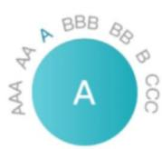

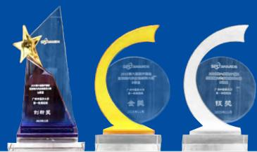

text_image

中国平安保险股份有限公司
中国平安保险股份有限公司
金圆
银英

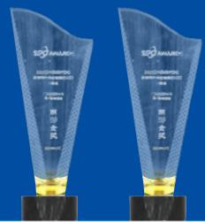

Wind（万得）

Wind（万得）ESG评级跃升至A级

中国物流与采购联合会医疗器械供应链分会

国科恒泰SPD项目荣获

“2025第六届医疗器械医院院内供应链案例大赛”

全国总决赛金奖、银奖等五项殊荣

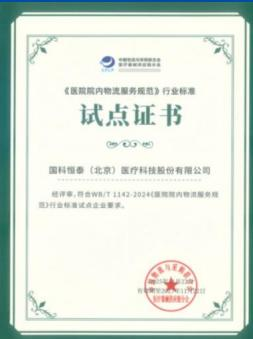

text_image

中国医学科学院
《医院院内物流服务规范》行业标准
试点证书
国科恒泰（北京）医疗科技股份有限公司
经评审，符合WB/T 1142-2024《医院院内物流服务规
范》行业标准试点企业要求。
有效期至2024年6月1日止
许可证编号：1000000000000000000000000000000000000000000000000000000000000000000000000

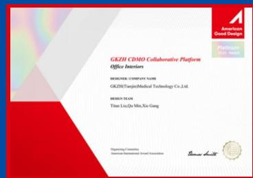

text_image

GKZH CDMO Collaborative Platform
Office Interiors
DESIGNER- COMPANY NAME
GKZH/TianjinMedical Technology Co.,Ltd.
DESIGN YEAR
Titan Liu, Qiu Min, Xiao Gang
Organizing Committee
American International Award Association
Bosseu Kullit

中国物流与采购联合会医疗器械供应链分会

首批WB/T1142-2024《医院院内物流服务规范》行业标准试点企业

美国国际奖项协会

（American International Award Association）

子公司国科智合的CDMO共享服务平台荣获美国好设计奖（American Good Design Award）最高奖项铂金奖

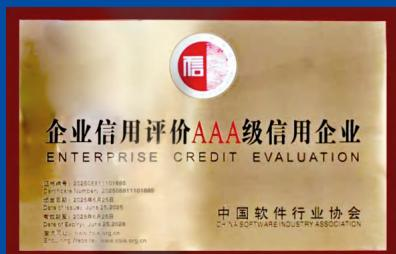

text_image

企业信用评价AAA级信用企业
ENTERPRISE CREDIT EVALUATION
中国软件行业协会
CHINA SOFTWARE INDUSTRY ASSOCIATION

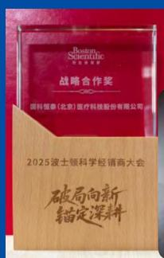

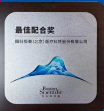

中国软件协会

子公司国科恒兴获得中国软件协会3A信用评级

2025年波士顿科学全国经销商大会及分会

在“波士顿科学2025年全国经销商大会及分会”上连获“战略合作奖”和“最佳配合奖”两项殊荣

## 可持续发展之路

本章所响应的SDGs

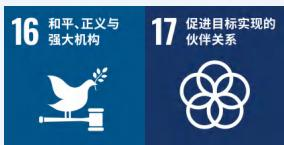

本章所涉及的ESG重要议题 利益相关方沟通 可持续发展治理

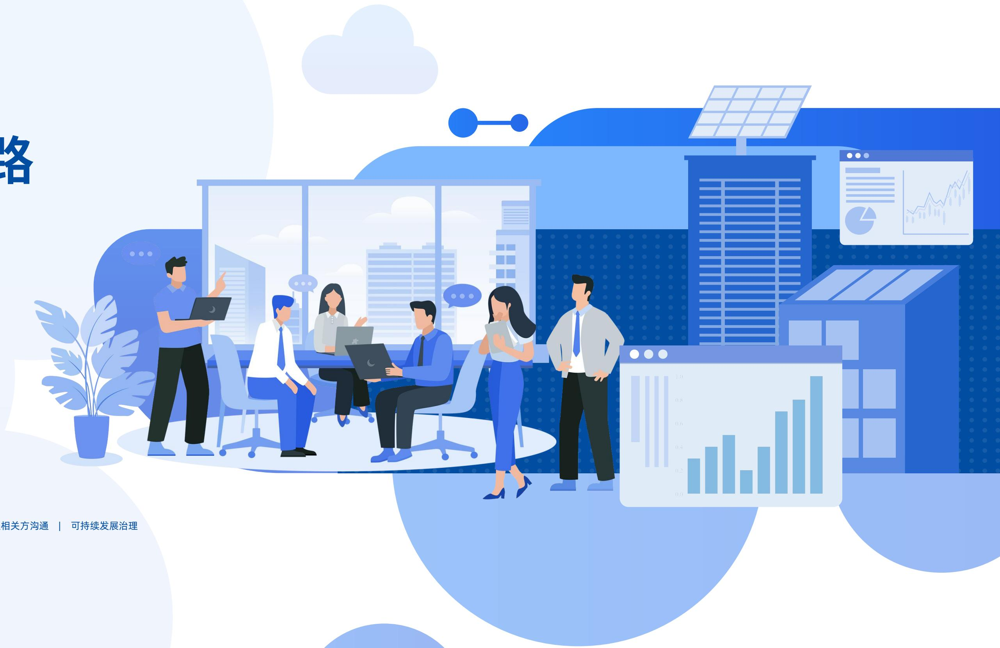

text_image

格
相关方沟通 | 可持续发展治理

## 可持续管理体系

## 可持续管理架构

公司已构建起权责清晰、上下联动的ESG治理架构，将可持续发展深度融入公司治理与日常运营。

## 最高决策与监督层

董事会是公司ESG治理的最高决策与监督机构。本年度，公司将董事会下设的“战略委员会”更名为“战略与ESG委员会”，制定并发布《董事会战略与ESG委员会实施细则》。该委员会由3名董事组成，专责对公司的可持续发展制度、战略目标、管理体系、风险机遇及公开报告等重大事项进行研究、审议与监督，确保ESG工作与公司整体战略同步推进。

## 协调与执行层

战略与ESG委员会下设工作小组，负责做好委员会决策的前期准备工作；各职能部门和各分子公司作为ESG工作的重要执行组成，依据自身职责划分，承担将ESG目标转化为具体行动与运营实践的主体责任，确保ESG理念在业务一线得到有效落实。

国科恒泰ESG治理架构  

flowchart

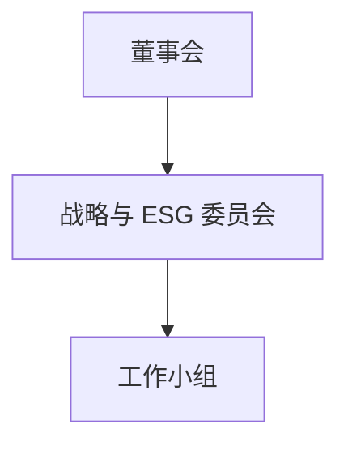
```mermaid
graph TD
  A["董事会"] --> B["战略与 ESG 委员会"]
  B --> C["工作小组"]
```

## 可持续管理方针

公司董事会致力于建立全面参与的ESG治理长效机制和工作体系，持续关注ESG合规要求、发展趋势及同行表现，结合公司战略发展和利益相关方关注重点，讨论并确定公司在ESG方面的风险和机遇，明确公司ESG管理工作重点，并于必要时更新管理方针及策略，确保ESG相关工作与时俱进。

## 可持续能力建设

公司定期面向中高层管理人员和核心骨干员工开展ESG专项培训，旨在强化履行身为国有企业的社会责任，增强应对复杂挑战的能力，并精准把握可持续发展过程中的战略机遇。

## 案例

## ESG 培训

2025年12月4日，为系统构建公司ESG管理体系、提升员工ESG理念认知与实践能力，公司邀请ESG领域专家进行培训授课，全面讲解了ESG核心理念、国内外政策与监管趋势，深入剖析了医疗器械行业ESG发展的关键要求，并围绕环境、社会与治理三大维度，系统梳理了公司各业务环节的ESG管理提升要点。此次培训有效提升了全员对ESG的理解共识与实操认知，为后续开展ESG管理、绩效提升与高质量信息披露奠定了坚实基础。

2025年12月19日，公司为提升管理层对可持续发展治理的理解与履职能力，在董事、高管及相关人员合规培训中专门设置了ESG相关内容，增强了管理层对ESG责任内涵的认识及合规实践能力。

## 可持续发展目标

公司始终以“专注服务与创新，开拓生命健康之路”为使命，将可持续发展理念融入自身战略规划与经营实践全过程。公司着手构建覆盖环境、社会与治理的全面可持续发展责任体系，通过推动绿色运输和仓储实现低碳转型，借助数智化赋能打造负责任供应链，依托人文关怀保障员工权益，全力为社会贡献更环保、更智慧、更可信赖的“国科恒泰价值”。

<table><tr><td>响应的SDGs</td><td>我们的行动</td></tr><tr><td>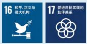</td><td>可持续管理体系 | 利益相关方沟通重要性议题管理</td></tr><tr><td>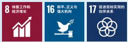</td><td>坚持党建引领 | 规范公司治理 | 筑牢风控管理优化投关服务 | 恪守商业道德</td></tr><tr><td>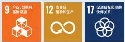</td><td>提升服务质效 | 促进科创研发 | 产业平台赋能打造责任供应 | 保障数据安全</td></tr><tr><td>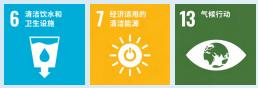</td><td>应对气候变化 | 环境合规管理 | 统筹资源利用助力循环经济</td></tr><tr><td>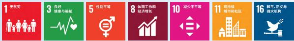</td><td>员工权益保护 | 构建成长体系 | 守护职业健康践行社会公益</td></tr></table>

## 利益相关方沟通

公司高度重视各利益相关方的意见和建议，定期通过多种渠道与股东、客户、员工、供应商及社会各界，保持密切联系与深入交流，了解他们对公司可持续发展的期望和建议，确保公司发展符合可持续发展的长远目标，携手各利益相关方共创美好未来。

<table><tr><td>利益相关方</td><td>期望与诉求</td><td>沟通与回应方式</td></tr><tr><td>员工</td><td>多元化与平等民主管理公平薪酬福利体系员工职业发展职业健康安全</td><td>保障员工权益倡导民主管理加强员工沟通开展员工培训保护员工健康</td></tr><tr><td>客户</td><td>产品质量保障优质服务客户权益保障信息与隐私安全</td><td>保障产品质量持续创新研发投诉应对处理满意度调查保护客户隐私</td></tr><tr><td>政府/监察机构</td><td>依法足额纳税诚信合规经营节能减排安全生产</td><td>遵守法律法规响应政府政策依法缴纳税收遵守商业道德</td></tr><tr><td>股东/投资者</td><td>稳健公司治理股东回报防范经营风险投资者保护公开透明信息披露</td><td>完善治理体系利润分配风险管理投资者沟通交流及时信息披露</td></tr><tr><td>供应商</td><td>良好合作关系协同发展阳光采购</td><td>依法履约协同发展廉洁采购</td></tr><tr><td>公益组织/社区组织</td><td>支持社区建设社会公益关注弱势群体</td><td>社会公益</td></tr><tr><td>行业协会/科研机构</td><td>公平竞争友好交流行业进步协同发展</td><td>参与行业活动助力行业发展</td></tr></table>

## 重要性议题管理

公司遵循《深圳证券交易所上市公司自律监管指引第17号—可持续发展报告（试行）》要求，同时参考《GRI3：重大主题》《欧洲可持续报告准则》（ESRS）《国际财务报告可持续披露准则第1号—可持续相关财务信息披露一般要求》（IFRS S1）等国际披露标准，从影响重要性和财务重要性两方面入手，识别和评估本年度具有双重重要性的ESG议题，对重点议题在报告中重点回应。

## 了解公司所处的可持续发展背景

通过分析公司所处产业价值链环节，将可持续发展责任理念与自身发展战略、经营特点相结合，从监管政策、市场关注、行业趋势等维度了解公司所处的可持续发展背景，识别受公司经营活动所影响的各类内外部利益相关方。

## 建立ESG议题库

结合公司实际业务特征，同时参考同业实践趋势，对可持续发展议题进行初步识别和筛选，分析各项议题所面临的潜在影响、风险和机遇。本年度，公司共识别出20项ESG议题，其中包括7项环境议题、9项社会议题、4项治理议题。

## 双重重要性评估

通过问卷调研的方式与各类内外部利益相关方进行沟通，从“影响的严重程度”（包括：影响规模、范围、不可补救性）和“影响的可能性”两个维度进行评估，形成影响重要性评估结果。

财务重要性评估：通过问卷调研的方式与公司管理层及财务相关人员进行沟通，从“影响发生的可能性”和“财务影响的程度”两个维度进行评估，并参考内外部专家意见，形成财务重要性评估结果。

## 重要性评估结果

基于上述问卷调研结果，对各项议题的影响重要性评估得分和财务重要性评估得分进行整合计算，形成ESG双重重要性议题矩阵。

经过上述评估，公司共识别出4项对公司同时具有双重重要性的议题，分别是：产品和服务安全与质量、创新驱动、供应链安全、数据安全与客户隐私保护。依据该评估结果，公司将进一步在风险管理流程中纳入对上述议题的考量，建立重大ESG风险监控与应对机制，并将相关信息纳入决策与治理流程，确保风险管理的全面性与前瞻性。

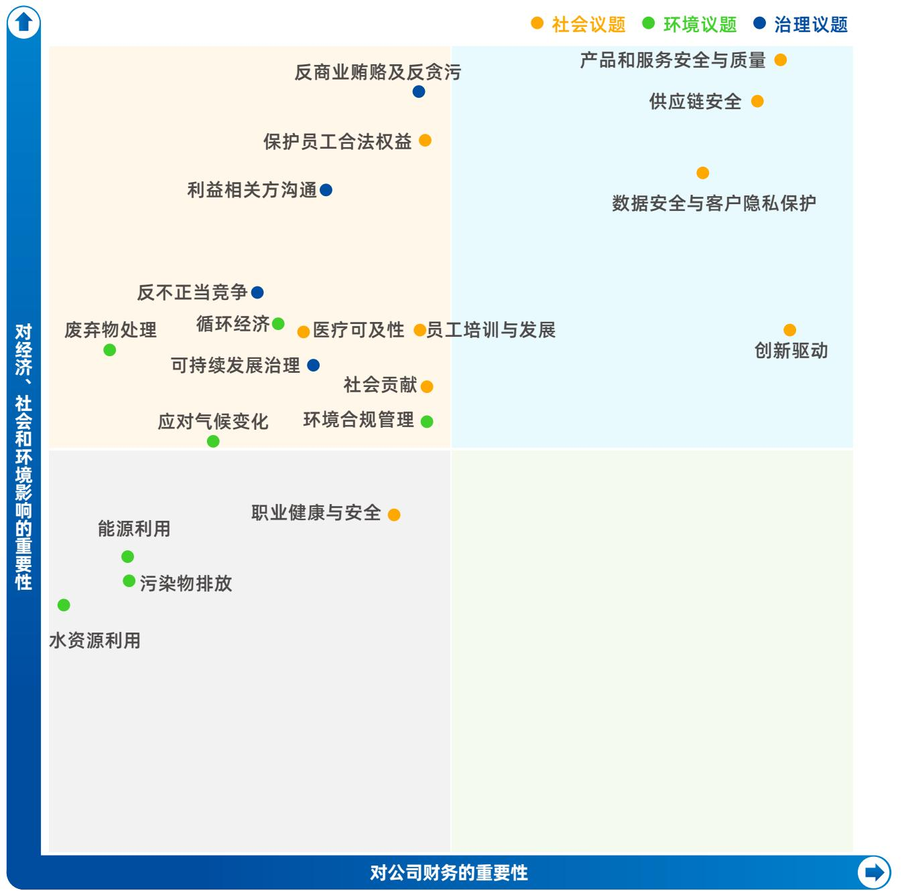

scatter

| Topic | Category | Importance to Company Finance (X-axis) | Importance to Economy, Society, Environment (Y-axis) |
| :--- | :--- | :--- | :--- |
| 产品和服务安全与质量 | 社会议题 | High | High |
| 供应链安全 | 社会议题 | High | High |
| 数据安全与客户隐私保护 | 社会议题 | High | High |
| 创新驱动 | 社会议题 | High | Medium |
| 反商业贿赂及反贪污 | 治理议题 | Medium-High | High |
| 保护员工合法权益 | 社会议题 | Medium-High | High |
| 利益相关方沟通 | 治理议题 | Medium-High | High |
| 反不正当竞争 | 治理议题 | Medium-High | Medium |
| 废弃物处理 | 环境议题 | Low-Medium | Medium |
| 循环经济 | 环境议题 | Medium-Low | Medium |
| 医疗可及性 | 社会议题 | Medium-Low | Medium |
| 员工培训与发展 | 社会议题 | Medium-Low | Medium |
| 可持续发展治理 | 治理议题 | Medium-Low | Medium |
| 社会贡献 | 社会议题 | Medium-Low | Medium |
| 应对气候变化 | 环境议题 | Low-Medium | Medium |
| 环境合规管理 | 环境议题 | Medium-Low | Medium |
| 职业健康与安全 | 社会议题 | Low-Medium | Low-Medium |
| 能源利用 | 环境议题 | Low-Medium | Low-Medium |
| 污染物排放 | 环境议题 | Low-Medium | Low-Medium |
| 水资源利用 | 环境议题 | Low-Medium | Low-Medium |

仅具有影响重要性

财务重要性和影响重要性较低

同时具有财务重要性和影响重要性

仅具有财务重要性

<table><tr><td rowspan="2">双重重要性</td><td>社会议题</td><td>产品和服务安全与质量、创新驱动、供应链安全、数据安全与客户</td></tr><tr><td colspan="2">隐私保护</td></tr><tr><td rowspan="3">仅影响重要性</td><td>环境议题</td><td>循环经济、环境合规管理、废弃物处理、应对气候变化</td></tr><tr><td>社会议题</td><td>保护员工合法权益、员工培训与发展、社会贡献、医疗可及性</td></tr><tr><td>治理议题</td><td>利益相关方沟通、反商业贿赂及反贪污、反不正当竞争、可持续发展治理</td></tr><tr><td rowspan="2">相关</td><td>环境议题</td><td>能源利用、污染物排放、水资源利用</td></tr><tr><td>社会议题</td><td>职业健康与安全</td></tr></table>

natural_image

Illustration of two people discussing a large digital dashboard with charts and graphs, no text or symbols present.

## 01 治理为基 护航稳健经营

## 2025年重要成果

股东会召开6次

股东会通过审议事项21项

董事会召开10次

董事会通过审议事项43项

## 本章所响应的SDGs

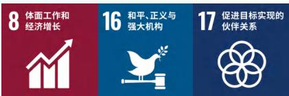

本章所涉及的ESG重要议题

反商业贿赂及反贪污

反不正当竞争

natural_image

Illustration of two business professionals in a meeting, one presenting data on a presentation board (no text or symbols visible)

natural_image

Illustration of business professionals in a modern office setting with city skyline and digital displays (no text or symbols)

## 坚持党建引领

国科恒泰深入贯彻党的二十大及历次全会、中央经济工作会议精神，落实习近平总书记关于党的建设的重要思想，巩固主题教育成果，加强党对国企的全面领导，将党的政治优势转化为发展动能，为科技服务、成果转化和高质量发展提供政治保证。

## 组织建设

公司坚持党的全面领导，将党建工作写入公司章程，遵循并落实《东方科仪控股集团有限公司关于独立法人企业党支部（党总支）有效融入公司治理的指导意见》，相继制定《“三重一大”决策制度实施办法》《党支部前置审议事项清单》等系列规章制度，厘清党支部在企业治理结构中发挥作用的方式和权责边界，加强党员和党务干部队伍建设。

国科恒泰党支部委员会组织架构  
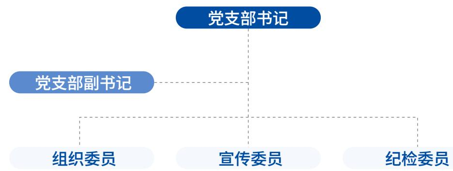

flowchart

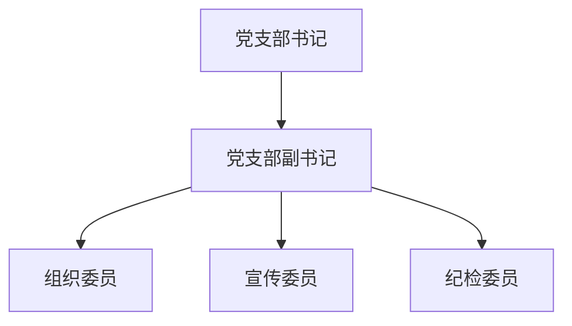
```mermaid
graph TD
  A["党支部书记"] --> B["党支部副书记"]
  B --> C["组织委员"]
  B --> D["宣传委员"]
  B --> E["纪检委员"]
```

## ����年关键绩效

党支部

1 个

召开支委会

24 次

党员

29

## 廉政建设

公司深入学习贯彻二十届中央纪委四次全会精神，推动全面从严治党责任落实到底到边，加强了对重点领域、重点岗位、关键环节的监督；同时，公司按照党中央统一部署和上级党组织工作要求，于2025年4月至7月组织开展深入贯彻中央八项规定精神学习教育，坚持学用贯通、知行合一，推动作风建设常态化长效化。

## ����年关键绩效

签订《廉政建设责任书》

88份

## 抓实日常学习

以“三会一课”形式就习近平总书记关于加强党的作风建设的重要论述、中央八项规定及其实施细则精神，共组织集体学习14次。

## 强化警示教育与典型引领相结合

参观廉政教育基地1次、学习《百位著名科学家作风学风故事》2次、学习违反中央八项规定精神典型问题通报2次并组织相关人员参加各级党委警示教育会近30人次。

## 注重学用结合与效果检验

组织开展“学精神、强作风、促攻坚”大讨论1次及完成上级组织的深入贯彻中央八项规定精神学习教育线上知识自测33人次。

## 规范公司治理

国科恒泰持续完善公司治理体系、通过推进股东会与董事会合规运作、做好董事及高管薪酬管理等途径，持续激发内部治理效能，提升决策的科学性与规范性，为自身的长期稳健发展提供了坚实保障。

## 治理架构

公司始终严格遵循《中华人民共和国公司法》（以下简称“公司法”）《中华人民共和国证券法》《上市公司治理准则》《深圳证券交易所创业板股票上市规则》等法律法规，制定了《公司章程》《股东会议事规则》《董事会议事规则》等一系列规章制度，为公司经营活动的有效开展提供全面保障。

本年度，为实现公司的科学规范管理，根据新《公司法》规定，公司不再设置监事会，由董事会审计委员会行使《公司法》中规定的监事会职权。基于上述规章制度要求，公司建立起由“股东会、董事会、高级管理层”组成的“两会一层”治理架构，依法合规推动各治理层级履行职责。

报告期内，公司股东会及董事会运作规范有序，各治理机构权责清晰、独立性得到有效保障，人员构成合理，会议的召集和召开程序、参会人员资格及表决程序均符合相关法律法规及规范性文件的要求，为公司经营决策的科学性与稳定性提供了坚实保障。

## 股东会

股东会是公司权力机构。公司严格按照《公司章程》《股东会议事规则》等相关规定召开股东会，确保召开流程合法合规，保障全体股东特别是中小股东享有平等地位，充分行使知情权、投票权等各项权利。

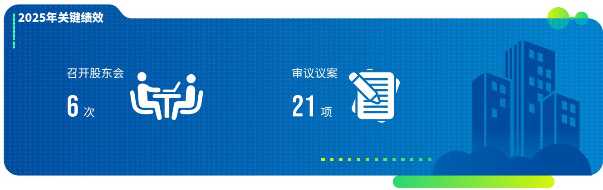

text_image

2025年关键绩效
召开股东会
6次
审议议案
21项

## 董事会

## 董事会运作

董事会是公司治理决策核心机构，对股东会直接负责。全体董事诚信、专业、勤勉、尽责，严格按照《公司章程》及《董事会议事规则》等相关规定执行股东会决议并向股东会报告工作，对战略管理、风险管理和内部控制管理等重要事项进行决策，确保董事会运作合规、高效。

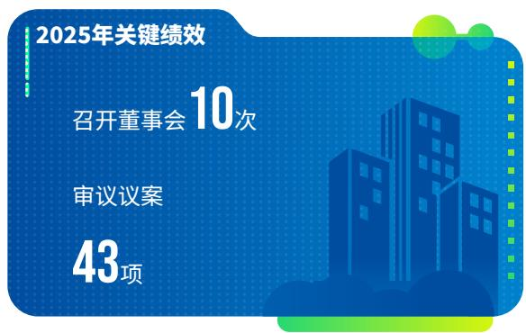

text_image

2025年关键绩效
召开董事会 10次
审议议案
43项

公司董事会下设审计委员会、战略与ESG委员会、提名委员会、薪酬与考核委员会四个专门委员会，每个委员会均由3名董事构成，且包含1-2名独立董事，为加强公司治理能力、提升决策效率提供保障。

<table><tr><td>专门委员会名称</td><td>独立董事</td><td>非独立董事</td><td>独董占比</td><td>报告期内运作情况/召开会议次数</td></tr><tr><td>战略与ESG委员会</td><td>1人</td><td>2人</td><td>1/3</td><td>3次</td></tr><tr><td>提名委员会</td><td>2人</td><td>1人</td><td>2/3</td><td>2次</td></tr><tr><td>薪酬与考核委员会</td><td>2人</td><td>1人</td><td>2/3</td><td>3次</td></tr><tr><td>审计委员会</td><td>2人</td><td>1人</td><td>2/3</td><td>10次</td></tr></table>

## 董事会独立性与多元化

公司制定《独立董事工作制度》，为独立董事提供必要的、有效行使其职权的工作条件。截至报告期末，公司董事会设有9名董事，3名独立董事，独立董事人数占比三分之一，符合《上市公司独立董事管理办法》所要求的独立性，确保独立董事能够客观、公正地履行职责。

公司董事会坚持专业化和多元化原则，充分考虑自身业务发展需要，选聘专业能力强、品行及声誉良好、管理经验丰富的董事参与公司治理决策。公司董事具有法律、经济、财务或其他有利于履行董事职责的工作经历，充分了解本行公司治理结构、公司章程和董事会职责。本年度，全体董事诚信、勤勉、专业、高效地履行职责，不存在违反职业道德准则规定的禁止性行为。截至报告期末，公司董事按性别、年龄、专业背景、学历划分情况如下：

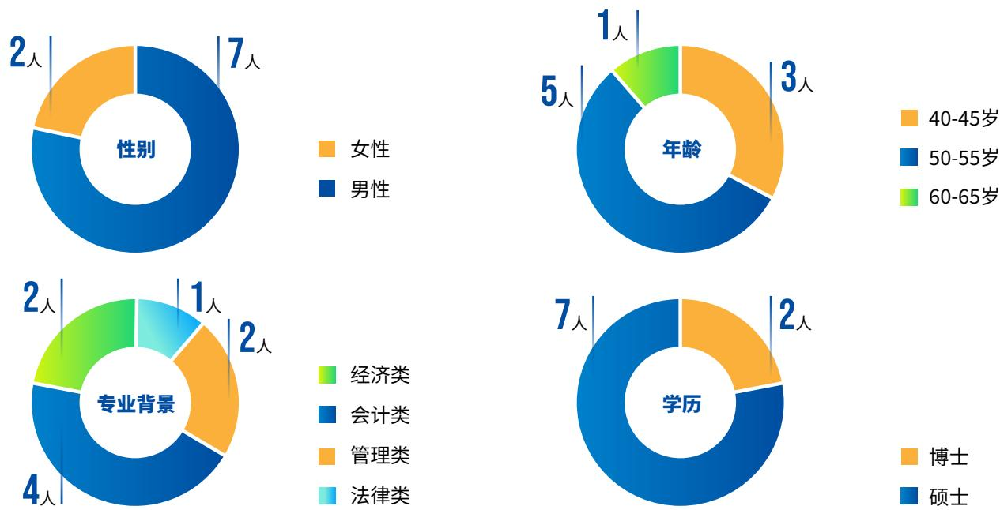

donut

| Category | Value |
| --- | --- |
| 性别::男性 | 7人 |
| 性别::女性 | 2人 |
| 年龄::50-55岁 | 5人 |
| 年龄::40-45岁 | 3人 |
| 年龄::60-65岁 | 1人 |
| 专业背景::会计类 | 4人 |
| 专业背景::管理类 | 2人 |
| 专业背景::经济类 | 2人 |
| 学历::硕士 | 7人 |
| 学历::博士 | 2人 |

## 董事及高管薪酬管理

公司依据《国科恒泰（北京）医疗科技股份有限公司企业负责人薪酬管理办法》，遵循“公平原则，责、权、利统一原则，长远发展原则，激励约束并重原则”，建立激励与约束机制，充分激发并调动公司董事及高级管理人员的工作积极性，提高公司的经营管理效益。

同时，公司根据有关法律法规及上级文件精神，制定《企业负责人经营业绩考核管理办法》，在考核导向中提出要“不断提升协调发展和可持续发展能力”，同时“鼓励企业积极承担社会责任”，旨在引导企业负责人在追求经营绩效的同时，注重自身发展的可持续性与稳健性。

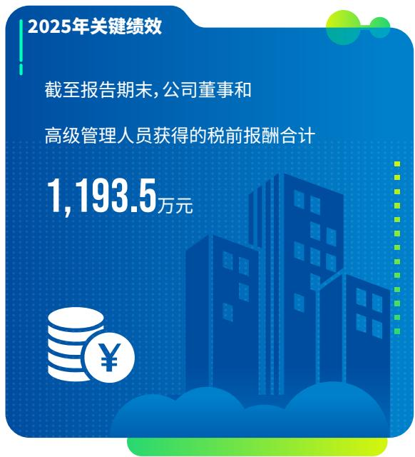

text_image

2025年关键绩效
截至报告期末,公司董事和
高级管理人员获得的税前报酬合计
1,193.5万元

## 筑牢风控管理

国科恒泰高度重视风险合规管理，持续健全风险管理体系，全面强化内部控制建设，不断夯实合规运营根基，通过系统性筑牢风险防线，切实保障公司行稳致远。

## 风险管理

## 风险管理架构

公司根据《中华人民共和国民法典》《中央企业全面风险管理指引》《上市公司治理准则》等法律法规和监管规定，制定《全面风险管理制度》《全面风险管理操作规范》等制度，搭建风险管理“三道防线”，明确各部门在风险管理中的职责分工，建立起多层次、相互衔接、有效制衡的运行机制，为全面风险管理工作的有效开展提供坚实保障。

natural_image

Illustration of modern blue skyscrapers with green clouds in the foreground (no text or symbols)

## 风险管理“三道防线”及主要职责

## 第一道防线 风险实际发生的各业务和职能部门，对风险管理承担直接责任

确定风险管理要求及具体目标；  
制定风险管理的制度流程标准并组织执行；  
收集风险管理的初始信息，识别本部门（单位）的各类风险，维护并更新本部门（单位）风险清单、风险数据库；  
对经营过程中发现的问题与风险事件及时纠正与改进；  
根据二道防线部门和审计部的安排与指导，识别、评估和应对风险；  
● 监督相关制度和流程的执行情况，保证各项管理措施对企业经营目标的有效支撑。

## 第二道防线 具有风险管理职能的各监管部门

制定风险监管的制度、流程、机制及管理红线；  
制定风险管理看板，通过看板提高风险管理的标准化程度；  
● 管理和监督一道防线执行有效的风险管理措施；  
● 及时纠正违规及相关缺陷，对于重大风险建立升级应对机制标准，形成标准化应对方案并组织实施。

## 第三道防线 内部审计部门

独立评估一道、二道防线风险管理的有效性并提出整改建议；  
通过事后审计调查对风险管理的情况进行评估并提出整改意见。

## 风险管理流程

为完善风险管理成效、提高风险管理能力，公司通过制定《风险上报及处理流程说明文件》《重大风险解决任务审批及实施流程说明文件》等流程，构建起覆盖风险识别、评估与应对的全流程闭环管理机制。

## 风险识别

识别并确认风险类型，进行风险描述。

## 风险评估

设置风险评估规则，从风险严重程度、发生频率等维度综合考虑，并设置风险等级。

## 风险应对

-- 对于不同等级的风险，制定不同程度的整改/应对措施，并明确整改期限和责任主体。

## 健全风险识别与动态监测机制

公司定期制定与更新《风险清单》，系统识别各业务领域涉及的关键风险，并对重点风险实施动态监测与分级预警。通过设立“风险管理看板”，公司实现对三十余项重要风险领域的可视化跟踪与监督，涵盖环境安全、信息安全、舆情安全等ESG相关议题，并针对极端天气等突发情况制定应急预案，确保风险情境下的管控响应能力。

## 强化责任分工与协同联动

《风险清单》进一步明确每类风险的一二三道防线责任部门完成风险等级划分，并规范各层级风险对应管理岗位的标准应对动作。公司建立风险联席会机制，由一、二道防线部门按月召开会议，专项跟踪重要风险应对进展；同时设立风险上报机制，确保重大风险事件按程序逐级上报、及时处置，形成从风险识别、预警、分级、方案制定到监督复盘的全链条闭环。

2025年，公司组织各业务部门对既有的公司级风险清单进行了全面细化与拆解。通过系统梳理业务场景与制度流程，公司各业务部门进一步识别与评估潜在风险，形成了部门级风险清单，并完善了风险分类、定义、描述、防线归属及应对措施等内容，实现风险管理向业务末梢的穿透式延伸。

## 内部控制

## 内部控制体系

公司严格遵循《公司法》《证券法》等法律法规及《公司章程》规定，制定并完善了《内控缺陷整改管理规定》《授权管理制度》等一系列内控规范文件。在组织架构层面，公司在风控中心下设内控及流程管理部和审计部，其中内控及流程管理部负责公司的流程体系管理、内控体系管理、授权工作和文件体系管理，以及责任中心机制的推广；审计部则围绕重点领域风险，依据三级流程制定年度审计计划，系统开展风险审计工作，确保内控执行有据可依、监督有力有效。

在此基础上，公司根据上级集团部署，每年定期例行开展内控自评价工作。各部门围绕内部环境、风险评估、控制活动、信息与沟通、内部监督五大要素开展自查自评，形成年度内控自评价报告，并对发现问题逐一整改、闭环管理。本年度，公司持续深化内部控制体系建设，重点推进内控成熟度评价、内控自评、内控整改及授权管理等关键环节的优化工作，切实提升内控效能与规范化水平。

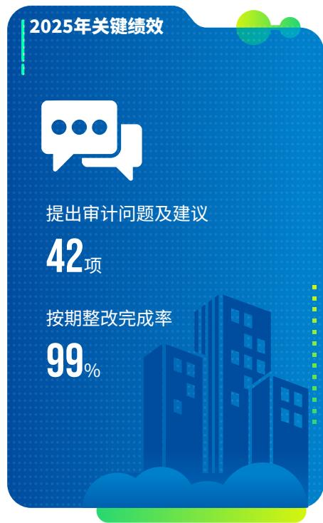

text_image

2025年关键绩效
提出审计问题及建议
42项
按期整改完成率
99%

## 关联交易管理

公司根据相关法律法规，制定《关联交易管理制度》，确保关联交易行为符合公平、公正、公开的原则以及监管部门的规范要求，维护公司和全体股东的利益。

## 合规经营

## 合规管理体系

公司遵循《中华人民共和国公司法》等相关法律法规，制定《合规管理制度》，搭建合规管理“三道防线”，旨在加强合规重点管理领域的合规管理，防范违规、违法行为的发生，有力保障公司经营活动合规与高质量发展。

## 合规经营“三道防线”及主要职责

## 第一道防线 各职能部门及分子公司

根据合规管理体系建设方案，配合法务及合规管理部建立健全业务合规管理制度和流程，确保合规要求融入业务领域；  
● 开展合规风险识别评估，编制风险清单和应对预案；  
定期梳理重点岗位合规风险，将合规要求纳入岗位职责；  
● 及时报告合规风险，组织或者配合开展应对处置；  
● 组织或者配合开展违规问题调查和整改。

## 第二道防线 法务及合规管理部

起草合规管理体系建设方案，经批准后组织实施，指导监督各部门和所属单位合规工作；  
组织起草合规管理制度、指导各部门、分子公司起草专项合规管理办法；  
负责对公司制度流程 、业务合同、重大决策的合规审查；  
组织开展合规风险识别、预警和应对处置，开展合规管理体系有效性评价；  
受理职责范围内的合规违规举报，提出分类处置意见，组织或者参与对违规行为的调查；  
● 组织或者协助业务及职能部门开展合规培训，受理合规咨询，推进合规管理信息化建设；  
进行合规管理年度计划和工作报告等。

## 第三道防线 审计部

依据有关规定，在职权范围内对合规要求落实情况进行监督，对违规行为进行调查，按照规定开展责任追究。

本年度，为顺应国际化发展战略布局，公司制定并发布了《企业境外经营合规指引》，围绕市场交易、安全环保、产品质量、劳动用工、知识产权、商业伙伴等关键领域，系统明确了境外业务的合规管理要求，致力于实现投资、生产及经营活动的全流程、穿透式合规管控，为公司海外业务稳健、可持续发展提供坚实保障。

## 合规文化建设

为强化公司全员合规意识、将合规理念融入经营实践的细枝末节，公司在制定年度培训计划时纳入法律合规相关主题，每年开展常态化培训，推动合规理念内化于心、外化于行，持续夯实企业稳健经营的合规基础。

## ����年关键绩效

开展法律培训

3次

## 依法纳税

公司认真履行规定的纳税义务，严格遵守相关法律法规，建立《税务管理制度》，持续规范税务管理流程，确保依法、足额、及时纳税。同时，公司高度重视税务合规建设，密切关注政策动态，前瞻性应对税务风险，主动接受税务部门的监管与检查，以严谨务实的作风筑牢依法纳税底线。

## ����年关键绩效

纳税金额

18,244.27万元

## 优化投关服务

国科恒泰持续优化投资者关系管理体系，通过畅通多元化沟通渠道、强化透明合规的信息披露，积极传递公司价值切实维护投资者权益

## 投资者沟通

公司高度关注投资者的利益诉求，严格遵循《上市公司投资者关系管理工作指引》等政策要求，制定《投资者关系管理制度》等一系列制度，努力实现公司与投资者的互利共赢，同时，公司通过线上线下相结合的多元渠道，搭建公开、双向、诚恳的沟通平台，为股东特别是中小股东参加股东会提供便利，实现与各类投资者的良好沟通。

## 投资者沟通渠道

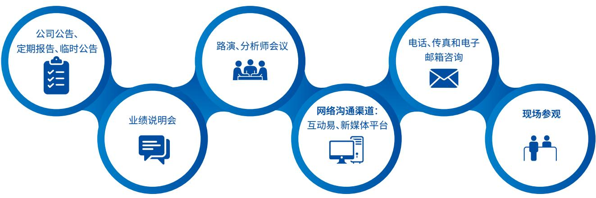

flowchart

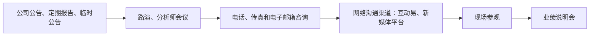
```mermaid
graph LR
  A["公司公告、定期报告、临时公告"] --> B["路演、分析师会议"]
  B --> C["电话、传真和电子邮箱咨询"]
  C --> D["网络沟通渠道：互动易、新媒体平台"]
  D --> E["现场参观"]
  E --> F["业绩说明会"]
```

## ����年关键绩效

接待投资者

现场调研

8次

在互动易回复

投资者提问

28次

在互动易投资者

回复率达

100%

## 案例

## 投资者开放日活动

2025年11月7日，公司举办“走进国科恒泰—投资者开放日活动”，邀请70余位投资者实地参观公司天津基地，此次活动通过实地参观+管理层座谈相结合的形式，有效地帮助了投资者了解公司的运营状况和供应链综合服务能力，增强对公司的信任和认同感，稳定投资者业绩预期。

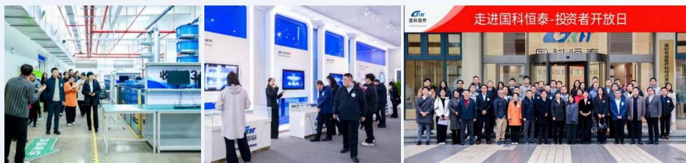

text_image

走进国科恒泰-投资者开放日

## 信息披露

公司严格遵循《上市公司信息披露管理办法》等政策要求，制定《信息披露管理制度》《互动易平台信息发布及回复内部审核制度》等一系列制度，确保披露信息的真实、及时、准确、完整、公平与合法合规。公司董事会秘书负责组织和协调公司信息披露事务，包括接待来访、回答咨询、联系股东，向投资者提供公司公开披露的资料，与新闻媒体联系刊登披露的信息等。

## ����年关键绩效

因信息披露方面违规而受到处罚

0次

信息披露工作连续两年获深圳证券交易所

B等级评价

## 恪守商业道德

国科恒泰恪守商业道德，对内持续强化反商业贿赂与反贪污体系建设，完善举报人保护机制，对外积极践行负责任营销，坚决反对任何形式的不正当竞争，通过构建公平、透明、诚信的市场信誉，为自身持续经营和健康发展保驾护航。

## 反商业贿赂与反贪污

## 反商业贿赂与反贪污体系

公司制定《反舞弊与反商业贿赂管理规范》等相关制度，明确杜绝实施任何形式的腐败与不诚信行为，包括为影响决策而实施的与公职人员或业务伙伴有关的贿赂、利益冲突、欺诈、洗钱、挪用、隐瞒真相以及影响交易等。

在组织架构层面，法务及合规管理部作为督促管理部门，负责建立反舞弊与反商业贿赂的文化环境，包括开展反舞弊及反商业贿赂培训和法律法规及诚信道德教育专项或常态化培训。同时，公司严格落实集团要求，组织员工签订《廉洁承诺书》《合规承诺书》，将合规责任压实到岗、落实到人。报告期内，公司未发生贿赂及重大贪污事件。

natural_image

Illustration of people using a balance scale with books and a gavel, symbolizing legal or judicial justice (no text or symbols present)

## 案例 反商业贿赂风险合规专题培训

2025年3月，公司特邀业内资深专家，组织开展《医药企业防范商业贿赂风险合规指引》解读专题培训。培训围绕指引出台背景、核心条款及实操要点，通过政策解读、典型案例剖析等形式，系统讲解了医药企业商业贿赂风险的易发环节、识别方法与防范策略。本次培训面向采购、销售、市场等业务一线关键岗位人员，旨在帮助员工准确把握政策边界，明晰合规红线，切实提升风险识别与抵御能力。

## ����年关键绩效

签署廉洁协议等有关商业行为书228人参加反商业贿赂及反贪污培训总人数208人

## 举报人保护机制

公司致力于构建开放透明的监督文化，持续优化举报及举报人保护机制，通过设立举报邮箱、举报热线等多种渠道，为员工提供高效便捷的反映平台。公司严格实行举报信息保密制度，无论是否启动调查程序，均向举报人反馈核查结果，坚决保障举报人合法权益，严禁任何形式的打击报复行为，切实营造风清气正、敢于发声的内部监督环境。

## 负责任营销

公司坚守负责任的营销理念，制定《市场交易合规指引》，杜绝任何形式的虚假宣传，依托覆盖全国31个省市自治区的仓储物流网络及全程可追溯的信息系统，以透明化原则完整、准确、及时地披露产品信息，确保每一件医疗器械从出厂到手术室的全链条流通安全可控。报告期内，公司未发生违反有关产品和服务信息与标识法规或自愿性守则事件。

## 反不正当竞争

公司严格遵循《中华人民共和国反不正当竞争法》等相关法律法规，立足医疗器械流通领域，积极倡导公平、开放、有序的市场竞争文化。作为连接上下游供应商与医疗机构的重要桥梁，公司坚决抵制一切破坏市场秩序的不正当竞争行为，坚持以专业、透明、合规的服务赢得客户信赖。

## 02 智链为擎重塑流通效能

## 2025年重要成果

研发总投入2,964.4万元

授权专利累计21项

客诉解决率100%

客户满意度98分

## 本章所响应的SDGs

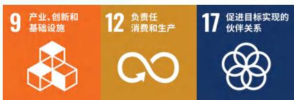

## 本章所涉及的ESG重要议题

创新驱动

产品和服务安全与质量

供应链安全

数据安全与客户隐私保护

医疗可及性

natural_image

Illustration of a medical professional conducting a clinical consultation with doctors and patients, including a doctor pointing at a digital display (no text or symbols present)

## 提升服务质效

国科恒泰持续深化质量管理体系建设，通过系统化风险管控与全流程精益运营，不断提升服务品质与合规水平，为客户提供稳定、可靠的供应链服务。

## 治理

公司提供从出厂到手术室一站式的全链条供应链综合服务，在业务开展过程中提供仓储物流配送、流通渠道管理、流通过程信息管理以及医院SPD运营管理等专业服务。

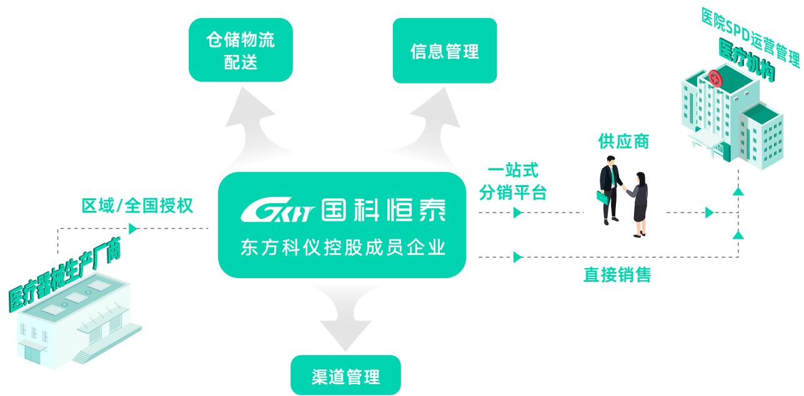

flowchart

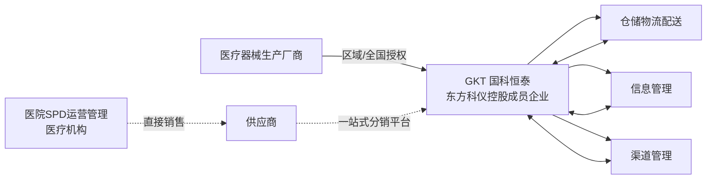
```mermaid
graph LR
  A["医疗器械生产厂商"] -->|"区域/全国授权"| B["GKT 国科恒泰\n东方科仪控股成员企业"]
  C["仓储物流配送"] <--> B
  D["信息管理"] <--> B
  E["渠道管理"] <--> B
  F["供应商"] -.->|"一站式分销平台"| B
  G["医院SPD运营管理\n医疗机构"] -.->|"直接销售"| F
  B --> C
  B --> D
  B --> E
```

为确保持续合规运营与服务品质，公司严格遵循《医疗器械经营监督管理办法》《医疗器械监督管理条例》等法律法规，制定并执行《质量管理制度汇编》《质量管理体系手册》《重大质量事件上报制度》等一系列内部管理办法。公司以“体系完善、依法经营、客户满意、追溯管理、合理改进”为质量方针，对产品的入场验收、入库、销售及客户服务等全流程建立控制程序，严格执行进货审查与质量监督，确保所经营医疗器械持续符合客户需求与法规要求。为全面落实此方针，公司已建立覆盖各业务环节的质量管理组织架构，明确界定了所涉关键部门相关职能。

公司下属专注于医疗器械生产的子公司—国科智合，同样建立了覆盖全流程的产品质量管理体系。国科智合严格依据GB/T 42061《医疗器械质量管理体系用于法规的要求》及《医疗器械生产质量管理规范》，构建起以《质量手册》为纲领、程序文件与技术文件相支撑的文件化体系。通过系统实施《生产过程控制程序》《验证管理规定》《计量器具管理规程》及《质量检验操作规程》《检验记录和报告管理规程》《产品处观、标签及铭牌检验规程》等文件，国科智合实现了从原材料入厂到成品出厂的全过程精细化管控，确保产品质量的安全性、有效性，并持续符合法规要求。

为持续验证与提升质量管理水平，公司建立健全内部审核与人员培训机制。依据《质量体系内部审核管理制度》，公司每年至少开展一次全面质量体系内审，通过《质量内审报告》识别改进点，落实纠正与预防措施，推动体系持续优化。同时，根据《质量管理培训及考核的规定》，公司每半年组织全体员工参加质量管理相关专题培训与考核，系统提升全员质量意识和业务能力。

## 案例 医疗器械质量管理体系科普培训

为提升全员对医疗器械质量管理体系标准的理解与运用，公司于2025年4月组织开展了医疗器械质量管理体系专题培训。本次培训聚焦GB/T 42061-2022（ISO 13485:2016）核心内容，系统阐释了该标准的法规特殊性，并围绕关键术语、文件架构与文件生命周期管理等重点模块展开讲解，帮助员工深入掌握该体系的基本框架与执行要求。

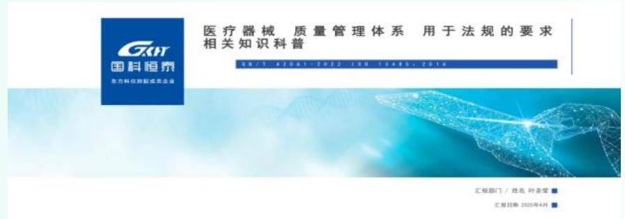

text_image

GKT
国科恒泰
东方科技数据集成企业
医疗器械 质量管理体系 用于法规的要求
相关知识科普
GKT 1 42041-2022 150 13465:2016
汇报部门 / 统名 叶圣莹
■
汇编日期 2025年4月
■

## 案例 《医疗器械经营质量管理规范现场检查指导原则》要点解读分享

2025年10月，公司组织开展《医疗器械经营质量管理规范现场检查指导原则》专题培训，内容覆盖“指导原则概述、评定标准、其他监督检查、实施日期、指导原则具体内容、现场检查要点”六大模块，并在培训结束后组织专项考试，进一步巩固学习成效，推动知识内化与行为转化，为企业持续夯实质量管理、保障医疗器械经营全过程合规奠定基础。

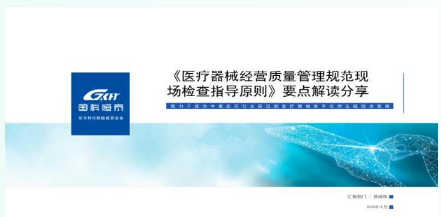

text_image

《医疗器械经营质量管理规范现场检查指导原则》要点解读分享
国科恒京
东方科技控股成套企业
能力于成为中国品在行业前沿的医疗器械数字化供应链综合服务商
汇报部门 / 陈成栋
2020年10月

治理机制的有效运行，推动公司质量管理体系持续符合国际标准要求。本年度，公司及下属部分子公司成功通过ISO 9001质量管理体系认证及ISO 13485医疗器械质量管理体系认证。

ISO ���� 质量管理体系认证证书  
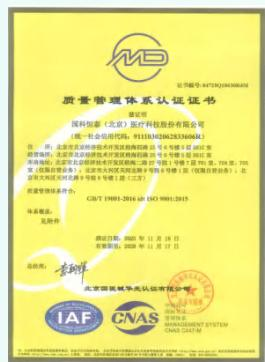

text_image

证券代码:0021986368849
MDS
中国银河证券股份有限公司
MDS
证券代码:0021986368849
MDS
证券代码:0021986368849
MDS
证券代码:0021986368849
MDS
证券代码:0021986368849
MDS
证券代码:0021986368849
MDS
证券代码:002198636884
MDS
证券代码:0021986368849
MDS
证券代码:0021986368849
MDS
证券代码:0021986368849
MDS
证券代码:0021986368849
MDS
证券代码:002198636884<nl>
MDS
证券代码:0021986368849
MDS
证券代码:0021986368849
MDS
证券代码:0021986368849
MDS
证券代码:0021986368849
MDS
证券代码:002198636884<fcel>中国银河证券股份有限公司
(统一社会信用代码:9111050025633564K)
住所:北京市北京经济技术开发区科创路5号院1号楼1层10层至12层
邮政编码:110001
联系电话:北京市北京经济技术开发区科创路5号院1号楼1层10层至12层
邮政编码:110001
联系人:李晓峰
电话:北京市北京经济技术开发区科创路5号院1号楼1层10层至12层
邮政编码:110001
联系人:李晓峰
地址:北京市北京经济技术开发区科创路5号院1号楼1层10层至12层
邮政编码:110001
联系人:李晓峰
地址:北京市北京经济技术开发区科创路5号院1号楼1层10层至12层
邮政编码:110001
联系人:李晓峰
地址:北京市北京经济技术开发区科创路5号院1号楼1层10层至1二层
邮政编码:110001
联系人:李晓峰
地址:北京市北京经济技术开发区科创路5号院1号楼1层10层至1二层
邮政编码:110001
联系人:李晓峰
地址:北京市北京经济技术开发区科创路5号院1号楼1层10层至1二层
邮政编码:110001
联系人:李晓峰
电话:北京市北京经济技术开发区科创路5号院1号楼1层10层至1二层
邮政编码:110001
联系人:李晓峰
地址:北京市北京经济技术开发区科创路5号院1号楼1层10层至一层
邮政编码:110001
联系人:李晓峰
电话:北京市北京经济技术开发区科创路5号院1号楼1层10层至一层
邮政编码:110001
联系人:李晓峰
地址:北京市北京经济技术开发区科创路5号院1号楼1层10层至一层
邮政编码:110001
联系人:李晓峰
电话:北京市北京经济技术开发区科创路5号院1号楼1层10层至一层
邮政编码:110001
联系人:李晓峰
地址:上海市浦东新区东方路527号A座办公楼B座法定代表人:周明军
邮政编码:110001
联系人:李晓峰
电话:上海市浦东新区东方路527号A座办公楼B座法定代表人:周明军

国科恒泰（北京）医疗科技股份有限公司

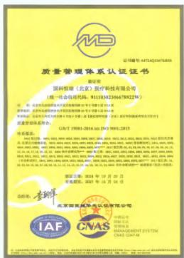

text_image

MD
身份证号：4471421016768005
质量管理体系认证证书
编号：
深圳科汇（北京）医疗科技有限公司
统一社会信用代码：911101002106678923W
注册地址：北京市海淀区中关村大街1号院1号楼A座17层
办公地址：北京市海淀区中关村大街1号院1号楼A座17层
联系电话：010-66688888，010-66688888，010-66688888，010-66688888，010-66688888，010-66688888，010-66688888，010-66688888，010-66689999，010-66689999，010-66689999，010-66689999，010-66689999，010-66689999，010-66689999，010-66689999，010-66690999，010-66690999，010-66690999，010-66690999，010-66690999，010-66690999，010-66690999，010-66690999，010-53333333，电话：(021) 53333333，传真：(021) 53333333，电子邮箱：www.nfzq.com.cn
注册地址：北京市海淀区中关村大街1号院1号楼A座17层
办公地址：北京市海淀区中关村大街1号院1号楼A座17层
联系电话：(010) 53333333，传真：(010) 53333333，电子邮箱：www.nfzq.com.cn
邮政编码：2024年12月22日
电子邮箱：2024年12月22日
品质名：李娜
北京京蓝高科认证有限公司
IAF CNAS
中国证监会
国家税务总局
全国统一发票监制章
CNAS CNTAM

国科恒瑞（北京）医疗科技有限公司

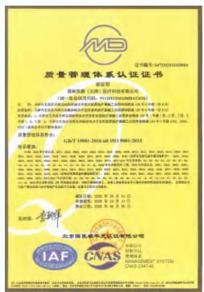

text_image

MD
证书编号: 047329161528889
质量管理体系认证证书
盖章号
国家质量监督总局
（一）企业注册登记
G&T 19940-2014 03 03 2015
经办机关：北京市工商行政管理局
住所：北京市西城区金融大街甲1号首层
办公地址：北京市西城区金融大街甲1号首层
法定代表人：王洪波
注册资本：人民币1,000,000,000.00元
经营范围：许可经营项目：医疗器械、医疗器械、医疗器械及配件、医疗器械的批发、零售、进出口业务（涉及法律、行政法规、国务院决定禁止的项目除外，限制的项目须取得许可后方可开展经营活动）。企业法人营业执照号码：3301000000000000000000000000000000000000000000000000000000000000000000000000000
G&T 19940-2014 03 03 2015
经办机关：北京市工商行政管理局
住所：北京市西城区金融大街甲1号首层
办公地址：北京市西城区金融大街甲1号首层
法定代表人：王洪波
注册资本：人民币1,000,000,000.00元
经营范围：许可经营项目：医疗器械、医疗器械及配件、医疗器械的批发、零售、进出口业务（涉及法律、行政法规、国务院决定禁止的项目除外，限制的项目须取得许可后方可开展经营活动）。企业法人营业执照号码：330100000000000000000000000000000000
G&T 1994-2014 43 33 33 33 33 33 33 33 33 33 33 33 33 33 33 33 33 33 33 33 33 33 33 33 33 33 33 33 33 33 33 33 33 33 3<nl>
经办机关：北京市工商行政管理局
住所：北京市西城区金融大街甲1号首层
办公地址：北京市西城区金融大街甲1号首层
法定代表人：王洪波
注册资本：人民币1,556,888,888.88元
经营范围：许可经营项目：医疗器械、医疗器械及配件、医疗器械的批发、零售、进出口业务（涉及法律、行政法规、国务院决定禁止的项目除外，限制的项目须取得许可后方可开展经营活动）。企业法人营业执照号码：330100-2-2-2-2-2-2-2-2-2-2-2-2-2-2-2-2-2-2-2-2-2-2-2-2-2-2-2-2-2-2-2-2-2-2-2-2-2-2-2-2-2-2-2-2-2-2-2-2-2-2-<nl>
经办机关：北京市工商行政管理局
住所：北京市西城区金融大街甲1号首层
办公地址：北京市西城区金融大街甲1号首层
法定代表人：王洪波
注册资本：人民币1,556,888,888.88元
经营范围：许可经营项目：医疗器械、医疗器械及配件、医疗器械的批发、零售、进出口业务（涉及法律、行政法规、国务院决定禁止的项目除外,限制的项目须取得许可后方可开展经营活动）。企业法人营业执照号码：330111111111111111111111111111111111111111111111111111111111111111111111111111111111111111111111<nl>
经办机关：北京市工商行政管理局
住所：北京市西城区金融大街甲1号首层
办公地址：北京市西城区金融大街甲1号首层
法定代表人：王洪波
注册资本：人民币5,556,888,888.88元
经营范围：许可经营项目：医疗器械、医疗器械及配件、医疗器械的批发、零售、进出口业务（涉及法律、行政法规、国务院决定禁止的项目除外，限制的项目须取得许可后方可开展经营活动）。企业法人营业执照号码：33076676666666666666666666666666666666666666666666666666666666666666666666666666666666666666666<nl>
经办机关：北京市工商行政管理局
住所：北京市西城区金融大街甲1号首层
办公地址：北京市西城区金融大街甲1号首层
法定代表人：王洪波
注册资本：人民币5,556,888,888.88元
经营范围：许可经营项目：医疗器械、医疗器械及配件、医疗器械的批发、零售、进出口业务（涉及法律、行政法规、国务院决定禁止的项目除外,限制的项目须取得许可后方可开展经营活动）。企业法人营业执照号码：3379999999999999999999999999999999999999999999999999999999999999999999999999999999999999999<nl>
经办机关：北京市工商行政管理局
住所：北京市西城区金融大街甲1号首层
办公地址：北京市西城区金融大街甲1号首层
法定代表人：王洪波
注册资本：人民币5,556,888,888.88元
经营范围：许可经营项目：医疗器械、医疗器械及配件、医疗器械的批发、零售、进出口业务（涉及法律、行政法规、国务院决定禁止的项目除外）

国科恒翔（天津）医疗科技有限公司

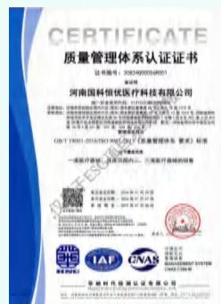

text_image

质量管理体系认证证书
证书编号：20240000159801
证书号：
河南国科恒优医疗科技有限公司
（2024-03-01-2024）（国科恒优医疗科技有限公司）
（盖章编号：2024-03-01-2024）
（盖章类型：一般项目代码：CNAS）
（盖章有效期限：2024年3月1日至2024年3月1日）
（盖章有效期：2024年3月1日至2024年3月1日）
（盖章类型：一般项目代码：CNAS）
（盖章有效期限：2024年3月1日至2024年3月1日）
（盖章有效期：2024年3月1日至2024年3月1日）
（盖章类型：一般项目代码：CNAS）
（盖章有效期限：2024年3月1日至2024年3月1日）
(盖章有效期：2024年3月1日至2024年3月1日)
（盖章类型：一般项目代码：CNAS）
（盖章有效期限：2024年3月1日至2024年3月1日）
（盖章有效期：2024年3月1日至2024年3月1日）
（盖章类型：一般项目代码：CNAS）
（盖章有效期限：2024年3月1日至2024年3月1日）
（加盖单位公章）（盖章编号：CNAS）
（盖章有效期限：2024年3月1日至2024年3月1日）
（盖章有效期：2024年3月1日至2024年3月1日）
（盖章类型：一般项目代码：CNAS）
（盖章有效期限：2024年3月1日至2024年3月1日）
（盖章有效期：2024.3.1日至2024.3.1日）
（盖章类型：一般项目代码：CNAS）
（盖章有效期限：2024年3月1日至2024年3月1日）
（盖章有效期：2024.3.1日至2024.3.1日）
（盖章类型：一般项目代码：CNAS）
（盖章有效期限：2024年3月1日至2024年3月1日在中国证券登记结算有限责任公司深圳分公司办理）

河南国科恒优医疗科技有限公司

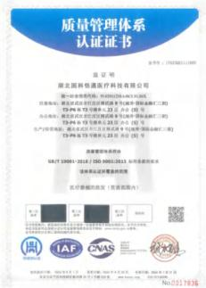

text_image

质量管理体系
认证证书

湖北国科瑞医疗科技有限公司

兹证明：
湖北国科瑞医疗科技有限公司
注册号：湖北省武汉市武昌区高新大道1号（南侧金桥第二工程）
身份证号码：3704-2352 221-2352 00000000000000000000000000000000000000000000000000000000000000000000000000000000000000000
生产许可证有效期：2018年6月29日至2023年6月29日
《中国药品监督管理委员会药品管理法》
医疗器械生产企业名称：
CACT 19991-2018 (ISO 9931-2018) 15 号药品批准文号
医疗器械生产企业编码：
CACT 19991-2018 (ISO 9931-2018) 15 号药品批准文号
医疗器械生产企业名称：
CACT 19991-2018 (ISO 9931-2018) 15 号药品批准文号
医疗器械生产企业名称：
CACT 19991-2018 (ISO 9931-2018) 15 号药品批准文号
医疗器械生产企业名称：
CACT 19991-2018 (ISO 9941-2018) 15 号药品批准文号
医疗器械生产企业名称：
CACT 19991-2018 (ISO 9941-2018) 15 号药品批准文号
医疗器械生产企业名称：
CACT 19991-2018 (ISO 9941-2018) 15 号药品批准文号
医疗器械生产企业编号：
CACT 19991-2018 (ISO 9941-2018) 15 号药品批准文号
医疗器械生产企业名称：
CACT 19991-2018 (ISO 9941-2018) 15 号药品批准文号
医疗器械生产企业名称：
CACT 19991-2018 (ISO 9954-2018) 15 号药品批准文号
医疗器械生产企业名称：
CACT 19991-2018 (ISO 9954-2018) 15 号药品批准文号
医疗器械生产企业名称：
CACT 19991-2018 (ISO 9954-2018) 15 号药品批准文号
医疗器械生产企业名称：

湖北国科恒通医疗科技有限公司

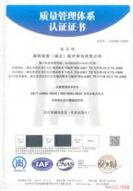  
国科瑞泰（湖北）医疗科技有限公司

ISO ����� 医疗器械质量管理体系认证证书  
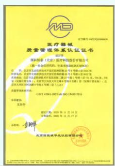

text_image

医疗器械
质量管理体系认证证书
Dalian Zhongling (北京)医疗科技股份有限公司
（盖章）注册号：91110200283536065
住所：北京市海淀区中关村科技园南路甲1号院1号楼2层201室
办公地址：北京市海淀区中关村科技园南路甲1号院1号楼2层201室
联系电话：(010)851-85188888传真：(010)851-85188888
经营范围：医疗器械、医疗器械及配件、医疗器械的销售、技术开发、技术咨询、技术交流、技术转让、技术推广；医疗器械的批发、零售；医疗器械的进出口业务（国家限定企业经营或禁止进出口的商品和技术除外）；医疗器械的销售、技术服务、技术开发、技术咨询、技术交流、技术转让、技术推广。具体内容详见本公司于2021年1月17日刊登在巨潮资讯网（http://www.cninfo.com.cn）的《医疗器械行业分类标准》。
公告编号：2021-034
证券代码：600000
证券简称：大药房
成立日期：2021年12月18日
注册资本：人民币1.0亿元
法定代表人：北京市西城区永兴区裕源商贸中心

国科恒泰（北京）医疗科技股份有限公司

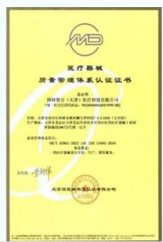

text_image

医疗器械
质量管理体系认证证书

深圳市金汇（天津）医疗科技有限公司
（统一社会信用代码：91320000MA7Y9X18D）
住所：天津市南开区东大路6号华润大厦4层
办公地址：天津市南开区东大路6号华润大厦4层
经营范围：医疗器械销售、技术开发、技术咨询、技术交流、技术转让、技术推广；医疗器械销售；医疗器械销售；医疗器械销售；医疗器械销售；医疗器械销售；医疗器械销售；医疗器械销售；医疗器械销售；医疗器械销售；医疗器械销售；医疗器械销售；医疗器械销售；医疗器械销售；医疗器械销售；医疗器械销售；医疗器械销售；医疗器械销售；医疗器械销售；医疗器械销售；医疗器械销售；医疗器械销售；医疗器械销售；医疗器械销售；医疗器械销售；医疗器械销售；医疗器械销售；医疗器械销售；医疗器械销售；医疗器械销售；医疗器械销售；医疗器械销售；医疗器械销售；医疗器械销售；医疗器械销售; 医疗器械
注册号：100000000000000000000000000000000000000000000000000000000000000000000000000000000000000000
北京市西城区西单店A区A区A区A区A区A区A区A区A区A区A区A区A区A区A区A区A区A区A区A区A区A区A区A区A区A区A区A区A区A区A区A区A区A区A区A区A区A区A区A区A区A区A区A区A区A区A区A区A区A区A
北京市西城区西单店A区A区A区A区A区A区A区A区A区A区A区A区A区A区A区A区A区A区A区A区A区A区A区A区A
北京市西城区西单店B区C区D区E区F区G区H区I区J区K区L区M District
北京市西城区西单店C区D区E区F区G District
北京市西城区西单店C区D区E District
北京市西城区西单店C区D区E District
北京市西城区西单店C区D区E District
北京市西城区西单店C区D区E District
北京市西城区西单店C区D区E District
北京市西城区西单店C区D区E District
北京市西城区西单店C区D区E District
北京市西城区西单店C区D区E District
北京市西城区西单店D区E District
北京市西城区西单店C区D区E District
北京市西城区西单店C区D区E District
北京市西城区西单店C区D区E District
北京市西城区西单店C区D区E District
北京市西城区西单店C区D区E District
北京市西城区西单店C区D区E District
北京市西城区西单店C区D区E District
北京市西城区东单店C15-15-15-15-15-15-15-15-15-15-15-15-15-15-15-15-15-15-15-15-15-15-15-15-15-15-15-15-15-15-15-15-15-15-<nl>

国科智合（天津）医疗科技有限公司

战略

<table><tr><td>风险类型</td><td>风险描述</td><td>影响的时间范围</td><td>影响的价值链环节</td><td>潜在财务影响</td><td>应对措施</td></tr><tr><td>法规政策风险</td><td>医疗器械行业受严格法规监管,政策更新频繁。若公司未能及时跟进,可能导致产品注册、经营等环节不合规,面临处罚,影响正常运营。</td><td>短期、中期</td><td>运营</td><td>合规成本增加</td><td>持续关注法规动态,定期对产品注册、采购、销售等关键环节开展合规审查,识别并纠正潜在问题;积极参与监管部门组织的培训和宣贯活动,确保业务操作符合最新法规要求。</td></tr><tr><td>质量把控风险</td><td>若在采购环节对供应商审核不严,或运输、仓储环节管理不善,可能引入或导致产品质量问题,影响产品安全和企业信誉。</td><td>短期</td><td>上游、运营、下游</td><td>营业收入减少</td><td>扩大采购产品抽检范围与频率,引入先进检测设备,严格审核原材料质量与生产工艺;建设符合医疗器械存储标准的仓库,配备温湿度调节、通风、货架等设施,并定期维护;引入仓储管理系统,实现库存和环境数据的实时监控与异常预警。</td></tr><tr><td>产品安全追溯风险</td><td>随着追溯要求提升,若供应链信息传递不及时、不准确,可能导致产品无法有效追溯,影响问题产品快速处置,增加合规成本和声誉损失。</td><td>短期、中期</td><td>上游、运营、下游</td><td>合规成本增加、营业收入减少</td><td>应用物联网、区块链、二维码等技术,实现医疗器械唯一标识与全程追踪;与供应商、物流企业、医疗机构等建立定期沟通机制,明确追溯责任,确保信息准确传递;定期评估追溯系统运行效果,及时优化完善。</td></tr></table>

<table><tr><td>机遇类型</td><td>机遇描述</td><td>影响的时间范围</td><td>影响的价值链环节</td><td>潜在财务影响</td><td>应对措施</td></tr><tr><td>法规政策机遇</td><td>积极响应法规政策要求,建立健全合规管理体系,有助于企业在招投标等竞争中树立合规标杆形象,争取更多业务机会。</td><td>中期、长期</td><td>上游、运营、下游</td><td>营业收入增加</td><td>推进合规体系建设,落实重点领域合规指引;加强与监管部门沟通,及时掌握政策动态;参与行业协会活动,分享合规经验,提升行业影响力。</td></tr><tr><td>质量提升驱动品牌建设机遇</td><td>通过强化产品质量控制,树立可靠品牌形象,增强客户信任,吸引高质量客户群体,提升市场竞争力与市场份额。</td><td>短期、中期、长期</td><td>上游、运营、下游</td><td>营业收入增加</td><td>建立健全全流程质量管理体系,制定优于行业标准的质量控制规范,覆盖原材料、生产工艺、成品检验等环节,明确检验要点与方法。</td></tr></table>

## 影响、风险和机遇管理

国科恒泰建立实施质量风险管理流程，并围绕仓储物流服务提升、产品追溯与召回、客户服务保障等关键环节持续落实管理举措，系统降低质量风险，保障服务交付质量。

## 质量风险管理流程

公司制定并实施《风险管理控制程序》《过程的监视和测量控制程序》等制度，构建了覆盖医疗器械从采购源头、生产加工环节到仓储物流直至终端使用的全流程标准化风险管理框架。

## 风险识别

公司通过划分产品风险等级、建立多部门协同的风险联席会商机制，形成风险清单，确保责任明确、过程可追溯。质量部每季度组织跨部门风险会商，对重点环节开展审查，全面识别潜在质量风险。

## 风险评估

依据风险影响范围及程度，公司对识别出的风险进行评估与等级划分，为分级管控提供依据，确保风险管控资源投入与风险等级相匹配。

## 风险应对

针对不同等级的风险，公司实施差异化的应对策略。对于识出的潜在风险，通过流程管控、协议完善、风险监控等方式降低风险发生概率；对已显现的风险实施纠正整改，确保问题解决；同时开展针对性培训与宣导，提升全员风险意识与操作规范性。

## 持续优化

公司建立质量管理监控与改进机制，开展过程监控与质量测量活动，当质量目标未达成时，将及时分析原因，并制定实施针对性改进措施。同时，公司定期接受外部监督检查，并在接受检查前组织开展全面内部自查，通过持续的内外评审机制，推动质量管理体系不断完善，质量风险防控能力持续提升。

## 提高物流运营效率

为保障物流配送环节的高效与精准运转，公司建立覆盖订单处理、仓储分拣、干线运输、末端配送及售后退换的全流程标准化管理体系。通过执行《运输配送实施流程》，落实量化标准、规范操作与实时监控，并持续完善数字化建设，提升业务运营质量与效率。

## 全国物流网络覆盖

公司已构建布局广泛、响应迅速、标准化与可追溯的物流网络，在全国31个省、市、自治区建立了103个物流分仓，其中9个分仓可以开展第三方仓储物流业务，形成多层次配送体系，支持多批次、多品规、高频次的出入库需求。

## 全流程精益管理

公司组建专业物流团队，引入六西格玛质量管理体系，对运输、仓储、包装、搬运等全环节实施精益管控，持续提升服务质量与客户满意度。

## 配送全程可视化

依托TMS运输管理系统，实现配送全程可视化，显著提升配送时效与准确性，便于医院实时跟踪物流进展，优化服务体验。

## 高效履约与应急保障

通过信息化流程支持，实现SKU自动配位、1秒内完成校验与流转，支持同城4小时达、2小时覆盖全国80%以上三甲医院，并提供365天不间断服务，保障医院紧急手术等特殊需求。

## 案例

## 首个仓储自动化AGV 项目圆满完成

2025年12月，国科恒泰首个仓储自动化AGV项目圆满完成。该项目聚焦传统仓储中“人找货、人工搬运”的效率痛点，成功构建了以AGV机器人为核心的智能搬运体系，融合WMS仓储管理系统、储位管理系统、车辆控制系统等，实现了“货到人”的精准配送，可自动完成储位搬运、货物出入库投放、库内理货等核心任务，充分实现仓储整体智能化控制，有效减少人为因素对作业的影响，显著提升了国科恒泰在仓储运营方面的智能化水平和整体效能，是公司推进“智慧物流”新质生产力的重要突破。未来，国科恒泰将结合项目运行数据，进一步优化AGV作业流程，同时不断选择适配场景，扩大智慧物流推广应用，逐步构建全公司一体化的智能仓储运输网络，为仓储物流的高效运转提供更坚实的保障。

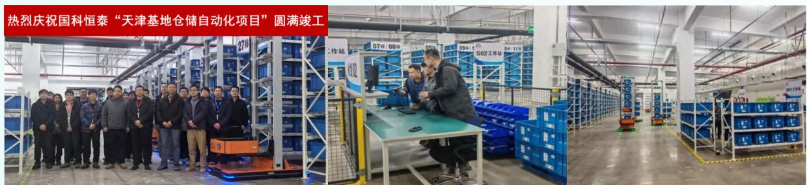

text_image

热烈庆祝国科恒泰“天津基地仓储自动化项目”圆满竣工

## 专题

## 提升医疗可及性

公司依托全国仓储物流网络与一体化供应链整合能力，持续推动高值医用耗材向基层及边远地区下沉。通过数字化、智能化技术赋能，打破地域壁垒，让优质医疗资源触达更广泛的患者群体。同时，聚焦急救、妇幼、慢病等重点领域，公司不断优化应急配送机制与个性化服务方案，以敏捷精准的供应链响应能力，切实保障特殊群体的用械需求，提升医疗服务的可及性。

## 扩大产品覆盖范围

2025年8月11日，国科恒泰无人驾驶配送车在西安成功完成首单运营，车辆从院端仓自主导航出发，穿越城市复杂路况，精准抵达目标医院。这是公司以智慧物流技术突破末端配送瓶颈、扩大医疗器械产品覆盖范围的关键里程碑。无人配送车依托自动驾驶算法与实时路况感知，可实现全天候、最优路径配送，大幅缩短客户等待时间，同时有效降低人力与运营成本，使公司有能力将服务触角向更多基层医院和非核心城市延伸。

## 专题

## 提升医疗可及性

本次西安首单的成功落地，验证了无人配送解决方案在复杂城市环境下的稳定性和适用性。作为国科恒泰“智能仓储+智慧干线+无人配送”全链路智慧供应链网络的重要进展，无人配送技术的应用显著增强了恶劣天气、夜间时段的配送能力，打破传统人力配送的时间与空间限制。未来，这一模式将在全国更多核心城市复制推广，持续扩大优质医疗器械产品的可及范围。

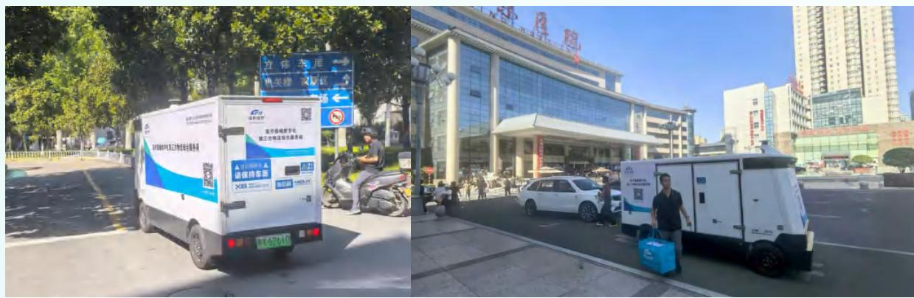

text_image

Street photo showing two autonomous delivery vehicles with visible Chinese signage and parked cars in front of a building with visible signage.

## 满足特定群体需求

医疗可及性的提升，不仅体现在“能送到”，更体现在“送得及时、送得精准、送得到特殊场景”。2025年6月8日，江西赣州某医院发出紧急手术需求——患者急需特定型号通桥医疗神经密网支架，南昌仓无现货。面对急重症手术患者这一对时效具有严格要求的特定群体，国科恒泰物流部启动“24小时不关机”应急响应机制，迅速搭建杭州、上海、天津三地协同抢运通道。三地仓库同步出库，配送人员分别依托航空与高铁干线并行发运，所有资源向赣州手术台单向汇聚，目标锁定次晨8:30前完成交付。凌晨1时，最后一批支架在南昌昌北机场完成签收。此时暴雨持续、公共交通停运，距手术时限不足7小时。南昌团队自主完成运力整合，于凌晨2时驾车驶入雨夜，完成400公里跨省陆路运输。6月9日7时，支架提前1.5小时送达医院，手术如期进行。

本次行动是国科恒泰面向特定群体构建的制度化交付能力的完整呈现，其背后是24小时响应机制、多仓协同调度体系及一线团队在非对称约束条件下独立完成应急配送的执行素养。在“五三战略”与“双五行动”牵引下，公司正将“满足特定群体”从服务理念转化为可复用的交付能力，为急重症患者及临床急需群体构筑可被依赖、可被验证的生命通道。

natural_image

Stylized illustration of a city skyline with a delivery truck, people, and buildings (no text or symbols)

## 产品追溯与召回

公司已建立产品追溯体系及召回机制，实现了对产品的全程追踪与风险可控管理，为产品安全与服务质量护航。

## 产品追溯体系

公司严格遵守《医疗器械监督管理条例》及相关法规，建立了以《可追溯性控制程序》和《医疗器械追溯管理办法》为基础的产品追溯体系。通过WMS系统，每件产品均被赋予包含产品编码、名称、批号及有效期等在内的完整标识信息，其中三类医疗器械严格执行出入库唯一标识管理。公司对售出产品实施全程质量跟踪，确保所有操作记录与产品信息实时关联，从而全面保障产品从入库到最终使用环节的完整可追溯性。

## 产品召回流程

公司建立《不合格品控制程序》《不合格品管理标准》，做好不合格品的识别和控制，并监督不合格品的处理。此外，公司根据《质量信息管理制度》，收集政府监管部门发布的质量信息，确保能及时采取相关措施。为确保召回工作的有序进行，公司制定《产品召回管理制度》，规定了召回处理的各个环节。在召回判定与分级方面，根据医疗器械的安全隐患和危害的严重程度，将产品召回明确划分为一级、二级和三级。针对不同等级的召回，公司制定相应的处理机制，确保能够迅速、有效地应对各类召回情况。报告期内，公司未发生因自身原因而导致的产品召回事件。

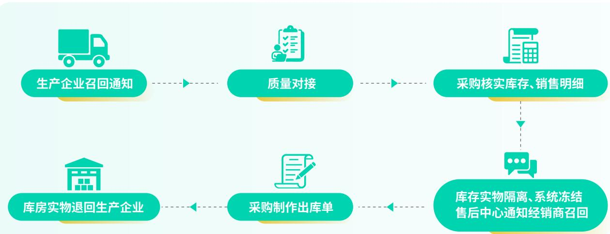

flowchart

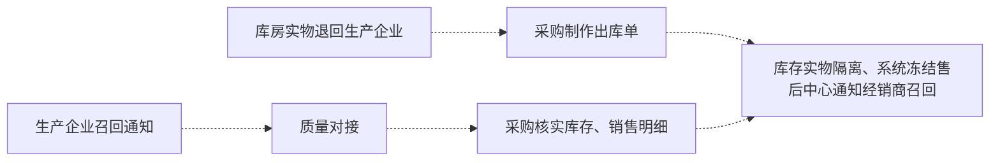
```mermaid
graph LR
  A["生产企业召回通知"] -.-> B["质量对接"]
  C["库房实物退回生产企业"] -.-> D["采购制作出库单"]
  B -.-> E["采购核实库存、销售明细"]
  D -.-> F["库存实物隔离、系统冻结售后中心通知经销商召回"]
  E -.-> F
```

## 客户服务保障

公司高度重视客户权益，通过服务能力赋能、标准化投诉处理及满意度调研与优化，持续提升客户服务水平，构建优质、高效的客户服务。

## 客户服务赋能与投诉管理

公司已构建完善的客户服务管理体系，一方面定期开展客户支持与操作能力提升培训，内容覆盖合规要求、投诉与退换货处理、系统使用流程等，并进行客户投诉响应考核，为客户服务能力持续赋能。另一方面，公司设立客户管理组织架构，制定《渠道客户问题接收与解决流程说明文件》等制度，建立了一套标准化、可追溯的客户投诉处理机制，并结合医疗数智化供应链协同平台的售后反馈功能，确保客户问题能被及时接收与响应。

客户运营部接收并总结投诉原因，分发至相关部门。

若为公司责任，客户管理岗与客户协商解决方案；需要赔付的，由业务部门协助协商渠道客户，由事项主责部门发起赔付方案申请，并逐级提交审批。

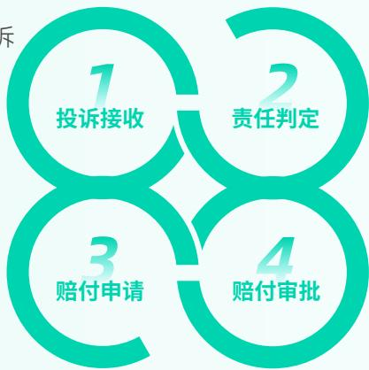

flowchart

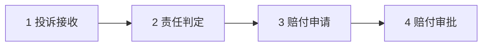
```mermaid
graph LR
  A["1 投诉接收"] --> B["2 责任判定"]
  B --> C["3 赔付申请"]
  C --> D["4 赔付审批"]
```

事项主责部门针对投诉问题给出交付方案，判定是否为公司责任。

根据赔偿金额大小，提交至不同层级的业务负责人审批。

## 客户满意度调查

为建立并持续优化以客户为中心的服务体系，公司每季度通过线上问卷、电话访谈及实地走访等多种形式，对经销商、服务商、供应商及医院等各类客户开展系统性调研，重点围绕产品供应及时性、质量稳定性、售后服务响应与解决效果、合作流程便捷性等关键维度，全面收集客户反馈与痛点。

## 提升客户满意度

基于调研结果，公司识别服务短板，并围绕流程优化、系统升级与服务强化三个维度，针对性推出一系列提升举措，具体包括：建立订单分级响应与实时状态推送机制，配置专属客户经理以提升各环节时效；通过平台可视化引导、线上签约与流程简化，提升操作透明度与便捷性；构建智能备货预测模型与分层培训体系，强化资源支持与赋能效果。通过这些系统性改进，公司进一步巩固与客户的长期合作关系，致力于构建高效、透明、协同的供应链服务体系，持续提升客户满意度与信任度。

## 指标与目标

公司制定以“建立完善质量管理体系、持续改进管理体系有效性、保障经营过程中产品质量安全、增强客户满意度”为核心的年度质量管理目标，将其分解落实到各下属单位并开展目标完成情况考核，同时通过开展质量月例会，要求各单位梳理质量目标完成情况与存在的问题并提出改进措施，确保公司质量管理目标顺利达成。

## ����年管理目标达成情况

受控文件及时修订率

100%

药监检查通过率

100%

质量合规培训考试及合格率

100%

## ����年关键绩效指标

## 质量管理

质量内审

85次

迎接药监检查

134次

质量培训次数

13次

质量培训

745人次

质量培训总时长

1,166小时

产品召回事件

0次

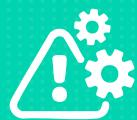

重大质量责任事故

0个

## 客户投诉管理

客户投诉数量

13件

客户投诉解决数量

13件

客户投诉解决率

100%

应对客户投诉响应考核次数

13次

应对客户投诉响应考核通过率

100%

## ����年关键绩效

## 客户满意度调查

客户满意度调查问卷发放有效份数

841份

参与调查客户占比

70%

参与调查客户数量

841人

客户满意度分数

98分

natural_image

Stylized illustration of a hospital building with green and yellow facade, no text or symbols present

## 促进科创研发

国科恒泰高度重视科技创新，积极践行驱动发展战略，通过加大研发投入不断突破技术壁垒，开发出更具市场竞争力与创新价值的产品与服务。

## 治理

公司严格遵循《医疗器械监督管理条例》等法规要求，以《产品计划管理制度》《产品开发阶段管理制度》《产品验证与优化管理制度》《产品结项评审管理规定》等一系列制度为基础，通过IPD流程实施手册及配套说明文件，将研发过程中的每个关键节点纳入标准化管控，确保研发活动规范有序、风险可控。为保障研发体系高效运转，公司设立战略市场部专门负责IPD流程的建设与管理，调配研发资源，把控项目进度，实现产品开发工作的高效协同与有序推进。

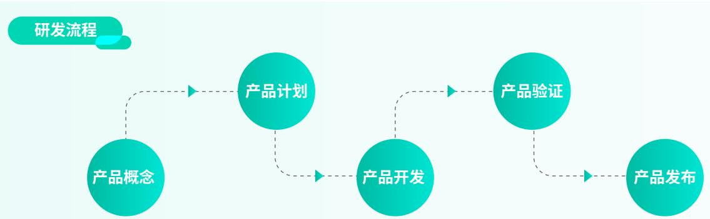

flowchart

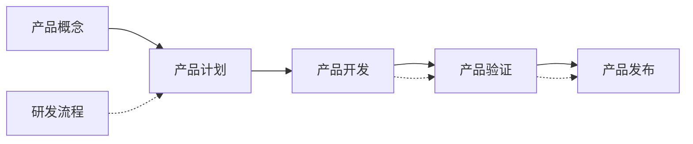
```mermaid
graph LR
  A["产品概念"] --> B["产品计划"]
  B --> C["产品开发"]
  C --> D["产品验证"]
  D --> E["产品发布"]
  F["研发流程"] -.-> B
  C -.-> D
  D -.-> E
```

公司高度重视研发人才队伍建设，目前已组建一支64人的专业研发团队，占员工总数的7.3%。在团队培养方面，公司通过组织内部培训，系统开设前沿技术应用、法规政策解读、项目管理技巧等课程，持续提升研发人员的专业素养，同时积极鼓励研发人员参与外部学术交流与行业研讨会，拓宽技术视野，紧跟行业发展趋势，全方位增强公司整体研发能力。此外，公司通过建立与项目成果挂钩的奖励机制与股权激励机制，充分激发研发人员的创新活力与主观能动性，为公司在医疗器械业务的持续创新与高质量发展注入动力。

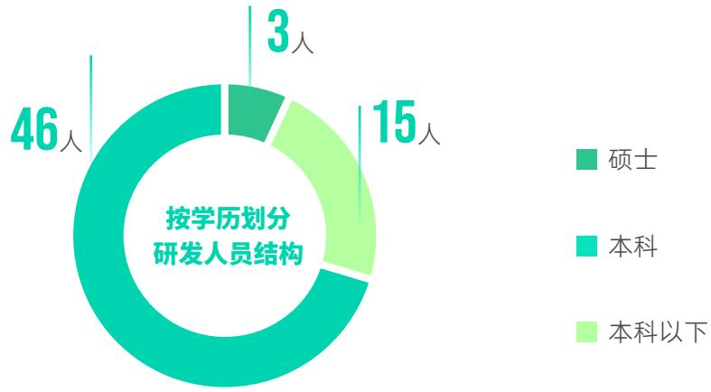

donut

| 学历 | 人数 |
| --- | --- |
| 硕士 | 3 |
| 本科 | 46 |
| 本科以下 | 15 |

目前，公司下属子公司国科恒兴已取得北京市“专精特新”中小企业认证与高新技术企业证书，体现了政府层面对公司研发管理体系与创新能力的权威认可，也印证了公司在细分领域的技术优势与行业竞争力。

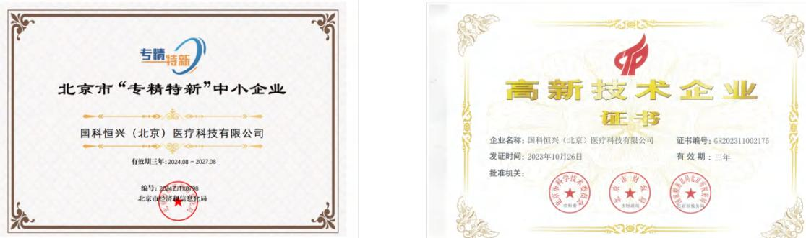

natural_image

Illustration of a globe with lightning bolts above it, symbolizing global energy or sustainability (no text or symbols present)

战略

<table><tr><td>风险类型</td><td>风险描述</td><td>影响的时间范围</td><td>影响的价值链环节</td><td>潜在财务影响</td><td>应对措施</td></tr><tr><td>技术风险</td><td>公司在数字化供应链平台、智能仓储设备、数据分析系统等方面持续投入,若创新未能及时转化为经济效益,或市场接受度低于预期,可能面临较大成本压力,影响盈利能力。</td><td>短期、中期</td><td>运营</td><td>运营成本增加</td><td>· 加强市场调研与技术可行性分析,制定科学详细的项目规划与预算,确保投入与战略及市场需求匹配;· 强化跨部门协同,推进数字化平台、智能设备与系统建设协调一致,同时优化内部流程,提高资源利用效率,降低运营成本。</td></tr><tr><td>人才风险</td><td>科技创新依赖专业技术人才,如医疗器械供应链专家、数据分析师、信息技术工程师等。若人才招聘困难或流失严重,可能影响科技创新战略的推进。</td><td>短期、中期、长期</td><td>运营</td><td>运营成本增加</td><td>· 建立内部培训机制,定期开展医疗器械技术、供应链管理、数据分析、信息技术等专业培训;· 设立创新激励机制,对在科技创新中表现突出的员工给予物质与精神奖励;· 提供有竞争力的薪酬福利体系,包括基本工资、绩效奖金、福利待遇等,增强人才吸引力与留任率。</td></tr></table>

<table><tr><td>机遇类型</td><td>机遇描述</td><td>影响的时间范围</td><td>影响的价值链环节</td><td>潜在财务影响</td><td>应对措施</td></tr><tr><td>数字化供应链升级机遇</td><td>借助大数据、人工智能、物联网等技术,优化供应链管理,实现库存精准控制、智能调度、需求精细预测,提升效率与透明度,降低运营成本,增强客户满意度和差异化竞争优势。</td><td>中期、长期</td><td>上游、运营、下游</td><td>运营成本减少、营业收入增加</td><td>· 加大技术研发投入,开发或引进先进技术,持续完善数字化供应链平台;· 招聘并培养具备医疗器械供应链与信息技术双重背景的复合型人才,组建专业技术团队,支撑供应链数字化转型。</td></tr></table>

natural_image

Stylized illustration of modern city buildings in blue and green tones, no text or symbols present.

## 影响、风险和机遇管理

公司建立覆盖研发全周期的风险管理流程，持续开展风险识别与管控，并在知识产权保护等关键环节落实相应举措，确保研发过程平稳可控，研发成果得到有效保护。

## 创新风险管理流程

公司依据《IPD（产品开发与管理）流程实施手册》及产品立项审批、开发审批、结项审批、内部发布、内部培训、外部发布等一系列流程文件，搭建了覆盖研发全生命周期的风险管理机制。

  
风险识别  
公司将风险识别前置至产品概念阶段，并贯穿IPD全流程。项目经理在产品概念启动会后，组织跨部门团队识别法律、质量、财务、市场、运营等各类风险。在开发、验证及产品信息变更环节，各部门将持续更新已识别的风险。

  
风险分析  
各专业部门依据职责分工，从不同维度对各类风险进行评估，将相关结论纳入《风险分析及应对表》及《风险等级表》。在关键阶段评审节点，决策评审委员会对分析结论进行集中研判，形成是否进入下一阶段的决策意见。

  
风险应对  
各专业部门针对识别出的风险分别采取专项措施：法务管理岗修订合同模板、更新法律风险及应对策略；产品开发岗调整产品基础价格、业务财务部更新产品运营成本；市场管理岗更新宣贯材料、更新市场风险及应对策略；平台/院端业务服务项目部更新运营交付风险及应对策略；物流部优化物流流程及基础设施，客户运营部对结算、应收、准入及客户服务等相关流程进行优化，信息服务项目部优化信息系统，供应链管理部对采购、库存等相关流程进行优化。

  
风险监控

各专业部门在开发与验证阶段持续跟踪风险状态，依据实际业务验证结果动态更新风险及应对策略。公司同步开展风险应对措施有效性评价，通过后评估机制检验防控措施的实际效果，确保风险始终处于可控范围。

## 知识产权保护

公司严格遵守《中华人民共和国专利法》《企业知识产权管理规范》等相关法律法规，制定了《知识产权管理制度》及配套的《知识产权申请及续费审批流程》。管理架构方面，由法务及合规管理部统筹负责，各部门具体落实。流程层面，公司将知识产权工作深度融入运营全流程，并通过动态登记相关台账，实时记录各类知识产权的状态与变动。

## 资产管理

建立知识产权登记台账，台账信息完整涵盖知识产权申请登记、授权情况。

## 合作管理

合作伙伴需使用公司注册商标时，严格依据审批流程执行，经审批同意后方可使用，不得擅自改变用途或另作他用。

## 成果保密

在确定知识产权保护方式前，不发表成果论文，亦不以委托鉴定、展览、广告、赠送产品等任何方式向社会公开。

## 员工保密

公司员工严格保守商业秘密，不得在公共场所或者利用非保密通信工具传递商业秘密信息和与职务智力劳动相关的信息。

## 事件处置

如发现不利于知识产权的情形，及时上报至法务及合规管理部，由法务及合规管理部进行对接处理。

## 风险防范

申请专利前做好专利检索，避免侵犯他人知识产权。

## 指标与目标

公司以“以数字化推广为基础，扩大行业影响力，增强差异化核心竞争力，打造医疗器械数字化综合赋能平台”为目标。围绕此目标，公司构建研发创新指标体系，从研发投入、知识产权积累、标准研制参与、服务产品化输出等多个维度，对创新目标进行量化分解与成效追踪。

## ����年关键绩效指标

## 研发投入

研发投入

2,964.4万元

## 专利成果

专利申请

3项

授权专利累计

21项

发明专利累计

11项

实用新型专利累计

9项

外观设计专利累计

1项

商标累计

46项

软件著作权累计

44项

natural_image

Stylized illustration of a hospital building with green and yellow buildings against a teal background (no text or symbols)

本年度，公司在技术研发成果转化方面取得重要突破，全年共完成14个服务产品及细分领域的标准化服务产品输出，包括关节、脊柱、创伤、介入、运动医学、心脏瓣膜、电生理、密网支架等多类产品，形成覆盖短期寄售、批发、商物通耗材、商物通设备等不同场景的标准化解决方案产品矩阵。

## 产业平台赋能

国科恒泰凭借深厚的行业积累与卓越的创新能力，搭建先进的医疗器械供应链数字化生态平台，实现了业务全链条、全场景的数字化管理，推动业务向规模化、专业化、信息化、规范化方向发展。

## 一站式分销平台

公司创新推行“一站式产品分销平台”模式，集约化承接生产厂商的渠道管理职能，为经销商提供涵盖“准入—运营—退出”的全生命周期服务。该模式通过整合产品供应、物流配送、库存管理及市场推广等环节，构建一体化解决方案，有效解决了生产厂商传统分销模式中面临的沟通效率低、信息收集难、管理成本高等痛点。

## 降低管理成本，实现渠道扁平化

平台整合渠道资源，压缩经销商层级，提升渠道运行效率。同时，为生产商提供供应链信息化系统数据接口，使其可实时获取库存、销售、物流等关键数据，降低自建系统的投入与维护成本。

## 缓解资金压力，创新保税仓储服务

依托天津恒翔公用型保税仓库，进口医疗器械可暂缓缴纳进口环节税款，减少企业流动资金占用，优化成本结构。

## 提升运营效率，打通数据链路

通过“线上+线下供应链一体化”服务模式，实现生产商、平台与下游客户在订单、物流、结算等环节的数据互联互通，减少信息延误与沟通成本，全面提升供应链响应速度。

## 保障服务质量，强化渠道管理

平台设立严格的经销商准入与审核机制，并提供持续的运营支持与培训，助力经销商提升销售能力。同时，规范退出流程与后续服务，确保合作双方权益得到妥善保障。

## 案例

## 国科恒翔保税仓首批货物成功入仓

2025年4月30日，国科恒泰的全资子公司国科恒翔（天津）医疗科技有限公司位于天津市北辰区的公用型保税仓库的首单货物顺利完成了入仓作业。此次入仓的货物，从国外厂家提货、国外报关、国际物流运输、国内报关、口岸提货、配送入仓的全流程作业由国科恒泰物流部一体化操作完成，标志着国科恒泰在医疗器械供应链服务领域的又一重要能力的延展突破。

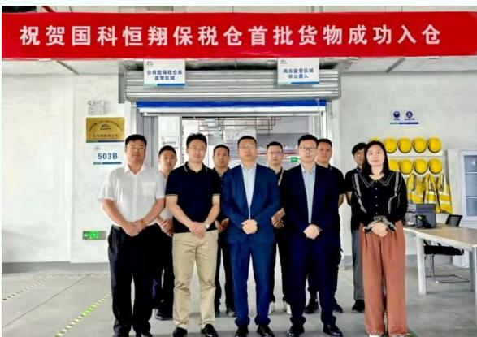

text_image

祝贺国科恒翔保税仓首批货物成功入仓
503B

## 一站式商机共享平台

公司在医疗器械行业积极革新，以“爱经销”模式打破传统销售与供应链管理的固有模式，搭建创新赋能、合作共赢的交互平台。该平台是国科恒泰旗下面向生产企业和经销企业的B2B一站式商机共享服务平台，依托先进信息技术构建起数字化、协同化体系，具有覆盖广、资源优、效率高、模式新的特点。经销商可通过专属平台，便捷获取产品信息、库存状况、促销活动等，实现线上高效下单并跟踪订单执行进度，大幅提升交易透明度与效率，优化行业供应链运营流程。

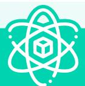  
覆盖广  
爱经销平台通过天网、地网、人网的全渠道整合布局，实现了对全国区域生产企业与经销企业资源的广泛覆盖，优化了商机匹配机制，确保了商业机会的快速对接与高效转化。

  
资源优  
爱经销平台覆盖全国优质头部生产企业、经销企业、投资企业，一站式解决找产品、找渠道、找户头、找投资等；同时，平台创新短期寄售商业模式，助力所有生态圈企业快速达成合作。

  
效率高  
爱经销平台采用线上与线下相结合的运营模式，线上利用广阔的网络平台实现信息的快速传播，线下则通过地网与人网的紧密结合，大幅提升了沟通效率，构建了更为高效且稳固的合作关系。

  
模式新

爱经销打破传统医疗器械生态圈单一交互模式，通过公众号、视频号、小程序、直播、全国社群联盟、全国巡展会、城市展厅、城市伙伴联盟、优选招商刊九大产品模块叠加，形成了一个全方位、立体化的高效交互体系。

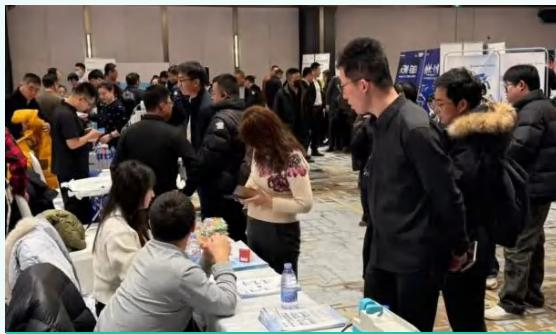

text_image

Street photo with visible store signboards

爱经销·北京站

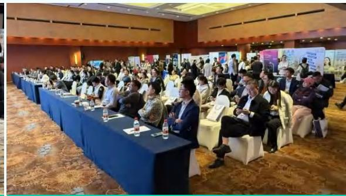

natural_image

Large conference hall filled with attendees seated at long tables, facing a stage with presentation screens (no visible text or signage)

爱经销·上海站

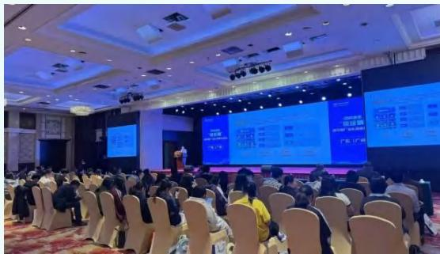

text_image

Conference hall photo with large screens displaying event information and audience seated facing the stage

爱经销·广州站

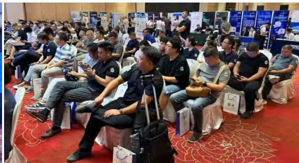

text_image

Crowd of people seated in a conference hall with visible presentation screens and signage in the background

爱经销·西安站

## 智能供应链协同平台

公司全资子公司国科恒兴自主研发医疗器械供应链数字化平台“聚械通”，通过整合医疗器械生产企业、经营企业、服务企业以及医疗机构等各方资源，实现供应链信息的实时共享与协同作业，以专业服务助力产业链发展。“聚械通”整体架构采用“业务场景+技术中台”双轮驱动，以AI中台、数据中台为支撑，结合公有云/私有云部署，实现数据互通与智能分析，围绕渠道运营与供应链管理两大核心，为企业提供全链路数字化解决方案。

  
赋能上游生产企业

平台助力生产企业打通供应链全场景，涵盖产品研发、生产规划到原材料采购、产品销售等各个环节，使生产企业能够清晰掌握供应链动态，合理安排生产计划，有效降低成本并提升效率。

  
服务医疗机构

平台将服务延伸至耗材供应、院内服务以及医保结算等关键场景，助力医疗机构实现供应链使用末端的一体化协同，提升运营效率与管理水平。

  
支撑政府合规监管

平台为监管部门提供透明化、可追溯的信息渠道，监管机构可通过平台实时查看医疗器械的流通轨迹、价格信息等，有效加大对医疗器械市场的监管力度，维护市场秩序。

## 平台示意图

<table><tr><td colspan="6">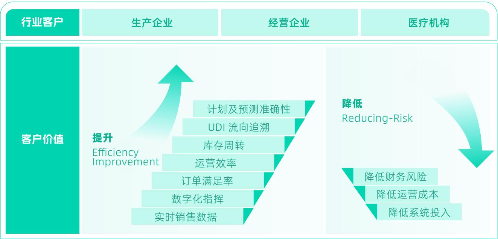</td></tr><tr><td colspan="6">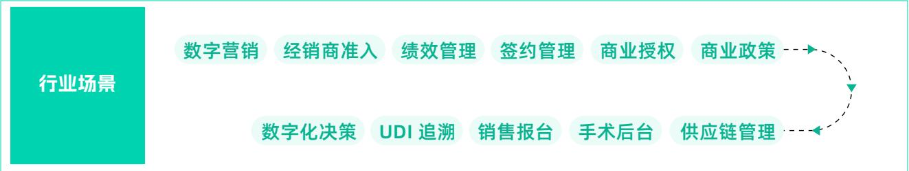</td></tr><tr><td rowspan="6">产品方案</td><td rowspan="6">产品</td><td>电子展厅</td><td>渠道商业政策管理</td><td rowspan="6">解决方案</td><td>医疗器械渠道运营解决方案</td></tr><tr><td>渠道首营管理</td><td>渠道经销商培训管理</td><td rowspan="2">医疗器械渠道及供应链整体解决方案</td></tr><tr><td>企业信用背调管理</td><td>渠道分销管理 DMS</td></tr><tr><td>渠道绩效指标管理</td><td>高值耗材手术跟台管理</td><td rowspan="2">流通企业经营管理解决方案</td></tr><tr><td>渠道商业合同管理</td><td>经销商进销存管理</td></tr><tr><td>渠道商业授权管理</td><td>医院供应链协同管理</td><td>医疗集团供应链集中化管理解决方案</td></tr><tr><td rowspan="2">基础架构</td><td colspan="2">中台产业</td><td>AI 中台</td><td>中台数据</td><td>中台技术</td></tr><tr><td colspan="3">公有云</td><td colspan="2">私有云</td></tr></table>

<table><tr><td rowspan="6">产品方案</td><td rowspan="6">产品</td><td>电子展厅</td><td>渠道商业政策管理</td><td rowspan="6">解决方案</td><td rowspan="2">医疗器械渠道运营解决方案</td></tr><tr><td>渠道首营管理</td><td>渠道经销商培训管理</td></tr><tr><td>企业信用背调管理</td><td>渠道分销管理 DMS</td><td>医疗器械渠道及供应链整体解决方案</td></tr><tr><td>渠道绩效指标管理</td><td>高值耗材手术跟台管理</td><td rowspan="2">流通企业经营管理解决方案</td></tr><tr><td>渠道商业合同管理</td><td>经销商进销存管理</td></tr><tr><td>渠道商业授权管理</td><td>医院供应链协同管理</td><td>医疗集团供应链集中化管理解决方案</td></tr></table>

<table><tr><td rowspan="2">基础架构</td><td>中台产业</td><td>AI 中台</td><td>中台数据</td><td>中台技术</td></tr><tr><td colspan="2">公有云</td><td colspan="2">私有云</td></tr></table>

## 医院端优化配置平台

公司依托自身雄厚的资金实力、完善的仓储物流网络、专业的精准配送服务能力，搭建了“SPD平台数据+智能硬件”的综合服务体系，有效提升了医院供应效率和运营水平，降低了院内库存和运营成本。

## 降低采购成本

通过优化采购流程，利用集中采购、整合供应商资源等方式，帮助医院获得更有竞争力的采购价格，削减采购成本。

## 减少库存成本

借助信息化、物联网技术实现医用耗材零库存或低库存管理，降低医院在耗材资金占用方面的成本。

## 节约人力成本

提供仓管配送人员及智能结算系统，医院可精简相关人员配置，减少人力成本支出。

## 提升运营效率

通过信息技术、物联网技术，将供应链服务延伸到医院一级库、科室二级库的供应链使用末端，形成完整供应链闭环，实现医院与供应商、配送商在采购订单、物流配送、消耗结算、开票支付等整个供应链环节的一体化协同，有效提升医院供应效率和运营水平。

## 共创共赢生态

公司基于自身在高值耗材领域中的第三方平台定位，依托“强资金、强运营”的优势以及逾十年高值耗材流通领域的“专业化、规模化、信息化、规范化”的服务经验，不断整合“线上+线下”“境内+境外”“上游+下游”的平台优势资源，为更多医疗领域龙头企业、产业资本方、国际合作伙伴、金融机构等搭建全方位、高效率、一站式的展示交流与交易平台。以平台为纽带，公司与行业伙伴携手突破发展瓶颈，共同推动医疗器械产业升级，实现多方共赢的可持续发展。

##

## “炬医行”创新商业化赋能服务推广交流会

2025 年 5 月， 由国科恒泰主办的第三期 “炬医行” 创新商业化赋能服务推广交流会 （TorchlightMedfuture Forum， 简称 TMF）在北京拉开帷幕。该活动旨在通过深入探讨创新商业化模式、 产业BD（Business Development）与资本运作协同机制，以及差异化的国际战略布局等核心议题，为行业发展提供新思路 ； 同时依托国科恒泰“线上 + 线下”一体化的供应链平台解决方案，为器械企业提供产业链全链条闭环服务，全方位助力器械厂家从线上到线下、境内到境外的发展。

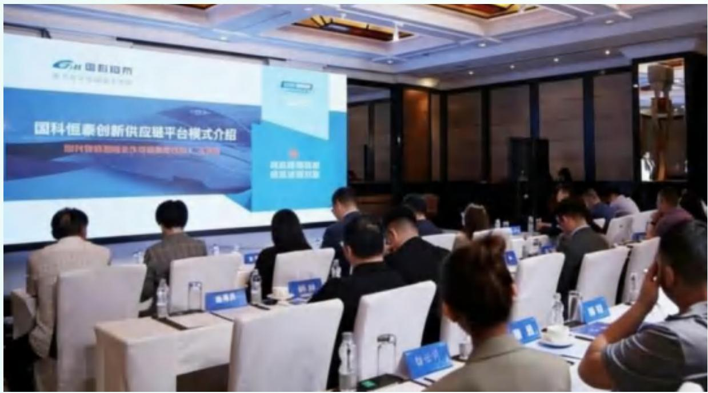

text_image

GRC创新平台
国科恒泰创新供应链平台模式介绍
国科价值驱动合作项目启动人：王志伟
国科创新平台
项目进展对照表

公司积极参与多项关键行业标准的制定工作， 截至目前， 已累计参与或制定标准 11 项。作为中国物流与采购联合会医疗器械供应链分会、 中国医疗器械行业协会、 中国医药物资协会等重要行业组织的主要成员单位，公司通过深度参与标准研制，不仅为行业树立了规范化标杆，也确保自身产品与服务在质量、安全及技术创新方面始终处于行业领先水平，为推动医疗器械供应链领域的标准化发展贡献了重要力量。

text_image

已累计参与或制定标准
11项
59

本年度，公司重点参与制定以下标准 ：

<table><tr><td>标准类型</td><td>标准名称</td></tr><tr><td>行业标准</td><td>《医疗器械物流追溯信息管理》</td></tr><tr><td rowspan="3">团体标准</td><td>《医院院内物流信息系统通用要求》</td></tr><tr><td>《医院院内物流医疗器械临床配送服务规范》</td></tr><tr><td>《医疗器械第三方物流仓储科技服务平台》</td></tr></table>

2025 年， 公司凭借在医疗器械供应链领域的专业实力与行业贡献， 荣获中国物流与采购联合会颁发的T/CFLP0078-2025 《医院院内医疗器械物流服务质量评价》 及 T/CFLP 0079-2025 《骨科耗材物流服务规范》两项团体标准起草单位称号，标志着公司在行业标准化建设中的引领作用获得高度认可，为医疗器械物流服务树立了新标杆。

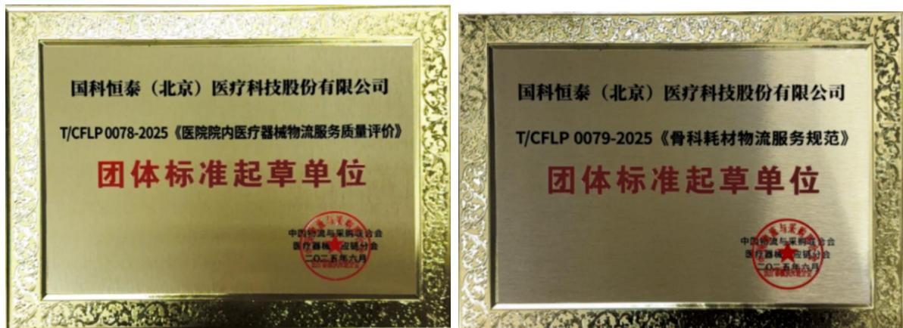

## 打造责任供应

国科恒泰积极践行可持续发展理念，开展负责任供应链管理，通过严格的供应商准入把控从源头上确保所提供的产品质量可靠，保护客户合法权益，为行业可持续发展贡献力量。

## 治理

公司制定了《供应商资格审核管理办法》《采购预算与计划管理制度》《采购订单执行及交期管理制度》《非业务采购管理制度》《非业务供应商管理制度》等管理办法，形成了从供应商筛选、采购计划制定到订单执行的全链条管理体系，为公司的稳健发展奠定了坚实基础。供应链运营中心作为供应链管理主责部门，通过高效整合内外部资源，确保供应链的顺畅运行与持续优化。

战略

<table><tr><td>风险类型</td><td>风险描述</td><td>影响的时间范围</td><td>影响的价值链环节</td><td>潜在财务影响</td><td>应对措施</td></tr><tr><td>政策风险</td><td>带量采购政策导致高值医用耗材价格下降,公司核心产品(如血管介入类、骨科材料)受集采影响较大,可能面临市场规模缩减、利润空间压缩的风险。</td><td>中期、长期</td><td>上游、运营、下游</td><td>营业收入减少</td><td>·发挥规模化、专业化、信息化的供应链平台优势,整合经销商职能,提升配送效率,降低运营成本,承接更多厂家供应链业务;·利用数字化系统打通全链条信息流,实现精准库存管理、需求预测与物流调度,提升运营效率和决策科学性;·加强与头部医械厂商合作,积极参与外资品牌本土化战略,争取更多产品代理与服务机会,共同应对集采影响。</td></tr><tr><td rowspan="2">市场风险</td><td>公司供应商较为集中,向波士顿科学、美敦力等采购高值医用耗材合计占比近半。若主要供应商合作关系发生变化,可能影响产品供应的稳定性和及时性。</td><td>短期、中期</td><td>上游、运营、下游</td><td>运营成本增加、营业收入减少</td><td>·拓展与更多国内外知名高值耗材厂商合作,增加供应商数量,降低对单一供应商的依赖;·与主要供应商建立战略合作伙伴关系,通过签订长期协议、联合市场推广等方式提升合作稳定性;·建立供应商评估体系,定期开展评估与风险监测。</td></tr><tr><td>集采加速国产医疗耗材崛起,国际厂商市场份额下降。公司以销售国际品牌产品为主,可能面临产品销售受阻、库存积压等问题,影响供应链顺畅运行。</td><td>短期、中期</td><td>上游、运营、下游</td><td>运营成本增加、营业收入减少</td><td>·加大国产医疗耗材引进力度,与国内优质厂商建立合作,丰富产品种类,提升国产产品占比;·运用数字化技术优化库存管理,提高周转率,精准预测需求,合理控制库存水平,降低积压风险。</td></tr></table>

<table><tr><td>机遇类型</td><td>机遇描述</td><td>影响的时间范围</td><td>影响的价值链环节</td><td>潜在财务影响</td><td>应对措施</td></tr><tr><td>政策机遇</td><td>带量采购推动流通环节向集中化发展,国科恒泰作为大型平台商,可承接渠道物流、开票回款等职能,依托规模化、专业化、信息化的供应链平台,有望整合市场资源,提升市场份额。</td><td>中期、长期</td><td>上游、运营、下游</td><td>营业收入增加</td><td>持续投入信息化系统建设,提升数据处理与分析能力,实现对物流、资金流、信息流的实时监控与精准管理;建立风险预警机制,关注政策变动与市场竞争,制定应急预案,应对可能出现的合作纠纷与市场波动。</td></tr><tr><td>数字化转型机遇</td><td>公司打造医疗器械供应链数字化生态平台,可通过全链条信息流提升运营效率与透明度,实现降本增效。同时,数字化能力可向外输出,服务外部客户,拓展业务边界。</td><td>短期、中期、长期</td><td>上游、运营、下游</td><td>运营成本减少、营业收入增加</td><td>持续投入资金用于平台技术升级与运维,吸引并留住专业技术人才,确保平台先进性与稳定性;制定针对外部客户的市场推广策略,提升平台知名度与影响力,吸引更多客户使用外溢服务。</td></tr></table>

## 影响、风险和机遇管理

公司通过建立供应链风险管理流程，强化供应商廉洁采购与 ESG 管理，并针对生产端及非采购供应商实施分类风险管控，全面保障供应链的绿色安全与稳定

## 供应链风险管理流程

公司不断完善供应链风险管理流程，进行风险识别、评估与应对，通过制定并执行针对性的控制措施，确保供应链的稳健与安全。

## 风险识别

公司针对供应链安全从采购计划、采购下单、采购到货、验收上架环节建立了相应的风险清单。围绕库存周转、效期管理、仓库及运输安全等重点环节，通过流程梳理、事件分析定期识别评估风险。

## 风险分析

依托风险看板对关键指标进行实时监测与预警，由一道防线牵头，协同多部门协同响应与处置。中高风险事项纳入月度风险联席会跟踪，重大风险按机制上报。

## 风险应对

针对供应中断风险，公司采取提前与供应商沟通、提前下达采购订单并完成发货，以及紧急调拨等措施，确保供应链持续稳定运行。

## 监督改善

进行措施有效性监控与评价，及时调整应对策略，保障风险控制持续有效。

## 供应商廉洁与ESG管理

公司坚持以责任为导向，将廉洁合规与绿色可持续贯穿供应商管理全过程，持续构建透明、公正、低碳的健康供应链体系。

廉洁采购 公司坚决抵制商业贿赂，确保采购活动的公开、公正、公平，积极倡导廉洁合作理念，与供应商签订廉洁协议以明确双方行为规范。在业务采购领域，批发合同模板中设置反腐败合规条款，明确禁止供应商从事当地或地区反腐败法律所不允许的行为 ； 在非业务采购领域， 风控系统项目、 新办公楼装修全过程造价项目、 新办公楼设计项目、 天津基地自动化仓储项目等招标文件中均专设 “纪律与监督” 条款，严禁投标人向招标、 评标人员行贿或泄露招标信息， 严禁在招标、 评标期间邀请相关人员参加宴请等活动，通过制度化约束强化公平竞争、诚实守信的合作原则，持续促进供应链健康发展。

供应商 ESG 管理 公司致力于构建绿色、可持续的供应链，在供应链管理中推行 ESG 理念，优先选择符合 ESG 标准，特别是在环保方面表现卓越的供应商。在供应商准入环节，将供应商在节能减排、资源循环利用以及环境管理体系等方面的表现纳入综合考量范围。

## 生产端供应商资质管理

公司严格遵循《供应商资格审核管理办法》，从源头把控医疗器械产品购进质量，确保生产端供应商准入规范、资质合规。

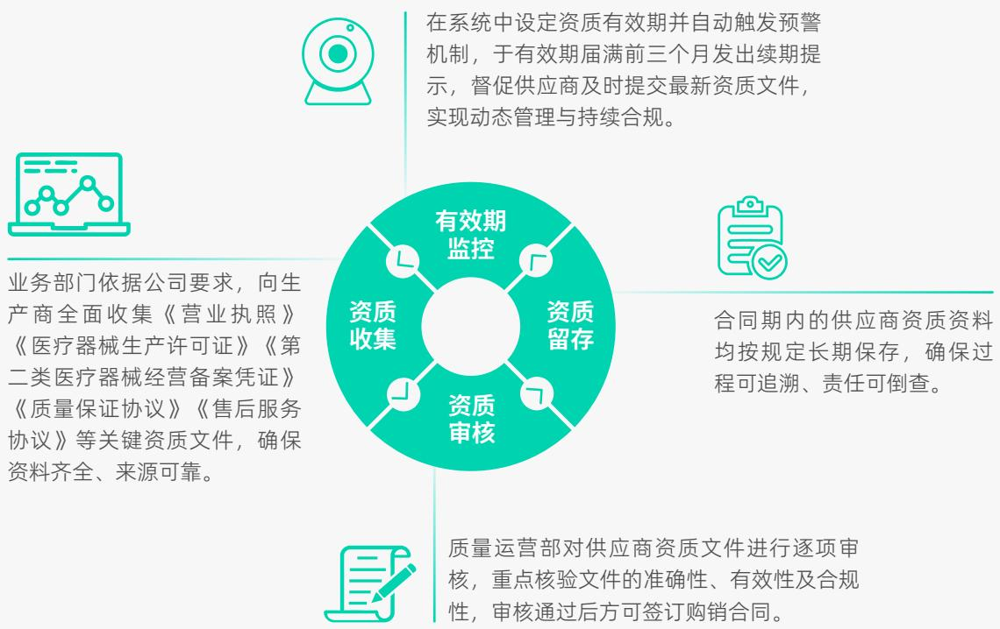

flowchart

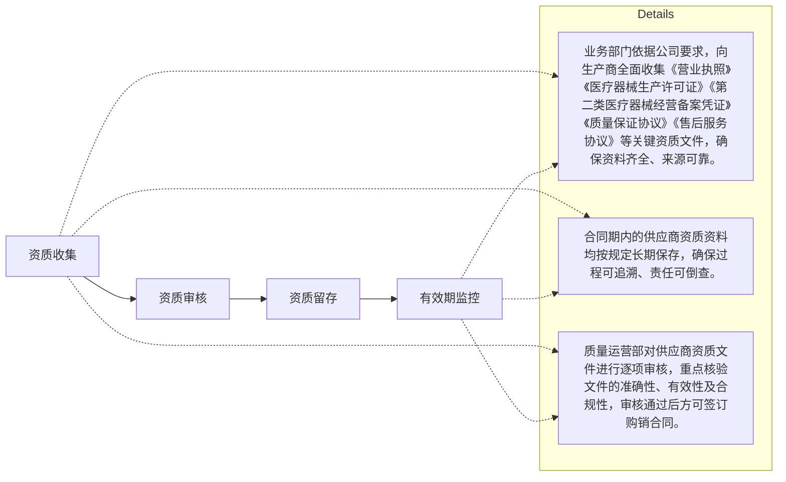
```mermaid
graph LR
  A["资质收集"] --> B["资质审核"]
  B --> C["资质留存"]
  C --> D["有效期监控"]
  
  subgraph Details
    E["业务部门依据公司要求，向生产商全面收集《营业执照》《医疗器械生产许可证》《第二类医疗器械经营备案凭证》《质量保证协议》《售后服务协议》等关键资质文件，确保资料齐全、来源可靠。"]
  end
  
  subgraph Details
    F["合同期内的供应商资质资料均按规定长期保存，确保过程可追溯、责任可倒查。"]
  end
  
  subgraph Details
    G["质量运营部对供应商资质文件进行逐项审核，重点核验文件的准确性、有效性及合规性，审核通过后方可签订购销合同。"]
  end
  
  %% Left Side Details
  A -.-> E
  A -.-> F
  A -.-> G
  D -.-> E
  D -.-> F
  D -.-> G
```

目前，公司已与众多国内外头部医械生产厂商建立深度合作，覆盖冠脉介入、骨科等多个核心领域，形成广泛稳固的供应链合作网络。

<table><tr><td>类别</td><td>主要合作品牌</td></tr><tr><td>冠脉介入治疗材料</td><td>波士顿科学</td></tr><tr><td>外周血管介入</td><td>波士顿科学</td></tr><tr><td>脑血管介入</td><td>柯惠、北京微仙</td></tr><tr><td>心脏介入</td><td>雅培</td></tr><tr><td>骨科材料</td><td>美敦力、施乐辉、威高骨科</td></tr><tr><td>消化介入材料</td><td>波士顿科学</td></tr></table>

## 非业务采购管理流程

公司依据《非业务采购供应商管理办法》，构建覆盖供应商入库、选用、评价、分级、退出等环节的全生命周期管理体系，实现非业务采购规范管理。

## 供应商准入

非业务供应商经资质审核通过后，正式成为认证供应商，统一录入《非采购供应商资源库名录》。

## 供应商管理

建立合作供应商评估机制，由相关部门确定需评估的供应商清单，定期开展绩效考核，将考核结果作为供应商分级、选用调整的重要依据。

## 供应商退出

对于因自身原因主动终止合作的供应商，依据合同约定承担相应损失。

## 指标与目标

公司以“充分沉淀产业经验，融通发展、内外联动，通过运用数字化技术增强供应链韧性，提升动态风险管理能力，确保供应链体系稳定、可靠运行”为供应链管理总目标，立足当前市场环境，前瞻未来发展趋势，将目标逐层分解至各相关部门与岗位，确保责任落实到位。通过目标引领与系统执行，全面提升供应链应对各类挑战的能力，保障供应链持续高效、安全、稳定运行。

## ����年关键绩效指标

供应商总数

100个

其中

国内供应商数

88个

海外供应商数

12个

natural_image

Illustration of a hospital building with green and yellow facade, no text or symbols present

## 保障数据安全

国科恒泰秉承“实施风险管理，确保信息安全，保障业务可持续发展”的信息安全理念，有效识别、评估、控制和应对各类信息安全风险，为公司稳健运营奠定坚实基础。

## 治理

公司严格遵守《中华人民共和国网络安全法》等法规要求，制定并执行《信息安全管理规定》《信息安全应急预案》《信息安全漏洞管理制度》等制度。数字化服务管理部承担公司网络安全相关职责，统筹网络安全策略与制度体系建设、网络安全运行与监测、网络安全防护与访问控制、网络安全事件响应与处置、网络安全审计与合规管理、网络安全意识培训等工作。

数字化服务管理部  

网络安全领导组

制定总体网络安全战略、方针政策、资源保障及预算审批、重大事件决策等。

网络安全工作组

制度体系建设与实施、日常安全运营、技术体系建设、网络安全风险审计、网络安全培训与演练等。

本年度，公司顺利通过信息安全管理体系监督审核，获准持续持有ISO 27001信息安全管理体系认证证书，标志着管理体系持续有效运行、符合国际标准要求。

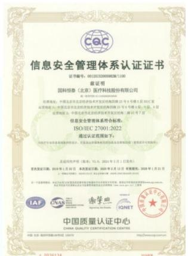

text_image

COC
信息安全管理体系认证证书
证书编号：0012832006980671100
经证明
国科信息（北京）医疗科技股份有限公司
注册地址：中国北京市北京经济技术开发区南苑路22号4号楼1层101C室
运营地址：中国北京市西城区西直门南大街1号院5号楼1层5-6室；4层
证照编号：中国证券登记结算有限责任公司深圳分公司
自证安全管理体系符合标准。
ISO/TEC 27001:2022
通过认证范围如下：
为适应于专业或者提供培训项目，可享受企业服务的各类安全管理体系（重要证件专用章）。
及适用年份（2019.1月21日、2020年2月1日、2020年3月21日）
首次发证日期：2020年1月21日 本次发证日期：2020年2月1日 有效期至：2020年3月21日
IAAF IVAI 云信科技 云信科技 云信科技 云信科技 云信科技 云信科技 云信科技 云信科技 云信科技 云信科技 云信科技 云信科技 云信科技 云信科技 云信科技 云信科技 云信科技 云信科技 云信科技 云信科技 云信科技 云信科技 云信科技 云信科技 云信科技 云信<nl>中国质量认证中心
CHINA QUALITY CERTIFICATION CENTRE
A 0036134

国科恒泰（北京）医疗科技股份有限公司

战略

<table><tr><td>风险类型</td><td>风险描述</td><td>影响的时间范围</td><td>影响的价值链环节</td><td>潜在财务影响</td><td>应对措施</td></tr><tr><td rowspan="3">数据泄露、丢失风险</td><td>面临数据窃取、篡改、恶意软件入侵等威胁,可能导致敏感数据泄露或业务中断。</td><td>短期、中期</td><td>上游、运营、下游</td><td>运营成本增加</td><td>部署云NGFW和WAF产品,仅对外开放必要端口。利用Web防护大数据及云计算技术,抵御OWASP Top10攻击(如注入、XSS、不安全的直接对象引用、已知漏洞组件利用等),并具备抗DDoS及CC防护功能。部署态势感知平台,通过核心节点流量探针捕捉网络访问日志,深度分析并预警潜在安全威胁。</td></tr><tr><td>存储系统故障、自然灾害或硬件老化可能导致数据丢失或无法恢复,影响业务连续性和数据可用性。</td><td>短期</td><td>上游、运营、下游</td><td>运营成本增加、营业收入减少</td><td>数据库具备自动备份功能,并启用异地冗余备份。TB级以上数据每周全量备份、每天增量备份;TB级以下数据每天全量备份。</td></tr><tr><td>员工因疏忽、误操作或恶意行为,可能导致数据泄露、误删或越权访问客户隐私数据。</td><td>短期</td><td>上游、运营、下游</td><td>运营成本增加</td><td>建立完善的审批流程,规范员工访问权限管理、数据传输等;制定严格的员工保密制度,要求员工签署保密协议,明确保密义务和违约责任;加强员工信息安全培训,提高员工对数据及客户隐私保护的意识和技能。</td></tr><tr><td>政策及法规风险</td><td>数据或客户隐私外泄可能违反信息安全管理规定,面临通报、处罚或法律追究。</td><td>短期、中期</td><td>运营、下游</td><td>运营成本增加、营业收入减少</td><td rowspan="2">建立严格的员工数据访问权限管理制度,根据员工的岗位职责和业务需求,精确分配数据访问权限,防止员工越权访问客户隐私数据;定期进行系统安全检测和漏洞扫描,及时发现和修复潜在的安全隐患,防止黑客攻击和数据窃取;制定完善的应急处理流程、责任分工和沟通机制,确保能够快速响应和处理。</td></tr><tr><td>声誉风险</td><td>客户隐私泄漏将影响客户与投资者信任,可能导致市场份额萎缩、股价下跌和品牌价值受损。</td><td>短期、中期</td><td>运营、下游</td><td>运营成本增加、营业收入减少</td></tr></table>

<table><tr><td>机遇类型</td><td>机遇描述</td><td>影响的时间范围</td><td>影响的价值链环节</td><td>潜在财务影响</td><td>应对措施</td></tr><tr><td>技术机遇</td><td>借助隐私计算、多方安全计算等技术,在保障客户隐私前提下挖掘数据价值,拓展应用场景和商业模式。</td><td>中期、长期</td><td>上游、运营、下游</td><td>运营成本减少、营业收入增加</td><td>对市场上的新兴技术进行调研和评估,如AI、RPA等,根据公司的业务需求、数据特点和技术实力,选择最适合的技术方案和产品;投入资源对现有的信息系统进行改造和升级。</td></tr></table>

## 影响、风险和机遇管理

公司通过流程化的信息安全风险管理、常态化的全方位保护措施以及实战化的应急演练，保障机密信息不泄露、客户隐私得到有效保护。

## 信息安全风险管理流程

公司依据《信息安全风险评估管理程序》，建立覆盖资产识别、威胁分析、风险评估与处置的全流程管理机制，定期开展信息安全风险评估，在控制成本与风险平衡的前提下选择适宜的控制目标与措施，将信息安全风险控制在可接受水平，保障业务连续性。

## 信息资产识别

识别不同形式的资产，包括有形资产、无形资产、硬件、软件、文档、代码，以及由信息系统为客户带来的形象价值等。

## 威胁与脆弱性识别

威胁识别：识别的威胁因素分为人为因素（含恶意与非恶意）和环境因素（含不可抗自然力及其他物理因素），可能通过直接或间接攻击、偶发或蓄意事件，对信息的保密性、完整性及可用性造成损害。

脆弱性识别：以资产为核心，针对每一项需要保护的资产识别可能被威胁利用的弱点，并对脆弱性的严重程度进行评估。

## 风险评估

对资产评估结果进行等级化处理，实现对风险的控制与管理。

## 风险处理

制定风险处理计划，明确改进措施、责任人、整改日期及控制措施落实情况。

## 信息安全保护措施

公司实施了一系列数据安全保护举措，全面强化数据管理的安全性与合规性体系，确保公司信息资产及客户的信息安全得到坚实保障。

## 数据分级

基于信息数据敏感度对公司核心数据（客户、供应商、销售数据、财报数据）做分类分级；对敏感数据、非敏感数据设置不同的授权管控规则。

## 加密传输

SaaS 业务系统采用 TLS 1.2及以上协议， 并使用业界权威的 GlobalSign SSL 证书实现全站 HTTPS 数据加密传输， 确保数据传输过程中的机密性、完整性。

## 数据存储

SaaS业务系统平台使用了商 业 密 码 机 ， 采 用SHA-256安全加密算法，对用户登录密码进行加密，能够有效防止因被他人恶意滥用所带来的安全风 险 。 数 据 库 采 用AES-128加密算法，保障用户数据存储的安全性。

natural_image

Isometric illustration of cloud computing infrastructure with server, data center, and network nodes (no text or symbols)

## 数据备份

## 行为审计

## 代码安全

## 隐私保护

SaaS业务系统数据库架构采用主、备库模式，数据库具备自动数据备份功能，并启用异地冗余备份存储数据库，数据库每天进行全量备份，保障用户数据的存储持久性。

SaaS业务通过数据库审计系统，记录数据库所有访问和操作行为，并可通过规则设置，对可能的风险行为及时告警和阻断。当安全事件发生时，可以追根溯源，查找相关责任人；同时有效覆盖监管部门对数据库安全方面的合规要求。

为确保公司产品的源码安全，采用了行业内先进的加密软件进行加密处理。

制定《隐私政策》，采取物理、电子和管理方面的安全措施来保护客户信息，包括但不限于 SSL、信息加密存储、数据中心的访问控制等。

## 信息安全应急管理

为规范信息安全应急响应工作流程，提高应急响应能力，公司制定《信息安全预案》，成立应急指挥组，根据突发信息安全事故所造成后果的严重程度进行分级，并针对性制定响应流程，最大限度减少信息安全事件造成的损失和危害。为保证预案持续有效，公司定期开展应急演练，持续检验预案的有效性，提高员工的应急处理能力。

## 案例

## 网络安全应急演练

2025 年 12 月 10 日，国科恒泰开展网络安全与舆情危机联合应急演练，模拟电商平台因钓鱼邮件导致核心订单数据泄露并引发媒休舆情的重大安全事件 演练中攻击者利用员工终端遭植入的远控木马及夜间未退出浏览器会话，非法导出客户信息与定价数据。公司立即启动应急机制，运营、技术、文化等多部门协同作战，在 2 小时内完成攻击链溯源、失陷终端隔离与舆情应对，成功遏制数据外泄与内网扩散风险，核心业务未受持续影响。

## 指标与目标

为最大限度地减少信息安全事故的发生，公司设定信息安全管理指标，并致力于不断优化和完善信息安全管理体系，通过强化风险管理、提升员工安全意识等措施，确保公司信息资产的安全与稳定。

## ����年管理目标达成情况

高风险信息安全事故

0次

常规风险信息安全事件

≤1次

## ����年关键绩效

信息安全审计次数

1次信息安全培训次数

2次

信息安全培训人均培训时长

2小时

natural_image

Stylized illustration of a hospital building with green and yellow facade, no text or symbols present

## 03 绿色为径践行低碳承诺

## 2025年重要成果

环保事故数0

能源消耗强度0.00128吨标煤/万元营收

温室气体排放强度0.00439吨二氧化碳当量/万元营收

## 本章所响应的SDGs

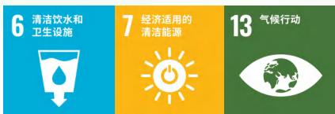

## 本章所涉及的ESG重要议题

应对气候变化

环境合规管理

能源利用

水资源利用

废弃物处理

循环经济

污染物排放

## 应对气候变化

国科恒泰坚持以“双碳”目标为牵引，持续完善气候治理架构，通过节能降耗、使用绿色能源，打造低碳、零碳医疗器械数字化供应链平台，建立覆盖医疗器械流通全领域的气候风险管理体系，推动行业绿色低碳转型。

## 治理

公司深刻认识到气候变化将对自身业务发展及行业前景产生重大影响，将气候变化融入发展战略，并由董事会秘书办公室统筹规划相关工作，强化相关人员的专业赋能与培训，全面提升团队的专业素养，努力构建一支高素质的专业团队，为应对气候变化提供科学、系统的指导，推动可持续发展目标的实现。

战略

<table><tr><td colspan="2">风险类型</td><td>风险描述</td><td>影响的时间范围</td><td>影响的价值链环节</td><td>潜在财务影响</td><td>应对措施</td></tr><tr><td></td><td></td><td>极端天气导致道路封闭、交通瘫痪,运输车辆无法正常运行,影响货物交付;同时增加货物损坏风险,提高运营成本。</td><td>短期</td><td>运营</td><td>运营成本增加</td><td>选用多种运输方式及运输路线。极端天气运输应急预案,增加物流保险投入,优化物流路线规划。</td></tr><tr><td>物理风险</td><td>极端天气</td><td>极端天气现象,如高温、暴雨、洪水和台风等,不仅可能致使仓库的温湿度控制系统失效,影响医疗器械的质量安全,还易造成仓库进水、屋顶渗漏或墙体损毁等重大事故,直接导致货物受损。此外,这类极端天气还可能引发区域仓库受损或人员短缺的问题,干扰供应链的协调运作与货物的有效调配。</td><td>短期</td><td>运营</td><td>运营成本增加</td><td>对仓库进行防水处理,加固门窗,设置挡水墙和排水系统,防止洪水进入。升级仓库的温控设备,扩大调节范围,确保在极端天气下仍能维持适宜的温度和湿度。建立多地仓库联动机制、优化库存分布、实施智能调配系统。</td></tr></table>

<table><tr><td colspan="2">风险类型</td><td>风险描述</td><td>影响的时间范围</td><td>影响的价值链环节</td><td>潜在财务影响</td><td>应对措施</td></tr><tr><td>转型风险</td><td>政策及法律风险</td><td>国家对低碳环保更高要求,公司现有车辆、仓库设施及运营模式可能遭淘汰、改造及更新,影响公司运营。</td><td>短期、中期</td><td>运营</td><td>运营成本增加</td><td>·紧跟国家政策要求,逐步替换为新能源车辆,利用信息技术,优化运输路线,减少运输环节的碳排放。·仓库使用节能设备及灯具,减少能源消耗。</td></tr></table>

<table><tr><td colspan="2">机遇类型</td><td>机遇描述</td><td>影响的时间范围</td><td>影响的价值链环节</td><td>潜在财务影响</td><td>应对措施</td></tr><tr><td rowspan="2">机遇</td><td>市场机遇</td><td>随着消费者对环保、低碳医疗产品关注度提升,公司可成立市场调研小组,深入挖掘绿色医疗产品需求,与供应商紧密合作,开发相关产品,丰富产品线,以此增加市场份额。</td><td>中期、长期</td><td>运营</td><td>营业收入增加</td><td>通过问卷调查、行业论坛等形式了解消费者需求,加大相关方向研发。</td></tr><tr><td>声誉机遇</td><td>积极应对气候变化,采取低碳环保措施,有助于国科恒泰树立良好的企业形象,提升品牌的社会认可度和美誉度,增强消费者、合作伙伴和投资者对企业的信任和好感。</td><td>短期、中期、长期</td><td>运营下游</td><td>营业收入增加</td><td>通过逐步进行新能源运输工具替代;采用节能环保设备;定期披露ESG报告等措施,展示公司在低碳方面做出的努力,树立公司绿色形象。</td></tr></table>

## 影响、风险和机遇管理

为有效应对气候变化所带来的风险，同时把握机遇，公司实施了一系列举措，通过定期识别并评估潜在区险，据此制定出针对性的应对措施，确保在风险来临时能够迅速、有效地应对，并借此契机开拓市场，抓住发展机遇。

## 风险识别

基于公司的业务特性与运营环境，梳理气候变化可能对公司业务开展、市场份额、财务状况等造成影响的潜在风险。

## 风险评估

运用公司的行业经验，评估各风险对公司战略实施、日常运营以及长期发展的影响及影响程度。

## 风险应对

针对不同等级和类型的风险，围绕公司的整体战略规划与可调配资源，制定多种策略的应对方案。

公司温室气体类型主要为二氧化碳，来源集中于日常办公与仓储搬运等环节。为积极践行可持续发展理念，公司通过优化办公流程减少能耗，引入低碳仓储设备，以及推广电动搬运工具等，有效降低碳排放，以实际行动，为构建绿色、低碳的未来发展模式贡献力量。

## 指标与目标

为更好地开展应对气候变化工作，公司将“双碳”目标视为核心战略，积极响应国家政策，结合行业特点和企业实际，制定科学可行的温室气体排放目标、能源利用指标等，积极推动公司实现绿色发展。

<table><tr><td>指标</td><td>单位</td><td>2025年</td></tr><tr><td>天然气</td><td>万立方米</td><td>25.58</td></tr><tr><td>汽油</td><td>吨</td><td>68.97</td></tr><tr><td>柴油</td><td>吨</td><td>1.20</td></tr><tr><td>外购电力总量</td><td>千瓦时</td><td>3,653,757.00</td></tr><tr><td>直接能源消耗总量</td><td>吨标准煤</td><td>446.96</td></tr><tr><td>间接能源消耗总量</td><td>吨标准煤</td><td>448.81</td></tr><tr><td>能源消耗总量</td><td>吨标准煤</td><td>895.77</td></tr><tr><td>能源消耗强度</td><td>吨标准煤/万元营收</td><td>0.00128</td></tr></table>

注1：电力统计口径为全国29个分、子公司办公用电与天津基地用电  
注2：天然气统计口径为天津基地

<table><tr><td>指标</td><td>单位</td><td>2025年</td></tr><tr><td>温室气体排放总量</td><td>tCO2e</td><td>3,069.87</td></tr><tr><td>温室气体排放强度</td><td>tCO2e/万元营收</td><td>0.00439</td></tr><tr><td>直接温室气体排放量(范围1)</td><td>tCO2e</td><td>766.65</td></tr><tr><td>间接温室气体排放量(范围2)</td><td>tCO2e</td><td>2,303.22</td></tr></table>

注：计算标准参考《工业其他行业企业温室气体排放核算方法与报告指南（试行）》以及《2023 年电力二氧化碳排放因子》

## 环境合规管理

国科恒泰深刻认识到绿色发展是面向未来的核心竞争力，致力于将环境责任融入日常运营血脉，严格遵循环保法规，推动企业发展与自然环境和谐共生。

## 环境管理体系

公司始终坚持绿色发展理念，严格贯彻落实《中华人民共和国环境保护法》《中华人民共和国环境影响评价法》等国家及地方环境保护法规、标准和要求，积极探索建设环境、健康与安全（EHS）管理架构。截至报告期末，公司及下属4家子公司已顺利通过环境管理体系认证，环境管理基础不断夯实。

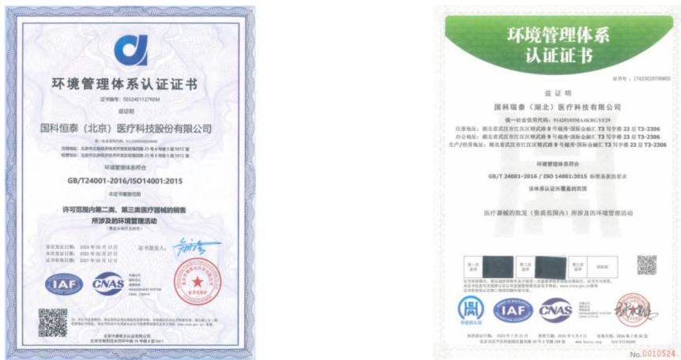  
国科恒泰（北京）医疗科技股份有限公司  
国科瑞泰（湖北）医疗科技有限公司

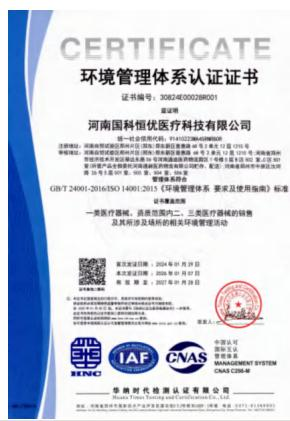

text_image

CERTIFICATE
环境管理体系认证证书
证书编号：308246000288001
证书说明
河南国科恒优医疗科技有限公司
注册地址：河南省郑州市郑东新区郑州路1号(环城)第1幢1层101室（第1层）2102
办公地址：河南省郑州市郑东新区郑州路1号(环城)第1幢1层101室（第1层）2102
联系电话：0755-83999999
经营范围：医疗器械、医疗器械、医疗器械、医疗器械、医疗器械、医疗器械、医疗器械、医疗器械、医疗器械、医疗器械、医疗器械、医疗器械、医疗器械、医疗器械、医疗器械、医疗器械、医疗器械、医疗器械、医疗器械、医疗器械、医疗器械、医疗器械、医疗器械、医疗器械、医疗器械、医疗器械、医疗器械、医疗器械、医疗器械、医疗器械、医疗器械、医疗器械、医疗器械、医疗器械、医疗器械、医疗器械、医疗器械、医疗器械、医疗器械、医疗器械、医疗器械、医疗器械、医疗器械、医疗器械、医疗器械、医疗器械、医疗器械、医疗器械、医疗器械、医疗器械、医疗器械
GB/T 24001-2016/ISO 14001 2015《环境管理体系 要求及使用指南》标准
证书有效期
一类医疗器械，消毒剂范围内，三类医疗器械的销售
及其所涉及的有关环境管理活动
发证机关
发证日期：2016年07月29日
发证机关编号：2016年07月27日
发证机关类型：有限责任公司
经办人：中国证券登记结算有限责任公司
法定代表人：张建平
组织机构代码：CNAS
ISSN 100000000000000000000000000000000000000000000000000000000000000000000000000000000
华纳时代检测认证有限公司
Hua Niu Testing and Certification Co., Ltd.
住所：南京市秦淮区产业开发区南京西路68号华纳大厦A座37楼（南侧）B座，电话：027-51388888
法定代表人：吴永敏
经营范围：环保技术开发与试验发展；环保技术咨询与技术服务；环保技术转让与服务；环保技术推广；环保技术咨询与技术服务；环保技术转让与服务；环保技术推广；环保技术咨询与技术服务；环保技术转让与服务；环保技术推广；环保技术咨询与技术服务；环保技术转让与服务；环保技术推广；环保技术咨询与技术服务；环保技术转让与服务；环保技术推广；环保技术咨询与技术服务；环保技术转让与服务；环保技术推广；环保技术咨询与技术服务；环保技术转让与服务；环保技术推广；环保技术咨询服务；环保技术转让与服务；环保技术推广；环保技术咨询服务；环保技术转让与服务；环保技术推广；环保技术咨询服务；环保技术转让与服务；环保技术推广；环保技术咨询服务；环保技术转让与服务；环保技术推广；环保技术咨询服务；环保技术转让与服务；环保技术推广；环保技术咨询服务；环保技术转让与服务；环保技术推广；环保技术咨询服务；环保技术转让与服务；环保技术推广；环保技术咨询服务；环境保护监测系统（ISO 1998-1999）
法定代表人：吴永敏
经办人：中国证券登记结算有限责任公司
法定代表人：吴永敏
经办人：中国证券登记结算有限责任公司
法定代表人：吴永敏
经办人：中国证券登记结算有限责任公司
法定代表人：吴永敏
经办人：中国证券登记结算有限责任公司
法定代表人：吴永敏
经办人：中国证券登记结算有限责任公司
法定代表人：吴永敏
经办人：中国证券登记结算有限责任公司
法定代表人：吴永敏
经办人员：中国证券登记结算有限责任公司
法定代表人：吴永敏
经办人员：中国证券登记结算有限责任公司
法定代表人：吴永敏
经办人员：中国证券登记结算有限责任公司
法定代表人：吴永敏
经办人员：中国证券登记结算有限责任公司
法定代表人：吴永敏
经办人员：中国证券登记结算有限责任公司
法定代表人：吴永敏
经办人员：中国证券登记结算有限责任公司
法定代表人为：吴永敏
经办人员：中国证券登记结算有限责任公司
法定代表人：吴永敏
经办人员：中国证券登记结算有限责任公司
法定代表人：吴永敏
经办人员：中国证券登记结算有限责任公司
法定代表人：吴永敏
经办人员：中国证券登记结算有限责任公司
法定代表人：吴永敏
经办人员：中国证券登记结算有限责任公司
法定代表人：吴永敏
经办人员：中审亚太会计师事务所有限公司
法定代表人：吴永敏
经办人员：中审亚太会计师事务所有限公司
法定代表人：吴永敏
经办人员：中审亚太会计师事务所有限公司
法定代表人：吴永敏
经办人员：中审亚太会计师事务所有限公司
法定代表人：吴永敏
经办人员：中审亚太会计师事务所有限公司
法定代表人：吴永敏
经办人员：中审亚太会计师事务所有制企业（有限合伙）
法定代表人：吴永敏
经办人员：中审亚太会计师事务所有限公司
法定代表人：吴永敏
经办人员：中审亚太会计师事务所有限公司
法定代表人：吴永敏
经办人员：中审亚太会计师事务所有限公司
法定代表人：吴永敏
经办人员：中审亚太会计师事务所有限公司
法定代表人：吴永敏
经办人员：中审亚太会计师事务所有限公司

河南国科恒优医疗科技有限公司

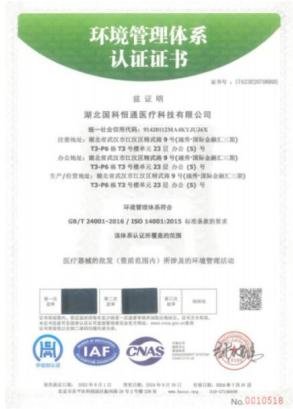

text_image

环境管理体系
认证证书
证书号：174230207089005
兹证明
湖北国科恒通科技有限公司
第一企业注册代码：9140112MAKNYJUN
注册地址：湖北省武汉市江汉区滨江路9号（渝中路）国际金融二三部）
T3-P6 73 台驻单位：22 公司（5）号
办公地址：湖北省武汉市江汉区滨江路9号（渝中路）国际金融二三部）
T3-P6 73 台驻单位：22 公司（5）号
生产经营地址：湖北省武汉市江汉区滨江路9号（渝中路）国际金融二三部）
T3-P6 73 台驻单位：22 公司（5）号
环境管理体系符合
GB/T 24001-2016 / ISO 14001/2015 标准条款的要求
该体系认证标准覆盖的范围
医疗器械的批发（或范围内）所涉及的环境管理活动
第一企业注册代码：CNAS
第二企业注册代码：CNAS
第三企业注册代码：CNAS
第四企业注册代码：CNAS
IAF CNAS
No.0010518

湖北国科恒通医疗科技有限公司

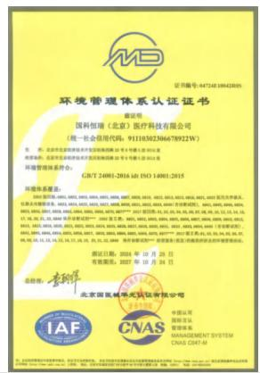

text_image

环境管理体系认证证书
编号：
国科瑞（北京）医疗科技有限公司
（统一社会信用代码：913203066789121V）
住所：北京市海淀区西四环西路1号院5号楼1层10层
经营范围：北京市海淀区西四环西路1号院5号楼1层10层
环境管理体系认证
CB/T 24001-2016-6b ISO 14001-2015
环保体系项目：
2000年登记，1001,002,003,004,005,006,007,008,009,010,011,012,013,014,015,016,017,018至医疗卫生系统。
生物技术装备制造，1999年登记，1001,002,003,004,005,006,007,008,009,010,011,012,013,014,015,016,017,018至医疗健康领域，1999年登记，1001,002,003,004,005,006,007,008,009,010,011,012,013,014,015,016,017,018至医疗健康领域，1999年登记，1001,003,004,005,006,007,008,009,010,011,012,013,014,015,016,017,018至医疗健康领域，1999年登记，1001,003,004,005,006,006,007,008,009,010,011,012,013,014,015,016, 99.99.99.99.99.99.99.99.99.99.99.99.99.99.99.99.99.99.99.99.99.99.99.99.99.99.99.99.99.99.99.99.99.99. 24/24/24/24
有效期至：24/24/24/24
中国国家电网电力研究院有限公司
IAAF CNAS
中国航天集团
国务院
MANAGEMENT SYSTEM
CNAS CMT-5F

国科恒瑞（北京）医疗科技有限公司

在业务运营中，公司紧密结合自身运营实际，围绕供应链运营流程中的关键环节，在《仓储装修标准》《仓库安全管理规则》《运输安全管理实施细则》等制度文件中融入对环境保护的考量，努力实现环境管理与经营活动的深度融合。

## 《仓库装修标准》

要求仓库环境整洁、无污染源，且窗户遮阳，避免光污染，并在《仓库装修验收单》对潜在污染内容进行验收确定

## 《仓库安全管理规则》

对仓库环境、作业人员做了明确要求。通过规范作业人员行为，保护仓库环境，避免仓库发生生物、化学污染

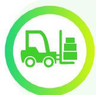

## 《运输安全管理实施细则》

要求保温箱等运输材料保持清洁，避免对所运输物品造成污染

## 《工具管理规定》

针对入库工具洁净度制定明确标准，受污染工具需充分清消毒才可入库，未进行有效清洁的工具可拒收

## 绿色办公运营

公司积极倡导绿色办公理念，将节约用水、节约用电等资源节约行为融入日常管理，持续推进无纸化办公，依托数字化系统减少纸张消耗。针对运营中产生的废弃物，公司建立具有针对性的分类管理与合规处置流程，努力降低运营活动对环境的影响，以务实行动推动绿色低碳发展。

## 节约用电

园区内路灯根据季节变换人为调控启停时间  
倒班楼走廊灯为声控LED灯  
在满足库区要求前提下，对组控空调机组调整温度设定参数，减少机组启停频次，节约电能  
下班后对办公区、库区实时巡查，及时关闭开启中的灯和空调

## 节约用水

在满足库区要求前提下，对组控空调机组加湿水阀人为调整开度，减少水流量

## 节约用纸

对无公司机密信息的用纸进行回收整理，做草稿纸进行二次利用

## 废弃物管理

物业团队采购国际认证的绿色清洁剂、降解垃圾袋  
设定封闭式垃圾回收站、垃圾分类处理  
设立电池、硒鼓专用回收箱，统一收集、统一处理

## ����年关键绩效

天津基地办公用水总量

28,951吨

natural_image

Stylized illustration of a city skyline with wind turbines and mountains in green and yellow tones (no text or symbols)

## 统筹资源利用

国科恒泰深入践行绿色发展理念，致力于构建高效、绿色、安全的现代智慧供应链体系。公司将节能降碳贯穿于仓储布局、运输调度及包装耗材选用的全流程，通过持续优化库区照明智能控制、推进新能源运输车辆应用等举措，有效降低运营环节的能源消耗与碳排放。

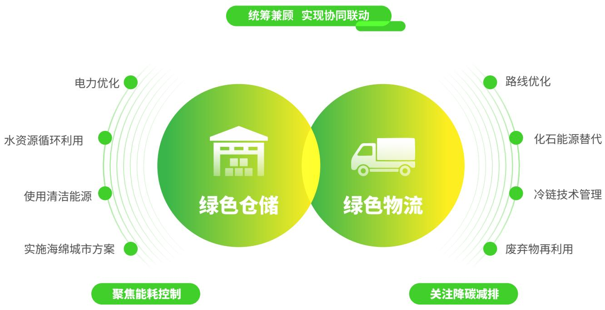

flowchart

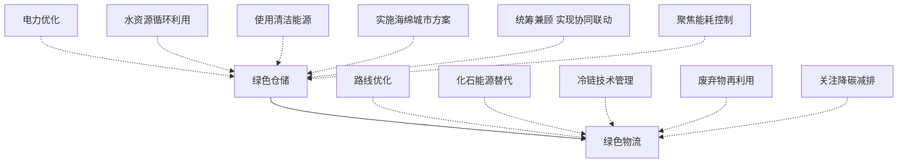
```mermaid
graph TD
  A["绿色仓储"] --> B["绿色物流"]
  C["电力优化"] -.-> A
  D["水资源循环利用"] -.-> A
  E["使用清洁能源"] -.-> A
  F["实施海绵城市方案"] -.-> A
  G["路线优化"] -.-> B
  H["化石能源替代"] -.-> B
  I["冷链技术管理"] -.-> B
  J["废弃物再利用"] -.-> B
  K["统筹兼顾 实现协同联动"] -.-> A
  L["聚焦能耗控制"] -.-> A
  M["关注降碳减排"] -.-> B
```

为系统推进绿色低碳实践、精准支撑“十五五”战略落地，国科恒泰立足长远发展，明确提出未来五年能源利用及水资源利用目标，以量化承诺驱动绿色低碳转型。

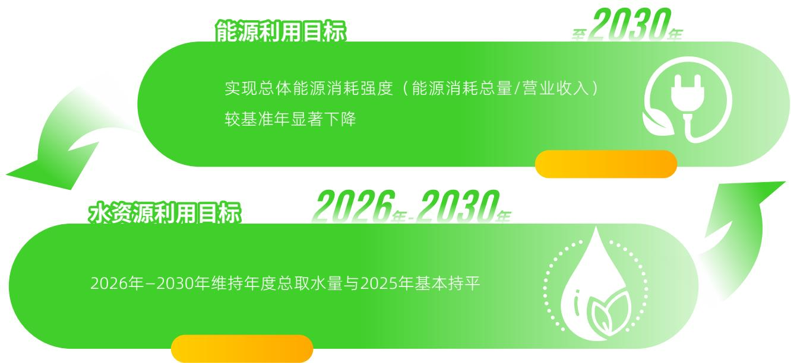

flowchart

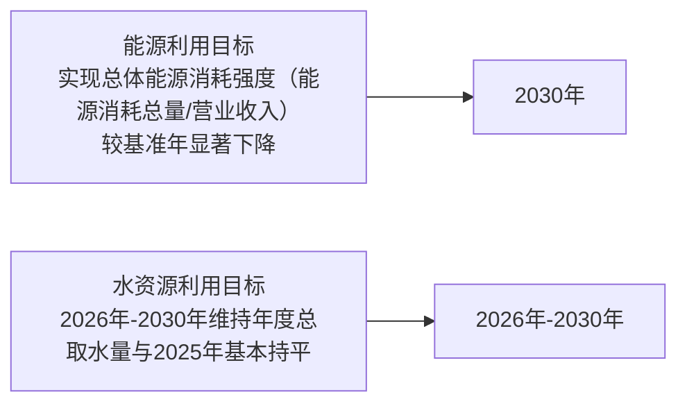
```mermaid
graph LR
  A["能源利用目标\n实现总体能源消耗强度（能源消耗总量/营业收入）\n较基准年显著下降"] --> B["2030年"]
  C["水资源利用目标\n2026年-2030年维持年度总取水量与2025年基本持平"] --> D["2026年-2030年"]
```

## 绿色仓储

公司积极践行绿色仓储理念，通过持续优化电力供给方式、稳步推进清洁能源替代等方式降低能源消耗。同时，公司依托数字化系统实现对仓储用能进行实时监测与智能调控，有效提升了能源利用效率，推动碳排放管理工作智能化、精细化。

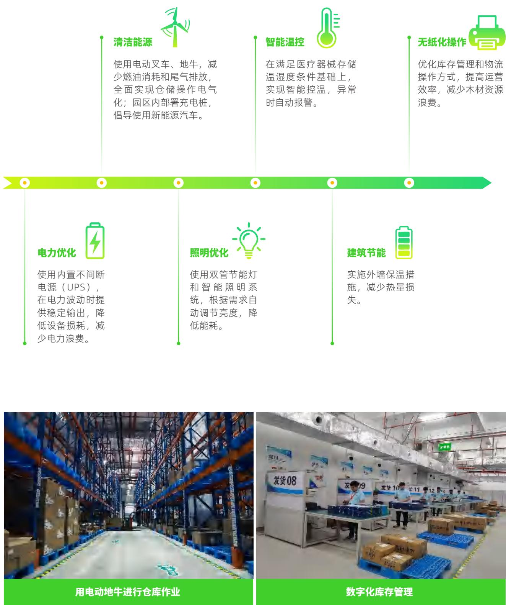

公司立足仓储运营实际，系统推进节水与废水回用体系建设。通过加强设备日常养护，减少跑冒滴漏；优化清洁作业流程，降低生产性用水需求；同步建设蓄水池设施，提升雨水收集及废水循环利用能力，多措并举持续提升水资源利用效率。

##

## 天津基地雨水生态系统

天津基地积极践行海绵城市建设理念，通过绿色雨水设施与大型调蓄水池的协同作用，实现了径流污染控制、水环境改善与内涝风险减缓的“三效合一”。该系统不仅满足了海绵城市年径流总量控制率的规范要求，还通过雨水资源的循环利用优化了用水结构，显著提升了厂区生态景观与使用便利性。

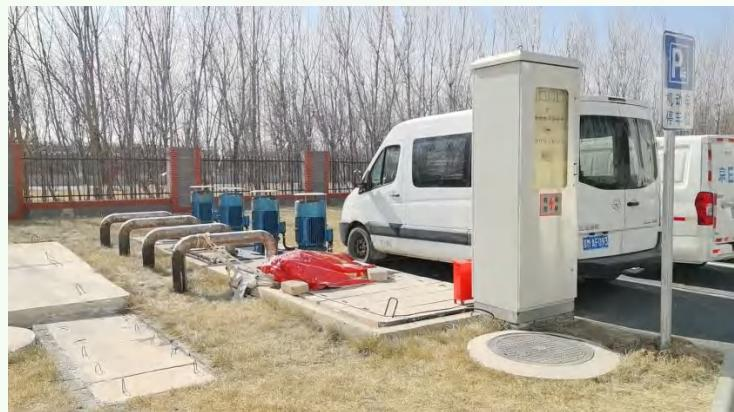

natural_image

Exterior view of an outdoor electric vehicle charging station with a white van and blue storage tanks, surrounded by dry grass (no signage or text visible)

## 绿色物流

公司持续推动绿色物流体系建设，在运输环节统筹优化配送路线与调度方案，稳步推进新能源车辆替代传统燃油车，积极探索运输环节节能降碳路径。同时，聚焦冷链运输关键环节，持续优化温控设备与技术，确保全程温度稳定可控、符合储运标准，兼顾运输安全与能效提升。本年度，公司道路运输环节新增新能源车7辆，折合减少碳排放超百吨二氧化碳当量，绿色物流实践取得阶段性成效。

<table><tr><td rowspan="3">冷链设备管理</td><td>冷藏箱:采用环保材料制作,根据需求定制化设计;</td></tr><tr><td>冷藏车:配备制冷机组和保温车厢,制冷机组可按需求以相对低功耗设定并维持适宜的医疗器械温度环境;车厢采用多层保温材料,有效减少温度损失,确保物流运输温度稳定性;</td></tr><tr><td>冷库:配备制冷系统和温度监控系统,精准控温,确保温度敏感的医疗器械存储期间的质量安全。</td></tr><tr><td rowspan="2">冷链技术管理</td><td>温度监控技术:传感器收集运输设备温度数据,联动到TMS(运输管理系统),温度超出设定范围,系统自动报警;</td></tr><tr><td>环保冷媒:采用国际环保标准制冷剂,其臭氧层破坏潜能值(ODP)均为0,有效降低对环境的负面影响。</td></tr><tr><td>运输工具</td><td>部分燃油车更换为油电混动车,积极推广使用新能源运输工具,以减少碳排放。</td></tr><tr><td>运输路线</td><td>优化运输路线,减少空驶和重复路线的情况,同时采用智能物流系统来提高配送效率,降低能源消耗。</td></tr></table>

## 助力循环经济

国科恒泰持续强化包装物料全流程管理，从源头推进包装减量化与物料循环利用，提升物料利用效率，减少物流环节的废弃物产生，以实际行动践行绿色低碳运营理念。

## 物料使用管理

公司不断完善物料使用管理制度体系，在存储、运输和使用环节制定《物流部出入库管理规定》《物流订单出库流程》等制度流程标准，确保运营管理有章可循。日常作业中，公司面向一线员工制定《发货装箱打包操作指导书》，并积极开展物料节约与规范操作培训，将精细化管理落实到具体操作层面，持续提升物料利用效率与作业规范性。

## 物料循环利用

公司深入践行循环经济理念，系统推进包装减量与循环利用。一方面，在仓库作业中回收复用原厂包装纸盒，降低一次性耗材使用；另一方面，与上游供应商建立周转箱循环共用机制，通过可循环包装箱的往返流转替代传统纸箱，实现包装材料的闭环复用，以实际行动助力循环经济发展。

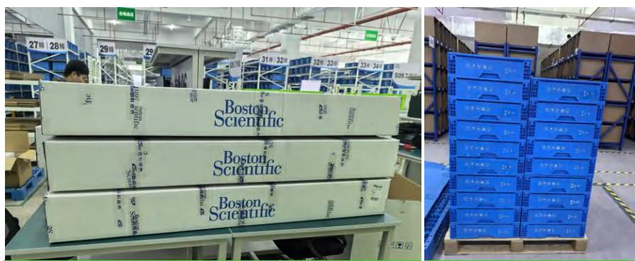

natural_image

Two warehouse scenes: left shows stacked boxes labeled 'Boston Scientific' with visible labels, right shows blue pallets on pallets (no readable text or symbols)

供应商到货耗材箱利用

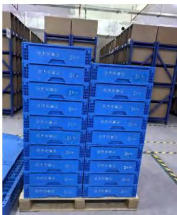

text_image

Warehouse photo showing blue shipping containers with Chinese text labels, arranged on pallets.

循环利用周转箱

## ����年关键绩效

回收使用的包装材料量

60吨

包装材料回收比率

27.4%

## ����年关键绩效

包装材料使用总量

219吨

其中

纸类包装材料使用量

209吨

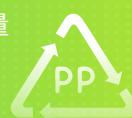

塑料包装材料使用量

10吨

## 04 人本为怀延伸责任温度

## 2025年重要成果

劳动合同签订率100%

社会保险覆盖率100%

员工总人数873人

## 本章所响应的SDGs

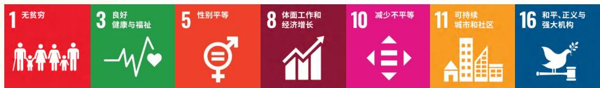

flowchart

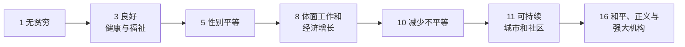
```mermaid
graph LR
  A["1 无贫穷"] --> B["3 良好\n健康与福祉"]
  B --> C["5 性别平等"]
  C --> D["8 体面工作和\n经济增长"]
  D --> E["10 减少不平等"]
  E --> F["11 可持续\n城市和社区"]
  F --> G["16 和平、正义与\n强大机构"]
```

## 本章所涉及的ESG重要议题

保护员工合法权益

员工培训与发展

职业健康与安全

社会贡献

natural_image

Illustration of two people working at a desk with laptops, alongside abstract bar charts and pie charts (no readable text or symbols)

## 员工权益保护

国科恒泰始终坚持贯彻“以人为本”的理念，致力于为员工打造多元共融、平等包容、健康安全的职场环境，竭力为每位员工提供平等的人才培训机会与晋升通道，充分发挥员工潜力与价值。

## 合规与多元化用工

公司严格遵循《中华人民共和国劳动法》《中华人民共和国劳动合同法》等法律法规，结合业务实际制定《员工手册》等制度，建立了完善的员工权益保障体系，夯实了合规用工与保障人权的基础。

公司坚持公平雇佣与多元化用工原则，积极响应《世界人权宣言》《国际劳工组织公约》号召，严禁使用童工，杜绝任何形式的强迫劳动及基于性别、民族、年龄等方面的歧视行为，切实维护员工尊严与合法权益。例如，公司在《招聘录用管理制度》中明确规定“招聘信息中禁止使用性别歧视、地域性歧视等敏感信息”，并在审核环节加强对童工的管控，坚决杜绝招聘未成年人，同时优先考虑退伍军人和残疾人的就业机会，持续推动形成尊重、包容、和谐的组织文化。截至报告期末，公司正式员工为873人，按性别、年龄、教育程度划分的明细数据如下：

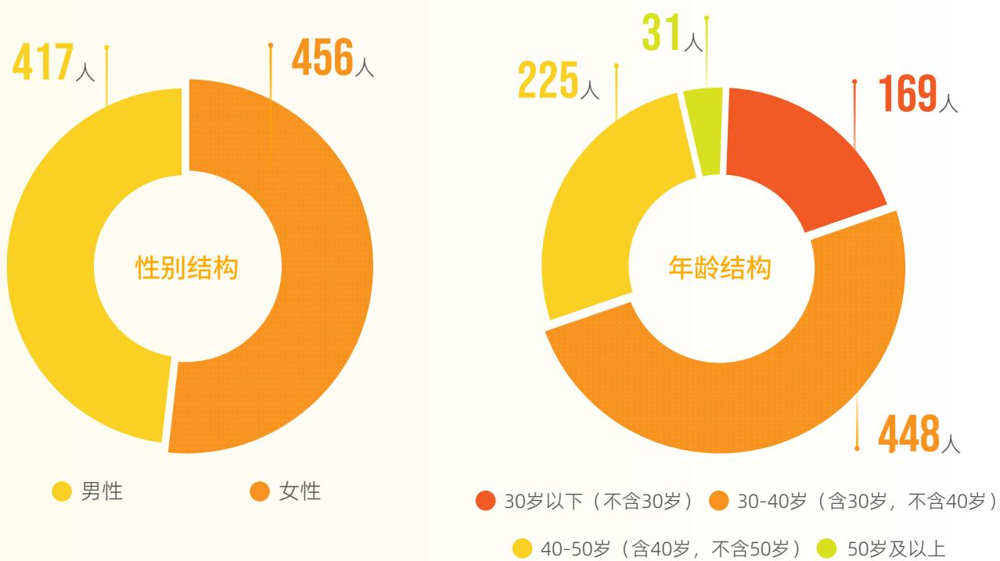

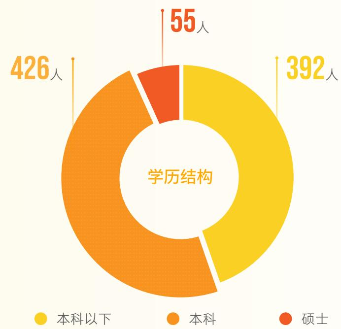

donut

| 学历 | 人数 |
| --- | --- |
| 本科以下 | 392人 |
| 本科 | 426人 |
| 硕士 | 55人 |

����年关键绩效  
员工总数  

少数民族员工  

残疾员工  

劳动合同签订率  

## 招聘与离职管理

公司秉持“公开招聘、先内后外、平等竞争、人岗匹配、择优录用”的原则，制定《招聘录用管理制度》，严格规范招聘流程，确保招聘过程的公平、公正与透明。

招聘与录用流程  
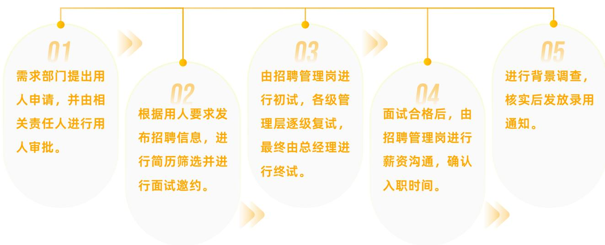

flowchart

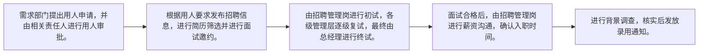
```mermaid
graph LR
  A["需求部门提出用人申请，并由相关责任人进行用人审批。"] --> B["根据用人要求发布招聘信息，进行简历筛选并进行面试邀约。"]
  B --> C["由招聘管理岗进行初试，各级管理层逐级复试，最终由总经理进行终试。"]
  C --> D["面试合格后，由招聘管理岗进行薪资沟通，确认入职时间。"]
  D --> E["进行背景调查，核实后发放录用通知。"]
```

公司通过校园招聘、社会招聘、内部推荐等多种渠道延揽人才，并委托第三方专业机构全程组织实施，确保招聘过程的独立公正。公司坚持“阳光招聘”原则，所有招聘信息均通过公司官网及正规招聘平台同步发布，职位要求、选拔标准与流程全程公开，无隐性门槛，切实保障每位应聘者平等参与竞争的权利。本年度，公司新进入职员工70人，按性别和年龄划分的明细数据如下：

bar

| Category | Value |
| --- | --- |
| 女性 | 44 |
| 男性 | 26 |

按性别划分的新进员工情况

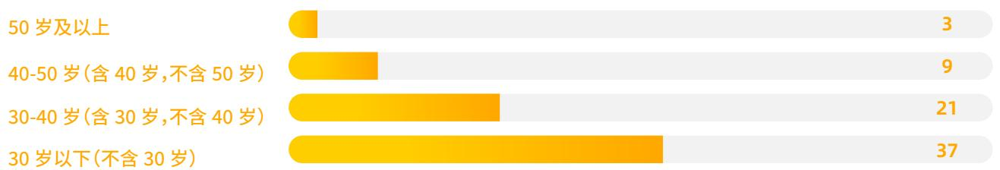

bar

| Age Group | Value |
| --- | --- |
| 50 岁及以上 | 3 |
| 40-50 岁(含 40 岁,不含 50 岁) | 9 |
| 30-40 岁(含 30 岁,不含 40 岁) | 21 |
| 30 岁以下(不含 30 岁) | 37 |

按年龄划分的新进员工情况

##

## 校园招聘

本年度，公司与12所高校深入开展校企合作，通过举办宣讲会、双选会等形式搭建双向沟通平台，全年共计入职高校毕业生33人，为公司持续发展注入了新鲜血液与青春动能。

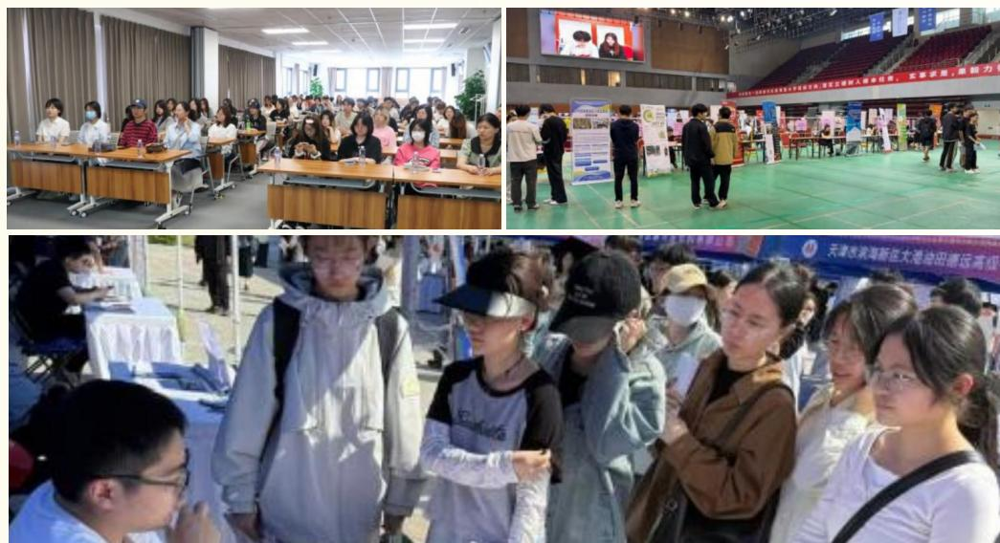

为有效预防与化解劳动用工风险，公司制定《员工异动管理办法》，系统规范离职流程，推动离职管理高效合规，切实维护和谐稳定的劳动关系。针对离职过程中可能出现的争议事项，公司建立“分层递进、多元化解”的纠纷调处机制，一方面推进建立劳动纠纷预防机制，通过加强沟通、完善制度等方式减少纠纷发生，另一方面配套建立快速响应的纠纷处理机制。例如，当争议事件发生时，员工可优先与相关主管沟通解决，若协商无果或涉及主管，可直接提交至人力资源部或工会进行协调处理，确保问题得到妥善处理。

����年关键绩效  
  
离职员工201人

  
员工总体流失率 21.41%

## 薪酬与绩效管理

公司严格遵循相关法律法规，秉持公平性、激励性与市场化原则，制定《薪酬暂行管理制度》《绩效管理制度》等系列制度，全面规范薪酬绩效管理工作，确保各项机制有章可循、科学合理。同时，为切实保障员工合法权益、提升考核结果的公信力，公司建立了规范的绩效反馈与申诉通道，形成“目标制定—过程沟通—结果反馈—争议申诉”的闭环管理机制，确保流程透明、沟通顺畅，持续营造公平公正的内部环境。

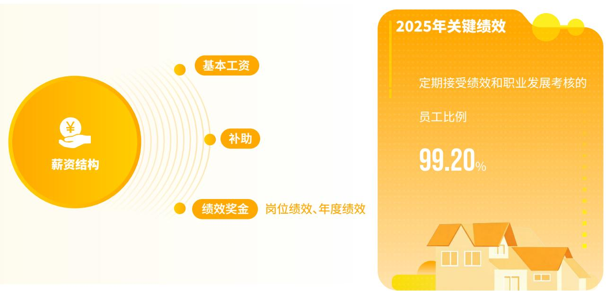

flowchart

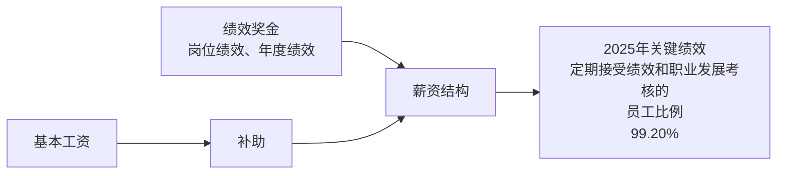
```mermaid
graph LR
  A["基本工资"] --> B["补助"]
  C["绩效奖金\n岗位绩效、年度绩效"] --> D["薪资结构"]
  B --> D
  D --> E["2025年关键绩效\n定期接受绩效和职业发展考核的\n员工比例\n99.20%"]
```

## 关怀与福利

## 员工福利

公司立足员工健康与权益保障，科学平衡工作效率与员工关怀，制定并实施《考勤管理制度》《请假申请流程说明文件》等规章制度。为适应不同岗位需求，公司采用三种工时工作制，包括标准工时、不定时工时和综合计算工时，确保工作与生活平衡。此外，公司通过办公系统规范执行员工休假与考勤管理，切实保障员工休息休假权利，杜绝任何形式的强制劳动，营造健康、人性化的工作环境。

在福利待遇方面，公司制定《福利管理制度》，构建了涵盖法定福利与企业福利的多层次保障体系，全面保障员工权益，切实提升归属感与获得感。同时，公司定期组织形式多样的文体活动，关注员工心理健康，促进员工身心健康与团队融合，以有温度、可落地的举措传递组织关怀，持续营造和谐稳定、积极向上的内部氛围。

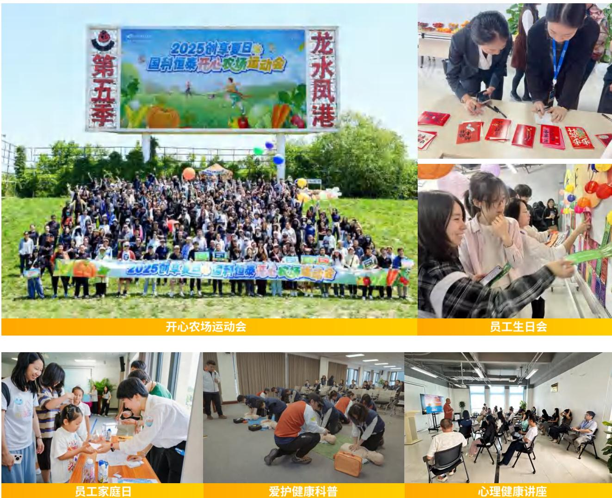

## 女性员工关怀

公司高度重视女性员工权益保障，全面落实产假、陪产假及育儿相关假期等福利制度，积极营造公平包容的工作环境，确保男女员工享有平等发展机会。通过充分激发女性员工潜能，公司持续增强团队凝聚力，为构建和谐、包容的职场生态奠定坚实基础。

## 案例

## 女性员工福利活动

2月28日，在“三八”国际劳动妇女节前夕，公司延续温暖传统，提前为女员工们精心组织了一场温馨的庆祝活动。公司男领导们化身“春日使者”，向女员工们送上了“女神节礼品”与专属祝福。在赠送礼品的过程中，各位高管还与女员工们亲切交流，感谢她们为公司发展付出的辛勤努力，对她们在工作中展现出的坚韧与智慧表示由衷敬佩。

Gor国科恒东方科仪控股成员企业  

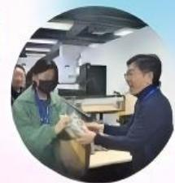

## 关爱“她”力量，共庆国际劳动妇女节

## ����年关键绩效

  
管理人员中女性员工占比59.26%

  
享受产假员工32人

  
产假返岗率 100%

  
享受育儿假员工63人

  
育儿假返岗率 100

  
人均带薪年休假天数11.16天

## 构建成长体系

国科恒泰始终秉持着“持续改善，知行合一，让每一匹千里马都有广阔的草原”的人才发展理念，将人才培育作为企业可持续发展的重要支撑，持续构建并完善员工成长体系，切实保障员工发展权益。

## 员工晋升

为规范公司员工职位职级管理，通过公平、公正、公开的竞争机制，激励员工提升个人素质与能力，公司制定《基层管理人员及专业序列人员晋升管理办法》，建立“双通道”职业发展体系，将员工划分为管理干部和非管理类干部，支持员工在同一序列内纵向晋升或跨序列晋升，为员工搭建起清晰明确的职业晋升通道。

公司制定《员工异动管理办法》，秉承“公平竞争，择优上岗，优化公司人力资源组合”原则，鼓励合理的内部人才流动。当公司内部机构调整或业务需要出现岗位空缺时，除考虑内部提升及外部招聘外，亦考虑平级调岗。此外，当出现员工患病或者非因公负伤，在规定的医疗期满后不能从事原工作时，也可安排调岗。

## ����年关键绩效

员工内部调动或内部应聘的人数

105人

员工内部调动或内部应聘的比例

12.03%

## 员工培训

为支撑公司战略发展，公司以《培训管理制度》《外请进师培训实施流程》等文件为基础，搭建起一套形式丰富、类型全面的培训框架。通过系统化的流程规范，引导员工深度融入企业文化与战略，加速岗位胜任与技能提升，为公司可持续发展与人才梯队建设提供坚实的制度支撑。

## 员工培训框架

## 培训框架

头狼计划之业务验收营

恒星计划之应届生培养

北斗计划之公司培训师

出海计划之海外先锋班

铸盾计划之跟台的培训

精益计划之OBS培训

物流专业课程

客户运营课程

采购专业课程

服务运营与信息类课程

其他职能课程

新员工入职培训（线上）+新进中高管培训（线下）

培训机制保障（制度+流程+操作手册）

开创“培训专栏”⸺培训宣传与课程共享

公司搭建了功能完善、内容丰富的在线学习平台，针对不同岗位员工精准赋能。截至报告期末，平台已上线新员工入职培训、供应链BP岗课程、公司治理、办公工具等近20个类别、共计百余门课程，全面覆盖员工多样化学习需求。员工可随时自主学习，持续提升专业能力与综合素质。

## 专业技能培训

面向一线员工，公司聚焦客户管理、物流管理、质量管理等业务核心需求，系统开展专业培训，帮助员工掌握必要的技术知识，提高业务效率。

## 精益管理培训

面向管理层及核心职能岗位，公司开展精益管理等专项培训，着力强化经营决策、团队统筹及风险管控能力，助力公司高效管理。

国科恒泰25年精益管理体验营（第7期）  
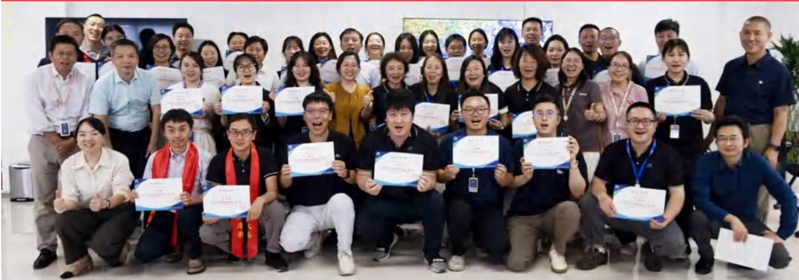

text_image

Group photo of people holding certificates and documents, some wearing red scarves and a Chinese flag.

北斗计划-《TTT内训师赋能成长训练营》  
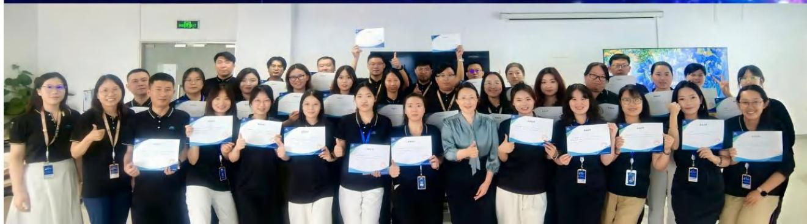

text_image

Group photo of employees holding certificates in an office setting, with visible name tags and background signage

公司重视人才梯队建设，针对应届毕业生和新入职员工，制定了《新员工入职培训流程》《应届毕业生培养管理规定》等相关制度文件，启动“恒星计划”系列培训活动，帮助新员工快速完成角色转换、深度融入团队文化，全面提升其职业素养与专业技能，为其长远职业发展奠定坚实基础。本年度，公司面向入职应届生开展了两场集训，共计110人次受训，培训合格率达100%。

## ����年关键绩效

培训投入

45万元

组织培训

179场次

每名员工每年接受培训的平均时长

0.5小时/人

培训总时长

535小时

接受培训总人次

8,150人次

员工培训覆盖率

100%

## 守护职业健康

国科恒泰重视职业健康管理，持续优化安全管理体系，强化仓储与物流作业现场的安全管控，同时积极应对潜在安全风险，定期开展职业病危害因素排查与治理，搭建应急管理体系，面向一线员工常态化开展安全宣贯与技能培训，切实提升全员风险防范能力与应急处置水平，多措并举守护员工职业健康。

## 安全管理体系

公司严格遵循《中华人民共和国安全生产法》《仓库防火安全管理规则》等法律法规要求，系统建立并持续完善安全管理体系，先后制定《仓库安全管理规则》《自有仓存货储运安全管理制度》《运输安全管理实施细则》等一系列制度文件，形成覆盖仓储、运输全流程的规范化管理机制，确保各项安全工作有章可循、有序开展。截至报告期末，公司及4家所属子公司均已通过职业健康与安全管理体系认证：

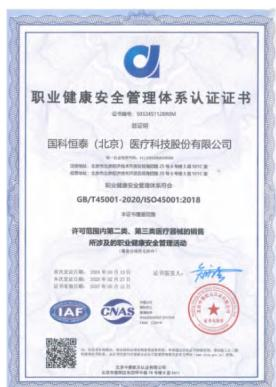

text_image

职业健康安全管理体系认证证书
证书编号：100104-1290564
执业资质
国科恒泰（北京）医疗科技股份有限公司
注册地址：北京市西城区新街口外大街28号院1号楼A座15层C室
办公地址：北京市西城区新街口外大街28号院1号楼A座15层C室
职业健康安全管理体系综合
GB/T45001-2020/ISO45001:2018
证书有效期至领用日
许可范围内第二类、第三类医疗器械的销售
所涉及的职业健康安全管理活动
首次发证日期：2023年10月13日
本次发证时间：2023年10月13日
证书有效期至：2023年10月13日
IAF
GNAS
GNS
GNS
GNS
GNS
GNS
GNS
GNS
GNS
GNS
GNS
GNS
GNS
GNS
GNS
GNS
GNS
GNS
GNS
GNS
GNS
GNS
GNS
GNS
GNS
GNS
GNS
GNS
GNS
GNS
GNS
GNS
GNS
GNS
GNS

国科恒泰（北京）医疗科技股份有限公司

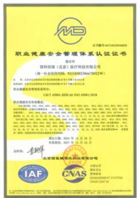

text_image

证书编号: 047145096N6809
职业健康安全管理体系认证证书
嘉定司
国科信用（北京）医疗科技有限公司
统一社会信用代码: 91110102306678921W
住所: 北京市金山区经济开发区科创园区科创园路8号
法定代表人: 刘立军
执业资格: 企业法人营业执照复印件号码(有效)
执业期限: 2021年03月20日至2021年03月21日
职业健康安全管理体系符合
GB/T 45001-2020 合 认证编号: 45001-2018
经办注册机关及批准的
执业资质证明书、执业证书、执业人员资格证明书、执业证书、执业人员登记表
执业人员资格证明书、执业证书、执业人员登记表
执业人员资格证明书、执业证书、执业人员登记表
执业人员资格证明书、执业证书、执业人员登记表
执业人员资格证明书、执业证书、执业人员登记表
执业人员资格证明书、执业证书、执业人员登记表
执业人员资格证明书、执业证书、执业人员登记表
执业人员资格证明书、执业证书、执业人员登记表
执业人资格证明书、执业证书、执业人员登记表
执业人员资格证明书、执业证书、执业人员登记表
执业人员资格证明书、执业证书、执业人员登记表
执业人员资格证明书、执业证书、执业人员登记表
执业人员资格证明书、执业证书、执业人员登记表
执业人员资格证明书、执业证书、执业人员登记表
执业人员资格证明书、执业证书、执业人员登记表
执业人员资格认证书、执业证书、执业人员登记表
执业人员资格认证书、执业证书、执业人员登记表
执业人员资格认证书、执业证书、执业人员登记表
执业人员资格认证书、执业证书、执业人员登记表
执业人员资格认证书、执业证书、执业人员登记表
执业人员资格认证书、执业证书、执业人员登记表
执业人员资格认证书、执业证书、执业人员登记表
执业人员资格认证书
执业人员资格认证书、执业证书、执业人员登记表
执业人员资格认证书、执业证书、执业人员登记表
执业人员资格认证书、执业证书、执业人员登记表
执业人员资格认证书、执业证书、执业人员登记表
执业人员资格认证书、执业证书、执业人员登记表
执业人员资格认证书、执业证书、执业人员登记表
执业人员资格认证书、执业证书、执业人员登记表
业发证日期: 2024年10月26日
有效期限: 2024年10月26日
北京市国美机械安全认证有限公司
IAAF CNAS
ASSMENT SYSTEM CNAS CHAT-M

国科恒瑞（北京）医疗科技有限公司

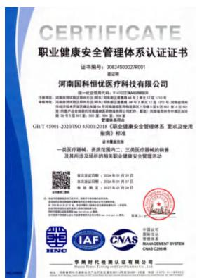

text_image

CERTIFICATE
职业健康安全管理体系认证证书
证书编号：308240000279001
证书号：
河南国科恒优医疗科技有限公司
注册地址：河南省洛阳市洛源区金桥路15号（西扩）东侧11层1101号
办公地址：河南省洛阳市洛源区金桥路15号（西扩）东侧11层1101号
经营范围：医疗器械销售、技术开发、技术咨询、技术服务、技术转让、技术推广；医疗器械的销售、技术开发、技术咨询、技术服务、技术转让、技术推广；医疗器械的批发、零售；药品批发（除许可业务外，凭许可证件经营）。
GB/T 45001-2020ISO 45001-2018《职业健康安全管理体系 要求及使用
指南》标准
证书编号：
一类医疗器械、疫苗制剂等。三类医疗器械的销售
及其所涉及场所的相关职业健康安全管理体系
国家认证机构：2024年6月29日
北京市朝阳区，2024年6月29日
上海市浦东新区，2027年6月28日
中国证监会
IAC
CNAS
中国认证
国务院
国家认证
MANAGEMENT SYSTEM
CNAS 220000
华商时代检测认证有限公司

河南国科恒优医疗科技有限公司

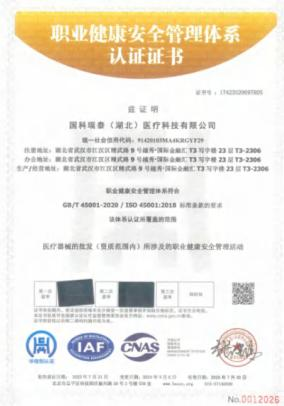

text_image

职业健康安全管理体系
认证证书
证书号：174205299697605
兹证明
国科瑞泰（湖北）医疗器械科技有限公司
统一社会团体代码：9132010MA4KJGYF29
注册地址：湖北省武汉市江汉区武昌路98号中南国际金融大厦T3写字楼23层T3-2206
办公地址：湖北省武汉市江汉区武昌路98号中南国际金融大厦T3写字楼23层T3-2206
生产经营地址：湖北省武汉市江汉区武昌路98号中南国际金融大厦T3写字楼23层T3-2206
职业健康安全管理体系综合
GB/T 450001-2020 / ISO 45001-2018 标的条款的要求
该事项以国家工商行政管理局备案
医疗器械的批发（优质范围内）所涉及的职业健康安全管理办法
第一类
第二类
第三类
IAF
CNAS
www.cncn.org
No.0112026

国科瑞泰（湖北）医疗科技有限公司

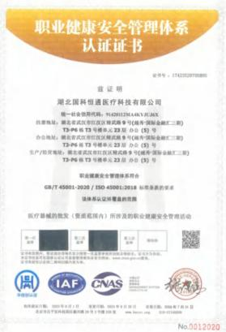

text_image

职业健康安全管理体系
认证证书
证书号：17423020788885
兹证明
湖北国科恒通医疗科技有限公司
唯一社会信用代码：914101116MA1Y035
注册地址：湖北省武汉市汉江区祥泽路9号（城市国际金融三三街）
T3-P6 65 T3 号单元23 330 办公(5)号
办公地址：湖北省武汉市汉江区祥泽路9号（城市国际金融三三街）
T3-P6 65 T3 号单元23 330 办公(5)号
生产/经营范围：湖北省武汉市汉江区祥泽路9号（城市国际金融三三街）
T3-P6 65 T3 号单元23 330 办公(5)号
职业健康安全管理体系符合
GB/T 45001-2020 / ISO 450012018 标准条款的要求
该体系认证所需质量的范围
医疗器械的批发（资质范围内）所涉及的职业健康安全管理活动
请登录公司网站
www.hg.com.cn
IAF CNAS
No.5012020

湖北国科恒通医疗科技有限公司

## 安全仓储与物流

## 安全仓储

公司严格遵循《中华人民共和国安全生产法》《仓库防火安全管理规则》等法律法规要求，制定并实施《存货储运安全管理制度》《仓库安全管理规则》等内部规范，全面夯实仓储作业安全基础。仓储管理部作为责任主体，下设存货储运安全、盘点管理、库存控制等专职模块，明确职责分工，形成协同高效的仓储管理体系。日常运营中，公司全面推行“整理、整顿、清扫、清洁、安全”5S管理理念，持续优化作业环境，规范操作流程，提升现场管理水平，确保仓库运行安全、有序、高效。

## ����年关键绩效

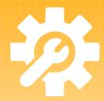

安全生产事故数

0

总工伤人数

1人

在日常管理中，公司立足医疗器械仓储特点，不仅严格落实防火、防电等关键安全措施，同时针对防盗、防虫防鼠等环节，引入智能监控等先进技术手段，强化对仓储环境的实时监测与风险预警，确保作业环境持续符合医疗器械仓储质量安全管理标准，切实保障货物安全与人员作业安全。

## 防火措施

安全出口、疏散通道及消防通道保持畅通；  
消防器材、疏散标识、逃生路线及应急照明应齐全且状态良好，并定期检查，确保在合格期限内可正常使用；  
工作人员需熟悉消防器材位置，熟练操作消防器材，并定期参加消防安全培训，掌握防火知识；  
日常开展仓库电器设备用电安全检查，避免火灾风险；  
库内严禁吸烟和使用一切明火；  
通过金属卷帘门合理分区，有效强化建筑内部防火隔离功能。

## 防盗措施

非物流部人员不得进入仓库，需先提交参观申请并经过审批方可进入；  
仓库出入库大门需时刻保持关闭状态，门窗需牢固可靠；  
仓库出入口需有视频监控，库房内各区域需有效监控，记录保存至少30天。

## 防虫防鼠措施

仓库进出口处上方安装灭蚊灯，防止飞虫的进入；  
托盘应选用塑料材质，避免木质虫蛀；  
仓库进出口处必要时应配备挡鼠板，同时各仓库应具备相应防鼠措施；  
仓库内及仓库周边的排水孔、下水道口应安装地漏并定期检查；  
仓库负责人每月第一个工作日检查仓库虫鼠情况。

## 安全物流

公司高度重视物流运输安全管理工作，制定了《承运商管理实施细则》《运输管理制度》等一系列制度，为打造安全物流体系提供坚实保障。例如，《承运商管理实施细则》明确设置“安全运营能力”“运输安全保障”等关键指标，从源头筑牢合规准入门槛；《物流车辆驾驶员管理细则》规范了驾驶人员行为准则，强调安全行车、规范操作等要求。此外，公司定期对运输人员进行运输安全培训，自有配送岗、外协运输成员人员均按要求参加并完成培训测试，全面提升从业人员安全素养与风险防范能力。

## 隐患排查与应急管理

公司重视隐患排查与应急管理，结合自身经营业务特征，构建了常态化的隐患排查与应急管理体系。公司严格执行《紧急事件应急机制》，通过定期巡检实现对库区消防、电力及仓储设备的动态监控，确保风险隐患“发现即处置”。针对可能发生的设备故障、温控失效等运营突发状况，以及自然灾害等外部事件，公司制定了专项应急预案，并设立跨部门应急小组，定期开展演练，旨在最大程度保障医疗物资的储存安全与供应链的稳定畅通。

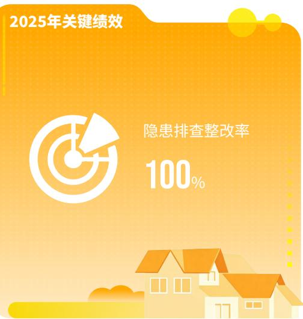

text_image

2025年关键绩效
隐患排查整改率
100%

## 安全能力建设

公司多措并举，持续深化安全文化宣贯与能力建设。例如，通过库区目视化管理，在作业现场显著位置张贴安全警示标识与宣传标语，让安全理念“看得见、摸得着”；常态化开展覆盖全员的安全知识宣贯与应急技能培训，结合仓储作业实际定期组织消防、急救等专项应急演练，全面提升员工的风险防范意识与应急处置能力，使安全文化真正融入日常运营的每一个环节。

## 案例

## 消防演练与培训

2025年7月，公司针对仓储人员开展年度消防培训，主要内容有消防知识学习、消防器材学习演练、疏散演练等，有效强化了仓库全员火灾隐患识别、初期火灾扑救及应急疏散能力。

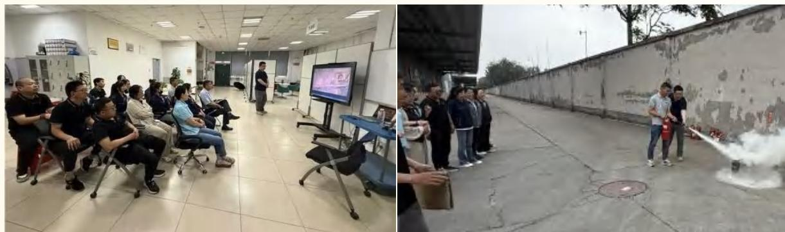

## ����年关键绩效

安全应急演练次数

2次

安全培训场次

10次

安全培训总时长

30小时

安全培训总投入

3.86万元

参与安全培训

267人次

安全培训员工覆盖率

100%

## 职业病预防

公司严格遵循《中华人民共和国职业病防治法》《工作场所职业卫生管理规定》等法规要求，系统开展职业健康管理。在基础保障层面，公司每年定期组织员工进行职业健康体检，按时足额缴纳工伤保险，切实保障员工职业健康；在风险防控层面，结合医疗器械仓储物流作业特点，公司以源头防控为核心，常态化开展作业场所职业病危害因素检测与评估，重点针对仓储区域叉车运行、分拣设备运转等噪声源实施降噪管理，持续优化库区作业环境。

## ����年关键绩效

工伤保险的投入金额

49.20万元

工伤保险人员覆盖率

99.54%

员工体检覆盖率

98%

## 践行社会公益

公司依据《中华人民共和国公益事业捐赠法》《中华人民共和国慈善法》等相关法律法规，制定《对外捐赠制度》，加强对捐赠事项的合规管理。公司积极参与社会公益活动，通过多层次、多领域、多样化的举措传递温暖、赋能社会，践行对社会大众的承诺，用实际行动彰显国企担当。

## 案例

## “恒·爱”公益行活动

2025年10月，国科恒泰“恒•爱”公益行动再度启航，由公司领导及员工代表组成的16人志愿者团队走进爱百福视障人士关爱中心。志愿者们躬身力行，通过参与日常照料、开展温情互动等方式，用心陪伴视障儿童，为孩子们带去温暖与关怀。未来，公司将继续秉持“恒•爱”初心，以更务实的行动投身社会公益，用善意凝聚力量，以温暖传递希望。

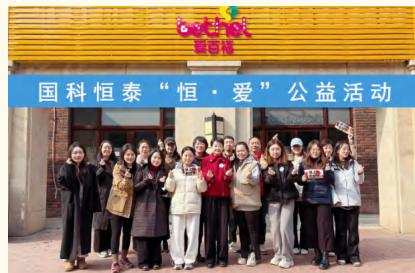

text_image

国科恒泰“恒·爱”公益活动

natural_image

Abstract painting of a vibrant orange flower with green background and black speckles (no text or symbols)

爱百福视障人士关爱中心回赠国科恒泰的油画及盲文油画说明

这是我心中最美的花

“金花鼠班”全体小朋友用指尖绘制的太阳花赠予国科恒泰，

感谢大家的关注。祝愿您的每一天都温暖且美好！

## ����年关键绩效

志愿活动参与

16人次

志愿活动时长

6小时

natural_image

Snow-covered mountain peaks under a clear blue sky with white clouds (no text or symbols visible)

## 未来展望

锚定航向，方能行稳致远。2025年，国科恒泰全面夯实“十四五”时期战略根基，在服务中国医疗器械产业变革、助推医疗健康体系高质量发展等方面取得显著成效，数字化供应链建设迈出坚实步伐，经营质效与综合竞争力持续提升。

立足“十五五”开局之年，国科恒泰将以更高站位洞察时代趋势，围绕“1+3+N”业务布局——在夯实医疗器械供应链主业的“1”的基础上深耕数智化业务，第三方生产制造（CDMO）业务及出海业务，探索创新模块的“N”种可能，以系统思维统筹发展全局，为可持续高质量发展注入持久动力。

近年来，国科恒泰始终秉持“专注服务与创新，开拓生命健康之路”的企业使命，将助力国家医疗器械流通行业变革的责任担当深深融入发展血脉。我们以实干诠释专业，以数智赋能行业，持续提升医疗供应链服务的覆盖面、可及性与满意度，在与波士顿科学、美敦力等全球知名厂商的深度合作中，在覆盖全国31个省、市、自治区的103个物流分仓的服务网络里，在2小时配送半径覆盖全国80%三级医院的承诺践行中，不断优化医疗供应链的协同效率，助力构建更高效、更稳定的高值医用耗材流通生态，以实际行动服务健康中国建设。

面向未来，国科恒泰将坚决贯彻“健康中国2030”战略对医疗器械行业的各顶部署，以更坚定的决心更扎实的作为，全力做好全链条赋能、数智化转型、供应链优化、质量管理提升，实现可持续发展。我们的规划始终坚持以服务人民健康为根本导向，聚焦高值、低值、IVD、设备四大关键领域，积极推动医疗器械产业链提质增效创新发展。

展望新征程，国科恒泰将继续初心如磐、使命在肩，以更加昂扬的奋斗姿态、更加务实的工作作风，深深扎根医疗器械流通领域，全心全意服务百姓生命健康。我们将在助力中国医疗器械产业高质量发展的壮阔实践中，为加快建设健康中国、开创医疗器械产业链全新局面贡献更强劲、更可靠的“国科恒泰力量”。

## 附录. 索引表

深交所可持续发展报告指引

<table><tr><td colspan="2">篇章章节</td><td>深圳证券交易所上市公司自律监管指引第17号--可持续发展报告(试行)</td></tr><tr><td colspan="2">关于本报告</td><td>第四条、第六条</td></tr><tr><td rowspan="4">可持续发展之路</td><td>可持续管理体系</td><td>第十二条、第五十一条</td></tr><tr><td>可持续发展目标</td><td>第十九条</td></tr><tr><td>利益相关方沟通</td><td>第九条、第五十三条</td></tr><tr><td>重要性议题管理</td><td>第五条</td></tr><tr><td rowspan="5">治理为基护航稳健经营</td><td>坚持党建引领</td><td>第五十五条</td></tr><tr><td>规范公司治理</td><td>第十二条、第五十一条、第五十二条</td></tr><tr><td>筑牢风控管理</td><td>第五十二条</td></tr><tr><td>优化投关服务</td><td>第五十三条</td></tr><tr><td>恪守商业道德</td><td>第五十四条、第五十五条、第五十六条</td></tr><tr><td rowspan="5">智链为擎重塑流通效能</td><td>提升服务质效</td><td>第十一条、第十三条、第十四条、第四十四条、第四十七条</td></tr><tr><td>促进科创研发</td><td>第十一条、第十三条、第十四条、第四十一条、第四十二条</td></tr><tr><td>产业平台赋能</td><td>第十一条、第十三条、第十四条、第四十四条、第四十五条</td></tr><tr><td>打造责任供应</td><td>第十一条、第十三条、第十四条、第四十四条、第四十五条</td></tr><tr><td>保障数据安全</td><td>第十一条、第十三条、第十四条、第四十八条</td></tr><tr><td rowspan="4">绿色为径践行低碳承诺</td><td>应对气候变化</td><td>第二十条、第二十一条、第二十二条、第二十四条</td></tr><tr><td>环境合规管理</td><td>第二十九条</td></tr><tr><td>统筹资源利用</td><td>第三十四条、第三十五条、第三十六条</td></tr><tr><td>助力循环经济</td><td>第三十七条</td></tr><tr><td rowspan="4">人本为怀延伸责任温度</td><td>员工权益保护</td><td>第四十九条、第五十条</td></tr><tr><td>构建成长体系</td><td>第四十九条、第五十条</td></tr><tr><td>守护职业健康</td><td>第四十九条、第五十条</td></tr><tr><td>践行社会公益</td><td>第三十八条</td></tr></table>

GRI 标准

<table><tr><td>GRI标准</td><td>披露指标</td><td>披露章节</td></tr><tr><td rowspan="24">GRI 2一般披露 2021</td><td>2-1组织详细情况</td><td>走进国科恒泰/关于本报告</td></tr><tr><td>2-2纳入组织可持续性报告的实体</td><td>关于本报告</td></tr><tr><td>2-3报告期、报告频率和联系人</td><td>关于本报告</td></tr><tr><td>2-4信息重述</td><td>/</td></tr><tr><td>2-5外部鉴证</td><td>/</td></tr><tr><td>2-6活动、价值链和其他业务关系</td><td>走进国科恒泰/提升服务质效/产业平台赋能/打造责任供应</td></tr><tr><td>2-7员工</td><td>员工权益保护</td></tr><tr><td>2-8员工之外的工作者</td><td>/</td></tr><tr><td>2-9管治架构和构成</td><td>规范公司治理</td></tr><tr><td>2-10最高治理机构的提名和遴选</td><td>规范公司治理</td></tr><tr><td>2-11最高治理机构主席</td><td>/</td></tr><tr><td>2-12在管理影响方面,最高管治机构的监督作用</td><td>规范公司治理</td></tr><tr><td>2-13为管理影响的责任授权</td><td>/</td></tr><tr><td>2-14最高治理机构在可持续发展报告中的作用</td><td>/</td></tr><tr><td>2-15利益冲突</td><td>筑牢风控管理</td></tr><tr><td>2-16关键问题的沟通</td><td>/</td></tr><tr><td>2-17最高治理机构的共同知识</td><td>可持续发展目标</td></tr><tr><td>2-18对最高管治机构的绩效评估</td><td>/</td></tr><tr><td>2-19薪酬政策</td><td>规范公司治理</td></tr><tr><td>2-20确定薪酬的程序</td><td>规范公司治理/员工权益保护</td></tr><tr><td>2-21年度总薪酬比率</td><td>/</td></tr><tr><td>2-22关于可持续发展战略的声明</td><td>可持续发展之路</td></tr><tr><td>2-23政策承诺</td><td>恪守商业道德/员工权益保护</td></tr><tr><td>2-24融合政策承诺</td><td>恪守商业道德/员工权益保护</td></tr><tr><td rowspan="6">GRI 2一般披露 2021</td><td>2-25 补救负面影响的程序</td><td>/</td></tr><tr><td>2-26 寻求建议和提出关切的机制</td><td>恪守商业道德</td></tr><tr><td>2-27 遵守法律法规</td><td>详见报告各章节</td></tr><tr><td>2-28 协会的成员资格</td><td>走进国科恒泰</td></tr><tr><td>2-29 利益相关方参与的方法</td><td>利益相关方沟通</td></tr><tr><td>2-30 集体谈判协议</td><td>员工权益保护</td></tr><tr><td rowspan="3">GRI 3实质性议题2021</td><td>3-1 确定实质性议题的过程</td><td>重要性议题管理</td></tr><tr><td>3-2 实质性议题清单</td><td>重要性议题管理</td></tr><tr><td>3-3 实质性议题的管理</td><td>重要性议题管理</td></tr><tr><td rowspan="4">GRI 201经济绩效 2016</td><td>201-1 直接产生和分配的经济价值</td><td>2025年可持续发展亮点</td></tr><tr><td>201-2 气候变化带来的财务影响和其他风险和机遇</td><td>应对气候变化</td></tr><tr><td>201-3 固定福利计划义务和其他退休计划</td><td>员工权益保护</td></tr><tr><td>201-4 政府给予的财政补贴</td><td>详见年度报告</td></tr><tr><td rowspan="2">GRI 202市场表现 2016</td><td>202-1 按性别划分的标准起薪水平工资与当地最低工资的之比</td><td>/</td></tr><tr><td>202-2 从当地社区雇佣的高管的比例</td><td>/</td></tr><tr><td rowspan="2">GRI 203间接经济影响 2016</td><td>203-1 基础设施投资和支持性服务</td><td>/</td></tr><tr><td>203-2 重大间接经济影响</td><td>促进科创研发/产业平台赋能/打造责任供应</td></tr><tr><td>GRI 204采购实践 2016</td><td>204-1向当地供应商采购的支出比例</td><td>/</td></tr><tr><td rowspan="3">GRI 205反腐败 2016</td><td>205-1 已经进行腐败风险评估的运营点</td><td>/</td></tr><tr><td>205-2 反腐败政策和程序的传达及培训</td><td>恪守商业道德</td></tr><tr><td>205-3 经确认的腐败事件和采取的行动</td><td>/</td></tr><tr><td>GRI 206反竞争行为 2016</td><td>206-1 针对反竞争行为、反托拉斯和反垄断实践的法律诉讼</td><td>/</td></tr><tr><td rowspan="3">GRI 207税务 2019</td><td>207-1 税务方针</td><td>筑牢风控管理</td></tr><tr><td>207-2 税收治理、控制和风险管理</td><td>筑牢风控管理</td></tr><tr><td>207-3 利益相关方参与和管理与税收有关的问题</td><td>/</td></tr></table>

<table><tr><td>GRI标准</td><td>披露指标</td><td>披露章节</td></tr><tr><td>GRI 207税务 2019</td><td>207-4 国别报告</td><td>/</td></tr><tr><td rowspan="3">GRI 301物料 2016</td><td>301-1所用物料的重量或体积</td><td>助力循环经济</td></tr><tr><td>301-2 所用循环利用的进料</td><td>助力循环经济</td></tr><tr><td>301-3 再生产品及其包装材料</td><td>助力循环经济</td></tr><tr><td rowspan="5">GRI 302能源 2016</td><td>302-1 组织内部的能源消耗量</td><td>应对气候变化</td></tr><tr><td>302-2 组织外部的能源消耗量</td><td>/</td></tr><tr><td>302-3 能源强度</td><td>应对气候变化</td></tr><tr><td>302-4 减少能源消耗</td><td>环境合规管理/统筹资源利用</td></tr><tr><td>302-5 产品和服务的能源需求下降</td><td>统筹资源利用</td></tr><tr><td rowspan="5">GRI 303水资源和污水 2018</td><td>303-1 组织与水作为共有资源的相互影响</td><td>环境合规管理</td></tr><tr><td>303-2 管理与排水相关的影响</td><td>环境合规管理</td></tr><tr><td>303-3 取水</td><td>/</td></tr><tr><td>303-4 排水</td><td>/</td></tr><tr><td>303-5 耗水</td><td>/</td></tr><tr><td rowspan="4">GRI 304生物多样性 2016</td><td>304-1 组织在位于或邻近保护区和保护区外的生物多样性丰富区域拥有、租赁、管理的运营点</td><td>/</td></tr><tr><td>304-2 活动、产品和服务对生物多样性的重大影响</td><td>/</td></tr><tr><td>304-3 受保护或经修复的栖息地</td><td></td></tr><tr><td>304-4 受运营影响的栖息地中已被列入世界自然保护联盟 (IUCN) 红色名录及国家保护名册的物种</td><td>/</td></tr><tr><td rowspan="7">GRI 305排放 2016</td><td>305-1 直接(范围 1)温室气体排放</td><td>应对气候变化</td></tr><tr><td>305-2 能源间接(范围 2)温室气体排放</td><td>应对气候变化</td></tr><tr><td>305-3 其他间接(范围 3)温室气体排放</td><td>/</td></tr><tr><td>305-4 温室气体排放强度</td><td>应对气候变化</td></tr><tr><td>305-5 温室气体减排量</td><td>/</td></tr><tr><td>305-6 臭氧消耗物质(ODS)的排放</td><td>/</td></tr><tr><td>305-7 氮氧化物(NOx)、硫氧化物(SOx)和其他重大气体排放</td><td>/</td></tr><tr><td rowspan="5">GRI 306废弃物 2020</td><td>306-1 废弃物的产生及废弃物相关重大影响</td><td>环境合规管理/助力循环经济</td></tr><tr><td>306-2 废弃物相关重大影响的管理</td><td>/</td></tr><tr><td>306-3 产生的废弃物</td><td>环境合规管理/助力循环经济</td></tr><tr><td>306-4 从处置中转移的废弃物</td><td>环境合规管理/助力循环经济</td></tr><tr><td>306-5 进入处置的废弃物</td><td>环境合规管理/助力循环经济</td></tr><tr><td rowspan="2">GRI 308供应商环境评估 2016</td><td>308-1 使用环境评价维度筛选的新供应商</td><td>打造责任供应</td></tr><tr><td>308-2 供应链中的负面环境影响以及采取的行动</td><td>/</td></tr><tr><td rowspan="3">GRI 401雇佣 2016</td><td>401-1 新进员工雇佣率和员工流动率</td><td>员工权益保护</td></tr><tr><td>401-2 提供给全职员工(不包括临时或兼职员工)的福利</td><td>员工权益保护</td></tr><tr><td>401-3 育儿假</td><td>员工权益保护</td></tr><tr><td>GRI 402劳资关系 2016</td><td>402-1 有关运营变更的最短通知期</td><td>/</td></tr><tr><td rowspan="10">GRI 403职业健康与安全 2018</td><td>403-1 职业健康安全管理体系</td><td>守护职业健康</td></tr><tr><td>403-2 危害识别、风险评估和事故调查</td><td>守护职业健康</td></tr><tr><td>403-3 职业健康服务</td><td>守护职业健康</td></tr><tr><td>403-4 职业健康安全事务:工作者的参与、意见征询和沟通</td><td>守护职业健康</td></tr><tr><td>403-5 工作者职业健康安全培训</td><td>守护职业健康</td></tr><tr><td>403-6 促进工作者健康</td><td>守护职业健康</td></tr><tr><td>403-7 预防和减缓与业务关系直接相关的职业健康安全影响</td><td>守护职业健康</td></tr><tr><td>403-8 职业健康安全管理体系覆盖的工作者</td><td>守护职业健康</td></tr><tr><td>403-9 工伤</td><td>守护职业健康</td></tr><tr><td>403-10 工作相关的健康问题</td><td>守护职业健康</td></tr><tr><td rowspan="3">GRI 404培训与教育 2016</td><td>404-1 每名员工每年接受培训的平均小时数</td><td>构建成长体系</td></tr><tr><td>404-2 员工技能提升方案和过渡协助方案</td><td>构建成长体系</td></tr><tr><td>404-3 定期接受绩效和职业发展考核的员工百分比</td><td>构建成长体系</td></tr></table>

<table><tr><td>GRI标准</td><td>披露指标</td><td>披露章节</td></tr><tr><td rowspan="2">GRI 405多元化与平等机会 2016</td><td>405-1管治机构与员工的多元化</td><td>规范公司治理/员工权益保护</td></tr><tr><td>405-2男女基本工资和报酬的比例</td><td>/</td></tr><tr><td>GRI 406反歧视 2016</td><td>406-1歧视事件及采取的纠正行动</td><td>/</td></tr><tr><td>GRI 407结社自由与集体谈判 2016</td><td>407-1 结社自由和集体谈判权可能面临风险的运营点和供应商</td><td>/</td></tr><tr><td>GRI 408童工2016</td><td>408-1 具有重大童工事件风险的运营点和供应商</td><td>/</td></tr><tr><td>GRI 409强迫或强制劳工 2016</td><td>409-1 具有强迫或强制劳动事件重大风险的运营点和供应商</td><td>/</td></tr><tr><td>GRI 410安保实践 2016</td><td>410-1 接受过在人权政策或程序方面培训的安保人员</td><td>/</td></tr><tr><td>GRI 411原住民权利 2016</td><td>411-1 涉及侵犯原住民权利的事件</td><td>/</td></tr><tr><td rowspan="2">GRI 413当地社区 2016</td><td>413-1 有当地社区参与、影响评估和发展计划的运营点</td><td>/</td></tr><tr><td>413-2 对当地社区有实际或潜在重大负面影响的运营点</td><td>/</td></tr><tr><td rowspan="2">GRI 414供应商社会评估 2016</td><td>414-1 使用社会标准筛选的新供应商</td><td>打造责任供应</td></tr><tr><td>414-2 供应链中的负面社会影响和采取的行动</td><td>/</td></tr><tr><td>GRI 415公共政策 2016</td><td>415-1 政治捐助</td><td>/</td></tr><tr><td rowspan="2">GRI 416客户健康与安全 2016</td><td>416-1 评估产品和服务类别的健康与安全影响</td><td>提升服务质效</td></tr><tr><td>416-2 涉及产品和服务的健康与安全影响的违规事件</td><td>/</td></tr><tr><td rowspan="3">GRI 417营销与标识 2016</td><td>417-1 对产品和服务信息与标识的要求</td><td>恪守商业道德</td></tr><tr><td>417-2 涉及产品和服务信息与标识的违规事件</td><td>/</td></tr><tr><td>417-3 涉及营销传播的违规事件</td><td>/</td></tr><tr><td>GRI 418客户隐私 2016</td><td>418-1 涉及侵犯客户隐私和丢失客户资料的经证实的投诉</td><td>保障数据安全</td></tr></table>