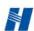

中国华能

CHINA HUANENG

华能澜沧江水电股份有限公司

HUANENG LANCANG RIVER HYDROPOWER INC.

## 2025年度

## 环境、社会和管治(ESG)报告

股票名称:华能水电 股票代码:600025

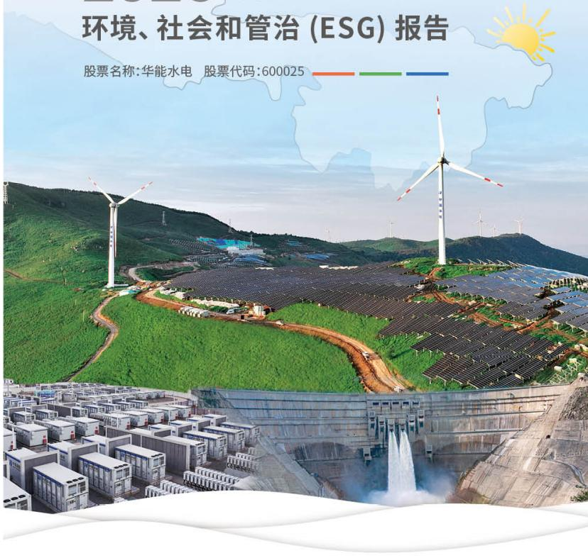

text_image

环境、社会和管治(ESG)报告
股票名称:华能水电 股票代码:600025

## 董事会声明

公司董事会是 ESG 工作的最高负责及决策机构，对 ESG 政策和目标制定、实践进度、绩效取得等相关事宜承担全部责任。

公司董事会以实现企业可持续发展作为一切行动的最终目标，并认为ESG是衡量可持续发展水平的重要标准，与此同时，公司董事会秉持坚守华能“三色”使命，持续探索企业文化中与生俱来的ESG理念，企业文化驱动ESG，ESG融入企业文化，构建具有自身特色的ESG管理与实践体系。

公司董事会与内外部利益相关方保持密切沟通，了解相关方关注热点问题，并持续跟进分析公司ESG风险，同时兼顾GRI standards、国务院国资委《关于新时代中央企业高标准履行社会责任的指导意见》、财政部等9部门《企业可持续发展披露准则——基本准则（试行）》、上海证券交易所《上市公司自律监管指引第14号——可持续发展报告（试行）》、上海证券交易所《上市公司自律监管指南第4号——可持续发展报告编制》等国内外ESG标准以及国家政策要求、社会舆论关注点、同行业企业议题趋势等，每年度更新、识别、制定公司ESG重要议题。

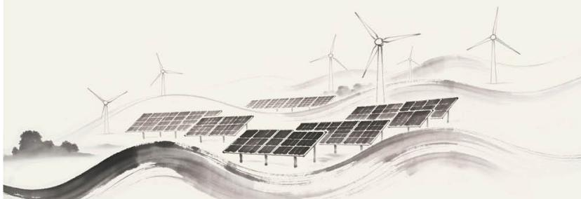

natural_image

Watercolor-style illustration of solar panels installed on rolling hills with wind turbines in the background (no text or symbols)

04 关于我们  
08 【回眸“十四五”】绿能澎湃 风劲潮生  
60 满载荣耀·礼赞 2025  
64 奋楫扬帆·奔赴 2026  
66 附录

## 10

## 深化改革，聚力攻坚建新功

12 培根铸魂,坚守信仰  
14 战略擘画, 勇担责任  
21 稳健运营,精于管理  
24 综合施策,提质增效  
26【专题故事】

立潮头，做现代治理的先行者

## 28

## 砥砺奋进，守正创新谋新篇

30 关爱员工, 助力成长  
34 强基固本,保障安全  
36 科技驱动,赋能革新  
39 绿色低碳,守护环境

44【专题故事】

担使命,做生态文明的护航者

## 46

## 精耕细作，蓄势发展开新局

48 做优主业,能源保供  
50 协同共赢，引领行业  
53 央企担当,情系社会  
56 同心相融,共建丝路  
58【专题故事】

守初心,做一带一路的共建者

CONTENTS

## 关于我们

## ABOUT US

华能澜沧江水电股份有限公司是由中国华能集团有限公司控股和管理的大型流域水电企业，初建于1999年6月，2017年12月15日在上海证券交易所上市。公司坚持水电与新能源并重发展，全速推进澜沧江基地一体化开发建设，现已成为水风光一体化发展和实施“西电东送”“云电外送”的骨干龙头企业，为加快构建清洁低碳、安全高效现代能源体系作出积极贡献。

充分发挥区域发电行业的“龙头”作用，全力服务国有资产保值增值。2023年9月，华能四川能源开发有限公司 $100\%$ 股权注入华能水电。截至2025年底，华能水电总装机3420.81万千瓦，年发电量超千亿千瓦时，资产总额约2267.17亿元，累计投资超2740亿元，累计缴纳税费超782.24亿元，是云南省最大发电企业。

充分发挥区域绿色发展的“支柱”作用，全力服务能源结构转型升级。建成云南调节能力最强、库容最大的糯扎渡、小湾电站，建成中国在缅甸投资最大的水电项目瑞丽江一级水电站、柬埔寨境内最大的桑河二级水电站，实现了中国“技术+设备+标准+管理”全链条“走出去”。

充分发挥区域科技创新的“标杆”作用，全力服务国家重大战略需求。拥有国内同类企业中“产学研用”全面协同、最为完备的科技创新平台，设立国家能源水能高效利用与大坝安全技术研发中心、云南省水风光一体化工程技术创新中心、澜沧江清洁能源安全绿色智能建设技术创新中心、云南省马洪琪院士工作站、博士后科研工作站、华能水电技术研发中心等高水平高层次科技创新平台。水电科技引领世界坝工技术发展，创造出多个“中国第一”“世界第一”，建成世界首座300米级高拱坝（小湾，294.5米）、亚洲最高碾压混凝土坝（黄登，203米）等13座具有里程碑意义的世界级水电大坝，将澜沧江打造成名副其实的世界水电坝型博物馆。发明世界首创、中国原创的景洪水力式新型升船机，在世界高坝通航领域树立中国品牌。解决水电控制系统“卡脖子”难题，全面完成水电机组四大核心控制系统国产化研发、实现核心技术完全自主可控。

充分发挥区域企业扶贫的“典范”作用，全力服务地方经济社会发展。公司在自身发展的同时，主动履行社会责任。累计投入帮扶资金23.5亿元，帮扶云南4县拉祜族、佤族两个“直过民族”实现历史性整族脱贫，帮扶云南大田山村、四川团结村等237个贫困村、32万余人全部脱贫出列；自主实施“百千万工程”帮扶项目1260余个。投入移民资金540余亿元，帮扶近10.7万水电移民改善生产生活条件。

## 截至 2025 年底, 公司持股 5% 以上股东 3 家, 分别为:

中国华能集团有限公司
国有法人

持股数量
90.72亿股

持股比例
48.69%云南省能源集团有限公司
国有法人

持股数量
40.868亿股

持股比例
21.94%云南合和(集团)股份有限公司
国有法人

持股数量
21.865亿股

持股比例
11.74%

牢记姓党为民，保障能源安全，为中国式现代化服务的“红色”公司

坚持生态优先,践行能源革命,为人民美好生活赋能的“绿色”公司

注重科技创新, 推动能源合作, 为构建人类命运共同体助力的“蓝色”公司

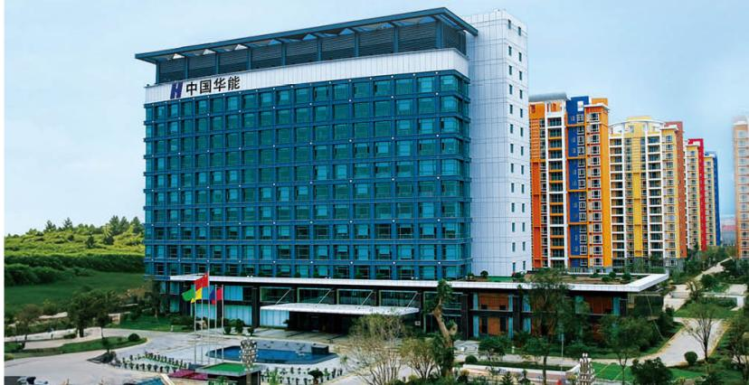

natural_image

Exterior view of a modern multi-story office building with '中国华能' signage, surrounded by greenery and landscaped grounds (no other text or symbols visible)

## 我们的企业文化

## 企业使命

建设“三色”公司，服务能源强国。

## 战略愿景

领跑中国电力，争创世界一流。

## 战略定位

科技创新的“国家队”、产业发展的“领头羊”、安全保供的“顶梁柱”。

## 企业价值准则

忠诚、创造、领先、共享。

## 企业精神

改革创新，奋进争先。

## 企业作风

勇于开拓、敢于担当、善于作为、乐于奉献。

## 企业信仰

能源于水、有容乃大。

## 发展理念

绿色低碳、创新驱动、协同高效。

## 安全理念

一切风险皆可控制、

一切事故皆可预防。

## 三色 ——水文化理念体系——

## 管理理念

依法治企、科学治企、从严治企。

## 经营理念

诚信为本、价值为纲、节俭为要。

## 服务理念

为你能，尽我能。

## 社会责任理念

建设一座电站、带动一方经济、保护一片环境、造福一方百姓、共建一方和谐。

## 工作理念

马上就办，办就办好。

## 廉洁理念

践行“三色”使命，塑造廉洁人生。

## 人才理念

人尽其才，才尽其用。

## 价值理念

以奋斗者为本、以奋斗者为荣。

## 团队理念

团结协作、良性竞争、相互成就。

## 员工理念

爱国爱企爱岗，敬业乐业专业。

## 我们的组织架构

## 办公室(党委办公室)

## 战略发展部(战新产业部)

## 财务与预算部

## 资本运营与证券事务部（董事会办公室）

## 企业管理与法律合规部（深化改革办公室）

## 基本建设部

## 生产技术与设备部

## 营销部

## 运行管理部

## 人力资源部(党委组织部)

## 安全与环境监察部

## 供应链管理部

## 征地移民与社会责任部

## 科技创新部

## 党建工作部 (党委宣传部、工会办公室)

## 纪律检查部

## 党委巡察办

## 审计部

## 国际业务部

## 新能源事业部

## 直属单位

## 信息与新闻中心

## 财务管理中心

华能澜沧江水电股份有限公司漫湾水电厂

华能小湾水电工程建设管理局

华能澜沧江水电股份有限公司小湾水电厂

华能景洪水电工程建设管理局

华能澜沧江水电股份有限公司景洪水电厂

华能澜沧江水电股份有限公司糯扎渡水电工程建设管理局

华能澜沧江水电股份有限公司糯扎渡水电厂

华能澜沧江水电股份有限公司集控中心

华能澜沧江水电股份有限公司苗尾·功果桥水电工程建设管理局

华能澜沧江水电股份有限公司苗尾·功果桥水电厂

华能澜沧江水电股份有限公司乌弄龙·里底水电工程建设管理局

华能澜沧江水电股份有限公司乌弄龙·里底水电厂

华能澜沧江水电股份有限公司黄登·大华桥水电工程建设管理局

华能澜沧江水电股份有限公司黄登·大华桥水电厂

华能澜沧江水电股份有限公司 RM·BDuo 水电工程建设管理局

华能澜沧江水电股份有限公司 TB 水电工程建设管理局

华能澜沧江水电股份有限公司 TB 水电厂

华能澜沧江水电股份有限公司检修分公司

华能澜沧江水电股份有限公司科技研发中心

华能澜沧江水电股份有限公司大坝管理中心

华能澜沧江水电股份有限公司 GS 水电工程建设管理局

华能澜沧江水电股份有限公司物资分公司

华能澜沧江水电股份有限公司 BDa 水电工程建设管理局

华能澜沧江水电股份有限公司 GX 水电工程建设管理局

华能澜沧江水电股份有限公司驻缅甸代表处

华能澜沧江水电股份有限公司驻柬埔寨代表处

## 全资子公司

华能四川能源开发有限公司

华能澜沧江上游水电有限公司

华能澜沧江国际能源有限公司

华能澜沧江新能源有限公司

华能澜沧江能源销售有限公司

华能澜沧江(昌都)新能源有限公司

## 控股子公司

云南联合电力开发有限公司

华能龙开口水电有限公司

桑河二级水电有限公司

# 回降“十四五”绿能澎湃风劲潮生

“十四五”时期，华能水电坚持以习近平新时代中国特色社会主义思想为指引，贯彻落实“四个革命、一个合作”能源安全新战略，主动服务构建新型能源体系建设和新型电力系统，始终扛牢“服务党和国家工作大局、服务经济社会高质量发展、服务保障和改善民生”的使命责任，办成了一系列大事、要事，有力推动公司各项工作实现历史性跨越、迈上新的台阶，交出一份厚重亮眼的高质量发展答卷，实现“十四五”胜利收官。

## 党的建设走深走实

● 接续实施党建引领深化年、提质年、创效年和品牌建设年行动，基层组织更加过硬  
全面构建大监督体系，从严治党纵深推进  
深入开展解放思想大讨论，干部职工凝聚力战斗力不断增强

## 安全保供坚强有力

- 全面构建水风光储多能互补能源供给矩阵  
● 年发电量保持千亿千瓦时规模，较“十三五”末增长近20%  
系统构建“生态监测、物种保护、机制创新”三位一体综合保护方式

## 治理水平更加现代

国企改革三年行动和改革深化提升行动实现圆满收官  
- 入选国资委创建世界一流专业领军示范企业  
● 获评中央企业治理示范企业、云南省重点产业领军企业

## 经营效益连攀新高

● 利润总额攀上百亿元台阶，较“十三五”末翻番  
完成四川公司股权注入和再融资  
公司市值近1700亿元，较“十三五”末增长1.4倍

## 发展质效提档升级

总装机 3420.81 万千瓦，较“十三五”末大幅增长  
云南省新增投产水电、新能源1000万千瓦  
建成云南省4个水风光一体化基地

## 科技创新高效赋能

● 承担国家级、省部级重大科技任务19项，数量为“十三五”时期的2倍  
成功攻克20余项重大技术难题，实现国家工程奖“大满贯”  
● 牵头研发投运全国首台（套）华能睿渥水电核心控制系统，建成全国首个单机70万千瓦控制系统全国产化电站  
● 获得国家科技进步二等奖1项、省部和行业级科技奖励80余项  
授权发明专利超600项，较“十三五”时期增长超10倍

## 深化改革

## 聚力攻坚建新功

华能水电坚持以党建为统领，从严从实抓好党纪学习教育，持续提升党建工作质效；深化ESG体系建设，推动环境、社会和管治理念融入企业运营全过程；不断健全现代企业治理架构，纵深推进改革创新，坚守诚信合规经营底线，全面增强核心竞争能力，以一流企业建设赋能企业高质量发展。

运营收入

265.95亿元

净利润

92.17亿元

经济增加值（EVA）

52.48亿元

合规培训覆盖

3676人次

高质量发展是中国式现代化的必然要求。面对复杂的外部环境，要坚定信心，坚定不移办好自己的事，坚定不移扩大高水平对外开放，着力稳就业、稳企业、稳市场、稳预期，以高质量发展的确定性应对各种不确定性。

\- 习近平总书记2025年5月19日至20日在河南考察时的讲话

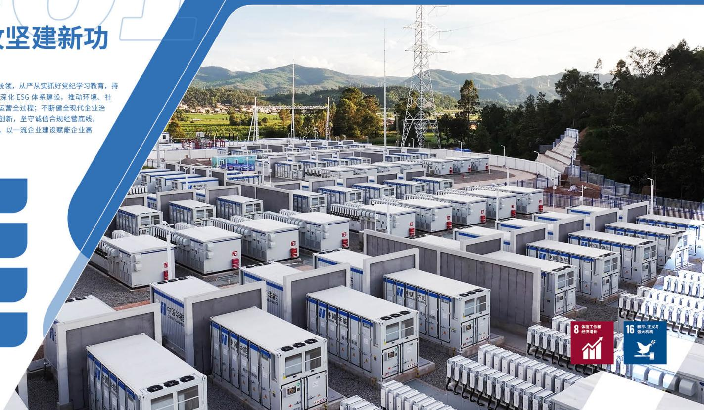

text_image

攻坚建新功
统领，从严从实抓好党纪学习教育，持
深化ESG体系建设，推动环境、社
运营全过程；不断健全现代企业治
创新，坚守诚信合规经营底线，
以一流企业建设赋能企业高
8 体面工作和
经济增长
16 和平、正义与
强大机构

## 培根铸魂, 坚守信仰

## 01

华能水电坚持以习近平新时代中国特色社会主义思想为指导，全面深入贯彻落实党的二十大和二十届历次全会精神，见行见效开展深入贯彻中央八项规定精神学习教育，大力实施“党旗领航、三色担当”党建品牌建设年专项行动和“党建焕新”行动，党建工作成效斐然，为公司“十四五”圆满收官筑牢坚实根基。

## 学思践悟铸忠诚政治建设强根基

公司严格落实“第一议题”制度，精准传达学习习近平总书记重要讲话和重要指示批示64项、研究制定215条具体落实举措，确保党中央决策部署精准转化为公司实际行动；用好“五学联动”机制，创新“辅导+联学”等学习方式，开展中心组学习研讨9期，组织284名干部参加学习《习近平经济文选》第一卷联学培训班，教育引导全体党员干部自觉做党的创新理论的坚定信仰者和忠实实践者；第一时间传达学习党的二十届四中全会精神，制定印发学习宣传贯彻工作方案和24条实施意见，举办贯彻全会精神暨领导干部政治素养提升专题培训班、读书班，公司党委班子成员以上率下宣讲党的二十届四中全会精神，汇聚起收官“十四五”、谋篇“十五五”的强大动能。

## 真抓实干促落实作风建设树新风

公司扛牢抓实开展深入贯彻中央八项规定精神学习教育的政治任务，举办4期读书班、1期专题研讨，示范带动基层单位学习研讨110余次、党支部学习1200余次，召开警示教育会暨集中整治违规吃喝推进会，开展警示教育超160次，公司系统查摆问题200个、制定整改措施604条，以“三个真”防范“三个滑坡”，切实将“马上就办、办就办好”理念内化为行动自觉。

“三个真”防范“三个滑坡”: 在“学”上下真功, 防范政治滑坡; 在“查”上动真格, 防范思想滑坡; 在“改”上见真章, 防范纪律滑坡。

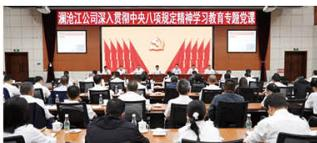

text_image

澜沧江公司深入贯彻中央八项规定精神学习教育专题党课

深入贯彻中央八项规定精神学习教育专题党课

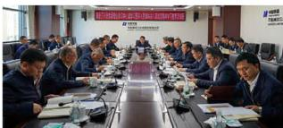

text_image

Meeting photo with visible banner text in Chinese, showing participants seated at a long conference table

公司党委深入贯彻中央八项规定精神学习教育读书班开班

## 专项行动激活力组织建设添动力

公司扎实开展“党旗领航、三色担当”党建品牌建设年专项行动和“党建焕新”行动，高水平推进“三项工程”，抓好“党支部强基赋能工程”示范点创建，开展“党建焕新”行动专题宣传，创建党员示范“区岗队组”411个。

## 文化引领树导向品牌建设展魅力

公司深化“文化润江”专项行动，大力弘扬“三色”文化，发布公司“三色”水文化理念体系，承办庆祝中国华能成立40周年英语演讲初赛，建成澜沧江清洁能源基地展示中心，9家单位获评或继续保留“全国文明单位”；落实“三色绽放”品牌战略规划，做深华能澜沧江“12348”品牌体系建设，做精主题宣传、国际传播、形象宣传工作，讲好华能故事、展示华能形象、彰显华能担当。

## 华能澜沧江“12348”品牌体系

## 1 个企业品牌

华能澜沧江

## 2个基本点

“一体化基地”开发格局“跨文化传播”总体部署

## 3个特征

立体化、内涵化、多元化

## 4个关键要素

顶层策划、媒体融合风险防控、考核激励

## 8个品牌支撑

“一体化基地”开发者、“一带一路”参与者、水电坝型集成者、“科技兴江”引领者、能源保供担当者、社会责任践行者、绿色发展领军者、“文化润江”实施者

## 群团联动聚合力携手奋进谱新篇

公司开展劳动和技能竞赛10项，高质量建设云南省工匠学院分校区，开展“劳模工匠助企行”、承办云南省劳模工匠宣讲团宣讲等活动；举办驻滇电力央企“青马工程”培训班，组建青年突击队60支，深化“青创澜沧江”品牌打造，举办第一届青年创新创效大赛，凝聚起强大的群团力量。

## 战略擘画, 勇担责任

## 02

华能水电 ESG 责任价值模型 2.0 分核心、内、中、外四个圈层，核心层为企业文化层，内圈层为 ESG 管理层、中间层为 ESG 实践层、外圈层为 ESG 利益相关方层，寓意公司在“三色”使命的引领下，不断加强责任顶层设计，以 ESG 管理为中心，积极开展 ESG 实践，时刻保持与利益相关方的密切沟通，形成多层次、多维度的 ESG 工作机制。

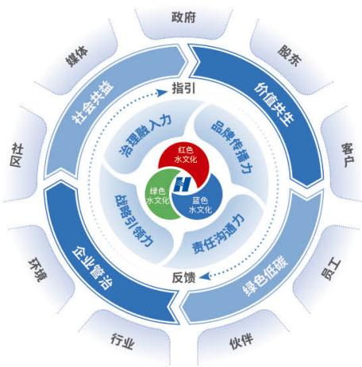

flowchart

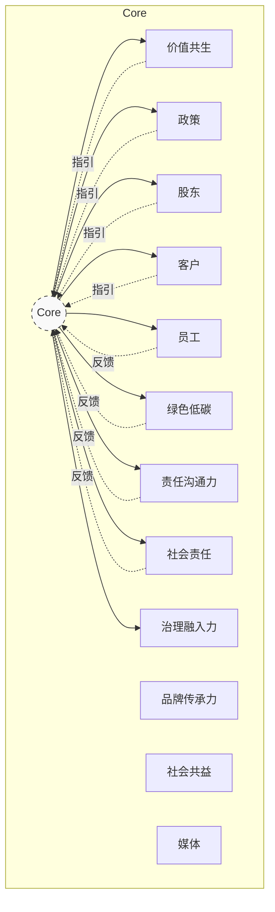

华能水电 ESG 责任价值模型 2.0

## 统筹谋划

## 强化战略引领力

## 践行 ESG 理念

公司始终锚定“构建和谐电站、奉献绿色能源、建设世界一流现代化绿色电力企业”这一目标，把ESG理念与“三色”文化深度融合，精心塑造企业ESG品牌，为国家、社会和行业创造显著价值，全方位展示企业的责任担当，有力推动新时代企业高质量发展。

## 健全组织体系

为全方位提升 ESG 工作的系统性和规范性，公司构建起一套完善健全的 ESG 治理体系，并对相关人员的职责范围进行了明确细致的界定。

## 决策层

董事会作为 ESG 管理及信息披露的领导和决策机构，研判 ESG 风险，审阅对外披露的信息等。

## 统筹层

公司企业管理与法律合规部（深化改革办公室）作为总体统筹部门，全面负责 ESG 工作的整体协调与日常监督，确保 ESG 各项工作高效有序地推进。

## 执行层

公司其他业务部门及基层企业建立 ESG 联络机制，助力公司在 ESG 实践领域取得更为卓越的成效。

## 深度协调

## 增强治理融入力

## 精准识别议题

公司积极响应全球报告倡议组织（GRI）《可持续发展报告标准》、国务院国资委《关于新时代中央企业高标准履行社会责任的指导意见》、财政部等9部门《企业可持续发展披露准则——基本准则（试行）》、上海证券交易所《上市公司自律监管指引第14号——可持续发展报告（试行）》《上市公司自律监管指南第4号——可持续发展报告编制》等标准倡议，结合国家政策与行业、企业实际情况，了解利益相关方的真实需求，逐一识别、分析ESG议题的影响重要性、财务重要性，确认华能水电2025年ESG议题的双重重要性，科学划定公司ESG信息披露的内容边界。

## 步骤1

## 了解公司活动和业务关系背景

公司通过内部调研、政策研究、相关方识别等方式，充分了解公司活动和业务关系、相关法律和监管政策等外部客观环境以及主要受影响的利益相关方，为后续 ESG 议题清单的建立打好基础。

## 步骤② 建立议题清单

公司认真研读《上市公司自律监管指引第14号——可持续发展报告（试行）》，将《指引》所列出的21个议题作为议题清单基础，议题包括：应对气候变化、污染物排放、废弃物处理、生态系统和生物多样性保护、环境合规管理、能源利用、水资源利用、循环经济、乡村振兴、社会贡献、创新驱动、科技伦理、供应链安全、平等对待中小企业、产品和服务安全与质量、数据安全与客户隐私保护、员工、尽职调查、利益相关方沟通、反商业贿赂及反贪污、反不正当竞争。

在此基础上，公司结合中央企业、电力行业、上市公司等特性，通过尽职调查、风险管理等内部流程，整理相关监管政策、规则、行业标准及发展趋势、同业分析等方式，增加企业党建、保障能源供应、一带一路、移民安置4个议题作为补充议题，共同形成由25个议题组成的议题清单。

## 步骤③

## 议题重要性的评估与确认

## 影响重要性评估

公司向各级政府 / 监管机构、投资者 / 股东、客户、公司各部门（单位）员工、商业伙伴、行业协会、社会公众、媒体等相关方发放问卷，同时咨询行业专家意见，从规模、范围、不可补救性、可能性等角度，深入评估 25 个议题的影响重要性，即公司的议题表现对经济、社会和环境产生重大影响。

## 财务重要性评估

公司组织内部财务专业管理人员、相关业务部门工作人员及管理层等核心相关方，通过座谈研讨、问卷调查等方式就25个议题的财务重要性开展深入分析评估，从对于资源和关系的依赖和影响等角度，逐一判断议题财务影响的重大程度，即议题预期在短期、中期和长期内对公司商业模式、业务运营、发展战略、财务状况、经营成果、现金流、融资方式及成本等产生重大影响。

## 整合影响与财务重要性结果

公司整合影响重要性、财务重要性的评估结果，得出以下“华能水电2025年ESG议题重要性识别与分析结果”。

其中，25个议题中财务影响的程度处于“较大”或“极大”的议题共3项，分别为“产品和服务安全与质量”“应对气候变化”“水资源利用”，与其相关信息的披露分别详见P34、P39、P48。

<table><tr><td>议题名称</td><td>影响重要性</td><td>财务重要性</td></tr><tr><td>应对气候变化</td><td>■</td><td>■</td></tr><tr><td>污染物排放</td><td>□</td><td></td></tr><tr><td>废弃物处理</td><td>□</td><td></td></tr><tr><td>生态系统和生物多样性保护</td><td>■</td><td></td></tr><tr><td>环境合规管理</td><td>■</td><td></td></tr><tr><td>能源利用</td><td>□</td><td></td></tr><tr><td>水资源利用</td><td>■</td><td>■</td></tr><tr><td>循环经济</td><td>□</td><td></td></tr><tr><td>乡村振兴</td><td>■</td><td></td></tr><tr><td>社会贡献</td><td>■</td><td></td></tr><tr><td>创新驱动</td><td>□</td><td></td></tr><tr><td>科技伦理</td><td></td><td></td></tr></table>

注：公司业务不涉及科技伦理敏感领域，故未披露“科技伦理”议题相关的详细信息。

<table><tr><td>议题名称</td><td>影响重要性</td><td>财务重要性</td></tr><tr><td>供应链安全</td><td></td><td></td></tr><tr><td>平等对待中小企业</td><td></td><td></td></tr><tr><td>产品和服务安全与质量</td><td></td><td></td></tr><tr><td>数据安全与客户隐私保护</td><td></td><td></td></tr><tr><td>员工</td><td></td><td></td></tr><tr><td>尽职调查</td><td></td><td></td></tr><tr><td>利益相关方沟通</td><td></td><td></td></tr><tr><td>反商业贿赂及反贪污</td><td></td><td></td></tr><tr><td>反不正当竞争</td><td></td><td></td></tr><tr><td>企业党建</td><td></td><td></td></tr><tr><td>保障能源供应</td><td></td><td></td></tr><tr><td>一带一路</td><td></td><td></td></tr><tr><td>移民安置</td><td></td><td></td></tr></table>

## 步骤④

## 议题重要性信息披露

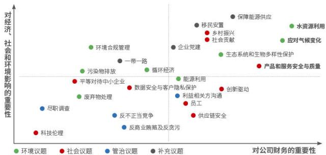

scatter

| Category | Issue | Importance to Company Finance (X-axis) | Importance to Economy, Social, and Environmental Impact (Y-axis) |
| --- | --- | --- | --- |
| 环境议题 | 水资源利用 | High | High |
| 社会议题 | 乡村振兴 | High | High |
| 社会议题 | 社会贡献 | High | High |
| 社会议题 | 产品和服务安全与质量 | High | Medium-High |
| 社会议题 | 创新驱动 | High | Medium |
| 社会议题 | 供应链安全 | High | Low-Medium |
| 管治议题 | 保障能源供应 | High | High |
| 管治议题 | 移民安置 | High | High |
| 管治议题 | 企业党建 | Medium-High | Medium-High |
| 管治议题 | 一带一路 | Medium-High | Medium-High |
| 管治议题 | 循环经济 | Medium-High | Medium-High |
| 管治议题 | 能源利用 | Medium-High | Medium |
| 管治议题 | 利益相关方沟通 | Medium-High | Low-Medium |
| 管治议题 | 员工 | Medium-High | Low-Medium |
| 管治议题 | 废弃物处理 | Medium-High | Low-Medium |
| 管治议题 | 反不正当竞争 | Medium-High | Low |
| 管治议题 | 反商业贿赂及反贪污 | Medium-High | Low |
| 补充议题 | 环境合规管理 | Medium-Low | Medium-High |
| 补充议题 | 产业党建 | Medium-Low | Medium-High |
| 补充议题 | 乡村振兴 | Medium-Low | Medium-High |
| 补充议题 | 社会贡献 | Medium-Low | Medium-High |
| 补充议题 | 产品和服务安全与质量 | Medium-Low | Medium-High |
| 补充议题 | 供应链安全 | Medium-Low | Low-Medium |
| 补充议题 | 科技伦理 | Low-Medium | Low |
| 补充议题 | 尽职调查 | Low-Medium | Low |
| 补充议题 | 应对气候变化 | High | High |
| 补充议题 | 生态保护 | High | High |
| 补充议题 | 水资源利用 | High | High |
| 补充议题 | 应对气候变化 | High | High |
| 补充议题 | 产业党建 | High | Medium-High |
| 补充议题 | 一带一路 | Medium-High | Medium-High |
| 补充议题 | 污染排放 | Medium-High | Medium-High |
| 补充议题 | 平等对待中小企业 | Medium-High | Medium-High |
| 补充议题 | 数据安全与客户隐私保护 | Medium-High | Medium-High |
| 补充议题 | 创新驱动 | High | Medium-High |
| 补充议题 | 利益相关方沟通 | Medium-High | Low-Medium |
| 补充议题 | 反商业贿赂及反贪污 | Medium-High | Low |
| 补充议题 | 反不正当竞争 | Medium-High | Low |
| 补充议题 | 尽职调查 | Low-Medium | Low |
| 补充议题 | 废弃物处理 | Low-Medium | Low |
| 补充议题 | 科技伦理 | Low-Medium | Low |
| 补充议题 | 产业党建 | Medium-High | Medium-High |
| 补充议题 | 一带一路 | Medium-High | Medium-High |
| 补充议题 | 循环经济 | Medium-High | Medium-High |
| 补充议题 | 能源利用 | Medium-High | Medium-High |
| 补充议题 | 利益相关方沟通 | Medium-High | Low-Medium |
| 补充议题 | 员工 | Medium-High | Low-Medium |
| 补充议题 | 反商业贿赂及反贪污 | Medium-High | Low |
| 补充议题 | 反不正当竞争 | Medium-High | Low |
| 补充议题 | 科技伦理 | Low-Medium | Low |
| 补充议题 | 供应链安全与质量 | High | Medium-High |
| 补充议题 | 生态系统和生物多样性保护 | High | Medium-High |
| 补充议题 | 应对气候变化 | High | High |
| 补充议题 | 乡村振兴 | High | High |
| 补充议题 | 科技伦理 | Low-Medium | Low |
| 补充议题 | 产业党建 | High-Medium | Medium-High |
| 补充议题 | 一带一路 | Medium-High-Medium | Medium-High |

## 夯实能力建设

公司 ESG 体系内各层级管理者对 ESG 能力培育工作极为重视，不断加大 ESG 论念宣传推广与教育培训的力度。公司主动邀请 ESG 领域专家开展内部专项培训活动，以此增强相关岗位人员的业务执行能力；同时积极投身监管部门及行业协会组织的各类 ESG 培训课程，精准捕捉 ESG 领域的最新动态与合规要求，为公司的长远可持续发展筑牢坚实基础。

公司高质量承办中国企业改革与发展研究会第八期ESG高级管理人才培训与资质评价培训班，组织华能集团内部各层级职工共39人参与培训，有效提升ESG责任意识，同时为来自央企、国企、民营企业的100余名ESG工作者提供学习平台，彰显了公司在ESG人才培养领域的专业实力与担当。2025年，公司ESG实践案例荣获由中国企业改革与发展研究会、半月谈杂志社等机构颁发的年度ESG卓越实践奖、企业ESG优秀成果奖。

## 深化责任融入

为系统推进企业 ESG 管理并对标世界一流，华能水电早在 2022 年，布局开展 “ESG 指标体系与评价模型构建” 课题研究，创新推出 ESG 责任价值（ESG+V）模型，并编制配套指标体系，在 ESG 原有的环境、社会、企业管治三个维度基础之上，增添了主业价值这一责任领域，充分契合资本市场对上市公司的各项要求，又考量了公司作为中央企业及所属电力行业，对国家、行业和人民所应承担的责任与做出的贡献。

华能水电关注到国务院国资委、上海证券交易所等监管机构出台最新ESG相关政策法规，同时考虑到公司股权架构出现变动（华能四川 $100\%$ 股权注入华能水电），于2025年组织开展“华能水电ESG指标体系提升研究项目”，形成“华能水电ESG责任价值（ESG+V）模型及配套指标体系”2.0版本，确保公司ESG管理工作符合最新外部政策要求、适应最新内部运营实际、紧密结合企业战略定位与业务特色，致力于成为中央企业电力上市公司ESG工作的先行者。

“华能水电ESG责任价值（ESG+V）模型及配套指标体系”2.0版分为“责任管理、绿色低碳、社会共益、企业管治、价值共生”五大责任领域，涵盖了战略引领力、治理融入力、品牌传播力、责任沟通力、环境综合管理、气候变化与降碳管理、资源能源节约管理、污染物减排管理、生物多样性保护、员工权益保障、职业健康与安全生产、供应链管理、社会贡献、规范企业治理、董事会与管理层、投资者关系与股东权益、保障供应、科技创新与研发、品质管理与客户服务19项ESG议题、174个具体指标，实现对公司运营环节的全覆盖。该体系不仅为ESG工作提供了清晰的行动路径与有力抓手，更为公司高质量发展提供坚实保障。

ESG 议题

19项

具体指标

174↑

## 多维发力

## 提升品牌传播力

● ● ● ● ●

## 规范信息披露

公司严格遵循中国证监会及上海证券交易所监管规定，制定《信息披露管理制度》，按期披露财务、投融资、ESG及生产经营等相关信息，全面展现发展成效、社会贡献与环保成果，依法合规、真实准确、及时完整地履行信息披露义务，持续提升华能水电品牌影响力与传播力。截至2025年底，公司上市信息披露工作连续七年获评A级评价。

## 强化高层参与

公司管理层高度重视ESG工作，积极投身各界ESG活动，主动在公开平台分享ESG管理和实践经验，提升了公司在ESG领域的知名度，有效推动公司ESG工作的深入开展。2025年，公司领导出席由中国企业改革发展与发展研究会组织开展的ESG高级管理人才专题培训班，向参训人员展示公司ESG工作最新进展与成效，打造公司治理先进、担当尽责的ESG良好形象；公司代表华能集团参展ESG中国·创新年会（2025）暨首届ESG国际博览会，充分利用这一平台分享公司ESG管理、展示公司实践案例，提升公司ESG工作影响力。

## 精准联动

## 夯实责任沟通力

● ● ● ● ●

公司高度重视社会各界的看法与意见，主动邀请各界人士走进企业参观交流，同时积极向外界呈现自身在责任履行方面的实践成果，搭建起公司与各方顺畅沟通的桥梁纽带，保证各方需求能迅速且妥善地得到回应。

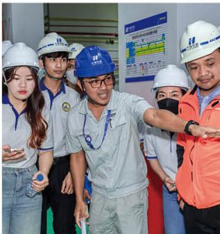

natural_image

Group of workers in hard hats and uniforms gathered around a man pointing at a display board (no visible text or symbols)

桑河二级水电站公众开放日活动

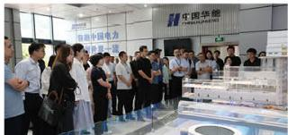

text_image

中国华能
CHINA HUAHE
中国电力

糯扎渡电厂组织投资者参观调研活动

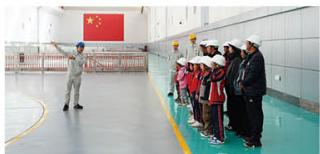

natural_image

Group of people in hard hats and uniforms standing in a cleanroom hallway with a large Chinese flag on the wall (no visible text or symbols)

龙开口公司开展“聚合力展担当”主题国企开放日活动

ESG 工作满意度

9.5 分

公司高度重视利益相关方价值，主动倾听各方对ESG工作的意见建议，以此持续优化管理实践。公司结合业务实际，系统识别主要利益相关方，通过多元沟通机制积极回应相关方期待，凝聚合力、共创价值。2025年，公司首次开展利益相关方满意度调研，结果显示，利益相关方对ESG工作满意度达9.5分。

<table><tr><td>利益相关方</td><td>对公司的期望</td><td>公司的回应</td></tr><tr><td rowspan="3">政府/监管机构</td><td>响应国家政策</td><td>服务国家战略</td></tr><tr><td>坚持守法合规</td><td>稳健合规经营</td></tr><tr><td>确保电力安全</td><td>保障电力供应</td></tr><tr><td rowspan="3">投资者/股东</td><td>资产保值增值</td><td>提升经济效益</td></tr><tr><td>避免经营风险</td><td>加强风险防控</td></tr><tr><td>保持信息透明</td><td>加强信息披露</td></tr><tr><td rowspan="2">客户</td><td>优化客户服务</td><td>完善服务体系</td></tr><tr><td>加强技术创新</td><td>搭建创新平台</td></tr><tr><td rowspan="4">员工</td><td>提高福利待遇</td><td>保障基本权益</td></tr><tr><td>助力职业发展</td><td>开展员工培训</td></tr><tr><td>平衡工作生活</td><td>关爱员工成长</td></tr><tr><td>保障身心健康</td><td>确保员工安全</td></tr><tr><td rowspan="2">伙伴</td><td>实现互利共赢</td><td>实施多方合作</td></tr><tr><td>坚持公平合作</td><td>落实责任采购</td></tr><tr><td rowspan="2">行业</td><td>开展技术交流</td><td>加强日常联络</td></tr><tr><td>专业经验共享</td><td>加强行业协作</td></tr><tr><td rowspan="3">环境</td><td>坚持节能低碳</td><td>发展清洁能源</td></tr><tr><td>加强污染防治</td><td>落实清洁生产</td></tr><tr><td>保护生态环境</td><td>打造和谐生态</td></tr><tr><td rowspan="3">社会</td><td>带动经济发展</td><td>加强企地共建</td></tr><tr><td>增进民生福祉</td><td>落实乡村振兴</td></tr><tr><td>开展公益项目</td><td>打造品牌公益</td></tr><tr><td>媒体</td><td>加强信息公开</td><td>加强信息披露</td></tr></table>

## 稳健运营，精于管理

## 03

华能水电严格遵守《中华人民共和国公司法》《中华人民共和国证券法》等相关法律法规，持续健全上市公司治理机制，不断提升公司发展动能。

## 夯实上市管理

公司严格按照《上海证券交易所股票上市规则》以及中国证监会有关法律法规要求，设立党委会、董事会、股东会、经理层决策机构。

公司董事会下设战略与决策委员会、审计委员会、提名委员会、薪酬与考核委员会4个专门委员会。公司实施董事会向经理层授权及经理层向董事会报告机制，明确“所有权、决策权、监督权、经营权”之间的权责边界，议事范围和决策程序更加清晰、更加规范。

2025年，公司召开股东会4次，董事会10次，监事会3次，各专门委员会召开会议12次。各专门委员会在发展战略、重大投资、财务审计、高管薪酬和绩效考核等方面为董事会决策提供专业意见和建议，保障了董事会集体决策的民主性、科学性，为公司高质量发展提供有力的组织支撑。

## 优化薪酬分配

公司不断完善薪酬分配制度，加强工资总额管理，规范收入分配秩序，建立健全激励约束机制，以业绩导向、注重公平、分类管理为原则，形成了与公司发展战略和薪酬战略相适应的工资总额管理政策。

## 员工薪酬

本着“按岗定薪、按绩取酬、效率优先、兼顾公平”的原则确定，与公司经营效益和个人业绩挂钩，形成了科学、合理、有效且适应行业特点的分配激励机制。

## 高级管理人员薪酬

建立与年度和任期考核评价结果紧密挂钩、与承担风险和责任相匹配的薪酬分配机制，实现薪酬水平能增能减，制订高级管理人员薪酬方案报董事会薪酬与考核委员会、董事会审议批准后兑现薪酬。

## 独立董事薪酬

根据《华能澜沧江水电股份有限公司独立董事管理办法》执行。

## 保障股东权益

为进一步加强公司与投资者之间的沟通，促进投资者对公司的深入了解，切实保护投资者特别是中小股东和投资者的合法权益，公司制定《投资者关系管理制度》《市值管理办法》，切实保护中小股东信息知情权和决策参与权。2025年，公司累计开展投资者交流活动79次，其中召开电话交流会27次，参加证券公司投资者策略会5次，接待投资者现场调研21次，举办业绩说明会4次。

此外，公司充分重视对投资者的合理投资回报，在《公司章程》中明确规定了公司的利润分配政策，确保分配政策的连续性和稳定性，最大限度保护投资者的合法权益。

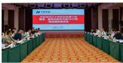

text_image

Conference hall photo with large screen displaying Chinese text about a 2023 event and attendees seated at tables

董事、监事及股东代表座谈会

## 加强合规管控

公司聚力打造“大协同”体系，全力构建“高效联动、融合互促”的工作格局，持续完善系统完备、科学规范、运转高效的制度体系，统筹推进风险内控合规协同管控，扎实筑牢“三道防线”。

## 健全组织架构

公司高度重视风险内控合规制度管理工作，建立健全了风险内控合规管理组织体系并高效运转。

公司党委会和董事长专题会及时审议公司年度风险评估报告、年度法治合规内控制度总结，充分听取公司风险管理、内控评价、合规管理工作情况，对公司风险内控合规工作计划进行研究部署。  
公司风险管理和内部控制领导小组、合规管理委员会负责推动落实华能集团及公司风险内控合规建设各项要求，研究风险内控合规管理重大事项，部署风险内控合规排查专项工作，推动风险内控合规管理与经营业务有效融合。  
公司主要负责同志严格贯彻落实《企业主要负责人履行推进法治建设第一责任人职责管理办法》，持续完善职责落实约束机制，对重要工作亲自部署、重大问题亲自过问、重点环节亲自协调、重要任务亲自督办，有力有效推动风险内控合规管理各项工作。

## 落实考核评价

公司在《企业治理效能考核实施细则》中设置风险内控合规制度管理考核条款。风险管理方面，侧重考核建立健全风险管理组织体系，完善重大决策风险评估、重要风险跟踪预警、重大风险跟踪闭环管理等工作机制，全面、细致开展风险排查与评估，及时有效做好风险应对处置，落实好风险信息共享、重大风险事件报告等工作要求，确保风险防控扎实有效。内控制度方面，侧重考核建立健全内部控制管理组织体系，保持内部管理制度体系动态更新，确保制度体系完善，制度“立、改、废”及时规范，内部控制流程设计、执行规范有效。合规管理方面，侧重考核落实公司合规管理相关要求，深入推进合规管理体系建设，全面提升员工合规意识，强化合规风险管控，严格采购与物资专项管理等工作。

## 培育合规氛围

公司常态化开展合规专题研究、专项培训及普法宣传教育等系列工作，引导员工主动学习合规知识、严守合规底线，全面提升全员合规意识与风险防范能力。

## 案例

## 检修分公司筑牢法治根基,守护创新血脉》

为全面提升员工法律素养与合规思维，9月26日，检修分公司开展了“企业法务知识及知识产权合规管理”专项培训。培训聚焦夯实法治经营基石，针对业务环节中潜在法律风险及知识产权保护痛点，系统性地普及了合规决策、合同管理、商业秘密保护等实务知识，并对国家专利、著作权、商标维权规则进行了专业解读。培训覆盖一线技术骨干与全体管理人员，采用“知识讲解+情景互动+案例复盘”的鲜活形式，推动法治思维入脑入心，强化风险防范与知识产权保护意识。

## 抓实反腐倡廉

公司加强党风廉政建设和反腐败工作，坚持有贪必肃、有腐必反、风腐同查，依规依纪依法开展信访举报问题线索处置，深化整治职工群众身边的不正之风和腐败问题，持续释放全面从严、一严到底的强烈信号，有力引领保障公司改革发展稳定、各项事业取得新进展。

结合学习教育开展专题讲座，举办公司领导干部政治素养提升培训班，编发6期“沧江纪语”以案释法。  
- 召开警示教育大会学习“微腐败”治理典型案例和警示教育片，组织110余名新任职领导干部、年轻干部开展廉洁教育，组织160余人次赴官渡区、昆明市警示教育基地和西山区人民法院开展警示教育和庭审旁听，将“看在眼里的警示”转化为“刻在心里的警戒”。

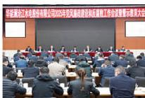

text_image

金泰证券股份有限公司2015年年度权益融资暨关联交易工作会议暨示例重大会

公司党风廉政建设和反腐败工作会议

● 深入开展党风廉政建设宣教工作，印发工作方案，构建“一年度一方案、一季度一主题”的宣教工作机制，明确八月党风廉政宣传月“践行‘三色’使命，塑造廉洁人生”主题和“8+N”的活动内容。公司及各基层单位以清风微剧、家庭“送”廉、廉洁文化作品征集等方式深入开展党风廉政宣传月活动，持续营造崇廉拒腐良好风尚。  
公平参与市场竞争，坚决杜绝垄断联合、侵犯商业秘密等不正当竞争行为。2025年，公司5351人接受反商业贿赂及反贪污培训。

## 综合施策, 提质增效

## 04

华能水电认真贯彻党的二十届三中全会精神，落实“1346”全面深化改革总体思路及59条具体举措，圆满收官国企改革深化提升行动，5家单位通过一流认定。

## 全面深化改革

重布局，改革任务系统谋划。公司紧扣“1346全面深化改革总体思路”，结合实际完善《公司改革综合台账》，新增改革任务12项，做好改革顶层布局；实现贯彻三中全会精神、改革深化提升、一流创建“三合一”台账管理，持续推动改革工作走深走实。

## 一个目标

\- 推进治理体系和治理能力现代化，增强核心功能和提升核心竞争力

## 四种方法

强化改革谋划的“系统性”  
抓住改革突破的“关键性”  
- 提升改革结果的“实效性”  
用好改革手段的“创新性”

## 三项原则

把党的领导摆在全面深化改革的原则首位  
把央企战略功能价值摆在深化改革的优先位置  
把公司高质量发展实际需要摆在深化改革的重要位置

## 13

## 1346全面深化改革总体思路

## 3

## 6

## 六个体系

- “科学完备、全面遵循、有效管用”的制度建设体系  
“全面协同、上下顺畅、运转高效”的组织运转体系  
- “前置防线、前瞻治理、前端控制、应对及时、处置高效”的风险防控体系  
“内外联动、同向发力、协同创新”的科技创新体系  
“聚才、育才、用才、识才、励才、爱才”的人才培养体系  
“精准、管用、摸高、解渴”的考核评价体系

重落实，改革任务扎实攻坚。公司按季度召开改革暨创一流工作例会，通报进展情况与存在问题，一体推进本部和基层两个层面改革工作；总结分析基层单位落实改革工作的4个方面13类具体问题，逐项提出相应提升措施，推动深化改革工作穿透基层。

## 一个目标

以加快创建世界一流现代化绿色电力企业为目标

## 1156 创一流战略

## 一条主线

对标世界一流企业和行业先进企业，促进管理能力与水平持续提升

## 五个维度

产品卓越、品牌卓著、创新领先、治理现代、价值创造

## 六个一流力量

党建引领力、发展牵引力、价值创造力、科技创新力、治理管控力、全员奋进力

重提升，改革成果总结推广。公司认真做好系统改革任务上下联动推进和跟踪问效，常态化集成亮点成果，系统化凝练经验总结。公司全面深化改革推动治理能力现代化有关经验成效，在华能集团2025年改革推进会上作专题交流发言。按月报送改革深化提升行动及创一流工作简报，累计报送简讯128篇、简报14篇、经验案例24篇，1篇案例在国资委网站刊发，13项成果获评2025年国有企业深化改革实践优秀成果。

## 资产保值增值

● ● ● ● ●

公司锚定“三个率先”“三个最”奋斗目标，紧扣“创新实干、担当善为、提质提效”工作主线，在形势变化中保持定力，在风险挑战中承压奋进，高质量完成各项工作任务，主要经营发展指标创历史最好水平，在华能集团绩效考核中实现三连冠，连续9年保持A级。2025年，公司实现营收265.95亿元、同比提高17.14亿元，利润总额107.68亿元、同比提高4.03亿元，均创历史新高。

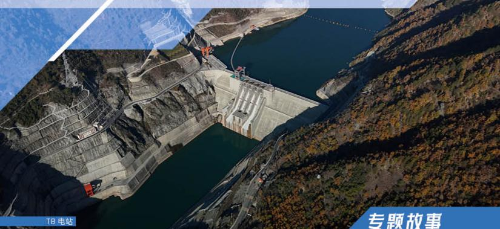

natural_image

Aerial view of a large hydroelectric dam nestled in a forested valley, with no visible text or symbols on the structure itself.

## 专题故事

## 立潮头,做现代治理的先行者

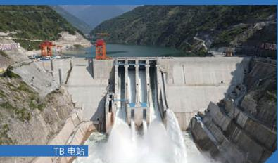

natural_image

Exterior view of a large hydroelectric dam releasing water into a mountainous valley (no signage or text visible)

TB电厂在“建管合一”模式下，通过构建科学高效的组织体系、实施精准对标与短板攻坚、强化创新驱动与人才赋能，系统提升企业治理能力与核心竞争力。电厂聚焦“一流的管理、环境、设备、运维、检修、人才、绩效、形象”八大维度，将顶层设计转化为可执行、可考核的具体行动，不仅是实现从“基建高产”到“运营高效”平稳过渡的战略路径，更是国有企业主动追求卓越、践行高质量发展，并在环境（E）、社会（S）、治理（G）层面实现价值融合的深刻实践，为同行提供了可借鉴的现代化水电厂治理范本。

## 实施“顶层设计—体系穿透—闭环提升”攻坚行动

## 构建“四级联动”的组织保障体系

TB 电厂将 “创一流” 确立为 “一把手工程”，成立由党委书记、厂长任组长的领导小组，负责战略决策与资源协调。下设创一流办公室作为指挥中枢，负责总体规划与督导。办公室下设工作专班，专职负责日常推进、进度跟踪与考核。

根据业务条线成立七个专项工作组，由分管厂领导督办，部门牵头，将指标和任务穿透至基层。配套建立“周督办、月推进、季总结、年评价”的常态化工作机制，并将评价结果与绩效考核硬挂钩，确保压力传导到位、责任落实到底。

## 开展“靶向精准”的对标与短板攻坚

TB 电厂对自身进行全景式“体检”，对照八大“一流”标准，系统梳理出超 30 项具体短板，涵盖制度“建用分离”、环境噪声湿度超标、设备“三漏”与隐患、人才结构待优化、绩效指标有差距等。针对每一项短板，制定清晰的“提升清单”。在“一流设备”方面，部署 42 个 CT 更换、15 项专项试验及 13 项缺陷消除等具体任务；在“一流环境”方面，明确湿度、噪声、照度的治理点位与技术方案；在“一流人才”方面，设定中高级职称占比、技术技能人才数量等量化目标。通过“清单化、节点化”管理，将宏大的“创一流”愿景分解为可量化、可考核的日常行动。

## 实施“双轮驱动”的赋能策略

强化创新与智慧赋能。深度融合智能建造积淀，推进智慧库坝、智慧巡检、智能分析平台（III区）建设，探索基于大数据的设备状态检修。将科技创新成果转化纳入目标，并争创国家级、省部级荣誉与示范基地，以科技创新力提升运营效率与品牌价值。

强化人才与文化赋能。完善“管理、技术、技能”三通道晋升机制，实施精准培训与激励考核，打破“大锅饭”模式，向奋斗者和价值创造者倾斜。同步推进以“7S管理”为抓手的现场文化、以本质安全为核心的安全文化以及独具TB特色的品牌文化建设，实现“制度管人”向“文化育人”的深化。

## 推动从“建管合一”到“精益卓越”模式的深刻转型

## 治理体系与管控效能显著增强

严密的四级组织与闭环工作机制已建立并运行，“周检查、月考评”成为常态。重大决策合规审查率达到 $100\%$ ，管理流程的标准化、规范化水平持续提升，为各项攻坚任务提供了坚实的组织与制度保障。

## 生产运营基础与设备可靠性持续巩固

在生产管理方面，TB电厂主要防汛设备设施与发电设备的完好率维持在 $100\%$ ，机组自动开停机成功率 $100\%$ 。通过专项治理，设备“三漏”、环境指标等具体问题已有效整改。科技创新成果丰硕，累计申请发明专利96项，荣获省部级科技创新奖项30余项。

## 人才结构与组织活力得到优化引导

基于明确的人才发展目标，激励与考核“指挥棒”作用得以发挥，推动员工从“要我干”向“我要干好”转变。同时，通过“百千万工程”、消费帮扶、移民安置等方式履行社会责任，企地关系更加和谐，企业形象持续提升。

## 砥砺 奋进

# 守正创新谋新篇

华能水电持续优化人才发展机制，深耕人才培育工作，构筑支撑企业高质量发展的人才梯队；始终把安全生产摆在首要位置，不断健全安全管理体系；坚定落实创新驱动战略，全力推动科技自主创新；统筹水电开发与生态保护，坚持绿色发展理念，助力企业实现开发与环保协同、人与自然共生的发展目标。

累计国家专利授权数

2801项

环保投资金额

3.83亿元

员工培训覆盖

100176 人次

清洁能源装机容量

3420.81万千瓦

高水平科技自立自强是高质量发展的战略支撑。要发挥新型举国体制优势，瞄准世界科技前沿，统筹推进教育科技人才一体发展，在加强基础研究、提高自主创新特别是原始创新能力上持续用力，在突破关键核心技术上努力攻关。要因地制宜发展新质生产力，坚持全面推进传统产业转型升级、积极发展新兴产业、超前布局未来产业并举，加快建设现代化产业体系。

习近平总书记在中共中央召开的党外人士座谈会上的讲话

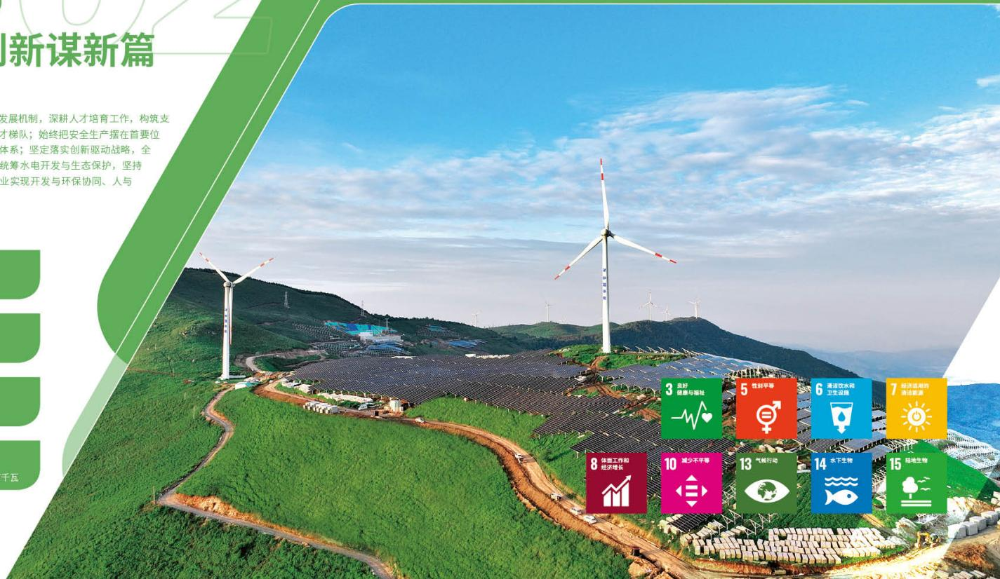

text_image

新谋新篇
发展机制，深耕人才培育工作，构筑支
才梯队；始终把安全生产摆在首要位
体系；坚定落实创新驱动战略，全
统筹水电开发与生态保护，坚持
业实现开发与环保协同、人与
千瓦
3良好
健康与福祉
5性别平等
6清洁饮水和
卫生设施
7经济适用的
清洁能源
8体面工作和
经济增长
10减少不平等
13气候行动
14水下生物
15陆地生物

## 关爱员工, 助力成长

## 01

华能水电致力于打造公平、透明的工作环境，保障员工的合法权益；注重员工的职业发展，提供多元化的培训与晋升机会，助力个人职业发展；践行员工关爱，关心员工身心健康，致力于让员工在健康、温暖的环境中工作、生活和成长。

## 保障员工权益

公司坚决保障员工合法权益，为员工提供平等的发展机会和完善的薪酬福利，鼓励员工参与公司管理，增强员工的归属感和安全感。

## 平等雇佣

公司严格遵循《中华人民共和国劳动法》《中华人民共和国劳动合同法》《中华人民共和国社会保险法》等相关法律法规，不断健全和完善人力资源管理制度，致力于保障每一位劳动者享有合法的劳动权利，并督促其履行相应的劳动义务。2025年，公司员工总数5351人，劳动合同签订率为 $100\%$

公司坚决杜绝任何形式的强制劳动等违法违规行为，营造公平、公正、合法的用工环境，为公司的可持续发展奠定坚实的人力资源基础。

公司落实高校毕业生招聘管理规定，坚持公平公开、竞争择优引进高素质人才，规范开展高校毕业生招聘工作，为公司发展提供坚实人才保障。2025年，公司在报告期内吸纳员工259人。

## 员工情况

女性员工

721人

大学本科以上学历员工

4771人

大学专科及其他学历员工580人

## 薪酬福利

公司落实国家、地方和上级单位薪酬福利相关政策和要求，建立健全《工资总额管理办法》《福利费管理办法》等系列薪酬福利制度，结合公司实际，优化完善员工薪酬与福利管理，为员工提供具有一定市场竞争力、能够体现人才价值的薪酬待遇。

公司依法为员工缴纳五险一金，额外提供包含住院津贴、重大疾病、意外伤害等内容的商业健康保险，保障员工的薪酬福利待遇。2025年，公司员工社会保险覆盖率为100%。

职工医疗互助补助超

500人次

## 民主管理

公司规范推进职代会建设，深化四级民主管理体系建设，通过职工代表大会、员工座谈会、一对一谈心谈话等形式，搭建常态化沟通平台，畅通意见表达渠道；建立员工满意度调查、匿名意见箱等多元机制，及时收集员工在职业发展、薪酬福利、工作环境、职业健康等方面的建议与诉求，形成收集、研判、整改、反馈的闭环管理；积极发挥工会桥梁纽带作用，开展劳动协商、权益保障等工作，切实维护员工合法权益，以稳定和谐的劳动关系助力企业高质量发展。2025年，公司协调解决员工诉求15项，职工医疗互助补助超500人次。劳动领域政治安全获云南省考评“优秀”。

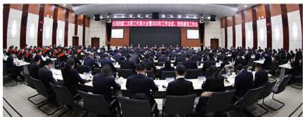

natural_image

Large conference hall with attendees seated around a circular table, facing a stage with a presentation screen (no visible text or symbols)

公司四届二次职工代表大会

## 关注员工发展

公司高度重视人才队伍建设，为员工提供成长成才、价值实现的精彩舞台，帮助各类人才充分发挥所长，为公司和个人不断创造价值。

## 大力推进干部队伍建设

统筹谋划干部队伍优化调整。全覆盖本部部门、基层单位完成干部队伍“三合一”调研，大力推进干部优化调整，年内累计调整各级干部506人次，调整后公司党委管理80后干部占比提升至52.7%；基层单位领导班子85后增加至23人、平均覆盖率超85%，中层干部90后增加至34人、占比7.5%。

统筹组织推进干部竞争性选拔。继续在公司范围内开展基层生产单位班子副职公开竞聘，并向财务、新能源、国际化等领域基层单位中层干部延伸，累计34人竞聘到新岗位。

统筹加强选人用人和干部日常监督。认真完成领导班子民主生活会、个人有关事项报告、综合考核评价、“一报告两评议”测评等工作，公司选人用人3项评价指标满意度均超过 $98\%$ ，新提拔干部平均认同度超过 $95\%$ ，未发生“三超两乱”等违规情况。

## 持续加强 人才队伍建设

把好人才培养关。坚持“政治引领、分类施策、急需紧缺”原则，组织承办公司及以上培训班33期、参培人数超过2200人次，学习贯彻党的二十届四中全会精神暨领导干部政治素养提升，实现干部培训“全覆盖”。

把好人才使用关。统筹优化人力资源配置，年内内部调动员工236人次，人才队伍“三向交流”经验材料在华能集团改革深化提升简报刊发；持续强化人才选聘、考核、推优全过程管理，新聘基层单位技术技能人才100人，“1234”人才培养工程目标基本达成；推荐上报省部级及以上优秀人才16人，95人通过公司高级职称初审，108人取得高级工技能资格。

把好人才激励关。坚持“一人一岗”，经理层和中层管理人员责任书签订实现“全覆盖”。全面实施全员绩效考核，以绩效为支撑合理拉开收入差距。

## 案例

## 漫湾电厂以赛促训，锻造高技能人才队伍》

漫湾电厂紧扣安全生产与经营发展中心任务，深度融合技能培训与竞赛实践，构建常态化、系统化的职工技能提升体系。电厂坚持以训备赛、以赛促练，通过常态化开展“每周实训日”活动夯实职工日常技能基础，完善“师带徒”机制推，动经验传承。在此基础上，电厂搭建竞技平台，全年组织实施涵盖检修、运行、缺陷排查等关键领域的专项劳动竞赛及技能比武16次，参与职工超300人次，实现以干促学、以赛练兵。

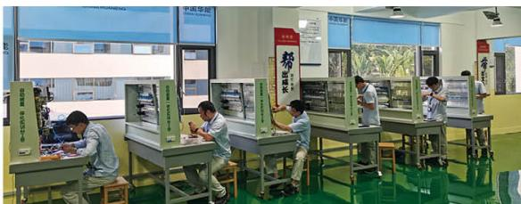

text_image

Photo of a library or training center with staff working at desks and visible signage including '中国华能' and '中国平安'

漫湾电厂水电自动装置检修技能竞赛现场

## 践行员工关爱

公司积极倡导工作与生活平衡理念，着力构建和谐稳定的劳动关系，不断提升职工归属感与幸福感，扎实推进幸福企业建设。

## 守护员工健康

公司建立并完善职业健康防护管理体系，规范健康全流程管理，有效防控职业危害，降低职业病风险，切实守护员工身体健康。同时，高度关注员工心理健康，积极疏导心理压力，强化全员健康防护意识，营造安全、健康、舒心的工作环境，助力构建和谐稳定的劳动关系。

## 丰富员工生活

公司以满足员工多元需求为导向，组织各项文体活动，包括承办华能集团成立40周年英语演讲比赛、举办首届品牌故事大赛、策划《澜沧江之光》系列文化展播、常态化开展“澜沧江杯”职工赛事等活动，不断丰富员工精神文化生活。同时，公司关爱女性员工，举办“三八”妇女节特色活动与常态化女员工关爱行动，提升女员工的幸福感。

走访慰问职工

376人次

## 帮扶困难员工

公司积极落实困难员工帮扶计划，精准施策，常态化运行“八位一体”服务体系。2025年，公司走访慰问职工376人次，持续优化疗休养服务，服务职工220人次，建成“健康小屋”2个；10家基层单位开展职工子女托管服务，惠及近400户家庭。

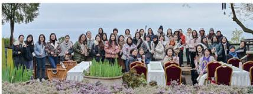

natural_image

Group photo of people posing outdoors in a garden setting with flowers and trees in the background (no visible text or symbols)

开展“拥抱春日、乐在自然”妇女节活动

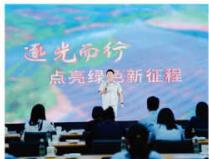

text_image

迎光而行
点亮绿色新征程

举办首届品牌故事大赛

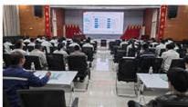

text_image

Conference hall photo with attendees seated facing a large screen displaying charts and data, featuring visible Chinese text on screens.

乌弄龙·里底电厂开展职业病防治宣传周活动

natural_image

Group of people in white uniforms standing on stage with a red line chart overlay (no text or symbols visible)

承办华能集团成立40周年英语演讲比赛

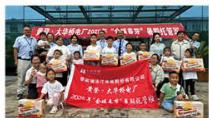

text_image

2020年“永磁水电厂”“个飞新贷”“福明投资”
2020年“永磁水电厂”“永磁水电厂”“永磁水电厂”“永磁水电厂”“永磁水电厂”“永磁水电厂”“永磁水电厂”“永磁水电厂”“永磁水电厂”“永磁水电厂”“永磁水电厂”“永磁水电厂”“永磁水电厂”“永磁水电厂”“永磁水电厂”“永磁水电厂”“永磁水电厂”“永磁光电”“永磁水电厂”“永磁水电厂”“永磁水电厂”“永磁水电厂”“永磁水电厂”“永磁水电厂”“永磁水电厂”“永磁水电厂”“永磁水电厂”“永磁水电厂”“永磁水电厂”“永磁水电厂”“永磁水电厂”“永磁水电厂”“永磁水电厂”“永磁水电厂”“永盛电力有限公司
2020年“永磁水电厂”“永磁水电厂”“永磁水电厂”“永磁水电厂”“永磁水电厂”“永磁水电厂”“永磁水电厂”“永磁水电厂”“永磁水电厂”“永磁水电厂”“永磁水电厂”“永磁水电厂”“永磁水电厂”“永磁水电厂”“永磁水电厂”“永磁水电部

黄登·大华桥电厂暑期托管班

## 强基固本,保障安全

## 02

华能水电始终秉持“安全第一”理念，夯实管理根基，确保生产运营平稳有序；严格落实隐患排查制度，做到风险早发现、早消除；积极培育安全文化，全面提升全员安全意识与应急处置能力，为企业的长治久安与高质量发展提供坚实保障。

## 财务重要性议题：产品和服务安全与质量

## 治理

● 成立安全生产委员会  
● 建立本质安全管理体系

## 战略

定期组织召开安全生产会议  
- 打造“安澜·365”安全文化品牌  
● 编制突发事件应急管理预案

## 影响、风险和机遇管理

● 基建施工、生产运行、检修技改等危大工程和高风险作业较多，外包项目多、人员杂，安全生产风险较大  
动态研判安全风险隐患，强化风险监测、预警工作，有效应对各类安全事件

## 指标与目标

- 安全生产保持零事故  
- 坚决杜绝人身死亡事故、恶性误操作事故和主设备损坏事故  
● 不发生一般及以上生产安全事故，不发生影响企业形象的不良事件，确保生产、环保、经营、政治、网络和形象安全

## 筑牢安全根基

公司高度重视安全管理，成立安全生产委员会、职业健康管理委员会、突发事件应急组织等机构，构建包含安全生产、职业健康、应急管理等内容的本质安全管理体系，编制突发事件应急管理预案，定期组织召开安全生产会议，动态研判风险隐患，制定针对性管控措施，有效应对各类突发事件，确保公司年度安全稳定和员工健康。2025年，公司安全保持“零事故”。

## 护航网络安全

为落实总体国家安全观及《中华人民共和国数据安全法》《中华人民共和国网络安全法》等相关法律法规，公司制定《数据安全管理办法》，明确各部门须对数据进行分类分级管理，形成目录，遵循“责任明确、授权合理、流程规范、技管结合”方针。公司定期开展数据安全培训，提升员工意识和防护能力；在数据共享中心实施分级管理，建立监控模块；在数据共享过程中，涉及个人敏感信息时须优先满足隐私保护要求，向合作方共享个人信息须获得主体同意或进行有效脱敏以防溯源。

## 强化应急保障

公司常态化开展隐患排查和应急演练，持续夯实应急管理水平。2025年，公司组织防汛、防震、防灾等多科目演练70余次，组织应急知识技能培训80余场，进一步提升应急管理水平。

## 案例

## TB 电厂多维筑牢消防防线,夯实安全生产治理》

TB 电厂以 2025 年第 34 个全国消防宣传月为契机，紧扣“全民消防，生命至上——安全用火用电”主题，系统性开展消防安全提升行动：通过在关键区域悬挂横幅、播放警示片，组织员工专项调考及强化培训，实现安全知识全覆盖；成立专项检查组开展“拉网式”隐患排查，建立“一患一档”整改台账，构建“厂级统筹—部门落实—全员参与”防控体系；针对物资仓库、森林消防、生产区域疏散等场景开展专项消防应急演练，并联动迪庆州维西县消防大队开展无脚本办公楼火灾应急演练，邀请消防教官开展规范灭火器使用、消防水带铺设等实操技能培训。

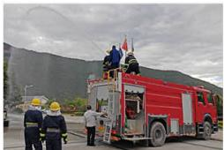

natural_image

Firefighter on a red fire truck with personnel nearby, mountains in background (no visible text or symbols)

消防应急演练

## 构建安全文化

公司严格遵循《中华人民共和国安全生产法》，以华能“三色”文化为引领，打造“安澜·365”安全文化品牌。通过常态化开展安全教育培训、系统推进安全文化建设等多项举措，持续提升全员安全意识与安全素养。

## 案例

## RM·BDuo 水电站智慧安全教育培训中心建成投运

为筑牢电站安全生产“人防”防线，RM·BDuo水电站建成投运智慧安全教育培训中心。中心总面积约440平方米，规划布局室内前厅、智慧体检区、室内实景体验区、户外实景体验区及理论培训区五大核心区域，配套搭建智慧安全培训与准入管理系统，构建起“安全知识教育+智慧体验培训+实际场景体验+人员健康监测”四位一体的培训模式。同时，中心还创新配置“安培空间”APP与“爱工友”微信小程序，支持扫码考勤、自主学习、反违章学习等功能，打破培训时空限制，实现安全学习随时随地、触手可及。

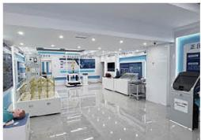

natural_image

Interior view of a modern electronics retail or exhibition space with display counters, microscopes, and digital displays (no visible text or signage)

智慧安全教育培训中心

## 科技驱动，赋能革新

## 03

华能水电全面践行创新驱动发展战略，以科技创新作为引领绿色发展的核心引擎，立足专业技术优势，聚力开展关键技术攻关，持续激发创新内生动力。

## 筑牢科创根基

公司持续深化科技体制机制改革，完善科技创新体系，发布了《科技项目管理办法》《博士后科研工作站管理办法》等管理制度，优化完善“1+6+N”创新平台、考核激励等管理机制，推进平台体系高质量建设，成立31个基层单位科技创新团队，全员创新活力迸发，为全面提升科技创新能力筑牢了坚实根基。

此外，公司积极开展科技对外交流，承办或协办“岩土工程建造新技术发展及应用交流会”“国际大坝委员会第28届大会暨第93届年会”“澜湄工程师论坛”等。

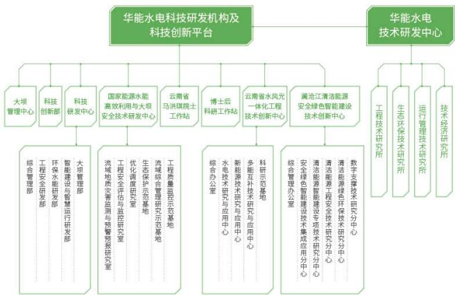

flowchart

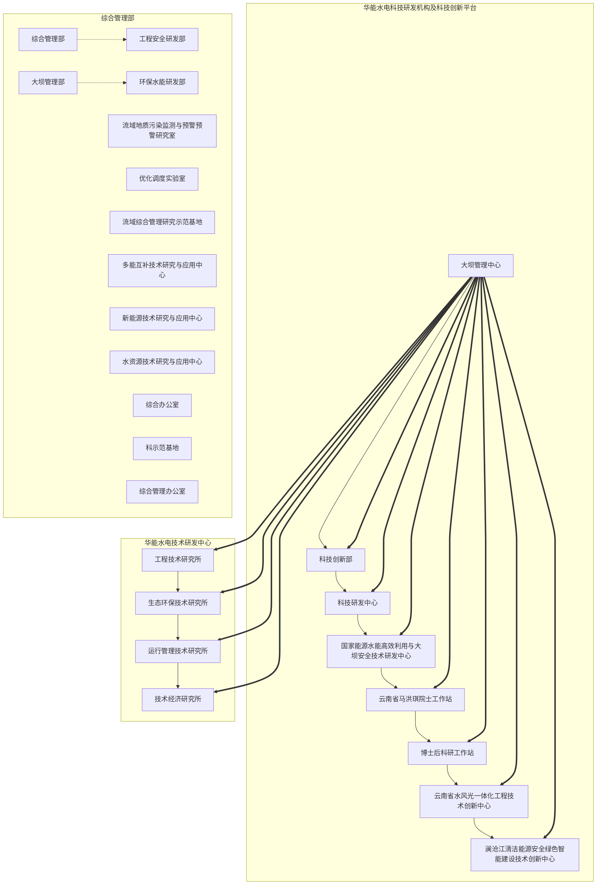

## 攻坚核心技术

公司立足服务国家战略需求和华能集团战新产业部署，聚焦公司主责主业，发展具备市场前景和战略价值的产业，深入开展新能源弃电制氢氨醇、新型储能、虚拟电厂等政策与技术研究，重点开展压缩空气储能及新能源富集区域汇集站储能示范项目研究，加快形成科技创新与产业创新相融合的新质生产力。

## 案例

## 小湾电厂从“大脑”到“全身”铸就水电国产化“大国重器”》

随着水电辅助控制系统正式投运，小湾水电站悄然完成了一场从“大脑”到“全身”的国产化改造接力——补齐了全站控制系统国产化的最后一块“拼图”，成为我国首个单机容量70万千瓦全站控制系统国产化电站。2025年9月13日，在继全国首台计算机监控、励磁、调速器、继电保护等重大关键控制系统国产化集成应用后，电站持续提升核心自主创新能力，进一步实现机组辅助设备、公用设备、通风照明、闸门、起重设备等控制系统全国产化改造，实现全站控制系统国产化，为我国水电站核心技术领域突破“卡脖子”难题提供了创新示范样板。

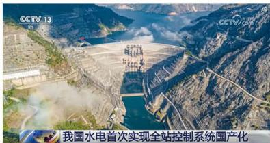

text_image

我国水电首次实现全站控制系统国产化

扫码查看央视报道《我国水电首次实现全站控制系统国产化》

## 案例

## 公司在滇新型储能领域取得“零的突破”》

5月26日，公司首个共享储能项目——华能太乙村储能电站全容量一次并网成功，标志着公司在滇新型储能领域取得“零的突破”，实现水风光储多种电源结构协同互补的发展格局。

该项目装机规模 200 兆瓦 /400 兆瓦时，预计年充放电量 2.21 亿千瓦时，每年可转换绿色能源约 8000 万千瓦时。

## 科创成果转化

公司持续强化科技成果总结凝练，纵深推进专利“质”“量”双提升，全年获授权发明专利289项，牵头编制的水电领域首个IEC《智慧水电》白皮书正式发布。坚持实施“研发—试验—示范—推广”全链条科技成果转化管理，24项自主研发技术产品纳入成果转化库，2项技术入选水力发电和新能源先进实用技术推广目录，全年对外许可专利250余项，科技成果转化工作取得新质效。

## 案例

## 硬梁包水电站实现技术新突破》

华能四川公司坚持创新驱动发展，组成项目团队针对蚀变岩等复杂地质条件下长大引水隧洞建设难题开展专项攻关，通过揭示蚀变岩围岩变形机理，团队建立基于开挖扰动劣化的力学模型，实现设计复核与施工过程动态优化，有效解决工程施工技术瓶颈。

该成果成功应用于硬梁包水电站建设，在确保工程安全与进度的同时，显著提升了我国在蚀变岩工程地质特性领域的理论研究水平，相关技术为后续国家重大基础设施建设及大型水电开发项目提供了宝贵的技术借鉴。

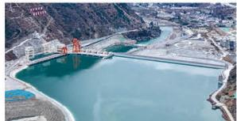

natural_image

Aerial view of a large hydroelectric dam releasing water into a reservoir, with no visible text or symbols.

硬梁包水电站

## 推进数智转型

公司积极推进数智转型，大力开展“澜沧江人工智能+”行动，推动7个AI试点功能场景上线。在华能集团系统首家通过数字化转型成熟度四星级认证；智慧能源平台集成10个业务板块，数智业务场景持续完善；圆满完成“8854”自主可控替代任务目标。

## 案例

## 乌弄龙·里底电厂库坝数字监测筑牢安全生产根基》

乌弄龙·里底电厂依托“研用控”协同创新生态，构建了以“智能互联”为基础的企地联动库坝数字监测预警机制，形成多系统、多设备“智能互联”泥石流企地联动应急响应模式。

智能巡检替代 80% 人工巡检，有效减少现场车辆出行能耗与人工观测信息误差；防洪度汛应急响应由被动告知升级成主动发现险情的企地联动管理模式，是大数据数字智能化时代与时俱进的创新探索。

## 绿色低碳,守护环境

## 04

华能水电深入践行习近平生态文明思想，严格落实国家生态环保部署，紧跟能源转型发展趋势，全力推动清洁能源高效开发，坚定不移走绿色低碳转型之路。

高排放情景（RCP8.5）：公司识别气候变化风险主要为物理风险，包括干旱、洪水、高温或暴雪等极端天气。  
低排放情景（RCP2.6）：公司识别气候变化风险主要为转型风险，包括气候变化政策收紧、国家电力体制改革等。

## 财务重要性议题：应对气候变化

## 治理

## 战略

## 影响、风险和机遇管理

## 指标与目标

确立“坚持水电与新能源并重发展”的中长期能源开发行动纲领

清洁能源装机3420.81万千瓦，年发电量保持千亿千瓦时规模，与传统煤电相比，相当于实现二氧化碳减排量超1亿吨

气候变化的相关风险和机遇对公司清洁能源发电来说主要体现为来水、风、光的不确定性，将对公司发电总量造成直接影响，进而对公司财务状况产生影响  
结合公司内外部形势总体研判，判定包括应对气候变化在内的重大重要风险，进行风险形势分析，并制定针对性应对措施

立足云南、澜沧江上游、大湄公河次区域三块战略发展区，全速推进亿级清洁能源装机美丽澜沧江电力大走廊建设，率先争创世界一流的绿色电力示范企业

## 完善管理机制

公司坚定绿色低碳转型发展方向，成立环境保护管理委员会，明确环保“1034”工作思路，提出并推进“美丽澜沧江”建设，制定印发《环境保护、水土保持工作规定》《环保管理标准化手册》《突发环境事件应急预案》等，全流域完成环保管理标准化创建工作。

紧紧围绕“打造区域能源企业生态文明建设排头兵”一个目标

确保实现“被动应对转向主动作为、末段防治转向源头管控、粗放管理转向精准治理”三个转变

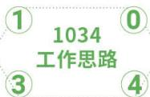

text_image

① 1034
工作思路
③ ④

保持“对环水保违法违规”零容忍
抓实“蓝天（加强节能减排）、碧水（巩固生态保护立体防线）、净土（守牢项目用地红线）、青山（做好生态防护植被恢复）”四个关键

## 开发清洁能源

公司坚持把绿色发展作为发展战略的主基调，践行“双碳”目标，以清洁低碳绿色电力推动公司“十五五”高质量发展，助力全国新型能源体系构建。2025年，公司总装机容量达到3420.81万千瓦，全部为清洁能源机组，实现清洁能源发电量1269.32亿千瓦时。

## 案例 黄登·大华桥电厂建设的拉古山光伏项目全容量并网发电》

5月30日，由黄登·大华桥电厂负责建设的拉古山光伏项目全容量并网发电，圆满完成“5.31”投产目标。项目位于云南省怒江州兰坪县，装机容量11万千瓦，是怒江州已投产最大光伏发电项目。项目投运后，年平均发电量1.6亿千瓦时，可节约标准煤约4.88万吨，减少排放二氧化碳14.4万吨，为区域绿色低碳发展与能源结构转型注入强劲动能。

## 案例 漫湾电厂高质量推进光伏项目建设》

漫湾电厂积极推动所辖区域新能源开发工作，充分发挥自身在电力工程管理方面的丰富经验与资源优势，组织专业骨干力量，高质量推进7个云南省“十四五”新能源发展规划的重要项目。

12月29日，电厂负责的7个项目实现全容量投产发电，圆满完成53万千瓦新能源建设任务，有效推动地区绿色低碳发展，助力“双碳”目标实现，为地方发展带来显著的经济与社会效益。

## 推进节能减排

公司聚焦绿色发展目标，在生产全流程中系统深挖设备效能潜力，通过技术升级、精细化运维等方式提升设备运行效率，减少能源损耗。同时，严格加强污染物全周期管理，从源头控制、过程治理到末端监测形成闭环，最大程度降低对生态环境的不良影响，为绿色电力产业持续健康发展注入动力，助力实现生态保护与产业发展的协同共进。

## 节能降耗

公司深入贯彻新发展理念，聚焦应对气候变化目标，千方百计深挖“存量资源”潜力，全年投入200万元、多措并举推进节能降耗技术改造工作，加快绿色转型步伐，以实际行动应对气候变化带来的挑战。

## 案例 BDa建管局协同推进工程建设与节能环保》

BDa建管局在电力工程项目施工阶段，积极践行绿色建造理念，通过工艺改进、设备升级等措施，显著降低能源资源消耗，施工期综合能耗较传统模式降低约 $15\%$ ，实现工程建设与节能环保的协同推进。

在工艺改进方面，引入半干法生产工艺，通过优化破碎筛分流程与粉尘回收利用，大幅降低生产过程中的污水处理能耗；优化混凝土配合比，在满足强度要求的前提下合理掺入粉煤灰，减少高能耗水泥用量。  
在设备升级方面，推广使用绿色电动设备，采用电动自卸汽车作为运输设备，显著提升运输效能。

## 三废管理

公司业务主要以水电、新能源等绿电为主，主要污染物实现100%持续稳定达标排放，全年未发生环境污染事件。在基建环节，公司扎实开展建设项目环保水保“三同时”管理，建立《废弃物管理标准》，强化冷却、润滑后产生的废油以及废旧蓄电池等主要废弃物的收集管控，将废弃物委托给具有资质的单位进行回收处理，避免对员工及当地社区居民造成影响。

针对库区漂浮物固废处理，公司积极承担社会责任，以“无废企业”创建为契机，在国内率先探索资源化处理路径，实现了变废为宝。2025年，景洪电厂成功创建华能集团首家水电“A级无废企业”。

## 案例 景洪电厂成功创建华能集团首家水电“A级无废企业”》

景洪电厂积极探索“制度保障+科技支撑+技术攻关”废物综合利用机制，全面构建完成“无废企业”全链条建设标准体系，顺利通过华能集团专家组验收，评为A级“无废企业”，成为华能集团首个水电“无废企业”。

在技术路线上，实现了库区漂浮物、生活垃圾、污水处理系统、污泥处置和废油处理处置等资源化，电厂全年完成2000吨库区漂浮物的资源化利用，有效助力循环经济建设。  
● 在管理体系上，从组织架构、制度流程、绩效考核、评价体系研究等方面实现了“无废企业”智慧化管理机制。

2025年11月，高分通过西双版纳州“无废城市细胞”中“无废企业”评定验收，形成了一套可复制、可推广的具有“景洪特色”的“无废企业”创建模式，为水电厂无废管理探索了一条有效路径。

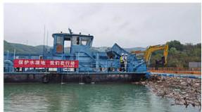

text_image

保护水源地，我们有行进

漂浮物清理

## 提升环保意识

公司以强化生态保护能力为目标，通过常态化开展环保应急演练、实施环保专项培训等多元举措，系统提升全体员工的环境保护意识与实操能力，积极营造全员参与、协同共治的生态保护氛围。2025年，公司共组织环保培训38次，为扎实推进生态保护工作筑牢人才基础。

公司全面推行绿色低碳办公，通过举办绿色办公主题活动、推广节能减排措施，让绿色文化逐渐深植于每一位员工心中，共同打造绿色、健康、可持续的办公环境。

● 通过悬挂宣传横幅、印发倡议书等形式，宣传节能常识，增强员工节能意识。  
- 要求员工下班时及时关闭计算机、打印机、饮水机等用电设备，切断电源，减少待机能耗。  
● 加强对办公区域用水设备的日常维护管理，定期检查更换老化的供水管线，防止“跑、冒、滴、漏”，避免“长流水”现象。2025年，公司总部水资源消耗量1.7万吨。

- 合理配置使用办公设备用品，积极推进无纸化办公，降低纸张消耗，提倡使用钢笔或可更换笔芯的笔。

环保培训

38次

公司办公依赖的资源能源主要包括汽油、天然气、电能等，2025年，公司总部及基层单位办公场所消耗汽油0.13万吨标煤、天然气0.01万吨标煤、电能0.39万吨标煤。其中，汽油、天然气消耗为直接燃烧，对应折算温室气体排放量（范围1）为0.29万吨二氧化碳当量；电能属于外购能源，造成间接碳排放，对应折算温室气体排放量（范围2）为0.24万吨二氧化碳当量；总计温室气体排放量（范围1+2）0.53万吨二氧化碳当量。

为抵消办公造成的温室气体排放，公司积极开展植树造林工作，参与建设的南北山绿化工程取得显著成效，增强职工环保意识的同时，有效提升生态碳汇能力，切实为应对气候变化做出积极贡献。

## 打造和谐生态

公司牢固树立和践行“两山”理念，将生态保护要求全面融入施工各环节，严格落实环境保护和水土保持“三同时”管理要求，规范开展环境监测、水土保持监测等工作，保护项目地的生态环境和生物多样性，以绿色力量护航项目建设。2025年，公司完成2个国家水土保持示范工程创建，建成全国首个跨境河流全流域生态环境智慧监测系统，环保各项工作有力有效。

公司依据《中华人民共和国野生动物保护法》《中华人民共和国渔业法》《水生生物增殖放流管理规定》等法律法规，通过建设鱼类增殖站、建设过鱼设施、根据季节实施生态调度等措施，有效保护了流域水生、陆生生物，以实际行动打造人与自然和谐共生的生态名片。

● 扎实运行糯扎渡、苗尾·功果桥、黄登、龙开口4座鱼类增殖站，全年累计放流鱼类318.98万尾。  
在澜沧江大桥河、永春河、德庆河、玉龙河、基独河等支流及干流天然河道实施鱼类栖息地保护。  
在糯扎渡建设野生动物救护站，在景洪实施大象食源地种植恢复项目。  
在乌弄龙·里底、TB、黄登·大华桥、苗尾·功果桥等电站建设过鱼设施。  
● 实施梯级电站生态调度，通过动态调控电站出库流量，人为制造水文波动，复现了自然条件下“桃花汛”特征，有效刺激了鱼类洄游产卵行为。

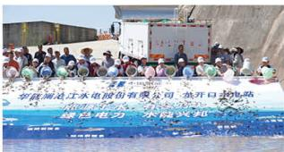

text_image

中国水电集团有限公司 江苏开口水电
水力发电厂

龙开口公司开展土著鱼类人工增殖放流活动

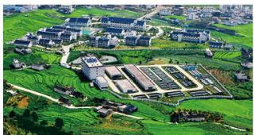

natural_image

Aerial view of a rural industrial complex surrounded by green fields and roads, with no visible text or symbols.

苗尾·功果桥电厂鱼类增殖站

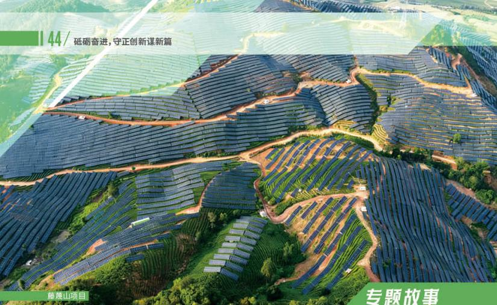

text_image

44/ 砥砺奋进,守正创新谋新篇
藤康山项目
专题故事

## 专题故事

## 担使命,做生态文明的护航者

景洪电厂积极响应“双碳”战略，紧扣“解放思想、深化改革、攻坚突破”主线，遵循“先立后破、破立并举、以破促立”改革逻辑，创新构建“3+4+3”新能源建设管理模式，推动西双版纳片区新能源建设实现从零到百万的跨越，为公司打造澜沧江水风光一体化清洁能源基地注入“景电动能”。

## 先立后破，创新“三个机制”，抢抓新能源发展机遇

立思想引领机制，破“两不三先”陋疾。构建“思想理论共学、党建业务共融、企地建设共赢”行动框架，明确“攻点扩面、深研精建、守规提效”工作法，以解放思想大讨论破除依赖传统水电的固化认知，将发展目标分解为时间点、任务线、难题集，引导全员从被动执行转向主动创效。

立企地联动机制，破“单打独斗”格局。以党建为纽带搭建“多方联建”平台，与地方政府、电网企业签订党建共建协议。依托国企开放日、新时代“百千万工程”、劳动竞赛等载体，结合“华能水电”品牌优势与地方需求，形成“党建引领、政企联动、协同共赢”格局。

立高效协同机制，破“流程滞塞”困境。成立厂领导挂帅的新能源工作专班，推行“四统一”管理模式，选派骨干到州直部门轮训。班子成员下沉一线，推动手续一站式集中办理，通过“一图两会三抓”攻坚，实现要素部门“多审合一”。

## 破立并举，健全“四个体系”，破解新能源落地难题

破合规风险盲区，立政策研判体系。将合规尽责贯穿新能源项目全生命周期，成立政策研究小组系统梳理用地、用林、用草等政策细则，建立生态敏感区域数据库。定期开展“新能源政策与发展矛盾”专题研讨，划定“生态红线”与“合规底线”，从源头规避风险。

破经验依赖惯性，立数据支撑体系。电厂依托 ARCGIS 系统构建新能源土地资源管控矢量数据库，整合地形地貌、三区三线等数据，实现资源属性空间化关联。推动前期论证从“外部经验驱动”向“内部数据驱动”转型，通过数据精准支撑项目选址、范围调整，规划 458 万千瓦新能源资源，推动三批次新能源项目纳入云南省建设清单。

破开发与保护矛盾，立生态协同体系。确立“生态优先、综合利用”原则，探索“农光互补”“雨林光伏”等模式。在曼戈龙、曼景缅光伏项目中，首创定制化高支架、智能测绘优化布局，应用“小蜜蜂”引孔机、“无人机群+马帮运输”复合体系，在6000余个桩基施工过程中，实现植被“零”破坏。

破企地沟通障碍，立民生联动体系。组建“双语协调专班”，用民族语言向村民透明化解读经济收益，累计推动签订框架租地协议40余份；优先聘用当地村民参与施工建设，提供数百个岗位，人均月增收3000元以上；投入280余万元实施村寨道路修缮、饮水工程改造等民生项目，惠及近千户村民。

## 以破促立，打通“三个路径”，锻造新能源攻坚铁军

跨域破壁为人才筑池，打通“全领域选才”路径。将新能源一线作为人才培养主战场，选派水电技术骨干参与租地谈判、项目审批等全流程。通过“向政策取经、向政府学艺、向村民问道”，推动员工实现从“水电兵”到“新能源能手”的转型。

考评破障为实干护航，打通“全链条育才”路径。构建“过程贡献+成果价值”双维度评价体系，将工程管理质量、对外协调成效等关键环节纳入考核，对关键岗位、重点贡献给予专项奖倾斜；搭建人才服务桥梁，推出21期“追光者”

宣传，提升员工主动创效意识。

助苗破土为发展筑基，打通“全方位用才”路径。制定“水电+光伏”复合型人才培养计划，每月举办“新能源创新沙龙”。靶向培育专业人才，优化人才结构。

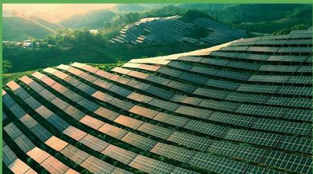

natural_image

Aerial view of a large solar farm installed on terraced hills at sunset, with no visible text or symbols.

曼景缅项目

## 精耕细作

## 蓄势发展开新局

华能水电始终将能源电力安全保供与增进民生福祉置于工作核心位置，高效统筹水电、风电、光伏的顶峰保供工作；与各利益相关方深度协作，共建互利共赢的战略合作框架，推动行业实现良性发展；积极响应乡村振兴战略号召，为乡村发展注入动力；支持“一带一路”倡议，为倡议落地实施贡献力量。

总发电量

1269.32亿千瓦时

税费总额

65.92亿元

公益慈善总投入

5627.59万元

员工志愿者人数

1184人

中国式现代化是全体人民共同富裕的现代化。要坚持不忘初心，站在人民立场上考虑问题，坚持在发展中保障和改善民生，稳步推进共同富裕。优化区域经济布局、促进区域协调发展，促进城乡融合发展、推进乡村全面振兴，逐步缩小区域差距、城乡差别。

习近平总书记在党的二十届四中全会第二次全体会议上的讲话

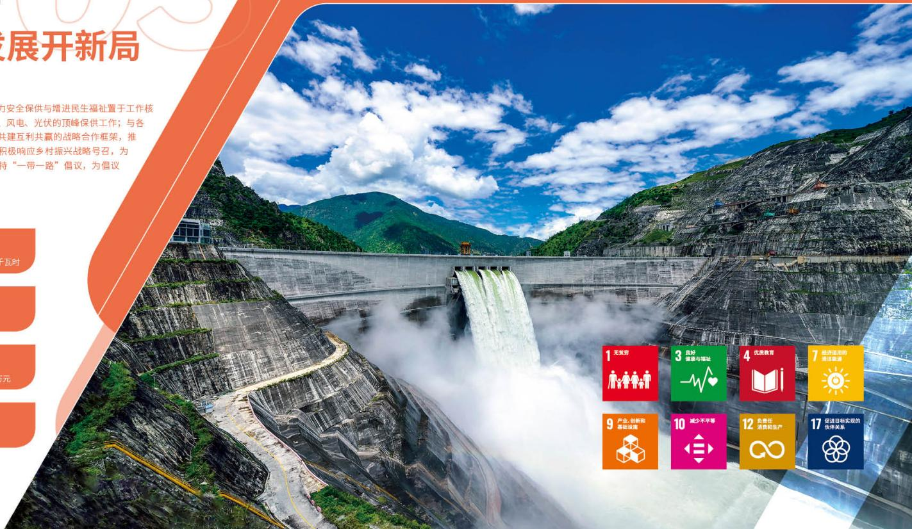

text_image

展开新局
为安全保供与增进民生福祉置于工作核
风电、光伏的顶峰保供工作；与各
共建互利共赢的战略合作框架，推
积极响应乡村振兴战略号召，为
特“一带一路”倡议，为倡议

1 无贫穷
2 产业、创新和
基础设施
3 良好
健康与福祉
4 优质教育
5 经济适用的
清洁能源
6 负责任
消费和生产
7 促进目标实现的
伙伴关系

## 做优主业, 能源保供

## 01

华能水电始终将电力安全保供列为重大政治任务。作为“西电东送”南部通道的核心电源点，公司依托跨流域梯级电站调度控制系统，高效统筹水电、风电、光伏资源，以最大限度增发电力、保障顶峰供电，实现多能互补与一体化调度效益最优，全力守护电力安全可靠供应。

## 财务重要性议题：水资源利用

## 治理

● 编制印发《防洪度汛措施计划》《枯期水量调度计划》《汛期调度运用计划》等管理文件，合理利用并保护水资源

## 战略

深化“大协同、大营销”机制，发挥梯级水电联合调度优势  
● 完善调节性水库调度与现货市场运行衔接机制

## 影响、风险和机遇管理

● 预计未来澜沧江流域云南段降水呈现复杂态势，流域来水极端性、复杂性增加  
● 识别澜沧江流域来水风险，结合月度风险监控、季度风险排查，持续做好风险变动情况跟踪

## 指标与目标

● 充分运用 TB、黄登调节库容平抑上游来水波动，科学实施防洪优化调度增发电量，实现洪水资源最大化利用  
动态优化“两库”水位控制节奏，若实际来水偏枯，增加消落年末蓄能“补量”，适度“提价”稳定经营，实现量价协同最优

## 保障能源供应

公司充分发挥大协同体系优势，深化多能互补增发电量，积极应对现货长周期运行、气候变化导致的来水丰枯大幅波动等严峻形势，坚决扛稳电力保供责任。2025年，公司发电量1269.32亿千瓦时，同比增加149.2亿千瓦时，连续四年突破千亿千瓦时，充分满足区域重要时段用能需求。

- 水电精益梯级调度、联合互济运行，积极应对来水“入汛偏早、丰枯急转”等不利形势，枯期释放蓄能95亿千瓦时。汛期充分运用TB、黄登调节库容进行拦蓄，积极协调调度设置“两库”日前出清电量下限，协调长江委促成小湾、糯扎渡“两库”汛限水位动态控制，守牢不弃水底线。  
● 新能源全力推动项目投产并提升运营质效，提升风光预测准确率，创新“水新同台”集控调度，深化多能互补优化调度。

## 优化精益管理

公司筑牢电力安全坚固防线，建立设备全生命周期管控体系，精益推动设备运维、维修技改，实现安全生产“零事故”，水电主设备完好率稳定保持100%，水电机组精品率达92.1%，风电和光伏可利用率分别达99.35%和99.96%。乌弄龙、桑河二级、瑞丽江一级等6个电站连续6年“零非停”。漫湾、景洪等8个电站共9台机组获全国可靠性标杆机组。

## 案例

## 苗尾·功果桥电厂扛稳扛牢电力保供政治责任》

苗尾·功果桥电厂在电力保供关键时期，制定保供专项工作方案，明确责任专业组、责任人，按周、月、季度针对性开展检查防控，逐项消除非停风险隐患，全面提升设备健康水平，达成全厂8台机组“零非停、开停机成功率100%”目标，为机组安全稳定运行奠定坚实基础。

2025年，电厂连续五年获得可靠性标杆机组荣誉称号，在全国电力行业同类型、同级别机组中名列前茅。功果桥电站4号机组获“中国南方电网金牌机组”，苗尾电站4号机组获“全国发电机组可靠性标杆机组”。

## 严控基建质量

公司坚持质量第一，构建全覆盖管理体系。通过严抓标准执行、强化全过程监督与评价，确保工程优质受控；同时发挥经验优势，深度参与标准制定，引领行业高质量发展，打造卓越工程品牌。

## 构建全覆盖质量管理体系

制定《工程建设质量管理办法》《水电基建创一流管理办法》《发展绩效水电基建工作考核实施细则》及《水电工程达标投产管理办法》等核心制度，构建起“横向到边、纵向到底、层级清晰”的质量管理体系，为工程管理提供坚实的制度保障。

## 夯实标准化执行基础

严格执行国家、行业关于质量与验收相关的法律法规和规程规范。要求各项目制定并动态更新现行有效的《技术标准清单》，全面列出需严格执行的标准，重点执行《中华人民共和国建筑法》《工程建设标准强制性条文：电力工程部分》《质量强国建设纲要》《建设工程全过程质量行为导则》及《水电工程项目质量管理规程》等关键标准。

## 强化全过程质量管控与监督

## 严格外部监督

水电工程建设项目严格执行电力建设工程质量监督管理相关要求，项目开工时即在可再生能源质量监督站注册，并按照要求开展各阶段专项质量监督活动。

## 深化内部管理

依据《水电水利工程达标投产验收规程》，组织开展截流、蓄水、机组启动等阶段的达标投产初验；同时，邀请中国电力建设企业协会对完工项目进行达标投产复验。各项目达标投产初验、复验开展及时有效，结果均满足要求。

## 严抓质量评价与成效验证

邀请具有资质的单位组织开展质量评价活动，项目得分均超过92分，被评价为“高质量等级优良工程”。

## 协同共赢，引领行业

## 02

华能水电始终秉持开放协作、包容共促的理念，联合各类利益相关方并肩前行，搭建互利共赢的战略合作载体，着力推动行业迈向更健康、更可持续的发展轨道，携手开创美好前景。

## 深化伙伴合作

公司紧扣云南省政府“十四五”产业发展布局，全面贯彻落实云南省“以商招商，招引上下游配套产业，打造绿色能源全产业链”的发展部署，主动做好新能源产业发展延伸，全力推动新能源与先进制造业高度融合发展，建立了合作共赢、互促发展的合作机制。

## 案例 龙开口公司与大理州生态环境局签订环保合作协议》

为加强金沙江流域生态保护、共建美丽库区，构建多方协同治理格局，12月24日，龙开口公司与大理州生态环境局签订生态共建环境共保合作协议。双方遵循优势互补、协同共治原则，建立联防联治长效机制。龙开口公司配合开展联合检查、专项整治与宣传教育，协助掌握库区生态动态，全力保障水生态环境安全，持续提升区域生态环境质量。

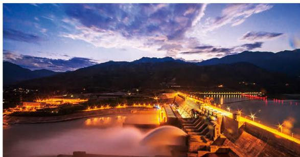

natural_image

Evening aerial view of a large hydroelectric dam illuminated by warm lights over a river, with mountains in the background (no visible text or symbols)

龙开口水电站夜景

## 引领标准建设

● ● ● ● ●

公司高度重视行业技术标准体系建设，充分发挥在工程建设领域的经验优势，积极参与能源行业《水电工程生态环境监测系统建设与运行技术规范》《水电工程水土保持设计规范》《抽水蓄能电站水土保持设施验收技术规程》《水电工程边坡生态修复技术规范》《水力发电工程运行管理规范》《大坝智能建设技术导则》《水电工程智能建造技术通则》等国家标准、行业标准的起草编制工作，将标准引领、技术规范融入企业运营管理，主动承担行业责任，提升行业规范化、标准化管理水平，为国家水电工程标准体系建设贡献力量。

● 小湾电厂积极参与电力行业标准《水电站大坝安全北斗短报文应用系统技术规范》编制。  
● 苗尾·功果桥电厂作为主要起草单位的《本质安全型企业评价准则》正式发布，填补了行业本质安全型企业评价标准的空白。  
● 乌弄龙·里底电厂先后主导、参与《发电机准同期装置整定计算技术规程》《巡检无人机用锂离子电池状态评估技术规范》等5项行业团体标准的制定与发布实施。  
● 龙开口公司参与起草团体标准《企业安全文化建设规范》。

## 规范采购管理

● ● ● ● ●

公司注重供应链管理，紧密围绕“能源保供、提质增效、绿色发展”三大核心使命，秉承“安全韧性、集约高效、绿色环保、数智创新”四大核心管理理念，以提升供应链韧性和安全水平为主线，以增强供应链管理效能与保能性为重点，以创建一流采购与供应链体系为路径，系统推进“清单集中、区域集中、专业集中、时段集中”的集约化采购模式，持续完善“韧性化、精益化、绿色化、智慧化、协同化”的现代供应链管理体系，进一步强化供应链在战略支撑、价值创造、资源保障和风险防控方面的作用。

● 通过定期开展供应链风险评估，识别并持续监控潜在重大风险及其影响，切实保障运营稳定与社会责任落实。  
在采购环节，将 ESG 要求明确纳入供应商准入与评审标准，对供应商的环境表现、社会责任及公司治理提出具体期望，推动合作伙伴共同践行可持续发展理念。  
● 制定并落实对中小企业的专项保护政策，通过公平采购、付款支持等措施维护其健康发展。  
有序开展供应商入库、评价和不良行为处置工作，严格执行供应商“黑名单”制度，推动供应商动态评价结果与管理业务有效联动。

## 升级客户服务

完成绿电销售

0.91 亿千瓦时

累计出售绿证

685.28万张

公司秉持绿色服务理念，深耕绿电交易与品牌塑造，通过深化绿电交易机制、强化信用体系建设、严守安全保密底线、创新新媒体宣传矩阵，实现客户零投诉与行业顶尖荣誉双丰收，全面推动客户服务能力跃升。

## 深化绿电交易机制

依据《中华人民共和国可再生能源法》《绿色电力交易试点工作方案》等法律政策，积极响应国家最新印发的《关于促进可再生能源绿色电力证书市场高质量发展的意见》，坚持绿色优先、市场导向、安全可靠的绿色电力交易原则，积极参与绿电绿证交易，进一步释放绿电绿证市场活力，加强与重点用能行业沟通对接，完成0.91亿千瓦时绿电销售；深入挖掘绿电绿证消费潜力，累计出售绿证685.28万张。

## 强化信用体系建设

对照《云南电力市场交易行为信用管理办法》中售电公司交易行为信用评价指标，全面查找短板并实施四项提升举措：拓宽用户渠道提高市场占有率、精细交易提升盈利水平、加强用电管理提高交易偏差准确率、拓宽服务半径提升服务质量。凭借卓越表现，公司获评“3A”售电公司，位列“十佳”范畴。

## 严守安全保密底线

严格按照公司《保密工作管理规定》，全员签订信息保密承诺书，并将批发、零售用户信息保密约定落实于合同条款中，2025年未发生客户隐私泄露事件，切实保障了客户信息安全与合法权益。

## 创新新媒体宣传矩阵

全面加强新媒体售电品牌宣传，利用视频号、抖音号及微信公众号等平台，全年发布文案及视频超400个，粉丝数量突破4.4万，浏览量超100万人次；此外，积极参加昆明电力交易中心售电公司“讲市场”活动，聚焦关键政策规则，回应用户关切问题，获评“最佳云南电力市场讲述人”二等奖、“最具人气奖”，显著提升公司售电品牌的知名度与美誉度。

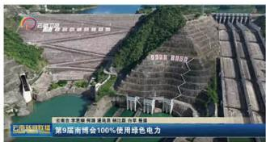

text_image

①绿色能源项目
绿色能源项目通过第9届南博会100%使用绿色电力
第9届南博会100%使用绿色电力

公司连续三年为南博会提供绿色电力保障

第9届中国——南亚博览会暨第29届中国昆明进出口博览会于6月19日至24日在昆明成功举办。贵单位精心组织，周密部署，高质量、高水平、高效率地完成了参展工作，并作为大会独家绿色电力供应商，连续三年为大会的成功召开提供100%绿色电力保障。

——云南省能源局

## 央企担当, 情系社会

## 03

华能水电始终秉持“建设一座电站、带动一方经济、保护一片环境、造福一方百姓、共建一方和谐”的社会责任理念，积极投身公益慈善事业，构建常态化、制度化的社会贡献机制，以实际行动彰显央企的责任与担当，连续8年荣获地方政府定点帮扶考核“好”的评价。

## 助力乡村振兴

“十四五”期间，公司认真贯彻落实乡村振兴战略，将助力乡村振兴融入企业发展的血脉之中，成立乡村振兴领导小组，开展“百千万工程”等特色帮扶活动，全方位助力乡村振兴战略实施。2025年，公司投入4002.86万元帮扶资金，向日喀则、缅甸地震灾区等捐款超1600万元，持续以务实举措服务社会、回馈民生。

## 产业振兴

糯扎渡电厂将光伏发电项目与普洱市地方的普洱茶、咖啡等特色农业有机融合，在普洱市建成14个“茶光互补”“咖光互补”光伏发电项目，不仅促进农业增产、农民就业创收，更为国家乡村振兴做出较大贡献。

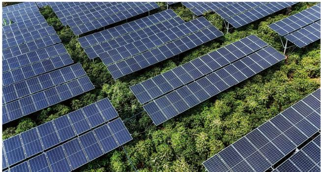

natural_image

Aerial view of a large solar farm with rows of photovoltaic panels installed on green vegetation (no text or symbols visible)

糯扎渡电厂“咖光互补”项目全容量投产

## 人才振兴

糯扎渡电厂持续推进“华能希望班”办学项目，投入58万元设立学生资助金、教育专项基金及“华能奖学金”，为当地学子插上梦想腾飞的翅膀。

联合电力公司在云南省瑞丽市实施瑞丽市第二小学教学条件改善项目，将学校报告厅升级改造，使之成为健康舒适的教学、培训空间及校园艺术展演、文化活动的“新舞台”。

## 生态振兴

景洪电厂投入资金155万元，开展了5个“百千万工程”项目，包括开展江头曼咪寨、易武镇曼乃村等人居环境提升以及景讷乡贺孔村道路扩建项目，使村容村貌焕然一新，群众获得感、幸福感、安全感不断提升。

GS 建管局投入帮扶资金 100 万元，实施德钦县佛山乡巴美村甲卡大沟水利项目，惠及当地群众 238 人，有效改善了农牧民生产条件。

## 消费帮扶

漫湾电厂深挖采购潜力，做实消费帮扶，2021-2025年，累计上门采购云县漫湾镇嘎止村生猪、牛羊、鸡鸭、果蔬等农产品超100万元，让近400余户1000余人实现在家门口创收。

RM·BDuo建管局完成消费帮扶285.3万元，助力农产品销售，有效促进工程建设与地方发展和谐共荣，并获评“2025年芒康县民族团结进步模范集体”。

检修分公司消费帮扶总额达 10.73 万元，精准覆盖重点帮扶县区及能源合作区域，显著增强了受益地区的“造血”功能。

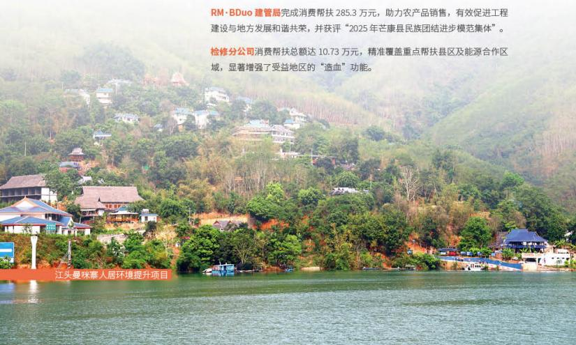

text_image

RM·BDuo 建管局完成消费帮扶 285.3 万元，助力农产品销售，有效促进工程建设与地方发展和谐共荣，并获评“2025 年芒康县民族团结进步模范集体”。
检修分公司消费帮扶总额达 10.73 万元，精准覆盖重点帮扶县区及能源合作区域，显著增强了受益地区的“造血”功能。
江头曼咪慕人居环境提升项目

## 深化企地共建

公司以企地共建为重要抓手，积极搭建企地沟通桥梁，聚焦发展所需、基层所盼、民心所向开展各项共建工作，切实服务民生需求，有力推动企地融合与社会和谐稳定。公司始终恪守依法经营、诚信纳税的核心准则，严格遵守国家各项法律法规与财税政策，积极履行企业纳税义务。通过稳健经营与规范管理，持续为地方经济社会发展提供坚实可靠、长期稳定的税收支撑。2025年，公司依法缴纳税费65.92亿元，其中纳税总额56.74亿元、库区维护基金9.18亿元，以实际行动助力地方经济高质量发展与民生改善。

征地移民是水电企业与周边居民紧密结合的一项特色重点工作，公司始终将相关工作放在重要位置。为推动征地移民工作高效开展，公司以现行法律法规和移民政策为基础，以“服务移民、支持建设”为主线，以创新移民工作管理机制为动力，探索形成了以“1234”为先导的征地移民协同管理体系，有力保障水电工程建设按期推进，水电移民和谐稳定。

## 案例

## BDa 建管局帮助项目所在地应对突发自然灾害》

2025年，受持续强降雨影响，BDa水电站周边色如沟区域突发泥石流灾害，导致邻近的尼加、次塘两个自然村农用灌溉系统严重损坏，直接影响450余亩农田灌溉及29户共161名村民的生产生活用水。面对地方民生紧迫需求，BDa建管局积极对接属地政府需求，迅速行动，充分发挥技术与管理优势，科学制定解决方案，重点保障地方取水点与输水管网的关键修复工作。此次协作及时恢复了受灾村庄的关键农业基础设施运营和可靠用水保障，有力保障了当地农业生产正常进行和受灾群众生计。

## 开展公益帮扶

公司积极履行社会责任，常态化开展“三色帆”志愿服务活动，以实际行动践行央企使命担当，主动服务社会、回馈民生，充分彰显新时代中央企业在履行社会责任、推动精神文明建设中的示范引领与标杆作用。

## 案例

## 漫湾电厂志愿活动聚合力,三色担当暖民心》

漫湾电厂将青年员工培养与公益服务相结合，常态化开展志愿服务工作，精心策划主题志愿活动，组织团员青年深入电站周边社区与学校。2025年，漫湾电厂相继开展了“宪法普法宣传”“消防知识进校园”以及“植树护林”等系列公益行动，不仅向公众普及了法律与安全知识、助力生态文明建设，也为青年员工深入基层、服务社会提供了实践平台。

## 同心相融，共建丝路

## 04

华能水电主动响应国家“一带一路”倡议，深入推进国际化发展布局，持续拓展国际合作，依托投资、技术、人才、运营管理等核心优势，稳步加快“走出去”进程，全力打造海外业务发展新局面。

## 境外工程建设

公司积极参与“一带一路”建设，建成并投运缅甸瑞丽江一级水电站和柬埔寨桑河二级水电站2个海外水电项目，聚焦柬埔寨、缅甸等重点国别市场，持续开展投资机会研究。

瑞丽江一级水电站作为我国第一个境外大型水电BOT项目，开创在境外投资电源建设并把清洁的电能回送国内的先河。该电站是华能集团首家具备跨国远程集控能力的境外电站，连续保持安全生产“零事故”记录，投产后连续安全稳定运行6324天，截至2025年底，累计发电581.35亿千瓦时。  
桑河二级水电站是柬埔寨境内最大的水电工程，也是“一带一路”倡议下中柬产能合作的重点项目，为当地经济社会发展提供了强劲的清洁能源保障。电站连续保持安全生产“零事故”记录，投产后连续安全稳定运行2944天，截至2025年底，累计发电139.86亿千瓦时。

## 案例 瑞丽江一级水电站全面保障对缅供电》

3月28日，缅甸发生7.9级强烈地震，瑞丽江一级水电站第一时间启动抗震减灾和电力供供电工作，用66千伏南坎线孤网运行方式，在地震当晚19时及时恢复了对缅甸南坎、木姐地区的供电。3月31日，电站2台机组并入缅方电网，第一时间恢复了对缅供电，惠及缅甸约500万民众，为缅甸抗震救灾、保障民生提供强有力保障，贡献了华能力量。电站凭借在抗震救灾中的突出表现，荣获缅甸电力部“电力应急处突特别贡献奖”。

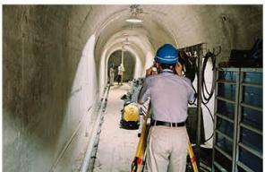

natural_image

Interior view of a tunnel with workers in hard hats and safety equipment (no visible text or symbols)

瑞丽江一级水电站全面保障对缅供电

## 增进当地福祉

公司始终高度重视境外项目 ESG 建设，坚持主动融入当地社会发展，秉持互利共赢合作理念，积极履行社会责任，推动生态保护与民生改善，着力构建与当地相融共生、协同共进、长期稳定的和谐发展良好格局。

## 本土化人才培养

桑河水电公司完成18名市场化柬籍员工招聘，电站驻厂柬籍员工数量提升至30人，柬埔寨当地员工（生产类）占比已超40%。探索技能考评认定体系，完成11人次技能考评，与柬埔寨皇家科学院孔子学院合作开展中文培训项目，稳步提升柬籍员工中文运用能力。

瑞丽江一级电站完成11名市场化缅籍员工招聘，电站驻厂缅籍员工数量提升至20人，缅甸当地员工占比已超50%。此外，公司首次开展境外单位缅甸本土化2名员工来华轮训，获缅甸电力部高度认可。

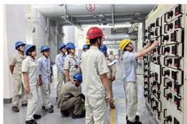

natural_image

Group of workers in hard hats and uniforms inspecting electrical equipment on a wall (no visible text or symbols)

瑞丽江一级电站深入开展缅籍员工实操培训

## 本地化采购

桑河水电公司持续帮扶移民村村民家禽、水产和蔬菜等农副产品市场销售难问题，电站食堂长期批量收购，把帮扶工作做到村民家里，将华能品牌植入村民心里。

## 公益慈善

桑河水电公司推进“澜湄甘泉”一期、二期供水项目，完善移民村水利设施，让清洁用水入户；联合上丁省政府开展移民村小学道路、围栏、照明灯等硬件设施完善，向柬埔寨皇家科学院10名学生发放助学金，助力当地教育与中柬青年交流；开展右岸移民村小学设施修缮捐赠项目，解决小学教育资源匮乏、学校基础设施落后、公共区域照明不足和用电成本高等问题。

## 生态环境保护

桑河水电公司开展土著鱼类增殖放流活动，向库区投放劳伦迪鲨鲶、穗须原睚等10余种珍稀及具备经济价值的土著鱼类共计10万尾，以生态、经济协同的发展模式，既修复了生物种群、稳定水域生态，又拓宽了当地渔民的增收渠道。桑河二级水电站因其在环保方面的贡献，连续5年荣获柬埔寨渔业总局颁发的“鱼类保护贡献奖”。

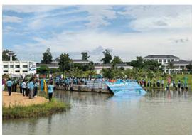

natural_image

Group of people gathered near a water body with buildings and trees in the background (no visible text or symbols)

中柬联合开展鱼类增殖放流活动

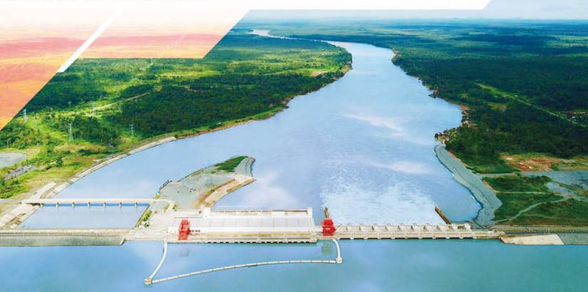

natural_image

Aerial view of a large hydroelectric dam spanning a wide river, surrounded by greenery and forested areas (no visible text or symbols)

桑河二级水电站

## 专题故事

## 守初心,做一带一路的共建者

华能桑河二级水电站位于柬埔寨东北部上丁省，总投资约7.8亿美元，总装机容量40万千瓦，于2018年12月正式投产发电。电站的建成投产，在有效缓解柬埔寨电力供应紧张局面的同时，通过积极践行ESG理念，为当地社会发展、民生改善做出了积极贡献，是“一带一路”倡议宏伟蓝图中的民生典范工程。

2025年，公司案例《华能桑河二级水电站“电”亮柬埔寨发展新征程》荣获中国企业改革与发展研究会、半月谈杂志社颁发的“企业ESG优秀成果”奖；案例《“发展型”移民安置助力柬埔寨乡村减贫——中国华能集团有限公司桑河二级水电站建设项目》获评第六届“全球减贫案例征集活动”最佳减贫案例。

## 供应清洁电力，助力低碳转型

华能桑河二级水电站年发电量可达19.7亿千瓦时，2025年累计上网电量22.94亿千瓦时，约占同期柬埔寨全国发电量 $13.1\%$ 、用电量 $10.6\%$ ，均为清洁能源电量。这些清洁电力的供应，彻底扭转柬埔寨电力供应紧张局面，同时大幅减少当地对传统化石能源的依赖，助力柬埔寨在能源领域向绿色低碳转型，为全球应对气候变化贡献力量。

## 妥善安置移民，赋能减贫增收

桑河二级水电站在建设过程中，促成柬埔寨有史以来涉及人数最多、搬迁规模最大的水电移民项目，涉及840户、3690名村民的移民搬迁工作。公司充分尊重移民的生活习俗和意愿，设立3个移民点，提供多种移民方式，为每户配置5公顷种植地、1000平米宅基地、80平米住房。同时，投入大量资金建设学校、医院、警察局、寺庙、公路、排水系统、电网、水井等基础设施，让移民能够安居乐业。公司深入挖掘移民村的自然条件优势，助力发展渔业、养殖业、种植业等产业，并通过组织职工食堂定点批量标价采购等方式，帮助移民实现减贫增收。

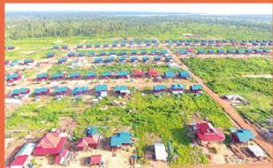

natural_image

Aerial view of a rural residential area with colorful houses and greenery, no visible text or signage.

桑河二级水电站移民村

## 培育本土人才，促进就业增收

桑河二级水电站建设高峰期直接提供约2000余人就业岗位；在运营期，通过中柬员工签订师徒协议，在日常工作中发挥“传、帮、带”作用，并定期开展集中技术培训等，累计为当地培养了200余名技术、技能及管理人才。

此外，电站结合当地实际，制定本土化工作方案，提出“一基二培三融合”的总体思路，坚持“保障安全、先培后替、稳妥推进、分步实施”原则，积极推进“本土化三步走”实施方案，为柬籍员工管理工作提供根本遵循。

电站建设和运营带动柬埔寨当地建筑材料、运输、餐饮等相关产业蓬勃发展，创造大量工作岗位，间接带动周边就业超万人，人均收入显著提升。

## 投身公益事业，增进文化交融

公司积极投身当地社会公益事业，每年参加柬埔寨红十字会捐赠活动；向当地学校捐赠学习用品，改善教育条件；为当地社区提供医疗援助，提升居民健康水平；举办各类文化活动，丰富居民的精神文化生活，增进中柬文化交流。

公司建立爱心扶贫基金，发动广大职工爱心捐款，实施“华能助学金”计划，连续8年向电站移民新村学校发放“华能助学金”，合计240余名中小学生受益。从2022年起在柬埔寨皇家科学院实施“华能助学金”计划，已有40名品学兼优的中文系柬埔寨大学生受益。

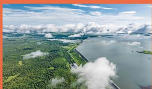

natural_image

Aerial view of a large reservoir with green forested areas and scattered clouds under a partly cloudy sky (no text or symbols visible)

桑河二级水电站库区

## 礼赞 满载荣耀

## 2025

## 1月

## 物资分公司

“基于水电企业特点的设备物资集约化采购管理模式研究应用”获2024年全国电力行业设备物资管理创新成果一等项目

中国电力设备管理协会

## 2月

联合电力公司、小湾电厂、漫湾电厂

全国安全文化建设示范企业

中国安全生产协会

糯扎渡电厂

南方电网 2024 年发电先进集体

中国南方电网电力调度控制中心

## 3月

小湾电厂

2024年度电力行业企业文化建设典型实践单位中国电力企业联合会

## 华能澜沧江公司

2024年新能源装机8000万千瓦以上绿色发展重点工程劳动竞赛新能源基建工作先进单位一等奖、2024年新能源装机8000万千瓦以上绿色发展重点工程劳动竞赛新能源发展优胜单位二等奖、2024年新能源电量劳动竞赛优胜单位一等奖、2024年专利高质量创造和高效益运用劳动竞赛专利工作优胜单位二等奖

中国能源化学工会华能工作委员会

## 4月

## 华能澜沧江公司

“大型水电工程生态环保智能管控技术研究与应用”获科学技术奖二等奖

中华环保联合会

## 龙开口公司

“水电厂调速器油压装置油泵阻尼在线监测系统研发”获2025年电力质量管理小组交流活动三等成果

中国水利电力质量管理协会

## 桑河水电公司

交通安全及交通培训示范企业

柬埔寨上丁省警察局

## 漫湾电厂、TB建管局

2024年云南省五一劳动奖状

云南省总工会

## 能源销售公司策划部、苗尾·功果桥电厂运维部

2024年云南省工人先锋号

云南省总工会

## TB 建管局

“基于绿色化、数智化的水电工程生态环保管理创新与应用”获第二届全国电力行业工程建设管理创新成果二等项目

中国电力设备管理协会

## 5月

## 华能水电

2024年度上市公司投资者关系管理最佳实践

中国上市公司协会

## BDa 建管局

“复杂环境条件下无排架边坡支护技术”获第二届全国电力行业工程建设管理创新成果二等项目

中国电力设备管理协会

## 集控中心

“大型流域发电企业生产网络数字化安全运营新方法研究”获2025年电力行业电力安防创新成果二等奖

中国电力技术市场协会电力安防专业委员会

## 桑河水电公司

2025年鱼类保护贡献奖

柬埔寨渔业总局

## 小湾电厂、苗尾·功果桥电厂、乌弄龙·里底电厂、漫湾电厂等9家单位

全国文明单位

中央精神文明建设指导委员会

## 桑河水电公司

环保示范企业

柬埔寨上丁省环保局

## 桑河水电公司

区域社会责任履行和区域发展特别贡献奖

柬埔寨上丁省西山区政府

## 瑞丽江一级水电站

企地和谐优秀企业、年度电力保供先进企业、水电节能先进企业、水电运营标杆企业、电力运行先进企业

缅甸国家发电公司

## 6月

## GX 建管局

“国资央企以数字化赋能本质安全型企业建设”获2025年水利电力行业数字化质量创新成果三等奖

中国水利电力质量管理协会

## 瑞丽江一级水电站

电力应急处突特别贡献奖、国家电力示范企业、“电力人才培训基地”荣誉称号

缅甸电力部

## 漫湾电厂、乌弄龙·里底电厂

2023-2024年度华能澜沧江创优立功劳动竞赛优胜集体云南省总工会

## 7月

## 糯扎渡电厂

6号机组获2024年度全国优胜机组对标AAAAA级

中国电力企业联合会

## 苗尾·功果桥电厂

“新型高边坡落石监测系统关键技术研究与应用”获全国设备管理与技术创新成果一等奖

中国设备管理协会

## 糯扎渡电厂

“糯扎渡智慧水电厂建设”获第七届全国设备管理与技术创新成果二等奖  
中国设备管理协会

## 小湾电厂

“巨型水电厂调速器调频市场自适应技术研究与实践”获第七届全国设备管理与技术创新成果二等奖  
中国设备管理协会

## 龙开口公司

“大型发电机断路器GCB保护研究”获第七届全国设备管理与技术创新成果二等奖  
中国设备管理协会

## 桑河水电公司

电力安全保供企业柬埔寨电力公司

## 瑞丽江一级水电站

安全生产与供电安全先进单位、环境保护与发展示范企业、一流水电厂
缅甸木姐市政府

## 8月

## 桑河水电公司

柬埔寨“一流水电厂”称号
柬埔寨电力公司

## 龙开口公司

“电力企业145+N远程安全视频监控管理创新实践”获2024-2025电力行业设备管理创新成果二级项目  
中国电力设备管理协会

## 龙开口公司

“大型水电厂智慧仓储管理系统创新应用”获2024-2025电力行业设备物资管理创新成果优秀项目  
中国电力设备管理协会

## 小湾电厂

“基于AI的特高拱坝无人巡检关键技术”获2024-2025电力行业设备管理创新成果一级项目  
中国电力设备管理协会

## 9月

## 华能澜沧江公司

“面向全周期的弱电网巨型灯泡贯流式机组关键技术及应用”“特大型水电机组控制和保护系统自主可控一体化装备研制及应用”获电力科学技术进步奖二等奖  
中国电机工程学会

## 华能澜沧江公司

“水库大坝安全信息智能感知—融合—预警技术及应用”获科学技术奖二等奖  
中国科技产业化促进会

## 糯扎渡电厂、小湾电厂、龙开口公司

全国大型水电厂劳动竞赛“优胜厂（站）”
中国能源化学地质工会全国委员会

## 糯扎渡电厂、小湾电厂

全国大型水电厂（站）劳动竞赛“标杆厂（站）”
中国能源化学地质工会全国委员会

## 糯扎渡电厂、小湾电厂、漫湾电厂、景洪电厂、黄登电厂、大华桥电厂、乌弄龙电厂、苗尾电厂

糯扎渡水电站1、6号机组；小湾水电站4号机组；漫湾水电站2号机组；景洪水电站2号机组；黄登水电站2号机组；大华桥水电站3号机组；乌弄龙水电站2号机组；苗尾水电站4号机组获2024年度全国发电机组可靠性对标标杆机组  
中国电力企业联合会

## 10月

## 华能水电

2024-2025年度信息披露工作评价A级上海证券交易所

## 华能澜沧江公司

案例《“五个一”理念赋能江河绿色发展》获2025年度ESG卓越实践中国企业改革与发展研究会

## 黄登·大华桥电厂

中国华能云南澜沧江1900MW黄登水电站项目获2025年电力工程项目ESG评价AAA级  
中国电力建设企业协会

## 11月

## 华能澜沧江公司

“适应新型电力系统韧性需求的水风光储协同规划与高效调控关键技术”“大型茶光互补电站一体化集成设计技术及应用”分别获电力建设科学技术进步奖一等奖、二等奖  
中国电力建设企业协会

## 华能水电

2025年度上市公司董事会优秀实践案例、2025年度上市公司董事会办公室优秀实践案例  
中国上市公司协会

## GX 建管局

“高原复杂环境下TBM施工技术研究与应用”获水利电力行业质量技术创新成果交流活动一等成果  
中国水利电力质量管理协会

## RM·BDuo 建管局

“水电工程‘BIM+质量’关键技术研究及应用”获水利电力行业质量技术创新成果交流活动一等成果  
中国水利电力质量管理协会

## 物资分公司

“推动供应链低碳转型赋能绿色电力新发展”获2025年国有企业深化改革实践成果一等奖  
《企业管理》杂志社、《企业家》杂志社

## 12月

## 华能澜沧江公司

案例《华能桑河二级水电站“电”亮柬埔寨发展新征程》获2025企业ESG优秀成果  
中国企业改革与发展研究会、半月谈杂志社

## 华能澜沧江公司

“西南地区深切河谷冰水堆积体稳定性评价及智能安全监测预警技术”“弱电网下大型灯泡贯流式水电站安全运行风险管控关键技术研究”“巨型梯级水电站群智慧安全集控运行关键技术研究及应用”获安全科学技术奖二等奖  
中国安全生产协会

## 华能澜沧江公司

“坝址最大可信地震模型与高坝安全评价理论及应用”“跨境河流的量—能—质互馈机制与协同调控技术”获科学研究优秀成果奖（自然科学和工程技术）一等奖中华人民共和国教育部

## 华能澜沧江公司

“高坝大库超深快速安全放空技术”“碾压混凝土坝超厚升层智能施工技术及实践”分别获技术发明奖一等奖、科技进步奖二等奖  
中国大坝工程学会

## 物资分公司

“以三色文化赋能高质量发展”获第十六届全国企业文化成果二等奖  
中国企业联合会

## GX 建管局

“高海拔地区崩塌堆积体开挖边坡工程治理及生态修复技术研发与应用”获2025年度科技进步二等奖  
中华环保联合会

新能源公司云县维检中心、龙开口公司运维二班、联合电力公司运维二班  
2025年度安全管理标准化一级班组  
中国安全生产协会

新能源公司祥云维检中心站；糯扎渡电厂水库管理班；龙开口公司水库管理班、运维一班、运维四班；联合电力公司运维三班  
2025年度安全管理标准化二级班组  
中国安全生产协会

## 奋楫扬帆 奔赴 2026

“十五五”时期，华能水电将深入贯彻落实党中央决策部署，准确把握国资央企“三个总”“两个途径”“三个排头兵”“三个作用”以及“三个服务”新使命新任务，对照世界一流企业“十六字”标准要求，聚焦增强核心功能、提升核心竞争力，坚定不移做强做优做大。

2026年作为“十五五”的开局之年，既是战略落地的起步期，更是攻坚突破的关键期。站在这一新的历史起点上，公司将紧扣“接续奋斗、聚力攻坚、固根基、开新局”，以奋进之为、实干之姿启新程、赴新篇，创新开拓、拼搏进取、勇毅争先，高质量完成全年各项目标任务，全力实现“六个新”，为服务能源强国建设作出新的更大贡献！

## 安全环保迈上新台阶

- 扛牢电力保供责任  
强化安全管理能力  
提升生产运营质效  
抓实环水保闭环管理

## 绿色发展构建新格局

谋深抓实规划发展布局  
全力推进重点项目开发  
● 聚力攻坚战新产业发展  
稳慎推动海外发展突破

## 经营效益实现新突破

- 全面提升经营质效  
精研细抓降本节支  
强化市场营销水平  
- 攻坚风险防范治理

## 改革攻坚塑造新优势

- 因地制宜深化国企改革  
系统增强企业治理效能  
- 提速提效一流企业建设

## 科技创新迸发新活力

- 加强创新体系顶层引领  
- 深化科技成果转化应用  
加快数智转型重点突破

## 党建引领展现新动能

聚焦政治建设铸忠诚  
聚焦党建融合提效能  
聚焦从严治党严纪律  
聚焦人才培养焕活力  
聚焦社会责任作贡献

## 附录

关键绩效

<table><tr><td>指标名称</td><td>单位</td><td>2023年</td><td>2024年</td><td>2025年</td></tr><tr><td colspan="5">环境责任</td></tr><tr><td>环保投资金额</td><td>亿元</td><td>4.81</td><td>3.59</td><td>3.83</td></tr><tr><td>重大及以上环保事故数</td><td>起</td><td>0</td><td>0</td><td>0</td></tr><tr><td>环境领域违法违规事件</td><td>件</td><td>0</td><td>0</td><td>0</td></tr><tr><td>碳交易履约完成率</td><td>%</td><td>不涉及</td><td>不涉及</td><td>不涉及</td></tr><tr><td>出售/购买碳配额</td><td>吨</td><td>0</td><td>0</td><td>0</td></tr><tr><td>厂用电率</td><td>%</td><td>0.14</td><td>0.14</td><td>0.13</td></tr><tr><td>水资源消耗总量</td><td>吨</td><td>1437487</td><td>1495462</td><td>1552664</td></tr><tr><td>新鲜水用量</td><td>吨</td><td>1288379</td><td>1371435</td><td>1464922</td></tr><tr><td>循环水用量</td><td>吨</td><td>338892</td><td>320962</td><td>385474</td></tr><tr><td>清洁能源装机容量</td><td>万千瓦</td><td>2752.79</td><td>3100.85</td><td>3420.81</td></tr><tr><td>清洁能源装机容量比重</td><td>%</td><td>100</td><td>100</td><td>100</td></tr><tr><td>清洁能源发电量</td><td>亿千瓦时</td><td>1070.61</td><td>1120.12</td><td>1269.32</td></tr><tr><td>水电装机容量</td><td>万千瓦</td><td>2559.98</td><td>2730.58</td><td>2811.58</td></tr><tr><td>水电发电量</td><td>亿千瓦时</td><td>1052.53</td><td>1079.29</td><td>1208.14</td></tr><tr><td>光伏装机容量</td><td>万千瓦</td><td>179.31</td><td>356.77</td><td>595.73</td></tr><tr><td>光伏发电量</td><td>亿千瓦时</td><td>14.18</td><td>36.66</td><td>57.78</td></tr><tr><td>风电装机容量</td><td>万千瓦</td><td>13.5</td><td>13.5</td><td>13.5</td></tr><tr><td>风电发电量</td><td>亿千瓦时</td><td>3.90</td><td>4.17</td><td>3.40</td></tr><tr><td>环保培训次数</td><td>次</td><td>25</td><td>34</td><td>38</td></tr><tr><td>环保培训覆盖人次</td><td>人次</td><td>638</td><td>886</td><td>998</td></tr><tr><td>环保培训总时长</td><td>小时</td><td>74</td><td>96</td><td>99</td></tr><tr><td>环保公益的总投入金额</td><td>万元</td><td>233.35</td><td>256.70</td><td>264.20</td></tr><tr><td>环保公益活动次数</td><td>次</td><td>15</td><td>20</td><td>22</td></tr><tr><td>环保公益员工参与人次</td><td>人次</td><td>524</td><td>583</td><td>580</td></tr><tr><td>增殖放流鱼类总数量</td><td>万尾</td><td>192.74</td><td>199.95</td><td>318.98</td></tr><tr><td colspan="5">社会责任</td></tr><tr><td>人均带薪休假天数</td><td>天</td><td>9.89</td><td>10.02</td><td>9.24</td></tr><tr><td>员工流失率</td><td>%</td><td>1.6</td><td>0.7</td><td>0.6</td></tr><tr><td>劳动合同签订率</td><td>%</td><td>100</td><td>100</td><td>100</td></tr><tr><td>集体合同覆盖率</td><td>%</td><td>100</td><td>100</td><td>100</td></tr><tr><td>社会保险覆盖率</td><td>%</td><td>100</td><td>100</td><td>100</td></tr><tr><td>员工培训总投入</td><td>亿元</td><td>0.16</td><td>0.18</td><td>0.19</td></tr><tr><td>员工培训覆盖人次</td><td>人次</td><td>65021</td><td>87922</td><td>100176</td></tr></table>

<table><tr><td>指标名称</td><td>单位</td><td>2023年</td><td>2024年</td><td>2025年</td></tr><tr><td>员工培训覆盖率</td><td>%</td><td>99.99</td><td>100.00</td><td>100.00</td></tr><tr><td>员工接受培训的人均时长</td><td>小时</td><td>132.64</td><td>138.68</td><td>127.89</td></tr><tr><td>员工满意度</td><td>分</td><td>99.9</td><td>99.9</td><td>99.9</td></tr><tr><td>工会入会率</td><td>%</td><td>100</td><td>100</td><td>100</td></tr><tr><td>职代会民主评议综合优秀率</td><td>%</td><td>100</td><td>100</td><td>100</td></tr><tr><td>基层单位工会建会率</td><td>%</td><td>100</td><td>100</td><td>100</td></tr><tr><td>基层单位职代会建制率</td><td>%</td><td>100</td><td>100</td><td>100</td></tr><tr><td>基层单位厂务公开建制率</td><td>%</td><td>100</td><td>100</td><td>100</td></tr><tr><td>安全生产总投入</td><td>万元</td><td>14161.68</td><td>37682.43</td><td>31822.98</td></tr><tr><td>安全生产培训次数</td><td>次</td><td>18</td><td>31</td><td>35</td></tr><tr><td>安全生产培训时长</td><td>小时</td><td>295</td><td>505</td><td>666</td></tr><tr><td>安全生产培训覆盖人次</td><td>人次</td><td>518</td><td>1487</td><td>1866</td></tr><tr><td>人均接受安全生产培训时长</td><td>小时</td><td>24</td><td>24</td><td>24</td></tr><tr><td>安全生产责任险投入金额</td><td>万元</td><td>404.72</td><td>398.40</td><td>390.78</td></tr><tr><td>安全生产责任险人员覆盖率</td><td>%</td><td>100</td><td>100</td><td>100</td></tr><tr><td>工伤保险投入金额</td><td>万元</td><td>606.92</td><td>775.17</td><td>849.03</td></tr><tr><td>工伤保险人员覆盖率</td><td>%</td><td>100</td><td>100</td><td>100</td></tr><tr><td>等效可用系数</td><td>%</td><td>96.22</td><td>96.36</td><td>96.17</td></tr><tr><td>设备非停次数</td><td>次</td><td>2</td><td>5</td><td>1</td></tr><tr><td>一类障碍发生次数</td><td>次</td><td>0</td><td>0</td><td>0</td></tr><tr><td>员工体检覆盖率</td><td>%</td><td>100</td><td>100</td><td>100</td></tr><tr><td>职业病人数</td><td>人</td><td>0</td><td>0</td><td>0</td></tr><tr><td>重大及以上安全生产事故数</td><td>起</td><td>0</td><td>0</td><td>0</td></tr><tr><td>员工伤亡人数</td><td>人</td><td>0</td><td>0</td><td>0</td></tr><tr><td>每百万营收因工伤损失的工作日数</td><td>天</td><td>0</td><td>0</td><td>0</td></tr><tr><td>集中采购率</td><td>%</td><td>100</td><td>100</td><td>100</td></tr><tr><td>上网采购率</td><td>%</td><td>100</td><td>100</td><td>100</td></tr><tr><td>公开采购率</td><td>%</td><td>100</td><td>100</td><td>100</td></tr><tr><td>电子招标率</td><td>%</td><td>100</td><td>100</td><td>100</td></tr><tr><td>供应商动态量化考核率</td><td>%</td><td>100</td><td>100</td><td>100</td></tr><tr><td>采购质量管控覆盖采购金额率</td><td>%</td><td>100</td><td>100</td><td>100</td></tr><tr><td>供应商总数</td><td>家</td><td>6464</td><td>4914</td><td>5229</td></tr><tr><td>纳税总额</td><td>亿元</td><td>42.54</td><td>50.42</td><td>56.74</td></tr><tr><td>税费总额</td><td>亿元</td><td>57.75</td><td>65.48</td><td>65.92</td></tr><tr><td>电站移民总人数</td><td>人</td><td>103857</td><td>106081</td><td>117838</td></tr><tr><td>通过产业投资、技能开发解决就业</td><td>人</td><td>2636</td><td>2673</td><td>4309</td></tr><tr><td>“一带一路”沿线装机总量</td><td>万千瓦</td><td>100</td><td>100</td><td>100</td></tr><tr><td>“一带一路”沿线总收入</td><td>亿元(人民币)</td><td>15.25</td><td>14.68</td><td>14.94</td></tr><tr><td>乡村振兴资金投入</td><td>万元</td><td>4159.79</td><td>3823.00</td><td>4002.86</td></tr><tr><td>乡村振兴项目数量</td><td>个</td><td>62</td><td>67</td><td>62</td></tr><tr><td>惠及人数</td><td>人</td><td>98000</td><td>95000</td><td>95000</td></tr><tr><td>公益慈善总投入</td><td>万元</td><td>4298.93</td><td>4034.41</td><td>5627.59</td></tr><tr><td>员工志愿者人数</td><td>人</td><td>1707</td><td>1158</td><td>1184</td></tr><tr><td>员工志愿服务活动次数</td><td>次</td><td>104</td><td>107</td><td>144</td></tr><tr><td>员工志愿服务时长</td><td>小时</td><td>391</td><td>402</td><td>506</td></tr><tr><td colspan="5">企业治理</td></tr><tr><td>实现任期制和契约化管理的经理层成员占比</td><td>%</td><td>100</td><td>100</td><td>100</td></tr><tr><td>年度总薪酬比率</td><td>%</td><td>3.31</td><td>3.53</td><td>2.62</td></tr><tr><td>运营收入</td><td>亿元</td><td>234.61</td><td>248.82</td><td>265.95</td></tr><tr><td>运营成本</td><td>亿元</td><td>141.94</td><td>148.26</td><td>160.88</td></tr><tr><td>经济增加值(EVA)</td><td>亿元</td><td>56.50</td><td>49.17</td><td>52.48</td></tr><tr><td>净利润</td><td>亿元</td><td>82.43</td><td>89.12</td><td>92.17</td></tr><tr><td>加权平均净资产收益率</td><td>%</td><td>10.50</td><td>11.85</td><td>12.93</td></tr><tr><td>营业收入利润率</td><td>%</td><td>40.18</td><td>41.75</td><td>40.71</td></tr><tr><td>资产负债率</td><td>%</td><td>63.78</td><td>63.11</td><td>61.13</td></tr><tr><td>国有资产保值增值率</td><td>%</td><td>104.95</td><td>114.83</td><td>119.71</td></tr><tr><td>合规培训举办次数</td><td>次</td><td>15</td><td>16</td><td>14</td></tr><tr><td>合规培训参与人次</td><td>人次</td><td>3678</td><td>3272</td><td>3676</td></tr><tr><td>合规培训人均时长</td><td>小时</td><td>21</td><td>21</td><td>23</td></tr><tr><td>全员劳动生产率</td><td>万元/人</td><td>583.71</td><td>482.11</td><td>483.62</td></tr><tr><td colspan="5">主业责任</td></tr><tr><td>总发电量</td><td>亿千瓦时</td><td>1070.61</td><td>1120.12</td><td>1269.32</td></tr><tr><td>总装机容量</td><td>万千瓦</td><td>2752.79</td><td>3100.85</td><td>3420.81</td></tr><tr><td>总装机容量占全国装机容量比重</td><td>%</td><td>0.94</td><td>0.93</td><td>0.88</td></tr><tr><td>科技研发资金投入</td><td>亿元</td><td>3.12</td><td>1.89</td><td>1.30</td></tr><tr><td>科技研发投入占营业收入比重</td><td>%</td><td>1.33</td><td>0.76</td><td>0.49</td></tr><tr><td>科技研发人员总数</td><td>人</td><td>129</td><td>129</td><td>134</td></tr><tr><td>科技研发人员占比</td><td>%</td><td>2.5</td><td>2.5</td><td>2.5</td></tr><tr><td>省部级及以上科技成果奖</td><td>项</td><td>22</td><td>28</td><td>30</td></tr><tr><td>累计国家专利申请数</td><td>项</td><td>4175</td><td>5077</td><td>6492</td></tr><tr><td>累计国家专利授权数</td><td>项</td><td>2183</td><td>2594</td><td>2801</td></tr><tr><td>累计发明专利申请数</td><td>项</td><td>1784</td><td>3290</td><td>4643</td></tr><tr><td>累计发明专利授权数</td><td>项</td><td>271</td><td>613</td><td>902</td></tr><tr><td>累计应用于主业的发明专利数</td><td>项</td><td>80</td><td>251</td><td>343</td></tr><tr><td>市场化交易电量</td><td>亿千瓦时</td><td>639.43</td><td>687.83</td><td>924.53</td></tr><tr><td>客户满意度</td><td>%</td><td>100</td><td>100</td><td>100</td></tr></table>

指标索引

<table><tr><td colspan="2">目录</td><td>国资委 ESG 体系</td><td>GRI 标准</td><td>上交所指引</td><td>页码</td></tr><tr><td colspan="2">关于我们</td><td></td><td>GRI2</td><td></td><td>P04</td></tr><tr><td colspan="2">【回眸“十四五”】绿能澎湃 风劲潮生</td><td>S4.4</td><td></td><td></td><td>P08</td></tr><tr><td rowspan="5">深化改革,聚力攻坚建新功</td><td>培根铸魂,坚守信仰</td><td>G1.1</td><td></td><td></td><td>P12</td></tr><tr><td>战略擘画,勇担责任</td><td>G4.1,G4.2</td><td>GRI2,GRI3</td><td>第五十一条,第五十二条,第五十三条</td><td>P14</td></tr><tr><td>稳健运营,精于管理</td><td>G1.1,G1.2,G1.3,G2.1,G2.2,G2.3,G3.1,G3.2,G5.1,G5.2</td><td>GRI2,GRI205,GRI206</td><td>第五十四条,第五十五条,第五十六条</td><td>P21</td></tr><tr><td>综合施策,提质增效</td><td>S4.4</td><td>GRI201</td><td></td><td>P24</td></tr><tr><td>【专题故事】立潮头,做现代治理的先行者</td><td>G1.1</td><td>GRI2</td><td>第四十二条,第五十条</td><td>P26</td></tr><tr><td rowspan="5">砥砺奋进,守正创新谋新篇</td><td>关爱员工,助力成长</td><td>S1.2,S1.3,S1.4,S1.5</td><td>GRI401,GRI403,GRI404,GRI405,GRI406,GRI408,GRI409</td><td>第四十九条,第五十条</td><td>P30</td></tr><tr><td>强基固本,保障安全</td><td>S2.1</td><td>GRI403</td><td>第五十条</td><td>P34</td></tr><tr><td>科技驱动,赋能革新</td><td>S2.3,S4.4</td><td></td><td>第四十一条,第四十二条</td><td>P36</td></tr><tr><td>绿色低碳,守护环境</td><td>E1.1,E2.1,E2.2,E2.3,E3.1,E3.2,E4.1,E5.1,E5.2,E5.4,E5.6</td><td>GRI302,GRI303,GRI304,GRI305,GRI306</td><td>第二十条,第二十七条,第二十八条,第二十九条,第三十条,第三十一条,第三十二条,第三十三条,第三十四条,第三十五条,第三十六条</td><td>P39</td></tr><tr><td>【专题故事】担使命,做生态文明的护航者</td><td>S1.4,S2.3</td><td></td><td>第四十二条,第五十条</td><td>P44</td></tr><tr><td rowspan="5">精耕细作,蓄势发展开新局</td><td>做优主业,能源保供</td><td>S2.1,S4.4</td><td>GRI203</td><td>第四十四条,第四十七条</td><td>P48</td></tr><tr><td>协同共赢,引领行业</td><td>S2.2,S3.2</td><td>GRI204,GRI414,GRI416,GRI417,G418</td><td>第四十四条,第四十五条</td><td>P50</td></tr><tr><td>央企担当,情系社会</td><td>S4.1,S4.2,S4.3,S4.4</td><td>GRI207,GRI413,GRI415</td><td>第三十八条,第三十九条,第四十条</td><td>P53</td></tr><tr><td>同心相融,共建丝路</td><td>S2.1,S4.2,S4.4</td><td>GRI203,GRI413</td><td>第三十八条,第四十条</td><td>P56</td></tr><tr><td>【专题故事】守初心,做一带一路的共建者</td><td>S4.2,S4.4</td><td>GRI203,GRI413</td><td>第三十八条,第四十条</td><td>P58</td></tr><tr><td colspan="2">满载荣耀·礼赞 2025</td><td></td><td></td><td></td><td>P60</td></tr><tr><td colspan="2">奋楫扬帆·奔赴 2026</td><td></td><td></td><td></td><td>P64</td></tr><tr><td rowspan="4">附录</td><td>关键绩效</td><td>E1.1,E3.3,E5.2,E5.4,E5.6,S1.2,S1.4,S1.5,S3.1,S4.1,S4.3,S4.4,G1.3</td><td>GRI201,GRI207,GRI303,GRI401,GRI403,GRI404,GRI405</td><td>第三十九条,第四十条,第四十二条,第五十条</td><td>P66</td></tr><tr><td>指标索引</td><td></td><td></td><td></td><td>P69</td></tr><tr><td>报告说明</td><td></td><td>GRI2</td><td></td><td>P70</td></tr><tr><td>意见反馈</td><td></td><td></td><td></td><td>P71</td></tr></table>

## 报告说明

## 时间范围

2025年1月1日至2025年12月31日，部分内容超出上述范围。

## 发布周期

本报告为年度报告，是公司上市后发布的第九份独立报告。其中，第一份至第五份为社会责任报告，第六份至第九份为环境、社会和管治（ESG）报告。

## 涵盖内容

本报告披露 2025 年度公司履行环境、社会、管治及主业（ESG+V）责任等方面的政策、实践及绩效。

## 数据来源

本报告使用数据来自公司 2025 年年报、公司正式文件和统计报告（往年数据，以此报告披露为准）。

## 编写依据

联合国可持续发展目标（SDGs）  
全球报告倡议组织（GRI）《可持续发展报告标准》  
- 国际标准化组织《ISO26000 社会责任指南》  
国务院国资委《关于新时代中央企业高标准履行社会责任的指导意见》  
国务院国资委《央企控股上市公司 ESG 专项报告参考指标体系》  
● 财政部等9部门《企业可持续发展披露准则——基本准则（试行）》  
● 上海证券交易所《上市公司自律监管指引第14号——可持续发展报告（试行）》  
● 上海证券交易所《上市公司自律监管指南第4号——可持续发展报告编制》  
● 中国国家标准化管理委员会《社会责任指南（GB/T36000）》

## 称谓说明

为表述和方便阅读，本报告把“华能澜沧江水电股份有限公司”简称为“华能水电”“公司”和“我们”。

## 报告获取

本报告为中文版本，包括纸质版、电子版、视频版三种形式。

欢迎登录公司网站 http://www.hnlcj.cn/ 查询，也可致电 0871-67215863 索取。

## 联系我们

联系人：华能澜沧江水电股份有限公司企业管理与法律合规部（深化改革办公室）

通讯地址：云南省昆明市官渡区世纪城中路1号

邮政编码：650206

## 意见反馈

本报告是华能水电向社会公开发布的第九份独立 ESG（社会责任）报告，为持续改进公司 ESG 工作，不断提高报告质量，我们非常希望倾听您的意见和建议。恳请您协助回答下列问题，并反馈给我们。

## 您的信息

姓名 \_\_\_\_ 工作单位 \_\_\_\_

职务 \_\_\_\_ 联系电话 \_\_\_\_

## 您对公司报告的总体评价是？

□很好 □较好 □一般 □较差 □差

## 您认为本报告是否能反映公司对经济、社会和环境的重大影响？

□很好 □较好 □一般 □较差 □差

## 您认为本报告所披露信息、数据、指标的清晰、准确、完整度如何？

□很好 □较好 □一般 □较差 □差

## 您最满意本报告哪一个部分？

## 您还希望进一步了解哪些信息？

## 您对华能水电今后发布 ESG 报告有哪些建议？