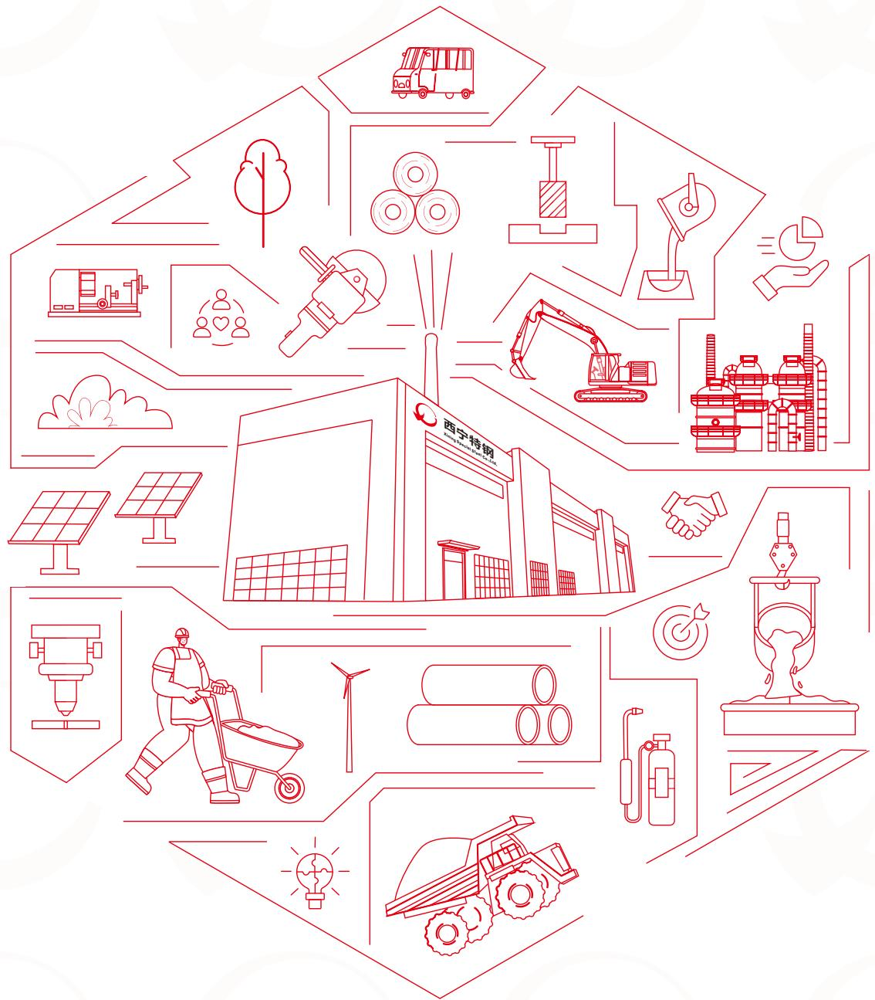

flowchart

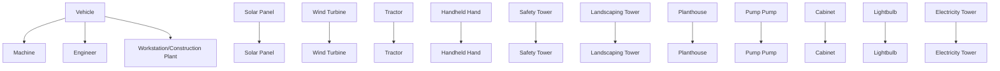
```mermaid
graph TD
  A["Vehicle"] --> B["Machine"]
  A --> C["Engineer"]
  A --> D["Workstation/Construction Plant"]
  E["Solar Panel"] --> F["Solar Panel"]
  G["Wind Turbine"] --> H["Wind Turbine"]
  I["Tractor"] --> J["Tractor"]
  K["Handheld Hand"] --> L["Handheld Hand"]
  M["Safety Tower"] --> N["Safety Tower"]
  O["Landscaping Tower"] --> P["Landscaping Tower"]
  Q["Planthouse"] --> R["Planthouse"]
  S["Pump Pump"] --> T["Pump Pump"]
  U["Cabinet"] --> V["Cabinet"]
  W["Lightbulb"] --> X["Lightbulb"]
  Y["Electricity Tower"] --> Z["Electricity Tower"]
```

## 2025

# 环境、社会和公司治理（ESG）报告

ENVIRONMENTAL SOCIAL AND GOVERNANCE (ESG） REPORT

## 目录

关于本报告 01

董事长致辞 03

公司概况 04

数说 2025 07

荣誉绩效 08

ESG 管理 09

附录

指标索引表 79

关键绩效表 81

读者反馈表 88

natural_image

Line drawing of a factory worker operating machinery with a fan (no text or symbols)

## 01 善治为基筑发展之本

公司治理 15

合规风控 18

投资者关系管理 20

反商业贿赂及反贪污 21

反不正当竞争 22

## 02 社会为责谱和谐之章

创新驱动 25

产品和服务安全与质量 33

数据安全与客户隐私保护 38

供应链安全 39

平等对待中小企业 41

员工 41

社会贡献与乡村振兴

## 03 环境为要绘绿色之图

应对气候变化 61

能源利用 64

水资源利用 69

环境合规管理 71

污染物排放 74

废弃物处理 76

循环经济

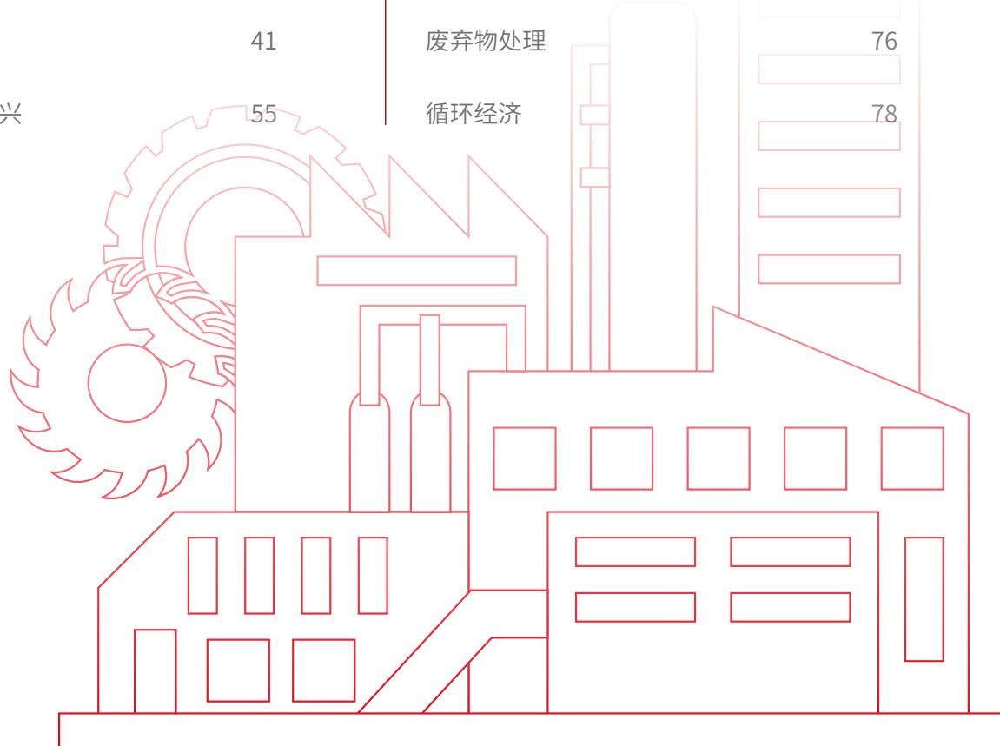

line

| Stage | Value |
| --- | --- |
| Initial Waste | 41 |
| Recycling | 55 |
| Final Waste | 76 |
| Final Recycling | 78 |

## 关于本报告

本报告是西宁特殊钢股份有限公司（以下简称“西宁特钢”“公司”或“我们”）发布的首份环境、社会和公司治理（FSG）报告，旨在呈现公司2025年度环境管理、社会责任履行及公司治理优化的理念、举措与绩效，全面回应股东、投资者、客户等各方利益相关方核心关切，为其了解公司可持续发展实践提供权威参考。

## 报告周期

本报告为年度报告，是公司常态化信息披露的重要组成部分。后续将按年度持续编制发布，同步公司经营发展周期，保障可持续发展信息披露的连续完整。

## 报告范围

本报告披露范围与西宁特钢2025年度财务报告合并报表范围保持一致。

## 时间范围

本报告的核心数据与信息覆盖周期为2025年1月1日至2025年12月31日（以下简称“报告期”）。为增强内容的连贯性与可读性，部分内容将适当追溯或延伸至报告期外，并予以特别说明。

## 编制依据

上海证券交易所《上海证券交易所上市公司自律监管指引第14号—可持续发展报告（试行）》

上海证券交易所《上海证券交易所上市公司自律监管指南第 4 号—可持续发展报告编制》

《中国企业可持续发展报告指南》(CASS-ESG 6.0)

全球报告倡议组织（GRI）《可持续发展报告标准》（GRI Standards）

联合国可持续发展目标(SDGs）

## 数据说明

本报告所披露的财务数据、运营数据、ESG绩效数据等均来源于公司正式财务报告、内部统计报表、生产运营记录、行政文件及第三方检测/核查报告。数据收集与核算遵循国家相关法律法规、行业标准及公司内部管理制度。除特殊说明外货币单位均为人民币，若部分数据与公司年度财务报告存在差异以财务报告为准。

## 称谓说明

本报告中“西宁特钢”“公司”“我们”均指西宁特殊钢股份有限公司。

## 报告可靠性保证

公司保证本报告内容真实、准确、完整，不存在任何虚假记载、误导性陈述或重大遗漏，并对其内容的真实性，完整性和准确性负责。

## 报告获取

本报告以中文简体版发布，电子版可通过以下渠道获取

西宁特钢官方网站（http://www.xntg.com）  
·上海证券交易所网站(http://www.sse.com.cn)

如对本报告内容有任何疑问或建议，欢迎通过以下方式联系我们：

邮政编码：810005  
联系电话：0971-5299186  
电子邮箱：xntg0971@163.com

·联系地址：青海省西宁市城北区柴达木西路52号

## 董事长致辞

当今世界正处于新一轮科技革命与产业变革加速演进的重要时期，绿色低碳发展理念不断深化，产业结构持续优化升级，高质量发展已成为中国经济发展的鲜明主题。钢铁行业作为国民经济的重要基础产业，正处干转型升级的关键阶段。如何在保障产业链稳定和实体制造能力的同时，实现绿色化、低碳化和可持续发展，既是行业面临的重要课题，也是企业必须主动承担的发展责任。

作为我国西部地区重要的特殊钢生产企业，西宁特殊钢股份有限公司始终立足实体制造根基，积极顺应国家战略导向，坚持以高质量发展为引领，持续推动企业发展方式转型升级。多年来，公司在稳步提升经营管理水平和产业竞争力的同时，不断深化绿色发展理念，强化规范治理基础，努力在推动企业稳健发展的同时，为行业进步和区域经济发展贡献力量。

2025年，公司系统开展环境、社会和公司治理（ESG）管理工作，并发布首份ESG报告。这既是公司对自身可持续发展实践的一次系统梳理，也是公司主动提升治理透明度、加强与各利益相关方沟通的重要举措。通过本报告，我们希望更加全面、真实地呈现公司在环境保护、社会责任和公司治理方面的理念、行动与阶段性成果，同时也以此为新的起点，推动可持续发展理念更加深入地融入企业战略规划与经营管理全过程。

在环境方面，公司围绕钢铁生产特点持续推进绿色制造体系建设，强化节能降耗与资源综合利用，推动生产运营向绿色低碳方向转型。在社会方面，公司始终将安全生产与员工发展放在重要位置，持续完善安全管理和职业健康保障体系，积极履行实体制造企业的社会责任。在治理方面，公司不断完善现代企业治理结构，健全风险管控与ESG管理机制，持续提升企业治理的规范化和透明度。

面对复杂多变的外部环境和不断变化的行业格局，西宁特钢将始终保持战略定力，坚持以高质量发展为主线，不断夯实产业基础，推动企业治理体系和治理能力持续提升。同时，公司也将持续推进绿色发展理念的落地实施。不断增强企业可持续发展能力和长期价值创造能力

展望未来，西宁特钢将继续秉持稳健经营与责任发展的理念，积极融入国家新发展格局，在推动产业升级、促进区域经济发展和服务国家战略中展现更大担当。我们也期待与投资者、客户、员工以及社会各界进一步深化沟通合作，在互信共赢的基础上携手前行，共同推动企业、社会与环境实现更加协调、更加可持续的发展。

## 王雪原

## 公司概况

## 公司简介

西宁特殊钢股份有限公司位于青海省西宁市，前身为1964年始建、1969年投产的西宁钢厂，1996年完成公司制改革，1997年钢铁主体资产在上交所成功上市（证券代码：600117）。经过多年的发展，公司集特殊钢研发、冶炼、压力加工、销售于一体，是国家级创新型企业、国家重要装备配套企业。公司现已形成年产钢210万吨，钢材200万吨的综合生产能力，产品涵盖碳结钢、碳工钢、合结钢、合工钢、轴承钢、模具钢、不锈钢、弹簧钢八大类，广泛服务于航空航天、汽车、工程机械、轨道交通、石油化工、铁路、船舶、水利水电、新能源等领域，是国内特钢行业重要骨干企业，截至 2025 年 12 月，公司注册资本 32.55 亿元，资产总额123.31亿元，员工总数3.900余人。

面对未来，公司秉持“只争第一、点滴做起”的企业精神团结带领全体员工，贯彻“调结构、建生态”的工作方针，按照“定目标、分责任、建机制”的总体思路，围绕强基础、抓内控、降成本、稳质量，推动公司整体经营态势实现稳步回升、持续向好。

## 企业文化

## 企业精神：

只争第一、点滴做起

## 经营理念：

利人惠己、永续经营

## 核心价值观：

诚信、规则、团队、卓越、共赢

## 人力资源理念：

尊重人、培养人、激励人、成就人

## 质量理念：

客户至上、精细管控

## 环保理念：

珍视环境、绿色低碳

## 企业愿景：

打造高原特钢精品基地，成为国际一流特钢企业。

## 发展历程

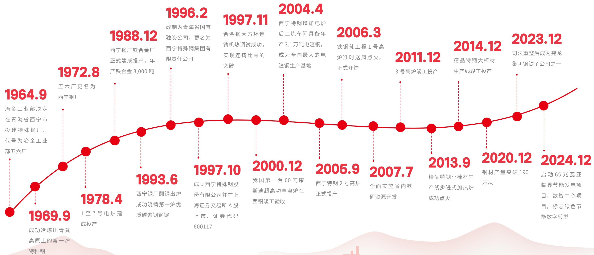

line

| Year | Value |
| --- | --- |
| 1969.9 | 1969.9 |
| 1972.8 | 1972.8 |
| 1978.4 | 1978.4 |
| 1988.12 | 1988.12 |
| 1993.6 | 1993.6 |
| 1996.2 | 1996.2 |
| 1997.10 | 1997.10 |
| 1997.11 | 1997.11 |
| 2000.12 | 2000.12 |
| 2004.4 | 2004.4 |
| 2005.9 | 2005.9 |
| 2006.3 | 2006.3 |
| 2007.7 | 2007.7 |
| 2011.12 | 2011.12 |
| 2013.9 | 2013.9 |
| 2014.12 | 2014.12 |
| 2020.12 | 2020.12 |
| 2023.12 | 2023.12 |
| 2024.12 | 2024.12 |

## 数说 2025

## 治理绩效

股东会召开次数 6 次

股东会审议通过议案数 29 项

董事会召开次数 10 次

董事会审议通过议案数 68 项

董事出席率 100%

审计委员会召开次数 9 次

投资者问题回复率 100%

## 环境绩效

环保投入 11,122.90 万元

缴纳环境保护税 202.39 万元

## 社会绩效

研发投入 24,861.42 万元

员工培训支出金额 17.52 万元

员工培训次数 1,995 次

安全生产投入 2,210 万元

员工总人数 3,931 人

少数民族员工人数 407 人

## 荣誉绩效

公司凭借在生产经营、社会责任、科技创新、节能降耗等领域的突出表现，斩获多项荣誉与认可：

  
2019 年获得青海省级“绿色工厂”称号

  
2020年获得青海省省级“节水型企业”称号

  
金牛奖2024年度金信披奖

  
2024 年获得用户满意企业

  
2024年获得青海省科技型企业

  
入选 2025 年“青海企业50强”

  
2025年获得青海省质量管理小组活动优秀企业

## ESG 管理

西宁特钢已建立系统化的 ESG 管理体系，并形成制度化、常态化的管理机制。公司制定《西宁特殊钢股份有限公司环境、社会和公司治理（ESG）管理制度》，明确管理原则、职责分工及运行机制，系统识别与管理ESG相关风险与机遇，推动ESG管理纳入公司治理体系和经营管理全过程。

## ESG 管理体系

公司搭建了覆盖决策层、管理层和执行层的三层五级FSG管理架构，形成分级负责、协同推进的组织体系。

西宁特钢 ESG 管理架构  
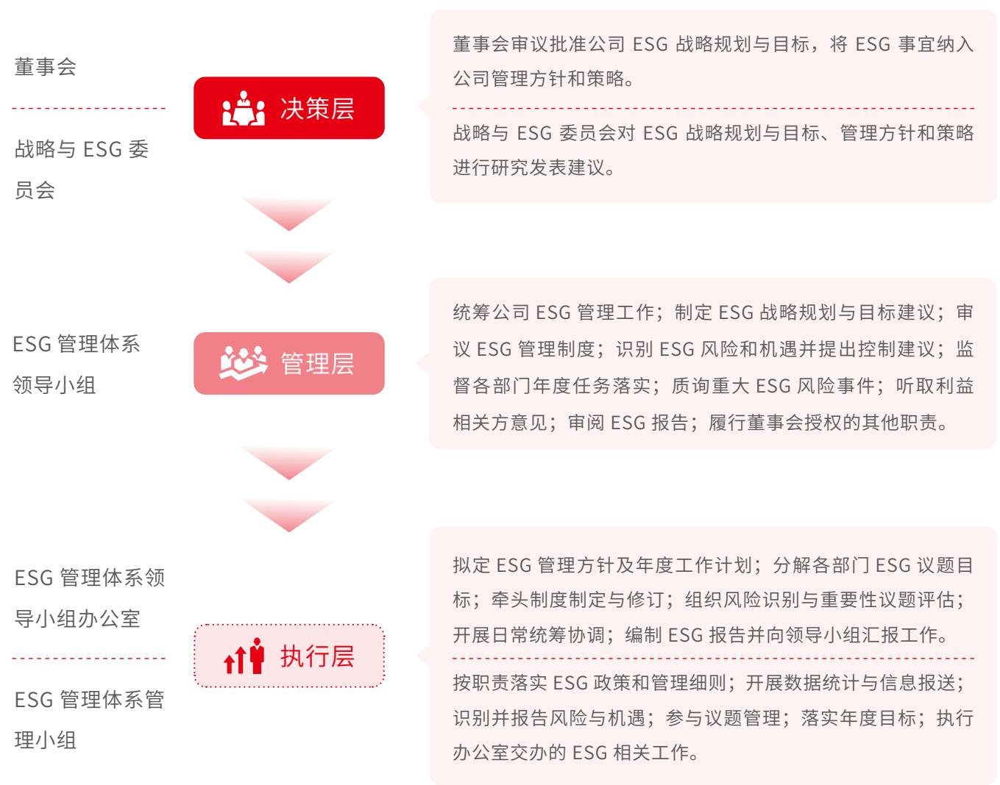

flowchart

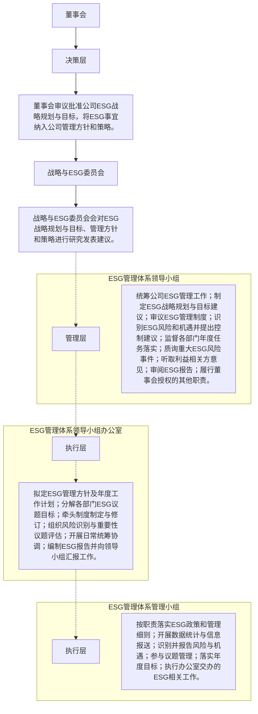
```mermaid
graph TD
  A["董事会"] --> B["决策层"]
  B --> C["董事会审议批准公司ESG战略规划与目标，将ESG事宜纳入公司管理方针和策略。"]
  C --> D["战略与ESG委员会"]
  D --> E["战略与ESG委员会会对ESG战略规划与目标、管理方针和策略进行研究发表建议。"]
  
  subgraph ESG_Manuals ["ESG管理体系领导小组"]
    F["管理层"]
    G["统筹公司ESG管理工作；制定ESG战略规划与目标建议；审议ESG管理制度；识别ESG风险和机遇并提出控制建议；监督各部门年度任务落实；质询重大ESG风险事件；听取利益相关方意见；审阅ESG报告；履行董事会授权的其他职责。"]
  end
  
  subgraph Office ["ESG管理体系领导小组办公室"]
    H["执行层"]
    I["拟定ESG管理方针及年度工作计划；分解各部门ESG议题目标；牵头制度制定与修订；组织风险识别与重要性议题评估；开展日常统筹协调；编制ESG报告并向领导小组汇报工作。"]
  end
  
  subgraph Management ["ESG管理体系管理小组"]
    J["执行层"]
    K["按职责落实ESG政策和管理细则；开展数据统计与信息报送；识别并报告风险与机遇；参与议题管理；落实年度目标；执行办公室交办的ESG相关工作。"]
  end
  
  E -.-> F
  F -.-> H
  H -.-> I
  I -.-> J
```

## ESG 风险管理

公司将ESG风险管理纳入常态化管理机制，建立季度跟踪与年度评估相结合的管理流程。围绕环境、社会和公司治理相关风险，按季度开展风险识别与控制情况梳理，形成风险识别台账和整改跟踪清单，动态掌握风险变化趋势及管控效果：每年对全年FSG风险管理情况进行系统总结与复盘评估，分析重点风险领域及改进方向，完善风险防控措施，推动FSG风险管理形成识别、跟踪、整改、评估的闭环管理机制。

## ESG 培训

公司围绕ESG管理体系建设，组织开展相关专题培训与宣贯活动，推动可持续发展理念融入经营管理全过程。培训对象覆盖董事、高级管理人员及相关人员，并将管理要求延伸至供应商和合作伙伴，强化供应链协同管理。通过集中培训、线上学习及日常宣贯等方式，提升相关人员对ESG政策要求和公司管理制度的理解，增强合规意识与责任意识，促进ESG管理要求在公司及供应链层面有效落实。

## 报告期内，公司

开展可持续发展培训

2 次

可持续发展培训时长

4 小时

ESG培训高管覆盖率达到

100%

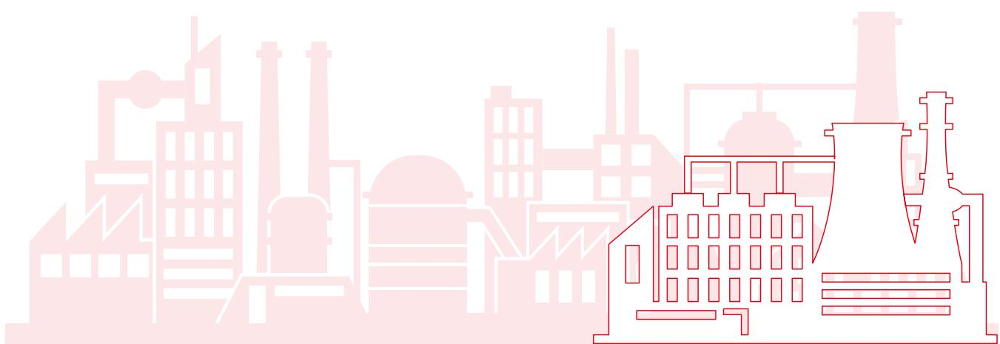

natural_image

Silhouette of an industrial factory with multiple buildings and smokestacks, rendered in pink against a white background (no text or symbols)

## 利益相关方沟通

公司重视与各类利益相关方的沟通与互动，将利益相关方关切纳入经营管理和可持续发展决策过程。公司识别股东及投资者、政府及监管机构、客户与供应商、员工及社区公众等主要利益相关方，通过信息披露、会议交流、反馈机制及日常沟通等方式持续开展互动，及时了解并回应在环境、安全、质量、员工权益和合规经营等方面的关注事项，推动公司治理更加稳健透明。

<table><tr><td>利益相关方</td><td>关注议题</td><td>沟通与回应方式</td></tr><tr><td>政府及监管部门</td><td>公司治理、环境合规管理、应对气候变化、污染物排放、水资源利用、生态系统和生物多样性保护</td><td>信息报送、政策沟通、专项汇报、合规审查</td></tr><tr><td>股东及投资者</td><td>公司治理、投资者关系管理、内控合规与风险管理、反商业贿赂与反贪污、创新驱动</td><td>股东会、定期报告披露、机构调研、业绩说明会、投资者热线、上证e互动</td></tr><tr><td>客户</td><td>产品和服务安全与质量、客户权益保护、数据安全与客户隐私保护、创新驱动、数字化与智能化</td><td>客户满意度调查、售后服务体系、信息安全保障机制、日常沟通</td></tr><tr><td>员工</td><td>员工、内控合规与风险管理、反商业贿赂与反贪污、利益相关方沟通</td><td>职工代表大会、培训体系、内部沟通平台</td></tr><tr><td>供应商</td><td>供应链安全、环境合规管理、反不正当竞争、反商业贿赂与反贪污、循环经济</td><td>供应商准入审核、资质评估、廉洁协议签署、培训与现场交流</td></tr><tr><td>行业合作伙伴</td><td>行业发展赋能、创新驱动、数字化与智能化、循环经济</td><td>行业协会交流、技术合作、联合项目、展会论坛、战略合作</td></tr><tr><td>社区及公众</td><td>社会贡献、乡村振兴、生态系统和生物多样性保护、水资源利用、污染物排放</td><td>公益活动、社区沟通、环保行动、信息公开</td></tr></table>

## 双重重要性议题识别

公司依据监管要求，建立双重重要性议题识别机制，通过问卷调查、利益相关方访谈及内部评估等方式对相关议题进行识别与排序，确定重点管理方向，并将结果纳入战略规划、风险管理和信息披露体系。

双重重要性议题识别流程

<table><tr><td>1- 议题梳理</td><td>结合政策要求、行业特征及公司战略,形成议题清单</td><td>政策对标、内部讨论</td></tr><tr><td>2- 利益相关方调研</td><td>收集各类利益相关方对议题重要性的评价</td><td>问卷调查、访谈</td></tr><tr><td>3- 双重重要性评估</td><td>从环境与社会影响、公司经营影响两个维度进行评估排序</td><td>评分分析、矩阵法</td></tr><tr><td>4- 结果确认与应用</td><td>确认重要议题并纳入管理与披露重点</td><td>管理层审议、目标分解</td></tr></table>

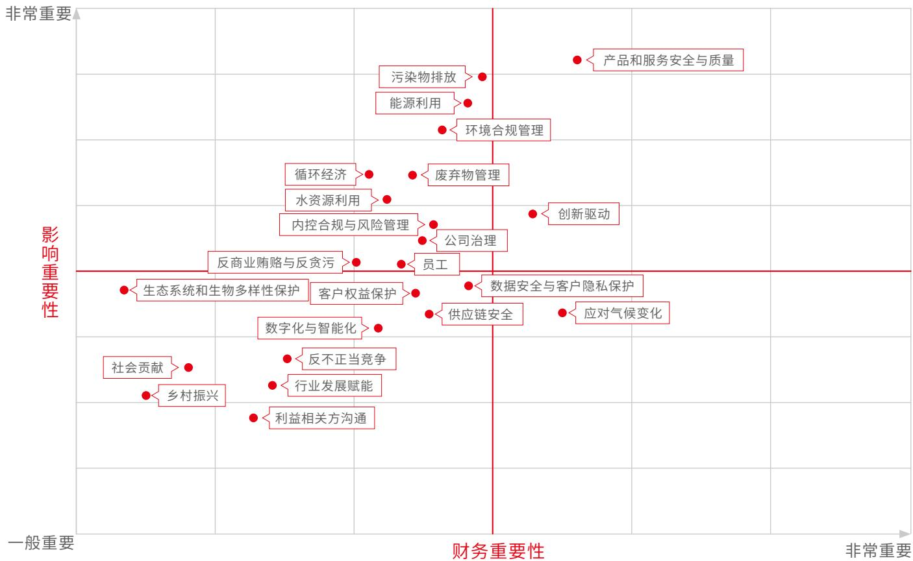

scatter

| Topic | Financial Importance (Approx.) | Impact Importance (Approx.) |
| :--- | :--- | :--- |
| 产品和服务安全与质量 | High | Very High |
| 污染物排放 | Medium-High | High |
| 能源利用 | Medium-High | High |
| 环境合规管理 | Medium-High | High |
| 循环经济 | Medium | Medium-High |
| 废弃物管理 | Medium | Medium-High |
| 水资源利用 | Medium | Medium-High |
| 内控合规与风险管理 | Medium | Medium-High |
| 创新驱动 | Medium-High | Medium-High |
| 公司治理 | Medium | Medium-High |
| 反商业贿赂与反贪污 | Medium | Low-Medium |
| 员工 | Medium | Low-Medium |
| 数据安全与客户隐私保护 | Medium-High | Low-Medium |
| 应对气候变化 | High | Low-Medium |
| 生态系统和生物多样性保护 | Low | Low-Medium |
| 客户权益保护 | Medium | Low-Medium |
| 供应链安全 | Medium-High | Low-Medium |
| 数字化与智能化 | Medium-Low | Low-Medium |
| 反不正当竞争 | Low-Medium | Low |
| 行业发展赋能 | Low-Medium | Low |
| 社会贡献 | Low | Low |
| 乡村振兴 | Low | Low |
| 利益相关方沟通 | Low-Medium | Low |

## 具有影响重要性，但不具有财务重要性的议题

污染物排放

能源利用

环境合规管理

循环经济

废弃物管理

水资源利用

·内控合规与风险管理

公司治理

员工

·反商业贿赂与反贪污

## 同时具有财务重要性与影响重要性的议题

·产品和服务安全与质量  
创新驱动

## 既不具有财务重要性，也不具有影响重要性的议题

生态系统和生物多样性保护

社会贡献

乡村振兴

利益相关方沟通

行业发展赋能

反不正当竞争

●数据安全与客户隐私保护

客户权益保护

供应链安全

数字化与智能化

## 具有财务重要性，但不具有影响重要性的议题

应对气候变化

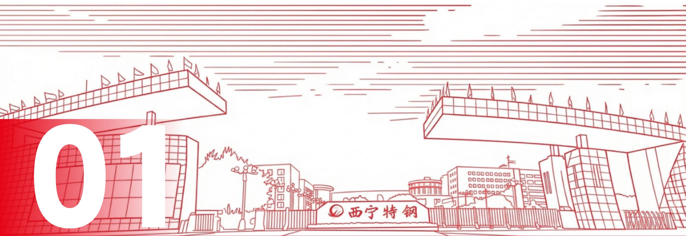

text_image

西宁特钢

## 善治为基

## 筑发展之本

公司治理  
投资者关系管理  
反不正当竞争  
合规风控  
反商业贿赂及反贪污

西宁特钢始终将规范治理摆在企业发展的核心位置，严格遵循国家法律法规与资本市场监管要求，持续完善现代企业制度，构建起权责清晰、制衡有效、运行规范、协同高效的公司治理体系。公司持续深耕法人治理结构优化、全流程合规风控体系建设、投资者关系管理与权益保护、反商业贿赂与反不正当竞争等核心领域，以治理能力的持续提升赋能企业转型升级提质增效，切实保障全体股东及各利益相关方的合法权益，为企业高质量发展筑牢坚实的治理根基。

16 和平、正义与 强大机构  

## 公司治理

西宁特钢严格按照《中华人民共和国公司法》《中华人民共和国证券法》《上海证券交易所股票上市规则》等法律法规及《公司章程》的规定，建立健全股东会、董事会及专门委员会分工明确、运作规范的治理架构形成权责清晰、制衡有效、运行规范的公司治理体系。公司持续完善治理制度体系，保障各治理主体依法履职，提升决策科学性与透明度。

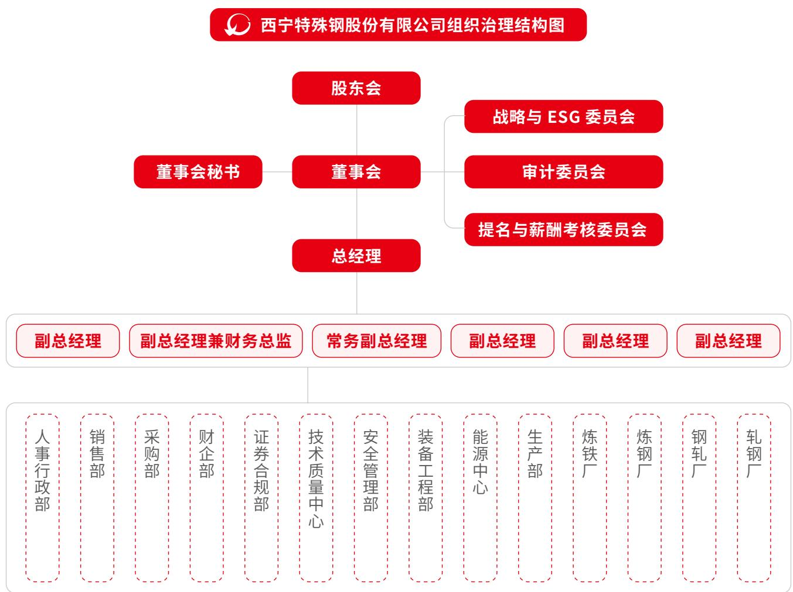

flowchart

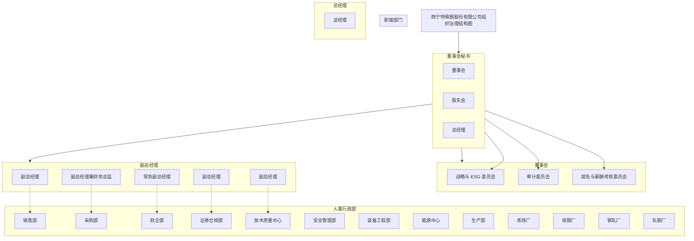
```mermaid
graph TD
  Root["西宁特殊钢股份有限公司组织治理结构图"]
  
  subgraph Board["董事会秘书"]
    Board1["董事会"]
    Board2["股东会"]
    Board3["总经理"]
  end
  
  subgraph Committee["董事会"]
    Committee1["战略与 ESG 委员会"]
    Committee2["审计委员会"]
    Committee3["提名与薪酬考核委员会"]
  end
  
  subgraph Director["副总经理"]
    Director1["副总经理"]
    Director2["副总经理兼财务总监"]
    Director3["常务副总经理"]
    Director4["副总经理"]
    Director5["副总经理"]
  end
  
  subgraph Dept["人事行政部"]
    Dept1["销售部"]
    Dept2["采购部"]
    Dept3["财企部"]
    Dept4["证券合规部"]
    Dept5["技术质量中心"]
    Dept6["安全管理部"]
    Dept7["装备工程部"]
    Dept8["能源中心"]
    Dept9["生产部"]
    Dept10["炼铁厂"]
    Dept11["炼钢厂"]
    Dept12["钢轧厂"]
    Dept13["轧钢厂"]
  end
  
  Root --> Board
  Board --> Committee
  Board --> Committee1
  Board --> Committee2
  Board --> Committee3
  Board --> Director
  
  Director1 -.-> Dept1
  Director2 -.-> Dept2
  Director3 -.-> Dept3
  Director4 -.-> Dept4
  Director5 -.-> Dept5
  
  subgraph Departments["职能部门"]
    direction TB
    Dept1
    Dept2
    Dept3
    Dept4
    Dept5
    Dept6
    Dept7
    Dept8
    Dept9
    Dept10
    Dept11
    Dept12
    Dept13
  end
  
  subgraph Team["总经理"]
    direction TB
    CEO1["总经理"]
  end
```

## 股东会

股东会由全体普通股股东组成，按持股比例依法行使权利。股东会审议批准董事会报告、利润分配方案等重要事项，选举和更换董事，决定公司经营方针、重大投资及章程修改等重大事项。公司严格按照相关规则召开定期及临时会议，表决事项达到法定比例方可通过，切实保障股东知情权、参与权和表决权

## 报告期内，公司

召开股东会

6 次

审议通过议案

29 项

## 董事会

董事会是公司经营决策与战略管理的核心机构，在股东会授权范围内统筹公司经营方向、投资安排及重大事项决策。董事会执行股东会决议，制定经营计划和投资方案，决定内部机构设置。公司制定《西宁特殊钢股份有限公司董事会议事规则》，对会议召集、议案审议、表决程序及信息披露等事项作出明确规定形成规范化运行机制。

## 报告期内，公司

召开董事会会议

10 次

审议议案

68 项

董事出席率

100%

## 独立性与规范运作

独立性是董事会有效履职的重要前提。公司建立《西宁特殊钢股份有限公司独立董事工作制度》，明确独立董事职责边界与履职保障机制，强化其在重大决策、财务监督及风险管控中的监督作用。董事提名和任职程序依据《公司章程》及相关规则执行，确保程序规范、条件透明。

董事会现有成员9人，其中独立董事3人，占比33.33%，在审计监督及重大事项决策中发挥独立监督功能增强决策制衡机制。

## 专业结构与多元配置

董事会成员的专业背景与行业经验是支撑科学决策的重要基础。公司董事多具备长期钢铁行业从业经历覆盖生产运营、技术研发、企业管理及市场拓展等核心领域。学历结构涵盖本科至博士层级，专业背景包括钢铁冶金、压力加工等行业技术领域，以及工商管理、会计、财务等管理类专业，形成技术与管理协同支撑的专业结构。

## 能力建设与履职保障

公司建立常态化培训机制保障董事持续胜任履职要求，围绕资本市场规则变化、信息披露规范、ESG理念、合规履职及市值管理等内容开展专题学习。本年度组织董事参加内外部培训 11 次，持续提升治理能力和合规水平。

## 董事会运行质量与有效性

董事会运行质量通过年度工作报告及审议机制进行评估。董事长对董事会年度履职情况进行总结，形成董事会工作报告提交董事会及股东会审议。董事及股东在审议过程中对董事会履职情况提出意见和建议，并结合公司经营实际持续优化决策程序与监督安排，保障董事会运作规范、审慎和有效。

## 董事会专门委员会

董事会下设战略与ESG委员会、审计委员会以及提名与薪酬考核委员会，各委员会依据工作细则规范运行，为董事会提供专业支持和决策建议。

## 战略与 ESG委员会

由5名董事组成，主任委员由董事长担任。围绕公司长期发展战略、重大投资及融资事项开展研究并提出建议。

## 审计委员会

由3名董事组成，其中独立董事2名，并包含专业会计人士。审核公司财务信息监督内外部审计及内部控制运行情况；涉及关联事项时相关委员依法回避表决保障监督独立性。

## 提名与薪酬考核委员会

由3名董事组成，其中独立董事2名。规范董事及高级管理人员提名程序和标准制定薪酬与绩效考核方案；依据《董事会提名与薪酬考核委员会工作细则》运行确保提名及薪酬管理公开、公平、公正。

## 报告期内，公司

召开战略与 ESG 委员会会议

5 次

召开审计委员会会议

9 次

召开提名与薪酬考核委员会会议

5 次

## 合规风控

公司坚持合规筑基、风控护航的发展理念，将内部控制与风险管理嵌入经营管理全过程，统筹公司风险识别合规管理及内部控制体系建设。公司依据《中华人民共和国公司法》《中华人民共和国证券法》《上市公司信息披露管理办法》等法律法规，建立了《西宁特钢内部控制制度》《西宁特钢内部控制手册》《西宁特钢内部控制评价手册》以及各部门内控手册与评价手册，形成制度化、流程化的内控管理体系。报告期内公司未发生重大内控及合规负面事件。

公司建立分工明确、协同运作的风险管理与内部控制体系，通过构建“三道防线”机制推动风险管理融入日常经营管理。各层级按照职责分工开展风险识别、管控和监督工作，形成覆盖业务运行、管理监督和独立审计的立体化风险防控结构。

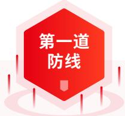

## 各职能部门及子公司

作为风险管理的前端主体，在采购、销售、生产等日常经营活动中识别和评估业务风险，严格执行内部控制流程，及时报告异常情况并落实风险控制措施。

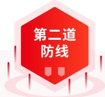

## 财企部、证券合规部

统筹制定内控合规制度和风险防控标准，为业务部门提供专业指导和合规培训，协调跨部门风险管理工作，并对重点风险领域开展持续跟踪和监督。

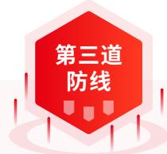

## 董事会审计委员会、内部审计机构

作为独立监督主体，对前两道防线的内部控制执行情况进行审计与监督，识别内控缺陷，提出整改建议并跟踪落实，推动风险管理体系持续优化。

公司实行全面识别、分级管控、动态监控的风险管理机制，结合公司实际经营情况识别重点风险类型，并制定针对性应对举措。

<table><tr><td>风险类型</td><td>具体内容</td><td>应对策略</td></tr><tr><td>经济环境风险</td><td>全球经济下行压力持续存在,叠加外部环境复杂多变、贸易政策不确定性加剧,多重因素交织冲击国际经贸秩序,直接影响钢铁产业链供应链稳定运行。上述因素可能导致市场需求进一步疲软和通胀压力加大,进而拖累钢材整体消费需求。国内钢铁行业面临产能过剩、供需结构失衡、钢材价格低位运行等挑战。</td><td>分析宏观政策及行业发展趋势,加强对市场的分析和预测,精准把握发展机遇,积极响应国家经济政策要求,及时调整公司生产经营计划,创新营销模式。优化生产组织模式和品种结构,提高生产运行效率,增强盈利能力和市场竞争力。</td></tr><tr><td>行业风险</td><td>钢铁行业销量呈现波动式下行,叠加产业集中度偏低导致行业供需自我调节能力薄弱,“供强需弱”的结构性矛盾持续凸显,行业步入“减量发展、存量竞争”的新阶段,市场同质化竞争日趋激烈,整体呈现高产量、低需求的运行态势,公司仍面临经营压力。</td><td>公司坚持“体系引领、创新突破”的总体思路,发挥自身产品及地域优势,积极开拓市场、提高市场占有率;提高各工序技术经济指标、推动课题专案落地;持续对标挖潜,降低制造成本;加大研发投入、优化品种结构,提升公司竞争力。</td></tr><tr><td>环保风险</td><td>公司地处省会城市,随着环保标准不断提高,对公司环保、节能减排工作要求越来越高,环保压力凸显。同时,生态环境部、国家发改委等五部门联合发布《关于推进实施钢铁行业超低排放的意见》,要求深入推进钢铁行业超低排放改造工作,在此背景下,实施钢铁行业超低排放改造,并推动行业高质量发展、促进产业转型升级存在一定压力。</td><td>根据国家超低排放政策的要求,坚定不移地执行超低排放改造工作,并通过深度治理后,建立全流程、常态化超低排放管控体系,实现全流程、全过程环境管理,有效提高环境管控能力,大幅削减主要大气污染物排放量,促进环境空气质量持续改善,使企业绿色发展水平持续提升,并积极推进“遵守环保法规、贯彻污染预防、推行清洁生产、持续改善环境”的环境管理方针,严格落实环保管理责任,加强公司各类环保风险的识别与分析,强化全员环保意识,聚焦源头防控、智能监控、闭环运维,以各类污染物稳定达标排放守住环保红线。</td></tr></table>

## 内部审计与监督

公司将内部审计作为风险防控的重要抓手，持续强化重点领域监督，围绕财务收支、外协业务管理、燃料采购及参股公司项目等重点领域开展专项审计，规范业务流程，强化关键环节风险控制。通过问题识别整改落实及制度完善，持续提升内部控制运行质量和风险防范能力。

## 报告期内，公司

已出具内部审计报告

5 项

提出制度修订建议

5 项

提出基础管理优化建议

14 项

## 风险合规文化与培训

公司将风险合规理念融入日常管理，通过多渠道加强宣传与培训，提升全员风险意识和合规意识。公司利用微信工作群发布风险提示与制度解读信息，在办公区域张贴宣传海报和横幅，营造合规文化氛围。同时，将风险与合规管理纳入年度培训计划，围绕法律法规更新、内部控制要求及典型风险案例开展专题培训，强化员工对关键风险点的识别与防范能力。

## 报告期内，公司

开展合规培训

21 次

## 案例 开展风险合规培训，提升合同管理规范化水平

2025年11月，公司组织开展《中华人民共和国民法典》专题培训，公司主要领导及各单位负责人、合同管理和招投标关键岗位人员等 100 余人参加。培训围绕合同订立、履行及风险防控等内容进行讲解，并结合企业经营实际开展案例分析。通过此次培训，进一步提升了各单位主要负责人及关键岗位人员的法治意识和合规管理能力，推动合同管理及招投标工作更加规范开展，为防范经营管理中的法律风险、完善公司内部控制体系提供支撑。

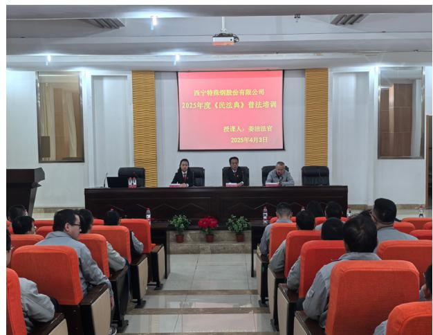

text_image

西宁哈弗钢股份有限公司
2025年度《民法典》普法培训
授课人：美迪法官
2025年4月3日

《中华人民共和国民法典》专题培训

## 投资者关系管理

公司秉持规范、平等、主动、诚信的投资者关系管理理念，通过多渠道沟通机制加强与投资者的互动交流，切实保护投资者合法权益，推动公司价值与投资者利益协同提升

公司制定《西宁特殊钢股份有限公司投资者关系管理制度》，规范投资者沟通、信息披露与互动交流机制提升沟通的透明度和规范性。同时，公司制定《西宁特殊钢股份有限公司信息披露管理制度》，明确公司及相关信息披露义务人的职责分工和工作流程，保障信息披露真实、准确、完整、及时和公平，维护资本市场秩序。

公司建立多元化、常态化投资者沟通机制，通过多渠道保持与资本市场的持续互动，保障信息沟通及时公开、透明。

## 投资者沟通渠道

·设立投资者热线电话及专用邮箱  
·依托“上证e互动”平台开展在线沟通  
·组织召开业绩说明会及投资者集体接待日活动

公司注重平等对待中小股东权益，通过上海证券交易所平台发布股东会通知，保障中小股东知情权，鼓励中小股东参与股东会现场会议，增强沟通互动和参与度。

## 报告期内，公司

披露临时公告

96 份

披露定期报告

4 份

召开业绩说明会

4 场

开展投资者关系活动

3 场投资者提问回复率

100%

## 反商业贿赂及反贪污

公司坚持廉洁经营原则，将反商业贿赂与反贪污管理纳入合规管理体系，通过制度建设、内部监督和风险排查等措施强化廉洁风险防控。公司制定《监察管理制度》《监察工作调查及处理实施细则》《员工举报管理工作实施细则》《商业道德管理工作实施细则》《员工奖惩管理办法》，建立内部监督与责任追究机制明确调查处理流程和问责要求。公司反商业贿赂及反贪污投诉举报邮箱为 xntgsjjc@163.com。报告期内，公司未发生商业贿赂或贪污事件。

反商业贿赂及反贪污治理架构

<table><tr><td>治理层</td><td>公司党委、董事会</td><td>审批反贪腐制度,统筹廉政建设方向,承担反贪腐工作最终责任。</td></tr><tr><td>监督层</td><td>审计委员会、经理办公会</td><td>指导并监督反舞弊、反贪腐工作落实情况。</td></tr><tr><td>专职部门</td><td>内部审计监察部门</td><td>制定相关制度,受理和调查举报,开展日常监督检查。</td></tr><tr><td>协同部门</td><td>证券合规部、人事行政部、财企部</td><td>提供法律支持、异常资金监控及人员处理等协同配合。</td></tr></table>

## 公司举报处理流程

受理举报，启动调查程序

违规违纪违法情 况确认

按情况交由内部部门处理，或移交司法机关处理

》

## 公司举报人保护措施

对举报人的姓名、工作单位、家庭地址等有关情况及举报内容严格保密，举报材料列入密件管理。

调查问题时，严格做好保密工作、不暴露举报人身份。

任何单位和个人不得以任何借口阻拦、压制举报人的举报和打击报复举报人。

对打击报复举报人的，依照有关规定严肃处理；构成犯罪的，移送司法机关依法处理。

围绕外协业务和燃料采购等重点领域，公司组织开展反商业贿赂与反腐败专项内部审计，从招标管理、合作商选择、合同签订、结算及验收等关键环节加强监督检查，规范业务运行。

## 报告期内，公司

贿赂及贪污举报事件数为

0 件

## 反不正当竞争

公司严格遵守《中华人民共和国反不正当竞争法》等相关法律法规，坚持公平竞争原则，规范市场行为维护良好的经营秩序。公司在招标采购、合作商选择及合同管理等环节强化合规审查，并结合内部审计和风险控制机制，防范串标、利益输送等不正当竞争行为。

相关监督工作与公司合规管理体系协同运行，通过制度约束和内部检查加强风险防控。报告期内，公司未发生不正当竞争事件

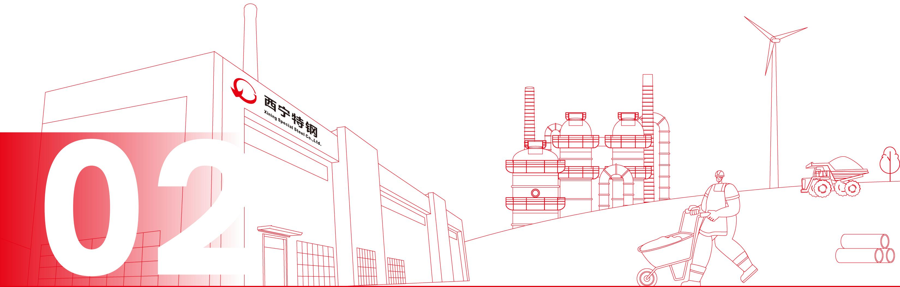

text_image

西宁特钢
Xining Special Steel Co.,Ltd.
02

## 社会为责

## 谱和谐之章

创新驱动  
●数据安全与客户隐私保护  
平等对待中小企业  
社会贡献与乡村振兴

·产品和服务安全与质量  
供应链安全  
员工 ·员工

西宁特钢将社会责任深度融入企业经营发展的全流程、各环节，在深耕特钢主业、推动产业升级的同时，始终以企业担当回应社会期待，以价值共创携手利益相关方共同成长。公司坚持以科技创新驱动产业升级，以严苛管控守护产品与服务品质，以全流程管理保障客户信息安全，以责任理念构建可持续供应链，以人本关怀赋能员工全面发展，以公益行动助力民生改善与乡村振兴，在实现自身高质量发展的同时持续为行业进步、地方发展、社会和谐注入自身力量，携手各方谱写互利共赢、和谐共生的时代新篇。

1 无贫穷

3 良好 健康与福祉

5性别平等体面工作和经济增长

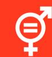

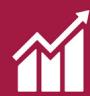

9 产业、创新和 基础设施

17 促进目标实现的伙伴关系

## 创新驱动

公司坚持以科技创新为核心驱动力，持续推进高端特钢产品研发、生产工艺优化与技术平台建设。通过完善科技创新治理体系、强化产学研协同创新及研发平台建设，公司不断提升关键材料研发能力与技术成果转化水平，推动企业向高端化、智能化、绿色化、高效化方向转型发展，逐步实现由“钢材制造商”向“材料服务商”的战略升级。

## 治理

公司构建了职责清晰、协同高效的科技创新管理体系，通过管理架构、制度体系及激励机制协同推动科技创新工作。

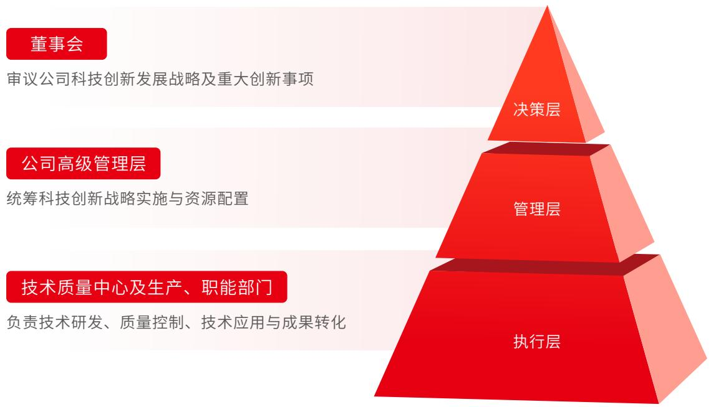

flowchart

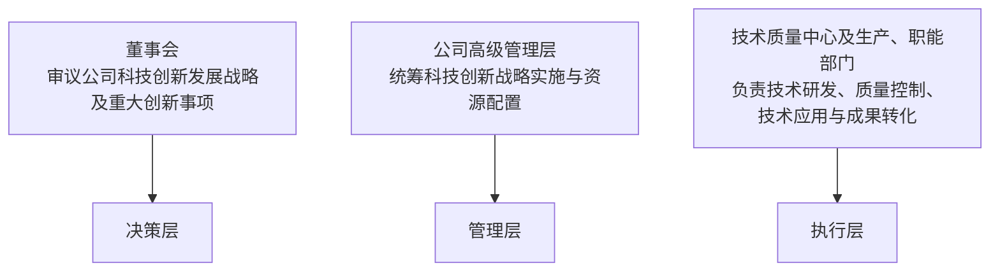
```mermaid
graph TD
  A["董事会\n审议公司科技创新发展战略及重大创新事项"] --> B["决策层"]
  C["公司高级管理层\n统筹科技创新战略实施与资源配置"] --> D["管理层"]
  E["技术质量中心及生产、职能部门\n负责技术研发、质量控制、技术应用与成果转化"] --> F["执行层"]
```

公司持续建立健全科技创新制度体系，对研发管理和创新激励进行规范。制定《创新创效工作管理办法》对科技创新项目管理及成果转化流程进行规范。《西宁特钢科技创新创效奖励实施细则》则通过设置激励机制，引导员工积极参与技术研发和工艺创新，持续提升企业创新活力

## 战略

围绕优特钢产业发展需求，公司持续强化技术研发能力和产品差异化优势，推动高端特钢技术创新与产业升级。公司通过打造高端特钢产业基地和建设科技创新平台，逐步提升关键材料研发能力和定制化产品开发能力，推动企业由传统钢材生产商向材料服务商延伸。

通过系统化的评估和分析，公司积极识别与研发相关的风险与机遇，涵盖对市场趋势、技术迭代以及内部研发能力的全面审视，以便据此采取针对性的策略，有效应对风险与机遇。

影响、风险和机遇分析及应对措施

<table><tr><td>风险名称</td><td>具体描述</td><td>影响时间</td><td>应对措施</td></tr><tr><td>技术研发投入回报不确定</td><td>技术研发具有周期长、投入高的特点,如研发项目未能实现预期技术突破或市场应用,可能影响研发投入回报率并增加企业成本压力</td><td>短期中期</td><td>建立研发项目评审与阶段性评估机制,加强技术路线论证和项目管理</td></tr><tr><td>技术成果转化风险</td><td>若研发成果与生产应用或市场需求匹配度不足,可能导致技术成果转化率较低,影响企业技术投资回报</td><td>中期</td><td>强化研发部门与生产部门或产业链下游终端用户的紧密互动,推动技术成果在生产环节及品种研发方面的应用</td></tr><tr><td>技术改造对生产稳定性的影响</td><td>新技术或新工艺在应用初期可能影响生产稳定性或产品质量,进而带来生产效率下降或成本增加</td><td>短期</td><td>在技术应用前开展试验验证与风险评估,分阶段推进技术应用</td></tr><tr><td>环境合规风险</td><td>新工艺、新材料在应用过程中可能带来新的环保管理要求,如未及时识别和应对,可能增加环境治理成本</td><td>中期长期</td><td>加强环境影响评估,完善环保监测与管理措施</td></tr></table>

<table><tr><td>机遇名称</td><td>具体描述</td><td>影响时间</td><td>应对措施</td></tr><tr><td>高端特钢市场需求增长</td><td>高端装备、能源及交通等领域对高性能特钢需求持续增长,公司通过研发高附加值特钢产品,有助于提升产品售价和利润空间,增强企业盈利能力</td><td>中期长期</td><td>加大高端特钢产品研发力度,推进关键核心技术攻关,提升产品差异化竞争优势</td></tr><tr><td>绿色低碳技术发展</td><td>推进绿色冶炼技术和资源循环利用技术,可降低能源消耗和生产成本,同时有助于满足下游客户对低碳材料的采购需求,拓展市场空间</td><td>中期长期</td><td>加强绿色工艺研发,推进节能降耗技术改造,推动固废资源化利用</td></tr><tr><td>数字化转型提升效率</td><td>通过建设MES系统、工业互联网平台及数字化管控系统,提高生产效率和质量管理水平,降低生产管理成本,提升企业运营效率</td><td>中期长期</td><td>持续推进数字化转型规划实施,加强数据采集、系统集成及智能制造建设</td></tr></table>

## 绿色研发

公司注重在技术创新过程中的绿色低碳技术研发与生产过程环境影响控制。公司将绿色低碳理念融入产品研发和生产工艺优化，通过推进绿色技术创新，不断提升生产过程资源利用效率和环境管理水平。

在绿色工艺研发方面，公司围绕冶炼工艺优化、设备能效提升及生产流程改进开展技术研究，通过工艺优化和技术改造降低生产过程中的能源消耗和环境影响。同时，公司积极推进冶金固废资源化利用等循环利用技术研究，提升资源综合利用水平。

## 案例 开发含铁固废资源化利用工艺，提升资源利用效率

2025年，公司开发“含铁固废一烧结造块一转炉冶炼”应用工艺，将原本难以利用的含铁固废转化为炼钢原料，实现资源循环利用。该技术提高了转炉冶炼稳定性，使关键质量指标明显改善，钢铁料消耗降低≥5.0kg/t，有效降低生产成本。通过形成“含铁固废一烧结造块或压球一炼钢”的应用路径，公司为冶金含铁固废资源化利用提供了新的技术方案，有助于减少固废排放并提升资源利用效率。

在产品研发与生产设计阶段，公司强化绿色设计理念，从原材料选择、质量控制及工艺设计等环节加强环境风险管理，通过对原材料洁净度、杂质含量及合金材料质量进行严格检测，确保生产材料符合相关技术标准和环保要求。

## 科研创新平台建设

公司完善科技创新平台体系，通过建设省级科研平台和企业研发机构，不断强化技术研发基础条件和创新资源集聚能力，为优特钢产品研发，工艺优化和技术攻关提供重要支撑

## 西宁特钢科技创新平台

01

青海省冶金产品研究与开发重点实验室

02

青海省特殊钢工程技术研究中心

03

西宁特殊钢股份有限公司博士后科研工作站

04

省级企业技术中心

## 科技创新资质认证

公司持续推进研发体系和检测能力建设，通过取得科技型企业认定及实验检测相关资质认证，不断提升技术研发能力和质量检验水平，为企业开展技术创新、产品检测和质量控制提供专业保障。

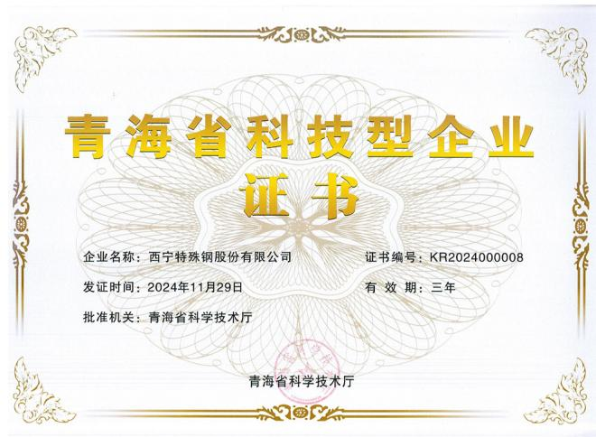

text_image

青海省科技型企业
证书
企业名称：西宁特殊钢股份有限公司 证书编号：KR2024000008
发证时间：2024年11月29日 有效期：三年
批准机关：青海省科学技术厅
青海省科学技术厅

青海省科技型企业证书

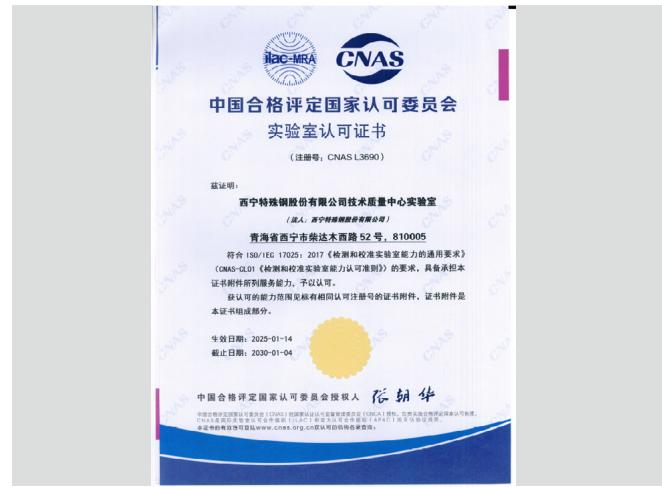

text_image

中国合格评定国家认可委员会
实验室认可证书
（注册号：CNAS L3690）
兹证明：
西宁特殊钢股份有限公司技术质量中心实验室
（法人：西宁特殊钢股份有限公司）
青海省西宁市柴达木西路52号、810005
符合ISO/IEC 17025:2017《检测和校准实验室能力的通用要求》
（CNAS-CL01《检测和校准实验室能力认可准则》）的要求，具备承担本
证书附件所列服务能力，予以认可。
获认可的能力范围见标有相同认可注册号的证书附件，证书附件是
本证书组成部分。
生效日期：2025-01-14
截止日期：2020-01-04
中国合格评定国家认可委员会授权人：陈朝华

CNAS 实验室认可证书

## 产学研合作

公司通过与高校和科研机构的合作，开展产学研协同创新，推动关键技术研发与成果转化。依托高校科研资源和企业产业实践，公司不断提升技术研发能力和创新水平，为产品升级和产业发展提供技术支撑。

<table><tr><td>合作院校</td><td>合作项目</td></tr><tr><td>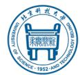北京科技大学</td><td>《能源行业用高强韧特殊钢开发关键技术系统集成与产业化》</td></tr><tr><td>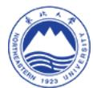东北大学</td><td>《西宁特钢铁前综合提升与高炉强化冶炼的技术开发》</td></tr><tr><td>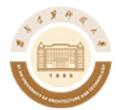西安建筑科技大学</td><td>《连铸坯凝固组织智能预测及质量改善的控制研究及应用实践》</td></tr></table>

## 技术成果转化

公司积极推进技术成果转化，成功取得“冶金含铁固废在转炉环保高效应用技术开发”技术成果证书。该项技术开发并固化“含铁固废一烧结造块一炼钢应用”短流程全工艺包，涵盖优化配料方案、烧结控制参数及炼钢动态应用模型等核心内容。同时，公司编制并发布两项企业技术标准，实现关键技术标准化、规范化落地。2025年，公司累计消化固废约4.960吨，有效达成降本增效与资源循环利用双重目标。此外2025年公司将“一种消除大规格曲轴磁痕缺陷的钢材生产方法”发明专利应用于实际生产，累计生产钢材 21,209.57 吨。

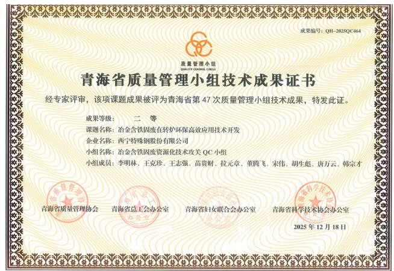

seal

青海省质量管理小组技术成果证书
经专家评审，该项课题成果被评为青海省第47次质量管理小组技术成果，特发此证。
成果等级： 二 等
课题名称：冶金含铁固废在转炉环保高效应用技术开发
企业名称：西宁特殊钢股份有限公司
小组名称：冶金含铁固废资源化技术攻关QC小组
小组成员：李明林、王克珍、王志强、岳贵财、拉元章、董腾飞、宋伟、胡生彪、唐万云、韩宗才
青海省质量管理协会 青海省总工会办公室 青海省妇女联合会办公室 青海省科学技术协会办公室
2025年12月18日

青海省质量管理小组技术成果证书

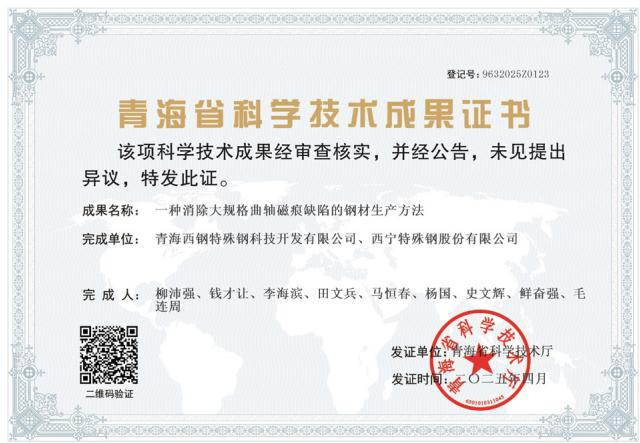

text_image

登记号:963202570123
青海省科学技术成果证书
该项科学技术成果经审查核实,并经公告,未见提出异议,特发此证。
成果名称:一种消除大规格曲轴磁痕缺陷的钢材生产方法
完成单位:青海西钢特殊钢科技开发有限公司、西宁特殊钢股份有限公司
完成人:柳沛强、钱才让、李海滨、田文兵、马恒春、杨国、史文辉、鲜奋强、毛连周
发证单位:青海省科学技术厅
发证时间:二〇二五年四月
二维码验证

青海省科学技术成果证书

## 数智化建设

公司围绕钢铁主业生产经营特点，持续推进信息技术与生产运营深度融合，推动企业管理向数字化、智能化方向升级，逐步构建覆盖生产、经营及管理各环节的数智化管理体系。目前，公司已完成MES系统产销系统、检化验系统建设并上线运行，数智中心、工业互联平台正在建设中，生产过程数据采集、质量管理和产销协同能力得到大幅提升；采购、销售、财务、人力资源、工程管理已纳入ERP系统，实现了业务管理的信息化。同时，公司持续推进安全、能源、物流及环保等领域的信息化建设，环保管理方面已上线清洁运输管控平台，环保智能管控平台、安全管控平台、智慧物流系统正在实施中，将于2026年下半年上线运行，能源管理系统正处于调研与规划阶段。

## 案例

## 开展数字化转型对标调研，完善数智化建设规划

2025年2月，公司调研组赴建龙集团下属子公司开展数字化转型与智能制造建设调研。调研团队通过现场参观、座谈交流等方式，重点了解各企业在数字化规划、系统应用及智能制造场景方面的实践经验。结合调研成果，公司梳理了自身数字化建设现状与发展路径，并在集团子公司北京同创支持下完成数字化转型规划方案编制，同步启动工业互联网平台及管控中心项目建设，为公司后续数智化升级提供实施依据。

## 2026年

完善基础数据采集与指标管理体系，建设覆盖生产、质量、能源、安全、环保等关键环节的数据采集平台与监控系统，实现物质流、能量流、信息流全过程监控；推进办公网工业以太网及5G网络在车间覆盖，提升设备联网率：升级数据中心机房，建设安全稳定的数字化基础设施；建设环保智能管控平台、数字化安全管控平台、熔铸智慧数联质量管控分析平台及物流管理系统，实现关键业务数字化。

响应国家“双碳”战略及钢铁行业绿色低碳发展要求，建设能源EMS系统，实现能源利用绿色化、智能化与高效化；建设企业级数智中心，依托工业互联网平台整合生产、能源、物流、设备、安全及质量管理，提升企业集中管控能力。

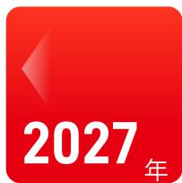

## 2028年

推动全面预算管理体系建设：构建以财务为核心的成本管理系统，实现成本“日清日结”和精益化管理；投用智能产线与装备，公司整体数智化能力逐步达到行业先进水平。

建设智慧生产运营平台，依托工业互联网平台引入数据挖掘、机器视觉和机器学习等技术，推动人工智能算法在钢铁生产全过程应用，实现生产、设备、能源及质量管理的智能化与可视化。

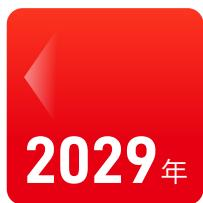

## 2030

建立覆盖全流程、全要素、全价值链的数字化管理体系：建成一体化智慧运营中心、集群式生产智造中心和智慧工业大脑。

公司制定2026-2030年数字化与智能化建设五年规划，围绕工业互联网平台、生产过程数字化管控、能源与环保数字化管理以及运营管控中心建设等重点方向，分阶段推进重点系统建设与应用场景落地，持续提升企业生产运营管理数字化水平，为公司高质量发展提供数智化支撑。

## 影响、风险和机遇管理

公司在科技创新管理过程中，将技术研发活动可能产生的环境、运营及市场影响纳入企业风险管理体系进行统筹管理。围绕研发项目立项、技术应用及成果转化等关键环节，对科技创新活动可能带来的经营风险。技术风险及环境影响进行识别与评估，并在项目实施过程中持续跟踪相关风险变化情况。

在管理机制方面，公司依托《风险和机遇控制程序》，对研发及技术改造过程中可能涉及的风险和机遇进行识别、分析和评估，并根据评估结果制定相应的控制措施。同时，公司通过《重大突发事件应急管理程序》建立应急响应机制，在出现突发技术风险或生产异常时及时开展应急处置，降低对生产运营和环境安全的影响。

## 指标与目标

## 2025年

研发人员总数

177 人

研发投入总金额

24,861.42 万元

研发人员占比

4.50%

研发投入占总营收比例

4.20%

## 知识产权保护

公司高度重视知识产权保护，制定了《知识产权管理制度》，将知识产权保护作为科技创新体系的重要组成部分。通过加强知识产权管理和成果保护，公司持续规范专利申请、技术成果转化及知识产权使用管理，不断提升企业技术创新成果的保护水平，推动科技成果有效转化与应用，为企业持续创新发展提供保障。

## 2025 年

用于主营业务的发明专利数量

3 项

发明专利的有效专利数

26 项

年度发明专利申请数

3 项

有效专利总数

33 项

## 行业交流与合作

公司积极参与行业技术交流与标准化建设，通过承担标准制定、参与协会治理等方式推动行业技术进步。依托在特钢材料领域的技术积累，公司不断加强与行业协会、科研机构及产业链伙伴的协同合作，在推动行业标准体系完善的同时，积极发挥企业在关键材料领域的技术优势与实践经验，为行业技术规范提升和产业高质量发展提供支撑。

## 行业协会任职

中国钢铁工业协会

会员

中国特钢企业协会

会长单位

中国金属学会电冶金分会

会员

青海环保产业协会

理事

青海省质量协会

副会长单位

青海企业家联合会

理事

公司持续推进标准化工作，围绕国家标准、行业标准、团体标准及军用标准的制定与实施开展系统布局进一步提升企业在行业标准体系中的参与度和影响力。

## 案例 发布实施国家军用标准，提升关键材料质量水平

公司深度服务国家高端装备与国防建设，主导编制国军标产品标准，引领行业技术进步与质量升级。以军工级严苛要求构建全流程质量管控与合规治理体系，强化产品可靠性、安全性与交付保障能力为客户提供高品质、高可靠的核心产品与解决方案，践行上市公司社会责任与担当。

## 2025 年

累计主导 / 参与制定的国家标准总数

14 项

累计主导/参与制定的团体标准总数

4 项

累计主导 / 参与制定的行业标准总数

9 项

累计主导/参与制定的军用标准总数

5 项

## 产品和服务安全与质量

## 治理

在产品质量管理方面，公司秉持“严格过程控制、持续质量改进、产品满足需求、服务超越期望”的方针。持续夯实质量基础、优化客户服务。公司技术质量中心为归口管理部门，承担体系核心职能；最高管理者、管理者代表统筹体系建立与改进，生产、供应、销售等部门及各生产分厂按分工履行相关职责，形成职能明确、协同高效的管理格局。报告期内，公司未发生重大产品质量事故。

公司制定《质量手册》作为质量管理纲领性文件，配套制定系列程序文件，并建立质量考核办法、产品质量安全管理制度等多项专项制度，构建起层级清晰、内容完善、运行有效的质量管理体系。公司已取得ISO 9001、IATF16949质量管理体系认证证书。

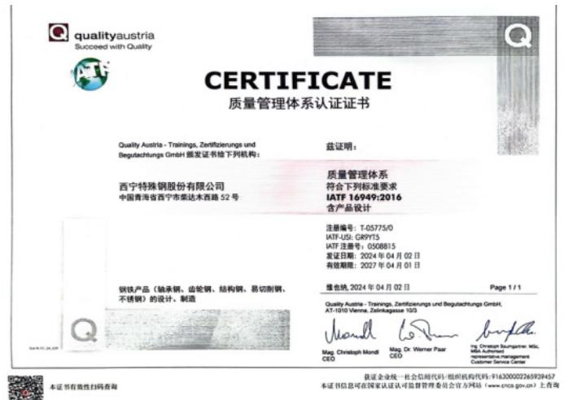

text_image

qualityaustria
Succeed with Quality
CERTIFICATE
质量管理体系认证证书
Quality Austria - Trainings, Zertifizierungs und
Begutachtungs GmbH 指发证书给下列机构：
兹证明：
西宁特殊钢股份有限公司
中国青海省西宁市崇达木西路 52 号
质量管理体系
符合下列标准要求
IATF 16949:2016
含产品设计
钢铁产品（轴承钢、齿轮钢、结构钢、易切割钢、
不锈钢）的设计、制造
注册编号：T-05775/0
IATF-USG:GRPP75
IATF 注册号：0508815
发证日期：2024年04月02日
有效期：2027年04月01日
曼也纳，2024年04月02日 Page 1/1
Quality Austria - Trainings, Zertifizierungs und Begutachtungs GmbH,
AT-1010 Vienna, Zeitinkasse 103
Mag. Christoph Mandi
CEO Mag. Dr. Werner Paar
CEO
by Christian Baugester, Mfg.
Mfg. Athernet
Supervisina management
Customer Service Center
本证书有效性扫码查询
获证企业统一社会信用代码/组织机构代码：91630000226939457
本证书信息可在国家认证认可监督管理委员会官方网站（www.cnca.gov.cn）上查询

质量管理体系认证证书

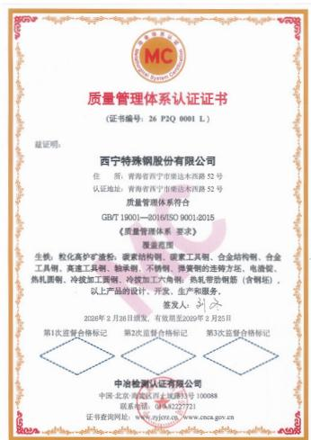

text_image

质量管理体系认证证书
(证书编号: 26 P2Q 0001 L)
兹证明:
西宁特殊钢股份有限公司
住所: 青海市西宁市望来木西路32号
认证地址: 青海市西宁市望来木西路32号
质量管理体系符合
GB/T 19001-20316/ISO 9001/2015
《质量管理体系 要求》
覆盖范围
生铁、粒化高炉矿渣粉、碳素结构钢、碳素工具钢、合金结构钢、合金工具钢、高速工具钢、轴承钢、不锈钢、弹簧钢的连铸方坯、电镀铬、热轧圆钢、冷致加工圆钢、冷致加工六角钢、热轧带劲钢筋(含钢坯)，
以上产品的设计、开发、生产和服务。
签发人: 刘文
2020年2月28日颁发，有效期至2020年3月25日
第1次监督合格标记 第2次监督合格标记 第3次监督合格标记
中冶检测认证有限公司
中国·北京地区汽车运输中心100088
联系电话: 010-6227721
证书查询网址: www.pjzq.cn / www.cnca.gov.cn

在客户服务方面，公司秉持“信息准确、反应迅速、处理有效、用户满意”的服务理念，构建清晰的客户服务治理架构，售前、售中服务由业务室和市场开发室负责，主要承担用户商务、生产、技术等方面的谈判及用户维护工作，售后服务由售后服务室负责，核心聚焦客户异议处理。同时，公司建立完善的销售管理相关制度体系，涵盖销售人员工作作风转变、各类文件管理规范、销售人员着装及行为规范、安全出行管理、合同录入、管理信息维护及考核等多方面规定。

## 战略

影响、风险和机遇分析及应对措施

<table><tr><td>风险名称</td><td>具体描述</td><td>影响时间</td><td>应对措施</td></tr><tr><td>生产过程质量风险</td><td>冶炼/压力加工环节成分偏差、尺寸超差、表面裂纹等缺陷,导致产品不合格。</td><td>短期</td><td>强化关键工序巡检,落实全尺寸检验,进行风险预判。</td></tr><tr><td>供应链质量风险</td><td>原材料成分波动、外包加工过程管控不足,影响产品质量稳定性。</td><td>短期中期</td><td>严格供应商准入与抽检,规范外包质量验收标准,建立溯源机制。</td></tr><tr><td>客户服务风险</td><td>个别质量异议未及时出具整改措施,客户满意度下降。</td><td>短期中期</td><td>进一步完善相关管理制度,规范整改措施制定的时间及质量。</td></tr></table>

<table><tr><td>机遇类型</td><td>具体描述</td><td>影响周期</td><td>应对措施</td></tr><tr><td>市场机遇</td><td>国家重要装备、汽车等领域对特钢纯度、精度要求升级,促进高品质需求。</td><td>长期</td><td>深化校企合作优化工艺,聚焦关键特性管控,研发高端定制产品。</td></tr><tr><td>客户满意度提升</td><td>依托标准化异议处理与快速整改服务,树立专业口碑,深化与重点客户长期合作。</td><td>中期、长期</td><td>建立客户服务满意度跟踪机制,将异议处理成效纳入客户关系维护重点</td></tr></table>

## 产品质量培训

报告期内，公司开展15项产品质量提升相关培训，累计培训240人次，涵盖质量管理体系、生产工艺全流程优化、实验室内部审核、实验检测、特钢系统分级管控及质量提升等内容。

公司炼钢厂实施连铸技改，并联合高校开展校企合作优化工艺参数，有效改善铸坏内外部质量，显著提升钢水纯净度；轧钢厂完成专项设备升级改造，实现全规格自由压力加工，提高轧材尺寸精度与表面质量炼钢、轧钢核心工序的产品质量得到显著提升。

## 客户沟通

公司组织销售人员与生产车间、技术中心召开研讨会议，强化专业服务能力。同时，公司积极推进客户沟通实践，2025 年累计接待客户来访 102 户；公司及销售部领导每月至少拜访 10 户重点客户，深度维系客户关系。此外，公司积极参与行业协会组织的各类会议及展会，拓展市场交流渠道，全面夯实客户服务基础。

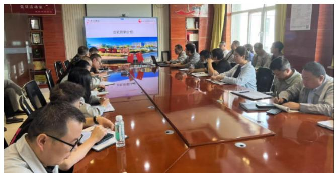

text_image

Meeting room photo with visible presentation screen showing Chinese text and people seated around a conference table

技术中心对销售部进行技术培训

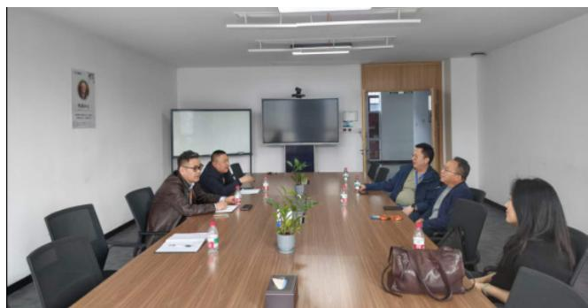

natural_image

Interior of a modern office meeting room with five people seated around a wooden conference table (no visible text or signage)

公司走访客户公司

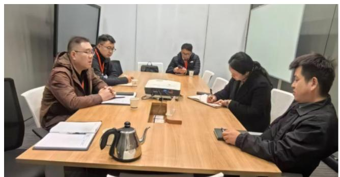

natural_image

Group of people seated around a conference table in a meeting room, engaged in discussion (no visible text or symbols)

公司走访客户公司

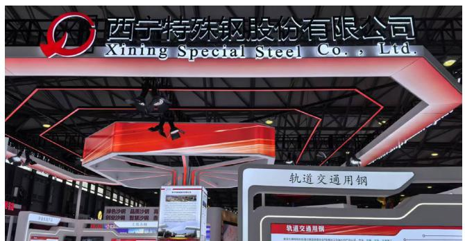

text_image

西宁特殊钢股份有限公司
Xining Special Steel Co., Ltd.
轨道交通用钢
轨道交通用钢

公司参加展会与行业协会会议

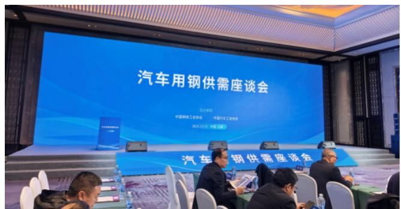

text_image

汽车用钢供需座谈会
主办单位
中国钢铁工业协会 中国汽车工业协会
2025.12.12 中国铁建
汽车用钢供需座谈会

公司参加展会与行业协会会议

## 客户满意度

公司每年度开展用户满意度调查，覆盖产品实物质量、价格合理性、合同兑现率、交付时效性及售后服务质量等核心维度，确保调查内容全面贴合客户核心诉求。调查实施过程中，公司注重把控客户覆盖范围确保客户覆盖度不低于20%，以全面收集真实反馈，为后续质量提升与服务优化提供可靠依据。报告期内，客户满意度达91.68分。

公司凭借稳定的产品质量、高效的履约能力及优质的服务保障，收获众多客户认可与荣誉。报告期内，公司荣获重庆长安望江工业集团有限公司感谢信表彰，同时获评湖北三环锻造有限公司“最佳合作伙伴”、湖北三环车桥有限公司“战略供应商”、中铁物贸集团有限公司成都分公司“优秀战略供应商”、中铁物资集团西南有限公司“优秀供应商”等多项荣誉称号。

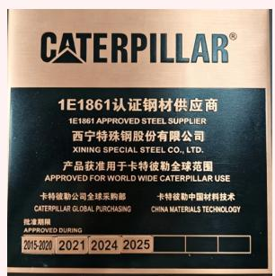

text_image

CATERPILLAR®
1E1861认证钢材供应商
1E1861 APPROVED STEEL SUPPLIER
西宁特殊钢股份有限公司
XINING SPECIAL STEEL CO.,LTD.
产品获准用于卡特彼勒全球范围
APPROVED FOR WORLD WIDE CATERPILLAR USE
卡特彼勒公司全球采购部
CATERPILLAR GLOBAL PURCHASING
卡特彼勒中国材料技术
CHINA MATERIALS TECHNOLOGY
批准期限
APPROVED DURING
2015-2020 2021 2024 2025

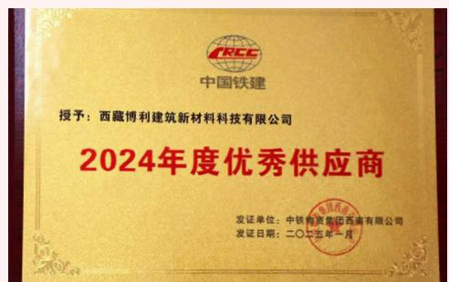

text_image

中国铁建
授予：西藏博利建筑新材料科技有限公司
2024年度优秀供应商
发证单位：中铁物资集团西南有限公司
发证日期：二〇二五年一月

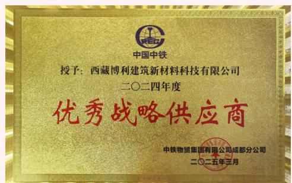

text_image

中国中铁
授予：西藏博利建筑新材料科技有限公司
二〇二四年度
优秀战略供应商
中铁物贸集团有限公司成都分公司
二〇二五年三月

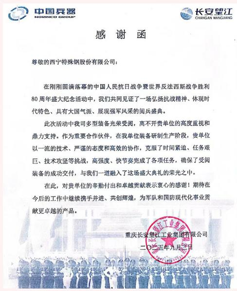

text_image

中国兵器
HONNEO GROUP
长安望江
CHANGAN WANGJIANG
感谢函
尊敬的西宁特殊钢股份有限公司：
在刚刚圆满落幕的中国人民抗日战争暨世界反法西斯战争胜利80周年盛大纪念活动中，我们共同见证了一场弘扬抗战精神、体现时代特色、具有大国气派、展现强军风采的阅兵盛典。
此次活动中我司多型装备光荣受阅，离不开贵单位的高度重视和鼎力支持。作为重要合作伙伴，在我单位装备研制生产阶段，贵单位以一流的技术、严谨的态度和高效的协作，克服了时间紧迫、任务艰巨、技术攻坚等挑战，高强度、快节奏完成了各项任务，确保了受阅装备的成功交付，与我们一道融入了这场盛大典礼的荣光之中。
在此，对贵单位的辛勤付出和卓越贡献表示衷心的感谢！期待在今后的工作中继续携手并进、共创辉煌，为军队和国防现代化事业贡献更卓越的产品。
重庆长安望江工业集团有限公司
二〇一五年九月三日

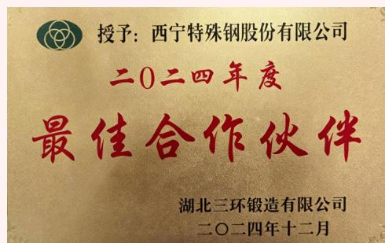

text_image

授予：西宁特殊钢股份有限公司
二〇二四年度
最佳合作伙伴
湖北三环锻造有限公司
二〇二四年十二月

## 影响、风险和机遇管理

公司制定《产品召回管理制度》，对产品召回全流程进行规范化管控，秉持安全优先、精准追溯、时限刚性、成本可控、合规透明的核心原则，切实保障客户合法权益，稳固市场信任基石。

公司产品召回流程遵循缺陷识别、计划制定、客户通知、回收交接、分类处置的管理路径，通过内部生产检测与外部客户反馈、监管通报等多渠道精准识别缺陷。技术质量中心牵头开展鉴定与风险评估，制定含客户分层、物流安排的专项计划，销售部按客户分类完成通知与沟通，确保信息全覆盖。回收时签署交接单入库后联合验收并录入系统实现全程追溯，技术质量中心出具评估报告，对召回产品按修复利用、重熔再生或合规报废分类处理，全程留存完整记录，确保风险彻底消除

不合格品管理方面，发现不合格品后立即质量封锁，在产销一体化系统填报信息并提预审意见；技术质量中心按初审、复审、终审三级流程完成评审处置。

对于客户投诉，依据《质量异议管理制度》，销售部受理登记并现场调查取样，技术质量中心检验分析；协商赔付并结算，责任单位整改，技术质量中心跟踪验证。报告期客户投诉解决率 98.37%。

## 指标与目标

## 2025 年

产品质量提升培训开展场次

15 场

客户服务能力培训开展场次

2 场

产品质量提升培训相关员工覆盖率

96.38%

客户服务能力培训参与人员

53 人次

## 数据安全与客户隐私保护

公司高度重视客户隐私与商业信息安全保护，通过建立健全《用户档案管理规定》《保密管理规定》《网络与信息安全应急管理办法》等制度体系，构建规范化、全流程的隐私保护机制。报告期内，公司未发生信息或客户隐私泄露事件。

在用户信息全流程管控方面，公司明确用户档案核心构成，涵盖客户基础资料、交易活动现状、业务往来纪要及技术合作文件等关键敏感信息，确保信息管理的全面性与精准性。由市场开发室作为责任主体，统一负责档案的建立、整理与归档工作，严格执行“月度归档”管理要求，实现客户信息收集与存储的标准化可追溯，从源头保障信息管理的合规性。同时，用户档案实行严格的授权访问机制，未经正式授权不得擅自查阅、使用或传播，最大限度防范信息泄露风险

在人员保密管控层面，公司强化全周期保密管理，在销售例会进行客户隐私保护相关宣贯。针对销售人员离职关键环节，明确要求离职人员须严格履行保密义务，严禁泄露、出卖或非法使用公司商业机密，包括客户核心资料、销售渠道布局、产品定价模式等敏感信息，确保商业秘密与客户隐私的持续安全。

在技术防护与应急保障方面，公司于2025年11月启动机房升级建设工作，严格按照等保三级标准规划实施，2026年5月机房升级验收后开展机房等保测评。通过专业化、标准化的技术设施建设。为客户隐私与商业信息提供坚实的技术支撑；同时，公司定期组织中心机房供电保障、消防演练及数据备份与恢复实战演练，持续强化风险防控与应急处置能力。

## 报告期内

公司开展信息安全应急演练

3 次

共参与人次

33 人次

## 供应链安全

公司秉持“利人惠己，永续经营”的管理战略，严格遵守《中华人民共和国民法典》《中华人民共和国招标投标法》等法律法规，制定《采购控制程序》《采购管理实施要点》《供应商准入及变更管理规定》等制度体系，覆盖供应商筛选、准入办理、考核等全流程管理要求；依据《供应部采购要点》建立供应链风险管理机制，将供应商评价纳入采购管理，且已建立完善的应急预案，构建规范、透明、可持续的供应链管理体系。

## 供应商管理

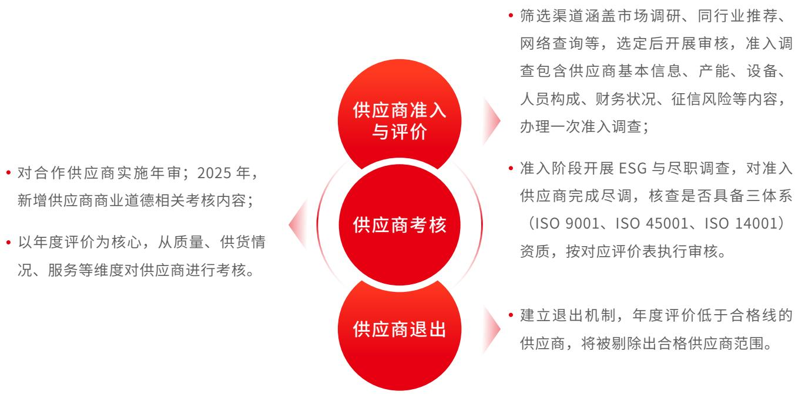

flowchart

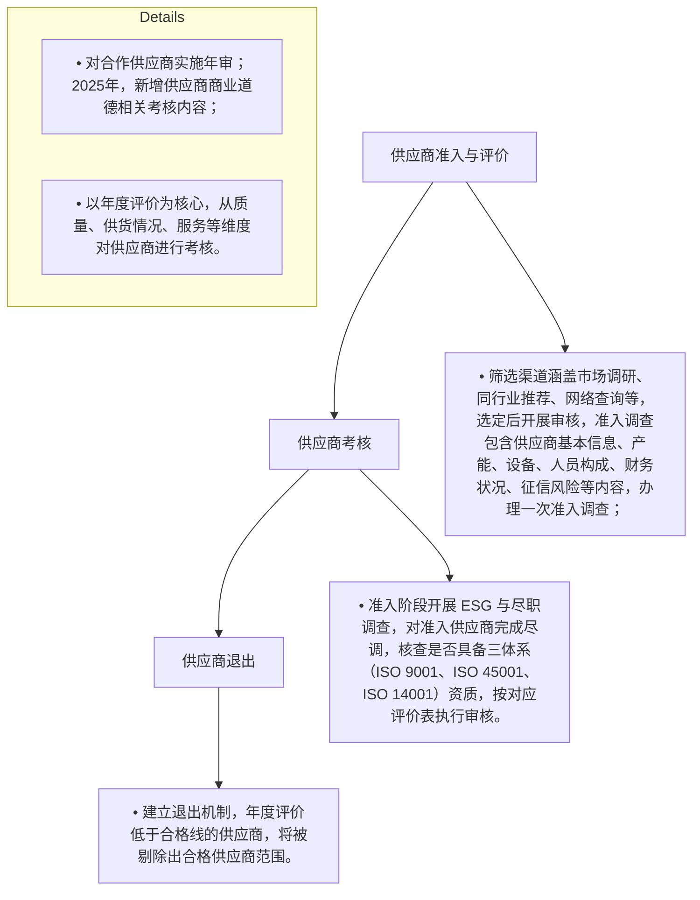
```mermaid
graph TD
  A["供应商准入与评价"] --> B["供应商考核"]
  B --> C["供应商退出"]
  
  subgraph Details
    D["• 对合作供应商实施年审；2025年，新增供应商商业道德相关考核内容；"]
    E["• 以年度评价为核心，从质量、供货情况、服务等维度对供应商进行考核。"]
  end
  
  A --> F["• 筛选渠道涵盖市场调研、同行业推荐、网络查询等，选定后开展审核，准入调查包含供应商基本信息、产能、设备、人员构成、财务状况、征信风险等内容，办理一次准入调查；"]
  B --> G["• 准入阶段开展 ESG 与尽职调查，对准入供应商完成尽调，核查是否具备三体系（ISO 9001、ISO 45001、ISO 14001）资质，按对应评价表执行审核。"]
  C --> H["• 建立退出机制，年度评价低于合格线的供应商，将被剔除出合格供应商范围。"]
```

## 报告期内

公司供应商总数为

613 家

合格供应商

248 家

新增供应商

142 家

约谈供应商

6 家

优秀供应商

231 家

剔除不合格供应商

4 家

## 供应商培训

公司注重与供应商的沟通与交流，通过电商平台、微信、电话等方式，建立高效沟通机制，重点围绕执行进度、货物在途动态及质量反馈等核心事项开展对接，确保信息传递及时、准确。

此外，公司着力提升供应商综合能力，针对供应商实施定向技术培训，分享专业知识及材料，推动双方在技术层面的协同提升，共同夯实互利共赢的供应链合作基础。

## 报告期内

公司开展核心供应商培训共

31 次

总时长

160 小时

培训及技术交流覆盖核心供应商

65 家

覆盖率达

50%

## 供应商廉洁管理

公司将廉洁诚信纳入合作准则，与供应商明确约定廉洁诚信合作条款，针对商业贿赂（含各类礼金）、侵占盗窃、质量造假等违规行为制定刚性约束措施，明确违规追责标准，构建起常态化、制度化的供应链廉洁防控体系，切实维护公平公正的合作环境。报告期内，公司供应商廉洁承诺签署率达 100%。

## 采购管理

在采购实施环节，公司根据物资类别与采购金额，分别采用招标采购与询比价采购模式，对符合条件的物资严格执行招标流程，对小额通用物资实施询比价采购，所有采购均完成多级审批后推进：采购合同全面纳入质量、环保、安全等相关要求，明确履约标准与责任条款，实现采购行为的全流程约束

在质量与风险管控方面，公司建立严格的进货检验机制，对采购物资按标准开展质量验证，对特殊物资及危化品执行专项验收要求，不合格品按规定处置：同时强化供应链安全保障，通过多元运输合作、供应商风险评估及应急预案，防范供货中断风险，保障生产物资稳定供应。

在绿色采购方面，公司对重点物资提出环保指标要求，推动供应商落实环境与社会责任：同时通过技术交流培训赋能等方式，与核心供应商开展协同提升，助力供应链整体能力优化，构建互利共赢、可持续发展的采购生态。

## 报告期内

公司供应商本地化比例为

13%

本地化采购比例为

31%

## 平等对待中小企业

公司始终秉持公平合作、诚信履约原则，在采购、招标、结算等经营环节对各类合作企业一视同仁，保障中小企业平等参与市场竞争、获取商业机会的合法权益，积极构建开放、透明、共赢的供应链生态。公司建立规范高效的款项支付流程，及时足额支付中小企业款项，以实际行动维护供应链稳定与商业信用，助力实体经济健康发展。

为强化应收账款管理、防范款项支付风险，公司制定《关干销售部逾期应收账款的考核规定》，建立常态化管控机制。以每月底财企部《客户信用及赊销余额统计表》为核心依据，从逾期户数、逾期金额两方面明确对责任业务科室的考核标准，通过健全制度约束压实管理责任。报告期内，公司严格执行款项支付流程未发生逾期未支付中小企业款项的情况。

## 员工

## 员工雇佣

西宁特钢始终秉持以人为本的核心理念，将员工视为企业可持续发展的核心资本，严格遵循法律法规与内部制度规范，构建公平，包容，合规的员工雇佣休系，保障员工合法权益，为企业高质量发展筑牢人才根基

## 人才招聘

公司严格遵循《中华人民共和国劳动法》《中华人民共和国劳动合同法》等国家法律法规，按照《员工入职、离职、异动管理办法》，明确招聘、录用、异动等全流程管理规范，为员工招聘提供坚实的制度保障。所有招聘活动均以合规为前提，坚决杜绝任何违反劳动保障法律法规的行为。

公司构建了多元化的招聘体系，形成校园招聘、社会招聘与内部竞聘三大核心招聘类别，精准匹配不同层级、不同类型的人才需求：

面向各大高校应届毕业生开展，聚焦后备人才储备，为公司注入新鲜血液，构建可持续的人才梯队

## 校园招聘

面向社会公开招募主管、专业技术及基层序列人员，重点解决关键岗位人才紧缺问题，补充成熟人才力量

## 社会招聘

面向公司员工选拔人才，分为公司级竞聘（人事行政部主办）与厂部级竞聘(各单位主办、人事行政部协办），营造“能者上、庸者下”的良性内部用人机制，为内部员工提供广阔的职业发展空间

## 内部竞聘

公司在招聘全流程中坚守公平、公正、公开原则，不存在任何形式的歧视行为。招聘选拔以岗位需求为导向，依据应聘者的专业能力、综合素质、岗位适配度等核心维度进行评估，不因性别、年龄、民族、种族。宗教信仰、婚姻状况等因素设置歧视性门槛。内部竞聘环节明确规定竞聘内容包含笔试与面试，评委组成不少于5名（含用人单位评委），目原则上应聘人数不低于2人方可组织竞聘，确保选拔过程的公正性与科学性。

员工结构  
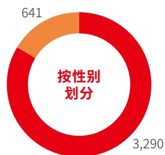

donut

| Category | Value |
| --- | --- |
| Red | 3,290 |
| Orange | 641 |

男性员工人数  
女性员工人数

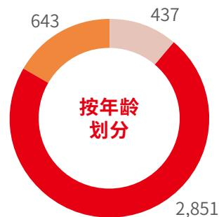

donut

| Category | Value |
| --- | --- |
| Red | 2,851 |
| Orange | 643 |
| Light Pink | 437 |

30 岁以下员工人数  
30 至50岁员工人数  
50 岁以上员工人数

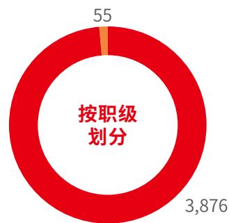

donut

| Category | Value |
| --- | --- |
| 核心部分 | 3,876 |
| 其他部分 | 55 |

公司基层员工人数  
公司管理层员工人数

员工总数

3,931 人

残疾员工人数

92 人

少数民族员工人数

407 人

员工流失率

3.30%

新进员工数

148 人

## 薪酬福利

西宁特钢以《薪资福利管理细则》为制度核心，构建与岗位价值、个人能力、经营业绩紧密挂钩的薪资福利体系，全面保障员工合法权益，增强员工归属感与幸福感。

薪酬结构由工资和运营奖金两部分构成，兼顾稳定性与激励性，具体如下

## 基本工资

不低于青海省当年度最低工资标准，按出勤情况按月足额发放。

## 岗位津贴

以岗位要素评价为依据，体现岗位价值差异，按出勤支付。

## 主管加给

针对主管岗位，根据管理责任、管理幅度设定，随岗位异动调整，按出勤支付；主持工作主管、代理主管、厂部长助理按对应标准执行。

## 附加工资

用于特殊场景（如急需人才引进、机构整合）的差额补贴，按出勤支付。

## 工资部分

## 运营奖金

natural_image

Illustration of a woman holding a smartphone displaying a form, surrounded by decorative elements like leaves, social media icons, and a yellow coin (no text or symbols)

## 绩效奖金

围绕月度经营指标设立，根据企业、团队、个人三级绩效系数及出勤情况按月核算发放。

## 重点分配奖金

含降本增效奖、安全奖、指标奖等专项奖励，依据具体方案精准兑现。

津贴覆盖职业发展与工作生活需求，随岗位异动动态调整（工龄津贴除外），按出勤支付，具体类型如下：

## 职称津贴

获得与本岗位相关技术职称并被公司聘任的员工

## 技术等级津贴

取得与本岗位相关职业技能 证书（初级工至高级技师） 且被聘任的员工，与职称津 贴不重复享受

## 注册资格津贴

取得与本岗位相关全国通用注册资格证书且被聘任的员工，证书专业需与工作一致

## 倒班高温津贴

针对倒班及从事高温环境人员发放

## 地区补贴

面向艰苦边远地区工作员工，结合地域自然环境差异设定

## 工龄津贴

以员工入厂时间为依据计算，体现长期服务贡献

福利分为法定福利与补充福利，全方位覆盖员工需求

## 法定福利

•依法为全体员工缴纳养老保险、医疗保险、失业保险、工伤保险、生育保险及住房公积金，社保及公积金缴纳覆盖率达100%。

## 补充福利

•日常福利：含医疗卫生补助费、工作餐费、冬季取暖费。  
激励类福利。

natural_image

Illustration of five people celebrating with a trophy and falling petals (no text or symbols)

## 权益保障

西宁特钢始终将员工权益保障作为企业可持续发展的重要基石，严格遵循《中华人民共和国劳动法》《中华人民共和国工会法》等法律法规，以完善的制度体系、畅通的沟通渠道、多元的关怀举措，构建公平公正、和谐稳定的劳资关系，切实维护员工合法权益，增强员工归属感与幸福感。

## 民主沟通

西宁特钢高度重视员工民主权利的保障，搭建多层次、全覆盖的民主沟通平台，以透明化、常态化的沟通机制打通上下联动通道，确保员工的知情权、参与权与表达权得到充分落实，构建和谐互信的劳资关系。

报告期内，公司工会组织高效运作，全年召开2次职代会，让每一位员工都能通过工会渠道传递诉求；扎实推进职工代表大会制度，经充分审议通过6项核心议案，将员工关切与企业发展决策深度融合，确保民主管理落地见效；建立常态化员工满意度调查机制，定期开展全面调查，精准收集员工在工作环境、薪酬福利、职业发展等方面的意见建议，为公司优化管理、提升员工体验提供了重要依据，形成员工有诉求、企业有回应、改进有实效的良性沟通互动。

## 员工关怀

西宁特钢构建了覆盖节日问候、文体生活、精准帮扶的多元关怀体系。从日常需求到特殊诉求，以有温度的举措传递企业温暖，凝聚发展合力，让员工切实感受归属感，实现企业与员工共同成长。

公司紧扣不同节点特点与员工实际需求，开展针对性关怀活动，将企业的牵挂与问候精准送达每一位员工身边。通过丰富多样的活动形式与实用贴心的关怀物资，传递对员工的尊重与关爱。

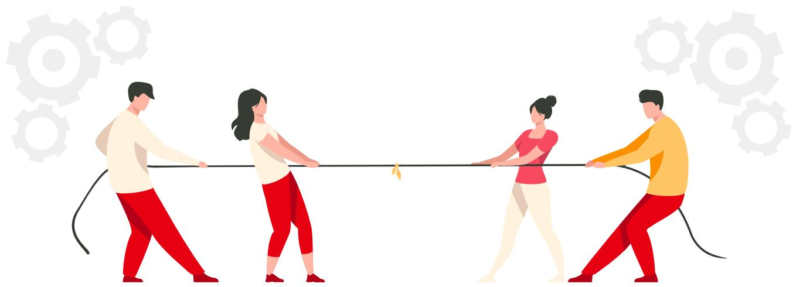

natural_image

Illustration of four people pulling a rope with gear symbols in the background (no text or symbols present)

## 案例 巾帼绽芳华，趣味庆“三八”

2025 年 3 月，第 115 个“三八”国际劳动妇女节之际，西宁特钢组织节日趣味活动，为女职工送上专属关怀。活动现场“夹乒乓球”等项目精彩纷呈，女职工全神贯注展现风采，公司还为每位女职工准备暖心节日消费券。此次活动丰富了女职工业余文化生活，营造和谐氛围、增强团队凝聚力，激发大家以饱满热情立足岗位，为公司发展贡献巾帼力量。

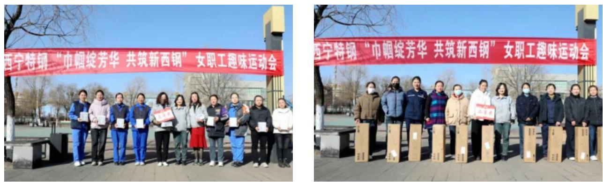  
公司女职工三八节日活动开展

## 案例 盛夏送清凉，关怀暖一线

2025年7月，西宁特钢工会开展“盛夏送清凉·防暑保安康”活动，聚焦一线高温作业职工，为炼钢轧钢、动力、检修等高温区域职工，送去矿泉水、盐汽水、雪糕等防暑物资。工会工作人员亲手递送物资，叮嘱职工劳逸结合、做好防暑措施，兼顾身体健康与生产安全，此次活动累计送出茶叶4,000袋、矿泉水1,810箱等物资。活动彰显公司以人为本理念，切实筑牢一线职工防暑后勤保障防线，让高温下的一线职工真切感受到企业的关怀与温暖。

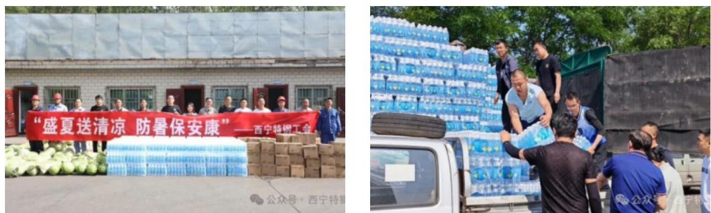  
公司送清凉现场

## 案例 金秋助学传暖意，圆梦启航护成长

2025年8月，西宁特钢举办“金秋助学圆梦启航”活动，为15名员工准大学生子女发放成长奖励。活动前，学子与家长参观公司展厅，了解企业发展脉络，真切感受父母工作辛劳，深化对父母职业的认同与归属感。此次行动践行“关爱员工”传统，既为员工排忧解难、支持子女教育，也激励学子以佳绩回馈社会，让员工切实感受到企业温情与担当。

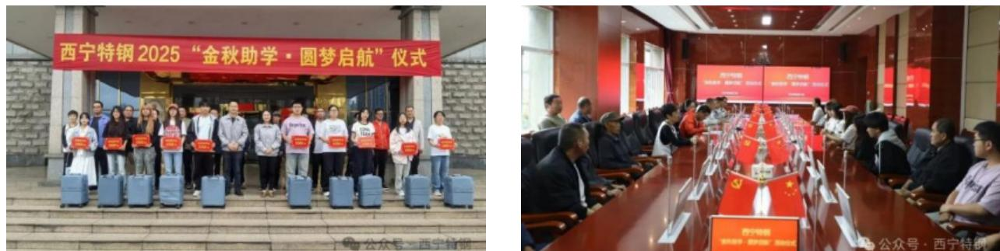  
公司组织开展金秋助学活动

丰富员工业余文体生活是提升团队凝聚力、营造积极向上企业文化的重要途径。公司坚持以文体活动为纽带，搭建员工互动交流、展示风采的平台，既注重活动的趣味性与参与性，又兼顾团队协作与精神引领让员工在劳逸结合中放松身心、增进情谊。

## 案例 以心聚力显风采，拔河比拼凝同心

2025年5月，西宁特钢在综合办公楼前广场举办职工拔河比赛，公司工会主席、副总经理吴海峰出席致辞，12支分厂及部门代表队、近200名职工参赛。比赛设A、B组淘汰赛，抽签对决、三局两胜，队员们齐心协力、奋勇拼搏，现场氛围热烈，最终炼铁厂代表队夺冠。活动丰富职工业余文体生活、强健体魄，更凝聚团队合力，践行“强体魄、促生产”理念，公司后续将持续推出多元文体活动，为发展注入动力。

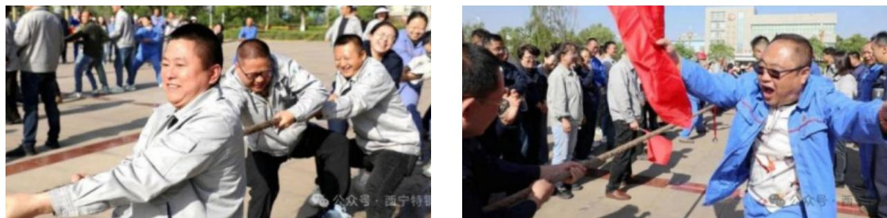  
公司拔河比赛

## 困难员工帮扶

针对员工在生活中遇到的特殊困难与家庭实际需求，公司建立精准帮扶机制，聚焦困难员工帮扶等关键领域，开展定向关怀行动。通过新春走访慰问等活动，公司不仅为员工排忧解难，更传递了企业的责任与担当。

<table><tr><td>指标</td><td>单位</td><td>数据</td></tr><tr><td>困难员工帮扶人数</td><td>人</td><td>31</td></tr><tr><td>员工关爱帮扶资金投入</td><td>万元</td><td>26.95</td></tr></table>

## 案例 新春走访慰问，关怀温暖职工

2025年，蛇年新春前夕，西宁特钢班子成员开展走访慰问活动。领导与困难员工促膝长谈，详细询问工作及家庭情况，倾听诉求并给予鼓励。此次慰问让困难员工深切感受到公司关怀，大家纷纷表示将转化关怀为工作动力，助力公司发展。

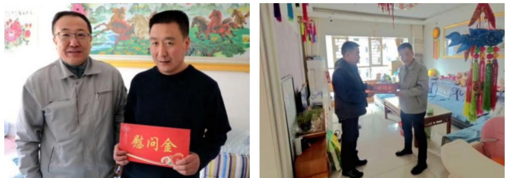  
公司班子成员深入困难群众家中慰问

## 员工发展

西宁特钢将员工发展视为企业可持续发展的核心动力，构建覆盖绩效管理、晋升机制、员工培训的全方位发展体系，以科学制度为保障，以多元举措为支撑，助力员工实现职业成长与价值提升，为企业高质量发展注入持续动能。

## 绩效管理

公司以《员工绩效管理细则》为核心，建立覆盖全岗位、全周期的考核机制，确保考核公平公正、结果有效应用。

考核对象：主管序列、专业序列、基层序列所有在岗员工。

考核类型：包括试用期考核、月度考核、年度综合评价三类。

影响、风险和机遇分析及应对措施

<table><tr><td>考核类型</td><td>评价维度及权重</td></tr><tr><td>试用期考核</td><td>业绩、专业能力及态度</td></tr><tr><td>月度考核</td><td>主管序列:专业管理/生产经营指标、月度重点工作、管理提升;专业序列:月度重点工作、临时工作;基层序列:岗位职责、重点工作、安全纪律等</td></tr><tr><td>年度综合评价</td><td>业绩成绩(月度考核等级赋分平均值)综合评价(能力、态度等)</td></tr></table>

## 结果应用

月度绩效等级与绩效奖金挂钩；年度评价作为薪资调整、岗位异动、主管任用的核心依据。

## 沟通机制

试用期、月度考核及年度评价丙丁级所有员工需进行正式绩效面谈，共同制定改进计划。

## 申诉渠道

员工对考核结果有异议的，可在5个工作日内通过直接主管、上级主管、人事行政部三级渠道申诉，人事行政部7个工作日内核实反馈。

## 晋升机制

公司构建“多序列、全通道”的晋升体系，明确晋升标准、流程与保障机制，营造公平竞争的成长环境。

## 晋升渠道

•推荐聘任：一级主管岗位可直接按流程审批聘任；二级主管岗位中，具有对应岗位工作经验的人员可通过推荐表审批聘任。  
•公开竞聘：主管岗位空缺时，在公司内公开竞聘，应聘人数原则上不低于2人方可组织。

## 关键机制

● 竞聘程序：发布公告→报名资格审查→笔试/面试（评委不少于5名，用人单位评委不超过 2 名）→成绩公示→审批聘任。  
●回避制度：任职主管亲属不得在其分管范围或存在监督制衡关系的岗位工作，隐瞒不报者给予记过处分。  
●退出机制：因健康状况、能力不胜任、达到主管退出年龄等情形，按程序解聘主管岗位并另行安排工作。

## 员工培训

公司以《2025年员工培训计划》为纲领，秉持按需施教、务求实效原则，构建分层分类、线上线下结合的培训体系。聚焦中高层管理、专业技术、基层操作等不同群体需求，围绕安全环保、质量提升、技能鉴定等核心领域开展培训，全面提升员工综合素质与岗位能力，为公司高质量发展提供坚实人才支撑。

## 培训 原则

按需施教、务求实效；急用先学、层次分明  
自主培训为主、外委培训为辅  
培训人员、内容、时间三落实

## 培训目标

特种作业人员培训率 100%  
转岗 / 新入职员工培训通过率 100%  
·公司级培训计划完成率100%  
·全面推进管理升级，提升整体队伍素质

## 培训方式

●线上与线下结合、集中与分散结合、课堂与实践结合  
以公司内部培训为主，外聘专家学者及委派员工外出对标培训为辅

重点培训举措

<table><tr><td>分层分类培训</td><td>·针对中高层领导开展法律知识普及、董监高任职能力提升等专项培训;·针对管理技术技能岗位设置会计管理、设备管理、生产管理等专题培训;·针对安全环保、技术质量等关键领域开展危险源辨识、环保法律法规、产品质量控制等培训;·针对基层员工推进内部技能提升,覆盖25个工种,设置初级工至高级技师五个等级。</td></tr><tr><td>技能鉴定激励</td><td>·技能提升通过理论考试、实操考核、主管评价相结合的方式验收,技能提升结果与薪资挂钩。·高级技师、技师、高级工、中级工、初级工按等级分别享受技能津贴;·各工种技能提升前三名,分别给予一次性现金奖励。</td></tr></table>

## 重点培训举措

## 培训效果保障

专业单位及人事行政部通过随机抽查、信息化手段跟踪培训实施情况，未完成培训者取消考试资格；  
内部技能提升培训中，教材、试题库经多级审核后投入使用，确保培训针对性与实用性。

## 关键绩效

员工培训支出金额 17.52 万元

员工培训人均时长 27.06 小时 员工培训总人数 3,852 人

员工培训次数 1,995 次

员工培训总时长 107,472.5 小时

在岗员工培训覆盖率100%

## 案例 强化基层管理赋能，夯实一线人才根基

2025年9月，公司组织开展作业长及潜力骨于专题培训，共42名一线二级主管及新入职大学生参加。培训紧扣现场实际，设置安全管理、质量管理、精益生产、团队建设、绩效管理、自主管理等实用课程聚焦基层管理痛点，有效提升了一线管理人员综合履职能力与现场管理水平。

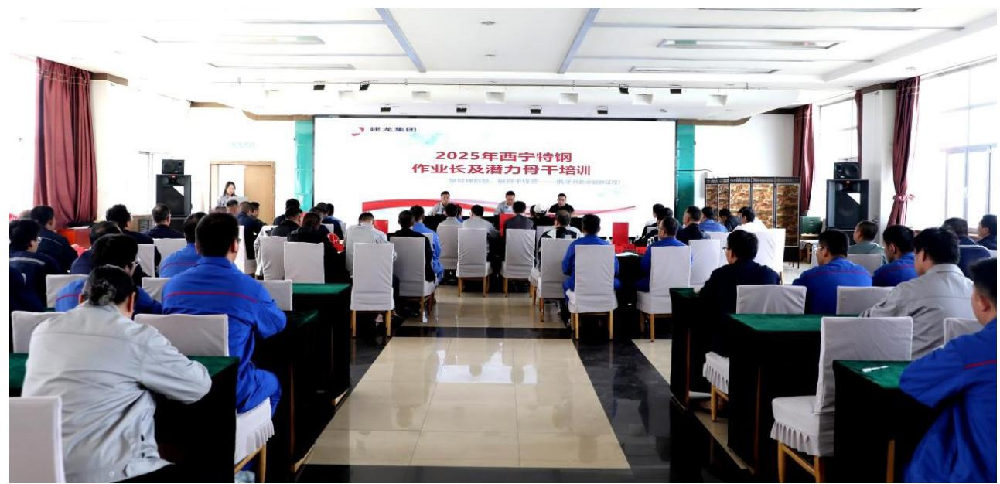

text_image

建龙集团
2025年西宁特钢
作业长及潜力骨干培训

公司举办作业长及潜力骨于培训

## 职业健康与安全

西宁特钢始终将员工职业健康与安全生产置于核心位置，严格遵循《中华人民共和国安全生产法》《中华人民共和国职业病防治法》等法律法规，以完善的制度体系为支撑，以精准的防控措施为抓手，构建预防为主、防治结合、全员参与的职业健康与安全生产管理体系，全力保障员工生命安全与身体健康。

## 员工职业健康

公司严格落实职业健康体检制度，实现职业病体检全覆盖。2025年，需接受职业健康体检的员工均完成体检，特种作业覆盖率达100%，涵盖职业病危害作业人员及特殊工种人员，全面排查职业健康风险。同时，持续开展作业场所职业危害因素监测，及时识别潜在健康隐患，全年未发生职业病案例，职业病发生率为0。公司构建针对性职业健康培训体系，提升员工自我防护意识与能力。通过完善的保障措施，为员工职业健康保驾护航。

<table><tr><td>指标</td><td>单位</td><td>数据</td></tr><tr><td>职业健康培训次数</td><td>场</td><td>7</td></tr><tr><td>职业健康培训时长</td><td>小时</td><td>3,640</td></tr><tr><td>职业健康培训覆盖率</td><td>%</td><td>100</td></tr></table>

## 安全生产管理

公司以《安全生产责任制》《安全生产风险分级管控制度》为核心，构建制度健全、投入充足、防控有效、应急有序的安全生产管理格局。公司立足生产实际，本年度修订多个安全管理制度，重点优化制度可执行性形成覆盖全岗位、全流程的制度体系：同时建立全员安全生产责任制，明确从领导层到基层员工的分级职责通过履职评价逐级监督机制，确保责任层层传导、落地生根，将安全生产理念贯穿生产经营全流程。

公司持续加大安全生产相关投入，覆盖安全设施、保险保障、培训教育等多个领域，为安全生产提供充足的资源支持：同时构建评估、检查、培训三位一体的风险防控体系，通过系统风险评估、常态化隐患排查、针对性安全培训，从源头识别、化解安全风险，提升员工安全防护能力，全方位降低事故发生概率。

## 关键绩效

安全生产投入总金额

2,210 万元

安全隐患上报奖励发放总额

4.59 万元

安全生产培训人均时长

20 小时

安全生产责任险投入金额

118 万元

安全生产培训次数

793 场

安全检查覆盖率

100%

安全生产培训时长

62,700 小时

## 应急管理

公司高度重视应急管理体系建设，通过完善应急预案、常态化开展应急演练、优化应急处置流程，不断提升应对各类安全事故的快速响应能力和协同处置水平。全年模拟熔融金属泄漏、火灾、设备故障、危险化学品泄漏等各类安全事故场景组织开展安全生产应急演练，帮助员工熟悉应急处置流程、掌握应急救援技能，强化团队协同配合能力，确保突发情况发生时能够快速响应、科学处置。

## 案例

## 安全生产月主题活动强化应急意识，凝聚安全共识

2025年6月，公司以全国第24个安全生产月为契机，围绕“人人讲安全、个个会应急查找身边安全隐患”主题开展系列活动。各单位通过悬挂宣传横幅、摆放安全展板、班前安全喊话、班组安全会议等形式普及安全知识：安全管理部组织炼铁厂、炼钢厂等多部门130余人举行安全宣誓，承诺严守安全底线、落实主体责任，宣誓后相关人员在安全誓词上签字确认。活动浓厚了安全生产氛围，强化了员工应急防范意识与责任担当，为筑牢应急管理防线奠定坚实基础。

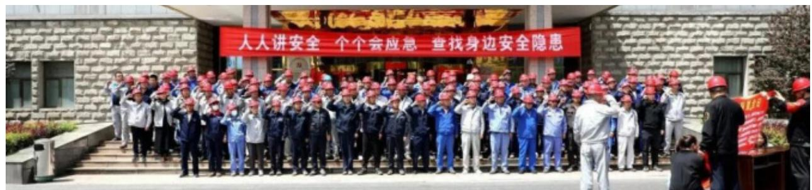

text_image

人人讲安全 个个会应急 查找身边安全隐患

安全生产月活动

## 关键绩效

安全生产应急演练次数

90 场

工伤率

2.32‰

因工死亡人数

0 人

安全生产应急演练参与人次

1,100 人次

百万工时伤害率

1.1447

工伤保险投入金额

308 万元

安全事故发生数

9 次

因工伤损失工作日数

533 天

## 社会贡献与乡村振兴

西宁特钢秉持责任担当的核心价值观，将履行社会责任、助力共同发展作为企业可持续发展的重要使命。我们深刻践行取之于社会、用之于社会的理念，在稳健经营的同时，积极投身社会公益、深化社区融合、推进乡村振兴，以实际行动回应利益相关方的殷切期望，为地方经济社会高质量发展注入持久动力，书写企业与社会和谐共生的新篇章。

## 社会贡献

西宁特钢始终将自身发展融入地方发展大局，以回馈社会、服务民生为导向，聚焦群众急难愁盼问题，搭建常态化公益服务平台，推动公益行动从集中开展向常态长效转变。我们依托党员、团员志愿者队伍，常态化开展便民服务、公益帮扶、文明共建等活动，覆盖敬老助残、民生保障、社会公益等多个领域：同时立足企业区位特点，在高考护航、社区服务等关键场景主动担当，以精准化、接地气的实践举措，将企业温暖传递到群众身边，持续增进社区福祉，强化与周边社区的共生共荣关系，彰显特钢企业的社会温度与责任担当。

natural_image

Illustration of a red outdoor scene with a bicycle, tree, and car, set against a pink mountainous background (no text or symbols)

## 案例 高考护航显担当，公益坚守暖学子

2025年6月，高考期间，西宁特钢延续年度公益重点，为毗邻的二十一中考点学子保驾护航。公司封闭紧邻考点的东大门杜绝通行噪音，在西大门门卫处设置榜单打印机，方便考生即时查询打印；同时在考点对面搭建爱心服务站，提供休息区、热水及卫生间等便民服务，以制度化举措与细节关怀，为考生营造宁静应考环境，为陪考家长送去慰藉，彰显企业公益长效坚守。

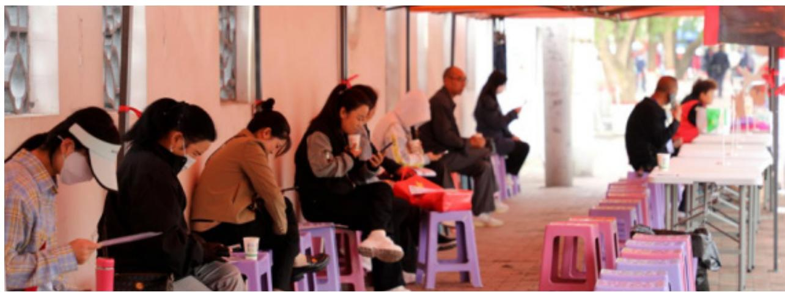

natural_image

Group of people sitting at tables outdoors under bright sunlight, wearing masks and uniforms (no visible text or symbols)

公司搭建爱心服务站

## 案例 学雷锋志愿服务，便民关爱惠民生

2025年3月，第62个学雷锋纪念日之际，西宁特钢党委联合多家单位在五六广场启动大型志愿服务活动。80 余名党员、团员志愿者开设便民服务专区，提供磨剪子菜刀、修家电等服务；联动金融、医护力量开展防诈骗科普与健康体检。志愿者还走进周边小区，为退休职工、空巢老人等提供敬老助残服务，并建立持续关怀机制，让公益服务从集中开展延伸至常态关爱。

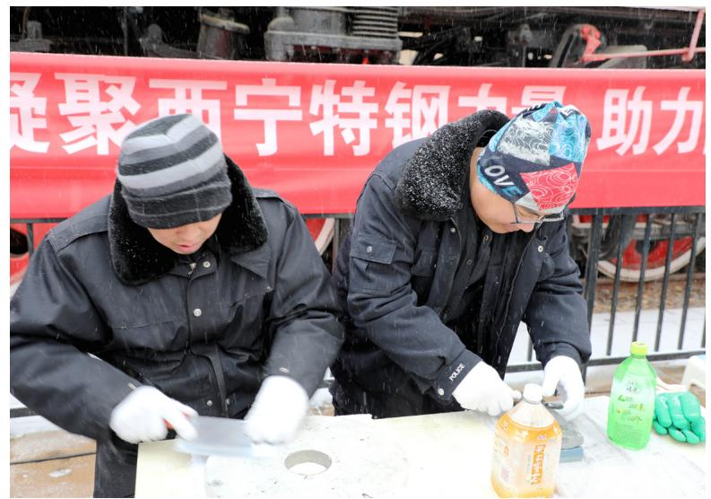

text_image

凝聚西宁特钢力量 助力

开展志愿活动

## 报告期内

员工志愿者人数

80 人

社会公益活动次数

3 次

社会公益活动总时长

12 小时

## 乡村振兴

西宁特钢立足青海本地乡村发展实际，以精准帮扶，协同发展为原则，构建党建引领，结对共建，需求对接的帮扶体系。我们聚焦联点村的实际需求，通过走访慰问、物资支持、结对帮扶等多样化举措，助力解决村民生产生活中的实际困难；深化企村共建机制，在产业帮扶、民生改善、情感联结等方面持续发力推动形成企业助力、乡村受益、双向共赢的良好局面，以企业担当为青海乡村的产业兴旺、民生改善、乡风文明注入坚实力量，为巩固拓展脱贫攻坚成果、推进乡村全面振兴贡献特钢智慧与力量。

## 关键绩效

乡村振兴项目惠及群体人数

643 人

乡村振兴相关的投入总金额

3.9 万元人民币

natural_image

Illustration of four people interacting with a plant, no text or symbols present

## 案例

## 西宁特钢开展联点村结对帮扶慰问活动

2025年1月，西宁特钢党委副书记、工会主席、副总经理吴海峰赴公司联点村开展结对帮扶慰问活动。他先后与果洛州玛多县扎陵湖乡勒那村、乐都茶龙村书记沟通交流，聚焦乡村振兴、村民实际困难与迫切需求：在帮扶对象李卓麻介家中，送上慰问物资，关切其身体健康，详细了解生活难题并叮嘱常联系、结好“两家亲”。活动践行公司乡村振兴“双帮”精神，深化企村协作，以实际行动落实乡村振兴责任，为村民生活改善注入企业力量。

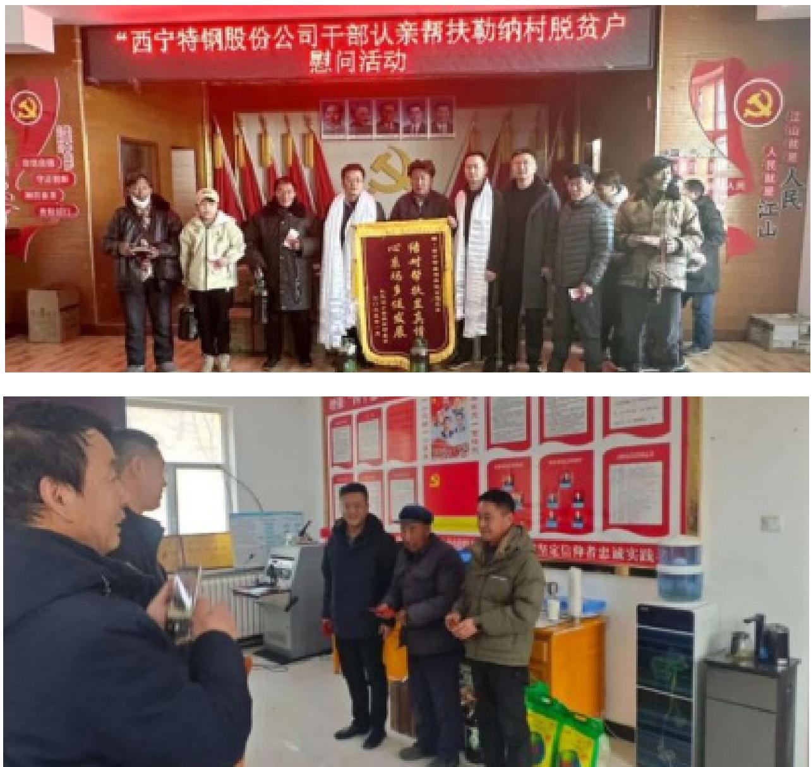  
慰问活动现场

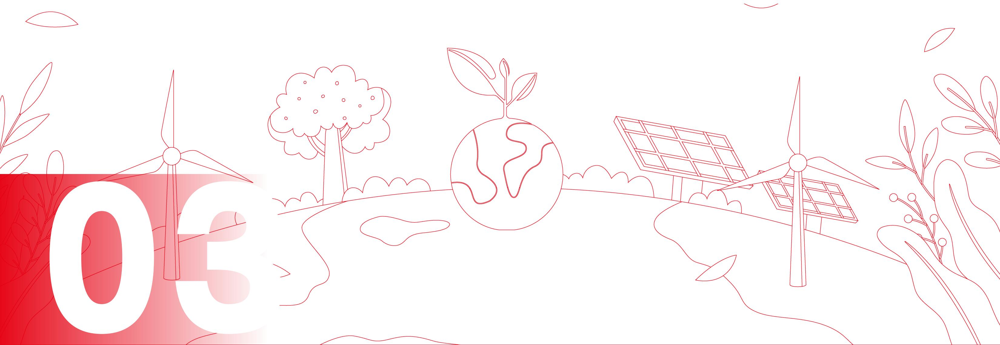

natural_image

Line art illustration of renewable energy sources including wind turbines, solar panels, and a plant (no text or symbols)

## 环境为要

## 绘绿色之图

应对气候变化 能源利用  
水资源利用 环境合规管理  
污染物排放 废弃物处理  
循环经济

西宁特钢将环境治理与绿色发展深度嵌入企业战略规划、生产运营、技术革新全链条，以系统性举措推动特钢产业绿色转型升级。公司构建起决策层统筹引领、管理层协同推进、执行层落地见效的全层级环境管理组织体系，健全覆盖低碳发展、能源管理、污染防治、风险防控、应急处置等各领域的制度规范，以重大节能降碳技改项目为抓手，以技术创新为核心驱动，以合规运营为刚性底线，持续深化全流程、全要素环境治理，稳步提升资源能源利用效率，严控各类污染物排放，全力打造安全高效、低碳循环环境友好的绿色制造体系，以实际行动践行钢铁企业的生态环保责任

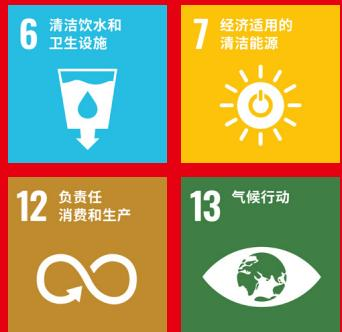

## 应对气候变化

## 治理

为积极响应国家“双碳”战略目标，主动应对全球气候变化带来的机遇与挑战，公司将绿色低碳发展深度融入经营管理全流程，搭建系统化的低碳治理与管理体系。公司设立低碳管理委员会及专项工作小组，制定《碳排放小组成员职责》等系列制度文件，清晰界定各部门碳排放管理权责边界，为全公司低碳工作的规范化开展筑牢制度根基。2025年，公司全面完成碳排放核算与总量核查工作，精准摸清碳排放底数同步完成碳达峰、碳中和专项规划编制，结合公司产能规划与能源介质使用现状，明确碳达峰关键时间节点，制定碳中和目标落地的全流程管控措施与实施方案，为公司持续推进绿色低碳转型、如期实现“双碳”目标奠定了坚实的战略与实践基础。

## 战略

影响、风险和机遇分析及应对措施

<table><tr><td colspan="2">风险名称</td><td>具体描述</td><td>影响时间</td><td>应对措施</td></tr><tr><td>物理风险</td><td>极端天气</td><td>极端高温、低温、强降雨等气候事件增多,可能导致生产效率降低、部分产线停产,从而对运营效率和经营成本产生不利影响</td><td>中期</td><td>将气候相关影响与潜在风险全面纳入生产运行全流程与经营管理统筹规划,深度融合现有安全生产、环境管理与应急管理体系,系统性提升生产运营韧性与抗风险能力</td></tr><tr><td rowspan="2">转型风险</td><td>能源结构调整</td><td>低碳转型背景下,设备更新和用能方式调整可能带来阶段性资本性投入和运营成本上升,对成本管控和投资安排提出更高要求</td><td>中期</td><td>健全能源管理体系建设,稳步推进新能源与清洁能源设备规模化应用,持续优化公司用能结构,全面提升能源利用效率</td></tr><tr><td>政策与合规要求</td><td>节能减排和低碳发展政策趋严,可能增加合规管理成本和技术改造投入,对企业经营成本和管理资源配置形成压力</td><td>中期</td><td>持续完善节能降碳相关管理制度和运行机制,提升对政策变化的响应能力和合规管理水平</td></tr></table>

<table><tr><td>机遇名称</td><td>具体描述</td><td>影响时间</td><td>应对措施</td></tr><tr><td>气候变化带来的清洁能源应用机遇</td><td>清洁能源应用有助于降低长期能源使用成本,减少化石能源依赖,改善能源费用结构和运行成本稳定性</td><td>中、长期</td><td>积极探索清洁能源应用场景,持续提升清洁能源利用效率,不断增强清洁能源供给能力</td></tr><tr><td>绿色低碳转型带来的发展机遇</td><td>绿色低碳转型有助于提升公司资源利用效率和资产运营质量,增强综合竞争力,从中长期改善经营质量和可持续盈利能力</td><td>中、长期</td><td>将应对气候变化要求融入绿色工厂建设和相关专项工作,推动低碳理念在规划、建设和运营中落实</td></tr><tr><td>员工低碳意识提升带来的管理协同效应</td><td>员工节能降碳意识提升,有助于降低日常运行中的能源浪费和管理摩擦成本,改善整体运营效率</td><td>短期</td><td>结合节能宣传周、低碳日等活动,持续开展节能降碳宣传和培训,夯实战略实施基础</td></tr></table>

## 案例 深化工业余能综合利用，推进节能降碳重点项目建设

2025年，为系统性降低温室气体排放、深化工业余能循环利用，公司投建65MW亚临界节能降碳绿色环保综合再利用（余热余能）发电项目。项目新建1×226t/h亚临界燃气锅炉、1×65MW亚临界汽轮发电机组及配套附属设施，以厂区回收的高炉煤气为燃料实现资源高效转化发电。该项目不仅推动公司钢铁生产工艺水平提档升级，有效降低单位产品能耗、物耗与污染物排放，更实现显著的节能降碳效益。该项目设计年发电量达 47,963 万千瓦时，年节能量 58,947 吨标准煤，相应减少二氧化碳排放 257,369 吨。

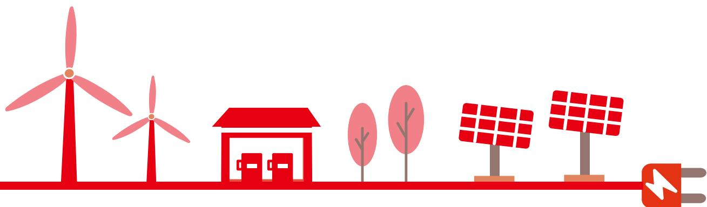

natural_image

Illustration of a renewable energy infrastructure with wind turbines, solar panels, and power plug (no text or symbols)

## 影响、风险和机遇管理

为健全气候相关风险管理长效机制，公司将气候变化所涉影响、风险与机遇，全面纳入整体经营管理体系与风险防控体系。结合钢铁行业长流程连续化生产、高载能属性突出、资产密集度高、产业链联动性强的核心行业特性，公司针对气候变化可能对冶金装备与资产运行、全流程生产组织、工业能源介质保障、碳排放管控与环境安全等核心领域产生的各类影响，开展常态化、持续性的识别评估与全流程管理。相关管理要求与公司年度经营计划、环境管理、应急管理及重点专项工作全面对接、深度融合，切实保障气候相关因素在公司决策层与执行层得到全面关注、有效回应与闭环落实。

在具体管理实施环节，公司通过政策深度研判、内部统筹调度、专项分析评估等工作路径，精准识别气候变化衍生的潜在风险与发展机遇，并结合不同事项的风险特征、影响周期，实施差异化分类管理。其中，针对可能影响钢铁全流程安全稳定运行与连续化生产的气候相关风险，公司将其纳入既定风险防控与应急管理机制，实施一体化统筹应对；针对与绿色低碳转型、发展模式优化相关的气候机遇，公司在发展规划编制与专项方案制定过程中予以系统考量、统筹布局，推动相关机遇切实转化为具体的管理举措与落地实践。

## 指标与目标

报告期内，公司严格遵循《企业温室气体排放核查技术指南钢铁行业（CETS-VG-03.01-V01-2024）》《企业温室气体排放核算与报告指南钢铁行业（CETS-AG-03.01-V01-2024）》要求，开展温室气体排放主动盘查工作，并按照管理规范在全国碳市场管理平台完成月度数据存证，积极配合并接受第三方温室气体核查，完整提供核算所需数据资料、配合完成计量器具现场勘查等全流程工作，最终顺利完成核查并取得正式核查报告。

<table><tr><td>指标名称</td><td>单位</td><td>2025年数据</td></tr><tr><td>温室气体范围1排放量</td><td>万吨二氧化碳当量</td><td>297.82</td></tr><tr><td>温室气体范围2排放量</td><td>万吨二氧化碳当量</td><td>49.01</td></tr><tr><td>温室气体排放总量(范围1+范围2)</td><td>万吨二氧化碳当量</td><td>346.83</td></tr></table>

## 应对气候变化管理目标

## 能源利用

公司遵循《中华人民共和国能源法》《中华人民共和国节约能源法》等法律法规的要求，制定并发布《能源管理办法》《西宁特钢重点用能设备能效管理制度》等能源管理制度，构建起覆盖全流程、全层级的能源管理体系。总经理为能源管理委员会的最高负责人。公司能源管理体系通过常态化、规范化、长效化的运行，有力保障了公司能源管控与全员节能行动的全面落地，为公司持续提升能源利用效率、系统性降低能源消耗筑牢了管理根基。

公司能源管理架构

<table><tr><td>层级</td><td>部门</td><td>相应职责</td></tr><tr><td>决策层</td><td>能源管理委员会</td><td>1、制定公司能源战略和中长期能源方针2、审议并督导公司能源制度的贯彻与落实3、审议能源中长期计划、年度计划和年度总结4、审议公司节能方案,审定和部署能源重大项目,督导各单位能源工作的执行绩效等</td></tr><tr><td>管理层</td><td>能源中心及其他协同部门</td><td>1、兼具能源生产、能源管理双重职能,是能源管理的归口单位2、负责公司能源计划管理和能源实绩管理,制订能耗指标及考核3、负责公司能源运行管理及能源技术管理4、负责公司能耗管理和节能新技术新工艺的推广5、负责公司能源介质的系统安全专业管理6、负责编制和调整各类能源介质的能源平衡计划,并组织实施7、负责能源计量管理、能源预算管理、能源设备管理等</td></tr><tr><td>执行层</td><td>各生产厂</td><td>1、负责贯彻执行公司的各项能源管理制度、标准和规范2、负责结合生产工艺、耗能设备、操作水平等具体情况,制定合理的节能措施,并实施3、负责对不合理用能等违反能源管理规章制度的现象进行整顿和治理4、负责对公司规定的能源消耗定额指标进行分解细化,下达各岗位能源消耗定额,并考核到岗位5、负责对主要耗能设备进行管理和维护,保证设备在低耗能状态下运行6、负责按能源介质供需计划实施用能,确保本辖区用能安全可靠,直接接受并执行能源中心调度指令7、负责向能源中心及时、如实反馈生产、设备运行、检修等相关信息和生产消耗的能源介质用量数据</td></tr></table>

## 公司能源管理举措

## 能源计划管理

能源平衡计划是公司能源管理体系与生产经营计划的核心组成部分。该计划结合公司年度、月度生产经营计划，通过科学编制、统筹调配与闭环执行，有效保障生产任务按期落地、主体设备安全稳定运行，最大化提升二次能源综合利用效率。

## 能源实绩管理

公司能源实绩管理是评价企业能源生产运营能力、能源技术管理水平的关键抓手与核心评判依据，核心工作内容包括能源全流程日常管理、能源供需计划科学编制、能源生产消耗动态分析与优化跟踪等。

## 公司节能措施

公司针对高耗能设备占比偏高、能源利用效率不足的情况，对电动机、潜水泵、变压器及照明灯具等重点用能设备实施全生命周期节能管理，全面提升能源利用效率，降低生产能耗成本。

## 管理原则

## 能效准入原则

严格执行能效准入门槛，禁止采购、使用能效低于准入水平(3级能效)的产品设备。

## 优先升级原则

新建、改扩建项目及技改项目优先选用能效先进水平（1级能效）的产品设备，现有设备逐步升级至节能水平（2级能效）及以上。

## 责任落实原则

建立“谁使用、谁管理、谁负责”的节能责任体系，将节能指标纳入日常管理范围。

## 具体措施

组织开展能效检查与诊断，并对人员开展节能培训，内容包括能效管理制度、设备节能技术等

对运行负荷率长期低于 60% 的电机实施节能改造或更换

每月开展电机润滑、清洁检查，每季度进行绝缘检测，确保电机在高效区间运行

对能效低于准入水平的老旧电机，制定三年更新改造计划，优先采用 YE5 等系列高效电机替代  
对运行超8年、能效下降15%以上或维修费用累计超设备原值50%的潜水泵，在当年内完成淘汰更换  
厂房车间照明采用分区控制，各区域杜绝“长明灯”  
办公区域、走廊等场所安装声控、光控或时控智能控制装置  
每季度清洁灯具表面及灯罩，保障照明效率不低于初始值的 90%  
合理分配负荷，确保变压器负载率维持在 60%-80% 的高效区间  
每年开展变压器油质检测、绝缘试验，保障设备高效运行  
新增照明区域须同步安装智能控制系统，节能率不低于 30%

## 节能改造目标

2027年底前，完成风机、水泵类负载电机变频调速装置加装工作，加装比例不低干60%，改造完成后开展能效测试，确保节能率不低于15%

2027 年底前，完成 80% 非 LED 灯具的更换工作

## 案例

## 高效泵组改造，提升运行能效

2025年4月，公司炼钢厂机械泵改造项目正式投运。项目通过淘汰低效蒸汽泵，优化升级为机械泵进一步提升系统运行效率与稳定性，降低能耗与运维成本，为炼钢厂绿色高效生产提供有力支撑。改造后，每年可节约能源2.989吨标煤。

## 案例 多措并举节能降耗，全员参与提质增效

根据 2025 年全国节能宣传周相关要求，公司于 6 月以 “节能增效，焕‘新’引领” 为主题，组织全员开展节能宣传与实践活动。活动通过班前班后会宣讲、悬挂横幅、张贴节能标语等形式广泛宣传有效提升全员节能意识，并通过缩短设备空转时间，按季节分月管控路灯，推行随手关灯等举措，E均电耗降低 5,000kWh，节能工作取得明显成效。

## 案例 余热高效回收利用，提升能源利用效率

2025年，公司通过烧结环冷烟气再循环利用、转炉烟道余热回收、精棒线加热炉汽化余热回收及连轧加热炉汽化余热回收等关键节能措施，实现余热回收量29.069吨标准煤，持续提升能源综合利用效率，降低生产能耗。

## 案例 优化运输模式，降低能源消耗

2025年，生产部通过优化运输方式，以连铸坏汽运替代铁运，有效缩短运输距离，提升汽运与铁运协同效率，降低燃油消耗，全年实现创效97万元。

natural_image

Illustration of two people interacting with a timeline and documents, symbolizing business or data workflow (no text present)

<table><tr><td>类别</td><td>指标名称</td><td>单位</td><td>2025年数据</td></tr><tr><td rowspan="11">能源使用</td><td>直接能源消耗量</td><td>吨标煤</td><td>890,650</td></tr><tr><td>其中:煤炭消耗量</td><td>吨</td><td>275,818.64</td></tr><tr><td>焦炭消耗量</td><td>吨</td><td>675,802.39</td></tr><tr><td>汽油消耗量</td><td>吨</td><td>362.60</td></tr><tr><td>柴油消耗量</td><td>吨</td><td>783.71</td></tr><tr><td>天然气消耗量</td><td>万立方米</td><td>3,481.95</td></tr><tr><td>润滑油消耗量</td><td>吨</td><td>119.38</td></tr><tr><td>间接能源消耗量</td><td>吨标煤</td><td>112,256</td></tr><tr><td>其中:外购用电量</td><td>万千瓦时</td><td>91,339.19</td></tr><tr><td>能源消费总量</td><td>吨标煤</td><td>1,002,906</td></tr><tr><td>单位营收综合能耗</td><td>吨标煤/万元营收</td><td>1.69</td></tr></table>

## 水资源利用

公司严格遵循《中华人民共和国水法》《取水许可和水资源费征收管理条例》《节约用水条例》等国家法律法规要求，制定《水系统管理细则》《关于公司各单位生产补水使用管理制度》等内部制度，建立健全水资源管理体系，对公司水系统实施全流程规范化管理。通过明确管理职责、优化业务流程、统一用水标准与使用规范，公司有效保障水系统安全稳定运行，持续提升水资源利用效率，降低水资源消耗，推动水资源集约节约与绿色可持续发展。

## 公司水资源管理架构

## 能源中心

负责用水计划、平衡、调度；制定各类水系统运行及检修供水方案；指导、检查节水措施与水处理药剂投加；监督水系统重复利用率、浓缩倍率；负责用水结算。

## 技术质量中心

负责水质、水处理药剂检测；保证水质检验原始记录真实、准确、完整。

## 供应部

负责水处理药剂采购；协调生产厂与药剂承包商沟通；办理药剂承包费用结算。

## 各生产厂

负责辖区水系统设备日常点检与维护；上报药剂投加需求；监督药剂投加情况及辖区水质；采集水样送检：服从水系统应急统一调度。

## 案例 深化节水管控，实现水资源高效利用

2025年，公司持续深化水资源精细化管理，通过实施除盐水站超滤反渗透设备功能恢复、强化节水日常管控等系列措施，实现水资源高效利用。全年吨钢新水消耗降至2.98立方米/吨，同比下降4.79%节水成效显著，绿色低碳发展水平稳步提升。

## 案例 以主题宣传为抓手，推动水资源可持续管理

2025年3月，公司积极响应世界水日“冰川保护”全球主题与“推动水利高质量发展，保障我国水安全”中国水周主题，以“节水优先水韵青海”为特色主题开展全员水资源保护宣贯活动，全面强化全员节水护水意识，夯实公司可持续水资源管理的群众基础。

<table><tr><td>指标名称</td><td>单位</td><td>2025年数据</td></tr><tr><td>总取水量</td><td>吨</td><td>4,627,113</td></tr><tr><td>重复利用水量</td><td>吨</td><td>209,346,189</td></tr><tr><td>总用水量</td><td>吨</td><td>213,973,302</td></tr><tr><td>水资源重复利用率</td><td>%</td><td>97.84</td></tr><tr><td>总耗水量</td><td>吨</td><td>4,071,859</td></tr><tr><td>水资源使用强度</td><td>吨/万元营收</td><td>6.87</td></tr></table>

## 水资源利用管理目标

公司 2025 年度吨钢水耗为

2.98 吨

计划2026年吨钢水耗降低至

2.57 吨

## 环境合规管理

西宁特钢始终将环境合规管理贯穿于环境治理全流程，严格遵守《中华人民共和国环境保护法》《中华人民共和国大气污染防治法》《中华人民共和国环境影响评价法》等国家法律法规、行业监管标准及属地生态环境管理要求，构建起权责清晰、制度健全、流程闭环、管控到位、响应迅速的全链条环境合规管理体系。公司以环境保护管理委员会为核心，搭建决策层、管理层、执行层三级联动的环境管理组织架构，健全完善覆盖环保管控、风险防控、应急处置等全维度的制度体系，常态化开展环境因素识别评价、合规性审查与环保专项培训，持续深化环境风险分级管控与隐患排查治理，规范突发环境事件应急预案管理与应急联动机制。

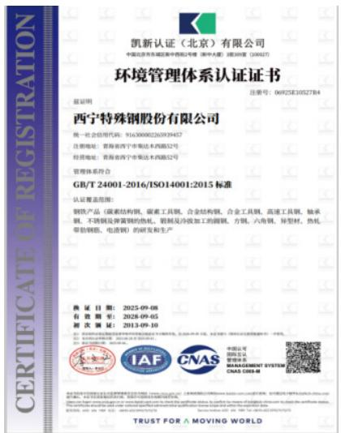

text_image

凯新认证（北京）有限公司
中国北京市东城区西中街9号院（南中大厦）第309室（2008）27
环境管理体系认证证书
注册号：06925E10527B4
兹证明
西宁特殊钢股份有限公司
统一社会信用代码：91630000226593457
注册地址：青海省西宁市柴达木西路52号
经营地址：青海省西宁市柴达木西路52号
管理体系符合
GB/T 24001-2016/ISO14001:2015标准
认证覆盖范围：
钢铁产品（碳素结构钢、碳素工具钢、合金结构钢、合金工具钢、高速工具钢、轴承钢、不锈钢及弹簧钢的热轧、锻制及冷镦加工的圆钢，方钢、六角钢、异型材、热轧带钢筋、电渣钢）的研发和生产
换证日期：2025-09-08
有效期至：2028-09-05
批次编号：2013-09-10
IAF
GNAS
中国证券报
MANGEMENT SYSTEM
CNAS COH-M
TRUST FOR A MOVING WORLD

公司环境管理体系认证证书

公司环境管理架构

<table><tr><td>层级</td><td>部门</td><td>相应职责</td></tr><tr><td>决策层</td><td>环境保护管理委员会</td><td>环境保护管理委员会由公司总经理、常务副总经理等人员组成。主要负责:1、宣贯环保法规政策,制定完善公司环保管理制度,开展全流程合规管控。2、统筹环保顶层规划、年度计划与目标管理,推动全层级环保工作落地。3、跟踪行业先进环保技术,把关治理方案与技改项目,监督环保设施运行,落实污染治理要求。4、协调处置重大环境问题,完善应急预案并组织演练,全面防控环境风险。</td></tr><tr><td>管理层</td><td>环境保护委员会办公室及环保相关部门</td><td>环境保护委员会办公室设在装备工程部。主要负责:1、落实公司环境保护委员会工作部署,负责环境保护委员会的日常工作。2、负责公司环保管理体系建立、保持、持续改进与考核。3、开展污染源、环境因素识别管控,负责建设项目环保手续办理及“三同时”执行情况审查。4、负责公司环保工作监督考核,督查各单位环保计划落地与职工环保教育培训效果。5、负责内外部环保工作协调,指导基层环保业务,协调二级单位环境治理工作。</td></tr><tr><td>执行层</td><td>各生产、运营单位</td><td>1、贯彻落实国家环保法律法规、政策及标准,审定环保规章制度与责任制,审核环保相关计划、规范及总结。2、开展污染源调查,编制审核环保及清洁生产工作计划,按时上报环境工作相关报表。3、严控各类污染物排放,完成公司下达的排放控制指标;开展设备巡检,防范环境污染事件。4、负责环保设施运行管理,保障其与生产设备同步运行;规范危险废物全流程管理及登记。5、调查处理污染事故,制定并督导落实防范整改措施,按协议落实环境管理与治理日常工作。</td></tr></table>

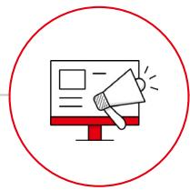  
通过西宁特钢信息网站平台宣传环保知识

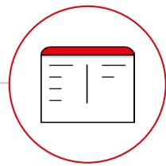  
通过展板、横幅及发送环保知识手册进行环保公益知识宣传

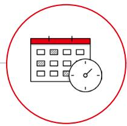  
通过各分厂宣传栏进行环保知识宣传

环保宣传举措

<table><tr><td>指标名称</td><td>单位</td><td>2025年数据</td></tr><tr><td>环保总投入</td><td>万元</td><td>11,122.90</td></tr><tr><td>环保总投入占营业收入比例</td><td>%</td><td>1.88</td></tr></table>

## 案例 强化环境管理培训 , 筑牢绿色发展根基

2025年，公司锚定“强化合规意识、提升实操能力、筑牢环保防线”核心目标，制定并落地年度环境管理培训计划。结合最新环保法规要求，公司采用“线上+线下”融合模式，通过典型违法案例深度剖析与核心规范标准系统宣贯，构建起全员覆盖、内容精准、成效扎实的培训体系，为公司绿色可持续发展筑牢坚实根基。

## 突发环境事件应急管理

为保障企业、社会及职工生命财产安全，防范突发环境污染事件，确保事故发生后能够迅速、有效开展处置工作，公司结合实际情况，依据《中华人民共和国环境保护法》《中华人民共和国安全生产法》《突发环境事件应急预案管理暂行办法》等相关法律法规，以及《危险化学品重大危险源辨识》(G18218-2018）要求，对现有环境风险源开展辨识工作。

在此基础上，公司编制完成《西宁特殊钢股份有限公司突发环境事件应急预案》《西宁特殊钢股份有限公司环境风险评估报告》《西宁特殊钢股份有限公司环境应急物资调查报告》，并已在西宁市生态环境局完成备案，同时与地方政府部门建立应急响应联动机制。

## 公司突发环境事件应急管理架构

公司应急指挥中心是突发环境事件应急管理工作的最高领导机构，公司应急机构由指挥管理系统、救援队伍、技术支持系统和相关保障系统组成。

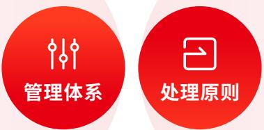

公司突发环境事件应急预案是在各生产单位预案的基础上制定，当各生产单位预案不能处理事故时，启动公司突发环境事件应急预案，事故超出公司处理能力时，请求启动地方突发环境事件应急预案。

秉持早预防、早发现、早报告、早处置方针，聚焦重点设备与岗位实施精准防控；完善预警预报与跨部门沟通机制，持续提升全员环保生产及自救能力。

开展预案审核与实战演练，每年结合管理评审动态修订预案：演练后严格执行复盘机制，落实改进措施，确保预案的科学性与有效性。

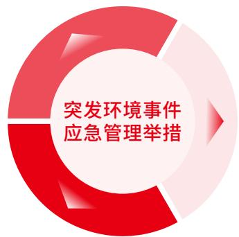

flowchart

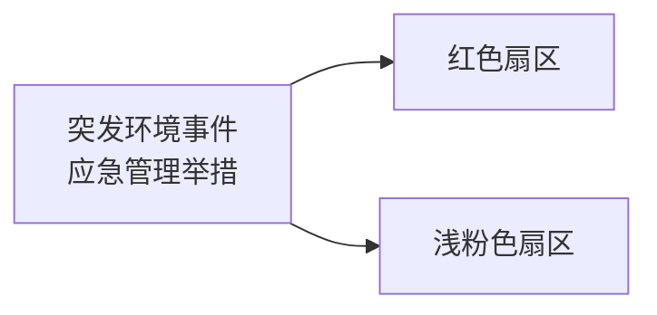
```mermaid
graph LR
  A["突发环境事件\n应急管理举措"] --> B["红色扇区"]
  A --> C["浅粉色扇区"]
```

突发情况实行人员撤离优先原则，同步启动环境监测联动机制，对大气水质等关键指标实时追踪，以精准数据支撑应急指挥决策，确保处置科学高效。

建立应急设备设施全生命周期管理体系，确保装备完好：组建青年骨干救援队伍，通过年度常态化培训，打造业务精湛的应急攻坚力量。

## 关键绩效

报告期内，公司未发生任何突发重大环境事件，未因环境事件受到生态环境等有关部门重大行政处罚或被追究刑事责任。

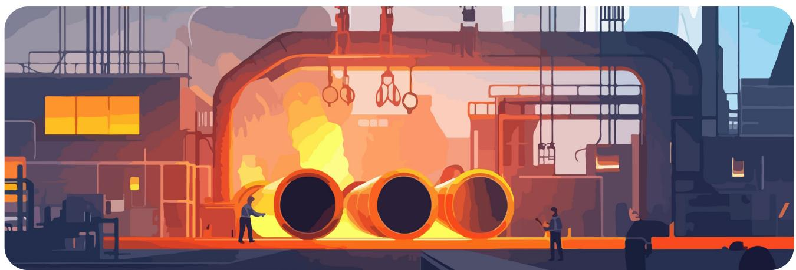

natural_image

Illustration of a steel mill with molten metal pouring and workers observing (no text or symbols)

## 污染物排放

公司始终将生态环境保护与污染治理作为可持续发展的核心底线，严格以《中华人民共和国水污染防治法》《中华人民共和国大气污染防治法》等国家法律法规及行业管控标准为根本遵循，构建覆盖源头防控、过程管控、末端治理的全链条污染物排放治理体系，系统性推进污染减排与环境风险防控，以合规经营筑牢绿色发展根基。

## 废气处理方式

公司废气采用布袋除尘、静电除尘、半干法/湿法脱硫、SCR脱硝等工艺治理，各项污染物均实现稳定达标排放。

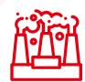

## 废水处理方式

公司采用先进的物化结合处理工艺，通过粗滤、辐流沉淀、化学高效絮凝沉淀、均质过滤、超滤、反渗透深度处理及消毒等多道工序，统筹实现废水收集、处理、资源化利用一体化运行，处理后中水循环利用。

<table><tr><td>污染物的种类</td><td>污染物的名称</td><td>年度排放总量</td><td>是否有核定的年度总量(是/否)</td><td>核定的年度排放总量</td><td>超标排放情况</td></tr><tr><td rowspan="5">大气污染物</td><td>废气排放总量</td><td>3,375,631.90(万立方米)</td><td>-</td><td>-</td><td>-</td></tr><tr><td>颗粒物(PM)(有组织排放)</td><td>571.14(吨)</td><td>是</td><td>4,581.11(吨)</td><td>无</td></tr><tr><td>硫氧化物(SOx)</td><td>1,016.43(吨)</td><td>是</td><td>2,516.94(吨)</td><td>无</td></tr><tr><td>氮氧化物( $NO_x$ )</td><td>860.64(吨)</td><td>是</td><td>4,691.17(吨)</td><td>无</td></tr><tr><td>挥发性有机物(VOCs)</td><td>26.98(吨)</td><td>否</td><td>-</td><td>无</td></tr><tr><td rowspan="3">水污染物</td><td>工业废水排放总量</td><td>33,981.62(吨)</td><td>-</td><td>-</td><td>-</td></tr><tr><td>化学需氧量(COD)</td><td>2.80(吨)</td><td>是</td><td>250(吨)</td><td>无</td></tr><tr><td>氨氮( $NH_3-N$ )</td><td>0.17(吨)</td><td>是</td><td>25(吨)</td><td>无</td></tr></table>

## 2025 年投入建设废气减排项目

烧结球团脱硫脱硝及除尘改造项目

煤气精脱硫项目

料棚封闭项目

高炉煤气均压放散回收项目清洁运输等超低排放改造项目

## 关键荣誉

公司于 2019 年获评青海省省级“绿色工厂”称号，此后每年常态化开展绿色工厂年度审查工作，持续保障绿色制造体系合规稳定运行。

## 在报告期内

公司污染物排放未对员工、当地社区居民等群体产生重大影响公司未因污染物排放受到重大行政处罚或被追究刑事责任公司环境监测方案和风险管理措施无重大缺陷

## 污染物排放管理目标

污染物排放达标率

100%

natural_image

Illustration of people collaborating around a large screen displaying data, with no visible text or symbols.

## 废弃物处理

公司严格遵循《中华人民共和国固体废物污染环境防治法》《国家危险废物名录》《危险废物转移联单管理办法》《危险废物识别标志设置技术规范》等法律法规及标准要求，制定并发布《公司固体废物管理制度》《公司危险废物管理制度》等专项管理文件。通过健全的制度体系，规范固体废物全流程管理，实现固体废物分类存放、规范收集与合规处置，最大化提升固废资源化回收利用水平，降低生产经营活动对环境的影响；同时对危险废物实施全生命周期闭环管控，严防严控产生、收集、贮存、转移、处置各环节的环境与安全风险，坚决杜绝环境污染事故及安全事故发生。

公司废弃物处理方式

<table><tr><td colspan="2">废弃物种类</td><td>处理方式</td></tr><tr><td rowspan="2">无害废弃物</td><td>生活垃圾:是指在日常生活中或者为日常生活提供服务的活动中产生固体废物以及法律规定视为生活垃圾的固体废物。主要包括食品垃圾,以及废弃纸张、塑料、废弃日用杂物等日用品垃圾。</td><td>生活垃圾统一存放于分类收集容器内,严格遵循国家及属地生活垃圾分类管理规范要求实施分类投放、分区密闭存放;建立专项管理责任制,设置专人负责生活垃圾的日常巡检、容器运维、分类合规性管控及清运衔接全流程管理。</td></tr><tr><td>一般工业固体废弃物:是指在生产过程中所产生的一般固体废弃物。主要包括冶炼渣、废铁屑、废钢头、氧化铁皮、砂轮沫等。</td><td>需按照公司生产工艺及产生品类,分类存放于符合规范的场所。其中,公司内部回收利用的废弃物,建立完善的产生、处理及利用全流程台账;对外售处置的废弃物,完整留存产生、销售移交等全环节记录台账。所有废弃物处置相关数据,按月度节点完成废弃物综合利用情况汇总表的编制与上报。</td></tr><tr><td rowspan="2">有害废弃物</td><td>有毒有害垃圾:包括有毒有害废弃办公用品、废旧电池、废荧光灯管、废色带、废硒鼓、含油废抹布、有毒有害物质盛装容器、医疗废弃物、过期药品等。</td><td>设置专用存放设施与分类垃圾箱,实行分区分类储存;明确专人负责全流程管理,相关废弃物统一委托具备对应专业资质的机构合规回收处置,严禁任何形式的擅自、随意处置行为。</td></tr><tr><td>危险废物:是指列入《国家危险废物名录》或者根据国家规定的危险废物鉴别标准和鉴别方法认定的具有危险特性的废物。包括各生产工序产生的废油、总排水处理中心污泥、各废钢电炉冶炼产生的除尘灰、铅酸蓄电池、废旧化学药品等。</td><td>危险废物产生单位、危险废物利用单位建立健全危险废物管理责任制,落实全流程污染防治责任,严防危险废物倾倒、抛洒引发环境污染事故。产废单位负责本单位危废的规范收集、分类、标识、数量统计及出入库台账登记工作。委托有资质的危废处理单位负责公司危险废物的收集、运送、处理以及回收利用工作。</td></tr></table>

## 关键指标

产生的有害废弃物总量

9,399.28 吨

产生的无害废弃物总量

1,169,480.08 吨

产生的有害废弃物密度

0.02 吨 / 万元营收

产生的无害废弃物密度

1.97 吨 / 万元营收

<table><tr><td>报告期内采取的减排措施</td><td>报告期内实现的进展</td></tr><tr><td>优化烧结及高炉原料配料,提高原料利用率</td><td>2025年度较上一年度同期电炉除尘灰危险废物产生量降低2,359.16吨。</td></tr><tr><td>提高厂内物料循环利用</td><td>2025年物料循环量相较于上一年度提高了618,857.57吨。</td></tr><tr><td>通过提高除尘灰在原料中配比及废机油自行利用率,大幅度降低废物向外转移处理</td><td>相较于上一年度,2025年增加了44,054.671吨自行利用量,大幅度减少了向外转移量。</td></tr></table>

natural_image

Illustration of people holding hands with a globe, surrounded by clouds and hearts (no text or symbols)

## 循环经济

公司以循环经济理念为核心，构建全流程资源循环利用体系。通过设立资源综合利用作业区，统筹固废全生命周期管理，对厂区固废按循环价值实施精细化分类，并落地矿渣微粉立磨项目，深耕废旧物资与工业固废回收再加工。同时，公司将循环链条延伸至产业链上游，以废钢作为生产原料，扩大再生资源应用规模持续完善闭环循环产业链。

## 公司废弃物回收分类

## 可回收固体废弃物

是指可通过综合处理回收再循环利用的固废。主要包括纸类、金属、电子元件、塑料、玻璃、煤渣、办公用品及生产产生的具有再次利用价值的固体废物等。

## 不可回收固体废弃物

是指无法通过综合处理回收再循环利用的固废。主要包括腐烂垃圾、厨房垃圾、果壳、花草、工作服、砖瓦陶瓷、渣土、卫生间废纸等。

## 案例

## 废钢再生规模化应用，筑牢循环经济发展根基

公司坚定践行循环经济发展理念，以废钢作为生产原料替代铁矿石，构建“资源-产品-再生资源”的闭环生产模式，从源头提升资源循环利用效率，降低生产全生命周期的环境影响。2025年，公司外采废钢规模达159,749.05吨，以规模化再生资源应用切实推动产业绿色转型，为区域循环经济体系建设注入坚实动能。

## 关键指标

2025年产生的废弃物循环利用量

1,131,706.75 吨

废弃物循环利用比例

96.00%

## 循环经济管理目标

固体废弃物回收率及综合利用率达

100%

指标索引表

<table><tr><td>报告目录</td><td>《上海证券交易所上市公司自律监管指引第14号——可持续发展报告(试行)》 $^{1}$ </td><td>《可持续发展报告标准(GRI Standards)》</td></tr><tr><td>关于本报告</td><td></td><td>2-1, 2-2, 2-3</td></tr><tr><td>董事长致辞</td><td></td><td>2-22, 2-23</td></tr><tr><td>公司概况</td><td></td><td>2-1, 2-6</td></tr><tr><td>ESG管理</td><td>利益相关方沟通、尽职调查</td><td>2-9, 2-12, 2-29, 3-1, 3-2, 3-3</td></tr><tr><td colspan="3">善治为基 筑发展之本</td></tr><tr><td>公司治理</td><td></td><td>2-9, 2-10, 2-19, 2-20</td></tr><tr><td>合规风控</td><td></td><td>2-25, 2-27</td></tr><tr><td>投资者关系管理</td><td></td><td>2-16, 201-1</td></tr><tr><td>反商业贿赂及反贪污</td><td>反商业贿赂及反贪污</td><td>2-26, 205-2</td></tr><tr><td>反不正当竞争</td><td>反不正当竞争</td><td>2-27,</td></tr><tr><td colspan="3">社会为责 谱和谐之章</td></tr><tr><td>创新驱动</td><td>创新驱动</td><td></td></tr><tr><td>产品和服务安全与质量</td><td>产品和服务安全与质量</td><td>416-1, 417-1</td></tr><tr><td>数据安全与客户隐私保护</td><td>数据安全与客户隐私保护</td><td></td></tr><tr><td>供应链安全</td><td>供应链安全</td><td>2-6, 204-1,</td></tr><tr><td>平等对待中小企业</td><td>平等对待中小企业</td><td>2-27,</td></tr><tr><td>员工</td><td>员工</td><td>2-7, 401-1, 401-2, 403-1, 403-2, 403-5, 403-6, 403-9, 404-1, 405-1</td></tr></table>

<table><tr><td>报告目录</td><td>《上海证券交易所上市公司自律监管指引第14号——可持续发展报告(试行)》 $^{1}$ </td><td>《可持续发展报告标准(GRI Standards)》</td></tr><tr><td>社会贡献与乡村振兴</td><td>社会贡献、乡村振兴</td><td>203-1</td></tr><tr><td colspan="3">环境为要 绘绿色之图</td></tr><tr><td>应对气候变化</td><td>应对气候变化</td><td>305-1, 305-2</td></tr><tr><td>能源利用</td><td>能源利用</td><td>302-1, 302-4</td></tr><tr><td>水资源利用</td><td>水资源利用</td><td>303-1, 303-2, 303-3, 303-4, 303-5</td></tr><tr><td>环境合规管理</td><td>环境合规管理</td><td>2-27,</td></tr><tr><td>污染物排放</td><td>污染物排放</td><td>303-2, 305-7</td></tr><tr><td>废弃物处理</td><td>废弃物处理</td><td>306-3, 306-4, 306-5</td></tr><tr><td>循环经济</td><td>循环经济</td><td>301-1, 301-2, 306-4</td></tr></table>

1本报告依据相关指引开展议题识别与披露。结合公司业务特点，生态系统和生物多样性保护、科技伦理议题未单独披露或不适用。

## 关键绩效表

  
关键绩效表 - 治理

<table><tr><td>指标名称</td><td>单位</td><td>2025年</td></tr><tr><td colspan="3">ESG培训</td></tr><tr><td>开展可持续发展培训</td><td>次</td><td>2</td></tr><tr><td>可持续发展培训时长</td><td>小时</td><td>4</td></tr><tr><td>ESG培训高管覆盖率</td><td>%</td><td>100</td></tr><tr><td colspan="3">公司治理</td></tr><tr><td>召开股东会次数</td><td>次</td><td>6</td></tr><tr><td>召开董事会会议次数</td><td>次</td><td>10</td></tr><tr><td>董事出席率</td><td>%</td><td>100</td></tr><tr><td>召开战略与ESG委员会会议</td><td>次</td><td>5</td></tr><tr><td>召开审计委员会会议</td><td>次</td><td>9</td></tr><tr><td>召开提名与薪酬考核委员会会议</td><td>次</td><td>5</td></tr><tr><td colspan="3">合规风控</td></tr><tr><td>已出具内部审计报告</td><td>项</td><td>5</td></tr><tr><td>开展合规培训</td><td>次</td><td>21</td></tr><tr><td colspan="3">投资者关系管理</td></tr><tr><td>披露临时公告</td><td>份</td><td>96</td></tr><tr><td>披露定期报告</td><td>份</td><td>4</td></tr><tr><td>召开业绩说明会</td><td>场</td><td>4</td></tr><tr><td>开展投资者关系活动</td><td>场</td><td>3</td></tr><tr><td>投资者提问回复率</td><td>%</td><td>100</td></tr><tr><td colspan="3">反商业贿赂及反贪污</td></tr><tr><td>贿赂及贪污举报事件数</td><td>件</td><td>0</td></tr></table>

  
关键绩效表 - 环境

<table><tr><td>指标名称</td><td>单位</td><td>2025年</td></tr><tr><td colspan="3">应对气候变化</td></tr><tr><td>温室气体范围1排放量</td><td>万吨二氧化碳当量</td><td>297.82</td></tr><tr><td>温室气体范围2排放量</td><td>万吨二氧化碳当量</td><td>49.01</td></tr><tr><td>温室气体排放总量(范围1+范围2)</td><td>万吨二氧化碳当量</td><td>346.83</td></tr><tr><td colspan="3">能源利用</td></tr><tr><td>直接能源消耗量</td><td>吨标煤</td><td>890,650</td></tr><tr><td>其中:煤炭消耗量</td><td>吨</td><td>275,818.64</td></tr><tr><td>焦炭消耗量</td><td>吨</td><td>675,802.39</td></tr><tr><td>汽油消耗量</td><td>吨</td><td>362.60</td></tr><tr><td>柴油消耗量</td><td>吨</td><td>783.71</td></tr><tr><td>天然气消耗量</td><td>万立方米</td><td>3,481.95</td></tr><tr><td>润滑油消耗量</td><td>吨</td><td>119.38</td></tr><tr><td>间接能源消耗量</td><td>吨标煤</td><td>112,256</td></tr><tr><td>其中:外购用电量</td><td>万千瓦时</td><td>91,339.19</td></tr><tr><td>能源消费总量</td><td>吨标煤</td><td>1,002,906</td></tr><tr><td>单位营收综合能耗</td><td>吨标煤/万元营收</td><td>1.69</td></tr><tr><td colspan="3">水资源利用</td></tr><tr><td>总取水量</td><td>吨</td><td>4,627,113</td></tr><tr><td>重复利用水量</td><td>吨</td><td>209,346,189</td></tr><tr><td>总用水量</td><td>吨</td><td>213,973,302</td></tr><tr><td>水资源重复利用率</td><td>%</td><td>97.84</td></tr><tr><td>总耗水量</td><td>吨</td><td>4,071,859</td></tr><tr><td>水资源使用强度</td><td>吨/万元营收</td><td>6.87</td></tr><tr><td>吨钢水耗</td><td>吨</td><td>2.98</td></tr><tr><td colspan="3">环境合规管理</td></tr><tr><td>环保总投入</td><td>万元</td><td>11,122.90</td></tr><tr><td>环保总投入占营业收入比例</td><td>%</td><td>1.88</td></tr><tr><td colspan="3">污染物排放</td></tr><tr><td>废气排放总量</td><td>万立方米</td><td>3,375,631.90</td></tr><tr><td>颗粒物(PM)(有组织排放)</td><td>吨</td><td>571.14</td></tr><tr><td>硫氧化物(SOx)</td><td>吨</td><td>1,016.43</td></tr><tr><td>氮氧化物(NOx)</td><td>吨</td><td>860.64</td></tr><tr><td>挥发性有机物(VOCs)</td><td>吨</td><td>26.98</td></tr><tr><td>工业废水排放总量</td><td>吨</td><td>33,981.62</td></tr><tr><td>化学需氧量(COD)</td><td>吨</td><td>2.80</td></tr><tr><td>氨氮(NH3-N)</td><td>吨</td><td>0.17</td></tr><tr><td>污染物排放达标率</td><td>%</td><td>100</td></tr><tr><td colspan="3">废弃物处理</td></tr><tr><td>产生的有害废弃物总量</td><td>吨</td><td>9,399.28</td></tr><tr><td>产生的有害废弃物密度</td><td>吨/万元营收</td><td>0.02</td></tr><tr><td>产生的无害废弃物总量</td><td>吨</td><td>1,169,480.08</td></tr><tr><td>产生的无害废弃物密度</td><td>吨/万元营收</td><td>1.97</td></tr><tr><td colspan="3">循环经济</td></tr><tr><td>废弃物循环利用量</td><td>吨</td><td>1,131,706.75</td></tr><tr><td>废弃物循环利用比例</td><td>%</td><td>96.00</td></tr><tr><td>固体废弃物回收率及综合利用率</td><td>%</td><td>100</td></tr></table>

  
关键绩效表 - 社会

<table><tr><td>指标名称</td><td>单位</td><td>2025年</td></tr><tr><td colspan="3">创新驱动</td></tr><tr><td>研发人员总数</td><td>人</td><td>177</td></tr><tr><td>研发人员占比</td><td>%</td><td>4.50</td></tr><tr><td>研发投入总金额</td><td>万元</td><td>24,861.42</td></tr><tr><td>研发投入占总营收比例</td><td>%</td><td>4.20</td></tr><tr><td>有效专利总数</td><td>项</td><td>33</td></tr><tr><td>用于主营业务的发明专利数量</td><td>项</td><td>3</td></tr><tr><td>年度发明专利申请数</td><td>项</td><td>3</td></tr><tr><td>发明专利的有效专利数</td><td>项</td><td>26</td></tr><tr><td>累计主导/参与制定的国家标准总数</td><td>项</td><td>14</td></tr><tr><td>累计主导/参与制定的行业标准总数</td><td>项</td><td>9</td></tr><tr><td>累计主导/参与制定的团体标准总数</td><td>项</td><td>4</td></tr><tr><td>累计主导/参与制定的军用标准总数</td><td>项</td><td>5</td></tr><tr><td colspan="3">产品和服务安全与质量</td></tr><tr><td>产品质量提升培训开展场次</td><td>场</td><td>15</td></tr><tr><td>产品质量提升培训相关员工覆盖率</td><td>%</td><td>96.38</td></tr><tr><td>客户服务能力培训开展场次</td><td>场</td><td>2</td></tr><tr><td>客户服务能力培训参与人员</td><td>人次</td><td>53</td></tr><tr><td colspan="3">数据安全与客户隐私保护</td></tr><tr><td>开展信息安全应急演练次数</td><td>次</td><td>3</td></tr><tr><td>信息安全应急演练参与人次</td><td>人次</td><td>33</td></tr><tr><td colspan="3">供应链安全</td></tr><tr><td>供应商总数</td><td>家</td><td>613</td></tr><tr><td>新增供应商数量</td><td>家</td><td>142</td></tr><tr><td>优秀供应商数量</td><td>家</td><td>231</td></tr><tr><td>合格供应商数量</td><td>家</td><td>248</td></tr><tr><td>约谈供应商数量</td><td>家</td><td>6</td></tr><tr><td>剔除不合格供应商数量</td><td>家</td><td>4</td></tr><tr><td>核心供应商培训次数</td><td>次</td><td>31</td></tr><tr><td>核心供应商培训总时长</td><td>小时</td><td>160</td></tr><tr><td>供应商廉洁承诺签署率</td><td>%</td><td>100</td></tr><tr><td>公司供应商本地化比例</td><td>%</td><td>13</td></tr><tr><td>本地化采购比例</td><td>%</td><td>31</td></tr><tr><td colspan="3">员工结构</td></tr><tr><td>员工总数</td><td>人</td><td>3,931</td></tr><tr><td>男性员工人数</td><td>人</td><td>3,290</td></tr><tr><td>女性员工人数</td><td>人</td><td>641</td></tr><tr><td>30岁以下员工人数</td><td>人</td><td>437</td></tr><tr><td>30至50岁员工人数</td><td>人</td><td>2,851</td></tr><tr><td>50岁以上员工人数</td><td>人</td><td>643</td></tr><tr><td>公司基层员工人数</td><td>人</td><td>3,876</td></tr><tr><td>公司管理层员工人数</td><td>人</td><td>55</td></tr><tr><td>少数民族员工人数</td><td>人</td><td>407</td></tr><tr><td>残疾员工人数</td><td>人</td><td>92</td></tr><tr><td>员工流失率</td><td>%</td><td>3.30</td></tr><tr><td>新进员工数</td><td>人</td><td>148</td></tr><tr><td colspan="3">民主沟通</td></tr><tr><td>职工代表大会次数</td><td>次</td><td>2</td></tr><tr><td>职代会审议通过核心议案</td><td>项</td><td>6</td></tr><tr><td colspan="3">员工关怀</td></tr><tr><td>困难员工帮扶人数</td><td>人</td><td>31</td></tr><tr><td>员工关爱帮扶资金投入</td><td>万元</td><td>26.95</td></tr></table>

<table><tr><td>指标名称</td><td>单位</td><td>2025年</td></tr><tr><td colspan="3">员工培训</td></tr><tr><td>员工培训支出金额</td><td>万元</td><td>17.52</td></tr><tr><td>员工培训总人数</td><td>人</td><td>3,852</td></tr><tr><td>员工培训总时长</td><td>小时</td><td>107,472.50</td></tr><tr><td>员工培训人均时长</td><td>小时</td><td>27.06</td></tr><tr><td>员工培训次数</td><td>次</td><td>1,995</td></tr><tr><td>在岗员工培训覆盖率</td><td>%</td><td>100</td></tr><tr><td colspan="3">职业健康与安全</td></tr><tr><td>职业健康培训次数</td><td>场</td><td>7</td></tr><tr><td>职业健康培训时长</td><td>小时</td><td>3,640</td></tr><tr><td>职业健康培训覆盖率</td><td>%</td><td>100</td></tr><tr><td>安全生产投入总金额</td><td>万元</td><td>2,210</td></tr><tr><td>安全生产责任险投入金额</td><td>万元</td><td>118</td></tr><tr><td>安全检查覆盖率</td><td>%</td><td>100</td></tr><tr><td>安全隐患上报奖励发放总额</td><td>万元</td><td>4.59</td></tr><tr><td>安全生产培训次数</td><td>场</td><td>793</td></tr><tr><td>安全生产培训时长</td><td>小时</td><td>62,700</td></tr><tr><td>安全生产培训人均时长</td><td>小时</td><td>20</td></tr><tr><td>安全生产应急演练次数</td><td>场</td><td>90</td></tr><tr><td>安全生产应急演练参与人次</td><td>人次</td><td>1,100</td></tr><tr><td>安全事故发生数</td><td>次</td><td>9</td></tr><tr><td>工伤率</td><td>‰</td><td>2.32</td></tr><tr><td>百万工时伤害率</td><td>/</td><td>1.1447</td></tr><tr><td>因工伤损失工作日数</td><td>天</td><td>533</td></tr><tr><td>因工死亡人数</td><td>人</td><td>0</td></tr><tr><td>工伤保险投入金额</td><td>万元</td><td>308</td></tr><tr><td colspan="3">社会贡献与乡村振兴</td></tr><tr><td>员工志愿者人数</td><td>人</td><td>80</td></tr><tr><td>社会公益活动次数</td><td>次</td><td>3</td></tr><tr><td>社会公益活动总时长</td><td>小时</td><td>12</td></tr><tr><td>乡村振兴项目惠及群体人数</td><td>人</td><td>643</td></tr><tr><td>乡村振兴相关的投入总金额</td><td>万元</td><td>3.9</td></tr></table>

## 读者反馈表

尊敬的读者：

感谢您阅读《西宁特殊钢股份有限公司2025年度环境、社会和公司治理（ESG）报告》。本报告是公司发布的首份ESG报告，我们始终高度重视各利益相关方的意见与建议，诚邀您对本报告进行客观评价，您的宝贵反馈将帮助我们持续优化ESG信息披露质量、完善可持续发展管理体系、提升ESG治理与实践水平。

## 一、您的身份是：

□ 政府及监管部门

□ 股东及投资者

□ 客户

□ 员工

□ 供应商

□ 行业合作伙伴

□ 社区及公众

□ 其他

## 二、您对本报告的整体评价：

1.您对本报告整体内容的综合评价是：

□ 很好

□ 较好

□ 一般

□ 较差

□ 很差

2.您认为本报告是否全面、充分反映了公司2025年度在环境、社会及治理方面的核心实践与绩效表现

□ 很充分

□ 较充分

□ 一般

□ 较不充分

□ 不充分

3.您认为本报告披露的信息是否清晰、准确、完整，符合信息披露相关监管要求

□ 很高

□ 较高

□ 一般

□ 较低

□ 很低

4. 您认为本报告的结构设计与可读性如何：

□ 很好

□ 较好

□ 一般

□ 较差

□ 很差

## 三、您的意见与建议：

1.您对公司后续ESG管理、可持续发展实践工作，有哪些宝贵的意见与建议？

2.您希望公司在下一年度ESG报告中，重点补充披露哪些方面的内容

## 西宁特钢

Xining Special Steel Co., Ltd.