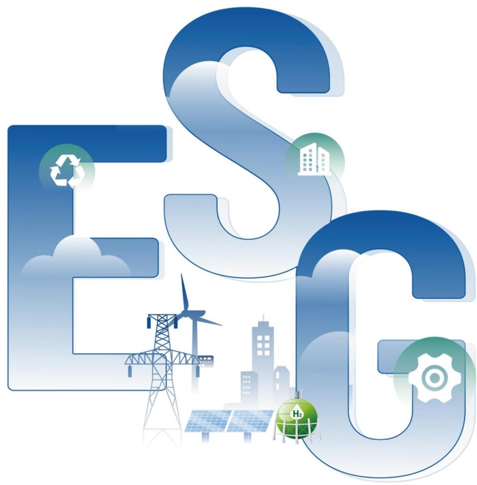

natural_image

Stylized graphic of ESG-related icons including recycling, wind turbine, solar panels, and hydrogen (no text or symbols)

## 2025

## 年度ESG报告

股票代码: 600396

华电辽宁能源发展股份有限公司

2025 年度 ESG 报告

## 目录

## CONTENTS

## 报告前言 1

报告编制说明

报告范围与边界

数据质量与保证

编制依据与标准

报告获取与反馈

## 董事长致辞 3

## 董事会ESG管治声明 5

## 企业概况 7

企业基本信息

企业文化与ESG理念

2025年度ESG核心绩效指标

## 公司治理（G） 11

治理架构与规范运作

诚信合规与监督体系

全面风险管控

党建引领与治理融合

战略创新与项目发展

## 环境保护（E） 23

环境管理理念与体系

应对气候变化与碳管理

资源节约与高效利用

污染防治与生态保护

环境风险防控与应急管理

绿色发展实践与环保公益

## 社会责任（S） 33

利益相关方沟通与管理

能源保供与民生保障

社区共建与公益行动

员工权益保护与关爱

产业工人队伍建设

## 未来ESG发展规划 49

## 读者意见反馈表 51

## 报告前言

本报告以华电辽宁能源发展股份有限公司（以下简称“华电辽能”“公司”“我们”）为唯一报告主体，系统披露2025年度公司在环境（Environmental）、社会（Social）、治理（Governance）三大领域的核心理念、实践行动、绩效成果及改进方向。

报告编制旨在加强与政府监管部门、股东、债权人、员工、社区、合作伙伴等利益相关方的常态化沟通，主动回应社会各界关切，推动企业与自然、社会的可持续共生发展，切实履行中央企业的政治责任、经济责任与社会责任。

## 数据质量与保证

报告所载数据均来源于公司正式统计报表、业务运营文件、财务审计报告及公开披露信息，符合《企业会计准则》《电力工业统计报表制度》等国家法规标准；

公司建立ESG数据收集、审核、校验三级管理体系，各子分公司设兼职数据管理员，本部职能部门交叉复核，确保数据真实可追溯；

## 本报告经公司第九届董事会第二次会议

(2026年4月28日) 审议通过，董事会及全体董事对报告内容的真实性、准确性、完整性承担法律责任，无虚假记载、误导性陈述或重大遗漏。

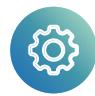

## 报告范围与边界

## 时间范围

核心披露期为2025年1月

1日至2025年12月31日，

为增强数据可比性与内容

连续性，部分发展历程、

战略规划内容适当延伸至报告发布前。

## 组织范围

覆盖公司本部及下属全资/控股子分公司，主要包括：

白音华金山发电有限公司

丹东金山热电有限公司

华电辽宁能源发展股份有限公司沈阳分公司

报告未包含参股企业及非控股合作项目，相关边界界定符合《中国企业社会责任报告指南（CASS-ESG5.0）》要求。

## 编制依据与标准

本报告严格遵循国内国际双重规范编制，确保内容的规范性、完整性与专业性，

核心编制依据包括：

国务院国资委《关于中央企业履行社会责任的指导意见》

中国社会科学院《中国企业社会责任报告指南 (CASS-ESG5.)》

全球报告倡议组织《可持续发展报告指南 (GRI Standards)》《上市公司治理准则》

《上海证券交易所上市公司自律监管指引第14号-可持续发展报告(试行)》

生态环境部《企业环境信息依法披露管理办法》

本报告以电子版、纸质版形式同步发布，公众可通过以下方式获取

报告或反馈意见：

联系地址：沈阳市和平区南五马路183号泰宸商务大厦B座

华电辽宁能源发展股份有限公司

邮政编码：110006

联系电话：024-83996081

传真号码：024-83996060

发布平台：上海证券交易所官网（https://www.sse.com.cn）

## 董事长致辞

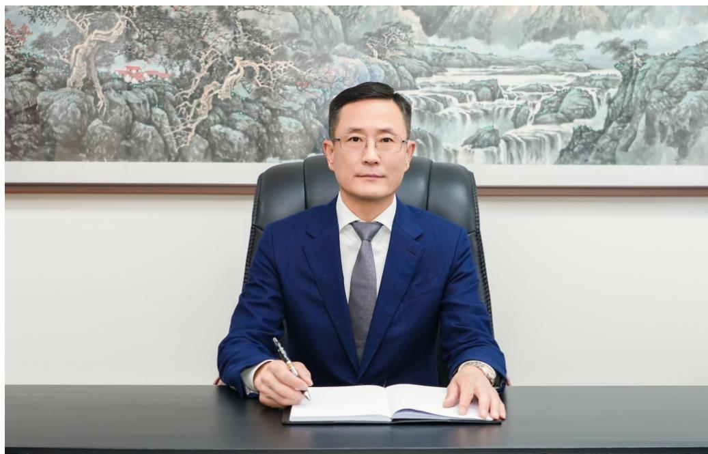

natural_image

Portrait of a man in a suit seated at a desk with an open notebook, against a traditional Chinese landscape painting (no visible text or symbols)

岁序更替，华章日新。2025年，作为中国华电集团有限公司实际控制的上市公司、中央企业二级单位、辽宁省重要能源央企，华电辽能锚定辽宁全面振兴新突破总目标，深耕“能源报国”核心使命，以高质量党建引领高质量发展，将 ESG理念深度融入生产经营全过程，在绿色转型、能源保供、生态保护、社会责任等领域，交出了一份有温度、有力度的央企答卷。

## 这一年，我们以党建铸魂强根基。

将党的建设与绿色转型、安全环保、项目攻坚深度融合，各级党组织在保供一线、重大项目现场发挥战斗堡垒作用，把党建政治优势、组织优势转化为企业发展优势，以央企担当坚定践行“两个维护”。

## 这一年，我们以绿色破局谋发展。

丹东“风火联营”一体化项目完成投资决策，其中丹东海上风电项目积极开展施工前期准备，丹东金山热电二期项目开工建设；白音华公司厂用电替代7万千瓦风电项目、灵活性改造配套24万千瓦风电项目、彰武可再生绿色热能示范项目加快建设；铁岭2.5万千瓦风电离网制氢一体化项目正式投产运营，公司新能源产业布局与综合能源服务能力持续提升。

## 这一年，我们以实干保供惠民生。

在复杂市场环境与多重挑战下，全体干部职工坚守安全生产底线，通过智能化升级、精细化管控，实现电力热力稳定可靠供应，承担4458万平方米供热面积，用央企坚守筑牢区域能源安全屏障。

## 这一年，我们以低碳护生守初心。

将“双碳”目标嵌入经营管理各环节，节能减排成效显著，污染物排放持续优于国家超低排放标准，碳市场履约率100%，清洁煤电提质增效与新能源拓展同步推进，让绿色成为高质量发展的鲜明底色。

## 这一年，我们以责任聚力促共赢。

深化"中国华电 度度关爱"社会责任理念，开展公益环保、民生服务、员工关爱等系列行动，让企业发展成果更多惠及员工、回馈社区、助力地方，实现企业与社会的同频共振。

2026年是“十五五”开局之年，也是华电辽能深化ESG实践、加快绿色转型的关键之年。公司将继续以习近平新时代中国特色社会主义思想为指导，深入贯彻“四个革命、一个合作”能源安全新战略，以高质量党建为引领，聚焦绿色低碳转型、科技自立自强、能源保供增效三大核心任务，持续完善ESG治理体系，提升ESG管理水平，切实履行中央企业“六个力量”使命担当。

征程万里风正劲，重任千钧再出发。华电辽能将始终坚守能源报国初心，以“功成不必在我”的境界和“功成必定有我”的担当，持续推动ESG工作与企业发展深度融合，为辽宁全面振兴全方位振兴、服务国家能源战略贡献更多华电力量！

在此，谨向长期以来关心、支持公司发展的各级领导、合作伙伴、社会各界朋友，以及辛勤付出的全体员工及家属，致以最衷心的感谢和最美好的祝愿！

公司董事长、党委书记：

姜加忙

## 董事会ESG管治声明

本公司董事会是ESG工作的最高决策机构与监督主体，对公司ESG战略制定、落地实施、绩效评估及报告披露承担全部责任，统筹监督影响公司经营发展、利益相关方合法权益的各类ESG重大事项。

2025年，董事会严格履行ESG管治职责，持续完善公司ESG治理体系建设：

## 开展ESG重要性议题分析

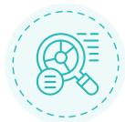

结合电力行业发展趋势、国家“双碳”政策要求、内外部经营环境变化及利益相关方核心诉求，系统识别能源保供、员工权益、合规经营等多项ESG重要性议题；

## 推动ESG理念深度融入

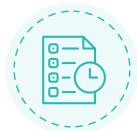

将ESG要求纳入公司发展战略、生产经营、管理决策各环节，把ESG绩效指标与子分公司、职能部门绩效考核挂钩，实现ESG工作与企业经营发展同部署、同落实、同考核；

## 强化ESG监督与评估

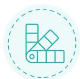

通过董事会会议等形式，审议ESG报告，监督重大ESG项目实施情况，对环境风险、社会责任履行等关键事项进行专项评估，确保ESG工作落地见效；

## 保障ESG信息透明披露

按照国内国际规范要求，组织编制本ESG报告，全面、真实、准确披露公司ESG实践成果，主动接受股东、社会各界及利益相关方的监督。

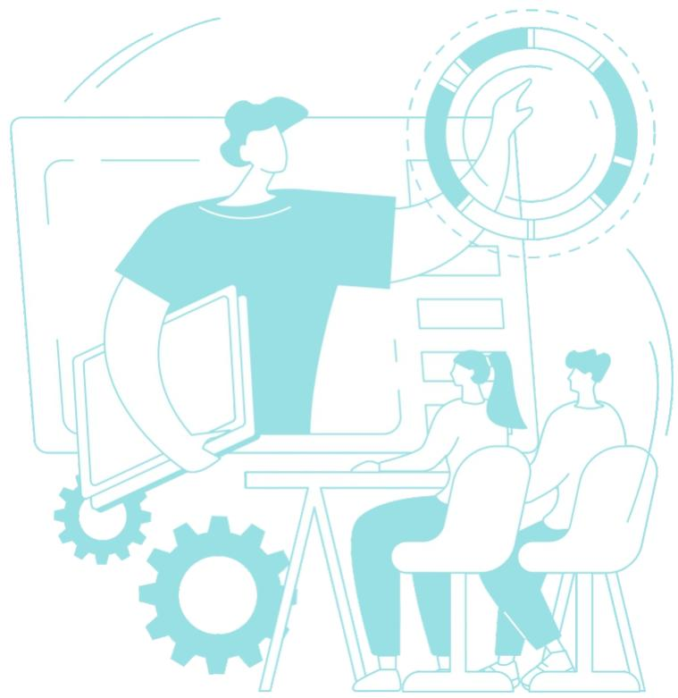

natural_image

Illustration of people working at computers with gears and a globe, no text or symbols present

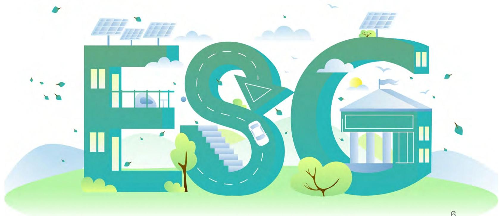

natural_image

Stylized graphic of a building with 'ESC' letters and solar panels, set against a green landscape with clouds and birds (no text or symbols)

## 企业概况

截至2025年12月底

已投运控股装机容量

276.25 万千瓦

其中：

火电装机

226 万千瓦

承担供热面积

4458万平方米

新能源装机

50.25万千瓦

华电辽宁能源发展股份有限公司（曾用名：沈阳金山能源股份有限公司，股票代码：600396）2001年在上海证券交易所挂牌上市，是中国华电集团有限公司实际控制的上市公司，为中央企业二级单位。

公司集发电、供热、供汽于一体，是辽宁省重要的电力和热力供应商，业务覆盖辽宁沈阳、丹东、内蒙古锡林郭勒盟等区域，始终肩负“保供电、保供暖、保民生”的央企核心使命。

## 企业文化与ESG理念

公司以“创新奋进、奋勇争先”为核心文化导向，构建全方位、多层次的企业文化体系，将ESG理念融入企业文化核心内涵，为ESG工作落地提供价值引领与精神支撑：

<table><tr><td>文化维度</td><td>核心内容</td><td>ESG融合内涵</td></tr><tr><td>企业使命</td><td>奉献清洁能源创造美好生活</td><td>以清洁能源开发利用为核心,推动环境友好型发展,为社会提供可靠能源服务。</td></tr><tr><td>企业愿景</td><td>建设世界一流清洁低碳能源企业</td><td>锚定“双碳”目标,打造绿色低碳能源体系,实现企业发展与环境、社会协同共生。</td></tr><tr><td>核心价值</td><td>求实 创新团结 奋进</td><td>以求实态度做好ESG基础工作,以创新驱动绿色转型,以团结凝聚利益相关方力量,以奋进推动ESG绩效持续提升。</td></tr><tr><td>工作作风</td><td>马上就办办就办好</td><td>高效响应ESG相关政策要求,快速落实ESG重点工作,确保各项责任履行到位。</td></tr><tr><td>环保理念</td><td>绿色低碳清洁美丽</td><td>将生态环境保护作为经营底线,持续推动节能降碳、污染防治,守护生态环境。</td></tr><tr><td>安全理念</td><td>生命至上本质安全</td><td>坚守安全生产底线,保障员工生命健康,筑牢能源保供安全屏障,履行社会安全责任。</td></tr><tr><td>合规理念</td><td>依法合规诚信守约</td><td>健全合规管理体系,诚信经营、履约尽责,维护股东、客户、员工等利益相关方合法权益。</td></tr></table>

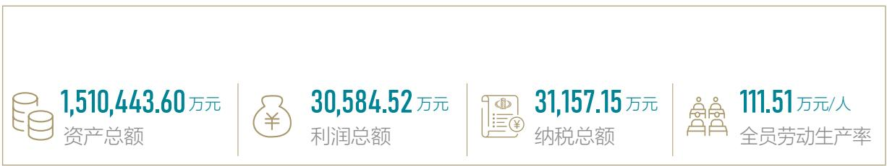

other

| Metric | Value |
| --- | --- |
| 资产总额 (万元) | 1,510,443.60 |
| 利润总额 (万元) | 30,584.52 |
| 纳税总额 (万元) | 31,157.15 |
| 全员劳动生产率 (万元/人) | 111.51 |

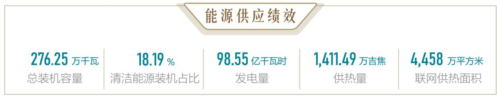

other

| 指标 | 数值 |
| --- | --- |
| 总装机容量 (万千瓦) | 276.25 |
| 清洁能源装机占比 (%) | 18.19 |
| 发电量 (亿千瓦时) | 98.55 |
| 供热量 (万吉焦) | 1,411.49 |
| 联网供热面积 (万平方米) | 4,458 |

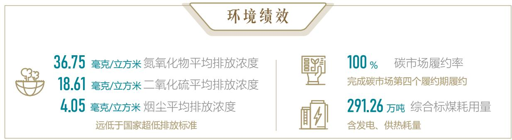

text_image

环境绩效
36.75 毫克/立方米 氮氧化物平均排放浓度
18.61 毫克/立方米 二氧化硫平均排放浓度
4.05 毫克/立方米 烟尘平均排放浓度
远低于国家超低排放标准
100 % 碳市场履约率
完成碳市场第四个履约期履约
291.26 万吨 综合标煤耗用量
含发电、供热耗量

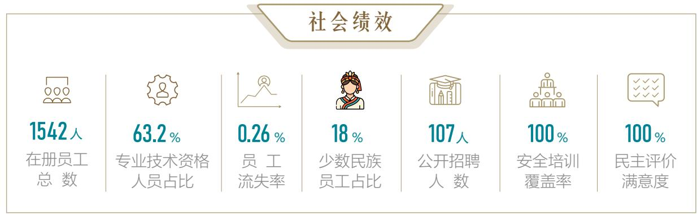

funnel

| 指标 | 数值 |
| --- | --- |
| 在册员工总数 | 1542人 |
| 专业技术资格人员占比 | 63.2% |
| 员工流失率 | 0.26% |
| 少数民族员工占比 | 18% |
| 公开招聘人数 | 107人 |
| 安全培训覆盖率 | 100% |
| 民主评价满意度 | 100% |

## 公司治理

2025年，公司严格遵循《中华人民共和国公司法》《上市公司治理准则》等法律法规，以完善治理架构、强化合规运营、严控经营风险、深化党建引领为核心，持续提升公司治理现代化水平，将ESG治理要求融入公司治理各环节，为ESG工作落地实施提供坚实的制度保障和组织支撑。

公司建立“股东会 - 董事会 - 经营管理层”权责清晰、有效制衡、协调运转的现代公司治理架构，董事会作为核心决策机构，下设专门委员会为科学决策提供专业支撑，确保治理体系规范高效运行。

## 董事会规范运作

报告期末，董事会由11名董事组成，含独立董事4名，专业结构覆盖战略、财务、法律等领域，满足公司经营发展与ESG管治需求。2025年，董事会共召开8次会议，审议通过战略规划、ESG工作、重大项目、财务决算等51项议案；提请召开股东大会4次，17项议案全部通过，决策效率与科学性持续提升。（公司因修改《公司章程》优化治理结构，第八届董事会于2025年8月23日任期届满后推迟换届选举。公司于2026年3月26日召开2026年第一次临时股东会及职工代表大会完成第九届董事会换届选举。截至报告报出日，公司董事会由12名董事组成）

董事会下设战略委员会、审计委员会、薪酬与考核委员会、提名委员会4个专门委员会，2025年各专门委员会共召开会议17次，各司其职、协同发力：

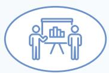

## 战略委员会

聚焦丹东“风火联营”一体化项目等重大绿色项目决策，将ESG理念纳入公司中长期发展战略，审议绿色转型相关议案6项；

## 审计委员会

强化财务监督与内控管理，将ESG数据真实性、环境合规性纳入内部审计范围；

## 薪酬与考核委员会

完善薪酬激励机制，将ESG绩效纳入高管人员考核体系，推动ESG责任层层落实；

## 提名委员会

优化干部队伍结构，优先选拔具有绿色转型、碳管理等ESG相关专业能力的管理人才，提升团队ESG履职能力。

## 独立董事履职

独立董事秉持独立、客观、公正原则，充分发挥专业监督作用，2025年组织召开4次独立董事专门工作会议，在公司战略规划、财务审计、风险管理、关联交易、高管薪酬等重大事项上发表独立意见15条，切实维护公司及中小股东合法权益，提升公司决策的科学性与透明度。

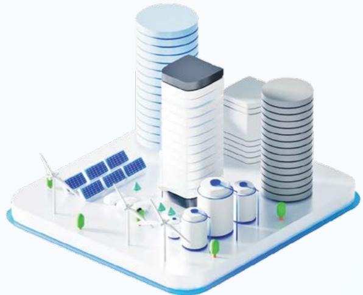

natural_image

Isometric illustration of a smart city with solar panels, wind turbines, and cylindrical buildings (no text or symbols)

## 经营管理层履职

公司经营管理层分工明确、权责清晰、高效协同，在董事会领导下全面落实ESG战略与工作部署：

党委书记、董事长姜青松统筹全局，牵头制定公司ESG发展战略，推动党建与ESG工作深度融合；

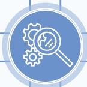

董事、总经理、党委副书记田立主持生产经营工作，将ESG要求融入生产运营各环节，统筹推进能源保供、绿色转型等核心工作；

分管领导分别聚焦绿色转型、安全生产、人力资源、合规经营等领域精准施策，确保公司ESG战略和董事会决议有效落地。

公司以“依法合规、诚信守约”为核心理念，构建全方位、全流程的合规管理与监督体系，将ESG合规要求纳入监督核心范围，推动风险管控从“事后查证”向“事前防范、事中阻断”转型，2025年无重大违法违规事件发生。

## 构建“三道防线”合规管理体系

公司落实“管业务必须管合规”要求，建立覆盖经营全流程的“三道防线”合规管理体系，实现ESG相关合规要求的全维度覆盖：

## 第一道防线 业务部门主体责任

报告期内，公司各业务部门按照“管业务必须管内控合规风险”的要求，切实承担起业务领域合规管理的主体责任，在开展业务工作前首先进行合法合规审查，并将合规审查意见在ERP合同模块、OA系统“三重一大”议题审批流程中进行反馈，守好“第一道防线”。

## 第二道防线 职能部门统筹推进

公司证券法务部通过合同、“三重一大”事项审批会签以及收集重大法律事项法律意见落实情况等方式，充分发挥统筹推动、组织协调、监督落实的枢纽作用，抓好体系健全、机制完善、评价改进、整改督办等工作，2025年全年优化各项制度共计71项，内容涉及公司治理、财务管理、安全环保、生产燃料、党建综合、战略规划、人力资源、市场营销、纪检监察等诸多方面，促进了全面风险与内控体系的进一步完善和规范，守好“第二道防线”。

## 第三道防线 监督部门追责问责

公司审计、监督等相关部门将合规情况纳入巡察、内部审计、监督检查范围，落实违法违规问题追责问责，守好“第三道防线”，对环保违规、员工权益侵害等潜在问题开展专项监督，落实违法违规问题追责问责机制。

## 搭建内控合规风险一体化管理信息平台

公司按照“平台统一、管理融合、监控智能”的功能定位，组织各单位建设应用内控合规风险一体化管理信息平台（以下简称一体化平台）。公司以《内控合规风险管理手册》“三单一流程”信息化应用为重点，通过一体化平台开展合规义务在线识别、全面风险评估和过程管控、内控合规评价、问题缺陷整改、报告报表编报等工作，不断提升内控合规风险管理工作的标准化、规范化、智能化水平；通过对一体化平台中风险监控预警指标进行智能监控，实现了及时预警、快速处置。

## 完善全方位监督体系

## 内部审计监督

设立专职内部审计人员4名，构建“日常审计+专项审计+经济责任审计+固定资产投资审计”全覆盖的审计体系，2025年开展经济责任审计3项、固定资产投资审计76项、专项审计3项、日常审计监督1项，实现重点领域、关键环节监督全覆盖。

## 纪检监督体系

各子分公司全部设立纪检机构，实现反腐败和监督全覆盖；建立14项专项政治监督台账，细化61项监督措施，将绿色转型、能源保供等ESG重点工作纳入监督范围；扎实开展中央八项规定精神学习教育和反腐倡廉宣传，精准运用监督执纪“四种形态”，营造风清气正的经营环境。

## 外部监督联动

按要求接受政府监管部门、中国证监会、上海证券交易所的监督检查；聘请会计师事务所开展年度财务审计，确保财务信息与ESG相关数据真实准确。

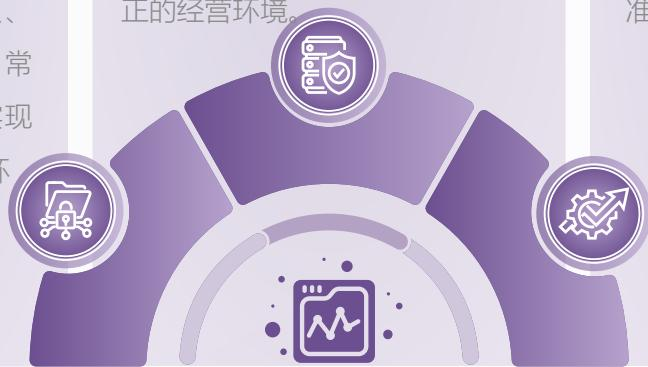

flowchart

```mermaid
graph LR
  A["Security Icon"] --> B["Security Shield Icon"]
  B --> C["System Integration Icon"]
  C --> D["Growth Icon"]
```

2025年，公司牢固树立全面风险管理理念，将ESG风险纳入公司全面风险管控体系，完善风险管理制度、强化重点风险防控、提升智能监控能力，年末无未化解重大经营风险。依托一体化平台，对合同监管、采购管理、信用电力监管等关键环节实施实时监测与智能预警，全年识别并阻断潜在违规风险347起，2025年无重大经营风险、环境风险、社会风险发生，主要风险均得到有效化解。

## 完善风险管理制度体系

2025年，公司优化完善制度覆盖公司治理、安全环保、碳管理、员工权益、供应链管理等领域，进一步完善全面风险与内控体系；建立风险监测季度报告、重大风险月度汇总制度，搭建前十大风险管控台账，实现重点风险动态跟踪、闭环管理。

natural_image

Illustration of a business meeting with people observing a presentation screen (no text or symbols visible)

## 强化ESG重点风险防控

结合电力行业特点与公司经营实际，公司系统评定电量竞争、燃料价格上涨、新能源消纳、安全事故、环境合规、碳价波动等十大经营风险，其中6项为核心ESG风险，覆盖投资、市场、生产、工程等核心领域：

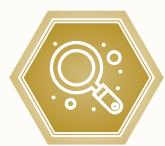

## 针对环境合规风险：

建立环保设施日常巡检制度，开展环保合规专项检查4次，确保污染物排放持续达标；

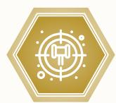

## 针对碳价波动风险：

组建专业碳资产管理团队，开展碳市场行情分析，优化碳配额交易策略，确保碳市场履约率100%；

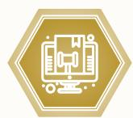

## 针对新能源消纳风险：

加强与电网公司沟通协调，优化新能源发电调度策略，提升风电、光伏消纳效率。

通过前置防控、精准施策，全年无重大风险事件发生，核心ESG风险均处于可控状态。

# 党建引领与治理融合

公司坚持以高质量党建引领高质量发展，实施“四力四推”党建工程创一流，将党建工作与公司治理、ESG工作深度融合，把党建优势转化为ESG治理优势、发展优势，实现党建与生产经营、绿色转型、社会责任同部署、同落实、同考核。

## 强化政治引领，锚定ESG发展方向

把党的政治建设摆在首位，深入学习贯彻习近平新时代中国特色社会主义思想，推动“四个革命、一个合作”能源安全新战略落地实施，将“双碳”目标、能源保供、乡村振兴等国家战略要求转化为公司ESG发展具体目标；2025年公司生产经营质效持续向好，以实际行动践行央企政治责任。

## 深化凝心铸魂，凝聚ESG发展共识

第一时间学习贯彻党的二十届四中全会精神，实现传达学习、专题研究、集中宣讲、专题培训、实践落实、督导检查“六个全覆盖”；打造党委理论学习中心组“五学机制”，2025年开展集体研讨7次、专题读书班4期，其中3期聚焦绿色转型、能源保供等ESG核心议题，将理论学习成果转化为ESG工作发展动力，凝聚全体员工ESG发展共识。

## 推动党建赋能，夯实ESG工作基础

构建“五维党建工程管控体系”，通过明确“五个工程目标”、制定“五定工程计划”、抓实“五抓过程管理”、强化“五度质量控制”、落实“五项闭环机制”，推动党建与ESG中心工作深度融合；开展党建赋能专项行动，确定9大攻坚目标、33项具体措施，其中6项为绿色转型、能源保供相关ESG攻坚任务，保障公司年度十项重点任务与ESG工作落地见效。

## 优化队伍建设，强化ESG人才支撑

完善干部人才“选育管用”体系，坚持德才兼备、以德为先，2025年调整干部5批次32人次，“80后”干部占比53%，厂级干部50岁及以下占比47.37%，队伍年龄结构、专业结构持续优化；实施“8090工程”，重点培养专业技术人才，为公司ESG发展提供坚实的人才支撑。

调整干部5批次

32 人次

实施“8090工程”

重点培养专业技术人才

## 深化文化润心，彰显ESG央企形象

践行“创新奋进、奋勇争先”企业文化，将ESG理念融入企业文化建设，开展“社会责任宣传月”活动，提升全员ESG意识；2025年，公司思想政治工作课题获公司系统二等奖，企业文化案例获中国企业文化研究会典型案例。

## 战略创新与项目发展

公司将绿色转型、科技创新作为ESG发展的核心驱动力，聚焦电力行业绿色低碳发展趋势，加大绿色项目攻坚力度，强化科技创新突破，培育发展新质生产力，推动公司从传统能源企业向清洁低碳能源企业转型，为ESG绩效持续提升提供战略支撑。

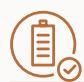

## 绿色项目攻坚取得重大突破

2025年，公司坚持能源转型提升、电力主业做强、供热市场开拓，持续优化资产布局，各项重点项目稳步推进。丹东“风火联营”一体化项目完成投资决策，其中丹东海上风电项目积极开展施工准备，丹东金山热电二期项目开工建设；白音华公司厂用电替代7万千瓦风电项目、灵活性改造配套24万千瓦风电项目、彰武

可再生绿色热能示范项目加快建设；铁岭2.5万千瓦风电离网制氢一体化项目正式投产运营，公司新能源产业布局与综合能源服务能力持续提升。

natural_image

Illustration of a glowing light bulb with a checkmark inside, set against a transparent base (no text or symbols)

## 科技创新实现跨越式发展

公司打造“宝塔型”科技创新体系  
建立“总部统筹、子分公司落实、全员参与”的科技创新机制  
制定科技创新专项考核激励制度  
将科技创新成果与员工薪酬、晋升挂钩，激发全员创新活力

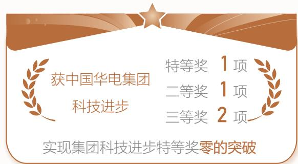

text_image

获中国华电集团
科技进步
特等奖 1项
二等奖 1项
三等奖 2项
实现集团科技进步特等奖零的突破

自主研发的“风电离网制氢技术”“污泥资源化利用技术”经中国科学院院士专家组鉴定，达到“国际领先”水平，实现固废资源化利用；

承担国家、部委、集团级重大科技攻关项目 6 项；

建立科技创新成果转化机制，将“离网制氢”“污泥资源化利用技术”等技术成果在各子分公司推广应用。

## 环境保护

作为能源央企，公司始终秉持“绿色低碳、

清洁美丽”的环保理念，深入贯彻国家“双碳”目标，将生态环境保护融入生产经营全流程，以“节能降碳、污染防治、清洁能源开发、生态保护”为核心，持续完善环境管理体系，提升环境绩效，争做碳达峰碳中和主力军。

## 环境管理理念与体系

## 核心理念

公司将生态环境保护作为经营发展的底线要求与核心竞争力，积极响应国家“双碳”战略部署，紧扣能源绿色低碳转型要求，坚持“生态优先、绿色发展”。以“减污降碳协同增效”为总抓手，立足电力主业，推动传统能源清洁化改造、煤电升级焕新与新能源规模化开发，加快培育能源新质生产力。持续优化能源结构，逐步构建以化石能源为兜底保障、新型电力系统为关键支撑、绿色智慧节约为用能导向的新型能源体系，不断提升可持续发展能力。

## 环境管理体系

公司严格遵守《中华人民共和国环境保护法》《中华人民共和国大气污染防治法》《中华人民共和国水污染防治法》等相关法律法规，建立健全“本部统筹、子分公司落实、全员参与”的三级环境管理体系：

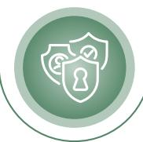

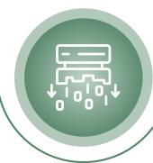

公司设立生态环境保护领导小组，统筹制定公司环境管理战略、目标与制度，监督环境绩效完成情况；

各子分公司设环境管理部门，配备专兼职环保管理人员，负责环境管理工作的具体实施、环保设施运行维护、环境数据监测与上报；

公司将环境保护纳入公司绩效考核体系，设置环境保护、碳排放等考核指标，将考核结果与子分公司薪酬、领导班子晋升挂钩，推动各单位切实履行环保主体责任，形成全员参与的环保工作格局。

## 应对气候变化与碳管理

公司积极应对全球气候变化，严格落实国务院国资委碳达峰碳中和工作要求，将碳管理纳入企业生产经营核心环节，建立全流程的碳排放管控体系，持续提升碳排放精细化管理水平，推动企业低碳发展。

## 碳排放精细化管理

## 完善碳排放监管核算体系

建立覆盖各生产环节的碳排放监管网络，配备碳核算人员，按照国家《企业温室气体排放核算方法与报告指南》要求，开展碳排放数据日常监管、月度核算、年度报告，确保碳排放数据真实、准确、完整；

## 将碳排放管控纳入考核

将碳排放强度、碳配额履约率等指标纳入子分公司绩效考核体系，制定明确的“双碳”考核”目标，2025年公司单位发电量碳排放强度较2024年下降2.34%；

## 确保碳市场履约达标

培养专业碳资产管理人才，开展碳市场行情分析、碳配额交易策略制定，积极参与全国碳市场交易，2025年顺利完成碳市场第四个履约期履约，碳市场履约率100%；

## 优化生产流程降碳

通过机组节能改造、优化运行方式、提升能源利用效率等措施，持续降低运营碳排放，2025年通过生产流程优化减少碳排放约70万吨。

## 清洁能源布局加速推进

公司以“上大压小、新能源并举”为方向，加快优质项目开发，持续优化能源结构，推动能源结构向清洁化、低碳化转型：紧扣国家“双碳”目标与东北能源转型方向，报告期内，公司重点推进丹东“风火联营”一体化项目完成投资决策，丹东海上风电项目积极开展施工准备，丹东金山热电二期项目开工建设。同时，铁岭2.5万千瓦离网风电制氢项目正式投产运营。

## 资源节约与高效利用

公司坚持“节约优先、高效利用”的资源管理理念，建立健全资源节约管理制度，围绕煤炭、电力等核心资源，开展节能降碳专项行动，提升资源利用效率，建立能耗双控向碳排放双控全面转型新机制。

## 节能降碳闭环管理

公司建立“有制度、有执行、有考核、有监督”的节能降碳闭环管理模式，扎实开展节能降碳专项行动，2025年燃煤及燃油消耗量同比降低19.11万吨标煤：

## 完善节能降碳制度

制定《节能管理办法》《节能评价工作管理细则》等制度，建立覆盖各生产环节的能耗指标管理体系，明确各机组、各岗位能耗考核标准；

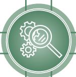

对现役火电机组开展节能改造，完成锅炉、汽轮机、发电机等核心设备综合治理，2025年实施白音华2号机组能效提升等节能改造项目4项；

## 开展设备综合治理与技术改造

## 优化机组运行方式

组织专业技术团队开展机组运行优化研究，挖掘机组最优运行方式，2025年火电机组供电煤耗同比下降1.01克/千瓦时；

将能耗指标纳入各生产班组绩效考核，建立能耗指标实时监测与预警机制，对能耗超标环节及时整改，确保能耗指标持续优化。

## 强化能耗考核监督

## 数说2025年

公司发电、供热耗用原煤675.26项

\- 白音华公司折合标煤 158.22 万吨

燃油 1029 吨

丹东公司折合标煤 70.37万吨折合标煤 291.26 万吨

\- 沈阳公司折合标煤 62.67 万吨

## 水资源高效利用

公司坚持“节水优先、源头管控”的水资源管理理念，强化生产全流程用水管理，持续提升水资源利用效率，2025年公司单位发电量水耗较2024年下降1.15%：

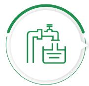

## ▶ 优化用水结构

积极采用城市中水作为生产用水，推动中水回用，最大限度减少新鲜水消耗；

## 强化用水过程管理

建立生产用水实时监测体系，对各生产环节用水情况进行实时监测，组织生产现场用水巡视，杜绝跑冒滴漏；

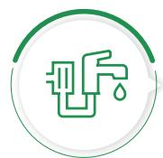

## ▶ 建立水耗考核体系

制定明确的水耗减排目标，推动各单位切实做好节水工作。2025年各单位均满足国家关于火力发电机组取水定额有关要求。

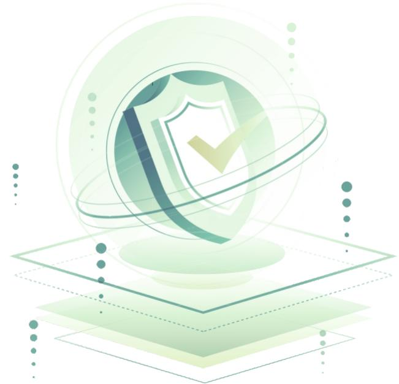

natural_image

Abstract illustration of a shield with a checkmark inside concentric rings, surrounded by layered transparent layers (no text or symbols)

## 污染防治与生态保护

公司严格执行国家污染防治标准，以“超低排放、达标排放、总量控制”为核心，持续加强大气、水、固废等污染防治，推动燃煤副产品资源化利用，加强生态保护，切实履行生态环境保护责任。

## 大气污染治理

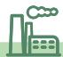

公司所属煤电企业全部实现超低排放，严格按照国家《火电厂大气污染物排放标准》要求，配备高效脱硫、脱硝、除尘设施，确保大气污染物达标排放：

2025年，公司氮氧化物平均排放浓度36.75毫克/立方米、二氧化硫平均排放浓度18.61毫克/立方米、烟尘平均排放浓度4.05毫克/立方米，均远低于国家超低排放标准（氮氧化物50毫克/立方米、二氧化硫35毫克/立方米、烟尘10毫克/立方米）；

加强环保设施运行维护，建立环保设施日常巡检、定期维护制度，环保设施投运率达到100%，确保环保设施稳定高效运行；

严格控制大气污染物排放总量，2025年公司烟尘排放135.75吨、二氧化硫690.31吨、氮氧化物1216.84吨。

## 水污染治理

公司建立全流程的水污染治理体系，加强生产、生活废水处理与管控，确保废水达标排放，2025年无水污染事件发生：

## 完善废水处理设施：

各子分公司均配备完善的生产废水、生活废水处理设施，生产废水经处理后全部回用，生活废水经处理后达标排放；

## 强化废水处理设施监管：

完成基层企业废水处理设施全流程监督管理，建立废水处理设施运行台账，定期开展废水水质监测，全部达标；

## 严格取水用水管理：

严格按照水利部门批复的取水许可进行取水用水，制定专项节水措施，严控水资源污染，2025年无超许可取水、水资源污染等问题发生。

## 固废与其他污染管控

## 固废资源化利用

公司践行循环经济理念，推动燃煤副产品资源化利用，实现固废全流程合规管控：

燃煤产生的粉煤灰、炉底渣全部外销至建材企业，用于生产水泥、新型墙体材料等，年综合利用粉煤灰174.92万吨、炉底渣约61.39万吨；

脱硫石膏全部外销至石膏板生产企业，年综合利用脱硫石膏约20万吨；

建立固废储存、运输管理制度，固废储存场所采取防扬散、防流失、防渗漏等措施，确保固废储存、运输过程无污染。

年综合利用粉煤灰

174.92万吨

年综合利用脱硫石膏

20万吨

固废储存、运输过程

无污染

## 其他污染管控

## 噪声污染防治：

对生产现场噪声源进行综合治理，采用隔音、消音、减振等措施，降低设备运行噪声；在厂区边界设置隔音屏障，确保厂区边界噪声达到《工业企业厂界环境噪声排放标准》要求，2025年厂区边界噪声监测全部达标；

## 土壤污染防治：

对油罐区、化学品储存区等重点区域采取防渗措施，防止土壤污染；

## 危险废物管控：

建立危险废物全流程管理制度，对废油、废催化剂等危险废物进行分类收集、储存、运输，委托有资质的单位进行处置，无危险废物污染事件发生。

## 环境风险防控与应急管理

公司牢固树立环境风险防控意识，建立健全环境风险防控与应急管理体系，完善应急预案，加强应急培训和演练，提升员工环境应急处置能力，确保环境风险可控、可防、可治。

## 环境风险排查与防控

## 开展环境风险辨识评估：

每年开展一次全面的环境风险辨识与评估，制定针对性的风险防控措施；

## 建立环境风险台账：

对环境风险源进行动态管理，建立环境风险台账，明确风险防控责任主体、防控措施、整改时限，实现环境风险闭环管理；

## 加强重点区域风险防控：

对油罐区、化学品储存区、环保设施等重点区域加强风险防控，配备完善的防渗漏、防泄漏设施，安装视频监控系统，实现24小时实时监控。

## 完善环境应急管理体系

制定完善应急预案：制定《突发环境事件应急预案》及专项应急预案，明确应急响应流程、处置措施及各部门职责，应急预案已报当地生态环境部门备案；

建立应急联络机制：建立公司、子分公司、生产班组三级应急联络机制，明确应急联络人及联系方式，确保应急信息传递及时、准确；

加强应急培训和演练：将环境应急处置知识纳入员工培训体系，定期开展多轮环境应急培训，覆盖大批员工；多次组织突发环境事件应急演练，兼顾综合应急演练与专项应急演练，持续提升员工环境应急处置能力；

配备完善应急物资：各子分公司均配备完善的环境应急物资，包括吸油毡、围油栏、活性炭、灭火器等，建立应急物资台账，定期开展应急物资检查、维护、补充，确保应急物资完好可用。

## 绿色发展实践与环保公益

公司以“打造清洁低碳能源体系，推动绿色发展”为目标，积极探索绿色发展新模式，同时主动履行环保公益责任，开展系列环保公益活动，推动企业与社区环境共建共治，提升全员环保意识。

## 构建绿色发展新模式

## 推动多能互补发展

围绕服务国家“双碳”目标，积极探索一体化等多能互补模式，促进各环节高效协同、灵活互动，兼顾中长期转型目标与短期安全保供需求，提升公司系统整体效率和可靠性，构建适应高质量发展的绿色能源产业体系；

## 探索低碳燃料掺烧

在火电机组开展污泥低碳燃料掺烧试验，实现固废资源化利用与减碳协同增效；

## 运用绿色金融工具

积极对接绿色信贷、绿色债券等绿色金融工具，2025年成功获批“两重”“两新”中央预算资金2500万元；

## 推动数字化绿色转型

利用大数据、人工智能等数字化技术，优化机组运行方式，提升能源利用效率，降低碳排放，打造“数字+绿色”融合发展模

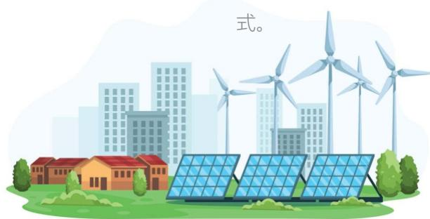

natural_image

Illustration of a renewable energy park with solar panels, wind turbines, and urban buildings in the background (no text or symbols)

## 开展环保公益实践

## 开展生态保护公益活动：

全面推动绿色低碳理念落地生根，组织员工参与周边河道清淤保洁、草原白色垃圾集中捡拾等公益行动，以实际行动改善周边生态环境；

倡导绿色低碳生活：大力倡导绿色出行理念，鼓励员工优先选择骑行、步行、公共交通等低碳出行方式，助力降低碳排放强度。深入开展“绿色办公”主题活动，大力推行无纸化办公、节约水电等节能降耗举措，持续强化全员绿色低碳责任意识；

加强环保宣传教育：充分利用“线上+线下”相结合的多元宣传平台，广泛开展环保政策解读、低碳知识普及等宣传教育活动，全方位营造全员参与、共建共享的绿色发展良好氛围。

## 社会责任

公司始终牢记中央企业社会责任，以“中国华电度度关爱”为核心责任理念，将社会责任融入企业发展战略，聚焦利益相关方核心需求，在能源保供、民生服务、员工关爱、社区共建、地方发展等领域主动作为，切实履行央企社会责任，实现企业发展与社会进步的同频共振。

## 利益相关方沟通与管理

公司建立多元化、常态化的利益相关方沟通机制，识别政府、股东、员工、客户、社区、合作伙伴、供应商等核心利益相关方，针对不同利益相关方的核心诉求，制定差异化的沟通与回应机制，加强与利益相关方的互动交流，推动企业与利益相关方协同发展。

核心利益相关方及沟通机制  
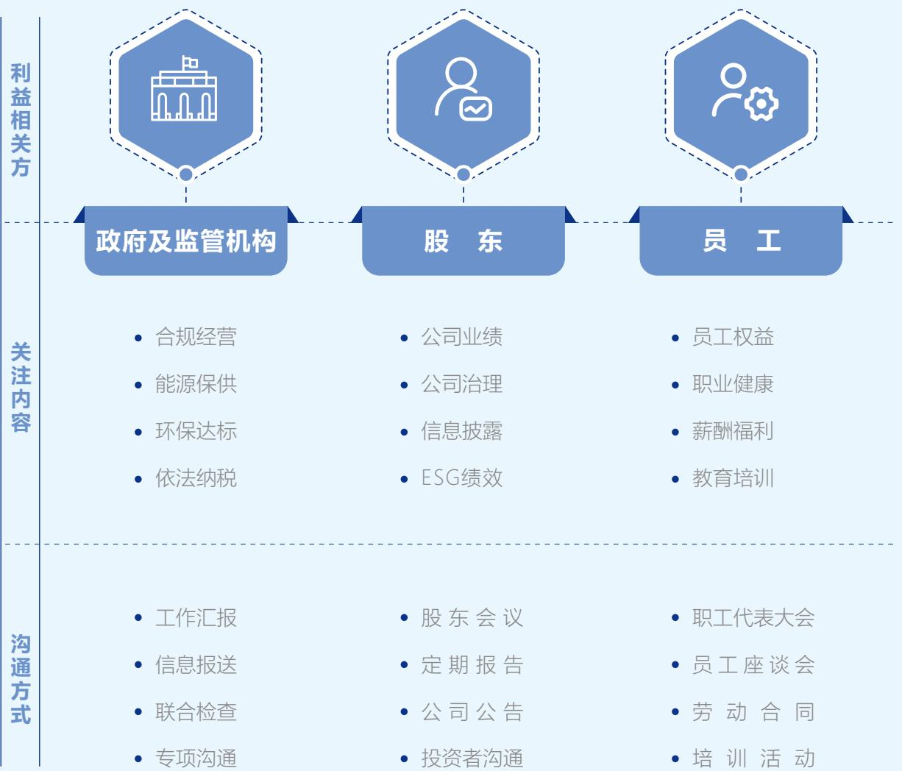

flowchart

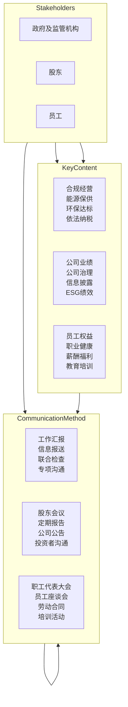
```mermaid
graph TD
  subgraph Stakeholders
    A["政府及监管机构"]
    B["股东"]
    C["员工"]
  end

  subgraph KeyContent
    D["合规经营\n能源保供\n环保达标\n依法纳税"]
    E["公司业绩\n公司治理\n信息披露\nESG绩效"]
    F["员工权益\n职业健康\n薪酬福利\n教育培训"]
  end

  subgraph CommunicationMethod
    G["工作汇报\n信息报送\n联合检查\n专项沟通"]
    H["股东会议\n定期报告\n公司公告\n投资者沟通"]
    I["职工代表大会\n员工座谈会\n劳动合同\n培训活动"]
  end

  Stakeholders --> KeyContent
  Stakeholders --> KeyContent
  Stakeholders --> CommunicationMethod
  KeyContent --> CommunicationMethod
  CommunicationMethod --> CommunicationMethod
```

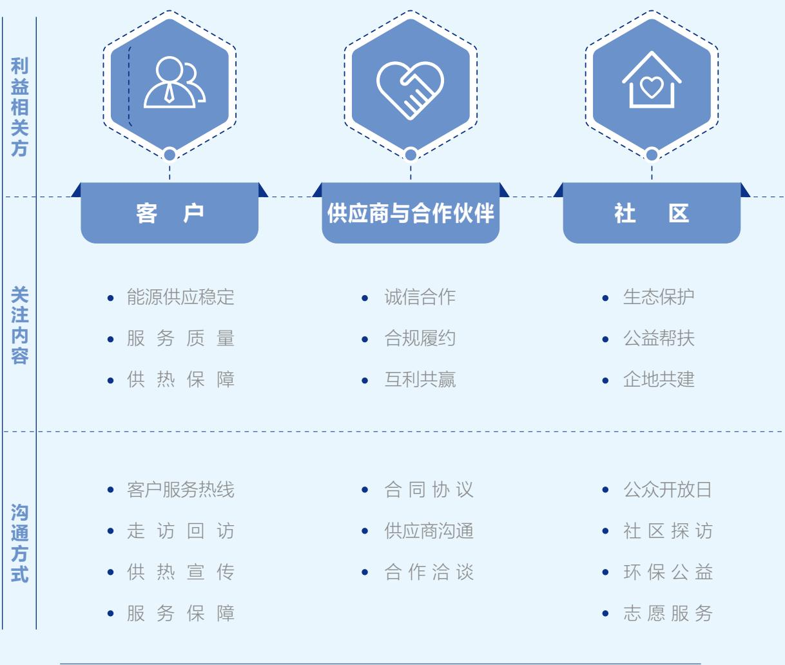

flowchart

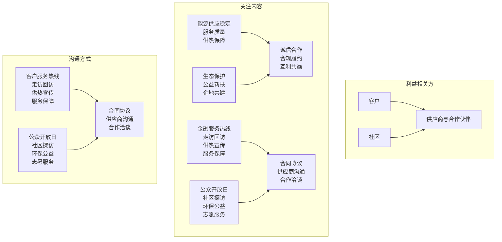
```mermaid
graph TD
  subgraph BenefitRelated["利益相关方"]
  A["客户"] --> B["供应商与合作伙伴"]
  C["社区"] --> B
  end

  subgraph Content["关注内容"]
  D["能源供应稳定\n服务质量\n供热保障"] --> E["诚信合作\n合规履约\n互利共赢"]
  F["生态保护\n公益帮扶\n企地共建"] --> E
  G["金融服务热线\n走访回访\n供热宣传\n服务保障"] --> H["合同协议\n供应商沟通\n合作洽谈"]
  I["公众开放日\n社区探访\n环保公益\n志愿服务"] --> H
  end

  subgraph Subsidiary ["沟通方式"]
  J["客户服务热线\n走访回访\n供热宣传\n服务保障"] --> K["合同协议\n供应商沟通\n合作洽谈"]
  L["公众开放日\n社区探访\n环保公益\n志愿服务"] --> K
  end
```

2025年ESG主题沟通活动  
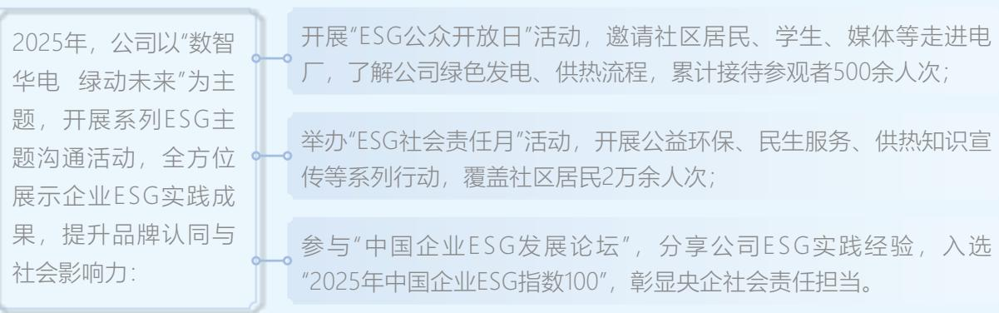

flowchart

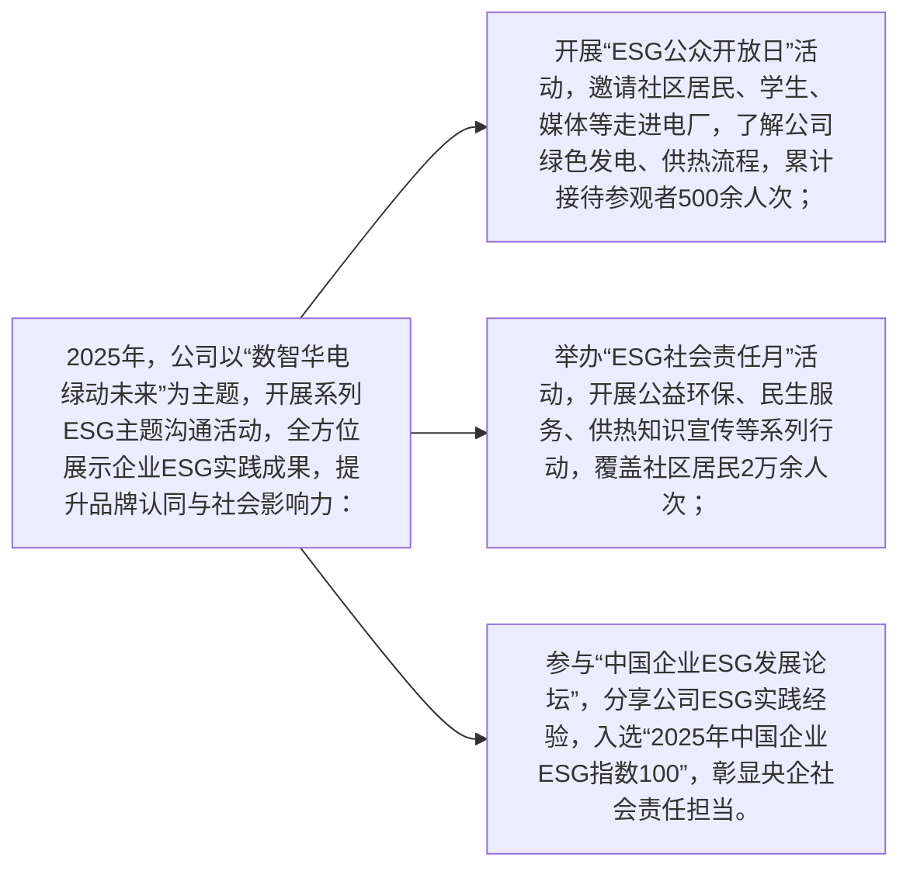
```mermaid
graph LR
  A["2025年，公司以“数智华电 绿动未来”为主题，开展系列ESG主题沟通活动，全方位展示企业ESG实践成果，提升品牌认同与社会影响力："] --> B["开展“ESG公众开放日”活动，邀请社区居民、学生、媒体等走进电厂，了解公司绿色发电、供热流程，累计接待参观者500余人次；"]
  A --> C["举办“ESG社会责任月”活动，开展公益环保、民生服务、供热知识宣传等系列行动，覆盖社区居民2万余人次；"]
  A --> D["参与“中国企业ESG发展论坛”，分享公司ESG实践经验，入选“2025年中国企业ESG指数100”，彰显央企社会责任担当。"]
```

## 能源保供与民生保障

作为辽宁省重要的能源供应商，公司始终牢记“国之大者”，将电力热力保供作为首要政治责任和社会责任，坚守“保供电、保供暖、保民生”核心使命，2025年面对复杂严峻的市场环境和多重挑战，全体干部职工坚守岗位、实干攻坚，实现电力热力稳定可靠供应，为辽宁经济社会发展筑牢能源保障防线。

## 电力保供：筑牢电力安全屏障

## - 强化安全生产管理

建立健全安全生产责任制，开展安全生产专项检查12次，排查整改安全隐患300余项，实现安全生产零事故，为电力保供奠定坚实基础；

## - 优化机组运行调度

合理安排机组检修计划，减少非计划停运时间，2025年各发电机组等效可用系数达到90%以上；加强与电网公司沟通协调，优化发电调度策略，确保电力平稳有序供应；

## - 提升应急保供能力

制定电力保供应急预案，组建应急保供队伍，配备完善的应急物资，开展电力保供应急演练6次，提升应急保供能力；在用电高峰期，全体员工坚守岗位，全力保障电力供应，2025年完成发电量98.55亿千瓦时，上网电量86.61亿千瓦时，圆满完成年度电力保供任务。

## 热力保供：守护千家万户温暖

## 提升供热保障能力

对供热管网、换热站等供热设施开展全面检修和改造，2025年实施供热设施改造项目35项，提升供热设施可靠性；优化供热调度系统，实现供热温度精准调控，提升供热质量；

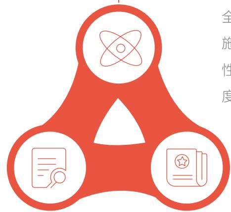

flowchart

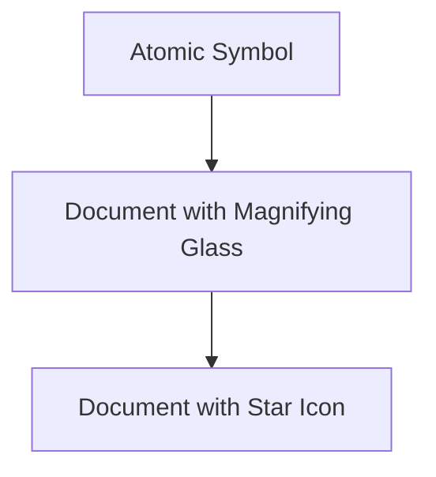
```mermaid
graph TD
  A["Atomic Symbol"] --> B["Document with Magnifying Glass"]
  B --> C["Document with Star Icon"]
```

## 保障供暖期稳定供应

## 强化供热服务保障

开通24小时服务热线，高效响应群众咨询与诉求，2025年供热投诉办结率达100%、居民满意度超95%。常态化开展入户走访，精准解决供暖难题，持续提升服务质效与群众满意度；

在供暖期，公司全体干部职工坚守岗位，实行24小时值班制度，确保供热设施稳定运行，2025年完成供热量1410.95万吉焦，承担4458万平方米供热面积，保障了沈阳市、丹东市等区域千家万户温暖过冬。

## 社区共建与公益行动

公司积极融入地方发展，加强与社区的沟通与合作，开展系列特色公益行动与社区共建活动，推动企地共赢发展，切实履行央企社区责任，提升企业与社区的融合度。

## 助力地方经济社会发展

公司积极融入辽宁全面振兴新突破三年行动，以能源项目建设带动地方经济发展，加强与地方政府的协同合作，在环保、民生、基础设施建设等领域深化联动，实现企地共赢：

## 深化政企协同合作

与地方政府建立常态化沟通机制，在环境治理、新能源开发、民生服务等领域开展深度合作，共同推动地方绿色发展与民生改善；

## 助力乡村振兴

响应国家乡村振兴战略，对口帮扶地方乡村，投入资金62.44万元，用于乡村道路修缮、特色产业发展等，帮助乡村提升发展能力。

## 2025年

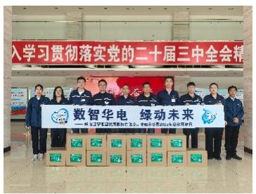

text_image

入学习贯彻落实党的二十届三中全会精
数智华电 绿动未来
——浙江数字文化学院联合社主办，参加2021年全国代表大会

对口帮扶地方乡村

62.44 万元

## 开展特色公益行动

各子分公司结合属地特点，开展形式多样的公益行动，解决社区居民实际问题，提升社区居民幸福感：

## 白音华公司：草原清洁志愿行

组织党员群众开展“草原清洁志愿行”活动，定期到厂区周边草原捡拾白色垃圾，2025年开展活动6次，参与员工300余人次，清理草原白色垃圾约20吨，践行环保理念，构筑和谐牧企关系；

## 丹东公司：骑行宣传送知识到家

开展“骑行宣传送知识到家”活动，员工化身“供热知识使者”，骑行至各社区，向市民发放供热知识宣传单1万余份，现场解答居民供热问题，解决暖气片温度不均等民生问题100余个；通过微信公众号推出供热科普专题12期，覆盖居民1万余人次；

## 沈阳公司：华电沈阳幸福行动

组织员工开展“华电沈阳幸福行动”，捐赠衣物、文具等物资2000余件，帮扶社区困难家庭50余户；深入社区开展低碳理念宣传活动，发放低碳宣传资料5000余份，搭建企业与公众的连心桥。

## 2025年

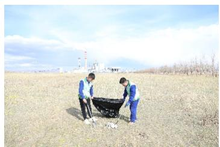

natural_image

Two workers in blue uniforms pushing a wheelbarrow in a grassy field with industrial buildings and a clear sky in the background (no visible text or symbols)

\- 清理草原白色垃圾约

20 吨

解决暖气片温度不均等民生问题

100 余个

推出供热科普专题

12期

\- 捐赠衣物、文具等

2000 余件

帮扶社区困难家庭

50 余户

## 员工权益保护与关爱

员工是企业发展的根本动力，公司始终坚持以人民为中心的发展思想，严格遵守《中华人民共和国劳动法》《中华人民共和国劳动合同法》等法律法规，从公平招聘、薪酬福利、民主管理、职业发展、健康安全等方面，全方位保障员工合法权益，提升员工幸福感、获得感与归属感，2025年员工流失率仅0.26%，队伍保持稳定。

## 公平招聘与多元用工

公司坚持平等雇佣、择优录用的招聘原则，保障员工就业公平，构建多元、包容的用工环境：

## 公开公平招聘

\- 2025年公开招聘107人，公开招聘率 $100\%$ ，招聘过程全程公开、透明，接受员工和社会监督，无就业歧视、暗箱操作等情况；

## 多元用工环境

\- 在册员工1542人，涵盖蒙古族、满族、回族等多个民族，少数民族员工占比 $18\%$ 公司尊重各民族风俗习惯，开展民族文化交流活动，实现民族平等、团结互助；

## 保障女职工权益

\- 签订女职工特殊权益保护专项集体合同，实行男女同工同酬，在聘用、晋级、培训等方面保障女职工平等权利；设立女职工卫生室、母婴关爱室，为女职工提供贴心服务；2025年女职工晋升率与男职工持平，女职工培训覆盖率100%；

## 禁止违规用工

\- 严格遵守国家用工法律法规，无使用童工、强制劳动、劳务派遣不规范等情况，切实保障员工合法权益。

## 完善薪酬与福利保障

公司坚持“规范、激励、倾斜”的薪酬理念，构建完善的薪酬福利保障体系，让员工共享企业发展成果：

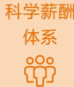

构建工资业绩联动、效率对标调节的工资决定机制，将薪酬与个人业绩、公司发展挂钩，实现多劳多得、优绩优酬；薪酬向科技骨干、苦脏险累岗位倾斜，2025年科技骨干、一线岗位员工薪酬较普通管理岗位平均高20%以上；

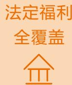

严格执行8小时工作制，保障员工年休假、探亲假、婚假、产假等法定休假权利，2025年员工法定休假落实率100%；按时足额支付薪酬，无拖欠员工工资情况；为全体员工缴纳养老保险、医疗保险、失业保险、工伤保险、生育保险等社会保险及住房公积金、企业年金，福利保障全覆盖；

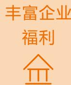

提取职工教育经费、工会经费和福利费用，为员工提供节日福利、生日福利、体检福利等；为员工提供劳动保护用品，根据岗位特点配备完善的劳保用品，切实保障员工作业安全；

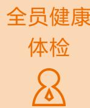

每年组织全员健康体检，2025年为全体1542名员工开展健康体检，建立
员工健康档案，对体检异常员工进行跟踪随访，切实保障员工身心健康。

## 员工权益保护与关爱

## 深化民主管理

公司建立健全以职工代表大会为基本形式的民主管理制度，保障员工的参与权、表达权、监督权，让员工真正成为企业的主人：

## 规范职代会运作

\- 每年召开一次职工代表大会，审议公司年度经营计划、薪酬分配方案、员工福利计划等涉及员工切身利益的重大事项，2025年职代会审议通过议案8项，全部获全票通过；

## 全面推行 厂务公开

\- 建立厂务公开制度，通过宣传栏、微信公众号、员工座谈会等形式，公开公司经营管理、薪酬福利、干部选拔、安全生产等信息，保障员工的知情权、监督权；

## 畅通员工 沟通渠道

\- 定期召开工会会议、员工座谈会，听取员工对工资、福利、安全、经营管理等切身利益问题的意见和建议；设立员工合理化建议信箱、热线电话，2025年收集员工合理化建议200余条，采纳150条，落实整改150条，整改完成率100%；

## 提升民主 满意度

\- 2025年开展公司领导班子、职工之家建设、工会工作等民主评价，满意度均为 $100\%$ ，员工对企业民主管理工作高度认可。

## 赋能员工职业发展

公司坚持人才强企战略，完善人才培养体系，畅通员工晋升通道，为员工搭建广阔的职业发展平台，激发员工干事创业热情：

## 完善人才培养体系

\- 统筹推进管理、技术、技能“三支人才队伍”建设，建立分层分类的人才培养体系；2025年组织优秀中青年人才培训班2期，培训员工100余人次；开展岗位技能培训、安全培训、ESG知识培训等各类培训40余次，培训员工2000余人次，员工培训覆盖率100%；

\- 发挥华电工匠、技术骨干的传帮带作用，全面推行“导师带徒”制度，2025年签订师徒协议80余份，培养青年员工80余人，快速提升青年员工岗位技能；

## 全面推行“导师带徒”

## 畅通晋升通道

\- 打破管理、技术、技能人才横向交流壁垒，建立“管理通道、技术通道、技能通道”三通道并行的员工晋升体系，员工可根据自身特长选择职业发展方向；推进管理人员竞争上岗，2025年通过竞争上岗选拔管理人员15名，提升队伍活力；

推行全员绩效考核，将绩效考核结果与员工薪酬、晋升、培训挂钩，实现考核结果的有效运用，激发员工工作积极性和主动性。

## 完善绩效考核机制

## 员工权益保护与关爱

## 筑牢健康与安全防线

公司始终坚持“生命至上、本质安全”的安全理念，严格遵守《中华人民共和国职业病防治法》等法律法规，建立健全职业健康与安全生产管理体系，切实保障员工的生命健康与作业安全：

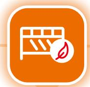

## 职业健康管理

委托专业机构开展职业健康检查，2025年为全体员工开展职业健康体检，对接触煤尘、噪声、高温等职业危害因素的员工开展专项职业健康检查；针对煤尘、噪声等职业危害因素，每年开展检测、每三年开展评估，2025年开展职业危害因素检测4次，全部达标；采取防尘、降噪、防暑降温等措施，改善员工作业环境；

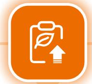

## 安全生产管理

建立健全安全风险分级管控和隐患排查治理双重预防体系，开展安全风险辨识评估，确定安全风险等级，制定针对性的防控措施；开展安全生产专项检查、日常检查等各类检查12次，排查整改安全隐患300余项，实现安全生产零事故；

natural_image

Illustration of two people holding a large heart shape, no text or symbols present

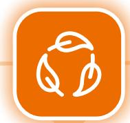

## 应急管理体系

制定《突发事件综合应急预案》及专项应急预案，明确应急响应流程、处置措施；每月开展应急演练，2025年开展应急演练24次，提升员工应急处置能力；

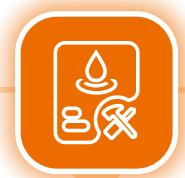

## 安全培训与教育

将安全风险防护培训纳入员工必修课程，2025年开展安全培训20余次，培训员工1500余人次，安全风险防护培训覆盖率100%；强化生产现场安全管理，作业前开展安全技术交底，严格执行作业许可制度，最大限度防止生产安全事故和职业病发生。

## 产业工人队伍建设

公司深入贯彻国家产业工人队伍建设改革要求，以工会为牵头单位，推进产业工人队伍建设改革，培育高素质、专业化产业工人队伍，为公司绿色转型和高质量发展储备坚实的人才力量。

## 制定改革任务清单

公司编制《2025年度产业工人队伍建设改革任务清单》，细化分解目标任务，明确责任主体、整改时限，将产业工人队伍建设改革纳入公司年度重点工作，确保改革工作落地见效；改革任务清单涵盖人才培养、薪酬激励、职业发展、权益保护等4个方面、20项具体任务，为产业工人队伍建设提供明确指引。

## 制定改革任务清单

以“创新奋进、奋勇争先”企业文化为引领，开展形式多样的技能竞赛、技术比武活动，以赛促学、以赛促练，提升产业工人岗位技能：2025年开展锅炉运行、汽轮机操作、电气检修等岗位技能竞赛8次，参与产业工人500余人次，评选出技术能手50名，激发产业工人学习技能、钻研业务的热情。

## 搭建产业工人创新平台

搭建产业工人创新平台，鼓励产业工人开展技术革新、发明创造、合理化建议等创新活动，激发产业工人创新活力：2025年产业工人开展技术革新项目20项，发明创造10项，提出合理化建议150条，为公司5000万元。

## 2025年

开展技术革新项目  
20 项  
发明创造10项  
合理化建议150项  
创造经济效益约5000万元

## 完善产业工人激励机制

完善产业工人激励机制，提升产业工人职业发展空间，让产业工人有地位、有待遇、有发展：

## 建立技能等级与薪酬挂钩机制

将产业工人技能等级与薪酬、福利挂钩，技能等级越高，薪酬待遇越好，2025年为高级工、技师、高级技师等技能人才上调薪酬，提升技能人才待遇；

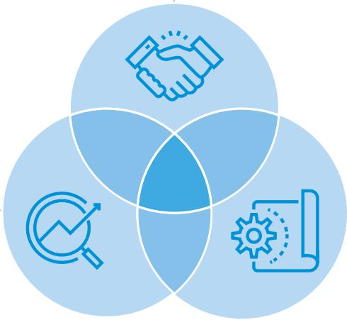

flowchart

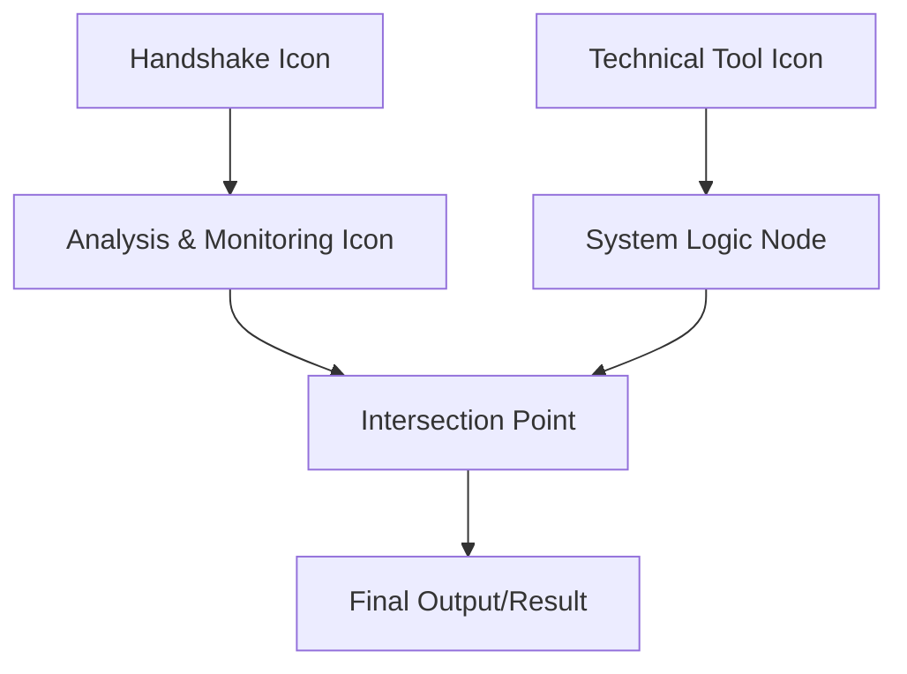
```mermaid
graph TD
  A["Handshake Icon"] --> B["Analysis & Monitoring Icon"]
  C["Technical Tool Icon"] --> D["System Logic Node"]
  B --> E["Intersection Point"]
  D --> E
  E --> F["Final Output/Result"]
```

## 评选表彰优秀产业工人

开展“优秀产业工人”“技术能手”“华电工匠”等评选表彰活动，2025年评选表彰优秀产业工人100名，给予精神和物质奖励，增强产业工人的荣誉感和归属感；

## 拓宽产业工人晋升通道

将优秀产业工人纳入公司干部人才培养体系，选拔优秀产业工人担任基层管理人员、技术骨干，2025年有10名优秀产业工人晋升为基层管理人员，拓宽产业工人职业发展通道。

## 未来ESG发展规划

2026年是“十五五”开局之年，也是华电辽能乘势而上、深化ESG实践的关键之年。作为中国华电在辽二级单位，公司将坚持以习近平新时代中国特色社会主义思想为指导，全面贯彻党的二十届历次全会精神和习近平总书记关于东北、辽宁全面振兴的重要讲话精神，深刻领悟“两个确立”的决定性意义，做到“两个维护”，以高质量党建引领ESG工作全面升级，切实履行央企“六个力量”使命担当。

## 绿色转型再提速

紧扣国家“双碳”目标和辽宁清洁能源强省建设部署，加快丹东海上风电项目开发建设，推进丹东热电二期项目高质量施工，谋划打造多能互补示范项目；持续加大新能源布局力度，提升清洁能源装机占比；深化低碳技术研发与应用，推动“离网制氢”“污泥掺烧”等技术产业化落地，培育氢能等新产业新业态，打造清洁低碳能源体系。

## 公司治理再优化

持续完善ESG治理体系，将ESG指标纳入公司绩效考核体系，推动ESG理念更深融入生产经营各环节；优化董事会专门委员会职能，强化独立董事ESG履职能力；深化内控合规与风险管控，升级一体化平台，实现风险精准防控、合规全程管控；持续加强党建与公司治理深度融合，以高质量党建引领企业治理现代化。

## 环境绩效再提升

严格落实碳排放管控要求，持续提升碳排放精细化管理水平，力争碳排放强度稳步下降；深化节能降碳专项行动，推进设备节能改造，提升能源利用效率；严格执行污染防治标准，持续加强大气、水、固废污染治理，确保污染物排放持续达标；完善环境风险应急体系，提升环境风险防控能力，坚守生态环境保护底线。

## 社会责任再深化

始终将能源保供作为核心职责，以“时时放心不下”的责任感筑牢安全生产防线，提升电力热力供应的稳定性和可靠性；持续深化“中国华电度度关爱”理念，开展更多贴近民生的公益活动，加强企地协同，助力乡村振兴和辽宁全面振兴；进一步完善员工关爱体系，优化人才培养和激励机制，搭建更广阔的员工成长平台，实现企业与员工共同发展；加强与利益相关方沟通，主动披露ESG实践成果，接受社会各界监督。

征程万里风正劲，重任千钧再出发。华电辽能将始终坚守能源报国使命，持续深化ESG实践，推动企业高质量发展与生态环境保护、社会进步深度融合，为服务国家能源战略、推动辽宁全面振兴全方位振兴作出新的更大贡献！

## 读者意见反馈表

尊敬的读者：您好！

非常感谢您阅读本报告，华电辽宁能源发展股份有限公司将不断提高报告的质量和水平，也期盼您的宝贵意见与建议，

## 封闭性问题 (请在您作答的方块内画“”)

1.您对本报告的总体评价如何：

□很好 □好 □一般 □差 □很差

2.您认为本报告是否能反映公司对经济、社会和环境的重大影响：

□是 □否

3.您认为本报告所披露信息、数据、指标的清晰、准确、完整度如何：

□较高 □高 □一般 □低 □很低

4.您认为本报告的结构安排如何：

□较合理 □合理 □一般 □差 □很差

5.您认为本报告版式安排、表现形式设计的易读性如何：

□很好 □好 □一般 □差 □很差

## 如果方便，请告诉我们您的信息：

姓名:\_\_\_\_

职业：\_\_\_\_

机构:\_\_\_\_

联系地址：\_\_\_\_

邮编：\_\_\_\_

E-mail:\_\_\_\_

电话：\_\_\_\_

传真:\_\_\_\_

## 开放式问题 (在下划线上写出您所认为的答案)

1.您认为本报告哪些方面最让您满意？

2.您认为本报告还需要披露哪些您希望进一步了解的信息？

3.您对华电辽能社会责任工作有哪些意见和建议？

## 我们的联系方式是：

华电辽宁能源发展股份有限公司党建工作部

沈阳市和平区南五马路183号泰宸商务大厦B座

邮政编码：110006

电话：024-83996081

传真：024-83996060