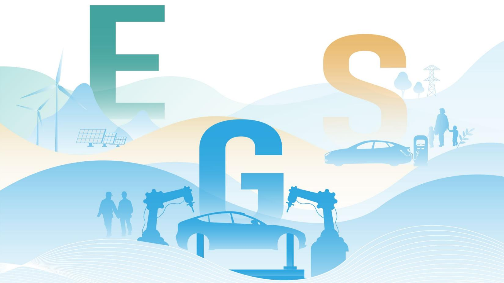

natural_image

Stylized illustration of electric vehicles, wind turbines, solar panels, and industrial robotic arms against a mountainous background (no text or symbols)

## 2025 环境、社会及治理(ESG)报告

## 目录

## CONTENTS

01   关于本报告  
03   董事长致辞  
05   关于我们  
19   专题：创新强企，深耕升级，战新未来  
23   专题：人才强企，梧桐引凤，三航育才  
27 可持续发展管理

91   展望未来  
92   关键绩效表  
95   上交所指标索引  
96   专家点评  
97   意见反馈  
98   报告编委会

## 治理篇

##

## 卓越治理篇

35 夯实公司治理  
38 绘就科创蓝图  
43 稳健合规运营  
46    严守风险底线  
49 筑就安全基石

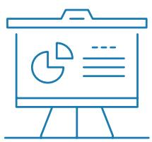

## 制造篇

##

## 绿色制造篇

53 环境合规管理  
57 污染物与废弃物管理  
59 减少资源消耗  
63 应对气候变化  
68 绿色转型

## 共荣篇

##

## 社会共荣篇

73 以人为本，员工满意  
81 优质客户服务  
87 负责任供应链  
89 共建幸福社会

## 关于本报告

## 报告说明

本报告是凌云工业股份有限公司（简称“凌云股份”或“公司”）面向利益相关方发布的第五份环境、社会和公司治理（ESG）报告（以下简称“本报告”）。本报告综合考虑宏观政策和发展趋势，结合凌云股份具体业务考虑ESG要素及利益相关方关注重点，对标国际国内主流评级机构关注点，系统完整地披露了凌云股份2025年度在环境、社会及公司治理等领域的实践和绩效，重点展示了公司为推动高质量发展所付诸的努力旨在与利益相关方进行有效交流，系统地回应利益相关方的期望和要求。

## 披露范围

本报告披露范围涵盖凌云股份及所属分、子公司。报告时间跨度为2025年1月1日至2025年12月31日。为了遵循信息披露完整性、连续性的原则，部分内容适当超出。

## 编制依据

本报告编制遵循上海证券交易所发布的《上海证券交易所上市公司自律监管指引第14号—可持续发展报告（试行）》《上海证券交易所上市公司自律监管指南第 4 号—―可持续发展报告编制》文件，并参考国务院国资委《提高央企控股上市公司质量工作方案》，全球可持续发展标准委员会发布的《GR可持续发展报告标准》(下称“GRI标准”）、联合国可持续发展目标（下称“UNSDGs”）以及国内外主流ESG评级所关注的议题。

## 内容说明

本报告使用数据均来自公司统计报告、正式文件。本报告经公司第九届董事会第八次会议审议通过，郑重承诺本报告中所披露的信息、数据真实可靠，不存在任何虚假性陈述或误导

## 报告获取

本报告以电子版形式发布。电子版可通过访问上海证券交易所官网（https://www.sse.com.cn/）和巨潮资讯网（www.cninfo.com.cn）查阅下载。如果您还想了解本报告以外的公司其他信息，可查阅公司年度财务报告或浏览公司网站（http://www.lingyun.com.cn/）。

## 联系我们

凌云工业股份有限公司

地址：河北省涿州市

电子邮箱：info@lygf.com

电话：0312-3951002

## 董事长致辞

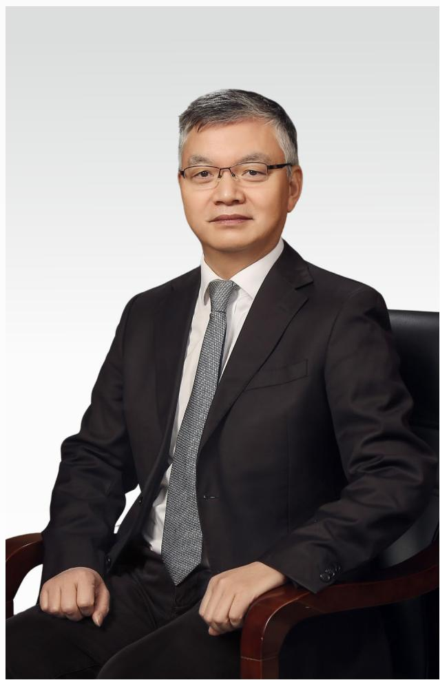

natural_image

Portrait of a man in formal suit and tie seated on a wooden chair (no text or symbols visible)

时序更替，笃行不怠；初心如磐，履责致远。2025年，是国家“十四五”规划收官之年，也是凌云股份在复杂多变的全球局势中破浪前行的关键一年。面对全球产业版图加速震荡、国际贸易环境复杂严峻、市场存量竞争步入深水区的多重挑战，公司管理层坚持系统思维、底线思维，将ESG理念深度融入战略规划、生产经营与企业文化，深耕主业、做强实业公司“十四五”规模指标总体稳定、质效指标持续改善，2025年实现营业收入198.36亿元，同比增长5.30%，以实际行动回应各方期许，全力以赴书写新时代可持续发展的凌云答卷。

这一年，创新驱动新质生产力蓬勃发展。我们坚持科技自立自强，全年研发投入达9.18亿元，投入强度达 4.63%，申请专利 235 项，授权专利 228 项，累计拥有有效专利1836项。公司获批国家级制造业单项冠军企业，所属企业新增1家国家级专精特新重点“小巨人”企业、1家国家级专精特新“小巨人”企业、4家省级专精特新企业及多家高新技术企业截至报告期末，累计拥有1家国家级制造业单项冠军企业、3家国家级专精特新"小巨人"企业、21家省级专精特新中小企业。关键技术攻关成效显著荣获多项重磅荣誉，新产品贡献率突破 40%，数字化转型迈向深水区。

这一年，凌云品牌影响力持续跃升。我们紧跟重点客户战略调整，全年定点新项目持续保持高位区间传统优势产品向集成化、一体化加速迈进，战新产业在新能源汽车、储能、智能制造等领域布局取得新突破。公司连续十年荣登“中国汽车供应链百强”榜，并蝉联“全球汽车供应链一协同共赢生态伙伴奖”，行业地位与社会认可度达到新高度。

这一年，国际化经营深度提质增效。面对复杂多变的外部环境，我们深化海外能力建设，核心系统运维实现从“依赖外部”向“自主可控”的根本转变。通过选派专家团队赴海外支持、实施“一企一策”提升方案，境外企业提质增效达成阶段性挑战目标印尼公司获取两项新订单，摩洛哥工厂建设积极推进，国际化布局得到进一步统筹优化，全球供应链的韧性与可持续经营能力显著增强。

这一年，治理效能与风险防控全面升级。我们扎实推进国企改革深化提升行动，落实穿透式监管要求，坚定推进风险、内控、合规一体化融合管理，成本竞争力和价值创造能力稳步增长，提质增效和业务流程优化标准化的各种措施创效9亿元。公司持续筑牢安全、质量、绿色三大基石，常态化开展“双控机制”建设、产线升级与节能改造，全面提升能源利用效率，将可持续发展贯穿于生产运营的全生命周期，并在智能工厂和数智产线建设方面取得丰硕成果。

这一年，企业文化与人才培育厚积薄发。与时俱进重塑凌云集团企业文化核心理念体系，持续加强高质量文化供给，企业文化凝聚全员奋进共识，价值成效彰显。公司于部人才队伍结构持续优化，职工的归属感、凝聚力明显增强。我们积极履行国资央企责任担当，在贯彻国家重大战略、助力乡村振兴及社会公益事业中主动作为，营造了干事创业的良好氛围。

回望2025，耕耘不辍，硕果盈枝！展望未来“十五五”大幕已起，凌云股份将全面贯彻党的二十大和历次全会精神，立足建设“世界一流汽车零部件企业”定位，秉持必胜信心，以更坚定的决心、更卓越的业绩，回馈股东、赋能行业、造福员工向着建设“有技术、有品牌、有文化、有抱负、受尊重的现代化企业愿景奋力迈进，为推动中国汽车工业高质量发展贡献更大的凌云力量

凌云股份

党委书记、董事长

罗开全

## 关于我们

## 公司介绍

凌云工业股份有限公司是北方凌云工业集团有限公司控股上市公司，现注册资本12.22亿元，在职工10000余人，股票代码600480，下辖70多家分子公司，分布于德国、墨西哥、印尼以及国内30多个省市和地区其中与瑞士、美国、韩国、德国等合资成立 15 家中外合资公司。公司 2003 年上市，是一家全球化汽车零部件供应商。拥有凌云股份、亚大等品牌，主导产品有车身安全结构产品、新能源汽车电池产品、汽车管路系统，积极布局新能源电池管理系统、汽车热管理系统、汽车流体控制系统、汽车线控转向系统及智能制造工程。

## 发展历程和里程碑节点

公司的前身是一家成立于上世纪90年代的汽车零部件加工厂，全部生产线为手动操作。2007年成功研发出国内首条汽车管路自动化生产线，标志公司正式踏入自动化、现代化制造时代。

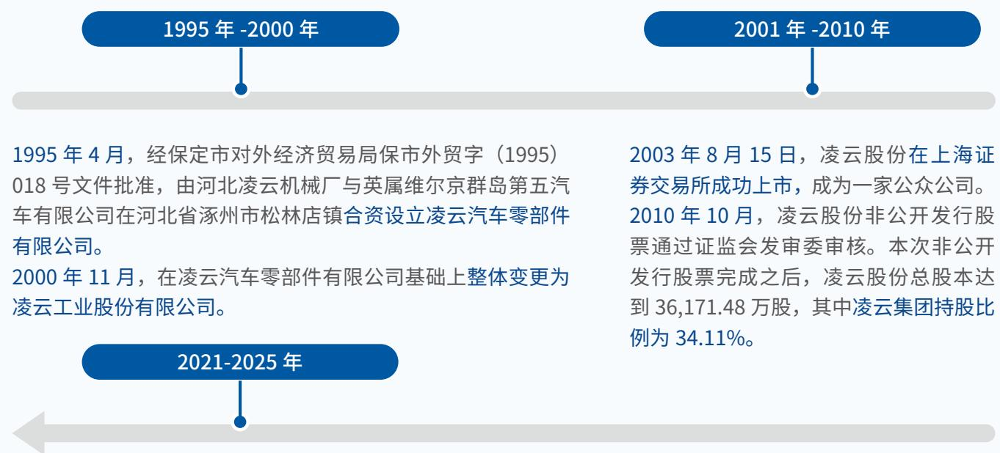

flowchart

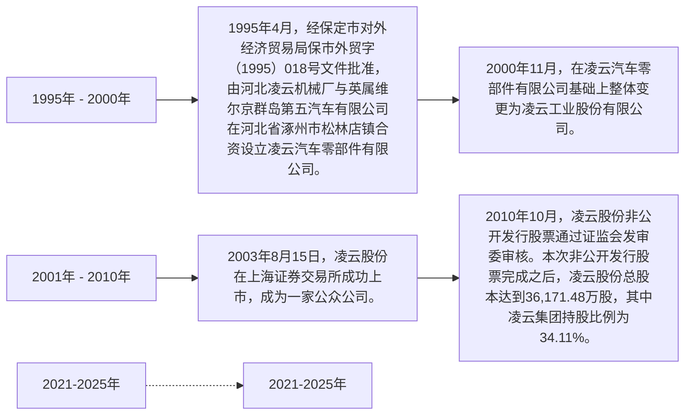
```mermaid
graph LR
  A["1995年 - 2000年"] --> B["1995年4月，经保定市对外经济贸易局保市外贸字（1995）018号文件批准，由河北凌云机械厂与英属维尔京群岛第五汽车有限公司在河北省涿州市松林店镇合资设立凌云汽车零部件有限公司。"]
  B --> C["2000年11月，在凌云汽车零部件有限公司基础上整体变更为凌云工业股份有限公司。"]
  D["2001年 - 2010年"] --> E["2003年8月15日，凌云股份在上海证券交易所成功上市，成为一家公众公司。"]
  E --> F["2010年10月，凌云股份非公开发行股票通过证监会发审委审核。本次非公开发行股票完成之后，凌云股份总股本达到36,171.48万股，其中凌云集团持股比例为34.11%。"]
  G["2021-2025年"] -.-> H["2021-2025年"]
```

2022年3月，凌云股份非公开发行A股普通股股票15,350.3893万股。

2023年3月，凌云股份实施《2022年限制性股票激励计划》，首次授予激励对象2,289.7100万股。

2025 年5月，公司以资本公积金转增股本，每10股转增3股，共计转增282.083.187股，转增后公司股份总数变更为122,236.0477万股。

2025年10月，凌云股份回购注销部分已获授但尚未解锁的限制性股票，由此公司股份总数变更为122,228.4427 万股。

凌云股份连续多年荣登“中国汽车工业30强”及“全国百家优秀汽车零部件供应商”榜单。汽车车身安全结构产品市场份额得到巩固提升：新能源汽车电池产品是布局新能源汽车领域的重点产品，属于快速成长型新兴业务；汽车管路产品在乘用车、商用车市场取得客户一致认可；智能市政管网系统产品于燃气市场行业保持稳中有进的发展势头，是国内专业化生产聚乙烯管道产品最早的厂家之一。

报告期内，公司荣登2025年度中国机械工业500强榜单，荣获“2025年度上市公司董事会办公室最佳实践”“华证 ESG 评级证书综合评级 A”“2025 年度上市公司董事会秘书履职评价 5A 评级”“第三届国新杯 ESG 金牛奖百强”“2025 年度上市公司可持续发展优秀实践案例”“2024年度金牛董秘奖”等奖项。

2011年4月，经兵器工业集团公司批复，凌云股份受让凌云集团持有股权以及凌云集团本部的固定资产和部分土地、负债。

2015年11月，凌云股份非公开发行股票通过证监会发审委审核，本次非公开发行股票完成之后，凌云股份总股本达到45.093.4166 万股。

2017年7月，凌云股份实施限制性股票激励计划，股权激励计划授予登记的限制性股票共计413.68万股。2019年6月，凌云股份配股发行股票通过证监会发审委审核后，以公司总股本45.507.0966万股为基数，按每10股配 3股的比例向全体股东配售。

2019年11月，凌云股份回购完成了注销的部分股权激励对象持有的限制性股票。

2020年3月，4.月，凌云股份回购激励对象已获授但尚未解锁的限制性股票，同时审议通过了《2019年度利润分配及资本公积金转增股本预案》，以资本公积金转增股本，每10股转增4股，转增21.866.8678万股股本变更为76.534.0374 万股。

## 2011-2015 年：

## 2016-2020 年

## 国际化业务拓展

上市后，公司持续拓展业务范围，不仅在传统企业零部件领域保持领先地位 , 还积极向汽车零部件集成化、模块化、智能化等方向转型升级。全球化布局是汽车产业发展壮大的必由之路，凌云股份践行国家“一带一路”及“走出去”战略，2015年启动国际化经营战略，围绕亚洲、欧洲、北美三大重点市场，通过资本运作与海外建厂，已先后在德国、印尼、墨西哥等国家建立境外实体企业，初步建立起全球联动配套体系，成功融入全球汽车产业链，形成市场协同发展、资源优化配置的国际化格局，提升了品牌价值，增强了全球竞争力，为企业实现高质量发展和打造全球化优秀汽车零部件供应商奠定了坚实基础，力争打造全球化优秀汽车零部件供应商。2025年，公司针对国际化经营提出提质增效战略部署，着力优化国际化经营管控模式，推进海外子企业经营改善和稳增长，持续提升国际化经营质量。

## 发展与未来

聚售国资委“9+6”战略性新兴产业和未来产业，顺应全球汽车市场发展趋势，围绕主责主业，推动向轻量化电动化、智能化、网联化的方向发展，积极研判分析自身传统优势产业和未来战新产业发力点，按照技术相关、产业链协同的发展思路，瞄准新能源汽车、新能源、人工智能等战新领域，推动传统优势产业向模块化、集成化、高端化转型升级的基础上，加快发展新质生产力。

natural_image

Exterior view of modern glass skyscrapers under a clear sky (no signage or text visible)

## 企业愿景

建设“有技术、有品牌、有文化、有抱负、受尊重”具有全球竞争力的现代化企业

## 企业使命

建设世界一流汽车零部件企业

## 核心价值观

价值导向、底线思维、客户满意、员工满意、供应商满意、社会满意

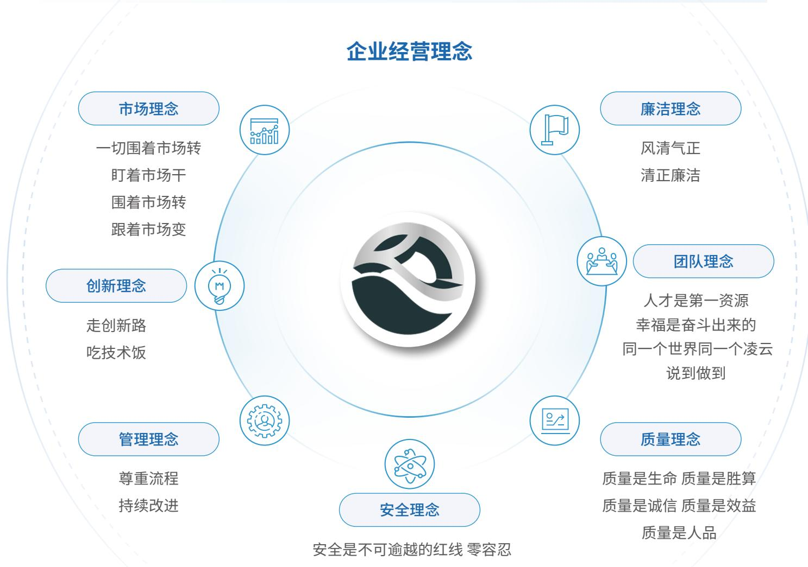

flowchart

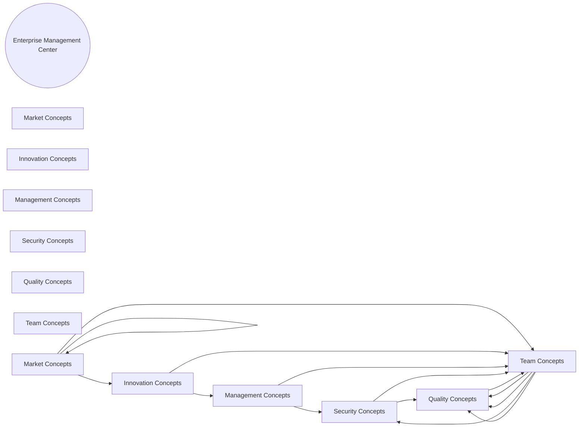
```mermaid
graph LR
  Center(("Enterprise Management Center"))
  
  sub1["Market Concepts"]
  sub2["Innovation Concepts"]
  sub3["Management Concepts"]
  sub4["Security Concepts"]
  sub5["Quality Concepts"]
  sub6["Team Concepts"]
  
  Market["Market Concepts"]
  Innovation["Innovation Concepts"]
  Management["Management Concepts"]
  Security["Security Concepts"]
  Quality["Quality Concepts"]
  
  Market --> Market
  Market --> Innovation
  Innovation --> Management
  Management --> Security
  Security --> Quality
  
  Team["Team Concepts"]
  Team --> Quality
  Team --> Quality
  
  Team --> Security
  
  Team --> Quality
  
  Market --> Team
  Innovation --> Team
  Management --> Team
  Security --> Team
  Quality --> Team
```

## 凌云工业股份有限公司

组织结构  
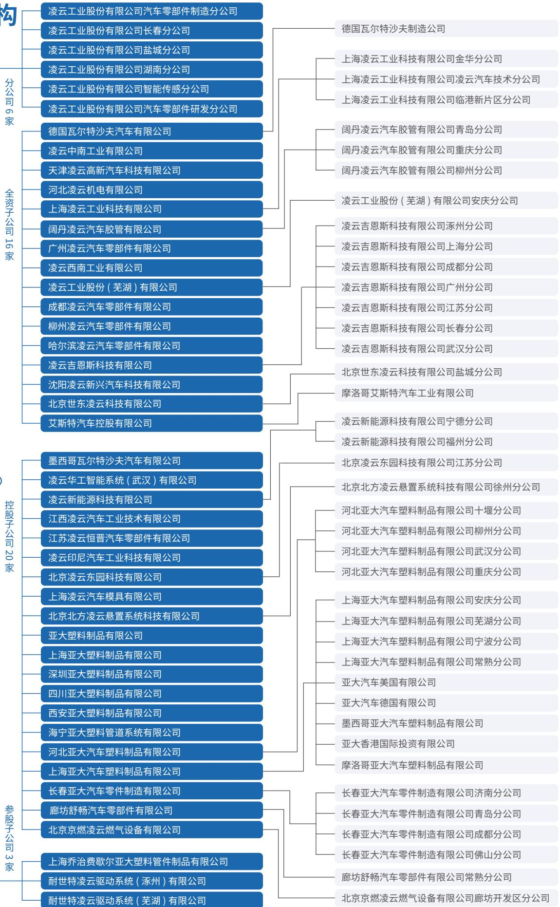

flowchart

```mermaid
graph LR
  A["分公司6家"] --> B["凌云工业股份有限公司汽车零部件制造分公司"]
  A --> C["凌云工业股份有限公司长春分公司"]
  A --> D["凌云工业股份有限公司盐城分公司"]
  A --> E["凌云工业股份有限公司湖南分公司"]
  A --> F["凌云工业股份有限公司智能传感分公司"]
  A --> G["凌云工业股份有限公司汽车零部件研发分公司"]
  B --> H["德国瓦尔特沙夫汽车有限公司"]
  B --> I["凌云中南工业有限公司"]
  B --> J["天津凌云高新汽车科技有限公司"]
  B --> K["河北凌云机电有限公司"]
  B --> L["上海凌云工业科技有限公司"]
  B --> M["阔丹凌云汽车胶管有限公司"]
  B --> N["广州凌云汽车零部件有限公司"]
  B --> O["凌云西南工业有限公司"]
  B --> P["凌云工业股份（芜湖）有限公司"]
  B --> Q["成都凌云汽车零部件有限公司"]
  B --> R["柳州凌云汽车零部件有限公司"]
  B --> S["哈尔滨凌云汽车零部件有限公司"]
  B --> T["凌云吉恩斯科技有限公司"]
  B --> U["沈阳凌云新兴汽车科技有限公司"]
  B --> V["北京世东凌云科技有限公司"]
  B --> W["艾斯特汽车控股有限公司"]
  H --> X["德国瓦尔特沙夫制造公司"]
  H --> Y["上海凌云工业科技有限公司金华分公司"]
  H --> Z["上海凌云工业科技有限公司凌云汽车技术分公司"]
  H --> AA["上海凌云工业科技有限公司临港新片区分公司"]
  H --> AB["阔丹凌云汽车胶管有限公司青岛分公司"]
  H --> AC["阔丹凌云汽车胶管有限公司重庆分公司"]
  H --> AD["阔丹凌云汽车胶管有限公司柳州分公司"]
  H --> AE["凌云工业股份（芜湖）有限公司安庆分公司"]
  H --> AF["凌云吉恩斯科技有限公司涿州分公司"]
  H --> AG["凌云吉恩斯科技有限公司上海分公司"]
  H --> AH["凌云吉恩斯科技有限公司成都分公司"]
  H --> AI["凌云吉恩斯科技有限公司广州分公司"]
  H --> AJ["凌云吉恩斯科技有限公司江苏分公司"]
  H --> AK["凌云吉恩斯科技有限公司长春分公司"]
  H --> AL["凌云吉恩斯科技有限公司武汉分公司"]
  H --> AM["北京世东凌云科技有限公司盐城分公司"]
  H --> AN["摩洛哥艾斯特汽车工业有限公司"]
  H --> AO["凌云新能源科技有限公司宁德分公司"]
  H --> AP["凌云新能源科技有限公司福州分公司"]
  H --> AQ["北京凌云东园科技有限公司江苏分公司"]
  H --> AR["北京北方凌云悬置系统科技有限公司徐州分公司"]
  H --> AS["河北亚大汽车塑料制品有限公司十堰分公司"]
  H --> AT["河北亚大汽车塑料制品有限公司柳州分公司"]
  H --> AU["河北亚大汽车塑料制品有限公司武汉分公司"]
  H --> AV["河北亚大汽车塑料制品有限公司重庆分公司"]
  H --> AW["上海亚大汽车塑料制品有限公司安庆分公司"]
  H --> AX["上海亚大汽车塑料制品有限公司芜湖分公司"]
  H --> AY["上海亚大汽车塑料制品有限公司宁波分公司"]
  H --> AZ["上海亚大汽车塑料制品有限公司常熟分公司"]
  H --> BA["亚大汽车美国有限公司"]
  H --> BB["亚大汽车德国有限公司"]
  H --> BC["墨西哥亚大汽车塑料制品有限公司"]
  H --> BD["亚大香港国际投资有限公司"]
  H --> BE["摩洛哥亚大汽车塑料制品有限公司"]
  H --> BF["长春亚大汽车零件制造有限公司济南分公司"]
  H --> BG["长春亚大汽车零件制造有限公司青岛分公司"]
  H --> BH["长春亚大汽车零件制造有限公司成都分公司"]
  H --> BI["长春亚大汽车零件制造有限公司佛山分公司"]
  H --> BJ["廊坊舒畅汽车零部件有限公司常熟分公司"]
  H --> BK["北京京燃凌云燃气设备有限公司廊坊开发区分公司"]
  
  subgraph CompanyA [全资子公司6家]
    A1["全资子公司15家"]
    A2["全资子公司15家"]
    A3["全资子公司15家"]
    A4["全资子公司15家"]
    A5["全资子公司15家"]
    A6["全资子公司15家"]
    A7["全资子公司15家"]
    A8["全资子公司15家"]
    A9["全资子公司15家"]
    A10["控股子公司20家"]
    A11["控股子公司20家"]
    A12["控股子公司20家"]
    A13["控股子公司20家"]
    A14["控股子公司20家"]
    A15["控股子公司20家"]
    A16["控股子公司20家"]
    A17["控股子公司20家"]
    A18["控股子公司20家"]
    A19["控股子公司20家"]
    A20["参股子公司3家"]
    A21["参股子公司3家"]
    A22["参股子公司3家"]
    A23["参股子公司3家"]
    A24["参股子公司3家"]
```

## 产业与产品

公司主营汽车零部件、智能市政管网系统两大产业板块。其中：

汽车零部件  
是凌云股份核心产业，其主要产品包括车身安全结构产品、新能源电池产品、汽车管路系统。拥有高强钢辊压、冲压、拉弯、3D 自由折弯、热成型、铝合金成型、焊接、连接、长纤维复材料模压成型等重点工艺技术。  

凌云工业股份有限公司LINGYUN INDUSTRIAL CORPORATION LIMITER

七大产品谱系  
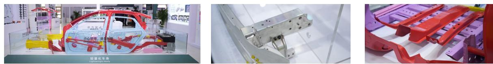  
轻量化车身

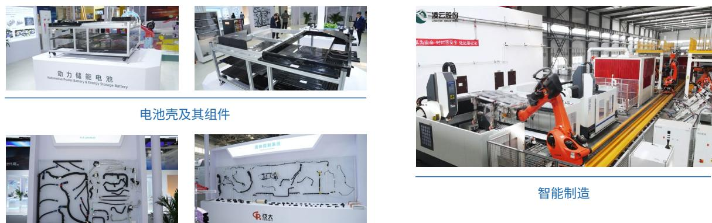

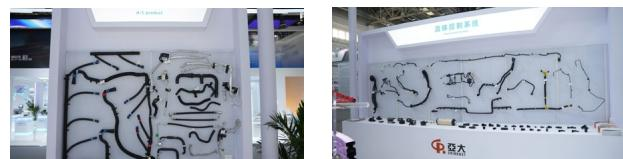  
流体控制系统

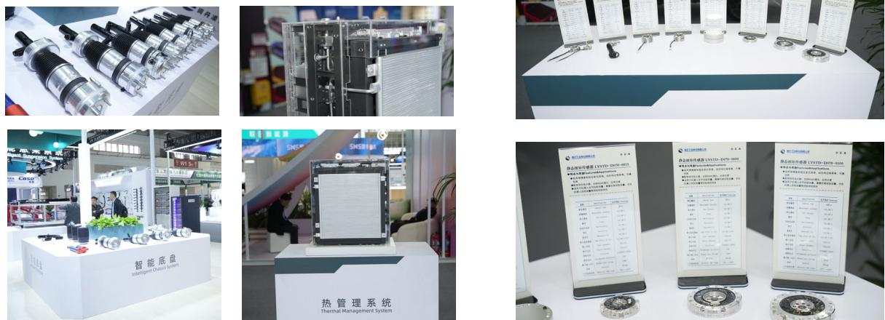  
智能底盘  
热管理系统

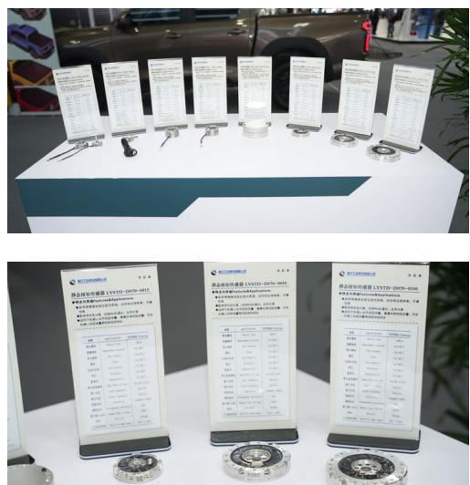  
力传感器

## 智能市政管网系统

重点产品包括：天然气、给排水、热力管道系统和加油站、核电站用管路系统五大产品系列。拥有单层实壁管挤出、多层管共挤、实壁管厚包覆挤出、PP缠绕管、管件自动化单元等重点工艺技术。

凌云工业股份有限公司

## 智能市政塑料管网系统

  
管材系列

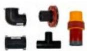  
管件系列

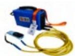  
焊机系列

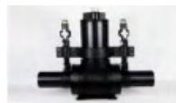  
阀门系列

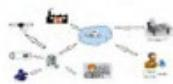

工程管理系统  
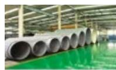  
排水管路

●亚大成立于1987年，现拥有8+生产基地，分别设在河北、上海、浙江、广东、四川、陕西等年加工能力达到30+万吨  
●应用场景：燃气输配、给排水、热力、农业灌溉、储能、核电、油田、船舶及海工装备等  
●优势：耐腐蚀、柔韧性好、重量轻、输送能力强、维护成本低、使用寿命长、绿色环保

## 产业布局

公司围绕核心汽车产业地区建立东北、华北、华东、中南、西南5大区域公司，汽车管路、新能源、热成型3大专业并在欧洲。北美，东南亚。北非等地设立8家境外公司。深度参与全球汽车市场。为国内国际主流汽车品牌客户提供最优质的产品和服务，努力打造世界一流汽车零部件集团化供应商。

## 产业布局优化

巩固国内区域及专业化布局，汽车车身安全、汽车管路、电池结构等核心产品市占率持续保持领先；集成化、智能化、绿色化转型升级取得重大突破。布局轻型装备智能无人系统、汽车底盘系统新赛道培育汽车与传感器，智能制造新领域。稳住德国WAG经营，做强墨西哥，摩洛哥，印尼等海外基地重塑国际化经营新格局。

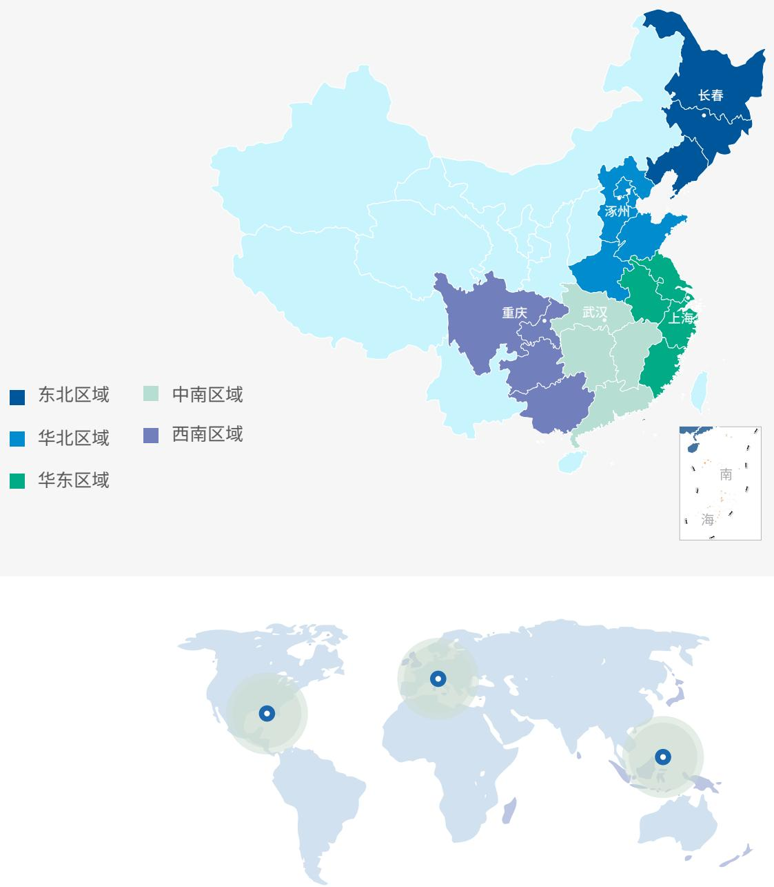

东北区域

中南区域

华北区域

西南区域

华东区域

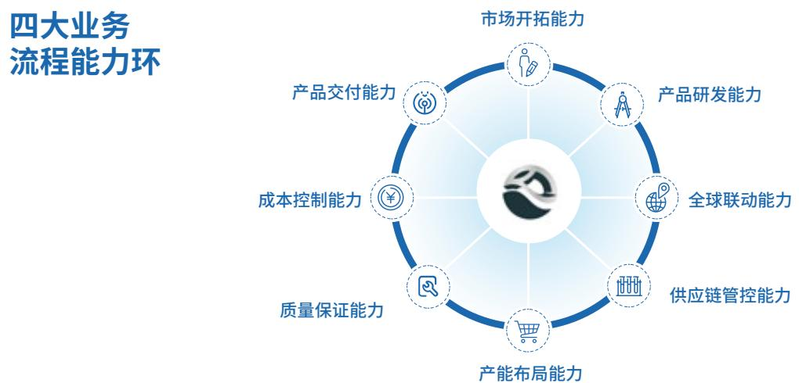

## 业绩与分红

## 经营业绩与分红

2025 年度

实现营业收入 198.36亿元

同比变化 5.3%

实现利润总额 12.74亿元

同比变化 19.02%

汽车金属及塑料零部件完成收入182.18

同比变化 6.47%

塑料管道系统板块完成收入 9.22

## 公司十大流通股东

截至2025年末，公司前十名流通股东（或无限售条件股东）持股情况如下

<table><tr><td>股东名称(全称)</td><td>期末持股数量</td><td>比例(%)</td><td>股东性质</td></tr><tr><td>北方凌云工业集团有限公司</td><td>389,980,342</td><td>31.91</td><td>国有法人</td></tr><tr><td>中兵投资管理有限责任公司</td><td>148,695,378</td><td>12.17</td><td>国有法人</td></tr><tr><td>国新投资有限公司</td><td>29,520,044</td><td>2.42</td><td>未知</td></tr><tr><td>信泰人寿保险股份有限公司-传统产品</td><td>22,507,181</td><td>1.84</td><td>未知</td></tr><tr><td>中国人寿保险股份有限公司-传统-普通保险产品-005L-CT001沪</td><td>14,119,451</td><td>1.16</td><td>未知</td></tr><tr><td>香港中央结算有限公司</td><td>10,658,317</td><td>0.87</td><td>未知</td></tr><tr><td>宋天峰</td><td>8,090,700</td><td>0.66</td><td>个人</td></tr><tr><td>招商银行股份有限公司-南方中证1000交易型开放式指数证券投资基金</td><td>6,717,004</td><td>0.55</td><td>未知</td></tr><tr><td>韩东风</td><td>4,299,873</td><td>0.35</td><td>个人</td></tr><tr><td>招商银行股份有限公司-华夏中证1000交易型开放式指数证券投资基金</td><td>4,250,170</td><td>0.35</td><td>未知</td></tr></table>

## 社会认可

## 公司荣誉（报告期内新增荣誉）

国家级和省部级荣誉奖项  
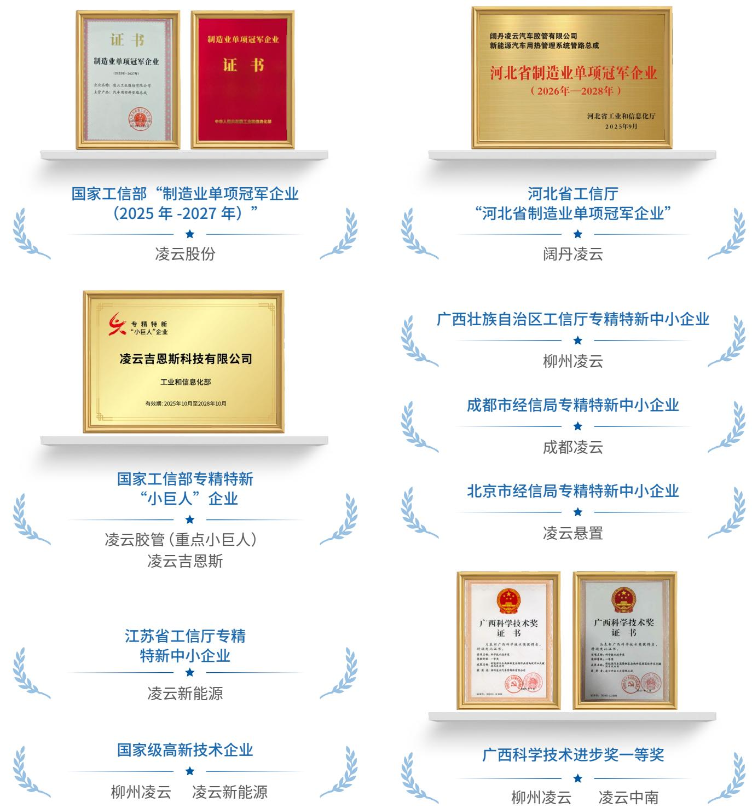

## 行业给予荣誉奖项

连续十年荣登  
“中国汽车供应链百强”榜单  
连续两年获得中国汽车报  
“全球汽车供应链—协同共赢生态伙伴奖”  
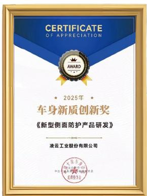

text_image

CERTIFICATE
OF APPRECIATION
AWARD
* 2025年*
车身新质创新奖
《新型侧面防护产品研发》
凌云工业股份有限公司

《新型侧面防护产品研发》荣获  
中国十佳车身委员会新质创新奖

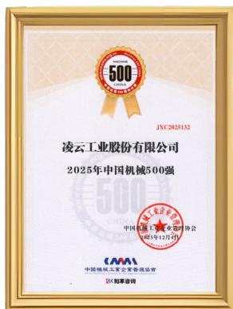

text_image

JXC2025132
凌云工业股份有限公司
2025年中国机械500强
中国国际航空集团国际会议
（2025年12月1日）
CAMA
中国国际航空集团国际会议
（2025年12月1日）
JXK和嘉咨询

荣登  
“2025年度中国机械工业 500强榜单”

## 其他科研奖励

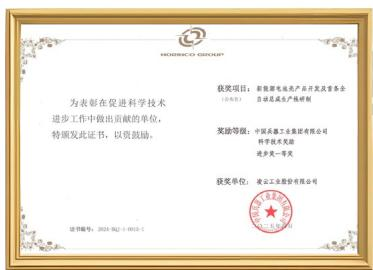

text_image

HOSKOC GROUP
为表彰在促进科学技术进步工作中做出贡献的单位，特颁发此证书，以资鼓励。
获奖项目：新能源电池产品开发及董事会
（以下简称）：自动完成生产批制
奖励等级：中国兵器工业集团有限公司
科学技术奖励
逐步奖一考奖
获奖单位：凌云工业股份有限公司
证书编号：2018-062（1-0015）
（盖章）

新能源电池壳产品开发及首条全自动总成生产线研制  
中国兵器工业集团有限公司进步奖一等奖

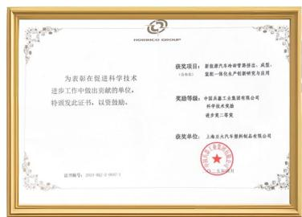

text_image

HOSMECO GROUP®
为表彰在促进科学技术进步工作中做出贡献的单位，特须发此证书，以奖励。
获奖项目：
（小车奖）：新奥汽车零部件修造、成型、
蓝领一体化生产线创新研究与应用
奖励等级：中国兵器工业集团有限公司
科学技术奖励
进步奖二等奖
获奖单位：上海五大汽车塑料制品有限公司
证书编号：2021/9/2-2021-1

新能源汽车冷却管路挤出，成型，装配一体化生产创新研究与应用  
中国兵器工业集团有限公司进步奖二等奖

## 其他管治类奖励

  
汽车零部件企业“业财融合”管理体系的构建与实施  
三等奖  
汽车零部件企业以价值创造为导向的资金管控体系构建与实施  
三等奖

## 中国兵器工业集团有限公司管理创新成果奖

## 其他管治类奖励

## 河北省企协管理创新成果奖

制造企业基于精益理念的业财一体化系统的构建与实施  
一等奖  
以“机制革新、生态重构、产业突破”为核心的科技创新实践  

深入构建体系化安全生产管理创新性实施“12345”安全生产工作法”  
二等奖  
基于转型升级目标搭建契约型股权激励计划的创新实践  

构建1+2+3+N 风险内控合规融合管理体系赋能企业高质量稳健发展  
二等奖  
汽车零部件企业以风险与成本管控为导向的财务管理体系构建与实施  

项目全价值链成本管理和风险管控工作实践  
三等奖  
以财务管理赋能，驱动汽车零部件企业科研项目管理跃升  

基于党建与治理结构协同的国有中外合资企业价值创造机制研究  
三等奖  
以项目建设为引领，构建企业全流程“大安全”防线  

## 以价值创造为引领的提质增效体系构建与实施

三等奖

## 其他质量、安全、健康类奖励

## 河北省第八届质量创新成果奖

一等奖10项 二等奖10项 三等奖14项

## 中国兵器工业集团有限公司质量协会QC 成果奖

一等奖7项 二等奖14项 质量信得过班组10 个三等奖16 项

## 2025年国家卫健委健康企业建设优秀案例

职业健康实践优秀案例

## ESG与信息披露荣誉

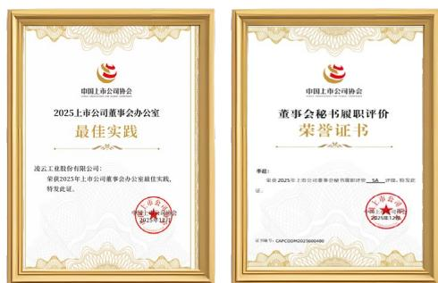

荣获中国上市公司协会“2025年度上市公司董事会办公室最佳实践”及“2025年度上市公司董事会秘书履职评价5A评级”

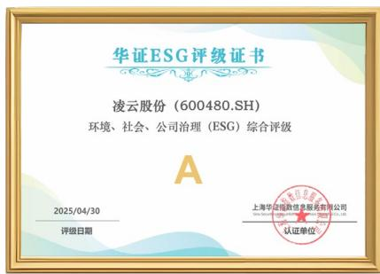

text_image

华证ESG评级证书
凌云股份（600480.SH）
环境、社会、公司治理（ESG）综合评级
A
2025/04/30
评级日期
上海华证路演信息服务有限公司
认证单位

获评“华证ESG评级证书综合评级A”

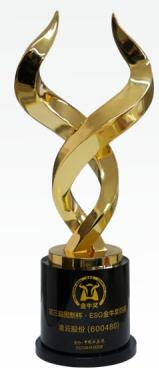

“第三届国新杯ESG金牛奖百强”

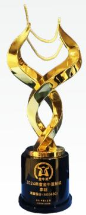

“2024年度金牛董秘奖”

入选“2025年度上市公司可持续发展优秀实践案例”

2025年上市公司可持续发展优秀实践案例名单  
(以证券代码排序

<table><tr><td>序号</td><td>证券代码</td><td>证券简称</td></tr><tr><td>1</td><td>600010.SH</td><td>包钢股份</td></tr><tr><td>2</td><td>600017.SH</td><td>日照港</td></tr><tr><td>3</td><td>600018.SH</td><td>上港集团</td></tr><tr><td>4</td><td>600020.SH</td><td>中原高速</td></tr><tr><td>5</td><td>600022.SH</td><td>山东钢铁</td></tr><tr><td>6</td><td>600056.SH</td><td>中国医药</td></tr><tr><td>7</td><td>600060.SH</td><td>海信视像</td></tr><tr><td>8</td><td>600064.SH</td><td>南京高科</td></tr><tr><td>9</td><td>600066.SH</td><td>宇通客车</td></tr><tr><td>10</td><td>600072.SH</td><td>中船科技</td></tr><tr><td>11</td><td>600099.SH</td><td>林海股份</td></tr><tr><td>12</td><td>600101.SH</td><td>明星电力</td></tr><tr><td>13</td><td>600110.SH</td><td>诺德股份</td></tr></table>

<table><tr><td>序号</td><td>证券代码</td><td>证券简称</td></tr><tr><td>26</td><td>600307.SH</td><td>酒钢宏兴</td></tr><tr><td>27</td><td>600312.SH</td><td>平高电气</td></tr><tr><td>28</td><td>600320.SH</td><td>振华重工</td></tr><tr><td>29</td><td>600323.SH</td><td>瀚蓝环境</td></tr><tr><td>30</td><td>600328.SH</td><td>中盐化工</td></tr><tr><td>31</td><td>600329.SH</td><td>达仁堂</td></tr><tr><td>32</td><td>600335.SH</td><td>国机汽车</td></tr><tr><td>33</td><td>600369.SH</td><td>西南证券</td></tr><tr><td>34</td><td>600379.SH</td><td>宝光股份</td></tr><tr><td>35</td><td>600422.SH</td><td>昆药集团</td></tr><tr><td>36</td><td>600449.SH</td><td>宁夏建材</td></tr><tr><td>37</td><td>600452.SH</td><td>涪陵电力</td></tr><tr><td>38</td><td>600480.SH</td><td>凌云股份</td></tr></table>

## 专题 》

## 创新强企，深耕升级，战新未来

## 引言

凌云股份作为汽车零部件领军企业深耕行业三十载，在2025年迎来极具挑战的一年。这一年，凌云股份围绕民品转型升级高质量发展任务，顶压前行、攻坚克难，通过科研创新和转化布局新赛道，在传统优势的热成型和汽车管路业务上加深轻量化、电动化，全面拥抱新能源汽车；同时推进液冷系统、传感器等新产品的研发制造，传统产品布局数据中心，储能等战新产业和未来产业，转型升级成效显著。

公司连续十年荣登“中国汽车供应链百强”榜，连续两年荣获“全球汽车供应链--协同共赢生态伙伴奖”，连续十年保持“全国文明单位”称号，为“十五五”加快建设具有全球竞争力的世界一流汽车零部件企业奠定了坚实基础。

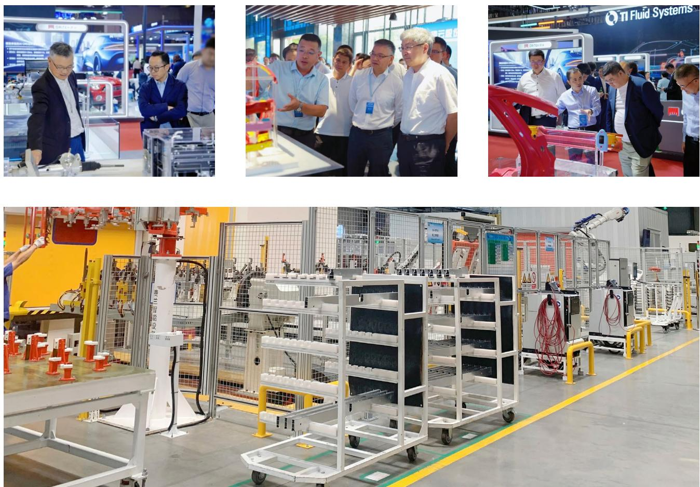

## 布局新能源汽车：“双碳”主题下创新推动产品升级

全球汽车产业向新能源、轻量化加速转型，国内“双碳”政策纵深推进、新能源汽车渗透率持续提升，集成化模块化采购成为行业主流。凌云股份聚焦车身安全结构件、新能源电池壳、汽车管路系统等核心业务，紧扣“双碳”政策与市场需求升级导向。依托现有核心技术工艺，深化材料替代与工艺优化，强化成本竞争力，以“研发+集成+创新”推动传统优势产品全面升级。

## 热成型技术

凌云股份前瞻储备相关技术工艺，积累了深厚的冲压技术禀赋。公司2009年开始研发热冲压成型产品，通过热冲压成型技术打造的高强度钢可兼具轻量化和碰撞安全性。公司突破热成型超高强材料高频制管与热成型量产技术，并实现了2GPa裸板及铝硅涂层管项目的首次量产应用。

## 辊压技术

凌云股份聚焦传统汽车零部件的技术创新。2025年，凌云股份牵头的“镀锌特超高强钢板应用技术研究和关键汽车零部件产业化应用”研究作为国家科技重大专项(06专项）的其中之一，成功获批资金152万元。公司自主攻克“目字形”复合辊压电池壳边梁核心工艺，实现双强度、双宽度材料在线辊压与激光焊接复合成型，达成两项核心技术的行业领先。

## 电池壳技术

电池壳是新能源汽车电池包安全防护的重要部件，主要用于承载电池组、冷却模块等动力电池系统部件承担着强度防护、耐环境防护和阻燃防护等功能。2015年公司布局新能源电池盒领域，使得公司获得轻量化技术，当前公司海外基地已形成完善布局，获得国际优质客户背书，且拥有行业领先的研发实力，共同构建强大核心竞争优势。

## 汽车管路技术

2025年。凌云股份在汽车热管理系统取得里程碑式成果，完成“热管理集成阀岛”与“热管理控制器两大核心部件自主研发，商用车热管理系统样机顺利通过台架测试、冬夏季路试及可靠性验证路试，性能表现卓越，获得重汽新能源重卡批量订单。汽车流体控制系统完成电子水泵、多通路电子水阀、电池包快换接头及冷却管路总成的开发及验证工作，其中电池包快换已在广汽实现批量应用，冷却管路总成产品已在宁德时代、蔚来、理想、小鹏等实现批量应用。

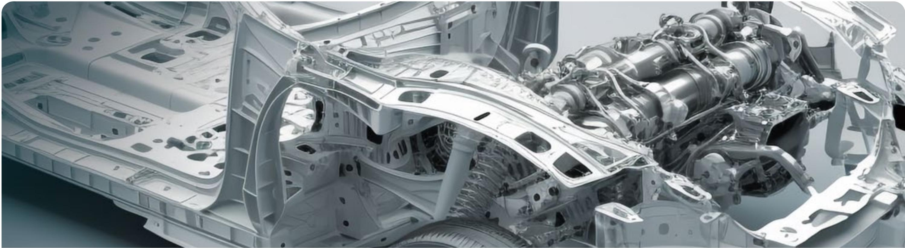

natural_image

3D cutaway view of an automotive chassis showing internal components and structural framework (no text or symbols visible)

## 布局新赛道：前瞻研发转型进入“战新+ 未来”产业

“十五五规划”战略布局战新产业、未来产业，指明产业发展新方向。凌云股份凭借自身多年业务积累、技术创新体系优势以及行业资源整合能力，已经开展多项新技术研发和新产品应用，在新赛道中以科研创新为基础、以专业运营为路径，实施产业结构布局的转型升级，目前液冷系统已经进入数字能源供应链。

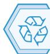

## 数字能源液冷系统

公司液冷业务以汽车流体管路与热管理的系统化能力为基，形成覆盖一次侧、二次侧、机柜总成和储能系统的液冷产品矩阵，已完成从车端管路向数字能源设备的迁移，形成以液冷管路、快速接头、软管与管路总成为核心的产品矩阵，并已取得储能、充电站、数据中心等多场景订单并进入多家头部生态供应链。其中，凌云胶管公司液冷产品实现核心胶料自研。橡胶在极端工况下展现出超强的抗老化、抗渗透性能，寿命较常规产品提升50%，产品通过美国UL认证、AMD认证及散热巨头企业严苛测试。

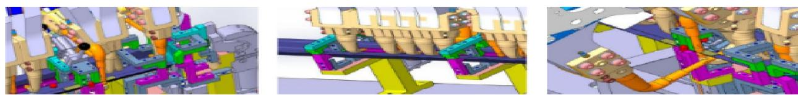

## 传感器业务

公司自2023年起牵头联合中国科学院合肥物质科学研究院和中兵智能创新研究院，开展六维力传感器的研发。该项目推动高精度力传感器实现技术攻关到产业化的跨越式突破，被列入工信部2023年揭榜挂帅项目。2025年，公司顺利完成拉压力传感器、扭矩传感器全系列开发，建成10万级洁净车间，已实现向多家企业的小批量供货。成立了凌云股份智能传感分公司。以专业化运营加速推动市场化进程与产业化布局。

# 专题 》

# 人才强企，梧桐引凤，三航育才

## 引言

在新时代背景下，人才已成为企业面临激烈市场竞争和技术变革的核心资源，人才是创新根基，创新驱动的本质是人才的驱动。党的二十大以来，凌云股份坚定实施《人才强企战略纲要实施方案》建立全面的人才引进。人才发展、人才管理机制，做到真心爱才、悉心育才、倾心引才、精心用才，不拘一格把各方面优秀人才汇聚到共同的事业中来。

经过近年工作沉淀，凌云股份已经形成了具有企业特色的人才战略体系，将人才布局与公司发展布局深度结合其中：“人才树”体系打通了人才布局与产业布局、技术攻关、产品升级的协同一体化：“梧桐计划”聚焦高精尖人才引进；“三航计划”精准设计培训体系；“三才管理”和“七支人才队伍专项育成计划”深度挖掘企业发展需求完善人才队伍。

在全面体系支撑和工作积累下，凌云股份已经打造出一支具备新时代特色的国企人才队伍，在方方面面的工作中百花齐放，创造出一次次优秀业绩，为企业高质量发展、建设世界一流企业提供可持续驱动力

## 布局：“人才树”

凌云股份在充分分析企业发展需求、机遇和挑战的基础上，强力推出了“人才树”体系，围绕产品树梳理技术树、围绕技术树绘制人才树，真正做到了将人才布局与产业布局深度结合，同谋划、同实施。围绕公司主责主业，按照对公司发展的重要程度，凌云股份的“人才树”共设置5个级别分层以及不同层级的领域分类，其中5★绝对核心领域10个、4★核心领域18个、3★重点领域14个、2★新兴领域5个，明确人才培养、引进的优先级：围绕技术领域，按科技人才、技能人才两大群体逐领域展开研讨，识别各领域现有领军人才并排序，同时针对领军人才不足的领域，研讨规划出至2028年领军人才引育路线图。

结合“人才树”体系，凌云股份更加精准实施人才引进计划、推进“一人一策”人才培养，并且每年滚动更新人才需求，与产业发展匹配。

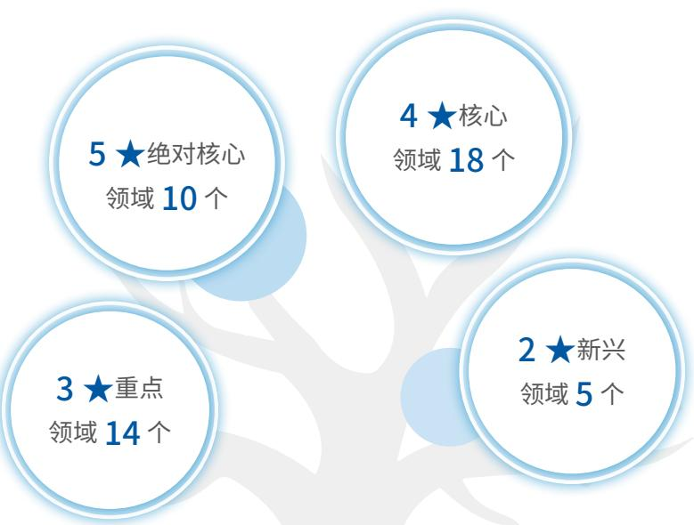

funnel

| Category | Rank | Count |
| --- | --- | --- |
| 绝对核心领域 | 5 | 10 |
| 核心领域 | 4 | 18 |
| 重点领域 | 3 | 14 |
| 新兴领域 | 2 | 5 |

## 引进：“梧桐计划”

“栽下梧桐树，引来金凤凰”。基于“人才树”体系梳理，凌云股份的“梧桐计划”聚焦关键核心人才、国际化急需人才、校园储备人才等高精尖人才的引进，促进人才结构优化。公司拓宽引才渠道，“校园招聘+社会

招聘”、“线下招聘 + 线上招聘”形式同步开展，已与中北大学签订《卓越工程师联合培养协议》·争取中科院物质院硕博士指标4名，与西北工业大学、燕山大学达成国际化人才培养引进合作模式被西北工业大学授牌“大学生（留学生）社会实践基地”。为保障公司国际化人才需求，公司同时引进摩洛哥留学生4人、中德双元制高技能人才22名，吸纳国际人才丰富人才队伍多元化能力。

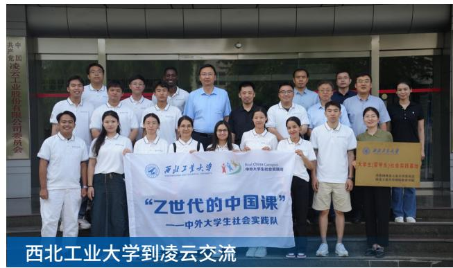

text_image

中国凌云工业股份有限公司委员会
西北工业大学
First China College
中外大学生社会实践队
“Z世代的中国课”
——中外大学生社会实践队
西北工业大学到凌云交流

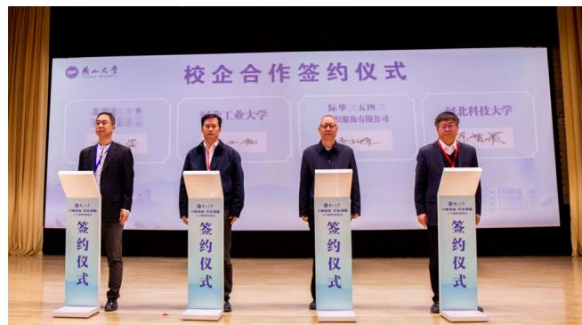

text_image

校企合作签约仪式
河北工业大学
际华三五五三
国际服饰有限公司
河北科技大学
签约仪式
签约仪式
签约仪式
签约仪式

燕山大学战略合作签约仪式

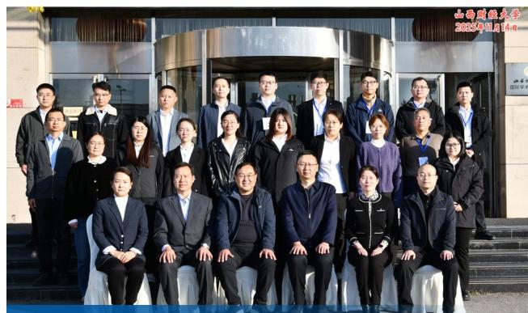

text_image

山西财经大学
2023年1月16日

前往山西财经大学交流

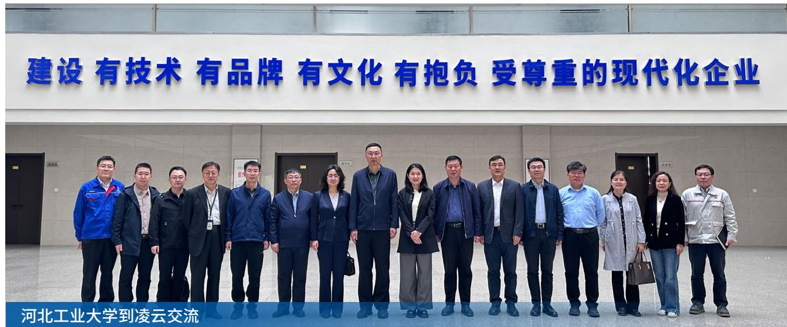

text_image

建设 有技术 有品牌 有文化 有抱负 受尊重的现代化企业
河北工业大学到凌云交流

## 培养：“三航计划”

凌云股份以“精准施训、靶向育才”为核心，通过“请进来 + 送出去 + 线上化”多维模式，聚焦领导干部、科技技能人才、国际化经营队伍等关键群体，实施精准化、体系化、进阶式培训，实现培训与企业战略、岗位需求、人才成长的深度契合，推动人才资源向发展优势转化。

公司推出“领航、续航、启航”的三年全覆盖工程。“领航计划”面向总经理、部门部长等正职领导，聚焦战略思维、决策能力和经营管理：“续航计划”覆盖副总经理、部门副部长等副职领导，侧重统筹协调、攻坚破难能力提升；“启航计划”瞄准优秀年轻干部，强化基础管理、创新思维和实践能力培养。

培训通过政治训练、能力提升、作风建设三大模块，采用专题讲座、案例研讨、沙盘演练、实地交流等多种形式累计培训298名各级领导干部，构建起结构合理、素质优良的干部梯队。2025年7月，兵器人才学院的专家教授为公司104名领导干部举办了“领航、续航、启航计划”专项培训班。

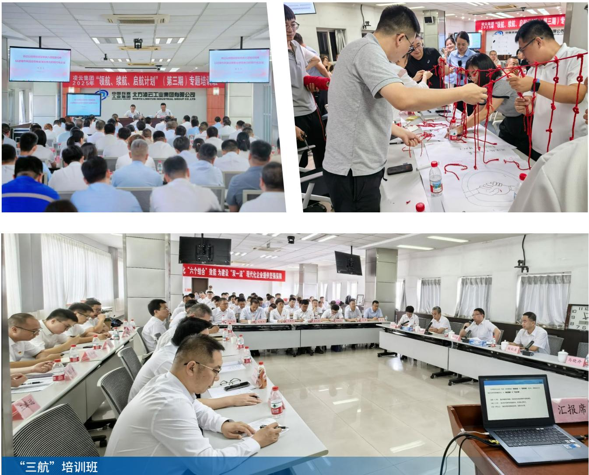

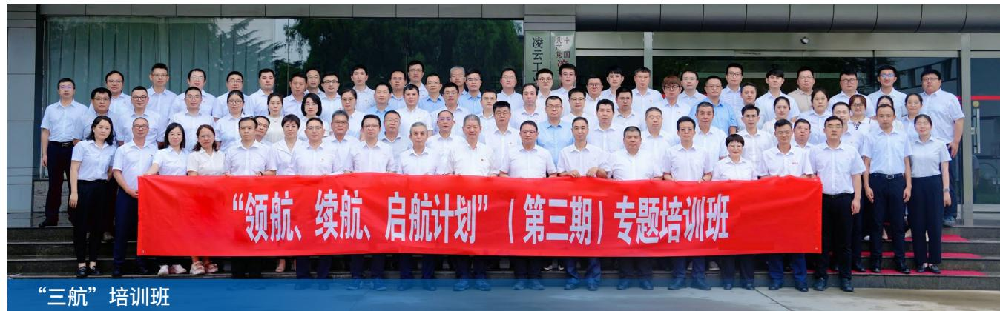

text_image

“领航、续航、启航计划”（第三期）专题培训班
“三航”培训班

## 管理：“三才管理”体系

管理人才、科技人才、技能人才三支人才队伍是中央人才工作会议上提出的人才培养工作重点和焦点。凌云股份已经建立并实施三支队伍管理办法以及每支队伍的不同管理制度，科学管理人力资源，为不同人才打造畅通的职业发展道路，配置科学、合理的培训、薪酬和晋升条件，保障各种人才都可以在公司平台上找到发展机遇创造自身价值，为企业的可持续发展提供人才助力。

在“三才管理”体系的持续培养下，公司现有科技带头人25人、技能带头人24人，在中国兵器集团内任首席科学家1人、首席技师1人、科技带头人6人、青年科技带头人5人、关键技能带头人3人、青年英才7人

## 攻坚：“七支”人才队伍专项育成计划

凌云股份在《人才强企战略纲要实施方案》实施过程中，特色制定“七支”人才队伍专项育成计划，锚定人才队伍中的核心关键，着力加强，保障人才队伍结构优化、百花齐放，为企业创造持续前进驱动力。

推进“企业家”专项育成计划，实现企业家队伍“优”型配置；

推进“科技领军人才专家队伍”专项育成计划，实现科技人才队伍“高”型发展

推进“工匠”专项育成计划，实现技能人才“专”型培育；

推进“职业专家队伍”专项育成计划，实现“强”型建设；

推进“国际化经营队伍”专项育成计划，实现“准”型配置；

推进“大学生班组长”专项育成计划实现“牢”型选育；

推进“数智工程”队伍专项育成计划实现“精”型培养；

## 可持续发展管理

ESG日益成为企业可持续发展的核心理念，凌云股份紧跟时代步伐，依据国务院国资委《提高央企控股上市公司质量工作方案》及《上海证券交易所上市公司自律监管指引第14号—可持续发展报告（试行）》等相关要求，全面推进公司可持续发展管理与信息披露工作，与各利益相关方进行常态化沟通与交流。

## 可持续发展策略

2025年，凌云股份持续深耕ESG治理致力于构建“纵向贯通、横向协同”的高效ESG管理体系。公司以完善顶层设计为牵引，进一步健全体制机制，推动ESG维度指标与业务运营的深度融合，实现管理水平的跨越式提升。在沟通维度上，我们构建了多层次、常态化的利益相关方交流机制，精准回应社会关切，讲好可持续发展的“凌云故事”。同时，公司实施全员 ESG 能力建设工程，通过体系化培训厚植责任文化，将可持续发展理念转化为全体员工的自觉行动，为打造世界一流汽车零部件企业筑牢责任基石。

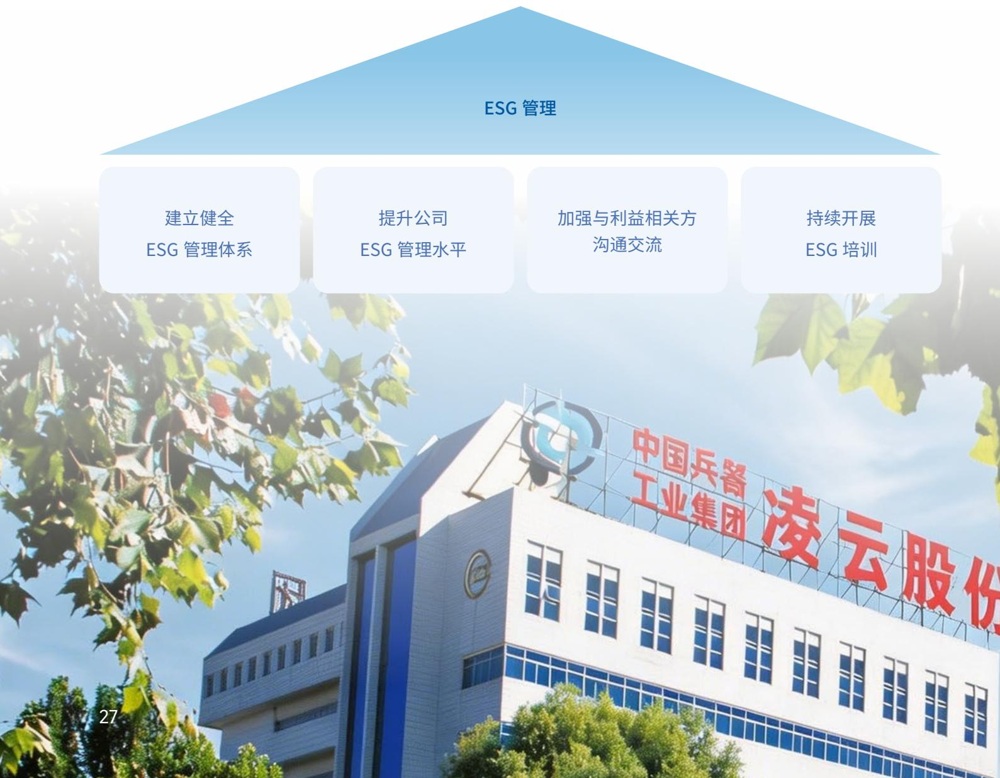

flowchart

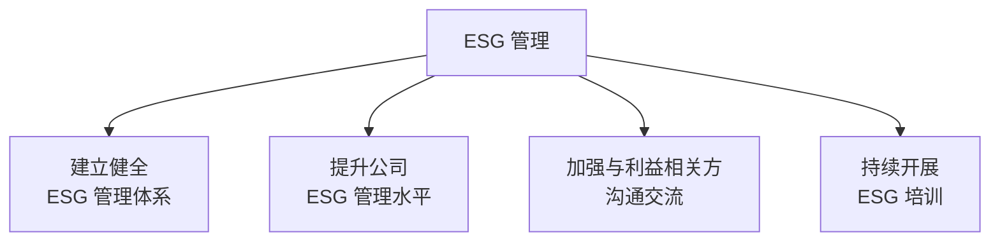
```mermaid
graph TD
  A["ESG 管理"] --> B["建立健全\nESG 管理体系"]
  A --> C["提升公司\nESG 管理水平"]
  A --> D["加强与利益相关方\n沟通交流"]
  A --> E["持续开展\nESG 培训"]
```

## 可持续发展治理架构

公司建立了自上而下的ESG管理体系，董事会高度重视ESG体系建设，公司在董事会层面负责ESG重大议题的审议和决策，推进ESG理念真正融入公司发展战略和经营管理中。在执行层面推行“以编促管”，通过组建由公司领导、各部门负责人及行业专家构成的工作团队，进一步明确各部门在ESG（环境、社会及公司治理方面的具体职责，同时不断拓展ESG的内涵与外延，通过这一机制，将ESG理念深度融入企业的日常经营管理推动环境、社会及管治相关工作的持续落地。

## 董事会声明

公司不断完善环境、社会、治理管理体系建设，积极落实党中央、国务院决策以及上级监管单位工作部署，将ESG融入董事会审议、讨论事项中，引领和推动公司持续健康发展，指导管理层以先进制造业为引领、以科技创新为驱动、以绿色发展为导向，落实执行股东会和董事会的各项重大经营决策，安全高效开展生产经营活动，提升核心竞争力和创造力，推动公司全方位高质量发展。

## ESG信息披露

公司严格遵守相关法律法规，按照“真实、准确、完整、及时、公平”的原则披露ESG相关信息。公司制定《信息披露管理制度》和《凌云工业股份有限公司重大事项报告制度》，将信息披露工作中对各环节的要求进一步制度化，构建合规高效的内部信息报送机制，确保信息的快速传递、归集和有效管理，持续提升信息披露水平。

公司通过构建年度报告、专题报告和常态化信息披露三位一体的ESG信息披露体系，确保信息的全面性和动态性。同时，坚持聘请外部机构对年度ESG报告进行第三方评级，出具评级报告，有效提升报告的公信力公司积极开展自愿性信息披露，主动披露投资者持续关注的与环境、社会、治理相关的信息，聚焦社会责任领域，以高质量信息披露传递公司价值，展现良好的公司形象

## 利益相关方沟通

公司致力于与利益相关方建立和谐、互信关系，积极构建高效的沟通平台，通过多元化的沟通方式，主动倾听利益相关方的声音，真诚回应其关切与诉求。公司致力于保障利益相关方的知情权与参与权，通过透明的信息披露和开放的交流机制，确保各方能够充分了解企业的战略规划、运营进展及社会责任实践。

<table><tr><td>利益相关方</td><td>对企业的期望</td><td>沟通机制和方式</td></tr><tr><td>政府及监管机构</td><td>遵守法律法规执行国家政策依法诚信经营承担社会责任</td><td>参与行业政策、规划制定接受监督考核依法纳税</td></tr><tr><td>股东及投资者</td><td>提高股东回报提高偿债能力规范公司治理降低经营风险</td><td>股东会定期或临时报告投资者见面会信息披露</td></tr><tr><td>员工</td><td>保护员工权益保障职业健康助力职业发展平衡员工生活实施员工关怀</td><td>职工代表大会工会组织民主管理员工培训合理化建议员工活动</td></tr><tr><td>客户</td><td>提供优质产品提供满意服务遵守商业道德</td><td>售后服务客户满意度调查客户座谈和走访客户投诉处理</td></tr><tr><td>合作伙伴</td><td>遵守商业道德透明采购互利共赢、共同发展</td><td>招投标与商业谈判加强供应链管理谈判与交流</td></tr></table>

<table><tr><td>利益相关方</td><td>对企业的期望</td><td>沟通机制和方式</td></tr><tr><td>社区及公众</td><td>增加社会就业参与社区建设支持社会公益</td><td>媒体沟通交流社区沟通与慰问公益项目与志愿者活动</td></tr><tr><td>行业</td><td>共同成长诚实守信技术进步</td><td>参与行业标准制定开展行业交流参与行业政策制定</td></tr><tr><td>环境</td><td>践行节能减排保护生态环境倡导绿色文化</td><td>研发绿色技术开展环保行动宣贯环保理念实施碳达峰碳中和行动</td></tr></table>

natural_image

Group of professionals in white coats gathered around a desk with laptops and charts, no visible text or symbols

## ESG重大议题识别

公司通过优化议题管理体系，建立了一套科学、完善的实质性议题识别流程，确保能够精准筛选出与公司战略运营及利益相关方关切高度相关的议题。在此基础上，公司进一步构建了实质性议题矩阵，从影响重要性、财务重要性双维度将环境、社会与治理(ESG）领域的关键议题进行系统化分类与优先级排序，为公司制定可持续发展策略提供清晰指引。

## ESG重要性议题识别与分析流程

## 多渠道议题收集

关注行业趋势、法律法规、政策变化等外部因素，了解行业整体发展方向和面临的挑战，从中挖掘出可能对公司产生影响的议题。同时，分析公司的业务流程、运营模式供应链等内部因素，识别出潜在的议题。

## 利益相关方调研

明确公司的利益相关方群体，包括内部利益相关方如股东、员工、管理层等，以及外部利益相关方如客户、供应商、社区居民、政府机构、非政府组织等。采用多种调研方法，以确保获取全面、准确的信息。

## 议题重要性分析

对收集到的调研数据进行系统分析，识别出利益相关方最为关注的议题，以及他们在不同议题上的期望和要求。

重要性议题矩阵  
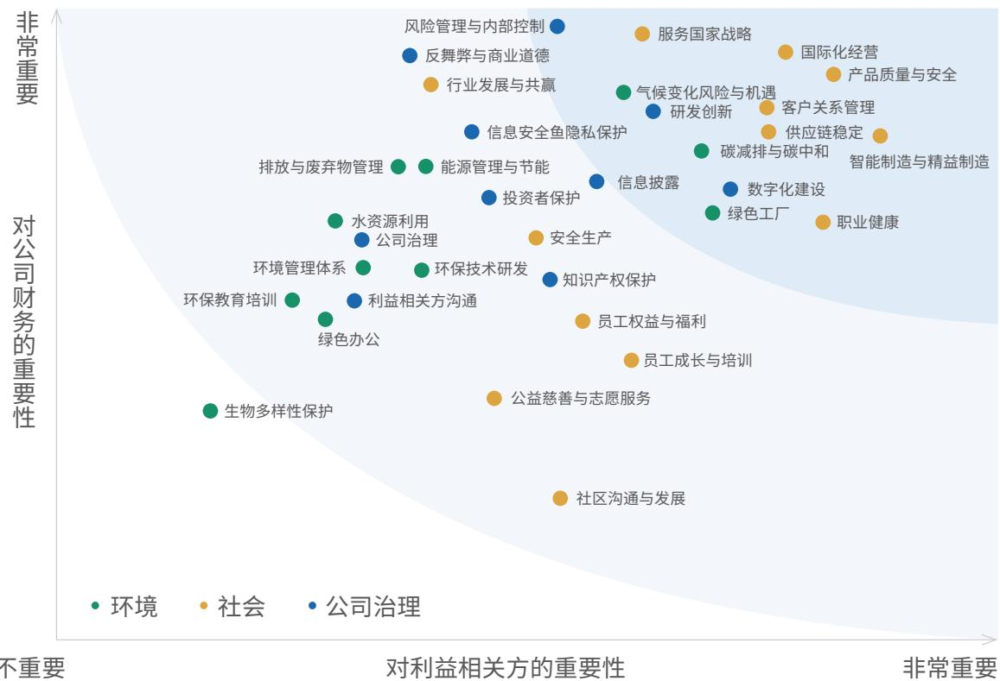

scatter

| Topic | Category | Importance to Stakeholders (X-axis) | Importance to Finance Responsibility (Y-axis) |
| :--- | :--- | :--- | :--- |
| 风险管理与内部控制 | 公司治理 | ~0.35 | ~0.95 |
| 反舞弊与商业道德 | 公司治理 | ~0.32 | ~0.92 |
| 行业发展与共赢 | 社会 | ~0.38 | ~0.88 |
| 气候变化风险与机遇 | 公司治理 | ~0.42 | ~0.85 |
| 研发创新 | 公司治理 | ~0.45 | ~0.82 |
| 客户关系管理 | 社会 | ~0.55 | ~0.80 |
| 供应链稳定 | 社会 | ~0.60 | ~0.78 |
| 信息安全鱼隐私保护 | 公司治理 | ~0.40 | ~0.75 |
| 排放与废弃物管理 | 环境 | ~0.35 | ~0.72 |
| 能源管理与节能 | 环境 | ~0.38 | ~0.70 |
| 投资者保护 | 公司治理 | ~0.45 | ~0.68 |
| 信息披露 | 公司治理 | ~0.50 | ~0.65 |
| 数字化建设 | 公司治理 | ~0.60 | ~0.62 |
| 绿色工厂 | 环境 | ~0.55 | ~0.60 |
| 职业健康 | 社会 | ~0.75 | ~0.58 |
| 水资源利用 | 环境 | ~0.35 | ~0.55 |
| 公司治理 | 公司治理 | ~0.38 | ~0.52 |
| 安全生产 | 社会 | ~0.52 | ~0.52 |
| 环境管理体系 | 环境 | ~0.32 | ~0.48 |
| 环保技术研发 | 环境 | ~0.42 | ~0.48 |
| 知识产权保护 | 公司治理 | ~0.48 | ~0.45 |
| 环保教育培训 | 环境 | ~0.28 | ~0.42 |
| 利益相关方沟通 | 公司治理 | ~0.38 | ~0.40 |
| 绿色办公 | 环境 | ~0.32 | ~0.38 |
| 员工权益与福利 | 社会 | ~0.55 | ~0.35 |
| 员工成长与培训 | 社会 | ~0.62 | ~0.32 |
| 生物多样性保护 | 环境 | ~0.22 | ~0.25 |
| 公益慈善与志愿服务 | 社会 | ~0.52 | ~0.18 |
| 社区沟通与发展 | 社会 | ~0.58 | ~0.12 |
| 服务国家战略 | 社会 | ~0.55 | ~0.92 |
| 国际化经营 | 社会 | ~0.68 | ~0.90 |
| 产品质量与安全 | 社会 | ~0.72 | ~0.88 |
| 智能制造与精益制造 | 社会 | ~0.78 | ~0.85 |
| 碳减排与碳中和 | 环境 | ~0.62 | ~0.78 |
| 供应链稳定 | 社会 | ~0.68 | ~0.75 |
| 碳减排与碳中和 (top) | 环境 (top) | ~0.65 | ~0.72 |
| 气候变化风险与机遇 (top) | 社会 (top) | ~0.48 | ~0.72 |
| 信息安全鱼隐私保护 (top) | 公司治理 (top) | ~0.42 | ~0.68 |
| 排放与废弃物管理 (top) | 环境 (top) | ~0.38 | ~0.65 |
| 能源管理与节能 (top) | 环境 (top) | ~0.35 | ~0.62 |
| 投资者保护 (top) | 公司治理 (top) | ~0.42 | ~0.58 |
| 水资源利用 (top) | 环境 (top) | ~0.32 | ~0.55 |
| 公司治理 (bottom) (bottom) | 环境 (bottom) | ~0.15 | ~0.15 |
| 环保管理体系 (bottom) (bottom) | 环境 (bottom) | ~0.32 | ~0.48 |
| 利益相关方沟通 (bottom) (bottom) | 公司治理 (bottom) | ~0.35 | ~0.42 |
| 绿色办公 (bottom) (bottom) | 环境 (bottom) | ~0.32 | ~0.38 |
| 生物多样性保护 (bottom) (bottom) | 环境 (bottom) | ~0.18 | ~0.25 |
| 国际化经营 (bottom) (top) (top) | 社会 (top) (top) | ~0.68 | ~0.92 |
| 产品质量与安全 (top) (top) (top) (top) (top) (top) (top) (top) (top) (top) (top) (top) (top) (top) (top) (top) (top) (top) (top) (top) (top) (top) (top) (top) (top) (top) (top) (top) (top) (top) (top) (top) (top) (top)

<table><tr><td>报告章节</td><td colspan="3">UN SDGs</td><td colspan="2">对应的 ESG 议题</td></tr><tr><td>卓越治理篇:固本强基,引领高质量发展</td><td colspan="3"></td><td>·公司治理·信息披露·利益相关方沟通·风险管理与内部控制·信息安全与隐私保护</td><td>·反舞弊与商业道德·投资者保护·研发创新·数字化建设·安全生产</td></tr><tr><td>绿色制造篇:向绿而行,共绘美好未来</td><td colspan="3"></td><td>·环境管理体系·气候变化风险与机遇·碳减排与碳中和·绿色工厂·排放与废弃物管理·能源管理与节能</td><td>·水资源利用·环保技术研发·环保教育培训·绿色办公·生物多样性保护</td></tr><tr><td>社会共荣篇:以人为本,共享发展成果</td><td colspan="3"></td><td>·员工权益与福利·员工成长与培训·职业健康·国际化经营·产品质量与安全·客户关系管理</td><td>·智能制造与精益制造·供应链稳定·服务国家战略·行业发展与共赢·社区沟通与发展·公益慈善与志愿服务</td></tr></table>

text_image

· 客户关系管理
· 公益慈善与志愿服务
32

## 01

## 卓越治理篇

固本强基，引领高质量发展

夯实公司治理  
绘就科创蓝图  
稳健合规运营  
严守风险底线  
筑就安全基石

守正出奇，治道行稳。凌云股份坚持依法治企，严格遵循《公司法》《证券法》《上市公司治理准则》《上海证券交易所股票上市规则》 《上市公司自律监管指引第1号——规范运作》等法律法规和规范性文件，持续健全法人治理结构，夯实规范运作根基。公司以董事会建设为核心，统领创新转型、合规风险及信息安全管理，织密安全稳健的经营管理网。通过深化与全球投资者、伙伴及利益相关方的沟通协作，公司不断优化治理效能在提质增效中强化抗风险韧性与价值回报水平，致力干成为治理规范、表现卓越的行业标杆。

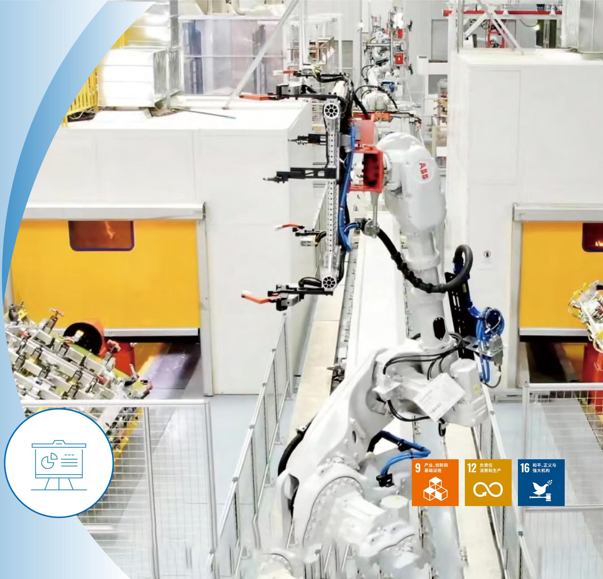

text_image

9 产业、创新和
基础设施
12 负责任
消费和生产
16 和平、正义与
强大机构

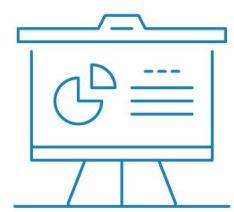

9 产业、创新和 基础设施

12 负责任消费和生产

16 和平 正义品强大机构

## 夯实公司治理

## 法人治理结构

公司依照《公司法》《证券法》《上市公司治理准则》等法律法规要求，构建了由股东会、党委会、董事会及经营管理层组成的多层次公司治理架构。报告期内，公司对照证监会2025年修订的《上市公司章程指引》修订了《公司章程》《股东会议事规则》《董事会议事规则》等制度，进一步完善监督体系，形成权责对等、相互制衡、协同运作、科学决策的现代公司治理体系。

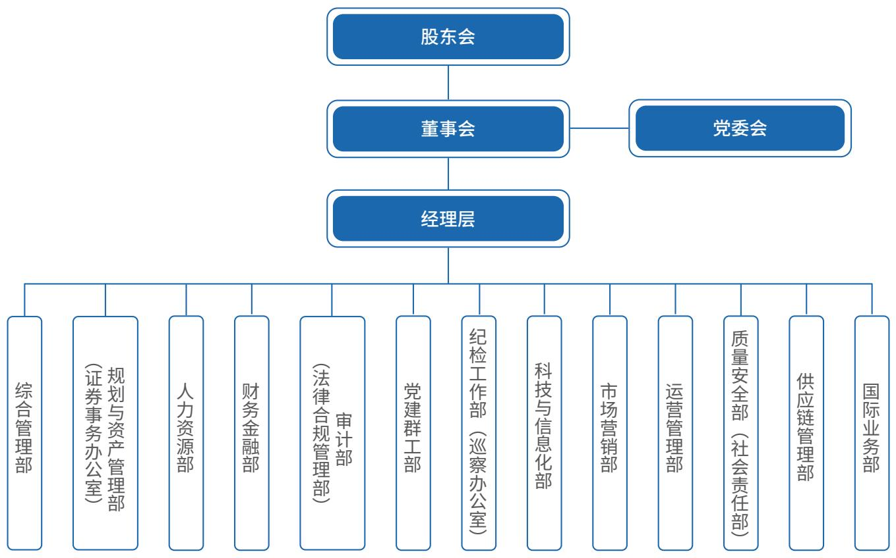

flowchart

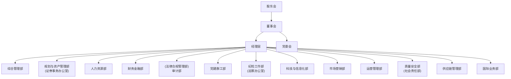
```mermaid
graph TD
  A["股东会"] --> B["董事会"]
  B --> C["经理层"]
  B --> D["党委会"]
  C --> E["综合管理部"]
  C --> F["规划与资产管理部\n(证券事务办公室)"]
  C --> G["人力资源部"]
  C --> H["财务金融部"]
  C --> I["(法律合规管理部)\n审计部"]
  C --> J["党建群工部"]
  C --> K["纪检工作部\n(巡察办公室)"]
  C --> L["科技与信息化部"]
  C --> M["市场营销部"]
  C --> N["运营管理部"]
  C --> O["质量安全部\n(社会责任部)"]
  C --> P["供应链管理部"]
  C --> Q["国际业务部"]
```

报告期内，公司严格遵守证券监管规定，组织召开：

股东会 $3 \%$

专委会 15

董事会 9次

审议议案 68

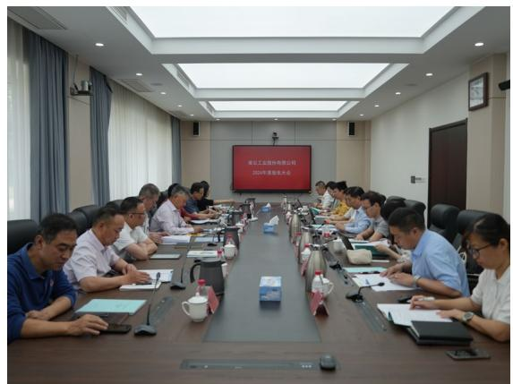

text_image

云岩工业股份有限公司
2024年度股东大会

## 董事会多元化

公司严格依照《公司章程》选聘董事，确保董事会有效履职。董事会由7名成员组成，其中4名外部董事（外部董事中3名为独立董事)。董事会成员兼具管理、财务、法律及行业专长。在独立董事选聘上，公司立足汽车零部件及新能源领域发展需要，从财务、法律、新能源三个维度严格遴选，分别聘任相应领域专家各1名所选独立董事平均年龄59.3岁，行业经验丰富、实操能力突出，知识结构形成有效互补，能够充分发挥专业协同效能；同时严格审核其任职资格，并提交上交所完成独立性认证，确保合规履职。通过持续推进董事会专业化、多元化建设，公司治理水平和科学决策能力稳步提升

## 独立

外部董事

4人

57.14%

独立董事

3人

42.86%

女性董事

1人 占比14.29%

两职分离：董事长和总经理分别由两人担任

## 多元

现任董事成员知识背景多元，在汽车、市政管网、智能制造、管理、财务、法律等多个领域具有丰富的专业知识和实践经验，有效支撑董事会科学决策。

公司不断健全董事和高管考核与薪酬管理制度，通过规范建设与机制优化，有力支撑其依法履职。依托《经理层成员任期制和契约化管理办法》等制度，公司深化“两督导一考核”评价体系，定期开展绩效评估，切实保障“两会”治理的有效性。此外，公司严格履行薪酬决策程序，董事报酬由股东会决定，高管薪酬方案经董事会批准，确保决策科学合规、信息公开透明。

董事会成员信息表

<table><tr><td rowspan="2">类型</td><td rowspan="2">姓名</td><td rowspan="2">年龄</td><td rowspan="2">性别</td><td colspan="5">专业能力</td><td rowspan="2">战略委员会</td><td rowspan="2">审计委员会</td><td rowspan="2">薪酬考核委员会</td><td rowspan="2">提名委员会</td></tr><tr><td>行业经验</td><td>工商管理</td><td>财务会计</td><td>研发</td><td>法律</td></tr><tr><td>董事长</td><td>罗开全</td><td>58</td><td>男</td><td>✓</td><td>✓</td><td></td><td></td><td></td><td>✓</td><td>✓</td><td></td><td>✓</td></tr><tr><td>董事/总经理</td><td>郑英军</td><td>56</td><td>男</td><td>✓</td><td>✓</td><td></td><td></td><td></td><td>✓</td><td></td><td></td><td>✓</td></tr><tr><td>董事</td><td>卫凯</td><td>46</td><td>男</td><td>✓</td><td>✓</td><td>✓</td><td></td><td></td><td>✓</td><td></td><td>✓</td><td></td></tr><tr><td>独立董事</td><td>王子冬</td><td>68</td><td>男</td><td>✓</td><td></td><td></td><td></td><td></td><td>✓</td><td></td><td></td><td>✓</td></tr><tr><td>独立董事</td><td>宋衍蘅</td><td>53</td><td>女</td><td></td><td></td><td>✓</td><td></td><td></td><td></td><td>✓</td><td>✓</td><td>✓</td></tr><tr><td>独立董事</td><td>蔡成维</td><td>57</td><td>男</td><td></td><td></td><td></td><td></td><td>✓</td><td></td><td>✓</td><td>✓</td><td>✓</td></tr><tr><td>职工董事</td><td>李彦波</td><td>56</td><td>男</td><td>✓</td><td></td><td></td><td>✓</td><td></td><td>✓</td><td></td><td></td><td></td></tr></table>

## 信息披露

公司坚持以投资者需求为导向，严格遵循《上市公司投资者关系管理工作指引》《上海证券交易所股票上市规则》等监管要求，将信息披露的真实、准确、完整、及时作为基本准则，以高质量的信息披露传递公司价值切实保障股东知情权。依托公司《信息披露管理制度》《重大事项报告制度》，规范信息披露全流程管理，就年度业绩、重大投融资事项、股权激励、重大合同等重要事项依规开展信息披露工作，主动加强与投资者的沟通交流，持续提升市场透明度。

报告期内，公司共发布定期报告4份、各类临时公告及相关文件135份。年度内实施两次红利派发，累计现金分红金额为4.04亿元，较上年增长23%。体现了公司对股东回报的能力和诚意。

报告期内，

<table><tr><td>公司共发布定期报告</td></tr><tr><td>4份</td></tr></table>

各类临时公告及相关文件

135份

累计现金分红金额为

4.04亿元

较上年增长

23%

## 投资者关系

公司严格遵循《证券法》及中国证监会关于上市公司投资者关系管理的相关要求，制定《投资者关系管理制度》将投资者关系管理纳入公司治理休系，灵活运用线上与线下渠道，持续加强与各类投资者的沟通交流，准确传递公司价值，切实保障投资者的知情权与参与权。

报告期内，公司积极向市场传递“十四五”收官成果与“十五五”战略规划方向，通过常态化召开年度、半年度、季度业绩说明会，年报之际邀请12位行业首席云端聚势，系统展现凌云战略价值和投资价值，全年推荐点评，研报近20篇；同时，积极参加券商投资策略会，接待机构投资者及中小股东调研，接听投资者来电，以及上证e互动平台问答等多种形式与投资者保持交流沟通。

## 规范关联交易

公司依托《公司意程》《信息披露管理制度》《独立董事工作制度》等制度，对关联交易的范围界定、审议程序、信息披露及利益回避等关键环节进行规范管理，确保关联交易决策的公平性与透明度，切实维护全体股东的合法权益。

报告期内，公司发生的关联交易严格遵循市场公平交易原则及合规管理要求，履行定价公允性核验、独立董事专项意见、审计委员会核查及保荐机构督导等完整审议程序，并通过关联方回避表决、交易所平台公示及投资者沟通机制，充分保障中小股东的知情权与参与权。报告期内，公司未发生关联交易相关投诉、纠纷或监管问询，关联交易管理合规有序。

## 绘就科创蓝图

凌云股份坚持以科技创新引领产业创新，将创新驱动作为公司高质量发展的核心战略。公司以“1+7+N”科技创新平台为组织基础。以持续加大研发投入为资源保障，以数智工程与精益运营为能力支撑，以"零缺陷"质量理念为品质底线，推动关键技术突破与产品迭代升级，加快将技术创新成果转化为产业竞争优势，持续建设具有核心竞争力的创新型企业。

## 科技创新平台建设

"1+7+N"科技创新平台 凌云股份构建"中央研究院+专业分院+分子公司"三级研发体系，形成战略布局、资源调配、力量协同三位一体的创新矩阵。凌云中央研究院（以下简称中研院）下设新能源技术研究分院、汽车安全结构研究分院、热成型技术研究分院、汽车工程技术分院、汽车管路系统技术研究分院、市政管道系统技术研究分院及欧洲分院等7家分院。

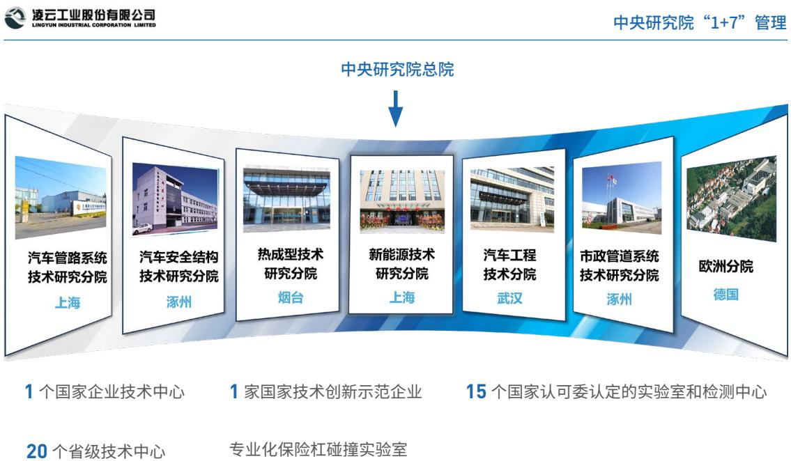

flowchart

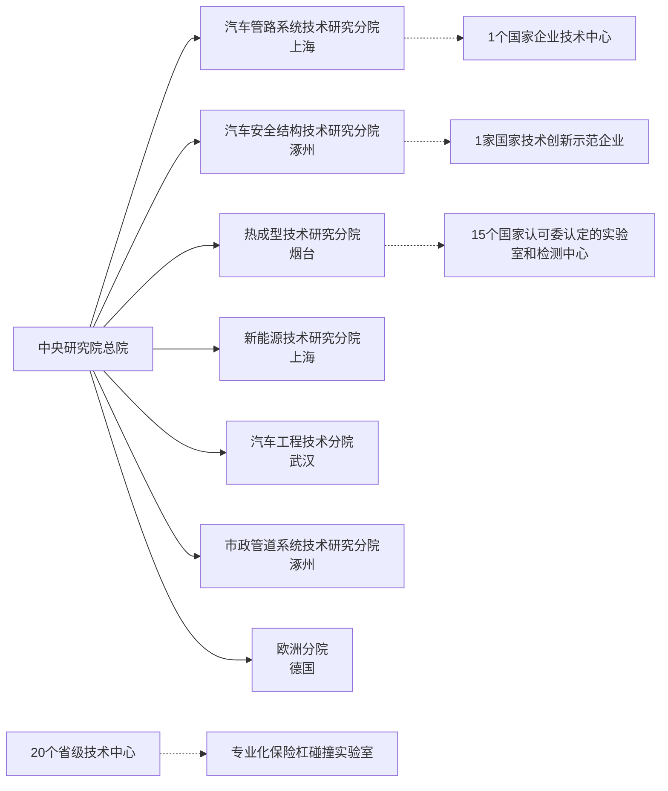
```mermaid
graph LR
  A["中央研究院总院"] --> B["汽车管路系统技术研究分院<br>上海"]
  A --> C["汽车安全结构技术研究分院<br>涿州"]
  A --> D["热成型技术研究分院<br>烟台"]
  A --> E["新能源技术研究分院<br>上海"]
  A --> F["汽车工程技术分院<br>武汉"]
  A --> G["市政管道系统技术研究分院<br>涿州"]
  A --> H["欧洲分院<br>德国"]
  
  B -.-> I["1个国家企业技术中心"]
  C -.-> J["1家国家技术创新示范企业"]
  D -.-> K["15个国家认可委认定的实验室和检测中心"]
  
  L["20个省级技术中心"] -.-> M["专业化保险杠碰撞实验室"]
```

## 国家和省部级科技创新平台

公司积极推进国家级和省级创新平台认定工作，截至报告期末，公司承担的国家和省部级科技创新平台有：

国家级企业技术中心

1个

省级企业技术中心

20个

国家认可委认定的实验室和检测中心

15个

## 科技创新项目管理

公司依据《科技工作管理办法》、《科技开发费管理暂行规定》，规范科研项目立项、实施与经费使用全流程管理确保研发投入的合规性与使用效益。报告期内，公司完成研发投入9.18亿元，投入强度4.63%；科技项目立项总数83个，其中国家级项目2个、省部级项目1个。2025年，公司依托“两个清单”的年度科研项目计划，统筹推进科研技术攻关，其中科研项目22项（含预研项目13项、关键技术研发项目9项），工艺攻关项目16项

## 报告期内，

公司完成研发投入

9.18亿元

投入强度

4.63%

科技项目立项总数

83个

其中国家级项目

2个

省部级项目

1项

科研项目

22项

含预研项目

13项

关键技术研发项目

9项

工艺攻关项目

16项

## 科技创新人才培养

公司通过制定个性化的“一人一策”培养方案，加强科技、技能人才培育工作，截至报告期末：

国家及地方专家

<table><tr><td>国务院政府特殊津贴专家5人</td><td>全国技术能手1人</td><td>国家制造业人才支持计划1人</td><td>河北省突出贡献技师5人</td></tr></table>

中国兵器工业集团有限公司

<table><tr><td>首席科学家</td><td>首席技师</td><td>科技带头人</td><td>青年科技带头人</td><td>关键技能带头人</td><td>青年英才</td></tr><tr><td>1人</td><td>1人</td><td>6人</td><td>5人</td><td>3人</td><td>7人</td></tr></table>

## 北方凌云工业集团有限公司

科技带头人

25 人

技能带头人

24 人

## 科技创新成果

公司坚定推进创新型企业建设，积极参与国家及省级创新资质申报工作，截至报告期末，拥有

<table><tr><td>高新技术企业29家</td><td>国家级制造业单项冠军企业1家</td><td>省级制造业单项冠军企业7家</td><td>国家级专精特新&quot;小巨人&quot;企业3家</td></tr><tr><td>省级专精特新中小企业21家</td><td>国家知识产权优势企业2家</td><td>省级科技领军企业1家</td><td>双百企业1家</td></tr></table>

2025年公司积极申报国家、省市部级各类科技项目并获得科技支持资金。

参与国家科技重大专项“新能源汽车轻量化结构部件与模具用钢开发及应用(产品研发)项目”(06专项)获批，其中凌云股份牵头的“镀锌特超高强钢板应用技术研究和关键汽车零部件产业化应用任务获得科技资金支持152万元

“管材热成型工艺及产业化应用研究项目”成功申报兵器集团公司自主科技创新民品产业发展项目，获得集团公司支持300万元

## 知识产权与标准化

公司持续完善知识产权管理体系，依据《凌云工业股份有限公司知识产权管理办法》《凌云工业股份有限公司专利管理实施细则》，规范知识产权创造、运用、保护和管理全流程：将标准化工作纳入公司整体发展战略引导集团企业积极参与国家标准、行业标准的制定与推广；设立知识产权与标准化工作激励机制，对表现突出的团队和个人给予奖励，激发创新活力。

## 专利成果

## 2025 年新增

申请专利

235项

其中发明专利

46项

授权专利

228项

其中发明专利

45项

## 报告期内，在知识产权方面的亮点成果

•通过GB/T29490知识产权合规管理体系认证  
•参编的3项国家标准、主导的2项行业标准正式发布  
·新增计算机软件著作权登记9项  
·完成科技成果鉴定6项，其中4 项鉴定为国际先进水平

## 累计

拥有有效专利

1,836 项

其中发明专利

278项

累计拥有实用新型专利

1,543 项

## 精益质量管理

凌云股份贯彻 " 零缺陷 " 质量管理理念，将 " 第一次就把事情做对，每次把事情做对 " 融入全员岗位要求，严格遵循IATF16949质量管理体系，构建覆盖产品全生命周期的质量监控体系。报告期内，公司未发生严重及以上质量问题；大型试验成功率100%，一次交验合格率100%；质量损失率0.177%。

2025年，公司完成凌云股份IATF16949《质量手册》3.0版编制下发，进一步优化质量管理各业务过程的识别与划分，确保过程管理的标准化与一体化。截至报告期末，凌云股份及下属28家分子公司均顺利通过IATF16949 汽车质量管理体系标准或ISO 9001 质量管理体系认证，并持续保持质量体系有效运行。

## 数智工程

公司深入贯彻落实“数智工程”战略部署，以数字化转型与智能制造建设为主线，围绕产品研发数字化、生产制造智能化、企业管理信息化、产业生态网联化四大目标，聚焦市场开发（CRM）、产品设计（PLM）、供应链管理（SCM/SRM）、生产运营（MOM）四个核心环节，持续优化产品全生命周期管理流程，推动运营效率与成本竞争力双提升。报告期内，公司材料利用效率显著提升，产品质量成本有效压降，各工厂全面达成客户交付目标，赢得市场广泛赞誉。

## 2025年，公司在数智工程方面围绕四个方面开展了诸多工作：

## 夯实研发数字化基础

以产品全生命周期管理(PLM)系统为核心，推进研发数据全域覆盖，打通从研究院到生产基地的数据链路，实现源头统一与全程可控。

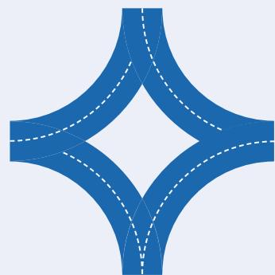

natural_image

Abstract blue geometric pattern with four curved shapes and dashed white lines, no text or symbols present.

## 推进制造智能化升级

以MOM系统为抓手，遵循“标准引领、梯度推进”原则，提炼标准化功能与实施规范，实现快速复制推广。对标智能工厂梯度培育要求，分类推进数字化产线、数字化车间、智能工厂建设。

## 探索生态网联化协同

立足产业链协同需求，推动供应链、研发、制造等核心系统与上下游合作方实现数据互通与流程衔接。聚焦核心协同场景，实现跨主体紧密联动、高效协同的产业数字化生态。

## AI 应用探索

积极布局人工智能技术应用，坚持“小步快跑、试点先行”的原则，私域化部署轻量化AI模型,优先在公文撰写、数据统计分析等办公场景开展应用尝试。为后续全面推进业务流程智能化升级奠定了坚实基础。

## 稳健合规运营

公司坚持“依法治企、合规经营、业法（规）融合，促进发展”方针，将合规管理作为企业稳健发展的重要保障。公司构建覆盖合规治理、审计监督、反腐败建设、公平竞争、诚信经营等多个维度的合规运营体系，健全完善公司治理与经营管理规章制度，常态化开展全员学法用法，持续提升守法经营理念和合规履职意识，确保各项经营活动依法合规开展。

## 合规管理

公司构建以党委书记、董事长为主要负责人的法治领导机构，落实以党委书记、董事长为主任的依法治企合规管理委员会和以总经理为组长的依法治企合规管理领导小组领导体系。董事会、经理层依法合规决策履职，落实总法律顾问制度，夯实业务、法律、监督部门三道防线，形成职责清晰、协同联动的合规治理格局。报告期内。公司在财务报告和非财务报告的内部控制均未出现重大缺陷。

2025年，公司持续健全法律合规制度体系，落实《法律事务管理办法》《合规管理办法》《合同管理办法》，优化调整领导体系、管理运行机制和职责，进一步完善法律合规体系框架。公司实现规章制度、经济合同和重大事项三个100%审核，常态化开展全员学法用法，践行合规承诺，将合规要求嵌入各层级、各业务条线的日常经营活动。报告期内，修订完善投资、采购、境外经营和安全质量管理等业务领域制度，全年新定制度14项修订制度41项，现行有效制度共计288项。

公司持续提升全员合规履职意识。报告期内，年度合规培训参与总人次436人次。

## 审计监督

公司审计监督工作坚持以服务公司战略为宗旨，以提升审计价值为目标，全面履行审计职责，有效发挥监督保障作用。公司以防范风险为重点，认真落实审计监督及董事会审计委员会办公室等职责，持续完善审计组织体系和制度体系，规范审计业务开展。强化内部监督协同工作机制，推进内部审计与内部巡察、业务专项检查等工作同步实施，促进内部监督资源共享、成果共用，形成监督合力。公司持续完善预审周报、终审旬报机制强化审计全过程管理；强化审计整改，做好审计监督“后半篇”文章，推动审计发现问题的闭环整改，持续提升审计监督效能。

## 报告期内，审计未发现重大缺陷

完成经济责任审计

5项

管理专项审计

3项

风险内控监督评价

6项

组织开展委托审计，完成投资后评价

10项

委托中介机构结算/决算及其他重大专项审计项目

16项

组织推进年度决算审计工作，

出具标准无保留意见财务决算审计报告

41份

专项审计报告

4项

## 反腐败与商业道德

公司高度重视反腐败建设和商业道德体系建设，依据国家法律法规和行业规范，制定反商业贿赂和反腐败管理制度，涵盖公司内部及外部合作伙伴管理，并设立审计与风险管理部、纪检工作部等专门监督部门，负责相关工作的监督与执行，确保企业经营活动的廉洁性和合规性。报告期内，公司未发生重大违规违纪问题，未出现商业贿赂、腐败及相关违规事件。

## 一体推进“三不腐”

## 不敢腐

组织班子成员及中层干部参加警示教育大会，组织党员干部、关键岗位人员观看警示教育片，配发违纪违法典型案例材料，围绕重要领域开展专项治理。

## 不能腐

修订党委工作规则，严格落实"三重一大"决策机制；对重点领域开展廉洁风险排查，修订完善采购管理办法、供应商管理办法、境外投资项目管理实施细则等管理制度40余项，强化对权力的制约，用制度管人管事；制定发放采购领域廉洁建设告知书，防止采购领域腐败问题，推动建立简单透明亲清商业环境。

## 不想腐

落实中央八项规定精神学习教育，组织全系统党员于部学习《纪律处分条例》等党纪法规；持续加强廉政教育，把党风廉政建设和反腐败教育纳入各类培训班次课程。加强廉洁文化建设，打造“廉荣贪耻”文化氛围，持续深化“镜鉴”廉洁文化品牌建设，让廉洁文化浸润人心。

公司制定明确的道德准则和行为规范，贯穿于企业各个层级和部门，涵盖员工在日常工作中的行为要求，包括诚信守信、公平竞争、尊重客户、保护商业秘密等。同时，公司注重合规文化建设，通过道德理念宣导、道德规范培训与教育、合规文化培育，营造诚信经营的企业氛围。

报告期内,开展反腐败专题培训3次，其中董事会成员参与6人次，管理层参与230人次，全体员工累计参与3,447人次，培训总时长21小时。

公司建立完善的监督机制，公开举报电话，举报邮箱，来信来访地址等监督举报渠道，鼓励员工实名举报不当行为：对举报人的姓名、身份、联系方式、举报内容等信息严格保密，对泄露举报信息、打击报复行为依规依纪严肃处理，确保举报信息的保密性和直实性。报告期内，举报投诉渠道受理事项18件：确认的贪污腐败事件数量为0件。

## 反垄断与公平竞争

公司严格遵守《中华人民共和国反垄断法》《中华人民共和国反不正当竞争法》等相关法律法规，将公平竞争合规要求嵌入日常经营管理。公司以专项监督检查为重要抓手，限制滥用市场优势地位进行竞争，明确禁止采用商业混淆、商业贿赂、虚假宣传等不正当竞争行为；培育全员合规竞争意识，不允许员工从事排除竞争对手的任何行为，严禁通过不公平的方法获取不正当利益。报告期内，公司及所属企业未发生不正当竞争事件。

## 平等对待中小企业

公司高度重视防范和化解拖欠中小企业账款问题，致力于打造与中小企业相互依存，相互促进的发展生态。公司持续优化采购付款流程，依据合同约定加强应付账款管理，建立账款支付台账和预警机制，确保与供应商之间的合作和谐稳定。截至报告期末，公司应付账款（含应付票据）占总资产比重约为32.41%，未发生拖欠中小企业账款的违规事件。

## 严守风险底线

## 风险管理体系

公司围绕战略目标，对全面风险管理和内控实施一体化管控，构建覆盖全层级、全流程、全要素、全员参与的风险防控机制。

风险管理架构方面，党委履行领导责任；董事会负责定战略、作决策、防风险，推动完善风险内控管理体系、防范化解重大风险；董事会审计委员会为董事会决策提供咨询意见和建议；经理层负责谋经营、抓落实、强管理，组织落实董事会风险内控管理工作部署：审计部为风险归口管理部门，指导各部门、各分子公司按照“务工作谁主管、风险防控谁负责”的原则，履行职责范围内风险管理工作主体责任

2025年，公司继续坚定推进风险，内控，合规一体化融合管理，实施风险内控合规一体管理，风险防控三道防线贯通融合的“大风控”，以风险管理为导向、以合规管理监督为重点、以内部控制为抓手，印发《风险内控合规“三合一”融合管理工作手册》，构建“1+2+3+N”风险内控合规一体管理体系，将合规管理三张清单、风险管理数据库、风险评估、内部控制手册等内容进行融合，增强风险防控工作合力。“汽车零部件企业'1+2+3+N'风险内控合规融合管理体系的构建”项目获得河北省管理创新二等奖。

<table><tr><td colspan="5">“1+2+3+N”风险内控合规一体管理体系</td></tr><tr><td rowspan="2">“1”为党委统一领导</td><td colspan="2">“2”两本管理手册</td><td rowspan="2">“3”为风险内控合规三类管理清单</td><td rowspan="2">“N”为N项业务流程,将风险管理和内控要求嵌入公司全级次业务管理流程</td></tr><tr><td>基础与评价手册</td><td>应用手册</td></tr></table>

## 风险识别与防控

公司建立了适用于本公司的风险数据库，并定期根据内外部环境变化进行调整。目前风险数据库从战略、财务市场、运营及法律合规5个领域进行识别，包括40项二级风险、175 项三级风险。

公司坚持年度风险排查与专项风险排查工作相结合，及时排查评估重大风险及风险事件情况，防范化解重大风险。2025年度内开展一次年度全面风险预测评估工作、两次专项风险排查评估工作，建立重大经营风险及事件台账，定期跟踪风险防控进展。

<table><tr><td>风险类型</td><td>风险识别</td><td>应对措施</td></tr><tr><td>行业风险</td><td>随着全球汽车行业向电动化加速转型,电动汽车的市场份额预计将进一步扩大,智能化和自动驾驶功能正在成为汽车的重要发展方向,全球汽车行业主要面临市场变化、技术迭代、消费者行为变化等多个方面影响,行业集中度呈现不断提升的趋势,国际贸易摩擦在未来几年内仍可能持续存在,如地缘政治、关税调整、贸易壁垒</td><td>紧跟全球汽车市场的发展趋势,顺应重点客户的战略规划与布局调整,抓住行业变革的方向,聚焦国家战略性新兴产业及未来产业,积极推动向轻量化、电动化、智能化、网联化方向迈进,巩固优势产业的领先地位,提升技术水平和创新能力,着力推动汽车零部件产业结构调整,打造具备全球竞争力的现代化产业体系</td></tr><tr><td>市场风险</td><td>从国际来看,汽车行业供应链全球化等市场竞争日趋激烈,汇率、通货紧缩等风险加剧,影响产业布局和供应链稳定性。从国内来看,汽车市场内卷态势不断提升,价格不断下探,零部件企业竞争压力持续增大,利润空间进一步被压缩</td><td>对外强化全球汽车行业趋势分析,并识别潜在风险。对内整合优质资源与力量,聚焦优质客户及优势产品,构建客户多维度沟通平台,塑造凌云品牌形象,持续增强核心竞争力。面对产品价格下行、利润空间压缩的市场环境,主动适应竞争新格局,深化市场调研与竞争对手研究,获取前端市场动态,不断提升技术实力与成本管控能力;项目严格按照体系流程开发,建立健全后评价机制;紧跟全球汽车产业链供应链重构趋势,实施全球协同配套战略,抓住汽车行业电动化、网联化、智能化发展方向,推动凌云股份实现数字化转型与智能化升级。同时,依据市场变化制定灵活的价格策略,以应对市场波动并降低价格风险。持续推进降本增效工作,提升新产品竞标实力,增强产品盈利能力与企业可持续发展能力</td></tr></table>

报告期内，公司开展风险管理专项培训2次，年度风险培训参与总人次21 人次，风险培训总时长15小时。

经评估，报告期内公司未发生重大风险事件。公司面临的潜在一般性风险及应对措施如下：

<table><tr><td>风险类型</td><td>风险识别</td><td>应对措施</td></tr><tr><td>金融风险</td><td>当前全球经济形势复杂严峻,受市场供求、国际收支、国际竞争等多重因素交织影响,国内外政治经济环境不确定性增多,汇率市场波动加剧,对境外公司资金链安全及跨境结算业务产生影响。同时,金融监管政策持续收紧,内保外贷相关政策要求更趋严格,银行审批流程更为严谨、周期拉长,境外项目资金保障及内保外贷续贷工作面临一定压力</td><td>强化汇率风险防控意识,密切跟踪研判汇率走势,深化境外政策研究,有效规避汇率波动风险;严格执行担保管理相关规定,审慎规范开展担保业务,重点盯防特殊担保事项,切实防范担保代偿风险;充分用好跨境资金池等工具,多措并举保障境外企业正常生产经营资金需求,防范财务风险</td></tr><tr><td>国际化经营风险</td><td>地缘政治冲突加剧、贸易保护抬头、市场波动加剧,海外经营风险加大</td><td>持续关注欧美政治局势与商务政策变动,深入进行分析研判并作出应对;依法合规加强对境外公司运营管控,选派专家团队前往海外公司提供工作支持,督导境外公司遵守当地政策法规,落实合规经营要求;动态优化海外市场、投资策略以及运营改进措施,促使海外企业提质增效;强化全球资源的统筹协调,紧密衔接国际市场布局,科学系统地规划海外公司发展,推动一企一策方案的落实执行,优化全球资源配置,全面提升国际化经营能力</td></tr></table>

## 筑就安全基石

凌云股份统筹安全与发展，坚持“人民至上、生命至上”，树立“安全是不可逾越的红线零容忍”的安全理念持续完善安全生产管理体系，强化安全风险管控，确保生产安全。公司以责任落实为基础、以制度建设为抓手、以全员参与为保障，持续提升安全生产治理能力和本质安全水平，有效预防各类生产安全事故发生。

## 安全生产管理

凌云股份依据《中华人民共和国安全生产法》及海外运营地适用的法律法规，建立健全安全生产管理制度体系将安全生产理念融入各个生产经营环节。报告期内，公司修订了《安全生产责任制》《事故隐患排查内部报告奖励管理办法》《生产安全事故应急管理办法》《安全生产工作责任追究办法》《特殊作业安全管理规定》等安全生产管理制度，持续健全制度体系，夯实安全生产法治基础。公司进一步完善全员安全生产责任体系，厘清责任界面，安全责任书签署率达100%，实现安全指标与重点工作逐级分解落实，形成人人负责、人人尽责的管理格局。2025年度，安全生产投入5,817.88万元。

## 安全风险防控

公司组织编制《凌云股份安全风险管控清单1.0版》，系统梳理形成全覆盖的安全风险数据库，明确管理要求强化过程管控。公司持续开展安全风险防控与隐患排查治理双重预防机制建设，突出重点开展专项排查整治推动安全生产标准化体系运行，组织开展两期贯标培训，累计培训350余人次，按计划组织各单位开展季度自查和年度自评，2025年共56家单位完成EHS管理体系认证审核。报告期内，制定并组织实施了15家分子公司安全生产“飞行检查”。

## 安全文化建设

公司深入开展“安全生产月”“职业卫生宣传周”“消防宣传月”等，通过强化安全培训、加大安全宣传以及形式丰富的主题活动，营造了浓厚的安全文化氛围。与此同时公司高度注重安全生产管理队伍建设，充分发挥安全生产专家队伍的力量，定期举办安全培训活动，开展安全文化交流，提高员工在生产安全、设备安全、应急管理等方面的安全意识。报告期内，公司实现安全生产人员教育培训100%全覆盖，开展安全培训487次覆盖员工18,826人次，其中管理层参与培训5,300人次；组织开展529场应急演练，提升员工应急处置能力。

## 职业健康与安全

公司将员工健康放在重要位置，构建了全方位的健康保障体系，统筹职业健康、心理健康及安全生产，全方位守护员工身心安全。报告期内，公司未发生重大生产安全事故，无新增职业病

公司针对管理人员、一线员工、接毒接害岗位员工，分类制定健康监护方案，定期组织全员体检和职业健康体检，职业健康体检覆盖率达100%，建立接毒接害岗位员工健康档案，及时跟踪员工健康状况并提供针对性保障同时，组织实施了作业场所职业病危害因素现场检测，及时全面识别生产作业现场存在的危害因素及程度，并不断通过工程改造和提供职业危害防护用品等多渠道，提高防护效果。

## 信息安全管理

公司始终恪守《中华人民共和国网络安全法》《数据安全法》《个人信息保护法》以及所在国家或地区适用的信息安全相关法律法规，制定了《网络安全管理办法》《网络管理制度》《机房管理办法》《信息化项目管理办法》等制度，遵循“透明可控、用户知情”原则建立信息安全管理体系；按照“最小必要”原则明确信息收集使用规则，提供自主授权与撤回通道，确保个人信息处理合法合规，尤其注重对个人隐私和客户隐私的保护。报告期内，未出现客户隐私泄露事件，未发生重大网络安全事件。

公司构建了涵盖数据加密、访问控制、入侵检测、隐私保护的多层次安全防护体系，建立从数据采集、存储传输到销毁的全生命周期管理流程，信息系统已通过等保二级认证。2025年，公司完成涿州数据中心机房建设及安全设备部署，与头部安全厂家签订安全托管服务，搭建异地灾备系统，形成防御、托管、异地备份“位一体”的安全保障模式；组织开展信息安全专项检查，聚焦弱口令、网络漏洞等高风险领域，实施全面排查与闭环整改，切实消除安全隐患

同时，公司建立信息安全应急响应机制，制定信息安全事件应急预案，定期开展信息安全应急演练4次；定期开展内部审计和风险评估，及时发现并解决潜在安全隐患。报告期内，公司组织开展网络安全培训2次，覆盖员工360 余人次，持续强化全员信息安全意识。

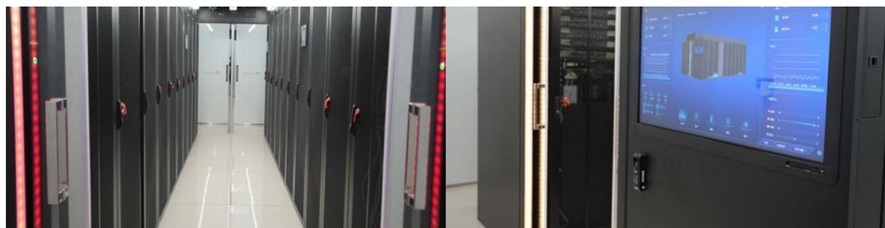

natural_image

Interior view of a data center server room with multiple racks and a central display panel (no visible text or symbols)

2025年新建数据中心

## 02

## 绿色制造篇

向绿而行，共绘美好未来

环境合规管理  
污染物与废弃物管理  
减少资源消耗  
应对气候变化  
绿色转型

凌云股份厚植绿色发展根基，将节能减排与“双碳”行动方案纳入长期发展蓝图，采取管理提升与技术革新并举的方式，推动能源、资源节约和利用效率双提升，稳步推进绿色低碳转型，将可持续要求贯穿干生产经营的各个环节，致力于实现企业发展与生态效益的协调统一。

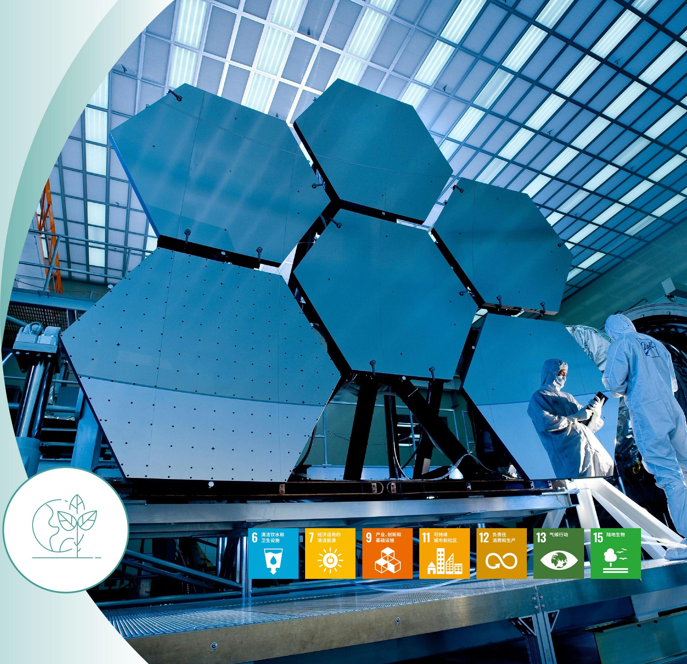

text_image

6 清洁饮水和卫生设施
7 经济适用的清洁能源
9 产业、创新和基础设施
11 可持续城市和社区
12 负责任消费和生产
13 气候行动
15 陆地生物

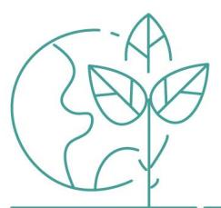

6 清洁饮水和 卫生设施

9 产业、创新和 产业、设创施

11可持和社区区

12负责我生产产

13 气候行动

15 陆地生物

## 环境合规管理

凌云股份高度重视环境保护管理，严格按照运营所在地的相关法律法规要求开展环境管理工作，全面践行环保合规，降低业务运营过程中对环境产生的负面影响。

## 环境管理架构

凌云股份节能降碳与环境保护领导小组作为环境议题的最高管理机构，带领各职能部门推进环境保护提升行动工作，监督考核各项工作有序开展。各职能部门负责落实环境管理的具体工作，对业务范围内的环境保护工作负责。

负责开展、组织、协调凌云股份的各项环境保护提升行动工作，监督考核各项工作有序开展

全面落实排污许可制度，自行监测，自证守法

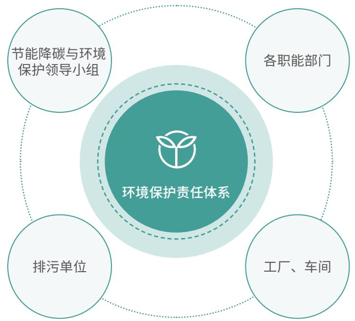

flowchart

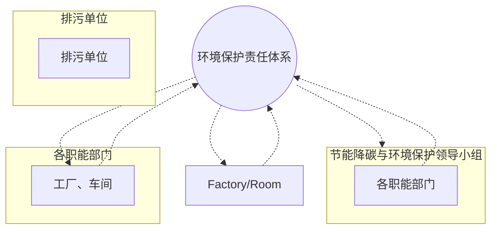
```mermaid
graph TD
  Center(("环境保护责任体系"))
  
  subgraph Staff_Group ["节能降碳与环境保护领导小组"]
    direction TB
    Staff1["各职能部门"]
  end
  
  subgraph Departments ["各职能部门"]
    direction TB
    Dept1["工厂、车间"]
  end
  
  subgraph Units ["排污单位"]
    direction TB
    Unit1["排污单位"]
  end
  
  Center -.-> Staff_Group
  Center -.-> Dept1
  Center -.-> Factory/Room
  
  Staff1 -.-> Center
  Dept1 -.-> Center
  Factory/Room -.-> Center
```

根据业务分工及工作职责，对业务范围内的生态环境保护工作负责

落实污染防治设施运行管理要求

## 环境管理制度

公司已制定实施《节能降碳与环境保护责任制》 《节能降碳与环境保护监督管理办法》 《环境保护问题排查与整治管理办法》《固定资产投资项目环境保护管理办法》《生态环境保护工作责任追究办法》等15项内部制度明确环境保护的目标和措施，并已将环境保护工作纳入各单位领导人员的绩效考核体系。新订《并购重组项目节能降碳与生态环境保护调查评价管理办法》《能效对标监督管理办法》两项。

报告期内，凌云股份制定并下发《2025年度节能降碳与环境保护工作要点》，编制重点工作任务清单，明确各部门、各分子公司重点工作内容，层层签订责任书，将年度工作指标、重点工作细化至各单位、车间、班组并定期考核。

## 环保体系认证

凌云股份建立了完善的环境、健康与安全管理体系(EHS)，确保公司在运营过程中遵守环境保护、健康安全的原则，同时实现经济效益与环境效益的双赢。该体系以ISO 14001环境管理体系标准为指导，涵盖了环境方针、目标、指标、管理方案等核心要素，确保企业在生产、运营等环节中有效识别和控制环境因素，减少对环境的不利影响。

公司持续完善环境管理体系，目前所有产排污单位均已完成环境管理体系建设。报告期内，共计56家单位通过IS014001环境管理体系三方审核认证，进一步提高了环境管理体系的成熟度。

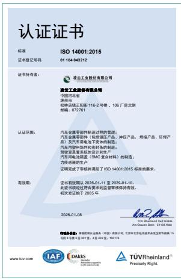

text_image

认证证书
标准	ISO 14001:2015
证书登记号码	01 184 043212
证书持有人:
泰山工业股份有限公司
西安工业投资有限公司
中国河北省
洛阳市
松林县镇正阳街116-2号楼、106厂房北侧
邮编：072761
认证范围：汽车金属零部件制造过程的管理；汽车金属零部件（包括液压产品、冲压产品、焊接产品、钎焊产品）及汽车零部件出厂文件的制造；汽车紧固材料和密封材料的制造；精密型装置及功能设计与生产；汽车用电辅助设备（DAC复式材料）的制造；力传动系统的生产
证明完成了审核并满足了 ISO 14001:2015 标准的要求。
有效期：证书有效期从 2026-01-11 至 2039-01-10。
此证有效期经过符合要求的监督审核保持有效。
初次发证将于 2005 年
2026-01-06
TUV Rheinland GmbH
Ann Grouse Stein：#1105 Kähm
特此公告。本授权委托书已载明，中航（集团）北京柴油机总装机技术部总经理张瑞峰 13
份（不含第 3 号版本），本授权委托书，100176。
www.tuv.com
DAKS
TÜVRheinland®
Precisely Right

ISO 14001 环境管理体系认证

  
西南凌云，凌云新能源、上海亚大汽车常熟分公司入选“2025年度省级绿色工厂名单”  
重庆市经济和信息化委员会文件

重庆市经济和信息化委员会关于公布2025年度市级绿色制造名单的通知  
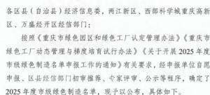

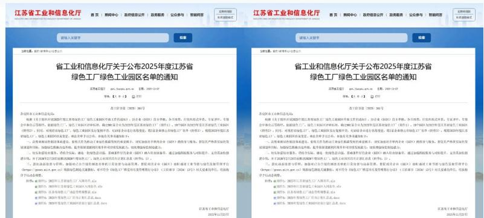

text_image

江苏省工业和信息化厅
首页 | 预测中心 | 政府信息公开 | 政务服务 | 公众参与 | 智慧问答

省工业和信息化厅关于公布2025年度江苏省绿色工厂绿色工业园区名单的通知

江苏省工业和信息化厅关于公布2025年度江苏省绿色工厂绿色工业园区名单的通知

江苏省工业和信息化厅关于公布2025年度江苏省绿色工厂绿色工业园区名单的通知

江苏省工业和信息化厅关于公布2025年度江苏省绿色工厂绿色工业园区名单的通知

江苏省工业和信息化厅关于公布2025年度江苏省绿色工厂绿色工业园区名单的通知

江苏省工业和信息化厅关于公布2025年度江苏省绿色工厂绿色工业园区名单的通知

江苏工业和信息化厅关于公布2025年度江苏省绿色工厂绿色工业园区名单的通知

江苏省工业和信息化厅关于公布2025年度江苏省绿色工厂绿色工业园区名单的通知

江苏省工业和信息化厅关于公布2025年度江苏省绿色工厂绿色工业园区名单的通知

江苏省工业和信息化厅关于公布2025年度江苏省绿色工厂绿色工业园区名单的通知

江苏省工业和信息化厅关于公布2025年度江苏省绿色工厂绿色工业园区名单的通知

苏工业和信息化厅关于公布2025年度江苏省绿色工厂绿色工业园区名单的通知

苏工业和信息化厅关于公布2025年度江苏省绿色工厂绿色工业园区名单的通知

苏工业和信息化厅关于公布2025年度江苏省绿色工厂绿色工业园区名单的通知

苏工业和信息化厅关于公布2025年度江苏省绿色工厂绿色工业园区名单的通知

苏工业和信息化厅关于公布2025年度江苏省绿色工厂绿色工业园区名单的通知

江苏省工业和信息化厅关于公布2025年度江苏省绿色工厂绿色工业园区名单的通知

江苏省工业和信息化厅关于公布2025年度江苏省绿色工厂绿色工业园区名单的通知

江苏省工业和信息化厅关于公布2025年度江苏省绿色工厂绿色工业园区名单的通知

江苏省工业和信息化厅关于公布2025年度江苏省绿色工厂绿色工业园区名单的通知

苏州市工业园区管理委员会
苏州市工业园区管理委员会
苏州市工业园区管理委员会
苏州市工业园区管理委员会
苏州市工业园区管理委员会
苏州市工业园区管理委员会
苏州市工业园区管理委员会
苏州市工业园区管理委员会
苏州市工业园区管理委员会
苏州市工业园区管理委员会
苏州市工业园区管理委员会
苏州市工业园区管理委员会
苏州市工业园区管理委员会
苏州市工业园区管理委员会
苏州市工业园区管理委员会
苏州市工业园区管理委员会
苏州市工业园区管理委员会
苏州市工业园区管理委员会
苏州市工业园区管理委员会
苏州市工业园区管理委员会
苏州市工业园区管理委员会

江苏省工业和信息化厅关于公布2025年度江苏省绿色工厂绿色工业园区名单的通知

江苏省工业和信息化厅关于公布2025年度江苏省绿色工厂绿色工业园区名单的通知

江苏省工业和信息化厅关于公布2025年度江苏省绿色工厂绿色工业园区名单的通知

江苏省工业和信息化厅关于公布2025年度江苏省绿色工厂绿色工业园区名单的通知

江苏省工业和信息化厅关于公布2025年度江苏省绿色工厂绿色工业园区名单通知

江苏省工业和信息化厅关于公布2025年度江苏省绿色工厂绿色工业园区名单通知

江苏省工业和信息化厅关于公布2025年度江苏省绿色工厂绿色工业园区名单通知

江苏省工业和信息化厅关于公布2025年度江苏省绿色工厂绿色工业园区名单通知

江苏省工业和信息化厅关于公布2025年度江苏省绿色工厂绿色工业园区名单通知

江苏省工业和信息化厅关于公布2025年度江苏省绿色工厂绿色工业园区名单的通知

江苏省工业和信息化厅关于公布2025年度江苏省绿色工厂绿色工业园区名单通知

江苏省工业和信息化厅关于公布2025年度江苏省绿色工厂绿色工业园区名单通知

江苏省工业和信息化厅关于公布2025年度江苏省绿色工厂绿色工业园区名单通知

江苏省工业和信息化厅关于公布2025年度江苏省绿色工厂绿色工业园区名单的通知

江苏省工业和信息化厅关于公布2025年度江苏省绿色工厂绿色工业园区名单的通知

江苏省工业和信息化厅关于公布2025年度江苏省绿色工厂绿色工业园区名单通知

江苏省工业和信息化厅关于公布2025年度江苏省绿色工厂绿色工业园区名单通知

江苏省工业和信息化厅关于公布2025年度江苏省绿色工厂绿色工业园区名单的通知

江苏省工业和信息化厅关于公布2025年度江苏省绿色工厂绿色工业园区名单通知

江苏省工业和信息化厅关于公布2025年度江苏省绿色工厂绿色工业园区名单的通知

江苏省工业和信息化厅关于公布2025年度江苏省绿色工厂绿色工业园区名单通知

江苏省工业和信息化厅关于公布2025年度江苏省绿色工厂绿色工业园区名单通知

江苏省工业和信息化厅关于公布2025年度江苏省绿色工厂绿色工业园区名单的通知

江苏省工业和信息化厅关于公布2025年度江苏省绿色工厂绿色工业园区名单的通知

江苏省工业和信息化厅关于公布2025年度江苏省绿色工厂绿色工业园区名单的通知

江苏省工业和信息化厅关于公布2025年度江苏省绿色工厂绿色工业园区名单通知

江苏省工业和信息化厅关于公布2025年度江苏省绿色工厂绿色工业园区名单的通知

江苏省工业和信息化厅关于公布2025年度江苏省绿色工厂绿色工业园区名单通知

江苏省工业和信息化厅关于公布2025年度江苏省绿色工厂绿色工业园区名单的通知

江苏省工业和信息化厅关于公布2025年度江苏省绿色工厂绿色工业园区名单的通知

江苏省工业和信息化厅关于公布2025年度江苏省绿色工厂绿色工业园区名单通知

江苏省工业和信息化厅关于公布2025年度江苏省绿色工厂绿色工业园区名单的通知

江苏省工业和信息化厅关于公布2025年度江苏省绿色工厂绿色工业园区名单的通知

江苏省工业和信息化厅关于公布2025年度江苏省绿色工厂绿色工业园区名单的通知

江苏省工业和信息化厅关于公布2025年度江苏省绿色工厂绿色工业园区名单的通知

江苏省工业和信息化厅关于公布2025年度江苏省绿色工厂绿色工业园区名单通

<table><tr><td rowspan="2">72</td><td rowspan="2">两江新区</td><td rowspan="2">重庆市宇邦线缆有限公司</td><td>669</td><td>南京特耐线器材有限公司</td><td>JS2025669</td><td rowspan="2">491</td><td rowspan="2">昆山市华新电路板有限公司</td><td rowspan="2">JS2025491</td></tr><tr><td>670</td><td>奥德汽车零部件(郑州)有限公司</td><td>JS2025670</td></tr><tr><td>73</td><td>两江新区</td><td>重庆宇隆光电科技股份有限公司</td><td>671</td><td>赛得利(盐城)纤维有限公司</td><td>JS2025671</td><td>495</td><td>汉高(江苏)汽车零部件有限公司</td><td>JS2025495</td></tr><tr><td rowspan="2">74</td><td rowspan="2">两江新区</td><td rowspan="2">重庆京东方电子科技有限公司</td><td>672</td><td>江苏丰山生化科技有限公司</td><td>JS2025672</td><td>496</td><td>台佳空调系统(江苏)有限公司</td><td>JS2025496</td></tr><tr><td>673</td><td>凌云新能源科技有限公司</td><td>JS2025673</td><td>497</td><td>江苏海聚新材料科技有限公司</td><td>JS2025497</td></tr><tr><td>75</td><td>两江新区</td><td>重庆渝江新高模具有限公司</td><td>674</td><td>常州仟日升反光材料有限公司</td><td>JS2025674</td><td>498</td><td>连云港神鹰复合材料科技有限公司</td><td>JS2025498</td></tr><tr><td>76</td><td>两江新区</td><td>重庆日立能源变压器有限公司</td><td>675</td><td>无锡瑞银金属制品有限公司</td><td>JS2025675</td><td>499</td><td>江苏弘盛新材料股份有限公司</td><td>JS2025499</td></tr><tr><td rowspan="2">77</td><td rowspan="2">两江新区</td><td rowspan="2">凌凌电子(重庆)有限公司</td><td>676</td><td>南京储能电力科技股份有限公司</td><td>JS2025676</td><td>500</td><td>上海亚大汽车塑料制品有限公司常熟分公司</td><td>JS2025500</td></tr><tr><td>677</td><td>平遥电气有限公司</td><td>JS2025677</td><td>501</td><td>奥特凯姆(中国)汽车部件有限公司</td><td>JS2025501</td></tr><tr><td>78</td><td>两江新区</td><td>凌云西南工业有限公司</td><td>678</td><td>南通汇太新能源有限公司</td><td>JS2025678</td><td>502</td><td>无锡好力泵业有限公司</td><td>JS2025502</td></tr><tr><td rowspan="2">79</td><td rowspan="2">两江新区</td><td rowspan="2">重庆凌达压缩机有限公司</td><td>679</td><td>海悦电视制造有限公司</td><td>JS2025679</td><td>503</td><td>江苏友奥智能科技股份有限公司</td><td>JS2025503</td></tr><tr><td>680</td><td>极牛股份有限公司</td><td>JS2025680</td><td>504</td><td>江苏功成生物科技有限公司</td><td>JS2025504</td></tr><tr><td>80</td><td>两江新区</td><td>重庆海德世控制拉索系统有限公司</td><td>681</td><td>江苏香江润田农化有限公司</td><td>JS2025681</td><td>505</td><td>建湖耀宁新能源科技有限公司</td><td>JS2025505</td></tr><tr><td>81</td><td>两江新区</td><td>三重机(香港)有限公司</td><td>682</td><td>江苏神鹏科技发展有限公司</td><td>JS2025682</td><td></td><td></td><td></td></tr></table>

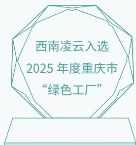

text_image

西南凌云入选
2025年度重庆市
“绿色工厂”

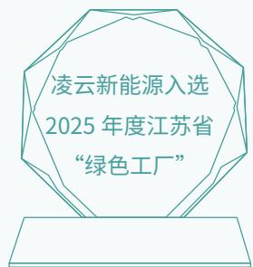

text_image

凌云新能源入选
2025年度江苏省
“绿色工厂”

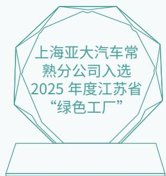

text_image

上海亚大汽车常熟分公司入选
2025年度江苏省
“绿色工厂”

## 环境风险管理

为进一步提升工作效能，全面压实生态环境保护主体责任，公司依据年度工作计划，对各单位实施环保巡查。

## 报告期内

通过开展环保交叉检查、环保自查、环保专项排查等，凌云股份共发现环境隐患问题67项，全部问题均已完成整改。

公司共接受地方各层级环保部门监督检查 56次，均未发现问题。

各产排污单位未发生突发环境事件，未被环境主管部门行政处罚。

公司各单位均已根据所处环境，产排污情况，环境风险因素等情况制定了突发环境事件应急预案，并在所属地环境主管部门备案，按年度开展突发环境事件应急演练。

报告期内，公司共开展突发环境事件应急演练43次。

## 环保意识宣贯

公司始终将环保教育作为企业文化建设的重要组成部分，积极倡导“绿色、低碳、可持续”的环保理念，致力干通过多层次、多形式的环保培训和宣传提升全体员工的环保意识与能力。

报告期内，公司共开展环境保护相关培训123次。

公司高度重视节能降碳和环境保护的教育培训工作。按月收集整理习近平生态文明思想学习资料及环境保护典型违法案例。公司所属各产排污单位通过发放宣传资料、合理化建议、绿色低碳促提升、线上线下培训、问题对标分析专题会等多种形式，积极开展环保培训。涵盖法律法规、节能减排、清洁生产等方面

## 案例

## 案例

世界环境日期间，凌云股份通过张贴标语、观看宣传片、开展专题培训等方式，开展丰富多彩的宣传教育活动。

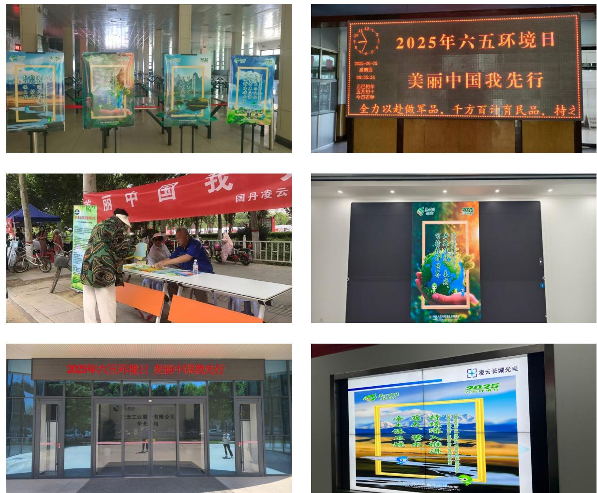

## 环境信息公开

公司严格遵守国家法律法规和监管要求，规范披露企业环境信息，增强透明度和公信力。对于属于环境保护部门公布的重点排污单位的公司或其主要子公司。公司要求其按照《公开发行证券的公司信息披露内容与格式准则第2号-年度报告的内容与格式（2021年修订）》等法律、行政法规、部门规章及规范性文件的规定。定期通过公司年度财报等渠道披露环境信息。此外。公司还定期发布环境绩效数据(如能耗。排放量等)，同时公开企业的环境目标和指标，接受社会监督，通过年度ESG报告展示企业在环境保护方面的努力和成果，提升利益相关方获取环境信息的便捷性

## 污染物与废弃物管理

凌云股份严格遵守运营所在地的环境保护相关法规和标准，强化污染物和废弃物的全流程管控。公司积极履行环保责任，通过对生产运营过程中污染物和废弃物的合规管理，确保各项污染物达标排放，有效减少对环境的负面影响。

## 污染物排放

公司严格遵守《中华人民共和国大气污染防治法》《中华人民共和国水污染防治法》等法律和标准，制定并执行《污染源、环境风险源、辐射源监督管理办法》等内部制度，对污染物排放进行全程监测及管控，从源头管控、过程治污、达标排放环节采取相应措施，减少污染物对环境的影响。

报告期内，共计32家单位完成了排污许可证变更、延续工作。报告期内，公司未发生因污染物排放受到重大行政处罚或被追究刑事责任的情况

## 污染物管理措施

## 源头管控

市场开发和产品开发过程中充分识别环境风险和节能降碳潜力，合法合规完成环评工作；  
• 技改技措项目按照节能降碳、清洁生产的原则，开展节能审查和环境影响“三同时”工作；  
•项目建设单位严格按照环评报告，推进污染防治能力建设。

## 过程治污

配置污水处理站、VOC废气治理设备设施等，确保污染治理设施处理工艺和处理能力满足达标排放要求；  
制定污染治理设施维护保养要求，严格按要求运行，完善污染防治设施运行记录，确保污染防治设备设施有效运行。

## 达标排放

• 各单位落实排污许可证制度，及时申领或变更排污许可证，做到持证排污；  
·取证后，严格落实排污许可证及环境影响评价报告等要求，开展环境自行监测和排污许可执行报告等基础管理，定期公开环保信息，做到“自证守法”。

## 2025 年

氮氧化物

29.59吨

二氧化硫

0吨

颗粒物

3.37吨

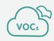

挥发性有机物（VOCs）

5.20吨

氨氮（NH -N）

2.06吨

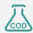

化学需氧量（COD）

35.92吨

## 废弃物管理

公司严格遵守《中华人民共和国固体废弃物污染环境防治法》《一般工业固体废弃物贮存和填埋污染控制标准》《危害废物贮存污染控制标准》等法律法规，制定并实施《工业固体废物管理办法》等内部制度，规范开展废弃物管理工作。

公司各所属单位产生主要危险废弃物为HW08废矿物油、HW09废乳化液、HW17污泥、HW49废弃包装物、HW49废活性炭等。公司从产生、收集、贮存、处置全流程严格落实危废管理要求，确保各所属单位依据相关法规要求对危险废弃物进行分类、标识和记录。

## 废弃物管理措施

## 源头减量

·通过改进生产工艺减少工业固废产生量。

## 过程管理

·危废储存库现场悬挂标识牌，建立管理台账，专人管理；  
•危废储存库地面进行耐腐蚀的硬化处理，具有泄漏液体收集装置、灭火设施、安全照明装置等保障措施。

## 末端回收

·建立废旧物料回收再利用体系，大幅提升能源资源利用效率。

2025 年

无害废弃物产生总量

15,896.88吨

有害废弃物产生总量

219.00吨

有害、无害废弃物回收再利用总量

15,317.00吨

## 噪声控制

除污染物和废弃物管理之外，噪声管理也是公司关注的重点。公司对冲压设备、空压机、货物装卸噪声采用设置减震沟、隔音墙、减少夜间作业等措施，有效降低噪声强度，减少对周边环境的影响。报告期内，厂界噪声全部达标。

## 生物多样性保护

公司严格遵守《环境保护法》《环境影响评价法》等相关法律法规，新建项目落实环境保护“三同时”管理要求。按照《建设项目环境影响分类管理名录（2021年版)》管理要求，在项目建设期和运营期，严格落实《长江保护法》《黄河保护法》相关要求，持续开展建设项目环评和竣工验收预审，强化项目源头管控。

## 减少资源消耗

公司积极践行绿色发展理念，将可持续发展理念纳入生产运营全流程，推动能源与资源的节约与高效利用，打造资源节约型企业。

## 能源管理

公司严格遵守《中华人民共和国节约能源法》等相关法律法规，已制定《能源管理办法》《固定资产项目节能审查管理办法》 《合同能源管理办法》等内部制度，明确能源管理规划方针及管理目标，不断完善能源管理体系建设并有效运行，鼓励各单位开展第三方认证。

公司已将节能工作纳入各单位领导人员的绩效考核体系，并制定年度节能降碳与环境保护工作要点，制定年度节能指标及工作任务等形成重点任务清单，细化分解至各单位，与各单位签订节能目标责任书，并定期考核。

报告期内，公司持续强化能源管理，通过节能技改、余热回收等途径，顺利实现万元产值综合能耗同比2020年降低8%的年度节能目标。2025年，新增3家单位完成IS050001能源管理体系建设，并通过三方审核认证。

## 能源管理措施

## 节能技改

• 持续开展产能优化、产线升级和设备设施节能改造，全面提高产线效率和用能设备电气化占比，优化能效指标；  
• 开展重点能耗产品能效对标，识别节能路径，并通过改造炉壁板材、改善炉体保温气密性等措施，实现1919吨标煤的节能量。

## 空气能建设项目

制造分公司、研发分公司安装空气能设备，利用空气能进行采暖，取代传统蒸汽热力供暖。

## 空压机大修

能源分公司4#空压机因长时间运行而发生磨损、腐蚀等现象，导致空压机产气效率降低。报告期内能源分公司对空压机进行大修提高产气效率及能源使用效率。

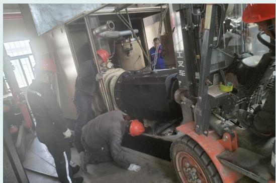

natural_image

Workers assembling a large industrial machine in a factory setting (no visible text or symbols)

## 余热回收

总部园区持续拓展空压机余热回收应用场景，实现年节省标准煤210吨，降低碳排放 656 吨。

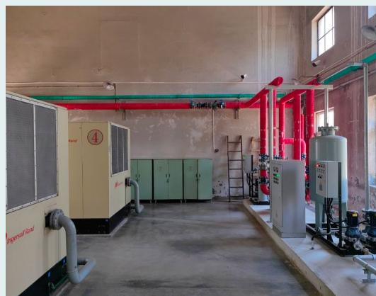

natural_image

Interior view of an industrial facility with large machinery and overhead cranes (no visible text or symbols)

<table><tr><td>2025年直接能源消耗总量4,984吨标煤</td><td>综合能耗(不含自发自用绿电)54,369吨标煤</td><td>天然气4,760吨标煤</td><td>汽油140吨标煤</td><td>柴油84吨标煤</td></tr><tr><td>间接能源消耗总量49,385吨标煤</td><td colspan="2">外购不可再生电力使用量40,806吨标煤</td><td colspan="2">外购可再生电力使用量4,305吨标煤</td></tr><tr><td>屋顶分布式光伏使用量2,409吨标煤</td><td colspan="2">热力蒸汽4,274吨标煤</td><td colspan="2">单位营收综合能耗0.027吨标煤/万元营收</td></tr></table>

## 水资源管理

公司严格遵照《中华人民共和国水法》，在整个生产运营过程中有效地开展水资源管理。公司明确节约用水标和应对方案，督促各单位落实水资源管理措施，实施日常监督，以确保水资源有效利用。同时部分单位采用有效治理措施，使工业废水净化后再循环利用，不断提高水资源综合利用效率。此外，通过开展水平衡测试深入挖掘节水潜力。 水盗源管理措施 水资源管理措施

##

## 源头节水

为杜绝跑冒滴漏问题，公司统一采购，将办公楼原有手动关闭式洗手装置更换为节水感应式洗手装置，实现“人到出水、人离断水”的自动管控，从使用源头杜绝无效用水消耗。

## 循环用水

·通过冷却水塔及空冷机循环使用冷却水用于产品冷却成型及热冲压成型等工艺，重复水利用率95%；  
•凌云胶管公司工业废水部分经水站处理后，统一收集，接入车间管道，冲厕进行再利用。

## 智能计量

针对水平衡测试中发现的部分水表损坏及计量不准确问题，公司及时更换计量器具，提高了用水计量的准确性和稳定性，强化用水监测能力。

## 2025年

## 新鲜水取水量

550,498 吨

## 总排水量

412,874吨

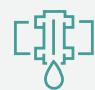

## 总耗水量

137,624吨

## 循环经济

公司秉持从源头减少资源消耗的理念，持续优化生产经营中的材料使用、回收和再生利用：在产品制造环节材料回收利用，在包装环节推动减量化，在终端环节设置加工废料处置流程。报告期内，公司废弃物循环利用量15,317 吨。

## 循环经济措施

## 产品制造

通过技术改造推进工业用料的回收利用，不断提高生产资源的利用率。

## 包装环节

在满足市场和生产需求的条件下，减少包装材料的使用，从而在提升经济效益的同时，减少资源的使用。

## 终端环节

设置加工废料处置流程并有效运行。

natural_image

Aerial view of a winding river cutting through lush green hills, with no visible text or symbols.

## 应对气候变化

作为产业先行者，公司密切关注气候变化对汽车零部件企业经营生产造成的各类影响，把应对气候变化议题作为公司面临的潜在风险与机遇之一进行管理，通过采用绿色能源、推广光伏应用、废料回收再利用、追求极致能效等措施推动节能降碳，积极推进“碳达峰”“碳中和”，推动绿色制造与认证、加强供应链管理，切实承担应对气候变化的企业责任。

## 应对气候变化治理

公司全面梳理近十年碳排放基础数据，编制《双碳行动计划》，规划了碳排放工作目标、组织领导、重点工作任务、责任单位职责等内容，并已将降碳工作纳入各单位领导人员的绩效考核体系。通过建立碳排放管控指标体系，明确碳排放核算方法、碳数据报送方式，分年度制定碳排放总量及碳排放强度双控目标：通过健全碳减排监督考核机制，定期检查和考核各单位碳排放总量及减排达标情况，强化责任落实，形成管理闭环；持续开展碳管理体系研究，不断优化完善企业碳管理体系。

## 凌云工业股份有限公司文件

## 关于印发（凌云工业股份有限公司双碳行动计划》的通知

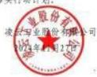

凌云股份双碳目标

## 到 2029 年

万元产值二氧化碳排放量（可比价）同比 2020年下降 15% 以上。2029年二氧化碳排放量预计达到峰值。

## 到 2050 年

生产运营全面绿色化转型，公司绿色发展实现运营碳中和。

## 到 2059 年

二氧化碳排放量实现碳中和，并携同原材料供应商实现碳中和减碳目标，形成绿色低碳核心竞争优势，实现全价值链碳中和。

## 气候变化风险与机遇

凌云股份持续关注应对气候变化相关议题，参考气候相关财务信息披露工作组(TCFD)建议，对公司总部所在地开展气候风险评估，并识别出以下重大气候风险与机遇：

<table><tr><td colspan="2">风险与机遇类型</td><td>风险与机遇描述</td><td>应对风险</td></tr><tr><td colspan="4">物理风险</td></tr><tr><td rowspan="2">急性风险</td><td>台风、洪水、暴雪等极端天气</td><td>·极端天气可能导致供应链中断,影响物流运输及正常运营,造成财产损失·极端天气可能破坏电力供应等基础设施,影响生产和交付进度</td><td>·加强应急预案及演练,建设应急抢险队伍,确保在极端天气事件发生时能快速响应并减轻损失·加强厂房、设备等防汛、抗风能力隐患排查和治理·购买意外保险</td></tr><tr><td>极端高温</td><td>·厂区降温系统超负荷、设备过热停机·员工身体健康和工作效率受影响</td><td>·在高温季节调整作业时间,避开高温时段·设置休息区与清凉补给</td></tr><tr><td>慢性风险</td><td>水资源短缺</td><td>·供水不足、水价上涨,影响整体运营效率和产品定价</td><td>·推进节水工艺,实施循环水系统改造,提高工艺用水重复利用率</td></tr><tr><td colspan="4">转型风险</td></tr><tr><td colspan="2">政策与法规</td><td>·国际贸易摩擦、地缘政治、关税调整及贸易壁垒等因素,可能影响公司全球业务布局、供应链稳定及市场拓展,并提升合规成本,海外经营风险加大</td><td>·持续关注政治形势和商务政策,加强全球视野对政治形势、经济形势的全面分析和研判,紧跟重点客户战略规划及布局调整</td></tr><tr><td colspan="2">技术风险</td><td>·技术迭代加快,客户需求和产品标准持续升级,若公司技术创新滞后于行业变化,可能面临产品竞争力下降</td><td>·聚焦优质客户和优势产品,强化市场调研、竞争对手分析和前端市场信息获取,提升市场响应能力</td></tr><tr><td colspan="2">市场风险</td><td>·国内汽车内卷态势不断提升,价格不断下探,零部件企业利润空间受到挤压</td><td>·根据市场情况制定灵活的价格策略,以适应市场变化和降低价格的风险·持续推进降本增效,提高新产品竞标能力和盈利能力</td></tr><tr><td colspan="2">声誉风险</td><td>·上游供应商环保不达标(如使用高污染原材料或工艺),可能引发连带责任,导致产品被召回或品牌声誉受损</td><td>·践行制造企业绿色供应链管理标准,加强供应商准入审核</td></tr><tr><td colspan="4">转型机遇</td></tr><tr><td colspan="2">产业升级机遇</td><td>·汽车行业的新兴发展方向,为公司巩固产业地位、提高技术水平与创新能力提供了重要机遇</td><td>·加快产业结构调整和产品布局优化,巩固优势产业领先地位,提升公司在新兴产业链中的竞争优势和市场地位</td></tr><tr><td colspan="2">数字化转型机遇</td><td>·汽车产业电动化、网联化、智能化的发展趋势对公司数字化和智能化水平的要求提升</td><td>·把握行业发展趋势,推动企业数字化转型、智能化升级</td></tr></table>

## 应对气候变化策略

公司以双碳绿色循环为发展底色提出风险应对策略，通过优化能源结构、优化调整产品/产业结构、推动绿色制造认证与数字化转型、增强供应链透明度、探索循环经济模式、以碳管理推动节能降碳，构建全球化碳管理体系，提升品牌低碳话语权。

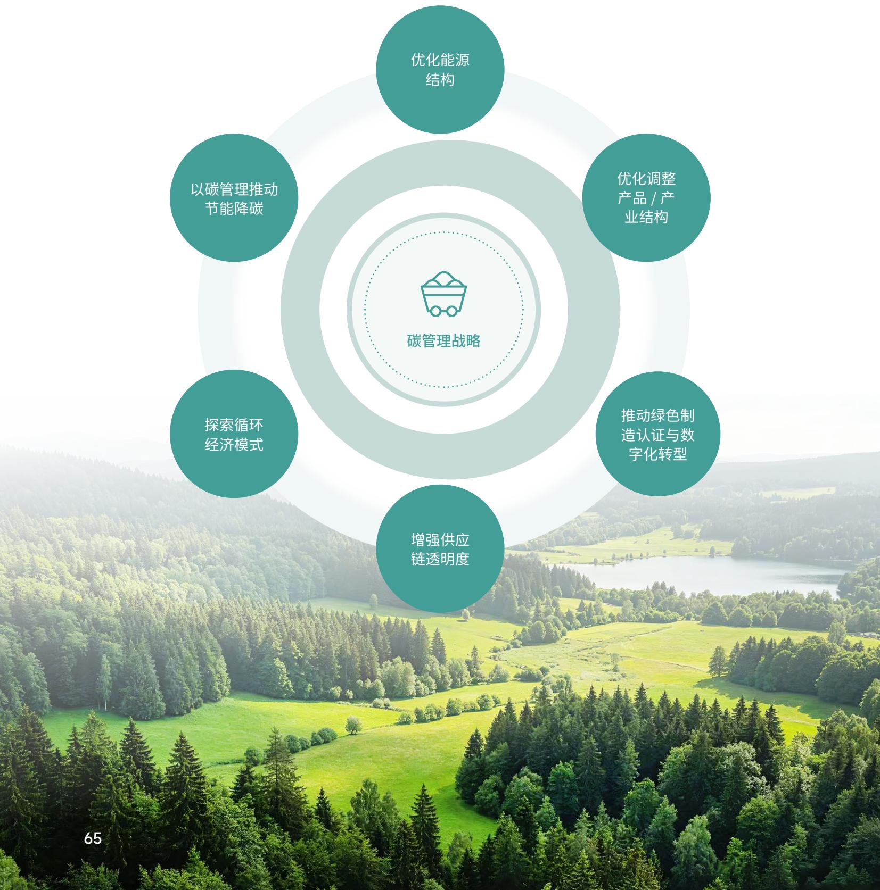

flowchart

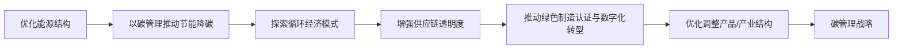
```mermaid
graph LR
  A["优化能源结构"] --> B["以碳管理推动节能降碳"]
  B --> C["探索循环经济模式"]
  C --> D["增强供应链透明度"]
  D --> E["推动绿色制造认证与数字化转型"]
  E --> F["优化调整产品/产业结构"]
  F --> G["碳管理战略"]
```

## 减碳措施

## 优化用能结构

•逐步减少汽油、柴油等化石能源使用量；  
•充分利用厂房屋顶、停车场等开展分布式光伏发电建设；  
•购买绿电、绿证，逐步增加绿电使用量，进一步扩大可再生能源使用占比。

## 产品碳足迹

河北亚大汽车、上海亚大管件、阔丹凌云等单位生产的电热熔套筒、尼龙管路、波纹管路等6种产品，以及凌云中南公司生产的保险杠产品、新能源公司生产的电池壳产品已获得产品碳足迹证书。

## 优化产业/产品结构

·逐步淘汰“投资金额高、资源占用多、盈利水平低、产值能耗高”的产品，以提升板块盈利能力和降低产值能耗为目的，向高技术含量、高附加值、低能耗产品和新能源汽车市场倾斜；  
·已开发低排放、低析出要求的多款管材产品，助力行业减排

## 推动绿色制造与认证数字化转型

打造自动化生产线、智能车间、智慧工厂，推动生产制造全过程向智能、绿色方向发展，推动清洁生产。

## 增强供应链透明度

不断拓展与战略供应商的项目合作，鼓励其持续采用可持续生产方式，同时定期对其开展现场及环境审核，确保各项绿色转型计划落地实施。

坚持将环境管理体系认证（ISO14001）、职业健康安全管理体系（ISO45001）、质量体系认证(IATF16949\ISO9001)及相关行业资质要求作为新供应商准入必要条件；通过第三方审核确保采购供应链 ESG 持续改进，共建绿色供应生态链。

持续优化铝型材供应链布局。采购政策向绿色产业链布局完善的优质供应商倾斜，推动构建兼具成本优势与环境效益的绿色供应链。当前战略供应商已完成“风-光- 火电-铝-铝加”产业链搭建，使用绿电铝、清洁能源，从源头减少碳排放。

## 指标与目标

公司密切监控自身产生的碳排放，通过建立健全碳减排监督考核机制，定期检查和考核各单位碳排放总量及减排达标情况，形成管理闭环。

## 2025 年

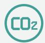

温室气体排放总量（范围一）

10,221 吨二氧化碳当量

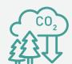

温室气体排放总量（范围二）

301,958 吨二氧化碳当量

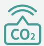

温室气体排放总量（范围一+ 范围二）

312,179 吨二氧化碳当量

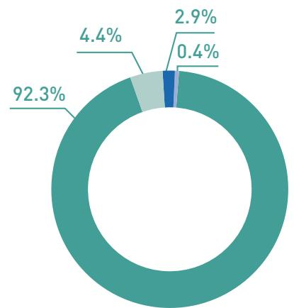

donut

| Category | Value (%) |
| --- | --- |
| Teal | 92.3 |
| Light Gray | 4.4 |
| Dark Blue | 2.9 |
| Very Light Blue | 0.4 |

净购入电力隐含的排放量

净购入热力隐含的排放量

化石燃料排放量

工业生产过程排放量

单位产值碳排放量  
单位：tCO2e / 万元  
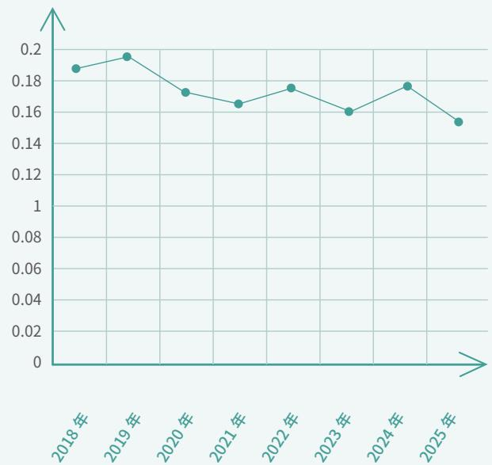

line

| Year | Value |
| --- | --- |
| 2018年 | ~0.188 |
| 2019年 | ~0.196 |
| 2020年 | ~0.173 |
| 2021年 | ~0.166 |
| 2022年 | ~0.176 |
| 2023年 | ~0.161 |
| 2024年 | ~0.177 |
| 2025年 | ~0.154 |

2018-2025年度二氧化碳排放量  
单位：万吨二氧化碳当量  
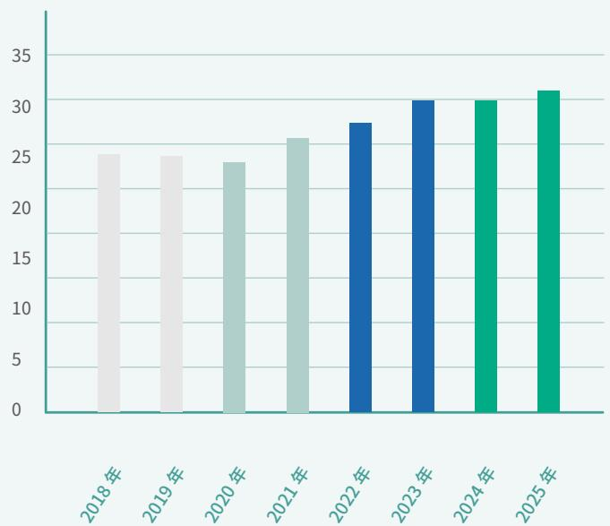

bar

| Year | Value |
| --- | --- |
| 2018年 | ~25 |
| 2019年 | ~25 |
| 2020年 | ~24.5 |
| 2021年 | ~26.5 |
| 2022年 | ~28.5 |
| 2023年 | ~30.5 |
| 2024年 | ~30.5 |
| 2025年 | ~31.5 |

## 绿色转型

公司充分认识到绿色转型为企业带来的全球发展新机遇，积极学习并落实《十四五现代能源体系规划》、《关于中央企业加快绿色发展推进美丽中国建设的通知》等政府政策关于全社会绿色转型新精神，从光伏“应铺尽铺”做起、提升绿证采购消费绿电、深度开展绿色办公等，全方位践行企业高质量绿色发展，并收获了成效。

## 光伏战略

公司遵照国家各级政府光伏发电政策，充分利用各分子公司全国地域分布广的特点，使用工房屋顶、停车场等采取“自发自用、余电上网”模式建设分布式光伏发电系统。2025年，公司新增光伏装机量4.37兆瓦，累计建成近 26 兆瓦光伏发电能力，消费可再生能源电力 4,146 万 kWh，绿电使用占比达8.5%，实现减碳2.2 万吨。

<table><tr><td>序号</td><td>安装单位名称</td><td>装机容量(MW)</td></tr><tr><td>1</td><td>凌云工业股份有限公司</td><td>4.9</td></tr><tr><td>2</td><td>北京世东凌云科技有限公司</td><td>1.1</td></tr><tr><td>3</td><td>江苏凌云恒晋汽车零部件有限公司</td><td>0.7</td></tr><tr><td>4</td><td>海宁亚大塑料管道系统有限公司</td><td>1.4</td></tr><tr><td>5</td><td>新能源科技有限公司</td><td>1.2</td></tr><tr><td>6</td><td>天津凌云高新汽车科技有限公司</td><td>1.4</td></tr><tr><td>7</td><td>柳州凌云汽车零部件有限公司</td><td>3.0</td></tr><tr><td>8</td><td>沈阳凌云新兴汽车科技有限公司</td><td>2.1</td></tr></table>

<table><tr><td>序号</td><td>安装单位名称</td><td>装机容量(MW)</td></tr><tr><td>9</td><td>凌云中南工业有限公司</td><td>1.1</td></tr><tr><td>10</td><td>上海亚大汽车塑料制品有限公司</td><td>1.0</td></tr><tr><td>11</td><td>成都凌云汽车零部件有限公司</td><td>0.5</td></tr><tr><td>12</td><td>上海乔治费歇尔亚大塑料制品有限公司</td><td>1.4</td></tr><tr><td>13</td><td>亚大塑料制品有限公司</td><td>1.3</td></tr><tr><td>14</td><td>凌云西南工业有限公司</td><td>2.8</td></tr><tr><td>15</td><td>廊坊舒畅汽车零部件有限公司</td><td>0.8</td></tr><tr><td>16</td><td>凌云股份长春分公司</td><td>1.3</td></tr></table>

## 长春凌云光伏项目投入运行

## 案例

长春凌云光伏项目依托公司一期厂房，充分利用约12000平方米的闲置屋顶资源，建设总规模为1.2MW。项目采用“承包方出资建设、自发自用、余电上网”的运营模式，建成后年均发电量预计可达120万度。通过这一模式，原本闲置的屋顶空间被有效盘活，转化为持续输出绿色电力的生产基地，真正实现“环保+效益”双提升。

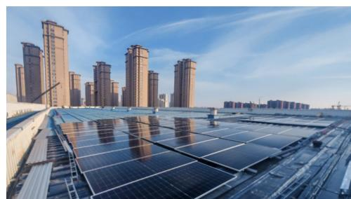

natural_image

Rooftop rooftop with solar panels and high-rise buildings in the background under a clear blue sky (no visible text or symbols)

长春凌云

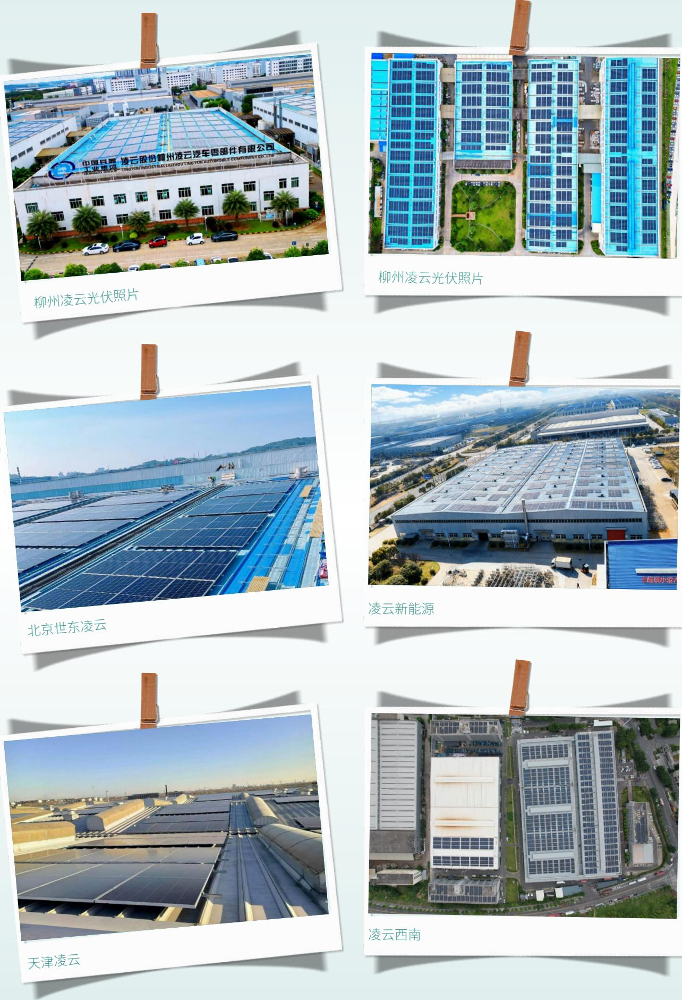

## 绿电策略

公司逐步增加绿电、清洁能源配额，在不增加电力成本的前提下优先使用绿电。自建设施及绿电配额不能满足绿电需求时，采用“以绿增绿”方式把光伏优惠资金通过绿色电力交易或认购可再生能源绿色电力证书等方式，提高可再生能源利用比例。

The International

Tracking Standard

Foundatio Founders of I-REC

This Redemption Statement has been produced for

SHENYANG LINGYUN EMERGING AUTOMOTIVE TECHNOLOGY CO., LTD.

CLIMATE BRIDGE (SHANGHAI) LTD

confirming the Redemption of

1800.000000

I-REC Certificates, representing 1 800,000000 MWh of

electricity generated from renewable sources

Xuanshun South Road 28, Dadong District, Shenyang City, Liaoning Province China

in respect of the reporting period

2025-01-01 to 2025-12-3

The stated Redemption Purpose is

Only use the production for BMW(BBA) product

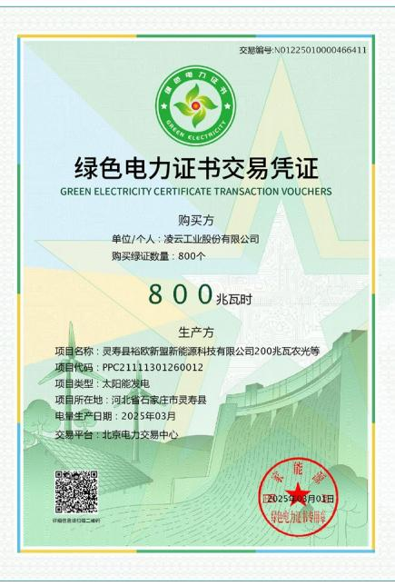

text_image

交易编号:N01225010000466411
绿色电力证书
GREEN ELECTRICITY CERTIFICATE TRANSACTION VOUCHERS
购买方
单位/个人：凌云工业股份有限公司
购买绿证数量：800个
800兆瓦时
生产方
项目名称：灵寿县福欧新盟新能源科技有限公司200兆瓦农光等
项目代码：PPC21111301260012
项目类型：太阳能发电
项目所在地：河北省石家庄市灵寿县
电联生产日期：2025年03月
交易平台：北京电力交易中心
2025年03月01日
绿色电力证书
绿色电力证书
绿色电力证书

## 绿色办公

公司通过多维度举措构建绿色办公体系，全面覆盖能源优化、智慧运营等领域，培育出全员参与的绿色办公文化。

## 绿色办公举措

## 硬件升级

公司推进照明系统节能改造，将传统日光灯逐步更换为LED节能灯，使用变频空调系统，配合智能感应控制技术实现精细化用电管理。

## 数字化转型

公司大力推进无纸化办公，启用内网公文协同系统，实现文件起草、传阅、会签、审批、归档等全流程线上闭环处理，大幅减少纸质文件印制、复印与传递，既提升公文流转效率，又有效节约纸张、油墨、打印等办公资源。

## 03社会共荣篇

以人为本，共享发展成果

以人为本，员工满意  
优质客户服务  
负责任供应链  
共建幸福社会

text_image

6 清洁饮水和卫生设施
7 经济适用的清洁能源
9 产业、创新和基础设施
11 可持续城市和社区
12 负责任消费和生产
13 气候行动
15 陆地生物

6 清洁饮水和卫生设施

9产业、创新和 基础设施

11

12负责 消费和生产

13 气候行动

15 陆地生物

## 以人为本 员工满意

凌云股份始终将人才视为企业核心竞争力，秉持“人才强企”理念，构建了覆盖人才引进、培养发展、激励约束、权益保障的全生命周期人力资源管理体系，实现员工价值与企业发展的深度绑定，为公司高质量发展提供坚实人力支撑

## 保护员工权益

## 合规雇佣

公司严格遵循《中华人民共和国劳动法》《中华人民共和国劳动合同法》等相关法律法规，构建标准化、规范化的雇佣管理体系并制定《凌云工业股份有限公司员工招聘管理办法（试行）》，以完善制度体系保障全流程用工合规。公司与全体员工依法签订《劳动合同书》及《保密与竞业限制协议》，明确双方权利与义务，保障员工劳动权益。

公司严格执行任职回避制度，对存在岗位不相容、近亲属从业等情况的人员进行合理调配，杜绝违规雇佣情形。

公司遵从所在国家或地区的相关法律法规，禁止雇佣或接收未达所在国家或地区最低就业年龄的劳工。在禁止强迫劳动方面公司严禁与任何涉及奴隶，强迫劳动，抵债劳动或契约劳工的劳动合同进行签订，并承诺遵守所在国家或地区的法律法规抵制一切形式的非自愿劳动。

## 科学布局

公司通过打造“人才树”体系，将产品布局、技术攻关的难点倒推到人才需求上，并目分层分级精准定位，描绘出以需求为导向的人才缺口和招聘目标进而开展招聘工作。目前，公司已经开展“梧桐计划”持续引进核心人才、国际化急需人才，校园储备人才等“高精尖缺”人才，通过“校园招聘+社会招聘”、“线下招聘+线上招聘”形式畅通引才渠道，吸引更多优秀人才加入凌云事业平台。招聘过程坚持“统一标准、严控入口、能绩为本、择优录用”原则，确保招聘流程公开、公平、公正。

## 多元包容

凌云股份致力于打造一个多元包容的职场，提供平等的就业机会，公平对待每一位应聘者。公司关注社会弱势群休的权益坚决杜绝针对性别、地域、年龄、种族、宗教等任何形式的歧视、骚扰或威胁行为。

<table><tr><td colspan="2">人资数据分类</td><td>人数统计</td></tr><tr><td rowspan="3">按劳动关系划分</td><td>全职职工人数</td><td>11595</td></tr><tr><td>兼职职工人数</td><td>0</td></tr><tr><td>外委单位职工人数</td><td>0</td></tr><tr><td rowspan="2">按性别划分</td><td>男性职工人数</td><td>9846</td></tr><tr><td>女性职工人数</td><td>1749</td></tr><tr><td rowspan="7">按地域划分</td><td>中国华北地区职工人数</td><td>4607</td></tr><tr><td>中国东北地区职工人数</td><td>836</td></tr><tr><td>中国华东地区全职职工人数</td><td>2968</td></tr><tr><td>中国华中地区职工人数</td><td>605</td></tr><tr><td>中国西北地区职工人数</td><td>25</td></tr><tr><td>中国南方地区职工人数</td><td>1233</td></tr><tr><td>中国海外地区全职职工人数</td><td>1321</td></tr><tr><td rowspan="4">按学历划分</td><td>博士研究生职工人数</td><td>9</td></tr><tr><td>硕士研究生职工人数</td><td>317</td></tr><tr><td>本科职工人数</td><td>3146</td></tr><tr><td>大专及以下职工人数</td><td>8123</td></tr><tr><td rowspan="4">按年龄划分</td><td>35岁及以下职工人数</td><td>5234</td></tr><tr><td>36-45岁职工人数</td><td>4259</td></tr><tr><td>46-55岁职工人数</td><td>1842</td></tr><tr><td>56岁及以上职工人数</td><td>260</td></tr><tr><td rowspan="4">按职级划分</td><td>高级管理者总人数</td><td>8</td></tr><tr><td>中级管理者总人数</td><td>123</td></tr><tr><td>初级管理者总人数</td><td>1903</td></tr><tr><td>非管理者总人数</td><td>9561</td></tr><tr><td rowspan="5">多元化少数群体数据</td><td>残疾职工人数</td><td>20</td></tr><tr><td>少数民族职工人数</td><td>955</td></tr><tr><td>女性专家总人数</td><td>23</td></tr><tr><td>女性工程师总人数</td><td>268</td></tr><tr><td>退伍军人总人数</td><td>186</td></tr></table>

## 薪酬福利

公司建立了完善的员工绩效考评、薪酬福利制度，根据员工各自工作目标、计划以及工作业绩指标完成情况进行年度综合考核评估，激励员工勤勉尽责、恪守职责，努力完成公司制定的各项任务。公司执行以岗位工资为主体、分层分级搭建的工资制度体系，执行《凌云工业股份有限公司经理层成员绩效与薪酬管理办法》《凌云工业股份有限公司经理层成员任期制和契约化管理办法》；根据“三才管理”体系对管理人才、科技人才、技能人才制定不同晋升条线的薪酬福利制度，保障多种人才科学合理体系。

公司全面落实多元化福利保障，覆盖社会保险及公积金、绩效奖金、企业年金、补充医疗保险、年终奖、探亲假、高温假带薪年休假、高温费、取暖费、交通补贴、话费补贴、免费通勤班车、节日福利、免费体检，为境外工作员工发放专项补贴同时建立温暖的帮扶捐助体系、员工联谊平台、丰富的文体娱乐活动及免费健身设施，全方位提升员工归属感与幸福感。公司搭建人才与社保政策共享平台，2025 年共梳理分享政策 133 项，成功争取人才、社保资金支持 646 万元，让员工充分享受政策红利。公司工伤保险的覆盖率100%，大病医疗覆盖率100%，医保二次报销覆盖率100%。

133 项

成功争取人才、社保资金支持

646 万元

100 %

大病医疗覆盖率

100 %

医保二次报销覆盖率

100 %

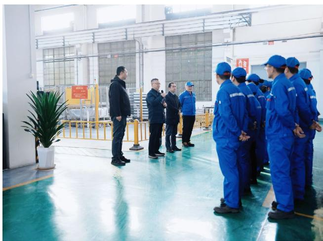

natural_image

Group of workers in blue uniforms and caps gathered indoors in a factory setting, with no visible text or symbols.

公司领导看望慰问一线员工

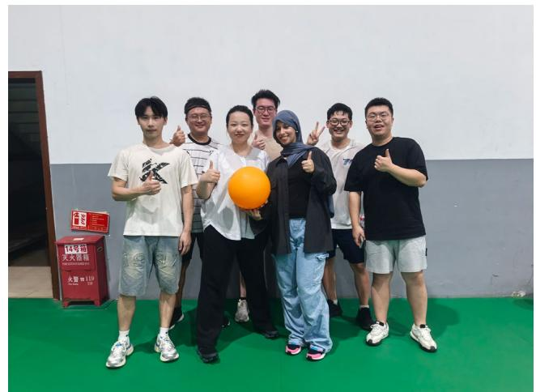

natural_image

Group photo of six people posing with thumbs up on a green floor, with a red safety sign and fire extinguisher in the background (no visible text or symbols on subjects)

摩洛哥留学生参与气排球比赛

## 员工沟通与关怀

公司坚持以人为本，保障员工权益，关心关爱员工，搭建成长平台，建立了多层次、常态化的员工沟通与关怀机制，保障员工诉求能够及时传递与响应。通过问卷调查、专项访谈、员工座谈会等形式，广泛听取员工对组织职能优化、薪酬福利、培训发展等方面的意见建议，2025 年开展总部组织职能优化调研，形成针对性优化建议方案。

公司着力解决职工现实难题，重点解决凌云医院开业、子女就学两大关键问题。针对凌云职工及家属就医不便、应急救治延迟的难题，推动设立“涿州市中医医院凌云分院”，有效改善职工及家属就医条件；针对职工子女就读周边优质学校名额受限问题，积极对接保定市政府及相关学校，全力推动职工子女入学问题妥善解决，进一步解除职工后顾之忧。在外派人员关怀与保障方面，公司实施外派人员全周期管理，针对性办理中德社保证明等跨境权益保障文件，确保社保待遇无缝衔接，同时依托工会组织落实一系列关怀举措。

2025年，公司全系统推进70项“为群众办实事”项目，形成职工群众看得见、暖人心的成效。常态化开展送温暖、送清凉等慰问活动，覆盖 4100 人次，金额 53.74 万元；组织“职工互助一日捐”，募资81.13万元，救助115名职工，金额76.48万元；采购15.59万元定点帮扶产品，传递关怀并助力帮扶：组织135人次高层次人才、劳模、一线职工疗休养活动。

公司开展常态化文化建设与氛围营造工作，公司倡导“德才兼备、以德为先”“敬业爱岗、忠诚事业”的价值导向，加深员工对企业的认同感与归属感。2025年公司成功举办“创新引领·深化改革·沿着高质量发展之路前行”年度表彰暨团拜会，举办第七届“凌云杯”职工技能竞赛，持续丰富职工文化生活，增强团队凝聚力与向心力。

柳州凌云公司在特定节日组织壮族特有活动项目。

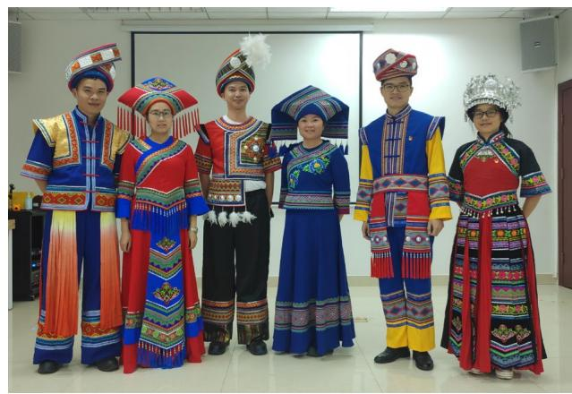

natural_image

Group photo of six individuals in traditional ethnic costumes posing indoors (no visible text or symbols)

柳州凌云着壮族和苗族服饰召开党员大会

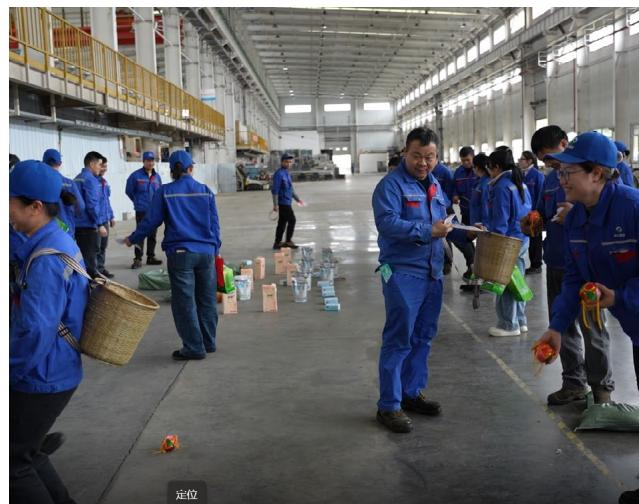

natural_image

Group of workers in blue uniforms and caps gathered inside a large industrial factory, handling supplies and packaging (no visible text or symbols)

柳州凌云壮族特色活动

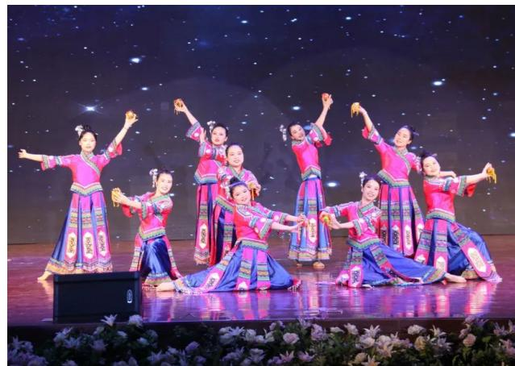

natural_image

Group of dancers in traditional pink and blue costumes performing on stage with colorful props, against a starry backdrop (no text visible)

团拜会中的壮族舞蹈

## 人才队伍建设

## 人才战略

凌云股份秉持人才强企战略，以“人才树”体系为核心，构建与公司发展战略深度适配的人才战略布局。

2025年，凌云股份坚定坚持党管干部，统筹谋划建强各级领导班子。公司积极贯彻落实新时代党的组织路线对选人用人工作的实践要求，年内选优配强12家单位“一把手”8名、班子成员9名，新提拔中于6名，选人用人工作质量进一步提升。同时公司初步形成工厂长队伍专项育成建设方案，为建设百名高素质工厂长队伍工作打下基础。

公司坚持基业长青，抓好后继有人，持续关注集团公司级优秀年轻干部的成长情况：1人被提拔为子集团副职，1人参加中青班，跟踪督促2人完成上年度中青班行动学习实践报告。同时公司注重发挥优秀年轻干部、优秀年轻人才库的作用重点关注突出对象，年内4人提拔为中于，43人得到提拔或进一步使用，6人选派到海外任职，9人参加集团公司专项工作锻炼，66人参加“启航”专题培训。公司坚持优进绌退、动态更新，对各单位2025年更新推荐的人选逐一从年龄、学历履历、业绩、考核结果等维度审慎把关，择优储备优秀年轻干部121人、优秀年轻人才265人，保障提升队伍质量和活力。

公司同步推进海外人才战略。公司引进摩洛哥留学生4人：德国、墨西哥、摩洛哥公司结合当地实际，制定符合所属国家的规章制度，保障境外用工合规适配：逐步建立并完善派出人员管理体系，全面强化境外公司运营管控，陆续制定颁布了《境外派驻人员管理办法》、《WAG公司于部管理办法》、《境外派驻WAG公司中层以上人员工资待遇管理办法》等管理制度加强境外派驻人员的选拔、调配、日常管理，规范工作程序，建设激励约束机制，提升工作绩效，鼓励派驻人员积极投身境外业务。

natural_image

Illustration of two business figures running on a platform with an upward arrow and bar chart, symbolizing growth or success (no text or symbols present)

## 员工培训

公司培训工作坚持按需施教、学以致用原则。公司构建三级培训管理体系夯实培训基础，严格执行一级（兵器工业集团及上级部门组织）、二级(公司总部组织)、三级(各子公司自主开展）培训管理体系，明确各级培训职责与重点；总部层面统筹规划核心培训项目，子公司结合业务实际制定个性化培训计划，形成上下联动、协同高效的培训工作格局。同时建立内部讲师管理体系，挖掘业务骨于、技术专家担任内训师，开发针对性课程，强化内部知识传承与共享。

2025年，公司面向不同员工、不同需求、不同地域、不同领域开展多次专项培训，力争“精准施训、靶向育才”。公司为聚焦海外队伍，为摩洛哥项目组定制“法语+英语”双语线上特训班、为财务骨干举办国际会计准则精研特训班;面向科技技能人才，实施高层次科技领军人才培训班、技能领军人才培训班，开展职业技能等级认定培训；针对新员工，连续五年开展见面会暨入职培训，通过企业文化宣贯、安全合规教育、素质拓展等环节，帮助千余名新员工快速融入企业。创新培训载体与形式，提升培训实效。开设“讲武堂”交流课堂，以主题月形式，采用线上线下相结合的方式，为全体干部职工搭建沟通交流平台，累计覆盖2000余人次。

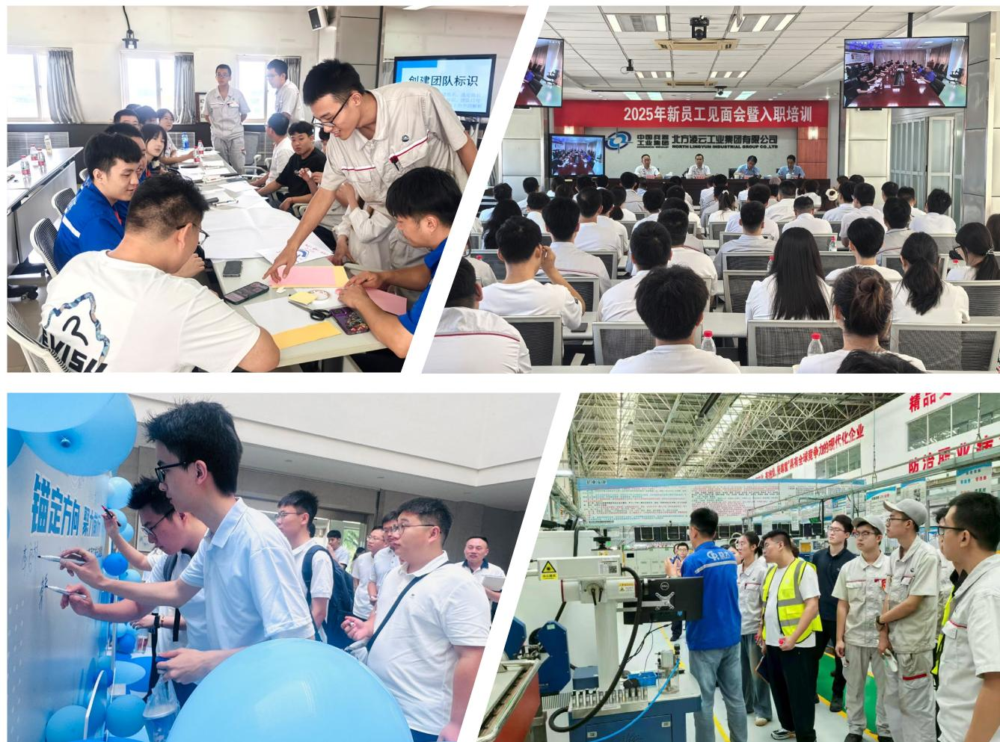  
年度新员工入职培训

  
员工培训总投入  
600 万元人民币

  
员工培训覆盖率  
100 %

  
受训雇员总人数  
11595 人

  
386890 小时

  
参与培训的员工总人次  
85000 人次

参与培训人数（人）  
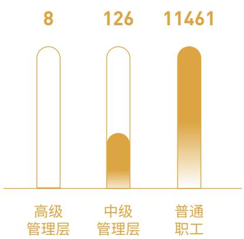

bar

| Category | Value |
| --- | --- |
| 高级管理层 | 8 |
| 中级管理层 | 126 |
| 普通职工 | 11461 |

受训总小时数（小时）  
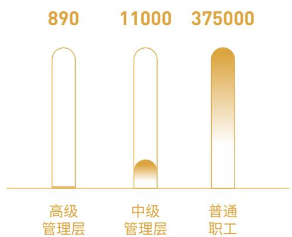

bar

| Category | Value |
| --- | --- |
| 高级管理层 | 890 |
| 中级管理层 | 11000 |
| 普通职工 | 375000 |

受训总小时数（小时）  
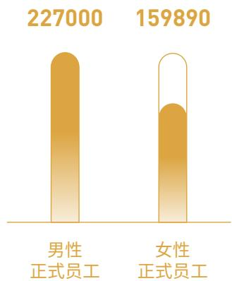

bar

| Category | Value |
| --- | --- |
| 男性正式员工 | 227000 |
| 女性正式员工 | 159890 |

## 员工发展

公司建立健全员工发展制度体系，持续畅通科技、技能、管理人才发展通道，在制定科技、技能、管理人才制度的基础上，同步配套凌云股份《科技带头人管理办法》《技能带头人管理办法》《质量带头人管理办法》《安全带头人管理办法》实现职业发展通道与集团公司高层次人才队伍全面接轨

公司持续深化校企协同育人，为青年人才提供赴清华大学、华中科技大学、北京理工大学、大连理工大学等高校访学机会：与中北大学签订《卓越工程师联合培养协议》，被西北工业大学授牌“大学生（留学生）社会实践基地”；同时公司搭建技能成才、创新建功平台，成功举办AI应用实践案例大赛，深化创新工作室建设，年内新创建5个公司级工作室，开展创新工作室论坛，发挥示范引领作用。

公司持续推进任期制与契约化管理提质扩面，36家单位70余名经理层成员及总部、各单位300余名管理人员签订岗位聘任协议与年度责任书，实现契约化管理全覆盖；管理人员公开竞聘上岗30人，末等调整和不胜任退出14人，形成“能上能下”的合规用人机制。

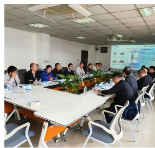

text_image

Meeting room photo with visible presentation screen showing Chinese text and people seated around a conference table

中北大学卓工联培合作交流

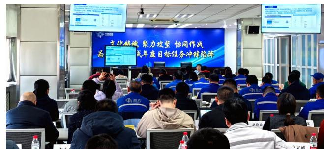

text_image

文化链魂 聚力攻坚 协同作战
为
成年度目标任务冲锋陷阵

职业技能考级培训班

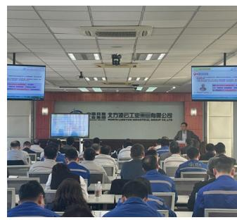

text_image

Conference scene with presentation screen showing company name and data, audience seated facing speaker

中科院物质院到凌云交流授课

## 员工激励

公司建立了与绩效考核紧密挂钩、兼顾短期激励与长期绑定的薪酬体系，确保薪酬分配公平合理、具有市场竞争力。在薪酬结构上，经理层成员薪酬包含基本年薪、绩效年薪、任期激励及专项奖励，绩效年薪占比不低于年度薪酬基准的60%；管理、技能、科技人才根据岗位等级享受相应岗位补贴，技能人才额外叠加技能等级补贴，科技人才可参与科技项目奖评选。

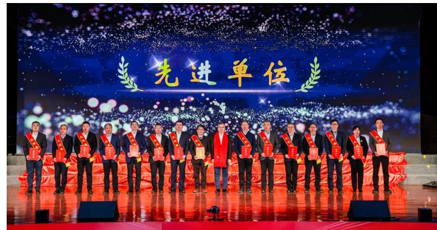

text_image

先进单位

2025年，公司激励力度持续加大，对经济效益、科技创新等领域的55个团队、513名成员及16家先进单位、67名先进个人、8个先进班组进行隆重表彰，采用全集团国内外同步直播、公司主要领导亲自颁奖的形式激发于事创业动力。同时公司落实穿透式薪酬监管要求，完成4000余张报表、30余万条薪酬数据的采集校核，保障薪酬发放合规精准。

此外，公司建立薪酬追索扣回制度，对未完成主要目标、造成重大损失等情形的，追索扣减相应薪酬收入；常态化开展科技项目奖评选，对突出贡献团队与个人给予专项表彰，同步组织宣讲会讲解股权激励解锁政策、解答疑惑问题，确保激励机制落地见效。

“强力推进人才树成果应用

加快补充领军人才数质”

2025年2月被授予凌云集团管理创新一等奖

在2025年年度工作中

“人才引育模式组合创新创效团队”被授予

凌云集团管理创新二等奖

## 优质客户服务

凌云追求与客户共同实现可持续发展的目标，秉持“客户满意”的服务理念，持续完善客户服务体系建设，不断提升客户服务管理与服务质量，给每位客户提供优质服务体验，同时积极探寻新机遇、新业态，进一步强化整体竞争力。

## 服务质量提升

## 客户服务体系

凌云股份建立了完整的客户服务体系，制订《凌云股份顾客服务管理规定》《凌云股份市场开发管理流程》《凌云股份顾客特定要求管理规定》《凌云股份客户信用等级评价管理规定》《顾客满意度分析表》《凌云股份质量信息反馈单》《凌云股份顾客问题改善跟踪表》等，深入了解客户需求，通过市场调研、客户反馈等方式，精准把握客户对产品或服务的功能性能、质量等方面的期望。

日常工作中，客户服务团队及时对质量形势进行分析、总结和预警。公司内部业务流程持续优化，深度融合CRM与PLM流程应用，建立新项目开发投资数据库，确保相关线上系统更加符合实际工作需求。2025 年，制造分公司、江西凌云、涿州吉恩斯等多家公司PLM、MOM系统上线。

## 客户满意度

公司与客户保持常态化沟通，严格按照《凌云股份顾客服务管理规定》进行客户服务管理，并采用Tisax数据加密保护客户隐私。

同时，我们建立了高效运作的客户投诉处理机制，客户邮件投诉或者接收到系统发送的投诉信息，将立刻组织相关部门开会，快速安排对应部门人员及时处理，第一时间消除客户抱怨。

为更好了解客户需求，提升经营服务质量，凌云股份每半年一次组织客户满意度调查，主要针对客户采购、物流、技术等区域发放凌云股份客户满意度表格。

报告期内，公司对客户开展满意度调研，平均顾客满意度98%，顾客反馈问题及时关闭率100%；并未发生产品和服务相关的安全与质量重大责任事故。

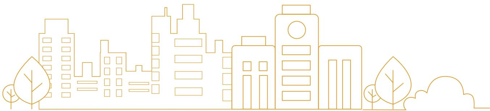

natural_image

Line art illustration of a city skyline with buildings, trees, and clouds (no text or symbols)

## 优化服务流程

立足于业务发展需要，公司完成了从客户管理到供应保障的一系列制度优化。我们以“获取优质项目”为核心驱动力，不断精进市场开发流程以调整业务结构；以“市场需求与盈利空间”为双向指引，通过产品研发流程的优化实现降本增效在采购领域，公司通过强化集中采购与廉洁合规管理，保障供应安全；而在运营层面，我们坚持标准化生产与准时化交付旨在通过质量提升与成本优势，为客户创造更大价值。

## 关联接口管理重点

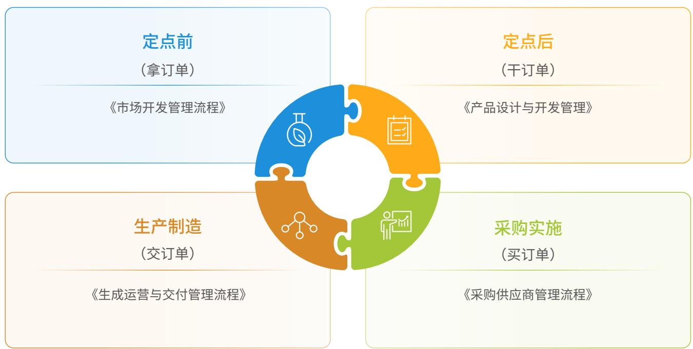

flowchart

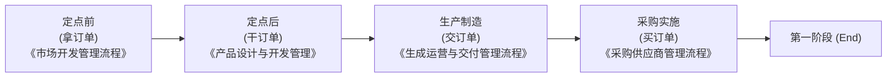
```mermaid
graph LR
  A["定点前\n(拿订单)\n《市场开发管理流程》"] --> B["定点后\n(干订单)\n《产品设计与开发管理》"]
  B --> C["生产制造\n(交订单)\n《生成运营与交付管理流程》"]
  C --> D["采购实施\n(买订单)\n《采购供应商管理流程》"]
  D --> E["第一阶段 (End)"]
```

## 团队能力建设

公司着力打造一支业务精湛，专业素质过硬勇于迎接挑战且善于应对复杂局面的客户服务团队，使其成为攻坚克难，制胜市场的核心力量。公司定期评估服务人员的能力素质与岗位匹配度，推行内部轮岗机制，帮助员工积累覆盖全链条的客服实践经验，增强团队协作意识，持续提升整体服务水平。同时，公司每年面向全体销售及市场体系相关员工开展客户服务专项培训，强化员工的服务意识，专业能力与沟通技巧，更精准地洞察并满足客户需求，我们设立“市场开发奖”等个人与团队荣誉评选，激励员工不断提升客户服务能力

## 深化伙伴合作

## 战略聚焦

凌云股份全面提升品牌影响力与资源协同效能，深化与主机厂战略合作，聚售优质客户，系统构建多层次、立体化的高端交流机制。客户均为各细分市场头部企业，传统燃油车与新能源业务布局均衡，具备较强的市场竞争力与抗风险能力。

## 深化战略合作

2025年，公司高层带队先后访问奔驰、宝马、长安汽车、奇瑞汽车等30余家国内外主流客户，通过高层会晤夯实战略互信，建立起常态化的立体沟通渠道。同时，举办多场专项产品推介与技术交流活动，邀请华为、一汽集团、中国重汽、上汽通用五菱等企业参与，与采购、研发

等关键岗位人员开展点对点深度对接推动合作走向实质化。积极参加上海国际车展等国际级行业盛会，期间接待汽车领域专业人士超4000人次，全面展示产品谱系与技术实力，进一步拓展行业影响力与联动交流平台。通过高位推动、精准对接与广泛触达相结合的策略，公司逐步构建起覆盖战略高层、业务执行与行业生态的多维交流网络，为市场全面开拓与关键项目定点赢得先机，持续厚植核心竞争力。

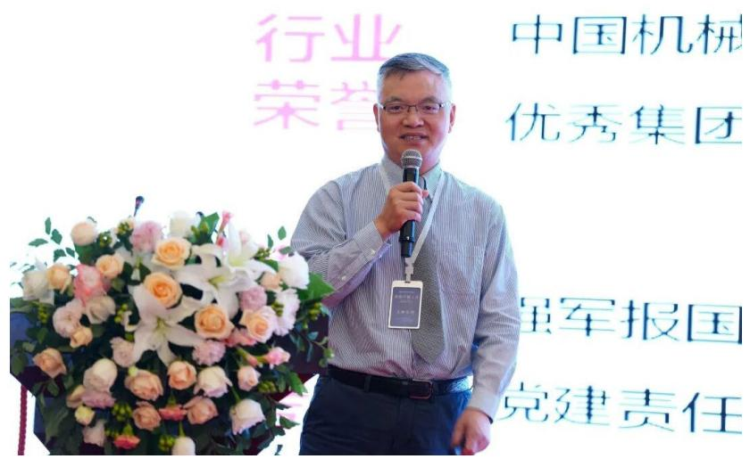

text_image

行业 中国机械
荣誉 优秀集团
强军报国
党建责任

凌云股份的客户群体以全球主流车企+中国头部车企为核心，实现国际化与本土化双轮驱动

覆盖奔驰、宝马、雷克萨斯、丰田、大众、福特等豪华及主流外资品牌，深耕全球汽车市场。

## 国际客户 国内客户

囊括一汽、东风、上汽、比亚迪等传统自主车企，以及蔚来、理想、小鹏等新能源头部新势力，紧跟行业转型趋势。

报告期内，凌云股份订单量继续保持高位区间。汽车金属零部件优质头部客户占比90%以上，热成型、电池壳、保险杠等优势产品占比87%，获得斯特兰蒂斯全球辊压件平台、宝马冲压产品高进阶门环等产品突破。

## 增强战略透明度

作为全球化集团化汽车零部件供应商，公司通过各类汽车零部件高效、可靠的技术解决方案，以专业化、系统化以及区域性协同合作，为客户提供增值服务，实现共赢。并坚持通过全方位开展交流推广合作活动，创造多层次交流渠道，打造良好的外部市场环境，从而在市场竞争中占据有利位置。一方面紧抓国内外重大活动、重大事件，积极参与并借助行业知名展会国际论坛，分享企业产品和技术路线，增强客户长期合作信心；一方面通过高层互访，定期举办客户峰会、产品推介等方式使客户加深对于企业战略与技术的了解，深化战略合作关系，多措并举加强凌云品牌的影响力

##

## 案例

凌云股份&一汽集团产品推介暨技术交流活动在长春一汽集团总部举办。凌云股份携汽车零部件各板块产品参加本次交流活动，展示了汽车车身安全结构件、新能源汽车电池壳、汽车流体管路系统、汽车舒适与安全系统以及驱动系统五大谱系产品，汽车热管理系统、汽车动力电池pack、自适应智能悬架系统、线控转向系统与力传感器等转型升级产品，充分展示了公司在集成化技术与线控转向等领域的新技术，体现了公司成本竞争能力与技术研发实力。

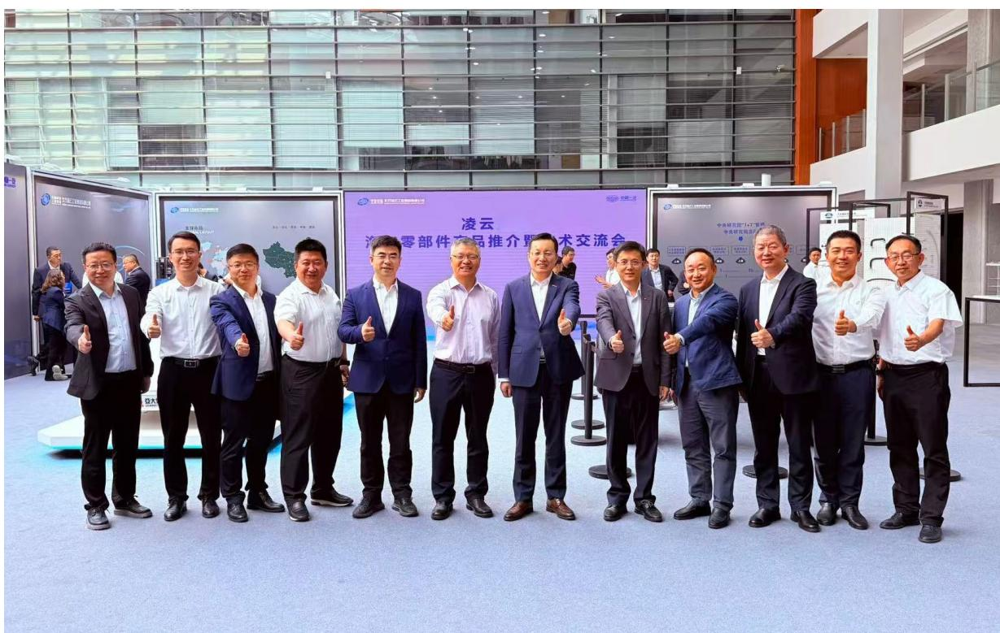

text_image

凌云
海海零部件产品推介暨技术交流会

凌云股份&一汽集团汽车零部件产品推介暨技术交流会

## 凌云汽车零部件系列产品走进上汽通用五菱

## 案例

凌云&上汽通用五菱产品推介暨技术交流活动在柳州举办。推介活动中，上汽通用五菱技术专家与采购代表围绕各板块产品领域最新技术与市场趋势进行深入探讨，凌云技术专家开展各专业课题宣讲，从产品性能、技术优势到实际应用场景，逐一讲解，全方位展示凌云在汽车零部件领域的创新成果与硬核实力

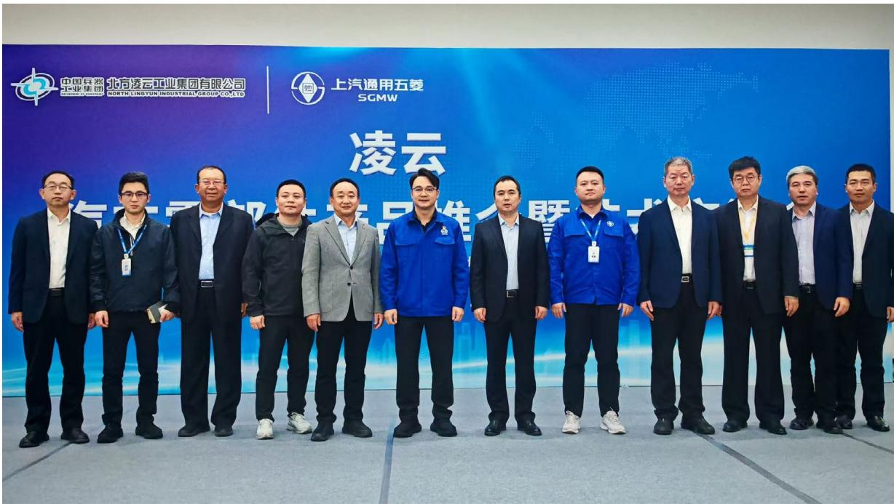

text_image

中国民爆
华业集团 北京凌云工业集团有限公司
NORTHLINGYUN INDUSTRIAL GROUP CO., LTD.
上汽通用五菱
SGMW
凌云
上海申通地铁供应链管理股份有限公司

凌云股份&上汽通用五菱汽车零部件产品推介暨技术交流会

##

## 案例

凌云股份与保定市城市管理综合行政执法局正式签订战略合作协议，保定执法局为凌云股份管道系统产品的推广提供支持。凌云股份助力保定市示范段建设，管道系统升级及老旧管网更新等市政基础设施的优化升级。共同探索智慧城市建设的新路径，完善城市基础设施网络、提升市政服务效能。

## 客户认可

德国WAG获保时捷“A级供应商”

北京奔驰“本土开拓奖”

一汽集团“核心供应商”

一汽大众“质量卓越奖”

一汽红旗“攻坚克难•旗志奖”“合作成就奖”

零跑汽车技术创新奖

零跑汽车质量进步奖

小鹏汽车2025与鹏同行奖

品质保障奖

福田戴姆勒汽车欧曼事业部颁发“拓域奖”

北京福田戴姆勒汽车有限公司颁发“质量领先奖”

战略合作奖

技术创领奖

最优秀供应商奖

广汽本田“成本优胜供应商奖”

广汽丰田“品质协力奖”

上汽通用“优秀供应商奖”“银合作奖”

上汽通用东岳汽车“银合作奖”

通用武汉2025年最佳供应商奖

2025蜂巢能源金牌供应商奖

国轩高科2025年度卓越创新奖

吉利远程卓越交付奖

山东吉利新能源商用车优秀供应商奖

新动力科技2025优秀响应奖

金麟奖流体管路系统科技创新奖

抗洪保供特殊贡献奖

徐州徐工汽车制造有限公司颁发“优秀供应商奖”

B20 优秀伙伴奖

## 负责任供应链

凌云始终秉持“供应商满意”的价值承诺，致力于加强供应链管理与合作发展，与国内外合资、合作伙伴建立长期战略合作伙伴关系，持续扩大优势产品在战略客户销售占比，推动行业发展。

## 供应链管理

公司积极打造与具有全球竞争力现代化企业发展相适应的安全、高效、有竞争力、可持续的供应链管理体系，满足客户SQCD（安全/质量/成本/交付）目标要求，提升市场竞争力。

## 优化管理流程

公司持续完善采购供应链管理流程(SCM)，对供应商准入、退出、供应商绩效、供应商风险、供应商能力提升等环节实施全流程管理，坚持刚性执行，不断增强供应链抗风险能力。2025年，公司将模具物资采购纳入SCM流程管理，并建立《采购成本&价格数据库管理手册》1.0版，完善采购成本数据库，数据赋能并支撑采购成本改善。报告期内，公司完成《采购供应链管理流程4.0》修订并组织培训实施

采购供应链流程结构  
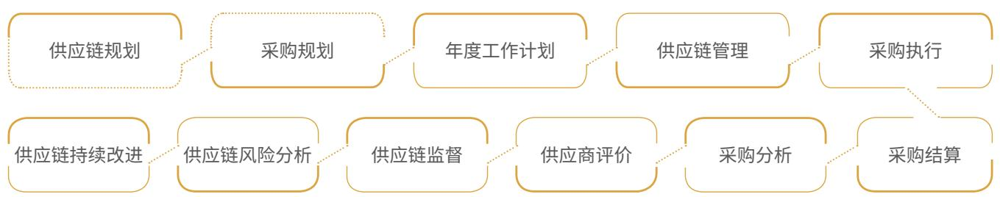

flowchart

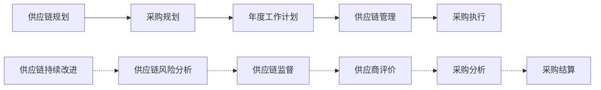
```mermaid
graph LR
  A["供应链规划"] --> B["采购规划"]
  B --> C["年度工作计划"]
  C --> D["供应链管理"]
  D --> E["采购执行"]
  F["供应链持续改进"] -.-> G["供应链风险分析"]
  G -.-> H["供应链监督"]
  H -.-> I["供应商评价"]
  I -.-> J["采购分析"]
  J -.-> K["采购结算"]
```

为更好地维护与供应商良好的伙伴关系，促进双赢的合作氛围，建立简单、透明的商业环境，保证采购业务廉洁建设工作的常态化，公司每年定期向供应商及商业合作伙伴发送《采购业务廉洁建设告知书》，并配合纪检、审计开展采购合规监督检查，提高廉洁风险防范意识。

## 提质增效

为应对原材料价格持续高位运行对企业经营带来的不利影响，公司采取多种措施强化供应链成本控制。包括：与主要钢厂进行原材料集采谈判，获取更多价格优惠；与重点材料供应商战略合作，推动联合研发及材料降本，增强企业抗风险能力;推动铝型材成本对标，资源优化整合，以量换价，持续降低采购成本。

与宝钢、VAMA等重点钢厂战略合作，统谈新增优惠，实现采购降本

与铝型材战略供应商合作开展 VAVE技术降本，优化采购成本

持续优化采购与供应链规划，创新实施物资集中采购模式，实现采购成本优化与效率提升

## 供应链深度协同

## 加强战略合作

在带动上下游产业链协同发展方面，公司始终秉持创新驱动、合作共赢的理念，以战略协同、业务赋能为原则，引入战略合作企业，推动国内，国外供应链体系建设，发挥各自市场和技术优势，推进落实全球供应战略合作，联合共建国际供应链报告期内，公司进一步深化与战略供应商合作，推进联合项目研发、低成本材料替代及主机厂材料认证等工作。

公司与宝山钢铁股份公司（宝钢股份)携手成立“凌云-宝钢”联合试验室，围绕汽车用高强钢、铝合金、热成型材料等核心领域开展联合技术攻关，成功突破多项行业共性技术难题，形成一批可工程化、可产业化的创新成果，全面提升材料研发与应用能力。

公司携手长城汽车成立“凌云-长城”联合试验室，在安全结构件方面开展联合技术研究，成功攻克多项制约行业发展的共性技术难关，形成了一批具备产业化应用前景的创新成果，实现了产品研发与技术开发能力的提升。

## 优化国际供应链布局

顺应全球汽车产业链供应链重构大势，公司大力推动实施全球协同配套战略，设立印尼、墨西哥WAM、欧洲生产基地三个生产制造基地，实现全球供应链配套。报告期内，公司进一步优化海外供应链布局，完善国际贸易税费数据库，支持新项目竞标。支持凌云摩洛哥完成定点项目量产采购准备、主辅材料资源调研等工作：完成铝型材战略供应商海外生产基地调研持续关注并研判欧盟、北美及东南亚等地区国际贸易关税政策变化影响：支持WAM采购流程优化和运营改善。

## 共建幸福社会

凌云股份深度践行企业公民责任，以“社会满意”为核心价值观，积极投身产业升级、国家重大战略实施及社会公益事业。公司致力于将自身发展深度融入社会进步，通过全方位的履责行动，交出一份彰显国企担当的时代答卷。

## 助力乡村振兴

凌云股份公司积极响应国家乡村振兴战略号召，扛起国资央企担当，于2025年向黑龙江省甘南县捐赠扶贫资金100万元，用于现代化农机具购置。此项举措有力推动了当地农业机械水平的提升，为持续巩固脱贫攻坚成果、激活黑土地内生动力注入了强劲支撑，展现了企业在服务国家大局、促进农业农村现代化进程中的积极作为。

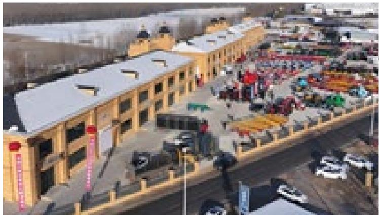

natural_image

Aerial view of a large industrial building complex with multiple buildings, parking lots, and surrounding roads (no visible text or signage)

凌云股份帮扶黑龙江省甘南县开展智慧农机产业园项目

凌云股份公司积极响应“绿水青山就是金山银山”号召，组织动员团员青年力量，连续三年在涞源县牌坊村(凌云股份老厂旧址）开展植树活动。此项行动不仅为美丽乡村建设增添了盎然绿意，更在承载企业历史记忆的土地上播下了传承的种子。彰显了公司在推动绿色发展、助力绿色乡村建设中的坚定决心与切实行动。

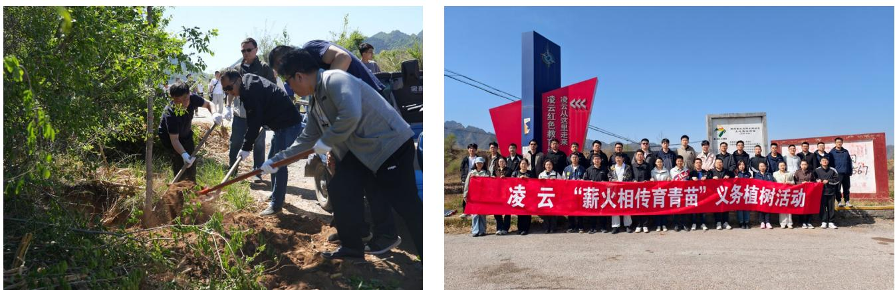  
涞源老厂义务植树活动现场

凌云股份下属公司亦积极开始各类帮扶项目。天津凌云公司开展精准帮扶，向津南区小站镇捐赠扶贫资金1万元，开展秋季助学、冬季送温暖等慈善项目。柳州凌云公司志愿者将柳州市白云乡少数民族村的6户7名留守儿童作为服务对象，定期到孩子家中，发放奖学金、开展心理辅导等。

## 投身公益慈善

凌云股份积极践行企业社会责任，结合自身发展实际开展慈善捐赠活动，聚焦教育帮扶、乡村振兴等重点领域，通过资金捐赠物资支持等方式助力社会公益事业发展。

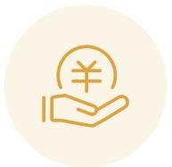

101 万元人民币

20 次

  
公益活动投入总小时数

600 小时

  
员工志愿者总人数

120 人次

公司主动投身各类公益活动，围绕环境保护、社区服务等主题组织开展系列公益行动，倡导绿色发展理念，助力和谐社区建设。公司鼓励员工参与志愿者服务，建立志愿者服务机制，引导员工在公益帮扶、应急救援、社区服务等领域发挥积极作用组织员工参与支教助学、关爱孤寡老人等志愿者活动，营造“人人参与公益”的企业文化，切实履行社会责任，传递企业温度，实现企业价值与社会价值的有机统一

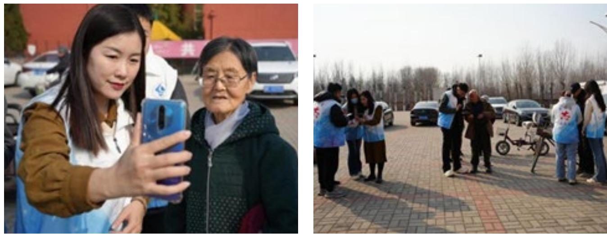  
公司公益活动现场

## 展望未来

凌云股份以系统思维、底线思维统领全局，深耕全面创新、全面转型、全面改革的工作主线，产品转型升级高质量发展、国际化经营提质增效两大重点任务，统筹经营全局，巩固向上向好发展势头，深化重点布局，在攻坚克难中开创进取局面，向着建设“有技术、有品牌、有文化、有抱负、受尊重”的现代化企业愿景奋力迈进。

natural_image

Scenic view of a forested lake surrounded by dense evergreen trees, with no visible text or symbols.

关键绩效表

<table><tr><td colspan="5">环境类指标(E)</td></tr><tr><td>指标</td><td>单位</td><td>2023年</td><td>2024年</td><td>2025年</td></tr><tr><td>节能环保投入</td><td>万元</td><td>2,123.44</td><td>2,483.79</td><td>2,670</td></tr><tr><td>节能环保培训投入</td><td>万元</td><td>10</td><td>15.1</td><td>20.9</td></tr><tr><td>节能环保培训次数</td><td>次</td><td>241</td><td>133</td><td>123</td></tr><tr><td>参加节能环保培训</td><td>人次</td><td>4,796</td><td>4,055</td><td>6,251</td></tr><tr><td>综合能源消耗总量</td><td>吨标准煤</td><td>48,304</td><td>49,305</td><td>54,369</td></tr><tr><td>新鲜水取水量</td><td>万吨</td><td>57.62</td><td>56.97</td><td>55.05</td></tr><tr><td>耗水强度*</td><td>吨新鲜水/万元营收</td><td>0.308</td><td>0.29</td><td>0.069</td></tr><tr><td>总排水量</td><td>万吨</td><td>43.2</td><td>42.28</td><td>41.29</td></tr><tr><td>单位营收综合能耗</td><td>吨标准煤/万元</td><td>0.025</td><td>0.025</td><td>0.027</td></tr><tr><td>万元营收碳排放量</td><td>吨</td><td>0.162</td><td>0.155</td><td>0.153</td></tr><tr><td>万元营收化学需氧量排放量*</td><td>吨</td><td>0.019</td><td>0.018</td><td>0.00002</td></tr><tr><td>清洁能源使用量(吨标煤)</td><td>/</td><td>17,290,000(千瓦时)</td><td>18,560,000(千瓦时)</td><td>11,474(吨标煤)</td></tr><tr><td>一般废弃物排放量</td><td>吨</td><td>21,709</td><td>20,902</td><td>15,896.88</td></tr><tr><td>危险废弃物排放量</td><td>吨</td><td>385.23</td><td>361.11</td><td>219</td></tr><tr><td>直接温室气体排放量</td><td>吨</td><td>8,846.2</td><td>10,137.3</td><td>10,221</td></tr><tr><td>间接温室气体排放量</td><td>吨</td><td>294,177.7</td><td>293,892.6</td><td>301,958</td></tr><tr><td>环境污染事故数</td><td>起</td><td>0</td><td>0</td><td>0</td></tr></table>

\*备注:2025年耗水强度、万元营收化学需氧量排放量指标根据《上海证券交易所上市公司自律监管指南第4号一一可持续发展报告编制(征求意见稿)》中“水资源使用强度”“总耗水量”等定义与公式进行计算。

社会类指标（S）

<table><tr><td>指标</td><td>单位</td><td>2023年</td><td>2024年</td><td>2025年</td></tr><tr><td>客户满意度</td><td>%</td><td>99</td><td>98</td><td>98</td></tr><tr><td>安全事故数</td><td>起</td><td>0</td><td>0</td><td>0</td></tr><tr><td>伤亡人数</td><td>人</td><td>0</td><td>0</td><td>0</td></tr></table>

社会类指标（S）

<table><tr><td>因工伤损工作日数</td><td>天</td><td>0</td><td>0</td><td>0</td></tr><tr><td>审查的供应商数量</td><td>个</td><td>35</td><td>39</td><td>46</td></tr><tr><td>因不合规被终止合作的供应商数量</td><td>个</td><td>5</td><td>0</td><td>9</td></tr><tr><td>因不合规被否决的潜在供应商数量</td><td>个</td><td>0</td><td>0</td><td>0</td></tr><tr><td>针对供应商开展的培训次数</td><td>次</td><td>399</td><td>435</td><td>452</td></tr><tr><td>培训覆盖供应商比例</td><td>%</td><td>29.2%</td><td>30.2%</td><td>20.8%</td></tr><tr><td>人员总量</td><td>人</td><td>10,607</td><td>10,806</td><td>11,595</td></tr><tr><td>女性员工数量</td><td>人</td><td>2,843</td><td>2,874</td><td>1,749</td></tr><tr><td>新增就业人数</td><td>人</td><td>1,774</td><td>2,242</td><td>2,864</td></tr><tr><td>劳动合同签订率</td><td>%</td><td>100%</td><td>100%</td><td>100%</td></tr><tr><td>社会保险覆盖率</td><td>%</td><td>100%</td><td>100%</td><td>100%</td></tr><tr><td>员工满意度</td><td>%</td><td>100%</td><td>100%</td><td>100%</td></tr><tr><td>员工流失率</td><td>%</td><td>10.20%</td><td>12.50%</td><td>9.46%</td></tr><tr><td>员工最低工资与当地最低工资比例</td><td>%</td><td>223</td><td>230</td><td>235</td></tr><tr><td>人均带薪年休假天数</td><td>天</td><td>7.6</td><td>7.5</td><td>7.5</td></tr><tr><td>员工人均培训时长</td><td>学时</td><td>5.32</td><td>5.47</td><td>4.55</td></tr><tr><td>职业培训投入</td><td>万元</td><td>90</td><td>114</td><td>600</td></tr><tr><td>接受培训的男性员工人数占员工总数的比例</td><td>%</td><td>73.2%</td><td>73.4%</td><td>73.5%</td></tr><tr><td>接受培训的女性员工人数占员工总数的比例</td><td>%</td><td>26.8%</td><td>26.6%</td><td>26.5%</td></tr><tr><td>接受培训的高层员工人数分别占员工总数的比例</td><td>%</td><td>1.0%</td><td>1.0%</td><td>0.07%</td></tr><tr><td>接受培训的中层员工人数分别占员工总数的比例</td><td>%</td><td>1.25%</td><td>1.10%</td><td>1.09%</td></tr><tr><td>接受培训的基层员工人数分别占员工总数的比例</td><td>%</td><td>97.75%</td><td>97.9%</td><td>98.84%</td></tr><tr><td>新增职业病数</td><td>人</td><td>0</td><td>0</td><td>0</td></tr><tr><td>困难员工帮扶投入</td><td>元</td><td>670,000</td><td>4,450,000</td><td>660,000</td></tr><tr><td>公益捐赠</td><td>万元</td><td>101</td><td>101</td><td>101</td></tr><tr><td>志愿者服务人次</td><td>人次</td><td>399</td><td>475</td><td>120</td></tr><tr><td>志愿服务时长</td><td>小时</td><td>1,596</td><td>1,900</td><td>600</td></tr></table>

治理类指标（G）

<table><tr><td>指标</td><td>单位</td><td>2023年</td><td>2024年</td><td>2025年</td></tr><tr><td>反腐败培训投入</td><td>万元</td><td>2.66</td><td>4.14</td><td>6.85</td></tr></table>

治理类指标（G）

<table><tr><td>反腐败培训次数</td><td>次</td><td>7</td><td>9</td><td>7</td></tr><tr><td>参加反腐败培训人次</td><td>人次</td><td>5,349</td><td>6,000</td><td>3,447</td></tr><tr><td>开展主题教育活动</td><td>次</td><td>66</td><td>66</td><td>64</td></tr><tr><td>员工参与主题党日活动</td><td>人次</td><td>13,860</td><td>14,376</td><td>16,032</td></tr><tr><td>守法合规培训次数</td><td>次</td><td>1</td><td>2</td><td>4</td></tr><tr><td>守法合规培训时长</td><td>小时</td><td>4</td><td>14.5</td><td>24</td></tr><tr><td>参加守法合规培训</td><td>人次</td><td>300</td><td>280</td><td>436</td></tr><tr><td>科技研发投入</td><td>亿元</td><td>7.83</td><td>8.02</td><td>9.18</td></tr><tr><td>科研攻关数量</td><td>个</td><td>44</td><td>31</td><td>32</td></tr><tr><td>申报专利数</td><td>项</td><td>220</td><td>232</td><td>235</td></tr><tr><td>授权专利数</td><td>项</td><td>197</td><td>205</td><td>228</td></tr><tr><td>科技论文发表数</td><td>篇</td><td>5</td><td>10</td><td>8</td></tr><tr><td>股东分红</td><td>万元</td><td>10,338</td><td>32,917</td><td>40,432</td></tr><tr><td>安全生产投入</td><td>万元</td><td>8,209</td><td>6,136</td><td>5,818</td></tr><tr><td>安全生产培训时长</td><td>学时</td><td>875</td><td>990</td><td>986</td></tr><tr><td>安全生产培训场次</td><td>次</td><td>390</td><td>395</td><td>487</td></tr><tr><td>安全生产培训投入</td><td>万元</td><td>65</td><td>67.4</td><td>67</td></tr><tr><td>参加安全生产培训</td><td>人次</td><td>30,000</td><td>32,000</td><td>18,826</td></tr><tr><td>安全生产培训员工覆盖率</td><td>%</td><td>100</td><td>100</td><td>100</td></tr></table>

财务类指标

<table><tr><td>指标</td><td>单位</td><td>2023年</td><td>2024年</td><td>2025年</td></tr><tr><td>资产总额</td><td>亿元</td><td>190.49</td><td>193.79</td><td>209.30</td></tr><tr><td>净资产</td><td>亿元</td><td>70.11</td><td>74.69</td><td>80.52</td></tr><tr><td>纳税总额</td><td>亿元</td><td>10.01</td><td>10.5</td><td>9.82</td></tr><tr><td>营业收入</td><td>亿元</td><td>187.02</td><td>188.37</td><td>198.36</td></tr><tr><td>归母净利润</td><td>亿元</td><td>6.32</td><td>6.55</td><td>8.35</td></tr><tr><td>海外公司营业收入</td><td>亿元</td><td>26.89</td><td>23.79</td><td>20.55</td></tr></table>

上交所指标索引

<table><tr><td>维度</td><td>序号</td><td>议题</td><td>对应条款</td><td>对应章节</td></tr><tr><td rowspan="8">环境</td><td>1</td><td>应对气候变化</td><td>第二十一条至第二十八条</td><td>应对气候变化</td></tr><tr><td>2</td><td>污染物排放</td><td>第三十条</td><td>污染物排放</td></tr><tr><td>3</td><td>废弃物处理</td><td>第三十一条</td><td>废弃物管理</td></tr><tr><td>4</td><td>生态系统和生物多样性保护</td><td>第三十二条</td><td>生物多样性保护</td></tr><tr><td>5</td><td>环境合规管理</td><td>第三十三条</td><td>环境合规管理</td></tr><tr><td>6</td><td>能源利用</td><td>第三十五条</td><td>能源管理</td></tr><tr><td>7</td><td>水资源利用</td><td>第三十六条</td><td>水资源管理</td></tr><tr><td>8</td><td>循环经济</td><td>第三十七条</td><td>循环经济</td></tr><tr><td rowspan="9">社会</td><td>9</td><td>乡村振兴</td><td>第三十九条</td><td>助力乡村振兴</td></tr><tr><td>10</td><td>社会贡献</td><td>第四十条</td><td>投身公益慈善</td></tr><tr><td>11</td><td>创新驱动</td><td>第四十二条</td><td>绘就科创蓝图专题:创新强企,深耕升级,战新未来</td></tr><tr><td>12</td><td>科技伦理</td><td>第四十三条</td><td>因本公司业务性质,不涉及本议题相关信息披露</td></tr><tr><td>13</td><td>供应链安全</td><td>第四十五条</td><td>负责任供应链</td></tr><tr><td>14</td><td>平等对待中小企业</td><td>第四十六条</td><td>平等对待中小企业</td></tr><tr><td>15</td><td>产品和服务安全与质量</td><td>第四十七条</td><td>优质客户服务</td></tr><tr><td>16</td><td>数据安全与客户隐私保护</td><td>第四十八条</td><td>信息安全管理</td></tr><tr><td>17</td><td>员工</td><td>第五十条</td><td>以人为本,员工满意</td></tr><tr><td rowspan="4">可持续发展相关治理</td><td>18</td><td>尽职调查</td><td>第五十二条</td><td>负责任供应链</td></tr><tr><td>19</td><td>利益相关方沟通</td><td>第五十三条</td><td>利益相关方沟通</td></tr><tr><td>20</td><td>反商业贿赂及反贪污</td><td>第五十五条</td><td>反腐败与商业道德</td></tr><tr><td>21</td><td>反不正当竞争</td><td>第五十六条</td><td>反垄断与公平竞争</td></tr></table>

## 专家点评

全球范围内，环境、社会和治理(ESG)议题正受到前所未有的高度关注，这股浪潮推动着企业ESG信息披露加速成为国内外资本市场的“必答题”。纵观2025年中国ESG发展迎来关键转折：国务院国资委、财政部沪深北交易所等陆续出台并实施 ESG 相关政策，以往分散的监管框架逐步整合为系统化的政策体系，信息披露也完成了从自愿披露到强制要求的跨越，标志着ESG建设正式步入制度化、规范化的新轨道

作为国内汽车轻量化零部件领域的龙头企业，凌云股份始终秉持战略眼光，引领行业发展方向，前瞻性地将ESG理念深度贯穿于企业经营管理全过程。凌云股份面向公众发布的第5份社会责任/ESG报告—《凌云股份2025年环境、社会及治理（ESG）报告》（以下简称《报告》），深度对接国务院国资委及上交所的监管要求围绕2025年度公司在环境、社会及公司治理三大责任领域所开展的创新探索与显著成效，进行了系统化、全方位的呈现。

《报告》开篇设置“创新强企，汽零领军企业转型升级”和“人才强企，持续驱动企业创新”两个特色专题，突出凌云股份责任担当，丰富的人才政策保障创新基底，科研深度前瞻布局战新和未来产业，全面响应“十五五规划”政策精神。《报告》主体部分严格遵循ESG标准框架，通过卓越治理、绿色制造、社会共荣三大篇章，全面披露了完善公司治理、科技创新、安全生产、坚持依法合规、应对气候变化、资源节约与高效利用、污染防治、员工权益与多元化、乡村振兴与社区参与等核心议题；篇章页回应联合国可持续发展目标，既体现了国际标准与中国实践的有机融合，更彰显了公司作为行业领军者的全球责任观。

综上所述，《报告》结构清晰、内容丰实、数据充分，对环境、社会和治理三大维度的关键议题进行了系统化呈现，整体表现优异。展望未来，期待凌云股份持续深化ESG实践，以更加全面、充分的视角考量环境、社会与治理方面的风险与机遇，在推进高质量发展的征程中，充分展现央企控股上市公司的使命与担当。

表祥飞

联合国工业发展组织绿色产业平台中国办公室总监

中国能源研究会智慧能源与产业零碳化专委会副主任委员

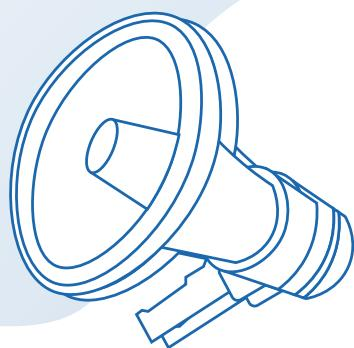

natural_image

Line drawing of a megaphone (no text or symbols)

## 意见反馈

尊敬的读者：

您好！十分感谢您阅读《凌云股份2025年ESG报告》。我们非常重视并期望聆听您对凌云股份在环境、社会及公司治理方面的管理、实践和报告的反馈意见。为进一步提升我们的工作水平并使下一份报告更符合您的期望，恳请您协助完成反馈意见表中提出的相关问题，并选择以下方式反馈给我们。

传真：0312-3951234

电话：0312-3951002

电子邮件：info@lygf.com

地址：河北省涿州市松林店镇

1.您对本报告的总体评价是？  
〇 好 〇 较好 〇 一般  
2.您认为本报告是否能反映凌云股份对经济、社会和环境的重大影响  
〇 高 〇 较高 〇 一般 〇 较低 〇 低  
3.您认为本报告所披露信息、数据、指标的清晰、准确、完整度如何？  
〇 好 〇 较好 〇 一般 〇 差 〇 不了解  
4. 您最满意本报告哪一方面  
5. 您希望进一步了解哪些信息？  
6. 您对我们今后发布报告还有哪些建议

## 报告编委会

## 主任委员

罗开全

## 副主任委员

郑英军李超 冯浩宇何瑜鹏肖尔东王延龙 杨红星王亮

## 编 委

陈向辉赵强王玉珏蔺会勋黄亚杨晓芳孙建新冯洪伟冉辉杨志强刘青叶李艳涛张文选马勇

## 责任编辑

辛娜葛田宏宋美燕李响王雪娇葛晓颖牛文佳樊伟建白婷张京微叶舒婷王淑娟曾玉娇林忠耀

## 专 家

高艳辉张岚周柳辛董丰黄伊彤李云龙

## 凌云工业股份有限公司

传真:0312-3951234

电话：0312-3951002

电子邮件:info@lygf.com

地址：河北省涿州市松林店镇