## 2025年度

## 环境、社会及治理（ESG）报告

ENVIRONMENTAL, SOCIAL AND

GOVERNANCE (ESG) REPORT

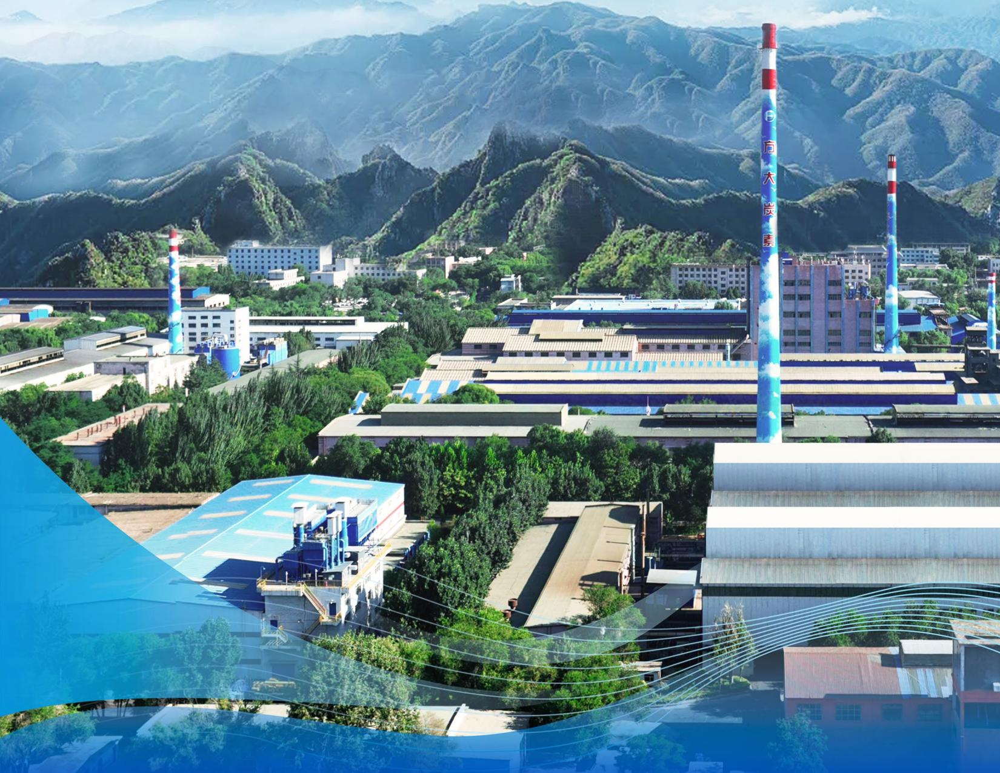

natural_image

Aerial view of an industrial park with factory buildings, greenery, and mountainous terrain in the background (no visible text or symbols)

## 目录

## 恪守诚信，合规治理

公司治理 09

ESG治理体系 11

商业道德管理 13

利益相关方沟通 15

重要性议题评估 17

## 走进方大炭素

公司概况 03

企业文化 04

公司荣誉 05

## 低碳发展，绿色转型

环境合规管理 23

应对气候变化 26

污染物管理 31

能源管理 35

资源管理 37

生物多样性保护 39

## 创新驱动，质领未来

创新与研发 43

产品质量与安全生产 47

数据安全与隐私保护 51

供应链管理 52

## 招才引智，幸福方大

人才引进与雇佣管理 57

职业健康与安全 60

员工发展与培训 64

## 展现担当，回馈社会

乡村振兴 69

社区贡献 71

## 附录

关于本报告 73

关键绩效指标表 75

上海证券交易所《上市公司自 77

律监管指引第14号——可持续

发展报告（试行）》内容索引

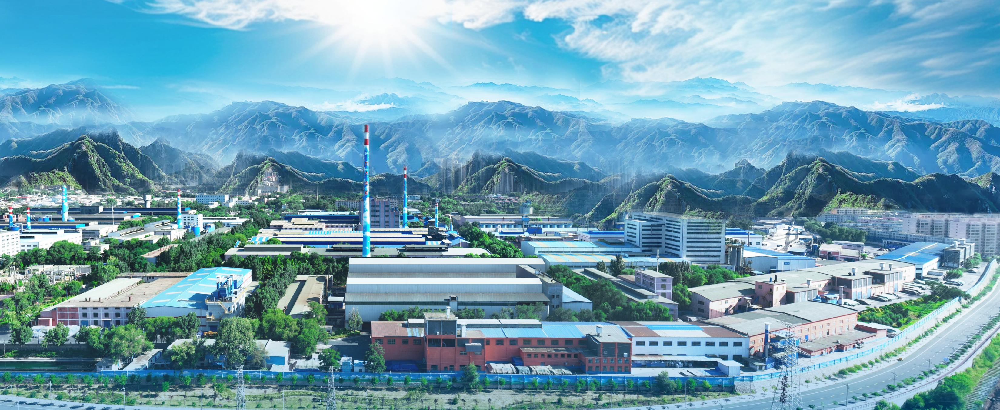

natural_image

Aerial view of a modern industrial park nestled in mountainous terrain under a bright blue sky (no visible text or signage)

## 走进方大炭素

公司概况

企业文化

公司荣誉

## 公司概况

方大炭素主要从事石墨及炭素新材料的研制、生产与销售。公司连续多年成为全球优质的炭素制品供应商之一，在炭素制品领域处于领跑地位，现已成为全球领先的优质炭素制品生产供应基地和涉核炭、石墨材料科研生产基地。

公司产品涵盖四大系列，主导产品有超高功率、高功率、普通功率石墨电极：高炉用超微孔炭砖、高导热超微孔炭砖、微孔炭砖、半石墨质炭砖、高导热炭砖、高耐蚀炭砖、石墨砖、超高导石墨砖；电解铝用石墨质阴极炭块、石墨化阴极炭块：以及各种矿热炉用炭砖、电解镁石墨阳极和中细结构石墨等其他产品：特种石墨制品、核电用炭/石墨材料、石墨烯及其下游产品、超级电容器用活性炭、锂离子电池用高端石墨负极材料、炭/炭复合材料等炭素新材料产品；煤系针状焦和低硫煅后石油焦、煤沥青等炭素制品生产用主要原料。多项产品填补国内空白，打破国外垄断，广泛应用于冶金、新能源、化工、机械、医疗等领域畅销全国30多个省自治区、直辖市并远销全球60多个国家和地区

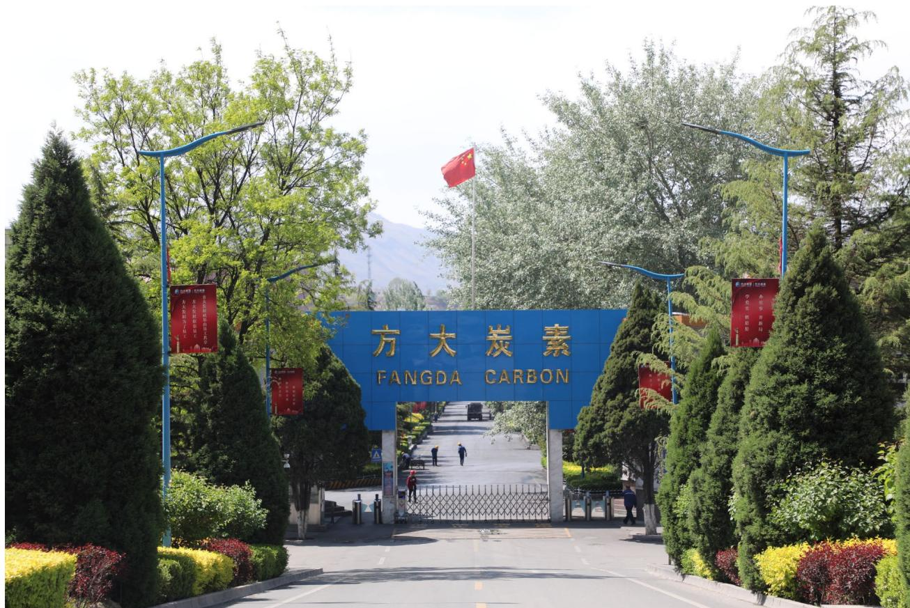

text_image

方大炭素
FANGDA CARBON

## 企业文化

## 企业理念

方大炭素始终秉持方大集团“党建为魂”的企业文化，按照党的宗旨，党的思想管理企业，按党和国家政策要求发展企业，用党建文化引领企业发展，始终保持正确的政治方向与强大的发展动力

## 五个符合

坚持发展企业要符合习近平总书记和党中央的要求，符合法律法规，符合市场化原则，符合对社会有利，符合对全体员工有利。

## 企业价值观

经营企业一定要对国家有利、对企业有利、对员工有利。

## 企业宗旨

取之于社会 回报于社会

## 企业口号

谋方略韬远 铸大成基业

## 企业精神

以人为本诚信为先

## 企业原则

依法合规、公平公正、诚信为先团结共赢。

## 企业方针

要听党的话，跟党走；对员工要好，要建和谐企业；要依法治企依法兴企。

公司荣誉

<table><tr><td>荣誉名称</td><td>颁奖单位</td></tr><tr><td>2025甘肃民营企业100强</td><td>甘肃省工商业联合会、甘肃省总商会</td></tr><tr><td>中国红十字奉献奖章</td><td>中国红十字会</td></tr><tr><td>中国炭素行业协会会长单位</td><td>中国炭素行业协会</td></tr><tr><td>高温气冷堆设备“卓越供应商”</td><td>中国核学会高温堆分会</td></tr><tr><td>2025年全国石墨电极先锋企业奖</td><td>北京百川盈孚科技有限公司</td></tr><tr><td>2025年全国石墨电极出口优秀奖</td><td>北京百川盈孚科技有限公司</td></tr><tr><td>2025年全球石墨电极卓越品牌奖</td><td>鑫椤资讯</td></tr><tr><td>《石墨电极成型自动化挤压系统改进优化及应用》应用成果荣获全国机械冶金建材职工技术创新成果二等奖、甘肃省冶金机械建材行业职工技术成果二等奖</td><td>中国机械冶金建材职工技术协会、甘肃省冶金机械建材行业</td></tr><tr><td>方大炭素石墨电极产品获甘肃省“陇字号”品牌首批认证</td><td>甘肃省市场监督管理局</td></tr><tr><td>方大炭素加工厂三车间检修班荣获“兰州市创新型班组”</td><td>兰州市总工会</td></tr></table>

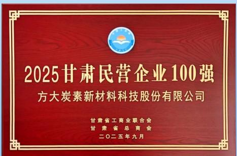

text_image

2025甘肃民营企业100强
方大炭素新材料科技股份有限公司
甘肃省工商业联合会
甘肃省总商会
二〇二五年九月

荣誉称号

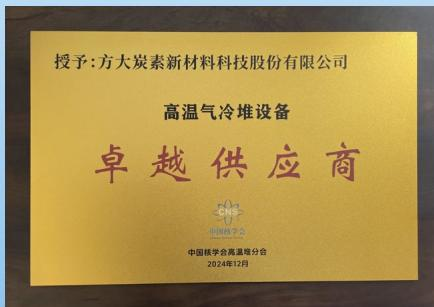

text_image

授予:方大炭素新材料科技股份有限公司
高温气冷堆设备
卓越供应商
中国核学会
中国核学会高端城分合
2024年12月

natural_image

Three golden trophy trophies displayed on black pedestals against a blue background (no text or symbols visible)

## OI

## 恪守诚信合规治理

方大炭素始终将诚信合规视为稳健发展的根基，持续完善公司治理体系，并将可持续发展理念系统融入企业经营管理之中，积极履行企业社会责任。在此基础上，公司不断强化治理机制建设提升ESG治理能力，严格遵循商业道德规范和廉洁从业要求，推动企业实现规范化、高质量和可持续发展，树立稳健、负责任的企业形象。

公司治理 09

ESG治理体系 11

商业道德管理 13

利益相关方沟通 15

重要性议题评估 17

## 公司治理

公司严格遵循《中华人民共和国公司法》《中华人民共和国证券法》《上市公司治理准则》等法律法规和规范性文件的要求，结合公司和行业的实际情况，不断完善公司治理结构、内部管理制度，强化信息披露责任意识，提高公司运营透明度。

## 治理体系与架构

公司制定并持续完善《公司章程》及各项治理制度，建立了股东会、董事会和管理层组成的治理架构。董事会下设四个专门委员会，包括战略委员会、提名委员会、审计委员会和薪酬与考核委员会，并制定了相应委员会工作实施细则。其中，审计委员会负责行使《中华人民共和国公司法》规定的监事会职权。报告期内，公司共召开股东会会议3次，审议议案21项；董事会会议11次，审议议案37项；独立董事专门会议2次、董事会各专门委员会会议9次。

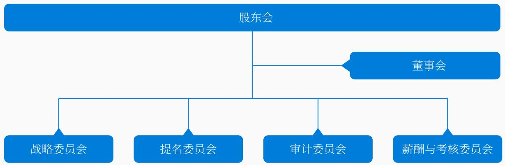

flowchart

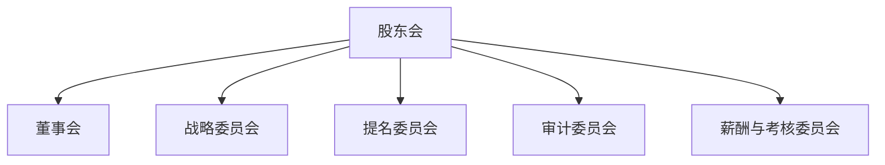
```mermaid
graph TD
  A["股东会"] --> B["董事会"]
  A --> C["战略委员会"]
  A --> D["提名委员会"]
  A --> E["审计委员会"]
  A --> F["薪酬与考核委员会"]
```

方大炭素治理架构

公司董事会由7名非独立董事和4名独立董事组成。独立董事在公司发展战略制定、高级管理人员选聘及财务审计、内部控制等方面发挥了重要作用，独立履行其职责，使公司的决策更加高效、规范与科学。公司的独立董事制度有效保障了公司治理的透明度和公正性。此外，公司重视董事会多元化管理，现任董事中女性董事占比达36%。在换届选举时，公司根据实际情况与具体需求，从性别、年龄、文化及教育背景专业经验、技能及服务年限等多方面对董事人选进行考量以实现董事会的多元化

## 信息披露管理

公司严格执行《信息披露事务管理制度》，提升信息披露的准确度、完整性、透明度，定期发布财务报告，包括季度报告、半年度报告和年度报告，详细披露公司的财务数据、经营成果及未来展望。针对重大事项及时发布公告，确保信息的及时性和准确性。不断丰富信息渠道，如公司官网、公告系统、媒体报刊等，公平对待所有股东，确保其享有平等获取公司相关信息的权利。2025年，公司在上海证券交易所网站上披露中文公告及相关文件126份，在瑞士证券交易所网站及公司官网披露英文公告若干份，充分履行上市公司信息披露义务。

## 投资者关系管理

公司高度重视投资者关系管理工作，制定并严格执行《方大炭素投资者关系管理制度》，注重维护投资者利益，特别是中小股东利益，持续增强投资者信心。为便于投资者及时了解企业生产经营和重大事项的动态、公司通过官网、新媒体平台、电话、电子邮箱、传真等渠道、采取股东会、投资者说明会、路演、分析师会议、接待来访、座谈交流等方式，积极与投资者交流和沟通，回复投资者咨询，听取投资者建议和意见。报告期内，共开展交流沟通225次，召开业绩说明会3次，邀请银河证券及投资者开展“我是股东走进沪市上市公司方大炭素，到公司实地调研座谈，并获得上海证券交易所向公司颁发的“我是股东”活动纪念杯。

## ESG治理体系

方大炭素将ESG融入公司发展战略与经营管理体系，建立了“董事会决策-管理层统筹-职能部门落实”的三级治理架构，各层级职责明晰，确保公司在业务决策过程中能够充分识别并审慎管理环境、社会及公司治理相关的潜在影响、风险与机遇。

## 管治架构

董事会作为最高决策机构负责审议公司长期战略、重大投资、年度计划及ESG报告等 并对包括气候变化在内的可持续发展相关议题承担最终责任。管理层以总经理为核心，负责组织落实董事会决议及相关战略部署，将气候变化应对要求纳入日常经营管理，定期向董事会及专门委员会汇报可持续发展工作进展并每年提交书面报告。各职能部门与业务单元作为执行层，负责落实和执行各项可持续发展具体工作，向管理层报送日常信息与专项报告。

在治理架构的统筹下，公司围绕环境、社会与治理三大领域持续推进可持续发展管理工作，设立可持续发展整体目标：

## 环境目标

推进绿色制造，打造“花园式工厂”，实现污染物超低排放，降能耗、提效率。

## 社会目标

保障员工权益，提供安全工作环境，参与公益，履行社会责任。

## 治理目标

完善内控与风险管理体系，提升信息披露透明度，维护投资者权益，合规稳健经营。

公司积极开展ESG能力建设，各层级机构及人员均具备相应的专业技能与能力，在炭素行业、财务管理合规管理等方面拥有丰富的理论知识和扎实的实践经验，对节能降碳、能源转型等方面拥有全面认知。公司董事会成员及专门委员会具备宏观战略视野、行业洞察力及风险管理能力，及时把握宏观政策与行业趋势，保障包括气候变化在内的可持续发展相关风险和机遇在决策过程中得到充分考虑，并制定前瞻性的可持续发展战略。管理层具备丰富的生产经营管理经验和资源整合能力，能够有效将可持续发展应对策略转化为可操作的方案。各职能部门及生产单位具备必要的专业技能与技术操作能力，确保公司政策制度在日常工作中有效执行。各层级机构及人员通过专业分工与协同联动，形成覆盖“战略-执行-监督”全链条的专业能力体系确保公司能够从宏观政策到具体执行层面有效应对气候变化带来的挑战

为确保可持续发展理念在经营决策中的有效落地，公司将ESG管理要求嵌入战略实施、重大交易决策及风险管理全流程。在重大投资、技术改造及并购等决策事项中，实施ESG前置审查机制，对各类投资、技改并购项目开展全面可持续影响评估，对不符合要求的项目实行“一票否决”，从源头防范相关风险并识别绿色发展机遇。同时，公司建立ESG风险识别与分级管理机制，形成动态更新的ESG风险清单，通过风险预警、绩效考核及内部审计等方式强化全过程监督，推动可持续发展管理形成闭环。

2025年 公司由审计法务部牵头 联合多部门开展可持续发展风险尽职调查覆盖生产运营、供应链、丁程建设等全业务链条。通过定期排查、专项核查、第三方评估等程序，识别环境、社会、治理维度下的相关风险，建立分级管控与持续跟踪机制，确保相关风险得到及时处置与有效管理。报告期内，公司未发生重大可持续发展相关负面事件。

## 信息报告与监督机制

为保障相关机构和人员能够及时获取可持续发展相关信息公司建立了多层次，多渠道的信息报告机制公司遵循“分级负责、归口管理、定期与不定期结合”的原则，通过生产单位、职能部门向管理层逐级汇报，并依托信息系统实现数据自动采集和可视化展示，实现及时汇总与共享。公司将信息报告的及时性准确性纳入绩效考核指标，为可持续发展相关决策提供扎实的数据基础。

在监督管理方面，公司结合国家政策与发展规划，围绕环保节能、安全生产、技术创新等方面设立可持续发展目标与年度计划，积极推进绿色工厂建设、环保技改、污染物治理等工作。公司建立健全覆盖生产经营、环境保护、安全管理等领域的内部控制体系与多层级监督机制不断完善决策程序、权限管理与风险防控机制，确保内控机制权责清晰、流程规范、运行高效。公司定期跟踪评估可持续发展目标完成情况及时总结成效、查找不足并持续改进，并将安全环保、风险防控、降本增效等指标纳入部门及个人绩效考核，强化结果运用与奖惩兑现以刚性考核推动责任落实和可持续发展能力持续提升。

## 商业道德管理

公司始终坚持诚信经营与廉洁从业原则，持续完善反商业贿赂、反贪污及公平竞争管理体系，构建覆盖制度建设、风险识别、监督举报及培训宣导的全流程管理机制，保障企业经营活动依法合规开展

在治理架构方面，公司已建立系统化的反商业贿赂与反贪污制度体系，形成由董事会决策监督，管理层组织实施 纪检部、审计法务部等部门分工协同负责执行具体工作的多层级管治架构 实现廉洁风险识别防控与监督的闭环管理。公司同时建立防范不正当竞争的合规制度体系，明确禁止虚假宣传、垄断行为及侵犯商业秘密等不正当竞争行为，并通过制度规范、监督检查及培训宣贯等方式持续强化落实，确保企业经营行为符合相关法律法规要求。

公司定期开展商业贿赂及贪污风险专项评估，重点覆盖采购、工程、销售、运输等廉洁风险较高的业务领域，通过系统识别潜在风险并制定针对性防控措施，实现风险动态管控。公司不定期组织随机监督检查加强关键业务环节的合规管控，持续提升风险防控能力。

在举报与监督方面，公司建立了多渠道举报与投诉机制，包括举报电话、电子邮箱、举报箱及论坛反馈等实名或匿名渠道，由审计法务部统一负责举报信息的接收、分类与办理。收到举报信息后，公司在3个工作日内由审计法务部牵头，联合纪委对举报内容进行审核，并按照既定流程开展核查、处置与反馈，形成全过程保密、规范高效的监督处理机制。公司已制定《方大炭素纪检监察举报工作制度》，严格保护举报人信息安全，禁止任何形式的打击报复行为，切实保障举报人合法权益。

公司常态化开展反商业贿赂及反贪污合规培训，覆盖董事、管理层人员及全体员工，并对采购、工程、营销等关键岗位开展重点培训。2025年，公司面向销售、采购、生产管理、人员招聘、运输等岗位人员，举办“以案示警，筑牢拒腐防变防线”为主题的廉洁警示教育会，通过制度宣贯与案例教育相结合的方式持续强化员工廉洁合规意识和风险防控能力。2025年，接受反贿赂及反贪污培训的董事人员为11人，占比100%：岗位员工培训超4.890人，岗位员工培训占比达98%以上

## 2025年

接受反贿赂及反贪污培训的董事人员11人

占比100%

岗位员工培训超4,890人

岗位员工培训占比达98%以上

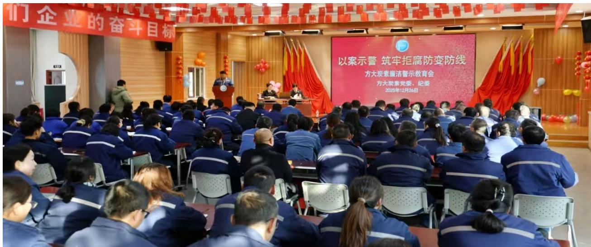

text_image

们企业的奋斗目标
以案示警 筑牢拒腐防变防线
方大炭素廉洁警示教育会
方大炭素党委、纪委
2025年12月26日

“以案示警，筑牢拒腐防变防线”方大炭素警示教育会

报告期内，公司未发生商业贿赂或贪污相关事件，未发生董事、管理层或员工因相关行为被解雇或受到处分的情况未发生相关调查、合同终止或诉讼案件：公司始终坚守合规经营底线 未发生因不正当竞争行为而导致诉讼或重大行政处罚的案件。

## 利益相关方沟通

公司建立常态化、多样化的沟通渠道，定期与利益相关方进行沟通交流，积极了解并回应各相关方对公司业务动态和经营状况的关注。根据业务性质、行业发展及经营状况，公司识别出包括股东及投资者、政府及监管机构、员工、客户、供应商、社区公众在内的多个利益相关方，并在运营管理中融入利益相关方的期望与诉求。

<table><tr><td>利益相关方类别</td><td>前六项关注议题</td><td>沟通渠道</td></tr><tr><td rowspan="6">股东及投资者</td><td>公司治理</td><td>股东会</td></tr><tr><td>利益相关方沟通</td><td>投资者说明会、路演</td></tr><tr><td>产品质量与安全</td><td>接待来访</td></tr><tr><td>科技创新与研发</td><td>座谈交流</td></tr><tr><td>反商业贿赂及反贪污</td><td>公司官网</td></tr><tr><td>反不正当竞争</td><td>热线电话、电子邮箱、传真等</td></tr><tr><td rowspan="6">政府及监管机构</td><td>排放物管理</td><td></td></tr><tr><td>环境管理</td><td>公司官网</td></tr><tr><td>资源与能源使用</td><td>定期沟通</td></tr><tr><td>应对气候变化</td><td>信息披露</td></tr><tr><td>产品质量与安全</td><td>新闻稿/信息公告</td></tr><tr><td>职业健康与安全</td><td></td></tr><tr><td rowspan="6">员工</td><td>循环经济</td><td>职工代表大会</td></tr><tr><td>排放物管理</td><td>总经理接待日</td></tr><tr><td>雇佣与劳工管理</td><td>专项座谈会</td></tr><tr><td>员工薪酬与福利</td><td>员工论坛</td></tr><tr><td>员工发展与培训</td><td>电子意见箱、举报邮箱</td></tr><tr><td>职业健康与安全</td><td>员工活动</td></tr></table>

<table><tr><td>利益相关方类别</td><td>前六项关注议题</td><td>沟通渠道</td></tr><tr><td rowspan="6">客户</td><td>客户服务与满意度</td><td>定期走访</td></tr><tr><td>产品质量与安全</td><td>满意度调查</td></tr><tr><td>科技创新与研发</td><td>客户投诉</td></tr><tr><td>数据安全与隐私保护</td><td>公司官网</td></tr><tr><td>职业健康与安全</td><td>热线电话、电子邮箱、传真等</td></tr><tr><td>供应链管理</td><td></td></tr><tr><td rowspan="6">供应商</td><td>供应链管理</td><td></td></tr><tr><td>平等对待中小企业</td><td>线上沟通</td></tr><tr><td>职业健康与安全</td><td>现场调研评估</td></tr><tr><td>产品质量与安全</td><td>日常走访</td></tr><tr><td>科技创新与研发</td><td>供应商大会</td></tr><tr><td>客户服务与满意度</td><td></td></tr><tr><td rowspan="5">社区公众</td><td>环境管理</td><td></td></tr><tr><td>社会公益</td><td>公益活动</td></tr><tr><td>乡村振兴</td><td>媒体沟通报道</td></tr><tr><td>循环经济</td><td>走访调研</td></tr><tr><td>生态系统和生物多样性保护</td><td></td></tr></table>

## 重要性议题评估

公司定期在全公司范围内开展可持续发展重要性议题评估，分析各可持续发展议题对公司可持续发展的影响程度以及利益相关方的关注程度，为公司开展针对性管理与战略决策提供科学依据。公司采取的工作步骤如下：

## 步骤一：了解公司活动和业务关系背景

公司对各项业务活动及其管理情况进行系统梳理，通过与管理层访谈，深入了解公司的业务活动、管理实践、员工情况、产品与服务、市场环境等信息。同时，结合内外部政策要求、风险评估报告及相关ESG标准，对可持续发展现状、面临的机遇与挑战进行综合分析。在此基础上，公司积极与内外部利益相关方保持沟通与协作，推动形成互信互利的合作关系，实现共同发展与长期价值创造。

## 步骤二：建立议题清单

公司梳理分析运营所在地的宏观政策及法律法规要求，确保所识别出的议题符合监管导向，并与国际可持续发展最佳实践导向保持一致。公司参考《上海证券交易所上市公司自律监管指引第14号——可持续发展报告（试行）》《上海证券交易所上市公司自律监管指南第4号——可持续发展报告编制（2026年1月修订）》，结合境内外主流可持续发展标准，对行业领先企业的议题设置及重要性排序进行对标分析，建立议题清单。2025年，共梳理出22项与公司业务发展密切相关的议题。

## 步骤三：重要性评估与确认

基于影响重要性与财务重要性两个维度，公司对可持续发展议题开展评估并进行优先级排序。其中，影响重要性主要关注公司在相关议题的表现是否会对经济、社会和环境产生重大影响：财务重要性则主要评估相关议题是否预期在短期、中期和长期1内对公司商业模式、业务运营、发展战略、财务状况、经营成果、现金流、融资方式及成本等产生重大影响。

在评估过程中，公司结合监管要求、风险评估方法以及生产经营实际情况，并参考利益相关方及专家的意见反馈，综合确定影响、风险与机遇的判定标准与优先级排序方法，最终形成重要性评估结果，为公司战略决策与资源配置提供支持。

在评估各议题的影响时，公司主要从其影响规模、影响范围、不可补救性及可能性等方面进行综合判断：

<table><tr><td>因素</td><td>说明</td></tr><tr><td>影响规模</td><td>指影响的严重程度,分为高度、中度和轻度。</td></tr><tr><td>影响范围</td><td>指影响的广泛程度,分为广泛、中等和有限。</td></tr><tr><td>不可补救性</td><td>指影响发生后抵消或弥补的难易程度,仅适用于负面影响,分为难以修复、可努力修复(通过投入时间和资源)和相对容易修复。</td></tr><tr><td>可能性</td><td>指影响发生的概率,分为非常可能、一般可能和较低可能。</td></tr></table>

在评估各议题的风险与机遇时，公司主要从其潜在影响程度及可能性进行综合判断：

<table><tr><td>因素</td><td>说明</td></tr><tr><td>影响程度</td><td>指风险和机遇的影响程度,分为高度、中度和轻度。</td></tr><tr><td>可能性</td><td>指风险和机遇发生的概率,分为非常可能、一般可能和较低可能。</td></tr></table>

公司已建立系统化的风险管理体系，并将职业健康与安全、气候变化等ESG议题纳入全面风险管理框架。在日常运营中，公司对重点领域和关键业务进行常态化风险排查，定期梳理重大风险并关注其变化趋势，评估风险管控措施的有效性，不断优化风险应对策略。2025年，公司识别的主要ESG风险如下：

主要ESG风险描述应对措施及主要财务影响

<table><tr><td>安全生产风险</td><td>应对措施:公司构建职业健康安全治理体系,建立健全全员安全生产责任制、定期检查机制、责任反馈机制与责任调整机制,强化日常监督管控,全方面辨识各类作业安全风险,突出强化事前、事中管控,夯实“安全生产、人人有责”的安全责任体系,持续巩固公司安全基础管理工作,加强职业健康与安全教育培训,增强员工安全意识和自主管理能力。财务影响:2025年,公司安全生产费支出534万元。</td></tr><tr><td>气候相关风险</td><td>应对措施:公司持续推进节能降耗工作进展,加大产品研发投入,探索更加高效、低碳的生产技术。财务影响:详见“应对气候变化”章节。</td></tr></table>

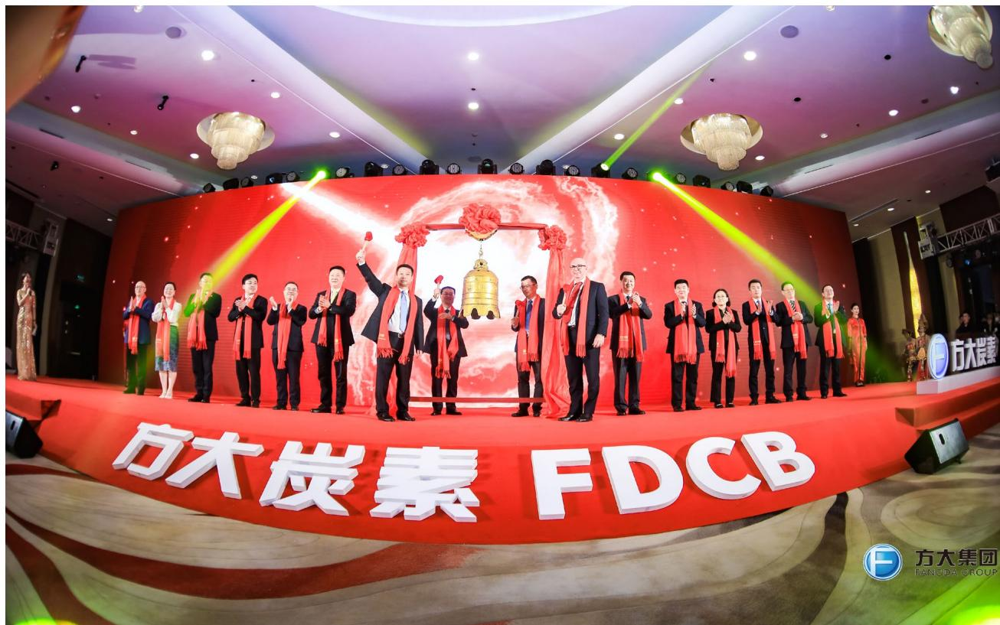

text_image

方大炭素 FDCB
方大炭素
FANEDA GROUP

## 步骤四：重要性信息披露

公司采用“财务重要性 - 影响重要性”双重维度矩阵，展示重要性议题评估结果。其中，公司识别出“职业健康与安全”与“气候变化应对”议题同时具有财务重要性与影响重要性

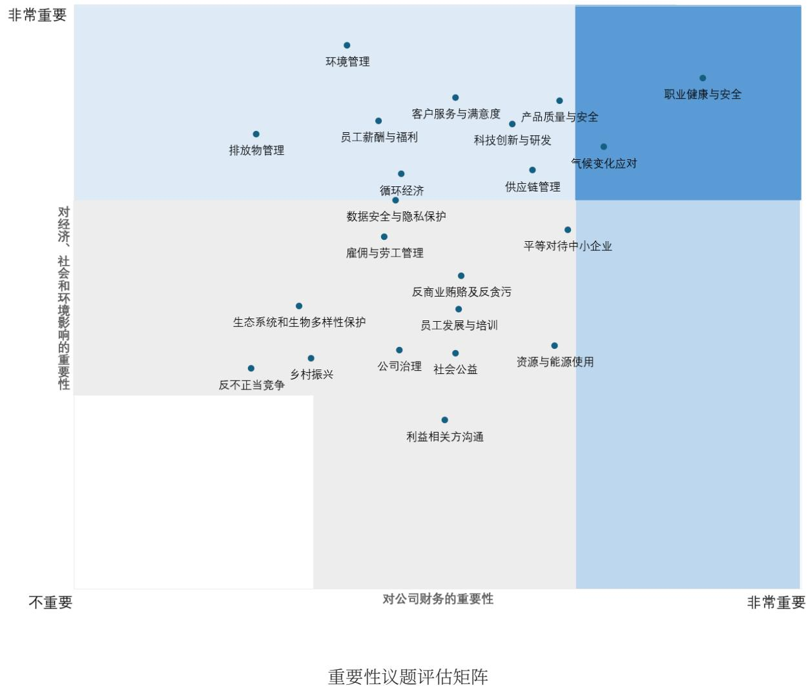

scatter

| 议题 | 对公司财务的重要性 (相对位置) | 对经济、社会和环境影响的重要性 (相对位置) |
| :--- | :--- | :--- |
| 环境管理 | ~中等偏下 | 高 |
| 排放物管理 | ~低 | 高 |
| 员工薪酬与福利 | ~中等偏下 | 高 |
| 客户服务与满意度 | ~中等偏下 | 高 |
| 产品质量与安全 | ~高 | 高 |
| 科技创新与研发 | ~高 | 高 |
| 气候变化应对 | 高 | 高 |
| 循环经济 | ~中等偏下 | 中等偏下 |
| 数据安全与隐私保护 | ~中等偏下 | 中等偏下 |
| 雇佣与劳工管理 | ~中等偏下 | 中等偏下 |
| 平等对待中小企业 | 高 | 中等偏下 |
| 反商业贿赂及反贪污 | ~中等偏下 | 中等偏下 |
| 员工发展与培训 | ~中等偏下 | 中等偏下 |
| 资源与能源使用 | 高 | 中等偏下 |
| 公司治理 | ~中等偏下 | 中等偏下 |
| 社会公益 | ~中等偏下 | 中等偏下 |
| 反不正当竞争 | ~低 | 中等偏下 |
| 乡村振兴 | ~低 | 中等偏下 |
| 利益相关方沟通 | ~中等偏下 | 低 |

##

## 低碳发展绿色转型

绿水青山就是金山银山。方大炭素坚持“像对待生命一样对待生态环境”的发展理念，按照“环保改造要立足十年、甚至二十年都不再动，国际上有标准的，一定要达到发达国家先进水平”的环保奋斗目标，不断健全环境管理体系，落实节能减排举措，积极应对气候变化，以高度社会责任感持续推进生态文明建设，打造花园式工厂

环境合规管理 23

应对气候变化 26

污染物管理 31

能源管理 35

资源管理 37

生物多样性保护 39

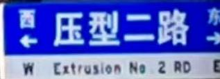

## 环境合规管理

方大炭素始终将环境管理视为公司战略的重要组成部分，持续完善环境管理体系建设，提升环境管理能力，确保各项环保措施落到实处，最大限度地将生产经营活动对环境的潜在影响降到最低，努力建设生态友好型企业。

## 环境管理体系

公司严格遵守《中华人民共和国环境保护法》《中华人民共和国大气污染防治法》《中华人民共和国水污染防治法》等法律法规，深化环境管理体系建设，构建权责清晰、运转高效的环境管治架构。

公司环境管理工作由董事长作为第一责任人，负责审议和监督公司环保战略规划、政策制定、目标设定与执行管理情况。为保障环保工作的顺利执行，公司设立多个专职部门，包括安全环保部、安全保卫部、安全环保设备部、设备动力部及办公室等。安全环保部下设环保管理科，由科长、环保技术员和环境监测员组成，负责环保工作的日常管理与实施。在子公司层面，依据实际运营情况建立环境保护委员会，并设立环境保护工作室作为日常办事机构，负责环保工程项目实施计划与方案的制定、上报与执行，对环境保护工作开展统一监督管理与考核等。各子公司配备专（兼）职环保技术员或项目负责人，负责落实国家环保政策法规及制度、开展清洁生产，管理环保设施的日常维护工作，监督生产区各车间的环境管理。

## 环境体系认证

公司持续推进环境管理体系认证工作每年开展环境管理体系监督性审核。报告期内方大炭素、成都炭材、眉山蓉光、方大喜科墨已通过ISO14001环境管理体系认证，认证范围覆盖公司石墨电极、炭砖、炭素糊及炭素新材料的研发和生产及相关管理活动。

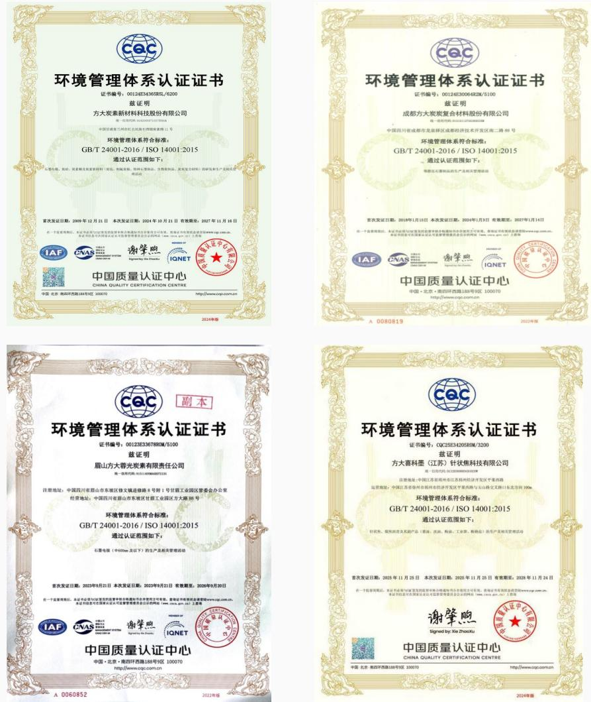

公司及旗下部分子公司环境管理体系认证证书

## 环境风险管理

在环境风险管理方面，公司依据《方大炭素生态环境重大事故隐患管理办法》等管理制度，定期评估环境风险，开展风险隐患排查，系统识别环境风险点，并制定相应整改措施。2025年，合肥炭素开展《合肥炭素有限责任公司突发环境事件应急预案》修订工作，重点针对环境风险物质的识别与评估、现有环境风险防控与应急措施的有效性、应急响应机制完善以及应急物资和装备的储备情况等方面进行全面更新，提升环境风险评估的精度与深度，并已通过专家评审保障风险管理措施的科学性与可操作性。

## 环境应急管理

依据风险评估结果及公司可用资源情况，各子公司制定并持续完善突发环境事件应急管理体系，编制突发环境事件应急预案，并报送当地环保部门完成备案，规范风险识别评估、应急资源调配及响应程序。公司定期组织实战演练 提升应对突发环境事件的能力 确保突发事件发生时及时响应、科学处置、闭环管理最大限度降低环境影响

报告期内，公司未发生突发重大环境事件，未有因环境事件受到生态环境等有关部门重大行政处罚或被追究刑事责任的情况。

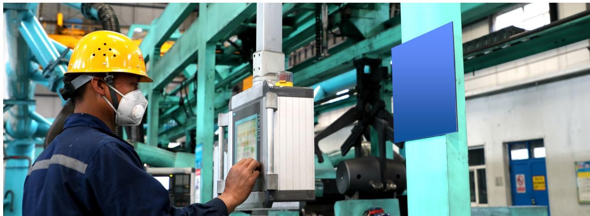

natural_image

Factory worker in yellow hard hat and mask operating industrial control panel (no visible text or symbols)

## 应对气候变化

作为行业领军企业，方大炭素深知在应对全球气候变化中肩负的重要责任。公司坚定贯彻国家“双碳”战略目标，积极推进节能减排实践，致力于建设科技创新型、资源节约型和环境友好型企业，以实际行动助力公司绿色低碳发展。

## 治理

公司已建立由董事会、管理层及执行层构成的三级治理架构，确保气候相关影响、风险和机遇得到有效管理、监督与落实。依托有效的治理架构与信息报告与监督机制，公司积极推动气候战略落地实施，降低气候相关风险可能对公司带来的潜在影响，并及时把握气候相关机遇，助力公司可持续发展。更多关于治理的详细信息，请参见本报告「ESG治理体系」章节。

## 战略

随着全球低碳转型的持续推进，钢铁、冶金、化工及新能源等行业对高性能炭素材料的需求不断增长，炭素行业逐步向高性能化、绿色低碳化和智能化方向发展，技术创新、新型炭素材料研发、环保技术应用及智能制造逐渐成为行业发展的重要驱动力。

公司参考国际权威机构发布的气候变化情景对不同情景下政策环境、市场需求及技术发展趋势可能带来的风险与机遇进行综合评估。在评估过程中公司结合业务特性、运营模式及地域差异，综合考虑自然环境、政策、市场等多重不确定因素，分析气候物理风险与转型风险在短、中、长期对战略、商业模式及供应链的潜在影响并结合评估结果依据实际情况调整战略和商业模式。公司以石墨电极高炉炭砖为主要价值载体，持续拓展面向新能源领域的炭素或石墨材料、石墨烯新材料解决方案，坚持绿色制造与精品化生产，形成以炭素新材料为优先发展方向的整体战略。石墨电极产品以超高功率大规格产品为重点，高功率产品为辅，并配置部分其他规格产品，以灵活应对市场需求变化。公司通过优化产品结构、提升产品质量及完善售后服务，不断提升市场竞争力。

公司主要业务涵盖石墨电极、块状炭砖及等静压石墨生产所需的主要原料的研制生产与销售。我们综合评估公司采购、生产、销售等业务环节对环境可能带来的影响。总体来看，传统人造石墨电极的石墨化工艺能耗较高，可能对环境产生负面影响：而石墨烯材料、炭炭复合材料等新能源低碳材料，可应用于新能源行业，有助于提升能源利用效率，减少温室气体排放，从而为环境带来正面影响。我们高度重视低碳与绿色发展，适时制定气候相关转型计划，跟踪气候相关目标进展，将环保理念贯穿产品研发、生产和运营全过程，保障公司在不同发展阶段具备应对气候相关风险与抓住转型机遇的能力。报告期内，公司积极推动节能降耗工艺优化、废弃物回收利用及污染物排放控制，并加大产品研发投入，探索更加高效、低碳的生产技术。通过技术创新与绿色制造的深度融合，不断提升产品性能，降低生产过程中的环境影响，为实现可持续发展提供坚实支撑。

<table><tr><td colspan="2">气候相关风险/机遇类型</td><td>气候相关风险/机遇描述</td><td>影响时间</td><td>战略和决策影响</td></tr><tr><td rowspan="3">物理风险</td><td rowspan="2">急性风险</td><td>台风、暴雨及洪涝等极端天气事件可能造成厂区排水不畅、配电设施短路、原料受潮,导致焙烧、石墨化等关键工序临时停产;暴雨、冰雪等天气可能导致厂区周边道路通行困难,影响成品电极外运,延误客户交付;低温天气还可能引发管道冻堵,限制天然气供应,进而影响生产。</td><td>短期</td><td>公司已制定包含极端天气应急预案在内的自然灾害突发事件专项应急预案,根据气象预警等级启动不同级别的应急响应,明确指挥架构、职责分工与行动流程。</td></tr><tr><td>夏季持续高温天气可能引发设备过热停机,同时增加员工中暑风险,影响作业效率与安全。</td><td>短期</td><td>暑期高温期间,公司全面落实防暑降温工作,开展高温岗位应急演练,配齐防暑降温设备、药品,发放夏季工作服及保健饮品。此外,工会开展“送清凉”活动,食堂供应凉茶并送至高温岗位,切实保障员工暑期作业安全与健康。</td></tr><tr><td>慢性风险</td><td>气候变化可能导致温度及湿度变化,加速设备老化、腐蚀,增加检修频次,还可能造成能源异常波动,干扰生产连续性。</td><td>中长期</td><td>公司持续强化设备运行管理,定期开展设备检修,保障关键生产设施稳定运行。同时,加强设备保温措施,优化能源调度,以提升公司运营韧性。</td></tr><tr><td>转型风险</td><td>政策和法律风险</td><td>“双碳”目标下,相关政策与法规日益严格,若公司未能完全遵守相关规定,可能面临声誉受损或罚款风险。同时,更加严格的政策也可能促使企业增加新能源投入或对现有设备进行节能改造,增加公司能源成本。</td><td>中长期</td><td>公司积极推进清洁生产与环保设备升级,开展适配法规要求的技改项目,同时,公司持续优化能源结构,提升环保管控水平,保障生产运营合规及能源成本整体可控。</td></tr></table>

<table><tr><td colspan="2">气候相关风险/机遇类型</td><td>气候相关风险/机遇描述</td><td>影响时间</td><td>战略和决策影响</td></tr><tr><td>转型风险</td><td>技术风险</td><td>在低碳经济转型背景下,公司负极材料、石墨烯产品面临两类核心技术风险:·传统人造石墨负极石墨化工艺高耗能成本占比高,“双碳”政策下环保成本持续上涨,推高负极材料生产成本;·技术迭代竞争加剧,负极材料行业规模化效益凸显,新一代硅基负极、硬碳等新型负极技术对传统人造石墨形成替代压力。</td><td>中期</td><td>在负极材料领域,推进高端石墨负极材料研发,提升负极材料利润空间;在石墨烯领域,聚焦导热、导电核心应用,优化浆料及粉体量产工艺降本,拓展锂电、大型器件翅片热管理系统等应用场景。</td></tr><tr><td>机遇</td><td>市场机遇</td><td>新能源低碳材料市场扩张机遇,核心体现在负极材料、石墨烯产品、石墨电极产品等新材料在新能源汽车、储能及节能减排领域的需求增长。</td><td>长期</td><td>石墨电极方面,积极研发高功率电极产品,降低电极消耗与单位钢产量能耗;负极材料方面,重点布局低成本、长循环、低膨胀高压实等负极材料制备工艺研究;石墨烯方面,推动导电浆料、散热浆料等系列产品在不同行业的推广测评,以期实现产业化规模应用。</td></tr></table>

本年度，在气候相关物理风险方面，公司未发现显著财务影响。其中、急性风险可能导致对公司日常运营及作业人员工作环境带来一定影响、相关费用支出可能对管理费用、安全生产费、职工福利费等科目产生影响。慢性风险可能对公司生产设备正常运行造成于扰，相关维修支出可能对管理费用等科目产生影响。未来我们将持续监测气候相关物理风险可能给公司带来的财务影响。在气候转型风险方面公司认为技术风险存在一定的当期财务影响，但无法单独识别。2025年，公司整体研发投入金额达6.560.24万元，该金额已覆盖为应对气候相关技术风险而开展的技术探索与创新项目。为有效应对技术风险，公司积极开展低碳环保技术研发，持续推进高端石墨负极材料研究，并不断探索石墨烯产品的应用场景，可能会对公司研发费用、管理费用等科目产生影响。在气候相关机遇方面、公司识别出的新能源低碳材料市场扩张机遇可能会对公司营业收入、应收账款等科目产生影响，公司将持续探索石墨电极、负极材料、石墨烯产品的研发与应用场景，以把握市场机遇。2025年，公司炭素制品营业收入为330,933.39万元。

经评估，公司未发现可持续发展相关风险和机遇会对公司下一年度财务状况、经营成果、现金流产生重大影响。此外、本报告中包含与气候相关的前瞻性陈述。这些内容反映了公司在编制报告时的判断、假设与预期，但其中存在一定的不确定性。实际结果可能受到经济环境、政策与监管变化、市场状况以及数据或方法局限等多种因素影响。因此，本报告中的前瞻性陈述不应被解读为对公司未来业绩、表现或结果的承诺、保证或预测。

## 影响、风险和机遇管理

公司持续关注气候相关风险对公司业务与财务的影响 并将其纳入全面风险管理体系。公司遵循《危险源辨识，风险评价和风险控制程序》与《环境因素识别与评价程序》每年组织各单位开展环境因素识别危险源辨识及风险评估。针对辨识出的危险源和环境因素，依据《风险评价准则》进行定性或定量评估，实施分级分类管控。

公司采用“识别一评估一监测一预警一改进”的管理流程，每年对环境因素、危险源、社会议题及气候相关风险进行全面识别与评估，并及时调整应对策略。在评估过程中，定期审视可持续发展议题与公司长期战略目标的相关性及影响程度，确保具有优先风险级别的事项与业务发展方向一致。公司对各事项可能带来的财务风险或机遇进行系统分析，量化其影响规模与发生概率。同时，考虑政策法规变化、行业标准演进、技术变革等外部因素的紧迫性，评估公司在相关事项上的管理能力和资源投入需求，以及对环境、社会的正向或负向影响范围。依据评估结果，公司依次将安全、环保、职业健康和生产经营作为具有优先风险级别的议题，制定有针对性的应对策略和管理措施，对气候风险管理状况进行监督与评估，确保管理措施的有效性与适应性。

## 指标与目标

公司积极响应国家“双碳”战略目标，持续推进绿色低碳转型。方大炭素为国家级绿色工厂，参与行业环保标准制定，建立能源管理体系，推进产品碳足迹管理体系建设，不断提升能源利用效率和碳排放管理水平。

为有效推进及监督气候变化相关工作的进展，公司已设定温室气体减排目标：2030年前，公司持续开展降碳减污工作，减少范围1温室气体排放总量与范围2温室气体排放总量，打造绿色低碳炭素生产标杆。该目标为定性目标，适用于方大炭素及旗下子公司。公司开展多项节能减排举措，实施多项环保技改项目，推进余热回收、智能控温等节能技术，强化能耗与排放精细化管理，全力保障减排目标达成。

公司坚持以“双碳”目标为引领，以节能减排为抓手，开展清洁生产和环保设备的升级改造工作，通过清洁生产方案的落实以及环保设备的更新改造，有效提升公司环保管控水平，打造绿色炭素。报告期内，公司暂未参与全国碳排放权交易市场履约管理，不涉及碳信用额度的使用及全国温室气体自愿减排项目(CCER）相关登记与交易。未来，公司将持续关注国家碳市场及相关减排机制政策进展，并结合行业要求与自身经营情况，适时评估参与相关机制的可行性。

##

2025年12月，方大炭素与北京重点高校正式签署合作协议，共同启动电弧炉熔分气基竖炉直接还原铁研发项目。此次合作聚焦全球首创的绿色冶金应用场景，开展电弧炉熔分直接还原铁前沿技术攻关，不仅有望突破钢铁行业低碳转型关键共性技术瓶颈更将拓展炭素核心产品应用边界，为产业绿色升级注入新动能。根据协议，双方将重点验证电弧炉高效熔化固态直接还原铁（DRI）生产优质液态铁水技术路线的可行性，精准评估能耗、能源利用效率、金属回收率、碳排放水平及铁水品质等核心指标，最终为电炉炼钢提供低碳、清洁、高质量的铁源解决方案。相较于传统炼钢工艺，电弧炉熔分DRI技术路线预计可减少约75%的二氧化碳排放。未来若与绿电、氢基DRI等清洁能源和技术结合，将无限趋近“零碳”炼钢目标为我国“双碳”目标实现提供坚实支撑。

##

方大炭素始终将降本增效作为提升企业竞争力的核心抓手、从能源管理设备维护保养到生产调度 公司全面推行精细化管理，持续优化能源结构，减少温室气体排放，为可持续发展提供有利支撑。2025年，公司持续推进余热利用项目，将生产设备产生的余热用于冬季供暖和热水供应，有效减少范围1温室气体排放约5.016吨二氧化碳当量。同时，公司积极开展高耗能电机更换项目，2025年，公司共淘汰并更换207台高耗能电机，节约电力消耗约159.68万千瓦时，减少范围2温室气体排放约791吨二氧化碳当量。通过这些措施，方大炭素不仅提升了能源使用效率和生产管理水平，也有效降低了温室气体排放量，进一步彰显公司在绿色低碳转型和可持续发展方面的战略决心与行业示范作用。

## 污染物管理

方大炭素高度重视污染物排放管理制定《方大炭素污染防治管理制度》等污染物管理制度 严格按照环境监测技术规范和环境监测管理规定的要求开展自行监测，并及时将环境监测结果上传至环保平台，切实履行企业生态环境保护责任。报告期内，公司污染防治设施的建设、运行情况良好，污染物排放符合排放总量要求及相关排放标准，未发生因污染物排放受到重大行政处罚或被追究刑事责任的情况，污染物排放未对员工、当地社区居民等群体产生重大影响，公司环境监测方案和风险管理措施未存在重大缺陷。

## 废气管理

公司生产过程中产生的主要及特征大气污染物包括二氧化硫、氮氧化物、颗粒物等，主要源于配料、混捏、焙烧、石墨化、机械加工等工艺环节。针对在不同工艺环节中产生的大气污染物，公司采取针对性的治理措施，以保障废气合规排放：

• 配料、混捏成型环节：针对配料、混捏成型过程中产生的颗粒物等大气污染物，采用布袋除尘器、电捕除尘器及黑法吸附净化技术进行净化处理，确保废气排放符合相关标准。  
焙烧环节：针对焙烧过程中产生的颗粒物、二氧化硫、氮氧化物等大气污染物，根据一次焙烧和二次焙烧的不同工艺特点，采取不同措施以减少大气污染物排放浓度。在一次焙烧过程中、环式焙烧炉产生的废气经二级电捕焦油器处理后、再经炭粉吸附净化、最终经焙烧烟气排气筒达标排放、并配备静电除尘器等设备，减少废气排放；车底式焙烧炉产生的废气则采用焚烧炉及脱硫脱硝工艺进行净化处理。在二次焙烧过程中，隧道窑产生的废气通过配备布袋除尘器、湿式静电除尘器以及脱硫脱硝工艺处理后，经隧道窑废气排放口达标排放  
• 石墨化环节：针对石墨化过程中产生二氧化硫等大气污染物，通过配备湿式静电除尘器、布袋除尘器等设备对污染物进行净化处理，有效减少大气污染物浓度。  
• 机加工环节：针对机加工过程中产生的颗粒物，配备布袋除尘器净化处理。  
• 热媒炉供热系统:针对热媒炉供热系统产生的氮氧化物，采用低氮燃烧器进行有效处置。

此外，针对施工过程中堆放的易扬尘物料，公司综合运用苫盖、装袋堆放、洒水降尘、在施工区域设置围挡等方式，控制粉尘扩散。本年度，方大炭素持续推进热媒炉低氮改造项目和石墨化烟气治理工程，有效减少氮氧化物排放浓度及石墨化烟气无组织排放，改善现场作业环境。

2025年，公司及各子公司结合自身实际情况，制定大气污染物减排目标，具体包括：

<table><tr><td>公司名称</td><td>大气污染物减排目标</td><td>目标完成情况</td></tr><tr><td>方大炭素</td><td>每年年初制定环保目标与指标,2025年,已制定环保总量目标为:粉尘年排放量小于36.2吨,氮氧化物(含导热油锅炉)年排放量小于206.5吨,二氧化硫年排放量小于215.5吨,颗粒物年排放量小于16吨,各单位每季度对照检测报告核定各自污染物排放总量,污染物排放控制在公司下达的总量指标范围内,大气污染物排放管控成效显著,环保设备效能得到充分发挥。</td><td>2025年,粉尘年排放量35.82吨,氮氧化物(含导热油锅炉)年排放量137.71吨,二氧化硫年排放量139.54吨,颗粒物排放量13.85吨。大气污染物减排目标已达成。</td></tr><tr><td>抚顺炭素</td><td>加强控制环保设备的运行效率,降低污染物排放,达到颗粒物年排放量20吨,氮氧化物年排放量40吨,二氧化硫年排放量30吨。</td><td>2025年,二氧化硫年排放量约14.97吨,氮氧化物年排放量9.83吨,颗粒物年排放量约13.18吨。大气污染物减排目标已达成。</td></tr><tr><td>眉山蓉光</td><td>通过提升环保设备的运行效率,加大药剂投放量,实现大气污染物排放量低于国家现行标准限值。</td><td>2025年,颗粒物年排放量约0.45吨、二氧化硫年排放量约9.86吨、氮氧化物年排放量7.92吨,均低于排污许可排放总量,符合国家现行标准限值。</td></tr><tr><td>合肥炭素</td><td>针对主要大气污染物,分别制定减排目标,并通过以下措施减少污染物排放。颗粒物:采取定期更换布袋除尘器布袋,定期清理电捕焦油器内部电晕丝;二氧化硫:保持脱硫浆液pH值配制;氮氧化物:日常保持脱硝治理设施的运行;苯并芘:定期清理电捕焦油器内部电晕丝,定期补充炭粉吸附系统内部循环的炭粉。</td><td>2025年,合肥炭素积极开展大气污染物治理措施,颗粒物年排放量1.771吨,氮氧化物年排放量5.359吨,二氧化硫年排放量8.076吨。大气污染物减排目标已达成。</td></tr><tr><td>成都炭材</td><td>通过强化环保设备全周期运行管理,确保公司污染物达标排放。</td><td>开展车底式焙烧炉焙烧烟气深度治理项目,项目建成投运后,大气污染物治理效果良好。2025年,颗粒物排放量较2024年降低57%、二氧化硫排放量较2024年降低62%、氮氧化物排放量较2024年降低46%,有效减少大气污染物排放量,实现减排目标。</td></tr></table>

## 废水管理

公司严格遵守水污染防治相关法律法规，制定废水管理有关制度，积极推进水污染防治工作，建设废水处理及回用系统，实现水资源的梯级利用，最大限度减少公司生产运营过程中废水排放可能对周边环境造成的潜在影响。

公司的主要废水来源包括循环冷却设备产生的工业废水与生活污水，主要水污染物包括氨氮、化学需氧量（COD）等。工业废水与生活污水经公司污水处理厂、通过絮凝沉淀、气浮滤池、过滤消毒等工艺处理净化后，排放至周边河流或回用，部分生活污水通过市政污水管道排放。公司严格依照排污许可技术规范制定自行监测方案，定期委托具备资质的第三方机构开展环境检测。通过以上措施，公司确保废水排放符合环保要求，进一步推动可持续发展

## 废弃物管理

公司秉持“资源化、减量化、无害化”的废弃物管理原则，制定《方大炭素固体废物污染环境防治责任制》《固体废物管理制度》《危险废物管理制度》等制度文件，不断完善废弃物管理体系，通过分类收集、台账溯源、合规转运的全过程管理流程，确保各类废弃物在产生、暂存、转运到最终处置的每一个环节均符合国家及地方生态环境保护要求，切实履行企业环境责任，助力循环经济建设。

公司产生的有害废弃物主要包括环式焙烧炉静电除尘器产生的废电捕焦油、实验室废液及废弃化学试剂、废水在线监测设备在运行过程中产生的废弃液体，以及炭粉吸附系统日常更换的炭粉等。无害废弃物主要包括焙烧炉修炉过程中产生的废耐火砖加工包装车间产生的废碎材、设备检修与更新或辅助单位产生的废钢铁、建筑垃圾、生活垃圾等。

针对不同类型的废弃物，公司采取定向管理措施，以最大化减少环境影响和资源浪费。对于有害废弃物优先采取资源化利用举措，包括将炭粉吸附系统日常更换的炭粉回用于焙烧工艺环节，将废焦油通过焦油燃烧器燃烧后再次利用，以减少天然气使用量等方式；对于无法回收或再利用的有害废弃物，定期交由具备相关资质的第三方专业单位进行合法化、无害化处理确保有害废弃物100%委托处置。对于无害废弃物，将其定点分类存放，优先将具有回收价值的废钢铁、废碎材等废弃物交由销售部门统一回收或处理实现资源循环利用：对于生活垃圾和建筑垃圾，则委托有关部门定期清运，统一集中处理，确保废弃物处置符合环保规范。

2025年，公司及各子公司结合自身实际情况，制定废弃物管理目标，具体包括：

<table><tr><td>公司名称</td><td>废弃物管理目标</td><td>目标完成情况</td></tr><tr><td>方大炭素</td><td>严格遵循“资源化、减量化、无害化”原则,依法依规开展废弃物管理工作。在规范储存与处置的基础上,建立健全分类收集、标识清晰、台账完整、转移合规的管理体系,确保各类废弃物从产生、暂存、转运到最终处置均符合国家及地方生态环境保护法律法规要求,有效防范环境风险,切实履行企业环保责任。</td><td>2025年,持续推进废弃物管理工作,各类废弃物处置均符合国家及地方生态环境保护法律法规要求。废弃物管理目标已达成。</td></tr><tr><td>抚顺炭素</td><td>加强炉窑设备维护,减少炉窑耐火砖的消耗,确保中修级别的炉室数量不超过五座。</td><td>2025年,已开展中修级别的炉室数量共三座,减少废弃物排放110吨。废弃物管理目标已达成。</td></tr><tr><td>眉山蓉光</td><td>通过焦油燃烧器,将燃烧废焦油进行再利用,以减少天然气使用量。</td><td>2025年,共计产生废焦油257吨,全部自行利用。废弃物管理目标已达成。</td></tr><tr><td>合肥炭素</td><td>在工艺方面,持续优化工艺流程,提升材料利用率,减少边角料的产生;在末端处置方面,探索废弃物的能源化利用,对无法回收利用的废弃物进行合规处置;在供应链管理方面,要求供应商使用环保包装材料,推动上下游共同减少物流与包装废弃物;在循环利用方面,完善废弃物分类回收体系,加强可回收物的闭环管理。</td><td>2025年,精(蒸)馏残渣产生量较2024年减少52.48吨;无害废弃物回收利用率提升至约85%,其中,纸类、塑料、金属等可回收物的回收率超过90%。</td></tr></table>

## 案例：电捕焦油资源化利用助力循环经济发展

在传统炭素生产中，电捕焦油作为焙烧工序产生的危险废弃物，长期面临着处置成本高和环境风险大的双重挑战，方大炭素突破传统废弃物处置思维定式，积极推动循环经济理念，将电捕售油“变废为宝”，通过创新技术升级与资源化利用，公司将焙烧工序产生的电捕焦油有偿出售给具有相关资质的危险废物经营单位，有效解决危险废弃物处置难题。2025年，公司累计出售电捕焦油2.382.5吨，实现创收312余万元这一创新举措不仅解决了长期困扰企业的危废处置难题，还开辟出了一条“环保+效益”双赢的可持续发展新路径为生态文明建设与循环经济发展作出积极贡献

## 能源管理

方大炭素严格遵守《中华人民共和国能源法》等法律法规，制定能源管理制度，多措并举提升能源使用效率，并持续推动清洁能源的使用，将节能降碳理念融入生产运营全过程。公司重视能源管理工作的科学化与标准化，已获得ISO50001能源管理体系认证，并顺利通过GB/T 23331能源管理体系认证.范围覆盖石墨电极炭砖等炭素制品生产全流程和核心用能环节，实现主体生产单元全覆盖，为公司节能降碳、绿色低碳发展提供坚实基础。

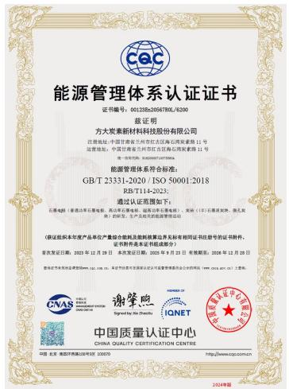

text_image

CAC
能源管理体系认证证书
证书编号：001238c2066780L/6200
兹证明
方大奖集新材料科技股份有限公司
注册地址：中国甘肃省兰州市红谷区石河街道11号
经营地址：中国甘肃省兰州市红谷区石河街道11号
统一社会信用代码：9145000011471880A
能源管理体系符合标准：
GB/T 23331-2020 / ISO 50001:2018
RB/T114-2023/
通过认证范围如下：
石墨电解（普通）石灰石墨电解，高纯石灰酸电解，高纯石灰石墨电解，实制（以下简称铁棒、铁无铅）的矿石生产及产品的检测与试验
《保证组织本年度产品单位产量综合能耗及能耗核算边界》和有相同证书的证书附件，
证书件在本证书范围内。
首次发证日期：2023年12月28日 本次发证日期：2023年5月23日 有效期至：2028年12月28日
证书编号：CNZ-000000000000000000000000000000000000000000000000000000000000000000000
中国质量认证中心
CHINA QUALITY CERTIFICATION CENTRE
CNAS
CHINA QIYANG POWER CO., LTD.
SUNHUA QIYANG POWER CO., LTD.
JQNET
中国·北京·第27号基准线16号院 16887D
http://www.cqz.com.cn
2024年版

公司在生产过程中的能源消耗主要来源于焙烧、石墨化、压型、机加工、动力系统等全流程关键工序，主要能源类型包括电力、天然气、柴油等。公司通过装备升级、工艺优化及余热回收利用等手段，从技术创新、管理提升和能源结构优化三方面不断推进节能工作，持续探索符合公司用能模式的节能路径。

  
技术创新层面  
公司采用高效节能设备，推动技术创新，优化能源使用。公司炉窑设备采用自动温控系统，通过余热回收与能源梯级利用，实现余热供暖。公司综合利用隧道窑煅烧炉设备产生的余热，用于导热油炉加热和自产蒸汽，支持环保设备维护与员工洗浴。公司优化生产工艺中用电负荷时段控制，降低大负荷时段用电占比，在提升能源利用效率的同时，降低公司用能成本。

  
公司已建立能源管控体系，通过强化能耗定额与峰谷用电管理，保障能源的高效使用。公司不断优化生产方案，加强能源管理统筹调度，合理组织生产，减少设备启动和空运转时产生的能源浪费。在照明方面，在满足照明的情况下，实施季节性路灯照明时长与间隔控制，以减少不必要的能源消耗。此外，公司还通过张贴节能标识、使用节能灯、为大功率电动机配备变频器等措施，进一步强化员工的节能意识，减少能源浪费。

  
方面

公司积极推进清洁能源的使用，提升天然气、水能、太阳能等清洁能源在能源结构中的使用占比，逐步淘汰落后装备，推动设备的能效提升，不断探索节能降碳路径，通过优化生产工艺、提升设备能效等手段，科学降低能源消耗

2025年，公司重点推进单位产品综合能耗持续下降、清洁能源利用效率持续提升等工作。公司及各子公司结合自身实际情况，制定能源管理目标，具体包括：

<table><tr><td>公司名称</td><td>能源管理目标</td><td>目标完成情况</td></tr><tr><td>方大炭素</td><td>实现石墨电极综合能耗2.00吨标煤/吨,普通功率石墨电极工艺电耗4,320kWh/t、高功率石墨电极4,300kWh/t、超高功率石墨电极4,150 kWh/t。</td><td>公司以“十四五”为基准期,定量节能目标全面完成。其中,单位产品综合能耗持续下降,焙烧炉能耗同比下降12.7%,石墨化工艺环节通过余热回收年节约标煤量达1,478吨,空压站变频改造年节电量超180万千瓦时。能源管控、设备升级、余热利用等措施落地见效,清洁能源占比稳步提升,主要能耗指标优于行业平均水平,成功获评国家级绿色工厂,节能降碳成效显著。</td></tr><tr><td>抚顺炭素</td><td>为各生产工序制定能源单耗指标值,每月统计能源单耗完成情况,分析单耗波动的原因,并根据完成情况进行考核和奖励。2025年,焙烧工序天然气指标值为94立方米/吨产品,浸渍工序天然气指标值为24立方米/吨产品,成型工序电单耗指标值为119千瓦时/吨产品。</td><td>2025年,焙烧工序天然气消耗量为86.62立方米/吨产品,浸渍工序天然气消耗量为22.48立方米/吨产品。</td></tr><tr><td>眉山蓉光</td><td>优化用电结构,谷段时段用电量占比提升至52%,降低用电成本。</td><td>2025年,眉山蓉光谷段时段用电量综合占比为54%,能源管理目标已达成。</td></tr><tr><td>方大喜科墨</td><td>提高错峰用电比例,充分利用谷电运行可以间歇运行的设备,生产时谷电利用≥30%,停产时谷电利用率≥28%;充分利用谷电,通过电加热导热油的方式实现沥青保温。</td><td>2025年,全年谷电使用平均值达33.9%,能源管理目标已达成。</td></tr><tr><td>成都炭材</td><td>与各生产单位能源成本指标相比,能源总成本指标实际完成情况高于100%。</td><td>2025年,能源总成本指标实际完成情况达103.13%,与各生产单位能源成本指标相比,节约成本3.13%。</td></tr></table>

##

石墨化工序是决定产品最终性能的核心、也是能耗与环保压力的集中点。2025年，方大炭素石墨化厂确立“智能化升级”与“绿色化循环”双轮驱动的发展策略。在智能化方面，通过引入先进的智能送电控制系统，有效缩短送电周期、提升产品合格率、降低劳动强度，标志着公司生产核心环节向数字化、精细化迈出关键一步。

方大炭素石墨化厂不仅建设高效的超低排放系统，确保污染物排放严于国标，更创新性地实施余热深度回收利用项目，将石墨化过程产生的大量高温余热用于系统保温和冬季采暖，每年可节约标准煤约1.478吨这一举措使石墨化工序从纯粹的“能耗单元”转变为“能源贡献单元”，勾勒出“节能、降耗、增效、循环”的绿色生产新范式。

## 资源管理

## 水资源管理

公司深刻认识到水资源管理对可持续发展的关键意义，高度重视水资源的合理利用与节约。公司建立并不断优化用水计量与管控体系，推进节水技改项目与精细化管理，致力于减少水资源的消耗，提高水资源使用效率。

公司生产用水以市政自来水为主，不涉及海水使用，主要耗水环节包括石墨化出炉和料场冷却、焙烧保温料冷却、循环水系统补水以及水浴除尘等工序，其中石墨化冷却工序为最大耗水环节。为提升水资源的利用效率，公司采取了一系列节水与水资源回收利用的技术改造与管理措施：

  
水资源回收与再利用  
升级中水回用系统改造，将处理后的生产废水用于生产冷却和厂区绿化等环节提升水资源循环利用率；将蒸汽冷凝水、雨水等水资源回收并再次利用；生产车间使用循环水生产。

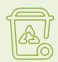  
冷却系统优化

通过循环水系统改造与冷却机组升级，减少新鲜水消耗。

  
精细化用

建立水资源调度机制，动态监控废水外排量，加强用水考核，深入挖掘节水潜力：各用水工序安装水表进行独立计量，并定期与入厂总水表进行数据比对，及时识别并处理管道漏水，提高水资源利用效率

公司持续加强水资源回用管理，2025年，方大炭素中水年回用量超240万吨，回用率达93%以上。公司及各子公司结合自身实际情况，制定水资源管理目标，具体包括：

<table><tr><td>公司名称</td><td>水资源管理目标</td><td>目标完成情况</td></tr><tr><td>方大炭素</td><td>以“十四五”为基准期,2025年为目标年,严控废水外排总量、提升中水回用率、降低生产水耗。2025年,公司废水外排总量不高于20.04万吨。</td><td>截至报告期末,公司节水目标圆满达成,各项量化指标均已达标。中水回用率达93%以上,较基准期显著提升;废水外排总量为17.85万吨,较许可上限节约2.19万吨,完成年度废水入河总量管控目标。石墨化炉冷水机组改造后,生产水耗同比下降4.23万吨,单位产品水耗持续优于行业平均水平,节水技改及管控措施落地见效,成效显著。</td></tr><tr><td>抚顺炭素</td><td>为各生产工序制定用水指标值,每月统计水量完成情况,分析波动的原因,并根据完成情况进行考核和奖励。2025年,成型工序用水指标为0.1立方米/吨产品,焙烧工序用水指标值为0.3立方米/吨产品,浸渍工序指标值为0.2立方米/吨产品。</td><td>2025年度,成型工序用水量为0.06立方米/吨产品,焙烧工序用水量为0.19立方米/吨产品,浸渍工序用水量为0.08立方米/吨产品。水资源管理目标已达成。</td></tr><tr><td>方大喜科墨</td><td>回收雨水优先用于消防水补水,节省市政用水消耗量;处理后的污水输送至针焦分厂煅烧工段循环使用;蒸汽冷凝水回收输送给针焦分厂,降低锅炉用水成本。</td><td>持续加强水资源管理,通过开展雨水与蒸汽冷凝水回收等措施,减少水资源消耗。2025年度,回收雨水量8.32吨,生产期间每小时回收蒸汽冷凝水约2.5吨,进一步推动管控措施落地实施。</td></tr></table>

## 无纸化办公

公司积极推动无纸化办公理念，致力于减少资源消耗，实现办公流程的绿色转型。通过全面采用无纸化办公系统，有效减少纸质文件的使用，倡导全体员工践行节能减排行为，落实从日常小事做起的环保理念。公司在办公环境管理中注重循环经济发展理念，鼓励员工在日常工作中养成随手关灯、节约用水、垃圾分类等良好习惯，营造全员参与、共建绿色办公环境的良好氛围，推动公司向更加可持续、环保的方向发展。

## 生物多样性保护

方大炭素始终秉持“绿水青山就是金山银山”的发展理念，严格遵守国家及地方生态环境保护法律法规开展生产经营活动。公司所属区域为工业园区，生产经营活动未对生态系统和生物多样性产生重大影响。

在此基础上，公司坚持审慎管理原则，主动识别和管控潜在生态风险，注重生物多样性保护。在项目选址及扩产规划阶段，严格遵守《生态保护红线管理办法》等相关规定，委托专业勘测单位开展前期筛查，避免新建设施或扩产项目选址涉及生态保护红线区域、自然保护地及生态敏感区域

在老厂区退出生产经营过程中，公司按照“依法合规、风险可控”的原则，分阶段停止生产并拆除相关设施，及时向地方政府和监管部门报备，规范处置危险废弃物，防止对周边生态环境造成长期影响。

报告期内，公司未拥有、租赁位于或邻近于保护区或生物多样性丰富区域的运营场所。

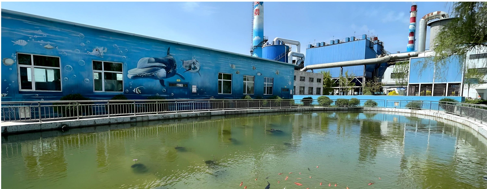

natural_image

Exterior view of a modern industrial facility with blue walls featuring a large whale mural and fish, reflected in a pond (no signage or text visible)

##

## 创新驱动 质领未来

科技创新是驱动企业高质量发展的核心引擎，卓越的产品质量与安全稳定的运营是企业生存与发展的根基。2025年，公司继续秉持“产业报国，打造世界炭素强企”的目标，深度融入新质生产力发展战略，通过数字化转型与绿色制造双轮驱动，致力于成为全球炭素新材料研发与应用的领军者。

创新与研发 43

产品质量与安全生产 47

数据安全与隐私保护 51

供应链管理 52

## 创新与研发

方大炭素始终坚持以市场为导向，持续优化产品结构、合理配置资源。公司将科技创新作为核心引擎，不断加大研发资金投入与人才培养力度，积极推动科技成果向实际生产力转化，全力培育新质生产力，为企业高质量发展注入源源不断的动力。通过持续深化降本增效举措，公司不断提升核心竞争力，市场占有率实现稳步增长。科技创新已成为方大炭素在复杂市场环境中稳健前行、保持行业领先地位的核心驱动力量。

## 创新管理体系与研发平台

作为国家高新技术企业、国家科技兴贸创新基地龙头企业、甘肃省技术创新示范企业和甘肃省战略性新兴产业骨于企业，方大炭素健全并持续改进与炭素制品工艺特性相适宜的研发管理体系。公司制定了《设计开发控制程序》《科研项目管理制度》等规范性文件，明确了从需求识别、方案设计、样品试制到批量生产的全流程管理要求。

方大炭素构建了国家级企业技术中心、博士后科研工作站、国家级炭素新材料工程（研究）中心、甘肃省炭素材料工业设计中心等核心研发平台。在产学研协同创新方面，与清华大学共建“方大炭素核石墨研发中心”，聚焦核级石墨材料的基础研究和应用开发；与北京科技大学合作设立“方大炭素高炉炭砖研发中心”致力于实现高炉炭砖长寿化技术的突破：与兰州大学联合成立“方大炭素石墨烯研究院”开展石墨烯材料、新能源材料、热能管理等原创性研究。此外，公司积极参与“一带一路”建设，与金砖国家及兰西城市群周边城市高校、科研机构开展核石墨及炭素新材料研发合作，打造具有全球竞争力的炭素材料产业高地。

2025年10月，方大炭素省级炭素新材料工程研究中心在甘肃省发展和改革委员会组织的运行评价中获评“良好”等级。评价结果显示，该中心在技术创新、成果转化等方面表现突出，充分彰显了其在炭素领域的科研实力与行业引领作用。该中心先后承担3项国家级科技重大专项、6项省级专项，主导或参与制定国家及行业标准10余项 在核级石墨、超高功率石墨电极、石墨烯等关键领域实现多项技术突破

## 方大炭素省级炭素新材料工程研究中心先后承担

国家级科技重大专项

3项

省级专项

6项

主导或参与制定国家及行业标准

10余项

## 研发投入与人才队伍建设

方大炭素将研发投入视为战略性投资，将资金和人才资源向战略性、前沿性技术领域倾斜。2025年，公司研发投入持续增长，达6,560.24万元。

公司研发投入达

6,560.24万元

在研发人才队伍建设方面，公司依托博士后科研工作站，吸引高层次科研人才进站工作，开展前沿技术研究。公司建立了研发人员职业发展通道和激励机制，通过专利奖励、技术津贴、项目分红等方式，充分调动研发人员的积极性和创造性。同时，公司注重与高校、科研院所联合培养专业技术人才，为炭素行业高质量发展储备坚实的人才力量。

2025年，公司拥有专职研发人员436人，占职工总数的11.98%，形成一支结构合理、专业精湛、富有活力的研发团队。

## 研发活动与核心技术突破

方大炭素拥有一流的炭素制品研发生产能力，公司以石墨电极、高炉炭砖为主要价值载体，同时积极拓展炭素制品在核电、新能源、石墨烯新材料等领域的应用，形成了多元化且极具竞争力的产品体系。

2025年，公司共承担各类科研项目18项，其中包括5项政府层面科技项目和13项公司自选项目。研发方向紧密围绕国家重大需求与行业发展趋势 主要涵盖大规格超高功率石墨电极性能提升、长寿高炉炭砖技术第四代核电站用核级石墨、固态电池及储氢储能关键炭材料、石墨烯规模化应用等关键领域

在重大技术攻关方面公司实现了多项“从0到1”的突破。在核级炭素材料领域公司不仅为全球首座第四代核电站——华能山东石岛湾高温气冷堆提供核心“含硼炭堆内构件”，打破国外长期垄断，更在此基础上持续创新研发的挤压成型含硼石墨成功应用于福建霞浦示范快堆工程 相关成果荣获甘肃省工业仓新成果大赛二等奖。公司被中国核学会授予“卓越供应商”称号，并于报告期内接待了国家重大科技基础设施加速器驱动嬗变研究装置（CIADS）项目技术团队的专项考察与对接，其在核级炭素材料领域的研发制造能力获得国家级专家团队的高度认可

在石墨烯新材料领域，公司与兰州大学共建的石墨烯研究院成果显著。自主研发的石墨烯止血敷料、石墨烯散热浆料、石墨烯电热毯等产品荣获第二十六届中国国际高新技术成果交易会“优秀科研成果创新奖”标志着公司在石墨烯应用转化方面有了新的进展。

公司的研发活动取得了丰硕成果。2025年，公司新授权专利11项，其中发明专利2项，实用新型专利9项截至报告期末，公司累计拥有有效专利89项。这些专利技术广泛应用于生产实践，显著提升了产品性能生产效率和资源利用率。例如，针对炭素生产中的行业共性难题，公司研发的“摊铺装置”和“成型模具底部加热装置”先后获得国家实用新型专利，有效解决糊料铺设均匀性和成型温度控制的技术瓶颈，提升产品一致性与合格率，是公司以智能化、精细化改造传统工艺的典型代表。

2025年

<table><tr><td>公司新授权专利</td><td>发明专利</td><td>实用新型专利</td></tr><tr><td>11项</td><td>2项</td><td>9项</td></tr></table>

##

2025年11月，方大炭素在第十六届国际针状焦及炭材料产业升级高峰论坛上获评“2025年全球石墨电极卓越品牌奖”。作为本届论坛的重要参与者，方大炭素积极参与“高端针状焦生产工艺”“碳材料循环经济’等议题研讨，与产业链上下游企业展开深度对话。通过与针状焦生产企业、负极材料研发机构的战略合作公司推动建立从原料供应到终端应用的协同创新机制，为行业破解资源约束、提升产业链韧性提供了示范路径。公司依托持续的技术投入和产品质量提升，开发了适配国际市场需求的高端大规格石墨电极产品.已进入欧洲、东南亚等海外市场。公司持续推进高端材料研发、智能制造及循环经济领域的工作，探索构建产品全生命周期管理体系。

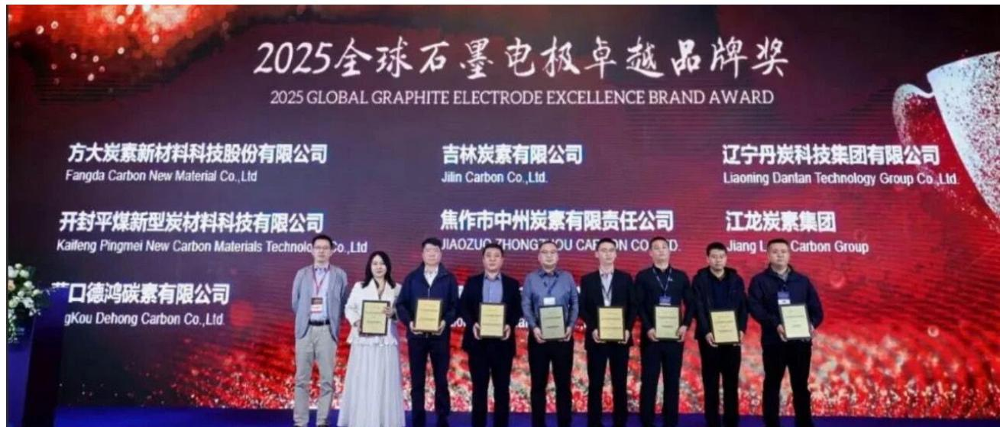

text_image

2025全球石墨电极卓越品牌奖
2025 GLOBAL GRAPHITE ELECTRODE EXCELLENCE BRAND AWARD
方大炭素新材料科技股份有限公司
Fangda Carbon New Material Co.,Ltd
吉林炭素有限公司
Jilin Carbon Co.,Ltd.
辽宁丹炭科技集团有限公司
Liaoning Dantan Technology Group Co.,Ltd.
开封平煤新型炭材料科技有限公司
Kaileng Pingmei New Carbon Materials TechnoloCo.,Ltd
焦作市中州炭素有限责任公司
JIAOZUC ZHONG TYOU CAFON CO.,LTD.
江龙炭素集团
Jiang L. Carbon Group
口德鸿碳素有限公司
gKou Dehong Carbon Co.,Ltd

## 数字化赋能与绿色转型

为适应时代发展需求，提升企业核心竞争力，方大炭素加速推进数字化转型，着力构建“5G+数字孪生智慧工厂，通过引入先进的信息技术和自动化设备，实现生产全流程的智能化管理。公司对现有的生产设备、工艺流程和运营管理系统进行全面梳理，结合行业发展趋势和企业的战略目标，制定详细的自动化升级方案，有计划、有步骤、有针对性地开发或引入先进的自动化智能控制系统。2025年3月，方大炭素与晶泰科技签署战略合作协议，引入AI技术构建垂直大模型与数字孪生系统，打造“AI+工业”应用范式，进一步提升生产效率、优化产品质量、创新业务模式，实现企业的智能化升级。

作为炭素行业的领军企业，方大炭素认识到传统炭素制品在产业链中的角色定位及其环境影响。公司积极响应国家“双碳”战略，通过持续的技术创新和产品升级，推动石墨电极等核心产品向绿色低碳方向转型在技术创新驱动下，公司成功研发出具有优异导电性能和耐高温特性的高性能石墨电极产品，显著提升了电弧炉炼钢、工业硅、黄磷等金属或非金属冶炼工艺的能源利用效率，有效降低下游钢铁行业的碳排放强度。方大炭素通过绿色冶金技术输出，将其产品从“炼钢耗材”升级为电炉高效运行、节能减碳的功能载体。公司还与宁德时代等新能源头部企业开展深度战略合作 共同探索炭材料在储能领域、能源材料领域的创新应用，构建零碳能源生态链。

方大炭素连续多年成为全球优质的炭素制品供应商之一，累计获得50余项省部级以上科技成果，44项国家省部级奖励，其中获得国家银质奖12项，冶金部优质产品奖22项。

方大炭素累计获得

<table><tr><td>省部级以上科技成果50余项</td><td>国家/省部级奖励44项</td><td>国家银质奖12项</td><td>冶金部优质产品奖22项</td></tr></table>

## 案例：参与国家重大科技基础设施CIADS项目

方大炭素承担国家重大科技基础设施——加速器驱动嬗变研究装置（CIADS）核反应堆核心材料“含硼石墨”的研发生产任务。该项目采用全球首创的加速器驱动次临界堆系统，属于中国首创、世界首次。公司自主研发的含硼石墨制作工艺及高精度数控加工方案获专家组高度认可已顺利完成200MW高温气冷堆600MW示范快堆工程用含硼石墨的研发供货并通过工程验证。方大炭素调配核心骨于及专项经费保障项目推进，以实际行动践行科技创新责任，为国家核电事业贡献方大力量。

## 产品质量与安全生产

质量是企业的生命线，安全是发展的红线。方大炭素践行“质量是发展的生命线”的价值观，构建了一套国际标准引领、全员全程参与、数字技术赋能的现代化质量与安全生产保障体系。方大炭素历经近20年的持续改制转型与高质量发展，将炭素行业的“中国制造”刻入世界工业版图

## 构建质量管理体系

公司按照ISO9001标准建立了完善的质量管理体系，以确保产品和服务的高质量输出。体系运行层面，公司设立独立的质量管理部门，负责质量管理体系的执行与监督、质量检验、质量改进等工作。在生产一线公司实行“人人都是质检员”的质量管理模式，将质量责任落实到每个岗位、每个环节。通过建立质量责任制，明确各级人员的质量职责和权限，形成横向到边、纵向到底的质量责任网络

公司编制并发布质量手册、程序文件和作业指导书，明确各个环节的质量要求和操作流程。质量手册阐述公司的质量方针和质量目标，规定了质量管理体系的范围和过程相互作用：程序文件详细描述各项质量活动的流程和方法：作业指导书则为具体操作提供具体的指导。方大炭素质量管理体系已通过中国质量认证中心（CQC）认证审核，并获得认证证书。为确保体系的适宜性与有效性，公司每年接受认证机构实施的第三方监督审核，并每三年进行一次完整的换证复审，以确保持续符合国际质量管理标准的要求。

方大炭素及其子公司抚顺炭素、眉山蓉光、合肥炭素、方大喜科墨、成都炭材均获得了JSO9001质量管理体系认证，认证覆盖范围包括石墨电极、炭砖、炭素糊及炭素新材料（炭毡、制氟炭板）的研发和生产。

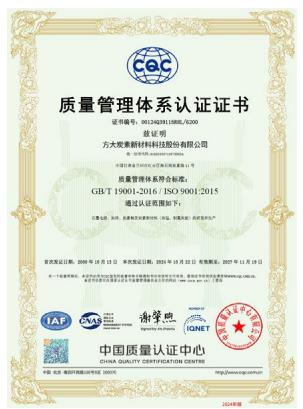

text_image

质量管理体系认证证书
证书编号：00114029381586E/5200
被证明
方大炭素新材料科技股份有限公司
GB/T 19001-2016 / ISO 9001:2015
通过认证范围如下：
王建生、张涛、刘伟、吴建忠等机构，经办，经审查后，须凭证书。
首次登记日期：2020年10月22日 本次登记日期：2021年10月22日 常规截止：2027年11月19日
中国质量认证中心
CHINA QUALITY CERTIFICATION CENTRE
中审：国浩律师集团财务顾问 2020年
http://www.cquae.com.cn

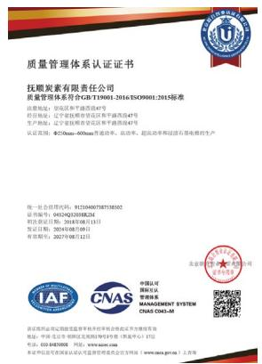

text_image

质量管理体系认证证书
抚顺炭素有限责任公司
质量管理体系合同GB/T39001-2016/ISO9001:2015标准
注册地址：辽宁省抚顺市宁海西路47号
办公地址：辽宁省抚顺市定远区中南路47号
营业地址：辽宁省抚顺市定远区中南路47号
认证有效期：2016年-2018年首次认证，经评审，批准功率和试验石墨电极的生产
统一社会信用代码：915164078T87338302
证书编号：91432922038828
审批截止日期：2018年08月18日
发证日期：2024年08月09日
有效期限：2027年08月12日
企业名称：中国联合网络通信有限公司
IAF CNAS 中国认证 国际认证 管理体 MANAGEMENT SYSTEM CNAS CHS-M
深圳市深汕合作区深汕路东侧环宇科技综合实验区综合实验所有限公司
地址：中国北京市朝阳区亮龙西路79号院1号楼A座中心1层
电话：010-88368888 / 传真：010-88368888
本次申请的有效期为自本次股东大会审议通过的《www.cninfo.com.cn》上市交易。

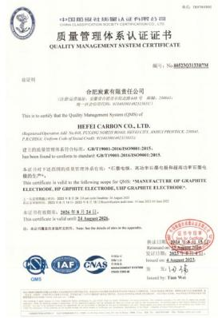

text_image

中国证券监督管理委员会
中国注册会计师协会
质量管理体系认证证书
QUALITY MANAGEMENT SYSTEM CERTIFICATE
编号：N-0025023338781
分包炭素有限责任公司
（以下简称企业名称）：内蒙古电力(集团)有限责任公司（简称：200001）
地址：北京市西城区金融大街甲1号C座6层
联系电话：010-66098888
HEIPEI CABBON CO., LTD.
Registered Operation: AIE. No. 1441010000000000000000000000000000000000000000000000000000000000000000000000000000000000
通过注册机关办理认证手续，委托人须持有效身份证件，授权委托书或盖章复印件。
本次申请的主体为：中国证券登记结算有限责任公司深圳分公司，统一社会信用代码为9131011991-2016191991-2016191991-2016191991-2016191991-2016191991-2016191991-2016191991-2016191991-2016191991-201619
本产品符合《中华人民共和国质量管理体系法》、《中华人民共和国安全生产法》和《中华人民共和国环境保护法》等法律法规的规定，且符合国家安全生产监督管理总局颁布的安全生产许可管理规定。本产品属于中等风险的项目，涉及行业标准、标准要求、标准范围、标准要求、标准范围、标准要求、标准要求、标准要求、标准要求、标准要求、标准要求、标准要求、标准要求、标准要求、标准要求、标准要求、标准要求、标准要求、标准要求、标准要求、标准要求、标准要求、标准要求、标准要求、标准要求、标准要求、标准要求、标准要求、标准要求、标准要求、标准要求、标准要求、标准要求、标准要求、标准要求、标准要求、标准要求、标准要求、标准要求
本产品符合《中华人民共和国质量管理体系法》、《中华人民共和国安全生产法》和《中华人民共和国环境保护法》等法律法规的规定，且符合国家安全生产监督管理总局颁布的安全生产许可管理规定。本产品属于中等风险的项目，涉及行业标准、标准要求、标准要求、标准要求、标准要求、标准要求、标准要求、标准要求、标准要求、标准要求、标准要求、标准要求、标准要求、标准要求、标准要求、标准要求、标准要求、标准要求、标准要求、标准要求、标准要求、标准要求、标准要求、标准要求、标准要求、标准要求、标准要求、标准要求、标准要求、标准要求、标准要求、标准要求、标准要求、标准要求<nl>本公司董事会及全体董事保证信息披露的内容真实、准确和完整，没有虚假记载、误导性陈述或者重大遗漏。如发现上述内容存在虚假记载、误导性陈述或者重大遗漏，并将被司法机关立案侦查并移送上市公司董事会。本公司董事会及全体董事保证信息披露的内容真实、准确和完整，没有虚假记载、误导性陈述或者重大遗漏，并将被司法机关立案侦查并移送上市公司董事会。本公司董事会及全体董事保证信息披露的内容真实、准确和完整，没有虚假记载、误导性陈述或者重大遗漏，并将被司法机关立案侦查并移送上市公司董事会。本公司董事会及全体董事保证信息披露的内容真实、准确和完整，没有虚假记载、误导性陈述或者重大遗漏，并将被司法机关立案侦查并移送上市公司董事会。本公司董事会及全体董事保证披露前未披露的重大信息，包括但不限于以下内容：
（一）公司基本情况
名称：中国证券登记结算有限责任公司
住所：北京市西城区金融大街35号
法定代表人：王洪波
注册资本：人民币壹亿肆仟叁佰肆拾贰万肆仟柒佰零拾伍元整
经营范围：从事投资活动，实业投资，资产管理，企业管理咨询，商务咨询，经济信息咨询，信息技术咨询服务，计算机软硬件及辅助设备销售，汽车零部件及配件批发兼零售，汽车零配件零售，汽车零配件零售（不含小轿车）销售，汽车零配件零售（不含小轿车）销售，汽车零配件零售（不含小轿车）销售，汽车零配件零售（不含小轿车）销售，汽车零配件零售（不含小轿车）销售，汽车零配件零售（不含小轿车）销售，汽车零配件零售（不含小轿车）销售，汽车零配件零售（不含小轿车）销售，汽车零配件零售（不含小轿车）销售，汽车零配件零售（不含小轿车）销售
经核查，经核查后，本公司及其董事保证信息披露的内容真实、准确和完整，不存在虚假记载、误导性陈述或者重大遗漏，并对其内容的真实性、准确性和完整性承担个别及连带责任。
（二）公司董事
名称：中国证券监督管理委员会
住所：北京市西城区金融大街35号
法定代表人：王洪波
注册资本：人民币壹亿肆仟叁佰肆拾贰万肆仟柒佰零拾伍元整
经营范围：从事投资活动，实业投资，资产管理，企业管理咨询，商务咨询，经济信息咨询，信息技术咨询服务，汽车零部件及配件批发兼零售，汽车零配件零售（不含小轿车）销售,汽车零配件零售（不含小轿车）销售,汽车零配件零售（不含小轿车）销售,汽车零配件零售（不含小轿车）销售,汽车零配件零售（不含小轿车）销售,汽车零配件零售（不含小轿车）销售,汽车零配件零售（不含小轿车）销售,汽车零配件零售（不含小轿车）销售,汽车零配件零售（不含小轿车）销售,汽车零配件零售（不含小轿车）销售,汽
汽汽汽汽汽汽汽汽汽汽汽汽汽汽汽汽汽汽汽汽汽汽汽汽汽汽汽汽汽汽汽汽汽汽汽汽汽汽汽汽汽汽汽汽汽汽汽汽汽汽汽汽汽汽汽汽汽汽汽汽汽汽汽汽汽汽汽汽汽汽汽汽汽汽汽汽汽汽汽汽汽汽汽汽汽汽汽汽汽汽汽汽汽汽汽汽汽汽汽汽气汽汽汽汽汽汽汽汽汽汽汽汽汽汽汽汽汽汽汽汽汽汽汽汽汽汽汽汽汽汽汽汽汽汽汽汽汽汽汽汽汽汽汽汽汽汽汽汽汽汽汽汽汽汽汽汽汽汽汽汽汽汽汽汽汽汽汽气汽汽气
经核查，经核查后，本公司及其董事保证披露的信息真实、准确和完整，不存在虚假记载、误导性陈述或者重大遗漏，并对其内容的真实性、准确性和完整性承担个别及连带责任。
（三）公司独立董事
名称：中国证券监督管理委员会
住所：北京市西城区金融大街35号
法定代表人：王洪波
注册资本：人民币壹亿肆仟叁佰肆拾贰万肆仟柒佰零拾伍元整
经营范围：从事投资活动，实业投资，资产管理，企业管理咨询，商务咨询，经济信息咨询，信息技术咨询服务，汽车零部件及配件批发兼零售，汽车零配件零售（不含小轿车）销售,汽车零配件零售（不含小客车）销售,汽车零配件零售（不含小轿车）销售,汽车零配件零售（不含小轿车）销售,汽车零配件零售（不含小轿车）销售,汽车零配件零售（不含小轿车）销售,汽车零配件零售（不含小轿车）销售,汽车零配件零售（不含小轿车）销售,汽车零配件零售（不含小轿车）销售,汽车零配件零售（不含小轿车）销售,汽车零配件零售（不含小轿车）
经核查，经核查后，本公司及其董事保证披露的信息真实、准确和完整，不存在虚假记载、误导性陈述或者重大遗漏，并对其内容的真实性、准确性和完整性承担个别及连带责任。
（四）公司监事会
名称：中国证券监督管理委员会
住所：北京市西城区金融大街35号
法定代表人：王洪波
注册资本：人民币壹亿肆仟叁佰肆拾贰万肆仟柒佰零拾伍元整
经营范围：从事投资活动，实业投资，资产管理，企业管理咨询，商务咨询，经济信息咨询，信息技术咨询服务，汽车零部件及配件批发兼零售，汽车零配件零售（不含小轿车）销售,汽车零配件零售（不含小车）销售,汽车零配件零售（不含小轿车）销售,汽车零配件零售（不含小轿车）销售,汽车零配件零售（不含小轿车）销售,汽车零配件零售（不含小轿车）销售,汽车零配件零售（不含小轿车）销售,汽车零配件零售（不含小轿车）销售,汽车零配件零售（不含小轿车）销售,汽车零配件零售（不含小轿车）销售,汽车零配件零售（不含小轿车）。<nl>经核查，经核查后，本公司及其董事保证披露的信息真实、准确和完整，不存在虚假记载、误导性陈述或者重大遗漏，并对其内容的真实性、准确性和完整性承担个别及连带责任。
（五）公司董事会秘书
名称：中国证券监督管理委员会
住所：北京市西城区金融大街35号
法定代表人：王洪波
注册资本：人民币壹亿肆仟叁佰肆拾贰万肆仟柒佰零拾伍元整
经营范围：从事投资活动，实业投资，资产管理，企业管理咨询，商务咨询，经济信息咨询，信息技术咨询服务，汽车零部件及配件批发兼零售；汽车零部件零售（不含小轿车）销售;汽车零部件零售（不含小客车）销售;汽车零部件零售（不含小轿车）销售;汽车零部件零售（不含小轿车）销售;汽车零部件零售（不含小轿车）销售;汽车零部件零售（不含小轿车）销售;汽车零部件零售（不含小轿车）销售;汽车零部件零售（不含小轿车）销售;汽车零部件零售（不含小轿车）销售;汽车零部件零售（不含小轿车）销售;汽车零部件零售（不含小轿车）销售;汽车零部件零售（不含小轿车）销售;汽车零部件零售（不含小新车）销售;汽车零部件零售（不含小新车）销售;汽车零部件零售（不含小新车）销售;汽车零部件零售（不含小新车）销售;汽车零部件零售（不含小新车）销售;汽车零部件零售（不含小新车）销售;汽车零部件零售（不含小新车）销售;汽车零部件零售（不含小新车）销售;汽车零部件零售（不含小新车）销售;汽车零部件零售（不含小新车）销售;汽车零部件零售（不含小整车）、汽车零部件零售（不含小整车）、汽车零部件零售（不含小整车）、汽车零部件零售（不含小整车）、汽车零部件零售（不含小整车）、汽车零部件零售（不含小整车）、汽车零部件零售（不含小整车）、汽车零部件零售（不含小整车）、汽车零部件零售（不含小整车）、汽车零部件零售（不含小整车）、汽车零部件零售（不含小整车）、汽车零部件零售（不含小整车）、汽车零部件零售（不含小整车）、汽车零部件零售 (不包括在内销市场购买的股票)。<nl>经核查，经核查后，本公司及其董事保证披露的信息真实、准确和完整，不存在虚假记载、误导性陈述或者重大遗漏，并对其内容的真实性、准确性和完整性承担个别及连带责任。
（六）公司监事会
名称：中国证券监督管理委员会
住所：北京市西城区金融大街35号
法定代表人：王洪波
注册资本：人民币壹亿肆仟叁佰肆拾贰万肆仟柒佰零拾伍元整
经营范围：从事投资活动，实业投资,资产管理,企业管理咨询,商务咨询,经济信息咨询,信息技术咨询服务,汽车零部件及配件批发兼零售；汽车零部件零售 (不含小轿车)销售；汽车零部件零售 (不含小客车)销售；汽车零部件零售 (不含小轿车)销售；汽车零部件零售 (不含小轿车)销售；汽车零部件零售 (不含小轿车)销售；汽车零部件零售 (不含小轿车)销售；汽车零部件零售 (不含小轿车)销售；汽车零部件零售 (不含小整车)销售；汽车零部件零售 (不包括在内销市场购买的股票)。<nl>经核查，经核查后，本公司及其董事保证披露的信息真实、准确和完整，不存在虚假记载、误导性陈述或者重大遗漏，并对其内容的真实性、准确性和完整性承担个别及连带责任。
（七）公司董事会秘书
名称：中国证券监督管理委员会
住所：北京市西城区金融大街35号
法定代表人：王洪波
注册资本：人民币壹亿肆仟叁佰肆拾贰万肆仟柒佰零拾伍元整
经营范围：从事投资活动，实业投资,资产管理,企业管理咨询,商务咨询,经济信息咨询,信息技术咨询服务,汽车零部件及配件批发兼零售；汽车零部件零售 (不包括在内销市场购买的股票)。<nl>经核查，经核查后，本公司及其董事保证披露的信息真实、准确和完整，不存在虚假记载、误导性陈述或者重大遗漏，并对其内容的真实性、准确性和完整性承担个别及连带责任。
（八）公司监事会秘书
名称：中国证券监督管理委员会
住所：北京市西城区金融大街35号
法定代表人：王洪波
注册资本：人民币壹亿肆仟叁佰肆拾贰万肆仟柒佰零拾伍元整
经营范围：从事投资活动，实业投资,资产管理,企业管理咨询,商务咨询,经济信息咨询,信息技术咨询服务,汽车零部件及配件批发兼零售；汽车零部件零售 (不包括在内销市场购买的股票)。<nl>经核实，经核查后，本公司及其董事保证披露的信息真实、准确和完整，不存在虚假记载、误导性陈述或者重大遗漏，并对其内容的真实性、准确性和完整性承担个别及连带责任。
(九)公司董事会秘书
名称：中国证券监督管理委员会
住所：北京市西城区金融大街35号
法定代表人：王洪波
注册资本：人民币壹亿肆仟叁佰肆拾贰万肆仟柒佰零拾伍元整
经营范围：从事投资活动，实业投资,资产管理,企业管理咨询,商务咨询,经济信息咨询,信息技术咨询服务,汽车零部件及配件批发兼零售；汽车零部件零售 (不包括在内销市场购买的股票)。<fcel>经核查，经核查后，本公司及其董事保证披露的信息真实、准确和完整，不存在虚假记载、误导性陈述或者重大遗漏，并对其内容的真实性、准确性和完整性承担个别及连带责任。
(十)公司监事会秘书
名称：中国证券监督管理委员会
住所：北京市西城区金融大街35号
法定代表人：王洪波
注册资本：人民币壹亿肆仟叁佰肆拾贰万肆仟柒佰零拾伍元整
经营范围：从事投资活动，实业投资,资产管理,企业管理咨询,商务咨询,经济信息咨询,信息技术咨询服务,汽车零部件及配件批发兼零售；汽车零部件零售 (不包括在内销市场购买的股票)。经核查，经核查后，本公司及其董事保证披露的信息真实、准确和完整，不存在虚假记载、误导性陈述或者重大遗漏，并对其内容的真实性、准确性和完整性承担个别及连带责任。
(十一)公司董事会秘书
名称：中国证券监督管理委员会
住所：北京市西城区金融大街35号
法定代表人：王洪波
注册资本：人民币壹亿肆仟叁佰肆拾贰万肆仟柒佰零拾伍元整
经营范围：从事投资活动，实业投资,资产管理,企业管理咨询,商务咨询,经济信息咨询,信息技术咨询服务,汽车零部件及配件批发兼零售；汽车零部件零售 (不包括在内销市场购买的股票)。
经核查，经核查后，本公司及其董事保证披露的信息真实、准确和完整，不存在虚假记载、误导性陈述或者重大遗漏，并对其内容的真实性、准确性和完整性承担个别及连带责任。
(十二)公司董事会秘书
名称：中国证券监督管理委员会
住所：北京市西城区金融大街35号
法定代表人：王洪波
注册资本：人民币壹亿肆仟叁佰肆拾贰万肆仟柒佰零拾伍元整
经营范围：从事投资活动，实业投资,资产管理,企业管理咨询,商务咨询,经济信息咨询,信息技术咨询服务,汽车零部件及配件批发兼零售；汽车零部件零售 (不包括在内销市场购买的股票)。

公司及旗下部分子公司质量管理体系认证证书

## 完善质量管理制度与流程

方大炭素建立了覆盖产品全生命周期的质量管理制度体系。在生产过程控制方面，公司设立生产过程中的质量控制点，制定《质量控制点管理办法》《质量管理体系运行管理考核办法》，对关键工序进行实时监控和检验，确保产品符合质量标准。石墨电极生产工艺流程为压型、焙烧、石墨化、加工及包装，在每个工序，公司均制定工序质量控制点等相关文件，确保产品在每个阶段属于受控状态。通过引入先进的生产设备和检测仪器，提高生产过程的自动化水平和检测精度，减少人为因素对产品质量的影响

在成品检验环节，公司不断完善成品检验制度，制定《质量检验控制程序》《不合格品控制程序》等流程文件，每批产品都经过严格的检测与测试，只有合格产品才可出厂销售。公司建立质量追溯系统，对产品的原材料来源、生产过程、检验记录等信息进行全程记录，一旦发现质量问题，能够快速定位原因，及时采取纠正措施。同时，公司制定《质量事故管理办法》《质量异议管理办法》等质量责任追溯管理制度对质量问题实行严肃问责。

公司建立了标准化的客户反馈与投诉处理机制严格依据公司《程序文件》中“顾客满意控制程序”的相关条款界定处理流程与职责。2025年，所有收到的客户投诉均通过及时的现场调查、技术沟通与专项跟进得到了有效解决。在售后服务方面，公司遵循《方大炭素市场服务管理办法》的系统性要求，确保对客户需求的响应规范、及时，致力于通过“投诉接收-投诉核实-跟踪调查-原因分析与纠正-跟踪验证”的闭环管理持续提升客户满意度。报告期内，公司未发生与产品质量相关的召回事件

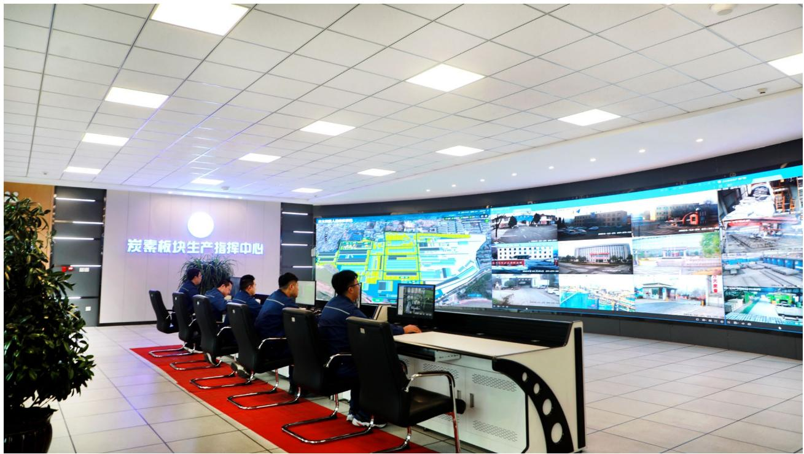

text_image

炭素板块生产指挥中心

## 运行质量管理机制

方大炭素通过内部审核、人员能力建设、技术装备升级、数据驱动决策及客户沟通反馈等举措，确保质量管理体系的有效运行与持续改进。公司构建包括月度质量管理体系审核、常态化问题导向审核及二方审核在内的多层次审核体系，定期开展内部审核以识别薄弱环节并制定纠正措施：定期组织员工参加质量管理体系培训，提升质量意识和操作技能：持续投入先进生产设备和精密检测仪器，提升生产过程自动化水平和检测精度；依托大数据项目建立质量数据统计分析系统，对质量数据进行定期收集和分析，及时识别质量波动趋势并采取预防措施：建立完善的客户沟通机制，通过定期走访、满意度调查等渠道了解客户需求，将客户反馈转化为质量改进动力。

在质量文化建设方面，公司推行“质量月”、技能比武等主题活动，营造“人人都是质检员”的氛围，鼓励一线员工主动发现并改进质量问题：坚持以客户需求作为质量改进源头，建立快速响应机制实现产品持续优化：将质量指标纳入绩效考核体系，对质量贡献者表彰激励，对质量问题严肃问责，确保质量文化从理念转化为行为习惯：运用信息化系统、数据看板、在线检测、质量追溯平台等数字化工具，实现质量数据实时可视化、生产过程可监控质量风险可预警 构建“数字赋能、智慧质控”的现代质量管理模式。

报告期内，公司未发生与产品或服务质量相关的重大责任事故。

##

2025年，方大炭素自主研发的高功率、超高功率石墨电极产品成功通过甘肃省“陇字号”品牌认证。该认证由省级多部门联合指导，从企业战略、社会责任、技术创新、质量管控等多维度进行严格审核。此次获评是外部权威机构对公司卓越产品质量、全面管理体系及持续创新能力的高度认可，标志着公司在以质量塑造品牌、推动高质量发展方面取得重要阶段性成果

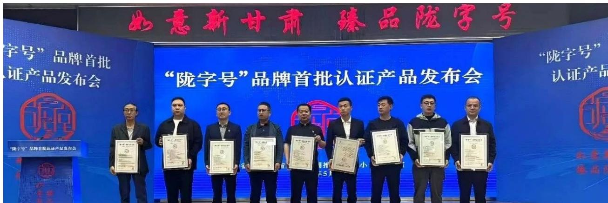

text_image

如意新甘肃臻品陇字号
“陇字号”品牌首批认证产品发布会
“陇字号”品牌首批认证产品发布会

## 强化安全生产管理

安全生产是企业履行社会责任的重中之重。方大炭素严格遵守《中华人民共和国安全生产法》等法律法规，建立了以风险分级管控和隐患排查治理双重预防机制为核心的安全生产管理体系。公司实施自上而下的安全生产责任制，配备专兼职安全管理人员，定期开展安全风险评估与隐患排查，确保设备设施的安全运行和作业环境的持续改善。报告期内，公司未发生一般及以上生产安全事故。

2025年，公司以全国“安全生产月”及“消防宣传月”活动为契机，深入开展一系列安全宣传、教育与演练活动。公司通过举办启动动员大会、悬挂安全宣传标语、组织安全旗升旗仪式、观看警示教育片等形式，建设“人人讲安全、个个会应急”的安全文化氛围。活动期间，公司系统开展岗位隐患排查竞赛、安全宣传咨询日活动、应急预案实战演练以及事故隐患大排查等专项工作，各基层单位亦结合自身特点，组织安全互讲、知识竞赛、辩论赛、岗位练兵等活动，切实提升全体员工的安全意识和应急避险能力。

关于职业健康与安全的治理、战略、影响、风险和机遇管理及指标与目标内容，详见“职业健康与安全”章节。

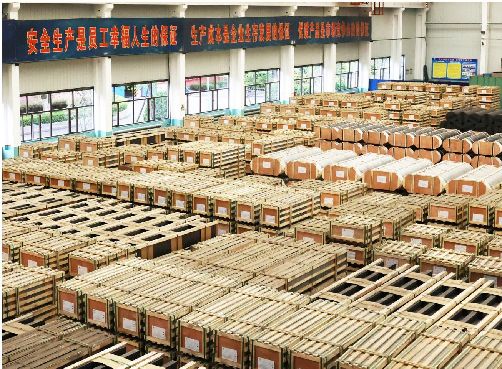

text_image

安全生产是员工幸福人生的保证 生产成本是企业生存发展的保证 优质产品是市场竞争办的保证

## 数据安全与隐私保护

在数字经济时代，保护数据安全与个人隐私是企业合法合规运营、赢得客户信任的重要组成部分。方大炭素重视信息安全管理，将数据安全与隐私保护纳入公司整体风险管理框架，通过建立制度、投入技术、强化培训等多重举措，构建安全可靠的信息环境，保障公司自身、客户及员工的信息权益。公司的车辆信息登记查询平台已依据《中华人民共和国网络安全法》《信息安全等级保护管理办法》完成第二级网络安全等级保护备案，以合规化的技术与管理标准强化特定业务系统的数据安全防护。

公司建立了职责分明的数据安全与隐私保护治理结构。根据公司制定的《信息系统管理办法》，信息自动化部作为公司信息安全管理的主责部门负责统筹规划组织实施和监督考核全公司的信息安全工作。该制度对信息自动化部与各业务部门在信息安全中的职责分工进行明确，同时，设立信息安全管理员等关键岗位，确保安全管理要求落到实处。在制度层面，《信息系统管理办法》对数据的全生命周期管理，包括采集、存储、使用、加工、传输、提供、公开及删除等环节的安全要求进行了规定。同时，制度中设立专门章节，对个人及客户隐私信息保护提出具体要求，确保公司在业务活动中严格遵守《中华人民共和国个人信息保护法》等相关法律法规。

公司通过部署多层次的技术防护措施为信息系统和数据资产构筑坚实的技术屏障。在网络边界 公司部署防火墙、安全网关、杀毒软件等安全设备和软件，有效防范外部网络攻击。对于核心业务系统和重要数据，公司实施严格的访问控制策略，遵循最小权限原则，确保只有授权人员才能访问相应数据。公司建立了定期与不定期相结合的数据备份机制，对备份数据的完整性、可用性进行周期性测试。在隐私保护方面公司对存储客户信息、员工个人信息等敏感数据的系统进行重点防护，实施额外的加密与权限控制。任何对敏感个人信息的调取和使用，均需履行严格的内部审批流程，并记录在案

公司组织员工参与信息安全培训提升全员的数据安全意识。2025年公司对关键岗位员工开展信息安全相关培训，内容涵盖数据安全政策法规、安全操作规程、常见安全威胁及防范措施等，使员工了解数据安全的重要性，掌握基本的安全防护技能。公司还通过内部宣传、案例警示等方式，持续强化员工的数据安全意识。报告期内，公司未发生数据安全事件，亦未发生泄露客户或员工个人隐私的违规事件。

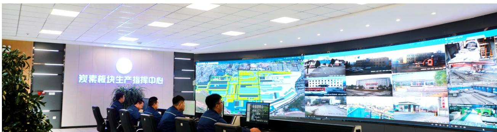

text_image

炭素板块生产指挥中心

## 供应链管理

方大炭素将供应链视为价值共创的生态体系，致力于构建安全、稳健、负责任的供应链系统。在管理实践中，公司不仅关注供应的及时性与成本效益，更将供应链ESG风险纳入全面风险管理，定期识别供应链风险和机遇，制定管控目标和应对措施，推动产业链上下游协同可持续发展，确保公司主营业务的连续性与产品品质的稳定性。

## 供应商全生命周期管理

公司建立系统化的供应链管理制度框架，制定并严格执行《供应商管理制度》《黑名单管理制度》《新原料试用管理办法》 《采购过程控制程序》 等制度文件 在供应链开发中遵循“质量第一、数量第二、价格第三”与“服务并重”的原则，对供应商实行动态管理，通过加强沟通、定期评估等措施，与优秀供应商达成长期战略合作关系。

## 准入审核

全面审核供应商营业执照、体系认证证书、特殊行业许可证、代理证书等资质文件及企业生产能力、财务状况、司法诉讼状况，不与成立不满5年或涉诉的供应商合作，并对关键重点供应商额外开展现场调研评估。

## 试用评估

采取“试样检测、小试、中试、批量准入”的严谨程序，确保新原料供应的质量与合格稳定性。

## 合作管控

在与供应商日常合同签订、生产、运输、入库、结算全流程过程中，严格遵守国家相关法律法规，并建立突发应急预案，防止对社会、企业造成风险和损失：对招投标过程中出现恶意竞价、串标围标、采取不正当手段竞标及中标后不签订合同、或者合同签订后不执行合同的供应商立即列入黑名单，限制合作，全力保障公司供应链稳定。

公司高度重视供应商的动态评价，每年从资质信誉、生产规模、保供能力、产品质量、价格水平、服务水平、环保与社会责任表现等多个维度对供应商进行全面评估，淘汰不合格供应商，持续优化供应商队伍。在采购过程中公司将质量管理环境管理职业健康管理“三体系认证”列入供应商评价范围引导供应链向绿色可持续方向转型。

## 供应链风险防范与保供

公司建立供应链风险管理框架，其核心目标是预防供应中断、保障质量稳定、控制综合成本，并推动全链条的可持续发展。为应对市场波动，公司与核心供应商建立完善的互保与联保机制：

供应链韧性：公司通过与核心供应商签订长期战略协议，对关键物料建立“一个主要供应商加一至两个备用供应商”的合作模式，防范突发状况导致的供应链中断风险。

共享供应信息：利用炭素板块大数据平台共享供应信息，实现集中采购与自主采购相结合的灵活模式

建立预警机制：公司建立常态化的财务与运营预警机制，通过数据系统实时监控供应链运作状态，并由审计、市场管理等职能部门进行日常与专项监督，及时发现并预防潜在风险。

公司通过战略投资与协同创新，主动夯实供应链基础，构建长期、安全的供应保障与竞争优势。公司投资设立抚顺方大高新材料有限公司，依托周边优质的石油焦资源，为公司提供稳定优质的煅后石油焦原料，有效保障了公司主要原材料的供应安全 降低了原材料质量波动风险提升了供应链自主可控能力：公司旗下子公司方大喜科墨，使公司获得了稳定的优质针状焦供应渠道，突破了高端炭素制品原材料依赖进口的局面，显著提升了公司在高端炭素制品领域的竞争力和供应链安全保障能力。同时，公司积极与产业链伙伴合作，探索通过管理创新与技术应用提升整体效能。

## 案例：与专业物流伙伴探索供应链数字化转型路径

为提升供应链运营效率与韧性，2025年12月，方大炭素与专业物流伙伴开展专项交流、共同探讨基于大数据、调度与智慧仓储技术的供应链数字化转型路径。双方围绕大宗原材料采购物流与产成品发运体系的优化、重点讨论了如何通过数字化手段提升运输效率、实施库存精细化管理并降低综合物流成本，以增强供应链的响应能力与抗风险水平

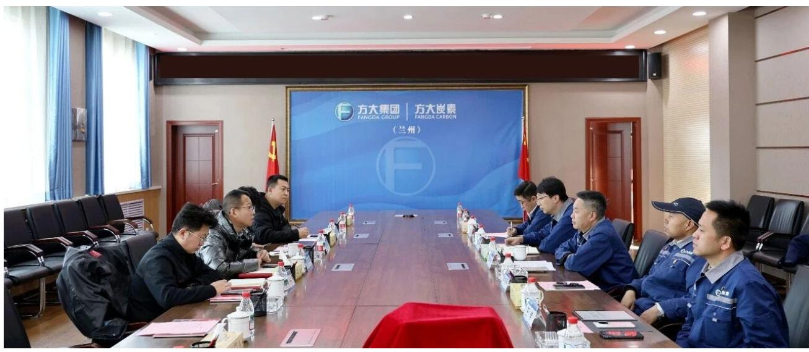

text_image

方大集团 | 方大炭素
FANGDA GROUP | FANGDA CARBON
(兰州)

与专业物流伙伴开展专项交流

##

## 招才引智幸福方大

人才引进与雇佣管理 57

职业健康与安全 60

员工发展与培训 64

## 人才引进与雇佣管理

方大炭素深化落实“发展为了员工、发展依靠员工、发展成果由员工共享”的理念，构建覆盖员工全生命周期的“幸福保障网”，从招聘录用的源头合规，到平等多元的岗位设置，再到全方位普惠的福利关怀全方位保障员工的合法权益

## 员工雇佣

公司严格遵循《中华人民共和国劳动法》《中华人民共和国劳动合同法》《中华人民共和国社会保险法》及业务所在地法律法规依法开展雇佣活动。公司制定并实施《人力资源管理制度》《员工休假及休假期间工资待遇规定》《员工工作时间行为规范》《员工培训管理规定》《专业考核管理办法》《员工离职管理办法》等一系列制度文件，明确规定了员工从录用到离职全周期的各项流程。该体系遵循国家标准工时制度，建立严格的考勤与加班管理机制，保障员工工作时间科学合理：依法落实带薪年假、婚假、产假等各类法定假期并制定了清晰的休假电请与审批程序。公司在业务运营中明确禁止并落实相关措施以杜绝一切形式的强迫劳动和使用童工，确保所有用工实践合法合规，全面维护员工的基本权利与自由。

公司严格遵循“公开、公平、公正”的基本原则建立了标准化的招聘流程 包括职位发布、报名、资格审查、笔试与面试、体检及背景考察等多个环节。在整个过程中，公司明确声明不收取任何费用，所有招聘信息均通过官方及正规渠道发布，以保障信息的真实性与透明度。对于在应聘过程中提供虚假信息的候选人公司将依据规定取消其录用资格。通过上述机制公司致力于维护诚信、规范的招聘环境 有效防范招聘风险，给予所有应聘者平等机会。

公司依法与所有员工签订劳动合同，确保合同签订率达到100%。在权益保障方面，公司对所有用工形式实行统一规范管理对符合条件的灵活就业人员同样依法为其缴纳社会保险和住房公积金 提供相应的福利待遇，并通过规范的录用流程与其签订协议，切实保障其享有与岗位相对应的合法权益

在人才引进方面，公司积极响应国家稳就业号召，在维持现有岗位稳定的基础上持续吸纳社会劳动力。2025年，公司正式启动“英才计划”围绕战略管理、科研创新与生产运营等关键领域，面向社会发布岗位需求超过600个。该计划包括招募11名具备国际视野的战略精英，并支持子公司成都炭材引进约500名高端科研人才，重点聚焦于突破高端炭素材料领域的核心关键技术，强化公司在前沿材料研发方面的自主创新能力。在推进高端人才战略布局的同时，公司亦注重多元群体就业支持。报告期内，公司开展退役军人专项招聘与安置工作，帮助其实现职业转型与稳定就业：通过教育部“24365校园招聘服务”等平台为高校毕业生提供就业机会，支持青年群体顺利迈入职场。

面向社会发布岗位需求超过

600个

## 员工薪酬与福利

公司建立了具有竞争力的薪酬福利体系，确保员工薪酬水平与岗位职责、工作能力及市场表现相匹配，严格执行“同岗同酬”原则，致力于为新老员工及各类用工形式人员提供公平、一致的薪酬保障。公司按时足额支付员工工资，依法为员工全额缴纳“五险一金”，保障员工基本权益。2025年，公司职工代表大会审议通过了年度薪酬激励方案与工资集体协商协议书，进一步保障收入分配的民主透明与公平公正。

在员工福利体系建设方面，公司构建了覆盖员工全生命周期并延伸至其家庭成员的综合性保障体系。所有在职员工均平等享有福利待遇，其覆盖范围亦惠及员工配偶、子女及父母，体现了公司“一人在方大，全家都受益”的普惠性与人文关怀理念。

公司特别关注女性员工、少数民族及残障员工等群体的权益保障。在“三八”国际妇女节之日组织相关活动，为女性员工发放专属节日福利；充分尊重少数民族员工饮食习惯，提供专门的清真餐食；严格遵守国家法律法规要求，保障残障员工的平等就业权利，提供适宜的工作岗位和必要的便利条件，营造多元包容的职场环境。

## 员工沟通与参与

方大炭素始终秉持“员工的事没有小事”的理念，高度重视员工意见与关切。公司建立了线上与线下相结合、定期与日常相补充的多元化员工沟通与反馈机制，确保员工可以通过适当渠道表达意见与想法，并对合理诉求予以响应与反馈，从而构建开放、及时、有效的内部沟通环境。

在线下沟通渠道方面，公司设立总经理接待日，由公司高层管理人员定期接待员工来访，听取员工意见与建议；实行管理人员固定联系一线班组，及时了解员工诉求；定期召开专项座谈会，就员工关心的热点问题进行面对面交流，实现管理层与员工的“零距离”对话。

在线上沟通渠道方面，公司开设员工论坛、电子意见箱、举报邮箱等平台，为员工提供便捷、匿名的意见表达渠道。员工可通过这些平台随时反映问题、提出建议，相关部门在规定时间内予以回应和处理。

公司秉持“党建为魂”的企业文化，持续完善内部沟通和民主管理，预防化解劳动争议。公司定期召开职工代表大会，审议涉及员工切身利益的重大事项，保障员工的知情权、参与权和监督权，提升员工获得感和归属感。公司深入推进企业文化建设，不定期组织开展厨艺大赛、文艺汇演、拔河比赛、乒乓球比赛等各类文体活动，丰富员工生活、陶冶员工情操，使员工工作娱乐两不误，劳逸结合保持活力。

报告期内，公司未发生劳动争议案件。

##

2025年2月，方大炭素召开四届四次职工代表大会、工会会员代表大会暨年度总结表彰大会，审议并通过了《方大炭素员工薪酬激励方案（草案）》《方大炭素2025年工资集体协商协议书》等重要文件。会议对2024年度作出突出贡献的先进集体与个人进行表彰，包括“方大劳模”“先进集体”“先进班组”“优秀员工”等荣誉。职工代表大会作为公司民主管理的重要形式，为员工参与企业重大决策、维护自身合法权益提供了制度化渠道，体现了公司在员工权益保障和民主管理方面的实践。

## 职业健康与安全

员工的安全与健康是方大炭素一切生产经营活动的首要前提。公司深刻认识到，建立健全职业健康与安全管理体系不仅是履行法律义务的基石，更是保障员工福祉、实现企业可持续运营的核心责任。公司通过系统化的风险管理、严格的绩效追踪与日常文化建设，为全体员工创造本质安全、健康和谐的工作环境，推动职业健康安全管理绩效的持续提升。

## 治理

公司在集团层面建立清晰的治理架构与管理方针，对职业健康安全相关风险进行统筹管理与监督。公司及主要子公司已建立系统化的职业健康安全管理体系 其中方大炭素、方大喜科墨、眉山蓉光、合肥炭素成都炭材等核心企业已获得ISO45001职业健康安全管理体系认证，认证范围覆盖石墨电极、炭砖、炭素新材料等主营产品的研发、生产及相关管理活动。

公司将职业健康与安全相关风险和机遇纳入公司的ESG治理体系董事会是公司ESG事务的最高治理机构：各子公司主要负责人担任职业健康安全事宜的第一责任人监督考核有关目标的设定、执行与进展并通过周及月度例会定期报告的方式，就职业健康与安全相关事项向方大炭素汇报，重大事项及时向董事会汇报：公司设立专职管理部门或执行小组，负责体系的日常运行、监督与改进。各子公司同步建立多层级的责任体系，多采取“公司—分厂一车间一班组一岗位”的五级垂直管理体系，确保安全与健康职责从管理层到一线岗位得到逐级分解与有效承接。盛东公司、方大腾达等非炭素主业的成员企业，亦依据其业务特点（如建筑施工、纺织服装）建立了相应的安全管理架构与制度，确保集团安全管理要求全覆盖。

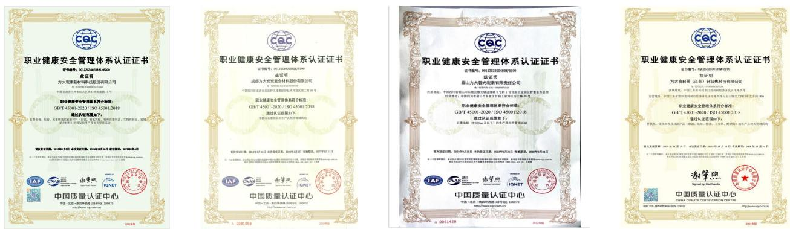  
公司及旗下部分子公司职业健康安全管理体系认证证书

## 战略

公司将职业健康安全目标纳入年度整体经营计划，确立了以“七个为零2”为核心的预防性战略。每年年初各子公司均会制定量化的年度职业健康安全目标，例如“重伤及以上生产安全事故为零”“职业病新发病人数为零”“千人负伤率低于特定值”等。这些目标通过层层分解，与各单位的绩效考核紧密挂钩，引导资源投入与管理工作聚焦于风险防控与绩效改善。

战略执行的核心是将安全管理深度融入所有业务流程。这体现在新项目的“三同时3”管理、生产设备的安全设计、供应商与承包商的安全资质审查，以及应急预案的常态化演练中。公司致力于通过技术进步和工艺优化，从源头降低作业风险，将保障员工安全健康的承诺转化为具体的业务决策和运营实践

## 影响、风险和机遇管理

公司建立了系统化的职业健康安全风险识别与评估机制通过持续识别、评估和管控相关风险，降低事故与职业健康危害的发生概率，并持续提升职业健康安全管理绩效。

公司采用LEC（作业条件危险性评价法）和LS（风险矩阵法）等科学方法，对生产过程中的安全风险进行辨识、评估和分级管控。针对炭素行业特点，公司系统识别了粉尘、噪声、高温、沥青烟气、焦炉遗散物等主要职业病危害因素，并按照工序、岗位、设备开展精细化识别和评估。对于识别出的风险，制定并落实分级管控措施，根据风险等级确定管控责任主体和管控频次，确保风险受控。

在职业卫生管理方面，方大炭素及各子公司每三年一次委托第三方机构编制《职业卫生现状评价报告》，定期开展职业病危害因素检测，并将检测结果通过现场宣传栏及时告知员工，充分保障员工知情权。我们定期组织员工进行职业病健康体检，建立职业健康监护档案，对接触职业病危害因素的员工实施动态健康管理。在“职业病防治宣传周”期间，各子公司通过悬挂标语、专家讲座、知识竞赛等形式，积极宣导职业健康知识，营造关注健康的文化氛围。

公司视教育培训为风险防控的基础工程。2025年，方大炭素及各子公司开展了大规模、多维度的安全与职业健康培训，培训内容涵盖法律法规、操作规程、应急技能、职业危害防护等，全面提升员工的自主防护能力与安全意识：

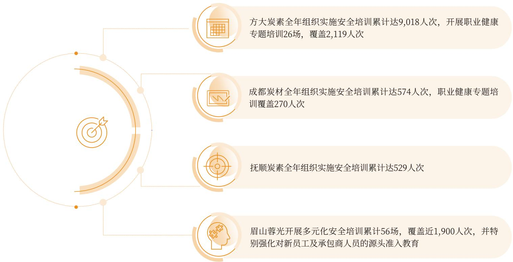

flowchart

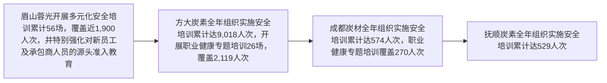
```mermaid
graph LR
  A["方大炭素全年组织实施安全培训累计达9,018人次，开展职业健康专题培训26场，覆盖2,119人次"] --> B["成都炭材全年组织实施安全培训累计达574人次，职业健康专题培训覆盖270人次"]
  B --> C["抚顺炭素全年组织实施安全培训累计达529人次"]
  D["眉山蓉光开展多元化安全培训累计56场，覆盖近1,900人次，并特别强化对新员工及承包商人员的源头准入教育"] --> A
```

报告期内，公司为履行职业健康安全责任投入了相应的运营成本与资本支出，包括职业健康安全管理体系(如ISO45001）的维护、职业病危害因素的第三方检测、员工定期职业健康体检以及大规模的安全教育培训。这些投入已纳入年度经营计划，并反映在当期经营成本中。同时，公司通过以上“预防性战略”的实施 有效避免了因事故可能导致的行政罚款法律赔偿及生产中断损失保障公司当期经营成果与现余流的稳定性。针对下一年度，相关风险与机遇预计不会对财务状况产生重大不利影响。公司将持续通过技术进步和工艺优化提升本质安全，增强企业的可持续运营能力。

## 指标与目标

公司通过设定关键绩效指标与目标，对安全表现进行跟踪与监控，以衡量职业健康安全管理体系的有效性，驱动持续改进。

2025年，公司设定的关键绩效指标及目标完成情况如下：

## 安全事故绩效

报告期内，方大炭素及各子公司安全生产形势总体平稳，未发生一般及以上生产安全事故。

## 培训覆盖

公司整体安全与职业健康培训覆盖率保持高水平，方大炭素、眉山蓉光、合肥炭素、成都炭材、方大喜科墨、方大高新等重点企业培训覆盖率达100%。

##

报告期内，方大炭素及各子公司均已实现各项职业健康安全管理目标。

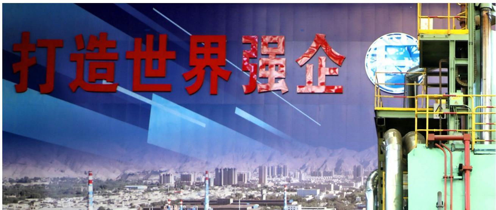

text_image

打造世界强企

## 员工发展与培训

方大炭素建立路径清晰、机会公平的人才发展生态系统，通过科学的职业发展通道设计、完善的培训赋能体系以及多元化的人才激励与选拔机制，支持每一位员工不断提升专业能力、实现职业理想，最终形成员工与企业共同进步、共享价值的良性循环。

## 员工职业发展

方大炭素为员工提供清晰的成长路径和广阔的发展空间，公司打破传统的单一行政晋升模式，构建管理序列与专业技术序列并行的“双通道”职业发展机制，实现员工成长与企业战略的同频共振

管理序列通道面向具备管理潜质和领导能力的员工，设置了从基层到高层的完整晋升路径:一般员工→科级→中层→高层。该通道侧重于培养员工的团队管理能力、战略执行能力和资源整合能力，通过层层历练选拔有干劲、有担当的干部队伍。公司执行严格的绩效考核机制，对考核不达标或执行不力的干部实行降薪降职甚至免职，确保于部队伍的活力与战斗力，体现“能者上、平者让、庸者下”的动态管理理念。

专业技术/技能序列通道面向深耕技术或专业领域的员工，为技术人才提供了独立于管理序列的晋升路径。技术工人路径设置为：初级→中级→高级→首席专家；技术人员路径设置为：技术员→工程师→主管工程师→责任工程师→主任工程师。公司拥有自主的职业技能等级认定站，可对炭素行业特有工种进行技能等级认定，让一线工人能够晋级技术专家并享受相应待遇，有效激发技术人员的专业深耕动力。

在选拔机制上，公司坚持“德才兼备，以德为先：五湖四海，任人唯贤”的原则，实行“岗位价值、绩效贡献、创新溢价”的三维评价模型，并建立多元化的选拔机制

## 推行“赛马机制”

通过年度科技擂台赛等活动为优秀人才提供展示平台

##

对入库人才实施重点培养和动态管理，为企业可持续发展提供源源不断的干部储备

##

重要岗位面向内部员工公开选拔，确保选拔过程的公平公正

为拓宽员工视野，公司积极推行岗位轮换与历练机制，特别是针对新员工和工程技术人员，设计了“认知实践-创新”的三阶段进阶路径通过跨部门跨领域的轮岗实训促进员工的成长与能力提升

## 员工培训

方大炭素将员工培训视为“公司的长效投入、发展的最大后劲员工的最大福利”。公司建立覆盖全员、全职业周期的培训体系。2025年，公司通过内外结合的方式，优化培训资源分配，开展了形式多样、内容丰富的培训活动。报告期内，公司员工整体培训覆盖率超过95%.为员工提供学习与发展机会，培训主要涵盖以下类型：

公司员工整体培训覆盖率超过

95%

入职培训：针对新员工开展，系统介绍公司文化、制度、安全与基本技能，助力其快速融入企业文化，适应工作环境。

岗位技能培训：针对各工种、各岗位常态化开展技能提升培训，注重理论与实践相结合，确保员工胜任岗位要求。

管理与领导力培训：针对各级管理人员，开展专项管理技能、团队建设与领导力发展项目。

专业技术深化培训：依托公司高技能人才培训基地及产学研平台，开展前沿技术工艺优化等深度培训。

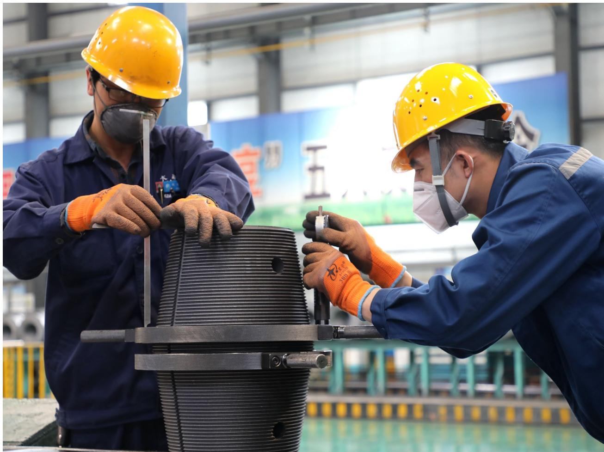

natural_image

Two workers in blue uniforms and yellow hard hats inspecting industrial machinery in a factory setting (no visible text or symbols)

##

周经理（现任方大炭素销售公司炭砖一区业务经理）的职业发展轨迹体现了方大炭素“不拘一格降人才”的用人理念。其职业路径从压型车间检修工起步，历经办公室秘书、技术研发等多岗位历练，最终凭借对技术的深刻理解转战销售一线。2025年，该员工凭借其“技术+销售”的复合能力优势，成功攻克多个技术门槛高的细分市场，不仅签署了重要订单，更实现了从技术研发到销售前线的成功转型，充分展示公司双通道职业发展体系的有效性和灵活性，技术人才可以通过多岗位历练拓展职业发展空间，实现个人价值与企业发展的双赢。

## 不忘初心牢记使命

## 051

## 展现担当回馈社会

方大炭素始终秉持“取之于社会，回报于社会”的企业宗旨，坚决践行民营企业社会责任，聚焦公益服务、民生关怀、应急保障三大领域，扎实开展义务献血、敬老慰问、应急消防建设等相关工作，积极投身公益事业，实际行动传递企业温暖、彰显责任担当。

乡村振兴

社区贡献

69

71

## 乡村振兴

公司将“坚决响应国家乡村振兴战略号召”视为履行社会责任的重中之重将乡村振兴融入公司社会公益事业战略，确立“多业联动，产业助贫”的系统化帮扶模式。公司成立乡村振兴项目组，建立长效机制利用自身优势，深度聚焦甘肃省东乡族自治县，持续投入人力、物力与财力，推动当地实现从脱贫攻坚到乡村振兴的有效衔接，彰显民营企业的家国情怀。

公司深知“授人以鱼不如授人以渔”，致力于推动帮扶模式从“输血帮扶”向“造血振兴”的转型升级。自2019年以来，公司立足于东乡县的资源禀赋，在锁南镇、考勒乡、达坂镇等9个村镇布局建设了涵盖公共交通、食品加工、服装制造、非遗刺绣、建筑工程及模板生产的六大产业集群，为县域经济注入了持续增长的动能。

市场渠道拓展：通过“以购代捐”及“以买代帮”等消费帮扶方式，积极开拓省内外市场渠道，将东乡特产与员工福利精准对接，切实提升产业的市场活力与竞争力。

培育新型产业工人：建立“师徒制”传帮带体系，开展零基础技能培训，并实行计件激励制度，帮助大批农家妇女和当地青年成长为“技术标兵”和熟练工人。

精细化运营管理：公司帮扶团队扎根一线，构建了“源头+过程+成品”的三重质检防线，确保帮扶产业的产品质量，其中，服饰车间的棉衣订单合格率达到100%。

报告期内，公司持续深耕东乡县乡村振兴工作，重点推进6个核心产业项目，利润、就业、薪资三大核心指标均大幅超额完成年度目标，实现产业帮扶效益与民生保障成效双提升，提前达成年度核心任务。全年累计带动就业2,923人，出满勤员工月均工资超3,000元，切实拓宽当地群众增收渠道。

## 报告期内

重点推进核心产业项目

6个

全年累计带动就业

2,923人

出满勤员工月均工资超

3,000元

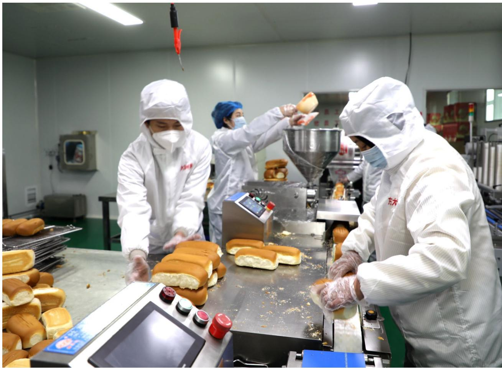

natural_image

Workers in cleanroom suits assembling bread rolls on a production line (no visible text or symbols)

方大炭素东乡乡村振兴面点食品项目生产操作场景

## 社区贡献

公司深植于社会土壤，不仅致力于通过炭素新材料推动工业进步，更积极投身于医疗健康、社区关怀、公共安全及教育支持等公益事业，旨在构建企业与社区和谐共生的责任生态

公司高度重视社会公益事业，积极组织员工参与无偿献血，以实际行动诠释“人道、博爱、奉献”的红十字精神。2025年6月，公司组织开展“赓续红色血脉践行担当使命”无偿献血志愿服务活动，邀请甘肃省红十字血液中心采血车进厂，为员工献血提供便利。活动现场，来自公司各单位的干部员工有序排队并依次完成了信息登记、健康征询、血液检测及采血流程。在献血队伍中，涌现出了一批长期坚守的员工志愿者榜样。其中，公司设备部员工金先生自2007年起已坚持献血18载，累计献血量达7.300毫升，达到全国无偿献血奉献奖“银奖”标准，成为公司奉献精神的生动缩影。活动不仅为地方临床用血储备提供了有力支持，更传递了向善向美的社会正能量，获得了甘肃省红十字血液中心的高度肯定。

公司切实践行敬老爱老的社会责任，关注弱势群体生活保障。2025年2月，公司组织员工志愿者前往兰州市红古区社会福利救助中心开展春节慰问，为院内六十余位老人准备了汤圆、牛奶等生活物资，并与老人亲切交谈。为回馈公司长期以来的关爱与支持，红古区社会福利救助中心向公司送上感谢信，并赠送“情暖中心施援手德润福利展担当”锦旗

公司将自身应急能力建设与地方公共安全相结合，助力提升区域综合防范水平。

## 实战演练提升能力，护航地方平安：

2025年，公司聚焦应急消防建设，通过实战化应急演练和完善应急处置体系，强化了自身的救援水平。公司通过常态化演练积累的处置经验，不仅提升了企业内部安全，更为地方应急消防工作提供了有力支撑和参考，有效为地方公共安全保驾护航。

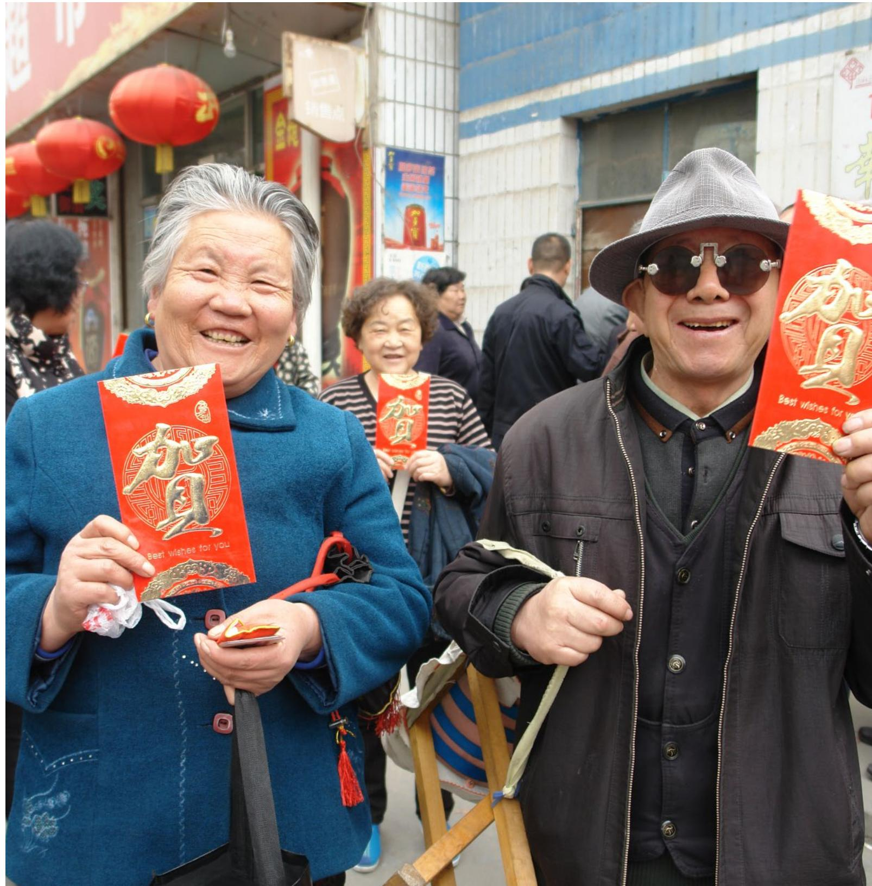

text_image

Best wishes for you
福
福
福
福
福
福
福
福

向社区老人发放敬老金

## 附录

## 关于本报告

## 报告说明

本报告旨在客观披露方大炭素新材料科技股份有限公司（简称“方大炭素”或“公司”或“我们”）及其旗下子公司（统称“集团”）社会及治理（简称“ESG”）领域开展的工作及所取得的成果，集中讨论利益相关方关注事项

## 报告主体范围

本报告内容涵盖方大炭素及旗下子公司，与同时披露的公司《2025年度报告》范围一致。

## 报告时间范围

本报告时间涵盖公司2025年1月1日至12月31日（简称“报告期”）的信息和数据，部分内容追溯以往年份，或延伸至2026年。

其他释义如下：

方大集团：指辽宁方大集团实业有限公司

成都炭材：指成都方大炭炭复合材料股份有限公司

抚顺炭素：指抚顺炭素有限责任公司

方大高新：指抚顺方大高新材料有限公司

眉山蓉光:指眉山方大蓉光炭素有限责任公司

盛东公司：指 甘肃古典盛东建设扶贫开发有限公司

合肥炭素：指合肥炭素有限责任公司

方大腾达：指东乡族自治县方大腾达服饰有限公司

方大喜科墨：指方大喜科墨（江苏）针状焦科技有限公司

## 编制依据

本报告遵循上海证券交易所（简称“上交所”）《上海证券交易所上市公司自律监管指引第1号——规范运作》《上海证券交易所上市公司自律监管指引第14号一—可持续发展报告（试行）》，并参考《上海证券交易所上市公司自律监管指南第4号一一可持续发展报告编制（2026年1月修订）》编制。

## 资料来源说明

本报告中的财务数据来自年度报告，其他信息和数据来源于公司内部相关统计报告或文件。除另有说明外，公司所涉及货币金额以人民币作为计量币种

## 语言说明

本报告以简体中文和英文两种文字发布。在对两种文本理解发生歧义时，请以简体中文文本为准。

## 报告发布形式

本报告以电子版形式发布。可在上交所网站（www.sse.com.cn）及公司网站（http://www.fdtsgs.com/）查询。

## 确认及批准

本报告经管理层确认后，于2026年4月28日获董事会批准发布。

公司十分重视利益相关方的意见，欢迎读者通过以下方式与公司联系。您的意见将有助于公司进一步完善本报告以及提升可持续发展管理表现

联系电话：0931-6239220

联系地址：甘肃省兰州市红古区海石湾镇炭素路11号

公司网址：http://www.fdtsgs.com

电子信箱：fdts730084@fangdacarbon.com

关键绩效指标表

<table><tr><td>指标</td><td>单位</td><td>2025年</td></tr><tr><td>温室气体排放总量4</td><td>吨二氧化碳当量</td><td>705,782.10</td></tr><tr><td>范围1温室气体排放量</td><td>吨二氧化碳当量</td><td>221,833.52</td></tr><tr><td>范围2温室气体排放量</td><td>吨二氧化碳当量</td><td>483,948.58</td></tr><tr><td>硫氧化物(SOx)排放量</td><td>吨</td><td>264.06</td></tr><tr><td>氮氧化物(NOx)排放量</td><td>吨</td><td>187.76</td></tr><tr><td>颗粒物排放量</td><td>吨</td><td>39.21</td></tr><tr><td>核定的硫氧化物(SOx)排放量</td><td>吨</td><td>647.56</td></tr><tr><td>核定的氮氧化物(NOx)排放量</td><td>吨</td><td>911.87</td></tr><tr><td>核定的颗粒物排放量</td><td>吨</td><td>109.35</td></tr><tr><td>废水排放量</td><td>吨</td><td>277,326.15</td></tr><tr><td>工业废水排放总量</td><td>吨</td><td>240,451.17</td></tr><tr><td>生活废水排放总量</td><td>吨</td><td>36,874.98</td></tr><tr><td>氨氮排放量(NH3-N)5</td><td>吨</td><td>2.95</td></tr><tr><td>化学需氧量(COD)5</td><td>吨</td><td>80.48</td></tr><tr><td>废弃物产生总量</td><td>吨</td><td>15,364.51</td></tr><tr><td>产生的有害废弃物总量</td><td>吨</td><td>3,921.82</td></tr><tr><td>每百万营收产生的有害废弃物总量6</td><td>吨/百万营收</td><td>1.11</td></tr><tr><td>产生的无害废弃物总量</td><td>吨</td><td>11,442.69</td></tr><tr><td>每百万营收产生的无害废弃物总量6</td><td>吨/百万营收</td><td>3.24</td></tr><tr><td>综合能源消耗量7</td><td>吨标煤</td><td>220,337.01</td></tr><tr><td>每百万营收综合能源消耗量6</td><td>吨标煤/百万营收</td><td>62.48</td></tr><tr><td>直接能源消耗总量</td><td>吨标煤</td><td>105,922.01</td></tr><tr><td>煤炭消耗总量</td><td>吨标煤</td><td>37,349.34</td></tr><tr><td>汽油消耗总量</td><td>吨标煤</td><td>69.16</td></tr><tr><td>柴油消耗总量</td><td>吨标煤</td><td>266.30</td></tr></table>

<table><tr><td>指标</td><td>单位</td><td>2025年</td></tr><tr><td>天然气消耗量</td><td>吨标煤</td><td>68,206.46</td></tr><tr><td>间接能源消耗总量</td><td>吨标煤</td><td>114,415.00</td></tr><tr><td>外购电力消耗量</td><td>吨标煤</td><td>105,033.43</td></tr><tr><td>清洁能源使用量</td><td>吨标煤</td><td>68,242.86</td></tr><tr><td>清洁能源占比</td><td>%</td><td>30.97</td></tr><tr><td>总耗水量</td><td>吨</td><td>1,163,469.00</td></tr><tr><td>每百万营收耗水强度6</td><td>吨/百万营收</td><td>329.92</td></tr><tr><td>废弃物循环利用量</td><td>吨</td><td>23,227.82</td></tr><tr><td>员工总人数</td><td>人</td><td>4,999</td></tr><tr><td>男性员工人数</td><td>人</td><td>4,256</td></tr><tr><td>女性员工人数</td><td>人</td><td>743</td></tr><tr><td>30岁以下员工人数</td><td>人</td><td>602</td></tr><tr><td>30至50岁员工人数</td><td>人</td><td>3,210</td></tr><tr><td>50岁以上员工人数</td><td>人</td><td>1,187</td></tr><tr><td>工伤保险投入金额</td><td>万元</td><td>416.16</td></tr><tr><td>工伤保险覆盖率</td><td>%</td><td>100</td></tr><tr><td>安全生产责任险8投入金额</td><td>万元</td><td>2.87</td></tr><tr><td>安全生产责任险8覆盖率</td><td>%</td><td>100</td></tr><tr><td>员工培训次数</td><td>次</td><td>410</td></tr><tr><td>员工培训支出金额</td><td>万元</td><td>50.28</td></tr><tr><td>员工培训覆盖率</td><td>%</td><td>95</td></tr><tr><td>接受反贿赂及反贪污培训的董事人数</td><td>人</td><td>11</td></tr><tr><td>接受反贿赂及反贪污培训的董事占比</td><td>%</td><td>100</td></tr><tr><td>接受反贿赂及反贪污培训的管理层人数</td><td>人</td><td>15</td></tr><tr><td>接受反贿赂及反贪污培训的管理层占比</td><td>%</td><td>100</td></tr><tr><td>接受反贿赂及反贪污培训的员工人数</td><td>人</td><td>4,890</td></tr><tr><td>接受反贿赂及反贪污培训的员工占比</td><td>%</td><td>98</td></tr><tr><td>乡村振兴投入金额</td><td>万元</td><td>10,718.97</td></tr><tr><td>公益慈善投入金额</td><td>万元</td><td>1,005.00</td></tr><tr><td>志愿活动参与人数</td><td>人</td><td>260</td></tr><tr><td>志愿活动时长</td><td>小时</td><td>14</td></tr></table>

上海证券交易所《上市公司自律监管指引第14号——可持续发展报告（试行）》内容索引

<table><tr><td>《上市公司自律监管指引第14号——可持续发展报告(试行)》 $^{9}$ </td><td>披露章节</td><td>所在页码</td></tr><tr><td>披露主体应当建立健全公司治理结构和内部制度,确保公司相关内部机构具备足够的专业能力并有效履行可持续发展相关影响、风险和机遇的识别、评估、管理、监督等职能。披露主体应当披露下列治理相关信息:(一)负责管理、监督可持续发展相关影响、风险和机遇的机构(如董事会、专门委员会等)、管理层设置情况,包括人员构成、职权范围、工作任务及目标等;(二)上述机构和人员在执行、监督可持续发展相关影响、风险和机遇的战略、制度等方面的专业技能和能力;(三)公司为保障上述机构和人员及时获取可持续发展影响、风险和机遇相关信息而建立的信息报告机制,包括报告方式、报告频率等;(四)上述机构和人员监督管理可持续发展相关影响、风险和机遇的目标设定、战略执行、目标实现进展的情况,包括内部控制制度、监督程序、监督措施及考核情况等;(五)上述机构和人员在监督披露主体战略实施、重大交易决策、风险管理过程中,将可持续发展相关影响、风险和机遇纳入决策考虑的措施、方法等。</td><td>ESG治理体系应对气候变化</td><td>11-1226-30</td></tr><tr><td>披露主体应当识别并充分评估可能在短期、中期或长期内对公司商业模式、业务运营、发展战略、财务状况、经营成果、现金流、融资方式及成本等产生重大影响的可持续发展相关风险和机遇,并披露下列内容:(一)公司识别出的与可持续发展有关的风险(如气候变化相关物理风险、转型风险)和机遇,以及相关风险和机遇对公司造成重大影响的时间范围;(二)公司对短期、中期和长期的定义,以及相关定义与公司的发展战略规划和资源分配计划的匹配情况。</td><td>重要性议题评估应对气候变化</td><td>17-2026-30</td></tr><tr><td>披露主体应当披露可持续发展相关影响、风险和机遇对公司战略和决策的影响,包括但不限于下列内容:(一)公司在战略制定和重大决策过程中为应对可持续发展相关影响、风险和机遇所采用的方法,如战略决策机制、管理办法等;(二)为实现相关战略目标而制定的计划以及衡量计划进展的定性、定量信息;(三)公司对可持续发展相关影响、风险和机遇的评估、判断情况。</td><td>重要性议题评估应对气候变化</td><td>17-2026-30</td></tr></table>

<table><tr><td>《上市公司自律监管指引第14号——可持续发展报告(试行)》 $^{9}$ </td><td>披露章节</td><td>所在页码</td></tr><tr><td rowspan="2">披露主体应当分析并披露可持续发展相关风险和机遇对公司当期财务状况、经营成果、现金流的影响,以及相关风险和机遇是否会对公司下一年度财务状况、经营成果、现金流产生重大影响。</td><td>重要性议题评估</td><td>17-20</td></tr><tr><td>应对气候变化</td><td>26-30</td></tr><tr><td rowspan="2">披露主体应当披露用于识别、评估及管理可持续发展相关影响、风险和机遇的流程,包括但不限于下列内容:(一)公司识别、评估可持续发展相关影响、风险和机遇的方法,以及评估这些影响、风险和机遇发生的可能性、大小和影响的途径;(二)公司对可持续发展相关影响、风险与机遇的优先级排序及排序标准;(三)公司监测可持续发展相关影响、风险和机遇的情况,如管理机制、具体流程等;(四)可持续发展相关影响、风险和机遇管理流程融入公司内部管理流程的情况,以及报告期内的调整情况(如有)。</td><td>重要性议题评估</td><td>17-20</td></tr><tr><td>应对气候变化</td><td>26-30</td></tr><tr><td>披露主体应当披露根据相关法律法规、本指引要求以及自身需要设定的可持续发展目标及相关指标,并披露报告期末相关目标整体实现情况以及报告期内的进展情况。</td><td>应对气候变化</td><td>26-30</td></tr><tr><td>披露主体应当结合所识别的气候相关风险和机遇,评估公司的战略、商业模式等对气候变化的适应性,并披露下列事项:(一)公司关于气候变化对其战略和商业模式影响的评估情况,以及应对相关影响的方法;(二)公司在评估其气候适应性时考虑的重大不确定性因素;(三)公司在短期、中期和长期内为适应气候变化调整其战略和商业模式的能力。</td><td>应对气候变化</td><td>26-30</td></tr><tr><td>披露主体应当披露为应对气候相关风险和机遇的转型计划、措施及其进展,包括但不限于下列内容:(一)公司为应对气候相关风险和机遇而对当前和未来战略、商业模式和资源分配进行调整的情况;(二)公司已经或者计划为直接或间接应对气候相关风险和机遇所采取的改进生产工艺、更新设备等措施;(三)公司为应对气候相关风险和机遇所制定的转型计划,及制定该计划所依赖的基本假设;(四)公司为实施转型计划提供的资源;(五)公司实施转型计划的进展情况。</td><td>应对气候变化</td><td>26-30</td></tr><tr><td>披露主体应当核算并披露报告期内的温室气体排放总量,并将不同温室气体排放量换算成二氧化碳当量公吨数。披露主体应当披露温室气体范围1排放量、范围2排放量。披露主体涉及使用碳信用额度的,应当披露所使用的碳信用额度的来源与数量。披露主体参与碳排放权交易的,应当披露报告期内是否完成清缴以及是否存在被有关部门要求整改或立案调查的情形。</td><td>应对气候变化关键绩效指标表</td><td>26-3075-76</td></tr><tr><td>披露主体应当披露核算温室气体排放量所依据的标准、方法、假设或计算工具,并说明排放量的合并方法(如股权比例、财务控制、运营控制等)。报告期内核算标准、方法、假设等发生变化的,应当说明原因并披露具体影响。</td><td>关键绩效指标表</td><td>75-76</td></tr><tr><td>披露主体应当披露温室气体减排实践的相关信息,包括参与各项减排机制的情况、减排目标、减排措施(如管理措施、资金投入、技术开发等)及其成效等。披露主体应当按照不同温室气体排放范围分类披露因重新设计生产流程、改造设备、改进工艺、更换燃料等减排措施直接减少的温室气体排放量,并换算成二氧化碳当量公吨数,披露主体可以按照不同减排措施分别披露减排情况。披露主体应当披露其在全国温室气体自愿减排项目和核证自愿减排量(CCER)的登记与交易情况、参与其他减排机制的项目和减排量登记与交易情况等内容(如有)。</td><td>应对气候变化关键绩效指标表</td><td>26-3075-76</td></tr><tr><td>披露主体披露有利于减少碳排放、实现碳中和的新技术、新产品、新服务以及相关研发进展的,应当客观、审慎地披露相关工艺技术形成的产品或服务的具体情况、相关业务的研发投入及进度、已取得的审批或认证、已具备的规模化生产能力、已取得的订单情况等。</td><td>应对气候变化</td><td>26-30</td></tr></table>

<table><tr><td>《上市公司自律监管指引第14号——可持续发展报告(试行)》 $^{9}$ </td><td>披露章节</td><td>所在页码</td></tr><tr><td>披露主体或者其重要控股子公司被列入环境信息依法披露企业名单的,应当披露下列信息:(一)排污信息,包括但不限于主要污染物、特征污染物以及国际环境公约规定的受控物质的种类、名称、排放总量、核定的排放总量、超标排放情况、环保绩效等级情况(如有)等;(二)对污染物的处理技术和处理方式,污染防治设施的建设、运行情况和实施成果(例如排放浓度、强度或排放总量的降幅);(三)主要污染物减排目标及为达到相关目标所采取的具体措施;(四)污染物排放对员工、当地社区居民等群体的影响;(五)报告期内因污染物排放受到重大行政处罚或被追究刑事责任的情况,以及公司环境监测方案和风险管理措施是否存在重大缺陷。</td><td>污染物管理关键绩效指标表</td><td>31-3475-76</td></tr><tr><td>披露主体生产经营活动产生的废弃物对环境产生重大影响的,应当披露报告期内产生的废弃物的基本情况:(一)产生的有害废弃物、无害废弃物的总量(以吨计算)及密度(如以单位营收、单位产量、每项设施计算);(二)有害废弃物、无害废弃物的处理方法、处置情况;(三)废弃物减排目标及为达到目标所采取的具体措施。</td><td>污染物管理关键绩效指标表</td><td>31-3475-76</td></tr><tr><td>披露主体生产经营活动对生态系统和生物多样性产生重大影响的,应当披露报告期内的下列内容:(一)生态保护红线范围内,退出生产经营活动、处置相关设施等情况;(二)在生产经营场所周边和陆地、海洋重点生态功能区、生态保护红线、自然保护地,以及其他具有重要生态功能或生态环境敏感脆弱区域的保护和恢复等方面采取的措施与取得的效果;(三)在野生动植物保护、自然栖息地保护恢复等方面采取的措施与取得的效果;(四)在生物遗传资源的保护、可持续利用、获取与惠益分享、监测预警和风险管理等方面采取的措施与取得的效果;(五)为降低产品全生命周期等对生态系统、生物物种及其栖息地、生物遗传资源等的影响和依赖,采取的行动与取得的效果。</td><td>生物多样性保护</td><td>39-40</td></tr><tr><td>披露主体应当结合报告期内的实际情况,披露下列环境信息:(一)针对环境事件的风险评估、预防相关风险的管理措施和针对突发环境事件的应急预案总体情况;(二)报告期内突发重大环境事件的发生日期、地点和持续时间,事件等级、事件处理方式和处理结果,对公司、社会公众的影响以及整改措施;(三)报告期内因环境事件受到生态环境等有关部门重大行政处罚或被追究刑事责任的情况,包括但不限于违规情形、处罚原因、处罚金额、对披露主体生产经营的影响以及公司的整改措施等。</td><td>环境合规管理</td><td>23-25</td></tr><tr><td>披露主体应当披露报告期内使用能源的具体情况,包括但不限于下列内容:(一)能源使用的基本情况,包括但不限于按类型划分的直接及间接能源(如煤、电、气或油)总能耗量(以吨标准煤计算)、结构及总能耗强度(如以每产量单位计算)等;(二)清洁能源使用情况,包括但不限于风能、太阳能、水能、地热能、生物质资源、海洋能、天然气等清洁能源的种类、总量、比例等;(三)能源节约目标以及具体措施,包括但不限于采购节能生产设备、节能照明设备、节能温控设备,采用余热余压利用、能源梯级利用等措施,能源使用存在的具体困难(如有)。</td><td>能源管理关键绩效指标表</td><td>35-3675-76</td></tr><tr><td>披露主体应当披露报告期内使用水资源的具体情况,包括但不限于下列内容:(一)水资源使用的基本情况,包括但不限于总耗水量(以吨计算)及使用强度(如以每产量单位计算)等;(二)水资源节约目标以及具体措施,水资源回收利用情况及水资源使用存在的具体困难(如有)。</td><td>资源管理关键绩效指标表</td><td>37-3875-76</td></tr><tr><td>披露主体应当披露报告期内循环经济的具体情况,包括但不限于下列内容:(一)为实现循环经济而制定的具体目标和计划;(二)报告期内为实现循环经济而采取的具体措施,包括节省资源、提高资源利用率、使用可再生资源、预防和减少废弃物的产生以及回收利用废弃物等;(三)报告期内公司在实现循环经济目标方面取得的具体进展及成效,包括废弃物的回收及综合利用情况(含废弃物循环利用量)、可再生资源消耗量及占相应资源总消耗量的比例等。</td><td>污染物管理资源管理基于公司业务性质,可再生资源使用较少,未来公司会持续关注相关技术发展,并适时披露可再生资源消耗量及占相应资源总消耗量的比例</td><td>31-3437-38</td></tr><tr><td>披露主体应当披露报告期内支持乡村振兴的具体情况,包括但不限于下列内容:(一)披露主体在乡村和脱贫地区业务占比较高的,应当结合业务开展情况披露公司将支持乡村振兴、巩固拓展脱贫攻坚成果融入公司战略的具体情况;(二)结合在乡村和脱贫地区业务开展情况,披露支持乡村特色产业发展、支持当地就业等方面采取的具体措施,以及其他支持乡村振兴工作的具体措施;(三)具体工作成果,包括报告期内总投入金额、惠及群体范围及数量,对公司品牌和业务开展的影响等。</td><td>乡村振兴关键绩效指标表</td><td>69-7075-76</td></tr><tr><td>披露主体应当披露报告期内对公众及社会作出贡献的基本情况,包括但不限于开展公益慈善、志愿活动等方面的具体情况,以及投入资金金额、人员、时间、取得的效果、对公司品牌和业务开展的影响等。</td><td>社区贡献关键绩效指标表</td><td>71-7275-76</td></tr></table>

<table><tr><td>《上市公司自律监管指引第14号——可持续发展报告(试行)》 $^{9}$ </td><td>披露章节</td><td>所在页码</td></tr><tr><td>披露主体从事生命科学、人工智能等科技伦理敏感领域的科学研究、技术开发等活动的,应当披露报告期内遵守科技伦理的基本情况,包括但不限于下列内容:(一)从事科技研究、技术开发等科技活动的领域及遵守的科技伦理规范;(二)内部管理制度中关于科技伦理的规定及其落实情况,科技伦理(审查)委员会的设置及其运作情况(如有);(三)违反科技伦理的行为,包括相关行为的基本情况、被有权机关处罚的情况,内部调查处理与责任追究情况,以及采取的整改措施(如有);(四)开展科技伦理内外部培训及科普宣传等情况。</td><td>基于公司业务性质,不适用</td><td>/</td></tr><tr><td>披露主体应当披露报告期内加强供应链风险管理、保障供应链安全稳定的情况,包括但不限于下列内容:(一)供应链风险管理的基本情况,包括但不限于公司制定的供应链风险管理目标及具体计划、供应链风险应对机制、措施及实施效果;(二)通过并购重组、科技创新等保障自身供应链安全、强化供应链优势等方面的举措和积极效果。</td><td>供应链管理</td><td>52-54</td></tr><tr><td>披露主体报告期末应付账款(含应付票据)余额超过300亿元或占总资产的比重超过50%的,应当披露报告期末逾期未支付款项的金额,以及拟采取的解决方案。披露主体或者其控股子公司通过国家企业信用信息公示系统向社会公示逾期尚未支付中小企业款项信息的,应当披露逾期未支付中小企业款项的金额、对中小企业供应商的账期设置、逾期账款的形成原因、是否涉及诉讼仲裁等情况,并披露解决方案。</td><td>报告期末应付账款(含应付票据)余额未超过300亿元,占总资产的比重未超过50%。详见2025年年度报告“第八节财务报告七、合并财务报表项目注释35、应付票据及36、应付账款”。报告期内,公司及子公司逾期未支付中小企业款项金额为0。</td><td>/</td></tr><tr><td>披露主体应当披露报告期内产品和服务的安全与质量管理的基本情况,包括但不限于下列内容:(一)产品和服务质量管理体系、制度的建设、执行情况以及具体措施;(二)公司获得的质量管理相关的认证、主要产品和服务质量管理体系认证情况;(三)报告期内发生的产品和服务相关的安全与质量重大责任事故,包括事件性质(如行政处罚等)、造成的影响及损害涉及的金额、采取的应对措施及进展(如有);(四)售后服务、产品召回制度的建立与执行情况,针对客户投诉的受理途径、处理流程及处理情况。</td><td>产品质量与安全生产</td><td>47-50</td></tr><tr><td>披露主体应当披露报告期内数据安全与客户隐私保护的基本情况,包括但不限于下列内容:(一)数据安全管理制度体系建立与运行情况及具体措施,获得的认证情况(如有);(二)报告期内发生的数据安全事件的具体情况,包括造成的影响、涉及的金额、采取的应对措施及进展(如有);(三)客户隐私保护制度体系建设与运行情况;(四)报告期内发生的泄露客户隐私事件的具体情况,包括造成的影响、涉及的金额、采取的应对措施及进展(如有)。</td><td>数据安全与隐私保护</td><td>51</td></tr><tr><td>披露主体应当披露报告期内员工的总体情况,包括但不限于下列内容:(一)员工的聘用与待遇等方面的政策及执行情况,包括但不限于报告期内吸纳就业、创造灵活就业岗位的情况,期末在职员工的性别、年龄等构成情况,报告期内支付员工工资和缴纳员工社保、公司劳工纠纷、员工变动、对灵活就业人员的权益保障、招聘录用程序合规与公平透明情况等;(二)职业健康与安全的基本情况,包括但不限于针对公司职业安全风险及来源的识别与评估情况,职业健康安全管理体系的建立及实施情况、相应资质认证获得情况、相关培训情况,工伤保险、安全生产责任险的投入金额及人员覆盖率,报告期内安全事故的具体情况(如有)等;(三)员工职业发展与培训的基本情况,包括但不限于公司职位体系设置情况,员工晋升、选拔与职业发展机制,员工培训类型、次数、开展情况,以及年度培训支出金额、员工培训覆盖率等。</td><td>人才引进与雇佣管理职业健康与安全员工发展与培训关键绩效指标表</td><td>57-5960-6364-6675-76</td></tr></table>

<table><tr><td>《上市公司自律监管指引第14号——可持续发展报告(试行)》 $^{9}$ </td><td>披露章节</td><td>所在页码</td></tr><tr><td>披露主体应当披露报告期内与包括投资者在内的利益相关方沟通的具体情况,包括但不限于下列内容:(一)利益相关方沟通制度的建设、执行情况;(二)听取、反馈利益相关方意见建议的渠道及执行情况,如沟通方式、沟通频率、沟通内容等。</td><td>公司治理利益相关方沟通重要性评估分析</td><td>9-1015-1617-20</td></tr><tr><td>披露主体应当披露报告期内反商业贿赂及反贪污工作的具体情况,包括但不限于下列内容:(一)反商业贿赂及反贪污风险管理制度体系建立与运行情况、是否建立举报者保护政策;(二)对商业贿赂及贪污风险进行评估的情况;(三)接受反商业贿赂及反贪污培训的董事、管理层人员、员工总数和百分比;(四)报告期内发生的商业贿赂及贪污事件的具体情况,包括董事、管理层人员、员工由于商业贿赂或贪污行为而被解雇或受到处分、被有权部门调查、与业务合作伙伴的合同被终止或未续约以及针对公司或其董事、管理层人员、员工商业贿赂或贪污行为的诉讼案件具体情况(如有)。</td><td>商业道德管理关键绩效指标表</td><td>13-1475-76</td></tr><tr><td>披露主体应当披露报告期内反不正当竞争工作的具体情况,包括但不限于下列内容:(一)防范不正当竞争行为(如虚假宣传、实施垄断行为、侵犯商业秘密等)管理制度体系建立与运作情况及具体措施;(二)报告期内因公司不正当竞争行为导致诉讼或重大行政处罚的,应当披露具体诉讼情况、涉案金额、受到的行政处罚相关情况以及整改措施。</td><td>商业道德管理</td><td>13-14</td></tr></table>

## 方大炭素

## FANGDA CARBON

## 2025年度环境、社会及治理（ESG）报告

方大炭素新材料科技股份有限公司