# 2025年度

## 环境、社会和公司治理（ESG）报告

长园科技集团股份有限公司

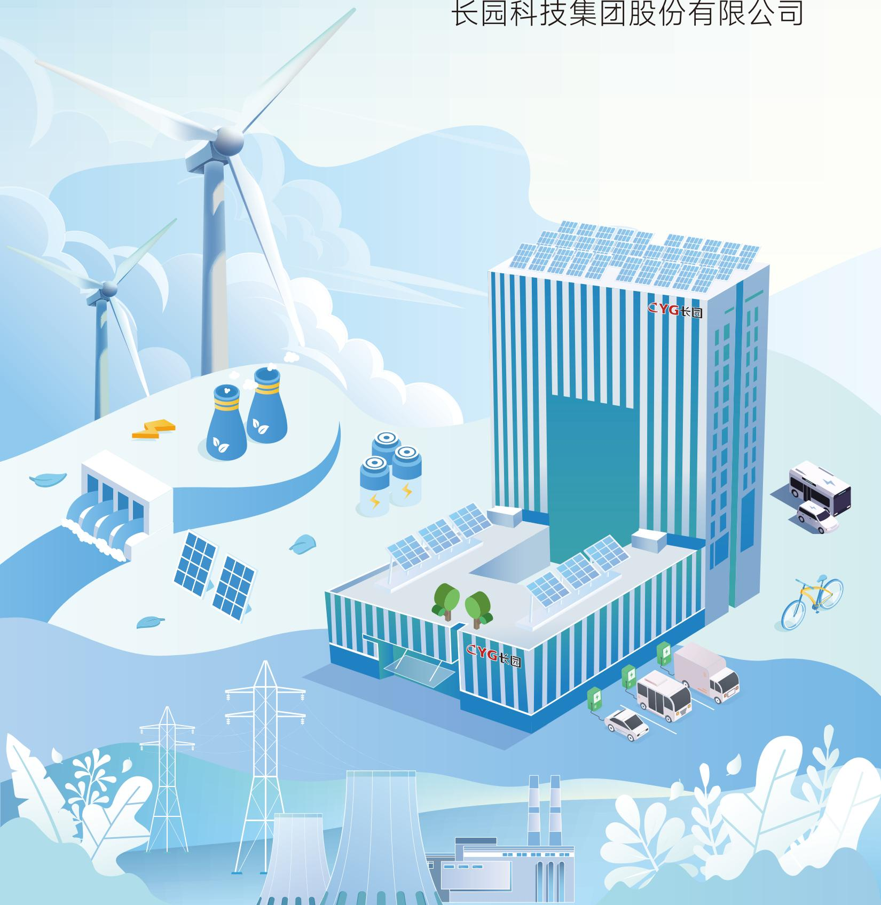

text_image

长园科技集团股份有限公司
CYG长园
CYG长园

## 目录

关于本报告 01

2025年可持续发展亮点 03

走进长园 04

可持续发展治理 09

附录 93

## 01

## 规范治理，行稳致远

公司治理 17

合规经营与风险管理 20

投资者关系管理与股东权益 23

商业道德 25

## 03

## 技术向新，品质护航

创新驱动 47

产品和服务安全与质量 56

数据安全与客户隐私保护 63

供应链管理 65

## 02

## 绿色运营，低碳未来

应对气候变化 29

环境管理 33

资源利用 40

生态系统与生物多样性保护 44

## 04

## 同心同行，共赴美好

员工权益保障 73

职业健康与安全 83

社区公益 91

## 关于本报告

## 报告简介

本报告是长园科技集团股份有限公司2025年度环境、社会与公司治理报告（以下简称 “ESG报告” 或 “本报告”）。本报告遵循客观、规范、透明的原则，详细披露了环境保护、社会责任、公司治理等领域的实践和绩效。

## 时间范围

本报告的时间范围是 2025 年 1 月 1 日至 2025 年 12 月 31 日（以下简称“报告期”）。为增强本报告的对比性和完整性，部分内容适当追溯以往年份或具有前瞻性描述。

## 报告范围

本报告以“长园科技集团股份有限公司”为主体，涵盖长园集团及下属公司，除特别说明外，本报告范围与公司年报范围保持一致。

## 编制依据

◎ 上海证券交易所《上海证券交易所上市公司自律监管指引第14 号——可持续发展报告（试行）》  
◎ 上海证券交易所《上海证券交易所上市公司自律监管指南第 4 号——可持续发展报告编制》（2026年1月修订）  
◎ 中国企业改革与发展研究会《中国企业可持续发展报告指南（CASS-ESG6.0）》  
◎ 全球报告倡议组织《GRI 可持续发展报告标准（GRI Standards）》（2021年版）  
◎ 联合国可持续发展目标（SDGs）

## 数据来源及可靠性保障

报告使用数据来源包括政府部门公开数据、公司正式档、统计报表等。如果本报告所涉及数据与年报不一致，请以公司年报数据为准。同时，本报告涉及的货币种类及金额，如无特殊说明，均以人民币为计量单位。

## 称谓说明

为了便于表述和阅读，本报告中“长园科技集团股份有限公司”也以“长园集团”“长园”“集团”“公司”或“我们”表述。此外，报告中的“国家”“政府”为中华人民共和国及其行政机构。除此之外，其他称谓指代如下：

<table><tr><td>释义项</td><td>释义内容</td></tr><tr><td>长园深瑞</td><td>长园深瑞继保自动化有限公司</td></tr><tr><td>长园电力</td><td>长园电力技术有限公司</td></tr><tr><td>长园高能</td><td>长园高能电气股份有限公司</td></tr><tr><td>长园共创</td><td>长园共创电力安全技术股份有限公司</td></tr><tr><td>运泰利、珠海运泰利</td><td>珠海市运泰利自动化设备有限公司</td></tr><tr><td>欧拓飞</td><td>欧拓飞科技(珠海)有限公司</td></tr><tr><td>珠海半导体</td><td>长园半导体设备(珠海)有限公司</td></tr><tr><td>长园新能源研究院</td><td>长园新能源材料研究院(广东)有限公司</td></tr><tr><td>共创监测</td><td>长园共创监测技术(南京)有限公司</td></tr><tr><td>深瑞汇阳</td><td>江苏深瑞汇阳能源科技有限公司</td></tr><tr><td>达明科技</td><td>珠海达明科技有限公司</td></tr><tr><td>长园综能</td><td>长园综合能源(深圳)有限公司</td></tr><tr><td>长园制造</td><td>长园智能装备(广东)有限公司</td></tr><tr><td>长园制造</td><td>长园智能装备(河南)有限公司</td></tr><tr><td>长园能源</td><td>长园深瑞能源技术有限公司</td></tr><tr><td>长园设计</td><td>四川长园工程勘察设计有限公司</td></tr><tr><td>长园控股</td><td>长园(珠海)控股发展有限公司</td></tr><tr><td>长园医疗</td><td>长园医疗精密(珠海)有限公司</td></tr><tr><td>启橙电力</td><td>成都启橙电力有限公司</td></tr><tr><td>苏州半导体</td><td>长园半导体设备(苏州)有限公司</td></tr><tr><td>金锂科技</td><td>江西省金锂科技股份有限公司</td></tr><tr><td>长园迈德</td><td>长园迈德(东莞)科技有限公司</td></tr></table>

## 报告获取

您可以在上海证券交易所网站（www.sse.com.cn）或长园科技集团股份有限公司官方网站（www.cyg.com）以及巨潮信息网（www.cninfo.com.cn）查阅和下载本报告，获取更多公司信息。

## 2025年可持续发展亮点

## 经济绩效

总资产：

1,327,651.92 万元

营业收入：

789,569.37 万元

## 治理绩效

股东会召开次数：

9次

董事会召开次数：

18次

独立董事占比：

33.33%

## 环境绩效

环境保护投入：

83.3万元

光伏总发电量：

7,147.96 兆瓦时

## 研发绩效

研发投入：

90,621.94 万元

研发投入占营业收入比例：

11.48%

研发团队总人数：

2,448 人

研发人员占员工总人数比例：

31.72%

商标累计数：

212 项

## 社会绩效

员工总数：

7,718 人

劳动合同签订率：

100%

员工培训总投入：

436.62万元

## 走进长园

## 公司简介

成立时间

1986 年

长园科技集团股份有限公司创立于 1986 年，是一家专注于工业与电力系统智能化、数字化研发、制造与服务的科技型产业集团。集团现有海内外员工超7,700人，在中国设有16个产业园区，并在美国、芬兰、意大利、越南等国家布局20余家海外分/子公司及办事处。2002年，长园在上海证券交易所上市（股票代码：600525.SH）。

海内外员工超

7,700 人

产业园区

16 个

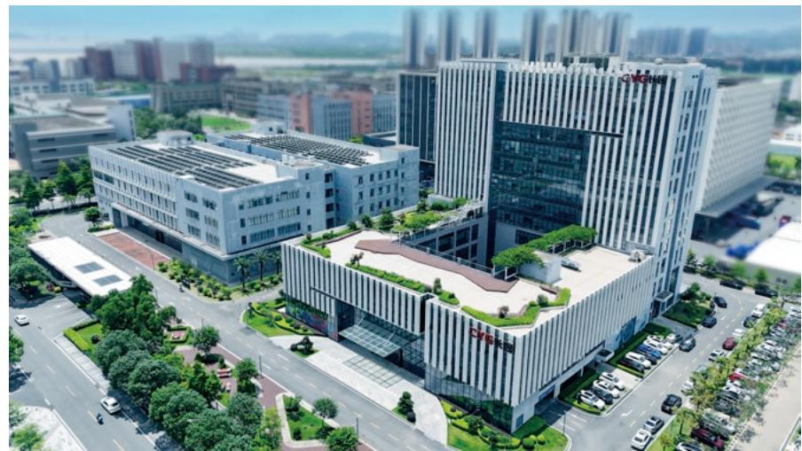

natural_image

Aerial rendering of a modern office building complex with green landscaping and surrounding urban landscape (no visible text or symbols)

海外分/子公司及办事处

20 余家

授权专利

3,297 项

成立近四十载，长园始终秉承“推动能源利用更安全更方便，助力全球制造更智能更高效”的企业使命，坚持以创新为底色、技术为引擎、高质量发展为方向，深耕“电力能源”与“智能装备”两大核心领域。作为国家电网、南方电网及多家世界 500 强企业的长期战略合作伙伴，长园的产品与解决方案已成功应用于全球80多个国家和地区。

软件著作权

1,295 项

公司坚持自主创新，拥有 3 家国家专精特新“小巨人”企业、3 家省级制造业单项冠军、21 家省市级专精特新企业、26 家国家高新技术企业，并建有国家检测中心、工程技术中心、博士后科研工作站与创新基地。截至2025 年底，累计取得3,297项授权专利与1,295项软件著作权。

## 业务概况

以全场景智能解决方案助推能源高效调度，涵盖大型储能、工商业储能、光储一体、能量管理与运维平台等服务。

打造新型电力系统输电网络的数字化基石，面向变电站提供设备状态监测、综合智能防误、智慧运检、综合自动化及高可靠变电站整体方案；面向输电线路提供新能源并网、全电压等级电缆附件及复合绝缘子、在线监测等系统解决方案。

## 储能侧

## 负荷侧

## 电力能源领域

长园以“源网荷储”全链条布局为支撑，构筑贯通“发、输、变、配、用”的现代能源体系

面向工业与民用场景的智慧用能领域，提供配电台区、充电设施与运营、高耗能企业用能优化及新兴负荷管理方案。

## 电网侧

## 电源侧

## 技术服务

以“技术 + 服务”双驱动延伸能源价值链，提供技改 EPC、施工运维、设计咨询、双碳相关及创新专业培训等服务体系。

致力于提升能源生产的安全与效率，提供新能源运维、新能源集控监控、集中型光伏电站、分布式光伏、风电场、微电网、火电 / 水电 / 核电厂运维管理等相关产品与解决方案。

## 智能测试

覆盖电池、环境与耐久测试、电子产品功能测试。

## 智能装备领域

长园面向消费电子、AR/VR与新能源汽车产业，聚焦智能测试、自动化装备两大方向，凭借“一体化服务、个性化定制、柔性化智造”的优势，持续为国际头部客户提供高端、可靠的系统解决方案。

## 自动化装备

包括新能源汽车“三电”自动化产线、智能手机声学模块自动装配、锂电池水性 / 油性隔膜涂布设备等先进装备。

## 企业文化

## 愿景

成为全球卓越的工业与电力系统智能化数字化民族品牌。

## 使命

助力全球制造更智能更高效。推动能源利用更安全更方便。

## 企业精神

诚信：忠诚企业，信守社会。奋斗：拼搏担当，奋进致远。激情：锐意进取，追求卓越。创新：勇于开拓，与时俱进。

## 核心价值观

经营理念：集团价值最大化，保持盈利持续增长。员工发展：长园大家庭，你我共成长！终身学习，不断进取。服务理念：质量和品牌是长园的立足之本，客户满意是长园永恒的追求。

## 发展历程

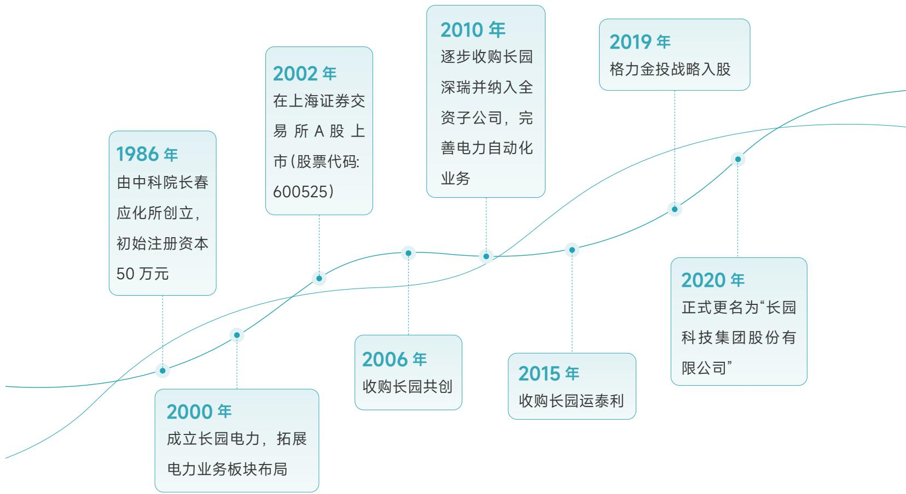

flowchart

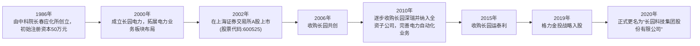

## 2025年度企业荣誉

第三届能源电子产业创新大赛低碳园区技术创新与应用实践专题赛－三等奖

广东省重点商标保护名录

品牌引领·领军品牌

2025 全球新能源 ESG百强榜

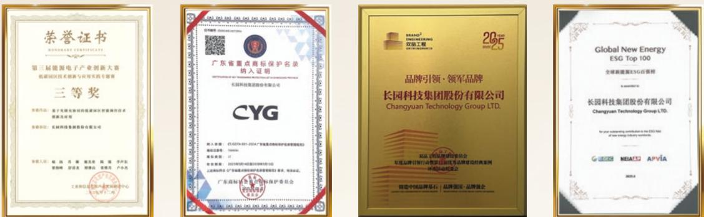

广东知名品牌

深圳市总部企业

2025 广东省制造业 500 强（第67位）

2025深圳企业创新（中国）纪录

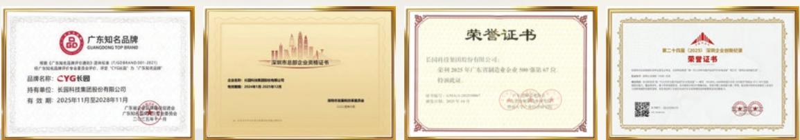

2025粤港澳大湾区企业创新力榜单－创新成就榜第二十四届（2025）深圳企业创新记录自主创新新锐企业

2024年度中国智能物流与供应链杰出应用奖

2024年度企业行政成就奖员工福利组行政联盟一等奖

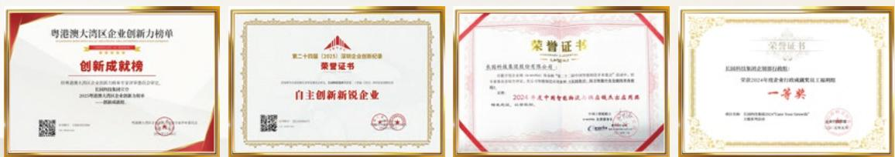

## 其他荣誉

长园集团  

中国能源企业500强

广东省企业500强

深圳市企业500强

中国智能电网行业最具发展潜力企业排行榜

中国电力设备企业核心竞争力排行榜

中国智能电网企业核心竞争力排行榜

## 长园深瑞

2025年深圳市企业500强 深圳市先进级智能工厂 中国电力电气“微机保护装置十大品牌”

## 长园电力

2025 年广东省制造业单项冠军企业 2025 年广东省高企协会科学技术奖三等奖

2024年度珠海市创新百强企业创新综合实力100 强

## 长园高能

广东省级绿色供应链管理企业 2025年度机械工业科学技术奖科技进步二等奖

## 长园共创

中国电力防误领先品牌 2025年度变电智能运检优秀创新成果 珠海市企业重点实验室

珠海市创新百强企业经济贡献100强 珠海市创新百强企业创新综合实力100 强

## 运泰利

人工智能终端产品、行业大模型和应用解决方案名单（第一批）

## 可持续发展治理

## ESG治理体系

公司坚守可持续发展的长期导向，持续健全 ESG 管理机制，把 ESG 理念全面融入战略规划与日常经营管理，围绕合规经营、安全生产、创新发展等重点领域，稳步开展实践工作。

在组织保障方面，公司成立 ESG 工作小组，负责 ESG 工作的协调推进与信息披露；各职能部门及子公司协同配合，形成上下联动的长效工作机制，确保ESG各项举措有效落地。

## 案例 ESG培训

为推动可持续发展理念在管理层与员工中落地普及，全面提升全员 ESG 管理素养与实践能力，2026 年 2 月，公司组织开展了 ESG 专题培训。培训紧密结合 ESG 最新政策导向、行业前沿实践及公司自身发展情况，系统解读相关政策规范与标杆案例，并围绕核心议题研讨适配公司的 ESG提升策略。此次培训有效统一了内部认知、明晰了重点工作方向，为后续各部门协同推进 ESG 工作筑牢了基础。

## SDGs 回应

秉持可持续发展的全球视野，公司主动对标联合国可持续发展目标（SDGs），并将其融入企业长期发展战略。我们致力于通过产品创新、绿色运营及责任实践，在相关重点领域持续发力，以企业之力助推社会可持续发展。

## SDGs

## 我们的行动

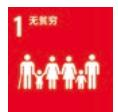

建立员工帮扶机制，对患病或生活困难的员工给予慰问关怀和爱心捐助；通过慈善捐赠等方式参与公益活动。

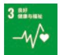

通过为员工提供年度健康体检、商业保险及工伤保险，定期开展职业病危害因素检测等方式，确保员工身心健康。同时，积极组织各类文体活动，并开展夏季送清凉等员工关怀行动，营造健康、积极的工作氛围，全方位守护员工福祉。

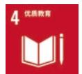

重视人才培养，建立完善的员工培训体系支持员工继续教育。旗下企业设立内部讲师队伍和在线学习平台，向高校教育发展基金会捐赠以支持高校建设与人才培养。

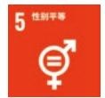

制定制度保障女性员工权益，实行男女同工同酬，为女职工提供特殊劳动保护，设立爱心妈妈小屋等设施。坚持公平就业，禁止基于性别的歧视。

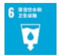

强化水资源管理，制定节水措施，实施废水分类收集与处理，确保废水达标排放，以减少对水环境的影响。

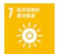

积极布局清洁能源领域，推动自身运营的绿色转型。在自有厂区建设分布式光伏发电项目，购买绿色电力证书，提升可再生能源使用比例。同时，为市场提供储能、新能源运维等产品与解决方案。

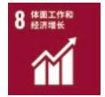

提供公平且有竞争力的薪酬福利，建立绩效考核与职业发展通道；注重员工权益保障，反对强迫劳动和雇佣童工，构建和谐稳定的劳资关系。

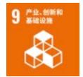

坚持创新驱动，持续加大研发投入，建设国家检测中心、博士后工作站等创新平台。推动数字化与智能制造，在电力系统和工业装备领域进行技术攻关，助力新型电力系统建设和产业升级。

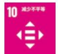

坚持多元、平等、包容的用人理念，在招聘录用、培训发展、薪酬福利、职业晋升等环节中，坚决杜绝任何形式的歧视行为。

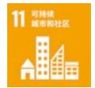

通过建设绿色工厂、推广绿色运营和开展社区公益活动，积极参与社区共建，致力于减少自身运营对环境和社区的影响。

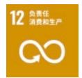

推行绿色产品设计与包装，优先选用环保物料。强化废弃物管理，对一般固废和危险废物进行分类、合规处置和回收利用。建设绿色供应链，推动供应商履行环境与社会责任。

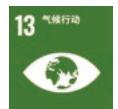

积极应对气候变化，建立碳中和管理机制，设定运营层面碳中和目标。开展温室气体盘查与产品碳足迹核算，实施节能技改，并购买碳信用（VCS）及绿电以抵消自身碳排放。

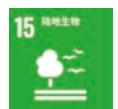

将生态保护理念融入生产经营，通过规范处理废弃物、控制噪声与粉尘排放，最大限度降低运营对周边环境的影响，在生产经营活动中践行对陆地生态的保护责任。

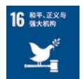

持续优化公司治理结构，坚持合规经营与风险管控。恪守商业道德，建立反商业贿赂及反贪污机制，完善举报人保护制度，确保企业经营廉洁透明。

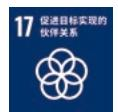

积极与各利益相关方沟通，倾听其诉求。与高校及科研院所开展产学研合作，共同进行技术攻关。与供应商共建供应链生态，通过供应商大会、专题培训等方式协同发展。

## ESG 风险和机遇管理

为夯实可持续发展根基，筑牢长期经营安全防线，公司常态化开展ESG风险和机遇管理工作。报告期内，公司围绕产品和服务安全与质量、应对气候变化、创新驱动、供应链安全等关键议题，开展风险和机遇的识别、评估和应对，形成全流程闭环管理机制。未来，公司将持续强化议题动态管理，将 ESG 风险管控进一步融入业务流程，有效把握可持续发展机遇，提升企业长期韧性。

## 利益相关方沟通

公司积极构建开放、高效的利益相关方沟通机制，通过多元管道与各方保持紧密互动。我们认真倾听各利益相关方诉求与期望，并将其融入管理与决策过程，持续增进理解与互信，携手伙伴共同创造长远价值。

## 信息披露机制

公司致力于完善 ESG 信息报告体系，由 ESG 工作小组负责信息的系统收集、梳理与报告编制，定期向管理层同步关键进展，以资讯的及时性与准确性赋能管理决策，驱动可持续发展水平稳步提升。

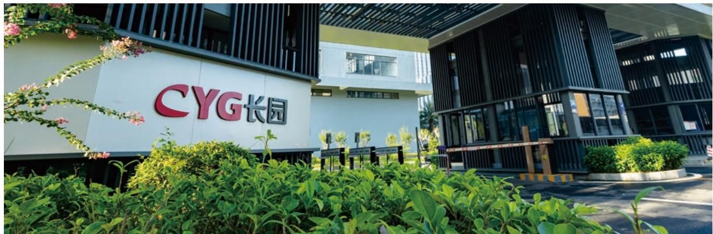

text_image

CYG长园

<table><tr><td>利益相关方类别</td><td>政府/监管机构</td><td>股东/投资者</td><td>供应商/合作伙伴</td><td></td><td>员工</td><td>客户</td><td>行业协会/科研机构</td><td>社区/公益组织</td></tr><tr><td>诉求与期望</td><td>合规运营依法纳税促进就业</td><td>业绩稳定增长提升股东回报信息透明</td><td>诚信合作公平采购互利共赢</td><td></td><td>权益保障职业发展健康安全人文关怀</td><td>优质产品高效服务权益保障</td><td>行业共荣技术创新协同发展</td><td>和谐共建乡村振兴公益慈善</td></tr><tr><td>沟通与回应</td><td>接受监督检查落实政策要求本地化招聘</td><td>提升经营效益合理回报股东规范信息披露</td><td>坚持诚信履约规范采购流程深化战略合作</td><td></td><td>健全福利体系畅通晋升通道守护职业健康员工帮扶</td><td>严控产品质量快速回应诉求客户满意度调查</td><td>共建行业生态加大研发投入促进成果共享</td><td>促进社区融合助力乡村建设开展志愿服务活动</td></tr></table>

## 实质性议题评估

公司根据《上海证券交易所上市公司自律监管指引第14号——可持续发展报告（试行）》（以下简称《指引》）等披露标准，引入影响重要性和财务重要性的分析视角进行识别和评估，梳理出 23 项议题，其中有2项为财务重要性议题，2 项为双重重要性议题，将在本报告中重点披露。

<table><tr><td>议题评估流程</td><td>分析方法</td></tr><tr><td>步骤一:了解公司背景</td><td>基于全球大趋势、中国宏观经济环境、公司所处行业、公司所处商业模式,识别公司利益相关方与公司面临的风险与机遇。</td></tr><tr><td>步骤二:议题初步筛选</td><td>以《指引》设置的21个议题为基础,分析国内外同行业相关议题,识别议题相关影响、风险和机遇,汇总形成公司议题清单。</td></tr><tr><td>步骤三:议题重要性评估与确认</td><td>影响重要性评估梳理各议题对外部环境、社会和经济的潜在或实际的正面或负面影响。财务重要性评估通过影响、依赖性和其他因素分析,结合公司管理层及外部专家判断,以及各部门风险识别和评估清单,识别和评估相关议题下的风险和机遇,评估出具有财务重要性的议题。</td></tr><tr><td>步骤四:议题报告</td><td>汇总议题双重重要性分析的流程、方法及结论。依据《指引》要求披露相关内容。</td></tr></table>

在23 个议题中，有3个议题被识别为相关议题，未达到财务重要性和影响重要性标准，原因如下：

<table><tr><td>议题</td><td>原因</td></tr><tr><td>生态系统和生物多样性保护</td><td>公司主营业务为电力系统自动化及智能制造,生产经营活动不涉及生态敏感区域,对生态系统和生物多样性不构成重大影响。</td></tr><tr><td>平等对待中小企业</td><td>公司与中小企业保持公平、公开的合作关系,不存在因合作企业规模差异引发重大财务风险或产生外部负面影响的现实基础。截至报告期末,公司不存在应付账款(含应付票据)余额超过300亿元或占总资产的比例超过50%的情形。故该议题对公司未达到财务重要性和影响重要性标准。</td></tr><tr><td>科技伦理</td><td>因公司业务聚焦电力及工业制造领域,不涉及基因编辑、人工智能等科技伦理高风险领域,相关议题与公司运营关联度较低。</td></tr></table>

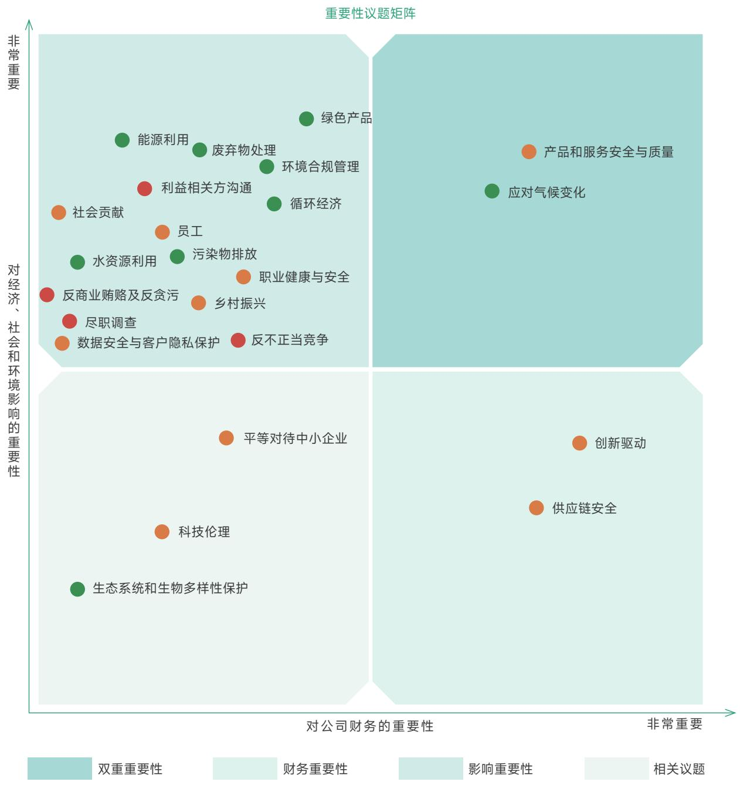

scatter

| Topic | Quadrant |
| --- | --- |
| 绿色产品 | 财务重要性 |
| 废弃物处理 | 财务重要性 |
| 环境合规管理 | 财务重要性 |
| 利益相关方沟通 | 财务重要性 |
| 循环经济 | 财务重要性 |
| 社会贡献 | 财务重要性 |
| 员工 | 财务重要性 |
| 污染物排放 | 财务重要性 |
| 职业健康与安全 | 财务重要性 |
| 水资源利用 | 财务重要性 |
| 反商业贿赂及反贪污 | 财务重要性 |
| 尽职调查 | 财务重要性 |
| 数据安全与客户隐私保护 | 财务重要性 |
| 反不正当竞争 | 财务重要性 |
| 平等对待中小企业 | 财务重要性 |
| 科技伦理 | 财务重要性 |
| 生态系统和生物多样性保护 | 财务重要性 |
| 产品和服务安全与质量 | 相关议题 |
| 应对气候变化 | 相关议题 |
| 创新驱动 | 相关议题 |
| 供应链安全 | 相关议题 |

<table><tr><td>维度</td><td>议题</td></tr><tr><td>●环境</td><td>应对气候变化、污染物排放、废弃物处理、生态系统和生物多样性保护、环境合规管理、能源利用、水资源利用、循环经济、绿色产品</td></tr><tr><td>●社会</td><td>乡村振兴、社会贡献、创新驱动、科技伦理、供应链安全、平等对待中小企业、产品和服务安全与质量、数据安全与客户隐私保护、员工、职业健康与安全</td></tr><tr><td>●治理</td><td>尽职调查、利益相关方沟通、反商业贿赂及反贪污、反不正当竞争</td></tr></table>

## 01 规范治理 行稳致远

长园集团以规范治理为基石，持续优化法人治理结构，强化合规经营与风险管控，恪守商业道德准则。同时，高度重视投资者关系管理，保障股东合法权益，不断提升公司治理透明度和规范化运作水平。

公司治理 17

合规经营与风险管理 20

投资者关系管理与股东权益 23

商业道德 25

回应的 SDGs

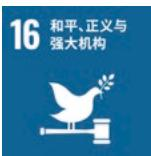

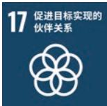

natural_image

Illustration of a business meeting with people, wind turbines, and a city skyline in the background (no text or symbols)

## 公司治理

公司严格按照《中华人民共和国公司法》（以下简称“公司法”）、《中华人民共和国证券法》（以下简称“证券法”）、《上市公司治理准则》等相关法律法规的要求，制定了《公司章程》《股东会议事规则》《董事会议事规则》等公司治理制度，建立起由股东会、董事会及其专门委员会、经理层为核心的治理架构。2025年12月29日，公司依据相关规定，取消监事会并废止《监事会议事规则》，公司不再设置监事，由公司董事会审计委员会承接监事会职权。

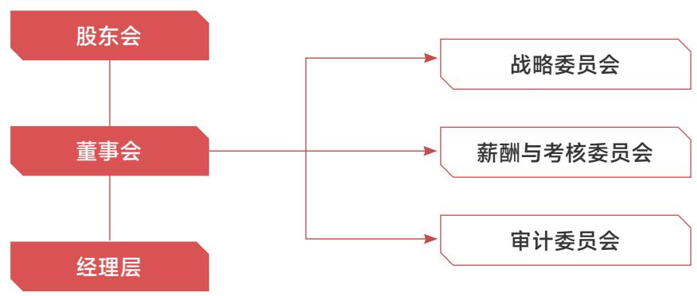

flowchart

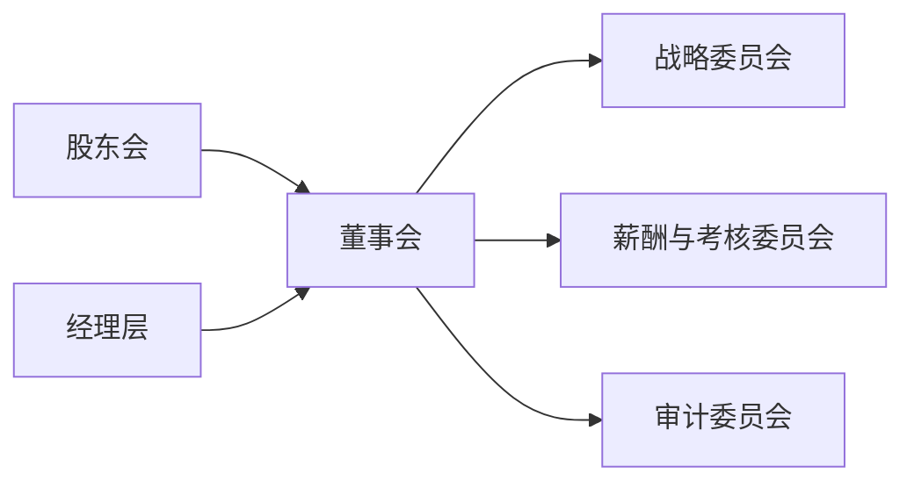

## 股东会

股东会是公司权力机构。公司依照《上市公司股东会规则》等相关法律法规，制定了《股东会议事规则》，明确股东会的职权边界，确保股东会的召集，召开通知及表决等流程符合相关规定

公司致力于维护全体股东尤其是中小股东的合法权益，在股东会表决中采用现场投票与网络投票相结合的方式，为中小股东行使表决权提供便利。同时，对于影响中小投资者利益的重大事项，实行中小投资者表决单独计票机制，确保决策公平公正。

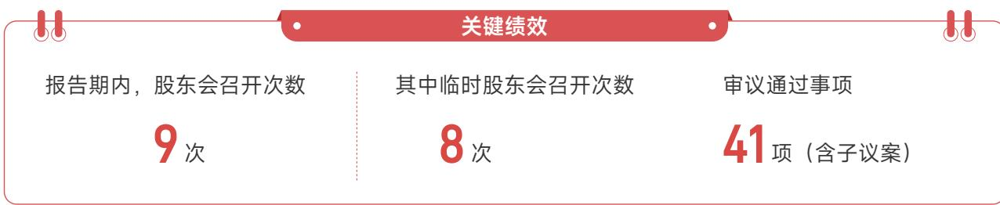

text_image

关键绩效
报告期内，股东会召开次数
9次
其中临时股东会召开次数
8次
审议通过事项
41项（含子议案）

## 董事会

董事会作为公司经营决策机构，在公司发展中肩负着至关重要的职责。公司严格依照《公司章程》《公司法》等相关规定，制定《董事会议事规则》，规范董事会的召集、召开、审议程序，清晰界定董事会职权范围，为公司稳健运营奠定牢坚实基础。

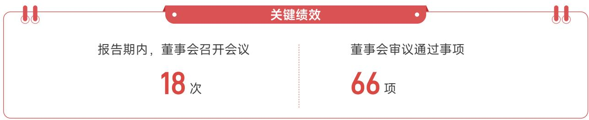

text_image

关键绩效
报告期内，董事会召开会议
18 次
董事会审议通过事项
66 项

## 董事会专门委员会

公司董事会下设审计委员会、战略委员会、薪酬与考核委员会，各委员会严格依照议事规则规范运作，凭着专业严谨的职业素养、客观公正的履职态度，为董事会科学决策提供专业意见，助力公司治理规范高效运行。

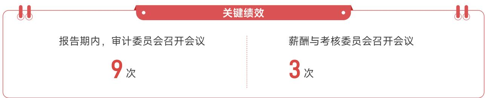

flowchart

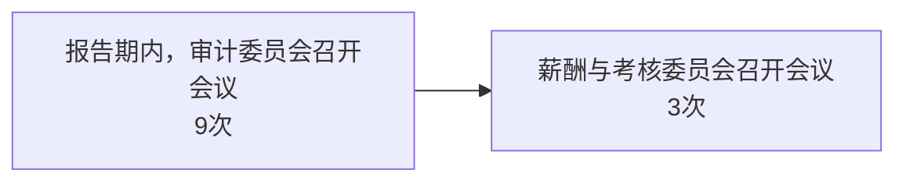

## 董事会多元化

公司高度重视董事会多元化建设，着力构建专业背景互补、行业经验丰富、年龄结构合理、性别视角均衡的董事团队，通过融合多元思维、跨界视野与专业能力，保障董事会决策的科学性、包容性与前瞻性。

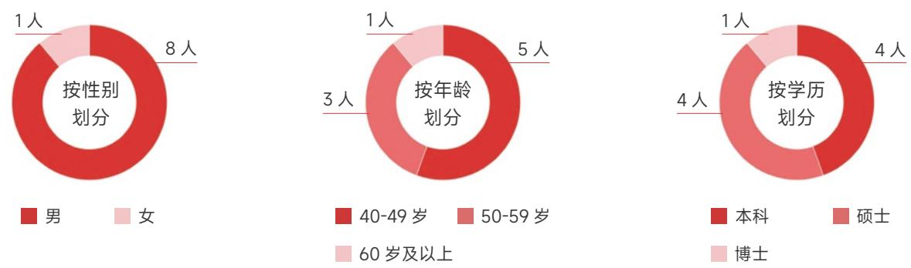

donut

| 分类 | 类别 | 人数 |
| --- | --- | --- |
| 按性别划分 | 男 | 8人 |
| 按性别划分 | 女 | 1人 |
| 按年龄划分 | 40-49岁 | 5人 |
| 按年龄划分 | 50-59岁 | 3人 |
| 按年龄划分 | 60岁及以上 | 1人 |
| 按学历划分 | 本科 | 4人 |
| 按学历划分 | 硕士 | 4人 |
| 按学历划分 | 博士 | 1人 |

## 董事会独立性

公司制定《独立董事工作制度》《独立董事专门会议制度》明确规定了独立董事的职权范围为独立董事独立、规范履职提供坚实制度保障。公司薪酬与考核委员会、审计委员会的召集人均由独立董事担任，其中审计委员会召集人具备会计专业背景，为专业决策提供保障。

<table><tr><td colspan="4">关键绩效</td></tr><tr><td>报告期内，公司董事会成员</td><td>其中独立董事</td><td>非独立董事</td><td>独立董事占比</td></tr><tr><td>9人</td><td>3人</td><td>6人</td><td>33.33%</td></tr><tr><td>审计委员会独立董事占比</td><td colspan="2">薪酬与考核委员会独立董事占比</td><td>战略委员会独立董事占比</td></tr><tr><td>100%</td><td colspan="2">100%</td><td>33.33%</td></tr></table>

## 董高薪酬管理

公司制定《董事、高级管理人员薪酬管理制度》，明确董事、高级管理人员的薪酬方案遵循“责权利对等、短期激励与长期发展相结合、激励与约束并重”的原则，并综合结合公司经营规模、行业特征与市场薪酬水平制定，确保薪酬结构合理公平、具备外部竞争力。

董事、高级管理人员薪酬由基本薪酬、绩效薪酬两部分构成，其中绩效薪酬与公司年度经营业绩目标、个人分管工作目标完成情况紧密挂钩。公司设立薪酬止付追索机制，对于违反公司章程及违反法律法规的行为，公司将采取追索回已发放的绩效薪酬等相关措施。

## H 关键绩效 H

报告期内，董事、高级管理人员从公司获得的税前报酬总额

1,486.93万元

## 合规经营与风险管理

## 合规内控

公司制定《合规管理制度》等相关规定，不断提升合规管理水平和风险防范能力。集团合规部作为牵头部门，负责统筹协调合规管理工作；各业务及职能部门承担合规管理主体责任，具体负责本部门合规风险梳理、审查、报告及整改等工作，形成“牵头统筹、分级落实”的管理体系。同时，公司探索建立合规履职考核评价机制，将合规责任纳入岗位职责与绩效管理，并通过常态化培训与宣传教育，持续强化全员合规意识。

## 案例 合同实务培训

11 月，长园医疗面向销售及采购人员开展了合同实务培训，围绕合同关键条款设计、风险识别等核心内容，系统讲解合同签订与履行过程中的常见问题及防控要点。此次培训有效提升了参训人员的合同风险防控能力与业务合规水平，进一步推动公司合同管理规范化建设。

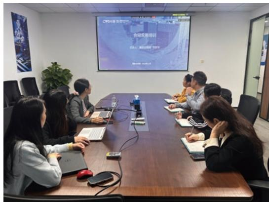

text_image

Meeting room photo with visible presentation screen showing Chinese text about '合作实施培训' (Committing Work Implementation Training)

## 内部审计

为规范审计工作，公司在审计委员会领导下设立审计小组，严格按照《内部审计制度》开展审计工作。审计过程中，审计小组对财务真实性、经营合规性、内部控制有效性进行全面核查，并出具合格、基本合格或不合格的综合评定意见。针对审计发现的问题由审计小组提出处理建议，对相关责任人的问责处理严格依据集团《内部审计结果考评与问责制度》执行。审计项目完成后，由审计小组组长负责立卷装订，统一归档保管，形成全流程闭环管理。

在此基础上，公司定期聘请第三方审计机构对内部控制运行情况进行审计并出具《内部控制审计报告》；同时，审计委员会结合内部审计评价报告及相关资料，出具年度《内部控制自我评价报告》。公司通过内部监督与外部审计相结合的方式，持续完善内部控制体系建设，确保内部控制规范、有效运行。

2025 年，针对《内部控制审计报告》中指出的问题，公司管理层成立专项整改小组，联合公司相关部门开展全面自查，聚焦内部控制关键环节，通过内部协同监督深入排查潜在风险。

## 针对资金支付方面的缺陷与合同审批缺陷

①. 公司于2025年9月修订完善了《资金管理办法》《账户管理办法》《内部资金调拨管理办法》，增设大额资金支付的“三重审批”机制；明确 OA 系统资金调拨流程，增设《开立、注销银行账户 OA 审批流程》；通过加大资金层层复审报批力度，做到资金管控事前防范、事中审查、事后复查，切实保障资金使用的合理性和合规性。  
②. 公司于 2025 年 10 月修订完善了《财务体系人员管理办法》，加强预付款要件和实质审核，商业实质的审核，从供应商资质、准入到采购订单，作出制度性要求；细化财务岗位职责分离相关规定。

## 针对合同审批方面的缺陷

①. 2025 年 9 月 25 日修订并发布了《子公司主要业务事项审批制度》，并优化了《子公司超权限审批流程》，强化集团超权限审批流程的复核，包含对审批节点设置的合理性、业务的必要性、附件的完整性、审批的实质性等进行监督确认；增加特定金额标准的预付款的额外管控；对于重大决策、重大事项、大额资金支付业务等流程增加审批节点，任何个人不得单独进行决策或者擅自改变集体决策意见；细化业务类型和审批标准，将间接物料采购业务纳入超权限审批，优化方案，捋顺审批流程。  
②. 公司于 2025 年 8 月修订了《印章管理制度》，细化日常用印使用规范，有效执行措施，提升管理效率；完善了印章外借的管理细则。

## 针对关联方认定方面的缺陷

公司于 2025 年 10 月新增了《合并范围外关联方交易申报审批制度》，在合同审批流程中嵌入“关联关系核查”节点，对合同相对方进行关联方穿透核查；对涉及大额资金支付或交易模式异常的合同，要求业务部门提供更详尽的尽职调查报告和商业合理性说明，以强化合同审批。强化关联方信息申报义务，要求董事、监事、高管及持股 5% 以上股东及时申报并动态更新其关联人信息。

## 针对关联方信息披露方面存在的缺陷

公司于 2025 年 10 月新增了《合并范围外关联方交易申报审批制度》，设立关联交易专门管理机构，建立了分级授权审批机制、严格规定所有关联交易必须履行从业务部门发起、由集团财务管理部、证券部复核后，报总裁办公会审议，并提交董事会或股东会审议；明确了发生关联方资金占用等重大事项时的报告路径和披露时限要求。

注：针对 2023、2024 年关联方资金占用事项，公司已收回关联方占用资金本息合计，成立整改小组自查内控风险，修订相关制度，完善流程并强化合规管理。

<table><tr><td colspan="3">关键绩效</td></tr><tr><td>报告期内,公司共完成重点审计项目</td><td>一般审计项目</td><td>离任审计项目</td></tr><tr><td>21个</td><td>12个</td><td>10项</td></tr></table>

## 风险管理

为有效防范经营风险，公司持续完善风险管理体系。公司各业务及职能部门全面承担风险管理主体责任，聚焦重点领域、关键环节与核心人员强化管控，筑牢风险防范防线。发生风险事件时，相关业务及职能部门须第一时间启动应对措施，并在规定时限内上报事件详情、提交完整风险报告。同时，风险管理工作与法律事务管理、内部控制管理高效协同、统筹推进，确保经营活动合法合规，持续提升集团整体风险防控能力，为高质量发展提供坚实保障。

natural_image

Illustration of a globe with search bar, checkmark, document, and user profile icons (no text or symbols)

## 税务管理

公司遵守《中华人民共和国企业所得税法》《中华人民共和国税收征收管理法》等国家税务法规，制定了《税务管理制度》《税务管理制度实施细则（试行）》等制度，确保税务管理有章可循、有据可依。在日常运营中，公司每年组织各子公司开展税务自查，并根据税收政策变化及时更新操作规范，保障各类税种按时申报、足额缴纳，切实履行纳税主体责任。

## 税务风险应对措施

## 税务事项内部检查

建立常态化的税务内部检查机制，由各子公司税务管理岗基于风险分析结果，重点围绕进项税额、销项税额及企业所得税等核心税种开展专项检查，及时发现并防范税务风险。

## 风险应对内控建设

规定各公司针对关键业务环节建立健全内部控制机制，并严格执行集团相关专项管理制度。

## 税务检查及稽查应对管理

公司建立规范的税务稽查应对机制。事中应对环节，接到通知后立即向集团报告，按要求配合检查并提交资料，事后及时复盘整改。

## 投资者关系管理与股东权益

## 信息披露

公司依据《公司法》《证券法》《上市公司信息披露管理办法》等法律法规，制定了《信息披露管理制度》，明确了信息披露内容、披露方式以及披露程序等。公司指定由证券部负责信息披露工作，根据董事会秘书的指令，在证券事务代表的组织及协调下，履行信息披露管理职能，保证公司信息披露的及时性、准确性和完整性。

## 立案说明

长园集团于2025年12月26日收到中国证券监督管理委员会（以下简称“中国证监会”）下发的《立案告知书》（编号：证监立案字 0072025 27 号）。因长园集团涉嫌信息披露违法违规，根据《中华人民共和国证券法》《中华人民共和国行政处罚法》等法律法规，中国证监会决定对长园集团立案。截至本报告出具日，长园集团尚未收到中国证监会就上述立案调查事项的结论性意见或决定。

##

## 关键绩效

报告期内，公司发表公告及挂网文件

187份

## H

## 舆情管理

公司制定《舆情管理制度》，成立应对舆情管理工作领导小组，对各类舆情实行统一领导、统一组织、快速反应、协同应对的工作机制，积极主动回应与处置各类舆情。同时，公司内部有关部门及相关知情人员对舆情所涉信息严格履行保密义务，在依法披露前不得擅自对外公开或泄露，严禁利用相关信息从事内幕交易行为。

## 投资者关系管理

公司始终高度重视并持续规范投资者关系管理工作，制定并遵循《投资者关系管理制度》，并指定证券部为投资者关系管理的职能部门，负责公司投资者关系管理事务。公司通过股东会、投资者关系专栏、业绩说明会、路演活动、一对一沟通等在线线下多种互动方式加强公司与投资者之间的信息沟通，增进投资者对公司的了解和认同。

## H

## 关键绩效

## H

报告期内，召开业绩说明会

3 次

接听投资者咨询电话

500 次

## 债权人权益保护

公司经营决策审慎严谨，严格防控经营与偿债风险，切实保障债权人合法权益。公司定期与供应商、合作银行核对账务，建立完善的风险管控体系，并与多家银行保持稳定授信合作。同时坚持财务透明，及时披露信息，公平对待所有债权人，依法维护其合法权益。

## 商业道德

## 反商业贿赂及反贪污

为加强商业道德管控，防范舞弊和腐败事件，营造廉洁合规的经营环境，公司建立《商业行为准则》，明确禁止任何形式的欺诈及其他违法违规行为。在组织保障方面，公司设立由董事长直接领导审计监察部，作为独立的监察机构，构建起职责清晰的廉洁管理架构。截至报告期末，旗下子公司长园深瑞已通过 ISO37001反贿赂管理体系认证。

## 反腐措施

## 行为规范

严禁公司人员利用职务便利索取或收受业务关联方财物、利益，或将公司资产据为己有、擅自处置；严禁假借佣金、考察、培训等名义获取不当利益；严禁与业务关联方发生未经批准的借贷或担保关系。

## 监督机制

公司要求所有管理人员履行监督责任，持续监督并检查下属员工的守法合规情况，确保在其职责范围内，不出现可通过相应监督避免或防范的违法、违规行为。

## 商业伙伴廉洁管理

与合作方签署《廉洁协议》，明确双方廉洁责任，若对方违约公司有权采取暂停付款、终止合作等措施。

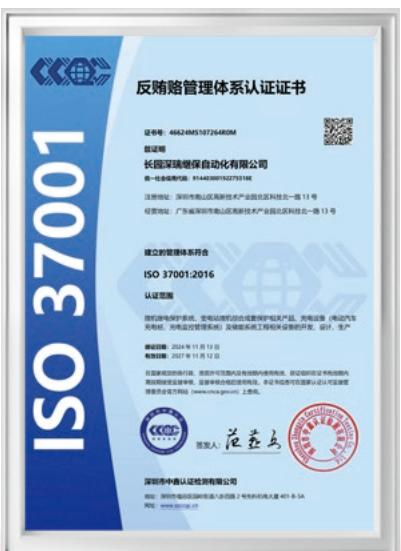

text_image

反贿赂管理体系认证证书
证书号：46624MS19726480M
拟证明
长园深瑞医保自动化有限公司
统一社会信用代码：9144030019227515E
注册地址：深圳市南山区高新技术产业园北区科技一路13号
经营地址：广东省深圳市南山区高新技术产业园北区科技一路13号
建立的管理体系符合
ISO 37001:2016
认证范围
随机接受保护系统，能够以提高组合成套保护类产品、智能设备（移动汽车充电机、充电监控管理系统）及辅助系统工程相关设备的研发、设计、生产
申请日期：2024年11月13日
有效期至：2027年11月12日
在国家规定的执行期间，政府开展大型及以上领域内使用专利，依法取得特定证书或部门内授权和接受监管审批。企业联合组织内部审核，并可向相关部门登记认可后直接受理备案并登记证书（www.cnc.gov.cn）上有效。
签发人：范磊
深圳市中鼎认证检测有限公司
网址：深圳市中鼎国际认证市场协会网站 2 电子材料认证大厦 401-8-5A
网址：www.zgc.com.cn

长园深瑞  
反贿赂管理体系认证证书

## H 关键绩效 H

报告期内，公司未发生因商业贿赂或贪污事件导致的诉讼或重大行政处罚事件。

natural_image

Illustration of red gavel, document, and magnifying glass (no text or symbols)

## 举报与举报人保护

公司鼓励员工及业务合作方通过正规管道举报违规问题，可通过举报邮箱、举报电话反映，也可直接向集团合规部或涉事员工所在单位的合规负责人举报。公司对举报人信息及举报内容严格保密，坚决杜绝任何打击报复行为。接到举报后，公司将启动全面调查，对涉嫌违法犯罪的线索，依法追究相关人员责任，并移交司法机关处理。

## 举报管道

邮箱：jubao@cyg.com

电话：0756-3890888 转审计监察部

## 反不正当竞争

公平竞争是市场健康发展与社会效益提升的重要保障。公司严格遵守《中华人民共和国反垄断法》《中华人民共和国反不正当竞争法》等相关法律法规，坚决反对通过商业贿赂等不正当手段获取交易机会或竞争优势的行为。同时，公司要求员工恪守公平竞争原则及商业道德，严禁通过限制竞争、操控价格、窃取商业秘密及商业贿赂等方式开展恶意竞争，切实维护公正有序的市场环境。报告期内，公司未发生涉及不正当竞争的诉讼案件。

natural_image

Illustration of two people standing beside a large scale with gavel and books, symbolizing justice or legal contexts (no text present)

## 02 绿色运营 低碳未来

长园集团积极应对气候变化，持续强化环境管理与资源循环利用，严守环保合规底线。公司加大气候友好型技术投入，以产业低碳转型守护生态系统与生物多样性，以实际行动践行可持续发展理念。

natural_image

Illustration of a person riding a bicycle on a grassy field with trees in the background (no text or symbols)

应对气候变化 29

环境管理 33

资源利用 40

生态系统与生物多样性保护 44

回应的 SDGs

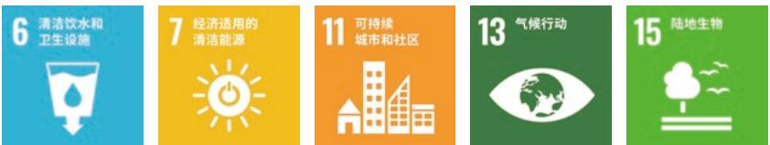

## 应对气候变化

## 治理

为积极有效应对气候变化，公司结合自身生产运营实际，主动对接应对气候变化治理要求，将绿色低碳理念贯穿生产经营各环节。围绕节能降耗与资源高效利用，持续完善相关工作安排，以扎实有力的环保举措推动降碳行动落地。报告期内，公司凭借在绿色低碳领域的卓越表现，荣获 2025 年国际绿色零碳节“双碳典范企业奖”。

## 战略

为积极应对气候变化带来的挑战，公司在全面识别和评估运营中气候风险的同时，主动把握绿色发展趋势，积极布局清洁能源领域，推动业务绿色转型，实现经营效益与可持续价值协同提升。

<table><tr><td colspan="2">风险类型</td><td>风险描述</td><td>发生概率</td><td>影响大小1</td><td>影响的时间范围2</td><td>影响的价值链环节3</td><td>优先级排序4</td><td>潜在财务影响</td><td>应对措施</td></tr><tr><td rowspan="2">物理风险</td><td>急性风险</td><td>台风、暴雨等极端天气多发,易造成物资受损、引发安全事故,进而导致生产运营中断</td><td>中</td><td>高</td><td>短期</td><td>上游、运营、下游</td><td>高</td><td>运营成本增加,营业收入减少</td><td>提升厂区及设施防灾抗灾能力,编制应急方案,合理规划物资与设备的防护布局</td></tr><tr><td>慢性风险</td><td>气温持续上升加速生产设备及户外设施的老化进程,导致故障率上升、维护成本增加;同时增加员工作业安全隐患</td><td>中</td><td>中</td><td>长期</td><td>运营</td><td>中</td><td>运营成本增加</td><td>错峰安排户外作业,避开高温时段,升级设备与技术方案,提升能效以降低高温带来的运营支出</td></tr><tr><td rowspan="2">转型风险</td><td>政策风险</td><td>随着国家碳减排政策约束力持续增强,面临合规成本增加及潜在处罚风险</td><td>中</td><td>中</td><td>中长期</td><td>运营、下游</td><td>中</td><td>运营成本增加</td><td>制定科学碳目标与实施路径,推进节能技术改造,提升可再生能源应用比例</td></tr><tr><td>市场风险</td><td>下游客户对低碳产品需求持续提升,传统业务及客户维护难度加大,影响产品销量</td><td>中</td><td>中</td><td>中期</td><td>下游</td><td>中</td><td>营业收入减少</td><td>严格落实碳中和实施路径,推动产品向绿色化迭代升级,重点围绕材料可回收、能效优化及碳足迹量化等维度开展低碳设计</td></tr></table>

中·如果风险发生会对企业的财务和声誉造成一定程度的负面影响可能需要采取措施来弥补损失  
高·风险发生会对企业造成严重的财务损失，品牌受损，其至影响到业务持续性可能需要大量资源来恢复  
中期：一般是指公司可持续信息报告期间结束后1 年至5年（含5年）。  
长期:一般是指公司可持续信息报告期间结束后5年以上  
运营:涉及生产 制造和内部流程等环节，影响日常运营和生产效率，  
高:风险可能导致重大财务损失，业务中断或严重的法律后果，需立即采取措施。

<table><tr><td>机遇类型</td><td>机遇描述</td><td>发生概率</td><td>影响大小</td><td>影响的时间范围</td><td>影响的价值链环节</td><td>优先级排序5</td><td>潜在财务影响</td><td>应对措施</td></tr><tr><td>市场机遇</td><td>全球应对气候变化推动能源结构向清洁低碳转型,风电、光伏等领域投资加速,为公司新能源相关业务拓展创造市场空间</td><td>高</td><td>高</td><td>中长期</td><td>下游</td><td>高</td><td>营业收入增加</td><td>加快光伏、风电等可再生能源项目布局,推动业务结构向绿色低碳方向优化</td></tr><tr><td>产品与服务机遇</td><td>极端天气事件频发,受灾地区电力、通信基础设施受损后迎来修复重建期,短期内形成对应急保障设备及电网加固产品的增量需求</td><td>中</td><td>中</td><td>短期</td><td>下游</td><td>中</td><td>营业收入增加</td><td>科学调整继电保护设备、电力电缆附件等产品的库存策略,确保灾后重建物资及时供应</td></tr></table>

5 低：机遇对业务的影响相对较小，但仍能为企业带来一定的收益或效率提升，可以在常规的运营管理中进行处理，通常不需要投入过多的资源或进行大的策略调整。  
中：机遇能够为企业带来一定的业务增长或市场份额提升，对业务有一定积极影响，但需要企业在一定时间内进行资源投入和策略调整，以处理和把握这一机遇。  
高：机遇能够带来重大的市场突破、业务增长或技术创新，显著提升企业的竞争力和盈利能力，需要企业立即采取行动，投入大量资源，并可能需要调整整体战略以充分利用这一机遇。

## 影响、风险和机遇管理

为积极应对气候变化，公司构建了涵盖风险识别、评估与应对的全流程管理机制，系统分析政策与市场等转型风险、极端天气等物理风险对运营的潜在影响，同时主动把握绿色产业发展与低碳技术创新带来的市场机遇。目前，公司已将应对气候变化工作融入日常运营与发展战略，围绕能源使用、生产流程及产品全生命周期，持续探索并推行减碳路径。通过强化跨部门协同，有效整合资源，确保各项气候行动落地见效，稳步推动企业向低碳运营模式转型，为构建气候韧性社会贡献力量。

## 指标与目标

公司以国家碳达峰、碳中和目标为引领，围绕节能降碳、资源节约与绿色运营积极谋划阶段性减碳路径，推动形成全员参与的低碳行动格局。通过持续深化绿色管理实践，稳步推进企业绿色转型，以长期主义夯实可持续发展根基，切实为国家双碳目标落地贡献企业力量。

<table><tr><td>关键绩效6</td><td>单位</td><td>2025年</td></tr><tr><td>温室气体排放总量</td><td>吨二氧化碳当量</td><td>19,636.31</td></tr><tr><td>温室气体排放强度</td><td>吨二氧化碳当量/百万元</td><td>2.49</td></tr><tr><td>直接温室气体排放量(范围一)</td><td>吨二氧化碳当量</td><td>1,936.59</td></tr><tr><td>间接温室气体排放量(范围二)</td><td>吨二氧化碳当量</td><td>17,699.72</td></tr></table>

## 温室气体排放管理

公司高度重视温室气体排放管理，稳步推进各项降碳工作。部分子公司通过碳排放盘查、产品碳足迹核算及双碳课程培训等方式，全方位提升碳管理能力。报告期内，长园深瑞、长园共创、长园高能委托专业机构开展温室气体核查，并完成核查报告编制。

## 低碳实践举措

## 碳排放盘查

## 产品碳足迹核算

## 双碳课程培训

定期识别整理排放源数据，持续监测碳排放数据。

开展产品碳足迹核算，强化产品全生命周期低碳管理。报告期内，长园深瑞委托专业机构对智能融合终端产品开展碳足迹核查，经核定该产品碳足迹为 105.03kgCO e/ 台。

围绕双碳战略开展系列培训课程，结合商务、生产、行政等不同岗位实际需求，提升员工碳管理认知，夯实绿色转型人才。

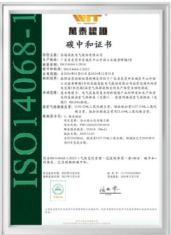

text_image

万泰超祺
碳中和证书

神舟大厦：长春高能电气股份有限公司
生产地址：广东省东莞市东城区东山中路工业园景辉路2号
邮政编码：30114664.12018
登记时间和邮箱：JXH14068-1:2023
注册期限：自2024年4月01日至2024年12月31日
组织编号：按照碳中和核对规则确定的位于广东省东莞市东城区东平中路
工业园景辉路2号的东吴高能电气股份有限公司营业范围内所涉
范围及期限和登记室“碳中和核对”相关的生产经营活动的检测
浓度范围：至纯氨电子、电气高效聚合材料的碳产品研究和生产所涉
的直接认证及辐射检测（范围1）、能源回收液与气体排放（范围2）的GSC排放。
温室气体排放量：119.32kg—二氧化碳含量，排放标准计117.53kg—二氧化碳
含量，取样标准误差为0.216kg—二氧化碳含量。
碳质量表：
项目名称：综合优化实验工程
项目代码：PWX13043416433030
单位：碳质量量：21026 (Mwh)
换算日期：2025.12.01
合计：219226MWh，换算后137.53kg—二氧化碳；按修正乙子2025年4月
合计205毫克注释。
符合ISO14068-1:2023《气候变化管理—过渡利净零—第1部分：碳中和》
的要求，已实现碳照暖和中心。
证号：国用证字[2015]第14号
批准文号：国用证字[2015]第14号
发证机关：国家发展和改革委员会
发证日期：2015年4月30日
联系电话：0757/85186888
传真电话：2015年12月15日
经营范围：太阳能发电及光伏发电项目配套建设总承包业务。本企业拥有相关经营许可证和国家法律法规允许的其他文件。

长园高能  
2024年度组织层面碳中和

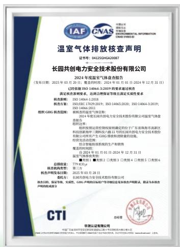

text_image

长园共创电力安全技术股份有限公司
2024年度温室气体排放报告
（发布日期：2025年03月20日；披露时间：2024年03月01-2024年12月31日）
（已检测依据 ISO 14066-2:2018、ISO 14066-2020、ISO 14066-2020; ISO 14066-3:2019、ISO 14066-2011）
满足相关核查要求，达到合理保证等级且满足实质性要求
检查期间：ISO 14066-1:2018
检查方案：ISO/ISO/17030-2018、ISO 14066-2020、ISO 14066-3:2019
组织GBG 根据范围：根据我国大气环境目标，2024年度我国公共电力安全技术股份有限公司温室气体排放
报告内容：
组织报告须经国务院国资委确定的关于广东珠海市高新区科技创新指导三师科技人才培训的批复和电力安全技术股份有限公司所有生产厂GBG检修和拆除的批复。
相关变动说明：
综合智能网新系统的生产和销售
提交时间：
自2024年03月01日至2024年12月31日
温室气体排放标准：
■使用图 1 ■图 2 □图 3 □图 4 □图 5 □图 6
总量纲量：779 CDO#
检查机构类型：
第三方
检查工作时间：2025年03月28日
委托方：长园共创电力安全技术股份有限公司
报告日期：2025年03月28日
报告内容：保留真实、完整性。GBG产品附加标准“专用章”总是本企业声明来源，前页为本企业声明的组成部分
CTI
总经理
华测认证证书编号
中国证监会发布的《关于加强与本次重大资产重组有关问题的通知》（证监许可[2023]14号）

长园共创  
2024 年度温室气体排放核查声明

## 碳资产管理

为实现运营碳中和目标，公司坚持以市场化方式开展碳排放抵消工作：通过购买绿色电力证书支持可再生能源发展，同时参与自愿碳市场交易，获取经国际认证的 VCS 减排资产，以多元化路径抵消自身运营产生的碳排放，切实履行企业的环境责任。

## 关键绩效

报告期内，子公司长园电力、长园共创、长园深瑞、长园高能、共创监测等多家子公司均购买了绿色电力证书，其中

长园深瑞购买

3,425 个

对应可再生能源电量

3,425 兆瓦时

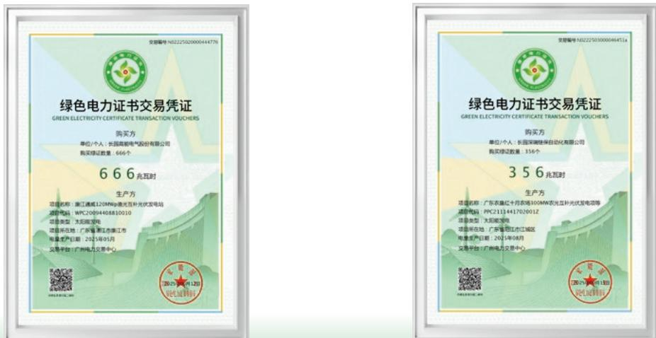

## 案例 碳资产抵消实践

2025 年 3 月，长园共创通过购买经 Verra 认证的VCS（核证碳标准）自愿减排资产，完成范围一温室气体排放 133 吨二氧化碳当量的抵消。该举措稳步推进公司碳中和目标落地，以实际行动助力应对气候变化，彰显企业责任担当。

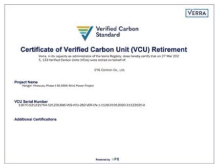

text_image

Verified Carbon Standard
Certificate of Verified Carbon Unit (VCU) Retirement
Versa. In its capacity as administration of the Verra Registry, does hereby certify that on 27 Mar 2022
5, 133 Verified Carbon Unity (VCUs) were retired on behalf of:
CYG Contron Co., Ltd.
Project Name
Nangjin Yiwewalu Phase I 40.5MW Wind Power Project
VCU Serial Number
13670-521231764-521231896 VCSV-CU-262/VER-OV-1-1128-01012020-31122020-0
Additional Certifications
Powered by: PX

natural_image

Illustration of a stylized eco-friendly landscape with wind turbines, green hills, and solar panels under a sunny sky (no text or symbols)

## 环境管理

## 环境合规管理

公司始终将绿色发展理念深植于企业经营，以高度的社会责任感扎实推进环境保护工作。

## 环境管理体系与制度

公司及子公司严格遵循《中华人民共和国环境保护法》等法律法规，建立起完善的环境管理体系。其中，子公司长园共创制定《质量、环境及职业健康安全管理手册》等内部档，由总经理统筹领导、ISO 办公室归口管理、各职能部门分级落实，构建起职责清晰、协同高效的环境管理组织架构。子公司长园电力则秉持“遵纪守法，安全健康，环保节能，持续改进”的方针，由总经理负责制定年度环境目标计划，持续推进环保管理的规范化，为企业可持续发展奠定基础。

截至报告期末，长园集团及旗下子公司长园深瑞、长园电力、长园高能、长园共创均已通过 ISO 1400环境管理体系认证。

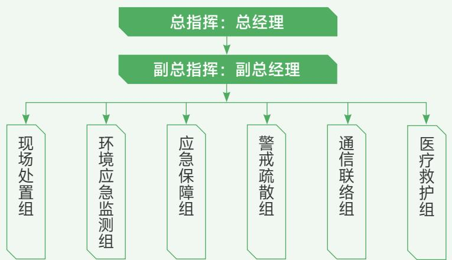

flowchart

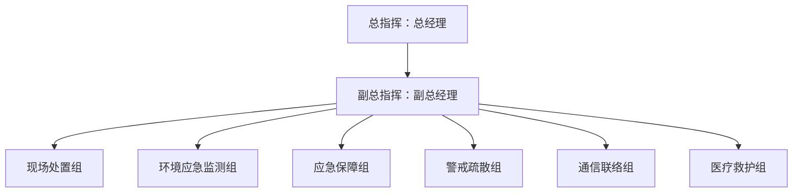

长园电力环境管理组织架构

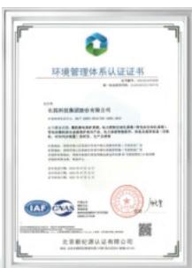  
长园集团  
环境管理体系认证

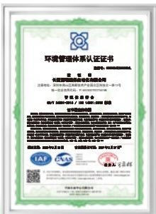  
长园深瑞  
环境管理体系认证

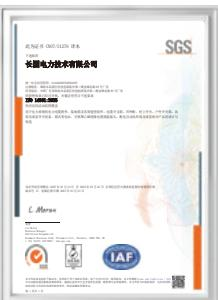  
长园电力  
环境管理体系认证

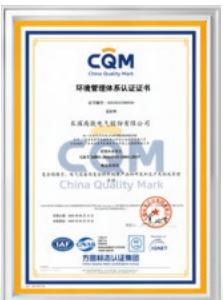  
长园高能  
环境管理体系认证

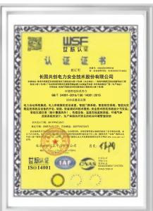  
长园共创  
环境管理体系认证

## 绿色工厂建设

建设绿色工厂是推动工业高质量发展和绿色转型的重要抓手。长园电力、长园高能、长园深瑞等多家子公司将清洁生产要求全面融入环境管理的各项内容，从源头削减、过程控制到末端治理全过程贯彻绿色制造理念，持续优化能源结构，推进资源循环利用，均已获得“国家绿色工厂”称号。

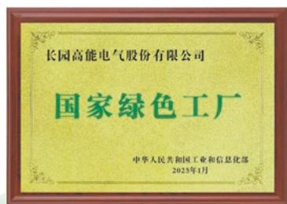

text_image

长园高能电气股份有限公司
国家绿色工厂
中华人民共和国工业和信息化部
2025年1月

长园高能  
国家绿色工厂

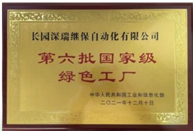

text_image

长园深瑞继保自动化有限公司
第六批国家级
绿色工厂
中华人民共和国工业和信息化部
二〇二一年十二月十日

长园深瑞  
国家绿色工厂

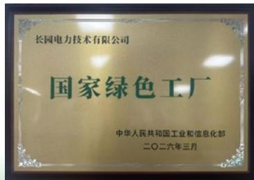

text_image

长园电力技术有限公司
国家绿色工厂
中华人民共和国工业和信息化部
二〇二六年三月

长园电力  
国家绿色工厂

## 关键绩效

报告期内，公司环保投入总金额

83.3 万元

未发生环保事故或环境领域违法违规事件。

## 清洁生产

公司积极推进清洁生产建设，以实际行动守护生态环境。子公司长园制造严格执行《清洁生产实施控制程序》，通过技术升级、资源循环利用、能耗物耗管控等举措，持续提升生产全过程的绿色制造水平。

## 环境风险管理

公司各子公司将环境风险管理深度融入经营管理全过程，结合法规要求与实际运营，构建了环境风险分级管理机制。其中，长园高能制定《危险源辨识、风险评价和环境因素识别、确定控制程序》，规范环境因素识别、确定及更新全过程。长园电力制定《环境因素识别、评价和管理方案控制程序》，由环境体系管理部牵头推进环境因素的识别、评价与动态更新，编制并保存《环境因素识别评价一览表》等相关记录，确保环境风险管理合规可控、有据可循。

## 风险 识别

各部门负责本领域环境因素初步识别，并分析研判其在业务开发、设计、采购、生产、检验、持续改进等环节中存在的风险。

## 风险 评估

采用矩阵法分级，从可能性、严重性两维度评价，按规范计算 Q 值定级，最终明确各风险的系数、等级及可接受性，形成完整评估结论。

## 风险 监测

建立常态化风险监测机制，每年至少开展一次系统性评审，实时跟踪污染态势，相关报告、数据与评价结果作为决策调整的重要依据，保障环境风险得到及时有效控制。

## 应急管理

为防范化解各类环境与安全风险，公司遵守《中华人民共和国突发事件应对法》等法律法规，统筹推进应急管理工作。子公司长园电力制定了《突发环境事件应急预案》，成立应急指挥部，构建各部门分工协作、责任到人的应急管理体系。在此基础上，公司及子公司常态化开展突发环境事件应急演练，持续检验预案的可行性与有效性，切实提升全员应急处置实战能力。

## 案例 长园高能酒精泄漏事故专项应急演练

2025年6月8日，长园高能结合酒精泄漏等特定风险，依据专项应急预案组织开展专项应急演练。演练严格模拟真实事故情景，完整覆盖险情发现、信息上报、预案启动、现场指挥及各应急小组协同处置等全流程，并对关键环节进行规范记录。本次演练人员到位及时、组织有序、实施规范，有效提升了员工应急处置能力与安全防护意识，达到预期演练效果。

## 环保培训与宣贯

公司持续推进环保能力建设，不断加强环保培训。旗下各子公司围绕固废管理、节能减排、新污染物治理等重点领域，分层分类开展常态化环保培训，通过专题授课、现场宣贯等多种形式，规范一线员工环保操作流程，压实岗位环保责任。与此同时，公司及各子公司同步开展日常环保宣传教育，持续提升全员环保意识，推动绿色发展理念入脑入心，着力构建全员参与、全程管控、全面覆盖的良好环保工作氛围。

## 案例 长园电力危废固废专项培训

长园电力于 12 月 5 日组织开展固体废物与危险废物管理专项培训。培训结合案例讲解了固废污染防治法律法规，明确一般固废与危废辨识、分类贮存等规范。本次培训有效提升了员工的合规操作能力，为公司固体废物与危险废物全流程规范化管理提供了有力保障。

text_image

Classroom or training session with participants seated facing a presentation screen displaying safety warning signs and a triangular warning symbol

flowchart

## 污染物排放

公司积极践行企业环保责任，严格落实国家及行业环保标准，通过科学治理和技术创新，持续降低污染物排放强度，切实提升环境管理水平。

## 污染物监测

公司严格遵守法律法规要求，建立内部检查与外部监测相结合的污染物监测机制，实现废水、废气、噪声、固废等污染物的全过程管控。长园制造由质管中心牵头、各部门协同配合，定期开展分级内部检查；外部每年至少委托一次具备资质的第三方机构，按国家、地方及行业标准对厂区进行专业监测。公司对监测发现的问题及时督促整改，以严格标准落实污染防治主体责任。

text_image

检测报告
报告编号：JZC2022656873-122
委托单位：长园电力技术有限公司
受检单位：长园电力技术有限公司
检测类型：委托检测
检测类别：废水、烟气、噪声
报告日期：2021年4月8日
广东电网集团有限公司
广东电网集团有限公司
广东电网集团有限公司

废气检测报告

seal

东莞市大成环境检测有限公司
检测报告
DONGDU20210628004

废水检测报告

text_image

检测报告
委托单位：长阳智能装备（广东）有限公司
委托单位地址：珠海市高新区新罗西城金泰中北路
08号5楼302室
检测类别：委托检测
广东计算机网络集团股份有限公司
注册地址：广东省广州市天河区天河北路196号
电话：0755-83333333
电子邮箱：CITIC.COM
广州计算机网络集团股份有限公司
法定代表人：周晓峰
联系人：陈伟
联系电话：0755-83333333

噪声检测报告

## 废气管理

公司及子公司高度重视废气治理工作，长园高能建立《工艺废气排放管理规定》等制度严格落实废气管理流程，针对生产过程中产生的不同废气，采用水喷淋 + 活性炭吸附、二级活性炭吸附等净化工艺，确保经处理后的废气，达到第二时段二级标准排放。长园电力以保障人身健康，促进经济和社会的可持续发展为目的，严格执行《废气废水设施管理办法》，由安全管理部统一监督公司废气设施及废气排放情况。

长园电力废气处理

<table><tr><td>废气类型</td><td>处理措施</td></tr><tr><td>工业废气(非甲烷总烃、非甲烷总烃、环氧氯丙烷、酚类等)</td><td>二次硫化废气通过硫化箱开口处设置集气罩收集,经“水喷淋+除雾器+活性炭吸附”处理,由35米排气口排放;通过浇注罐及烘箱的废气排放管或集气罩等方式进行收集,经“二级活性炭吸附装置”处理后,由15米排气口排放。</td></tr><tr><td>食堂油烟</td><td>经油烟净化设施处理达标后,通过专用排气筒规范排放。</td></tr></table>

<table><tr><td>关键绩效指标7</td><td>单位</td><td>2025年</td></tr><tr><td>氮氧化物(NOX)排放量</td><td>吨</td><td>1.035</td></tr><tr><td>硫化物(SOX)排放量</td><td>吨</td><td>0.162</td></tr><tr><td>颗粒物(PM)排放量</td><td>吨</td><td>0.035</td></tr></table>

7 统计范围：金锂科技。

## 废水管理

公司及子公司的废水主要来源于生产过程中的工业污水和生活污水。子公司长园制造制定了《水污染防治控制制度》等内部制度，明确总经理、办公室、生产中心等各级职责，对工业废水与生活污水实行分类收集、分质处理，确保排放水质稳定达到《污水综合排放标准》标准。同时，通过建立可追溯的危废台账、开展定期检查与法规培训，强化源头防控与分流管控，持续提升水污染防治能力与管理水平。

<table><tr><td>关键绩效指标8</td><td>单位</td><td>2025年</td></tr><tr><td>废水排放量</td><td>吨</td><td>2,207</td></tr><tr><td>废水处理量</td><td>吨</td><td>2,207</td></tr><tr><td>化学需氧量(COD)</td><td>吨</td><td>0.00397</td></tr><tr><td>五日生化需氧量(BOD5)</td><td>吨</td><td>0.0262</td></tr><tr><td>悬浮物</td><td>吨</td><td>0.0361</td></tr><tr><td>氨氮(NH3-N)</td><td>吨</td><td>0.0005</td></tr><tr><td>总磷(P)</td><td>吨</td><td>0.011</td></tr></table>

8 统计范围：金锂科技。

## 噪声管理

公司严格遵守噪声防治相关法律法规及行业标准，将噪声管理纳入环境和职业健康安全管理体系，制定了《噪声排放管理办法》等内部制度。长园制造明确安全管理部归口管理，生产部、设备管理部及各车间负责执行与现场减噪措施实施；在噪声控制方面，坚持源头优先原则，优先选用低噪声设备，同时采取隔声、消声、减振、吸声等传播途径控制措施，有效降低厂界噪声排放。此外，长园高能还将噪声达标排放纳入年度目标考核，持续强化噪声管控成效。

## 废弃物管理

废弃物管理是公司环境保护工作的重要组成部分。为有效管控并减少生产及相关环节废弃物产生，防范环境污染风险，子公司长园高能制定《废弃物管理规定》，明确由行政部统筹废弃物处置监督及外部协调工作，各部门负责责任范围内的废弃物处理。长园深瑞结合实际生产运营情况制定了《废弃物管理作业指导书》《危险废弃物管理制度》等内部管理制度，对危险废物贮存区域实行规范化管理，建立可追溯的《危险废弃物储存台账》，进一步提升废弃物规范化管理水平，助力企业可持续发展。

## 践行绿色运营

## 绿色办公

公司及子公司积极践行绿色办公理念，多措并举推进低碳运营。长园深瑞以“倡导绿色生活，构建低碳未来”为导向，在日常办公中贯彻“节约每一度电、每一滴水、每一张纸、每一升油、每一件办公用品”的原则；长园电力制定并执行《节约用水用电管理规定》等内部制度，建立月度统计分析机制，持续跟踪与提升节能管理成效。

## 节约用电

•严格执行“人离灯灭”，公共区域按季节及光线条件定时开关，推广 LED 灯具替代白炽灯；  
•设定温度使用阈值（夏季≥26℃，冬季≤20℃），使用时关闭门窗，无人及会议结束时及时关闭；  
•设备不用时关闭电源或调至节能模式；饮水机等设备设定定时开关；

## 节约用纸

•推行双面打印、二次纸复用，默认黑白打印，严控非必要彩打；  
•依托OA、ERP等信息化系统，优化业务流程，推广智能文印服务；  
•纸质档数字化归档、云端共享，废弃纸张统一回收再利用。

## 绿色运输

公司坚持绿色低碳运输导向，助力低碳高质量发展。子公司长园高能制定了《汽车尾气排放管理规定》等管理制度，严格管控并定期监测车辆尾气排放，大力推广清洁能源车辆使用；长园深瑞从园区内部入手，开展绿色运输实践，为实现“双碳”目标贡献企业力量。

## 案例 长园深瑞绿色物流新实践

长园深瑞积极构建绿色物流体系，在园区内部物料运输环节全面采用电动叉车替代传统燃油叉车，从源头有效降低运输作业中的废气污染。

natural_image

Interior view of a modern automated factory floor with multiple robotic arms and large display panels (no visible text or symbols)

## 绿色产品及服务

公司坚持绿色发展理念，聚焦低碳环保、节能高效的产品与服务创新。子公司长园电力聚焦“绿色低碳 +小型化集成 + 全场景适配 + 智能运维”核心方向，为客户提供 12-36kV 系列智能中压配网解决方案，提升了中压配电网的可靠性、灵活性与运维效率，为推动行业绿色低碳高质量发展注入持久动力。

## 资源利用

## 能源利用

公司持续强化能源的全过程管控，推动各子公司建立健全能源管理体系。其中，长园高能秉持“遵纪守法，科学管理；节能减排，降低消耗；持续改进，绿色发展”的能源方针，制定《能源管理手册》，由总经理任命能源管理者代表并授权组建管理团队；具体能源管理工作由安全质量部牵头、各部门协同推进。长园高能制定《能源评审管理程序》，由安全质量部定期组织评审并形成报告，推动能源绩效持续改进。截至报告期末，共创监测、长园电力、长园高能、长园共创、长园深瑞均通过能源管理体系认证。

text_image

CQM
中国电力技术有限公司
能源管理体系认证证书
证书编号：2021-034
证书类型：碳型证书
CQM认证证书编号：2021-035
证书有效期：2021年1月1日至2021年1月1日
CQM认证证书编号：2021-036
证书类型：碳型证书
CQM认证证书编号：2021-037
证书有效期：2021年1月1日至2021年1月1日
CQM认证证书编号：2021-038
证书类型：碳型证书
CQM认证证书编号：2021-039
证书有效期：2021年1月2日至2021年1月3日
CQM认证证书编号：2021-040
证书类型：碳型证书
CQM认证证书编号：2021-041
证书有效期：2021年1月4日至2021年1月5日
CQM认证证书编号：2021-042
证书类型：碳型证书
CQM认证证书编号：2021-043
证书有效期：2021年1月6日至2021年1月7日
CQM认证证书编号：2021-044
证书类型：碳型证书
CQM认证证书编号：2021-045
证书有效期：2021年1月8日至2021年1月9日
CQM认证证书编号：2021-046
证书类型：碳型证书
CQM认证证书编号：2021-047
证书有效期：2021年1月9日至2021年1月10日
CQM认证证书编号：2021-048
证书类型：碳型证书
CQM认证证书编号：2021-049
证书有效期：2021年1月11日至2021年1月12日
CQM认证证书编号：2021-050
证书类型：碳型证书
CQM认证证书编号：2021-051
证书有效期：2021年1月13日至2021年1月14日
CQM认证证书编号：2021-052
证书类型：碳型证书
CQM认证证书编号：2021-053
证书有效期：2021年1月15日至2021年1月16日
CQM认证证书编号：2021-054
证书类型：碳型证书
CQM认证证书编号：2021-055
证书有效期：2021年1月17日至2021年1月18日
CQM认证证书编号：2021-056
证书类型：碳型证书
CQM认证证书编号：2021-057
证书有效期：2021年1月19日至2021年1月20日
CQM认证证书编号：2021-058
证书类型：碳型证书
CQM认证证书编号：2021-059
证书有效期：2021年1月30日至2021年1月31日
CQM认证证书编号：2021-060
证书类型：碳型证书
CQM认证证书编号：2021-061
证书有效期：2021年1月3日至2月4日
CQM认证证书编号：2021-062
证书类型：碳型证书
CQM认证证书编号：2021-063
证书有效期：2021年1月4日至2月5日
CQM认证证书编号：2021-064
证书类型：碳型证书
CQM认证证书编号：2021-065
证书有效期：2021年1月6日至2月7日
CQM认证证书编号：2021-066
证书类型：碳型证书
CQM认证证书编号：2021-067
证书有效期：2021年1月8日至2月9日
CQM认证证书编号：2021-068
证书类型：碳型证书
CQM认证证书编号：2021-069
证书有效期：2021年1月9日至3月8日

长园电力能源管理体系认证

text_image

CQM
China Quality Mark
能源管理体系认证证书
证书编号：CEQCM201800000
授权人：
长园高能电气股份有限公司
证书编号：CEQCM201800000
证书类型：全民电子
证书号：2201-2304-2018
证书有效期：2018年9月26日
签发机构：
长园高能电气股份有限公司
证书编号：CEQCM201800000
证书类型：全民电子
证书号：2201-2304-2018
证书有效期：2018年9月26日
方能标准认证集团

长园高能能源管理体系认证

seal

长园共创监测技术（南京）有限公司
能源管理体系认证证书
G8/T 23311-2020/ISO 50001:2018
RB/T 119-2015
通过认证项目获得
中国电力科学研究院、产业投资基金发展部颁发证书
有效期至：2021年1月4日
注册号：CZ 00001
联系电话：0755-8366
电子邮箱：www.cndco.com.cn
国家:刘均到
能源管理中心
有限公司

共创监测能源管理体系认证

text_image

能源管理体系认证证书
长园共创电力安全技术股份有限公司
GB/T 23331-2023/IS50001.2016 网络BST-01-2013
认证范围：电力消费的国家电网、输电和供电业务的开发、系统的技术咨询、安全技术防范系统设计、智能通信设备（除计算机外）、存储设备、通信和其他监测系统的设计、生产及系统管理等认证
委托人：李晓明
联系电话：0754-83888
传真号码：0754-83888
电子邮箱：www.chinaan.com.cn
CTI
华泰证券有限公司

长园共创能源管理体系认证

text_image

能源管理体系认证证书
注册号：089135264200188
证书
长源市能源管理咨询有限公司
注册地址：深圳市南山区高新南大道东侧北一路13号
统一社会信用代码：91440300775518E
备案机关
65/7 2001-2003/2001-2004/2001-101-2013 国际
电子邮箱的传真
A 电子邮箱: 65/7 2001-2003/2001-2004/2001-101-2013 国际
产品生产许可证有效期至2017年5月1日
安信评报（2016）第7页
安信评报可贷，2017年5月1日

长园深瑞能源管理体系认证

natural_image

Illustration of a white electric car driving on a green road with trees and charging towers in the background (no text or symbols)

## 节能措施

公司及各子公司积极推广绿色环保工艺与高效节能设备，依托自有厂区建设分布式光伏发电项目，持续优化用能结构，在有效降低能源消耗的同时，显著减少碳排放，推动生产经营向绿色低碳方向稳步发展。

## 具体节能措施

## 长园深瑞

◎ 利用厂区屋顶建设光伏发电系统，提升绿色电力使用比例；  
◎ 推动物流设备的更新升级，逐步升级替换电动物流车辆、电动搬运设备、电动物料供给车等节能设备；  
◎ 将园区原有路灯改造为分体式太阳能路灯，节约园区照明用电；  
◎ 建成投运 12 台 7kW 交流充电桩，为职工及访客新能源汽车提供便利；积极推广电动车、混合动力车等清洁能源交通工具，减少尾气排放与化石燃料依赖。

## 长园高能

◎ 推进东莞厂区分布式光伏发电项目建设，项目建设规模约 0.74MW，可有效利用厂房屋顶资源，实现清洁能源自发自用。

## 案例 长园深瑞分布式光伏发电项目

长园深瑞积极回应“双碳”战略部署，为降低范围二碳排放，在深圳市南山区的总部大楼自有屋顶，筹备建设了 300kW 分布式光伏发电项目。该光伏项目每年为长园深瑞供应超 10% 的绿色电力，为助力企业实现近零碳排放目标发挥关键作用。

natural_image

Rooftop rooftop with solar panels and industrial buildings in the background under a clear blue sky (no visible text or symbols)

## 案例 长园深瑞智慧绿色管理平台

长园深瑞建成园区绿色智慧综合管理平台，打造五大智慧节能场景与三大人工智能专家库，包括节能策略、用能诊断和碳资产管理，助力园区智慧节能与碳中和。

text_image

CYG深瑞
长园深瑞绿色智慧园区综合管理平台
17:37:07 前 29℃
数据采集
实时监测
智能监控
AI分析
AI模型
AI算法
AI算法
AI算法
AI算法
AI算法
AI算法
AI算法
AI算法
AI算法
AI算法
AI算法
AI算法
AI算法
AI算法
AI算法
AI算法
AI算法
AI算法
AI算法
AI算法
AI算法
AI算法
AI算法
AI算法
AI算法
AI算法
AI算法
AI算法
AI算法
AI算法
AI算法
AI算法
AI算法
AI算法

## 绩效与节能目标

公司持续践行环保理念，不断完善能源管理体系，以科学合理的能源管理目标为指引，扎实推进节能降耗与可持续发展工作。子公司长园深瑞制定《绿色发展规划》，设立绿色发展专项奖励基金，对表现突出的员工与团队予以奖励表彰，充分激发绿色发展内生动力。报告期内，公司按规划于建成绿色现代数智供应链管理体系，基本完成企业绿色转型。

<table><tr><td>关键绩效9</td><td>单位</td><td>2025年</td></tr><tr><td>能源消耗总量</td><td>吨标准煤</td><td>5,073.86</td></tr><tr><td>每百万营收能源消耗总量</td><td>吨标准煤/百万元</td><td>0.64</td></tr><tr><td>汽油</td><td>吨</td><td>662.07</td></tr><tr><td>外购电力总量</td><td>千瓦时</td><td>33,357,934.61</td></tr><tr><td>光伏发电量</td><td>兆瓦时</td><td>7,147.957</td></tr></table>

9 本报告中组织内部的能源消耗总量，主要根据《中国能源统计年鉴 - 附录 4- 各种能源折标准煤参考系数》《综合能耗计算通则 GB/T 2589-2020》提供的有关转换因子及公式进行计算。

text_image

O₂
H₂O
CO
BIO

## 水资源利用

公司高度重视水资源管理，持续提升水资源利用效率。长园电力制定《节约用水用电管理规定》，细化用水管控措施，由行政部不定期巡查供水管道系统，及时排查隐患，杜绝跑冒滴漏，必要时制定并组织落实整改方案，切实减少水资源浪费。

## 用水管理具体措施

## 长园电力

◎ 绿化用水采用喷灌方式，禁止漫灌；  
◎ 各用水点杜绝长流水，做到人去水关；  
◎ 塑胶条成型机、钣金切割机使用循环水；  
◎ 新、扩、改项目用水优先采用循环利用模式，选用节水型设备、工艺及方法。

## 长园深瑞

◎ 各部门定期排查用水情况，及时维修、更换损坏的水龙头、阀门，强化用水滴漏管理；  
◎ 用水区域张贴“节约用水”标签，增强全员节水意识；  
◎ 开展用水监测，在各楼层出水口及饭堂安装智能冷水表，依托 NB 无线传输技术实时上传用水数据至能源管控子系统，实现园区用水全方位监控与精细化管理。

## 关键绩效

报告期内，公司用水量总量为

291,881.67吨

注:关键绩效数据包括公司，长园深瑞，长园共创，长园电力，长园高能，共创监测，深瑞汇阳，启橙电力，珠海运泰利，珠海半导体，新能源研究院欧拓飞、苏州半导体、长园控股、金锂科技、长园制造、长园迈德、长园医疗。

## 物料利用

公司倡导物料高效利用，推动资源循环与源头减害管控，各子公司结合实际制定配套管理制度其中长园深瑞制定《SMT物料管理规范》《包装废弃物回收利用制度》等制度 对SMT物料实行台账管理，优先选用符合 RoHS 标准的无害物料，从源头减少有害物质使用。此外，长园深瑞还成立绿色包装评价管理办公室，从包装选材、设计优化等方面推进源头减量。包装选材上，选用可回收利用率 100%、可降解率超90%的木箱与纸箱；同时通过优化包装结构设计，提升原材料利用率，促进资源高效循环利用。

截至报告期末，共创监测、长园深瑞已通过了绿色包装管理体系认证。

text_image

GREEN PACKAGE
绿色包装评价报告
(GB/T37422-2019 绿色包装评价方法与准则)
编号: 0474412006
兹证明
长园深瑞银保自动化有限公司
评价范围:
微机继电保护系统、电力控制自动化系统(含电力调度主站系统、发电自动化系统、变电站自动化系统、铁路电气自动化系统、城市轨道交通电气自动化系统、配网自动化系统及成套设备、运检监控系统、仪器仪表)、变电站微机综合成套保护相关产品、充电设备(电动汽车充电机、充电量控管理系统)及储能系统工程等相关设备、电池度湿治理系统(高压压无功补偿及有源滤波)、电子式互感器及智能组件、变配电监测设备、信息及通信设备(交换机、时间同步装置)、网络安全监测系统、电力电源系统、电力机器所使用的水箱及配套包装
山东中梓富检认证有限公司
国家认证认可监督管理委员会认证机构编号 CNCA-8-2020-647

长园深瑞  
绿色包装评价报告

text_image

绿色包装管理体系认证证书
证书号: Z7K25-2025G50000438000
兹证明
长园共创监测技术（南京）有限公司
统一社会信用代码: 913201066068883077
经营范围：南京市鼓楼区武胜路100号厂房、木园
投资建设：南京市白下区振荡镇东侧北侧2999号B1幢办公楼
办公地址：南京市白下区振荡镇东侧北侧2999号B1幢办公楼
认证依据符合
DB33/T 2261-2020
认证/注册范围：
在线监测电力设备的研发、生产相关的绿色包装管理活动
《本证书体系覆盖范围内未包括分支机构》
在证书持有者所管理的主体中，本证书须经国家工商行政管理局登记机关登记。
有效期至2021年12月1日止。本证书的有效存续期限为自本证书到期之日起至该证书到期日止的期间。
请登录相应的证书及附件等具体内容并接受一次监管审核。截至本证书有效期可到领用。本证书有效期为：
本证书经国家工商行政管理总局登记机关登记，有效期至2021年12月1日止。
EIN
JIAOYUAN
深圳市深南大道东山街道金汇路12号 1433 号 201801
盛德认证南京有限责任公司
中国·江苏·南京市江宁区东山街道金汇路12号 1433 号 201801

共创监测  
绿色包装管理体系认证

## 物料管理措施

公司严格规范物料从进货检验、贮存保管到交付发运的全流程管理，确保产品质量稳定可靠，保障流转过程高效顺畅。共创监测制定《仓库呆滞物料识别规则和管理制度》《元器件存贮管理规定》等制度，细化岗位职责与全流程管控，实现库房精细化管理与物料流转效率双提升。

## 共创监测呆滞物料管理

共创监测对储存超过两年的呆滞物料，经统计评审后按照再加工利用、回收再利用、退还供应商、转售或报废的情况分类处置，在保证质量前提下最大限度促进物料循环利用，减少资源浪费。

## 绩效与目标

公司以提升物料精细化管控能力为导向，持续优化出入库管理与库存结构。各子公司结合业务实际，围绕出入库管控、呆滞库存优化等重点环节设立量化目标，持续提升库存周转效率与资源利用水平。其中，共创监测针对金属加工件、线缆类等物料的入库和出库均要求执行 100% 检验与记录。同时，对检验覆盖率与出入库准确率的目标也进行了差异化设定，各项指标均设定在90% 以上。

## 生态系统与生物多样性保护

公司将生态保护理念融入生产经营全过程。各子公司严格落实环境管理体系要求，规范处理生产经营中产生的废弃物，控制噪声、粉尘等排放，最大限度降低对周边环境的影响。长园电力秉持“遵纪守法、预防污染、持续改进，创造人与自然和谐的环境”方针，积极履行生态保护责任，实现企业发展与自然生态和谐共生。

## 03

## 技术向新品质护航

长园集团坚持以创新驱动为发展引擎，严守产品和服务安全与质量底线，筑牢数据安全与隐私保护防线，深化全链条供应链管理，以责任赋能产业升级，不断构筑长效产业价值。

natural_image

Illustration of two people riding bicycles in a renewable energy landscape with wind turbines and trees (no text or symbols)

创新驱动 47

产品和服务安全与质量 56

数据安全与客户隐私保护 63

供应链管理 65

回应的 SDGs

natural_image

Illustration of a smart city with solar panels, wind turbines, high-speed train, and electric vehicles (no text or symbols)

## 创新驱动

## 治理

公司坚持以创新为底色、技术为引擎、高质量发展为方向，持续加强科研创新体系建设。子公司长园共创制定了《项目估算过程档》《项目监控过程档》《项目策划过程档》《立项过程档》《售前过程档》等管理档，涵盖项目从立项到实施，验收结项的全过程管理，确保研发项目的质量得到有效控制。同时，长园共创设立了研发中心，全面负责公司科研创新管理工作，保障研发管理工作系统、高效开展。

flowchart

## 研发团队建设

公司高度重视研发人才队伍建设，积极拓宽人才引进管道，深化与各大高校、科研院所的合作交流，打造专业化、高精尖的研发人才梯队。公司持续完善研发人才培育体系，制定了涵盖人才引进、留用及培养的一系列人才管理制度。

<table><tr><td>制度类别</td><td>制度名称</td></tr><tr><td rowspan="2">人才引进与留用</td><td>《人才用、留管理办法》</td></tr><tr><td>《优秀人才引进管理办法》</td></tr><tr><td rowspan="3">人才培养</td><td>《科技人员的培养进修》</td></tr><tr><td>《人才培养与绩效考核奖励制度》</td></tr><tr><td>《科技人才培训与激励机制》</td></tr></table>

<table><tr><td>研发人员情况</td><td>单位</td><td>2025年</td></tr><tr><td>研发团队总人数</td><td>人</td><td>2,448</td></tr><tr><td>研发人员占员工总人数比例</td><td>%</td><td>31.72</td></tr></table>

战略

<table><tr><td>风险/机遇类型</td><td>风险/机遇描述</td><td>发生概率</td><td>影响大小</td><td>影响的时间范围</td><td>影响的价值链环节</td><td>优先级排序</td><td>潜在财务影响</td><td>应对措施</td></tr><tr><td>行业技术创新风险</td><td>行业技术迭代加速导致现有成果易被替代,新兴技术研发门槛高、储备不足,产业化转化率低,面临技术断层风险</td><td>高</td><td>中</td><td>中长期</td><td>运营</td><td>中</td><td>运营成本增加</td><td>推动各子公司科研与产业深度融合,聚焦核心领域布局新兴技术,紧扣客户需求强化实践转化,筑牢核心技术竞争壁垒</td></tr><tr><td>市场与竞争风险</td><td>核心业务领域竞争升温,对手通过技术迭代、产能扩张挤压份额,同质化产品引发价格战,叠加需求波动导致研发投入回收难期</td><td>高</td><td>高</td><td>短中长期</td><td>下游</td><td>高</td><td>营业收入减少</td><td>建立市场动态监测机制,把握技术发展方向,紧密联系客户,灵活调整定价与研发重点</td></tr><tr><td>政策变化市场机遇</td><td>新能源政策红利持续释放,电力市场化改革催生新场景,为企业拓宽赛道、提升份额提供重要窗口期</td><td>高</td><td>高</td><td>短中期</td><td>运营、下游</td><td>高</td><td>运营成本减少,营业收入增加</td><td>紧跟新能源政策,布局核心技术及新场景,深化政企合作抢抓红利,强化市场回应与成果转化</td></tr><tr><td>新型电力系统发展机遇</td><td>新型电力系统建设加速源网荷储协同与电网智能化转型,储能控制、智能调度等新技术需求释放,驱动产业链市场扩容</td><td>高</td><td>高</td><td>中长期</td><td>运营、下游</td><td>高</td><td>营业收入增加</td><td>布局新型电力系统适配技术研发,深化产业链协同合作,大力发展能源科技服务整体解决方案</td></tr></table>

## 影响、风险和机遇管理

公司及旗下子公司不断优化创新流程管理。子公司长园共创制定《项目风险和机会管理过程档》，强化风险的识别与防控，降低风险发生的可能性。同时始终以市场需求为核心导向，精准洞察行业发展趋势，在严控风险的基础上主动发掘市场机遇，推动创新实践与市场需求高效适配。

## 风险和 机会识别

运用模型法、类比法、流程图法等多种方法，全面识别项目潜在的风险和机会，将识别结果记录到《风险管理计划及跟踪表》《机会管理计划及跟踪表》中。

## 风险和机会分析

对识别出的风险和机遇，评估其成本和发生可能性等因素，计算风险系数并按系数从高到低排序，明确优先处理的对象，为后续针对性处理提供科学的决策依据。

## 风险和机会处理

根据风险和机会管理策略，对识别出来的风险和机会制定出可行的风险和机会处理措施，并明确时间、处理的责任人。

## 风险和 机会跟踪

持续跟踪风险和机会的处理全过程直至解决落地，将跟踪结果填写至对应的管理计划及跟踪表中。

## 指标和目标

公司以科技创新为核心发展动力。为此长园共创等子公司设定了清晰明确的科技创新目标，聚焦核心技术攻关与前沿领域探索，不断推动技术创新迭代，赋能业务提质升级。

## 长园共创目标

在专利数量稳步增长的基础上，重点提升发明专利的授权率与质量，聚焦核心产品和关键技术，布局一批高价值专利组合。

建立常态化的专利风险预警机制，针对重点产品和目标市场开展 FTO（自由实施）分析，为研发与市场活动保驾护航。

加强与集团内兄弟单位、外部律所及代理机构的深度协同，构建更高效的内外部支持网络。

##

## 关键绩效

报告期内，公司研发投入共计

90,621.94 万元

占营业收入比例

11.48%

## 创新驱动措施

## 创新激励机制

为充分调动科研团队的积极性与创造性，公司制定《人才培养与绩效考核奖励制度》《职务发明创造奖励与报酬管理办法》等制度，对创新员工给予奖励及报酬。旗下子公司长园高能、长园深瑞、长园共创等公司也制定了各类创新激励制度，以公平透明的激励机制强化创新导向，为技术持续突破提供坚实保障。

natural_image

Abstract line art with icons including lightbulb, cloud, star, and gear (no text or symbols)

text_image

CYG长园
长园深瑞
Annual
Evaluation
长园深瑞
年度评优
·先进集体
研发中心维护部元件保护箱
CTG科技
研发中心平台部署软件平台箱
CTG科技
研发中心系统部署技术箱

长园深瑞研发中心部门获得“先进集体”称号

## 创新平台建设

公司积极推动创新平台建设，搭建了国家检测中心、工程技术中心、博士后科研工作站与创新基地等多个科研创新平台。截至报告期末，公司及旗下多家子公司优秀的凭借技术创新与研发实力，先后获得高新技术企业、国家级专精特新“小巨人”企业、省市级专精特新中小企业等多项国家及省级权威认可。

  
长园集团  
长园深瑞  
国家认定企业技术中心  
长园高能  
工程技术研究开发中心  
长园电力  
高新技术企业

国家认定企业技术中心  

  
长园共创  
高新技术企业  
长园共创  
专精特新“小巨人”企业  
长园高能  
专精特新“小巨人”企业  
长园共创  
博士后科研工作站

## 关键绩效

截至报告期末，公司及下属子公司中，获评

国家级专精特新“小巨人”企业

3 家

省市级专精特新中小企业

21 家

高新技术企业

26 家

拥有国家认定企业技术中心

1 个

省市级企业技术中心

12 个

省市级工程技术中心

14 个

国家检测中心

1 个

博士后科研工作站

1 个

博士后创新基地

1 个

## 产学研合作

长园集团及旗下子公司积极开展产学研合作，携手清华大学、天津大学、中国电科院等高校及科研单位，围绕变电站技术、源网荷储一体化、电工装备防护等重点领域开展技术攻关，科技创新能力持续提升。

## 案例 沿海电网设备防护产学研联合攻关

长园高能联合广东电网、中国电科院、清华大学等顶尖单位，共同开展《电工装备在沿海潮湿环境下的失效机理及防治关键技术与应用》科研项目，历时六年攻关，在失效机理研究、新型防护材料研发及现场快速检测技术等方面取得关键突破，成果已应用于闽粤联网工程等 20 余项国家重点工程，保障沿海电网设备长期安全稳定运行，并荣获 2025 年度“机械工业科学技术奖”科技进步二等奖。

text_image

机械工业科学技术奖
证书
为表彰机械工业科学技术奖获得者,特颁此证书。
项目名称: 电工装备布局的海能热环境下的失能机理及其助
助关键技术应用
奖励类别: 科技进步奖
奖励等级: 二等
获奖单位: 长园高能电气股份有限公司
证书编号: 9150240-06

## 案例 携手清华大学共建联合研究中心

长园深瑞与清华大学携手共建“源网荷储一体化联合研究中心”。该中心整合清华大学在前沿科研与人才培养方面的优势，以及长园深瑞在技术研发与工程应用方面的深厚积累，聚焦“源网荷储一体化”领域前沿关键问题，重点围绕经济调度、稳定控制与碳减排、优化调度与运营等方向开展研究。通过加速成果转化与应用落地，中心致力于为构建安全高效的新型电力系统、服务国家能源战略及“双碳”目标提供有力科技支撑。

text_image

清华大学(电力国重)——长园深瑞
源网荷储一体化联合研究中心揭牌仪式

## 数字化建设

公司深刻认识到，数字化转型是企业创新发展的必由之路，坚持以技术创新与数字化转型双轮驱动高质量发展。报告期内，公司以数智化赋能发展，全面推进数字化体系建设，聚焦技术筑基、数据赋能、场景落地，通过数字化能力优化业务流程、启动发展活力，为公司高质量发展提供坚实支撑。

## 案例 数字化检修技术

公司旗下长园深瑞作为核心研发单位的“区域稳控一键式测试系统”在第 50 届日内瓦国际发明展获奖。该系统采用虚拟设备仿真、自动化智能测试等数字化技术，实现测试系统与实体装置的数据互通，大幅提升了稳控系统的调试检修效率，为电网安全稳定运行提供了可靠的数字化技术保障，展现了长园在电力数字化领域的创新实力。

text_image

DIPLÔME
G INVENTIONS
Geneva
SALON
INTERNATIONAL
DES INVENTIONS
GENÈVE
Ajuste examin, à la'y international à 12 octobre
de septembre 6 : Sater-Cord-Schou Electric Power Research Institute BV, L
Geng Hong, Sun-38, Suji Heng, Shandong 50,
Qingcheng-Huang, Li-3/GYU SHI KONG, 075, Zhou Zhang,
Liang Wang, Yingwei Yu
pour l'vention : Système de text à un boutus pour la système de contrôle de
démité équivalente
© 2014/05/01
Cendure, le 12 mars 2025
© 2014/05/01 - SALES DE LA PARIS

## 技术创新成果

公司以技术创新为核心动力，深耕电力能源与智能装备领域，突破源网荷储调控等关键技术，斩获多项科技大奖。

## 案例 源网荷储协调调控平台数字化应用

公司在第七届综合能源服务落地实践峰会上，凭借自主研发的源网荷储调控平台获“源网荷储应用创新奖”。该平台以“数据贯通-智能决策-柔性控制”为技术内核 推动能源系统从“源随荷动”向“源网荷储协同互动”转变，为电网动态平衡与能源行业转型提供数字化解决方案，助力新型电力系统建设。

text_image

CYG长园
2025年度
第五届百家实践案例评选
源网寿储应用创新奖
长园科技集团股份有限公司
综合能源服务集团有限公司 北京创世咨询服务有限公司
2025年6月

## 知识产权保护

公司严格遵守《中华人民共和国专利法》《中华人民共和国著作权法》等相关法律法规，建立健全知识产权管理体系，制定了《专利管理办法》等一系列制度，规范专利的申请、审核、保护、运用、转让等各个关键环节，充分发挥专利在公司发展中的核心价值。同时，公司将专利管理工作嵌入产品研发全流程，在项目开发过程中开展风险排查，并根据排查结果及时调整研发策略，有效防范知识产权风险。

公司旗下子公司长园电力取得基于IS0 56005的《创新与知识产权管理能力》等级证书，并荣获“2024-2025年度创新与知识产权管理能力分级评价优秀案例”优秀成果奖。

text_image

IMSP
基于 ISO 56005 的《创新与知识产权管理能力》
等级证书（2 级）
长园电力技术有限公司
（地址：珠海市高新区科技创新海岸湾二期金城北侧9号厂房）
经评价，已通过并达到了《创新管理·知识产权管理指南（ISO 56005:2020）》及相应的《创新与知识产权管理能力分级评价指标体系》相关能力要求，特发此证书。
评估范围：智能电网业务领域通过中国知识产权管理
评审日期：2024-11-22
查询平台：https://grading.imsp.org.cn
机构名称：中航（北京）认证有限公司
ZZRZ
IMSP-60318PMC24-CN-000317-01
有效期至：2024-11-21

基于 IS0 56005 的  
《创新与知识产权管理能力》等级证书(2级)

text_image

IMSEP
荣获2024-2025年度
基于ISO56005创新与知识产权管理能力
分组评价奖等案例
获奖证书
长园电力技术有限公司
荣获2024-2025年度
基于ISO56005创新与知识产权管理能力
分组评价奖等案例
优秀成果奖
特发此证，以资鼓励。
北京风能集团有限公司
颁发证书
2024年1月1日

优秀成果奖

## 案例 “知识产权战略规划及体系搭建”专项培训

为提高公司及各子公司的知识产权保护能力，优化知识产权管理水平 公司于2025年1月召开“知识产权战略规划及体系搭建”项目启动会。会议围绕公司知识产权体系建设及战略规划展开，明确了强化意识、完善制度等核心方向，并同步启动相关规划编制工作，为后续工作有序开展奠定坚实基础，有效调动了全员参与知识产权保护的积极性。

text_image

Group photo in a conference room with visible presentation screen displaying Chinese text and logos

## 关键绩效

报告期内，公司组织开展知识产权主题培训

10场

累计参与人次

467 人次

涵盖各子公司研发人员、知识产权管理人员、科技项目管理人员、品牌人员等关键岗位人员。

<table><tr><td>关键绩效</td><td>单位</td><td>2025年</td></tr><tr><td>授权专利累计数</td><td>项</td><td>3,297</td></tr><tr><td>按专利类型划分:</td><td></td><td></td></tr><tr><td>授权发明专利累计数</td><td>项</td><td>802</td></tr><tr><td>授权实用新型专利累计数</td><td>项</td><td>2,351</td></tr><tr><td>授权外观设计专利累计数</td><td>项</td><td>144</td></tr><tr><td>年度有效专利授权数量</td><td>项</td><td>509</td></tr><tr><td>按专利类型划分:</td><td></td><td></td></tr><tr><td>授权发明专利数</td><td>项</td><td>161</td></tr><tr><td>授权实用新型专利数</td><td>项</td><td>316</td></tr><tr><td>授权外观设计专利数</td><td>项</td><td>32</td></tr><tr><td>年度专利申请数</td><td>件</td><td>319</td></tr><tr><td>其他知识产权:</td><td></td><td></td></tr><tr><td>软件著作累计数</td><td>项</td><td>1,295</td></tr><tr><td>商标累计数</td><td>项</td><td>212</td></tr><tr><td>发表论文累计数</td><td>篇</td><td>1</td></tr></table>

natural_image

Isometric illustration of a smart home with digital devices and a magnifying glass overlay, symbolizing data or analytics (no text or symbols present)

## 产品和服务安全与质量

## 治理

公司高度重视质量管理体系建设，统筹指导各子公司结合业务实际，建立健全制度体系，先后制定《体系综合管理手册》《产品质量安全管理制度》《质量、环境及职业健康安全管理手册》等管理档。在组织保障方面，子公司结合自身运营特点，明确质量职责架构：长园电力指定由总经理担任第一负责人，质量安全总监及安全员分级落实质量职责；长园共创则设立了质量控制部，下设部门经理、质量工程师及IQC、FQC岗位，分别负责来料检验、过程管控及成品检验等环节的质量工作，确保质量责任有效落地。

截至报告期末，公司及下属子公司长园电力、长园高能、长园共创、长园深瑞、深瑞汇阳、长园设计、共创监测等均通过了质量管理体系认证。

  
长园集团  
质量管理体系认证  
长园电力  
质量管理体系认证  
长园高能  
质量管理体系认证  
长园共创  
质量管理体系认证

  
长园深瑞  
质量管理体系认证  
深瑞汇阳  
质量管理体系认证  
长园设计  
质量管理体系认证  
共创监测  
质量管理体系认证

战略

<table><tr><td>风险类型</td><td>风险描述</td><td>发生概率</td><td>影响大小</td><td>影响的时间范围</td><td>影响的价值链环节</td><td>优先级排序</td><td>潜在财务影响</td><td>应对措施</td></tr><tr><td>质量风险</td><td>质量管控不到位,可能导致产品可靠性下降、客户满意度降低,进而影响公司市场份额与品牌声誉</td><td>中</td><td>高</td><td>短中长期</td><td>下游</td><td>高</td><td>运营成本增加</td><td>完善质量管理体系、强化供应链管控、加速技术迭代及建立客户反馈闭环等多措并举,提高产品的安全性与质量稳定性</td></tr><tr><td>市场风险</td><td>市场竞争大,用户需求变化频繁,可能面临市场份额下降风险</td><td>中</td><td>中</td><td>短中期</td><td>下游</td><td>高</td><td>营业收入减少</td><td>加强与客户沟通,及时掌握需求变化,优化非标产品生产流程,提升回应效率</td></tr></table>

<table><tr><td>机遇类型</td><td>机遇描述</td><td>发生概率</td><td>影响大小</td><td>影响的时间范围</td><td>影响的价值链环节</td><td>优先级排序</td><td>潜在财务影响</td><td>应对措施</td></tr><tr><td>资源优势机遇</td><td>具备完善的硬件设施与检测试验能力,为产品质量稳定和生产效率提升提供有力保障</td><td>高</td><td>高</td><td>长期</td><td>运营</td><td>高</td><td>运营成本减少</td><td>持续优化资源配置,提升设施利用效率,同时利用检测能力为供应商或客户提供增值服务,拓展业务空间</td></tr><tr><td>管理提升机遇</td><td>通过质量管理培训与文化倡导,持续提升全员质量意识与管理水平</td><td>高</td><td>中</td><td>中长期</td><td>运营</td><td>中</td><td>运营成本减少</td><td>持续开展质量文化宣贯,将质量方针融入日常管理,提升体系运行有效性</td></tr></table>

## 影响、风险和机遇管理

公司始终将风险管控贯穿于质量管理全过程，指导下属子公司建立覆盖风险识别、评价、应对及评审的标准化管理流程，通过规范化运行与持续改进，切实提升产品质量与服务保障水平。报告期内，集团旗下长园电力通过年度管理评审，识别问题并制定改进措施，确保质量管理体系持续有效运行。

flowchart

各部门通过团体分析识别生产和管理活动中的潜在风险与机遇，并记录于《过程风险及机遇识别、评价及控制计划表》。

风险控制小组对识别出的风险进行评价，依据发生概率和影响严重程度确定风险等级。

针对不同等级风险采取规避、承担、消除、改变等措施，经风险控制小组确认后实施，并由质量部跟踪验证措施落实情况。

每年至少开展一次评审，验证风险识别有效性及应对措施完成情况，并根据内外部环境变化适时增加评审频次，更新相关记录。

## 质量事故处理

为有效应对产品质量突发事件，子公司长园电力制定《产品质量事故处理应急预案》，建立 24 小时应急回应机制，通过明确分工、快速处置、及时检测与责任追溯，最大限度减少质量事故危害。长园共创同步制定《产品质量事件处理流程》，规范事件上报、处置、分析改进及总结等环节，共同提升集团质量应急处理能力。

## 指标和目标

公司严格把控产品质量关，积极推动下属子公司设定年度质量目标，涵盖客户满意率、废品率、外观一次合格率及按时交货率等关键指标，并通过定期统计考核确保目标有效落实，持续提升产品质量与客户满意度。

## 2025年部分质量指标与目标

## 目标达成情况

## 长园共创

顾客对服务的投诉率＜3%

已达成

顾客对产品质量的投诉率＜1%

已达成

产品一次检验合格率＞98%

已达成

natural_image

Illustration of a construction-related cybersecurity concept with cranes, server, laptop, gear, and tools (no text or symbols)

## 管控措施

## 产品质量控制

公司持续强化产品全流程质量管控。子公司长园电力依据《检验和试验控制程序》，建立了覆盖进料、过程到成品的检验流程，配套实施物料核验、过程巡检、成品检验等管控举措，将集团的质量责任层层传导至生产一线，保障出厂产品安全可靠。

## 重要节点流程

## 进料检验和试验

## 过程检验和试验

## 成品检验和试验

## 管控举措

仓管员核对物料信息、分区待检；质检员对原材料进行检测判定，合格品入库、不合格品按程序处置，并对紧急放行物料实施追踪管控。

实行员工自检与互检、质检员每日巡检及专检，发现异常立即停工报告，专检需分类标识放置，防止不合格品流入下道工序。

质检员对成品进行检验试验，合格且标识完备的产品方可入库或出货，不合格品立即隔离并按程序处置，成套产品须经配套数量检验、附合格证方可出厂。

## 有害物质监测

公司高度重视产品环保合规性，旗下子公司长园电力严格依据欧盟 RoHS 指令要求，明确将有害物质限值作为产品合格性的判定依据，并要求供应商提供原材料的 RoHS 检测合格报告，从源头到产出全过程确保产品符合国际环保标准。

## 数字化建设

长园集团积极推进数字化转型与智能制造升级，下属子公司长园深瑞依托金蝶云星空平台，深度集成ERP、MES、订单管理等系统，实现生产全过程数智化覆盖与透明化管理。长园深瑞通过开发生产全流程信息化广告牌，实时监控物料、排产、检验及交付进度，并引入智能仓储管理系统，强化设备、物料及人员的协同调度，显著提升了质量管控水平与生产效率。

## 产品召回

公司积极落实产品安全主体责任，旗下子公司长园高能依据《产品召回控制程序》建立了规范的产品召回流程。当产品出现安全质量问题时，由召回小组评审并界定不合格范围，生产部追溯确定产品批次和数量，客户服务部追踪产品流向并组织召回。召回的产品按规定进行处理，流程结束后形成评审报告，确保召回机制有效运行。

## 质量文化建设

公司持续深化质量人才梯队建设，通过组织下属子公司围绕质量管理知识、检测设备操作及质量工具应用等内容开展系列培训，切实提升了员工质量管理意识与实操技能，为产品质量稳定与持续改进提供有力保障。

## 案例 绝缘子质量管理知识与安全培训

2025 年 8 月，长园高能组织开展绝缘子质量管理知识与安全培训，来料检验、生产车间、技术部等多部门员工参训。培训内容涵盖绝缘子质量管理知识、质量管理工具与方法、检测设备操作等核心模块展开，有效帮助参训人员掌握绝缘子质量管控要点与安全操作规范，进一步强化了员工质量安全意识与实操能力。

natural_image

Interior of a modern conference room with people seated around a U-shaped table, facing a presentation screen (no visible text or signage)

## 案例 锁芯通止规使用培训

2025年10月，长园共创质量控制部组织开展“锁芯通止规检验”专题培训，全体质检员参加。培训围绕量具使用规范、日常维护及异常处置等内容展开，进一步规范了通止规操作流程，为提升产品检验准确性提供了保障。

natural_image

Group of four people gathered around a table in a lab setting, examining materials or components (no visible text or symbols)

## 产品可及性

公司坚持以客户需求为导向，持续提升产品与服务的可及性。公司依托专业技术优势，加快产品迭代升级，打造稳定可靠、性能极致的自主安全产品，满足电力、新能源、消费电子等多个行业客户的多样化需求。同时，公司建立完善的服务网络，提供快速回应与定制化解决方案，有效降低客户使用门槛，拓展产品服务覆盖面。

## 客户服务保障

## 客户服务管理

公司秉持“以客户需求为核心、真诚服务、共谋发展”的服务理念，制定了《售后作业程序》《售后服务管理程序》《顾客投诉、抱怨控制程序》《顾客满意度测量控制程序》等管理档，搭建了客户服务管理架构，并建立完善的客户售后服务体系。同时，子公司长园共创制定了《客服体系工程实施管理办法》，规范项目实施流程，制定项目监管措施；长园高能出台《服务控制程序》，明确客户服务部统筹产品售前、售中、售后服务，并负责客户信息调研收集、产品退货处理及服务档归档留存；长园深瑞编制《服务手册》，将现场服务分类分级处理。通过集团统筹与子公司落地相结合，实现客户服务标准化、规范化、精细化运行，持续提升服务质量与客户满意度。

## 客户投诉管理

公司坚持以客户为中心，积极倾听客户诉求，以客户反馈驱动服务与质量持续改善。子公司长园电力制定《工程部服务程序》，明确营销中心、质量部及相关部门协同工程部开展客户服务，规范客户意见处理流程，明确售后回应时限。同时，为保障回应及时高效，工程部在全国各省设立工程常用备件库，由各省常驻人员负责日常维护与管理。

## 关键绩效

报告期内，公司及各子公司有序推进客户投诉处理工作，其中，子公司长园深瑞、长园高能客户投诉解决率均达

100%

## 客户满意度

公司秉承“始于顾客需求，立于持续改进，终于顾客满意”的客户服务理念，定期通过电话及短信回访、项目现场满意度反馈、关键用户走访等方式收集客户意见，并运用 ASCI 模型构建覆盖产品质量、顾客期望等维度的满意度测评体系，及时了解客户需求与体验短板。

子公司长园电力制定了《顾客满意度控制程序》，明确营销中心负责服务规划与实施、质量信息收集反馈及退换货申请管理工作。报告期内，长园电力共发放客户满意度调查表 100 份，有效回收 98 份，年度客户满意度指数（CSI）平均分为95.09分。

<table><tr><td>环节</td><td>服务措施</td></tr><tr><td>服务人员调度</td><td>· 人员属地化、固定化,减少频繁换人;· 省区经理定期现场回访,掌握项目进度及客户对服务人员的评价,及时优化人员配置;· 针对用户反映集中的问题,主动协调资源,推动系统整改。</td></tr><tr><td>现场服务进度管理</td><td>· 派单初期同步制定投运及验收计划,动态评估进度,提前预警风险;· 省区及大区经理定期回访安调阶段的项目,动态协调工程资源。</td></tr><tr><td>用户满意度回访改进</td><td>· 对关键用户负责人进行用户满意度回访;· 强化重点项目不满意反馈,推动问题解决与改进。</td></tr><tr><td>客户关系维护</td><td>· 省区经理加入基建营销用户群,及时回应并解决用户在群内讨论的项目问题;· 新建项目由省区经理和大区经理主动到访,现场核查质量并了解客户满意度。</td></tr></table>

flowchart

客户满意度测评

<table><tr><td>2025年</td><td>客户满意度(分)</td></tr><tr><td>长园电力</td><td>95.09</td></tr><tr><td>长园深瑞</td><td>99.76</td></tr><tr><td>长园共创</td><td>97.00</td></tr><tr><td>长园制造</td><td>98.00</td></tr><tr><td>达明科技</td><td>95.00</td></tr><tr><td>共创监测</td><td>98.00</td></tr></table>

## 负责任营销

公司严格遵守《中华人民共和国消费者权益保护法》《中华人民共和国广告法》等相关法律法规，坚守合规经营底线。在市场推广与营销活动中，全面规范业务行为，严格审核宣传内容，杜绝虚假、误导性信息传播，确保对外发布的产品信息、服务承诺真实准确、有据可依，切实维护消费者知情权、选择权等合法权益，营造诚信、透明的市场环境。

## 数据安全与客户隐私保护

## 数据安全管理

为规范信息安全管理工作，公司制定《信息安全管理制度》等制度，明确信息管理部为归口管理部门，子公司总经理、集团各部门负责人为所在单位信息安全管理第一负责人，并指定专人担任信息安全界面人，负责日常信息安全事务，持续健全信息安全管理体系。截至报告期末，子公司珠海运泰利、长园电力、长园共创、长园深瑞已通过ISO 27001信息安全管理体系认证。

text_image

信息安全管理体系
认证证书
证明编号：44028900646301
发证日期：2024-02-27

珠海市运泰利自动化设备有限公司

通过深圳证券监督管理局注册登记：
HONGKONG 2024-02-27
《企业年鉴、科技安全领域及保护 信息安全管理系统（系统）
通过认证范围如下：
与自动化设备研发、生产和制造过程相关的信息安全管理活动。
适用声明：16-06-05-042 2.0 倍

身份证有效期：2023-12-29 - 2024-12-28
领证日期：2023-12-29

负责人：李学军

珠海运泰利

text_image

CQM
China Quality Mark
信息安全管理体系认证证书
证书编号：2023010000899
证书类型：
长园电力技术有限公司
注册地址：北京市东城区东直门南大街1号
客服电话：400-666-8888（免长途）
联系人：
李明
经营范围：电力电子元器件、半导体器件、半导体器件、半导体器件、半导体器件、半导体器件、半导体器件、半导体器件、半导体器件、半导体器件、半导体器件、半导体器件、半导体器件、半导体器件、半导体器件、半导体器件、半导体器件、半导体器件、半导体器件、半导体器件、半导体器件、半导体器件、半导体器件、半导体器件、半导体器件、半导体器件、半导体器件、半导体器件、半导体器件、半导体器件、半导体器件、半导体器件、半导体器件、半导体器件、半导体设备
产品名称：方能标准认证集团
产品代码：CNJ100000000000000000000000000000000000000000000000000000000000000000000000000000000
产品编码：CNJ1000000000
产品类型：标准认证型
产品名称：方能标准认证集团
产品代码：CNJ100000000
产品类型：标准认证型
产品名称：方能标准认证集团
产品代码：CNJ100000000
产品类型：标准认证型
产品名称：方能标准认证集团
产品代码：CNJ10000000

长园电力

text_image

WSF
国际认证
认证证书
注册号：GD100000184
ISBN: 978-7-2006-034
WCSF 20001100000000000000
长城共创电力技术股份有限公司
地址：深圳市福田区益田路与福华三路交界处二栋11层
电话：021-2755-2777
传真：021-2755-2777
(企业经营许可证号)
ISO 2001 2001-2022
证书编号及有效期限
与计算机应用软件许可开发、信息系统集成及服务相关的信息安全管理活动
证书名称：国电集团
证书编号：2023年1月1日
ISSN 2023-01-1
EAST 2023-01-1
EAST 2023-01-1
EAST 2023-01-1
EAST 2023-01-1
EAST 2023-01-1
EAST 2023-01-1
EAST 2023-01-1
EAST 2023-01
EAST 2023-01
EAST 2023-01
EAST 2023-01
EAST 2023-01
EAST 2023-01
EAST 2023-01
EAST 2023-01
EAST 2023-01
EAST 2023-0
EAST 2023-01
EAST 2023-01
EAST 2023-01
EAST 2023-01
EAST 2023-01
EAST 2023-01
EAST 2023-01
EAST 2023-01
EAST 2023-01

长园共创

text_image

信息安全管理体系认证证书
证书号：914402000000000000000000000000000000000000000000000000000000000000000000000000000000000000
长园国际能源集团有限公司
注册地址：深圳市南山区高新产业开发区科苑一路13号
统一社会信用代码：9144020727777777777777777777777777777777777777777777777777777777777777777777777777777777777777777777777777777
管理委员会
ISO/ISO 25691-25821-25821-25821-25821-25821-25821-25821-25821-25821-25821-25821-25821-25821-25821-25821-25821-25821-2
安全监察监督部
IAF
PAN
国家环保局
国家环保厅
国家环保总局
国家环保总局
国家环保总局
国家环保总局
国家环保总局
国家环保总局
国家环保总局
国家环保总局
国家环保总局
国家环保总局
国家环保总局
国家环保总局
国家环保总局
国家环保总局
国家环保总局
国家环保总局
国家环保总局
国家环保总局
国家环保总局
国家环保总局
国家环保总局
国家环保总局
国家环保总局
国家环保总局
国家环保总局
国家环保局

长园深瑞

## 数据安全风险管理

为保障信息安全，公司建立了信息安全风险管理机制，覆盖“风险识别、评估定级、处置整改、定期复查”全流程，实现风险的系统管控，全面守护信息资产安全，为企业数字化转型与高质量发展提供坚实支撑。

## 风险识别

采用矩阵方式，根据信息资产的重要性、威胁性、风险可能性，将风险等级程度分为五级，并依据风险等级采取对应措施。

## 风险评估

信息部定期或遇重大事件后开展风险评估 经识别、分析、评价等流程形成处置建议覆盖公司所有信息资产，遵循分类分级、动态适配的原则。

## 风险处置

根据风险等级和组织的风险承受能力，采取风险规避、风险降低、风险转移或风险接受的处理方式并落实整改措施。

## 风险管理

信息部定期对各部门、各子公司的风险评估工作和整改措施落实情况进行复查，落实风险分级处置与闭环整改要求；持续优化安全投入预算与管理措施。

## 数据安全管理措施

公司构建多层级技术安全防御体系，通过边界防护、网络监控、终端安全、远程审计、数据备份及物理环境管控六大方面，对外抵御攻击与入侵，对内规范终端管理、权限审计与物理安全，实现内外协同、全流程覆盖，筑牢数据安全防线。

## 信息安全管理措施

## 边界 防火墙

部署上网行为管理与服务器区防火墙，关闭所有对外端口，对流量进行病毒分析，收敛端口暴露面至端口级。

## 网络监控与接入安全

部署网络安全探针采集核心流量；VPN加密接入并二次验证；网络准入控制仅允许合规终端接入。

## 终端安全管理

安装IPGUARD客户端监控终端风险行为，关键数据加密；部署杀毒软件加固终端防病毒能力。

## 远程访问与 审计

部署堡垒机集中管理远程桌面端口，二次认证登录，配备录像审计与档防拷出功能。

## 数据备份

升级为超融合服务器支持分钟级快照快速恢复；安全备份设备每日备份系统与核心数据。

## 物理与环境安全

部署门禁与24小时视频监控，规范访客管理，配套供电、空调、防火、防雷等环境管控与定期巡检。

## 数据安全培训

公司重视数据安全能力建设，通过常态化数据安全培训，强化员工安全保密意识。报告期内，子公司珠海运泰利组织开展多场信息安全培训，依托泰爱学院推出保密制度与行为规范系列课程，并同步完成年度专项考核，切实提升员工合规操作水平，进一步筑牢公司整体信息安全管理防线。

## 客户隐私保护

公司严格恪守《中华人民共和国个人信息保护法》，尊重并保障客户数据安全，在业务开展过程中通过与客户签订协议等方式严格限定数据使用范围，杜绝超范围使用，泄露，倒卖等行为，确保客户信息不被非法获取与滥用，切实维护客户个人信息权益。报告期内，公司开展安全保密与客户隐私相关培训，进一步提升员工保密素养与合规操作能力，实现对客户个人隐私的全方位保护。

## 供应链管理

## 治理

为确保供应链合规、透明与高效运行，公司制定《供应商管理规定》等制度，涵盖供应商准入、审核、绩效评估、等级管理及风险控制等全流程环节，明确商务、技术、质量、采购、财务等各部门职责，形成权责清晰、协同运作的治理机制。同时公司建立由采购部牵头，质量、技术、生产、财务、合规等部门协同配合的管理小组，对供应商实施全流程评审与统一决策。

## 战略

公司聚焦供应链风险防控，针对供应链领域可能出现的各类风险与机遇，制定了应对举措，为企业高质量发展保驾护航。

<table><tr><td>风险/机遇类型</td><td>风险/机遇描述</td><td>发生概率</td><td>影响大小</td><td>影响的时间范围</td><td>影响的价值链环节</td><td>优先级排序</td><td>潜在财务影响</td><td>应对措施</td></tr><tr><td>市场与供应风险</td><td>电子料价格波动与供应中断,电子元器件价格波动,或因地缘政治、贸易摩擦将导致的供应不稳定</td><td>中</td><td>中</td><td>中、长期</td><td>上游、运营</td><td>中</td><td>运营成本增加</td><td>与核心供应商签订长期协议;开发替代供应商或材料;优化库存管理</td></tr><tr><td>能力提升机遇</td><td>行业供应链协同发展、技术与管理经验交流日趋成熟,为公司优化供应链管理体系、提升供应链韧性与运营效率带来发展契机</td><td>中</td><td>中</td><td>短、中期</td><td>上游、运营</td><td>中</td><td>运营成本减少</td><td>举办供应商大会,强化与合作伙伴的技术交流;参与供应链交流大会,学习行业先进管理经验,精准把握供应链发展趋势</td></tr></table>

## 影响、风险和机遇管理

公司建立健全风险与机遇管理体系，严格遵循“识别—评估—监测—管理”闭环流程，系统识别各类潜在风险，评估其可能性与影响程度，对关键风险实施动态监测与专项管控。针对原材料及产成品供应中断等重点风险，公司通过拓展备选供应商、优化安全库存、签订长期合作协议、购置相关保险、完善应急预案等措施，有效提升供应链风险防范能力。

## 指标与目标

公司围绕风险防控、合规运营和可持续发展三大维度制定管理目标，并将目标逐级分解为关键措施与量化指标，通过逐项推进落实，持续提升供应链安全管理水平与可持续发展能力。

<table><tr><td>维度</td><td>管理目标</td><td>关键措施与指标</td></tr><tr><td rowspan="3">合规与风险管控</td><td>责任矿产管理</td><td>开展责任矿产尽职调查,要求供应商追溯原材料来源,确保供应链不涉及来自冲突地区或存在人权风险的矿产。</td></tr><tr><td>商业道德与廉洁</td><td>《廉洁合作协议》作为准入强制性门槛,通过审计、举报机制预防商业贿赂与腐败</td></tr><tr><td>信息安全保障</td><td>强化对商业数据、技术信息和客户隐私的保护,要求供应商履行信息安全承诺。</td></tr><tr><td rowspan="2">运营与交付安全</td><td>供应稳定性</td><td>识别供应中断风险,通过供应商分级、备选方案开发,保障关键物料连续稳定供应。</td></tr><tr><td>质量安全</td><td>通过严格的供应商准入、评估与质量审计,确保产品与服务符合质量安全标准。</td></tr><tr><td rowspan="2">环境与社会责任</td><td>环境管理延伸</td><td>推动供应商环保提升,优先选择获得环境管理体系认证的供应商,并积极打造绿色供应链。</td></tr><tr><td>劳工权益保障</td><td>要求供应商遵守劳工标准,保障员工健康安全,禁止使用童工和强制劳动。</td></tr></table>

<table><tr><td>关键绩效指标</td><td>单位</td><td>2025年</td></tr><tr><td>供应商总数</td><td>个</td><td>5,764</td></tr><tr><td>海外供应商总数</td><td>个</td><td>133</td></tr><tr><td>向当地供应商采购支出的比率</td><td>%</td><td>98</td></tr></table>

## 供应商全生命周期管理

公司重视供应商管理，针对供应商准入、审核、评估、分级及退出环节，制定了详细管理程序。公司对高等级供应商实施订单倾斜、优先付款等正向激励，对绩效不佳供应商及时提出整改要求并提供辅导；同时与核心供应商开展技术研发、成本优化等深度合作，进一步夯实供应链稳定基础与长期价值。

## 供应商准 入与审核

要求供应商提供营业执照、环保证明、质量体系认证等档，强制签署《廉洁合作协议》《质量保证协议》；对关键物料供应商开展现场审核，督促供应商定期更新资质档并完成合规性审查。

## 供应商分 级与评估

按准入审核得分划分战略、合格、临时等供应商等级，实施差异化管理；建立季度+ 年度双维度考核，搭建技术、质量、回应、交付、成本、环境、安全多维度 KPI评分体系，依据季度绩效与现场审核结果办理升降级审批。

## 供应商退出

建立淘汰机制，对多次审核不合格、出现重大质量问题、合规问题或长期绩效低下的供应商，启动淘汰程序，移出合格供应商名录。

## 数字化建设

公司搭建采购竞价管理平台、SRM、OA 及 ERP 系统，将供应商管理全流程嵌入 SRM 系统落地实施，SRM 系统品类属性的新建与变更信息均同步至其余系统，实现多平台数据互通、信息协同，筑牢供应链数字化管理基础。

## 采购培训

公司定期组织为采购人员开展专项培训，培训内容涵盖供应链风险管控、采购合规与廉洁自律、供应商评估与绩效管理、成本分析与谈判技巧、绿色供应链与可持续发展等核心模块，以此持续提升采购团队专业能力，规范采购作业流程，确保将公司在质量、成本、交付及 ESG 等方面的管理要求，精准传递至供应链各环节并有效落地。

## 案例 供应商管理与采购谈判技巧培训

报告期内，公司组织围绕核心知识点开展了一场供应商管理与采购谈判技巧培训，培训完成后，多位参训员工凭借优异表现获得荣誉证书，切实提升团队专业素养与实操能力。

## 供应商ESG管理

## 廉洁供应链

公司坚持以廉洁治理压实供应链管理责任，构建起制度约束、流程管控、培训教育三位一体的“阳光采购”体系。同时，公司不断强化供应商全生命周期廉洁合规与风险管控，严格执行财务对账机制，并督促供应商规范报送财务资料。对存在运营异常的供应商，立即启动尽职调查，从严防范商业合作与廉洁风险，保障资金安全，打造透明规范的廉洁采购生态。

为切断与资金占用相关的利益输送渠道，公司启动供应商分阶段清理工作，有计划撤销供应商资格22家，完成物料采购渠道供应商切换，保障公司正常生产运营，截至2025年12月31日已全部完成撤销。

## 管理举措

◎ 制定并执行《采购廉洁从业自律规定》等内部规章，明确禁止商业贿赂等行为，并要求员工及干部分别签订《廉洁服务承诺协议》《廉洁自律承诺书》，同时设立独立的审计监察部门进行监督。  
◎ 推行公开招标、集中采购等规范化流程，以降低人为操作风险。  
◎ 定期对采购及关联岗位员工进行轮岗并开展廉洁自律、职业道德及反舞弊培训，增强合规意识。  
◎ 设立公开的举报管道（如电话、邮箱），鼓励内外部人员对违反廉洁规定的行为进行实名或匿名举报，并对举报人实施保护。

## 责任供应链

公司积极履行供应链社会责任，要求所有供应商及分包商签署并遵守《供应商社会责任协议》，严格落实禁止强制劳动与童工、保障工时薪酬合法合规、反对歧视并尊重员工自由结社权利、保障职业健康与生产安全等要求，同时确保矿产资源来源合规可追溯。公司承诺不采购、不使用刚果（金）及其周边冲突区域的锡、钽、钨、金等冲突矿产，持续推动供应链透明化建设，践行道德采购原则。

## 绿色供应链

公司不断健全绿色供应链管理机制，制定了《低碳管理制度》，明确绿色采购战略、目标及权责分工，并要求供应商近三年无环保处罚、重大环境事故及负面曝光。同时，公司通过开展供应商 ESG/CSR 风险评估，引导合作伙伴加快低碳转型，将低碳表现优秀的供应商纳入优先合作清单，并予以资源倾斜，共建可持续、高质量的绿色供应链。

截至报告期末，子公司长园高能获评省级绿色供应链管理企业，长园综能取得碳标签授权评价机构资质，共创监测、长园电力等子公司通过绿色供应链管理体系认证。公司以权威认证与标准体系为依托，不断提升绿色供应链管理水平。

text_image

绿色供应链管理体系认证证书
证书号: ZNC25L0406ARDS
校对项
长园共创监测技术(南京)有限公司
统一社会信用代码: 9132070MA0NAAJXJ7F
注册地址: 深圳市深南大道1028号1栋8层, 4层
身份证号: 江苏省科技厅电子信箱或地址: 2019年8月1日
经审评、组织的项目质量标准符合
GB/T 31635-2017《绿色供应链管理体系认证证书》
中证协[2019]666-2023《绿色供应链管理体系认证证书》标准要求
认证范围
有效识别为自然环境，是产业互联网与可持续的绿色供应链管理体系（国家有
国）。
授权有效期：2023年8月25日至
证书有效期：2023年8月25日至
广东中联认证有限公司
广东中联认证有限公司

共创监测  
绿色供应链管理体系认证

text_image

绿色供应链认证证书
证书编号: F0424GJG110082980
长园深瑞能源技术有限公司
（统一社会信用代码：9144040MA5KXH7SP5D）
注册地址: 云南省昆明市高新区高新科技大道1号A栋3层320室
经营地址: 云南省昆明市高新区高新科技大道1号A栋3层320室
联系电话: 0851-8678-8888
经营范围: 非金属合金及合金材料的生产、销售; 机械设备租赁; 建筑与安装服务; 机械设备租赁; 建筑与安装服务; 建筑与安装服务; 建筑与安装服务; 建筑与安装服务; 建筑与安装服务; 建筑与安装服务; 建筑与安装服务; 建筑与安装服务; 建筑与安装服务; 建筑与安装服务; 建筑与安装服务; 建筑与安装服务; 建筑与安装服务; 廖筑与安装服务; 廖筑与安装服务; 廖筑与安装服务; 廖筑与安装服务; 廖筑与安装服务; 廖筑与安装服务; 廖筑与安装服务; 廖筑与安装服务; 廖筑与安装服务; 廖筑与安装服务; 廖筑与安装服务; 廖筑与安装服务; 廖筑与安装服
产产品(含包装物)、包装材料、包装容器、包装制品、包装箱、包装箱、包装容器、包装容器、包装容器、包装容器、包装容器、包装容器、包装容器、包装容器、包装容器、包装容器、包装容器、包装容器、包装容器、包装容器、包装容器、包装容器、包装容器、包装容器、包装容器、包装容器、包装容器、包装容器、包装容器、包装容器、包装容器、包装容器、包装容器、包装容器、包装容器、包装容器、包装容器、包装容器、包装容器、包装容器
产品名称: 中国绿色供应链认证中心
产品编码: 2024-01-15
产品类型: 一般固有型产品
产品标准: 无固定期限
产品有效期: 2024年6月1日
产品上市地点: 平安市北京路1号
组织机构: 中国证券登记结算有限责任公司
法定代表人: 张志刚
客服电话: 400-820-8200
深圳市深南中路证券交易所
证券代码: 002199
证券简称: 汉农股份
2024年6月1日
2024年6月1日
2024年6月1日
2024年6月1日
2024年6月1日
2024年6月1日
2024年6月1日
2024年6月1日
2024年6月1日
2024年6月1日
2024年6月1
2024年6月1日
2024年6月1日
2024年6月1日
2024年6月1日
2024年6月1日
2024年6月1日
2024年6月1日
2024年6月1日
2024年6月1日
2024年6月1<nl>

长园深瑞  
绿色供应链认证

text_image

绿色供应链认证证书
证书号: ZRC24LL007480M
证号证明
长园电力技术有限公司
注册地址: 南京市南开区经济开发区南港工业二路35号A座1-7楼
审批机关: 广东电网有限责任公司(原国家电网二院)2019年8月1日
经审验, 未经审核的项目须取得本证书。
GB/T 3363-2017 (有效期至：2021年11月14日)
Q/Q2ZR 066-2023 (绿色供应链管理认证认证报告) 标准要求
认证证书
用于电力系统间的电力系统特性认证（包括能效型）、电能交易、环保、给上风电、用户并网
并网、送电、送电业务等。请登录互联网交易平台进行认证，授权访问网站、通信电话或通讯终端，并在各网络中使用此认证服务。许可有效期至2021年11月14日
校验认证日期: 2021年11月14日
查询申请日期: 2021年11月14日
广东中联国际认证有限公司
广东中联国际认证有限公司

长园电力  
绿色供应链认证

## 供应商培训

公司常态化开展供应链可持续发展相关培训，持续强化 ESG 理念宣贯与专业能力建设，保障供应链可持续战略稳步落地。报告期内，公司面向供应商组织 ESG 专项培训，进一步提升供应商的 ESG 管理意识与实践执行能力。

## 案例 供应商ESG专项培训

2025 年 3 月 7 日，公司以在线线下相结合的方式，组织全体供应商开展“ESG 体系构建与实践指南”专题培训，围绕 ESG 全球趋势、能源管理、劳工权益保护、商业道德等核心内容展开授课，并对ESG自评工具进行专项指导。培训成效显著：45 家供应商首次提交 ESG 自评报告，92% 的供应商制定年度改善计划，同步落地 3 项低碳供应链试点项目，有效提升供应商ESG合规与实践能力。

text_image

Classroom or training session with students using laptops and a presentation screen displaying Chinese text about a 2017-2018 academic year.

## 供应链赋能与共建

为推动供应商协同赋能与能力共建，报告期内，公司通过开展供应商质量大会、举办共研活动等，强化供应商质量管理意识，深化供需双方协同联动与经验共享。同时积极参与行业专题研讨会，多措并举助力供应链提质增效、稳健运行。

  
对标卓越·链动质量——深化“推动能源利用更安全更方便”共研活动

## 案例 供应商质量大会

2025 年 11 月，公司举办以“价值共创，共赢发展”为主题的供应商质量大会，与核心供应商围绕质量提升与协同改进深入交流。针对供应商存在的质量瓶颈，公司组建专项团队驻厂支持，协助其优化工艺流程、完善过程管控。通过一系列改进措施，有效提升了产品良率与交付质量，质量投诉率下降超90%，实现了供需双方共赢发展，有力推动供应链质量协同与可持续发展。

## 案例 行业专题研讨会

2025 年 11 月 14 日，公司采购部受邀参加“优化全球供应链管理，提升供应效率与韧性”行业专题研讨会。会议围绕供应链战略优化、风险应对机制、数字化工具应用等议题开展深度交流，为公司后续完善供应链体系提供了有益参考。

  
总的的先生/女士  
感谢您法预/参加SAP线上会议：优化余球供应辑管理，授升供应效害与切性(直通网较)  
0010-2025-11-14.10:30-13-0  
会议名称：优化全续供应损管理，提开供应效率与韧  
会议地点：在线会议  
合议已经结重，华可C点击下方环接，双看合议精距中率

## 平等对待中小企业

公司坚持公平公正、一视同仁，严格规范合作流程，强化信息披露管理，保障合作公开透明，确保中小企业在业务合作中享有平等机会与待遇。报告期内，公司不存在应付账款（含应付票据）余额超过 300亿元或占总资产的比例超过50%的情况。

## 04 同心同行共赴美好

长园集团始终以责任为底色，依法保障员工合法权益，不断完善职业健康安全管理，全力打造安全、健康、安心的工作环境，同时积极履行社会责任，主动投身公益实践，以实干彰显担当，助力企业与社会协同共进、行稳致远。

员工权益保障 73

职业健康与安全 83

社区公益 91

回应的 SDGs

natural_image

Illustration of a lifestyle scene with fitness, walking, cycling, and fitness equipment (no text or symbols)

## 员工权益保障

## 人才吸引与招聘

人才是推动企业发展的核心力量，长园集团持续完善人才引进与选拔机制，凭借优质平台广纳各方英才，为企业高质量发展注入源源不断的动力。

## 招聘管理

公司严格遵守《中华人民共和国劳动法》《中华人民共和国劳动合同法》等相关法律法规，制定《招聘暂行管理办法》，秉承“公开招聘、内部优先、定岗定编、人岗匹配、亲属回避”原则，明确招聘组织职责分工与招聘流程程序，促进员工招聘管理工作规范化、程序化运作。针对核心人才岗位，公司依据工作内容规范实施专业人才测评，提升人岗匹配度与人才引进质量。

## 集团人力资源部

监督子公司开展招聘工作；统筹招聘管道和共享平台、管理人才测评工具等；组织审核、协调和指导子公司核心人才的招聘录用。

## 子公司人力资源部

制定中长期人力资源规划，确定人员编制；分析职位职责和任职资格，完善岗位说明书；实施人员招聘并对拟录取人员进行背景调查。

## 用人部门

编制部门年度人力需求计划；提供专业面试题目，并考核应聘者的业务能力及专业技能。

此外，为规范集团员工入职管理，完善入职流程，公司制定《入职暂行管理办法》《关于规范管理拟录用人员背景调查的通知》，明确入职手续、材料核验背调、岗位对接等关键环节，确保员工入职工作高效、规范、有序开展，进一步提升人力资源管理精细化和专业化水平。

## 关键绩效

截至报告期末，公司员工总数

7,718 人

2025年，公司劳动合同签订率

100%

公司坚持内外兼顾、多元引才的招聘思路，构建内部选拔与外部引进相结合、在线渠道与线下招聘相结合的多元化招聘渠道，拓宽人才来源。

## 内部招聘

通过系统发布内部招聘通知，充分挖掘集团体系内人才

## 校园招聘

面向大专及以上学历的高校应届毕业生招聘

## 网络招聘

使用招聘网站、招聘APP等简历数据库获取招聘候选人

## 人才市场

包含专场招聘、双选会招聘等，以现场招聘形式开展

## 新媒体招聘

抖音、公众号、视频号等具有对外宣传性质的招聘管道

## 劳务外包（劳务派遣）

根据生产情况使用临时工人，通过劳务外包和劳务派遣机构提供相关服务

## 猎头服务

为引入中高端及特殊人才，通过猎头服务机构提供人才推荐

text_image

03 我们需要的人才
岗位需求

校园招聘

## 关键绩效

报告期内，公司新进员工

校园招聘

1,136 人

305 人

参加校园招聘

191 场

按性别划分新进员工  

donut

| Category | Value |
| --- | --- |
| 女性 | 181 |
| 男性 | 955 |

按年龄划分新进员工  

pie

| Category | Value (人) |
| --- | --- |
| 30岁以下 | 730 |
| 30-39岁 | 324 |
| 40-49岁 | 78 |
| 50岁及以上 | 4 |

按地区划分新进员工  

pie

| Category | Value |
| --- | --- |
| 中国内地 | 1,106 |
| 国外 | 26 |
| 港澳台地区 | 4 |

## 多元化、平等与包容性

公司秉持多元、平等、包容理念，尊重和保障员工基本人权与劳动合法权益，坚持公平就业，反对骚扰与歧视，禁止雇佣童工和强迫劳动，以合规用工与人文关怀筑牢员工权益保障底线。集团及子公司工会成立女职工委员会，为女职工平等工作、劳动权益保驾护航。旗下子公司欧拓飞制定有《反对歧视反对骚扰管理程序》《童工拯救和未成年工保护程序》，明确禁止各类歧视、职场骚扰及使用童工；长园电力制定有《女职工特殊劳动保护制度》，以制度保障男女同工同酬与女职工特殊权益，致力于构建平等、尊重、安全、合规的职场环境。报告期内，公司未发生任何雇佣童工、强迫劳动、职场歧视或骚扰相关事件。

## 禁止使用童工

在招聘环节严格比对身份证、核查年龄，确保禁止使用童工；定期对工厂进行巡查，如发现童工及时采取拯救控制程序。

## 未成年工保护

用人单位招用未成年工，严格遵守国家关于工作性质、工作频率、工作量、工作时间的特殊保护规定。

## 禁止歧视

在聘用、培训、薪资、晋级等环节，禁止任何基于种族、社会阶级、国籍、宗教、残疾、性别等方面的歧视与骚扰。

## 反对骚扰

反对以任何方式侵犯他人人格尊严、造成心理或生理不适，且违背他人意愿的骚扰行为。

## 禁止虐待

禁止对他人（尤其弱势群体，如儿童、老人、残疾人、下属等）实施身心伤害行为。

## 同工同酬

遵循按劳分配原则，实行男女同工同酬，保障女职工在福利待遇上享有与男职工平等的权利。

## 禁止强迫劳动

坚决反对任何形式的强迫劳工行为，采取措施预防非自愿劳动。

## 培训与发展

公司以向人才赋能驱动企业的可持续发展，持续完善员工培训与发展机制，不断提升员工综合素养与专业及业务能力。

## 员工培训

为激发员工学习热情与成长动力，不断提升员工综合素养与专业及业务能力，公司对员工在继续教育及培训方面做出明确规范与统筹安排由集团及各子公司人力资源部门负责组织实施，培训跟踪，建立和管理培训档案，各部门协同开展需求调研，构建分工明确、高效协同的培训提升和人才发展机制，确保培训工作规范落地、实效提升。

人力资源部门每年年初都会发布培训需求调查通知，在汇总整合各部门需求后制定年度培训计划，并有序推进、严格落实；培训结束后，还会组织考核评估与效果跟踪，考核结果将记入员工培训档案，作为岗位调整、晋升加薪的重要依据。此外，子公司深瑞搭建了在线培训共享平台，运泰利还建立了泰爱学园，融合在线学习、交流分享与专项培训等多元形式，旨在为工业化 4.0 培养兼具专业能力与全局视野的复合型人才。

## 新员工培训

面向新入职人员，培训内容包括公司历史、业务概况、规章制度、岗位工作内容等。

## 岗位培训

由部门负责人对新员工和换岗员工进行工作流程、业务开展规则、绩效考核目标等内容的培训，并做好新员工的入司指导。

## 职业技能培训

为推行标准化管理，提高员工的整体素质，不断更新完善员工的专业知识与技能。

## 泰爱学园培训类型

## 继续教育

公司鼓励员工不断充实自己，对符合条件、经批准备案的在职进修费用予以一定报销。

flowchart

## 内部讲师管理

公司及子公司高度重视讲师队伍建设。运泰利通过制定《泰爱学园资源管理办法》，规范内部讲师的认证资格、职责、等级晋升、评审流程与激励机制，并设立讲师评审委员会负责讲师评定，构建起完善的讲师选拔、培养与激励体系，为人才培育提供有力支撑。截至报告期末，运泰利内部认证讲师共 74 人，其中特级讲师 7 人，高级讲师 11 人，专项讲师56 人，高效支撑逐梦计划、项目技术负责人、IDP 个人发展计划等关键人才项目实现知识传承与业务发展的深度融合

## 在线学习平台

公司及子公司搭建在线学习平台，并持续丰富课程资源。截至报告期末，运泰利在线学习平台共上线课程 795 门，其中技术与研发学部 481 门、管理与通用学部 235 门、市场与营销学部 9 门、技术服务学部70门，形成多领域、多层次的数字化学习资源，为员工自主学习与能力提升提供有力支撑。

## 案例 新员工培训

2025 年，公司按季度面向新员工开展入职培训，组织参观长园智能产业科技园一楼展厅，深入了解集团业务布局与产品体系，并详细讲解员工纪律与规章制度。通过全方位入职引导，帮助新员工快速熟悉企业文化、管理规范与岗位要求，提升岗位适应能力与专业素养，树立正确职业认知，高效融入团队、投入工作。

## 案例 中层领导力培训

2025 年 6 月，公司面向总部及各产业公司部门经理级以上人员及储备管理人员共 48 人，开展中层领导力专项培训。课程围绕高效沟通与绩效管理、团队管理与激励、问题分析与解决、职业道德与职业操守等内容展开，助力参训人员明晰管理定位，推动从执行导向向主动带队、高效管理转变，有效提升团队执行力与跨部门协同意识。

<table><tr><td>关键绩效</td><td>单位</td><td>2025年</td></tr><tr><td>员工培训总投入</td><td>万元</td><td>436.62</td></tr><tr><td>员工培训场次</td><td>场</td><td>944</td></tr><tr><td>接受培训总人次</td><td>人次</td><td>67,147</td></tr><tr><td>员工培训覆盖率</td><td>%</td><td>73</td></tr><tr><td>培训总时长</td><td>小时</td><td>103,500.50</td></tr><tr><td>员工平均接受培训时长</td><td>小时/人</td><td>13.41</td></tr></table>

## 职业发展

为统一集团人力资源管理标准，明确员工职业发展路径，公司制定《岗位与职级体系管理制度》，由人力资源部负责岗位职责梳理与职级体系的设计搭建和实施。根据职能和工作性质，该体系建立了管理、职能、营销商务、技术研发、制造辅助、生产操作六大岗位序列，并在六大系列中细分三十八个子序列，实现管理与专业的双通道发展。从而让该体系实现纵向晋升、横向发展的多元职业通道，员工既可在本序列深耕精进、实现职级提升，也可结合个人专长与职业规划或公司管理要求进行跨序列转换，为各阶段员工提供清晰、可持续的成长路径与广阔发展空间。

此外，公司制定《岗位轮换管理暂行规定》，推行关键岗位人员轮岗机制，符合条件且有锻炼意愿的员工可申请轮岗调整，有效提升业务能力、管理能力与全局视野，为培养高素质复合型人才队伍提供条件。

## 薪酬福利管理

公司着眼规范薪酬福利管理，建立兼具内部公平性与外部竞争性的薪酬福利体系，为有效吸引、保留和激励优秀人才，支撑公司战略目标的实现，让企业价值与员工价值的有机统一提供机制基础。

## 薪酬管理

为建立规范透明、公平合理的薪酬分配机制，公司制定《薪酬管理制度》，明确员工薪酬由固定薪酬、浮动薪酬、特别奖励等有机构成，旨在通过多元化的薪酬组合充分激发员工工作积极性与创造力。同时，人力资源部定期开展市场薪酬水平对标调研，核定招聘岗位待遇标准，确保公司薪酬具备行业竞争力，有效吸引与留住优秀人才。

## 长期激励机制

公司建立健全长期激励机制，不断完善与核心人才共同成长的利益共享体系。报告期内，公司召开董事会，审议通过《关于第四期限制性股票与股票期权激励计划之限制性股票第二个解除限售期解锁条件成就的议案》，同意为 100 名激励对象持有的 425.5 万股限制性股票办理解除限售手续。本次解锁将核心人才与公司长期发展进一步绑定，凝聚高质量发展合力。

## 福利待遇

公司建有员工福利相关政策，依法落实缴交社会保险公积金等员工法定福利。并在此基础上，公司还设有商业保险、年度体检、过节福利等公司福利，并通过员工团建、员工生日会、文体活动、慰问关怀等多元举措传递企业人文关怀，持续提升员工归属感、幸福感。

## 法定福利

社会保险、住房公积金、带薪年休假

## 健康保障

商业保险、年度体检、劳保福利

## 生活关怀

节日礼品、团建活动、员工生日会、文体活动、社团活动、入户支持、住房津贴、餐费补助、交通津贴等

同时，为合理安排工作与休息时间，维护规范有序的工作秩序，公司制定《总部考勤实施细则》，实行每日8小时、每周40小时的标准工时制，并推行弹性考勤管理，员工可在特定条件或规定时段内灵活打卡。针对加班情形，员工可自主选择加班费或调休补偿，切实保障员工休息休假权益。

## 关键绩效

报告期内，公司社会保险覆盖率

100%

## 绩效管理

公司建立科学完善的绩效管理机制，以目标为导向、以价值为核心，将个人成长与企业发展紧密结合，持续提升组织活力与员工业绩良性输出导向。

## 绩效考核机制

公司制定《绩效考核与绩效管理制度》以公平公正，激励有效为导向由人力资源部门根据企业战略和经营目标 逐级分解制定管理人员的绩效目标和员工个人指标 确保责任落实到人。考核周期采用中期和年度相结合的方式，被考核人围绕目标完成情况开展述职，由直接上级和人力资源部门开展在线考核评分，考核结果为薪酬决策、奖金分配、职位晋升、岗位调整等的提供决策参考依据，实现考核与人才激励管理全流程有效衔接。

## 关键绩效

报告期内，定期接受绩效和职业发展考核的员工

7,718 人

比例

100%

## 申诉与反馈机制

公司建立规范的绩效面谈沟通与反馈机制，将双向沟通贯穿绩效管理全过程。从指标设定阶段，由上级与员工沟通确认考核标准；结果确定后，由考核人向员工反馈评分依据与改进方向。若员工对考核结果存在异议，可在规定时限内向上级主管或绩效考核部门提出申诉，相关部门将按流程及时受理、复核并反馈结果，切实保障员工的知情权与申诉权。

## 劳动关系管理

公司严格遵守劳动法律法规，全力构建和谐稳定的劳资关系，为员工打造稳定、安心、积极向上的职业发展环境。

## 劳动纠纷管理

公司坚持依法合规用工，健全劳动纠纷预防与化解机制，始终遵循协商优先、源头化解原则，畅通沟通管道，及时回应并妥善处理员工诉求。对于无法内部协调的争议，公司严格按照法定程序妥善处置，切实维护企业与员工双方合法权益，持续构建和谐稳定的劳动关系。

## 离职管理

为规范离职办理程序，公司制定《离职暂行管理办法》，明确离职申请、沟通面谈、审批备案、工作及物品材料交接、财务费用结算等关键环节要求，并由人力资源部门统筹管理，确保离职流程透明、高效、有序。对符合离职审计要求的相关人员，由集团审计监察部依法依规开展离任审计，完成后方可办理离职手续，有效保障公司资产安全与经营管理的规范性。

natural_image

Illustration of a document with a gavel and seal, no text or symbols present

## 员工关怀与沟通

公司始终坚守人文关怀理念，从身心健康、生活保障、成长支持等多维度构建有温度的员工关怀体系，用心守护每一位员工。

## 员工帮扶

公司及子公司持续健全员工关怀长效机制，多措并举守护员工福祉：常态化开展夏季送清凉、冬季送温暖活动，用心守护一线员工；组织员工专属退休茶话会，关爱退休员工后续生活，传递企业温情。针对患病困难员工，旗下长园制造及时开展慰问关怀，积极组织爱心捐助，切实为员工排忧解难，营造温暖友爱、互助共进的企业氛围。

text_image

长圆科技集团夏日送清凉活动
热烈祝贺中节能·乐享

夏季送清凉、冬季送温暖  

text_image

长园科技集团冬季送温暖活动
致敬坚守 情系一线

text_image

CYG长园

员工帮扶

## 民主管理

公司坚持以职工代表大会为核心，持续完善《工联会管理制度》《职业代表大会规则》，搭建公开透明、规范高效的民主沟通与管理平台，依法保障员工的知情权、参与权、表达权和监督权。报告期内，公司召开第九届职工代表大会第三次会议，依法选举产生两名职工代表董事，进一步完善公司治理结构，切实保障员工参与企业民主管理与监督的权利。公司持续畅通多元民主沟通管道，积极倾听员工诉求，凝聚企业与员工同心共进的发展合力。

## 女性权益保护

公司高度重视女性权益保障，严格遵循《中华人民共和国妇女权益保障法》，制定女职工保护相关制度，维护女性员工合法权益与身心健康。在权益落实方面，公司依法保障女性员工享有产检假、产假、哺乳

假、育儿假等专属假期，并推行灵活工作安排；同时在三八妇女节等节点开展主题关爱活动传递人文关怀。在设施配套方面公司旗下部分公司在办公区域还设置爱心妈妈小屋，为孕期、哺乳期女职工提供私密、舒适的专属空间，以全方位、有温度的保障举措，为女性员工身心健康保驾护航。

natural_image

Interior of a modern hospital or clinic with pink curtains, white walls, and desks (no visible text or symbols)

爱心妈妈小屋

natural_image

Group photo of five people posing indoors, some holding flowers and bouquets (no visible text or symbols)

长园集团妇女节关怀

此外，长园电力制定《女职工特殊劳动保护制度》，结合女性生理特点合理安排岗位与工作内容，依法落实特殊劳动保护。

严格遵守女职工禁忌从事的劳动范围的规定，避免从事对身体有害的劳动。  
严格执行国家有关女职工特殊劳动保护的法律法规，对在经期、孕期、产期、哺乳期的女职工给予特殊保护。  
定期组织开展女职工特殊需要的健康检查，保障女职工休假权益。  
工会定期对女职工所从事的劳动及劳动环境进行监督检查，确保符合国家法律规定，并检查、督促女职工特殊劳动保护的落实情况。  
女职工合法权益受到侵害时，可向公司工会或监督检查小组举报投诉，经调查核实后，督促相关部门整改。

## 员工活动

公司积极丰富员工业余文化生活 常态化开展足球，篮球，羽毛球等各类体育赛事强健体魄，凝聚团队合力；同时开展端午、中秋等传统节日关怀活动，传承优秀传统文化、传递企业温暖，营造健康向上、友爱互助的企业文化氛围。

natural_image

Group photo of soccer players on a grass field with a modern building in the background (no visible text or symbols)

足球联赛

text_image

长园科技集团
第十四届羽毛球联赛

羽毛球联赛

text_image

Group photo of basketball players on an outdoor court with a banner displaying Chinese text about the 12th National Games.

篮球联赛

text_image

CYG长园 长园科技集团员工季度生日会

员工生日会

text_image

童心丰浜
FUN-夏
长园科技集团
CYG长园 童心丰浜 FUN-夏
端午节·儿童节双节活动

端午节·儿童节双节活动

natural_image

Group of people gathered around a long table in a classroom or workshop setting, engaging in a craft activity with tools and materials (no visible text or symbols)

中秋手作活动

## 职业健康与安全

## 安全生产管理

公司严格遵守《中华人民共和国安全生产法》《中华人民共和国职业病防治法》等法律法规，全力保障员工职业健康与生命安全。公司旗下长园电力、长园控股、欧拓飞等多家子公司均已建立完善的安全生产管理体系，各子公司结合自身业务特点，持续完善安全管理制度。

子公司欧拓飞制定《安全生产管理制度》，明确各级领导、各级安全生产管理人员职责与分工，以加强企业安全生产监督管理；长园电力坚守“安全第一、预防为主、安全发展”的方针，建立健全《安全方针与目标管理制度》《安全会议制度》《安全生产规章制度和操作规程管理制度》等体系档，设立安全生产委员会，统筹制定安全目标与中长期规划，安全管理部负责日常执行落地，各部门配备专职安全员开展现场安全检查，构建层级清晰、责任到人的安全管理体系。

flowchart

长园电力安全管理组织架构

公司全面落实安全生产主体责任，旗下长园电力、长园医疗、运泰利、欧拓飞等子公司均建立并严格执行全员安全生产责任制。其中，长园电力制定《安全生产责任制管理制度》《全员安全生产责任制》，贯彻“谁主管、谁负责”原则，实行安全工作首长负责制，明确总经理是公司安全生产第一责任人，各部门经理、班组负责人对本部门及班组安全工作全面负责，并层层签订安全生产责任书，构建横到边、竖到底、责任到人的安全责任体系。此外，长园电力通过《安全生产目标管理责任制考核奖惩办法》建立安全生产奖惩机制，安全管理部每半年对各部门、车间开展安全生产目标考核，将考核结果与奖惩挂钩，强化责任落实与激励约束。

截至报告期末，公司及下属公司共17家公司通过ISO45001:2018职业健康安全管理体系认证。

text_image

职业健康安全管理体系认证证书
证书编号：19824027T1803M
统一社会信用代码：9144030191276077B
应证明：
长园科技集团股份有限公司
职业健康安全管理体系符合GB/T 45001-2020/120 45001-2018
证书覆盖范围：德国德电保护系统、电力控制自动化系统（变电站自动化系统）、变电站继机综合成套保护相关产品、电力系统智能组件、信息及通信设备（交换机、时间同步装置）的研发、生产及销售
注册地址：深圳市南山区高新区科苑中路长园新材料港1号高科技厂房
经营地址：深圳市南山区高新区科苑中路长园新材料港1号高科技厂房
多路西安绕城站：珠海市高新区珠家湾镇金泉金洲东路38号锦绣园区42栋南侧
多路西安单机柜：制造中心
首次发证日期：2021年07月12日
本次发证日期：2021年07月12日
证书有效期：2027年07月11日
IAF GVAS 中原公司
CHINA GARANT MANAGEMENT SYSTEM
CNAS 1774-M
北京新纪源认证有限公司
地址：北京市朝阳区建国路1号2号楼（京蓝B座）C座18层18102D

长园集团

职业健康安全管理体系认证

<table><tr><td>2025 年长园电力安全生产目标</td><td>达成情况</td></tr><tr><td>工亡事故为零、重伤事故为零、火灾事故为零</td><td>已达成</td></tr><tr><td>轻伤事故发生率 &lt;1%</td><td>已达成</td></tr><tr><td>无职业病发生、无中毒事故发生</td><td>已达成</td></tr><tr><td>全员安全教育率 100%,特殊工种持证率 100%</td><td>已达成</td></tr><tr><td>事故隐患整改率在 98% 基础上每年提高 0.1%,重大隐患整改率 100%</td><td>已达成</td></tr></table>

## 安全生产风险管理

公司将风险管控贯穿生产经营全过程，常态化开展风险辨识与隐患排查治理，不断健全应急管理体系，切实保障各类安全风险可知、可控、可防。

## 安全风险管控

公司始终将安全风险防控置于生产经营的重要位置，旗下子公司长园电力、长园能源、长园制造、长园新能源研究院等子公司均建立了覆盖全过程的安全风险防控机制。其中，长园新能源研究院制定并严格实施《安全风险识别、评估、防控、变更管理制度》，为安全目标和管理方案的确定提供依据；长园电力制定《安全生产风险辨识和分级管控制度》，由安全管理部统筹组织风险评价与管控，实现风险精准识别、分级管控、动态跟踪与闭环治理。

## 长园电力风险管理流程

## 风险识别

各部门负责对所辖范围内的所有直接作业环节、操作岗位、关键装置及重点部位开展风险识别。

## 风险评价

采用工作危害分析、安全检查表分析、危险性 LEC 评价等方法对风险的可能性和严重程度进行分析，确认风险等级。

## 风险管控

根据风险评价等级，采取工程技术措施、管理措施、教育措施及个体防护措施，确保各类风险受控在可接受范围。

## 风险信息更新

每年组织一次安全风险评价工作，定期评审或检查风险控制效果，当外界环境发生变化，及时进行风险更新。

## 风险管理宣传

定期对从业人员进行风险培训，涵盖危险因素识别、风险评价方法、控制措施和应急预案等，增强从业人员的风险意识。

natural_image

Illustration of a magnifying glass over a shield with coins, symbolizing cybersecurity or financial analysis (no text or symbols present)

## 安全隐患排查

公司及子公司视隐患排查治理为安全生产管理的关键环节，旗下长园电力、长园新能源研究院、长园医疗等子公司均建立常态化隐患排查与整改机制，严防安全风险隐患。其中，长园电力严格执行《安全检查及隐患治理管理制度》，明确由安全生产副总经理统一领导，安全管理部组织实施，通过综合性检查、日常检查、季节性检查、专业性检查等多种形式，构建常态化、

natural_image

Interior view of a laboratory or industrial facility with equipment and wiring, no visible text or symbols

整改前：存在一闸多线情况

natural_image

Interior view of a factory with machinery and wooden planks (no visible text or symbols)

整改后：改造电路做到一机一闸

全覆盖、多层级的隐患排查治理机制。对排查发现的安全隐患，检查人员及时下达整改通知，相关单位严格按照“四定、三不推”原则落实整改；对重大隐患，立即出具《隐患整改通知书》，实行挂牌督办、限期整改。同时，长园电力鼓励员工主动排查、及时上报安全隐患，并对有效上报隐患的员工予以奖励，形成全员参与、闭环管理的安全生产长效机制。

## 应急处置

公司健全并持续完善应急管理体系 子公司长园电力，长园运泰利，欧拓飞等子公司均建立应急管理机制，确保突发事件处置及时、高效、有序。长园电力制定《应急管理制度》《生产安全事故综合应急预案》，贯彻“以人为本、安全第一；统一指挥、分级负责；先控制、后消灭；救人第一；先重点后一般”的原则，成立应急指挥部，明确各应急小组职责、应急回应程序、应急资源调配、应急救援及处置措施等内容，切实保障员工生命安全，最大限度降低事故造成的财产损失与环境影响。同时，长园电力还针对火灾事故、特种设备事故及危险化学品泄漏出台专项应急预案，并常态化开展应急演练，不断强化应急回应水平与实战处置能力，为企业安全稳定运行提供坚实保障。

flowchart

## 案例 长园电力消防疏散与灭火实操演练

2025 年 12 月 5 日，长园电力开展模拟真实火情应急演练。在统一指挥下，火情上报、应急启动、人员疏散、清点集结等关键环节衔接顺畅，全体员工按既定路线快速撤离至安全区域，全程规范有序。演练同步开展灭火器实操、消防水带连接、伤员转移等实训科目，有效提升了员工对消防设施的操作熟练度，进一步增强了初期火灾扑救及自救互救实战能力。

## 安全事故管理

公司建立规范的安全事故报告、调查及处理机制，旗下长园电力、长园新能源研究院、欧拓飞、运泰利等子公司均严格执行安全事故全流程管理。长园电力在《安全事故处理制度》中明确要求，事故发生部门需严格遵循“四不放过”原则，全面分析事故原因、厘清相关责任、制定整改措施并指定专人限期贯彻执行。同时建立健全事故档案，规范留存各类事故资料，实现事故管理全程可追溯。

## 安全文化建设

公司及长园电力、长园新能源研究院、欧拓飞等子公司严格落实安全教育培训与持证上岗制度，将安全宣传教育与技能培训常态化、体系化。通过开展安全生产月、消防宣传月、技能比武等专题活动，以练促学、以查促改，全面提升全员安全技能与风险防控水平。

子公司长园电力制定《安全教育培训管理制度》，由安全管理部制定安全培训计划并组织实施，规范

natural_image

Interior view of a modern conference room with attendees seated at desks facing a presentation screen (no visible text or signage)

长园控股消防安全知识培训

开展新员工三级安全教育与“五新”专项培训，通过集中学习、专题讲座、交流研讨、知识竞赛等多种形式，普及安全法律法规操作规程安全技术知识及典型事故案例持续提升员工安全素养

## 案例 运泰利安全生产月

2025 年 6 月，运泰利紧扣全国“安全生产月”主题开展系列专项活动，构建“在线+线下、理论+演练”立体化活动体系。在线通过多区域播放警示片、张贴海报、推送专题推文，全方位浸润安全文化；线下开展安全知识答题闯关，设置阶梯式奖品激发参与热情，并邀请消防、应急部门人员到场，组织开展

text_image

人人讲安全·个个会应急 查找身边安全隐患

全员消防安全应急演练进行消防器材使用火场逃生技能等实操培训，此次活动有效提升全员安全意识、隐患排查及应急处置能力，切实筑牢安全生产防线。

## 相关方安全管理

公司从严抓实相关方安全管理，严把准入、作业、离场各环节管控关口，旗下长园电力、长园新能源研究院、长园高能、长园医疗等子公司均规范签订安全管理协议，明确各方安全责任。长园电力执行《相关方安全管理制度》，由商务中心统筹供应商、承包商的安全管理，强化全流程管控与日常监管，压实各方安全责任，规范外协作业行为，有效减少生产安全事故。

## 供应商

审核资质，特种产品须具备相应生产资格证，签订安全管理协议；  
供应商人员应严格遵守出入制度，需长期作业的办理临时出入证，特殊工种必须提供特殊工种操作证复印件。

## 承包商

•须具备三年及以上良好安全业绩，且经审核确认其安全从业资质；  
•入场前需参加公司安全教育培训，合格后方可施工作业；  
签署《承包商安全管理协议书》，明确双方安全职责；  
施工作业时严格遵守相关规章制度，做好个人防护，落实文明施工；  
•公司不定期前往现场巡查，发现违章作业行为予以处罚。

natural_image

Group of construction workers in safety vests and helmets seated in a classroom setting, facing projections (no visible text or symbols)

长园电力无尘车间升级改造安全交底

text_image

Street photo showing a group of construction workers in hard hats and safety vests discussing documents near an industrial building with visible Chinese signage.

长园电力无尘车间升级改造安全交底

## 危险化学品管理

公司恪守危险化学品安全管理相关规定，持续强化危险化学品全过程管理，旗下长园电力、长园高能、长园新能源研究院、运泰利等子公司均结合自身生产运营特点，制定并落实专项化学品安全管理制度。其中，运泰利制定《化学品管理制度》，明确各部门管理职责，规范危化品采购、储存、使用及废弃处置等流程管理要求，全面提升全员危化品安全管控与风险防范能力。

## 采购

严格依据每月使用量制定采购需求，确定供应商具有相应经营资质，要求提供化学品的物质安全技术说明书（MSDS）。

## 储存

危险化学品严格依规分区、分类储存，根据化学品特性设置通风、防盗、防火、避雷等设施并配备应急处理物资，不得超量储存。

## 使用

各部门须制定相应的安全操作规程并公示MSDS档，使用人员严格遵守规程并佩戴相应防护用品。

## 废弃处置

集中收集，委托有资质（危险废物经营许可证）的回收单位进行回收；容器和未用的化学品联系符合回收资质的供应商回收。

natural_image

Group of six people standing in a warehouse or factory setting, one person speaking while others observe (no visible text or symbols)

长园电力危化品泄漏应急演练

## 职业健康保障

公司严守职业健康管理红线，持续优化作业环境、升级健康防护举措，全方位守护员工身心安全与健康，旗下长园深瑞、长园电力、欧拓飞等子公司均建立完善职业健康管理体系。全面落实职业病防治主体责任，切实保障员工职业健康权益。

## 职业病防护管理

严格执行项目“三同时”管理，配备有效的职业病防护设施并定期检修、保养，提供符合要求的个人防护用品。

## 职业病危害告知

如实告知员工可能的职业病危害及后果，在严重职业病危害作业岗位醒目位置设置危害因素告知卡和警示标识。

## 职业健康检查

组织员工开展岗前、在岗、离岗及应急职业健康体检，安排疑似职业病患者进行治疗，并建立职工健康档案。

## 职业卫生培训

组织各车间利用黑板报开展职业病防治宣传栏，定期对现场职工进行职业病防治知识教育。

## 职业病危害因素检测

定期委托第三方机构开展职业病危害因素检测，出具报告并提出改进建议，持续改善工作环境条件。

text_image

CYG长园
职业卫生公告栏

职业卫生规章制度

职业卫生操作规程

职业病危害因素检测结果

职业卫生危害事故
应急救援措施

职业病危害因素检测结果

运泰利职业卫生公告栏

text_image

医药箱
Medicinescopy Box
药品销售管理机构
药品销售管理机构
药品销售管理机构
药品销售管理机构
药品销售管理机构
药品销售管理机构
药品销售管理机构
药品销售管理机构
药品销售管理机构
药品销售管理机构
药品销售管理机构
药品销售管理机构
药品销售管理机构
药品销售管理机构
药品销售管理机构
药品销售管理机构
药品销售管理机构
药品销售管理机构
药品销售管理机构
药品销售管理机构
药品销售管理中心
药品销售管理中心
药品销售管理中心
药品销售管理中心
药品销售管理中心
药品销售管理中心
药品销售管理中心
药品销售管理中心
药品销售管理中心
药品销售管理中心
药品销售管理中心
药品销售管理中心
药品销售管理中心
药品销售管理中心
药品销售管理中心
药品销售管理中心
药品销售管理中心
药品销售管理中心
药品销售管理中心
药品销售管理中心
药品销售管理服务中心
药品销售管理服务中心
药品销售管理服务中心
药品销售管理服务中心
药品销售管理服务中心
药品销售管理服务中心
药品销售管理服务中心
药品销售管理服务中心
药品销售管理服务中心
药品销售管理服务中心
药品销售管理服务中心
药品销售管理服务中心
药品销售管理服务中心
药品销售管理服务中心
药品销售管理服务中心
药品销售管理服务中心
药品销售管理服务中心
药品销售管理服务中心
药品销售管理服务中心
药品销售管理服务中心
药品销售管理中心

运泰利职业病危害警示标识卡

natural_image

Interior view of a conference room with attendees seated facing a presentation screen (no visible text or signage)

长园电力职业健康培训

natural_image

Line drawing of a city skyline with buildings and trees, no text or symbols present

## 社区公益

公司及各子公司积极回应国家乡村振兴号召，主动投身乡村建设实践，以慈善捐赠等方式开展对口帮扶与公益支持，持续为乡村全面振兴注入温暖动能。报告期内，子公司长园电力、长园共创分别向珠海市关爱协会“6·30”助力乡村振兴活动捐赠10,000 元、5,000元，以务实行动助力乡村发展。

公司秉持反馈社会的初心，积极投身教育助学、敬老扶幼、扶贫济困、海外电力建设等公益事业，并不定期组织开展公益献血、净滩环保等志愿活动。同时，报告期内，子公司长园电力常态化开展社区节日敬老慰问活动；长园深瑞聚焦高校人才培育，在 2025 年，向哈尔滨工业大学（深圳）、华中科技大学的教育发展基金会各捐赠10 万元，以实际行动支持高校建设与人才培养。

text_image

无偿献血 我先行

无偿献血

natural_image

People cleaning a sandy beach with ocean and hills in the background (no visible text or symbols)

公益净滩

natural_image

Group of people in red vests sitting and conversing in a modestly furnished room with arched windows and wall decorations (no visible text or symbols)

端午社区敬老慰问

natural_image

Two women interacting indoors, one in a red vest handing a paper bag to the other; no visible text or symbols.

中秋社区敬老慰问

## 案例 灯塔计划

公司深耕困境儿童助学帮扶，自2017年起依托“一本书，一个梦”公益项目，启动“长园灯塔计划——领航人筑梦”专项行动，重点帮扶家庭贫困、面临就学困难的儿童。截至报告期末，项目已持续开展8年，长期稳定资助着4 名“灯塔儿童”，以长期陪伴与支持为困境儿童点亮成长之路。

## 关键绩效

报告期内，公司对外捐赠、公益项目总投入

28.10万元

natural_image

Illustration of people celebrating with heart-shaped balloons and stacks of coins, decorated with red flags (no text or symbols)

## 附录

## 指标索引

\_ 《上海证券交易所上市公司自律监管指引第14 号——可持续发展报告（试行）》议题索引表《GRI可持续发展报告标准（GRI Standards）》（2021年版）、《中国企业可持续发展报告指南（CASS-ESG6.0）》议题索引表

<table><tr><td>维度</td><td>序号</td><td>议题</td><td>对应的本报告章节</td></tr><tr><td rowspan="8">环境</td><td>1</td><td>应对气候变化</td><td>绿色运营,低碳未来</td></tr><tr><td>2</td><td>污染物排放</td><td>绿色运营,低碳未来</td></tr><tr><td>3</td><td>废弃物处理</td><td>绿色运营,低碳未来</td></tr><tr><td>4</td><td>生态系统和生物多样性保护</td><td>绿色运营,低碳未来</td></tr><tr><td>5</td><td>环境合规管理</td><td>绿色运营,低碳未来</td></tr><tr><td>6</td><td>能源利用</td><td>绿色运营,低碳未来</td></tr><tr><td>7</td><td>水资源利用</td><td>绿色运营,低碳未来</td></tr><tr><td>8</td><td>循环经济</td><td>绿色运营,低碳未来</td></tr><tr><td rowspan="9">社会</td><td>9</td><td>乡村振兴</td><td>同心同行,共赴美好</td></tr><tr><td>10</td><td>社会贡献</td><td>同心同行,共赴美好</td></tr><tr><td>11</td><td>创新驱动</td><td>技术向新,品质护航</td></tr><tr><td>12</td><td>科技伦理</td><td>不涉及</td></tr><tr><td>13</td><td>供应链安全</td><td>技术向新,品质护航</td></tr><tr><td>14</td><td>平等对待中小企业</td><td>技术向新,品质护航</td></tr><tr><td>15</td><td>产品和服务安全与质量</td><td>技术向新,品质护航</td></tr><tr><td>16</td><td>数据安全与客户隐私保护</td><td>技术向新,品质护航</td></tr><tr><td>17</td><td>员工</td><td>同心同行,共赴美好</td></tr><tr><td rowspan="4">可持续发展相关治理</td><td>18</td><td>尽职调查</td><td>可持续发展治理</td></tr><tr><td>19</td><td>利益相关方沟通</td><td>可持续发展治理</td></tr><tr><td>20</td><td>反商业贿赂及反贪污</td><td>规范治理,行稳致远</td></tr><tr><td>21</td><td>反不正当竞争</td><td>规范治理,行稳致远</td></tr><tr><td rowspan="2">自主披露议题</td><td>22</td><td>绿色产品</td><td>绿色运营,低碳未来</td></tr><tr><td>23</td><td>职业健康与安全</td><td>同心同行,共赴美好</td></tr></table>

<table><tr><td colspan="2">报告章节</td><td>《GRI可持续发展报告标准(GRI Standards)》</td><td>《中国企业可持续发展报告指南(CASS-ESG 6.0)》</td></tr><tr><td colspan="2">关于本报告</td><td>2-2/2-3/2-4</td><td>P1/A6</td></tr><tr><td colspan="2">可持续发展亮点</td><td>201-1/2-7/2-9</td><td>S2.1/S4.1/S4.3</td></tr><tr><td rowspan="5">走进长园</td><td>公司简介</td><td>2-1</td><td>P3.1/P3.3</td></tr><tr><td>业务概况</td><td>2-1</td><td>P3.3</td></tr><tr><td>企业文化</td><td>2-1</td><td>P3.2</td></tr><tr><td>发展历程</td><td>2-1</td><td>/</td></tr><tr><td>2025年度企业荣誉</td><td>2-1</td><td>/</td></tr><tr><td rowspan="6">可持续发展治理</td><td>ESG治理体系</td><td>2-14</td><td>/</td></tr><tr><td>SDGs回应</td><td>2-22</td><td>G1.1</td></tr><tr><td>ESG风险和机遇管理</td><td>/</td><td>G1.1</td></tr><tr><td>信息披露机制</td><td>/</td><td></td></tr><tr><td>利益相关方沟通</td><td>2-29</td><td>G1.3</td></tr><tr><td>实质性议题评估</td><td>3-1/3-2/3-3</td><td>G1.1</td></tr><tr><td rowspan="4">规范治理,行稳致远</td><td>公司治理</td><td>2-9/2-10/2-12/2-16/2-18/2-19//201-1</td><td>P3.4</td></tr><tr><td>合规经营与风险管理</td><td>2-27/207-1/207-2</td><td>/</td></tr><tr><td>投资者关系管理与股东权益</td><td>201-1/2-29</td><td>/</td></tr><tr><td>商业道德</td><td>205-2/206-1</td><td>G2.1/G2.2</td></tr><tr><td rowspan="4">绿色运营,低碳未来</td><td>应对气候变化</td><td>201-2/305-1/305-2/305-4/305-5</td><td>E1.1</td></tr><tr><td>环境管理</td><td>305-7/306-1/306-2/306-3/306-4/306-5</td><td>E2.1/E2.2/E2.4</td></tr><tr><td>资源利用</td><td>301-2/301-3/302-1/302-3/302-4/303-2/303-3/303-4/303-5</td><td>E3.1/E3.3/E3.3</td></tr><tr><td>生态系统与生物多样性保护</td><td>101-2</td><td>E2.3</td></tr><tr><td rowspan="4">技术向新,品质护航</td><td>创新驱动</td><td>/</td><td>S2.1</td></tr><tr><td>产品和服务安全与质量</td><td>416-1/416-2/417-1</td><td>S3.3</td></tr><tr><td>数据安全与客户隐私保护</td><td>/</td><td>S3.4</td></tr><tr><td>供应链管理</td><td>2-6/204-1/205-2/301-2/308-1/414-1</td><td>S3.1</td></tr><tr><td rowspan="3">同心同行,共赴美好</td><td>员工权益保障</td><td>2-7/2-19/2-20/201-3/202-1/401-1/401-2/401-3/404-1/404-2/404-3/405-1/406-1</td><td>S4.1</td></tr><tr><td>职业健康与安全</td><td>2-7/403-1/403-2/403-3/403-5/403-6/403-7/403-8/403-9/403-10</td><td>S4.2</td></tr><tr><td>社区公益</td><td>413-1/415-1</td><td>S1.1/S1.2</td></tr><tr><td rowspan="3">附录</td><td>关键绩效表</td><td>/</td><td>A2</td></tr><tr><td>指标索引</td><td>/</td><td>A3</td></tr><tr><td>意见反馈表</td><td>/</td><td>A6</td></tr></table>

关键绩效表

<table><tr><td colspan="3">经济绩效</td></tr><tr><td>指标名称</td><td>单位</td><td>2025年数据</td></tr><tr><td>总资产</td><td>万元</td><td>1,327,651.92</td></tr><tr><td>营业收入</td><td>万元</td><td>789,569.37</td></tr></table>

治理绩效

<table><tr><td>指标名称</td><td>单位</td><td>2025年数据</td></tr><tr><td colspan="3">股东会</td></tr><tr><td>股东会会议召开总次数</td><td>次</td><td>9</td></tr><tr><td>审议通过事项(含子议案)</td><td>项</td><td>41</td></tr><tr><td colspan="3">董事会</td></tr><tr><td>董事会会议召开次数</td><td>次</td><td>18</td></tr><tr><td>审议通过事项</td><td>项</td><td>66</td></tr><tr><td>董事会成员数</td><td>人</td><td>9</td></tr><tr><td>独立董事</td><td>人</td><td>3</td></tr><tr><td colspan="3">董事会专门委员会</td></tr><tr><td>审计委员会会议召开次数</td><td>次</td><td>9</td></tr><tr><td>薪酬与考核委员会会议召开次数</td><td>次</td><td>3</td></tr></table>

flowchart

环境绩效

<table><tr><td colspan="2">指标名称</td><td>单位</td><td>2025年数据</td></tr><tr><td rowspan="5">应对气候变化</td><td>温室气体排放总量</td><td>吨二氧化碳当量</td><td>19,636.31</td></tr><tr><td>温室气体排放强度</td><td>吨二氧化碳当量/百万元</td><td>2.49</td></tr><tr><td>直接温室气体排放量(范围一)</td><td>吨二氧化碳当量</td><td>1,936.59</td></tr><tr><td>间接温室气体排放量(范围二)</td><td>吨二氧化碳当量</td><td>17,699.72</td></tr><tr><td>环境保护投入</td><td>万元</td><td>83.3</td></tr><tr><td rowspan="12">环境管理</td><td colspan="3">废气管理</td></tr><tr><td>氮氧化物(NOX)排放量</td><td>吨</td><td>1.035</td></tr><tr><td>硫化物(SOX)排放量</td><td>吨</td><td>0.162</td></tr><tr><td>颗粒物(PM)排放量</td><td>吨</td><td>0.035</td></tr><tr><td colspan="3">废水管理</td></tr><tr><td>废水排放量</td><td>吨</td><td>2,207</td></tr><tr><td>废水处理量</td><td>吨</td><td>2,207</td></tr><tr><td>化学需氧量(COD)</td><td>吨</td><td>0.00397</td></tr><tr><td>五日生化需氧量(BOD5)</td><td>吨</td><td>0.0262</td></tr><tr><td>悬浮物</td><td>吨</td><td>0.0361</td></tr><tr><td>氨氮(NH3-N)</td><td>吨</td><td>0.0005</td></tr><tr><td>总磷(P)</td><td>吨</td><td>0.011</td></tr><tr><td rowspan="6">资源利用</td><td>能源消耗总量</td><td>吨标准煤</td><td>5,073.86</td></tr><tr><td>每百万营收能源消耗总量</td><td>吨标准煤/百万元</td><td>0.64</td></tr><tr><td>汽油</td><td>吨</td><td>662.07</td></tr><tr><td>外购电力总量</td><td>千瓦时</td><td>33,357,934.61</td></tr><tr><td>光伏发电量</td><td>兆瓦时</td><td>7,147.957</td></tr><tr><td>用水总量</td><td>吨</td><td>291,881.67</td></tr></table>

社会绩效

<table><tr><td colspan="2">指标名称</td><td>单位</td><td>2025年数据</td></tr><tr><td rowspan="11">创新驱动</td><td>研发人员总数</td><td>人</td><td>2,448</td></tr><tr><td>研发人员占员工总人数比例</td><td>%</td><td>31.72</td></tr><tr><td>研发投入</td><td>万元</td><td>90,621.94</td></tr><tr><td>研发投入占营业收入比例</td><td>%</td><td>11.48</td></tr><tr><td>授权专利累计数</td><td>项</td><td>3,297</td></tr><tr><td>授权发明专利累计数</td><td>项</td><td>802</td></tr><tr><td>授权实用新型专利累计数</td><td>项</td><td>2,351</td></tr><tr><td>授权外观设计专利累计数</td><td>项</td><td>144</td></tr><tr><td>软件著作累计数</td><td>项</td><td>1,295</td></tr><tr><td>商标累计数</td><td>项</td><td>212</td></tr><tr><td>发表论文累计数</td><td>篇</td><td>1</td></tr><tr><td>供应链管理</td><td>供应商总数</td><td>个</td><td>5,764</td></tr><tr><td rowspan="14">员工权益保障</td><td colspan="3">招聘</td></tr><tr><td>员工总数</td><td>人</td><td>7,718</td></tr><tr><td>劳动合同签订率</td><td>%</td><td>100</td></tr><tr><td>新进员工总数</td><td>人</td><td>1,136</td></tr><tr><td>校园招聘</td><td>场</td><td>191</td></tr><tr><td colspan="3">员工培训与发展</td></tr><tr><td>员工培训总投入</td><td>万元</td><td>436.62</td></tr><tr><td>员工培训场次</td><td>场</td><td>944</td></tr><tr><td>接受培训总人次</td><td>人次</td><td>67,147</td></tr><tr><td>员工培训覆盖率</td><td>%</td><td>73</td></tr><tr><td>培训总时长</td><td>小时</td><td>103,500.50</td></tr><tr><td>员工平均接受培训时长</td><td>小时/人</td><td>13.41</td></tr><tr><td colspan="3">福利待与关怀</td></tr><tr><td>社会保险覆盖率</td><td>%</td><td>100</td></tr></table>

## 意见反馈表

尊敬的读者：

感谢您百忙之中阅读本报告，我们十分重视并期望聆听您对公司ESG工作和可持续发展管理的宝贵意见与建议，您的建议与意见是我们持续改进ESG工作、提升可持续发展管理的重要依据，在此诚挚地邀请您协助完成反馈意见表中的相关问题并通过以下方式反馈给我们，再次感谢您对我们ESG工作的鼎力支持！

1.对于长园集团，以下哪个利益相关方最切合您的身份？

<table><tr><td>□政府/监管机构</td><td>□股东/投资者</td><td>□供应商/合作伙伴</td><td>□员工</td></tr><tr><td>□客户</td><td>□行业协会/科研机构</td><td>□社会/公益组织</td><td>□其他____</td></tr></table>

2.您对本报告的总体评价：

□很好 □较好 □一般 □较差 □很差

3.您对本报告的版面设计评价：

□很好 □较好 □一般 □较差 □很差

4. 您认为本报告所披露信息、数据、完整度如何？

□很高 □较高 □一般 □较低 □很低

5. 您认为报告的哪些方面需要改进？

□版面设计 □报告篇幅 □议题覆盖 □发布形式/ 媒介

6.您最关心报告中的哪些议题？（可多选）

<table><tr><td>□公司治理</td><td>□供应链管理</td><td>□客户权益保障</td><td>□安全生产</td></tr><tr><td>□环境保护</td><td>□员工关怀</td><td>□社会公益</td><td>□其他____</td></tr></table>

7.您对本报告还有哪些方面的建议？

为持续提高企业ESG信息披露水平，推进企业ESG管理和实践，欢迎读者通过以下方式与公司联系：

联系邮箱：cygclub@cyg.com

联系电话：+86-26718868

联系地址：深圳市南山区高新中一道长园新材料港6栋5楼

  
扫码关注官方微信号

·电话：+86-755-26718868 ·网址：www.cyg.com  
·广东省深圳市南山区高新中一道长园新材料港6栋5楼  
·广东省珠海市高新区科技八路5号长园智能产业科技园