## LEG

## 山东新华医疗器械股份有限公司

地址:山东省淄博市高新技术产业开发区新华医疗科技园

邮编:255086

电子邮箱:dqgzb@shinva.com

联系电话:0533-3587734

  
新华医疗公众号

  
新华医疗红色家园

编制设计

山发海岳环境科技(山东)股份有限公司

山东新华医疗器械股份有限公司2025环境、社会和公司治理（ESG）报告

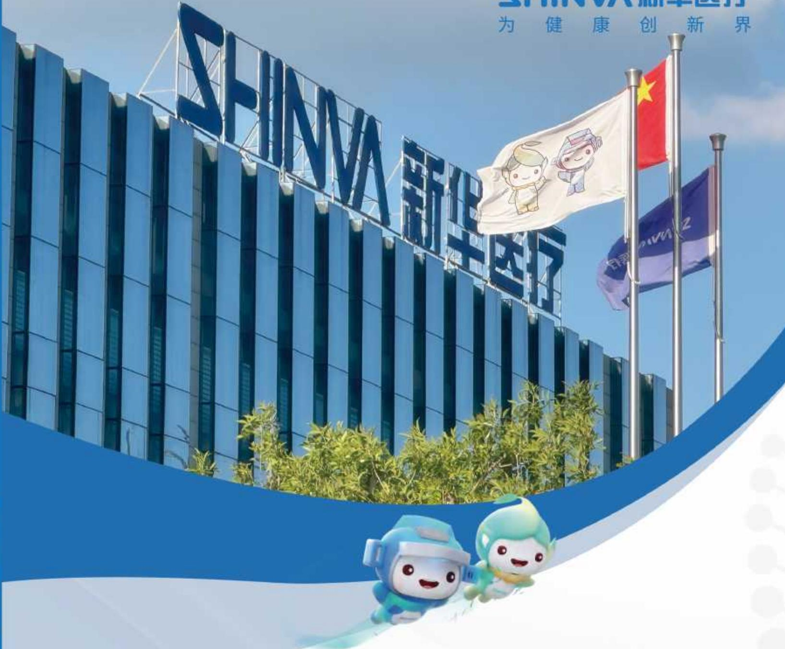

text_image

SHINNAN
为健康创新界
新华医疗

2025

环境、社会和公司治理(ESG)报告

ENVIRONMENTAL SOCIAL AND GOVERNANCE (ESG) REPORT

## SHINVA 新华医疗

为 健康 创新 界

## 目录

董事长致辞 01

关于本报告 03

关于新华医疗 05

公司简介 05

组织架构 07

企业文化 08

业务布局 09

2025责任荣誉 11

## 责任专题

## 新华八十二载 为健康创新界

向远·拓全球：国际市场多维布局 13

向精·提效能：脉动生产精益升级 18

向新·筑绿境：绿色低碳润心育行 21

## 可持续发展（ESG）管理

ESG治理 23

ESG战略 25

尽职调查与利益相关方沟通 26

议题重要性评估 28

## 01 创新驱动

科技创新管理 35

科技创新成果 40

推动行业共赢 48

科技伦理 57

## 02 卓越品质

产品质量管理 61

新华智造 68

质量监督 70

## 03 协同共赢

客户服务 73

数据安全和客户隐私保护 76

负责任供应链 81

## 04 绿动新华

加强环境管理 87

优化能源利用 91

水资源利用 96

应对气候变化 98

强化污染治理 102

践行绿色理念 108

## 05 以人为本

心系员工福祉 113

筑牢安全防线 127

## 06 党建引领

强化思想引领 137

夯实党建基础 138

## 07 强本固基

健全公司治理 143

保障股东权益 146

依法合规治企 148

遵守商业道德 150

## 08 社会责任

医疗可及 157

公益慈善 161

乡村振兴 163

未来展望 164

附录 165

## 董事长致辞

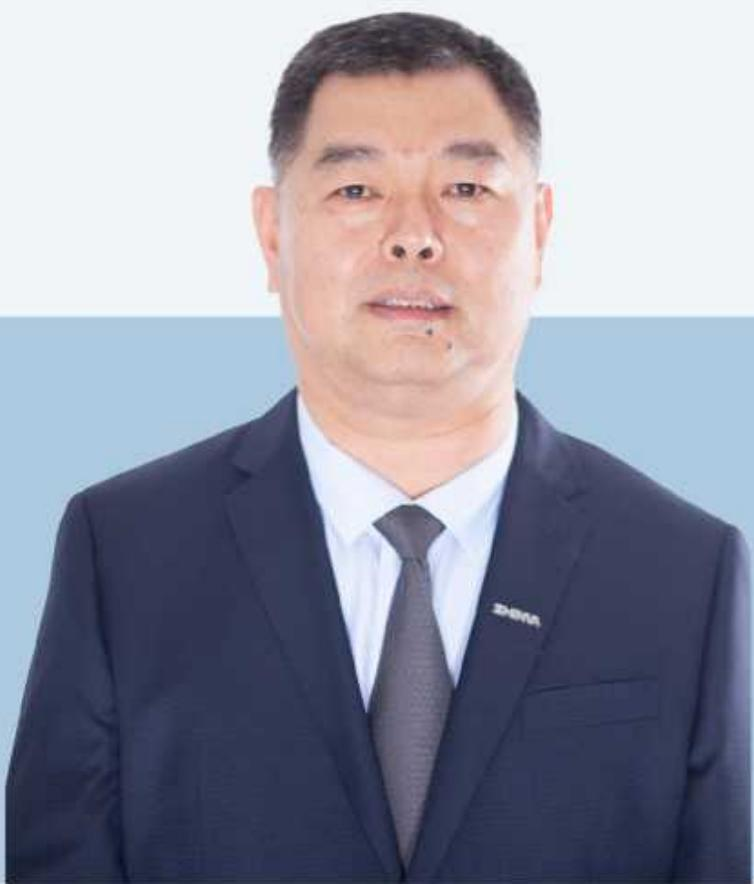

natural_image

Portrait of a man in formal suit and tie against a plain background (no text or symbols visible)

岁月不居，天道酬勤。2025年，新华医疗统筹推进公司治理、科技创新、绿色低碳与社会责任协同共进，以实业践行担当，以科技守护民生，持续为社会、客户与股东创造长期价值，书写稳健可持续的发展篇章。

## 治理是行稳致远的根本保障

我们坚持党建领航，常态化开展理论学习，开展“爱企业、献良策、促发展”活动，推动党建与生产经营深度融合；不断完善现代企业制度，健全内控体系与风险管理机制，坚守合规底线、恪守商业道德，以高效、透明、稳健的治理为可持续发展保驾护航。

## 创新是引领发展的第一动力

我们坚定实施创新驱动发展战略，积极推进研发管理改革，引入IPD集成产品开发理念，构建起“市场需求+技术创新”双轮驱动的产品开发管理模式，形成“技术中心+创新中心”运行模式，持续加大核心技术攻关，不断深化政产学研协同，推动医工交叉与成果转化，以自主可控的核心技术打破国外垄断，助力医疗装备国产化替代与产业升级。

## 绿色是高质量发展的鲜明底色

我们将环保理念贯穿研发、生产、供应链全流程，坚持绿色制造与低碳运营，积极推进绿色包装转型，促进资源高效循环利用；持续强化污染治理、节能降耗与能效提升，清洁能源占比25.85%；常态化开展环境隐患排查整改，整改完成率100%，以绿色制造筑牢生态安全屏障，赋能可持续发展。

## 责任是国企不变的使命担当

我们始终以人民健康为中心，坚守产品质量生命线，以安全、可靠、先进的医疗装备守护临床一线；坚持以人为本，保障员工权益、赋能员工成长，培训总投入同比增长125.97%，致力于打造有温度、有归属感的幸福职场；积极投身公益慈善与乡村振兴，持续践行普惠医疗理念，致力于提升医疗资源可及性，推动全球医疗平等，以实际行动反哺社会。

## 征程万里风正劲，重任千钧再出发

面向未来,新华医疗将继续以科技创新为引擎、以ESG理念为指引、以社会责任为己任,深耕主业、精进不休,加快数字化、智能化、国际化转型,努力打造国内领先、国际一流的医疗装备创新型企业,为推进健康中国建设、守护人民生命健康贡献更大力量!

山东新华医疗器械股份有限公司

党委书记、董事长

孙玉

## 关于本报告

## 报告简介

本报告是山东新华医疗器械股份有限公司第三份环境、社会和公司治理(ESG)报告，客观、真实地反映了山东新华医疗器械股份有限公司2025年可持续发展方面的活动开展情况，重点披露公司环境、社会和公司治理等方面的相关信息。

## 时间范围①

本报告的时间跨度是2025年1月1日至2025年12月31日，为增强报告的可比性和完整性，部分内容超出上述范围。

## 报告范围

本报告以“山东新华医疗器械股份有限公司”为主体，覆盖了新华医疗及子公司，除特别说明外，本报告范围与公司年报范围保持一致。

## 发布周期

新华医疗ESG报告为年度报告，发布周期为一年。

## 编制依据

《上海证券交易所上市公司自律监管指引第1号—规范运作》(2025年5月修订)

《上海证券交易所上市公司自律监管指引第14号—可持续发展报告(试行)》(以下简称《指引》)

《上海证券交易所上市公司自律监管指南第4号—可持续发展报告编制》(2026年1月修订)

财政部《企业可持续披露准则—基本准则(试行)》《企业可持续披露准则第1号—气候(试行)》《企业可持续披露准则—基本准则(试行)应用指南》

《山东省属控股上市公司ESG指标体系工作指引》(鲁国资收益〔2024〕3号)

联合国可持续发展目标(UN SDGs)

全球报告倡议组织 (GRI)《可持续发展报告标准》(GRI Standards)

## 信息来源

本报告所有数据均来自公司相关统计报告、正式文件或有关公开信息。

释义说明

<table><tr><td>公司简称</td><td>公司全称</td></tr><tr><td>新华医疗、公司、我们</td><td>山东新华医疗器械股份有限公司</td></tr><tr><td>山东健康集团</td><td>山东健康集团有限公司</td></tr><tr><td>感控事业部</td><td>感染控制产品事业部</td></tr><tr><td>莎罗雅</td><td>山东新华莎罗雅生物技术有限公司</td></tr><tr><td>放疗事业部</td><td>放射诊疗产品事业部</td></tr><tr><td>手术器械公司</td><td>新华手术器械有限公司</td></tr><tr><td>上海天清</td><td>上海天清生物材料有限公司</td></tr><tr><td>新华血液公司</td><td>山东新华血液技术有限公司</td></tr><tr><td>新华医用环保</td><td>山东新华医用环保设备有限公司</td></tr><tr><td>生产经营单位</td><td>指感染控制产品事业部、制药科技集团、体外诊断产品事业部、放射诊疗产品事业部、洁净技术厂、血液净化产品事业部、机械制造厂、口腔技术厂、实验科技厂、新华手术器械有限公司、山东新华医用环保设备有限公司</td></tr><tr><td>泰美医疗</td><td>上海泰美医疗器械有限公司</td></tr><tr><td>秉程医疗</td><td>上海秉程医疗器械有限公司</td></tr></table>

## 报告批准

本报告于2026年4月28日获董事会批准发布。

## 发布形式

本报告发布中文版，以印刷品和PDF电子版两种形式发布。欢迎登录山东新华医疗器械股份有限公司网站(https://www.shinva.net/)或登录上海证券交易所网站(https://www.sse.com.cn)查阅和下载。

## 联系方式

山东新华医疗器械股份有限公司

地址:山东省淄博市高新技术产业开发区新华医疗科技园

网址:https://www.shinva.net/ 英文网址:https://www.shinva.com/

邮编:255086

电话:0533-3587734

## 关于新华医疗

## 公司简介

1943年11月，新华医疗诞生于胶东抗日根据地，是我党我军早期创建的医疗器械生产企业。新华医疗于2002年在上海证券交易所上市，股票简称“新华医疗”，股票代码(600587.SH)，是中国医疗器械行业协会副会长单位，中国医学装备协会副理事长单位，感染与控制技术专业委员会理事长单位，中国放射治疗产业技术创新战略联盟理事长单位，中国制药装备行业协会理事单位，中国医药设备工程协会理事单位。

新华医疗是国家重点高新技术企业，拥有行业内第一家国家认定企业技术中心，设有CNAS国家认可实验室、博士后科研工作站，拥有山东省医用加速器工程技术研究中心、先进医疗设备及器械山东省工程研究中心、山东省高端医疗装备产业创新中心等省级研发创新平台，入选国务院国资委“科改标杆企业”、中国制造业企业500强、中国企业专利实力500强、山东省“十强”产业集群领军企业。

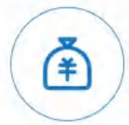  
资产总额

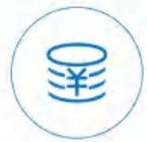  
营业收入

  
所有者权益

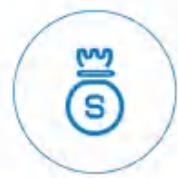  
利润总额

148.20 亿元

97.36 亿元

79.57 亿元

5.91 亿元

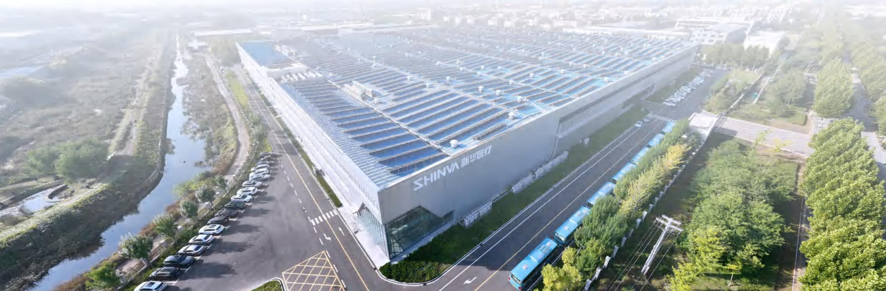

natural_image

Aerial view of a modern industrial facility with a large glass roof structure and 'SHINNA 新华医疗' signage, surrounded by roads and greenery (no readable text beyond the building name).

组织架构  
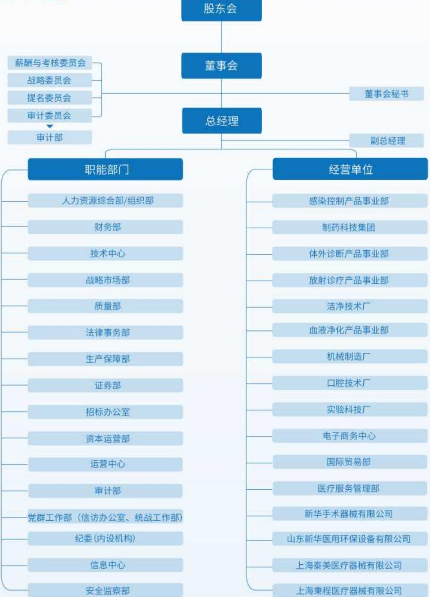

flowchart

This image displays an organizational chart showing the hierarchical structure of a company, divided into two main levels: Executive Board (股东会), General Manager (总经理), and Subsidiary (职能部门, operating units).

## 企业文化

## 核心使命

\- 为健康创新界

## 企业愿景

\- 创世界一流企业,成为受人尊敬的医疗健康创新引领者

## 核心价值观

\- 成就客户以人为本
创新卓越 诚信共赢

## 企业精神

- 以一副银匠担子为代表的担当精神  
- 以支援孟良崮战役为代表的拼搏精神  
- 以一切行动听指挥为代表的军规精神  
- 以敢为人先、持续改革抓机遇为代表的革新精神

- 以持之以恒、不断突破为代表的工匠精神  
- 以劳模辈出为代表的爱岗敬业精神  
- 以援鄂突击队为代表的团队精神  
- 以持之以恒、不断突破为代表的工匠精神  
- 以劳模辈出为代表的爱岗敬业精神  
- 以援鄂突击队为代表的团队精神  
- 以劳模辈出为代表的爱岗敬业精神  
- 以援鄂突击队为代表的团队精神

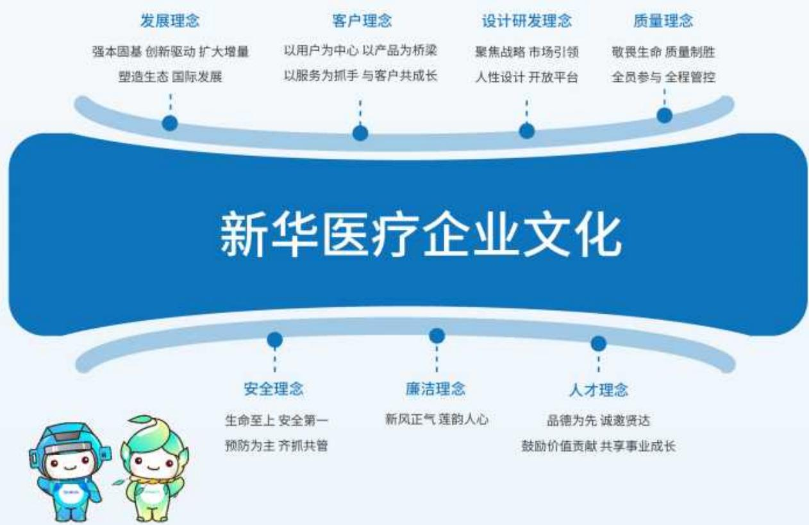

flowchart

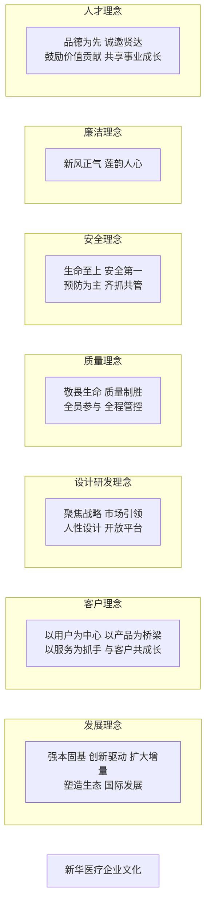

## 业务布局

## ◎ 产业板块

新华医疗持续做强各产业板块，发挥产品线特色优势，深耕医疗器械和制药装备两大制造主业，适度延伸与主业协同的医疗服务、医疗商贸，实现链式发展，形成以制造业带动发展服务业、以服务业促进保障制造业的“2+2”高质量发展新格局。

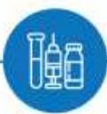

## 医疗器械板块

- 放射治疗及影像  
- 感染控制系统整体解决方案  
- 手术器械及耗材  
- 手术室整体解决方案  
- 口腔设备及耗材  
- 体外诊断试剂及仪器  
- 实验室仪器及设备

- 透析设备及耗材  
医用环保设备  
智慧化康复整体解决方案  
智慧物流整体解决方案  
静配中心整体解决方案

- 制药科技集团  
- 成都英德生物医药装备技术有限公司  
- 上海远跃制药机械有限公司  
- 苏州浙远自动化工程技术有限公司  
- 上海盛本包装材料有限公司  
- 制药科技集团  
- 成都英德生物医药装备技术有限公司  
- 上海远跃制药机械有限公司  
- 苏州浙远自动化工程技术有限公司

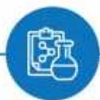

## 制药装备板块

## 服务网络

## 国内战略布局

“11”

北京、上海、新疆、海南、天津、重庆、黑龙江、甘肃、内蒙古、宁夏、青海11个销售中心以分子公司的形式将销售、售后服务做本地化部署。

其他区域以不同形式将销售、售后网络遍布全国。

## 海外市场布局

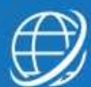

大洲销售网络

国家和地区

海外销售中心

5

150 +

5

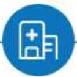

## 医疗服务板块

- 合肥东南骨科医院  
- 安徽合肥东南外科医院  
·攸县维尔医院有限公司  
- 成都康福肾脏病医院有限公司  
- 随州华康血液透析中心有限公司  
- 淄博市张店区人民医院南院有限公司  
- 东营华健医院有限公司  
- 泸州市李时昌中医医院有限公司  
- 武汉方泰医院有限公司

## 医疗商贸板块

- 新华医疗天猫旗舰店  
- 新华医疗京东自营  
- 上海泰美医疗器械有限公司  
- 上海秉程医疗器械有限公司  
- 山东基匹欧医疗系统有限公司  
- 淄博众生医药有限公司

natural_image

Medical professional holding a transparent tablet displaying medical icons and a cross symbol (no readable text or labels)

## 2025责任荣誉

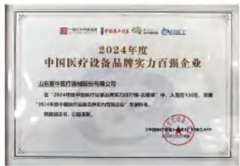

text_image

2024年度
中国医疗设备品牌实力百强企业
山东新华医疗器械股份有限公司
在“2024年我国医疗设备品牌实力排行榜”中，入围后130名，荣获
“2024年度中国医疗设备品牌实力百强企业”荣誉称号。
特此公告，已获荣誉。
《中国医疗设备品牌实力百强企业》·中国医疗设备品牌实力百强企业APP
China Medical Device Group Co., Ltd.

2024年度中国医疗设备品牌实力百强企业

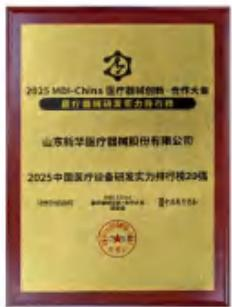  
2025中国医疗设备研发实力排行榜20强

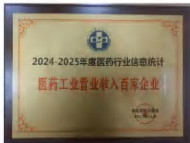

text_image

2024-2025年度医药行业信息统计
医药工业营业收入百家企业

医药工业营业收入百家企业

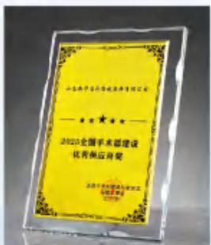

text_image

山东新华医疗器械股份有限公司
2023全国手术部建设
优质供应商奖
山东省新华医疗器械股份有限公司
2023年全国医疗器械行业认证
证书编号：1100000000000000000000000000000000000000000000000000000000

2025全国手术部建设优秀供应商奖

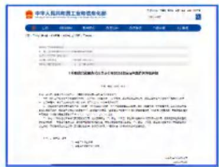

text_image

中华人民共和国工业物资供应部
地址: 重庆市渝中区渝中大道108号
电话: 023-6599
传真: 023-6599
电子邮箱: 中国证券报
地址: 重庆市渝中区渝中大道108号
电话: 023-6599
传真: 023-6599
电子邮箱: 中国证券报
地址: 重庆市渝中区渝中大道108号
电话: 023-6599
传真: 023-6599
电子邮箱: 中国证券报
地址: 重庆市通州区渝中大道108号
电话: 023-6599
传真: 023-6599
电子邮箱: 中国证券报
地址: 重庆市渝中区渝中大道108号
电话: 023-6599
传真: 023-6599
电子邮箱: 中国证券报
地址: 重庆市渝中区渝中大道107号
电话: 023-6599
传真: 023-6599
电子邮箱: 中国证券报
地址: 重庆市渝中区渝中大道107号
电话: 023-6599
传真: 023-6599
电子邮箱: 中国证券报
地址: 重庆市渝中区渝中大道107号
电话: 400-888-8888
传真: 400-888-8888
电子邮箱: 中国证券报
地址: 重庆市渝中区渝中大道107号
电话: 400-888-8888
传真: 400-888-8888
电子邮箱: 中国证券报
地址: 重庆市渝中区渝中大道107号
电话: 400-888-8888
传真: 4<nl>

国家级绿色供应链管理企业

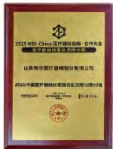  
2025中国医疗器械研发综合实力排行榜50强

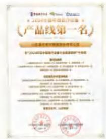  
2024年度中国医疗设备“直线加速类产品线第一名”“供应室及手术室消毒类产品线第一名”

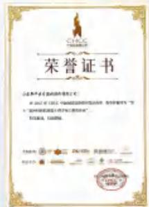  
第十三届中国医院建设十佳专项工程供应商

natural_image

Golden medal with blue and white ribbon, featuring the brand name 'SHINVA' at the bottom (no additional text or symbols)

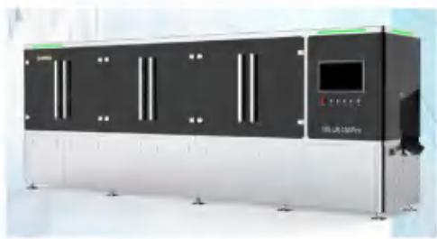

natural_image

Exterior view of a black industrial machine with control panel and ventilation slots (no visible text or symbols)

“直线式大输液灯检机”荣获中国制药装备行业协会科学技术创新奖一等奖

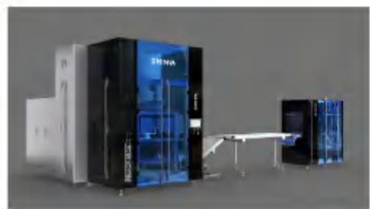

natural_image

Industrial machine with blue and black components connected by a cable, no visible text or symbols

“双模高速式连续式BFS开发”荣获中国制药装备行业协会科学技术创新奖二等奖

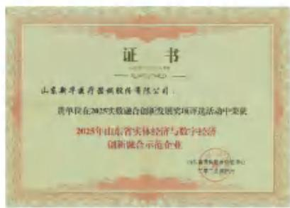

seal

山东新华医疗器械股份有限公司
贵华民在2025年实施融合创新发展奖项评选活动中荣获
2025年山东省实体经济与数字经济
创新融合示范企业

2025年山东省实体经济与数字经济创新融合示范企业

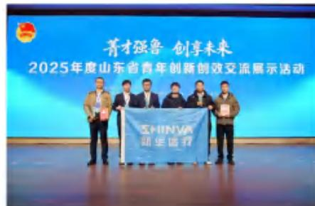

text_image

菁才强鲁 创享未来
2025年度山东省青年创新创效交流展示活动
SHINYU
研发盛行

荣获“菁才强鲁”山东省青年创新创效大赛1项金奖、2项银奖

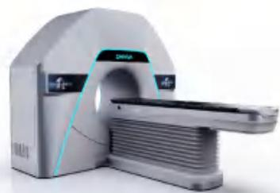

natural_image

Medical imaging machine with a blue-tinted overlay, no visible text or symbols

智能环形加速器系统荣获2025年度“山东省医疗器械行业协会科学技术奖”一等奖。

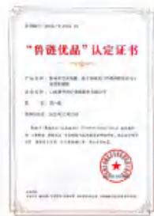  
脉动真空灭菌器与基于多模式引导的高能医用电子直线加速器入选2025年第一批“山东制造鲁链优品”名单

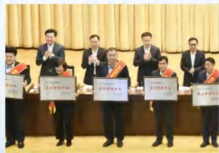

text_image

Group photo of award recipients holding certificates and awards, with visible Chinese text on plaques

淄博市“2024年度经济稳增长突出贡献企业”

## 责任专题

## 新华八十二载 为健康创新界

新华医疗锚定高质量发展目标, 对外多措并举拓展全球市场版图, 持续提升品牌国际影响力与全球市场占有率; 对内聚焦生产制造精细化、智能化升级, 推进脉动生产线建设, 筑牢产品品质根基, 以全球化布局打开发展空间, 以精细化制造夯实发展底气, 为企业迈向国际一流医疗装备企业筑牢坚实支撑。

## 向远·拓全球:国际市场多维布局

公司贯彻国际化发展战略，紧扣全球医疗健康产业升级机遇，深耕欧美高壁垒市场、发力亚非拉潜力市场，通过渠道拓展、品牌塑造、资源整合等多维发力，持续提升全球市场渗透率与品牌国际影响力，以国际化布局赋能企业高质量发展，加速向国际一流医疗装备企业迈进。

## 筑牢运营根基

新华医疗聚焦国际业务发展核心需求，深耕国际运营管理，确保国际运营高效协同、安全可控，为全球市场布局与业务拓展筑牢坚实管理屏障，护航国际业务高质量稳步推进。报告期间，公司海外业务收入5.3亿元，较去年同比增长47.56%。

扎实推进全流程精细化管理,确保跨境采购与资金安全高效流转。

强化国际化人才队伍与区域布局建设，引进产品线总监及外籍人才。

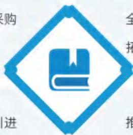

全力做好国际交流服务保障，夯实国际市场拓展服务支撑。

推行区域销售总监“揭榜挂帅”，营销团队管理模式初步成型。

## 聚力规模提升

新华医疗聚力国际市场规模提升，以市场需求为导向，以认证突破为抓手，加速推进产品全球化准入布局，持续拓宽市场版图、扩大业务体量，推动国际业务规模实现跨越式增长，为企业全球化发展注入强劲动力。

## 加速产品国际取证

在俄罗斯、巴西、白俄罗斯、马来西亚等8个国家新取得29张海外注册证，4个型号的直线加速器均获得巴西ANVISA注册证。

## 关键绩效

新增国家市场准入

新增国际化产品注册证

累计有效国际化产品注册证

9+↑

50+项

69+项

## 2025年新增

2项MDR认证(医疗器械)  
- 2项IVDR认证(体外诊断试剂)  
21项PED认证(欧盟压力容器)

22项CE认证(非医疗器械)  
1项ASME认证(美国压力容器)  
• 1项IFCC认证(国际临床化学与检验医学联合会)  
• 1项NGSP认证(美国国家糖化血红蛋白标准化计划)

## 渠道建设实现多点突破

口腔产品线海外订单同比增长81%;

感控产品线海外新签合同额同比增长97%;

洁净产品线实现智利、墨西哥、哥伦比亚等新市场突破；

实验科技产品线订单同比增长65%，在沙特首次实现洁净工作台海外销售；

制药产品线实现非洲首台BFS、印度尼西亚三室袋项目突破；

放疗产品线新拓展巴西、摩洛哥、墨西哥等销售渠道；

自主研发的XH700系列口腔教学模拟系统已出口至欧洲，开启高端医疗教育设备国际化新征程。

## 抱团出海落地重点项目

与国药国际旗下单位合作完成白俄罗斯、马达加斯加等项目；

\- 携手贸易公司为朝鲜平壤综合医院提供感控和放疗系统解决方案；

与中医保合作签订塞内加尔感控项目。

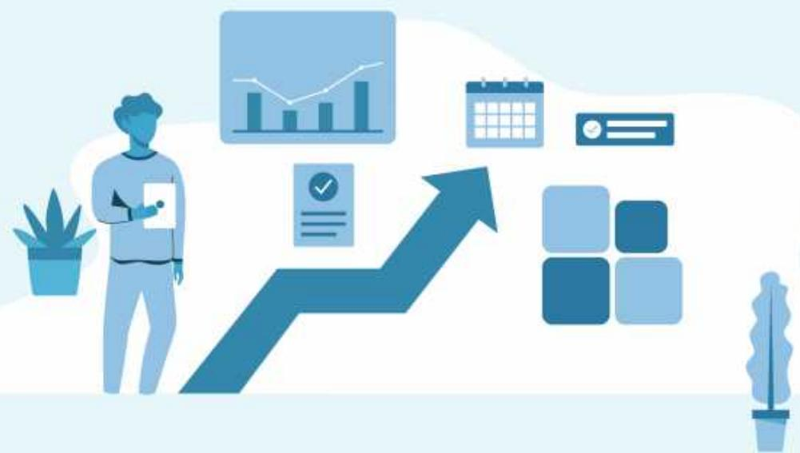

natural_image

Illustration of a person holding a clipboard with a rising arrow and various icons (no text or symbols)

## 跨境电商建设持续推进

优化阿里巴巴国际站、Google等国际线上平台；  
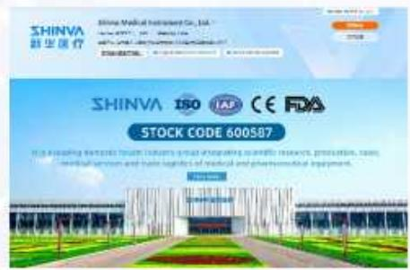

text_image

SHINVA
新华医疗
SHINVA Medical Instrument Co., Ltd.
SHINVA 150 IAP CE RA
STOCK CODE 600587
IN SAICING EVENTS FROM INDIAIS, WHO, EXAMINED, INNOVATION, AND THE RIGHTS OF MEDICAL AND PHARMACEUTICAL IMPAIRS.

阿里巴巴国际站成效展示图

text_image

Scanned screenshot of a software settings dialog box with Chinese interface elements and checkboxes

Google关键词优化效果展示图

核心产品关键词自然搜索排名显著提升；

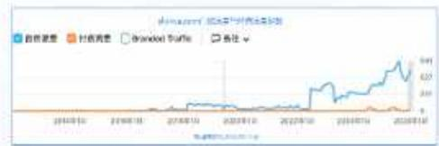

line

| Date | Branded Traffic |
| --- | --- |
| 2018-10 | ~0 |
| 2019-10 | ~0 |
| 2020-10 | ~0 |
| 2021-10 | ~0 |
| 2022-10 | ~0 |
| 2023-10 | ~4.5 |

谷歌英文官网自然流量指数展示

强化SNS社媒营销，进一步提升目标客户对公司的认知度与认可度；  
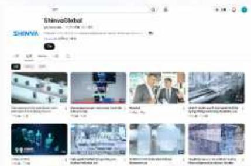

text_image

ShervaGlobal
SHENA

SNS社媒成效-youtube后台展示图

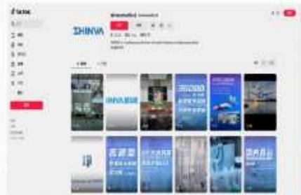

text_image

e issue
SHINNA
CHINA
CHINA
中国电影

SNS社媒成效-Tiktok后台展示图

新建Yandex俄语官网，覆盖3亿俄语用户市场；

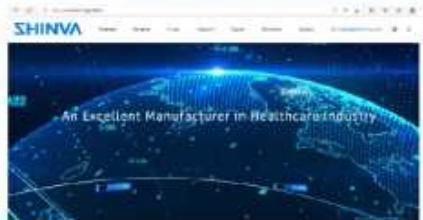

text_image

SHINVA
An Excellent Manufacturer in Healthcare Industry

Yandex俄语官网建设首页截图

2025年，公司跨境电商手术器械类产品在线交易额同比增长102%。

## 深耕品牌塑造

新华医疗深耕品牌塑造与价值升维，以技术创新厚植品牌内涵，以优质服务积淀品牌口碑，全方位塑造兼具专业实力、民族底色与国际视野的医疗装备品牌形象，以硬核品牌竞争力赋能全球市场拓展，筑牢企业国际化发展的品牌基石。

报告期内，公司派遣工程师赴15个国家提供售后支持；接待37个国家客户实地参访；为代理商及终端用户提供专项培训，以“走出去+请进来”双轮驱动，深化客户互动。

## 图 案例 交流合作促进品牌国际传播

2025年5月，新华医疗受邀出席巴西总统代表团在北京举办的企业见面会，并与巴西企业代表正式签署战略合作备忘录，围绕巴西肿瘤精准治疗创新技术应用及公共卫生服务体系升级展开深度合作。此外，巴西总统卢拉手持新华医疗“医用电子直线加速器”的照片在其社交媒体发布，成为品牌国际传播的重要契机，进一步擦亮医疗装备民族品牌的国际名片。

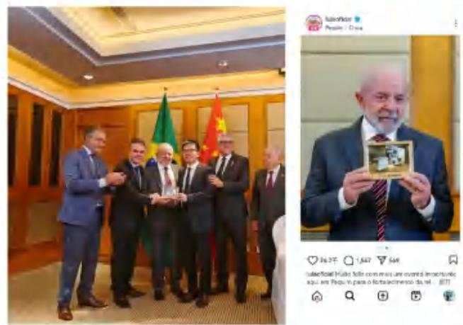  
巴西总统卢拉在其社交媒体发布手持新华医疗“医用电子直线加速器”照片

## 图 | 案例 优质项目扩大品牌国际影响力

新华医疗坚持以优质产品夯实国际品牌口碑，以深度协作拓展品牌国际版图。2025年9月，公司受邀参与2025金砖国家新工业革命伙伴关系论坛，旗下“印度尼西亚医疗器械产品本地化工厂”等两大项目成功入选论坛案例成果，提升了品牌影响力与全球知名度。

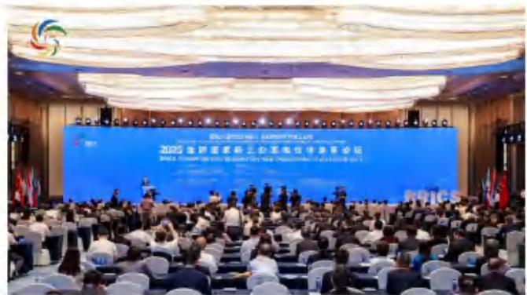

text_image

2023中国国家矿山工程单位评审会议
Shenzhen Shenzhen Forum for 2023 China National Steel Industry Association

2025金砖国家新工业革命伙伴关系论坛

## 图 案例 多元互动搭建国际合作桥梁

新华医疗主动策划并参与“一带一路”国家医用耗材研修班、海外经销商工程师研讨班等专题交流活动，以多元互动搭建国际协作桥梁。2025年4月，白俄罗斯、贝宁、菲律宾等多国代理商代表及工程师团队，齐聚参与公司2025年全球经销商产品研讨培训大会；9月，20余名共建国家学员走进新华医疗，参加“一带一路”国家中国医用耗材研发与应用研修班。通过邀请国际代表实地考察、开展技术交流与场景体验，全方位展示新华医疗创新产品与技术实力，向外传递中国医疗器械产业发展成果，稳步扩大品牌全球辐射力与专业影响力。

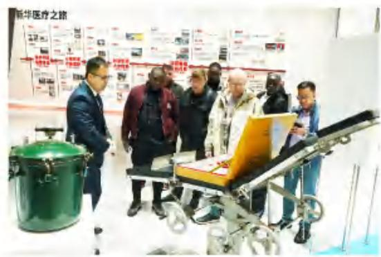

text_image

Group of people gathered around a medical or rehabilitation vehicle in an exhibition hall, with visible Chinese signage in the background.

举办2025年全球经销商产品研讨培训大会

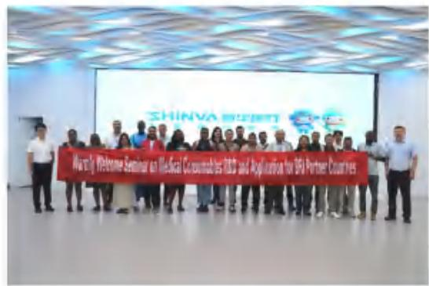

text_image

Shinva Research
Mostly Welcome Seminar on Medical Consumables RBC and Application for DIP Partner Countries

组织2025“一带一路”国家中国医用耗材研修班

## 向精·提效能:脉动生产精益升级

新华医疗聚力生产智造升级，大力推进脉动生产线建设与落地，以精益生产理念重构生产流程，打造标准化、模块化、高效化的脉动生产模式，通过示范线先行、多产线推广的方式，进一步提升核心产品的市场供应能力与交付效率，为企业提质增效、筑牢智能制造根基提供了坚实支撑。

## 优选标杆先行

紧扣公司降本增效发展目标，综合考量各产品线特点，确定了感控事业部低温灭菌器、实验科技厂生物安全柜、口腔技术厂综合治疗机和放疗事业部医用直线加速器中能机四条产线作为2025年脉动生产线示范线。

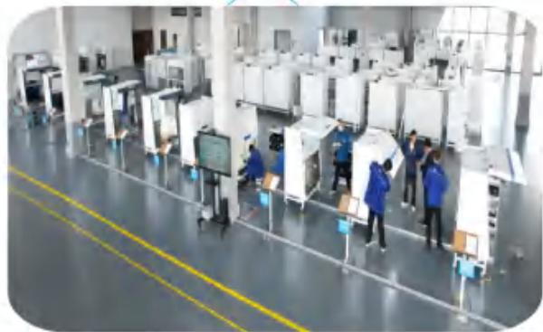

natural_image

Interior view of a large electronics manufacturing facility with workers in blue uniforms operating equipment (no visible text or symbols)

生物安全柜脉动生产线

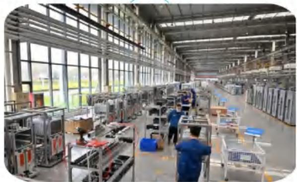

natural_image

Interior view of a large industrial factory floor with workers at assembly stations and large windows (no visible text or symbols)

- 低温灭菌器脉动生产线

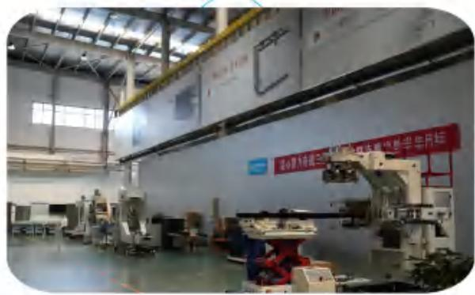

natural_image

Interior of a large industrial factory with machinery and overhead cranes (no visible text or symbols)

- 医用电子直线加速器脉动生产线

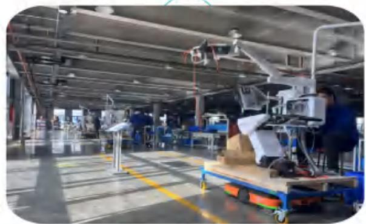

natural_image

Interior view of a modern automated factory floor with workers and machinery (no visible text or symbols)

- 口腔综合治疗机脉动生产线

## 流程化落地

各生产线同步制定年度计划分解表，组织各单位内部计划确认会签，明确各阶段时间、内容与输出成果，细化工序配置、标准文件制定、软硬件配套等节点任务，形成闭环实施流程。

## 精细化管控

建立周调度、月总结、季度指标分析督办的项目监管机制，严把关键节点；配合脉动生产线运行，增设“水蜘蛛”岗位，记录产线问题并推动多维度能力提升；典型问题共享共勉，遇问题提级协助处理，保障建设进度与质量。

## 阶段性成果

全面达成预期目标，生产成本、资金占用及现金周转率均实现优化提升。

## 以点带面推广

公司各生产经营单位通过学习观摩试点产线，激发了脉动生产线建设动力，主动拓展建设和改进共11条脉动生产线，降本增效成果明显。

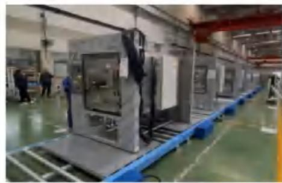

natural_image

Interior view of a modern industrial factory floor with large machinery and workers (no visible text or symbols)

制药蒸汽灭菌器并线脉动生产线

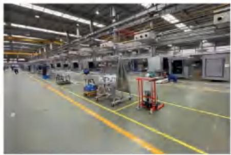

natural_image

Interior view of a large industrial factory floor with machinery and overhead cranes (no visible text or symbols)

感控高温灭菌器脉动生产线

## 图 案例 制药装备生产效能跃升

制药科技集团率先主动落地脉动生产线，聚焦灭菌器、清洗机等核心产品完成全流程工艺革新，实现生产效率提升30%-40%——重构生产工艺流程，拆解标准化工序、前置预装工序，消除无价值生产；创新节拍管控、过程化品控工艺，配套智能系统与工序互检模式，提升工时利用率，降低返工损耗；优化精益物流、混线并线工艺，实现物料高效配送、多品统一节拍生产；迭代产线硬件工艺，升级瓶颈环节，引入机械臂，实现人机协同提效，实现效率、品质双提升，核心产品生产周期减半，人力、物流等成本多维优化，增强生产稳定性与柔性，为制药装备行业工艺升级提供可复制经验。

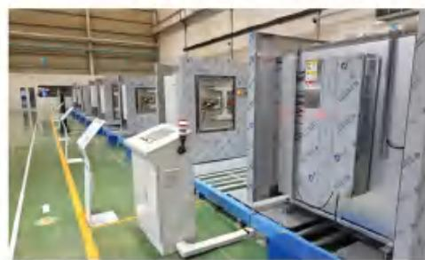

natural_image

Interior view of a modern industrial factory floor with machinery and conveyor belts (no visible text or symbols)

灭菌器脉动产线

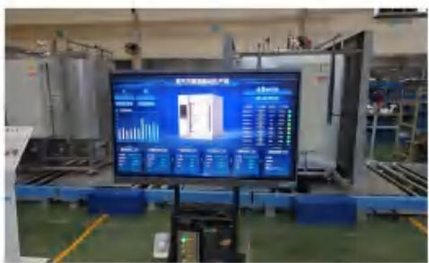

text_image

Factory production line photo with large display screen showing industrial data and control panel

全流程节拍管控体系

natural_image

Line drawing of a person sitting on a couch watching a computer monitor, with plants and leaves in the background (no text or symbols)

## 向新·筑绿境:绿色低碳润心育行

新华医疗厚植绿色发展底蕴，将绿色低碳理念深度融入企业文化建设，通过系列节能降耗主题活动，强化全员生态环保意识，以文化之力筑牢生态根基，着力营造崇尚绿色、践行低碳的文化氛围，让绿色理念内化于心、外化于行，赋能企业高质量可持续发展。

发起节能降耗倡议，凝聚全员行动共识

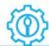

结合公司“生存年”发展要求，以降本增效为核心发布《节能降耗倡议书》，组织开展节能宣传周暨低碳日活动，凝聚“人人参与节能，全员共创效益”的共识。

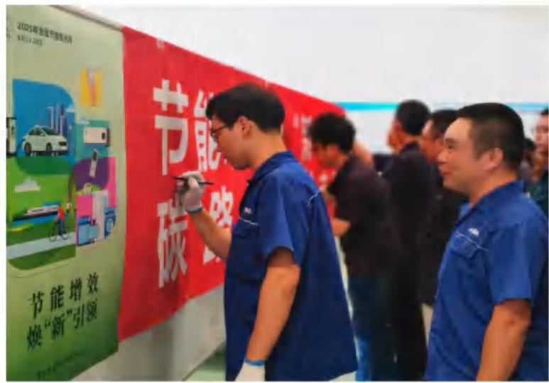

text_image

2025年全国节能成效
节能增效
焕“新”引领

节能降碳活动横幅签名仪式

打造立体宣传阵地,营造沉浸式绿色氛围

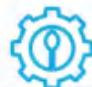

通过在办公区、生产区、食堂等公共区域张贴节能、降耗、节水标识，布置节能宣传海报，悬挂主题横幅，利用电子屏滚动播放节能宣传片等方式，构建线下多场景、多载体宣传布局，让节能降耗提示随处可见、深入人心。

倡导绿色行为实践，推动理念落地见效

聚焦办公、出行、用餐等日常场景，引导员工践行绿色低碳行为：鼓励步行、骑行、公共交通等绿色出行方式；推行绿色办公，要求员工做到随手关灯、人离机停、双面打印、午休熄屏等；在食堂开展“光盘行动”实践活动，杜绝餐饮浪费。

2025 ^  

text_image

2025/06/25 周三
11.66 公里
时间 28:01
平均速度 25.0
黄昏 骑行
2025/06/24 周二
11.93 公里
时间 29:58
平均速度 23.9
上午 骑行
2025/06/24 周二
11.69 公里
时间 30:00
平均速度 23.4

2025 ^  

text_image

黄昏 骑行
2025/06/27 周五
11.92 公里
时间 30:04
平均速度 23.8
清晨 骑行
2025/06/27 周五
11.51 公里
时间 27:27
平均速度 25.2
黄昏 骑行
2025/06/26 周四
12.09 公里
时间 25:10

绿色出行打卡

text_image

SHINVA 普华医疗
反餐饮浪费
专项治理月
垃圾粮食
节约粮食
行动
我是光盘
从我们做起
提倡节约
反制浪费
我是文明浪费
儿童中等全费
同日消费
文盲唯实  经经消毒
一传之实，不必是山珍堂依之意，
主要吃得一干之凉。

“光盘行动”宣传活动

# 可持续发展(ESG)管理

新华医疗将可持续发展理念和要求融入公司战略规划、决策和日常运营，持续完善ESG治理架构，构建多元利益相关方沟通渠道，优化和更新重要性议题识别和分析工作，加强ESG风险管理，通过官网传递ESG理念，筑牢企业发展根基。

## ESG治理

新华医疗持续完善ESG治理架构，优化ESG相关政策和制度体系，将ESG关键指标纳入薪酬和考核体系，定期开展培训提升ESG管理能力，提升可持续发展水平。

## ESG治理架构

新华医疗构建董事会监督、ESG领导小组管理、各职能部门和权属子公司执行的三级ESG治理架构，形成了有牵头、有配合、有分工的架构清晰、职责明确的组织体系。ESG领导小组办公室设在党群工作部，负责ESG日常管理工作；证券部负责ESG相关信息披露，其他各职能部门负责具体工作。2025年，董事会审议通过了公司2024年度《环境、社会和公司治理(ESG)报告》。

natural_image

Line drawing of solar panels and wind turbines (no text or symbols)

## ESG

flowchart

## ESG培训

新华医疗重视ESG能力建设，持续提升ESG管理水平及信息披露质量。报告期内，积极参加主管部门举办的“推进ESG可持续发展，提升核心竞争力”ESG培训和山东健康集团组织的ESG专项培训，并结合ESG报告编制开展公司内部ESG培训。ESG培训内容包括ESG标准体系、行业最佳实践、信息披露规范、风险识别与管理等，公司通过多种形式的ESG培训，增强员工的可持续发展意识与实践能力。报告期内，ESG培训时长达130小时。

## ESG评级

新华医疗连续三年发布ESG报告，在ESG评级方面持续提升，获得绿发信评ESG评级“AA+pi”级评价、Wind ESG 评级A级评价、华证ESG评级A级评价、秩鼎ESG评级AA级评价，领先同行企业平均水平。

## ESG战略

新华医疗以“为健康创新界”的核心使命，将ESG理念深植于企业经营之中，积极实施“卓越品质、绿动新华、以人为本和强本固基”ESG战略，坚持以实际行动支持联合国可持续发展目标SDGs的实现。

<table><tr><td>ESG战略</td><td>我们的行动</td><td>响应SDGs</td></tr><tr><td rowspan="3">卓越品质</td><td rowspan="3">2025年,公司推进脉动生产线建设与落地,以精益生产理念重构生产流程,4条脉动生产示范线的生产周期大幅缩短。2025年,新增国际化产品注册证50项,为海外市场拓展筑牢根基。2025年,公司检测中心顺利通过CNAS认证扩项现场审核,持续增强检测能力,为产品质量构筑坚实屏障。2025年,公司完成24个质量专业项目,攻克了多项质量管理难点,构建了全链条质量风控体系。</td><td></td></tr><tr><td></td></tr><tr><td></td></tr><tr><td rowspan="2">绿动新华</td><td rowspan="2">2025年,公司新增分布式光伏装机容量3.995兆瓦,清洁能源使用量1293.92吨标准煤,清洁能源使用占比25.85%。2025年,向全体员工发放《节能降耗倡议书》,开展系列节能周低碳日宣传和实践活动,全员从点滴做起,共同节约能源,共建美好家园。2025年,实施《UV光固化油墨源头替代技改项目》,VOCs减排量0.573t/a,减排效果明显。</td><td></td></tr><tr><td></td></tr></table>

<table><tr><td>ESG战略</td><td>我们的行动</td><td>响应SDGs</td></tr><tr><td rowspan="4">以人为本</td><td rowspan="4">2025年,公司“A区职工之家”正式启用,包括职工运动中心和新华医疗艺术团两大功能区,拓宽服务职工的渠道和阵地。2025年,开展员工培训298次,员工培训覆盖率100%,打造全方位的人才培养体系。2025年,实施“五大暖心工程”,切实把温暖送到员工心坎上。</td><td></td></tr><tr><td></td></tr><tr><td></td></tr><tr><td></td></tr><tr><td>强本固基</td><td>截至2025年末,公司累计分红19次,累计派发现金股利9.63亿元,切实与广大股东共享发展成果。2025年,公司开展反商业贿赂、知识产权、反不正当竞争、民法典、宪法、防范非法集资诈骗等系列普法宣传活动11场,培训人数1090人次,培训总时长1702小时,销售采购业务等相关岗位培训覆盖率100%,全方位提升法治素养与合规意识。</td><td></td></tr></table>

## 尽职调查与利益相关方沟通

新华医疗积极推进上市公司ESG相关信息披露工作,高度重视利益相关方的多元诉求,畅通沟通渠道,携手伙伴共同推动经济、环境、治理、社会可持续发展。

<table><tr><td>利益相关方</td><td>期望与诉求</td><td colspan="2">沟通渠道与回应</td></tr><tr><td>[24TW]政府及监管机构</td><td>响应国家战略合规经营提供就业岗位带动经济发展</td><td colspan="2">服务国家战略依法经营接受监督检查承担社会责任环境、社会和公司治理报告</td></tr><tr><td>股东与投资者</td><td>价值创造风险合规管理信息披露投资者关系稳健经营</td><td>保护股东和投资者权益股东会信息披露业绩说明会官方网站</td><td>财务报告环境、社会和公司治理报告</td></tr><tr><td>客户</td><td>产品质量与安全负责任营销客户服务客户隐私保护</td><td>加强质量管理提供优质服务保障客户权益产品可及性</td><td>现场交流满意度调查合同履约市场调研</td></tr><tr><td>员工</td><td>员工权益和福利员工发展和培训职业健康与安全</td><td colspan="2">工会员工活动员工培训员工申诉与举报机制提供健康安全工作环境</td></tr><tr><td>环境与社区</td><td>应对气候变化污染物排放废弃物管理节能减排社会贡献乡村振兴</td><td colspan="2">助推社区发展保护当地环境开展节能减排开展公益活动产品可及性普惠医疗</td></tr><tr><td>行业与合作伙伴</td><td>商业道德供应链安全创新驱动促进行业发展</td><td>依法履行合同供应商培训阳光采购战略合作</td><td>行业交流参与标准制定</td></tr></table>

## 议题重要性评估

## 双重重要性分析

## 议题重要性分析流程

公司结合《指引》要求，以及自身业务和行业发展趋势，定期开展ESG重要性议题的识别、分析和更新工作。

## 分析流程

<table><tr><td>企业背景和议题清单</td><td>结合《指引》、公司现状及行业特征,对议题清单进行优化和更新</td></tr><tr><td>议题重要性评估</td><td>影响重要性评估:通过利益相关方问卷了解影响程度,按1-5分进行打分财务重要性评估:通过利益相关方问卷了解影响程度和可能性,按1-5分进行打分综合判定:结合对标同行和专家咨询进行综合判定</td></tr><tr><td>重要性议题确认</td><td>经相关部门确认,对议题的影响重要性与财务重要性进行排序,形成重要性议题矩阵</td></tr><tr><td>议题报告</td><td>按照议题的重要性程度进行信息披露</td></tr></table>

## 议题清单

为保证重要性议题能够反映行业动态和利益相关方的关切，依据上述识别流程，通过与各利益相关方的沟通及确认，对公司议题清单进行更新和优化，贯彻《指引》要求，优化议题管理。

议题清单

<table><tr><td>环境议题</td><td>社会议题</td><td>治理议题</td></tr><tr><td>污染物排放</td><td>创新驱动</td><td>风险合规管理</td></tr><tr><td>能源利用</td><td>产品质量与安全</td><td>投资者关系</td></tr><tr><td>环境合规管理</td><td>员工权益和发展</td><td>信息披露</td></tr><tr><td>废弃物处理</td><td>数据安全与客户隐私保护</td><td>尽职调查</td></tr><tr><td>循环经济</td><td>社会贡献</td><td>反商业贿赂及反贪污</td></tr><tr><td>应对气候变化</td><td>供应链安全</td><td>反不正当竞争</td></tr><tr><td>水资源利用</td><td>职业健康与安全</td><td></td></tr><tr><td rowspan="6">生态系统和生物多样性保护</td><td>客户服务</td><td></td></tr><tr><td>科技伦理</td><td></td></tr><tr><td>负责任营销</td><td></td></tr><tr><td>普惠医疗</td><td></td></tr><tr><td>平等对待中小企 </td><td></td></tr><tr><td>乡村振兴</td><td></td></tr></table>

重要性议题变化说明

<table><tr><td>2024年重要性议题</td><td>2025年重要性议题</td><td>变化情况</td><td>变化原因</td></tr><tr><td>/</td><td>生态系统和生物多样性保护</td><td>新增议题</td><td rowspan="5">依据《指引》,对议题进行补充和优化</td></tr><tr><td>促进行业发展</td><td rowspan="2">创新驱动</td><td rowspan="2">合并议题</td></tr><tr><td>创新驱动</td></tr><tr><td>员工权益和福利</td><td rowspan="2">员工权益与发展</td><td rowspan="2">合并议题</td></tr><tr><td>员工发展和培训</td></tr></table>

## 议题重要性分析结论

经分析,通过对27项议题的财务重要性和影响重要性评估和排序,形成重要性议题矩阵,共有8项议题具有双重重要性,16项议题仅具有影响重要性,3项议题既不具有财务重要性,也不具有影响重要性。

scatter

| Topic | Importance to Company Financial & Environmental Impact (X-axis) | Importance to Economic, Social, and Environment (Y-axis) |
| :--- | :--- | :--- |
| 创新驱动 | High | High |
| 产品质量与安全 | High | High |
| 员工权益和发展 | High | High |
| 数据安全与客户隐私保护 | Medium-High | Medium-High |
| 客户服务 | Medium-High | Medium-High |
| 循环经济 | Medium-High | Medium-High |
| 污染物排放 | Medium-High | Medium-High |
| 尽职调查 | Low-Medium | Medium |
| 负责任营销 | Low-Medium | Medium |
| 普惠医疗 | Low-Medium | Medium |
| 社会贡献 | Low-Medium | Medium |
| 水资源利用 | Low-Medium | Medium |
| 废弃物处理 | Low-Medium | Medium |
| 供应链安全 | High | Medium |
| 职业健康与安全 | Medium-High | Medium |
| 能源利用 | Medium-High | Medium |
| 应对气候变化 | Medium-High | Medium |
| 乡村振兴 | Low-Medium | Medium |
| 环境合规管理 | Medium | Medium |
| 反商业贿赂与反贪污 | Medium | Medium |
| 反不正当竞争 | Low-Medium | Medium |
| 生态系统和生物多样性保护 | Low-Medium | Low-Medium |
| 平等对待中小企业 | Low-Medium | Low-Medium |
| 科技伦理 | Low-Medium | Low-Medium |
| 风险合规管理 | Low-Medium | High |
| 投资者关系 | Low-Medium | High |
| 信息披露 | Low-Medium | High |
| 产业质量与安全 | High | High |
| 供应链安全 | High | Medium |

## 财务重要性议题分析与应对

公司对具备财务重要性的议题采用四要素披露该议题，下表列示了影响、风险和机遇的识别、评估、监测等内容，具体的管理措施和其他内容于后续章节做进一步展开。

<table><tr><td>议题</td><td>识别</td><td>评估</td><td>监测</td><td>管理</td></tr><tr><td>创新驱动</td><td>识别行业和技术发展趋势;识别市场需求。</td><td>评估创新项目的可行性;评估市场前景。</td><td>对研发项目进行全流程跟踪;对全员创新创效活动进行跟踪。</td><td>采用IPD集成产品开发理念;加强知识产权保护;保护商业秘密。</td></tr><tr><td>产品质量与安全</td><td>识别客户需求;识别质量风险。</td><td>评估质量管理体系的有效性;评估客户满意度调查并提出改进措施。</td><td>监测原材料、半成品和成品的检验合格率;收集客户反馈和不良事件,开展调查及评价;监视质量目标的达成情况。</td><td>持续提升质量管理水平;建立质量风险管理制度;完善售后服务和客诉处理机制。</td></tr><tr><td>员工权益和发展</td><td>识别潜在的劳资纠纷风险;识别员工培训需求。</td><td>评估员工晋升及发展情况;评估员工满意度。</td><td>监测员工流失率;监测员工技能提升情况。</td><td>建立员工沟通和反馈机制;完善薪酬福利制度;提供发展机遇。</td></tr><tr><td>数据安全与客户隐私保护</td><td>识别数字安全风险。</td><td>评估数字安全和客户隐私保护措施的有效性。</td><td>监测数据安全漏洞和事件。</td><td>完善数字安全和客户隐私保护制度;落实数据安全保护措施;开展应急演练。</td></tr></table>

<table><tr><td>议题</td><td>识别</td><td>评估</td><td>监测</td><td>管理</td></tr><tr><td>供应链安全</td><td>开展内外部环境分析;识别关键的材料和零配件;识别供应链断供风险;识别供应商ESG风险。</td><td>评估供应链断供的影响程度;评估供应商的稳定性;评估供应商多元化进展。</td><td>监视关键材料和零配件的供货及库存情况;监视供应链风险。</td><td>制定供应商开发机制,引入优质新供应商;建立供应商评价体系;建立供应链协同机制,优化采购、库存和订单管理;采取国产替代,减少进口依赖。</td></tr><tr><td>职业健康与安全</td><td>识别工作场所危害因素;识别职业健康与安全风险。</td><td>评估职业健康与安全的影响程度;评估管理体系的有效性。</td><td>监视隐患排查整改进度;监视职业健康与安全目标达成情况。</td><td>隐患排查和整改闭环管理;开展应急演练;开展职业健康与安全培训。</td></tr><tr><td>能源利用</td><td>识别能源消耗的主要环节;识别能源价格波动、能源供应稳定性风险;识别新能源技术应用的可行性与机遇。</td><td>评估能源消耗对运营成本的影响程度;评估能源供应中断对生产连续性的风险;评估节能技术改造的投资及效益。</td><td>监测能源消耗总量和能源消耗强度;监测节能项目实施进度与效果。</td><td>健全能源管理体系,制定能源消耗强度目标与考核机制;推进生产设备节能改造;建设分布式光伏提升清洁能源占比;开展员工节能意识培训。</td></tr><tr><td>应对气候变化</td><td colspan="4">详见报告应对气候变化章节</td></tr></table>

natural_image

Stylized illustration of a city with wind turbines, solar panels, and buildings (no text or symbols)

## OL SHINN 创新驱动

新华医疗坚持创新驱动发展战略，锚定科技创新目标，持续完善研发管理体系与多层次创新平台建设；围绕主业核心技术开展攻关，积极构建开放协同的行业创新生态圈，深化政产学研用联动，加速科技成果转化与产业化应用。同时，强化知识产权全生命周期保护，恪守科技伦理规范，以合规、安全、可持续的创新实践，为企业高质量发展注入强劲动力。

科技创新管理 35

科技创新成果 40

推动行业共赢 48

科技伦理 57

## 科技创新管理

新华医疗严格遵守《中华人民共和国科学技术进步法》《中华人民共和国专利法》等法律规范，不断完善科技创新决策机制与组织架构，将科技创新融入企业长期发展规划，科学识别技术创新带来的机遇与潜在风险，持续落实科学创新评价体系，以体系化、制度化建设驱动企业高质量发展。

## 治理

公司将科技创新治理纳入顶层设计，构建权责明确、运行高效的科技创新管理体系，不断完善科技创新组织架构与决策机制，强化顶层统筹与过程管控，压实科技创新治理责任，以高效治理赋能核心技术攻关与创新能力提升。

## 研发组织架构

公司持续推进架构优化升级，由总经理直接负责研发管理工作，构建起“技术中心+创新中心”双中心协同运行模式，实现研发资源的统筹调配与高效利用，为研发创新工作有序推进提供坚实保障。

\- 技术中心采用层级式组织架构，全面统筹研发整体规划、日常运营管理及重大事项决策等工作。

\- 设立研究院,重点搭建以技术平台为核心的公研体系、以核心技术突破为宗旨的预研体系,同时专项建设人工智能技术公研平台,夯实技术研发基础。

## 研发管理制度

公司严格遵循《技术创新项目管理指导办法》《新品(项目)部立项管理办法》《新品(项目)部过程管理办法》《对外技术合作管理办法》等管理制度要求，同步制定《产品开发流程管理规定-无菌无源耗材类》《科研项目申报及管理工作规范》《纵向科研项目经费管理办法》等专项制度，持续健全研发制度体系，为公司科研创新管理规范化运行提供坚实制度保障。

## 研发人才管理

公司坚持人才强企、创新驱动，构建完善的研发人才引育留用机制，强化核心技术人才梯队建设，健全人才培养与激励约束体系，执行《技术研发人员薪酬管理办法》《技术创新奖励办法》等公司制度，不断激发研发队伍创新活力，为科技创新高质量发展提供坚实人才保障。

强化人才队伍建设。全年引进各类人才352名，精准引进人工智能、口腔医学、体外诊断等领域国家级高层次人才4人，博士研究生1人，专业研发人才26人；申报并成功入选省级重点人才、市级技术技能大师等各级各类人才6人。

健全人才培育体系。组织开展TRIZ创新方法、人工智能专题等系列培训，累计参训超过700人次，有效提升专业技术能力。

优化研发激励举措。将技术创新、成果应用、专利产出等与绩效评价相结合，激发创新活力；推行多样化技术创新活动，营造包容开放的创新氛围，召开新华医疗2025年度技术创新总结表彰大会，对优秀创新成果予以表彰激励，持续提升团队创新效能。

  
开展人工智能培训

## 报告期内

公司研发人员数量

1205 人

研发人员数量占公司总人数的比例

15.09 %

<table><tr><td colspan="2">按学历划分</td><td colspan="2">按年龄划分</td></tr><tr><td>• 其中研发人员博士研究生</td><td>6人</td><td>• 其中研发人员30岁以下</td><td>501人</td></tr><tr><td>• 其中研发人员硕士研究生</td><td>358人</td><td>• 其中研发人员30-39岁</td><td>566人</td></tr><tr><td>• 其中研发人员本科</td><td>768人</td><td>• 其中研发人员40-49岁</td><td>111人</td></tr><tr><td>• 其中研发人员专科及以下</td><td>73人</td><td>• 其中研发人员50岁及以上</td><td>27人</td></tr></table>

战略

<table><tr><td>风险/机遇类别</td><td>风险/机遇描述</td><td>影响的时间范围</td><td>潜在财务影响</td><td>应对措施</td></tr><tr><td>政策风险</td><td>“十五五”期间政策对医疗产业提出更高标准,集采范围不断扩大,政策适配性不足将影响企业市场布局与盈利</td><td>短期中期长期</td><td>营业收入下降</td><td>推动高端产品市场突破,实现战略客户营收占比、高端市场营销占比逐年提升,树立公司高端医疗品牌形象;对标行业标杆,锚定“十五五”发展目标,通过销售改革、生产优化、数字化转型等手段,系统性增强企业内在竞争力</td></tr><tr><td>行业竞争风险</td><td>人工智能等新技术在医疗领域的应用重构行业竞争格局,企业技术与模式创新滞后将丧失市场竞争优势</td><td>中期长期</td><td>营业收入下降</td><td>全面开展行业学习、调研与分析,引领公司人工智能技术与业务融合发展;全面拥抱人工智能,推动AI技术与产品研发、生产制造、企业管理各环节深度融合,以技术融合促进产业转型升级,构建智能化、数字化全新生态体系,助力高质量发展</td></tr><tr><td>技术风险</td><td>行业技术迭代速度快,前沿技术研发投入大、周期长、不确定性高;核心技术人才储备不足,自主研发与技术转化效率偏低,易导致技术研发滞后、成果落地慢,核心技术受制于人</td><td>中期长期</td><td>研发成本增加</td><td>持续跟踪行业前沿技术动态,加强产学研合作,积极引入外部先进技术与研发资源,加快研发进程并降低研发成本;持续推进科技人才培养与引进工作,完善人才激励与培养体系,强化核心技术人才储备,提升自主研发与技术转化能力</td></tr></table>

<table><tr><td>风险/机遇类别</td><td>风险/机遇描述</td><td>影响的时间范围</td><td>潜在财务影响</td><td>应对措施</td></tr><tr><td>技术、产品及市场机遇</td><td>全球医疗技术创新加速,市场需求持续增长;非洲、拉美等新兴市场医疗基建提速,对高性价比医疗装备需求旺盛</td><td>短期中期长期</td><td>营业收入增加</td><td>加快海外市场布局步伐,整合国际市场渠道与优质资源,搭建本土化营销与服务网络,建立国际化产品体系;深耕非洲、拉美等潜力市场,优先输出高性价比适配产品,嵌入当地医疗基建项目,抢占市场份额</td></tr></table>

## 影响、风险和机遇管理

公司围绕总体发展战略，科学制定研发战略与目标，健全研发管理体系，强化创新平台建设，持续优化研发投入与资金保障机制，不断激发人才创新活力，推动关键核心技术攻关与科技成果转化，全面提升自主创新能力与核心竞争力。

## 研发的战略与目标

公司聚焦主业发展方向，明确研发战略目标，持续强化核心技术攻关。

## 研发平台建设情况

公司持续探索公研机制，以人工智能、压力容器、嵌入式公研技术研发为抓手，扎实推进公研平台建设。

建立了端到端的公研需求管理机制，明确需求发起、技术验证、方案确认和立项实施四大环节，推动公共研发与产线业务精准对接；  
- 针对视觉识别算法、立式灭菌容器、嵌入式控制系统等产线技术需求实施公研项目18项，有效赋能产线研发。

## 截至报告期末

国家高新技术企业

11 家

国家认定企业技术中心

1↑

累计参与国家重点研发项目

25项

## 报告期内获得的重点荣誉

新华医疗创新中心入选省级制造业创新中心认定名单  

text_image

高端医疗装备创新中心

手术器械公司获评2025年度科技创新示范企业  

text_image

山东省装备制造业协会
Shandong Jiangyuan Mechanical Industry Association
2025年度
科技创新示范企业
山东发展银行股份有限公司
2025年1月

手术器械公司入选2025年山东省工业企业“一企一技术”研发中心

莎罗雅入选山东省2025年第二批拟入库科技型中小企业名单手术器械公司入选国家第七批专精特新“小巨人”企业

## 加强研发投入、资金的安排及保障措施

公司持续加大研发投入，健全研发资金预算与专项管理机制，强化资金统筹与过程管控，多渠道保障创新资源供给，为技术攻关与平台建设提供稳定资金支撑。

## 指标与目标

公司以技术突破、提质增效为导向，围绕研发投入强度、核心专利产出、创新平台建设、成果转化效率等关键指标，科学设定研发创新目标，持续加大研发投入，推动科研成果转化。

<table><tr><td>指标</td><td>2025年完成情况</td></tr><tr><td>研发投入金额</td><td>4.42亿元</td></tr><tr><td>研发投入金额占营业收入比例</td><td>4.54%</td></tr><tr><td>研发成果转化数量</td><td>119项</td></tr></table>

## 科技创新成果

新华医疗聚焦技术、工艺、产品三大创新方向，深耕核心技术研发与成果转化，累计斩获多项省市级科技创新荣誉，持续健全知识产权与商业秘密全维度保护体系，以全方位创新成果筑牢品牌技术壁垒，持续提升企业可持续创新能力。

## 技术创新

公司始终坚持技术创新为核心发展驱动力，深耕核心业务领域技术研发，聚焦行业技术痛点与市场需求，专项攻关芽孢杆菌ATCC7953定向改造及发酵工艺等关键核心技术，构建完善的技术创新体系与成果转化机制，以技术创新赋能企业高质量发展。

## 报告期内

组织实施重点技术创新项目

141项

突破关键技术

81项

  
新华医疗两项成果获中国制药装备行业协会科学技术创新奖

## 案例 自主攻克电路板设计制造核心技术

新华医疗感控事业部智能制造创新工作室深耕技术创新赛道，成功自主攻克电路板设计制造核心技术，研发出高性能生物阅读器主板及西门子电源替代模块，实现从电路设计、元器件选型到焊接工艺的全流程自主化研发与制造，预计累计可节约成本超2000万元。此次技术突破有效推进了核心部件国产化替代，进一步夯实了公司在相关领域的技术自主可控能力，以硬核技术创新为企业高质量发展持续注入新动能。

  
电路板设计制造

## 案例 破解制药装载环节行业痛点

为解决制药装载环节低效、高耗、高风险、低精度等行业痛点，制药科技集团组织实施“BFS自动装盘夹瓶进料技术突破”项目，构建起智能化、高精度装载作业体系。技术融合六轴机器人与先进气缸驱动，实现安瓿瓶稳定抓取，创新设计180°拆叠盘，搭配智能检测功能，解决操作繁琐难题；创新井字格灭菌盘，降低倒瓶风险，提升装载量与灭菌均匀性；首创10°倾斜角集瓶台，引入AGV智能转运，杜绝积液渗漏，保障洁净化生产，以硬核技术突破赋能制药行业智能制造升级，为装备升级提供了核心支撑。

natural_image

Interior of a modern industrial factory with yellow robotic arms and processing equipment (no visible text or symbols)

机器人作业

natural_image

Industrial metal tray with perforated trays inside a factory, next to a yellow robotic arm (no visible text or symbols)

井字格灭菌盘

natural_image

Line drawing of a scientist in a lab coat drinking from a glass over plants, with molecular structure and water molecule in background (no text or symbols)

## 工艺创新

公司以提效、降本、增质为核心目标，不断夯实研发平台建设，深化工艺流程再造与关键核心技术攻关，推动工艺技术向智慧化、低碳化、高端化升级，全面提升企业核心竞争力。

## 筑牢研发平台

公司坚持高比例研发投入，依托重点创新平台建设，持续推动工艺优化与核心技术突破，赋能产业高质量发展。

## 手术器械公司“淄博市精密手术器械结构及工艺设计可靠性测试重点实验室”获批筹建

手术器械公司构建起覆盖器械结构设计、工艺优化、可靠性测试的全链条研发体系，以平台搭建推动核心技术突破与产业化落地。该实验室以“医工融合创新器械性能升级”为核心目标，聚焦精密手术器械结构设计、工艺优化、可靠性测试三大关键领域开展前沿技术攻关与应用研究，持续深化工艺创新，助力医疗健康产业高质量发展。

## 淄博市科学技术局

科学 1.202519 号

## 关于批准2025年度第二批淄博市重点实验室筹建的通知

来区县科技城、高新区科技发展中心、经开区工科局、文昌湖区经皮湾，各有关单位：

根据《淄博市重点实验室管理办法》（新科发〔2002〕11号）有关规定，经主管部门推荐、形式审查，专家讨论、现场考察、公示等程序，制定研究意见，批准建设46家市重点实验室开展筹建工作，现将有关事项通知如下：

一、西壁点实验的重要举措目标导向，问题导向和需求导向，围绕绿色低碳高质量发展目标，精准提炼研究方向和发展目标；要加大优秀人才的引进培养力度，不断提升团队创新水平。坚持之以恒升成基础研究，应用基础研究、关键技术研究，为解

<table><tr><td>序号</td><td>实验名称</td><td>试验代码</td><td>主管部门</td></tr><tr><td>1</td><td>深圳市福田区深南中路东侧2008年建安大厦B座</td><td>科学ific系生物多样性调查室有限公司</td><td>相关执法局</td></tr><tr><td>2</td><td>深圳市深南新区深南街道深南社区治理委员会</td><td>深南县深南街道深南街道有限公司</td><td>技术总院</td></tr><tr><td>3</td><td>深圳市深南区深南社区治理委员会</td><td>深圳市深南区深南社区治理委员会</td><td>综合执法局</td></tr><tr><td>4</td><td>深圳市深南区深南社区治理委员会</td><td>深南县深南街道深南社区治理委员会</td><td>国家执法局</td></tr><tr><td>5</td><td>深圳市深南区深南社区治理委员会</td><td>深南县深南街道深南社区治理委员会</td><td>国家执法局</td></tr><tr><td>6</td><td>深圳市深南区深南社区治理委员会</td><td>深南县深南街道深南社区治理委员会</td><td>深南县执法局</td></tr><tr><td>7</td><td>深圳市深南区深南社区治理委员会</td><td>深南县深南街道深南社区治理委员会</td><td>深南县执法局</td></tr><tr><td>8</td><td>深圳市深南区深南社区治理委员会</td><td>深南县深南街道深南社区治理委员会</td><td>深南县执法局</td></tr><tr><td>9</td><td>深圳市深南区深南社区治理委员会</td><td>深南县深南街道深南社区治理委员会</td><td>深南县执法局</td></tr><tr><td>10</td><td>深圳市深南区深南社区治理委员会</td><td>深南县深南街道深南社区治理委员会</td><td>深南县执法局</td></tr><tr><td>11</td><td>深圳市深南区深南社区治理委员会</td><td>深南县深南街道深南社区治理委员会</td><td>深南县执法局</td></tr><tr><td>12</td><td>深圳市深南区深南社区治理委员会</td><td>深南县深南街道深南社区治理委员会</td><td>深南县执法局</td></tr><tr><td>13</td><td>深圳市深南区深南社区治理委员会</td><td>深南县深南街道深南社区治理委员会</td><td>深南县执法局</td></tr><tr><td>14</td><td>深圳市深南区深南社区治理委员会</td><td>深南县深南街道深南社区治理委员会</td><td>深南县执法局</td></tr><tr><td>15</td><td>深圳市深南区深南社区治理委员会</td><td>深南县深南街道深南社区治理委员会</td><td>深南县执法局</td></tr><tr><td>16</td><td>深圳市深南区深南社区治理委员会</td><td>深南县深南街道深南社区治理委员会</td><td>深南县执法局</td></tr><tr><td>17</td><td>深圳市深南区深南社区治理委员会</td><td>深南县深南街道深南社区治理委员会</td><td>深南县执法局</td></tr><tr><td>18</td><td>深圳市深南区深南社区治理委员会</td><td>深南县深南街道深南社区治理委员会</td><td>深南县执法局</td></tr><tr><td>19</td><td>深圳市深南区深南社区治理委员会</td><td>深南县深南街道深南社区治理委员会</td><td>深南县执法局</td></tr></table>

-

获批“淄博市精密手术器械结构及工艺设计可靠性测试重点实验室”

## 推进智慧化

公司紧扣智慧医疗发展趋势，自主研发智慧化产品及整体解决方案，攻克多项核心算法，致力于实现医疗场景全流程智能化、无人化与可追溯，构建智慧医疗新生态。

公司深度融合智能芯片、图像识别等智能技术，自主研发轻载型复合机器人、箱式仓储机器人、查房机器人等医用物流机器人产品矩阵，通过对Slam激光导航技术、移动机器人底盘驱动技术、路径规划算法、多机调度算法、全流程追溯等算法的技术攻关，实现了全院物流系统的高精度空间定位与高时效任务调度，机器人平台可与医院HIS、HRP等其他管理系统数据交互对接，构建起覆盖“供应—配送—使用—回收”全流程的智慧化闭环物流管理平台，在显著降低交叉感染风险与人力依赖的同时，降低医院整体物流转运运营成本。

## 案例 智能打包机器人

新华医疗物流机器人种类丰富，涵盖全院物流机器人、高值耗材物流机器人、清洗物流机器人、灭菌物流机器人、低温物流机器人、码垛机器人等。每一款机器人都有独特的“本领”，在不同场景下发挥着关键作用。其中智能打包机器人实现了从“空筐到位”到“成品出库”的全流程自动化，既保障工艺流程无菌安全，又提高了效率和质量。

flowchart

公司智慧化内镜中心整体解决方案以镜芯数智化平台为中枢，打破设备、数据、流程、人员、服务及产业之间的传统边界，进一步优化工艺流程，构建起“院内闭环+院间协同+产业联动”的开放生态。在运营层面，方案通过打通多系统数据，集成智能排程、耗材管控及AGV机器人自动洗消配送等能力，实现内镜流转全流程无人化、可追溯；在医工协同层面，联合医院与企业搭建“临床—研发—临床”正向循环，以临床数据反哺技术迭代，推动设备与服务一体化落地。

## 促进低碳化

公司聚焦环保与节能双重需求，创新医疗废物处置工艺与设备，聚力低碳化、无害化的医疗废物处置技术，推动医疗领域绿色发展。

## 凹案例

## 医疗废物高温灭菌处置设备

text_image

设备全密闭运行,无恶臭、无视觉污染、噪声低,废水与异味可控。
仅消耗电、蒸汽与少量水,系统简单、维护量小,资源消耗少,长期运营更低碳节能、经济绿色,整体环保合规性远优于焚烧处置工艺。
采用蒸汽加热,无需化石燃料助燃,热效率高、能耗低,综合能耗仅为焚烧的1/3~1/5,碳排放大幅降低。
无燃烧过程,从源头杜绝烟尘、SO₂、二噁英、重金属等有毒有害烟气排放,仅产生少量经处理后洁净的低温蒸汽与空气,大气污染防控效果突出。
处置过程不产生飞灰、炉渣等危险废物,灭菌破碎减容后的残渣达标后可按一般固体废物处置,省去危废二次稳定化与专门填埋环节,实现危废有效减量。

## 产品创新

公司锚定高端医疗器械创新赛道，以自主创新为引擎，持续突破技术壁垒。报告期内，公司双舱双门隔断型软式内镜清洗消毒器、电离式过氧化氢灭菌器等多款产品实现国内首创，打破国外技术垄断；成功推出智能环形在线自适应放疗系统、华智医疗大模型、天璇系列灭菌器等119个重点新产品；斩获抗人球蛋白检测试剂盒(水性胶法)等三类医疗器械注册证，构建起极具竞争力的精品矩阵，持续加快研发转化效率，为企业高质量发展注入强劲动能。

  
麻醉机呼吸机回路消毒机

  
SEcure系列医用吊桥

  
洁净屏

  
YKX-V系列回风口式医用等离子体消毒器

  
小型医用分子筛制氧机

  
模块化弥散供氧系统

  
冷冻式干燥机

  
FLOW-A-100S软式内镜清洗消毒器

  
启明·FS-K快速甲醛灭菌器

  
天璇·MK-H蒸汽灭菌器

## 案例

## 高端医疗装备实现新突破

新华医疗紧扣国家及山东省发展战略，积极开展核心技术攻关，持续加大对高端医疗装备项目研发投入。公司自主研发的智能环形医用电子直线加速器获得国家三类医疗器械注册证，其0.5毫米的靶向精度使得国产高端放疗设备实现“从跟跑到领跑”的跨越，彰显出了新华医疗在高端医疗装备领域打破国际垄断、实现自主创新的硬核实力。

natural_image

Medical imaging machine with a blue-tinted casing and gray body (no visible text or symbols)

智能环形医用电子直线加速器

## 案例

## 新华医疗医用电子直线加速器通过欧盟MDR认证

自主打造的医用电子直线加速器成功取得欧盟MDR认证，成为国内同品类首个获此认证的企业，实现国产高端放疗装备进军国际高端市场的重要突破。该产品搭载先进多叶准直器技术，可实现亚毫米级剂量精准控制，结合人工智能算法的智能放疗计划系统与实时影像引导功能，可快速生成个性化肿瘤治疗方案，动态追踪病灶、规避治疗误差，提升诊疗效率的同时进一步保障治疗安全性。此次认证不仅印证了新华医疗的硬核研发实力与产品国际化水准，更为公司拓展全球市场、完善海外服务网络奠定坚实基础。

natural_image

Medical imaging machine with monitor and instrument (no visible text or labels)

医用电子直线加速器

## IFICADO ◆ CERTIFICAT

## EU Quality Management System Certificate

Regulation (EU) 2017/745 on Medical Devices, Annex IX Chapter I
Certificate No. G15 003076 0014 Rev. 00

## Manufacturer:

Shinva Medical Instrument Co., Ltd.

Xinhua Medical Scientific Zone  
Zibo New & Hi-Tech Industrial Development Zone  
255086 Zibo, Shandong  
PEOPLE'S REPUBLIC OF CHINA

SRN Manufacturer - CN-MF-000009856

## 欧盟医疗器械法规(MDR)认证

## 知识产权保护

新华医疗高度重视知识产权创造、运用与保护，严格落实《知识产权管理制度》要求，持续强化专利、商标等知识产权布局，优化专利质量与结构，加强知识产权专题培训与风险防范专项审查，持续深化国内外商标监测工作，构建国内国际双重监测体系，以完善的知识产权管理体系筑牢创新发展根基，切实护航核心技术成果，为企业高端化、国际化发展提供坚实保障。

## 2025知识产权成果

累计专利授权

4118项

新增专利授权

280项

累计发明专利授权

355项

新增发明专利授权

53项

发明专利申请

77项

累计实用新型专利授权

3014项

新增实用新型专利授权

178项

实用新型专利申请

142项

累计软件著作权

423项

新增软件著作权

57项

2025年新申请商标注册证的数量(国内)

64个

2025年新申请商标注册证的数量(国外)

33↑

2025年新取得商标注册证书(国内)

70↑

2025年新取得商标注册证书(国外)

6↑

截至2025年累计商标注册证的数量(国内)

154个

截至2025年累计商标注册证的数量(国外)

43↑

## 商业秘密保护

公司高度重视商业秘密保护工作，严格遵守公司《商业秘密保护制度》《商业秘密保护手册》要求，与供应商签署《保密协议》，强化全员保密意识教育与培训，严格落实保密协议签订与执行工作，建立保密监督、检查及泄密应急处置机制，切实防范商业秘密泄露、盗用等风险，全力维护公司合法权益与市场竞争优势。

报告期内,委托专业机构与技术人员一起开展商业秘密盘点,形成42项商业秘密清单,明确了5项密点,确定了商业秘密的保护重点范围。目前已将商业秘密保护培训纳入新员工入职培训课程,2025年涉密岗位商业秘密培训覆盖率100%,覆盖2800人次。

## 报告期内

关键岗位培训覆盖率

100 %

覆盖人次

2800 人次

《山东新华医疗器械股份有限公司商业秘密保护制度》

## 推动行业共赢

新华医疗以行业展会、标准制定、生态圈共建为核心举措，主动承担行业责任，深度参与国内国际行业标准体系建设，联动上下游及多方主体构建高端医疗装备行业生态圈，以高标准引领行业创新，推动行业规范化、高质量发展。

## 共建行业生态圈

新华医疗始终秉持开放协同、互利共赢理念，积极联动行业上下游企业、科研院所、标准制定组织及监管机构等多元主体，深度整合技术、资源、产业优势，聚力共建高端医疗器械行业生态圈，推动实现各参与方共生共荣，共同引领行业高质量发展。

## 广泛联动政产学研

公司深度联动政产学研各方资源,搭建多元合作平台,推动政策引导、行业需求、学术研究深度融合与协同创新,以产学研用一体化发展汇聚多方合力,加速科技成果转化落地,赋能产业高质量发展,构建共生共赢的产业生态体系。

政企交流  

natural_image

Group of people in business attire standing in a modern exhibition space with red walls and a large display screen (no visible text or symbols)

深圳市光明区区长邱浩航一行到访新华医疗调研交流

医企合作  

natural_image

Group of people seated at a conference table in a meeting room, no visible text or signage

natural_image

Group of people in a modern indoor space, some standing and one standing, with no visible text or symbols.

淄博市医企合作对接会在新华医疗科技园C区召开 淄博市医企创新融合发展交流会议在新华医疗举行

企企协同  

text_image

战略合作签约仪式

与首颐医疗健康投资管理有限公司签署战略合作协议

text_image

SHINVA 和华医疗
Smith Nephew
签约仪式

与施乐辉公司签署战略合作协议

## 案例

## 政产学研协同推进BFS全链打造

新华医疗依托山东省政策强力支持，通过中央引导地方资金搭建创新平台、重大创新工程布局资源，撬动政产学研整机供应链生态不断壮大，串联起上下游多家企业，推进BFS整机产线开发，创新实现从吹塑成型到无菌灌装全产业链精密协作，推出高性价比制药装备，为下游企业降低成本，实现核心零部件国产化，拓展海外市场，带动全产业链协同提升，以“企业主导+政府支持+生态联动”模式，加速技术转化，推动产业集群升级，彰显中国制药装备产业的核心竞争力。

  
主流媒体专访播出

## 案例

## 产学研医携手打造创新平台

手术器械公司联合淄博市中心医院、山东理工大学深化产学研协同创新，以临床需求为导向，共建“鼻颅底肿瘤术后精准重建山东省工程研究中心”，深度践行医工结合模式——手术器械公司充分发挥自身在器械研发、制造与产业化优势，加大技术与资源投入；山东理工大学依托高校科研资源，提供理论支撑与技术研发支持；淄博市中心医院聚焦实践需求，开展临床验证与应用反馈，形成“研发-试验-转化”创新闭环。该中心顺利入选2025年新认定山东省工程研究中心名单，成为医工结合、校企院协同的典型实践案例。

## 凹案例

## 校企协同攻关口腔智能诊疗装备核心技术

公司与北京大学口腔医学院强强联合，共建“北大口腔医学-新华医疗口腔智能诊疗装备联合实验室”，聚焦口腔智能CBCT、口腔智能综合治疗机、口腔智能种植机、口腔智能消毒器、口腔智能辅助耗材等领域展开深度研发合作，重点攻关突破金属去伪影算法、低剂量辐射高清成像算法、自动齿位追踪等关键技术，同时积极接洽21项临床专利成果转化，进一步深化产学研协同。

text_image

院医学 新华医疗口腔病诊疗装备暨健康
口腔智能手术治疗中心

揭牌仪式

## 案例

## 企企合作促进产业升级

新华医用环保公司立足自身发展需求，聚焦核心技术研发与产品升级，积极推动企企协同，围绕细分技术领域展开专项合作开发，与山东宏信自动化科技有限公司签订战略合作协议，共同开发“一体式制氧进排气阀门”技术，与潍坊海纳斯节能设备有限公司针对性开展“空气压缩机辅助加热技术”研发，以精准的合作模式推动技术落地，实现产业协同发展。

## 积极融入行业组织

公司主动融入行业生态建设，深度参与各类行业组织、专业协会及产业联盟的各项工作，通过加强与行业同仁的交流互动、信息共享与经验互鉴，不断提升行业专业能力，有效汇聚各方资源，为行业高质量可持续发展贡献自身力量。

## 凹案例

## 平阴县中医医院推进联盟共建

平阴县中医医院积极融入行业专科联盟建设，成功担任山东省立医院重症医学专科联盟理事单位、山东第一医科大学附属颈肩腰腿痛医院康复专科联盟常务理事单位，先后加入国家心血管病中心心血管代谢专病医联体、山东中医药大学附属医院中西医结合检验医学专科联盟，深入对接优质医疗资源，以共建共享推动区域医疗服务水平提升。

## 踊跃参与行业学术会议

公司积极参与行业高端学术会议，深度融入行业技术交流与创新研讨，与业内专家、科研机构及同行企业共享前沿技术成果、共探产业发展方向，以学术交流凝聚行业共识、深化产学研用协同，持续推动技术创新与产业融合发展，为共建开放共赢、创新协同的高端医疗器械行业生态圈注入强劲动能。

text_image

JOINT
ANNUAL
REVIEW

参加尼日利亚卫生部年度医疗会议

text_image

2025年全国医用制氧机制造优秀企业
《医学工程与医用气体》编委会成立大会暨学术交流会

参加2025医用气体学术交流大会

text_image

北大口腔医梦新创 北方口腔
口腔新创 2018-2023年

口腔智能诊疗装备学术会议

natural_image

Four men in suits posing for thumbs up at a technology exhibition booth (no visible text or symbols)

亮相欧洲放射治疗与肿瘤学学会年会

text_image

第七届东方“接血化学学会”
临床输血论坛
24
190
60%

亮相东方输血医学学术会议

natural_image

Large conference hall filled with attendees facing a stage with presentation screens (no visible text or signage)

参加2025年山东省消毒供应护理学术会议

## 踊跃参与行业学术会议

公司聚焦行业人才培育，以产教融合、平台搭建等为核心，不断深化校企协同，整合优质行业资源，加快完善实训体系，推动实现人才“培训-实践-创新”一体化培养，为行业生态圈建设夯实人才根基。

text_image

SHINVA新华医疗
山东新华医疗器械股份有限公司
济南护理职业学校
校企战略合作签约仪式

与济南护理职业学院签约共建校外实践基地

## 四 案例 打造“医疗器械智能制造公共实训项目”

新华医疗深入贯彻落实山东省新旧动能转换重大战略部署，依托国家级技能大师工作室，打造“医疗器械智能制造公共实训项目”，覆盖医疗器械装配工、装配钳工、电工、焊工等六大职业领域，配备全国“五一劳动奖章”获得者、齐鲁首席技师等高水平师资力量，推动实现人才“培训-实践-创新”一体化培养，以高技能人才培育助力医疗器械产业高质量发展。

2025年山东省新旧动能转换公共实训项目认定名单  

flowchart

text_image

山东省新旧动能转换
公共实训项目
项目名称：医疗器械智能制造公共实训项目
依托单位：山东新华医疗器械股份有限公司
山东省工业和信息化厅
二〇二五年八月

实训项目入选2025年山东省新旧动能转换公共实训项目名单

## 案例 承担专业教材编制

2025年5月，新华医疗派员出席“全国高职高专医学影像技术、医学检验技术、口腔医学/口腔医学技术、康复治疗技术、医疗器械专业第二轮教材主编人会议暨编写会议”。与会代表承担了医学影像技术、医疗器械专业共计五本教材的编写任务，结合企业技术积累与行业实践洞察，以专业知识输出助力医疗领域应用型人才培养。

text_image

全国高职高专医学影像技术、医学检验技术、口腔医学/口腔医学技术
康复治疗技术、医疗器械专业第二轮教材
主编人会议暨编写会议

主编人会议暨编写会议

## 参加行业展会

新华医疗积极亮相各类行业高端展会，全方位展示在医疗器械、制药装备领域的研发实力、产品矩阵与发展成果，深度对接行业前沿趋势与市场需求，加强产业链上下游交流合作，以开放姿态搭建沟通桥梁，持续提升品牌行业影响力与市场认可度，助力行业高质量发展。

text_image

Street photo with visible store signboards and people interacting at an exhibition booth

德国科隆牙科展

natural_image

Group photo of formally dressed individuals at an exhibition booth, some raising red scarves (no visible text or signage)

第50届阿拉伯国际医疗设备展览会

text_image

SHINVA
SHINVA
SHINVA
SHINVA
SHINVA
SHINVA

第57届国际医疗设备展(MEDICA 2025)

text_image

Shifu Vietnam Pharmaceutical Equipment
and Air-Pharma T+EPC Technology Summit
Shifu Vietnam Pharmaceutical Equipment
Shifu Pharmaceutical Equipment of an
2020-Jan-20

新华医疗越南制药装备暨生物制药T+EPC技术峰会

text_image

SHINVA 新华医疗

第67届全国制药机械博览会(CIPM)

text_image

SHINVA 新华医疗

华南国际口腔展

text_image

CHINA 草华医疗
SHINMA

上海FDI展2025世界口腔医学大会

text_image

Interior photo of a large conference hall with attendees seated at tables, featuring visible signage for 'SHENYA BUSEY' and banners.

重庆第66届全国制药机械博览会(CIPM)

## 案例

## 新华医疗闪耀2025中国医学装备大会暨医学装备展览会

2025年3月，新华医疗携九大整体解决方案矩阵重磅亮相2025中国医学装备大会暨医学装备展览会。公司自主研发的智能环形在线自适应放疗系统，凭借领先技术实力与创新优势，在开幕式当天成为全场焦点，引发行业高度关注与热烈反响，彰显出中国智造在高端医疗装备领域的突破性进展。

  
中国医学装备大会

## 凹案例

## 新华医疗亮相中国国际医疗器械博览会（CMEF）

2025年4月，第91届中国国际医疗器械博览会(CMEF)在国家会展中心(上海)隆重开幕。新华医疗携智慧化整体解决方案及多款创新产品强势登场，集中展示了企业由“设备供应商”向“智慧医疗生态引领者”的战略转型成果。公司自主研发的智能环形在线自适应放疗系统、3D荧光内窥镜图像处理器系统、快速甲醛灭菌器等尖端技术引发行业高度关注，生动诠释了中国医疗产业从规模制造向智慧创造的历史性跨越，进一步提升了品牌在行业内的国际影响力与话语权。

  
第91届中国国际医疗器械博览会(CMEF)

## 参与标准制定

公司主动承担标准制定责任，深度参与国家标准、行业标准、团体标准编制及修订工作，积极参与国际标准体系建设，将技术积累、实践经验转化为行业通用规范，推动行业标准化建设，以高标准引领行业技术创新，助力行业规范化、高质量发展。

## 截至报告期末

累计发布标准

136 项

其中发布实施国家标准

34 项

行业标准

72 项

团体标准

30 项

## 凹案例

## 新华医疗多项成果入选2025山东省省级标准化项目计划

2025年12月，山东省市场监督管理局公布2025年度省级标准化项目计划，新华医疗斩获多项重要成果。公司牵头建设的《山东省高端医疗装备标准验证点》成功入选省级标准验证点，《GB/T 18281.3-2024 医疗保健产品灭菌 生物指示物 第3部分 湿热灭菌用生物指示物》《GB 8599-2023 大型压力蒸汽灭菌器技术要求》《GB/Z 42344-2023 制药机械(设备)计算机化系统验证指南》三项标准入选省级原创技术标准，充分彰显公司在高端医疗装备领域的标准化技术实力与行业引领作用。

## 凹案例

## 新华医疗领衔中国提案亮相ISO国际会议

2025年10月,国际标准化组织医疗产品灭菌标准化技术委员会(ISO/TC 198)第31届全体会议及各工作组会议在杭州召开。新华医疗8名专家受邀参会,深度参与无菌加工、环氧乙烷灭菌、清洗消毒器、清洁、化学指示物等工作组会议研讨,并代表中国首次在该平台进行此类标准提案汇报。4份新标准提案直击行业痛点,融入国内成熟实践与创新成果,获各国代表高度关注,标志着我国在国际标准参与领域实现实质性突破,为全球清洗消毒灭菌领域发展贡献中国方案,也为后续深度参与国际标准体系建设筑牢根基。

  
ISO/TC 198第31届全体会议及各工作组会议

## 科技伦理

科技伦理是医疗科技创新发展的底线与准则。新华医疗严格遵循国家科技伦理治理要求，切实防控各类科技伦理风险，以伦理护航创新，推动科技向善，以负责任的创新守护全民生命健康。2025年，公司未发生违反科技伦理的事件。

## 夯实伦理治理根基

公司不断健全科技伦理管控机制，严格遵循《赫尔辛基宣言》《医疗器械临床试验质量管理规范》等国际准则与国家法律法规，所有临床试验项目均按要求通过医院伦理委员会审查后合规开展，全流程落实伦理监督，充分保障科技活动参与者的知情权、选择权与安全权，全方位维护受试者合法权益，筑牢科技伦理管控防线。

## 坚守生命伦理准则

公司始终将“尊重生命、安全优先”作为核心伦理原则，贯穿实验研究、产品研发、临床应用等各个环节，坚决杜绝非必要侵入性技术应用，严格落实知情同意、风险防控、事后保障等全流程要求，以审慎态度保障医疗服务中的生命健康权益，将生命伦理落到实处。

## 践行实验动物伦理

公司严格遵守《实验动物管理条例》《GB/T 35892-2018 实验动物福利伦理审查指南》等国家法律法规，在实验研究中遵循实验动物“替代、减少、优化”核心原则，打造智慧化实验动物中心，进一步优化实验动物生存环境，全方位保障实验动物福利权益。

natural_image

Line drawing of a group of people seated around a table, engaged in discussion or discussion (no text or symbols present)

## 凹案例

## 举办“世界实验动物日”主题纪念活动

2025年4月23日，新华医疗实验科技厂在新华医疗科技园E区隆重举办“尊重生命，科学同行”——世界实验动物日主题纪念活动，通过组织观摩《实验动物发展史》专题影片、举行默哀仪式等形式，强化全员“尊重生命，科学严谨”理念，增强实验动物福利伦理意识。

  
实验科技厂举办“世界实验动物日”主题纪念活动

## 践行质量伦理责任

公司以“质量为本、伦理为纲”践行产品质量伦理责任，将质量伦理要求融入产品全生命周期管理，强化生产过程质量溯源与风险防控，以严格的质量标准保障临床使用安全，不断强化各岗位人员质量伦理意识，让质量底线思维、伦理责任意识成为全员行动自觉。

## 凹案例

## 智能技术赋能科技伦理落地

在实验科学领域，实验室动物设备设施是保障实验动物福利、开展药物及行为学研究的基础保障。新华医疗聚焦实验动物福利保障、全流程管理、质量精准控制与标准化体系建设等，以“替代、减少、优化”3R原则为核心，打造智慧化实验动物中心，依托人工智能、大数据、物联网等技术实现核心区域全自动运行，有效减少实验动物应激反应，降低人为因素引起的污染风险，以智能技术筑牢科技伦理落地的实践根基。

  
智慧化实验动物中心

## 02

## 卓越品质

新华医疗深入贯彻全面质量管理理念，强化全员质量意识和服务意识，将质量管控贯穿产品全生命周期，坚持以质效驱动发展、以品质引领未来。公司将持续推出更优质的医疗器械产品和智慧解决方案，加大国内外业务布局，提升产品与服务的可及性与可负担性，为人类健康事业贡献力量。

产品质量管理 61

新华智造 68

质量监督 70

实验科技厂

SHINVA 新华医疗

## 产品质量管理

公司严格遵守《中华人民共和国产品质量法》《医疗器械监督管理条例》《医疗机构管理条例》等法律法规和行业规范要求，秉持“敬畏生命 质量制胜 全员参与 全程管控”的质量理念，以持续不断满足客户需求为目标，构建坚不可摧的质量安全防线，为生命健康保驾护航，推动医疗器械行业高质量可持续发展。

报告期内

未发生质量安全事件

未发生产品和服务相关的安全与质量重大责任事故

## 治理

## 质量管理架构

公司设置企业负责人-管理者代表-各部门的质量管理架构。公司董事长为最高管理者，负责建立质量管理体系并对最终产品质量负责；任命副总经理为管理者代表，全面负责公司质量管理体系的建立、运行和持续改进；公司质量部作为质量的监督管理部门，负责统筹协调公司的质量管理工作。报告期内，未发生质量安全事件，未发生产品和服务相关的安全与质量重大责任事故。

natural_image

Abstract cloud shapes in light blue gradient on white background (no text or symbols)

<table><tr><td>治理主体</td><td>人员构成</td><td>主要职责</td></tr><tr><td>企业负责人</td><td>董事长</td><td>质量第一负责人,对最终产品质量负责。</td></tr><tr><td>管理者代表</td><td>副总经理</td><td>负责公司质量管理体系的建立、运行和持续改进。</td></tr><tr><td rowspan="2">各部门</td><td>公司质量部</td><td>质量监督管理部门,负责统筹协调公司的质量管理工作。建立“季度质量专业会议+日常动态跟踪”质量体系管理方法,以质量会议为重要督促手段,强化质量风险前瞻性管控。</td></tr><tr><td>其他部门</td><td>按公司职责分工,在各自业务范围内开展管理、实施与服务工作,落实质量管理体系相关要求。</td></tr></table>

注：各部门指总部职能部门及经营单位设置的部门

## 质量管理制度

公司制修订《质量手册》《质量管理体系考核办法》《各单位质量考核管理办法》《设计开发控制程序》《不合格品控制程序》《上市后监督管理控制程序》《年度零部件抽检计划》等一系列制度和程序文件，通过全流程管理持续提升产品质量。

## 质量管理体系认证

报告期内，公司及多家子公司通过ISO 9001、ISO 13485、GB/T 50430、欧盟MDR、欧盟CE IVDR等认证，BFS生产线、干热灭菌器、安瓿灭菌器等多项核心产品陆续通过CE认证及UL认证测试，为海外市场拓展筑牢根基。

## 质量管理体系认证情况

## ISO 9001:2015 质量管理体系

覆盖山东新华医疗器械股份有限公司、山东新华血液技术有限公司、新华手术器械有限公司、山东新华莎罗雅生物技术有限公司、山东新华医用环保设备有限公司

## ISO 13485:2016医疗器械 质量管理体系

覆盖山东新华医疗器械股份有限公司、山东新华血液技术有限公司、新华手术器械有限公司、山东新华医用环保设备有限公司

## 报告期内

新增国内产品注册证

43个

累计有效产品注册证

## 截至报告期末

977↑

新华医疗X射线计算机体层摄影设备获得国家药品监督管理局核发的医疗器械三类产品注册证，该产品具有孔径大、慢扫功能强大、图像质量高、操作灵活简便、质量稳定等特点，可应用于医院临床诊断、介入治疗、术中导航、放疗定位等场景，满足了不同客户群体的需求。

体外诊断产品事业部Chromatographic Column (HPLC), Glycohemoglobin Control, Glycohemoglobin Analyzer, Glycated Hemoglobin Reagent (HPLC)产品依据欧盟IVDR法规的要求建立了IVDR质量体系，于2025年7月开展了内部审核以及IVDR的补充管理评审。2025年8月通过公告机构SGS的IVDR一阶段审核，2025年10月通过SGS的IVDR二阶段审核。

制药科技集团VHP空间灭菌器、灌装隔离器两款产品成功获得CE认证，为企业深化国际化布局再添新动能。

战略

<table><tr><td>风险/机遇类别</td><td>风险/机遇描述</td><td>影响的时间范围</td><td>潜在财务影响</td><td>应对措施</td></tr><tr><td>质量风险</td><td>产品出现质量问题可能导致投诉或产品召回,将可能面临监管处罚和公司声誉受损</td><td>短期</td><td>运营成本增加</td><td>采取全面质量管理措施,开展质量提升行动,持续提升产品质量</td></tr><tr><td>政策法规风险</td><td>公司产品种类多,各国各地区医疗器械相关法律法规更新快,合规管理成本增加</td><td>中期长期</td><td>运营成本增加营业收入下降</td><td>收集和分析各国各地区医疗器械法规更新情况,识别合规义务,确保产品符合认证/注册要求,降低合规风险</td></tr><tr><td>市场机遇</td><td>满足市场对产品质量和安全不断提升的要求,可增加市场份额和客户满意度</td><td>短期中期长期</td><td>营业收入增加市场占有率提升</td><td>完善质量管理体系,开展市场需求调研,监测不良事件,开拓国际市场</td></tr><tr><td>技术机遇</td><td>采用新技术,降低生产成本,提升产品质量</td><td>中期长期</td><td>降低生产成本营业收入增加</td><td>持续加大研发投入,加强产学研合作,加快智慧医疗的推进</td></tr></table>

## 影响、风险和机遇管理

## 全面质量管理

新华医疗建立完善的质量管理体系，对原材料采购、生产加工到成品检验进行产品全生命周期的质量管理，采取务实笃行的质量管理提升措施，聚焦生产流程优化，强化合规管理，持续夯实产品根基。

## 供应链质量管理

按照《供应商审核评价管理制度》和《采购控制程序》对供应商进行审核、选择和评价，编制合格供应商名单，并进行定期评价，确保供应商持续满足要求。

压实供应商主体责任。与主要原材料供应商签订质量协议，厘清质量责任；建立《质量管理考核》等专项考核制度，针对供应链发生的质量问题和质量事故，通过召开供应商专题会议并进行责任追究，持续提升供应链质量韧性。加强原材料质量检验。应用ERP软件对进厂原材料质量进行管理，检验合格后系统内汇报接收。

## 生产过程质量管理

建立《生产过程控制程序》《质量控制程序》《产品放行控制程序》《标识和可追溯性控制程序》，识别每类产品关键工序质量控制点并进行有效控制，通过“二级检验+最终审查”确保出厂产品符合质量标准要求，对于不合格品按照《不合格品控制程序》进行隔离、标识、评审和处置。血液净化产品事业部设置预组装检查、切割与装配检查、湿法测漏检查、微波干燥检查、最终装配检查、内包装检查、外包装检查等过程检验，每两小时抽检一次，产品经检验合格并通过放行后，方可出库发货。报告期内，公司质量部强化过程质量管控，针对生产关键环节开展专项巡检，排查质量隐患23项，整改完成率100%。

## 加强产品检验

公司严格对原材料、半成品和成品进行检验，持续完善检验标准化建设，加大检验工装研发力度，持续提升检测中心的检测能力，以卓越品质守护健康。

## 检测中心

2025年3月新华医疗检测中心完成CNAS认证扩项现场审核，在化学、微生物、电气领域和电磁兼容检测领域增加了检测能力，累计取得313个检验项目资质。公司依托检测中心，建立健全新产品上市前检测制度和产品及核心零部件定期抽检制度，同时也对外提供检测服务，为上下游企业提供技术支持和质量保障，促进产业链协同发展。

## 产品检验标准化

公司以产品检验准确化为目标，制定一系列检验标准，依据产品技术要求和标准建立各类产品检验记录表。报告期内，感控事业部牵头与机械制造厂联合制定高温灭菌器、台式柜、低温等离子、清洗机等主体产品的检验标准，机械制造厂与上海远跃建立带干机等产品的检验标准，确保检验过程全程可追溯。

## 工装赋能检验

公司成功研发多项关键检测工装，实现从功能检测到性能检测的迭代升级。口腔技术厂研发的口腔综合治疗机整机检测工装、简易减压阀检测工装、氧化锆瓷块检测工装和疲劳检测工装等，大幅提升检验准确性，确保设备性能合规。

## 质量风险管理

公司成立风险管理小组，小组成员包括技术负责人/产品线负责人/室主任负责人、熟悉产品制造的成员、熟悉产品销售和售后情况的成员和各单位质量部成员。风险管理小组根据安排开展风险管理活动，组织收集产品全生命周期质量风险信息，定期实施质量风险管理回顾，确保质量风险管理措施持续有效。

## 守护医疗器械上市安全

公司制修订《医疗器械不良事件管理办法》《医疗器械不良事件监测和再评价控制程序》《上市后监督管理控制程序》等制度，完善上市后质量管理与监督。

公司上市前同步推进真实性核查与预审，更早发现潜在问题。上市后主动收集来自医疗器械经营单位和使用单位的可疑不良事件，并对国家医疗器械不良事件监测信息系统中反馈的不良事件持续开展调查、分析和评价。对上市医疗器械安全性进行持续研究，对产品的不良事件报告、监测资料和国内外风险信息进行汇总、分析，评价该产品的风险，记录采取的风险控制措施，撰写上市后定期风险评价报告。对于已识别的安全风险，采取包括修改说明书、操作手册、改进生产工艺等控制措施，有效减少同类不良事件的重复发生。

不良事件一次性通过率接近 100%

## 开展质量提升行动

公司构建“培训赋能+项目攻坚”双轮驱动质量提升模式。报告期内，聚焦质量管理中的难点和痛点，完成24个质量专业项目，开展质量攻关工作。同时聘请行业资深专家开展质量培训和QC小组发布活动（暨QC小组活动实务培训班），为各质量专业人员注入前沿质量理念与方法。报告期内，感控事业部开展重点部件质量标准化建设，制定可量化质量标准，编制缺陷图册，明确关键部件参数，重点部件交检合格率提升15%，有效提升产品质量。报告期内，开展质量管理培训69次，质量管理培训参与人次843人次。

text_image

Conference hall photo with visible presentation screen showing slide and text, audience seated in rows

质量培训现场

## 指标与目标

公司及各分厂均设置年度质量目标，报告期内质量目标均已完成。

<table><tr><td>指标(列举部分)</td><td>目标</td><td>2025年完成情况</td></tr><tr><td>质量管理体系外审</td><td>审核通过率100%</td><td>100%</td></tr><tr><td>产品出厂合格率</td><td>100%</td><td>100%</td></tr></table>

## 新华智造

公司持续优化各业务流程的信息化基础设施，逐步建立了以ERP为核心，CRM、SRM、PLM等协同的数字化管理系统，以实现业务环节的紧密协作、信息的高效共享和数据的一体化管理，为企业运营管理和决策优化提供了强有力的支撑。

flowchart

## 数智化生产

公司围绕生产、设备、管理全维度推进数字化转型，实现全流程数字化管控。深化ERP系统应用，以生产管理MES系统为核心打造产品制造全生命周期数字化管控。通过ERP系统管理生产供应链，MES系统管理订单排产，PCS系统管理过程制造，AGV系统管理物料输送，打通从订单排产、生产执行、物料管理到成品入库的全流程数据链路，实现生产过程的可视化、精细化管控。

\- 机械制造厂结合机器人自动化生产技术、视觉识别技术、自动检测技术、数字孪生技术、自动化物流技术、智能信息化生产管理技术、人机安全防护技术等，对灭菌器生产技术进行创新升级，打造了行业内第一条灭菌器主体制造工艺的智能化生产线，多方面实现了行业内的多项技术首创，制造技术达到了行业领先地位。灭菌器生产单班次产能提升至7台柜体，是新华医疗作为全球最大的灭菌器制造基地的有力支撑。

text_image

智慧产线数据中心

机械制造厂智慧产线数据中心

## 智能化运营

公司聚焦数字化管理平台迭代与核心系统建设，以技术融合打破业务壁垒、以数据赋能全流程运营，稳步推进智能化转型落地，全面激活企业管理效能与业务发展动能。

公司成功将ERP、司库、财务共享三大核心系统统一至苍穹平台，实现技术架构标准化与数据资源集约化。该整合有效破解系统异构和信息孤岛，构建覆盖业财数据全生命周期的一体化管理体系，显著提升财务管理效能与业财协同水平，为公司全面数字化转型打下坚实底座。

构建统一数字基座  

flowchart

## 质量监督

公司质量管理体系运行有效且持续符合《医疗器械监督管理条例》及相关法规、标准的要求，接受各级药品监督管理部门组织的监督检查、飞行检查中，未出现质量体系运行不符合要求的情况、无国家及省级医疗器械质量监督抽验不合格记录。

## 报告期内

省级抽检产品

接受第三方认证审核

1 次

11次

合格率

审核通过率为

100 %

100 %

## 03

## 协同共赢

新华医疗秉持协同共赢的发展理念，深度联结客户、供应链伙伴等利益相关方，以优质高效的客户服务夯实合作根基，以严谨规范的举措保障数据安全，以科学完善的供应链管理实现上下游协同发展，构建互利共赢的产业生态。

客户服务 73

数据安全和客户隐私保护 76

负责任供应链 81

## 客户服务

用户关系是价值创造流程的起点，也是持续交易的基础。新华医疗一直以来秉承“产品+服务”“诚信+温度”的服务理念，遵守《中华人民共和国消费者权益保护法》，持续深化服务理念与模式，全力维护客户权益，高度重视客户反馈，战略市场部负责客户服务，致力于为客户提供便捷、高效且个性化的服务体验。

## 完善客户服务体系

公司坚持以客户为中心，以高质量发展为导向，制定《销售服务规定》专项制度，详细规定售后及技术支持、投诉处理、客户满意度调查、销售退回等售后环节的操作流程，同时依托内部收货人员、销售内勤、产品维修登记人员及PFI服务组等专业售后服务团队，建立客户投诉定期收集、系统性分析与闭环整改机制，借助质量例会、专题会议等平台推动问题高效解决，切实为客户提供全面、规范、高效的服务支持，持续提升客户价值与满意度，构建互利共赢的长期合作关系。

flowchart

公司建立健全售前、售中、售后服务体系，制定《营销管理办法》《国际贸易部售后服务管理制度》等客户权益保护制度。

全流程服务体系  

flowchart

## 产品召回

公司始终将产品质量安全与客户权益保护放在首位，制定《退货流程管理规定》《医疗器械召回控制程序》《新华医疗出口产品告知召回流程》等管理制度，明确召回流程和要求、各部门职责及追溯改进机制。报告期内，未发生需要启动产品召回程序的事件，未因产品质量问题引发投诉及安全风险。

指标与目标

<table><tr><td>指标</td><td>目标</td><td>2025年完成情况</td></tr><tr><td>产品召回比例</td><td>0%</td><td>已完成</td></tr></table>

## 客户投诉处理

公司建立完善的客户投诉处理机制与流程，规范客户投诉处理流程，制定有效的改进和预防措施，重点关注售后服务模块，全面实现AI+大数据对售后服务工作的赋能，增加服务坐席至30人，将全国服务热线日服务客户能力由500次/日提升至5000次/日，确保客户问题得到高效、专业地解决。

报告期内

公司客户投诉回应率和解决率均达

100 %

## 服务热线投诉处理

公司通过官方网站等多种渠道，向客户公开投诉专线电话，确保客户能够随时反馈问题。

客户投诉专线电话： 官方服务邮箱：

4001583393 scb@shinva.com

## 投诉处理流程

1

服务热线专业客服坐席人员接听投诉来电

2

记录客户投诉内容、姓名及联系方式

3

将投诉信息通过电话或企业微信等方式告知相关单位销售负责人或销售部长

4

相关单位销售负责人或销售部长安排人员进行处理

5

服务热线客服人员进行后续回访

## 快速响应机制

公司在全国的各办事处配备了多名销售人员以第一时间响应客户需求；同时公司组建了技术支持团队，为客户解决售前、售中、售后技术问题，记录形成报告，保障了公司服务质量。

指标与目标

<table><tr><td>指标</td><td>目标</td><td>2025年完成情况</td></tr><tr><td>客户投诉回应率</td><td>100%</td><td>100%</td></tr><tr><td>客户投诉解决率</td><td>100%</td><td>100%</td></tr></table>

## 客户满意度调查

公司开展客户满意度调查深入了解客户对产品、服务方面的需求和期望，以便针对性地改进和优化产品和服务，提高客户满意度，提高市场竞争力。

## 目标

客户满意度大于等于95%

## 2025年完成情况

全部完成

natural_image

Line drawing of a scientist in a lab coat holding a plant, surrounded by lab equipment including a beaker and seedlings (no text or symbols)

## 数据安全和客户隐私保护

客户数据与隐私安全是确保公司稳健运行与持续发展的关键要素之一，公司高度重视数据与网络安全管理，有效应对信息系统突发事件，确保数据的完整性和保密性，为公司的稳健发展和客户的信任提供坚实的保障。

## 治理

公司严格遵循《中华人民共和国网络安全法》《中华人民共和国个人信息保护法》等法律法规和公司《软件开发管理制度》《软件开发平台选型论证》《应用系统上线管理办法》《机房管理制度》《网络安全管理制度》《数据安全管理制度》等数据安全管理制度和客户隐私保护制度，公司取得CMMI3级证书和ISO 27001证书，信息中心是数据安全管理部门，守护数据安全。

text_image

Appraisal Announcement
Shinva Medical Instrument Co., Ltd.
Information Center
山东新华医疗器械股份有限公司
Has been successfully appraised at
CMMI Development V3.0 - Maturity Level 3
成功通过能力成熟度模型集成开发领域3.0版本三级评估
Using the Benchmark (CAS ID:77577)
From July 14, 2025 to July 18, 2025 and will be valid till July 18, 2028
使用的评估方法是基准评估（评估编号:77577）
评估执行时间2025年07月14日至2025年07月18日，有效期至2028年07月18日
SHINVA 新华医疗 温泰红
CMMI Institute
CMMI主任评估师

CMMI3级国际认证

text_image

山东新华医疗器械股份有限公司
SGS
C. Marina
IAF

ISO 27001信息安全管理体系认证证书

公司高度重视数字化与智能化转型，成立信息化领导小组，管理信息化建设工作，致力于通过数字化技术的应用，细化数字化项目权责边界与操作流程，实现数字化建设有章可循、有规可依。

flowchart

信息化领导小组

战略

<table><tr><td>风险/机遇类别</td><td>风险/机遇描述</td><td>影响的时间范围</td><td>潜在财务影响</td><td>应对措施</td></tr><tr><td>数据及客户隐私泄露风险</td><td>数据收集范围过大、隐私数据未充分匿名化,存在泄露与合规风险</td><td>长期</td><td>资产损失品牌声誉受损</td><td>实行数据收集最小化原则;对客户数据开展匿名化与脱敏处理;数据传输与存储全程加密</td></tr><tr><td>外部网络攻击风险</td><td>网络边界防护不足,存在入侵与数据攻击风险</td><td>长期</td><td>资产损失数据资产损失营业收入下降运营成本增加</td><td>使用防火墙监控和阻止攻击,强化网络边界防御与入侵检测;加强身份验证,使用多因素认证;增强员工的安全意识</td></tr></table>

## 影响、风险和机遇管理

为严守信息安全底线，切实保障客户数据权益与公司数据资产安全，公司通过制度规范、技术赋能、流程管控多措并举，筑牢数据全生命周期防护屏障，全面落实信息安全主体责任。

## 数据安全和隐私保护管理

公司建立了较为完善的信息安全管理制度，部署了防火墙、WAF、日志审计、漏洞审计、堡垒机等安全防护设备，并完成虚拟化平台安全防护和数据备份体系建设，积极应对数据安全风险。

## 网络安全管理

部署机房动环监控，夯实基础设施安全。完成公司30个IT机房的动力环境监控系统部署，实现对关键基础设施的实时监测与智能预警，物理环境安全性与稳定性得到显著提升，为业务连续性提供坚实的物理保障。

## 构建终端一体化主动安全防护体系

通过部署一体化终端管控平台,实现终端全生命周期智能管理,有效治理软件合规、数据泄露及非法接入等风险。结合零信任架构升级远程办公,全面部署AI防病毒软件,推动防护模式从“被动防御”向“主动免疫”转变,整体提升公司信息安全纵深防御能力。

## 数据安全

对客户数据进行匿名化处理,确保隐私安全,在收集和使用用户数据前,获取用户明确同意,配置CDP实时备份和定时备份,做到每周全量备份、每日增量备份。

## 隐私保护

以防火墙、感知平台、蜜罐作为网络防护体系，配套落实数据备份机制，有效防范客户以及其它信息泄露，筑牢数据安全防线；采用统一CRM系统批量下载客户数据，相关操作将由系统自动提醒管理员；针对客户隐秘信息实行脱敏处理，日常以星号隐藏展示，仅鼠标悬停时解锁查看，进一步强化客户数据防护。

## 硬件安全运行

配置UPS电源、精密空调、动环设备，保障机房设备硬件安全稳定运行。

## 应急预案和演练

为提升应对突发信息安全事件的能力，公司制定《机房应急预案》《机房管理制度》，明确数据安全事故应对流程，持续完善信息安全管理体系，进一步规范用户个人信息的收集、使用、储存及保护措施。

## 案例

## 开展HW攻防演练

2025年6月开展HW攻防演练，网络安全人员负责利用态势感知设备、蜜罐平台、AF防火墙、WAF设备、主机日志分析等安全系统，对新华医疗上报的目标系统以及同一机房部署的其它网站应用系统进行监测，对发生的安全事件进行协调处置。

山东新华医疗器械股份有限公司HW攻防演练总结报告

## 山东新华医疗器械股份有限公司 攻防演练工作总结报告

2025年6月14日

## 指标

开展攻防演练次数

## 2025年完成情况

1次

## 信息安全审计

公司将等级保护要求纳入日常运维管理，开展信息安全审计与风险整改。公司定期开展渗透测试、漏洞扫描等安全检测活动，完善信息安全风险防范体系。

## 报告期内

公司邀请专业认证机构开展ISO 27001信息安全管理体系现场审核并成功通过认证；

公司邀请专业等保测评机构对公司信息系统进行年度等保测评，其中机房基础设施按三级等保要求，PLM、HR、ERP、OA、CRM等业务系统按二级等保要求，均完成备案手续并取得公安机关出具的备案证明。

## 数据安全和隐私保护培训

公司营造“人人学安全、人人懂安全、人人守安全”的良好氛围，常态化推进数据安全与隐私保护培训工作，定期组织全员基础培训，提升数据安全和隐私保护意识，全面开展网络安全意识提升行动，通过制作宣传海报、开展钓鱼邮件攻防演练、专题授课等多元形式，强化全员信息安全防护能力。

2025年6月27日，新华医疗紧扣“网络安全为人民、网络安全靠人民”主题，开展信息安全宣传周活动，采用线上线下结合模式，在餐厅布设宣传标语、组织钓鱼邮件模拟演练，并针对管理中心各部室及经营单位约60名人员开展专项防范培训，全方位普及安全知识，有效提升员工网络风险防范意识，降低数据泄露与人为操作风险，切实守护公司数据安全、无形资产及商业信誉，保障业务稳定连续运转。

  
感控事业部开展网络安全系列宣传活动

## 指标与目标

<table><tr><td>指标</td><td>目标</td><td>2025年完成情况</td></tr><tr><td>发生重大网络安全事件次数</td><td>0</td><td>已完成</td></tr><tr><td>涉及的相关法律诉讼事件</td><td>0</td><td>已完成</td></tr><tr><td>发生数据泄露和客户隐私泄露事件</td><td>0</td><td>已完成</td></tr></table>

## 负责任供应链

新华医疗持续强化供应链可持续发展管理能力，严格遵守《中华人民共和国招标投标法》等相关法律法规，致力于建立健全、规范、可持续的供应链体系。

## 治理

公司建立完善的供应商准入管理制度，以《山东新华医疗器械股份有限公司采购管理办法》为核心，配套制定《供应商管理实施细则》《招标采购操作规程》《评标专家管理办法》《采购档案管理办法》等专项制度，明确供应商准入需完成资质审查、现场审核等核心流程，从企业资质、生产能力、质量管控等多维度设定严格准入标准，从源头把控供应商合作合规性与供应能力。

战略

<table><tr><td>风险/机遇类别</td><td>风险/机遇描述</td><td>影响的时间范围</td><td>潜在财务影响</td><td>应对措施</td></tr><tr><td>责任风险</td><td>供应商高成本高损耗、交期调控等治理流程低效,导致原材料质量波动、交付不稳定性增加,可能面临供应链中断</td><td>中期长期</td><td>运营成本增加、交付履约成本上升</td><td>对供应商准入进行管理及考核,确保其安全性和可靠性;建立供应商动态评估体系,关注供应商经营信息</td></tr><tr><td>产能风险</td><td>供应商供货能力不足、承接项目履约高效性差,导致公司产能匹配度低,部分订单无法按时交付,影响产能利用率</td><td>中期短期</td><td>产能利用率下降、订单交付违约金支出</td><td>制定《供应商备货管理制度》,规范备货计划;加强供应商产能评估,动态调整供货量,确保产能精准匹配</td></tr><tr><td>声誉风险</td><td>供应商高成本高损耗、交期调控等治理流程低效,引发公司商业道德违规问题,可能导致公司声誉受损</td><td>中起长期</td><td>运营成本增加、品牌声誉受损</td><td>定期动态评估供应商,关注供应商经营信息;强化供应商商业道德规范培训与监督</td></tr></table>

## 影响、风险和机遇管理

## 供应商管理

为加强供应商管理,降低采购风险,公司招标办公室建立供应商全生命周期管理体系,覆盖供应商准入、试用、合格、战略、退出等各阶段,推进供应链风险管控工作,提升公司供应链的稳定性。

报告期内

供应商新增

690 家

总数达

2410 家

注:本年度供应商总量大幅增长主要源于新旧业务系统数据迁移与统一录入,存量历史供应商同步纳入系统统计,但不计入年度新增供应商范围。

## 供应商全生命周期管理体系

## 供应商准入

公司形成信息调查初评-多维度考察-分类管理-现场评审的准入体系，收集供应商的资质信息、质量能力、财务报表等资料并对供应商进行合规筛查评估。

## 供应商准入

环境保护、社会责任、员工权益、职业健康安全、商业道德与合规经营等。

交付能力

单位规模、交付管理、仓储运输管理

质量保障能力

质量管理体系、品质管理、人员培训、设备管理

财务风险能力

风险管控、盈利能力指标、内控管理

重大事项评定

履约期间停业整顿或经营情况恶化等

供应商准入审核要素

## 供应商评估和考评

公司推行量化、多维度的供应商绩效评估体系，建立《供应商库和供应商评价管理细则》，构建覆盖质量合格率、交付准时率、成本、服务、技术五大维度的考评指标，实现对供应商的全生命周期动态绩效评价。将考评结果与供应商分级直接挂钩，实施差异化管理，考评结果作为订单分配、参与新项目权限等资源配置的重要依据；依托SRM系统实现供应商绩效数据、履约记录的线上化、结构化管理和自动预警。报告期内，累计约谈供应商105家，同步完成核心供应商的现场考评与合规核查；针对考评不合格供应商启动整改或退出流程，其中因质量不合格退出的供应商25家。

A类供应商

538 家

B类供应商

1131 家

C类供应商

741 家

## 供应商沟通与培训

公司通过现场审核实地指导、质量改善会议、线上邮件等形式与供应商保持沟通和交流，帮助供应商提升运营效率和管理水平，并持续跟踪改善进展，共同实现可持续发展目标。

## 报告期内

开展供应商培训

35 次

供应商培训时长

326 小时

参与供应商培训

163 人次

## 供应链风险管理

公司高度重视供应商风险管理，建立供应商风险管理体系，对供应商合规风险、服务情况、资源管理、供应链稳定性等进行持续追踪，明确风险识别-分级响应-资源调配-闭环处置的应急响应流程，针对供应中断、质量事故、价格大幅波动等各类风险制定对应处置流程，同时，依托SRM系统建立采购异常行为监测模型，对供应商围标串标、履约不到位等风险进行智能识别和预警，实现对供应商合作全流程的有效监督。

## 风险监控排查

常态化开展日常风险监控与排查，提前制定针对性风险应对方案，筑牢供应链风险防线。

## 多元化供应商策略

推行供应商多元化，打破供应商垄断格局，核心物料至少配备两家合格供应商，规避对单一供应商的依赖。

## 优化物流网络

按采购品类、生产布局优化物流网络，核心物料绑定高抗风险物流伙伴，项目类物料优化配送路线，推动物流信息与公司系统对接，实现运输实时跟踪，降低物流运输受阻、交货延迟等风险。

## 强化库存管理

针对战略、核心物资设立库存缓冲区和安全库存，建立跨单位库存信息共享机制，2025年通过库存管理优化，库存周转率提升8%，降本同时保障供应链稳定。

## 可持续供应链

公司高度重视供应链可持续发展，以绿色采购、阳光采购、ESG全链条管理为核心，平等对待中小企业，着力构建负责任、高质量的可持续供应链体系。

## 绿色采购

公司严格管控供应链有害物质，要求供应商全面符合国际环保指令与节能减碳要求，构建安全、合规、可持续的绿色供应链。

## 阳光采购

公司秉持阳光采购原则，规范采购流程，强化监督管控，坚决杜绝不正当获利行为，与供应商合作时签订《廉洁承诺书》。

## 供应链ESG管理

公司搭建严格的供应商ESG评估体系，将ESG纳入供应商的绩效考核，围绕环境、社会和公司治理核心维度，对供应商进行全面审查。

## 平等对待中小企业

公司在采购活动中积极履行社会责任，严

格遵守《保障中小企业款项支付条例》等法

律法规，及时支付中小企业供应商款项。

## 报告期内

公司未发生逾期未支付给中小企业款项事件

## 指标与目标

<table><tr><td>指标</td><td>目标</td><td>2025年完成情况</td></tr><tr><td>2025年供应商评价覆盖率</td><td>100%</td><td>100%</td></tr></table>

## 04

## 绿动新华

新华医疗以“双碳”目标为发展导向，围绕产品全生命周期推进绿色低碳管控，持续深耕绿色制造与能源结构转型。公司不断完善环境管理体系，优化能源利用方式，着力降低碳排放与综合能耗，以稳健发展韧性积极应对气候变化带来的机遇与挑战。同时，公司严格遵守环保相关法律法规，规范处置各类污染物与废弃物，持续降低生产经营对生态环境的不利影响，稳步推动绿色高质量发展走深走实。

加强环境管理 87

优化能源利用 91

水资源利用 96

应对气候变化 98

强化污染治理 102

践行绿色理念 108

## 加强环境管理

新华医疗始终将环境保护与合规管理置于重要位置，严格遵循《中华人民共和国环境保护法》《中华人民共和国大气污染防治法》《中华人民共和国水污染防治法》《中华人民共和国固体废物污染环境防治法》等法律法规及配套标准要求，把环境管理理念贯穿于公司治理与日常运营全流程，通过构建制度化、体系化的管理模式，不断强化环境管理体系建设，助力企业在坚守合规底线的基础上稳步实现可持续发展。

## 环境管理体系

公司严格遵守《中华人民共和国环境保护法》等相关法律法规和ISO 14001环境管理体系要求，严格执行《环境保护管理制度汇编》等内部管理制度，持续完善内部环境管理体系，将绿色发展理念融入公司运营之中。

## 环境保护管理制度汇编

危险废物管理制度

污水管理制度

环境检测管理制度

废气管理制度

环保目标管理考核细则

......

公司搭建了由“董事长-分管领导-安全监察部-各经营单位”构成的环境管理架构，董事长是公司环境保护工作第一责任人，分管领导主管环保工作，安全监察部对环保工作进行统一监督管理，各经营单位对自身的环保工作负有直接责任。

<table><tr><td>治理主体</td><td>人员构成</td><td>主要职责</td></tr><tr><td rowspan="2">监督层</td><td>董事长</td><td>对公司的环境管理负全责,严格执行国家和上级主管部门关于环保管理的方针、政策、法律法规、标准和制度。</td></tr><tr><td>分管领导</td><td>认真贯彻执行国家环境保护的法律法规和上级指示,协助董事长推进环保管理工作,负责环保具体工作安排。</td></tr><tr><td>管理层</td><td>安全监察部</td><td>在分管领导管理下,认真贯彻执行国家、上级主管部门的有关环保方针、政策和法规,负责环保工作(包括辐射)的管理、监察等工作。</td></tr></table>

<table><tr><td>治理主体</td><td>人员构成</td><td>主要职责</td></tr><tr><td>执行层</td><td>生产经营单位</td><td>严格按照固体废物、污水、废气处理工艺操作规程进行操作,负责环保设备设施的日常维护,保证正常运行,并建立环保设备设施(含辐射)运行台账和记录及污水处理过程中相关运行记录、检测记录,确保处理后废水和废气达标排放,确保固体废物均得到合理处置。</td></tr></table>

截至报告期末，新华医疗、新华医用环保、手术器械公司均通过ISO 14001环境管理体系认证；新华医疗入选国家级绿色供应链和省级绿色工厂名单，莎罗雅入选市级绿色工厂名单。

text_image

环境管理体系认证证书
山东新华医疗器械股份有限公司
2017 1000-2018/9/31 14951 2018

新华医疗ISO 14001环境管理体系认证

## 环境合规管理

公司严格落实生态环保法律法规，以全过程环境合规为主线，全面强化建设项目环保“三同时”管理；健全环境风险识别、评估与隐患排查治理机制，提升风险精准防控能力；完善环境应急预案和应急演练，确保突发环境事件快速响应、科学处置，以制度化和规范化管理守住生态安全底线，护航企业绿色高质量发展。

## “三同时”管理

公司严格落实建设项目环境保护“三同时”制度，坚持源头管控、全程规范，确保污染防治设施与主体工程同步设计、同步施工、同步投入使用。强化项目全流程环保管理，严格执行环评及批复要求，严把设计、施工、验收等关键环节，切实从源头防范环境风险，保障项目依法合规落地，夯实企业绿色发展基础。

2025年8月，《E区1-6#感染控制耗材新建厂房技改项目》取得环评批复；  
2025年10月，完成机械制造厂周村园区排污许可证变更；

2025年11月，完成E区排污许可证变更；  
2025年12月,完成C区《新华医疗高端医疗装备研发检验检测中心项目》《高端精密微创手术器械生产扩建项目》和E区《纸塑包装产品系列膜技术改造项目》环保验收;  
2025年12月，完成C区《探伤室及探伤机应用项目》环保验收。

## 环境风险管理

公司强化环境风险全过程管控，建立常态化风险排查、评估与预警机制，严格落实隐患闭环治理，全面提升环境风险防控水平。

公司持续健全常态化排查机制，在公司、分厂、班组和网格员检查体系基础上，围绕重大隐患、外来作业、季节性安全、关键领域等开展专项检查和全面综合检查，确保排查全覆盖、无盲区。公司定期评估业务运营对环境的影响，将环境目标任务拆解至各部门，并强化目标达成进展的跟踪与反馈评价，持续提升环保管理水平。报告期内，公司未发生因环境事件受到生态环境等有关部门重大行政处罚或被追究刑事责任的情况。

<table><tr><td>指标</td><td>2025年完成情况</td></tr><tr><td>火灾事故为0</td><td>已完成</td></tr><tr><td>固体废弃物分类收集处理率100%</td><td>100%</td></tr><tr><td>污染物达标排放</td><td>100%</td></tr></table>

## 报告期内

未发生环保事故和环境保护违法违规事件

环境隐患整改率

100 %

## 环境应急管理

公司遵守《突发环境事件应急管理办法》《企业事业单位突发环境事件应急预案备案管理办法(试行)》等文件的要求，编制《突发环境事件应急预案》并取得环境保护主管部门备案。公司成立应急组织机构，配齐应急物资，强化应急演练，提升突发环境事件应急响应与科学处置能力。坚持预防与应急相结合，做到早发现、早处置、早控制，全力防范环境安全事故，筑牢企业安全发展屏障。

公司编制《班组火灾应急处置作业指导书》，创新开展“不提前通知、不预设脚本、不预设场景、不预设地点”的应急拉练模式，真实检验并提升基层一线快速响应与处置能力。

text_image

污水泄漏应急演练
机械制造厂
机械装备厂污染泄漏应急演练
危废泄漏应急演练

<table><tr><td>报告期内</td><td></td><td></td><td></td></tr><tr><td>突发环境事件应急预案备案数量</td><td>1次</td><td>开展环保应急演练次数</td><td>3次</td></tr><tr><td>环保应急演练参与人次</td><td>34人次</td><td>发生突发环境事件数量</td><td>0次</td></tr></table>

## 优化能源利用

新华医疗坚持节能降耗、绿色高效发展理念，持续优化能源利用结构，强化水、电、气等能源全过程精细化管理，积极推广节能技术与设备改造，提升能源利用效率。通过完善能耗监测与管控机制，严控能源消耗，推动能源使用向低碳、集约、高效转型，为企业绿色发展提供坚实支撑。

## 治理

## 能源管理架构

公司能源管理实行“三级管理”架构，即公司级、分厂级、班组级，实行逐级垂直管理。

<table><tr><td>治理主体</td><td>人员构成</td><td>主要职责</td></tr><tr><td>公司级</td><td>生产保障部</td><td>负责宣贯执行国家能源法律法规、政策和技术标准,推动公司能源方针落地。</td></tr><tr><td>分厂级</td><td>生产经营单位、管理部室</td><td>负责宣贯执行国家能源法律法规、政策、技术标准及公司能源管理制度、相关决策决定等,落实节能计划、落地节能措施。</td></tr><tr><td>班组级</td><td>车间班组</td><td>负责贯彻执行本单位能源管理制度、相关决策决定等,落实节能计划、开展节能措施。</td></tr></table>

## 能源管理制度

公司严格遵守《中华人民共和国能源法》《中华人民共和国节约能源法》等法律法规及监管要求，制定《新华医疗能源管理制度》，明确生产保障部等责任部门的能源管理职责，规范公司节能工作程序，提高能源使用效率。

## 能源管理体系认证

公司按照ISO 50001能源管理体系要求开展全方位的能源管理，通过建立集数据采集、过程监控、能源管理为一体的能源管控体系，实现从能源计划到统计、分析、考核的全方位闭环管理。截至报告期末，公司已通过ISO 50001能源管理体系认证。

text_image

能源管理体系认证证书附件
山东新华医疗器械股份有限公司
编号：ZHC20193788
新能源管理体系认证证书
山东新华医疗器械股份有限公司
编号：ZHC20193788
新能源管理体系认证证书
山东新华医疗器械股份有限公司
编号：ZHC20193788
新能源管理体系认证证书
山东新华医疗器械股份有限公司
编号：ZHC20193788
新能源管理体系认证证书
山东新华医疗器械股份有限公司
编号：ZHC20193788
新能源管理体系认证证书
山东新华医疗集团股份有限公司
编号：ZHC20193788
新能源管理体系认证证书
山东新华医疗器械股份有限公司
编号：ZHC20193788
新能源管理体系认证证书
山东新华医疗器械股份有限公司
编号：ZHC20193788
新能源管理体系认证证书
山东新华医疗器械股份有限公司
编号：ZHC20193788
新能源管理体系认证证书
山东新华医疗器械股份有限公司
编号：

ISO 50001能源管理体系认证

## 战略

能源风险识别与应对

<table><tr><td>风险/机遇类别</td><td>风险/机遇描述</td><td>影响的时间范围</td><td>潜在财务影响</td><td>应对措施</td></tr><tr><td>能源供应风险</td><td>电力、天然气等能源供应中断、波动,或供应价格大幅上涨,影响生产及办公正常运转</td><td>短期中期长期</td><td>能源采购成本增加,运营成本上升,产能降低</td><td>密切关注能源价格走势,合理锁定采购价格</td></tr><tr><td>能源利用效率风险</td><td>老旧设备能耗高、能源利用流程不合理,导致能源浪费严重,未达到节能减排要求</td><td>长期</td><td>能源消耗成本增加,运营成本上升</td><td>推进节能设备改造,优化能源利用流程;建立能耗监测体系,定期排查节能隐患</td></tr><tr><td>能源合规风险</td><td>未达到国家及地方能源消耗定额、节能减排要求,或能源统计、上报不符合规范</td><td>长期</td><td>面临行政处罚,合规成本增加</td><td>严格遵循能源合规标准,规范能源统计与上报;定期开展节能合规自查,及时整改问题</td></tr><tr><td>能源安全风险</td><td>能源输送管道、供电线路老化,或操作不当,引发泄漏、火灾、触电等安全事故</td><td>短期中期</td><td>设备维修成本增加,造成财产损失,影响生产进度</td><td>定期对能源设施进行检修维护,规范操作流程;开展能源安全培训,配备应急处置物资</td></tr></table>

能源机遇识别与应对

<table><tr><td>机遇类别</td><td>机遇描述</td><td>影响的时间范围</td><td>潜在财务影响</td><td>应对措施</td></tr><tr><td>节能技术应用机遇</td><td>新型节能设备、智能能耗管控系统推广应用,可大幅提升能源利用效率,降低能耗水平</td><td>长期</td><td>降低能源消耗成本,减少设备维护费用,提升盈利空间</td><td>调研筛选适配的节能技术与设备,加快推进节能改造,降低能源消耗</td></tr><tr><td>清洁能源替代机遇</td><td>光伏、储能等清洁能源技术成熟,政策支持力度大,可替代传统化石能源,实现低碳用能</td><td>长期</td><td>降低能源采购成本</td><td>评估厂区光伏、储能项目可行性,落地清洁能源替代项目,争取政策资金支持</td></tr><tr><td>政策红利把握机遇</td><td>国家及地方出台节能降碳、绿色转型相关扶持政策,包括补贴、税收减免等利好措施</td><td>中期长期</td><td>降低运营成本,增强市场竞争力</td><td>安排专人跟踪环保节能政策,梳理适配项目,及时申报补贴及税收减免,享受政策红利</td></tr><tr><td>能源管理优化机遇</td><td>通过搭建智能化能源管理平台,实现能耗精准监测、分析与管控,挖掘节能潜力</td><td>中期</td><td>降低运营成本,提升企业效益</td><td>搭建智能化能源管理体系,建立能耗分析机制,针对性优化能源使用方案,提升管理效能</td></tr></table>

## 影响、风险和机遇管理

## 能源管理平台

公司搭建了能源管理平台，对能耗进行实时监控，方便管理人员第一时间发现跑冒滴漏等情况，提高敏感度，保证用能安全与节约。能源管理系统的建设及未来新增规划将紧密围绕公司发展战略和能源管理需求，为公司可持续发展贡献力量。

## 能源使用结构

公司主要使用能源为电力、天然气，通过积极推动节能改造项目以减少能源浪费，并持续建设光伏发电项目以提升清洁能源使用比例。

## 清洁能源使用

公司积极优化能源消费结构，充分利用屋顶资源，合作建设光伏发电项目，持续提高清洁能源使用比例。报告期内，公司合作建设分布式光伏装机容量3.995兆瓦，总装机容量13.755兆瓦，购入使用10528.22兆瓦时光伏电量，清洁能源使用占比 $25.85\%$ ，相当于减少温室气体排放6518.02吨二氧化碳当量。

natural_image

Rows of solar panels installed on a rooftop under clear blue sky, with industrial buildings in the background (no visible text or symbols)

新建光伏发电

<table><tr><td>指标</td><td>单位</td><td>2025年数据</td></tr><tr><td>分布式光伏装机容量</td><td>兆瓦</td><td>13.755</td></tr><tr><td>新建分布式光伏装机容量</td><td>兆瓦</td><td>3.995</td></tr><tr><td>清洁能源发电量</td><td>兆瓦时</td><td>18838.05</td></tr><tr><td>购入清洁能源电量</td><td>兆瓦时</td><td>10528.22</td></tr><tr><td>清洁能源使用量</td><td>吨标准煤</td><td>1293.92</td></tr><tr><td>清洁能源使用占比</td><td>%</td><td>25.85</td></tr></table>

## 节能减排

公司强化节能意识和管理创新，引导各单位利用“峰谷平”电价时段，合理调配作业时间和高耗能设备峰值功率，通过谈判，国网电价降低13.33%，全年能源费用同比降低6.82%。

## 机械制造厂

安装实时监控系统，包括安装能源计量设备，跟踪水、电、气等能源的实时用量，按天统计形成统计列表，按周、月形成使用对比列表，及时识别浪费环节。建立“浪费”的识别意识和能力，按单月分别设立合理流量参数，部门牵头定期对主要耗材、水、电、气等使用是否合规、规范，有无跑、冒、滴、漏等情况进行检查，根据检查情况出具相应使用规范和整改措施并通报。

## 实验科技厂

对大功率设备调整开机时间, 空压机等耗电大的设备, 尽量安排在电价波谷时段运行; 办公用电接入太阳能发电, 降低国网用电量, 降本增效节约用电成本。

## 感控事业部

对老旧压缩机进行换新, 更换永磁变频空气压缩机, 该压缩机打压完成后自动调节变频功率的同时降低电压节省用电量, 每年可为企业节省约7.4万元。

2025年

<table><tr><td>制药科技集团对三栋厂房进行声控照明改造,改造后年节约用电</td><td>2600度</td></tr><tr><td>新华血液公司开展空压机的节能改造,实现热能回收,天然气使用量降低</td><td>38%</td></tr></table>

text_image

节能横幅
低碳行动始于行 节能减排践于行
2025年全国节能宣传用主题：
节能增效，焕“新”引领
节能培训
节能周低碳日活动

natural_image

Line art illustration of a city skyline with buildings, people, and a lightbulb (no text or symbols)

## 指标与目标

公司将能耗消耗强度作为重要的生产KPI考核指标之一，督促公司各单位加强节能降耗管理。2025年公司能源消耗强度较2024年同比降低3.8%。

2025年，新华医疗能源消耗数据如下：

<table><tr><td>指标</td><td>单位</td><td>2025年数据</td></tr><tr><td>总用电量</td><td>兆瓦时</td><td>30782.01</td></tr><tr><td>购入国网电量</td><td>兆瓦时</td><td>20253.79</td></tr><tr><td>购入清洁能源电量</td><td>兆瓦时</td><td>10528.22</td></tr><tr><td>天然气使用量</td><td>立方米</td><td>834835</td></tr><tr><td>汽油使用量</td><td>吨</td><td>76.4</td></tr><tr><td>直接能源消耗量</td><td>吨标准煤</td><td>1222.77</td></tr><tr><td>间接能源消耗量</td><td>吨标准煤</td><td>3783.11</td></tr><tr><td>能源消耗总量</td><td>吨标准煤</td><td>5005.88</td></tr><tr><td>能源消耗强度</td><td>吨标准煤/万元营收</td><td>0.0075</td></tr></table>

## 水资源利用

新华医疗严格遵守《中华人民共和国水法》《节约用水条例》等法律法规及监管要求，依托环境管理架构，明确公司相关部门的水资源管理职责，完善水资源管理体系，扎实推进水资源管理工作。

## 节水措施

公司严格遵循《中华人民共和国水法》，成立了水平衡测试小组，定期开展水平衡测试，了解公司用水现状，挖掘节水潜力，加强用水管理，提高合理用水水平。2025年，通过节水改造等措施节约用水12940吨。

## 感控事业部

选用冷水机代替自来水完成凹印机冷却功能,冷水机一次加满水后无需加注,且冷却速度快设备运行更稳定,更换冷却方式后每年节约用水量约3700吨。

## 莎罗雅

将纯水生产过程中产生的浓水再利用,用于厂区景观池补水,实现资源高效利用与生态美化双赢。

## 2025年

制药科技集团开展节水改造，通过管道加装单向阀等节水措施，年节水

9240 吨

text_image

实施城市更新行动，
协同推进城市节水

开展节约用水宣传

## 指标与目标

公司用水来源于市政供水，主要用水环节为生产用水和生活用水。公司持续优化水资源利用效率，强化冷却水循环率和冷凝水回用率管理，同时采取节水改造等措施，减少新鲜水取水量。2025年公司冷却水循环利用率99.40%，冷凝水回用率94.3%。

2025年，新华医疗水资源消耗数据如下：

<table><tr><td>指标</td><td>单位</td><td>2025年数据</td></tr><tr><td>总取水量</td><td>万吨</td><td>35.48</td></tr><tr><td>水重复利用率</td><td>%</td><td>91</td></tr><tr><td>总用水量</td><td>万吨</td><td>394.22</td></tr></table>

## 应对气候变化

新华医疗积极响应国家“双碳”战略以及《国家气候变化健康适应行动方案(2024—2030年)》等政策要求，将应对气候变化纳入发展战略，坚持绿色发展理念，在产品全生命周期及运营全流程中融入低碳理念，助力国家气候目标实现，推动高质量发展与生态文明建设协同共进，为构建美丽中国贡献力量。

## 治理

公司将气候变化应对纳入ESG管理体系，持续完善气候相关治理机制与管理流程。公司董事会对气候变化管理工作实施全面统筹与战略引领，负责审议包含气候变化议题在内的ESG相关报告。各子公司及相关职能部门协同配合、高效联动，扎实推进节能降碳、污染物减排等重点工作，有效控制生产经营活动中的碳排放与大气污染物排放，全力保障气候治理目标稳步实现。

## 战略

在全球气候变化日益严峻的背景下，公司持续关注其对自身运营及价值链所带来的潜在与现有影响。依据风险类型的差异及其随时间演变的特征，公司系统识别了可能对生产经营构成影响的多项气候相关风险，并针对性地制定了应对与减缓措施。与此同时，公司也积极捕捉气候变化背景下可能出现的转型与发展机遇，稳步推进气候适应性组织建设，致力于构建更具韧性与可持续性的发展路径。

气候风险识别与应对

<table><tr><td colspan="2">风险/机遇类别</td><td>风险/机遇描述</td><td>影响的时间范围</td><td>潜在财务影响</td><td>应对措施</td></tr><tr><td>物理风险</td><td>极端天气</td><td>洪水、飓风、地震等极端天气事件可能对公司生产设施造成严重破坏,导致生产中断、维修成本增加</td><td>短期中期长期</td><td>固定资产贬值、运营成本上升</td><td>建立健全气候风险管理机制,定期评估和监测气候风险,制定相应的应对预案。例如,为应对极端天气事件,制定详细的应急响应计划,确保生产设施和供应链的稳定运行</td></tr></table>

气候风险识别与应对

<table><tr><td colspan="2">风险/机遇类别</td><td>风险/机遇描述</td><td>影响的时间范围</td><td>潜在财务影响</td><td>应对措施</td></tr><tr><td rowspan="2">物理风险</td><td>供应链中断</td><td>干旱、暴雨等影响原材料产地,或破坏运输线路,可能使公司面临原材料供应不足、物流运输受阻等问题,影响正常生产运营</td><td>短期中期长期</td><td>运营成本上升、营业收入减少</td><td>加强与供应商的合作,推动供应链的绿色化和可持续发展。选择环保材料供应商,要求供应商采取节能减排措施,降低整个供应链的碳足迹</td></tr><tr><td>资源短缺</td><td>气候变化可能导致水资源、土地资源等短缺,使公司获取生产资源的成本上升,甚至面临资源供应不足的问题</td><td>中期长期</td><td>运营成本上升、营业收入减少</td><td>持续加强废弃物回收再利用,高效利用能源、水、原材料等资源,加强资源使用过程节约管理,提高资源使用效率和循环使用比例</td></tr><tr><td rowspan="3">转型风险</td><td>法规政策风险</td><td>全球为应对气候变化,不断出台更严格的环保法规和减排政策,未来,公司可能面临环保罚款、限产甚至停产等风险</td><td>中期长期</td><td>运营成本上升、营业收入减少</td><td>健全企业合规管理及风险管控体系,提升法律意识,强化合规经营</td></tr><tr><td>技术变革风险</td><td>随着清洁能源、节能技术等快速发展,若公司在未来5-8年不能及时跟进技术革新,可能导致产品和服务落后,失去市场竞争力</td><td>中期长期</td><td>运营成本上升</td><td>加大对低碳技术的研究投入,改进生产工艺,提高能源利用效率,减少温室气体排放。如采用先进的生产设备和技术,优化生产流程,降低能源消耗和废物排放</td></tr><tr><td>市场需求变化风险</td><td>消费者对绿色环保产品的偏好日益增强,未来,公司若不能调整产品结构,可能面临市场需求下降、市场份额缩小的风险</td><td>中期长期</td><td>运营成本上升、营业收入减少</td><td>开发和推广低碳、环保的产品,满足市场对可持续发展的需求。加强品牌宣传,提升消费者对环保产品的认知和接受度,增强公司的市场竞争力</td></tr></table>

气候机遇识别与应对

<table><tr><td>机遇类别</td><td>机遇描述</td><td>影响的时间范围</td><td>潜在财务影响</td><td>应对措施</td></tr><tr><td>政策驱动机遇</td><td>国内“双碳”政策利好绿色工厂、低碳技改项目,突破国际绿色贸易壁垒可提升欧盟市场份额</td><td>长期</td><td>营业收入增加</td><td>紧跟国内外碳管理相关政策及法规更新,遵守相关监管要求,强化内部管理</td></tr><tr><td>市场需求机遇</td><td>价值链青睐绿色低碳企业作为合作伙伴,对低碳产品表现出明显偏好,提供增量市场机遇</td><td>中期长期</td><td>营业收入增加</td><td>加速低碳产品研发,积极获取产品碳足迹认证;构建供应链全生命周期低碳管理体系,优先采购低碳原辅材料</td></tr><tr><td>能源优化机遇</td><td>通过原材料循环利用等举措推动循环经济、降低成本,以工艺改造和数字能源管理提升生产能效</td><td>中期长期</td><td>运营成本降低</td><td>实施能源数字化转型,引入高效节能设备,优化能源结构,逐步降低对传统化石能源的依赖</td></tr><tr><td>技术革新机遇</td><td>新型材料的国产替代成为增长引擎,数字化生产推进自动化与生产效率</td><td>中期长期</td><td>营业收入增加</td><td>紧抓技术革新机遇,加速推进数字化生产与新型材料国产替代,以自动化升级提升生产效率</td></tr></table>

## 气候转型计划

新华医疗锚定“双碳”目标与高质量发展要求，系统构建气候风险防控与价值创造协同体系。通过优化能源结构、推进低碳技术应用，强化全流程节能降碳管理，提升运营环节低碳韧性；深化供应链协同治理，引导上下游伙伴践行绿色发展理念，构建低碳生态共同体。同时，聚焦气候机遇，布局绿色医疗装备、低碳服务等新兴领域，以科技创新驱动绿色转型，将气候管理融入企业战略与日常经营，全面提升企业在低碳时代的核心竞争力，助力实现经济价值、社会价值与生态价值的协调发展。

## 影响、风险和机遇管理

公司凭借科学的气候风险识别机制、精确评估手段及高效应对策略，全面识别与气候相关的潜在风险，并采取针对性措施以降低这些风险对公司运营的具体影响，增强在市场竞争中的优势。

flowchart

通过识别公司面临的物理风险、转型风险以及潜在机遇，给合公司实际情况及行业趋势，参考国内外政策变化情况，定义和描述气候变化为公司带来的风险和机遇。将识别出的风险进行整理，去除重复或影响极小的风险项，将其作为后续风险评估和应对措施制定的基础。

结合风险发生的概率和潜在影响程度,对识别出的气候风险进行优先级排序。

针对识别与评估结果,公司针对性地制定优化能源结构等应对措施,增强应对气候挑战与把握机遇的能力。

定期监测气候风险与机遇变化趋势, 定期评估应对策略效果, 根据评估结果评估策略的有效性, 及时调整和优化风险管理措施。

## 指标与目标

公司坚持绿色低碳发展路线，加快实施节能减排改造，提升可再生能源占比，定期开展温室气候核算和产品碳足迹工作，以应对气候变化挑战，助力“碳达峰、碳中和”目标实现。2025年，公司温室气体排放强度较2024年同比降低19%。

报告期内，公司产生的温室气体排放量如下：

<table><tr><td>指标</td><td>单位</td><td>2025年数据</td></tr><tr><td>温室气体排放总量</td><td>吨二氧化碳当量</td><td>14601.74</td></tr><tr><td>范围一</td><td>吨二氧化碳当量</td><td>2062.62</td></tr><tr><td>范围二</td><td>吨二氧化碳当量</td><td>12539.12</td></tr><tr><td>温室气体排放强度</td><td>吨二氧化碳当量/万元营收</td><td>0.0218</td></tr></table>

## 强化污染治理

新华医疗恪守《中华人民共和国水污染防治法》《中华人民共和国大气污染防治法》《中华人民共和国固体废物污染环境防治法》《中华人民共和国噪声污染防治法》等法律法规要求，坚持精准治污、科学治污，全面强化污染治理工作。聚焦生产经营过程中废水、废气、固体废物及噪声等污染物，健全治理体系，完善处理设施，规范运行管理，确保各类污染物达标排放。持续推进污染治理技术升级与工艺优化，常态化开展污染隐患排查整治，坚守生态环保底线，切实履行企业环保责任，推动生产与生态保护协同发展。

## 报告期内

公司无因污染物排放受到重大行政处罚或被追究刑事责任的情况发生

## 废水管理

公司严格遵守《中华人民共和国水污染防治法》等相关法律法规，高度重视废水治理与管理，不断完善污水处理设施与运行管控，规范日常运维、水质监测和排放管理，确保生产、生活废水稳定达标排放。通过持续优化处理工艺、强化源头管控与隐患排查，切实守住水环境安全底线，履行企业环保主体责任。

## 报告期内

废水达标排放率

100%

## 主要污染物及处理措施

新华医疗废水主要为电抛光工序产生的废水，水压试验废水及职工生活污水。厂区污水处理排水系统按照“清污分流、雨污分流、分质处理、循环利用”的理念建设。软水制备废水和锅炉废水排入市政污水管网。电解抛光废水为酸性且含有一定的铬、镍重金属，含磷、COD等污染物，经过污水收集进入预处理系统进行酸碱中和，中和反应后依次进入一级反应区和二级反应区，反应区主要通过加入PAC、PAM等药剂的投加实现对重金属和污染物的去除，后续依次通过气浮机、斜管填料和DF膜系统实现对残留污染物的去除，确保水质的合格排放。经污水处理站处理后，车间处理设施排放口废水中总镍、六价铬和总铬排放满足《电镀污染物排放标准》(GB21900-2008)中规定的有关水污染物排放规定，总排放口处其他生产废水和生活污水排放满足《污水综合排放标准》(GB8978-1996)表4中三级标准和《污水排入城镇下水道水质标准》(GB/T31962-2015)表1中的B等级标准。

## 例行监测

严格按照排污许可证中要求的监测频次，规范开展废水例行监测工作，定期对废水排放口开展监测，确保数据真实准确、废水稳定达标排放，切实履行企业环保责任。

废水例行监测报告

text_image

检测报告
中国证券报（上海证券报）有限责任公司
深圳市深南大道2018号深圳发展银行股份有限公司
深圳市深南大道2018号深圳发展银行股份有限公司
深圳市深南大道2018号深圳发展银行股份有限公司
深圳市深南大道2018号深圳发展银行股份有限公司
深圳市深南大道2018号深圳发展银行股份有限公司
深圳市深南大道2018号深圳发展银行股份有限公司
深圳市深南大道2018号深圳发展银行股份有限公司
深圳市深南大道2018年深圳发展银行股份有限公司
深圳市深南大道2018年深圳发展银行股份有限公司
深圳市深南大道2018年深圳发展银行股份有限公司
深圳市深南大道2018年深圳发展银行股份有限公司
深圳市深南大道2018年深圳发展银行股份有限公司
深圳市深南大道2018年深圳发展银行股份有限公司
深圳市深南大道2018年深圳发展银行股份有限公司
深圳市深南道2018年深圳发展银行股份有限公司
深圳市深南道2018年深圳发展银行股份有限公司
深圳市深南道2018年深圳发展银行股份有限公司
深圳市深南道2018年深圳发展银行股份有限公司
深圳市深南道2018年深圳发展银行股份有限公司
深圳市深南道2018年深圳发展银行股份有限公司
深圳市深南道2018年深圳发展银行股份有限公会
深圳市深南道2018年深圳发展银行股份有限公司
深圳市深南道2018年深圳发展银行股份有限公司
深圳市深南道2018年深圳发展银行股份有限公司
深圳市深南道2018年深圳发展银行股份有限公司
深圳市深南道2018年深圳发展银行股份有限公司
深圳市深南道2018年深圳发展银行股份有限公司
深圳市深南道2018年度财务报表审计报告
深圳市深南道2018年度财务报表审计报告
深圳市深南道2018年度财务报表审计报告
深圳市深南道2018年度财务报表审计报告
深圳市深南道2018年度财务报表审计报告

## 减排措施

公司通过优化生产工艺、改进用水设备、推广节水技术，从源头降低新鲜水消耗；强化管网巡检，杜绝跑冒滴漏；严格执行用水定额管理，实施节水改造与精细化管控，持续削减废水排放量，实现水资源高效利用与绿色低碳发展。

## 指标与目标

报告期内，公司废水排放情况如下：

<table><tr><td>指标</td><td>单位</td><td>2025年数据</td></tr><tr><td>废水排放量</td><td>万吨</td><td>19.86</td></tr><tr><td>化学需氧量</td><td>吨</td><td>49.98</td></tr><tr><td>氨氮</td><td>吨</td><td>6.07</td></tr><tr><td>总耗水量</td><td>万吨</td><td>15.62</td></tr><tr><td>水资源使用强度</td><td>吨/万元营收</td><td>0.233</td></tr></table>

注:总耗水量=总取水量-废水排放量 水资源使用强度=总耗水量/万元营收

根据济南市生态环境局发布的济南市2025年重点排污单位名录，平阴县中医医院被列为2025年济南市重点排污单位之一，报告期内的排污信息如下：

<table><tr><td>指标</td><td>单位</td><td>2025年数据</td></tr><tr><td>化学需氧量</td><td>吨</td><td>4.665</td></tr><tr><td>氨氮</td><td>吨</td><td>0.304</td></tr></table>

## 废气管理

公司严格遵循《中华人民共和国大气污染防治法》等法律法规，并基于ISO14001环境管理体系要求，构建覆盖生产全流程的大气污染防治体系。公司通过源头减排、过程管控、末端治理的全生命周期管理模式，确保废气排放全面达标。

## 报告期内

废气达标排放率

100%

## 主要污染物及处理措施

公司排放的废气类型主要为生产过程中产生的挥发性有机物、氮氧化物、二氧化硫、颗粒物等，针对不同种类废气，通过安装蓄热式热氧化炉(RTO)、碱喷淋塔、活性炭吸附装置等废气治理设施进行处置，使废气经处理后达标排放，同时在废气排气筒处设置采样口，定期进行监测，防范废气超标排放风险。

## 口腔技术厂

氧化锆生产线在切削车间增加布袋除尘器，切削过程中产生的粉尘集中收集处理后有组织排放；烧结车间窑炉排烟道增加活性炭吸附装置，解决了排气异味的问题。

## 机械制造厂

针对焊接烟尘，依据工位集中程度采取不同措施：在焊接工位集中的车间，采用整体除尘系统，有效降低车间整体粉尘浓度；对于零星分布的焊接工位，专门设计工装集气罩，并配合个体除尘设施，确保废气高效收集。

natural_image

Interior view of a factory with overhead cranes and large machinery (no visible text or symbols)

整体除尘

natural_image

Interior view of a modern industrial factory floor with machinery and overhead cranes (no visible text or symbols)

个体除尘

## 例行监测

公司严格按照排污许可证中要求的监测频次，定期开展废气例行监测，确保数据真实有效、排放达标，持续保障厂区及周边环境空气质量。

废气例行监测报告

text_image

检测报告
2017年1月1日 20:00
HAPPY JIAOYUAN
HAPPY JIAOYUAN
HAPPY JIAOYUAN
HAPPY JIAOYUAN
HAPPY JIAOYUAN
HAPPY JIAOYUAN
HAPPY JIAOYUAN
HAPPY JIAOYUAN
HAPPY JIAOYUAN
HAPPY JIAOYUAN
HAPPY JIAOYUJAN
HAPPY JIAOYUJAN
HAPPY JIAOYUJAN
HAPPY JIAOYUJAN
HAPPY JIAOYUJAN
HAPPY JIAOYUJAN
HAPPY JIAOYUJAN
HAPPY JIAOYUJAN
HAPPY JIAOYUJAN
HAPPY JIAOYUJUAN
HAPPY JIAOYUJUAN
HAPPY JIAOYUJUAN
HAPPY JIAOYUJUAN
HAPPY JIAOYUJUAN
HAPPY JIAOYUJUAN
HAPPY JIAOYUJUAN
HAPPY JIAOYUJUAN
HAPPY JIAOYUJUAN
HANNI ZAO
HANNI ZAO
HANNI ZAO
HANNI ZAO
HANNI ZAO
HANNI ZAO
HANNI ZAO
HANNI ZAO
HANNI ZAO
HANNI ZAO
HANNI ZAO
HANNI ZAO
HANNI ZAO
HANNI ZAO
HANNI ZAO
HANNI ZAO
HANNI ZAO
HANNL ZAO
HANNL ZAO
HANNL ZAO
HANNL ZAO
HANNL ZAO
HANNL ZAO
HANNL ZAO
HANNL ZAO
HANNL ZAO
HANNL ZAO
HANNL ZAO
HANNL ZAO
HANNL ZAO
HANNL ZAO
HANNL ZAO
HANNL ZAO
HANNL ZAO
RUBBZ

## 减排措施

公司投资约500万元新增加《UV光固化油墨源头替代技改项目》，以减少废气污染物的排放。主要包括：在指示卡车间新增一条柔版印刷机（一体机）生产线，包括1台柔版印刷机（一体机）及相关附属设备；淘汰指示卡车间一条全自动丝网印刷机生产线；改造一条全自动丝网印刷机生产线。技改完成后，指示卡类产品油性油墨使用量减少约6.5t/a，VOCs产生量减少2.251t/a，VOCs减排量0.573t/a，减排效果明显。感控事业部系统性替换全部溶剂型油墨，采用低VOCs的紫外线固化(UV)油墨，从源头大幅削减VOCs排放。

natural_image

Interior view of a modern industrial factory with machinery and conveyor belts (no visible text or symbols)

柔版印刷机(一体机)

## 指标与目标

报告期内，公司废气排放情况如下：

<table><tr><td>指标</td><td>单位</td><td>2025年数据</td></tr><tr><td>颗粒物</td><td>吨</td><td>0.64</td></tr><tr><td>二氧化硫</td><td>吨</td><td>0.003</td></tr><tr><td>氮氧化物</td><td>吨</td><td>0.63</td></tr><tr><td>挥发性有机物</td><td>吨</td><td>4.18</td></tr></table>

## 废弃物管理

公司对废弃物实行严格的分类管理，根据《中华人民共和国固体废物污染环境防治法》等相关规定，制定了《危险废物管理制度》《一般固体废物管理制度》等内部管理制度，对不同废弃物类别进行了管理和处置规范，实现废弃物产生、收集、分类、储存、转移及处置等环节的全生命周期管理。

## 报告期内

危险废物合规处置率

100 %

## 主要固体废弃物及处理方式

公司废弃物主要包括危险废物、一般工业固体废物和生活垃圾。

## 危险废物

主要有污水处理产生的含铬污泥、废机油、废乳化油等，危险废物统一收集后暂存于危废暂存间内，危废暂存间设有警示标识、地沟、应急池、电子磅秤，地面设置防渗层，定期交有危废处理资质的单位妥善处置。

## 一般工业固体废物

统一收集后，由具有技术能力的第三方处理公司处置或利用。

## 生活垃圾

由园区垃圾桶收集后环卫部门定期清运。

## 减排措施

公司坚持源头减量、资源化利用原则，多措并举减少废弃物产生。通过优化生产工艺、推行绿色采购、加强物料精细化管理，从源头降低原辅材料消耗与废弃物生成；严格执行固废分类管控，推进可利用物资循环回用，强化过程管控与员工宣贯，切实提升资源利用效率，实现废弃物减量化、无害化、资源化管理。

## 指标与目标

报告期内，公司废弃物产生情况如下：

<table><tr><td>指标</td><td>单位</td><td>2025年数据</td></tr><tr><td>一般固体废物</td><td>吨</td><td>614.58</td></tr><tr><td>一般固体废物产生强度</td><td>吨/万元营收</td><td>0.001</td></tr><tr><td>危险废物</td><td>吨</td><td>316.22</td></tr><tr><td>危险废物产生强度</td><td>吨/万元营收</td><td>0.0005</td></tr></table>

## 噪声管理

公司遵循《中华人民共和国噪声污染防治法》等法律法规，通过优化设备布局、采取减振、降噪、隔音等有效措施，强化噪声源管控。规范开展日常监测与维护，确保厂界噪声稳定达标排放，切实减少对周边环境影响，严守生态环保底线，履行企业环保主体责任。

## 报告期内

噪声达标排放率

100 %

公司严格按照排污许可证中要求的监测频次，定期对厂界噪声进行检测，规范监测流程，保证数据真实有效，确保噪声达标排放，维护周边声环境质量。

## 辐射管理

公司严格执行放射源许可与监管制度，在生产运营全流程中持续强化辐射风险管理。报告期内，公司在C区11#厂房内新增15个模拟机房，C区4#厂房内新建1座探伤室并购置3台探伤机，分别开展新产品调试和压力容器探伤工作。  
新增15个模拟机房设有防护门和观察窗，现场配有应急开关，清场按钮等应急措施满足要求；新增探伤室设有防护门、在线监测报警仪、摄像头、对讲机、急停按钮和对讲装置等防护设施，满足环保要求。  
2025年4月新增辐射场所通过了生态环境部专家组现场验收，7月颁发新的辐射安全许可证。根据第三方检测报告，报告期内，公司现有辐射场所和新增辐射场所检测数据均正常；个人剂量检测数据均在正常范围。公司严格遵守辐射安全管理条例，未发生核辐射等突发事故。  
公司严格遵守《中华人民共和国放射性污染防治法》《放射性同位素与射线装置安全和防护条例》等相关法律法规要求，报告期内开展2次辐射安全培训，全方位提升职工的安全意识和能力。

## 新华医疗组织开展2025年度核与辐射安全专题培训

2025年4月10日，新华医疗组织开展2025年度核与辐射安全专题培训，培训特邀原山东省核与辐射安全监测中心副主任王荣锁研究员主讲，围绕最新辐射防护法规体系、电离辐射危害与防护要点等内容进行解读，并结合典型事故案例强化安全警示。安全监察部相关负责人强调，要严格执行“操作零违规、防护零疏忽”双“零”标准。放射诊疗事业部、机械制造厂辐射相关岗位职工均参加培训，大家表示有效提升了防护技能与安全责任意识。

natural_image

Interior view of a classroom or training session with attendees in blue uniforms seated at desks facing a presentation screen (no visible text or symbols)

2025年度核与辐射安全专题培训

公司依据《突发放射性事故应急预案》等规定，制定辐射事故应急演练预案，以规范和强化对突发辐射事故的应急处理能力，提高辐射事故应急管理和应急响应程序。2025年，公司开展辐射事故应急演练1次，演练范围为对突发一般性辐射事故的应急的初步处理，通过演练检验、评价公司应急组织的应急能力，提高应急救援人员的熟练程度和技术水平。

natural_image

Group of workers in blue uniforms standing in a factory hall, one person holding documents (no visible text or symbols)

辐射事故应急演练

## 报告期内

辐射安全培训参与人次

202 人次

## 践行绿色理念

新华医疗深入践行绿色发展理念,积极发展循环经济,推进资源高效利用与节能减排;大力倡导绿色办公,营造节能低碳、文明节约的办公氛围;主动参与生态系统与生物多样性保护,履行企业生态责任;常态化开展环保培训,提升全员环保意识与合规能力。公司以系统化绿色治理推动生产经营与生态保护协同共进,持续走绿色、低碳、可持续的高质量发展之路。

## 循环经济

公司积极践行绿色发展理念，大力推动绿色包装转型，优先选用可降解、可回收、环保低碳的包装材料，减少包装废弃物产生。公司制定了《纸质包装箱质量标准》《木包装箱质量标准》等文件，规范包材的使用。纸箱和木箱作为可循环再利用物，由使用方或经销商收集后，通过再生资源回收单位回收，再次循环使用。

## 洁净技术厂

针对吊塔产品规格,创新设计四面板材可拆卸式专用周转木箱,搭建“采购周转木箱—发货使用—现场回收—回厂复用”的全流程闭环体系。该循环复用模式以部分替代传统一次性木质包装箱为核心目标,选用功能柱箱体、横梁、悬臂、附件等常规尺寸的周转木箱,通过减少新木箱的重复采购,直接降低包装环节的物料成本,在实现降本增效的同时,进一步提升包装管理的标准化与规范化水平。报告期内,洁净技术厂包装材料循环使用量150吨,节约木箱成本约8.4万元。

## 放疗事业部

诊断半成品所使用的包装箱，与供应商沟通按照公司的要求进行制作，调试完设备后，进行重复性利用，发往客户。报告期内，重复利用包装箱148套，节省成本约23.4万元。

natural_image

Interior view of a factory with large wooden cabinets and metal frame (no visible text or symbols)

包装箱重复利用

## 绿色办公

公司积极践行绿色发展理念，大力推行绿色办公，倡导节约用电、用水、用纸，减少办公耗材浪费，推进无纸化办公与低碳出行。通过强化宣传引导与日常管理，营造节能降耗、绿色低碳的办公氛围，切实提升全员环保意识，助力企业绿色低碳转型。

制定《2025年夏季空调使用管理规定》和《2025/2026年度冬季空调运行管理规定》，改善办公条件，落实节能降耗措施。  
推行无纸化办公,鼓励员工双面打印文件,并按需领取办公用品,从源头减少资源浪费。  
积极推动线上办公模式, 大幅削减大型线下会议数量, 充分利用视频会议等数字化工具, 降低因出行带来的碳排放。  
- 对办公人员提出规范要求,养成节能习惯(如随手关灯、关办公设备、关电源、关水)。

提倡环保驾车，鼓励绿色出行。  
在园区内安装新能源充电桩,支持并激励员工使用新能源车辆出行,推动低碳出行。  
避免长明灯，充分利用自然光照。  
实施办公废品分类回收,降低环境污染及促进资源再利用。

text_image

资源再利用。

## 生态系统和生物多样性保护

公司始终将生物多样性保护视为可持续发展的重要组成部分，严格遵守国家和地方相关法律法规，积极响应联合国《生物多样性公约》的倡导。公司将生态保护理念系统性地融入项目全生命周期管理，覆盖规划设计、建设施工与运营维护等各个环节。在项目建设前期，主动开展环境风险识别与隐患排查，严格遵循生态保护红线要求，确保项目选址和开发行为不对重要生态系统构成威胁。进入运营阶段，公司持续加强环境监测，及时识别并有效应对潜在的生态影响，并积极推动生态修复与保护实践，努力降低运营对自然环境的干扰。

报告期内，公司所有生产厂区均不涉及生态保护区或生物多样性价值较高的区域，各项生产活动、产品及服务亦未对周边生物多样性造成显著影响。

## 环保培训

公司以全国生态日、六五环境日等主题活动为契机，制定专项活动方案，广泛开展绿色低碳宣传教育活动。通过环保培训强化全员环保法律意识，开展环保专项检查，强化日常环保设施维护监管，提升日常环保管理薄弱环节，提高环境管理质效。

报告期内

<table><tr><td>环保投入</td><td>257.45万元</td><td>环保培训场次</td><td>4场</td></tr><tr><td>环保培训参与人次</td><td>1612人次</td><td>人均培训时长</td><td>2小时</td></tr></table>

natural_image

Misty forest landscape with rolling hills and misty valleys, no visible text or symbols

text_image

05
以人为本

## SHINVA 新华医疗

## 为健康创新界

新华医疗坚持以人为本发展理念，将员工视为企业可持续发展的核心力量，高度重视员工身心健康与职业成长，从健康保障、职业发展、人文关怀、权益保障等多方面用心守护，不断完善员工关怀体系，搭建多元成长平台，着力营造有温度、有归属感的工作氛围，切实让员工共享企业发展成果，实现企业与员工同心同向、共生共荣、共同成长。

心系员工福祉 113

筑牢安全防线 127

## 心系员工福祉

新华医疗不断打造平等、多元化与包容性的职场环境，完善薪酬福利体系，保障员工权益，并为员工提供广阔的成长平台和发展机会。

## 治理

公司秉持“公正、公开、公平”的招聘原则，严格遵循《中华人民共和国劳动法》《中华人民共和国劳动合同法》等法律法规，制定《公司招聘管理制度》《考勤管理制度》《公司员工健康管理制度》《公司员工违规违纪处理规定》等一系列制度文件，人力资源综合部全面负责平等招聘、人才引进、合同签订等工作，党群工作部全部免费员工培训及员工关爱等工作，确保员工权益得到充分保障。

## 报告期内

公司劳动合同签订率

100 %

未发生使用童工或强制劳动事件、员工歧视事件

未发生劳动争议事件

战略

<table><tr><td>风险/机遇类别</td><td>风险/机遇描述</td><td>影响的时间范围</td><td>潜在财务影响</td><td>应对措施</td></tr><tr><td>人才流失风险</td><td>现有激励约束机制不完善,易导致核心人才流失,影响核心竞争力</td><td>中期长期</td><td>人才招聘与培训成本增加</td><td>构建科学的薪酬福利体系,实施股权激励与长期激励计划;完善职业发展体系,明确技术与管理双晋升通道,为人才提供清晰成长路径</td></tr><tr><td>人才引育机遇</td><td>构建多元化、平等包容的职场环境,充分激发人才创新活力,助力公司在高端医疗装备等领域突破核心技术</td><td>中期长期</td><td>增强技术创新能力与市场竞争力,推动新产品落地与市场拓展,提升营收规模与盈利水平</td><td>拓宽高端人才招聘渠道,加强与高校、科研院所及医疗机构的合作,精准引进专业人才;完善人才培养体系,为不同层级人才提供定制化培训与发展机会</td></tr></table>

## 影响、风险和机遇管理

## 合规雇佣

公司注重构建多元化、多学科、多层次的员工队伍，严格规范招聘及入职流程，在招聘过程中广泛吸纳多元优秀人才，不因国籍、民族、性别、年龄、宗教、婚姻状况、残疾状况等个人特征影响录用决策。

## | 人才引进

公司通过校园招聘、社会招聘等方式招聘国内外优秀人才，持续加强人才对外建设。

2025年新进员工数量

396人

其中新招员工中社招人数

269人

其中新招员工中校招人数

127人

## |多元雇佣

## 报告期内

在职员工总数为

离职员工

员工流失率

残疾人用工

7982人

540人

6.67%

35人

按性别划分  

donut

| Category | Value |
| --- | --- |
| Male | 5736 |
| Female | 2246 |

按年龄划分

\- 男性
- 女性

4755人

545人

2682人

30岁及以下

31-50岁

51岁及以上

按学历划分  

donut

| Category | Value |
| --- | --- |
| Segment 1 | 4099人 |
| Segment 2 | 3883人 |

\- 本科及以上

\- 本科以下

donut

| 类别 | 细分项 | 人数 |
| --- | --- | --- |
| 按民族划分 | 汉族 | 7815人 |
| 按民族划分 | 少数民族 | 167人 |
| 按地区划分 | 山东省 | 5817人 |
| 按地区划分 | 外省人员 | 2165人 |

公司高度重视女性员工的职业发展与价值贡献，为女性员工提供公平的晋升机会、培训资源与发展平台，充分发挥女性在企业发展中的重要作用。

管理人员中女性人数比例  

技术人员中女性占比  

生产与销售管理人员女性占比  

## 薪酬福利

公司致力于打造一个公平、合理且具有竞争力的薪酬福利体系，制定《薪酬管理制度》《带薪年休假管理办法》《工资总额管理办法(试行)》，在秉持同工同酬原则基础上，实行差异化薪酬激励机制，确保薪酬福利水平在区域和行业的竞争力，持续激励员工工作积极性。

## 薪酬福利体系

## 薪酬结构

建立差异化薪酬体系，薪酬结构包含固定工资、绩效奖金、岗位津贴等模块。  
依据各岗位的工作职责、技能要求及工作性质，差异化设置薪酬构成，实现薪酬与岗位价值相匹配。

## 基础福利

\- 按时足额缴纳养老、失业、工伤、医疗、生育保险和住房公积金。

\- 除了法定社会保险和住房公积金外，为员工购买补充商业保险。

2025年社保覆盖率100%。

## 假期福利

- 依法保障员工法定节假日休息休假权益。  
- 提供年假、婚假、丧假、产假、看护假等带薪假期，享受产假返岗率100%。  
2025年人均带薪年假8.11天。

## 其他福利

- 提供人才公寓，满足过渡期居住需求，降低生活成本。  
- 提供餐补、高温补贴、取暖补贴、节日福利、生日慰问、免费班车、定制工装等。  
定期开展心理健康讲座、健康体检、女职工专项体检和职业卫生健康体检，升级体检医院、完善体检套餐。  
- 建立妈妈小屋，提供便利保障，满足孕期、哺乳期女员工需求。

## 新华医疗“A区职工之家”正式揭牌启用

为庆祝中华全国总工会成立100周年，让广大职工以更加健康的体魄投身公司高质量发展，2025年6月23日下午，新华医疗举行“A区职工之家”揭牌仪式，公司坚持以“服务职工需求，节约利用资源”为导向，以“实际、实用、实效”为原则，空间规划涵盖职工运动中心和新华医疗艺术团两大功能区，按照科学布局、整合资源、开放共享，进一步拓宽服务职工的渠道和阵地。

text_image

职工运动中心
为健康创新界
为职工健康站
SHINWA医疗医疗
新华医疗职工之家
揭牌仪式

  
员工生日会

## 人才发展

公司重视员工培训，针对不同群体员工构建完善的培训体系，全方位助力员工职业素养进阶。公司组织开展新员工培训、校招生培训、核心骨干及储备干部培训、领导梯队培训等多种培训活动，匹配不同岗位需求。

## | 人才引育

公司紧扣产业发展战略，持续深化人才发展体制机制改革，健全人才管理制度体系，多措并举推进人才队伍梯队建设，兼顾外部引才与内部育才，打造结构合理、素质优良的人才梯队；积极推进人才激励机制改革，完善薪酬绩效与技术创新奖励体系，探索多元化中长期激励方式，充分激发人才创新活力与创造潜能，提升人才工作效能。

## 外部引进高层次人才

聚焦人工智能、口腔医学、体外诊断等核心领域，精准引进高层次人才，依托顶尖人才智力资源，牵头承担重大技术攻关项目，布局新兴业务赛道，助力核心技术突破与产业升级。报告期内，申报入选山东省重点人才工程1人。

## 内部培育优化人才结构

稳步推进内部人才培育,完善技能人才培养体系,优化人才队伍结构,做好高层次人才服务保障,全方位夯实人才根基。2025年公司具有高级工及以上职业技能等级证书的高技能人才占比由32.1%提升至33.7%。

## | 员工培训

公司始终将人才视为企业发展的关键资源，制定《教育培训管理办法》，针对不同群体员工构建多元培训体系，不断增强员工的专业能力与综合素质，助力员工成长与企业发展协同推进。

<table><tr><td>指标</td><td>2025年完成情况</td></tr><tr><td>员工培训场次</td><td>298次</td></tr><tr><td>员工培训参与人次</td><td>25183人次</td></tr><tr><td>员工培训时长</td><td>246031小时</td></tr><tr><td>员工培训覆盖率</td><td>100%</td></tr><tr><td>员工培训总投入</td><td>326.3万元</td></tr><tr><td>女职工教育培训场次</td><td>4次</td></tr><tr><td>女职工教育培训参与人次</td><td>458人次</td></tr><tr><td>女职工教育培训时长</td><td>910小时</td></tr></table>

## 新员工培训

开展集训拓展、沙盘模拟、迎新晚会、导师带徒等系列活动，帮助新员工充分了解新华医疗发展历史感受红色企业文化，快速适应职场环境，建立对企业的认同感和归属感。

text_image

热烈欢迎2025届高校毕业生

2025年新员工入职

text_image

Group photo of people in a gymnasium with banners displaying Chinese text and logos

2025届新入职高校毕业生集训圆满结营

## 综合培训

围绕公司发展与员工成长需求，针对不同受训人在专业技能、业务能力、综合素质等方面的差异化提升需要，分类制定系统化培养方案，采用“理论授课+案例分析+实战演练”相结合的形式，内容覆盖专业业务、管理基础、综合素质及其他通用能力等多个维度，全面提升参训人员专业水平与综合履职能力。

natural_image

Group of people in yellow vests carrying a large red object outdoors (no visible text or symbols)

text_image

Conference room photo with attendees seated facing a large screen displaying a presentation slide and text

综合培训

## 新华医疗举办《战略规划与解码》专项培训

2025年8月16日，新华医疗开展《战略规划与解码》专项培训，各经营单位核心管理团队及相关管理部室负责人等百余人现场参会。

培训紧扣“存量时代下的战略重心”“战略闭环管理”“战略制定方法论”与“战略解码”四大核心模块，有效拓宽公司核心管理团队的战略视野，优化战略思维，全面提升企业战略规划与解码能力，为新华医疗坚定不移向着以制造和产品为核心的科技型医疗器械企业既定目标坚实迈进，提供了清晰的战略路径与高效的执行支撑。

  
《战略规划与解码》专项培训

## 新华医疗举办2025年新闻宣传工作培训

为进一步提升新闻宣传工作水平，夯实宣传阵地、建强人才队伍，2025年10月24日，新华医疗组织开展2025年度新闻宣传工作专题培训，公司各单位宣传委员、骨干通讯员、网评员及平台管理员等共计80余人参训。

本次培训深入分析公司各类账号运营现状并提出改进建议，专业讲解公众号传播力提升技巧，助力学员在实操中巩固技能、学以致用，全面提升公司新闻宣传队伍专业素养与实战能力，为公司高质量发展营造良好舆论环境、凝聚更强精神力量。

  
2025年新闻宣传工作培训

## 案例

## 案例

## 案例

## 领导力培训

聚焦领导梯队现状，深挖共性的能力短板及典型的管理问题，分层、分级制定提升规划，开展战略思维精进、组织管理创新等领导力专项培训。

## 新华医疗举办2025年“青马工程”培训班

## 案例

为深入学习贯彻习近平总书记关于青年工作的重要思想，着力培养政治坚定、素质全面、堪当重任的青年骨干，公司于2025年5月22日至24日在公司学术报告厅举办“青马工程”培训班。本次培训兼顾思想淬炼和能力锤炼，采取理论学习、红色教育、现场教学、实践拓展和交流研讨等方式，培养一批信仰坚定、理论扎实的新时代青年马克思主义者，储备一批在团员青年中发挥示范带动作用的青年政治骨干，输送一批在政治上忠实可靠、在工作中沉心钻研、在急难险重时能挺身而出的青年骨干人才，引领青马学员发挥“点亮一盏灯、照亮一大片”的示范带动作用，当好公司高质量发展的生力军和突击队。

text_image

重裕禄纪念馆
新华医疗2025年“青马工程”培训班

举办2025年“青马工程”培训班

  
青年人才发展计划培训

## 女职工培训

公司结合女职工岗位特点和职业发展需求，精准开展女职工专业技术、综合素养、数字技能提升培训活动，帮助女职工补齐能力短板提升岗位竞争力。

## |产业工人改革

公司紧扣“推进产改强动能，激发创新主力军作用再提升”核心目标，聚焦技能培育、创新创效、素质提升三大维度，持续深化产业工人队伍建设改革，打造高素质、专业化、创新型产业工人队伍，为医疗装备产业高质量发展筑牢人才根基，切实履行企业社会责任与人才发展使命。

## 搭建技能竞技平台

公司以精益生产为导向，发动基层工会开展多层级劳动和技能竞赛，全年打造特色竞赛项目12项，覆盖全业务板块。各二级单位联动举办专项技能比武，赛事涵盖钳工、电工、叉车等五大核心技能，依托“以赛促学”机制锤炼一线员工职业素养。公司牵头承办山东健康集团2025年装备制造技能比武焊工、钳工赛事，搭建集团内技能人才交流互鉴平台，为产业升级储备人才。多名职工斩获省市重磅荣誉，彭玉柱获山东省“五一劳动奖章”，充分展现产业工人过硬技能实力。

## 山东健康集团2025年健康产业装备制造技能比武

text_image

制造技能比武
健康集团健康交
健康创新界

焊工项目

natural_image

Worker in blue vest and gloves working at a desk with tools (no visible text or symbols)

钳工项目

natural_image

Group of workers in blue uniforms gathered around a computer in a lab setting (no visible text or symbols)

放疗事业部医疗影像设备组装与调试技能比武大赛

natural_image

Welder in protective gear welding metal in a factory setting (no visible text or symbols)

制药科技集团开展制药装备制造焊接技能竞赛

## 搭建创新创效平台

公司健全群众性创新管理机制，优化青工“五小”创新创效全流程体系，深入推进群众性创新提升行动。第六届青工“五小”活动累计征集创新成果639项，刊发160项优秀成果汇编，推动创新成果落地转化。同步开展“金点子”建言活动，累计征集各类发展建议1119项，凝聚职工智慧赋能生产经营。多项成果斩获省市奖项，华智CSSD智慧管理平台获淄博市创新创效二等奖，8项成果入围省级创新大赛。

## 搭建素质提升平台

公司依托工匠学院实训基地与产业链创新联盟，培育劳模工匠创新工作室2个，搭建职工素质提升载体。完善创新工作室管理考核机制，打造3个首批样板间，以点带面推动15个职工创新工作室提质升级。深挖高技能人才价值，开展“名师带徒”“能工巧匠”评选活动，拓宽职工职业晋升通道。全年评选各级劳模、工匠人才25名，任帅获评“淄博工匠”，营造崇技尚才的浓厚氛围，筑牢人才发展根基。

text_image

第三届新华医疗工匠颁奖仪式
强主业 提效益 防

第三届新华医疗工匠颁奖

text_image

第三届新华医疗青年工匠颁奖仪式
强主业 提效益

新华医疗青年工匠颁奖

## 员工关爱

公司坚持关心关爱员工，增强员工的幸福感，打造一支高效、稳定、充满活力的团队。

<table><tr><td>指标</td><td>2025年完成情况</td></tr><tr><td>职代会召开次数</td><td>1次</td></tr><tr><td>职代会审核事项</td><td>10项</td></tr><tr><td>职代会提案及通过数量</td><td>64个</td></tr><tr><td>工会常委会召开次数</td><td>4次</td></tr><tr><td>工代会召开次数</td><td>1次</td></tr><tr><td>工会入会率</td><td>100%</td></tr><tr><td>平等协商会议落实职工代表提案数量</td><td>64个</td></tr></table>

## |民主管理

公司畅通员工建言渠道，促进管理公开透明与民主协商，保障员工在重大决策和重要事项中的知情权、参与权与监督权，定期开展员工满意度调查，调查覆盖率100%，精准倾听员工诉求，持续优化管理。

## 职工代表大会

新华医疗严格遵守《中华人民共和国工会法》《基层工会会员代表大会条例》《工会基层组织选举工作条例》等法律法规和有关要求，定期举行职工代表大会及工会会员代表大会，切实保障广大职工知情权、参与权、表达权、监督权，维护职工合法权益，促进公司和谐健康发展。

text_image

新华医疗第十四届五次职工代表大会
SHINVA
新华医疗

第十四届五次职代会

text_image

新华医疗第十四届五次工会会员代表大会

职代会签约仪式

text_image

Group of formally dressed individuals receiving red envelopes at a ballot box in an indoor setting, with visible Chinese text on banners and table.

text_image

新华医疗40周年全国第九届董事会第十五次会议
为健康·一品铺

第十四届五次工代会

## 平等协商会

公司不断完善民主机制体系，积极搭建沟通桥梁。2025年2月20日，召开2025年平等协商会议，对“1+3”集体合同和员工考勤管理制度中关于职工劳动用工、职业健康、福利待遇等核心条款和第十四届五次职代会职工代表提案中焦点问题、职工重点关注事项等多个重要议题进行了深入讨论和协商。

## 厂务公开

公司坚持“应公开尽公开”的原则，制定《厂务公开实施办法(试行)》，对照《新华医疗厂务公开工作实施任务清单》定期公开年度职工招用、培训、工资福利、安全生产、企业中期及长期发展规划与生产经营重大决策等各项内容，组成监督检查小组，严格推进厂务公开检查工作，确保厂务公开切实落地。

## 新华医疗多部门联合开展巡视检查

为深化企业民主管理、筑牢职工权益保障防线，新华医疗工会联合纪委、安全监察等多部门，组建职工代表专项巡视检查组，由党委副书记、职工董事、工会主席崔洪涛带队，于2025年12月3日至5日对三大园区重点区域开展全面巡视检查。检查组聚焦厂务公开、提案落实、薪酬休假、劳动保护等核心事项，以“查、看、谈、议”模式，重点排查新搬迁厂房、职工餐厅、公寓等区域，深入口腔技术厂、新华医用环保公司车间一线核查安全保障落实情况。

  
联合巡视检查活动

## 绩效申诉

公司设立畅通的员工绩效反馈和申诉渠道，员工有异议或不知情的地方可向所在单位提出申诉，由所在单位组织审查，积极听取意见并进行改善。

## |关爱与帮扶

## 身心健康辅导

公司不定期开展心理测评、心理辅导，让员工可以更好地了解自己的情绪状态和心理需求，获得科学的建议和指导，调节工作压力。

  
员工心理健康讲座

## 退休关怀服务

公司定期组织退休座谈、退休欢送及退休政策宣讲活动，为即将退休和已退休员工送上关怀与祝福，帮助员工平稳过渡退休生活，感受企业的温暖与重视。

  
员工退休会

## 员工帮扶

公司做实送温暖和慰问职工活动，加大帮扶关爱力度，实施“五大暖心工程”，提升职工幸福指数。

报告期内，公司帮扶困难员工总人数247人，投入12.4万元。

开展关心关爱职工“日常五必访+季度走访慰问”全覆盖机制，走访慰问入户入心，累计走访慰问359人次。

扩大“春雨”爱心基金救助力度，2025年救助金额6万元，累计帮扶困难员工47人次，救助金额达

扩大救助渠道，为25名困难职工家庭建立“补充医疗+齐惠保+大病救助”补充机制，在公司补充医疗政策的基础上，增加申请淄博齐惠保的入保补贴及淄博市大病医疗救助的持续开展第二届“金秋助学 护梦远航”活动，为7个家庭，12个学子，发放助学物资约4万元。

帮助公司单身大龄男职工解决个人问题，持续深化热心红娘政策，开展爱在新华单身青年联谊交友活动3次。

34.12万元。

补贴。

natural_image

Three men posing indoors in a factory setting, with equipment and a vehicle in the background (no visible text or symbols)

春节送温暖活动  
夏日送清凉活动

text_image

医学医疗2023年“金教助学 护梦远航”
活动
2023年8月

金秋助学活动  
冬日送温暖护健康活动  

text_image

冬日送温暖 关怀暖人心

## |员工活动

公司倡导工作与生活的平衡，鼓励员工全面发展，通过举办各类文体活动，丰富员工业余生活。

  
乒乓球赛

## 指标与目标

<table><tr><td>指标</td><td>目标</td><td>2025年完成情况</td></tr><tr><td>劳动合同签订率</td><td>100%</td><td>100%</td></tr><tr><td>社保覆盖率</td><td>100%</td><td>100%</td></tr><tr><td>员工歧视事件总数</td><td>0</td><td>已完成</td></tr></table>

## 筑牢安全防线

新华医疗以“生命至上、安全第一”为信条，严格遵守《中华人民共和国职业病防治法》《中华人民共和国安全生产法》及国家《工作场所职业卫生管理规定》等法律法规，坚决落实“预防为主、齐抓共管”的管理举措，保障员工工作环境健康与安全。

## 治理

公司着力打造安全舒适的工作环境，由安全监察部统筹负责安全管理工作，先后制定《特殊作业安全管理制度》《安全包保工作管理制度》《外部作业安全管理制度》《外部作业安全管理规范》等制度，持续完善职业健康管理机制，制定应急预案并开展常态化教育培训，不断提升员工安全意识与事故应急处置能力。

战略

<table><tr><td>风险/机遇类别</td><td>风险/机遇描述</td><td>影响的时间范围</td><td>潜在财务影响</td><td>应对措施</td></tr><tr><td>安全事故风险</td><td>生产或安装过程中发生安全事故,导致公司财产损失、人员伤亡</td><td>短期</td><td>运营成本增加(事故赔偿、设备维修、停产损失),合规处罚支出</td><td>建立全流程安全隐患排查机制;定期开展安全应急救援演练,提升员工应急处置能力</td></tr></table>

## 影响、风险和机遇管理

安全是企业高质量发展的底线，公司将安全生产、职业健康与绿色发展深度融合，构建全方位、多层次、智能化的安全管理体系，切实保障员工生命健康、企业生产安全与生态环境安全，推动安全管理与经营发展协同共进，践行企业社会责任。

## 重视职业健康

公司严格落实《中华人民共和国职业病防治法》等相关法律法规，高度重视员工职业健康，构建完善的职业健康管理体系，将职业健康管理融入生产全流程。公司通过ISO 45001职业健康安全管理体系认证，定期开展内审、管理评审和第三方审核，确保管理体系的适宜性、充分性和有效性。

<table><tr><td>定期组织员工进行职业健康体检,建立健全员工职业健康档案,针对不同岗位的职业健康风险,开展针对性的健康监测与干预;</td><td>加强作业环境治理,对粉尘、噪声、有害气体等职业危害因素进行定期检测与治理,改善作业环境条件,降低职业健康风险;</td></tr><tr><td>设立职业健康咨询岗,为员工提供职业健康知识咨询、心理疏导等服务,引导员工树立职业健康意识,保障员工身心健康;</td><td>确保职业病防护设施正常运行,专人负责维护并记录台账,制定劳保用品配发标准,统一采购并定期检查员工佩戴情况。</td></tr></table>

<table><tr><td>指标</td><td>2025年完成情况</td></tr><tr><td>新增职业病人员</td><td>0人</td></tr><tr><td>疑似职业病人员</td><td>0人</td></tr><tr><td>2025年累计职业病体检人数</td><td>441人</td></tr><tr><td>工伤保险覆盖率</td><td>100%</td></tr></table>

  
开展应急技能培训

## 筑牢安全根基

健全完善的安全管理体系是防范安全风险、落实安全责任的基础。公司以标准化建设为抓手，以责任落实为核心，不断夯实安全管理根基，推动安全治理体系和治理能力现代化。企业负责人、安全管理人员、特种（设备）作业人员持证率100%。

<table><tr><td>指标</td><td>2025年完成情况</td></tr><tr><td>安全生产投入金额</td><td>635.5万元</td></tr><tr><td>安全生产投入占营业收入的比例</td><td>0.065%</td></tr><tr><td>安全管理人员持证数量</td><td>45人</td></tr><tr><td>聘用注安师数量</td><td>5人</td></tr></table>

安全管理架构  

flowchart

## 安全管理措施

## 深化全员安全责任落实

公司坚持“全员参与、全员负责”的安全管理理念，组织修订2025年度《安全生产工作指导意见》《安全环保目标责任书》《安全生产责任制考核细则》等一系列制度文件，进一步明确各层级、各岗位的安全工作目标、职责分工和具体措施，构建“横向到边、纵向到底”的全员安全责任体系。

## 深化全员安全责任落实

将安全绩效与员工薪酬、评优评先、职务晋升等紧密挂钩，有效传导安全压力，倒逼各级岗位切实履行安全职责，确保安全责任层层落实、落地生根，形成“人人讲安全、事事为安全、时时想安全、处处要安全”的良好氛围。

## 附件：

## 二级安全生产标准化企业名单

(2025年第一批)

## 机械

青岛海琅智能装备有限公司

淄博爱科工矿机械有限公司

中国石油集团济荣动力有限公司

山东盟鲁采矿工程有限公司

潍柴重机股份有限公司

山东墨龙石油机械股份有限公司

山东泰开高压开关有限公司

山东新华医疗器械股份有限公司

公司成功获评山东省2025年度首批“二级安全生产标准化企业”

## 聚焦风险防控

公司坚持关口前移、预防为主，构建“常态化排查+专项整治+应急处置”的风险防控体系，精准识别、有效管控各类安全风险，及时消除安全隐患，切实防范安全事故发生。

## | 健全常态化排查机制

公司进一步优化排查流程、扩大排查范围，建立“日常排查、专项检查、综合检查”三位一体的隐患排查机制。围绕重大安全隐患、外来作业人员管理、季节性安全风险（如夏季防汛、冬季防火）、关键生产领域（如灭菌设备操作、危化品存储使用）等重点内容，开展专项检查整治；每年上、下半年各组织一次全面综合检查，实现安全排查全覆盖、无盲区、无死角。对排查发现的隐患实行“清单化管理、闭环式整改”，明确整改责任人、整改措施和整改时限，定期跟踪督办，确保隐患整改到位，从源头上防范安全风险。

## 报告期内

<table><tr><td>安全生产检查场次</td><td>306场次</td><td>安全生产检查问题数量</td><td>274个</td></tr><tr><td>其中公司级</td><td>34场次</td><td>其中公司级</td><td>104个</td></tr><tr><td>其中生产经营单位</td><td>272场次</td><td>其中生产经营单位</td><td>170个</td></tr></table>

natural_image

Group of men in a factory setting, one holding documents and another standing beside stacked boxes (no visible text or symbols)

开展节前督导检查

natural_image

Two men in hard hats standing beside industrial storage tanks and equipment outdoors (no visible text or symbols)

开展下半年安全生产“全面体检”

## 强化应急实战能力

为提升应对突发安全事件的快速响应和处置能力,公司不断完善应急管理体系,编制《班组火灾应急处置作业指导书》等一系列应急处置方案,明确应急组织机构、职责分工、处置流程和保障措施,确保应急处置有章可循。  
创新开展“不提前通知、不预设脚本、不预设场景、不预设地点”的“四不”应急拉练模式，模拟火灾、设备故障、危化品泄漏等各类突发场景；组织基层员工开展实战化应急演练，真实检验应急处置流程的科学性、应急队伍的实战能力和应急物资的保障水平，有效提升基层一线员工的应急反应速度和协同处置能力，筑牢安全应急防线。

<table><tr><td>指标</td><td></td><td>2025年完成情况</td></tr><tr><td>安全应急演练次数</td><td></td><td>207场次</td></tr><tr><td>安全应急演练参与人次</td><td></td><td>6758人次</td></tr></table>

flowchart

增强全体员工的消防安全意识，普及消防安全知识，切实提高自救互救与应急处置能力，营造“人人关注消防、人人参与消防”的良好氛围。

<table><tr><td>指标</td><td> 2025年完成情况</td></tr><tr><td>消防投入费用</td><td>24.78万元</td></tr><tr><td>消防应急演练次数</td><td>148场次</td></tr><tr><td>参与人次</td><td>全员</td></tr></table>

## 案例

## 新华医疗开展2025年度消防安全专题培训

2025年11月18日，新华医疗围绕“全民消防、生命至上——安全用火用电”消防宣传月主题，组织开展2025年度消防安全专题培训，特邀2025年度“山东消防科普讲师团优秀讲师”现场授课，结合典型火灾案例以案释法，深入浅出讲解消防安全“四个能力”“一懂三会”“五个一”核心内容，通过互动教学现场演示报火警、消防器材使用等实操技能，同步普及火灾预防、隐患自查、初期灭火及逃生自救等实用知识，培训结束后，公司安全监察部组织安全管理网格员开展知识考试，进一步巩固学习成效，切实提升全员消防安全意识与自救互救水平。

  
2025年度消防安全专题培训

natural_image

Group of people gathered outdoors in front of a modern building, with fire extinguishers and a burning furnace visible (no signage or text)

血液净化产品事业部开展消防应急演练活动

natural_image

Workers in blue uniforms walking through a factory facility with safety equipment (no visible text or symbols)

感控事业部开展消防演练活动

## 加强安全培训教育

公司将安全培训作为提升员工安全素养、防范安全风险的重要举措，构建“分层分类、全员覆盖”的安全培训体系。针对新员工开展岗前安全培训，重点讲解安全规章制度、作业流程、应急处置方法和职业健康知识，经考核合格后方可上岗；针对在岗员工开展常态化安全培训，包括安全操作规程、隐患识别技巧、应急技能提升等内容，定期组织安全知识考试和技能实操考核，强化员工安全意识和操作技能；针对管理人员、安全专员开展专项培训，提升安全管理能力和风险防控水平。同时，通过安全知识讲座、案例警示教育、安全知识竞赛等多种形式，丰富培训内容、创新培训方式，营造浓厚的安全培训氛围，推动安全知识入脑入心。

<table><tr><td>指标</td><td>2025年完成情况</td></tr><tr><td>安全培训场次</td><td>174场次</td></tr><tr><td>安全培训参与人次</td><td>12494人次</td></tr><tr><td>安全培训覆盖率</td><td>100%</td></tr></table>

## 新华医疗举办安全例会暨安全生产月启动会

## 案例

25年5月28日，在全国第24个“安全生产月”到来之际，新华医疗以“人人讲安全、个个会应急—查找身安全隐患”为主题，召开2025年2季度安全例会暨安全生产月启动会。会上，安委会成员观看警示教育汲取事故教训，强化风险源头防范与全链条监管意识；公司党委书记、董事长王玉全带头作出安全承全体人员在主题横幅上签名，压实安全责任。会议明确，安全生产是企业发展与职工幸福的底线，公司以习近平新时代中国特色社会主义思想为指导，推进安全生产治本攻坚三年行动，扎实开展隐患排查理、交通安全宣传、雨季“三防、防暑降温等重点工作，严守“不安全不生产”原则；并以“安全生产月”为机，组织开展重要论述宣贯、隐患排查培训、应急演练、安全知识竞赛等系列活动，进一步落实安全生产本责任，筑牢全员安全意识、提升应急处置能力，保障企业安全生产持续平稳运行。

  
安全生产月启动会

text_image

Group photo of a formal meeting or conference with a red banner displaying Chinese text in the background.

“安康杯”安全知识竞赛总决赛

text_image

Conference room scene with a speaker at podium and audience seated, large screen displaying Chinese text in background

组织交通安全专题培训

指标与目标

<table><tr><td>指标</td><td>目标</td><td>2025年完成情况</td></tr><tr><td>职业病发生率</td><td>0</td><td>已完成</td></tr><tr><td>重大安全隐患</td><td>0</td><td>已完成</td></tr><tr><td>重大安全事故</td><td>0</td><td>已完成</td></tr></table>

## 06

## 党建引领

text_image

领
永定市党走

新华医疗坚持以高质量党建引领高质量发展，充分发挥党委把方向、管大局、保落实的领导作用，持续强化理论武装与基层党组织建设，推动党建工作与生产经营深度融合，切实把党建优势转化为企业发展优势、创新优势、竞争优势，为公司持续健康发展提供坚强政治保障。

强化思想引领 137

夯实党建基础 138

## 强化思想引领

新华医疗坚持把政治建设摆在首位，以党委理论学习中心组学习为核心抓手，以线上和线下相结合的方式，深化党组织书记、党务干部集中培训和党员轮训，常态化开展政策理论学习，推动党的创新理论入脑入心，将理论学习成果转化为企业发展的决策参考与实践举措。

报告期内，共组织开展党委理论学习中心组学习会13次，中心组成员参加学习116人次，参与交流研讨29人次。实现党组织书记及党务干部培训全覆盖，开展党员轮训4期共195人次。

## 报告期内

共组织开展党委理论学习中心组学习会

13 次

中心组成员参加学习

116 人次

参与交流研讨

29 人次

text_image

SHANGHAI MEDICAL
新华医疗党委
2020年第十二次党委理论学习中心班学习会
15:00-17:30
中国证监会
教育组织专题

党委理论学习中心组学习

text_image

Conference scene with presentation screen displaying Chinese text about medical and health services, audience seated at tables

深入贯彻中央八项规定精神学习教育读书班

natural_image

Abstract red line art design with layered triangular shapes and curved lines (no text or symbols)

## 深入学习宣传贯彻党的二十届四中全会精神

新华医疗紧跟上级党委工作部署，围绕学习贯彻党的二十届四中全会精神核心任务，统筹推进全会精神学习领会、宣传宣讲、教育培训各项工作，全力推动公司上下兴起学习宣传贯彻党的二十届四中全会精神的热潮。

分层分类开展集中宣讲。精心组建党的二十届四中全会精神新华医疗宣讲团，构建以公司领导班子成员、各单位主要负责同志为核心骨干的22人宣讲队伍，深入基层开展全会精神宣讲；各级党组织主要负责同志带头宣讲、领学解读全会精神，确保全会精神落地生根。

抓实抓细教育培训工作。2026年1月9日、12日、13日，新华医疗党委举办为期三天的学习贯彻党的二十届四中全会精神专题研讨班。山东健康集团宣讲团成员、集团党委副书记、职工董事、工会主席李强在开班式上作宣讲报告，公司70余名管理干部、统战成员现场参训；各级党组织通过“三会一课”等形式开展视频学习和交流研讨，保证集中学习研讨时长不少于2个半天，党员参训率达到100%，实现应训尽训。

text_image

山东健视
SHINVA
新华医疗
新华医疗
学习贯彻党的二十届四中全会精神
专题研讨班开班式
2026年1月9日

举办学习贯彻党的二十届四中全会精神专题研讨班

text_image

“养老保险作风 传承延安精神启新程”
2025年重点多干部培训班
开班式

组织开展党务干部培训班

text_image

新华医疗2025年党员教育学习班集中培训

组织开展党员轮训

## 夯实党建基础

新华医疗持续强化党建工作基础，健全党建工作体系，规范基层党组织建设，严格落实主题党日、支部共建等组织生活制度，建强建优党员队伍，抓实党员教育管理与培养发展，推动基层党组织全面进步、全面过硬，为企业高质量发展筑牢坚强组织保障。

text_image

党支部团结对关键使命者
党辉芳第一代党

洁净技术厂党支部与淄博市第一医院行政四支部进行支部共建

text_image

党建引领合力 口腔三方共赋能

口腔技术厂党支部开展“三方共建”主题活动

text_image

“想寻活喜早骑，坚守初心使命”王善年纪念馆主题暨日活动

放疗事业部党总支开展
“追寻清廉足迹，坚守初心使命”主题党日

text_image

Meeting room photo with visible presentation screen showing Chinese text and graphics

制药科技集团第二党支部开展“爱企业献良策促发展”主题党日

## 加强组织建设

公司将组织建设作为强基固本、凝心聚力的核心工程，不断健全组织体系，抓实党建责任落实与问题整改，全面实现党组织全覆盖、党建入章规范落地，不断优化队伍结构，激发党员干事创业活力，切实筑牢党建根基。

## 强化责任落实

建立健全党建工作考核评价机制，制定印发《党建工作责任制考核暂行办法》，充分发挥考核“指挥棒”作用，推动全面从严治党向纵深发展。

## 抓实巡视整改

高质量完成党组织全覆盖、无党员及党组织关系转接巡视整改，累计设立16个党支部/联合党支部，转入70名党员党组织关系，解决7户子公司无党员问题，规范完成32户子公司“党建入章”修订。

## 深耕基层一线

公司党委副书记与人力资源综合部/组织部负责人分工协同，累计对省内外48个党支部开展调研；组建13支党建工作指导员队伍，对新设立、党建基础薄弱党组织进行帮扶指导。

## 完善队伍建设

完善选人用人制度，新订2项、修订3项制度；开展干部兼职专项整治，做到应清尽清；逐级完成管理人员考核评价，明确末位调整和不胜任退出的刚性要求，累计免职8人、降职3人、调岗1人、谈话提醒18人，营造干事创业氛围。

## 深化创效氛围

全覆盖开展“全员创新创效”活动，推动党员在科研攻关、市场开拓一线争当“先锋”，共立项750个，实现100%党员、94%群众的参与率；选取27个典型案例汇编，通过智慧党建系统交流学习；新设制药科技集团、新华手术器械有限公司两条观摩路线，组织新设立党支部、属地化管理党支部观摩交流。

## 落实统战工作

公司扎实推进统战工作，打造“连心筑新·汇智前行”统战工作品牌，持续深化主题教育，推进分层分类思想引领，系统梳理90名重点统战对象建立数据库，实行动态精细化管理，常态化开展建言献策活动，年度征集意见建议154条并推动优质建议落地转化，切实把统战优势转化为企业发展动能。

natural_image

Group of people seated around a conference table in a meeting room, with a presentation screen visible on the wall (no readable text or symbols)

制药科技集团第二党支部开展“爱企业、献良策、做贡献”主题党日活动

## 07

## 强本固基

公司建立健全权责法定、透明公开、协调运转、有效制衡的公司治理机制，持续提升科学管理水平和风险防范能力，并通过科学决策和稳健经营，切实为股东创造长期、稳定的回报，实现高质量可持续发展。

健全公司治理 143

保障股东权益 146

依法合规治企 148

遵守商业道德 150

## 健全公司治理

公司严格遵守《中华人民共和国公司法》《中华人民共和国证券法》《上市公司章程指引》《上海证券交易所股票上市规则》等相关法律法规、规章及规范性文件要求开展工作，并按最新规定，修订了《公司章程》《董事会议事规则》等多项公司治理制度部分条款，取消监事会，监事会的职权由董事会审计委员会行使。公司构建由股东会、董事会和经理层组成的法人治理架构，并严格按照决策权限及程序运作，保障公司治理高效开展。

## 股东会

股东会是公司的权力机构，依法行使职权。公司严格遵循《公司章程》《股东会议事规则》等有关规定，规范执行股东会的召集、召开和议事程序，确保股东的合法权益。

## 报告期内

召开股东会

2次

审议通过议案

14项

出席股东会董事

11人

股东会出席率

100 %

公司注重中小投资者权益保障。《公司章程》中规定，股东会审议影响中小投资者利益的重大事项时对中小投资者表决应当单独计票，单独计票结果应当及时公开披露；公司通过多种途径与股东进行沟通和交流，听取股东对公司分红的建议，充分听取中小股东的意见和诉求，及时答复中小股东关心的问题，切实保障社会公众股东参与股东会的权利。

## 董事会

公司设董事会，对股东会负责。董事会下设审计委员会、提名委员会、薪酬与考核委员会、战略委员会4个专业委员会，各委员会根据职责分工，采取事前调研、论证，事中视察跟踪，事后专项审计等方式，为董事会决策提供专业建议，其成员均由董事担任。审计委员会负责监督及评价公司的内部控制体系与风险管理机制，审计委员会主任委员具备会计专业背景。

## 报告期内

召开董事会会议 7 次 审议通过议案 40 项 董事会出席率 100%

召开专门委员会会议 10 次 审议通过议案 24 项

## 董事会多元化

公司坚持董事会多元化政策,科学配置董事会成员,充分考虑性别、年龄、文化教育背景、专业知识及行业经验等多元因素,确保其能力结构与公司业务需求高度匹配。公司董事会成员涵盖财务、法律、金融、医疗器械等核心领域,为董事会科学决策提供了多维度、高水平的专业支撑。董事会由11名成员组成,其中女性董事1名,女性董事占比9.09%。

donut

| Category | Value |
| --- | --- |
| 男性董事 | 10 |
| 女性董事 | 1 |

## 董事会独立性

公司董事会包括独立董事4名，独立董事占比36.36%。为确保治理科学性，公司董事长与总经理分别由不同人员担任，形成治理权责分明、决策与执行相分离的治理模式。报告期内，公司修订了《独立董事工作制度》，独立董事没有在公司及股东关联公司担任任何职位，能认真履行职责，并对重大事项发表独立意见，确保决策的科学性，并有效行使监督职能，维护公司整体利益和中小股东利益。

natural_image

Illustration of a business meeting with four people seated at a table facing a large screen displaying data charts (no readable text or symbols)

## 董事会有效性

公司通过规范的董事选举、任免机制和议事规则，不断提升董事会的专业能力。公司定期对董事会进行有效性评估，通过年度报告、董事会工作报告及内部控制评价报告等披露董事会在战略执行、风险防控等方面的履职实效。董事会定期编制年度工作报告，对年度经营成果及履职情况等内容进行分析，并提交股东会审议；独立董事定期向董事会及股东会提交独立性自查报告和年度述职报告，汇报独立性、履职情况及重点关注事项；审计委员会定期向董事会提交履职报告，上述提交报告均审议通过并对外披露。

## 薪酬管理

公司严格遵守《中华人民共和国公司法》《上市公司治理准则》《公司章程》等有关规定，构建科学、透明的董事和高级管理人员薪酬管理体系，调动积极性和创造力。公司董事、高级管理人员的薪酬方案由董事会薪酬与考核委员会负责制定，由董事会审议通过，其中董事的薪酬方案经股东会审议通过。薪酬实行绩效考核年薪制，与年度经营目标挂钩，综合考虑决策能力和管理创新、重大责任事故情况、违规违纪情况等，确保薪酬水平客观反映实际贡献价值。

## 保障股东权益

公司严格履行信息披露义务，加强投资者关系管理，保护股东和中小投资者的利益。

## 信息披露

公司严格遵循《上市公司治理准则》《上市公司信息披露管理办法》等相关法律法规要求，持续完善信息披露制度，制定了《信息披露管理制度》《内幕信息知情人登记管理制度》《年报信息披露重大差错责任追究制度》《信息披露暂缓与豁免业务内部管理制度》等规范性文件，明确信息披露的原则、范围和相关管理等内容。

公司建立健全信息披露管理体系，及时依法履行信息披露义务。信息披露工作由董事会统一领导和管理，董事会秘书负责协调和组织信息披露事务，公司证券部为信息披露管理的日常工作部门。公司信息披露媒体为《中国证券报》《上海证券报》和上海证券交易所(www.sse.com.cn)，确保所有投资者能够公平获取公司信息。报告期内，未发生信息披露不准确不及时的情况，未发生因违反信息披露规定受到处罚的事件。

text_image

报告期内
发布各类公告 71 份 定期报告 4 份 临时公告 67 份

## 投资者关系

公司高度重视投资者关系管理，维护投资者权益，修订《投资者关系管理制度》，明确投资者关系管理的组织机构及职能、方式和工作程序等内容，规范公司与投资者之间的沟通与交流，增进投资者对公司价值的认同与支持。公司董事会秘书为投资者关系管理负责人，证券部为投资者关系管理的职能部门，负责开展投资者关系管理工作。

公司通过多渠道、多平台、多方式开展投资者关系管理工作。包括公司官网、上海证券交易所网站、上证e互动平台、新媒体平台、电话、传真、电子邮箱、投资者教育基地等渠道，利用证券交易所、证券登记结算机构等的网络基础设施平台，采取股东会、投资者说明会、路演、投资者调研、证券分析师调研等方式，建立与投资者的重大事件沟通机制，与投资者进行沟通交流，主动、及时、深入了解投资者诉求并作出针对性回应。

## 报告期内

业绩说明会

4次

接听投资者热线

600 余次

回复投资者邮件

20 余封

回复e互动

330条

e互动回复率

100 %

路演次数

30 余次

反路演次数

20次

## 我是股东 走进新华医疗

公司持续加强与投资者的沟通交流，积极响应证监会《上市公司投资者关系管理工作指引》以及上交所《推动提高上市公司质量三年行动计划(2022-2025)》的号召，2025年新华医疗联合会及证券公司开展两场“我是股东走进新华医疗”活动。活动期间，投资者参观了产品展厅和现代化生产车间，亲身感受到新华医疗严格的生产管理流程和对产品质量的极致追求，进一步深化投资者对新华医疗的认知，增强投资者信心，促进公司与投资者的持续良性互动。

  
开展“我是股东 走进新华医疗”活动

## 积极回报股东

公司始终坚持将股东利益放在重要位置，制定了《市值管理制度》，制定了“提质增效重回报”专项行动方案 $^{1}$ ，高度重视投资者的合理回报，严格按照监管要求，保持利润分配政策的连续性和稳定性，致力为投资者带来长期、稳定的投资回报。2025年，公司通过“现金分红+股东增持”组合拳有效提升公司内在价值与市场认同度。

·公司主动实施上市以来首次中期分红，派发现金红利1.52亿元  
·控股股东山东健康集团年内累计增持6,000余万元，充分展现对公司发展前景的信心  
· 完成股权激励计划相关人员股份回购

截至2025年末，公司累计分红19次，累计派发现金股利9.63亿元。

注1：“提质增效重回报”专项行动方案于2026年1月4日经公司第十一届董事会第二十四次会议审议通过。

## 依法合规治企

公司树立合规经营意识，建立健全合规管理体系，识别、防范和化解合规风险，持续完善内部控制，保障公司稳健发展。

## 合规风险管理

公司持续开展合规管理体系建设。公司印发《合规管理体系建设工作方案》，制定《合规管理办法》等制度，健全合规管理制度体系。搭建治理层、管理层和执行层三级合规管理组织架构，全面启动合规管理强化年专项行动，开展专项合规管理建设和风险防控专项整治，并实施风控合规管理专项考核，确保合规责任落实到位。

## 合规管理组织

公司党委发挥把方向、管大局、保落实的领导作用，董事会审计委员会统领合规管理工作，设立首席合规官和合规管理员，构建业务与职能部门（第一道防线）、合规管理牵头部门（第二道防线）、审计与纪委部门（第三道防线）各司其职、齐抓共管的合规管理“三道防线”工作格局，高质量开展合规风险管理。

## 合规管理体系

<table><tr><td>合规管理基本制度</td><td colspan="6">《合规管理办法》</td></tr><tr><td>合规管理专项制度</td><td colspan="6">《合规管理运行暂行规定》</td></tr><tr><td rowspan="2">合规管理重要抓手</td><td>手册</td><td>清单</td><td colspan="4">合规管理专项指引</td></tr><tr><td>《合规手册》</td><td>《合规义务矩阵清单》《合规风险矩阵清单》</td><td>《财务合规指引》</td><td>《产品质量合规指引》</td><td>《销售合规指引》</td><td>《合同管理合规指引》</td></tr></table>

## 重点风险防控

公司强化风险防控管理，构建“事前预防、事中监督、事后督查”的全流程闭环风险防控机制

报告期内，修订并下发新华医疗《投资项目后评价管理实施细则》，明确审计目标与职责定位，优化审计流程与标准，提高审计工作质量。

公司强化合同立项环节、起草环节、审核环节以及履行环节的合规管理工作，切实加强合同全周期管理

报告期内，审核各类合同、授权委托书23333份，法律审核率100%，出具法律意见书与合规审查意见31件。通过对合同主体、标的、权利义务、履约条款、违约责任及争议解决等内容进行审查，精准识别潜在法律风险，从源头上阻断风险传导路径。

○ 开展风险防控专项整治

报告期内，开展知识产权风险防控专项检查，并邀请专家对公司媒体运维人员、市场营销人员及信息中心相关人员进行了知识产权保护的专题培训，培训内容包括三大知识产权、反不正当竞争法以及知识产权纠纷典型案例等内容，增强了公司的知识产权保护意识。

## 完善内部控制

公司严格按照《中华人民共和国公司法》《中华人民共和国证券法》《上市公司治理准则》《企业内部控制基本规范》等相关法律法规及配套指引，结合实际情况制定自身制度，定期更新《制度汇编》，为企业经营管理的合法合规及资产安全提供了保障，有效促进企业发展战略的稳步实施。

公司审计部定期开展内部控制评价工作，对公司各职能部门及各经营单位、子公司内部控制建设及执行情况进行审查，围绕内部环境、风险评估、控制活动、信息与沟通、内部监督等要素，全面评价公司内部控制的设计合理性及运行有效性，及时发现各层面可能存在的缺陷或不足，并督促整改，整改完成率100%，同时加强考核，以考核促提高，以提高促发展。

flowchart

公司内部控制体系结构合理，内部控制制度框架符合财政部、中国证监会等五部委对于内部控制体系完整性、合理性、有效性的要求，能够适应公司管理和发展的需要。公司不断健全内控体系，内控运行机制有效，达到了内部控制预期目标，保障了公司及全体股东的利益。

报告期内，审计人员两次参加“内部审计大讲堂”培训活动，选派骨干人员“以审代训”，实现审计履职与能力提升双推进。

## 遵守商业道德

公司严格遵守法律法规，规范经营行为，完善各项管理制度，构建企业自治、行业自律、社会监督、政府监管的社会共治格局，扎实做好产品和服务，严格依法、诚信开展生产和经营活动，恪守商业道德，共同促进行业健康发展。

## 反商业贿赂及反贪污

## 廉洁风险管理

公司构建内部“大监督”体系，制定《关于构建内部大监督体系的实施方案》，明确全员合规行为准则，开展专项治理，成立大监督领导小组，构建党委领导，纪委、审计、财务等多方协同机制，实现党内监督、专项监督、职能监督、民主监督的有机融合。

公司制定《员工守则》，明确全体员

工必须遵守的行为准则、权利，并配

套奖励办法，将合规理念根植于日

常行为之中。

制定《深化“靠企吃企”问题整治工作方案》《深化“靠企吃企”重点问题专项治理实施方案》《廉洁风险排查防控工作实施方案》《关于规范领导干部操办婚丧喜庆事宜的暂行规定》等制度，整治“靠企吃企”问题。

flowchart

加强重点领域管控,强化供应链风险防范,制订《采购管理办法(试行)》《承揽工程管理办法》《供应商库和供应商评价管理细则》《供应商审核管理制度》,建立黑名单制度,加强制度建设打造“阳光采购”。

加强风险防范。报告期内，开展廉洁风险排查及评估，制定整改措施66项，整改完成率100%。开展招标采购领域治理，针对梳理的项目问题，推动整改与制度建设。聚焦中央八项规定精神落实，对照违规吃喝等九类问题，自查自纠问题及风险点30条。建立境外廉洁专员动态调整机制，防范海外风险。公司持续深化“不敢腐、不能腐、不想腐”长效机制，将廉洁合规文化深度融入供应链管理与日常运营，为公司的高质量可持续发展提供坚实保障。

## 廉洁文化

  
深化清廉文化建设

开展警示教育,组织召开全公司警示教育大会,通报典型案例,组织观看警示教育片;依托齐文化廉政教育基地资源,分批次组织专兼职纪检干部、关键岗位人员等40余人次参观学习,增强廉洁从业意识。

  
深化廉洁文化品牌建设

举办“飞入寻常百姓家”廉洁文化主题作品征集活动，收到各类作品172件。组织开展廉洁文化书画作品巡展，营造崇廉尚洁的浓厚氛围。

  
加强日常廉洁提醒教育

开展66人次廉政谈话，以《让秉烛之光照亮人生前进的航向》《在毫厘微末间坚守好职业操守》为题，开展廉洁培训，打造清风正气的干事创业氛围。

  
“飞入寻常百姓家”廉洁文化主题作品

## 报告期内

开展反商业贿赂及反贪污培训

78场

反商业贿赂及反贪污培训参与总人次

3015 人次

反商业贿赂及反贪污培训的总时长

23347 小时

## 8 举报机制

公司建立违规举报机制，确保举报渠道畅通，公布举报电话、邮箱及信箱，接受企业内外部对违规行为的举报。公司各职能部门按照职责权限受理违规举报，并就举报问题进行调查和处理，对造成资产损失或者严重不良后果的，移交责任追究部门；对涉嫌违纪违法的，按照规定移交相关部门或者机构。公司对举报人的身份和举报事项严格保密，保护举报人不受打击报复，维护举报人合法权益。

## 举报渠道

邮箱 xhyljw@shinva.com

电话 0533-3587723

信箱 共设置3个举报信箱，分别位于A区职工餐厅东门北侧墙面；C区东门门卫室南侧自行车棚东首；E区职工餐厅东侧墙面。

## 反不正当竞争

公司严格遵循《中华人民共和国反垄断法》《中华人民共和国反不正当竞争法》《中华人民共和国广告法》《医疗器械经营监督管理办法》《医疗器械监督管理条例》等法律、条例及办法要求，构建公平诚信的竞争机制。

坚决反对不正当竞争，对广告内容进行严格审核，杜绝虚假宣传。

不从事虚假宣传、价格欺诈、垄断、串通、贿赂等不正当竞争行为。

常态化开展普法宣传。2025年，公司开展反商业贿赂、知识产权、反不正当竞争、民法典、宪法、防范非法集资诈骗等系列普法宣传活动11场，培训人数1090人次，培训总时长1702小时，销售采购业务等相关岗位培训覆盖率100%，全方位提升法治素养与合规意识。报告期内，公司未因不正当竞争行为导致诉讼或重大行政处罚。

## 依法纳税

公司建立健全税务管理制度，制定《税务管理办法》，严格依规申报纳税，定期开展税务风险排查，切实履行企业依法纳税义务。报告期内，纳税信用评价为A级，未发生重大税务违规行为。

natural_image

Person working at a desk using a laptop, with a glass cup and pens nearby (no visible text or symbols)

## 08

## 社会责任

新华医疗立足行业核心优势,主动扛起国企社会责任,深耕普惠医疗建设,推动优质医疗资源下沉,切实提升偏远地区医疗可及性,持续加大公益慈善投入,以多元行动用心传递温暖与担当,深度融入乡村振兴战略,精准助力乡村健康振兴发展,以实干践行企业使命,彰显国企责任担当。

医疗可及 157

公益慈善 161

乡村振兴 163

text_image

STHONMA

## 医疗可及

新华医疗始终践行普惠医疗理念，积极响应国家集采政策，多项产品中标集采，减轻患者经济负担，聚焦基层医疗需求与民生健康痛点，持续提升医疗产品与服务的可及性、普惠性和覆盖面，推动优质医疗资源普惠共享，为构建更公平可及的医疗健康保障体系贡献力量。报告期内，子公司上海天清缝线在“23+1”省级联盟集采中以规则一荣耀中标。

新增集采中标产品

## 可吸收缝合线、合成材质

多股PGLA、单股PDO单针单线、双针单线、N针N线

## 可吸收缝合线、合成材质免打结

PDO带倒刺、单针、双针

## 不可吸收缝合线、合成材质

多股聚酯、单股聚丙烯、单股尼龙单针单线、双针单线、N针N线

## 普惠医疗

新华医疗深耕普惠医疗建设，通过响应国家集采、开展公益义诊、建立救助基金等多元化举措打通医疗服务便民惠民“最后一公里”，持续推动优质医疗资源下沉，促进全球医疗平等，致力于为更多有需要的地区提供优质医疗支持，加速实现医疗资源公平可及。报告期内，新华医疗权属医院共计开展义诊活动210次。

text_image

Street photo of a public event with people wearing masks and seated at tables, red banners visible in the background.

平阴县中医医院开展  
中医药特色疗法健康义诊服务

text_image

为康健创新·安全评估·法治建设·法治发展·法治建设·法治发展·法治发展·法治发展·法治发展·法治发展·法治发展·法治发展·法治发展·法治发展·法治发展·法治发展·法治发展·法治发展·法治发展·法治发展·法治发展·法治发展·法治发展·法治发展·法治发展·法治发展·法治发展·法治发展·法治发展·法治发展·法治发展·法治发展·法治发展·法治发展·法治发展·法治发展·法治发展·法治发展·法治发展
为康健创新·安全评估·法治建设·法治发展·法治发展·法治发展·法治发展·法治发展·法治发展·法治发展·法治发展·法治发展·法治发展·法治发展·法治发展·法治发展·法治发展·法治发展·法治发展·法治发展·法治发展·法治发展·法治发展·法治发展·法治发展·法治发展·法治发展·法治发展·法治发展·法治发展·法治发展·法治发展·法治发展·法治发展·法治发展
为康建新·法治建设·法治建设·法治建设·法治建设·法治建设·法治建设·法治建设·法治建设·法治建设·法治建设·法治建设·法治建设·法治建设·法治建设·法治建设·法治建设·法治建设·法治建设·法治建设·法治建设·法治建设·法治建设·法治建设·法治建设·法治建设·法治建设·法治建设·法治建设·法治建设·法治建设·法治建设·法治建设·法治建设·法治建设
为康健新
为康健新
为康健新
为康健新
为康健新
为康健新
为康健新
为康健新
为康健新
为康健新
为康健新
为康健新
为康健新
为康健新
为康健新
为康健新
为康健新
为康健新
为康健新
为康健新
为康健

新华医疗青年志愿者为  
医院空气净化器志愿检修追锋行动

## 暖心扶患传递温情

东营华健医院聚焦慢性肾病患者就医难题，联合东营区红十字会，于2025年3月世界肾脏日正式设立“护肾专项救助金”。自2018年相关公益救助启动以来，东营华健医院坚持每季度定期捐助，已累计救助透析患者11.5万人次，救助总金额约326万元，覆盖东营地区需要支持的困难肾病患者，切实减轻患者就医负担，用专业医疗力量守护群众健康。

text_image

东营区红十字护肾专项救助金
暨华健医院合作共建签约仪式
参军华健医院
向东营区红十字金捐赠
90万元稳赚基金

东营华建医院捐赠“护肾专项救助金”

## 深化医疗资源下沉

平阴县中医医院以县域医共体建设为核心抓手，持续推进医疗资源下沉工作。

一方面推进“名医基层工作站”建设，在县域多个乡镇卫生院设立工作站，通过中医药专家定期下沉、建立远程协作、开展技术帮扶等方式，推动优质医疗资源向基层延伸，累计专家坐诊98次、查房10余次，服务群众1000余人次，开展健康宣教600余人次，让群众在家门口享优质医疗服务。

另一方面深化与省立医院、齐鲁医院等高水平医院协作，加强“齐鲁转会诊中心”建设，全年开展上级医院专家线上诊疗270例次、专家下沉服务241人次，切实打通优质医疗资源向基层延伸的通道，提升基层医疗服务能力。

natural_image

Two women in lab coats working at a computer in a clinic setting (no visible text or symbols)

中医药专家下沉帮扶

text_image

Screenshot of a video conference interface with multiple participants on screens and a green logo, likely for medical or health-related content.

专家线上诊疗

## 技术赋能全球医疗平等

新华医疗积极践行“一带一路”倡议，以科技赋能全球医疗平等发展。2025年9月，公司口腔技术厂圆满完成菲律宾医院口腔综合治疗机、车载口腔综合治疗机的安装调试与技术培训工作，并深度参与当地大型口腔与眼科义诊活动。义诊期间，新华医疗设备凭借智能控制系统与人性化设计，在野外环境下保障诊疗精准开展，累计为超2000名当地居民提供专业口腔诊疗服务，以移动医疗解决方案高效破解偏远地区就医难题，实现医疗服务“最后一公里”的有效突破，切实助力当地医疗服务能力提升，以创新医疗科技为全球健康事业发展注入新动能。

  
新华医疗参与菲律宾大型口腔科与眼科义诊活动

## 共建医疗人才培育平台

2025年12月，公司联合济南护理职业学院、印度尼西亚巴厘岛维拉医护健康科学学院，携手共建的印尼“班·墨学院”（新华医疗）正式揭牌成立，旨在协同打造“中文+职业技能”国际化培训平台为印尼培养本土化、高素质的健康技术人才，是公司积极响应“一带一路”倡议、践行企业社会责任的重要实践，为印尼当地健康事业高质量发展注入强劲动力。

text_image

印尼一周 - 梁学园（新华医療）
Laban Mozi (Chingguo) SHINVA
ShINVA
新华医疗

印尼-班·墨学院

## 产品可及性

新华医疗立足产业优势，不断优化产品布局，聚焦基层、偏远地区以及大众需求场景，深研弥散制氧技术，推出医用级家用电器，持续提升产品可及性，让优质医疗资源普惠大众，不断拓宽国内外销售渠道，助力“一带一路”国家卫生体系建设，切实提升全球医疗资源的公平可及性。

截至报告期末，公司已在德国、印度尼西亚等地建立五大海外销售中心，深度融入“一带一路”建设，产品已覆盖150多个国家和地区。

## 优质产品惠及偏远地区

针对高原地区健康痛点，公司深耕弥散制氧技术研发与应用，创新实现“无感增氧”，落地西藏制氧展厅并在西藏高海拔地区推进实际应用，有效改善当地缺氧状况，降低高原病发病率，让优质医疗产品惠及偏远地区人群，进一步拓宽医疗产品覆盖范围。

text_image

SHINVA 新华医疗
SHINVA
新华医疗

新华医疗拉萨智氧旗舰店

## 医用品质融入大众生活

公司与京东健康合作推出首款医用级空气消毒器，于2025年6月正式上架电商专款SPace-Y-D60-N1医用等离子体空气消毒净化器，将专业医用品质融入家庭生活。

text_image

京东买药 SHINVA新华医疗
院线同款
医用级消毒
卫健委备案认证
需离子体加生源+FO极光清洗通道
限时直降30元
折手机：+5200+
¥2999元
现在下单
赠送满3个
99.9%杀菌消毒
高效除甲菌除PM2.5

京东平台上线新华医疗医用级空气净化消毒器

## 推动非洲公共卫生发展地区

作为全球最大的感染控制消毒灭菌设备研发生产基地，公司深度融入“一带一路”建设。中国援非盟非洲疾病预防控制中心总部(一期)项目系中非公共卫生领域合作的旗舰项目，目前已成为非洲在加强疾病检测、预防、控制和快速有效应对疾病威胁能力等方面的主要公共卫生机构。新华医疗作为该项目的重要设备供应商之一，提供的立式灭菌器LMQ.C在非洲疾控中心的实验室设施发挥着重要作用，为非洲疾控中心构建感控体系提供了技术保障。新华医疗将持续推动灭菌、放疗及感控等核心解决方案惠及更多发展中国家医疗机构，切实提升全球医疗资源的公平可及性。

natural_image

Group of medical professionals in a clinical setting, including nurses and a child, gathered around a table with equipment (no visible text or symbols)

中圭合作钻石医院开幕

natural_image

Group photo of people in medical attire standing indoors (no visible text or symbols)

圭亚那六所地区医院群项目投入运营

## 公益慈善

新华医疗积极践行国有企业社会责任，将慈善理念融入发展实践，常态化开展捐款捐物、爱心帮扶等各类公益慈善行动，以多元公益举措传递企业温暖，诠释国企责任底色。报告期内，公司社会贡献总投入232.36万元，公益捐赠额达203.38万元。

为进一步深入学习贯彻习近平总书记关于学雷锋志愿服务的重要指示精神，推动学雷锋志愿服务形成浓厚氛围，公司组织深入开展“追锋行动”等志愿服务活动。报告期内，公司青年志愿者人数增加至387人，开展青年志愿者活动23场次，共560人次参与，累计活动时长1322小时。

natural_image

Silhouette of a city skyline with wind turbines, hearts, and human figures (no text or symbols)

text_image

新华医疗管理中心工会
2025年“悲心一日报”活动

新华医疗2025年度“慈心一日捐”活动

text_image

淄博市爱之翼康复中心
“情暖六一 与爱童行”关爱儿童手牵手活动

莎罗雅“情暖六一与爱童行”关爱特难儿，

text_image

捐赠证书
NO: NIKQ01K83AIO
新华医疗团委
发起「新华医疗」的一起捐
感谢你支持「温暖家庭招项目」
为项目贡献了爱心。
截至2026年05月28日06:35
你们小伙伴们一起捐出了390笔，这时
您为感受我们35年来23份人送奖杯。
点亮爱心，已实得大海。
中国青年摄影协会
2024-05

新华医疗公益活动捐赠症

text_image

上海泰美医疗器械有限公司
爱心义卖摊位

泰美医疗爱心义卖公益活动

text_image

公益捐赠证书
DONATION CERTIFICATE
42
上海泰美医疗器械有限公司

泰美医疗公益捐赠证书

text_image

Photo of a medical consultation or testing session with visible banner text and participants in a wheelchair

成都康福医院“把爱带回家”公益活动

text_image

Group photo of people in red vests and blue vests standing outdoors near a building with visible signage including '药店' (Pharmacist)

感控事业部开展高龄津贴政策宣传志愿，

natural_image

Workers in blue uniforms clearing snow from a building, with buildings and vehicles in the background (no visible text or symbols)

感控事业部开展扫黑除恶公益行动

text_image

爱美医疗
爱心水站

“爱心水站”公益共建活动

## 乡村振兴

新华医疗坚守红色国企初心，深度服务乡村振兴大局，以医疗资源下沉、健康服务普惠为抓手，筑牢乡村健康屏障，以国企担当助力乡村全面振兴。

公司积极落实消费帮扶政策，依托属地乡村产业资源，通过淄博市沂源县南鲁山镇流水村小微企业，采购山楂制品5175箱，采购金额28.98万元，切实拓宽乡村特色农产品销路。报告期内，新华医疗乡村振兴总投入32.48万元，累计投入231.62万元。

## 医疗惠民助力乡村振兴

2025年11月，淄博市“医路向党践初心仁术为民守健康”捐赠暨义诊活动启动仪式在周村区北郊镇北旺村村委大院顺利举行。公司作为淄博市革命老区建设促进会理事单位积极参与、主动作为，向周村老区捐赠价值3.5万元的医疗器械及医用物资，全力支持义诊活动开展，以实际行动推动优质医疗资源下沉基层、惠及乡村，彰显红色国企的责任与担当。

  
“医路向党践初心仁术为民守健康”捐赠暨义诊活动启动仪式

natural_image

Aerial view of a rural village surrounded by green farmland and trees, with misty hills in the background (no visible text or symbols)

## 未来展望

展望未来,新华医疗将始终坚守“为健康创新界”的核心使命,以ESG理念全面引领高质量可持续发展。我们将坚持创新驱动、科技自立自强,持续加大研发投入,强化核心技术攻关与高端医疗装备国产化突破,不断完善创新体系与人才队伍建设;坚持绿色低碳发展,积极践行“双碳”目标,深入推进节能降碳与绿色智造;坚持党建领航、合规经营,持续提升公司治理水平与风险防控能力;坚守健康普惠与社会责任担当,持续推动优质医疗资源下沉,积极服务健康中国战略。

面向新征程，公司将以更加坚定的信念、更加务实的行动，统筹经济效益、环境友好与社会价值，奋力打造国内领先。国际一流的医疗装备创新型企业，为守护人民生命健康、推动行业高质量发展贡献更大力量。

natural_image

Mountainous landscape with misty valleys and a river valley, no visible text or symbols

## 附录

关键绩效

<table><tr><td colspan="5">经济绩效</td></tr><tr><td>绩效指标</td><td>单位</td><td>2023年</td><td>2024年</td><td>2025年</td></tr><tr><td>资产总额</td><td>亿元</td><td>155.90</td><td>155.26</td><td>148.20</td></tr><tr><td>营业收入</td><td>亿元</td><td>100.12</td><td>100.21</td><td>97.36</td></tr><tr><td>所有者权益</td><td>亿元</td><td>77.20</td><td>79.83</td><td>79.57</td></tr><tr><td>利润总额</td><td>亿元</td><td>7.39</td><td>7.96</td><td>5.91</td></tr></table>

<table><tr><td colspan="5">科创绩效</td></tr><tr><td>绩效指标</td><td>单位</td><td>2023年</td><td>2024年</td><td>2025年</td></tr><tr><td>公司研发投入金额</td><td>万元</td><td>44337</td><td>43608</td><td>44203</td></tr><tr><td>研发投入比上年同期增长</td><td>%</td><td>10.49</td><td>-1.64</td><td>1.36</td></tr><tr><td>研发投入总额占营业收入比例</td><td>%</td><td>4.43</td><td>4.35</td><td>4.54</td></tr><tr><td>研发人员数量</td><td>人</td><td>1107</td><td>1110</td><td>1205</td></tr><tr><td>研发人员占员工总人数的比例</td><td>%</td><td>13.49</td><td>13.73</td><td>15.09</td></tr><tr><td>实施重点技术创新项目</td><td>项</td><td>384</td><td>130</td><td>141</td></tr><tr><td>累计有效专利</td><td>项</td><td>2390</td><td>2436</td><td>2510</td></tr><tr><td>累计专利授权</td><td>项</td><td>3580</td><td>3778</td><td>4118</td></tr><tr><td>新增专利授权</td><td>项</td><td>310</td><td>220</td><td>280</td></tr><tr><td>累计发明专利授权</td><td>项</td><td>285</td><td>283</td><td>355</td></tr><tr><td>新增发明专利授权</td><td>项</td><td>26</td><td>26</td><td>53</td></tr><tr><td>发明专利申请</td><td>项</td><td>87</td><td>76</td><td>77</td></tr><tr><td>累计软件著作权</td><td>项</td><td>274</td><td>360</td><td>423</td></tr><tr><td>新增软件著作权</td><td>项</td><td>70</td><td>89</td><td>57</td></tr><tr><td>累计参编国家标准</td><td>项</td><td>37</td><td>42</td><td>48</td></tr><tr><td>累计参编行业标准</td><td>项</td><td>89</td><td>89</td><td>94</td></tr></table>

<table><tr><td rowspan="2">绩效指标</td><td colspan="4">社会绩效</td></tr><tr><td>单位</td><td>2023年</td><td>2024年</td><td>2025年</td></tr><tr><td>劳动合同签订率</td><td>%</td><td>100</td><td>100</td><td>100</td></tr><tr><td>社保覆盖率</td><td>%</td><td>100</td><td>100</td><td>100</td></tr><tr><td>员工歧视事件总数</td><td>件</td><td>0</td><td>0</td><td>0</td></tr><tr><td>社会招聘</td><td>人</td><td>558</td><td>560</td><td>269</td></tr><tr><td>校园招聘</td><td>人</td><td>197</td><td>194</td><td>127</td></tr><tr><td>离职员工数量</td><td>人</td><td>715</td><td>675</td><td>540</td></tr><tr><td> $员工总数^1$ </td><td>人</td><td>8209</td><td>8135</td><td>7982</td></tr><tr><td>其中本科及以上</td><td>人</td><td>2674</td><td>3706</td><td>4099</td></tr><tr><td>其中本科以下</td><td>人</td><td>5535</td><td>4429</td><td>3883</td></tr><tr><td>其中男性员工总数</td><td>人</td><td>6257</td><td>5882</td><td>5736</td></tr><tr><td>其中女性员工总数</td><td>人</td><td>1952</td><td>2253</td><td>2246</td></tr><tr><td>其中30岁及以下的员工总数</td><td>人</td><td>3078</td><td>2993</td><td>2682</td></tr><tr><td>其中31-50岁的员工总数</td><td>人</td><td>4523</td><td>4650</td><td>4755</td></tr><tr><td>其中51岁及以上的员工总数</td><td>人</td><td>608</td><td>492</td><td>545</td></tr><tr><td>其中汉族</td><td>人</td><td>8014</td><td>8023</td><td>7815</td></tr><tr><td>其中少数民族</td><td>人</td><td>195</td><td>112</td><td>167</td></tr><tr><td>员工培训场次</td><td>场次</td><td>353</td><td>334</td><td>298</td></tr><tr><td>员工培训人次</td><td>人次</td><td>33922</td><td>30578</td><td>25183</td></tr><tr><td> $员工培训时长^3$ </td><td>小时</td><td>407737</td><td>320977</td><td>246031</td></tr><tr><td>员工培训覆盖率</td><td>%</td><td>100</td><td>100</td><td>100</td></tr><tr><td>员工培训总投入</td><td>万元</td><td>205.2</td><td>144.4</td><td>326.3</td></tr><tr><td>人均带薪年假天数</td><td>天</td><td>8.28</td><td>7.65</td><td>8.11</td></tr><tr><td>女员工教育培训场次</td><td>场次</td><td>4</td><td>5</td><td>4</td></tr><tr><td>女员工教育培训参与人次</td><td>人次</td><td>440</td><td>435</td><td>458</td></tr><tr><td>女员工教育培训时长 $^3$ </td><td>小时</td><td>660</td><td>870</td><td>910</td></tr><tr><td>工会入会率</td><td>%</td><td>100</td><td>100</td><td>100</td></tr><tr><td colspan="5">社会绩效</td></tr><tr><td>平等协商会议落实员工代表提案数量</td><td>个</td><td>72</td><td>64</td><td>64</td></tr><tr><td>新增职业病人员</td><td>人</td><td>0</td><td>0</td><td>0</td></tr><tr><td>疑似职业病人员</td><td>人</td><td>0</td><td>0</td><td>0</td></tr><tr><td>工伤保险覆盖率</td><td>%</td><td>100</td><td>100</td><td>100</td></tr><tr><td>重大安全隐患</td><td>次</td><td>0</td><td>0</td><td>0</td></tr><tr><td>重大安全事故</td><td>件</td><td>0</td><td>0</td><td>0</td></tr><tr><td>安全生产投入</td><td>万元</td><td>670.2</td><td>708.8</td><td>635.5</td></tr><tr><td>安全检查次数</td><td>场次</td><td>387</td><td>346</td><td>306</td></tr><tr><td>安全培训覆盖率</td><td>%</td><td>100</td><td>100</td><td>100</td></tr><tr><td>安全培训场次</td><td>场次</td><td>12</td><td>16</td><td>174</td></tr><tr><td>安全培训参与人次</td><td>人次</td><td>5851</td><td>12600</td><td>12494</td></tr><tr><td>安全应急演练次数</td><td>场次</td><td>156</td><td>186</td><td>207</td></tr><tr><td>安全应急演练参与人次</td><td>人次</td><td>4762</td><td>6965</td><td>6758</td></tr><tr><td>乡村振兴投入(累计)</td><td>万元</td><td>148.48</td><td>199.14</td><td>231.62</td></tr><tr><td>乡村振兴投入</td><td>万元</td><td>25.25</td><td>50.66</td><td>32.48</td></tr><tr><td>青年志愿者人数</td><td>人</td><td>350</td><td>382</td><td>387</td></tr><tr><td>青年志愿者活动时长</td><td>小时</td><td>860</td><td>1242</td><td>1322</td></tr><tr><td>青年志愿者活动参与人次</td><td>人次</td><td>422</td><td>540</td><td>560</td></tr><tr><td>青年志愿者活动场次</td><td>场次</td><td>12</td><td>15</td><td>23</td></tr><tr><td>供应商数量</td><td>家</td><td>994</td><td>1004</td><td>2410</td></tr><tr><td>供应商评价覆盖率</td><td>%</td><td>100</td><td>100</td><td>100</td></tr><tr><td>开展供应商培训次数</td><td>次</td><td>/</td><td>2</td><td>35</td></tr><tr><td>帮扶困难员工总人数</td><td>人</td><td>/</td><td>346</td><td>247</td></tr><tr><td>帮扶困难员工总投入</td><td>万元</td><td>/</td><td>18.2</td><td>12.4</td></tr><tr><td>百万营收困难员工帮扶人数</td><td>人/百万营收</td><td>/</td><td>0.035</td><td>0.025</td></tr></table>

“/”表示因指标口径发生变化或新增指标而出现无法溯源往年数据的情形。

<table><tr><td colspan="5">治理绩效</td></tr><tr><td>绩效指标</td><td>单位</td><td>2023年</td><td>2024年</td><td>2025年</td></tr><tr><td>董事会人数</td><td>人</td><td>11</td><td>11</td><td>11</td></tr><tr><td>召开董事会次数</td><td>次</td><td>13</td><td>8</td><td>7</td></tr><tr><td>董事会审议及通过议案数量</td><td>项</td><td>60</td><td>38</td><td>40</td></tr><tr><td>召开股东会次数</td><td>次</td><td>4</td><td>1</td><td>2</td></tr></table>

<table><tr><td colspan="5">治理绩效</td></tr><tr><td>股东会审议及通过的议案数量</td><td>项</td><td>17</td><td>11</td><td>14</td></tr><tr><td>发布各类公告</td><td>份</td><td>86</td><td>49</td><td>71</td></tr><tr><td>其中定期报告</td><td>份</td><td>4</td><td>4</td><td>4</td></tr><tr><td>其中临时公告</td><td>份</td><td>82</td><td>45</td><td>67</td></tr><tr><td>业绩说明会</td><td>次</td><td>3</td><td>4</td><td>4</td></tr><tr><td>接听投资者热线</td><td>次</td><td>600余</td><td>700余</td><td>600余</td></tr><tr><td>回复投资者邮件</td><td>封</td><td>30余</td><td>20余</td><td>20余</td></tr><tr><td>回复e互动</td><td>条</td><td>20</td><td>33</td><td>330</td></tr><tr><td>e互动回复率</td><td>%</td><td>100</td><td>100</td><td>100</td></tr></table>

<table><tr><td colspan="5">环境绩效</td></tr><tr><td>绩效指标</td><td>单位</td><td>2023年</td><td>2024年</td><td>2025年</td></tr><tr><td>分布式光伏装机容量 $^{2}$ </td><td>MW</td><td>8.2</td><td>9.76</td><td>13.755</td></tr><tr><td>分布式清洁能源发电量 $^{2}$ </td><td>兆瓦时</td><td>6405.81</td><td>11290.93</td><td>18838.05</td></tr><tr><td>购入清洁能源电量 $^{2}$ </td><td>兆瓦时</td><td>4738.99</td><td>6984.88</td><td>10528.22</td></tr><tr><td>总用电量 $^{2}$ </td><td>兆瓦时</td><td>21825.30</td><td>30028.23</td><td>30782.01</td></tr><tr><td>购入国网电量 $^{2}$ </td><td>兆瓦时</td><td>17086.31</td><td>23043.35</td><td>20253.79</td></tr><tr><td>天然气使用量 $^{2}$ </td><td>立方米</td><td>828229.66</td><td>1099897</td><td>834835</td></tr><tr><td>汽油使用量 $^{2}$ </td><td>吨</td><td>27.35</td><td>86.97</td><td>76.4</td></tr><tr><td>能源消耗总量 $^{2}$ </td><td>吨标准煤</td><td>3893.32</td><td>5154.04</td><td>5005.88</td></tr><tr><td>能源消耗强度 $^{2}$ </td><td>吨标准煤/万元营收</td><td>0.0085</td><td>0.0078</td><td>0.0075</td></tr><tr><td>清洁能源占比 $^{2,3}$ </td><td>%</td><td>15</td><td>16.66</td><td>25.85</td></tr><tr><td>范围 $^{一2}$ </td><td>吨二氧化碳当量</td><td>1874.0</td><td>2674.96</td><td>2062.62</td></tr><tr><td>范围 $^{二2}$ </td><td>吨二氧化碳当量</td><td>11683.60</td><td>15066.22</td><td>12539.12</td></tr><tr><td>温室气体排放总量 $^{2,4}$ </td><td>吨二氧化碳当量</td><td>13557.60</td><td>17741.19</td><td>14601.74</td></tr><tr><td>温室气体排放强度 $^{2}$ </td><td>吨二氧化碳当量/万元营收</td><td>0.0296</td><td>0.0270</td><td>0.0218</td></tr><tr><td>报告期内发生突发环境事件</td><td>件</td><td>0</td><td>0</td><td>0</td></tr><tr><td>污染物排放达标情况</td><td>%</td><td>100</td><td>100</td><td>100</td></tr><tr><td>二氧化硫2</td><td>吨</td><td>0.198</td><td>0.11</td><td>0.003</td></tr><tr><td>氮氧化物2</td><td>吨</td><td>0.304</td><td>0.66</td><td>0.63</td></tr><tr><td>颗粒物2</td><td>吨</td><td>0.176</td><td>1.30</td><td>0.64</td></tr><tr><td>挥发性有机物2</td><td>吨</td><td>1.561</td><td>2.17</td><td>4.18</td></tr><tr><td>废水排放量2</td><td>万吨</td><td>17.30</td><td>25.12</td><td>19.86</td></tr><tr><td>化学需氧量排放量2</td><td>吨</td><td>6.116</td><td>59.25</td><td>49.98</td></tr><tr><td>氨氮排放量2</td><td>吨</td><td>3.709</td><td>30.00</td><td>6.07</td></tr><tr><td>一般固体废物产生量2</td><td>吨</td><td>453</td><td>547.46</td><td>614.58</td></tr><tr><td>一般固体废物产生强度2</td><td>吨/万元营收</td><td>0.001</td><td>0.001</td><td>0.001</td></tr><tr><td>危险废物产生量2</td><td>吨</td><td>280</td><td>342.94</td><td>316.22</td></tr><tr><td>危险废物产生强度</td><td>吨/万元营收</td><td>0.0006</td><td>0.0007</td><td>0.0005</td></tr><tr><td>排污许可执行报告完成情况</td><td>%</td><td>100</td><td>100</td><td>100</td></tr><tr><td>总取水量2</td><td>万吨</td><td>27.17</td><td>36.71</td><td>35.48</td></tr><tr><td>水资源使用强度2、3</td><td>吨/万元营收</td><td>0.216</td><td>0.176</td><td>0.233</td></tr><tr><td>环保投入</td><td>万元</td><td>425.27</td><td>149.47</td><td>257.45</td></tr><tr><td>环保培训场次</td><td>场</td><td>10余</td><td>4</td><td>4</td></tr><tr><td>环保培训参与人次</td><td>人次</td><td>2300余</td><td>1310</td><td>1612</td></tr><tr><td>环保人员培训覆盖率</td><td>%</td><td>100</td><td>100</td><td>100</td></tr><tr><td>人均培训时长</td><td>小时</td><td>2</td><td>2</td><td>2</td></tr><tr><td>环保应急演练次数</td><td>场次</td><td>3</td><td>3</td><td>3</td></tr><tr><td>环保应急演练参与人次</td><td>人次</td><td>46</td><td>46</td><td>34</td></tr></table>

注1：此处员工总数指新华医疗母公司和主要子公司在职员工总数。  
注2：2023年数据统计口径为新华医疗母公司，2024和2025年数据统计口径为母公司和经营单位。  
注3：2025年数据计算口径发生变化，此处对2023年和2024年ESG报告已披露数据以最新口径进行统一调整。  
注4：温室气体核算方法参考《ISO 14064-1:2018 温室气体第一部分组织层次上对温室气体排放和清除的量化和报告的规范及指南》《温室气体核算体系：企业核算与报告标准（修订版）》等核算标准。范围一温室气体包括二氧化碳、甲烷和氧化亚氮，范围二温室气体包括二氧化碳，范围二所使用的电力排放系数来源于《关于发布2023年电力二氧化碳排放因子的公告》。

## 指标索引

《上海证券交易所上市公司自律监管指引第14号——可持续发展报告(试行)》指标索引表

<table><tr><td>披露要求</td><td>对应本报告章节</td></tr><tr><td>应对气候变化</td><td>应对气候变化</td></tr><tr><td>污染物排放</td><td>强化污染治理</td></tr><tr><td>废弃物处理</td><td>强化污染治理</td></tr><tr><td>生态系统和生物多样性保护</td><td>非重要性议题,公司所有生产厂区均不涉及生态保护红线或自然保护地等区域,生产经营活动对生态系统和生物多样性不产生重大影响,在报告正文践行绿色理念章节已进行响应</td></tr><tr><td>环境合规管理</td><td>加强环境管理</td></tr><tr><td>能源利用</td><td>优化能源利用</td></tr><tr><td>水资源利用</td><td>水资源利用</td></tr><tr><td>循环经济</td><td>践行绿色理念</td></tr><tr><td>乡村振兴</td><td>乡村振兴</td></tr><tr><td>社会贡献</td><td>医疗可及、公益慈善</td></tr><tr><td>创新驱动</td><td>科技创新管理、科技创新成果、推动行业共赢</td></tr><tr><td>科技伦理</td><td>非重要性议题,根据公司实际情况在报告正文科技伦理章节进行响应</td></tr><tr><td>供应链安全</td><td>负责任供应链</td></tr><tr><td>平等对待中小企业</td><td>非重要性议题,公司不存在报告期末应付账款(含应付票据)余额超过300亿元或占总资产的比重超过50%的情形,在报告正文负责任供应链章节已进行响应</td></tr><tr><td>产品和服务安全与质量</td><td>产品质量管理、新华智造、质量监督、客户服务</td></tr><tr><td>数据安全与客户隐私保护</td><td>数据安全和客户隐私保护</td></tr><tr><td>员工</td><td>心系员工福祉、筑牢安全防线</td></tr><tr><td>尽职调查</td><td>尽职调查与利益相关方沟通</td></tr><tr><td>利益相关方沟通</td><td>尽职调查与利益相关方沟通</td></tr><tr><td>反商业贿赂及反贪污</td><td>遵守商业道德</td></tr><tr><td>反不正当竞争</td><td>遵守商业道德</td></tr><tr><td>自主披露议题</td><td>对应本报告章节</td></tr><tr><td>负责任营销</td><td>健全公司治理</td></tr><tr><td>普惠医疗</td><td>医疗可及</td></tr><tr><td>风险合规管理</td><td>依法合规治企、遵守商业道德</td></tr><tr><td>投资者关系</td><td>保障股东权益</td></tr><tr><td>信息披露</td><td>保障股东权益</td></tr></table>

## 读者反馈表

## 尊敬的读者：

感谢您在百忙之中阅读本报告，我们非常重视并期望聆听您对本报告的反馈意见，您的意见和建议是我们持续提高企业ESG信息披露水平、推进企业ESG管理和实践的重要依据。我们欢迎并由表感谢您提出宝贵意见！

1. 对于新华医疗来说, 您的身份是:

□员工 □客户 □股东和投资者 □行业与合作伙伴 □政府及监管机构 □行业与协会组织□社区、公众与媒体□其他

2.您对本年度ESG报告的总体评价：

□很好 □较好 □一般 □较差 □很差

3.您认为我们在环境保护方面做得如何？

□很好 □较好 □一般 □较差 □很差

4.您认为我们在利益相关方沟通方面做得如何？

□很好 □较好 □一般 □较差 □很差

5.您认为我们在客户服务方面做得如何？

□很好 □较好 □一般 □较差 □很差

6.您认为我们在员工权益方面做得如何？

□很好 □较好 □一般 □较差 □很差

7.您认为我们在公司治理方面做得如何？

□很好 □较好 □一般 □较差 □很差

8.本年度ESG报告的哪些议题最引起您的关注？

9.您还希望从报告中获取哪些信息？

10.您对本报告是否有其他意见和建议？