## 2025

## 环境、社会、公司治理（ESG）报告

## Environmental, Social and Governance (ESG) Report

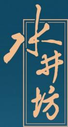

600年·活着的传承  
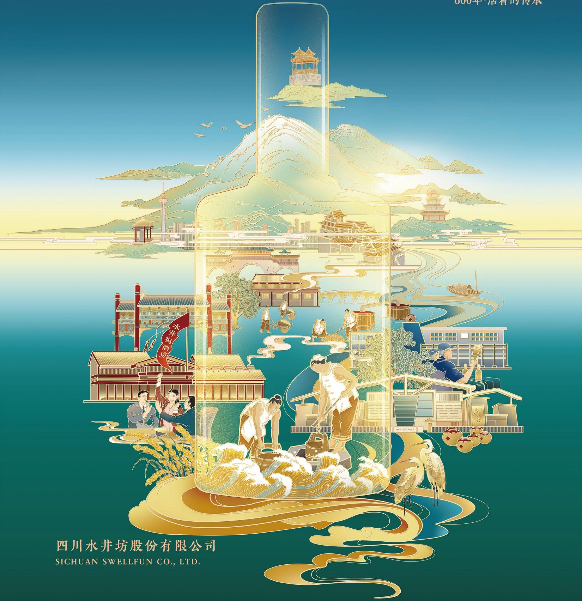

text_image

600年 沿着的传承
四川水井坊股份有限公司
SICHUAN SWELLFUN CO., LTD.

## 关于本报告

<table><tr><td>组织范围</td><td>本报告的披露范围与年报保持一致,覆盖四川水井坊股份有限公司及其附属单位在环境、社会、公司治理(ESG)方面的工作绩效。</td></tr><tr><td>报告编制方法</td><td>本报告依据并参照《上海证券交易所上市公司自律监管指引第14号——可持续发展报告(试行)》《上海证券交易所上市公司自律监管指南第4号——可持续发展报告编制(2026年修订)》、财政部《企业可持续披露准则——基本准则(试行)》《企业可持续披露准则第1号——气候(试行)》、国际可持续发展准则理事会(ISSB)《国际财务报告可持续披露准则第1号——可持续相关财务信息披露一般要求》(IFRS S1)及《国际财务报告可持续披露准则第2号——气候相关披露》(IFRS S2)、全球报告倡议组织发布的《可持续发展报告标准》(GRI标准)编制。同时参考联合国可持续发展目标(SDGs)以及中国酒业协会发布的《酒类企业ESG披露指南》等国内外标准及指引,对接国内宏观与产业政策及法律法规要求,比对行业企业实践,结合内外利益相关方的核心期待,识别了水井坊的实质性议题,并以此为基础确定了报告披露的优先事项。</td></tr><tr><td>时间范围</td><td>如无特殊说明,本报告所披露的数据及内容的时间跨度为2025年1月1日至2025年12月31日(部分内容超出上述范围)。</td></tr><tr><td>发布周期</td><td>本报告为年度报告,是四川水井坊股份有限公司发布的第五份ESG报告。</td></tr><tr><td>发布形式</td><td>本报告以印刷版(采用环保油墨及环保纸张印刷)和电子版形式发布,电子版下载地址:水井坊官网:http://www.swellfun.com上海证券交易所官网:http://www.sse.com.cn</td></tr><tr><td>信息说明</td><td>本报告所引用的信息和数据主要来源于公司内部相关数据收集系统、统计报告及公开资料。公司承诺本报告所引用的信息和数据不存在任何虚假记载、误导性陈述或重大遗漏,并对其内容客观性、真实性和准确性负责。如无特殊说明,报告中所示金额均以人民币列示。报告分别以简体中文、英文编制,在对中英文文本的理解上产生冲突时,以中文文本为准。若有信息和数据与年报不一致,以年报为准。</td></tr><tr><td>指代说明</td><td>为便于表述,报告中出现的“四川水井坊”“水井坊”“公司”及“我们”均代表四川水井坊股份有限公司及其附属单位。</td></tr><tr><td>意见反馈</td><td>若您对本报告有任何意见或建议,可以通过电子邮件esg@swellfun.com或扫描二维码反馈,感谢您对水井坊ESG工作的关心与支持。</td></tr></table>

## 目录

关于本报告 01

CEO 致辞 04

ESG战略与治理体系 06

2025年ESG评级、荣誉与社会认可 08

水井坊2035可持续发展目标：2025 10年关键绩效

利益相关方重点关注议题及沟通方式 12

双重重要性议题评估 14

专题：开启“十五五”新篇章，以高 20质量发展书写行业新答卷

## 第一章

## 敬·更高效的治理

积极开展党建工作 26

持续提升治理水平 27

董事会独立性与多元化 29

商业道德与诚信经营 30

知识产权保护 34

## 第二章

## 敬·更锦绣的山河

环境合规管理 38

应对气候变化 39

水资源利用 48

包装与废弃物管理 52

生态系统和生物多样性保护 55

## 第三章

## 敬·更美好的生活

产品和服务安全与质量 58

负责任营销实践 63

创新驱动 67

数据安全与客户隐私保护 70

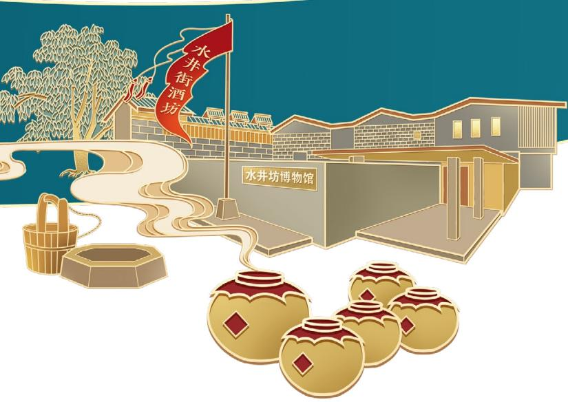

text_image

水井街酒坊
水井坊博物馆

## 第四章

## 敬·更成功的伙伴

员工权益与福利 74

员工培训与发展 77

职业健康与安全 80

供应链管理 85

经销商管理与权益保护 89

## 第五章

## 敬·更包容的社会

社会贡献 92

文化保护与传承 97

ESG生态圈共建 99

natural_image

Illustration of four men sitting at a table in a meeting, one holding a glass (no text or symbols visible)

附录 100

关键绩效数据 100

报告指标索引 106

关于水井坊 112

第三方审验 113

## CEO 致辞

2025 年，外部环境的复杂性有增无减——全球经济格局深度演变，国内消费结构加速升级，白酒行业的竞争逻辑正从规模驱动向价值深耕转型。站在国家两个五年规划的交汇点上，水井坊深刻感受到，时代对企业的期许正在发生深层转变——发展不仅要追求体量，更要追求品质；增长不仅要追求速度，更要追求可持续。

过去一年，我们继续沿着“水井坊·敬未来”ESG 战略及“水井坊 2035 可持续发展目标”的方向，一步一个脚印向前走。让我欣慰的是，这份坚守收获了主流 ESG评级及权威奖项的认可。更重要的是， ESG 正在从战略框架转化为制度和管理机制，逐渐成为每一个水井坊人的共同信仰，也实实在在地带动了商业创新实践。我们希望通过自身行动，在用好酒与消费者共庆美事的同时，也带动更多价值链伙伴，创造更广泛的社会福祉和更可持续的未来。

## 胡庭叶

四川水井坊股份有限公司总经理胡庭洲

natural_image

Portrait of a man in a dark suit and black turtleneck, with abstract geometric background (no text or symbols)

## 以品质立本

## “从每一颗种子开始”都经得起考验

产品品质是水井坊一切价值创造的原点。2025 年，我们实现原粮100%可预检、可管控的目标，持续落实“好酒，从一颗种子开始”的承诺，“原粮订单种植”的范围和品类进一步扩展，绿色种植标准全面执行，数字化溯源体系贯穿从播种到交付的每一个环节。好酒的根基，就扎在每一粒经得起检验的粮食里。

邛崃全产业链基地的“超级生产线”，是我们对“科技与传统如何共存”这一命题给出的实践答案。六百余年的酿造智慧在这里得到现代科技的支撑与延续，产能、品质与效能的全方位提升，为水井坊的长期音争力尊定了坚实的基础。EHS 数字化管理系统的上线，则进一步夯实了绿色运营的安全底座，让合规管理逐步走向数据驱动。凭借出色的数字化管理成效，《水井坊白酒质量数字化追溯管理体系建设》案例成功入选工业和信息化部“数字三品应用场景典型案例”。

## 以绿色笃行

## 用科学目标丈量承诺

绿色转型是水井坊可持续发展战略的主线。2025 年，水井坊正式通过科学碳目标倡议（SBTi）短期及长期目标审验，成为国内白酒行业首个通过该目标审核的企业。这意味着，我们的减排承诺从此具备了国际领先机构认可的科学基础，水井坊的气候治理也进入了可量化、可追踪的新阶段。

与此同时，我们将气候相关的风险与机遇主动纳入公司经营决策的考量维度，推动低碳发展从自身运营向全价值链延伸。我们已经逐步将 ESG 评价标准融入供应商的准入与比选流程。我们与国内众多龙头企业共同发起“供应链 ESG 管理倡议”（SCSI），成为 ISSB 可持续发展创新实践先学伙伴 50 人论坛成员，并积极参与中国酒业协会《白酒企业绿色供应链管理评价规范》团体标准的起草工作。凭借在供应链责任管理上的扎实实践，我们荣获Sedex 大奖，这既是对我们工作的认可，也印证了绿色转型正从自身运营走向全价值链的每一步都在落地。水井坊的绿色实践经验，正在转化为行业整体绿色转型的驱动力。

## 以关怀凝心

## 与每一位伙伴共同成长

水井坊始终相信，企业的持续成功，最终要仰仗于每一位与我们同发展、共进退的员工伙伴。重视人的发展、发掘人的价值，是我们凝聚长期向心力的关键策略。2025年，我们将员工心理健康支持融入日常工作场景，员工关爱计划（EAP）正式嵌入员工工作系统，让专业支持触手可及。同时，健康中心的建立与全员福利体检的推行，也让我们对员工身心健康的关注更加完善。

2026年初，水井坊荣膺杰出雇主认证（Top Employer），此认证由全球知名杰出雇主调研机构（Top EmployerInstitute）颁发，水井坊成为中国白酒行业首个且唯一获此殊荣的企业。该认证以严苛的标准化评审体系著称，维度覆盖使命价值观、人力资源管理体系及最佳实践、ESG 实践等核心维度。该认证的获得，标志着水井坊的企业治理与人力资源管理体系已达到全球领先水平。

我们的人本理念，也正在延伸至全价值链。面向订单种植供应商，我们开展再生农业培训宣导，帮助合作伙伴建立对再生农业概念与价值的认知。水井坊相信，只有当每一位伙伴都具备向前生长的能力，可持续发展才能真正落地生根。

## 以责任为根

## 用核心能力和价值回馈社会

文化传承是水井坊区别于众多同业最深层的底色。作为“双国保”的守护者，我们深知这份使命的分量——保护的不只是一处遗址、一门技艺，而是一段活着的历史。2025年，成都水井街酒坊遗址第四次被纳入《中国世界文化遗产预备名单》，水井坊博物馆获评“中国酒旅融合示范区”，并成为四川省首批工业研学旅行推荐单位。这些认可，让古老的酿造文脉以更开放的姿态走进当代公众的生活，也让文化保护的价值得到更广泛的社会共鸣。

酿好酒、循善行，是水井坊对社会始终如一的承诺。水井坊将理性饮酒宣传纳入企业可持续发展战略，确保这一公共健康责任的有效落实。在乡村帮扶层面，水井坊陪伴四川甘孜藏区走过了第七个年头，我们进一步聚焦 “教育添活力”与“民生改善”，坚持以“造血 + 赋能”的方式支持乡村振兴，着眼于能力建设与产业融合，支持乡村内生发展。

## 长期主义

## 是我们最坚定的选择

回望 2025 年，水井坊在 ESG 各个维度的关键进展，都不是孤立的成果，而是 “水井坊·敬未来”ESG 战略的自然流露。面向未来，外部环境的复杂性不会消减，但我们对长期主义的坚守绝不动摇。我们将以 ESG 为发展底色，推动公司健康、跨越式增长，成为一家真正经得起时间检验的成功企业。

## ESG战略与治理体系

## ESG 战略

2025 年，水井坊持续以“水井坊·敬未来”作为 ESG 战略核心，系统推进各项举措落地，携手多元利益相关方，以务实行动拓展长期共享价值的边界。在公司价值观引领及 ESG 战略与治理体系的支撑下，水井坊不断打磨产品与服务体验，回应消费者对品质的更高期待；深化与价值链伙伴的协同合作，推动业务稳步发展；积极履行企业社会责任，支持社区发展与社会福祉提升；坚持绿色发展理念，发挥正向引导的影响力，守护生态环境。

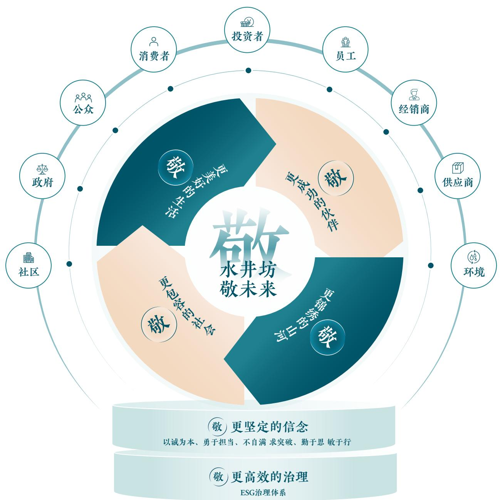

flowchart

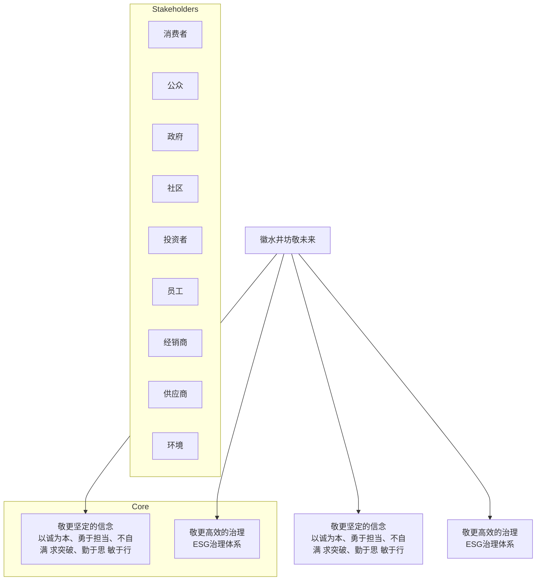
```mermaid
graph TD
  Center["徽水井坊敬未来"]
  
  subgraph Stakeholders
    A["消费者"]
    B["公众"]
    C["政府"]
    D["社区"]
    E["投资者"]
    F["员工"]
    G["经销商"]
    H["供应商"]
    I["环境"]
  end
  
  subgraph Core
    J["敬更坚定的信念\n以诚为本、勇于担当、不自满 求突破、勤于思 敏于行"]
    K["敬更高效的治理\nESG治理体系"]
  end
  
  Center --> J
  Center --> K
  Center --> L["敬更坚定的信念\n以诚为本、勇于担当、不自满 求突破、勤于思 敏于行"]
  Center --> M["敬更高效的治理\nESG治理体系"]
```

## ESG治理体系

水井坊的 ESG 治理体系为可持续发展目标的制定、进展追踪及相关风险管理提供坚实的组织基础和制度保障，助力水井坊持续提升企业治理水平，跟进利益相关方的重点关切，实现业务的稳健经营与可持续发展，最终推动实现“水井坊成为白酒领导品牌，持续健康成长，备受尊敬与信赖的白酒公司”的企业愿景。

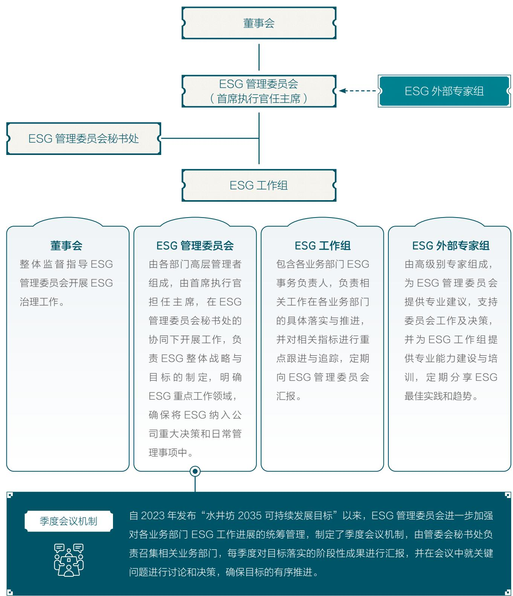

flowchart

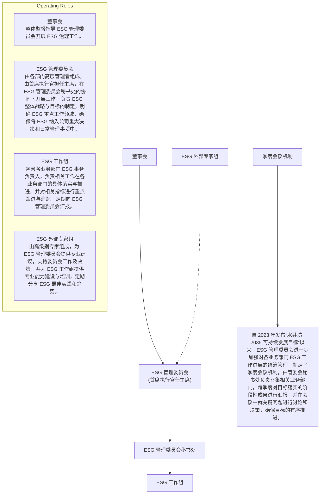
```mermaid
graph TD
  A["董事会"] --> B["ESG 管理委员会\n(首席执行官任主席)"]
  C["ESG 外部专家组"] -.-> B
  B --> D["ESG 管理委员会秘书处"]
  D --> E["ESG 工作组"]
  
  subgraph Operating Roles
    F["董事会\n整体监督指导 ESG 管理委员会开展 ESG 治理工作。"]
    G["ESG 管理委员会\n由各部门高层管理者组成，由首席执行官担任主席，在 ESG 管理委员会秘书处的协同下开展工作，负责 ESG 整体战略与目标的制定，明确 ESG 重点工作领域，确保将 ESG 纳入公司重大决策和日常管理事项中。"]
    H["ESG 工作组\n包含各业务部门 ESG 事务负责人，负责相关工作在各业务部门的具体落实与推进，并对相关指标进行重点跟进与追踪，定期向 ESG 管理委员会汇报。"]
    I["ESG 外部专家组\n由高级别专家组成，为 ESG 管理委员会提供专业建议，支持委员会工作及决策，并为 ESG 工作组提供专业能力建设与培训，定期分享 ESG 最佳实践和趋势。"]
  end
  
  O["季度会议机制"] --> P["自 2023 年发布“水井坊 2035 可持续发展目标”以来，ESG 管理委员会进一步加强对各业务部门 ESG 工作进展的统筹管理，制定了季度会议机制，由管委会秘书处负责召集相关业务部门，每季度对目标落实的阶段性成果进行汇报，并在会议中就关键问题进行讨论和决策，确保目标的有序推进。"]
```

## 2025年ESG评级、荣誉与社会认可

## ESG 评级

标普全球（S&P Global）

52

超越82%同业参评企业

CDP

B

气候变化

C

水安全

供应商参与度A，达到领导力等级

## 荣誉与社会认可

入选《标普全球可持续发展年鉴（中国版）

2025》，荣获“行业最佳进步企业”

标普全球（S&P Global）

2025 Sedex 供应链大奖—社会贡献奖

Sedex

2026 Top Employer（杰出雇主）

Top Employers Institute

2025年度“爱心企业”

成都市慈善总会

2025年度ESG创新案例

南方周末

ESG新标杆企业奖

证券之星

2025向光奖ESG可持续发展TOP15

向光未来

中国企业ESG领先者2025

商道融绿

2025年度致远奖—ESG先锋企业

财联社

年度ESG影响力企业

网易新闻（财经）

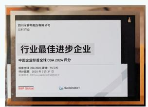

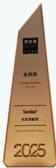

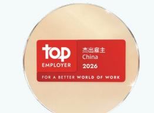

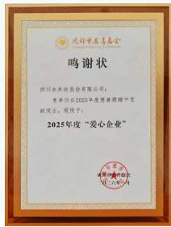

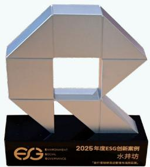

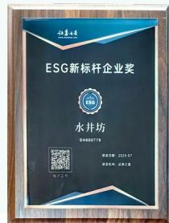

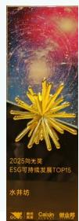

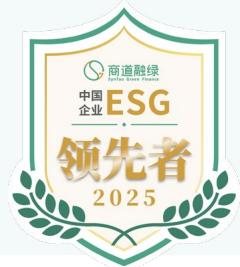

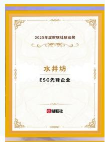

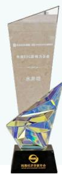

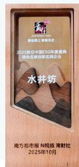

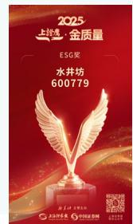

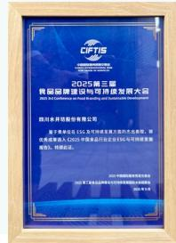

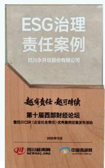

2025责任中国绿色低碳创新实践企业

南方都市报 N视频 湾财社

上证鹰·金质量 2025ESG奖

上海证券报 中国证券网

ESG案例入选《2025中国食品行业企业ESG与可持续发展报告》

2025中国国际服务贸易交易会

ESG治理责任案例

四川新闻网 中国西部网

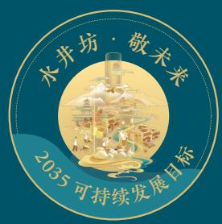

seal

水井坊·敬未来
2035可持续发展目标

## 水井坊2035可持续发展目标：2025年关键绩效

## 始终为消费者提供优质的产品和更健康的生活

将“原粮订单种植计划”的种类扩展到高粱、大米、糯米，种植规模超过 30,000 吨，并全部获得绿色食品认证  
开展 70 余场食品质量安全培训  
全年因安全与健康理由须召回的产品数量 0 个

## 为我们商业生态中的每一位伙伴创造共享价值

共计投入 207 万元，为员工提供总时长 13,512小时的针对性培训  
上线 EHS 数字化管理系统，实现线上化、流程化、智能化管控  
83 家关键供应商经过 SEDEX 审查评估  
员工百万损失工时事故率 0

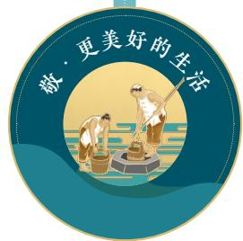

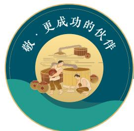

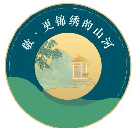

## 始终将低碳环保理念融入我们的业务发展与日常运营

正式通过SBTi（科学碳目标倡议）短期及长期目标审验  
邛崃工厂冷却水循环量达到 852,719 吨；邛崃工厂中水回用 771 吨  
所有新品的包装空隙率均低于企标内控要求 20%  
供应商运输及自有包装生产环节中，95% 采用可重复利用的注塑托盘（不包括异形瓶）  
土桥工厂共计购买绿色电力 6,768 兆瓦时，邛崃工厂共计购买绿色电力 12,526 兆瓦时  
沼气发电站全年发电量约 4,209,090 度

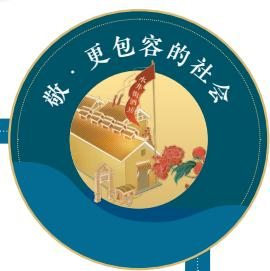

## 发挥我们的优势更好地为社区和社会服务

公益慈善现金捐赠人民币共计 2,000,000 元  
截至 2025 年底，超过一半员工加入“小酒花”志愿者队伍，员工与经销商人数已超 1,000 人，累计志愿服务超过 1,000 小时  
自 2018 年，水井坊已对口帮扶甘孜州石渠县长沙干玛乡七年，累计投入超 35万元，2025 年长沙干马乡受益 5,006 人

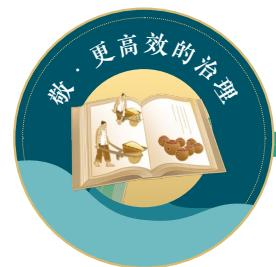

## 持续加强商业道德与合规管理体系建设

召开 3次股东大会和 3次业绩大会  
员工反腐败培训覆盖率 100%  
2025 年水井坊新获得专利 1 项，新申请商标 28 项，累计获得专利240 项，累计申请商标达 3,060 项

## 利益相关方重点关注议题及沟通方式

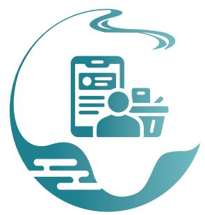

natural_image

Abstract logo design with stylized documents and icons, no text or symbols present

消费者、客户

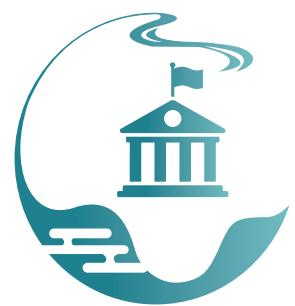

natural_image

Stylized logo of a classical building with flag, surrounded by abstract wave-like elements (no text or symbols)

政府、监管机构、行业协会

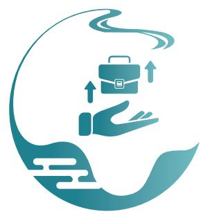

natural_image

Abstract logo design with a hand, briefcase, and upward arrows inside a swirling wave-like shape (no text or symbols)

股东与投资者

## 重点关注议题

产品和服务安全与质量  
创新驱动  
健康生活与理性饮酒倡导  
负责任营销实践  
数据安全与客户隐私保护

## 沟通方式

水井坊官网  
服务热线  
微信公众号、电商平台客服  
社交媒体沟通  
坊客有礼、美学馆、网球俱乐部等会员俱乐部  
品鉴会、品牌行等消费者活动  
消费者投诉渠道

## 重点关注议题

应对气候变化  
水资源利用  
包装与废弃物管理  
循环经济  
产品和服务安全与质量  
生态系统和生物多样性保护  
新质生产力  
乡村振兴

## 沟通方式

定期拜访和沟通  
信息披露  
书面汇报  
会议论坛  
行业政策研究与建议

## 重点关注议题

应对气候变化  
董事会独立性与多元化  
环境合规管理  
商业道德与诚信经营  
反不正当竞争  
知识产权保护  
利益相关方沟通

## 沟通方式

股东大会、投资者说明会、路演、分析师会议  
年报、半年报等公告披露  
电话、会议及公司拜访  
董事办邮箱  
多元举报渠道（热线电话、专用邮箱）

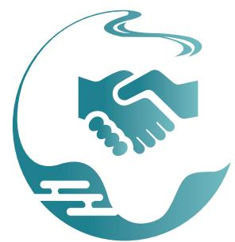

natural_image

Abstract logo design featuring two handshake symbols within a circular frame (no text or symbols)

合作伙伴、供应商、经销商

## 重点关注议题

产品和服务安全与质量  
能源利用  
原料采购可持续性  
供应链管理  
经销商管理与权益保护  
商业道德与诚信经营  
平等对待中小企业

## 沟通方式

供应商培训会  
经销商大会  
供应商ESG绩效评估

natural_image

Abstract logo design with three stylized human figures and flowing lines, no text or symbols present.

员工

## 重点关注议题

员工权益与福利  
职业健康与安全  
员工培训与发展

## 沟通方式

职工代表大会  
“Your Voice 您的心声” 调研  
员工培训  
微信公众号  
日常沟通反馈  
第三方合规热线和邮箱举报渠道

natural_image

Abstract logo with a megaphone inside a circular shape and wave-like elements (no text or symbols)

公众、媒体

## 重点关注议题

产品和服务安全与质量  
健康生活与理性饮酒倡导  
包装与废弃物管理  
负责任营销实践  
减少食物损失与浪费  
社会贡献

## 沟通方式

水井坊官网  
公益活动  
媒体活动和会议  
工厂开放日参观  
博物馆参观

## 双重重要性议题评估

2025 年，水井坊依据《上海证券交易所上市公司自律监管指引第 14 号——可持续发展报告（试行）》（以下简称《指引》）和《上海证券交易所上市公司自律监管指南第 4 号——可持续发展报告编制》（以下简称《指南》），结合自身经营实践与行业现状，系统开展双重重要性议题分析，识别并确认对公司及利益相关方具有重要意义的可持续发展议题。

本报告依据《指引》所列的 21 项可持续发展议题框架，对公司往年 ESG 报告中的相关议题进行了系统性梳理与整合，包括议题名称的规范化调整、相近议题的合并归类及新议题的补充纳入，具体如下：

## 环境议题

能源使用与温室气体排放→ 能源利用（名称调整）  
水资源管理 → 水资源利用（名称调整）  
包装与废弃物管理  
原料采购可持续性  
可持续农业（融合至原料采购可持续性）  
减少食物损失与浪费

可持续产品与消费  
气候变化适应策略 → 应对气候变化（名称调整）  
生物多样性 → 生态系统和生物多样性保护（名称调整）  
环境合规管理（新增）  
循环经济（新增）

## 社会议题

产品质量与安全 → 产品和服务安全与质量（名称调整）  
健康生活与理性饮酒倡导  
负责任营销实践  
消费者权益保护（融合至负责任营销实践）  
职业健康与安全  
员工权益与福利  
员工培训与发展  
包容与多元的职场环境（融合至员工权益与福利）  
供应链管理

经销商管理与权益保护  
平等对待中小企业（新增）  
新质生产力  
文化传承与创新 →创新驱动（名称调整）  
支持社区发展 → 社会贡献（名称调整）  
乡村振兴与共同富裕 → 乡村振兴（名称调整）  
数据安全与隐私保护→ 数据安全与客户隐私保护（名称调整）

## 治理议题

董事会独立性与多元化  
商业道德与诚信经营  
反不正当竞争  
知识产权保护  
环境与社会风险识别及管理（融合至环境合规管理）  
反腐败和廉洁建设 （融合至商业道德与诚信经营）  
投资者关系管理 → 利益相关方沟通（名称调整）

natural_image

Illustration of two ancient Chinese figures playing chess on an open book, surrounded by decorative elements (no text or symbols)

## 双重重要性议题评估流程

## 背景梳理与利益相关方识别

对内外部环境及可持续发展背景进行系统梳理，分析公司活动和业务关系，研判监管要求及市场趋势，识别与公司经营密切相关的各类利益相关方。

## 议题清单建立

以《指引》所提供的议题框架为参照基准，综合宏观政策、行业标准、同业实践，建立具有公司特性的可持续发展议题，形成完整的议题清单。

## 影响重要性评估

基于议题清单，利益相关方围绕其是否会对经济、社会和环境产生实际或者潜在重大影响展开评估。参与评估的利益相关方包括董事会、员工、消费者 / 公众、经销商、供应商、政府 / 监管机构、行业协会、股东/ 投资者、媒体、NGO 等。共收集 549 份利益相关方的在线问卷回复。

## 财务重要性评估

基于议题清单，利益相关方围绕其是否对公司商业模式、业务运营、发展战略、财务状况、经营成果、现金流、融资方式及成本等产生重大影响，从影响的可能性和影响程度展开评估。参与评估的利益相关方包括公司管理层、财务部门、可持续发展部门。共收集 12 份利益相关方的在线问卷回复。

## 议题确认与披露

形成最终的双重重要性议题矩阵，将评估结果提交至 ESG 管理委员会确认，并据此作为公司可持续发展治理与管理工作的基础，及 ESG 报告的重点披露维度。

## 双重重要性评估结果

双重重要性矩阵  
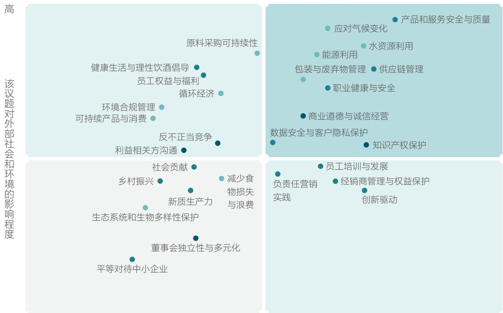

scatter

| Category | X (Relative) | Y (Impact Level) |
| --- | --- | --- |
| 产品和服务安全与质量 | High | High |
| 应对气候变化 | High | High |
| 水资源利用 | High | High |
| 能源利用 | High | High |
| 包装与废弃物管理 | High | High |
| 供应链管理 | High | High |
| 职业健康与安全 | High | High |
| 原料采购可持续性 | Medium-High | High |
| 健康生活与理性饮酒倡导 | Medium-High | Medium-High |
| 员工权益与福利 | Medium-High | Medium-High |
| 循环经济 | Medium-High | Medium-High |
| 商业道德与诚信经营 | Medium-High | Medium-High |
| 数据安全与客户隐私保护 | Medium-High | Medium-High |
| 知识产权保护 | Medium-High | Medium-High |
| 环境合规管理 | Medium-Low | Medium-High |
| 可持续产品与消费 | Medium-Low | Medium-High |
| 反不正当竞争 | Medium-Low | Medium-High |
| 利益相关方沟通 | Medium-Low | Medium-High |
| 社会贡献 | Low-Medium | Medium-High |
| 乡村振兴 | Low-Medium | Medium-High |
| 新质生产力 | Low-Medium | Medium-High |
| 生态系统和生物多样性保护 | Low-Medium | Medium-High |
| 董事会独立性与多元化 | Low-Medium | Medium-High |
| 平等对待中小企业 | Low-Medium | Medium-High |
| 员工培训与发展 | Medium-High | Low-Medium |
| 经销商管理与权益保护 | Medium-High | Low-Medium |
| 负责任营销实践 | Medium-High | Low-Medium |
| 创新驱动 | Medium-High | Low-Medium |

低  
该议题对水井坊财务表现的影响程度  
高

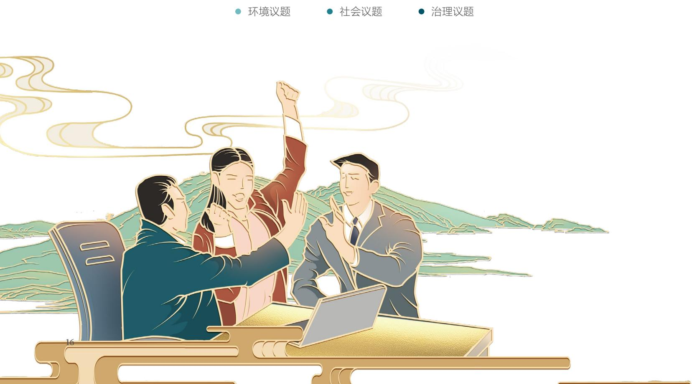

text_image

环境议题
社会议题
治理议题

在议题披露结构上，本报告参照《指引》所建议的“治理—战略—影响、风险和机遇管理—指标与目标”四要素框架进行撰写，并结合公司实际情况作出差异化处理：鉴于开篇已就水井坊 2035 可持续发展目标下各议题的年度进展进行集中呈现，为避免内容重复，除应对气候变化外，各具体议题章节不再单独设置“指标与目标”板块。在保留“治理一战略一影响、风险和机遇管理”三要素的基础上，新增“管理与实践进展”板块，以更完整地反映公司在各议题上的行动举措与阶段成效。

## 合并披露的议题

因议题间关联度较高，健康生活与理性饮酒倡导合并至负责任营销实践，新质生产力合并至创新驱动，平等对待中小企业合并至供应链管理，原料采购可持续性、能源利用合并至应对气候变化，循环经济、可持续产品与消费、减少食物损失与浪费合并至包装与废弃物管理，乡村振兴合并至社会贡献，反不正当竞争合并至商业道德与诚信经营。

## 未完整适用四要素的议题

员工权益与福利、环境合规管理、生态系统与生物多样性保护、社会贡献、董事会独立性与多元化、利益相关方沟通，因其财务重要性较低，未采用四要素框架进行披露。

## 按照四要素披露的议题

其余 13 项议题（产品和服务安全与质量、负责任营销实践、创新驱动、数据安全与客户隐私保护、员工培训与发展、职业健康与安全、供应链管理、经销商管理与权益保护、应对气候变化、水资源利用、包装与废弃物管理、商业道德与诚信经营、知识产权保护）均系统披露了“治理 - 战略 - 影响、风险和机遇管理 - 管理实践与进展”。

## 重要性议题的影响、风险与机遇分析

2025 年，水井坊共识别出 29 项议题。其中，10 项议题具有双重重要性，8 项议题仅具有影响重要性，4 项议题仅具有财务重要性，7 项目议题既不具有影响重要性，也不具有财务重要性。

<table><tr><td rowspan="2">议题</td><td colspan="5">风险与机遇分析</td><td rowspan="2">重要性类型</td></tr><tr><td>主要影响范围</td><td>主要风险描述</td><td>影响周期</td><td>主要机遇描述</td><td>影响周期</td></tr><tr><td>产品和服务安全与质量</td><td>企业自身运营价值链下游</td><td>·质量事故导致赔偿、监管处罚及收入下滑</td><td>短期中期</td><td>·提升品质,增强复购与溢价能力</td><td>中期长期</td><td>双重重要性</td></tr><tr><td>水资源利用</td><td>企业自身运营价值链上游</td><td>·取水限制及水价上涨,提高运营成本</td><td>中期长期</td><td>·优化水管理体系,降低长期用水成本</td><td>中期长期</td><td>双重重要性</td></tr><tr><td>应对气候变化</td><td>企业自身运营价值链上游</td><td>·政策趋严与气候风险,增加成本与经营不确定性</td><td>短期中期</td><td>·布局低碳转型,获取市场优势</td><td>中期长期</td><td>双重重要性</td></tr><tr><td>能源利用</td><td>企业自身运营</td><td>·能源价格波动提高生产成本</td><td>短期中期</td><td>·推进节能与清洁能源替代,降低成本并获取融资支持</td><td>中期长期</td><td>双重重要性</td></tr><tr><td>供应链管理</td><td>价值链上游</td><td>·供应链波动影响交付与业绩稳定性</td><td>短期中期</td><td>·构建多元化、可追溯的供应链体系,优化成本</td><td>中期长期</td><td>双重重要性</td></tr><tr><td>包装与废弃物管理</td><td>企业自身运营价值链下游</td><td>·环保政策趋严提升合规与原材料成本</td><td>短期中期</td><td>·轻量化环保包装降低采购成本,吸引绿色消费群体</td><td>中期</td><td>双重重要性</td></tr><tr><td>职业健康与安全</td><td>企业自身运营</td><td>·安全事故导致赔偿、处罚及运营中断</td><td>短期中期</td><td>·构建卓越安全文化,提升组织稳定性</td><td>短期中期</td><td>双重重要性</td></tr><tr><td>商业道德与诚信经营</td><td>企业自身运营</td><td>·合规问题影响融资能力与公司估值</td><td>短期中期</td><td>·良好信誉降低融资成本,吸引长期资本</td><td>中期长期</td><td>双重重要性</td></tr><tr><td>知识产权保护</td><td>企业自身运营价值链下游</td><td>·侵权纠纷带来损失及法律成本</td><td>中期长期</td><td>·完善知识产权体系,支撑长期品牌溢价</td><td>中期长期</td><td>双重重要性</td></tr><tr><td>数据安全与客户隐私保护</td><td>企业自身运营价值链下游</td><td>·数据安全事件导致处罚与客户流失</td><td>短期中期</td><td>·强化数据治理,为精准营销与数字化运营深度赋能</td><td>中期长期</td><td>双重重要性</td></tr><tr><td>原料采购可持续性</td><td>价值链上游</td><td>·原料价格波动对采购成本产生压力</td><td>长期</td><td>·与优质农业基地建立长期合作,提升产品竞争力</td><td>长期</td><td>仅影响重要性</td></tr></table>

<table><tr><td rowspan="2">议题</td><td colspan="5">风险与机遇分析</td><td rowspan="2">重要性类型</td></tr><tr><td>主要影响范围</td><td>主要风险描述</td><td>影响周期</td><td>主要机遇描述</td><td>影响周期</td></tr><tr><td>健康生活与理性饮酒倡导</td><td>价值链下游</td><td>政策与舆论约束影响消费场景</td><td>长期</td><td>推动产品创新,拓展新消费群体</td><td>长期</td><td>仅影响重要性</td></tr><tr><td>员工权益与福利</td><td>企业自身运营</td><td>员工流动导致增加用工成本</td><td>长期</td><td>降低人才流失率,促进生产效率提升与运营成本优化</td><td>长期</td><td>仅影响重要性</td></tr><tr><td>循环经济</td><td>企业自身运营价值链下游</td><td>转型体系搭建导致潜在成本增加</td><td>长期</td><td>深入推进循环经济实践可逐步降低废弃物处置成本</td><td>长期</td><td>仅影响重要性</td></tr><tr><td>环境合规管理</td><td>企业自身运营</td><td>环保处罚及限产风险</td><td>短期</td><td>强化与优质伙伴的长期合作关系</td><td>中期长期</td><td>仅影响重要性</td></tr><tr><td>可持续产品与消费</td><td>价值链下游</td><td>进行市场消费者沟通及消费者教育,导致市场教育成本增加</td><td>长期</td><td>传递环保和社会责任理念,增强消费者的购买意愿</td><td>长期</td><td>仅影响重要性</td></tr><tr><td>反不正当竞争</td><td>企业自身运营价值链下游</td><td>投入更多的资源和精力进行合规管理</td><td>短期</td><td>保护品牌价值,促进行业长期发展</td><td>中期长期</td><td>仅影响重要性</td></tr><tr><td>利益相关方沟通</td><td>企业自身运营</td><td>提升沟通透明度与信任度需要付出更多的信息披露成本</td><td>长期</td><td>完善沟通机制有助于提升公司评级,强化资本市场信心</td><td>长期</td><td>仅影响重要性</td></tr><tr><td>员工培训与发展</td><td>企业自身运营</td><td>人才能力短板制约公司发展</td><td>中期长期</td><td>培养优秀员工,增强企业竞争力</td><td>中期长期</td><td>仅财务重要性</td></tr><tr><td>负责任营销实践</td><td>价值链下游</td><td>不当营销引发的监管调查、罚款及舆论危机</td><td>短期中期</td><td>建立差异化营销体系,促进销售提升</td><td>中期长期</td><td>仅财务重要性</td></tr><tr><td>创新驱动</td><td>企业自身运营</td><td>技术升级和工艺改造需较大的研发资本开支</td><td>中期长期</td><td>具有创新能力和成长潜力的企业往往更容易获得投资者的青睐和资金支持</td><td>中期长期</td><td>仅财务重要性</td></tr><tr><td>经销商管理与权益保护</td><td>价值链下游</td><td>投入更多的人力、物力和财力建立经销商管理系统,增加企业的管理成本</td><td>短期中期</td><td>优化资金流,有效地控制应收账款的回收周期,降低坏账风险</td><td>中期长期</td><td>仅财务重要性</td></tr></table>

## 专题

## 开启“十五五”新篇章，以高质量发展书写行业新答卷

《中华人民共和国国民经济和社会发展第十五个五年规划纲要》（以下简称“‘十五五’规划”）以推动高质量发展为主题，以改革创新为根本动力，以满足人民日益增长的美好生活需要为根本目的，对2026至2030 年的经济社会发展作出了系统部署。水井坊积极响应“十五五”规划中的绿色转型、新质生产力、文化创新、健康中国、乡村振兴等各项重点任务，持续强化在环境、社会与治理方面的合规与创新实践，为白酒行业在“十五五”时期的可持续发展提供了标杆范式。

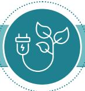

## 加快绿色低碳转型，构建全价值链绿色发展格局

“十五五”规划提出，要积极稳妥推进和实现碳达峰，加快形成绿色生产生活方式，提升应对全球气候变化能力。

水井坊将应对气候变化融入公司经营与长期发展战略，持续识别气候相关风险与机遇，并进一步评估其对财务的潜在影响。2025 年，水井坊正式通过科学碳目标倡议（SBTi）短期及长期目标审验，将减排路径与全球控温 1.5℃目标对齐。在自身运营中，公司在推进节能减排措施基础上，通过购买绿电、自建沼气发电设施等积极探索可再生能源应用。

此外，水井坊进一步延伸绿色治理边界，推动绿色标准向上游延伸、低碳理念向下游传导。原料端，订单种植的原粮已全部获得绿色食品认证，并将 ESG 指标纳入供应商筛选体系，积极推动再生农业实践；仓储物流端，引入 AGV 自动搬运系统降低能耗，并逐步推广新能源运输车辆，制定低碳运输发展规划；消费端，通过推进包装材料减量化、资源化与无害化，构建循环利用体系。

## 优化提升传统产业，以新质生产力赋能白酒高质量发展

“十五五”规划提出，要推动技术改造升级，促进制造业数智化转型，发展智能制造，绿色制造，服务型制造。强化企业科技创新主体地位，落实企业在技术创新决策、研发投入、科研组织和成果转化应用中的主体地位。

对白酒行业而言，高质量发展的核心命题并非以现代技术替代传统工艺，而在于探索科技创新和产业创新深度融合的实践路径。水井坊邛崃全产业链基地作为集酿酒、储存、包装、研发于一体的综合性生产基地，将智能装备系统性引入酿造核心工序，同时实现全流程数据管控，持续提升生产稳定性和精准性，在更高标准下延续 600 年的酿造智慧。

在科研创新层面，公司深化与中国科学院微生物研究所的合作，围绕“一号菌群”等酿酒微生物生态展开研究，以科研驱动工艺优化与品质提升，同时通过参与行业团体标准制定，为行业规范体系提供实践参考。

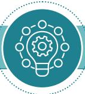

## 繁荣文化事业，深化“双国保”的活态传承与创新表达

“十五五”规划提出，要加强优秀传统文化保护传承利用，让人民享受更高品质的文化生活。大力发展文化旅游业，推进文旅深度融合。

作为全国重点文物保护单位“水井街酒坊遗址”的守护者，水井坊博物馆积极利用科技手段，对文物建筑及土遗址的关键指标开展动态监测与风险预警，为增强遗址的预防性保护工作提供科学依据。同时，公司实施第九代传承人培养计划，持续夯实国家级非物质文化遗产“水井坊酒传统酿造技艺”的人才传承梯队，并开展沉浸式体验、跨界融合等创新活动，推动传统文化的大众传播。

此外，在成都市文旅部门推出的酒旅融合线路中，水井坊博物馆为精品线路之一的起点，串联起杜甫草堂、夜游锦江等城市文化地标，为消费者提供更加优质、丰富的文化旅游体验 , 也为白酒产业的持续发展注入新的发展动力。

natural_image

Abstract decorative line art with layered wave patterns and birds (no text or symbols)

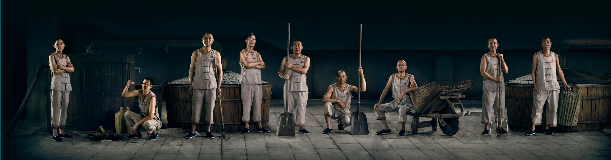

natural_image

Group photo of ten workers in traditional-style uniforms posing in a dimly lit workshop (no visible text or symbols)

## 助力健康中国建设，将理性饮酒责任内化为企业战略

“十五五”规划提出，要实施健康优先发展战略，健全健康促进政策制度体系，提高人民健康水平。

2025 年，水井坊将理性饮酒从合规要求提升为企业战略，从责任内生性、创新普惠性、长期确定性三方面持续推进理性饮酒倡导。其中，责任内生性体现在将理性饮酒理念深度嵌入价值链各环节，从产品设计到外部合作实现责任理念的全程覆盖；创新普惠性体现在突破传统传播边界，通过多元化场景与方式实现理性饮酒教育的广泛触达；长期确定性则体现在将理性饮酒目标纳入公司量化可持续发展体系，与 " 健康中国 2030"国家战略深度绑定。以制度化安排确保行动的持续性

行动层面，公司将理性饮酒从单一企业责任议题，拓展为推动行业健康发展的系统性实践。2025 年，公司以"友邻公益跑道"等创新场景将理性饮酒教育延伸至公众日常生活空间，以"白酒学坊"平台将白酒文化与健康生活风尚相结合，积极传播理性饮酒理念。

## 推动乡村全面振兴，深化"造血+ 赋能"帮扶模式

“十五五”规划提出，要推进宜居宜业和美乡村建设，逐步提高农村基础设施完备度、公共服务便利度、人居环境舒适度，发展县域富民产业。

水井坊建立了“基层治理、产业融合、民生保障”三维帮扶体系，推动帮扶工作从“输血”向“造血 + 赋能”的系统性转型。公司通过“原粮订单种植计划”将企业发展与农业、农村、农民深度绑定，以订单化、集约化、基地化的种植管理模式带动产区的农业现代化与农户增收，同时形成酒糟与本地特色养殖产业的协同模式，将酿造副产品转化为周边养殖户的优质饲料来源，推动乡村特色养殖产业提质增效

此外，水井坊持续深耕对甘孜州石渠县长沙干玛乡的对口帮扶，七年累计投入超 35 万元用于改善困难家庭生活条件及乡村教育设备水平，2025 年受益人数达 5,006 人。在教育赋能层面，水井坊博物馆为来自多个省份的乡村学生开展非遗公益研学活动，帮助乡村孩子拓宽视野。

## 第一章

## 敬·更高效的治理

水井坊致力于构建透明、稳健、负责任的现代治理体系，为企业稳健运营与可持续发展提供坚实保障。公司将思想教育与基层党建融入治理实践，巩固发展根基；严格遵循现代企业治理准则，强化董事会战略引领与监督制衡功能；依法履行信息披露义务，完善投资者关系管理及利益相关方沟通机制。

积极开展党建工作  
持续提升治理水平  
董事会独立性与多元化  
商业道德与诚信经营  
知识产权保护

响应联合国可持续发展目标（SDGs）

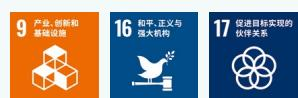

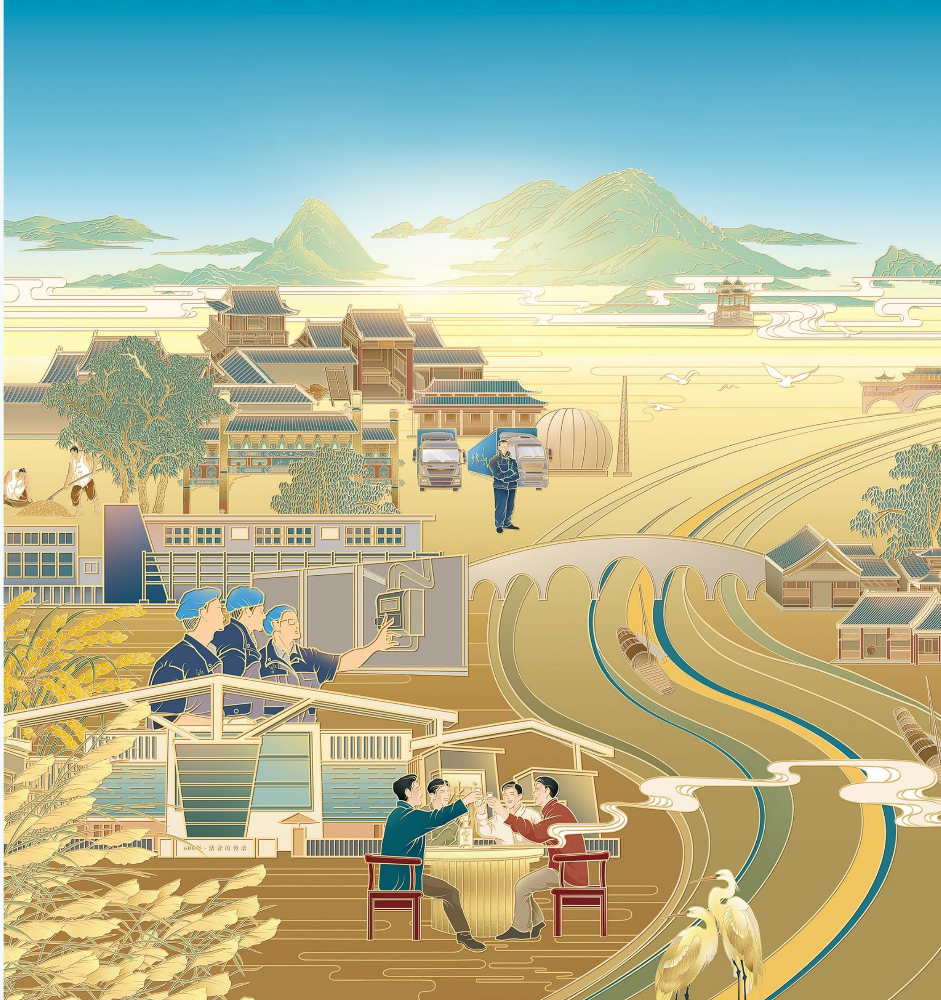

natural_image

Illustration of a traditional Chinese village with tourists, boats, and mountains in the background (no text or symbols)

## 积极开展党建工作

2025年，水井坊党委持续深化党组织建设，以规范化、制度化建设为抓手，不断夯实组织根基。公司党委下设9个党支部，截至 2025 年底共有党员 294 人，配备 12 名兼职党务干部，形成年龄结构与知识结构合理的梯次化队伍。党委积极响应上级要求，依托“蓉城先锋·党员 e 家”平台推进党员常态化学习，全年党员参学率达 100%，累计完成学时 9,624学时，完成率 100%，为党建引领企业高质量发展筑牢思想根基。

同时，公司积极践行社会主义核心价值观，开展立体化党建工作，推动党员先锋作用融入业务实践，促进企业文化建设与党风建设深度融合。

2025 年，

公司党委下设党支部

9 个

截至2025 年底共有党员

294人

配备兼职党务干部

12名

全年党员参学率达

100%

累计完成学时

9,624 学时

完成率

100%

## 案例

2025 年 7 月 1 日，为深入学习贯彻习近平总书记关于党纪学习教育的重要讲话和重要指示精神，进一步加强党员党性修养，水井坊联合邛崃市新时代文明实践中心、邛崃市孔明街道酒源社区等单位，组织开展“2025 年友邻计划——弘扬长征精神·赓续红色血脉”党建联建主题活动，深化单位间协作，凝聚发展合力，为新时代高质量发展注入红色动能。

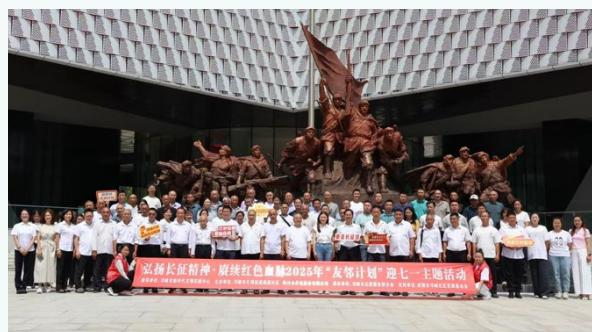

text_image

弘扬长征精神·赓续红色画融2025年“友邻计划”迎七一主题活动

此外，水井坊党委响应各级党委的号召，坚持以广大职工为主体，为员工解决实际困难，面向有需要的职工提供帮扶。2025年全年，公司党委共计为员工发放困难（疾病）补助43人次，为36位员工子女发放阳光助学金。

## 持续提升治理水平

水井坊董事会遵循《公司法》《证券法》《上市公司治理准则》等法律法规，保障治理活动的合法合规，积极履行董事会的治理职责，持续维护公司及全体股东的合法权益。

## 公司治理架构

水井坊建立并持续完善以股东会、董事会、管理层为核心的现代法人治理结构，各主体权责明确、相互制衡。2025 年，为适应新修订的《公司法》及监管实践，公司对治理结构进行优化调整，将“股东大会”统一更新为“股东会”，同时取消监事会，由审计委员会承接其监督职能，进一步厘清了决策与监督机制。董事会下设战略委员会、审计委员会、提名委员会、薪酬与考核委员会四个专门委员会，各委员会均依据公司治理及内部控制相关制度规范运行，协助董事会履行专业职能，为科学决策提供有力支撑。

水井坊公司治理架构  
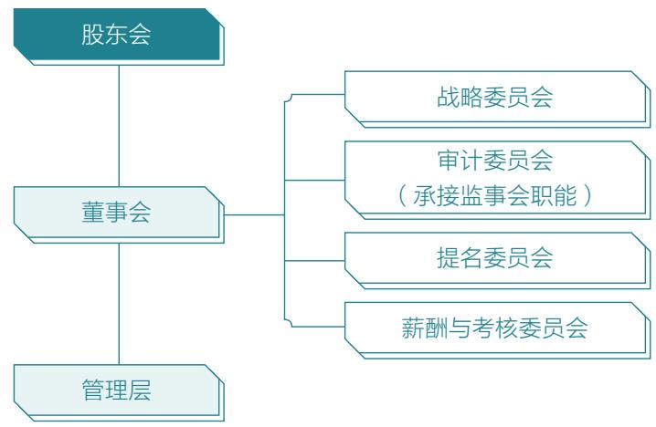

flowchart

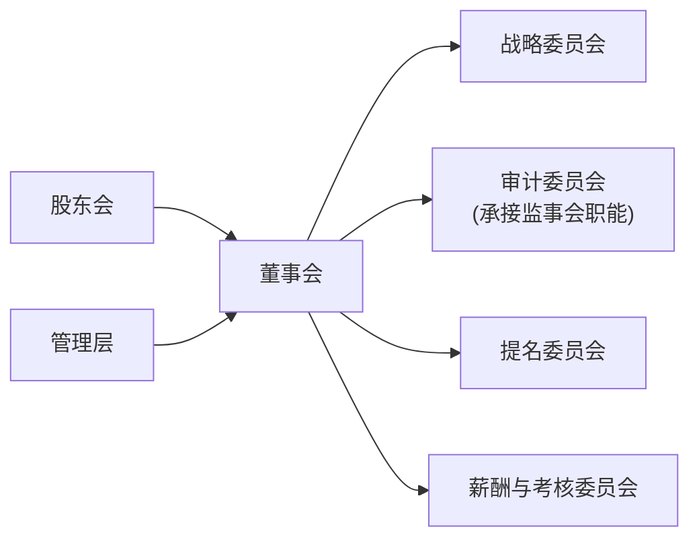
```mermaid
graph LR
  A["股东会"] --> B["董事会"]
  C["管理层"] --> B
  B --> D["战略委员会"]
  B --> E["审计委员会\n(承接监事会职能)"]
  B --> F["提名委员会"]
  B --> G["薪酬与考核委员会"]
```

## 保障信息透明

水井坊建立了完善的信息披露管理制度体系，制定并实施《重大信息内部报告制度》《内幕信息知情人登记管理制度》《年报信息披露重大差错责任追究制度》等制度文件，对重大信息报送、登记及责任追究等流程进行规范。在重大事项以及定期报告、临时报告披露前，公司董事会办公室均组织相关责任人员登记《内幕信息知情人档案》，并履行保密义务，确保内幕信息得到有效管理，防范内幕信息被不当利用。

在制度保障下，公司持续提升信息披露工作的规范性与透明度，及时向投资者和社会公众披露公司财务状况、经营表现及重大事项等重要信息。同时，公司通过投资者交流活动、沟通平台等多种方式加强与投资者的互动，持续完善分红制度回馈股东，保障投资者合法权益，提升市场对公司的信任度。

水井坊严格落实信息披露要求，2025 年编写并发布定期报告和临时公告共计 83 份，编写并提交给上交所备案的文件共计 43 份。凭借稳定的信息披露质量，水井坊在上交所 2024-2025 信息披露工作评价中获得 B 级。

水井坊董事会关心股东利益，积极参与投资者关系管理。2025年，公司共召开3次股东大会和3次业绩说明会，并通过 E 互动平台、董办邮箱和热线电话等多种渠道，与投资者保持密切沟通，解答投资者关于公司治理、发展战略、经营状况等方面的提问，切实维护投资者合法权益

水井坊始终秉持着诚信经营和回报股东的理念，积极制定合理的分红政策，为股东创造稳定的收益，并通过定期分红的方式，将公司的经营成果与股东共享。

公司近三年分红情况

<table><tr><td>实施分红年份</td><td>2025</td><td>2024</td><td>2023</td></tr><tr><td>每10股派息数(元)(含税)</td><td>2.55</td><td>9.7</td><td>7.5</td></tr><tr><td>现金分红的数额(亿元)(含税)</td><td>1.24</td><td>4.70</td><td>3.65</td></tr><tr><td>分红占合并报表中归属于上市公司普通股股东的净利润的比率(%)</td><td>30.45</td><td>35.06</td><td>30.07</td></tr></table>

## 董事会履职与赋能

随着监管对董事会履职能力提出更高要求，水井坊董事会积极响应，从结构合规性、履职程序、能力建设体系化等方面构建更专业的治理团队。2025 年，水井坊以通讯或现场结合通讯的方式共召开 3 次股东会、12 次董事会及 1 次独立董事专门会议，以推动董事会积极参与公司治理。

为进一步强化董事会治理效能，2025 年董事办组织公司董事、监事及高管参加四川省上市公司协会、上海证券交易所关于上市公司控股股东、实际控制人、董事、监事及高级管理人员相关培训共计 2 次，确保董监高学习了解最新的上市监管法律法规，以提升董事会决策质量和风险防控水平。

此外，董事会秘书作为公司治理的核心枢纽，是连接董事会、管理层、股东、监管机构及利益相关方的关键桥梁，对完善公司治理、保障规范运作、维护公司及全体股东合法权益具有重要意义。2025年，水井坊董秘凭借卓越表现获得多项殊荣。

## 2025 年水井坊董秘荣膺奖项

2025年上市公司

董事会秘书履职评价“4A”

中国上市公司协会

2025年上市公司

董事会优秀实践案例

中国上市公司协会

2025 年上市公司

董事会办公室最佳实践

中国上市公司协会

2025年度上市公司投资者

关系水晶球奖

证券市场周刊

上市公司水晶球奖-

2025年度上市公司最佳董秘

证券市场周刊

第二十一届新财富金牌董秘

（总榜第十八名）

深圳市新财富数字科技有限

责任公司

2025年资本力量年度评选

卓越董秘奖

证券之星

上市公司阳光董秘

证券时报社

## 董事会独立性与多元化

为保障董事会基于客观公正立场行使决策与监督职能，提升公司治理透明度与公信力，水井坊高度重视董事会独立性建设，围绕董事选举、结构配置及日常运作三大关键环节，严格依照法律法规与监管要求确保董事会的独立履职。

## 董事会成员选举的独立性

本届（第十一届）董事会非职工董事由公司股东大会选举产生，相关选举议案经股东大会审议通过，表决通过比例高于出席会议的股东所持有表决权股份数的 99%。职工董事由公司员工代表大会民主选举产生。

## 董事会成员构成的独立性

公司董事会共包括 12 位董事，其中独立董事 4 名，占董事总人数的 1/3，职工董事 1 名。董事会各专业委员会中均有独立董事任职，职工董事为公司董事会战略委员会成员。公司历次董事会会议均有独立董事及职工董事出席。

## 董事会运营的独立性

公司大股东、实际控制人严格按照《上市公司控股股东、实际控制人行为指引》处理与上市公司的关系，行为规范，与上市公司之间的人员、资产、财务分开，机构、业务独立。同时，公司董事会和内部机构均能独立运作。

在董事会多元化建设方面，公司4名独立董事分别具备资产评估，财务，法律和投资专业背景，能够充分发挥专业优势为公司经营发展提供专业建议，就董事会审议事项发表客观、独立的意见，切实维护公司及全体股东的合法权益。

natural_image

Illustration of five people collaborating around a laptop in a meeting with pink blossoms in the foreground (no text or symbols)

## 商业道德与诚信经营

## 治理

公司以《商业行为准则》为根本遵循，配套《反贿赂政策》《预防利益冲突指南》《反不正当竞争及反垄断指导方针》等制度，构建起覆盖反贿赂、反不正当竞争、反洗钱、数据安全等关键领域的合规制度网络，各级管理者带头践行，推动商业道德标准层层落实。

为强化监督执行，公司制定《违规行为举报与调查实施办法》，设立热线电话、专用邮箱等多元举报渠道，严格保护举报人与被举报人合法权益，对查实违规行为严肃处理，彰显“零容忍”态度，营造风清气正的廉洁文化。

## 战略

公司致力于构建并维护一个“制度健全、执行有力、文化深入”的商业道德与风险防控体系。公司以“顶层设计、制度约束、全员教育、严格监督、主动治理”五维联动为核心战略，推动商业道德与公平竞争准则内化为价值共识，外化为行为准则，固化为体系保障。这不仅意味着自身严守合规底线，更强调通过系统化的风险治理架构与透明的问责文化，将诚信、公平与稳健锻造为公司最持久的品牌资产和市场竞争优势——以诚信立身、以公平筑基、以风控致远，筑牢企业可持续发展的信任基石。

## 影响、风险和机遇管理

水井坊严格遵循《反垄断法》《反不正当竞争法》《个人信息保护法》等法律法规，确保所有商业行为始终在法律与道德框架内规范运行，以扎实的合规治理筑牢企业可持续发展的信任基石。公司建立并始终实行以“三道防线”为核心的风险管理体系。从业务执行、内控合规、审计监督三个层面对公司的各项风险进行事前、事中、事后的全面管理。

## “三道防线” 风险治理架构

## 董事会及管理层

制定风险管理政策和相关指引，监督并指导风险管理措施的执行

第一道防线

业务执行层

控制活动的日常执行和预警

第二道防线

内控合规与法务层

通过风险及合规管理委员会对日常运营开展持续风险监督和测试

第三道防线

审计监督层

实施独立监督，并就风险管理控制及程序进行定期的审核

水井坊遵循保密和专业、公正和诚信、合法、证据至上、无责推定，效率性 / 敏捷性等原则，针对不同程度的违规行为，公司设有分级处罚措施，包括告诫、警告、严重警告以及解除劳动合同，以促使员工及时改正行为并维护公司秩序。

## 水井坊违规行为举报与调查实施办法

## 适用范围

四川水井坊股份有限公司及其所有控股子公司的所有员工，同时包含劳务派遣工、实习生、返聘员工等。

## 实施过程中遵循的基本原则

保密性和专业原则，公正和诚信原则，合法性原则，证据至上原则，无责推定原则，效率性 / 敏捷性原则。

## 违规行为调查流程

第一阶段了解并报告

第二阶段调查计划第三阶段调查

第四阶段改进措施建议和处罚意见第五阶段实施改进措施和沟通

1、评估

1、评估  
2、访谈  
3、调查结论

倾听员工提出的问题

采取行动

阶段 1-4：一般案件不超过 60 天，简单的案件应处理得更快（30 天）

## 违规行为处罚措施

告诫

警告

严重警告

解除劳动合同

针对极轻微的行为并能够立即或短时期改正的行为，旨  
在给员工提供以最小的代价改正的机会

针对轻度违纪行为，旨在给员工提供一个立即改正的

机会

针对中度违纪行为，或屡犯 过错的行为

针对犯有严重违纪而需立即解聘的行为

## 违规行为举报途径

举报热线：400-818-1011

举报邮箱：hegui@ethics.cn.com

## 举报人与被举报人保护

公司在举报与调查的实施过程中，对举报人、调查人、被访谈人、证人、举报内容、调查流程、信息材料等所有相关敏感信息将会严格保密，确保举报人被妥善保护、不被打击报复。同时，在调查未结案前均遵循 “无辜推定” 原则，调查人及相关人不得泄露任何相关调查信息并应当控制信息知晓、传闻范围，保障被调查人平等、自尊、尊严等基本权利。

## 管理实践与进展

## 税务合规

公司将税务合规作为内控体系的重要组成部分和可持续发展的基础，通过常态化的税务风险识别与管控机制，积极响应国家税收政策导向，确保所有税务事项处理合法合规，维护公司良好的纳税信用。2025 年，水井坊及下属子公司合计缴纳各类税费 1,090,586,103.97 元。

同时，水井坊持续深化税务数字化管理。2024 年，公司完成了全面数字化电子发票（“数电票”）的切换。2025 年，我们确保“数电票”系统的稳定运行与高效应用，进一步强化了发票信息的准确性与完整性，为财务管理和税务风险控制提供了坚实的技术保障。

## 审计管理

水井坊以风险识别为基础制定年度审计计划，通过审计项目推动公司内控体系持续完善，将经营风险有效控制在可接受范围内，保障长期稳健经营。2025 年内审部共计出具 7 份审计报告，并每个季度向审计委员会报告审计工作进展和下一步计划。公司的审计工作重点聚焦合规、采购、运营、薪酬等核心领域，审计标准紧扣公司内部政策，并在审计过程中持续优化流程设计。

## 反贿赂与反洗钱

2025年公司更新《反贿赂政策》，适用于全体员工、合营/合资公司、代理人、服务商、顾问等第三方，从礼品与招待管理、公益捐赠管理、记录与记账要求、违规处置与咨询机制等维度提供了清晰指引。同时，所有公益捐赠活动均严格遵循《反贿赂政策》，需事先取得法务部与公共关系事务部批准，确保捐赠目的纯粹、流程合法合规。

2025 年，水井坊对《商业行为准则》（含新增反舞弊要求）及《反贿赂政策》（修订版）等关键制度开展全员宣贯，截至目前，水井坊已连续多年实现员工商业道德与反腐败培训覆盖率 100%。

截至目前，

水井坊已连续多年实现员工商业道德与反腐败培训覆盖率

100%

## 《四川水井坊股份有限公司反贿赂政策》（2025年修订版）核心要点

核心行为准则

严禁任何形式的行贿受贿，不得为获取商业好处提供利益，不得诱使他人违规，不得索贿

礼品与招待管理

允许合理商业目的下的小额、适度礼品与招待，但不得与特定请托挂钩

提供礼品与招待原则

优先使用公司产品及品牌物料；招待须合理、经济；提供前评估商业目的真实性

向政府官员提供礼品与招待

严禁以影响政府官员履职、施加不当压力为目的提供任何利益

公益捐赠管理

仅限公益目的，不得与商业往来挂钩

记录与记账要求

所有员工须自备“礼品与招待登记簿”，完整记录提供或接受的信息

违规处置与咨询机制

员工可联系直接上级、法务部或合规、内控及风险管理部门（CCR）咨询或举报

此外，公司要求所有合作伙伴在合作前完成身份背景核验，并将反洗钱要求纳入尽职调查与持续管理流程，明确不接受来自非合作方或可疑的付款，从源头防范洗钱风险。

## 反不正当竞争

水井坊始终诚实、公平地对待所有消费者、供应商、员工、竞争对手和其他利益相关人。为维护公平竞争和市场秩序，公司持续强化反不正当竞争管理，规范渠道与营销行为，防范违规操作对市场环境的影响。2025 年，水井坊依托数字化系统主动监测并打击窜货等违规行为，价值链团队持续监控电商平台促销行为，及时调整不理性营销活动，确保线上渠道合规运营；在春季糖酒会等重要行业活动期间，公司积极配合执法单位开展市场巡查与侵权清理，共同维护交易秩序。

## 知识产权保护

## 治理

公司制定《知识产权管理制度》，对专利、商标、著作权等知识产权的创造、申请、维护、运用及保护实施全生命周期管理。2025年《知识产权管理制度》更新版中特别增加了专利商标电请的具体流程，使内部决策与管理流程更为清晰、规范。法务部作为知识产权管理的统筹部门，负责相关战略的制定与执行，并定期面向业务部门开展专业培训，推动知识产权意识与能力融入组织肌理，为企业的持续创新与品牌价值筑牢根基。

## 战略

对水井坊而言，六百年的活态传承与持续创新，沉淀为不可复制的知识产权资产。我们秉持“积极创造、立体防护、生态共治”的战略原则：以创新驱动成果产出，确保每一份智慧结晶获得及时的法律确权；以技术升级构筑源头防线，依托行政司法联动与行业协同，织密覆盖生产源头至消费终端、贯通线上线下全场景的多维立体的保护网络；以开放姿态推动行业知识产权生态共建，让创新价值在共治共享中得到充分尊重与释放，为企业基业长青注入不竭动力。

## 影响、风险和机遇管理

水井坊严格遵循《专利法》《商标法》等国家法律法规，通过贯穿创造、保护、运营全环节的组合策略，系统性识别、评估与应对侵权风险，构建起覆盖事前预防、事中管控、事后维权的多维防护屏障。公司将强大的知识产权组合与高效的保护能力，持续转化为巩固市场地位、深化技术合作、提升品牌价值的核心战略资产，以知识产权之盾守护创新火种、释放品牌价值。

## 管理实践与进展

## 技术反制与源头治理

面对市场上不断演变的侵权手段，公司坚持技术驱动，从生产源头强化防御。2025 年，公司开展了一项针对产线的防伪改进项目，通过深度研究假冒产品趋势，逆向优化生产流程中的关键环节，旨在构建一个成本更低，自动化程度更高且具备内置高效防伪功能的生产闭环，从根本上提升产品的市场可信度与安全性。2025 年水井坊新获得专利 1 项，新申请商标 28 项，累计获得专利 240 项，累计申请商标达 3,060 项。

natural_image

Abstract decorative line art with layered clouds and birds, no text or symbols present

2025 年水井坊

新获得专利

1项

新申请商标

28 项

累计获得专利

240 项

累计申请商标达

3,060 项

## 多维维权与生态共建

公司依托专业化品牌保护团队，常态化开展线上线下巡查监测，2025 年针对重点区域假冒产品开展专项行动，通过线索深挖与区域协作，成功查处多个制售假窝点，有效遏制侵权势头。在糖酒会等行业重要活动期间，积极配合执法部开展市场巡查，对侵权包材进行收缴销毁，有力挤压假冒产品生存空间。

在行业共建层面，2025 年 6 月公司牵头组织酒行业知识产权保护研讨会，汇聚知名酒企、平台方及学术机构专家，共商保护热点与难点，凝聚行业共识。公司持续与外部知识产权事务所合作，定期检测并对模仿商标的行为提出异议，积极参与行业交流，与监管部门及同业共建信息共享与维权网络，推动构建更为完善的行业知识产权保护生态。

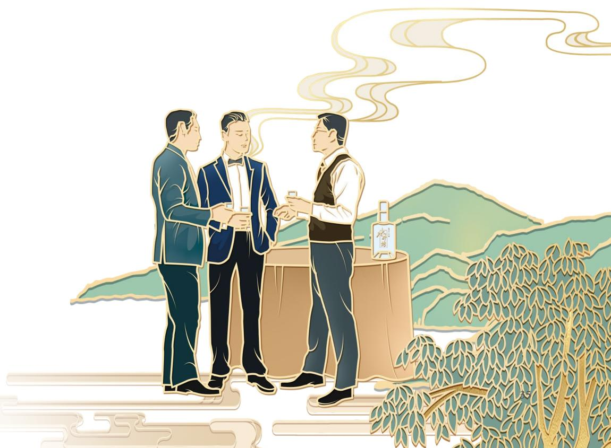

natural_image

Illustration of three men in formal attire conversing outdoors with a tea set and mountain backdrop (no text or symbols)

## 第二章

## 敬·更锦绣的山河

在国家“双碳”目标背景下，水井坊在生产运营中持续推进绿色转型，围绕应对气候变化、水资源利用和废弃物管理等重点领域建立了完善的环境治理体系，以持续降低生产运营对环境带来的影响。同时，通过开展生物多样性保护与可持续原料采购实践，水井坊进一步将责任拓展至价值链环节，秉持循环经济理念，推动上下游协同提升环境表现。

环境合规管理  
应对气候变化  
水资源利用  
包装与废弃物管理  
生态系统和生物多样性保护

响应联合国可持续发展目标（SDGs）

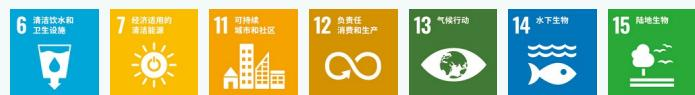

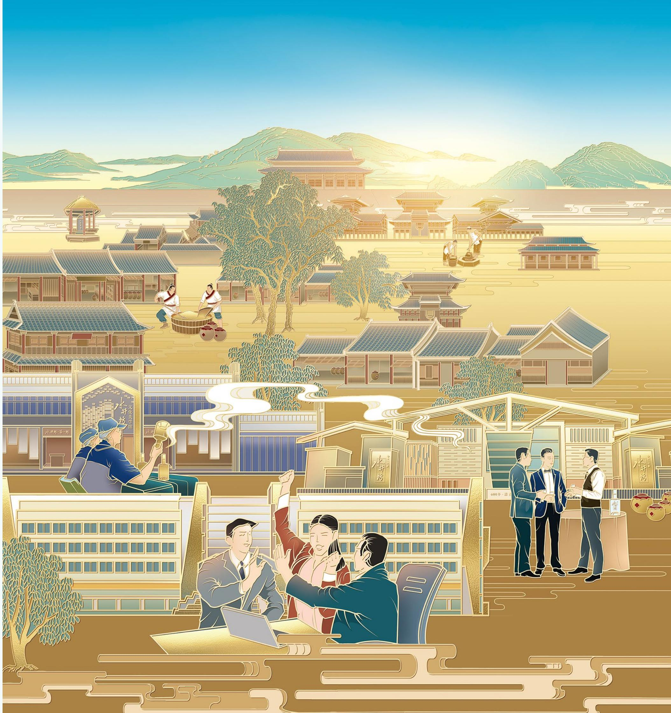

natural_image

Illustration of a traditional Chinese courtyard scene with people, buildings, and mountains in the background (no text or symbols)

## 环境合规管理

水井坊严格遵守国家环境保护相关法律法规及行业标准开展生产运营活动，并在内部以“一套环境方针、三层治理架构”为指引，构建分级负责、权责清晰的环境管理体系。公司首席执行官作为环境管理第一责任人，统筹公司环境管理重大事项，在其领导下，由首席生产运营官分管 EHS 部门，负责环境保护工作的组织实施与日常管理，各生产及职能部门依据职责落实具体管理措施，确保环境制度有效执行，形成自上而下、协同运作的环境管理责任体系。

## 水井坊环境方针

## 高效清洁的生产

水资源管理节能减排废弃物治理新技术研发员工教育

## 负责任供应链

供应商环境管理

## 绿色办公

绿色园区 / 建筑绿色办公文化低碳出行

## 可持续消费

绿色包装 绿色物流 消费者环保意识倡导

支持

## 环境保护治理架构

## 首席执行官

## 首席生产运营官

## EHS 部门

公司建立《环境因素识别评价与控制程序》，并每年据此开展环境因素识别与评价，形成清单，实施动态管理。同时，公司按季度对环保相关法律法规及其他要求开展合规性评价，建立完善的环境监测管理程序，确保生产运营活动持续符合合规要求。针对突发环境事件，公司编制《突发环境事件应急预案》，并在属地生态环境主管部门备案，定期组织培训与应急演练，以提升环境风险应对能力。报告期内，水井坊各项环保设施和污染治理设施持续运转良好，向环境排放的废水、废气、噪声的各项指标均符合国家和地方的相关排放标准，固体废弃物处理符合相关处置要求，未受到因污染排放导致的行政处罚。

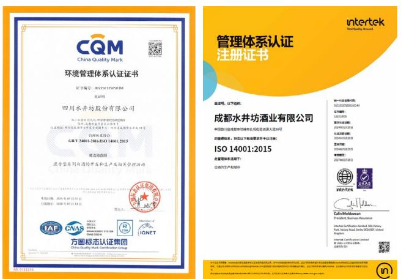  
土桥工厂 ISO14001 认证证书  
邛崃工厂 ISO14001 认证证书

2025 年，水井坊土桥工厂和邛崃工厂均获得 ISO 14001（环境管理体系）认证证书，邛崃工厂进一步获评四川省环保诚信企业，体现了公司在环境管理规范化和合规运营方面的持续推进。

## 应对气候变化

## 治理

水井坊将应对气候变化纳入公司整体ESG治理体系，并置于董事会的监督指导之下。公司依托已建立的ESG治理架构，由董事会、ESG 管理委员会、ESG 工作组协同推进气候相关工作的决策与实施，确保气候议题有效融入公司经营管理与长期发展战略。

董事会负责监督气候相关战略与目标，定期听取工作进展，并就碳减排路径及重点举措提出指导意见，同时关注气候变化带来的风险与机遇，推动相关管理策略的优化。在管理层层面，ESG 管理委员会在首席执行官领导下统筹气候变化相关工作，负责气候目标、战略方向及行动路径的制定，并协调各相关职能部门将其融入日常运营管理中，推动各项举措落地实施。

## 战略

## 气候风险与机遇的识别与分析方法

水井坊结合自身业务特点与行业特性，参考《国际财务报告可持续披露准则第 2 号——气候相关披露》框架，系统开展气候风险与机遇的识别与分析工作。公司参考联合国政府间气候变化专门委员会（IPCC）提出的共享社会经济路径（SSP）假设，选取不同气候政策与排放路径情景，对未来宏观环境变化进行前瞻性研判。

在具体分析过程中，公司选取低排放情景（SSP1-2.6）与高排放情景（SSP3-7.0），从政策环境、资源供给、市场需求及技术演进等关键因素出发，评估气候变化在不同发展路径下对公司生产运营、供应链稳定性及市场表现的潜在影响。

气候情景设定

<table><tr><td rowspan="2">气候情景</td><td colspan="3">较工业化前升温预估</td></tr><tr><td>2021-2040年</td><td>2041-2060年</td><td>2081-2100年</td></tr><tr><td>SSP1-2.6(严格气候变化政策干预时的低排放情景)</td><td>1.6°C</td><td>2.0°C</td><td>2.1°C</td></tr><tr><td>SSP3-7.0(无气候变化政策干预时的高排放情景)</td><td>1.4°C</td><td>2.2°C</td><td>4.1°C</td></tr></table>

natural_image

Simple line drawing of two abstract wave patterns: a large mountain-like shape and a smaller cloud-like shape, both without any text or symbols.

不同情景下，气候相关物理风险与转型风险的发生概率及影响程度存在差异：在低排放情景下，随着气候政策持续强化与低碳转型加速，转型风险相对更为显著，同时伴随更多低碳发展机遇；而在高排放情景下，气候变化加剧，极端天气事件频发，物理风险的影响更为突出。

同时，公司结合短期、中期及长期时间维度，对识别出的气候相关风险与机遇进行分级评估，并重点分析其对成本结构、资本支出、收入增长及资产价值等关键财务指标的潜在影响。

## 气候风险与机遇对财务的潜在影响分析

气候相关风险分析表

<table><tr><td colspan="2">风险类型</td><td>风险描述</td><td>财务影响表现</td><td>影响时间</td><td>影响可能性</td><td>影响价值链范围</td><td>应对措施</td></tr><tr><td rowspan="2">物理风险</td><td>短期</td><td>极端天气事件增加(高温、洪涝等)</td><td>·极端天气导致生产中断、物流受阻,影响产品交付与销售·能源消耗增加及灾后修复、员工保障等支出上升·厂房、仓储等固定资产受损,存在减值或提前报废风险</td><td>短中期</td><td>高</td><td>上游自身运营</td><td>提升供应链韧性,完善应急管理方案,优化生产与仓储布局</td></tr><tr><td>长期</td><td>气候长期变化(平均气温上升)</td><td>·原材料供应波动可能影响生产稳定性及收入·水资源与能源成本上升·需增加适应性改造投资,部分设施存在减值风险·运营成本上升压缩经营性现金流</td><td>中长期</td><td>中</td><td>上游自身运营</td><td>提升水资源管理与利用效率,推进节能降耗措施</td></tr><tr><td rowspan="2">转型风险</td><td>政策与法律</td><td>监管趋严</td><td>·能源转型及节能减排要求提升,导致减排成本及潜在合规成本提升</td><td>短中期</td><td>高</td><td>自身运营</td><td>推动节能减排,优化能源结构,降低碳排放强度</td></tr><tr><td>技术</td><td>低碳技术替代与转型投入</td><td>·低碳产品与生产方式替代,传统模式竞争力下降·低碳技术研发及设备升级投入增加·原有设备可能提前淘汰或减值·资本性支出增加带来投资现金流压力</td><td>中长期</td><td>中</td><td>自身运营</td><td>推进技术升级与工艺优化,分阶段实施低碳转型</td></tr></table>

<table><tr><td colspan="2">风险类型</td><td>风险描述</td><td>财务影响表现</td><td>影响时间</td><td>影响可能性</td><td>影响价值链范围</td><td>应对措施</td></tr><tr><td rowspan="3">转型风险</td><td rowspan="2">市场</td><td>原材料及能源价格波动</td><td>·成本波动影响产品定价与市场需求·能源及原材料采购成本上升,影响经营性现金流</td><td>短中期</td><td>高</td><td>上游</td><td>优化采购策略,推动绿色供应链管理</td></tr><tr><td>消费者偏好向低碳转型</td><td>·如未及时调整产品结构,可能导致市场份额下降·产品创新及品牌转型投入增加</td><td>中长期</td><td>中</td><td>下游</td><td>推动绿色产品创新,强化品牌低碳价值</td></tr><tr><td>声誉</td><td>企业ESG表现不及预期</td><td>·品牌形象受损影响销售及潜在合作机会·声誉修复及利益相关方沟通成本增加·融资成本上升或融资能力下降影响筹资现金流</td><td>中长期</td><td>中</td><td>下游自身运营</td><td>提升ESG管理水平,加强信息披露与利益相关方沟通</td></tr></table>

气候相关机遇分析表

<table><tr><td>机遇类型</td><td>机遇描述</td><td>财务影响表现</td><td>影响时间</td><td>影响可能性</td><td>影响价值链</td></tr><tr><td>资源效率</td><td>高效生产与配送流程、优化仓储布局</td><td>·生产能力提升使产品交付更高效,增加销售·运营成本降低·物流损耗减少,提升经营现金流</td><td>短中期</td><td>高</td><td>自身运营</td></tr><tr><td>能源效率</td><td>使用节能设备、优化能源结构(如使用可再生能源)、参与政策激励或补贴</td><td>·声誉改善提升产品需求·运营成本降低·低碳设备投资回报增加·减少化石燃料价格波动带来的支出压力</td><td>中长期</td><td>中</td><td>自身运营</td></tr><tr><td>产品和服务</td><td>开发低碳产品、推出绿色包装、适应消费者偏好</td><td>·低碳或绿色产品需求增加带来收入增长·研发和包装创新投入·新产品线和知识产权价值提升</td><td>中长期</td><td>中</td><td>下游</td></tr></table>

## 影响、风险和机遇管理

## 气候风险与机遇管理流程

水井坊识别、评估和管理气候相关的风险与机遇采取了以下流程 :

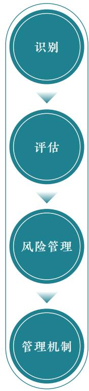

flowchart

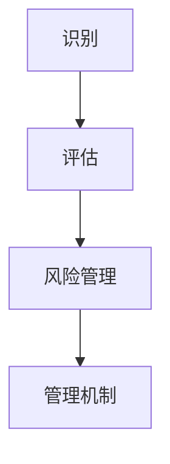
```mermaid
graph TD
  A["识别"] --> B["评估"]
  B --> C["风险管理"]
  C --> D["管理机制"]
```

基于气候情景分析模型、结合桌面调研及行业实践、参考气候相关披露框架要求，并结合公司实际业务场景，系统识别潜在的与气候相关的物理与转型风险。

结合监管机构、投资者及交易所对气候议题的关注重点，对识别出的风险进行定性与定量评估，从发生可能性与影响覆盖范围（时间及价值链）两个维度进行打分，筛选出高重要性气候风险。

将气候相关风险纳入ESG管理框架及公司整体风险管理流程，与其他风险统一分级、统筹管理，并制定相应应对措施。

在董事会监督下，由 ESG 管理委员会统筹，协同风险管理委员会及财务部门，持续开展气候相关风险的识别、评估及财务影响分析。

## 指标与目标

公司以科学碳目标为引领，制定系统性的气候行动路径。2025 年 7 月，水井坊正式通过 SBTi 短期及长期目标审验，明确了与全球控温 1.5℃路径相一致的温室气体减排目标，为公司气候战略提供科学依据与行动指引。范围一、二、三及FLAG（林业、土地和农业）排放量均参照 GHG Protocol（温室气体核算体系）与 SBTi 所提供的方法论进行核算。

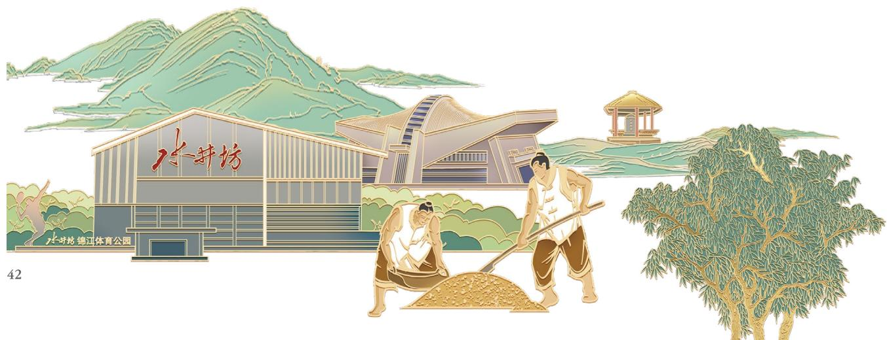

natural_image

Illustration of a modern building with people working in an outdoor setting, surrounded by green mountains and trees (no text or symbols)

## 短期目标

范围一和范围二：以 2024 年为基准年，到 2030 年温室气体排放总量减少 42%。  
范围三：以 2024 年为基准年，到 2030年单位产品（每千升白酒）排放强度降低51.6%。  
范围三（FLAG相关）：以2024年为基准年，到 2030 年 FLAG 排放总量减少 30.3%。

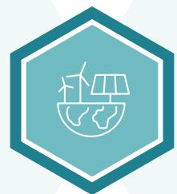

## 长期目标

2050 年实现全价值链净零排放。  
范围一、二、三：到 2050 年排放总量较2024 年减少 90%。  
范 围 三（FLAG 相 关 ）： 到 2050 年FLAG 排放总量较 2024 年减少 72%（综合考虑相关排放与碳汇影响）。

## 2025 年 SBTi 减排进展

2025年水井坊温室气体排放量  
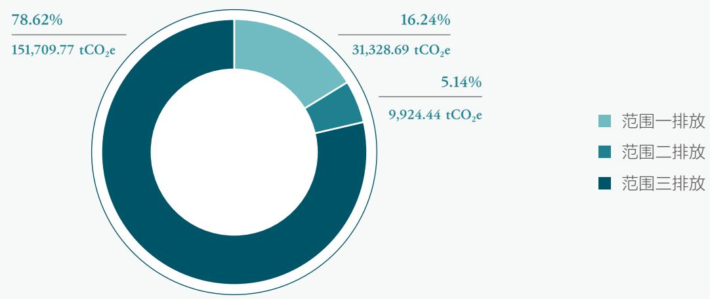

donut

| Category | Percentage | Value (tCO2e) |
| --- | --- | --- |
| 范围一排放 | 16.24% | 31,328.69 |
| 范围二排放 | 5.14% | 9,924.44 |
| 范围三排放 | 78.62% | 151,709.77 |

范围一排放量较 2024 年  
（基准年）下降  
范围二排放量较 2024 年  
（基准年）下降

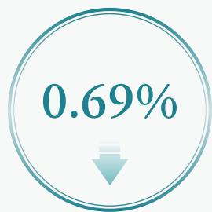  
15.46%

## 管理实践与进展

## 原料采购可持续性

水井坊通过订单种植模式推动原料采购的可持续性。在种植供应商筛选中，公司建立了涵盖资质与能力、解决方案、商务条件及 ESG 表现的综合评估体系，其中在 ESG 评价框架下进一步强化对碳排放管理能力的考量，将其作为关键评价维度之一，以提升原材料供应端的气候风险管理与减排导向。

在种植环节，公司积极推动可持续农业相关实践，针对订单种植供应商开展专项沟通，提升其对可持续农业在降低农业碳排放、改善土壤健康及增强碳汇能力方面作用的认知，引导其逐步形成低碳种植理念，为后续系统性探索可持续农业实践奠定能力基础。

此外，水井坊持续推进原粮绿色认证体系建设。绿色食品认证通过对农药、化肥等投入品使用实施严格管控，并对生产过程实行全程质量控制与标准化管理，有助于降低农业生产过程中的环境负荷。2025 年，水井坊所有订单种植原粮均已取得绿色食品认证证书。

## 水井坊可持续农业承诺

粮食安全是国家稳定与发展的基石，水井坊秉持“好酒，从一颗种子开始”的理念，将可持续农业置于战略核心。我们深信，健康的士壤，清洁的水源和丰富的生物多样性是酿造卓越白酒的根基，正系统推进从传统贸易向订单种植的采购模式转型，覆盖高粱，糯米等核心原料，以全链条可持续管理助力粮食安全与白酒产业健康发展。

## 尊重生态系统，守护土壤健康

生态系统是农业可持续发展的基础。水井坊承诺致力于保护土壤、水资源和生态景观，推广轮作间作、保护性耕作和有机肥替代等再生实践，推广节水灌溉，坚决避免因过度开垦、滥用农药与化肥对生态环境造成负面影响。

## 践行零毁林，保护生物多样性

生物多样性是地球生命的重要支撑，也是农业可持续发展的关键。水井坊承诺在所有关键农业原料供应链中实现零毁林——不在 2020 年 12 月 31 日后发生毁林或自然生态系统转换的土地上从事生产活动。保护订单种植基地周边自然生境，为野生动植物保留栖息廊道。通过多样化种植增强生态系统稳定性与抗干扰能力。

## 以科学碳目标管理农业排放

作为白酒行业首家通过 SBTi 审验的企业，我们依据 GHG Protocol FLAG 方法论系统核算农业端温室气体排放，以 2024 年为基准年，到 2030 年实现范围三 FLAG 排放总量减少 30.3%。推广清洁能源与低碳种植技术，增强农业气候韧性。

## 赋能农户，共建韧性

面向全部订单种植供应商与核心种植户，每年开展不少于 2 次系统培训。激励合作伙伴实施可持续农业并取得可验证成效。逐步构建“种植—酿造—还田”的物质循环闭环。

## 倡导可持续消费

可持续消费是推动农业可持续发展的关键力量。水井坊积极倡导可持续消费理念，通过产品溯源信息透明化和消费者沟通，增强公众对可持续农产品的认知与信任，引导绿色消费选择。

水井坊将本承诺纳入公司 ESG 治理体系，由 ESG 管理委员会统筹推进，可持续发展部门推进落实，每年通过 ESG 报告公开披露关键绩效进展。我们以“从一粒种到一滴酒”的全价值链理念为指引，让每一杯佳酿都承载着对土地的敬意和对未来的责任。

natural_image

Illustration of farmers harvesting rice with a conical structure and golden rice stalks in the background (no text or symbols)

## 能源利用

公司制定了《资源能源管理程序》《厂区设施照明管理制度》，并在工厂层面每年设定电、气等能源使用目标，通过合理用电管理持续推进能源精细化管理。

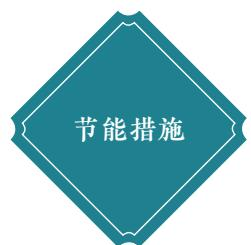

酿酒车间、实验楼等区域全面采用感应照明灯具，人走自动熄灭，全年节能约 31.4万度电力；  
各工厂蒸汽锅炉均采用天然气燃料，并配备低氮燃烧器，实现超低浓度排放，以减少污染物排放，同时锅炉配备烟气余热回收系统，有效降低能源消耗；  
食堂对灶具进行设备升级，热效率提高 20%，采用高效节能的照明系统，能耗降低约 6%；  
IT 部门减少对物理服务器的投入，采用虚拟化技术，根据实际业务使用情况进行资源负载调整；通过通道隔离避免冷热气流混合，降低冷量损耗；引入智能动环管理及监控系统，实时监测能源使用情况，并配置高效节能的服务器、存储及网络设备，进一步降低整体能耗。

2025 年，土桥工厂共计购买绿色电力 6,768 兆瓦时，邛崃工厂共计购买绿色电力12,526 兆瓦时。

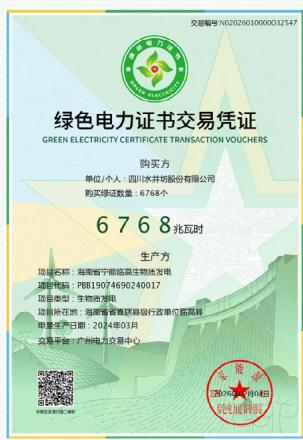

text_image

交易编号:1020206010000032547
绿色电力证书交易凭证
GREEN ELECTRICITY CERTIFICATE TRANSACTION VOUCHERS
购买方
单位/个人:四川水井股份有限公司
购买凭证数量:6768个
6768兆瓦时
生产方
项目名称:海南省宁源临界生物质发电
项目代码:PB19074690240017
项目类型:生物质发电
项目所在地:海南省青藏区联级行政单位监高界
电量生产日期:2024年03月
交易平台:广州电力交易中心
2024年03月10日
绿色电力证书
绿色电力证书
绿色电力证书
绿色电力证书
绿色电力证书
绿色电力证书
绿色电力证书
绿色电力证书
绿色电力证书
绿色电力证书
绿色电力证书
绿色电力证书
绿色电力证书
绿色电力证书
绿色电力证书
绿色电力证书
绿色电力证书
绿色电力证书
绿色电力证书
绿色电力证书
绿色电力证书
绿色电力证书
绿色电力证书
绿色电力证书
绿色电力证书
绿色电力凭证

土桥工厂绿色电力购买证书

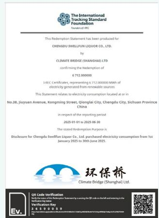

text_image

The International Tracking Standard Foundation
Foundries of HRC
This Redemption Statement has been produced for
CHENGDU SWELLFUN LIQUOR CO., LTD.
by
CLIMATE BRIDGE (SHANGHAI) LTD
confirming the Redemption of
6 712.000000
I-RECC Certificates, representing 6,712.000000 MWh of electricity generated from renewable sources
This Statement relates to electricity consumption located at or in
No.38, Jiuyuan Avenue, Kongming Street, Qiongai City, Chengdu City, Sichuan Province
China
in respect of the reporting period
2025-01-01 to 2025-06-30
The stated Redemption Purpose is:
Disclosure for Chengdu Swellfun Liquor Co., Ltd. purchased electricity consumption from 1st January 2025 to 30th June 2025.
环保桥
Climate Bridge (Shanghai) Ltd.
QR Code Verification
with Registration No. 14-000-0009
Verification Key: 3 6 5 9 0 0 9
EVEV

邛崃工厂绿色电力购买证书  
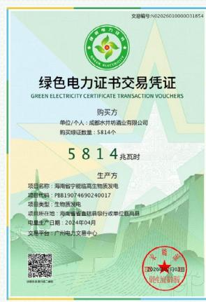

text_image

绿色电力证书交易凭证
GREEN ELECTRICITY CERTIFICATE TRANSACTION VOUCHERS
交易编号:NG2026101000031854
绿色电力证书交易凭证
GREEN ELECTRICITY CERTIFICATE TRANSACTION VOUCHERS
购买方
单位:个人:成都水井村酒业有限公司
购买项目数量:5816个
5 8 1 4
兆瓦时
生产方
项目名称:海南省宁能瑞高生物质发电
通信编码:PB819074690240017
项目类型:生物质发电
送信所(发) 海南省青藏县绿景银行或单位名网县
可再生能源日期:2024年04月
交易平台:广州电力交易中心

## 低碳运输与仓储

在仓储环节，公司通过引入AGV自动搬运系统及加强照明能效管理，有效提高仓储作业效率，降低人工成本和能源消耗，同时推进托盘循环使用，减少资源浪费。

在运输环节，公司逐步推广新能源车辆，并与供应商协同探索低碳运输模式，推动物流体系绿色升级。部分供应商已提供低碳方案，尽管相关方案尚需进一步评估成本与可行性，但公司已将低碳运输纳入阶段性发展规划，并结合实际情况稳步推进实施，以支持整体减排目标的实现。

natural_image

Illustration of a modern building with golden facade and winding pathways, featuring a tree in the background (no text or symbols)

自 2024 年起，公司积极探索生物质发电，推动能源结构多样化，建设并使用发电站，收集污水处理站产生的沼气用于厂区设备供电，2025 年发电约 4,209,090 度。

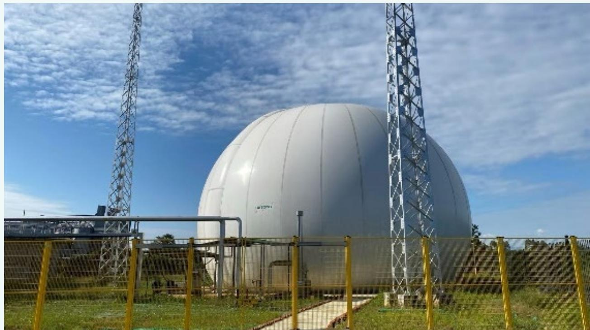

natural_image

Exterior view of a large white dome-shaped building under a blue sky with scattered clouds, flanked by yellow safety fencing and a tall tower (no visible text or symbols)

## 水资源利用

## 治理

水井坊邛崃工厂成立可持续水管理小组。厂长为全厂可持续水管理总负责人，EHS 部门等职能部门负责人在各自工作职能内管理、推进与协调工厂可持续水管理工作。

可持续水管理组织架构  
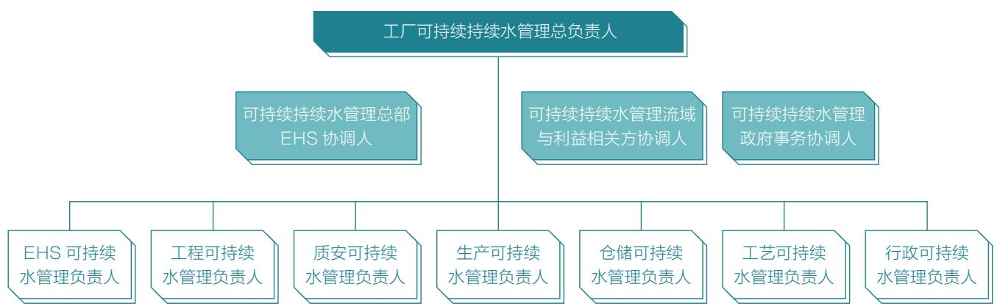

flowchart

This image displays a hierarchical organizational chart showing the hierarchy of the factory's continuous water management total responsibility, which is further broken down by various EHS and government coordination entities.

## 厂长

批准可持续水管理承诺与战略，协调资源确保目标实现；建立并保持管理体系，决策重大事项，定期向管理层汇报用水情况。

## 集团 EHS 协调人

统筹各工厂可持续水管理工作，汇总分析数据，识别集团层面风险，建立应急联动机制；组织 AWS培训，确保符合标准，向总部汇报并协调资源。

## 流域与相关利益方协调人

负责流域水资源外部沟通与利益相关方关系维护，识别共同水挑战并推动集体行动；定期与供应商沟通共同应对水管理挑战的改进实践。保持与政府沟通，组织公益活动，编制披露年度水管理报告。

## 可持续水管理政府事务协调人

协调工厂与政府事务，解读政策法规并传达，确保合规；汇总报告向政府汇报工作进展，推进与政府合作的水管理项目。

## EHS 部

负责水管理合规性监管与风险防控，监督取水排污合规，组织水平衡测试与审计，建立应急响应机制。

## 工程部

负责节水基础设施建设与技术改造，实施冷却水循环、中水回用、雨水收集；通过监控系统分析用水数据，精准调配，排查管网问题。

## 质安部

负责生产用水水质安全与监督检测，确保生产用水符合国标要求，建立全过程生产用水水质监控体系，定期检测生产用水水质。

## 曲酒工艺部

负责酿酒工艺节水技术研发与应用，优化工艺降低取水量，推动清洁化、节水化创新。

## 曲酒生产部

执行车间节水操作规范，落实用水定额管理，精细化管控用水，记录一线数据支持水耗考核。

## 仓储部

负责储存安全管理，优化雨水收集系统，配合雨污分流，参与防洪涝应急，确保无污染风险。

## 行政部

负责水管理文化建设与内外沟通，组织节水宣传活动，编制披露水资源报告，协调政府关系。

## 战略

为实现我们的可持续发展战略，在水资源管理领域，水井坊邛崃工厂一直致力于不断提升在自身运营的水管理绩效，积极参与和推动产业链变革，并为员工、流域和社区的水安全保障做出贡献。具体的战略重点、目标及工作路径包括：

## 技术创新与标准实践

技术应用：聚焦白酒生产酿造，开发节水生产工艺，推动雨水收集利用、冷却水循环利用、中水回收利用技术应用。先进管理实践：至 2026 年，完全符合 AWS 国际可持续水管理标准要求，构建覆盖水资源管理全流程的标准化体系，引领行业绿色制造实践。

## 流域风险评价

主动开展流域水风险评价：考虑气候变化可能带来的长期影响，并制定相应的风险管理方案和应急响应计划。

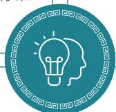

## 供应链节水管理

深入推动可持续采购，制定绿色采购制度。扩大原粮订单种植面积，大力推广应用绿色种植、节水种植技术措施。

## 促进相关方合作

提升水管理信息和绩效的透明度，积极参与或发起行业倡议，引领行业变革。

## 影响、风险和机遇管理

水井坊严格遵守《中华人民共和国环境保护法》《中华人民共和国水法》《排污许可管理条例》《发酵酒精和白酒工业水污染物排放标准》等法律法规与标准，各工厂依法取得取水许可证，确保运营所需的水质和水量符合要求。公司定期开展水平衡测试，优化生产工艺流程，并在车间开展各项节水项目，加强节水技术应用与管理优化。同时，公司定期识别运营活动可能面临或引发的水相关风险，对上游依赖性风险（包括生产用水的水量、水质及取水合规性）与下游影响性风险（包括废水排放对周边水体及社区用水的潜在影响）开展评估，并将结果纳入日常水资源管理与决策。

## 管理实践与进展

## 可持续水管理承诺与声明

水井坊依据国际可持续水管理联盟（Alliance for Water Stewardship, AWS）标准的目标和原则，制定了明确的可持续水管理承诺，以致力于与各方合作减少生产流程的水资源消耗，保护共享的水资源。

## 《成都水井坊酒业有限公司 AWS 可持续水管理承诺》

遵守法律法规及与水相关的国家和国际条约的要求，履行社会关怀、环境保护、水资源管理、水资源再利用、循环经济、节能减废等企业公民责任；  
实施水资源短缺带来的风险评估及制定商业责任战略；  
应用水污染的防治技术及废水治理措施技术；  
持续精进完善公司在可持续水管理领域的绩效，努力实现 AWS 国际可持续水管理标准五项成果，即：可持续的水平衡、良好的水质、完善的管理制度、健康的重要水相关区域和充足安全的饮用水和卫生设施；  
持续并积极地支持与配合地方与流域的政策行动方案，与公共部门机构协调并支持政府在水资源保护方面的努力，开展对流域水资源水环境的保护，并做出贡献；  
以公开和透明的方式与利益相关方保持互动与合作，并定期披露水管理方面的绩效和进展；为实现以上的承诺，安排充分的资源，共创地球环境的永续美好。

## 水资源循环利用

邛崃工厂建设了冷却循环水系统、污水中水回用系统和雨水回收系统等设施，实现生产和生活用水的循环利用。

2025 年

邛崃工厂冷却水循环量达到

852,719 吨

酿酒车间冷却水循环利用率接近

100%

邛崃工厂中水回用

771 吨

## 废水管理

邛崃工厂和土桥工厂均建有污水处理站，生产废水经过预处理→厌氧→化学除磷→二级 AO →深度处理（混凝沉淀）的工艺处理后，符合《发酵酒精和白酒工业水污染物排放标准》（GB27631-2011）间接排放标准，随后进入第三方污水处理厂。为确保废水达标排放，工厂安装了废水在线自动监测设备，并开展季度监测。

在运行优化方面，土桥污水站的除臭系统经过升级改造，优化了异味吸附工艺，增大活性炭吸附能力，显著提升了异味处理效果；同时，土桥工厂和邛崃工厂在去除总氮过程中，污水站充分利用碳源和部分生产废水作为 COD 补充，降低了外购碳源材料的使用量。

在风险防控方面，邛崃工厂每年对废水管井进行预防性维护，防止管网渗漏，并在雨季前清理雨水管网，确保淤泥不排入河流。此外还增设了雨水总排口电动闸阀及自动回抽装置，可快速截断并回收受污染的雨水，确保不流入外环境。

2025 年，邛崃工厂和土桥工厂的废水排放浓度均值均达标：

<table><tr><td rowspan="6">邛崃厂区污水处理站</td><td colspan="2">CODcr</td><td colspan="2">NH3-N</td><td>执行标准</td></tr><tr><td>日均浓度(mg/L)</td><td>排放总量(吨)</td><td>日均浓度(mg/L)</td><td>排放总量(吨)</td><td rowspan="5">《发酵酒精和白酒工业水污染物排放标准》(GB 27631-2011)</td></tr><tr><td>54</td><td>23.6004</td><td>0.26</td><td>0.2581</td></tr><tr><td colspan="2">TN</td><td colspan="2">TP</td></tr><tr><td>日均浓度(mg/L)</td><td>排放总量(吨)</td><td>日均浓度(mg/L)</td><td>排放总量(吨)</td></tr><tr><td>9.9</td><td>3.6615</td><td>0.23</td><td>0.1609</td></tr></table>

<table><tr><td rowspan="6">土桥厂区污水处理站</td><td colspan="2">CODcr</td><td colspan="2">NH3-N</td><td>执行标准</td></tr><tr><td>日均浓度(mg/L)</td><td>排放总量(吨)</td><td>日均浓度(mg/L)</td><td>排放总量(吨)</td><td rowspan="5">《发酵酒精和白酒工业水污染物排放标准》(GB 27631-2011)</td></tr><tr><td>30.76</td><td>5.58</td><td>1.17</td><td>0.23</td></tr><tr><td colspan="2">TN</td><td colspan="2">TP</td></tr><tr><td>日均浓度(mg/L)</td><td>排放总量(吨)</td><td>日均浓度(mg/L)</td><td>排放总量(吨)</td></tr><tr><td>8.33</td><td>1.50</td><td>0.17</td><td>0.05</td></tr></table>

natural_image

Abstract decorative line art with layered clouds and birds, no text or symbols present

## 包装与废弃物管理

## 治理

公司制定《废弃物管理规定》，并配套环境监测及突发环境事件应急预案，对废弃物的产生、分类、贮存、转移及处置实施全过程管理，确保合规排放与规范处置。在职责分工上，由 EHS、供应链、质量安全部门统筹负责相关工作。

## 战略

水井坊以循环经济为导向，贯彻“减量化、资源化、无害化”原则，持续规范生产性与消费性废弃物的分类处置，不断健全废弃物管理体系，确保各环节合规、有序、可追溯。与此同时，公司持续开展绿色包装实践，从全生命周期各环节减少包装对环境的负面影响。

## 影响、风险和机遇管理

公司针对主要污染物建设针对性治理设施，污染物排放均满足相关合规要求。同时依据《环境因素识别评价与控制程序》，每年识别并更新产生的废弃物种类及相关环境因素，形成重要环境因素识别表加以重点管控。此外，工厂开展废弃物管理专项培训，提升员工对废弃物分类与规范处置的认知与执行能力，通过看板、海报及微信等多种渠道开展废弃物管理宣贯，实现 100% 全员覆盖。

natural_image

Illustration of a traditional Chinese architectural structure with a pavilion, trees, and mountains in the background (no text or symbols)

## 管理实践与进展

## 固体废弃物管理

厂区设置定点回收区域，用于对废弃物进行规范化压缩及预处理，减少运输频次。所有固体废弃物均委托有资质的供应商进行处置，对全过程实施严格管理。其中，针对危险废弃物，建立了专门的危险废弃物仓库，在收集、转运过程中实行联单制管理，并定期对供应商进行现场审核，确保合规处置。

## 邛崃工厂

一般工业固废实现100% 委托利用；  
获得“成都市无废工厂” 称号。

## 土桥工厂

一般工业固废实现 100% 委托利用；  
完成曲酒车间丟糟封闭式转运项目的建设与实施，通过系统化改造与流程优化，实现“糟不落地”的作业标准，构建起丢糟封闭式收集与转运体系。

水井坊深度践行循环经济发展理念，持续完善资源循环利用体系。2025年，公司严格落实垃圾分类管理要求，并依托专业第三方机构开展厨余垃圾专项回收与资源化处置，用于生产生物柴油，厨余垃圾资源化利用率达100%。同时，依托第三方专业化回收机制，统筹推进各类包装废弃物回收再利用，落实产品全生命周期资源管控。此外，在生产端，公司对酿酒核心副产物酒糟进行无害化、资源化深度开发，将经科学发酵处理后的酒糟转化为富含优质蛋白，微量元素与益生菌的饲料原料，供给周边养殖户，有效串联上下游产业链，构建起“种植—酿造—养殖”闭环式绿色循环发展模式。

<table><tr><td>类别</td><td>单位</td><td>2025年</td><td>处理方式</td></tr><tr><td>生活垃圾</td><td>吨</td><td>1,199.02</td><td>政府统一收储进行焚烧发电</td></tr><tr><td>餐厨垃圾</td><td>吨</td><td>87.51</td><td>制作生物柴油循环利用</td></tr><tr><td>可回收包材</td><td>吨</td><td>319.18</td><td>供应商回收进行再利用</td></tr><tr><td>玻璃渣</td><td>吨</td><td>29.27</td><td>供应商回收进行再利用</td></tr><tr><td>酒糟</td><td>吨</td><td>120,265.84</td><td>交由第三方资源化处理</td></tr></table>

## 废气管理

公司对废气污染物开展分类治理，并对锅炉废气进行在线监测。

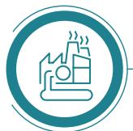

针对粮食粉碎车间产生粉尘的投料、筛分、磨粉等工艺环节，持续配备布袋除尘处理设施对粉尘废气进行有效捕集处理，保证其排放符合《大气污染物综合排放标准》(GB 16297-1996)。

天然气锅炉持续应用低氮燃烧技术，NOx 排放浓度保持超低水平，各项指标均符合《成都市锅炉大气污染物排放标准》（DB51/2672-2020）。

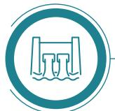

土桥污水处理站产生恶臭气体的构筑物均维持密闭加盖状态进行收集，经碱洗 + 活性炭吸附法处理后，其排放符合《恶臭污染物排放标准》（GB14554-93）。

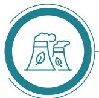

邛崃工厂实验室废气延续通风橱集气系统收集方式，经两套活性炭吸附箱处理后由屋顶排气筒排放，有机废气排放符合《四川省固定污染源大气挥发性有机物排放标准》（DB51/2377-2017），酸雾气体排放符合《大气污染物综合排放标准》（GB16297-1996）。

## 可持续产品与消费

针对绿色包装，公司建立了覆盖设计风险评估、包材检测中心检测、产线适配、来料检测、过程检测及成品检测的全流程管控机制。通过建设包材专家团队，加强对包材工艺与材料特性的系统理解与应用，推动包装方案的持续优化与迭代，在保障生产适配性的同时减少资源浪费，提升包装材料的循环利用潜力。

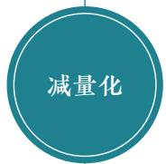

优化 100ml 盖内码小酒瓶盖结构，每个瓶盖用量减少塑料使用1.34g

## 材料替代

开展纸质可降解材料替代礼盒内衬固定泡沫的可行性验证

2025 年，水井坊共交付新品 24 款 SKUs，所有新品的包装空隙率均满足《限制商品过度包装要求 食品和化妆品》(GB23350-2021) 国家标准，且远低于企标内控要求 20%。同时，在供应商运输及自有包装生产环节中，可重复利用的注塑托盘（不包括异形瓶）的应用占比达 95%。

针对营销与消费场景的物料，公司建立了物料循环流转机制。在重点城市开展的季节性营销快闪活动结束后对主体结构、家具及装饰元素进行系统回收、打包，并转运至下一站重复使用，有效减少一次性搭建带来的资源浪费。

在糖酒会品牌展馆搭建中，公司采用模块化、标准化构件体系，展墙、展柜及展示单元均为可拆装、可重组结构，通过物理连接固定，在展示内容更新时仅对局部模块进行调整或替换，避免整体拆除重建，从源头减少废弃物产生。通过上述举措，公司在满足品牌展示与消费者体验需求的同时，持续降低消费末端对资源环境的影响，推动绿色消费理念的传播。

## 减少食物损失与浪费

公司食堂本地食材采购占比达 100%，在保障食材新鲜的同时减少运输碳排放。同时，为减少食物浪费，食堂引入智能称重系统以精准统计用餐需求，并张贴文明用餐及节约粮食宣传标语。2025 年，公司厨余垃圾量同比下降 13%。

2025年，公司食堂

本地食材采购占比达

100%

厨余垃圾量同比下降

13%

## 生态系统和生物多样性保护

水井坊制定了覆盖全价值链的生物多样性保护承诺，不对物种、栖息地、生物多样性造成持久破坏，并承诺在所有主要与毁林相关的原料供应链中实现零毁林。目前，公司开展订单种植的原粮基地在过去二十年未发生毁林事件，从源头有效保障了原材料获取阶段的生态系统稳定与生物多样性保护。公司遵循相关法律法规及国际倡议，持续减少生态足迹，致力于实现“无净损失”，不参与开发生态保护区及高生态价值区域，推动生产经营与自然环境协调共生。

natural_image

Illustration of two golden egrets perched on grass near a green mountain and flying birds (no text or symbols)

## 第三章

## 敬·更美好的生活

六百年生生不息的技艺传承，不仅铭刻于历史，更流淌于每一滴酒的酿造之中。水井坊始终将产品质量置于品牌发展的核心地位，以端到端的全流程质量管控体系守护每一瓶酒的卓越品质；深耕品质升级与体验优化，精准响应消费者对高品质生活的追求与期待。同时，作为负责任的酒类企业，水井坊积极倡导理性饮酒理念，严格推行负责任营销模式，以文化赋能品牌发展，为白酒行业转型升级注入新活力、提供新路径。

产品和服务安全与质量  
负责任营销实践  
创新驱动  
数据安全与客户隐私保护

响应联合国可持续发展目标（SDGs）

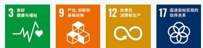

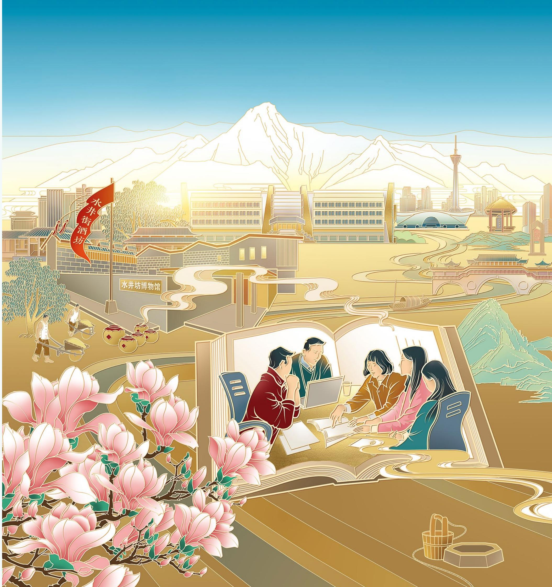

natural_image

Illustration of a traditional Chinese cultural scene with people studying, a museum building, and mountains in the background (no text or symbols)

## 产品和服务安全与质量

## 治理

水井坊的食品安全与质量管理由总经理兼法人担任首要负责人，并由首席生产运营官及总部食品安全总监向下延伸管理职责。在生产基地端，土桥与邛崃工厂各设主要负责人、食品安全总监及安全员岗位，形成总部统筹与工厂执行的对接体系。

公司制定《水井坊质量政策》，将质量要求贯穿产品全周期，覆盖从供应商管理、产品设计、生产制造到消费者服务的各个环节。

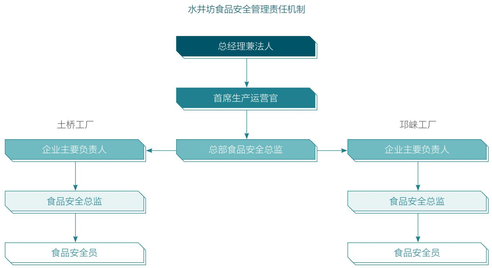

flowchart

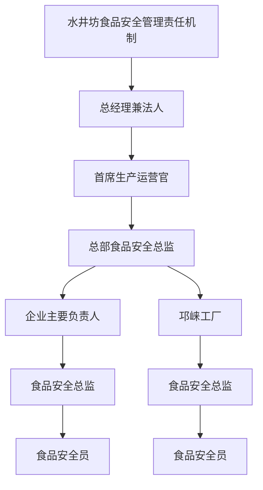
```mermaid
graph TD
  A["水井坊食品安全管理责任机制"] --> B["总经理兼法人"]
  B --> C["首席生产运营官"]
  C --> D["总部食品安全总监"]
  D --> E["企业主要负责人"]
  E --> F["食品安全总监"]
  F --> G["食品安全员"]
  D --> H["邛崃工厂"]
  H --> I["食品安全总监"]
  I --> J["食品安全员"]
```

## 战略

水井坊秉持“质安并重，客户至上，内外兼修，追求卓越”的宗旨，致力于构建供应端到端全面质量管理体系，从供应商质量管理、来料检验、过程监控与检验、到成品检验各个环节，全面保障产品高质量交付。公司聚焦于源头管控与数字化管理的双重路径：一方面，通过推进原粮订单种植和原粮绿色食品认证，从种植源头强化原料的安全性与可追溯性；另一方面，我们积极拥抱数字化转型，以现代科技赋能古老技艺，包括实验室信息管理系统（LIMS）、制造执行系统（MES）和质量管理系统（QMS），实现从原材料检测、生产过程控制到最终产品质量的全链条数字化管理，显著提升企业的质量管理水平。

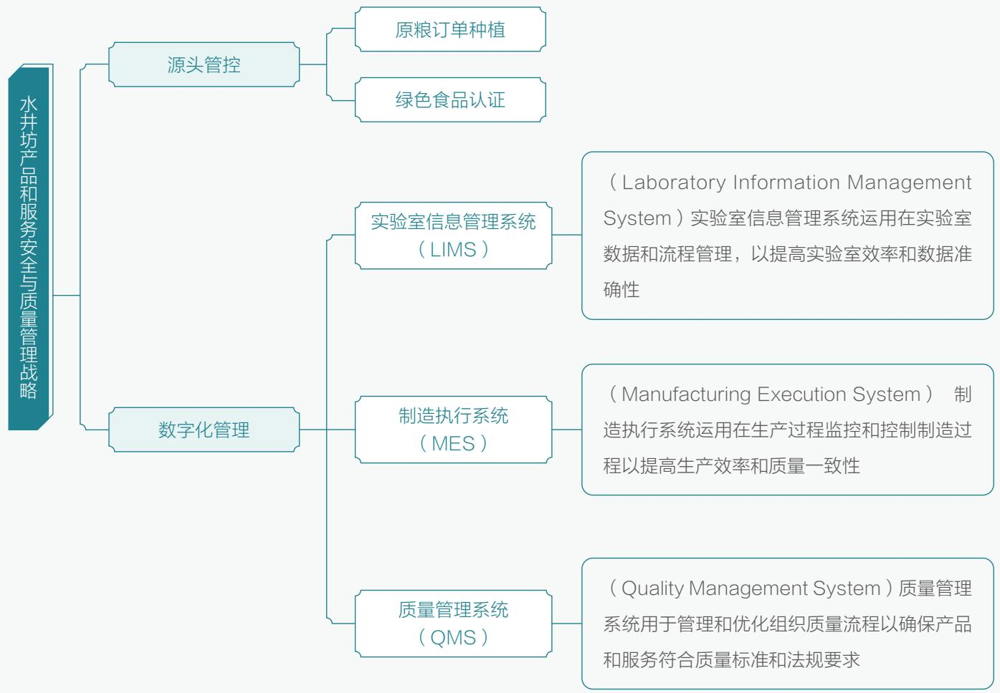

flowchart

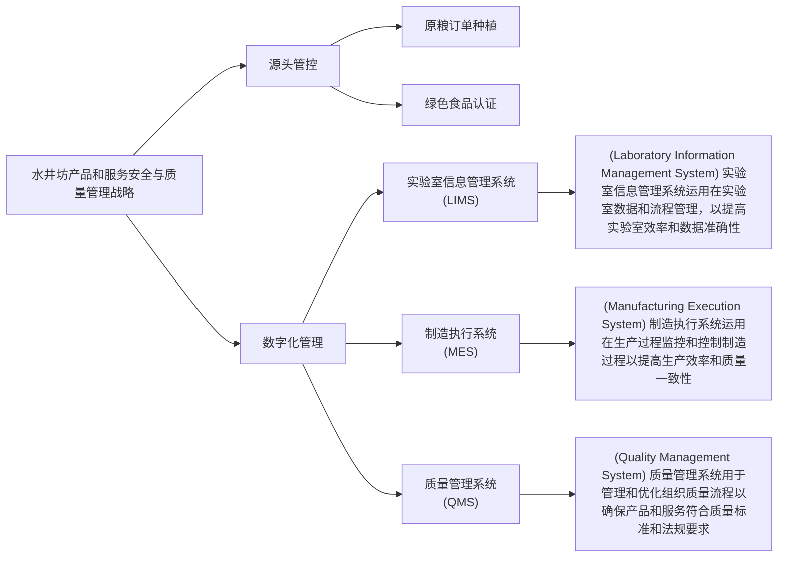
```mermaid
graph LR
  A["水井坊产品和服务安全与质量管理战略"] --> B["源头管控"]
  A --> C["数字化管理"]
  
  B --> D["原粮订单种植"]
  B --> E["绿色食品认证"]
  
  C --> F["实验室信息管理系统\n(LIMS)"]
  C --> G["制造执行系统\n(MES)"]
  C --> H["质量管理系统\n(QMS)"]
  
  F --> I["(Laboratory Information Management System) 实验室信息管理系统运用在实验室数据和流程管理，以提高实验室效率和数据准确性"]
  G --> J["(Manufacturing Execution System) 制造执行系统运用在生产过程监控和控制制造过程以提高生产效率和质量一致性"]
  H --> K["(Quality Management System) 质量管理系统用于管理和优化组织质量流程以确保产品和服务符合质量标准和法规要求"]
```

## 影响、风险和机遇管理

以《食品安全法》等相关法律法规为严格底线，公司遵从ISO.9001（质量管理体系），HACCP（危害分析与关键控制点）等国际国内标准，并获得了CNAS（中国合格评定国家认可委员会）认可的检测中心资质。2025年，公司通过了 HACCP、ISO 9001 等内外审核，并对发现项进行整改，通过关键绩效指标（KPI）监控实现持续改善，将卓越的质量管理能力转化为赢得市场信任、巩固品牌定位的核心竞争优势。

## 管理实践与进展

## 原料稳定与高品质供应

为保障供应链的稳定性，采购部每年制定品类采购策略，针对关键原粮及包材品类开发了多家合格供应商，通过实施供应源交叉备份与设定安全库存，有效防范潜在的供应中断风险。在夯实质量基础方面，所有包材供应商均签署《食品安全要求与标准》，并取得 ISO 9001 质量管理体系认证，从源头确保合规与品质。同时，公司持续开展供应商质量能力提升专项培训，助力合作伙伴实现协同成长。

## 案例 原粮订单种植计划

水井坊持续深化“好酒，从一颗种子开始”的理念，通过“原粮订单种植计划”落实了原粮 100% 可预检、可管控目标。公司对原粮从种子选择、种植、成熟收割到入库验收实施全流程管理，由供应商质量工程师（SQE）进行全过程监控，依据高于国家标准的内控要求，对每批原粮开展感官及理化检测，确保合格后方可入库。公司利用追溯系统实时获取基地原粮长势信息，极大改善基地管理效果的同时，实现从播种到交付的全程数据溯源。2025 年，水井坊进一步将“原粮订单种植计划”的种类扩展到高粱、大米、糯米三个品种，种植规模超过 30,000 吨。

原粮订单种植不仅使原粮供应模式实现了从传统贸易向标准化、规模化、可持续化转型，同时也保障了原粮供应的稳定性，标志着水井坊在保障粮食安全和促进白酒产业可持续发展道路上迈出了坚实的一步。

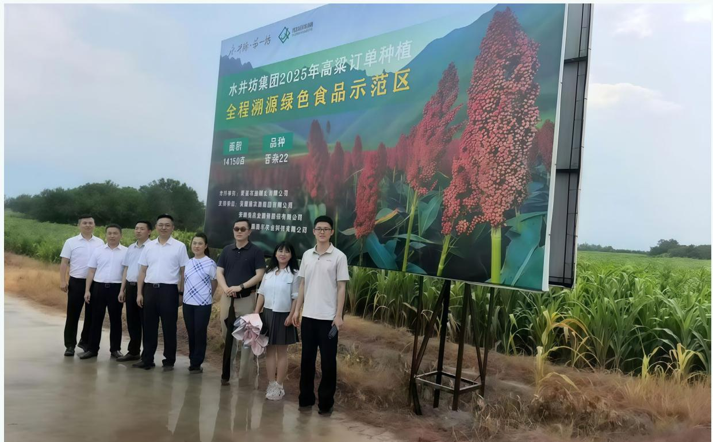

text_image

水井坊集团2025年高粱订单种植
全程溯源绿色食品示范区
面积
14150亩
品种
舌杂22
合作单位：聚蓝水曲湖龙潭2号
支持新启：突破波冰湖园百隆9间
来源南充金鹏梦颐成有限公司
是国丰农业阿祥东醒2司

## 数字化驱动

公司已建成两个检测中心，累计投入近 3,000 万元，均通过 CNAS 国家认可实验室认证，并配套应用 LIMS 实验室信息管理系统，为质量精准管控奠定了坚实基础。2025 年，《水井坊白酒质量数字化追溯管理体系建设》案例成功入选工业和信息化部“数字三品应用场景典型案例”公示名单，标志着水井坊在利用数字化手段提升产品全生命周期质量管理方面走在了行业前列。此外，公司于 2025 年上线了 EHS 数字化管理系统，实现全流程数据留痕及隐患闭环管理，为企业安全生产、合规运营提供坚实支撑。

## 投诉响应与产品召回

公司不断优化产品真伪鉴别体系与质量投诉处置流程，聚焦售后服务提质增效，全力提升消费者的服务体验与满意度。公司建立专人对接模式，全面负责政策解读、发货安排、运输全程跟进等相关事宜，并依托专项沟通群组构建快速响应机制，确保客户提出的各类问题在5分钟内得到及时反馈。

与此同时，公司持续加强与客服部门、订单管理部门及供应链合作伙伴的协同配合，全程跟进问题处理进度与解决方案的落地执行，切实形成“快速响应—高效处置—闭环落实”的全流程服务体系。2025 年，公司通过专项机制确保所有被正式受理的客户投诉实现 100% 的闭环处理。在响应效率上，公司在拼多多官方旗舰店实现了 99.90% 的客户消息回复率，且平均响应时间仅 16 秒。在客户满意度上，各主要销售渠道客户满意度均保持高位：京东官方旗舰店与京东旗舰店好评率达99%，抖音官方旗舰店达96.03%，O2O渠道如酒驿栈、京东酒世界、7FRESH七鲜等均实现100%好评率。

2025年，水井坊未发生产品召回事件和食品安全事件。

## 水井坊真伪鉴定及质量投诉流程

开展实物鉴定，出具是否属于水井坊质量问题的意见对产品进行初步真伪鉴 是：与消费者沟通达成赔付条件定，出具鉴定结果 否：将消费者产品寄回，不予赔付

品牌保护团队

质量与安全部 & 品牌保护团队

flowchart

```mermaid
graph LR
  A["User"] --> B["Data Sharing"]
  B --> C["Security Protection"]
  C --> D["User Interaction"]
```

## 客服团队

收集消费者诉求与相关信息，生成真伪鉴别工单

## 客服团队

将真伪鉴别结果转入质量与安全部，并联系消费者寄回产品进行实物鉴定

## 客服团队

向消费者反馈处理结果与赔付情况

natural_image

Illustration of a traditional Chinese architectural complex with buildings, a pagoda, and a river, featuring a red banner with Chinese characters (no readable text in the scene itself)

## 质量安全文化建设

公司通过举办“食品安全月”活动、开展系列培训课程等方式，持续向内部员工及外部合作伙伴传导质量安全文化，筑牢全员质量意识防线。2025 年，水井坊共开展质量食品安全培训 70 余场，覆盖 927 人，总时长 1,706 小时。

2025 年 9 月，水井坊邛崃工厂举办了以“品质护佳酿 匠心守‘食’刻”为主题的质量月系列活动，超过 300 名员工积极参与，通过趣味问答、操作竞赛以及管理层故事分享等寓教于乐的方式，将质量意识深植于员工日常行为，营造“酿造每一滴好酒人人有责”的浓厚氛围。

## 2025 年，水井坊在质量安全领域荣获多项权威认可

全国质量月质量诚信倡议企业全国质量检验稳定合格产品

全国产品和服务质量诚信承诺企业精益现场管理改进暨 5S 管理改进专业级

QC 小组成果专业级

natural_image

Illustration of traditional Chinese architecture with a pavilion, two figures in a boat, and mountains in the background (no text or symbols)

## 负责任营销实践

## 治理

公司通过制定并全面推行《水井坊营销守则》，为所有营销活动确立清晰的合规框架，并依据《水井坊个人信息保护制度》，确保从营销沟通到消费者互动的全链条均能切实保障消费者权益。公司管理层对制度执行的成效实施监督，确保相关制度有效落实并持续优化。

《营销守则》关键条款/说明

<table><tr><td>管理维度</td><td>核心要求</td><td>关键条款/说明</td></tr><tr><td>总则与核心原则</td><td>负责任营销,守法合规</td><td>将理性饮酒倡导作为企业责任;严格遵守《广告法》《消费者权益保护法》等法律法规及公司《商业行为准则》。</td></tr><tr><td>受众限定</td><td>仅针对成年人</td><td>所有营销活动须面向法定购酒年龄(LPA,即18周岁)以上人群;广告硬广中人物须年满25岁且看起来25岁以上。</td></tr><tr><td>媒体投放</td><td>精准触达,规避未成年人</td><td>投放媒体须确保70%以上受众为LPA以上人群;不得在学校150米内安置广告;品牌网站须设年龄确认机制。</td></tr><tr><td>理性饮酒倡导</td><td>鼓励适度,反对过量</td><td>营销内容须包含理性饮酒提示,不得鼓励或美化过量饮酒;产品包装须含理性饮酒标识。</td></tr><tr><td>营销内容禁区</td><td>严禁误导性宣传</td><td>不得暗示健康功效、社交成功、性魅力;不得描绘酒后驾驶等危险行为;不得与暴力、非法活动相关联。</td></tr><tr><td>人员保护</td><td>保障品牌推广员权益</td><td>品牌推广员须年满18周岁,签订书面合同,接受培训;充分尊重与支持品牌推广员自愿且自主做出的仅以产品展示为目的的少量饮酒选择,或者拒绝饮酒的选择;建立保密投诉机制。</td></tr><tr><td>品牌影响者管理</td><td>严选严管,规范合作</td><td>影响者须年满25岁,粉丝中LPA以上人群占比超70%;发布前须审批,内容须合规;免费赠品须定期记录。</td></tr><tr><td>数字营销专项</td><td>年龄确认,隐私保护</td><td>数字营销须确保70%以上受众为LPA以上;收集个人信息须获同意,提供取消订阅机制;UGC内容须每日监管。</td></tr><tr><td>与其他品牌合作</td><td>关系透明,充分披露</td><td>与其他品牌或企业合作时,须在发布渠道中明确表明合作关系。</td></tr><tr><td>执行与培训</td><td>全员覆盖,违规必究</td><td>所有营销材料须经多部门审批;面向内部员工及外部伙伴开展定期培训;违反守则须立即采取补救行动。</td></tr></table>

## 战略

在水井坊看来，可持续营销的本质是品牌与消费者、社区及社会建立融入环境与社会影响的长期信任与情感共鸣的桥梁，旨在促进企业的长期发展，同时保护地球和社会的福祉。这要求我们所有沟通都以合法合规为绝对前提，聚焦传递品牌文化价值，并主动承担起倡导理性饮酒、保护消费者权益的社会责任。我们的战略核心在于，通过深化与政府、行业、社区及消费者的多元化、高频次沟通，构建“认知 - 触达 - 参与”的消费端传播模式，将消费者纳入 ESG 实践闭环，让每一次品牌互动都成为传递健康理念、保障消费安全、提升消费体验的契机，从而赢得各利益相关方的持久信赖。

## 影响、风险和机遇管理

公司严格遵守《消费者权益保护法》《个人信息保护法》及《广告法》等法律法规，建立了覆盖营销活动发起、内容制作、审批发布全流程的合规审查机制。所有营销物料均需通过法务及品牌部门的双重审核，确保其完全符合《水井坊营销守则》等要求，旨在从操作源头杜绝违规风险，实现合规管控。

## 管理实践与进展

## 健康生活与理性饮酒倡导

构建健康、理性的饮酒文化是酒业实现可持续发展的基石。水井坊将理性饮酒倡导视为消费者权益保护与风险防范的重要一环，持续通过多元化传播渠道，提升公众对理性饮酒与健康生活方式的认知，引导社会形成文明、适度的饮酒风尚。2025 年，水井坊将理性饮酒宣传提升至企业可持续发展战略高度。通过系统化、创新性的理性饮酒倡导实践，水井坊证明了酒企不仅能“酿好酒”，更能“导善行”，将企业责任沉淀为可触摸的公共价值，在杯盏之间筑起一道健康长城，实现了企业行动与公共健康的双向赋能。

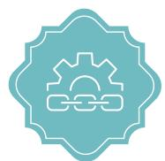

## 责任内生性

将理性饮酒理念深度融入企业治理与价值链，从产品设计到外部合作，实现全链渗透

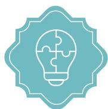

## 创新普惠性

突破传统传播壁垒，利用“线上 + 线下”多元化渠道，让理性教育以“零门槛”方式触达公众

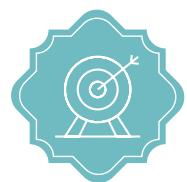

## 长期确定性

将理性饮酒目标与国家战略（如“健康中国 2030”）绑定，纳入企业量化可持续发展目标，确保行动的长期性和系统性

水井坊在所有酒瓶标签、广告及社交媒体传播物料上强制标注“理性饮酒，杜绝酗酒，禁止向未成年人售酒”警示标识，并通过增强对电商平台运营方的指导，在站内外投放物料，展示页面及商品详情页着重标注并检查理性饮酒提示，同时严禁直播过程中主播劝酒，将责任理念延伸至用户互动场景。在渠道与活动端，公司定期为经销商提供理性饮酒培训，并在品牌活动中引入代驾服务。

此外，水井坊还积极探索理性饮酒的创新表达。我们在成都市锦江区塔子山公园落成的“友邻公益跑道”，布局了系列“理性饮酒”宣传互动设施，使居民在日常锻炼时能以寓教于乐的方式获取理性饮酒相关知识。公司还通过“白酒学坊”平台将 600 年古法酿造工艺与健康生活方式结合，在教授品鉴技巧、分享白酒文化的过程中倡导理性饮酒的社会风尚。

## 案例

## “理性饮酒”主题快闪

2025 年 10 月，水井坊作为帝亚吉欧旗下品牌，参与了在北京三里屯举办的“理性饮酒”主题快闪活动，通过互动体验与科普内容向公众倡导“饮酒有刻度，生活有态度”的理念。

text_image

飲有刻度
DRINK
活有态度
拒绝
酒驾
号场
Drinkio

## 动态舆情监测与响应

公司建立了线上线下一体化的舆情监测体系，对营销活动进行事中事后跟踪。一旦发现潜在争议或消费者误解，公共关系事务部门能够快速启动响应流程，及时沟通、澄清或调整，有效管理品牌声誉风险。

## 提升消费者体验

水井坊在白酒学坊、文化美学馆等场景中融入酿造技艺与品鉴文化教育，以知识传递深化消费者对白酒文化的认同。公司积极构建线上线下融合的消费者体验体系：线上通过电商平台及社交媒体强化互动，线下依托文化体验与体育赛事深化认知，并运用大数据与人工智能技术对消费者进行精准画像，为消费者提供更加个性化的体验。在消费者运营（Consumer Relationship Management, CRM) 端，公司持续运营水井坊品牌会员中心“坊客有礼”小程序，结合品牌大事件推出会员专属活动，以优质的品牌内容、创意的互动形式和丰富的会员权益，为消费者打造独特的品牌体验与会员服务。截至 2025 年底，“坊客有礼”小程序已累计服务超过 1,100 万粉丝会员。

## 案例 成都首条酒旅融合路线

水井坊不仅致力于弘扬白酒文化，同时也积极承担成都城市文化传播的责任。2025年，成都文旅推出 10 条“赏花踏青，酒旅融合”精品旅游线路。作为精品线路之一，以水井坊博物馆为起点，串联杜甫草堂、鹤鸣茶社、春熙路等地标，实现对地域文化和产区文化的活化赋能。

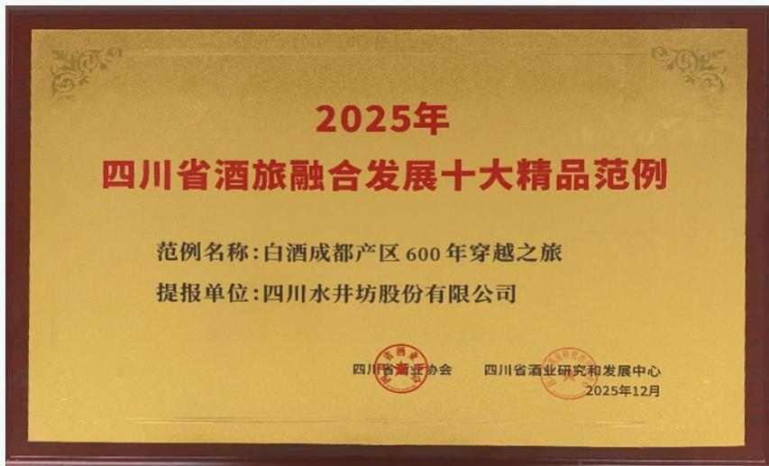

text_image

2025年
四川省酒旅融合发展十大精品范例
范例名称:白酒成都产区600年穿越之旅
提报单位:四川水井坊股份有限公司
四川省商业协会
四川省酒业研究和发展中心
2025年12月

## 案例 白酒知识传播平台“白酒学坊”

在全球烈酒消费体系中，葡萄酒与威士忌等品类已形成成熟的消费者教育体系，而中国白酒虽具备深厚文化底蕴与庞大市场规模，但长期缺乏标准化，体系化的消费者教育载体。基于此，水井坊联合中国酒业协会及行业专业机构与专家，率先打造“白酒学坊”平台，通过课程化，场景化与互动化的方式，推动消费者由“感性饮用”向“理性认知”转变，倡导“明白喝酒，喝明白酒”的消费理念，助力中国白酒构建更加清晰的价值表达体系。

2025 年，水井坊围绕重点城市、重点圈层及重点合作场景，持续推进“白酒学坊”项目落地，在上海、成都等城市开展专题讲解、感官品评、互动演示及结业授证等活动，持续提升消费者对白酒风味体系、酿造工艺及品牌文化内涵的系统认知。

natural_image

Abstract line art illustration of layered mountain peaks and clouds (no text or symbols)

## 创新驱动

## 治理

水井坊严格遵循《四川水井坊股份有限公司质量政策》《环境方针》《职业健康安全政策》《四川水井坊股份有限公司知识产权管理制度》《信息管理制度》等一系列内部规范，确保创新活动在质量、安全、环保、知识产权保护及信息安全等维度全面符合要求。公司以跨部门深度协同为基础，系统化推进精益生产与数字化变革。

## 战略

水井坊秉持“在传承中创新，以创新驱动新质生产力”的核心理念，致力于构建一个“传统技艺、现代科技与开放生态”深度融合的创新体系。我们以传承 600 余年的非遗酿造技艺为根基，坚信科技创新是驱动发展的核心动力。在战略路径上，公司持续深化对“一号菌群”等酿造微生物生态的基础研究与工艺创新，不断解锁风味奥秘、优化酿造工艺；以邛崃全产业链基地等重大实体项目为载体，打造融合智能装备与数据管理的“超级生产线”；同时系统化导入精益运营与数字化体系，推动从“经验驱动”向“数据驱动”的根本转变。

## 影响、风险和机遇管理

水井坊通过构建结构化的研发流程、系统化推进精益数字化部署、深化开放协同的产学研合作，有效管理创新进程中的各类风险，确保转型路径稳健可控，在此基础上，公司将技术创新与效率提升所取得的成果，持续转化为提升产品品质优化成本结构、构建柔性供应链、塑造长期竞争力的战略机遇，以创新驱动夯实企业可持续发展的根基。

natural_image

Illustration of a traditional Chinese water town with a flag, stone bridge, and pink flowers (no text or symbols)

## 管理实践与进展

## 新品研发

公司建立了结构化的“新品开发流程”，通过 OA 系统进行流程化管理。同时，公司建立了市场洞察与技术趋势分析机制，以精准识别研发方向，并对研发项目实行阶段性的评审与资源投入管控，有效防范因技术路线偏差或投入不足导致的竞争劣势风险。2025 年，水井坊完成了井台 18、第一坊 10、小水井电商版、水井坊·环球逸品、水井坊·臻酿大师、珍心珍意等多款新品的开发与上市，进一步夯实了核心品牌矩阵。

新品开发流程

<table><tr><td>Gate1立项获批</td><td>Gate2设计获批</td><td>Gate3开发获批</td><td>Gate4试生产获批</td><td>Gate5上市获批</td><td></td></tr><tr><td>·市场及渠道需求·供应链开发计划及风险评估·商业机会评估</td><td>·酒体设计·包材设计(+实物样品)·酒体·商务规划更新·GP%预估</td><td>·包材测试及产线适配·包材物料封样(+墨稿&amp;图纸)·新品生产相关文档·Business case incl. value chain</td><td>·试生产(基于产品设计及风险评估)</td><td>·商务计划·第一年分季度商业计划·三年愿景·首量交付</td><td>项目回顾</td></tr></table>

## 科研与技术创新

公司持续深化与中国科学院微生物研究所的合作，对“一号菌群”等酿酒微生物生态展开系统性研究，推进对水井坊窖池中酿酒微生物的分离筛选及菌种库的建立、酿造菌种发酵机理及协同作用、传统发酵技术研究及前瞻性的基础科研工作，为工艺优化和产品创新提供坚实的科学支撑。

2025 年，水井坊受邀参加“四川省科协一流学术活动培育项目——川渝白酒产业高质量发展学术大会”，并积极参与标准制定，成为《多粮酿造浓香型低度白酒》（T/CBJ 2117—2025）团体标准的起草单位之一。

natural_image

Abstract decorative line art with layered clouds and birds (no text or symbols)

## 新质生产力

继 2024 年公司系统性导入 TRACC 卓越运营体系后，2025 年，该体系覆盖至土桥工厂包装曲酒车间及整个邛崃厂区，共建立 8 个实施推进（Implementation Task Force, ITF）小组。邛崃厂区成熟度从 1.0 提升至 1.65，土桥厂区从 2.43提升至 2.61。全年公司共新认证 11 名内训师，累计在职内训师达 52 名，2025 年，认可人次超过 17,000。

2025 年，公司作为行业高质量发展的践行者，其邛崃全产业链基地已成为一条“超级生产线”，深度融合古法技艺与智能化设备，在酿造、检测、储存等环节引入机器人及智能系统，实现了古老工艺的标准化、精准化传承与效率提升，是“非遗技艺遇见现代科技”的典范。

## 案例

## 邛崃全产业链基地——非遗技艺与现代科技的深度融合的“超级生产线”

邛崃全产业链基地是水井坊打造的“超级生产线”，系统性融合了智能装备、数据管理与绿色技术，实现了产能、品质与效能的全方位升级。该基地总投资约68亿元，规划为集酿酒、储存、包装、研发于一体的综合性生产基地，其中一期项目已全面投产，年产能达 2 万吨，二期工程正稳步推进。

## 智能装备深度融入核心工艺

在传承“踩窖”“看花摘酒”等关键匠艺的同时，基地将机器人、传感器等智能设备应用于生产主线。例如，“上甑”环节由机器人模拟人工“轻铺匀撒”的动作，既保留了技法精髓，又提升了操作的一致性与效率；“摊晾下曲”由智能设备精准控制温度；生产线内置高精度传感器，能实时监测酒精度、流量与温度，确保了每一锅酒的产品稳定。

## 数据驱动实现全流程管控

基地通过中央系统对现代化酒库进行自动输送与实时监控，并为每个储存原酒的手工陶坛配备专属二维码，实现了从入库到出库的全流程数字化追溯。在品控环节，通过 CNAS 国际认可的检测中心，对原料、酒样进行至少 10轮以上的严格检测，以科技手段保障品质。

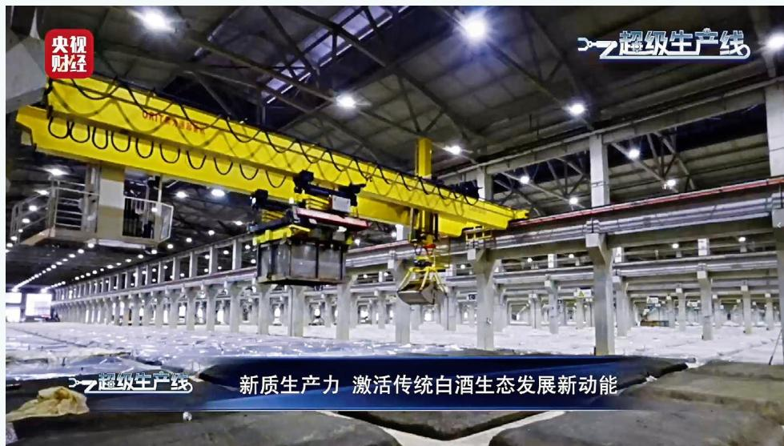

text_image

央视财经
超级生产线
5~超级生产线 新质生产力 激活传统白酒生态发展新动能

## 数据安全与客户隐私保护

## 治理

水井坊制定并持续完善《水井坊个人信息保护制度》《商业行为准则》等内部关键政策，适用于水井坊及关联子公司的各级员工，包括但不限于合同制员工、无固定期限员工、劳务派遣工、临时工、实习生等，以明确各级员工在个人信息与数据处理过程中的行为规范与管理责任，确保从制度层面筑牢防护根基。

## 《水井坊个人信息保护制度》关键条款

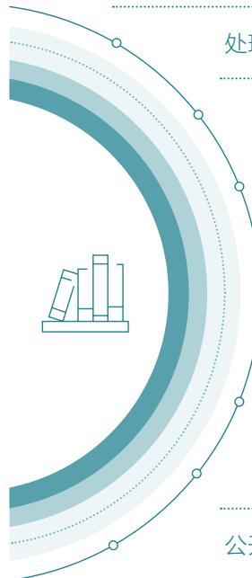

natural_image

Abstract circular graphic with layered gradient and a small icon of stacked books, no text or symbols present.

处理前提：须取得个人同意，或符合法定情形（如合同履行、法定义务等）

敏感信息：须取得个人单独同意，并告知必要性及影响

告知义务：处理前须以显著方式告知处理目的、方式、种类、保存期限等

保存期限：为实现目的所必要的最短时间，目的达成后须删除

委托与共享：委托第三方处理须监督，向他人提供信息须取得单独同意

自动化决策：须保证透明公正，不得差别待遇，提供拒绝方式

跨境传输：须符合国家规定条件，取得单独同意

公开场所采集：限于公共安全目的，设置显著提示

## 战略

公司的战略致力于构建一个全生命周期、纵深防御的数据安全与隐私保护体系，将安全与隐私保护理念主动融入业务流程。通过定期更新内外部政策与管理要求、技术迭代、严格执行相关标准，我们旨在构建并完善一个动态、主动的防护体系，确保在业务快速发展与数字化深入的同时，客户与公司的数据资产得到可靠保障。

## 影响、风险和机遇管理

公司严格遵循《个人信息保护法》《数据安全法》《网络数据安全管理条例》等国家法律法规，实时监测系统安全，建立了涵盖合规、安全事件、技术控制及管理等多维度目标，并进行跟踪管理。一旦发生信息安全事件，将由信息安全管理员进行定级上报，并按照相应规范流程进行处理。

2025 年，水井坊共有 5 个核心信息系统获得安全等级保护认证。

## 管理实践与进展

## 客户与消费者隐私保护

水井坊严格保护消费者的隐私及数据安全，遵循合法、正当、必要原则。在 CRM 端，通过系统推送个人信息及隐私保护相关政策协议，向消费者充分告知收集范围、目的及保存期限，仅在获得用户授权后获取相关信息，且严格遵循最小必要原则，拒绝捆绑授权，确保消费者在不授权非必要权限时仍可正常使用基础服务。公司建立动态更新的数据资产清单，将消费者数据明确划分为一般个人信息与敏感个人信息，并对敏感信息及重要数据实施更严格的保护措施，同时设定数据保存期限并支持用户按需删除。

在技术防护层面，水井坊构建了从存储，传输到隐私计算的多层级安全防护体系。存储环节采用AES-256等强加密标准，根据数据重要程度灵活选择全盘加密、文件级加密或透明数据加密；传输环节集成 TLS/SSL 协议模块，防范中间人攻击与数据窃听风险；密钥管理依托硬件安全模块，实现密钥全流程管控；隐私增强组件集成匿名化、假名化等技术模块，在保障数据安全的前提下挖掘数据价值。所有运维操作均需特殊权限授权并留存完整审计日志，确保敏感数据仅限授权人员可访问且全程可追溯。

2025 年，水井坊发生 0 起经确认的泄露、盗窃或丢失客户资料的事件。

## 信息安全文化建设

公司每年根据识别出的风险场景，基于针对设施系统所制定的应急预案，组织应急演练，以验证和提升团队在真实安全事件发生时的应急响应与处置能力，及时避免故障发生。

此外，水井坊每季度面向全员开展信息安全宣贯，渠道包括但不限于邮件、企业微信等多种形式，覆盖员工行为规范、网络攻击防范、钓鱼邮件识别等主题，通过经典案例的讲解，持续提升员工的整体安全防护意识与技能，筑牢人为风险防线。

2025 年，水井坊接受网络和信息安全相关培训的人数为 1,052 人。

2025 年，

水井坊发生经确认的泄露、盗窃或丢失客户资料的事件

0起

水井坊接受网络和信息安全相关培训的人数为

1,052人

## 第四章

## 敬·更成功的伙伴

水井坊持续深化对内部员工与外部合作伙伴的责任管理，将员工发展、供应链合作与中小企业权益保障纳入统一的价值链治理框架。公司不仅关注内部员工的成长与福祉，不断完善员工发展与职业健康安全保障机制，营造公平包容的组织环境，同时也将责任延伸至外部合作网络，通过规范的供应商与经销商管理体系，加强准入审核、行为规范与绩效管理，提升合作透明度，维护良好的市场秩序。

员工权益与福利  
员工培训与发展  
职业健康与安全  
供应链管理  
经销商管理与权益保护

响应联合国可持续发展目标（SDGs）

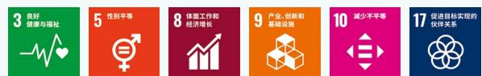

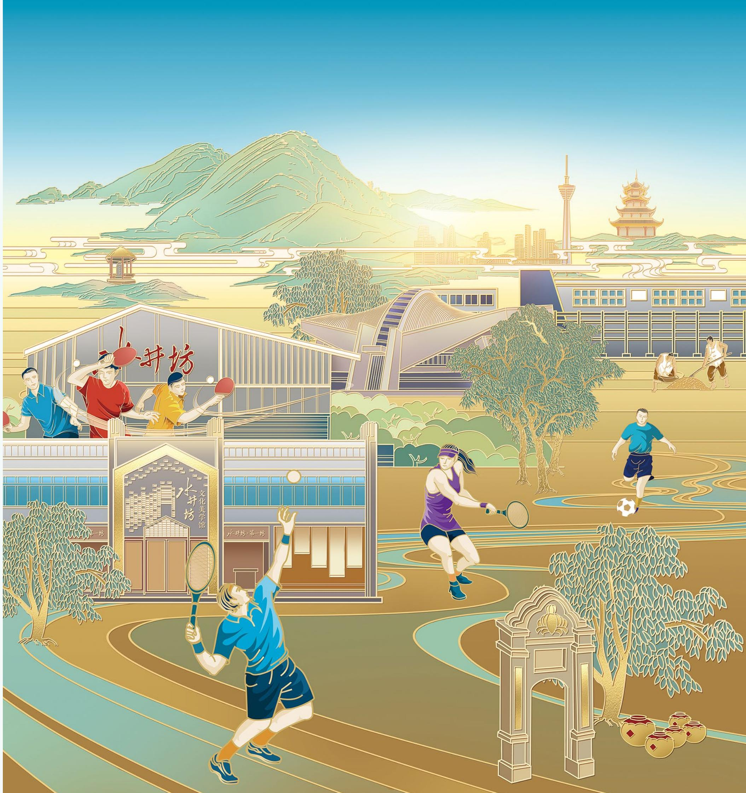

natural_image

Illustration of a tennis competition in a riverside urban area with players, spectators, and traditional architecture (no text or symbols)

## 员工权益与福利

## 员工权益保障

水井坊依照国家法律法规，并遵循联合国有关商业与劳工权益的指导原则，制定《员工保护政策》《员工纪律政策》《工作尊严政策》等人力资源管理制度，在劳动关系的各个方面，包括招聘、薪酬福利、培训、提升、调动和解除劳动关系等，都以公正、不歧视的方式对待每位员工，确保他们在互相尊重的氛围中获得支持与保障。员工有权利和义务遵守和监督《员工保护政策》的执行，对违反本政策的行为，可向直线经理、人力资源部、内控/合规/风险部（CCR）报告，也可通过“第三方合规热线和邮箱”举报，对于违反行为将依照水井坊《违规行为举报与调查实施办法》《员工纪律政策》及有关规定予以处理。

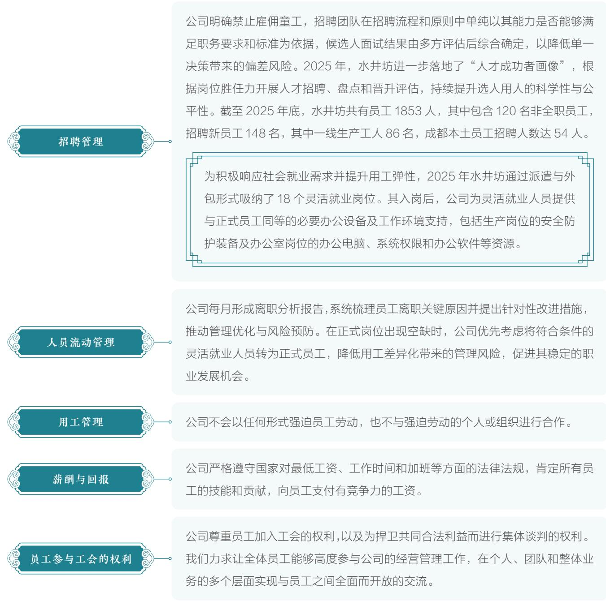

flowchart

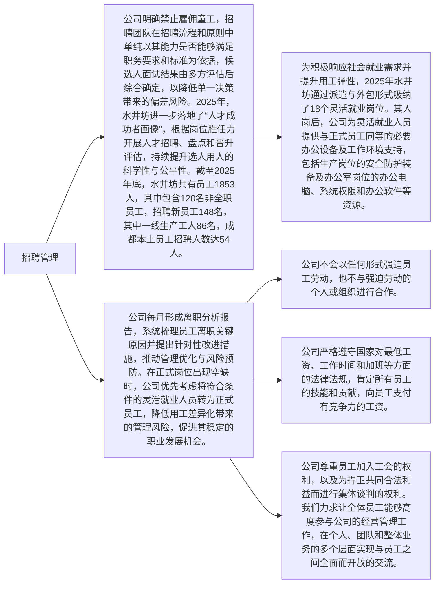
```mermaid
graph LR
  A["招聘管理"] --> B["公司明确禁止雇佣童工，招聘团队在招聘流程和原则中单纯以其能力是否能够满足职务要求和标准为依据，候选人面试结果由多方评估后综合确定，以降低单一决策带来的偏差风险。2025年，水井坊进一步落地了“人才成功者画像”，根据岗位胜任力开展人才招聘、盘点和晋升评估，持续提升选人用人的科学性与公平性。截至2025年底，水井坊共有员工1853人，其中包含120名非全职员工，招聘新员工148名，其中一线生产工人86名，成都本土员工招聘人数达54人。"]
  B --> C["为积极响应社会就业需求并提升用工弹性，2025年水井坊通过派遣与外包形式吸纳了18个灵活就业岗位。其入岗后，公司为灵活就业人员提供与正式员工同等的必要办公设备及工作环境支持，包括生产岗位的安全防护装备及办公室岗位的办公电脑、系统权限和办公软件等资源。"]
  A --> D["公司每月形成离职分析报告，系统梳理员工离职关键原因并提出针对性改进措施，推动管理优化与风险预防。在正式岗位出现空缺时，公司优先考虑将符合条件的灵活就业人员转为正式员工，降低用工差异化带来的管理风险，促进其稳定的职业发展机会。"]
  D --> E["公司不会以任何形式强迫员工劳动，也不与强迫劳动的个人或组织进行合作。"]
  D --> F["公司严格遵守国家对最低工资、工作时间和加班等方面的法律法规，肯定所有员工的技能和贡献，向员工支付有竞争力的工资。"]
  D --> G["公司尊重员工加入工会的权利，以及为捍卫共同合法利益而进行集体谈判的权利。我们力求让全体员工能够高度参与公司的经营管理工作，在个人、团队和整体业务的多个层面实现与员工之间全面而开放的交流。"]
```

2025年，水井坊工会入会率达94%，职工代表会全年共召开10次，并于12月10日顺利完成职工董事选举。职代会讨论并通过了《成都水井坊坊藏酒销售有限公司特殊工时制实施方案》《推荐魏江志同志作为四川省第九届劳动模范和先进工作者推荐人选》《水井坊《采购政策》修订版 8.0》《信息管理制度》等十五项政策与制度。同时，本年度工会积极参与集体谈判，在员工解除劳动合同等事项上与人力资源部、合规部及法务部多轮沟通，并提出反馈共计 4 次，有效强化了员工合法权益保障。

2025 年，

水井坊工会入会率达

94%

职工代表会全年共召开

10次

并提出反馈共计

4次

## 员工福祉与关怀

完善的员工福利体系是企业凝聚人才、稳定团队的重要支撑。水井坊建立了包含现金福利、非现金福利及健康福利三大维度的福利体系，全方位保障员工的合法权益与身心健康。

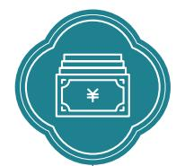

## 现金福利

员工日常通勤及工作提供相关津贴，包括但不限于交通津贴，通讯津贴，餐费津贴等

## 非现金福利

包括但不限于假期福利，年节福利，生日福利，困难补助等

## 健康福利

员工及其子女商业医疗保险、员工年度体检，员工百万医疗等各类健康保险

公司定期回顾并优化员工福祉项目，2025 年，我们持续推进员工关爱计划（EAP），重点围绕生活议题协助员工舒缓情绪，报告期内，EAP心理健康小程序已正式嵌入企业微信，员工通过身份验证即可在线预约专业心理资询师，同时公司打造健康中心并为全体员工提供健康福利体验，通过构建系统化的健康支持，进一步满足员工的身心需求，强化员工对组织的长期意愿。此外，对于意外身故或长期罹患重疾的员工，公司将视员工家庭经济情况为其提供一年两次的困难家庭补助金，2025 年公司共计发放补助 47,300 元。

## 倾听员工心声

为持续提升员工的幸福感和满意度，公司每年组织开展覆盖全体员工的“Your Voice 您的心声”调研，2025 年调研员工有效参与率达 99%，四项关键指标结果分别为：员工敬业度指数 94%（较上一年提升 3%）、包容与多元化指数 94%（较上一年提升 5%）、公司净推荐值 69（较上一年提升 11 分）、产品净推荐值 79（2024 年未统计产品净推荐值）。

调研结束后，各部门基于员工心声，将反馈转化为具体的管理洞察，并针对性制定行动计划，推动组织效能全面提升。在此机制下，员工满意度已连续三年实现稳步增长。

2025 年，“Your Voice 您的心声”员工调研

员工有效参与率达

99%

员工敬业度指数

94% （较上一年提升 3%）

包容与多元化指数

94% （较上一年提升 5%）

公司净推荐值

（较上一年提升 11 分）69

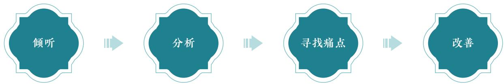

flowchart

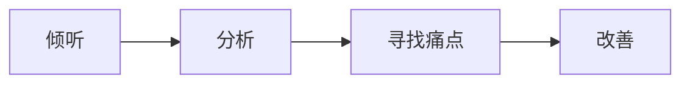
```mermaid
graph LR
  A["倾听"] --> B["分析"]
  B --> C["寻找痛点"]
  C --> D["改善"]
```

基于业务重点，公司战略制定并实施相应的倾听计划

根据员工心声反馈数据结果，进行进一步的分析

结合分析内容，筛选并确定痛点内容制定并执行行动计划、制定追踪指标，并持续监控

## 员工培训与发展

## 治理

水井坊设立学习与发展团队，专门负责员工培训与发展相关工作的规划与管理。学习与发展团队定期向首席人力资源官汇报培训体系建设和重点项目进展，并根据公司战略和业务需求统筹制定年度培训计划。各业务部门在日常运营中协同落实培训项目，并结合员工发展需求向学习与发展团队反馈培训效果与实施情况。公司制定《教育培训政策》，适用于与公司及各控股子公司签订了劳动合同的全体员工，其它类型员工（非全日制、劳务派遣、签订劳务合同的员工等）视具体情况参照执行。

## 战略

水井坊为员工制定了三年期学习与发展策略，旨在通过系统化的人才培养机制，为员工提供多元化的职业成长机会。公司关注员工在不同职业阶段的能力提升需求，持续完善学习资源和发展路径，帮助员工提升综合素质，推动个人价值与公司长期发展相互促进。

## 影响、风险和机遇管理

水井坊通过多元化培训、专业资质认证以及内部竞聘等方式，为员工提供不同路径的能力提升和职业发展机会。培训体系覆盖员工职业生涯各阶段，包括入职培训、专业技能培训及领导力发展项目等内容，同时，公司提供多样化的学习资源，并结合“线上 + 线下”的学习模式，持续建设数字化学习平台，为员工提供灵活便捷的学习渠道。

## 管理实践与进展

## 培训体系建设

2025 年，公司共计投入 207 万元，为员工提供了总时长 13,512 小时的针对性培训，覆盖 100% 全职员工，人均接受培训时长 7.3 小时，培训整体满意度 9 分以上（满分 10 分）。其中，开展新员工入职培训 12 场，覆盖 149 名新同事；专业能力培训 58 场，覆盖 1,165 人次，领导力培训 2 场，覆盖 23 人次，通用力培训 10 场，覆盖 192 人次。

在培训形式上，水井坊的线上学习平台“坊学堂”依托数字化运营，灵活为员工提供学习资源，并不断提升培训效率，有效降低培训耗材并减少差旅，为实现水井坊 2035 可持续发展目标助力。2025 年，“坊学堂”活跃人数为 3,031 人，活跃率为 98.73%，在线总时长为 1,561,749 分钟，人均在线时长为 515.3 分钟。

2025 年，

公司共计投入

207万元

为员工提供了针对性培训的总时长

13,512 小时

覆盖全职员工

100%

人均接受培训时长

7.3小时

培训整体满意度（满分10分）

9 分以上

## 案例

## Young Talent 特训营

水井坊的人才战略不仅着眼于当下，更致力于播种未来。公司近年来通过校招录取了 60 余位青年人才作为水井坊未来基层管理储备，并为他们制定了专项培养计划，基于“70/20/10”的模型，设置了包括业务轮岗、上级带教、班会分享、直播课程、线下集训等措施，帮助他们快速融入与发展。在 2025 年，累计开展了 21期双周班会、3 期在线直播课、1 次线下集训营，助力他们快速成长。这批富有激情与创造力的年轻血液，正迅速成为技术革新、业务拓展的生力军，为组织带来了全新的视角与活力。

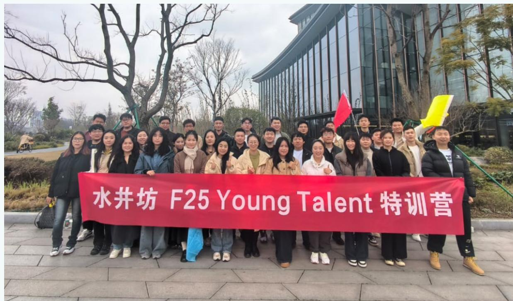

text_image

水井坊 F25 Young Talent 特训营

## 案例

## 品酒师等级认定技能培训

在公司的可持续发展与 ESG 治理框架下，人才被视为驱动质量提升与工艺传承的核心引擎。品酒师作为链接传统酿造技艺与现代品质管理体系的关键角色，其专业能力直接关系到产品风味的一致性、创新研发的深度以及消费者信任的建立。为此，公司立足长远战略，围绕技能人才梯队建设与专业化能力沉淀，系统构建了品酒师成长体系。2025 年公司与四川省食品发酵工业研究设计院展开合作，组织开展了水井坊专场品酒师等级认定技能培训，课程设置涵盖了酒中微量成分的认识、白酒的酿造工艺、风味学及酒体设计、感官品评技巧、理化分析基础知识等多个方面。最终助力 32 位学员成功获取了对应的品酒师等级认证，进一步推动了公司尝评人才梯队的建设。

## 2025年四川水井坊股份有限公司品酒师职业技能提升培训班

## 四川省食品发酵工业研究设计院有限公司

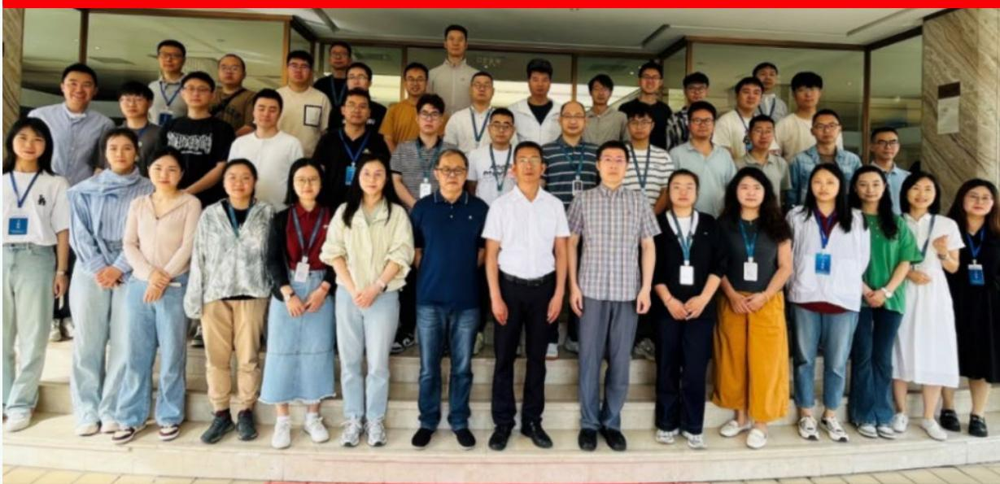

natural_image

Group photo of people posing in front of a building entrance (no visible text or symbols)

## 内部晋升与绩效管理

水井坊鼓励内部职业发展，在符合岗位条件的情况下优先考虑内部在职员工，确保人才流动和晋升机会在公司内部得到充分挖掘，2025年，水井坊基于“人才成功者画像”开展人才盘点，根据结果对关键人才制定个人发展计划（IndividuaDevelopment Plan,IDP）并落实培训和发展项目，以满足关键岗位的人才储备。

水井坊通过定期评估与日常沟通相结合的方式推动员工绩效提升。公司每年开展两次集中绩效评估，分别在年中和年末进行，覆盖 100% 全职员工。在评估周期内，用人经理与员工围绕工作目标与执行进展保持持续沟通与反馈，及时识别改进方向，确保绩效管理过程透明有效，促进目标保持一致。

## 职业健康与安全

## 治理

水井坊制定了由首席执行官、首席生产运营官、EHS 经理、EHS 部门组成的职业健康与安全管理架构，各部门在运营过程中根据职责分工承担具体工作，形成完善的分级责任体系。公司将工伤事故等相关指标纳入环境健康安全管控目标的考核内容，计入人员的年度关键绩效指标考核，并与其调薪和年终奖直接挂钩。

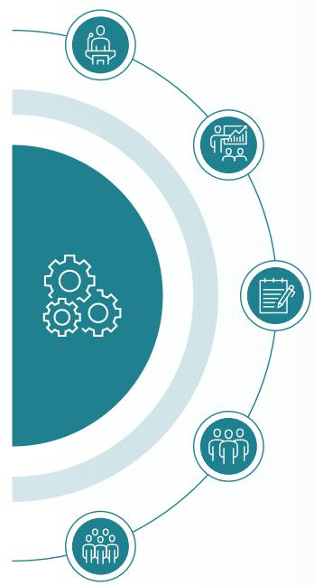

flowchart

```mermaid
graph LR
  A["Person"] --> B["Employee"]
  B --> C["Document"]
  C --> D["Group"]
  D --> E["Person with Team"]
```

## 首席执行官

整体监督公司EHS工作

## 首席生产运营官

审批EHS管理目标、指标

## EHS 经理

组织规划 / 修订 EHS 管理目标、指标及方案；审批 EHS 管理方案

## 公司各部门

制定并落实本部门的EHS管理目标、指标、实施方案

## EHS 部门

负责跟踪、监督、验证各部门管理方案的实施进程及成效

## 战略

水井坊制定了职业健康与安全管理的长期与短期战略。公司以“100% 合规、零伤害”为长期愿景，强化风险预防与管控能力，推动职业健康安全管理模式向系统化、精细化方向发展。针对短期规划，各工厂结合生产运营实际制定年度安全管理目标，明确指标及改进措施，并通过定期跟踪与评估推动目标落实，持续巩固安全管理水平。

## 影响、风险和机遇管理

水井坊严格遵守《职业病防治法》《职业健康监护技术规范》等法规标准 , 每年定期开展职业健康安全风险识别工作，并进行合规性评价，确保经营活动符合监管要求。通过危险源辨识、闭环管理及定期应急演练，公司有效降低安全事故和突发事件的发生概率，保障员工健康与生产稳定，同时为实现企业长期可持续发展提供支撑。

## 管理实践与进展

## 职业健康安全管理体系

公司建立了以《EHS方针》《职业健康安全管理手册》《EHS目标指标和管理方案程序》为核心、覆盖EHS管理全流程、应对多种作业场景的三级文件系统，适用于所有正式员工和外包员工，以确保各项职业健康安全管理要求在生产运营中的规范落实。

EHS管理体系三级文件系统  
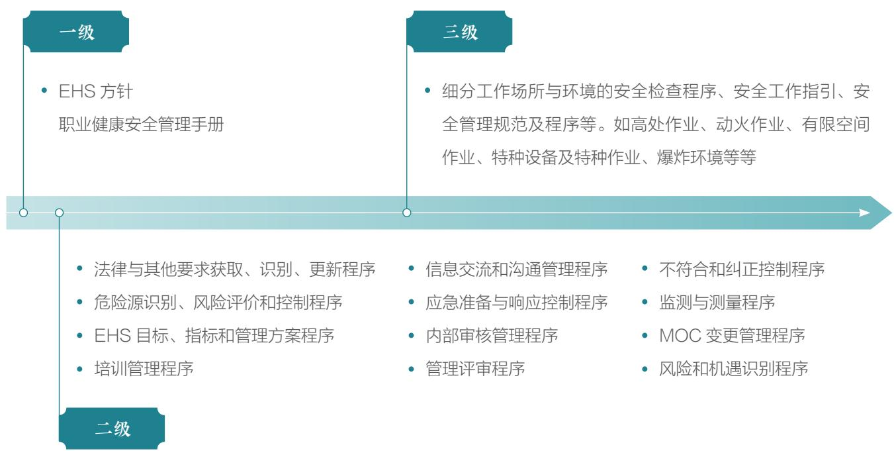

flowchart

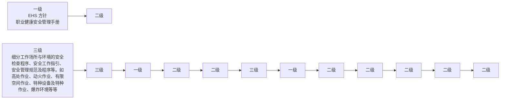
```mermaid
graph LR
  A["一级\nEHS 方针\n职业健康安全管理手册"] --> B["二级"]
  C["三级\n细分工作场所与环境的安全检查程序、安全工作指引、安全管理规范及程序等。如高处作业、动火作业、有限空间作业、特种设备及特种作业、爆炸环境等等"] --> D["三级"]
  D --> E["一级"]
  E --> F["二级"]
  F --> G["二级"]
  G --> H["三级"]
  H --> I["一级"]
  I --> J["二级"]
  J --> K["二级"]
  K --> L["二级"]
  L --> M["二级"]
  M --> N["二级"]
```

对于 EHS 目标、指标的制定，公司综合考量以下因素：环境与职业健康安全方针要求、适用法律法规及其他要求、重要环境因素与重大危险源、相关方的要求、对污染预防与持续改进的承诺、项目实施进度及可调整性、经济与技术要求，如可行，目标与指标应予以量化。

natural_image

Illustration of two tennis players in action on a track, with a TV tower and modern building in the background (no text or symbols)

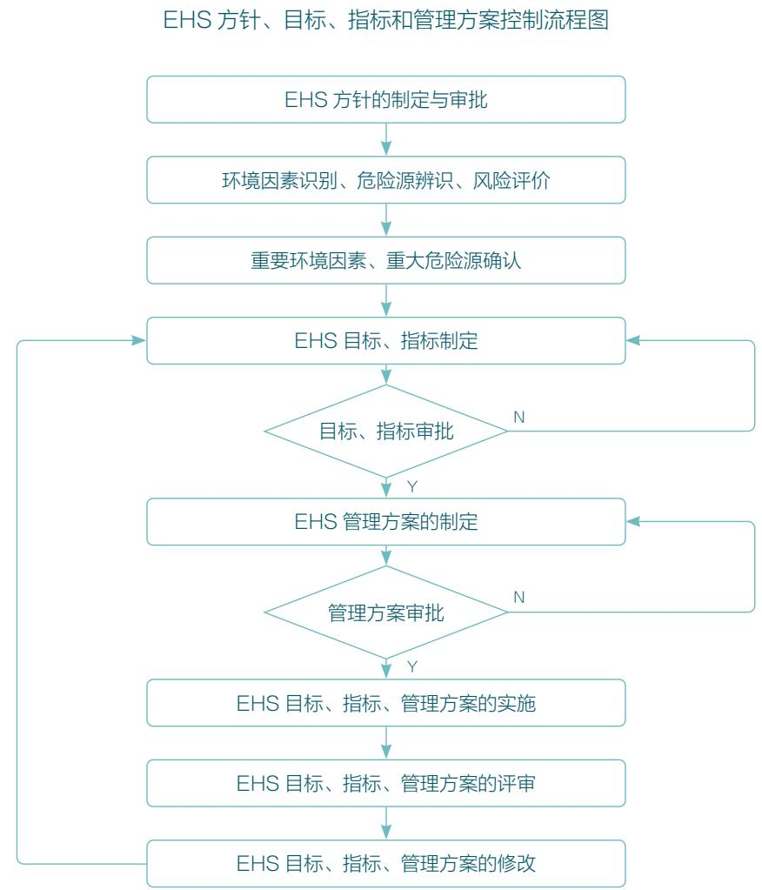

flowchart

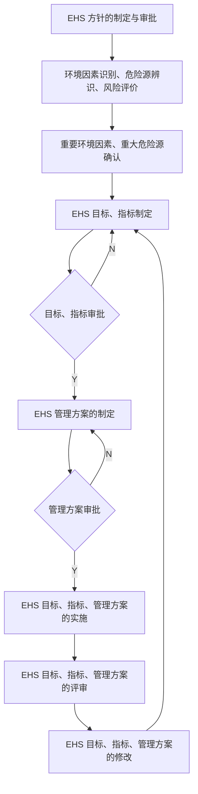
```mermaid
graph TD
  A["EHS 方针的制定与审批"] --> B["环境因素识别、危险源辨识、风险评价"]
  B --> C["重要环境因素、重大危险源确认"]
  C --> D["EHS 目标、指标制定"]
  D --> E{"目标、指标审批"}
  E -->|N| D
  E -->|Y| F["EHS 管理方案的制定"]
  F --> G{"管理方案审批"}
  G -->|N| F
  G -->|Y| H["EHS 目标、指标、管理方案的实施"]
  H --> I["EHS 目标、指标、管理方案的评审"]
  I --> J["EHS 目标、指标、管理方案的修改"]
  J --> D
```

同时，水井坊每年参照国际标准对公司的职业健康管理体系进行完善与优化。2025 年，水井坊土桥工厂和邛崃工厂均通过了 ISO45001 认证审核，邛崃工厂还进一步获评了“四川省健康企业”。

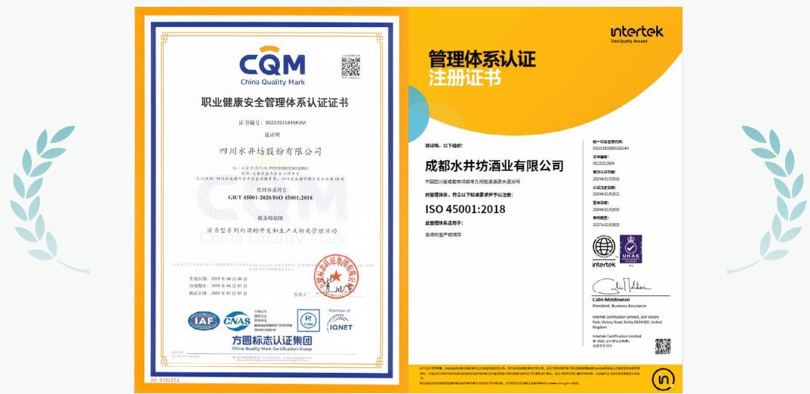

text_image

CQM
China Quality Mark
职业健康安全管理体系认证证书
证书编号：00223521845K3M
证明
四川水井坊股份有限公司
统一社会信用代码：9151010072415399Y
注册会计师：毕马威华振会计师事务所（特殊普通合伙）
办公地址：四川省成都市东城根上街9号
组织体系符合
CIUT 45001-2020 ISO 45001:2018
观业师供图
浪奇型系列向涌的开发和生产及相关管理活动
生效日期：2021年06月06日
存续期：2024年06月07日
换证日期：2025年07月07日
签章人：
CNAS
方图标志认证集团
China Quality Mark Certification Group
LAF CNAS MANAGEMENT SYSTEM
United Kingdom
Member of IQNET
ISO 45001:2018
管理体系认证
注册证书
兹证明，以下途径：
成都水井坊酒业有限公司
中国四川成都农村商业银行川能高速源路A座3D号
的管理体系，符合以下标准要求并予以注册：
ISO 45001:2018
管理体系适用于：
自西的生产和经营
第一任企业名称：
05133103880536144
证券简称：
0513312064
登记认证日期：
2024年01月29日
认证截止日期：
2024年01月29日
签发日期：
2024年01月29日
审核机关：
2024年01月29日
Intertek
Cain Moldovan
President, Business Assurance
Intertek Certification Limited, Japan Victory Park, Victory Road, Derby ISO ABD, United Kingdom
Intertek Certification Limited
www.intertek.com.cn
注册号：S-514

此外，公司积极拥抱数字化工具，于2025年上线了EHS数字化管理系统，从传统人工、纸质模式转向线上化、流程化、智能化管控，通过全流程数据留痕、隐患闭环管理、合规自动提醒与数据可视化分析等功能模块，有效提升管理效率与责任落实力度，为企业安全生产、合规运营与可持续发展提供坚实支撑。

## 作业许可管理

危险作业线上申请与审批，规范作业许可流程

## 变更管理

实现变更前后的评估、验收全流程线上化，并与隐患管理模块联动

## 隐患管理

从检查到整改验证的全流程闭环管理，并通过可视化分析支持风险管控

## 合规管理

涵盖特种设备、证照及职业健康相关事项，确保合规运行

## 事件管理

实现事件调查与整改流程线上化，规范事件记录管理

## 能源与环境

收集工厂能源使用的数据和三废排放数据，助力工厂提升 ESG表现

## 承包商管理

对承包商人员资质进行线上审核与培训，并对其进行线上考核

## 危险源管控与应急管理

水井坊每年委托专业第三方机构开展职业病危害因素辨识与评估，并通过 BBQS（Behaviour Based on Quality anSafety 质量安全行为观察）活动鼓励员工主动识别和上报风险，及时掌握现场职业健康与安全风险。同时，公司通过不同频次、不同专项的现场检查开展隐患排查，对各生产环节实施风险分级管理，参与人员涵盖从高级管理层到一线员工。报告期内，所有隐患均纳入整改闭环管理，实现风险持续监测与及时改进。

2025 年，根据年度危险源辨识结果，公司在粉碎车间、污水站、酒库、包装及曲酒车间等重点区域推进安全改善项目，全面提升粉尘防爆、机械防护及化学品防护。例如：

## 行车生命线升级改造

## 粉碎设备安全升级

## 液压翻板设备安全升级

## 曲酒自动化设备安全双回路升级试验线项目

依据安全生产应急预案，水井坊组织开展多类型应急演练，包括每年两次全员消防演习及酒库专项应急演练，前者覆盖工厂员工及当日在场第三方人员。我们通过持续培训、技能竞赛及实操演练，不断提升应急响应团队（EmergencyResponse Team，ERT）对突发公共安全事件的处置能力，最大限度降低潜在不利影响。

## 治安管理

水井坊的治安保卫工作坚持“预防为主、防治结合”的原则，通过完善厂区运营安全与治安管理体系，保障生产经营平稳运行，报告期内，土桥厂区实现全年 0 治安及盗窃事件。

公司合理配置安保人员，定期开展专业技能培训与应急演练，土桥厂区年度累计组织保安培训 36 场、应急演练 12 场，内容涵盖治安防范、消防技能及突发事件响应等。

针对防范重点，公司建立并严格执行门禁、巡查及外来人员登记等制度，定期评估风险并动态优化管理措施，土桥厂区全年开展厂区巡查约2.190次，安保设备巡查72次。同时，公司部署1.147.个高清监控设备以实现重点区域全覆盖并委托专业机构维护，为事件追溯与产品安全管理提供强有力的技术保障。此外，公司还加强与成都市公安部门的协作联动，共同维护厂区及周边区域的安全秩序。

报告期内，土桥厂区

治安及盗窃事件

0起

开展厂区巡查

2,190次

开展安保设备巡查

72次

## 职业健康安全文化建设

公司高度重视职业健康安全文化培育，始终将员工职业健康安全意识提升作为工作重点，构建了分层分类、全覆盖的宣贯与培训体系。针对新员工实施三级安全培训，夯实入职安全基础：同时聚售EHS、工程、技术等专业岗位，开展“机械风险评估师”等专项培训，切实提升相关人员的风险辨识与专业管理能力，推动职业健康安全理念深植全员，筑牢安全生产防线。

## 土桥工厂

全年常态化开展安全、消防、职业健康等主题培训，共 2,958 人次参与，培训内容重点覆盖职业健康安全法律法规、机械防护、高风险作业、有限空间作业等关键领域，持续强化员工安全意识；同时面向工厂及办公室全员，有序开展安全生产月、消防月主题活动，营造全员参与、全员重视的安全文化氛围。

## 邛崃工厂

在安全生产月期间，组织安全知识竞赛、安全隐患查找、应急技能竞赛等活动，累计520人次参与；消防月开展触电急救、灭火器操作、消火栓使用、缓降逃生实操及全员应急疏散培训，覆盖 550人次。此外，针对机电及承压特种设备操作人员，开展专项培训与考核，覆盖 106 人；组织 22人参加急救员专项培训并顺利取证，强化应急处置能力；面向全员开展职业健康宣传培训，围绕PPE 穿戴、急救实操等内容，400 余人次参与。

## 供应链管理

## 治理

水井坊建立了覆盖供应商管理，供应链计划、仓储及运输等重点板块的治理架构，明确了各岗位权责和内部管理制度。各职能依照公司要求履行职责，通过架构的有效运行及《供应商商业行为准则》相关规定的指导，水井坊在保障供应链全流程规范与透明的同时，有效监督了供应链合规事项及潜在风险。

## 战略

水井坊致力于构建稳健且可持续的供应链体系，推动与供应商形成长期合作伙伴关系，增强价值链整体稳定性。公司着力优化供应链协同机制与资源配置，旨在提升供应链韧性，为企业持续运营和长期发展提供夯实根基

## 影响、风险和机遇管理

水井坊通过销售运营计划（Sales & Operations Planning, S&OP）提升供应链的持续性和响应能力，构建起从供应商严格准入到动态绩效考核的体系，依托第三方审计与合规审查筑牢底线，将定期审查与专项赋能相结合，打造公平透明且具有高度抗风险能力的价值链生态。

## 管理实践与进展

## 供应商准入与筛选

水井坊建立系统化的供应商准入管理机制，在合作前通过背景调查与现场评估相结合的方式，对潜在供应商进行全面审查，并根据评估结果实施分级管理，以确保供应商在质量管理、合规经营及运营能力等方面满足公司要求。

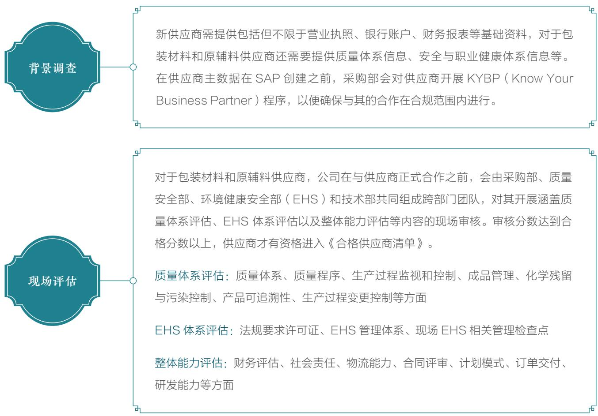

flowchart

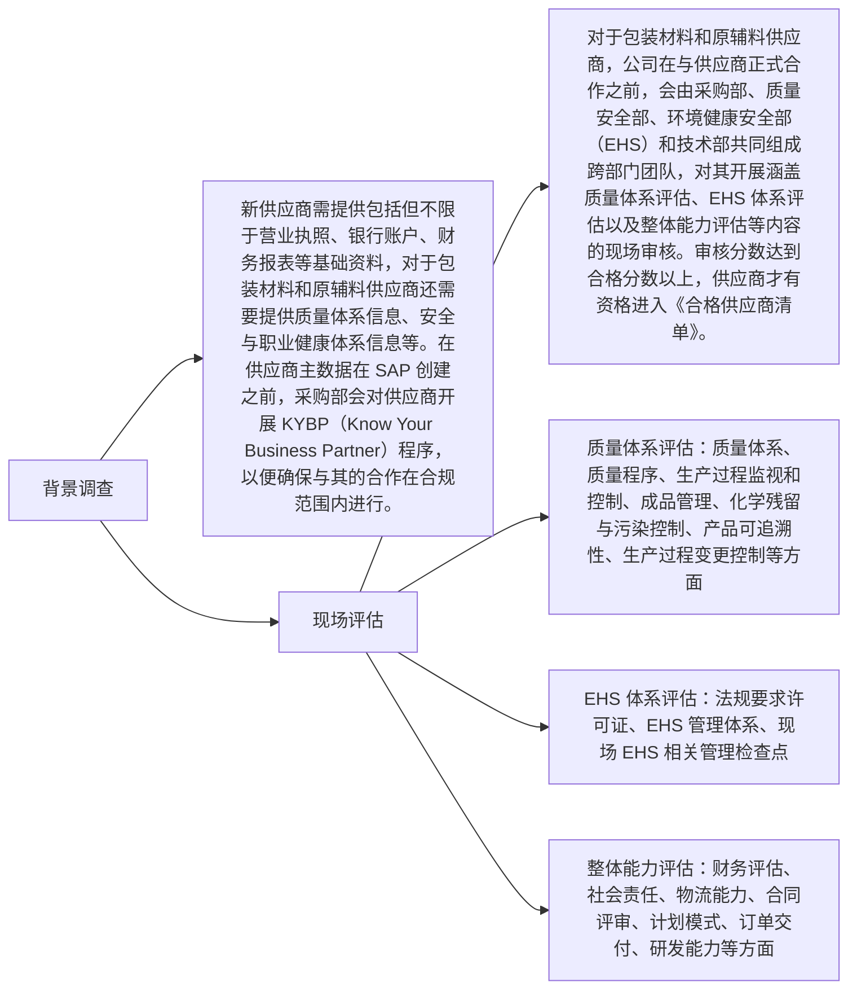
```mermaid
graph LR
  A["背景调查"] --> B["新供应商需提供包括但不限于营业执照、银行账户、财务报表等基础资料，对于包装材料和原辅料供应商还需要提供质量体系信息、安全与职业健康体系信息等。在供应商主数据在 SAP 创建之前，采购部会对供应商开展 KYBP（Know Your Business Partner）程序，以便确保与其的合作在合规范围内进行。"]
  A --> C["现场评估"]
  C --> D["对于包装材料和原辅料供应商，公司在与供应商正式合作之前，会由采购部、质量安全部、环境健康安全部（EHS）和技术部共同组成跨部门团队，对其开展涵盖质量体系评估、EHS 体系评估以及整体能力评估等内容的现场审核。审核分数达到合格分数以上，供应商才有资格进入《合格供应商清单》。"]
  C --> E["质量体系评估：质量体系、质量程序、生产过程监视和控制、成品管理、化学残留与污染控制、产品可追溯性、生产过程变更控制等方面"]
  C --> F["EHS 体系评估：法规要求许可证、EHS 管理体系、现场 EHS 相关管理检查点"]
  C --> G["整体能力评估：财务评估、社会责任、物流能力、合同评审、计划模式、订单交付、研发能力等方面"]
```

2025年，公司进一步将 ESG 评价维度全面嵌入供应商准入与比选流程，订单种植供应商和物流供应商的技术标比选中，ESG 相关指标分别占比 10% 和 5%，以量化标准遴选可持续发展表现优异的合作伙伴，推动上游供应链绿色低碳与合规稳健发展。

natural_image

Illustration of a modern building with a river, golden gate, and decorative elements (no text or symbols)

## 供应商合规审查与绩效管理

水井坊高度重视供应链合作伙伴的合规经营与商业道德表现，通过全面评估，识别潜在风险并推动整改落实。在合作过程中，公司在商业合同中明确要求供应商遵守适用的法律法规以及水井坊《商业行为准则》等相关政策，包括反贿赂、反腐败、反洗钱及反协助逃税等方面的合规要求。若供应商出现违反相关规定的行为，公司将依据合同条款采取相应措施，包括要求整改、暂停合作或终止合作，对于造成公司损失的情形，公司将依法追究其责任。2025 年，水井坊针对一家具有潜在负面影响的供应商制定了改进计划，并给予专项支持。

在绩效评估方面，水井坊制定了供应商年度绩效管理计划，针对包装及原材料等重点供应商，围绕质量、交付、技术和合规性等维度设定绩效目标和考核标准。基于评价结果，水井坊对重点供应商实施分级管理，通过定期会议与实时反馈驱动供应商持续优化。

此外，水井坊严把过程品控关，严格依据服务条款与技术指标执行每批次入厂检测。对于未达标产品，公司通过退货、补货或索赔等程序确保闭环处理，从源头筑牢产品安全与供应链稳健性的防线。

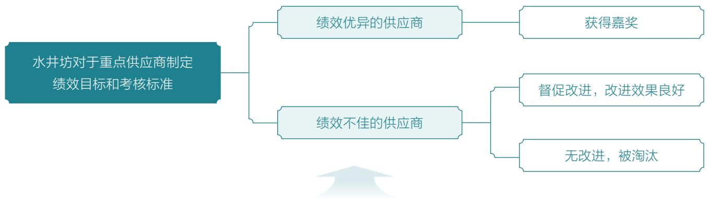

flowchart

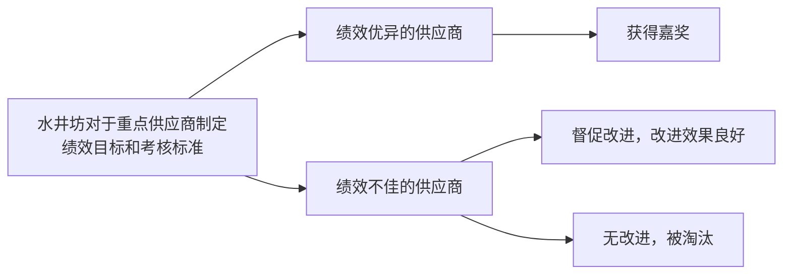
```mermaid
graph LR
  A["水井坊对于重点供应商制定\n绩效目标和考核标准"] --> B["绩效优异的供应商"]
  A --> C["绩效不佳的供应商"]
  B --> D["获得嘉奖"]
  C --> E["督促改进，改进效果良好"]
  C --> F["无改进，被淘汰"]
```

定期召开会议，向供应商实时反馈评审状况

在公司的供应商绩效考核体系基础上，水井坊继续延用 SEDEX 自评工具，深化对供应商社会责任的评估。对于自评不合格的供应商，水井坊将其委托给经过 SEDEX 认证的第三方审核机构进行后续的辅导和考核。2025 年，水井坊共识别关键供应商 89 家，淘汰了 3 家 SEDEX 表现不合格供应商，6 家供应商首次被纳入 SEDEX 评估范围，经过SEDEX 审查评估的关键供应商共为 83 家。

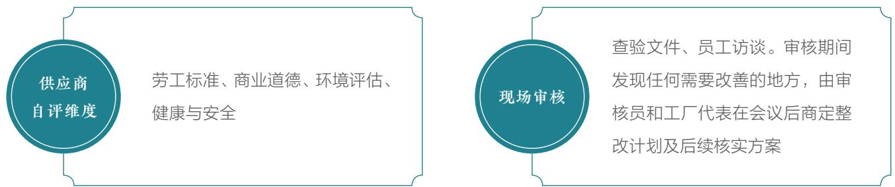

## 供应商赋能

水井坊构建了完备的供应商培训体系，通过管理模式和技术赋能，促进产品质量和生产效率的提升。针对重点合作供应商，水井坊会根据其具体的提升需求，为其提供质量和精益生产等专项培训。2025 年，水井坊完成了面向关键供应商的合规培训，覆盖 300 余家，内容包含反商业贿赂、反洗钱、合规营销，采购流程执行合规等方面。此外，水井坊持续支持本地供应商发展，2025 年，本地供应商（四川省内）采购支出占比达 67%。

报告期内，

水井坊完成了面向关键供应商的合规培训覆盖

300 余家

本地供应商（四川省内）采购支出占比达

67%

## 平等对待中小企业

公司高度重视与中小企业供应商的伙伴关系，秉持公平、公正、透明的原则，严守法律合规底线开展采购与结算，切实保障中小企业合法权益。在财务结付方面，公司严格履行合同约定的账期义务，并积极引入供应链金融等创新手段，通过优化内部审批与结算流程，显著提升付款效率。我们致力于构建长效沟通机制，从制度层面杜绝不合理拖欠，以实际行动缓解中小企业资金压力，赋能其稳健经营与协同发展。

natural_image

Illustration of traditional Chinese landscape with mountains, a bridge, and a pavilion (no text or symbols)

## 经销商管理与权益保护

## 治理

公司由商务部牵头并设立经销商发展小组，全面负责经销商合同、贸易条款及激励政策的统筹管理。通过职能整合，将准入审查、合规考核与违约处理深度嵌入业务决策流程，确保经销管理权责清晰、制度健全且执行到位。

## 战略

水井坊致力于构建健康、可持续的经销商伙伴生态，通过分类施策与资源协同，建立高效的经销商沟通机制。公司聚焦重点市场与核心品牌，以多层次激励机制激发渠道活力，旨在通过长期战略合作实现企业与经销商的价值共赢。

## 影响、风险和机遇管理

水井坊通过全流程管控识别并化解渠道风险，在准入阶段严格执行KYBP（Know Your Business Partner）审查标准，从源头确保合作伙伴的合规性与价值观契合。公司依托合同约束力与跨区监察系统，利用扫码追踪等数字化手段严厉打击非理性销售行为，构建起“风险识别 - 闭环处置 - 规则更新”的动态监管机制。同时，通过常态化沟通与旺季策略研讨预判市场波动，在赋能经销商的同时确保管理手段随市场环境敏捷迭代，全方位维护公平健康的市场秩序。

## 管理实践与进展

水井坊将经销商视为销售体系中的核心合作伙伴，通过设置专职岗位，在业务开展过程中为经销商提供专业支持与资源对接。同时，公司依托“坊学堂”等数字化平台，对相关支持人员开展涵盖产品知识、常用系统、销售政策等领域的入职培训，帮助其快速了解产品及业务流程。

2025 年，公司进一步加强对经销商一线销售团队的赋能支持，组织覆盖 37 场次培训，覆盖经销商团队 2,200 余人。通过“线上平台学习 + 线下实战辅导”相结合的方式，全面助力其提升品牌产品推广与客户触达能力。

线上方面，我们依托线上培训平台，推出产品卖点培训、销售技巧等课程与模拟演练，帮助销售团队灵活学习、随时巩固线下则通过实地带教、情景演练等形式，开展针对性训练与经验分享，强化团队在实际销售场景中灵活运用产品知识、传递品牌价值的能力。一系列赋能举措，不仅提升了经销商团队的专业素养与市场应变力，也进一步巩固了品牌在终端市场的渗透力和影响力，共同推动销售业绩的健康可持续增长。

2025年，公司进一步加强对经销商一线销售团队的赋能支持，组织覆盖培训

37场次

覆盖经销商团队

2,200 余人

## 第五章

## 敬·更包容的社会

水井坊深信，商业的成功与社会福祉的增进相辅相成。水井坊秉承“取之于社会，回馈于社会”的初心，将社会责任深植于企业发展的根系。我们以“奉献、友爱、互助、进步”的志愿服务精神，投身于乡村振兴、社区共建、文化传承等多个领域，致力于构建一个机会共享、价值共创、温暖共情的包容性社会生态。

社会贡献  
文化保护与传承  
ESG生态圈共建

响应联合国可持续发展目标（SDGs）

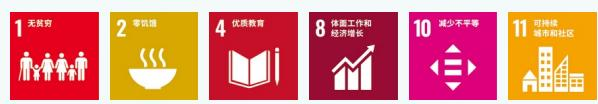

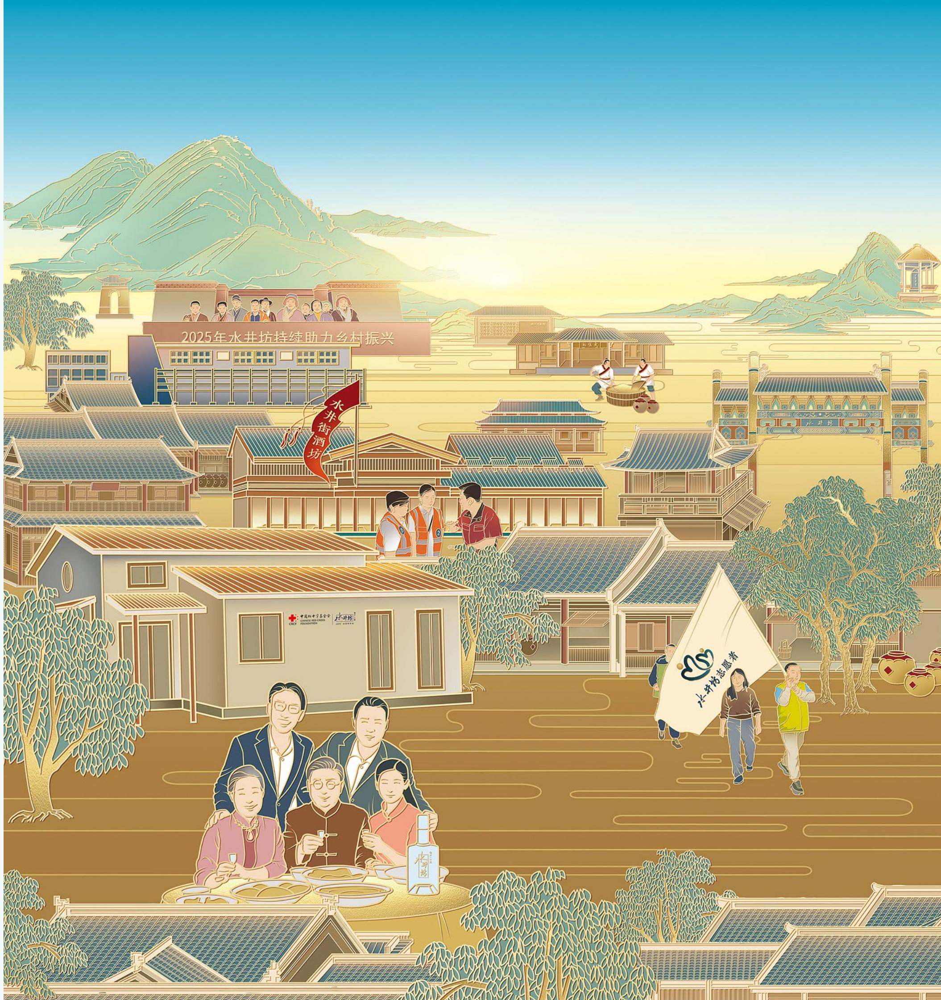

text_image

2025年水井坊持续助力乡村振兴
水井街酒店
水井路旅游

## 社会贡献

## 公益战略体系

水井坊将社会贡献视为企业长期价值的重要组成部分，构建了层次分明、长短结合的公益战略体系。在长期战略层面，公司致力于在社会公益领域打造具有行业影响力的水井坊公益品牌。2025 年，水井坊明确提出以慈善文化为链，构建“社企共振、爱责同行”的多元志愿生态，让慈善文化成为推动社会共益的精神引擎。在短期战略层面，公司每年制定系统性的公益活动计划，对社会贡献相关活动实行项目化管理，明确各项目的目标、预算、执行周期及预期成效，以提升社会贡献工作的可持续性。同时，公司制定《对外捐赠管理制度》，以保障企业对外捐赠相关事宜的合规审批与有序开展。

2025 年，水井坊在乡村振兴、社区共建、低碳环保、抗震救灾四大领域开展公益项目，公益捐赠人民币达 200 万元。

## 2025年，主要开展四大领域公益项目

乡村振兴

社区共建

低碳环保

抗震救灾

公益捐赠人民币

200万元

## 多元志愿者生态

自2023年启动“水井坊公益日”，2024年组建“小酒花”企业志愿者队伍以来，公司持续扩大员工志愿者队伍规模并将其与企业文化深度融合。水井坊鼓励员工，经销商，客户共同参与，使更多利益相关成为公益主体，用“参与式公益强化品牌的情感连接，回应公众对企业“真诚、透明、参与”的价值期待。截至2025年底，超过一半员工加入“小酒花”志愿者队伍，员工与经销商人数已超 1000 人，累计志愿服务超过 1000 小时。2025 年，水井坊志愿服务项目实践站获得四川天府新区正式授牌，标志着公司的志愿服务工作获得了地方政府的高度认可，并融入区域社会治理创新体系。

同时，为进一步深化社企治理融合，公司联合邛崃市酒源社区等单位组建“党员志愿先锋队”，共同开展党建联建主题活动以党建引领构建社企治理共同体。

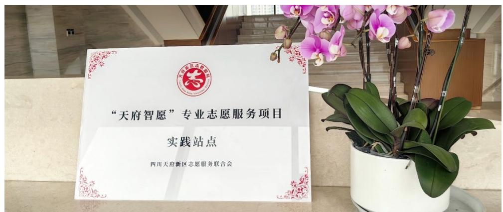

text_image

“天府智愿”专业志愿服务项目
实践站点
四川天府新区志愿服务联合会

## 乡村振兴

在国家政策从“千企帮千村”转向“千企兴千村”的宏观背景下，水井坊逐步优化乡村帮扶策略，建立起“基层治理、产业融合、民生保障”三维帮扶体系，实现了从以资金和物资支持为主的“输血式帮扶”，转向更加注重能力建设与产业融合的“造血 + 赋能式帮扶”。2025 年，公司进一步聚焦“教育添活力”与“民生改善”，精准衔接乡村不同发展阶段的切实需求。

## 案例

## 对口帮扶的第七年

在对口帮扶甘孜州石渠县长沙干玛乡的七年中，水井坊自 2018 年以来已累计投入超 35 万元。在项目推进过程中，水井坊与地方政府、慈善总会等合作伙伴保持常态化沟通与协作，以保证对帮扶项目的执行过程和效果进行监督。

6 2025 年 9 月，金牛区西华街道代表水井坊，与长沙干马乡政府举办对口帮扶座谈会，通过政府介绍和实地考察，精准识别当地在基层治理、产业发展、民生保障方面存在的短板和风险。

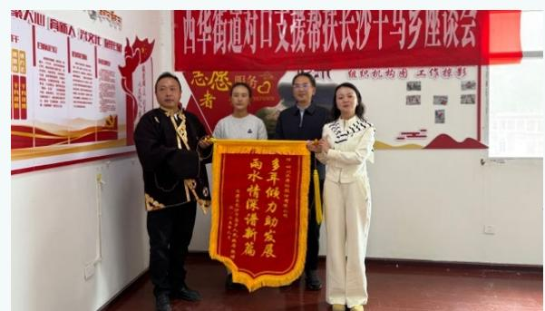

text_image

四华街道对口支援帮扶长沙干马乡座谈会
志愿者
雨水情保谱新篇
多年做力助发展

日6 2025 年 9 月，水井坊通过成都市慈善总会定向捐赠价值 5 万元的冰柜及学习机，并发放至困难家庭及学生，用于改善家庭食品储存条件并支持乡村教育设备数字化，2025 年长沙干马乡受益人数为 5,006 人。

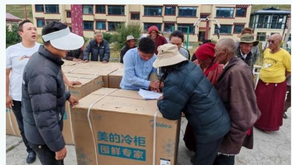

text_image

美的冷柜
围鲜专家

水井坊自2018年以来已累计投入超

35万元

2025年长沙干马乡受益人数为

5,006 人

## 案例

2025 年 5 月，水井坊携经销商、客户走进成都金堂县永乐初级中学，捐赠 5 个爱心图书角、350 套图书及体育器材，助力乡村教育。

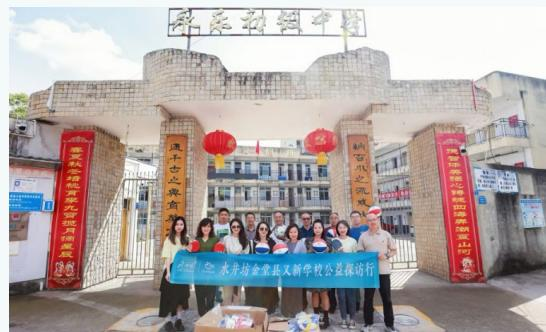

text_image

武平市新村
通平县兴贤镇
满平县兴贤镇
满平县兴贤镇
满平县兴贤镇
永井坊金寨县又新学校公益探访行

金堂县永乐初级中学公益探访行

2025年8月，水井坊博物馆再次成为“去远方”研学旅行项目合作伙伴，博物馆讲解员为来自5 个省份的 32 名乡村学生开展非遗公益研学活动，帮助孩子们获得“人生第一次远行”的学习体验，同时促进非遗文化的传播与体验。

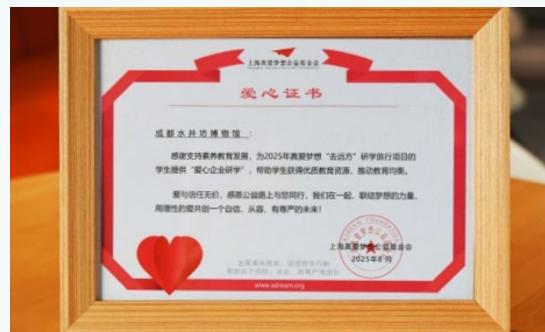

text_image

上海真爱梦想公益基金会
爱心证书
成都水柱坊博物馆：
感谢支持素养教育发展，为2025年真爱梦想“去远方”研学旅行项目的学生提供“爱心企业研学”，帮助学生获得优质教育资源，推动教育均衡。
要与信任无价，感谢公益路上与您同行，我们在一起，联结梦想的力量，用理性的爱共创一个自信，从容、有尊严的未来！
上海真爱梦想公益基金会
2025年6月
www.shenghuang.org

上海真爱梦想公益基金会授予的爱心证书

## 案例 产业融合发展

依托邛崃市作为“中国白酒原酒之乡”的产业集聚优势，公司探索推动酒糟与本地特色养殖产业形成产业协同，通过将酒糟供应给周边养殖户，既降低了环境负担，又为当地畜牧业提供了优质、低成本的饲料资源，带动乡村特色养殖产业提质增效。

公司通过实施“原粮订单种植计划”将企业发展与农业、农村、农民深度绑定，在保障自身原粮品质和供应链稳定的同时，通过订单化、集约化、基地化的种植管理模式，直接带动优质产粮区的农业现代化发展，切实带动农户增收。

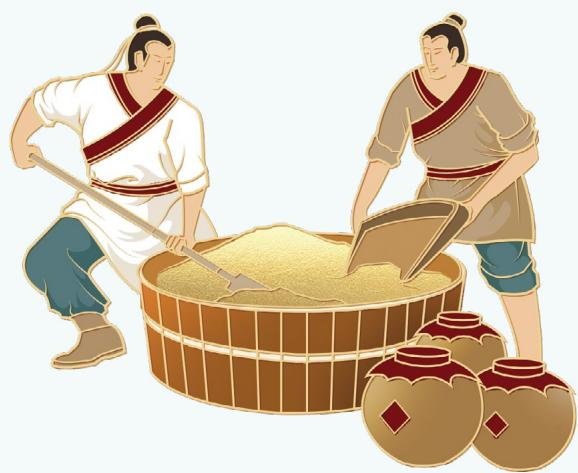

natural_image

Illustration of two people in traditional attire pouring grain into a wooden basin with cymbals nearby (no text or symbols)

## 社区共建

“友邻计划”是水井坊自 2021 年起持续深耕的社区公益项目。2025 年项目持续升级，通过举办多样化的文化及环保主题活动，有效促进了企业与社区居民的深度互动与情感联结。

## 案例 可持续理念倡导

O 2025 年植树节期间，水井坊联动员工、经销商、客户及社区居民，在成都市龙泉山宝仓湾、邛崃生态廊道等地开展系列植树活动，共种植近 300 棵树苗，践行绿色承诺。  
2025 年 9 月，水井坊“小酒花”志愿者携手社区与高校志愿者，在天府社创中心开展“可持续空间营造”活动，通过除草、铺草甸、旧椅翻新、绘制提示牌等行动，美化社区环境，传递绿色低碳与公益慈善温度。  
2025 年 12 月，水井坊组织 50 余名党员、积极分子及员工代表，前往岷江流域都江堰段开展水源地保护公益活动，进行水质简易检测、河道垃圾清理，以实际行动守护酿酒之魂与生态之本。

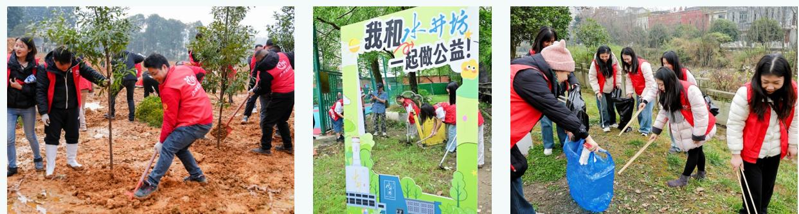

## 案例 工厂开放日

作为“友邻计划”的重要活动之一，“工厂开放日”活动通过组织居民参观曲酒车间、坛库、检测中心等核心区域，并由员工志愿者现场讲解酿造工艺、品质管控及环保措施，让社区居民能够直观感受水井坊对传统技艺的坚守与对现代质量、环保标准的践行。截至 2025 年底，水井坊已累计举办 17 期工厂开放日活动，活动覆盖超过 600 名社区居民。

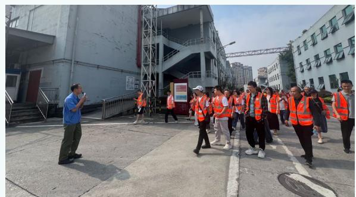

natural_image

Group of people in safety vests and uniforms walking outdoors near a building with staircases (no visible text or symbols)

## 案例 社会关爱

## 女性关爱

“为妈妈奔跑”始于 2015 年，创新性地采用“运动 + 公益”形式，突破了传统公益模式，将运动的活力与公益的温情完美融合。2025 年 5 月，水井坊商务北区员工、经销商及客户志愿者连续第二年参与北京“为妈妈奔跑”10 公里公益徒步，以实际行动呼吁社会关注母亲群体的困境，并为她们筹集善款。

## 助老

2025 年端午节期间，水井坊携手社区干部与党员志愿者组成慰问小队，为社区内的独居老人送去节日慰问礼包，并帮助老人们打扫卫生、整理家务，通过温情的陪伴与实在的帮助，营造出了邻里和睦、守望相助的浓厚氛围。

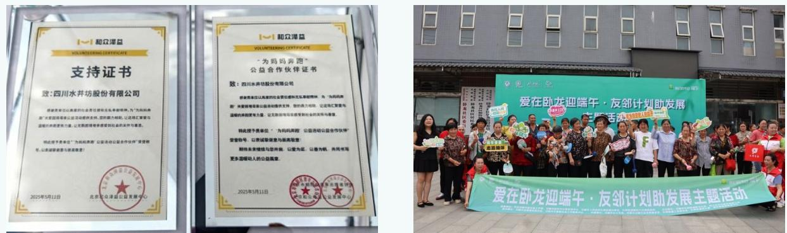

## 低碳环保

2025 年 6·5 世界环境日，水井坊响应环境日主题“美丽中国我先行”，积极践行社会责任，在土桥厂区和邛崃厂区举办的两场环保主题活动生动展现了其对绿色发展的坚定承诺，为行业勾勒出一幅生机勃勃的可持续发展画卷，彰显出卓越的企业担当。

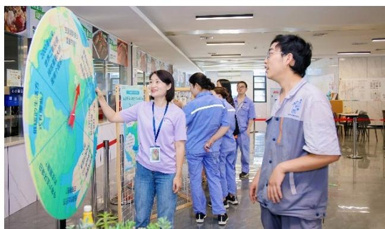

text_image

Group of people in blue uniforms observing a large circular chart with Chinese text and diagrams, likely in an educational or technical setting.

邛崃厂区

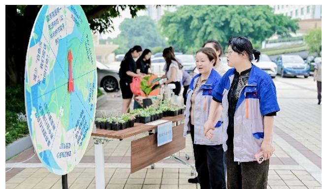

text_image

Street photo showing a woman and a group of people viewing a large circular diagram with Chinese text, likely for a public awareness or educational event.

土桥厂区

## 抗震救灾

水井坊一直积极履行企业社会责任，特别是在自然灾害发生时，及时提供援助，帮助灾区人民恢复生产和生活。2025年 1 月 7 日，西藏日喀则市定日县发生了 6.8 级强烈地震后，水井坊迅速启动了紧急救灾捐赠程序，第一时间向中国红十字基金会捐赠 200 万元，用于灾后人道救助及重建工作。

此外，2025 年公司持续推进为甘肃积石山地震灾区援建的 5 所乡村卫生站建设，推动基层医疗服务能力提升，使当地村民能够在家门口获得基础医疗服务。

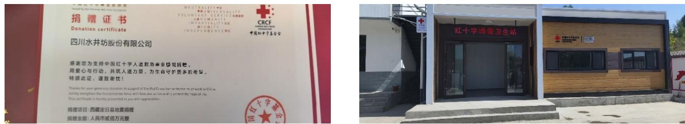

## 文化保护与传承

## 水井街酒坊遗址保护

2025 年，水井坊博物馆继续扎实推进文物建筑与土遗址的常态化保护工作，执行定期巡查机制，确保物质文化遗产保存状态稳定。为提升遗址区安全管理水平，博物馆与 EHS 部门协同开展危险源辨识工作，联合多部门共同研究和制定针对遗址区与窖池区联结的狭窄坑壁坍塌风险的预防性措施，进一步健全了遗址预防性保护体系。

## 案例

## 科技赋能遗址保护

2025 年，水井坊博物馆加强对文物建筑及土遗址的系统化监测，依托科技手段，全面保障文物建筑结构安全，确保各类土遗址病害处于可控状态。

文物建筑结构安全性监测主要对建筑结构关键构件应力、应变、变形、以及构件表面温、湿度进行监测；土遗址监测主要对遗址区范围的温湿度、有机挥发物、二氧化硫、风量、降雨量，本体土壤温度及含水率、本体裂隙等进行监测。通过科学的监测手段，以数据为支撑实现文物状态的动态评估与风险预警，为实施预防性保护工程提供了科学依据，进一步巩固了物质文化遗产的长效保护机制。

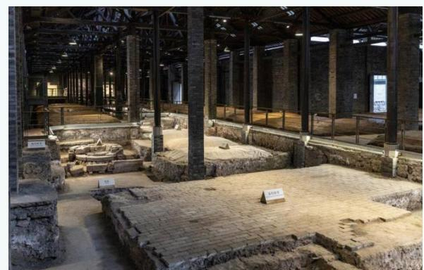

natural_image

Interior view of an ancient archaeological excavation site with stone foundations, columns, and structural beams (no visible text or symbols)

水井街酒坊遗址

## 非遗保护与传承

水井坊博物馆作为“双国保”（全国重点文物保护单位“水井街酒坊遗址”及国家级非物质文化遗产“水井坊酒传统酿造技艺”）的守护者，2025 年持续推进文化遗产的系统性保护与传承。公司实施第九代传承人培养计划，年内新增 7名传承人通过内部审核，并新增申报 3 名市级非物质文化遗产代表性传承人。

同时，水井坊博物馆积极开展文化传播与公众教育活动。2025 年共组织包括研学活动、文化惠民活动、白酒学坊、行业与跨界论坛、文化交流等活动共 22 场，覆盖公众近 2800 人次，进一步推动传统酿造技艺与传统文化的传播。

## 案例

## “大师级调酒工坊”个性化体验

水井坊博物馆以互动实践形式，围绕白酒传统勾调技艺，为游客提供从闻香辨味到酒体设计的深度体验，使其在专业指导下亲手调制专属酒体，直观感受跨越 600 年的酿造智慧与文化内涵。

## 跨界融合活动

为进一步促进文化遗产的可持续传承与创新表达，水井坊博物馆携手银行、车企及美学品牌等多元社会力量，开展跨界主题活动，通过沉浸式文化体验与深度互动，有效拓展了博物馆受众边界，显著提升了公众对白酒酿造历史与非遗技艺的认知度，促进了传统技艺在现代社会的传播与认同。

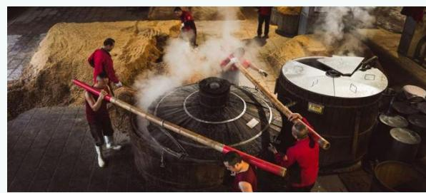

natural_image

Workers in red uniforms handling large steaming steam from a traditional ceramic pot outdoors (no visible text or symbols)

在水井坊博物馆，游客可观看传统酿造技艺

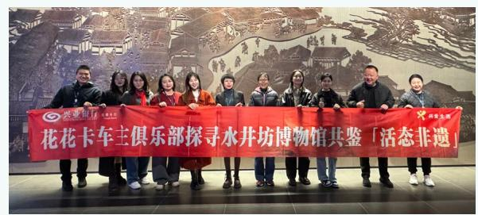

text_image

花花卡车主俱乐部探寻水井坊博物馆共鉴「活态非遗」

车企跨界活动

## 水井坊博物馆 2025 年所获荣誉

2025 年 1 月，成都水井街酒坊第四次被纳入国家文物局更新批复的《中国世界文化遗产预备名单》  
2025 年 1 月，水井坊博物馆经成都旅游标准评定委员会评定，入选第八批 “新旅游·潮成都”主题旅游目的地  
2025 年 1 月，在福布斯中国白酒品牌评选中，水井坊博物馆获评“中国酒旅融合示范区”  
C 2025 年 8 月，经四川省经济和信息化厅、四川省文化和旅游厅联合认定，水井坊博物馆成为“首批四川工业研学旅行推荐点位”  
2025 年 11 月，在“成都市文旅行业讲解员大赛”中，水井坊博物馆两名讲解员分别获得一等奖与二等奖

## ESG生态圈共建

水井坊作为践行 ESG 理念的企业，始终致力于推动行业标准的统一与优化，协同上下游伙伴共建绿色、透明、负责任的产业生态。

## 案例

2025 年 6 月，水井坊联合国内多家龙头企业共同发起“供应链ESG 管 理 倡 议” （Supply Chain ESG Stewardship Initiative，SCSI），旨在响应联合国 2030 年可持续发展目标，以环境友好、社会责任与高效治理为基石，构建兼具可持续性、韧性与竞争力的供应链生态体系，共筑全球可持续共赢新格局。同时，水井坊加入ISSB“可持续发展创新实践先学伙伴 50 人论坛”，成为论坛成员单位，积极参与国际前沿可持续发展议题的交流与研讨。  
水井坊深度参与中国酒业协会主导的《白酒企业绿色供应链管理评价规范》团体标准的起草工作，为构建白酒行业绿色供应链标准体系贡献专业经验，积极推动行业高质量发展。  
此外，2025 年 5 月，水井坊支持举办了“2025 年四川省大学生管理咨询挑战赛”ESG 主题论坛，吸引了近 800 名企业界、学术界及高校师生参与，为青年学子探索可持续发展实践搭建了高端平台，推动了 ESG 理念在大学生群体中的传播。

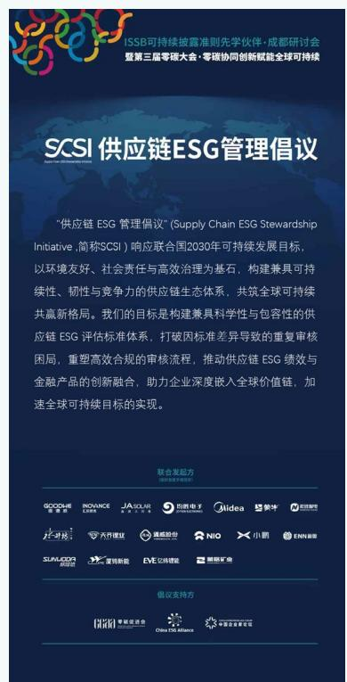

text_image

ISSB可持续披露准则先学伙伴·成都研讨会
暨第三届零盟大会·零盟协同创新赋能全球可持续
SCSI 供应链ESG管理倡议
“供应链 ESG 管理倡议”(Supply Chain ESG Stewardship Initiative,简称SCSI)响应联合国2030年可持续发展目标，
以环境友好、社会责任与高效治理为基石，构建兼具可持续性、韧性与竞争力的供应链生态体系，共筑全球可持续
共赢新格局。我们的目标是构建兼具科学性与包容性的供应链ESG评估标准体系，打破因标准差异导致的重复审核
困局，重塑高效合规的审核流程，推动供应链ESG绩效与金融产品的创新融合，助力企业深度嵌入全球价值链，加速全球可持续目标的实现。
联合发起方
GOODLINE
需要提
INVOICE
LENS
JASOLAI
共享云平台
创新电子
SCHINA
Aidea
聚升
安信基金管理
汇付
天齐锂业
通威股份
NIO
小鹏
ENN嘉瑞
SALAGS
海能新能源
EVE 计算机
黑猫矿业
倡议支持方
GSSD 供应链促进会
China Ever Alliance
中国金融研究院

水井坊积极布局行业生态，横跨产业升级、循环经济、知识产权、慈善组织、国际贸易等领域，广泛加入国际、国家及区域性组织，形成全球视野与本土根基兼备的格局。

## 截至2025年底，水井坊加入的国际、国家及区域性组织

中国酒业协会  
中国食品工业协会  
四川省酒业协会  
四川省食品生产安全协会  
全球服贸联盟  
中国国际商会  
中国外商投资企业协会  
中国中小商业企业协会  
成都外商投资企业协会  
四川省商标协会  
成都企业联合会  
联合国契约组织  
中国循环经济协会  
四川循环经济协会  
中国非物质文化遗产保护协会  
四川红十字基金会  
成都市金牛区慈善会（2025 年新加入）

## 关键绩效数据

环境维度

<table><tr><td>议题名称</td><td colspan="2">指标名称</td><td>单位</td><td>2025年</td><td>2024年</td><td>2023年</td></tr><tr><td rowspan="19">应对气候变化</td><td colspan="2">范围一排放量</td><td> $tCO_2e$ </td><td>31,328.69</td><td>31,547.41</td><td> $24,095.42^1$ </td></tr><tr><td colspan="2">范围二排放量</td><td> $tCO_2e$ </td><td>9,924.44</td><td>11,739.72</td><td>11,610.36</td></tr><tr><td colspan="2">范围三排放量</td><td> $tCO_2e$ </td><td>151,709.77</td><td>151,118.70</td><td>未统计</td></tr><tr><td colspan="2">范围三中林业、土地与农业(FLAG)相关排放量</td><td> $tCO_2e$ </td><td>29856.41</td><td>33,941.37</td><td>未统计</td></tr><tr><td colspan="2">温室气体排放总量</td><td> $tCO_2e$ </td><td>192,962.90</td><td>194,405.83</td><td>35,705.78</td></tr><tr><td rowspan="14">能源消耗量</td><td>天然气</td><td>标准立方米</td><td>13,785,857.00</td><td>13,589,517.00</td><td>10,976,086.00</td></tr><tr><td>柴油</td><td>升</td><td>6,657.85</td><td>7,386.59</td><td>5,416.14</td></tr><tr><td>汽油</td><td>升</td><td>38,082.75</td><td>38,685.16</td><td>36,754.22</td></tr><tr><td>外购普通电力</td><td>千瓦时</td><td>18,547,998.00</td><td>21,877,974.54</td><td>20,358,331.00</td></tr><tr><td>绿色电力购买量</td><td>千瓦时</td><td>19,294,000.00</td><td>21,941,000.00</td><td>7,963,000.00</td></tr><tr><td>绿色电力购买量相当于减少温室气体排放</td><td> $tCO_2e$ </td><td>10,237.40</td><td>11,773.54</td><td>10,130.24</td></tr><tr><td>沼气发电</td><td>千瓦时</td><td> $4,209,090.00^2$ </td><td> $456,420.00^3$ </td><td>0</td></tr><tr><td>沼气发电相当于减少温室气体排放</td><td> $tCO_2e$ </td><td>2,233.34</td><td>244.91</td><td>0</td></tr><tr><td>直接能源消耗量</td><td>万吨标煤</td><td>1.838</td><td>1.813</td><td>1.464</td></tr><tr><td>间接能源消耗量</td><td>万吨标煤</td><td>0.517</td><td>0.544</td><td>0.348</td></tr><tr><td>不可再生能源消耗量</td><td>万吨标煤</td><td>2.066</td><td>2.081</td><td>1.715</td></tr><tr><td>可再生能源消耗量</td><td>万吨标煤</td><td>0.289</td><td>0.275</td><td>0.098</td></tr><tr><td>综合能源消耗量</td><td>万吨标煤</td><td>2.355</td><td>2.357</td><td>1.813</td></tr><tr><td>综合能源消耗强度</td><td>吨标煤/百万元工业总产值</td><td>11.644</td><td>10.498</td><td>9.283</td></tr><tr><td rowspan="5">水资源利用</td><td rowspan="5">水资源消耗量4</td><td>总取水量5</td><td>万立方米</td><td>83.0458</td><td>77.6045</td><td>70.1111</td></tr><tr><td>中水回用量</td><td>万立方米</td><td>0.0771</td><td>未统计</td><td>未统计</td></tr><tr><td>中水回用比例6</td><td>%</td><td>0.226</td><td>未统计</td><td>未统计</td></tr><tr><td>新鲜水抽取量</td><td>万立方米</td><td>83.0458</td><td>77.6045</td><td>70.1111</td></tr><tr><td>循环水量</td><td>万立方米</td><td>85.2719</td><td>未统计</td><td>未统计</td></tr></table>

1 计算边界仅包含固定燃烧排放和移动燃烧排放  
2 2025 年全年沼气发电量  
3 2024 年 11 月投入使用至 2024 年底的沼气发电量  
5 全部取自市政用水  
6 中水回用量 /（中水回用量 + 污水排放量）\*100%

<table><tr><td>议题名称</td><td colspan="2">指标名称</td><td>单位</td><td>2025年</td><td>2024年</td><td>2023年</td></tr><tr><td rowspan="9">水资源利用</td><td rowspan="3">水资源消耗量</td><td>水资源消耗总量</td><td>万立方米</td><td>27.3032</td><td>未统计</td><td>未统计</td></tr><tr><td>水资源消耗强度</td><td>万立方米/百万元工业总产值</td><td>0.0135</td><td>未统计</td><td>未统计</td></tr><tr><td>缺水地区 $^7$ 的新鲜水消耗量</td><td>万立方米</td><td>0</td><td>0</td><td>0</td></tr><tr><td rowspan="6">废水</td><td>污水排放量 $^8$ </td><td>万立方米</td><td>33.9656</td><td>未统计</td><td>未统计</td></tr><tr><td>污水排放强度 $^9$ </td><td>万立方米/百万元工业总产值</td><td>0.017</td><td>未统计</td><td>未统计</td></tr><tr><td>CODcr排放量</td><td>吨</td><td>29.1804</td><td>26.118</td><td>20.7681</td></tr><tr><td>NH3-N排放量</td><td>吨</td><td>0.4881</td><td>0.3978</td><td>0.28991</td></tr><tr><td>TN排放量</td><td>吨</td><td>5.1615</td><td>4.831</td><td>3.1771</td></tr><tr><td>TP排放量</td><td>吨</td><td>0.2109</td><td>0.2319</td><td>0.16991</td></tr><tr><td rowspan="14">包装与废弃物管理</td><td rowspan="7">包材使用量</td><td>玻璃</td><td>吨</td><td>8,581.23</td><td>12,124.24</td><td>未统计</td></tr><tr><td>陶瓷</td><td>吨</td><td>0.028</td><td>0.66</td><td>未统计</td></tr><tr><td>塑料</td><td>吨</td><td>1,899.54</td><td>2,835.60</td><td>未统计</td></tr><tr><td>纸</td><td>吨</td><td>7,355.43</td><td>10,448.67</td><td>未统计</td></tr><tr><td>金属</td><td>吨</td><td>84.15</td><td>99.73</td><td>未统计</td></tr><tr><td>木材</td><td>吨</td><td>0.006</td><td>0.012</td><td>未统计</td></tr><tr><td>总量</td><td>吨</td><td>17,920.38</td><td>25,508.91</td><td>未统计</td></tr><tr><td rowspan="2">废气</td><td>SO2排放量</td><td>吨</td><td>0.055</td><td>0</td><td>0</td></tr><tr><td>NOx排放量</td><td>吨</td><td>2.6355</td><td>1.939</td><td>1.983</td></tr><tr><td rowspan="5">固废</td><td>一般工业固废产生量</td><td>吨</td><td>125,180.62</td><td>114,333.66</td><td>86,032.83</td></tr><tr><td>一般工业固废处置量</td><td>吨</td><td>125,180.62</td><td>114,333.66</td><td>86,032.83</td></tr><tr><td>危险废弃物产生量</td><td>吨</td><td>25.142</td><td>13.588</td><td>12.4755</td></tr><tr><td>危险废弃物处置量</td><td>吨</td><td>23.478</td><td>22.799</td><td>8.0445</td></tr><tr><td>废弃物回收利用量</td><td>吨</td><td>122,103.598</td><td>110,909.529</td><td>68,446.4335</td></tr></table>

7 用水量小于 1,700 立方米 /（人 \* 年）的地区  
8 仅包含邛崃工厂  
9 仅包含邛崃工厂

社会维度

<table><tr><td>议题名称</td><td colspan="2">指标名称</td><td>单位</td><td>2025年</td><td>2024年</td><td>2023年</td></tr><tr><td rowspan="7">产品和服务安全与质量</td><td colspan="2">因违反产品安全与健康相关的法律法规,受到罚款、处罚、警告的事件</td><td>个</td><td>0</td><td>0</td><td>0</td></tr><tr><td colspan="2">因违反产品服务信息与标识规定,受到罚款、处罚、警告的事件数</td><td>个</td><td>0</td><td>0</td><td>0</td></tr><tr><td colspan="2">消费者个人信息泄露或信息安全事件数</td><td>个</td><td>0</td><td>0</td><td>0</td></tr><tr><td colspan="2">全年因安全与健康理由须召回的产品数量</td><td>个</td><td>0</td><td>0</td><td>0</td></tr><tr><td colspan="2">全年召回产品数量占全年销售产品数量比例</td><td>%</td><td>0</td><td>0</td><td>0</td></tr><tr><td colspan="2">全年因安全与健康理由须召回的产品价值</td><td>万元</td><td>0</td><td>0</td><td>0</td></tr><tr><td colspan="2">全年召回产品价值占全年销售产品价值比例</td><td>%</td><td>0</td><td>0</td><td>0</td></tr><tr><td rowspan="21">员工权益与福利</td><td colspan="2">员工总人数</td><td>人</td><td>1,853</td><td>2,155</td><td>2,080</td></tr><tr><td rowspan="3">全职员工</td><td>全职员工数</td><td>人</td><td>1,733</td><td>2,015</td><td>1,953</td></tr><tr><td>男:女</td><td>%</td><td>73:27</td><td>71:29</td><td>71:29</td></tr><tr><td>30岁以下:30-50岁:50岁以上</td><td>%</td><td>10:74:16</td><td>12:74:14</td><td>11:74:15</td></tr><tr><td colspan="2">非全职员工数</td><td>人</td><td>120</td><td>140</td><td>127</td></tr><tr><td rowspan="2">管理层</td><td>男:女</td><td>%</td><td>71:29</td><td>68:32</td><td>66:34</td></tr><tr><td>30岁以下:30-50岁:50岁以上</td><td>%</td><td>0:80:20</td><td>0:82:18</td><td>0:87:13</td></tr><tr><td rowspan="5">新进员工</td><td>新进员工数</td><td>人</td><td>148</td><td>329</td><td>433</td></tr><tr><td>男:女</td><td>%</td><td>79:21</td><td>71:29</td><td>80:20</td></tr><tr><td>30岁以下:30-50岁:50岁以上</td><td>%</td><td>27.7:71.6:0.7</td><td>37:63:0</td><td>26.1:73.44:0.46</td></tr><tr><td>初级管理层</td><td>%</td><td>8.11</td><td>1</td><td>未统计</td></tr><tr><td>高级管理层</td><td>%</td><td>0</td><td>1</td><td>未统计</td></tr><tr><td rowspan="3">管理层和专业人员的性别比例(男:女)</td><td>初级管理层</td><td>%</td><td>70:30</td><td>66:34</td><td>61:39</td></tr><tr><td>高级管理层</td><td>%</td><td>80:20</td><td>80:20</td><td>66:34</td></tr><tr><td>营收相关的职能部门管理层</td><td>%</td><td>69:31</td><td>63:27</td><td>75:25</td></tr><tr><td rowspan="3">员工福利</td><td>平均带薪年假</td><td>小时</td><td>97.7</td><td>91.7</td><td>90.1</td></tr><tr><td>产假</td><td>小时</td><td>33,560</td><td>26,032</td><td>27,296</td></tr><tr><td>带薪育儿假</td><td>小时</td><td>7,224</td><td>6,228</td><td>6,620</td></tr><tr><td colspan="2">员工流失率</td><td>%</td><td>22.04</td><td>11.76</td><td>17</td></tr><tr><td colspan="2">员工自愿离职比例</td><td>%</td><td>6.55</td><td>7.3</td><td>13</td></tr><tr><td colspan="2">接受定期绩效及职业发展考核的员工的百分比</td><td>%</td><td>100</td><td>100</td><td>100</td></tr></table>

<table><tr><td>议题名称</td><td colspan="2">指标名称</td><td>单位</td><td>2025年</td><td>2024年</td><td>2023年</td></tr><tr><td rowspan="5">员工权益与福利</td><td colspan="2">员工满意度</td><td>%</td><td>94</td><td>91</td><td>86</td></tr><tr><td colspan="2">科研人员数量</td><td>人</td><td>97</td><td>90</td><td>88</td></tr><tr><td colspan="2">科研人员占全体员工比例</td><td>%</td><td>5.2</td><td>4.2</td><td>4.2</td></tr><tr><td colspan="2">科研人员性别比例(男:女)</td><td>%</td><td>64:36</td><td>64:36</td><td>64:36</td></tr><tr><td colspan="2">缴纳员工社保人数比例</td><td>%</td><td>100</td><td>100</td><td>100</td></tr><tr><td rowspan="18">员工培训与发展</td><td colspan="2">年度培训费用</td><td>万元</td><td>207</td><td>未统计</td><td>未统计</td></tr><tr><td colspan="2">每名员工每年接受培训的平均小时数</td><td>小时</td><td>7.3</td><td>11.6</td><td>未统计</td></tr><tr><td rowspan="4">员工每年接受培训的平均小时数</td><td>30以下:30-50:50以上</td><td>小时</td><td>7.4:8.0:8.7</td><td>5.7:8.4:7.3</td><td>未统计</td></tr><tr><td>男:女</td><td>小时</td><td>8.1:7.5</td><td>8.1:7.3</td><td>未统计</td></tr><tr><td>管理层员工</td><td>小时</td><td>7.7</td><td>9.8</td><td>未统计</td></tr><tr><td>少数民族</td><td>小时</td><td>11.5</td><td>未统计</td><td>未统计</td></tr><tr><td rowspan="4">员工每年接受培训的总时长占比</td><td>30以下:30-50:50以上</td><td>%</td><td>18.2:76.0:5.8</td><td>14.9:81.8:3.3</td><td>未统计</td></tr><tr><td>男:女</td><td>%</td><td>70.6:29.4</td><td>67.2:32.8</td><td>未统计</td></tr><tr><td>管理层员工</td><td>%</td><td>5.9</td><td>7.9</td><td>未统计</td></tr><tr><td>少数民族</td><td>%</td><td>0.1</td><td>未统计</td><td>未统计</td></tr><tr><td colspan="2">女性参与职业技能及领导力提升培训比例</td><td>%</td><td>86</td><td>64</td><td>未统计</td></tr><tr><td colspan="2">员工接受员工权益政策或程序培训的人均小时数</td><td>小时</td><td>4.4</td><td>5.5</td><td>未统计</td></tr><tr><td colspan="2">员工接受员工权益政策或程序培训的总小时数</td><td>小时</td><td>1,461</td><td>5,905</td><td>未统计</td></tr><tr><td colspan="2">接受员工权益政策或程序培训员工人数的百分比</td><td>%</td><td>8</td><td>15.2</td><td>未统计</td></tr><tr><td colspan="2">员工培训覆盖率</td><td>%</td><td>100</td><td>100</td><td>未统计</td></tr><tr><td rowspan="3">参与培训的员工类型占比</td><td>一线员工:主管或经理级:高级管理者</td><td>%</td><td>80.8:18.6:0.6</td><td>59.9:33.8:6.3</td><td>未统计</td></tr><tr><td>男:女</td><td>%</td><td>70:30</td><td>65:35</td><td>未统计</td></tr><tr><td>30岁以下:30-50:50以上</td><td>%</td><td>25:70.6:4.4</td><td>20.4:76.2:3.5</td><td>未统计</td></tr><tr><td rowspan="5">职业健康与安全</td><td colspan="2">职业病发生率</td><td>%</td><td>0</td><td>0</td><td>0</td></tr><tr><td colspan="2">因工死亡员工人数</td><td>人</td><td>0</td><td>0</td><td>0</td></tr><tr><td colspan="2">每亿营收因工死亡员工人数</td><td>人/元</td><td>0</td><td>0</td><td>0</td></tr><tr><td colspan="2">每百万营收因工伤损失工作日数</td><td>天/元</td><td>0</td><td>0</td><td>0</td></tr><tr><td colspan="2">员工百万损失工时事故率</td><td>/</td><td>0</td><td>未统计</td><td>未统计</td></tr><tr><td>供应链管理</td><td colspan="2">重大实际/潜在负面影响的供应商数量</td><td>个</td><td>4</td><td>未统计</td><td>未统计</td></tr><tr><td rowspan="11">供应链管理</td><td colspan="2">有重大实际/潜在负面影响并已商定纠正行动/改进计划的供应商数量</td><td>个</td><td>1</td><td>未统计</td><td>未统计</td></tr><tr><td>在实施纠正行动计划中得到水井坊支持的供应商总数</td><td>个</td><td>1</td><td>未统计</td><td colspan="2">未统计</td></tr><tr><td>在实施纠正行动计划中得到水井坊支持的供应商百分比</td><td>%</td><td>100</td><td>未统计</td><td colspan="2">未统计</td></tr><tr><td>终止合作的供应商数量</td><td>个</td><td>3</td><td>未统计</td><td colspan="2">未统计</td></tr><tr><td>经过SEDEX审核评估的关键供应商数量</td><td>个</td><td>83</td><td>59</td><td colspan="2">70</td></tr><tr><td>经过SEDEX审核评估的关键供应商比例</td><td>%</td><td>100</td><td>100</td><td colspan="2">100</td></tr><tr><td>供应商本地化(四川省内)比例</td><td>%</td><td>42</td><td>未统计</td><td colspan="2">未统计</td></tr><tr><td>本地化采购(四川省内)比例</td><td>%</td><td>67</td><td>未统计</td><td colspan="2">未统计</td></tr><tr><td>使用童工的运营点和供应商数量</td><td>个</td><td>0</td><td>0</td><td colspan="2">0</td></tr><tr><td>供应商合规培训次数</td><td>次</td><td>2</td><td>1</td><td colspan="2">1</td></tr><tr><td>参与合规培训的供应商数</td><td>个</td><td>296</td><td>266</td><td colspan="2">108</td></tr><tr><td rowspan="5">社会贡献</td><td colspan="2">公司公益慈善现金捐赠支出</td><td>元</td><td>2,000,000.00</td><td>1,880,000.00</td><td>5,180,000.00</td></tr><tr><td>实物捐赠:产品或服务捐赠(现金价值)等</td><td>元</td><td>50,000.00</td><td>0</td><td colspan="2">49,342.00</td></tr><tr><td>公益项目类别</td><td>类</td><td>4</td><td>6</td><td colspan="2">6</td></tr><tr><td>乡村振兴帮扶人数</td><td>人</td><td>6,006</td><td>4,980</td><td colspan="2">1,393</td></tr><tr><td>员工志愿者服务时长</td><td>小时</td><td>410</td><td>759</td><td colspan="2">175.7</td></tr></table>

治理维度

<table><tr><td>议题名称</td><td colspan="2">指标名称</td><td>单位</td><td>2025年</td><td>2024年</td><td>2023年</td></tr><tr><td rowspan="8">董事会独立性与多元化</td><td colspan="2">董事会人数</td><td>人</td><td>12</td><td>9</td><td>8</td></tr><tr><td colspan="2">董事会女性人数</td><td>人</td><td>1</td><td>0</td><td>0</td></tr><tr><td colspan="2">独立董事比例</td><td>%</td><td>1/3</td><td>1/3</td><td>3/8</td></tr><tr><td colspan="2">审计委员会独立董事占比</td><td>%</td><td>60</td><td>75</td><td>75</td></tr><tr><td colspan="2">薪酬委员会独立董事占比</td><td>%</td><td>60</td><td>60</td><td>75</td></tr><tr><td colspan="2">提名委员会独立董事占比</td><td>%</td><td>67</td><td>60</td><td>60</td></tr><tr><td colspan="2">董事出席率</td><td>%</td><td>100</td><td>100</td><td>100</td></tr><tr><td colspan="2">董事会会议</td><td>次</td><td>12</td><td>14</td><td>9</td></tr><tr><td rowspan="14">商业道德与诚信经营</td><td colspan="2">涉及反不正当竞争行为、反托拉斯和垄断做法、贪污的诉讼案件数</td><td>个</td><td>0</td><td>0</td><td>0</td></tr><tr><td colspan="2">公司或员工涉及贪污的诉讼案件数</td><td>个</td><td>0</td><td>0</td><td>0</td></tr><tr><td colspan="2">立案侦查腐败案件数</td><td>个</td><td>0</td><td>0</td><td>0</td></tr><tr><td colspan="2">员工因腐败而被开除或受到处分的事件数</td><td>个</td><td>0</td><td>0</td><td>0</td></tr><tr><td colspan="2">公司因违反环境、社会和经济领域相关法律法规,及产品违法违规所引起的处罚次数</td><td>次</td><td>0</td><td>0</td><td>0</td></tr><tr><td colspan="2">公司因违反环境、社会和经济领域相关法律法规,及产品违法违规所引起的罚款金额</td><td>万元</td><td>0</td><td>0</td><td>0</td></tr><tr><td colspan="2">收到不当竞争的投诉与举报数目</td><td>件</td><td>0</td><td>0</td><td>0</td></tr><tr><td colspan="2">合规与风险管理培训场次</td><td>次</td><td>12</td><td>12</td><td>12</td></tr><tr><td rowspan="6">反腐败培训</td><td>员工反腐败培训场次</td><td>次</td><td>3</td><td>3</td><td>3</td></tr><tr><td>员工反腐败培训人数</td><td>人</td><td>1,853</td><td>2,155</td><td>2,080</td></tr><tr><td>员工反腐败培训覆盖率</td><td>%</td><td>100</td><td>100</td><td>100</td></tr><tr><td>管理层反腐败培训场次</td><td>次</td><td>3</td><td>3</td><td>3</td></tr><tr><td>管理层反腐败培训人数</td><td>人</td><td>70</td><td>77</td><td>未统计</td></tr><tr><td>管理层反腐败培训覆盖率</td><td>%</td><td>100</td><td>100</td><td>100</td></tr><tr><td rowspan="5">知识产权保护</td><td colspan="2">新获得专利数</td><td>项</td><td>1</td><td>3</td><td>未统计</td></tr><tr><td colspan="2">新申请商标数</td><td>项</td><td>28</td><td>68</td><td>未统计</td></tr><tr><td colspan="2">累计获得专利数</td><td>项</td><td>240</td><td>239</td><td>未统计</td></tr><tr><td colspan="2">累计申请商标数</td><td>项</td><td>3,060</td><td>3,032</td><td>未统计</td></tr><tr><td colspan="2">累计申请软件著作权数</td><td>个</td><td>75</td><td>75</td><td>未统计</td></tr></table>

## 报告指标索引

  
《GRI可持续发展报告标准》（2021）内容索引

<table><tr><td>使用说明</td><td>水井坊在2025年1月1日至2025年12月31日参照GRI标准报告了在此份GRI内容索引中引用的信息。</td></tr><tr><td>使用的GRI 1</td><td>GRI 1: 基础 2021</td></tr></table>

<table><tr><td>GRI 标准</td><td>披露项</td><td>报告章节</td></tr><tr><td rowspan="18">GRI 2:一般披露 2021</td><td>2-1 组织详细情况</td><td>关于水井坊</td></tr><tr><td>2-2 纳入组织可持续发展报告的实体</td><td>关于本报告</td></tr><tr><td>2-3 报告期、报告频率和联系人</td><td>关于本报告</td></tr><tr><td>2-4 信息重述</td><td>关键绩效数据</td></tr><tr><td>2-5 外部鉴证</td><td>第三方鉴证</td></tr><tr><td>2-6 活动、价值链和其他业务关系</td><td>关于本报告</td></tr><tr><td>2-7 员工</td><td>员工权益与福利、员工培训与发展、职业健康与安全</td></tr><tr><td>2-8 员工之外的工作者</td><td>供应链管理、经销商管理与权益保护</td></tr><tr><td>2-9 管治架构和构成</td><td>持续提升治理水平</td></tr><tr><td>2-10 最高治理机构的提名和遴选</td><td>持续提升治理水平</td></tr><tr><td>2-11 最高治理机构主席</td><td>持续提升治理水平</td></tr><tr><td>2-12 在管理影响方面,最高管治机构的监督作用</td><td>持续提升治理水平</td></tr><tr><td>2-13 为管理影响的责任授权</td><td>持续提升治理水平</td></tr><tr><td>2-14 最高治理机构在可持续发展报告中的作用</td><td>ESG战略与治理体系</td></tr><tr><td>2-16 关键问题的沟通</td><td>利益相关方重点关注议题及沟通方式</td></tr><tr><td>2-19 薪酬政策</td><td>员工权益与福利</td></tr><tr><td>2-22 关于可持续发展战略的声明</td><td>ESG战略与治理体系</td></tr><tr><td>2-26 寻求建议和提出关切的机制</td><td>利益相关方重点关注议题及沟通方式</td></tr></table>

<table><tr><td>GRI 标准</td><td>披露项</td><td>报告章节</td></tr><tr><td rowspan="4">GRI 2:一般披露 2021</td><td>2-27 遵守法律法规</td><td>敬·更美好的生活敬·更成功的伙伴敬·更锦绣的山河敬·更包容的社会敬·更高效的治理</td></tr><tr><td>2-28 协会的成员资格</td><td>ESG生态圈共建</td></tr><tr><td>2-29 利益相关方参与的方法</td><td>利益相关方重点关注议题及沟通方式</td></tr><tr><td>2-30 集体谈判协议</td><td>员工权益与福利</td></tr><tr><td rowspan="3">GRI 3:实质性议题 2021</td><td>3-1 确定实质性议题的过程</td><td>双重重要性议题评估</td></tr><tr><td>3-2 实质性议题列表</td><td>双重重要性议题评估</td></tr><tr><td>3-3 实质性议题的管理</td><td>双重重要性议题评估</td></tr><tr><td rowspan="6">GRI 101:生物多样性2024</td><td>101-2 生物多样性影响的管理</td><td>生态系统和生物多样性保护</td></tr><tr><td>101-3 生物多样性获取和受益</td><td>生态系统和生物多样性保护</td></tr><tr><td>101-4 确定生物多样性影响</td><td>生态系统和生物多样性保护</td></tr><tr><td>101-5 具有生物多样性影响的地点</td><td>生态系统和生物多样性保护</td></tr><tr><td>101-7 生物多样性状况的变化</td><td>生态系统和生物多样性保护</td></tr><tr><td>101-8 生态系统服务</td><td>生态系统和生物多样性保护</td></tr><tr><td rowspan="2">GRI 201:经济绩效 2016</td><td>201-2 气候变化带来的财务影响和其他风险和机遇</td><td>应对气候变化</td></tr><tr><td>201-3 固定福利计划义务和其他退休计划</td><td>员工权益与福利</td></tr><tr><td>GRI 203:间接经济影响2016</td><td>203-1 基础设施投资和支持性服务</td><td>社会贡献</td></tr><tr><td>GRI 204:采购实践 2016</td><td>204-1 向当地供应商采购的支出比例</td><td>供应链管理</td></tr><tr><td rowspan="2">GRI 205:反腐败 2016</td><td>205-2 反腐败政策和程序的传达及培训</td><td>商业道德与诚信经营</td></tr><tr><td>205-3 经确认的腐败事件和采取的行动</td><td>商业道德与诚信经营</td></tr><tr><td>GRI 206:反竞争行为 2016</td><td>206-1 针对反竞争行为、反托拉斯和反垄断实践的法律诉讼</td><td>关键绩效数据-治理维度</td></tr><tr><td rowspan="3">GRI 207:税收 2019</td><td>207-1 税务方针</td><td>商业道德与诚信经营</td></tr><tr><td>207-2 税收治理、控制和风险管理</td><td>商业道德与诚信经营</td></tr><tr><td>207-3 利益相关方参与和管理与税收有关的问题</td><td>商业道德与诚信经营</td></tr><tr><td rowspan="3">GRI 301:物料 2016</td><td>301-1 所用物料的重量或体积</td><td>关键绩效数据-环境维度</td></tr><tr><td>301-2 所用循环利用的进料</td><td>包装与废弃物管理</td></tr><tr><td>301-3 再生产品及其包装材料</td><td>包装与废弃物管理</td></tr><tr><td rowspan="4">GRI 302:能源 2016</td><td>302-1 组织内部的能源消耗量</td><td>关键绩效数据-环境维度</td></tr><tr><td>302-2 组织外部的能源消耗量</td><td>关键绩效数据-环境维度</td></tr><tr><td>302-3 能源强度</td><td>关键绩效数据-环境维度</td></tr><tr><td>302-4 减少能源消耗</td><td>应对气候变化</td></tr><tr><td rowspan="5">GRI 303:水资源和污水 2018</td><td>303-1 组织与水作为共有资源的相互影响</td><td>水资源利用</td></tr><tr><td>303-2 管理与排水相关的影响</td><td>水资源利用</td></tr><tr><td>303-3 取水</td><td>关键绩效数据-环境维度</td></tr><tr><td>303-4 排水</td><td>关键绩效数据-环境维度</td></tr><tr><td>303-5 耗水</td><td>关键绩效数据-环境维度</td></tr><tr><td rowspan="6">GRI 305:排放 2016</td><td>305-1 直接(范围 1)温室气体排放</td><td>关键绩效数据-环境维度</td></tr><tr><td>305-2 能源间接(范围 2)温室气体排放</td><td>关键绩效数据-环境维度</td></tr><tr><td>305-3 其他间接(范围 3)温室气体排放</td><td>关键绩效数据-环境维度</td></tr><tr><td>305-4 温室气体排放强度</td><td>关键绩效数据-环境维度</td></tr><tr><td>305-5 温室气体减排量</td><td>关键绩效数据-环境维度</td></tr><tr><td>305-7 氮氧化物 (NOx)、硫氧化物 (SOx) 和其他重大气体排放</td><td>关键绩效数据-环境维度</td></tr></table>

<table><tr><td>GRI 标准</td><td>披露项</td><td>报告章节</td></tr><tr><td rowspan="5">GRI 306:废弃物2020</td><td>306-1 废弃物的产生及废弃物相关重大影响</td><td>包装与废弃物管理</td></tr><tr><td>306-2 废弃物相关重大影响的管理</td><td>包装与废弃物管理</td></tr><tr><td>306-3 产生的废弃物</td><td>包装与废弃物管理</td></tr><tr><td>306-4 从处置中转移的废弃物</td><td>包装与废弃物管理</td></tr><tr><td>306-5 进入处置的废弃物</td><td>包装与废弃物管理</td></tr><tr><td rowspan="2">GRI 308:供应商环境评估2016</td><td>308-1 使用环境评价维度筛选的新供应商</td><td>供应链管理</td></tr><tr><td>308-2 供应链中的负面环境影响以及采取的行动</td><td>供应链管理</td></tr><tr><td rowspan="3">GRI 401:雇佣2016</td><td>401-1 新进员工雇佣率和员工流动率</td><td>关键绩效数据-社会维度</td></tr><tr><td>401-2 提供给全职员工(不包括临时或兼职员工)的福利</td><td>员工权益与福利</td></tr><tr><td>401-3 育儿假</td><td>关键绩效数据-社会维度</td></tr><tr><td rowspan="9">GRI 403:职业健康与安全2018</td><td>403-1职业健康安全管理体系</td><td>职业健康与安全</td></tr><tr><td>403-2 危害识别、风险评估和事故调查</td><td>职业健康与安全</td></tr><tr><td>403-3 职业健康服务</td><td>职业健康与安全</td></tr><tr><td>403-4 职业健康安全事务:工作者的参与、意见征询和沟通</td><td>职业健康与安全</td></tr><tr><td>403-5 工作者职业健康安全培训</td><td>职业健康与安全</td></tr><tr><td>403-6 促进工作者健康</td><td>职业健康与安全</td></tr><tr><td>403-7 预防和减缓与业务关系直接相关的职业健康安全影响</td><td>职业健康与安全</td></tr><tr><td>403-8 职业健康安全管理体系覆盖的工作者</td><td>职业健康与安全</td></tr><tr><td>403-9 工伤</td><td>职业健康与安全</td></tr><tr><td rowspan="3">GRI 404:培训与教育2016</td><td>404-1 每名员工每年接受培训的平均小时数</td><td>员工培训与发展</td></tr><tr><td>404-2 员工技能提升方案和过渡援助方案</td><td>员工培训与发展</td></tr><tr><td>404-3 定期接受绩效和职业发展考核的员工百分比</td><td>员工培训与发展</td></tr><tr><td>GRI 405:多元性与平等机会 2016</td><td>405-1 管治机构与员工的多元化</td><td>董事会独立性与多元化、员工权益与福利</td></tr><tr><td>GRI 406:反歧视(2016)</td><td>406-1 歧视事件及采取的纠正行动</td><td>员工权益与福利</td></tr><tr><td>GRI 407:结社自由与集体谈判 2016</td><td>407-1 结社自由和集体谈判权可能面临风险的运营点和供应商</td><td>员工权益与福利</td></tr><tr><td>GRI 408:童工(2016)</td><td>408-1 具有重大童工事件风险的运营点和供应商</td><td>员工权益与福利、供应链管理</td></tr><tr><td>GRI 409:强迫或强制劳动(2016)</td><td>409-1 具有强迫或强制劳动事件重大风险的运营点和供应商</td><td>员工权益与福利、供应链管理</td></tr><tr><td>GRI 410:安保实践(2016)</td><td>410-1 接受过在人权政策或程序方面培训的安保人员</td><td>关键绩效数据-社会维度</td></tr><tr><td>GRI 413:当地社区2016</td><td>413-1 有当地社区参与、影响评估和发展计划的运营点</td><td>社会贡献</td></tr><tr><td rowspan="2">GRI 414:供应商社会评估 2016</td><td>414-1 使用社会标准筛选的新供应商</td><td>供应链管理</td></tr><tr><td>414-2 供应链中的负面社会影响和采取的行动</td><td>供应链管理</td></tr><tr><td rowspan="2">GRI 416:客户健康与安全 2016</td><td>416-1 评估产品和服务类别的健康与安全影响</td><td>产品和服务质量与安全</td></tr><tr><td>416-2 涉及产品和服务的健康与安全影响的违规事件</td><td>关键绩效数据-社会维度</td></tr><tr><td rowspan="3">GRI 417:营销与标识 2016</td><td>417-1 对产品和服务信息与标识的要求</td><td>产品和服务质量与安全</td></tr><tr><td>417-2 涉及产品和服务信息与标识的违规事件</td><td>关键绩效数据-社会维度</td></tr><tr><td>417-3 涉及营销传播的违规事件</td><td>关键绩效数据-社会维度</td></tr><tr><td>GRI 418:客户隐私 2016</td><td>418-1 涉及侵犯客户隐私和丢失客户资料的经证实的投诉</td><td>数据安全与客户隐私保护</td></tr></table>

《上海证券交易所上市公司自律监管指引第14 号——可持续发展报告（试行）》内容索引

<table><tr><td>维度</td><td>序号</td><td>议题</td><td>对应条款</td><td>报告章节</td></tr><tr><td rowspan="8">环境</td><td>1</td><td>应对气候变化</td><td>第二十一条至第二十八条</td><td>敬·更锦绣的山河</td></tr><tr><td>2</td><td>污染物排放</td><td>第三十条</td><td>敬·更锦绣的山河</td></tr><tr><td>3</td><td>废弃物处理</td><td>第三十一条</td><td>敬·更锦绣的山河</td></tr><tr><td>4</td><td>生态系统和生物多样保护</td><td>第三十二条</td><td>敬·更锦绣的山河</td></tr><tr><td>5</td><td>环境合规管理</td><td>第三十三条</td><td>敬·更锦绣的山河</td></tr><tr><td>6</td><td>能源利用</td><td>第三十五条</td><td>敬·更锦绣的山河</td></tr><tr><td>7</td><td>水资源利用</td><td>第三十六条</td><td>敬·更锦绣的山河</td></tr><tr><td>8</td><td>循环经济</td><td>第三十七条</td><td>敬·更锦绣的山河</td></tr><tr><td rowspan="9">社会</td><td>9</td><td>乡村振兴</td><td>第三十九条</td><td>敬·更包容的社会</td></tr><tr><td>10</td><td>社会贡献</td><td>第四十条</td><td>敬·更包容的社会</td></tr><tr><td>11</td><td>创新驱动</td><td>第四十二条</td><td>敬·更美好的生活</td></tr><tr><td>12</td><td>科技伦理</td><td>第四十三条</td><td>敬·更美好的生活</td></tr><tr><td>13</td><td>供应链安全</td><td>第四十五条</td><td>敬·更成功的伙伴</td></tr><tr><td>14</td><td>平等对待中小企业</td><td>第四十六条</td><td>敬·更成功的伙伴</td></tr><tr><td>15</td><td>产品和服务安全与质量</td><td>第四十七条</td><td>敬·更美好的生活</td></tr><tr><td>16</td><td>数据安全与客户隐私保护</td><td>第四十八条</td><td>敬·更美好的生活</td></tr><tr><td>17</td><td>员工</td><td>第五十条</td><td>敬·更成功的伙伴</td></tr><tr><td rowspan="4">可持续发展相关治理</td><td>18</td><td>尽职调查</td><td>第五十二条</td><td>敬·更高效的治理</td></tr><tr><td>19</td><td>利益相关方沟通</td><td>第五十三条</td><td>利益相关方重点关注议题及沟通方式</td></tr><tr><td>20</td><td>反商业贿赂及反贪污</td><td>第五十五条</td><td>敬·更高效的治理</td></tr><tr><td>21</td><td>反不正当竞争</td><td>第五十六条</td><td>敬·更高效的治理</td></tr></table>

## 关于水井坊

四川水井坊股份有限公司属“酒、饮料和精制茶”制造业，主营白酒产品的生产与销售。目前，公司拥有“水井坊”和“第一坊”两大品牌，其中，第一坊·晶狮、水井坊·井 18、水井坊臻酿八号是公司的核心产品。公司股票于 1996 年在上海证券交易所挂牌上市（股票代码：600779）。公司总部设在成都市金牛区，在锦江区、金牛区、郫都区、邛崃市均设立子公司，在北京、上海设有分支机构。

元末明初的“水井街酒坊遗址”是公司独有的重要生产资源和品牌基础，是不可复制的、极为珍贵的历史文化遗产和有极高使用价值的“活文物”，被国家文物局列为“1999年全国十大考古新发现”，誉为“中国白酒第一坊”，国务院批准为“全国重点文物保护单位”，并被国家文物局先后三次列为《中国世界文化遗产预备名单》；“水井坊酒传统酿造技艺”被国务院列为“国家级非物质文化遗产保护名录”；“水井坊”商标被国家工商总局认定为“中国驰名商标”。

## 企业愿景

水井坊成为白酒领导品牌，持续健康成长，备受尊敬与信赖的白酒公司。

## 以诚为本

Sincerity

## 勇于担当

Accountability

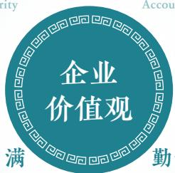

## 不自满求突破

Innovation

## 勤于思敏于行

Learning Agility

## 公司发展战略

深刻把握市场趋势与消费者需求，根据水井坊品牌积淀和优势，通过品牌、产品、渠道、文化、战略投资五大维度的变革，为消费者提供极致消费体验，持续扩容增长动能，实现水井坊长期健康、跨越式发展。

## 企业文化

水井坊是一家充满活力的公司；水井坊人追求身心健康。不囿于个人的成就，而以帮助他人成功为荣，是水井坊人的胸怀；敏捷思维，卓越执行高质量的决策，是水井坊人的行事风格；珍视公司的产品与品牌，与公司荣辱与共，是水井坊人的信念；始终如一的诚信与不断学习成长的干劲，是水井坊人赢得客户尊重的关键；坚守品质，以创新精神，传承提升 600 年传统工艺，是水井坊人的决心。学习型的企业文化和回馈社会的企业形象，让水井坊成为有口皆碑、令人心存向往的优秀公司。

## 第三方审验

## 温室气体核查声明

## 声明

测算标准

ISO 14064-1:2018

声明登记号码：

17 164 2632337

报告号码

17 164 2632337

声明持有者：

四川水井坊股份有限公司

中国四川省成都市金牛区全兴路9号邮编：610037

核查场址

所包括场地已列于声明附件上

核查方法：

核查方：莱茵检测认证服务（中国）有限公司

-过程：文件审查、访谈、现场核查与重新计算

-核查标准：ISO 14064-1:2018,ISO 14064-3:2019

核查范围：

基于取得的信息进行评估之结论：

-方案：自愿性温室气休方案

-组织边界：营运控制权法

-保证等级：合理保证

-实质性：5%

-全球暖化潜势（GWP）：IPCC 2021

-基准年为：2024（2024.01.01\~2024.12.31）

-核查年为：2025（2025.01.01\~2025.12.31）

-碳排放总量为192,963吨二氧化碳当量（tCO₂e）（基于位置）

\- 类别一 直接排放为 31,329 tCO₂e

-类别二间接输入能源排放为9,9241CO₂e（基于位置）

\- 类别三 间接 运输排放为 10.240 tCO₂6

\- 类别四 间接 组织使用产品排放为 135.834 tCO2e

\- 类别五 间接 与使用组织产品有关排放为 4.697 tCO₂e

\- 类别六 间接 其他排放为 938 tCO₂e

-数据与资讯：

\- 历史性资料：类别一/类别二

-历史性资料及情模型：类别三/类别四/类别五/类别六

-基于位置的电力排放因子引用中国生态环境部公布的2023年电力二氯化碳排放因子中的全国电力平均二氯化碳排放因子进行测算

有效性：

GHG陈述由贵任方予以负责，本声明仅对核查年度进行核查，非对管理体系进行认证，并基于2026年04.月22.日接收到的盘衰/排放报告进行声明

签发日期：

2026-04-26

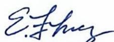

曹萨拉测认证职多（中国）有风公司

中华人民共和国北京市北京段济技术开发区荣华岗路

15号院4号楼3层301室，4层403室，100170

This yadficatlon end valigaten is bassd on the intormat oo made aynilatle to Iíiy Ihelatand and tle epoaorment ceorditions dattlad steys Therotese Tihy Bhpkriland cunnot ouoranlep the mocurecy or correctness of tila infommat on, Túy Rlielnland conpol bo held liable by poy pary relvipg or pctipo upon thia verlicalior and yolldatton.

www.tuv.com

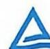

TÜVRheinland®

Precisely Right

## 报告鉴证声明

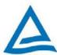

## TÜVRheinland®

Precisely Right.

## 独立审验声明

## 介绍

莱茵技术（上海)有限公司，是德国莱茵TüV集团成员之一(简称“莱茵”或“我们”)，受四川水井坊股份有限公司(简称“水井坊”或“公司”)的委托针对其2025年环境、社会及治理(ESG)报告（简称“报告”)做独立第三方审验。报告披露了水井坊在2025年（2025年1月1日至2025年12月31日）的可持续发展信息。

## 职责

水井坊不仅负责可持续发展报告的准备以及符合适用报告准则的可持续发展信息收集与提报，而且有义务落实和维护有效的信息和数据的内控以支持报告编撰流程

TüV莱茵的可持续信息审验活动，是在符合ISO/IEC17029:2019标准要求的质量管理体系下运作的，并恪守TüV莱茵全球职业道德合规守则。我们的审验服务遵循独立性和公正性原则，并不参与水井坊的报告准备。本次审验项目由具备相应可持续性议题专业知识和审验经验的团队执行。莱茵的职责是依据审验协议以及约定的审验工作范畴执行独立审验工作，并对可持续发展报告做出独立和公正的职业判断

## 审验标准

TüV莱茵依据 AccountAbility AA1000审验标准第三版(AA1000AS v3).针对水井坊选择的特定绩效指标(参见本声明中的附录)及其非财务定性信息(包括实质性评估、利益相关方参与、实质性影响、风险与机遇(IRO)相关的议题管理等)按类型-2和中度等级进行审验。

## 审验目的

审验旨在为水井坊管理层和关注该公司可持续发展信息与绩效的利益相关方提供独立的审验观点，具体包括：审查并评估可持续发展报告和披露遵循AA1000AP(2018)审验原则(包括包容性、实质性、回应性和影响性)的程度；审查并评估特定绩效信息的可靠性和质量。

## 审验准则

下列审验准则(包括报告框架准则或标准)用于审验工作

●上海证券交易所上市公司自律监管指引第14号—可持续发展报告（试行）  
上海证券交易所上市公司自律监管指南第4号——可持续发展报告编制（第一号总体要求与披露框架）和上海证券交易所上市公司自律监管指南第4号——可持续发展报告编制（第二号应对气候变化）  
● 财政部发布的《企业可持续披露准则——基本准则（试行)》  
● 全球报告倡议组织发布的可持续发展报告标准（GRI标准）  
ISSB(国际可持续发展准则理事会)发布的《国际财务报告可持续披露准则第1号(IFRSS1)——可持续相关财务信息披露一般要求》及《国际财务报告可持续披露准则第2号(IFRS S2气候相关披露》  
● 中国酒业协会发布的《酒类企业ESG披露指南》  
● 联合国可持续发展目标(SDGs)  
● 温室气体核算体系企业核算与报告标准  
●AA1000AP审验原则，即，包容性、实质性、回应性和影响性

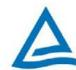

## TÜVRheinland®

Precisely Right.

## 审验方法

我们的审验活动和程序包括

●问询管理层以理解和评估运营与可持续发展管理的关键流程、系统和内部控制。  
访谈负责可持续发展执行层面的关键人员、以理解非财务信息报告体系，包括特定绩效数据和非财务定性信息的收集、整合和报告，并评估集团层面数据整合流程。  
●应用分析程序，审查数据的合理性  
●基于抽样方法，测试信息溯源以检查数据的精确性  
●审查特定绩效指标和审验范围内的定量与定性信息的一致性和可靠性。  
●检查收集的支持性证据，以评估相关证据和信息披露支持和遵循AA1000AP审验原则的程度。  
●汇报审验观察项或建议给公司管理层，以给予在审验工作完成之前更正报告错误的机会

## 局限性

TüV莱茵依据审验协议规定的审验范围策划并执行审验工作，以获得证据信息和必要的解释、为按照AA1000ASv3中度审验作出的审验结论提供依据。中度审验参与的程序本质和程度(范围)均低于获得高度审验所需的程序。

前瞻性信息涉及尚未发生且可能永远不会发生的事件和行动。实际结果很可能会不同，因为预期的事件往往并未如预期发生。我们不保证前瞻性信息的可实现性

与审验有关的信息和绩效包括选择的特定绩效指标会局限于本报告的内容披露。我们的审验未涵盖财务年报及财务数据且并不涵盖超出本次审验工作范围的其他与可持续发展主题不相关的主题或事项。

## 审验结论

基于已执行的审验程序及所获得的证据，我们认为

● 水井坊 2025年 ESG 报告遵循了AA1000AP 审验原则。  
可持续发展信息按照上海证券交易所上市公司自律监管指引第14号——可持续发展报告（试行）以及 GRI 标准进行报告编制。  
特定绩效指标（参见本声明附录）和审验范围内的非财务定性信息（包括重要性议题评估）经评估、未发现重大错报。

针对任何第三方依据此份审验声明来对水井坊做出的评论和相关决定，TüV莱茵将不承担任何责任。

## 对 AA1000AP 审验原则的遵循程度

包容性：水井坊已识别主要利益相关方群体，其包括消费者与客户、政府/监管机构/行业协会、股东与投资者、合作伙伴/供应商/经销商、员工、公众与媒体等，并已构建利益相关方对话机制、证据表明公司在2025年开展利益相关方问卷调研，并将调研分析结果作为议题重要性评估的关键考量

实质性：水井坊落实了双重重要性评估，包括基于利益相关方调研分析，从“影响重要性”和“财务重要性”双维度对识别的ESG议题进行重要性评估和优先级排序。议题矩阵清晰地揭示了当年度的双重重要性的议题（如产品和服务安全与质量、应对气候变化、水资源利用、供应链管理、能源利用等)。ESG管理委员会审议并确认了评估结果。

回应性：水共坊与其相关方群体的沟通渠道是多元化的，包括客户服务与投诉处理员工培训供应商培训、举报机制等。公司已建立并落实季度会议机制，由ESG工作组向ESG管理委员会汇报目标阶段性进展，并发布2035可持续发展目标，本期报告针对财务重要性议题采用四要素框架进行披露，同时还披露了管理实践以及ESG关键绩效指标(如温室气体排放与能源、水资源，排放物与废弃物、员工权益。供应链管理等)的量化数据以及时和恰当地回应利益相关方的重大关切

## TÜVRheinland®

Precisely Right.

影响性：水井坊重点关注业务运营对环境和社会（包括价值链环节）的影响，并结合运营管理、合规管理以及内控体系来防控潜在ESG领域的重大风险。本期报告披露了针对财务重要性议题(包括应对气候变化、水资源利用等）的影响、风险与机遇的分析，并采取应对措施。ESG关键绩效以及重要性议题的管理实践为公司对环境和社会的影响评估与管理提供了信息支撑。

## 特定绩效信息披露

基于类型二中度审验要求，TüV莱茵关于特定绩效信息(参见附录)的可靠性和质量的验证结论如下：

我们观察到水井坊已实施相关内部控制系统与流程，以及适当措施采集和汇总与选择的特定绩效指标相关的源数据以作验证。  
验证过程中发现的所有小错误已得到纠正。我们相信在验证范围内报告披露的最终数据是准确的。我们建议水井坊在集团和运营层面不断提升数据治理水平(包括数据采集、计算和整合)

完整的管理报告已递交给水井坊管理层以作考虑，其中具体阐述了审验发现和可持续发展报告持续改进的建议。

## 潘敏

企业可持续发展服务技术经理

莱茵技术（上海）有限公司

中国上海，2026年4月22日

AA1000

Licensed Report

000-555/V3-HSGXN

## TÜVRheinland®

Precisely Right.

## 附录：

选定的特定绩效指标

<table><tr><td>指标</td><td>单位</td></tr><tr><td colspan="2">环境</td></tr><tr><td>综合能源消耗量</td><td>万吨标煤</td></tr><tr><td>不可再生能源消耗量</td><td>万吨标煤</td></tr><tr><td>可再生能源消耗量</td><td>万吨标煤</td></tr><tr><td>温室气体排放总量</td><td>吨二氧化碳当量</td></tr><tr><td>范围一排放量</td><td>吨二氧化碳当量</td></tr><tr><td>范围二排放量</td><td>吨二氧化碳当量</td></tr><tr><td>范围三排放量</td><td>吨二氧化碳当量</td></tr><tr><td>总取水量</td><td>万立方米</td></tr><tr><td>污水排放量</td><td>万立方米</td></tr><tr><td>一般工业固废产生量</td><td>吨</td></tr><tr><td>一般工业固废处置量</td><td>吨</td></tr><tr><td>危险废弃物产生量</td><td>吨</td></tr><tr><td>危险废弃物处置量</td><td>吨</td></tr><tr><td>废弃物回收利用量</td><td>吨</td></tr><tr><td colspan="2">社会</td></tr><tr><td>经过SEDEX审核评估的关键供应商数量</td><td>个</td></tr><tr><td>经过SEDEX审核评估的关键供应商比例</td><td>%</td></tr><tr><td>本地化采购(四川省内)比例</td><td>%</td></tr><tr><td>因工死亡员工人数</td><td>人</td></tr><tr><td>员工百万损失工时事故率</td><td>/</td></tr><tr><td colspan="2">治理</td></tr><tr><td>员工反腐败培训覆盖率</td><td>%</td></tr><tr><td>合规与风险管理培训场次</td><td>次</td></tr></table>

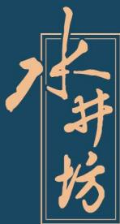

text_image

冰井坊

600年·活着的传承

地址：四川省成都市金牛区全兴路9号

邮编：610036

电话：028-87519777

网站：http://www.swellfun.com