## 2025

## 环境、社会及治理(ESG)报告

上海同济科技实业股份有限公司

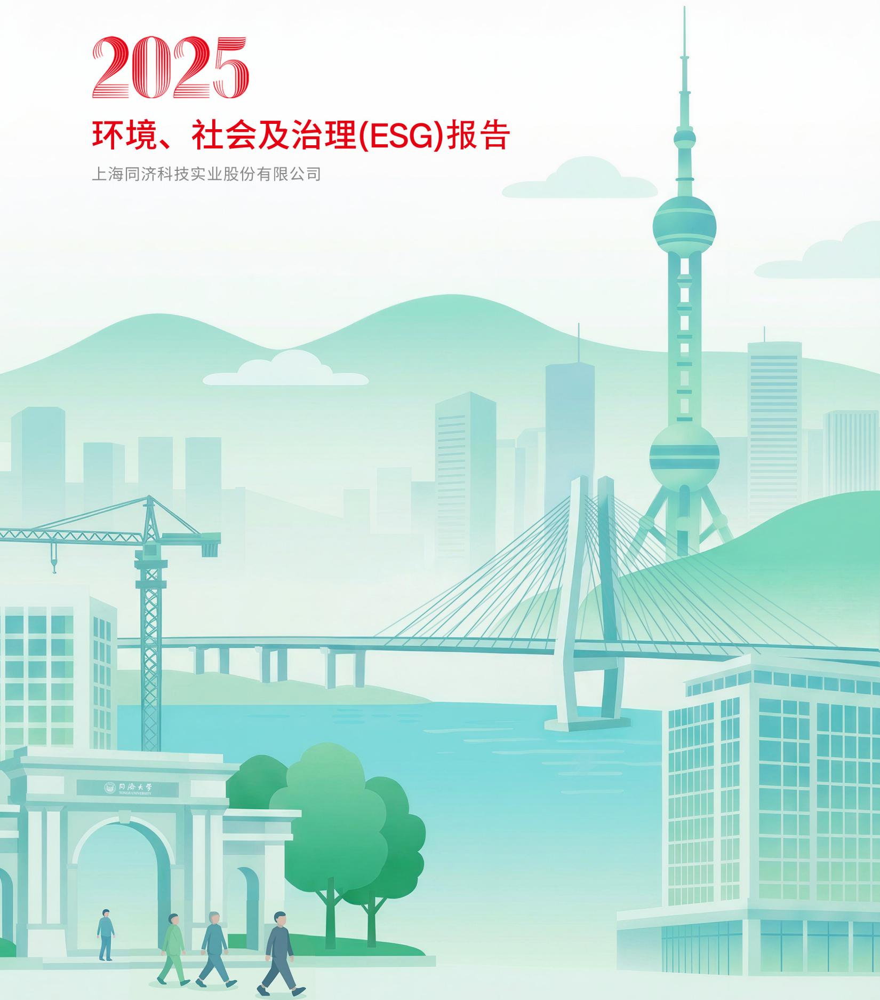

text_image

2025
环境、社会及治理(ESG)报告
上海同济科技实业股份有限公司

## 目录

报告说明 03

领导致辞 05

走进同济科技 07

“同”步数说 13

“济”载荣誉 15

ESG 管理 16

责任专题： 19

践行人民城市理念

## 23

## 扬帆奋楫强基固本护航稳健发展

坚持党建引领 25

夯实治理基石 28

坚守合规经营 30

## 31

## 追求卓越

## 精工善建共筑城市未来

筑造精益产品 33

培育创新生态 37

保护信息安全 40

## 41

## 同舟共济

## 凝聚共识广聚四方英才

保障员工权益 43

助力员工成才 44

关爱员工生活 45

筑牢安全底线 46

## 51

## 创造价值

## 同心致远开启双向奔赴

服务国家战略 53

共建生态文明 55

协同伙伴共赢 64

打造责任供应链 66

倾心奉献社会 67

未来展望 69

附录 71

关键绩效表 71

指标索引表 75

## 报告说明

本报告为上海同济科技实业股份有限公司的第二份环境、社会及治理（ESG）报告（以下简称“本报告”），报告本着客观全面、规范透明的原则，详细阐述2025年度公司在环境、社会及公司治理方面的工作和成效，并对利益相关方重点关注的ESG议题作出回应。公司承诺本报告内容不存在任何虚假记载、误导性陈述或重大遗漏。

## 时间范围

2025年1月1日至2025年12月31日。为保证报告完整性，部分内容有向前追溯、向后延伸的情况。

## 组织范围

报告以上海同济科技实业股份有限公司为主体，包括财务报表合并范围内的所有附属公司。除特别说明外，本报告范围与公司同期年度报告范围保持一致。

## 指代说明

报告组织范围涵盖上海同济科技实业股份有限公司及其所属公司。为便于表达，报告中，上海同济科技实业股份有限公司简称为“同济科技”“集团”“公司”“本部”“我们”，本报告涉及的子公司及重要参股公司全称及简称见下表。

<table><tr><td>企业全称</td><td>企业简称</td></tr><tr><td>上海同济环境工程科技有限公司</td><td>同济环境</td></tr><tr><td>上海同济房地产有限公司</td><td>同济房产</td></tr><tr><td>上海同济建设有限公司</td><td>同济建设</td></tr><tr><td>上海天佑工程咨询有限公司</td><td>天佑咨询</td></tr><tr><td>上海同济市政公路工程咨询有限公司</td><td>同济公路</td></tr><tr><td>长三角一体化示范区(上海)同杨低碳科技有限公司</td><td>同杨低碳</td></tr><tr><td>上海慧之建数智科技有限公司</td><td>慧之建</td></tr><tr><td>上海同济工程项目管理咨询有限公司</td><td>同济管理</td></tr><tr><td>上海同济检测技术有限公司</td><td>同济检测</td></tr><tr><td>上海同科物业服务有限公司</td><td>同科服务</td></tr></table>

## 数据说明

本报告所使用的数据和案例，均来自同济科技及其子公司正式文件、统计报告和新闻媒体，并经过公司内部审核。如无特殊说明，报告中涉及的货币种类和金额，均以人民币为计量单位，与财务报告不一致之处，以公司财务报告为准。

## 参考标准

全球可持续发展标准委员会（GSSB）《可持续发展报告标准》（GRI Standards）  
联合国 2030 可持续发展目标（SDGs）  
可持续发展会计标准委员会准则（SASB Standards）  
国际标准化组织《ISO26000社会责任指南（2010)》  
国家标准化管理委员会《社会责任报告编写指南》（GB/T 36001-2015）  
中国企业改革与发展研究会《中国企业可持续发展报告指南（CASS-ESG 6.0）》  
上海市国资委《上海市国有控股上市公司环境、社会和治理（ESG)指标体系（1.0版）》  
● 《上海证券交易所上市公司自律监管指引第 14 号—可持续发展报告（试行）》  
● 《上海证券交易所上市公司自律监管指南第4号—可持续发展报告编制》

## 报告原则

报告编制工作依据以下报告原则开展。

## 重要性：我们开展重要性评估工作的程序包括：

（1）识别相关的 ESG 议题；  
(2) 评估议题的重要性；  
(3)董事会审阅及确认评估流程和结果。我们依据重要性评估结果对ESG事宜进行汇报，有关重要性评估工作的详情参见报告“实质性议题分析”章节。

平衡性：本报告内容反映客观事实，对涉及公司正面、负面的信息均予以不偏不倚地披露

准确性：本报告尽可能确保信息准确。其中，定量信息的测算已说明数据口径、计算依据与假定条件以保证计算误差范围不会对信息使用者造成误导性影响。定量信息及附注信息详见本报告“关键绩效表”部分。董事会对报告的内容进行保证，不存在虚假记载、误导性陈述或重大遗漏。

一致性：本年度ESG报告的编制方式与往年保持一致，若存在可能影响与过往报告进行有意义比较的变更，均已在对应位置进行说明

## 报告发布

本报告以简体中文版发布。您可以在上海证券交易所（https://www.sse.com.cn）或公司网站（https://www.tjkjsy.com.cn）下载本报告电子文本，获取更多公司信息。

## 联系方式

若您对本报告有任何意见或建议，欢迎通过下述联系方式反馈意见，帮助我们对报告进行持续改进。

邮箱：tjkjsy@tjkjsy.com.cn

  
扫描二维码，反馈报告意见

## 领导致辞

2025年是“十四五”规划收官之年，是全面贯彻落实党的二十届四中全会精神的关键之年，也是公司承前启后、衔接“十五五”战略布局、深化转型发展的攻坚之年。面对复杂多变的宏观环境与行业变革浪潮，公司紧扣“区校科技成果应用战略合作平台”与“城乡建设与发展领域价值提升综合服务企业”战略定位，以“基金+基地+研究院+产业联盟”为主线，将可持续发展理念深度嵌入战略决策、经营管理、项目实施与产业协同全链条，坚持高质量发展、绿色低碳转型、治理能力提升三位一体协同推进，在服务国家战略、助力城乡建设、赋能绿色发展中实现经济效益、社会效益与环境效益有机统一，交出了一份稳健向好、亮点纷呈的年度答卷。

我们锚定“双碳”战略目标，以科技创新驱动绿色发展。天佑咨询自主研发碳智慧管理系统，实现碳数据全生命周期一体化管控；同济管理参编行业低碳标准，同碳·碳中和研究中心（雄安分中心）揭牌成立，同济检测获选中国建筑节能协会碳计量与核算专业委员会首批会员单位，为城乡建设低碳转型贡献专业方案。同济环境荣膺国家级专精特新“小巨人”企业，21座污水处理厂全年稳定运行零超标，30余项环保工程落地见效，环保咨询业务全新布局，为生态环境治理注入强劲动能。同济科技未来中心项目正式启动。以“绿色低碳、自主智能”为核心理念，打造区校融合的创新策源地，擘画绿色发展新蓝图。

我们胸怀“国之大者”，以实于实绩服务国家战略。深度参与苏州北站、南海至新会高速公路、澳门国际机场跑道修复等重大工程建设，合肥合庐产业新城龙桥路项目等斩获行业最高质量奖项，为区域发展筑牢基建基石。以中国标准、中国技术助力“一带一路”高质量发展，哈萨克斯坦阿斯塔纳轻轨一号线项目、阿拉木图中哈物流园等海外项目履约卓越，获得商务部援外项目管理资格与秘鲁工程咨询最高资质。同杨孵化基金规模扩容至9850万元，专注于数字化、智能化、绿色低碳等新兴产业投资，以耐心资本牵引早期创新与产业链深度融合，服务国家高质量发展与新质生产力培育大局。

我们坚守规范底线，以卓越治理护航高质量发展。公司发布首份ESG报告，万得ESG评级跃升至A级，以透明化披露展现可持续发展决心。深化治理改革，完成监事会调整，修订《公司章程》及 19 项内控制度，构建权责清晰、运转高效的现代企业治理体系。获批发行首期6亿元公司债券，优化资本结构；实施2024 年度利润分配，每 10 股派现 2 元，上市以来累计分红 15.80 亿元，连续 12 年分红比例超 30%，以稳定回报回馈股东信赖。公司董事会蝉联“最佳董事会奖”，斩获“优秀财务管理奖”等多项荣誉，治理能力获资本市场高度认可。

征程万里风正劲，重任千钧再出发，2026年是“十五五”开局之年，同济科技将始终以习近平新时代中国特色社会主义思想为指引，推动优势业务提质升级，围绕城市更新和资产价值提升培育新的增长主线，战略培育及布局面向未来城市的科技业务体系，锚定绿色发展航向，坚守ESG责任初心，深化区校协同创新持续提升服务城市焕新、产业升级和资产价值提升的综合能力，全力向成为具有行业影响力的引领城市发展与产业升级的卓越价值创造企业迈进

同济科技党委书记、董事长 : 官远发

## 走进同济科技

## 公司简介

上海同济科技实业股份有限公司成立于1993年11月，系同济大学旗下企业改制创立，1994年3月在上海证券交易所挂牌上市(股票代码：600846.SH)，为国内首批高校背景上市公司。

2021年，为贯彻国家高校所属企业体制改革部署，优化国有资产配置，推进杨浦区政府与高校之间深入合作，促进上市公司持续健康发展，公司实际控制人变更为杨浦区国有资产监督管理委员会。公司深度践行国家“双碳”发展战略，依托高校学科优势与区域资源协同，聚焦绿色科技研发与产业转化，构建以科技创新为驱动、以数字化智能化为支撑的发展体系。通过强化资本运作效能，战略性布局智慧化、绿色化及产业融合领域，加速推进主营业务向城乡建设与发展领域价值提升服务方向升级，致力于打造产学研深度融合的可持续发展平台，持续提升在低碳技术应用和城乡建设综合服务领域的核心竞争力

组织架构  
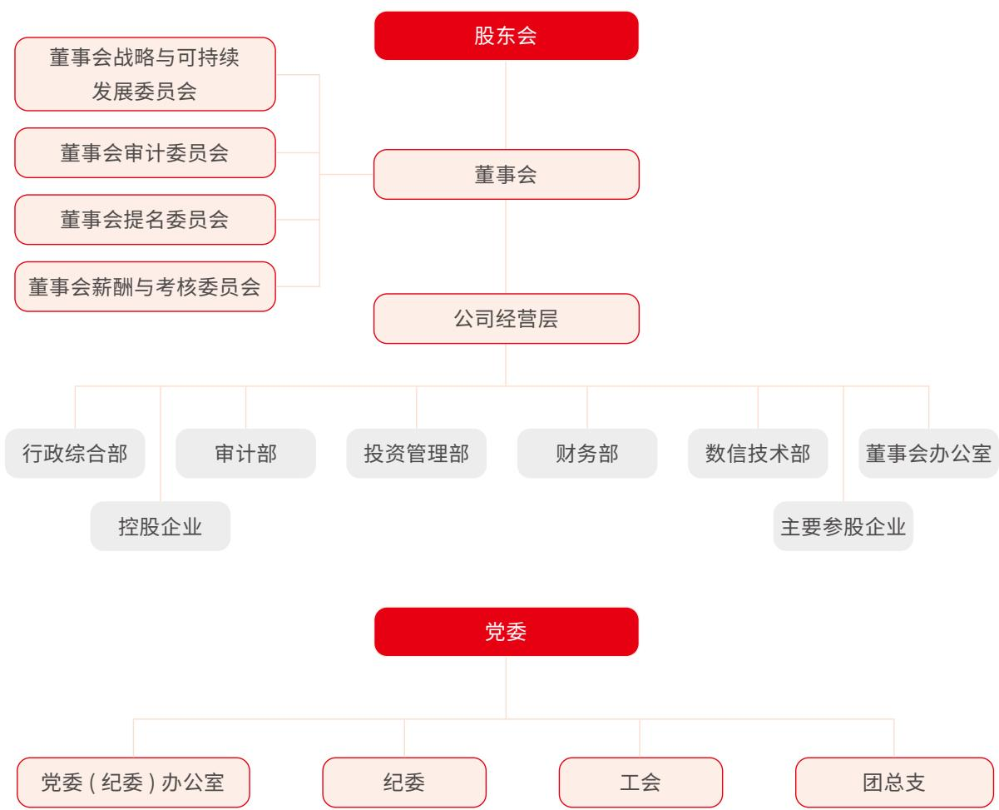

flowchart

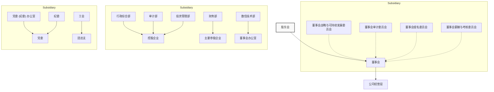

## 发展战略

2025年，公司积极融入国家“双碳”发展战略，依托区域资源和高校学科优势，发挥公司主营业务积累的产业优势，搭建更市场化的产学研合作平台，砥砺奋进，传承开拓，加大绿色科技等产业的研发投入成熟运用资本优势，加大绿色低碳循环经济等新兴产业投资力度，促进公司主营业务的快速提质升级。全力构建以“双碳”为引领，以科技创新为核心，以数字化、智能化为支撑的绿色低碳循环经济发展新格局致力于成为城乡建设与发展领域价值提升综合服务企业。

立足新发展阶段，为纵深推进公司高质量发展，经第十届董事会第八次会议审议通过，公司“十五五”发展战略系统璧画如下：公司以“营城兴产共创未来”为使命，将“致力于成为引领城市发展和产业升级的卓越价值创造者”作为愿景，以专业能力提升空间品质与功能价值，以区校协同汇聚创新资源，以资本助力链接未来城市与未来科技，砥砺奋进、传承开拓。致力于成为城乡建设与发展的专业服务商、城市更新与活力创造的一站式合伙人、未来城市与未来产业的创新引领者，推动技术、产业、资本与场景深度融通共创更具韧性和可持续性的未来。

企业精神  
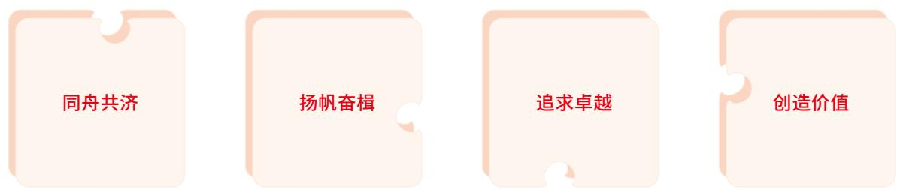

flowchart

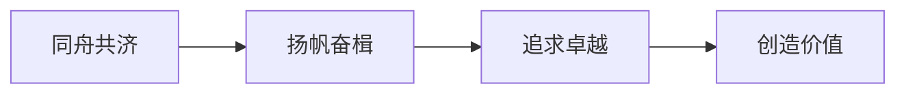

## 业务板块

公司积极响应国家“双碳”战略目标，持续优化业务布局和服务体系，推动各业务板块协同发展。通过整合全产业链服务能力，为客户提供覆盖项目全生命周期的综合解决方案，助力绿色低碳发展和产业转型升级。

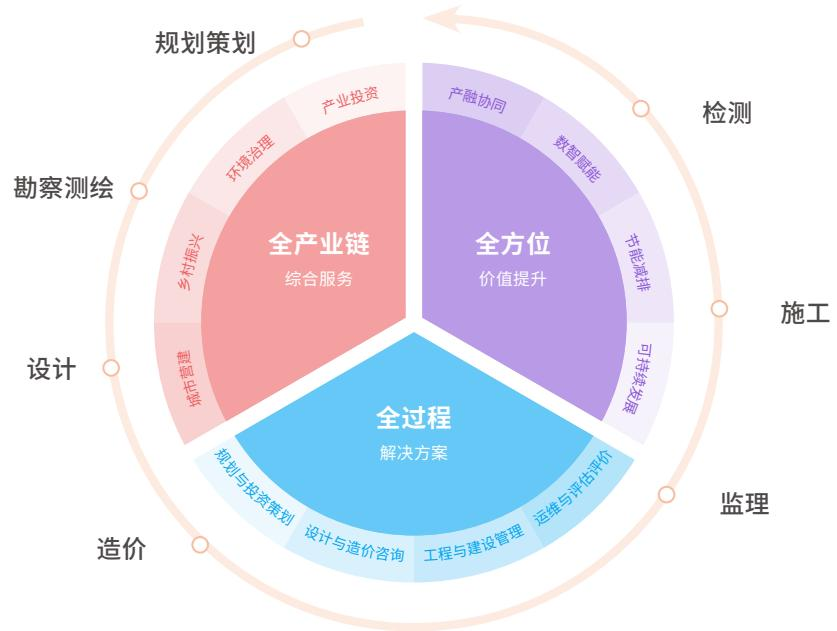

flowchart

```mermaid
graph TD
  subgraph Pillar1["全产业链\n综合服务"]
    direction TB
  A["规划策划"] --> B["勘察测绘"]
  B --> C["设计"]
  C --> D["造价"]
  E["产业投资"] --> F["环境治理"]
  F --> G["乡村振兴"]
  G --> H["城市管理"]
  end

  subgraph Pillar2["全方位\n价值提升"]
    direction TB
  I["产融协同"] --> J["数智赋能"]
  J --> K["节能减排"]
  K --> L["可持续发展"]
  end

  subgraph Pillar3["全过程\n解决方案"]
    direction TB
  M["规划与投资策划"] --> N["设计与造价咨询"]
  N --> O["工程与建设管理"]
  O --> P["运维与评估评价"]
  end

  subgraph Pillar4["监理"]
    direction TB
  Q["检测"] --> R["施工"]
  R --> S["监理"]
  end
```

## 核心资质

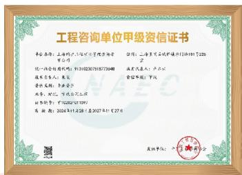

text_image

工程咨询单位甲级资信证书
单位名称：上海华兴汽车代理有限公司
统一社会信用代码：91320230181872548
业务负责人：黄文
委托人：李金云
承办单位：中国证券登记结算有限责任公司
证书类型：中国证券登记结算有限责任公司
发证日期：2024年11月28日-2027年11月27日
单位编号：中国证券登记结算有限责任公司

工程咨询甲级资信

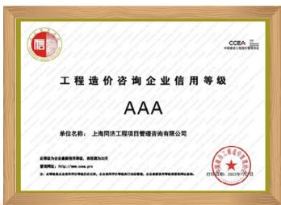

text_image

工程造价咨询企业信用等级
AAA
单位名称：上海同济工程项目管理咨询有限公司
主管单位为企事业单位，经审查后方可
注册地址：Http://www.suzhou.jn
21、22号企业合同有效期限为三年，企业类型为单独式银行存款、企业融资机构或私募投资基金业务。
CCEA 2023年5月7日

工程造价 AAA

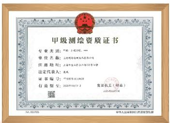

text_image

甲级测绘资质证书
专业类别：中国·美国、美国
单位名称：上海市黄浦区黄浦大道100号
注册地址：上海市浦东新区张江路333号
法定代表人：王东明
证书编号：中国国用认证中心
有效期限：2023年04月07日
发证机关（印鉴）
2023年04月07日

工程测量甲级测绘资质证书

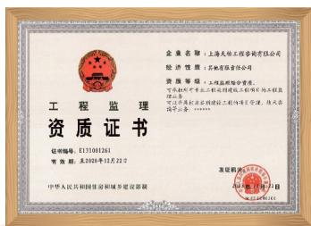

text_image

工程监理
资质证书
证书编号：J13500261
有效期：至2024年12月22日
中华人民共和国住房和城乡建设部
企业名称：上海天际工程咨询有限公司
经济性质：非制造业协会
资质等级：无级或特级评定。
可选的专业人员在工程监理处任职，须与公司控股股东、实际控制人、董事、监事及高级管理人员进行考核。
浙江天际工程建设监理有限责任公司
法定代表人：张伟
发证机关：
中国证券报（深圳）公司

工程监理综合资质

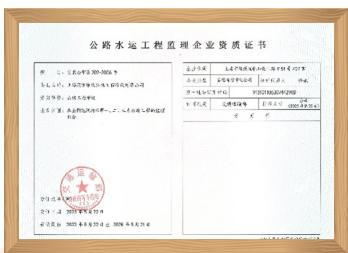

text_image

公路水运工程监理企业资质证书

主办单位：中国水利水电集团有限公司
注册地址：北京市西城区金融大街35号
法定代表人：王洪波
联系电话：010-68788888
传真：010-68788888
电子邮箱：
（盖章）：中国水利水电集团有限公司
（盖章）：中国水利水电集团有限公司
（盖章）：中国水利水电集团有限公司
（盖章）：中国水利水电集团有限公司

公路水运工程监理甲级

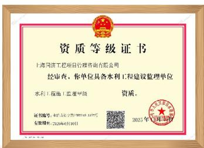

text_image

资质等级证书
中游国际工程项目管理咨询有限公司
经审查，你单位具备水利工程建设监理单位
水利工程施工监理甲级
资质。
名称：中铁工程集团有限公司 2023年1月1日
有效期至：2026年4月30日
2023年1月1日

水利工程监理甲级

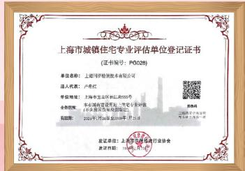

text_image

上海市城镇住宅专业评估单位登记证书
（证书编号：P0028）
单位名称：上海可研检测技术有限公司
法人代表：卢彩红
单位地址：上海市金牛区科苑路50号
企业类型：非国有独资控股（非自然人独资）
组织形式：有限责任公司
发证单位：上海市杨浦镇行业协会
批准文号：31010000000000000000000000000000000000000000000000000000000000000000000000000000
身份证号：31010000000000000
联系电话：310169999999999999999999999999999999999999999999999999999999999999999999999999999999999999999999999999999
2021年1月1日至2021年1月1日

上海市城镇住宅专业评估证书

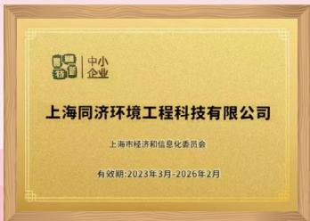

text_image

中小企业
上海同济环境工程科技有限公司
上海市经济和信息化委员会
有效期:2023年3月-2026年2月

国家级专精特新小巨人企业上海市专精特新中小企业

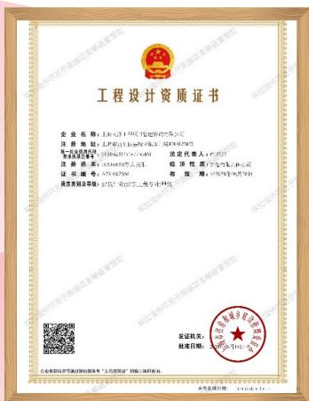

text_image

工程设计资质证书
企业名称：上海华谊（集团）股份有限公司
注册地址：上海市浦东新区东方路198号2幢201室
法定代表人：周明
注册资本：人民币3,000.00万元
注册机关：中国证券登记结算有限责任公司
证书编号：S275 60799
有效期：2018年7月14日
国家发改委审核：国办发[2018]100号文

工程设计甲级资质

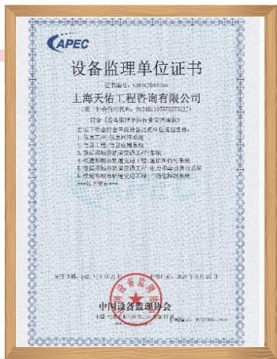

seal

上海天佑工程咨询有限公司
中国注册会计师协会

设备监理甲级资质

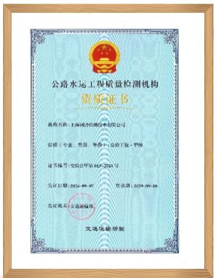

seal

公路水运工程质量检测机构
资质证书
机构名称：长海市检测技术有限公司
资质（专业、类别：水电+公路工程-甲级）
证书编号：安监公字第014-2014号
发证日期：2024-09-01
发证机关：交通管理局
发证机关：交通管理局
文号：2024-09-06
文号：2024-09-06

公路工程甲级检测

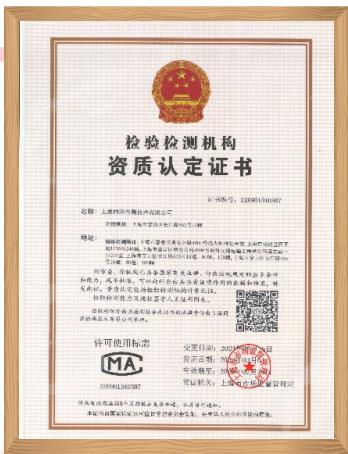

text_image

检验检测机构
资质认定证书

名称：上海申通地铁有限公司

注册地址：上海市浦东新区东方路198号2幢

地址：上海市浦东新区东方路198号2幢

经办人：张晓峰、王明、周建平、李俊、周建平、周建平、周建平、周建平、周建平、周建平、周建平、周建平、周建平、周建平、周建平、周建平、周建平、周建平、周建平、周建平、周建平、周建平、周建平、周建平、周建平、周建平、周建平、周建平、周建平、周建
（盖章）：（2023年1月1日）
（盖章）：（2023年1月1日）

许可使用标准：
MA
200901365M7

变更日期：2023年1月1日
发证机关：上海市徐汇区
市发改委：上海市徐汇区政府
登记机关：上海市徐汇区管理委员会

检验检测机构资质

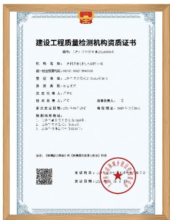

text_image

建设工程质量检测机构资质证书
编号：（2017）沪械认证第310006号
机构名称：中国机械进出口总公司
统一社会信用代码：913101MA5F84D4XH2U
登记地址：上海市宝山区中山路66号16楼
资质类别：有限责任公司
法定代表人：卢文
技术负责人：卢文
首席负责人：王
首次发证日期：2020年10月21日
有效期限：2020年10月20日
检测场所校验：
1. 请先审定证书类型及数量
2. 上海市卫生监督中心
3. 上海市消防局
备注：《检测报告附录》和《检测报告备忘录》附注
发证机关：上海市浦东新区人民法院
发证日期：2020年10月1日

建设工程质量检测

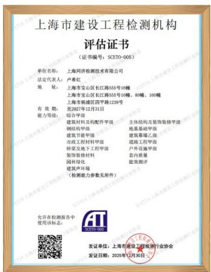

text_image

上海市建设工程检测机构
评估证书
（证书编号：SCETO-005）
单位名称：上海网济检测技术有限公司
法定代表人：卢春红
地址：上海市宝山区长江路555号10幢
上海市宝山区长江路555号10幢、80幢、160幢
上海市杨浦区四平路1239号
有效期：至2027年12月31日
能力等级：综合甲级
建筑材料及配件甲级	主体结构及装饰装修甲级
钢结构甲级	地基基础甲级
建筑节能甲级	建筑幕墙乙级
市政工程材料甲级	道路工程甲级
桥梁及地下工程甲级	户外设施甲级
装饰装修材料	客内容量
园林绿化	能效测评
建筑声环境
（检测能力参数见附件）
发布在检测报告中
使用该标志。
发证单位：上海市建设工程检测电子协会
发证日期：2025年12月30日

上海市建设工程检测机构综合甲级

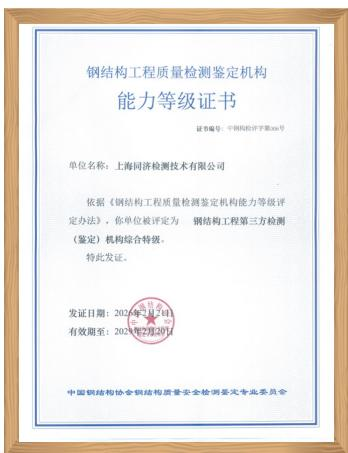

text_image

钢结构工程质量检测鉴定机构
能力等级证书
证书编号：中国钢构评字第005号
单位名称：上海同济检测技术有限公司
依据《钢结构工程质量检测鉴定机构能力等级评定办法》，你单位被评定为 钢结构工程第三方检测（鉴定）机构综合特级。
特此发证。
发证日期：2023年6月1日
有效期至：2023年9月2日
中国钢结构协会钢结构质量安全检测鉴定专业委员会

钢结构工程质量检测综合特级

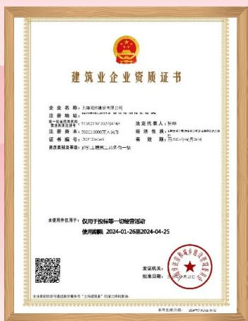

text_image

建筑业企业资质证书
企业名称：上海均瑶建材有限公司
注册地址：上海市黄浦区南京西路68号1幢
统一社会信用代码：91370219MA7D7M4F
联系电话：021-5832366787811678
经办人：李明
证书编号：1000000000000000000000000000000000000000000000000000000000000000000000
有效期：自2024-01-26至2024-04-25
请登录我司或登陆我司的footer栏（“网站”）或在线下载。
本使用证件原件上，仅用于投标等一切验资活动
使用期限：2024-01-26至2024-04-25
发证机关：
批准日期：2024-01-26
全国中小企业信用社联合社（以下简称“公司”）

建筑工程施工总承包一级资质

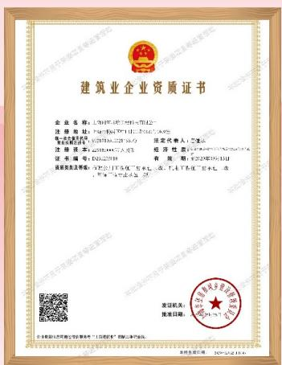

text_image

建筑业企业资质证书
企业名称：L1001457237811912
注册地址：L1001457237811912
法定代表人：王建民
注册号：L1001457237811912
证书编号：L1001457237811912
有效期：自2020年5月15日至
颁发机关登记证书并办理工商登记手续。收件人：王建民（盖章）：
发证机关：
批准日期：

市政公用工程施工总承包二级

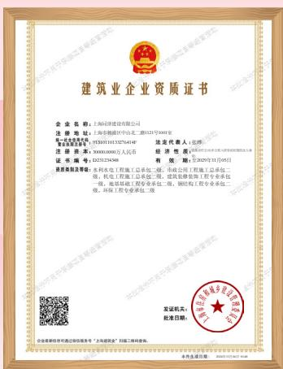

text_image

建筑业企业资质证书
企业名称：上海同济建设有限公司
注册地址：上海市黄浦区中山东二路123号1001室
企业类型及性质：有限责任公司
注册资本：¥30000.0000万人民币
经济性质：贰拾玖亿肆仟伍佰肆拾陆元整
证书编号：12321234348
有效期：至2020年11月05日
质量等级及等级：水利水电工程施工总承包二级，市政公用工程施工总承包二级，机电工程施工总承包二级，建筑装修装饰工程总承包一级，地基基础工程总承包二级，钢结构工程专业承包二级，环境工程专业承包二级
发证机关：
批准日期：
企业盖章和营业执照复印件“三水润业”之“三水润业”项目核准。

环保工程专业承包二级

## 发展历程

1993-2003

## 初创与资本奠基

公司以同济大学11 家企业为基础改制成立，于1994年登陆上交所。通过多次配股及股本扩张，形成以土建技术服务与高科技产品研发为科技支撑、以房地产与工程监理等工程服务为业务延伸的产业布局，旗下13家全资子公司与8家控股子公司辐射建筑工程全产业链，构建起“科技赋能+工程落地”的双轮驱动发展格局。

2004-2006

## 结构调整与治理升级

深化企业改革，完成股权分置改革，推动全资子公司公司化改制。优化资产管理，重组科技园资产。标志性工程同济科技大厦落成，确立“产权管理+投资运营”模式，为后续规模化发展奠定治理基础。

2007-2022

## 规模扩张与产业聚合

通过资本运作加速资源整合：非公开发行募资4.8亿元、两次资本公积金转增使股本达到6.25亿股。控股同济咨询、成立同济环境、完成晶度大厦等标杆项目、战略性布局水务领域，设立及收购多家水务公司，业务端围绕“环境治理服务+工程咨询+科技园建设与管理+地产开发+建筑工程管理”，构建城市建设科技产业链。

2022-2025

## 战略转型与双碳引领

响应高校企业体制改革，完成股权划转。聚焦国家双碳战略，设立同杨低碳与同杨基金，加强校企合作及创新产业投资；通过破产重整收购三门路项目，以“绿色低碳、自主智能”为核心理念区校共建“自主智能未来产业科技园”，打造“学科 + 产业”深度融合的创新策源地；以自研 + 收购拓展数智业务，整合全产业链服务能力，收购同济检测，完善资质体系，拓展业务链条及业务区域，开拓海外市场，持续提升城乡建设与发展领域价值提升综合服务能力。

## “同” 步数说

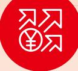

## 经济绩效

资产总额

130.96 亿元

归属于上市公司股东的净利润

2.72 亿元

营业收入

44.42 亿元

基本每股收益

0.44 元/股

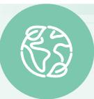

## 环境绩效

环保投入

10886.12万元

环保培训

93 次

废弃物合规处置率

100%

温室气体排放强度

0.0057

建设项目环保“三同时”执行率

100%

污染物监测合格率

100%

环保设施同步运转率

100%

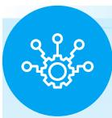

## 社会绩效

员工总人数

3561 人

员工培训场次

682 场

有效专利数量

189 项

女性员工比例

26.09%

研发投入

8482.19万元

安全生产总投入

5957.70 万元

员工培训投入

110.16 万元

研发人员数量

494人

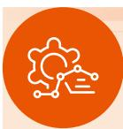

## 治理绩效

董事总人数

9

其中独立董事

3 名

董事会中外部董事

7名

占比

77.78%

股东会会议

2次

审议议案

13项

董事会会议

10次

审议议案

34 项

监事会会议

5 次

审议议案

9

召开公开业绩说明会

3 次

E 互动

13 次

## “济” 载荣誉

2025年，公司及其子公司承建、参建的多个项目荣获省部级以上奖项，彰显公司在行业内的卓越实力与专业水准，充分体现公司在技术创新、项目管理及工程质量等方面的卓越表现。

<table><tr><td>颁发/主办机构</td><td>获奖单位</td><td>获奖名称</td></tr><tr><td>中华全国铁路总工会</td><td>天佑咨询</td><td>火车头奖章</td></tr><tr><td>中国城市轨道交通协会</td><td>天佑咨询</td><td>城市轨道交通科技进步奖</td></tr><tr><td>中国市政工程协会</td><td>天佑咨询</td><td>2025年度市政工程最高质量水平评奖</td></tr><tr><td>上海市工程建设质量管理协会</td><td>天佑咨询</td><td>2024年度上海品质工程</td></tr><tr><td>上海市建筑施工行业协会</td><td>市政公路</td><td>2024年度上海市白玉兰优质建设工程</td></tr><tr><td>ENGINEERS’ SOCIETY OF WESTERN PENNSYLVANIAIn association withROADS and BRIDGES MAGAZINEINTERNATIONAL BRIDGECONFERENCE</td><td>同济检测</td><td>INTERNATIONAL BRIDGE CONFERENCEGEORGE S. RICHARDSON MEDAL</td></tr><tr><td>中国公路学会</td><td>同济检测</td><td>第42届国际桥梁大会(IBC)乔治·理查德森奖</td></tr><tr><td>上海市院士专家工作站指导办公室、上海市杨浦区人民政府</td><td>同济环境</td><td>上海市专家工作站</td></tr><tr><td>上海市经济和信息化委员会</td><td>同济环境</td><td>上海市第七批专精特新“小巨人”企业</td></tr><tr><td>澳门数字建筑协会</td><td>慧之建</td><td>第五届“智建杯”智能建造创新大奖赛施工组银奖</td></tr></table>

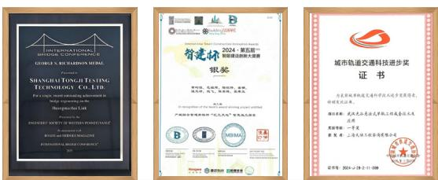

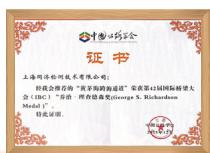

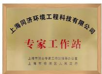

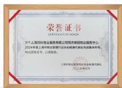

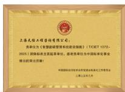

## ESG 管理

## ESG治理体系

公司遵照《上市公司治理准则》和《上海证券交易所上市公司自律监管指引第1号—规范运作》的有关规定，持续加强董事会，经营层对可持续发展工作的参与，形成由上而下的可持续发展文化。公司已形成决策层(董事会）、管理层（公司高管及各职能部门负责人）、执行层（各职能部门及基层实践单位）组成的三级可持续发展管治架构，有效落实可持续发展管理。

<table><tr><td>角色</td><td>组成</td><td>主要职责</td></tr><tr><td>决策层</td><td>董事会、董事会战略与可持续发展委员会</td><td>作为可持续发展管理的最高决策机构,承担可持续发展工作的整体责任,负责制定可持续发展管理策略,审议及批准公司可持续发展管理目标,并年度检视目标达成情况,决策可持续发展重大议题和风险应对举措,审议及批准公司可持续发展报告</td></tr><tr><td>管理层</td><td>公司高管及各职能部门负责人</td><td>公司总经理负责统筹规划,董事会秘书协调,负责落实可持续发展管理策略、统筹可持续发展管理目标、审阅内部相关方针政策,对可持续发展报告进行初审并提交董事会审议;开展可持续发展相关培训,引导下属企业有序开展可持续发展管理工作</td></tr><tr><td>执行层</td><td>各职能部门及基层实践单位</td><td>负责落实执行可持续发展日常管理,履行企业环境、社会、公司治理相关责任</td></tr></table>

2025年，公司围绕环境，社会和公司治理三个核心领域开展工作，环境方面，公司积极应对气候变化强化环境管理、减少污染排放、践行绿色运营：社会方面，公司赋能员工成长、稳固安全根基、提升服务品质、热心社会公益：治理方面，公司坚持党建引领、加强廉政建设、依法合规经营、深化企业改革，将可持续发展理念融入企业管理及运营过程中，与现有业务模式和管控模式深度融合

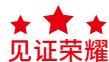

“一带一路”建设 ESG 实践入选上海市国资委《上海市国有控股上市公司环境、社会及治理（ESG）蓝皮书（2025）》天佑咨询主编的《交通运输行业上市公司 ESG评级报告（2024年度）》正式发布

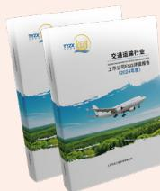

## 利益相关方沟通

公司高度重视与政府及监管机构、股东、机构投资者、债权人、客户、合作伙伴、社区及公益组织、员工等多元利益相关方的沟通与交流，通过构建高效的利益相关方识别与参与机制，明确界定与环境、社会及公司治理相关的核心议题，及时传递并披露相关信息，积极倾听各利益相关方的反馈与建议，并主动接受其监督。

<table><tr><td>利益相关方</td><td>高度关注议题</td><td>议题响应方式</td></tr><tr><td>政府/监管机构</td><td>响应国家战略守法合规运营带动地方经济</td><td>服务国家战略加强合规运营管理保护地方生态环境</td></tr><tr><td>股东/机构投资者/债权人</td><td>资产保值增值公司可持续发展信息披露透明</td><td>提升企业竞争力与盈利能力提质增效,提高抗风险能力和合规管理水平及时披露信息、开展投资者交流</td></tr><tr><td>客户</td><td>保障工程质量数据信息保护创新技术服务</td><td>工程按时保质客户满意度管理保护客户隐私推进科研创新</td></tr><tr><td>合作伙伴</td><td>商业道德透明采购互利共赢</td><td>遵守商业道德公开透明采购搭建合作平台</td></tr><tr><td>社区/公益组织</td><td>促进社区发展参与社会公益带动社区经济</td><td>参与社区活动参与地方建设带动地方就业贡献税收</td></tr><tr><td>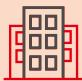员工</td><td>保障基本权益员工职业发展职业健康安全员工人文关怀</td><td>保护员工权益开展员工技能培训开展安全培训、定期体检帮扶困难员工</td></tr></table>

## 实质性议题分析

公司结合行业特征、战略规划及利益相关方诉求，参考国内外可持续发展/社会责任相关标准、指南和倡议遵循“双重重要性”原则，通过系统性方法识别出对公司可持续发展具有重大影响的议题，搭建实质性议题评估矩阵，最终确定重要性议题并重点披露。

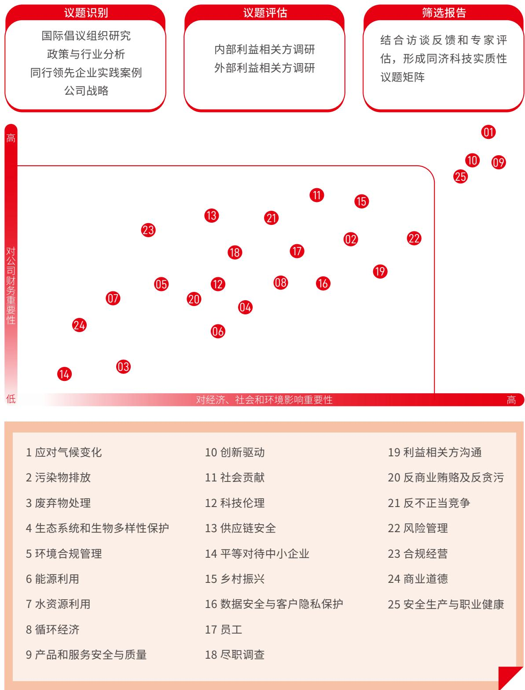

scatter

| ID | Topic Identification | Topic Evaluation | Selection Report |
| --- | --- | --- | --- |
| 01 | N/A | N/A | N/A |
| 09 | N/A | N/A | N/A |
| 10 | N/A | N/A | N/A |
| 25 | N/A | N/A | N/A |
| 11 | N/A | N/A | N/A |
| 15 | N/A | N/A | N/A |
| 21 | N/A | N/A | N/A |
| 02 | N/A | N/A | N/A |
| 18 | N/A | N/A | N/A |
| 13 | N/A | N/A | N/A |
| 23 | N/A | N/A | N/A |
| 17 | N/A | N/A | N/A |
| 16 | N/A | N/A | N/A |
| 08 | N/A | N/A | N/A |
| 12 | N/A | N/A | N/A |
| 04 | N/A | N/A | N/A |
| 06 | N/A | N/A | N/A |
| 05 | N/A | N/A | N/A |
| 07 | N/A | N/A | N/A |
| 24 | N/A | N/A | N/A |
| 14 | N/A | N/A | N/A |
| 03 | N/A | N/A | N/A |
| 14 (Bottom) | Yes | Yes | Yes |
| 06 (Bottom) | Yes | Yes | Yes |
| 24 (Bottom) | Yes | Yes | Yes |
| 24 (Bottom) | Yes | Yes | Yes |
| 24 (Bottom) | Yes | Yes | Yes |
| 24 (Bottom) | Yes | Yes | Yes |
| 24 (Bottom) | Yes | Yes | Yes |
| 24 (Bottom) | Yes | Yes | Yes |
| 24 (Bottom) | Yes | Yes | Yes |
| 24 (Middle) | Yes | Yes | Yes |
| 24 (Middle) | Yes | Yes | Yes |
| 24 (Middle) | Yes | Yes | Yes |
| 24 (Middle) | Yes | Yes | Yes |
| 24 (Middle) | Yes | Yes | Yes |
| 24 (Middle) | Yes | Yes | Yes |
| 24 (Middle) | Yes | Yes | Yes |

## 责任专题

## 践行人民城市理念匠心赋能城市更新

## 强化规划引领，创新城市更新模式

规划是城市更新的“总纲”更是践行“人民城市”理念的首要环节，同济科技坚持“规划先行，民生为本因地制宜”的原则，依托自身在规划咨询领域的深厚积淀和“大全咨”全产业链前端优势，以高起点的区域规划、多视角的投融资分析、可操作的全周期管理为核心，旨在破解项目瓶颈，变“负资产”为“新空间”，为城市发展注入新动能。子公司天佑咨询、同济建设、同济管理、同济环境等多点发力，在旧区改造存量盘活、基础设施升级等领域，形成一套以专业咨询为引导、以风险控制为保障、以多方协同为基础的更新范式。报告期内，公司承接复兴岛量子城市、美丽家园、雨污水混接、水环境提升、道路新建等项目。在建项目建筑面积134.5万平方米，其中美丽家园和美丽街区项目占比近10%。

## 案例

##

凤南一村是上海市中心城区旧住房成套改造“体量最大的标志性民生工程”之一，涉及35幢老旧房屋，居民 1813 户。作为《上海市城市更新条例》出台后全市最大规模的旧住房拆除重建项目，同济科技创新采用的“毫米级安全管控+数字化监理+民生协同”模式，为上海市乃至全国大型旧住房更新项目监理提供了可复制的实践经验。

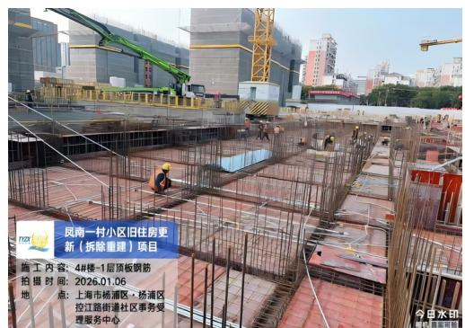

text_image

风南一村小区旧住房更新（拆除重建）项目
施工内容：4#楼-1层顶板钢筋
拍摄时间：2026.01.06
点：上海市杨浦区·杨浦区
控江路街道社区事务受
理服务中心

项目施工图

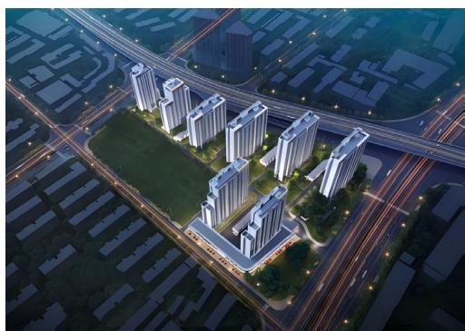

natural_image

Aerial rendering of a modern high-rise residential complex at dusk, surrounded by roads and green spaces (no visible text or signage)

建成后的效果图

## 案例

## 三门路“同济科技未来中心”项目

面对城市发展中棘手的“烂尾楼”问题，同济科技敢于担当，通过全面的法律、财务与工程风险评估，以“债务重组方式进行收购”，成功盘活位于新江湾城核心区、轨交10号与20号线上盖的益田假日广场烂尾项目，并将其重新定位为“同济科技未来中心”。该项目占地面积26456.60平方米，总建筑面积达179007.22平方米，规划建设为聚合科创办公、人才公寓、活力商业的“绿色智能未来产业园区”。

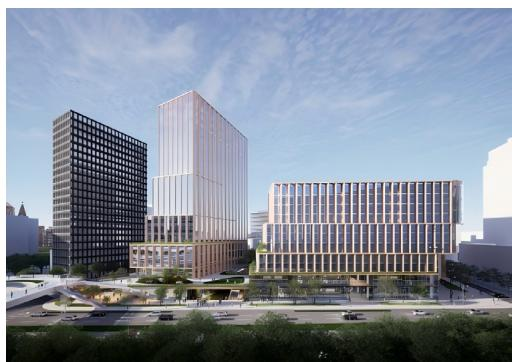

natural_image

Exterior view of modern office buildings with glass facades and surrounding urban landscape (no signage or text visible)

项目效果图

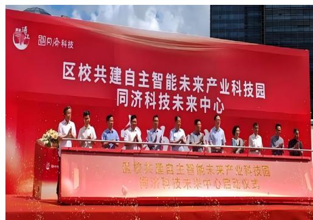

text_image

国风余科技
区校共建自主智能未来产业园
同济科技未来中心
区校共建自主智能未来产业园
同济科技未来中心启动仪式

项目启动仪式

##

公司积极响应国家“双碳”战略，将绿色低碳与数字化、智能化作为赋能城市更新高质量发展的核心引擎。立足“科技+ESG”发展理念，公司将数智化技术与绿色低碳理念深度融入城市更新全过程，聚焦BIMA、数字孪生等前沿技术应用，推动城市更新从“传统改造”向“智慧低碳”转型，打造兼具韧性、低碳与高效的城市更新样本，助力实现“双碳”目标与城市高质量发展的有机统一。

## 案例

##

公司旗下同济检测积极响应城市更新过程中的数智化与绿色化转型需求，将绿色低碳检测与数智化技术深度嵌入城市更新全流程，在低碳发展方面，聚焦建筑节能、能效测评、绿色建筑评价、超低能耗及近零能耗建筑检测领域，探索建筑碳计量与核算的创新模式，为城市更新低碳转型提供精准数据支撑；在智慧赋能方面，通过应用无人机巡检、A视觉检测、数字孪生、物联网传感等前沿技术，实现房屋病害智能识别与结构实时监测，推动城市更新从“传统改造”向“智慧低碳、安全可控”转型，为国家“双碳”目标的落地与城市精细化治理贡献力量。

## 案例

##

公司旗下天佑咨询自主研发了“碳96一天佑智慧碳管理系统（TYSmart-C+）”，致力干破解碳数据管理难题。在湖北省“青山区21街危旧房合作化改造项目”中，公司创新采用了“BIM+ 天佑碳 96”双引擎驱动模式，该实践为量大面广的城市更新项目提供了“可复制的低碳数字化样本”，推动了建造过程从“经验减排”向“数据决策”的智能化转型。

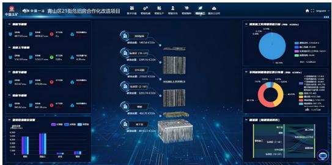

flowchart

This image displays a comprehensive dashboard for the Qingshan District 210 project, featuring a central overview of project data and three pie charts detailing the distribution of project types.

智能化模型效果图

## 案例

##

项目总建筑面积约35.9万平方米，涵盖3座超高层塔楼及商业配套设施，施工面临场地狭小、超高层垂直运输难、多专业协同复杂等多重挑战，同济科技·慧之建作为BIM顾问，以数字化把控为核心。全程赋能项目的设计与施工全过程，成为项目高质量推进的关键力量。

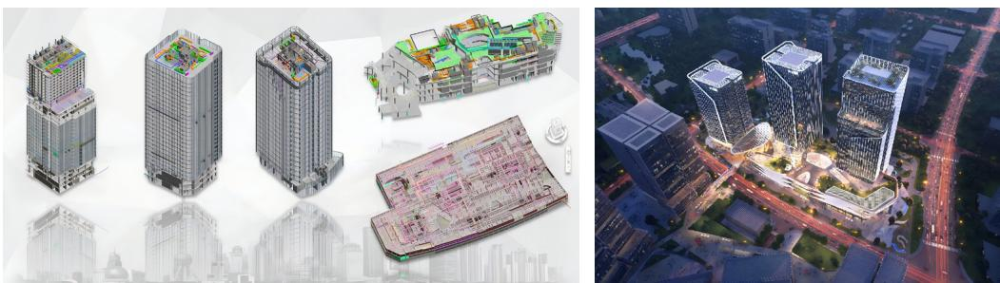

## 聚焦民生福祉，重塑城市更新活力

城市更新的核心在于“以人为本”，同济科技始终将增强居民的获得感、幸福感、安全感作为城市更新的出发点与落脚点。依托“大全咨”全产业链综合服务能力，公司在项目实施中以匠心品质保障民生工程高效推进在业务发展中积极对接社区需求，推动企地良性互动，确保更新成果真正惠及居民、激活社区，让城市更新既具“颜值”又有“温度”，切实提升居民的获得感、幸福感、安全感。城市更新的安全底线是民生福祉的核心保障，同济检测聚焦老旧小区、既有建筑更新场景，承接上海浦东、杨浦、虹口等区县政府委托的老旧房屋安全性检测、抗震鉴定、危房排查，以及基坑施工影响检测、地下管网探测、幕墙安全鉴定等专项服务精准解决老旧建筑安全隐患、居住品质短板等民生痛点，让城市更新更具安全保障与民生温度。

## 案例

##

杨浦区五角场邯郸路500弄、524弄小区旧住房更新(拆除重建)项目总建筑面积37,600平方米规划建设2栋（5栋单元楼）住宅楼，共计688户，旨在改善居民居住条件、提升区域城市形象。公司面对“场地狭小、工期紧张、环保要求严苛”等多重挑战，凭借“高度的责任感和使命感”，提前实现主体结构封顶，为688户居民早日回迁新居奠定了坚实基础。

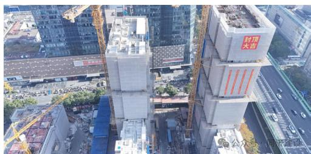

natural_image

Aerial view of a large industrial building under construction with cranes and surrounding urban buildings (no visible text or symbols)

2025 年 11 月 30 日结构封顶

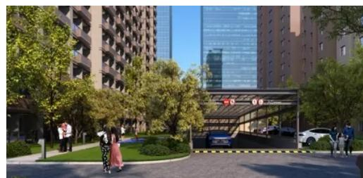

natural_image

Exterior view of a modern residential building complex with green landscaping and pedestrians (no signage or text visible)

建成后效果图

## 案例

##

该小区建于1987年，总建筑面积53.474平方米，涉及18栋建筑、1.142户居民。项目面临1-4号“飞楼”与主体小区相距80米的空间结构难题。公司提供系统性更新方案，系统性解决18栋建筑屋面老化渗漏问题，提升防水与保温性能；对公共及相关设施进行整体更新与功能性修复；针对“飞楼”特殊情况，规划设计具备针对性的连接与一体化改造方案。

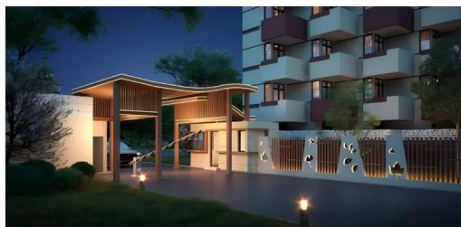

natural_image

Exterior view of a modern residential building at dusk, featuring a multi-story building with a wooden structure and illuminated entrance (no signage or text visible)

项目效果图

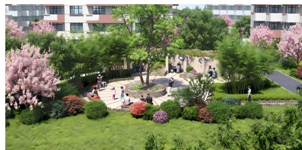

natural_image

Exterior view of a landscaped park with blooming pink trees, green lawns, and modern buildings in the background (no signage or text visible)

项目效果图

深中通道项目桥梁工程

本章节严格参照《上海证券交易所上市公司自律监管指引第14号 可持续发展报告（试行）》的要求具体对应于该指引文件的第五章“可持续发展相关治理信息披露 具体包括第一节“可持续发展相关治理机制”和第二节“商业行为”，并进行了详尽的阐述和分析

## 01 扬帆奋楫强基固本护航稳健发展

同济科技坚持以党建为统领，强化政治建设、夯实基层组织、深化作风建设，以党建赋能企业发展：持续完善治理结构、健全治理体系，推动董事会建设，切实保障股东权益，筑牢治理根基：严守合规经营底线强化风险管控、坚持依法运营、抵制不正当竞争，健全申诉举报机制，守牢发展安全边界。

联合国可持续发展目标（SDGs）响应：

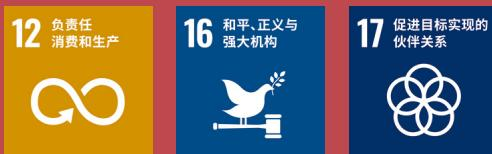

## 坚持党建引领

公司始终将坚持党的领导、加强党的建设作为企业发展的根本保证，将党建工作深度融入公司治理与生产经营全过程，以高质量党建引领保障企业高质量发展。公司强化政治引领、活学实干提效、夯实组织基础、狠抓反腐倡廉，将党的政治优势、组织优势转化为企业的创新优势、发展优势和竞争优势，以高质量党建引领保障高质量发展。

## 强化政治引领

公司党委和领导班子始终把政治建设摆在首位，坚持以习近平新时代中国特色社会主义思想为指导，全面学习贯彻党的二十大及历次全会精神，扎实开展深入贯彻中央八项规定精神学习教育，严格落实“第一议题”制度，围绕中央城市工作会议精神、发展新质生产力、复兴岛规划建设等国家战略与前沿领域开展深入学习，为推动公司战略深化与创新转型提供坚强的理论武装和方向指引。

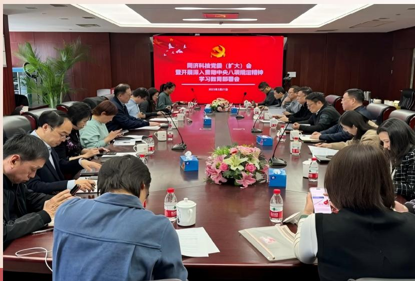

text_image

同济科技党暨（扩大）会
暨开展暨入圆梅中央八碳能定精神
学习暨胃部咨会
2013年3月17日

召开党委扩大会议暨深入贯彻中央八项规定精神学习教育动员部署会  
开展党委理论学习中心组学习会

## 活学实干提效

公司各基层党组织立足实际创新学习载体，以沉浸式、情境式教学推动理论学习走深走实，让红色基因在实践中传承，让党建优势转化为发展动能。同济检测组织党员赴龙华烈士陵园、上海人民城市实践展示馆、复兴岛等地开展现场教学，举办“歌声中的中国”音乐党课，观看《南京照相馆》等红色影片。有效提升学习参与度与获得感：同济建设党支部围绕“党旗耀亮工地”品牌，在重点项目中建立临时党支部，全年在5个在建项目设有临时党支部，6个项目开展党建联建活动，推动党员将学习成果转化为解决项目管理、技术攻关的实际方案，推动党建与业务同频共振。

text_image

中华人民共和国人民代表大会
“人民代表人、大明盟与英民相册”
推荐书

## 夯实组织基础

公司持续优化基层党组织建设，按时完成子公司支部换届，调整优化支委人员配置，注重培养和选拔既懂党建又精通业务的复合型人才充实党组织队伍，同时指导各支部严格执行“三会一课”制度，高质量开展组织生活会和民主评议党员。

## 狠抓反腐倡廉

公司严格遵守《中华人民共和国反不正当竞争法》《中华人民共和国反垄断法》等法律法规，印发《关于加强反舞弊、反腐败、反商业贿赂建设的通知》，以廉洁管理为重心，深化商业道德建设，致力干营造健康透明的商业环境。公司坚决杜绝接受贿赂、回扣等不正当利益行为，从严落实纪检工作要求，并将反商业贿赂纳入监督与考核体系，层层压实廉洁从业责任。

## 报告期内

公司未出现重大诚信经营违规事件，无腐败行为发生，未涉及任何国内外不正当竞争相关的法律诉讼。

## 关注领域

## 我们的行动和成果

## 健全组织

·公司党委内设纪律检查委员会，下属各企业党支部设纪检委员，协助党委推进全面从严治党、加强党风建设和组织协调反腐败工作  
·公司设立审计部，协助审计委员会建立健全反舞弊机制。杨浦区纪委监委通过“派驻组”方式，指导公司开展正风肃纪反腐各项工作

## 完善机制

·公司制定《内部审计管理制度》《控股子公司领导人员任期经济责任审计办法》等制度，明确对重要经济行为、高风险领域的管理、监督。通过员工手册、廉洁承诺等方式，落实个人廉洁从业责任

## 关注领域

## 我们的行动和成果

## 加强监管

·公司常态化开展内部审计，联动纪检监督，关注和检查经营活动中是否存在贪腐、舞弊行为  
·畅通举报渠道，严格执行举报人保护政策，鼓励员工及合作伙伴积极参与监督

## 筑牢防线

·常态化开展警示教育、廉洁教育，加大典型案例剖析和警示力度，提升全员的廉洁意识，持续巩固风清气正的良好生态

公司建立完善的举报管理与处理机制，确保全体员工及相关方可以在保密情况下，通过廉洁电话、廉洁邮箱、监察网站等渠道举报怀疑涉及本公司的违规行为。我们对举报者信息及权益保障做出严格要求确保举报者的身份得到保密，承诺员工不会因举报而受到不公平解雇、伤害或不当的纪律处分。

## 廉政廉洁联系方式

公司官网：https://www.tjkjsy.com.cn/contact

电话：021-65985860

邮箱：tjkjlzlj@tjkjsy.com.cn

## 案例

## 同济科技党委组织开展廉洁教育活动

2025年7月，公司党委组织党员参观“廉韵清风—上海图书馆藏近代文献中的中国共产党作风建设展”，深入推动抓好纪律教育与作风养成。此次活动是公司党委坚持“两个一以贯之”、深化作风建设，以全面从严治党新成效服务保障高质量发展的举措之一，党员同志们接受了一场深刻的思想洗礼。

## 夯实治理基石

公司严格遵循《中华人民共和国公司法》《中华人民共和国证券法》等法律法规及中国证监会、上海证券交易所的规定，建立健全的法人治理结构，形成权责清晰、分工明确、相互制衡、协调发展的治理体系。

## ★⭐★ 见证荣耀

万得 Wind ESG 评级成功跃升至 A 级

成功入选上证 580 指数

## 股东会

公司尊重并保障股东在股东会上的各项权利，包括但不限于表决权、提案权、质询权等，积极推动多元化的沟通机制，确保股东能够有效参与公司的重大决策。同时秉持股东平等原则，同等保护大小股东合法权益。

## 董事会

公司严格按照国家法律法规及上市公司自律监管指引要求，构建充满活力、精简高效、运转流畅的治理机制，持续提高董事会规范运作和科学决策水平，保障投资者权益，促进公司价值持续提升。公司注重董事会多元化建设，董事会成员共9名，其中外部董事7名，独立董事3名，公司董事会成员结构合理经验丰富，具备多元的专业背景，涵盖企业管理、财税、法律等专业，符合法律法规和上市公司监管要求。

## 见证荣耀

董事会荣获上市公司口碑榜“上市公司最佳董事会”奖

董事会秘书荣获2025中国上市公司英华奖“最佳董秘”奖项、第十九届中国上市公司阳光董秘”奖项、“上证鹰·金质量:2025精锐董秘”奖项

## 战略与可持续发展委员会

负责对公司长期发展战略和重大投资决策、可持续发展相关工作进行研究并提出建议

## 提名委员会

负责拟定董事、高级管理人员的选择标准和程序，充分考虑董事会的人员构成、专业结构等因素，并对董事、高级管理人员人选及其任职资格进行遴选、审核

## 审计委员会

负责审核公司的财务信息及其披露；监督及评估外部审计工作，提议聘请或者更换外部审计机构；监督及评估内部审计工作，负责内部审计与外部审计的协调；监督及评估公司的内部控制等事项

## 薪酬与考核委员会

负责制定公司董事及高级管理人员的考核标准并进行考核，负责制定、审查公司董事及高级管理人员的薪酬政策与方案

## 信息披露

公司严格遵循《中华人民共和国证券法》《上市公司治理准则》《上市公司信息披露管理办法》等相关法律法规及规定，修订《信息披露事务管理办法》《内幕信息及知情人管理办法》等制度，按时通过年度报告、中期报告等多种形式，全面履行信息披露义务，同时持续做好信息披露前的保密工作和内幕知情人登记备案工作，严把内幕信息传递关，严格避免发生内幕交易。报告期内，公司未发生信息泄露事件。

## 投资者关系

公司依据《上市公司投资者关系管理工作指引》，《上海证卷交易所股票上市规则》等相关法律法规及规范性文件，持续深化与投资者及潜在投资者之间的信息交流，围绕公司业绩、公司治理、发展战略、经营状况等投资者关心的问题，与投资者进行互动交流和沟通，增进投资者对公司的认知与认同，推动公司诚信自律、规范运营，提升公司投资价值。报告期内，公司召开3次业绩说明会。

## 关注领域

## 我们的行动和成果

## 投资者问题及时回复

·通过公司投关热线、投关邮箱、上证e互动等多种途径耐心解答各类投资者的相关问题

## 投资者关系渠道管理

·注重维护投资者关系管理渠道和平台，建立常态沟通机制，有效传递公司价值除业绩发布会外，定期维护官网和上证e互动平台，定期与投资者主动沟通听取建议，接待机构投资者，分析师调研以及投资者来电来访，持续拓展互动深度和广度，更好地向投资者展现综合实力，增进认同、稳定预期目提升价值

## 坚守合规经营

公司坚持依法合规经营，建立风险防控管理体系，强化内部审计监督，将合规经营理念融入公司运营和员工日常工作中，建立符合公司定位、具有建筑企业特色的合规管理体系，确保公司所有经营活动合法化规范化，同时多渠道开展多元化的守法合规培训，增强全员应对各项风险的控制能力。

## 风险管理

公司构建“董事会-审计委员会-审计部-子公司内控小组”的四级风险休系，通过事前授权、事由控制事后检查防范公司运营的各类风险，事前阶段，股份公司通过设立经营权限，对子公司“三重一大”事项实施报批制度；事中阶段，各子公司已基本完成基于企业内部控制应用指引的内部控制制度；事后阶段各子公司在半年度开展内部控制、资金和上市公司规范运作自查：同时年底由审计部组织各子公司开展资产盘点，并由审计部牵头实施内控专项检查。

## 合规管理

公司严格恪守企业价值观，将合规经营的理念深度融入公司运营以及员工的日常工作当中，持续健全守法合规的经营体系，确保公司所有商业活动合法目规范。公司严格遵循“守法经营、依法纳税”的经营准则，对业务全流程中的税务环节进行严格把控；严格设定各税种的纳税标准，规范税务申报流程，并着重进行风险控制。2025年，公司进一步加强对规章制度、经济合同、重大决策的法律合规审查，实现对“三重一大”事项的全面法律风险审查。选定合同管理和审核领域作为公司重点管理范畴，并开展专项法律培训。在重要投资项目以及重要涉诉案件中，为公司及各子公司提供法律支持。各子公司建立法律分析审查机制，总公司建立公司案件定期备案及汇总审核机制，完成对多家子公司涉诉风险业务的指导、跟踪等工作。

## 内控管理

公司严格遵循《企业内部控制基本规范》等法律法规，结合监管动态与业务发展需求，持续完善内控体系，制定并迭代更新《内部控制自我评价的管理办法》《对外担保管理制度》等制度文件。公司成立以审计部牵头的内部控制检查评价工作小组，常态化开展内控评估与优化工作，全面提升内部控制与经营管理水平，促进公司健康、可持续发展。公司建立系统化的内部审计管理体系，制定《内部审计管理办法》等制度文件，明确审计职责、流程与标准。公司审计部在董事会审计委员会的直接领导和指导下，独立开展内部审计工作。公司持续完善风险导向型审计模式，强化财务合规与合约管理效能，同步优化分级授权体系与审批监督机制，有效提升风险防控的精准性与前瞻性。报告期内，公司未发现重大经营风险或重要内控缺陷。

## ★⭐★ 见证荣耀

荣获“2024年度上市公司优秀财务管理奖”

武汉光谷生态大走廊旅游专线（武汉光谷空轨）

本章节严格参照《上海证券交易所上市公司自律监管指引第14号—可持续发展报告（试行）》的要求具体对应于该指引文件的第四章“社会信息披露”第二节“创新驱动与科技伦理”和第三节“供应商与客户”并对这些小节进行了详尽的阐述和分析。

## 02 追求卓越精工善建共筑城市未来

城市向新，品质先行。同济科技以“追求卓越”为价值引领，主动服务城市发展和民生需求，将ESG理念贯穿经营管理与业务实践全过程，持续提升产品品质，创新能力和安全保障水平，2025年，公司围绕筑造精益产品、培育创新生态、保护信息安全等重点方向，夯实品质根基，释放创新活力，强化安全保障，以精工善建之力共筑城市美好未来。

联合国可持续发展目标（SDGs）响应：

## 筑造精益产品

## 治理

公司严格遵循《中华人民共和国产品质量法》等法律法规，依据ISQ.9001等质量管理体系标准，构建完善的质量管理体系，严格实施岗位质量规范与责任考核，同时建立科学的组织架构，明确各岗位职责，确保监理、承建工程项目的全过程质量控制；持续完善工程质量与客户服务相关治理架构，构建“决策层引领、管理层统筹、执行层落地、监督层保障”的全链条管控体系，明确各层级职责分工，确保各项履责工作有序推进、落地见效。同时，公司将质量管控与客户服务纳入董事会重点关注事项，定期审议相关工作进展、重大问题及改进方案，为精益产品筑造提供顶层决策支持。

## 战略

公司围绕“营城兴产、共创未来”的战略方向，主动融入国家“双碳”发展战略和建筑行业高质量发展要求，以提升空间品质与功能价值为导向，持续推动工程质量与客户服务向精细化、标准化、智能化升级，依托区校协同资源和产学研合作平台，将科技创新、数字化应用与工程管理深度融合，推进BIM技术、数字孪生、智能监测等技术在施工、检测、监理等场景中的应用，不断提升质量管控效率和服务响应能力以精工善建助力城市品质提升和可持续发展。

natural_image

Illustration of a construction crane lifting a building, with green trees and buildings in the background (no text or symbols)

## 影响、风险和机遇管理

公司综合考量各利益相关方反馈及内部质量管理体系运行结果，系统识别产品和服务安全与质量因素带来的风险及机遇，并针对性制定和实施纠正与预防措施，强化质量控制。

## 产品和服务安全与质量相关风险和机遇分析

  
识别

  
评估

  
分析

从产品质量全生命周期出发，结合行业特性、业务发展情况、同业分析结果，识别梳理 9 项与产品和服务安全与质量相关的机遇和风险结合同业对标、专家判断，征求主要利益相关方意见，从发生概率、潜在财务影响程度两个维度进行实质性评估

通过分析主要产品和服务安全与质量风险和机遇，以及其对公司的潜在财务影响，制定初步应对措施，积极促进经济社会可持续发展

产品和服务安全与质量相关风险及机遇的影响和应对措施

<table><tr><td>风险/机遇描述</td><td>发生可能性</td><td>影响周期</td><td>潜在财务影响</td><td>应对策略</td></tr><tr><td>材料质量不达标,影响工程安全与质量,违背行业标准及ESG合规要求</td><td>低</td><td>中长期</td><td>负面:增加返工、材料更换成本,可能引发索赔,影响营收</td><td>建立供应商动态管理体系,实行准入-评估-淘汰机制,加强材料抽检,留存检测记录</td></tr><tr><td>施工工艺存在缺陷,导致工程质量不达标,存在安全隐患</td><td>中等</td><td>中长期</td><td>负面:返工成本增加、面临监管处罚,损害品牌信誉,影响项目续约</td><td>编制工艺标准手册,推行样板引路制度,加强施工人员技能培训,技术负责人现场管控</td></tr><tr><td>检测流程疏漏,未能及时发现质量隐患,影响检测结果真实性</td><td>低</td><td>短期</td><td>负面:小额返工成本,轻微影响品牌口碑,可能面临轻微处罚</td><td>推行影像+签字双留痕制度,引入第三方随机抽检,加强检测人员合规培训</td></tr><tr><td>质量问题引发品牌声誉受损,降低利益相关方信任</td><td>中等</td><td>中长期</td><td>负面:客户流失、获客成本增加,长期营收下滑,影响企业估值</td><td>严格落实高标准的质量检验规范与责任机制,常态化开展生产工艺优化与产品质量自查评估,前置质量隐患排查关口</td></tr><tr><td>数字化技术赋能质量管控,提升管控效率与精准度</td><td>高</td><td>中长期</td><td>正面:降低管控成本,减少质量隐患,提升项目履约效率,增加营收</td><td>推广数字孪生、BIM等技术应用,落地自主研发的管控平台,完善数字化体系</td></tr><tr><td>科研成果转化,提升产品与服务质量水平</td><td>高</td><td>中长期</td><td>正面:增强核心竞争力,拓展高端项目,提升项目利润率</td><td>深化与高校合作,依托产学研平台,推动科研成果落地应用于项目实践</td></tr><tr><td>资质升级,拓宽高质量服务场景</td><td>中等</td><td>中长期</td><td>正面:新增业务收入,拓展市场领域,提升行业影响力</td><td>持续完善资质体系,整合资源提升技术实力,积极申报高端资质</td></tr><tr><td>行业高质量发展政策红利,获得政策支持</td><td>中等</td><td>中长期</td><td>正面:获得政策补贴,降低运营成本,优先承接重点项目</td><td>紧跟行业政策导向,布局符合政策的高质量项目,争取政策支持</td></tr><tr><td>质量优化提升,增强客户信任与市场竞争力</td><td>高</td><td>中长期</td><td>正面:提升客户续约率,降低获客成本,扩大市场份额,提升品牌估值</td><td>持续强化全流程质量管控,定期开展客户回访,优化服务体验</td></tr></table>

注：短期指报告期当年：中期指未来1-3年：长期指未来3年以上

## 指标和目标

公司围绕工程质量管控与客户服务，加强指标监测与考核，全面跟踪各项工作成效，确保精益产品筑造相关履责工作落地见效，同时结合年度成效优化后续目标，推动质量与服务水平持续提升。未来，公司将进一步深化数字化转型，拓展智慧化应用场景，优化业务服务体系，持续提升服务质量和效率。

## 关注领域

## 我们的行动和成果

## 质量管理体系构建与优化

• 严格遵循《中华人民共和国产品质量法》，依据 ISO 9001 质量管理体系标准构建完善的质量管理体系，旗下同济建设、天佑咨询、同济管理、同济公路、慧之建等子公司均通过该体系认证

·完善质量管理制度，针对标书评审、合同管理、项目监理等环节制定专项流程，天佑咨询制定《标书和合同评审程序》，确保将客户需求转化为具体服务要求，保障服务质量

·报告期内，公司未发生因产品和服务安全与质量重大责任事故而受到行政处罚的情形

## 项目全生命周期质量管控

• 定期开展质量风险评估工作，通过动态监控及时发现并解决潜在质量隐患

·公司层面同步监管结构安全节点，天佑咨询针对项目监理过程中的质量偏差问题，制定《事故、事件、不合格服务控制程序》，明确运营管理部为归口管理部门，跟踪整改进度

·开展全方位质量培训，培训内容涵盖法规解读、标准宣贯、经验分享

## 客户服务体系完善与满意度提升

构建全流程服务体系，工程咨询领域打造一站式全过程工程咨询服务，涵盖项目策划、设计咨询等环节；项目管理领域通过数字化平台实时共享项目进度与质量信息；房产开发领域制定《客户服务管理办法》，建立客户信息档案

·优化客户投诉处理机制，子公司同济管理制定客户投诉处理流程，通过专属投诉通道接收反馈，经归类、处理、跟踪督导形成闭环管理；天佑咨询制定《争议投诉控制程序》，确保客户投诉得到及时响应

·开展客户满意度调查，定期通过电话、邮件、现场走访等方式收集客户反馈，规范调查流程，为服务优化提供数据支撑

## ★⭐★ 见证荣耀

黄茅海跨海通道荣获桥梁界“诺贝尔奖”—乔治·理查德森奖

天佑咨询提供监理服务的两项目荣获全国市政工程行业最高奖

合肥合庐产业新城龙桥路项目、武汉光谷生态大走廊旅游专线一期工程荣获市政工程“最高质量水平评价工程”

## 培育创新生态

## 治理

公司成立以“创新发展工作领导小组”为核心的决策层，统筹中长期创新战略、重点项目布局与资源配置，下设创新发展中心作为执行层，负责创新项目的立项评审、进度跟踪、成果评价等全过程管理，并明确各子公司为创新实施主体，形成“领导小组 - 创新发展中心 - 子公司”三级联动机制；依托《同济科技创新发展项目管理办法（试行)》，建立创新项目分层管理模式，将项目划分为“重点项目”与“一般项目”。重点项目由股份公司统筹推进，一般项目由子公司自主管理。同时明确项目从预研究、立项、实施到成果转化的全流程规范，涵盖变更管理、阶段汇报、结项评审等关键环节，形成闭环管理机制。

## 战略

公司将培育创新生态纳入战略核心，紧扣“城乡建设与发展领域价值提升综合服务商”的定位，以“科技创新为核心、数字化智能化为支撑、产学研融合为路径、成果转化为目标”为战略主线，重点聚焦四大方向：一是完善科技创新管理体系，强化顶层设计与基层执行的协同；二是构建知识产权全生命周期保护体系，筑牢创新成果安全屏障：三是深化产学研融合，挖掘高校优势技术资源，推动成果市场化转化；四是推进数智化赋能转型，培育新质生产力，助力业务绿色化、智能化升级。公司优化资源配置模式，为重点创新项目提供稳定资金保障。深度衔接国家“十五五”规划与新质生产力发展要求，确保创新战略与国家政策、行业趋势同频共振。加强区校合作与产业联盟联动，整合内外部创新资源，推动创新战略高效落地。

## 影响、风险和机遇管理

公司立足行业特性与自身技术优势，深入识别创新风险与机遇，精准评估数字化转型、智能化升级等新兴技术应用的影响，并制定应对策略，通过强化风险控制机制，利用大数据和人工智能等技术提升风险预警能力，确保创新过程稳健推进，持续推动工程咨询行业技术升级与产业升级。

## 研发创新相关风险和机遇分析

## 识别

## 评估

## 分析

从分析影响创新生态培育的核心因素出发，结合行业特性、业务发展情况、同业分析结果，识别梳理10项与研发创新相关的机遇和风险结合同业对标、专家判断。征求主要利益相关方意见，从发生概率、潜在财务影响程度两个维度进行实质性评估

通过分析公司研发创新风险和机遇，以及其对公司的潜在财务影响，制定初步应对措施，积极促进经济社会可持续发展

研发创新相关风险及机遇的影响和应对措施

<table><tr><td>风险/机遇描述</td><td>发生可能性</td><td>影响周期</td><td>潜在财务影响</td><td>应对策略</td></tr><tr><td>技术关键领域攻关存在不确定性,可能导致研发项目失败,无法达成预期目标</td><td>中等</td><td>中期</td><td>负面:研发投入无法回收,增加费用、压缩利润,影响现金流及后续研发投入</td><td>建立研发可行性论证及风险防控机制,加强产学研协同,分阶段推进并及时止损</td></tr><tr><td>技术成果规模化推广存在阻碍,研发投入难以通过产业化回收</td><td>中等</td><td>中期</td><td>负面:研发投入沉淀,增加沉没成本,降低研发回报率,影响现金流周转</td><td>深化产学研协同,优化技术适配性,依托政策及资源加快成果市场化推广</td></tr><tr><td>核心技术面临侵权、布局不合理等问题,可能导致知识产权流失或引发纠纷</td><td>中等</td><td>中期</td><td>负面:丧失技术优势、影响营收,增加纠纷处置成本,制约海外拓展</td><td>健全知识产权管理制度,加强监测与合规审查,优化专利布局并依法维权</td></tr><tr><td>核心研发人才稀缺,行业竞争激烈,可能导致人才流失、研发滞后</td><td>中等</td><td>中期</td><td>负面:研发延期、成本上升,技术迭代放缓,引发技术泄漏及营收影响</td><td>完善人才激励与培养体系,营造良好研发氛围,签订协议防范技术泄漏</td></tr><tr><td>双碳及绿色技术相关政策调整,可能导致研发方向偏离、补贴无法获取</td><td>低</td><td>中期</td><td>负面:研发投入无法回收,费用压力增加,项目停滞产生沉没成本</td><td>建立政策监测机制,对接政策导向优化研发布局,积极争取政策资金支持</td></tr><tr><td>国家及地方出台绿色技术创新扶持政策,可获得资金及政策保障</td><td>高</td><td>长期</td><td>正面:降低研发成本,缓解现金流压力,提升研发回报率,加速项目落地</td><td>积极对接政策,争取各类扶持与税收优惠,依托资源优化研发布局</td></tr><tr><td>双碳目标下,绿色技术市场需求增长,可依托技术优势拓展市场</td><td>高</td><td>长期</td><td>正面:提升营收与盈利水平,扩大市场份额,增强品牌影响力</td><td>聚焦市场需求优化研发,加快成果转化,加强品牌建设与市场拓展</td></tr><tr><td>依托高校资源,提升研发效率、解决技术难题,保障人才供给</td><td>高</td><td>长期</td><td>正面:降低研发成本、缩短周期,提升成果质量,减少人才短缺风险</td><td>深化高校协同合作,共建研发平台,开展协同育人与资源整合</td></tr><tr><td>绿色、数字化技术快速迭代,可依托现有优势实现核心技术突破</td><td>高</td><td>长期</td><td>正面:提升产品竞争力与市场份额,形成技术壁垒,挖掘盈利增长点</td><td>持续加大研发投入,建立技术迭代机制,鼓励原创并借鉴先进经验</td></tr><tr><td>依托研发优势,主导或参与相关行业标准制定,提升话语权</td><td>中高</td><td>长期</td><td>正面:提升品牌竞争力,带动营收增长,增强可持续发展能力</td><td>积极参与标准制定,加强协作推广,以标准引领产品优化与行业交流</td></tr></table>

注：短期指报告期当年：中期指未来1-3年：长期指未来3年以上

## 指标和目标

公司持续完善研发治理体系，科学设定创新指标与目标。报告期内，公司依托深入的市场调研与敏锐的行业洞察力，充分发掘创新潜力，成功推出多项解决方案，全面实现预期的研发目标。各研发项目均按计划稳步推进，项目开发与技术创新成效显著。结合核心业务需求，公司聚售于研发投入、人才培养、成果转化以及技术应用等关键领域。通过跟踪年度成效并优化中长期规划，推动研发创新与业务的深度融合，助力提升公司的核心竞争力。

## 关注领域

##

## 构建研发体系

·制定并实施《创新发展项目管理办法（试行）》，成立创新发展工作领导小组，统筹规划中长期创新战略、审定重点研发项目

·建立多元化创新激励机制，通过“揭榜挂帅”“联合创新”“团队奖励”等方式对重点项目给予资金支持；将年度创新情况纳入子公司考核体系，加大考核权重，激发全员创新活力

·精准识别创新风险与机遇，针对人员流失、技术更新、数据安全等风险制定应对策略：依托阶段性技术评审会动态监控研发项目，确保研发方向贴合市场需求

## 构建研发体系

·优化研发团队结构，截至2025年底，研发团队共494人，团队年龄结构覆盖多个年龄区间，形成老中青结合、专业互补的人才梯队

·加强研发人员培养，通过不定期组织内外部培训、鼓励参与项目实践等方式提升团队创新思维与专业技能：推动人才与高校科研资源联动，培养复合型创新人才

## 知识产权保护与转化

·完善知识产权管理流程，子公司天佑咨询制定《知识产权管理程序》，同济建设明确专利归口管理部门，规范专利申请、维护、转让等全流程

2025年，公司新增利申请数14项、发明专利授权数13项；截至2025年底，公司累计已授权并维持有效专利189项

## 产学研协 同创新

·与同济大学环境科学与工程学院、土木工程学院等高校科研机构签订合作协议围绕智慧城市、绿色建筑、智慧水务等领域联合开展科研项目攻关

·积极参与国家及行业标准制定，截至2025年底，公司及旗下子公司主编、参编各项标准累计94项，为行业技术规范发展贡献力量

·联合同济大学建筑设计研究院等8家单位发起成立“城乡建设与发展绿色低碳产业联盟”：主办、协办长三角绿色转型发展论坛等行业交流活动，促进绿色低碳技术推广与应用

荣获中国上市公司产业发展论坛“未来产业之星·未来空间”奖

## 保护信息安全

公司始终高度重视信息安全保护工作，通过建立健全制度体系、强化技术防护、实施精细化管理并持续改进构建覆盖数据全生命周期的安全防护体系，有效保障运营安全、商业秘密与客户合法权益。

## 信息安全

公司严格遵守《中华人民共和国网络安全法》《中华人民共和国数据安全法》等法律法规，制定《数字化项目暂行管理办法》《网络安全制度管理办法》等相关制度，构建完善的信息安全管理体系，并推动旗下子公司同步建立标准化信息安全管理制度，确保公司及子公司信息系统的安全稳定运行，切实保障客户隐私与数据安全。为系统化防范信息安全风险，公司持续推进管理体系的标准化建设。报告期内，公司未发生任何信息安全与隐私保护违规事件

## 客户隐私

公司高度重视客户隐私权益，坚持“合法收集，规范存储，最小使用，全程保护”的原则，通过建立制度与实施多维度的技术措施，将客户隐私保护措施嵌入业务流程的各个环节，并定期对员工进行客户隐私保护知识的培训，同时建立监督机制，对违规行为进行处罚。报告期内，公司未发生泄露客户隐私事件。

## 知识产权

公司恪守《中华人民共和国商标法》《中华人民共和国专利法》《中华人民共和国著作权法》等法律法规指导下属企业制定《知识产权管理制度》等一系列制度文件，不断提高知识产权保护工作的合规性：高度重视保护自身和他人的知识产权，通过不断优化商标注册，软件著作权登记，专利电请管理等工作流程。加强知识产权保护的力度：借助商标监测、诉讼维权等手段，确保自身的合法权益不受侵犯

text_image

黄茅海跨海通道工程

本章节严格参照《上海证券交易所上市公司自律监管指引第14号—可持续发展报告（试行）》的要求具体对应于该指引文件的第四章“社会信息披露”。本章内容将全面覆盖该章节第四节“员工”，并进行详尽的阐述和分析。

## 03 同舟共济 凝聚共识广聚四方英才

同济科技秉持“同舟共济”的核心理念，强化员工权益保障工作，完善薪酬福利体系与民主管理机制，拓展人才引入渠道：构建完备的全周期培训体系，畅通职业晋升通道，助力员工实现成长与发展：丰富企业文化建设载体，深化员工关怀措施，营造和谐融洽的职场氛围：严格坚守安全生产底线，加强隐患排查与应急管理工作，扎实推进安全培训教育。通过全方位的人才建设实践，凝聚员工的力量，推动企业与员工携手共进、实现共赢发展。

联合国可持续发展目标（SDGs）响应：

## 保障员工权益

公司以《中华人民共和国劳动法》《中华人民共和国劳动合同法》《中华人民共和国妇女权益保障法》《禁止使用童工规定》等法律法规作为根本遵循，精心制定合法合规、严谨完善的用工制度。公司高度重视员工满意度，积极搭建起开放民主的沟通桥梁，员工诉求得以顺畅传递，从多维度切实保障员工权益让员工能够安心工作、舒心发展，努力实现员工与公司的共同发展。2025年，公司员工劳动合同签订率88%，社会保险覆盖率82%。

## 2025 年

员工劳动合同签订率

88%

社会保险覆盖率

82%

## 关注领域

## 我们的原则

• 严格核查员工身份，杜绝招募童工  
·严格遵守法律法规和公司相关政策，规范员工招聘与离职流程，与全体员工进行平等协商，依法签订劳动合同  
·坚决反对就业歧视，确保员工录用和职业发展不受种族、信仰、性别、宗教、国籍、民族、年龄、婚姻状况、身体状况、社会地位等任何因素的影响

## 平等雇佣

## 薪酬保险

·以市场水平为定薪依据、以绩效考核结果为分配导向  
·按时、足额缴纳五险一金

## 福利待遇

·员工享有国家规定的各类假期待遇，例如法定节假日、年休假、探亲假、病伤假、婚假、产假与陪护假、丧假、事假等

·提供补充医疗保险、企业年金计划等多重福利

·提升员工体检标准，优化员工年休假使用期限

·开展各项文体活动，丰富员工日常工作生活

## 民主管理

·以职工代表大会制度推动民主管理  
·建立工会组织，维护员工权益

## 助力员工成才

公司高度重视人才价值，针对不同员工开展多层级培训，不断完善培训体系并创新方式，将人才培养从项目化向体系化升级，为员工提供多元成长路径，助力公司发展及战略目标达成。2025年，公司紧密遵循年度计划框架，有序开展了一系列涵盖综合素养、专业技能、管理能力及安全意识的培训项目；围绕战略发展目标与员工能力提升需求，系统规划并实施“济承者”系列培训计划

## 关注领域

## 我们的行动

·公平晋升机制：建立基于能力、业绩和潜力的晋升体系，定期开展晋升评审，确保优秀员工得到及时晋升  
·岗位轮换机会：提供丰富的岗位轮换和内部调配机会，让员工在不同岗位上积累经验拓宽视野，为职业发展打基础  
·跨部门合作项目：鼓励员工参与跨部门项目，提升综合能力，增加职业发展可能性

## 丰富员工 培训

·线上线下混合式学习：采用线上线下相结合的学习方式，提供便捷、高效的学习体验，员工可根据自身情况灵活选择学习时间和地点  
• 内部培训与专家授课：组织内部培训，邀请行业专家和内部资深技术人员授课，提升员工专业素养

## 培养专业 人才

• 实践锻炼平台：为专业人才提供实践平台，使其将理论知识与实际工作相结合，提升专业技能  
·技术交流与知识传承：开展技术交流、案例分析等活动，促进专业人才之间的经验分享和知识传承，提升团队整体专业水平  
·行业竞赛与展示机会：积极组织员工参加行业内的各类技能竞赛和评选活动，为专业人才提供展示自我的机会，提升其个人荣誉感和公司行业影响力

## 案例

## 凝聚智慧力量 续写发展新篇—同济科技中高层管理者综合能力提升研修班（第二期）圆满结业

2025年11.月28.日，同济科技中高层管理者综合能力提升研修班第二期结业典礼隆重举行。本期研修班的成功举办，是公司深入实施"人才强企"战略、系统推进于部梯队建设、加速构建学习型组织的重要举措，充分体现公司将人才队伍建设置于战略高位的远见卓识。

## 案例 人才领航 智启未来 同济科技“济承者”训练营开班

2025年4月22日，同济科技“济承者”训练营内训计划正式启动，并成功举办首场专题培训《AI技术构架与 DeepSeek 应用》。“济承者”训练营以“人才强企”为核心，旨在整合内部资源、汇聚公司专家和业务骨干，提升全员专业技能与综合素质。

## 关爱员工生活

公司致力于为员工提供全方位的保障，密切关注员工诉求，关怀员工生活，全面做好员工关怀工作，积极组织各类文体活动，营造温馨、团结、真诚、互助的组织氛围，切实提升员工的幸福感和归属感。

## 关注领域

## 我们的行动

## 员工健康

持续关注员工身心健康，明确员工健康管理职能部门，系统推进健康管理工作通过定期体检、心理健康培训等多元化举措，持续关注员工身心状态，将身体健康管理与心理健康教育有机结合，营造积极向上的职场氛围，提升员工幸福指数

## 女性员工

·严格遵守《女职工劳动保护特别规定》，积极践行性别平等理念，营造多元包容的企业文化。公司规范执行国家规定的产检假、产假及哺乳假等制度，构建覆盖招聘、职业发展、岗位安排及特殊情况处理的全周期女性权益保障机制  
·在日常管理中，公司通过定制化体检项目、岗位适应性评估及晋升评审监督等举措，系统落实女职工特殊劳动保护  
·定期开展妇女节主题关怀活动，将法律义务履行与人文关怀有机结合，形成立体化权益保障模式，持续优化职场平等环境，促进员工与企业共同发展

## 困难员工

深切关怀困难员工，采取实际行动提供支持，传递企业温暖。公司设立帮困基金，专项用于帮扶困难职工；定期开展退休职工慰问活动，为退休职工送上节日慰问和祝福，彰显人文关怀

## 文体活动

定期组织丰富多彩的团建活动，通过户外拓展、文化沙龙、趣味运动会等形式，增强团队凝聚力，营造积极向上的企业文化氛围，让员工在轻松愉悦中感受企业温暖，提升归属感和幸福感

text_image

同心协力展风采
SPORTS
扬帆奋楫向未来
同心科技2019年职工趣味运动会
TV战队

同济科技趣味运动会

natural_image

Group photo of young women posing with yoga pose in a gymnasium (no visible text or symbols)

瑜伽活动

text_image

Group photo of people gathered around a table with packaged products, featuring visible Chinese text on packaging and screen in the background.

健步行活动

text_image

Group photo of people holding flower bouquets in a meeting room with a presentation screen displaying Chinese text and party emblem.

端午养生讲座

## 筑牢安全底线

## 治理

公司始终秉持“安全第一、预防为主、综合治理”的核心方针，严格遵循《中华人民共和国安全生产法》《中华人民共和国职业病防治法》等法律法规要求，将安全生产理念深度融入城乡建设、环境治理、数智服务等全业务链条，通过完善治理体系、强化战略引领、精准风险管理、量化指标管控，在安全生产管理强化应急能力提升、隐患排查落实、安全培训开展等方面取得显著成效，为员工生命健康、企业稳健运营及社会和谐稳定筑牢坚实屏障。2025年，公司进一步完善“集团统筹、子公司落实、岗位尽责”的三级安全治理架构，形成“战略决策-统筹协调-专业执行”的闭环管理模式。同时，公司持续深化ISO.45001职业健康安全管理体系运行，将安全管理要求嵌入项目策划施工监理、运营维护等全生命周期环节。

## 战略

公司高度重视职业健康与安全生产，明确将“零重大安全事故、零职业病发生、安全培训全覆盖”作为核心发展目标，推动安全管理与双碳战略、数智化转型、国际化拓展等关键业务协同发展。在施工建设领域聚售深基坑作业、高空作业、有限空间作业等高危场景，制定专项安全保障方案：在环保运营领域，针对污水处理厂有毒有害气体监测、污泥处置设备运维等风险点，优化安全操作流程；在海外业务领域，结合“一带一路”项目所在区域的政策法规与环境特点，制定差异化安全管理标准，为阿斯塔纳轻轨后续运维、津巴布韦水井项目建设等提供安全保障。

## 影响、风险和机遇管理

公司通过系统性评估项目全生命周期中的职业健康与安全因素，全面识别施工、运营等环节的潜在风险与机遇，制定应对策略，切实保障一线员工的职业健康与安全权益。

职业健康与安全生产相关风险和机遇分析  
  
识别

  
评估

  
分析

推动安全战略从“被动防控”向“主动预警”转型，结合行业特性、业务发展情况、同业分析结果，识别梳理8项与职业健康与安全生产相关的机遇和风险

结合同业对标、专家判 断，征求主要利益相关 方意见，从发生概率、 潜在财务影响程度两个 维度进行实质性评估

通过分析主要职业健康与安全生产风险和机遇，以及其对公司的潜在财务影响，制定初步应对措施，积极促进经济社会可持续发展

职业健康与安全生产相关风险及机遇的影响和应对措施

<table><tr><td>风险/机遇描述</td><td>发生可能性</td><td>影响周期</td><td>潜在财务影响</td><td>应对策略</td></tr><tr><td>施工现场安全事故风险(工程施工、设备安装、环保运营环节因操作不规范、防护缺失、设备故障引发坍塌、高处坠落、机械伤害等安全事故)</td><td>中等</td><td>短期-中期</td><td>负面:产生直接经济损失,包括事故赔偿、行政罚款、设备维修等费用;同时可能导致项目停工、营收减少,以及保险成本上升等间接财务影响</td><td>强化施工现场安全管控,推进智慧工地建设,完善安全巡检与隐患排查机制;加强现场安全监管与人员管理,定期开展安全应急演练,提升安全防控能力</td></tr><tr><td>职业健康危害风险,如粉尘、噪声、化学品接触及高空作业引发尘肺病、职业中毒等职业病,触发劳动纠纷与监管处罚</td><td>中等</td><td>中期-长期</td><td>负面:增加工伤医疗、赔付相关支出,可能产生劳动诉讼费用;同时可能因员工健康问题导致人力成本上升、核心员工流失,影响生产运营效率</td><td>加强作业场所职业健康管理,开展职业健康监测与员工体检,配备必要的防护用品;优化作业环境与工艺,建立员工健康管理体系,防范职业病发生</td></tr></table>

<table><tr><td>风险/机遇描述</td><td>发生可能性</td><td>影响周期</td><td>潜在财务影响</td><td>应对策略</td></tr><tr><td>安全生产合规风险,未及时适配《中华人民共和国安全生产法》《中华人民共和国职业病防治法》等新规,合规管理疏漏被责令整改、停产或行政处罚</td><td>低-中等</td><td>短期</td><td>负面:可能面临行政罚款、停产整改带来的营收损失,同时可能影响项目投标资格,对公司业务拓展与品牌形象造成财务层面的间接影响</td><td>跟踪安全生产相关法律法规更新,完善合规管理体系,加强合规审核与管控;开展全员安全合规培训,提升合规意识,确保各项活动符合监管要求</td></tr><tr><td>供应链安全传导风险,分包商、供应商安全管理薄弱引发连锁安全事故,损害公司品牌与项目交付</td><td>中等</td><td>短期-中期</td><td>负面:可能因项目延误产生相关损失,增加供应链重构成本;同时品牌声誉受损可能影响客户合作,进而对公司营收与市场竞争力造成不利影响</td><td>将职业健康与安全生产要求纳入供应链管理,加强对分包商、供应商的安全审核与管控;开展安全管理指导,防范供应链安全风险传导</td></tr><tr><td>安全管理体系升级机遇,对标ISO45001,满足大客户与监管高标准</td><td>高</td><td>长期</td><td>正面:降低安全事故与合规风险带来的财务损失,提升运营效率;同时有助于满足大客户合作要求,增强市场竞争力,实现长期财务增值</td><td>搭建一体化职业健康与安全生产管理体系,对标国际标准完善管理流程;推进数字化、智能化安全管理建设,提升安全管理规范化水平</td></tr><tr><td>职业健康人才赋能,完善保障体系,提升员工归属感与生产率</td><td>高</td><td>中期-长期</td><td>正面:降低员工流失及与健康相关的人力成本,提升员工工作效率与凝聚力;完善员工保障体系,增强企业人才吸引力,为公司长期稳定发展提供支撑</td><td>完善员工职业健康保障体系,打造“安全优先”的企业文化;加强员工安全与健康培训,建立激励机制,提升员工职业健康与安全意识</td></tr><tr><td>融资机遇,高标安健环绩效提升ESG评级,降低融资成本</td><td>中等</td><td>长期</td><td>正面:提升公司ESG评级,有助于降低综合融资成本;增强品牌美誉度与社会认可度,拓展优质政企合作项目,实现品牌价值与财务效益双提升</td><td>将职业健康与安全生产绩效纳入ESG信息披露,主动公开管理实践;参与行业安全标准建设,打造ESG品牌优势,提升市场认可度</td></tr><tr><td>智慧安全技术应用机遇(物联网、AI预警等技术实现隐患前置管控)</td><td>中等</td><td>中期</td><td>正面:降低安全隐患排查与整改成本,减少安全事故发生带来的损失;提升项目运营效率,为公司创造间接财务价值</td><td>积极应用智慧安全相关技术,搭建隐患识别、预警与整改闭环管理体系;推进安全管理数字化转型,提升安全风险前置防控能力</td></tr></table>

注：短期指报告期当年：中期指未来1-3年：长期指未来3年以上

## 指标与目标

公司以“零事故、零职业病”作为职业健康与安全生产工作的关键目标，将职业健康安全要求全面融入各子公司日常运营。报告期内，公司及旗下子公司严格执行 ISO 45001 体系标准，通过完善管理体系、强化安全教育、实施隐患排查与整改等措施，确保职业健康安全目标的达成。基于系统化管理，公司及旗下子公司均实质性达成安全生产要求。

##

## 我们的行动与成果

## 安全生产管理体系建设

·严格遵循《中华人民共和国安全生产法》《中华人民共和国职业病防治法》秉承“安全第一、预防为主、综合治理”方针，构建职业健康安全管理体系，旗下部分子公司通过IS045001:2018职业健康安全管理体系认证

·制定《安全生产管理制度》《员工职业健康防护管理程序》《安全保障控制程序》等一系列文件，完善双重预防体系，将安全管理要求嵌入项目策划、施工监理、运营维护全生命周期

·建立安全生产责任考核机制，分级签订安全生产责任书，将安全目标分解至各管理层级和岗位

## 安全风险识别与分级管控

·系统性评估项目全生命周期职业健康与安全因素，采用LEC值法(作业条件危险性评价法） 对办公区域及施工现场的危险源进行全面辨识与量化评估，形成危险源识别与风险评价表，明确重大风险等级及管控措施

·针对施工场景的机械操作、高空作业，污水处理厂运营的有毒有害气体泄漏等关键风险点，制定专项防控方案，落实风险分级管控措施

## 应急处置 能力提升

·制定《应急准备和响应控制程序》《应急救援管理制度》《突发事件应急管理预案》等规范性文件，完善应急响应流程

·开展多样化安全应急演练，全年累计开展105次应急演练，涵盖有限空间作业中毒窒息救援、火灾应急处置等场景。同济环境在大沙镇污水处理厂开展有限空间作业应急演练，检验救援流程标准化与团队协同能力

·优化应急资源储备，在重点项目、运营基地配备防毒面具、应急照明等应急物资，组建专职应急救援队伍，强化应急处置专业能力

## 隐患排查与 闭环整改

·建立“日常排查、专项排查、季节排查、综合排查”四位一体的隐患排查体系，采用网格化管理模式全面识别不安全因素与事故隐患

·严格落实隐患整改闭环管理机制，通过定期“回头看”检查巩固整改成效，防范隐患反弹

## 关注领域

## 我们的行动与成果

·优化作业环境与防护配置，为高风险岗位配备防毒面具、活性炭口罩、防化护目镜、耐酸碱手套等防护装备；在噪声超标区域加装隔音罩及减震装置，降低作业噪声强度

·开展职业健康监护，组织员工定期进行职业健康体检，为高风险岗位员工建立动态健康档案，跟踪健康异常结果并及时调整岗位或强化防护措施

·实施风险动态管控，推行高风险岗位人员轮岗机制，限制员工单一岗位暴露时间降低职业病发生风险

## 员工职业健康保障

## 安全与职业健康教育培训

• 组织覆盖全员的安全教育培训，聚焦安全生产法律法规、操作规程、风险防范、应急处置等内容

·开展多样化培训活动，慧之建举办“安全相伴，携手同行”安全宣讲会，邀请消防部门开展办公场所火灾应急培训；天佑咨询开展安全生产月系列培训，邀请专家讲解建筑工地火灾风险及防范措施

## 案例 筑牢安全防线 夯实发展根基—同济科技召开第四季度安全生产工作例会

2025年10月，同济科技召开第四季度安全生产工作例会，总结前三季度安全生产工作情况分析当前安全生产形势，贯彻落实市、区安委办关于安全生产工作的各项决策部署，推动落实季度安全生产重点任务，进一步压实安全生产责任，筑牢企业高质量发展安全根基。

text_image

同济科技第四季度
安全生产工作机会

## 三门路—同济科技未来中心项目

natural_image

Exterior view of modern glass and beige office buildings with grid facades, set against a clear blue sky (no signage or text visible)

本章节严格参照《上海证券交易所上市公司自律监管指引第14号一—可持续发展报告（试行）》的要求具体对应干该指引文件的第三章“环境信息披露”全部小节内容及第四章“社会信息披露”第一节“乡村振兴与社会贡献”及第三节“供应商与客户”，并对这些小节进行详尽的阐述和分析。

## 04 创造价值 同心致远开启双向奔赴

联合国可持续发展目标（SDGs）响应：

## 服务国家战略

公司致力于将新质生产力赋能业务经营，加大智慧化、绿色化、融合化等新兴产业投资力度，深度参与“一带一路”，大力拓展海外业务，聚焦区域协调发展，为提升“同济科技”品牌国际影响力提供重要支撑。

## 关注领域

## 我们的行动与成果

## “一带一路” 建设

•布局中亚、中东、东南亚等 “一带一路”沿线区域，开展海外工程监理、工程建设、设备租赁、数智科技等业务，深化国际产能合作与工程技术服务输出

·报告期内，哈萨克斯坦阿斯塔纳轻轨一号线项目稳步推进；阿拉木图哈中物流场站项目践行“小业主、大咨询”国际模式；沙特市场多点突破，同济环境开展环保技术服务，同恒建筑组建沙特子公司（同济莱亚），聚焦机械租赁业务，覆盖体育场、燃机电厂等场景

## 海外业务拓展

·海外业务覆盖中亚、中东、东南亚、南美等区域，形成多领域协同布局。业务领域涵盖海外租赁、海外工程监理/检测、海外数智项目建设、海外环保技术服务等多板块，打造国际化工程服务能力

·报告期内，天佑咨询设立哈萨克斯坦分公司，并通过秘鲁国家供应商登记系统注册，获工程咨询最高级别资质；慧之建依托BIM领域的业务优势，参与沙特景观数据基站、印尼Damac数据中心等项目建设；同济检测首次进入柬埔寨市场

## 国内区域协调发展

·聚焦长三角一体化、大湾区建设、长江经济带等国家区域发展战略，布局天津、湖北、深圳大湾区等重点区域，推动区域化深耕与跨区域协同

·报告期内，公司布局天津、湖北、深圳大湾区等地，天佑勘测以天津为北方枢纽慧之建依托湖北、大湾区办事处拓展数字化项目，同济管理设立雄安分公司，深度参与新区建设；外省市业务多点开花，覆盖西安、武汉、重庆、厦门等城市重大基建项目

##

## 同济环境与 BlueGrid 签署孟加拉水环境合作备忘录

2025年9月，在共建“一带一路”倡议高质量发展的背景下，同济环境与 Blue GridPartners Limited 在孟加拉国首都达卡正式签署合作备忘录（MQU）。双方将围绕污水处理、水环境治理及相关基础设施建设领域，建立长期、独家合作伙伴关系，携手推动孟加拉国环保产业的高质量发展，并为“一带一路”绿色发展注入新的实践案例。

text_image

Group photo of eight professionals in a meeting room with visible 'Mandarin Partners' banner and flags on table

## 案例 阿斯塔纳轻轨项目

天佑咨询积极服务国家“一带一路”倡议，在阿斯塔纳轻轨一号线一期工程中提供全线监理服务。该项目作为中哈共建“一带一路”的标杆工程，全长22.4公里，串联机场、总统府等城市核心枢纽，是中亚地区首条全流程采用中国标准、中国技术、中国装备建造的轨道交通项目。天佑咨询通过高效推进伊希姆河桥、预制梁架设等关键工程节点，并持续强化供电、信号等机电系统安装调试监理工作，充分展现了中国工程咨询企业在国际重大项目中的专业能力与责任担当，为项目高质量建成及顺利通车提供了有力保障，为推动中国标准“走出去”和区域互联互通贡献力量。

natural_image

Architectural rendering of a modern airport terminal with glass-enclosed architecture, surrounding parking lots, and aircraft in the background (no visible text or signage)

text_image

CECE
RUC = COD. EXTR.
NO DOMÓCILIADO: 99000037253
REGISTRO NACIONAL DE PROVEEDORES
CONSTANCIA DE INSCRIPCIÓN
PARA SER PARTICIPANTE, POSTOR Y CONTRATISTA
SHANGHAI TIANYOU PROJECT MANAGEMENT & CONSULTING CO., LTD.
Domiciliado en: CALLE CHENFGS 65, SHANGAL SALA 700, EDIFICIO DE PARQUE CIENTIFICO DE TONGUJ,
CHINA / CHINA (Según información declarada en el formulación eléctrica)
Se encuentra con inscripción vigente en los siguientes registros:
CONDUCTOR DE OBRAS
Vigencia para ser participarse, votor y contratosas
De-side: 22/11/2025
Especialidades Ley 2015
: S - Consultador en ellose de reposores,
(•) Descarga a sucesos, Cargónar a la deficiencia
y afines - Categoría A (Y)
: S - Consultador en ellose de reposores, puertas y afines -
- Categoría D
: S - Consultador en ellose de electromedicios,
energeticos, telecomunicaciones y afines -
- Categoría A
: S - Consultador en ellose de saneamiento y
a afines - Categoría A
FECHA IMPRESORA: 24/11/2025
Note:
No se anualmente al actuel 1 del Regimiento de la la de Contratazioni del Estado, aplicando por D.S. No 364 (2016) No, vigente a parte del
2015/2025, la especialidad de operación "Consultador de dosa en edificaciones y afines"
Para lo que informa el material actual de la vigente de inscripción del provieto en las páginas web del RMP.
No se no hay que c/o: 2020/12/16/2025
*El Código asignado a los engines no domiciliados y para los procedimentos administrativos ante el RMP
Restaque	Impresión

天佑咨询获秘鲁工程咨询最高等级资质

text_image

同济科技 国济设计

同济科技&同济设计大湾区办事处揭牌

text_image

中国共产党
不畏而痛
不能克服死因
大爱无愧

塞内加尔儿童医院

text_image

Aerial map of a coastal area with labeled landmarks and infrastructure, including a ship at the terminal and surrounding waterways.

同济管理助力澳门机场跑道焕新颜

## 共建生态文明

公司积极落实国家“双碳”战略，将绿色发展理念融入企业运营的各个环节，积极应对气候变化，强化环境管理，持续提升资源及能源利用效率，重视污染排放管理，坚定不移地推动绿色发展。

## 应对气候变化

## 治理

公司充分意识到气候变化对工程建设、生态环境及社会可持续发展的深远影响，积极响应《国家适应气候变化战略2035》《上海市碳达峰实施方案》等政策，建立完善的气候治理架构，确保气候变化应对工作得到有效管理和监督。公司紧密结合主营业务特色，统筹推进节能降碳及绿色低碳技术应用等各项工作持续提升企业在气候变化背景下的气候韧性与可持续发展能力。

## 战略

公司参考气候相关财务信息披露工作组(TCED)建议，秉持预防为主、适应为辅的原则，持续强化各业务板块对气候相关风险的关注与防范意识，通过系统评估气候变化对自身业务的潜在影响，识别关键风险与机遇，并据此制定相应的策略和行动计划，致力于实现低碳转型与可持续发展。

##

##

## 科技创新驱动

·以科技创新为核心支撑，加大低碳相关技术研发投入，深化产学研协同合作，推动低碳技术、数字化技术的研发与应用，提升公司低碳发展的核心竞争力，为应对气候变化提供技术保障

## 产业链协同

·发挥自身平台与资源优势，推动产业链上下游主体协同联动，加强低碳理念传播与技术共享，持续向产业链传递绿色低碳价值导向，构建全方位、多层次的低碳协同发展体系

## 业务结构优化

·聚焦低碳相关业务领域，持续优化业务结构，重点拓展绿色低碳相关业务板块逐步降低高耗能业务依赖，推动业务向绿色化、低碳化转型，实现绿色发展与经济效益的协同提升

## 低碳运营

·将绿色低碳理念融入公司日常运营与项目全生命周期管理，完善低碳运营管理制度，加强能耗管控与资源高效利用，持续降低自身运营过程中的碳排放，打造低碳运营标杆

## 影响、风险和机遇管理

公司基于自身业务和战略，结合专家意见，识别气候变化相关风险和机遇，构建风险和机遇矩阵，进而结合发生概率和影响程度，评估风险和机遇的重要性，并据此建立健全风险和机遇的应对机制。

## 气候相关风险和机遇分析

  
识别

  
评估

  
分析

参考上海证券交易所《上市公司自律监管指南第4号一可持续发展报告编制第二号应对气候变化》框架，结合气候相关政策、业务发展情况、同业分析结果，识别和梳理与气候变化相关的机遇和风险

结合同业对标、专家判 断，征求主要利益相关 方意见，从发生概率、 潜在财务影响程度两个 维度进行实质性评估

通过分析主要气候风险和机遇，以及其对公司的潜在财务影响，制定初步应对措施，积极促进经济社会可持续发展

气候变化相关风险及机遇的影响和应对措施

<table><tr><td>风险类型</td><td>风险描述</td><td>发生可能性</td><td>影响周期</td><td>潜在财务影响</td><td>应对策略</td></tr><tr><td>物理风险—急性风险</td><td>极端天气事件频发,影响公司建筑施工、海外基建及污水处理项目正常推进,可能导致停工、工期延误及设备损坏,增加安全管理难度</td><td>中高</td><td>短期</td><td>负面:增加运营成本,影响现金流稳定,可能产生额外损失及声誉影响</td><td>建立极端天气预警及应急预案,优化施工管理,完善设备防护,降低极端天气带来的损失</td></tr><tr><td>物理风险—慢性风险</td><td>长期气温上升、水资源短缺等问题,影响建材性能、限制施工及污水处理项目用水供应,降低施工效率,增加相关管理成本</td><td>中</td><td>长期</td><td>负面:增加采购及运营成本,影响项目产能及长期盈利能力</td><td>优先选用适配气候环境的环保建材,优化资源利用效率</td></tr><tr><td>转型风险—政策合规风险</td><td>双碳政策持续收紧,碳排放管控、绿色建筑标准等要求不断提升,若未能及时适配,可能面临罚款、项目审批受阻及业务限制等风险</td><td>高</td><td>中长期</td><td>负面:增加合规成本,影响项目推进及市场声誉,可能提升融资成本</td><td>密切跟踪政策变化,建立合规预警机制,推进业务低碳转型,完善碳排放核算及披露管理</td></tr><tr><td>转型风险—技术升级风险</td><td>低碳、智能相关技术快速迭代,公司现有技术、设备若未能及时升级,可能导致市场竞争力下降,难以满足客户低碳需求</td><td>中</td><td>中期</td><td>负面:影响市场份额及项目竞争力,可能增加资本投入压力</td><td>加大低碳、智能相关技术研发投入,推进产学研合作,加快设备升级及技术转化</td></tr><tr><td>转型风险—供应链风险</td><td>上游供应商低碳转型滞后,可能导致供应链中断、采购成本上升,影响公司碳排放核算及ESG评级,面临相关声誉风险</td><td>中</td><td>中长期</td><td>负面:增加运营成本,影响业务稳定性及市场声誉,可能提升融资成本</td><td>提升供应链环节的气候风险防范意识,积极向上游合作伙伴宣导绿色低碳理念</td></tr><tr><td>能源转型机遇</td><td>双碳目标推动清洁能源需求上升,公司可依托现有业务优势,布局建筑光伏、分布式能源等领域,推进施工设备新能源替代,开拓相关新兴业务</td><td>高</td><td>中长期</td><td>正面:拓展收入来源,降低自身运营成本,提升资产价值及市场竞争力</td><td>依托业务优势布局清洁能源相关领域,推进新能源设备替代,整合资源提升项目开发运营能力</td></tr><tr><td>产品/服务创新机遇</td><td>市场对绿色建筑、低碳咨询、智能建造、节能污水处理等服务需求上升,公司可依托科研优势,打造差异化竞争优势</td><td>高</td><td>中期</td><td>正面:提升营收规模及盈利能力,增强客户黏性,提升市场影响力</td><td>推进低碳相关产品及服务创新,依托科研优势实现技术转化,强化品牌优势</td></tr><tr><td>市场需求机遇</td><td>政府加大绿色基建、城市更新等领域投资,海外低碳基建需求增长,公司可依托项目经验,拓展国内外相关市场份额</td><td>高</td><td>长期</td><td>正面:扩大营收规模,提升市场份额,降低融资成本,实现资产增值</td><td>积极参与各类绿色项目投标,拓展国内外市场,加强合作获取优质项目资源</td></tr><tr><td>资源效率提升机遇</td><td>气候变化推动企业提升资源利用效率,公司可通过优化工艺、推进资源循环利用,降低运营成本</td><td>中高</td><td>中期</td><td>正面:降低运营成本,产生额外收益</td><td>优化施工及运营工艺,推进资源循环利用,提升资源利用效率</td></tr><tr><td>能源转型机遇</td><td>双碳目标推动清洁能源需求上升,公司可依托现有业务优势,布局建筑光伏、分布式能源等领域,推进施工设备新能源替代,开拓相关新兴业务</td><td>高</td><td>中长期</td><td>正面:拓展收入来源,降低自身运营成本,提升资产价值及市场竞争力</td><td>依托业务优势布局清洁能源相关领域,推进新能源设备替代,整合资源提升项目开发运营能力</td></tr><tr><td>产品/服务创新机遇</td><td>市场对绿色建筑、低碳咨询、智能建造、节能污水处理等服务需求上升,公司可依托科研优势,拓展相关新兴业务,打造差异化竞争优势</td><td>高</td><td>中期</td><td>正面:提升营收规模及盈利能力,增强客户黏性,提升市场影响力</td><td>推进低碳相关产品及服务创新,依托科研优势实现技术转化,拓展相关业务领域</td></tr></table>

注：短期指报告期当年；中期指未来1-3年；长期指未来3年以上。

## 指标和目标

公司正全力制定明确的气候战略，设定科学的减排目标，致力于实现低碳转型，提升公司应对气候变化的能力与可持续发展水平。

<table><tr><td>指标</td><td>单位</td><td>2023</td><td>2024</td><td>2025</td></tr><tr><td>温室气体排放总量</td><td>吨二氧化碳当量</td><td>2607.89</td><td>2322.60</td><td>2521.51</td></tr><tr><td>温室气体排放量(范围一)</td><td>吨二氧化碳当量</td><td>94.37</td><td>97.55</td><td>120.18</td></tr><tr><td>温室气体排放量(范围二)</td><td>吨二氧化碳当量</td><td>2513.52</td><td>2225.05</td><td>2401.33</td></tr><tr><td>温室气体排放强度</td><td>吨二氧化碳当量/万元营收</td><td>0.0046</td><td>0.0056</td><td>0.0057</td></tr></table>

注：

1.温室气体排放量(范围一)包括汽油、柴油、煤气、天然气和液化石油气等燃料燃烧产生的直接排放；温室气体排放量（范围二）包括外购电力和外购热力等产生的间接排放  
2. 温室气体数据统计和计算口径仅包含同济管理、天佑咨询、同济公路、同济建设、同济房产、同济环境  
3.2025年优化能源消耗统计口径，为保证数据可比性，对温室气体排放数据进行追溯调整

##

##

## 碳管理能力建设

·推动子公司开展专业化培训，天佑咨询、同济管理组织员工参加“双碳”研修班及“碳排放交易员”培训，打造高素质低碳人才队伍  
·常态化开展碳管理专项培训，提升全员碳资产管理意识与能力，为低碳业务高质量发展奠定人才基础  
·完善创新激励机制，对低碳技术研发、碳减排成效显著的项目给予专项奖励激发员工参与低碳实践的积极性

## 绿色低碳数智综合服务

·聚焦绿色建筑设计、节能评估、碳足迹核算等绿色咨询领域，通过拓展新兴业务满足市场低碳需求，提升公司竞争力  
·创新打造数字化碳管理工具，子公司天佑咨询研发“碳96-天佑智慧碳管理系统”，通过云计算、IoT物联技术实现碳排放数据穿透式管理，已在长三角零碳示范园区、宝鸡高新区污水处理厂等项目落地应用

## 房地产开发与运营

·保持在建住宅项目符合绿色建筑标准

## 案例 集成智慧水务与低碳工艺，提升环境基础设施绿色运营水平

在宝鸡高新区污水处理厂的运营中，同济环境应用自主研发的“节能低碳AAO生物脱氮除磷工艺+改进型磁混凝沉淀深度处理技术”，确保了出水水质稳定达标。同时，同济环境为该厂部署智慧水务管理平台，实现工艺运行、水质、能耗的实时监控与智能分析。

text_image

回用水池
回用水池

宝鸡高新区污水处理厂中水回用水池

natural_image

Industrial piping and machinery setup in a factory or facility (no visible text or symbols)

宝鸡高新区污水处理厂污水源热泵设备

同济检测获选中国建筑节能协会碳计量与核算专业委员会首批会员单位

## 加强环境管理

公司始终践行可持续发展理念，严格遵循《中华人民共和国环境保护法》《中华人民共和国水污染防治法》《中华人民共和国环境影响评价法》等法律法规和条例，系统推进废水、废气、固体废弃物等污染物的规范化治理，持续完善环境管理体系。

## 环境管理体系

公司严格遵循《中华人民共和国环境保护法》《中华人民共和国水污染防治法》等法律法规，旗下多家子公司获得IS014001:2015环境管理体系认证，制定《质量、环境、职业健康安全管理手册》 《污染物控制程序》等制度，将环保要求贯穿项目全生命周期。2025年环保投入达10886.12万元：建设项目环保“三同时”执行率、环保设施同步运转率、污染物监测合格率均达100%，未发生重大环境污染事故。

## 排放物管控

公司将绿色发展理念深度融入企业运营的各个层面。在组织架构上，各子公司设立环境管理部门，配齐配足环保专员，确保环境管理工作的执行力。

## 废水治理

严格遵守《中华人民共和国水污染防治法》《城镇排水与污水处理条例》等法律法规，全面落实水污染防治责任。子公司同济环境制定《废水污染管理制度》，通过实时监测水质指标，建立完整排放记录档案，规范废水管理全流程。同时定期对污水处理设备进行维护升级，提升处理效率，确保污水处理系统稳定高效运行。报告期内，公司旗下各污水处理厂、在建施工项目依据不同废水特性匹配对应处理工艺，确保水质全面达标后接入市政管网，实现废水排放达标率100%。

## 废气治理

严格遵守《中华人民共和国大气污染防治法》等法律法规，全面加强运营过程中废气污染物的排放控制与管理。在监理及施工领域，公司将废气管理纳入项目全生命周期管控，确保施工过程中废气排放符合环保要求。在污水处理厂运营中，通过优化工艺设计和设备选型，减少废气产生并配备高效的废气处理设施，确保废气排放达标。报告期内，公司及旗下子公司各生产运营点。在建施工项目所产生的废气污染物均达标排放，实现废气排放达标率100%。

## 废弃物治理

严格遵守《中华人民共和国固体废物污染环境防治法》《国家危险废物名录》等法律法规和处置标准，明确废弃物的分类、收集、储存及处置要求，全面推进废弃物的减量化、无害化、资源化处理。报告期内，公司及旗下子公司各生产运营点、在建施工项目的废弃物均委托具备资质的第三方机构进行专业化运输与处置，实现一般及危险废弃物合规处置。

## 噪声治理

严格依据《“十四五”噪声污染防治行动计划》和《由华人民共和国噪声污染防治法》等，落实噪声防控措施，对运营及施工过程中产生的环境噪声采取有效治理措施。公司在建项目工地严格按照国家及地方相关规定布设噪声监测点，实时监控噪声排放情况，确保施工噪声控制在合理范围内。报告期内，公司及旗下子公司各生产运营点、在建施工项目厂界噪声均满足《工业企业厂界环境噪声排放标准》 (GB12348-2008)，实现噪声达标排放。

natural_image

Industrial chemical plant interior with stainless steel framework and control panel (no visible text or symbols)

信维通信（江苏）有限公司废水处理项目 电镀废水零排放技术

项目概况：

项目规模：820 吨 / 日

化镍废水、含镍废水、含铜废水、含氰废水、含银废水、含铬废水及清洗废水。

将废水分质、分类处理后满足回用水要求，回用于工业生产，减少了工业生产的用水量，有效解决环境污染问题。

natural_image

Exterior view of an industrial facility with large cylindrical storage tanks and piping structures (no visible text or signage)

项目概况：

项目规模：5240 吨 / 日

污酸废液、循环浓排水、生活污水。

处理效果：

净化处理污酸废液及生活污水，循环浓排水经处理后回收淡水，同时回收废水中的氨、氯化钠及硫酸钠，实现废水资源化。

## 案例 同济房产一般废弃物管理实践

同济房产在建设过程中，监督总包落实其施工组织计划中对废弃物管理制度，1）建筑垃圾分类收集，对可再利用或可再生材料进行回收利用，对不能直接利用的应折价处理，并按种类。数量、重量、费用等做好记录工作；2)不可回收废弃物应用编织袋装好，按指定位置、方式和时间进行堆放及清运：3)每月提交一次相关记录，并进行分析总结和改进。

## 资源管理和循环经济

公司严格遵守《中华人民共和国节约能源法》《中华人民共和国水法》《上海市节约能源条例》等法律法规及规章制度，在项目施工管理过程中聚焦能源、水资源、原材料与土地资源的节约利用，从流程管控、信息化管理等多维度开展资源管理工作，以实现资源的最大化节约，有效避免浪费。

## 水资源管理

严格遵守《中华人民共和国水法》《上海市节约用水管理办法》等法律法规，积极践行节约用水和水资源高效利用的理念。报告期内，公司及旗下子公司在取水、耗水、排水及储水量变化等方面，未产生直接或间接的重大水资源影响。

## 能源管理

统筹推进能源管理体系升级与节能减排工作，依托数智化监测手段与完善的监督考核机制，全面夯实内部绿色运营基础。同时，积极推动节能技术创新与设备改造，并引导各业务板块探索能源高效循环利用的潜在机遇，切实将低碳发展理念转化为提升综合能效的务实成效。

## 物料利用

严格遵循国家及地方相关法律法规，致力于实现高效、规范的物料采购与管理。

## 案例 西虹桥 18-01 地块项目

在同济房产在2025年竣工的西虹桥18-01地块项目中，成功电报并实施了超低能耗与智能建造工程，顺利通过政府相关部门的验收，圆满完成了绿色、智能化住宅项目的建设目标。项目遵循“被动优先，主动优化”的原则，以室内环境和能耗指标为约束目标，采用性能化设计方法合理确定技术策略，优先采用外遮阳、节能门窗、围护结构保温等被动式措施降低建筑供暖空调需求，并结合设备能效提升和可再生能源利用，实现建筑能耗的大幅度降低。超低能耗建筑房屋的空调负荷是普通房屋的1/4～1/10。超低能耗建筑能够大幅降低建筑能耗，并减少碳排放。因此建造超低能耗建筑是建筑领域“碳达峰”及实现“碳中和”的重要方式。该项目共计4栋楼，总计能耗约26.4万kWh：按照超低能耗建筑方案进行设计，本项目预期每年可节约用电18.35万kWh，即节约标准煤26.89吨。预期每年可以减少碳排放192.01吨，有利于上海实现2025年“碳达峰”的目标。

natural_image

Aerial view of a wastewater treatment facility with circular tanks and adjacent buildings, surrounded by greenery (no visible text or symbols)

肇庆金利镇污水处理厂

BOT 模式

总处理规模 5 万吨 / 日

一期改良微曝氧化沟+滤布过滤工艺二期A/A/Q+高效沉淀工艺

natural_image

Aerial view of a large industrial wastewater treatment facility with circular tanks and processing units, surrounded by greenery (no visible text or signage)

宝鸡高新区污水处理厂

TOT+BOT 模式

总处理规模 10 万吨 / 日

AAO 活性污泥法+强化生物处理+强化深度处 理工艺

## 生态系统和生物多样性保护

公司遵守《中华人民共和国野生动物保护法》《中华人民共和国野生植物保护条例》《中华人民共和国水生野生动物保护实施条例》《上海市野生动物保护条例》等法律法规及规章制度，多措并举践行生物多样性保护，同时与致力于生物多样性保护的组织进行合作或参与相关活动，在项目中重视生物多样性保护和落实。

## 生物多样性保护

在施工监理中督促施工单位落实环保方案，限定施工范围；对自有项目采取分区施工、植被恢复等措施，减少对自然栖息地的破坏；定期开展生态监测，评估施工对周边生物多样性的影响，报告期内未造成显著负面影响。

## 水土保持

严格遵守《中华人民共和国水土保持法》等法律法规，积极推进建设项目水土保持工作。在施工过程中，严格限定施工活动范围，确保不破坏地表植被，落实各项水土保持措施。

natural_image

Aerial view of a large industrial facility complex with multiple buildings, landscaped grounds, and adjacent water bodies (no visible text or signage)

项目规模：目前已建成规模4.8万吨/日，共 2 组，单组处理规模 2.4 万吨 / 日

进水水质：进水为连云港经济技术开发区西北片区和连云新城西南片区污水

出水水质：出水水质执行《城镇污水处理厂污染物排放标准》DB32/4440-2022中C标准

项目规模：工程全长 2.2km，河口宽25-30m，平均深度3m

面临的问题：河岸缓冲带受损严重，河道淤积变浅、变窄，过水断面收紧

修复效果：原位利用淤泥进行河岸造型重构，保留河道蜿蜒形态，提升边坡抗侵蚀能力，恢复滨水区域挺水植物群落河岸带生境恢复后，无任何工程化痕迹

## 案例 同济科技·天佑咨询助力合新高铁怀洪新河特大桥施工中的生物多样性保护

2025年12月，由天佑咨询提供监理服务的合新高铁合泗段正式开通运营，天佑咨询监理团队针对邻近保护区的施工难点，监理部严格审查施工方案，督促采用双壁钢围堰及钢板桩围堰施工工艺，有效隔离作业区与保护区水体。同时，实施严格的泥浆循环与外运制度，实现保护区内“零排放、零污染”。

natural_image

Aerial view of a long bridge spanning a wide river, surrounded by agricultural fields and clouds (no visible text or symbols)

## 践行绿色运营

公司将绿色发展理念融入生产生活的方方面面，促进资源的高效利用。公司通过多种举措鼓励员工将绿色生活方式融入日常工作，例如推行无纸化办公、节能设备使用以及垃圾分类等，全面营造低碳环保的办公氛围。不断完善节水目标、计划并坚决执行相应的管理手段，促进资源的合理高效利用，践行绿色运营。

##

##

## 环保培训

全年组织环保培训93次，覆盖379人次，培训时长567.9小时，内容涵盖危险废物处置、环保法规等；倡导员工选择低碳出行方式，将绿色理念融入日常工作

## 绿色办公

推广无纸化办公流程，减少纸质文件生成：办公室更换节能灯，定期检修空调系统避免能源浪费:使用环保布袋、陶瓷杯替代一次性用品，设置垃圾分类回收箱推进废纸、塑料瓶回收利用

## 协同伙伴共赢

公司致力于构建透明，高效，共担责任的价值链。与战略伙伴，行业同仁及广大供应商，特别是中小企业携手推动产业生态的绿色，低碳与可持续发展：将阳光采购，绿色采购与供应商协同发展理念深度融入供应链管理体系，不断健全制度、强化合作、深化交流与赋能伙伴。

## 关注领域

## 我们的行动

## 战略合作与行业交流

·持续深化“基金+基地+研究院+产业联盟”的发展策略，强化作为区校科技成果应用战略合作平台的功能。城乡建设与发展绿色低碳产业联盟作为重要载体已汇聚超过 130 家成员单位  
依托杨浦区博士后创新实践基地，与同济大学等高校开展深度联合研发。2025年，公司与同济大学联合设立《高氨氮有机废水部分亚硝化一厌氧氨氧化脱氮系统中试研究》及《污水处理厂减污降碳技术研究与示范》等研发课题，将高校前沿理论与企业工程实践紧密结合  
积极参与国内外高端行业论坛与展览，保持对前沿技术与发展趋势的敏锐洞察。2025年，同济环境参加E20论坛举办的“第十七届上海水业热点论坛”，与行业主管部门、科研机构及领先企业深入交流污水处理提质增效、智慧运营与低碳工艺等关键议题

## 供应商管理

·秉持“公开透明、公平公正、诚信合规”的阳光采购理念，严格规定从招标入围、文件编制到定标的全流程，确保采购过程的可追溯、可监督  
• 实施供应商全生命周期动态管理，对供应商实施涵盖准入、审查、评估、退出的闭环管理  
·推行绿色采购，引导供应链低碳转型，将环保要求前置至采购环节，积极引导供应链绿色化。在西虹桥超低能耗住宅及三门路绿色三星建筑项目中，同济房产要求采购的涉及绿色建筑的材料，必须事先提供环境管理体系认证，绿色建材产品认证及环保检测合格证明，并对到场材料严格送检

## 公平竞争

·遵循自愿、平等、公平、诚信的原则，遵守法律和商业道德，防止不正当竞争行为的发生，为公平竞争创造良好的环境和条件。报告期内，公司在经营活动中未发生滥用市场优势地位竞争、商业贿赂行为、虚假宣传行为、侵犯商业秘密行为等不正当竞争行为

## 平等对待中小企业

·秉持公平、公正的原则，平等对待中小企业等各类市场主体。严格遵守相关法律法规和监管要求，确保在业务合作中按时足额支付中小企业款项，维护良好的商业信誉和合作关系

## 反商业贿赂和不正当竞争

·制定《关于落实全面从严治党主体责任深化“四责协同”机制的实施方案》《党委年度“问题、责任、项目、整改”清单》等相关文件，强化制度保障：党委书记与领导班子成员签订年度“一岗双责”责任书及承诺书。与子公司负责人签订党风廉政建设责任书，层层压实责任；与供应商签署《廉洁协议》，保障合法权益，推进依法合规、诚信经营以及双方工作人员廉洁从业，深化双方互惠互利、廉洁高效合作

text_image

Meeting room photo with visible presentation screen showing Chinese text and logos, participants seated around a conference table

同济科技与长江投资旗下长望科技举行座谈交流会，共商合作新路径

text_image

第二届暨第三工程部医疗器械专业技能竞赛 上海赛区总决赛
第一届全国招标采购专业技能大赛上海赛区选拔赛
优胜单位奖获奖名单（10家）
上海华建工程建设咨询有限公司 上海四浦项管科技有限公司
上海金工集团造价咨询有限公司 上海市工程局咨询有限公司
上海华建建设工程造价咨询有限公司 上海市工程局造价咨询有限公司

同济管理在第二届全国工程监理行业知识竞赛暨第一届全国招标采购专业技能大赛中荣获多项佳绩

## 打造责任供应链

同济科技建设透明、动态和可追溯的供应链管理体系，全过程融入责任采购理念，贯彻落实供应商管理制度和风险控制措施，关注采购产品及服务的绿色属性以及供应商的可持续发展表现，与供应商建立长期稳定、可持续的合作关系，实现与合作伙伴的持续共赢发展。

## 完善供应链管理

公司招标工作严格按照《中华人民共和国招标投标法》执行，对于建筑行业的勘察招标、设计招标、施工招标、监理招标，均委托具有资格认定的招标代理公司进行过程公开招标。对于按规定不需要公开招标的供应商选定，公司制定了《招标采购管理制度》，严格规定了各相关招标、议标的招标入围、招标文件、招标技术文件及图纸直至定标等全过程流程和相关要求，有效维护公平、公正、公开的采购秩序，持续夯实供应商管理和廉洁采购基础。

## 供应商准入

对供应商实行严格的评估和筛选程序，并通过招采平台以及第三方专业网站进行全面的信息查询、评估和打分，对于评分较低的供应商进行充分的调研和评审，确保降低合作风险。

## 供应商管理

为供应商提供支持计划，通过组织技术交流会议，提高供应商的专业水平，协助供应商理解相关项目的技术要求。同时，根据公司未来规划向供应商进行宣贯，与可长期供货目品质较高的优质供应商签署战略、框架协议，以帮助供应商更好地发展。

定期开展面向全体库内供应商的评估审核对于本年度内存在履约行为的供应商开展资料审核和现场审核，涵盖产品质量、环保表现、安全生产、人权保障等多个维度，针对评价不合格的事项督促供应商制定改进计划，以避免与ESG要求发生潜在冲突。

与供应商保持密切沟通，根据公司年度规划发展计划、项目要求向供应商进行宣贯与培训，并针对落实“双碳”目标、健康安全管理、劳工风险应对等ESG领域组织技术交流，分享最佳实践以及同业对标。

## 供应商评价

## 供应商支持

## 推进绿色采购

依托国企采购政策优势，将绿色采购贯穿采购全链条，助力供应链低碳转型。聚焦工程建设、设备采购、物资供应等核心领域，将绿色建材、节能设备、环保材料、低碳服务纳入采购目录，推动全品类绿色化覆盖。推行绿色建材批量集中采购、电子化交易，提升采购效率与透明度；在采购评审中，同等条件下优先选择绿色建材供应商、低碳技术服务商，引导供应商绿色转型。建立绿色建材进场专项台账，要求供应商出具认证证书或检测报告，确保产品质量可追溯；联合第三方机构开展绿色采购专项审计，核查采购流程合规性、绿色产品实际应用情况，杜绝“伪绿色”采购。

## 落实责任采购

立足国企担当，推动供应链全链条责任共担，实现经济价值与社会价值统一。重点对接本地绿色建材、工程配套、环保服务企业，提升供应链响应效率、降低物流碳排放，同时带动区域产业协同发展，助力地方经济稳增长。

## 降低供应链风险

公司积极识别供应链中的环境与社会风险，注重供应商ESG表现，并在合作全周期内加以考察。公司综合考量供应商的商业表现、合作履约情况、产品质量水平，以及以下可持续性风险维度，将供应商划分为合格供应商、潜在供应商及不合格供应商

## 环境管理

是否曾受到环保行政处罚等

## 社会责任

是否存在劳动等法律纠纷、是否因发生安全事故受到政府部门处罚等

## 企业治理

是否存在贪污腐败、贿赂、利益冲突或不正当竞争行为等

## 特定风险

若供应商所在国家对社会责任有更严格的要求，其将面临更高的社会风险；若供应商所属行业或生产的特定商品涉及高污染或高能耗生产环节，其将面临更高的环境风险

## 倾心奉献社会

公司始终秉持“源于社会，回馈社会”的责任理念，将企业发展与社会进步紧密相连，系统地投身干社区共建、志愿服务与乡村振兴等公益领域，通过制度化建设、常态化行动与精准化帮扶，切实履行企业公民责任，致力于与利益相关方共创共享发展成果，为增进民生福祉、促进社会和谐贡献力量。

## 关注领域

## 我们的行动

## 服务社区

·建立常态化社区沟通与响应机制：为预防和化解因工程建设可能引发的社区矛盾，公司推行“跨前一步”的工作思路。在项目策划阶段，即将施工扰民风险评估纳入考量优先采用环保工艺，并严守施工时间规范

·持续完善“党建+社区共建”常态化沟通机制，在各项目部设立标准化沟通联络站点，公开负责人信息，并固化关键工序告知与限时反馈制度，不断提升对社区诉求的响应效率与处置可追溯性

·针对特定群体开展精准帮扶，在端午、中秋等重要节日组织党员及员工志愿者上门走访慰问，送去慰问金及生活必需品，同时建立“定期电话联系机制”

## 社会公益

• 多家下属企业成立员工志愿服务队，开展特色志愿活动

·结合专业特长，开展环保科普教育。2025年12月，肇庆市同济水务有限公司因其在生态环境志愿服务方面的贡献，成功入选广东省生态环境志愿服务场地资源名录

·同济环境向同济大学环境学科发展基金捐款40万元，向上海同济高廷耀环保科技发展基金会捐款8万元，支持环保事业

·同济建设和同济房产合计向上海市慈善基金会青浦区代表处捐款10万元，同科服务出资1.39万元支持社会公益活动，展现公司对公益事业的支持

## 乡村振兴

·通过承接乡村振兴相关工程项目，以专业服务间接助力乡村发展。公司作为监理单位，承接诸多由地方政府或村集体发起的乡村振兴相关工程项目，利用其工程监理综合资质和专业能力，为项目的质量、安全、投资和进度提供管控保障，间接助力乡村基础设施完善

·开展定向捐赠，支持乡村民生，通过公益捐赠的方式，直接支持乡村振兴地区。2025年，公司向“筑梦高原情暖色达”专项帮扶项目及上海市青浦区红十字会云南帮扶项目分别捐款1万元

## 案例

## 同济科技开展义务植树活动

2025年3月，同济房产党支部与同济环境党支部携手前往长兴岛，开展义务植树主题活动用实际行动为大地披上绿装。长兴岛作为重要的生态保护区，本次植树活动对于改善当地生态环境，提升绿化覆盖率具有重要意义。

natural_image

Group photo of people posing outdoors in front of a building (no visible text or signage)

同济科技加入同济长三角乡村运营者联盟“朋友圈”，让乡村资源“物尽其用、景尽其美”

text_image

Street photo showing a public service event with people interacting, featuring visible signage and product displays

同科服务携手多家企业为户外工作者撑起一片绿荫

## 未来展望

站在高质量发展的时代潮头，同济科技将以 ESG 理念为核心引领，紧扣国家“双碳”战略与城乡建设升级要求，持续深化环境、社会、治理三维协同实践，以系统思维谋全局，以务实举措破难题，奋力书写可持续发展新篇章。

绿色赋能筑底色，低碳转型谱新篇。公司将深植绿色发展理念，推动低碳实践向更广领域、更深层次拓展。持续完善碳排放管控体系，以“碳96一天佑碳智慧管理系统”为支撑，深化长三角可持续发展研究院二期近零碳模式的复制推广，拓展宝鸡高新区污水处理厂“水-能-碳”协同技术的应用场景，让绿色技术在更多城乡建设项目中落地生根。聚焦生态保护与资源高效利用，以杨浦区定海社区B3-1地块超低能耗建筑项目为标杆，推动绿色建造技术在城市更新、园区开发中的规模化应用，着力打造人与自然和谐共生的发展样板，以实际行动助力生态文明建设，为美丽中国添砖加瓦。

人本为怀聚合力，责任担当显初心。公司将始终坚守以人为本的发展理念，厚植责任情怀，拓展责任边界以人才为核心支撑，依托产学研融合平台，深化与等高校和科研机构在智能建造、低碳技术等领域的合作完善人才培养体系，打造兼具专业素养与ESG理念的高素质团队；以民生需求为导向，深耕房屋检测等领域，持续推进凤南一村旧住房更新等城市更新项目，助力实现“宜居、韧性、智慧”城市的建设目标：以协同共生为目标，深化溪源村乡村振兴帮扶模式，拓展“一带一路”沿线业务布局，持续推进阿斯塔纳轻轨运维优化、津巴布韦水井项目后续保障等国际合作项目，同时依托城乡建设与发展绿色低碳产业联盟，构建“科技公益+社区服务”双轨体系，强化与利益相关方的良性互动，拓展公益实践与社会责任的广度和深度。

治理提质强根基，规范引领行致远。公司将以规范化、精细化治理为抓手，持续提升ESG治理效能。紧跟监管政策与行业趋势，优化治理架构与制度体系，将ESG理念全面融入新江湾城未来产业科技园开发澳门国际机场扩建项目管理等重点业务全过程。强化风险防控与合规管理，健全长效机制，提升信息披露的规范性与透明度，持续完善ESG报告披露质量。深化党建引领与治理融合，推动“党建+项目”模式在重大工程中的深度应用，以高质量治理为企业可持续发展筑牢根基，树立行业ESG治理标杆

潮平岸阔催人进，奋楫扬帆正当时。同济科技将始终坚守“同舟共济、扬帆奋楫、追求卓越、创造价值的企业精神，以科技创新为引擎，以责任担当为根基，在绿色低碳转型、城市发展与产业升级、社会责任践行等领域持续突破，奋力成为城乡建设与发展领域ESG实践标杆，为实现“双碳”目标、建设美丽中国、推进共同富裕贡献同济智慧与坚实力量。

## 附录

关键绩效表

<table><tr><td>指标名称</td><td>单位</td><td>2023年</td><td>2024年</td><td>2025年</td></tr><tr><td>污染物监测合格率</td><td>%</td><td>100</td><td>100</td><td>100</td></tr><tr><td>废水排放量 $^{1}$ </td><td>吨</td><td>124647600</td><td>117317500</td><td>112110207</td></tr><tr><td>废水排放达标率</td><td>%</td><td>100</td><td>100</td><td>100</td></tr><tr><td>有害废弃物产生量</td><td>吨</td><td>13.38</td><td>13.74</td><td>17.41</td></tr><tr><td>有害废弃物处置量</td><td>吨</td><td>13.38</td><td>12.63</td><td>15.88</td></tr><tr><td>一般废弃物产生量</td><td>吨</td><td>144316.85</td><td>449460.67</td><td>130933.03</td></tr><tr><td>一般废弃物处置量</td><td>吨</td><td>68570.05</td><td>62190.16</td><td>64309.01</td></tr><tr><td>废弃物合规处置率</td><td>%</td><td>100</td><td>100</td><td>100</td></tr><tr><td>环保总投入</td><td>万元</td><td>10217.02</td><td>10526.37</td><td>10886.12</td></tr><tr><td>环保总投入占营业收入比例</td><td>%</td><td>1.80</td><td>2.52</td><td>2.45</td></tr><tr><td>环境领域违法违规事件</td><td>件</td><td>0</td><td>1</td><td>0</td></tr><tr><td>建设项目环保“三同时”执行率</td><td>%</td><td>100</td><td>100</td><td>100</td></tr><tr><td>环保培训覆盖人次</td><td>人次</td><td>818</td><td>901</td><td>379</td></tr><tr><td>环保培训次数</td><td>次</td><td>77</td><td>83</td><td>93</td></tr><tr><td>环保培训时长</td><td>小时</td><td>583.7</td><td>891.9</td><td>567.9</td></tr><tr><td>能源总消耗量</td><td>吨标准煤</td><td>9427.59</td><td>8284.81</td><td>8353.94</td></tr><tr><td>能源消耗强度</td><td>吨标准煤/万元</td><td>0.02</td><td>0.02</td><td>0.02</td></tr><tr><td>汽油消耗量 $^{2}$ </td><td>吨</td><td>31.82</td><td>32.90</td><td>34.37</td></tr><tr><td>柴油消耗量</td><td>吨</td><td>0.12</td><td>0.12</td><td>3.10</td></tr><tr><td>天然气消耗量</td><td>万立方米</td><td>0.24</td><td>0.14</td><td>0.29</td></tr><tr><td>液化天然气消耗量</td><td>吨</td><td>0.30</td><td>0.38</td><td>3.46</td></tr><tr><td>外购电力总量</td><td>万千瓦时</td><td>4308.53</td><td>3813.52</td><td>4118.92</td></tr></table>

<table><tr><td>指标名称</td><td>单位</td><td>2023年</td><td>2024年</td><td>2025年</td></tr><tr><td>光伏发电总量</td><td>万千瓦时</td><td>3.34</td><td>4.36</td><td>38.31</td></tr><tr><td>总耗水量</td><td>吨</td><td>630358.60</td><td>632697.20</td><td>354606.84</td></tr><tr><td>耗水强度</td><td>吨/万元</td><td>1.11</td><td>1.52</td><td>0.80</td></tr><tr><td>循环水用量</td><td>吨</td><td>580300</td><td>590601</td><td>307148</td></tr><tr><td>循环用水占总用水量的比例</td><td>%</td><td>92</td><td>93</td><td>87</td></tr><tr><td>温室气体排放总量</td><td>吨二氧化碳当量</td><td>2607.89</td><td>2322.60</td><td>2521.51</td></tr><tr><td>温室气体排放量(范围一) $^3$ </td><td>吨二氧化碳当量</td><td>94.37</td><td>97.55</td><td>120.18</td></tr><tr><td>温室气体排放量(范围二)</td><td>吨二氧化碳当量</td><td>2513.52</td><td>2225.05</td><td>2401.33</td></tr><tr><td>温室气体排放强度</td><td>吨二氧化碳当量/万元营收</td><td>0.0046</td><td>0.0056</td><td>0.0057</td></tr><tr><td>乡村振兴总投入金额</td><td>万元</td><td>1.68</td><td>1.76</td><td>0.00</td></tr><tr><td>乡村振兴惠及群体数量</td><td>人</td><td>0</td><td>0</td><td>0</td></tr><tr><td>公益总投入</td><td>万元</td><td>78.35</td><td>72.28</td><td>7.00</td></tr><tr><td>志愿者活动参与人次</td><td>人次</td><td>72</td><td>70</td><td>69</td></tr><tr><td>志愿者活动时长</td><td>小时</td><td>489.5</td><td>463</td><td>114</td></tr><tr><td>研发投入金额</td><td>万元</td><td>6630.37</td><td>7957.53</td><td>8482.19</td></tr><tr><td>研发投入占主营业务收入比例</td><td>%</td><td>1.17</td><td>1.91</td><td>1.91</td></tr><tr><td>研发人员数量</td><td>人</td><td>348</td><td>384</td><td>494</td></tr><tr><td>研发人员占员工总人数比例</td><td>%</td><td>11.42</td><td>11.52</td><td>13.87</td></tr><tr><td>专精特新企业数量</td><td>个</td><td>1</td><td>3</td><td>2</td></tr><tr><td>国家高新技术企业数量</td><td>个</td><td>4</td><td>5</td><td>4</td></tr><tr><td>科技创新平台数量</td><td>个</td><td>0</td><td>1</td><td>1</td></tr><tr><td>年度发明专利申请数</td><td>件</td><td>4</td><td>12</td><td>14</td></tr><tr><td>年度发明专利授权数</td><td>件</td><td>5</td><td>9</td><td>13</td></tr><tr><td>有效专利总数</td><td>件</td><td>81</td><td>180</td><td>189</td></tr><tr><td>软件著作权数量</td><td>件</td><td>98</td><td>256</td><td>164</td></tr><tr><td>累计参编标准数</td><td>项</td><td>12</td><td>61</td><td>94</td></tr><tr><td>供应商总数</td><td>个</td><td>1082</td><td>1045</td><td>3019</td></tr><tr><td>供应商本地化数量</td><td>个</td><td>686</td><td>644</td><td>1910</td></tr><tr><td>质量培训次数</td><td>次</td><td>23</td><td>36</td><td>125</td></tr><tr><td>质量培训覆盖人次</td><td>人次</td><td>718</td><td>900</td><td>3010</td></tr><tr><td>信息安全与隐私保护违规事件</td><td>次</td><td>0</td><td>0</td><td>0</td></tr><tr><td>信息安全培训覆盖率</td><td>%</td><td>100</td><td>100</td><td>100</td></tr><tr><td>客户投诉解决率</td><td>%</td><td>100</td><td>87.5</td><td>100</td></tr><tr><td>客户满意度调查问卷发放有效份数</td><td>份</td><td>1017</td><td>845</td><td>656</td></tr><tr><td>员工总人数</td><td>人</td><td>3047</td><td>3334</td><td>3561</td></tr><tr><td>劳动合同签订率</td><td>%</td><td>80</td><td>80</td><td>88</td></tr><tr><td>社会保险覆盖率</td><td>%</td><td>77</td><td>76</td><td>82</td></tr><tr><td>人均带薪年休假天数</td><td>天</td><td>9.01</td><td>8.43</td><td>9.85</td></tr><tr><td>员工流失率</td><td>%</td><td>26.19</td><td>21.85</td><td>18.19</td></tr><tr><td>员工满意度</td><td>%</td><td>100</td><td>100</td><td>100</td></tr><tr><td>男性员工人数</td><td>人</td><td>2286</td><td>2485</td><td>2632</td></tr><tr><td>女性员工人数</td><td>人</td><td>761</td><td>849</td><td>929</td></tr><tr><td>女性管理者人数</td><td>人</td><td>58</td><td>56</td><td>81</td></tr><tr><td>硕士研究生及以上学历员工人数</td><td>人</td><td>119</td><td>186</td><td>202</td></tr><tr><td>本科学历员工人数</td><td>人</td><td>1218</td><td>1436</td><td>1585</td></tr><tr><td>大专学历及以下学历员工人数</td><td>人</td><td>1292</td><td>1286</td><td>1774</td></tr><tr><td>残疾员工人数</td><td>人</td><td>1</td><td>5</td><td>8</td></tr><tr><td>少数民族员工人数</td><td>人</td><td>75</td><td>98</td><td>35</td></tr><tr><td>困难员工帮扶人数</td><td>人</td><td>67</td><td>25</td><td>14</td></tr><tr><td>困难员工帮扶金额</td><td>万元</td><td>6.95</td><td>3.4</td><td>2.0</td></tr><tr><td>安全生产投入 $^{4}$ </td><td>万元</td><td>6844.19</td><td>7481.09</td><td>5957.70</td></tr></table>

<table><tr><td>指标名称</td><td>单位</td><td>2023年</td><td>2024年</td><td>2025年</td></tr><tr><td>工伤保险投入</td><td>万元</td><td>347.53</td><td>384.27</td><td>319.09</td></tr><tr><td>工伤保险人员覆盖率</td><td>%</td><td>100</td><td>100</td><td>100</td></tr><tr><td>特种作业人员持证上岗率</td><td>%</td><td>100</td><td>100</td><td>100</td></tr><tr><td>安全应急演练次数</td><td>次</td><td>93</td><td>109</td><td>129</td></tr><tr><td>安全应急演练覆盖率</td><td>%</td><td>100</td><td>100</td><td>100</td></tr><tr><td>安全隐患排查整改率</td><td>%</td><td>98</td><td>98</td><td>100</td></tr><tr><td>安全生产培训时长</td><td>小时</td><td>356.5</td><td>463.5</td><td>544</td></tr><tr><td>安全生产培训场次</td><td>次</td><td>118</td><td>130</td><td>299</td></tr><tr><td>安全生产培训人次</td><td>人次</td><td>9659</td><td>9591</td><td>11530</td></tr><tr><td>安全生产培训覆盖率</td><td>%</td><td>95</td><td>96</td><td>100</td></tr><tr><td>安全生产事故发生次数</td><td>起</td><td>0</td><td>0</td><td>0</td></tr><tr><td>因工死亡人数</td><td>人</td><td>0</td><td>0</td><td>0</td></tr><tr><td>因工受伤人数</td><td>人</td><td>0</td><td>2</td><td>6</td></tr><tr><td>工伤率</td><td>%</td><td>0</td><td>0</td><td>0.10</td></tr><tr><td>新增职业病数</td><td>宗</td><td>0</td><td>0</td><td>0</td></tr><tr><td>员工体检覆盖率</td><td>%</td><td>65</td><td>96</td><td>80</td></tr><tr><td>员工培训次数</td><td>次</td><td>315</td><td>437</td><td>682</td></tr><tr><td>员工培训总投入</td><td>万元</td><td>105.0122</td><td>158.423</td><td>110.16</td></tr><tr><td>每百万营收员工培训投入</td><td>万元</td><td>0.02</td><td>0.04</td><td>0.02</td></tr><tr><td>员工培训总时长</td><td>小时</td><td>2761.5</td><td>3315.0</td><td>4066.5</td></tr><tr><td>人均培训时长</td><td>小时</td><td>0.91</td><td>0.99</td><td>1.14</td></tr><tr><td>员工培训覆盖率</td><td>%</td><td>100</td><td>100</td><td>100</td></tr></table>

注：  
1：废水排放量含公司污水处理厂达标排放废水数据  
2:汽油消耗量指标统计单位予以调整  
3:2025年优化能源消耗统计口径，为保证数据可比性，对温室气体排放数据进行追溯调整  
4:安全生产投入往年部分下属单位数据未填报，2025年更新为完整数据

指标索引表

<table><tr><td colspan="2">报告目录</td><td>GRI可持续发展报告标准(GRI Standards)</td><td>《中国企业可持续发展报告指南(CASS-ESG6.0)》</td><td>《上海证券交易所上市公司自律监管指引第14号——可持续发展报告(试行)》</td></tr><tr><td colspan="2">报告说明</td><td>2-1, 2-2, 2-3, 2-4, 2-5</td><td>P1</td><td>第六条</td></tr><tr><td colspan="2">领导致辞</td><td>2-22</td><td>P2</td><td>第十五条</td></tr><tr><td colspan="2">走进同济科技</td><td>2-1, 2-6, 2-7, 2-9~2-15, 2-29</td><td>P3</td><td>第十二条、第十三条</td></tr><tr><td colspan="2">“同”步数说</td><td>2-7, 200系列、300系列、400系列主要指标</td><td>/</td><td>第十九条</td></tr><tr><td colspan="2">“济”载荣誉</td><td>/</td><td>/</td><td>/</td></tr><tr><td colspan="2">专题:践行人民城市理念,匠心赋能城市更新</td><td>203-1, 203-2, 413-1, 413-2</td><td>S1、S3</td><td>第四十条</td></tr><tr><td colspan="2">ESG管理</td><td>3-1~3-3, 2-9~2-15, 2-29</td><td>G1</td><td>第五条、第五十三条</td></tr><tr><td colspan="2">扬帆奋楫,强基固本护航稳健发展</td><td>2-9~2-15, 2-27, 205-1~205-3, 206-1</td><td>G1、G2</td><td>第十二条、第五十一条、第五十五条、第五十六条</td></tr><tr><td colspan="2">追求卓越,精工善建共筑城市未来</td><td>416-1, 416-2, 418-1, 404-1~404-3</td><td>S2、S3</td><td>第四十二条、第四十七条、第四十八条</td></tr><tr><td colspan="2">同舟共济,凝聚共识广聚四方英才</td><td>401-1~401-3, 402-1, 403-1~403-10, 404-1~404-3, 405-1~405-2</td><td>S4</td><td>第五十条</td></tr><tr><td colspan="2">创造价值,同心致远开启双向奔赴</td><td>302-1~302-5, 305-1~305-7, 306-1~306-5, 304-1~304-4, 307-1, 413-1, 414-1~414-2</td><td>E1、E2、E3、S1、S3</td><td>第二十一条~第二十八条、第三十九条~第四十条、第四十五条、第四十六条</td></tr><tr><td colspan="2">未来展望</td><td>2-22</td><td>A1</td><td>第十五条</td></tr><tr><td rowspan="2">附录</td><td>关键绩效表</td><td>/</td><td>A2</td><td>第六条</td></tr><tr><td>指标索引表</td><td>/</td><td>A3</td><td>第五十七条</td></tr></table>

# 题同濟科技

地址：上海市杨浦区四平路1398号同济联合广场B座20层

电话：021-65985860

邮箱：tjkjsy@tjkjsy.com.cn

网址：www.tjkjsy.com.cn