# 环境、社会和公司治理(ESG)报告

ENVIRONMENTAL, SOCIAL AND

GOVERNANCE (ESG) REPORT

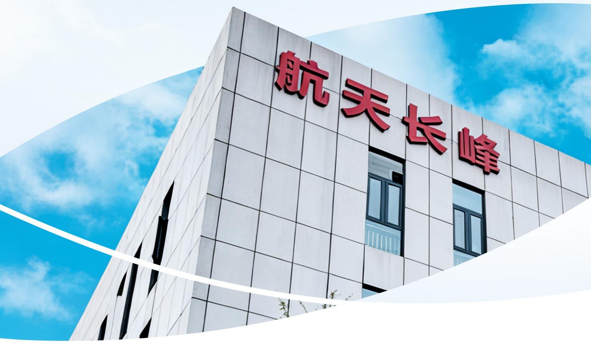

text_image

航天长峰

# CO E

# S目 录

关于本报告 04

董事长致辞 06

走进航天长峰 10

ESG 管理 17

专题一：守望低空，智护山河 24

专题二：科技至善，厚泽生命 26

natural_image

Illustration of a stylized cityscape with green trees, houses, and wind turbines under a sun (no text or symbols)

## 01 攀峰聚力，科创领航 UNITE TO SCALE PEAKS, INNOVATE TO LEAD.

（一）智贯全局，效定未来 30  
(二)破壁攻坚，智取险峰 33  
（三）格物致新，聚势赋能 35

## 02 共护青峰，碳寻未来GUARD GREEN PEAKS, SHAPE LOW-CARBON FUTURE

（一）气候治理，责任同行 40  
（二）碧水长策，管理先行 42  
(三)节能增效，低碳致远 46  
(四)青绿山海，万物和鸣 51

## 03 守正登峰，治理筑基 STAY TRUE TO REACH HEIGHTS; GROUND GOVERNANCE IN STRENGTH.

(一)党建铸魂，廉洁护航 54  
（二）价值为锚，信披为帆 56  
（三）内控于心，合规于行 61

未来展望 94

附录一：关键绩效指标 96  
附录二：索引表 110  
意见反馈 112

## 关于本报告

本报告是北京航天长峰股份有限公司（以下简称“航天长峰”“公司”或“我们”）发布的第四份ESG报告，本着客观、规范、透明和全面的原则，详细披露公司2025年在积极承担社会责任和促进可持续发展等方面的具体举措、重点实践、亮点案例和关键绩效，旨在回应利益相关方的期望，未来更好地履行社会责任。

## 时间范围

本报告涵盖期间为2025年1.月1.日至12月.31.日。为增强本报告的对比性和前瞻性，部分数据及内容有所延伸。

## 报告范围

本报告以航天长峰为主体，包括下属分子公司。除特别说明外，本报告范围与公司年报范围保持一致。

## 编制依据

本报告依据国务院国有资产监督管理委员会《关于新时代中央企业高标准履行社会责任的指导意见》《央企控股上市公司ESG专项报告编制研究》、上海证券交易所《上市公司自律监管指引第1号——规范运作（2023年12月修订）》《上市公司自律监管指引第14号—可持续发展报告（试行）》 《上市公司自律监管指南第4号——可持续发展报告编制》、全球可持续发展标准委员会（GSSB） 《可持续发展报告标准（GRIStandards）》以及《联合国可持续发展目标》（UNSDGs2030）要求编制。

## 数据来源及可靠性保证

本报告引用的全部信息数据均来自航天长峰内部文件或有关公开资料，航天长峰保证本报告内容不存在任何虚假记载、误导性陈述或重大遗漏，并对其内容的真实性、准确性和完整性承担个别及连带责任。

## 报告获取途径

报告电子版可在上海证券交易所网站（www.sse.com.cn）查阅及下载。若需获取报告纸质版，或对报告有任何建议，请联系我们。

联系部门：北京航天长峰股份有限公司证券事务部（董事会办公室）

联系电话：010-88525789

联系地址：北京市海淀区永定路51号

邮编：100854

释义

<table><tr><td>简称</td><td>公司全称</td></tr><tr><td>中国航天科工集团、科工集团、航天科工、集团公司</td><td>中国航天科工集团有限公司</td></tr><tr><td>航天科工二院、航天二院、二院</td><td>中国航天科工集团第二研究院</td></tr><tr><td>航天长峰、公司、我们</td><td>北京航天长峰股份有限公司</td></tr><tr><td>长峰医疗分公司</td><td>北京航天长峰股份有限公司医疗器械分公司</td></tr><tr><td>长峰科技</td><td>北京航天长峰科技工业集团有限公司</td></tr><tr><td>长峰科威</td><td>北京长峰科威光电技术有限公司</td></tr><tr><td>航天柏克</td><td>航天柏克(广东)科技有限公司</td></tr><tr><td>航天朝阳电源</td><td>航天长峰朝阳电源有限公司</td></tr><tr><td>长峰医科</td><td>航天长峰医疗科技(成都)有限公司</td></tr></table>

## 董事长致辞

## LETTER FROM THE CHAIRMAN

2025 年，是“十四五”规划收官之年，是公司深化改革关键一年。航天长峰深入学习贯彻习近平新时代中国特色社会主义思想，坚定不移服务国家战略，聚焦主责主业，全面深化改革，回应利益相关方期待，共同推动公司与社会的协同发展，以央企担当践行“让社会更安全，让生命更健康”的使命愿景，为全面建成国内一流航天安全高科技上市公司而砥砺奋进。

## 红船破浪指航向，初心铸就航天魂。这一年，我们加强党建引领。

将红色基因融入企业发展血脉，确保航天事业始终沿着正确方向砥砺前行。坚持把“两个维护”作为最根本的政治纪律和政治规矩，党委会“第一议题”制度有效落实。党委会专题研究17项重点工作，全力保障年度重点工作落地见效。扎实推进深入贯彻中央八项规定精神学习教育。清单式推动全年党建和思想政治工作落实，体系化加强“三基建设”。创建“党员示范岗”54个，党员突击队15支。坚持党建引领文化，将企业文化建设与专项任务开展、思政工作、市场品牌推广相结合。深化“青年大学习”行动常态化制度化推进“青马工程”，“青年精神素养提升工程”取得实效。

## 咬定青山不放松，聚力深耕天地宽。这一年，我们聚焦主责主业。

以服务国家重大需求为使命，优化产业布局，深耕核心业务，推动军民深度融合产业发展，打通军民技术同根同源的双向转化和赋能增效。长峰科技新签合同额达到四年来历史新高，边海防业务继续保持全国市场占有率第一；长峰科威积极布局驱鸟、反无等新应用领域，军品配套产品以外的新业务新签合同额同比增长46.14%；航天朝阳电源成功拓展雷达电源市场、大功率电源系统市场和低空经济电源市场，利润总额实现新突破；航天柏克军品电源业务实现新客户开拓，新签合同额较2024年增长16%；长峰医科聚焦国产高端医疗器械的研发、生产与销售加速推进ECMO系统产业化，积极培育“专精特新”企业。公司持续强化核心竞争力，在服务国家战略中实现自身高质量发展

## 敢驭慧眼巡天海，创新驱动破重关。这一年，我们坚持创新驱动。

积极布局低空经济、新安防、国产自主创新等新赛道，勇闯技术“无人区”，以科技自立自强，为航天强国建设注入强劲动能。累计获批政府及 上级科研经费1500 余万元，外部科研项目10项；荣获省部级、行业协会等各类科技创新奖项10项。长峰科技获评“2025北京软件核心竞争力企业”；航天朝阳电源通过国家级专精特新“小巨人”复核；“自主搜索跟踪系统”首次获批集团公司自主创新平台类项目，推动科技创新平台基础研究能力提升：航天朝阳电源国产高密度芯片电源实现核心技术跨越提升：ECMO 系统完成全部人体临床试验并通过科技部验收为2026 年产品上市销售打下坚实基础。

## 骏马追“峰”凭伯乐，鲲鹏展翅借长风。这一年，我们深化人才强企。

加强干部队伍梯队建设，调整选拔 7 名年轻干部任职，5 名骨干人员交流任职，引进 6 名高端人才，针对3名应届博士毕业生制定“一人一策”培养方案；优化薪酬结构与发放方式，完善薪酬穿透式管理系统；自培研究生创新能力培养初现成效，在第十届全国大学生生物医学工程创新设计竞赛中，两个科研创新团队荣获全国二等奖；首批3名工程硕士入司培养，1名公司骨于人才被录取为工程博士，3人受聘（入选）省部级以上专家委员会委员（入库专家），3 人入选地方政府领军人才（重大人才计划），1 人荣获辽宁省“五一”劳动奖章，1人荣获行业科技进步一等奖。

## 千锤百炼砺精刃，质量战略立如山。这一年，我们践行质量制胜战略。

全级次质量管理体系运行效能持续提升，全级次年度质量外部审核通过率100%，军用、民用领域顾客满意度稳步提高，本部完成红外光电产品国军标质量管理体系扩项审核；航天朝阳电源完成CNAS质量体系取证工作，通用标准化管理能力实现全面提升。长峰科威聚力解决工艺加工瓶颈，加强生产全过程精细化、定量化控制。长峰医科取得德国莱茵质量管理体系认证并获得医疗器械出口销售资质，一氧化氮治疗仪在印尼完成注册，标志着长峰医科在国际化、标准化道路上迈出了坚实一步。强化标准引领，全级次参与制修订国家标准2项。

## 数海云帆济星河，轻舟正过万重山。这一年，我们加速数字化转型。

召开全级次信息化建设暨业务流程梳理和数据治理工作会议，进一步明确数据筑基和人工智能赋能工作方向。支撑京区一体化运营改革，实现办公网流程改造170余条，持续推动全量业务流程化在线运行。搭建数字化科研生产体系，航天朝阳电源聚焦业财融合突破，完成业财一体化建设，大幅提升数据流转效率与核算精准度，2025年入选“辽宁省先进级智能工厂”名单：长峰科技项目管理系统不断完善，为公司经营决策提供数据支撑：长峰科威基干数字化管理系统实现核心产品研发、设计、制造等全生命周期管理；长峰医科数字化呼吸机生产线系统功能持续优化，不断向数字研发设计与智能生产制造一体化迈进。

## 青山不负航天志，碧水长映蓝天盾。这一年，我们加快绿色转型。

航天朝阳电源分布式光伏发电项目完成建设并投入运行，实现 70% 发电自用，30% 余电上网售卖，每年可减少CO2排放约2296吨，节约电费230余万元。根据世界自然基金会(WWF）的研究，每安装1平方米的光伏发电系统，相当于植树造林100平方米。该项目总面积约2万平方米，相当于植树造林约200公顷，等于280个世界杯足球场大小。同时，航天朝阳电源、航天柏克顺利通过清洁生产审核评估，清洁方案实施后每年可节能 437 万千瓦，减少 CO2 排放约 2446 吨，节水 1200 吨，推动生产模式向清洁化集约化转型，为建设美丽中国贡献力量。

## 治理澄明润远帆，明镜高悬照征程。这一年，我们夯实治理基石。

提升上市公司建设。强化依法合规经营，聚焦采购及供应链管理核心环节，健全合格供应商准入评审机制，从严规范外协外购、招投标全流程业务管控，构建预审、排查、监管的全链条防控体系，切实筑牢合规采购防线。持续开展“资金链安全保卫战”，有效防范化解财务风险。深化审计覆盖，提升内审价值。ESG工作成果突出，评级跃升至A级，荣膺“国新杯·ESG卓越央企金牛奖”。市值管理体系成效显著，公司日均市值64.06亿元，最高市值103.69亿元，均实现同比增长。

## 路长攀峰终有尽，心骋寰宇、足履实地。

“十五五”可持续发展蓝图已徐徐展开，航天长峰将携手全体员工、客户、供应商等利益相关方，深化ESG治理，将企业发展成果转化为服务国家战略、增进民生福祉、共建美丽中国的生动实践，共同谱写“五新长峰”建设的新篇章！

公司党委书记、董事长

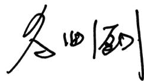

## 走进航天长峰

## 公司简介

北京航天长峰股份有限公司(以下简称“航天长峰”或“公司”），是以中国航天高端技术和应用成果为基础航天军工企业为背景的高科技上市公司（证券代码：600855）。中国航天科工二院是航天长峰的大股东中国航天科工集团是航天长峰的实际控制人。

作为航天二院唯一一家主板上市公司，航天长峰是航天二院资产运营的主平台。公司形成以“大安全为核心的“1+3”集群业务发展模式，聚焦军工电子、公共安全、高端医疗装备三大产业板块。

  
军工电子

  
公共安全

  
高端医疗装备

航天长峰坚定回归二院产业布局主航道，深耕航天技术应用产业，以“核心在手、两头布局”的产业总体布局思路， “一二三，四四六”的经营发展思路，深入推动航天技术应用产业，下大力气抓实科技创新与成本工程，奋力开创“五新长峰”高质量发展新局面

## 组织架构

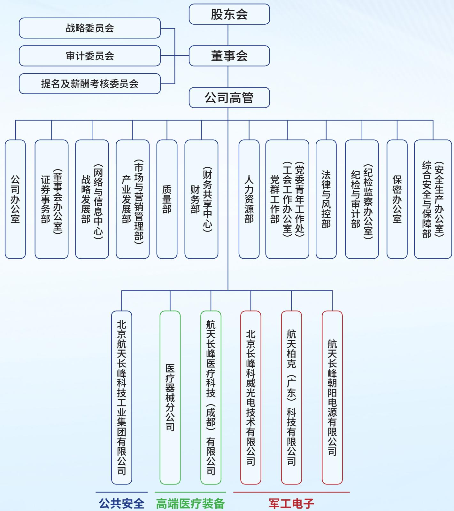

flowchart

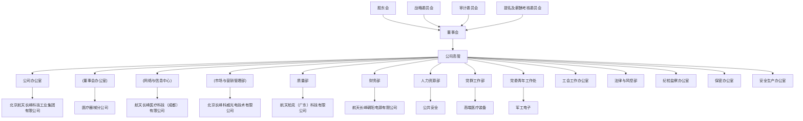

## 业务概览

航天长峰深耕军工电子、公共安全、高端医疗装备三大产业板块，主营业务涉及边海空防、军政企信息化智能化、医疗器械、医疗信息化与手术室工程、网络电源与新能源、储能电源、模块电源、定制电源、高功率电源模块、专用特种电源、红外光电产品等多个业务领域，同时也积极向低空经济、反无等领域进行拓展，拥有完备的资质和丰富的行业经验，是国内外具有较强影响力的集顶层规划设计、复杂工程实施、高端装备制造、综合运营服务为一体的上市企业集团。

## 军工电子产业

航天长峰所属北京长峰科威光电技术有限公司聚焦红外光电业务领域，主要进行制冷型红外成像产品设计、研制、生产，主要产品服务军品市场，保持制冷型红外产品在军用领域的领先地位。航天长峰所属航天柏克（广东）科技有限公司与航天长峰朝阳电源有限公司着力发展模块电源、组合电源、电源系统、新能源和储能电源等系列产品。航天长峰以“二院电源制造与营销中心”为牵引，不断完善电源产业布局，全面提升市场营销、研发创新与生产制造能力，与院属单位协同发展。

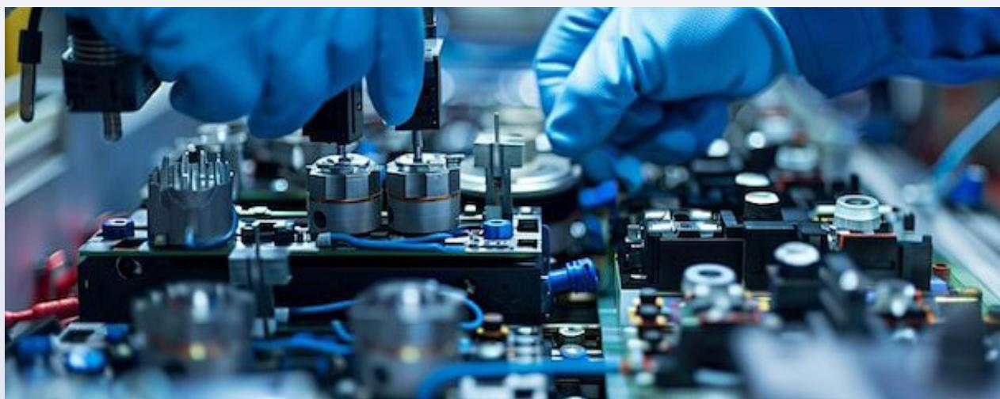

natural_image

Close-up of gloved hands assembling electronic components on a factory assembly line (no visible text or symbols)

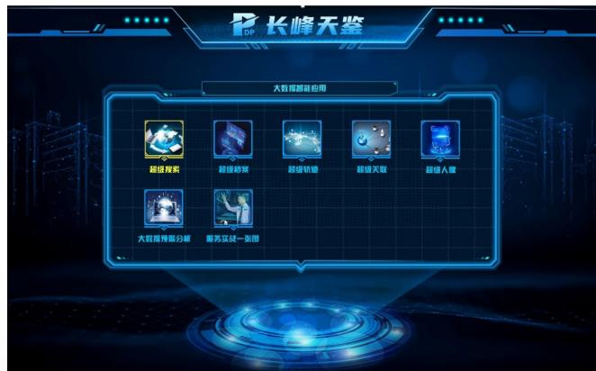

text_image

长峰天鉴
大戟塔都是应用
超级搜索
超级购买
超级轨道
超级关联
超级入量
大戟塔屏幕分解
魔苏及战一类型

## 公共安全产业

航天长峰聚焦“新安防”与信息化智能化核心领域，以“边海空防建设”与“要地反无”为核心业务方向，全面推动产业转型升级。公司坚守央企责任，稳固边海防优势地位，通过构建“系统集成+自研核心产品”的共生发展模式，打造支撑多行业发展的 N 项技术产品应用，致力于成为公共安全领域具有核心竞争力的解决方案集成服务商与产品提供商。

## 高端医疗装备产业

航天长峰依托航天长峰医疗科技（成都）有限公司为主平台，以生命支持类高端医疗装备为主攻方向，以手术室和 ICU 病房全系列产品和整体解决方案及数字化、智能化为业务主线，致力产业化与市场化发展，推动重点医疗器械升级换代和质量性能提升，提高先进医疗器械及医疗信息化产品稳定性和可靠性，对加快补齐我国高端医疗装备短板，助力实现科技创新自立自强具有重要意义。

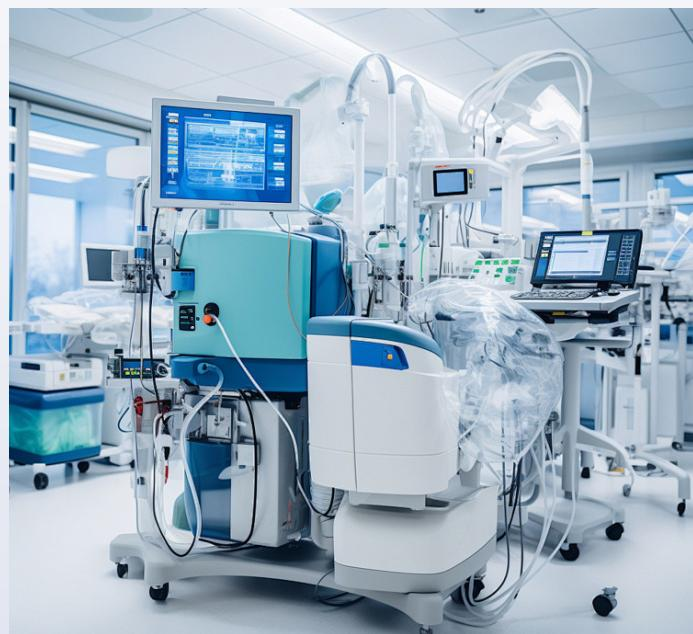

natural_image

Medical incubator in a hospital room with multiple monitors and equipment (no visible text or symbols)

## 战略与文化

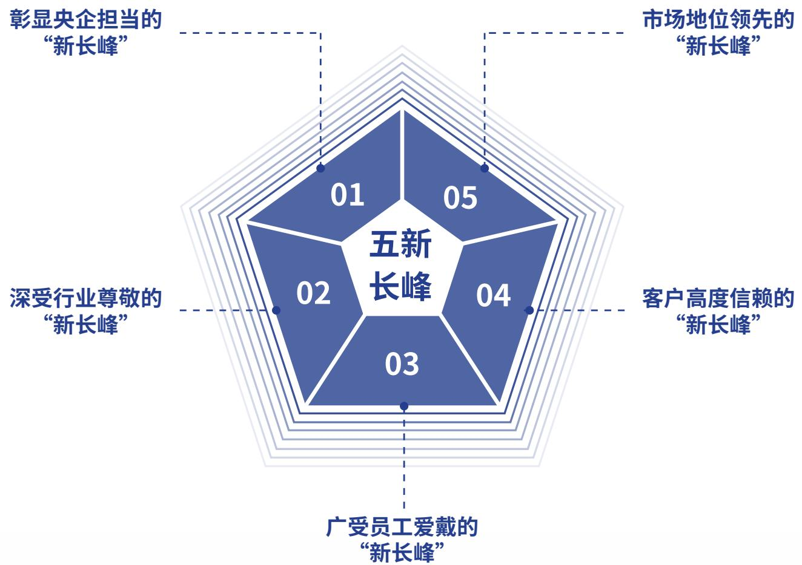

radar

| Pillar | Value |
| --- | --- |
| 01 | — |
| 02 | — |
| 03 | — |
| 04 | — |
| 05 | — |

使命愿景：让社会更安全，让生命更健康长峰精神：求实、自强、超越

# DEVELOPMENT GOALS

## “十五五”总体发展目标

以发展新质生产力为抓手，聚焦科技创新、人才强企、加快核心技术和关键技术攻关，以深化改革为“关键一招”，抓好企业一系列结构性改革，驱动上市公司高质量发展，实现“五新长峰”奋斗目标

## 发展思路

“核心在手、两头布局”的产业总体布局思路“一二三，四四六”的经营发展思路

## 重点任务

加强党的领导，重塑资产结构、业务结构、组织架构推进发展模式转变、强化市场营销

## 核心在手

专业核心技术和支柱产品。

## “两头布局”发展主责主业

上游：做优做强做大军工电子产业。围绕军工电子产业的组件级产品能力，在红外光电、电源、软件等业务方向充分融入二院、集团公司供应链体系上游。

下游：协同布局以新一代先进信息技术应用领域为主要方向的航天技术应用产业。对准新一代信息技术和人工智能技术，充分挖掘核心专业技术上的特点和优势，积极布局新安防业务方向，致力于体现“信息化和智能化”核心专业技术的信息系统集成业务提质增效。

“一”是确立一个总体发展目标，“二”是狠抓两个核心关键，“三”是聚焦主责主业发展三大领域“四”是增强四大发展动能，“四”是增强四大核心能力，“六”是做好六个方面的重点任务。

## 荣誉 2025

<table><tr><td>获奖主体</td><td>奖项</td></tr><tr><td>航天长峰</td><td>荣获“教育部科学研究优秀成果奖一等奖”“ESG卓越央企金牛奖”万得 ESG“A”评级</td></tr><tr><td>长峰科技</td><td>荣获“公安部科学技术奖二等奖”“2025北京软件核心竞争力企业”“重合同守信用企业”“高新技术企业创新能力评价等级5A级”</td></tr><tr><td>航天朝阳电源</td><td>通过2025年国家专精特新“小巨人”企业复核入选“辽宁省先进级智能工厂”</td></tr><tr><td>长峰科威</td><td>荣获第十届“创客中国”北京市中小企业创新创业大赛市级奖项</td></tr><tr><td>“基于核心技术独立可控的型谱系列电源模块研发及产业化”项目</td><td>荣获“辽宁省科学技术进步奖三等奖”</td></tr><tr><td>“基于多模态可信融合的跨越群体交互管控关键技术与应用”项目</td><td>荣获“中国指挥与控制学会科学技术进步奖一等奖”</td></tr><tr><td>“基于目标导向灌注的闭环控制的ECMO系统”及“融合气道廓清技术的多功能治疗呼吸机”项目</td><td>荣获“2025年第十届全国大学生生物医学工程创新设计竞赛二等奖”</td></tr></table>

## ESG 管理

## ESG 治理 -

航天长峰持续关注可持续发展，全面将 ESG 管理融入战略、决策、管理与运营全过程，构建了“横向协同、纵向联动”的高效ESG治理架构。同时，将ESG管理纳入董事会战略委员会和董事会职责范围，设立 ESG 工作小组，确保战略贯穿公司运营各环节。各管理部门明确工作流程，提升针对性与沟通力，形成“公司董事会统筹管理、职能部门落实实践、所属各单位积极参与”的权责明晰、流程规范、上下联动的工作机制。

<table><tr><td>层级</td><td>机构名称</td><td>人员构成</td><td>职责</td></tr><tr><td>决策层</td><td>董事会</td><td>战略委员会</td><td>1.审定ESG计划并提供ESG长远战略建议2.审定ESG相关议案3.形成董事会声明</td></tr><tr><td rowspan="2">执行层</td><td>公司高管</td><td rowspan="2">1.本部职能部门2.下属子公司</td><td rowspan="2">1.制定ESG年度计划2.组织ESG项目启动会,明确职责、重点及ESG风险点3.沟通ESG政策及流程执行过程中产生的需求4.统筹ESG信息披露5.协调推进ESG体系实践,并根据进展中的新问题部署下一阶段工作安排</td></tr><tr><td>ESG专项小组</td></tr></table>

## ESG 战略

航天长峰以公司总体战略为出发点，追求最大限度地为利益相关方创造包括经济价值、社会责任价值、绿色环保价值、公司治理价值在内的综合价值。

公司定期识别并评估公司所面临的 ESG 相关风险和机遇，对盈利能力、创新驱动、客户服务、产品和服务安全与质量、供应链安全管理等具有财务重要性的议题，按照“治理”“战略”“影响风险和机遇管理”“指标与目标”的四要素框架进行披露，定期跟踪风险，制定相关管理措施和应急预案。

## 治 理

## 战 略

## 影 响

## 风险和机遇管理

## 指标与目标

议 题

<table><tr><td>盈利能力</td><td>主要面临市场风险、政策风险等将影响公司持续经营能力和财务健康状况。</td><td>持续加强管理,加速适应政策导向,加强市值管理。</td></tr><tr><td>创新驱动</td><td>主要面临技术研发、市场风险,将导致公司失去市场竞争力。</td><td>持续优化创新管理机制,加强市场调研,加强技术团队建设。</td></tr><tr><td>客户服务</td><td>主要面临客户投诉风险,客户服务不到位将降低客户粘性,影响品牌声誉。</td><td>利用客户投诉和满意度调查,了解需求和期望,优化服务流程和内容,提高客户满意度和忠诚度。</td></tr><tr><td>产品和服务安全与质量</td><td>主要面临产品质量风险、技术风险和健康、安全、环境等方面风险,将导致公司遭受经济损失。</td><td>强化产品各环节质量控制,定期召开质量分析会,制定产品召回等制度。</td></tr></table>

## 议 题

供应链安全管理

## 预期风险或机遇

主要面临供应链风险管理、供应链安全管理等方面风险影响公司运营和产品交付。

## 应对措施

通过线上平台集中管控，实现供应链全流程线上化与透明化；推行多元化供应商策略，避免单一依赖，增强供应链安全与韧性。

## ESG风险、影响和机遇管理

ESG 治理决策层与执行层协同配合，制定年度ESG计划，持续完善ESG工作评价与考核机制

ESG 工作评价与考核

<table><tr><td>进度监督</td><td>董事会可要求相关部门提供有关经营、发展战略及ESG等方面的相关材料;董事会可根据公司发展的需要,召开会议,进行讨论。</td></tr><tr><td>纳入考评</td><td>积极推进ESG指标体系建设,为公司中长期战略规划提供基础依据。该体系紧密结合公司发展战略及经营计划协同融合专项工作,将ESG各项关键指标嵌入管理系统。</td></tr><tr><td>评价考核</td><td>ESG指标体系覆盖了科技创新、风险管控、供应商管理、节能环保、安全生产等五个维度的73个细分考核指标。</td></tr><tr><td>奖惩机制</td><td>对ESG工作落实不及时、不到位、不准确并造成重大恶性事件的职能部门及子公司,将依规追责;对ESG工作表现突出、有利于提升管理能力的予以表彰奖励。</td></tr></table>

## ESG 目标与愿景

ESG 目标：2030年，航天长峰达到碳达峰。

创新为先，科技驱动未来；

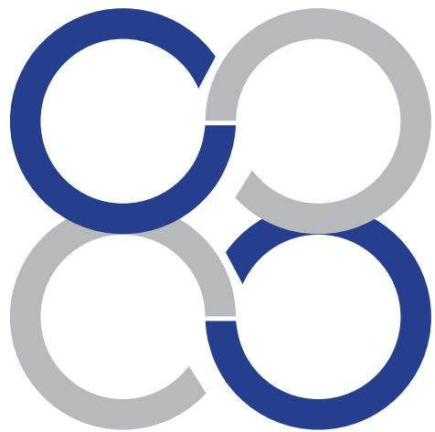

natural_image

Abstract geometric logo with interlocking blue and gray rings (no text or symbols)

风控为本，合规护航未来；

责任为魂，初心共赢未来；

natural_image

Abstract logo design with interlocking rings in blue and gray (no text or symbols)

低碳为要，绿色赋能未来。

## ESG 荣誉

一、航天长峰荣获第三届“国新杯·ESG 卓越央企金牛奖”  
二、航天长峰ESG评级跃升至A级  
7 三、“低碳工厂光伏发电”项目入围北京 ESG 研究院评选的绿色发展优秀案例

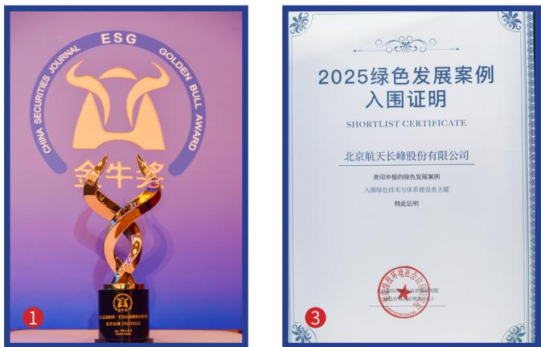

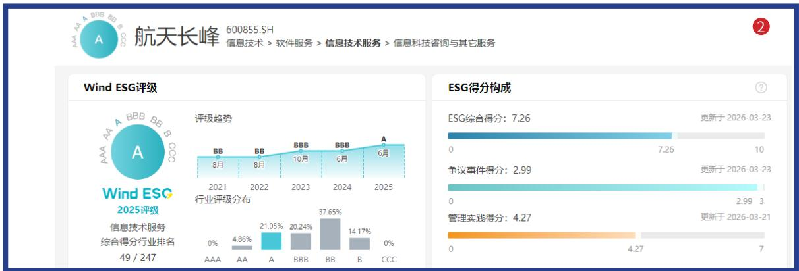

bar

| Year | ESG Rating |
| --- | --- |
| 2021 | BB |
| 2022 | BB |
| 2023 | BBB |
| 2024 | BBB |
| 2025 | A |

## 利益相关方沟通

航天长峰重视与利益相关方的沟通，通过常态化的沟通与监督机制，识别和回应利益相关方的期望与诉求进而构建更为紧密的关系。

<table><tr><td>利益相关方</td><td>期望与诉求</td><td>沟通与回应</td></tr><tr><td rowspan="4">政府及监管机构</td><td>响应国家战略</td><td>践行央企责任</td></tr><tr><td>关键业务国产化</td><td>推进乡村振兴</td></tr><tr><td>守法合规运营</td><td>强化科技研发</td></tr><tr><td>反商业贿赂与反贪污</td><td>完善规章制度</td></tr><tr><td rowspan="5">股东及投资者</td><td>资产保值增值</td><td>提升企业竞争力与盈利能力</td></tr><tr><td>公司可持续发展</td><td>生态环境保护、履行社会责任</td></tr><tr><td>信息披露透明</td><td>股东会</td></tr><tr><td></td><td>制定股东沟通政策与议事规则</td></tr><tr><td></td><td>开展投资者交流</td></tr><tr><td rowspan="3">商业伙伴</td><td>商业道德</td><td>遵守商业道德</td></tr><tr><td>透明采购</td><td>公开透明采购</td></tr><tr><td>互利共赢</td><td>搭建合作平台</td></tr><tr><td rowspan="2">行业</td><td>促进行业进步</td><td>开展经验交流</td></tr><tr><td>信息交流共享</td><td>加强日常联络</td></tr><tr><td rowspan="5">员工</td><td>员工权益</td><td>工会活动及福利</td></tr><tr><td>薪酬福利</td><td>职工代表大会</td></tr><tr><td>职业发展</td><td>员工职业素养和技术、技能培训</td></tr><tr><td>职业健康安全</td><td>员工安全培训</td></tr><tr><td>员工关怀</td><td>员工慰问</td></tr><tr><td rowspan="3">客户</td><td>诚信优质服务</td><td>开展客户满意度调查</td></tr><tr><td>安全稳定供应</td><td>全力做好能源保供</td></tr><tr><td>安全生产运营</td><td>完善落实安健环管理制度</td></tr><tr><td rowspan="3">社区</td><td>促进社区发展</td><td>乡村振兴</td></tr><tr><td rowspan="2">参与社会公益</td><td>消费帮扶</td></tr><tr><td>社区公益志愿者活动</td></tr><tr><td rowspan="5">环境</td><td>应对气候变化</td><td>制定碳达峰目标</td></tr><tr><td>节能减排</td><td>节能环保宣传、培训及监测</td></tr><tr><td>水资源管理</td><td>危废管理</td></tr><tr><td>污染防治</td><td>隐患排查</td></tr><tr><td>生物多样性保护</td><td>流域统筹、和谐发展</td></tr></table>

## 实质性议题识别

航天长峰始终坚定地贯彻利益相关方参与原则，基于“财务重要性”和“影响重要性”两个维度，系统性地识别公司在FSG方面所面临的关键议题及未来发展方向，并对议题进行重要性分析评估，经公司董事会及外部专家验证，作为公司管理和报告披露的重点。

2025年度，航天长峰实质性议题识别方式如下：

<table><tr><td>开展背景研究</td><td>明确公司的业务范围、运营领域及利益相关方群体,通过收集与分析政策法规、行业信息、同业实践、资本市场关注要点,识别潜在议题。</td></tr><tr><td>建立议题清单</td><td>通过对政府、股东、商业伙伴、员工、客户等利益相关方沟通,充分了解内外部利益相关方对公司重要性议题的意见,识别影响、风险和机遇,并汇总形成议题清单。</td></tr><tr><td>评估与确认重要性</td><td>进行财务重要性、影响重要性评估,同时综合国家政策、资本市场关注要点、同业表现等,生成重要性议题分析结果。</td></tr><tr><td>形成议题报告</td><td>公司管理层对实质性议题分析结果进行审阅及确认,并明确未来ESG管理工作的重点目标与实施计划。</td></tr></table>

航天长峰识别出下列议题为重要性议题，并在报告中重点回应。

<table><tr><td rowspan="6">非常重要</td><td>沟通与回应</td><td>利益相关方沟通</td><td rowspan="2">双重重要性</td><td></td></tr><tr><td>党建引领</td><td>合规经营</td><td></td></tr><tr><td>公司治理</td><td>股东权益保护</td><td>盈利能力</td><td></td></tr><tr><td>风险管理</td><td>投资者关系管理</td><td>创新驱动</td><td></td></tr><tr><td>数据安全与客户隐私保护</td><td>员工权益与关爱</td><td rowspan="2">供应链安全管理</td><td></td></tr><tr><td>员工培训与发展</td><td>绿色运营</td><td></td></tr><tr><td rowspan="8">具有影响重要性</td><td>反商业贿赂与反贪污</td><td>职业健康与安全</td><td rowspan="4">具有财务重要性</td><td></td></tr><tr><td>信息化建设</td><td>反不正当竞争</td><td></td></tr><tr><td>知识产权保护</td><td>乡村振兴与社会贡献</td><td></td></tr><tr><td>环境合规管理</td><td>循环经济</td><td></td></tr><tr><td>废弃物处理及污染物排放</td><td>能源利用</td><td>产品和服务安全与质量</td><td></td></tr><tr><td>水资源利用</td><td>应对气候变化</td><td rowspan="3">客户服务</td><td></td></tr><tr><td>生态系统和生物多样化保护</td><td>科技伦理</td><td></td></tr><tr><td>平等对待中小企业</td><td>尽职调查</td><td></td></tr><tr><td colspan="2">较重要</td><td colspan="2">具有财务重要性</td><td>非常重要</td></tr></table>

注：“生态系统和生物多样性保护”“科技伦理”为特定主体披露议题，公司暂不涉及，暂不披露相关内容

<table><tr><td>治理议题</td><td colspan="2">社会议题</td><td>环境议题</td></tr><tr><td>党建引领</td><td>员工培训与发展</td><td>职业健康与安全</td><td>废弃物处理及污染物排放</td></tr><tr><td>公司治理</td><td>创新驱动</td><td>乡村振兴与社会贡献</td><td>绿色运营</td></tr><tr><td>股东权益保护</td><td>客户服务</td><td>信息化建设</td><td>环境合规管理</td></tr><tr><td>盈利能力</td><td>产品和服务安全与质量</td><td>供应链安全管理</td><td>应对气候变化</td></tr><tr><td>合规经营</td><td>数据安全与客户隐私保护</td><td>知识产权保护</td><td>水资源利用</td></tr><tr><td>风险管理</td><td>员工权益与关爱</td><td>科技伦理</td><td>生态系统和生物多样化保护</td></tr><tr><td>投资者关系管理</td><td>平等对待中小企业</td><td></td><td>能源利用</td></tr><tr><td>反不正当竞争</td><td></td><td></td><td>循环经济</td></tr><tr><td>反商业贿赂与反贪污</td><td></td><td></td><td></td></tr><tr><td>利益相关方沟通</td><td></td><td></td><td></td></tr><tr><td>尽职调查</td><td></td><td></td><td></td></tr></table>

## 专题一：守望低空，智护山河

## 航天长峰以新质生产力筑牢低空安全防线

低空，这片曾经被视为日常视野之上、却又尚未触及浩瀚苍穹的中间领域，正经历一场深刻的变革。它不仅是飞鸟振翅、舟楫往来的自然空间，更快速演进为融合城市管理、物流运输、应急救援、海洋经济与国防安全的关键领域。无人机、低空飞行器及海上无人装备的蓬勃发展，在释放巨大经济社会价值的同时，也带来了“黑飞”“扰航”、要地入侵、海域异常目标等新型安全挑战，成为国家安全体系现代化必须系统性应对的时代课题。

作为中国航天科工集团旗下的高科技上市公司，航天长峰始终将航天技术与时代需求紧密结合。我们坚信将尖端科技转化为守护人民安宁与国土安全的力量是企业最根本的社会责任。为此，我们依托航天系统工程理论，构建了覆盖“低空近海全域感知、特定场景精准处置、低空飞行器电源保障”的一体化安防体系，为国家低空安全与社会稳定提供全链条的航天解决方案。

## 全域感知：构建低空近海智慧防线

针对低空近海目标活动特点，航天长峰以“感传知用”一体化系统应用为基础，运用人工智能、大数据等前沿技术研发的智慧指挥控制系统可实现对无人机、低空慢速飞行器及近海目标的实时探测、精准识别与轨迹预测，为低空监管、海域管控提供“千里眼”与“顺风耳”，为海空领域安全监管、国防安全监测及重点区域态势感知提供有力技术支撑。

航天长峰的指挥控制系统，就像一位坐镇后方的“智能指挥官”。雷达、光电……….都是它的哨兵，有的盯天空，有的看海面，各自汇报着不同方位、不同格式的情报。面对这些海量且零散的信息，“智能指挥官”从不慌张——它能在瞬间完成收集、分析、处理，把碎片化的线索拼成一幅完整的海空态势图。而且这张图不是静态的，是实时跳动的，哪里来了无人机，哪片海域出现异常目标，轨迹往哪个方向延伸，威胁等级有多高，全都一目了然。更重要的是，它不止于“看见”，更懂得“指挥”：信息收集、态势展现、综合分析、调兵遣将、运筹帷幄。全天候，全天时，从天到海，这位“智能指挥官”从不合眼，眼观六路、耳听八方，在云端织就一张无形的守御之网，将威胁挡在国门之外。

## 全时守护：构筑360度立体化智能驱鸟防线

在机场安全防护领域，航天长峰依托二十余年红外光电技术积淀，创新打造了机场“探测-识别-预警驱离”一体化、全天候、无人值守的智能驱鸟系统。系统如同拥有一双“永不眨眼的鹰眼”，通过高效光电成像与AI智能识别技术，精准锁定鸟类目标，并实时追踪其飞行轨迹。一旦锁定，主控系统便像长了眼睛的“智能狙击手”，自动调转驱离设备，用光束或声波精准“点射”闯入的飞鸟，实现毫秒级精准驱赶，彻底告别传统驱鸟“广撒网、乱鸣响”的被动模式

驱鸟设备身怀“六门绝技”一灵如乐高积木，可灵活接入机场原有设备及第三方系统，兼容共生：智慧如“云大脑”，可无线远程升级，越用越智能；全穿透，红外+可见光双“火眼”，昼夜雾雨不眨眼，南海雪地都能站岗：快如乒乓球自动回击，看见鸟瞬间驱离，速度比同行快100倍：准像狙击手只赶该赶的鸟、不吵该静的人；稳用独家音源+变频战术，让鸟无法“见怪不怪”，驱离效果长效稳定。

多机联网，大小机场都能量身定制，为民航安全提供全天候“看得清、判得准驱得动、守得稳”的鸟击防范解决方案，为机场低空安全提供高品质航天方案

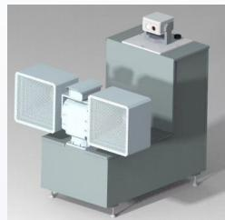

## 全新动力：铸就低空飞行航天心脏

作为国内率先切入电动垂直起降飞行器电源赛道的航天企业，航天朝阳电源凭借深厚的电源技术积淀在低空经济领域跑出“航天加速度”。

该型低空飞行器首次采用高压直流供电策略，需通过36项严苛检验项目并取得民航局适航认证，对电源性能与可靠性的要求近平苛刻。经用户多方调研考察，最终选定航天朝阳电源承担研制任务。在为期一年的攻关中，项目组累计加班超5000小时，经历4轮重大技术迭代，最终各项指标均充分满

足任务书要求并完成部分电源产品的交付，以航天人“严慎细实”的作风交出硬核答卷。

低空飞行器低压直流电源的成功研制标志着航天朝阳电源在低空领域实现了

从“0”到“1”的战略突破。此次研制不仅填补了公司在低空电源领域的

产品空白，而且实现了核心技术能力及适航能力建设上的双重跨越。

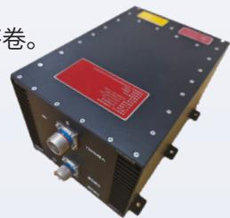

从低空近海防线的“智能指挥官”，到机场跑道的“驱鸟阻击手”，再到低空飞行器的“航天心脏”新质生产力的每一次落子都是航天长峰对“守望低空，智护山河”最硬核的诠释。未来，航天长峰将继续以航天技术赋能低空安全产业，让低空经济飞得更稳、更远、更安心

## 专题二：科技至善，厚泽生命

## 航天长峰高端医疗装备

## 以航天精度守护生命温度

从护航“大国重器”到守护“生命重器”，航天长峰始终秉承“让生命更健康”的使命愿景，将航天技术与高端医疗器械深度融合，以航天精度丈量生命刻度，以工程哲学回应临床呼唤。2025年，公司以一系列里程碑式突破，在急危重症救治领域刻下鲜明的航天印记，让“大健康”的使命愿景化作无数患者床头的真实呼吸。

## 一、ECMO系统：完成全部人体临床试验，叩开生命支持最难关

历时四年攻关，航天长峰自主研制的ECMO（体外膜肺氧合）系统于2025年完成全部人体临床试验。作为急危重症救治“最后一道防线”，ECMO系统在临床试验中展现出与国际主流产品比肩的血流动力学表现与生物相容性，核心氧合器在长效运转中保持稳定气体交换效率，为危重症患者赢得宝贵的生命窗口。这一里程碑的达成，不仅标志着国产高端生命支持设备攻克了“卡脖子”技术闭环，更为2026年产品正式上市销售铺平道路。不久的将来，这台凝聚航天智慧的“人工心肺”将进入更多重症监护室，以更可及的成本、更稳定的性能，为万千危重症患者托举起生命的希望。

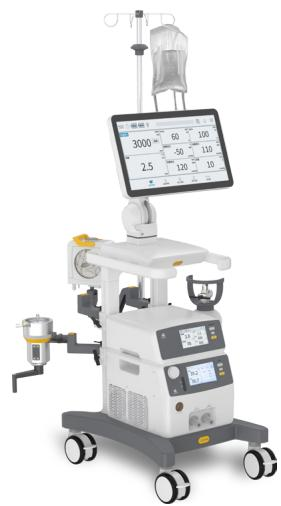

natural_image

Medical IV drip therapy machine with monitor displaying volume and patient number (no visible text or symbols on device)

## 二、排痰呼吸机：突破瓶颈的“生命护航者”

针对重症患者气道管理的临床痛点，航天长峰联合首都医科大学世纪坛医院研发的国内首个具备自主排痰功能的呼吸机在2025年获得第八届中国医疗器械创新创业大赛一等奖。该设备创新融合呼吸支持与振动排痰双重功能，攻克了“通气与排痰时序协同”这一行业难题，实现通气治疗与气道廓清的智能交替，互不于扰。如同一位24小时值守的“生命护航者”，它能在保障氧合的同时，通过精准控频控幅的肺内振动，帮助痰液栓塞患者将深部痰液有效排出，大幅降低VAP(呼吸机相关性肺炎)发生率。这一突破，让长期卧床的重症患者有了更安全、更人文化的呼吸支持方案。

## 三、一氧化氮治疗仪：精准控量的“呼吸靶向专家”

作为国内首款具备浓度自动补偿功能的一氧化氮治疗仪，航天长峰率先突破了闭环控制核心技术，实现了对吸入浓度的毫秒级响应与动态调节。设备可靶向性扩张肺通气区域的血管，选择性降低肺动脉高压，而对整体血液循环无于扰。在新生儿持续性肺动脉高压、急性呼吸窘迫综合征、心胸外科及肺移植手术等场景中，它如同一把“生物导航导弹”—直达病灶、精准起效，在改善气体交换效率的同时，最大限度规避副作用。2025年，该设备在印尼完成海外注册，航天长峰高端呼吸治疗装备正式进入东南亚市场，中国航天的生命守护技术跨越山海，润泽更广阔的土地。

## 四、科研资质双跃升：夯实产业根基

2025年，航天长峰所属长峰医科迎来资质能力和科研能力的双跨越：

一是正式通过国际知名认证机构德国莱茵TüV的质量管理体系审核，并成功取得医疗器械出□销售资质，标志着长峰医科的研发，生产服务体系全面接轨国际标准，为国产高端呼吸支持设备走向全球打开通路

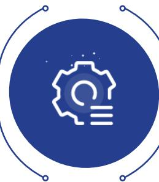

natural_image

Blue circular icon with a white gear and lightbulb symbol, surrounded by decorative border lines (no text or symbols)

三是成功入选四川省首批创新医疗器械融合“呼吸机应用试点”。入选试点将推动公司呼吸治疗产品在真实临床场景中加速迭代、以用促研形成“临床反馈—技术升级—产品优化”的良性闭环。

二是成功获批Ⅲ类医疗器械生产资质。作为医疗器械领域监管等级最高、准入门槛最严的资质类别，此次获批是对长峰医科质量管理体系、生产能力等方面的综合实力的高度认可，标志着公司具备麻醉系统、一氧化氮治疗仪等高端医疗装备在蓉生产能力。

四是长峰医科首次独立参与国家重点研发计划项目，牵头省部级科技重大专项，这一跨越标志着企业已完成从“北京技术转移落地”到“成都自主创新”的科研能力跃迁，具备了独立承担国家重大科研任务的能力。

科技至善，是让最硬核的技术以最温柔的方式守护生命。从ECMO系统完成人体临床验证，到排痰呼吸机获奖：从一氧化氮治疗仪精准控量本领，到国际化征程迈出坚实一步：从资质能力的跃升再到科研能力的跨越—2025 年，航天长峰高端医疗装备板块用航天人“万无一失”的标准，守护每一位患者“一呼一吸”的信任。未来，公司将继续深耕急危重症救治领域，让更多“航天造”高端医疗装备走进手术室、监护室、急救车，成为医生手中值得托付的好帮手，成为患者康复之旅中那盏不灭的希望之灯。

##

## 攀峰聚力，科创领航

Climb to Peak with Unity, Lead with Scientific Innovation

航天长峰始终践行“大安全”与“大健康”的双重承诺，通过持续的技术攻关与管理模式创新，推动产业升级，奋力实现更高质量、可持续的发展跨越。

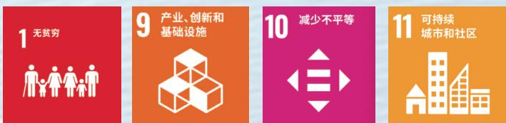

natural_image

Aerial view of a large, traditional sailing ship sailing on open blue sea under a partly cloudy sky (no visible text or symbols)

## 智贯全局，效定未来

## 创新驱动

## 1. 治理

航天长峰严格遵守《中华人民共和国促进科技成果转化法》《国家重点研发计划管理暂行办法》《中国航天科工集团有限公司科技成果转化管理办法（试行）》《航天长峰自筹资金科技创新与研发项目管理办法》《航天长峰知识产权管理办法》《航天长峰科技成果转化管理办法》等文件规定，2025 年，公司修订并印发《航天长峰科技创新与研发项目管理办法》。

公司聚焦主责主业，以股份本级统筹全局，以产业实体研发单元深耕细作，实现“整体协同”与“板块分治”的有机统一。坚持军民用市场需求双轮驱动，围绕“战略牵引、研发管理、资源保障、生态合作”四大支撑体系，加速技术与产品应用。在边海空防、军队信息化、ECMO、红外光电、模块电源等关键赛道上，全力铸就核心利器。

## 战略牵引 研发管理 资源保障 生态合作

## 2. 战略

航天长峰以习近平新时代中国特色社会主义思想为指导，全面贯彻落实党的二十大和二十届历次全会、中央经济工作会议、中央企业负责人会议等会议精神，贯彻落实习近平总书记对中央企业工作重要指示精神，对集团公司工作重要批示精神，全面落实集团公司和二院战略研讨会、工作会等系列会议要求，抢抓战略机遇，坚定必胜信心，锚定主责主业核心定位，集中优势资源深耕核心业务，深入推动军民深度融合产业，下大力气抓实科技创新与成本工程，努力实现“十五五”良好开局。

公司坚持创新驱动战略，提升高质量发展支撑能力和驱动力，加强下一代核心专业技术能力体系建设。军工电子领域，红外光电业务逐步形成系列化标准化红外热像仪与机芯等主线产品，提升以驱鸟、反无目标探测为核心的“新安防”特色产品竞争力；电源业务聚焦AI服务器等新领域前沿科技拓展，以强化“技术+产品”双平台建设深入推动产品化工作，推进产品结构向“模块组合 + 轻度定制”模式转型升级。新安防与“信息化智能化”领域，围绕“一主两翼”技术场景应用，打造要地反无典型场景和重点市场的低空安全新产品系列：同步推动国家边海空防和军政企信息化智能化两大领域支柱产品的升级推广。高端医疗装备领域，提升AI技术与产品专业技术结合，拓展便携式ECMO等血液动力类产品研制，提升产品智能化、可靠性和稳定性。

## 3. 风险、影响和机遇管理

<table><tr><td>风险</td><td>影响</td><td>机遇管理</td></tr><tr><td>研发方向选择风险</td><td>研发方向与实际市场需求发生偏差。</td><td>建立常态化前沿技术跟踪机制,避免陷入落后技术路径的“低水平重复”。对重大科研项目实行分阶段拨款,根据阶段性成果动态调整资源,淘汰不及预期的项目。</td></tr><tr><td>人才流失风险</td><td>人工智能、高端医疗装备等核心研发人员被互联网大厂或竞争对手高薪挖角,导致项目断档,核心技术机密流失。</td><td>探索实施项目分红、岗位分红、股权激励等中长期激励手段,让核心人才分享创新成果收益。事业平台留人,依托国家重大专项、前沿课题(如ECMO、低空反无等),为高端人才提供具有挑战性的“事业平台”。</td></tr><tr><td>市场单一风险</td><td>产品定义完全围绕单一客户的特定场景,导致产品缺乏通用性和扩展性,难以移植到其他市场。</td><td>针对单一市场依赖风险,在研发初期考虑产品的军民两用性,拓展海外军贸市场或民用安防市场,分散政策风险。</td></tr></table>

## 4. 指标与目标

航天长峰总体目标：

<table><tr><td>时间</td><td>目标</td></tr><tr><td>2026年</td><td>以发展新质生产力为企业发展的重要抓手,聚焦科技创新,加快核心技术和关键技术攻关,培育新技术、新产品、新业态、新模式,实现创新赋能提速。</td></tr><tr><td>2030年</td><td>向科技强企转型。加强下一代核心能力体系建设,坚持战略驱动与创新驱动,健全完善支撑全面创新的基础制度,强化内外部多元主体协同创新,推进发展模式转变。</td></tr></table>

## 知识产权保护

公司践行科技创新推动高质量发展理念，重视知识产权保护并严格遵守《中华人民共和国专利法》《中华人民共和国促进科技成果转化法》《中国航天科工集团公司知识产权管理办法》《中国航天科工集团公司第二研究院知识产权管理办法》，制定《航天长峰科技创新与研发项目管理办法》《航天长峰知识产权管理办法》《航天长峰科技成果转化管理办法》《航天长峰品牌与商标管理办法》，持续完善内部管理制度与风险防控体系，加强专利布局与执法维权能力，提升重大经营活动中的知识产权风险预警与应对水平，切实保障自身知识产权权益。

公司协同各相关部门，从科研、生产、经营活动全过程，实施创造、运用、保护与管理等维度开展知识产权保护工作。

43 项

公司新增专利申请

20 项

发明专利

19 项

实用新型专利

04 项

外观设计专利

15 项

新增授权专利

10 项

发明专利

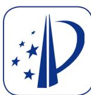

05 项

实用新型专利

2025年

累计专利项目

310 项

累计拥有有效专利

427 项

软件著作权

知识产权方面，公司新增专利申请43项(包括发明专利20项，实用新型专利19项，外观设计专利4 项)），新增授权专利15项(包括发明专利10项，实用新型专利5项)，截至2025年末，公司累计拥有有效专利310项，软件著作权427项。

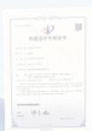

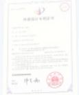

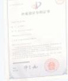

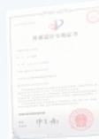

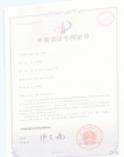

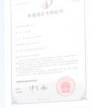

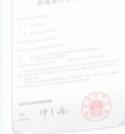

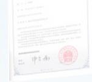

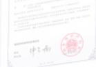

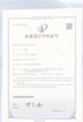

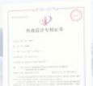

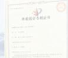

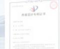

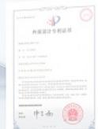

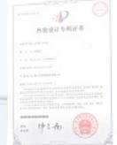

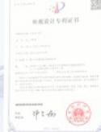

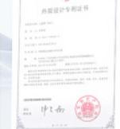

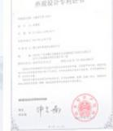

2025年环境社会及治理报告32

## 破壁攻坚，智取险峰

## 提升原始创新能力

首次获批中国航天科工集团自主创新项目平台共性技术基础类项目1项，推动科技创新平台基础研究能力提升。获批航天二院自主创新项目3 项，强化新域新质技术攻关与研究，努力提升原始创新能力和核心竞争力，加快成果转化。

## 荣获多项科技创新荣誉

<table><tr><td>获奖主体</td><td>奖项</td></tr><tr><td>“复杂环境目标态势计算关键技术及应用”项目</td><td>荣获“教育部科学研究优秀成果奖一等奖”</td></tr><tr><td>长峰科技</td><td>荣获“公安部科学技术奖二等奖”“2025北京软件核心竞争力企业”“高新技术企业创新能力评价等级5A级”</td></tr><tr><td>航天朝阳电源</td><td>通过2025年国家专精特新“小巨人”企业复核入选“辽宁省先进级智能工厂”</td></tr><tr><td>长峰科威</td><td>荣获第十届“创客中国”北京市中小企业创新创业大赛市级奖项</td></tr><tr><td>“基于核心技术独立可控的型谱系列电源模块研发及产业化”项目</td><td>荣获“辽宁省科学技术进步奖三等奖”</td></tr></table>

## 获奖主体

## 奖 项

“基于多模态可信融合的跨越群体交互管控关键技术与应用”项目

“基于目标导向灌注的闭环控制的ECMO系统”及“融合气道廓清技术的多功能治疗呼吸机”项目

荣获“中国指挥与控制学会科学技术进步奖一等奖”

荣获“2025年第十届全国大学生生物医学工程创新设计竞赛二等奖”

## 深化科技创新平台建设

初步建成西安研发中心，在高压高功率模块电源研发、低空系统级光电产品等领域深耕，以资源共享、协同研发牵引军工单位展开深入合作。

积极深化协同创新，完成年度创新平台评估与规范管理，并与南京航空航天大学、北京理工大学、四川大学等多所高校在光学、电源、新安防、医疗装备等领域持续开展联合攻关，与北理工合作开展水下激光主动成像、多模态大模型等方向研究，与西安工业大学共建先进光学联合实验室，持续拓展协同创新网络。

## 开展科研项目申报

2025年度共计推进科技创新与研发项目60余项，其中“ECMO系统研发项目”等4项国家重点研发计划项目顺利通过项目综合绩效评价；首次承研二院自主创新项目顺利通过验收；参与的二院重大战略前沿基础研究项目顺利完成一期产品研制。积极跟进并参与科技部“重大自然灾害防控与公共安全”、四川省重大科技专项等多个重大专项项目申报，完成各类外部科研项目申报24项，获批外部科研项目10项。

4 项国家重点研发计划

24 项外部科研项目申报

10 项外部科研项目

## 格物致新，聚势赋能

公司坚持以科技创新为驱动，深度聚焦主责主业，在高端医疗装备、军工电子、公共安全等国家级战略领域精耕细作。通过深化与科研院所的产学研协同，构建高效的创新生态体系。围绕国家重大战略需求与产业发展方向，公司持续开拓新兴赛道，强化创新链与产业链的深度融合，加速科技成果向现实生产力的转化，提升创新成果的产业化落地能力。

  
高端医疗装备

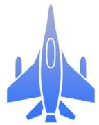  
军工电子

  
公共安全

## 高端医疗装备

从临床突破到产业落地：ECMO通过科技部验收，为2026年取证上市销售铺平道路

航天长峰牵头承担的“ECMO系统研发”国家重点研发计划项目顺利通过科技部综合绩效评价并完成全部人体临床试验。依托全国9家中心完成的30例临床验证，产品性能表现优异为2026年取证上市销售奠定坚实基础。此次成功验收标志着国产高端生命支持装备在急危重症领域实现重要突破，为我国医疗器械自主创新与临床转化奠定了扎实基础。

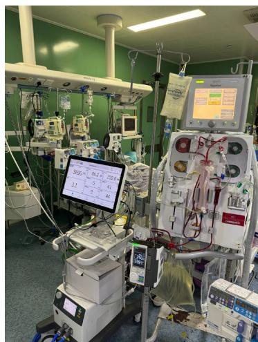

natural_image

Hospital ICU room with medical equipment and patient monitor (no visible text or symbols)

## 军工电子

## 从赛事突围到市场中标：长峰科威高动态红外仿真技术成功晋级北京市总决赛，深化核心市场布局

子公司长峰科威“高动态多光谱红外仿真技术”在“创客北京2025”赛事中历经区级复赛、决赛选拔成功晋级北京市总决赛。此次优异成绩不仅印证了公司在红外仿真领域的技术领先地位，也进一步彰显了其在光电领域的深厚积累与创新能力。

在此基础上，公司凭借该技术成功中标“目标及复杂动态场景模拟子系统”建设项目，进一步深化了在高端科研院所等核心市场的布局。后续项目将推动公司在MEMS光热转换、低冷环境动态场景生成等前沿方向持续深耕，加速技术迭代与产业落地

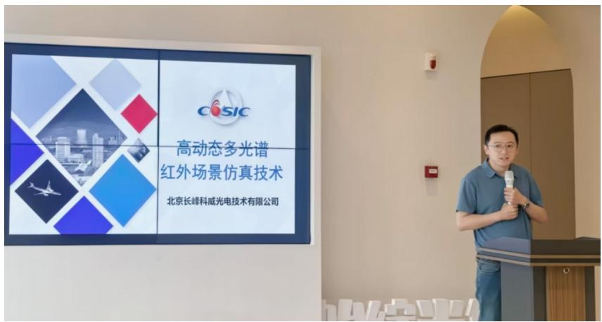

text_image

COSIC
高动态多光谱
红外场景仿真技术
北京长峰科威光电技术有限公司

## 从深耕研发到筑基国防：航天朝阳电源刘海波工作室获评省级劳模创新工作室，百余种电源装备服务国防建设

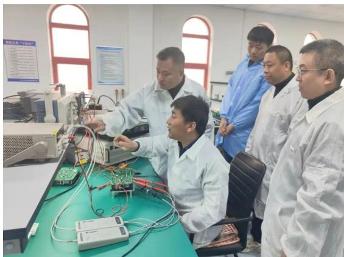

natural_image

Group of scientists in lab coats gathered around a computer lab bench, focused on electronics and wiring (no visible text or symbols)

子公司航天朝阳电源“刘海波劳模创新工作室”获评“辽宁省劳模创新工作室”。该工作室成立于2020年，现有成员28人，累计获专利32项。五年来，工作室聚焦电源产业发展需求，成功研发四个系列百余种电源装备，功率覆盖300W至10000W，广泛应用于航天、航空、舰船等领域，为国防建设提供了坚实的“动力支撑”。

## 公共安全

## 从创新突围到5A登榜：长峰科技斩获高新技术企业“5A 级”认定，为新质生产力蓄势赋能

在2025京津冀（国际）高新技术企业大会上，子公司长峰科技凭借卓越的科技实力与创新成果，首次获评国内首个《高新技术企业创新能力评价》团体标准最高等级—“5A级”荣誉。该评选覆盖知识产权、持续创新、成果转化、创新管理等维度，在逾万家参评企业中仅28家获此殊荣。此次获奖是对长峰科技综合创新能力与核心竞争力的高度认可，公司将持续深化核心技术研发，为新质生产力蓄势赋能。

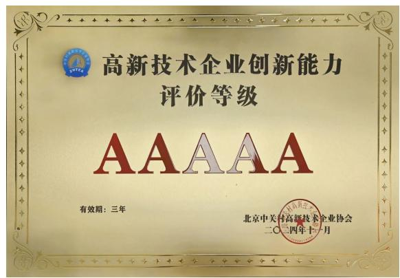

text_image

高新技术企业创新能力
评价等级
AAAAA
有效期：三年
北京中关村高新技术企业协会
二〇二四年十一月

## 新质生产力培训

## 从技术培训到智驱未来：航天长峰DeepSeek专项学习启动，推动AI 与产业深度融合催生新动能

积极推动智能化转型，公司组织全级次260余人参加DeepSeek人工智能技术专项培训，促进AI技术与公司各产业深度融合，以智能化手段赋能工作效率与创新质量提升，为培育和发展新质生产力注入持续动能。

natural_image

Abstract 3D illustration of a blue and green AI logo on a transparent grid background (no text or symbols)

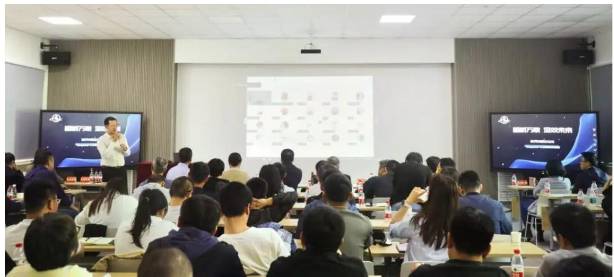

text_image

Conference room scene with presenter and audience, screen displaying Chinese text about '高效未来' (高效未来)

##

# 共护青峰，碳寻未来

Guarding green peaks together, exploring a carbonneutral future

航天长峰秉持绿色发展理念，将生态优先融入战略全局，致力于打造绿色友好型企业。公司积极履行环保社会责任，通过打造新一代绿色低碳基础设施，为建设节约型社会贡献力量，为企业持续、健康、稳定发展注入绿色动能。

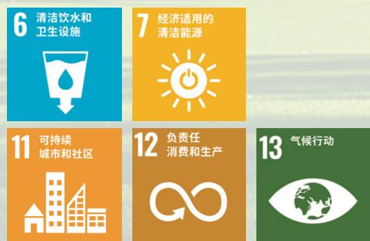

natural_image

Scenic view of a lake surrounded by mountains and green lawns under a clear blue sky (no text or symbols visible)

## 气候治理，责任同行

航天长峰主动融入国家“双碳”战略大局，将气候治理融入经营发展全过程。面对全球气候变化挑战，公司不仅前瞻性地开展气候风险识别与机遇挖掘，而目敏锐捕捉绿色转型中的新机遇，通过精细化管理锻造企业发展韧性。公司将低碳发展指标作为关键约束，层层分解至年度责任目标以考核为指挥棒，推动全级次从“被动减排”走向“主动履责”。

公司统筹推进大气污染防治工作，加强航天朝阳电源涂装工序环保净化设备检查频次，及时更换过滤棉、活性炭；长峰科威酒精、汽油清洗工序，更换排气筒、轴流风机，确保机器可靠。

## 甄别风险

<table><tr><td colspan="3">气候相关风险</td><td>影响时间</td><td>应对措施</td></tr><tr><td rowspan="2">实体风险</td><td>急性风险:极端天气</td><td>工厂、车间、办公楼建筑及设备可能被破坏,造成资产损失,甚至可能引起员工安全事故;设备损坏、服务中断或重大设备损坏可能直接或间接损害业务运营连续性和经济利益。</td><td>短中期</td><td>不断加强环境风险信息监测,提高应对环境风险应急管理能力;识别可能的资产损坏,购买必要的保险,以降低与急性天气事件相关的损失。</td></tr><tr><td>慢性风险:持续高温、干旱等</td><td>气温升高可能导致需配备更多制冷设备和维修费用,增加运营成本。</td><td>长期</td><td>及时改造老旧设备,应用更高能效的制冷技术和设备;推进绿色发展,减缓相关气候变化风险。</td></tr><tr><td>转型风险</td><td>政策和法律风险</td><td>温室气体排放的政策法规增加可能提高公司合规运营成本,相关诉讼或索赔可能增加。</td><td>中长期</td><td>密切关注“双碳”相关法规、政策的变化,建立法律法规清单,并适时调整内部管理措施,积极应对。</td></tr></table>

<table><tr><td colspan="3">气候相关风险</td><td>影响时间</td><td>应对措施</td></tr><tr><td rowspan="3">转型风险</td><td>技术风险</td><td>未及时识别并应用低碳技术、清洁技术等,可能导致运营中面临更大的气候相关风险。</td><td>中长期</td><td>结合公司业务进行节能降碳技术改造,优化工艺及设备,推动清洁生产技术应用,定期维护设备。</td></tr><tr><td>市场风险</td><td>上下游供应链、客户偏好转变可能会增加对绿色低碳产品关注。</td><td>中长期</td><td>实施绿色供应商管理,树立绿色采购理念,不断改进和完善采购标准、制度,将绿色采购贯穿原材料、产品和服务采购的全过程,推动供应链绿色转型。</td></tr><tr><td>声誉风险</td><td>因在应对气候变化及可持续领域表现不佳,导致利益相关方负面反馈。</td><td>短期</td><td>将可持续发展理念融入公司治理核心价值,积极承担社会责任,推进绿色生产进程,提升公司绿色形象;定期发布公司ESG报告,重点披露公司节能减排计划、行动目标完成情况等关键信息。</td></tr></table>

## 把握机遇

<table><tr><td>气候相关风险</td><td>应对策略</td></tr><tr><td>能源机遇</td><td>通过使用可再生能源、购买绿色电力等措施,可在减少碳排放的同时降低能源购置成本,还可在能源价格波动时稳定成本;利用智能制造技术,如自动化生产线、工业物联网等,实现设备优化调度和精准监测,提高能源利用效率,减少能源浪费。</td></tr><tr><td>市场机遇</td><td>消费者对绿色环保产品的需求持续增加,公司若能开发和生产低碳、节能、可循环利用的产品,可满足市场新需求,开拓新的市场份额;越来越多的全球品牌对供应链提出绿色要求,公司若能在原材料采购、生产工艺、运输配送等环节实现绿色化,可与更多优质客户合作,获得更多订单;积极应对气候变化,采取节能减排、使用清洁能源等措施,有助于树立企业负责任、环境友好的品牌形象,增强消费者对品牌的认可度和忠诚度。</td></tr><tr><td>政策机遇</td><td>各国政府为推动应对气候变化,纷纷出台支持绿色转型的政策,如税收优惠、补贴、财政补助等,企业可利用这些政策降低绿色转型成本;碳交易市场的发展为公司提供了新的商业机会,企业通过节能减排措施使得自身碳排放量低于配额,可将多余的碳配额在市场上出售,获得额外收益。</td></tr></table>

## 碧水长策，管理先行

航天长峰从自身业务和经营出发，持续服务“双碳”战略目标，助力经济社会可持续发展。公司积极倡导低碳环保的经营方式和工作方式，推进节能环保制度落实，最大限度地节约社会资源保护环境、减少污染。2025 年，公司在经营中未发生与环境保护相关并对公司有重大影响的违规事件。

## 环境管理

航天长峰严格遵守《中华人民共和国环境保护法》《中华人民共和国节约能源法》等法律法规，以及《中国航天科工集团节约能源与生态环境保护分类管理评价要求》《中国航天科工集团有限公司节约能源与生态环境保护监督管理办法》等有关规定，严格落实《航天长峰办公及科研生产场所节约能源资源实施方案》《节约能源与生态环境保护管理办法》《节能环保责任制》《环境安全隐患排查治理制度》《节能环保教育培训制度》《突发环境事件应急预案》《环境保护设施运行管理制度》等一系列环境管理工作制度，制定《航天长峰节能环保与绿色发展工作方案(2025-2027年）》，进一步明确航天长峰办公场所节约能源资源的主要内容和工作措施。各单位开展环境有害因素识别，编制《管理手册》《程序文件》，开展体系内部审核、管理评审及合规性评价等工作。报告期内，航天长峰全级次已通过ISO14001:2015环境管理体系认证。

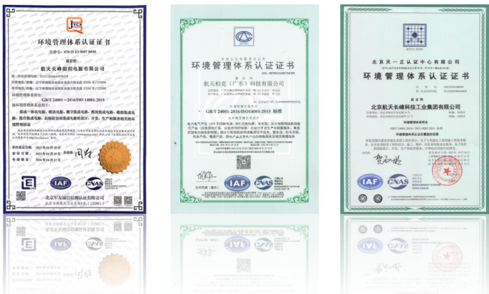

2025年，航天长峰全级次未发生突发环境事件，未收到刑事、行政以及上级单位处罚事项，未收到群众投诉反映的环境问题，无因环境失信行为遭新闻媒体曝光的情况。

航天长峰持续完善环境管理组织机构建设、优化监测体系、强化考核奖惩机制。

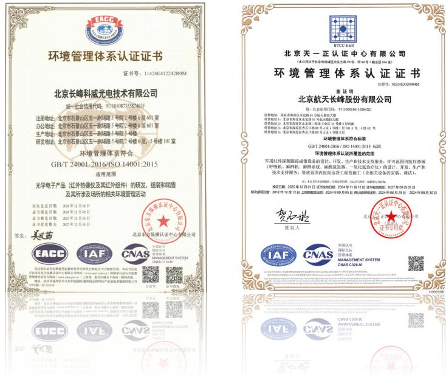

## 在组织管理机构建设方面

航天长峰定期组织召开节能环保工作领导小组会，各经营实体配备专（兼）节能环保管理人员，通过多种途径开展节能环保专业知识培训，提升履职能力；完善基础管理机制，持续开展节能低碳改造与环保隐患治理，2025年投入资金共计超700万元；强化监督管理机制，每月梳理各单位重点工作，利用OA平台，定期对各单位进行提示提醒。

## 在监测体系方面

建立全级次能源消耗原始记录和统计台账、污染源台账、危险废物贮存场所台账、节能环保风险隐患台账等，完善基础信息数据管理。长峰科威、航天柏克、航天朝阳电源开展废水、废气、噪声等监测；各单位年初在国家固废综合管理系统，填报危险废物管理计划，按照计划合规排放危废；开展重点作业场所信息统计分析表，明确管理重点，制定管理措施；定期开展污染治理设施维护，确保污染源达标排放；各排污单位按照国家法律规定，有序开展环境影响评价、申领排污许可证及排污登记工作

  
废水

  
废气

  
噪声

## 在考核奖惩体系方面

公司严格落实考核奖惩，充分发挥经营业绩考核和保障监督体系作用，将发生环保处罚事项、发生突发环境污染事件的单位，严格给予“亮牌”、扣分等处理措施。完善航天长峰表彰奖励工作，公司 2025 年首次设立“年度节能环保先进个人”奖励，评选表彰节能环保工作突出的个人，每两年开展一次。

## 减排管理

## 废水

为有效防治污染，公司严格落实《节能环保管理制度》要求，建立并严格执行全面、严谨且科学的废水排放管理体系，对废水排放的各个环节予以严格规范。2025年，公司废水排放量 吨。

## 废气

公司严格遵循国家相关法律法规要求，依法办理排污许可相关手续，针对废气从源头监测、高效收集到处理、合规排放的全过程，实施精细化管理，力求各环节杜绝任何可能的污染隐患，以实际行动践行绿色发展承诺。2025 年，公司废气污染物排放总量 394.5kg，其中氮氧化物排放量 155.6kg，硫氧化物排放量 18.9kg，悬浮粒子与颗粒物（PM）排放量 177kg，挥发性有机化合物（VOCs）排放量 43kg。

<table><tr><td rowspan="2">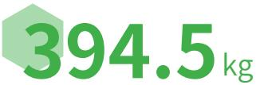公司废气污染物排放总量</td><td>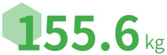氮氧化物排放量</td><td>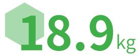硫氧化物排放量</td></tr><tr><td>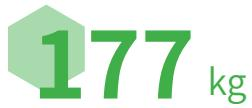悬浮粒子与颗粒物(PM)排放量</td><td>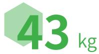挥发性有机化合物(VOCs)排放量</td></tr></table>

## 固体废弃物

公司高度重视危险废物污染防治工作，将其深度嵌入生产与经营管理的各个环节，致力于实现环境保护管理与生产管理的协同发展。强化固体废物分类收集、综合利用、合理处置等全过程管理，严格管控危险废物产生、转运、存储、处置各环节，检查危险废物贮存场所基础条件，所属各单位均委托第三方有资质的公司合规处置危险废物。2025 年，公司安全处置危险废物 4.1 吨，一般固体废物 12 吨。公司将持续优化生产工艺，强化内部环保管理体系，后续将进一步强化一般固废再生利用。

## 噪声

企业严格遵循《中华人民共和国噪声污染防治法》，积极采取降噪举措，并委托专业第三方公司进行定期监测，以确保噪声污染物排放达标。

## 温室气体排放

公司持续加强温室气体排放监测与管理，全面盘查与核查各单位碳排放情况，通过航天科工集团节能环保信息管理系统每月记录碳排放情况，开发利用光伏发电等清洁能源，并通过实施“能效提升”项目、新能源替代等措施降低温室气体排放，加强碳排放总量和强度“双控”管理。

公司建立温室气体排放监测体系，定期收集和记录排放数据，并向相关部门报告：制定能源“双控目标计划，签发年度节能环保责任书，全年强化过程检查和预警，并在年终进行考核，确保年度目标任务完成。

<table><tr><td>指标名称</td><td>单位</td><td>2025</td></tr><tr><td>温室气体排放量(范围一)</td><td>吨二氧化碳当量(tCO2e)</td><td>571.00</td></tr><tr><td>温室气体排放量(范围二)</td><td>吨二氧化碳当量(tCO2e)</td><td>4101.00</td></tr><tr><td>温室气体排放总量</td><td>吨二氧化碳当量(tCO2e)</td><td>4672.00</td></tr><tr><td>温室气体排放强度(单位产值)</td><td>吨二氧化碳当量(tCO2e)/百万元</td><td>3.74</td></tr></table>

## 循环经济

深化循环经济实践，让废旧物资“变废为宝”。2025 年，公司通过优化回收流程，对成品、金属材料等主要物料进行精细化管理，全面推进闲置器材评估与边角料再生利用。目前，近100平方米的规范化铁屑库房已投用，以“分类储存”为核心，显著提升了金属废屑的资源回收效率。

## 节能增效，低碳致远

航天长峰制定《节约能源与生态环境保护管理办法》《建设项目环保“三同时”管理制度》《节能环保事故（事件）管理制度》等制度，确保能源节约与节能管理工作的规范和有效性。航天长峰现有6.个分子公司，全级次在2025年度能源年均消耗总量为1.213吨标准煤。

<table><tr><td>指标名称</td><td>单位</td><td>2025</td></tr><tr><td>能源消耗总量</td><td>吨标准煤</td><td>1,213.00</td></tr><tr><td>直接能源消耗量</td><td>吨标准煤</td><td>345.80</td></tr><tr><td>汽油消耗量</td><td>吨标准煤</td><td>22.10</td></tr><tr><td>天然气消耗量</td><td>吨标准煤</td><td>323.70</td></tr><tr><td>光伏发电</td><td>吨标准煤</td><td>55.40</td></tr><tr><td>间接能源消耗量</td><td>吨标准煤</td><td>867.20</td></tr><tr><td>可再生能源消耗量占比</td><td>%</td><td>4.57</td></tr><tr><td>人均能源消耗量</td><td>吨标准煤/人</td><td>0.93</td></tr></table>

报告期内，航天长峰节能环保费用共计724万元。各单位宣传、处置危废、监测、环境管理体系审核费用共计9万元。中国航天科工集团分类管理评级、清洁生产审核投入15万元，航天朝阳电源光伏发电建设投入约700万元。

## 赋能绿色发展，航天朝阳电源分布式光伏发电项目正式投运

为积极响应国家“双碳”战略号召，航天朝阳电源分布式光伏发电项目完成建设并投入运行，实现 70% 发电自用，30% 余电上网售卖，每年可减少CO2排放约2296吨，节约电费230余万元。根据世界自然基金会(WWF）的研究，每安装1平方米的光伏发电系统，相当于植树造林 100 平方米。该项目总面积约 2 万平方米，相当于植树造林约200公顷，等于280个世界杯足球场大小。

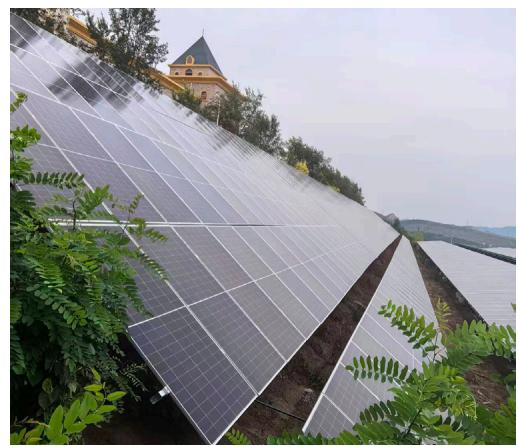

natural_image

Rows of solar panels installed on a hillside with green foliage and a church tower in the background (no visible text or symbols)

每安装

1 平方米

等于植树造林

100 平方米

项目总面积约

2 万平方米

等于植树造林

200 公顷

## 筑牢生态根基，顺利通过清洁生产审核

航天朝阳电源、航天柏克顺利通过清洁生产审核评估，清洁方案实施后每年共计可节能437万千瓦减少CQ2排放约2446吨，节水1200吨，推动生产模式向清洁化集约化转型。这标志着公司在“降碳、减污、扩绿、增长”的绿色转型道路迈出关键一步，为企业长效可持续发展筑牢生态根基，为建设美丽中国贡献力量。

## 437 万千瓦

减少CO2排放

约 2446 吨

节水 1200 吨

text_image

佛山市
清洁生产企业
佛山市工业和信息化局 佛山市生态环境局
（有效期至2029年12月）

## 深耕绿色生态，高质量通过分类管理评价

中国航天科工集团节能环保中心分别对子公司长峰科威及航天朝阳电源的节能环保工作进行评价评审专家组通过生产现场实地考察、能耗数据统计分析及综合评估等方法，对两家企业的能源管理体系、节能技术应用、污染物排放控制、环境保护措施等核心指标进行评估打分。最终两家所属单位在能源节约和生态保护方面成果突出，分别获得84.3分和85分的高分，得分位居本轮前列。此次评级标志着公司在节约能源和生态环境保护建设方面再上新台阶。

  
能源管理体系

  
节能技术应用

  
污染物排放控制

  
环境保护措施

## 淬炼低碳“净”界，开展节能宣传活动

公司以习近平生态文明思想为指导，积极贯彻国家绿色低碳文化理念，营造“节能增效、低碳发展”的文化氛围，建立“人人倡导节能、时时参与节能、事事规划节能”的行为准则。

## 举办“全国节能宣传周”主题活动

2025 年，航天长峰在全国节能宣传周期间开展主题为“节能增效，焕新’引领”宣传，在全国低碳日开展主题为“碳路先锋、绿动未来”的宣传。努力营造浓厚的氛围，切实将节能减排、环境保护工作落到实处，全面提高全体员工节能减排意识。

natural_image

Stylized green cityscape with wind turbines, cycling, and silhouettes of people walking on a winding path (no text or symbols)

航天长峰举办2025年“全国节能宣传周”主题活动

## 开展节能环保倡议行动

倡导低碳生活新风尚。三层楼以下建议多走楼梯，减少电梯使用；合理使用节能空调，夏季设定不低于 26℃，冬季不高于20℃，使用时应关好门窗；践行“135 原则”，1 公里内步行，3 公里内骑自行车，5公里内乘坐公交，优先选择绿色低碳出行方式

135 原则 1 公里步行 3 公里骑行 5 公里公交

践行绿色消费新理念。理性消费，优先选购简单包装的商品和绿色无公害食物，尽量减少一次性塑料袋、木筷、纸杯、纸巾的使用；做好垃圾分类，通过科学回收处置实现变废为宝；倡导使用节能产品，优先采购节能节电认证产品，逐步淘汰高耗能设备。

树立低碳办公新标杆。节约办公用品，坚持双面打印，充分利用废纸反面打印；减少一次性签字笔、纸巾、纸杯的使用，提倡使用钢笔或可换芯笔；养成良好用电习惯，充分利用自然光，减少照明用电，下班后及时关闭电子设备、电器及灯光。

text_image

节能减排
绿色发展

企业节约用电的措施
1.加强节电宣传，提高节电意识
我国能源工作总方针“开发和节约井叠”“把节约放在优先位置”。企业应加强对全体员工节电的宣传，提高他们的节电意识，树立长期节电思想。
2.加强节约的科学管理
建立健全专用管理制度。落实计划用电、节约用电和降低电力消耗的各项措施。制定一套科学有效的电力管理制度，建立厂、车间、班组的三级管理网络，责任落实到人。
3.合理调度电力负荷
根据供电电网的供电情况和用电部门的不同用电规律，合理地、电计划地安排各用电部门的用电时间，以降低高负荷，填补负荷低谷，充分发挥发电、变电设备的供电能力。
4.开发使用节电设备
随着新材料、新工艺、新技术的不断出现，企业电气设备不断节省节能、能耗的方向发展。例如，目前变压器、电动机因所占比重较大，其能量巨大，所以技术人员始终不停地在开发、研制、生产节能型产品、非晶合金低碳损失变压器技术、电动机变频调速技术、高效电机技术等新技术都得到了快速发展。企业在购置设备时，应优先购买节电设备。
5.合理选择设备容量
企业根据所有用电负荷科学合理的选择和配置变压器容量和工数以及经济运行方式，以提供设备的负荷率和运行效率损失降到最小。
6.提高功率因数
无论要提高自然功率因数还是用无功补偿装置或操作时都可以使线路的电能损失减少要求发电、变电站的供电增加。
办公室节能减排
节约用电电缆
1.办公室、实验室使用LED节能照明灯、空调、照明灯采用可自动控制系统、智能用电。
2.办公室安装架下的用电设备和电器不使用时，请及时切断电源。
3.使用完会议室，请及时关闭投影仪，视频电视，对灯相关设备。
4.使用空调设定在26度、多用睡眠状态，在温度适宜的情况下，可以关闭空调约小时。
5.长时间干净的电脑，应将电脑的主机和显示器关闭。短暂休眠期间，尽量启用电脑的熔断模式。
6.卫生间需要开启照明灯，夜间1:00~早
晨6:00无人情况下关闭照明。
节约用水 从点录填报
1.卫生柜根冲洗洗物的用水需要，分别使用大水流向小水流进行冲洗。
2.灯泡、冒、滴、漏的水龙头及时更换，减少浪费。
3.实时交流、实时开关、随手关好水龙头，
4.经常用水、暗不完的水、有毒有害物质。

## 青绿山海，万物和鸣

航天长峰通过多维严格管理，全面落实生态环境保护责任，严守生态红线，强化风险预警与应急体系，深化排污许可、污染物监测及废物管理，严把建设项目环保关，确保全链条合规运行，保护生物多样性和自然栖息地实现企业与环境和諧共生。与此同时，公司聚焦高质、高效、绿色发展目标加快传统产业绿色低碳改造，推动数字化、智能化与绿色化深度融合。航天朝阳电源投资3700万元建成自动化模块电源组装生产线，实现无人值守“黑灯”生产；航天柏克成功研发HTT-P系列智能型 UPS 电源，通过“削峰填谷”优化电网效率、降低用电成本，从源头减少化石能源消耗与全生命周期碳排放。这一系列系统性解决方案正成为推动“双碳”目标落地的核心支撑与绿色发展“倍增器”。

#

# 守正登峰，治理筑基

Uphold the right path to reach the peak, build the foundation through governance

航天长峰全面贯彻习近平新时代中国特色社会主义思想，构建起“党建引领、治理驱动、合规筑基、风控护航、价值创造”五位一体的现代化治理体系。公司将全面从严治党贯穿于改革发展始终，把合规经营作为刚性约束，将全面风险管理嵌入业务流程各环节，以治理结构优化增强体制机制活力，以价值创造检验改革发展成效。通过深化国企改革与建设国内一流企业，实现防风险、促合规、优治理、创价值的有机统一，全力打造高质量发展良性循环。

text_image

走在胜利征途
冲在抗日前线
1943
194
长江队北京
人移道的战略大转移

## 党建铸魂，廉洁护航

## 党的建设

航天长峰严格遵守《中国共产党章程》《中国共产党廉洁自律准则》《中国共产党纪律处分条例》《中国共产党党内监督条例》《国有企业领导人员廉洁从业若干规定》《中国共产党重大事项请示报告条例》等规章制度，扎实开展各项工作。截至 2025 年 12 月 31 日，公司有党员 293 名，党总支1个、党支部10个。

公司党委深入贯彻“两个一以贯之”，把党的领导落实到公司治理各环节，依照规定讨论和决定公司重大事项，深化党委“把方向、管大局、保落实”领导作用。2025 年，公司全年召开党委会 30 次，党委会审定议题 86项，前置研究讨论重大经营管理事项 62项。

公司全年召开党委会

30 次

党委会审定议题

86 项

前置研究讨论重大经营管理事项

62 项

党的领导持续加强。公司党委坚持把“两个维护”作为最根本的政治纪律和政治规矩，党委会“第一议题”制度有效落实，习近平总书记重要指示批示精神闭环管理工作机制持续健全，28 项台账任务全面落实。党委专题研究17项重点工作，紧抓19项管理监督提升措施不放松，以整改实效推动“五新长峰”建设。扎实推进深入贯彻中央八项规定精神学习教育，学习教育与科研经营生产进一步深度融合。一体推进“学查改”，系统构建三级学习体系，原创微视频“声”入人心，切实做到深学细悟筑牢根基、查摆问题动真碰硬、整改整治促进提升。全面从严治党持续深化，推动政治监督具体化、精准化和常态化。

台账任务全面落实

28 项

党委专题研究重点工作

17 项

管理监督提升措施不放松

19 项

党的建设成效显著。制定三张清单明确细化各级党组织、纪委、业务管理部门责任。清单式推动全年党建和思想政治工作落实。体系化加强“三基建设”，创建“党员示范岗”54个，党员突击队15支。坚持党建引领文化，将企业文化建设与专项任务开展、思政工作、市场品牌推广相结合。深化“青年大学习”行动，常态化制度化推进“青马工程”“青年精神素养提升工程”取得实效。

党员示范岗

党员突击队

54 项

15 支

## 反商业贿赂、反腐败及廉洁文化建设

公司深入推进“三不腐”体制机制建设，通过健全制度体系、强化监督协同、深化廉洁教育，一体推进反商业贿赂、反腐败及廉洁文化建设，为企业高质量发展营造风清气正的政治生态。

公司制修订并严格遵循《北京航天长峰股份有限公司落实监督执纪“四种形态”实施办法》《北京航天长峰股份有限公司廉政档案管理办法(试行)》 《北京航天长峰股份有限公司纪检监察工作落实“三个区分开来”要求建立容错纠错机制的实施办法（试行）》《北京航天长峰股份有限公司纪委会议工作规则(试行）》《北京航天长峰股份有限公司领导干部廉洁谈话和函询工作办法》等一系列规章制度，深入推进党风廉政建设和反腐败工作。完成《航天长峰2025年保障监督体系目标偏离预警工作重点监督事项》修订印发，推动提升各类监督资源协同效应。

## 廉洁建设宣贯培训

航天长峰纪委积极推进新时代廉洁文化建设，把廉洁文化纳入党风廉政建设和反腐败工作布局进行谋划，坚持围绕中心、服务大局，将反腐倡廉教育纳入党员干部教育培训的重要内容，通过讲授廉洁党课、开展廉洁谈话、观看警示教育片、集中学习通报文件参观二院警示教育展等多形式、多途径推动廉洁文化建设走深走实。2025年，公司全年组织纪律教育27场次，覆盖1900余人次。

公司全年组织纪律教育

27 场

覆盖人次

1900余人

## 航天长峰召开2025年纪检监察工作会议暨警示教育大会

2025年1月，公司召开2025年纪检监察工作会议暨警示教育大会，深入学习贯彻落实二十届中央纪委四次全会精神，学习传达上级纪检监察工作会议精神，总结2024年纪检监察工作，部署2025年重点任务，开展警示教育。

text_image

武汉市城市与城乡建设局工作会议
暨市经济工作会议

## 信访举报管理

健全信访工作制度体系，制定《航天长峰信访工作应急预案》，同步完善信访举报、线索处置、党政纪处分及检举人保护等全流程机制。畅通“信、访、电”多维举报渠道，广泛接受内外部监督，确保员工、客户及第三方反映违纪违法问题有渠道、有回应。

## 价值为锚，信披为帆

航天长峰深刻把握资本市场规律，聚焦“价值创造、价值实现、价值经营”的全链条管理。通过提升信息披露质量与深化投资者关系，公司致力于科学化市值管理，在实现企业价值最大化的同时，与投资者共享增长红利。

盈利能力是价值创造的“造血引擎”。

## 盈利能力

## 1. 治理

全面落实“两个一以贯之”要求，持续加强党的全面领导，公司党委充分发挥“把方向、管大局、保落实”作用，围绕董事会“定战略、作决策、防风险”核心职能和经理层“谋经营、抓落实、强管理”作用定位，公司持续健全完善权责法定、权责透明、协调运转、有效制衡的治理机制，依法治企，严控风险，努力提升公司治理能力和水平，建立健全中国特色现代企业制度，推动上市公司能在复杂多变的市场环境下不断适应新形势、新任务和新挑战。

## 2. 战略

公司加速向航天二院主责主业和产业发展规划布局的主航道回归，进一步融入二院强军首责产业链供应链，深度融入二院和集团公司航天防务装备产业体系。

“两头布局”发展主责主业。

上游：做优做强做大军工电子产业。围绕军工电子产业的组件级产品能力，在红外光电、电源、软件等业务方向充分融入二院、集团公司供应链体系上游。

下游：协同布局以新一代先进信息技术应用领域为主要方向的航天技术应用产业。对准新一代信息技术和人工智能技术，充分挖掘核心专业技术上的特点和优势，积极布局新安防业务方向，致力于体现“信息化和智能化”核心专业技术的信息系统集成业务提质增效。

“强借力、深融合”助力高端医疗器械产业加快培育发展。夯实资产质量、提升企业价值，确定高端医疗装备产业“强借力、深融合”的总体思路与发展策略。

## 3.风险、影响和机遇管理

公司建立了系统化的风险管理体系，对可能影响盈利能力的各类风险进行识别、评估和应对。

风险识别与评估：公司重点关注以下盈利能力相关风险

## 市场风险：

行业竞争加剧、特殊产品 审价、市场需求波动对产 品定价和毛利率的影响

## 政策风险：

行业监管政策变化、税收政策调整对盈利水平的影响

## 气候相关风险：

物理风险（极端天气对生产运营的影响）和转型风险（碳减排政策带来的成本压力）

影响管理：公司通过保障监督协同机制，聚焦重点领域、关键岗位以及权力运行的关键环节，强化风险防控措施，确保经营目标的实现。同时，推动纪检监督与审计、财务等各类监督的有机融合，提升监督的精准性和高效性。

机遇把握：公司积极把握数字化转型，绿色低碳发展等趋势带来的盈利机遇。

通过技术升级和精益管理挖掘降本增效空间

布局符合可持续发展趋势的新兴业务领域

借助ESG 评级提升，吸引更多注重可持续发展的长期投资者

## 4.指标与目标

围绕建成高质量发展的上市公司，实现“五新长峰”的奋斗目标。以问题和目标为导向，坚持系统思维，统筹规划经营发展、科研生产、科技创新、职工收入提升等各项工作。完整准确全面贯彻新发展理念加快结构优化调整，坚持“以市场为龙头，以客户为中心”全力以赴抓营销，以深化推动公司高质量发展为主题，以发展新质生产力为企业发展的重要抓手，聚焦科技创新、人才强企，加快核心技术和关键技术攻关。把推动全面深化改革作为实现高质量发展的“关键一招”，抓好企业一系列结构性改革。在实现国有资产保值增值的同时，不断保障和提高职工的发展与权益。

## 投资者关系管理

航天长峰始终以尊重投资者、回报投资者、保护投资者的投资者关系管理为目的，加强与资本市场的沟通联系，增进与投资者的相互了解，实现企业价值和投资者价值的双赢。

报告期内，公司组织三次“零距离走进上市公司”投资者交流活动，累计接待机构投资者调研14次，涉及各类证券机构投资者代表110余人，主动披露3个机构投资者调研活动记录表，回复上证F互动投资者问答73条，回复率约98%，高质量完成年报、半年报、季报三场业绩说明会，围绕低空安全人工智能、边海空防、高端医疗装备等领域的创新发展机遇及各产业板块的应用前景，增强投资者对公司核心竞争力与长期发展潜力的信心。子公司累计分红4,190万元，充分保障股东权益。

接待机构投资者调研

14 次

主动披露机构投资者调研活动记录表

3 个

涉及各类证券机构投资者代表

110余人

回复上证E互动投资者问答

73条 98% 回复率

## 见峰·见未来—投资者走进航天长峰活动顺利举办

为加强投资者与航天长峰互动沟通，让投资者深入全面了解公司发展战略、运营模式、企业文化，公司举办“见峰·见未来投资者走进航天长峰”活动，来自中信建投、东北证券、林锐基金等近30名投资者代表走进航天长峰，展开面对面交流。

text_image

Meeting room photo with visible presentation screen displaying Chinese text and water bottles on table

## 信息披露

航天长峰严格遵循《公司法》《证券法》《上市公司信息披露管理办法》及公司《信息披露事务管理办法》等法律法规和有关规定，明确披露标准、流程和范围，规范信息披露管理，严把全级次信息披露关公司始终坚持以投资者需求为导向，优化披露内容，主动披露对投资者投资决策有用的信息，强化行业竞争、公司业务、风险因素等关键信息披露，减少冗余信息披露，在确保真实、准确、完整、及时、公平的基础上力求披露的信息简明清晰、通俗易懂，科学合理推进公司市场认同和价值实现。2025年公司编制披露4份定期报告、64 份临时公告。

公司编制披露定期报告 临时公告2025年 4份 64份

此外，公司通过发布ESG报告、制作“一图读懂ESG报告”等新媒体解读材料搭建多元沟通渠道，全方位高质量地向利益相关方传递公司的ESG实践成果与内在价值

## 市值管理

公司始终以企业高质量发展作为根本，坚持科学化市值管理理念，遵循市值管理的“价值创造、价值实现、价值经营”的三个阶段，通过建立健全市值管理的顶层架构设计和制度建设，持续聚焦核心主业推进企业资产、产业、业务、核心专业技术、人力资源和人才队伍、组织和管理等结构重塑，优化上市公司资本运营主平台功能，强化主动投资者关系管理和内控合规风险管理，适时运用资本运作等手段不断适应公司治理能力现代化的新要求，提升上市公司投资价值，推动公司内在价值与市场价值相匹配，促进资本市场势能向企业经营效能转化，形成“双向赋能、价值共创”的可持续发展格局。

在深入开展上述工作基础上，截至 2025 年 12 月 31 日，航天长峰日均总市值（64.06 亿元）与 2024年（47.21 亿元）同比增长约 36%；其中 2025 年最高市值为 103.69 亿元（2024 年最高市值为 69.81亿元）。公司股价相对综合增长率约为 16.0%；每股收益率较去年同期有所提升；机构投资者平均占比大于50%；全年航天长峰区间涨停天数6次。

航天长峰日均总市值与2024年同比增长约

36%

全年航天长峰区间涨停天数

6 次

公司股价相对综合增长率约为

16.0%每股收益率较去年同期有所提升；机构投资者平均占比大于

50%

bar

| Category | 2024年 (亿) | 2025年 (亿) |
| --- | --- | --- |
| 日均总市值 | 47.21 | 64.06 |
| 年内最高市值 | 69.81 | 103.69 |

## 内控于心，合规于行

航天长峰以构建长效风险防控体系为指引，夯实“三会一层”治理根基，将合规管理贯穿经营全过程，持续增强企业抗风险韧性与合规经营能力，为公司高质量发展提供坚实保障。

## 公司治理

航天长峰严格遵守《公司法》《上市公司治理准则》等法律法规及《公司章程》《股东会议事规则》等内部制度，建立健全现代化公司治理体系，确保决策科学、独立、公正，实现全级次规范化运作公司统筹国资与资本市场监管要求，持续优化“权责法定、权责透明、协调运转、有效制衡”的治理机制，强化董事会“定战略、作决策、防风险”的核心作用，提升治理水平和决策效率。

公司规范董事会授权，强化董事会内部建设，明确以董事会为责任主体。通过外部股东单位评价、内部经理层评价等方式，定期针对董事会整体运行效能与外部董事履职表现展开评估，以此推动董事会治理水平不断提升。

公司严格依据相关规定召开股东会，并公开股东会召开时间与地点。为拓宽股东参与渠道，公司开通网络投票系统，采取现场投票与网络投票相结合的方式，全方位保障股东尤其是中小股东的合法权益。

完成治理架构深度调整。2025年，根据新《公司法》要求，修订《公司章程》，取消监事会并进一步明确突出董事会在公司治理中的核心职能；修订《股东会议事规则》《董事会议事规则》，明确权责边界修订董事会下设三个专业委员会实施细则，全面加强审计委员会的决策辅助职能和监督职能

推动董事会决策机制高效运行。公司组织召开董事会10次、监事会3次、股东会5次；组织召开董事会各专门委员会 10 次，独立董事专门会议 2 次；强化董监高履职支撑，组织董监高培训96人次，持续提升公司治理团队的合规意识与决策能力；修订董事会授权方案，优化授权机制，提升治理效能，筑牢风控防线。

公司组织召开董事会

监事会

股东会

10次

3次

5次

组织召开董事会各专门委员会

独立董事专门会议

10次

2次

组织董监高培训

96人次

公司重视董事会独立多元建设，通过《北京航天长峰股份有限公司独立董事管理办法》以确保董事会决策科学性和有效性，通过董事会成员技能经验、专业背景的多元化建设，为公司发展做出更加明智和有效的决策。

独立性：董事会由9名董事组成，其中独立董事 3 名，依据制度对董事会审议的相关事项发表独立客观的意见。

背景多元：董事会成员专业背景涵盖法律、会计、工学、管理、医疗等多元领域，确保决策涵盖不同的领域考量。

<table><tr><td>指标</td><td>单位</td><td>2025年</td></tr><tr><td>董事人数</td><td>人</td><td>9</td></tr><tr><td>男性</td><td>人</td><td>9</td></tr><tr><td>女性</td><td>人</td><td>0</td></tr><tr><td>30岁-50岁(含)</td><td>人</td><td>2</td></tr><tr><td>50岁以上</td><td>人</td><td>7</td></tr><tr><td>博士</td><td>人</td><td>2</td></tr><tr><td>研究生</td><td>人</td><td>5</td></tr><tr><td>本科及以下</td><td>人</td><td>2</td></tr><tr><td>独立董事占比</td><td>%</td><td>33.33</td></tr><tr><td>外部董事占比</td><td>%</td><td>77.78</td></tr><tr><td>高管人数</td><td>人</td><td>6</td></tr><tr><td>男性</td><td>人</td><td>4</td></tr><tr><td>女性</td><td>人</td><td>2</td></tr><tr><td>30岁-50岁(含)</td><td>人</td><td>4</td></tr><tr><td>50岁以上</td><td>人</td><td>2</td></tr></table>

## 合规经营

航天长峰深入贯彻《中央企业合规管理办法》及集团公司合规管理相关要求，持续健全法治合规管理体系，聚焦重点领域，深化合规流程嵌入与风险防控，为公司高质量发展筑牢法治根基。

## 筑牢合规经营基石

强化依规治企制度基础。秉持“体系化设计+结构化方法”，构建以公司章程为根本、基本制度为核心、具体制度为主体、操作制度为补充的“三层级十四大模块”制度新架构。围绕“监、管、控”与风险防范，将合规要求嵌入业务制度全周期，实现外部监管及时内化。针对重点业务领域出台可操作的合规指南，以制度刚性建立合规管理长效机制

分层分类推进治理性管控。依据子企业股权、业态及管理水平差异，通过章程及议事规则精准界定授权边界。同步抓好母公司向子企业放权与各级董事会向经理层授权，按照“权责对等、运行高效”原则，结合子企业党组织设置方式、经营体量规模与发展阶段差异，对各治理主体权责结构系统性重塑，实现管理层次压缩、决策链条缩短、运行效率提升。同步将法治工作管理模式由“派驻+垂直管理优化为“集中管理+分级履职”，法律事务部门统筹全级次专业力量，子公司按权责清单承担本级法治合规主体责任，推动权责配置与治理架构精准匹配、决策流程与风险管控有机融合。

提质合同管理全链条支撑。贯彻穿透式监管，统筹合同系统与数据治理，完成合同“颗粒归仓”，实现合同系统数据与经营数据协同一致。修订合同管理规定，厘清权责、强化履约监督；发布专项措施，规范签审用印及变更等全链条管理要求。推进合同标准化，按“结构化、模块化、可组合”原则起草9类、15份范本，以“一张表”整合模板，提升签约效率与风控水平。

## 深化法治与经营一体化管理

强化合规审查源头管控。坚持合规运营底线，对经济合同、规章制度、重大决策实行“三个100% 全链条审查。全年审核合同11680份，前置化解履约风险；审查规章制度176项，确保制度合法协调； 出具“三重一大”意见书74份，严守决策底线。规范法定代表人授权1291项，完成供应商准入1103家、 集采授标186项、对外文书审核229份，持续夯实经营合规基础。

<table><tr><td>三个全链条审查</td><td>全年审核合同</td><td>审查规章制度</td><td>“三重一大”意见书</td></tr><tr><td>100%</td><td>11680份</td><td>176项</td><td>74份</td></tr><tr><td>规范法定代表人授权</td><td>完成供应商准入</td><td>集采授标</td><td>对外文书审核</td></tr><tr><td>1291项</td><td>1103家</td><td>186项</td><td>229份</td></tr></table>

赋能改革发展护航重点任务。法治风控深度融入科研生产、资产处置等重点领域。全年全程参与8项专项任务（股权处置、课题申报、公司出表、分公司注销、项目质疑答辩等），提供全流程法律支持。对12个长期未回款项目逐一开展诉讼论证，以“诉讼+催收”推进回款。作为项目评审组成员，对55个重大项目开展76次一体化审查，聚焦业主资质、资金落实等关键环节精准识别风险，助力项目稳健落地。

全年参与专项任务

8项

重大项目开展 一体化审查

55个 76次

精简流程提升运营效能。针对职能整合后流程冗余问题，开展内控流程重塑，编制《航天长峰业务流程清单》。公司本部流程净减35.24%；长峰科技、长峰科威共清理优化流程120项，实现业务流程与组织架构精准适配，促进跨单位协同效率提升。

公司本部流程净减

35.24 %

长峰科技、长峰科威共清理优化流程

120 项

## 推进税务合规管理

公司始终秉持依法诚信纳税的原则，在税务管理方面持续强化合规意识，严格遵守国家各项税收法规确保税款按时足额缴纳，保障申报数据的真实、准确与合规。为进一步提升税务管理水平，公司已建立起系统化的税务管理体系，涵盖组织架构、职责分工及业务流程，并持续跟踪政策动态，及时优化内部制度，确保各项税务行为始终符合监管要求。在重大经营决策过程中，公司注重开展前瞻性的税务分析与筹划，力求在合规前提下实现税务成本的最优化和整体效益的提升。同时，公司不断健全税务风险防控机制，设有科学的风险评估流程，并定期开展内部识别与第三方审计，以强化财务透明度提升治理效能，切实履行企业社会责任，助力经济健康稳定发展。2025年，纳税总额5,144.70万元，信用评级良好。

## 反对不正当竞争

公司遵循公平、公正、诚信、合法、合规的原则开展商业经营活动，严格遵守《反不正当竞争法》《反垄断法》《招标投标法》等相关法律法规。在开展商业活动过程中，公司不断强化对人员培训，明确规定不得侵犯商业秘密、不得诋毁其他竞争对手，确保公司运营合法合规、诚实守信。2025 年，公司未因不正当竞争行为导致诉讼或重大行政处罚。

## 风险控制

公司严格对标国资委关于风险管控与内控体系建设的系列文件要求，建立健全“风险信息收集—风险预警一影响评估一动态管理”的闭环机制，确保风险识别在前、控制在先，将风险管理关键指标纳入经营业绩考核体系，以责任传递压力，推动风险防控要求在各层级、各业务单元有效落实，持续筑牢内部控制体系防线。

深化穿透监管，提升风控效能。聚售采购、招投标、资金等重点领域，加速风控数字化转型，推动预警模型与业务场景深度融合，实现业财数据动态联动与实时监控，强化风险事前预警能力。坚持法治合规建设与改革发展协同并进，落实“一债一策”多元处置，加快存量风险化解。深化审计成果运用深挖管理缺陷与业务堵点，通过对应收账款、采购成本、存货周转等核心指标的穿透分析，全面提升精细化管控与经营抗风险能力。

强化“风险闭环”机制，加固内控体系防线。聚焦高风险关键业务，精准开展内控合规有效性专项评价。建立常态化重大风险监测机制，推动88条应对措施全部落地。风控成熟度评价以“自评+复评精准识别管理短板，推动销售等八大业务领域26项缺陷整改闭环

提升风险源头管控能力，加强保障监督协同机制作用。聚焦重点领域、关键岗位以及权力运行的关键环节，强化风险防控措施。同时，公司着力推动纪检监督与巡察、审计、财务、党建、人事等各类监督的有机融合与协同运作，实现同向发力、同频共振，促进监督工作的精准性和高效性提升，为公司的稳健发展提供有力保障。

##

# 半峰有亭，心暖同行

A pavilion at the halfway peak, warmth in our journey together

公司始终坚持人才强企战略，营造平等包容的职场环境，全面保障员工权益，守护员工健康安全，提供多维成长平台，关怀员工幸福生活，致力于实现员工与企业同频共振、双向赋能。

natural_image

Traditional Japanese temple nestled in a dense forest with tall trees and stone steps (no visible text or symbols)

## 平等为壤，兼容多元

航天长峰严格遵守《中华人民共和国劳动法》《中华人民共和国劳动合同法》等相关法律法规，保障员工合法权益，坚持平等雇佣，不因性别、民族、种族、宗教信仰、年龄等因素损害员工职业发展机会或待遇，坚持同工同酬，禁止强制劳动。

公司构建了完善的招聘与用人制度体系。制定《员工管理办法》《员工招聘实施细则》《员工内部流动调配劳动关系相关事项处理规定》等规范性文件，以全面规范员工招聘、管理、岗位流动及劳动关系处理等。在招聘过程中，公司坚持公开、公正、择优、适配原则，招聘信息透明，流程规范，有序开展各岗位招聘工作，为公司发展持续注入活力。

公司多措并举引育核心人才。通过校园招聘、社会招聘、内部招聘等举措，不断丰富人才储备、优化人才结构。高质量完成 2025 届高校毕业生招聘工作，共招聘计划内高校毕业生11人，其中博士毕业生3人，首次实现应届博士毕业生的批量招聘。加强高端人才按需引进，报告期内共引进6名高端人才，包括3名应届博士毕业生，2名电源行业先进单位技术领军人才，1名核心技能人才。

natural_image

Illustration of business people running on a yellow upward arrow with documents and a hand holding a pen (no text or symbols present)

6 名 高端人才 高端

2 电源行业名 技术领军人才

1 核心 名技能人才

<table><tr><td>指标名称</td><td>单位</td><td>2025年</td></tr><tr><td>员工总数</td><td>人</td><td>1,298</td></tr><tr><td colspan="3">按性别划分</td></tr><tr><td>女性</td><td>人</td><td>418</td></tr><tr><td>男性</td><td>人</td><td>880</td></tr><tr><td colspan="3">按年龄划分</td></tr><tr><td>35岁(含)以下</td><td>人</td><td>467</td></tr><tr><td>36岁-50岁(含)</td><td>人</td><td>749</td></tr><tr><td>50岁以上</td><td>人</td><td>82</td></tr><tr><td colspan="3">按民族划分</td></tr><tr><td>汉族</td><td>人</td><td>1,217</td></tr><tr><td>少数民族</td><td>人</td><td>81</td></tr><tr><td colspan="3">按学历划分</td></tr><tr><td>博士</td><td>人</td><td>7</td></tr><tr><td>硕士</td><td>人</td><td>170</td></tr><tr><td>本科</td><td>人</td><td>569</td></tr><tr><td>专科</td><td>人</td><td>320</td></tr><tr><td>高中及以下</td><td>人</td><td>232</td></tr><tr><td colspan="3">按地域分布划分</td></tr><tr><td>中国大陆</td><td>人</td><td>1,298</td></tr><tr><td>港澳台地区</td><td>人</td><td>0</td></tr><tr><td>海外</td><td>人</td><td>0</td></tr><tr><td colspan="3">按专业结构划分</td></tr><tr><td>生产人员</td><td>人</td><td>304</td></tr><tr><td>销售人员</td><td>人</td><td>133</td></tr><tr><td>技术人员</td><td>人</td><td>543</td></tr><tr><td>财务人员</td><td>人</td><td>39</td></tr><tr><td>行政人员</td><td>人</td><td>279</td></tr></table>

## 树人为业，基业长青

## 畅通职业发展通道

公司积极健全职级管理体系，规范员工职级晋升资格条件及组织程序。同时，我们梳理明确公司总部、所属公司各层级干部、员工职级对应关系，综合考虑关键业务需求、岗位价值差异、不同岗位序列 /不同专业对人才的素质要求不同，设置差异化的晋升通道，畅通人才发展通道，有效促进公司总部所属公司专业人才的统筹与交流。公司重视年轻干部培养与选拔任用，畅通青年骨干晋升通道。

2025年公司深入实施《公司优化干部队伍结构工作计划》，加强干部队伍梯队建设，特别是加大关键核心技术攻关、重大项目实施、重点改革攻坚一线年轻干部选用力度，注重把有能力、有潜力、有责任感的年轻干部及时放到关键岗位扎实历练。开展2025年度青年创新型拔尖和优秀人才选拔工作，发掘和重点培养一批35岁及以下的具有高绩效和高潜力的骨干青年人才。

natural_image

Group of business professionals celebrating at a desk with laptops and documents, one holding a trophy (no text or symbols visible)

## 完善员工培训体系

公司每年制定年度培训计划，有序开展外部培训、内部公司级、部门级、个人自学等培训体系，鼓励员工建立持续学习和提升能力意识，不断提升岗位能力和综合素质水平。2025年，公司发布实施《航天长峰教育培训工作要点及培训计划》，加强培训与业务的赋能融合。

聚焦青年员工培养，发布《航天长峰应届博士毕业生管理与培养实施方案》，对年度入职的3名应届博士毕业生制定“一人一策”培养方案，纳入党委联系服务人才工作机制并签订《航天长峰党委委员与应届博士生结对联系卡》。提升工程硕博士联合培养成效，首批3名工程硕士成功实施入公司培养，1名公司骨于人才被录取为工程博士。

text_image

新天长峰党委委员与应届博士生结对联系启动会
2025.9.15

## 航天长峰两支自培研究生团队同获全国竞赛二等奖

在西安交通大学举办的第十届全国大学生生物医学工程创新设计竞赛中，由航天长峰自培研究生组成的两个科研创新团队表现卓越，双双荣获全国二等奖。两支团队的项目从临床实际需求出发：前者围绕呼吸治疗关键技术开发相关系统，后者聚焦危重症生命支持领域研发特定技术系统都运用先进工程技术手段提出了创新性解决方案。后续他们将继续投身于航天长峰高端医疗装备的研发事业中为守护人民健康贡献自己的青春力量。

text_image

中国药研科技研究所
INHARbour
第十届全国大学生
生物医学工程创新设计
THE 10TH NATIONAL BIOMEDICAL ENGINEERING INNOVATION DESIGN COMPETITION FOR CO
主办单位：中国生物医学工程学会
协办单位：交通大学、医学与技术学院
承办单位：福建生物医学工程学会、中国医学工程委员会、教育部副主任、院长等
CSC
中国航天科工二院研究生院

## 关心青年员工成长，举办导师带徒拜师仪式

为进一步推进公司人才强企战略，加快培养政治过硬、业务纯熟、作风优良的青年人才队伍，充分发挥“传、帮、带”作用，引导新职工在人生的新起点学有所成。9月10日，航天长峰团委举办“青春启航新征程 携手共建‘新长峰’”导师带徒拜师仪式。

优秀师徒代表分享了“导师带徒”学习中的心得体会，在“传、帮、带”的过程中，导师倾囊相授，将工作经验和工作作风言传身教，徒弟认真学习，在工作实践中锤炼成长，共同进步。

## 心安为乡，实措成暖

## 健全薪酬福利体系

公司建立完善的薪酬福利体系，提供具有竞争力的薪酬福利。全面实施绩效考核，对各层级绩效优秀员工实施奖励和调薪，鼓励价值创造，激发组织活力。保障员工正常休假权益，除享受国家法定休假日、年休假、婚假、丧假、产假、育儿假等带薪假期外，员工还享受带薪病假，更好地平衡工作与生活。制定全面的福利保障制度，依法与员工签订劳动合同并缴纳五险一金，提供企业年金、健康体检、 补充医疗等多项福利保障，增强员工获得感、幸福感。

## 保障员工民主权益

公司不断健全完善职工代表大会制度、工会制度，制订《北京航天长峰股份有限公司职工代表大会实施细则》《北京航天长峰股份有限公司司务公开管理办法》，保障员工参与公司管理的知情权、参与权、表达权、监督权。利用座谈交流、调查问卷等多种方式，了解和征集职工意见建议，倾听员工心声，共谋发展良策。

合规履行民主程序，定期召开工会委员会暨职代会组长联席会5次，审议通过《公司工会会员代表大会实施细则》《公司工会女职工委员会工作办法》《公司司务公开管理办法》等与职工切身利益密切相关的规章制度，确保职工民主权利充分落实。完成职工提案征集，报告期内，5项职工提案全部落实完成。

## 召开工会三届三次会员代表大会暨职工代表大会

圆满召开工会三届三次会员代表大会暨职工代表大会，对《航天长峰2025年安全生产工作报告》《职工提案落实情况及提案征集情况报告》等内容进行了审议，大会通过了《航天长峰工会三届三次会员代表大会暨职工代表大会决议》。

text_image

航天长峰工会第三届董事会第十六次会议
暨职工代表大会
航天长峰工会第三届董事会第十六次会议
暨职工代表大会
航天长峰工会第三届董事会第十六次会议
暨职工代表大会

## 落实员工关爱

航天长峰始终践行以人为本的管理理念，以员工帮扶传递组织温度，以多彩文体活动激发队伍活力，全方位打造舒心、和谐的工作环境。通过不断增强员工的归属感与幸福感，凝聚起企业与员工同呼吸、共奋进的强大向心力。

## 暖心关怀

## 帮扶困难职工，用心用情托起“稳稳的幸福”

公司党委、工会领导走访慰问困难职工、大病职工18人，送上物质、精神双重关怀。

## 一线慰问，“金秋送学”，设立儿童“爱心角”，传递工会“娘家人”温暖

常态化慰问一线项目职工，连续 9 年为职工子女送上开学大礼包，新建“儿童爱心角”，让职工带娃

上班不再难，传递工会“娘家人”温暖。

text_image

Group photo of people holding packaged goods in front of a COSIC logo, with visible product boxes and text on packaging.

一线慰问照

text_image

一起读书胜
快乐阅读
阅读书群
快乐成长
阅读万卷书
阅读
快乐
幸福

儿童爱心角

natural_image

Two children holding school supplies in a wooden room, one with a 'FAIRY DUST' box and the other with a 'FARWAL DUST' box (no visible text on main subjects)

natural_image

Young girl in school uniform holding a pink backpack, smiling with both hands raised (no visible text or symbols)

natural_image

A smiling child holding a blue backpack in front of a bookshelf (no visible text or symbols)

“金秋送学”活动照片

## 撑好职工心理健康“守护伞”

结合职工心理困惑和压力来源，邀请专家开展“饮食男女”“催眠式深度放松减压体验”心理团辅2场、一对一心理咨询3场、线上心理体检1次，累计服务职工630余人次。

text_image

Group of people gathered in a modern exhibition hall with visible Chinese signage and a large screen displaying a logo.

## 精彩活动

## 亲子研学点亮航天梦

成功开展公司首个“大手牵小手 共逐航天梦劳动模范、先进职工暑期亲子研学”活动，创新打造“航天精神 + 历史文化”双线研学之旅，近 30 名优秀职工及子女先后探访二院“导弹科技工作坊”、北京中轴线、中国航天博物馆等地，在孩子们心中深植“科技报国”的萌芽，为航天事业的薪火相传与后续发展积蓄青春力量。

text_image

“大手拿小手 并逐航天梦”劳动模范，先进职工暑期亲子研学活动
北京航天长峰股份有限公司

## 运动赋能，强峰有我

组织开展乒乓球、羽毛球、篮球赛等多项体育赛事，引导职工养成健康生活方式，提升健康管理能力，培育昂扬向上的精神风貌，增强团队凝聚力和向心力，以更加饱满的精神状态和强健的体魄投身于企业发展中。

text_image

“活力长峰 乒出精彩”——航天长峰2025年乒乓球比赛

text_image

航天长峰、中天鹏宇篮球友谊赛

text_image

航天长峰2025年职工羽毛球比赛

## 以“文化大餐”凝聚奋进力量

公司工会以节日为契机，精心组织开展“三八”妇女节服务活动、“六一”儿童书画展、爱国主义教育观影及“筑梦百年 薪火相传”阅读分享与事迹宣讲等系列文化活动，让职工在忙碌的工作之余，畅享精神滋养，凝聚奋进力量。

text_image

COSIC
航天长峰

text_image

读书养志 知书明理

## 守护职业健康与安全

航天长峰认真贯彻党的二十大精神和习近平总书记关于安全生产重要指示批示精神，坚持人民至上、生命至上的理念，公司严格遵守《中华人民共和国安全生产法》《中华人民共和国职业病防治法》《中华人民共和国消防法》等法律法规，切实统筹发展和安全，确保安全相关方针政策、决策部署在全级次单位得到贯彻落实，保障员工职业健康安全。

## 护航职业健康

航天长峰依据标准 GB/T24001-2016、ISO14001:2015 和 GB/T45001-2020、ISO45001-2018 的要求，结合航天长峰的生产经营活动编制《北京航天长峰股份有限公司环境和职业健康安全管理体系手册》(简称E/S手册)，作为航天长峰环境和职业健康管理的文件。

航天长峰依据公司相关文件建立了环境和职业健康安全管理体系，以保障员工的职业健康和环境安全。公司制定了环境和职业健康方针、目标以及相应的指标，并进行危险源和环境因素的辨识和风险评价，制定了环境和职业健康管理方案和运行机制，以提高体系运行的绩效水平。

text_image

北京天一正认证中心有限公司
《中国电子安全标准认证证书》及编号：2019-036
职业健康安全管理体系认证证书
注册号：CNJXUANFEMM
本公司
北京航天长脉股份有限公司
地址：北京市海淀区西三环西路88号A座15层
经营范围：技术开发、技术咨询、技术服务、技术转让、技术推广；企业管理咨询；企业形象策划；市场营销策划；信息咨询服务（不含许可类信息咨询服务）；互联网信息服务（不含增值电信业务）；互联网金融产品设计与制作；计算机软硬件及辅助设备制造；软件开发、技术咨询、技术交流、技术转让、技术推广；组织文化艺术交流活动（演出除外）；组织文化艺术交流活动（演出除外）；组织文化艺术交流活动（演出除外）；组织文化艺术交流活动（演出除外）；组织文化艺术交流活动（演出除外）；组织文化艺术交流活动（演出除外）；组织文化艺术交流活动（演出除外）；组织文化艺术交流活动（演出除外）；组织文化艺术交流活动（演出除外）；组织文化艺术交流活动（演出除外）；组织文化艺术交流活动（演出除外）；组织文化艺术交流活动（演出除外）；
2019年1月1日至2019年12月31日止
地址：北京市海淀区西三环西路88号A座15层
办公地址：北京市海淀区西三环西路88号A座15层
法定代表人：王洪章
注册资本：人民币1.0亿元
经营范围：医疗保健领域内的保健食品饮料、化学、生物产品技术咨询服务；医疗器械的开发与销售（中试实验、检验、测试、检验鉴定、检验检测、检验评定、检验检测、检验评定、检验评定、检验评定、检验评定、检验评定、检验评定、检验评定、检验评定、检验评定、检验评定、检验评定、检验评定、检验评定、检验评定、检验评定、检验评定、检验评定、检验评定、检验评定、检验评定、检验评定、检验评定、检验评定、检验评定、检验评定、检验评定、检验评定、检验评定、检验评定、检验评定、检验评定、检验评定、检验评定、检验评定
地址：北京市海淀区西三环西路88号A座15层
办公地址：北京市海淀区西三环西路88号A座15层
法定代表人：王洪章
注册资本：人民币1.0亿元
经营范围：医疗保健领域内的保健食品饮料、化学、生物产品技术咨询服务；医疗器械的开发与销售（中试实验、检验、测试、检验鉴定、检验检测、检验评定、检验评定、检验评定、检验评定、检验评定、检验评定、检验评定、检验评定、检验评定、检验评定、检验评定、检验评定、检验评定、检验评定、检验评定、检验评定、检验评定、检验评定、检验评定、检验评定、检验评定、检验评定、检验评定、检验评定、检验评定、检验评定、检验评定、检验评定、检验评定、检验评定、检验评定、检验评定
地址：北京海淀区西三环西路88号A座15层
办公地址：北京市海淀区西三环西路88号A座15层
法定代表人：王洪章
注册资本：人民币1.0亿元
经营范围：医疗保健领域内的保健食品饮料、化学、生物产品技术咨询服务；医疗器械的开发与销售（中试实验、检验、测试、检验鉴定、检验检测、检验评定、检验评定、检验评定、检验评定、检验评定、检定认证服务，须经审批机关批准后方可经营）
地址：北京市海淀区西三环西路88号A座15层
办公地址：北京市海淀区西三环西路88号A座15层
法定代表人：王洪章
注册资本：人民币1.0亿元
经营范围：医疗保健领域内的保健食品饮料、化学、生物产品技术咨询服务；医疗器械的开发与销售（中试实验、检验、测试、检验鉴定、检验检测，检验评定，检验评定，检验评定，检验评定，检验评定，检验评定，检验评定，检验评定，检验评定，检验评定，检验评定，检验评定，检验评定，检验评定，检验评定，检验评定，检验评定，检验评定，检验评定，检验评定，检验评定，检验评定，检验评定，检验评定，检验评定，检验评定，检验评定，检验评定，检验评定，检验评定，检验评定，检验评定，检验评定，检验评定,检验评价<nl>
地址：北京市海淀区西三环西路88号A座15层
办公地址：北京市海淀区西三环西路88号A座15层
法定代表人：王洪章
注册资本：人民币1.0亿元
经营范围：医疗保健领域内的保健食品饮料、化学、生物产品技术咨询服务；医疗器械的开发与销售（中试实验、检验、测试、检验鉴定、检验检测,检验评定,检验评定,检验评定,检验评定,检验评定,检验评定,检验评定,检验评定,检验评定,检验评定,检验评定,检验评定,检验评定,检验评定,检验评定,检验评价,检验评价,检验评价,检验评价,检验评价,检验评价,检验评价,检验评价,检验评价,检验评价,检验评价,检验评价,检验评价,检验评价,检验评价,检验评价,检验评价,检验评价,检验评价,检验评价,检验评价,检验评价,检验评价,检验评价,检验评价<nl>
地址：北京市海淀区西三环西路88号A座15层
办公地址：北京市海淀区西三环西路88号A座15层
法定代表人：王洪章
注册资本：人民币1.0亿元
经营范围：医疗保健领域内的保健食品饮料、化学、生物产品技术咨询服务；医疗器械的开发与销售（中试实验、试验、测试、试验鉴定、试验检测，检定认证服务，须经审批机关批准后方可经营）
地址：北京市海淀区西三环西路88号A座15层
办公地址：北京市海淀区西三环西路88号A座15层
法定代表人：王洪章
注册资本：人民币1.0亿元
经营范围：医疗保健领域内的保健食品饮料、化学、生物产品技术咨询服务；医疗器械的开发与销售（中试实验、试验、测试、试验鉴定、试验检测，检定认证服务，须经审批机关批准后方可开展）
地址：北京市海淀区西三环西路88号A座15层
办公地址：北京市海淀区西三环西路88号A座15层
法定代表人：王洪章
注册资本：人民币1.0亿元
经营范围：医疗保健领域内的保健食品饮料、化学、生物产品技术咨询服务；医疗器械的开发与销售（中试实验、试验、测试、试验鉴定、试验检测，检定认证服务，须经审批机关批准后可开展）
地址：北京市海淀区西三环西路88号A座15层
办公地址：北京市海淀区西三环西路88号A座15层
法定代表人：王洪章
注册资本：人民币1.0亿元
经营范围：医疗保健领域内的保健食品饮料、化学、生物产品技术咨询服务；医疗器械的开发与销售（中试实验、试验、测试、试验鉴定、试验检测，检定认证服务，须经审批机关批准前方可开展）
地址：北京市海淀区西三环西路88号A座15层
办公地址：北京市海淀区西三环西路88号A座15层
法定代表人：王洪章
注册资本：人民币1.0亿元
经营范围：医疗保健领域内的保健食品饮料、化学、生物产品技术咨询服务；医疗器械的开发与销售（中试实验、试验、测试、试验鉴定、试验检测，检定认证服务，须经审批机关核准后方可开展）
地址：北京市海淀区西三环西路88号A座15层
办公地址：北京市海淀区西三环西路88号A座15层
法定代表人：王洪章
注册资本：人民币1.0亿元
经营范围：医疗保健领域内的保健食品饮料、化学、生物产品技术咨询服务；医疗器械的开发与销售（中试实验、试验、测试、试验鉴定、试验检测，检定认证服务，须经审批机构批准后方可开展）
地址：北京市海淀区西三环西路88号A座15层
办公地址：北京市海淀区西三环西路88号A座15层
法定代表人：王洪章
注册资本：人民币1.0亿元
经营范围：医疗保健领域内的保健食品饮料、化学、生物产品技术咨询服务；医疗器械的开发与销售（中试实验、试验、测试、试验鉴定等需许可的项目除外）；医疗器械的批发零售（除依法须经批准的项目外，凭营业执照依法自主开展经营活动）。【依法须经批准的项目，经相关部门批准后方可开展经营活动】
地址：北京市海淀区西三环西路88号A座15层
办公地址：北京市海淀区西三环西路88号A座15层
法定代表人：王洪章
注册资本：人民币1.0亿元
经营范围：医疗保健领域内的保健食品饮料和化学制品的研制与生产与销售（中试实验）、试验和验证（限分支机构经营），涉及药品进出口业务。【依法须经批准的项目，经相关部门批准后方可开展经营活动】
地址：北京市海淀区西三环西路88号A座15层
办公地址：北京市海淀区西三环西路88号A座15层
法定代表人：王洪章
注册资本：人民币1.0亿元
经营范围：医疗保健领域内的保健食品饮料和化学制品的研制与生产与销售（中试实验）、试验和验证（限分支机构经营），涉及商品进出口业务。【依法须经批准的项目，经相关部门批准后方可开展经营活动】
地址：北京市海淀区西三环西路88号A座15层
办公地址：北京市海淀区西三环西路88号A座15层
法定代表人：王洪章
注册资本：人民币1.0亿元
经营范围：医疗保健领域内的保健食品饮料和化学制品的研制与生产与销售（中试实验）、试验和验证（限分支机构管理）。（依法须经批准的项目，经相关部门批准后方可开展经营活动）

<table><tr><td>危险/环境因素</td><td>目标</td><td>管理方案</td><td>完成情况</td></tr><tr><td>职业病危害</td><td>不发生职业病</td><td>1.梳理职业卫生管理制度是否健全、有效。2.监督各单位危险有害因素检测及接害人员体检等情况。</td><td>1.已签署年度综合安全责任书,涵盖职业健康管控内容。2.组织接害人员进行职业病体检。3.已委托第三方机构对生产场所进行危险有害因素检测,并出具报告。</td></tr></table>

2025年，航天朝阳电源顺利通过集团公司第二轮消防安全标准化达标及首次职业健康管理评审，获评A级。所属各单位环境及职业健康安全管理体系持续有效运行。全级次接害人员完成职业健康体检体检率100%，职业病有害因素检测率100%，41名职业健康管理及岗位接害人员参加培训并取得证书

体检率

100%

职业病有害因素检测率

100%

## 保障员工身体健康

公司以打造“健康长峰人”为工作目标，构建职工健康管理长效机制，深入开展健康提升行动，全年共开展“职工健康促进周”“全国肿瘤预防宣传周”“夏季三伏贴”等系列健康主题巡诊、宣教等活动 7 场。

全面提升餐饮服务质量，用心守护职工“舌尖上的健康”。每月上新特色美食，每周三固定开展“美食日”活动，2025年累积举办43次美食活动；优化菜品结构，兼顾营养均衡与口味多元，满足职工差异化需求；完善反馈机制，及时收集并响应职工意见建议，推出8款特色菜品，均获职工一致好评。

## 落实安全主体责任

安全主体责任持续压紧压实。全员100%签订安全责任书，逐级落实安全责任。严格执行安全生产委员会会议制度，研判关键时期安全形势，决策部署重点安全工作。全面修订安全生产责任清单，各部门各岗位照单履职尽责，逐级压实安全责任。报告期内，无重大安全事故。

全员签订安全责任书

100%

全员安全意识持续不断提升。员工安全培训时长达12,415小时，安全风险防护培训覆盖率达100%。围绕“安全生产月”“消防安全月”策划开展主题宣教及演练活动。积极参与集团公司、航天二院各类安全活动，选派人员参加集团公司第二届消防安全知识竞赛，获得二等奖。选送海报获得航天二院2025年“安全生产月”主题海报三等奖。公司全年未发生生产安全事故、消防安全事故、未出现职业病病例。

text_image

特种作业人员
必须持证上岗
“提高作业，带电作业人员无特种作业人员证书？”
工人研安全、个个会应尽
查找周边灾害隐患
中国航天科2005版

text_image

必须与分包方签订
安全生产协议
“分包单位无安全生产许可证、未签署安全协议。”
来进行安全技术交底。

员工安全培训时长达

12,415小时

安全风险防护培训覆盖率达

100%

安全科技创新能力巩固提高。安全生产课题《建筑施工项目分包方安全管理研究》聚焦分包方监管难题运用信息化手段提升监管效能，获得航天二院2025年安全生产优秀课题三等奖。

## 众善致远，乡村同兴

## 助力乡村振兴

公司以消费帮扶及文化帮扶等方式，进一步强化责任担当，发挥央企优势，全面推进乡村振兴工作，乡村振兴消费帮扶达 24.88 万元。公司定点帮扶云南省富源县，定期采购其消费帮扶产品，促进其经济发展、带动帮扶地增效创收，员工购买覆盖率100%。

text_image

吉祥女
山东鲁能 赫迪诺雅
吉祥女
吉祥女
吉祥女
吉祥女
吉祥女
吉祥女
吉祥女
吉祥女
吉祥女
吉祥女
吉祥女
吉祥女
吉祥女
吉祥女
吉祥女
吉祥女
吉祥女
吉祥女
吉祥女
吉祥女
吉祥女
吉祥女
吉祥女
吉祥女
吉祥女
吉祥女
吉祥女
吉祥女
吉祥女
吉祥女
吉祥女
吉祥女
吉祥女
吉祥女

24.88万元 乡村振兴消费帮扶

100% 员工购买覆盖率

## 乡村振兴的“精神致富”

一线科技女工作者闫红丽应邀参加航天二院“航天筑梦春蕾计划”，赴云南富源女中为“春蕾女童”讲述边海防团队鲜为人知的奋斗故事。通过讲述奋斗故事、传递航天精神、树立女性榜样，丰富乡村女童的精神世界，开阔视野，实现从“物质脱贫”向“精神致富”的迈进。

text_image

不忘初心
牢记使命

## 践行公益活动

2025 年，航天长峰共举行 3 次公益活动，公益活动投入金额 2.5 万元，参与活动志愿者 170 人，参与时长200小时。从挽救生命到传播文化，再到服务社区，航天长峰以多元实践让航天精神在新时代绽放光芒。

航天长峰共举行公益活动

参与活动志愿者

参与时长

3 次

170人

200小时

## 点赞！航天长峰首位非血缘造血干细胞捐献者

航天长峰首位非血缘捐献者“00 后”青年职工张笑然成为北京市第 810 例造血干细胞捐献者，用无私奉献的航天精神点燃了血液病患者重生的希望。

text_image

中华骨髓库（北京·海淀）
交华特色科学中心
捐献造血干细胞
点燃生命
全国第22290例
北京第810例

## 举办航天科普与爱国主义教育活动

公司以航天日、司庆日为契机深入开展航天科普与爱国主义教育。通过面向社会公众的互动直播、线上云游数字展厅，以及组织青年职工走进航天二院院史馆“沉浸式”感悟奋斗历程等多元形式大力弘扬航天精神。系列活动不仅让更多青少年了解到为国防事业“干惊天动地事、做隐形埋名人”的航天群体，更在全社会树立了央企责任担当的良好形象，实现了航天精神传承与品牌塑造的双重赋能。

text_image

中国航天日
“数字航天”知识科普线上直播
航天长峰工会 航天长峰团队

## 学雷锋志愿服务活动

在“学雷锋纪念日”来临之际，航天长峰联合兄弟单位、海淀第二十一离职干部休养所、金沟河路 1号院社区居委会及西区武警二中队共同举办“传承航天精神彰显武警担当弘扬铁路品格”主题团日暨学雷锋志愿服务活动，在北京市海淀区金沟河社区开展志愿者活动，以实际行动书写新时代的雷锋故事。

##

## 质立如峰，行稳有道。

Quality stands firm like a peak, stability comes with the right path.

航天长峰以质量为基石，以数智安全为保障，以供应链协同为支撑，以客户满意为宗旨，通过构建全方位、立体化的质量、安全与供应链管理体系，秉持阳光采购、合作共赢的经营理念，持续优化客户服务体验，全力打造具有竞争力的产品生态与卓越品牌形象。

natural_image

Exterior view of a modern cable-stayed bridge with two towers and curved elevated roadway under a blue sky (no signage or text visible)

## 质量为纲，品质为核

公司严格遵守《产品质量法》《武器装备质量管理条例》等法规政策精神，为提高公司产品的设计、开发、生产 / 施工和服务的质量，不断增强顾客满意，公司依据国家军用标准 GJB9001C-2017《质量管理体系要求》、GB/T19001-2016《质量管理体系要求》和 GB/T50430-2017《工程建设施工企业质量管理规范》，建立并持续完善质量管理体系。

## 产品和服务安全与质量

## 1. 治理

航天长峰全级次单位均按 GJB9001C-2017《质量管理体系要求》《GB/T19001-2016 质量管理体系要求》以及相关国家、行业标准要求规范公司质量管理体系，参照标准要求制定公司质量手册、程序文件、作业文件与质量管理制度，并严格遵照上述体系文件规范管理流程，同时结合国家和上级单位的质量战略、方针、法规和标准及公司实际业务需要，保持质量管理体系的持续改进，开展质量策划、质量控制、质量保证、质量监督、质量改进等质量管理活动，有效保证产品和服务质量，不断提高质量效益。报告期内，公司及所属单位均未发生产品和服务相关的安全与质量重大责任事故，未涉及因健康与安全原因需撤回和召回的产品，妥善解决所有客户投诉。

## 2. 战略

推动质量制胜战略。深入贯彻集团公司、二院等上级单位质量管理要求推进全过程质量管控。全级次质量管理体系运行效能持续提升，年度质量外部审核通过率100%，军用、民用领域顾客满意度稳步提高。

年度质量外部审核通过率

100%

## 3. 风险、影响和机遇管理

公司在产品质量方面，从风险识别评估、应对处理，到成效显现和机遇把握，形成一套完整的管理体系，有力保障产品质量和推动企业发展。

风险识别与评估：建立质量风险评估机制，涵盖产品研发到售后各环节，依据相关程序对质量与安全风险进行全面评估、沟通、控制和回顾，排查健康、安全、环境等方面风险。产品研发遵循严格程序，各阶段开展评审，采用全生命周期项目管理模式，规范流程，加强技术攻关管控，减少技术状态反复。

风险应对措施：强化产品各环节质量控制，制定风险应对管理办法，明确操作要求，增强抗风险能力。定期召开质量分析会，针对不合格品等提出纠正和预防措施。制定产品召回和客户投诉处理制度，及时收集问题，开展调查分析、处理和改进预防工作，保障客户权益

潜在机遇把握：加强质量风险管控有助于优化产品和服务，树立良好品牌形象，增强市场竞争力，为拓展市场、开展新业务创造机遇。

## 4. 指标与目标

质量管理体系有效运行，质量管理体系审核通过率和不合格项整改率达到100%；

flowchart

质量工作年度计划完成率达到99% 以上；

产品/项目一次交验/验收合格率、一次开箱合格率等达到各相关所属单位设定目标。

04

指标与目标

顾客满意度达到95%以上；

## 质量认证

报告期内，航天长峰全级次单位质量目标全面实现，全级次平均产品一次检验 / 验收合格率超过 99%，质量管理体系审核通过率100%。

验收合格率超过 质量管理体系审核通过率

99% 100%

<table><tr><td>公司名称</td><td>认证情况</td></tr><tr><td>航天长峰本级</td><td>通过 GJB9001C-2017、GB/T19001-2016、GB/T50430-2017 质量管理体系年度监督审核。</td></tr><tr><td>长峰医疗分公司</td><td>完成莱茵 ISO13485 质量体系、华光 GB/T19001-2016、idtISO9001:2015、GB/T42061-2022、idtISO13485:2016 体系认证审核。</td></tr><tr><td>长峰医科</td><td>完成北京 CE 认证;通过莱茵 ISO13485 质量体系、华光 ISO13485+ISO9001体系扩项认证;通过 T6000 手术床注册认证现场体系审核;完成医疗器械经营许可库房地址变更现场审核。</td></tr><tr><td>长峰科技</td><td>完成 GJB9001C-2017 国军标质量管理体系、工程建设施工企业质量管理规范、信息安全管理体系、信息技术服务管理体系、运行维护服务能力成熟度模型审核等。</td></tr><tr><td>长峰科威</td><td>完成 GJB9001C-2017 国军标质量管理体系、CNAS 认证等。</td></tr><tr><td>航天柏克</td><td>完成 GJB9001C-2017 国军标质量管理体系、CNAS 实验室认证等。</td></tr><tr><td>航天朝阳电源</td><td>完成 GJB9001C-2017 国军标质量管理体系认证、ISO9001 质量管理体系认证、CNAS 认证等。</td></tr></table>

## 开展2025年全国“质量月”系列活动

公司注重提升员工的质量意识，全面开展全国“质量月”系列活动，在全公司范围内开展质量宣传、专项培训、质量技能比武活动、质量知识竞赛等共八个方面宣教活动，引导公司全体进一步认清质量形势，提高全员“零缺陷”质量意识，保证产品的质量和安全性。

## 客户至上，使命必达

航天长峰始终坚持以客户需求为导向，构建并完善覆盖产品全生命周期的服务体系。通过建立健全客户反馈闭环管理机制，持续优化服务质量，实现对客户需求的敏捷响应，从而保障客户价值的最大化。

## 客户服务

## 1. 治理

航天长峰全级次建立全面完善的客户服务相关体系，并制定《不合格品控制程序》《售后服务管理体系》《顾客满意度测量管理制度》等规范文件，从售前、售后，到产品召回与客户投诉处理，各环节紧密相扣旨在保障客户权益、提升服务质量与企业形象。

公司积极践行责任营销理念，在产品宣传和推广过程中，依法依规行事，确保信息传递真实、准确且完整，坚决出现杜绝虚假宣传与夸大等误导消费者的行为。

## 2. 战略

客户服务是公司与用户建立深度连接、塑造卓越用户体验的重要环节。客户服务是公司稳健发展的基石，更是品牌核心竞争力的重要体现。卓越的客户服务能够超越用户期望，传递品牌温度，助力公司在激烈的市场竞争中脱颖而出。

## 3.风险、影响和机遇管理

<table><tr><td>风险</td><td>影响</td><td>机遇管理</td></tr><tr><td>产品质量风险</td><td>产品召回会增加成本,损害企业声誉,影响市场份额,如处置不合格产品需投入人力、物力、财力,产品召回事件被媒体曝光会降低企业信誉。</td><td>通过产品召回和质量问题处理,收集反馈,改进产品,提升产品质量和竞争力,如根据客户反馈和质量问题分析,优化产品设计和生产工艺。</td></tr><tr><td>客户投诉风险</td><td>降低客户满意度和忠诚度,影响企业口碑和后续业务拓展,如客户投诉处理不当,降低客户黏性。</td><td>利用客户投诉和满意度调查,了解需求和期望,优化服务流程和内容,提高客户满意度和忠诚度,如根据客户投诉和满意度调查结果,改进服务流程,提供更贴心服务。</td></tr><tr><td>服务质量风险</td><td>阻碍业务顺利开展,减少潜在客户,影响企业长期发展,如服务质量差导致客户流失,潜在客户因口碑不佳放弃合作。</td><td>从服务质量问题中总结经验教训,完善管理体系,提高运营效率和管理水平,如加强员工培训,提升沟通技巧和解决问题能力,优化管理流程,提高整体运营效率。</td></tr></table>

## 4. 指标与目标

2025年，公司全级次单位顾客满意度达到95%以上。

单位顾客满意度达

95%

## 供应协同，廉洁共赢

航天长峰严格遵守《中华人民共和国招标投标法》《中华人民共和国招标投标实施条例》《关于规范中央企业采购管理工作的指导意见》等相关法律法规要求，制定《航天长峰供应商管理办法》《航天长峰采购管理办法》《航天长峰从严管控外协外购业务操作规范》作为供应链管理的指导政策，实现供应商寻源、准入、考评、退出等全周期的信息化管理，打造“恪守契约、价值共享”的合作关系。截至报告期末，公司供应商数量为1,272家。

## 供应链安全管理

## 1. 治理

公司建立健全供应商管理体系，明确各层级职能，实现更加高效、专业的分工与协作。

管理层：根据企业整体发展战略，制定供应商管理的战略目标和规划，确保供应商资源与企业需求相匹配。

执行层：由产业发展部牵头，公司办公室、战略发展部、财务部、法律与风控部、综合安全与保障部配合及所属单位配合，负责供应商管理的具体实施工作，包括贯彻落实上级单位供应商管理制度和工作要求，制定公司供应商管理的规章制度，并对实施情况进行指导、监督、检查与考核，供应商的准入与评价等工作。

## 2. 战略

公司强化与核心供应商开展战略合作伙伴关系建设，持续优化配套体系和供应商结构，以“利益共享，风险共担、优势互补、合作共赢”为基本原则构建供应链良性生态圈。开展联合研发、成本优化，实现利益共享、风险共担。与核心供应商共享需求及行业动态信息，推动上下游协同计划、协同采购协同配送，缩短响应周期，共同提升产品竞争力。

## 3.影响、风险和机遇管理

## 供应链准入与评价机制

供应商准入：为保障供应商队伍的稳定高效与风险可控，我们通过集团集采平台及多种合规渠道公开寻源，并实施分类分级准入管理。针对民品、服务、信息化等不同领域，结合产业特点细化准入标准，在严格审核供应商资质证件、实缴资金、参保人数及信用报告的基础上，引入黑灰名单机制，并要求签订廉洁承诺书。新增供应商经资料初审后，由需求部门通过现场或函调方式考察，合格者方可纳入名录，从源头提升供需协同价值。

供应商管理与评价：按照“一年一评、三年一清”的原则，公司建立覆盖质量、进度、价格、服务及能力等关键要素的统一供应商评价体系。每年对合格供应商实施动态评价，优秀（90分及以上）、良好（80-89 分）、一般（70-79分）及不合格（70分以下）四级结果：对优秀供应商予以通报表彰，并在订单份额、结算账期上给予倾斜；对良好及一般供应商侧重帮扶提升。

供应商退出：对连续三年无交易或不合格供应商及时寻源替换并剔除名录。同时，对连续三年无供货的供应商（批产项目备件供应商除外）予以清退，实现供应商队伍的持续优化。

## 供应链风险管理

公司采用风险防控手段，通过线上平台集中管控，实现供应商管控数字化、透明化。利用第三方信用评级平台核查供应商信用，发布合格供方名录，建立黑灰名单，实施守信激励、失信惩戒，签订质量保证协议。

## 供应链安全管理

公司采取多元化供应商策略，保持两家以上主要合格供应商，选定替代供方，避免独家供应。与供应商保持沟通，提出新要求和高标准，共同提升竞争力和服务水平，强化供应链安全性。

## 4. 指标与目标

## 本年度供应链风险事件数量为0；

公司严格落实阳光采购，加强采购规范化管理，健全采购风险防范体系，借助信息化系统平台实现内外监督合力，规范采购行为。公司通过大数据开展行为检查，抓牢采购岗位廉洁风险防控，与供应商签署《廉洁从业责任书》，保障供应采购合规管理。

公司始终平等对待中小企业，制定公平透明的采购规则，严格遵守与中小企业的合同条款，确保所有符合合同约定的应付款项均按时支付。

2025年，公司全级次未发生供应链重大风险与影响事件。

<table><tr><td colspan="2">指标</td><td>2025年</td></tr><tr><td colspan="2">供应商数量</td><td>1,272</td></tr><tr><td></td><td>中国大陆</td><td>1,271</td></tr><tr><td>按地域分布划分</td><td>港澳台地区</td><td>0</td></tr><tr><td></td><td>海外</td><td>1</td></tr><tr><td colspan="2">接受审查的供应商数量</td><td>1,272</td></tr><tr><td colspan="2">因不合规被中止合作的供应商数量</td><td>0</td></tr><tr><td colspan="2">因不合规被清退的潜在供应商数量</td><td>0</td></tr><tr><td colspan="2">获得ISO9000认证的供应商数量</td><td>797</td></tr><tr><td colspan="2">获得ISO14000认证的供应商数量</td><td>373</td></tr><tr><td colspan="2">获得ISO45001认证的供应商数量</td><td>336</td></tr><tr><td colspan="2">签订《廉洁协议》的供应商数量</td><td>1268</td></tr></table>

## 数据无价，安全有责

坚持以习近平总书记关于网络强国的重要思想为指引，深入贯彻落实国家、上级网络安全工作要求，全面贯彻党委网络安全责任制，统筹推进网络安全与信息化工作，保障“新长峰”高质量发展。

公司党委高度重视网络安全、数据安全，组织召开网络安全与信息化领导小组会议，开展公司党委专题研究网络安全工作，重点分析公司数据资产保护现状及分子公司研发数据保护现状，明确下一步工作重点。将网络安全工作纳入党建考核、保障监督考核体系，印发《航天长峰2025年网络安全工作要点》，逐级签订网络安全责任书75份，签署网络安全承诺书1149份，层层分级落实主体责任。

逐级签订网络安全责任书

75

签署网络安全承诺书

1149 份

同时，公司构建常态化数据泄露应急响应机制，纵深推进风险源头的深度排查与治理。依托网络安全与信息化领导小组的定期调度机制，层层签订网络安全责任书，压实全员安全职责，形成“机制防范+风险排查+管理闭环”的全方位网络安全保障体系。

强化网络安全防护能力。公司组织开展“两高一弱” “短板弱项”等专项治理行动。开展自建应用系统情况梳理，完成对重要系统的漏洞扫描和代码检测完成系统软件成分分析，及时修复系统漏洞。

锻造网络安全应急响应能力。修订公司网络安全综合应急预案及专项应急预案，组织开展重要系统应急恢复演练，参与各级单位组织的网络安全应急演练，提升全级次单位网络安全应急响应能力。

夯实网络安全穿透监管能力。开展所属四级单位网络安全穿透式监管，组织四级单位开展网络安全组织体系、制度体系的完善提升工作，夯实四级单位网络安全责任及监管能力，基于互联网资产测绘及互联网安全检测，实现对四级公司互联网资产的穿透式监管，组织对四级单位网络安全现场检查。

构筑客户隐私保护坚实防线。在客户隐私保护方面，公司实施服务区域逻辑隔离，实现用户信息的严格分离；健全客户信用管理体系，同时内网系统全面实施访问权限控制与密码策略，强化信息化管控，确保数据安全闭环。报告期内未发生客户隐私泄露

## 航天朝阳电源首次入选“辽宁省先进级智能工厂”

辽宁省工业和信息化厅正式公布了2025年辽宁省数字化车间及先进级智能工厂评选结果。航天长峰所属航天朝阳电源凭借在智能制造领域的扎实功底与创新实践，经层层严格审核，成功入选“2025年辽宁省先进级智能工厂”名单。

智能工厂是发展新质生产力、推动制造业高质量发展的重要引擎。近年来，航天朝阳电源积极响应上级号召，加速推进智能化改造。未来，公司将锚定卓越级、领航级智能工厂目标，为产业升级蓄势赋能。

natural_image

Illustration of interlocking gears in blue outline (no text or symbols)

## 未来展望

## Future Outlook

2026 年是航天事业创建70周年和“十五五”开局之年，航天长峰以习近平新时代中国特色社会主义思想为指导，围绕“核心在手、两头布局”的产业布局与“一二三，四四六”经营思路，聚焦“四确保、六突破”年度目标，落实重点任务，奋力开创“五新长峰”高质量发展新局面。

## 党建领航，把牢发展方向

坚持党的领导贯穿全过程，发挥党组织把方向、管大局、保落实作用。推动党建与生产经营深度融合，将党建优势转化为发展优势，为企业高质量发展提供坚强保障。

## 强军首责，构建产业新体系

践行强军首责，立足航天技术优势，完善产业布局，强化产业链协同。聚焦新安防和军政企信息化两大主业，加快战略性新兴产业培育，力争实现反无系统首个样板项目落地。拓展低空经济配套电源增量市场，开拓高端医疗装备产业国际市场。

## 人才强企，锻造发展生力军

深入实施人才强企战略，围绕产业核心需求构建引育留用体系。搭建发展平台，激发创新活力，打造高素质人才队伍。推动人才成长与企业发展同频共振，为高质量发展注入强劲动能。

## 数智赋能，释放发展潜力

抢抓数智化机遇，科学规划数字长峰三年建设方案，构建“资源集中配置、数据持续沉淀、业务全面在线”的实施蓝图，以数智赋能经营管理与科研生产，搭建AI平台开展试点应用，赋能业务创新升级。

## 深化改革，激活发展动能

以“三个重塑”为核心深化改革调整，推动资产结构、业务结构全面适配战略发展需求。优化组织架构，理顺管理运行机制，以改革攻坚破解发展难题。扎实完成专项改革任务，破除体制机制障碍，释放改革红利。

## 创新驱动，培育新质生产力

以创新驱动引领科技强企转型，加强下一代核心能力体系建设，聚力关键技术攻关。加快FCMO取证上市，推进新安防要地反无领域市场突破，培育新质生产力。完善产学研协同机制，在打造支柱产品、推进产品化方面实现突破。

## 精益管理，提升治理效能

以精益管理为抓手，完善治理体系，筑牢质量、安全、法治、合规底线。加强风险防控，优化资源配置，树立市场化、精细化管理理念。以管理升级推动提质增效，推进成本工程，提升上市公司平台价值。

## 坚守初心，凝聚建设活力

坚守为民初心，深度融入国家发展大局，积极践行央企社会责任。凝聚“五新长峰”建设的强大合力，将企业发展与国计民生紧密结合，切实彰显央企的责任与担当。

## 长峰颂

航天立长峰，三十二载风华，常执利刃，峥嵘尽护邦家。

军工电子，凝光驰电，护得金瓯固若磐。

数智织经纬，一屏帷幄，天网护江山，双奥证精诚，九洲安若泰山。

有神瞳天眼，戊守边关。更有慧眼铸盾，低空万里清明。

危难挺膺，生命方舟，一片丹忱续新生。

马年又启鹏程，正风雷激荡，春水方佳，家国情怀，雄心万丈，不负时代命，昂首啸长风。

举杯庆此日，共绘云天万里章，待宏图新卷绘就，天地共振声。

natural_image

Illustration of a stylized cityscape with wind turbines and buildings, no text or symbols present

## 附 录

## 附录一：关键绩效指标

## （一）环境绩效

<table><tr><td>指标</td><td>单位</td><td>2025年</td></tr><tr><td colspan="3">环保投入</td></tr><tr><td>环保总投入</td><td>万元</td><td>724.00</td></tr><tr><td>环保总投入占营业收入比例</td><td>%</td><td>0.58</td></tr><tr><td>国家级绿色工厂数量</td><td>个</td><td>1</td></tr><tr><td colspan="3">资源使用</td></tr><tr><td>能源消耗总量 $^{1}$ </td><td>吨标准煤</td><td>1,213.00</td></tr><tr><td>直接能源消耗量</td><td>吨标准煤</td><td>345.80</td></tr><tr><td>直接能源消耗量占比</td><td>%</td><td>28.51</td></tr><tr><td>汽油消耗量</td><td>吨标准煤</td><td>22.10</td></tr><tr><td>天然气消耗量</td><td>吨标准煤</td><td>323.70</td></tr><tr><td>光伏发电</td><td>吨标准煤</td><td>55.40</td></tr><tr><td>可再生能源消耗量</td><td>吨标准煤</td><td>55.40</td></tr><tr><td>可再生能源消耗量占比</td><td>%</td><td>4.57</td></tr><tr><td>间接能源消耗量</td><td>吨标准煤</td><td>867.20</td></tr><tr><td>外购电力</td><td>吨标准煤</td><td>867.20</td></tr><tr><td>清洁能源消耗量</td><td>吨标准煤</td><td>55.4</td></tr></table>

<table><tr><td>指标</td><td>单位</td><td>2025年</td></tr><tr><td>清洁能源消耗量占比</td><td>%</td><td>6.39</td></tr><tr><td>人均能源消耗量</td><td>吨标准煤/人</td><td>0.93</td></tr><tr><td>每百万营收能源消耗量</td><td>吨标准煤/百万元</td><td>0.97</td></tr><tr><td>新鲜水用量</td><td>吨</td><td>26,930.00</td></tr><tr><td>耗水总量</td><td>吨</td><td>26,930.00</td></tr><tr><td>每百万营收水资源消耗量</td><td>吨/百万元</td><td>21.55</td></tr><tr><td>人均耗水量</td><td>吨/人</td><td>20.74</td></tr><tr><td>包装材料使用总量</td><td>吨</td><td>3.00</td></tr><tr><td>物料消耗总量</td><td>吨</td><td>65.00</td></tr></table>

1. 能源消耗量依据《综合能耗计算通则GBT2589-2020》测算得出。

<table><tr><td colspan="3">污染物排放</td></tr><tr><td>废水排放量</td><td>吨</td><td>8,509</td></tr><tr><td>生活废水排放量</td><td>吨</td><td>8,509</td></tr><tr><td>每百万营收废水排放量</td><td>吨/百万元</td><td>6.81</td></tr><tr><td>化学需氧量(COD)</td><td>千克</td><td>160.00</td></tr><tr><td>氨氮(NH3-N)</td><td>千克</td><td>10.00</td></tr><tr><td>总氮(TN)</td><td>千克</td><td>90.00</td></tr><tr><td>总磷(TP)</td><td>千克</td><td>1.00</td></tr><tr><td>废气污染物排放量</td><td>千克</td><td>394.50</td></tr><tr><td>硫氧化物(SOx)</td><td>千克</td><td>18.90</td></tr><tr><td>氮氧化物(NOx)</td><td>千克</td><td>155.60</td></tr><tr><td>指标</td><td>单位</td><td>2025年</td></tr><tr><td>悬浮粒子与颗粒物(PM)排放量</td><td>千克</td><td>177.00</td></tr><tr><td>挥发性有机化合物(VOCs)排放量</td><td>千克</td><td>43.00</td></tr><tr><td>每百万营收氨氮排放量</td><td>千克/百万元</td><td>0.008</td></tr><tr><td>每百万营收排放的化学需氧量</td><td>千克/百万元</td><td>0.1281</td></tr><tr><td>每百万营收氮氧化物排放量</td><td>千克/百万元</td><td>0.1245</td></tr><tr><td>每百万营收硫氧化物排放量</td><td>千克/百万元</td><td>0.01513</td></tr><tr><td>每百万营收悬浮粒子与颗粒物(PM)排放量</td><td>千克/百万元</td><td>0.1417</td></tr><tr><td>每百万营收挥发性有机化合物(VOCs)排放量</td><td>千克/百万元</td><td>0.03442</td></tr><tr><td>噪声污染实际排放值</td><td>分贝dB(A)</td><td>45.00</td></tr><tr><td>噪声排放限值(分类同上)</td><td>分贝dB(A)</td><td>60.00</td></tr><tr><td>固体废弃物处置总量</td><td>吨</td><td>16.10</td></tr><tr><td>危险废物处置量</td><td>吨</td><td>4.10</td></tr><tr><td>危险废物产生量</td><td>吨</td><td>4.10</td></tr><tr><td>一般固体废物处置量</td><td>吨</td><td>12.00</td></tr><tr><td>一般固态废物产生量</td><td>吨</td><td>12.00</td></tr><tr><td>每百万营收产生的有害废弃物总量</td><td>吨/百万元</td><td>0.0033</td></tr><tr><td>每百万营收产生的无害废弃物总量</td><td>吨/百万元</td><td>0.0096</td></tr></table>

<table><tr><td>指标</td><td>单位</td><td>2025年</td></tr><tr><td colspan="3">温室气体排放 $^{2}$ </td></tr><tr><td>温室气体排放量(范围一)</td><td>吨二氧化碳当量</td><td>571.00</td></tr><tr><td>温室气体排放量(范围二)</td><td>吨二氧化碳当量</td><td>4,101.00</td></tr><tr><td>温室气体排放总量</td><td>吨二氧化碳当量</td><td>4,672.00</td></tr><tr><td>每百万营收温室气体排放总量(范围1和范围2)</td><td>吨二氧化碳当量/百万元</td><td>3.74</td></tr><tr><td>温室气体减排量</td><td>吨二氧化碳当量</td><td>254.00</td></tr><tr><td>清洁能源发电量折合碳减排量</td><td>吨二氧化碳当量</td><td>254.00</td></tr></table>

2. 温室气体排放量依据《工业和其他行业企业温室气体排放核算方法与报告指南(试行)》测算得出

## （二）社会绩效

<table><tr><td>指标</td><td>单位</td><td>2025年</td></tr><tr><td colspan="3">员工</td></tr><tr><td>员工总数</td><td>人</td><td>1,298</td></tr><tr><td colspan="3">以性别划分</td></tr><tr><td>女性</td><td>人</td><td>418</td></tr><tr><td>男性</td><td>人</td><td>880</td></tr><tr><td colspan="3">以年龄划分</td></tr><tr><td>35岁(含)以下</td><td>人</td><td>467</td></tr><tr><td>36岁-50岁(含)</td><td>人</td><td>749</td></tr><tr><td>50岁以上</td><td>人</td><td>82</td></tr><tr><td colspan="3">以民族划分</td></tr><tr><td>汉族</td><td>人</td><td>1,217</td></tr><tr><td>少数民族</td><td>人</td><td>81</td></tr><tr><td colspan="3">以地区划分</td></tr><tr><td>中国大陆</td><td>人</td><td>1,298</td></tr><tr><td>港澳台</td><td>人</td><td>0</td></tr><tr><td>海外</td><td>人</td><td>0</td></tr><tr><td colspan="3">以教育背景划分</td></tr><tr><td>博士</td><td>人</td><td>7</td></tr><tr><td>硕士</td><td>人</td><td>170</td></tr><tr><td>本科</td><td>人</td><td>569</td></tr><tr><td>专科</td><td>人</td><td>320</td></tr><tr><td>高中及以下</td><td>人</td><td>232</td></tr><tr><td colspan="3">以健康情况划分</td></tr><tr><td>健全人</td><td>人</td><td>1,298</td></tr><tr><td>残疾人</td><td>人</td><td>0</td></tr><tr><td colspan="3">以专业结构划分</td></tr><tr><td>生产人员</td><td>人</td><td>304</td></tr><tr><td>销售人员</td><td>人</td><td>133</td></tr><tr><td>技术人员</td><td>人</td><td>543</td></tr><tr><td>财务人员</td><td>人</td><td>39</td></tr><tr><td>行政人员</td><td>人</td><td>279</td></tr></table>

<table><tr><td>指标</td><td>单位</td><td>2025年</td></tr><tr><td colspan="3">新员工招聘</td></tr><tr><td>新进员工总数(仅包含签订正式劳动合同员工,不包含临时工、劳务派遣工等)</td><td>人</td><td>107</td></tr><tr><td colspan="3">以性别划分</td></tr><tr><td>男性</td><td>人</td><td>79</td></tr><tr><td>女性</td><td>人</td><td>28</td></tr><tr><td colspan="3">以招聘方式划分</td></tr><tr><td>校招</td><td>人</td><td>23</td></tr><tr><td>社招</td><td>人</td><td>84</td></tr><tr><td colspan="3">员工流失</td></tr><tr><td>员工流失率</td><td>%</td><td>6.37</td></tr><tr><td colspan="3">以性别划分</td></tr><tr><td>女性</td><td>人</td><td>34</td></tr><tr><td>男性</td><td>人</td><td>52</td></tr><tr><td colspan="3">以年龄划分</td></tr><tr><td>35岁(含)以下</td><td>人</td><td>43</td></tr><tr><td>36岁-50岁(含)</td><td>人</td><td>30</td></tr><tr><td>51岁以上</td><td>人</td><td>13</td></tr><tr><td colspan="3">以地区划分</td></tr><tr><td>中国大陆</td><td>人</td><td>86</td></tr><tr><td>港澳台</td><td>人</td><td>0</td></tr><tr><td>海外</td><td>人</td><td>0</td></tr><tr><td colspan="3">员工健康与安全</td></tr><tr><td>安全生产标准化达标企业数量</td><td>个</td><td>5</td></tr><tr><td>安全生产投入金额</td><td>万元</td><td>943.4</td></tr><tr><td>安全培训举办场次</td><td>场次</td><td>35</td></tr><tr><td>安全生产培训时长</td><td>小时</td><td>12,415</td></tr><tr><td>安全生产培训参与人次</td><td>人次</td><td>1,500</td></tr><tr><td>人均安全培训时长</td><td>小时</td><td>8.9</td></tr><tr><td>安全生产培训员工覆盖率</td><td>%</td><td>100</td></tr><tr><td>安全生产责任险投入金额</td><td>万元</td><td>8.51</td></tr><tr><td> $安全生产责任险人员覆盖率^4$ </td><td>%</td><td>55.09</td></tr><tr><td>职业伤害险总投入</td><td>万元</td><td>22.20</td></tr><tr><td>职业伤害险覆盖率</td><td>%</td><td>100</td></tr><tr><td>员工社会保险覆盖率</td><td>%</td><td>100</td></tr><tr><td>人均带薪休假时间</td><td>天</td><td>9</td></tr><tr><td>人均创收</td><td>万元</td><td>96.26</td></tr><tr><td>全体员工劳动合同签订率</td><td>%</td><td>100</td></tr><tr><td>职业病发病率</td><td>%</td><td>0</td></tr><tr><td>职业病发生人数</td><td>人</td><td>0</td></tr><tr><td>生产安全事故数量</td><td>件</td><td>0</td></tr><tr><td>重大及以上事故数</td><td>件</td><td>0</td></tr><tr><td>工伤率</td><td>%</td><td>0</td></tr><tr><td>工伤人数</td><td>人</td><td>0</td></tr></table>

<table><tr><td>指标</td><td>单位</td><td>2025年</td></tr><tr><td>百万工时伤害率</td><td>%</td><td>0</td></tr><tr><td>因工伤损失工日数</td><td>日</td><td>0</td></tr><tr><td>每百万营收因工伤损失工作日数</td><td>日</td><td>0</td></tr><tr><td>因工死亡人数</td><td>人</td><td>0</td></tr><tr><td>每亿营收因工死亡人数</td><td>人</td><td>0</td></tr><tr><td>死亡率</td><td>%</td><td>0</td></tr><tr><td colspan="3">员工发展及培训</td></tr><tr><td>年度员工培训支出</td><td>万元</td><td>75.20</td></tr><tr><td>培训举办场次</td><td>场次</td><td>476</td></tr><tr><td>接受培训员工人数</td><td>人</td><td>1,298</td></tr><tr><td>接受培训员工覆盖率</td><td>%</td><td>100.00</td></tr><tr><td>男性员工受训比例</td><td>%</td><td>100.00</td></tr><tr><td>女性员工受训比例</td><td>%</td><td>100.00</td></tr><tr><td>高级管理层受训比例</td><td>%</td><td>100.00</td></tr><tr><td>中级管理层受训比例</td><td>%</td><td>100.00</td></tr><tr><td>基层员工受训比例</td><td>%</td><td>100.00</td></tr><tr><td>培训总时长</td><td>小时</td><td>22.390.50</td></tr><tr><td>每名员工每年接受培训的平均时长</td><td>小时</td><td>17.25</td></tr><tr><td colspan="3">员工关爱与帮扶</td></tr><tr><td>帮扶困难员工人数</td><td>人</td><td>18</td></tr><tr><td colspan="3">乡村振兴</td></tr><tr><td>乡村振兴投入金额</td><td>万元</td><td>24.88</td></tr></table>

## 指 标 单 位 2025 年

公益活动

<table><tr><td>加公益活动投入金额</td><td>万元</td><td>2.5</td></tr><tr><td>公益活动志愿者参与人数</td><td>人</td><td>170</td></tr><tr><td>公益活动志愿者参与时长</td><td>小时</td><td>200</td></tr><tr><td>人均志愿服务时长</td><td>小时</td><td>1.2</td></tr><tr><td>公益活动帮扶人口数量</td><td>人</td><td>100</td></tr></table>

供应链管理

<table><tr><td colspan="2">按地区划分的供应商数量</td><td>家</td><td>1,272</td></tr><tr><td rowspan="3">按地域分布划分</td><td>中国大陆</td><td>家</td><td>1,271</td></tr><tr><td>港澳台地区</td><td>家</td><td>0</td></tr><tr><td>海外</td><td>家</td><td>1</td></tr><tr><td colspan="2">供应商本地化比例</td><td>%</td><td>99.93</td></tr><tr><td colspan="2">本地化采购比例</td><td>%</td><td>99.93</td></tr><tr><td colspan="2">接受审查的供应商数量</td><td>家</td><td>1,272</td></tr><tr><td colspan="2">因不合规被中止合作的供应商数量</td><td>家</td><td>0</td></tr><tr><td colspan="2">因不合规被清退的潜在供应商数量</td><td>家</td><td>0</td></tr><tr><td colspan="2">获得ISO9000认证的供应商数量</td><td>家</td><td>797</td></tr><tr><td colspan="2">获得ISO14000认证的供应商数量</td><td>家</td><td>373</td></tr><tr><td colspan="2">获得ISO45001认证的供应商数量</td><td>家</td><td>336</td></tr><tr><td colspan="2">签订《廉洁协议》的供应商数量</td><td>家</td><td>1,268</td></tr><tr><td colspan="2">供应链重大风险与影响事件数量</td><td>件</td><td>0</td></tr></table>

## 指 标 单 位 2025 年

创新驱动与科技伦理

<table><tr><td colspan="2">研发投入</td><td>万元</td><td>7,297.92</td></tr><tr><td colspan="2">研发投入占比</td><td>%</td><td>5.84</td></tr><tr><td colspan="2">研发人员数量</td><td>人</td><td>275</td></tr><tr><td colspan="2">研发人员占比</td><td>%</td><td>21.19</td></tr><tr><td colspan="2">控股或参控股公司中通过高新技术企业认证的比例</td><td>%</td><td>100</td></tr><tr><td colspan="2">控股或参控股公司中通过专精特新小巨人认定(国家级)的比例</td><td>%</td><td>20</td></tr><tr><td colspan="2">控股或参控股公司中通过专精特新中小企业认定(省级)的比例</td><td>%</td><td>60</td></tr><tr><td colspan="2">新增申请专利数量</td><td>项</td><td>43</td></tr><tr><td colspan="2">新增申请发明专利数量</td><td>项</td><td>20</td></tr><tr><td colspan="2">新增申请实用新型专利数量</td><td>项</td><td>19</td></tr><tr><td colspan="2">新增申请外观设计专利数量</td><td>项</td><td>4</td></tr><tr><td colspan="2">新增授权专利数量</td><td>项</td><td>15</td></tr><tr><td colspan="2">新增授权发明专利数量</td><td>项</td><td>10</td></tr><tr><td colspan="2">新增授权实用新型专利数量</td><td>项</td><td>5</td></tr><tr><td colspan="2">有效专利总量</td><td>项</td><td>310</td></tr><tr><td colspan="2">软件著作权总量</td><td>项</td><td>427</td></tr><tr><td colspan="2">每百万营收有效专利数</td><td>项/百万元</td><td>0.25</td></tr><tr><td colspan="2">每百万营收软件著作数量</td><td>项/百万元</td><td>0.34</td></tr><tr><td colspan="2">指标</td><td>单位</td><td>2025年</td></tr><tr><td colspan="4">产品服务质量及保障</td></tr><tr><td colspan="2">因健康与安全原因须撤回和召回的产品数量</td><td>个</td><td>0</td></tr><tr><td colspan="2">产品出厂合格率</td><td>%</td><td>&gt;99</td></tr><tr><td colspan="4">客户服务</td></tr><tr><td colspan="2">参与满意度调查的客户数量</td><td>个</td><td>912</td></tr><tr><td colspan="2">客户满意率</td><td>%</td><td>&gt;98</td></tr><tr><td colspan="2">客户投诉解决完成率</td><td>%</td><td>100</td></tr><tr><td colspan="4">社会响应</td></tr><tr><td colspan="2">报告期内共上缴税费</td><td>万元</td><td>5,144.70</td></tr><tr><td rowspan="2">其中:</td><td>增值税</td><td>万元</td><td>3,118.33</td></tr><tr><td>企业所得税</td><td>万元</td><td>1,025.56</td></tr></table>

（三）治理绩效

<table><tr><td>指标</td><td>单位</td><td>2025年</td></tr><tr><td>党委会会议次数</td><td>次</td><td>30</td></tr><tr><td>党委会审定议题</td><td>项</td><td>86</td></tr><tr><td>前置研究讨论重大经营管理事项</td><td>项</td><td>62</td></tr><tr><td colspan="3">会议召开情况</td></tr><tr><td>股东会</td><td>次</td><td>5</td></tr><tr><td>董事会</td><td>次</td><td>10</td></tr><tr><td>审计委员会</td><td>次</td><td>6</td></tr><tr><td>提名及薪酬考核委员会</td><td>次</td><td>4</td></tr></table>

<table><tr><td>指标</td><td>单位</td><td>2025年</td></tr><tr><td>战略委员会</td><td>次</td><td>0</td></tr><tr><td>监事会</td><td>次</td><td>3</td></tr><tr><td colspan="3">议案审核情况</td></tr><tr><td>股东会</td><td>次</td><td>20</td></tr><tr><td>董事会</td><td>次</td><td>56</td></tr><tr><td>审计委员会</td><td>次</td><td>19</td></tr><tr><td>提名及薪酬考核委员会</td><td>次</td><td>6</td></tr><tr><td>战略委员会</td><td>次</td><td>0</td></tr><tr><td>监事会</td><td>次</td><td>13</td></tr><tr><td colspan="3">董事会构成</td></tr><tr><td>董事人数</td><td>人</td><td>9</td></tr><tr><td colspan="3">按性别划分</td></tr><tr><td>男性</td><td>人</td><td>9</td></tr><tr><td>女性</td><td>人</td><td>0</td></tr><tr><td colspan="3">按年龄划分</td></tr><tr><td>30岁(含)以下</td><td>人</td><td>0</td></tr><tr><td>30岁-50岁(含)</td><td>人</td><td>2</td></tr><tr><td>50岁以上</td><td>人</td><td>7</td></tr><tr><td colspan="3">按教育背景划分</td></tr><tr><td>博士</td><td>人</td><td>2</td></tr><tr><td>研究生</td><td>人</td><td>5</td></tr><tr><td>本科及以下</td><td>人</td><td>2</td></tr><tr><td>独立董事占比</td><td>%</td><td>33.33</td></tr><tr><td>独立董事人数</td><td>人</td><td>3</td></tr><tr><td>外部董事占比</td><td>%</td><td>77.78</td></tr><tr><td>独立董事任期超过6年的人数占比</td><td>%</td><td>0</td></tr><tr><td>在超过3家上市公司担任独立董事的独立董事数量占比</td><td>%</td><td>0</td></tr><tr><td>女性董事占比</td><td>%</td><td>0</td></tr><tr><td>股东会董事会成员出席率</td><td>%</td><td>100</td></tr><tr><td>董事会成员平均任期</td><td>%</td><td>3</td></tr><tr><td>提名及薪酬委员会独立董事占比</td><td>年</td><td>60.00</td></tr><tr><td>审计委员会独立董事占比</td><td>%</td><td>60.00</td></tr></table>

高管构成

<table><tr><td>高管人数</td><td>人</td><td>6</td></tr></table>

按性别划分

<table><tr><td>男性</td><td>人</td><td>4</td></tr><tr><td>女性</td><td>人</td><td>2</td></tr></table>

按年龄划分

<table><tr><td>30岁(含)以下</td><td>人</td><td>0</td></tr><tr><td>30岁-50岁(含)</td><td>人</td><td>4</td></tr><tr><td>50岁以上</td><td>人</td><td>2</td></tr></table>

董监高

<table><tr><td>董监高年龄标准差</td><td>岁</td><td>10.19</td></tr></table>

<table><tr><td>指标</td><td>单位</td><td>2025年</td></tr></table>

股权与股东

<table><tr><td>高管持股比例</td><td>%</td><td>0.031</td></tr><tr><td>股票质押比例</td><td>%</td><td>0.00</td></tr></table>

股权与股东

<table><tr><td colspan="2">反商业贿赂及反贪污培训次数</td><td>次</td><td>27</td></tr><tr><td rowspan="3">其中:</td><td>董事培训覆盖率</td><td>%</td><td>100</td></tr><tr><td>管理层培训覆盖率</td><td>%</td><td>100</td></tr><tr><td>员工培训覆盖率</td><td>%</td><td>100</td></tr><tr><td colspan="2">报告期内因公司不正当竞争行为导致诉讼或重大行政处罚的涉案金额</td><td>元</td><td>0</td></tr><tr><td colspan="2">审计委员会独立董事占比</td><td>%</td><td>60.00</td></tr></table>

投资者关系与股东权益管理

<table><tr><td>投资者交流会次数</td><td>次</td><td>14</td></tr><tr><td>回复投资者问询数量(e 互动)</td><td>条</td><td>73</td></tr></table>

信息披露

<table><tr><td>披露的定期报告数量</td><td>个</td><td>4</td></tr><tr><td>发布的临时公告</td><td>份</td><td>64</td></tr></table>

附录二：索引表

<table><tr><td colspan="2">章节题目</td><td>央企 ESG 指引</td><td>交易所指引</td></tr><tr><td rowspan="3">攀峰聚力科创领航</td><td>智贯全局、效定未来</td><td>S4.4、G1.1</td><td>第十二条、第十三条、第十五条</td></tr><tr><td>破壁攻坚,智取险峰</td><td>S2.3、S4.3、S4.4、G1.1、G5.1</td><td>第十二条、第十八条、第四十一条、第四十二条、第四十三条</td></tr><tr><td>格物致新,聚势赋能</td><td>S2.1、S2.2、S2.3、S4.4、G1.1</td><td>第三十三条、第四十二条、第四十三条、第四十七条、第五十条</td></tr><tr><td rowspan="4">共护青峰碳寻未来</td><td>气候治理,责任同行</td><td>E1.3、E3.1、E3.2、E3.4、E5.1、E5.2、E5.4、.5.5、G1.1</td><td>第十四条、第十五条、第十九条、第二十一条、第二十二条、第二十三条、第三十五条、第四十五条、第五十一条</td></tr><tr><td>碧水长策,管理先行</td><td>E2.1、E2.2、E2.3、E5.1、E5.2、E5.3、E5.5、E5.6、G1.1、G1.2、G2.1</td><td>第十二条、第三十条、第三十四条、第三十五条、第三十六条、第三十七条、第五十一条</td></tr><tr><td>节能增效,低碳致远</td><td>E1.3、E2.1、E2.2、E2.3、E3.1、E3.2、E5.3、E5.5、E5.4、E5.6、S1.4、S2.3</td><td>第二十条、第二十一条、第二十三条、第二十九条、第三十三条、第三十四条、第三十七条、第五十条、第五十一条</td></tr><tr><td>青绿山海,万物和鸣</td><td>E2.1、E2.2、E2.3、E3.4、E4.1、E5.6</td><td>第三十条、第三十一条、第三十二条、第三十三条</td></tr></table>

<table><tr><td colspan="2">章节题目</td><td>央企 ESG 指引</td><td>交易所指引</td></tr><tr><td rowspan="3">守正登峰治理筑基</td><td>党建铸魂,廉洁护航</td><td>G1.1、G1.2、G2.2</td><td>第十二条、第五十一条、第五十五条</td></tr><tr><td>价值为锚,信披为帆</td><td>S4.1、S4.4、G1.1、G1.2、G3.1、G4.1、G4.2、G5.2</td><td>第十一条、第十二条、第十三条、第十四条、第十八条、第四十条、第五十三条</td></tr><tr><td>内控于心,合规于行</td><td>G1.1、G1.2、G2.、G5.1、G5.2</td><td>第十二条、第十八条、第五十四条</td></tr><tr><td rowspan="4">半峰有亭心暖同行</td><td>平等为壤,兼容多元</td><td>S1.1、S1.4</td><td>第四十九条、第五十条</td></tr><tr><td>树人为业,基业长青</td><td>S1.4</td><td>第五十条</td></tr><tr><td>心安为乡,实措成暖</td><td>S1.2、S1.3</td><td>第五十条</td></tr><tr><td>众善致远,乡村同兴</td><td>S4.3、S4.4</td><td>第三十九条、第四十条</td></tr><tr><td rowspan="4">质立如峰行稳有道</td><td>质量为纲,品质为核</td><td>S2.1.2、S2.3.3</td><td>第四十九条、第五十条</td></tr><tr><td>客户至上,使命必达</td><td>S2.2.1、S2.2.2、S2.1.3</td><td>第四十七条</td></tr><tr><td>供应协同,廉洁共赢</td><td>S3.1.1、S3.2.1、S3.2.2</td><td>第五十条</td></tr><tr><td>数据无价,安全有责</td><td>S2.2.3、G5.1.1</td><td>第四十八条</td></tr></table>

## 意见反馈

## 尊敬的读者：

您好！

感谢您阅读《北京航天长峰股份有限公司 2025 年度环境、社会和公司治理 (ESG) 报告》。如您在报告阅读过程中，有任何意见和建议，请不吝指正，以帮助我们在今后进一步提升可持续发展管理!

选择性问题(请在相应位置打“√”)

1. 对于航天长峰，您的身份是

2. 您对本报告的总体评价

3. 您认为报告结构是否合理

4.您所关注的信息在报告中披露程度如何

5.您认为还有哪些关注的信息未反映在报告中

6. 您对航天长峰 ESG 报告建议

您可以选择以下方式反馈您的意见：

电话：010-68385288 010-68386000

电子邮箱：DB@CASIC.COM.CN

传真：010-68389555

地址：北京市海淀区永定路51 号

  
航天长峰

## 北京航天长峰股份有限公司

地址：北京市海淀区永定路51号

电话：(010)-68385288,(010)-68386000

传真：（010）-68389555

网址：WWW.ASCF.COM.CN