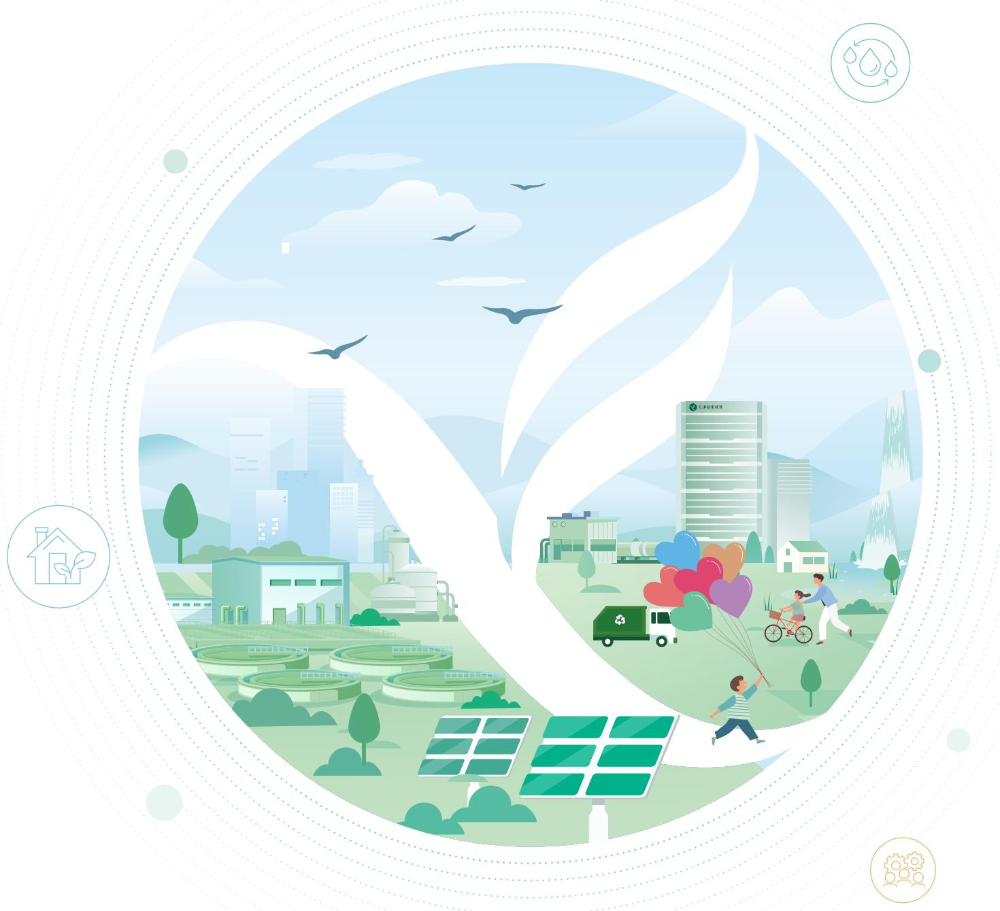

natural_image

Illustration of a sustainable urban park with solar panels, recycling vehicles, and people walking, surrounded by greenery and distant mountains (no text or symbols)

## 2025

## 可持续发展暨环境、社会及管治（ESG）报告

SUSTAINABILITY AND ESG REPORT 2025

## 目录

## CONTENT

关于本报告 04

董事长致辞 06

走进创业环保 08

## 专题

以水为脉赴使命 以民为本筑绿基 12

##

## 精治创业夯实发展基石

坚持党建领航 20

完善公司治理 23

依法合规运营 26

优化ESG 管治 31

## 02

## 科技创业赋能智慧水务

提升创新动能 38

守护碧水净土 46

品质稳定供应 49

## 03

## 绿色创业共筑生态家园

应对气候变化 54

环境合规管理 59

践行绿色运营 62

报告附录 90

## 04

## 才聚创业 携手同绘未来

多元合规雇佣 70

成就员工梦想 74

严守安全底线 77

## 05

## 协同创业聚力和谐社会

共建责任链条 82

驱动行业发展 83

持续社区投资 85

## 关于本报告

## 报告说明

本报告是天津创业环保集团股份有限公司（简称“创业环保集团”）发布的第十份可持续发展暨环境、社会及管治(ESG)报告(以下简称“本报告”）。本报告每年定期发布，重点披露创业环保集团在环境、社会及管治方面的管理、实践及绩效。本报告设有中文及英文版本，并已上载至香港联合交易所（“联交所”）及上海证券交易所（“上交所”）网站，以供各界随时查阅。本报告中英文不一致之处，请以中文版本为准。

## 编制依据

本报告依据“联交所”证券上市规则（以下简称《上市规则》）附录 C2 所载《环境、社会及管治报告守则》（以下简称《守则》）要求，上海证券交易所《上海证券交易所上市公司自律监管指引第14号——可持续发展报告》要求，并参考国务院国有资产监督管理委员会《央企控股上市公司ESG专项报告参考指标体系》、全球可持续发展标准委员会(GSSB)发布的《GRI可持续发展报告标准》（GRI Standards）核心方案（2021版）、联合国可持续发展目标（SDGs）编制而成。

## 报告范围及边界

除特殊说明外，本报告所载资料时间范围为2025年1月1日至2025年12月31日（以下简称“报告期”），部分内容涉及报告期外。报告期内，如因统计口径或统计方法发生变化，导致与往年报告数据不一致的，将在本报告中进行重述。本报告涵盖范围包括天津创业环保集团股份有限公司及其附属公司(统称“本集团”“我们”“公司”），信息边界与公司年报口径一致，使用“创业环保”指代创业环保集团母公司。

本集团的核心业务包括污水处理、供水、再生水、新能源供冷供热、污泥及危废处理处置等。环境及社会关键绩效指标(“KPIs”）和其他相关统计信息已覆盖本集团上述业务范围内的直接运营点。相关业务及运营点对本集团具有财务重要性及经营影响力，且本集团对他们具有直接的运营控制权。本集团将继续提升内部资料收集系统，在可行情况下进一步扩大报告披露范围。

在报告中涉及的部分分子公司及控股公司简称如下

<table><tr><td>公司全称</td><td>简称</td></tr><tr><td>天津中水有限公司</td><td>中水公司</td></tr><tr><td>天津凯英科技发展股份有限公司</td><td>凯英公司</td></tr><tr><td>天津天创绿能新能源科技有限公司</td><td>绿能公司</td></tr><tr><td>天津天创环境技术有限公司</td><td>天创环境</td></tr></table>

## 汇报原则

本报告遵循联交所《守则》汇报原则，包括：

重要性：董事会若判定某项环境，社会及治理事宜对投资者及其他利益相关者具有重要影响，应予以披露和说明

量化：关键绩效指标的历史数据应具备可计量性。公司须为减少特定影响设定目标(可采用具体数值或方向性、前瞻性的表述)，使其环境、社会和治理政策与管理体系的成效可被评估和验证。量化信息应辅以阐释，说明其目的及影响，并在适当时提供对比数据。

平衡：报告应力求客观、公允地反映公司表现，避免因选择性呈现、信息遗漏或表述方式失当而对读者决策或判断产生不当影响。

一致性：公司应采用一致的披露及统计方法，以确保环境、社会和治理数据在不同期间之间具有可比性，便于后续追踪分析。

## 资料来源及可靠性保证

本报告的资料均来自本集团内部资料，调查访谈记录及相关文件。本集团董事会(以下简称“董事会”，其成员为“董事”承诺本报告不存在任何虚假信息，误导信息记载，并对其内容真实性，准确性和完整性负责。本报告中有关数据所涉及货币种类及金额，如无特殊说明，均以人民币为计量单位。

## 董事会声明

董事会对ESG事宜及相关汇报享有最高层级的监督权，并在本集团各委员会与管理层的协同支持下推进相关管理工作。董事会对创业环保ESG工作及程序的监督，体现在对ESG相关重大风险与机遇管理与应对的支持与评估，确保其贯穿于各项业务运营策略，重大交易决策，潜在利弊权衡，风险管理政策，并服务于长期价值创造

为确保ESG工作有效落地，本集团在绩效管理办法中明确纳入ESG因素的考核要求，通过规范管理、强化执行，推动可持续发展战略落实见效。本报告经管理层审议后，于2026年3月25.日获董事会通过

## 董事长致辞

natural_image

Portrait of a man in a blue pinstripe suit and maroon shirt, no visible text or symbols

时序更替，笃行不怠；绿脉永续，初心如磐。2025年，是创业环保上市二十五周年，更是公司以 ESG理念引领高质量发展的关键一年。这一年，我们坚守“还碧水于世界，送清新于人间”的使命担当，将可持续发展理念深度融入战略规划与日常运营，在守护生态环境、回馈社会各界、完善公司治理的道路上稳步前行，用实干与创新书写了国企ESG实践的新篇章。

## 以治为魂，精益求精筑发展之基

我们以党建为引领，将党的领导全面嵌入公司治理各环节，60余家子公司党组织应建尽建，“融·共赢”特色党建模式深度赋能生产经营。我们完善“三会一层”治理架构，董事会下设战略与ESG委员会等四大专业委员会，全年召开董事会25次、股东会4次，审议通过多项关键议案，董事会成员出席率100%。我们构建“横向权责清晰、纵向穿透监管”的全级次管控模式，信息披露及时准确，全年披露公告65份，回复投资者问题超700件以规范治理赢得市场信任。我们坚守商业道德，坚决杜绝舞弊行为，推进廉政文化建设。同时，我们上线ESG数字化平台，参与ESG相关培训与交流，不断提升 ESG 管理能力。

## 以绿为基，低碳运营践环境之责

我们秉持“打造现代化一流城市综合环境运营服务商”的发展愿景，聚焦污水处理、固废处置、资源再生等核心业务推动数字化转型，持续加大环保技术研发与投入，推动业务全流程绿色升级

我们深耕“N维一体”商业模式，逐步形成“全层级、全业务、全覆盖”的“1+4+”市场开发格局，全年处理污水17亿吨，无害化处置污泥22.6万吨、危废92万吨，供能供热业务获得用户一致好评，为城市生态保护筑牢绿色屏障

我们运用物联网、大数据、A算法实现污水水质实时监测、工艺参数智能调控、设备运行精准预警等举措建设智慧水务，在固废处理领域融入智能化溯源与管控手段，并顺利通过国家数据管理能力成熟度(DCMM)三级“稳健级”认证，彰显了我们在数据管理与数字化运营方面的扎实实力。

我们严格恪守环保法规，建立全生命周期环境管理体系，常态化开展环保合规检查与风险排查，确保各项环保指标全面达标，同时积极响应全球气候行动，发行天津首单“科技创新+绿色”公司债券，稳步推进节能降碳举措，全年光伏清洁能源使用量超4.44万兆瓦时，凭借突出的节水成效荣获“中国节水奖先进集体”，以多元实践践行对环境保护的庄严承诺

## 以人为本，共生共荣行社会之善

我们搭建多元化职业发展平台，深化“创业骐骥”人才工程，构建“管理一技术”双通道职业发展路径，全年完成跨板块、跨地域交流管理人员52人次，全年员工受训总课时超9.36万小时，数字化培训平台实现全国各区域员工全覆盖。我们完善薪酬福利与激励机制，“冬送温暖、夏送清凉”等慰问活动覆盖千余人次，加强安全健康管理与技能培训，营造公平、包容、多元的职场环境，不断增强员工的归属感与幸福感。

我们圆满完成上海合作组织峰会、夏季达沃斯论坛等重大活动保障任务，“天津之眼”灯光改造项目打造绿色合规标杆，上合峰会再生水供水实现“三个100%”目标。我们主动投身公益事业，志愿者服务59次、参与617人次，全年开展环保宣传进社区、进校园活动超百场，助力提升全民环保意识。同时依托自身专业优势，以技术赋能、公益捐赠等方式，援藏帮扶带动藏区农特产品销售超3.200万元，各项乡镇污水处理项目助力农村环境基础设施建设，推动乡村生态改善与产业升级。我们主动引领行业发展，主导或参与14项行业标准编制，加入数十家重点行业协会，以技术输出与经验共享推动产业高质量发展。

治水耕心安今岁，逐绿扬帆向远光。创业环保将继续以ESG为核心驱动力，聚焦污水处理、固废处理处置、新能源供能等核心业务，深化科技创新与数字化转型，持续提升环境治理效能，完善员工发展与关怀体系，以更坚定的决心、更务实的举措、更开放的姿态，与各界伙伴携手同行，共同守护绿水青山，为建设人与自然和谐共生的美丽中国贡献更大力量

董事长

## 走进创业环保

## 集团介绍

天津创业环保集团股份有限公司(股票代码：600874.SH：01065.HK)是国内首家以污水处理为主业的沪、港两地上市国有控股企业，连续二十年荣膺“水业十大影响力企业”称号。公司以“还碧水于世界，送清新于人间”为使命业务覆盖全国十五个省市，拥有60余家全资或控股子公司，拥有涵盖污水处理、供水、再生水、新能源供冷供热、污泥与危废处理、环保技术服务等多元业务体系。

## 企业使命

还碧水于世界，送清新于人间

## 企业愿景

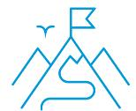

打造现代化一流城市综合环境运营服务商

## 核心 价值观

担当、创新、 共享、卓越

## 2025 年荣誉

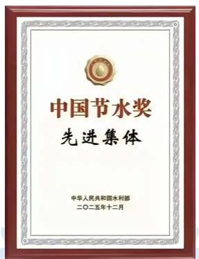

text_image

中国节水奖
先进集体
中华人民共和国水利部
二〇二五年十二月

中国节水奖先进集体(天津中水有限公司)  
国家水利部

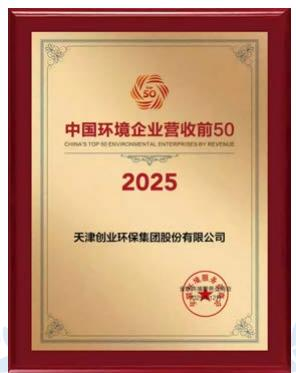

text_image

中国环境企业营收前50
CHINA'S TOP 10 ENVIRONMENTAL ENTERPRISES BY REVENUE
2025
天津创业环保集团股份有限公司

2025中国环境企业营收前50  
全联环境服务业商会

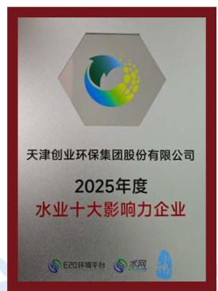

text_image

天津创业环保集团股份有限公司
2025年度
水业十大影响力企业
E2O环境平台 水网

2025年度水业十大影响力企业  
E20环境平台

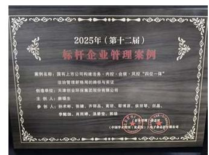

text_image

2025年（第十二届）
标杆企业管理案例
案例名称：国有上市公司构建法律、内控、合规、风控“四创一体”
法律顾问：天津创业环境集团股份有限公司
主 员 人：唐建生
事 员 人：孙本松、张敏、李明品、麦建、廖博涛、洪翔琴、邱晨、
李毅强、肖雨萍、温祥荣、薛峰
《中国中车集团（天津）汽车工业股份有限公司

标杆企业管理案例  
《企业管理》杂志社

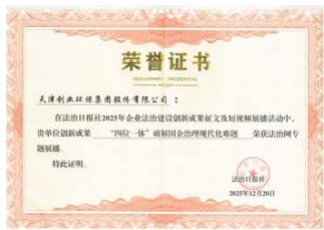

text_image

荣誉证书
天津创业环保集团股份有限公司：
在法治日报社2025年企业法治建设创新成果征文及短视频展播活动中，
贵单位创新成果“四位一体”破制国企治理现代化难题 荣获法治网专
题展播。
特此证明。
法治日报
2023年12月31日

2025年企业法治建设创新成果奖  
法治日报

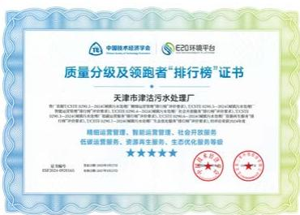

text_image

中国技术经济联合会
E20环境平台
质量分级及领跑者“排行榜”证书
天津市津法污水处理厂
（盖章）天津ZCTE 6901-2-3008号文件，编号：ZCTE 6901-2-3008版证书编号：ZCTE 6901-2-3008、2008版证书编号：ZCTE 6901-2-3008、2008版证书编号：ZCTE 6901-2-3008、2008版证书编号：ZCTE 6901-2-3008、2008版证书编号：ZCTE 6901-2-3008、2008版本证书编号：ZCTE 6901-2-3008、2008版本证书编号：ZCTE 6901-2-3008、2008版本证书编号：ZCTE 6901-2-3008、2008版本证书编号：ZCTE 6901-2-3008、2008版本证书编号：2014年 第1版证书编号：2014年 第2版证书编号：2014年 第3版证书编号：2014年 第4版证书编号：2014年 第5版证书编号：2014年 第6版证书编号：2014年 第7版证书编号：2014年 第8版证书编号：2014年 第9版证书编号：2014年 第10版证书编号：2014年 第11版证书编号：2014年 第12版证书编号：2014年 第13版证书编号：2014年 第14版证书编号：2014年 第15版证书编号：2014年 第16版证书编号：2014年 第17版证书编号：2014年 第18版证书编号：2014年 第19版证书编号：2014年 第20版证书编号：2014年 第21版证书编号：2014年 第22版证书编号：2014年 第23版证书编号：2014年 第24版证书编号：2014年 第25版证书编号：2014年 第26版证书编号：2014年 第27版证书编号：2014年 第28版证书编号：2014年 第29版证书编号：2014年 第30版证书编号：2014年 第31版证书编号：2014年 第32版证书编号：2014年 第33版证书编号：2014年 第34版证书编号：2014年 第35版证书编号：2014年 第36版证书编号：2014年 第37版证书编号：2014年 第38版证书编号：2014年 第39版证书编号：2014年 第40版证书编号：2014年 第41版证书编号：2014年 第42版证书编号：2014年 第43版证书编号：2014年 第44版证书编号：2014年 第45版证书编号：2014年 第46版证书编号：2014年 第47版证书编号：2014年 第48版证书编号：2014年 第49版证书编号：2014年 第50版证书编号：2014年 第51版证书编号：2014年 第52版证书编号：2014年 第53版证书编号：2014年 第54版证书编号：2014年 第55版证书编号：2014年 第56版证书编号：2014年 第57版证书编号：2014年 第58版证书编号：2014年 第59版证书编号：2014年 第60版证书编号：2014年 第61版证书编号：2014年 第62版证书编号：2014年 第63版证书编号：2014年 第64版证书编号：2014年 第65版证书编号：2014年 第66版证书编号：2014年 第67版证书编号：2014年 第68版证书编号：2014年 第69版证书编号：2014年 第70版证书编号：2014年 第71版证书编号：2014年 第72版证书编号：2014年 第73版证书编号：2014年 第74版证书编号：2014年 第75版证书编号：2014年 第76版证书编号：2014年 第77版证书编号：2014年 第78版证书编号：2014年 第79版证书编号：2014年 第80版证书编号：2014年 第81版证书编号：2014年 第82版证书编号：2014年 第83版证书编号：2014年 第84版证书编号：2014年 第85版证书编号：2014年 第86版证书编号：2014年 第87版证书编号：2014年 第88版证书编号：2014年 第89版证书编号：2014年 第90版证书编号：2014年 第91版证书编号：2014年 第92版证书编号：2014年 第93版证书编号：2014年 第94版证书编号：2014年 第95版证书编号：2014年 第96版证书编号：2014年 第97版证书编号：2014年 第98版证书编号：2014年 第99版证书编号：2015.5.5
特此公告。
证券代码：
证券简称：
证券简称：
证券代码：
证券简称：
证券简称：
证券代码：
证券简称：
证券简称：
证券简称：
证券代码：
证券简称：
证券简称：
证券简称：
证券代码：
证券简称：
证券简称：
证券简称：
证券代码：
证券简称：
证券简称：
证券简称：
证券代码：
证券简称：
证券简称：
证券简称：
证券代码：
证券简称：
证券简称：
证券简称：
证券代码：
证券简称：
证券简称：
证券简称：
证券代码：
证券简称：
证券简称：
证券简称：
证券代码：
证券简称：
证券简称：

精细运营管理、智能运营管理、社会开放服务、低碳运营服务、资源再生服务、生态优化服务等级五星单位(津沽污水处理厂)  
中国技术经济学会、E20环境平台

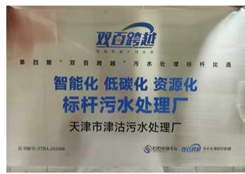

text_image

双百跨越
第四期“双百跨越”污水处理标杆比选
智能化低碳化资源化
标杆污水处理厂
天津市津沽污水处理厂

第四期“双百跨越”污水处理标杆比选“智能化+低碳化+资源化”标杆污水处理厂（津沽污水处理厂）  
F20环境平台、双百跨越污水处理标杆联盟

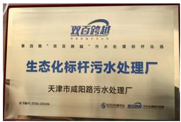

text_image

双百跨越
第四期“双百跨越”污水处理标杆比选
生态化标杆污水处理厂
天津市咸阳路污水处理厂

第四期“双百跨越”污水处理标杆比选生态化标杆污水处理厂（咸阳路污水处理厂）  
E20环境平台、双百跨越污水处理标杆联盟

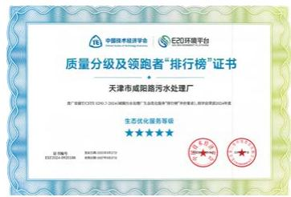

text_image

中国科学技术学会
E20环境平台
质量分级及领跑者“排行榜”证书
天津市威阳路污水处理厂
第一批国CCOTD 12941-2024版《城市污水治理“生活与健康”提升措施》的要求书，特许有效期至2024年度
生态文化服务等级
★★★★★
证书编号
E证[2024]403158
证书编号：2024年6月27日
证书编号：2024年6月27日

生态优化服务等级五星单位(咸阳路污水处理厂)  
中国技术经济学会、E20环境平台

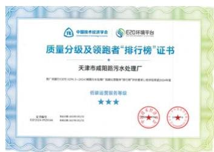

text_image

中国技术经济学会
E20环境平台
质量分级及领跑者“排行榜”证书
天津市威阳路污水处理厂
"双碳排放达标" 2024-12-31/2024年第四季度"双碳排放达标"双碳排放达标"双碳排放达标"双碳排放达标"双碳排放达标"双碳排放达标"双碳排放达标"双碳排放达标"双碳排放达标"双碳排放达标"双碳排放达标"双碳排放达标"双碳排放达标"双碳排放达标"双碳排放达标"双碳排放达标"双碳排放达标"双碳排放达标"双碳排放达标"双碳排放达标"双碳排放标准
★★★
证书编号
E20环境平台
2024年1月1日
2024年1月1日
2024年1月1日
★★★
E20环境平台
2024年1月1日
2024年1月1日
★★★

低碳运营服务等级三星单位(咸阳路污水处理厂  
中国技术经济学会、E20环境平台

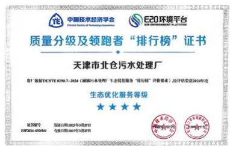

text_image

中国技术经济学会
E20环境平台
质量分级及领跑者“排行榜”证书
天津市北仓污水处理厂
出厂依据TCSTK 6296.7-2024（城镇污水处理厂专业化服务“项目图”评审要求），经评估荣获2024年度
生态优化服务等级
证编号 发照日期:2023年8月27日
ISO 2014-00161  临国日期:2027年5月27日

生态优化服务四星单位(北仓污水处理厂)  
中国技术经济学会、E20环境平台

## 数说 2025

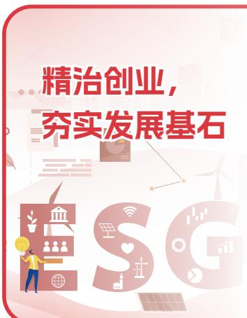

text_image

精治创业，
夯实发展基石

•	 召开董事会 25 次，董事出席率 100%  
•	 开展法律培训 2 次，培训时长共计 4 小时，参与 300人  
•	 披露公告文件 65 份，其中定期报告 4份，临时报告 61 份  
•	 无任何廉洁违规事件的发生

## 绿色创业，共筑生态家园

natural_image

Illustration of three people watering a tree in a green globe (no text or symbols)

•	 温室气体排放总量 342,009吨二氧化碳当量  
•	 重大环境污染事故为 0  
•	 清洁能源光伏使用量为 44,467.41兆瓦时  
•	 举办环保培训 256 次，参加环保培训 5,011人次

## 才聚创业， 携手同绘未来

•	 总人数 2,330人，其中残疾员工 5人，少数民族员工 116人  
•	 员工慰问 72人次，“送清凉”活动累计慰问 441人次，慰问款物总额 8.82万元  
•	 召开职工代表大会 10次  
•	 集体谈判协议覆盖率 100%  
•	 员工满意度 100%  
•	 员工培训覆盖率 100%  
•	 开展各类应急演练 695 次，参与 12,774人次

## 科技创业，赋能智慧水务

•	 依托已建成的集团物联网平台，实现38个污水项目（5万吨以上27家）、3个再生水项目、3个新能源项目数据接入  
•	 研发投入 6,091万元，占主营业务收入比例 1.28%  
•	 拥有专利 204件，其中发明专利 60件  
•	 已获得软件著作权 36 件  
•	 污水处理量 17亿吨  
•	 处置危废 9.2万吨，无害化处置污泥 22.6万吨  
•	 外售再生水量 8,286.87万吨，工业水量 585.72万吨，自来水量 5,045.64万吨  
•	 外售热量 1,292,960.07吉焦，外售冷量 217,208.12吉焦

## 协同创业，聚力和谐社会

## 专题

## 以水为脉赴使命 以民为本筑绿基

本集团始终以碧水涓流为纽带，锚定“还碧水于世界，送清新于人间”使命，秉持“精益治理卓越运营”的管理理念以多元实践筑牢绿色发展根基，用实于护航城市重大活动与民生福祉，实现环保与效益的协同共赢，为城市可持续发展注入源源不断的创业力量。

## 多维兴实业 智慧护清流

本集团锚定“双碳”目标，坚持以绿色低碳发展引领企业科技研发和生产技术革新，聚焦污水处理、再生水利用、污泥资源化、固废处置，资源循环，新能源供冷供热，光伏储能等业务，深入打造“N维一体”商业模式

我们秉持城市综合环境服务商的发展定位，依托全国化布局的项目网络，围绕不同城市的特点与需求，通过“N维一体"的业务纽带，实现服务模块的灵活组合与精准匹配。聚焦深耕工业园区、产业基地等场景，通过业务打包与协同服务，为园区提供覆盖多层面的综合解决方案，以精准策略与高效执行响应多样化需求，持续优化并拓展资源循环一体化的系统开发模式，助力城市实现可持续发展与环境治理目标。

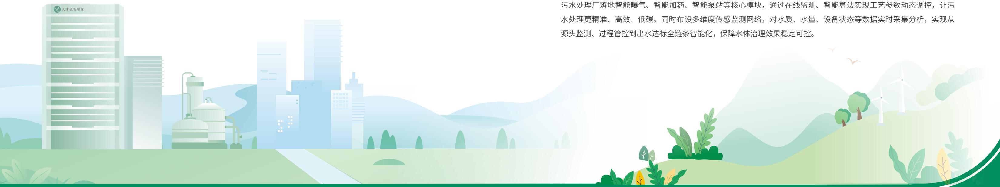

text_image

天津创业环保
污水处理厂落地智能曝气、智能加药、智能泵站等核心模块，通过在线监测、智能算法实现工艺参数动态调控，让污水处理更精准、高效、低碳。同时布设多维度传感监测网络，对水质、水量、设备状态等数据实时采集分析，实现从源头监测、过程管控到出水达标全链条智能化，保障水体治理效果稳定可控。

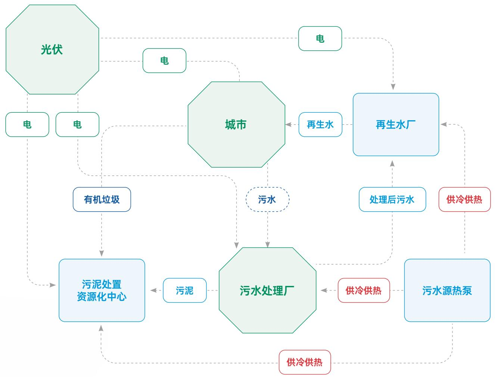

flowchart

```mermaid
graph TD
  A["光伏"] --> B["电"]
  C["电"] --> D["电"]
  E["电"] --> F["电"]
  G["城市"] --> H["再生水"]
  I["污水"] --> J["污水处理厂"]
  K["有机垃圾"] -.-> L["污泥处置资源化中心"]
  M["污水处理"] -.-> L
  N["污源热泵"] --> O["供冷供热"]
  P["供冷供热"] -.-> L
  Q["污水处理后污水"] -.-> R["再生水厂"]
  S["电"] -.-> T["电"]
  U["电"] -.-> V["电"]
  W["污水"] -.-> J
  X["供冷供热"] -.-> Y["污水处理后"]
  Z["供冷供热"] -.-> Y
  AA["污水"] -.-> Y
  AB["再生水厂"] -.-> B
  AC["电"] -.-> T
  AD["电"] -.-> F
  AE["污水"] -.-> J
  AF["污水处理后污水"] -.-> R
  AG["供水供热"] -.-> Y
  AH["污水处理后污水"] -.-> R
  AI["电"] -.-> T
  AJ["电"] -.-> F
  AK["电"] -.-> V
  AL["电"] -.-> Y
  AM["电"] -.-> Y
  AN["电"] -.-> Y
  AO["电"] -.-> Y
  AP["电"] -.-> Y
  AQ["电"] -.-> Y
  AR["电"] -.-> Y
  AS["电"] -.-> Y
  AT["电"] -.-> Y
  AU["电"] -.-> Y
  AV["电"] -.-> Y
  AW["电"] -.-> Y
  AX["电"] -.-> Y
  AY["电"] -.-> Y
  AZ["电"] -.-> Y
  BA["电"] -.-> Y
  BB["电"] -.-> Y
  BC["电"] -.-> Y
  BD["电"] -.-> Y
  BE["电"] -.-> Y
  BF["电"] -.-> Y
  BG["电"] -.-> Y
  BH["电"] -.-> Y
  BI["电"] -.-> Y
  BJ["电"] -.-> Y
  BK["电"] -.-> Y
  BL["电"] -.-> Y
  BM["电"] -.-> Y
  BN["电"] -.-> Y
  BO["电"] -.-> Y
  BP["电"] -.-> Y
  BR["电"] -.-> Y
  CA["电"] -.-> Y
  AD["电"] -.-> Y
  AE["电"] -.-> Y
  AF["电"] -.-> Y
  AG["电"] -.-> Y
  AH["电"] -.-> Y
  AI["电"] -.-> Y
  AJ["电"] -.-> Y
  AK["电"] -.-> Y
  AL["电"] -.-> Y
  AM["电"] -.-> Y
  AN["电"] -.-> Y
  AO["电"] -.-> Y
  AP["电"] -.-> Y
  AQ["电"] -.-> Y
  AR["电"] -.-> Y
  AS["电"] -.-> Y
  AT["电"] -.-> Y
  AU["电"] -.-> Y
  AV["电"] -.-> Y
```

公司将物联网、大数据、人工智能等技术深度融入污水处理全流程，以智慧化手段实现污水净化、资源循环与生态保护的协同推进。我们依托智能生产管理系统、大数据运行调度平台搭建全域智慧管控体系，在东郊、津沽、咸阳路等污水处理厂落地智能曝气、智能加药、智能泵站等核心模块，通过在线监测、智能算法实现工艺参数动态调控，让污水处理更精准、高效、低碳。同时布设多维度传感监测网络，对水质、水量、设备状态等数据实时采集分析，实现从源头监测、过程管控到出水达标全链条智能化，保障水体治理效果稳定可控。

## 当前创业环保主要数智化平台：

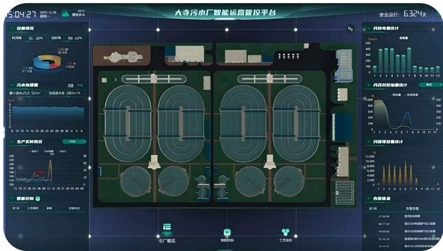

text_image

大寺污水厂智能运营管控平台
6:04:21 2004.12.08
安全运行：6324天
数据情况
利用率 52.37% 持续率 59.20%
经济增加值
累计收入27.56亿元
经济增加值 28.56亿元
生产实时情况
全厂规范
智能控制
工艺动态
月度发电量统计
月度利用效率统计
月度排放监测统计
供需总量
时间
零售总量
17:30:30
08:17:02
10:06:30
11:02:13
12:00:00

· 污水/污泥智慧水务平台，实现了多维联动、AI赋能、数字值守和行业赋能

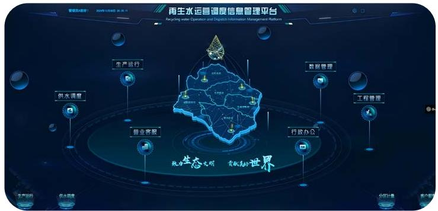

text_image

再生水运管调度信息管理平台
Recycling water Operation and Dispatch Information Management Platform
生产运行
供水调度
营业客服
数据管理
工程管理
行政办公
秋水生态文明 贵政办世界
生产运行  健水调度  分配计量  客户管理

• 再生水厂网综合管控服务平台，实现了厂网一体、热线联动、智能测漏和产销平衡

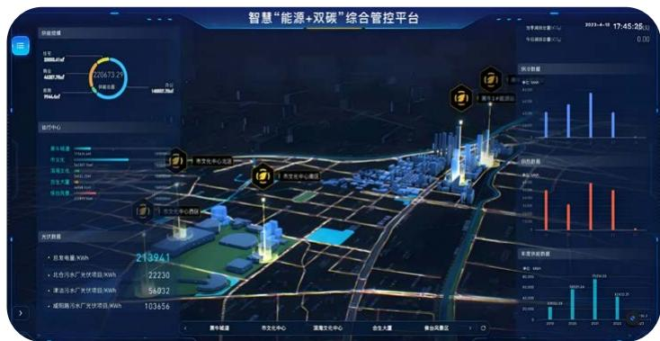

text_image

智慧“能源+双碳”综合管控平台
201673.2
发电量
213941
总发电量 kWh
22230
综合利用厂光伏项目 kWh
54832
清洁能源污水厂光伏项目 kWh
103656
2022-4-10 17:45:35:11
0.00
发电量
2022年发电量（亿千瓦）
发电量（亿千瓦）：103656
同比增长率
同比增长率（%）：10.3
发电量（亿千瓦）：103656
同比增长率（%）：10.3
光伏发电项目
新能源汽车充电站
新能源汽车充电站
新能源汽车充电站
新能源汽车充电站
新能源汽车充电站
新能源汽车充电站
新能源汽车充电站
新能源汽车充电站
新能源汽车充电站
新能源汽车充电站
新能源汽车充电站
新能源汽车充电站
新能源汽车充电站
新能源汽车充电站
新能源汽车充电站
新能源汽车充电站
新能源汽车充电站
新能源汽车充电站
新能源汽车充电站
新能源汽车充电站
新能源汽车充电场
新能源汽车充电场
新能源汽车充电场
新能源汽车充电场
新能源汽车充电场
新能源汽车充电场
新能源汽车充电场
新能源汽车充电场
新能源汽车充电场
新能源汽车充电场
新能源汽车充电场
新能源汽车充电场
新能源汽车充电场
新能源汽车充电场
新能源汽车充电场
新能源汽车充电场
新能源汽车充电场
新能源汽车充电场
新能源汽车充电场
新能源汽车充电场
新能源汽车充电站
新能源汽车充电场
新能源汽车充电场
新能源汽车充电场
新能源汽车充电场
新能源汽车充电场
新能源汽车充电场
新能源汽车充电场
新能源汽车充电场
新能源汽车充电场
新能源汽车充电场
新能源汽车充电场
新能源汽车充电场
新能源汽车充电场
新能源汽车充电场
新能源汽车充电场
新能源汽车充电场
新能源汽车充电场

• 智慧“能源+双碳”综合管控平台，实现了负荷预测，智慧运行、无人值守和产销联动

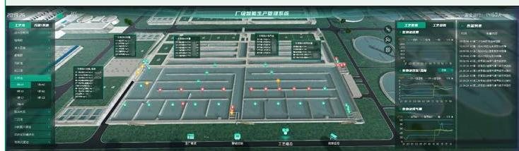

text_image

智能客户管理系统
工单
运维
数据管理
智能客户管理系统
工单
运维
数据管理
智能客户管理系统
工单
运维
数据管理
智能客户管理系统
工单
运维
数据管理
智能客户管理系统
工单
运维
数据管理
智能客户管理系统
工单
运维
数据管理
智能客户管理系统
工单
运维
数据管理
智能客户管理系统
工单
运维
数据管理
智能客户管理系统
工单
运维
数据管理
智能客户管理系统

•厂级智能生产管理系统，融合先进检测、自动化、模型与IT技术，实现数据高效处理与实时交互，并以3D组态技术实现厂区生产流程、设备状态及运行参数的高保真可视化还原

## 以“四新”实践打造绿色发展新标杆— 东郊污水处理厂

天津东郊污水处理厂(以下简称“处理厂”）作为首座半地下式污水处理厂，以“藏于地下，美于地上”理念，打造集技术创新、生态休闲、科普教育于一体的环保新范式

## 新能源——水光电融合塑造水环境治理新生态

2025年，处理厂分布式光伏发电量约898.72万kWh，预计年节约2,005吨标准煤，减排二氧化碳约5,662吨，实现“减污、降碳、绿色、发展”协同推进。

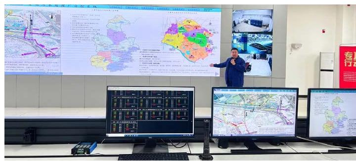

text_image

Control room scene with large display screens showing geographic maps and data tables, a presenter on screen, and multiple monitors displaying real-time operational metrics.

## 新模式——从传统功能厂区到多功能生态客厅

处理厂生产设施全地下布局，最大限度降低噪音、异味对周边环境的影响，节约土地资源：地上空间建设生态公园，环形步道串联企业文化长廊、免费运动场地、再生水景观湿地等，让市民在休闲中感受环保魅力。

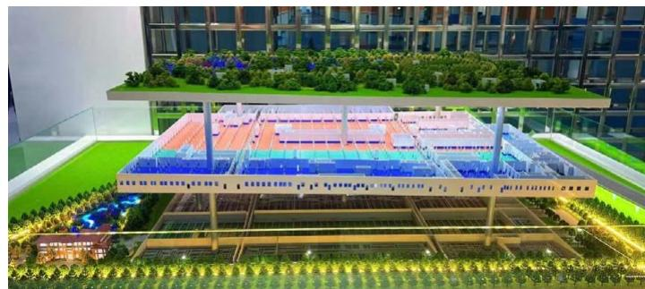

natural_image

Architectural rendering of a modern multi-level building complex with green landscaping and illuminated pathways (no visible text or symbols)

## 新样本——用创新技术打造数智绿色引擎

处理厂通过智能生产管理系统和大数据运行调度平台，实现精细化控制，节能降耗与安全高效的运行目标，对生产调度、水质监测、设备状态等全方位数据的一体化管理，为厂区安全、达标、经济运行提供了有力支撑。

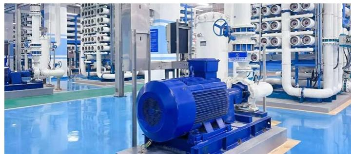

natural_image

Industrial facility interior with large blue electric motors and white piping systems (no visible text or labels)

## 新理念——沉浸式体验打造全景“练兵场”：“双碳”实践培训基地

厂内“双碳”实践培训基地融合前沿科技，公众可零距离观摩现代环保设施，系统了解污水处理行业在节能降耗、资源循环利用等方面的前沿“双碳”技术成果，亲身感受环保工业与生态文明建设的和谐共生。

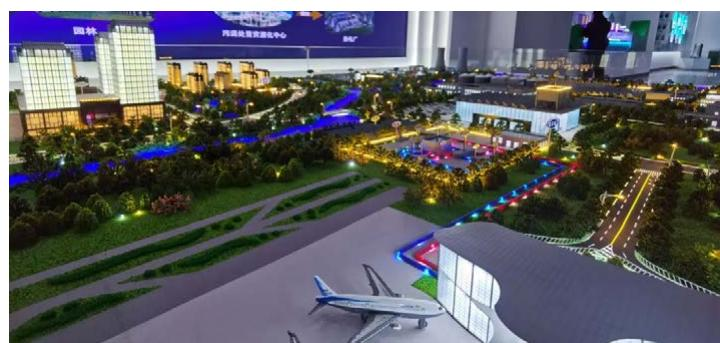

natural_image

Aerial view of a modern architectural model with illuminated buildings and green spaces, featuring an airplane model and digital display screens (no readable text or symbols)

## 光影绘津门 碧水映盛会

2025年，上海合作组织峰会及世界经济论坛第十六届新领军者年会（2025夏季达沃斯论坛）均在天津举行。作为深耕环保与城市服务领域的国企标杆，创业环保以高标准圆满完成海河灯光改造项目，通过建立厂网联动保障机制、应急演练、设备隐患排查、漏损自查巡检及全时待命等举措保障会议供水，用实际行动为峰会添彩、为城市赋能

## 创业环保集团助力海河摩天轮“天津之眼”灯光改造

天创环境开展的“天津之眼”灯光改造项目，以全周期管理为脉络，在项目前期规划、中期实施、后期运营全过程，通过绿色低碳技术革新、民生需求精准响应、合规协同机制构建，打造了绿色合规的实践样本。

## 绿色低碳实践

我们以“减碳优先”升级照明系统，用高清视频像素灯替换传统灯具，结合5G智能管控实现单灯精准控制与分时亮灯，打造按需照明节能模式：推行“减法设计”，设常规、节假日两种灯光模式，通过激光投射避免光污染与环境干扰：采用模块化施工、分时段作业，协同多部门优化交通方案，分类回收旧设备实现资源再利用。

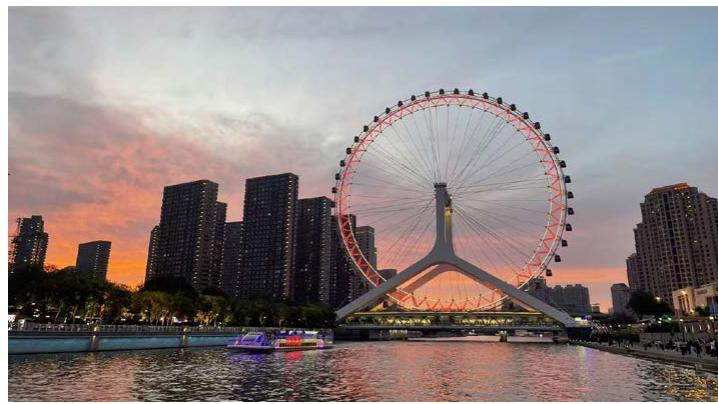

natural_image

Exterior view of a modern city skyline featuring a large Ferris wheel and river, with high-rise buildings in the background (no signage or text visible)

## 民生与文化赋能

项目打造休闲社交公共空间，适配重大活动编制动态演绎方案，助力夜间经济;建立全周期沟通机制，提前公示施工信息，通过“周例会+日汇报”制度统筹解决施工中的民生问题，切实保障公众知情权与参与权。

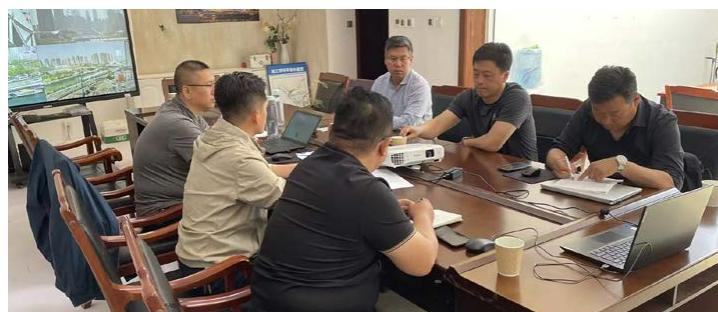

natural_image

Group of men seated around a conference table with laptops and documents, in a meeting room with monitors and screens (no visible text or symbols)

## 合规与协同管理

我们严守合规标准，联动多部门保障方案安全合规，建立全周期风险评估与应急预案，开展特种设备安全测试：构建“五位一体”协同机制，通过联席会议统筹推进项目。

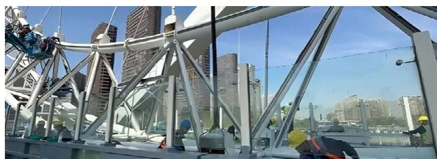

natural_image

Exterior view of a modern building with steel truss structure and workers in safety gear, city skyline in background (no signage or text visible)

## 创业环保集团圆满完成上合峰会再生水供水保障

2025年，中水公司“五措并举”，圆满完成“零失误、零事故、零投诉”上海合作组织峰会再生水供水保障任务。

## 谋划先行

明确“源头管控、过程监督、应急处置”原则、梳理4处保障点位、11组保障片区，任务清单化推进。

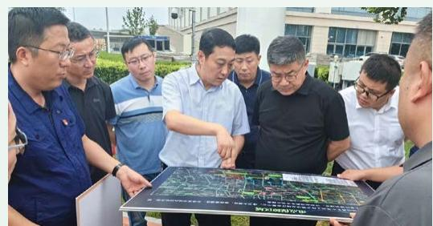

text_image

Group of men gathered around a large display board with visible Chinese text, likely in an outdoor or educational context.

## 细化预案

针对9类突发风险制定专项方案，明确15 分钟响应、30分钟处置流程，成立5个党员骨干专项保障工作组，严抓细节、杜绝隐患。

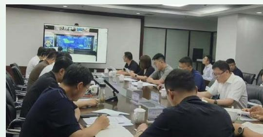

text_image

Meeting room scene with participants seated around a long table, one person presenting a large screen displaying data visualization and charts.

## 能力提升

以“先供后查”为原则，开展51场次应急演练优化物资准备、操作衔接等措施，提升应急处置能力。

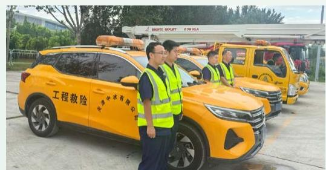

text_image

工程救险
中水有雨

## 隐患排查

建立“日报告、周推动、月调度”机制，排查厂网设施，完成120 台次设备维护，全面摸排保供点位及周边供水管网设施15次，排查并修复暗漏5处，维护保养 423 处阀门，更换28 处关键阀门和27处防沉降井盖，实行隐患“销号”管理。

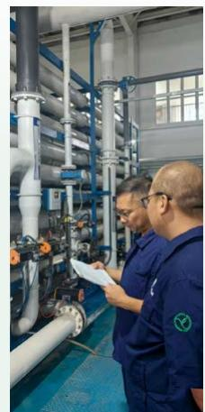

natural_image

Two engineers in blue uniforms inspecting industrial piping and equipment inside a factory (no visible text or symbols)

## 智慧调度

峰会期间，我们共计投入 148 人和 25 车，划分管网巡检、场馆保障、应急抢修、水厂生产和客服受理等共计47个专项保障小组。通过智慧调度平台实时监测和人工巡查相结合方式精准调度，累计巡检管网2,500余公里，水质检验699 项次，受理热线366件，保持水质达标率、压力合格率和用户满意率三个100%。

## 精治创业夯实发展基石

治理是企业高质量发展的核心基石。创业环保以党建为引领筑牢治理方向，以规范信息披露保障投资者知情权，以严执商业道德坚守合规底线，以系统化ESG治理赋能可持续发展。通过多维度治理举措协同发力，持续提升治理效能与透明度，彰显国企规范治理的责任与担当。

## 关键议题

· 公司治理

· 廉洁运营

· ESG 治理

· 内控及风险管理

· 商业道德

· 投资者关系管理

## 对标联合国可持续发展目标

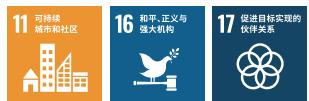

20 坚持党建领航  
23 完善公司治理  
26 依法合规运营  
31 优化 ESG 管治

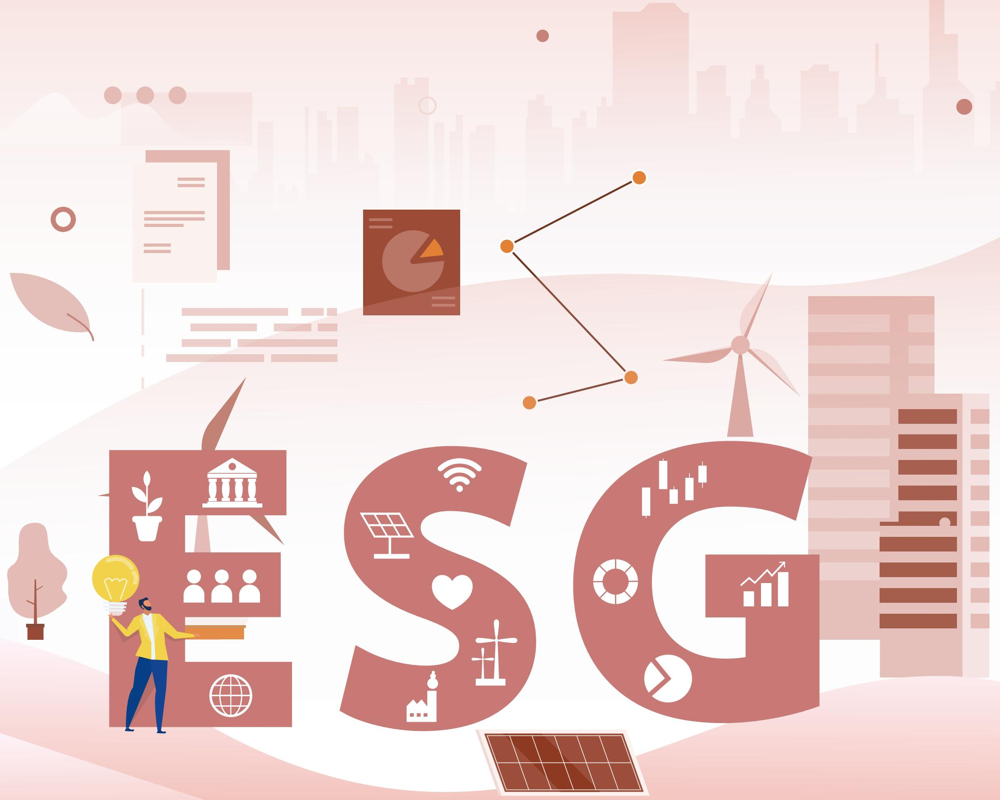

natural_image

Illustration of sustainable energy and infrastructure concepts with icons for solar panels, wind turbines, and smart grid (no text or symbols)

## 坚持党建领航

本集团坚持贯彻新时代党的建设总要求，将党的领导嵌入公司治理体系，落实“四同步，四对接”要求，通过单独组建联合组建，派驻帮建等方式，做到60余家子公司党组织应建尽建。依法依规推进“党建入章”全覆盖，从源头上夯实政治根基，深化“双向进入、交叉任职”领导机制，强化党组织在“三重一大”事项中的定向把关职责，充分发挥党的核心领导作用，保障战略决策落地落实。公司建立“系统谋划一制定标准一穿透指导”运行机制，制定高质量党建引领企业高质量发展三年行动方案，配套党建工作管控指导意见、全面从严治党模块化工作指引、党支部标准化操作手册，实现对各级党组织的穿透式管理。

公司作为城投集团环境水务板块核心骨干企业，始终坚持党建引领生产经营，深度解剖城投集团“融·津彩”党建融合工作指引，结合国有上市公司实际与战略布局，探索“融·共赢”特色党建模式，聚焦核心业务场景，深化培育六类党建融合载体，确立“六聚力明方向、六载体建路径、六共赢创价值”的党业融合体系，推动公司与投资者、产业链伙伴、行业同仁\社会民众、企业员工以及生态环境六大主体实现价值共赢，以“党建引领有方向、融合发展有路径、价值创造有实效的工作格局，积极助力公司在绿色环保领域持续发展。

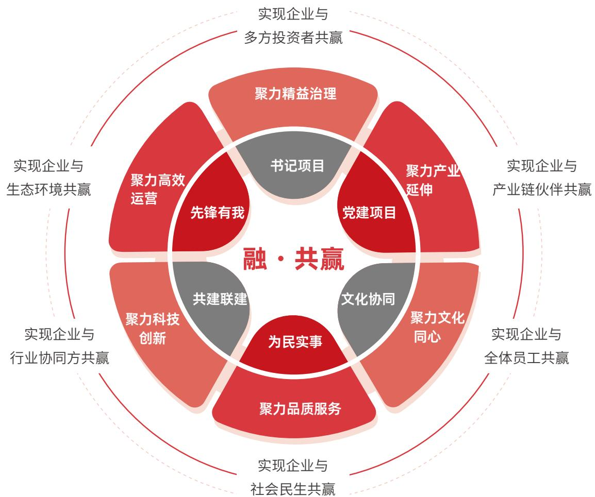

flowchart

```mermaid
graph TD
  Center["融・共赢"]
  
  subgraph BookProject ["书记项目"]
    direction TB
    A1["聚力精益治理"]
    A2["聚力产业延伸"]
    A3["党建项目"]
    A4["实现企业与产业链伙伴共赢"]
  end
  
  subgraph PartyDevelopment["党建项目"]
    direction TB
    B1["聚力文化同心"]
    B2["聚力品质服务"]
    B3["聚力科技创新"]
    B4["聚力高效运营"]
    B5["实现企业与生态环境共赢"]
  end
  
  subgraph CulturalAssociation["文化协同"]
    direction TB
    C1["聚力文化同心"]
    C2["聚力品质服务"]
    C3["实现企业与行业协同方共赢"]
    C4["实现企业与社会民生共赢"]
  end
  
  subgraph ResidentAfras["为民实事"]
    direction TB
    D1["聚力科技创新"]
    D2["聚力品质服务"]
    D3["聚力高效运营"]
    D4["实现企业与生态环境共赢"]
  end
  
  Center --> Core
  Core --> SubCore
  
  subgraph CoreDetails
    direction TB
    E1["先锋有我"]
    E2["共建联建"]
    E3["文化协同"]
  end
  
  subgraph CoreDetails
    direction TB
    F1["聚力品质服务"]
    F2["聚力文化同心"]
    F3["聚力科技创新"]
    F4["聚力高效运营"]
    F5["实现企业与生态环境共赢"]
  end
  
  subgraph CoreDetails
    direction TB
    G1["聚力品质服务"]
    G2["聚力文化同心"]
    G3["聚力科技创新"]
    G4["聚力高效运营"]
    G5["实现企业与生态环境共赢"]
  end
  
  subgraph CoreDetails
    direction TB
    H1["聚力品质服务"]
    H2["聚力文化同心"]
    H3["聚力科技创新"]
    H4["聚力高效运营"]
  end
  
  subgraph CoreDetails
    direction TB
    I1["聚力品质服务"]
    I2["聚力文化同心"]
    I3["聚力科技创新"]
    I4["聚力高效运营"]
  end
  
  subgraph CoreDetails
    direction TB
    J1["聚力品质服务"]
    J2["聚力文化同心"]
    J3["聚力科技创新"]
    J4["聚力高效运营"]
  end
  
  subgraph CoreDetails
    direction TB
    K1["聚力品质服务"]
    K2["聚力文化同心"]
    K3["聚力科技创新"]
    K4["聚力高效运营"]
  end
  
  subgraph CoreDetails
    direction TB
    L1["聚力品质服务"]
    L2["聚力文化同心"]
    L3["聚力科技创新"]
    L4["聚力高效运营"]
  end
  
  subgraph CoreDetails
    direction TB
    M1["聚力品质服务"]
    M2["聚力文化同心"]
    M3["聚力科技创新"]
    M4["聚力高效运营"]
  end
  
  Center --> CoreDetails
  CoreDetails --> SubCore
```

## “书记项目”领航

确立“书记项目”7个，带动各级于部认领攻关项目40余个，助力津沽污水处理厂、咸阳路污水处理厂获评“高质六化污水处理标杆”，将达沃斯论坛、上合峰会再生水保供等重点任务纳入“书记项目”，由“一把手”牵头统筹资源，组建“管网卫士先锋队”“匠心为民服务队”“护水先锋应急保供队”“水润民心志愿队”等党员服务队，全力推动落实，圆满完成民生服务与重大活动保障任务。

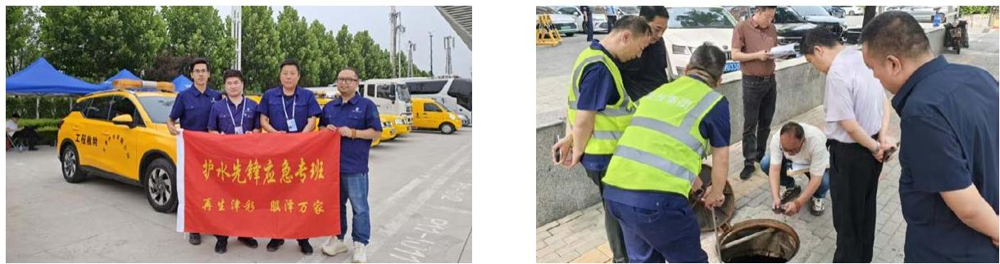

## “项目党建”攻坚

坚持把支部建在项目上，成功落地咸阳路二期、荆门掇刀污水处理等项目；轻资产业务成为新的稳定增长点其中，宁国委托运营项目创新实行“股权投资+轻资产”模式，成为投资模式新标杆。

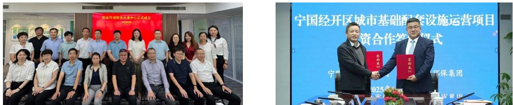

## “联动共建”赋能

推动“产学研用”协同，完成数字化一期工程验收，稳步推进二期建设；参与编制标准14项，自主研发的“污水厂智慧运营管控平台”落地应用，切实将技术优势转化为市场竞争力。

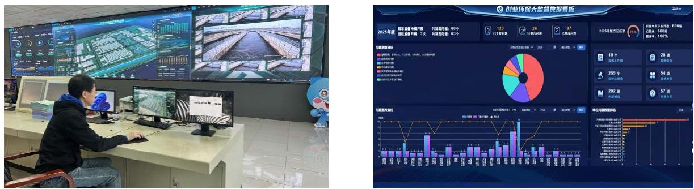

## “先锋有我”提效

广泛设立党员示范岗、责任区，带动全年处理污水17亿吨，无害化处置污泥22.6万吨、危废9.2万吨，光伏发电超4.44万兆瓦时，关键生产指标稳中有升，成本管控更加精细。

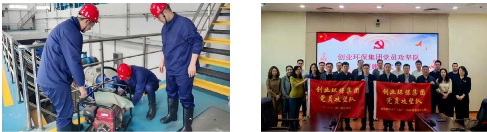

## “为民实事”践诺

圆满完成军粮城2万余户居民供热保障任务，117个再生水管网点位如期完工，提升市民获得感与企业社会形象。

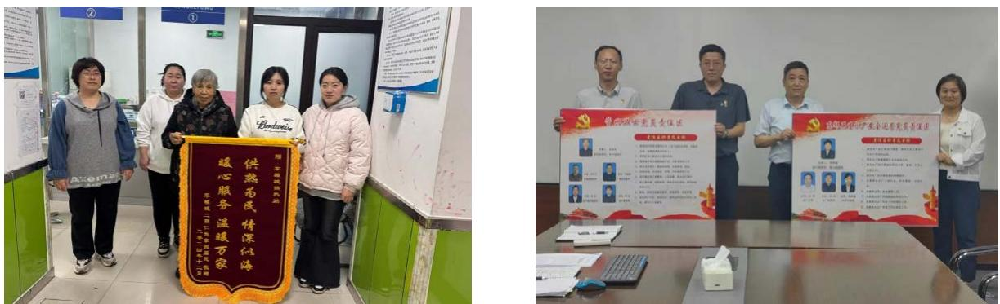

## “文化协同”凝心

文化交流与赋能中心落地完成，以文化融合促进管理融合、思想融合，为公司跨地域、多业务发展注入深层凝聚力。

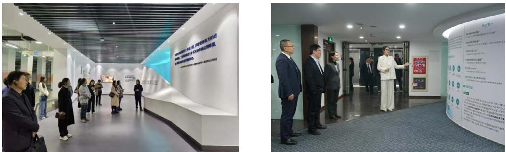

## 完善公司治理

## 规范治理

本集团严格遵守《中华人民共和国公司法》《中华人民共和国证券法》等法律法规，制定《公司章程》《股东会议事规则等制度规范，建立以股东会为最高权力机构、董事会为决策机构、经营层为执行主体的法人治理架构，其中董事会下设审计与风险控制、薪酬与考核、提名以及战略与ESG委员会，各层级各司其职、各负其责、协调运转、科学决策，确保公司稳健发展。

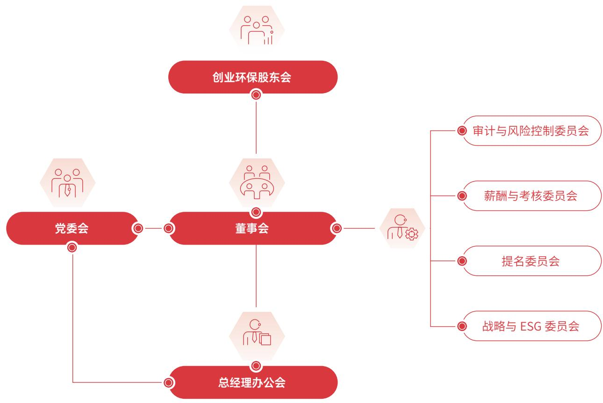

flowchart

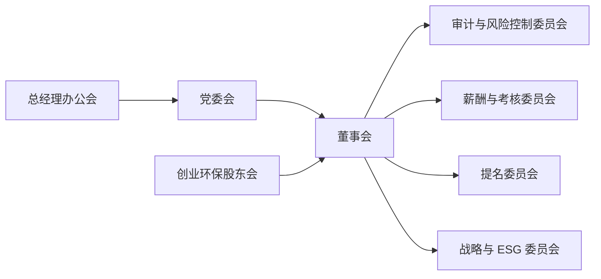
```mermaid
graph LR
  A["党委会"] --> B["董事会"]
  C["总经理办公会"] --> A
  D["创业环保股东会"] --> B
  B --> E["审计与风险控制委员会"]
  B --> F["薪酬与考核委员会"]
  B --> G["提名委员会"]
  B --> H["战略与 ESG 委员会"]
```

公司致力于构建多元、专业、规范合规的董事会及高级管理人才团队。薪酬与考核委员会负责定期组织与开展公司董事和高级管理人员的绩效评价，提名委员会定期从性别、年龄、专业经验、技能及知识等方面考虑董事会的多元化政策，切实保障董事会治理有效性。目前，公司董事会成员覆盖金融、财务管理、企业管理、环保水务等多个专业领域，均在各自深耕赛道积累了丰富的经营管理经验。同时，公司持续强化董事会自身建设，通过常态化学习与专项培训，确保董事会与时俱进，不断提升履职能力与规范运作水平，为企业高质量发展提供坚实治理支撑。

  
2025 年

•	 股东会 4 次，审议议案 21项  
•	 董事会 25次，通过董事会决议125个，董事会成员出席率100%  
•	 董事会由9 名董事组成，其中女性董事占比 22.22%

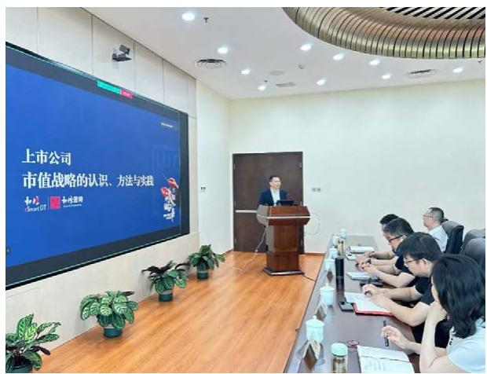

text_image

上市公司
市值战略的认识、方法与实践

市值管理培训

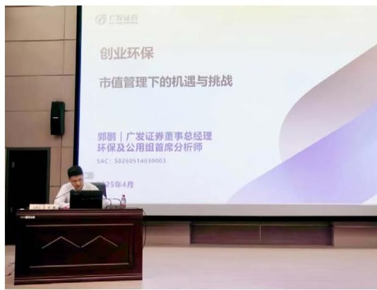

text_image

广发证券
创业环保
市值管理下的机遇与挑战
郭鹏 | 广发证券董事总经理
环保及公用组首席分析师
SAC: S0260514030003
25年4月

市值管理培训

公司以政治监督为根本、以数字赋能为驱动、机制创新为保障，持续完善治理策略和监督流程，为高质量发展赋能。公司以穿透式管控提升治理效能，构建“横向权责清晰，纵向穿透监管”的全级次子企业管控模式。同时以数字赋能构建智慧监督体系，在驻城投集团纪检监察组指导下，打造“1+10+10”“大监督”、全维度“大运营”体系及“三公管控”监管平台，以技术手段实现监管穿透，规范行为。更以机制创新落地政治监督，通过与28家外埠企业属地党委建立党建协同机制，印发管理指引，完成三级转两级治理架构改革，健全内控体系，聚焦人财物关键领域构建联防机制防范外埠企业核心风险。

  
2025 年

•	 公司开展法律培训 2次，培训时长共计 4小时，参与 300人，其中参与培训法务人员 70人。

## 信息披露

本集团严格遵守《上市公司信息披露管理办法》《上市公司投资者关系管理工作指引》等规范性文件，制定《信息披露制度》《投资者关系管理制度》《投资者投诉处理工作制度》等制度，定期于公司官网、巨潮资讯网和微信公众号等平台有针对性地披露公司各项信息，通过“上证e互动”平台、投资者关系邮箱、投资者专线、现场参观、股东会和业绩说明会等多种渠道加强与投资者的联系和互动，保护投资者对公司重大事项的知情权、参与权，确保披露信息内容及时、完整真实、准确，切实维护投资者合法权益。

  
2025 年

•	 披露公告文件 65 份，其中定期报告 4份，临时报告 61份  
•	 接待投资者现场调研次数 45 次，解答投资者问题数量 620 次  
•	 接听投资者电话次数 306 次  
•	 通过投资者互动平台回复投资者问题数量74件，回复率100%

## 创业环保组织线下投资者开展调研活动

案例

2025年12月23日，创业环保在津沽污水处理厂举办线下投资者调研活动，30余名机构代表及高净值客户参与。投资者实地观摩厂区沙盘与污水处理全流程，直观了解核心业务运营模式与技术优势。公司负责人详解经营现状、战略布局、市值管理思路及资本运作规划，针对应收账款管控、危废业务转型、新能源布局等投资者关切充分沟通此次活动是公司常态化投关工作的重要组成，搭建了高效沟通桥梁。

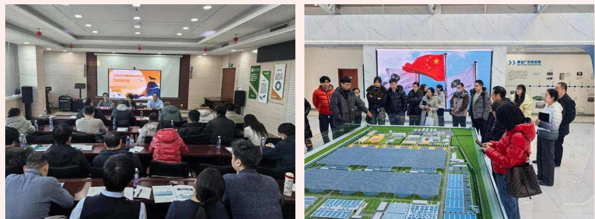

## 依法合规运营

## 内控风险管理

## 治理

本集团制定并不断修订《内控建设管理制度》《内部审计管理制度》《内部控制评价管理制度》等制度，持续完善内控管理体系。

## 董事会

制订公司的基本管理制度，建立、完善内控系统并检查更新其有效性，是内控设计和运行的责任主体。

## 党委会

根据其职权范围对相关制度进行前置审核，对党建、党务制度进行管理，对权限范围内的制度进行最终审批。

## 总经理办公会

制定内控制度建设的纲领、原则、计划等，制定一般管理制度，审核、批准下发。

## 法律事务管理部门

负责内控建设的组织管理。

## 审计事务管理部门

负责集团公司内控体系有效性的监督检查，开展内部审计，进行内控风险评估与防范等。

## 战略

木集团研究制定《创业环保集团法律合规中心穿透式管理建设方案(2025年一2028年)》，明确以“集约高效，穿透管控、试点建设”为原则，紧密围绕集团“四位一体”法治建设总体框架，系统构建“1+7+7”管控体系，推动风控触角向基层延伸、向一线延展。

  
集团总部法律合规中心

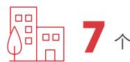  
所属单位法律合规中心

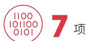  
核心运行机制

## 风险管理

本集团聚焦重点业务领域，依托“可能性一影响程度”风险评估矩阵，通过常态监测与专项排查相结合的方式，动态识别并系统更新《风险识别清单》，实现对风险的全级次动态管控

在合规管理方面，以《合规内控管理手册》为基础，围绕投资、建设、运营等核心领域，构建了覆盖全面的《合规风险数据库》，并以此为基础精准描绘集团合规风险画像。同时，聚焦关键岗位，系统梳理并形成了包含职责、义务与风险在内的岗位合规管理指南，将合规要求有效嵌入业务流程。

2025年，集团持续强化风险意识，组织开展针对性的内部风险控制培训，有效提升了关键岗位人员的风险防控能力。

公司持续优化税务管理流程，提升财务管理效能。我们建立了明确的税务管理职责分工体系，财务部门全面负责日常税务事项的审核、核算、准确电报及按时缴纳工作，并主动与税务机关保持常态化、顺畅的沟通，确保各项税务处理工作的合规性、及时性与准确性。同时，公司定期跟踪、搜集、解读国家和地方的最新税收政策法规，并结合公司实际经营情况及时、审慎地调整内部税务管理策略，使公司在经营、投资及筹资等各项活动中，能够合法合规。自2022—2024年，公司已连续3 年荣获纳税信用 A 级企业。2025 年，公司纳税总额为 41,386.26 万元。

  
2025 年

•	 公司纳税总额为 41,386.26万元。

## 指标及目标

我们以“持续强化合规意识，提升全员的合规操作能力”为目标，致力于构建全面、系统的合规管理体系，确保公司各项业务运营符合法律法规及行业标准，维护企业的长远发展与可持续性

natural_image

Stylized illustration of a city skyline with wind turbines, factories, and buildings (no text or symbols)

## 廉洁运营

## 治理

本集团制定《反舞弊管理制度》，规范员工职业行为，坚决杜绝收受贿赂等不正当行为，营造风清气正的企业生态。公司建立了权责清晰、分层衔接、运行有效的廉洁运营治理架构，以独立的纪律检查办公室作为廉洁运营的专职常设机构。该部门直接向纪委和党委汇报，协助推进全面从严治党、加强党风建设和具体落实反腐败工作，依规依纪开展监督执纪问责。

## 战略

我们始终将廉洁意识融入运营管理的各个环节，推动全员树立廉洁从业的核心价值观。通过加强纪律规矩教育与法治观念的培养，深入推动廉洁自律与合规文化的建设，确保廉洁意识贯穿于决策、执行与监督的每个层面。

## 风险管理

公司建立了系统化、制度化的廉洁与合规风险管理体系，对运营过程中潜在廉洁风险进行动态识别、评估、监控与应对。

## 廉洁文化建设

针对元旦、春节、清明、端午、国庆、中秋等关键节点，公司纪律检查办公室聚售专项工作部署落实、纪律作风建设等重点领域，切实做好节日期间廉政相关风险排查，及时消除各类廉政隐患。2025年，公司董事及管理层人员反商业贿赂与反贪污培训覆盖率达100%，向董事提供的反贪污培训(包括反贪污腐败法律法规培训)平均37小时，向员工提供的反贪污培训平均39小时。

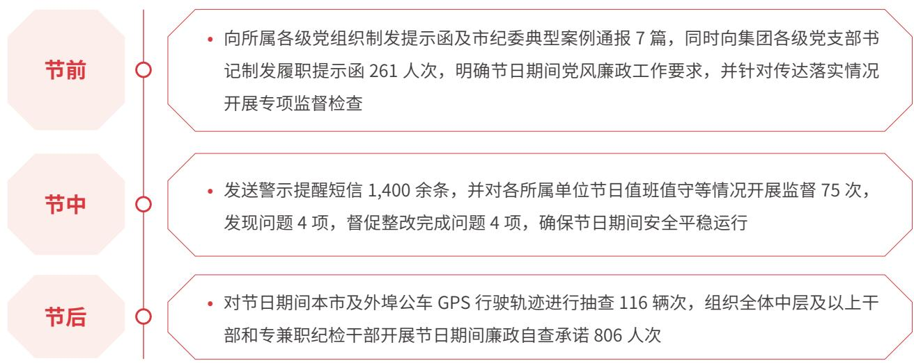

flowchart

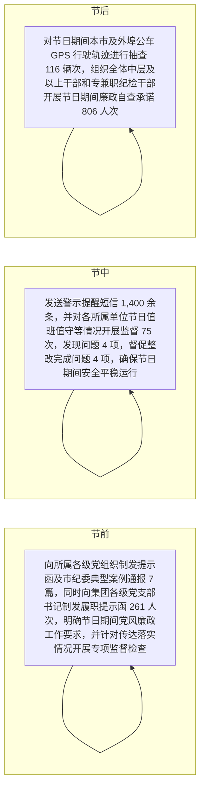
```mermaid
graph LR
  subgraph Phase1["节前"]
  A["向所属各级党组织制发提示函及市纪委典型案例通报 7 篇，同时向集团各级党支部书记制发履职提示函 261 人次，明确节日期间党风廉政工作要求，并针对传达落实情况开展专项监督检查"] --> A
  end
  
  subgraph Phase2["节中"]
  B["发送警示提醒短信 1,400 余条，并对各所属单位节日值班值守等情况开展监督 75 次，发现问题 4 项，督促整改完成问题 4 项，确保节日期间安全平稳运行"] --> B
  end
  
  subgraph Phase3["节后"]
  C["对节日期间本市及外埠公车 GPS 行驶轨迹进行抽查 116 辆次，组织全体中层及以上干部和专兼职纪检干部开展节日期间廉政自查承诺 806 人次"] --> C
  end
```

## 公司全面从严治党暨警示教育活动

## 案例

2025 年，公司召开全面从严治党暨警示教育大会，总结并通报上一年度监督执纪“四种形态”运用情况，利用典型案例作为反腐倡廉的“活教材”，并组织党员于部集体观看警示教育专题片《忏悔与警示2》。同时，针对在津、外埠150余名党员领导干部，开展专题警示教育，观看《重点领域腐败案件警示录》，深入运用案例资源提升警示教育的震慑力和警醒力。

## 举报与投诉

本集团建立了完善的举报管理机制，积极畅通举报渠道，致力于维护公正、透明的企业环境。我们制发了《问题线索转送工作实施办法》，鼓励举报任何舞弊、违规等不当行为，通过电子邮箱、举报电话和举报信箱等多种方式接收举报信息，并针对不同情况采取相应的处理措施。

我们高度重视举报人保护工作，严格落实保密管理规定，在对举报线索接收、登记、流转等环节中，严格保护被举报人信息安全，严防打击报复举报人的行为，切实维护举报人合法权益，充分激发于部职工监督热情，营造风清气正的政治生态

## 供应商廉洁监督

本集团将合规监督贯穿供应商合作全流程，构建多层级、全链条的风险防控体系，防范廉洁风险与合作风险。在采购实施环节，采购人组织开标、评标、谈判等活动时，须委派监督人员现场监督，招标公告，中标公示等信息均注明投诉电话及渠道，保障监督渠道畅通：评审小组组建严格保密，内部评审专家从城投集团电子采购平台评审专家库中选派或抽取，确保评审过程公平公正。对于合作过程中发现或外部反馈的疑似违规情形，公司将及时开展核查，并依规采取约谈整改、风险提示、暂停合作、终止合作及责任追究等处理措施

## 指标及目标

在本报告期内，没有任何对本公司或雇员提出的贪污诉讼案件。本集团已达成廉洁运营目标：确保公司在各项运营中严格遵守廉洁规范，无任何腐败事件的发生

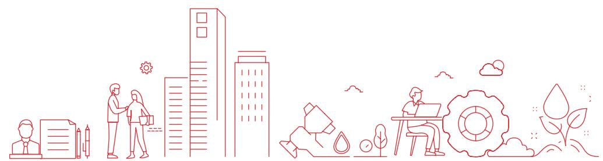

natural_image

Line art illustration of a city skyline with people, skyscrapers, and abstract icons (no text or symbols)

## 商业道德

本集团严格遵守《中华人民共和国反洗钱法》《中华人民共和国反不正当竞争法》等相关法律法规，公司将利益冲突、反洗钱、反不正当竞争与反舞弊等纳入《合规管理制度》，始终坚持最高商业道德准则，维护公平竞争、诚信经营的市场环境。

公司公正公平对待中小企业，在采购过程中破除不合理门槛和限制，不以某些特定条件对中小企业实行差别待遇或歧视待遇，保障中小企业公平参与市场竞争。报告期内，本公司未发生针对不正当竞争行为或反垄断实践的法律诉讼，员工《合规承诺书》签署率达100%。2025年，公司商业道德培训1次，总时长2小时，覆盖200人次。

  
2025 年

• 本公司未发生针对不正当竞争行为或反垄断实践的法律诉讼  
•	 员工《合规承诺书》签署率达100%  
•	 公司商业道德培训1次，总时长 2小时，覆盖 200人次

## 创业环保举办“公平竞争的法制体系及内涵”专题培训

案例

2025 年12月9日，创业环保举办“公平竞争的法制体系及内涵”专题培训。参训人员覆盖集团本部各中心、部室相关人员、2025 年新入职员工、所属单位法治工作负责人及其他感兴趣人员。培训中，授课律师针对《中华人民共和国反垄断法》《中华人民共和国反不正当竞争法》的法律体系概述及前沿案例进行了讲解，新员工签署《合规承诺书》并参加《中华人民共和国宪法》宣誓，进一步强化全员法治意识与合规履职思想，为企业规范经营、公平参与市场竞争筑牢思想根基。

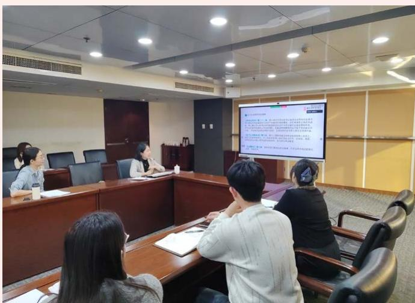

text_image

Meeting room scene with participants seated around a U-shaped table, large screen displaying presentation slide and Chinese text visible on screen.

## 优化 ESG 管治

## 责任管治架构

本集团持续深化 ESG治理能力建设，将可持续发展理念全面融入战略规划、经营决策与日常运营的全流程，以体系化建设推动ESG工作规范化、长效化发展。公司制定《ESG管理制度》，构建起“董事会统筹引领、战略与ESG委员会牵头执行、ESG 工作领导小组监督支撑、ESG 工作专班协同落实”的自上而下ESG管治架构，形成权责清晰、层层传导、协同高效的责任分工体系，为ESG战略落地与可持续发展目标达成筑牢组织保障。

## ESG管理层级

## 职责

  
董事会

•	 ESG管理工作的最高决策机构

  
战略与 ESG 委员会

● 负责指导ESG管理工作，对董事会负责并提供专业建议  
•	 研究并提出公司ESG愿景、规划和治理架构相关建议  
• 审议并向董事会提交公司年度ESG报告  
•	 识别可持续发展相关影响、风险和机遇  
• 执行董事会 ESG 相关决策

  
ESG工作领导小组

• 统筹协调并组织实施 ESG 相关任务  
• 提出公司中长期 ESG 发展战略目标  
• 组织 ESG 议题重要性及风险评估  
•指导和统筹公司年度 ESG 报告编制工作

  
ESG 工作专班

•	 执行ESG具体任务  
•	 分析ESG实质性议题  
● 制定并推进具体 ESG 议题工作计划  
• 统计、审核并分析 ESG 相关数据  
•	 编制公司年度ESG报告内容

为强化全员ESG认知与履职能力，公司配套建立常态化ESG培训机制，针对管理层、核心骨于及基层员工分层设计培训课程，内容涵盖ESG政策法规，管理制度，实践案例及行业最佳实践等，通过专题进座，线上课程，案例研讨等多元形式，推动ESG理念深入人心，确保各层级人员清晰掌握岗位ESG职责与执行标准。2025年，公司开展ESG培训2次，总时长4小时，基本全覆盖高层领导及相关管理人员

为打破数据壁垒，推动 ESG 数据标准化管理与穿透式管控，提升ESG管理效率、合理追溯与信息准确，创业环保集团于2025年上线 ESG 数字化平台，为集团 ESG 绩效分析、合规披露及战略决策提供精准支撑，赋能公司可持续发展。

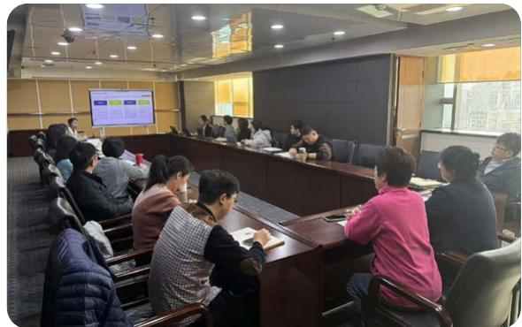

natural_image

Interior view of a conference room with attendees seated at tables facing a long table, no visible text or signage

ESG项目培训

  
2025 年

## ESG 数字化平台已实现：

•	 定量数据：近 400项的采集核算  
•	 定性资料：200余项的系统归集  
•	 全域覆盖：涵盖集团旗下全部 60余家分子公司  
●内部审批：设置填报人、审核人就披露指标实现双重把关  
•附件佐证：确保填报有据可依，有证可查

## ESG数字化平台

ESG数字化平台是基于国内外ESG的规范指引，自研ESG指标体系，定期报告相关的环境信息，采用智能AI技术集数据调研无纸化、数据收集集中化、数据审核高效化、数据处理便捷化，数据监测动态化于一体的平台。

助力董办等诸多用户简化ESG报告的前期准备工作，有效提高办公效率，协助公司有效管理自身的可持续发展表现数据。

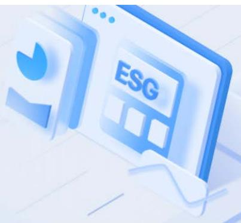

natural_image

Illustration of a computer screen with an ESG icon, no text or symbols present

## 完整使用流程

完整地在系统中使用数据下发、收集、统计流程，高效统计、分析数据

  
基本信息设置  
填报单位管理，用户管理

  
填报模板设置  
填报模板

  
填报事项下发  
填报管理

  
填报数据  
我的填报

  
ESG数据审核  
我的审批

  
ESG数据汇总与监控  
填报统计、热门统计

## 利益相关方沟通

本集团结合公司的业务特点与运营实际，对持份者群体进行了全面目细致地梳理与精准识别，积极与各持份者搭建常态化沟通桥梁，通过高效互动与紧密联动，畅通意见传递渠道，凝聚发展共识，实现多方价值共赢。

<table><tr><td>持份者</td><td colspan="2">关键沟通渠道</td><td colspan="2">关注议题</td></tr><tr><td>政府及监管机构</td><td>地方项目公文往来现场考察</td><td>信息披露来访接待</td><td>廉洁运营环境管理污染物排放水资源管理能源管理</td><td>应对气候变化废弃物处理生态系统和生物多样性乡村振兴</td></tr><tr><td>股东及投资者</td><td>股东会年报及公告投资者沟通平台</td><td>本集团官网投资者电话</td><td>投资者关系管理公司治理ESG治理</td><td>内控及风险管理廉洁运营商业道德</td></tr><tr><td>员工</td><td>申诉渠道职工代表大会</td><td>绩效评估会定制化培训</td><td>雇佣及劳工准则员工权益保护</td><td>员工健康与安全员工培训与发展</td></tr><tr><td>同业者</td><td>行业论坛联盟会议</td><td></td><td>商业道德清洁技术机遇绿色产品与技术</td><td>创新驱动数字化转型知识产权保护</td></tr><tr><td>公众</td><td>社区活动参与用户座谈会</td><td>用水安全走访调研开放日活动</td><td>客户服务产品责任</td><td>社区投资乡村振兴</td></tr><tr><td>价值链伙伴</td><td>会议合作协议谈判产学研合作</td><td></td><td>供应链管理商业道德产品责任</td><td>信息安全及隐私保护循环经济绿色产品与技术</td></tr></table>

## 重要性议题分析

本集团结合国内外可持续发展标准、联合国可持续发展目标和ESG评级关注重点，综合国家政策导向与行业发展现状系统研判公司所处的可持续发展背景，进一步对ESG议题进行识别与分析。

## 了解公司活动和业务关系背景

我们从公司活动、业务关系、可持续性背景、利益相关者（包括少数群体的利益）等多个方面，综合理解组织环境。

我们重点考虑的因素有：

• 公司主要的价值观、政策、策略、目的及目标  
•	 直接财务影响  
• 利益相关方（如：员工、股东、供货商）的利益及期望  
•	 对公司、同业及竞争者的重大风险及机遇  
相关法律、规例、国际及自愿协议等

## 完善议题清单

根据行业发展和自身业务特点、政策趋势、国内外 ESG 披露标准及 ESG 评级机构关注重点，结合利益相关方和内外部专家沟通建议，更新FSG议题清单，形成涵盖29项议题的 ESG 议题库。

## ESG 议题识别与分析流程

## 议题重要性的评估与确认

基于访谈与问卷调查，综合多元相关方的意见，参考内外部专家意见，从“财务重要性”和“影响重要性”两个维度对议题进行重要性排序，形成重要性议题矩阵，并由公司管理层和外部专业人士对议题筛选结果进行审核评估，确认ESG议题的优先级顺序。

## 议题重要性信息披露

针对筛选出的重要性议题制定相应的行动计划并逐步落实，在报告中对财务重要性议题参照上海证券交易所“四框架”要求重点披露。

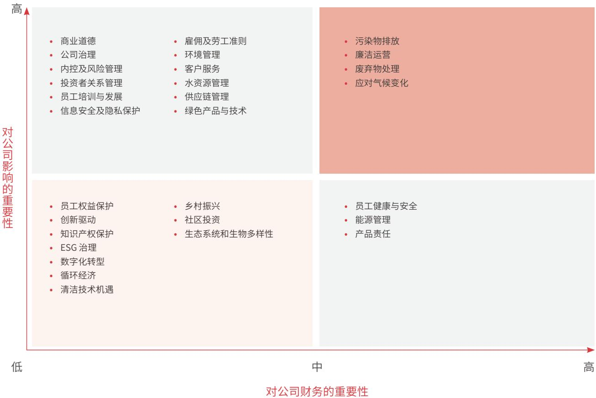

other

| Quadrant | Topic |
| --- | --- |
| Top-Left | 商业道德, 公司治理, 内控及风险管理, 投资者关系管理, 员工培训与发展, 信息安全及隐私保护 |
| Top-Right | 污染物排放, 廉洁运营, 废弃物处理, 应对气候变化 |
| Bottom-Left | 员工权益保护, 创新驱动, 知识产权保护, ESG 治理, 数字化转型, 循环经济, 清洁技术机遇 |
| Bottom-Right | 员工健康与安全, 能源管理, 产品责任 |
| Center | 雇佣及劳工准则, 环境管理, 客户服务, 水资源管理, 供应链管理, 绿色产品与技术 |
| Center-Right | 乡村振兴, 社区投资, 生态系统和生物多样性 |

## 对公司财务的重要性

创业环保2025年重要性议题矩阵

为体系化推进公司于各项重要性议题表现的改善与提升，我们构建了“维度一议题一指标”三个层级ESG管理指标体系（共计235项定性及定量指标）。公司对各项指标情况开展合规、同行对标分析，根据“管理、实践、绩效”将指标分类，将所有指标分配到相关责任部门，明确不同类型指标的管理提升方向，并持续跟踪指标提升表现情况

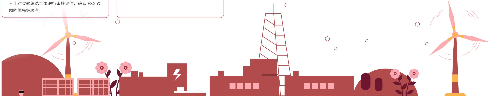

text_image

人士对议题筛选结果进行审核评估，确认 ESG 议题的优先级顺序。

## 科技创业赋能智慧水务

科技是驱动水务行业转型升级的核心引擎，更是创业环保践行绿色发展的关键支撑。公司秉持“以创破局，以业筑基”的创业理念，以创新为纽带串联生态治理与民生服务全链条，通过技术突破与模式革新赋能污水固废处理、供水供能等业务提质增效，为行业高质量发展注入强劲动能。

## 关键议题

· 数字化转型  
·信息安全及隐私保护  
· 创新驱动  
· 知识产权保护

· 产品责任

·绿色产品与技术

· 客户服务

## 对标联合国可持续发展目标

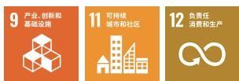

38 提升创新动能  
46 守护碧水净土  
49 品质稳定供应

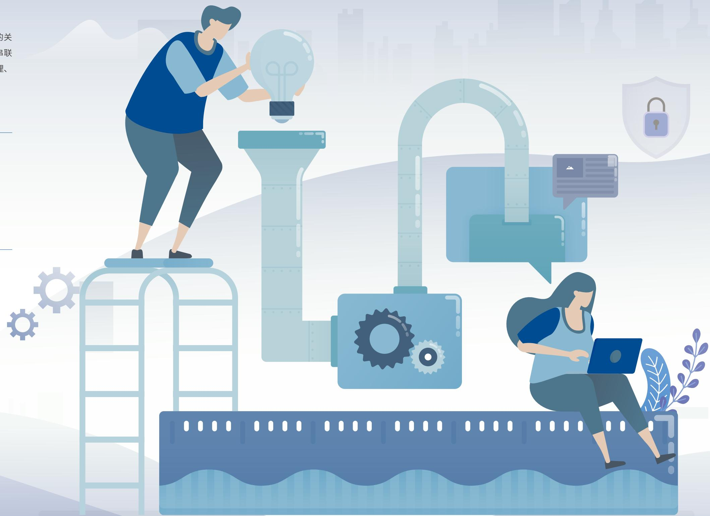

natural_image

Illustration of two people working on a digital platform with a lightbulb, lock, and gear symbols (no text or symbols present)

## 提升创新动能

## 科技创新

本集团始终将科技创新作为驱动高质量发展、践行“双碳”使命的核心战略。集团聚焦“两核一力”，以“含金量”“含新量”“含绿量”“含科量”提升驱动价值增长，推动科技管理从“投入导向”向“效能导向”战略转型，系统构建以市场为牵引、以创新为驱动、以技术服务和产品应用为保障的创新体系。

## 完善创新机制，激发内生动力

我们制定并严格落实《科技管理制度》《科技工作奖励办法》等制度，明确职责分工与考核评价体系。设立科技创新中心，强化科技研发全过程管理，在研发过程中严格遵守科学伦理规范，并将员工在专利申报、科研攻关、成果转化中的实际贡献纳入激励体系，充分激发创新内生动力。

## 深化协同创新，构建开放生态

我们着力打通从技术到产业的转化通道，深化“四个用好”实践，联动央企、高校及科研院所，共建研发平台、共组创新联合体。目前已与天津大学、南开大学、天津城建大学等高校建立了创新实践基地，开展技术协同创新工作，构建起高效的产学研用转化通道。

## 聚焦核心技术，赋能绿色转型

我们聚售智慧化、绿色化、资源化方向，围绕污水处理、绿色药剂、智慧运营等关键技术瓶颈开展集中攻坚。明确了绿色碳源及新型除磷药剂规模化应用、深度脱水设备联合开发工作的技术路径，完成“厂级智能生产管理系统”开发并在津沽污水处理厂成功应用，提升集团低碳化、智慧化运营水平。

## 培育科技主体，打造新增长极

我们以“内生孵化”与外延并购双轮驱动，培育具有自主核心技术与商业模式清晰的科技型子公司。公司制定并定期追踪研发与创新目标进度：“十五五”期间，计划孵化或并购1-2家科技型企业，形成3-5项具备自主知识产权和市场竞争力的核心产品，培育1-2个新增利润增长点，为集团可持续高质量发展打造新的增长极。

  
2025 年

•	 研发投入6,091万元，占主营业务收入比例1.28%  
•	 研发员工 286人，占比12.27%

## 凯英公司研发创新平台

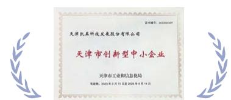  
天津市创新型中小企业

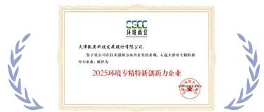  
2025环境专精特新创新力企业

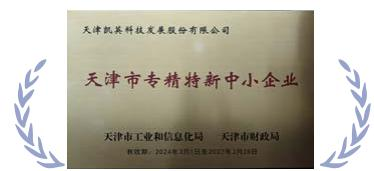  
天津市专精特新中小企业

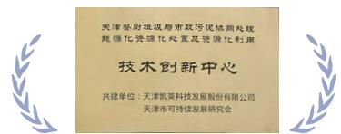  
天津餐厨垃圾与市政污泥协同处理能源化资源化处置及资源化利用技术创新中心

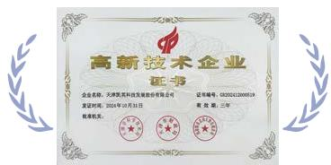  
高新技术企业

2025年，我们依托“天津市污废水生化处理技术工程中心”“天津市生态环境保护协同创新中心（第四批）等市级创新平台，科研成果获得多方认可

• 《水环境治理减污降碳协同增效方法与机理》项目荣获“2024年中华环保联合会自然科学奖”一等奖

• 《基干数智技术的污水处理管控系统建设》荣获天津市第三十一届企业管理现代化创新成果奖二等奖

· 《基于回归神经网络的污水厂污泥物性识别设备》项目入选天津市职工二十佳“五小”创新成果

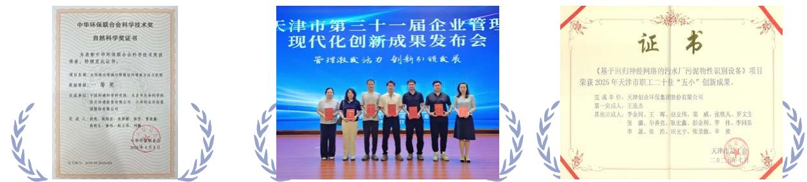

·《多能互补可再生能源综合利用项目》 《咸阳路污水处理厂绿色低碳项目》均荣获全联环境服务业商会“2025绿色低碳发展典型案例”  
•《餐厨垃圾与市政污泥协同处理及资源化利用技术》荣获天津市科学技术局2025年中国创新创业大赛暨“天开之星”天津创新创业大赛成长企业组三等奖、产业焕新赛道培育新质产业奖二等奖

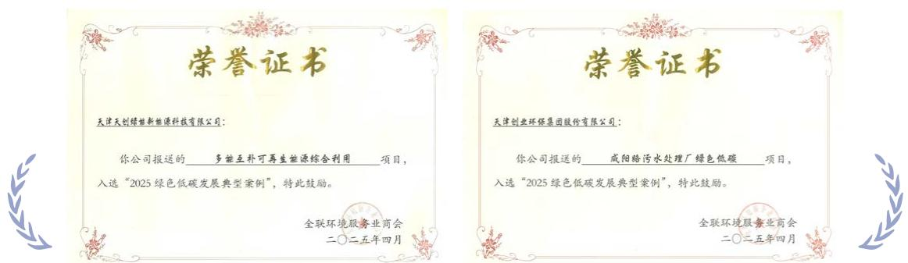

•《整合创优势，拓展启新篇：以检测为核心的轻资产突围》项目获得产业焕新赛道培育新质 产业奖二等奖  
●《打通管网断点优化中心城区再生水供水条件》项目获得产业焕新赛道—最佳提升质量奖三等奖  
●《重构核算标准，智破监测困局一TRIZ创新方法在污水厂碳排放精准核算与监测中的革命性应用及《基于 TRIZ 理论的污泥高压脱水方法及装置工艺设计》荣获“2025 年中国创新方法大赛（天津赛区）暨第十届天津市创新方法大赛”三等奖

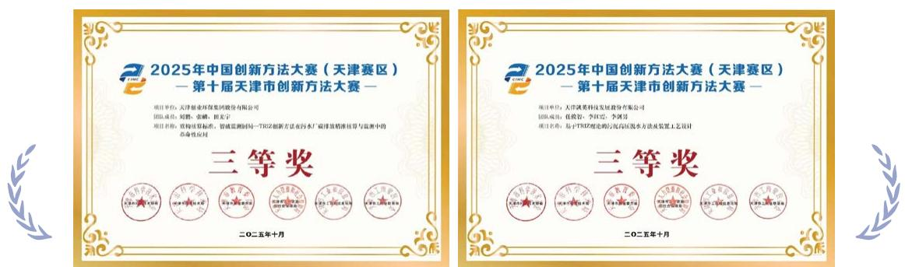

## 贵州创业水务有限公司产学研合作优化处理厂运行模式降低碳排放

案例

2025 年，贵州创业水务有限公司联合哈尔滨工业大学（威海）、贵州建设职业技术学院开展小河污水处理厂 SBR 工艺的绿色低碳智慧运营系统研究与示范应用项目。主要以贵阳市小河污水处理厂为项目示范点，通过配置绿色低碳污水处理智慧运营专家系统，优化小河污水处理厂的运行模式。

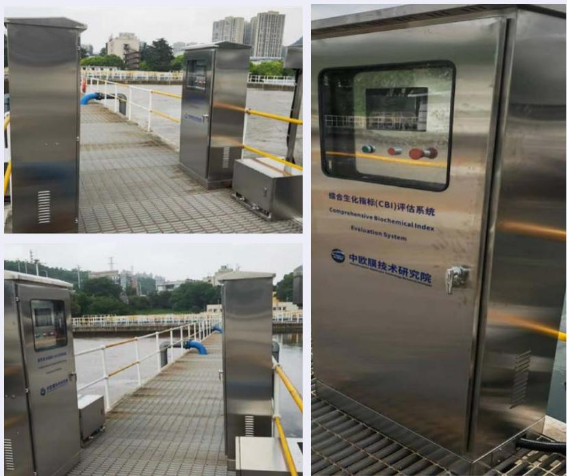

## 知识产权保护

本集团严格遵循《中华人民共和国专利法》《中华人民共和国著作权法》《中华人民共和国商标法》等相关规定，制定《科技类知识产权管理制度》，明确了知识产权的归属、保护、申请、维护、成果转化等方面的具体规定，并建立跨部门知识产权协同管理机制，设立专门的科技主管部门统筹管理集团范围内知识产权事宜，不断加强员工知识产权保密培训，为公司创新成果提供全面和高效地保护

公司建立知识产权风险动态管理机制，在研发阶段开展专利检索与风险分析，在合作与采购环节建立知识产权共享与保护机制，明确知识产权归属与使用范围及责任条款。我们强化知识产权维权能力建设，构建动态防控、安全高效的知识产权管理体系。报告期内，集团未发生重大知识产权纠纷。

  
2025 年

•	 拥有专利 204件，其中发明专利 60件  
•	 已获得软件著作权 36件

## 数字化转型

本集团锚定“聚焦数智赋能，提升管控数智化水平，促进产业数智化转型”核心目标，通过强化顶层设计、统筹规划制定有序实施建设，构建财务标准化与数据治理双规范，打破数据孤岛，强化数字化监督管控，拓展工业物联网覆盖范围，探索“数据形成资产、资产创造价值”的可持续发展路径。

集团以《数字化转型规划方案》为纲领，系统推进“智慧工程、赋能工程、强基工程、保障工程”四大建设主线，明确“信息化覆盖一系统集成一数据融合”三阶段演进路径。2025年，公司聚焦“治理智慧化、管控精细化”目标推进转型，完成以业财融合为主线的数字化一期验收，建成集团物联网平台与数据中心硬件底座，初步形成业财联动及管控优化能力有序推进二期建设，数据中台达成阶段目标(完成2.570+数据表、30G数据采集覆盖13+系统，配置400余项跨部门指标并优化可视化大屏)，指挥调度系统、商旅平台、AL问数上线试运行，数据中心完成扩容，同步升级防汛、公车、数字化监督平台及优化人力党建报表与薪酬管理模块，为数智化支撑提供坚实基础。

## 运营数字化—产业数智化场景融合与数据资产价值转化

• 依托已建成的集团物联网平台，实现 38 个污水项目(5万吨以上27家)、3个再生水项目、3个新能源项目数据接入，实时采集水质、水量、设备运行等关键指标，构建“一屏可视”的全域生产监测体系

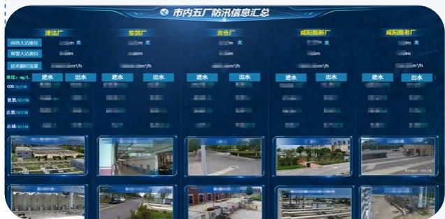

text_image

市内五厂防汛信息汇总
津池厂
东部厂
北仓厂
咸苑围备厂
周围人员情况
周围人员情况
废水环境监测
单位：mg/L
进水 出水
进水 出水
进水 出水
进水 出水
进水 出水
进水 出水
进水 出水
进水 出水
进水 出水
进水 出水
进水 出水
进水 出水
进水 出水
进水 出水
进水 出水
进水 出水
进水 出水
进水 道水
进水 出水
进水 出水
进水 出水
进水 出水
进水 出水
进水 出水
进水 出水
进水 出水
进水 出水
进水 出水
进水 出水
进水 出水
进水 出水
进水 出水
进水 出水
进水 出水
进 water 出水
进水 出水
进水 出水
进水 出水
进水 出水
进水 出水
进水 出水
进水 出水
进水 出水
进水 出水
进水 出水
进水 出水
进水 出水
进水 出水
进水 出水
进水 出水
进水 出水

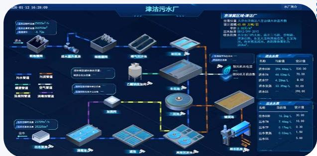

flowchart

This image displays the operational system architecture and data flow of a cleaning wastewater plant, showing its main components (gas, water, gas, etc.) and associated equipment.

•自主研发智慧厂级平台在津沽污水处理厂试点应用。通过智能加药、曝气等工艺参数动态优化，自上线以来降本300余万元且运营效率显著提升，同时集成生产指标形成动态“数字画像”，将隐性经验转化为显性数据模型，支撑“一厂一策”精细化管理

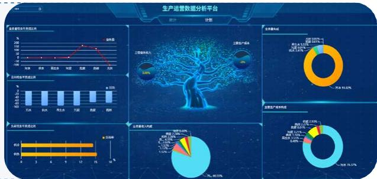

donut

| Category | Value (%) |
| --- | --- |
| 工业总收入 | 3.00% |
| 上海生产总值 | 25% |
| 全球生产总值 | 18.67% |
| 全球生产总值占比 | 49.14% |
| 全球生产总值占比 | 49.14% |
| 全球生产总值占比 | 49.14% |
| 全球生产总值占比 | 49.14% |
| 全球生产总值占比 | 49.14% |
| 全球生产总值占比 | 49.14% |
| 全球生产总值占比 | 49.14% |
| 全球生产总值占比 | ~49.14% |
| 全球生产总值占比 | ~49.14% |
| 全球生产总值占比 | ~49.14% |
| 全球生产总值占比 | ~49.14% |
| 全球生产总值占比 | ~49.14% |
| 全球生产总值占比 | ~49.14% |
| 全球生产总值占比 | ~49.14% |
| 八方产业占比 | 23.73% |
| 八方产业占比 | 23.73% |
| 八方产业占比 | 23.73% |
| 八方产业占比 | 23.73% |
| 八方产业占比 | 23.73% |
| 八方产业占比 | 23.73% |
| 八方产业占比 | 23.73% |
| 八方产业占比 | ~23.73% |
| 八方产业占比 | ~23.73% |
| 八方产业占比 | ~23.73% |
| 八方产业占比 | ~23.73% |
| 八方产业占比 | ~23.73% |
| 八方产业占比 | ~23.73% |
| 八方产业占比 | ~23.73% |
| 兪方产业占比 | 16.57% |
| 兪方产业占比 | 16.57% |
| 兪方产业占比 | 16.57% |
| 兪方产业占比 | 16.57% |
| 兪方产业占比 | 16.57% |
| 兪方产业占比 | 16.57% |
| 兪方产业占比 | 16.57% |
| 兪方产业占比 | ~16.57% |
| 兪方产业占比 | ~16.57% |
| 兪方产业占比 | ~16.57% |
| 兪方产业占比 | ~16.57% |
| 兪方产业占比 | ~16.57% |
| 兪方产业占比 | ~16.57% |
| 兪方产业占比 | ~16.57% |
| 八方产业占比 | 10.80% |
| 八方产业占比 | 10.80% |
| 八方产业占比 | 10.80% |
| 八方产业占比 | 10.80% |
| 八方产业占比 | 10.80% |
| 八方产业占比 | 10.80% |
| 八方产业占比 | 10.80% |
| 八方产业占比 | ~10.80% |
| 八方产业占比 | ~10.80% |
| 八方产业占比 | ~10.80% |
| 八方产业占比 | ~10.80% |
| 八方产业占比 | ~10.80% |
| 八方产业占比 | ~10.80% |
| 八方产业占比 | ~10.80% |
| 兪方产业占比 | 9.23% |
| 兪方产业占比 | 9.23% |
| 兪方产业占比 | 9.23% |
| 兪方产业占比 | 9.23% |
| 兪方产业占比 | 9.23% |
| 兪方产业占比 | 9.23% |
| 兪方产业占比 | 9.23% |
| 兪方产业占比 | 9.23% |

●制定发布《数据资产管理制度》覆盖全生命周期，厂级平台研发项月年度入表67.17.万元，累计.112.58万元，完成算法模型基础数据在北方大数据交易平台挂牌登记并取得《数据产品登记证书》，配套形成资产评估与合规审查报告

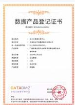

## 办公数字化—管控数智化能力跃升与业财融合深度突破

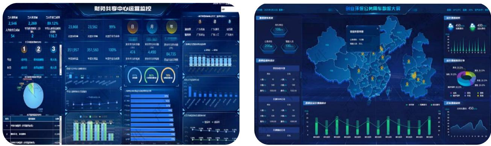

·财务标准化方面，完成财务科目体系从近万条优化至近2千条，建立全集团统一财务标准，支撑预算、资金等核心业务高效协同，管理决策效率提升40%  
·数据治理方面，构建科学数据治理体系，明确数据归属与流向，制定数据质量管控规则，形成标准化数据目录累计采集污水、再生水、固废等业务生产数据超2PB(覆盖水质、能耗、设备状态等200+维度)，形成核心数据资产  
·业财融合方面，8大业财核心系统实现预算、合同、资金等关键流程线上化闭环管理，人工统计环节减少60%，业财核心流程线上化率超90%

公司将数字化文化培育与能力提升相融合，以培训强化全员数字化意识，营造“主动学、善于用、积极创”的浓厚氛围。通过高层宣讲、案例分享等传递转型理念，破除固有思维；构建分层分类培训体系，针对不同岗位设置实战、进阶及实操课程，提升全员数字化能力。

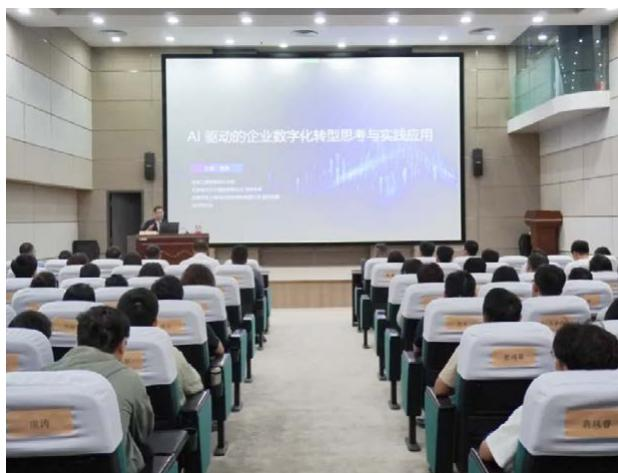

text_image

AI 驱动的企业数字化转型思考与实践应用

“智水有道AL赋能”的“创业骐骥”专题培训

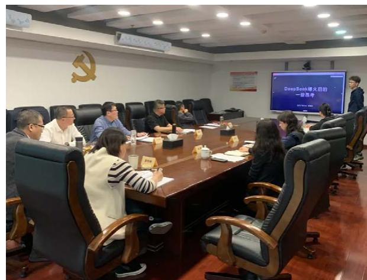

text_image

DeepSeek新火箭的一般思考

关于DeepSeek的“创业大讲堂”专题培训

## 信息安全与隐私保护

## 治理

本集团建立并持续修订《网络安全管理制度》《数据安全管理制度》《数据资产管理制度》等核心规章制度，设立集团党委网络安全和信息化领导小组，负责组织领导集团公司网络安全和信息化工作，统筹协调涉及集团政治、经济、文化工作、制度制定等领域的网络安全和信息化工作。

当前集团数据中心通过引进多种网络安全设备扩容升级后达标国家数据管理能力成熟度(DCMM)三级“稳健级”认证并已完成集团官网、业财系统、数据中心3个核心系统的二级等保备案与测评，实现核心业务场景合规全覆盖。

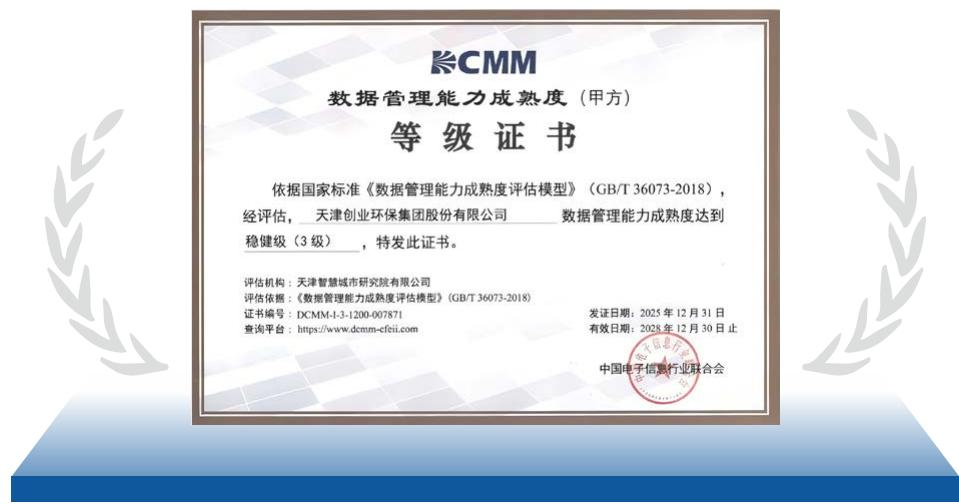

text_image

CMM
数据管理能力成熟度（甲方）
等级证书
依据国家标准《数据管理能力成熟度评估模型》（GB/T 36073-2018），经评估，_天津创业环保集团股份有限公司_ 数据管理能力成熟度达到稳健级（3级），特发此证书。
评估机构：天津智慧城市研究院有限公司
评估依据：《数据管理能力成熟度评估模型》（GB/T 36073-2018）
证书编号：DCMM-I-3-1200-007871 发证日期：2025年12月31日
查询平台：https://www.dcmm-efeii.com 有效日期：2028年12月30日止
中国电子信息行业联合会

## 战略

本集团秉持“积极防御、综合防范”核心原则，遵循“责任明确、授权合理、流程规范、技管结合”的工作方针，全面深化网络安全全周期管理，为集团数智化转型及核心业务系统稳定运行筑牢安全屏障。

## 风险管理

本集团建立常态化风险监测机制，依托现有安全技术平台实时监控网络运行状态，精准识别预警潜在安全风险。公司制定《网络安全事件应急预案》，明确应急响应流程与责任分工，通过模拟演练提升员工突发安全事件快速处置能力。我们积极开展各类网络安全知识活动，结合工作场景开展钓鱼邮件模拟演练，在办公区域电子屏播放宣传海报及宣传视频，筑牢员工网络安全意识防线。

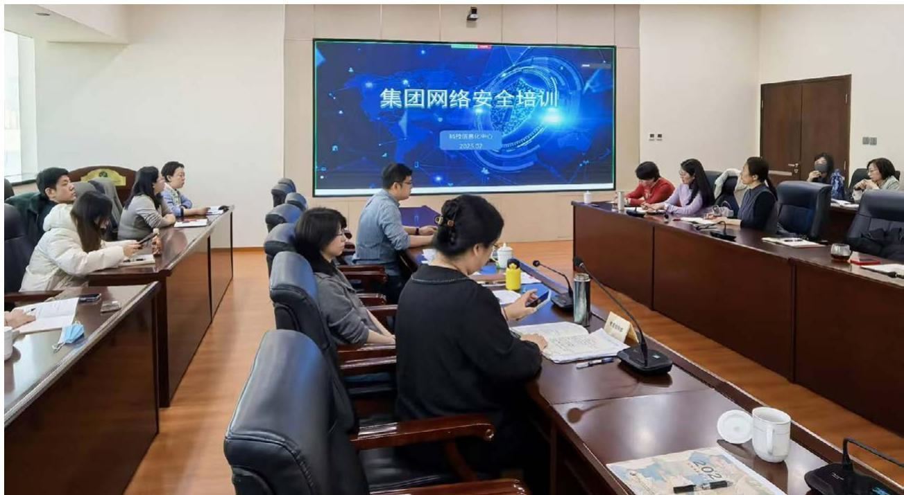

text_image

集团网络安全培训
科技信息化中心
2023.07

全级次网络安全专题培训

我们通过分类分级和全生命周期管理，对本地化部署系统核心数据实施全链路加密存储与传输，严格落实最小权限原则强化访问控制，建立了定期安全策略审查机制，不断优化网络安全策略，确保信息安全管理工作得到有效落实。我们部署11台国产化超融合服务器，依托集团统一监测平台、集中化漏洞管理系统，加速搭建集团与子公司一体化安全防护架构，为子公司提供培训演练与远程指导等专业技术支撑，形成“上下联动、资源共享”的防护格局。2025年，我们开展信息安全相关培训3次，参与人数2.100人，覆盖员工 92%

  
2025 年

•	 我们开展信息安全相关培训 3次，

参与人数 2,100人，覆盖员工92%

## 指标及目标

本年度集团数据中心已实现“零网络安全事故”的目标，未发生因员工操作失误导致的安全事件，未发生任何信息泄漏事件。

## 守护碧水净土

## 污水处理

本集团秉持“精微守护，恒久创远”的班组理念，制定《运营质量管理制度》《运营管理监督检查工作指引》等专项制度，严格对标国家及地方环保排放标准，明确水质监测、工艺调控、应急处置等各环节操作标准。我们部分子公司已通过 ISO 9001 质量管理体系认证，并据此建立“源头监测－过程管控－出水核查”三级管理机制，实现污水处理从进水到出水全环节可追溯、可管控，同时强化跨部门协同，推动研发、运营、环保部门联动，精准响应治理需求，提升问题处置时效。同时配套完善环保考核与问责机制，建立质量管理目标责任制，将出水水质达标率、工艺合规性等指标与部门、个人绩效挂钩，强化水质管控。

## bsi.

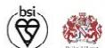  
Certificate of Registration

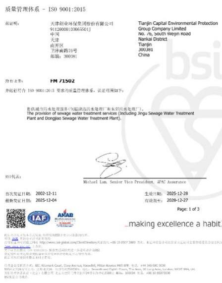

text_image

质量管理体系 - ISO 9001:2015
兹证明：
天津创业环保集团股份有限公司
911260001/20065501J
中国
天津
南开区
兰亭市路78号
邮编：300381
Tianjin Capital Environmental Protection Group Company Limited
No. /b South Weijn Road
Nankai District
Tianjin
JOUJSI
China
持证证书：
FM 71502
并运行符合 ISO 9001:2015 要求的质量管理体系，认证周期如下：
提供城市污水处理服务（包括清洁污水处理厂和水环境处理厂）。
The provision of sewage water treatment services (including Jinggu Sewage Water Treatment Plant and Dongjiang Sewage Water Treatment Plant).
附1代表：
Michael Lam. Senier Vice President, AVM Assurance
首次发证日期：2002-12-11
最新发证日期：2025-12-04
生成日期：2025-12-28
有效期至：2028-12-27
Page: 1 of 3
making excellence a habit.
www.tianjin.co.uk
www.tianjin.co.uk
www.tianjin.co.uk
www.tianjin.co.uk
www.tianjin.co.uk
www.tianjin.co.uk
www.tianjin.co.uk
www.tianjin.co.uk
www.tianjin.co.uk
www.tianjin.co.uk
www.tianjin.co.uk
www.tianjin.co.uk
www.tianjin.co.uk
www.tianjin.co.uk
www.tianjin.co.uk
www.licai.com.cn
www.tianjin.co.uk
www.tianjin.co.uk
www.tianjin.co.uk
www.tianjin.co.uk
www.tianjin.co.uk
www.tianjin.co.uk
www.tianjin.co.uk
www.tianjin.co.uk
www.tianjin.co.uk
www.tianjin.co.uk
www.tianjin.co.uk
www.tianjin.co.uk
www.tianjin.co.uk
www.tianjin.co.uk
http://www.tianjin.co.uk/locate/city/locate/city/locate/city/locate/city/locate/city/locate/city/locate/city/locate/city/locate/city/locate/city/locate/city/locate/city/locate/city/locate/city/locate/city/locate/city/locate/city/locate/city/locate/city/locate/city/locate/city/locate/city/locate/city/locate/city/locate/city/locate/cITY/2025-00000000000000000000000000000000000000000000000000000000000000000000000000000000000000000000000000

ISO 9001 质量管理体系认证

  
2025 年

## 集团各污水处理厂

•	 累计完成污水处理量 17亿吨  
•	 实现氨氮污染物削减 4.18万吨、COD 污染物削减 35.6万吨、总氮污  
染物削减 4.47万吨、总磷污染物削减 0.57万吨

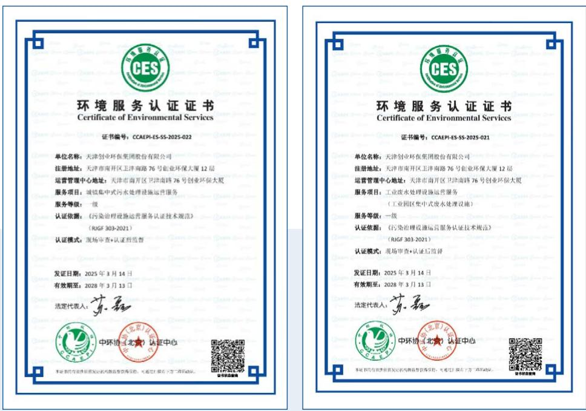

2025 年，我们的污水处理厂获得多项外部荣誉认可，集团公司一次性成功通过了中国环境协会（北京）认证中心的严格审核，再次荣获《城镇集中式污水处理设施运营服务》一级和《工业废水处理设施运营服务》级资质认证。

## 创业环保各污水处理厂多措并举确保春节期间运行安全稳定

案例

2025年春节期间，集团全国各污水处理厂以高度的责任担当落实保供保运工作，保障厂区安全稳定运行。各单位节前早谋划、早部署，统筹人员分工，完成设备全面检修，备足备品备件，为节日运营筑牢基础。节日期间执行24小时不间断巡检，紧盯消防、用电、危化品管理等关键环节，落实管道防冻措施，完善应急预案消除各类隐患：同时科学保障药剂供应，根据进出水浓度动态调整工艺参数，精准把控运行负荷，确保出水水质稳定达标。

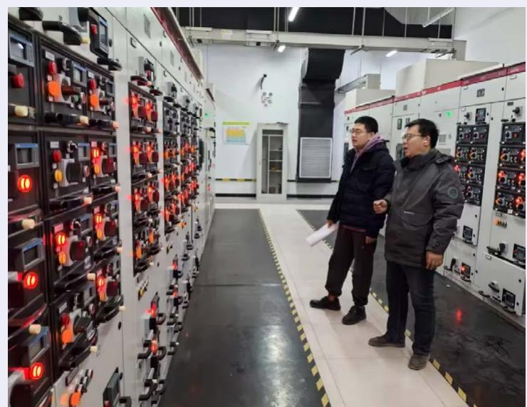

natural_image

Two men inspecting an electrical control room with rows of switches and red indicator lights (no visible text or symbols)

## 固废处理

集团聚焦固废处置全流程合规，凯英公司出台《标准化管理手册》等制度，明确污泥接收、脱水减量化、无害化处置及危废分类、储存、转运等各环节责任边界与环保要求。严格划分固废处置等级，针对污泥、危废、一般工业固废制定差异化管控标准，杜绝固废处置过程中引发的土壤、水体二次污染。同步将固废处置合规性纳入环保考核体系，强化各环节责任落实，构建全方位制度防护网。

凯英公司已通过ISO9001质量管理体系认证，并构建“分类处置、全程溯源、协同联动”的固废管理体系，提升处置效能与安全水平。对污泥采用“脱水减量化+无害化处置+资源化探索”的阶梯式管理模式，通过专业化设备与工艺实现精准管控；对危废严格执行“专人管理、专区储存、资质转运”制度，严防流失泄漏。建立固废处置全生命周期台账，实现从产生、暂存、转运到最终处置的全程可追溯。强化跨部门协同与外部联动，对接有资质的专业处置单位，形成“内部管控+外部合规处置”的闭环格局。

凯英公司根据各项目的特殊性制定客户维护记录，详细记录产废信息、化验数据、售后服务情况等内容，通过对客户反馈和市场竞争情况的分析，不断调整服务策略，灵活应对客户需求和市场变化。

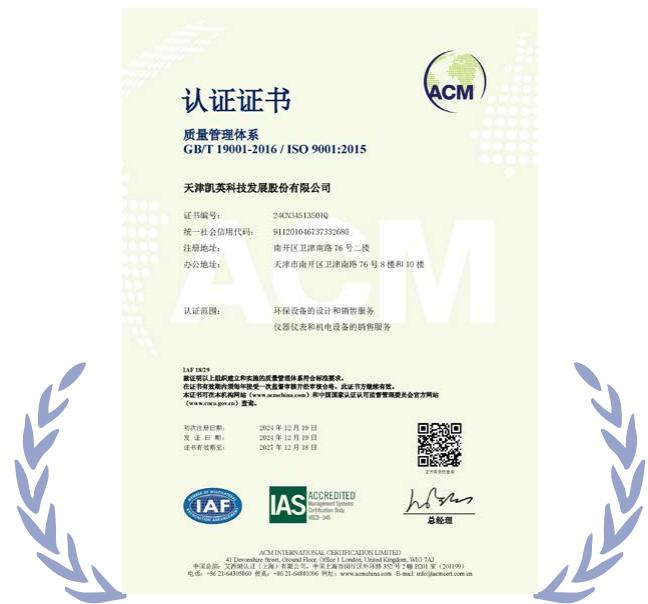

text_image

认证证书
质量管理体系
GB/T 19001-2016 / ISO 9001:2015
天津凯英科技发展股份有限公司
证书编号： 240X3451350NQ
统一社会信用代码： 911201046737325080
注册地址： 南开区北津南路76号二楼
办公地址： 天津市南开区卫津南路76号8楼和10楼
认证范围： 环保设备的设计和销售服务
仪器仪表和机电设备的销售服务
IAF 1829
被证明以上机构建立并实施灵活管理服务体系介绍规范。
以证书有效期为有效期限，以安全监督管理信息为准。此证书有效期至年。
本证书可凭本机构网站（www.aschina.com）和中国国家认证认可监督管理委员会官方网站
(www.csc.gov.cn) 查看。
首次注册日期： 2021年12月19日
发证日期： 2021年12月19日
证书有效期限： 2022年12月18日
IAS
Accredited
Management System
Information Only
ICM INTERNATIONAL CERTIFICATION LIMITED
21 December Street, Grand Floor, Office 1 London, United Kingdom, USA 7AJ
中国证券、证券登记系统（上海）有限公司、中国工商银行深圳分行102号上海金融大厦（B2008）第（20199）
电话：+8-23-6838560 师讯：+8-21-688306 PMID：www.aschina.com E-mail：info@acment.com.cn
总经理

ISO 9001 质量管理体系认证

  
2025 年固废板块

•	 处置危废9.2万吨  
•	 无害化处置污泥 22.6万吨

## 品质稳定供应

## 管理

本集团始终秉承“六个零”服务准则，制定《信访工作管理制度》《承办12345政务便民专线服务工作指引》《信访维稳预案》等制度，将专业能力与暖心关怀深度融合，打造了一套覆盖全链条，响应全天候，关怀全人群的专业暖心服务体系。

## 战略

创业环保集团坚持以“三新”“三量”“三管”为抓手，在夯实核心业务的同时，强化“轻端发力”输出优质技术服务，以政策资金赋能优化资本配置，推动“一个项目一座城”发展理念走深走实，着力实现质的有效提升和量的合理增长。

## 风险管理

## 优质服务

在供水领域，创业环保以稳定、安全、便捷为核心，打造了立体化的用户服务网络。我们成立“24小时客户服务中心”，用户可通过“88488520”客服热线，微信公众号，网上营业厅进行24小时线上盗询，缴费和报修：线下4.个营业厅和14个自助取水机全年无休。切实解决用户反映“急难愁盼”的用水问题，坚持做到第一时间响应、第一时间处理、第一时间反馈，让用户感受到“件件有回应”的贴心服务

为确保用户水源切换顺利进行，保障供水安全，保供服务队针对大型公建类用户水源切换制定“三排查、一跟踪”工法常态化践行大用户回访机制，针对电厂、高校等重点用户，定期上门走访，利用党建联建共建等载体，了解用户用水需求和用水难题，虚心听取服务对象意见，强化服务提升。

## 三排查、一跟踪：

•	 用户用水点位及管网100%排查、管网停水用水点位100%排查、水源置换用水点位 100%排查、水源切换后生活用水水质100%跟踪

  
2025 年

## 公司供水服务满意度（以正面评价占比计算）：

•	 客户服务培训 62次，总时长 26小时，培训次数7次  
•	 人工回访共计派发工单7,258件，本年度采集率达100%，年度满意率99.97%  
•	 客服专员人工受理量 39,323件，采集率达100%，年度满意率为100%

  
2025 年

•	 外售再生水量 8,286.87万吨  
•	 外售工业水量 585.72万吨

•	 外售自来水量 5,045.64万吨

在供能供热领域，绿能公司践行“专业+微笑”标准，在核心业务区域创新性建立并全面推广“供热管家”一对一网格化服务模式，各营业厅通过提前梳理并推送高频问题指南，优化缴费流程，关注高龄老人等特殊群体需求，配备应急物品主动入户走访等举措，真正把服务从“窗口”送到了用户的“心口”。绿能公司建立24小时值班值守制度与客诉平台双重

保障机制，严格执行“首问负责、闭环处置”核心机制，规定首位接诉员工为“首问责任人”，负责全程跟踪协调，配套建立“受理一分派一处置一反馈一回访一归档”的数字化闭环流程，确保群众各项诉求得到及时解决。

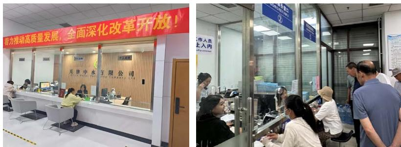  
天津市再生水供水服务窗口(中水公司) 天津市东丽区军粮城供热收费营业厅

  
2025 年

•	 总服务面积 696万平方米  
•	 外售热量1,292,960.07 吉焦，外售冷量 217,208.12 吉焦

## 应急保供

集团坚持“早部署、主动防”，不等不靠上级指令，持续强化物资储备和专业队伍建设，全面夯实应急处置能力，筑牢安全发展根基。各单位及时进行防汛预案修订、演练、隐患排查与整改，并开展防汛实战桌面推演，运用“防汛实时看板”“防汛信息汇总”先进的信息化手段，对防汛工作进行全面监测和科学调度，确保防汛措施落实到位，通过专项检查与工作提示提前谋划精准施策，确保“保供应，保运行”落到实处，集团所有运营单位安全度汛无事故

在日常工作中，中水公司运用“五感八定「五感：“望、闻、问、切、嗅”；八定：定人、定点、定量、定周期、定标准、定表格、定记录、定流程]”工作法对再生水供水管网进行精心巡视，坚持24小时“五到位”(人员、车辆、物资、设备、通讯值班备勤。无论是管网漏损还是设备故障，都能做到快速响应、高效处置，最大限度缩短停水时间，减少对用户的影响我们建立“快速响应、协同处置”应急机制，应急抢修队伍随时待命，接到故障报修后第一时间赶赴现场，高效开展抢修作业。同步做好信息发布与舆情引导，及时向受影响用户告知故障原因、抢修进度及恢复时间，做好解释沟通工作。应急处置结束后，全面排查系统隐患，补充应急物资，总结经验优化预案，持续提升供热保障能力。

针对特殊节日及极端天气，绿能公司以“稳定供热、精准调控、安全高效”为核心，成立节假日供热应急指挥部，明确指挥体系与各工作组职责，制定针对性应急预案，涵盖设施故障、管道泄漏、极端低温等各类场景。全面开展供热系统检修维护，重点检查供热锅炉、换热站、供热管道等设施，更换老化部件，优化系统运行参数。储备充足抢修物资、防护用品及应急能源，组织应急演练，提升队伍应急处置能力，确保供热系统具备应对各类突发情况的能力。

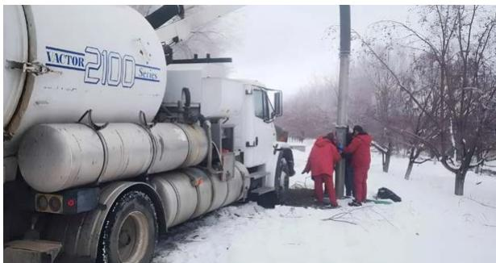

natural_image

Two workers in red uniforms inspecting a white tanker truck labeled 'LMTOR 2100 Series' in a snowy landscape (no visible text or symbols on the truck itself)

克拉玛依公司防冻保温管线巡查

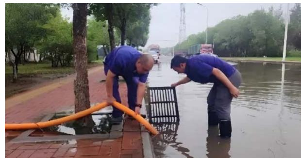

natural_image

Two workers in blue vests handling a hose near a manhole in a flooded area (no visible text or symbols)

防汛应急响应

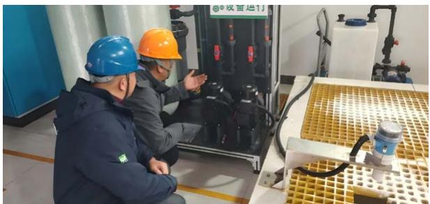

natural_image

Two engineers in hard hats and blue uniforms operating industrial equipment in a factory setting (no visible text or symbols)

曲靖公司节前供水设施检查

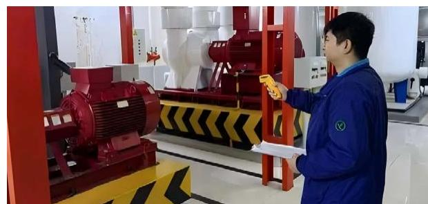

natural_image

Factory worker in blue uniform inspecting industrial machinery with red and white equipment (no visible text or symbols)

绿能公司供热设施检查

## 指标及目标

创业环保秉承开源节流并重，统筹推动天津市主城区再生水管网连通工程建设，累计已完成117个点位施工，通水里程拓展至849公里，通水率从49.9%提升至80%。持续拓展补湖、工业园区、垃圾电厂利用等新领域，重点推动高校、医院及住宅小区绿化切换通水，完成梅江湖公园、天钢集团和贯庄垃圾焚烧处理厂等项目通水。“十四五”期间，累计完成再生水用户开发199项，售水量完成2.47亿吨，报告期内，公司未发生与产品和服务相关的安全与质量重大责任事故

# 绿色创业共筑生态家园

绿色是创业环保的核心底色，更是企业践行社会责任、驱动可持续发展的内在逻辑。公司深耕绿色创业实践，关注气候变化风险，将生态优先、低碳循环要求贯穿运营全维度，以系统性举措统筹环境治理与价值创造。

## 关键议题

· 环境管理 ·生态系统和生物多样性  
· 水资源管理 ·清洁技术机遇  
· 污染物排放 · 循环经济  
· 能源管理 · 废弃物处理  
· 应对气候变化

对标联合国可持续发展目标

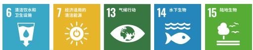

54 应对气候变化  
59 环境合规管理  
62 品质稳定供应

natural_image

Illustration of three people planting a large green plant, with no visible text or symbols

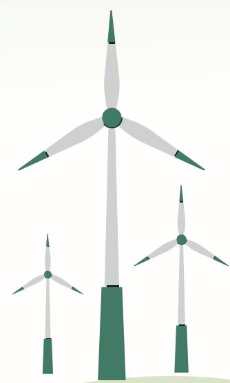

natural_image

Illustration of three wind turbines in a row, no text or symbols present

## 应对气候变化

## 治理

创业环保将应对气候变化的管理融入日常ESG管理体系中，并与专业机构开展气候变化相关专题研讨，持续关注政策变动、法律法规、企业声誉以及实体风险等相关内容。针对识别出的气候风险制定合理的应对策略，结合外部环境变化与内部发展现状，以实际行动应对风险，把握机遇。

## 董事会

•	 全面负责将应对气候变化纳入公司整体战略布局

## 战略与ESG 委员会

•	 对气候变化相关事宜进行监督与管理  
• 识别并评估气候变化相关机遇及风险  
• 审批公司气候目标规划及设定等

## ESG工作领导小组及工作专班

• 制定公司气候战略和目标  
• 统筹气候变化战略及目标的内外部商讨会议  
• 推动落实气候变化相关工作

## 战略

公司对可能面临的气候相关风险和潜在的财务影响进行了全面审视，设置高、低温室气体排放情景，分析各情景下气候因素带来的挑战与机遇，综合评估气候因素的财务影响3。

我们选用联合国政府间气候变化专门委员会(IPCC)第六次评估报告综合报告(AR6)中提出的共享社会经济路径(SSP)的《第六次评估报告综合报告:气候变化2023》(AR6)中提出的共享社会经济路径(SSP)进行情景分析，选择低温室气体排放情景(SSP1-2.6)及高温室气体排放情景(SSP5-8.5)进行比较，基于“2050年净零排放情景(NZF)”与“既定政策情景(STEPS)”两种情景对转型风险和气候相关机遇进行评估，分析气候变化风险与机遇在短期(2026年)、中期(2030年)、长期(2050年)对公司运营的潜在影响。

风险和机遇情景分析清单及相关假设

<table><tr><td>气候情景</td><td>SSP 1-2.6</td><td>SSP 5-8.5</td></tr><tr><td>物理风险情景描述</td><td>该情景下,世界逐渐朝着更可持续的方向发展。该情景致力于将全球平均气温升幅控制在远低于2°C的水平,与《巴黎协定》的温室气体减排雄心一致,且到2100年全球温度相较于工业化前水平升高约1.8°C。</td><td>代表了在假定没有新的气候政策干预下,未来温室气体排放持续增加,辐射强迫达到高水平的一种情景。到21世纪末,全球平均气温可能比工业革命前升高4°C以上。</td></tr><tr><td>情景来源</td><td colspan="2">联合国政府间气候变化专门委员会(IPCC)(《第六次评估报告》(AR6))</td></tr></table>

<table><tr><td>气候情景</td><td>NZE</td><td>STEPS</td></tr><tr><td>转型风险/机遇情景描述</td><td>国际能源署提出2050年净零排放方案,在技术和减排方案、国际合作、能源行业转型方面提出建议,预计将全球平均气温上升限制在1.5°C。</td><td>该情景是一种基于当前已实施政策和已宣布但尚未完全实施政策提案的情景分析。2100年气温有50%的概率会上升2.4°C。</td></tr><tr><td>情景来源</td><td>国际能源署(IEA)</td><td></td></tr></table>

不同气候情景下的影响程度分析

<table><tr><td colspan="2">时间</td><td>2026年</td><td>2030年</td><td>2050年</td><td>2026年</td><td>2030年</td><td>2050年</td></tr><tr><td colspan="2">模型</td><td colspan="3">SSP1-2.6</td><td colspan="3">SSP5-8.5</td></tr><tr><td rowspan="2">实体风险</td><td>急性风险</td><td></td><td></td><td></td><td></td><td></td><td></td></tr><tr><td>慢性风险</td><td></td><td></td><td></td><td></td><td></td><td></td></tr><tr><td colspan="2">模型</td><td colspan="3">NZE</td><td colspan="3">STEPS</td></tr><tr><td rowspan="4">转型风险</td><td>政策风险</td><td></td><td></td><td></td><td></td><td></td><td></td></tr><tr><td>市场风险</td><td></td><td></td><td></td><td></td><td></td><td></td></tr><tr><td>声誉风险</td><td></td><td></td><td></td><td></td><td></td><td></td></tr><tr><td>技术风险</td><td></td><td></td><td></td><td></td><td></td><td></td></tr><tr><td colspan="8">风险等级: 低风险 中风险 高风险</td></tr></table>

重要气候风险影响分析及应对措施

<table><tr><td>风险机遇分类</td><td>影响途径</td><td>潜在财务影响</td><td>应对措施</td></tr><tr><td colspan="4">实体风险</td></tr><tr><td>急性风险</td><td>地震、台风、雷暴雨、大雾等极端天气的出现,可能导致管网堵塞或漏损,设施设备损坏以及超负荷压力运行等。</td><td>成本上升、资产减值</td><td rowspan="2">实时监测与预警,制定极端天气风险响应机制和应急预案,定期开展自然灾害事故应急演练和培训,储备应急物资与专业抢修团队;加强隐患排查、专业检查与日常巡查,提升处理技术;关注户外作业员工健康,完善高温/低温防护物资保障;升级厂区防洪、防涝等防护工程,优先选用气候韧性基础设施,如抗震、防风、防雷、防火设计。</td></tr><tr><td>慢性风险</td><td>干旱、极端高/低温、海平面上升导致的厄尔尼诺现象加剧等慢性风险,可能会影响公司员工健康与安全,或增加药剂损耗、设备能耗,加大水生态安全风险。</td><td>成本上升、收入降低、资产减值</td></tr><tr><td colspan="4">转型风险</td></tr><tr><td>政策风险</td><td>政府出台支持低碳转型以及更严谨的水务行业低碳合规要求,可能影响能源价格波动。跨区域环保监管政策差异增加异地运营合规难度。</td><td>成本上升</td><td>跟踪气候政策变化动态,建立定期汇报机制,前瞻考虑政策适应性;推进分布式能源系统建设,提升绿电使用比例;制定跨区域合规运营标准,同步推进各项目环保提标改造。</td></tr><tr><td>市场风险</td><td>市场对绿色水务、再生水利用等低碳服务需求升级,传统业务市场份额萎缩。</td><td>收入下降</td><td>聚焦“水务+新能源”低碳业务布局,提升再生水、污泥资源化服务供给能力;积极申报绿色信贷、绿色债券,降低融资成本。</td></tr><tr><td>声誉风险</td><td>各利益相关方日益关注公司应对气候变化的表现,可能面临公众舆论压力,影响品牌形象和市场接受度。</td><td>收入下降</td><td>定期披露温室气体排放数据,深化绿色公益合作,打造水务低碳转型标杆案例,提升品牌美誉度。</td></tr><tr><td>技术风险</td><td>随着大数据、人工智能、物联网等新兴技术的兴起,企业需要增加研发投入,以保持市场竞争力。</td><td>成本上升</td><td>深化产学研合作,攻关低碳核心技术,加速技术转化;推动数字化转型,拓展市场布局。</td></tr></table>

气候变化既是挑战也是机遇，创业环保把握发展契机，识别气候相关多元机遇，致力干将气候变化的挑战转化为推动公司可持续发展的强大动力，实现经济效益与环境保护的双赢。

气候相关机遇识别

<table><tr><td>潜在机遇</td><td>机遇分析</td><td>潜在财务影响</td></tr><tr><td>声誉机遇</td><td>· 践行低碳治水、生态保护责任,公开智慧水务及环保技术应用成果,提升利益相关方认可度,树立绿色标杆形象。</td><td>· 增加收入:减少品牌修复潜在支出,增强资本市场信心与价值认同。</td></tr><tr><td>技术机遇</td><td>· 绿色能源替代、工艺技术优化等技术创新带来能效提升空间。</td><td>· 增加收入,降低成本:研发投入享受税收优惠,依托科创平台争取政府专项补贴,减轻资金压力。</td></tr><tr><td>市场机遇</td><td>· 拓展“水务+新能源”融合业务,探索再生水回用、光伏储能耦合等新模式,对接绿色供应链建设需求。</td><td>· 增加收入:新增业务线扩大营收规模,关注外部评级,获得良好认证,促进绿色市场份额。</td></tr></table>

## 风险管理

我们将气候变化相关风险纳入整体风险管理体系由，通过风险与机遇识别风险与机遇衡量，风险与机遇监督应对三个步骤，对潜在影响公司资产的物理风险、转型风险、机遇进行识别、排序和管理，并采取各类减缓、转移或控制风险的举措，如引入绿色金融资源，投入新能源技术项目的研发与拓展，开发建立光伏碳减排计算器并在集团QA平台发布等工作，强化碳排放的监察与管理。

自2023年12月起，研究团队在津沽污水处理厂和咸阳路(新)厂启动碳排放监测试点工作，通过初步构建一套适用于城镇污水处理厂的碳排放通量计算方法、推动两座污水处理厂入选全国试点单位参与生态环境部深化碳监测评估工作，顺利完成污水处理重点生化段的碳排放监测与数据报告任务，进一步完善碳监测流程与数据体系。2025年，研究团队持续对污水处理重点生化段开展常态化监测，进一步探索和总结该段温室气体排放的规律与变化趋势。

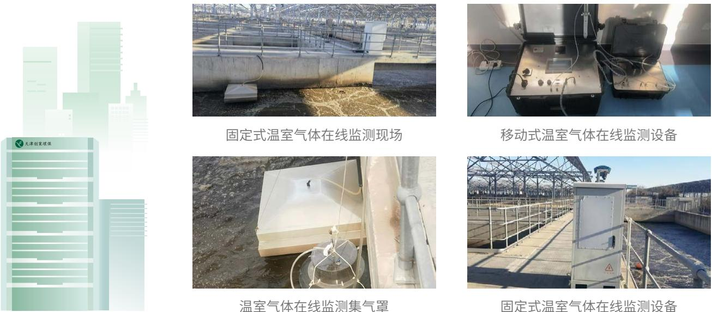

## 创业环保发行天津首单科技创新绿色债券

案例

2025 年 9 月 11 日，创业环保集团在上海证券交易所成功簿记发行天津市首单“科技创新+绿色”公司债券(第一期，简称GK津创01)，该债券由中信建投证券牵头主承销、平安证券等担任联席主承销商，发行规模5亿元、期限3年期、票面利率2.06%（利率再创新低），全场认购倍数达3.02倍，是集团响应上合组织天津峰会共识、贯彻国家金融“五篇大文章”部署的实践，为区域可持续发展和自身长期发展提供了支撑。

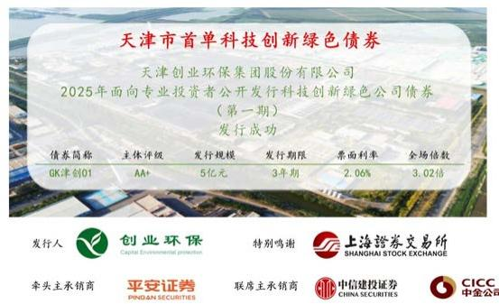

text_image

天津市首单科技创新绿色债券
天津创业环保集团股份有限公司
2025年面向专业投资者公开发行科技创新绿色公司债券
（第一期）
发行成功
债券简称	主体评级	发行规模	发行期限	票面利率	全场倍数
GK津创01	AA+	5亿元	3年期	2.06%	3.02倍
发行人	创业环保	Capital Exchange protection	特别鸣谢	上海證券交易所
SHANGHAI STOCK EXCHANGE
牵头主承销商	平安证券	联席主承销商	中信建投证券	CIICC 中金公司

## 指标及目标

本集团已采取各项节能减排的具体措施响应国家气候变化目标，并持续关注和记录温室气体排放量，积极推动温室气体相关目标制定工作。2025年集团温室气体排放量相关数据如下

<table><tr><td>类别</td><td>单位</td><td>2025</td></tr><tr><td>温室气体排放量(范围一)</td><td>吨二氧化碳当量</td><td>5,654</td></tr><tr><td>温室气体排放量(范围二)</td><td>吨二氧化碳当量</td><td>336,340</td></tr><tr><td>温室气体排放量(范围三)</td><td>吨二氧化碳当量</td><td>105</td></tr><tr><td>温室气体排放总量</td><td>吨二氧化碳当量</td><td>342,009</td></tr><tr><td>温室气体排放强度</td><td>吨二氧化碳当量/百万营收</td><td>0.72</td></tr></table>

## 注：

●1.温室气体排放清单包括二氧化碳、甲烷、氮氧化物、氢氟碳化物、全氟碳化物、六氟化硫、三氟化氮  
·2.范围一包括固定设备、非道路移动源及车辆行驶化石燃料燃烧排放，并减除种植树木的吸碳量  
· 3.范围二包括外购电力及外购热力的间接排放。2025年根据《工业企业温室气体排放核算和报告通则》 (GB/T32150一2025)更新了统计范围，将外售热量纳入计算。热力排放系数采用0.11吨二氧化碳/吉焦。电力排放因子取自2025年生态环境部发布的《关于发布2023年电力二氧化碳排放因子的公告》中全国电网平均排放因子0.5306tCO₂/MWh  
• 4. 范围三包括员工飞行商务旅行的间接排放；  
• 5. 计算过程中相关数据均以吨二氧化碳当量(tCO₂e) 计；  
·6计算方法参考联交所《如何准备环境，社会及管治报告一附录二：环境关键绩效指标汇报指引》，《工业企业温室气体排放核算和报告通则》 (GB/T32150—2025)以及《2006年IPCC国家温室气体清单指南》。

## 环境合规管理

## 环境管理

本集团严格遵守《中华人民共和国环境保护法》《中华人民共和国环境影响评价法》等相关法律法规，制定《质量、环境和职业健康安全管理手册》《环境保护工作责任制》《运营管理标准》《环境保护工作责任制》等制度，部分分子公司已经通过ISO14001环境管理体系认证，并以此建立完善的环境管理体系。各所属单位的主要负责人是本单位环境保护工作第一责任人，对环境保护工作负全面领导责任，配套督查问责机制，在监督自身环保业务运营的同时强化环境管理。2025 年，我们的环保投入为 293,812.73 万元

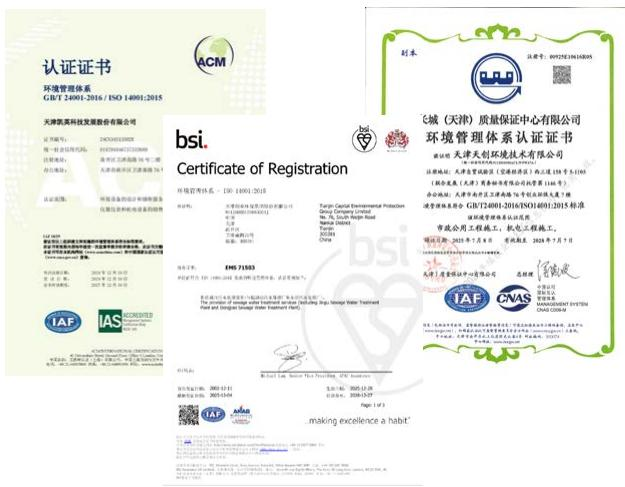

text_image

认证证书
环境管理体系
GB/T 24001-2016 / ISO 14001:2015

天津凯高科技发展股份有限公司
证书编号：240504139888
统一社会信用代码：91370004217222000
注册地址：天津市河西区马家庄路1号
办公地址：天津市河西区马家庄路1号
经营范围：环保设备的设计和制造与销售（凭相关资质文件经营）

bsi.
Certificate of Registration
环境管理体系 - ISO 14001:2018

本公司：天津科大科技集团有限公司
注册会计师：天津科大科技集团有限公司
负责人：王云
电话：021-63333333
传真：021-63333333
电子邮箱：www.tianjin.com.cn

本公司董事会、监事会、保荐人、律师及见证人：
身份证号码：2021年1月10日
成立日期：2021年1月10日
注册资本：人民币1.5亿元

IAF
IAS
ICREDITED
www.icsf.org
www.tianjin.com.cn

EMS 71503

长城（天津）质量保证中心有限公司
环境管理体系认证证书
注册地址：天津天创环境技术有限公司
注册地址：天津经济技术开发区(空港经济区)大道151号A座18楼
办公地址：天津市南开区玉林南路7号创业园B座7楼
邮政编码：TJZ73001-2016-TJZC31401-2015 标准
市政府审核委员会审核。

市政公用工程施工、机电工程施工，有效期至 2025年7月7日

天创（天津）质量保证中心有限公司
注册地址：天津经济技术开发区(空港经济区)大道151号A座18楼
办公地址：天津市南开区玉林南路7号创业园B座7楼
邮政编码：TJZ73001-2016-TJZC31401-2015 标准
市政府审核委员会审核。

天创（天津）质量保证中心有限公司
注册地址：天津经济技术开发区(空港经济区)大道151号A座18楼
办公地址：天津市南开区玉林南路7号创业园B座7楼
邮政编码：TJZ73001-2016-TJZC31401-2015 标准
市政府审核委员会审核。

天创（天津）质量保证中心管理有限公司
注册地址：天津经济技术开发区(空港经济区)大道151号A座18楼
办公地址：天津市南开区玉林南路7号创业园B座7楼
邮政编码：TJZ73001-2016-TJZC31401-2015 标准
市政府审核委员会审核。

天创（天津）质量保证中心管理有限公司
注册地址：天津经济技术开发投资控股有限责任公司
办公地址：天津市河西区马家庄路1号
邮政编码：TJZ73001-2016-TJZC31401-2015 标准
市政府审核委员会审核。

ISO 14001 环境管理体系认证认证

  
2025 年

•	 我们的环保投入为 293,812.73万元。

为有效应对环境风险，我们的各项目单位制订《突发环境事件应急预案》，并形成了一套环保应急管理的组织领导、处置应对和人员物资保障的管理体系，定期依据各自的突发环境事件应急预案开展培训与演练，不断提升环境实际应急能力。2025年，公司未发生重大环境事件。

## 污染物管理

## 治理

本集团严格遵守《中华人民共和国水污染防治法》《中华人民共和国大气污染防治法》《中华人民共和国固体废物污染环境防治法》等法律法规，督促各项目单位制定相应的《固体废弃物制度》《环境卫生管理制度》《在线监测管理制度》等废水、废气及固体废弃物相关管理制度，以各项目单位最高管理者作为废水、废气及固体废弃物管理的第一责任人，依法取得排污许可证，定期开展环境监测工作，配置各项有效的处理设施，多措并举减少相关污染和废弃物排放

## 战略

本集团秉持“源头减量、过程管控、末端治理、资源循环”原则，聚焦运营过程中产生的污泥、恶臭废气、药剂残留、噪声等自身污染物，构建全链条处理体系。通过健全治理架构、锚定战略方向、强化风险防控、量化指标目标，实现自身污染物闭环处理与高效管控，推动运营向“低耗、低碳、低扰”转型，以自我约束践行生态环保责任。

## 风险管理

公司建立“识别一评估一防控一处置”全流程污染物处理风险管控体系，聚焦工艺波动、水质突变、设备故障等核心风险点，实现动态管控与闭环处置，采用定性与定量结合的方法，对风险影响程度及发生概率进行科学评估，制定差异化防控措施。

在废水管理方面，本集团固废处置项目中的沼液和减量化产生的水均进入污水处理厂进行处理达标后排放。污水处理厂采用“污水一再生水一生态用水”的循环模式，处理工艺包括曝气沉砂池、速沉池、多级AO生物反应池、矩形周进周出沉淀池等处理工艺，处理后的再生水广泛用于热电厂冷却水、工业园区及居民小区杂用、医院及公园绿化、环卫用水，废水处理达标后部分回用，以减少废水排放。

## 合肥创业水务有限公司中水利用工程正式通水运行

案例

2025年10月，合肥创业水务有限公司中水利用工程正式通水运行。该项目以合肥公司陶冲污水处理厂尾水为资源，实现“废水重生”，每日可稳定供应约 4 万吨优质中水，年节约自来水近千万吨，项目新建约 7.5 公里中水输送管道及 1 座一体化泵站，为中水输送提供稳定动力，排口采用石头叠水造景，兼具生态性与休闲观赏性。同时，沿线布设7座智能取水栓，将为道路清扫、绿化浇灌等市政杂用提供便捷的中水取用点，为河道补水强化水生态韧性，推动城市公共用水走向集约化和循环化。

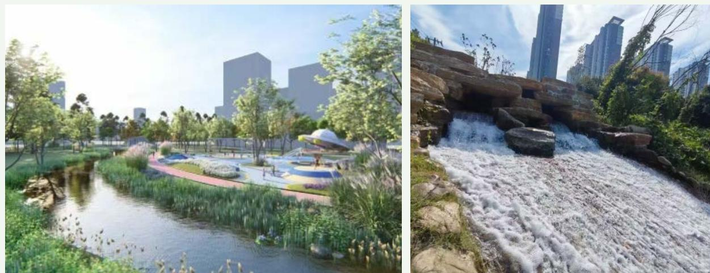

对于废弃物管理，我们将各业务环节过程中产生的危废交由有资质的第三方单位进行处置。污水处理厂产生的污泥交由具有运输资质的第三方单位将污泥转运到指定处置点进行处理。生活垃圾则交由当地环卫单位进行处置。咸阳路污水处理厂产生的污泥通过多元化合作实现污泥无害化、资源化利用。采用好氧发酵工艺将污泥制成绿化营养土，用于林地绿化和盐碱地改良以及将污泥焚烧后制成建筑材料，实现污泥全量资源转化。

本集团废气主要来源于固废燃烧业务、污水处理厂的固定设备。固废燃烧业务中的废气主要源于污泥处理过程和锅炉燃放的烟气。其中污

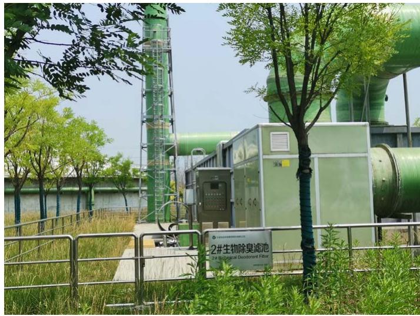

text_image

2#生物除臭滤池
2# Biological Deodorant Filter

咸阳路污水处理厂除臭系统

泥处理过程产生的废气被收集至生物滤池除臭装置进行处理达标后排放:厂内锅炉经过低氮改造后均使用低氮燃烧器产生的烟气符合相关排放标准后排放。污水处理厂产生的废气主要经生物除臭工艺处理后达标排放。

## 2025 年，西安创业水务有限公司污染物减排举措：

· 两污水处理厂将脱水后的污泥（含水率不大于80%)进行垃圾协同焚烧发电处理、好氧发酵后作为肥料进行资源利用，万吨污水产泥量降至7.5吨，污泥含水率稳定控制在80%以下  
借助智能化改造实现药剂投加的精细化，北石桥污水处理厂实施碳源和消毒药剂精准投加系统改造，结合新 装的过程仪表实时监测各工艺段水质，动态调整药剂投用量，大幅提升出水水质稳定性。下辖污水厂的出水 COD、氨氮、TP、TN 浓度分别降至 13mg/L、0.1mg/L、0.09mg/L、8mg/L

## 指标及目标

  
2025 年

## 集团建立并定期追踪污染物目标（已达标）：

·废水、废气、固体废物、噪声等污染排放达标  
•	 重大环境污染事故为 0

## 践行绿色运营

## 能源管理

## 治理

本集团遵守《中华人民共和国节约能源法》《中华人民共和国清洁生产促进法》等法律法规，各所属单位已制定《能源管理制度》，建立公司节能工作领导小组、厂级节能小组、班组节能员三级能源管理体系。节能工作领导小组全面负责公司节能工作，组长由公司总经理担任。

## 战略

公司将能源管理作为绿色发展核心战略，锚定“能效提升、绿电替代、多能互补”方向，推动能源结构从“传统高耗”向“低碳高效”转型，实现能源效益与环境效益协同共赢。在核心战略定位上，紧扣集团“N维一体”商业模式，将能源管理与光伏新能源、污泥资源化、热泵供能等业务深度融合，纳入“双碳”目标布局，打造水务行业绿电应用与节能减碳标杆。

## 风险管理

公司聚售供电中断，设备故障，能耗异常，电气安全等核心风险点，构建“双电源+应急发电机”保障体系，通过智能监测平台精准定位高耗能设备，部署电气火灾监控、漏电监测、接点无线测温等设备，实现隐患事前预警。

公司积极推进节能增效工作，努力实现能源消耗的最优化和效率的最大化。我们主要围绕建筑节能、节能设备改造、余热回收利用与绿色运输等方面协同推进节能减排，利用构筑物上方空间安装分布式光伏发电设施，获得了良好的经济效益及外部认可。2025年，公司清洁能源光伏使用量为44.467.41兆瓦时。

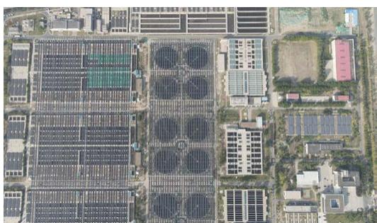

natural_image

Aerial view of a large industrial park with solar panel installations and surrounding buildings (no visible text or symbols)

津沽污水处理厂分布式光伏

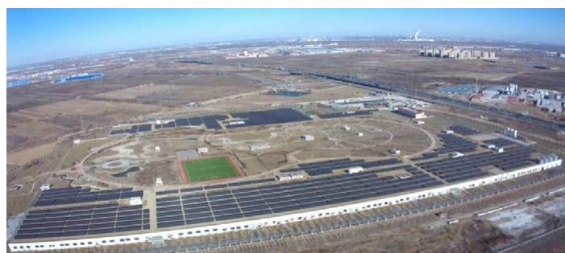

natural_image

Aerial view of a large solar farm complex with grid-connected solar panels and adjacent urban buildings under clear blue sky (no visible text or symbols)

东郊污水处理厂分布式光伏

  
2025 年

## 集团节能技改项目（部分）：

•	 瓮安公司所属二期污水处理厂完成曝气系统改造，改造后设备吨水电耗降低 52.5%  
●津沽污水处理厂采用生物池加装氨氮、硝态氮仪表作为调整风机和阀门的关键参数，代替传统的溶解氧作为指示作用，同比 2024 年节约1.5万吨碳源  
•	 咸阳路污水处理厂致力于减碳控碳、能源自给和资源循环利用，实现了 $26 \%$ 的能源自给率和100%的再生水利用率，并从 2025 年起每年度可减少二氧化碳排放量 3.1万吨  
•	 曲靖创业水务有限公司采用合同能源管理（EMC）模式完成了送水泵房的节能改造，供水泵房单方电耗下降约 20%  
•	 瓮安创环水务有限公司瓮安县三期污水处理厂一期工程生化系统改造，将旋混曝气器换为微孔曝气器，改造后月节电 4.5万—5.5万千瓦时  
•	 合肥创业水务有限公司对生物池鼓风机故障段曝气管实施大修。维修后，设备充氧效率显著提升，吨水风机能耗降低 0.013度 / 吨

## 指标及目标

公司建立科学完善的能源管理指标体系，督促各项目单位设定可量化、可考核的年度指标与中长期目标，以数据牵引能源管理水平持续提升，确保各项战略落地见效

## 2025年节能目标(部分单位)

## 进展

•	 津沽厂“双控”目标：综合能源消耗量不高于 9,000 吨标准煤；节能量不低于30吨标准煤  
•	 东郊厂：综合能源消耗量不高于 $6 _ { \parallel }$ 900吨标准煤  
•	 咸阳路厂“双控”目标：综合能源消耗量不高于 9,100 吨标准煤；节能量不低于 9 吨标准煤  
•	 北仓厂：综合能源消耗量不高于 2,300吨标准煤

经考核，各厂完成各自能源“双控”目标，最终各厂及总部实际完成综合能源消费量为 25,495.99吨标准煤，实际完成节能量为45.28吨标准煤

## 水资源管理

本集团的水资源主要依赖市政供水与自行供应两种渠道，在获取适用水资源方面，尚未遇到任何障碍。部分子公司制定《资源能源管理工作指引》《环境卫生管理制度》等相关制度及短中长期用水目标规划，设置专人负责水资源相关工作将水资源管理的各项指标纳入年度考核，部分水厂每月汇总供水量、污水处理量、能耗、药耗等数据，形成分析报从告，并采取工艺改造、智慧赋能和宣传培训等举措，提升水资源循环利用效率。2025年，集团新鲜水耗水量为2,544,908.83吨。

  
2025 年

## 临夏市创业水务有限公司水资源目标：

•	 短期目标（至 2025 年）：出水水质达标率 100%，运行负荷率稳定在 80%以上，污泥无害化处置率 100%  
•长期规划（至2035年）：构建“减污降碳协同、资源循环高效”的管理体系，实现污水全流程节能降耗

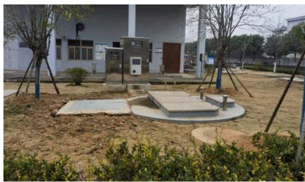

natural_image

Exterior view of a modern building with a concrete foundation and outdoor equipment (no visible text or symbols)

咸宁创业水务有限公司中水泵站

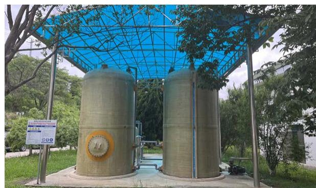

natural_image

Exterior view of two large industrial storage tanks under a blue roof structure, surrounded by greenery and trees (no visible text or symbols)

贵州创业水务有限公司中水处理装置

## 创业环保主要节水措施（每项措施非涵盖全部项目单位）：

## 工艺改造（水厂）

•供水端：实施“一厂一策”整治低浓度进水问题；配备特征污染物检测设备，升级水质自动监测系统  
●污水端：推广精准加药系统，根据进水水质实时调整药剂投加量；优化曝气、回流等工艺，推广高效脱氮除磷技术  
· 管网漏损：更换工业供水计量设施，采购安装补全计量流程缺失水表及流量装置，效验全流程再生水计量装置，准确监测水量  
•	 循环使用：扩建污水处理厂中水回用管网，拓展工业用户、市政绿化等回用场景，签订长期供用协议

## 智慧赋能

• 试点建设智慧供水调度平台，整合水源、水厂、管网、用户数据，实现用水量预测与泵站运行优化调度

## 宣传培训

•	 面向内部员工开展水资源管理政策、技术标准专项教育培训  
•面向用户开展节水宣传活动，通过小区公告、微信公众号、线下讲座等形式，普及节水知识，推广节水器具

## 恩施创环水务有限公司大沙坝污水处理厂中水自用改造

案例

2025年，恩施创环大沙坝污水处理厂开展尾水回用技术研究与工程实践。通过分析厂区用水需求、水质水量特征，确定 40个改造点位，采用袋式过滤器工艺，铺设约800米供水管网，应用“两级变频泵送+分压稳压+精密过滤”集成技术，完成取水、过滤、管网及稳压系统建设。项目落地后，2025年全年已节水量1.01万吨。

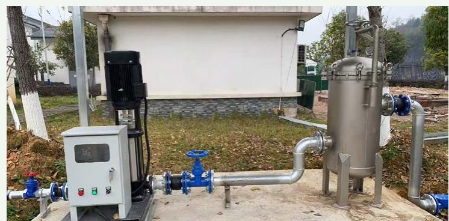

natural_image

Exterior view of an industrial water treatment station with valves and tanks (no visible text or symbols)

## 药剂管理

药剂管理是保障水厂低碳运行的重要控制环节，公司制定《大宗药剂收货及质量管理工作指引》，规范混凝剂，消毒剂等药剂接收、现场质量验收等工作。接收时，检查药剂外包装、罐车储运、密封情况是否完好，药剂是否在保质期内，检查本车次货物应附资料是否齐全。验货时，对药剂进行外观检测，药剂外包装应当完好，无破损、污染、标识不清等情况药剂物理性外观指标应符合各类药剂标准规定，做好留样：使用过程中，公司通过药剂精准投加，严控药剂消耗。

## 绿色文化

为切实提升员工的环保意识，环境管理被纳入相关项目和员工的绩效考核中，定期组织开展各类环境主题培训活动，培训内容涵盖环境相关法律法规解读，环保技术以及产品等内容。同时，我们积极倡导绿色办公和资源节约，促使员工在F常工作由主动关注并积极践行环保责任。2025 年，集团举办环保培训256.次，参加环保培训5.011.人次

  
2025 年

•	 集团举办环保培训 256次，参加环保培训 5,011人次。

## 集团的绿色办公举措（部分，非涵盖全部分子公司）：

## 节约办公耗材

•	 充分利用网络信息平台，逐步实行无纸化办公  
•	 倡导纸张双面使用、废纸重复利用

## 宣传环保意识

•	 通过厂区宣传栏、电子屏等平台，推送节能知识图解、典型案例  
•	 线下组织“节能金点子”征集、“低碳减排绿色生活”倡议等互动活动

## 降低能源消耗

•	 安装机动车及非机动车充电桩，鼓励员工低碳出行  
•	 推行“人走灯灭、设备关机”制度，办公区域照明优先使用自然光  
•	 安装节水型水龙头、感应式冲水装置，杜绝跑冒滴漏现象  
•使用节能灯具，办公设备选用高效能型号  
•在茶水间、卫生间张贴节水提示标语，倡导员工按需取水

## 绿色餐饮

·推行自助取餐，引导员工按需取餐，减少食物浪费  
•	 提倡使用可重复使用的餐具，减少一次性用品使用

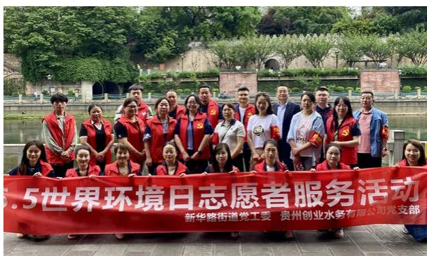

text_image

5.5世界环境日志愿者服务活动
新华路街道党工委 贵州创业水务有限公司党支部

贵州创业水务有限公司  
“垃圾清零30平·美丽中国我先行”志愿者主题活动

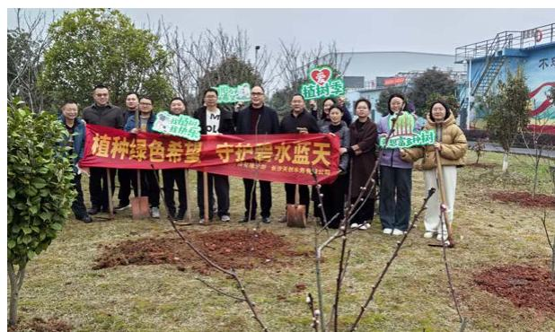

text_image

植树季
植树季
植树季
植树季
植树季
植树季
植树季
植树季
植树季
植树季
植树季
植树季
植树季
植树季
植树季
植树季
植树季
植树季
植树季
植树季
植树季
植树季
植树季
植树季
植树季
植树季
植树季
植树季
植树季
植树季
植树季
植树季
植树季
植树季
植种绿色希望 守护碧水蓝天

长沙天创水务有限公司绿化提质改造活动

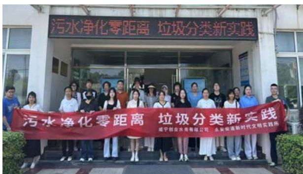

text_image

污水净化零距离 垃圾分类新实践
污水净化零距离 垃圾分类新实践
咸宁创业水务有限公司 永安街道新时代文明实践所

咸宁创业水务有限公司  
“污水净化零距离，垃圾分类新实践”宣传活动

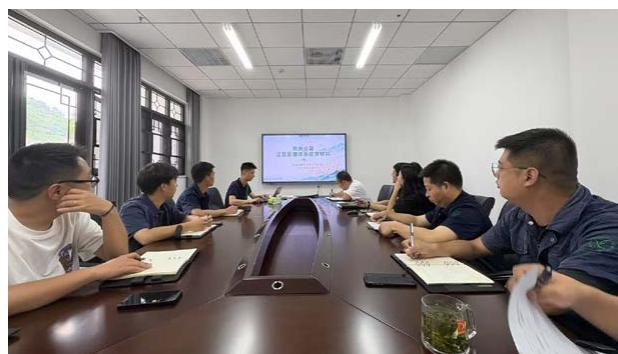

text_image

Meeting room photo with visible presentation screen showing Chinese text about a 2023 business meeting

恩施创环水务有限公司环保知识培训

## 生态保护

本集团严守生态保护红线，关注并参与生物多样性保护事业。我们建设“花园式污水厂”，以高品质再生水为核心，精准对接河道补给、湿地涵养、绿化灌溉等多元需求，构建“再生水一生态用水”循环链路。各区域项目结合当地水系禀赋，科学调配再生水资源，通过“分质利用、就近补给”原则，持续为城市内河、人工湿地补水，筑牢水生态安全屏障，保护水源地。

公司将生态保护融入工程规划、建设、运营全周期，推行绿色建造模式，打造“低耗、低碳、低扰”的生态型工程标杆，实现工程建设与生态保护协同推进。工程规划阶段，严格开展生态影响评估，优先采用生态友好型设计方案；建设阶段推广应用低碳环保技术与材料，严控施工扬尘、噪声及废水排放，减少对周边生态环境的扰动；建设完成后及时对项目周边植被、土壤及水体进行系统性修复，打造城市绿色发展新范式

## 长沙天创水务有限公司参与“共护生态 增殖放流”活动

案例

2025年1月，长沙天创水务有限公司参与宁乡市生态环境损害赔偿调研暨增殖放流志愿活动。活动现场，公司志愿者搭建宣传服务岗，向过往市民发放环保宣传手册，结合典型案例讲解生态环境损害赔偿的责任认定、处置流程与修复成效，清晰阐释生态破坏的深远影响，并进行鱼苗放流，携手守护宁乡的绿水青山与生态家园。

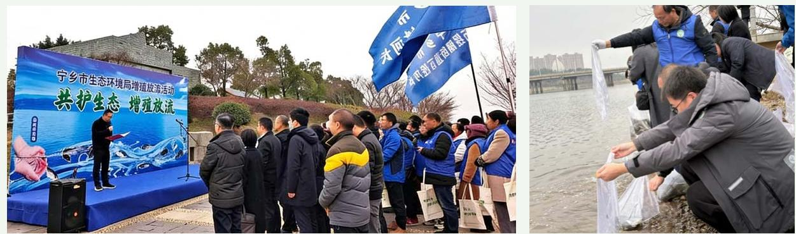

text_image

宁乡市生态环境局增殖放流活动
共护生态 增殖放流

## 克拉玛依天创水务有限公司助力生态水体补水

案例

克拉玛依天创水务有限公司第二污水处理厂夏季再生水稳定补给（年补给量超 2,000 万立方米），使古海生态公园从盐碱戈壁蜕变为生态湿地公园，形成稳定水域及周边芦苇、红柳等湿地植被带，为水生、陆生生物提供了栖息、繁殖的核心场所，填补了区域干旱环境下的湿地生态空缺。

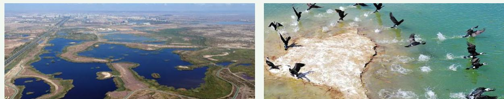

## 才聚创业 携手同绘未来

创业环保秉持“德才兼备有为有位”的人才理念，将成就员工成长、促进组织发展、实现社会价值作为重要使命，致力于营造健康安全的工作环境，构建公平公正的成长通道，打造全方位的人才发展平台，推动员工与企业同心同行、协同共进，助力员工实现个人提升与价值创造，携手开创更加美好的未来。

## 关键议题

·雇佣及劳工准则

·员工培训与发展

· 员工健康与安全

·员工权益保护

## 对标联合国可持续发展目标

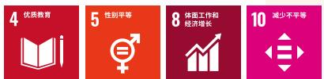

70 多元合规雇佣  
74 成就员工梦想  
77 严守安全底线

natural_image

Illustration of people interacting with a large screen displaying video call interfaces, set against abstract background elements (no text or symbols)

## 多元合规雇佣

## 劳工准则

本集团始终严格遵守《中华人民共和国劳动法》《中华人民共和国劳动合同法》《中华人民共和国社会保险法》《中华人民共和国未成年人保护法》《禁止使用童工规定》等法律法规，制定《员工招聘管理制度》《用工管理制度》等制度，明确禁止发布涉及性别、种族、民族、户籍等歧视性信息，确保不因年龄、民族、种族、家庭状况、性别、宗教信仰、国籍等因素差异对待。我们把握招聘工作关键流程，建立严格的资格审核机制，从源头严控招聘，确保避免雇佣童工及强迫劳动。同时，为切实维护员工的合法权益，本集团设立信访部门接收员工反馈信息，党委组织部负责调查沟通、调解和结果反馈。报告期内，我们未发生劳动争议事件，目不存在任何雇佣童工、强迫劳动、骚扰和歧视现象

2025年，公司劳动合同签订率100%，社会保险覆盖率100%。

我们根据公司发展需要统计招聘需求，通过校园招聘、社会招聘、人才引进等多渠道吸引来自不同背景的员工，优化偏远地区招聘资格条件，积极对接招聘资源，加强关键岗位及后备人才储备。截至报告期末，公司总人数2.330人，其中残疾员工5人，少数民族员工116人，按照性别、年龄、学历、职级划分的员工统计数量如下：

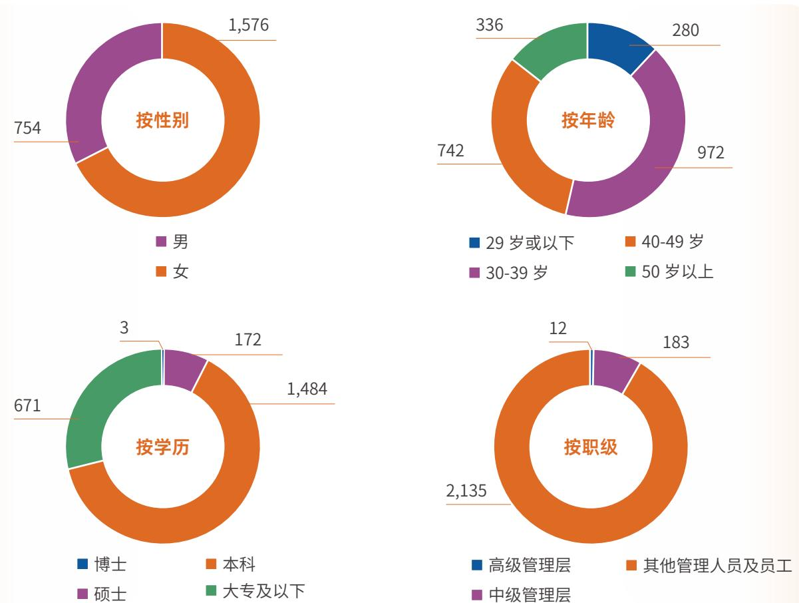

## 薪酬福利

本集团高度重视员工薪酬福利体系的科学构建与持续优化。公司制定《员工薪酬管理制度》《绩效工资管理制度》《本部员工考勤、休假和加班管理制度》等制度，确保薪酬体系兼具公平性、竞争性与激励性，严格遵循工时及假期合规要求保证员工工作环境与条件。我们建立了绩效导向的考核机制，完善了绩效考核结果与薪酬分配、职业发展的联动机制，充分认可员工在创新、协作、增效等多维度的贡献。福利保障体系除涵盖法定的社会保险、住房公积金等项目外，也包括为员工发放春节、端午、中秋节节日慰问品，组织员工观影活动，并为员工提供生日、住院、退休、结婚、生育等慰问福利公司建立常态化的员工绩效反馈与申诉机制，始终确保薪酬福利决策与执行的透明度，接受有效监督，如员工对考核结果有异议时，可书面提交申诉，申诉处理小组接收到相关反馈后将及时进行认真分析评估，做出合理处理决定

公司关注员工身心健康，积极组织形式多样的员工关怀与文体活动，持续提升员工的幸福感与归属感。在关怀保障方面公司面向一线职工及外派职工开展“冬送温暖、夏送清凉”等慰问活动；同步落实大病救助机制，并按城投集团工会统一安排，为在职会员投保互助保障计划、专享救助保障及女工互助保障。困难帮扶工作严格依照上级工会要求执行，由本市各基层工会实时摸排，目前尚无符合条件的困难职工。

  
2025 年

•	 员工住院、直系亲属去世、退休、生育、结婚等慰问72 人次  
•	 “送清凉”活动累计慰问 441 人次，慰问款物总额 8.82万元  
•	 春节期间慰问留津在岗的一线项目及窗口运营单位员工共177人

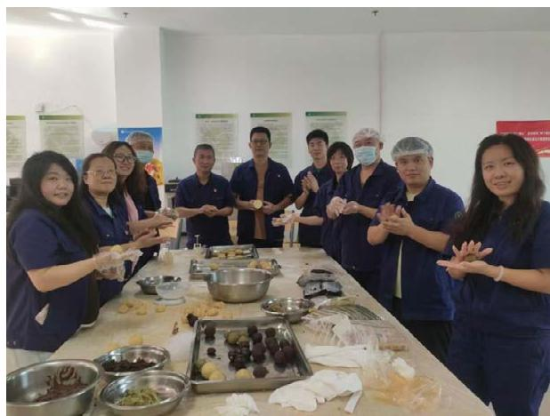

natural_image

Group of people in blue uniforms posing for a hands-on gesture at a large table with food and kitchen items (no visible text or symbols)

中秋国庆“双节”活动

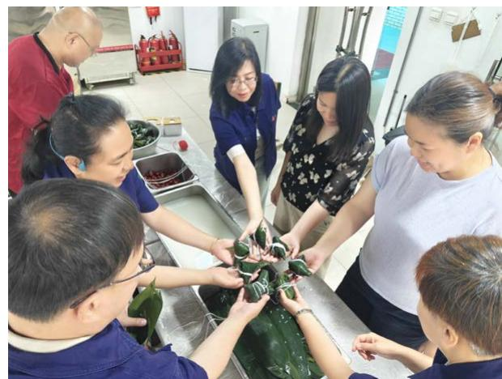

natural_image

Group of people preparing food together in a kitchen, handling green vegetables (no visible text or symbols)

端午节活动

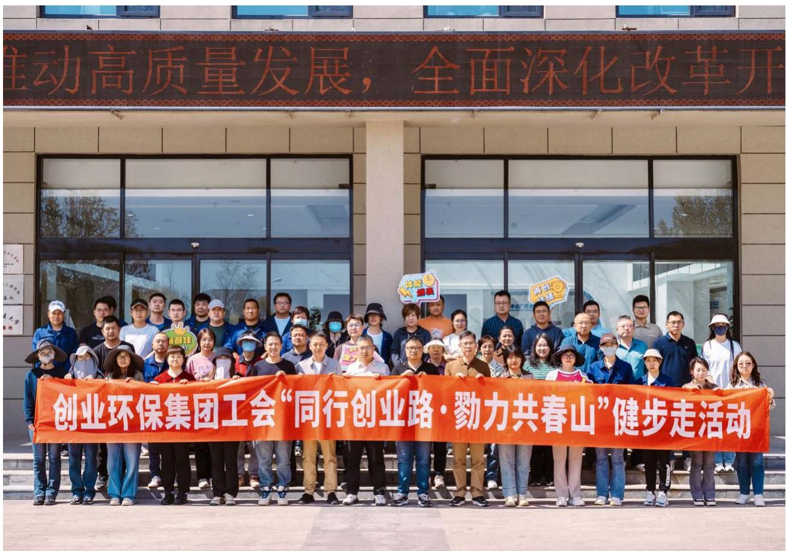

text_image

推动高质量发展，全面深化改革开
创业环保集团工会“同行创业路·勠力共春山”健步走活动

健步走活动

我们关注女性员工在职场中的实际需求，尊重女性员工，保障女性员工的合法权益。集团工会设立“爱心妈咪之家”，为孕期及哺乳期女职工提供人性化，温馨的支持服务，切实维护女职工的合法权益与特殊利益。此外，公司定期开展女性健康主题培训，并组织妇女节相关活动，营造关怀友好的工作氛围。

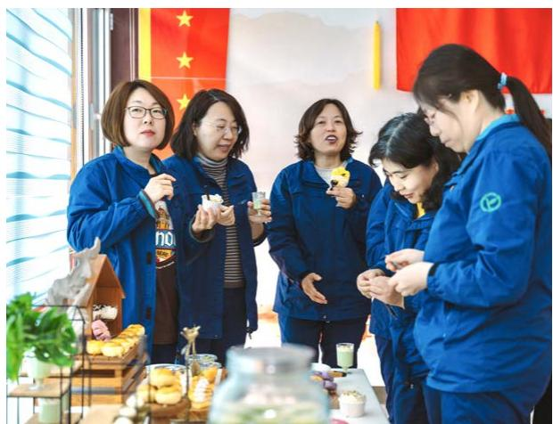

natural_image

Group of women in blue uniforms gathered around a table with decorative items and Chinese national flag in background (no visible text or symbols)

妇女节活动

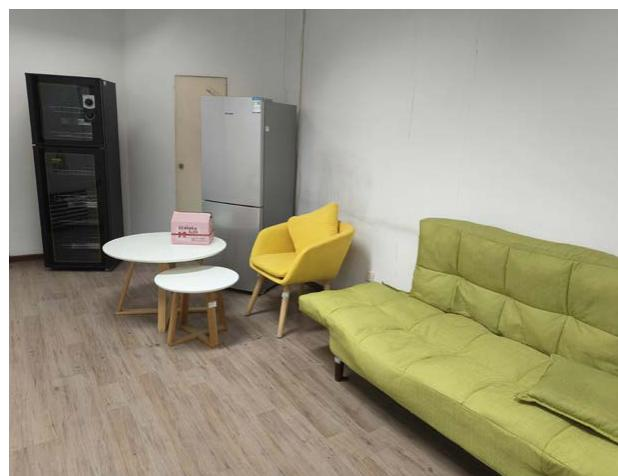

natural_image

Interior of a modern living room with a yellow sofa, white table, and refrigerated refrigerator (no visible text or symbols)

“爱心妈咪之家”

## 员工沟通

本集团积极推进民主管理，依托厂务公开和职工代表大会等机制有序开展。厂务公开制度严格按照城投集团工会相关制度执行，并设立厂务公开小组，推动信息公开透明、程序规范有序：同时，创业环保依法设立集团工会，通过职工代表大会、民意调查、满意度调查及合理化建议征集等多元渠道畅通沟通反馈。2025年，公司组织开展以“勇争先善作为多贡献”为主题的职工合理化建议征集活动，引导广大职工集思广益、群策群力、锐意进取、共谋发展，凝聚推动集团高质量发展的强大合力，最终收集并采纳合理化建议111条。

报告期内，集团工会组织各基层工会以问卷方式开展员工满意度调查，随机抽样覆盖约50%员工。调研结果显示，员工对环境卫生、通讯与网络设施使用、办公设备完好及维护、就餐环境与卫生等方面总体评价达到“较满意”及以上水平。

  
2025 年

•	 召开职工代表大会10 次  
•	 工会会员入会率100%  
•	 集体谈判协议覆盖率100%  
•	 员工满意度100%

## 创业环保集团召开 2025 工作会议暨 2025 年首次职工代表大会

案例

2025年1月，创业环保集团党委召开2025工作会议暨2025年首次职工代表大会。会议全面总结2024年度工作总结，科学部署2025年重点任务。会议聚焦职工关切、职业发展、安全保障等议题，全面听取职工代表意见建议审议通过年度工作报告与职工关切事项，统一思想、凝聚共识，引导全体员工同心同向、同频共振。

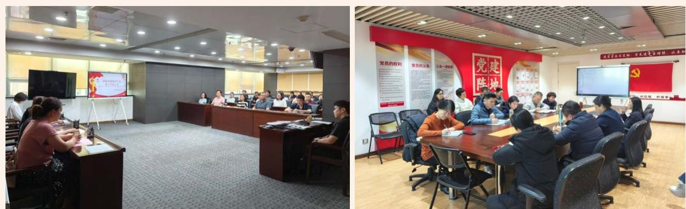

## 成就员工梦想

创业环保以“创业骐骥”品牌干部人才工作为总牵引，将“德才兼备，有为有位”人才理念贯穿员工招募、选拔、培育、激励等全过程，持续助力完善公司治理体系、强化集团话管控效能，鼓励员工积极践行“担当·创新·共享·卓越”的价值观念，系统构建并完善选才用才、素质开发、实践锻炼、多元激励、人才生态五大体系，持续强化人才治理与赋能，为公司可持续发展提供组织与人才支撑。

公司强化顶层设计，将干部人才体制机制改革与人力资源制度体系改革统筹推进，发布《创业环保集团高素质干部人才引领高质量发展三年行动计划(2025一2027)》作为中长期工作战略指导，制定并实施《集团培训管理制度》《技术序列职业通道发展管理办法(试行)》等制度，构建公司“四层次”（“骐骥领军”“骐骥精英”“骐骥工匠”“骐骥星火”）干部人才梯队，以制度化、规范化管理推动人才工作系统化统筹推进。

  
2025 年

•	 员工培训覆盖率100%  
•	 员工受训总课时93,619.44小时，人均培训小时 40.18小时

## 创业环保人才工作五大体系

## 选才用才

集团严格规范员工招募与选拔流程，开展专业化人才引进工作，重点面向2025届应届毕业生组织校园招聘精准补充新鲜血液，优化人才队伍结构，为公司长远发展储备后备力量。

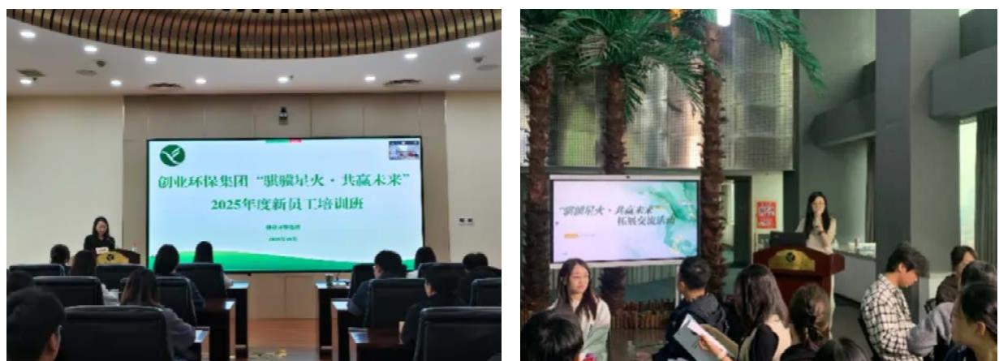  
新员工入职培训

## 素质开发

为公司中高层管理人员提供履职任职学习提升机会，推行集团内部“揭榜挂帅”机制，实现员工能力提升和业务难题攻克的需求匹配；在公司内部，依托主营环保业务设施，面向社会公众开放“双碳”实践培训基地，挂牌8家“人才培养实践基地”，为员工提供场景化学习资源；广泛在业务一线推行“师带徒”模式，开展标准化课程培训，形成可复制的培养经验；依托基地数字化引擎打造数智化人才培育平台，有效打通了全国布局型企业的地域限制与业务壁垒，形成“虚拟实训+实战演练”一体化培养体系。

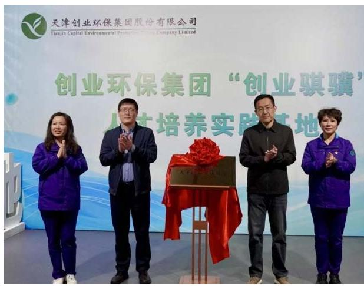

text_image

天津创业环保集团股份有限公司
Tianjin Capital Environmental Protection and Maintenance Company Limited
创业环保集团“创业骐骥”
人才培养实践基地

基层“人才培养实践基地”挂牌

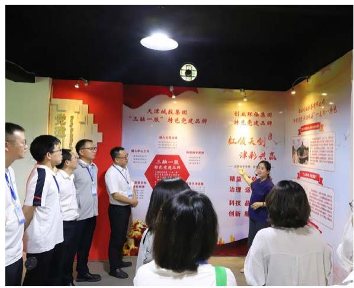

text_image

天津城投集团
“三融一联”特色党建品牌
创业环保集团
新色党建品牌
红铁天创
津彩共赢
三融一联
特色党建品牌
精益
治理
科技
创新

财务关键岗位人员依托基层实训基地开展穿透式管控实践学习

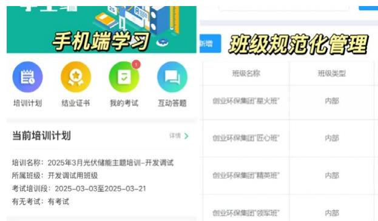

text_image

手机端学习
新增 班级规范化管理
培训计划 结业证书 我的考试 互动答题
当前培训计划
培训名称：2025年3月光伏储能主题培训-开发调试
所属班级：开发调试用班级
考试培训段：2025-03-03至2025-03-21
有无考试：有考试
班级名称	班级类型
创业环保集团"星火班"	内部
创业环保集团"匠心班"	内部
创业环保集团"精英班"	内部
创业环保集团"领军班"	内部

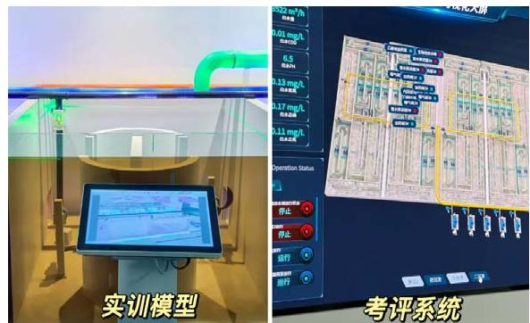

text_image

实训模型
35.2 mg/L
0.1 mg/L
0.5 mg/L
0.13 mg/L
0.17 mg/L
0.11 mg/L
Operation Status
停止
停止
运行
运行
考评系统

## 多元激励

建立技术与管理“双通道”职业发展路径，打通管理与技术岗位互通发展渠道，通过荣誉表彰树立榜样、以技能认定强化能力导向:开设人才专栏鼓舞员工士气，建立容错纠错机制鼓励创新探索，加强员工关怀传递企业温度，持续打造优质雇主品牌增强人才吸引力。

## 实践锻炼

推进干部多维度交流赋能，通过“实岗锻炼”形式重点培养业务骨干，实施“蹲苗历练”模式为青年员工蓄能成长，搭建立体化人才培养体系，分层分类开展培训，广泛开展基层技能比武、基层创新干部人才等活动；全年完成跨板块、跨地域交流管理人员 52 人次，26 名员工参与跨地域交流锻炼，形成多项技术优化案例及管理方案，协助下属单位解决发展实际问题，推动管理经验与技术成果复制推广，支撑全国业务布局落地

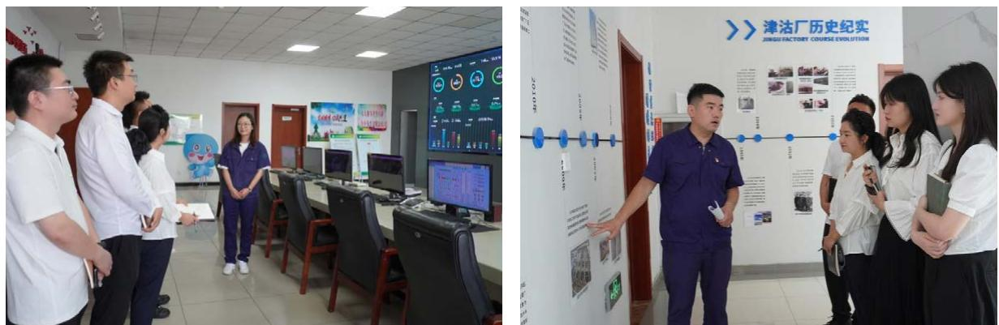  
外埠地区员工跨地域交流学习

## 人才生态

搭建公司内部创新人才大赛平台，在公司内部表彰52项优秀项目，全面激发科技型人才、创新型人才的职工主体荣誉感，提升人才综合能力2026年初，集团文化交流·培训中心正式启用，持续完善人才引育管用体系支撑企业高质量、可持续发展。

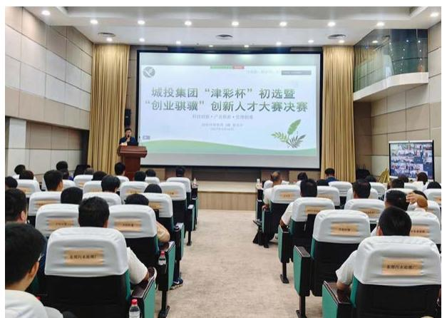

text_image

城投集团“津彩杯”初选暨
“创业骐骥”创新人才大赛决赛

“创业骐骥”创新人才大赛

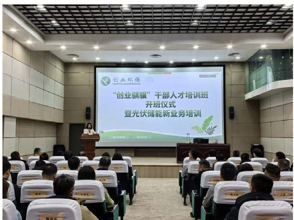

text_image

创业环保
“创业骐骥”干部人才培训班
开班仪式
暨光伏储能新业务培训

“创业骐骥”于部人才培训班开班仪式

## 严守安全底线

## 健康与安全

## 治理

本集团严格遵守《中华人民共和国安全生产法》《中华人民共和国职业病防治法》等法律法规要求，建立完善的职业健康安全管理体系。修订完善《安全生产责任制(2025版)》，将安全责任精准细化并分解至集团各中心部室、所属各单位及本部所有岗位，全面实现责任“横向覆盖所有职能部门、纵向延伸至基层班组及一线岗位”。构建全链条闭环管理机制，切实保障层层有人管、事事有人抓、件件有着落的安全责任管理体系。

集团本部及部分项目单位已通过了ISO45001职业健康安全管理体系认证，实现职业健康安全管理标准化、规范化运行。并层层建立安委会、安全领导小组等安全管理组织，配备专(兼)职安全管理人员，为安全管控工作有序开展提供坚实组织保障。

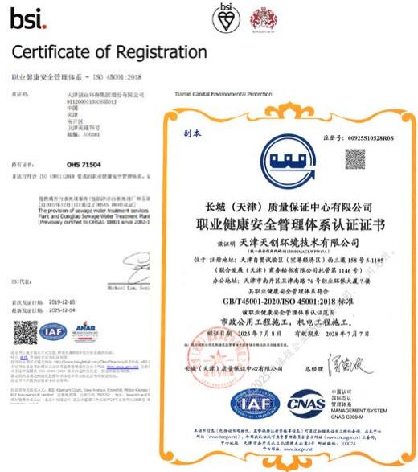

text_image

bsi.
Certificate of Registration
职业健康安全管理体系 - ISO 45001:2018
证书号：天津就业环保集团股份有限公司
注册号：12000100036501
中国
天津
开开区
天津南路79号
邮编：200000
持有证书：
OHS 71504
并网发行符合 ISO 45001:2018 质量的职业健康安全管理体系。
提供城市内配套服务（包括消防设施和环卫设施）和企业（12019年12月11日通过 ISO 45001认证）
The provision of sewage water treatment services
Plant and Dongguan Sewage Water Treatment Plant
(Previously certified to OHS 45001 since 2001)
EPA代码：
Michuan Law, Sui
首次发证日期：2019-12-10
最新发证日期：2025-12-04
Tianjin Capital Environmental Protection
副本
注册号：09925810528ROS
长城（天津）质量保证中心有限公司
职业健康安全管理体系认证证书
前证明：天津天创环境技术有限公司
位于 注册地址：天津自贸试验区（空港经济区）西三道158号S-1105
（联合发展（天津）商业金融有限公司物业管理1146号）
办公地址：天津市南开区卫津南路75号创业环保大厦7楼
其他职业健康安全管理体系符合
GB/T45001-2020/ISO 45001:2018 标准
该职业健康安全管理体系认证范围
市政公用工程施工、机电工程施工、
解质日期：2025年7月8日 有碳消退 2028年7月7日
长城（天津）质量保证中心有限公司 总经理
AIF CNAS
国务院
CNS
国务院国资委
MANAGEMENT SYSTEM
CNAS COOM
本文件刊登在《危险废物管理规定》、《国务院证券监督管理委员会关于通过深圳证券交易所上市的公告》，详见于公
司（www.cninfo.com.cn），并经本公司董事会及全体董事过半数同意，同意公司本次非公开发行股票并在创业板上市。本次非公开发行股票无需提交公司股东大会审议。特此公告。
中审众环（天津）资产评估有限责任公司（特殊普通合伙）2027A
编号：303274

ISO45001职业健康安全管理体系认证

## 战略

本集团将安全风险管理嵌入集团战略决策与生产经营全流程，重点围绕重大危险源、危化品与特种设备、外委施工及跨区域运营等高风险场景，建立“风险辨识一分级管控一隐患治理一应急处置一复盘改进”的闭环机制。集团以穿透式管控强化对子企业与项目一线的标准化要求，通过制度、培训、演练与技术改造并举提升本质安全水平，同时依托信息化平台实现风险预警，作业许可，巡检维护和事件上报的实时可视化管理，推动安全投入精准化，管理动作可追溯，责任落实可考核，以更高的安全韧性保障持续稳健运营与长期价值创造。

## 风险管理

公司印发《创业环保公司危险化学品领域安全生产百日攻坚行动方案》《创业环保集团安全生产大排查、大检查、大整治行动方案》等专项监督工作方案，持续完善“全员排查、专业研判、分级治理”的联动机制，推动各单位自上而下压实责任、督促全员参与。公司坚持专业检查与日常巡查相结合，聚焦重要会议、节假日等重点时段强化安全保障，持续提升隐患排查治理能力。

报告期内，集团各单位累计组织开展隐患排查5.130余次，排查隐患704项，均已完成整改闭环，实现隐患动态管控与源头防范。公司还对行政类服务商、物业、食堂等承包商开展安全管理与定期考核，进一步强化外委风险管控。

在员工职业健康方面，公司为员工提供符合标准的劳动防护装备，组织覆盖全员的健康体检，全面排查职业病和其他健康风险，并为员工提供专业的健康评估报告。对体检中发现有职业病风险或健康问题的员工，公司迅速采取调岗等保障措施。另外，我们定期开展职业病危害因素检测，预防、控制和消除职业病危害，严格保障员工工作环境与条件健康安全。报告期内，员工体检覆盖率达100%。

## 指标及目标

“源头治理(构建前瞻性的安全风险防控体系)”与“筑牢底板(打造韧性的安全基础保障能力)”相辅相成，共同构成一个动态、立体的安全防护体系，实现“保护项目、保护资产、保护人”的全面安全目标。

  
2025 年

## 公司已达成职业健康及安全生产目标：

●杜绝安全生产责任事故发生，坚决遏制重特大事故等恶性事故发生  
•	 全年死亡事故率为 0  
•	 事故隐患上报率 100%，责任范围内事故隐患整改率 100%

## 应急管理与安全培训

公司持续健全应急管理体系，2025年完成《天津创业环保集团股份有限公司生产安全事故综合应急预案》的编制与发布，覆盖有限空间中毒、火灾、设备故障等突发事件，强化各层级综合应急预案的衔接性与可操作性。公司同步推动各单位制定预案演练计划，系统落实应急救援组织机构、队伍、装备与物资等应急资源配置，围绕重点风险场景开展针对性演练，确保关键岗位人员熟练掌握处置流程，全面提升突发事件应对能力。

我们建立了完善的应急管理体系，实行应急指挥部统一领导、应急办公室统筹协调、专业工作组分工处置。

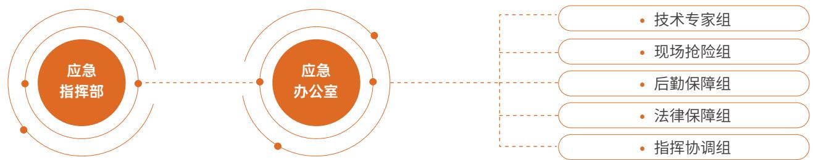

flowchart

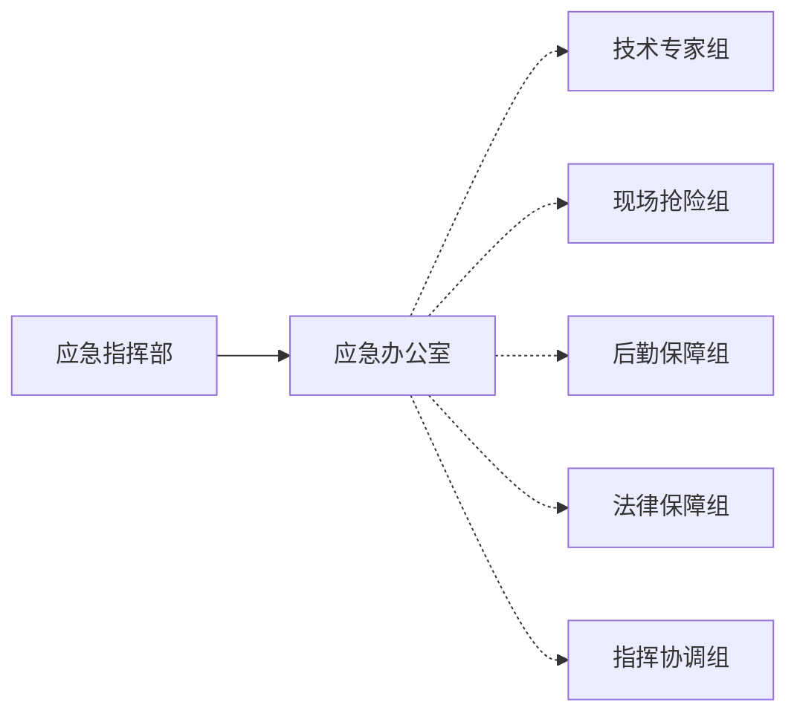
```mermaid
graph LR
  A["应急指挥部"] --> B["应急办公室"]
  B -.-> C["技术专家组"]
  B -.-> D["现场抢险组"]
  B -.-> E["后勤保障组"]
  B -.-> F["法律保障组"]
  B -.-> G["指挥协调组"]
```

各单位结合生产经营风险等级制定《年度应急演练计划》，报告期内，集团各单位累计开展各类应急演练695次，参与12.774人次。通过演练有效检验应急预案的可行性与可操作性，持续提升应急救援队伍实战水平与快速处置能力。

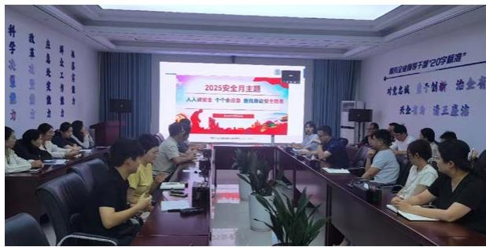

text_image

2025安全月主题
人人讲安全 个个会话录 奇能迎安全目标
科学决策助力
应急工作能力
政策改革助力
对党忠诚 勇学创新 治金有
兴全清秀 请正盛情

合肥创业水务有限公司“人人讲安全，个个会应急”  
主题安全培训

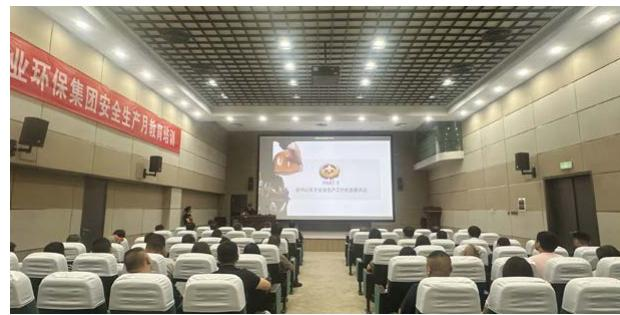

text_image

业环保集团安全生产月教育培训

创业环保集团安全生产月教育培训

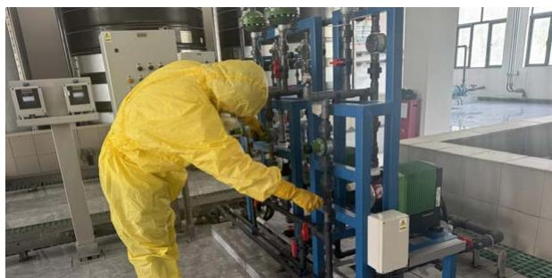

natural_image

Person in yellow protective suit operating industrial machinery in a cleanroom facility (no visible text or symbols)

界首市创业水务有限公司关键设备故障应急演练

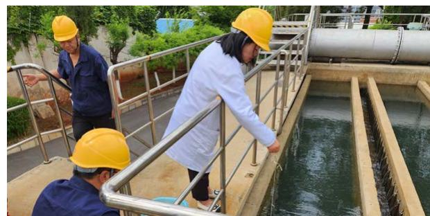

natural_image

Three workers in hard hats inspecting a water treatment tank with metal railings (no visible text or symbols)

曲靖创业水务有限公司水质污染应急演练

## 创业环保开展防消联勤工作示范培训

案例

2025 年 2 月21日，创业环保集团联合南开区消防救援支队及7 支消防中队共 50 余人，在创业环保大厦开展防消联勤示范培训。培训中，消防指战员在物业及维保单位指引下，实地查看消防泵房、控制室等关键区域，以“讲解 +示范”方式普及设施原理、隐患排查、初起火灾扑救及逃生技巧，强化参训人员实操能力。

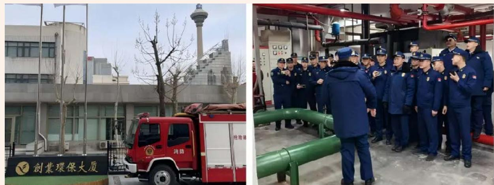

# 协同创业聚力和谐社会

创业环保以可持续供应链建设为抓手，推动绿色采购，提升资源利用效率与环境绩效。公司围绕环保主业，持续开展环保科普宣教，积极参与公益慈善与志愿服务，关爱困难群体，汇聚社会力量共建绿色、温暖的城市家园。

## 关键议题

·供应链管理

· 乡村振兴

· 社区投资

对标联合国可持续发展目标

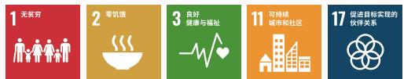

82 共建责任链条  
83 驱动行业发展  
85 持续社区投资

natural_image

Illustration of people cleaning a city with symbolic icons like hands, hearts, and gift boxes (no text or symbols)

## 共建责任链条

本集团致力于构建透明、合规的供应链体系。公司制定《非法定招标项目采购管理制度》《服务单位考核管理工作指引》等工作文件，健全供应商全生命周期管理体系。公司建立分层分级、权责明晰的供应商管理组织架构，以总经理办公会作为最高决策机构，下设集团公司采购委员会，集团公司招标管理部门作为执行机构，牵头组织建立、统一管理更新集团级供应商名录及评审专家库，确保供应商管理工作规范落地。2025年，集团供应商共4.135家，其中5家来自中国香港4,130 家来自中国内地。

  
2025 年

•	 集团供应商共 4,135 家

## 供应商准入

• 依托采购管理系统和电子采购平台，根据采购金额和采购方式对供应商进行差异化管理，鼓励供应商使用环保产品或服务，重点审核供应商相关资质文件，严控违规准入与不正当合作。

## 供应商考核

•	 依据“谁使用、谁评价”原则，由需求方每年对过去一年合作的供应商开展履约评价，评价维度涵盖资格能力、服务质量、产品质量、合规经营、合同履约情况等核心指标。

## 供应商退出

• 集团建立供应商名录动态更新机制，结合履约评价结果、违规行为查处情况等，及时调整供应商合作资格。对评价不合格的供应商，纳入集团不合格供应商名录，实施联合惩戒，在三年内禁止参与集团所有采购活动，并在集团内通报。

## 驱动行业发展

本集团秉持行业共建导向，以多元参与赋能产业高质量发展。积极投身各类行业展会与高端交流活动，紧盯行业最新动态与前沿趋势，精准把握市场需求与发展方向，通过同行深度交流与合作探索，拓宽协同创新与资源共享空间。

## 创业环保参加 2025（第二十三届）水业战略论坛

3月27日，2025（第二十三届）水业战略论坛在北京召开。本次论坛上，创业环保分享污水源热泵项目实践，展望多维度协同发力推动行业绿色转型的规划

案例  
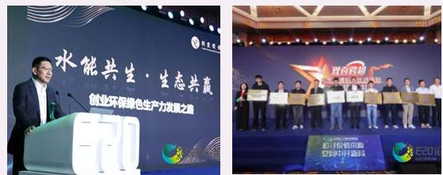

## 创业环保参加中国环博会

案例

2025年4.月，第26届中国环博会在上海举办，创业环保集中展示面向污染治理与节能降碳的综合解决方案。公司以“三药剂一设备”为代表的技术产品输出为核心，围绕“智水云枢精准治污、智净循环水续未来、多元废转源蜕再生、绿色能源低碳未来”等主题，系统呈现从智慧水务到循环利用、资源化转化与绿色能源的业务能力与实践成效，进一步提升品牌影响力与行业合作空间。

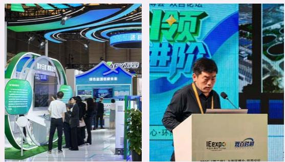

## 创业环保参加 2025 中国水博览会

2025年6月，以“科技赋能水利数智引领未来”为主题的中国水博览会在天津举办。本次展览创业环保以“智慧化污水处理高质动能”为核心，紧扣水处理主业，围绕“N维一体”商业模式与“一个项目一座城”发展思路，集中呈现污水厂智慧管控平台、智能预警设备等产品及再生水全产业链方案，同步展示固废处理、废气治理、可再生能源供冷供热等技术及“双碳”服务平台，彰显技术沉淀与主业实力。

案例  
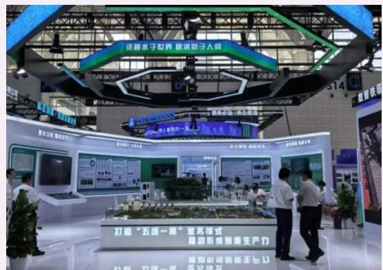

text_image

话源水才似界 话源新千八间
打造“五维一维”变革模式
降边形成能源生产力
建型项目推进正与1)

本集团主动牵头或参与行业标准制定工作，将自身在环保水务领域的技术积累、实践经验转化为行业共同遵循的规范指引，助力完善行业标准体系，另外，创业环保及各外埠公司积极加入数十家重点行业协会并发挥骨于作用，依托协会平台参与行业研讨、政策建言等活动，搭建产业协同桥梁。

<table><tr><td>协会名称(部分)</td><td>担任职务</td></tr><tr><td>中国城镇供水排水协会科学技术委员会</td><td>理事单位</td></tr><tr><td>中国城市环境卫生协会污泥处理处置专业委员会</td><td>理事单位</td></tr><tr><td>天津市可持续发展研究会</td><td>副理事长单位</td></tr><tr><td>中国城镇供水排水协会</td><td>常务理事单位</td></tr><tr><td>中国给水排水社务委员会</td><td>会员单位</td></tr><tr><td>中国城镇供水排水协会设施更新与修复专业委员会</td><td>会员单位</td></tr><tr><td>天津市供热协会</td><td>会员单位</td></tr><tr><td>天津市环境保护产业协会</td><td>副会长单位</td></tr><tr><td>中国工程建设标准化协会智慧水务专业委员会委员</td><td>会员单位</td></tr><tr><td>中国环境保护产业协会</td><td>会员单位</td></tr><tr><td>天津市分析测试协会</td><td>理事单位</td></tr><tr><td>天津市节水产业协会</td><td>会员单位</td></tr><tr><td>陕西省质量认证认可协会</td><td>常务理事</td></tr><tr><td>贵州省环境保护产业协会</td><td>会员单位</td></tr></table>

## 2025 年，本集团主导 / 参与编制的行业相关标准共计 14 项（部分）：

•《城镇污水再生利用分类》国家标准(在编)  
•	 《城镇污水热泵热能利用水质》CJ/T 337-2010（在编）  
• 《建筑碳中和技术导则研究》 (在编)  
• 《城镇污水处理厂节能降碳运维技术导则》 (在编)  
• 《天津市建设工程消防验收评定规程》 (在编

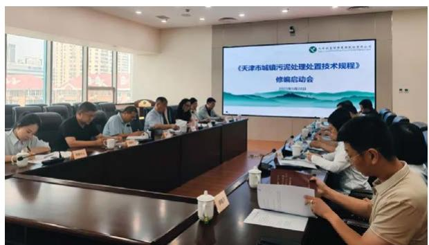

text_image

《天津市城镇污泥处理处置技术规程》
修编启动会

《天津市城镇污泥处理处置技术规程》  
(DB/T 29-269-2019) 修编启动会

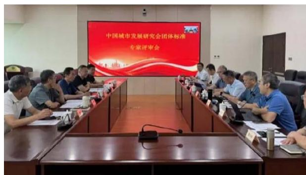

text_image

中国城市发展研究会团体标准
专家评审会

《城镇污水处理厂污泥处理处置低碳评价技术规范》  
专家评审

## 持续社区投资

## 环保科普

本集团围绕自身环保业务，建立常态化、场景化的对外宣传服务机制。我们通过社区宣讲、产学研合作交流、环保科普讲座、公众开放日活动等多种形式，面向公众普及污水处理、再生水利用、节水护水与低碳生活等知识，持续提升社会环保意识与参与度。

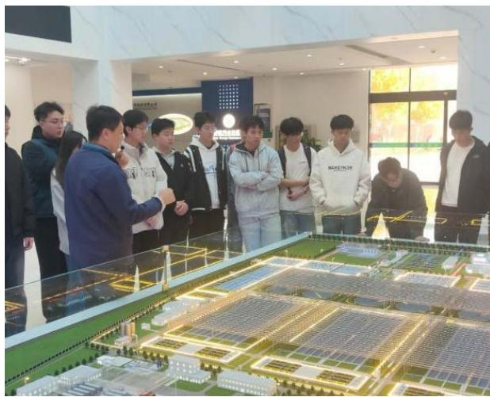

natural_image

Group of people observing a detailed architectural model of a solar and grid development in a modern indoor space (no visible text or symbols)

津沽污水处理厂开展  
“水厂解密+湿地探绿”环保科普研学活动

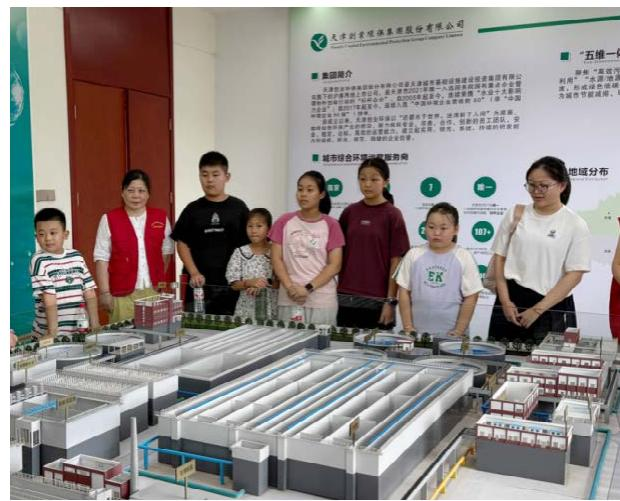

text_image

天津创业投资集团股份有限公司
集团简介
天津创业投资股份有限公司及天津市星源建设投资集团有限公司
是天津创业投资股份有限公司的全资子公司，是天津创合2017年第一期私募投资基金和基金公司主要股东。2017年通过深圳证券交易所交易系统出售“五维一”股权，以集中竞价交易方式转让给天津创业投资股份有限公司。2017年起至今，流通股在“中国境内证券市场交易系统”中通过集中竞价交易方式转让。
公司独立董事、本次权益变动以及“新老股东”等人员、高管、核心技术人员、财务负责人等人员均不再持有本公司股份。公司董事、监事、高级管理人员、审计、提名、薪酬与考核委员会成员、提名委员会成员、提名委员会成员、提名委员会成员、提名委员会成员、提名委员会成员、提名委员会成员、提名委员会成员、提名委员会成员、提名委员会成员、提名委员会成员、提名委员会成员、提名委员会成员、提名委员会成员、提名委员会成员、提名委员会成员、提名委员会成员、提名委员会成员、提名委员会成员、提名委员会成员、提名委员会成员、提名委员会成员、提名委员会成员、提名委员会成员、提名委员会成员、提名委员会成员、<nl>
城市综合环境治理服务商
地址分布

合肥创业水务有限公司组织辖区职工与儿童开展污水处理厂环保科普参观

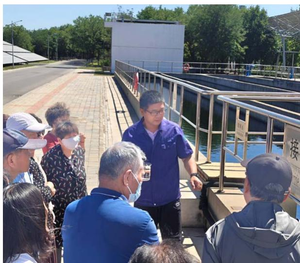

natural_image

Group of people wearing masks gathered around a water treatment station with metal walkways and a reservoir (no visible text or symbols)

北仓污水处理厂对外开放日  
—创“心”未来活动迎来御龙湾社区党员

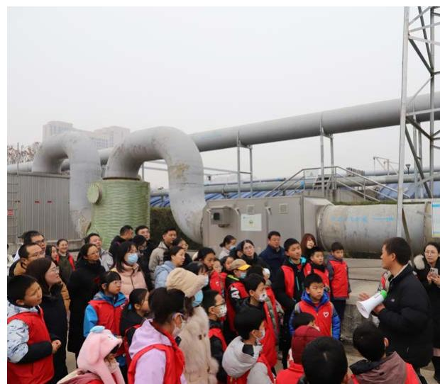

natural_image

Group of children in red vests gathered outdoors near industrial piping and large storage tanks, with adults listening to a guide (no visible text or symbols)

西安创业水务有限公司环保教育培训

## 创业环保世界环境日科普活动，传递绿色发展理念

案例

2025 年 6 月 5 日（第 54 个世界环境日），创业环保紧扣“美丽中国我先行”主题，开展系列环保科普活动，凝聚全社会绿色行动合力。集团前期向全体职工发出“低碳减排绿色生活”倡议书，倡导从“一度电、一滴水、一张纸”践行低碳办公。活动当天，职工共同参与办公垃圾分类，营造节约低碳的工作氛围。全国各所属单位同步行动，走进社区、公园发放宣传资料、讲解环保窍门，还邀请社会各界走进污水处理厂，沉浸式体验污水净化过程。

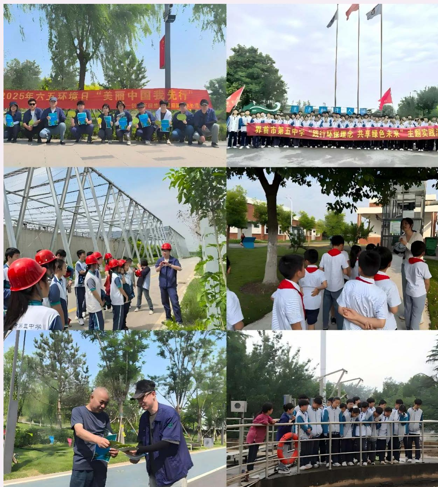

## 公益慈善

本集团积极投身环保与社会公益事业，坚持以实际行动回馈社会、共建美好家园。我们持续在公益领域开展实践，面向弱势群体提供力所能及的资源与支持，倡导并鼓励员工积极参与志愿服务与公益活动，汇聚点滴善意，形成协同合力，以务实举措为社会慈善事业贡献“创业力量”。

  
2025 年

•	 志愿者活动共计 59次，参与 617人次，共计 420小时

## 含山创环水务有限公司联合社区开展学雷锋志愿服务

案例

含山县污水处理厂联合褒禅社区开展学雷锋志愿服务。针对沿街门面房管道堵塞难题，组织专业团队用专业设备精准疏通，恢复污水排放畅通，改善居民生活环境。同时，志愿者走进孤寡老人家中，陪老人谈心、叮嘱健康，帮忙打扫卫生、清理垃圾。活动以“疏通一条管、温暖一颗心”为主线，将专业服务与民生关怀相结合，践行新时代雷锋精神，提升群众获得感。

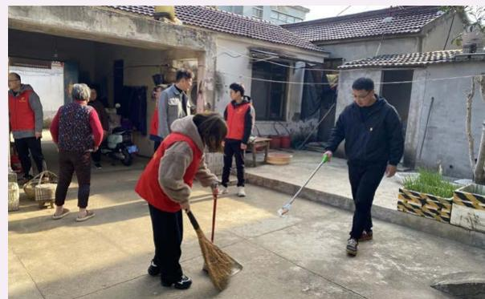

natural_image

Group of people cleaning a courtyard with brooms and buckets, no visible text or signage

## 贵州创业水务有限公司党支部参加“重阳敬老 情暖金秋”志愿服务活动

案例

2025年10月28日，贵州创业水务有限公司党支部参与属地上级党工委主办的“重阳敬老情暖金秋”党员志愿服务活动，弘扬尊老敬老传统美德。活动中，特邀养生专家为老人们详解保健知识与方法，志愿者们递上热茶，耐心指导老人制作茱萸香囊，最后为老人们送上精心筹备的重阳礼品。党员志愿者热情周到的服务获上级党委高度评价。此次活动让老人们感受到温暖关怀，彰显了党员责任担当。

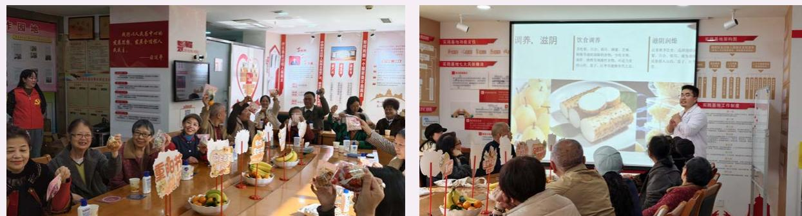

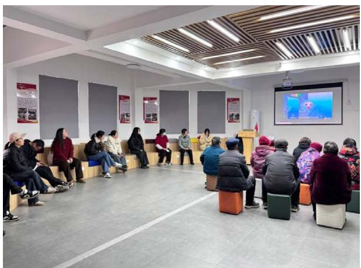

natural_image

Interior of a modern room with people seated in rows facing a presentation screen (no visible text or symbols)

含山创环水务有限公司参与“携手共建美好社区，环保反诈齐行动”志愿服务进社区活动

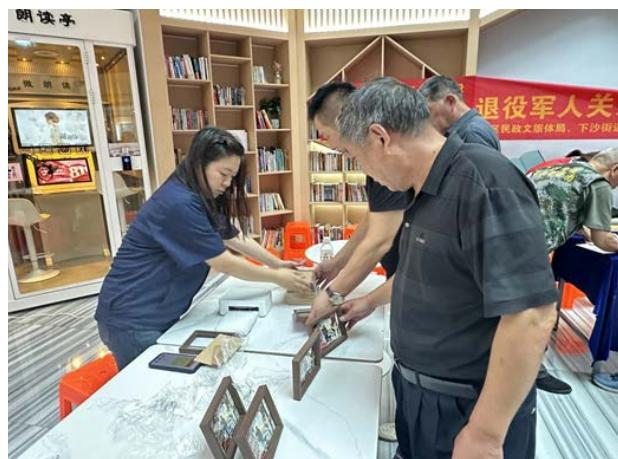

text_image

Street photo showing people examining framed pictures at a table in a library or exhibition, with visible Chinese signage in the background.

杭州天创水务有限公司参与“八一”主题游园会，为退役军人及辖区居民免费拍摄打印照片

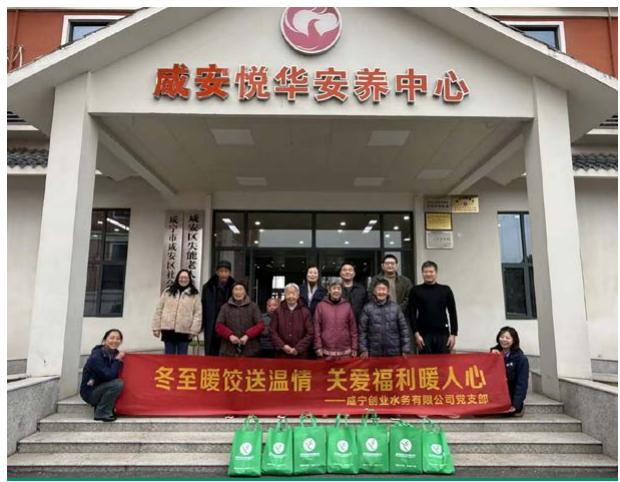

text_image

威安悦华安养中心
威安区九能名
福宁市威安区
冬至暖饺送温情 关爱福利暖人心
——威宁创业水务有限公司党支部

咸宁创业水务有限公司包饺子送温暖福利院活动

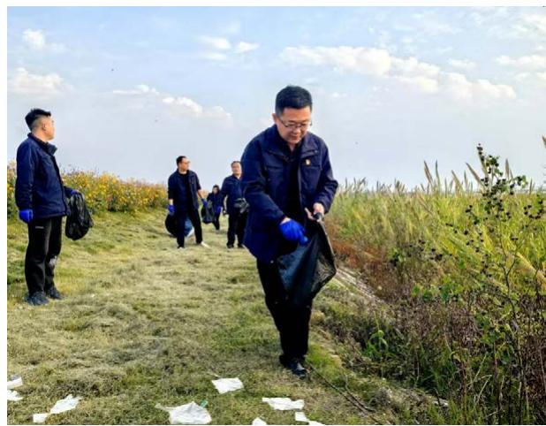

natural_image

Group of people walking through a grassy field under a partly cloudy sky, no visible text or symbols

洪湖市天创水务有限公司环保志愿服务

## 乡村振兴

本集团积极响应国家乡村振兴战略，始终以服务乡村环境治理大局为核心，聚焦补齐农村人居环境短板，持续提升基层治理效能。公司注重加强农村党支部基层堡垒建设，凝聚共建共治共享合力，以污水治理等关键环节为抓手赋能乡村振兴，推动生态改善与产业发展协同增效，为新时代乡村高质量发展谱写新篇章

  
2025 年

## 集团乡村振兴

•	 总投入金额约17.23万元，惠及人数超 25,000人

## 创业环保援藏赋能，助力雪域乡村振兴

案例

创业环保选派专业力量赴西藏昌都开展帮扶，以产业赋能与民生保障绘就协作图景。帮扶团队克服高原环境挑战，深入调研后制定十余万字产业规划，推动建立农畜产业规范体系，助力当地企业实现部队副食品供应业务零突破，三年创收超3,000万元。同时，打造“蓝天圣洁”公共品牌，通过线上线下渠道帮销农特产品超3,200万元，落地人工种草、教育保障、粪污循环利用等项目，以多元举措赋能藏区产业升级、农户增收，彰显国企社会责任与协作担当。

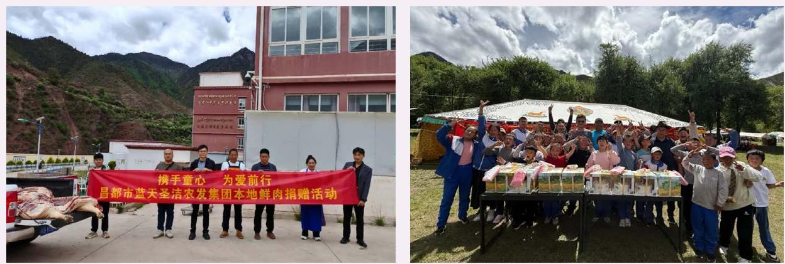

## 洪湖市天创水务有限公司推进乡镇污水处理 PPP 项目赋能乡村振兴

案例

为补齐农村环境基础设施短板，洪湖市天创水务有限公司与当地住建局签订PPP项目特许经营协议，以市场化、专业化模式推进乡镇污水处理厂新建、提标升级及配套管网建设。项目聚焦乡村振兴“生态宜居”要求，覆盖洪湖主要乡镇，完善污水“收集一处理一达标排放”全流程治理，提升处理效率与服务质量，助力城乡水务一体化。

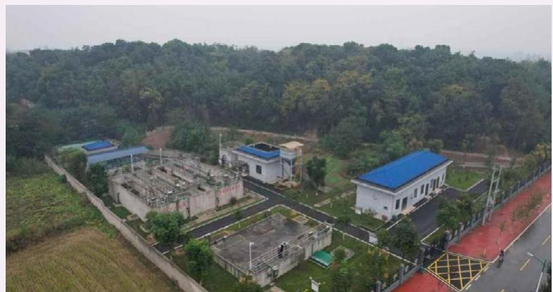

natural_image

Aerial view of an industrial facility surrounded by greenery and trees, with no visible text or symbols.

## 西安创业水务有限公司污水处理升级改造项目助力乡村振兴

案例

西安创业水务有限公司实施华阴奶牛二厂污水处理升级改造项目，以养殖污水治理赋能乡村振兴，构建“污水净化一资源循环一生态惠民”路径。项目打造全流程无害化治理体系，污水达标后用于农田灌溉与牧草种植，形成“污水一净水一农业回用”的资源循环闭环。项目实施后，有效降低乡村面源污染，为农业生产提供稳定水源，还带动本地运维岗位，推动养殖业绿色转型。

## 报告附录

## ESG 关键绩效表

环境关键绩效指标

<table><tr><td>指标</td><td>单位</td><td>2025年</td><td>2024年</td><td>2023年</td></tr><tr><td colspan="5">温室气体排放</td></tr><tr><td>范围一</td><td>吨二氧化碳当量</td><td>5,654</td><td>6,354</td><td>4,430</td></tr><tr><td>范围二</td><td>吨二氧化碳当量</td><td>336,340</td><td>401,831</td><td>386,671</td></tr><tr><td>范围三</td><td>吨二氧化碳当量</td><td>105</td><td>116</td><td>116</td></tr><tr><td>温室气体总排放量</td><td>吨二氧化碳当量</td><td>342,009</td><td>408,300</td><td>391,217</td></tr><tr><td>温室气体密度</td><td>吨二氧化碳当量/万元营收</td><td>0.72</td><td>0.85</td><td>0.84</td></tr><tr><td colspan="5">废气4</td></tr><tr><td>氮氧化物(NOx)</td><td>吨</td><td>22.54</td><td>29.06</td><td>22.68</td></tr><tr><td>硫氧化物(SOx)</td><td>吨</td><td>1.97</td><td>0.41</td><td>3.13</td></tr><tr><td>可吸入悬浮粒子(PM)</td><td>吨</td><td>2.14</td><td>1.94</td><td>1.57</td></tr><tr><td>一氧化碳(CO)</td><td>吨</td><td>4.98</td><td>3.65</td><td>2.61</td></tr><tr><td>挥发性有机物(VOCs)</td><td>吨</td><td>1.03</td><td>0.95</td><td>0.96</td></tr><tr><td>氯化氢</td><td>吨</td><td>1.08</td><td>1.31</td><td>0.95</td></tr><tr><td colspan="5">废弃物</td></tr><tr><td>无害废弃物总量</td><td>吨</td><td>898,935.35</td><td>981,040.60</td><td>1,072,238</td></tr><tr><td>无害废弃物密度</td><td>吨/万元营收</td><td>1.89</td><td>2.03</td><td>2.30</td></tr><tr><td>有害废弃物总量</td><td>吨</td><td>24,519</td><td>29,888</td><td>29,632</td></tr><tr><td>有害废弃物密度</td><td>吨/万元营收</td><td>0.05</td><td>0.06</td><td>0.06</td></tr><tr><td>回收再利用废弃物总量</td><td>吨</td><td>261,063.33</td><td>238,510.13</td><td>265,230.10</td></tr><tr><td colspan="5">废水</td></tr><tr><td>化学需氧量(COD)</td><td>吨</td><td>26,522.20</td><td>26,071.26</td><td>27,402.92</td></tr></table>

<table><tr><td>指标</td><td>单位</td><td>2025年</td><td>2024年</td><td>2023年</td></tr><tr><td>五日生化需氧量( $BOD_5$ )</td><td>吨</td><td>5,210.62</td><td>5,351.37</td><td>7,527.97</td></tr><tr><td>悬浮物</td><td>吨</td><td>5,067.06</td><td>5,555.16</td><td>7,393.74</td></tr><tr><td>氨氮( $NH_3-N$ )</td><td>吨</td><td>705.33</td><td>767.60</td><td>838.22</td></tr><tr><td>总磷(以P计)</td><td>吨</td><td>276.03</td><td>303.51</td><td>299.39</td></tr><tr><td>总氮(以N计)</td><td>吨</td><td>12,143.61</td><td>13,150.69</td><td>14,630.69</td></tr><tr><td colspan="5">能源管理</td></tr><tr><td>天然气</td><td>兆瓦时</td><td>21,595</td><td>25,503</td><td>13,930</td></tr><tr><td>汽油</td><td>兆瓦时</td><td>1,743</td><td>1,525</td><td>1,738</td></tr><tr><td>柴油</td><td>兆瓦时</td><td>1,470</td><td>1,529</td><td>1,105</td></tr><tr><td>液化石油气</td><td>兆瓦时</td><td>120</td><td>103</td><td>160</td></tr><tr><td>乙炔</td><td>兆瓦时</td><td>23</td><td>15</td><td>14</td></tr><tr><td>外购电力</td><td>兆瓦时</td><td>672,643</td><td>614,062</td><td>670,526</td></tr><tr><td> $外购热力^5$ </td><td>兆瓦时</td><td>307,056</td><td>130,310</td><td>10,783</td></tr><tr><td>外售热量</td><td>兆瓦时</td><td>358,957</td><td>185,452</td><td>63,374</td></tr><tr><td>外售冷量</td><td>兆瓦时</td><td>60,302</td><td>59,976</td><td>55,011</td></tr><tr><td> $能源总耗量^6$ </td><td>兆瓦时</td><td>585,380</td><td>527,620</td><td>579,871</td></tr><tr><td>能源密度</td><td>兆瓦时/万元营收</td><td>1.23</td><td>1.09</td><td>1.24</td></tr><tr><td colspan="5">耗水量</td></tr><tr><td>新鲜水耗水量</td><td>吨</td><td>2,544,908.83</td><td>1,919,282.78</td><td>-</td></tr><tr><td>耗水密度</td><td>吨/万元营收</td><td>5.35</td><td>3.98</td><td></td></tr><tr><td>水循环与再利用总量</td><td>吨</td><td>53,766,555.89</td><td>56,226,099.08</td><td>-</td></tr><tr><td colspan="5">纸张消耗</td></tr><tr><td>纸张消耗量</td><td>吨</td><td>50.52</td><td>51.28</td><td>-</td></tr><tr><td>纸张消耗密度</td><td>吨/万元营收</td><td>0.00011</td><td>0.00011</td><td>-</td></tr></table>

社会关键绩效指标

<table><tr><td>指标</td><td></td><td>单位</td><td>2025年</td><td>2024年</td><td>2023年</td></tr><tr><td colspan="6"> $员工人数^8$ </td></tr><tr><td rowspan="2">性别</td><td>男性</td><td>人</td><td>1,576</td><td>1,574</td><td>1,532</td></tr><tr><td>女性</td><td>人</td><td>754</td><td>747</td><td>718</td></tr><tr><td rowspan="4">年龄</td><td>29岁或以下</td><td>人</td><td>280</td><td>326</td><td>342</td></tr><tr><td>30-39岁</td><td>人</td><td>972</td><td>958</td><td>903</td></tr><tr><td>40-49岁</td><td>人</td><td>742</td><td>731</td><td>723</td></tr><tr><td>50岁或以上</td><td>人</td><td>336</td><td>306</td><td>282</td></tr><tr><td rowspan="4">学历</td><td>博士</td><td>人</td><td>3</td><td>5</td><td>-</td></tr><tr><td>硕士</td><td>人</td><td>172</td><td>229</td><td>-</td></tr><tr><td>本科</td><td>人</td><td>1,484</td><td>1,332</td><td>-</td></tr><tr><td>大专及以下</td><td>人</td><td>671</td><td>755</td><td>-</td></tr><tr><td rowspan="3">职级</td><td>其他管理人员及员工</td><td>人</td><td>2,135</td><td>2,172</td><td>-</td></tr><tr><td>中级管理层</td><td>人</td><td>183</td><td>140</td><td>-</td></tr><tr><td>高级管理层</td><td>人</td><td>12</td><td>9</td><td>-</td></tr><tr><td rowspan="8">地区</td><td>天津市</td><td>人</td><td>651</td><td>-</td><td>-</td></tr><tr><td>华南地区</td><td>人</td><td>216</td><td>-</td><td>-</td></tr><tr><td>华北地区</td><td>人</td><td>90</td><td>-</td><td>-</td></tr><tr><td>华西地区</td><td>人</td><td>245</td><td>-</td><td>-</td></tr><tr><td>华东地区</td><td>人</td><td>416</td><td>-</td><td>-</td></tr><tr><td>华中地区</td><td>人</td><td>324</td><td>-</td><td>-</td></tr><tr><td>固废板块(凯英公司全级次统计)</td><td>人</td><td>253</td><td>269</td><td>268</td></tr><tr><td>新能源板块(绿能公司全级次统计)</td><td>人</td><td>101</td><td>88</td><td>83</td></tr><tr><td></td><td>总数</td><td>人</td><td>2,330</td><td>2,321</td><td>2,250</td></tr></table>

地区划分根据2025年最新组织架构划分，2024年与2023年相关数据请参考往年报告  
8 本集团报告范围内的所有员工均为全职员工

<table><tr><td>指标</td><td></td><td>单位</td><td>2025年</td><td>2024年</td><td>2023年</td></tr><tr><td colspan="6">其他工作者人数9</td></tr><tr><td rowspan="2">性别</td><td>男性</td><td>人</td><td>71</td><td>51</td><td>77</td></tr><tr><td>女性</td><td>人</td><td>34</td><td>24</td><td>35</td></tr><tr><td rowspan="4">年龄</td><td>29岁或以下人数</td><td>人</td><td>13</td><td>6</td><td>21</td></tr><tr><td>30-39岁</td><td>人</td><td>44</td><td>6</td><td>17</td></tr><tr><td>40-49岁</td><td>人</td><td>31</td><td>24</td><td>29</td></tr><tr><td>50岁或以上</td><td>人</td><td>17</td><td>39</td><td>45</td></tr><tr><td colspan="6">员工流失率</td></tr><tr><td rowspan="2">性别</td><td>男性</td><td>%</td><td>2.6</td><td>5.0</td><td>5.8</td></tr><tr><td>女性</td><td>%</td><td>2.9</td><td>3.6</td><td>3.5</td></tr><tr><td rowspan="4">年龄</td><td>29岁或以下</td><td>%</td><td>5.0</td><td>5.2</td><td>10.5</td></tr><tr><td>30-39岁</td><td>%</td><td>2.4</td><td>3.1</td><td>4.2</td></tr><tr><td>40-49岁</td><td>%</td><td>0.8</td><td>2.5</td><td>1.8</td></tr><tr><td>50岁或以上</td><td>%</td><td>6.0</td><td>13.1</td><td>9.6</td></tr><tr><td rowspan="8">地区</td><td>天津市</td><td>%</td><td>2.5</td><td>-</td><td>-</td></tr><tr><td>华南地区</td><td>%</td><td>1.9</td><td>-</td><td>-</td></tr><tr><td>华北地区</td><td>%</td><td>2.2</td><td>-</td><td>-</td></tr><tr><td>华西地区</td><td>%</td><td>5.3</td><td>-</td><td>-</td></tr><tr><td>华东地区</td><td>%</td><td>2.6</td><td>-</td><td>-</td></tr><tr><td>华中地区</td><td>%</td><td>3.1</td><td>-</td><td>-</td></tr><tr><td>固废板块(凯英公司全级次统计)</td><td>%</td><td>2.0</td><td>-</td><td>-</td></tr><tr><td>新能源板块(绿能公司全级次统计)</td><td>%</td><td>2.0</td><td>-</td><td>-</td></tr></table>

9 包括在本集团运营点工作的承包商、分包商员工及劳务派遣员工。

<table><tr><td colspan="2">指标</td><td>单位</td><td>2025年</td><td>2024年</td><td>2023年</td></tr><tr><td></td><td>总流失率</td><td>%</td><td>2.7</td><td>4.5</td><td>5.1</td></tr><tr><td colspan="6">受训员工百分比</td></tr><tr><td rowspan="2">性别</td><td>男性</td><td>%</td><td>100</td><td>94.80</td><td>90.20</td></tr><tr><td>女性</td><td>%</td><td>100</td><td>99.10</td><td>94.60</td></tr><tr><td rowspan="3">职级</td><td>其他管理人员及员工</td><td>%</td><td>100</td><td>95.90</td><td>92.60</td></tr><tr><td>中级管理层</td><td>%</td><td>100</td><td>100</td><td>78.30</td></tr><tr><td>高级管理层</td><td>%</td><td>100</td><td>100</td><td>90.00</td></tr><tr><td>总数</td><td></td><td>%</td><td>100</td><td>96.20</td><td>91.60</td></tr><tr><td colspan="6">员工平均培训时间</td></tr><tr><td rowspan="2">性别</td><td>男性</td><td>小时</td><td>42</td><td>68</td><td>53</td></tr><tr><td>女性</td><td>小时</td><td>39</td><td>59</td><td>50</td></tr><tr><td rowspan="3">职级</td><td>其他管理人员及员工</td><td>小时</td><td>40</td><td>62</td><td>49</td></tr><tr><td>中级管理层</td><td>小时</td><td>77</td><td>119</td><td>79</td></tr><tr><td>高级管理层</td><td>小时</td><td>83</td><td>128</td><td>131</td></tr><tr><td>总数</td><td></td><td>小时</td><td>40.18</td><td>65</td><td>52</td></tr><tr><td colspan="6">员工健康与安全</td></tr><tr><td colspan="2">安全生产投入金额</td><td>万元</td><td>276,324.66</td><td>326,108.87</td><td>-</td></tr><tr><td colspan="2">安全教育培训覆盖率</td><td>%</td><td>100</td><td>100</td><td>-</td></tr><tr><td colspan="2">员工体检覆盖率</td><td>%</td><td>100</td><td>100</td><td></td></tr><tr><td colspan="2">因工伤损失工作日数</td><td>天</td><td>60</td><td>0</td><td>-</td></tr><tr><td colspan="2">职业病发生人数</td><td>人</td><td>0</td><td>0</td><td>-</td></tr><tr><td colspan="2">职业病危害检测合格率</td><td>%</td><td>100</td><td>100</td><td>-</td></tr><tr><td colspan="2">过去三年(包括汇报年度)每年因工亡故的人数</td><td>人</td><td>0</td><td>0</td><td>-</td></tr><tr><td colspan="2">过去三年(包括汇报年度)每年因工亡故的比率</td><td>%</td><td>0</td><td>0</td><td>-</td></tr><tr><td colspan="6">廉洁运营</td></tr><tr><td colspan="2">董事接受反贪污培训的平均时长</td><td>小时/人</td><td>37</td><td>28</td><td>15</td></tr><tr><td colspan="2">员工接受反贪污培训的平均时长</td><td>小时/人</td><td>39</td><td>30</td><td>15</td></tr></table>

## 指标索引

## 香港联合交易所 《环境、社会及管治报告守则》

C 部分：“不遵守就解释”条文

<table><tr><td>层面</td><td></td><td>对应报告章节</td></tr><tr><td colspan="3">A.环境</td></tr><tr><td rowspan="7">层面A1:排放物</td><td>一般披露</td><td>环境合规管理</td></tr><tr><td>KPI A1.1</td><td>ESG关键绩效表</td></tr><tr><td>KPI A1.2</td><td>环境合规管理、ESG关键绩效表</td></tr><tr><td>KPI A1.3</td><td>环境合规管理、ESG关键绩效表</td></tr><tr><td>KPI A1.4</td><td>环境合规管理、ESG关键绩效表</td></tr><tr><td>KPI A1.5</td><td>环境合规管理</td></tr><tr><td>KPI A1.6</td><td>环境合规管理</td></tr><tr><td rowspan="6">层面A2:资源使用</td><td>一般披露</td><td>践行绿色运营</td></tr><tr><td>KPI A2.1</td><td>ESG关键绩效表</td></tr><tr><td>KPI A2.2</td><td>践行绿色运营、ESG关键绩效表</td></tr><tr><td>KPI A2.3</td><td>践行绿色运营</td></tr><tr><td>KPI A2.4</td><td>践行绿色运营</td></tr><tr><td>KPI A2.5</td><td>与本集团运营无关</td></tr><tr><td rowspan="2">层面A3:环境及天然资源</td><td>一般披露</td><td>环境合规管理</td></tr><tr><td>KPI A3.1</td><td>践行绿色运营</td></tr><tr><td colspan="3">B:社会</td></tr><tr><td rowspan="3">层面B1:雇佣</td><td>一般披露</td><td>多元合规雇佣</td></tr><tr><td>KPI B1.1</td><td>多元合规雇佣、ESG关键绩效表</td></tr><tr><td>KPI B1.2</td><td>多元合规雇佣、ESG关键绩效表</td></tr><tr><td rowspan="4">层面B2:健康与安全</td><td>一般披露</td><td>严守安全底线</td></tr><tr><td>KPI B2.1</td><td>ESG关键绩效表</td></tr><tr><td>KPI B2.2</td><td>ESG关键绩效表</td></tr><tr><td>KPI B2.3</td><td>严守安全底线</td></tr><tr><td rowspan="3">层面B3:发展及培训</td><td>一般披露</td><td>成就员工梦想</td></tr><tr><td>KPI B3.1</td><td>ESG关键绩效表</td></tr><tr><td>KPI B3.2</td><td>ESG关键绩效表</td></tr><tr><td rowspan="3">层面B4:劳工准则</td><td>一般披露</td><td rowspan="3">多元合规雇佣</td></tr><tr><td>KPI B4.1</td></tr><tr><td>KPI B4.2</td></tr><tr><td rowspan="5">层面B5:供应链管理</td><td>一般披露</td><td rowspan="5">共建责任链条</td></tr><tr><td>KPI B5.1</td></tr><tr><td>KPI B5.2</td></tr><tr><td>KPI B5.3</td></tr><tr><td>KPI B5.4</td></tr><tr><td rowspan="6">层面B6:产品责任</td><td>一般披露</td><td>守护碧水净土品质稳定供应</td></tr><tr><td>KPI B6.1</td><td>本集团运营不涉及产品回收</td></tr><tr><td>KPI B6.2</td><td>品质稳定供应</td></tr><tr><td>KPI B6.3</td><td>提升创新动能</td></tr><tr><td>KPI B6.4</td><td>品质稳定供应</td></tr><tr><td>KPI B6.5</td><td>提升创新动能</td></tr><tr><td rowspan="4">层面B7:反贪污</td><td>一般披露</td><td rowspan="4">依法合规运营</td></tr><tr><td>KPI B7.1</td></tr><tr><td>KPI B7.2</td></tr><tr><td>KPI B7.3</td></tr><tr><td rowspan="3">层面B8:社区投资</td><td>一般披露</td><td rowspan="3">持续社区投资</td></tr><tr><td>KPI B8.1</td></tr><tr><td>KPI B8.2</td></tr></table>

## D 部分：“气候相关披露”内容索引

创业环保根据联交所守则 D 部分进行气候相关信息披露，因现阶段内部体系建设进度、量化数据积累不足、战略规划正在更新等实际情况，仍有部分条款内容暂无法完全披露。未来公司将逐步完善气候相关披露内容，持续提升披露的准确性、完整性和及时性，并结合业务发展进度落地各项披露工作。

<table><tr><td colspan="2">气候相关披露</td><td>所在章节</td><td>未披露内容说明</td></tr><tr><td>管治</td><td></td><td>应对气候变化-治理</td><td>19(a)(iv):部分气候相关绩效指标已纳入薪酬政策,暂无量化的绩效指标与薪酬挂钩的测算数据19(b)(ii):内部气候相关数据传递/协作体系正在搭建,监控措施暂时独立运行</td></tr><tr><td rowspan="5">策略</td><td>气候相关风险和机遇</td><td>应对气候变化-战略</td><td>20(a):该部分适用于合理资料宽免政策</td></tr><tr><td>业务模式和价值链</td><td>应对气候变化-战略</td><td>21(a):该部分适用于合理资料宽免政策</td></tr><tr><td>策略和决策</td><td>应对气候变化-战略</td><td>22(a)(iii)否定声明:公司暂未制定气候相关转型计划及假设22(a)(iv)/22(b):公司整体发展战略正在更新,暂未制定可披露的气候相关业务明确阶段性规划</td></tr><tr><td>财务状况、财务表现及现金流量</td><td>应对气候变化-战略</td><td>24(a):该部分适用于合理资料宽免政策24(b):该部分适用于能力宽免政策25:该部分适用于财务影响宽免政策</td></tr><tr><td>气候韧性</td><td>应对气候变化-战略</td><td>26(a)(i)/(ii):该部分适用于合理资料宽免政策26(a)(iii):该部分适用于能力宽免政策</td></tr><tr><td colspan="2">风险管理</td><td>应对气候变化-风险管理</td><td>27(c):公司已将气候风险评估和管理流程融入企业风险管理体系中,暂无量化的融合效果评估数据,暂未披露气候相关风险管理与整体风险管理的融合程度</td></tr><tr><td rowspan="10">指标及目标</td><td>温室气体排放</td><td>应对气候变化-指标与目标</td><td>29(d):该部分适用于合理资料宽免政策</td></tr><tr><td>气候相关转型风险</td><td>应对气候变化-风险管理</td><td>30:该部分适用于合理资料宽免政策</td></tr><tr><td>气候相关物理风险</td><td>应对气候变化-风险管理</td><td>31:该部分适用于合理资料宽免政策</td></tr><tr><td>气候相关机遇</td><td>应对气候变化-风险管理</td><td>32:该部分适用于合理资料宽免政策</td></tr><tr><td>资本运用</td><td>应对气候变化-风险管理</td><td>气候变化资本投入主要集中于绿色金融、清洁能源使用、节能技术改造等措施,未单独划分相关专项资金</td></tr><tr><td>内部碳定价</td><td colspan="2">否定声明:本公司目前未在任何决策中应用碳定价</td></tr><tr><td>薪酬</td><td>应对气候变化-指标及目标</td><td>未披露原因与19(a)(iv)段一致,无需重复说明</td></tr><tr><td>行业指标</td><td>/</td><td>尚未完成环保行业业务与IFRS S2行业披露指南的对标分析,且该条为鼓励性披露要求</td></tr><tr><td>气候相关目标</td><td>应对气候变化-指标及目标</td><td>37-40:公司积极践行国家“双碳”目标,系统规划低碳转型路线,并通过绿色金融、节能运营等方式降低环境影响。但暂时缺乏足够数据支撑,无法设定科学可实现的目标,公司将结合监管要求及管理实践,逐步完善气候相关目标设定及跟踪评估机制</td></tr><tr><td>跨行业指标及行业指标的适用性</td><td>ESG关键绩效表——环境关键绩效指标</td><td>/</td></tr></table>

《上海证券交易所上市公司自律监管指引第 14 号——可持续发展报告（试行）》指标索引

<table><tr><td>维度</td><td>序号</td><td>议题</td><td>对应报告章节</td></tr><tr><td rowspan="8">环境</td><td>1</td><td>应对气候变化</td><td>应对气候变化</td></tr><tr><td>2</td><td>污染物排放</td><td>环境合规管理</td></tr><tr><td>3</td><td>废弃物处理</td><td>环境合规管理</td></tr><tr><td>4</td><td>生态系统和生物多样性保护</td><td>践行绿色运营</td></tr><tr><td>5</td><td>环境合规管理</td><td>环境合规管理</td></tr><tr><td>6</td><td>能源利用</td><td>践行绿色运营</td></tr><tr><td>7</td><td>水资源利用</td><td>践行绿色运营</td></tr><tr><td>8</td><td>循环经济</td><td>践行绿色运营</td></tr><tr><td rowspan="9">社会</td><td>9</td><td>乡村振兴</td><td>持续社区投资</td></tr><tr><td>10</td><td>社会贡献</td><td>持续社区投资驱动行业发展</td></tr><tr><td>11</td><td>创新驱动</td><td>提升创新动能</td></tr><tr><td>12</td><td>科技伦理</td><td>提升创新动能</td></tr><tr><td>13</td><td>供应链安全</td><td>共建责任链条</td></tr><tr><td>14</td><td>平等对待中小企业</td><td>依法合规运营</td></tr><tr><td>15</td><td>产品和服务安全与质量</td><td>守护碧水净土品质稳定供应</td></tr><tr><td>16</td><td>数据安全与客户隐私保护</td><td>提升创新动能</td></tr><tr><td>17</td><td>员工</td><td>才聚创业,携手同绘未来</td></tr><tr><td rowspan="4">可持续发展相关治理</td><td>18</td><td>尽职调查</td><td>优化ESG管治</td></tr><tr><td>19</td><td>利益相关方沟通</td><td>优化ESG管治</td></tr><tr><td>20</td><td>反商业贿赂及反贪污</td><td>依法合规运营</td></tr><tr><td>21</td><td>反不正当竞争</td><td>依法合规运营</td></tr></table>

## GRI 标准（2021）

## 指标索引

<table><tr><td colspan="2">索引位置</td><td>GRI 标准</td></tr><tr><td colspan="2">关于本报告</td><td>2-2、2-3、2-4</td></tr><tr><td colspan="2">董事会声明</td><td>/</td></tr><tr><td colspan="2">董事长致辞</td><td>/</td></tr><tr><td colspan="2">走进创业环保</td><td>2-1</td></tr><tr><td colspan="2">专题:以水为脉赴使命 以民为本筑绿基</td><td>413-1</td></tr><tr><td rowspan="3">精治创业,夯实发展基石</td><td>坚持党建领航</td><td>/</td></tr><tr><td>完善公司治理</td><td>2-9、2-12、2-17、2-27、205-2、205-3、206-1</td></tr><tr><td>优化 ESG 管治</td><td>2-14、2-16、2-17、2-29、3-1、3-2、3-3</td></tr><tr><td rowspan="3">科技创业,赋能智慧水务</td><td>提升创新动能</td><td>418-1</td></tr><tr><td>守护碧水净土</td><td>303-2、306-2、306-3、306-5</td></tr><tr><td>品质稳定供应</td><td>/</td></tr><tr><td rowspan="3">绿色创业,共筑生态家园</td><td>应对气候变化</td><td>305-1、305-2、305-3、305-5、305-7</td></tr><tr><td>环境合规管理</td><td>303-2、306-2、306-3、306-5</td></tr><tr><td>践行绿色运营</td><td>301-1、302-1、302-3、302-4、303-4、303-5、304-2</td></tr><tr><td rowspan="3">才聚创业,携手同绘未来</td><td>多元合规雇佣</td><td>401-1、405-1、406-1、408-1、409-1、401-2、401-3、407-1</td></tr><tr><td>成就员工梦想</td><td>404-1、404-2</td></tr><tr><td>严守安全底线</td><td>403-1、403-2、403-3、403-5、403-6、403-7、403-9、403-10</td></tr><tr><td rowspan="3">协同创业,聚力和谐社会</td><td>共建责任链条</td><td>308-1、414-1、416-2</td></tr><tr><td>驱动行业发展</td><td>/</td></tr><tr><td>持续社区投资</td><td>413-1</td></tr><tr><td colspan="2">报告附录</td><td>/</td></tr></table>

## 读者反馈表

为持续改进我们的ESG工作，不断提高ESG管理的能力和水平，我们非常希望倾听您的意见和建议。

恳请您协助完成反馈意见表中提出的相关问题，并选择以下方式反馈给我们。

地址：天津市南开区卫津南路76号创业环保大厦

传  真：86-22-23930126

电子邮箱：tjcep@tjcep.com

## 您的信息

姓  名

工作单位

联系电话

Email

意见反馈

1. 您对公司 ESG 报告的总体评价是？

□很好 □较好 □一般 □较差 □很差

2. 您认为本报告是否能反映公司ESG议题的重大影响

□能 □一般 □不了解

3.您认为本报告所披露信息、数据、指标的清晰、准确、完整度如何？

□很好 □较好 □一般 □较差 □很差

4. 您最满意本报告哪一方面？

5. 您希望进一步了解哪些信息？

6.您对我们今后发布报告还有哪些建议

接待热线：022-23930000

地址：天津市南开区卫津南路76号创业环保大厦

邮编：300381

创业环保官网：http://www.tjcep.com