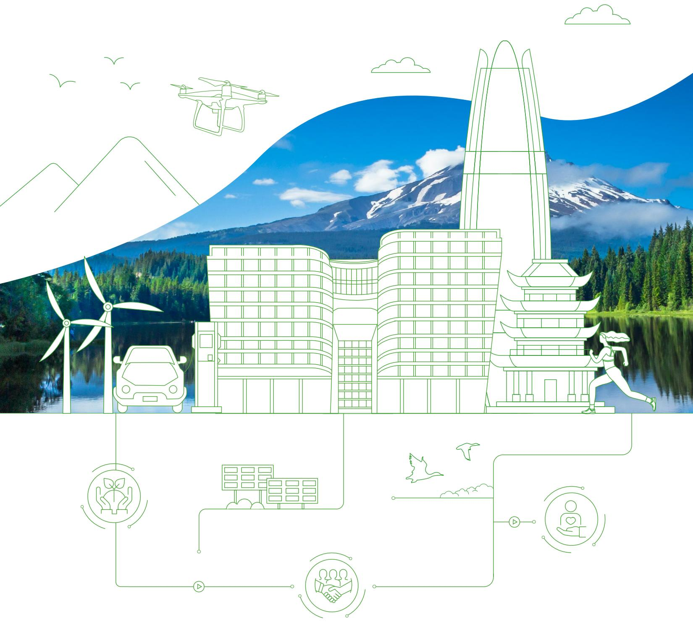

flowchart

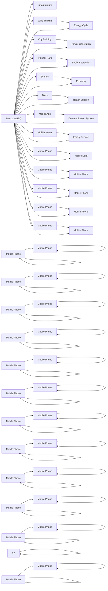
```mermaid
graph LR
  A["Transport (EV)"] --> B["Infrastructure"]
  C["Wind Turbine"] --> D["Energy Cycle"]
  E["City Building"] --> F["Power Generation"]
  G["Pioneer Park"] --> H["Social Interaction"]
  I["Drones"] --> J["Economy"]
  K["Birds"] --> L["Health Support"]
  M["Mobile App"] --> N["Communication System"]
  O["Mobile Home"] --> P["Family Service"]
  Q["Mobile Phone"] --> R["Mobile Data"]
  S["Mobile Phone"] --> T["Mobile Phone"]
  U["Mobile Phone"] --> V["Mobile Phone"]
  W["Mobile Phone"] --> X["Mobile Phone"]
  Y["Mobile Phone"] --> Z["Mobile Phone"]
  AA["Mobile Phone"] --> AB["Mobile Phone"]
  AC["Mobile Phone"] --> AD["Mobile Phone"]
  AE["Mobile Phone"] --> AF["Mobile Phone"]
  AG["Mobile Phone"] --> AH["Mobile Phone"]
  AI["Mobile Phone"] --> AJ["Mobile Phone"]
  AK["Mobile Phone"] --> AL["Mobile Phone"]
  AM["Mobile Phone"] --> AN["Mobile Phone"]
  AO["Mobile Phone"] --> AP["Mobile Phone"]
  AQ["Mobile Phone"] --> AR["Mobile Phone"]
  AS["Mobile Phone"] --> AT["Mobile Phone"]
  AU["Mobile Phone"] --> AV["Mobile Phone"]
  AW["Mobile Phone"] --> AX["Mobile Phone"]
  A --> B
  A --> C
  A --> D
  A --> E
  A --> F
  A --> G
  A --> H
  A --> I
  A --> J
  A --> K
  A --> L
  A --> M
  A --> N
  A --> O
  A --> P
  A --> Q
  A --> R
  A --> S
  A --> T
  A --> U
  A --> V
  A --> W
  A --> X
  A --> Y
  A --> Z
  AA --> AA
  AB --> AB
  AC --> AC
  AD --> AD
  AE --> AE
  AF --> AF
  AG --> AG
  AH --> AH
  AI --> AI
  AJ --> AJ
  AK --> AK
  AL --> AL
  AM --> AM
  AN --> AN
  AO --> AO
  AP --> AP
  AQ --> AQ
  AR --> AR
  AS --> AS
  AT --> AT
  AU --> AU
  AV --> AV
  AW --> AW
  AX --> AX
  AZ --> AZ
```

## 2025

# 环境、社会和公司治理(ESG)报告

宁 波 杉 杉 股 份 有 限 公 司

## 关于本报告

本报告是宁波杉杉股份有限公司面向利益相关方发布的第17份ESG报告。报告详细披露了宁波杉杉股份有限公司2025年度在经济、环境、社会及公司治理等责任领域的实践和绩效，旨在与各利益相关方进行有效交流，系统地回应利益相关方的期望和要求。

## 时间范围

2025年1月1日至2025年12月31日，为增强报告可比性及前瞻性，部分内容往前后年度适度延伸。

## 报告边界

报告披露宁波杉杉股份有限公司及其直属公司履行经济、环境、社会及公司治理方面的责任信息和典型案例。

## 报告称谓

宁波杉杉股份有限公司(简称“杉杉股份”“杉杉”“公司”或“我们”）上海杉杉锂电材料科技有限公司及下属子公司(简称“杉杉负极”或“负极”)杉金光电（苏州）有限公司及下属子公司（简称“杉金光电”或“杉金”）

## 信息来源

本报告所披露的信息来源于杉杉股份内部正式文件、统计报告与年报。本报告所披露的数据来源于杉杉股份实际运行的原始数据、政府部门公开数据、年度财务数据、内部相关统计报表、第三方问卷调查、第三方评价访谈等。本报告的财务数据以人民币为单位，若与财务报告不一致之处，以财务报告为准。

## 编制依据

上海证券交易所《上海证券交易所上市公司自律监管指南第4号——可持续发展报告编制》

上海证券交易所《上市公司自律监管指南第4号——可持续发展报告编制》联合国2030年可持续发展目标（SDGs）

全球可持续发展标准委员会《可持续发展报告标准》(GRIStandards)中国国家标准《社会责任报告编写指南》 (GB/T36001-2015)

国际标准化组织《ISO26000：社会责任指南（2010)》

## 报告获取

本报告以电子版形式供您阅读，您可访问公司官网 http://www.ssgf.net/或上海证券交易所网站www.sse.com.cn阅读电子版报告。如对本报告有任何疑问或建议，敬请发送电子邮件至 ssgf@shanshan.com 或致电 0574-88208337。

## 目录

## 开篇

责任寄语 01

杉杉股份的2025 03

我们的可持续发展之路 10

## 结篇

关键绩效 113

指标对标 116

读者意见反馈表 122

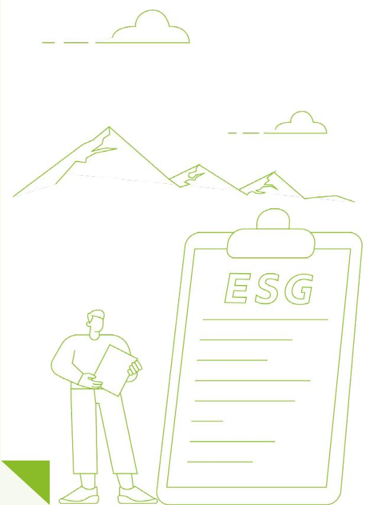

natural_image

Illustration of a person holding a clipboard next to an ESG checklist with mountain and sky background (no text or symbols on the checklist)

## 01

## 精管善治 筑牢根基

夯实公司治理 19

投资者关系管理 22

内控及风险管理 24

坚守商业道德 29

守护信息安全 33

## 03

## 创新赋能 智造领先

创新研发驱动 65

严控品质管理 71

响应客户需求 76

## 05

## 人才汇智 同心同行

员工雇佣和权益 91

员工发展与培训 96

员工关怀和活动 101

职业健康与安全 103

## 02

## 低碳发展 生态共生

应对气候变化 39

环境合规管理 44

高效资源利用 47

深化三废控制 55

倡导绿色运营 61

##

## 协同共进 共创价值

供应链ESG管理 81

推动行业发展 85

## 06

## 初心坚守 回馈社会

党建引领 109

乡村振兴 110

社会公益 111

## ESG 致辞

2025年，全球新能源与新型显示产业在深度变革中迈向高质量发展新阶段，中国在全球产业链中的核心地位日益稳固。在此背景下，杉杉股份坚定“聚焦主业、创新驱动”的战略方向，将ESG理念深度融入日常经营，在负极材料和偏光片两大核心领域持续保持全球领先地位，交出了一份务实而厚重的可持续发展答卷。

以绿色产业为底色，践行低碳发展使命。深耕两大主业，杉杉股份以产业力量助推全球低碳进程，支撑新能源与储能革命，赋能绿色数字生活。公司坚持绿色发展理念，坚守“遵守法规、预防污染、以人为本、持续改善”EHS方针，建立健全环境管理体系，积极开展碳排放管理，扩大绿电使用，持续提升能源、水资源利用效率，强化废水、废气、固废全过程管控。2025 年，公司新增 3 家省级以上绿色工厂，累计拥有国家级绿色工厂 2 家、省级绿色工厂4家，核心生产工序实现绿色化运行，绿色制造能力稳步提升，为2050年碳中和目标奠定坚实基础。

以创新协同为引领，传递责任与社会价值。公司持续加大研发投入，强化知识产权保护，确保产品与服务始终处于行业领先水平。同时，与全球核心伙伴深化协同，共同构建安全、韧性、可持续的产业链生态。

在负极材料领域，主流人造石墨产品不断迭代升级，聚焦客户对快充、高容量、长循环等性能需求，深度满足下游电池企业技术升级要求，持续拓展产品应用边界。面向下一代电池技术，公司突破硅基负极核心工艺，已实现硅基负极的稳定量产，并率先供应头部电池企业，为固态电池、高能量密度电池等前沿方向提供关键材料支撑助力清洁能源存储与低碳交通的规模化发展。

在偏光片业务方面，公司持续夯实 LCD 偏光片的全球龙头地位，实现 OLED 偏光片大、中、小尺寸的全覆盖，OLEDTV偏光片份额快速攀升并处于全球领先水平，车载偏光片稳定出货，获得行业广泛认可。我们积极参与国家及行业标准制定，推动关键材料与测试方法的标准化建设，以技术创新引领产业迈向高质量、可持续发展。

未来，我们将继续以创新驱动责任实践，与各方伙伴携手，为构建绿色、包容、繁荣的产业与社会贡献更大力量。

以规范稳健的治理，筑牢可持续发展根基。杉杉股份坚持规范、透明、高效的治理原则，持续优化现代企业治理架构与内控体系，强化合规管理、廉洁从业与风险防控，严守商业道德底线。围绕“聚焦主业、强化管理”主线，不断夯实业务根基、提升运营效能，持续增强市场信心与发展韧性，为可持续发展提供坚实制度保障。

面向未来，杉杉股份将继续坚守锂电负极材料与偏光片两大赛道，以产业优势赋能绿色未来，以ESG管理提升长期价值，与股东、客户、员工、合作伙伴及社会各界携手同行，为全球新能源与新型显示产业高质量发展贡献更大力量。

  
宁波杉杉股份有限公司董事长

natural_image

Panoramic view of rolling green hills under a partly cloudy sky, with two small trees visible on the right side (no text or symbols)

# 杉杉股份的2025

## 关于杉杉

宁波杉杉股份有限公司，A股代码：600884，于上交所主板A股上市。杉杉股份，1989创建于浙江宁波。公司服装业务起家，1999年转型进入锂电池材料领域，并成为国内第一家产业化负极材料企业，经过20多年的发展，已经是全球负极材料龙头。2021年，公司通过收购LG化学偏光片业务，成为全球偏光片业务龙头，驶入极具价值的“黄金赛道”，形成“双主业、双驱动”发展新格局。近年来，公司持续落实聚焦战略，全力发展锂电池负极材料和偏光片两大核心优势业务，形成了“锂电池负极材料 +偏光片”的双科技引擎，双发展动力业务格局。

公司深入践行国家科技创新战略，聚焦锂电池负极材料与偏光片业务双主业，持续赋能新能源、新型显示等战略性新兴产业发展。坚持以客户为中心，深化技术创新与成本领先双轮驱动战略，通过强化研发投入、提升智能制造水平以及优化运营效率，巩固全球行业领导地位，持续提升中长期盈利能力。

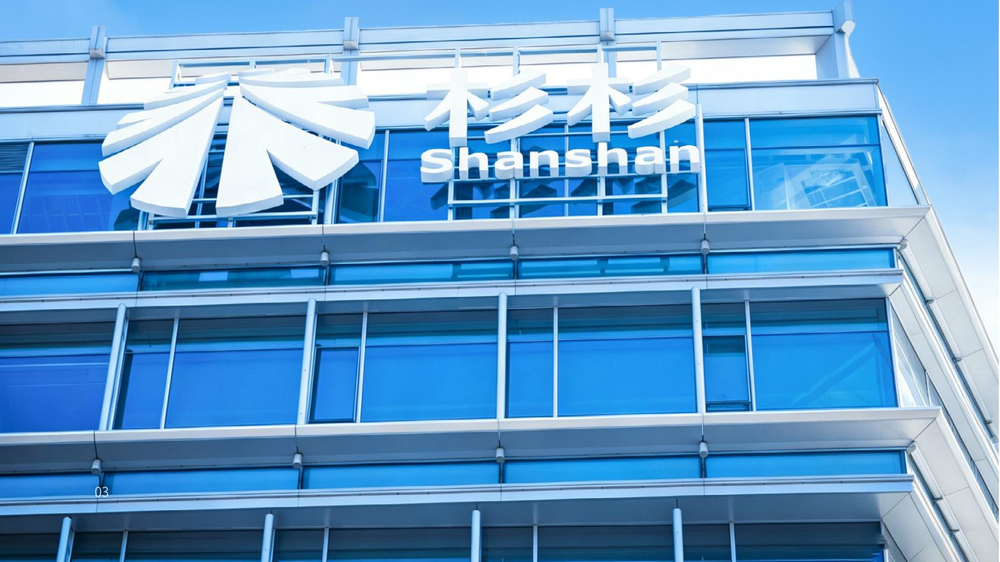

text_image

新杉杉
Shanshan

## 业务布局

公司现已形成负极材料与偏光片两大核心业务双轮驱动发展的战略格局。在负极材料领域，公司作为国内锂离子电池人造石墨负极材料的先行者与技术开拓者，二十余年来始终深耕赛道、专注技术突破与产业落地，已搭建起全球领先的研发技术平台和高度成熟的规模化生产制造体系。依托持续的技术迭代、工艺优化与产品创新，公司在产品性能、供应能力与客户覆盖上持续领跑，市场占有率与综合核心竞争力长期稳居行业第一梯队。

在偏光片材料领域，公司凭借突出的技术实力与市场地位获评国家级制造业单项冠军企业，稳居全球行业龙头。产品全面覆盖大，中，小全尺寸|CD及OLED偏光片，广泛应用于TV.IT显示，车载显示、等众多场景，在关键技术，产能规模与客户资源上形成显著优势，凭借领先的全球市场份额与高壁垒的核心技术，构筑起坚实的产业竞争优势。

未来，公司将紧密围绕全球电动化与智能化的发展主线，深化技术创新与产业升级，推动两大主业实现高质量、可持续的稳健发展。

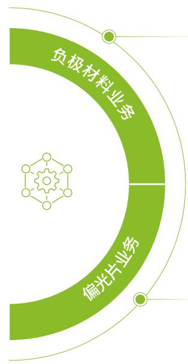

flowchart

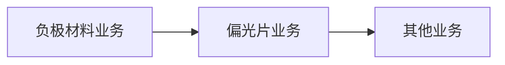
```mermaid
graph LR
  A["负极材料业务"] --> B["偏光片业务"]
  B --> C["其他业务"]
```

公司深耕锂电池负极材料领域20余年，是锂电池负极材料行业的先行者和技术引领者。公司坚持以“深度赋能客户需求”为价值导向，致力于为客户提供世界一流的产品和服务。作为全球领先的锂电负极材料企业，公司目前已完成国内70万吨人造石墨产能布局，海外10万吨一体化产能规划。  
公司负极材料业务的主要产品有人造石墨、天然石墨、硅基负极、软/硬碳新型材料，产品广泛应用于新能源汽车、消费电子和储能等行业。

•公司偏光片业务坚守"品质为本、创新驱动"的发展理念，通过持续高强度研发投入驱动产品技术迭代与高端化升级，战略并购加速高端产品矩阵布局全面提升产业竞争力。凭借行业领先的技术创新能力、产能布局和成本控制能力，持续巩固全球领导者地位。  
• 公司偏光片业务包括|CD 以及 OLED 偏光片的研发、生产与销售。产品终端广泛应用于电视、显示器、笔记本电脑、平板电脑、手机、商用显示、车载显示等领域。

## 文化与价值观

• 回报社会 贡献环保事业  
• 价值创造 与股东共同发展  
•	 关爱员工 成长助力  
• 开拓创新 加强技术研发

  
企业文化

  
核心价值观

•	 正直  
•	 负责  
•	 创新  
•	 担当

2025 大事记  
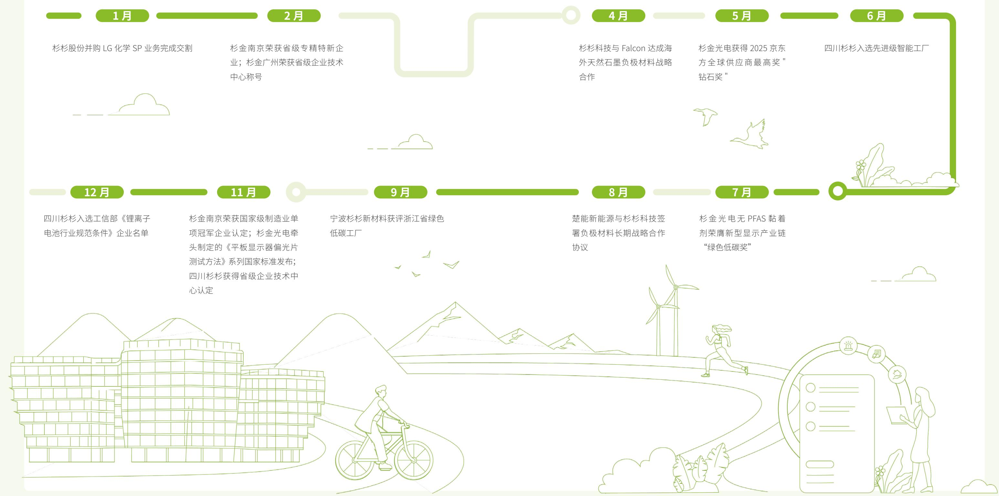

flowchart

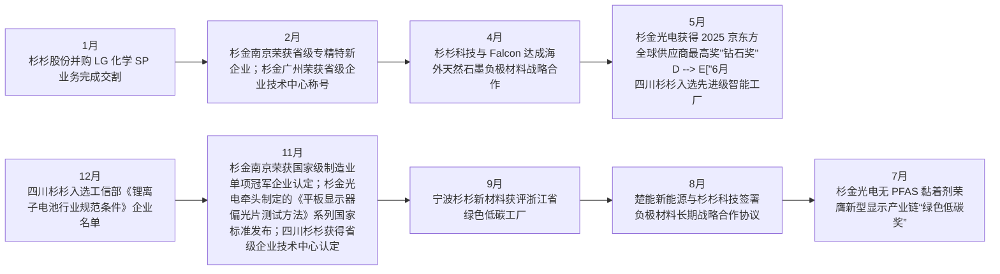
```mermaid
graph LR
  A["1月\n杉杉股份并购 LG 化学 SP 业务完成交割"] --> B["2月\n杉金南京荣获省级专精特新企业；杉金广州荣获省级企业技术中心称号"]
  B --> C["4月\n杉杉科技与 Falcon 达成海外天然石墨负极材料战略合作"]
  C --> D["5月\n杉金光电获得 2025 京东方全球供应商最高奖&quot;钻石奖&quot;<br>  D --> E[&quot;6月\n四川杉杉入选先进级智能工厂"]
  F["12月\n四川杉杉入选工信部《锂离子电池行业规范条件》企业名单"] --> G["11月\n杉金南京荣获国家级制造业单项冠军企业认定；杉金光电牵头制定的《平板显示器偏光片测试方法》系列国家标准发布；四川杉杉获得省级企业技术中心认定"]
  G --> H["9月\n宁波杉杉新材料获评浙江省绿色低碳工厂"]
  H --> I["8月\n楚能新能源与杉杉科技签署负极材料长期战略合作协议"]
  I --> J["7月\n杉金光电无 PFAS 黏着剂荣膺新型显示产业链“绿色低碳奖”"]
```

## 聚焦 2025

  
杉杉股份

<table><tr><td>荣誉名称</td><td>颁发机构</td></tr><tr><td>ESG类</td><td></td></tr><tr><td>2025年度财联社致远奖—ESG先锋企业</td><td>财联社</td></tr></table>

  
杉杉负极

<table><tr><td>荣誉名称</td><td>颁发机构</td></tr><tr><td>ESG类</td><td></td></tr><tr><td>浙江省绿色低碳工厂</td><td>浙江省经信厅</td></tr><tr><td>研发创新类</td><td></td></tr><tr><td>高新技术企业</td><td>科技局</td></tr><tr><td>高新技术企业(复审)</td><td>全国高新技术企业认定管理工作领导小组</td></tr><tr><td>获得浙江省重点企业研究院认定</td><td>浙江省经信厅</td></tr><tr><td>浙江省先进级智能工厂</td><td>浙江省经信厅</td></tr><tr><td>企业贡献类</td><td></td></tr><tr><td>智创标杆企业荣誉证书</td><td>钉钉中国信息技术有限公司</td></tr><tr><td>2024年上海市制造业单项冠军企业</td><td>上海市经济和信息化委员会</td></tr><tr><td>2024年度高质量发展先锋企业奖牌</td><td>上海市浦东新区曹路镇人民政府</td></tr><tr><td>2024年度高质量发展先锋企业荣誉证书</td><td>上海市浦东新区曹路镇人民政府</td></tr><tr><td>2024锂电行业年度动力电池材料卓越品牌奖牌</td><td>维科网·锂电</td></tr><tr><td>最具成长力企业</td><td>中国汽车动力电池产业创新联盟</td></tr><tr><td>2025年全国负极材料行业时代领航企业</td><td>北京百川盈孚科技有限公司</td></tr><tr><td>2025固态电池材料硅基负极优秀供应商</td><td>鑫椤资讯</td></tr><tr><td>十五年全球领航</td><td>高工锂电</td></tr></table>

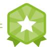  
杉金光电

<table><tr><td>荣誉名称</td><td>颁发机构</td></tr><tr><td>ESG类</td><td></td></tr><tr><td rowspan="3">绿色低碳奖</td><td>中国光学光电子行业协会液晶分会</td></tr><tr><td>中国电子材料行业协会</td></tr><tr><td>电子化工新材料产业</td></tr><tr><td>研发创新类</td><td></td></tr><tr><td>省级企业技术中心</td><td>广东省工业和信息化厅</td></tr><tr><td>省级专精特新企业</td><td>江苏省工业和信息化厅</td></tr><tr><td>2025京东方全球供应商最高奖“钻石奖”</td><td>京东方</td></tr><tr><td rowspan="2">DIC显示材料创新金奖</td><td>中国(上海)国际显示技术及应用创新展组委会</td></tr><tr><td>中国(上海)国际显示产业高峰论坛组委会</td></tr><tr><td rowspan="2">DIC显示材料创新银奖</td><td>中国(上海)国际显示技术及应用创新展组委会</td></tr><tr><td>中国(上海)国际显示产业高峰论坛组委会</td></tr><tr><td>国家级制造业单项冠军</td><td>工业和信息化部</td></tr><tr><td>《平板显示器偏光片测试方法》系列国家标准发布</td><td>标准化管理委员会</td></tr><tr><td>2025世界显示产业创新发展大会创新成果-十大创新产品</td><td>成都市人民政府四川省经济和信息化厅四川省经济合作局</td></tr><tr><td>企业贡献类</td><td></td></tr><tr><td>TCL华星全球供应链大会“特殊贡献奖”</td><td>TCL华星</td></tr><tr><td>2025年度先进工作单位</td><td>全球半导体设备和材料标准化技术委员会</td></tr><tr><td>中国海关贸易景气统计调查出口样本企业</td><td>海关总署</td></tr><tr><td>积极服务奖</td><td>国显科技</td></tr></table>

## 2025年度亮点绩效

## 经营维度

营业收入

2,158,701.52 万元

同比增长

15.56%

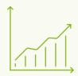

累计授权专利超

2,500 项

研发投入

120,157.38 万元

同比增长

15.87%

占营收

5.57%

新增授权专利

980 项

## 治理及社会维度

董事会

11人

独立董事

4

占比超

1/3

女性董事

2

员工培训总场次

场3,231

廉洁承诺书签署

员工

100%

供应商

90%

安全生产投入

4,494.86 万元

员工体检覆盖率

100%

## 环境维度

环保总投入

12,339.29 万元

同比增长

20.35%

占营收

0.57%

新增

家省级以上绿色工厂3

清洁能源使用量

MWh2,818,770.12

废水、废气排放达标率

100%

## 我们的可持续发展之路

## 可持续管理体系

## 杉杉负极

杉杉负极结合自身发展战略，提出以“用新材料、新工艺、新管理推动新能源革命(WeCHANGE)”为发展愿景，并将这一理念进一步细化落实为“CHANGE”行动框架。同时，公司以数字化与信息化管理体系支撑可持续发展，持续推进数字化转型，提升企业整体管理水平，为各项可持续发展工作的高效推进提供坚实基础

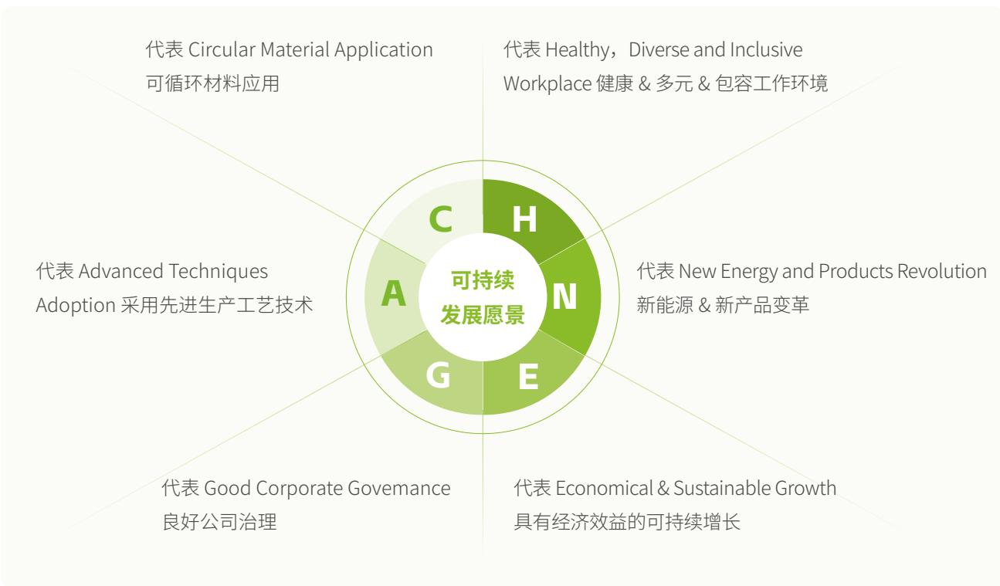

flowchart

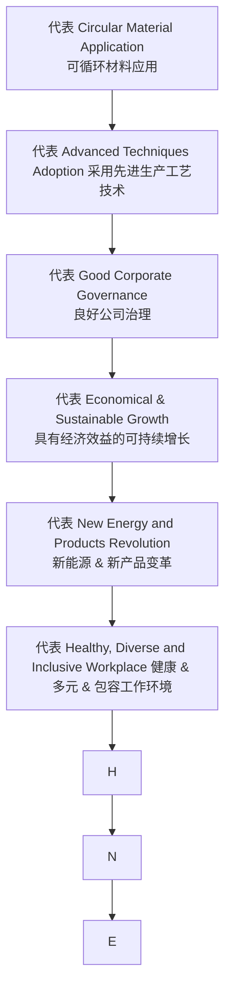
```mermaid
graph TD
  A["代表 Circular Material Application\n可循环材料应用"] --> B["代表 Advanced Techniques Adoption 采用先进生产工艺技术"]
  B --> C["代表 Good Corporate Governance\n良好公司治理"]
  C --> D["代表 Economical & Sustainable Growth\n具有经济效益的可持续增长"]
  D --> E["代表 New Energy and Products Revolution\n新能源 & 新产品变革"]
  E --> F["代表 Healthy, Diverse and Inclusive Workplace 健康 & 多元 & 包容工作环境"]
  F --> G["H"]
  G --> H["N"]
  H --> I["E"]
```

在组织架构层面，杉杉负极建立了由“决策层一管理层一执行层”构成的三级ESG管理体系。其中，可持续发展（FSG）委员会作为公司ESG管理的最高决策机构，负责统筹ESG相关工作并定期向董事会汇报管理进展与成效。在管理与执行层面，由ESG部门联合董事会办公室牵头，围绕重点议题设立专项工作小组，并协同各业务职能部门负责人及各生产基地管理团队，推动ESG工作在公司各层级有序落实。

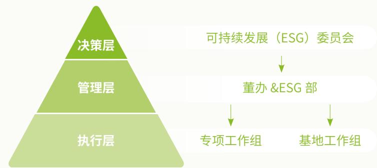

flowchart

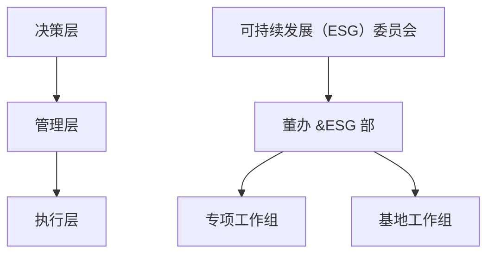
```mermaid
graph TD
  A["决策层"] --> B["管理层"]
  B --> C["执行层"]
  D["可持续发展（ESG）委员会"] --> E["董办 &ESG 部"]
  E --> F["专项工作组"]
  E --> G["基地工作组"]
```

杉杉负极 ESG管理组织架构

## 杉金光电

杉金光电将ESG理念融入企业长期发展战略，结合行业特点、业务模式及发展规划，制定系统化的ESG行动方案，并设定明确目可量化的ESG管理目标，如降低碳排放、提升能源利用效率及改善员工福利等。同时，公司将相关目标纳入绩效管理体系，建立与ESG表现相挂钩的激励机制，对在ESG工作中表现突出的部门和个人给予相应激励与表彰以推动ESG 管理持续落地。

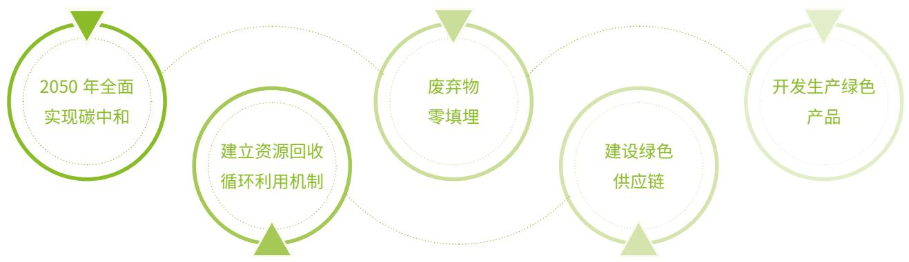

flowchart

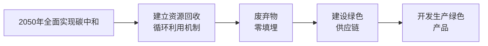
```mermaid
graph LR
  A["2050年全面实现碳中和"] --> B["建立资源回收\n循环利用机制"]
  B --> C["废弃物\n零填埋"]
  C --> D["建设绿色\n供应链"]
  D --> E["开发生产绿色\n产品"]
```

杉金光电可持续发展战略方向

同时，杉金光电亦建立了系统化的ESG管理架构，推动各部门之间的协同配合，明确职责分工与协作流程，实现从管理层决策到基层执行的多层级联动机制。

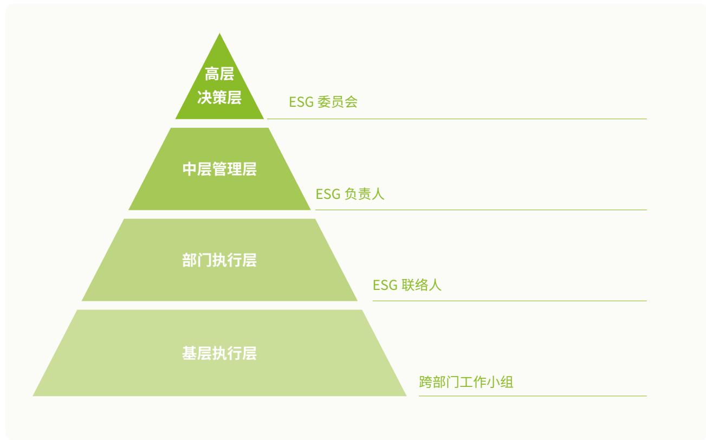

flowchart

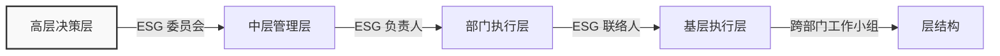
```mermaid
graph LR
  A["高层决策层"] -->|"ESG 委员会"| B["中层管理层"]
  B -->|"ESG 负责人"| C["部门执行层"]
  C -->|"ESG 联络人"| D["基层执行层"]
  D -->|"跨部门工作小组"| E["层结构"]
  style A fill:#f9f9f9,stroke:#333,stroke-width:2px
```

杉金光电 ESG 管理架构

## ESG尽职调查

在ESG风险管理体系方面，公司通过尽职调查识别可能影响可持续发展的潜在风险。公司制定了ESG风险管理方针定期开展风险识别与评估，监控风险动态，并建立跨部门协作机制，确保各项风险应对措施发挥实际效果

<table><tr><td>风险类型</td><td>风险描述</td><td>影响周期</td></tr><tr><td rowspan="3">环境风险</td><td>气候变化</td><td>极端天气事件可能对公司的生产设施造成影响,如自然灾害导致的生产中断。</td></tr><tr><td>资源枯竭</td><td>随着资源消耗的增加,原材料供应可能面临短缺,导致成本上升或生产中断。</td></tr><tr><td>环境污染</td><td>生产过程中的排放物可能对环境和周边社区造成影响,引发监管机构的关注和处罚。</td></tr><tr><td rowspan="2">社会风险</td><td>员工权益风险</td><td>劳动纠纷、员工健康和安全问题可能影响公司的运营和声誉。</td></tr><tr><td>产品质量与安全风险</td><td>产品缺陷或安全问题可能导致客户损失,进而引发法律诉讼和赔偿。</td></tr><tr><td>治理风险</td><td>合规风险</td><td>违反ESG相关法规政策可能导致法律诉讼和监管处罚。</td></tr></table>

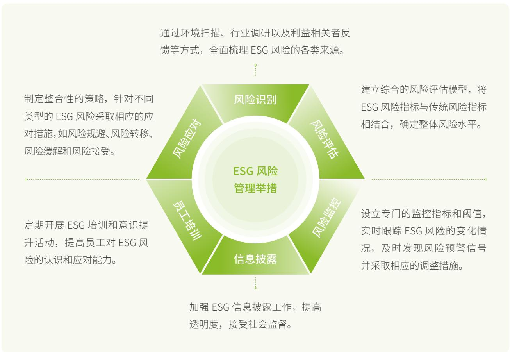

flowchart

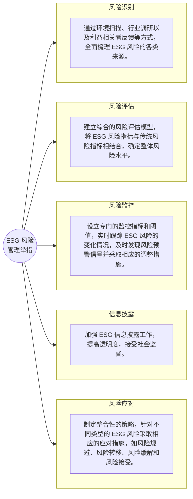
```mermaid
graph LR
  Center(("ESG 风险\n管理举措"))
  
  subgraph Pillar1["风险识别"]
    direction TB
    A["通过环境扫描、行业调研以及利益相关者反馈等方式，全面梳理 ESG 风险的各类来源。"]
  end
  
  subgraph Pillar2["风险评估"]
    direction TB
    B["建立综合的风险评估模型，将 ESG 风险指标与传统风险指标相结合，确定整体风险水平。"]
  end
  
  subgraph Pillar3["风险监控"]
    direction TB
    C["设立专门的监控指标和阈值，实时跟踪 ESG 风险的变化情况，及时发现风险预警信号并采取相应的调整措施。"]
  end
  
  subgraph Pillar4["信息披露"]
    direction TB
    D["加强 ESG 信息披露工作，提高透明度，接受社会监督。"]
  end
  
  subgraph Pillar5["风险应对"]
    direction TB
    E["制定整合性的策略，针对不同类型的 ESG 风险采取相应的应对措施，如风险规避、风险转移、风险缓解和风险接受。"]
  end
  
  Center --> Pillar1
  Center --> Pillar2
  Center --> Pillar3
  Center --> Pillar4
  Center --> Pillar5
```

## 利益相关方沟通

公司结合自身行业属性和运营特点，确定主要利益相关方涵盖股东与投资者、客户、合作伙伴、员工、政府、社区及公众等，并建立长期稳定的沟通机制，通过官方网站、媒体发布、会议交流、报告披露及各类活动等多种渠道，与利益相关方保持互动，及时回应其关注和期望。

<table><tr><td colspan="2">利益相关方</td><td>关注与期望</td><td>沟通机制与形式</td></tr><tr><td></td><td>股东及投资者</td><td>·信息披露公开透明·规范公司治理·资产保值增值与投资回报</td><td>·召开股东会·定期公告、临时公告·机构调研、投资者热线、邮箱、业绩说明会、上证e互动平台</td></tr><tr><td></td><td>客户</td><td>·安全、优质的产品·提升服务质量·超越客户期望</td><td>·客户满意度调查·售后服务承诺·构建客户沟通渠道·开展优质服务活动</td></tr><tr><td></td><td>合作伙伴</td><td>·互利共赢·市场运作规范化·共同遵守商业道德和法律法规</td><td>·合同谈判·实地考察·培训指导·定期评估</td></tr><tr><td></td><td>员工</td><td>·合理的薪酬体系·融洽的工作氛围·良好的职业发展空间·个人价值肯定与提升</td><td>·公司网站及刊物·员工信箱·座谈会、职工代表大会·员工培训及员工活动</td></tr><tr><td></td><td>政府</td><td>·贯彻行业发展政策·诚信守法经营·依法纳税·带动就业·防范经营风险</td><td>·参与政策、规划调研与制定·专题汇报·接受监督考核·守法经营与公平竞争</td></tr><tr><td></td><td>社区及公众</td><td>·推动地区经济与文化发展·帮助社会弱势群体</td><td>·参与区域经济建设·公益慈善活动</td></tr></table>

利益相关方沟通

## 双重重要性矩阵

为更好地指导日常ESG管理实践，公司参照上海证券交易所上市公司自律监管指南第4号一可持续发展报告编制指引，结合国家政策、行业发展趋势和公司自身实际，梳理出对业务运营及利益相关方具有重要影响的27项核心议题并在本报告中重点披露与回应这些议题。

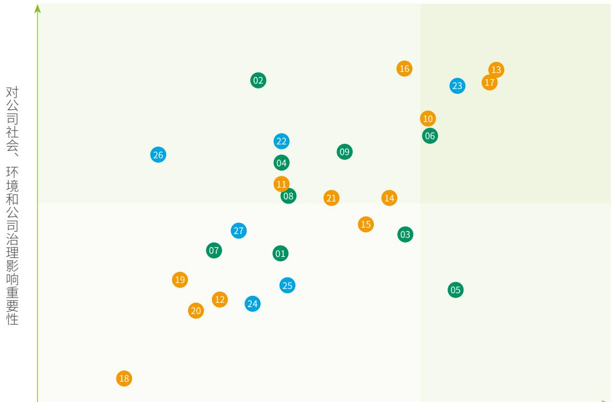

scatter

| ID | X (approx) | Y (approx) |
| --- | --- | --- |
| 02 | ~35 | ~85 |
| 16 | ~65 | ~90 |
| 13 | ~85 | ~85 |
| 23 | ~75 | ~80 |
| 17 | ~85 | ~80 |
| 10 | ~70 | ~70 |
| 06 | ~70 | ~65 |
| 22 | ~40 | ~65 |
| 09 | ~55 | ~60 |
| 04 | ~40 | ~55 |
| 11 | ~40 | ~50 |
| 08 | ~40 | ~45 |
| 21 | ~55 | ~45 |
| 14 | ~65 | ~45 |
| 26 | ~25 | ~50 |
| 27 | ~35 | ~35 |
| 15 | ~60 | ~35 |
| 03 | ~65 | ~30 |
| 01 | ~45 | ~30 |
| 25 | ~45 | ~25 |
| 07 | ~30 | ~25 |
| 19 | ~25 | ~20 |
| 12 | ~35 | ~20 |
| 24 | ~40 | ~15 |
| 20 | ~30 | ~15 |
| 05 | ~75 | ~15 |
| 18 | ~20 | ~5 |

对公司财务影响重要性

公司实质性议题

<table><tr><td>环境责任</td><td>社会责任</td><td>治理责任</td></tr><tr><td>01 废弃物处理02 污染物排放03 化学品安全04 环境合规管理05 应对气候变化 *06 能源利用 *07 生态系统和生物多样性保护08 水资源利用09 循环经济</td><td>10 创新驱动 *11 知识产权维护12 科技伦理13 产品和服务安全与质量 *14 员工发展与培训15 员工关怀与权益16 职业健康与安全生产17 可持续供应链管理 *18 乡村振兴19 社会贡献20 平等对待中小企业21 数字化管理</td><td>22 ESG 管理23 反商业贿赂及反贪污 *24 反不正当竞争25 利益相关方沟通26 尽职调查27 数据安全与客户隐私保护</td></tr></table>

注：\*号议题为具有财务重要性议题

## 可持续发展目标（SDGs）响应

公司支持联合国2030年可持续发展议程，以自身行动推动联合国可持续发展目标实现。

## 对应章节：员工雇佣和权益

·公司与每一位员工签订劳动合同，禁止童工、强迫劳动等非法的用工行为，为员工提供具有市场竞争力的薪酬，制定并实施完善的福利体系，劳动合同签订率100%。

## 对应章节：高效资源利用、应对气候变化

公司重视全过程的节能减排，制定能源管理计划行动方案，设定了清洁能源使用目标，杉杉负极全年绿电交易量达2.665.515.01兆瓦时，绿电使用比例已提升至60%，响应国家战略大力推进清洁能源的使用。

## 对应章节：高效资源利用

·公司重视水资源管理，依法管理废水，降低公司运营对环境水面影响，杉杉负极生产冷却水100%闭路循环，工业废水回用率100%，全年总耗水量4,921,013.46吨。

## 对应章节：员工雇佣和权益

·公司严禁性别歧视，实施男女同工同酬，设置女性专项福利保障措施，保护女性员工权益，女性管理者在中高级管理层占比分别达26.84% 和 23.66%

## 对应章节：员工发展与培训、推动行业发展

·公司与高校建立长期产学研合作关系，大力支持国家科研及人才建设，并通过分层分类培训体系为员工提供全面的成长路径与职业发展通道，全年开展各类培训逾3,000场。

## 对应章节：职业健康与安全

·公司始终将员工健康置于首位，建立覆盖工程控制、个体防护、健康监控等六维管控体系，职业病发病率保持为零，职业健康体检覆盖率达100%。

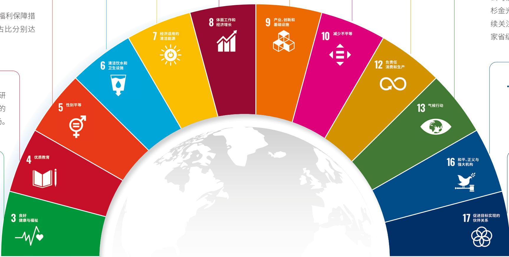

donut

| SDG ID | Category |
| --- | --- |
| 3 | 良好健康与福祉 |
| 4 | 优质教育 |
| 5 | 性别平等 |
| 6 | 清洁饮水和卫生设施 |
| 7 | 经济适用的清洁能源 |
| 8 | 体面工作和经济增长 |
| 9 | 产业、创新和基础设施 |
| 10 | 减少不平等 |
| 12 | 负责任消费和生产 |
| 13 | 气候行动 |
| 16 | 和平、正义与强大机构 |
| 17 | 促进目标实现的伙伴关系 |

## 对应章节：创新研发驱动、推动行业发展

公司重视自身技术研发及管理工作，建立健全的研发管理制度，持续加大研发创新投入，2025 年研发投入共计120,157.38万元，占营业收入5.57%，积极参与国家及行业标准制定，推动行业可持续发展

## 对应章节：员工雇佣和权益、平等对待中小企业

·公司坚持平等的用工政策，对所有员工一视同仁，提供多元包容的发展思路，提供公平薪酬，打造和谐平等的工作环境，并坚持平等对待中小企业合作伙伴，减少社会不平等。

## 对应章节：精益管理扎实根基、守护自然绿色低碳

·公司提倡负责任的商业行为，在反对不公平市场竞争的同时，不断提高能源使用效率，废弃物回收利用率达74.50%，促进绿色、循环经济的发展。

## 对应章节：应对气候变化

·公司设定了碳中和目标，分别为杉杉负极2050年运营碳中和杉金光电2050年全面实现碳中和，制定绿色减排发展路径，持续关注自身运营的温室气体排放，加大使用清洁能源，新增3家省级以上绿色工厂。

## 对应章节：坚守商业道德

·公司建立了积极的权力问责、合规高效的治理体系，强化商业诚信管理，对廉洁从业、信息安全、知识产权等方面采取保护措施，并向供应商等合作伙伴提出了严格的管理要求，报告期内未发生腐败违规事件。

## 对应章节：供应链ESG管理、推动行业发展

·公司以产学研合作、行业交流赋能科技创新，助力专业和产业实现协同发展；与供应商建立平等互信的合作关系，供应商《供应商行为准则》签署覆盖率达100%，致力干打造可持续的供应链。

## 精管善治筑牢根基

## 理念

杉杉股份坚持以规范运作、透明合规为基石，持续优化内控体系，强化风险防控，恪守商业道德，筑牢信息屏障，为高质量发展奠定坚实根基。

## 我们的行动

夯实公司治理 19

投资者关系管理 22

内控及风险管理 24

坚守商业道德 29

守护信息安全 33

natural_image

Exterior view of a modern glass skyscraper with curved architecture under a blue sky (no signage visible)

## 夯实公司治理

杉杉股份始终坚持将稳健、透明、高效的公司治理作为企业可持续发展的基石。2025年，公司紧扣新《公司法》实施契机系统优化治理架构，持续提升公司治理水平和风险防范能力，以高质量治理赋能企业长期价值创造。

## 治理架构及运作

公司严格按照《公司法》《证券法》《上市公司治理准则》等法律法规要求，构建了权责分明、规范运作的法人治理结构。2025年，公司开展了公司意程及配套治理制度的修订工作，全面贯彻落实新《公司法》及中国证监会，上交所系列配套规则要求。本次共修订公司章程及其附件、独立董事制度等治理相关制度22项，首次制定市值管理制度，同时废止监事会议事规则，改由董事会审计委员会行使新《公司法》规定的监事会职权，完成公司内部监督机构设置调整，进一步提升了监督效能与决策效率。

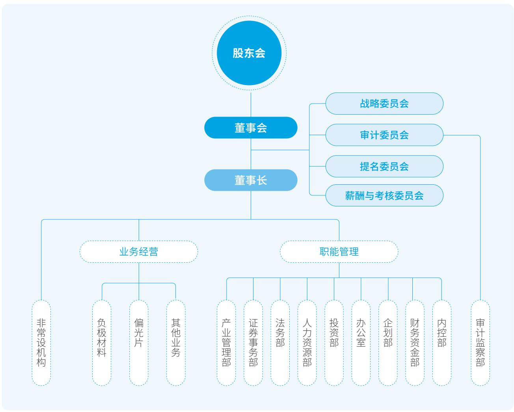

flowchart

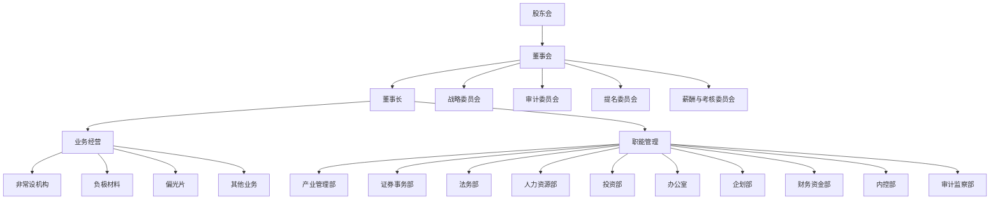
```mermaid
graph TD
  A["股东会"] --> B["董事会"]
  B --> C["董事长"]
  B --> D["战略委员会"]
  B --> E["审计委员会"]
  B --> F["提名委员会"]
  B --> G["薪酬与考核委员会"]
  C --> H["业务经营"]
  C --> I["职能管理"]
  H --> J["非常设机构"]
  H --> K["负极材料"]
  H --> L["偏光片"]
  H --> M["其他业务"]
  I --> N["产业管理部"]
  I --> O["证券事务部"]
  I --> P["法务部"]
  I --> Q["人力资源部"]
  I --> R["投资部"]
  I --> S["办公室"]
  I --> T["企划部"]
  I --> U["财务资金部"]
  I --> V["内控部"]
  I --> W["审计监察部"]
```

公司组织架构图

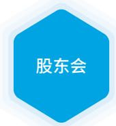

股东会是公司的权力机构，依法决策公司的经营方针和投资计划、审议批准董事会报告等。  
遵守《上市公司股东会规则》，规范股东会的召集、召开、表决程序，确保所有股东享有平等的股东地位、股东权利，充分保护股东的合法权益。  
•	 公司召开股东会，均聘请律师对股东会合规性、合法性出具法律意见并公告。

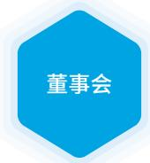

董事会按照《公司法》《公司章程》和《董事会议事规则》的有关要求规范运作切实履行股东会赋予的各项职责，贯彻执行股东会各项决议，在董事会职责权限范围内，围绕公司总体发展目标，落实各项经营管理工作。  
董事会成立了战略委员会、审计委员会、提名委员会、薪酬与考核委员会，负责制定专门委员会工作规程，规范专门委员会的运作

## 报告期内

公司召开股东会

2 次

共审议

14 项议案

召开董事会

4 次

共审议

26 项议案

各专门委员会共计召开会议

10

其中审计委员会召开

7次

薪酬与考核委员会召开

2次

提名委员会召开

1次

## 董事多元化与独立性

公司高度重视董事会构成的科学性与代表性，持续优化董事会的专业化、多元化结构，为公司战略决策提供多维视角。目前公司董事会成员共计11人，形成了既具产业深度又具专业广度的复合型团队。从专业背景看，成员涵盖企业管理、财务审计、法律合规、产业技术等多元领域。从结构特征看，独立董事共4人，占比超过三分之一；女性董事2人，体现了性别多元化的治理理念。

## 截至报告期末

公司董事会共有

11位董事会成员，其中

非独立董事

7位

独立董事

4 位

具有行业专业背景或从业经验的董事

4

具有风险管理经验或法律专业的董事

3 人

具有财务专业或行业财务管理经验的董事

2 人

## 董事薪酬管理

公司建立健全了科学、规范、透明的董事薪酬管理体系。公司董事薪酬方案由董事会薪酬与考核委员会制定，经股东会审议决定。同时，公司非独立董事薪酬采用了固定薪酬与绩效薪酬相结合的模式，绩效评价由董事会薪酬与考核委员会统筹实施，部分绩效薪酬在年度报告披露后支付，确保薪酬激励与责任贡献相匹配，促使其聚焦公司长期战略发展，提升自身履职能力与管理水平，从而推动公司治理效能与可持续发展能力的持续提升。

natural_image

Line drawing of three people at a table with documents and a laptop, surrounded by flowers and clouds (no text or symbols)

## 董事提名及选举

公司建立了规范、透明、公正的董事提名与选举程序，确保董事会成员的选聘过程合规有序。

## 公司董事的提名程序

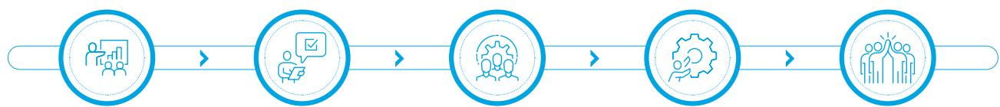

flowchart

```mermaid
graph LR
  A["Presentation"] --> B["Feedback"]
  B --> C["Team Formation"]
  C --> D["Decision-making"]
  D --> E["Planning & Team"]
  E --> F["Reporting"]
```

根据公司需要，向公司股东、董事会、管理层等搜寻或征询合适的董事人选

督促相关部门搜集 初选人员的个人履 历、兼职、资格证 书等基础资料，同 时获取被提名人同 意提名的书面资料 召集提名委员会会 议，根据董事的任 职条件，对初选人 员进行资格审查

在选举新的董事前，向董事会提出董事候选人的建议和相关材料

根据董事会决定和反馈意见进行其他后续工作

## 投资者关系管理

杉杉股份始终将投资者权益保护作为治理工作的重中之重，致力于构建高效、透明的沟通机制。2025年，公司严格遵守相关法律法规，持续完善信息披露与投资者关系管理制度，通过多元化的沟通渠道，保障投资者的知情权与参与权巩固公司与资本市场的良性互动

## 信息披露制度

公司严格遵循《上海证券交易所股票上市规则》《上市公司信息披露管理办法》等相关规定，于2025年8月修订并发布了《信息披露事务管理制度》。该制度明确了信息披露的基本原则：保证及时性，公平性，真实性，准确性及完整性确保所有投资者可以平等地获取信息。公司建立了一套完善的信息披露管控体系，配套制定了《内幕信息知情人登记管理制度》《年报信息披露重大差错责任追究制度》《外部信息使用人管理制度》以及基于内部控制的《公共关系及信息发布管理》《财务信息管理》等一系列规范性文件，对公司内部信息的采集、传递、编制、审核、披露进行全流程管控严防重要信息泄露和内幕交易。

公司指定信息披露媒体为《中国证券报》《上海证券报》《证券日报》《证券时报》及上海证券交易所网站(wwwSse.com.cn)，所有应披露信息均在上述平台统一发布，确保股东能够公平、及时地获取公司信息。

## 截至报告期末

公司信息披露文件合计

141份

其中定期报告（含摘要）

6份

临时公告

85 份

其他披露文件

50 份

## 投资者关系管理制度

为加强公司与投资者之间的有效沟通，公司于2025年8月同步修订并实施了《投资者关系管理办法》，明确了“合规性、平等性、主动性、诚实守信”四大原则，特别强调平等对待所有投资者，并为中小投资者参与重大事项决策提供便利，保障信息透明与公平。

## 投资者沟通渠道

2025年，公司通过多元化、全方位的沟通渠道，持续深化与投资者的日常交流，积极回应投资者诉求。

## 投资者沟通媒介

•	 官网专栏  
•	 投资者热线电话  
•	 交易所投资者关系互动平台  
•	 传真  
•	 电子邮箱

## 公司投资者关系管理维护渠道

## 投资者沟通渠道

•	 股东会  
•	 投资者交流会  
•	 业绩说明会  
•	 接待现场调研  
•	 分析师会议

## 报告期内

公司积极开展业绩说明会、线上及线下投资者调研活动，其中开展业绩说明会

2 场

通过上海证券交易所投资者关系互动平台进行问答回复

119条

## 内控与风险管理

杉杉股份始终将内部控制与风险管理视为可持续发展的基石。2025年，公司持续优化内控治理架构，完善制度建设强化监督检查与培训赋能，确保各项业务在风险可控的前提下稳健运行。

## 内部控制

公司严格遵循《企业内部控制基本规范》《公司法》《证券法》等法律法规及公司章程要求，建立了涵盖内控管理内控检查、人事管理、信息管理、安全管理等多个维度的内控制度体系，并每年进行修订完善。公司内控组织架构以总部为核心管理平台，各产业公司为执行主体，设立专职内控部门，部门负责人采取股份委派形式，确保内控工作的独立性和权威性。内控体系覆盖决策与运营全过程，明确职责、工作程序及检查规范，同时设立风险资产管理会议利益冲突调查、定期内控报告等机制，保障制度有效实施

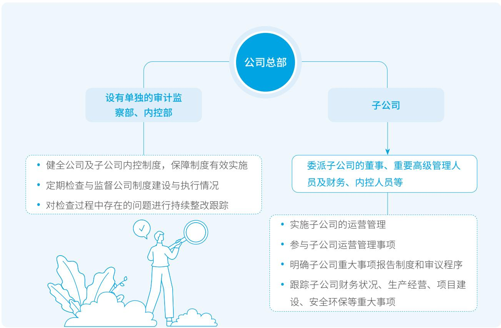

flowchart

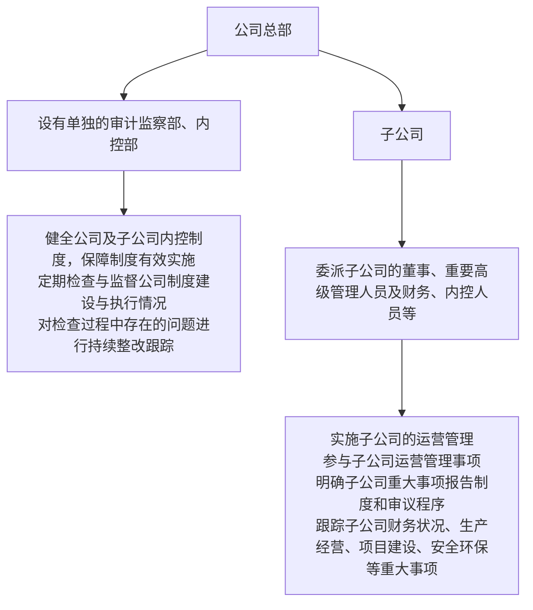
```mermaid
graph TD
  A["公司总部"] --> B["设有单独的审计监察部、内控部"]
  A --> C["子公司"]
  B --> D["健全公司及子公司内控制度，保障制度有效实施\n定期检查与监督公司制度建设与执行情况\n对检查过程中存在的问题进行持续整改跟踪"]
  C --> E["委派子公司的董事、重要高级管理人员及财务、内控人员等"]
  E --> F["实施子公司的运营管理\n参与子公司运营管理事项\n明确子公司重大事项报告制度和审议程序\n跟踪子公司财务状况、生产经营、项目建设、安全环保等重大事项"]
```

公司内控管理框架

为提升内控有效性，公司从框架制度，本部制度及产业公司制度三个层面推进内控体系动态优化，每年制定年度工作计划，涵盖制度完善，内控检查，问题整改，工程项目监督及团队能力提升等方面。公司定期对核心产业公司开展一年两次内控评价，依据内部控制五要素对财务、生产、采购、销售等核心业务循环进行检查，出具反馈报告并督促整改，确保产业公司经营合法、合规、高效

## 报告期内

公司内控部组织杉杉股份本部各部门对公司内控框架制度进行修订，合计共14 个循环 92个制度。

组织开展股份本部制度的修订，共15个循环 81 个制度，同时开展产业公司内控制度的审核整

理等事宜，合计完成109个循环849 个制度。

此外，公司重视内控人才建设，通过常态化培训提升内控人员专业素养与实操能力。2025年内控部明确将团队建设作为重点，并安排不定期内部培训学习，以持续增强内控执行力和专业水平。

## 案例|内控条线工作会议培训

2025年4月，公司召开股份内控条线会议培训，全体内控人员参加。会议围绕2025年内控条线总体工作目标、产业公司关注重点及工作部署展开，同时就2025年框架制度重要变动、典型案例复盘进行深入研讨。通过案例复盘与跨公司经验交流，强化了内控人员对风险识别、问题整改及闭环管理的理解

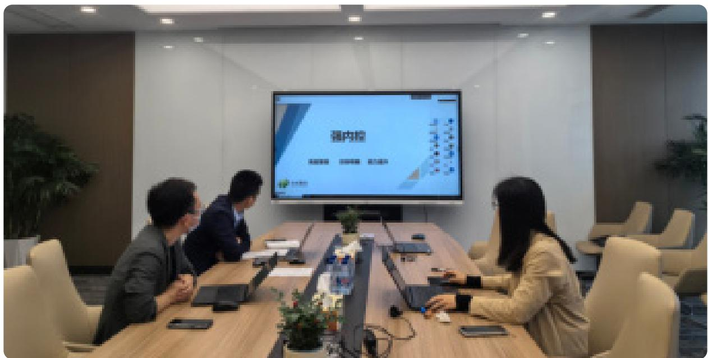

text_image

强内控

内控条线工作会议培训

## 案例偏光片业务专项培训，强化内控专业能力

2025年9月，公司内控部组织了偏光片业务专项培训。该培训面向内控部和审计监察部所有人员，系统进解了偏光片基本工艺及其业务流程中的关键风险点与合规要求。此举有效提升了内控和审计监察人员对偏光片业务的系统认识、风险识别能力和合规意识，持续增强了其专业胜任能力

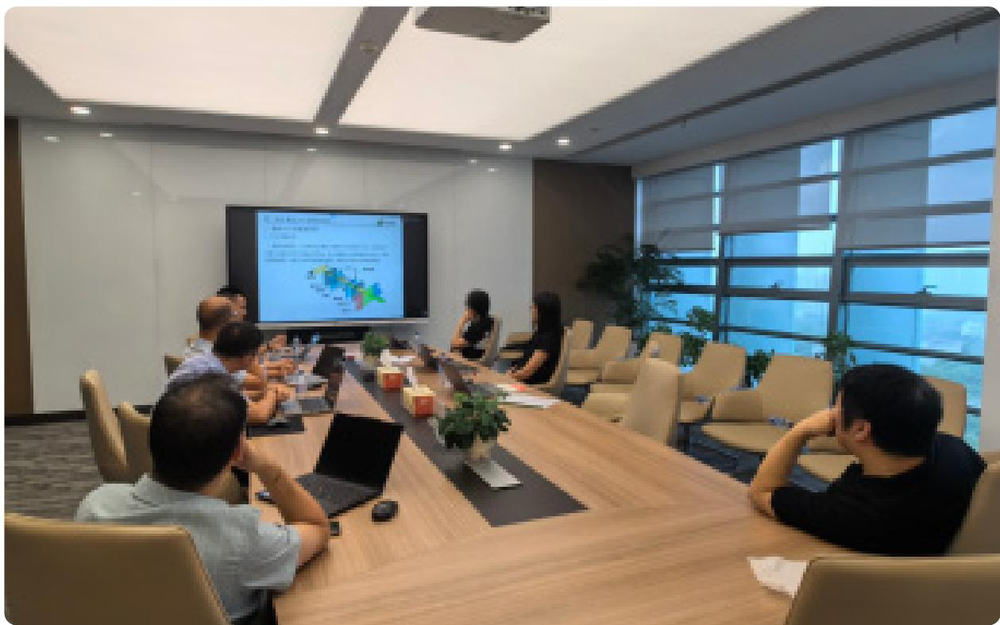

text_image

Conference room scene with attendees seated around a long table, one person presenting a presentation screen displaying a map or data visualization.

偏光片业务专项培训

## 风险管理

公司建立并持续优化全面风险管理体系，将风险意识融入战略决策与日常运营，通过系统化的风险识别、评估与应对机制，有效防范各类经营风险，保障公司稳健发展。为此，公司制定并实施了《风险资产管理》专项制度，明确风险资产定义、职责分工、会议管理及信息报送要求。在管理方面，公司风险管理由内控部门垂直管理，并设立风险资产管理委员会和风险管理小组，负责制定风险管理政策，审议重点关注风险资产，听取工作汇报，对重大风险资产开展专项调查和提出解决方案。

同时，公司建立了统一的风险等级评估标准，从风险发生可能性和影响程度两个维度，将风险划分为高、中、低三个级别。

## 风险应对措施

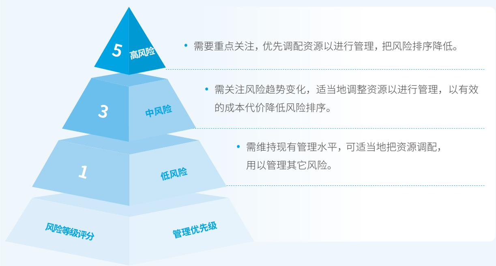

flowchart

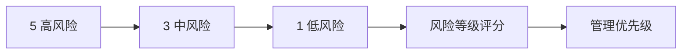
```mermaid
graph LR
  A["5 高风险"] --> B["3 中风险"]
  B --> C["1 低风险"]
  C --> D["风险等级评分"]
  D --> E["管理优先级"]
```

风险等级评估标准

经评估，公司将与企业发展密切相关的风险划分为五类：战略风险，财务风险，市场风险运营风险及法律风险，并针对各类风险制定了系统化管理措施，以有效防控和化解潜在风险，为公司稳健运营和可持续发展提供坚实保障。

natural_image

Close-up of a hand writing on paper with a pen, no visible text or symbols

定期向产业公司发送风险资产与风险客户信息，提出预警。

定期统计分析各产业公司存货与闲置固定资产，并重点关注。

加强风险管理举措

继续加强工程项目预结算管理与工程现场巡检。

组织召开内控条线会议。

开展内部评价工作。

## 案例统化风险预警与跟踪强化应收账款管控

杉杉股份定期向产业公司发送风险资产及风险客户信息，提出预警。为严格落实内控管理要求，健全锂电板块应收账款风险防控体系，防范资金回收风险，保障公司资金安全，通过锂电应收账款客户分析预警系统，进一步强化应收账款全流程风险管控。同时对锂电板块客户进行分析，对有风险信息的客户进行重点提示及跟踪，确保风险早发现、早识别、早处置。

## 报告期内

公司未发生 内外部重大经营风险。

## 坚守商业道德

杉杉股份始终坚持“为顾客创造价值”和“尊重人格的经营”理念，遵循自由、公正的市场经济秩序，以相互信任与合作为基础，持续推进商业道德建设。公司不断强化廉洁从业纪律，倡导公平竞争，优化管理体系，致力干推动健康发展。

## 廉洁从业

公司高度重视廉洁从业管理，将其作为提升公司治理水平和防范经营风险的重要举措。通过完善治理机制、识别风险与机遇并强化管理措施，公司持续推动廉洁文化建设，保障经营活动规范、透明开展。

## 治理

公司建立了覆盖总部及各产业公司的廉洁从业管理体系，明确制度，职责与工作流程，确保廉洁管理贯穿公司日常运营。各子公司结合实际情况制定相应制度，如杉杉负极制定《廉洁规范制度》《廉洁规范及反馈渠道管理》，要求员工签署《廉洁纪律承诺书》，明确员工在与供应商、客户及其他业务合作方交往中的行为底线：杉金光电制定了适用于全体员工的《伦理规范》，要求员工签订保证书，并在重大节假日前通过邮件对供应商进行正道理念宣传。报告期内，各子公司在原有制度基础上不断优化管理措施，完善反商业贿赂，反贪污，举报保护及处理流程等内容。

在管理架构方面，公司董事会下设审计委员会，审计委员会下设审计监察部，审计监察部具体负责举报受理，问题调查，线索核实并督导下属产业公司落实整改。通过多层次管理机制和日常监督，确保廉洁管理措施全面执行，风险得到及时识别与有效控制。

## 战略

公司将廉洁从业作为长期可持续发展战略的重要组成部分，贯穿业务运营和治理体系。公司以制度建设为基础，结合内控管理、风险防控和员工培训等措施，形成全面的廉洁管理战略，旨在防范商业贿赂、利益冲突及供应链合规风险，保障公司经营的透明，公正和稳健。

<table><tr><td>风险类型</td><td>风险描述</td><td>影响周期</td><td>发生概率</td><td>财务影响内容</td><td>应对措施</td></tr><tr><td>采购风险</td><td>采购环节存在收受回扣、围标串标、利益输送等行为。</td><td>中长期</td><td>中</td><td>可能导致采购成本上升、资产损失及潜在法律赔偿,影响公司经营效益。</td><td>强化采购流程规范化管控与闭环监督,健全廉洁风险防控与责任追究机制。</td></tr><tr><td>营销风险</td><td>销售环节存在向客户索贿受贿、泄露商业秘密、违规承诺利益等行为。</td><td>中短期</td><td>中</td><td>可能引发合同纠纷、客户流失及诉讼成本,影响收入稳定性与品牌价值。</td><td>规范合同评审,强化销售流程监督核查,加强员工廉洁警示教育与合规约束。</td></tr></table>

廉洁从业风险识别

<table><tr><td>机遇类型</td><td>机遇描述</td><td>影响周期</td><td>发生概率</td><td>财务影响内容</td><td>应对措施</td></tr><tr><td>品牌价值机遇</td><td>坚持公平竞争和廉洁经营,规范商业行为,有助于赢得市场信任。</td><td>长期</td><td>高</td><td>有助于提升品牌溢价能力与市场竞争力,增强投资者与合作伙伴信心。</td><td>开展廉洁教育培训与诚信文化宣传,完善内部管理机制。</td></tr><tr><td>投资者信任提升机遇</td><td>良好的商业道德和合规记录,有助于向资本市场传递稳健合规的经营形象,吸引长期投资。</td><td>中长期</td><td>高</td><td>提升融资能力,吸引长期机构资金。</td><td>加强信息披露,健全廉洁治理与内控体系。</td></tr></table>

廉洁从业机遇识别

## 影响、风险和机遇管理

公司高度重视腐败风险防控，将相关管理要求融入日常经营与业务流程，通过强化关键环节监督，规范员工行为以及加强供应链管理等方式，持续提升廉洁风险防控能力。公司重点关注采购、业务合作等廉洁风险较高的领域，对关键岗位人员开展利益冲突调查，结合监督检查、风险评估及培训宣导等措施，形成多层次的风险防控机制，营造公开透明、公平合规的经营环境。

## 案例 杉杉负极开展廉洁管理专项培训，强化关键岗位合规意识

2025年8月，杉杉负极面向青山和九原工厂中高层开展廉洁管理专场培训，培训时长1小时，重点围绕廉洁从业要求风险防控要点及典型案例进行讲解。同时，公司还在两厂生产部、设备部、PMC部、安环部、检测部等部门组织开展8场内部廉洁管理专项培训，进一步扩大培训覆盖范围。通过分层分类开展培训，强化关键岗位人员的廉洁章识和合规管理能力，提升公司整体风险防控水平。

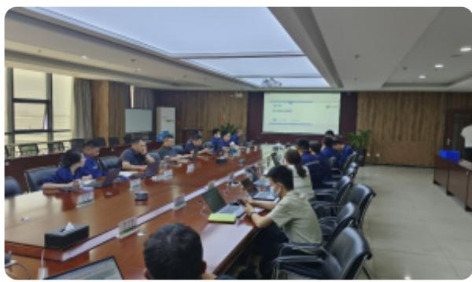

natural_image

Interior view of a conference room with attendees seated around a long table, facing a presentation screen (no visible text or signage)

中高层廉洁培训

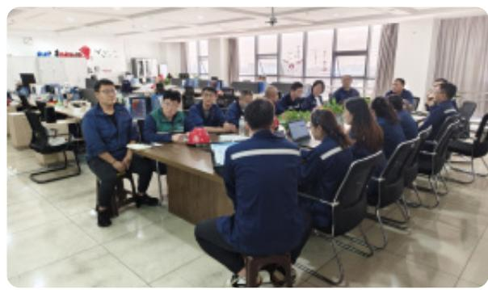

natural_image

Group of people in blue uniforms seated around a conference table in an office setting (no visible text or signage)

部门内部廉洁管理专项培训

## 案例杉杉负极四川工厂开展廉洁文化活动，树立底线思维

2025 年 8 月，杉杉负极四川工厂围绕廉洁文化建设面向全体员工开展系列活动。通过组织廉洁规则、“八项禁令”及典型案例培训，并开展廉洁知识竞赛，以多样化形式推动制度宣贯与理解。同时，组织全员签署廉洁承诺，进一步明确行为边界，强化底线思维，构筑廉洁文化底色。

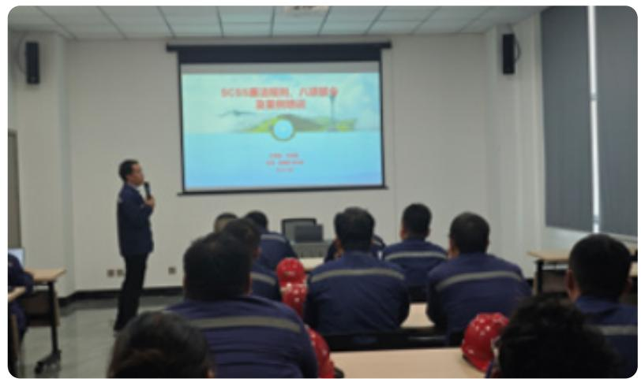

text_image

5C/5A立法规则，八项基金
及案例情况

四川工厂廉洁文化培训

## 举报途径及保护

公司高度重视对内外部舞弊及不道德行为的监督与约束，建立了规范的举报投诉机制和多元化反馈渠道，鼓励员工及相关方对发现的违规行为进行善意举报。公司制定并持续完善《举报专项事项督查制度》，明确举报受理流程及奖励措施，提升举报机制的有效性与透明度。

同时，公司建立健全举报人保护及反报复机制，对善意举报人及相关证人实施严格保护，确保其不会因举报行为受到不公正对待。对于任何形式的打击报复行为，公司均予以严肃处理，情节严重的将解除劳动关系，涉嫌违法犯罪的依法移送司法机关处理，切实维护企业合规运营环境。

## 举报途径

## 举报电话

13777992677

## 举报邮件

jubao-ssgf@shanshan.com

## 举报地址

浙江省宁波市鄞州区日丽中路 777号杉杉大厦28楼（审计监察部负责人收）

## 指标和目标

公司致力于构建诚实守信、公平公正、廉洁自律的经营环境，持续健全常态化廉洁风险排查机制，提升员工商业道德培训质效。报告期内，公司未发生经司法机关或监管机构认定的商业贿赂、腐败等违法违规案件，未出现因违反商业道德引发的重大行政处罚及相关法律纠纷。

## 报告期内

公司累计开展廉洁管理培训

58 场次

员工人均参训时长

1 小时

注：廉洁从业相关可比绩效详见“关键绩效表”。

## 公平竞争

公司高度重视反垄断与反不正当竞争管理，依据《中华人民共和国反垄断法》、《中华人民共和国反不正当竞争法》等法律规定，制定并实施《反垄断、反不正当竞争管理》制度，规范经营行为，维护公平有序的市场竞争环境。公司重点围绕主要业务领域和关键环节开展风险识别与评估，防范虚假宣传商业贿赂等不正当竞争行为。

在具体管理过程中，公司将反垄断与反不正当竞争要求融于合同审批、交易审查过程中，同时通过自查、举报渠道及外部监管协同，持续强化合规执行力度，致力营造规范透明的竞争环境。

## 报告期内

公司 未发生因不正当竞争导致的诉讼/行政处罚事件。

natural_image

Gavel resting on a wooden gavel beside an open book and a balance scale, no visible text or symbols.

## 守护信息安全

公司高度重视信息安全管理，严格遵循《网络安全法》《数据安全法》等法律法规及相关国际标准，建立了完善的信息安全治理体系，通过制度规范、技术防护、人员培训与应急演练相结合的方式，保障客户、合作伙伴及企业自身的数据安全。

## 关键证书（部分展示）

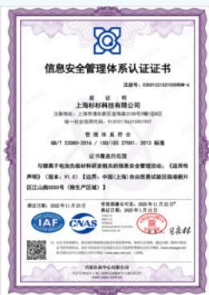

text_image

信息安全管理体系认证证书
注册号：030012210210008M-6
证照
上海科技有限公司
注册地址：上海市浦东新区东方路154号1幢10楼
统一社会信用代码：91310115101901907
管理体系符合
GB/T 22080-2016 / 100/IEC 27001、2013 标准
证书覆盖范围
与锂离子电池负极材料研发相关的信息安全管理理论：《适用性声明》（副本、V1.0）及附件，中国（上海）自由贸易试验区临港新片区江山山路550号（“临港五区”））
请正核，2020年11月22日
ISSN 2020年11月22日
ISSN 2020年11月22日
ISSN 2020年11月22日
ISSN 2020年11月22日
ISSN 2020年11月22日
ISSN 2020年11月22日
ISSN 2020年11月23日
ISSN 2020年11月23日
ISSN 2020年11月23日
ISSN 2020年11月23日
ISSN 2020年11月23日
ISSN 2020年11月24日
ISSN 2020年11月24日
ISSN 2020年11月24日
ISSN 2020年11月25日
ISSN 2020年11月25日
ISSN 2020年11月25日
ISSN 2020年11月26日
ISSN 2020年11月26日
ISSN 2020年11月27日
ISSN 2020年11月27日
ISSN 2020年11月28日
ISSN 2020年11月28日
ISSN 2020年11月30日
ISSN 2020年11月30日
ISSN 2020年12月3日
ISSN 2020年12月3日
ISSN 2020年12月4日
ISSN 2020年12月4日
ISSN 2020年12月5日
ISSN 2020年12月5日
ISSN 2020年12月6日
ISSN 2020年12月6日
ISSN 2020年12月7日
ISSN 2020年12月7日
ISSN 2020年12月8日
ISSN 2020年12月8日
ISSN 2020年12月9日
ISSN 2020年12月9日
ISSN 2020年12月10日
ISSN 2020年12月10日
ISSN 2020年12月13日
ISSN 2020年12月13日
ISSN 2020年12月14日
ISSN 2020年12月14日
ISSN 2020年12月15日
ISSN 2020年12月15日
ISSN 2020年12月16日
ISSN 2020年12月16日
ISSN 2020年12月19日
ISSN 2020年12月19日
ISSN 2020年12月19日
ISSN 2020年12月19日
ISSN 2020年12月3日
ISSN 2020年12月3日
ISSN 2020年12月4日
ISSN 2020年12月4日
ISSN 2020年12月5日
ISSN 2020年12月5日
ISSN 2020年12月6日

杉杉负极ISO 27001 信息安全管理体系认证

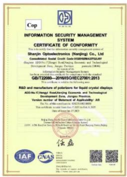

text_image

INFORMATION SECURITY MANAGEMENT SYSTEM
CERTIFICATE OF CONFORMITY
The International Development and Supervision of Shanjin Optoelectronics (Nanjing) Co., Ltd.
Consolidated Social Credit Code/ISSN201824257014Y
Registration: 2019/11/30 (Stage 1): Financial Services and Technologies Development Zone, Zone, Periodic, periodic (2004)
Information Security Management Board
GB/T22000-2016/ISOEC27001-2013
R&D and manufacture of polymers for liquid crystal displays
AGD No.272899 Road/Eaking Economic and Technological Development Zone, Indices, Province
Version number of Statement of Applicability A/R
The Official Registration Number: 2019/11/30 to 2020/11/29
The certificate is issued by: 17-03-2020
Date of Issue: July 28, 2020
Jia Jie
IAAF GVS
© 2020-03-01
www.ijf.com.cn
© 2020-03-01
© 2020-03-01

杉金光电ISO 27001 信息安全管理体系认证

## 数据安全管理体系

公司制定并实施了《信息安全政策》《信息系统访问管理》《信息安全事件管理规定》《信息安全管理手册》等一系列管理制度，明确了隐私保护和信息安全方面的行为规范。在管理架构方面，公司建立由总经理牵头的信息安全管理组织架构，形成“决策一管理监督一执行”的三层管理体系，统筹推进信息安全相关工作。

同时，公司建立PDCA闭环管理机制，定期开展信息安全风险评估与内部审核，对信息安全管理体系运行情况进行持续监控与改进，确保信息安全管理体系稳定、有效运行。

## 决策层

信息安全领导小组

## 管理监督层

信息安全管理小组

## 执行层

全体员工

信息安全组织框架

## 报告期内

公司发生重大信息安全事件

0 件

发生的客户隐私泄露事件

0

## 信息安全管理措施

公司围绕信息安全风险防控与管理能力提升，组建了具备多元专业背景的信息安全管理团队，系统开展数据安全相关工作。通过推进数据安全策略落地、强化信息安全事件响应与处置、开展员工培训与宣贯，以及实施数据风险评估与监控，并对数据备份、更新销毁及恢复等环节进行规范管理，构建起覆盖全流程的信息安全保障体系。

同时，公司建立健全信息安全事件应急响应机制，针对特定突发信息安全事件制定应急预案，明确事件分级标准、应急响应流程及责任分工。

## 数据安全策略制定与执行

依据国家法律法规、行业标准以及公司内部规定，制定详细的数据安全策略和操作规程，并确保其在公司各部门得到有效执行。  
定期对策略和规程进行评估和更新，以适应不断变化的安全环境。

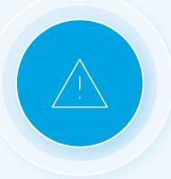

## 数据风险评估与监控

运用专业的工具和方法，对公司数据资产进行全面的风险评估，识别潜在的数据安全风险点。  
建立实时监控机制，对数据的访问、传输、存储等环节进行持续监控，及时发现并预警异常情况。

## 数据安全事件响应与处置

制定完善的数据安全事件应急预案，当发生数据安全事件时，能够讯速响应，采取有效的措施进行处置，最大限度地降低事件造成的损失和影响。  
对事件进行深入调查和分析，总结经验教训，完善防范措施。

## 员工数据安全培训与教育

●组织开展数据安全培训和教育活动，提高全体员工的数据安全意识和操作技能。通过培训，使员工了解数据安全的重要性，掌握基本的数据安全防范措施，避免因人为因素导致的数据安全事故。

信息安全管理措施

## 报告期内

公司开展信息安全应急演练

18 次

信息安全与隐私保护培训

21 场

## 案例 杉金光电（南京）开展钓鱼邮件应急演练，提升全员网络安全响应能力

2025年11月，杉金光电（南京）组织0A运维人员、网络工程师等相关IT人员开展了针对钓鱼邮件攻击的网络安全应急演练。演练模拟员工误点恶意链接导致信息泄露，触发应急响应流程，有效检验并提升了公司对网络攻击事件的快速响应、协同处置与系统恢复能力，增强了员工的安全防范意识，强化了整体信息安全防护体系。

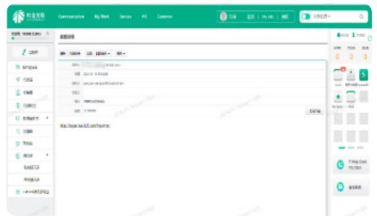

text_image

社会光临
Communication
My Work
Service
HIS
Commerce
用户登录
用户登录
首页
首页
API/SEA
FUSEA
VMB
TURBO
IP地址
35088
TPSIA
26118
KunESU
PPTC
http://www.163.com/
http://www.163.com/
http://www.163.com/
http://www.163.com/
http://www.163.com/
http://www.163.com/
http://www.163.com/
http://www.163.com/
http://www.163.com/
http://www.163.com/
http://www.163.com/
http://www.163.com/
https://www.163.com/
http://www.163.com/
http://www.163.com/
http://www.163.com/
http://www.163.com/
http://www.163.com/
http://www.163.com/
http://www.163.com/
http://www.163.com/
http://www.163.com/
http://www.163.com/
http:/www.163.com/
http:/www.163.com/
http:/www.163.com/
http:/www.163.com/
http:/www.163.com/
http:/www.163.com/
http:/www.163.com/
http:/www.163.com/
http:/www.163.com/
http:/www.163.com/
http:/www.163.com/
http:/ www.163.com/
http:/ www.163.com/
http:/ www.163.com/
http:/ www.163.com/
http:/ www.163.com/
http:/ www.163.com/
http:/ www.163.com/
http:/ www.163.com/
http:/ www.163.com/
http:/ www.163.com/
http:/ www.163.com/
http:/ www, 163.com/
http://www.163.com/
http://www.163.com/
http://www.163.com/
http://www.163.com/
http://www.163.com/
http://www.163.com/
http://www.163.com/
http://www.163.com/
http://www.163.com/
http://www.163.com/
http://www. 163.com/
http://www. 163.com/
http://www. 163.com/
http://www. 163.com/
http://www. 163.com/
http://www. 163.com/
http://www. 163.com/
http://www. 163.com/
http://www. 163.com/
http://www. 163.com/
http://www.163.com/
http://www. 163.com/
http://www. 163.com/
http://www. 163.com/
http://www. 163.com/
http://www. 163.com/
http://www. 163.com/
http://www. 163.com/
http://www. 163.com/
http://www. 49999999999999999999999999999999999999999999999999999999999999999999999999999999999999999999999999999<nl>

模拟收到钓鱼邮件

## 案例|杉杉负极开展信息安全应急演练，提升网络风险处置能力

2025年10月，杉杉负极IT部组织开展信息安全应急演练，模拟病毒入侵场景，重点检验公司在信息安全事件中的响应与处置能力。演练围绕异常发现与上报、应急响应启动以及病毒控制与系统恢复等关键环节展开，各相关部门按照预案分工协同开展处置工作通过采取网络隔离、病毒检测与清除等措施，有效控制风险并恢复系统运行，进一步提升了员工信息安全意识和应急协同能力，强化了公司整体信息安全防护水平。

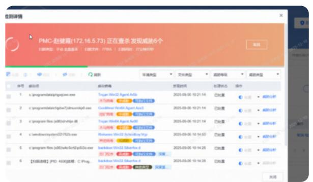

text_image

PMC-赵健霜(172.16.5.73)正在竞杀发现威胁5个
主题类型: 平安、北京港务 | 主脑文件: 77986 | 主脑网别: 27208679P
序号	感应项	成功病毒	发现时间	处理状态	操作
1	c:\programdata\pgapoe.exe	Trigan Win32 Agent AGb	2025-09-05 10:21:14	已处置	□ 否□	□ 删除分析
2	c:\programdata\ghwa7\dmurund4d.exe	Trigan Win32 Agent AGc	2025-09-05 10:21:14	已处置	□ 否□	□ 删除分析
3	c:\program files\xd8\cdxHpa DR	Trigan Win32 Agent AGa	2025-09-05 10:21:14	已处置	□ 否□	□ 删除分析
4	c:\webdown\iyen32\752b.exe	Retaware Win32 Schering Vga	2025-09-05 10:14:50	已处置	□ 否□	□ 删除分析
5	c:\program files\xd8\wefcScnQ\qfsG3a.exe	backbox Win32 SilverBox.d	2025-09-05 10:14:26	已处置	□ 否□	□ 删除分析
6	[对战抢修] [FID] 4XK抢修 C:\Prog	backbox Win32 SilverBox.d	2025-09-05 10:14:26	已处置	□ 否□	□ 删除分析
关闭

病毒事件应急处理

## 客户隐私保护措施

公司始终将客户隐私保护视为企业诚信经营的基本要求，在产品研发、销售服务及供应链管理等环节，严格落实客户信息保护措施。报告期内，公司持续强化客户隐私保护体系建设，并通过专项培训提升员工隐私保护意识与实操能力

## 案例 开展网络安全培训，强化客户信息保护意识

2025年4月，杉杉负极组织开展网络安全意识培训，围绕员工日常工作场景，系统讲解数据保护、密码管理、计算机与邮件安全、手机安全及社会工程防范等内容，并结合真实案例与电信诈骗分析进行讲解。通过培训，员工对信息安全风险的识别与防范能力得到提升，进一步规范了日常信息处理和数据管理行为，有效强化了公司对客户信息和数据安全的保护意识，降低因人为疏忽导致信息泄露的风险。

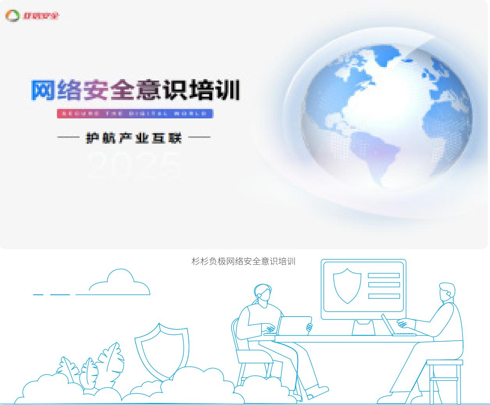

## 低碳发展生态共生

## 理念

公司坚持绿色发展理念，将环境保护融入企业运营与管理全过程，通过持续完善环境管理体系，积极应对气候变化，强化资源高效利用与污染防治管理，不断加大环保投入，推动生产经营向绿色、低碳方向转型。公司在提升经济效益的同时，推动环境价值与社会价值的协同创造，努力推动企业与生态环境的协调发展。

## 我们的行动

应对气候变化 39  
环境合规管理 44  
高效资源利用 47  
深化三废控制 55  
倡导绿色运营 61

natural_image

Scenic landscape with a large lake, forested hills, and wind turbines under a clear blue sky (no text or symbols visible)

## 应对气候变化

在全球气候变化挑战日益加剧的背景下，杉杉股份积极响应国家“双碳”战略要求，将应对气候变化纳入企业可持续发展管理体系，持续推进温室气体排放管理与低碳转型实践。鉴于公司各子公司及生产基地分布广泛，不同地区在业务类型、能源结构及排放源等方面存在差异，公司在统一气候治理框架下，结合各单位实际情况制定差异化的减碳目标和实施路径，以提升目标的适配性和可执行性。围绕治理、战略、影响、风险和机遇管理以及指标和目标等方面，公司系统推进气候变化相关管理工作，推动企业实现绿色低碳发展。

## 治理

公司高度重视气候变化治理，将温室气体管理纳入企业可持续发展战略，在可持续发展(ESG）委员会的指导下，建立系统化的气候治理架构，确保碳管理和减排工作与战略决策紧密衔接。在此架构下，杉杉负极在各工厂成立温室气体(GHG)盘查推行委员会，统筹各工厂的碳排放管理和减排行动，推动双碳目标落地至生产运营的各环节。委员会下设盘查执行组和查证组，负责温室气体盘查、数据核查及监督执行工作，同时领导各职能部门协同开展碳管理任务，确保各项减碳措施有序、有效实施。

各工厂根据自身生产，能源使用及排放特点，制定《节能减排规意制度》，明确节能减排管理责任，操作规范及考核机制形成覆盖生产运营全过程的减碳管理体系。

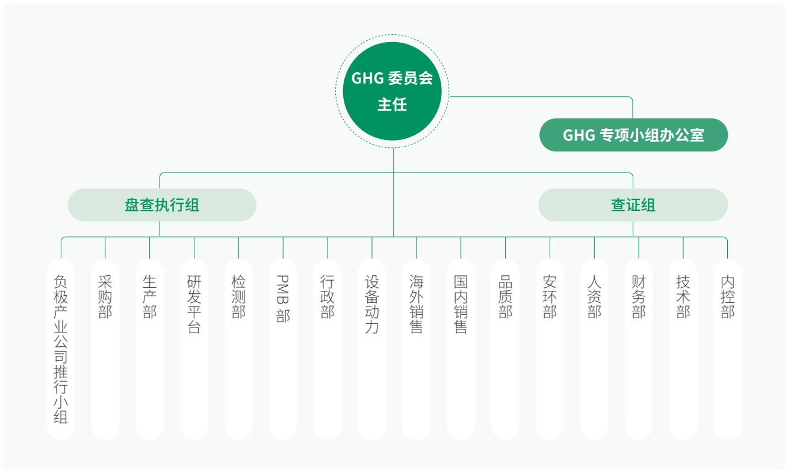

flowchart

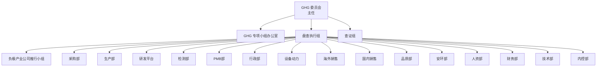
```mermaid
graph TD
  A["GHG 委员会\n主任"] --> B["GHG 专项小组办公室"]
  A --> C["盘查执行组"]
  A --> D["查证组"]
  C --> E["负极产业公司推行小组"]
  C --> F["采购部"]
  C --> G["生产部"]
  C --> H["研发平台"]
  C --> I["检测部"]
  C --> J["PMB部"]
  C --> K["行政部"]
  C --> L["设备动力"]
  C --> M["海外销售"]
  C --> N["国内销售"]
  C --> O["品质部"]
  C --> P["安环部"]
  C --> Q["人资部"]
  C --> R["财务部"]
  C --> S["技术部"]
  C --> T["内控部"]
```

杉杉负极GHG盘查推行委员会

## 战略

为积极应对气候变化带来的潜在影响，公司结合自身业务特点和行业发展趋势，对气候变化相关风险与机遇开展系统识别与评估，从政策与法规、技术创新、极端气候等方面分析其对公司经营发展的潜在影响，并制定相应管理措施，以提升企业应对气候变化风险的能力并把握低碳转型带来的发展机遇。

<table><tr><td>风险类型</td><td>风险描述</td><td>影响周期</td><td>发生概率</td><td>财务影响内容</td><td>应对措施</td></tr><tr><td>急性风险</td><td>极端气候事件(如暴雨、洪水、台风、高温等)可能对公司生产基地、仓储设施及物流运输造成影响,导致生产中断、设备损坏或供应链延误。</td><td>短期</td><td>中</td><td>极端天气导致厂区设施受损或生产停工,可能带来设备维修费用、生产延误及供应链成本上升。</td><td>加强气候相关风险监测与评估,完善厂区防洪、防高温等基础设施建设;建立突发事件应急预案;通过供应链多元化和库存管理降低生产中断风险。</td></tr><tr><td>慢性风险</td><td>气候变化导致长期气温上升、水资源分布变化等慢性环境变化,可能影响生产运营中的能源与水资源需求,并对设备运行效率产生影响。</td><td>中长期</td><td>中</td><td>长期气候变化可能提高能源和水资源使用成本,增加生产运营成本。</td><td>持续推进节能降耗和水资源管理措施,优化生产工艺与设备效率;增加可再生能源使用比例;通过清洁生产和技术升级降低资源消耗强度。</td></tr><tr><td>政策与法规风险</td><td>随着国家“双碳”政策推进,碳排放管理制度不断完善,碳交易、碳税或更严格的排放标准可能提高企业碳排放成本。</td><td>中长期</td><td>中</td><td>若碳成本上升或排放管控趋严,可能增加企业运营成本及环保投入。</td><td>建立温室气体管理体系,开展碳排放盘查;制定减碳目标;推进节能技改、清洁能源替代等措施降低排放强度。</td></tr><tr><td>技术风险</td><td>随着新能源与绿色制造技术快速发展,若企业在低碳技术和绿色产品方面创新不足,可能影响市场竞争力。</td><td>中长期</td><td>中</td><td>可能导致市场份额下降或研发投入增加,影响企业盈利能力。</td><td>持续加大绿色技术研发投入,推进绿色产品设计与低碳制造,推动产品碳足迹管理。</td></tr><tr><td>市场风险</td><td>下游客户对产品碳足迹和绿色制造要求不断提升,若企业未能及时响应,可能影响市场竞争力。</td><td>中长期</td><td>中</td><td>可能影响订单获取或客户合作关系,对收入增长产生一定影响。</td><td>推进产品碳足迹核算和生命周期管理,获得相关认证(如ISO 14067等),提升绿色产品竞争力。</td></tr><tr><td>机遇类型</td><td>机遇描述</td><td>影响周期</td><td>发生概率</td><td>财务影响内容</td><td>应对措施</td></tr><tr><td>技术创新与效率提升机遇</td><td>推进节能减排技术和生产工艺创新,可提升能源利用效率并减少排放。</td><td>中长期</td><td>高</td><td>通过技术升级降低生产成本,提高生产效率,增强企业长期竞争力。</td><td>持续加大环保及低碳技术研发投入,推进节能技改和绿色制造技术应用。</td></tr><tr><td>新能源产业发展机遇</td><td>全球能源结构向低碳转型,新能源汽车及储能产业快速发展,对锂电池材料需求持续增长,为公司负极材料业务带来广阔市场空间。</td><td>长期</td><td>高</td><td>有助于提升负极材料产品销量及市场份额,促进营业收入增长。</td><td>持续提升负极材料研发能力和产能布局,加强技术创新,巩固在新能源材料领域的竞争优势。</td></tr></table>

应对气候变化风险识别  
应对气候变化针机遇识别

## 影响、风险和机遇管理

为有效应对气候变化带来的潜在影响，公司通过持续识别、评估和应对气候相关风险与机遇，提升在低碳转型背景下的适应能力和发展韧性。

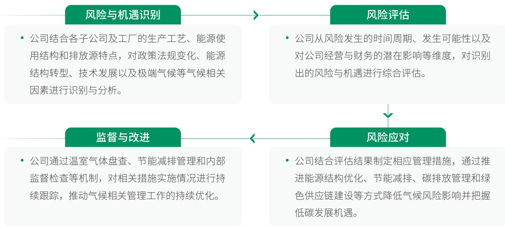

flowchart

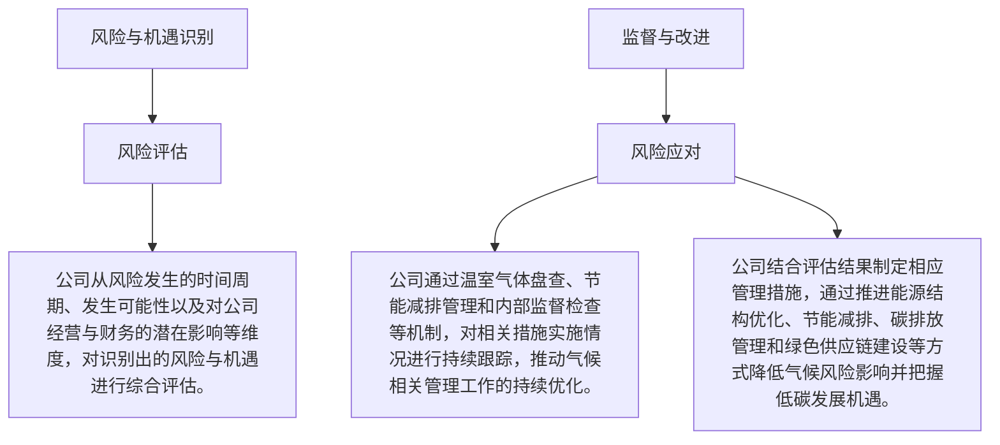
```mermaid
graph TD
  A["风险与机遇识别"] --> B["风险评估"]
  B --> C["公司从风险发生的时间周期、发生可能性以及对公司经营与财务的潜在影响等维度，对识别出的风险与机遇进行综合评估。"]
  D["监督与改进"] --> E["风险应对"]
  E --> F["公司通过温室气体盘查、节能减排管理和内部监督检查等机制，对相关措施实施情况进行持续跟踪，推动气候相关管理工作的持续优化。"]
  E --> G["公司结合评估结果制定相应管理措施，通过推进能源结构优化、节能减排、碳排放管理和绿色供应链建设等方式降低气候风险影响并把握低碳发展机遇。"]
```

影响、风险和机遇识别流程

## 应对气候变化措施

在气候相关风险与机遇管理机制的指导下，杉杉股份结合各子公司业务特点，持续推进低碳发展实践，通过技术创新能源结构优化、绿色供应链建设及产品全生命周期碳管理等多方面举措，积极控制和减少温室气体排放，不断提升企业应对气候变化的能力，推动公司运营向绿色低碳方向转型。

## 杉杉负极减碳方针

●坚持绿色、循环、低碳的发展理念，通过应用新工艺、新技术、新装备和新材料，提高资源利用效率，推动建设资源节约型、环境友好型生产基地。  
•	 逐步提升清洁能源使用比例，积极利用水电、风电、太阳能及生物质能等可再生能源，并积极参与绿色电力交易，持续扩大绿电使用规模，降低生产过程中的碳排放强度。  
•携手上下游合作伙伴开展碳足迹管理工作，推动原材料品质优化和原材料消耗减量化，并将碳排放指标纳入供应商管理体系，推动供应链低碳发展。  
•积极与行业伙伴共同探索节能降碳举措，在持续推进减排的同时，通过碳抵消等方式对部分难以避免的排放进行中和。

## 杉金光电减碳方针

持续加大环保科研投入，在生产运营过程中推进节能减排与低碳技术应用，并通过使用光伏等可再生能源，推动生产过程向绿色低碳方向转型。  
•践行“减碳”行动，推动绿色责任供应链建设，鼓励供应链伙伴共同参与节能降碳实践，提升产业链整体的低碳发展水平。  
●依据ISO14044和ISO14067等国际标准，对产品“从摇篮到大门”的全过程开展生命周期评价和碳足迹管理持续识别并降低产品全生命周期的碳排放

## 案例 杉杉负极绿色工厂建设推动制造环节低碳转型

2025年，杉杉负极新增3家省级以上绿色工厂。其中，杉杉负极宁波工厂获评浙江省绿色低碳工厂，青山工厂、九原工厂获评内蒙古自治区绿色制造示范单位。目前公司累计拥有国家级绿色工厂2家、省级绿色工厂4家。相关工厂在设计、建设、生产和管理等环节持续推进节能降碳与资源高效利用，优化生产过程的绿色化水平，推动绿色制造体系不断完善，为企业低碳制造与可持续发展提供支撑。

## 案例杉杉负极绿电应用提升生产用能低碳水平

2025年，杉杉负极持续提升清洁能源使用比例，各工厂积极参与绿电交易并推进可再生能源应用，全年绿电交易量达2.665.515.01兆瓦时，在生产用能结构优化方面形成示范。

## 关键绩效

截至2025年12月31日，公司共 项产品取得ISO14044 生命周期评价核查声明书。

截至2025年12月31日，公司共 项产品取得|SO14067产品碳足迹证书，较去年新增 项

## 指标和目标

公司积极响应国家“双碳”战略，坚持以能源管理推动温室气体减排的发展方针，持续完善碳排放管理体系，并设定和公开承诺具有前瞻性的减碳目标。公司结合不同业务板块和生产基地的实际情况，制定分层分类的减碳目标。其中，杉杉负极结合自身发展规划，以2023年为基准年制定碳减排目标，并将目标进一步分解至各生产工厂，形成覆盖生产运营各环节的中长期减碳与可持续发展规划：杉金光电同样设定并公开碳目标，制定减排及可持续发展的行动方针，稳步推进碳中和目标的实现。

双碳目标

<table><tr><td>杉杉负极</td><td>以2023年为基础,主要产品的产品碳足迹逐年下降3%(2025年目标已完成);到2050年实现运营(范围一、范围二)碳中和;到2060年实现价值链(范围一、范围二、范围三)碳中和。</td></tr><tr><td>杉金光电</td><td>2050年全面实现碳中和。</td></tr></table>

为确保碳排放数据的准确性和目标实施的有效性，公司持续开展温室气体核查工作，每年完成ISO14064温室气体清册编制、报告编制及第三方核查取证，不断提升碳排放管理的规范化与透明度，为公司减碳目标的持续推进提供数据支持。

<table><tr><td rowspan="2"></td><td colspan="2">2025年度</td></tr><tr><td>杉杉负极</td><td>杉金光电</td></tr><tr><td>温室气体排放范围一( $tCO_2e$ )</td><td>16,893.65</td><td>9,341.11</td></tr><tr><td>温室气体排放范围二( $tCO_2e$ )</td><td>2,059,860.59</td><td>94,673.91</td></tr><tr><td>温室气体排放范围三( $tCO_2e$ )</td><td>3,295,791.95</td><td>4,095.83</td></tr><tr><td>温室气体排放总量(范围一+范围二)( $tCO_2e$ )</td><td>2,076,754.24</td><td>104,015.02</td></tr><tr><td>温室气体排放强度(范围一+范围二)( $tCO_2e/万元营收$ )</td><td>2.05</td><td>0.091</td></tr></table>

注:公司温室气体排放核算参照《温室气体核算体系(GHGProtocol)》及国家相关标准开展，排放因子优先采用国家发布的电力排放因子及行业通用系数。

## 环境合规管理

杉杉股份严格遵守《中华人民共和国环境保护法》《中华人民共和国大气污染防治法》《中华人民共和国水污染防治法》等环境保护相关法律法规，并参照ISO.14001环境管理体系要求持续完善环境管理制度体系。公司以“遵守法规、预防污染、以人为本、持续改善”为EHS管理方针，建立了涵盖《环境安全管理手册》 《环境与安全运行控制程序》《环境因素识别与更新控制程序》等在内的环境管理制度，通过制度化、标准化管理不断提升环境治理水平。报告期内，公司共有10个厂区获得ISO14001环境管理体系认证。

在组织架构方面，公司构建了分级负责、协同推进的环境管理体系。各分子公司及厂区总经理作为环境保护第一责任人，统筹本单位环境管理工作；安环部负责环保制度的执行监督、环保计划制定及相关措施落实，并建立覆盖公司管理层、职能部门及生产一线的环境管理网络。通过逐级落实环境管理职责并定期开展监督考核，公司持续保障环境管理体系的有效运行。

关键绩效  
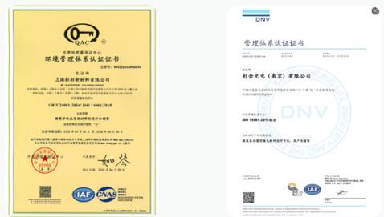

text_image

QAC
中国建筑集团认证中心
环境管理体系认证证书
注册号：916200000000000000
上海新时新材料有限公司
注册地址：上海市浦东新区东方路188号3幢3层
办公地址：上海市浦东新区东方路188号3幢3层
法定代表人：周明
注册资本：人民币壹亿肆仟叁佰零拾元整
经营范围：许可项目：建筑材料、五金交电、化工产品（不含危险化学品）的进出口业务。
DNV
管理体系认证证书
创新光电（南京）有限公司
DNV
管理体系认证证书
创新光电（南京）有限公司
DNV
管理体系认证证书
创新光电（南京）有限公司
DNV
管理体系认证证书
创新光电（南京）有限公司
DNV
管理体系认证证书
创新光电（南京）有限公司
DNV
管理体系认证证书
创新光电（南京）有限公司
DNV
管理体系认证证书
创新光电（南京）有限公司
DNV
管理体系认证证书
创新光电（南京）有限公司
D NV

ISO 14001环境管理体系认证证书

报告期内，公司环保投入共计

12,339.29万 万元

## 环境风险管理

公司持续强化环境风险识别与管控机制，建立了包括《环境风险排查及隐患整改制度》《环境保护监测管理制度》在内的管理制度，对环境风险进行系统识别、评估与管理。针对新建、改建及扩建项目，公司严格执行环境影响评价程序从源头确保项目建设和运营符合环境保护相关要求。

在日常运营中，公司结合生产工艺、设备设施、原辅材料使用以及污染物产生和排放情况，对潜在环境风险源进行识别与评估，明确企业环境风险等级，并制定相应的风险防控措施。同时，公司持续开展环境隐患排查，并加强对环保设施的巡检、维护和保养，确保环保设施稳定运行，推动环境风险隐患的及时整改与闭环管理。

natural_image

Green hillside with a single tree under a soft sky, no text or symbols visible

## 环境应急管理

为提高突发环境事件应对能力，公司制定并持续完善《突发环境事件应急预案》，明确应急响应程序、职责分工和处置措施，以确保在突发情况下能够迅速组织应急处置，降低环境影响并保障员工生命财产安全。

公司建立了由主要负责人牵头的环境应急组织体系，总经理担任应急总指挥，负责应急救援工作的统一指挥与协调。应急体系下设抢险救援、疏散隔离与安全保卫、物资保障与运输、医疗救护及善后处理等专项工作小组，形成职责明确、协同高效的应急管理机制。同时，公司每年至少开展一次突发环境事件应急演练，并根据演练结果持续优化应急管理流程和应对措施。

## 案例杉杉负极郴州工厂开展危险废物泄漏应急演练，强化环境风险防控能力

2025年6月，杉杉负极郴州工厂组织开展危险废物液态烃泄漏应急演练。演练模拟液态烃储罐底部阀门老化导致少量液态烃泄漏的情景，全体参与人员按照预案开展现场警戒、人员疏散、阀门关闭及设备抢修等处置工作，并对厂区周边环境进行监测。通过本次演练，进一步检验公司危险废物泄漏应急预案的可行性，提升员工应急处置和协同配合能力，强化环境风险防控意识。

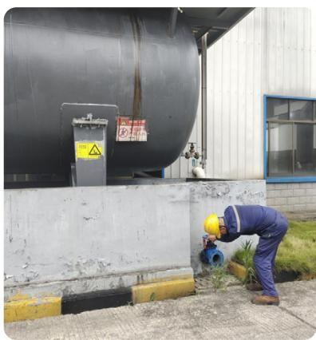

natural_image

Worker in blue uniform and yellow helmet inspecting a large industrial tank with warning symbols (no visible text or labels)

确认应急收集池的阀门是否处于关闭状态

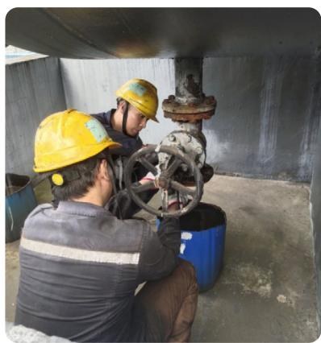

natural_image

Two workers in hard hats inspecting a large industrial valve inside a concrete structure (no visible text or symbols)

抢修组安装密封盲板

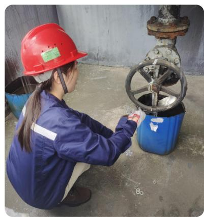

natural_image

Worker in blue uniform and red hard hat operating industrial valve on concrete floor (no visible text or symbols)

监测组采样化验

## 环保培训贯宣

公司注重提升员工的环境保护意识和专业能力，定期开展系统化环保培训和宣传活动。培训内容主要涵盖环保法律法规、废气与废水处理设备的理论与操作、固废处置管理以及环境保护宣传等方面，覆盖管理层、职能部门及生产一线员工。通过培训和宣传，公司不断提升员工在环境管理、节能减排及资源循环利用方面的意识和实践能力，推动企业整体环境管理水平的持续提升。

## 案例杉杉负极宁波工厂开展“无废工厂”建设培训，提升绿色生产管理水平

2025年6月，杉杉负极宁波工厂组织开展“无废工厂”建设专题培训，培训时长2小时，共有25名员工参加。培训围绕“无废城市”理念、相关法律法规要求以及企业环境管理基本要求等内容展开讲解，引导员工在生产过程中注重资源节约和废弃物减量管理，进一步提升员工对“无废工厂”建设的认识，强化环境保护与管理意识推动企业绿色生产和持续改进。

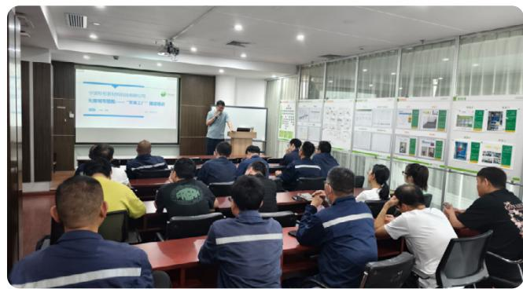

text_image

Classroom lecture scene with presenter and attendees, screen displaying company name and slogan about 'China National Petroleum Corporation'

无废工厂培训

## 案例|杉杉负极四川工厂开展环境日培训，推动厂区绿色行动

2025年6月，杉杉负极四川工厂以“美丽中国我先行”为主题，由安环部组织开展世界环境日专题培训，培训时长2小时，共20名员工参与。培训通过宣讲环境保护理念及企业环保管理要求，指导员工在生产过程中关注资源节约与污染防治，提升员工的环保意识和环境管理能力。

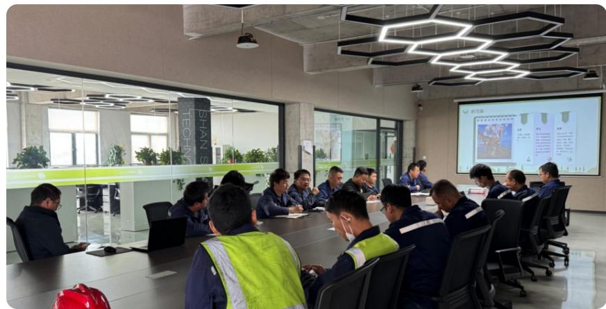

natural_image

Interior of a modern office meeting room with attendees seated around a conference table, no visible text or signage on the participants or surroundings.

“美丽中国我先行”专题环保培训

## 清洁生产

公司将清洁生产理念融入日常运营管理，通过持续加大环保投入和推进清洁生产方案实施，不断提升资源利用效率和污染防治水平，推动实现“节能、降耗、减污、提效”的目标。公司按照清洁生产相关要求开展清洁生产审核，杉杉负极相关工厂已完成清洁生产审核并形成《清洁生产审核报告》，通过系统识别生产过程中资源消耗和污染物产生的关键环节，持续挖掘节能减排潜力，推动清洁生产措施的落实与改进

## 高效资源利用

杉杉股份积极践行绿色发展理念，在能源利用、水资源管理及循环经济等方面持续推进资源节约与高效利用。公司通过完善管理体系、优化生产工艺和加强资源循环利用，不断提升能源与水资源使用效率，减少生产过程中的资源消耗和废弃物产生，推动企业运营向资源节约型和环境友好型方向发展。

## 能源利用

公司秉持“规范管理，节能增效：遵纪守法、持续改进”的能源方针，持续完善能源管理体系建设。公司致力于提升能源管理水平，不断增加获得ISO50001 能源管理体系认证的工厂数量，同时结合技术创新、管理优化和清洁能源应用，推动各子公司和生产基地在节能降耗、效率提升和可持续发展方面取得稳步进展。

## 关键荣誉

截至2025年12月31日，公司共6个厂区获得ISO50001能源管理体系认证证书。

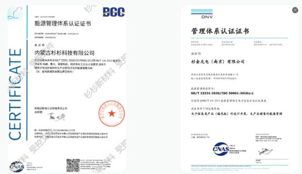

text_image

BGC
能源管理体系认证证书
内蒙古杉杉科技有限公司
DNV
管理体系认证证书
CAE
认证机构：内蒙古杉杉科技有限公司
注册号：10000000000000000000000000000000000000000000000000000000000000000000000000000000000
DNV
杉金光电（南京）有限公司
中国证监会及深圳证券交易所审核通过了
统一社会信用代码：913219MA7LX2J52YJ3N
经营范围涉及企业登记、工商变更登记、营业执照注册等业务，涉及行政许可的凭许可证件经营。
经营范围涉及企业依法自主选择经营项目的经营活动，具体经营项目以相关部门批准文件或许可证件为准。
DNV
管理体系认证证书
CAE
认证机构：内蒙古杉杉科技有限公司
注册号：100000000000000000000000000000000000000
DNV
杉金光电（南京）有限公司
中国证监会及深圳证券交易所审核通过了
统一社会信用代码：913219MA7LX2J52YJ3N
经营范围涉及企业登记、工商变更登记、营业执照注册等业务，涉及行政审批的凭许可证件经营。
DNV
管理体系认证证书
CAE
认证机构：内蒙古杉杉科技有限公司
注册号：1000000000000000000000000000
DNV
杉金光电（南京）有限公司
中国证监会及深圳证券交易所审核通过了
统一社会信用代码：913219MA7LX2J52YJ3N
DNV
杉金光电（南京）有限公司
中国证监会及深圳证券交易所审核通过了
统一社会信用代码：913219MA7LX2J52YJ3N
DNV
杉金光电（南京）有限公司
中国证监会及深圳证券交易所审核通过了
统一社会信用代码：913219MA7LX2J52YJ3N
DNV
杉金光电（南京）
中国证监会及深圳证券交易所审核通过了
统一社会信用代码：913219MA7LX2J52YJ3N
DNV
杉金光电（南京）
中国证监会及深圳证券交易所审核通过了
统一社会信用代码：913219MA7LX2J52YJ3N
DNV
杉金光电（南京）
中国证监会及深圳证券交易所审核通过了
统一社会信用码：913219MA7LX2J52YJ3N
DNV
杉金光电（南京）
中国证监会及深圳证券交易所审核通过了
统一社会信用代码：913219MA7LX2J52YJ3N
DNV
杉金光电（南京）
中国证监会及深圳证券交易所审核通过了
统一社会信用代码：913219MA7LX2J64YJ3N
DNV
杉金光电（南京）
中国证监会及深圳证券交易所审核通过了
统一社会信用代码：913219MA7LX2J64YJ3N
DNV
杉金光电（南京）
中国证监会及深圳证券交易所审核通过了
统一社会信用代码：913219MA7LX2J64YJ3N
DNV
杉金光电（南京）有限公司
中国证监会及深圳证券交易所审核通过了
统一社会信用代码：913219MA7LX2J64YJ3N
DNV
杉金光电（南京）
中国证监会及深圳证券交易所审核通过了
统一社会信用代码：913219MA7LX2J64YJ3N
DNV
杉金光电（南京）
中国证监会及深圳证券交易所审核通过了
统一社会信用码：913219MA7LX2J64YJ3N
DNV
杉金光电（南京）
中国证监会及深圳证券交易所审核通过了
统一社会信用代码：913219MA7LX2J64YJ3N
DNV
杉金光电（南京）
中国证监会及深圳证券交易所审核通过了
统一社会信用代码：913219MA7LX2J84YJ3N
DNV
杉金光电（南京）
中国证监会及深圳证券交易所审核通过了
统一社会信用代码：913219MA7LX2J84YJ3N
DNV
杉金光电（南京）
中国证监会及深圳证券交易所审核通过了
统一社会信用代码：913219MA7LX2J84YJ3N
DNV
杉金光电（江苏）有限公司
中国证监会及深圳证券交易所审核通过了
统一社会信用代码：913219MA7LX2J84YJ3N
DNV
杉金光电（江苏）有限公司
中国证监会及深圳证券交易所审核通过了
统一社会信用代码：913219MA7LX2J84YJ3N
DNV
杉金光电（江苏）有限公司
中国证监会及深圳证券交易所审核通过了<nl>DNV认证证书编号：GD/T 233331-2020/ISO 55661-2818标准证编号：GD/T 233331-2828/ISO 55661-2818标准证编号：GD/T 233331-2828/ISO 55661-2818标准证编号：GD/T 233331-2828/ISO 55661-2818标准证编号：GD/T 233331-2828/ISO 55651-2818标准证编号：GD/T 233331-2828/ISO 55651-2818标准证编号：GD/T 233331-2828/ISO 55651-2818标准证编号：GD/T 233331-2828/ISO 55651-2818 标准证编号：GD/T 233331-2828/ISO 55651-2818 标准证编号：GD/T 233331-2828/ISO 55651-2818 标准证编号：GD/T 233331-2828/ISO 55651-2818 标准证书编号：GD/T 233331-2828/ISO 55651-2818 标准证书编号：GD/T 233331-2828/ISO 55651-2818 标准证书编号：GD/T 233331-2828/ISO 55651-2818 标准证书号编号：GD/T 233331-2828/ISO 55651-2818 标准证书编号：GD/T 233331-2828/ISO 55651-2818 标准证书编号：GD/T 233331-2828/ISO 55651-2818 标准证书号码编号：GD/T 233331-2828/ISO 55651-2818 标准证书号码编号：GD/T 233331-2828/ISO 55651-2818 标准证书号码编号：GD/T 233331-2828/ISO 55651-2818 标 准证书编号：GD/T 233331-2828/ISO 55651-2818 标准证书编号：GD/T 233331-2828/ISO 55651-2818 标准证书编号：GD/T 233331-2828/ISO 55651-2818 标准证号编号：GD/T 233331-2828/ISO 55651-2818 标准证号编号：GD/T 233331-2828/ISO 55651-2818 标准证号编号：GD/T 233331-2828/ISO 55651-2818 标 准证书编号：GD/T 233331-2828/ISO 55651-2818 标准证书编号：GD/T 233331-2828/ISO 55651-2818 标准证号编号：GD/T 233331-2828/ISO 55651-<nl>

杉杉负极（左）、杉金光电（右）ISO50001能源管理体系认证（部分展示）

## 治理

公司高度重视能源管理工作，将能源利用效率提升和节能降耗纳入企业运营管理体系。公司建立了《能源管理手册》《节能减排规意制度》等制度文件，明确能源管理原则职责分工及实施路径，为能源管理工作的规范化开展提供制度保障。

在管理架构方面，公司总经理作为能源管理最高管理者，负责批准并推动能源管理方案的实施，确保能源管理体系要求融入企业日常经营和业务流程。品质部、安环部、人事部、行政部、采购部、财务部、设备部、生产部、PMC部及技术部等相关职能部门协同参与能源管理工作，通过设定能源绩效指标并定期开展评估，持续推动能源管理体系的有效运行。

## 战略

公司结合自身能源使用情况，对能源管理和利用过程中可能面临的风险与机遇开展系统识别与评估，以建立、实施、保持和持续改进能源管理体系，实现能源方针

<table><tr><td>风险类型</td><td>风险描述</td><td>影响周期</td><td>发生概率</td><td>财务影响内容</td><td>应对措施</td></tr><tr><td>能源价格波动风险</td><td>电力、天然气等能源价格受宏观经济、能源供需关系及政策调控影响,可能出现波动,进而增加公司生产运营成本。</td><td>短中期</td><td>中</td><td>能源成本上升可能增加生产成本,对公司利润水平产生一定影响。</td><td>通过能源精细化管理和节能技术改造降低单位产品能耗;积极参与绿电交易并探索多元能源采购渠道。</td></tr><tr><td>技术升级风险</td><td>为提升能源利用效率,公司需持续推进节能设备更新及技术升级,可能带来一定资本投入压力。</td><td>中期</td><td>中</td><td>节能技改和设备更新需要一定资金投入,对资本支出产生影响。</td><td>制定节能改造规划,通过技术创新和设备升级逐步降低能耗水平,并提升长期运营效率。</td></tr><tr><td>能源设施运行风险</td><td>能源相关设备(如电力系统、动力设备等)运行异常或维护不到位,可能影响能源使用效率。</td><td>短中期</td><td>低</td><td>设备效率下降可能增加能源消耗,并带来额外维修成本。</td><td>加强设备巡检和维护管理,利用在线监控系统实时监测能源使用情况,及时发现和处理异常。</td></tr></table>

能源利用风险识别

<table><tr><td>机遇类型</td><td>机遇描述</td><td>影响周期</td><td>发生概率</td><td>财务影响内容</td><td>应对措施</td></tr><tr><td>能源效率提升机遇</td><td>通过持续推进节能技术改造、设备升级和工艺优化,公司可进一步降低单位产品能耗,提高能源利用效率。</td><td>中长期</td><td>高</td><td>能耗水平下降有助于降低生产成本,提升整体运营效率和盈利能力。</td><td>持续推进节能技改项目,优化生产工艺,加强能源管理体系运行和能源绩效评估。</td></tr><tr><td>能源管理能力提升机遇</td><td>通过完善能源管理制度、开展培训与宣传活动,可不断提升员工节能意识和企业整体能源管理水平。</td><td>中期</td><td>高</td><td>有助于持续降低能源消耗,提高企业资源利用效率。</td><td>通过培训、知识竞赛、宣传等方式强化能源管理理念,推动全员参与节能管理。</td></tr></table>

能源利用机遇识别

## 影响、风险和机遇管理

公司编制了《风险和机遇控制程序》，将能源管理过程中的风险控制与机遇利用作为保障生产稳定性、提升能源效率和降低运营成本的重要手段，通过系统化的方法，对能源使用环节的潜在风险和改进机会进行识别、评估与管理，确保能源管理体系的有效运行。

## 风险与机 遇识别

● 全面识别能源使用过程中可能面临的风险和潜在改进机会，重点关注能源价格波动、供应稳定性、能耗效率及设备运行状况等因素。

## 风险评估

•	 对已识别的风险进行分析，评估其发生概率、时间周期及对生产运营和财务的潜在影响，为决策提供依据。

## 风险应对

• 针对不同风险制定具体应对措施，包括优化能源结构、推进节能技术改造实施在线能源监控及合理安排生产计划等。

## 监督与 改进

●通过定期能源评审、监控指标落实情况以及持续优化管理方案，实现能源管理的闭环运行，确保措施有效落地并持续改进。

能源利用影响、风险和机遇识别流程  

natural_image

Line drawing of a person standing by clouds with mountains and birds in the background (no text or symbols)

## 能源利用措施

公司坚持系统化、精细化管理，围绕提升能源效率、优化能源结构和降低运营成本开展持续改进。公司积极推进清洁能源应用，包括建设光伏及其他可再生能源设施，同时结合技术创新、管理优化和员工参与，推动能源管理体系建设与执行，不断探索节能降耗的新方法和新模式，以保障生产运营的稳定性和可持续发展能力。

## 体系搭建

推动能源管理评审，建立体系(部分工厂已通过IS0 50001

## 管理节能

设备改造更新，使用能源监控平台

## 其他

政府产业支持

## 节能意识贯宣

利用绩效考核、知识竞赛、宣传栏、简报、培训等方式增加全员节能意识

## 结构节能

新建基地主要使用清洁能源、全工序连续一体化增效减排、大型化和自动化设备，降低产品的单耗

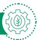

## 技术节能

工艺优化，开发新型设备以节省能耗

## 案例 杉杉负极云南工厂在线电力监控优化运行，实现节能降耗

2025年，杉杉负极云南工厂通过全厂电力在线监控系统，对后台运行方式和用电情况进行实时监控，有效识别高能耗及异常用电，并及时调整运行策略。自系统上线以来，全年累计节省电量约3.300千瓦时，实现明显的节能效果同时提升了能源管理水平，推动工厂向绿色高效运营转型

## 案例 杉杉负极四川工厂石墨化装炉工艺升级，提高生产能效

2025年，杉杉负极四川工厂对石墨化装炉工艺进行升级，通过优化装炉流程和提升装炉量，使单炉装料量提升50%至70%，同时吨耗降低25%至35%。改造后，每吨产品的能源消耗显著下降，整体生产效率提升明显。

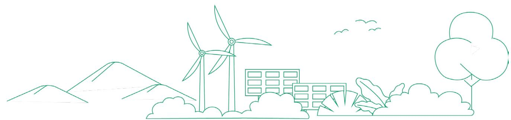

natural_image

Line art illustration of a wind farm with mountains, buildings, and trees under a sky with birds (no text or symbols)

## 指标和目标

杉杉股份结合各子公司及生产基地的实际情况，设定独立的能源管理目标，并制定能源节约实施路径，通过持续推进节能降耗措施和能源管理实践，不断提升能源利用效率。同时，公司积极推动可再生能源的应用与推广，逐步优化能源使用结构，以支持企业绿色低碳发展目标的实现。

报告期内，公司主要能源利用及清洁能源使用相关指标详见“关键绩效表”。

<table><tr><td></td><td>2025年能源管理目标</td><td>目标完成情况</td></tr><tr><td>杉杉负极</td><td>·绿电实施目标分阶段推进:2023年达到30%(已完成)、2025年提升至60%,2030年实现全面100%。</td><td>·已完成。2025年提升至60%。</td></tr><tr><td>杉金光电</td><td>·杉金光电(张家港):2025年实现公司用电总量同比下降10%。·杉金光电(南京):2025年实现公司用电总量同比下降1%。</td><td>·杉金光电(张家港):未完成。2025年公司用电总量同比上升14%,主要由于2024年1-3月尚处于试生产阶段,用电量基数较低,2025年生产正常运行,用电量相应增加。·杉金光电(南京):完成。2025年实现公司用电总量同比下降7%。</td></tr></table>

## 水资源利用

公司高度重视水资源的节约和管理，严格遵循《水法》《水污染防治法》等法律法规，结合各子公司及生产基地实际情况，建立并持续优化《水污染控制管理规定》《水质管理规定》《雨水管理规定》《水质监测操作标准》等管理文件，明确水资源节约目标和管理战略。子公司各基地的水资源管理由设备部及公辅班组负责，涵盖循环水系统运维补水管理及水质处理等工作，同时通过循环水处理，沉淀，过滤，反渗透等工艺实现废水回用，优化系统水置换次数并结合设备改造和技术升级提升水资源重复利用效率，不断提高水资源利用效益。

## 报告期内

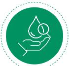

公司总耗水量为

4,921,013.46 吨

杉金光电水循环与再利用量占总耗水量的

16.97%

杉杉负极生产冷却水

100% 闭路循环

## 数据收集与分析

收集运营所需的水资源数据，包括用水量、用水来源、废水排放量等，分析这些数据可以帮助了解自身的水资源利用情况。

## 持续监测与报告

建立水资源监测体系，定期分析水资源利用情况和绩效。通过监测和报告，可以及时发现问题并采取改进措施。

## 技术创新与改进

寻求创新的技术和方法来减少用水量、提高用水效率和降低废水排放。技术改进可以帮助在水资源管理方面取得更好的绩效。

## 全生命周期评估

从原材料采购、生产过程、产品使用到最终处置，全面评估活动对水资源的影响，这有助于识别潜在的风险和机会。

## 员工教育与参与

提高员工对水资源重要性的认识，鼓励他们在工作和生活中节约用水。员工的参与可以推动内部的水资源管理文化

杉金光电水资源节约措施在系统承载能力范围内，最大程度降低循环水的置换次数，并通过添加适当药剂提升水资源利用率。

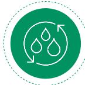

各基地污水处理站将废水经过沉淀、过滤、反渗透等工艺处理后，回用至循环水系统，实现废水多次利用。

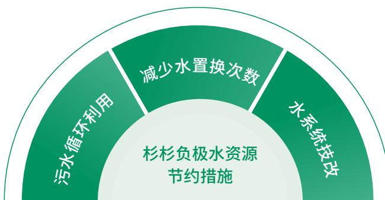

flowchart

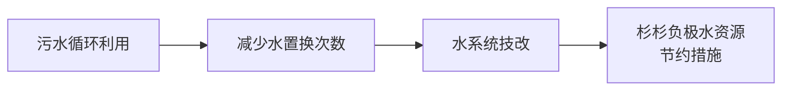
```mermaid
graph LR
  A["污水循环利用"] --> B["减少水置换次数"]
  B --> C["水系统技改"]
  C --> D["杉杉负极水资源\n节约措施"]
```

对水泵、管道等设施进行改造，增加反渗透等处理设备，提高循环水的重复利用效率。

## 案例杉杉负极四川工厂循环水二次利用，提升水资源使用效率

2025年，杉杉负极四川工厂完成循环水系统改造，将石墨化工艺产生的循环水引入脱硫系统进行二次使用。通过该改造，年度节约循环水约15.6万立方米，新鲜补水量下降约33%，废水处理成本同比降低约30%，有效提高了水资源利用效率，降低了生产用水需求和废水处理负荷，助力工厂实现节水降耗目标。

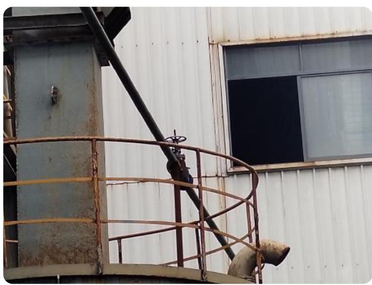

natural_image

Industrial steel structure with metal railings and a valve, set against a white industrial background (no visible text or symbols)

改装前

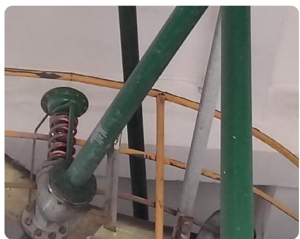

natural_image

Industrial piping system with green steel pipes and metal scaffolding (no visible text or symbols)

改装后

公 司 利 用 世 界 资 源 研 究 所（World ResourceInstitute，WRI）开发的“输水道水源风险地图”（AqueductTM tools）评估各厂址的年度水风险变化，分析物理风险(如基线水压力、气象灾害影响)及水质风险，并结合当地监管和声誉因素，形成水资源风险图谱，为各工厂水资源管控和环境优化提供决策依据。截至报告期末，杉杉股份所有厂址均不在或邻近水资源保护区，未发生因取水或排放对当地水源造成负面影响的事件。

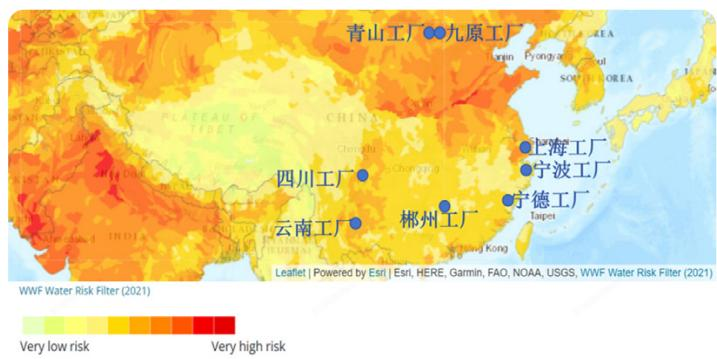

text_image

青山工厂●九原工厂
四川工厂●
上海工厂
宁波工厂
云南工厂●
郴州工厂●
宁德工厂
Taipei
WWF Water Risk Filter (2021)
Leaflet | Powered by Esri | Esri, HERE, Garmin, FAO, NOAA, USGS, WWF Water Risk Filter (2021)
Very low risk	Very high risk

杉杉负极水资源风险图谱

## 循环经济

公司积极践行循环经济理念，将资源节约与循环利用融入生产运营全过程，对生产过程中的边角料、副产品进行回收和资源化利用。同时，公司加强与供应链上下游企业的协同合作，推动一般工业固废及部分有价废料的循环利用，尽可能减少固体废弃物产生。各生产基地结合自身实际制定相关管理措施，如《废旧吨包回收再利用方案》等，持续提升资源循环利用水平。

## 循环经济措施

杉杉负极提倡吨袋、托盘重复使用，不能重复使用的报废吨袋、报废托盘作为可回收物资售卖

杉杉负极加强固废分类管理，将废金属，木材，纸板单独收集储存，作为可回收物资售卖

杉杉负极推动包装轻量化，与客户沟通实行裸包发货。

杉杉负极鼓励客户返还包装材料，对回收的包材进行清洁后再次投入使用。

杉金光电（张家港）采用回收原材料固定卷材纸板，用于卷材出货，节约3万包装材料费用。

natural_image

Line art illustration of a person standing near a large document and city skyline, with clouds and trees in the background (no text or symbols)

## 案例|杉杉负极推进托盘与包材循环利用，提升资源利用效率

2025 年，杉杉负极在各生产基地推进托盘回收利旧及吨包罩袋循环利用，通过完善仓储管理要求和强化回收管理机制，提升包装材料的重复使用率。

四川、云南、宁波、包头等工厂实施托盘回收利旧，共回收托盘 348,630 个，再利用率达 72%。同时，福建工厂对成品吨包罩袋开展回收利用，将成品入库及发货过程中更换下来的脏污但无破损罩袋用于来料、半成品及筛上物包装，共回收罩袋114,441个。

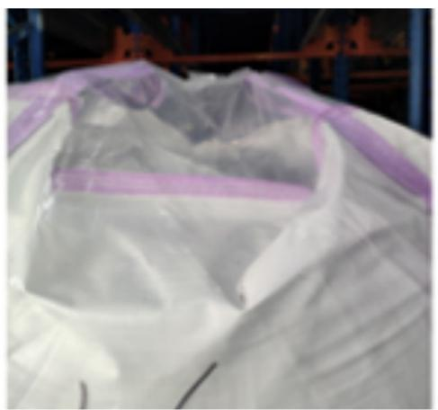

natural_image

Close-up of a white plastic bag with purple plastic wrap, no visible text or symbols

成品脏污罩袋

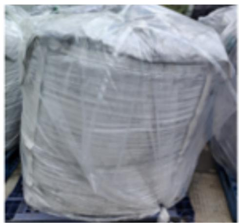

natural_image

Stacked plastic bags with visible woven texture, no text or symbols present

回收利用罩袋

## 案例杉杉负极副产物资源化利用，提升产品综合收率

2025年，杉杉负极各工厂通过对生产设备进行开发与改造，推动生产过程中副产物的回收与再利用，将原本难以利用的副产物重新纳入生产流程，实现资源化利用。相关改造实施后，公司产品综合收率提升约2%-3%，在降低生产资源消耗的同时，推动生产体系向循环利用与绿色制造方向发展。

## 深化三废控制

杉杉股份高度重视生产运营过程中的环境管理与污染防治，严格遵守国家及地方相关法律法规，持续完善废水，废气。废弃物及化学品管理制度体系，通过规范化管理和持续改进措施，加强对污染物产生、处理与排放全过程的管控，降低环境影响，推动企业绿色、合规与可持续发展。

## 废水处理

公司严格遵守《中华人民共和国水污染防治法》等相关法律法规，结合业务特点及各生产基地实际情况，建立并完善废水管理制度体系，制定了《废水管理规定》《水污染物管理控制规定》《雨水污水管理制度》等管理文件，明确废水产生、收集、处理及排放各环节的管理要求，并设定了节水减排等管理目标。各子公司结合自身生产情况建立相应的废水管理架构其中安环部负责废水产生与排放过程的监督检查及外部监测管理工作，设备部、工程部和生产部等部门负责废水处理设施的运行维护与异常排查，各业务部门按照职责落实本部门废水的日常管理与规范排放，确保废水管理工作的有效实施

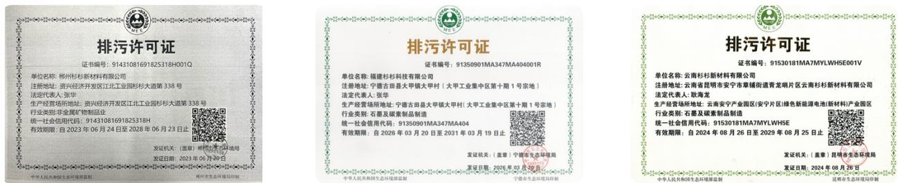  
杉杉负极郴州工厂、福建工厂、云南工厂排污许可证（部分展示）

<table><tr><td></td><td>2025 年废水处理目标</td><td>目标完成情况</td></tr><tr><td>杉杉负极</td><td>工业废水零外排工业废水回用率 100%</td><td>已完成</td></tr></table>

## 报告期内

公司废水排放总量为

氨氮排放量

化学需氧量

排放达标率

317.48

7.95 吨

664.96 吨

100%

在具体管理措施方面，公司对废水排放设置了严干国家标准的内部控制要求，并通过在线监控等方式对废水排放情况进行实时跟踪，形成月度管理台账。同时，公司定期委托具备资质的第三方机构开展废水监测，确保各项排放指标持续达标。在此基础上，公司不断探索废水循环利用及减排措施，通过优化处理工艺和提升废水回用水平，持续推动节水与污染减排目标的实现。

<table><tr><td>名称</td><td>废水来源</td><td>类别</td><td>处理方式</td></tr><tr><td>办公、洗涤用水</td><td>各部门</td><td>生活废水</td><td>(经化粪池后)进入污水管网</td></tr><tr><td>食堂含油废水</td><td>食堂</td><td>餐饮废水</td><td>经隔油池后进入市污水管网</td></tr><tr><td>初期雨水</td><td>公司厂区</td><td>雨水</td><td>通过雨水管网进入初期雨水池,沉淀15分钟后排放</td></tr><tr><td>生活污水</td><td>各部门</td><td>生活废水</td><td>(经化粪池后)进入市污水管网</td></tr><tr><td>循环冷却污水</td><td>生产部</td><td>清净下水</td><td>循环使用,不外排</td></tr><tr><td>脱硫废水</td><td>生产部</td><td>工业废水</td><td>经沉淀处理后,上清液作为脱硫系统补充水,循环回用</td></tr></table>

废水处理方式

## 案例 杉杉负极宁波工厂一体化废水处理系统建设，强化污染防控能力

杉杉负极宁波工厂建设“预处理+生化+MBR膜”一体化废水处理系统，对RTO废水及实验室废水实施分类收集与分质处理，并配套安全防控及在线监测设施，实现废水稳定达标排放与部分回用，有效提升了废水处理效率与管理水平，降低了水污染物排放风险。

## 废气处理

公司严格遵守《中华人民共和国大气污染防治法》等相关法律法规，遵循“源头减排、过程治理、达标排放”的原则建立并完善废气管理制度体系，制定了《大气管理规定》《废气处理管理制度》等管理文件，明确废气治理与排放管理要求并设定废气减排与达标排放的管理目标。公司建立由安环部生产部等相关部门协同参与的废气管理架构，统筹推进废气治理与排放管理工作。同时，公司持续推进废气治理项目，通过技术改造和设备升级提升废气处理水平，并对治理设施运行情况及排放情况进行持续跟踪与管理，确保废气稳定达标排放，推动废气减排与治理工作有效落实。

<table><tr><td></td><td>2025年废气处理目标</td><td>目标完成情况</td></tr><tr><td>杉杉负极</td><td>·废气100%合规排放</td><td>已完成。</td></tr><tr><td>杉金光电</td><td>·偏光片涂层工段单位面积VOCs排放量下降5%</td><td>已完成。排放量下降8%。</td></tr></table>

## 报告期内

公司废气排放总量为

597.84 吨

其中氮氧化物排放量

142.86 吨

硫氧化物排放量

194.83 吨

悬浮粒子与颗粒物(PM)排放量

162.08 吨

挥发性有机化合物 (VOCs) 排放量

97.34 吨

排放达标率

100%

## 工艺废气控制

严格遵循操作规程，控制工艺参数，确保废气治理设施同步运行，杜绝无组织排放及异常排放现象。

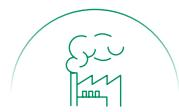

## 无组织排放废气控制

采取除尘、吸收、隔离等措施控制无组织排放，使用低硫无铅燃料并加强设备维护，同时规范化学品管理，防止挥发、泄漏或事故造成大气污染。

## 生活废气控制

通过配置油烟净化设备、使用工业吸尘器及扫地车控制粉尘，并定期对车辆和叉车进行保养检测，确保废气和尾气达标排放。

## 案例杉杉负极福建工厂实施无组织废气收集改造，提升废气治理水平

2025年，杉杉负极福建工厂对半成品车间开展无组织废气收集改造，通过优化管道和收集系统，实现半成品车间无组织废气的统一收集与集中处理。改造完成后，有效减少了废气在车间内的扩散，车间环境得到明显改善，作业区域温度有所下降，对改善厂区及周边环境质量发挥了积极作用，进一步提升企业废气治理和环境管理水平。

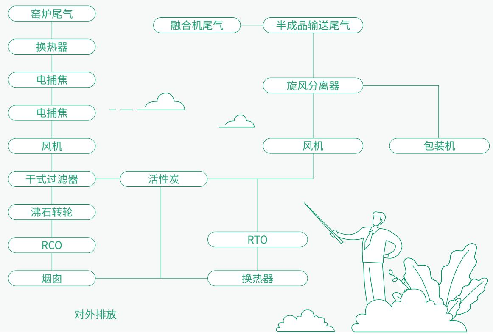

flowchart

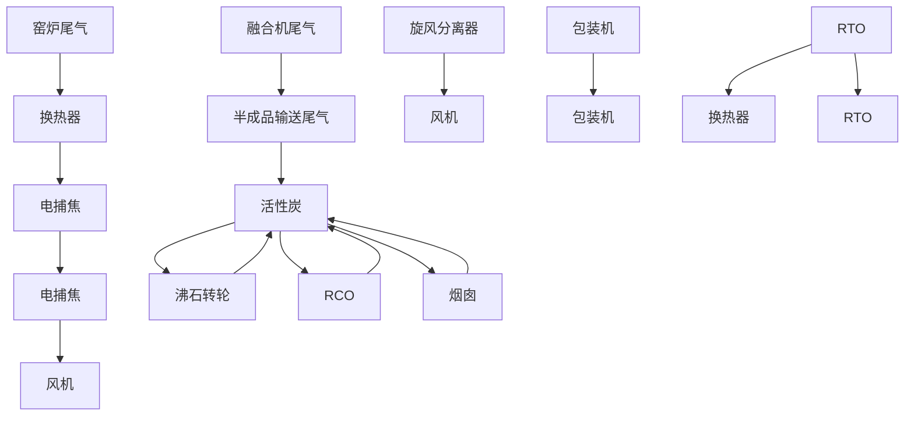
```mermaid
graph TD
  A["窑炉尾气"] --> B["换热器"]
  B --> C["电捕焦"]
  C --> D["电捕焦"]
  D --> E["风机"]
  F["融合机尾气"] --> G["半成品输送尾气"]
  H["旋风分离器"] --> I["风机"]
  J["包装机"] --> K["包装机"]
  L["活性炭"] --> M["沸石转轮"]
  L --> N["RCO"]
  L --> O["烟囱"]
  P["RTO"] --> Q["换热器"]
  P --> R["RTO"]
  M --> L
  N --> L
  O --> L
  G --> L
```

无组织废气处理工艺流程

## 废弃物处理

公司严格遵守《中华人民共和国环境保护法》《中华人民共和国固体废物污染环境防治法》等相关法律法规，建立并完善废弃物管理制度体系，制定《废弃物管理规定》《废弃物仓库管理标准》《危险废弃物管理作业标准》等制度文件，对废弃物从产生、分类、收集、转运、储存到外运处置等环节提出规范化管理要求。公司结合实际产生的废弃物种类实施分类管理，并建立由相关部门协同参与的管理架构，确保废弃物管理工作的有效落实。同时，公司委托具备相应资质的单位对废弃物进行合规处置，确保废弃物处理符合相关法律法规要求。

<table><tr><td></td><td>2025年废弃物处理目标</td><td>目标完成情况</td></tr><tr><td>杉杉负极</td><td>· 污染物因子排放浓度及总量达标排放· 固体(危险)废物合法处置率100%</td><td>已完成</td></tr><tr><td>杉金光电</td><td>· 固体废物合规处置率100%</td><td>已完成</td></tr></table>

## 报告期内

公司废弃物排放总量为

110,744.72吨

其中一般固体废弃物总量

96,093.69吨

危险废弃物总量

14,651.03吨

循环再利用总量为

82,504.74吨

排放达标率

100%

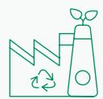

<table><tr><td>类别</td><td>废弃物名称</td><td>贮存地点</td><td>处理单位</td></tr><tr><td>可回收</td><td>收集的粉尘</td><td>车间</td><td>公司统一处理,回用于生产线</td></tr><tr><td>不可回收</td><td>除磁固废、废一般原材料包装、废极片、纽扣电池、废布袋及滤芯、废碳毡、废保温材料、硅氧产品样品、废滤膜、生活垃圾</td><td>车间、废弃物仓库</td><td>外售综合利用、提供给下游客户试用、委托环卫部门清运</td></tr><tr><td>危险废弃物</td><td>尘灰、废危化品包装、废油桶、废油、含油抹布及手套、污泥、沉渣、废阳极液、含乙醇废料、废酸液、废浆料、废乙醇、废活性炭、废电池、墨盒、硒鼓、灯泡、灯管</td><td>车间、废弃物仓库</td><td>委托有资质的单位进行无害化处置</td></tr></table>

废弃物分类处理

## 化学品安全管理

公司遵循《危险化学品安全管理条例》《易制毒化学品管理条例》《监控化学品管理条例》等国家及地方法律法规，并参照《危险化学品目录》《易制毒化学品的分类和品种目录》《易制爆危险化学品目录》《高毒物品目录》等相关规定建立了涵盖《环境管理物质管制规范》《化学品管理制度》《危险化学品管理制度》《重大危险源管理制度》《易制毒化学品管理制度》等在内的化学品管理制度体系。公司建立化学品管理台账，持续追踪并更新SVHC清单，并将化学品安全作为业务管理的重要内容，规范危险化学品及重大危险源管理工作。

## 我们承诺

我们严格遵循RoHS、REACH等环境管理物质的法律法规，在新品研发阶段，我们看重产品的环境与健康属性，升级产品健康与安全标准，寻找更加环境友好型原材料替代危害化学品，并向利益相关方汇报进展，尤其加强对客户与用户化学品安全的意识宣贯，让使用者拥有对产品中化学物质的最大知情权。

化学品安全承诺

在采购易制毒，易制爆等管制化学品时，公司采购部门按照相关规定，在采购前向当地监管机构备案所需购买的品种及数量。使用部门配合采购部门准备管制化学品的使用说明、采购数量等相关资料，并依据相关标准和规范对可能涉及的危险化学品进行辨识，辨识范围覆盖研发、生产、供应、储存及包装等各个环节

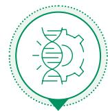

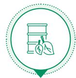

## 公司储存和使用的危险化学品

氮气、天然气、氦气、氩气、液氩、氦氮混合气、氩甲烷气体、氢氩混合气、乙炔、氧气、柴油、盐酸、硝酸、氢氟酸、高氯酸、甲苯、酒精、丙酮和喹啉。

## 公司开展产品有害化学品测试

识别范围包含所有产品，识别其中重点物质元素，包含Sb、PFOS、PCBs、PFOA、卤素四项以及 RoHS 标准中的限定物质：Pb, Cd, HgCr(VI), PBBs, PBDEs, DBP, BBP, DEHP, DIBP，所有测试物质含量均达标通过

为确保化学品在储存、使用及处置等各环节的安全与合规，公司持续完善化学品安全管理措施，从风险管控、应急管理、安全培训、监督检查及产品合规等方面系统推进化学品安全管理工作，不断提升公司化学品安全管理水平，保障员工安全与生产运营的稳定。

## 加强重点环节管控

将化学品安全作为业务管理的重要内容，对危险化学品及重大危险源开展安全风险评估与管控，并重点加强化学品在储存、运输、使用及废弃等环节的全过程监控与管理。

## 强化安全培训与意识建设

定期开展安全教育与培训，提高员工对危险化学品风险的认知和应急处理能力，同时通过制度与激励机制引导员工自觉遵守安全管理规定，持续提升企业安全文化水平。

## 完善应急管理机制

针对危险化学品可能发生的事故风险，制定完善的应急预案并定期组织应急演练，持续提升突发事件的应急处置能力，保障员工安全和生产稳定。

## 加强安全监督与风险管控

持续强化安全责任落实和监督检查机制，加强安全风险识别与管控，提升整体安全管理水平，保障人员安全及设施稳定运行。

## 落实产品合规管理

持续关注产品涉及的高关注物质(如RoHS.卤素，REACH等)要求，按照客户要求及相关法律法规开展筛选与检测，并向客户提供检测报告，确保化学品和产品合规。

化学品安全管理措施

## 报告期内

公司未发生 化学品泄漏等负面事件

## 倡导绿色运营

杉杉股份持续推进绿色运营理念，将资源节约、环境友好与生态保护融入日常管理与运营实践。在推动绿色办公、提升资源利用效率的同时，公司关注生态环境保护与生物多样性维护，通过规范化管理和持续改进措施，降低生产与办公活动对环境的影响，推动企业与自然环境的协调发展。

## 绿色办公管理

公司积极推动绿色办公管理，将节能环保理念融入日常运营与员工行为之中。通过持续开展环保培训和宣传引导，提升员工对绿色运营与资源节约的认识，并在办公过程中推广节能降耗和绿色低碳举措，逐步形成全员参与的绿色办公氛围在提升运营效率的同时减少环境影响，推动企业实现可持续发展。

## 绿色活动与倡议

•向各部门发出节约倡议书号召全体员工从身边点滴小事做起，树立节约意识，在节电节水、节约用品、节约用油等方面达到减少浪费，践行可持续办公。  
●通过节电节水宣传、定制环保海报等举措，唤醒员工环保意识。通过文件双面打印、取消线下签到表等方式减少办公耗材使用  
●倡导全员绿色办公，使用会议系统进行远程会议，提倡会议室自带杯、减少纸杯及瓶装水，限制空调使用温度，积极进行垃圾分类处理与回收。  
●规范水电能耗、公务用车，加装光伏路灯，厂内货物运输使用电动叉车代替柴油叉车，设置安保巡查制度安排保安巡检以避免照明设备空转，节能降耗，节约成本  
·采取多种形式宣传绿色运营与清洁生产理念，包括举办面向全院的培训学习班组织集中学习与自学、开展合理化建议活动、组织技术专家与员工交流互动等将绿色理念深入全厂  
·积极推广绿色办公，营造“人人讲节约、事事讲节约、时时讲节约”的良好氛围，开展“四个一”活动：节约一度电、一滴水、一滴油、一张纸，全体员工广泛参与。

## 生物多样性保护

公司重视生态环境保护及生物多样性维护。尽管公司生产运营活动对生物多样性的直接影响相对有限，但在项目选址与建设阶段，公司严格按照相关法律法规开展环境影响评价，生产基地选址主动避开生态保护红线、自然保护区及生态环境敏感区域，从源头降低对生态系统的潜在影响。同时，公司通过开展厂区绿化建设，种植具有生态与环境改善功能的树种，持续优化厂区生态环境。未来，公司将结合生产经营特点及生态环境管理要求，逐步将生物多样性保护理念融入企业环境管理与运营实践之中。

## 案例|开展义务捡拾垃圾活动，传递绿色文明理念

2025年7月，杉杉负极包头一体化基地青山及九原工厂党支部响应装备产业园区管委会号召，组织员工前往长征社区开展义务捡拾垃圾活动。通过实际行动参与环境整治，美化社区人居环境，传递绿色文明理念。

natural_image

Person in red vest and blue hat using a tool outdoors near a dirt path, surrounded by greenery (no visible text or symbols)

义务清洁活动

## 创新赋能 智造领先

## 理念

杉杉股份坚持以创新驱动发展，将技术创新、质量管理与客户价值有机结合，通过持续推进绿色技术研发和产品升级，不断提升产品品质与服务水平，积极回应客户多样化需求。在增强企业核心竞争力的同时，公司也推动行业绿色发展，展现出在新时代背景下的创新活力与责任担当。

## 我们的行动

创新研发驱动 65

严控品质管理 71

响应客户需求 76

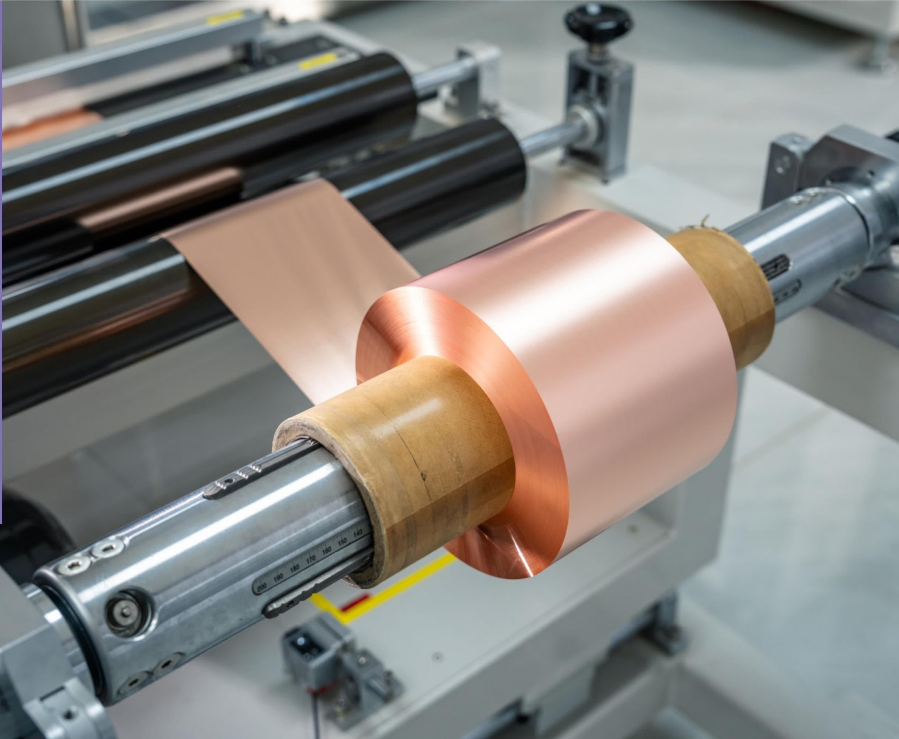

natural_image

Close-up of a copper coil being rolled with a flexible sheet, displayed on a metal workbench (no visible text or symbols)

## 创新研发驱动

杉杉股份始终将科技创新作为企业发展的核心驱动力，通过持续推进技术研发、完善知识产权管理体系并强化科技伦理治理，不断提升企业创新能力和技术竞争力。在推动自身高质量发展的同时，公司也积极促进产业进步与可持续发展，为社会创造长期价值。

## 治理

公司高度重视技术创新对企业长期发展的支撑作用，将研发创新纳入整体发展战略，并通过制度建设与组织管理不断完善研发治理体系。公司制定《研发管理办法》，对研发项目立项、评审、开发、验证及成果转化等关键环节进行规范管理，推动研发活动规范有序开展。

在组织管理方面，公司建立了较为完善的研发管理架构，强化核心技术研发团队建设，并通过产学研合作与技术引进不断提升自主研发能力。杉杉负极研发工作由研究院统一归口管理，研究院研发总监负责确定产品开发方向并组建研发项目团队，各项目组对产品开发到投产全过程负责。同时，公司持续加强研发人才队伍建设，依托高水平研发团队和博十后科研平台，推动关键技术研发和创新成果转化

## 战略

公司结合新材料产业发展趋势及自身业务特点，系统识别创新研发过程中可能面临的风险与机遇，并通过持续优化研发管理体系，加强技术创新与成果转化能力，以提升企业长期竞争力和可持续发展能力。

<table><tr><td>风险类型</td><td>风险描述</td><td>影响周期</td><td>发生概率</td><td>财务影响内容</td><td>应对措施</td></tr><tr><td>技术迭代与行业竞争风险</td><td>新材料及显示材料行业技术更新速度较快,如公司技术创新和产品迭代速度不足,可能影响产品竞争力和市场地位。</td><td>中长期</td><td>中</td><td>产品竞争力下降可能影响市场份额及销售收入。</td><td>持续加大研发投入,加强产学研合作,提升核心技术储备。</td></tr><tr><td>知识产权与核心技术风险</td><td>新材料领域技术密集度高,若知识产权保护不足或发生专利纠纷,可能影响公司技术优势。</td><td>中长期</td><td>中</td><td>可能产生法律费用或技术损失,对公司经营产生不利影响。</td><td>加强专利布局和知识产权管理,完善核心技术保护机制。</td></tr></table>

创新研发风险识别

## 关键荣誉

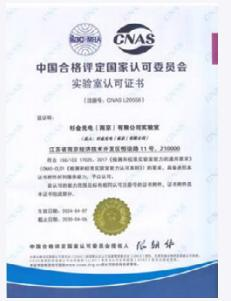  
CNAS实验室认可证书

<table><tr><td>机遇类型</td><td>机遇描述</td><td>影响周期</td><td>发生概率</td><td>财务影响内容</td><td>应对措施</td></tr><tr><td>产业链协同与技术合作机遇</td><td>通过深化与上下游企业、高校及科研机构的合作,公司可进一步提升技术创新能力并加快成果转化。</td><td>中期</td><td>中</td><td>有助于降低研发成本、提升研发效率,并促进技术成果产业化。</td><td>推动产学研合作,加强产业链协同创新。</td></tr><tr><td>新能源与新材料市场需求增长机遇</td><td>随着新能源汽车、储能及新型显示产业的快速发展,锂电材料及显示材料市场需求持续增长。</td><td>中长期</td><td>高</td><td>市场需求扩大有助于提升产品销量和市场份额,推动公司业绩增长。</td><td>加强技术研发和产品升级,提升产品性能与规模化生产能力。</td></tr></table>

创新研发机遇识别

## 影响、风险和机遇管理

为提升研发管理效率并降低技术创新风险，公司建立了较为系统的研发项目管理流程，通过规范化的研发管理机制推动研发项目科学决策与有效实施。

## 研发项目识别与立项

公司结合市场需求、技术发展趋势及发展规划提出研发项目建议，并开展可行性研究，通过研发技术管理委员会评审后确定研发立项。

## 技术评审与可行性分析

项目团队对产品技术方案、材料供应、生产能力及经济效益等方面开展可行性分析，评估研发项目的技术可行性与商业价值。

## 产品开发与验证

研发项目启动后，项目团队开展产品设计、样品试制及性能测试，并通过阶段评审与技术验证确保产品满足技术标准及客户需求。

## 成果转化与持续改进

经验证通过的研发成果进入产业化或规模化生产阶段，同时公司通过阶段评审和项目总结持续优化研发管理流程，不断提升创新效率。

## 研发成果

公司持续推进关键技术研发与成果转化，涵盖电池材料、光电材料及其他前沿技术领域，并取得多项阶段性成果。在电池材料领域，依托售炭定制开发技术、石墨微晶调控技术等创新能力，公司成功开发多款长寿命人造石墨产品，已在314Ah、500+Ah等多种储能电池以及商用车电池产品中实现应用，产品在高温存储性能和循环寿命方面具有显著优势同时在技术突破和产品多样化方面取得积极进展。

同时，杉金光电在光电材料研发方面取得积极进展，包括无氟溶剂(PFASFree)绿色设计技术、STW广视角偏光片以及OLED偏光片，进一步丰富了产品线并推动技术创新与可持续发展。通过多领域技术突破和产品多样化，公司不断增强研发能力与市场竞争力。

## 案例 硬碳与硅基负极材料量产，推动新型电池技术产业化

为满足固态电池和新型储能技术的发展需求，公司持续加大电池负极材料研发。硬碳负极材料实现量产，具备高容量和高首效，有效解决行业量产难、容量低的问题，并已在钠电、钾电及超级电容领域批量应用。硅基负极材料方面，公司自主开发CVD硅碳材料，通过纳米化与碳包覆技术提升稳定性和循环性能，相关技术成果已获多项专利并在宁波建设硅基负极一体化生产基地，推动新型电池材料的产业化落地。

## 案例 突破硅基负极关键技术，推动新一代电池材料发展

在固态电池和高能量密度电池需求快速增长的背景下，公司持续加大投入重点布局硅基负极材料领域，通过气相纳米化与碳包覆等技术，提升材料稳定性与循环性能，并开发多孔快充及高压实技术，进一步优化材料性能。目前，宁波硅基负极基地一期部分产能已投产并实现批量出货，为新一代动力电池技术的发展提供了重要支撑。

## 案例 推动国产偏光片自主化，打造高端显示材料创新优势

杉金光电聚售偏光片自主研发，打破长期由日韩企业垄断的技术局面，实现国产高端偏光片在大尺寸|CD和TV产品中的广泛应用。团队通过精密工艺控制、产学研融合和上千次实验优化，无氟环保黏着剂成功替代PFAS，实现环保与性能兼顾。公司产品广视角、护眼等创新开发，不仅支撑115英寸巨幕电视量产，还推动国产显示材料自主化率从不到10%提升至45%以上，彰显了研发创新实力与核心竞争力。

## 案例 突破低反射显示技术，引领高端OLED材料创新

杉金光电持续加大新型显示材料研发投入，在OLED关键技术领域取得重要突破。针对高端电视在强环境光下易反光、对比度下降的行业痛点，公司通过自主研发SAR0.3技术及精密光学设计，将屏幕反射率降至1.0%以下，显著提升显示效果。目前，该技术已实现产业化应用，并配套多尺寸偏光片解决方案，成功应用于高端QLED产品。与此同时，公司不断完善 OLED 产能布局，实现大尺寸偏光片稳定量产，并加速中小尺寸产品研发与量产进程。通过持续技术创新与规模化应用，杉金光电不断提升在全球高端显示材料领域的竞争力。

## 绿色设计

公司在产品研发过程中融入绿色设计理念，综合考虑资源利用效率、环境影响及产品全生命周期管理，通过持续优化材料选择与工艺设计，推动产品向高性能、低能耗和环境友好方向发展。

## 案例 优化原料与装备设计，推动低碳绿色制造

杉杉负极在产品与工艺设计阶段融入绿色理念，通过原料细粉再生利用，实现售炭高收率和100%资源化利用，有效减少原材料浪费并降低生产过程碳排放，同时，公司在装备端推动连续石墨化装备的量产应用，相较传统工艺显著降低用电能耗，进一步减少碳排放。通过在原料利用和生产装备方面的协同优化，公司持续推进绿色设计与低碳制造。

## 案例 杉金光电开发PFAS Free黏着剂，推进绿色材料设计

2025年，杉金光电在产品研发过程中持续推进绿色设计理念，开发不含全氟和多氟烷基物质(PFAS)的环保型黏着剂(PSAPFASFree)，从源头减少潜在有害物质的使用，降低材料在生产和应用过程中的环境影响。该创新材料在满足产品性能要求的同时，实现了对传统含氟化学物质的替代，推动显示材料向更加环保、安全的方向发展，成功入选“2024年度新型显示产业链贡献与协同创新项目”之“绿色低碳奖”。

## 知识产权保护

公司高度重视知识产权的管理与保护，持续完善知识产权管理体系建设。公司设立专业的专利管理团队，并制定实施《知识产权管理办法》《专利申请管理程序》《商业秘密保护制度》《专利管理制度》等相关制度，构建系统化的知识产权管理机制并取得相关认证。同时，公司通过实施发明人奖励机制、开展专利知识培训等方式，激发员工创新活力，提升知识产权保护与合规意识，推动技术创新与管理创新协同发展。报告期内，公司受到研发激励的员工人数为15人。

## 关键证书

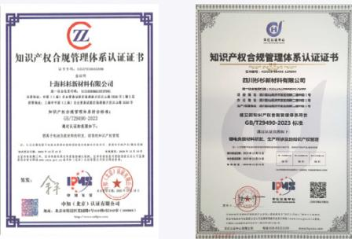  
GBT 29490知识产权合规管理体系认证证书

## 案例杉杉负极开展知识产权培训，强化合规管理能力

2025年6月，杉杉负极品质部组织开展知识产权合规管理体系专题培训，相关职能部门参加。培训围绕知识产权管理体系文件、岗位职责分工及各部门目标分解等内容进行系统进解，进一步强化各部门对知识产权合规管理要求的理解，明确责任边界，提升知识产权管理的规范化与协同推进能力。

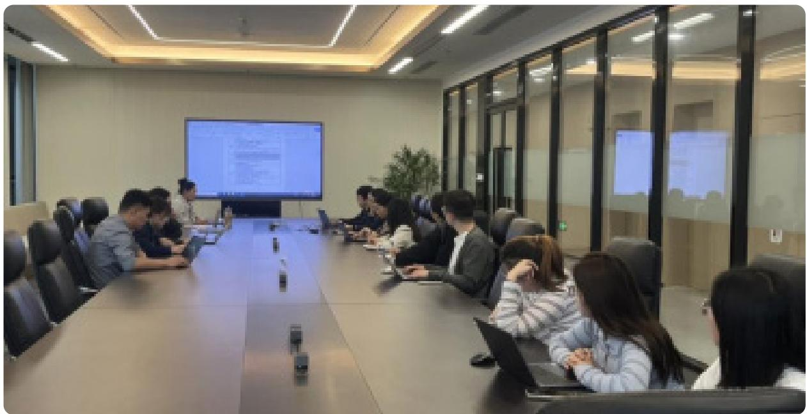

natural_image

Interior view of a modern conference room with attendees seated around a long table, facing a large screen (no visible text or signage)

知识产权培训

## 科技伦理

公司坚持将科技伦理作为技术创新与业务发展的重要原则。在研发、生产及经营活动中，公司严格遵循相关科技伦理规范，确保技术发展与社会责任相协调，并通过规范化管理提升技术应用的透明度与可追溯性，防范技术滥用或误用的区险。同时，公司坚持以促进社会进步和可持续发展为导向开展技术创新，优先推进环境友好型技术应用，减少资源消耗并降低对生态环境的影响。

## 指标和目标

公司坚持以技术创新驱动产业发展，持续加大研发投入力度，不断提升研发能力与技术竞争力。通过强化核心技术研发团队建设、加强新材料技术研发以及深化产学研合作，公司不断推动核心技术突破与产品迭代升级。

## 提升研发效率

通过优化研发流程和资源配置，提高研发效率和创新能力。

## 研发战略目标

## 培养高素质团队

加强人才培养和引进，打造一支高素质、专业化的研发团队

## 强化知识产权保护

加强知识产权管理和保护，维护公司技术创新的合法权益。

2025年创新研发目标

目标完成情况

持续加大研发投入

已完成，2025年研发支出共计120.157.38万元，研发支出同比增长15.87%，占营业收入比例为5.57%

增加授权专利数量

已完成，2025年新增已授权专利980项，其中杉杉负极新增68项，金光电新增912 项。

## 关键绩效

截止 2025 年 12 月 31 日 : 公司偏光片业务已在韩国、中国、日本、美国等全球主要国家获得已获得2,000

多项 LCD 和 OLED 偏光片相关专利，其中已授权专利共计 2,155 项（含境外专利1,765 项）

包括发明专利 2,061项、实用新型专利 94 项，构筑起覆盖 LCD 与 OLED 领域的坚实专利壁垒；

公司负极材料业务已有授权专利 402 项，其中国际专利18 项；国内发明专利256项，实用新型

128 3项。

## 严控品质管理

杉杉股份始终将质量信誉作为企业发展的根本，致力于为客户提供高品质产品与优质服务体验。公司严格遵守国内外相关法律法规，全面贯彻国际质量管理体系标准，通过标准化、精细化的管理流程，持续提升产品与服务水平。在此基础上，各业务板块在统一质量管理要求下，结合自身业务特点不断健全质量管理体系，确保产品和服务质量稳定可靠。

2025 年，杉杉负极、杉金光电及各下属子公司持续完善质量管理体系建设，其中杉金光电体系取得 ISO 9001 认证，杉杉负极同步拥有 ISO9001、IATF 16949 等质量管理体系认证，全面强化品质管控水平，为公司产品切入全球高端供应链夯实基础。

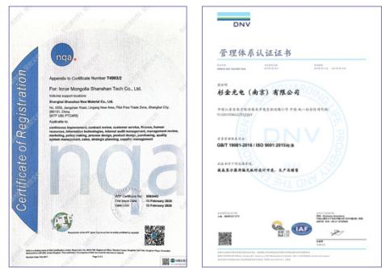  
杉杉负极IATF16949质量管理体系认证(左)、杉金光电ISO9001质量管理体系认证(右) (部分展示）

## 治理

## 杉杉负极

杉杉负极依据IATE16949与ISO.9001国际质量管理体系标准，建立了系统化的质量管理制度体系，包括《质量，环境职业健康安全管理手册》《项目管理控制程序》《产品制造控制程序》《纠正预防措施控制程序》《不合格品管理控制程序》《持续改进控制程序》等，确保各项质量管理工作有章可循。

在此基础上，杉杉负极建立了由执行总经理、体系负责人、管理层及品质部门共同参与的质量管理架构，统筹推进质量管理相关工作。公司坚持以客户需求为导向，追求“零缺陷”目标，每年至少开展一次集团化体系内审和管理评审，评价体系运行的适宜性、充分性和有效性，并检验质量方针和目标的达成情况。

## 杉金光电

杉金光电将ISO9001与IATF16949体系要求与自身品质运营体系相结合，编制《品质运营手册》，明确各环节职责与权限，通过规范化流程管理降低潜在品质风险，持续提升产品品质竞争力。

遵守基本规定，按规定的标准与程序执行不生产不良品，不良品绝对不流出

彻底执行变动和变更管理，确保给客户提供稳定的品质

开发阶段决定产品完成度，确保集中力量于开发品质

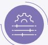

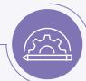

确定品质问题的根本原因树立再发防止对策

## 战略

公司在品质管理中高度重视风险与机遇的系统识别与管理，通过科学的方法评估潜在风险及发展机会，以保障产品质量稳定、满足客户需求，并推动企业持续改进与业务增长。

杉金光电品质方针

<table><tr><td>风险类型</td><td>风险描述</td><td>影响周期</td><td>发生概率</td><td>财务影响内容</td><td>应对措施</td></tr><tr><td>供应链质量风险</td><td>原材料或零部件供应不稳定或不合格,导致生产延误或产品质量问题。</td><td>长期</td><td>中</td><td>可能导致退货、索赔、生产停滞及市场信誉下降,影响收入和利润。</td><td>严格供应商准入审核,定期评估供应商资质与履约能力,建立替代供应渠道。</td></tr><tr><td>生产工艺风险</td><td>生产过程不稳定、设备故障或操作不当导致产品不合格。</td><td>中期</td><td>中</td><td>产生报废、返工及额外检测成本,影响生产效率和财务绩效。</td><td>制定标准化操作流程,加强工艺控制和设备维护,实施生产异常监控和快速响应机制。</td></tr><tr><td>客户投诉及声誉风险</td><td>产品质量问题引发客户投诉或市场声誉受损。</td><td>短中期</td><td>中</td><td>潜在销售下降、合同取消及品牌价值下降。</td><td>建立客户反馈机制,快速响应并整改质量问题,加强售后服务和质量培训。</td></tr></table>

品质管理风险识别

<table><tr><td>机遇类型</td><td>机遇描述</td><td>影响周期</td><td>发生概率</td><td>财务影响内容</td><td>应对措施</td></tr><tr><td>客户需求拓展机遇</td><td>满足高端客户或新市场对高品质产品需求。</td><td>中长期</td><td>高</td><td>扩大销售规模,提高市场份额和客户粘性。</td><td>建立客户需求调研机制,优化产品设计与定制化服务能力。</td></tr><tr><td>数字化与智能制造机遇</td><td>应用数字化工具和智能化生产监控提升品质管理效率。</td><td>中长期</td><td>高</td><td>降低生产不良率和检验成本,提升运营效率。</td><td>推进生产设备智能化改造,建立实时数据监控和分析体系。</td></tr></table>

品质管理机遇识别

## 影响、风险和机遇管理

公司遵循“识别一分析一纠正一验证一预防”的闭环风险管理流程。当出现不合格或客户投诉时，品质部依据《纠正和预防措施控制程序》启动8D报告或纠正预防措施单，组织跨部门团队分析根本原因，制定并实施纠正措施，验证效果后纳入标准化文件，并横向展开至其他类似过程。品质部每月对不合格进行统计分析，对高频不良制定优先减少计划确保风险受控。

## 全生命周期质量管理

公司围绕负极材料与光电材料两大业务板块，构建全生命周期质量管理体系，持续提升产品质量管控能力与客户满意度。

在负极材料业务方面，杉杉负极聚焦生产制造环节的质量稳定性与过程管控，建立从进料管理、制程管控、出库管控到售后管控的全过程质量管理机制。

配置专职 PQE 团队开展全过程质量监控，并依托信息化系统实现质量趋势预警

建立总部定期过程核查机制对异常问题实施整改跟踪

通过跨部门协同机制联动生产、研发及供应链等环节提升问题响应与闭环能力

## 全生命周期产品质量举措

针对连续不合格批次实施停线分析机制，确保问题得到彻底整改

针对客户特定要求（CSR）建立识别与落实流程保障产品满足差异化需求

在光电材料业务方面，杉金光电侧重于质量管理的前端预防与全过程数字化管控，建立覆盖产品设计、原料采购、生产制造、检测放行、仓储物流、客户使用至终端退役的全生命周期质量管理体系，并通过数字化管理平台，实时收集各环节质量数据，设置关键质量控制点进行动态监控。

## 产品开发阶段

质量部门同步参与设计评审与FMEA，确保质量风险在前端得以识别与防控

## 量产阶段

通过 SPC 定期过程审核保障工艺稳定性

## 产品交付阶段

建立客户质量反馈闭环机制，将市场问题快速回溯至研发与生产环节，驱动持续改进

## 质量管理培训

公司高度重视质量人才队伍建设，持续完善质量培训体系，提升员工专业能力与质量意识，为质量管理体系有效运行提供人才支撑。

在负极材料业务方面，杉杉负极围绕岗位需求开展多层次质量培训，培训内容涵盖质量工具、项目管理、产品知识、质量管理体系及客户特定要求等，通过内部讲师与外聘专家相结合、线上与线下协同开展的方式，持续提升员工专业能力，确保人员能力与岗位要求相匹配。

## 案例 宣导异物管理规定，严控生产质量

2025年，杉杉负极公司组织开展了异物管理规定的宣导培训，共58人参与。培训系统讲解了异物的定义、来源、危害及全流程管控要求。此举强化了员工的质量风险意识，明确了各环节防控责任，为保障产品洁净度、降低质量风险奠定了坚实基础。

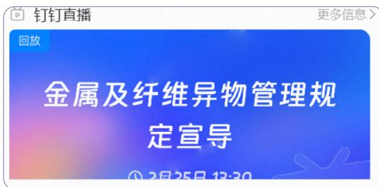

text_image

钉钉直播
回放
金属及纤维异物管理规定宣导
① 2月25日 13:30

异物管理规定宣导培训

在光电材料业务方面，杉金光电将质量能力建设作为重要抓手，构建“分层级、分专业、全覆盖”的质量培训体系，面向管理层开展质量领导力培训，针对专业岗位开展专项技能培训，并通过全员质量意识培训及外部认证与行业交流，系统提升员工质量管理水平与专业能力。

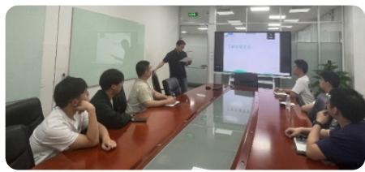

text_image

Meeting room scene with participants seated around a table, one person presenting in front of a presentation screen; background includes a presentation slide with Chinese text.

杉金光电开展质量培训

## 管理层质量领导力培训

面向中高层开展质量战略、风险预警与质量文化构建课程，强化质量决策能力。

## 全员质量意识普及

通过案例分享会、质量月活动等形式，宣贯“零缺陷”理念与标准化作业要求

## 专项技能培训

针对质量工程师、检查员等岗位，开设可靠性工程、测量系统分析（MSA)、问题解决工具（如8D、鱼骨图）等实战课程。

## 外部认证与交流

鼓励员工参与六西格玛、ISO体系内审员等外部认证，引入行业专家开展前瞻性质量技术研讨。全年开展培训超20场，预计覆盖人次达2.000以上，并建立培训效果评估与资格认证机制

“分层级、分专业、全覆盖”的质量培训体系

## 产品召回管理

杉杉负极依据《顾客投诉处理规定》及《客退产品处置流程》，建立产品召回管理机制。当发现已出货产品存在重大品质风险（如异物、金属异物、法律法规风险)时，由品质部OOC发起“产品召回申请”，经技术、销售、品质总监审批后，中销售经理通知客户并安排召回，召回产品单独隔离标识，经评审后返工或报废，并启动纠正预防措施防止问题再发生。杉金光电则建立以“快速响应、精准追溯、彻底闭环”为原则的产品召回管理闭环体系。2025年，公司未发生重大产品召回事件。

## 召回触发机制

当出现可能影响安全、合规或重大性能缺陷的质量异常时，由品质部联合开发、营业等部门启动召回评估程序。

## 追溯与定位

依托产品唯一标识码与供应链管理系统，可在2小时内锁定受影响批次、流向及库存状态。

## 分级行动方案

根据风险等级制定召回计划，包括客户通知、产品退回、替换、根本原因分析等步骤，并确保合规报送监管机构。

## 闭环改进

召回事件结束后，品质部组织专题复盘，更新FMEA、控制计划等文件，并将纠正措施横向展开至同类产线，杜绝重复问题发生。

杉金光电产品召回管理制度

## 指标和目标

公司设定明确的年度质量目标，经管理层审议、高层批准，并通过内审、管理评审及日常监控进行跟踪。

<table><tr><td></td><td>2025年质量目标</td><td>目标完成情况</td></tr><tr><td rowspan="4">杉杉负极</td><td>成品一次合格率 $\geqslant 99\%$ </td><td>已完成。成品一次合格率99.59%</td></tr><tr><td>顾客满意度 $\geqslant 95\%$ </td><td>已完成。国内客户满意度97.02%,海外客户满意度95.50%</td></tr><tr><td>客户审核通过率100%</td><td>已完成。客户审核通过率100%</td></tr><tr><td>客诉率 $\leqslant 0.025\%$ </td><td>已完成。客诉率0.015%</td></tr></table>

## 数字化管理

公司坚定不移地推进数字化转型战略，将信息化管理、智能化生产作为提升核心竞争力的关键抓手。报告期内，公司持续构建全面，深度的数字化管理体系，通过核心系统建设，数据互联互通与智能工厂打造，推动生产模式向智能化方向迈进，实现降本增效与高质量发展

## 信息安全体系

建立健全自主可控的信息安全体系，保障企业信息安全与业务连续性，确保信息化建设过程中标准的可控，为信息化统一平台的建设和应用提供有力的保障和支撑。

数字化战略目标

## 案例四川杉杉入选省级先进级智能工厂

2025年7月，四川省经济和信息化厅公布《四川省2025年度先进级智能工厂名单》，四川杉杉新材料有限公司凭借“杉杉人造石墨负极材料智能工厂”成功入选。作为人造石墨负极材料智能制造工厂，四川杉杉引入一系列先进的智能化管控硬件和软件平台系统，实现生产全流程自动化与智能化管控。

<table><tr><td>序号</td><td>单位名称</td><td>工厂名称</td></tr><tr><td>1</td><td>四川德恩精工科技股份有限公司</td><td>四川德恩精工云智造模式下智能工厂</td></tr><tr><td>2</td><td>四川金象赛瑞化工股份有限公司</td><td>四川金象赛瑞绿色化工智能工厂</td></tr><tr><td>3</td><td>四川杉杉新材料有限公司</td><td>杉杉人造石墨负极材料智能工厂</td></tr><tr><td>4</td><td>四川天赐高新材料有限公司</td><td>电解液全流程先进级智能工厂</td></tr><tr><td>5</td><td>格力电工(眉山)有限公司</td><td>格力高端电磁线数字化智能工厂</td></tr><tr><td>6</td><td>信利(仁寿)高端显示科技有限公司</td><td>信利(仁寿)高端显示科技智能工厂</td></tr><tr><td>7</td><td>四川天府江东科技有限公司</td><td>天府江东绿色智能工厂</td></tr><tr><td>8</td><td>中建钢构四川有限公司</td><td>中建钢构智能工厂</td></tr><tr><td>9</td><td>四川省钢构智造有限公司</td><td>四川省钢构智造有限公司智能制造工厂</td></tr><tr><td>10</td><td>眉山中车紧固件科技有限公司</td><td>高铁装备紧固件智能工厂</td></tr></table>

2025年眉山市先进级智能工厂推荐汇总表

## 案例 数字化升级助力高端显示用偏光片智能制造

2025年，杉金南京成功入选“江苏省先进级智能工厂”，在智能制造领域取得权威认可。厂区实现从原料仓储、配送到生产、检测的全流程数字化管理。生产数据实时联网，可追溯每个产品信息，异常自动登记和分析，显著降低不良率，提高产能。工厂通过“数字智能+绿色低碳+柔性制造”模式，实现生产自动化、能源优化及个性化柔性制造，推动高端显示材料制造向智能化、绿色化发展。

## 关于2025年江苏省先进级智能工厂名单的公示

厨件：2025年江苏省先讲级智能工厂名

杉金光电入选“江苏省先进级智能工厂”

## 响应客户需求

杉杉股份始终将客户体验置于核心位置，秉持全方位服务客户的理念，不断完善产品与服务管理体系，持续提升客户满意度与服务质量。通过制度建设、流程优化及能力提升等多方面举措，公司致力于为客户提供稳定可靠的产品和高效专业的服务体验。

## 客户权益保护

公司高度重视客户权益保护，建立了系统化的客户服务与投诉管理机制。杉金光电制定《客户抱怨处理程序》，杉杉负极制定《顾客满意度控制程序》《顾客投诉处理规定》等制度，持续优化客户投诉处理流程，提升响应效率与处理质量同时，公司针对重点客户设立专项攻关小组，联动研发，生产，供应链等关键部门，满足客户定制化需求，不断提升服务水平。此外，公司通过定期开展产品知识，服务技能及沟通能力培训，提升员工专业能力，优化服务流程，有效减客户投诉，推动客户满意度持续提升。

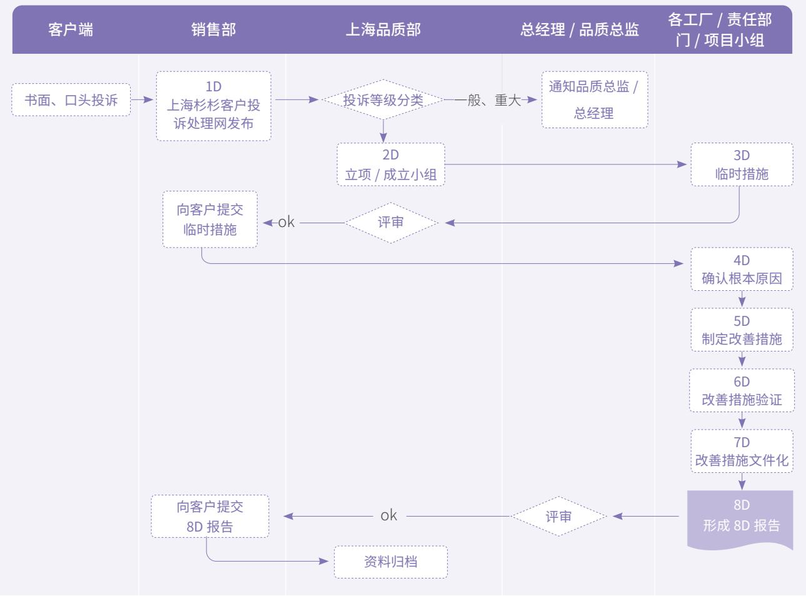

flowchart

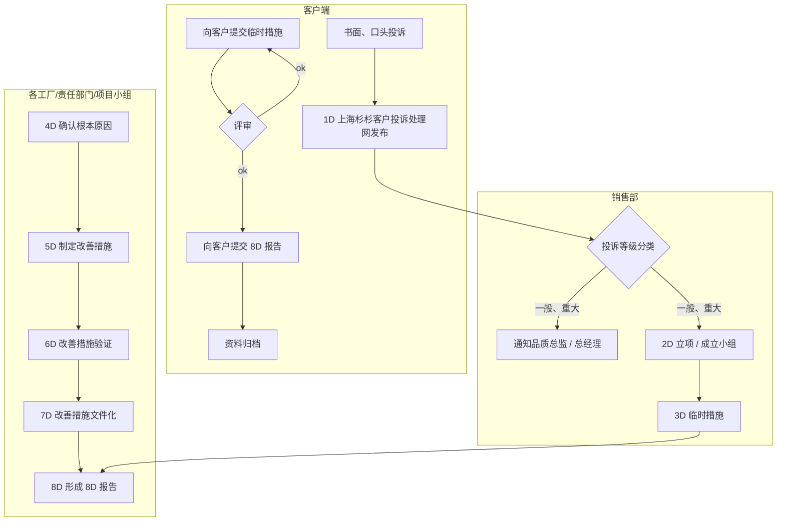
```mermaid
graph TD
  subgraph Client_Sales [客户端]
  A["书面、口头投诉"] --> B["1D 上海杉杉客户投诉处理网发布"]
  C["向客户提交临时措施"] --> D{"评审"}
  E["向客户提交 8D 报告"] --> F["资料归档"]
  end

  subgraph Quality_Sales [销售部]
  B --> G{"投诉等级分类"}
  G -->|一般、重大| H["通知品质总监 / 总经理"]
  G -->|一般、重大| I["2D 立项 / 成立小组"]
  I --> J["3D 临时措施"]
  end

  subgraph Management_Dept [各工厂/责任部门/项目小组]
  K["4D 确认根本原因"] --> L["5D 制定改善措施"]
  L --> M["6D 改善措施验证"]
  M --> N["7D 改善措施文件化"]
  N --> O["8D 形成 8D 报告"]
  J --> O
  D -->|ok| C
  D -->|ok| E
  end
```

杉杉负极客诉处理流程

## 客户满意度调查

为提升客户满意度，杉杉负极每年年底对订单量前列的核心客户开展满意度调查，覆盖产品质量，交付，服务，抱怨处理.包装及环保等维度。调查由销售经理主导，品质部汇总分析并形成年度客户满意度分析报告。针对调查中发现的低分项及客户反馈，公司组织跨部门分析并制定改善措施，确保问题闭环

## 杉杉负极、杉金光电均开展了客户满意度调查

杉杉负极国内客户满意度为

97.02%

杉杉负极海外客户满意度为

95.5%

杉金光电客户满意度为

94.41%

## 案例 杉杉负极获CATL“敏捷供应商奖”

2025年，杉杉负极针对重要客户CATL组建跨职能专业服务团队，覆盖公司高层、销售、研发、品质、供应链、ESG、仓储物流及海外布局等领域。团队明确各窗口专属负责人及职责，形成矩阵式服务架构，实现客户需求快速识别、精准传达与高效闭环处理。通过专业、主动的服务，客户感受到高度重视，具体事项响应时效与处理精度显著提升，助力荣获“敏捷供应商”奖。

text_image

CATL
新鮮味時 2023年
能健佳佳業

获“敏捷供应商”奖

## 案例|杉杉负极获LGES“技术创新奖”

2025年，杉杉负极与LGES紧密协作，快速完成设计需求验证与样品交付，并高效处理审核及技术问题，助力电池项目顺利量产。凭借可靠性能，杉杉产品获得LGES高度认可，成为首批量产沉积型硅碳材料供应商。

text_image

Tuberting Innovation
Tuberting Innovation
Tuberting Innovation
Tuberting Innovation
Tuberting Innovation
Tuberting Innovation
Tuberting Innovation
Tuberting Innovation
Tuberting Innovation
Tuberting Innovation
Tuberting Innovation
Tuberting Innovation
Tuberting Innovation
Tuberting Innovation
Tuberting Innovation
Tuberting Innovation
Tuberting Innovation
Tubertizing Innovation
Tubertizing Innovation
Tubertizing Innovation
Tubertizing Innovation
Tubertizing Innovation
Tubertizing Innovation
Tubertizing Innovation
Tubertizing Innovation
Tubertizing Innovation
Tubertizing Innovation
Tubertizing Innovation
Tubertizing Innovation
Tubertizing Innovation
Tubertizing Innovation
Tubertizing Innovation
Tubertizing Innovation
Tubertizing Innovation
Tsubertizing Innovation
Tsubertizing Innovation
Tsubertizing Innovation
Tsubertizing Innovation
Tsubertizing Innovation
Tsubertizing Innovation
Tsubertizing Innovation
Tsubertizing Innovation
Tsubertizing Innovation
Tsubertizing Innovation
Tsubertizing Innovation
Tsubertizing Innovation
Tsubertizing Innovation
Tsubertizing Innovation
Tsubertizing Innovation
Tsubertizing Innovation
Tsubertizing Innovation

技术创新奖

natural_image

Simple line drawing of a flower with leaves and clouds, accompanied by two gear symbols (no text or labels)

## 案例杉金光电获TCL 华星“特殊贡献奖”

2025年，杉金光电通过稳定供应核心材料、积极技术协同与严格品质管理，为TCL华星提供了高效可靠的支持。凭借在供应保障、技术创新与品质保障上的卓越表现，公司获得TCL华星颁发的“特殊贡献奖”。

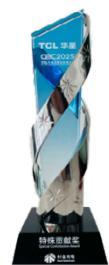

TCL华星 “特殊贡献奖  
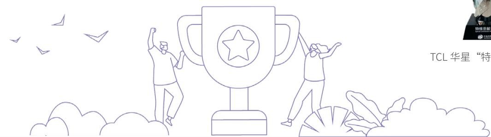

text_image

TCL 华星 “特

## 协同共进 共创价值

## 理念

杉杉股份秉承共生共赢理念，建立覆盖供应链全生命周期的 ESG 治理体系，严格实施冲突矿产管控，创新供应商责任管理，以数字化赋能采购透明化，同时，公司积极构建全方位战略合作生态网络，深化产学研协同创新，主导行业标准共建，拓展全球技术协作维度，引领产业链可持续发展价值共创。

## 我们的行动

供应链 ESG 管理 81

推动行业发展 85

natural_image

Close-up of two business professionals shaking hands in a formal setting (no visible text or symbols)

## 供应链 ESG 管理

杉杉股份持续深化负责任供应链建设，将ESG理念全面融入供应商管理机制，推动阳光采购与绿色采购标准有机衔接提升供应链全流程的透明度与规范性。公司通过开展可持续采购专项培训，强化供应商在环境、社会层面的履责意识携手合作伙伴共同提升供应链的社会价值创造能力。依托产业龙头优势，公司积极引导供应商加快绿色低碳转型，严格落实供应商准入与评价制度，筑牢采购环节风险防线。同时，坚持平等对待中小企业，推动产业链上下游协同发展、价值共享，以稳健、可持续的供应链体系支撑企业高质量发展与产业生态优化。

## 治理

公司高度重视供应链ESG管理，制定并持续完善《采购政策》《供应商管理》《供应商评审、选择和开发》等一系列制度优化采购流程，规范供应商行为，保障供应链的稳定与可持续发展。公司构建以采购部门为核心供应商管理部门，清晰界定采购管理、供应商全生命周期管控、订单快速响应等核心权责，形成闭环治理。治理机构横向联动质量管理相关部门、财务部门和生产部门等协助采购部门执行供应商管理程序，保障了供应链的高效稳定运行。

## 公司通过内外协同系统推进可持续采购实践

## 内部方面

为采购团队开展专项培训，不断提升专业能力与实践水平。

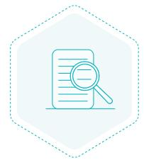

## 外部方面

注重供应商能力建设，通过可持续发展主题培训，引导合作伙伴贯彻《供应商行为准则》，推动供应链在绿色，安全及可持续方面的整体提升。

## 战略

公司基于全供应链视鱼，系统识别质量，安全、合规及环境等关键风险，并积极把握效率提升，绿色转型与协同发展等战略机遇，构建前瞻性，针对性的供应链管理策略，在保障生产连续性与产品质量稳定的基础上，持续优化供应链响应机制与协同效能。通过统筹短期运营稳健与长期价值增长，兼顾利益相关方期望，推动供应链在风险可控的前提下实现机遇可抓、韧性提升，为企业可持续发展夯实基础、注入动能。

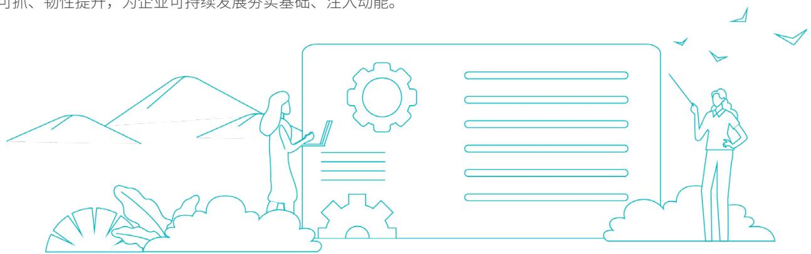

flowchart

This image displays a business process flow diagram illustrating the workflow of enterprise development, featuring a presenter interacting with a large screen and two supervisors observing.

<table><tr><td>风险类型</td><td>风险描述</td><td>影响周期</td><td>发生概率</td><td>财务影响内容</td><td>应对措施</td></tr><tr><td>关键原材料供应稳定性风险</td><td>公司生产对部分基础原材料及能源具有持续性需求,若受供应商生产能力、区域性突发事件或外部环境变化影响,可能出现阶段性供应波动,对生产计划造成影响。</td><td>中期</td><td>中</td><td>原材料供应不稳定可能导致生产节奏调整,增加应急采购或库存管理成本,对经营成本和交付安排产生一定影响。</td><td>通过建立合格供应商管理机制,实施供应商分级管理,保持合理安全库存,并加强与核心供应商的协同。</td></tr><tr><td>原材料价格及采购成本波动风险</td><td>原材料价格受市场供需、能源价格及宏观环境影响存在波动,可能对采购成本带来不确定性。</td><td>短期</td><td>高</td><td>原材料成本波动可能对产品毛利率产生阶段性影响,增加成本管控压力。</td><td>公司持续深化全球供应链布局,完善供应链管理体系,并密切跟踪上游原材料价格波动,以保障原材料供应安全并降低成本波动风险。通过与上游供应商签订长期协议,建立稳定的供应渠道,并积极推进原材料多元化与全球化布局,进一步增强供应保障能力与成本优势。</td></tr><tr><td>供应商合规与社会责任风险</td><td>个别供应商在环境管理、劳工用工或商业道德方面的管理水平存在差异,若相关风险暴露,可能对公司供应链合规性和声誉产生影响。</td><td>中期</td><td>中</td><td>若发生合规问题,可能带来整改成本、合作调整成本或客户合规审核压力,间接影响经营稳定性。</td><td>对供应商开展ESG评估,公司结合评估结果,持续加强监督与沟通,并引导相关方进行改进。</td></tr></table>

供应链管理风险识别

<table><tr><td>机遇类型</td><td>机遇描述</td><td>影响周期</td><td>发生概率</td><td>财务影响内容</td><td>应对措施</td></tr><tr><td>供应链稳定性提升机遇</td><td>通过持续完善供应商管理机制、加强与核心供应商的长期合作,有助于提升原材料和服务供应的稳定性,增强公司生产运营的连续性与可预期性。</td><td>中期</td><td>高</td><td>供应链稳定性提升有助于降低生产中断和应急采购带来的额外成本,提升经营效率,对成本控制和收入稳定形成正向支撑。</td><td>持续推进供应商准入、评估与分级管理,加强与核心供应商的沟通协同,维护长期稳定合作关系。</td></tr><tr><td>绿色供应链转型机遇</td><td>依托公司产业龙头优势,积极引导供应商推进绿色低碳转型,可在行业内率先构建绿色、低碳、循环的供应链体系,响应下游客户对低碳产品的需求趋势。</td><td>长期</td><td>中</td><td>绿色供应链建设有助于提升产品绿色溢价能力,增强品牌美誉度,同时降低未来潜在的碳关税及环境规制成本,为长期价值增长提供新动能。</td><td>将ESG理念融入供应商管理,开展供应商绿色培训与能力建设,推动绿色采购标准落地实施。</td></tr></table>

供应链管理机遇识别

## 影响、风险和机遇管理

公司构建了覆盖供应商全生命周期的科学评价体系，由采购委员会联合相关部门，围绕质量、价格、交付、技术及职业操守等维度，对供应商实施交付评审及月度、季度动态考核，推动其持续改进、共同成长。评审合格的供应商纳入合格名录，并积极构建战略合作关系；对于存在质量缺陷、交付风险或损害公司利益的情形，严格启动退出机制，及时终止合作并消除潜在影响。与此同时，公司持续完善供应链风险“识别一评估一监测一管理”闭环体系，系统化管控各环节潜在风险，通过动态监测、年度现场检查及应急响应机制，全面提升供应链韧性与业务连续性。以科学严谨的管理机制公司持续筑牢稳定、安全、可持续的供应链基石，保障产业链协同发展与价值共创。

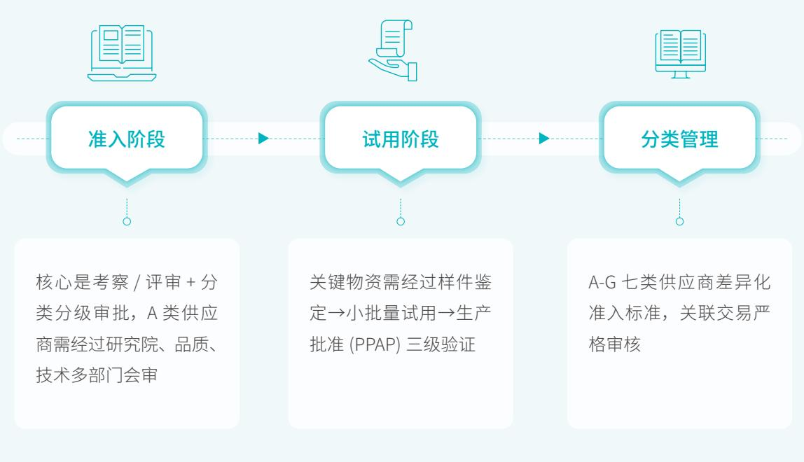

flowchart

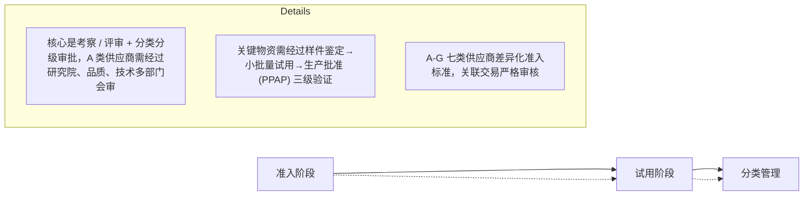
```mermaid
graph LR
  A["准入阶段"] --> B["试用阶段"]
  B --> C["分类管理"]
  
  subgraph Details
    D["核心是考察 / 评审 + 分类分级审批，A 类供应商需经过研究院、品质、技术多部门会审"]
    E["关键物资需经过样件鉴定→小批量试用→生产批准 (PPAP) 三级验证"]
    F["A-G 七类供应商差异化准入标准，关联交易严格审核"]
  end
  
  A -.-> B
  B -.-> C
```

供应商管理流程

## 供应链ESG管理

公司将ESG理念全面融入供应链管理，制定《供应链尽责管理政策》《供方管理控制程序》等制度文件，在供应商合作阶段严格执行《供应商行为准则》《企业社会责任履行协议》及《环境有害物质不使用承诺书》，明确要求原材料及零部件符合绿色产品认证ROHS、REACH等环保标准。同等条件下，优先采购通过环境质量体系认证的供应商产品。同时，公司强化承包商责任管理，围绕施工资质，安全生产及环境保护等维度签订专项协议，确保合作伙伴在履约过程中践行ESG承诺，共同构建绿色、透明、负责任的供应链生态。

## 准入环节明确环保合规门槛

要求A、B类供应商需通过ISO14001环境体系认证或通过二方审核证明其环保能力，原料供应商须提供RoHS、REACH等有害物质检测报告并每年更新，涉及危化品还需提供《材料安全数据表》。

## 审核过程纳入社会责任与安全评估

供应商准入审核内容涵盖劳工用工、商业道德、贸易安全情况，并要求签署《供应商尽职行为准则承诺书》；对存在环境、安全风险的供应商实施重点监控，发生环保事故需立即重新审核

## 绩效评价与退出机制体现ESG约束

季度考核中设有环保合规单项评分，连续不达标将触发红黄牌管理甚至淘汰；供应商变更生产地或发生安全环保事故须追加二方审核，确保全生命周期符合ESG要求。

供应商 ESG相关要求

## 阳光采购

公司将高度重视供应商的商业道德与廉洁合规，与供应商全面签订《阳光协议》《保密协议》及重大节日《阳光承诺函》，明确举报渠道与廉洁要求，坚决防范贪污腐败与信息泄露风险。同时，公司要求全体采购人员签署《采购人员保证书》，严格规范职业行为，杜绝利益冲突，维护公平、公正、透明的交易环境。通过双向约束与透明化管理，公司持续提升供应链商业信誉，保障合作伙伴享有平等权益。

## 冲突矿产管理

杉杉负极恪守负责任矿产采购承诺，严格遵循《经济合作与发展组织尽职管理指南》及《多德-弗兰克法案》第1502条相关要求，全面践行受冲突影响与高风险区域矿产资源的负责任采购原则。公司要求供应商深刻认知矿产开采与交易过程中可能引发的人权、环境及社会风险，明确其在供应链中履行不助长冲突、尊重人权、保护环境的责任与义务。通过强化供应链尽责管理与风险防控，杉杉负极持续推动矿产供应链透明化，合规化建设，携手合作伙伴共同维护可持续、负责任的资源开发生态。

## 指标与目标

<table><tr><td>目标</td><td>达成情况</td></tr><tr><td>供应商签订《供应商行为准则》的覆盖率为100%</td><td>达成</td></tr><tr><td>供应商签订包含环境和劳工要求条款的覆盖率为100%</td><td>达成</td></tr></table>

报告期内，公司可持续采购供应商ESG管理相关指标详见“关键绩效表”。

## 平等对待中小企业

公司坚持平等对待中小企业合作伙伴，持续维护与供应商、承包商等合作方的良性协作关系。严格遵循合同约定及结算管理制度，规范款项审批与支付流程，合理统筹资金安排，保障合作款项有序结算，积极打造公平透明、互利共生的供应链合作生态。

## 推动行业发展

作为产业领军者，杉杉股份坚持以技术创新与科研成果产业化为发展重心，勇担行业引领责任。公司广泛组织并深度参与行业峰会与交流活动，基于自身实践积累，向业内伙伴传递可复制的发展经验与支持，为行业迈向高质量、可持续未来注入持续动力。以此同时，杉杉股份深入推进与全球产业链核心企业的战略协作，并联合高校开展产学研融合实践，持续优化多方沟通机制，聚焦高层次专业人才培育，助力产业链标准完善与行业整体升级，致力于在锂电池负极材料和偏光片领域确立全球领先地位。

## 行业论坛交流

在企业稳步发展的进程中，公司始终行业共进，充分依托会员身份所带来的资源与平台，积极投身于联盟会议，行业论坛及国际峰会等重要交流活动。通过携手国内外领先企业推进协同发展，不断强化与行业协会的互动与合作，共同助推产业技术迭代与创新升级。同时，公司积极响应全球可持续发展号召，以实际行动为行业迈向绿色、低碳的未来贡献积极力量。

## 杉金光电参与协会及担任角色

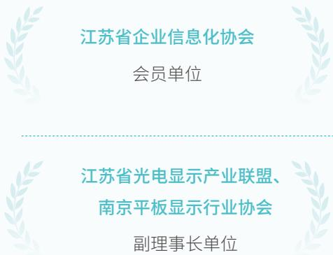

text_image

江苏省企业信息化协会
会员单位

江苏省光电显示产业联盟、
南京平板显示行业协会
副理事长单位

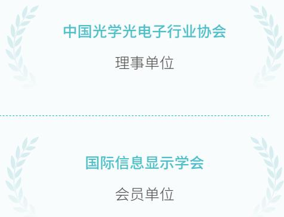

text_image

中国光学光电子行业协会
理事单位

国际信息显示学会
会员单位

## 案例|杉杉负极参与第十七届深圳国际电池技术交流会展览会

2025年5.月，杉杉负极以全球人造石墨负极材料领导者身份参与深圳国际电池技术交流会/展览会(CIBF2025)。展示了在高性能电池材料及绿色能源应用方面的最新成果。在展会期间，公司与全球客户及行业伙伴进行深入交流分享技术创新与产业应用经验，进一步巩固了在全球电池材料市场的领先地位，并助力推动绿色能源产业发展

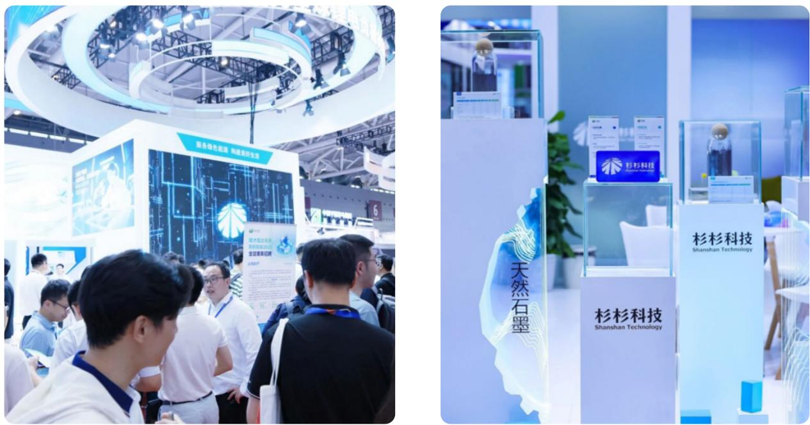  
杉杉负极参与第十七届深圳国际电池技术交流会展览会现场

## 案例杉金光电材料创新引领显示产业高质量发展

2025年8月，在DICEXPO.2025国际显示展上，杉金光电凭借前沿显示材料创新成果，一举斩获“显示材料创新金奖”与“银奖”双项殊荣。作为偏光片领域的领军企业，公司在巩固|CD大尺寸化与高端化优势的同时，实现QLE偏光片规模化供应，全球TV用OLED偏光片市场份额快速提升并处干全球领先地位。车载显示领域，公司推出的广视角偏光片通过极端环境可靠性验证，适配智能座舱多元需求。此外，公司率先发布自主研发的PSAPFASFree环保产品，实现核心材料绿色转型突破，彰显行业责任担当。展会期间，杉金光电与全球产业链伙伴深度对接，持续构建开放合作网络，以材料创新驱动显示产业高质量发展。

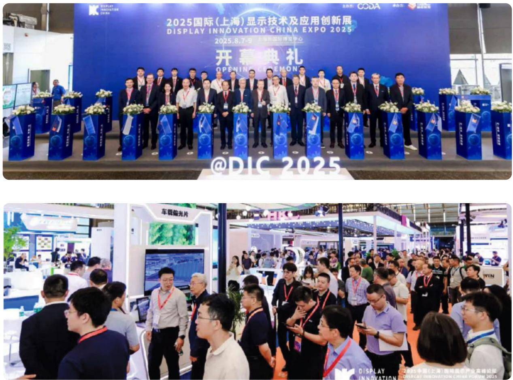  
杉金光电参与 DIC EXPO 2025 国际显示展

## 行业标准参编

公司依托领先的技术实力与深厚的行业积淀，积极参与国家，行业及团体标准的制定与课题研究。在此过程中，公司充分发挥在技术研发、生产实践与市场应用等方面的综合优势，组织专业团队深度参与多项标准的起草与修订工作，持续为完善行业标准体系贡献实践经验与专业智慧。截至报告期末，公司已主导或参与完成各类标准累计11项。

<table><tr><td></td><td>标准名称</td><td>标准类别</td></tr><tr><td rowspan="4">杉金光电</td><td>《平板显示器偏光片测试方法 第一部分 理化性能》</td><td>国家</td></tr><tr><td>《薄膜晶体管液晶显示器(TFT-LCD)用低透湿性偏光片》</td><td>行业</td></tr><tr><td>《中小型有机发光二极管(OLED)显示用偏光片》</td><td>行业</td></tr><tr><td>《电视用有机发光二极管(OLED)偏光片》</td><td>行业</td></tr><tr><td rowspan="7">杉杉负极</td><td>炭素材料取样方法国家标准</td><td>国家</td></tr><tr><td>软炭</td><td>国家</td></tr><tr><td>油系针状焦</td><td>国家</td></tr><tr><td>中间相发微球</td><td>国家</td></tr><tr><td>煤系针状焦中间相焦</td><td>行业</td></tr><tr><td>《硬炭材料 电化学性能测试》</td><td>行业</td></tr><tr><td>企业研发机构知识产权全过程管理指南</td><td>团体</td></tr></table>

## 产学研合作

公司高度重视校企合作在推动产业创新与社会进步中的重要作用，积极探索多元化产教融合模式，持续深化与高校及科研院所的产学研协同。通过整合学术资源与产业实践，公司加快推进科技成果转化，助力技术创新落地应用。同时，依托联合研发项目与人才培养机制，公司积极培育高素质专业人才，赋能行业高质量发展，以实际行动践行社会责任，助力构建开放、共赢的产业生态。

## 上下游厂商

与全球头部终端厂商、主要面板厂及材料厂商开展项目合作

## 参与区域产业生态建设

积极融人南京经开区产学研生态，作为新型显示产业链核心企业，推动研发中心和公共技术服务平台建设。

## 高校及研究院

与南京大学，中国科学技术大学、厦门大学、中国电子技术标准化研究院，电子信息产业发展研究院等展开项目合作

杉金光电产学研合作模式

## 人才汇智同心同行

## 理念

杉杉股份始终将人才视为企业高质量发展的核心驱动力，坚持以人为本、公平公正的人才理念，持续打造多元化、复合型的人才队伍。公司构建分层分类、精准适配的培训体系，针对不同发展阶段员工提供定制化培养支持助力专业能力精进与职业持续进阶；同时畅通多维职业发展通道，完善民主沟通机制，营造开放包容、协同共进的工作氛围，以多元激励充分激发员工创造力，凝聚团队合力，为企业稳健发展筑牢人才根基。

## 我们的行动

员工雇佣和权益 91

员工发展与培训 96

员工关怀和活动 101

职业健康与安全 103

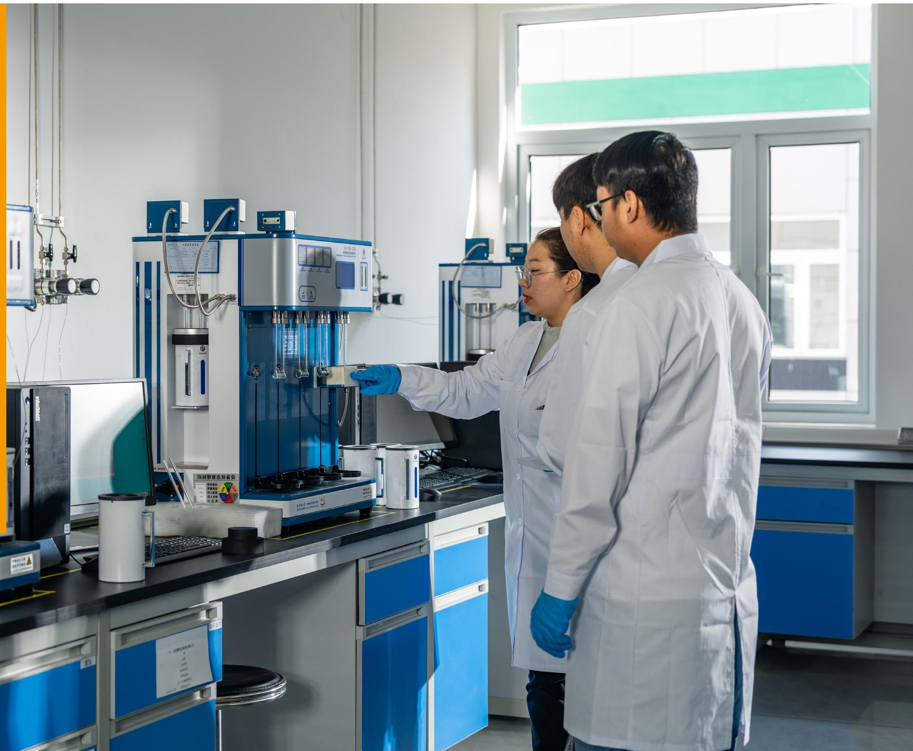

natural_image

Two scientists in lab coats working at a laboratory bench with scientific equipment (no visible text or symbols)

## 员工雇佣和权益

杉杉股份严格遵循《劳动法》等法律法规，建立覆盖反歧视、童工保护、劳工权益等全维度的制度文件，设置符合国家标准与行业要求的劳工管理目标，实施半年审核、年度更新的动态管理机制，系统提升人才管理效能与员工满意度，推动人才价值与企业价值的共生共享。

## 平等雇佣

公司严格遵守《劳动法》《劳动合同法》等国内法律法规，以及海外运营地适用的法律规范，同时参照国际劳工组织(ILO公约等国际准则，系统规范招聘解聘、晋升调岗、薪酬绩效及工时管理等全流程用工行为，切实保障员工合法权益。公司坚持公平、公正、公开的用工原则，持续拓宽人才招聘渠道，与员工依法自愿签订劳动合同，尊重并保障员工合法权益，维护健康有序的劳动力市场秩序。

公司共有员工 6,413 人其中

报告期内  

少数民族员工

332

残疾员工

44 人

外籍员工

人62

新员工

532人

劳动合同签订率

100%

natural_image

Line drawing of three people at a desk with a computer, set against a stylized landscape with trees and birds (no text or symbols)

员工构成  
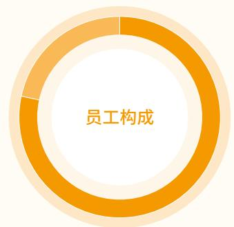

donut

| Category | Value |
| --- | --- |
| 员工构成 (Orange) | ~75% |
| 其他 (Light Orange) | ~25% |

5,026

1,387

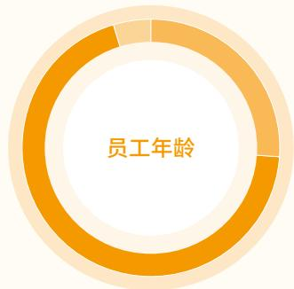

donut

| Category | Value |
| --- | --- |
| 橙色部分 | ~80% |
| 浅橙色部分 | ~20% |

1,678

30-50 岁 4,444

50 岁以上 291

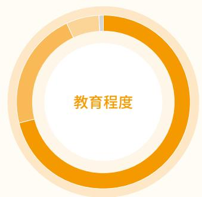

donut

| Category | Value |
| --- | --- |
| 深橙色部分 | ~85% |
| 浅橙色部分 | ~15% |
| 浅灰色部分 | ~5% |

专科及以下 4,638

本科 1,421

硕士 336

博士及以上 18

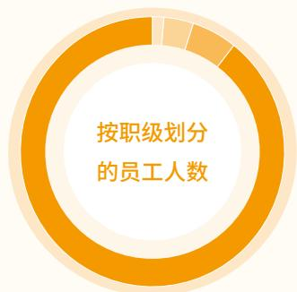

donut

| Category | Value |
| --- | --- |
| 高职级 | ~95% |
| 中职级 | ~10% |
| 低职级 | ~5% |

高级管理层员工人数 93

中级管理层员工人数 231

初级管理层员工人数 358

普通员工 5,731

公司搭建多渠道人才招聘与科学配置体系，持续提升人才供给质量与组织适配效率。公司鼓励内部推荐与内部竞聘，在充分盘活现有人力资源的前提下开展精准外部招聘，推动人力资源全域统筹，优化高效配置。

招聘渠道

内部竞聘

网络招聘

招聘会

猎头招聘

校园招聘等

## 权益保障

公司尊重和保护每一位员工的权益，统构建覆盖用工全周期的权益保护体系。在用工准入环节，坚决杜绝童工的情况在用工环节，严格避免强迫劳动，对任何形式的歧视行为零容忍；在用工过程中，持续优化薪酬福利机制，确保公平合理的价值回报，致力干营造尊重、平等、共赢的职场生态。

## 反童工、反歧视与反强迫劳动

公司在劳动权益合规与社会责任实践中落实反童工、反歧视及反强迫劳动，全环节禁止就业歧视确保公平，明确员工劳动自由并杜绝违规行为。各子公司严格遵循公司要求并结合属地法规与业务实际，制定差异化实施细则，确保管理体系既统一规范又精准落地。

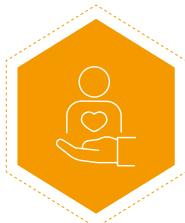

## 保护儿童

公司严格遵循《禁止使用童工规定》等法律法规，制定《禁止雇佣童工和误用童工补救管理程序》严禁招用未满16周岁未成年人，并建立完善的童工识别与补救机制。招聘环节通过身份核验、档案管理等多维度核查年龄信息：日常管理中开展内部审查与动态监控。一旦发现误用童工，立即启动补救程序：停止工作、健康检查、足额支付工资福利，并安全护送返回监护人，相关费用全部由公司承担。同时，公司将童工管理要求延伸至供应商、承包商等商业伙伴，确保全链条合规

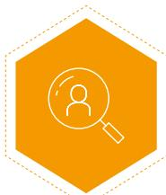

## 反对歧视

公司严格遵守《就业促进法》《妇女权益保障法》等法律法规，严禁在用工全流程中出现任何基于员工人种，肤色，年龄，性别性取向，性别认同和性别表现，种族或民族、残疾、怀孕、宗教信仰、政治派别、社团成员身份、受保护的退伍军人身份、受保护的基因信息或婚姻状况等各种因素而受到差别化对待或歧视行为，保证不开展任何带有歧视性目的的医疗测试或体检。

## 反强迫劳动

公司严禁以任何形式强迫、胁迫员工劳动，明确员工自愿入职、自由离职权利。在劳动合同中清晰约定工作内容、劳动报酬及解除条件，杜绝扣押身份证件、收取保证金等违规行为。

公司坚决抵制童工雇佣、歧视与强迫劳动行为

## 薪酬福利

公司严格遵守国家及地方关于工资支付及福利保障的相关规定，实施《薪酬福利管理》《社保及公积金管理》等内部制度。在依法缴纳“五险一金”的基础上，公司构建了涵盖法定福利、专项津贴及企业关怀在内的多层次福利计划。

## 员工薪酬

标准工资：由基本工资和业绩工资组成  
加班工资

津贴：职责津贴、资格津贴、夜班津贴、特殊津贴、高校津贴、Technician津贴、岗位津贴、通讯补贴、交通补贴餐费补贴等

奖金：即时奖金、生产奖金、年终奖、评价优秀奖励、春节补助金、成果奖金等

员工薪酬结构

## 员工福利体系

## 法定福利

职工社会保险、住房公积金、法定节假、法定福利假（带薪年休假、病假、婚假、产假、哺乳假等）

## 公司福利

通讯补贴、餐费补贴、交通补贴、生日福利、节日福利、年度体检、员工拓展等

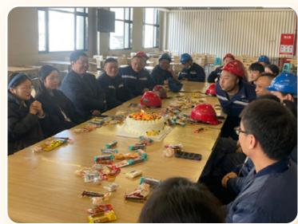

natural_image

Group of people gathered around a long table with crafts and items, in a classroom setting (no visible text or symbols)

员工生日会

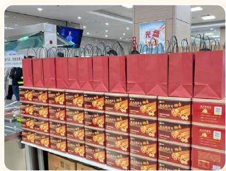

text_image

Store shelf with red gift bags and packaged products, visible signage including '米盘' (Mei Xie)

新年关怀礼包发放

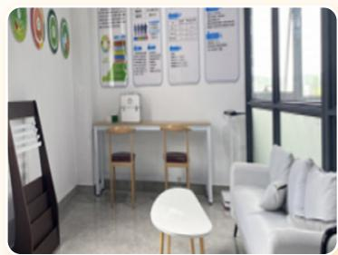

natural_image

Interior of a modern office or living room with white furniture, desks, and wall-mounted posters (no visible text or symbols)

健康小屋

natural_image

Interior view of a modern café or dining area with wooden chairs, tables, and large windows (no visible text or symbols)

休闲娱乐区

natural_image

Interior view of a modern library with bookshelves, chairs, and a large window (no visible text or symbols)

图书室

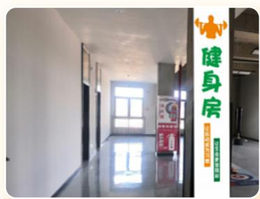

text_image

健身房

健身区

## 民主管理

杉杉股份高度重视员工民主管理建设，为切实保障员工合法权益，公司建立了工会制度，设立了党支部和团支部，尊重所有员工加入工会的权利与参加集体谈判的权利。通过向全员发送邮件的形式告知全员员工投诉渠道并制定相关制度以明确劳工权益申诉的途径，及时回应员工诉求，确保所有员工均可自由反映意见的权利不受到于涉，稳步推进民主管理增强员工凝聚力。同时，公司明确对干举报人的保护，无论采取实名还是匿名的方式，都不会对投诉人信息进行公开，任何人不得以任何形式对举报、投诉人打击报复。

## 投诉渠道

## 杉金光电

厂区内设立意见箱  
正道经营站举报系统& 投诉平台  
热线：020-2220-0225

## 杉杉负极

举报邮箱：sskjnk@shanshan.com  
各工厂现场设置董事长/总经理意见反馈信箱可通过扫码形式匿名反馈各类问题

在沟通参与层面，公司搭建多元化沟通参与体系，以职工代表大会为核心平台，保障员工充分行使民主决策、民主管理、民主监督权利。公司注重职工代表结构的多元性，合理保障女职工代表比例，确保不同岗位、不同群体员工的意见建议都能被充分倾听、有效传递。

##

2025年6月，杉杉负极青山工厂启动《员丁手册（2025年修订版）》修订工作，先后履行工会征询意见、职工代表大会民主审议等法定程序。6月20日，公司召开职丁代表大会，53名职工代表全员出席，经充分讨论并以举手表决方式全票通过修订案。随后，公司完成手册公示及全员签收确认并明确手册作为劳动合同补充附件的法律效力。整个流程由工会全程监督，确保程序合规、员工知情、意见畅通，切实将民主管理融入企业制度建设的各环节，为员工权益保障提供了坚实的制度基础与程序支撑。

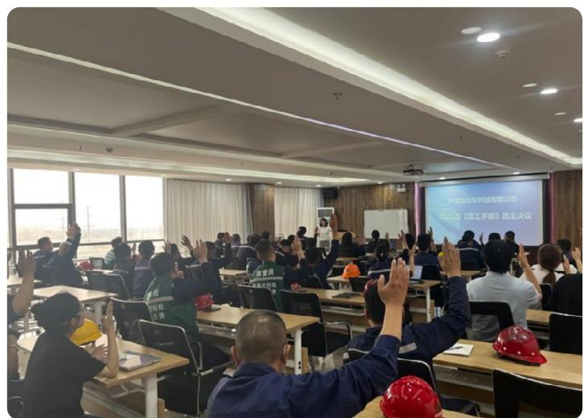

text_image

内蒙古金科科技有限公司
中国化工集团（员工手册）民主决议

杉杉负极青山工厂职工代表大会现场

公司积极开展员工满意度调研工作，通过匿名问卷、深度访谈等多元渠道，全面收集员工在工作环境、工作时间、领导重视、工作认可、同事关系、领导沟通、工作职责、工作挑战性、薪资福利等维度的反馈。调研结果已纳入管理层决策参考。公司将持续以员工声音为导向，完善人才管理机制，确保员工权益与企业发展同频共振

## 报告期内

杉杉负极开展员工满意度调查，员工参与度

100%

整体满意度

91.07%

杉金光电开展员工满意度调查，满意度

4 分（满分5 分）

较上一年度增长

0.02 分

natural_image

Illustration of a classroom scene with three students at desks and a teacher holding a pointer, no text or symbols present.

## 员工发展与培训

杉杉股份秉持可持续发展理念，将人才培育纳入战略框架，以"正直、负责、创新、担当"核心价值观驱动组织建设公司将员工能力建设视为提升组织韧性与核心竞争力的重要抓手，通过构建人才培养长效机制，完善薪酬激励机制与职级晋升通道，打造专业与管理双通道并行的多维职业发展平台。同时，公司着力完善学习型组织建设，围绕岗位需求与职业发展阶段提供分层分类的定制化培训项目，系统提升员工专业素养，推动个人职业目标与企业战略愿景动态契合实现人才与业务协同成长及企业价值共创共享。

## 职业发展

为持续优化人才队伍建设，公司制定《绩效考核管理办法》《职责选解任及晋升管理制度》《员工评价管理制度》等制度，发布《年度绩效考评实施方案》，汇编各部门《职位说明书》，明确岗位职责、任职要求、考核标准及晋升评定基准，建立完善的职业发展体系。同时，公司将员工能力建设视为提升组织韧性与核心竞争力的重要抓手，围绕岗位需求与职业发展阶段，提供分层分类的学习资源与培养项目，打通专业与管理双通道成长路径，推动人才与业务协同成长助力公司实现长期可持续的商业和社会价值创造。

## 员工发展晋升路径

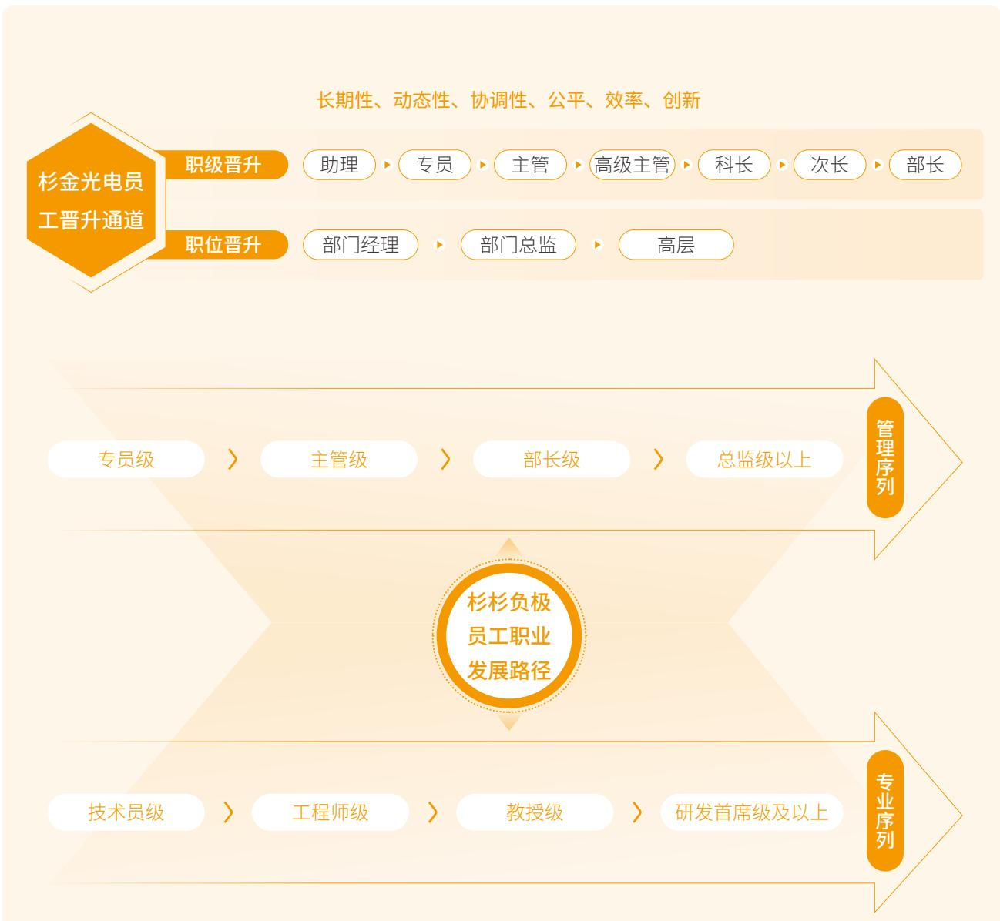

flowchart

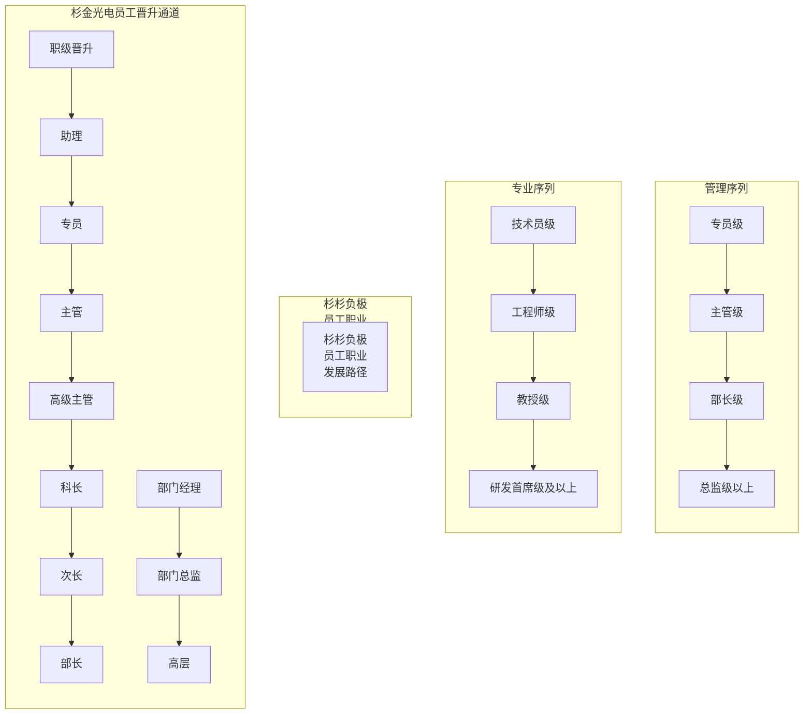
```mermaid
graph TD
  subgraph Management["管理序列"]
    direction TB
  M1["专员级"] --> M2["主管级"]
  M2 --> M3["部长级"]
  M3 --> M4["总监级以上"]
  end

  subgraph Professional["专业序列"]
    direction TB
  P1["技术员级"] --> P2["工程师级"]
  P2 --> P3["教授级"]
  P3 --> P4["研发首席级及以上"]
  end

  subgraph General["杉杉负极\n员工职业\n发展路径"]
    direction TB
    G1["杉杉负极\n员工职业\n发展路径"]
  end

  subgraph Employee["杉金光电员工晋升通道"]
    direction TB
  E1["职级晋升"] --> E2["助理"]
  E2 --> E3["专员"]
  E3 --> E4["主管"]
  E4 --> E5["高级主管"]
  E5 --> E6["科长"]
  E6 --> E7["次长"]
  E7 --> E8["部长"]
  end

  subgraph Employee["职位晋升"]
    direction TB
  O1["部门经理"] --> O2["部门总监"]
  O2 --> O3["高层"]
  end
```

针对不同层级管理者的能力差异与发展需求，公司差异化设置DLP（高层领导力发展项目）与HPI（高潜人才发展项目）双通道培养体系，实施为期五年的系统性培养计划。该培养方案以"宏观视野一战略思维一组织赋能一价值创造一实践转化"为主线，DLP通道聚焦高层管理者的战略领导力与组织变革能力，HPI通道侧重高潜人才的管理核心力与综合素养提升。培养方式融合高校EDP/MBA课程、标杆企业参访、跨部门/跨区域轮岗实践等多元形式，并配套热点赋能、外语学习等共通课程，确保人才培养与公司战略动态契合，为可持续发展提供坚实的人才保障。

在于部选拔任用方面，公司坚持公平、公正、公开原则，对符合资格条件的人员按规定程序进行选拔与提拔。同时，公司保障女性职工在于部选拔中的平等权利，支持女性职工以合法合规方式参与企业管理，持续推动机会平等与多元包容的人才发展环境。

公司依据《绩效管理》制度构建了以战略目标为导向的绩效管理体系，通过系统化的考核机制，确保员工行动与组织战略方向协同一致。公司对全体员工实施年度考核，结合岗位职责确定绩效目标及要求，由考核双方充分沟通后签署《岗位绩效考评表》。绩效评估坚持定性考核与定量考核相结合，考核结果与年终奖金核算、薪酬调整、岗位晋升及评优激励等直接挂钩，实现激励与贡献精准匹配。公司设立申诉渠道保障员工权益，同时，部门负责人在绩效面谈的同事会制定绩效改进计划，并针对性地提供培训与发展支持，切实推动组织与个人绩效的双向提升。该机制贯穿干绩效计划、跟踪管理评估考核与反馈改进的全流程，与公司企业文化及核心价值观高度契合

## 员工培训

公司通过制定《培训管理》制度等一系列规范化文件，构建起覆盖全体员工、贯穿职业发展全周期的人才培养体系。在培训方式上，采取内部讲师授课、师带徒、外部专家引进、外派学习进修等多种形式，并结合线上平台与线下课堂的混合教学模式灵活开展。为确保培训实效，公司通过考试测评、现场问答、实操模拟、心得撰写等方式对学习成果进行多维度评估，切实保障员工掌握岗位所需的知识与技能，全面提升综合业务能力，助力员工持续成长与职业发展。

公司每年更新年度培训计划，以培训需求调研为基础，各部门结合公司战略、年度重点工作和人员盘点情况提出培训需求。人力资源部对需求进行审核后编制《年度培训计划表》，明确培训项目、培训对象、培训方式、培训时间及费用预算等内容，经审批通过后实施。

## 报告期内

杉金光电开展各类培训总计

622 场

员工接受培训的总时长

6,842 小时

人均时长

3.67 小时

杉杉负极开展各类培训总计

2,607场 场

员工接受培训的总时长

7,374.5 小时

人均时长

1.68 小时

## 新员工培训

公司为新员工定制专项入职培训，包含基本制度、企业文化、公司业务、职业素养、商务礼仪、员工行为准则等帮助新员工尽快融入公司大家庭。对于每年统一招聘的大学生，开展集中培训并要求各部门对新招的大学生在入职的第一年持续给予关注和培养，助力其快速融入公司文化、适应职场节奏，顺利完成从校园到职场的角色过渡。

## 通用能力培训

搭建“E-learning”线上学习平台，建立常态化学习机制，引入优质外部课程资源，全方位提升全员通用能力。聚焦质量、健康安全、商业道德等关键议题开展深度宣贯培训，同步系统开展企业社会责任及ESG意识专项培训，将合规理念、责任意识融入全员日常工作，实现通用能力与职业素养双提升。

## 专业能力培训

公司与专业外部咨询机构深度合作，整合内外部教育发展资源，及时输送前沿行业动态、专业理论知识与实战方法，持续夯实员工专业能力根基。按照年度培训计划，公司组织员工参加各类专业培训，鼓励员工通过分享、公开课、E-Learning线上平台等形式，形成开放、共享、互帮互助的学习氛围，提升自己的综合能力。

## 领导力 培训

公司构建分层分类的于部领导力培训体系，通过组建专属领导力提升训练营，针对性设定培养目标：着力提升高层于部的战略经营意识，夯实中层于部的团队管理能力，强化基层于部的综合履职能力，形成梯次清晰、精准赋能的人才培养格局。2025年，公司累计开展领导力专项培训6场，全面提升干部队伍的管理素养与核心业务能力，为企业高质量发展提供坚实的人才保障。

培训体系

text_image

培训体系
99
THIS WEEK

##

2025年9月，杉杉负极开展“9.19领导力训练营”，围绕“管理本质一目标制定一沟通辅导一绩效复盘”四大模块，全面提升管理者赋能团队的能力。该训练营覆盖关键管理岗位人员，有效提升了团队凝聚力与执行力，助力构建尊重、赋能、共进的职场生态，为公司的长期价值创造提供坚实的人才保障

##

2025年，杉杉负极针对云南工厂一线管理者开展专项能力提升训练营，着重提升一线管理者在专业能力、沟通协作及员工意识培养等方面的能力，公司引入日本制造业TWI版权课程，围绕“工作关系”“工作指导”“结构思考力”三大模块开展系统培训。

培训注重实战转化，通过大量随堂练习与业务案例结合，帮助管理者掌握科学的问题解决与员工指导方法论。此次实践体现了公司"以培促管"的人才发展理念，通过分层分类的培训投入，切实提升一线管理效能，支撑生产运营质量持续改进。

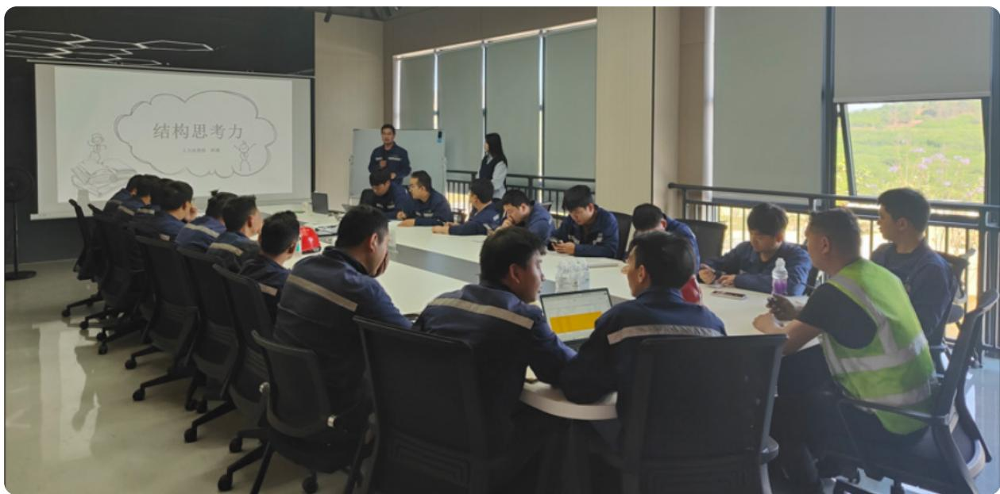

text_image

结构思考力
人人负责！  林强

TRIZ培训训练营现场

## 员工关怀和活动

杉杉股份持续完善员工关怀与文化建设体系，围绕“节日慰问一健康管理一家庭友好一群体关爱”构建常态化关怀机制，通过多元活动与人性化管理，切实提升员工获得感与组织凝聚力。在精神文化生活方面，公司定期组织驴友同好会、跑步及羽毛球同好会、节日活动、生日会等，丰富员工业余生活，促进工作与生活平衡。同时，公司深入开展员工关怀行动，包括春节、中秋等节日福利发放，夏季高温“送清凉”、冬季“送温暖”、健康服务等专项活动，慰问困难职工组织家属来访日等家庭友好型活动，从多维度传递组织温暖，增强员工归属感与团队凝聚力。

## 女性关怀

公司高度重视女性员工权益保障，制定《女员工劳动保护管理规定》等专项制度，全面落实男女同工同酬及平等就业晋升机会，构建女性友好型职场生态。在制度保障之外，公司注重对女性员工的人文关怀，工会专门设立女性职工委员会，将女性权益保护纳入集体协议，积极维护和争取女性员工的特殊利益与合法权益，切实营造尊重、关爱、支持女性职业发展的良好氛围。

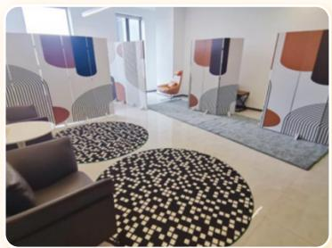

natural_image

Interior view of a modern lounge or lounge with patterned circular tables and colorful abstract wall art (no visible text or symbols)

女性员工专属配套设施-妈咪小屋

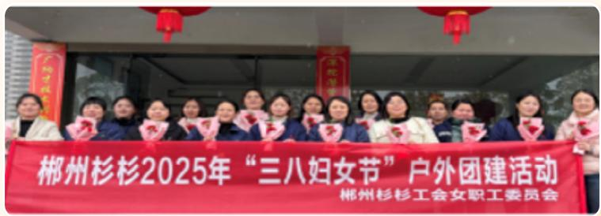

text_image

郴州杉杉2025年“三八妇女节”户外团建活动
郴州杉杉工会女职工委员会

三八妇女节户外团建活动

## 报告期内

公司女性管理者在中级管理层占比

26.84%

在高级管理层占比

23.66%

natural_image

Illustration of a person presenting at a presentation screen with hands holding a heart and documents, alongside abstract diagrams (no text or symbols)

## 员工活动

2025年，公司持续深化员工关怀体系建设，通过组织多元化文体活动、兴趣社团及团队建设活动，进一步丰富员工业余生活，营造积极向上的组织氛围，促进员工身心健康与工作生活平衡，实现劳逸结合、效能提升。

## 文娱活动集锦

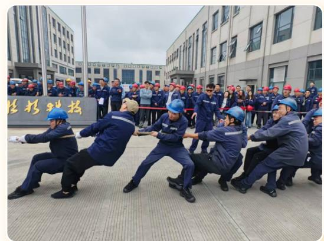

natural_image

Group of workers in blue uniforms and helmets playing tug-of-war outdoors in front of a building with visible signage (no readable text on main subjects)

拔河比赛

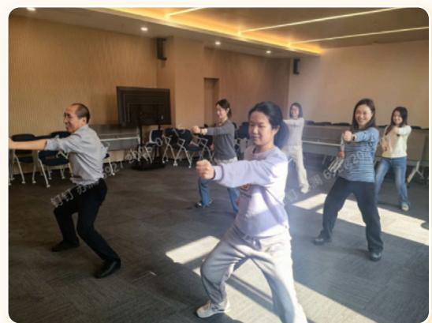

natural_image

Group of people practicing martial arts in a classroom setting (no visible text or symbols)

员工八段锦活动

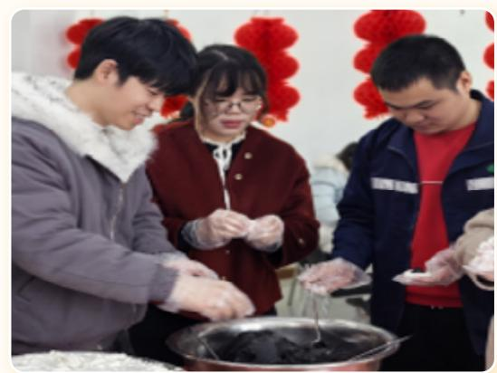

natural_image

Three people preparing food together in a kitchen setting, with red decorations and no visible text or symbols.

福建工厂元宵节“猜灯迷、包汤圆”活动

natural_image

Illustration of a person standing next to a digital display with nodes and a flower, no text or symbols present.

## 困难员工帮扶

公司关注员工福祉，建立困难员工帮扶机制，对因重大疾病等原因面临生活困难的员工提供专项补助支持。同时，工会开展重疾员工关怀与慰问活动，传递组织关爱，切实缓解员工及其家庭的实际困难。

## 职业健康安全

杉杉股份始终将员工的职业健康与安全置于首位，严格遵循《安全生产法》等法律法规及ISO45001职业健康安全管理体系要求，坚持“安全第一、预防为主、综合治理”的安全生产工作方针，按照“化整为零、分类实施、逐步推进、整体提高”的原则，系统构建职业健康安全管理机制。公司通过制定《质量、环境、职业健康安全管理手册》《安全生产责任制的管理制度》《安全生产目标管理制度》等系列制度，并签订《年度安全环保健康目标管理责任书》，不断完善责任落实与激励约束机制，切实保障员工职业健康与安全生产。

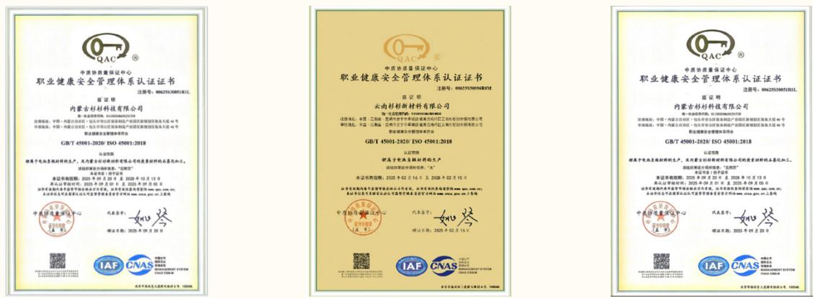  
ISO45001职业健康安全管理体系(部分展示)，截至2025年12月31日，杉杉负极与杉金光电及下属子公司共10家获得ISO45001职业健康安全管理体系认证

## 报告期内

公司安全健康投入总计

4,494.86 万元

各类应急演练

287 场次

## 职业健康管理

在员工职业健康关爱与防护方面，公司积极落实各项健康保障举措，常态化组织员工开展职业健康体检，建立健全员工健康管理档案。同时持续开展职业健康宣传教育与安全防护培训，普及职业危害防护知识与应急处置技能，引导员工增强自我防护意识，从源头防范和降低职业健康风险，切实守护员工职业健康与安全。

## 报告期内

公司职业病发病率为

0

开展职业健康安全相关培训

小时18,906.50

职业健康体检覆盖率达

100%

在持续改进方面，公司坚持“预防为主、全员参与、持续改进”的原则，围绕职业病发病率等关键指标设定清晰的职业健康管理目标，严格按照ISO.45001体系要求推进管理体系的动态优化与迭代升级。通过加快推进职业健康保护行动强化制度执行与落地实效，公司致力于为员工创造更加安全、健康的工作环境，以系统化、科学化的职业健康管理助力企业可持续发展。

管控层级  
管控维度  
核心内容与要求

<table><tr><td>源头治理</td><td>工程控制</td><td>通过改进生产设备、工艺流程和工作环境,从源头减少或消除职业病危害因素。</td></tr><tr><td>过程管控</td><td>管理控制</td><td>制定并实施严格的职业健康管理制度,包括合理安排工作时间、定期检查与维护设备、及时维修更换存在隐患的设施,并通过职业危害因素识别、检测与申报,确保持续受控。</td></tr><tr><td>末端屏障</td><td>个体防护</td><td>为员工配备符合标准的个人防护装备并加强使用培训与监督,确保员工正确佩戴、维护和更换,做到“三会”(会检查、会使用、会维护)。</td></tr><tr><td>动态监测</td><td>卫生监测</td><td>定期对工作场所进行环境监测,包括有害气体、粉尘、噪声等职业病危害因素的浓度或强度检测,依据检测结果及时采取整改或管控措施,并建立职业卫生档案。</td></tr><tr><td>健康保障</td><td>健康监控</td><td>每年对接触职业病危害因素的员工实施上岗前、在岗期间、离岗时的职业健康检查,对体检异常及职业禁忌证人员及时安排复查、医学观察或调岗,建立并维护“一人一档”的职业健康监护档案。</td></tr><tr><td>意识提升</td><td>教育培训</td><td>分层级开展职业健康培训,包括岗位危害因素认知、防护用品使用规范、职业病防治知识等,提高员工防护意识与应急能力,营造全员参与的职业健康文化。</td></tr></table>

## 安全生产

公司设立安全生产委员会作为安全管理的最高领导机构，统筹指导职业健康安全工作的推进与落实，同时制定《危险因素识别与风险评估标准书》，成立安全风险分级管控小组，依据《安全环保隐患排查工作方案》定期开展安全巡查、隐患排查、危险源识别及风险评估，形成《隐患排查与风险辨识、分级管控报告》。通过强化源头治理与过程管控，制定并实施相应控制措施，有效实现对危险因素的动态管理。同时，公司根据厂区安全风险评估结果绘制四色风险分布图清晰标识不同区域的风险等级，确保重点部位得到精准监控和有效防控。

## 报告期内

杉金光电开展安全隐患排查 25 排查发现的安全隐患整改完成率达100%

公司因工受伤人数

23人

因工死亡人数为

0

百万工时伤害率

1.79%

因工伤损失工作日数

1,562 天

在体系建设方面，公司持续构建高效稳定的安全生产体系，推动各项政策措施落实到位，通过定期审计与风险评估，及时排查并整改生产过程中的安全隐患。此外，公司注重人员能力建设，广泛开展安全培训与宣传教育，不断提升员工安全意识和自我防护能力，全方位筑牢安全生产防线。

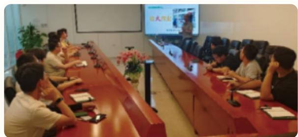

text_image

Meeting room scene with participants seated at long tables facing a presentation screen displaying Chinese text and images

特种作业安全培训

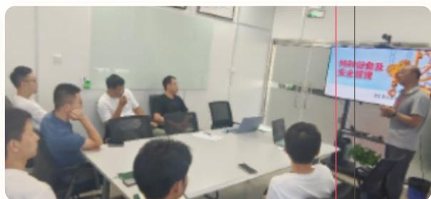

text_image

预防设备及
安全管理

特种设备管理培训

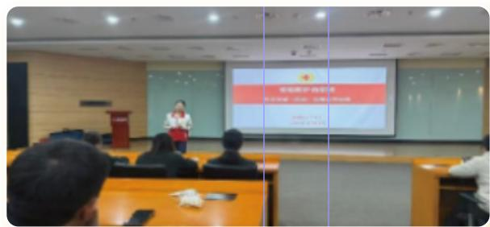

text_image

Conference room scene with presentation screen displaying Chinese text and audience, likely a presentation or conference

应急救护培训

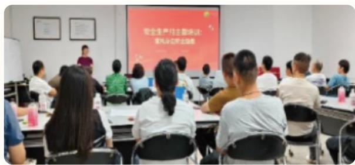

text_image

安全生产月主题研讨
重大决策点提出报告

安全生产月培训

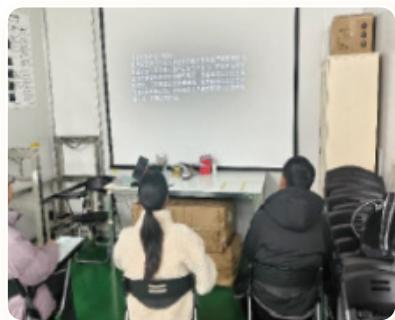

text_image

Classroom scene with students facing a whiteboard; visible Chinese text on the board and wall

新员工安全培训

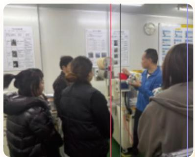

text_image

Street photo with visible store signboards and people queuing in a retail or service area

设备安全体验培训

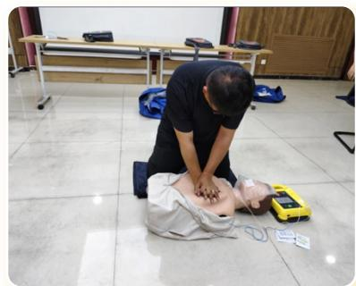

natural_image

Person performing CPR on a man's chest with medical equipment nearby (no visible text or symbols)

杉杉负极青山工厂AED 培训

## 应急管理

公司持续深化企业安全文化建设，系统构建覆盖职业健康与应急管理的制度体系，制定并实施了《突发职业健康与安全事件应急预案》《安全环保应急预案与演练管理制度》《安全教育管理制度》等规范性文件。通过强化制度引领，公司同步推进应急预案宣贯、安全管理制度培训及常态化应急处置演练，全面提升员工的安全责任意识与应急响应能力切实增强对职业病危害的预防、控制和消除水平，推动职业健康安全管理目标有效落地，确保安全管理体系各项措施得到全面落实。

##

2025年，杉杉负极四川工厂分批组织各车间开展火灾爆炸应急预案实战演练，模拟突发火情并蔓延至车间的场景。演练启动二级应急响应，抢险、疏散、救护、保卫等职能小组迅速就位，有序完成初期扑救、人员疏散、伤员救护、物资抢救及现场警戒等全流程处置。通过实战检验，员工进一步掌握了消防器材使用与应急逃生技能，提升全员消防应急的意识与多部门协同作战能力。

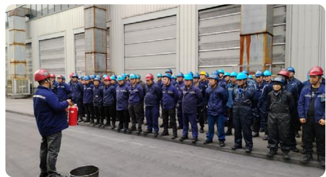

natural_image

Group of workers in blue uniforms and hard hats gathered outdoors near industrial storage bins (no visible text or symbols)

石墨四车间消防应急演练现场

##

2025年3月，杉金光电组织开展食物中毒事故应急演练，模拟员工餐后突发呕叶、腹痛等不适症状。演练涵盖现场急救，医疗诊断，样品送检，医院转运等全流程环节，各应急小组响应迅速，配合有序，有效检验了公司《应急预案》的可行性和可操作性。通过实战演练，公司进一步提升了应对突发食品安全事件的处置能力，强化了多部协同效率，切实筑牢员工健康安全防线，彰显“以人为本”的健康管理理念。

## 初心坚守回馈社会

理念

源于社会、回报社会，是企业发展的初心与归宿。杉杉股份在发展中不忘责任，在成长中反哺民生，通过党建引领、社会公益与乡村振兴，将责任担当融入血脉，与时代同行与大众共生。

我们的行动

党建引领 109

乡村振兴 110

社会公益 111

natural_image

Back view of four people sitting on grass under bright sunlight, wearing straw hats (no text or symbols visible)

## 党建引领

杉杉股份坚持以习近平新时代中国特色社会主义思想为指导，深入贯彻落实党的二十大精神，持续加强基层党组织建设推动党建工作与企业发展深度融合。公司党委充分发挥政治核心作用，带领全体党员职工坚定理想信念，强化责任担当以高质量党建引领企业高质量发展。

## 案例 规范党建与志愿活动并举，强化组织凝聚力

2025年3月，杉金光电（南京）组织党员开展学习雷锋精神实践活动，于公司附近公交站点及区域进行环境清洁。这些规范化、常态化的组织生活与志愿行动，有效强化了党员队伍的纪律性与责任感，增强了组织内部的向心力，并积极履行了企业在社区中的环境责任。

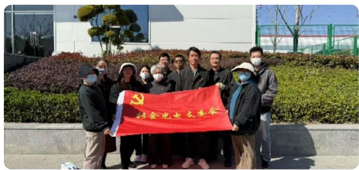

text_image

社会光电文化大会

杉金党支部组织学习雷锋活动

## 案例|组织专项学习部署，深化廉洁从业意识

2025年3月，在南京经济技术开发区组织的中央八项规定精神学习教育动员部署会议后，杉金光电(南京）公司党委随即由党委书记牵头，组织公司内部党员于部进行了专题学习与内部动员部署。此次活动旨在及时传达并深入贯彻会议精神，强化全体党员于部的纪律规矩意识。通过系统的学习与内部工作部署，有效推动了廉洁从业要求在企业的深化落实，为营造区清气正的企业运营环境奠定了思想基础。

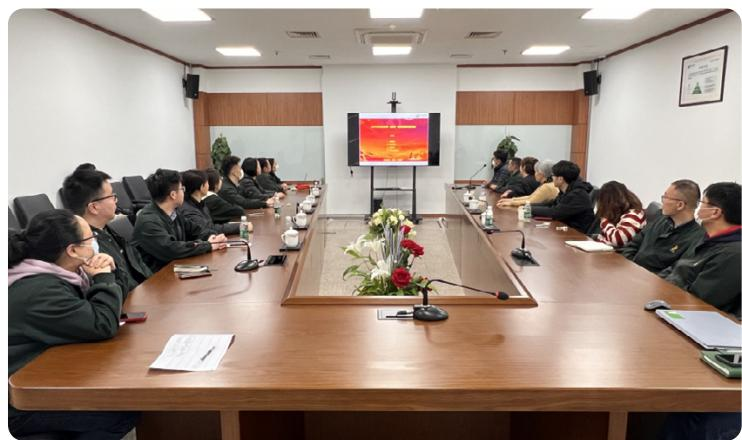

natural_image

Group of people seated around a long conference table in a meeting room, with a presentation screen and floral arrangement visible (no text or symbols present)

杉金党支部组织党委学习

## 案例党员先锋作用贯穿运营，丰富职工生活与助力发展

2025年，杉金光电（南京）党支部积极组织并参与策划了涵盖文化、体育、技能竞赛等多元化职工活动，有效丰富了员工业余生活，缓解了工作压力。同时，党员同志在科研、生产、市场等关键岗位发挥先锋模范作用，既能在行业论坛、大型展览中承担前沿解说与交流任务，也坚守实验室一线专注产品研发。这些举措全面提升了员工的归属感与团队凝聚力，并将党建活力切实转化为推动企业创新与发展的内在动力。

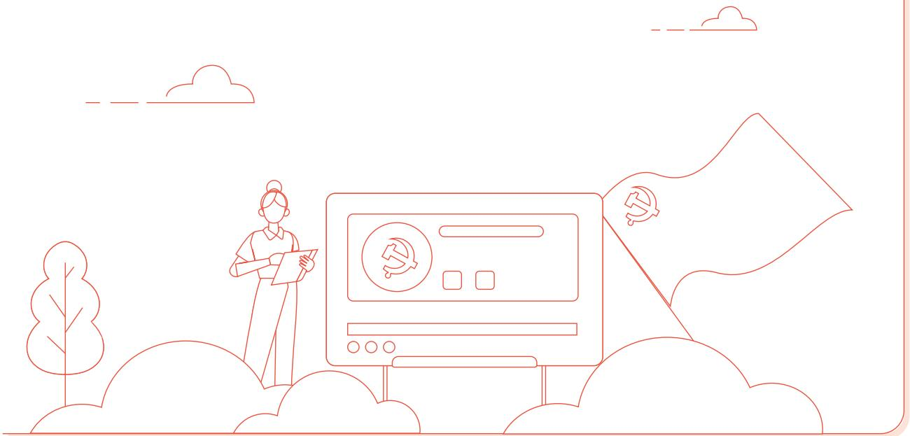

natural_image

Line drawing of a person holding documents next to a computer screen with party symbols, set against a stylized sky and clouds (no text or symbols)

## 乡村振兴

杉杉股份积极响应国家乡村振兴战略，将支持乡村发展作为履行企业社会责任的重要内容。公司围绕巩固拓展脱贫攻坚成果和促进乡村全面振兴，通过开展多样化帮扶行动，助力乡村经济、社会与生态的协同发展，为推动共同富裕和可持续发展贡献企业力量。

## 报告期内

公司乡村振兴投入共

2.1 万元

累计帮扶

32

## 案例|党建联建助力乡村振兴，关怀学子成长

2025年6月，杉杉负极四川工厂党支部与黄丰镇共和村党支部开展党建联建活动，前往院校看望企业资助的困难学子，并开展交流座谈。活动中，公司代表深入了解学生学习与生活情况，鼓励其勤奋学习、提升专业能力。通过党建联建形式，公司搭建起政企协同、关爱人才成长的平台，将社会责任与人才培养相结合，积极助力区域发展与社会进步。

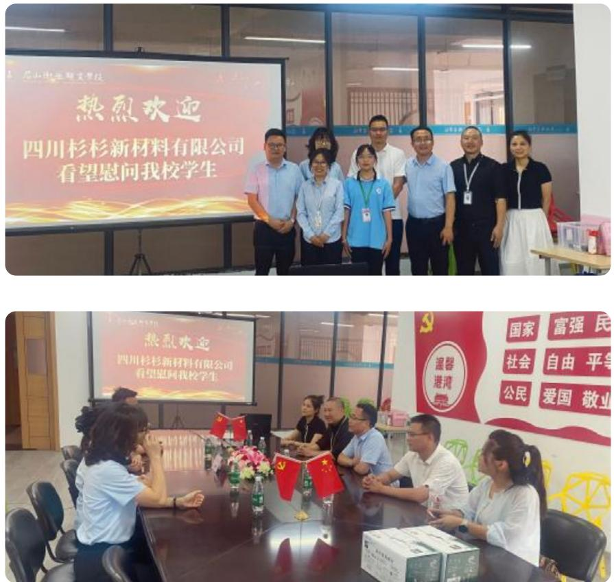

## 社会公益

杉杉股份积极践行企业社会责任，持续推动公益理念融入企业发展，通过多种形式参与社会公益活动，为社会发展贡献力量。公司鼓励员工关注社会问题并积极参与公益实践，通过开展公益宣传、志愿服务及相关培训活动，不断提升员工的社会责任意识与公益参与度，持续为社会传递温暖力量。

报告期内，杉金光电依据《公益事业捐赠法》《慈善法》等相关法律法规，制定《社会公益管理》制度，对公益活动的组织管理，物资管理及活动开展等进行规范，由经营战略部门负责统筹管理，办公室负责日常管理及后勤保障，推动社会公益活动有序开展。杉杉负极深耕应急救援，社区共建等领域，以务实行动，持续投入传递社会温暖

## 案例 杉杉负极开展困难群众慰问活动，传递企业关怀

2025年，杉杉负极福建工厂积极开展社会公益活动，组织对困难群众及党员开展走访慰问。活动中共慰问5人，向每人发放慰问金500元，合计金额2,500元，用于帮助缓解其生活困难。通过开展慰问活动，公司以实际行动传递关怀与温暖，积极履行企业社会责任，营造互助友爱的社会氛围。

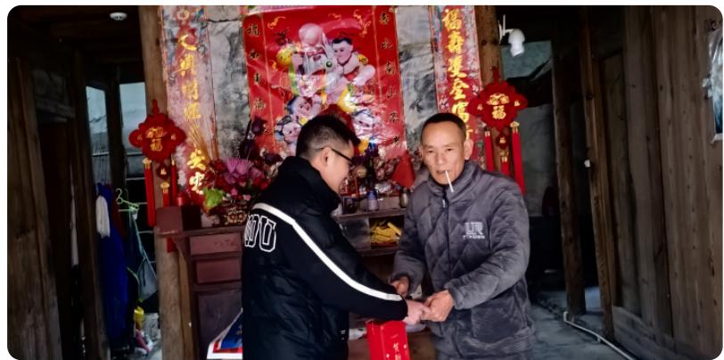

text_image

Street photo showing two men exchanging red envelopes with festive decorations and Chinese New Year couplets in the background

开展困难群众慰问活动

## 案例员工无偿献血活动，传递爱心与社会正能量

2025年9月，杉杉负极包头一体化基地青山工厂员工积极响应无偿献血号召，与包头市血站合作开展献血活动，共有40名员工参与。通过此次活动，员工用实际行动传递关爱与责任，为社会医疗救助贡献力量，进一步弘扬企业关怀文化与社会公益精神。

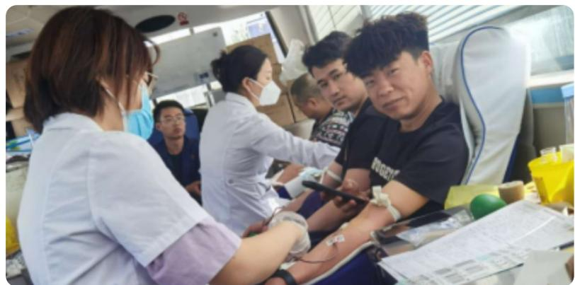

natural_image

Blood donation scene with medical staff and patient on table (no visible text or symbols)

无偿献血活动

natural_image

Line art illustration of medical professionals examining a checklist and document, with hearts and clouds in the background (no text or symbols)

关键绩效

<table><tr><td>议题</td><td>定量指标名称</td><td>单位</td><td>2025年数据</td><td>2024年数据</td><td>2023年数据</td></tr><tr><td rowspan="3">经济效益</td><td>营业收入</td><td>万元人民币</td><td>2,158,701.52</td><td>1,867,972.90</td><td>1,907,022.52</td></tr><tr><td>资产总额</td><td>万元人民币</td><td>4,513,597.92</td><td>4,620,798.23</td><td>4,847,496.60</td></tr><tr><td>报告期内纳税金额</td><td>万元人民币</td><td>56,245.25</td><td>44,933.31</td><td>104,614.29</td></tr><tr><td rowspan="3">公司治理</td><td>董事会总成员数</td><td>人</td><td>11</td><td>11</td><td>11</td></tr><tr><td>其中:女性成员数</td><td>人</td><td>2</td><td>2</td><td>2</td></tr><tr><td>其中:独立董事人数</td><td>人</td><td>4</td><td>4</td><td>4</td></tr><tr><td rowspan="6">商业道德</td><td>经确认的腐败事件总数</td><td>例</td><td>0</td><td>0</td><td>0</td></tr><tr><td>反商业贿赂及反贪污培训开展次数</td><td>次</td><td>58</td><td>72</td><td>3</td></tr><tr><td>反商业贿赂及反贪污培训开展人均时长</td><td>小时/人</td><td>1.00</td><td>1.83</td><td>1.50</td></tr><tr><td>签署廉洁承诺书的员工比例</td><td>%</td><td>100</td><td>100</td><td>100</td></tr><tr><td>签署反贿赂承诺书的供应商比例</td><td>%</td><td>90</td><td>100</td><td>100</td></tr><tr><td>违反正当竞争诉讼/行政处罚事件总数</td><td>件</td><td>0</td><td>0</td><td>0</td></tr><tr><td rowspan="4">员工雇佣</td><td>总员工人数</td><td>人</td><td>6,413</td><td>7,184</td><td>8,095</td></tr><tr><td>残疾员工人数</td><td>人</td><td>44</td><td>43</td><td>3</td></tr><tr><td>少数民族员工人数</td><td>人</td><td>332</td><td>335</td><td>276</td></tr><tr><td>外籍员工人数</td><td>人</td><td>62</td><td>32</td><td>28</td></tr><tr><td rowspan="3">女性发展</td><td>女性员工人数</td><td>人</td><td>1,387</td><td>1,427</td><td>1,476</td></tr><tr><td>在中级管理层占比</td><td>%</td><td>26.84</td><td>28.15</td><td>27.70</td></tr><tr><td>在高级管理层占比</td><td>%</td><td>23.66</td><td>23.60</td><td>20.00</td></tr><tr><td rowspan="3">员工权益</td><td>经确认的歧视事件</td><td>例</td><td>0</td><td>0</td><td>0</td></tr><tr><td>经确认的强迫劳动事件</td><td>例</td><td>0</td><td>0</td><td>0</td></tr><tr><td>经确认的童工事件</td><td>例</td><td>0</td><td>0</td><td>0</td></tr></table>

<table><tr><td>议题</td><td>定量指标名称</td><td>单位</td><td>2025年数据</td><td>2024年数据</td><td>2023年数据</td></tr><tr><td rowspan="6">职业健康与安全</td><td>职业健康、生产安全类培训总时长</td><td>小时</td><td>18,906.50</td><td>70,199.50</td><td>37,793.50</td></tr><tr><td>各类应急演练</td><td>次</td><td>287.00</td><td>488</td><td>260</td></tr><tr><td>安全生产总投入</td><td>万元人民币</td><td>4,494.86</td><td>4,166.35</td><td>5,186.88</td></tr><tr><td>员工体检覆盖率</td><td>%</td><td>100%</td><td>100%</td><td>100%</td></tr><tr><td>因工死亡人数</td><td>人</td><td>0</td><td>0</td><td>0</td></tr><tr><td>职业病发生率</td><td>%</td><td>0</td><td>0</td><td>0</td></tr><tr><td rowspan="2">员工培训</td><td>培训总时长</td><td>小时</td><td>14,216.50</td><td>54,839.40</td><td>6,129.50</td></tr><tr><td>全年培训总场次</td><td>次</td><td>3,231</td><td>2,779</td><td>703</td></tr><tr><td rowspan="4">研发创新</td><td>研发支出</td><td>万元人民币</td><td>120,157.38</td><td>103,699.62</td><td>86,829.73</td></tr><tr><td>研发支出总额占营业收入比例</td><td>%</td><td>5.57</td><td>5.55</td><td>4.55</td></tr><tr><td>研发人员总数</td><td>人</td><td>441</td><td>428</td><td>402</td></tr><tr><td>研发人员占比</td><td>%</td><td>6.88</td><td>5.96</td><td>4.97</td></tr><tr><td rowspan="6">供应链安全</td><td>供应商数量</td><td>家</td><td>536</td><td>/</td><td>/</td></tr><tr><td>签署供应商行为准则的百分比</td><td>%</td><td>100</td><td>/</td><td>/</td></tr><tr><td>签订包含环境和劳工要求条款的供应商百分比</td><td>%</td><td>100</td><td>/</td><td>/</td></tr><tr><td>经确定为具有实际和潜在重大负面社会影响的供应商数量</td><td>家</td><td>0</td><td>/</td><td>/</td></tr><tr><td>经确定为具有实际和潜在重大负面环境影响的供应商数量</td><td>家</td><td>0</td><td>/</td><td>/</td></tr><tr><td>公司内部通过可持续采购培训的采购员比例</td><td>%</td><td>100</td><td>/</td><td>/</td></tr><tr><td rowspan="4">数据安全与客户隐私</td><td>经确认的数据安全事故次数</td><td>例</td><td>0</td><td>0</td><td>0</td></tr><tr><td>数据安全与客户隐私保护培训次数</td><td>次</td><td>21</td><td>6</td><td>6</td></tr><tr><td>相关应急演练次数</td><td>次</td><td>18</td><td>5</td><td>5</td></tr><tr><td>经确认的客户隐私泄露事故次数</td><td>例</td><td>0</td><td>0</td><td>0</td></tr><tr><td>社会公益</td><td>每股社会贡献值</td><td>元人民币</td><td>1.34</td><td>0.87</td><td>1.65</td></tr><tr><td>乡村振兴</td><td>乡村振兴总投入金额</td><td>万元人民币</td><td>2.10</td><td>10.40</td><td>/</td></tr><tr><td rowspan="2">环境管理</td><td>环境管理总投入</td><td>万元人民币</td><td>12,339.29</td><td>10,252.84</td><td>4,071.48</td></tr><tr><td>环境管理总投入占营业收入比例</td><td>%</td><td>0.57</td><td>0.55</td><td>0.21</td></tr><tr><td rowspan="11">能源使用</td><td>综合能源消耗量</td><td>吨标准煤</td><td>543,474.56</td><td>496,457.76</td><td>307,931.52</td></tr><tr><td>每单位营收能源消耗总量</td><td>吨标准煤/百万人民币</td><td>25.18</td><td>26.58</td><td>16.15</td></tr><tr><td>其中:汽油</td><td>升</td><td>37,139.80</td><td>65,793.31</td><td>60,218.96</td></tr><tr><td>其中:柴油</td><td>升</td><td>454,753.45</td><td>627,347.40</td><td>696,111.86</td></tr><tr><td>其中:天然气</td><td>立方米</td><td>13,515,004.00</td><td>15,144,235.08</td><td>10,820,675.82</td></tr><tr><td>其中:液化石油气</td><td>千克</td><td>174.00</td><td>159.50</td><td>81.00</td></tr><tr><td>其中:外购电力</td><td>兆瓦时</td><td>4,057,202.98</td><td>3,802,836.30</td><td>2,328,698.37</td></tr><tr><td>其中:蒸汽</td><td>吨标准煤</td><td>27,823.00</td><td>29,712.81</td><td>26,161.92</td></tr><tr><td>清洁能源使用量</td><td>兆瓦时</td><td>2,818,770.12</td><td>1,836,438.95</td><td>1,311,161.02</td></tr><tr><td>其中:风能</td><td>兆瓦时</td><td>758,923.68</td><td>304,214.01</td><td>201,027.74</td></tr><tr><td>其中:太阳能</td><td>兆瓦时</td><td>317,778.02</td><td>167,216.20</td><td>78,948.79</td></tr><tr><td>废气治理</td><td>废气排放总量</td><td>吨</td><td>597.84</td><td>375.02</td><td>309.72</td></tr><tr><td rowspan="2">废水管理</td><td>废水排放总量</td><td>万吨</td><td>317.48</td><td>334.95</td><td>171.78</td></tr><tr><td>单位营收废水排放量</td><td>吨/百万元营收</td><td>147.07</td><td>179.31</td><td>90.08</td></tr><tr><td rowspan="2">水资源管理</td><td>总耗水量</td><td>吨</td><td>4,921,013.46</td><td>4,928,736.30</td><td>4,001,617.45</td></tr><tr><td>水资源使用强度</td><td>吨/万元营收</td><td>2.28</td><td>2.64</td><td>2.10</td></tr><tr><td rowspan="7">废弃物处理</td><td>废弃物产生总量</td><td>吨</td><td>110,744.72</td><td>100,415.70</td><td>58,480.89</td></tr><tr><td>其中:危险废弃物总量</td><td>吨</td><td>14,651.04</td><td>11,091.97</td><td>8,179.78</td></tr><tr><td>其中:一般固体废弃物总量</td><td>吨</td><td>96,093.69</td><td>89,323.72</td><td>50,301.11</td></tr><tr><td>循环/再利用废弃物总量</td><td>吨</td><td>82,504.74</td><td>84,340.39</td><td>16,369.16</td></tr><tr><td>其中:危险废弃物总量</td><td>吨</td><td>8,162.74</td><td>5,356.17</td><td>2,586.93</td></tr><tr><td>其中:一般固体废弃物总量</td><td>吨</td><td>74,341.99</td><td>78,984.22</td><td>13,782.23</td></tr><tr><td>废弃物回收利用率</td><td>%</td><td>74.50</td><td>83.99</td><td>27.99</td></tr></table>

## 指标索引

全球报告倡议组织 GRI 标准索引

<table><tr><td>使用说明</td><td>杉杉股份在2025年1月1日至2025年12月31日参照GRI标准报告了在此份GRI内容索引中引用的信息。</td></tr><tr><td>使用的GRI 1</td><td>GRI 1: 基础 2021</td></tr></table>

<table><tr><td>GRI 标准</td><td>披露项</td><td>位置</td></tr><tr><td rowspan="19">GRI 2:一般披露2021</td><td>2-1 组织详细情况</td><td>关于本报告</td></tr><tr><td>2-2 纳入组织可持续发展报告的实体</td><td>关于本报告</td></tr><tr><td>2-3 报告期、报告频率和联系人</td><td>关于本报告</td></tr><tr><td>2-5 外部鉴证</td><td>/</td></tr><tr><td>2-6 活动、价值链和其他业务关系</td><td>杉杉股份的 2025、供应链 ESG 管理</td></tr><tr><td>2-7 员工</td><td>员工雇佣和权益</td></tr><tr><td>2-9 管治架构和组成</td><td>夯实公司治理</td></tr><tr><td>2-10 最高管治机构的提名和遴选</td><td>夯实公司治理</td></tr><tr><td>2-11 最高管治机构的主席</td><td>夯实公司治理(详见年度报告)</td></tr><tr><td>2-12 在管理影响方面最高管治机构的监督作用</td><td>夯实公司治理(详见年度报告)</td></tr><tr><td>2-13 为管理影响的责任授权</td><td>我们的可持续发展之路</td></tr><tr><td>2-14 最高管治机构在可持续发展报告中的作用</td><td>我们的可持续发展之路</td></tr><tr><td>2-15 利益冲突</td><td>坚守商业道德</td></tr><tr><td>2-16 重要关切问题的沟通</td><td>我们的可持续发展之路</td></tr><tr><td>2-17 最高管治机构的共同知识</td><td>我们的可持续发展之路</td></tr><tr><td>2-19 薪酬政策</td><td>夯实公司治理(详见年度报告)</td></tr><tr><td>2-20 确定薪酬的程序</td><td>夯实公司治理(详见年度报告)</td></tr><tr><td>2-21 年度总薪酬比率</td><td>详见年度报告</td></tr><tr><td>2-22 关于可持续发展战略的声明</td><td>我们的可持续发展之路</td></tr><tr><td rowspan="8">GRI 2:一般披露2021</td><td>2-23 政策承诺</td><td>坚守商业道德、供应链 ESG 管理、员工雇佣和权益</td></tr><tr><td>2-24 融合政策承诺</td><td>坚守商业道德、供应链 ESG 管理、员工雇佣和权益</td></tr><tr><td>2-25 补救负面影响的程序</td><td>坚守商业道德</td></tr><tr><td>2-26 寻求建议和提出关切的机制</td><td>坚守商业道德、员工雇佣和权益</td></tr><tr><td>2-27 遵守法律法规</td><td>环境合规管理、坚守商业道德</td></tr><tr><td>2-28 协会的成员资格</td><td>推动行业发展</td></tr><tr><td>2-29 利益相关方参与的方法</td><td>我们的可持续发展之路</td></tr><tr><td>2-30 集体谈判协议</td><td>员工雇佣和权益</td></tr><tr><td rowspan="3">GRI 3:实质性议题 2021</td><td>3-1 确定实质性议题的过程</td><td>我们的可持续发展之路</td></tr><tr><td>3-2 实质性议题清单</td><td>我们的可持续发展之路</td></tr><tr><td>3-3 实质性议题的管理</td><td>我们的可持续发展之路</td></tr><tr><td rowspan="4">GRI 201:经济绩效 2016</td><td>201-1 直接产生和分配的经济价值</td><td>详见年度报告</td></tr><tr><td>201-2 气候变化带来的财务影响以及其他风险和机遇</td><td>应对气候变化</td></tr><tr><td>201-3 固定福利计划义务和其他退休计划</td><td>员工雇佣和权益</td></tr><tr><td>201-4 政府给予的财政补贴</td><td>详见年度报告</td></tr><tr><td rowspan="2">GRI 203:间接经济影响 2016</td><td>203-1 基础设施投资和支持性服务</td><td>乡村振兴</td></tr><tr><td>203-2 重大间接经济影响</td><td>社会公益</td></tr><tr><td rowspan="3">GRI 205:反腐败2016</td><td>205-1 已进行腐败风险评估的运营点</td><td>坚守商业道德</td></tr><tr><td>205-2 反腐败政策和程序的传达及培训</td><td>坚守商业道德</td></tr><tr><td>205-3 经确认的腐败事件和采取的行动</td><td>坚守商业道德,本年度未发生此类负面事件</td></tr></table>

<table><tr><td>GRI 标准</td><td>披露项</td><td>位置</td></tr><tr><td>GRI 206: 反竞争行为 2016</td><td>206-1 针对反竞争行为、反托拉斯和反垄断实践的法律诉讼</td><td>坚守商业道德,本年度未发生此类负面事件</td></tr><tr><td rowspan="4">GRI 207: 税务 2019</td><td>207-1 税务方针</td><td>详见年度报告</td></tr><tr><td>207-2 税务治理、控制及风险管理</td><td>详见年度报告</td></tr><tr><td>207-3 与税务关切相关的利益相关方参与及管理</td><td>详见年度报告</td></tr><tr><td>207-4 国别报告</td><td>详见年度报告</td></tr><tr><td rowspan="4">GRI 302: 能源 2016</td><td>302-1 组织内部的能源消耗量</td><td>关键绩效</td></tr><tr><td>302-3 能源强度</td><td>关键绩效</td></tr><tr><td>302-4 降低能源消耗量</td><td>高效资源利用</td></tr><tr><td>302-5 降低产品和服务的能源需求量</td><td>高效资源利用、倡导绿色运营</td></tr><tr><td rowspan="3">GRI 303: 水资源和污水 2018</td><td>303-1 组织与水作为共有资源的相互影响</td><td>高效资源利用</td></tr><tr><td>303-2 管理与排水相关的影响</td><td>高效资源利用</td></tr><tr><td>303-5 耗水</td><td>高效资源利用</td></tr><tr><td rowspan="5">GRI 305: 排放 2016</td><td>305-1 直接(范围 1)温室气体排放</td><td>应对气候变化</td></tr><tr><td>305-2 能源间接(范围 2)温室气体排放</td><td>应对气候变化</td></tr><tr><td>305-3 其他间接(范围 3)温室气体排放</td><td>应对气候变化</td></tr><tr><td>305-4 温室气体排放强度</td><td>应对气候变化</td></tr><tr><td>305-7 氮氧化物(NOX)、硫氧化物(SOX)和其他重大气体排放</td><td>深化三废控制</td></tr><tr><td rowspan="5">GRI 306: 废弃物2020</td><td>306-1 废弃物的产生及废弃物相关重大影响</td><td>深化三废控制</td></tr><tr><td>306-2 废弃物相关重大影响的管理</td><td>深化三废控制</td></tr><tr><td>306-3 产生的废弃物</td><td>深化三废控制</td></tr><tr><td>306-4 从处置中转移的废弃物</td><td>深化三废控制</td></tr><tr><td>306-5 进入处置的废弃物</td><td>深化三废控制</td></tr><tr><td>GRI 308: 供应商环境评估 2016</td><td>308-1 使用环境评价维度筛选的新供应商</td><td>供应链 ESG 管理</td></tr><tr><td></td><td>308-2 供应链的负面环境影响以及采取的行动</td><td>供应链 ESG 管理</td></tr><tr><td rowspan="2">GRI 401: 雇佣2016</td><td>401-1 新进员工雇佣率和员工流动率</td><td>员工雇佣和权益</td></tr><tr><td>401-2 提供给全职员工(不包括临时或兼职员工)的福利</td><td>员工雇佣和权益、员工关怀与福利</td></tr><tr><td rowspan="10">GRI 403: 职业健康与安全 2018</td><td>403-1 职业健康安全管理体系</td><td>职业健康与安全</td></tr><tr><td>403-2 危害识别、风险评估和事故调查</td><td>职业健康与安全</td></tr><tr><td>403-3 职业健康服务</td><td>职业健康与安全</td></tr><tr><td>403-4 职业健康安全事务:工作者的参与、意见征询和沟通</td><td>职业健康与安全</td></tr><tr><td>403-5 工作者职业健康安全培训</td><td>职业健康与安全</td></tr><tr><td>403-6 促进工作者健康</td><td>职业健康与安全</td></tr><tr><td>403-7 预防和减缓与业务关系直接相关的职业健康安全影响</td><td>职业健康与安全</td></tr><tr><td>403-8 职业健康安全管理体系覆盖的工作者</td><td>职业健康与安全</td></tr><tr><td>403-9 工伤</td><td>职业健康与安全</td></tr><tr><td>403-10 工伤相关的健康问题</td><td>职业健康与安全</td></tr></table>

<table><tr><td>GRI 标准</td><td>披露项</td><td>位置</td></tr><tr><td rowspan="3">GRI 404: 培训与教育 2016</td><td>404-1 每名员工每年接受培训的平均小时数</td><td>员工发展与培训、关键绩效</td></tr><tr><td>404-2 员工技能提升方案和过渡援助方案</td><td>员工发展与培训</td></tr><tr><td>404-3 接受定期绩效和职业发展考核的员工百分比</td><td>员工发展与培训</td></tr><tr><td>GRI 405: 多元化与平等机会 2016</td><td>405-1 管治机构与员工的多元化</td><td>夯实公司治理、员工雇佣和权益</td></tr><tr><td>GRI 406: 反歧视 2016</td><td>406-1 歧视事件及采取的纠正行动</td><td>员工雇佣与权益,本年度未发生此类负面事件</td></tr><tr><td>GRI 408: 童工 2016</td><td>408-1 具有重大童工事件风险的运营点和供应商</td><td>员工雇佣与权益,本年度未发生此类负面事件</td></tr><tr><td>GRI 409: 强迫或强制劳动 2016</td><td>409-1 具有强迫或强制劳动事件重大风险的运营点和供应商</td><td>员工雇佣与权益,本年度未发生此类负面事件</td></tr><tr><td>GRI 413: 当地社会 2016</td><td>413-1 有当地社区参与、影响评估和发展计划的运营点</td><td>社会公益、乡村振兴</td></tr><tr><td rowspan="2">GRI 414: 供应商社会评估 2016</td><td>414-1 使用社会评价维度筛选的新供应商</td><td>供应链 ESG 管理</td></tr><tr><td>414-2 供应链的负面社会影响以及采取的行动</td><td>供应链 ESG 管理</td></tr><tr><td rowspan="2">GRI 416: 客户健康与安全 2016</td><td>416-1 评估产品和服务类别的健康与安全影响</td><td>严控品质管理</td></tr><tr><td>416-2 涉及产品和服务的健康与安全影响的违规事件</td><td>严控品质管理</td></tr><tr><td>GRI 417: 营销与标识 2016</td><td>417-1 对产品和服务信息与标识的要求</td><td>深化三废控制(化学品安全管理)</td></tr><tr><td>GRI 418: 客户隐私 2016</td><td>418-1 涉及侵犯客户隐私和丢失客户资料的经证实的投诉</td><td>守护信息安全,本年度未发生此类负面事件</td></tr></table>

## 《上海证券交易所上市公司自律监管指引第14号—可持续发展报告（试行）》（2024年4月）对标

<table><tr><td>指标</td><td>对应的本报告章节</td></tr><tr><td>应对气候变化</td><td>应对气候变化</td></tr><tr><td>污染物排放</td><td>深化三废控制</td></tr><tr><td>废弃物处理</td><td>深化三废控制</td></tr><tr><td>生态系统和生物多样性保护</td><td>倡导绿色运营</td></tr><tr><td>环境合规管理</td><td>环境合规管理</td></tr><tr><td>能源利用</td><td>高效资源利用</td></tr><tr><td>水资源利用</td><td>高效资源利用</td></tr><tr><td>循环经济</td><td>高效资源利用</td></tr><tr><td>乡村振兴</td><td>乡村振兴</td></tr><tr><td>社会贡献</td><td>社会公益</td></tr><tr><td>创新驱动</td><td>创新研发驱动</td></tr><tr><td>科技伦理</td><td>创新研发驱动</td></tr><tr><td>供应链安全</td><td>供应链 ESG 管理</td></tr><tr><td>平等对待中小企业</td><td>供应链 ESG 管理</td></tr><tr><td>产品和服务安全与质量</td><td>严控品质管理;响应客户需求</td></tr><tr><td>数据安全与客户隐私保护</td><td>守护信息安全</td></tr><tr><td>员工</td><td>员工雇佣和权益;员工发展与培训;员工关怀和活动;职业健康与安全</td></tr><tr><td>尽职调查</td><td>内控及风险管理</td></tr><tr><td>利益相关方沟通</td><td>我们的可持续发展之路;夯实公司治理</td></tr><tr><td>反商业贿赂及反贪污</td><td>坚守商业道德</td></tr><tr><td>反不正当竞争</td><td>坚守商业道德</td></tr></table>

## 读者意见反馈表

尊敬的读者：

您好！

非常感谢您在百忙之中阅读《宁波杉杉股份有限公司2025年度环境、社会和公司治理(ESG)报告》。为了向您及其他利益相关方提供更有价值的信息，并有效促进公司提升履行企业社会责任的能力与水平，我们真诚期待您的意见和建议。

## 选择题（请您在相应的位置选择打✓）

1.您对本报告的整体评价是？

非常好 好 一般 较差 差

2.报告对利益相关方所关心问题的回应和披露？

非常好 好 一般 较差 差

3.您认为杉杉股份在经济责任方面做得如何？

非常好 一般 较差 差

4.您认为杉杉股份在环境责任方面做得如何？

非常好 好 一般 较差 差

5.您认为杉杉股份在安全管理方面做得如何？

非常好 一般 较差 差

6.您认为杉杉股份在员工责任方面做得如何？

非常好 一般 较差 差

7.您认为杉杉股份在社区责任方面做得如何？

非常好 好 一般 较差 差

8.报告披露的信息、指标、数据是否清晰、准确、完整？

非常好 一般 较差 差

开放性问题：

1.您对杉杉股份履行社会责任及本报告有任何意见与建议？

## 杉杉股份

## Shanshan