## 20252025 江苏银行股份有限公江苏银行股份有限公司 可持续发展(ESG)报可持续发展(ESG)报告 Sustainability (Environmental, Social and Governance) ReSustainability (Environmental, Social and Governance) R port

  
中国· 江苏省· 南京市· 中华路26号国· 江苏省· 南京市· 中华路26号

No.26, Zhonghua Road, Nanjing, Jiangsu Province, China.26, Zhonghua Road, Nanjing, Jiangsu Province, China www.jsbchina.cn.jsbchina.cn

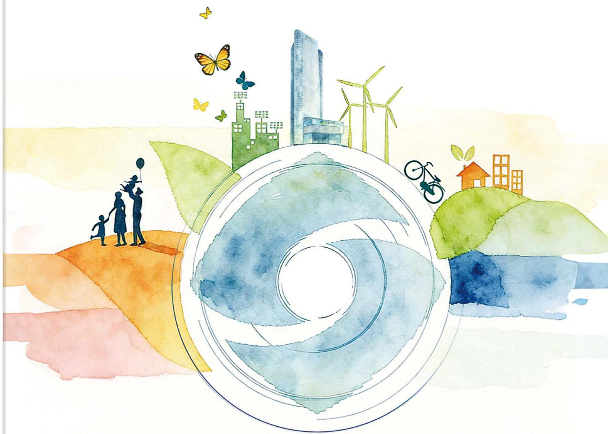

natural_image

Watercolor illustration of diverse life and environmental concepts including a globe, wind turbines, buildings, butterflies, and people (no text or symbols)

## 报告编制说明

江苏银行股份有限公司（以下简称“江苏银行”“本行”“我行”）自2013年起每年发布ESG/社会责任报告，重点披露公司在环境、社会和治理（ESG）领域的可持续发展相关信息。本报告是本行发布的第13份ESG/社会责任报告。

<table><tr><td>报告范围</td><td>报告组织范围:本报告以江苏银行股份有限公司为主体部分,涵盖总行、各分行和苏银金融租赁股份有限公司、苏银理财有限责任公司、苏银凯基消费金融有限公司。报告时间范围:2025年1月1日至2025年12月31日。除特别注明外,本报告中所称“截至年末”均为“截至2025年末”。报告发布周期:本报告为年度报告,上一份报告的发布时间为2025年4月。</td></tr><tr><td>报告编制依据</td><td>本报告编制遵循财政部等九部委《企业可持续披露准则——基本准则(试行)》、上海证券交易所《上市公司自律监管指引第14号——可持续发展报告(试行)》《上市公司自律监管指南第4号——可持续发展报告编制》、联合国环境规划署金融倡议组织(UNEP FI)《负责任银行原则》(PRB),参照全球报告倡议组织(GRI)《可持续发展报告标准》(2021版)、国际可持续准则理事会(ISSB)《国际财务报告准则第2号——气候相关披露》(IFRS S2)、联合国可持续发展目标(SDGs)编制。</td></tr><tr><td>报告数据说明</td><td>本报告中所披露的经营类数据来源于本行2025年度报告。如数据有异,以年报为准。除特别注明外,本报告中所涉及的计价货币为“人民币”。</td></tr><tr><td>报告保证方式</td><td>本报告经本行董事会、高级管理层审议通过。本行董事会及全体董事保证本报告内容不存在任何虚假记载、误导性陈述或重大遗漏,并对其内容的真实性、准确性、完整性承担个别及连带责任。</td></tr><tr><td>报告发布形式</td><td>报告以印刷版和电子版两种形式发布。中、英文报告电子版可在本行官方网站可持续发展专栏下载(http://www.jsbchina.cn),在对两种文本的理解上发生歧义时,以中文版本为准。</td></tr><tr><td>联系方式</td><td>江苏省南京市中华路26号江苏银行办公室邮编:210001电话:025-58588020、58588195传真:025-58588055</td></tr></table>

## 致辞

2025年以来，江苏银行认真落实中央大政方针和江苏省委省政府决策部署，按照人民银行和监管部门要求坚持稳中求进、稳中求变，以强化ESG治理为抓手，加快负责任银行建设，将可持续发展理念深度融入经营管理全流程。全行资产规模突破 4.93 万亿元，经营质效持续提升，全球排名再创新高，在推动高质量发展上交出了扎实答卷。明晟、万得等ESG 评级跃升至A等级，可持续发展能力与品牌影响力迈上新台阶

夯实治理根基。我们高度重视可持续发展管理，将ESG要素纳入战略规划和经营活动中，构建权责清晰、运行高效、风控严密的ESG治理体系。设立董事会战略与ESG委员会，搭建“董事会定战略、管理层抓执行、专业团队推落地”的三级治理架构。风控体系重塑彰显新成效，将ESG 风险管理纳入全面风险管理体系，出台环境、社会和治理风险管理政策，实现全流程嵌入、全链条管控。坚持合规经营、廉洁运营，强化信息披露与投资者沟通，保障股东、客户、员工等各方合法权益，以稳健高效、合规透明的公司治理，为长期可持续发展筑牢保障。我们坚持党建引领与公司治理深度融合，从严从实推进深入贯彻中央八项规定精神学习教育，积极弘扬和践行中国特色金融文化，持续打造“苏银融党建”品牌，深化基层党建工作者专业化建设，不断激发于事创业的内生动力。

聚焦绿色使命。我们以绿色金融为引擎，构建PRB与ESG“双轮驱动”的绿色金融发展战略，助力“双碳”目标与生态文明建设。2025年，我行持续完善绿色金融“五大支柱”，绿色融资规模突破7400亿元，覆盖清洁能源、节能环保、低碳转型、生态保护等重点领域。发布业内首个“碳中和”行动方案，积极构建涵盖绿色金融、转型金融碳金融等在内的集团化产品体系，统筹推动绿色信贷、绿色债券、绿色租赁、绿色理财一体化发展。我们坚持把环境风险作为信贷审批重要关口，严控高碳项目融资，大力发展转型金融，助力传统产业绿色升级，以金融力量守护绿水青山，实现经济效益与生态效益协同共赢。持续提升绿色金融专业服务能力，发布绿色支行梯度培育办法，构建规范化、长效化的绿色支行培育机制。深度参与国际可持续金融规则制定，推动中国经验与全球标准对接。

natural_image

Watercolor illustration of a modern glass skyscraper surrounded by greenery under a blue sky with clouds (no text or symbols visible)

我们以普惠共享为导向，扎实履行社会责任，服务社会发展大局。我们大力支持科技创新、乡村振兴、民生保障，持续加大对小微、民营、科创、涉农等领域信贷投放，截至2025年末普惠小微贷款余额超2470亿元，增速高于全国、全省平均水平；科技贷款余额超2900亿元，重点覆盖专精特新、高新技术、战略性新兴产业。我们积极推进消费者权益保护，普及金融知识，筑牢金融安全防线。我们热心公益事业，开展“滴水筑梦”“梦想小屋”“慈善一日捐”等公益行动，常态化推进“党员进社区”志愿服务。我们助力地方消费提振与文化建设，作为2025年江苏省城市足球联赛总冠名商，推出“跟着苏超去狂欢”主题活动，积极参与“我是厨神”“加油江苏”“苏品苏货”等系列活动累计发放消费券近1.5亿元，用“苏超”流量撬动“苏新消费”增量，切实提升群众获得感、幸福感、满足感，以金融温度传递社会温情。

立足新起点，奋进新征程！2026年，我们将始终心怀“国之大者”，坚守金融本源，以更坚定的信念、更务实的行动，把ESG理念转化为高质量发展动能，为地方经济、社会与环境协同发展贡献更多金融力量，让可持续发展生生不息、行稳致远。

## 袁 军

董事长（任职资格待核准）、行长

## 目录

报告编制说明……01

致辞………………………………02

关于我们………06

可持续发展治理	 12

natural_image

Watercolor painting of a tree with green foliage and sunlight filtering through branches (no text or symbols)

## 环境篇

24

natural_image

Watercolor-style abstract shapes in green and blue, no text or symbols present

应对气候变化 26

投融资环境影响 31

绿色金融……39

汚染物排放……47

废弃物处理 48

生态系统和生物多样性保护 49

环境合规管理 51

51

水资源利用……51

## 社会篇

52

服务实体经济 54

乡村振兴……57

普惠金融 62

科技金融……66

助力消费………………71

金融服务可及性 74

社会贡献………77

创新驱动…………81

科技伦理 84

供应链安全 85

平等对待中小企业 86

消费者权益保护 87

数据安全与客户隐私保护……93

## 可持续发展治理篇110

专题：坚持党建引领，强化使命担当	 112

公司治理 114

险管理…… 118

商业道德 120

2025年温室气体排放量	 124

《上海证券交易所上市公司自律监管指引第14号

可持续发展报告（试行）》索引	 125

GRI 标准索引	 126

## 关于我们

text_image

江苏银行
BANK OF JIANGSU

## 我行简介

江苏银行于2007年1月24日挂牌开业，是全国系统重要性银行之一，总部位于江苏南京。2016年8月2日，在上海证券交易所上市，股票代码600919

江苏银行始终坚持“融创美好生活”使命，致力于建设“智慧化、特色化、国际化、综合化”的服务领先银行。截至2025年末，资产总额4.93万亿元。在英国《银行家》杂志“全球银行1000强”排名中列第56位，较上年大幅提升10位，在中资银行中排名第16位。入选《财富》中国500强，排名第162位，列国内城商行首位。当选“联合国环境署金融倡议组织银行理事会”中东亚地区理事代表。

江苏银行下辖18家分行和苏银金融租赁股份有限公司苏银理财有限责任公司、苏银凯基消费金融有限公司3家子公司，机构实现了江苏省内县域全覆盖，业务布局长三角、京津冀、粤港澳大湾区三大经济圈。各级机构540余家，集团从业人员2万余人。

The Banker

TOP 1000

WORLD BANKS 2025

全球排名

56 位

入选《财富》中国

500 强

排名

第 第 162位

组织架构图  
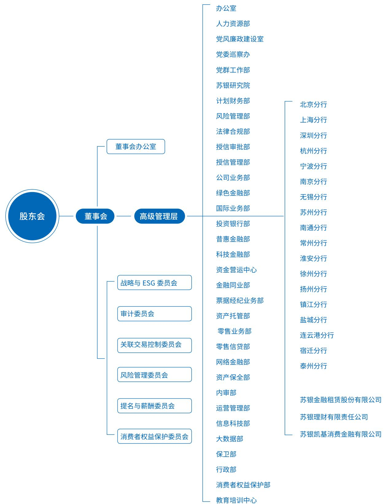

flowchart

```mermaid
graph LR
  A["股东会"] --> B["董事会"]
  B --> C["高级管理层"]
  
  subgraph B [董事会办公室]
    direction TB
  B --> C
  end
  
  subgraph C [战略与ESG委员会]
    direction TB
  C --> D["战略与 ESG 委员会"]
  C --> E["审计委员会"]
  C --> F["关联交易控制委员会"]
  C --> G["风险管理委员会"]
  C --> H["提名与薪酬委员会"]
  C --> I["消费者权益保护委员会"]
  end
  
  subgraph C [高级管理层]
    direction TB
  C --> J["办公室"]
  C --> K["人力资源部"]
  C --> L["党风廉政建设室"]
  C --> M["党委巡察办"]
  C --> N["党群工作部"]
  C --> O["苏银研究院"]
  C --> P["计划财务部"]
  C --> Q["风险管理部"]
  C --> R["法律合规部"]
  C --> S["授信审批部"]
  C --> T["授信管理部"]
  C --> U["公司业务部"]
  C --> V["绿色金融部"]
  C --> W["国际业务部"]
  end
  
  subgraph D & E["战略与 ESG 委员会"]
    direction TB
  D --> E
  D --> F
  D --> G
  D --> H
  D --> I
  end
  
  subgraph C [高级管理层]
    direction TB
  J --> X["北京分行"]
  J --> Y["上海分行"]
  J --> Z["深圳分行"]
  J --> AA["杭州分行"]
  J --> AB["宁波分行"]
  J --> AC["南京分行"]
  J --> AD["无锡分行"]
  J --> AE["苏州分行"]
  J --> AF["南通分行"]
  J --> AG["常州分行"]
  J --> AH["淮安分行"]
  J --> AI["徐州分行"]
  J --> AJ["扬州分行"]
  J --> AK["镇江分行"]
  J --> AL["盐城分行"]
  J --> AM["连云港分行"]
  J --> AN["宿迁分行"]
  J --> AO["泰州分行"]
  end
  
  subgraph C [高级管理层]
    direction TB
  K --> X
  K --> Y
  K --> Z
  K --> AA
  K --> AB
  K --> AC
  K --> AD
  K --> AE
  K --> AF
  K --> AG
  K --> AH
  K --> AI
  K --> AJ
  K --> AK
  K --> AL
  K --> AM
  K --> AN
  K --> AO
  end
  
  subgraph C [高级管理层]
    direction TB
  O --> X
  O --> Y
  O --> Z
  O --> AA
  O --> AB
  O --> AC
  O --> AD
  O --> AE
  O --> AF
  O --> AG
  O --> AH
  O --> AI
  O --> AJ
  O --> AK
  O --> AL
  O --> AM
  O --> AN
  O --> AO
  end
  
  subgraph C [高级管理层]
    direction TB
    P1["投资银行部"]
    P2["普惠金融部"]
    P3["科技金融部"]
    P4["资金营运中心"]
    P5["金融同业部"]
    P6["票据经纪业务部"]
    P7["资产托管部"]
    P8["零售业务部"]
    P9["零售信贷部"]
    P10["网络金融部"]
    P11["资产保全部"]
  end
  
  subgraph C [高级管理层]
    direction TB
  Q1["内审部"]
  Q2["运营管理部"]
  Q3["信息科技部"]
  Q4["大数据部"]
  Q5["保卫部"]
  Q6["行政部"]
  Q7["消费者权益保护部"]
  Q8["教育培训中心"]
  Q1 -.-> Q2
  Q1 -.-> Q3
  Q1 -.-> Q4
  Q1 -.-> Q5
  Q1 -.-> Q6
  Q1 -.-> Q7
  Q1 -.-> Q8
```

## 荣誉与认可

明晟\ MSCI

ESG

评级提升至

  
级

万得 \ Wind

ESG

评级保持

  
级

<table><tr><td></td><td>荣誉名称</td><td>授予机构</td></tr><tr><td rowspan="8">综合类</td><td>“五篇大文章”卓越实践机构</td><td>《21世纪经济报道》</td></tr><tr><td>中国上市公司品牌价值榜TOP100</td><td>每日经济新闻</td></tr><tr><td>卓越竞争力品牌建设银行</td><td>《中国经营报》</td></tr><tr><td>中国服务业企业500强</td><td>中国企业联合会</td></tr><tr><td>年度城商行</td><td>第一财经</td></tr><tr><td>年度区域服务领军银行</td><td>和讯网</td></tr><tr><td>银行业ESG典型实践案例(ESG品牌建设)</td><td>《中国银行保险报》</td></tr><tr><td>ESG金融年度大奖</td><td>财联社</td></tr><tr><td rowspan="3">环境类</td><td>负责任银行原则(PRB)全球优秀案例</td><td>联合国环境规划署金融倡议组织(UNEP FI)</td></tr><tr><td>金融机构绿色金融评价“优秀”档次</td><td>中国人民银行</td></tr><tr><td>银行业ESG典型实践案例(绿色金融创新)</td><td>《中国银行保险报》</td></tr><tr><td rowspan="4">社会类</td><td>社会帮扶业绩突出单位</td><td>江苏省老区建设促进会江苏省乡村发展基金会江苏省乡村发展协会</td></tr><tr><td>金诺年度品牌微视频-《与创新者同行》</td><td>中国金融传媒</td></tr><tr><td>年度财富管理银行</td><td>《经济观察报》</td></tr><tr><td>消费者最满意品牌</td><td>《江苏商报》</td></tr><tr><td rowspan="3">治理类</td><td>上市公司信息披露工作评价A级</td><td>上海证券交易所</td></tr><tr><td>上市公司投资者关系管理最佳实践</td><td>中国上市公司协会</td></tr><tr><td>和谐投资者关系银行天玑奖</td><td>《证券时报》</td></tr></table>

关键绩效指标

<table><tr><td colspan="2">指标分类</td><td>指标名称</td><td>2025年</td><td>2024年</td><td>2023年</td><td>备注</td></tr><tr><td rowspan="14">治理关键绩效</td><td rowspan="10">财务表现</td><td>总资产</td><td>49,313.16</td><td>39,520.42</td><td>34,033.62</td><td></td></tr><tr><td>营业收入</td><td>879.42</td><td>808.15</td><td>742.93</td><td></td></tr><tr><td>吸收存款</td><td>25,897.24</td><td>21,606.55</td><td>19,149.48</td><td></td></tr><tr><td>贷款及垫款</td><td>24,117.11</td><td>20,386.61</td><td>18,359.72</td><td></td></tr><tr><td>净利润</td><td>362.84</td><td>333.06</td><td>300.13</td><td></td></tr><tr><td>基本每股收益(元)</td><td>1.76</td><td>1.65</td><td>1.69</td><td></td></tr><tr><td>净资产收益率(ROE,%)</td><td>13.14</td><td>13.59</td><td>14.52</td><td></td></tr><tr><td>不良贷款率(%)</td><td>0.84</td><td>0.89</td><td>0.89</td><td></td></tr><tr><td>资本充足率(%)</td><td>12.87</td><td>12.99</td><td>13.31</td><td></td></tr><tr><td>拨备覆盖率(%)</td><td>322.98</td><td>350.10</td><td>389.53</td><td></td></tr><tr><td rowspan="2">反洗钱</td><td>反洗钱培训次数(次)</td><td>306</td><td>399</td><td>156</td><td></td></tr><tr><td>反洗钱培训覆盖人次(人次)</td><td>52,458</td><td>59,201</td><td>82,143</td><td></td></tr><tr><td rowspan="2">反腐败</td><td>反腐倡廉培训次数(次)</td><td>316</td><td>237</td><td>345</td><td></td></tr><tr><td>反腐倡廉培训覆盖人次(人次)</td><td>41,863</td><td>40,234</td><td>36,714</td><td></td></tr></table>

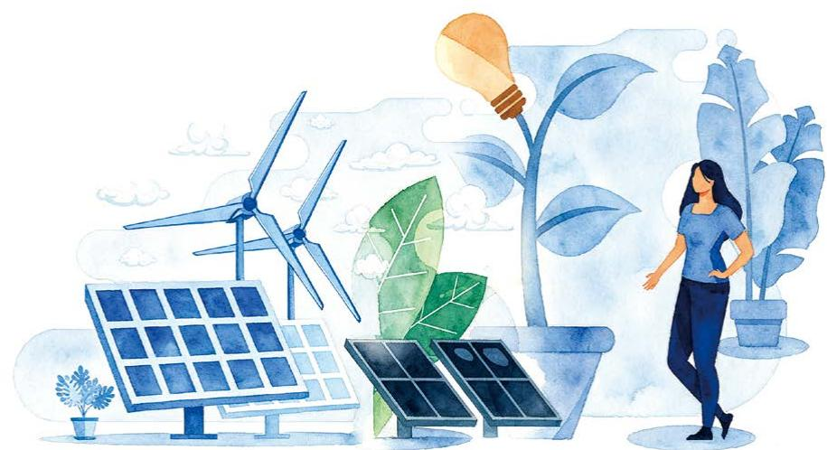

natural_image

Illustration of renewable energy sources including solar panels, wind turbines, and a light bulb, with a woman walking alongside (no text or symbols)

<table><tr><td colspan="2">指标分类</td><td>指标名称</td><td>2025年</td><td>2024年</td><td>2023年</td><td>备注</td></tr><tr><td rowspan="32">社会关键绩效</td><td rowspan="8">服务规模</td><td>服务个人客户数量(万)</td><td>3,305.38</td><td>3,172.21</td><td>2,940.26</td><td></td></tr><tr><td>服务公司客户数量(个)</td><td>430,579</td><td>402,758</td><td>370,228</td><td></td></tr><tr><td>个人网银交易金额</td><td>3,893.86</td><td>3,489.53</td><td>3,634.16</td><td></td></tr><tr><td>手机银行交易金额</td><td>49,837.66</td><td>43,361.95</td><td>43,448.38</td><td></td></tr><tr><td>公司网银交易金额</td><td>127,953</td><td>124,300</td><td>76,648</td><td></td></tr><tr><td>营业网点数(个)</td><td>543</td><td>538</td><td>534</td><td></td></tr><tr><td>设置无障碍通道的网点数量(个)</td><td>543</td><td>538</td><td>534</td><td></td></tr><tr><td>自助设备数(台)</td><td>1,108</td><td>1,128</td><td>1,206</td><td></td></tr><tr><td rowspan="5">普惠金融</td><td>小微企业贷款余额</td><td>7,865</td><td>6,648</td><td>6,237</td><td></td></tr><tr><td>普惠型小微企业贷款余额</td><td>2,478</td><td>2,105</td><td>1,734</td><td></td></tr><tr><td>普惠型小微企业贷款余额增速(%)</td><td>17.72</td><td>21.36</td><td>25.30</td><td></td></tr><tr><td>普惠型小微企业贷款户数(户)</td><td>96,375</td><td>93,656</td><td>85,429</td><td></td></tr><tr><td>年内新增普惠型小微企业贷款发放额</td><td>3,156</td><td>2,697</td><td>2,219</td><td></td></tr><tr><td rowspan="3">乡村振兴</td><td>涉农贷款余额</td><td>2,873</td><td>2,410</td><td></td><td>按人民银行涉农贷款统计口径</td></tr><tr><td>乡村振兴投入金额</td><td>2,873</td><td></td><td></td><td>为涉农贷款余额</td></tr><tr><td>乡村振兴惠及人数(人)</td><td>197,476</td><td></td><td></td><td>为贷款覆盖人数</td></tr><tr><td rowspan="13">招聘与培训</td><td>员工总人数(人)</td><td>18,149</td><td>17,436</td><td>16,916</td><td rowspan="12">统计口径包括劳动合同制员工</td></tr><tr><td>30岁(含30岁)以下员工数(人)</td><td>6,058</td><td>5,739</td><td>5,415</td></tr><tr><td>30岁(不含30岁)-50岁(含50岁)以下员工数(人)</td><td>9,902</td><td>9,610</td><td>9,455</td></tr><tr><td>50岁(不含50岁)以上员工数(人)</td><td>2,189</td><td>2,087</td><td>2,046</td></tr><tr><td>女性员工比例(%)</td><td>52.84</td><td>53.45</td><td>53.84</td></tr><tr><td>男性员工比例(%)</td><td>47.16</td><td>46.55</td><td>46.16</td></tr><tr><td>少数民族员工占比(%)</td><td>1.56</td><td>1.51</td><td>1.40</td></tr><tr><td>员工流失率(%)</td><td>2.04</td><td>2.67</td><td>3.49</td></tr><tr><td>劳动合同签订率(%)</td><td>100</td><td>100</td><td>100</td></tr><tr><td>社会保险覆盖率(%)</td><td>100</td><td>100</td><td>100</td></tr><tr><td>员工人均培训时长(小时)</td><td>75.20</td><td>52.52</td><td>41.00</td></tr><tr><td>参与培训员工人数(人)</td><td>全行员工人数</td><td>全行员工人数</td><td>全行员工人数</td></tr><tr><td>员工培训投入(万元)</td><td>4,052</td><td></td><td></td><td>2025年新增</td></tr><tr><td rowspan="3">公益慈善</td><td>慈善捐赠资金金额(万元)</td><td>8,826.07</td><td>4,326.94</td><td></td><td></td></tr><tr><td>志愿者活动人次(人次)</td><td>30,148</td><td>21,050</td><td>19,000</td><td>2025年在“苏超”比赛期间志愿者累计10000人次</td></tr><tr><td>志愿者活动时长(小时)</td><td>44,300</td><td>31,000</td><td>28,500</td><td>2025年在“苏超”比赛期间志愿者服务累计时长约15000小时</td></tr></table>

<table><tr><td colspan="2">指标分类</td><td>指标名称</td><td>2025年</td><td>2024年</td><td>2023年</td><td>备注</td></tr><tr><td rowspan="27">环境关键绩效</td><td rowspan="15">绿色信贷</td><td>绿色信贷余额</td><td>5,294.76</td><td>3,897.81</td><td></td><td rowspan="14">绿色贷款统计口径依据《绿色金融支持项目目录(2025年版)》,2023年末数据未重新核算</td></tr><tr><td>节能降碳产业贷款余额</td><td>339.16</td><td>263.18</td><td></td></tr><tr><td>环境保护产业贷款余额</td><td>518.22</td><td>397.81</td><td></td></tr><tr><td>资源循环利用产业贷款余额</td><td>702.63</td><td>593.41</td><td></td></tr><tr><td>能源绿色低碳转型贷款余额</td><td>615.15</td><td>483.25</td><td></td></tr><tr><td>生态保护修复和利用贷款余额</td><td>635.22</td><td>503.56</td><td></td></tr><tr><td>基础设施绿色升级贷款余额</td><td>1,897.49</td><td>1,366.61</td><td></td></tr><tr><td>绿色服务贷款余额</td><td>19.01</td><td>17.89</td><td></td></tr><tr><td>绿色贸易贷款余额</td><td>111.06</td><td>1.31</td><td></td></tr><tr><td>绿色消费贷款余额</td><td>395.50</td><td>249.58</td><td></td></tr><tr><td>境外绿色贷款余额</td><td>61.33</td><td>21.20</td><td></td></tr><tr><td>绿色贷款比上年增加额</td><td>1,396.95</td><td></td><td></td></tr><tr><td>绿色信贷支持项目折合减排二氧化碳当量(万吨)</td><td>613.77</td><td>562.27</td><td></td></tr><tr><td>绿色信贷支持项目折合节约标准煤(万吨)</td><td>221.41</td><td>200.33</td><td></td></tr><tr><td>绿色信贷支持项目折合减排大气污染物(万吨)</td><td>99.77</td><td>68.50</td><td>82.60</td><td>二氧化硫、氮氧化合物、细颗粒物(PM2.5)、挥发性有机物合计</td></tr><tr><td rowspan="4">能源消耗</td><td>办公耗电总量(千瓦时)</td><td>7,496,826</td><td>9,280,200</td><td>8,675,700</td><td rowspan="4">总行数据</td></tr><tr><td>办公耗水总量(吨)</td><td>88,958</td><td>83,111</td><td>81,172</td></tr><tr><td>公务车耗油总量(升)</td><td>55,928</td><td>46,328</td><td>34,394</td></tr><tr><td>办公用纸总量(吨)</td><td>21.22</td><td>17.45</td><td>14.51</td></tr><tr><td rowspan="8">废弃物</td><td>废弃微机(主机)(台)</td><td>2,500</td><td>2,174</td><td>1,721</td><td></td></tr><tr><td>废弃显示器(台)</td><td>1,888</td><td>2,048</td><td>1,993</td><td></td></tr><tr><td>废弃笔记本电脑(台)</td><td>434</td><td>221</td><td>318</td><td></td></tr><tr><td>废弃打印机(台)</td><td>1,552</td><td>1,009</td><td>1,290</td><td></td></tr><tr><td>废弃服务器(台)</td><td>166</td><td>69</td><td>130</td><td></td></tr><tr><td>废弃铅酸蓄电池(UPS电池)(千克)</td><td>46,044</td><td>41,900</td><td>17,625</td><td></td></tr><tr><td>废弃硒鼓墨盒(千克)</td><td>5,775</td><td>5,067</td><td>5,067</td><td></td></tr><tr><td>废弃色带(千克)</td><td>2,220</td><td>2,152</td><td>1,796</td><td></td></tr></table>

注：以上数据除特别说明外，数据口径为集团，单位均为亿元，截止日期为2025年年末。

## 可持续发展治理

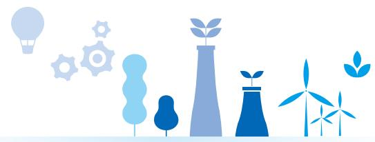

natural_image

Illustration of various renewable energy icons including lightbulb, gears, plants, and wind turbines (no text or symbols)

本行将可持续发展理念深度融入企业发展战略，以可持续发展作为检验自身高质量发展的价值标尺，锚定服务实体经济本源，以深耕“五篇大文章”为着力点优化金融供给，精准赋能各类市场主体需求，在经济效益与社会价值的共生共荣中践行负责任银行的使命担当。

## 企业使命

融创美好生活

## 企业愿景

建设智慧化、特色化、国际化、综合化的服务领先银行

## 核心价值观

融合创新 行稳致远 诚信专业团结奋斗

## 发展理念

特色发展内生增长创新驱动

## 服务理念

客户至上 创造价值

## 责任理念

融善于心 创美于行

## 可持续发展治理架构

本行高度重视可持续发展管理，将ESG要素纳入战略规划和经营活动中，夯实“董事会-管理层-执行层”三级实施体系。

## 董事会：

董事会是ESG工作的最高领导机构，下设战略与ESG委员会，主要工作职责包括：

研究制定本行可持续发展战略，监督、检查和评估本行可持续发展战略执行情况和负责任银行建设情况；

推动本行构建全方位的ESG管理体系，指导完善ESG发展机制；

引导本行履行社会责任，定期审议 ESG 报告、负责任银行原则(PRB)自评估报告和绿色金融发展报告，推动本行建立良好、诚信的企业文化和价值准则。

## 管理层：

设立“五篇大文章工作领导小组”，由董事长担任组长，切实做好科技金融、绿色金融、普惠金融、养老金融、数字金融“五篇大文章”。领导小组下设由总行行领导任组长，部门和子公司组成的绿色金融工作组，统筹全行资源，协同推进可持续发展。

## 执行层：

总行各部门、各分支行和子公司各司其职、通力配合，在经营管理活动中落实ESG和可持续发展理念，共同推动ESG工作质效不断提升。

## 利益相关方沟通

## 建立健全多维度互联互通资本市场沟通机制

本行制定并落实《江苏银行投资者关系管理办法》，密切关注市场动态，深度聚售市场热点，分类施策做好与各类投资者的信息传递、互动交流，积极开展多种形式的投资者关系活动，主动传递本行可持续发展实践成果及特色亮点，积极回应市场关切的ESG热点问题，如绿色金融、公司治理、股东回报、可持续发展、ESG风险管理等。

报告期内，本行举行2024年度暨2025年一季度业绩交流会、2025年半年度业绩说明会、2025年三季度业绩说明会，召开股东大会3次，向与会投资者介绍本行经营情况和战略规划，并对市场重点关心的绿色金融目标、股东权益、公司治理等问题逐一解答。线上线下相结合与国内外主流机构路演，参加券商策略会交流110场，覆盖重点投资机构超720家。由知名券商分析师撰写发布研究报告，报告期内累计发布各类研报超80篇。在上交所互动平台回复投资者提问60次，接听投资者电话咨询超 1100 次。

## 优化迭代“四位一体”特色化信披体系

本行深入推进信息披露、财报审计、市场沟通、决策建议“四位一体”的特色化信披体系建设，严格落实监管信息披露要求制定《江苏银行信息披露事务管理办法》《江苏银行信息披露事务管理实施细则》《江苏银行内幕信息知情人管理办法》等制度办法，按照监管法规规定、行内制度流程和工作计划，组织协调行内各部门和中介机构，规范高效开展定期报告、临时公告编制与披露，以及财务报告审计工作，积极展现我行特色经营亮点与高质量发展态势，加强环境、社会和治理信息披露积极回应市场关切，持续丰富信披形式，不断提升信披质效。报告期内，本行在上海证券交易所合计披露各类公告文件78项获评上交所2024-2025年度信息披露评价最高等级A级。

<table><tr><td>利益相关方</td><td>期望</td><td>沟通方式</td><td>回应措施</td></tr><tr><td>政府</td><td>遵守国家法律法规、行业标准与规范保障银行资金安全依法公平竞争、维护公平竞争环境坚持可持续发展</td><td>法律法规、政策指引、规范性文件行业会议、专题报告、监管通报与评级、现场检查、非现场监管座谈会、研讨会、论坛</td><td>响应国家号召落实监管政策提升经营管理绩效接受监督考核</td></tr><tr><td>监管机构</td><td>合规经营风险可控</td><td>监管政策、文件现场和非现场监管</td><td>依法合规、诚信经营强化公司治理</td></tr><tr><td>股东与投资者</td><td>提高股东回报提升盈利能力国有资产保值增值充分了解经营状况</td><td>股东大会定期公告、临时公告业绩说明会</td><td>制定和落实发展战略完善公司治理加强风险防范提高信息披露透明度</td></tr><tr><td>员工</td><td>提供就业机会保障合理的待遇和福利提供良好的工作环境建立顺畅的沟通机制提供良好的成长空间</td><td>职工代表大会工会组织“亮点”平台</td><td>保障员工健康安全举办文体活动保障员工基本权益提供岗位技能培训</td></tr><tr><td>客户</td><td>提供优质金融服务提供优质金融产品提供完整、真实、准确的产品服务信息保障信息安全</td><td>营业网点电子银行营销活动沙龙讲座</td><td>提供方便、快捷金融服务提供多元化金融产品及时发布产品、营销公告加强营业网点及电子渠道金融安全</td></tr><tr><td>社会</td><td>关心弱势群体开展公益活动普及金融知识</td><td>实地走访、慰问与公益组织合作</td><td>提供对外捐赠款项帮扶弱势群体开展金融教育举办公益活动</td></tr></table>

<table><tr><td>利益相关方</td><td>期望</td><td>沟通方式</td><td>回应措施</td></tr><tr><td>环境</td><td>节约能源资源助力“双碳”目标</td><td>绿色金融绿色办公环保公益</td><td>践行绿色金融倡导绿色办公开展环保和公益活动</td></tr><tr><td>媒体</td><td>定期信息披露报道重大活动</td><td>定期发布报告召开新闻发布会组织联合采访</td><td>通过召开新闻发布会、组织联合采访、发布新闻稿件等多渠道披露、报道重要信息</td></tr><tr><td>供应商及合作伙伴</td><td>遵守商业道德公开、公平、公正采购</td><td>公开采购信息谈判、交流合作协议、合同</td><td>建立健全供应商管理机制建立维护供应商信息库加强与供应商的沟通与联系</td></tr></table>

## 重要性议题识别与分析（双重重要性分析）

本行按照上海证券交易所《上市公司自律监管指引第14号——可持续发展报告（试行）》要求，参考上海证券交易所《上市公司自律监管指南第4号一可持续发展报告编制》、中国上市公司协会《上市公司可持续发展报告工作指南》中的议题及双重重要性分析要求，探索对本行涉及的可持续议题开展影响重要性和财务重要性分析，得出本行2025年度双重重要性议题，在本报告中进行各议题信息披露，以回应利益相关方对本行可持续发展工作的关切

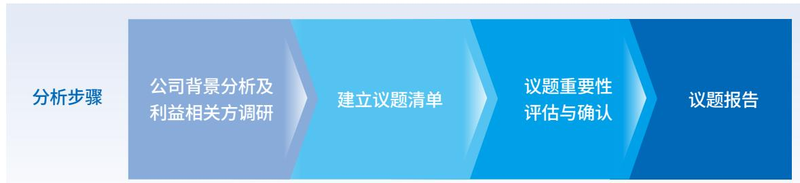

flowchart

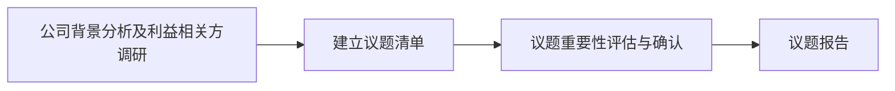
```mermaid
graph LR
  A["公司背景分析及利益相关方调研"] --> B["建立议题清单"]
  B --> C["议题重要性评估与确认"]
  C --> D["议题报告"]
```

## 公司背景分析及利益相关方调研

本行结合金融行业特点和我行发展战略、发展阶段，参照国内银行同业优秀实践和利益相关方期望，构建了江苏银行2025年可持续发展议题框架。

## 建立议题清单

本行以上交所自律监管指引中的议题为基础，通过分析金融行业及本行发展特点，结合利益相关方期望和关切(详见利益相关方沟通章节)，形成了江苏银行2025年可持续议题清单，共26项

<table><tr><td>实践维度</td><td>序号</td><td>议题名称</td></tr><tr><td rowspan="9">环境</td><td>1</td><td>应对气候变化</td></tr><tr><td>2</td><td>投融资环境影响</td></tr><tr><td>3</td><td>绿色金融</td></tr><tr><td>4</td><td>污染物排放</td></tr><tr><td>5</td><td>废弃物处理</td></tr><tr><td>6</td><td>生态系统和生物多样性保护</td></tr><tr><td>7</td><td>环境合规管理</td></tr><tr><td>8</td><td>能源利用</td></tr><tr><td>9</td><td>水资源利用</td></tr><tr><td rowspan="14">社会</td><td>10</td><td>服务实体经济</td></tr><tr><td>11</td><td>乡村振兴</td></tr><tr><td>12</td><td>普惠金融</td></tr><tr><td>13</td><td>科技金融</td></tr><tr><td>14</td><td>助力消费</td></tr><tr><td>15</td><td>金融服务可及性</td></tr><tr><td>16</td><td>社会贡献</td></tr><tr><td>17</td><td>创新驱动</td></tr><tr><td>18</td><td>科技伦理</td></tr><tr><td>19</td><td>供应链安全</td></tr><tr><td>20</td><td>平等对待中小企业</td></tr><tr><td>21</td><td>消费者权益保护</td></tr><tr><td>22</td><td>数据安全与客户隐私保护</td></tr><tr><td>23</td><td>员工</td></tr><tr><td rowspan="3">治理</td><td>24</td><td>公司治理</td></tr><tr><td>25</td><td>风险管理</td></tr><tr><td>26</td><td>商业道德</td></tr></table>

## 议题重要性评估与确认

影响重要性评估：回应江苏银行在相应议题的表现对经济、社会和环境产生实际或者潜在重大影响。影响包括正面影响和负面影响。

确定影响重要性评估因素及量化分值

<table><tr><td>发生的可能性 / 量化分值</td><td>规模(影响的大小程度) / 量化分值</td><td>范围(影响的广泛程度) / 量化分值</td><td>不可补救性(影响是否不可补救或补救的难度是否很大) / 量化分值</td></tr><tr><td>· 不可能 0 分</td><td>· 无 0 分</td><td>· 无 0 分</td><td>· 很容易补救 0 分</td></tr><tr><td>· 轻微可能 1 分</td><td>· 极小 1 分</td><td>· 有限 1 分</td><td>· 短期内相对容易补救 1 分</td></tr><tr><td>· 一般可能 2 分</td><td>· 轻度 2 分</td><td>· 集中 2 分</td><td>· 可努力补救 2 分</td></tr><tr><td>· 很可能 3 分</td><td>· 中度 3 分</td><td>· 中度 3 分</td><td>· 难以补救或需要在中期内补救 3 分</td></tr><tr><td>· 非常有可能 4 分</td><td>· 高度 4 分</td><td>· 广泛 4 分</td><td>· 很难补救或需要在长期内补救 4 分</td></tr><tr><td>· 可能性极高 5 分</td><td>· 十分严重 5 分</td><td>· 全球 / 全部 5 分</td><td>· 无法补救 5 分</td></tr></table>

## 开展利益相关方调研

结合可持续议题，设计调研问卷，通过门户网站、社交媒体等渠道，面向员工、客户、社会公众、合作伙伴、媒体等利益相关方进行影响重要性调研

## 设置判定影响重要性的阈值

如单个议题量化分值总和大于或等于12分，判断为影响重要性议题。

## 影响重要性议题

经对调研结果进行分析，得出应对气候变化、投融资环境影响、绿色金融、生态系统和生物多样性保护、服务实体经济、乡村振兴普惠金融、科技金融、助力消费、金融服务可及性、社会贡献、创新驱动、消费者权益保护、数据安全与客户隐私保护、员工、公司治理风险管理、商业道德18个议题为影响重要性议题

natural_image

Watercolor illustration of a group of people seated in a meeting room with a presentation screen, no visible text or symbols.

财务重要性评估：回应江苏银行在相应议题的表现是否会在短期、中期和长期内对公司商业模式、业务运营、财务状况、经营成果、现金流、融资方式及成本产生重大影响

确定财务重要性评估因素及量化分值

<table><tr><td>影响发生的可能性 / 量化分值</td><td>当期影响程度 / 量化分值</td><td>预期(短期、中期和长期)影响程度 / 量化分值</td></tr><tr><td>· 不可能 0 分</td><td>· 无影响 0 分</td><td>· 无影响 0 分</td></tr><tr><td>· 轻微可能 1 分</td><td>· 极小影响 1 分</td><td>· 极小影响 1 分</td></tr><tr><td>· 一般可能 2 分</td><td>· 轻度影响 2 分</td><td>· 轻度影响 2 分</td></tr><tr><td>· 很可能 3 分</td><td>· 中度影响 3 分</td><td>· 中度影响 3 分</td></tr><tr><td>· 非常有可能 4 分</td><td>· 高度影响 4 分</td><td>· 高度影响 4 分</td></tr><tr><td>· 可能性极高 5 分</td><td>· 影响极大 5 分</td><td>· 影响极大 5 分</td></tr></table>

## 开展重要性调研分析

本行邀请相关议题的具体经办员工参与重要性调研，同时结合本行远期战略规划，当期经营会议中财务和业务重点，判断议题是否具有财务重要性。

## 设置判定财务重要性的阈值

对参与调研的议题设置阈值，单个议题量化分值总和大于或等于9分，为财务重要性议题。

## 财务重要性议题

经调研评估，得出应对气候变化、乡村振兴、普惠金融、科技金融、消费者权益保护、数据安全与客户隐私保护6个议题为财务重要性议题。

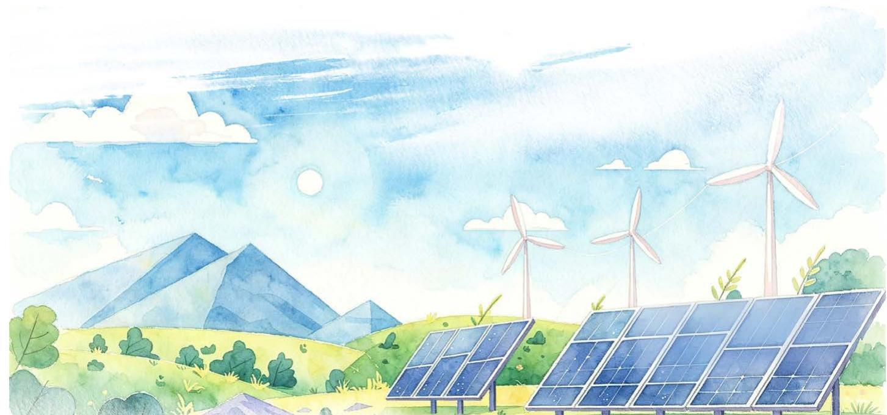

natural_image

Watercolor illustration of a renewable energy landscape with solar panels, wind turbines, and mountains under a blue sky (no text or symbols)

## 议题报告

综合上述分析，得出应对气候变化、乡村振兴、普惠金融、科技金融、消费者权益保护、数据安全与客户隐私保护6个议题为本行双重重要性议题，将通过后续报告内容详细披露

<table><tr><td>实践维度</td><td>序号</td><td>议题名称</td><td>是否具有影响重要性</td><td>是否具有财务重要性</td><td>与《上海证券交易所上市公司自律监管指引第14号——可持续发展报告(试行)》中议题对应性</td></tr><tr><td rowspan="9">环境</td><td>1</td><td>应对气候变化</td><td>✓</td><td>✓</td><td>1.应对气候变化18.尽职调查19.利益相关方沟通</td></tr><tr><td>2</td><td>投融资环境影响</td><td>✓</td><td>×</td><td>1.应对气候变化2.污染物排放6.能源利用7.水资源利用8.循环经济18.尽职调查</td></tr><tr><td>3</td><td>绿色金融</td><td>✓</td><td>×</td><td>1.应对气候变化2.污染物排放6.能源利用7.水资源利用8.循环经济18.尽职调查</td></tr><tr><td>4</td><td>污染物排放</td><td>×</td><td>×</td><td>2.污染物排放8.循环经济</td></tr><tr><td>5</td><td>废弃物处理</td><td>×</td><td>×</td><td>3.废弃物处理8.循环经济</td></tr><tr><td>6</td><td>生态系统和生物多样性保护</td><td>✓</td><td>×</td><td>4.生态系统和生物多样性保护18.尽职调查</td></tr><tr><td>7</td><td>环境合规管理</td><td>×</td><td>×</td><td>5.环境合规管理</td></tr><tr><td>8</td><td>能源利用</td><td>×</td><td>×</td><td>6.能源利用8.循环经济</td></tr><tr><td>9</td><td>水资源利用</td><td>×</td><td>×</td><td>7.水资源利用8.循环经济</td></tr><tr><td rowspan="14">社会</td><td>10</td><td>服务实体经济</td><td>✓</td><td>×</td><td>10. 社会贡献19. 利益相关方沟通</td></tr><tr><td>11</td><td>乡村振兴</td><td>✓</td><td>✓</td><td>9. 乡村振兴</td></tr><tr><td>12</td><td>普惠金融</td><td>✓</td><td>✓</td><td>9. 乡村振兴14. 平等对待中小企业15. 产品和服务安全与质量19. 利益相关方沟通</td></tr><tr><td>13</td><td>科技金融</td><td>✓</td><td>✓</td><td>11. 创新驱动12. 科技伦理19. 利益相关方沟通</td></tr><tr><td>14</td><td>助力消费</td><td>✓</td><td>×</td><td>14. 平等对待中小企业</td></tr><tr><td>15</td><td>金融服务可及性</td><td>✓</td><td>×</td><td>19. 利益相关方沟通</td></tr><tr><td>16</td><td>社会贡献</td><td>✓</td><td>×</td><td>10. 社会贡献</td></tr><tr><td>17</td><td>创新驱动</td><td>✓</td><td>×</td><td>11. 创新驱动</td></tr><tr><td>18</td><td>科技伦理</td><td>×</td><td>×</td><td>12. 科技伦理</td></tr><tr><td>19</td><td>供应链安全</td><td>×</td><td>×</td><td>13. 供应链安全</td></tr><tr><td>20</td><td>平等对待中小企业</td><td>×</td><td>×</td><td>14. 平等对待中小企业</td></tr><tr><td>21</td><td>消费者权益保护</td><td>✓</td><td>✓</td><td>15. 产品和服务安全与质量19. 利益相关方沟通</td></tr><tr><td>22</td><td>数据安全与客户隐私保护</td><td>✓</td><td>✓</td><td>16. 数据安全与客户隐私保护19. 利益相关方沟通</td></tr><tr><td>23</td><td>员工</td><td>✓</td><td>×</td><td>17. 员工</td></tr><tr><td rowspan="3">治理</td><td>24</td><td>公司治理</td><td>✓</td><td>×</td><td>18. 尽职调查19. 利益相关方沟通</td></tr><tr><td>25</td><td>风险管理</td><td>✓</td><td>×</td><td>18. 尽职调查</td></tr><tr><td>26</td><td>商业道德</td><td>✓</td><td>×</td><td>20. 反商业贿赂及反贪污21. 反不正当竞争</td></tr></table>

natural_image

Watercolor-style abstract illustration of a soft blue cloud with no text or symbols

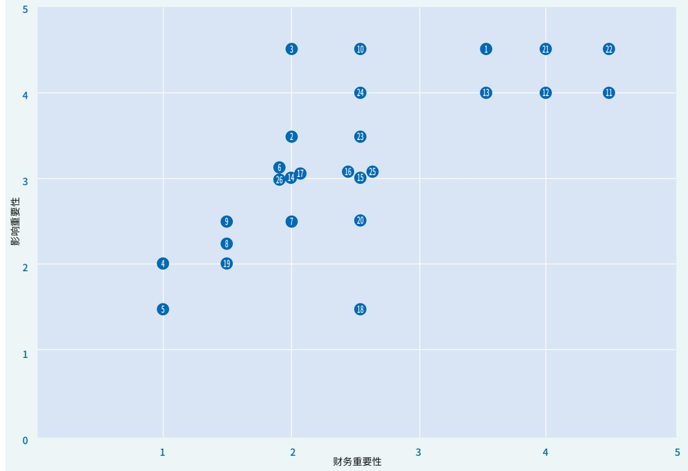

scatter

| Item | 财务重要性 | 影响重要性 |
| --- | --- | --- |
| 1 | ~3.5 | ~4.5 |
| 2 | ~2.0 | ~3.5 |
| 3 | ~2.0 | ~4.5 |
| 4 | ~1.0 | ~2.0 |
| 5 | ~1.0 | ~1.5 |
| 6 | ~1.9 | ~3.1 |
| 7 | ~2.0 | ~2.5 |
| 8 | ~1.5 | ~2.3 |
| 9 | ~1.5 | ~2.5 |
| 10 | ~2.5 | ~4.5 |
| 11 | ~4.5 | ~4.0 |
| 12 | ~4.0 | ~4.0 |
| 13 | ~3.5 | ~4.0 |
| 14 | ~2.0 | ~3.0 |
| 15 | ~2.5 | ~3.0 |
| 16 | ~2.5 | ~3.1 |
| 17 | ~2.0 | ~3.1 |
| 18 | ~2.5 | ~1.5 |
| 19 | ~1.5 | ~2.0 |
| 20 | ~2.5 | ~2.5 |
| 21 | ~4.0 | ~4.5 |
| 22 | ~4.5 | ~4.5 |
| 23 | ~2.5 | ~3.5 |
| 24 | ~2.5 | ~4.0 |
| 25 | ~2.5 | ~3.1 |

议题矩阵

<table><tr><td>环境议题</td><td>社会议题</td><td>治理议题</td></tr><tr><td>1 应对气候变化2 投融资环境影响3 绿色金融4 污染物排放5 废弃物处理6 生态系统和生物多样性保护7 环境合规管理8 能源利用9 水资源利用</td><td>10 服务实体经济11 乡村振兴12 普惠金融13 科技金融14 助力消费15 金融服务可及性16 社会贡献17 创新驱动18 科技伦理19 供应链安全20 平等对待中小企业21 消费者权益保护22 数据安全与客户隐私保护23 员工</td><td>24 公司治理25 风险管理26 商业道德</td></tr></table>

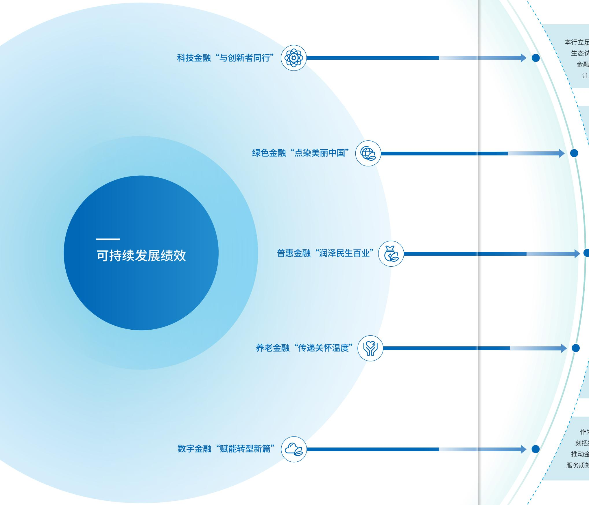

flowchart

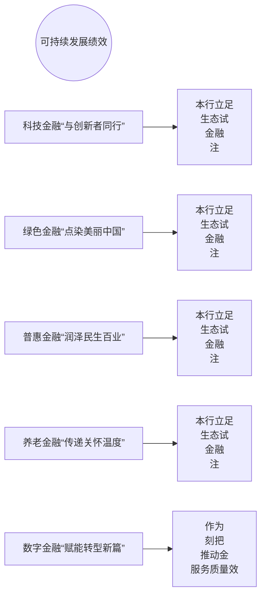
```mermaid
graph LR
  Center(("可持续发展绩效"))
  
  A["科技金融“与创新者同行”"] --> B["本行立足\n生态试\n金融\n注"]
  C["绿色金融“点染美丽中国”"] --> D["本行立足\n生态试\n金融\n注"]
  E["普惠金融“润泽民生百业”"] --> F["本行立足\n生态试\n金融\n注"]
  G["养老金融“传递关怀温度”"] --> H["本行立足\n生态试\n金融\n注"]
  I["数字金融“赋能转型新篇”"] --> J["作为\n刻把\n推动金\n服务质量效"]
```

本行立足江苏创新沃土，积极推进知识产权金融生态试点，强化产品服务创新，以高质量科技金融服务助推新质生产力发展，为科技创新注入源源不断的金融活力。

连续获评江苏省银行业金融机构服务科技创新“优秀”等次；  
科技企业授信客户数2.4万户，江苏全省第一；  
全行知识产权质押融资余额超 100 亿元，江苏全省第一。

本行始终坚持将绿色金融作为特色化经营的重要方向，持续完善绿色金融服务体系，积极推进负责任银行建设.丰富绿色金融产品供给，支持经济社会全面绿色转型发展。

获评中国人民银行金融机构绿色金融评价“优秀”档次，综合评分位列24家人总行直管银行前五位；  
深度参与6个负责任银行原则（PRB）核心工作组，主导及参与编制5项 UNEPFL国际指引，推动可持续金融领域深化实践  
开展范围三碳核算，实现 15 个类别碳核算模型本地化部署

本行全面贯彻监管要求，狠抓小微企业融资协调工作机制落实提升服务小微“四贷”能力，推动小微企业金融服务“增量、扩面、提质、降本”，切实做好“普惠金融大文章”。

连续获评小微企业金融服务监管“一级”评价  
小微贷款规模保持江苏省、全国城商行双第一；  
健全苏银e链“1+3+X”全场景、全线上、全产品体系，提升在订单、存货、结算等环节的综合服务能力；  
针对小微、科技、制造等民营企业集中的领域，实施最高100BP的内部资金转移定价优惠

本行深入贯彻落实国家积极应对人口老龄化战略，持续丰富个养专属产品，强化养老产业研究，加大养老场景建设、深化适老化改造不断提升老年客户的获得感和幸福感，赋能银发经济高质量发展。

发布《江苏银行加快推动养老金融高质量发展行动方案》聚焦养老金金融、养老服务金融、养老产业金融建设  
深耕银发金融场景建设，深入分析养老金融服务需求，为客户提供综合化场景服务体验  
丰富养老产品体系，围绕产业发展特点和客户养老需求，打造养老金融专属产品体系。

作为深植互联网大数据基因的银行，本行深刻把握数字金融内涵，系统性推进数字化转型推动金融与数字技术的有机结合，持续为金融服务质效注入新动能。

以“One Bank”理念强化前中后台部门协同；  
构建数字化运营体系，强化内外部数据挖掘运用，提升量化决策服务水平。

## 环 境 篇

应对气候变化 26

投融资环境影响 31

绿色金融……39

污染物排放 47

废弃物处理 48

生态系统和生物多样性保护……·49

环境合规管理 51

能源利用……51

水资源利用 51

支持的联合国可持续发展目标（SDGs)

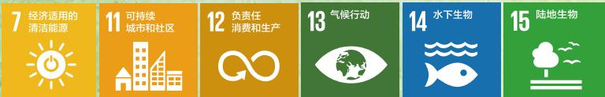

flowchart

```mermaid
graph LR
  A["7 经济适用的清洁能源"] --> B["11 可持续城市和社区"]
  B --> C["12 负责任消费和生产"]
  C --> D["13 气候行动"]
  D --> E["14 水下生物"]
  E --> F["15 陆地生物"]
```

natural_image

Watercolor painting of white daisies floating in green water with ripples, no text or symbols present

## 应对气候变化

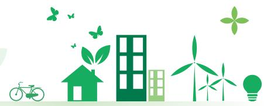

natural_image

Stylized green eco-friendly illustration with house, wind turbine, lightbulb, and bicycle (no text or symbols)

## 治理

本行立足自身定位，锚定绿色金融转型发展目标，持续优化“董事会-管理层-执行层”三级治理体系架构。

## 董事会

本行董事会及下设专门委员会积极应对气候变化。董事会战略与ESG委员会负责制定全行ESG战略，对绿色金融、气候风险管理等议题进行研判与审议，监督评估ESG战略执行成效。董事会风险管理委员会持续关注包括气候风险在内的ESG风险管理，持续完善气候风险敏感性压力测试，提升气候风险评估的科学性和本地适用性。

## 管理层

本行设立“五篇大文章工作领导小组”，由董事长任组长，并下设绿色金融工作组，由总行行领导任组长，部门和子公司组成。工作组统筹全行资源，齐抓共管绿色金融。

2025年，本行按季度召开全行绿色金融工作组会议4次，有序推进绿色金融集团化发展。绿色金融工作组会议集中商议决策ESG 评级推进、PRB 银行建设、集团化绿色金融业务发展ESG 风险管理等事项。

## 执行层

总行绿色金融部牵头全行绿色金融工作，推动完善分行绿色金融组织架构，增设分行绿色金融委员会、绿色金融团队和专职专岗。出台绿色支行考核评价体系，打造绿色金融专业化人才队伍提升专业化经营能力。2025年，全行绿色支行总数共39家。

## 战略与管理

## 气候相关能力建设

## 人员培训

本行通过多元化内外部培训学习机制，向全行员工深入传递绿色金融发展经验及气候风险相关知识，不断巩固提升可持续发展理念。

在人员配置上，本行在总行单独设立绿色金融部一级部门，在分行设立绿色金融团队或专职岗位，为多家绿色支行配备充足业务人员实现专业力量全覆盖，同时将绿色金融相关人才纳入专业技术职级序列，优化评聘管理方式激发人才发展内生动力。

在认证考试上，本行将注册ESG分析师等16个资质证书列入可报销清单，鼓励员工积极参与专业资质认证及技术职称考试申报，夯实绿色专业人才基础。

在内部培训上，依托“苏银绿金大讲堂”等线下平台，开展条线专业力培训、师资授课能力提升培训，选拔培养业务骨于师资打磨精品课程、沉淀实践案例，完成绿色金融相关专题课程开发。通过“数智化学习平台构建线上学习矩阵，自主开发碳减排支持工具相关线上课程，采购外部绿色金融政策、新材料技术等优质课程。截至2025年末，平台已归集绿色金融相关课程49门。

在外部培训上，本行深化与联合国环境署金融倡议组织、明晟、标普等国际机构及中央财经大学绿金院等专业机构合作，邀请产业专家顾问开展“产业授课+”系列活动，全年邀请国际ESG评级机构专家开展评级方法论、能源转型等专项培训，借助外部专业力量拓宽员工气候相关认知视野

## 课题研究

本行致力于打造“苏银绿研”专业化研究品牌，以“内做智囊、外做智库”为目标，加快驱动绿色金融研究体系建设。

2025年以来，本行紧跟国内外绿色金融前沿趋势，积极参与标准制定、前沿探索及智库建设，通过深度参与国内外重点课题研究，不断提升在转型金融、碳金融、生物多样性金融、蓝色金融等领域的专业影响力。

承接中国人民银行、中国金融学会绿金委、中英绿色金融工作组、UNEPEL《构建中国特色气候情景体系的必要性与建议》 《负责任银行气候适应与风险韧性实施指南》《ESG因素对信贷风险防控作用研究》 《围绕产品碳足迹的金融领域研究》等15项课题研究

参与中国人民银行、中国银行业协会、无锡市金融学会《ISSB可持续信息披露标准》《生物多样性金融目录》等8项标准制定。

完成《新一轮国家自主贡献目标对江苏省低碳转型的启示》等多项内部课题研究，持续巩固完善气候专业知识储备。

## 交流合作

本行积极搭建多元交流合作平台，广泛汇聚行业智慧与实践经验，为气候相关能力提升注入外部动能。

持续履行UNEPFI银行理事会中东亚地区理事职责，深度参与PRB 框架下气候适应、公正转型与自然相关议题等6个工作组，全年累计参会40余次。

受邀出席UNEPFI亚太区域圆桌峰会、中国责任投资论坛夏季峰会及年会等重要活动，围绕气候风险等关键议题分享专业见解。

参与编制UNEPFI相关指引文件5项并融入本行实践案例，参与承办UNEPEI中国专题工作坊搭建能力共建平台。

推进负责任银行标杆行建设，组织编写第三份PRB自评估报告并首次引入第三方独立审验，编制《PRB标杆行建设指南》形成适配中国国情的系统化建设方法，成功获评PRB全球十大标杆银行。

以唯一城商行身份加入中英绿色金融工作组新成立的转型金融、自然与生物多样性金融专题工作组，累计线下参会5次并作专题发言，牵头开展《转型金融的标准和激励机制》等多项重点课题研究，为金融支持气候减缓与适应贡献实践智慧。

## 气候风险压力测试

2021年，本行在人民银行指导下参与了八大高碳行业气候风险压力测试试点，针对重点行业在碳价等政策冲击下的信用风险变化开展量化评估，并基于试点经验完善了气候风险评估框架。随后将相关方法拓展至医药化工等行业，建立了可复制、可推广的风险压力测试流程。

在方法层面，本行结合管理需要引入碳在险价值(Climate VaR/CVaR)、隐含升温(ITR)等指标，并探索基于Merton 模型分析气候情景对企业资产价值及违约概率的影响，不断提升对高碳行业资产组合风险识别与承压评估的精细化水平。

2025年，本行围绕《江苏省银行业金融机构环境信息披露指引》中“探索开展气候风险压力测试”的工作导向，落实政策指引并延续前期实践，首次统筹开展覆盖转型风险与物理风险的全面压力测试。通过优化测试范围、情景设计与传导机制，形成覆盖重点行业与资产组合的系统评估结论，为全行风险监测与稳健经营提供前瞻支撑

(气候情景研究、转型风险及物理风险压力测试相关内容详见本行披露的《2025年绿色金融发展报告》）

## 范围三碳排放核算方法论

本行遵循温室气体核算体系(GHG Protocol)的相关性、完整性、一致性、透明度和准确性五大原则，广泛参考了《温室气体核算体系：企业核算与报告标准》 《企业价值链(范围三)核算与报告标准》《金融行业温室气体核算和披露全球性标准《金融机构碳核算技术指南(试行)》《企业温室气体排放核算方法与报告指南》等国际国内权威标准与方法，采用第三方专业服务机构提供的企业碳排放数据库及碳排放因子库，从企业年报、企业社会责任报告/ESG报告、行业协会、监管平台等各种公开信息源中，识别与摘取可用信息，结合企业自主披露的碳排放数据，运用专业模型进行碳排放测算，并通过抽样交叉验证等方法来验证测算结果的准确性。

2025.年，本行系统搭建了项目贷款环境效益测算模型，范围三碳核算15.个类别核算模型，以金融科技手段降低数据采集核算和管理成本，提高环境信息采集的效率和准确性，核算类别覆盖外购商品与服务，资本商品，上游运输与配送，商务差旅员工通勤，下游租赁资产等自身经营价值链碳核算，累计核算超2.万户企业，超1500.个项目的投融资活动碳排放信息。

## 风险和机遇管理

本行密切关注影响气候风险与机遇的相关因素，按照“识别一评估一应对”框架，系统评估气候风险与机遇对本行业务模式产生的影响及其传导路径，明确各项风险和机遇的影响周期、影响环节和影响发生的后果。

气候风险识别与应对

<table><tr><td colspan="2">类型</td><td>风险描述</td><td>时间范围短期(1-3年)中期(3-5年)长期(5-10年)</td><td>潜在财务影响</td><td>应对措施</td></tr><tr><td rowspan="5">转型风险</td><td>政策与法规</td><td>碳排放约束趋严,能耗及排放标准升级,高碳行业合规成本持续提升</td><td>中期-长期</td><td>客户盈利能力下降→违约概率/预期信用损失上升</td><td>常态化转型压力测试;依据测试结果调整行业限额、准入与定价;加强高碳行业分层管理与贷后跟踪</td></tr><tr><td>披露与监管</td><td>可持续信息披露与反“漂绿”监管强化,绿色/转型标签真实性要求提升</td><td>短期-中期</td><td>合规与披露成本增加;外部评价波动影响融资条件与业务机会</td><td>完善数据口径与治理机制;加强ESG风险贷后管理</td></tr><tr><td>技术替代</td><td>工艺升级与清洁替代进程加快,高碳资产面临“搁浅”风险</td><td>中期-长期</td><td>抵质押物价值承压;信用风险上升</td><td>逐步将转型计划评估纳入授信尽调;支持节能改造/清洁替代项目;设置分阶段提款与绩效约束条款</td></tr><tr><td>市场需求</td><td>需求结构向绿色倾斜,市场信号不确定,成本传导不畅</td><td>短期-中期</td><td>客户收入与现金流波动;阶段性逾期风险上升;利差/息差压力加大</td><td>加强行业研究与现金流监测预警;开发匹配转型周期的金融产品;优化行业营销与信贷结构</td></tr><tr><td>品牌声誉</td><td>高碳融资与“漂绿”舆情风险;利益相关方负面反馈</td><td>短期-中期</td><td>客户黏性降低;评级与融资成本上升;业务机会流失</td><td>建立舆情监测与响应机制;统一重大环境事项信息披露口径;加强高碳客户环境合规尽调与名单制管理</td></tr><tr><td rowspan="4">物理风险</td><td>信用</td><td>热浪、寒潮、台风、洪涝等极端事件影响客户经营与资产安全</td><td>短期-中期</td><td>经营中断致现金流压力→违约概率/预期信用损失上升;资产回收周期延长</td><td>基于预测开展物理风险压力测试与风险暴露识别;实施重点行业/区域名单制管理;完善抵质押物与灾后处置预案</td></tr><tr><td>运营</td><td>极端天气引发网点/系统/外包服务中断(业务连续性风险)</td><td>短期</td><td>运营损失与修复成本增加;服务中断引发客户投诉</td><td>完善灾备体系与应急预案;定期演练与关键系统冗余建设;提升线上服务能力与客户沟通机制</td></tr><tr><td>区域集中暴露</td><td>局部灾害对特定区域/行业形成集中冲击</td><td>短期</td><td>资产组合集中度风险上升;减值与风险缓释成本增加</td><td>建立“区域—行业—资产组合”风险评估链条;动态调整授信额度与结构;引入保险、担保等风险转移工具</td></tr><tr><td>慢性变化</td><td>气温与降水格局长期变化、海平面上升等趋势影响</td><td>中期-长期</td><td>部分区域与行业资产长期贬值;长期风险溢价上升;期限结构面临调整压力</td><td>开展中长期气候情景与脆弱性评估;控制高风险区域/行业集中度;支持防洪排涝、城市韧性、农业适应等适应类项目</td></tr></table>

气候机遇分析与应对

<table><tr><td colspan="2">气候相关机遇</td><td>时间范围短期(1-3年)中期(3-5年)长期(5-10年)</td><td>潜在财务影响</td><td>应对措施</td></tr><tr><td rowspan="2">资源效率</td><td>制造业节能降耗与设备更新</td><td>短期-中期</td><td>绿色/转型信贷需求上升;客户黏性提升;利息与手续费收入增长</td><td rowspan="2">建立场景化项目清单与准入标准;形成标准化绿色融资方案;将关键能效与节能指标嵌入贷前尽调与贷后跟踪;加强与园区平台、节能服务机构的合作,推动批量拓客</td></tr><tr><td>绿色建筑与既有建筑节能改造</td><td>短期-中期</td><td>项目融资与按揭业务增量;低风险资产占比提升;带动结算、现金管理等综合收益</td></tr><tr><td rowspan="2">产品与服务</td><td>高碳行业转型金融</td><td>中期-长期</td><td>转型贷款及投行、债券业务机会增加;存量高碳资产风险缓释;资产质量稳定性增强</td><td rowspan="2">完善转型金融产品体系;加强投行、租赁、理财等跨业务协同;逐步将转型压力测试结果运用于行业限额、准入政策与定价机制校准</td></tr><tr><td>新能源与电力系统升级</td><td>中期-长期</td><td>项目融资与综合金融服务放量;优质资产供给增加;带动投融资及承销业务增长</td></tr><tr><td rowspan="2">气候适应</td><td>基础设施与城市韧性建设</td><td>中期-长期</td><td>项目融资与综合金融服务放量;优质资产供给增加;带动投融资及承销业务增长</td><td rowspan="2">建立适应类项目清单与准入指引;加强与地方政府、公共平台合作;探索“信贷+保险/担保”风险共担模式;将物理风险评估结果用于区域投向与授信结构调整</td></tr><tr><td>农业与渔业气候韧性</td><td>中期-长期</td><td>涉农信贷与保险、担保业务联动增量;风险缓释能力增强;普惠金融与乡村振兴贡献提升</td></tr></table>

## 指标与目标

本行按照ISO14064-1《在组织层面温室气体排放和移除的量化和报告指南性规范》开展温室气体盘查。盘查所用的量化方法为排放因子法和质量平衡法。盘查数据为

<table><tr><td>类别</td><td>温室气体</td><td> $CO_2$ </td><td> $CH_4$ </td><td> $N_2O$ </td><td>HFCs</td><td>PFCs</td><td> $SF_6$ </td><td> $NF_3$ </td><td>温室气体排放量总计</td></tr><tr><td rowspan="2">范围一</td><td>排放量 (tCO2e/年)</td><td>5,353.35</td><td>28.13</td><td>85.21</td><td>8,402.94</td><td>0.00</td><td>0.00</td><td>0.00</td><td>13,869.64</td></tr><tr><td>占总排放量比例</td><td>8.78%</td><td>0.05%</td><td>0.14%</td><td>13.78%</td><td>0.00%</td><td>0.00%</td><td>0.00%</td><td>22.75%</td></tr><tr><td rowspan="2">范围二</td><td>排放量 (tCO2e/年)</td><td>47103.47</td><td>0.00</td><td>0.00</td><td>0.00</td><td>0.00</td><td>0.00</td><td>0.00</td><td>47,103.47</td></tr><tr><td>占总排放量比例</td><td>77.25%</td><td>0.00%</td><td>0.00%</td><td>0.00%</td><td>0.00%</td><td>0.00%</td><td>0.00%</td><td>77.25%</td></tr></table>

温室气体种类说明：根据ISO14064-1：2018的要求，包括六类温室气体，即二氧化碳(CO₂)、甲烷(CH₄)、氧化亚氮(N₂O)、三氟化氮(NF3)、六氟化硫(SF₆)和其他相关GHG组(氢氟碳化物(HFCs)、全氟碳化物(PFCs)等)。本次盘查涉及的温室气体有二氧化碳(CO₂)、甲烷(CH4)、氧化亚氮(N₂O)、氢氟碳化物(HFCs)4 类温室气体-

本行自身经营的价值链碳排放（范围三，不含投资)为14804.81tCO2e、其中，购买商品与服务产生的碳排放9163.95tCO₂e，上游运输和配送产生的碳排放4.72tCO₂e，差旅产生的碳排放 2229.17tCO₂e，员工通勤产生的碳排放3406.97tCO e。

## 投融资环境影响

natural_image

Illustration of a green renewable energy theme with wind turbines, houses, and clouds (no text or symbols)

## ESG风险管理

本行将ESG风险融入传统风险治理架构中，以清晰的层级分工和职责划分确保风险管理的有效性和系统性

## 管理架构及职能

本行ESG风险管理组织架构包括董事会、高级管理层以及总行绿色金融部、授信审批部等相关执行层面的职能部门

<table><tr><td>董事会(含其下设的风险管理委员会)</td><td>高级管理层</td><td>总行绿色金融部</td></tr><tr><td>负责审批本行ESG风险管理战略和政策,定期审议高级管理层提交的ESG风险管理相关报告,监督高级管理层采取有效措施落实ESG风险管理战略和政策的总体情况。</td><td>负责统筹ESG风险管理政策制订,审批本行ESG风险管理相关目标、指标和方案;建立完善ESG风险管理架构,推动ESG风险管理各项政策、制度在全行各个层级的落实,提高ESG风险管理有效性;定期评估本行ESG风险管理状况并向风险管理委员会报告。</td><td>负责ESG风险管理政策以及基本制度的制定和维护;指导和监督相关对公业务按照本政策要求开展ESG风险管理及相应审批工作,并进行ESG风险管理相关的内控合规检查及培训。</td></tr></table>

<table><tr><td>总行授信审批部</td><td>总行授信管理部</td><td>总行风险管理部</td><td>总行法律合规部</td></tr><tr><td>负责在权限内对公授信业务的审查审批、放款审核等环节中执行ESG风险管理政策。</td><td>根据本行贷后管理要求,加强融资业务贷后ESG风险的非现场监测和问题诊断。</td><td>负责将ESG风险纳入全行全面风险管理体系,牵头组织开展金融资产风险分类和客户内部评级等。</td><td>负责权限内各类授信业务合同文本的法律审查以及对国家ESG风险方面的法律法规提供咨询。</td></tr></table>

## 管理制度

本行严格遵循监管要求与政策导向，以《银行业金融机构全面风险管理指引》《银行业保险业绿色金融指引》《银行业保险业绿色金融高质量发展实施方案》等国家层面政策规定为遵循，深度衔接江苏省人民政府《关于大力发展绿色金融的指导意见等地方部署，结合本行经营发展实际，制定《江苏银行环境、社会和治理风险管理政策》，作为全行开展FSG风险管理的纲领性文件，为金融业务可持续发展筑牢风险防线。

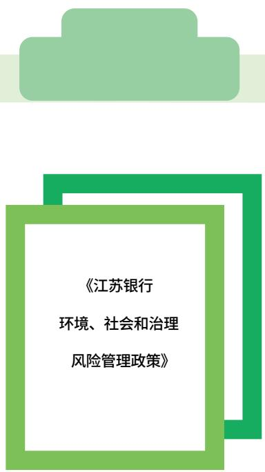

text_image

《江苏银行
环境、社会和治理
风险管理政策》

适用于江苏银行总行及各级经营机构，覆盖全量非普惠类表内对公业务（项目贷款除外）。

明确将客户 ESG风险划分为A(优秀类)、B(正常类)、C(关注类）、D（高风险类）四类，实施差异化风险管理策略，对高风险客户严格准入与退出管理，同时规范了尽职调查、分类认定、审查审批、用信管理、贷后管理等全流程操作要求。

要求建立重大ESG 风险内部报告与三级信息收集机制，推进专业化队伍建设与培训，明确未按规定开展工作的机构、部门及人员的处罚依据，配套敏感行业对照表、各类报告模板等附件，确保 ESG 风险管理规范有序落地

## 重点行业信贷政策

本行将ESG风险管理融入业务全周期和产品全流程，覆盖贷前、贷中、贷后多个环节，支持能源结构调整、产业绿色低碳转型升级、生物多样性保护等方面，着力构建能源金融、转型金融、生态金融服务体系

制定《江苏银行绿色金融投向指引》，加大对低碳经济、循环经济、节能环保产业的支持力度，合理配置信贷资源，向低能耗低资源消耗、低污染、低排放的行业和企业倾斜。不介入《产业结构调整指导目录》中淘汰类或限制类项目以及《外商投资产业指导目录》中负面清单项目。

  
农业

本行制定《江苏银行现代农业信贷投向指引》，以生态环境友好和资源永续利用为导向，以绿色发展理念为指引，支持农业高质量发展。

鼓励介入符合环保标准、可持续发展的绿色优质企业，加大对绿色转型升级、能源高效集约、减排降碳环保、高效综合利用等项目的信贷投放，关注食品安全风险、疫病风险、水污染风险、气候风险、生物灾害风险等行业特定风险，跟踪企业年度环保评级情况

禁止介入对环境有负面影响的客户，包括涉及化肥农药超标、水资源过度高耗外来入侵物种、土壤侵蚀退化、违法屠宰动物等事项的企业。

  
电力业

本行制定《江苏银行电力行业信贷投向指引》，支持新型能源体系和新型电力系统建设，满足能源绿色低碳转型中的合理融资需求

重点关注风电、水电、光伏发电等可再生电力的发展。动态识别客户及项目的生态环境风险，环保、用地、节能审查等合规手续完备，水电项目审查居民安置、动物迁徙等环境影响因素，火电项目审查温室气体排放、废水和固体废物处理等方面的达标情况，节能减排设备应符合国家要求，支持绿色技术发展。

坚决退出低效能高耗能的机组项目。

不介入淘汰的落后产能项目。

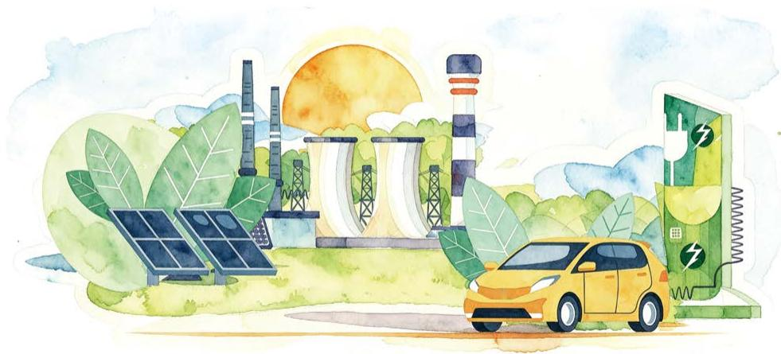

natural_image

Watercolor illustration of an electric vehicle charging at a renewable energy facility with solar panels, transmission towers, and greenery (no text or symbols)

  
采矿业

本行制定《江苏银行钢铁/有色金属/煤炭行业信贷投向指引》，对钢铁、煤炭、有色金属、冶金等重点行业，调优结构，有扶有控。

支持符合国家环境保护和资源消耗政策，所采用的工艺设备满足《工业重点行业领域设备更新和技术改造指南》要求，清洁生产、质量达标，排污许可证、环境影响评价等必备手续齐全，不属于淘汰落后产能或违规新增产能、不存在安全生产隐患的项目。

择优支持技改升级项目、战略资源供应项目，支持绿色开采、资源高效利用、环境友好、管理规范企业的合理资金需求，坚持业务发展和风险防控并重。

压缩退出不符合能耗指标、环保监测、安全生产等条件的企业。

  
石油天然气行业

本行制定《江苏银行化工行业信贷投向指引》，评估业务的能效水平和排放水平，严守不发生重大安全事故和环境风险隐患的底线。

择优支持符合国家产业布局规划、开采许可合法、合规手续完备、设备改造升级、产品能效领先的客户项目，以及清洁能源和智能控制等先进技术的炼化企业，注重环境评价，鼓励绿色低碳循环发展。

压缩退出工艺技术落后、污染能耗超标的企业业务，持续跟踪排污信息，考虑后续多样性影响。

  
生物多样性保护

本行制定《江苏银行绿色金融投向指引》，在业务发展过程中积极支持生物多样性保护工作，在授信审查过程中谨慎评估主体对生态环境的影响。

遵循尊重自然与可持续利用原则，严格遵守生物多样性的法律法规，对于违反监管要求、存在环境风险的业务一票否决，存量业务尽快退出。

鼓励介入生态保护、生态修复等与生物多样性保护有关的客户项目。

禁止为不符合生态保护红线、环境质量底线、资源利用上线和生态环境准入清单的项目提供授信支持。

(详细ESG相关授信政策请访问江苏银行官方网站查看。)

## ESG风险管理流程

## 客户层面

## 升级评级模型

2025年，本行迭代升级ESG风险评级模型，基于92项原始指标，组合构建27项核心指标、22项补充指标，有效拓展基础数据库。运用大数据技术自动选取最优概率分布类型，引入风险曲线对评分结果进行风险偏好调节，形成覆盖关键维度、具有区分度和风险识别能力的ESG评级模型，并对ESG评级模型开展多轮有效性验证。

## 基于92项原始指标，组合构建

27

项核心指标

22

项补充指标

## 开展尽职调查

《江苏银行环境、社会和治理风险管理政策》明确要求经营机构将客户的ESG表现作为尽职调查及合规审查的重要内容，根据客户所在行业、区域特点，强化对客户基础信息及数据的搜集与验证，确保信息真实、完整、有效

## 尽职调查内容包括但不限于

企业环境表现：

是否涉及排污、是否符合绿色产业目录、环境信用评价等级、资源能源消耗、碳排放强度、是否为环境监管重点单位等；

企业社会表现：

是否为专精特新企业、持有发明专利数量、质量管理体系认证、职业健康安全管理体系认证、劳工权益保障制度等

企业治理表现：

经营资质、股权架构、治理架构、监管处罚、诉讼纠纷、工商 异常、失信记录等

额外尽职调查触发因素：《江苏银行环境、社会和治理风险管理政策》明确列示了对客户开展额外ESG尽职调查的触发因素主要包括以下五类情景：

## 高关注行业专项因素：

针对化学农药制造、水泥制造、火力发电等重点行业客户，出现污染物排放未达对应国家/行业标准、技术能效未满足产业规范要求，或企业及实际控制人发生重大声誉与合规风险（如不良信用记录、财务造假、违法犯罪等）。

## 突发声誉与事件因素：

近 1 个月内发生引发公众广泛关注的环境、社会类突发事件，包括负面舆情持续发酵、群体性利益冲突，或所在区域/行业的ESG相关监管标准出现重大调整，对企业经营稳定性产生实质性影响。

## 治理架构异动因素：

企业核心治理体系发生实质性调整，如控股股东发生变更、高管团队出现频繁更迭、实施重大资产重组、公司章程核心条款修订等，可能引发治理有效性下降的风险。

## 合规与监管预警因素：

近1个月内被水利、财政、自然资源、生态4环境、应急管理、人力资源和社会保障等主管部门通报处罚，或被纳入失信名单、重点监控名单；企业正常建设、生产、经营活动因重大纠纷陷入停滞或受到严重干扰。

## ESG风险评级异动因素：

经合格独立第三方或监管机构出具的 ESG 评估 / 评级结果发生显著变化，或本行内部 ESG 风险评级结果已过有效期、即将到期，重新评级的结果发生显著变化。

风险升级管理：针对触发上述预警信号的客户，要求分行或经营机构对其开展额外尽职调查，并提交相应问题整改措施说明书解除预警，客户拒绝整改或整改不及时，或客户存在短期难以化解的重大ESG风险事项，将触发客户ESG风险重新评估并采取对应分类的风险管控措施，包括但不限于终止信贷资金拨付

## 风险升级管理案例：

某铜箔装备公司因未按规定披露大额关联交易，2024年度财务报表被出具保留意见，被证监会立案调查，致使该企业G维度得分下降至本行样本的后1%。针对该企业出现的负面舆情，本行采取ESG风险升级管理措施，对该户采取到期授信不续做的策略，压降2000万元风险敞口。

## 实施分类管控

基于尽职调查所获取的各项数据，将客户ESG评级分为A、B、C、D四档，不同档次匹配不同的管控举措。

<table><tr><td>评级</td><td>客户情况说明</td><td>差异化管控举措</td><td>样本案例</td></tr><tr><td>A类(优秀类)</td><td>指客户具有较强的环境、社会和治理风险管理能力,建设、生产、经营活动基本不会产生不良的环境、社会和治理后果</td><td>执行本行现行授信管理规定</td><td>某光学材料股份有限公司:ESG综合得分靠前E 97.20% 4项绿色产业目录S 99.10% 59项发明专利G 82.20% 纳税人信用A级</td></tr><tr><td>B类(正常类)</td><td>指客户具有一定的环境,社会和治理风险管理能力,建设、生产、经营活动产生不良环境、社会和治理后果的可能性较小,且较易通过相关措施加以消除</td><td>尽职调查、审批审查、贷后管理、合同签订、放款等业务办理全流程中,确保符合我国环境、社会、治理方面的政策规定,并对其环境、社会、治理风险的情况给予适当关注</td><td>某汽车零部件有限公司:ESG综合得分中上E 97.30% 省级环境信用诚信S 64.30% 2项发明专利G 74.40% 董监高治理结构完整</td></tr><tr><td>C类(关注类)</td><td>指客户可能产生不良环境、社会和治理后果,且需要通过较强相关措施加以消除</td><td>尽职调查、审批审查、贷后管理、合同签订、放款等业务办理全流程中,针对其环境、社会和治理风险特点,分析环境、社会和治理潜在风险点及对业务的影响,制定专项风险防控措施和应对预案,同时督促客户加强环境、社会与治理风险管理等</td><td>某机械有限公司:ESG综合得分中下E 18.60% 企业涉及排污S 52.20% 1项实用新型专利G 2.00% 治理及股权结构较差</td></tr><tr><td>D类(高风险类)</td><td>指客户对环境或社会有潜在重大不利影响,或有多方面、不可逆转的、前所未有的影响</td><td>原则上新客户禁止准入,存量客户应及时压缩退出。对于存量客户,退出前应督促客户加强环境、社会与治理风险管理,限时整改违法违规事件等</td><td>某能源有限公司:ESG综合得分靠后E 0.50% 环境监管重点单位S 0.00% 无安全评价及认证G 33.10% 无董监高治理结构</td></tr></table>

注：此处E、S、G百分比为该样本在本行全部对公客户中的排名百分比，0%最低，100%最高

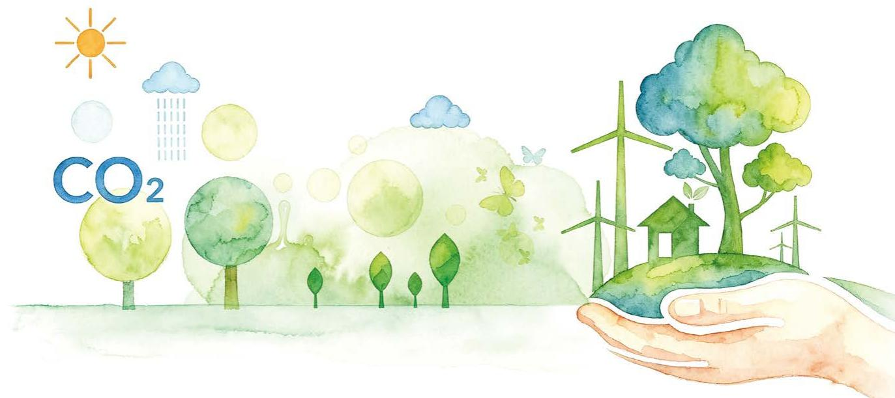

natural_image

Illustration of a hand holding a globe with green trees, wind turbines, and houses, set against a stylized sky with CO2 symbols (no text or labels)

## 授信审查

《江苏银行环境、社会和治理风险管理政策》要求将客户ESG评级结果作为授信审查的重要内容，积极寻求适当方式缓释ESG风险。包括但不限于：要求客户提高项目资本金比例，尽可能投保环境污染责任险，增加节能环保和安全生产的技改项目和投改计划等。

## 合同管理

重点针对B、C、D类客户，在授信的标准合同文本中，补充约定包含督促客户加强ESG风险管理的条款，或要求客户出具相应承诺函类法律文件，督促客户加强ESG风险管理。

## 放款管理

结合ESG风险评估意见，重点审核B、C、D类客户合同中补充约定或承诺函的签署情况，以及贷前风险管控措施的落实情况。对客户存在重大风险隐患且无实质性整改的，按照合同约定中止直至终止信贷资金拨付。

## 检查监督

指定专人对 ESG 风险管理的执行情况进行管理监督，按要求定期报告执行情况，根据存在的问题进行整改。

## 专项审计

开展年度绿色金融专项审计工作，形成《2025年绿色金融业务专项审计报告》，重点关注ESG风险识别及管控情况、绿色金融业务风险管理及信息披露情况等内容，对存在的不足提出改进建议、制定整改方案。

## 贷后监控

经营机构根据《江苏银行对公客户贷后及投后管理办法》要求，将客户ESG风险监测纳入贷后管理流程。针对B、C、D类客户，经营机构需定期填报ESG风险监测报告；针对C、D类客户，分行每年还需额外开展至少一次定期检查并形成相关风险管理报告。

## 项目层面

## 环境与社会风险管理

本行制定《江苏银行环境与社会风险管理办法》，明确项目层面环境与社会风险管理的基本原则、适用范围、职责分工、风险判定及管控措施等有关规范。根据该办法，2025年本行累计完成近2000笔项目的环境与社会风险审批。

## 管理流程

分为贷前、贷中及贷后三个阶段：

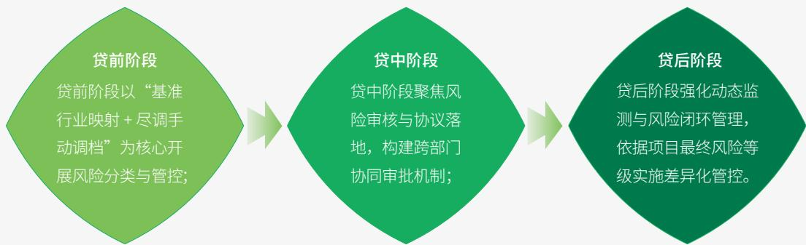

flowchart

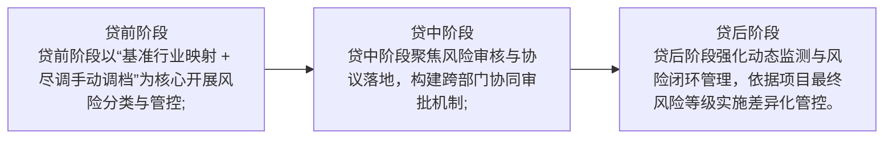
```mermaid
graph LR
  A["贷前阶段\n贷前阶段以“基准行业映射 + 尽调手动调档”为核心开展风险分类与管控;"] --> B["贷中阶段\n贷中阶段聚焦风险审核与协议落地，构建跨部门协同审批机制;"]
  B --> C["贷后阶段\n贷后阶段强化动态监测与风险闭环管理，依据项目最终风险等级实施差异化管控。"]
```

## 绿色金融

natural_image

Illustration of green industrial and environmental icons including a windmill, bar chart, hand, and cloud (no text or symbols)

## “苏银绿金”系统

本行自主研发了集数据管理、客户管理、业务管理、ESG风险管理等多功能于一体的绿色金融综合性决策管理平台“苏银绿金系统，旨在通过数智科技与绿色发展的深度耦合，赋能绿色金融业务创新与转型

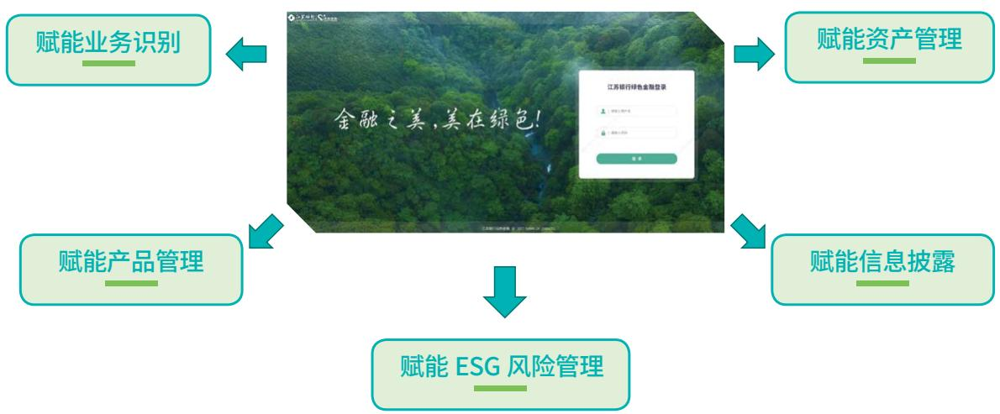

flowchart

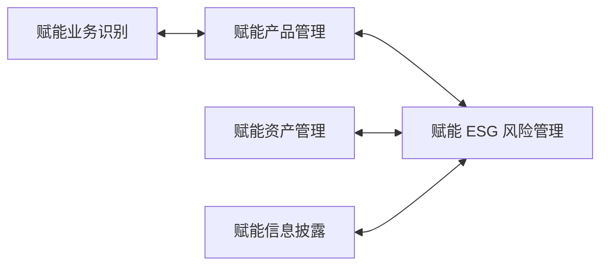
```mermaid
graph LR
  A["赋能业务识别"] <--> B["赋能产品管理"]
  B <--> C["赋能 ESG 风险管理"]
  D["赋能资产管理"] <--> C
  E["赋能信息披露"] <--> C
```

## ESG评级体系建设

针对项目融资类业务，“苏银绿金”系统将《IFC环境绩效标准》要求内置到信贷全流程，实现业务所涉及环境与社会风险的自动识别和分类。

针对综合授信类业务，“苏银绿金”系统已上线自动ESG评级功能，累计完成1.4万对公客户评级。

## 绿色业务智能认定

“苏银绿金”系统依托“智慧小苏”AI智能体解析业务申报材料，基于《绿色金融支持项目目录（2025年版)》构建绿色认定模型，调用绿色产业知识库精准识别深绿客户，累计支撑超5000亿元绿色贷款的识别认定、超6000个客户的对接营销。

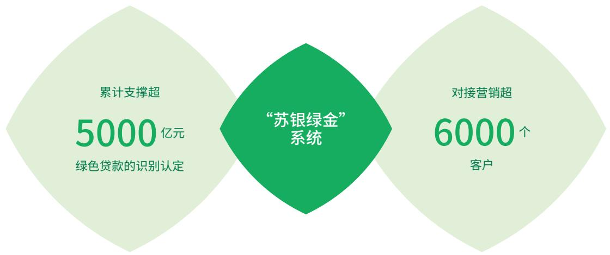

flowchart

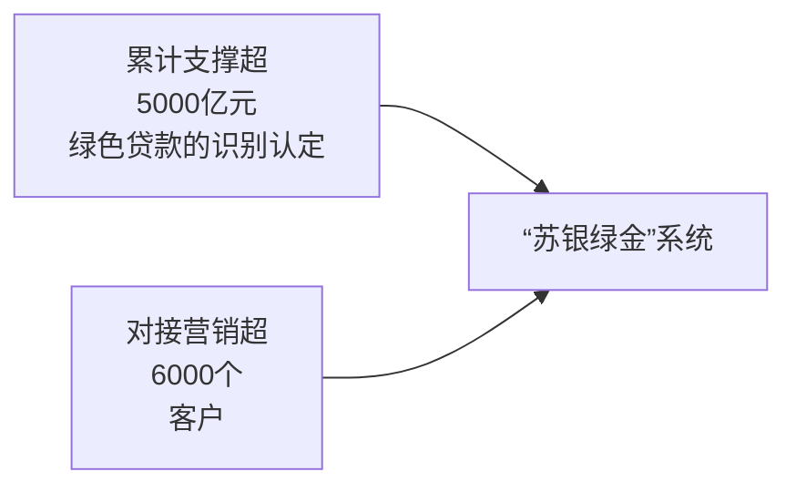
```mermaid
graph LR
  A["累计支撑超\n5000亿元\n绿色贷款的识别认定"] --> C["“苏银绿金”系统"]
  B["对接营销超\n6000个\n客户"] --> C
```

## 环境效益及碳排放测算

“苏银绿金”系统按照国际国内测算标准，部署了超40类项目的环境效益测算模型和“范围三”全部15个类别的碳核算模型为全行环境信息披露提供了数据支撑

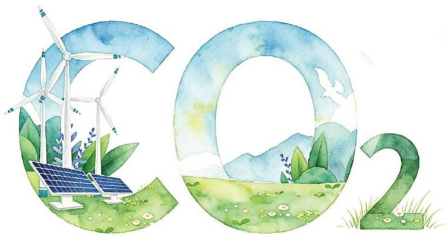

natural_image

Watercolor illustration of a renewable energy concept with solar panels, wind turbines, and a large 'CO2' letter (no text or symbols beyond the design)

## 绿色信贷

## 绿色金融产品

2025年，本行响应国家推进转型金融的号召，创造性将ESG

挂钩与转型金融相结合，助力高碳行业绿色转型

## ESG挂钩系列贷款

本行积极创新可持续发展挂钩金融产品，推动ESG评级结果深度融入贷款定价机制，推出“ESG表现挂钩贷款”“ESG低排贷”“ESG惠利贷”等 ESG 专属产品，将 ESG 挂钩机制嵌入“G60绿色惠企贷”“绿色工厂贷”等绿色专项产品。

## 碳排放挂钩系列贷款

本行积极落实“探索将碳排放表现与贷款定价挂钩”政策要求，创新推出“碳足迹挂钩贷款”“碳账户挂钩贷款”“碳配额质押贷款”“CCER质押贷款”“碳汇预期收益权质押融资”等系列产品，以金融工具撬动企业减排降碳内生动力。

## ESG

评级结果深度融入贷款定价机制

## ESG

表现挂钩贷款

## ESG

低排贷

## ESG

惠利贷

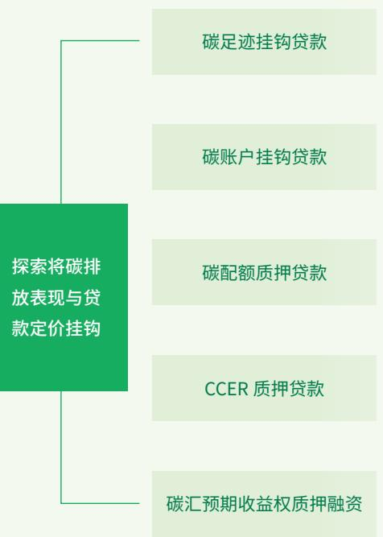

flowchart

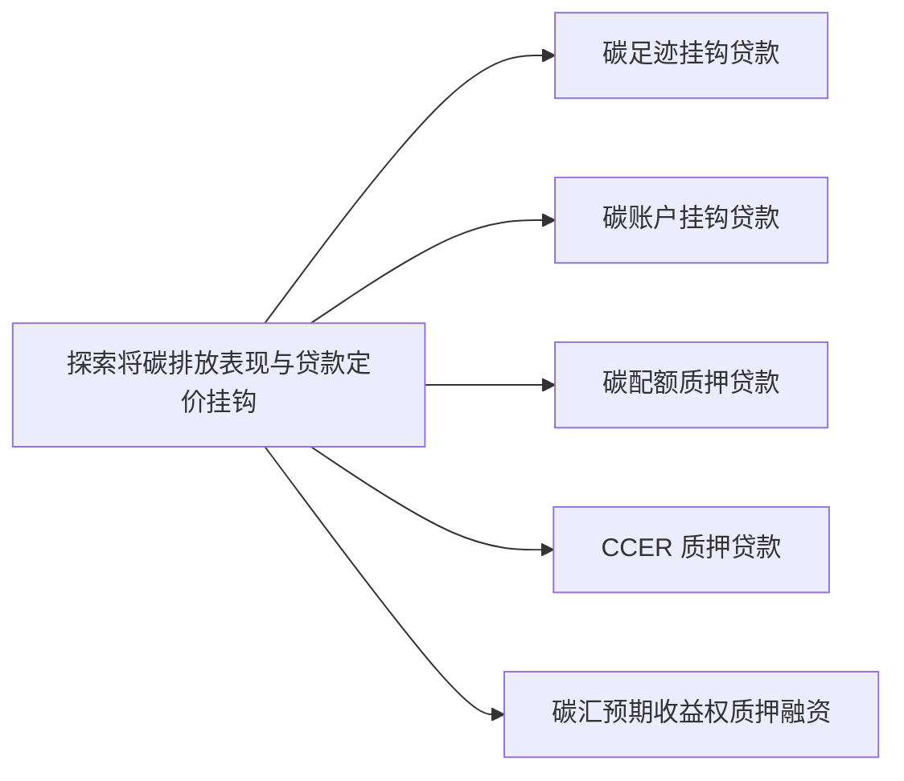
```mermaid
graph LR
  A["探索将碳排放表现与贷款定价挂钩"] --> B["碳足迹挂钩贷款"]
  A --> C["碳账户挂钩贷款"]
  A --> D["碳配额质押贷款"]
  A --> E["CCER 质押贷款"]
  A --> F["碳汇预期收益权质押融资"]
```

## 案例：江苏银行发布“G60绿色惠企贷”赋能科创企业低碳转型

2025 年 3 月 27 日，“长三角 G60 科创走廊 ESG 发展联盟首届会员大会暨企业 ESG 实践交流研讨会”在上海松江举行。江苏银行在会上发布了“G60绿色惠企贷”专项产品，重点支持绿色工厂、专精特新企业等六大领域，最高可提供项目总投资80%、期限15年的融资支持，并创新引入碳配额质押机制，为长三角科创企业绿色转型提供精准金融支持。

## 案例：北京分行落地“绿色工厂贷”助力企业绿色转型

2025年6月20日，北京分行成功落地北京市首笔“绿色工厂贷”业务，为北京福田戴姆勒汽车有限公司提供2亿元资金支持。分行通过将贷款利率与企业ESG评级有效联动，将企业的绿色成效与融资价格挂钩，助力企业在绿色转型过程中实现高质量、可持续发展

## 案例：深圳分行为大湾区企业提供碳减排支持贷款

深圳分行积极融入大湾区发展格局，以专业化绿色金融服务赋能区域绿色转型，为东莞深燃天然气热电有限公司燃气热电联产改扩建项目提供碳减排支持贷款2.8亿元。项目建成后预计年节约天然气7900万立方米、减碳约 14.5 万吨。

## 绿色金融专业化经营

<table><tr><td>生态金融</td><td>本行坚持以美丽中国建设为统领,深入推进减污、扩绿、增长,聚焦美丽城市、美丽乡村、美丽河湖、美丽海湾等重点领域,持续优化金融支持生态保护修复、生物多样性保护、城乡绿色发展的生态金融服务体系。探索创新业务合作模式,在江苏省内率先与亚洲基础设施开发银行达成自然与生物多样性的金融合作意向,通过转贷机制支持一批符合国际自然金融分类标准的高影响力自然生态项目,助力美丽江苏建设。优化特色金融产品供给,深入推广“环基贷”“环保贷”等创新产品,累计贴息超1100万元,贴息规模居全省首位。全力支持国家级、省级EOD项目建设,落地首笔“VEP+EOD”项目贷款。积极探索生态产品价值实现有效路径,推广“水权贷”“节水贷”等产品模式。</td></tr></table>

<table><tr><td>能源金融</td><td>本行聚焦新能源产业发展,持续完善涵盖风电、光伏、储能、新型电力系统等细分产业链的能源金融服务体系,修订光伏、储能、新能源汽车等领域的信贷投向指引,制定出台《关于加强氢能产业营销拓展的通知》等,创新推出江苏省首个“绿电贷”“项目前期贷”等特色产品服务,加大货币政策工具运用,碳减排支持工具、苏碳融累计发放约230亿元,其中碳减排支持工具投放规模居地方法人银行首位,每年带动二氧化碳减排量130余万吨。</td></tr><tr><td>转型金融</td><td>本行构建了“政策研究、标准制定、产品创新”三位一体的转型金融战略架构,系统推动高碳行业绿色低碳转型。作为“中英转型金融工作组”核心成员,本行深度参与转型金融专题研究,牵头开展“转型金融标准与激励机制”等多项研究课题。积极响应工信部、中国人民银行联合发布的《关于用好绿色金融政策支持绿色工厂建设的通知》,配套制定的专项金融方案成功入选工信部推荐方案。深度参与转型金融标准编制和实践工作,参与制定《无锡市纺织行业转型金融支持活动目录》,落地全国首单“转型金融+VEP质押”双认证贷款和多笔省市行业首单转型金融贷款,形成可复制、可推广的区域转型金融实践范例。</td></tr></table>

## 案例：苏州分行支持生物质能利用控制与治理大气污染

2025年11月，苏州分行向苏州某能源有限公司授信5亿元，专项支持“吴中生物质综合利用项目”建设。项目采用“污泥干化—高温焚烧—余热发电—灰渣资源化”闭环工艺，实现污染物全链条无害化处置与资源化利用，全年预计处理湿污泥30万吨，绿色发电6600万千瓦时，减排二氧化碳5.7万吨，节约标煤2.2万吨。

## 案例：盐城分行支持盐城南海公园改造提升

南海公园是盐城市内一座具有重要生态功能的中央公园，其改造将有效提升盐城“国际湿地城市”影响力。盐城分行以盐城南海公园改造提升项目的生态产品价值（VEP）为质押，成功落地本行首单大型城市中央公园VEP质押贷款为项目提供6000万元授信，通过金融手段量化并盘活了生态价值，有效破解了生态产品“度量难、抵押难、变现难”的实践难题。

## 案例：杭州分行落地VEP质押贷款助力“绿水青山”变“金山银山”

浙江安吉某生态环境导向开发（EOD）项目立足区域优质山水景观禀赋，构建彰显“两山”特色的产业载体。杭州分行创新性以项目VEP作为抵质押担保条件之一，为项目提供银团贷款超15亿元。项目建成后，预计可减排挥发性有机物（VOCs)390吨、提升污水处理率至98%、治理生态驳岸7800米、新增绿地38万平方米，助力“绿水青山”变“金山银山”。

##

启东长江口水生态系统修复及生命健康产业融合发展EOD(生态环境导向的开发)是江苏省级EOD试点项目。项目由江苏金北翼产业发展集团有限公司主导，内容包括长江口水质提升、滨江水系综合整治、江河岸线生态防护及湿地修复工程等。南通分行运用“EOD项目贷款”专项产品，为该企业制定了专属综合金融服务方案，给予公司银团贷款授信6亿元，有效推动项目实施，助力区域生态环境改善。

## 案例：南京分行为钢铁行业绿色升级添注强劲动力

南京分行运用产品碳足迹挂钩贷款向某钢铁企业注入8000万元绿色金融“活水”。分行将贷款利率与企业产品的“碳足迹”深度绑定，以第三方专业机构权威认证的碳足迹量化结果为标尺，为企业定制融资方案。在贷款周期内，企业若能有效降低产品碳足迹，即可解锁更优惠的利率奖励。这套“绿色激励”机制引导企业挖掘生产环节的节能潜力，主动开拓低碳市场，加速绿色蜕变。

##

北京分行为北京银建实业股份有限公司办理商业承兑汇票贴现业务，以其持有的2000吨碳配额进行质押贷款，将企业碳资产由“账面资产”转化为“融资工具”，提升碳资产的实际经济价值和使用效率。该业务为缺乏传统抵押物的企业提供了新的融资途径，助力碳市场与金融市场深度融合。

## 案例：常州分行精准支持企业开展低碳和零碳转型活动

常州华美光电新材料有限公司是一家专业从事玻璃制品制造的高新技术企业，被纳入“江苏省转型融资主体库”。常州分行在企业走访过程中了解到该企业需求后，主动向企业提交定制化ESG表现挂钩的转型融资方案，创新通过环境、社会及公司治理(ESG)表现衡量企业转型绩效，为企业提供2000万元转型金融授信额度，有力支持企业低碳转型。

## 绿色金融工具

## 绿色债券

绿色债券投资余额

104.8亿元

较年初增加

41.6亿元

绿色金融债券承销是金融机构深入践行国家“双碳”战略、做好绿色金融大文章的重要抓手。本行在承销实践中，对承销项目开展全面、审慎的评估，确保募集资金精准投向《绿色债券支持项目目录(2021年版)》界定的绿色产业领域。通过承销绿色债券支持区域绿色产业发展，推动企业通过基于ESG投资框架下的融资实现绿色转型，在新能源、绿色交通、污水处理、固废处理处置、风力发电等绿色领域持续发力。

本行子公司苏银理财有限责任公司积极布局包括债券、非标债权、权益等ESG相关投资品种，通过多元化的投资方式支持绿色产业发展，加大对生态修复、环境保护、清洁能源、绿色交通、绿色产业、绿色建筑、绿色消费等领域的资产投放。截至2025年末，公司绿色债券投资余额104.8亿元，较年初增加41.6亿元。

## 绿色理财

绿色ESG理财产品 共10期，存续规模

92.76亿元

苏银理财有限责任公司持续创新绿色理财产品，截至2025年末，公司存续绿色ESG理财产品共10期，存续规模92.76亿元。产品类型包含固收增强、封闭债权、货币、一年定开等，投资策略为存款、项目驱动、固收增强等。

## 绿色租赁

2025 年

苏银金租绿色租赁业务投放超

300亿元

连续3年，中诚信绿金ESG 评级

AA级

苏银金融租赁公司作为江苏银行践行绿色金融职责的重要力量，持续深化绿色租赁业务布局，通过设立专营部门、优化考核激励、组建专业团队等系统化举措，持续提升绿色金融服务能力，为节能环保、清洁能源、绿色制造等领域提供全周期、多场景的金融解决方案。2025年，苏银金租绿色租赁业务投放超300亿元，年末绿色租赁资产余额占比超过50%，获评“2024年度中国绿色租赁50强”，连续3年获中诚信绿金ESG评级“AA”级。

绿色运营

<table><tr><td>理念宣导</td><td>本行积极响应国家“节能增效,焕新引领”及“碳路先锋,绿动未来”号召,推进绿色低碳节能环保管理,开展“绿色低碳节能宣传周”主题活动,全面提升员工节能环保意识,营造绿色办公氛围。</td></tr><tr><td>绿色网点建设</td><td>本行全面落实网点建设全流程绿色管控,依据《江苏银行绿色支行标准建设手册》,明确各阶段技术控制要点及主要性能指标。通过推动绿色设计、绿色施工和绿色运维,实现绿色低碳建设与运营的闭环管理,最大限度减少网点全生命周期碳排放。2025年,全行网点建设采用绿色达标空调设备135台(套)、节能灯具8311套、节水器具236套、装配式材料1.95万平方米。</td></tr><tr><td>绿色采购</td><td>本行按照财政部和国家发展改革委公布的《节能产品政府采购品目清单》要求,严格执行《江苏银行集中采购管理办法》,实施绿色低碳节能环保产品的优先采购和强制采购。在绿色采购项目招标环节,本行要求供应商提供环保、节能产品认证,并设定相关产品与服务绿色准入要求和评价标准。</td></tr><tr><td>绿色办公</td><td>在可再生能源利用方面,本行充分利用太阳能资源,实现光伏发电量达3.83万度。</td></tr></table>

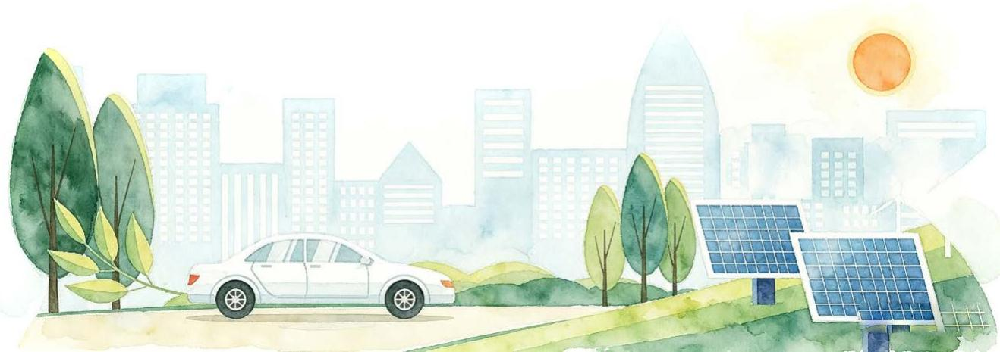

natural_image

Watercolor illustration of a white car driving on a green hillside with solar panels and modern city skyline in the background (no text or symbols)

## 污染物排放

natural_image

Illustration of a green eco-friendly concept with lightbulb, lightbulb icon, bicycle, house, wind turbine, and cloud (no text or symbols)

2025年本行新投入使用公务车辆67辆，其中新能源车56辆，占比 83.5%，按年均行驶2.5万公里估算，年直接减排二氧化碳约为206吨。

总行增设电动汽车充电桩108台、电动自行车充电设备13套，2025年通过充电桩售电7.5万度，相当于减排二氧化碳39.8吨。

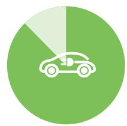

新能源车占比 83.5%

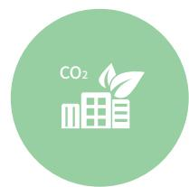

年直接减排二氧化碳约为 206吨

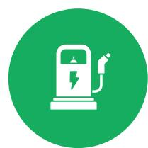

2025 年通过充电桩售电 7.5万度，相当于减排二氧化碳 39.8吨

## 废弃物处理

<table><tr><td>有害废弃物处置</td><td>本行针对废弃硒鼓墨盒、废弃铅酸蓄电池、废弃日光灯等有害废弃物实行专项分类管控。在指定区域配置防渗漏封闭式收集容器,清晰标注废弃物名称及“有害废弃物”警示标识。运输时采用防泄漏密封装置封装,全程委托专业机构进行集中合规处置。2025年,总行本部处理废弃铅酸蓄电池84块、处理废弃日光灯502套。</td></tr><tr><td>电子电气设备处理</td><td>废旧电脑、打印机、服务器等电子电气设备,由使用部门提交处置申请,经设备维护人员检测鉴定并出具意见后,启动处置流程。其中,设备维护更换产生的磁盘、磁带、U盘等废旧存储介质,统一移交总分行科技条线处理,为确保数据完全不可恢复,优先采取物理销毁方式。电子电气设备整体处置委托具备废弃电子产品处理资质的专业机构开展回收拆解,本行与回收机构签订处置合同,明确环保标准与权责条款。处置完成后,由回收机构出具合规处置报告,设备管理部门依据报告及时更新固定资产台账、核销对应资产信息,财务部门同步完成账务处理,确保账实一致。</td></tr><tr><td>垃圾分类及处理</td><td>本行将垃圾分类作为践行环境责任、推进绿色办公的关键举措,通过构建全流程管理体系,实现办公区域与营业网点垃圾分类的全覆盖。在总行办公区及各营业网点均设置垃圾分类投放点,配备分类标识清晰的垃圾桶。与具备资质的环卫回收企业签订长期合作协议,确保分类后废弃物合规资源化利用。</td></tr></table>

## 生态系统和生物多样性保护

natural_image

Illustration of a green bird flying over a desert scene with clouds and a dolphin (no text or symbols)

## 制度规范

本行积极响应国际国内生物多样性保护倡议，深入贯彻《中国生物多样性保护战略与行动计划（2023—2030年)》《昆明：蒙特利尔全球生物多样性框架》《银行业保险业绿色金融高质量发展实施方案》等政策要求，将生态系统和生物多样性保护作为全行可持续发展战略的核心组成部分。2025年，研究制定《江苏银行生物多样性金融框架》，为全行支持生物多样性保护的纲领性制度文件。

《江苏银行生物多样性金融框架》基于中国人民银行《生物多样性金融目录(试用稿)》，明确了生物多样性金融的术语定义适用范围、基木原则认定流程、绩效衡量、风险管理、信息披露等内部规范。重点支持山水林田湖草沙一休化保护、自然保护地体系建设、重点区域生态屏障建设、重点流域水环境治理等生物多样性保护重大工程，清晰界定“法定保护地+生态脆弱地区”二元生物多样性敏感区体系，严格排除涉及本行生物多样性活动负面清单的项目，并明确规定项目端、客户端及资产端生物多样性风险的管理办法

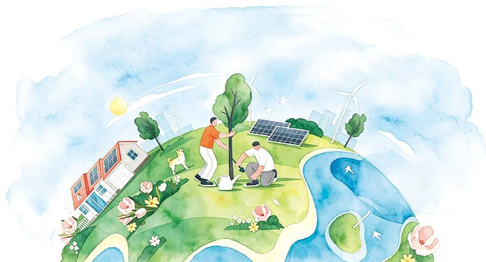

natural_image

Illustration of two people planting trees on a green hill with solar panels, wind turbines, and a house in the background (no text or symbols)

## 风险管理

## 项目端

将生物多样性风险审查嵌入环境与社会风险管理。在尽职调查阶段，首先将项目信息与生物多样性活动负面清单进行对照，对涉及濒危物种贸易等重大风险活动的项目实施禁止准入。

负面清单由总行绿色金融部环境与社会风险管理团队定期更新，并与国家/地方生态保护名录及其它最新政策联动。

采用 TNFD LEAP 方法进行分层评估，利用 ENCORE 和 BIA 等工具，通过“依赖和影响程度- 生物多样性敏感区重叠度”二维框架，将项目生物多样性风险等级划分为A、B、C、D四档，实施差异化管理政策，并根据识别出的风险点制定缓释措施

## 客户端

将生物多样性风险审查嵌入 ESG 风险管理。通过在 ESG 评级体系中纳入生物多样性相关指标，如与重要湿地或自然保护区的距离、是否有生态环境保护相关的制度、生物多样性相关行政处罚金额等，识别生物多样性高风险客户。

## 资产端

参与中国人民银行的首轮生物多样性金融风险评估及压力测试试点，针对农业等生物多样性重点行业，开展依托NGFS等气候情景的生物多样性风险压力测试研究工作

## 交流活动

本行作为 PRB 2030核心工作组联席组长，加入其实践社群(Nature Community of Practice)和自然影响目标试点(NatureImpact Targets Pilot）两个生物多样性相关工作组，参与国际银行业助力生物多样性保护交流。

作为中英财金对话框架下“中英绿色金融工作组”的核心成员，加入新成立的自然与生物多样性金融工作组，参与自然相关风险管理及披露，生物多样性金融产品及机制创新等方向的课题研究。

参与中国人民银行《生物多样性金融目录(试用稿)》的编制工作：牵头完成中国金融学会绿色金融专业委员会《银行业金融机构生物多样性绩效评价体系研究》课题；聚焦生物多样性金融前沿领域，目前已开展生物多样性信用机制设计、风险评估及绩效评价等专题研究。

natural_image

Watercolor illustration of children running through a grassy field with colorful balloons and hills in the background (no text or symbols)

## 环境合规管理

2025年，本行未发生突发重大环境事件，未发生因环境事件受到生态环境等有关部门重大行政处罚或追究刑事责任的情况。

## 能源利用

本行全面推进总行节能设施改造，更换办公场所|ED节能灯具502套，增加定时管控热水器、排风机、信息屏等常用耗能设备启闭功能，全年节电约11.08万度，节省电费约8.09万元。

## 水资源利用

本行持续强化保洁绿化用水管控，规范用水取水，实行绿化用水审批制，合理管控用水量和绿植浇灌频次定期巡查储水设施及给水设备，开展供水系统水平衡测试，修复景观水池等渗漏点，实现日节水4吨，有效提高水资源利用效率。

## 社会篇

服务实体经济 54

乡村振兴 57

普惠金融 62

科技金融……………………………………………66

助力消费 71

金融服务可及性……74

社会贡献…… ……77

创新驱动……………………………………………81

科技伦理……84

供应链安全…… ……85

平等对待中小企业 86

消费者权益保护……87

数据安全与客户隐私保护 93

支持的联合国可持续发展目标（SDGs）

<table><tr><td>1 无贫穷</td><td></td><td>2 零饥饿</td><td></td><td>3 良好健康与福祉</td><td></td><td>4 优质教育</td><td></td><td>5 性别平等</td><td></td></tr><tr><td>8 体面工作和经济增长</td><td></td><td>9 产业、创新和基础设施</td><td></td><td>10 减少不平等</td><td></td><td>11 可持续城市和社区</td><td></td><td>12 负责任消费和生产</td><td></td></tr></table>

natural_image

Watercolor illustration of a city with hot air balloons, modern skyscrapers, and smiling yellow and orange balloons (no text or symbols)

## 服务实体经济

本行坚持把金融服务实体经济作为根本宗旨，聚焦主责主业，持续加大对重大战略、重点领域和薄弱环节的金融支持力度，赋能实体经济高质量发展。

natural_image

Illustration of an eco-friendly industrial park with wind turbines, power lines, and a cyclist (no text or symbols)

## 响应国家战略

## 服务长三角一体化发展

本行发挥区域内机构布局优势，强化协同联动，结合各地资源禀赋、产业结构、市场环境及政策特点制定差异化金融服务模式，聚焦先进制造科技创新、绿色金融、乡村振兴等实体经济重点领域和薄弱环节，持续加大信贷、审批、价格等资源配置，高效支持区域内重大项目建设，扎实推进长三角一体化发展。

## 支持京津冀协同发展

本行紧扣京津冀协同发展部署，聚焦非首都功能疏解，国际科技创新中心建设及绿色低碳转型三大核心，重点对接央国企在交通一体化、能源革新、科技成果转化等领域的项目需求，提供全流程综合金融服务，助力央国企在京津冀产业协同、生态保护等领域发挥引领作用，以银企合力赋能区域发展

## 参与粤港澳大湾区建设

本行从对公业务切入本地市场，围绕国资国企及其上下游中小企业和优势领域上市公司展开深入合作，以自身的资源禀赋支持粤港澳地区科技创新、绿色金融和海洋经济等领域发展。

## 支持地方建设

## 助力现代化产业体系建设

本行围绕江苏“1650”产业体系和“51010”战略性新兴产业集群，深化产业专家顾问制度，以场景为驱动推动产业链高质量发展全力支持大规模设备更新扩面上量，统筹推进传统产业升级、新兴产业壮大、未来产业培育等领域金融服务，助力构建以先进制造业为骨于的现代化产业体系。

“1650”

产业体系

“51010”

战略性新兴产业集群

## 服务重大项目落地见效

本行围绕“两重”投资计划，加强组织推动，强化银企对接，靠前获取各级重大项目、民间投资重点产业项目清单、新型政策性金融工具，不断加大对各类重点项目的信贷支持力度，提供从电报、建设到运营的全流程综合服务。

## 案例：连云港分行助力全球首艘三文鱼养殖工船“苏海1号”投产

2025年12月，由连云港分行支持的全球首艘三文鱼养殖工船“苏海1号”正式投产。该项目由江苏连深海洋科技有限公司承建运营，总投资超12.6.亿元，涵盖养殖工船建造租赁及配套运输船打造。分行充分发挥蓝色金融优势，牵头组建银团提供7.6亿元授信，助力连云港打造现代海洋产业高地

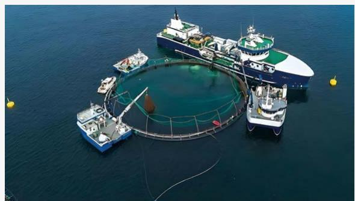

natural_image

Aerial view of a large circular aquaculture farm with multiple boats and a central green net, no visible text or symbols.

##

“苏通第二过江通道”作为南通“八龙过江”布局中的“第七龙”，是南通融入长三角一体化的重要交通工程。南通分行为该项目量身制定了200亿元授信方案，前期投放项目贷款3000万元，为南通“十五五”交通格局升级注入金融动能。

## 服务对外开放

## 共建“一带一路”

本行紧跟国家对外开放步伐，结合中资企业出海方向，加大跨境投融资支持力度，特别是针对东南亚、中东、中亚和非洲等“一带一路”沿线新兴市场，通过境外直贷、跨境银团、跨境并购等产品，全力推动各类跨境融资项目落地，跨境贷款余额较年初翻番。

## 助力中资企业出海

本行围绕中资企业“走出去”需求，持续完善跨境产品序列，创新落地融资租赁国际保理、国际证福费廷保单融资、线上版跨境资金池等多项产品服务。聚焦企业海外经营痛点，推出“出海服务工具箱”，实现从“业务支持”到“全生命周期陪伴”的服务提升。举办“走进新加坡”“走进上海自贸区”“走进中亚”等中资企业出海系列专场活动，助力企业把握海外热点市场机遇。

## 多措并举稳外贸

本行积极响应稳外贸各项政策措施，出台“稳外贸10条举措”，加大对受冲击较大的外贸企业帮扶力度，按照“一业一策、一企一策”原则为外贸企业提供金融服务，做好资金周转困难外贸企业转贷续贷，稳定企业生产，建立审批“绿色通道”支持困难企业办理贷款。推出“苏贸 +”“信保 +”等标准化资产服务场景，贸易融资余额较年初增幅超 50%。

## 案例：徐州分行“e陆通”助力拓展中欧班列运输网络

徐州分行自主创新“e陆通”金融产品，成功为中欧班列下游物流企业办理铁路“一单制”运费融资业务，发放专项融资用于支付铁路运费，并围绕中欧班列运输场景开展金融服务，切实缓解传统陆路运输中小微企业融资难、融资慢的痛点，支持陆路贸易体系建设。

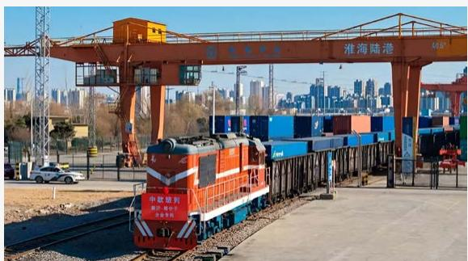

text_image

淮海陆港
中欧班列
站前：淮海
站前：淮海

## 案例：连云港分行护航企业“走出去”发展

连云港分行充分运用自贸区政策优势，落实跨境人民币贸易投资结算便利化政策，为连云港亚欧一带一路供应链基地有限公司提供跨境直投金融+非金融服务，支持企业哈萨克斯坦“海外仓”项目建设，全程护航企业“走出去”。

##

扬州某国际贸易公司是一家生活用纸生产与贸易型企业。扬州分行通过“苏贸贷”产品为企业授信1000万元，并为其打通了网银收付款渠道，助力企业在新加坡TikTok平台收款超6000万元，有效支持了企业布局国际市场。

## 乡村振兴

本行将服务乡村振兴深度融入经营发展战略，精准落实政策、纵深对接产业、深化科技赋能，助力农业新质生产力发展，助推乡村振兴金融服务扩面增量、提质增效

natural_image

Illustration of a rural landscape with houses, trees, and birds (no text or symbols)

## 治理

## 董事会

本行董事会是

乡村振兴工作的最高决策机构。

## 管理层

成立“金融服务乡村振兴工作领导小组”，

由总行行领导分工挂钩江苏省内 12 个重点帮扶县（区），

统筹推进全行乡村振兴战略实施。

## 执行层

建立“总行有部门、分行有团队、支行有专员”的三级组织体系：

总行在普惠金融部下设乡村振兴金融部（二级部）；

苏北五市分行设立专职乡村振兴金融团队，苏南、苏中分行明确由业务拓展团队负责相关业务；

支行层面设立对公业务二部（乡村振兴金融部）。

## 战略与管理

本行持续强化服务乡村振兴的战略引领与顶层设计，建立健全规划、策略与产品协同推进的管理体系，逐步形成政策响应及时资源协同高效、服务精准全面的乡村振兴金融服务模式，为农业强省建设提供坚实金融支撑。

## 系统规划

本行始终坚持将国家战略与区域部署融入自身发展脉络，连续九年制定并发布年度乡村振兴金融服务政策文件。2025年，围绕“政策引领、产业深耕、科技兴农”三大方向出台《江苏银行2025年金融服务乡村振兴工作的实施意见》明确全行乡村振兴工作的行动纲领与重点任务。同时，制定专项营销与信贷投向指引，建立“四季农时”动态服务机制，优先支持乡村振兴人才、农业科技企业、新型农业经营主体、农业龙头企业及农村集体经济组织等五类重点客群，确保金融资源精准聚焦、高效配置。

围绕

政策引领产业深耕科技兴农出台

《江苏银行2025年金融服务乡村振兴工作的实施意见》

## 策略协同

本行创新构建“三联三清单”工作机制，通过联手主管部门、联动地方政府、联合专业机构，围绕产业清单、客户清单、产品清单开展精准对接,形成“省市一县”三级联动、“政一银一企”多方协同的服务网络。在此基础上，推出“三联五专”服务方案，聚焦科技型、电商型、生态型、文旅型、服务型五类“新农人”群体，将金融服务系统性嵌入人才培育与产业升级链条。

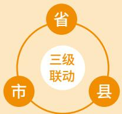

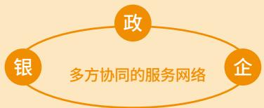

## 产品服务

本行持续完善“融旺乡村”产品体系，创新推出覆盖新型农业经营主体全生命周期、多元场景的标准化与定制化产品组合，显著提升金融供给与产业需求的匹配度。依托“四季农时”产业地图与深度产业调研，实现对国家级农业产业强镇及特色产业集群的精准服务，推动金融服务从“广泛覆盖”向“专业深耕”转型。同时，积极推动数智赋能，通过“扩数源，建模型.拓场景”构建智慧服务生态，整合多维涉农数据，研发差异化风控模型，并将金融服务延伸至农村产权交易、乡村文旅、农村电商等高频场景，全面提升服务可得性、精准性与便利性。

金融服务

广泛覆盖

向

专业深耕

转型

数智赋能

通过

扩数源构建智慧服务生态

风险和机遇管理

<table><tr><td>风险</td><td>风险描述</td><td>应对措施</td></tr><tr><td>政策环境变化</td><td>国家及地方涉农政策、产业扶持方向、监管要求等可能发生调整,影响业务合规性与持续性。</td><td>本行建立常态化政策跟踪与解读机制,及时将政策导向融入产品设计与服务流程,确保业务开展与政策方向保持一致。</td></tr><tr><td>农业产业周期性波动</td><td>农业生产受自然条件、市场供需、价格波动等因素影响显著,可能引发经营主体还款能力不稳定。</td><td>本行通过“产业地图”动态监测农业周期,开展产业链全景研究,开发差异化、场景化金融产品,增强客户抗风险能力。</td></tr><tr><td>农村信用体系不健全</td><td>农村地区信用数据缺失、信息不对称问题仍较突出,影响客户风险评估与信贷决策效率。</td><td>本行深化“苏农云”等外部数据接入与应用,完善涉农客户智能风控模型,拓展乡村治理与金融服务融合场景,逐步构建多层次农村信用生态。</td></tr></table>

<table><tr><td>机遇</td><td>机遇描述</td><td>应对措施</td></tr><tr><td>农业新质生产力</td><td>农业领域科技创新加速,智慧农业、生物农业等新产业、新模式不断涌现,为金融服务带来新的增长空间。</td><td>本行积极响应发展农业新质生产力的政策导向,建立农业科技型企业“白名单”,重点支持智慧农业、功能农业、生物农业等领域的头部企业、科技领军企业及“专精特新”主体。综合运用科创金融与“三农”特色产品体系,提供覆盖全生命周期的综合金融服务,助力农业科技研发与成果转化。</td></tr><tr><td>农业设施设备更新升级</td><td>农业机械化、设施化水平持续提升,政策支持力度加大,推动农业装备与基础设施升级需求不断释放。</td><td>本行围绕农业机械化与设施装备更新政策,持续深化农机产业链金融服务,积极对接农业补贴数据系统。迭代升级“农机e贷”产品模型,配套专项资产支持计划,推动农机金融服务规模化发展,支持农业生产“智改数转网联”与标准化、智慧化设施改造。</td></tr><tr><td>农业全产业链加快发展</td><td>农业社会化服务与全产业链整合不断深化,从生产到服务的各环节金融需求日益系统化、场景化。</td><td>本行围绕江苏省农事、农技“两个中心”建设,加强农服全产业链金融创新,针对代耕代种、全程托管、订单农业等社会化服务场景,开发专属金融产品。持续延伸服务链条,支持农业产业融合与价值链提升,助力构建现代化农业产业体系。</td></tr></table>

## 指标与目标

截至2025年末，本行涉农贷款余额超2870亿元，较年初增长超460亿元。其中普惠型涉农贷款余额超610亿元，较年初增长超106亿元，增速高于各项贷款平均水平：农业产业贷款余额1084亿元，较年初新增145亿元，苏北五市十二县涉农贷款增速领先全行。完成对全省农业农村重大项目走访全覆盖，支持新型农业经营主体超1.15万户。

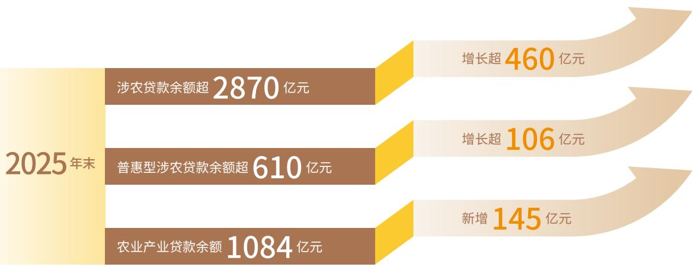

funnel

| Category | Loan Balance (亿元) | Growth |
| --- | --- | --- |
| 涉农贷款余额 | 2870 | 增长超 460 |
| 普惠型涉农贷款余额 | 610 | 增长超 106 |
| 农业产业贷款余额 | 1084 | 新增 145 |

##

苏州分行聚焦乡土人才、农村创业青年、农村致富带头人以及新型农村集体经济组织等客群的融资需求，依托“共富贷”产品，精准支持三农产业发展，带动农民增收致富。“共富贷”围绕乡村资产盘活、特色产业培育、基础设施建设等领域，重点破解乡村“融资难、担保难”的问题，2025年末分行“共富贷”贷款余额3.02亿元，有力支持了苏州地区美丽乡村建设。

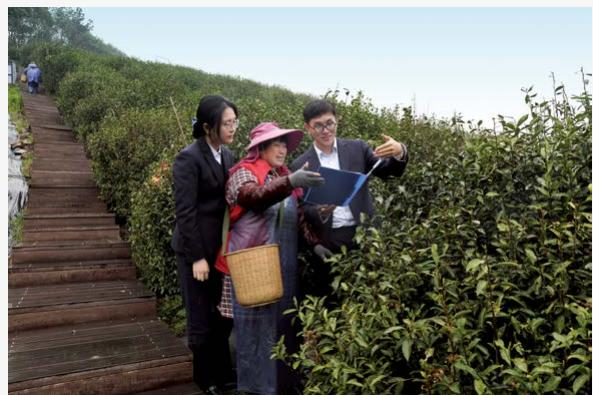

natural_image

Three people examining a map or document over a terraced hillside with greenery (no visible text or symbols)

##

2025年9月，连云港分行同赣榆农发集团合作上线农产品集采平台，旨在打通农产品产销对接“最后一公里”，构建高效、安全、透明的食材供应链体系。平台成功吸纳56家优质农产品及食材供应商入驻，涵盖蔬菜、水果、肉类、粮油、禽蛋等全品类食材供应资源，同时精准对接全区91家公立学校、医院及政府机关食堂，实现供需两端的精准匹配。

## 案例：镇江分行服务春耕夏收

镇江分行借助数字供应链业务模式，为沃得集团下游经销商打造专属线上融资方案。经销商通过线上进行贷款全流程操作，系统自动完成审批。贷款资金专项用于企业采购农机设备，有效提升融资效率，为农业生产发展及春耕夏收的高效运转提供了有力支撑。

## 案例：淮安分行满足农业现代化升级需求

淮安分行聚焦高标准温室大棚、智慧农业园区、农产品冷链物流等关键领域，有效满足农业经营主体在设施建设、装备升级、技术改造等方面的资金需求。2025年分行已成功投放相关贷款1.5亿元，有力助推本地农业设施提档产业增效与乡村振兴步伐，为区域现代农业高质量发展注入强劲金融动能。

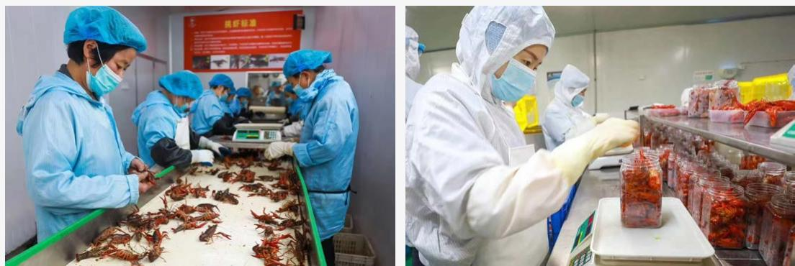

##

盐城分行通过“苏链贷”专项贷款业务向盐城市大丰珍珂粮食贸易有限公司发放了300万元储备粮采购贷款。分行基于成交合同向借款人发放专项用于农户或粮食经纪人采购合同约定规格粮食的短期贷款，利用金融工具支持粮食企业开展粮食收储，保障农产品稳定安全供给

natural_image

Illustration of a person holding a laptop surrounded by various fresh vegetables (no text or symbols)

## 普惠金融

本行始终坚持金融普惠初心，秉持着“做小微就是做未来”的理念，精准浇灌小微沃土，实现社会效益与经济效益“双向奔赴”。

natural_image

Illustration of stylized sun, raindrops, trees, and flowers (no text or symbols)

## 治理

## 董事会

本行董事会是普惠金融工作的最高决策机构。

## 管理层

成立“五篇大文章”普惠金融工作组。总行分管普惠金融业务的行领导高管担任组长，每季召开普惠金融工作组会研究传导相关政策要求推进普惠金融县体工作

## 执行层

积极响应小微企业融资协调工作机制要求，成立“小微企业融资服务工作专班”，统筹全行小微企业融资服务的整体推进和实施，各分行比照总行设立工作专班各支行设立工作专班并下设办公室，以确保每一项决策都能迅速而精准地落实到位。

## 战略与管理

## 系统规划

出台《关于江苏银行进一步做好小微企业高质量金融服务的意见》，强化小微企业金融服务供给，提升服务质量，扎实做好普惠金融大文章。

制定《江苏银行小微企业融资服务行动方案》，加大金融服务实体经济力度，缓解小微企业融资难、贵、慢问题，提升小微企业融资服务质效。

## 策略协同

## 建机制

建立“专班建设、专业指导、专项行动、专属服务、专设流程、专有政策”的“六专”服务机制配套支持政策，服务小微企业。

## 绘图谱

构建基于链、端、点产业标签体系，打造经营分析、区域政策、客户清单、服务方案的图谱展示系统，持续推进从产业地图，到客户地图，再到业务地图的服务链条。

## 防风险

完善审批否决案例、内外部检查问题、责任认定问题回溯提升机制，快速迭代普惠信贷策略，防范业务风险，维护普惠业务资产质量

## 搭模型

搭建小微企业价值评分主动授信，风险扫描营销响应四项模型，基于客户资质智能匹配最优服务方案，满足小微企业个性化融资需求

## 产品服务

## 落实小微融资协调机制

聚焦民营小微企业，开展“千企万户大走访”“百渠营销”等重点活动，及时响应、精准对接民营小微企业金融需求，切实打通金融惠企利民的“最后一公里”。

## 升级业务产品

升级“经营随e贷”产品，以一款产品满足不同小微民营客户需求；升级“采销e贷”产品，加大对供应链上小微企业的信贷支持；健全苏银e链“1+3+X”产品体系，提升在订单、存货、结算等环节的综合服务能力。

## 对接个体工商户

联合地方商会、行业协会等合作方搭建经营场景，为个体工商户提供“经营贷+结算账户+增值服务”多维立体化服务。

风险和机遇管理

<table><tr><td>风险</td><td>风险描述</td><td>应对措施</td></tr><tr><td>政策风险</td><td>普惠金融相关政策变化、监管标准调整等,可能对机构业务模式带来冲击,对经营决策连续性产生影响。</td><td>本行建立政策动态监测机制,设立专项政策研究团队,实时跟踪政策变化,及时调整业务策略,定期下发政策文件汇编推动全条线学习。加强与监管部门的沟通协调,确保政策执行精准到位,并针对政策变化提前制定应急预案,保障普惠金融业务平稳运行。</td></tr><tr><td>操作风险</td><td>客户经理未按照政府监管部门政策规定、外部合作协议等进行规范有效操作,未按照行内要求规范合规签署合同等。</td><td>本行持续推进管理上收,通过系统自动操作、系统管控或总分行集中运营解决客户经理操作风险。加强客户经理赋能,协同相关条线系统性、针对性开展合规、法律等方面的培训,提升风险意识与操作能力。</td></tr></table>

<table><tr><td>机遇</td><td>机遇描述</td><td>应对措施</td></tr><tr><td>数字技术的发展与运用</td><td>大数据、人工智能等技术广泛应用,依托数据增信与智能风控,可破解信息不对称、提升审批效率、降低服务成本,扩大信用贷覆盖面,实现线上化、场景化、精准化服务,助力小微企业高质量发展。</td><td>本行以科技为引擎、数据为驱动、智能为基石,全面实施普惠小微业务流程再造与服务模式重构,持续探索运用数字化手段提升普惠金融的便利性和可得性。通过拓宽数据来源、强化数据整合、加强系统建设,有力有效的推动小微服务向全面数字化转变。</td></tr><tr><td>产业发展</td><td>当前政策红利持续释放,内需市场稳步扩容,产业链供应链协同升级。科技创新、民生服务、县域经济等领域空间广阔,为小微主体提质增效、转型升级、深耕细分赛道提供了良好发展机遇,整体动能强劲、前景向好。</td><td>本行抢抓产业发展机遇,提升专业化经营能力,深入开展产业研究,形成“一链一策”的综合服务方案。建设智能化业务辅助决策体系和产业风险管理体系。</td></tr></table>

## 指标与目标

截至2025年末，本行小微贷款规模保持江苏省、全国城商行双第一，普惠小微贷款余额2478亿元，增速17.7%，高于全国、全省平均增速，连续五年获小微企业金融服务监管“一级”评价。

<table><tr><td>小微贷款规模保持</td><td>普惠小微贷款余额</td><td>连续五年获小微企业金融服务监管</td></tr><tr><td>江苏省、全国城商行双第一</td><td>2478亿元增速17.7%</td><td>一级 评价</td></tr></table>

##

杭州分行扎根浙江民营经济沃土，针对家电零售产业链下游小微企业“短、频、快”的融资需求，推出“天猫优品订货通”业务，精准满足小微企业日常经营周转需求。通过与天猫优品、菜鸟供应链的深度合作，基于真实采购订单为下游经销商提供线上融资服务，旨在打通普惠金融惠及小微商户的“最后一公里”。

##

镇江分行推出“融易担——批量担保”专项业务，通过与担保公司深化合作，共同发挥风险分担与缓释功能，形成企业高效融资、银行精准风控、担保增信赋能三方互利共赢的良性生态，有效破解小微企业因抵押物不足面临的融资难题。

## 科技金融

本行始终将服务科技创新作为经营发展的重要方向，通过专业化、特色化的科技金融服务，精准助力科技创新与产业创新融合发展，为新质生产力发展贡献金融力量。

natural_image

Illustration of a laptop with leaves and a globe, surrounded by decorative plant elements (no text or symbols)

## 治理

## 董事会

本行董事会是科技金融工作的最高决策机构。

## 管理层

成立“五篇大文章”科技金融工作组，

由分管科技金融业务的行领导、高管担任组长，

每季度召开工作组会，推进科技金融具体工作。

## 执行层

完善“总分支”三级服务网络。在总、分行设立科技金融部，在科技资源集聚区设立科技支行，

跨业务、审批、风控等多条线选聘超1500人的科技金融顾问队伍，

有效提升科技金融综合服务能力。

## 战略与管理

## 系统规划

连续出台科技金融三年发展规划，要求科技金融业务条线聚焦重点业务方向，打造特色经营模式，完善风险控制机制，抓好基础管理，扎实推进科技金融业务稳健发展。

## 策略协同

## 健全科技金融工作机制

本行以健全的工作机制夯实科技金融高质量发展根基。在组织推动上，聚焦专精特新、高企、科技中小等重点客群，梯度开展专精特新攻坚、“小升高”培育提升、科技中小“百千万”专项行动，全周期支持科技企业成长。在考核评估上，制定科技金融服务效果评估方案，推进“总分协同评估和“每季度评估”工作机制，以每家分行的自评估达标带动全行自评估达标，以每个季度的自评估达标带动全年的自评估达标。

## 加大重点领域金融供给

聚焦全国高校区域技术转移转化中心（江苏)建设，创新开发“成果转化贷”“签约即贷”“阶段免息”“里程碑用款”等产品，以“早、省、快、优”特色服务助推科技企业成果转化。聚焦江苏省战略性新兴产业基金建设需要，与江苏高科技投资集团协同构建“两互四共”投贷联动服务模式，支持省战略性新兴产业基金投资企业。

## 强化智慧风控管理

构建1+N主副卡评分模型运行机制，研发上线新版贷前评分模型，加大对“硬科技”企业的信贷支持。加强数字化客户准入管理，通过知识产权所属领域与科技企业主营业务的交叉验证，精准识别伪科技企业。

## 产品服务

## 搭建“苏银科创融”服务平台

对接江苏省高投、省信保、江苏人保等机构，推出“苏银科创融”服务平台，集聚资金、技术、政策资源，帮助科技企业高效撮合资金、精准对接技术、智慧四配政策。

## 健全“科创融”全生命周期产品矩阵

围绕科技企业成长不同阶段，打造升级“苏孵贷”“人才贷”“科创e贷”“专精特新贷”“融合贷”等专项产品，为企业提供直接融资与间接融资综合支持。

风险和机遇管理

<table><tr><td>风险</td><td>风险描述</td><td>应对措施</td></tr><tr><td>信用风险</td><td>初创期科技企业既有轻资产、高风险、投入产出周期长的特点,又有技术开发和成果转化前景不确定、行业整体技术进步快的特点,其成长存在不确定性。</td><td>本行强化数字风控,引入知识产权、创新积分等科创数据,构建科技企业“政策+行业+投资+团队+成果”五维评价模型,迭代升级科创企业审批模型18项优化策略。强化政银担合作,加大苏科贷、人才贷等风险分担产品合作。</td></tr></table>

<table><tr><td>机遇</td><td>机遇描述</td><td>应对措施</td></tr><tr><td>政策试点机遇</td><td>江苏省先后发布《江苏省知识产权金融生态综合试点方案》,促进知识产权金融健康可持续发展,有利于商业银行服务创新,助力新质生产力发展。</td><td>本行整合行内风险缓释、信贷管理、大数据平台三大系统,升级行内知识产权价值评估体系。加大运用知识产权资产支持票据、证券化等直接融资手段。</td></tr></table>

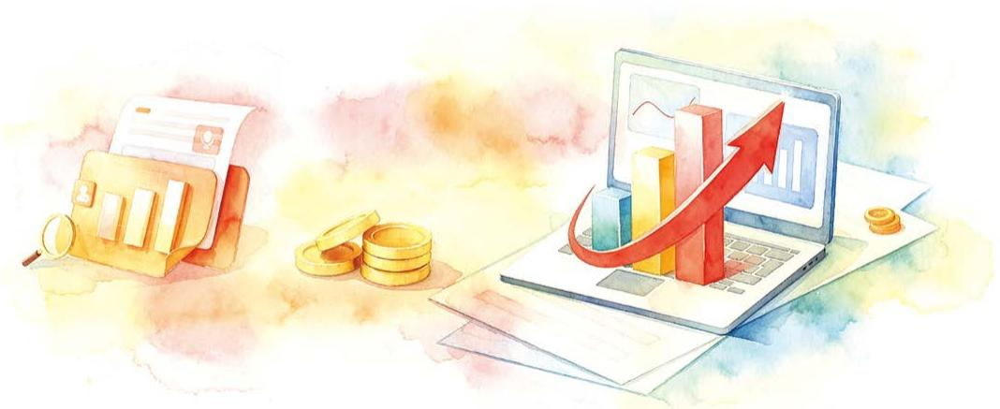

natural_image

Illustration of a laptop with bar chart and upward arrow, alongside coins and a magnifying glass (no text or symbols)

## 指标与目标

截至2025年末，本行科技贷款余额2905亿元，服务科技企业客户数2.4万户，较年初新增3104户。本行服务人才创新创业支持科技成果转化等案例先后两次被央视财经频道专题报道

科技贷款余额

2905

亿元

截至2025年末

服务科技企业客户数

2.4

##

墨境天合无锡数字图像科技有限公司(MOREVEX)是国内视效行业的标杆企业，无锡分行跳出传统厂房、土地等固定资产抵押融资模式，将企业的计算机软件著作权、数字资产库、行业获奖含金量等无形资产转化为可量化的技术分值，为企业发放800万元“苏科贷”，及时解决了企业融资难题

##

南通华普生物科技有限公司是一家专业从事海洋生物活性物质提取、纯化、合成技术研发的初创企业。2025年以来，企业产品技术逐渐得到市场认可，急需资金采购原材料，但由于成立时间短、有效销售低、无有效担保等原因较难获取银行信贷支持。南通分行积极帮助企业申请科创首贷贴息政策优惠，为企业授信500万元，为企业补充流动资金、节约资金成本，助力企业进一步扩大生产规模。

## 案例：上海分行创新贷款模式破解初创企业融资难题

上海某科技有限公司是商用清洁机器人领域的创新型中小企业，随着产品迭代升级需求加剧及订单量激增，企业面临备货生产资金缺口，但传统融资方式难以匹配其“轻资产、高成长”特性。上海分行敏锐捕捉企业需求，创新推出“认股权”贷款模式一将企业最新一轮股权融资的估值水平、融资进度等核心要素，与当前贷款的利率定价、期限设置及风险缓释措施深度绑定，为企业提供了与其发展阶段高度适配的综合融资方案

## 案例：淮安分行助力专精特新企业扩产增效

芯声微电子科技有限公司主营陶瓷贴片电容器研发与生产，产品广泛应用于汽车电子系统等核心领域。企业近期在手订单充足，因批量采购原材料面临阶段性资金缺口。淮安分行紧密结合企业生产经营与资金需求实际，为企业定制“成长之星”信用贷款方案，成功授信1000万元，从申请到提款仅用时5天，以足额信用资金保障原材料供应，助力企业抢抓市场机遇、扩大生产规模。

## 案例：深圳分行“智慧融”产品服务科创企业

深圳分行通过引入外部专家评审、知识产权价值评估、人才信用评价等多元方式，将企业的技术优势、专利成果和人才价值转化为金融体系认可的可授信资产。分行创新推出“智慧融”特色服务，以“人才信用+知识产权”为核心依据提供纯信用贷款，已为一家孔雀人才创立的智能机器人企业提供80万元启动资金，后续又基于订单增长情况将授信提升至600万元，有效支撑了企业技术研发与市场拓展。

## 案例：杭州分行数据“搭桥”破解轻资产企业融资困局

浙江爱签数字科技有限公司是国内区块链电子合同生态服务商，为抢占市场份额急需流动资金，但却因轻资产运营，传统融资渠道始终难以打开。杭州分行对企业核心知识产权技术含量、政府奖补力度、研发人员增长等科技指标展开详细分析，将“技术实力、团队背景、市场潜力”等“软实力”转化为可评估的授信“硬指标”，为企业提供1000万元授信，为企业解了燃眉之急，助力企业从“技术领先”走向“资本认可”。

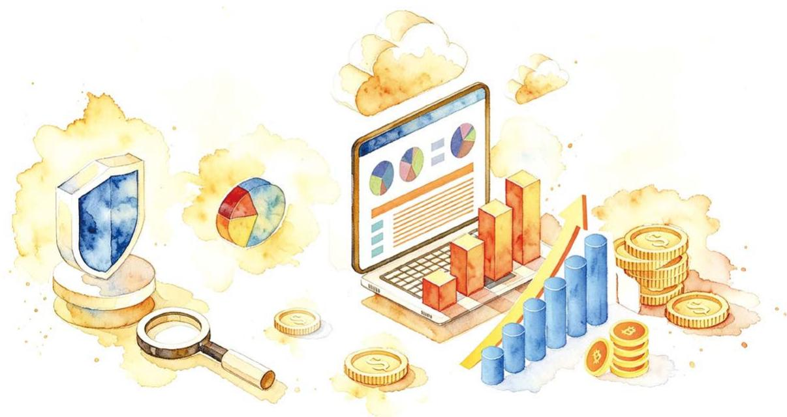

natural_image

Illustration of digital finance concepts including a laptop, coins, and cloud icons (no text or symbols)

## 助力消费

本行紧抓消费脉搏，围绕民众多元消费需求与市场增长潜力，以场景为媒介拉动消费升级，从支持商户稳健经营到满足消费者多元化需求，为提振消费信心、促进经济高质量发展贡献坚实的金融力量

natural_image

Illustration of digital payment methods including credit card, wallet, and shopping cart (no text or symbols)

## 促进文体消费

本行通过冠名体育赛事、深化场景服务、推动传统文化融合，构建“金融+文体+消费”的融合生态。2025年，在服务首届江苏省城市足球联赛的过程中，上线“苏超”专区，推出“跟着苏超去狂欢”活动，打造“乐游、观剧、赢球、嗨购、畅饮出行”六大消费板块，携手70余个知名品牌发放近1.5亿元消费券，覆盖旅游、餐饮、购物、出行等多元场景

作为江苏省城市足球联赛的主冠名商，本行组织各地分行精准锚定球迷观赛核心场景，主动走进主赛场和第二现场，布局赛事场馆、球迷聚集商圈等观赛场景，以信用卡支付优惠、个人信贷产品等为载体，为消费者提供消费满减等优惠，共开展促消费主题活动700余场，累计为超6万客户提供个人消费信贷服务。

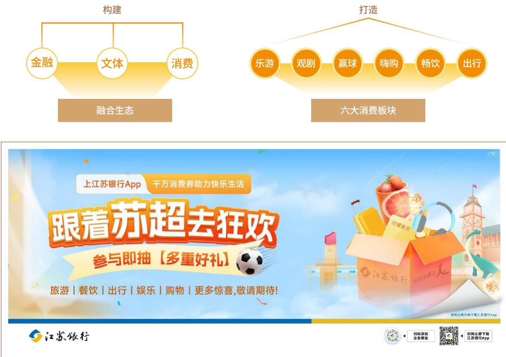

## 满足消费需求

## 助力释放消费活力

本行积极落实金融支持提振消费相关要求，发布《江苏银行发展消费金融助力提振消费的“20条”举措》和《江苏银行金融支持提振和扩大消费的“18条”落实举措》，通过支持增强消费能力、提升金融机构服务能力、聚售重点消费领域、强化消费基础设施和流通体系支持、加强基础金融服务、强化金融服务组织保障等六大主题18条举措，提振消费活力，助燃消费市场。

## 推动大宗产品消费升级

本行紧扣消费补贴发放民生工程，创新便民增值服务，在“苏银随心办”小程序推出“2025江苏汽车补贴线上申领”功能为客户提供足不出户的线上申领服务。积极参与江苏省商务厅开展的“汽车焕新”五走进活动，创新“金融+消费”服务模式提供一站式购车方案、专属金融产品及千元购车礼包，推动消费升级

## 开展信用卡专项补贴

本行加大全场景促消费投入，在“618”“双11”“双12”等全民消费节期间，投入1100余万元信用卡专项资金，以消费补贴支付优惠等多种形式，服务餐饮、3C数码、家电电动车等以旧换新场景及线上出行平台等重点消费领域，让商户获支持消费者得实惠。

## 搭建消费场景

## 推广“我是厨神”美食活动

text_image

我是厨神
十三城寻味之旅
首站泰州 味蕾狂欢节开启!
苏超冠军城 尝赏鲜苏味
一口泰州 满心苏味
 menu包
 menu单头
浙江双象肉脯
本期推荐苏味TOP/TT卡餐厅:
南京金杜

2025年，本行冠名“我是厨神”江苏省美食推广专题活动，以“金融+美食”的跨界联动，激活江苏“舌尖上的经济”，点燃全省十三市美食消费热情。

江苏银行App打造的“我是厨神”专区，为超2200万客户提供“探江苏美食、投厨神榜单、看活动直播、领餐饮优惠”的一站式服务。线下开展十三城美食巡游主题活动，现场发放百万美食消费券，让金融品牌自然融入城市烟火与百姓生活。

活动期间，本行持续为餐饮商户纾困助力，用真金白银为江苏餐饮行业注入发展活力，投入专项资金，对全省餐饮商户进行精准补贴，助力商户经营发展。针对餐饮商户融资不易、成本承压的痛点，为中小餐饮商户提供便捷的融资支持。依托自身的客户资源、渠道优势，为合作商户引客导流，让活动的流量红利直接转化为商户的经营收益。

## 携手开展“加油江苏”活动

“加油江苏”油品消费有奖发票活动在我行落地。本行携手头部成品油企业，推出站点开票激励政策，有效发挥财政资金促消费杠杆效应，累计吸引近10万人参与上传发票约47.万张，带动成品油消费开票金额达1.27.亿元，精准触达成品油核心消费群体，激发群众加油出行的热情

## 赋能“苏品苏货”

本行依托江苏省商务厅“苏品苏货”品牌清单，积极推动本地餐饮、商超及特色商品等品类商户入驻江苏银行App“苏品苏货”专区，2025年已入驻“苏品苏货清单商户超百家，助力江苏本土品牌提质扩销、触达更广客群。

## 案例：宿迁分行助力宿迁文旅产业发展

为让更多的市民享受文旅行业发展福利，宿迁分行以金融举措激发文旅消费潜力开展“宿迁旅游年卡66元优惠购”活动。宿迁市民可通过江苏银行专业版手机银行“本地生活”宿迁专区，花费66元购买原价128元的宿迁旅游年卡，全年不限次畅游宿迁八大热门景点。

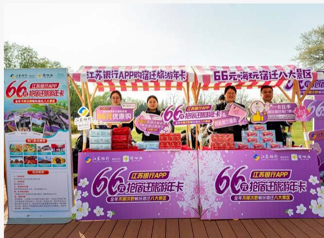

text_image

江苏银行APP购宿迁旅游年卡
66元宵玩宿迁八大景区
江苏银行APP
抢宿迁旅游年卡
66元宵玩宿迁八大景区
江苏银行APP
抢宿迁旅游年卡
66元宵玩宿迁八大景区

## 案例：泰州分行发力场景金融，促进文旅消费

泰州分行通过搭建“泰友邻”消费平台，整合银行网点和社区周边优质商户，通过“消费满减”、核销券等权益活动将C端流量引流至商户端，带动客户消费、商户交易。分行还深入兴化市国蟹交易市场、泰州早茶协会等重点市场调研，打通商户结算、客户线上消费痛点堵点，通过金融手段为客户提供更加优质的消费服务

##

2025年，徐州分行积极对接市商务局、住建局等部门，依托“苏银随心办”小程序落地全市购车、家装两项补贴活动。全年累计受理补贴申请6457笔，精准落实补贴资金超3500万元，带动消费规模近10亿元。

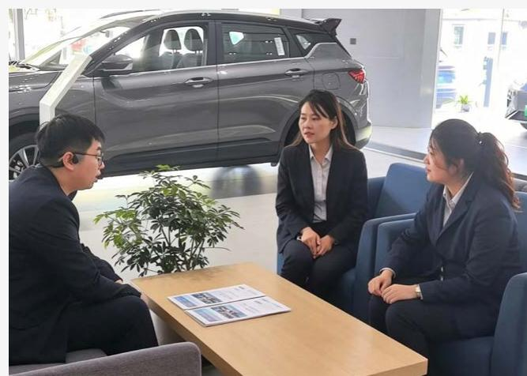

natural_image

Three people in business attire seated at a table in a showroom with a modern car displayed in the background (no visible text or symbols)

## 金融服务可及性

本行持续提升金融服务的可及性与便利性，让每一位客户都能感受到“金融就在身边”的温暖。

## 线下渠道

## 适老化服务

江苏银行业文明规范服务适老网点

立足老年客户业务办理痛点，本行组建专业化厅堂志愿者队伍，为老年客户提供从进门引导、业务咨询到办理办结的全流程“一站式”向导服务，截至年末，本行190家网点获评“江苏银行业文明规范服务适老网点”。

针对老年群体易成为电信网络诈骗目标的特点，本行强化反诈风控举措，通过组织系列宣传提升老年客户防诈意识，精准识别并堵截涉诈交易，切实筑牢老年客户资金安全防线。

针对部分行动不便的老年客户，本行推出上门办理借记卡开卡、电子银行签约、非柜面渠道限额调整等服务，将金融服务送到老年客户家中，以暖心举措提升特殊群体的金融服务获得感。

## 网点布局

本行持续优化网点布局，让金融服务真正实现“零距离”。2025年完成42家网点迁址改造和31家原址改造，全行营业网点总数达543家，其中江苏省内网点468家，省外网点75家。本行聚焦县域金融服务薄弱环节，在徐州邳州、镇江丹阳、镇江扬中、扬州宝应等地区新增7家县域网点，使县域网点总数达86家，占全行网点总数的16%。

本行与人社部门深度合作，打造社保“就近办”网点，为广大居民提供社保查询办理业务，截至2025年末，全行社保“就近办”网点已达到187家，较上年末增加22家。

## 2025 年完成

家网点迁址改造

31家原址改造

全行营业网点总数达 543家

江苏省内网点

省外网点

## 硬件设施

本行积极响应征信修复相关政策要求，开发智能柜台个人征信报告查询功能，整合线下服务渠道资源，确保客户便捷查询并打印个人名下本机构所有账户的信贷交易信息。推进智能柜台硬件升级工作，全年完成159家网点共计174台新设备的替换与安装，提升客户使用体验。

##

常州分行武宜路支行推出驾驶证自助换证便民服务，成为常州市银行业首家引入驾驶证自助换证设备的网点。市民在银行网点便可以一站式完成体检、拍照、申请全流程，半小时内即可办结业务，无需再跑车管所排长队。

##

2025年6月，扬州分行一客户由于中风，导致半边身子不能自由行动，委托其侄女办理存单部分支取，办理业务时密码输入三次错误导致存单无法支取。分行网点了解到该客户情况后，立即安排上门服务，核实客户需求后为客户办理了存单密码挂失重置业务。

##

2025年春节前夕，宿迁泗洪花园口支行了解到一位在农贸市场经营的客户因担心兑换流程复杂，一直未处理手中积压的大量零钞和残损币。网点主动联系客户，制定服务方案、开通绿色通道，仅用两个小时便完成清点和兑换，累计金额达10余万元，赢得客户高度评价。

natural_image

Illustration of elderly people engaging in financial and social activities, including documents, charts, coins, and a magnifying glass (no text or symbols)

## 线上渠道

## 手机银行

江苏银行 App 是本行客户服务的重要渠道，为客户提供全天候、全方位、全场景的金融服务体验。江苏银行App及时响应客户需求，通过运用大数据和人工智能技术，为客户提供智能搜索、智能客服、智能助手等金融服务。深度融合金融科技，针对不同风险偏好的客户，提供资产配置建议、理财规划等定制化服务。持续引入旅游、医疗、教育、各类缴费等服务，打造多场景的综合金融服务生态，覆盖客户生活的方方面面。截至2025 年末，江苏银行 App 客户数突破 2200 万，月活跃客户数超800万，稳居城商行首位。

## 门户网站

2025年12月，本行新版外部门户网站正式上线并对客发布。新网站兼顾品牌形象展示和业务产品推广功能，通过设置个人业务、企业业务、金融市场、网络金融和我行动态五个一级菜单全面展示江苏银行品牌及业务资讯。同时，网站通过重塑界面风格、优化交互方式、强化网页端和手机端联动等方式，进一步提升用户浏览体验。

## 客服中心

本行建立了以95319客户服务热线为主，微信公众号，在线客服企业微信、短信平台为辅的客户服务体系，为客户提供24小时无间断、多渠道覆盖的金融服务。

本行客服系统与多家第三方客服平台对接，通过一键转接、三方通话等功能，有效提升客诉处理效率。

利用自主开发的“智慧小苏”大语言模型，对客户通话内容进行分析检索，针对性地就客户问题提供相关的数据，进一步提升客户服务精准性。

## 微信小程序

本行基于微信平台推出“苏银随心办”小程序，通过整合贷款、办公、政策、撮合、网点五大场景服务，为个人和企业用户提供便捷化线上服务。截至2025年末，小程序实名用户达252万人。

## 社会贡献

本行践行国有金融企业社会责任，投身公益事业，开展志愿活动，为共建和谐美好社会贡献力量

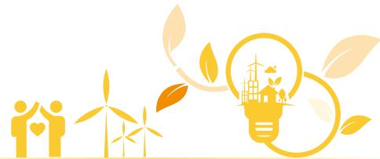

natural_image

Illustration of a smart city with human figures, wind turbines, and a lightbulb with leaves, symbolizing eco-energy (no text or symbols)

## 积极投身公益慈善事业

本行积极参与江苏“滴水筑梦”扶贫助学工程、希望工程“梦想小屋”“慈善一日捐”、江苏省发展体育基金会等公益项目，关注困境青少年等特殊群体，以爱心慈善感恩时代、反哺社会，被江苏省政府授予第七届“江苏慈善奖-最具爱心慈善捐赠企业”称号。在江苏省老区建设促进会、省乡村发展基金会、省乡村发展协会(简称省老区建设与乡村发展“三会”）发布的《关于2025年度社会帮扶业绩突出单位和个人的通报》中，本行被通报为“业绩突出单位”。

本行连续9年参与“滴水筑梦”助学扶贫工程，累计捐赠2760万元，资助12个重点县建档立卡低收入家庭的3600名贫困生完成高中阶段学业。

## 被江苏省政府授予

第七届“江苏慈善奖-最具爱心慈善捐赠企业”称号。

探索金融赋能慈善新路径，设立慈善信托、民生公益理财产品，将理财超额收益用于白血病儿童的救助。

2025年，本行子公司苏银理财发行了“苏银理财恒源封闭债权公益主题1期”，产品共幕集5.55亿元，将捐赠50万元用于“苏银善源公益1期”项目运营，用于资助南京医科大学附属儿童医院血液肿瘤科患儿的随访监测、康复护理指导、并发症管理等全流程服务。

连续 9年

参与“滴水筑梦”助学扶贫工程

2760

万元

资助

3600

名贫困生

完成享

## 案例：无锡分行组织青年员工参观血站科普馆并组织无偿献血

2025年5月9日，无锡分行组织青年员工走进无锡市中心血站开展学习交流活动。青年员工参观了血站科普馆，通过观看影像、趣味问答、聆听讲座等形式，进一步增强对无偿献血的认知与认同。参观结束后，27名青年员工积极响应，挽起袖管，公益献血8200cc，以热血传递爱心，贡献青春力量。

## 案例：苏州分行组织参与“红石榴伙伴夏令营”

2025年7月，苏州分行深度参与苏州工业园区职业技术学院举办的“苏韵伊情，圆融同心”红石榴伙伴夏令营活动，助力学院与新疆霍尔果斯的学生交流项目。苏州分行向新疆少数民族学生赠送了书包、笔记本等文具，并开展“金融知识进校园”活动，以实际行动践行社会责任。

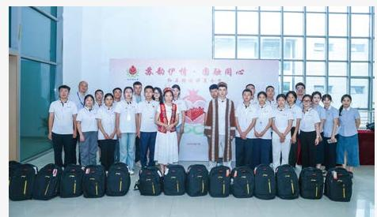

text_image

东南伊情·志愿同心

## 案例：上海分行举办“同心向阳•1843 庭院有约”公益集市活动

上海分行联合上海宋庆龄故居纪念馆举办“同心向阳·1843庭院有约”公益市集，捐赠闲置生活物资40余件，讲述义卖品承载的温暖记忆，吸引近40名旅客参与爱心传递。所募集善款全额汇入上海市儿童基金会“未来道”专项计划，定向支持孤独症谱系障碍儿童成长。

## 广泛开展志愿服务活动

2025年，经中央社会工作部、中国志愿服务联合会批准，本行加入中国志愿服务联合会，为推动我国志愿服务事业高质量发展贡献应有的力量。

作为2025年江苏省城市足球联赛总冠名商，本行在服务对接“苏超”176天、85场比赛中，全行共投入志愿者超1万人次，在入场引导、秩序维护、咨询服务等岗位分工协作、高效服务，保障了比赛有序进行

本行连续十年开展“党员进社区”志愿服务活动，坚持每月一主题，组织党员走进周边社区、服务群众，通过金融知识普及、公益活动、帮扶慰问等形式，打通服务群众“最后一公里”。2025年“党员进社区”志愿活动已对接社区2500多个，累计开展活动64.万次，参与党员达18.5.万人次，服务群众超百万，获评“余国金融文化百优案例”

组织团员青年积极开展金融服务进社区、进学校、进企业、进乡村，有针对性地做好金融政策宣进、消费者权益保护、新产品新工具推广反假反诈普及等备类宣传活动

开展学雷锋志愿服务、爱心暑托班、无偿献血等多种形式、受众丰富的志愿活动，助力“希望工程”、践行社会责任。

在第47个植树节到来之际，本行团委携手江苏省农科院团委、江苏国信团委，联合开展了“青春绿动·播种未来”植树活动总行部门、南京分行、苏银金租、苏银理财共20余名团员青年参与。

2025年“苏超”176天、85场比赛中全行共投入志愿者超10,000人次

2025年“党员进社区”志愿活动

已对接社区 多个累计开展活动 6,4000次参与党员达 18,5000人次

## 案例：深圳分行开展重阳节慰问活动

2025年10月28日，深圳分行走进蔚蓝海岸社区党群服务中心，举办“情满江苏银行爱在九九重阳”主题慰问活动，向三十余位社区高龄长者致以节日问候，并送上大米、食用油等暖心慰问品。同时，分行党员志愿者还为在场老人带来了一场实用的防诈骗知识宣讲，结合“AI换脸”等新型诈骗手段的典型案例，生动剖析诈骗套路，有效提升老年群体的风险识别与防范能力。

##

2025年春节前夕，常州分行赴“结对帮促”对象溧阳东升村开展送温暖慰问，将金融温暖传递至乡村一线。定向捐赠帮促资金10万元，走访30户特困、低保农户，实地倾听生活诉求与实际困难，并送上慰问物资及新年祝福。

## 案例：淮安分行开展环卫工人慰问活动

2025年10月22日，淮安分行与淮安市清江浦区城管局、淮安京环环境服务有限公司共同举办“一城洁净靠您文明同行有我”环卫工人慰问活动，向50名一线环卫工人代表送上关怀问候与生活物资，加强对基层劳动者的关怀，为建设更洁净、更文明、更有温度的城市贡献力量。

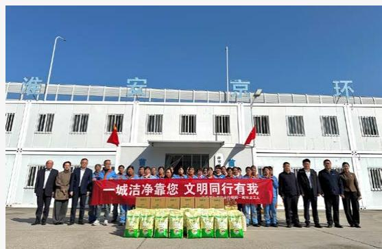

text_image

淮 安 京 环
一城洁净靠您 文明同行有我

## 案例：扬州分行开展学雷锋活动

在“学雷锋纪念日”到来之际，扬州分行以实际行动践行雷锋精神，举办“金惠万家，锋行便民”志愿服务活动，为社区居民普及金融知识、介绍数字人民币优惠政策、开展理财规划，让居民们真切感受到金融的温度。

## 案例：徐州分行共筑金融心愿

徐州分行经开区支行与金山社区携手，面向居民开展“星愿瓶——共筑金融心愿”主题活动。通过收集居民金融心愿、设置知识讲解区普及防诈理财知识、开展心愿分享与抽奖互动等方式，在温馨氛围中有效提升居民金融素养与风险防范能力。

## 案例：北京分行为老年人群提供生活关怀服务

2025年9月10日，北京分行联合华北电力大学走进昌平区风雅园北里社区，面向高龄、独居老人上门提供生活关怀服务。志愿者为老年社区检查电路老化、插座漏电等安全隐患，科普“湿手不碰电器”“老旧插排及时换”等用电常识。北京分行志愿者指导老年群众使用手机银行查询养老金、办理转账等基础功能，并演示了“大字模式”“语音助手”等手机银行适老功能，帮助其跨越“数字鸿沟”。

## 案例：南京分行开展3•15消费者权益保护主题活动

2025年3月11日，南京分行在建邺区万达广场上开展了以“保障金融权益助力美好生活”为主题的活动。活动融合非遗文化与消费者权益保护，特邀非遗糖画传承人现场创作，以甜蜜艺术传递维权理念。现场糖画师傅用温热的麦芽糖勾勒出“3·15”“金融为民”“江苏银行logo”等特色图案，通过摆放宣传展板、发放宣传折页，向市民介绍常见的消费陷阱和维权案例，普及消费维权知识。

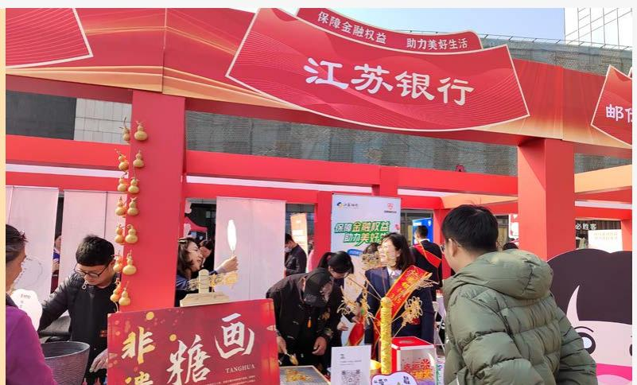

text_image

保障金融权益 助力美好生活
江苏银行
非糖画
TANGHUA
保本金融权益
助力美好生活
邮

## 创新驱动

本行把“智慧化”放在企业愿景的首位，积极探索新兴技术应用，以科技创新为引擎驱动业务发展

natural_image

Illustration of AIOS ecosystem with cloud, wind turbine, and human head silhouette (no text or symbols)

## 金融科技创新

## 构建坚实稳固的算力与数据基础

本行依托“苏银AIOS”异构智算集群优势，率先在业内落地“智慧小苏”大语言模型服务平台，通过深度融合昇腾等混合异构算力，实现单卡千亿、八卡万亿级参数模型推理，引入MXEP4混合精度量化技术，推动计算效能提升3倍，并发量扩容超40倍，资源占用压降至25%，为人工智能规模化应用筑牢技术根基

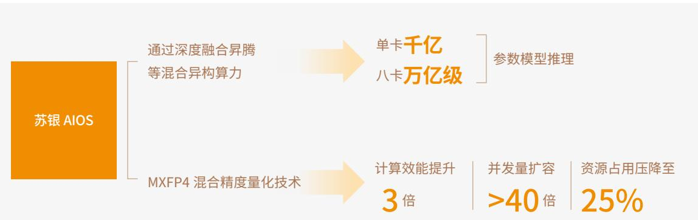

flowchart

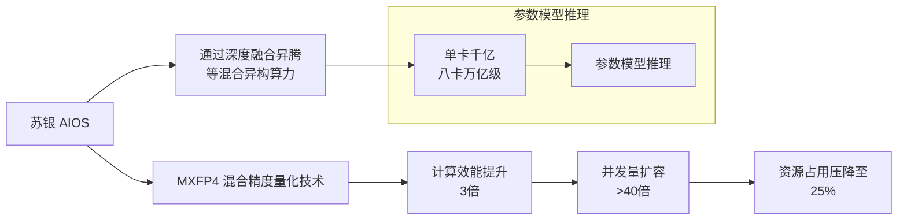
```mermaid
graph LR
  A["苏银 AIOS"] --> B["通过深度融合昇腾\n等混合异构算力"]
  A --> C["MXFP4 混合精度量化技术"]
  
  B --> D["单卡千亿\n八卡万亿级"]
  C --> E["计算效能提升\n3倍"]
  
  subgraph sg["参数模型推理"]
  D --> F["参数模型推理"]
  end
  
  E --> G["并发量扩容\n>40倍"]
  G --> H["资源占用压降至\n25%"]
```

## 建立深度融合的模型应用体系

本行创新构建生成式判别式融合的大小模型协同架构，融合多模态识别、知识图谱及RAG技术，打造基于强化学习的智能体架构。

针对关键业务环节，引入双因子交叉校验机制，对关键信贷要素实施双重验证，有效规避新技术应用风险，确保决策结果的准确性与可解释性，为数字金融创新应用提供了安全可靠的技术保障

推动智能语音平台改造，实现语音识别(ASR)与语音合成(TTS)核心服务的自主研发，基于大模型的语音识别准确率提升至98.5%，资源占用较原先减少95%，有效提升“双录”等业务场景的服务效能。

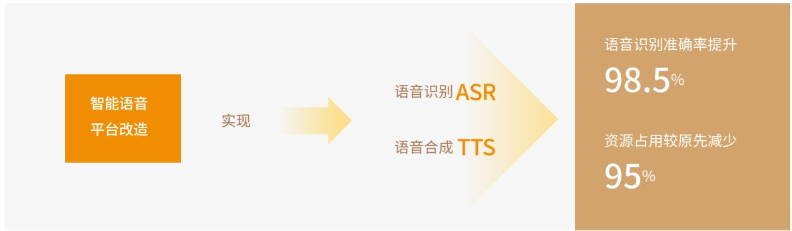

flowchart

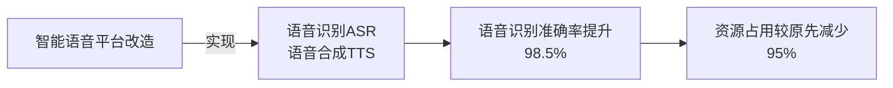
```mermaid
graph LR
  A["智能语音平台改造"] -->|"实现"| B["语音识别ASR\n语音合成TTS"]
  B --> C["语音识别准确率提升\n98.5%"]
  C --> D["资源占用较原先减少\n95%"]
```

## 打造全员参与的敏捷创新生态

本行自主研发“微应用平台”，提供标准化A工具与组件，构建模块化、轻量化、可定制的应用生态，有效打破技术壁垒推动大模型能力向基层下沉。截至2025年末，平台已累计上线微应用900余个，成功孵化如产品问答助手、电子流水PDF识别等数十个重点应用，营造了浓厚的全员创新氛围，为全行可持续发展提供创新动力。

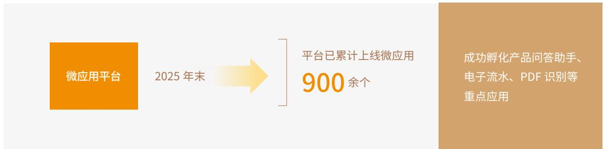

flowchart

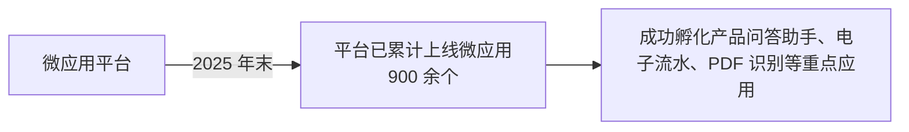
```mermaid
graph LR
  A["微应用平台"] -->|"2025 年末"| B["平台已累计上线微应用\n900 余个"]
  B --> C["成功孵化产品问答助手、电子流水、PDF 识别等重点应用"]
```

natural_image

Illustration of hands holding a smartphone displaying a user profile, surrounded by cloud, heart, and coins (no text or symbols)

## 创新成果应用

## 提高作业效率

在集中作业领域，本行落地对公支付、资产托管、司法查询及函证录入等大批量人机协同场景，实现邮件分类至对账全链路自动化，人工处理效率提升6倍，识别准确率超90%。

在合同审核环节，构建“AI初筛+人工复核”机制，关键字段识别准确率超95%，审核耗时减少65%，显著提升审核效率与质量。

## 合同审核AI初筛+人工复核

## 升级风险控制

贷前阶段，依托智能体实现尽调作业标准化，融合 RPA与大模型技术，将人工填报压降90%以上，并实现非标财报的自动勾稽

贷中阶段，利用多模态大模型与 OCR技术自动化解析异构合同，有效拦截伪造欺诈，推动普惠线上直通式放款率达100%。

贷后阶段，通过机器学习算法对跨系统预警信号进行智能降噪，实现授信资产全生命周期的精细化管控。

## 优化客户体验

聚焦客户营销等高频场景，为一线客户经理配备“7×24小时产品专家”，实时解答产品条款与适用客群疑问，提升信息流转效能，有效提升客户满意度。

## 7x24

小时产品专家

## 人工智能开发

## “智慧小苏”赋能业务转型

作为本行自主研发的大型语言模型，“智慧小苏”系列大模型2025年内累计落地“经营晨报”“智能合同质检”等70余个智能化应用场景，全面覆盖运营管理、风险防控、客户体验等核心业务领域。其中，“经营晨报”服务围绕业务态势、风险预警等维度，为全行540余家支行提供精准的经营分析支持，实现总分行管理穿透，有效提升基层机构可持续发展能力。

## “知识工程” 支撑长期发展

本行坚持知识沉淀与数据资产化双轮驱动，将分散在部门或个人的“碎片化”业务经验转化为结构化知识资产。通过大模型技术对业务文档进行智能解析与分类，构建了覆盖全行业务领域的知识图谱，形成差异化竞争壁垒。

## “数字行员”开启智能服务

本行打造涵盖客户经理助手、风控审批助手等七大智能助手的“数字行员”体系，实现“千岗千模、千人千面”的智能服务。客户经理助手通过 AI客户 KYC 与记忆感知功能，有效解决管户数量庞大导致的“记不住、聊不深”痛点，实现有温度的差异化服务：风控审批助手构建“人机协同”审批新模式，强化授信材料预审与审批决策研判，提升项目审批效率与准确性。

## 科技伦理

natural_image

Illustration of a person using a computer with a car and leaves, surrounded by decorative flowers (no text or symbols)

本行严格按照《关于加强科技伦理治理的意见》《科技伦理审查办法（试行）》等监管制度要求，在金融科技应用中，遵循科技伦理价值理念与行为规范，预防伦理风险。

建立网络安全和数据安全工作机制，全面落实信息安全主体责任，健全网络安全体系，保护客户隐私与数据安全。在使用人工智能和大数据技术时，本行特别关注算法的公平性和透明性，避免算法歧视或不公平结果。

natural_image

Illustration of a person using a laptop with email envelopes and data dashboards (no text or symbols)

## 供应链安全

本行依据国家招标采购法律法规与监管要求，强化采购管控，有效提升精细化管理水平，保障供应链安全

<table><tr><td>完善采购制度体系</td><td>2025年,本行修订《江苏银行集中采购管理办法》和《江苏银行集中采购监督工作规程》,严格规范供应商准入与遴选工作,建立健全供应商入库、评价与退出机制,实现对供应商的全流程动态管理,进一步完善采购监督机制。</td></tr><tr><td>严格供应商选择</td><td>本行根据市场调研与项目实际情况,合理设定合格供应商条件,严格开展资质审核与尽职调查。依托采购管理系统实时核查供应商风险信息及关联关系;结合项目特点和候选供应商情况,科学选用评审办法,设置评审指标;成立集中监督小组对评审过程进行现场监督;严格落实主动回避要求,采购人员、评审专家与供应商存在关联关系的须主动回避;建立双向承诺机制,采购岗位人员签署《廉洁从业承诺书》、供应商多环节签署《反商业贿赂承诺书》,营造廉洁公正的采购环境。</td></tr><tr><td>加强履约管理</td><td>本行构建多维度履约评价体系,对供应商合同各阶段履约情况进行如实记录与评价。实施供应商年度综合评价,对评价结果不合格或存在重大不良行为的供应商予以禁用或退库处理,对已建立授信关系的供应商,进一步加强合同账户管理。</td></tr><tr><td>保障供应链稳定</td><td>本行严格执行集中采购管理规定,在采购项目中优先采用公开招标方式,对于不具备公开招标条件的,优先以公开征集方式拓宽供应商来源,吸引市场潜在合格供应商参与合作。在部分采购项目中推行主备供应商或多供应商供应机制,防范因依赖单一供应商导致的供应中断风险。</td></tr></table>

## 平等对待中小企业

截至2025年末，本行不存在向供应商的应付账款（含应付票据）余额超过300亿元或占总资产的比重超过50%的情况。

natural_image

Illustration of digital devices including tablets, charts, and a potted plant, with no visible text or symbols.

## 消费者权益保护

本行高度重视消费者权益保护，通过构建全方位、多层次的“大消保”治理体系，全面提升消费者权益保护水平。

natural_image

Illustration of two stylized plant sprouts with hands and leaves, set against a soft gradient background with no text or symbols.

## 治理

## 董事会

本行董事会是消费者权益保护工作的最高决策机构。董事会下设消费者权益保护委员会，负责消费者权益保护工作的战略、政策和目标的制定，督促管理层有效执行和落实相关工作。

## 管理层

本行设立消费者权益保护工作委员会，由董事长任主任，分管消保工作的副行长任副主任，总行各部门主要负责人为成员。工作委员会负责研究消费者权益保护重大问题和重要政策，指导和督促消费者权益保护工作管理制度体系的建立和完善，根据监管要求及消费者权益保护战略、政策、目标执行情况和工作开展落实情况，对消费者权益保护工作的全面性、及时性、有效性进行监督。

## 执行层

本行单设消费者权益保护部，牵头全行消费者权益保护相关工作。负责围绕监管部门政策要求和本行发展战略，建立健全消费者权益保护工作机制和制度体系，组织开展产品和服务的消费者权益保护审查，落实全行消保工作考核和监督检查，牵头组织落实投诉处理与管理，建立和完善客户服务管理体系，提供24小时客户服务，提升客户服务体验，组织开展消费者权益保护知识宣传教育和员工消保培训等工作

## 战略与管理

## 制度体系

本行持续完善消费者权益保护制度体系建设，修订并出台了《江苏银行消费者权益保护工作管理办法》《江苏银行消费者权益保护审查工作管理办法》等多项工作制度，已形成以总括性制度为统领，涵盖消保审查、营销宣传行为管理、适当性管理销售行为可回溯管理、个人信息保护、宣传教育、合作机构管理、投诉处理与多元纠纷化解、内部考核等多个专项制度的完整制度体系。

## 教育培训

本行通过将消保专题内容纳入会议议程、组织分支行班子成员集中学习、邀请外部专业机构导师系统培训、制作解读微课供全员学习等方式方法，开展分层分类、全员覆盖的消费者权益保护知识学习培训

2025年度消费者权益保护系列培训覆盖中高级管理人员、消保专职岗位人员、基层业务一线人员及新入职员工，参与率均达100%，进一步夯实全员消保合规工作基础

针对2025年度消费金融、信用卡、住房贷款、理财基金、账户管理等客户投诉高发重点领域，我行专项组织专题培训，着力提升岗位人员消费者权益保护专业素养，夯实合规操作基础，强化风险防控

## 金融知识普及

本行整合各类宣传渠道资源，构建常态化、长效化的金融知识普及与教育机制，以“3 ●15消保宣传周”“金融知识万里行”“消保宣传月”为宣教主线，紧密结合当前金融监管热点，提升公众金融素养和风险防范意识。

## 开展“3● 15”宣传周活动

宣传周期间全行540多个网点集中行动，开展线上线下宣传活动1902场次，活动触及消费者超850万人次，共推送原创消费风险提示或“以案说险”作品76个，原创作品线上点击量达45.7万次。

各级行消费者权益保护工作情况、宣传活动开展情况金融知识宣传教育作品被市级及以上新闻媒体宣传报道45次，被中央级媒体报道4次。

线上线下宣传活动

1902场次

活动触及消费者超

8,500,000人次

原创作品线上点击量达

45.7万次。

金融知识宣传教育作品

市级及以上新闻媒体宣传报道

45次

中央级媒体报道

4次

## 开展“金融消费者权益保护教育宣传月”活动

宣传月期间，本行紧扣“保障金融权益助力美好生活”主题，多渠道协同发挥宣传合力，组织线上线下活动3617次，发布原创教育宣传文案178条，原创宣教短视频288个触及消费者超625万人次。

围绕群众关心关注的内容，组织开展金融知识普及，帮助金融消费者和投资者理性选择适合自己的金融产品，远离虚假宣传、非法中介、非法金融和电信诈骗等活动侵害，营造暖心金融服务的良好氛围。

组织线上线下活动

3617次

发布原创教育宣传文案

178 条

发布原创宣教短视频

288个

触及消费者超

万人次

## 加强宣传阵地建设

在全行营业网点推广设立金融知识宣传教育专区，在官方网站、江苏银行App专门设置金融知识宣传教育版块，为常态化做好金融知识宣传教育工作提供丰富载体。

依托微信公众号和视频号持续做好“苏说消保微课堂”线上教育品牌运营，组织开展防范非法集资、打击治理电信网络诈骗全民反诈等主题宣教活动，普及常见手法、新型套路，进一步提高社会公众防范意识和识别能力。

## 公平营销政策

(详细公平营销政策请访问江苏银行官方网站查看。)

## 产品服务审查

2025年，本行对超30项个人业务的创新产品和服务进行消费者权益保护审查，出具各类审查意见146条均得到有效落实。

针对创新产品和服务，提出实质性修改意见的审查7次、审查意见被采纳7次，产品和服务审查覆盖率100%。

涉及合作机构协议消保审查7份，提出7条意见，全部采纳，消保审查意见采纳率100%。

## 消保审查机制

审查制度：依据《江苏银行消费者权益保护审查工作管理办法（2024年修订)》，对现有消保审查机制进行优化完善，明确审查主体、职责分工、审查范围、要点与流程等具体操作要求

审查范围：覆盖全行新产品、新服务及存量产品与服务的重大调整，重点针对产品设计、定价收费、法律文本等环节，并将各类营销活动纳入审查，确保活动方案及相关宣传材料符合金融营销宣传规范。针对创新类产品与服务，将消费者权益保护审查流程嵌入《江苏银行产品创新性管理办法》。

审查流程：消保部、法律部、计财部等相关部门直接参与可行性论证讨论，并依据《江苏银行创新产品、服务消费者权益保护审查表》完成消保审查程序。未履行上述审查程序的产品与服务，一律不得推向市场

## 营销活动审查

在活动主办部门自评基础上，由办公室、法律合规部、消费者权益保护部对活动方案及宣传文本进行审核，对活动规范性严格把关。2025年，总行层面共审查营销活动方案76项，提出各类审查意见94条，均得到有效落实。

## 贷款合同变更

## 住房贷款业务

本行满足贷款客户提前还款需求，为客户提供剩余期限不变、月供差异化调整，或者剩余期限缩短等提前还款方式。

## 信用卡业务

## 信用卡额度调整

本行支持客户通过江苏银行App、微信银行、客户服务热线等渠道申请额度调整，并从客户用卡情况、资信情况、风险情况等方面对客户的调额电请进行审核与调整。

## 信用卡协商还款

本行对于已逾期并存在特殊困难的客户，提供客户服务热线、分支机构等多种沟通渠道，综合评估客户负债程度、还款能力等情况后，通过还款纾困政策，协助客户妥善处置账务。特殊困难包括遭遇重大灾难或事故，遭受重大疾病、死亡、经济特别困难等情形。

## 债务催收管理

本行严格遵循《关于规范辖内银行业金融机构委外催收业务的指导意见》，合规管理催收机构，完善催收业务流程。

制定发布《江苏银行个人类逾期资产催收管理办法》，从机构准入、催收规范、监督检查、投诉处置、违规处罚等方面，进一步明确我行对催收机构的管理要求。

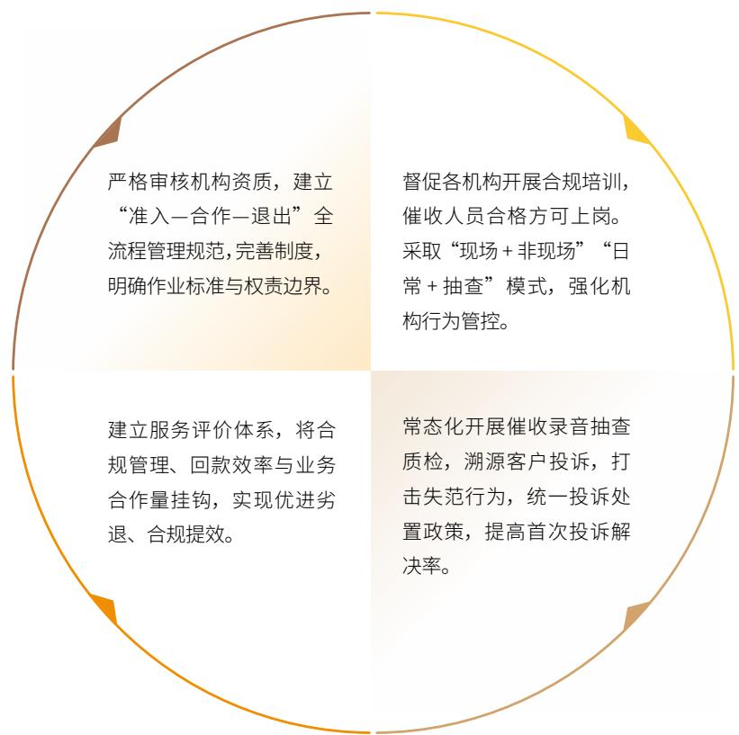

flowchart

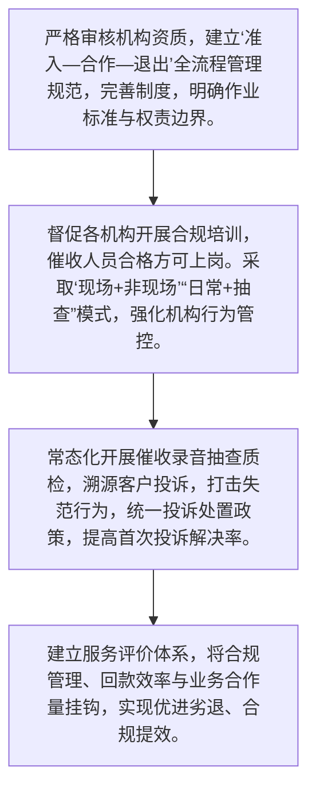
```mermaid
graph TD
  A["严格审核机构资质，建立‘准入—合作—退出’全流程管理规范，完善制度，明确作业标准与权责边界。"] --> B["督促各机构开展合规培训，催收人员合格方可上岗。采取‘现场+非现场’“日常+抽查”模式，强化机构行为管控。"]
  B --> C["常态化开展催收录音抽查质检，溯源客户投诉，打击失范行为，统一投诉处置政策，提高首次投诉解决率。"]
  C --> D["建立服务评价体系，将合规管理、回款效率与业务合作量挂钩，实现优进劣退、合规提效。"]
```

## 投诉管理

## 管理架构

本行单设消费者权益保护部，配置专兼职人员，形成涵盖董事会、高管层、职责部门和分支机构（子公司）的消保工作组织架构体系。

## 制度体系

本行制定《江苏银行消费者权益保护工作管理办法》《江苏银行投诉管理办法》和《江苏银行金融纠丝多元化解工作实施细则》等制度，推动提升投诉处理质效。

## 投诉渠道

线上投诉渠道：95319客服热线、江苏银行App客户端、微信公众号、在线客服、邮箱/信函线下投诉渠道：营业网点。

## 责任落实

本行持续压实投诉处理主体责任，严格落实首问负责制，全流程跟踪处理进度，将投诉处理质效纳入考核休系，推动条线部门履职尽责，确保客户诉求及时得到响应。

## 投诉预警

本行持续健全风险信息联防联控机制，构建“事前预防、事中管控”的全流程防控体系。常态化监测投诉数据变化趋势，精准捕捉投诉热点、痛点问题协同业务部门研判风险根源、制定靶向解决方案切实推动客诉问题化解在早、在小。

## 投诉处理

本行建立“分层分级”投诉处理体系，依据客诉复杂程度匹配差异化响应标准与处置流程，同时强化人员沟通技巧培训，着力实现客诉“首次化解一次办结”。

落实多元纠纷化解机制，充分借力第三方专业调解组织，提升复杂疑难客诉的处置效率与化解成功率。

## 溯源整改

本行不断完善投诉处理专项督办机制，提升投诉处理质效。通过深度剖析投诉成因、溯源问题根源制定整改措施并跟踪闭环落实：同时提炼典型案例分享至各业务条线，定期联合业务部门会商研判投诉难点堵点，推动形成长效整改方案，切实从源头压降客户投诉量。

## 投诉监督

本行建立投诉管理监督机制，客户对投诉处理机构处理结果不满，可以采取申请核查、调解、仲裁诉讼等纠纷解决途径。健全矛盾纠纷多元化解配套机制，积极主动与消费者协商解决矛盾纠纷。同时将各级机构投诉处理质效纳入考核范畴，建立常态化溯源整改优化机制，深度分析问题，持续开展针对性培训，提升问题解决的及时性和有效性，确保客户问题能够及时受理、妥善处理、有效解决。

## 投诉审计

本行将消费者权益保护工作纳入每年内部审计计划，审计范围涵盖消费者权益保护工作机制体制建设、投诉处理工作机制建设、投诉管理系统建设消费者权益保护工作培训与宣传、履职质效及考核运用等，对全行投诉管理等消保工作履职情况进行监督，针对审计结果提出管理建议，保障消费者合法权益。审计结果向董事会消费者权益保护委员会报告，并向监管部门报送审计报告，切实形成常态化、规范化的内部审计监督评价机制。

## 科技赋能

本行持续强化科技赋能消保工作，加快推进数智化应用，依托客服系统实现客户投诉的快速初判与精准分级，输出最优化的解决方案，提升客诉问题次性解决率与客户满意度。

## 风险和机遇管理

<table><tr><td>风险</td><td>风险描述</td><td>应对措施</td></tr><tr><td>声誉风险</td><td>在金融消费者权益保护监管体系不断深化、同业竞争日趋激烈的形势下,消费者权益保护工作水平已成为提升金融机构核心竞争力的重要支撑之一。若消保工作落实不到位,易导致消费者投诉攀升,削弱消费者信任度,或引发负面舆情扩散传播,损害银行的品牌形象和声誉。</td><td>本行将消费者权益保护工作作为重要内容纳入全行发展战略规划,建立健全金融消费者权益保护管理架构、畅通投诉处理渠道、完善消保审查、投诉管理、金融知识宣传教育、舆情监测与应急处置等各项管理措施。</td></tr></table>

<table><tr><td>机遇</td><td>机遇描述</td><td>应对措施</td></tr><tr><td>客户忠诚度提升</td><td>消费者权益保护工作成效显著的银行更易获得客户信赖与认可,有效提升客户忠诚度、增强客户黏性,持续推动银行品牌价值提升。</td><td>本行深入分析客诉成因,高效响应并妥善化解客户投诉并将合理诉求转化为产品迭代升级、服务流程优化改进的核心切入点,通过精准施策解决客户关切的痛点问题,提升客户服务满意度,增强客户粘性与忠诚度。</td></tr></table>

## 指标与目标

本行客户投诉办结率100%，投诉事项均实现全流程闭环处置。

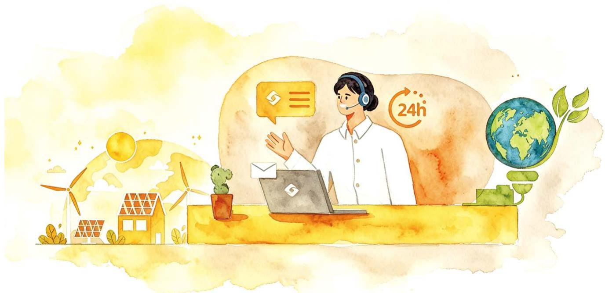

natural_image

Illustration of a person using a laptop and headset to access renewable energy sources, with wind turbines, solar panels, and a globe (no text or symbols)

## 数据安全与客户隐私保护

本行严格按照国家数据安全与隐私保护相关法律法规及监管要求，完善数据安全及隐私保护体系，筑牢数据安全防线。

natural_image

Illustration of a hand holding a smartphone with a lock, alongside a laptop displaying a password and a cloud icon (no text or symbols)

## 治理

## 董事会

本行董事会是数据安全和客户隐私保护工作的最高决策机构。

## 管理层

本行董事长为网络安全和数据安全工作第一责任人，牵头建立集团网络安全和数据安全的人才培养体系、集团网络安全和数据安全建设资源保障机制。本行首席信息官为网络安全和数据安全工作直接责任人、个人信息保护负责人，牵头研究网络安全和数据安全发展战略、工作方针及指导要求，制订集团安全工作发展战略和总体规划。

## 执行层

本行信息科技部为网络安全和数据安全工作牵头责任部门，负责网络安全和数据安全方面技术及产品在集团的运用、管理和技术支持：牵头建设集团数据分类分级体系、落实数据全生命周期各环节安全保护措施：定期组织集团网络安全和数据安全宣传教育、培训等活动，普及网络和数据安全知识，提高全员风险防范意识

## 战略与管理

## 个人信息保护制度

本行根据《中华人民共和国个人信息保护法》《中华人民共和国消费者权益保护法》等法律法规、监管政策要求，制订《江苏银行个人信息保护管理办法》，明确总行各部门及分支机构个人信息保护职责、个人信息全生命周期处理规范、应急管理机制等。

制订《江苏银行个人信息保护突发事件应急预案》，提高应对个人信息保护突发事件能力。成立个人信息保护突发事件应领导小组，保障客户隐私与数据安全。

## 数据安全管理制度

本行持续优化包括《江苏银行数据管理办法》《江苏银行数据管理细则》《江苏银行数据安全管理办法(试行)》《江苏银行数据分类分级及安全管理实施细则（试行）》等制度，明确部门分工，规范数据在采集、传输、存储、使用、删除和销毁等全生命周期各阶段的安全要求，加强全行数据管理，提升数据质量，保证数据安全。

制订《江苏银行网络与信息安全事件专项应急预案》，进一步提升本行在应对数据安全突发事件时的处置能力与响应效率明确不同安全事件场景下的应急处置流程及工作机制

## 隐私与数据安全保护举措

本行制定了《江苏银行数据安全管理办法(试行)》《江苏银行数据分类分级及安全管理实施细则(试行)》，从数据采集传输、存储、使用、删除和销毁等数据全生命期各阶段落实保护措施，遵循“最小必要”原则收集和处理个人信息，全方面保护客户隐私与数据安全。

## 推动数据分类分级保护工作

根据数据分类分级标准，持续开展数据分类分级工作，明确数据分类分级保护要点，明确不同级别数据在采集、传输存储、使用等过程中保护要求。

## 加强数据安全技术体系建设

建设数据分类分级、数据动静态脱敏、加密加签、终端安全管控、上网行为分析和云桌面等平台，丰富数据安全基础能力。建设数据库堡垒机、全知流量分析平台和邮件网关等，增强数据跨域流动行为探测和回溯能力。

## 巩固数据安全运营体系

基于流量和行为探测、漏洞扫描、主机安全扫描以及渗透测试等，持续发现数据安全风险，基于安全风险工单实现事件流转和威胁闭环：持续开展互联网信息监测，覆盖各类网络渠道与社交平台，精准捕捉数据泄露相关可疑线索，结合业务场景深入研判泄露风险等级及影响范围，形成监测研判闭环：定期对数据操作行为进行审计，包括但不限干登录记录、高危操作、权限变更等关键信息的审查，保障数据库数据使用的安全性，防止未授权或恶意访问造成的损失。

## 落实数据安全风险评估制度

每年组织第三方测评机构，进行全面的数据安全风险评估，涉及数据资产识别、应用场景梳理、数据威胁分析、脆弱性识别和风险控制措施等方面，形成风险评估报告并报送行业主管部门。同时，组织信息系统数据安全风险自查，强化系统用户账号权限管控，落实三、四级数据脱敏和按需审批明文展示和下载导出管控，进一步提升全员数据风险防控意识，降低数据泄露风险。

## 建立重要信息系统数据备份机制

涵盖数据同城异地灾备、数据库定期备份、存储快照及硬件设备冗余等多重保障，以全面提升数据可靠性与业务连续性。

## 开展数据安全相关应急演练

2025年选取数据泄露、数据勒索等数据安全场景，制定了数据安全应急演练方案并开展应急演练，形成数据安全事件标准化处置流程。

## 健全数据安全应急响应流程

制订并发布《江苏银行网络与信息安全事件专项应急预案》，包含DDOS攻击、网页被篡改、数据泄露等网络与数据安全事件。

## 第三方隐私与数据安全管理

本行与第三方机构开展合作，将评估该第三方机构收集客户个人信息的合法性、合理性、必要性，要求第三方机构对客户个人信息采取保护措施，并严格遵守相关法律法规

制订并发布《江苏银行个人信息保护管理办法》，将个人信息保护相关要求纳入合作机构准入、清退条件，在协议中明确合作机构个人信息保护的职责和保密义务，并采取必要措施监督其履行，为客户提供安全可靠的金融服务环境。因产品或服务需要收集个人信息的，本行将充分审查、评估第三方机构保护个人信息的能力，并在签订协议时明确第三方机构处理信息的范围、目的和方式，以及第三方机构个人信息处理的职责和义务、救济措施与法律责任确保客户隐私与数据安全。

针对信息科技外包商，制订《江苏银行信息科技供应商准入审核及后评价实施细则》，完善供应商准入标准，要求第三方合作伙伴签订《信息安全保密承诺书》，承诺未经银行事先书面同意，绝不使用、复制、泄漏、传播、公布银行的一切数据及保密信息，绝不对银行的资料进行分析、提取、加工后对外使用或披露给第三人使用或从事其他谋利行为。

每年赴重要外包商现场开展信息安全检查，包含人员组织安全、办公环境管理、机房网络安全、终端安全、数据、数据安全、开发安全等，重点关注个人信息访问权限控制、个人信息展示限制、数据操作权限、数据存储、数据传输数据销毁等隐私与数据安全内容

本行安全专职人员对互联网全渠道进行监测并组织第三方专业安全公司进行全渠道监测，全面防控信息泄露等问题。

## 隐私安全管理

本行充分尊重和保障个人信息主体权利，全面加强个人信息保护工作，规范个人信息处理各环节合规要求，保障客户隐私与数据安全。在个人信息处理方面始终坚持合法正当、目的明确、分级授权、公开透明、保证质量、安全保障等原则，严格落实法律法规要求，充分保障客户个人信息隐私与数据安全。

## 授予客户个人信息控制权

本行严格遵守法律法规，保障客户个人信息控制权。

## 访问权

客户有权通过本行网络金融应用查询个人信息，法律法规另有规定的除外。

## 修正权

客户有权通过营业网点或通过本行网络金融应用修正个人信息，法律法规另有规定的除外。

## 删除权

客户对其个人信息有删除权。个人客户信息删除指在实现日常业务功能所涉及的系统中去除个人客户信息的行为，使其保持不可被检索、访问的状态。在以下情形中，客户有权向本行提出删除个人信息的请求：

● 如果本行处理个人信息的行为违反法律法规；  
● 如果本行收集、使用客户个人信息，却未征得客户同意；  
● 如果本行处理个人信息的行为违反了与客户约定；  
● 如果客户不再使用本行产品或服务，或客户已注销了账户；  
● 如果本行不再为客户提供产品或服务。

如本行决定响应客户删除请求，本行还将同时通知从本行获得客户个人信息的组织或个人，要求其及时删除，除非法律法规另有规定，或这些组织或个人获得客户独立授权。当客户从本行服务中删除信息后，本行可能不会立即在备份系统中删除相应的信息，但会在备份更新时删除这些信息。

## 个人信息主体注销账户

如为本行产品或服务注册用户，客户可以通过到本行网点通过柜面或网络金融应用等渠道进行注销。

## 个人信息收集及使用知情权

本行在处理客户信息前，会通过隐私保护政策、个人信息授权协议等以显著方式、清晰易懂的语言，真实、准确、完整地向客户告知个人信息处理事项。涉及处理个人敏感信息的，会告知客户处理其敏感信息的必要性和对个人的影响。本行处理个人客户信息基于客户同意，该同意会由客户在充分知情的前提下自愿、明确作出。法律、行政法规规定不需取得个人同意的情形除外。

(其他授予客户个人信息控制权利请访问江苏银行官方网站查看。

## 隐私与数据安全相关培训

本行高度重视员工在信息安全、数据安全、个人信息保护等方面培训教育工作，建立面向科技、业务、外包等多方面、系统化培训体系。2025年度通过多种形式开展信息安全宣传教育和培训

●每年积极开展网络安全宣传周、科技活动周活动向客户和公众介绍防电信诈骗、网上交易安全、反洗钱等知识，在网站显目位置和关键交易场景中嵌入安全提示，通过网点发放安全手册等，着力提升客户安全意识。

●持续做好内部员工安全意识培训，将安全知识和安全要求纳入岗位技能基础知识库，组织开发安全、安全生产、普法警示教育等专题培训，并通过内部邮件、内部公众号等方式进行风险提示不断提升全员安全意识和防范水平。

●加强开发人员和项目经理的安全水平，组织网络与数据安全培训安全编码和代码审查漏洞修复培训，分析了当前网络与数据安全形势，普及了法规与监管要求，介绍了主要的安全威胁及常见漏洞的成因机理，结合典型漏洞代码片段进行深度拆解，并同步讲解规范的代码修复方案，切实提升团队安全编码能力

●对外包人员开展数据安全相关培训，通过剖析真实事件、明确责任边界与行为规范，增强其数据安全风险意识和防范能力，推动共同维护安全可靠的办公环境。同时，外包人员入场前必须签订《信息安全保密承诺书》，并需通过数据安全知识考核。

## 网络安全等级保护及密码应用安全性评估

本行严格按照国家网络安全“等级保护2.0”要求，开展网络安全等级保护工作，2025年共对5个三级等保系统、15个二级等保系统开展年度网络安全等级保护测评工作

落实商用密码改造要求，加强信息系统的重要数据在传输和存储过程中机密性和完整性的保护，准入专业第三方测评机构对包括核心业务系统、网上银行系统、虚拟化平台、大数据平台在内的4套重要系统开展商用密码安全性评估，全面评估密码算法选择、密码协议设计、密钥管理以及密码模块等的安全性

## 信息安全管理认证

本行不断提升隐私与数据安全保护能力，强化信息安全管理体系建设，开展国际认可的信息安全管理体系认证工作。2025年本行顺利通过ISO.27001信息安全管理体系认证及中国网络安全审查认证和市场监管大数据中心(CCRC)审核，获得信息安全管理体系认证证书，认证业务范围包含信息系统设计，开发和维护，设备的运行监控与维护，信息安全风险管理等，保障业务开展所需信息系统安全运行

## 容灾体系建设

本行持续开展灾备中心建设工作，分阶段完成同城机房资源整合、云计算中心启用、异地灾备及数据运营中心启用等项目为全行发展提供稳定、可靠、高性能的基础设施服务

制定数据中心建设标准，建立数据中心库房及管理规范，推动数据中心资产管理自动化标准化，提升基础设施资源弹性和持续供给能力。

风险和机遇管理

<table><tr><td>风险</td><td>风险描述</td><td>应对措施</td></tr><tr><td>数据安全风险</td><td>在对外提供数据过程中,存在数据泄露、滥用、非法传输等风险,可能导致客户隐私泄露、监管处罚及声誉损失。特别是在数据跨境传输、第三方数据共享等场景下,风险更为突出。</td><td>本行建立对外供数集中审批管理机制,对外提供数据需明确数据用途、传输内容和传输方式,填写申请表、签署数据保密承诺书,并提供数据合作安全能力评估报告。数据经评估批准后,将根据不同等级采取相应安全保护措施对外提供。同时建立数据全生命周期监控机制,确保数据使用合规,防范数据安全风险。</td></tr><tr><td>外包管理风险</td><td>在业务外包过程中,外包服务商可能存在安全防护能力不足、内控机制不健全、人员管理松懈等问题,导致服务中断、数据泄露、合规风险等,影响银行业务连续性和客户体验。</td><td>本行建立并持续完善外包风险管理机制,对重要外包商开展安全水位评估,评估范围包括基本框架和服务能力两部分,涵盖了外包商基本情况、审计管理、人员安全、应急管理、办公环境管理、网络安全、终端安全、主机安全、运维安全、应用安全、数据安全、资源保障能力、风险管理等方面。同时,本行对重要外包商每年开展现场检查,从公司的经营情况、内控及管理能力、网络及信息安全保障能力、持续服务能力等方面进行现场访谈,有效预防相关风险。</td></tr></table>

<table><tr><td>机遇</td><td>机遇描述</td><td>应对措施</td></tr><tr><td>数据资产管理机遇</td><td>中国人民银行发布了《中国人民银行业务领域数据安全管理办法》,为数据全生命周期安全保护提供了明确、精细的法律依据和操作标准。确立了清晰的数据分类分级规则,使得数据资产确权和合规流通成为可能。</td><td>面对数据资产化迎来的契机,从“被动合规”转向“主动治理”,对标《中国人民银行业务领域数据安全管理办法》加快数据分类分级工作,建立数据资产目录,对数据家底进行全面盘点和精细化梳理,为探索数据资产化铺平道路。</td></tr></table>

## 指标与目标

2025年本行未发生网络安全、数据泄露等事件。

(详细数据安全与客户隐私保护内容请访问江苏银行官方网站查看)

## 案例：南京分行以专题培训筑牢数据安全防线

2025年8月1日，南京分行组织全行网点兼职科技管理员以及新入职校招、社招员工进行网络安全培训，针对弱口令、终端日常管理、敏感信息、钓鱼邮件等内容，通过案例分析强化员工“不点击、不回复、及时上报”的防范意识，全面提升全员安全素养与风险应对能力。

## 案例：深圳分行开展网络安全专题培训

深圳分行高度重视网络安全、数据安全及个人信息保护工作，常态化开展网络安全培训，持续提升全员安全意识切实保障客户信息安全。2025年7月，分行科技条线组织网络安全专题培训，聚焦网络安全、数据安全及钓鱼邮件防范等核心内容，采用“线下集中+线上学习”相结合模式，实现全员覆盖。

natural_image

Illustration of two people working at a desk with laptops and plants, no text or symbols present

## 员工

本行深入贯彻人才强行战略，持续健全员工成长体系，赋能员工职业发展，实施员工关心关爱工程，畅通员工沟通反馈渠道，推动员工与企业共同成长。

natural_image

Illustration of a family scene with a house, car, bicycle, and hearts (no text or symbols)

人才发展

<table><tr><td>人才发展战略</td><td>本行深入践行抓人才就是抓发展、抓高质量发展首先抓高质量人才的理念,制定《江苏银行2021-2025年人才发展五年规划》,构建了优才供给、精准配置、素能培养、职业成长、考核评价、从严管理、激励保障、组织领导八大体系,为全行人才发展工作提供指引。立足全行发展实际和人才需求定位,在《江苏银行2021-2025年人才发展五年规划》收官之际,接续制定《江苏银行2026-2030年人才发展五年规划》,加快锻造与本行战略目标相适配的人才队伍,保障全行战略落地。</td></tr><tr><td>人力资本分析</td><td>持续围绕本行战略目标与重点工作,常态化开展人力资本盘点,聚焦业务发展增长点和着力点,持续开展人员结构与效能分析,从效率、产能等维度评估岗位需求和人岗匹配现状,合理优化人力资源投向、调优内部队伍结构。以体制机制改革为抓手,持续推动人力管理数字化转型,通过集约管理释放人员效能。结合内部看板、报表等数字化赋能工具,实现人员结构的精细化分析,推动人尽其用、人岗适配。</td></tr><tr><td>专业队伍建设</td><td>本行积极推进专业人才队伍建设,根据经营发展实际,引进专业领域人才,优化专业人才结构,为本行长远稳定发展奠定多元人才基础。2025年聚焦</td></tr></table>

<table><tr><td></td><td>公司金融、金融科技、数字风控、苏银研究等重点方向,通过引才激励、猎头寻访等方式招揽人才,为总行零售业务部、零售信贷部、内审部、投资银行部、信息科技部、大数据等部门招录员工,通过柔性引才,聘用苏银研究院名誉院长。构建以价值贡献为核心的专业能力综合评价体系,制定《江苏银行专业技术职级序列管理办法(2025年修订)》,打通跨序列参评转聘渠道,激发人才成长内驱力,推动复合型人才不断涌现。成立“苏银研究院”总行一级部门,开展“行业小专家”评选,举办员工技能大赛等遴选活动,建设了包括战略研究、金融科技、产业专家、国际金融、资本管理、风险防控等关键人才队伍,为全行转型发展贡献智慧力量。</td></tr><tr><td>人权政策</td><td>本行坚定贯彻国家关于“实施就业优先战略,促进高质量充分就业”的政策要求,维护就业公平。坚持“德才兼备、以德为先”的用人标准,按照“公开、竞争、择优”原则,在人才招聘过程中积极践行平等多元的雇佣理念。严格遵守国家劳动法律法规,开展劳动用工规章制度建设,依法规范开展招聘与配置管理工作。制定实施《江苏银行招聘与配置操作规范(2025年修订)》,坚决反对性别、民族、地域、宗教等任何方面的就业歧视,切实维护和保障劳动者公平就业权利;坚决反对雇佣童工,保护未成年人合法权益;坚决反对强制劳动,保护员工休息休假权利。保障员工在录用、培训、提拔任用、薪酬待遇等方面享有平等的发展机会,杜绝任何就业歧视,运用科学化选拔方式甄选符合事业发展需要的优秀人才,致力于构建包容、开放、平等的招聘环境。</td></tr><tr><td>人才培训架构</td><td>本行持续完善进阶式、全周期、全覆盖的干部人才教育培训体系,积极营造紧张有序、活泼生动的教育培训氛围,更加突出精准匹配、有力有效,着眼于发现人才、赋能成长。</td></tr></table>

natural_image

Illustration of a business meeting with four people working at desks, laptops, and presentation screens (no text or symbols visible)

## 招聘与培训

## 人才招聘

本行持续拓宽校园招聘、选聘生、市场化引才、海外引才等渠道，不断提升人才供给质量。

深入推进数字赋能招聘管理，运用“招聘e点通”系统实现简历筛选、面试、背调及录用等环节的全流程线上化闭环管理，推动人才引进工作提质增效。

持续构建智能服务与决策支持体系，推广AI测评技术在人才招聘中的运用，增强测评体系与岗位画像契合度，构建涵盖多岗位、多渠道的差异化A测评矩阵，提高人才识别精准度。

加大高校毕业生引进规模，为各类专业背景人才提供不同地域、机构和领域的多元化就业机会。

2025年，本行共招录入职1188人，劳动合同签订率100%。

2025 年

## 员工结构

(本行员工总人数、员工年龄结构、男女员工人数及比例详见关键绩效指标表中社会关键绩效。)

本行坚持“五湖四海，任人唯贤”原则，尊重人才流动客观规律，同时确保招聘一定比例本地员工，充分发挥属地人才熟悉市场、挖掘资源的优势。继续保持对县域支行的人力资源投入力度，吸引当地生源毕业生返乡就业。截至2025年末，本行雇佣当地员工(当地员工统计口径为：全行中出生地为江苏，以及省外分行中出生地为对应省份/直辖市的员工(以身份证号前两位为准)）14521人，占比80%。

主动担当践行社会责任，认真贯彻落实各项安置工作要求，加强重点群体就业帮扶，积极帮助解决退伍军人再就业、残疾人员就业等问题。截至2025年末，累计安置退役军人32人，在岗残疾人9人。积极参加省模范退役军人评选，1人获奖。

## 员工培训

## 教培体系建设

本行深入贯彻落实“立德树人、持续学习、立足实践、服务发展”的学习理念，深化引育并重、宽严相济的培养管理机制，持续加强教育培训统筹规划，突出精准匹配、务实管用，围绕服务业务发展和人才队伍建设，构建分层分类培训体系，为推动全行高质量发展提供智力支撑。2025年本行教育经费共使用4051.76万元。

## 内部师资建设

本行持续完善内部师资队伍建设，坚持优质内部师资服务全行高质量人才队伍培训培养理念，开展师资授课技能提升培训。按照统一管理、分级实施、择优聘用、有效激励的原则，开展内训师评聘工作。截至2025年12月末，全行有效内训师规模达800余人，有力支撑全行业务发展的授课需求，以高质量师资队伍赋能全行人才建设高质量发展。

## 学习平台建设

本行紧跟全行数字化转型步伐，强化学习平台运营管理，按照需求不断丰富学习平台课程资源和服务功能，持续推进培训管理全流程线上化智能化建设。坚持“好用管用”原则，全平台提供近8000门通用和专业课程，2025年新增采购通用类、党务类课程100余门，开发对公客户经理培训、合规手册等课程40余门，不断丰富线上课程体系，为全体员工提供线上培训支撑。

## 专业资质证书认证与专业技术职称管理

本行鼓励员工积极参加专业资质证书认证与专业技术职称考试及申报。梳理持证上岗的岗位及人员情况，按照人岗匹配的原则，研究确定全行可报销资质证书清单，包括注册会计师(CPA)、国际注册会计师(ACCA)、金融风险管理师(FRM)、国际公认反洗钱师资格认证(CAMS)、注册内部审计师(CIA)、金融理财师(AFP)等。2025年按照人岗匹配原则稳步推进资质证书电报工作，全年新增专业性人才职业(执业)资格(资质)800金人

## 外部培训合作

构建“总行统筹引领、分行联动落地”的全辖师资共享体系，联合北京大学、中国人民大学、南京大学及省内6所党校建立长期稳定合作关系。总分行协同开展资源筛选工作，建成动态更新、覆盖多业务领域的优质师资库，推动优质资源在全行范围内高效复用与精准触达。

## 领导力发展培训

## 关键岗位继任体系

本行坚持围绕发展大局谋划队伍规划、强化人才支撑，既抓当下也谋长远，一体推进于部人才队伍建设和储备，为全行事业高质量发展提供坚强有力的组织保障。

定期开展领导班子综合分析研判，合理搭配、优化结构，有效发挥头雁作用。

推进年轻于部培养选拔，明确各级党委配备的目标比例，建好各层级年轻于部梯队。

坚持战略引领与需求导向相统一，精准引才、分类培养，全方位夯实各类人才储备。

## 制度体系建设

本行坚持服务发展，注重整体功能，遵循成长规律，围绕全行新一轮战略布局，制定《江苏银行2025-2028年于部队伍建设规划》 《江苏银行2026-2030年人才发展五年规划》。

推动全行专业技术序列建设系统性改革，完善专业能力综合评价指标体系，为于部人才横向流动、复合型人才培养锻造提供有力制度保证

## 实施保障机制

本行持续健全干部人才培养发现机制，注重多岗位多领域多周期的检验锻炼，积极推动跨机构调配、板块间交流、部门内轮岗，推进“上挂下派”“精准学习”、先挂后任、交叉挂职等培养措施，帮助于部人才开阔视野、积累经验、磨练意志。

积极营造关心关爱于部的浓厚氛围，经常性开展谈心谈话，教育引导干部树立正确价值观、政绩观，深化容错纠错机制运用，充分调动干事创业内生动力，健全支撑保障服务体系，从思想、工作、生活各方面加强关心解决后顾之忧。

## 毕业生培养

## 实习计划

本行面向境内外高校在读大学生，常态化建立暑期实习生机制，创新企业开放日、实习实践基地等路径，为在校大学生提供涵盖银行基础业务轮岗、客户服务实践、金融产品学习等环节的实践锻炼机会，丰富其职业发展体验，配备业务导师指导，帮助学生以实习岗位为切入点，了解商业银行运营体系及业务逻辑，培养职场通用技能。

聚售前沿技术应用，开通理工专业学生专项实习计划，通过参与行业研究、数据建模、智慧风控、数字运营等重点项目，助力学生通过实践项目深化对数字赋能金融业务的理解，完成理论到应用的关键跨越。

聚焦服务国家乡村振兴战略，开通县域支行专项实习计划，鼓励学生深耕县域助力当地经济高质量发展。

对实习表现优异的大学生提供校园招聘政策支持，在丰富学生职业发展体验的同时为我行校园招聘前置化储备高潜力人才。

## 青年员工培养

本行遵循人才成长规律，构建以胜任力为核心的大学生系统化培养体系。

以“总行管培生”计划为蓝本，面向全行大学生抓好人才培养，紧扣萌芽期、拔节期、孕穗期、成熟期四个阶段进行跟踪管理，精准培养、按需施教、择优选拔，推动事业青蓝相继。

聚焦战略部署与业务发展需要，探索建立从优生到优才、新人到骨于的全周期培养通道。

配套开发定制线上学习地图，运用成长积分、适岗能力测评等可量化评价机制，努力培养储备一批匹配未来发展需要、能堪重任的于部人才队伍。

## 员工流失率监测

本行通过人力资源报表实时监测员工流失率，通过提升人才招聘精准度、优化劳动组合、完善绩效考核与晋升机制、加强培训培养等措施，大力营造人才发展良好环境。员工流失率逐年下降。

## 案例：宿迁分行举办“提智强能”南京大学培训班

2025年11月，宿迁分行举办2025年中层管理者“提智强能”南京大学培训班。培训班优选南京大学各专业知名教授授课，分别从党的二十届四中全会精神解读、当前经济形势分析、领导力提升与发展、创新思维及管理决策等方面进行深入辅导，进一步增强分行中层管理者综合管理能力。

## 案例：泰州分行开展员工心理健康“暖心赋能”活动

泰州分行持续深化“泰美好”幸福企业建设，组织开展分行员工心理健康“暖心赋能”活动，特邀请外部机构心理专家授课，为分行EAP（Employee Assistance Program）大使充电赋能，切实守护员工心理健康。培训让EAP大使系统掌握基础且规范的心理疏导与问题识别能力，精准服务员工心理健康、缓解员工工作生活压力、切实解决实际困难，以更实举措、更细服务关爱员工心理健康。

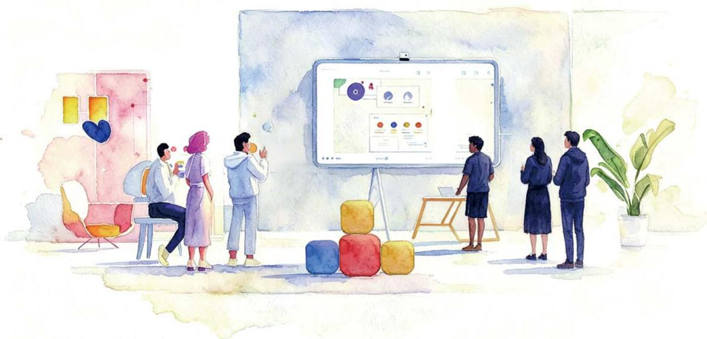

natural_image

Illustration of people gathered around a whiteboard displaying a presentation screen, with colorful geometric shapes and a potted plant nearby (no text or symbols)

## 员工关爱

## 员工权益

本行高度重视并切实保障全体员工（涵盖劳务派遣用工)休息休假权利，通过建章立制规范休假管理，明确设立带薪年休假探亲假、婚假、丧假、产假、哺乳假、育儿假、护理假、病假、事假、公休假、工伤假等各类假期，加强法律法规和政策研究倾听基层员工建议，动态完善优化休假体系，推动和谐稳定的劳动关系建设。

## 员工福利

本行严格遵守国家政策规定，为全体员工足额缴纳基本养老保险、基本医疗保险、失业保险、工伤保险、生育保险及住房公积金社会保险100%全覆盖。

为构建多层次的养老保险制度体系，本行建立并完善了企业年金计划，员工可结合自身经济负担能力，在企业年金缴费标准内灵活选择个人缴费比例。

本行建立了以商业团体医疗保险为核心的补充医疗保险计划，涵盖员工及其子女关于门急诊、住院及重大疾病医疗等费用报销。制定出台《江苏银行员工疗休养管理办法》，将疗休养覆盖面扩大至全体员工，不断提升员工幸福感获得感

## 女性员工关爱

本行坚持男女员工同工同酬，依法依规保障女性员工权益，致力于为女性员工提供特殊关爱，营造平等温馨的工作环境。女性员工在结婚、怀孕、产假、哺乳等情形下，按规定享受工资及相关福利待遇。坚持按时足额为女性员工缴纳生育保险费用，在女性员工休产假或计划生育假期间依法享受生育津贴

作为联合国环境规划署金融倡议组织(UNEPEI)银行理事会中东亚地区理事代表，本行深度落实负责任银行原则(PRB)中“性别平等”与“公正转型”重要理念，对标联合国可持续发展目标“实现性别平等并赋权所有妇女和女童”，推出“以领导力推动性别平等”“多维赋能激发成长活力”“康乃馨服务站守护她”等一系列关怀女性员工、赋能职场成长的特别行动传递出对女性群体的认可与关怀，营造温暖、有爱的文化氛围。

## 员工活动

## 案例：我行举办第六届职工运动会

2025年10月31日，我行举办“蝶变18·正青春再出发”全行第六届职工运动会。运动会共设田径、羽毛球、乒乓球、网球、篮球、足球、游泳七个大项，47个小项赛事。18家分行、3家子公司和总行部门22个代表队共1400多名运动员参赛。运动会充分展现了我行员工锐意进取、团结协作的精神风貌，激励全行员工将赛场上的拼搏劲头转化为推动工作的强大动力，不断凝聚全行上下“正青春 再出发”的磅礴力量。

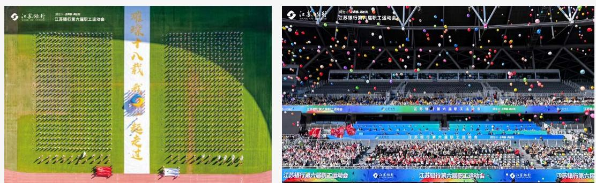

##

2025年6月18日，无锡分行举办“情绪大扫除”戏剧疗愈主题沙龙活动，通过“戏剧+心理”跨界融合的创意形式，为员工心理赋能，帮助员工以更好的状态积极工作、快乐生活。员工们通过一系列简单有趣的戏剧游戏，在角色扮演的沉浸式体验中突破自我设限、探索内心世界、提升自我认知，在欢声笑语与创意进发中释放压力，疏导情绪。

##

2025年8月3日，镇江分行举办“美美与共每每感动”“我身边的TA”先进事迹分享会。分行基层一线员工根据身边优秀同事先进事迹，通过组合分享、微访谈、讲述剧、情景剧等形式生动讲述了“身边的TA”典型事迹，激发大家同舟共济、劈波斩浪的豪情壮志，凝聚员工上下众志成城、砥砺前行的奋进力量。

##

2025年12月11日，盐城分行以“感恩一路相伴，荣休共颂芳华”为主题，围绕“问候、感谢、回顾、祝福”四个关键词，举办2025年退休员工欢送会，与退休人员一起回顾了在江苏银行工作的心路历程。分行领导及员工向几十年来为分行事业发展付出辛勤劳动、作出积极贡献的退休干部员工表达衷心感谢。

## 帮扶体系

完善员工大病互助保障体系，修订《江苏银行爱心互助基金管理办法》，进一步扩大困难员工保障覆盖面，2025年共认定帮扶补助项目.55个，累计发放补助金额129.5万元

落实员工生病住院必访、婚丧嫁娶必访、工伤必访、特殊困难必访“四必访”制度，及时为员工送上生日祝福、结婚慰问等暖心关怀，2025年春节期间，累计慰问困难员工335人，慰问资金98.1万元

##

2025年8月11.日至29日，泰州分行举办“开学加油站”员工子女暑托班活动。前期，分行通过问卷调研征集员工在时间安排、课程内容、安全保障等方面的意见，量身定制暑托实施方案。暑托班采取“自主学习+主题课程”双轨模式，每日设置特色主题，涵盖时间规划、创意绘画、才艺展示、观影分享等内容，并创新融入“小小银行家”金融体验、科学实验及传统文化课程，有效帮助孩子们实现从假期到新学期的“软着陆”，为员工家庭减负、为孩子成长赋能。

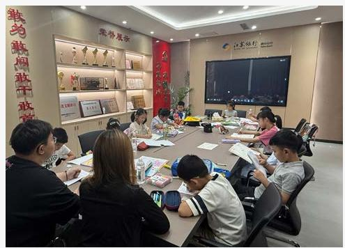

text_image

Meeting room photo with visible Chinese wall signage and participants seated around a table

## 民主管理

## 职工代表大会

本行认真落实职工代表大会制度，按照《江苏银行股份有限公司职工代表大会操作管理办法》，面向各机构征询职代会审议事项，组织职工代表审议与员工相关的各项议案，推动议案的落地实施。

2025年全行各级工会累计召开职工代表大会33次，审议通过了包括《江苏银行员工考勤与休假管理办法(2025年修订）》《江苏银行员工疗休养管理办法（试行）》《江苏银行爱心互助基金管理办法(2025年修订)》等与员工切身利益相关的制度和事项78项。

## 定期绩效评估与反馈

本行建立了覆盖全部员工的绩效管理体系，通过树立统一考核导向，不断优化绩效管理制度，完善考核方式、考核流程、结果反馈等方面管理要求，激励员工始终保持于事创业的热情。本行绩效管理流程主要包括以下四个环节：

## 绩效目标与计划

绩效目标与计划是绩效管理的出发点，是上级管理者与员工就其年度个人绩效目标及衡量标准达成的有关工作任务及相关考核内容。每年管理者根据本部门年度目标任务和工作要求，结合各岗位工作职责，在充分沟通并达成共识的基础上，签订阶段性及年度绩效目标与考核评价标准。

## 绩效沟通与辅导

绩效沟通与辅导是绩效管理的关键环节，是上级管理者与员工围绕绩效目标进展情况，进行的一种着眼于未来的双向交流。上级管理者围绕年初设定的各阶段绩效目标，定期、不定期与员工进行绩效沟通与辅导，主要内容涉及绩效目标进展状况、存在的问题及困难、下一步的改进计划等。

## 绩效考核与反馈

绩效考核与反馈是绩效管理的核心环节。考核评价过程坚持公平、公正、公开，坚持日常表现与年度考核相结合，坚持个人绩效与组织绩效相挂钩，由上级管理者对员工在考核期内的工作业绩和能力发展等情况进行综合考核评价，并根据绩效考核结果对员工进行反馈指导

##

绩效激励与发展是绩效管理的落脚点，员工绩效考核结果，将作为其评优评先、选拔任用、薪酬调整培养培训、轮岗交流、监督改进等方面事项的重要参考依据。上级管理者指导、帮助员工正确分析工作成绩和主要不足，与员工共同探讨绩效改进和提高能力的方式，并为下阶段绩效目标的制定奠定基础。

## 员工满意度

本行建立员工满意度调查机制，常态化、分层次、多渠道开展各类员工满意度测评将其作为倾听员工心声、优化管理决策的重要方式

以内网门户为载体，线上开展年度员工满意度综合调查，调查范围覆盖全体员工，内容涵盖了工作环境、职业发展路径、单位未来发展前景等员工切身相关问题，全面了解员工工作真实感受和职业体验，并对调查数据进行系统分析和梳理总结为高级管理层制定人力资源政策提供重要参考依据。结果显示，员工整体满意度91%。

每年度开展于部选拔任用工作“一报告两评议”，对单位选人用人、于部管理监督以及新提拔任用于部进行民主评议。每年分层分类组织全休员工开展360在线测评对员工的专业知识、服务协作、敬业自律、创新执行等方面，对干部的政治素质、合规律己、创新能力、狠抓落实、正确政绩观等方面，对总分行部门履职、服务协作等方面进行满意度评价。各经营机构根据自身发展需求定期开展半年度或年度全员满意度360在线测评，并采用匿名评价方式，保证评价结果的及时性、有效性。

通过多维度多渠道调查研究深入了解员工真实诉求，重点识别薪酬福利、职业发展、权益保障、工作环境等员工关注的核心问题和待改进建议，据此制定针对性改善举措，推动人力资源工作持续改进优化，切实提升员工获得感、幸福感和满意度

## 员工意见建议

本行坚持把发现问题、解决问题作为提升经营管理效能的有效手段，推动落实各项问题与建议。建立“1+3”问题导向工作机制(即“1”是“亮点”平台，“3”分别是“总行条线问题与建议解决机制”、“实时报障与咨询群”和“同业市场信息专报”）。收集的各类问题直报总行、直达行领导。在问题事项承办环节，明确落实举措、完成时间及责任人，压实工作责任。在问题事项办结环节，由部门主要负责人审定，强化组织领导，严格审核把关。2025年，共收集各类员工意见建议11.44万条，其中11.23万条意见建议得到采纳，全年累计表彰784人次

## 可持续发展治理篇

专题：坚持党建引领，强化使命担当	 112

公司治理……

风管理………118

商业道德………………………………………………………………120

支持的联合国可持续发展目标(SDGs）

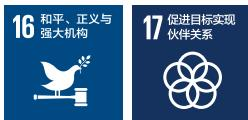

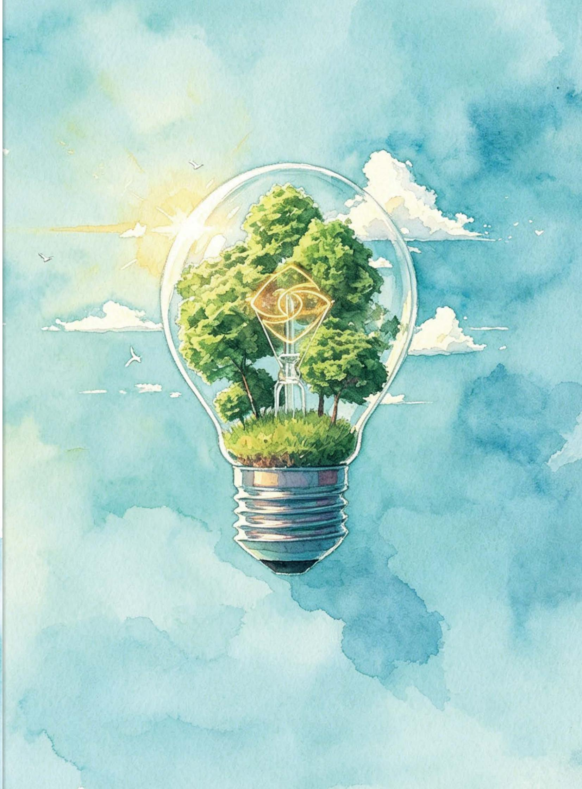

natural_image

Watercolor illustration of a light bulb with green trees inside, set against a blue sky with clouds and birds (no text or symbols)

# 专题：坚持党建引领，强化使命担当

本行牢固树立“抓党建就是抓核心竞争力”的理念，持续深化“苏银融党建”品牌建设，以改革精神和严的标准纵深推动全面从严治党，不断激发党建引领推动发展的“红色引擎”

## 学习宣传贯彻党的二十届四中全会精神

举办党的二十届四中全会精神宣讲报告会，邀请省委宣讲团成员作全会精神专题辅导报告，全行1200余人参加宣讲活动。

本行党委理论学习中心组带头开展专题研讨，省委金融工委赴我行开展四中全会精神专题中心组巡学旁听。全行各级党委累计组织开展“第一议题”学习22次、中心组学习22次。组织全行党支部通过“三会一课”、专题研讨等形式开展全会精神学习1200余次。

专题召开党外知识分子学习贯彻党的二十届四中全会精神座谈会，做好面向党外知识分子的宣传工作。在行内网站开设“学习贯彻党的二十届四中全会精神”专栏，依托行内数智化学习平台，上线“党的二十届四中全会精神”专题微课，组织全行党员、员工深入学习。

## 扎实开展深入贯彻中央八项规定精神学习教育

推动各级党委以中心组学习会为依托、基层党支部以党员大会为依托，一体推进“学查改”。学习教育期间，各级党委累计开展中心组学习88次、“第一议题”学习198次，各基层党支部开展学习研讨2400余次。

开展“行长接待日”活动，同时每人明确2家左右分行子公司、2家县域支行为基层联系点，累计开展大走访大调研活动66次，形成调研报告15篇。

修订总行会议制度，全年系统性会议精简20%:加强全行培训计划审核，缩减年度培训计划超20%：优化分行考核体系，考核指标总数精简1/3，并对省外分行实行差异化考核：深化分支行管理事项上收，完成上收整合项目255个，释放人力.355人，让基层更好地轻装上阵，集中精力抓发展促落实。

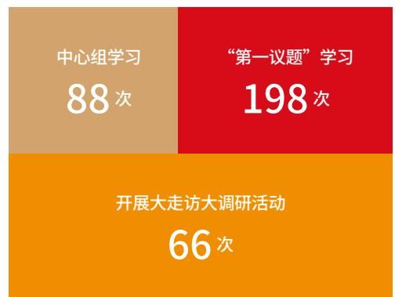

treemap

| Category | Value |
| --- | --- |
| 中心组学习 | 88 次 |
| “第一议题”学习 | 198 次 |
| 开展大走访大调研活动 | 66 次 |

## 不断提升基层党建工作质量

完善基层党建工作制度体系，制定完善支部月度工作清单管理、规范党组织联建共建、加强发展党员管理、加强党群活动中心建设审批等系列制度文件，加强对基层的精细化指导，不断提升党建工作规范化制度化水平。

举办全行党支部书记轮训班，总行党委班子成员及高管带头授课，分3期累计培训600余人次，培训内容涵盖中央八项规定精神、宏观经济形势、党建与业务融合、风险防控等，进一步增强党支部书记抓党建、谋发展、控风险、强管理的能力。

持续推进党建信息化建设，完善“智慧党建”系统2.0版本功能，强化对“智慧小苏”大模型的文本训练，更好实现智慧互动数据集成分析，推动党建工作实时管理、智慧管理

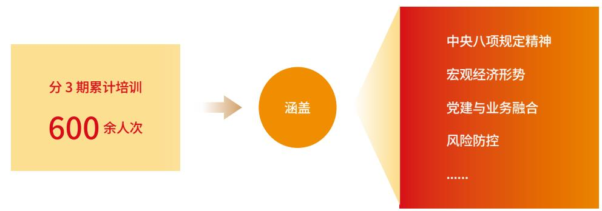

flowchart

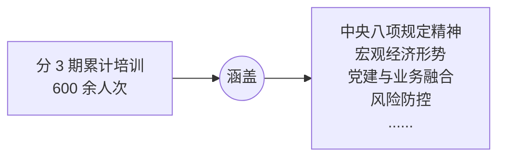
```mermaid
graph LR
  A["分 3 期累计培训\n600 余人次"] --> B(("涵盖"))
  B --> C["中央八项规定精神\n宏观经济形势\n党建与业务融合\n风险防控\n......"]
```

## 着力深化“苏银融党建”品牌建设

广泛开展党建学习交流活动，推动各级党组织围绕做好金融“五篇大文章”，与机关部门、产业链企业、行业商会协会、金融同业等党组织开展理论联学、活动联办、工作联动，各级党组织共开展学习交流活动1200余场次。

连续10年开展“党员进社区”活动，组织党员员工走进社区、园区、商圈、学校等各类场景，开展金融知识宣讲、志愿服务5900 余场次。

“苏超”比赛期间，全行累计组织党员、员工超1万人次，为观赛球迷做好入场引导、防暑降温、饮用水等服务，为赛事圆满举办提供了有力支持。

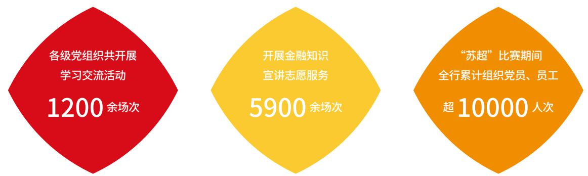

funnel

| 活动类别 | 人数 |
| --- | --- |
| 各级党组织共开展学习交流活动 | 1200余场次 |
| 开展金融知识宣讲志愿服务 | 5900余场次 |
| “苏超”比赛期间全行累计组织党员、员工 | 超10000人次 |

## 公司治理

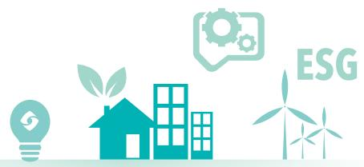

natural_image

Illustration of a house with green leaves, wind turbines, and a lightbulb icon next to an ESG-themed logo (no text or symbols on main elements)

## ESG治理架构

## 董事会

负责制定本行发展战略并监督战略实施、定期评估审议，承担维护金融消费者和其他利益相关者合法权益的职能，对本行绿色金融发展战略及目标拥有最终审定权。

## 董事会战略与ESG委员会

将可持续发展纳入职责范畴，负责研究制定本行可持续发展战略，监督、检查和评估可持续发展战略执行和负责任银行建设情况，推动本行构建全方位的ESG 管理体系，指导完善ESG发展机制，审议本行绿色金融发展战略，全面推进绿色金融体系建设，监督、评估本行绿色金融战略执行情况，尤其重点关注推动本行建立良好、诚信的企业文化和价值准则，定期审议ESG报告、负责任银行原则(PRB)自评估报告和绿色金融发展报告，引导本行履行社会责任。

## 董事会风险管理委员会

将包括气候风险在内的ESG 风险管理纳入全面风险管理，负责审议制定包括ESG 风险在内的全面风险管理战略、策略、政策以及偏好，定期评估风险性质和水平，监督评价高级管理人员的风险识别、计量、监测和控制情况，提出完善风险内控的意见。

## 董事会消费者权益保护委员会

定期听取消费者权益保护相关工作汇报，督促和推动消费者权益保护战略目标和重点工作得到有效执行，指导本行建立并不断完善贯穿全业务流程的消费者权益保护机制，规范落实产品服务审查和信息披露，指导强化个人隐私数据源头安全性保护，持续加强投诉管理、债务催收管理等相关工作，推动提升消费者权益保护工作质效。

## 董事会审计委员会、关联交易控制委员会、提名与薪酬委员会

从各自职责出发，共同协助董事会落实ESG相关工作。审计委员会定期听取内外部审计情况报告，监督评估内部控制工作，指导本行开展绿色金融业务专项审计、消费者权益保护工作专项审计，推进内外部审计发现的ESG相关问题的整改。关联交易控制委员会定期听取关联交易报告、关联交易专项审计情况报告。提名与薪酬委员会定期评价董事履职情况、独立董事独立性情况，对高级管理人员履行包括本行服务质量与公平对待消费者情况、涉农和小微企业贷款、绿色信贷、公众金融教育、客户满意度、企业文化及人才建设等在内的社会责任情况进行考核评价，定期听取本行绩效考核及薪酬管理调研审计情况报告、薪酬管理工作报告。高度重视员工成长发展，持续关注本行员工培训和职业发展情况。

## 董事会成员多元化

本行以多元化为目标不断优化董事会成员构成，形成并保持与自身所处发展阶段需求相契合的董事会结构，专业背景多样化、人员构成动态稳定的董事会，为本行稳健可持续的高质量发展夯实了可靠的公司治理运作决策基础。截至2025年末，本行董事会共有董事15名，其中执行董事4名、独立非执行董事5名、非独立非执行董事6名。15名董事中有女性董事1名，本行将根据自身情况和董事会架构持续关注符合资质要求的女性董事潜在人选，促进董事会成员性别结构的多元化

## 董事会成员专业性

本行5名独立董事分别具有宏观研究、财务会计、金融风险管理、法律、国有上市银行经营管理和日常运作的专业背景和经验，具备上市公司监管、银行业监管要求的独立性，勤勉尽职、独立审慎为董事会的科学决策提供有力保障。本行董事会审计委员会、关联交易控制委员会、风险管理委员会、提名与薪酬委员会、消费者权益保护委员会的主任委员均由独立董事担任

独立董事陈忠阳现任中国人民大学财政金融学院教授、博士生导师，全球领导力学院双聘教授，国家金融研究院高级研究员，重阳研究院高级研究员。曾任人民大学国际学院副院长、学术委员会主席，金融风险管理学科建设负责人，创办了国内首个金融机构风险管理方向的金融专业硕十和博十研究生项目。入选“2024中国知网高被引学者(TOP1%经济学)”。曾在英国和美国多所大学做访问学者，并入选美国国务院富布莱特驻校学者。

独立董事于绪刚深耕法律领域，关注ESG重点领域的研究。曾作为中国法律专家，随国务院侨办出访亚洲、澳洲、欧洲与非洲诸国，推广宣传中国改革开放的法治进程与一带一路倡议。出版《世界向绿色经济转型》(World's Transition Toward a Green Economy)，从全球视角论述了绿色金融在绿色转型中发挥的根本性作用探讨与替代能源开发相关的投资机会，加强世界对中国可持续发展政策的认识

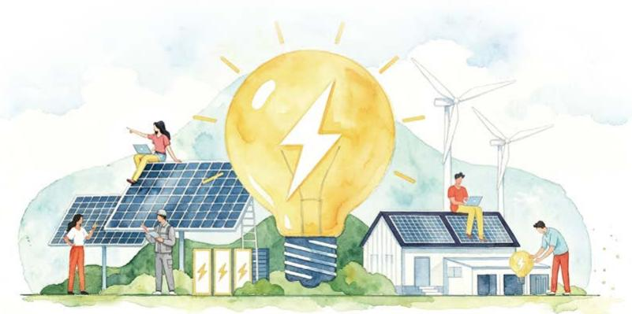

natural_image

Illustration of people assembling solar panels and wind turbines in a renewable energy context, with a large light bulb symbolizing energy (no text or symbols present)

## ESG治理进展

董事会及专门委员会通过定期审议听取ESG工作相关议案和报告，指导管理层不断强化战略指引、风险管理、消费者权益保护、社会责任履行、关联交易管理、信息披露等ESG相关工作间的协同，不断提升ESG管理水平。

2025年，本行董事会ESG治理工作推进情况如下：

## 全年召开董事会会议

10次

全年召开董事会会议10次，审议通过本行《2026-2030年发展战略规划》《ESG暨社会责任报告》《绿色金融发展报告》《负责任银行原则自评估报告》《全面风险管理报告》《关联交易报告》《数据安全管理办法》等涉及重要ESG领域的议案，审阅《风险偏好执行情况评估报告》《反洗钱和反恐怖融资工作情况报告》等报告，切实履行董事会在ESG发展规划、绿色金融、普惠金融、消费者金融保护、社会责任履行等方面的职责。

全年召开战略与ESG 委员会会议2次

全年召开战略与ESG委员会会议2次，审议通过《2026-2030年发展战略规划》《ESG暨社会责任报告》《绿色金融发展报告》《负责任银行原则自评估报告》等议案，推动本行持续构建并完善ESG管理体系和发展机制。

## 全年召开风险管理委员会会议

7次

全年召开风险管理委员会会议7次，审议通过《全面风险管理报告》《风险管理策略》 《风险偏好陈述书》等议案，《全面风险管理报告》2025年新增“环境、社会和治理风险”类别，明确管理策略和偏好，在上年度制定《江苏银行股份有限公司环境、社会和治理风险管理政策》的基础上，对照监管新规及外部评级要求，修订完善《全面风险管理政策》等政策制度，进一步明确ESG风险全流程管理要求。优化ESG风险评估和评级管理，开展客户ESG风险评估与分类及差异化风险管控，进一步提升 ESG 风险管理质效。

## 全年召开消费者权益保

护委员会会议

2次

全年召开消费者权益保护委员会会议2次，审议通过《消费者权益保护工作报告及工作要点》等议案，推动本行持续提升消费者权益保护水平和客户满意度，进一步提高金融服务质量。

## ESG履职评价

## 实施薪酬追索扣回机制

本行致力于将薪酬与可持续发展目标紧密挂钩，持续完善绩效薪酬延期支付和追索扣回机制，不断加强监督管理工作

## 绩效薪酬延期支付制度

根据《商业银行稳健薪酬监管指引》等规定相关要求，为不断强化经营管理人员的责任意识和风险防范意识，有效推动本行业务可持续发展，我行制定并持续完善《江苏银行绩效薪酬延期支付管理办法》。办法规定，对本行风险有重要影响岗位的人员，执行绩效薪酬延期支付的比例不低于40%，总分行高级管理人员的延期支付比例提高至50%，绩效薪酬延期支付期限为三年，在延期支付时段中遵循等分原则。

## 绩效薪酬追索扣回制度

根据《中国银保监会办公厅关于建立完善银行保险机构绩效薪酬追索扣回机制指导意见的通知》等规定相关要求，为不断强化绩效薪酬在经营管理中的导向作用，建立健全科学有效的公司治理和绩效薪酬激励约束机制，我行制定并持续完善《江苏银行绩效薪酬追索扣回机制管理办法》。办法规定，高级管理人员关键岗位人员以及给本行造成重大损失的全行所有岗位员工（包括离职、退休等离岗人员）均适用于绩效薪酬追索扣回机制管理办法。对于因存在明显过失或未尽到审慎管理义务，导致职责范围内风险超常暴露的高级管理人员和关键岗位人员，将追索扣回其相应期限内的绩效薪酬。

## 将可持续发展绩效纳入薪酬考核

本行高级管理人员直接对董事会负责，接受董事会的考核。董事会提名与薪酬委员会根据《江苏银行高级管理人员薪酬考核办法》，将ESG理念融入考核体系框架，从合规经营、风险控制、经营效益、发展转型、社会责任类指标及个人指标等维度加强对高级管理人员的考评，引导高级管理人员注重长期价值创造和社会责任履行。与高管薪酬相关的可持续发展相关指标包括绿色信贷、涉农和小微企业贷款、消费者权益保护、公众金融教育、客户满意度等。经考评，2025年度公司高级管理层较好地完成各项目标任务，董事会对高级管理人员的年度考核等级均为A级。公司董事会审计委员会依照监管要求及公司相关制度规定，对高级管理人员2025年度履职情况进行评价。董事会对高级管理人员的考核结果和评价意见，是对高级管理人员实施激励约束的重要依据

2025 年度

A 级

## 风险管理

natural_image

Illustration of a hand interacting with a tablet displaying upward-trending bar chart, surrounded by decorative floral and umbrella elements (no text or symbols)

本行秉持“前瞻识别，有效防控”的风险理念，以风险体系重塑为抓手筑牢风险防线，持续完善风险管理架构与机制，风险防控的覆盖面、精准度和运行效率不断提升。

## 风险控制体系

本行持续推动风控体系重塑，梳理风控职责与流程，优化风险板块的组织架构设计，建立健全由风控、合规、科技3个板块深度协同，风险管理部、法律合规部、授信审批部、授信管理部、资产保全部等5大风险管理部门联动，全行上下共同落实各项管理措施的“3+5+N”风控管理体系，持续提升防控效率和有效性，形成管理闭环，实现齐抓共管。

## 风险管理架构

本行持续完善全面风险管理架构，已形成包括信用风险、市场风险、操作风险、流动性风险、银行账簿利率风险声誉风险战略风险、信息科技风险、国别风险、外包风险、合规风险、洗钱风险、法律风险、ESG风险为主要管理对象的管理架构。

本行自2023年起，已将 ESG 风险纳入全面风险管理范畴。

## 风险管理机制

## 分层分级管理

总行层面为顶层设计中枢，负责制定全行风控合规战略、政策制度和总体偏好。总行行长担任首席合规官，对全行合规管理负专门领导责任。召开风控体系例会，每月召集会议，研究重大风险，协调重要事项，推进重点工作。

分行层面为区域管理枢纽，负责细化风控合规措施，监督执行情况，管理经营行为，处理分行范围内较大风险事件。分行设立合规官，由分行行长担任，对分行合规管理负责。召开横向联动例会，落实总行和当地监管工作要求，破解基层一线风控堵点难点。

支行层面聚焦具体业务风险，在授权范围内开展业务，及时报告风险点，严格按要求应对处置风险。

## 设立三道防线

第一道防线： 总、分行业务经营部门和支行。负责在开展业务时主动识别、评估和控制风险，对业务背景、合作意愿、佐证资料的真实性负责等

第二道防线： 总、分行风险合规部门和支行风险合规岗。负责建立健全内部控制体系、培育合规文化，制定完善风险管理制度等。

第三道防线： 总行内审部。负责审计评价全行风控合规体系的有效性和制度执行，以及一二道防线履职情况

## 聚焦重点领域风险防控

本行围绕潜在风险，总分行协同，按照“一企一策”原则制定处置方案，实施分类分层管理，推动风险化解

围绕投资业务风险，强化市场监测，及时发现并规避部分尾部金融机构、发债企业的违约风险

围绕网贷业务风险，持续从平台、产品、客户、模型四个维度加强管控，建设“一产品一模型”体系，不断提升模型的针对性和精准性。

围绕普惠业务风险，加强定期监测，做好客户“增持减退”管理，实现贷中自动化管控

## 商业道德

natural_image

Illustration of a computer monitor with a shield icon, gear symbols, and books (no text or symbols present)

## 反商业贿赂反贪污

本行大力弘扬“尊廉崇洁反贪拒腐奉公奉献”的廉洁理念，严格遵循《中华人民共和国刑法》《中华人民共和国监察法》《国有企业领导人员廉洁从业规定》《银行业从业人员职业操守和行为准则》等相关法律法规，对贿赂和贪污行为“零容忍”，及时发现、严肃查处违规用权、贪污受贿等违纪违法行为，一体推进不敢腐、不能腐、不想腐，持续营造风清气正、健康向上的企业风气和良好生态

<table><tr><td>管理架构</td><td>本行董事会、管理层负责反贿赂反贪污工作管理架构建设,建立党风廉政建设责任制领导小组,共同推动反贿赂反贪污工作实施。总行党风廉政建设室、法律合规部、内审部等部门承担反贿赂反贪污具体职责,及时识别、评估、调查和管控可能存在的贿赂和贪腐风险。本行与政府纪检监察、金融监督管理等部门密切合作,联合省纪委监委派驻纪检监察组共同成立党风廉政建设和反腐败工作协调小组,定期召开联席会议,构建全方位、立体式的反贿赂反贪污监督体系框架。</td></tr><tr><td>制度体系</td><td>本行已建立完善的反贿赂反腐败管理监督制度体系,涵盖总行及各分行(子公司)。制定并实施《江苏银行员工行为守则》《江苏银行员工行为禁令》《江苏银行员工违规失职行为责任追究办法》《江苏银行股份有限公司案防工作管理政策》《江苏银行廉洁风险防控手册》《江苏银行从严管理所辖机构“一把手”十条规定》《江苏银行领导干部违规插手干预重大事项记录和报告办法》《关于加强年轻干部教育管理监督的若干措施》等规章制度,要求各级干部员工严格执行廉洁从业各项规定,坚决反贿赂反贪污,严于律己,秉公办事,不以权谋私。</td></tr><tr><td>廉洁教育</td><td>本行开展经常性的廉洁教育培训,对象涵盖全体员工、劳务派遣和外包人员。召开2025年度警示教育大会,组织全行1.8万余名员工共同参会,督促依规用权、廉洁用权。组织开展现场参观警示教育基地、旁听法院职务犯罪庭审等实境警示教育,以案明纪,增强教育实效。</td></tr></table>

<table><tr><td></td><td>聚焦不同群体特点,有针对性开展廉洁教育:紧盯“关键少数”,严格规范权力运行,传导廉洁用权要求;紧盯新提拔干部,坚持“凡提必谈”,把好选人用人廉洁关;紧盯新入职员工,组织开展“廉洁从业第一课”,培育遵规守纪意识;紧盯拟离行员工,做好离任审计,严防“逃逸式离职”。</td></tr><tr><td>清廉金融文化</td><td>本行深入落实清廉金融文化建设要求,在元旦、春节、五一、端午、中秋、国庆等重要节日制作具有节日特色的廉洁提醒短视频,发布在本行视频号、各级机构电子屏上,将廉洁过节要求传达到每位员工。打造“总分支”三级联动的清廉文化教育阵地,涵养崇廉尚洁的新风气。用好各类线上宣传教育平台,经常发布廉洁从业提醒,提升员工思想自觉。常态化开展清廉书画、摄影作品征集及宣传,营造崇尚廉洁的浓厚氛围。深化“家风助廉”活动,充分发挥家庭成员的助廉作用。</td></tr><tr><td>廉政建设</td><td>2025年,本行加入江苏省银行业协会清廉金融文化建设专委会并担任副主任单位,认真落实反贿赂反贪污工作要求。制定并组织签署2025年度党风廉政建设责任状,层层压实各级机构党风廉政建设责任。制定2025年度党风廉政建设工作要点,从完善责任追究制度体系、抓好日常监督管理、严肃查处违规失职行为、培育清廉文化氛围等方面细化工作措施。开展2025年度廉洁风险排查防控工作,全面摸排关键环节、关键岗位、新业务新流程和已暴露问题等方面存在的廉洁风险,有针对性地制定防控措施。</td></tr><tr><td>商业伙伴反贿赂反贪污的监督管理</td><td>本行建立双向承诺机制,要求采购岗位人员签署《廉洁从业承诺书》,要求供应商签署《反商业贿赂承诺书》,营造廉洁公正的采购环境。</td></tr><tr><td>反洗钱</td><td>本行深入贯彻落实《中华人民共和国反洗钱法》,切实履行金融机构预防及遏制洗钱和恐怖融资活动“第一道防线”职责。2025年,本行建立健全客户持续尽调、产品洗钱风险评估等长效管控机制,加强洗钱风险与各类风险的联防联控,定期开展内部检查和审计,加大违规问责力度牢牢守住风险底线。加快技术创新应用,运用大模型技术构建合规情报中心,持续推动反洗钱相关系统和模型的优化升级,提升可疑交易报告的金融情报价值。加强反洗钱培训宣传,提升全行反洗钱和反恐怖融资意识,筑牢金融安全防线,切实保护客户的财产安全和合法权益。(详细反洗钱管理体系请访问江苏银行官方网站查看。)</td></tr></table>

## 举报人保护

本行严格保护信访举报人隐私，印发《江苏银行信访工作规定》，明确信访工作人员与信访事项或信访人有直接利害关系的进行回避处理。对将信访人的检举、揭发材料或者有关情况透露、转给被检举、揭发的人员或者单位的，或者打击报复信访人的依规依法追究有关责任。严格执行信访举报保密制度，将信访举报材料按照密级文件管理，严格落实保密要求

制定《江苏银行领导干部违规插手于预重大事项记录和报告办法》，明确举报人保护相关条款，对打击报复记录报告人、泄露记录报告人员个人信息的，依规依纪依法追究责任。

## 知识产权保护

## 健全制度体系

本行制定《江苏银行股份有限公司知识产权管理办法》，明确管理职责、权利归属、登记注册、转让许可、中介机构聘用管理等全流程规范，为知识产权工作的规范化、体系化开展提供坚实的制度基础。

## 强化风险防控

严把“入口关”，规范与字体、图片、软件服务商合作，从严管理各类服务商，明确要求全行营销宣传中使用的所有字体、图片音视频、肖像等素材均获得合法有效授权，杜绝侵权风险。

将知识产权审查深度嵌入法律审查流程，重点关注合同中的商标、软件著作权、商业秘密等条款，明确界定权利归属、使用许可范围及侵权责任，最大限度保障我行及权利人的合法权益。2025年内，未发生知识产权侵权诉讼案件。

## 加强自主创新

严格依据《中华人民共和国著作权法》《中华人民共和国专利法》《中华人民共和国商标法》等法律法规和行内制度开展版权登记专利申请、商标注册等工作，切实加强我行对知识产权的保护和利用，为我行的品牌建设和业务发展提供强有力的支撑。

## 推动数字赋能

对知识产权数字化、精细化管理，于内部管理系统中开发知识产权管理模块，对专利、商标、著作等知识产权进行标准化分类并对知识产权的名称、状态、期限等关键数据进行全面录入与动态更新，做到知识产权有效保护、创造运用。

## 反垄断与公平竞争管理

本行已加入中国银行业协会《银行业反不正当竞争公约》。

本行已建立公平竞争风险评估与应对机制，员工行为准则包含关于公平竞争的规定，具体为：《江苏银行员工行为守则》第六章要求，坚持同业间公平、有序竞争原则，不得从事违规揽存，低价倾销；在业务宣传、办理过程中，不得使用不正当竞争手段。不得捏造、散布虚假信息，损害同业的商业信誉、商品声誉，恶意贬低竞争对手。不得超出授权范围或违反有关定价制度规定，对客户做出有关本行服务品种、范围、利率、手续费率、汇率、还款方式、计息方法等方面的承诺。

本行持续开展合规教育培训，组织员工开展职业操守教育、警示教育学习，培养员工知法守法与合规经营意识，强调公平竞争合规要求。对员工违反公平竞争行为的，我行将按照《江苏银行员工违规失职行为追究办法》及《江苏银行内控违规积分管理办法》相关规定予以处理

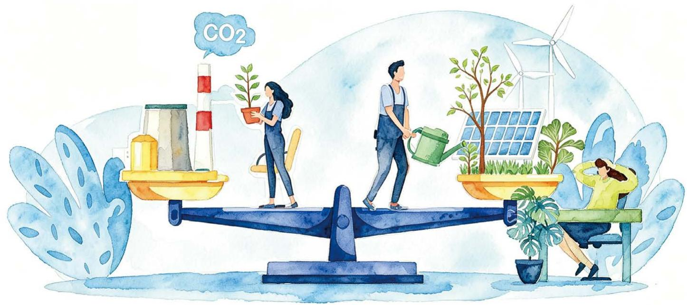

natural_image

Illustration of a balance scale with workers and greenery, symbolizing environmental sustainability (no text or symbols present)

2025年温室气体排放量

<table><tr><td>类别/子类别</td><td>类别描述</td><td>类别</td><td>子类别</td><td>是否量化</td><td>排放量</td><td> $CO_2$ </td><td> $CH_4$ </td><td> $N_2O$ </td><td>HFCs</td><td>PFCs</td><td> $SF_6$ </td><td> $NF_3$ </td><td>排放比例</td></tr><tr><td>1</td><td colspan="4">类别1:GHG直接排放和清除( $tCO_2e$ )Category 1:Direct GHG emissions and removalsin sources  $CO_2e$ </td><td>13869.64</td><td>5353.35</td><td>28.13</td><td>85.21</td><td>8402.94</td><td>0.00</td><td>0.00</td><td>0.00</td><td>22.75%</td></tr><tr><td>1.1</td><td>固定燃烧源的排放Direct emissions from stationary combustion</td><td>1</td><td>1.1</td><td>是</td><td>2693.49</td><td>2690.84</td><td>1.34</td><td>1.31</td><td>0.00</td><td>0.00</td><td>0.00</td><td>0.00</td><td>4.42%</td></tr><tr><td>1.2</td><td>移动燃烧源的排放Direct emissions from mobile combustion</td><td>1</td><td>1.2</td><td>是</td><td>2772.95</td><td>2662.26</td><td>26.80</td><td>83.90</td><td>0.00</td><td>0.00</td><td>0.00</td><td>0.00</td><td>4.55%</td></tr><tr><td>1.3</td><td>工业过程排放和清除Direct process emissions and removals arise from industrial process</td><td>1</td><td>1.3</td><td>NA</td><td>0.00</td><td>0.00</td><td>0.00</td><td>0.00</td><td>0.00</td><td>0.00</td><td>0.00</td><td>0.00</td><td>0.00%</td></tr><tr><td>1.4</td><td>来自人类活动的逸散排放Direct fugitive emissions arise from the release of greenhouse gases anthropogenic systems</td><td>1</td><td>1.4</td><td>是</td><td>8403.20</td><td>0.25</td><td>0.00</td><td>0.00</td><td>8402.94</td><td>0.00</td><td>0.00</td><td>0.00</td><td>13.78%</td></tr><tr><td>1.5</td><td>土地利用、土地利用变化和林业产生的排放和清除Direct emissions and removals from Land Use, Land Use Change and Forestry</td><td>1</td><td>1.5</td><td>NA</td><td>0</td><td>0.00</td><td>0.00</td><td>0.00</td><td>0.00</td><td>0.00</td><td>0.00</td><td>0.00</td><td>0.00%</td></tr><tr><td>2</td><td colspan="4">类别2:输入能源产生的GHG间接排放( $tCO_2e$ )Category 2:Indirect GHG emissions from imported energy</td><td>47103.47</td><td>47103.47</td><td>0.00</td><td>0.00</td><td>0.00</td><td>0.00</td><td>0.00</td><td>0.00</td><td>77.25%</td></tr><tr><td>2.1</td><td>输入电力产生的间接排放Indirect emissions from imported electricity</td><td>2</td><td>2.1</td><td>是</td><td>45746.03</td><td>45746.03</td><td>0.00</td><td>0.00</td><td>0.00</td><td>0.00</td><td>0.00</td><td>0.00</td><td>75.03%</td></tr><tr><td>2.2</td><td>输入能源产生的间接排放Indirect emissions from imported energy</td><td>2</td><td>2.2</td><td>是</td><td>1357.441</td><td>1357.441</td><td>0</td><td>0</td><td>0</td><td>0</td><td>0</td><td>0</td><td>2.23%</td></tr></table>

温室气体种类说明：根据ISO14064-1：2018的要求，包括六类温室气体，即二氧化碳（CO₂）、甲烷（CH₄）、氧化亚氮（N₂O）、三氟化氮(NF₃)、六氟化硫(SF₆)和其他相关GHG组(氢氟碳化物(HFCs)、全氟碳化物(PFCs)等)。本次盘查涉及的温室气体有二氧化碳(CO₂)、甲烷(CH₄)、氧化亚氮(N₂O)、氢氟碳化物(HFCs)4类温室气体。

《上海证券交易所上市公司自律监管指引第14号可持续发展报告（试行）》索引

<table><tr><td>维度</td><td>序号</td><td>议题</td><td>对应条款</td><td>披露页码</td></tr><tr><td rowspan="15">环境</td><td rowspan="8">1</td><td rowspan="8">应对气候变化</td><td>第二十一条</td><td>P26-P30</td></tr><tr><td>第二十二条</td><td>P29-P30</td></tr><tr><td>第二十三条</td><td>P27-P28</td></tr><tr><td>第二十四条</td><td>P30</td></tr><tr><td>第二十五条</td><td>P11</td></tr><tr><td>第二十六条</td><td>P30</td></tr><tr><td>第二十七条</td><td>P11</td></tr><tr><td>第二十八条</td><td>P27-P28</td></tr><tr><td>2</td><td>污染物排放</td><td>第三十条</td><td>P47</td></tr><tr><td>3</td><td>废弃物处理</td><td>第三十一条</td><td>P11、P48</td></tr><tr><td>4</td><td>生态系统和生物多样性保护</td><td>第三十二条</td><td>P49-P50</td></tr><tr><td>5</td><td>环境合规管理</td><td>第三十三条</td><td>P51</td></tr><tr><td>6</td><td>能源利用</td><td>第三十五条</td><td>P11、P51</td></tr><tr><td>7</td><td>水资源利用</td><td>第三十六条</td><td>P11、P51</td></tr><tr><td>8</td><td>循环经济</td><td>第三十七条</td><td>P11、P46、P47、P48、P51</td></tr><tr><td rowspan="9">社会</td><td>9</td><td>乡村振兴</td><td>第三十九条</td><td>P57-P61</td></tr><tr><td>10</td><td>社会贡献</td><td>第四十条</td><td>P77-P80</td></tr><tr><td>11</td><td>创新驱动</td><td>第四十二条</td><td>P81-P83</td></tr><tr><td>12</td><td>科技伦理</td><td>第四十三条</td><td>P84</td></tr><tr><td>13</td><td>供应链安全</td><td>第四十五条</td><td>P85</td></tr><tr><td>14</td><td>平等对待中小企业</td><td>第四十六条</td><td>P86</td></tr><tr><td>15</td><td>产品和服务安全与质量</td><td>第四十七条</td><td>P87-P92</td></tr><tr><td>16</td><td>数据安全与客户隐私保护</td><td>第四十八条</td><td>P93-P99</td></tr><tr><td>17</td><td>员工</td><td>第五十条</td><td>P100-P109</td></tr><tr><td rowspan="4">可持续发展相关治理</td><td>18</td><td>尽职调查</td><td>第五十二条</td><td>P15-P21</td></tr><tr><td>19</td><td>利益相关方沟通</td><td>第五十三条</td><td>P13-P15</td></tr><tr><td>20</td><td>反商业贿赂及反贪污</td><td>第五十五条</td><td>P120-P121</td></tr><tr><td>21</td><td>反不正当竞争</td><td>第五十六条</td><td>P122-P123</td></tr></table>

GRI标准索引

<table><tr><td>编号</td><td>内容</td><td>披露页码</td></tr><tr><td colspan="3">GRI 2:一般披露</td></tr><tr><td>GRI 2-1</td><td>组织详细情况</td><td>P6-P8</td></tr><tr><td>GRI 2-2</td><td>纳入组织可持续发展报告的实体</td><td>P1</td></tr><tr><td>GRI 2-3</td><td>报告期、报告频率和联系人</td><td>P1</td></tr><tr><td>GRI 2-7</td><td>员工</td><td>P10、P100-P109</td></tr><tr><td>GRI 2-9</td><td>管治架构和组成</td><td>P7、P114-P115</td></tr><tr><td>GRI 2-10</td><td>最高管治机构的提名和遴选</td><td>P114-P117</td></tr><tr><td>GRI 2-12</td><td>在管理影响方面,最高管治机构的监督作用</td><td>P118-P119</td></tr><tr><td>GRI 2-14</td><td>最高管治机构在可持续发展报告中的作用</td><td>P114</td></tr><tr><td>GRI 2-16</td><td>重要关切问题的沟通</td><td>P13-P21</td></tr><tr><td>GRI 2-18</td><td>对最高管治机构的绩效评估</td><td>P117</td></tr><tr><td>GRI 2-22</td><td>关于可持续发展战略的声明</td><td>P12-P13</td></tr><tr><td>GRI 2-27</td><td>遵守法律法规</td><td>P120-P123</td></tr><tr><td>GRI 2-29</td><td>利益相关方参与的方法</td><td>P13-P14</td></tr><tr><td colspan="3">GRI 3:实质性议题的披露项</td></tr><tr><td>GRI 3-1</td><td>确定实质性议题的过程</td><td>P15-P21</td></tr><tr><td>GRI 3-2</td><td>实质性议题清单</td><td>P19-P20</td></tr><tr><td>GRI 3-3</td><td>实质性议题的管理</td><td>P21</td></tr><tr><td colspan="3">GRI 201:经济绩效</td></tr><tr><td>GRI 201-1</td><td>直接产生和分配的经济价值</td><td>P9</td></tr><tr><td>GRI 201-2</td><td>气候变化带来的财务影响以及其他风险和机遇</td><td>P29-P30</td></tr><tr><td colspan="3">GRI 203:间接经济影响</td></tr><tr><td>GRI 203-1</td><td>基础设施投资和支持性服务</td><td>P54-P56</td></tr></table>

GRI标准索引

<table><tr><td>编号</td><td>内容</td><td>披露页码</td></tr><tr><td colspan="3">GRI 205: 反腐败</td></tr><tr><td>GRI 205-2</td><td>反腐败政策和程序的传达及培训</td><td>P120-P121</td></tr><tr><td>GRI 205-3</td><td>经确认的腐败事件和采取的行动</td><td>P120-P121</td></tr><tr><td colspan="3">GRI 302: 能源</td></tr><tr><td>GRI 302-1</td><td>组织内部的能源消耗量</td><td>P11</td></tr><tr><td>GRI 302-4</td><td>减少能源消耗量</td><td>P46-P48</td></tr><tr><td>GRI 302-5</td><td>降低产品和服务的能源需求</td><td>P46</td></tr><tr><td colspan="3">GRI 303: 水资源与污水</td></tr><tr><td>GRI 303-5</td><td>耗水</td><td>P11</td></tr><tr><td colspan="3">GRI 304: 生物多样性</td></tr><tr><td>GRI 304-2</td><td>活动、产品和服务对生物多样性的重大影响</td><td>P49-P50</td></tr><tr><td colspan="3">GRI 305: 排放</td></tr><tr><td>GRI 305-1</td><td>直接(范畴1)温室气体排放</td><td>P30</td></tr><tr><td>GRI 305-2</td><td>能源间接(范畴2)温室气体排放</td><td>P30</td></tr><tr><td>GRI 305-4</td><td>温室气体排放强度</td><td>P30</td></tr><tr><td>GRI 305-5</td><td>温室气体减排量</td><td>P11</td></tr><tr><td>GRI 305-7</td><td>氮氧化物 (NOx)、硫氧化物 (SOx)和其他重大气体排放</td><td>P30</td></tr><tr><td colspan="3">GRI 306: 废弃物</td></tr><tr><td>GRI 306-2</td><td>废弃物相关重大影响的管理</td><td>P48</td></tr><tr><td>GRI 306-3</td><td>产生的废弃物</td><td>P48</td></tr><tr><td colspan="3">GRI 308: 供应商环境评估</td></tr><tr><td>GRI 308-1</td><td>使用环境标准筛选的新供应商</td><td>P46</td></tr></table>