360

360

natural_image

Isometric illustration of a cybersecurity ecosystem with server racks, coins, and a shield (no text or symbols)

## 2025

年度环境、社会和公司治理（ESG）报告

Environmental, Social, and Governance (ESG) Report

三六零安全科技股份有限公司

## 报告编制说明

## 报告简介

本报告是三六零安全科技股份有限公司发布的第四份《环境、社会和公司治理(ESG)报告》，本报告依据客观、规范、透明和全面的原则，详细披露了2025年三六零在环境保护、社会责任、公司治理等领域的实践和绩效

## 编制依据

依据的规则：

上海证券交易所发布的《上海证券交易所上市公司自律监管指引第14号⸺可持续发展报告（试行）》（以下简称《指引》）  
上海证券交易所发布的《上海证券交易所上市公司自律监管指南第4号—可持续发展报告编制(2026年1月修订)》

参考的规则：

中国社会科学院《中国企业可持续发展报告指南（CASS—ESG 6.0）》  
全球报告倡议组织《可持续发展报告标准》(GRIStandards 2021)  
联合国可持续发展目标2030（SDGs）  
可持续发展会计标准委员会准则（SASB Standards）  
国际可持续准则理事会《国际财务报告可持续披露准则第1号——可持续相关财务信息披露一般要求》(IFRSS1)和《国际财务报告可持续披露准则第2号—气候相关披露》(IFRSS2)

## 时间范围

本报告的时间范围是2025年1月1日至2025年12月31日，为增强报告的可比性和完整性，部分内容超出上述范围。

## 报告范围

本报告以三六零为主体，涵盖三六零及其全资子公司、控股子公司，除特别说明外，本报告范围与本公司的财务报告合并报表范围保持一致。

## 数据说明

本报告所引用的信息与数据均来源于三六零官方文件及统计数据。我们郑重承诺报告内容真实、准确、完整，不存在任何虚假记载或误导性陈述，并对报告内容的可靠性承担全部责任。报告所有数据均为四舍五入后的结果，个别差异原因系尾差影响

## 发布形式

本报告以电子版形式发布，可在上海证券交易所（http://www.sse.com.cn）或巨潮资讯网（www.cninfo.com.cn）查阅下载。

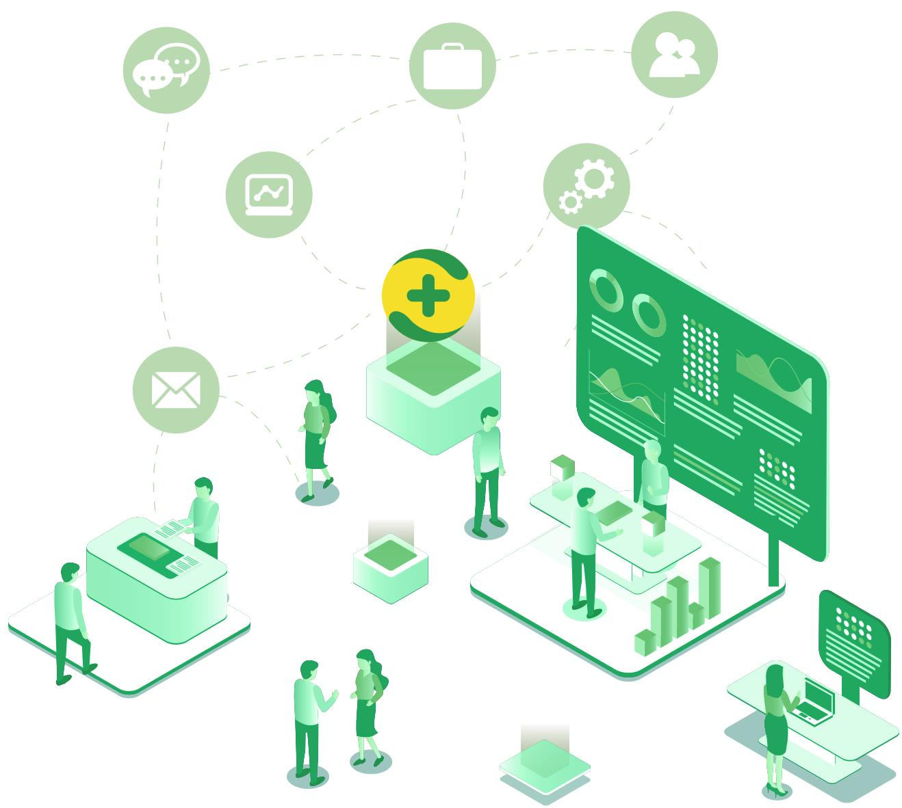

flowchart

```mermaid
graph TD
  A["Data Source Icon"] --> B["Digital Display Icon"]
  C["Email Icon"] --> D["Digital Display Icon"]
  E["Business Icon"] --> F["Digital Display Icon"]
  G["Business Icon"] --> H["Digital Display Icon"]
  I["Business Icon"] --> J["Digital Display Icon"]
  K["Business Icon"] --> L["Digital Display Icon"]
  M["Business Icon"] --> N["Digital Display Icon"]
  O["Business Icon"] --> P["Digital Display Icon"]
  Q["Business Icon"] --> R["Digital Display Icon"]
  S["Business Icon"] --> T["Digital Display Icon"]
  U["Business Icon"] --> V["Digital Display Icon"]
  W["Business Icon"] --> X["Digital Display Icon"]
  Y["Business Icon"] --> Z["Digital Display Icon"]
  AA["Business Icon"] --> AB["Digital Display Icon"]
  AC["Business Icon"] --> AD["Digital Display Icon"]
  AE["Business Icon"] --> AF["Digital Display Icon"]
  AG["Business Icon"] --> AH["Digital Display Icon"]
  AI["Business Icon"] --> AJ["Digital Display Icon"]
  AK["Business Icon"] --> AL["Digital Display Icon"]
  AM["Business Icon"] --> AN["Digital Display Icon"]
  AO["Business Icon"] --> AP["Digital Display Icon"]
  AQ["Business Icon"] --> AR["Digital Display Icon"]
  AS["Business Icon"] --> AT["Digital Display Icon"]
  AU["Business Icon"] --> AV["Digital Display Icon"]
  AW["Business Icon"] --> AX["Digital Display Icon"]
  A --> Y
  B --> Y
  C --> Y
  D --> Y
  E --> Y
  F --> Y
  G --> Y
  H --> Y
  I --> Y
  J --> Y
  K --> Y
  L --> Y
  M --> Y
  N --> Y
  O --> Y
  P --> Y
  Q --> Y
  R --> Y
  S --> Y
  T --> Y
  U --> Y
  V --> Y
  W --> Y
  X --> Y
  Y --> AA
  Z --> AA
  AA --> AB
  AB --> AC
  AC --> AD
  AD --> AE
  AD --> AF
  AE --> AG
  AG --> AH
  AH --> AI
  AI --> AJ
  AJ --> AK
  AK --> AL
  AL --> AM
  AM --> AN
  AN --> AO
  AO --> AP
  AP --> AQ
  AQ --> AR
  AR --> AS
  AS --> AT
  AT --> AU
  AU --> AV
  AV --> AW
  AW --> AX
  AX --> AZ
  AZ --> BA
  BA --> BC
  BC --> BD
  BD --> BE
  BE --> BF
  BF --> BG
  BG --> BH
  BH --> BI
  BI --> BJ
  BJ --> BK
  BK --> BL
  BL --> BM
  BM --> BN
  BN --> BO
  BO --> BP
  BP --> BR
  BR --> BT
  BT --> BU
  BU --> BV
  BV --> BW
  BW --> BX
  BX --> BY
  BY --> BB
  BB --> BC
  BC --> BD
  BD --> BE
  BE --> BF
  BF --> BG
  BG --> BH
  BH --> BI
  BI --> BJ
  BJ --> BK
  BK --> BL
  BL --> BM
  BM --> BN
  BN --> BO
  BO --> BP
  BP --> BR
  BR --> BS
  BS --> BT
  BT --> BU
  BU --> BV
  BV --> BW
  BW --> BX
  BX --> BTB
  BTB --> BUB
  BUB --> BWB
  BWB --> BXB
  BXB --> BYB
  BYB --> BUBbBbBbBbBbBbBbBbBbBbBbBbBbBbBbBbBbBbBbBbBbBbBbBbBbBbBbBbBbBbBbBbBbBbBbBbBbBbBbBbBbBbBbBbBbBbBbBbBbBbBbbBbbBbbBbbBbbBbbBbbBbbBbbBbbBbbBbbBbbBbbBbbBbbBbbBbbBbbBbbBbbBbbBbbBbbBbbBbbBbbBbbBbbBbbBbbBbbBbbBbbBbbBbbBbbBbbBbbBbbBbbBbbBbbBbbBbbBbbBbbBbbBbbBbbBbbBuBbbBuBuBuBuBuBuBuBuBuBuBuBuBuBuBuBuBuBuBuBuBuBuBuBuBuBuBuBuBuBuBuBuBuBuBuBuBuBuBuBuBuBuBuBuBuBuBuBuBuBuBuBuBuBuBuBuBuBuBuBuBuBuBuBuBuBuBuBuBuBuBuBuBuBuBuBuBuBuBuBuBuBuBuBuBuBuBuBuBuBuBuBuBuBuBuBuBuBuBuBuBoBoBoBoBoBoBoBoBoBoBoBoBoBoBoBoBoBoBoBoBoBoBoBoBoBoBoBoBoBoBoBoBoBoBoBoBoBoBoBoBoBoBoBoBoBoBoBoBoBoBoBoBoBoBoBoBoBoBoBoBoBoBoBoBoBoBoBoBoBoBoBoBoBoBoBoBoBoBoBoBoBoBoBoBoBoBoBoBoBoBoBoBoBoBoBoBoBoBoBoNoNoNoNoNoNoNoNoNoNoNoNoNoNoNoNoNoNoNoNoNoNoNoNoNoNoNoNoNoNoNoNoNoNoNoNoNoNoNoNoNoNoNoNoNoNoNoNoNoNoNoNoNoNoNoNoNoNoNoNoNoNoNoNoNoNoNoNoNoNoNoNoNoNoNoNoNoNoNoNoNoNoNoNoNoNoNoNoNoNoNoNoNoNoNoNoNoNoNoNoDoNotDoNotDoNotDoNotDoNotDoNotDoDoNotDoDoDoNotDoDoDoDoDoDoDoDoDoDoDoDoDoDoDoDoDoDoDoDoDoDoDoDoDoDoDoDoDoDoDoDoDoDoDoDoDoDoDoDoDoDoDoDoDoDoDoDoDoDoDoDoDoDoDoDoDoDoDoDoDoDoDoDoDoDoDoDoDoDoDoDoDoDoDoDoDoDoDoDoDoDoDoDoDoDoDoDoDoDoDoDoDoDoDoDoDoDoDoDoDoNotDoNotDoNotDoNotDoNotDoNotDoNotDoNotDoNotDoNotDoNotDoNotDoNotDoNotDoNotDoNotDoNotDoNotDoNotDoNotDoNotDoNotDoNotDoNotDoNotDoNotDoNotDoNotDoNotDoNotDoNotDoNotDoNotDoNotDoNotDoNotDoNotDoNotDoNotDoNotDoNotDoNotDoNotDoNotDoNotDoNotDoNotDoNotDoNotDoNotDoNotDoNoDoNotDoNoDoNoDoNoDoNoDoNoDoNoDoNoDoNoDoNoDoNoDoNoDoNoDoNoDoNoDoNoDoNoDoNoDoNoDoNoDoNoDoNoDoNoDoNoDoNoDoNoDoNoDoNoDoNoDoNoDoNoDoNoDoNoDoNoDoNoDoNoDoNoDoNoDoNoDoNoDoNoDoNoDoNoDoNoDoNoDoNoDoNoDoNoDoNoDoNoDoNoDonodonodonodonodonodonodonodonodonodonodonodonodonodonodonodonodonodonodonodonodonodonodonodonodonodonodonodonodonodonodonodonodonodonodonodonodonodonodonodonodonodonodonodonodonodonodonodonodonodonodonodobNl["BUBbBbBbBbBbBbBbBbBbBbBbBbBbBbBbBbBbBbBbBbBbBbBbBbBbBbBbBbBbBbBbBbBbBbBbBbBbBbBbBbBbBbBbBbBbBbBbBbBbBbBbb bbb bbb bbb bbb bbb bbb bbb bbb bbb bbb bbb bbb bbb bbb bbb bbb bbb bbb bbb bbb bbb bbb bbb bbb bbb bbb bbb bbb bbb bbb bbb bbb bbb bbb bbb bbb bbb bbb bbb bbb bbb bbb bbb bbb bbb bbb bbb bbb bbb bbb bu bbb bu bu bu bu bu bu bu bu bu bu bu bu bu bu bu bu bu bu bu bu bu bu bu bu bu bu bu bu bu bu bu bu bu bu bu bu bu bu bu bu bu bu bu bu bu bu bu bu bu bu bu bu bu bu bu bu bu bu bu bu bu bu bu bu bu bu bu bu bu bu bu bu bu bu bu bu bu bu bu bu bu bu bu bu bu bu bu bu bu bu bu bu bu bu bu bu bu bu bu bu bo bo bo bo bo bo bo bo bo bo bo bo bo bo bo bo bo bo bo bo bo bo bo bo bo bo bo bo bo bo bo bo bo bo bo bo bo bo bo bo bo bo bo bo bo bo bo bo bo bo bo bo bo bo bo bo bo bo bo bo bo bo bo bo bo bo bo bo bo bo bo bo bo bo bo bo bo bo bo bo bo bo bo bo bo bo bo bo bo bo bo bo bo bo bo bo bo bo bo bo no no no no no no no no no no no no no no no no no no no no no no no no no no no no no no no no no no no no no no no no no no no no no no no no no no no no no no no no no no no no no no no no no no no no no no no no no no no no no no no no no no no no no no no no no no no no no no no no no no no no do not do not do not do not do not do not do do not do do do not do do do do do do do do do do do do do do do do do do do do do do do do do do do do do do do do do do do do do do do do do do do do do do do do do do do do do do do do do do do do do do do do do do do do do do do do do do do do do do do do do do do do do do do do do do do do do do do do do do do do Do not Do Not Do Not Do Not Do Not Do Not Do Not Do Not Do Not Do Not Do Not Do Not Do Not Do Not Do Not Do Not Do Not Do Not Do Not Do Not Do Not Do Not Do Not Do Not Do Not Do Not Do Not Do Not Do Not Do Not Do Not Do Not Do Not Do Not Do Not Do Not Do Not Do Not Do Not Do Not Do Not Do Not Do Not Do Not Do Not Do Not Do Not Do Not Do Not Do Not Do Not Do No Do Not Do No Do No Do No Do No Do No Do No Do No Do No Do No Do No Do No Do No Do No Do No Do No Do No Do No Do No Do No Do No Do No Do No Do No Do No Do No Do No Do No Do No Do No Do No Do No Do No Do No Do No Do No Do No Do No Do No Do No Do No Do No Do No Do No Do No Do No Do No Do No Do No Do No Do No DoNoDoNoDoNoDoNoDoNoDoNoDoNoDoNoDoNoDoNoDoNoDoNoDoNoDoNoDoNoDoNoDoNoDoNoDoNoDoNoDoNoDoNoDoNoDoNoDoNoDoNoDoNoDoNoDoNoDoNoDoNoDoNoDoNoDoNoDoNoDoNoDoNoDoNoDoNoDoNoDoNoDoNoDoNoDoNoDoNoDoNoDoNoDoNoDoNoDoNoDoNoDob<nl>"]
```

## 董事长致辞

## ——坚定践行“AI+安全”双主线战略，助力智能经济发展

natural_image

Portrait of a man wearing glasses, a gray blazer, and a beige pants shirt against a green background (no text or symbols visible)

2026年《政府工作报告》中多次提到“智能”和“安全”，较去年大幅提升。《政府工作报告》首次提出“智能经济新形态”概念，结合深化拓展“人工智能+”，明确要求“促进新一代智能终端和智能体加快推广”“培育智能原生新业态新模式”，并在“能源”“算力”“数据”等方面进行了综合部署。这表明“智能”与“安全”都在加速向各行业、各领域渗透。当前，我国人工智能产业正逐步形成“电力一算力一智力一人力一安全力一生产力”协同推进的“六力模型”，为“人工智能+”行动落地夯实基础。国家的战略部署、行业的发展趋势，对360而言，是“新考卷”，更是“新蓝图”。360持续践行“上山下海助小微”理念，依托“AI+安全”双轮驱动，用安全守护时代，用AI定义未来，为建设智能经济和培育新质生产力贡献企业力量。

360集团创始人：周鸿祎

360周的纬

公司立足互联网、数字安全、智能硬件三大主业，以技术创新与场景落地为抓手，通过“360智脑”，将大模型服务全面覆盖一级部门及业务前线，并在浏览器、搜索、纳米AI、办公、文库、智能硬件、数字安全等场景实现应用，助力整体业务增长。报告期内，公司实现营业收入86.93亿元，同比增长9.37%；归属于上市公司股东的净利润2.63亿元，同比增加13.57亿元。公司同时保持高研发投入，研发费用32.25亿元，占营业收入比例37.11%。

360秉持“让AI世界更安全更美好”的企业使命，将ESG理念深度融入战略与运营，以技术创新驱动可持续发展。作为领先的AI数字安全企业，我们始终以用户价值为核心，以合规经营为基石，在守护数字安全的同时，积极履行社会责任。

## 环境责任：技术驱动绿色发展

我们积极响应国家“双碳”战略，通过布局绿色算力、建设智慧能碳管理系统等举措，降低温室气体排放。

## 社会责任：以安全守护数字生态

我们长期深耕国家级网络安全防御，凭借二十年攻防实战积累与领先的安全威胁感知能力，持续为国家筑牢数字安全屏障。截至报告期末，公司累计发现了APT组织数量达60个，占国内所有发现APT总数的98%，其中包括美国中央情报局（CIA）、美国国家安全局（NSA）等美国国家级黑客组织，揭示其对我国关键基础设施、科研单位、政府机构长达十余年的网络潜伏渗透和攻击行为。

我们构建了覆盖“攻击前-攻击中-攻击后”全生命周期的勒索防护体系。2025年，公司拦截网络暴力破解攻击11.6亿次，守护超200万台设备；捕获勒索事件线索5,565起，覆盖全球48个国家/地区。同时，公司打造了“漏洞-补丁-组件”一体化情报体系，2025年响应漏洞查询超280万次，推送精准预警近1.2万次，推动修复效率提升40%，有力保障超3,500万终端与业务系统安全。

## 公司治理：合规引领长效发展

我们强化公司治理体系，制定权力制衡和决策执行的高效机制，完善内部控制、风险管理体系建设，筑牢反舞弊防线，以高水平治理护航高质量发展。

未来，360将坚定推进“2030碳达峰、2060碳中和”目标，深化AI技术在安全防护与绿色转型中的应用，携手产业链伙伴共建安全数字生态。

## 目录

<table><tr><td>报告编制说明</td><td>01</td><td>报告范围</td><td>01</td></tr><tr><td>报告简介</td><td>01</td><td>数据说明</td><td>02</td></tr><tr><td>编制依据</td><td>01</td><td>发布形式</td><td>02</td></tr><tr><td>时间范围</td><td>01</td><td>董事长致辞</td><td>03</td></tr></table>

## 01 走进360

公司简介 09

企业文化 09

公司业务介绍 09

年度荣誉 15

## 02 议题重要性评估

尽职调查、利益相关方沟通 19

双重重要性分析 20

议题重要性分析结论 20

## 03 公司ESG治理安排

可持续发展治理架构 23

可持续发展管理机制 24

ESG能力提升 24

## 04 环境篇

应对气候变化 27

环境合规管理 35

污染物及废弃物管理 35

能源利用 37

水资源利用 38

循环经济 39

生态系统和生物多样性保护 40

## 05 社会篇

员工 43

产品和服务安全与质量 53

数据安全与客户隐私保护 61

创新驱动 68

科技伦理 79

合作共赢 80

乡村振兴 84

社会贡献 85

## 关键绩效表 99

## 06 治理篇

公司治理机制 89

薪酬管理 94

党建引领 94

反商业贿赂及反贪污 96

反不正当竞争 98

## 索引表 101

natural_image

Abstract green hexagonal network pattern with no text or symbols

## 01

## 走进360

公司简介

企业文化

公司业务介绍

年度荣誉

natural_image

Illustration of digital technology nodes and business professionals interacting with a central screen (no text or symbols)

## 公司简介

三六零安全科技股份有限公司(以下简称“三六零”“集团”“360”“公司”)是数字安全的领导者，秉持“上山下海助小微”企业使命，确立AI和安全发展双主线。公司立足互联网、数字安全、智能硬件三大主业，以技术创新与场景落地为抓手，通过“360智脑”，将大模型服务全面覆盖一级部门及业务前线，并在浏览器、搜索、纳米AI、办公、文库、智能硬件、数字安全等场景实现应用，助力整体业务增长。

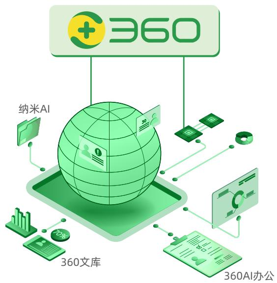

flowchart

This diagram illustrates the architecture of 360 AI, showing its interaction with a globe and various functional modules including documents, interfaces, and office services.

企业文化  
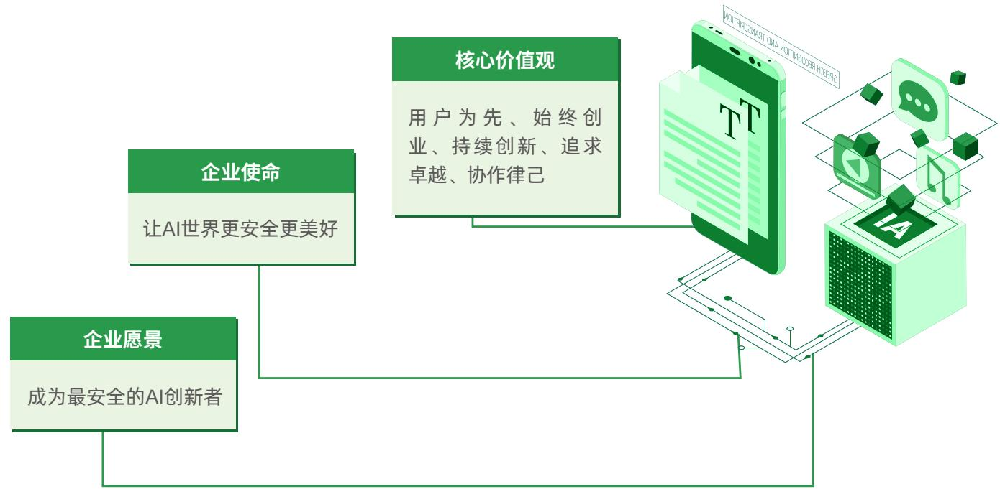

flowchart

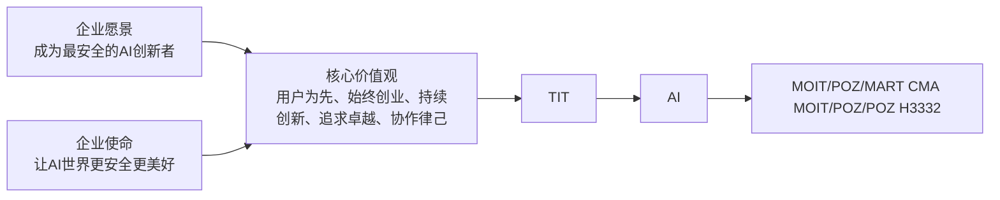
```mermaid
graph LR
  A["企业愿景\n成为最安全的AI创新者"] --> B["核心价值观\n用户为先、始终创业、持续创新、追求卓越、协作律己"]
  C["企业使命\n让AI世界更安全更美好"] --> B
  B --> D["TIT"]
  D --> E["AI"]
  E --> F["MOIT/POZ/MART CMA MOIT/POZ/POZ H3332"]
```

## 公司业务介绍

公司紧跟国家战略发展需求，持续践行“AI+安全”双主线战略，秉持“让AI世界更安全更美好”的使命，深度推进“ALL IN AGENT”布局，以技术创新为核心驱动，依托长期积淀的技术优势、用户资源与生态协同能力，围绕主业开展稳健经营，持续推动各项业务数智化转型与升级，着力提升核心竞争力，积极助力智能经济发展与新质生产力建设。报告期内，公司主营业务聚焦互联网、数字安全及智能硬件三大核心业务板块。

## 互联网业务

公司互联网业务依托360系列PC端及移动端产品矩阵构建高效流量入口，以自研AI大模型为技术驱动，已形成以互联网广告及服务为核心的商业化业务、以场景化产品与AI应用为支撑的互联网产品业务，以及以端游、页游、手游运营为特色的游戏增值业务三大方向。业务高效连接B端客户与C端用户，通过智能营销升级、会员订阅服务及综合游戏运营等多元模式，持续深化流量价值挖掘与全链路商业化增值，构建起结构清晰、多元协同的互联网业务体系。

公司商业化业务主要依托“360浏览器”“360搜索”“360安全卫士”“360软件管家”和“纳米AI”等360全线PC端及移动端产品为流量入口，通过互联网广告及服务实现流量价值的商业化转化。同时，公司依托自研“360智脑”大模型、“360CV大模型”，全面推动智慧商业体系的智能化升级，围绕广告创意生成、用户洞察、意图识别、内容适配及转化链路优化等环节，重构PC端广告全链路，打造AI驱动的全链路智能营销新范式。

商业化业务  
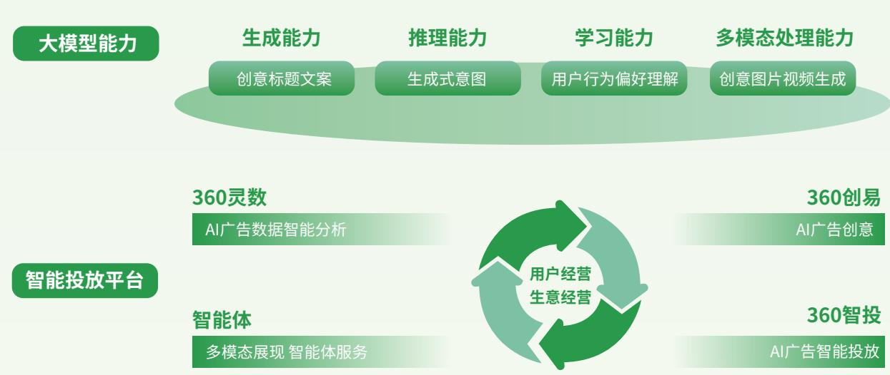

flowchart

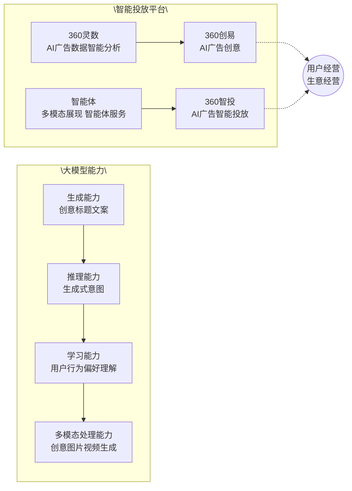
```mermaid
graph LR
  subgraph sg["\"大模型能力\""]
  A["生成能力\n创意标题文案"] --> B["推理能力\n生成式意图"]
  B --> C["学习能力\n用户行为偏好理解"]
  C --> D["多模态处理能力\n创意图片视频生成"]
  end

  subgraph sg_2["\"智能投放平台\""]
  E["360灵数\nAI广告数据智能分析"] --> F["360创易\nAI广告创意"]
  G["智能体\n多模态展现 智能体服务"] --> H["360智投\nAI广告智能投放"]
  end

  F -.-> I(("用户经营\n生意经营"))
  H -.-> I
```

360AI营销示意  
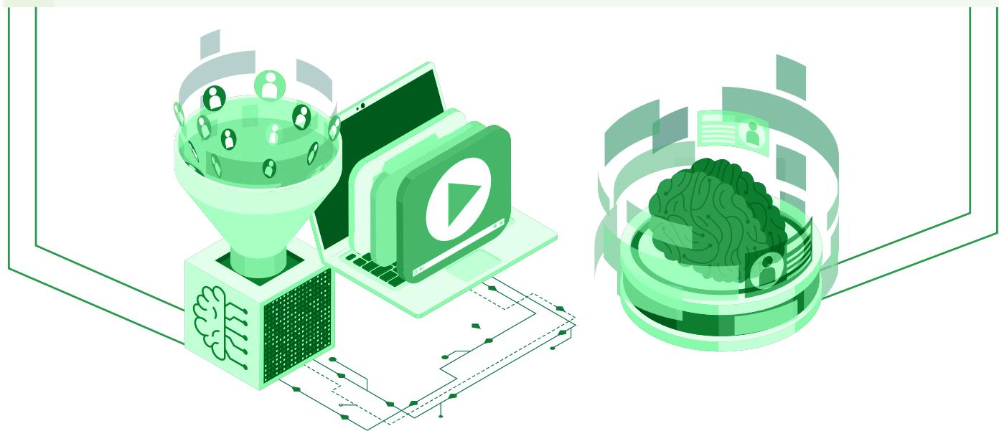

natural_image

Illustration of digital technologies including a brain, computer, and brain icon (no text or symbols)

公司互联网产品服务立足现有核心产品的基础功能，深度贴合用户在办公协同、日常使用、数字生活等高频场景下的多元化需求，积极融合AI技术创新应用，推出面向高频场景的增值服务，形成会员制订阅收入。目前，公司已形成丰富多元的产品生态矩阵，主要包括360文库、360AI办公、纳米AI、纳米漫剧流水线、360安全龙虾等多款特色产品与服务，覆盖知识获取、智能办公、内容创作、智能助手等多个领域，不断提升用户体验与产品粘性。

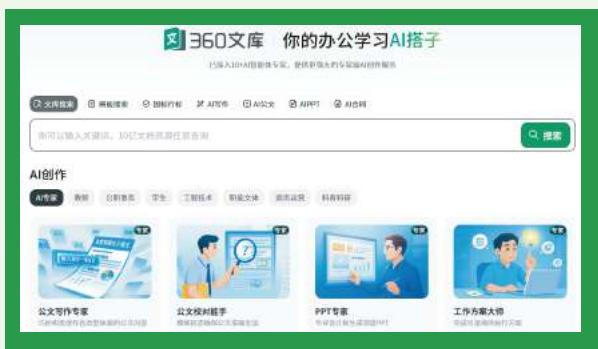

text_image

360文库 你的办公学习AI搭子
已接入10FA图像体专家，提供强大的专家级AI创作报告
文件搜索 网站搜索 创新归档 APP写作 AI公文 APP1 APP网
你可输入关键词，10亿文档来源任意查询 搜索
AI创作
AI专家 教师 记事者 安全 工程技术 联系交流 原质系统 科密链接
公文写作专家 公文校对助手 PPT专家 工作方联大师
云和云软件在云资源的云支持层 智能云资源和云资源安全 PPT专家 专业设计与成果应用 PPT 工作方联大师

360文库界面

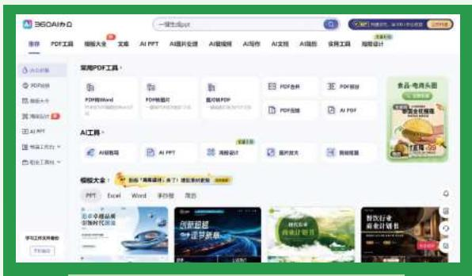

text_image

BSOAI协Q
一维生成ppt
推荐 PDF工具
框架PDF工具
PDF程序Word
PDF编辑器
图片/视频
PDF资料
PDF文档
食品-电商头图
AI工具
AI报告
AI PPT
高级设计
图片放大
高级设置
根据大会：
您想“高级课程，来了？请重新对更新！”
PPT
Excel
Word
新书库
新发行者
新业务计划书

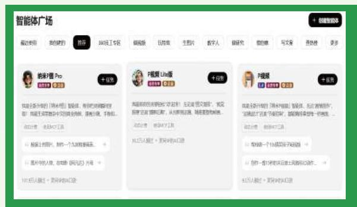

text_image

智能体广场
+ 创建智能体
最近访问  奇信建的  联荐  3D竣工专区  编辑版  汉报数  生册页  教学人  研究  概要编  写文章  费情费  更多
搜索IP Pro
P视频 Lite版
千视频
我是全球开放的《网络》链接，将您对网络进行搜索。例如：根据全球营销中心网站的用户信息，选择品牌、价格、渠道等。
点击广告  收藏文件
单击“100”工具
点击“100”工具，制作一个九项独家商品。
图片中的人物，在电影《风记》光临
111.5万人通过 “互联网9632亿
千视频
我是全球开放的《网络》链接，将您对网络进行搜索。例如：根据全球营销中心网站的用户信息，选择品牌、价格、渠道等。点击广告  收藏文件
单击“100”工具，制作一个九项独家商品。
图片中的人物，在电影《风记》光临
111.5万人通过 “互联网9632亿
千视频
我是全球开放的《网络》链接，将您对网络进行搜索。例如：根据全球营销中心网站的用户信息，选择品牌、价格、渠道等。点击广告  收藏文件
单击“100”工具，制作一个九种独家商品。
图片中的人物，在电影《风记》光临
111.5万人通过 “互联网9632亿
千视频

纳米AI界面

text_image

情来漫反射水线
全部设置
故事剧本
电影热映教程
介绍剧本
介绍动画
启动幻灯片
剪辑效果
三倍速出片，电影级质感
我要创作 →

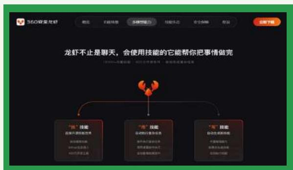

flowchart

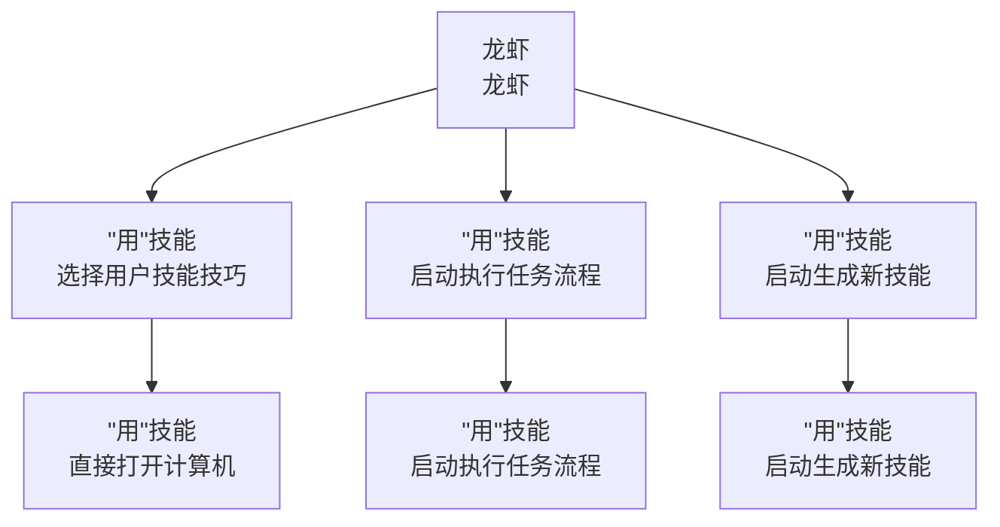
```mermaid
graph TD
  A["龙虾\n龙虾"] --> B["&quot;用&quot;技能\n选择用户技能技巧"]
  A --> C["&quot;用&quot;技能\n启动执行任务流程"]
  A --> D["&quot;用&quot;技能\n启动生成新技能"]

  B --> E["&quot;用&quot;技能\n直接打开计算机"]
  C --> F["&quot;用&quot;技能\n启动执行任务流程"]
  D --> G["&quot;用&quot;技能\n启动生成新技能"]
```

公司游戏增值服务主要涵盖端游运营、页游与手游独家代理及联合运营平台等核心业务。其中，端游板块重点代理运营由Wargaming研发的《坦克世界》《战舰世界》中国区业务，凭借优质产品口碑与精细化运营能力积累了大量忠实用户。公司目前在运营近千款游戏产品，可以为用户提供游戏下载、内容资讯、互动评价等一站式综合服务，持续提升用户体验。

##

natural_image

Misty mountain landscape with multiple military tanks on a rocky peak, no visible text or symbols

《坦克世界》画面

## 数字安全业务

公司长期深耕国家级网络安全防御，凭借二十年攻防实战积累与全球领先的安全威胁感知能力，持续为国家筑牢数字安全屏障。公司依托20年攻防实战经验，拥有国内领先的安全威胁情报数据、15亿终端用户告警数据和超3EB级别样本库。基于国家对“看见”高级威胁的战略需求，公司探索形成以“看见”为核心的中国数字安全解决方案。当前，公司广泛服务于政府机构、大型企业、关键基础设施单位与中小企业，为其提供全方位网络安全服务。公司主要安全服务和产品包括境外APT捕获、360安全云、360安全大模型、360大模型卫士和360安全智能体蜂群等。

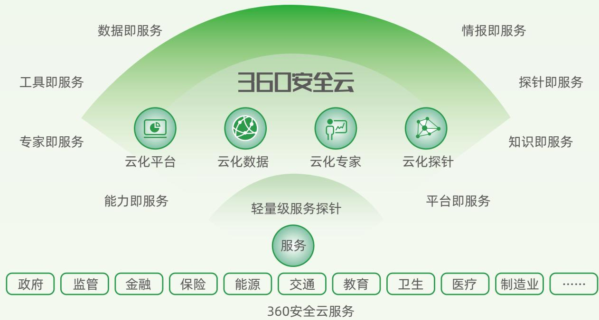

flowchart

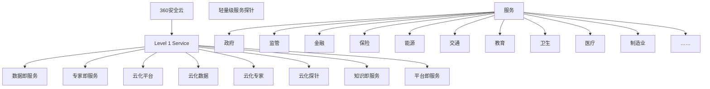
```mermaid
graph TD
  Center["360安全云"] --> Level1["Level 1 Service"]
  Level1 --> Tech["数据即服务"]
  Level1 --> Expert["专家即服务"]
  Level1 --> CloudPlatform["云化平台"]
  Level1 --> CloudData["云化数据"]
  Level1 --> CloudExpert["云化专家"]
  Level1 --> CloudProbe["云化探针"]
  Level1 --> Knowledge["知识即服务"]
  Level1 --> Platform["平台即服务"]
  
  subLevel1_1["轻量级服务探针"]
  subLevel1_2["服务"]
  subLevel1_2 --> Gov["政府"]
  subLevel1_2 --> Supervision["监管"]
  subLevel1_2 --> Finance["金融"]
  subLevel1_2 --> Insurance["保险"]
  subLevel1_2 --> Energy["能源"]
  subLevel1_2 --> Traffic["交通"]
  subLevel1_2 --> Education["教育"]
  subLevel1_2 --> Health["卫生"]
  subLevel1_2 --> Medical["医疗"]
  subLevel1_2 --> Manufacturing["制造业"]
  subLevel1_2 --> Industry["……"]
```

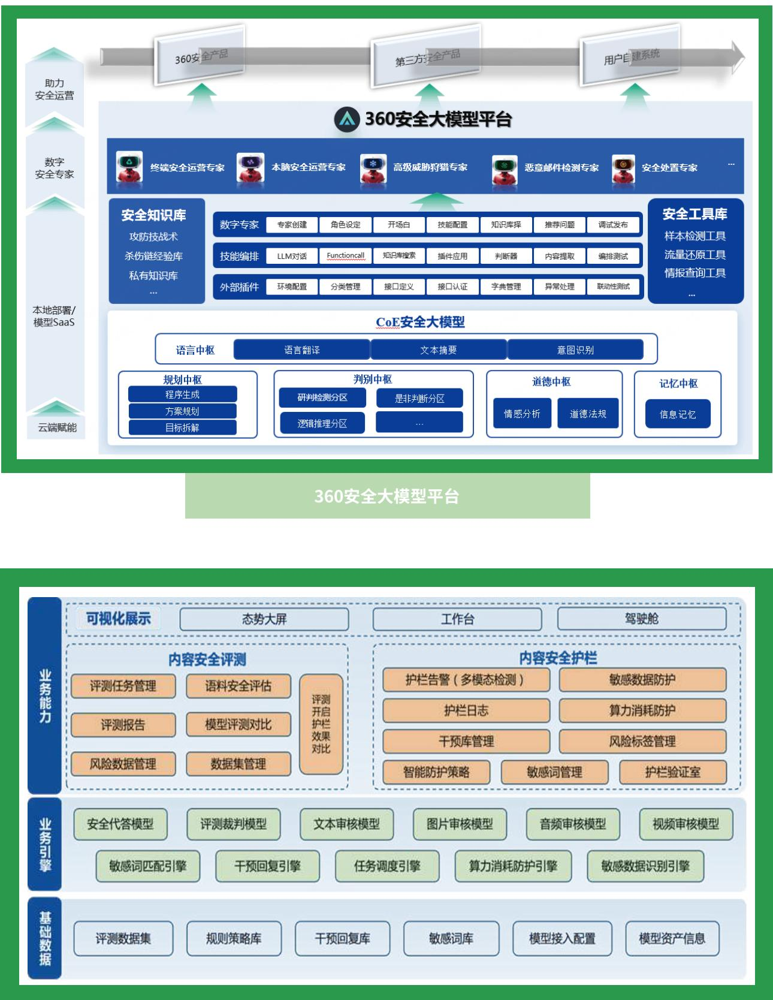

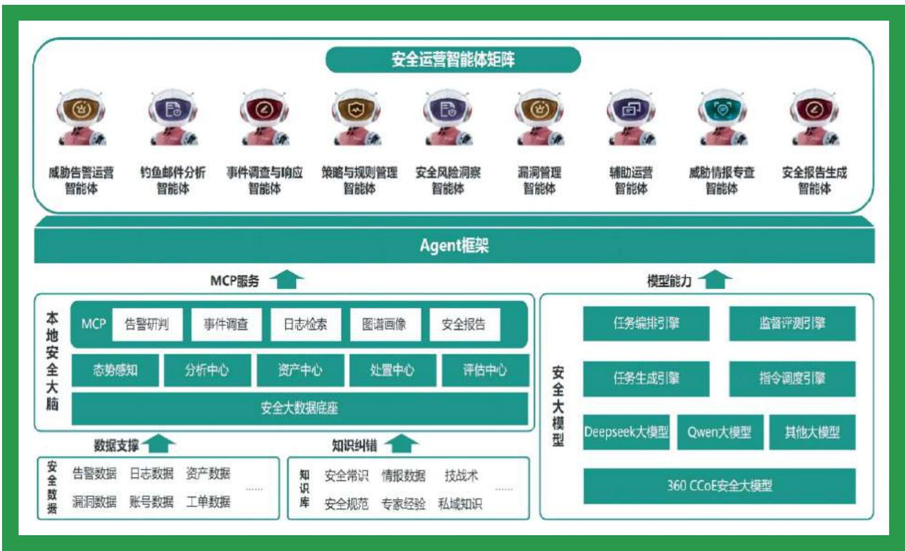

flowchart

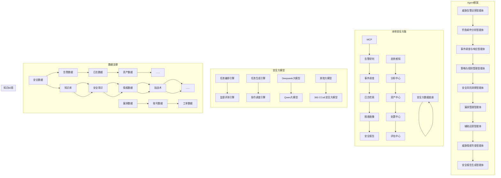
```mermaid
graph TD
  subgraph Agent["Agent框架"]
    direction TB
  A["威胁告警运营智能体"] --> B["钓鱼邮件分析智能体"]
  B --> C["事件调查与响应智能体"]
  C --> D["策略与规则管理智能体"]
  D --> E["安全风险洞察智能体"]
  E --> F["漏洞管理智能体"]
  F --> G["辅助运营智能体"]
  G --> H["威胁情报专查智能体"]
  H --> I["安全报告生成智能体"]
  end

  subgraph Local["本地安全大脑"]
    direction TB
  J["MCP"] --> K["告警研判"]
  K --> L["事件调查"]
  L --> M["日志检索"]
  M --> N["图谱画像"]
  N --> O["安全报告"]
  P["态势感知"] --> Q["分析中心"]
  Q --> R["资产中心"]
  R --> S["处置中心"]
  S --> T["评估中心"]
  U["安全大数据底座"] --> U
  end

  subgraph Model["安全大模型"]
    direction TB
  V["任务编排引擎"] --> W["监督评测引擎"]
  X["任务生成引擎"] --> Y["指令调度引擎"]
  Z["Deepseek大模型"] --> AA["Qwen大模型"]
  AB["其他大模型"] --> AC["360 CCoE安全大模型"]
  end

  subgraph Data["数据支撑"]
  AD["安全数据"] --> AE["告警数据"]
  AE --> AF["日志数据"]
  AF --> AG["资产数据"]
  AG --> AH["......"]
  AI["知识库"] --> AJ["安全常识"]
  AJ --> AK["情报数据"]
  AK --> AL["技战术"]
  AL --> AM["......"]
  AN["漏洞数据"] --> AO["账号数据"]
  AO --> AP["工单数据"]
  end

  subgraph Knowledge["知识纠错"]
  AD --> AI
  AI --> AJ
  AJ --> AK
  AK --> AL
  AL --> AM
  end
```

360安全运营智能体

## 智能硬件业务

公司秉持“安全智见”品牌理念，依托深厚技术积淀，构建了以智能摄像机、可视门铃及行车记录仪等为主的智能硬件业务版图，覆盖家庭安防、智能看护、车载安全等多元应用场景。当前，公司一方面致力于由硬件销售向硬件加云服务销售业务模式转型，以硬件销售作为用户增长的基础，以云业务等增值服务作为业务增长的新动能；另一方面，持续深耕技术研发，全面提升产品线AI智能化水平，提升产品核心竞争力。

natural_image

Modern car dashboard with camera and driver, featuring a 360+ ID card and a video player interface (no visible text or symbols on the device itself)

360行车记录仪“G980”

## 年度荣誉

<table><tr><td colspan="4">2025年民营企业科技创新和产业创新典型案例名单</td></tr><tr><td>序号</td><td>案例定位</td><td>案例主题</td><td>案例简介</td></tr><tr><td>1</td><td>晨星半导体设备(上海)股份有限公司</td><td>集成电路半导体设计及产业化孵化创新</td><td>上海化工玻璃</td></tr><tr><td>2</td><td>航天卫星技术股份有限公司</td><td>以科技领先动力电池为原料提供生产力赋能</td><td>吉林化工玻璃</td></tr><tr><td>3</td><td>中航科技发展(福建)有限公司</td><td>以科技领先动力电池为原料的创新拓展</td><td>福建产业投资建设工商规</td></tr><tr><td>4</td><td>河北黄河环保科技股份有限公司</td><td>生态型高压LED应用</td><td>安徽环保装备企业服务</td></tr><tr><td>5</td><td>深圳市现代资产运营股份有限公司</td><td>电力转换应用,打造数字化企业</td><td>山东化工玻璃</td></tr><tr><td>6</td><td>深圳市新创新材料科技有限公司</td><td>以智能化技术为主,通过多级融合,助力科技化工</td><td>贵州化工玻璃</td></tr><tr><td>7</td><td>西安安科控股集团股份有限公司</td><td>实验室测量系统、自动化控制与维护研发关键技术应用</td><td>全国工业网网协同智慧企业会员会</td></tr><tr><td>8</td><td>北京龙源东成精密材料股份有限公司</td><td>突破“卡特”团队,聚焦自主可控</td><td>全国工业网网协同智造企业会员会</td></tr><tr><td>9</td><td>河北蓝星光电科技有限公司</td><td>光通信数据解决方案</td><td>河北化工玻璃</td></tr><tr><td>10</td><td>山西凯迪生物科技股份有限公司</td><td>AI驱动生物全场景人量化和智能自控软件架构</td><td>山西化工玻璃</td></tr><tr><td>11</td><td>广东东环集团有限公司</td><td>以科技股份为驱动,打造自动化生产客户产品功能</td><td>全年安全生产业务</td></tr><tr><td>12</td><td>广西东畅物业管理有限公司</td><td>从具体制造到“三品一精制”广西东畅集团经营管理平台投产之用</td><td>广西北农房地产工商房</td></tr><tr><td>13</td><td>云南都丰茂海开源科技股份有限公司</td><td>产业整合解决方案</td><td>云南化工玻璃</td></tr><tr><td>14</td><td>青海天富药业生物科技有限公司</td><td>高端特色农业全产业链特色龙头企业</td><td>青海化工玻璃</td></tr><tr><td>15</td><td>哈尔滨润达咖啡集团有限公司</td><td>推动科技型企业深度融合融合发展</td><td>黑龙江化工工程</td></tr><tr><td>16</td><td>福建宝泉集团有限公司</td><td>新型文化教育推广GAP,数字化转型新模式建设</td><td>福建化工玻璃</td></tr><tr><td>17</td><td>北京世通科技有限公司</td><td>项目引领技术-260集团和KAE级整体原型体</td><td>北京化工玻璃</td></tr><tr><td>18</td><td>安徽宏科新材料科技股份有限公司</td><td>以新能源技术研发为基础推进自主生产力</td><td>安徽化工玻璃</td></tr><tr><td>19</td><td>卫华食品有限公司</td><td>以数字化基础材料及应用平台集成研发膜等核心技术产品</td><td>河南化工玻璃</td></tr><tr><td>20</td><td>海斯门市新科有限公司</td><td>保海能源管理服务及绿色能源研发优化升级</td><td>海南化工玻璃</td></tr><tr><td>21</td><td>一工机器人国际有限公司</td><td>由离子真菌智能制造高清晰的高性能铝基能及新产品产品</td><td>宁夏国投综合加工模块</td></tr></table>

纳米AI荣获全国工商联评选的“2025民营企业科技创新和产业创新典型案例”

<table><tr><td>序号</td><td>议案内容</td><td>表决事项</td><td>表决意见</td></tr><tr><td>1</td><td>《关于公司符合非公开发行A股股票条件的议案》</td><td>同意公司2017年度董事会工作报告</td><td>通过,赞成3票,反对0票,弃权0票,回避0票</td></tr><tr><td>2</td><td>《关于公司非公开发行A股股票方案的议案》</td><td>同意公司2017年度监事会工作报告</td><td>通过,赞成3票,反对0票,弃权0票,回避0票</td></tr><tr><td>3</td><td>《关于公司非公开发行A股股票募集资金使用可行性分析报告的议案》</td><td>同意公司2017年度财务决算报告</td><td>通过,赞成3票,反对0票,弃权0票,回避0票</td></tr><tr><td>4</td><td>《关于公司非公开发行A股股票摊薄即期回报及填补措施的议案》</td><td>同意公司2017年度利润分配预案</td><td>通过,赞成3票,反对0票,弃权0票,回避0票</td></tr><tr><td>5</td><td>《关于公司非公开发行A股股票涉及关联交易的议案》</td><td>同意公司2017年度向特定对象发行A股股票的议案</td><td>通过,赞成3票,反对0票,弃权0票,回避0票</td></tr><tr><td>6</td><td>《关于公司与关联方签署附生效条件的股份认购协议的议案》</td><td>同意公司2017年度非公开发行A股股票涉及关联交易的议案</td><td>通过,赞成3票,反对0票,弃权0票,回避0票</td></tr><tr><td>7</td><td>《关于公司与关联方签署附生效条件的股份认购协议之补充协议的议案》</td><td>同意公司2017年度非公开发行A股股票涉及关联交易的议案</td><td>通过,赞成3票,反对0票,弃权0票,回避0票</td></tr><tr><td>8</td><td>《关于公司与关联方签署附生效条件的股份认购协议之补充协议的议案》</td><td>同意公司2017年度非公开发行A股股票涉及关联交易的议案</td><td>通过,赞成3票,反对0票,弃权0票,回避0票</td></tr><tr><td>9</td><td>《关于公司与关联方签署附生效条件的股份认购协议之补充协议的议案》</td><td>同意公司2017年度非公开发行A股股票涉及关联交易的议案</td><td>通过,赞成3票,反对0票,弃权0票,回避0票</td></tr><tr><td>10</td><td>《关于公司与关联方签署附生效条件的股份认购协议之补充协议的议案》</td><td>同意公司2017年度非公开发行A股股票涉及关联交易的议案</td><td>通过,赞成3票,反对0票,弃权0票,回避0票</td></tr><tr><td>11</td><td>《关于公司与关联方签署附生效条件的股份认购协议之补充协议的议案》</td><td>同意公司2017年度非公开发行A股股票涉及关联交易的议案</td><td>通过,赞成3票,反对0票,弃权0票,回避0票</td></tr></table>

“大规模网络安全态势智能监控系统关键技术与应用”项目，获得海南省科学技术进步一等奖

北京市首批“产教评”技能生态链主单位名单

<table><tr><td>序号</td><td>镇主单位名称</td><td>产业领域</td></tr><tr><td>1</td><td>北京上水博安科技有限公司</td><td>智能教育网</td></tr><tr><td>2</td><td>三六零数学安全科技集团有限公司</td><td>数智安全</td></tr><tr><td>3</td><td>红果文化幸福健康公益管理有限公司</td><td>快乐网络</td></tr><tr><td>4</td><td>北京青草园未来园企业园服务网络服务服务公司</td><td>三六网络</td></tr><tr><td>5</td><td>北京汇通国际商务服务有限公司</td><td>智慧服务网络</td></tr><tr><td>6</td><td>北京博睿博源商业服务有限公司</td><td>旅游娱乐</td></tr><tr><td>7</td><td>北京明源酒店生活部</td><td>旅游商城</td></tr><tr><td>8</td><td>北京圣润都</td><td>旅游娱乐</td></tr><tr><td>9</td><td>北京好乐家乐园商务网络有限公司</td><td>旅游娱乐</td></tr><tr><td>10</td><td>北京君豪国际展览馆业务服务网络</td><td>旅游娱乐</td></tr><tr><td>11</td><td>北京圣润美康园建(有限合伙)商业管理</td><td>旅游娱乐</td></tr><tr><td>12</td><td>北京圣润美康服务集团有限公司</td><td>旅游娱乐</td></tr><tr><td>13</td><td>北京圣润嘉源投资服务有限公司</td><td>旅游娱乐</td></tr><tr><td>14</td><td>北京中泰诚志互联商务服务有限公司</td><td>旅游娱乐</td></tr><tr><td>15</td><td>北京尚景(产)置业有限公司</td><td>住宅网</td></tr></table>

获评北京市数智安全“产教评”技能生态链链主企业

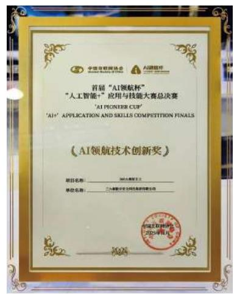

text_image

中国与联席协会
China University of China
首届“AI领航杯”
“人工智能+”应用与技能大赛总决赛
"AI PIONEER CUP"
"AI+" APPLICATION AND SKILLS COMPETITION FINALS
《AI领航技术创新奖》
项目名称：_______
单位名称：_______
中国与联席协会
2023年1月

360凭借大模型卫士斩获全国总决赛AI领航技术创新奖

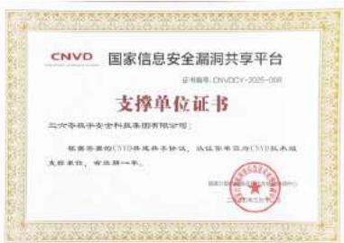

text_image

CNVO 国家信息安全漏洞共享平台
证书编号: CNVOCY-2025-008
支撑单位证书
二次网络安全安全科技集团有限公司:
根据国务院的CTD标准并举协议,认证单位为CTD技术级
支持单位,有效期一年。

获评“CNVD技术组支撑单位”“2024年CNVD协作特别贡献单位”“2024年漏洞信息报送突出贡献单位”“2024年漏洞应急工作突出贡献单位”“ANVA杰出工作单位（企业 ） ” “A N VA 成 员 单 位 ” 及“CCTGA优秀成员单位”称号

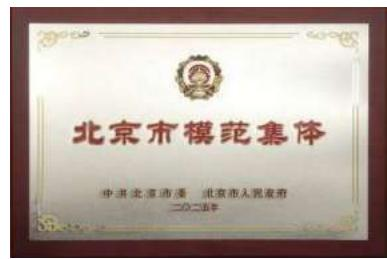

text_image

北京市模范集体
中津北海市演 北京市人民政府
二〇二五年

获“北京市模范集体”荣誉称号

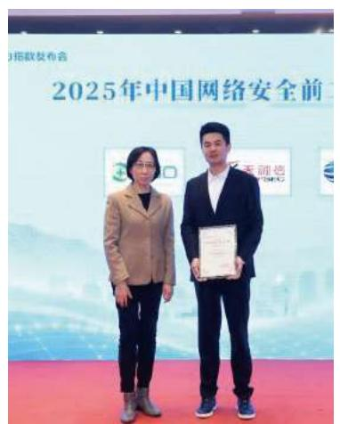

text_image

2025年中国网络安全前
指数发布会

入选“2025年中国网络安全前二十家企业”

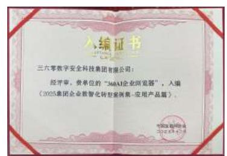

text_image

入编证书
三六零数字安全科技集团有限公司：
经评审，贵单位的“360A1企业浏览器”，入编
（2025集团企业数智化转型宝奖集+应用产品篇）。
中国证券报网
2025-04-17

360AI企业浏览器成功入选中国互联网协会发布的《2025集团企业数智化转型案例集》

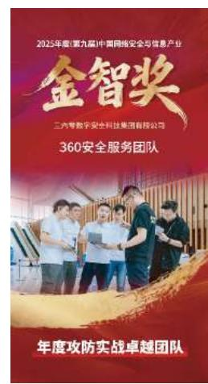

text_image

2025年度(第九届)中国网络安全与信息产业
金智奖
三汽数字安全科技集团有限公司
360安全服务团队
年度攻防实战卓越团队

360安全服务团队获“年度攻防实战卓越团队”

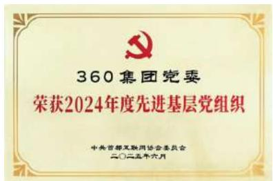

text_image

360集团党委
荣获2024年度先进基层党组织
中央首都互联网联合会委员会
二〇二五年六月

三六零集团党委获“先进基层党组织”荣誉

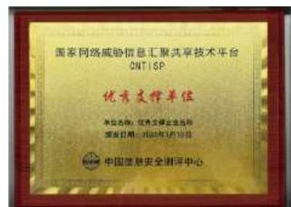

获CNTISP授予的“优秀支撑单位”称号

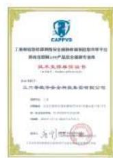

获评CAPPVD漏洞库“三星级技术支撑单位”（最高等级）称号荣获工业和信息化网络安全威胁和漏洞信息共享平台车联网产品安全漏洞专业库的“优秀技术支撑单位”“技术支撑单位”称号，并获得“原创漏洞证书”

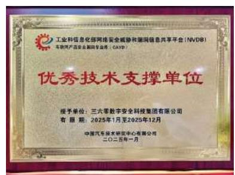

text_image

工业科信息化部网络安全威胁和漏洞信息共享平台（NVDB）
车联网产品安全强国专业版（CAVD）
优秀技术支撑单位
授予单位：三六零数字安全科技集团有限公司
有效期：2025年1月至2025年12月
中国汽车技术研究中心有限公司
二〇二五年一月

## 02

## 议题重要性评估

尽职调查、利益相关方沟通

双重重要性分析

议题重要性分析结论

flowchart

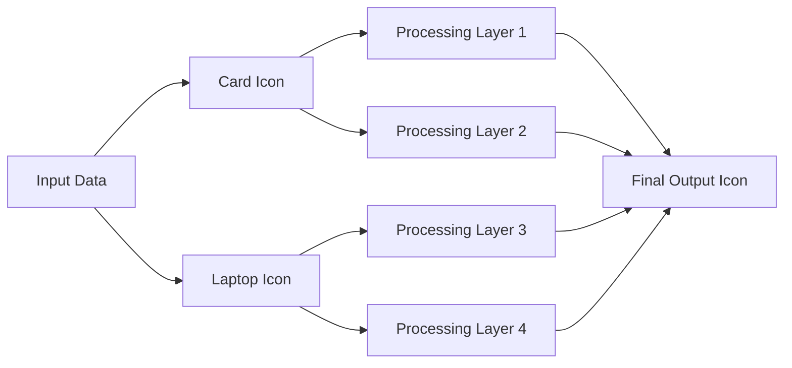
```mermaid
graph LR
  A["Input Data"] --> B["Card Icon"]
  A --> C["Laptop Icon"]
  B --> D["Processing Layer 1"]
  B --> E["Processing Layer 2"]
  C --> F["Processing Layer 3"]
  C --> G["Processing Layer 4"]
  D --> H["Final Output Icon"]
  E --> H
  F --> H
  G --> H
```

## 尽职调查、利益相关方沟通

为确保ESG议题识别的全面性和准确性，公司根据所处行业特征、实际经营情况、自身商业模式，系统识别了六大核心利益相关方群体，并通过定期/非定期访谈、调研及专题沟通等尽职调查方式，通过建立常态化沟通机制，充分了解各利益相关方对议题的关注情况及反馈意见，以便更有针对性地为利益相关方创造可持续价值。

<table><tr><td>利益相关方</td><td>关注内容</td><td>沟通方式</td></tr><tr><td>政府及监管机构</td><td>遵守法律法规合规经营公平竞争应对气候变化污染防治资源管理能源利用供应链安全产品与服务安全员工权益</td><td>政策指引监督检查来访接待信息披露</td></tr><tr><td>股东与投资者</td><td>财务稳健信息透明风险管理创新驱动</td><td>股东会公司公告投资者沟通</td></tr><tr><td>客户与用户</td><td>优质产品与服务用户体验信息安全与隐私保护</td><td>用户反馈渠道社交媒体互动用户满意度</td></tr><tr><td>员工</td><td>员工雇佣员工权益保障培训与发展平衡工作生活</td><td>员工培训与交流关怀活动员工反馈渠道员工满意度</td></tr><tr><td>供应商及合作伙伴</td><td>公平合作互利共赢可持续供应链供应商赋能</td><td>供应商管理供应商交流会行业会议技术合作</td></tr><tr><td>社区与媒体</td><td>保护环境公益项目企业社会责任</td><td>战略合作媒体互动社区活动</td></tr></table>

## 双重重要性分析

在本报告编制过程中，公司依据上海证券交易所《指引》同时参考GR可持续发展报告标准、国际可持续准则理事会（ISSB）准则等可持续相关信息披露标准中对于议题重要性分析的原则、方法和流程等开展议题的识别工作，建立了议题识别和重要性分析的流程，从财务重要性及影响重要性的角度对各ESG议题进行分析，识别对公司具有重要性的议题，并评估议题对公司经营产生的实际及潜在风险及影响。

公司在编制本报告时引入“双重重要性”评估框架。该框架从财务重要性（即议题对公司财务表现的影响）与影响重要性（即公司活动对环境和社会的内外部影响）两个维度，对各项议题进行综合研判。评估过程中，我们综合运用在线问卷调研、管理层专题研讨及专家评审等多种方式，收集并分析各利益相关方意见，以此作为判定议题双重重要性的基础依据。

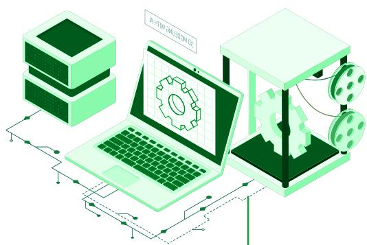

natural_image

Illustration of a laptop with gear icons connected to server racks and a 3D printer, symbolizing data processing or workflow (no text or symbols present)

## 议题重要性分析结论

根据实质性议题评估结果，遵循重要性原则，公司梳理了2025年度ESG重要议题，并根据议题重要性程度从“影响重要性”及“财务重要性”两个维度形成实质性议题矩阵。

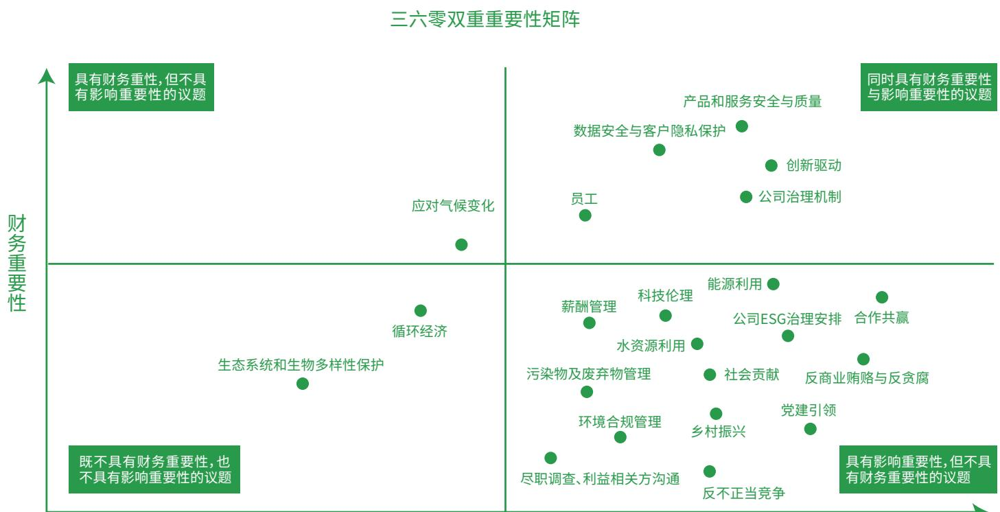

scatter

| 议题 | 财务重要性 (X) | 影响重要性 (Y) |
| :--- | :--- | :--- |
| 产品和服务安全与质量 | ~0.85 | ~0.95 |
| 数据安全与客户隐私保护 | ~0.75 | ~0.92 |
| 创新驱动 | ~0.82 | ~0.88 |
| 公司治理机制 | ~0.78 | ~0.85 |
| 员工 | ~0.65 | ~0.75 |
| 能源利用 | ~0.72 | ~0.65 |
| 科技伦理 | ~0.68 | ~0.62 |
| 薪酬管理 | ~0.55 | ~0.58 |
| 水资源利用 | ~0.62 | ~0.55 |
| 公司ESG治理安排 | ~0.75 | ~0.52 |
| 合作共赢 | ~0.92 | ~0.48 |
| 反商业贿赂与反贪腐 | ~0.88 | ~0.45 |
| 社会贡献 | ~0.68 | ~0.42 |
| 污染物及废弃物管理 | ~0.52 | ~0.38 |
| 环境合规管理 | ~0.58 | ~0.35 |
| 党建引领 | ~0.78 | ~0.32 |
| 乡村振兴 | ~0.62 | ~0.28 |
| 应对气候变化 | ~0.45 | ~0.35 |
| 生态系统和生物多样性保护 | ~0.32 | ~0.25 |
| 循环经济 | ~0.42 | ~0.18 |
| 尽职调查、利益相关方沟通 | ~0.48 | ~0.15 |
| 反不正当竞争 | ~0.62 | ~0.12 |

影响重要性

## 03

## 公司ESG治理安排

可持续发展治理架构可持续发展治理架构

可持续发展管理机制

ESG能力提升

natural_image

Illustration of people interacting with digital interfaces including a large document and web page, surrounded by gear and laptop elements (no text or symbols)

## 可持续发展治理架构

三六零高度重视ESG管理体系建设，为有效实现ESG战略与业务运营的深度协同，严格遵循《指引》等相关要求，构建了自上而下、权责清晰的ESG治理架构。该架构以董事会为最高决策机构，高级管理人员为统筹管理机构，各职能部门为具体执行单位，形成“决策—管理—执行”三层联动的闭环运行机制，确保ESG理念全面融入企业战略与日常运营。

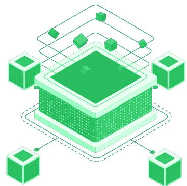

natural_image

Isometric diagram of a green 3D block with internal structure and surrounding cubes, no text or symbols present

<table><tr><td>层级</td><td>组织名称</td><td>职责范围</td></tr><tr><td></td><td>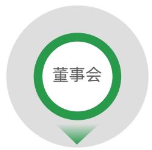</td><td>1.审议批准公司ESG战略规划和目标,确保与公司的长期发展目标保持一致。2.审议批准公司ESG报告,以及ESG治理重大信息的披露。3.审议批准ESG重大事项和ESG相关的重大风险应对方案等。</td></tr><tr><td></td><td></td><td>1.指导及审阅公司整体ESG方针、战略的执行情况。2.审议公司ESG报告,以及ESG治理重大信息的披露。3.评估ESG重大事项和ESG相关的重大风险应对方案等。</td></tr><tr><td></td><td>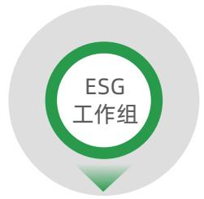</td><td>1.负责推动落实ESG工作规范化、制度化,并履行相关报批程序。2.负责ESG相关报告的编制,落实管理层的要求,收集、整理公司各平台部门、子公司的各指标、信息,编制ESG报告并对外披露。3.关注ESG未来发展方向,了解ESG相关法律法规,确保ESG发展符合战略规划,关注日常管理过程中的相关风险及问题,反馈意见建议等。</td></tr></table>

## 可持续发展管理机制

为规范公司环境、社会和公司治理工作，持续提升公司ESG管理水平，公司建立健全可持续发展管理机制，将可持续发展理念融入公司日常经营与业务决策过程，有效控制环境、治理和社会风险。

natural_image

Illustration of digital tools and user interaction, no text or symbols present

<table><tr><td>机制内容</td><td>具体行动</td></tr><tr><td>内部制度</td><td>公司建立了与ESG相关的内部控制制度体系,环境层面,制定了关于能源管理、废弃物处理等环节的控制细则,明确各部门在节能减排、环保合规等方面的具体职责与操作流程;社会层面,明确员工权益、供应链管理、产品质量与安全等领域的管控要求,确保公司运营持续有效,更好地履行社会义务;公司治理层面,发布信息披露、内部审计、合规管理等方面的管理制度,保障内部治理高效规范。</td></tr><tr><td>信息报告机制</td><td>管理层根据ESG工作组的提案召开会议,对ESG事项进行审议,并将审议结果提交董事会。</td></tr><tr><td>考核机制</td><td>公司将高管在ESG工作推动中的履责情况纳入管理层综合绩效评估体系。</td></tr></table>

## ESG能力提升

公司持续深化对可持续发展理念的实践认知，通过积极参与高水平的ESG专题交流活动和ESG培训活动，提升相关人员的专业技能与综合素质，不断提升治理水平。

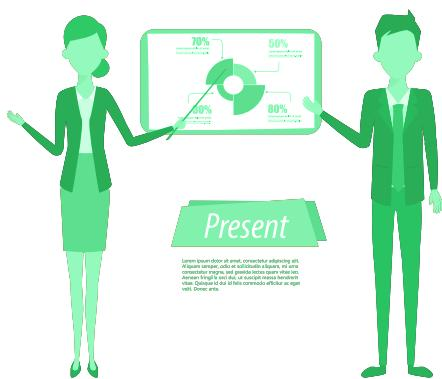

donut

| Category | Percentage |
| --- | --- |
| Segment 1 | 70% |
| Segment 2 | 50% |
| Segment 3 | 40% |
| Segment 4 | 80% |

  
可持续发展荣誉及奖项

Wind ESG评级

华证指数ESG评级

由A提升至AA

由BB提升至BBB

## 04

## 环境篇

可持续发展治理架构应对气候变化

环境合规管理

污染物及废弃物管理

能源利用

水资源利用

循环经济

生态系统和生物多样性保护

natural_image

Illustration of global energy and renewable energy icons including wind turbines, solar panels, battery, recycling bins, plants, and vehicles (no text or symbols)

## 应对气候变化

## 气候相关治理

为了响应国家双碳（碳达峰、碳中和）目标的号召，推动公司绿色低碳发展，提高企业的社会责任感和环保意识，三六零建立以董事会为最高领导的气候变化管理体系，由ESG工作组负责落实具体事项，逐步将气候变化融入企业管理。

公司深刻认识气候变化对自身业务及产业链发展的深远影响，将气候相关问题纳入整体的可持续发展框架中，构建了责任清晰、分工明确的气候变化治理架构，形成了“决策层-管理层-执行层”联动体系：公司董事会是应对气候变化工作的领导和决策机构；公司高管对气候变化应对工作进行研究和指导；组建公司ESG工作组，由总部及各单位ESG工作专员组成。

natural_image

Green illustration of a globe with solar panels and wind turbines, symbolizing eco-energy (no text or symbols)

<table><tr><td colspan="3">气候变化治理架构</td></tr><tr><td>决策层</td><td>董事会</td><td>负责研究气候变化相关战略和政策,对气候变化相关工作进行领导,确保其与公司的长期发展目标相契合。</td></tr><tr><td>管理层</td><td>高级管理人员</td><td>获董事会授权,履行气候变化治理及监督职责,总体安排部署公司气候变化工作,审核应对气候变化的目标及策略等,审定公司气候变化相关风险机遇及应对措施。</td></tr><tr><td>执行层</td><td>ESG工作组</td><td>执行气候相关工作计划,工作成果向管理层汇报。</td></tr></table>

natural_image

Illustration of a business meeting with people at desks, one presenting charts on screens (no text or symbols visible)

## 气候相关战略

## 气候情景分析

三六零参考IPCC（联合国政府间气候变化专门委员会）第六次评估报告（AR6）中的气候情景模型，对于公司运营的外部环境变化，包括生态、经济、社会因素等选择了SSP5-8.5和SSP1-2.6两个路径进行气候情景分析，识别了多项此情境下可能对公司业务构成影响的风险与机遇，制定气候变化应对策略，保障公司运营策略适应全球气候转型。

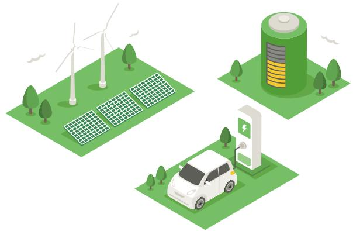

natural_image

Illustration of three green energy sources: wind turbines, battery storage, and electric vehicle charging (no text or symbols)

<table><tr><td>情景</td><td>情景参考</td><td>温升范围</td><td>情景描述</td></tr><tr><td>高排放情景</td><td>政府间气候变化专门委员会(IPCC)共享社会经济路径SSP 5-8.5</td><td>超过4°C(相对于工业化前)</td><td>该情景通常被描述为一种高排放、高发展不平等且化石燃料依赖较强的未来情景,在此情景下,物理风险相对较高,转型风险相对较低,各国没有出台应对气候变化的政策,能源需求和温室气体排放持续增长,导致全球地表持续升温,极端气候事件等现象发生频率增加。</td></tr><tr><td>低排放情景</td><td>政府间气候变化专门委员会(IPCC)共享社会经济路径SSP 1-2.6</td><td>低于2°C(相对于工业化前)</td><td>该情景是结合了可持续发展社会经济背景与低辐射强迫气候目标的情景,通常被描述为“绿色转型与气候行动协同”的未来路径,在此情景下,转型风险相对较高,物理风险相对较低。该情景旨在实现《巴黎协定》的长期目标(将全球温升控制在2°C以内,并努力限制在1.5°C)。</td></tr></table>

natural_image

Green electric car illustration with wind turbine, solar panel, and city skyline (no text or symbols)

气候相关风险与机遇

<table><tr><td>类型</td><td>气候相关风险</td><td>风险描述</td><td>财务影响</td><td>影响程度</td><td>影响周期</td><td>缓解措施</td></tr><tr><td rowspan="2">物理风险</td><td>急性风险</td><td>气候变化引起的极端天气如暴雨、高温可能造成数据中心及公司日常运营业务中断,影响业务连续性和日常运营管理的运维安全。</td><td>若数据中心因极端天气中断,可能导致业务运营停滞,造成核心服务响应延迟,进而影响客户体验与市场竞争力,对营收规模形成挤压;同时,应急抢修与运维保障投入增加,将推高运维成本,挤占正常经营资源,对整体盈利性构成压力。</td><td>中</td><td>短期</td><td>●通过气象部门的预警提前计划,减少极端天气对数据中心安全的影响。●建立健全的环境风险应急预案,每年对可能存在的风险进行识别与回顾,定期开展应急演练。</td></tr><tr><td>慢性风险</td><td>2025年我国平均气温10.9°C,与2024年并列为1951年有完整观测记录以来的历史最高值。气温上升将导致水资源短缺,对数据中心的制冷及节水提出更高的要求。</td><td>气温上升导致水资源短缺,加剧数据中心制冷能耗与水耗压力,推高能源与水资源消耗强度,加重运营负荷与成本负担,压缩企业盈利空间;同时,为保障系统稳定运行所需的设备升级与运维投入增加,将进一步拉高长期资源投入门槛。</td><td>低</td><td>中长期</td><td>●建立制冷系统设置应急处理机制,优化数据中心冷却系统。●定期检查市政供水系统,保证后备水源充足。</td></tr><tr><td rowspan="2">转型风险</td><td rowspan="2">政策风险</td><td>随着碳中和目标的推进,国内部分省市已开始将互联网数据中心等企业纳入碳排放权交易试点。例如,北京市要求年碳排放超过5,000吨的互联网企业参与碳交易。</td><td>纳入碳排放权交易试点后,企业将面临碳排放配额约束,若实际排放超出配额,需通过市场交易获取额外配额或投资减排项目来弥补缺口,由此产生的合规成本将刚性增加,拉高运营门槛,挤压业务盈利空间,并可能对资金周转形成持续压力。</td><td>低</td><td>中长期</td><td>推动数据中心及高耗能业务进行绿色化改造(如采用液冷技术、采购绿电等)。</td></tr><tr><td>公司受到监管机构、投资者、ESG评级机构、社会公众等相关方的广泛关注,若企业未能积极有效回应,可能影响投融资机会和企业可持续表现。</td><td>企业若未能有效回应监管、投资者及社会公众的期望,将面临声誉风险传导至市场信任层面,可能导致融资议价能力弱化,资金获取渠道收窄;同时,品牌影响力与市场竞争力受损,可能削弱客户粘性与收入增长基础,进而制约战略转型与可持续发展节奏,对长期价值释放形成潜在制约。</td><td>中</td><td>中长期</td><td>建立各利益相关方常态化沟通机制,提升信息披露质量。</td></tr></table>

<table><tr><td>类型</td><td>气候相关风险</td><td>风险描述</td><td>财务影响</td><td>影响程度</td><td>影响周期</td><td>缓解措施</td></tr><tr><td rowspan="2">转型风险</td><td>技术风险</td><td>公司所在的人工智能、数字安全两大行业属于技术密集型行业,在双碳大背景下,可能面临向低功耗技术转型的压力。</td><td>在双碳背景下,若未能及时跟上低功耗技术转型步伐,可能导致现有技术路线竞争力弱化,前期研发投入价值递减,市场份额面临挤压;同时,为追赶技术迭代需投入更多资源,将拉高长期运营成本,加重企业资源负担,影响盈利模式稳定性,对未来发展空间形成制约。</td><td>中</td><td>中长期</td><td>● 加大在低碳技术方面的研发投入,推动技术升级。● 与高校和科研机构合作,加速新技术的开发和应用。</td></tr><tr><td>市场风险</td><td>随着消费者环保意识的提高,消费者市场逐渐向绿色消费转变,倾向于选择更加低碳、低功耗的产品。</td><td>若产品未能有效降低碳排放,可能导致市场竞争力削弱,消费者偏好向更节能的竞品转移,核心客群流失,收入基础动摇,进而影响市场份额稳定性,对长期增长潜力形成制约。</td><td>中</td><td>中期</td><td>将节能降耗纳入产品设计、生产中的重要考量因素,探索使用可再生、可回收材料。</td></tr></table>

<table><tr><td>类型</td><td>气候相关机遇</td><td>机遇描述</td><td>财务影响</td><td>影响程度</td><td>影响周期</td><td>缓解措施</td></tr><tr><td>转型机遇</td><td>技术机遇</td><td>在多部人工智能发展法律法规的指导及鼓励下,人工智能行业迎来了前所未有的发展机遇,公司依托多年人工智能技术积累,推动产业数字化向智能化升级。</td><td>依托人工智能技术积累,公司可把握产业数字化向智能化升级的窗口期,拓展低碳数字化转型服务场景,开辟新的价值增长空间;通过赋能实体经济绿色转型,强化业务协同效应,提升核心业务的市场辐射力与盈利能力,为可持续发展注入强劲动能。</td><td>中</td><td>中长期</td><td>为客户提供数字低碳转型解决方案。</td></tr></table>

说明：不同风险和机遇对公司产生影响，公司将影响周期划分为短期（0～1年）、中期（1～5年）、长期（5年以上）。

## 气候相关影响、风险与机遇

公司注重气候相关影响、风险和机遇流程的管理，遵循“识别-评估-应对-监测-报告”循环机制，建立健全系统化、科学化的流程和方法，确保公司的战略和运营能够有效应对气候变化带来的挑战与机遇。

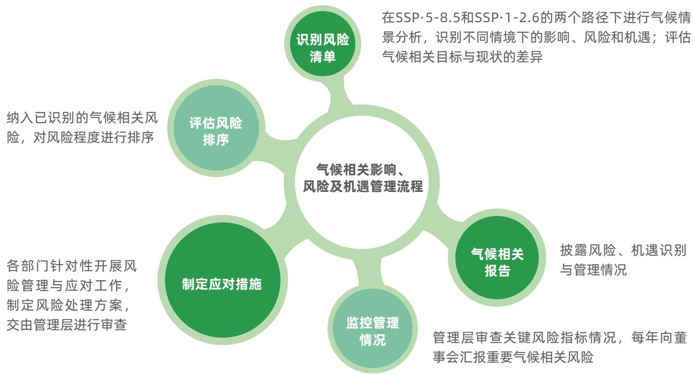

flowchart

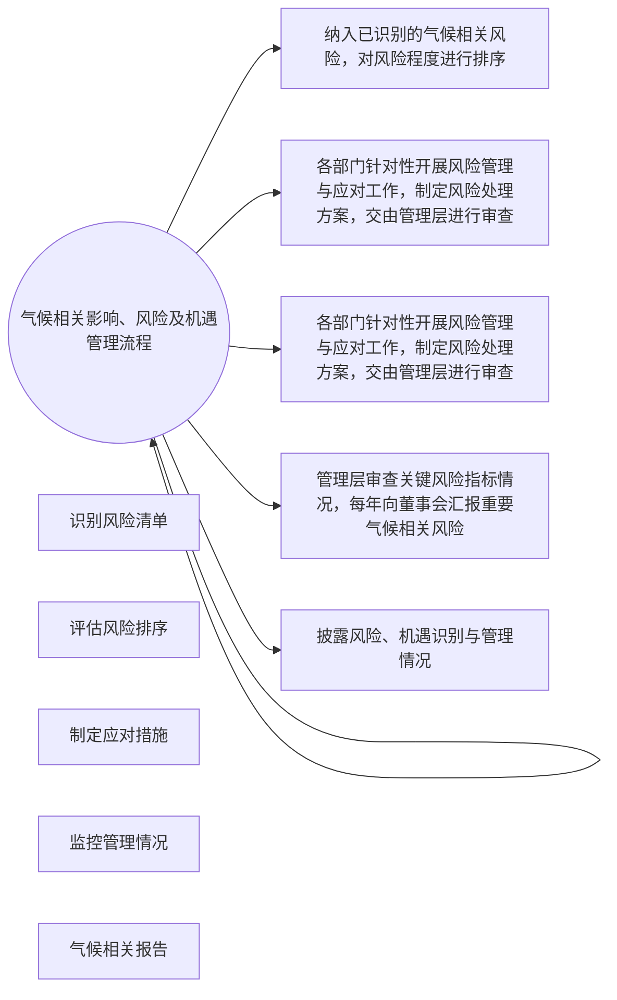
```mermaid
graph LR
  Center(("气候相关影响、风险及机遇管理流程"))
  
  sub1["识别风险清单"]
  sub2["评估风险排序"]
  sub3["制定应对措施"]
  sub4["监控管理情况"]
  sub5["气候相关报告"]
  
  Center --> Center
  
  Center --> Sub1["纳入已识别的气候相关风险，对风险程度进行排序"]
  Center --> Sub2["各部门针对性开展风险管理与应对工作，制定风险处理方案，交由管理层进行审查"]
  Center --> Sub3["各部门针对性开展风险管理与应对工作，制定风险处理方案，交由管理层进行审查"]
  Center --> Sub4["管理层审查关键风险指标情况，每年向董事会汇报重要气候相关风险"]
  
  Center --> Sub5["披露风险、机遇识别与管理情况"]
```

## 气候相关指标与目标

三六零积极响应国家“碳达峰、碳中和”战略目标，结合公司战略，设立“3060”碳排放目标，承诺在2030年前实现碳达峰，并在2060年前实现碳中和。

年度温室气体排放情况

<table><tr><td>指标</td><td>2025年</td></tr><tr><td>直接温室气体排放量(范围一)</td><td>255.80吨二氧化碳当量</td></tr><tr><td>间接温室气体排放量(范围二)</td><td>11,686.93吨二氧化碳当量</td></tr><tr><td>温室气体排放总量</td><td>11,942.73吨二氧化碳当量</td></tr><tr><td>温室气体排放强度</td><td>1.37吨二氧化碳当量/百万元营收</td></tr></table>

注：1、直接排放（范围一）包含汽油、柴油、天然气的温室气体排放量；间接排放（范围二）包含消耗外购电力所产生的温室气体排放量。  
2 外购电力所产生电力排放因子采用生态环境部2025年12月印发的《关于发布2023年电力二氧化碳排放因子的公告》中的全国电力平均排放因子计算

## 温室气体减排措施

三六零深刻认识到算力基础设施的能耗强度对气候变化的影响，为保障公司碳达峰碳中和目标的顺利实现，将绿色低碳理念深度融入数据中心规划与运营全过程，积极投身国家“东数西算”战略，从能源优化和算力效率提升两个维度系统性推进温室气体减排。此外，公司内部运营持续强化能源管理，倡导员工绿色办公，践行节能减排实践。

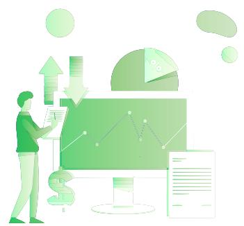

natural_image

Illustration of a person interacting with a large chart and pie chart, symbolizing business or data analytics (no text or symbols present)

## 布局绿色算力

三六零与中国移动贵州公司签署战略合作协议，联合打造“东数西算”绿色智能算力枢纽。该项目依托贵州作为国家算力枢纽节点丰富的清洁能源优势（如水电），为AI大模型训练、城市安全大脑等高算力消耗场景提供低碳化的算力支持。通过将算力需求向西部清洁能源富集区引导，从源头上减少对化石能源的依赖，显著降低单位算力的碳排放强度。

同时，三六零将自研的智算平台调度能力与绿色算力枢纽深度融合，构建“算力+算法+数据”三位一体的高效融合底座。通过弹性调度与资源池化技术，最大化提升算力资源的利用效率，有效避免算力闲置造成的能源浪费，实现算力供给的集约化与低碳化。

## 人工智能技术赋能建筑能碳管理

2025年，公司正式上线“基于数字孪生的能碳管理平台”，在北京360大厦与天津科创园区率先建成覆盖23万平方米的智慧能碳管理体系。该平台融合数字孪生、物联网与AI算法，构建覆盖能源与碳排全链路的智能中枢，实现从冷站、热站到配电系统的状态感知与自主调控，推动建筑从“被动空间”向“主动生命体”转变。平台形成“目标设定—策略寻优—实时监控—复盘优化”的闭环管理机制，有效降低人工干预频次，减少管理资源投入。该项目入选“2025人工智能赋能智慧建筑创新应用典型实践案例”，为互联网企业办公建筑的低碳智慧运行提供了可复制的示范经验。

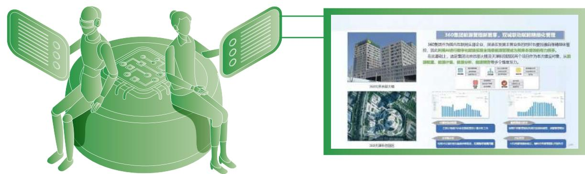

text_image

360集团能源管理新部署，双城联动赋能精细化管理
360集团作为国内互联网企业，深港在发展主营业务的同时也要加强自身精神和合规。因此利用银行数字化赋能实现全球能源管理成为其资本增值的有力共享。在此基础上，该集团在效益最大化及净利润大幅提升两个维度作为本次建设对象，从资源密集、能源扩张、能源转型等多个维度发入。
360天津科技股权
360天津星大股
360天津科技股权

## 节约用能

行为节能：严格落实“人走灯熄、设备随关”原则，会议室使用完毕后及时关闭照明、空调及电子设备，杜绝能源无效消耗。  
空调精准调控：制定分季空调运行方案，建立温控预警机制，依托实时监测数据对大厦空调系统实施精确调节。过渡季节（如春季3-5月）优先采用开窗通风降温，减少VRV空调系统运行时长，降低非必要能耗。  
电梯运行优化：实行电梯错层停靠策略，高峰时段鼓励7层及以下楼层员工使用步行梯，通过优化电梯负载降低电力消耗。  
绿色出行倡导：鼓励员工低碳通勤，公务用车优先选用新能源汽车，并配套建设充电桩车位，以清洁能源替代传统燃油，推动公务出行环节的碳减排。

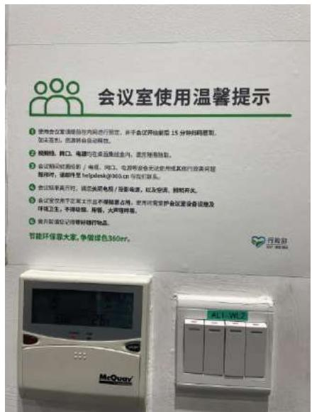

text_image

会议室使用温馨提示
使用会议室请提供您内部进行规定，并于会议开始前25分钟内扫码查询。
加入首页，资源将会自动释放。
视频线、网口、电脑可先来连接盒内，通常有图像。
会议移动视频源/电视、网口、电源等设备无法使用或在行政问题
期间内，请邮件至http://bank@360.cn/与我行联系。
会议频率表可对，请勿关闭电话/设置电源，以及空闲、闲时开关。
会议应交用于正常工作且不得随意占用。家用间需爱护会议室设备设施及
环境卫生，不得吸烟、停售，大声爆炸等。
离开前台位置等待到银行物品。
节能环保信息大家，争做绿色360er。
行政部
McQuar
ALL HUZ

## 节约用水

在办公区及公共区域全面采用节水型起泡器龙头，通过水流优化技术减少单次用水量。  
在洗手台、茶水间等重点区域张贴节水节能标识，以视觉提醒引导员工养成随手关水、节约用水的良好习惯。

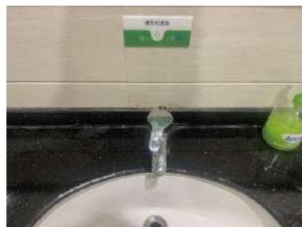

text_image

消防机插座
消火 1.5

natural_image

Stylized illustration of a city skyline with green buildings, wind turbines, and trees (no text or symbols)

## 节约耗材

依托数字化办公平台 实行电子审批 在线协作与云端存储 从源头减少纸张消耗  
设立 “绿色 回 收站” 对单面打印纸等可再利用纸张分类收集 用 于打印 内部文件草稿或二次使用 实现资源循环利用  
制定 《低值易耗品管理办法 》 明确设备维护标准与使用规范 加强 日 常巡检与定期保养 延长办公设备使用寿命 从存量环节挖掘降本潜力  
倡导员工 自备水杯 减少一次性水杯使用从消费端降低资源消耗

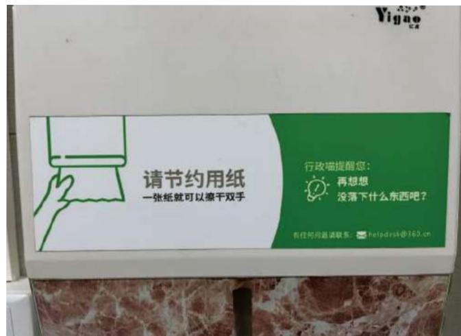

text_image

Yigno
请节约用纸
一张纸就可以擦干双手
行政端提醒您：
再想想
没落下什么东西吧？
有任何问题请联系：helpdisk@360.cn

## 数据中心低碳改造

采用节能型设备 通过自然冷源梯级利用 动态调控策略等手段 优化制冷系统运行模式 减少能源消耗 有效降低碳排放强度  
对业务运营服务器部署动态伸缩技术 实现计算资源日级别按需分配——业务高峰期按需扩容保障运行稳定 业务低谷期 自动缩容减少闲置资源 从源头避免算力浪费  
对自建老旧机房实施节能改造 逐步腾退PUE值高的老旧机房 优先租赁PUE更低的专业化数据中心 通过基础设施迭代与集约化部署 持续降低单位算力能耗

## 绿植辅助调节

通过在室内办公区以及室外公共区域摆放绿植 自然调节室内温湿度 吸收二氧化碳 释放氧气 减少对机械通风和空气净化设备的依赖 间接降低能耗

natural_image

Modern rooftop building with large '350' sign and wooden deck, surrounded by greenery and shrubs (no readable text or symbols)

## 环境合规管理

三六零始终坚持绿色低碳发展理念，严格遵守《中华人民共和国环境保护法》等法律法规，明确各级应急响应流程和责任人，构建起覆盖全面、权责清晰的常态化环境管理体系。报告期内，公司未发生重大突发环境事件，亦未因环境问题受到生态环境部门行政处罚或被追究刑事责任。

公司依托BMS楼宇智能控制系统，分别对照明、空调、环境安全和能源进行系统化管理，监测能耗趋势、设备运行状态及环境参数，实现异常自动预警与远程调控，持续提升能源利用效率与运营安全水平。公司安装环境安全管理智能iot系统，实现环境温、湿度监测，漏水报警等功能，通过数据驱动的智能化管控，公司有效降低了环境安全风险，提升了应急响应效率，为员工创造了健康、安全的工作环境。

公司定期进行环境风险评估与排查工作，以最大限度地减少对环境的损害。目前，公司在能源效率提升、清洁能源使用、电子废弃物管理等方面存在一定风险，针对上述风险，公司启用环境/能源管理平台，并定期对办公楼能耗水平进行评估，开展专项节能计划；对数据中心进行低碳改造；在智能硬件设计时，采用可回收材料，进行模块化设计以延长产品寿命；对废旧电子设备以及办公设备进行再利用等措施来减少公司运营对环境的影响。

natural_image

Illustration of a robotic figure interacting with a laptop displaying circuit patterns (no text or symbols)

<table><tr><td>指标</td><td>排放来源</td><td>处理及减排措施</td></tr><tr><td>废气</td><td>厨房油烟</td><td>● 厨房油烟废气经UV光氧化设备及静电式过滤器处理,为了实现对油烟排气的精准管理与控制,我们预留油烟排气烟道在线监测接口,以便于未来高效地进行油烟排放的实时监测与管控工作。● 更新新风机组回风过滤网,确保过滤效率,保障室内空气质量。</td></tr><tr><td>废水</td><td>生活污水</td><td>● 厨房废水通过沉淀池预处理大颗粒污染物及悬浮物,再引入油水隔离装置,将废水中的油、脂分离出来,排放至室外隔油池。● 北京360大厦的生活污水排放至市政污水处理厂进行二次利用。</td></tr><tr><td>固体废弃物</td><td>无害废弃物少量有害废弃物</td><td>● 公司各种固体废弃物符合国家处置标准,无环境污染及破坏事件发生。● 公司通过四种垃圾分类桶,配备标识和投放指南海报,确保垃圾分类达标的同时,不断强化员工垃圾分类意识。● 少量有害废弃物如废电池、废日光灯管、废硒鼓、废墨盒,公司设置分类垃圾桶进行集中回收后交由专业危废处理公司进行无害化处理。</td></tr></table>

natural_image

Illustration of two people interacting with a large green chalkboard containing abstract circuit patterns (no text or symbols)

## 污染物及废弃物管理

三六零所处行业为非传统高污染产业，运营过程中主要产生生活废水、油烟废气及固体废弃物。公司制定《固体废弃物（危废）管理办法》，践行运营地对污染物的规则如《北京市生活垃圾管理条例》以及3R原则（Reduce、Reuse、Recycle，减量、循环、回收），持续降低各类废弃物的环境影响。

## 能源利用

三六零严格遵循《中华人民共和国能源法》《中华人民共和国节约能源法》等相关法律法规。通过建立健全能源监测与节能管理体系，公司系统规划并实施多项节能技术改造措施，积极推广应用先进节能技术，持续提升能源利用效率。

能源管理举措

<table><tr><td>类别</td><td colspan="2">具体措施</td></tr><tr><td>加强能源监测与控制</td><td>公司积极推进能源数字化建设,并用AI赋能能碳管理平台,实现对关键能耗设备能源数据的计量、自动采集与实时监测,在能源配置、能源计量、能源分析、能源预警多个维度实现精细化管理。</td><td>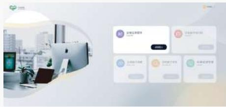能碳管理平台</td></tr><tr><td></td><td>公司部署了新风机组智能控制系统、大金VRV空调智能管理系统及ABB照明智能控制系统,对楼宇内新风、空调及照明设备进行集中监控与远程调控,可根据季节、时段、日程等科学设定运行参数与开关策略,实现精细化能耗管理与低能耗运行。</td><td>BMS楼宇智能控制系统</td></tr><tr><td>使用节能产品</td><td colspan="2">升级照明智能控制系统,更新北京360大厦会议区照明设备及电机,改为更高效节能的产品。</td></tr><tr><td>建设低碳数据中心</td><td colspan="2">打造节能高效的低碳数据中心,采取了包括余热回收利用、能源动态调控、高效冷源机房、可持续LID场地设计等措施,降低数据机房运行能耗。</td></tr></table>

2025年关键绩效

<table><tr><td>指标</td><td>2025年</td></tr><tr><td>柴油消耗量</td><td>1.22吨</td></tr><tr><td>汽油消耗量</td><td>8.57吨</td></tr><tr><td>天然气消耗量</td><td>104,475标准立方米</td></tr><tr><td>电力消耗量</td><td>22,025.87兆瓦时</td></tr><tr><td>综合能源消耗量</td><td>2,860.32吨标煤</td></tr><tr><td>综合能源消耗强度</td><td>0.33吨标煤/百万元营收</td></tr></table>

注：统计范围为北京360大厦、天津科创园等全国14处办公地。

## 水资源利用

三六零运营用水全部依托市政供水系统，水源供应稳定、取水合规合法，不存在取水权属争议或水资源短缺风险。公司严格遵守《中华人民共和国水法》《国家节水行动方案》等法律法规，广泛开展节水教育，实施各项节水措施。

natural_image

Illustration of two people at a desk, one using a laptop and the other seated with a robot (no text or symbols present)

水资源管理举措

<table><tr><td>类别</td><td>具体措施</td></tr><tr><td>节水改造</td><td>● 改造茶水间&amp;卫生间的洗手池改造,更换了节能型多功能起泡型水嘴。● 增加老化设备隐患排查的力度和频次:更换洗手间脚踏阀、脚踏阀各类备件,杜绝因设备老化造成的长流水。</td></tr><tr><td>打造海绵城市</td><td>数据中心通过“海绵城市”建设,结合屋顶绿化、雨水回用设施、透水铺装等低影响开发技术措施,以控制径流污染、缓解内涝灾害为重点,兼顾合理利用雨水资源,改善水环境。</td></tr></table>

2025年关键绩效

<table><tr><td>指标</td><td>2025年</td></tr><tr><td>水资源消耗总量</td><td>139,099吨</td></tr><tr><td>水资源消耗强度</td><td>16.00吨/百万元营收</td></tr></table>

注：统计范围为北京360大厦、天津科创园等全国14处办公地。

## 循环经济

公司严格遵循《中华人民共和国循环经济促进法》《绿色包装评价方法与准则》及《关于加快建立绿色生产和消费法规政策体系的意见》等法规要求，持续构建循环经济发展模式，致力于打造资源节约型、环境友好型企业，实现资源高效利用与废弃物源头减量。

循环经济管理举措

<table><tr><td>类别</td><td>具体措施</td></tr><tr><td>绿色设计</td><td>在智能硬件设计阶段,我们积极探索、践行循环经济,采用可回收材料,进行模块化设计以延长产品寿命。</td></tr><tr><td>办公设备升级改造</td><td>对废旧电子设备以及办公设备通过升级以及改造延长服务器等方式,进行再利用。</td></tr><tr><td>电子产品回购</td><td>电脑等电子产品达到使用年限后,员工可申请回购,减少电子垃圾产生。</td></tr><tr><td>其他物资再利用</td><td>替换下来的未报废灯具、电池等物资,探索其他场景再利用;将办公用纸及包装箱纳入回收体系,推进资源循环利用。</td></tr></table>

natural_image

Illustration of two people playing with a robot at a table, one holding a clock (no text or symbols present)

## 生态系统和生物多样性保护

三六零在业务拓展中坚持生态友好原则，将数字技术深度融入生态保护实践。公司以“AI+动物园”智慧化项目为试点，探索人工智能在动物栖息环境监测与福利管理中的应用，推动生态保护与技术创新融合。通过精准监测自然资源动态变化，助力资源可持续利用，保障生态系统的完整性与稳定性。同时，公司积极运用互联网平台传播生物多样性保护知识，提升公众认知，凝聚社会力量共同守护生态家园。

natural_image

Stylized green eco-friendly illustration with leaves, wind turbines, and city skyline (no text or symbols)

在生物多样性保护方面，三六零不仅关注物种多样性，还注重生物遗传资源的保护与利用，确保生物资源可持续。公司将产品全生命周期对生态的影响纳入管理范畴，持续探索环保型产品开发，降低运营与产品对生态环境的负面影响。

## 案例

2025年5月，三六零集团联合武汉零点科技组成专项调研组，赴南宁市动物园开展实地考察与战略合作洽谈，共同探索“AI+动物园”智慧化升级方案。项目旨在通过智能化手段提升动物栖息环境监测能力、优化动物福利管理，并打造人工智能中国—东盟智慧动物园示范区。该合作将AI技术应用于生态保护场景，体现了公司以技术创新赋能生物多样性保护的实践探索。

natural_image

Illustration of people celebrating with a central figure, surrounded by greenery and plants (no text or symbols)

## 05

## 社会篇

可持续员工

产品和服务安全与质量

数据安全与客户隐私保护

创新驱动

科技伦理

合作共赢

乡村振兴

社会贡献

flowchart

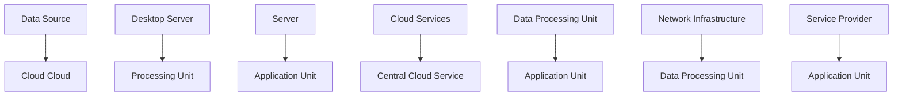
```mermaid
graph TD
  A["Data Source"] --> B["Cloud Cloud"]
  C["Desktop Server"] --> D["Processing Unit"]
  E["Server"] --> F["Application Unit"]
  G["Cloud Services"] --> H["Central Cloud Service"]
  I["Data Processing Unit"] --> J["Application Unit"]
  K["Network Infrastructure"] --> L["Data Processing Unit"]
  M["Service Provider"] --> N["Application Unit"]
```

## 员工

## “员工”四要素分析

## 治理

公司严格遵循《中华人民共和国劳动法》《中华人民共和国劳动合同法》《中华人民共和国妇女权益保障法》及《禁止使用童工规定》等法律法规，全面遵守运营所在地的劳工权益强制性规定。公司构建了覆盖员工招聘、绩效管理、职业发展、薪酬福利及劳动关系等全流程的系统化人力资源管理制度，持续优化制度设计与流程规范，着力营造公平、透明、高效的用人环境。在赋能员工职业成长的同时，为公司长期可持续发展提供坚实的人才支撑与组织保障。

## 战略

<table><tr><td>风险/机遇类型</td><td>风险/机遇描述</td><td>对公司的财务影响</td><td>影响大小</td><td>影响时间范围</td><td>应对措施</td></tr><tr><td>法律风险</td><td>若用工管理中未能严格遵守《中华人民共和国劳动法》《中华人民共和国劳动合同法》等法律法规,将直接引发劳动争议诉讼及行政罚款风险,情节严重者可能面临刑事追责,并损害雇主品牌形象。</td><td>若因用工管理不合规引发劳动争议或行政处罚,将导致企业直接经济成本显著上升,侵蚀当期经营利润,并可能推高后续合规管理投入,对财务状况形成持续性压力。</td><td>中</td><td>短期</td><td>通过建立健全内部劳动用工合规制度与标准化流程,确保招聘、合同、薪酬、工时、解雇等各环节严格遵循相关法律法规。在此基础上,定期开展人力资源专项法律培训,系统排查用工风险,实现事前预防与事中监控。同时,设立劳动争议内部调解机制,确保纠纷及早介入、高效化解,切实保障员工合法权益。</td></tr><tr><td>技术风险</td><td>行业竞争加剧导致核心技术人员流失,可能影响产品研发和技术升级。</td><td>核心技术人员流失可能削弱研发体系稳定性,影响产品迭代效率,制约技术升级节奏,降低市场响应速度,进而削弱产品竞争力,挤压市场空间,对价值创造能力形成长期制约。</td><td>高</td><td>中长期</td><td>加强知识产权管理体系建设,完善核心技术保密机制,并通过建立具有竞争力的激励机制和良好的人才发展环境,稳固核心技术团队,保障公司技术安全与持续创新能力。</td></tr><tr><td>市场风险</td><td>AI技术迭代对传统岗位带来的结构性冲击压力,部分员工可能面临技能不匹配、岗位替代的风险,进而影响员工士气与组织稳定性。</td><td>AI技术迭代可能引发结构性岗位适配压力,影响团队稳定性与组织效能,削弱研发与运营协同效率,制约核心能力沉淀,进而对价值创造体系形成潜在冲击,影响企业长期增长韧性与人才竞争力。</td><td>中</td><td>短期</td><td>三六零内部举办的AI大赛,推动员工学习和应用AI技术。这为员工提供了技能升级、职业发展的新机遇,帮助员工从重复性工作中解放出来,向更高价值的工作转型。</td></tr><tr><td>运营机遇</td><td>公司通过建设多元包容的组织文化,提升员工归属感与幸福感,以人才创新活力赋能企业可持续发展。</td><td>将激发创新活力与协作效能,提升人才使用效率与组织运行质量,降低因人员流失或沟通不畅带来的资源损耗,增强长期竞争力与价值创造韧性。</td><td>中</td><td>长期</td><td>公司以多元、公平与包容为核心价值观,从制度层面构建反歧视政策与行为准则,夯实文化根基。在招聘、晋升及领导力培养各环节主动消除偏见,保障机会公平,并通过建设多元化员工资源群体与开放沟通平台,增进理解、强化归属。同时,以定制化福利、心理健康支持及灵活工作安排等举措,切实提升员工幸福感。</td></tr></table>

## 影响、风险与机遇管理

## 风险和机遇 识别和评估

结合公司发展阶段与行业特性，人力资源领域的潜在风险主要集中于关键人才流失、劳动法规合规、组织结构效能、员工健康安全及多元化与包容性实践等方面。我们综合运用定量指标如离职率、劳动争议数量、员工满意度等系统评估各项风险对组织稳定性、运营效率、法律合规及企业声誉的影响程度，并将其纳入公司ESG风险重点管控清单。

## 风险和机遇监测和管理

结合公司实际运营情况，构建覆盖招聘、在职、离职全周期的人力资源风险监控体系。通过定期开展员工调研等方式，动态跟踪人才流动、劳动关系、职场安全、培训效果等关键指标，并实施趋势分析。建立风险预警机制，设定风险阈值，对异常波动或潜在违规行为及时预警，为管理层提供决策支持，有效防范风险于未然。

## 风险和机遇 处置和应对

依据风险性质与等级，制定差异化管理策略：对关键人才流失风险，采取激励保留、梯队建设及知识管理体系化等措施降低风险；对法律法规合规风险，通过制度建设、流程规范与持续培训进行规避与管控；对员工健康与安全风险，完善防护设施、强化安全文化并建立应急响应机制；对组织结构与效能风险，通过流程优化、数字化工具引入及灵活组织模式设计予以改善。

## 指标和目标

<table><tr><td>目标</td><td>2025年度目标完成情况</td></tr><tr><td>员工社保覆盖率100%</td><td>已完成</td></tr><tr><td>无重大安全事故发生</td><td>已完成</td></tr></table>

## 员工雇佣

## 规范雇佣

公司在招聘录用程序上坚持公平透明原则，根据公司相关招聘管理制度，制定年度招聘计划，规范招聘全流程操作，确保符合公平就业相关法律法规要求。同时，我们倡导多元化和机会平等，禁止任何形式的歧视，反对任何形式的强迫劳动和虐待骚扰，在招聘环节建立了严格的年龄审核机制，确保不录用未满法定工作年龄的人员。2025年公司未发生雇佣童工、强迫劳动以及歧视行为。

natural_image

Illustration of a person holding a giant pencil next to a smartphone displaying a landscape and icons, with a 'NEXT' button and a potted plant nearby (no text or symbols on the main elements)

在招聘渠道建设上，公司在用好常规招聘平台的基础上，积极构建内部人才举荐机制，鼓励员工推荐优秀人才，形成内外联动、多元协同的引才格局。目前，我们公开招聘渠道包括网络招聘（官网、公众号、小红书）、校园招聘、现场招聘、猎头招聘、校企合作、内部推荐等形式。

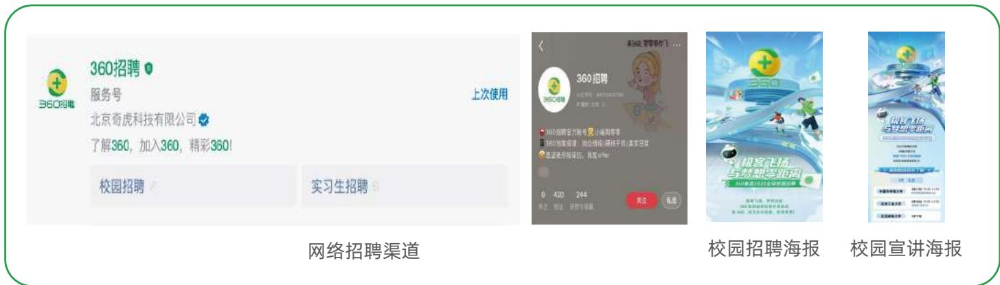

text_image

360招聘
服务号
北京奇虎科技有限公司
了解360，加入360，精彩360！
校园招聘
实习生招聘
上次使用
网络招聘渠道
360招聘
校园招聘海报
校园宣讲海报

## 多元构成

多元化与包容性是企业人才队伍建设的重要因素。三六零致力于营造多元共融的职场环境，跨越性别、年龄、国籍、种族的界限，为每一位人才提供平等的发展机遇与开放的成长空间。

公司致力于打造公平、公正、安全、包容、友善的职场环境，严格遵循非歧视原则，不以国籍、种族、性别、年龄、宗教信仰或文化背景为限，全面落实同工同酬、职业发展、民主参与等领域的男女平等原则。

## 员工构成

按学历

<table><tr><td>硕士及以上数量</td><td>1,068人</td></tr><tr><td>大学本科学历员工数量</td><td>3,561人</td></tr><tr><td>大专学历员工数量</td><td>542人</td></tr><tr><td>其他学历员工数量</td><td>102人</td></tr></table>

按岗位

<table><tr><td>研发人员数量</td><td>3,018人</td></tr><tr><td>销售人员数量</td><td>1,759人</td></tr><tr><td>管理人员数量</td><td>496人</td></tr></table>

员工总数

5,273人

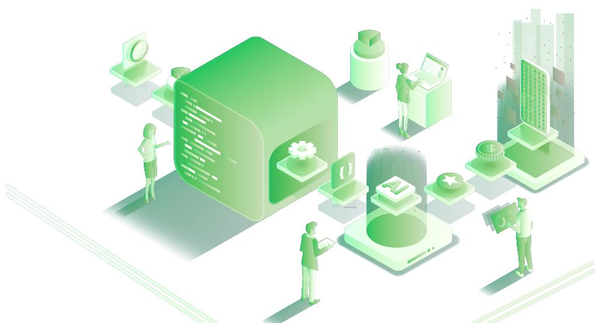

natural_image

Isometric illustration of digital business workflow with server, cloud, and data icons (no text or symbols)

## 员工薪酬与福利

## 薪酬体系

公司遵循“对内具有公平性、对外具有竞争性”的薪酬导向，构建以“岗位价值+绩效贡献+长期激励”为核心的薪酬模型，通过科学的职位评价体系，将职位价值等级与职业发展体系有机衔接，明确各职位体系的薪酬结构与水平范围，员工薪酬依据业绩、贡献、能力及素质等综合要素确定。

natural_image

Illustration of people celebrating with gift boxes and balloons, surrounded by falling confetti (no text or symbols)

公司每年开展薪酬回顾，结合公司业绩、运营状况、员工年度绩效、社会生活指数及市场趋势等因素，对员工薪酬实施动态调整。员工如对绩效结果存有异议，可通过与上级沟通或申诉流程维护自身权益。

## 福利体系

三六零为员工构建多层次、个性化的福利保障体系，持续提升福利的综合竞争力和吸引力。

## 法定福利

公司为员工足额缴纳五险一金。报告期内，公司员工社会保险覆盖率达100%。

## 假期福利

公司严格执行劳动法规定的标准工时，保障员工的工作与生活平衡；全面落实假期福利：除公休假和法定假日外，还享有带薪年假以及婚丧假、产假、育儿假等带薪假期。

## 医疗福利

为员工提供人身险、重大疾病险、员工门急诊及住院补充医疗、女员工生育补充险、子女门急诊及住院补充医疗等。

## 关怀礼金

员工在入职后如有新婚、生子、生病住院或直系亲属去世，可申请并领取公司关怀礼金。

## 定期体检

每年组织员工进行定期健康体检。2025年，公司为所有员工提供了体检服务。

## 节日关怀

每逢端午节、中秋节、春节，公司都会为员工准备专属惊喜。

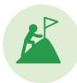

## 团队建设

为加强团队沟通，联络员工感情，促进组织协同，公司为每个团队提供统一标准的团队建设费，团队可以自行策划组织有助于团队融合的活动。

## 员工活动

公司会定期组织丰富有趣的各类员工互动活动。

## 其他福利

免费三餐宵夜、免费健身、免费班车、集体婚礼等。

## 司龄奖励

公司每年会给达成司龄标准的同事颁发专门定制的司龄纪念礼品，目前司龄奖分为五年奖和十年奖，是对长期以来恪尽职守的公司老员工辛勤工作的认可和鼓励。

## 民主沟通

公司严格依照《中华人民共和国工会法》《企业民主管理规定》等法律法规，构建以职工代表大会为基本形式、以工会组织为重要载体的民主管理制度体系，通过职工代表大会、员工交流会、设置意见箱、员工满意度调查等多种形式，落实员工的知情权、参与权、表达权、监督权。

## 民主沟通机制

  
职工代表大会机制

公司定期召开职工代表大会，对企业重大决策如规章制度制定修订、福利分配方案等事项进行审议，保障员工的知情权、参与权、表达权与监督权。

  
完善申诉渠道

为了畅通员工沟通渠道，建立有效沟通机制，公司设有多种沟通渠道：畅通邮箱举报、申诉渠道，若对职能部门处理结果不满意的，可发送邮件至CEO邮箱，反馈争议事项与争议处理情况。所有申诉事项均会得到及时、公正的处理，结果将通过适当方式反馈给员工，确保申诉有渠道、沟通有效率。

## 劳工纠纷

公司依据《中华人民共和国企业劳动争议处理条例》《企业劳动争议调解委员会组织及工作规则》，制定《三六零集团劳动争议调解工作制度》，成立劳动争议调解委员会，负责劳动争议的预防与调解工作，力求将矛盾化解在萌芽状态，确保劳动争议得到及时、依法、妥善处理。

natural_image

Illustration of business professionals shaking hands with a large upward arrow, symbolizing growth or success (no text or symbols present)

## 员工满意度

三六零建立了常态化的员工诉求调研机制，通过问卷调查、座谈等形式，在公司各项管理如IT办公、HR员工服务、行政服务等方面，收集并精准识别员工的真实诉求与期望，根据调查结果进行分析讨论，及时解决客观存在的问题，全面提升员工满意度，调整和优化管理策略，实现公司与员工的共同成长。

natural_image

Illustration of people interacting with a large screen displaying text and symbols, surrounded by greenery (no readable text or symbols)

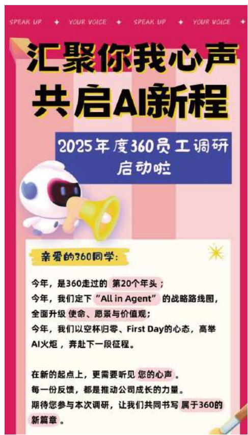

text_image

SPEAK UP + YOUR VOICE + SPEAK UP + YOUR VOICE +
汇聚你我心声
共启AI新程
2025年度360员工调研
启动啦
亲爱的360同学：
今年，是360走过的 第20个年头；
今年，我们定下“All in Agent”的战略路线图，
全面升级 使命、愿景与价值观；
今年，我们以空杯归零、First Day的心态，高举
AI火炬，奔赴下一段征程。
在新的起点上，更需要听见 您的心声。
每一份反馈，都是推动公司成长的力量。
期待您参与本次调研，让我们共同书写 属于360的
新篇章。

## 员工关爱与帮扶

三六零秉持以人为本的核心价值观，为员工打造幸福职场和企业温馨家园。公司持续开展职工之家活动，在服务员工的过程中，重点关注员工工作与生活，以及员工心理健康的平衡，对于遭遇特殊困难的群体及弱势群体，实施精准帮扶。

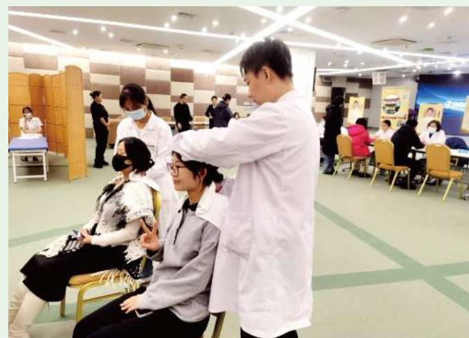

natural_image

Interior of a medical or pharmacy clinic with doctors attending to patients seated in chairs (no visible text or signage)

健康咨询与治疗

natural_image

Interior of a clothing store with pink curtains, white stools, and hanging jackets (no visible text or signage)

母婴室

## 员工培训及发展

## 员工培训

公司始终将人才发展与培养置于战略核心，持续完善内部培训机制，围绕岗位素质与职业发展需求，提供分层分类、形式多元的培训体系，助力员工成长，赋能企业高质量发展。

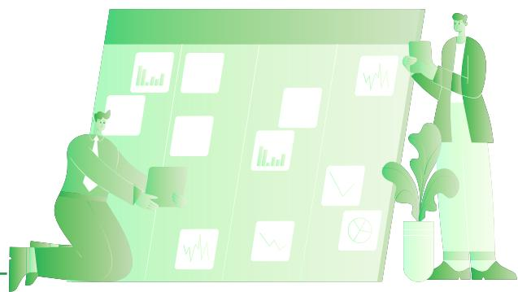

natural_image

Illustration of two business professionals interacting with a large digital dashboard (no text or symbols visible)

## 领导力培训

公司持续迭代星阶认证体系与精进系列课程，优化考核方式，确保对干部能力的评价更加科学精准，为干部晋升提供有效依据。报告期内，围绕业务实际需求，开展定制化培训，贴近业务场景，助力解决实际问题。

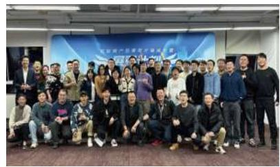

text_image

Group photo of people posing in front of a banner with Chinese text, likely at an event or conference.

## 专业力培训

公司通过常态化举办Tech Talk技术分享活动，搭建跨部门、跨层级的知识交流平台，邀请内外部技术专家、业务骨干分享前沿技术洞察与实践经验。

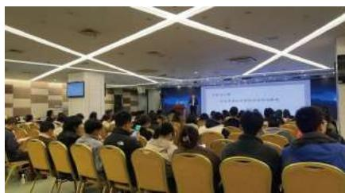

natural_image

Interior view of a conference hall with attendees seated facing a presentation screen (no visible text or signage)

## 通用力培训

在常态化开展新员工入职培训的基础上，公司组织“星球加油站”专题赋能，并举办内部AGENT大赛，通过系统化、实战化的方式，全面提升员工在AI办公与AI创新领域的综合能力。

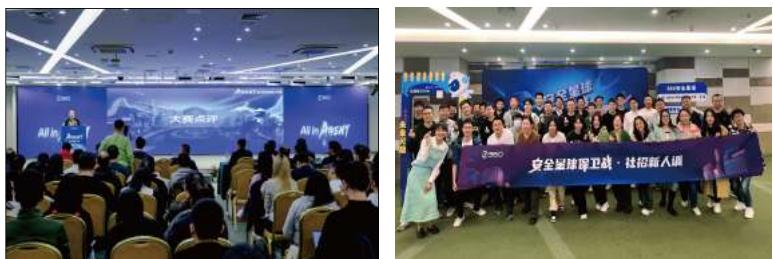

## 2025年关键绩效

普通员工培训覆盖率 100%  

natural_image

Silhouette illustration of three business professionals in a meeting setting (no text or symbols)

## 员工晋升

公司系统规范职位职级管理，建立“双通道”职业发展体系，依据业务特点与岗位属性，为员工打通纵向与横向发展路径，满足不同领域、不同能力员工的成长需求，构建完整畅通的职业晋升通道。

## 纵向职业发展

鼓励员工在所属通道（管理通道M或专业通道 S）内持续精进、纵深发展。

管理晋升以业绩贡献为基础，结合管理能力、发展潜力、文化价值观进行综合评估，以确保管理队伍整体质量。  
专业晋升以业绩贡献为基础，突出对专业能力的综合考察，同时关注与公司文化价值观的匹配性。

## 横向职业发展

为充分发掘员工能力优势，最大化发挥每一位员工的价值，公司设置管理通道与专业通道间以及专业通道内的横向发展机制，为员工在M/S通道间转换提供实现路径。

natural_image

Illustration of a business meeting scene with four people seated on a sofa, three in suits, and two framed pictures on the wall (no text or symbols)

## 职业健康与安全

## 职业健康管理

三六零严格遵循《中华人民共和国职业病防治法》等法规要求，持续完善职业健康标准化管理流程，不断提升职业健康管理水平，为员工健康筑牢坚实保障。公司关注员工健康，专设健康管理室，员工可凭工卡免费咨询，由健康顾问提供专业保健建议及必要药品支持。

2025年关键绩效  
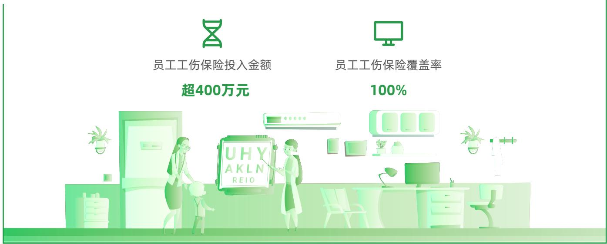

text_image

员工工伤保险投入金额
超400万元
员工工伤保险覆盖率
100%

## 安全运营

公司严格遵循《中华人民共和国突发事件应对法》《突发环境事件应急管理办法》等相关法律法规，制定《生产安全事故应急预案》《库房安全管理制度》《异常访客危机处理机制》《事故风险辨识、评估报告》《360餐厅食品安全应急预案》等内部管理制度，设立安全生产应急指挥部，明确安全工作重点，落实安全职责，构建安全健康的工作环境。应急预案明确事件类型划分与三级响应机制，确保突发环境事件依法依规妥善处置。同时，公司定期开展安全风险评估与隐患排查，最大限度降低安全事故损害。

应急组织机构图  
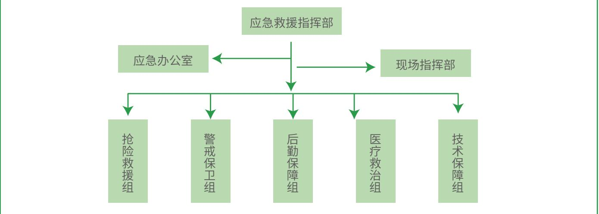

flowchart

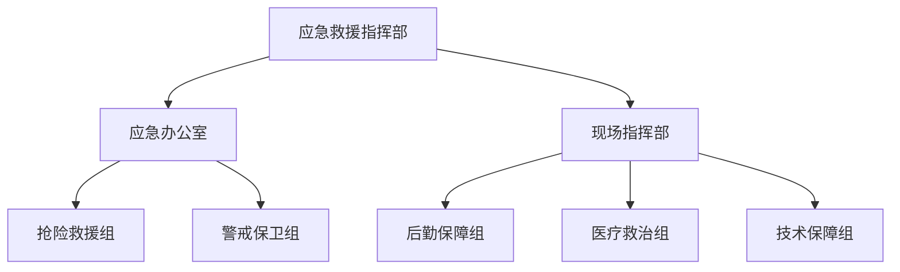
```mermaid
graph TD
  A["应急救援指挥部"] --> B["应急办公室"]
  A --> C["现场指挥部"]
  B --> D["抢险救援组"]
  B --> E["警戒保卫组"]
  C --> F["后勤保障组"]
  C --> G["医疗救治组"]
  C --> H["技术保障组"]
```

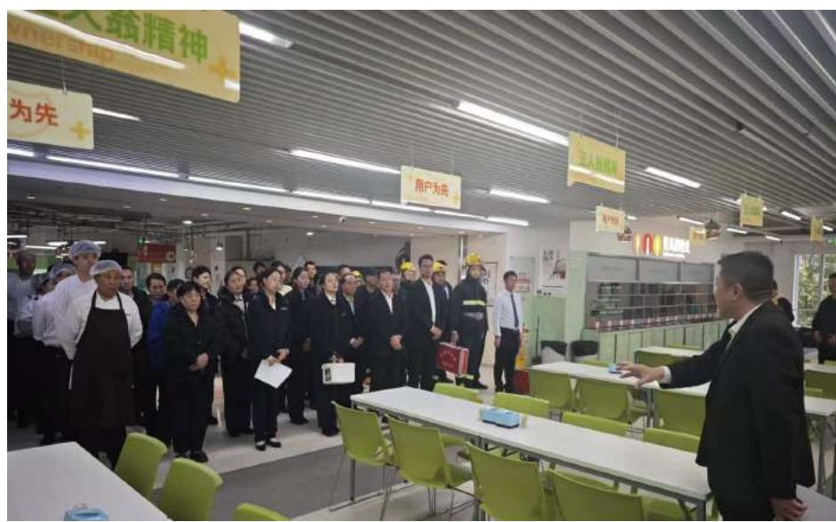

text_image

大鼠精神
为先
用户为先
兰人独居地

2025年度消防演练

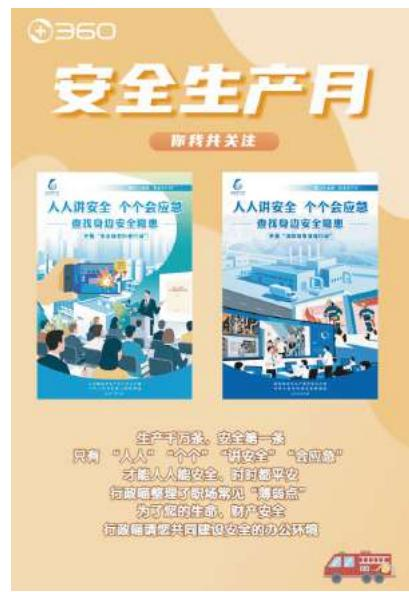

text_image

360
安全生产月
斯莪并关注
人人讲安全 个个会应急
查找身边安全隐患
人人讲安全 个个会应急
查找身边安全隐患
生产与方案，安全第一条
只满“人人”“个个”“安全”“合规”“无能人人能安全。百时思平安
行政商整理了现场常见“现场点”
为您的生命、财产安全
行政局调整共同建设安全的办公环境

安全宣传海报

2025年关键绩效  
  
安全演练覆盖率100%

natural_image

Illustration of a business meeting with four people seated on a sofa, three in the background, and three framed artworks on the wall (no text or symbols)

## 产品和服务安全与质量

## “产品和服务安全与质量”四要素分析

## 治理

公司建立系统化的产品和服务质量管理体系，明确权责分工、流程规范与持续改进要求，确保从研发到交付以及售后的全流程可控、可靠，为产品安全与客户信任提供坚实保障。报告期内，公司未出现严重质量事故。

## 组织架构

公司建立由数百名专业人员组成的客服团队，负责软件技术支持、硬件售前及售后咨询、游戏服务、广告销售等多个业务的用户服务。

## 制度体系

公司制定并更新《用户体验白皮书》《用户服务白皮书》《用户运营规范白皮书》等规范制度，在报告期内，子公司杭州三六零亿方智能有限公司（原“杭州奇亿云计算有限公司”，以下简称：“亿方云”）顺利通过ISO 9001质量管理体系认证；360大模型卫士顺利通过国家网络与信息系统安全产品质量检验检测中心（公安部第三研究所）的全面检测，成功荣获《大模型安全评估系统认证（增强级）》证书。

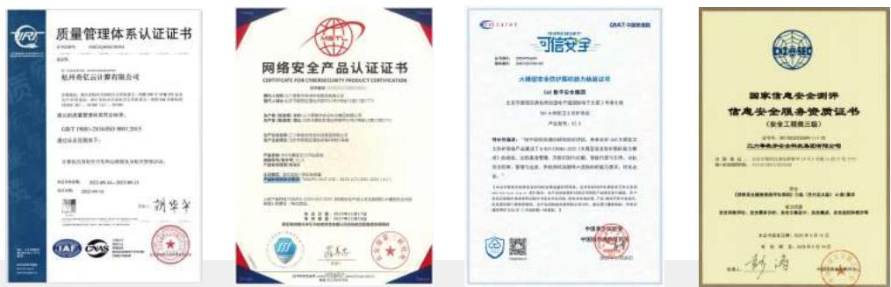  
ISO 9001质量管理体系认证  
网络安全产品认证证书  
大模型安全防护围栏能力检验证书  
国家信息安全服务资质安全工程类三级证书

## 工作流程

公司建立了覆盖产品全生命周期的质量保障体系，提供更洞察，更细致，更高效的服务保障：  
在产品立项产研及上线初期，开展产品内测、用户公测，充分挖掘用户需求，开展用户体验专项，推进产品快速迭代；  
在产品成长、成熟期，实时关注产品端内的用户反馈，保障客服渠道畅通（400热线、在线客服、邮箱），对用户反馈做全面分析，及时发现反馈趋势异常波动及新增问题；  
在产品全生命周期内，对影响用户体验的产品问题闭环跟进，明确问题发现、上报、解决、验证、复盘等各环节的标准流程，对问题进行分级分类管理和解决。

战略

<table><tr><td>风险/机遇类型</td><td>风险/机遇描述</td><td>对公司的财务影响</td><td>影响大小</td><td>影响时间范围</td><td>应对措施</td></tr><tr><td>合规风险</td><td>随着大模型技术加速渗透政务、金融、能源等重点行业,大模型运行面临基础设施安全、内容安全、数据与知识库安全、智能体安全、用户端安全五大关键风险。</td><td>若大模型技术应用过程中的安全风险未能有效管控,可能动摇客户信任基础,引发重点行业合作波动,削弱产品在关键领域的渗透能力;同时,安全事件处置与合规整改将占用大量管理资源,拉高运营保障门槛,影响核心业务的市场竞争力,对长期价值增长与战略布局形成制约。</td><td>高</td><td>中长期</td><td>提出“外挂式安全+平台原生安全”双轨治理策略,发布“360安全智能体”构建AI原生安全防护体系。在实战应用中,已部署于APT攻击溯源、安全运营、漏洞防护等场景,在亚冬会网络攻击溯源及台湾省黑客攻击溯源中发挥重要作用。</td></tr><tr><td>服务体验与客诉风险</td><td>三六零正处在从传统互联网服务向“AI+安全”双轮驱动转型的关键期,且AI新产品市场竞争大,服务体验不佳会使消费者转向其他产品与服务。</td><td>若服务体验不佳、用户流失加剧,将削弱新产品在市场中的接纳度,推高客户获取与留存成本,影响核心业务渗透能力,制约收入结构优化与增长潜力释放,进而对战略转型节奏与长期竞争力形成挑战。</td><td>中</td><td>短期</td><td>简化会员客服热线语音队列,在线客服引入AI辅助能力;建立服务承诺时效制度,明确各类投诉的响应和解决时限;增设客诉处理专员,加强客服团队培训,提升一线客服授权和问题解决能力。</td></tr><tr><td>政策机遇</td><td>2025年10月,新修订的《网络安全法》通过,新增条款明确支持AI技术研发与安全应用;“十五五”规划建议将“全面实施‘人工智能+’行动”提升至国家战略高度。</td><td>政策红利释放为AI技术与安全应用开辟了更广阔的市场空间,加速核心技术向重点行业渗透,拓展业务增长新赛道,提升核心产品的市场覆盖与价值贡献,增强盈利结构的韧性与可持续性,为长期价值释放注入强劲动能。</td><td>高</td><td>中长期</td><td>依托自研大模型能力,三六零践行“AI+安全”双主线战略,致力于以AI赋能千行百业数字化转型。360安全智能体已在政务、能源、金融等行业落地,帮助客户构建新一代智能安全体系。</td></tr></table>

## 影响、风险与机遇管理

## 风险和机遇识别与评估

公司打造了“APP全生命周期安全管理平台”，将安全自动化工具嵌入研发效能平台，从安全编码、安全加固、安全检测、安全运营及安全组件等多维度出发，构建了覆盖移动应用全生命周期的风险识别体系。目前，安全管理平台已运用于集团内部和各个子公司的APP产品安全管理，服务多条业务线。  
2025年11月，公司发布《大模型安全白皮书》，首次系统性地归纳了大模型运行面临的五大关键风险：基础设施安全风险、内容安全风险、数据与知识库安全风险、智能体安全风险、用户端安全风险。

## 风险监测与预警机制

在安全运营阶段，安全管理平台通过收录外部漏洞和威胁情报提升应急响应能力，同时借助海量设备监测和大数据安全分析，实现了实时准确的威胁监测和响应。  
2025年，公司推出“360安全智能体”，以“360安全大模型”为大脑，通过任务编排、指令调度、记忆存储等能力，围绕自动化威胁狩猎、深度分析研判、威胁攻击溯源等核心安全场景，构建了100+安全领域专家级智能体，实现7×24小时自动化监测。

## 风险应对与处置机制

安全管理平台建立了漏洞从发现、响应到处置的全闭环治理模式：借助漏洞云提供的情报订阅、安全众测、应急响应及补丁推送服务，最大限度降低漏洞威胁。  
基于《大模型安全白皮书》提出的“外挂式安全+平台原生安全”双轨治理策略，公司构建了全链路安全防线：外挂式安全通过“以模治模”实现对算力主机、软件生态、输入输出内容的实时监测与主动防御；平台原生安全将安全能力深度嵌入大模型核心组件，从根源筑牢安全基础。  
应急响应与漏洞治理：公司确立了“用AI监督AI、以Skill治理Skill”的核心策略，360安全云团队独家发现OpenClaw Gateway WebSocket无认证升级高危漏洞（0Day），第一时间协助全网切断风险源头，并获得OpenClaw创始人官方邮件确认。

## 指标与目标

<table><tr><td>目标</td><td>2025年度目标完成情况</td></tr><tr><td>未出现严重质量事故</td><td>已完成</td></tr></table>

## 产品质量管理

三六零将产品质量作为企业生命线，围绕“AI+安全”双主线战略，构建了覆盖产品研发、大模型应用、安全防护全链条的质量管理体系。

## 以技术驱动产品品质升级

公司持续深化“ALL IN AGENT”战略，依托自研千亿参数通用大模型“360智脑”，推动全系产品AI化改造。2025年，公司发布的最新模型“360zhinao3-o1.5”在第三方基准评测中表现优异。

在应用层面，公司推出国内首个“超级搜索智能体”——纳米AI超级搜索智能体，具备“理解意图—流程自动规划—任务自动分解—自主调用工具—自动执行—交付结果”的全流程自动化能力，支持多模态搜索输入及多格式结果输出。

## 大模型安全质量保障

针对大模型应用过程中面临的内容安全、隐私泄露、幻觉误导等风险，360自主研发大模型安全护栏产品解决方案“360智盾”，率先提出“以模制模”理念——用大模型能力保障大模型自身安全。“360智盾”构建了“输入端风险识别—安全回复大模型处理—输出端二次检测”的多层次内容护栏体系。2025年，“360智盾”入选工业和信息化部《2024年未来产业创新发展优秀典型案例》，成为人工智能安全领域标志性产品。

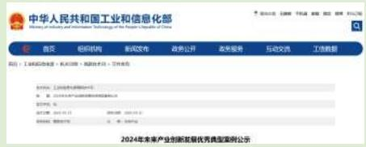

text_image

中华人民共和国工业和信息化部
首页 组织机构 新闻发布 政府公开 政务服务 马动交易 工资数据
首页：工业和信息化部·机关组织·建设技术·工程部
2024年末未来产业创新发展优秀典型案例公示

<table><tr><td>8</td><td>未来制造</td><td>标志性产品</td><td>全球首制7500立方米泡沫芯二氧化碳研运船舶</td><td>大连船舶重工集团有限公司</td><td>大连</td></tr><tr><td>9</td><td>未来制造</td><td>标志性产品</td><td>大型钢轨储氧飞机</td><td>江苏新桥新材料股份有限公司</td><td>江苏</td></tr><tr><td>10</td><td>未来制造</td><td>标志性产品</td><td>可燃气体探测激光芯片、激光器和系列传感器</td><td>合肥清芯传感科技有限公司</td><td>安徽</td></tr><tr><td>11</td><td>未来制造</td><td>标志性产品</td><td>低温堂超振粉砂钩形泥浆</td><td>拓迪亚(宁夏)储液产业有限公司</td><td>宁夏</td></tr><tr><td>12</td><td>未来制造</td><td>标志性产品</td><td>600MBz极磁共振谐波谱仪</td><td>武汉中科中-谱波谱技术有限公司</td><td>湖北</td></tr><tr><td>13</td><td>未来制造</td><td>标志性产品</td><td>生物合成L-脱氢酸</td><td>黑龙江新和成生科技有限公司</td><td>黑龙江</td></tr><tr><td>14</td><td>未来制造</td><td>标志性产品</td><td>未来智造、金属模具刀具材料库应用</td><td>赣州澳克泰工具技术有限公司</td><td>江西</td></tr><tr><td>15</td><td>未来制造</td><td>标志性产品</td><td>“特工”脑链互联系列产品</td><td>天开绿挂(天津)智能科技有限公司</td><td>天津</td></tr><tr><td>16</td><td>未来制造</td><td>标志性产品</td><td>新能源锂电池工艺和领先的智能公差设计与仿真分析软件</td><td>重庆诚智鹏科技服务有限公司</td><td>重庆</td></tr><tr><td>17</td><td>未来信息</td><td>标志性产品</td><td>通义灵码——AT编码助手</td><td>阿里云计算有限公司</td><td>浙江</td></tr><tr><td>18</td><td>未来信息</td><td>标志性产品</td><td>360大模型全铲岩产品解决方案</td><td>三六零安全科技股份有限公司</td><td>天津</td></tr><tr><td>19</td><td>未来信息</td><td>标志性产品</td><td>百施米纹石墨烯导体镀着衬</td><td>宁波石墨烯创新中心有限公司</td><td>宁波</td></tr><tr><td>20</td><td>未来信息</td><td>标志性产品</td><td>飞腾腾云S5000C处理器</td><td>飞腾信息技术有限公司</td><td>天津</td></tr></table>

## AI赋能安全产品质量

在数字安全领域，公司推出“360安全智能体”，以“360安全大模型”为大脑，围绕自动化威胁狩猎、深度分析研判、威胁攻击溯源等核心场景，构建了100+安全领域专家级智能体，支撑企业实现7×24小时自动化、低成本、高精度的智能防护。截至报告期末，公司累计发现APT组织60个，占国内总数的98%。2025年6月，公司协同国家计算机病毒应急处理中心等机构，成功锁定台湾民进党当局“资通电军”为网络攻击源头，联合发布调查报告，彰显公司在国家级网络安全防御中的技术实力。

## 服务交付质量管理

公司积极参与行业标准建设，2025年6月，由中国信息通信研究院牵头、360等企业参与编制的《大模型应用交付供应商总体能力要求》技术规范正式发布，从基础能力、大模型服务能力、行业实践能力、项目质量与风险管理能力四方面，明确了大模型应用交付供应商的总体能力要求。在商业化落地方面，“360安全大模型”已在政务、能源、金融等行业落地，在500家用户真实环境中完成测试与应用。

## 客户服务管理

三六零始终将用户满意度视为产品发展的核心，构建了覆盖用户全触点的客户服务体系，致力于为用户提供专业、高效、有温度的服务体验。

## 负责任营销

公司建立完善的负责任营销管理体系，多部门（用户运营部、市场部、法务部及公共事务部）紧密协作，定期开展专项研讨会，对公司内部产品进行自查自检，同时，学习宣贯相关法律法规，分析行业案例，确保营销活动合规有序。如果用户对营销内容存在异议，可通过360产品反馈、举报入口、各客服渠道反馈，公司第一优先级处理。在线客服工具中对营销投诉举报进行标识，优先进入人工服务，确保用户诉求及时响应、妥善解决。

## 售后服务管理

## 优化客户服务机制

公司构建了多元化的客户服务渠道矩阵，包括热线电话、在线客服、客服邮箱以及产品内反馈通道，并在官网及各产品界面设置醒目入口，确保用户能够便捷地获取服务支持。目前，公司拥有数百名专业客服人员，覆盖软件技术支持、硬件售前及售后咨询、游戏服务、广告销售等多个业务领域，全方位响应各类用户诉求。

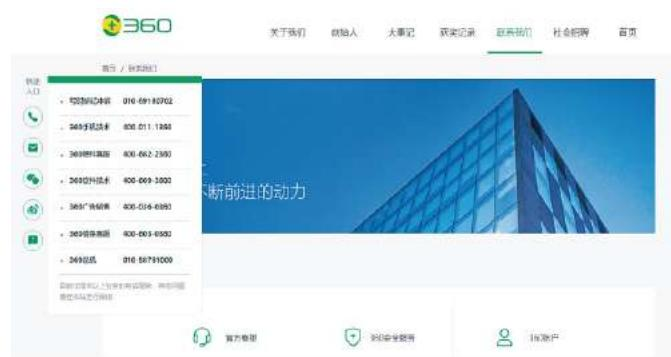

text_image

360
首页 / 新建部门
• 469手机版本 010-69180702
• 369手机技术 800-011-1360
• 369物料清单 800-662-2393
• 369科技技术 400-069-3003
• 369+软件库 400-016-6993
• 369团体地图 400-063-6582
• 369总成 010-58791000
不断前进的动力
官方整理
知识安全费用
用户账户

报告期内，公司持续修订《用户投诉举报处理机制》，建立了覆盖接收、受理、核实、处置、反馈全环节的客诉处理流程，确保用户投诉得到及时回应和妥善处理。同时，公司指派专职人员专门负责处理来自互联网信息服务投诉平台、全国12315平台及黑猫投诉等第三方平台的用户投诉。360社区作为公开交流平台，工作人员针对用户反馈的问题建议进行公开回复，增强服务透明度。

客诉处理流程  
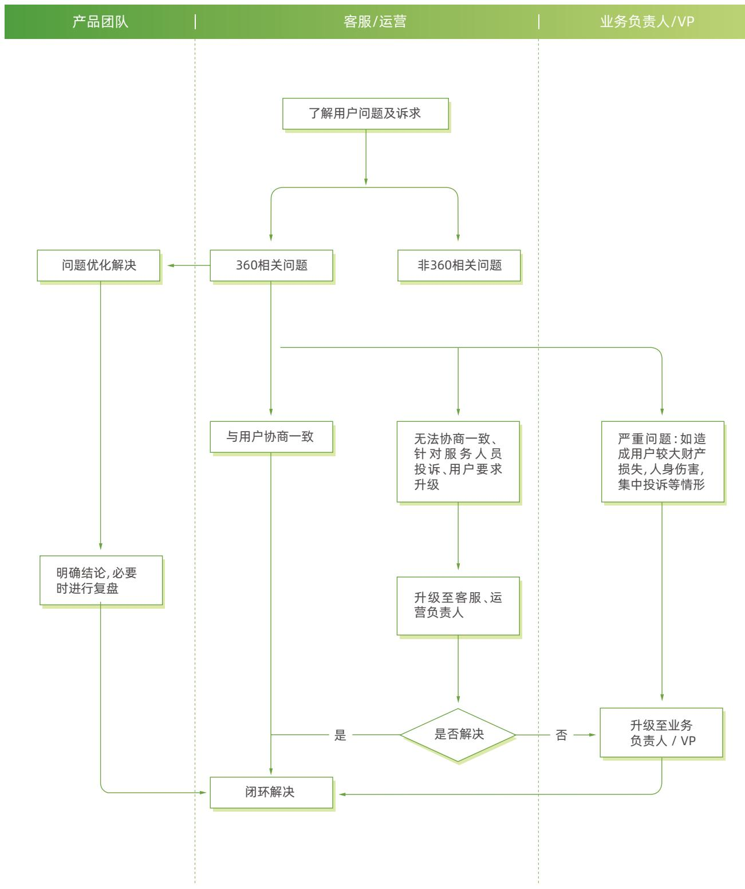

flowchart

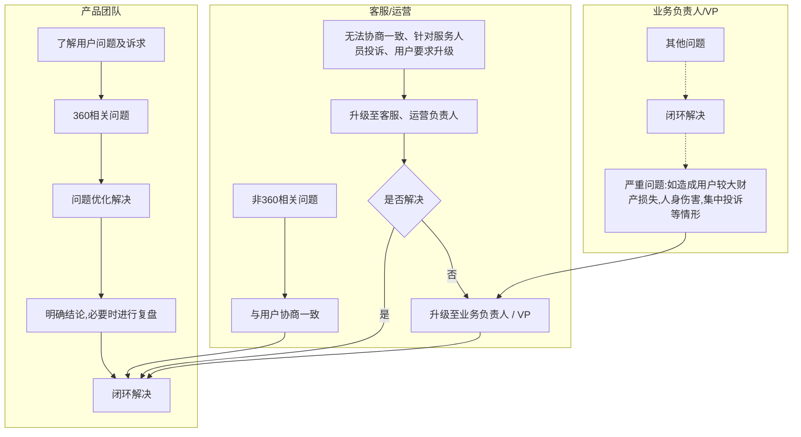
```mermaid
graph TD
  subgraph ProductTeam ["产品团队"]
  A["了解用户问题及诉求"] --> B["360相关问题"]
  B --> C["问题优化解决"]
  C --> D["明确结论,必要时进行复盘"]
  D --> E["闭环解决"]
  end

  subgraph ServiceOps ["客服/运营"]
  F["非360相关问题"] --> G["与用户协商一致"]
  G --> E
  H["无法协商一致、针对服务人员投诉、用户要求升级"] --> I["升级至客服、运营负责人"]
  I --> J{"是否解决"}
  J -->|是| E
  J -->|否| K["升级至业务负责人 / VP"]
  K --> E
  end

  subgraph BusinessStaff ["业务负责人/VP"]
  L["严重问题:如造成用户较大财产损失,人身伤害,集中投诉等情形"] --> K
    M["闭环解决"] -.-> L
    N["其他问题"] -.-> M
  end
```

## 处理基本要求：

尊重用户，积极沟通，优先满足用户合理诉求  
保障时效，闭环解决用户问题  
由表及里，举一反三，深入发掘产品 / 业务改善点，持续优化

## 售后服务管理

## 提升服务效能

公司积极拥抱AI新质生产力，将360智脑大模型广泛应用于多模态用户声音分析、AI客服、AI质检等场景，大幅提升服务效能与深度。在线客服引入AI辅助能力，优化会员客服热线语音队列结构，为用户提供更便捷、高效的服务体验。针对用户反馈平台、VOC用户声音平台、热线客服系统等十余个平台工具进行上百项优化，加快响应速度，降低用户等待时长。对营销投诉举报提高优先级，在线客服工具中对举报反馈进行标识，优先进入人工服务。

## 升级售后服务

智能硬件业务升级售后服务政策，将过保3个月内的设备视为保内免费处理，为用户提供了更卓越的服务体验。客服团队定期开展培训和考核，开展针对新员工及在职员工的专项培训，覆盖业务知识、服务技能等领域；组织新员工上岗认证及在职员工岗中考试，持续强化服务标准落地。知识库系统完成升级，为服务质量提升提供坚实支撑。

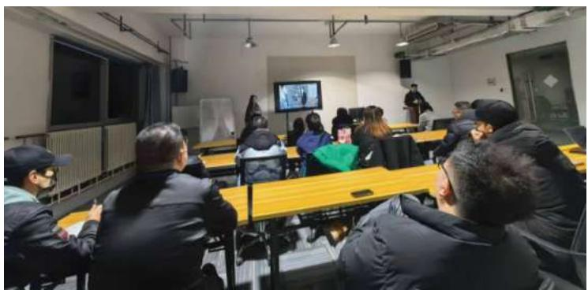

natural_image

Interior of a classroom or meeting room with attendees seated around a long table, facing a screen and presentation (no visible text or symbols)

售后服务培训

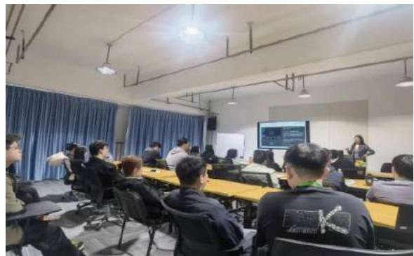

natural_image

Interior view of a modern conference room with attendees seated at desks facing a presentation screen (no visible text or signage)

## 客户关系管理

## 产品知识普及

在产品知识普及方面公司通过360社区帮助中心产品知识问答等渠道 持续发布产品使用教程 产品动态及新版本体验征集活动，为用户提供便捷的产品知识自助获取方式，帮助用户更好地理解和使用产品。

公司构建了多元化的用户触达体系。在抖音、微信、哔哩哔哩、小红书等社交平台开设360粉丝团、客服账号，发布产品使用教程，提高用户对360的了解。在360用户社区平台，持续更新产品动态、使用教程，开展新产品新版本体验征集活动。通过帮助中心、产品知识问答，为用户提供产品知识自助获取方式。

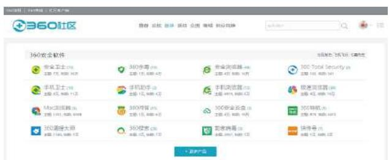

text_image

360社区
360安全软件
360安全软件 (1)
360安全软件 (2)
360安全软件 (3)
360安全软件 (4)
360安全软件 (5)
360安全软件 (6)
360安全软件 (7)
360安全软件 (8)
360安全软件 (9)
360安全软件 (10)
360安全软件 (11)
360安全软件 (12)
360安全软件 (13)
360安全软件 (14)
360安全软件 (15)
360安全软件 (16)
360安全软件 (17)
360安全软件 (18)
360安全软件 (19)
360安全软件 (20)
360安全软件 (21)
360安全软件 (22)
360安全软件 (23)
360安全软件 (24)
360安全软件 (25)
360安全软件 (26)
360安全软件 (27)
360安全软件 (28)
360安全软件 (29)
360安全软件 (30)
360安全软件 (31)
360安全软件 (32)
360安全软件 (33)
360安全软件 (34)
360安全软件 (35)
360安全软件 (36)
360安全软件 (37)
360安全软件 (38)
360安全软件 (39)
360安全软件 (40)
360安全软件 (41)
360安全软件 (42)
360安全软件 (43)
360安全软件 (44)
360安全软件 (45)
360安全软件 (46)
360安全软件 (47)
360安全软件 (48)
360安全软件 (49)
360安全软件 (50)
360安全软件 (51)
360安全软件 (52)
360安全软件 (53)
360安全软件 (54)
360安全软件 (55)
360安全软件 (56)
360安全软件 (57)
360安全软件 (58)
360安全软件 (59)
360安全软件 (60)
360安全软件 (61)
360安全软件 (62)
360安全软件 (63)
360安全软件 (64)
360安全软件 (65)
360安全软件 (66)
360安全软件 (67)
360安全软件 (68)
360安全软件 (69)
360安全软件 (70)
360安全软件 (71)
360安全软件 (72)
360安全软件 (73)
360安全软件 (74)
360安全软件 (75)
360安全软件 (76)
360安全软件 (77)
360安全软件 (78)
360安全软件 (79)
360安全软件 (80)
360安全软件 (81)
360安全软件 (82)
360安全软件 (83)
360安全软件 (84)
360安全软件 (85)
360安全软件 (86)
360安全软件 (87)
360安全软件 (88)
360安全软件 (89)
360安全软件 (90)

360社区

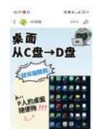

小红书发布产品使用教程  
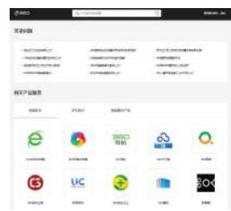  
产品知识帮助中心

## 用户互动与品牌活动

公司创新举办360感恩用户节及四大AI赛事，各业务负责人线下与用户直接互动，推动产品共建与体验交流。围绕纳米AI、360AI写作、安全卫士及浏览器等核心产品，开展多场线下“产品交流会”，深度聆听年轻用户群体需求，推动产品优化与共建。其中，第四期活动走进北京高校，与五十多位高校学子面对面交流，产品经理现场接招、悉心回应各项需求，形成“需求收集—产品改进—用户验证”的互动闭环。

在游戏业务方面，11月举办2025战舰世界日和WCI国际冠军赛，数支国际顶尖战队对决，同时，现场邀请多位用户及人气主播参与，增进与用户间的沟通交流。

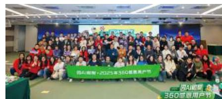

text_image

4月18日，2025年360 attendees
周4月18日
360 attendees

2025年360感恩用户节

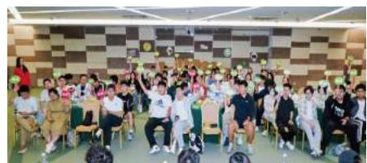

natural_image

Group photo of children and adults seated in a patterned room with checkered walls (no visible text or symbols)

2025产品交流会

text_image

战舰世界十四年
感谢为你！

2025战舰世界日

## 客户满意度调查

2025年，公司按计划扎实开展多期用户调研，高频次覆盖互联网、智能硬件、游戏、AI云盘四大核心业务板块多款核心产品。通过持续倾听用户声音，精准捕捉需求变化，实现了产品功能的敏捷迭代与体验优化。在人群覆盖上，公司实现了从政府部门及公共事业单位职员、医疗/法律/金融从业者、技术研发人员，到企业管理者、普通职员、传媒设计精英、教育科研人员，乃至生活服务个体户、学生等群体的全方位触达，构建了极具代表性的用户反馈池。

针对用户反馈的TOP类问题，公司坚持成立专项小组进行深度分析，严格依据用户需求建议，强力推进业务优化排期，以积极作为回应用户期待。

## 案例

客服团队坚持以有温度的服务赢得用户信赖，全年收获用户赠送的锦旗、感谢信及发帖表扬，现场接待、帮助老人解决问题等暖心服务获得用户高度评价。

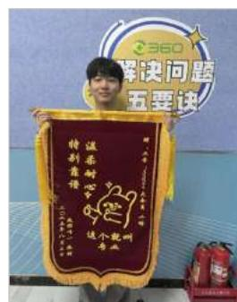

text_image

解决问题
五要诀
派乐时问
特别靠谁
这个就叫专业

用户赠送感谢锦旗

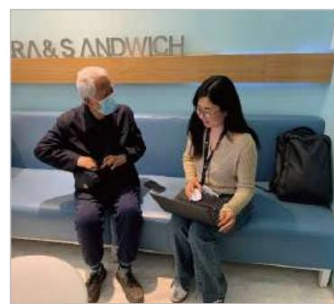

text_image

ARA&S ANDWICH

帮助老人解决问题

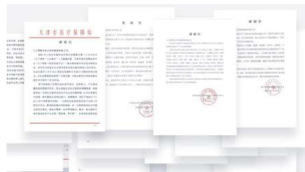

text_image

天津市医疗保障局
事项简介

1. 天津市医疗保障局
地址：天津市经济技术开发区金海路2号
办公地址：天津市南开区万寿路48号
法定代表人：王洪波
注册资本：人民币30,000万元
经营范围：医疗保健、康复、康复及康复护理服务（限分支机构经营）。
经营范围：医疗保健、康复、康复及康复护理服务（限分支机构经营）
经营范围：医疗保健、康复、康复及康复护理服务（限分支机构经营）
经营范围：医疗保健、康复、康复及康复护理服务（限分支机构经营）
经营范围：医疗保健、康复、康复及康复护理服务（限分支机构经营）
经营范围：医疗保健、康复、康复及康复护理服务（限分支机构经营）
经营范围：医疗保健、康复、康复及康复护理服务（限分支机构经营）
经营范围：医疗保健、康复、康复及康复护理服务（限分公司经营）
经营范围：医疗保健、康复、康复及康复护理服务（限分公司经营）
经营范围：医疗保健、康复、康复及康复护理服务（限分公司经营）
经营范围：医疗保健、康复、康复及康复护理服务（限分公司经营）
经营范围：医疗保健、康复、康复及康复护理服务（限分公司经营）
经营范围：医疗保健、康复、康复及康复护理服务（限分公司经营）
经营范围：医疗保健、康复、康复及康复护理服务，医疗器械销售，医疗器械租赁，医疗器械销售，医疗器械销售，医疗器械销售，医疗器械销售，医疗器械销售，医疗器械销售，医疗器械销售，医疗器械销售，医疗器械销售，医疗器械销售，医疗器械销售，医疗器械销售，医疗器械销售，医疗器械销售，医疗器械销售，医疗器械销售，医疗器械销售，医疗器械销售，医疗器械销售，医疗器械销售，医疗器械销售，医疗器械销售，医疗器械销售，医疗器械销售，医疗器械销售，医疗器械销售，医疗器械销售,医疗器械销售,医疗器械销售,医疗器械销售,医疗器械销售,医疗器械销售,医疗器械销售,医疗器械销售,医疗器械销售,医疗器械销售,医疗器械销售,医疗器械销售,医疗器械销售,医疗器械销售,医疗器械销售,医疗器械销售,医疗器械销售,医疗器械销售,医疗器械销售,医疗器械销售,医疗器械销售,医疗器械销售,医疗器械销售,医疗器械销售,医疗器械销售,医疗器械销售,医疗器械销售,医疗器械销售,医疗器械销售,医疗器械销售,医疗器械销售,医疗器械销售,医疗器械销售,医疗器械销售,器械管理服务（除依法须经批准的项目外，凭营业执照依法自主开展经营活动）。

2. 请增加：
1. 请增加：
2. 请增加：
3. 请增加：
4. 请增加：
5. 请增加：
6. 请增加：
7. 请增加：
8. 请增加：
9. 请增加：
10. 请增加：
11. 请增加：
12. 请增加：
13. 请增加：
14. 请增加：
15. 请增加：
16. 请增加：
17. 请增加：
18. 请增加：
19. 请增加：
20. 请增加：
21. 请增加：
22. 请增加：
23. 请增加：
24. 请增加：
25. 请增加：
26. 请增加：
27. 请增加：
28. 请增加：
29. 请增加：
30. 请增加：
31. 请增加：
32. 请增加：
33. 请增加：
34. 请增加：
35. 请增加：
36. 请增加：
37. 请增加：
38. 请增加：
39. 请增加：
40. 请增加：
41. 请增加：
42. 请增加：
43. 请增加：
44. 请增加：
45. 请增加：
46. 请增加：
47. 请增加：
48. 请增加：
49. 请增加：
50. 请增加：
51. 请增加：
52. 请增加：
53. 请增加：
54. 请增加：
55. 请增加：
56. 请增加：
57. 请增加：
58. 请增加：
59. 请增加：
60. 请增加：
61. 请增加：
62. 请增加：
63. 请增加：
64. 请增加：
65. 请增加：
66. 请增加：
67. 请增加：
68. 请增加：
69. 请增加：
70. 请增加：
71. 请增加：
72. 请增加：
73. 请增加：
74. 请增加：
75. 请增加：
76. 请增加：
77. 请增加：
78. 请增加：
79. 请增加：
80. 请增加：
81. 请增加：
82. 请增加：
83. 请增加：
84. 请增加：
85. 请增加：
86. 请增加：
87. 请增加：
88. 请增加：
89. 请增加：

获得多方政企客户的认可与致谢

## 数据安全与客户隐私保护

## “数据安全与客户隐私保护”四要素分析

## 治理

三六零高度重视数据安全与客户隐私保护，严格遵循《中华人民共和国网络安全法》《中华人民共和国个人信息保护法》等法律法规要求，持续完善信息安全管理体系。公司制定并持续优化《360集团数据安全管理制度》《360用户隐私保护白皮书》《360集团个人信息保护制度》《数据安全培训制度》《数据分类分级制度》《信息安全风险管理规范》《360集团网络安全事件应急预案》《安全事件运营指南》等一系列内部规范，覆盖数据采集、存储、使用、传输、销毁全生命周期，明确各环节操作标准与合规要求。

公司搭建了覆盖决策、执行、监督全流程的治理架构，形成以数据安全委员会为统领、各组成部门协同推进、数据审计机构独立监督、执行部门具体落实的四层管理机制。针对移动端产品，公司设立APP专班，专项研讨重大数据隐私问题；同时设立信息安全部与数据平台部，负责业务数据的全周期管理与维护。

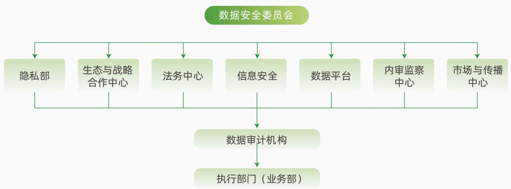

flowchart

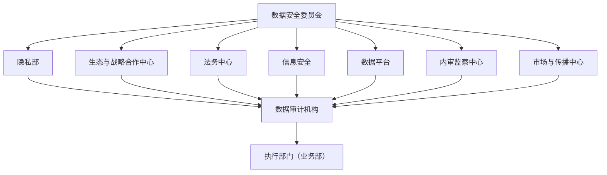
```mermaid
graph TD
  A["数据安全委员会"] --> B["隐私部"]
  A --> C["生态与战略合作中心"]
  A --> D["法务中心"]
  A --> E["信息安全"]
  A --> F["数据平台"]
  A --> G["内审监察中心"]
  A --> H["市场与传播中心"]
  B --> I["数据审计机构"]
  C --> I
  D --> I
  E --> I
  F --> I
  G --> I
  H --> I
  I --> J["执行部门（业务部）"]
```

数据安全委员会组织架构图  

natural_image

Illustration of two people interacting with a large computer screen displaying various document icons (no text or symbols present)

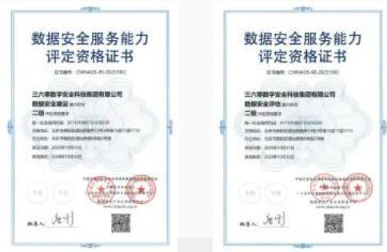  
数据安全服务能力评定资格证书

报告期内，公司顺利通过数据安全服务能力评定审核，在数据安全建设和数据安全评估两大核心领域，获得该评定体系中的最高级别——二级资质，为数据安全与客户隐私保护提供坚实的制度保障与技术支撑。

natural_image

Illustration of two people sitting on a pyramid surrounded by documents, with speech bubbles above (no text or symbols present)

## 战略

<table><tr><td>风险/机遇类型</td><td>风险/机遇描述</td><td>对公司的财务影响</td><td>影响大小</td><td>影响时间范围</td><td>应对措施</td></tr><tr><td>市场风险</td><td>“黑客智能体”的出现,即攻击者可将黑客经验训练成AI智能体,自动完成漏洞挖掘、利用及网络攻击全流程,并可批量复制。一名人类黑客可同时操控数十甚至上百个智能体,化身“超级黑客”,网络攻防已从“人与人”对抗演变为“人与机器”对抗。</td><td>若防御体系无法同步进化,将面临核心业务安全门槛急剧提高、客户信任根基被动摇的严峻挑战,防御资源的持续投入需求大幅增加,市场竞争力与业务稳定性承受更大压力,进而制约业务拓展空间与价值增长潜力。</td><td>高</td><td>短中期</td><td>三六零采取“以AI对抗AI”核心战略,依托360安全大模型,将传统规则驱动的漏洞检测方式升级为学习驱动的智能模式。打造漏洞挖掘蜂群智能体,实现安全漏洞的自动化分析与发现,运营人员仅需输入漏洞编号即可自动完成全链条处置。</td></tr><tr><td rowspan="2">运营风险</td><td>单一模型难以应对复杂多变的安全场景,漏洞发现和处置高度依赖人工经验,效率低下且易出错。</td><td>将导致安全运营效能与响应效率难以匹配攻击演进速度,业务连续性保障压力持续加大,客户对产品可靠性的信任基础被动摇,进而制约核心业务的市场渗透能力,影响战略价值释放节奏。</td><td>高</td><td>中长期</td><td>三六零构建了漏洞检测处置模型、告警研判模型等多个专家模型协同工作,这为下一步打造安全智能体提供了“大脑”。</td></tr><tr><td>随着AI办公、纳米AI等产品上线,用户输入的文本、上传的图片/视频、语音数据等需上传服务器处理,存在数据隐私泄漏风险。大模型应用中可能发生的提示注入攻击、数据隐私泄露、幻觉及智能体失控等问题日益突出。</td><td>数据隐私与智能体安全风险若未能有效管控,可能动摇用户对产品的信任根基,影响核心应用的规模化落地节奏,推高合规管理与技术防护的长期资源投入,削弱产品在关键市场的竞争力与客户粘性,对业务稳定性和增长韧性构成持续压力。</td><td>高</td><td>短中期</td><td>● 三六零采用数据加密传输与处理机制,服务器处理完成后不保存用户数据。● 在隐私政策中明确授权内容,以及共享个人信息清单,在取得用户个人信息前征得用户同意。● 推出“大模型卫士”,针对性解决大模型遭受攻击、数据泄露、幻觉及智能体失控等问题。</td></tr><tr><td>市场机遇</td><td>2025年被行业普遍认为是“智能体元年”,随着智能体成为AI产业核心关键词,面向智能体的安全防护需求激增。</td><td>智能体市场的爆发为安全业务开辟了新的增长赛道,创造了面向政企与产业端的价值释放空间,强化了产品在AI应用生态中的核心竞争壁垒,拓展了收入来源的多元性与持续性,为业务结构优化与长期价值增长注入强劲动能。</td><td>中</td><td>中长期</td><td>三六零推出“360安全智能体”,构建AI原生安全能力体系。安全智能体已广泛部署于APT攻击溯源、安全运营、漏洞防护等场景,在亚冬会网络攻击溯源等实战中发挥重要作用。</td></tr></table>

## 影响、风险与机遇管理

为了有效应对公司所面临的信息安全风险，公司基于《信息安全风险管理规范》，结合管理与技术的方法进行风险评估，根据评估结果进行风险处置和持续改进，确保公司能及时将发现的安全风险控制在可接受的范围内。

## 风险识别

三六零通过内部部署针对数据安全风险的监测系统，不断提升数据安全风险监测能力，包括主动发现核心数据资产保护对象，动态监测数据分布与流转，智能分析识别数据在采集、共享、传输和处理过程中的安全风险，针对不同风险级别采取不同的处置策略，并形成数据安全事件及时上报。

## 风险监测

三六零基于数据资产分类分级管理，对不同风险的数据资产运行采取相应风险监测措施，建设数字化数据安全风险态势感知能力；

联动国家和行业数据安全威胁情报，不断完善、提升数据安全风险监测能力。

## 风险评估及应对

各业务板块需结合自身数据存在的风险开展数据安全风险评估，风险评估可分为自评估及检查评估；自评估由业务板块内部发起，以发现系统存在的薄弱点，实施安全管理、降低评估资产的安全风险为目的，具体实施过程可依据公司《信息安全风险管理规范》中风险评估，检查评估为业务板块委托数据安全管理委员会数据审计机构或外部风险评估服务单位开展定期、抽样风险评估，检查评估主要包含但不限于数据安全风险自评估内容、数据安全措施、数据生命周期内数据控制及审计、突发事件应对措施、数据完整性、可用性、机密性等。

指标与目标

<table><tr><td>目标</td><td>2025年度目标完成情况</td></tr><tr><td>公司未因数据安全问题受到行政处罚</td><td>已完成</td></tr></table>

## 信息安全保障

为保障突发安全事件得到有效应对，公司制定《360集团网络安全事件应急预案》《安全事件运营指南》，健全网络安全突发事件应急预案体系，并常态化开展应急演练，持续提升应急处置能力，最大限度降低突发事件对业务的影响。报告期内，公司未因数据安全问题受到行政处罚。

三六零数据安全事件类型主要包括以下三类：

一是因个人或组织通过任何途径向非授权方披露用户数据或公司内部数据，导致数据泄漏风险或实际发生泄漏的事件；

二是因个人或组织未经授权，有意或无意破坏或删除系统内数据，影响业务正常运行的事件；

三是外部攻击组织或个人通过非法手段实施网络攻击，造成数据泄漏的事件。

公司已针对上述风险类型建立健全相应防范与应对机制。

## 数据安全事件处置

<table><tr><td>事件类型</td><td>紧急措施</td><td>遏制处理</td><td>事后复盘</td></tr><tr><td>数据泄漏事件</td><td>当发现有数据泄漏时,应立即报告数据安全事件应急响应小组,由应急响应小组组织协调相关技术人员进行检查,及时防止数据泄漏范围扩大影响。</td><td>应急小组技术人员紧急排查系统及数据库、应用系统等相关日志,定位数据库IP、关联业务等,及时下线或切断相关业务系统外联网络,并保留证据,必要时公安机关介入。</td><td>应急响应小组组织协调相关技术人员对系统和相关日志进行检查,分析事件原因,并进行总结。</td></tr><tr><td>数据篡改事件</td><td>发现核心数据库数据大规模篡改后,应立即报送数据安全事件应急响应小组,由应急响应小组指定数据库管理员或运维人员进行检查确认,同时启动应急预案,暂停相关业务服务,并通知相关业务人员。</td><td>使用备份数据恢复数据后重新启动服务,并立即追查原因。如属于外部攻击原因的,应立即通过日志等分析攻击来源,必要时请公安机关介入。</td><td>总结经验教训,分析具体原因,加固核心数据库系统安全。</td></tr><tr><td>数据丢失事件</td><td>当发现数据丢失时,应立即报告数据安全事件应急响应小组,由应急响应小组组织协调相关部门进行检查,排查数据丢失影响范围,评估对业务的影响。</td><td>应急响应小组立即协调相关技术人员进行解决,从最近的有效备份中恢复数据及服务。</td><td>总结经验,分析具体原因,强化数据安全处理措施。</td></tr></table>

公司建立常态化红蓝对抗机制，通过年度实战化应急演练，深度锤炼攻防协同能力与应急响应水平，持续优化监测防护体系，精准排查安全风险，切实提升整体安全防护效能。

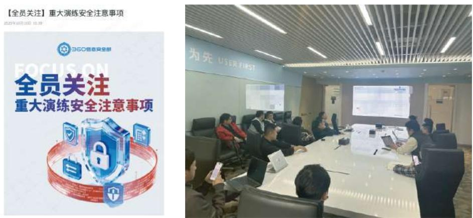  
年度安全应急演练

公司高度重视网络安全文化建设，通过常态化开展网络安全知识培训、应急演练及宣传教育活动，持续提升全员安全意识和防护技能。

## 案例：网络安全周宣传

2025年网络安全宣传周，三六零以“欢迎进入信息安全online——2025副本”为主题，创新融合电竞挑战与网络安全挑战，设置三大主题区域，通过快闪活动向员工普及网络安全知识，积极响应国家网络安全宣传号召，筑牢全员安全防线。

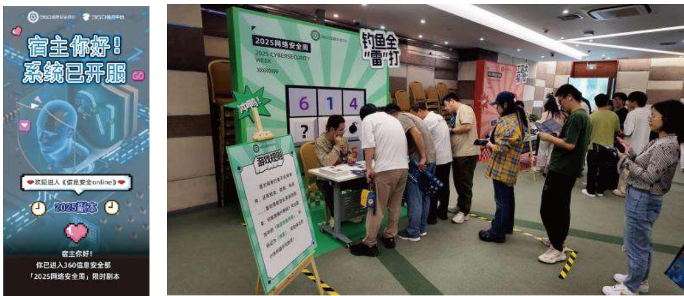

## 案例：全员信息安全培训

为帮助全员从容应对AI时代的安全挑战，公司推出了一场以“减少认知差异，共建数字安全堡垒”为主题的全员专项培训。除了安排培训课程之外，公司还组织了相应的测试，以进一步提升大家对信息安全的认知。

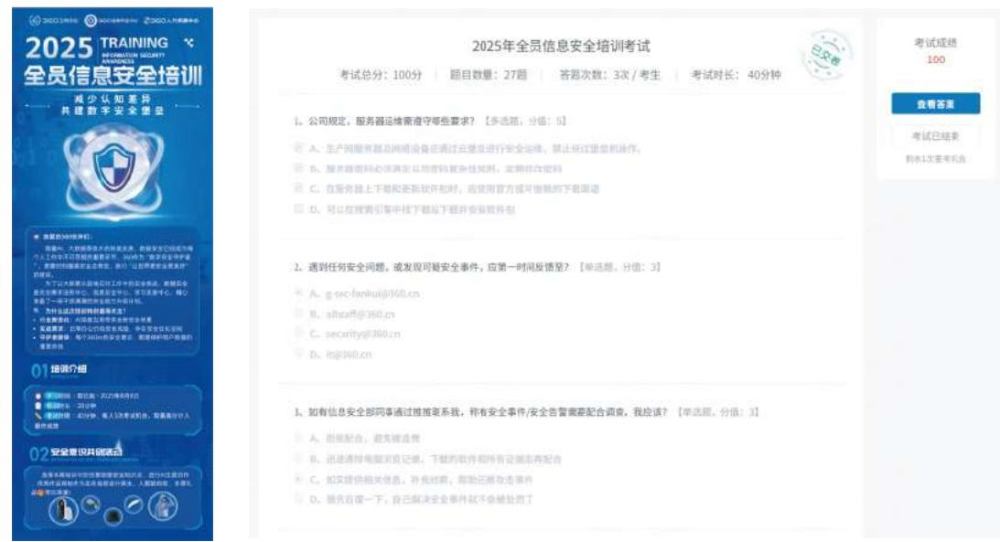

## 客户隐私保护

客户隐私保护是保障客户权益的关键环节。三六零通过机制规范、技术保障与合规检测的有机结合，构建起体系化的客户隐私保护屏障。报告期内，公司未因客户隐私泄露问题受到行政处罚。

隐私保护措施

## 机制与技术保障方面

公司建立了APP全生命周期管理机制，通过流程设置、审批系统和技术手段，对个人信息全生命周期进行合规审核、记录、留痕、管控与保障。

## 检测方面

三六零移动安全团队自主研发的合规检测引擎，针对安卓APP运行过程中存在的合规风险进行检测。引擎具备丰富的合规检测内容，检测项对齐行业标准和监管要求，包含应用权限申请检测、应用违规行为检测，第三方SDK合规检测，境外域名访问检测，符合公安部、工信部等监管机构标准。

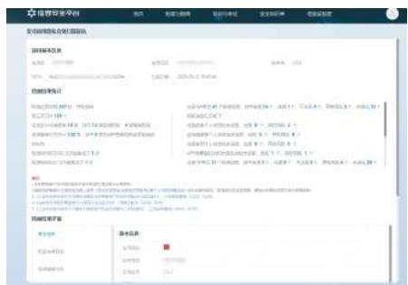

text_image

互联网安全平台
用户信息
地址: www.163.com
登录: 2024-07-01
注册表
网络
网络统计
用户名称: PSEC
用户类型: CNT
账号: 100000000000000000000000000000000000000000000000000000000000000000000000000000000000000
用户名: PSEC
用户名: CNT
账号: 1000000000000000000
账号: 100000
用户信息
密码: 1988-8-1988-8-1988-8-1988-8-1988-8-1988-8-1988-8-1988-8-1988-8-1988-8-1988-8-1988-8-1988-8-1988-8-1988-8-1
用户名: PSEC
用户名: CNT
账号: 1988-8-1988-8-1988-8-1988-8-1988-8-1988-8-1988-8-1988-8-1988-8-1988-8-1988-8-1988-8-1988-8-1988-8
用户名: PSEC
用户名: CNT
账号: 1988-8-1988-8-1988-8-1988-8-1988-8-1988-8-1988-8-1988-8-1988-8-1988-8-1988-8-1988-8
用户名: PSEC
用户名: CNT
账号: 1956666666666666666666666666666666666666666666666666666666666666666666666666666666
用户名: PSEC
用户名: CNT
账号: 1953333333333333333333333333333333333333333333333333333333333333333333333333333333333333333<nl>

## 未成年人隐私保护

三六零紧扣数字时代未成年人网络保护的新形势与新要求，专门制定《360儿童个人信息保护政策》，并且在《360用户隐私白皮书》《360安全云隐私政策》中，均设有“未成年人个人信息保护”专章，明确了针对未成年人的信息收集、使用及保护规则。三六零对未成年人隐私保护提出更高标准，规范儿童个人信息的收集、使用、存储及处理流程，并为家长与儿童提供清晰的权利行使路径，包括访问、更正、删除及防护未成年人个人信息的具体方式，从多维度切实保障未成年人合法权益。

## 案例：数据隐私合规要点培训

公司组织召开数据隐私合规要点培训及测试，就隐私政策撰写核心条款与常见误区、APP全生命周期数据隐私合规要点、第三方SDK接入合规风险识别与应对策略等方面，强化员工对数据隐私保密意识。

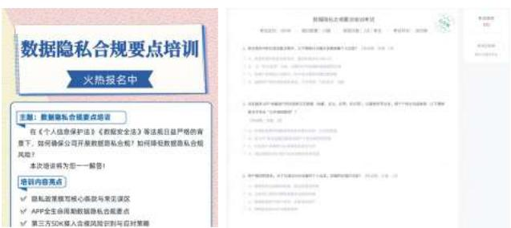

text_image

数据隐私合规要点培训
火热报名中

主题：数据隐私合规要点培训
在《个人信息保护法》《国家安全法》等法规日益严格的背景下，如何确保公司开展数据隐私合规？如何降低数据隐私合规风险？
本次培训将为您一一解答！
培训内容亮点
✓ 数据政策推荐为核心条款与常见误区
✓ APP全生命周期数据隐私合规重点
✓ 第三方50K接入合规风险识别与应对策略

## 创新驱动

## “创新驱动”四要素分析

## 治理

三六零围绕“AI+安全”双主线战略，构建了从顶层战略到组织架构、从技术研发到成果转化的系统化创新研发治理体系。公司以创新成果产出、创新人才培养、行业交流协作为抓手，持续深耕前沿技术，探索提升研发效率的有效路径。

natural_image

Illustration of two people at a desk with laptops and a speech bubble above, no text or symbols present

公司以科技研发为驱动，保持较高研发投入，优化人才培养机制，着力打造一支兼具创新思维与专业技能的高素质研发队伍。在安全领域，360组建了强大的白帽子军团，常年处于全球黑客对抗一线。迄今为止，360核心专家超2,000人，社区签约专家数万人，覆盖全国的数十家城市服务中心。

## 2025年关键绩效

  
研发人员数量

  
研发人员数量占公司人数的比例

  
研发费用

  
研发费用占营业 收入比例

3,018人

57.23%

32.25亿元

37.11%

为激发员工创新潜能，打造富有活力的创新创业环境，公司建立健全物质激励与精神激励并重的员工激励体系。通过设立专项奖励机制，对在技术创新、产品研发等方面取得突破性成果的项目、团队及个人予以重点激励。同时，持续举办技能与创新应用赛事，增强员工成就感与荣誉感，营造崇尚创新、鼓励创造的良好氛围。

## 战略

<table><tr><td>风险/机遇类型</td><td>风险/机遇描述</td><td>对公司的财务影响</td><td>影响大小</td><td>影响时间范围</td><td>应对措施</td></tr><tr><td>市场风险</td><td>公司所处的人工智能、数字安全行业属于技术密集型高科技领域,技术革新频出,产品与商业模式快速迭代,公司研发投入大、变现周期长。若无法紧跟前沿技术、把握用户需求,互联网广告及增值业务将面临用户流失风险。</td><td>若无法紧跟前沿技术、精准把握用户需求,前期高额的研发投入可能难以转化为可持续的用户价值,动摇广告及增值业务的市场根基,影响核心业务的用户粘性与市场份额,削弱收入来源的稳定性;同时,为维持技术竞争力而持续高强度的研发投入,将拉高资源消耗强度,制约业务转型节奏,对长期价值增长形成持续压力。</td><td>高</td><td>短中长期</td><td>公司持续创新应用最新人工智能及安全技术,以契合行业与自身业务发展,保证核心竞争力。依托自研千亿参数通用大模型“360智脑”,持续迭代技术底层能力;发布最新模型“360zhinao3-o1.5”,在第三方基准评测中表现优异。同时推出“纳米AI搜索”“360AI办公”等AI原生产品,逐步构建应用生态矩阵,加速商业化落地。</td></tr><tr><td>技术风险</td><td>●进入移动互联网时代,用户与广告主转向移动端,传统PC广告市场受到冲击,公司面临营收规模减少风险。同时,“人工智能+”浪潮下,市场竞争激烈,业务拓展成本增加。若公司未及时应对,将影响商业化效率和竞争优势。●在数字安全市场,公司虽拥有国家级网络安全能力,但商业客户产品需求有限且诉求各异,技术优势难以充分变现。</td><td>若未能及时适应用户与广告主向移动端迁移的趋势,传统业务的市场根基将被持续侵蚀,核心资源难以向新增长领域有效转化;在“人工智能+”浪潮下,新赛道的资源投入强度与竞争门槛同步提升,商业化效率与市场响应速度面临更高要求,业务结构优化与竞争优势的持续力将受到长期考验。</td><td>中</td><td>中长期</td><td>●公司依托自主研发大模型,以AI驱动产品升级重塑,提升用户体验与商业化能力;利用AI优化广告精准投放与流量转化,完善广告全链条管理,降低PC端市场萎缩影响。●公司在提供数字安全服务时,增添大模型、数字化等优势项目,力求实现业务突破。</td></tr><tr><td>运营风险</td><td>●人工智能及网络安全领域,技术专利、知识产权和研发成果等是公司重要的无形资产,若出现核心技术信息失密、专利管理疏漏,导致核心技术泄密,将对公司技术创新和新产品开发造成不利影响。●公司核心技术底蕴来自于技术人员的持续创新,研发人员更新迭代也属正常现象,但若出现核心技术人员流失、核心技术泄密等情形,将对公司生产经营产生重大不利影响。</td><td>核心技术信息失密或核心技术人员流失,将削弱技术壁垒的可持续性,影响研发投入向创新成果的转化效率,制约新产品开发节奏与市场响应能力,加大技术领先优势的维持难度,对长期价值增长与战略竞争力形成持续压力。</td><td>高</td><td>中长期</td><td>公司持续加强知识产权管理体系建设,完善核心技术保密机制,并通过建立有竞争力的激励机制和良好的人才发展环境,稳固核心技术团队,保障公司技术安全与持续创新能力。</td></tr><tr><td>政策机遇</td><td>国家推动数字经济发展与网络安全建设,AI安全风险已上升至国家战略高度。</td><td>AI安全风险上升至国家战略高度,政策红利为安全技术应用开辟了更广阔的市场空间,加速核心技术向关键行业渗透,推动安全服务与智能场景深度融合,强化核心业务在数字经济浪潮中的战略价值,为长期价值增长注入强劲动能。</td><td>中</td><td>长期</td><td>公司确立的“AI+安全”双主线战略与国家政策保持一致,持续参与行业标准制定,抢占AI安全领域话语权。</td></tr></table>

## 影响、风险与机遇管理

在创新研发过程中，公司建立了系统化的风险管理机制，将风险识别、评估与应对措施融入项目立项阶段，确保风险防控贯穿研发全周期。

## 风险识别与评估

研发负责人在项目启动前，即对潜在风险进行系统识别与评估，并依据风险影响程度划分为高、中、低等级，同时制定相应应对预案。

## 风险评审

风险评估结果及应对措施作为立项报告的核心组成部分，随报告一并提交至技术委员会，作为项目评审与决策的重要依据。

## 风险监督与防控

项目立项通过后，后续研发工作与风险管控活动的开展，均严格遵循立项报告中已明确的风险防控要求，实现风险管理与项目执行的有效统一。

指标与目标

<table><tr><td>目标</td><td>2025年度目标完成情况</td></tr><tr><td>年度科研投入比例不低于30%</td><td>已完成</td></tr><tr><td>研发人员数量不低于50%</td><td>已完成</td></tr></table>

## 科技创新举措

## 创新技术分享

为营造浓厚的创新文化氛围，持续提升研发等岗位员工的专业能力，公司常态化举办Tech Talk技术分享活动，为技术人员搭建学习交流平台。报告期内，我们积极组织Tech Talk分享，内容涉及Web前端开发、服务端开发、算法、安全研究、测试、大数据及AI应用等多个专业领域，有效推动技术交流与知识共享，营造了积极向上的创新氛围。

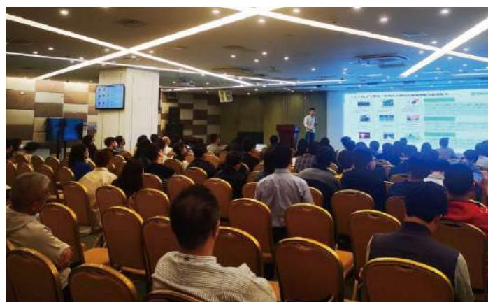

text_image

Conference hall with audience facing a presenter and large screen displaying event information and charts

## 产学研合作

公司持续深化产学研合作，与高校、科研机构等第三方平台保持紧密协作，不断强化技术创新能力，助力产业高质量发展。截至目前，360牵头组建行业产教融合共同体，包括全国信息安全产教融合共同体、全国人工智能+安全产教融合共同体、北京新一代信息技术产教联合体、全国数智安全行业产教融合共同体及河北省数字安全与人工智能行业产教融合共同体，汇聚政府、企业、机构及院校等单位，共同推动产教融合生态建设与行业人才培养。

## 案例

三六零与北京外国语大学亚洲学院、非洲学院开展校企合作专项走访活动。双方围绕非通用语人工智能大模型研发、横向科研课题合作等关键议题展开深度交流，共同探索创新合作路径。

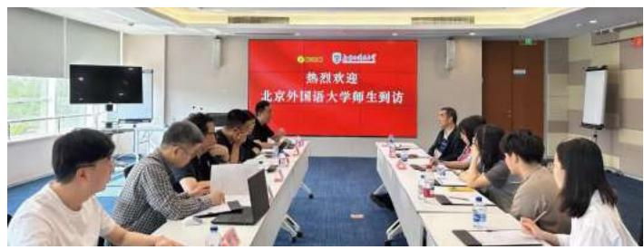

text_image

热烈欢迎
北京外国语大学师生到访

## 案例

2025年全国人工智能+安全（数字安全）产教融合共同体年会以“跨界聚能·链通未来——构建AI安全新生态，培育产教融合新人才”为主题，三六零携手兰州大学、酒泉职业技术大学，汇聚政府、高校、企业、研究机构等多方力量，以产业需求为导向，以人才培养为核心，推动人工智能与数字安全领域产教融合向纵深发展。

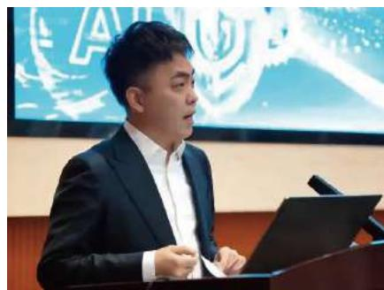

text_image

Man giving speech at podium with visible 'ALU' logo in background screen

## 案例

三六零主办的“纳米AI校园行”主题活动落地河南物流职业学院。活动聚焦“数字安全与人工智能技术讲座”“纳米AI视频创作赛作品征集”两大核心板块，旨在帮助学生深化数字安全与AI双重认知，推动课堂知识与产业需求精准对接，为河南省数字经济发展储备专业人才力量。

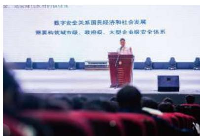

text_image

数字安全关系国民经济和社会发展
需要构筑城市级、政府级、大型企业级安全体系

## 行业交流

行业交流是企业成长与技术升级的重要引擎，2025年，公司充分发挥自身创新优势，持续深化行业技术交流与生态合作，积极打造开放共赢的技术交流生态，通过共享先进经验、共探前沿动态，深度参与国内外创新技术研讨与成果分享，有力推动行业协同发展。

## 案例

三六零主办2025年世界互联网大会前沿人工智能模型论坛，论坛邀请国内外顶尖专家、学者和行业领袖，围绕人工智能模型安全治理、技术生态、产业应用三大核心议题展开主题演讲。与会嘉宾聚焦AI技术迭代、风险防控、生态协同与产业赋能等关键方向，分享“以模制模”安全新范式、软硬件协同优化、Agentic  AI产业落地等创新方案与实践成果，深入探讨AI安全、创新、可持续发展路径。论坛吸引多名政企研代表参会，为全球人工智能领域搭建了高水平的交流合作平台。

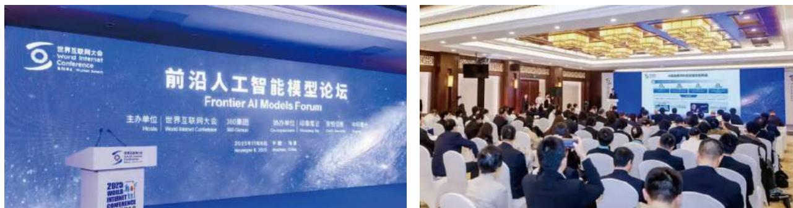

## 案例

为进一步推进云上大模型安全技术研究和标准化建设工作，中国信息通信研究院于2025年3月牵头成立“云上大模型安全推进方阵”，旨在整合产业力量，规范云上大模型的安全建设，推动技术创新与安全治理协同发展。在2025全球数字经济大会上，360被授予奖牌，成为本次“云上大模型安全推进方阵”的首批成员单位。

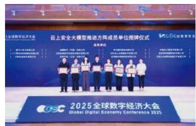

text_image

云上安全大模型推进方阵成员单位揭牌仪式
2025全球数字经济大会
Global Digital Economy Conference 2025

## 案例

为推动智能化能力在软件工程领域的落地应用，三六零联合行业二十余家头部企业共同编制《软件智能研发应用效能度量规范》，助力建立业界统一的软件智能研发效能度量标准，保证不同企业间数据具有可比性。

## 案例

为提升大模型应用交付供应商技术、管理、服务等多方面能力，6月24日，由中国信息通信研究院牵头、360集团等企业参与编制的《大模型应用交付供应商总体能力要求》技术规范（AIIA/T 0225-2025）正式发布。

公司积极主持参与国际、国家、行业等各级标准制（修）订，助力行业整体发展水平和产品质量的提升，发挥行业带头作用。报告期内，三六零深度参与编写三项国家标准：《GB/T 45288.1-2025人工智能 大模型 第1部分：通用要求》《GB/T 45288.2-2025 人工智能 大模型 第2部分：评测指标与方法》《GB/T 45288.3-2025 人工智能 大模型 第3部分：服务能力成熟度评估》；正式发布人工智能智能体工程师标准及认证体系以及《大模型安全白皮书》。

natural_image

Abstract illustration of business professionals in a meeting, surrounded by icons representing ideas, technology, and business (no text or symbols)

此外，360漏洞研究院研究成果《WingMuzz：Blackbox Testing of IoT Protocols via Two-dimensionalFuzzing Schedule》在第40届IEEE/ACM自动化软件工程国际会议上斩获杰出文章奖；360AI研究院在多模态生成和多模态理解方向的两篇研究论文入选ICCV 2025（国际计算机视觉大会）。

## 科技创新成果

## 业务领域

互联网领域

## 创新成果

公司构建“A·I·P·C”智慧营销新体系，推出了以360灵数、360创易、360智能体、360智投为核心产品的一站式智能投放平台。

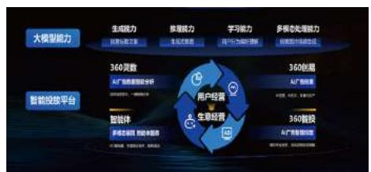

flowchart

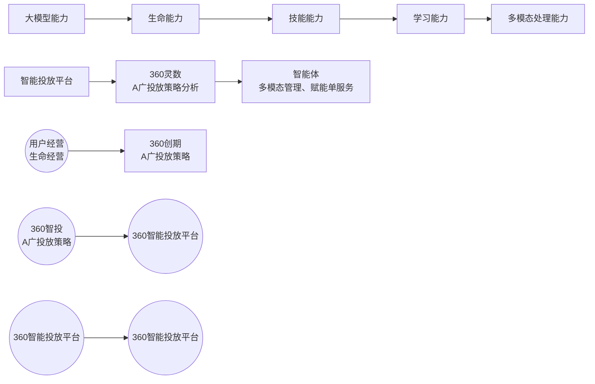
```mermaid
graph LR
  A["大模型能力"] --> B["生命能力"]
  B --> C["技能能力"]
  C --> D["学习能力"]
  D --> E["多模态处理能力"]
  
  F["智能投放平台"] --> G["360灵数\nA广投放策略分析"]
  G --> H["智能体\n多模态管理、赋能单服务"]
  
  I(("用户经营\n生命经营")) --> J["360创期\nA广投放策略"]
  K(("360智投\nA广投放策略")) --> L(("360智能投放平台"))
  M(("360智能投放平台")) --> N(("360智能投放平台"))
```

360AI营销示意

公司依托自研“360智脑”与多家主流大模型的融合优势，持续迭代全线互联网产品如“360AI办公”“纳米AI”“纳米漫剧流水线”“360安全龙虾”等。

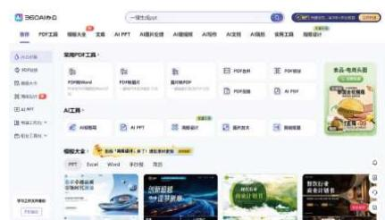

text_image

e-commerce
首页
设计工具
搜索工具
文件
API/PT
AI/PCB
AI/AR/PCB
AI/AR/PCB
AI/AR/PCB
AI/AR/PCB
AI/AR/PCB
AI/AR/PCB
AI/AR/PCB
AI/AR/PCB
AI/AR/PCB
AI/AR/PCB
AI/AR/PCB
AI/AR/PCB
AI/AR/PCB
AI/AR/PCB
AI/AR/PEP
AI/PCB
AI/PCB
AI/PCB
AI/PCB
AI/PCB
AI/PCB
AI/PCB
AI/PCB
AI/PCB
AI/PCB
AI/PCB
AI/PCB
AI/PCB
AI/PCB
AI/PCB
AI/PCB
AI/PCB
AI/PCB
AI/PCB
AI/PCB
AI/PCBA
AI/PCBA
AI/PCBA
AI/PCBA
AI/PCBA
AI/PCBA
AI/PCBA
AI/PCBA
AI/PCBA
AI/PCBA
AI/PCBA
AI/PCBA
AI/PCBA
AI/PCBA
AI/PCBA
AI/PCBA
AI/PCBA
AI/PCBA
AI/PCBA
AI/PCBA
AI/PCPA
AI/PCPA
AI/PCPA
AI/PCPA
AI/PCPA
AI/PCPA
AI/PCPA
AI/PCPA
AI/PCPA
AI/PCPA
AI/PCPA
AI/PCPA
AI/PCPA
AI/PCPA
AI/PCPA
AI/PCPA
AI/PCPA
AI/PCPA
AI/PCPA
AI/PCPA
AI/PCPB
AI/PCPB
AI/PCPB
AI/PCPB
AI/PCPB
AI/PCPB
AI/PCPB
AI/PCPB
AI/PCPB
AI/PCPB
AI/PCPB
AI/PCPB
AI/PCPB
AI/PCPB
AI/PCPB
AI/PCPB
AI/PCPB
AI/PCPB
AI/PCPB
AI/PCPB
AI/PCBBA10000000000000000000000000000000000000000000000000000000000000000000000000000000000000000000000000000<nl>

360AI办公界面

## 业务领域

数字安全领域

## 创新成果

推出“360安全云”战略级产品。  
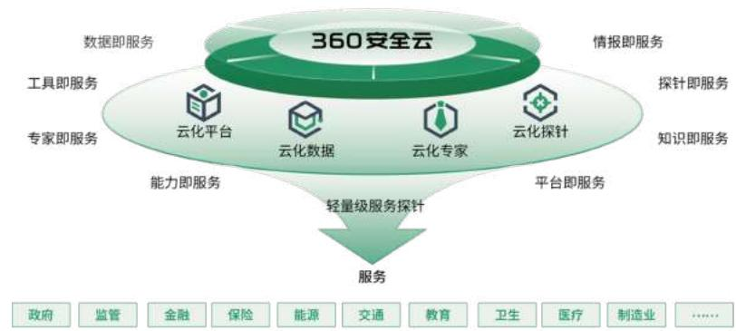

flowchart

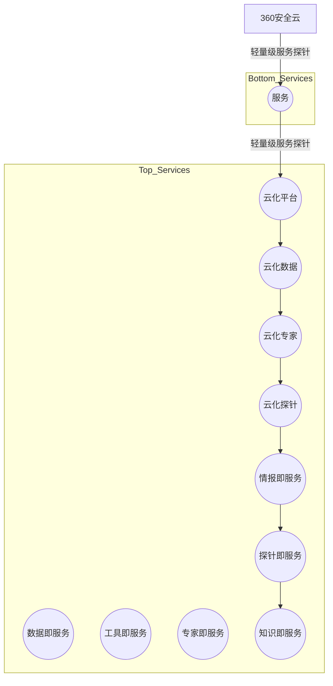
```mermaid
graph TD
  Center["360安全云"]
  
  subgraph Top_Services
    direction TB
    Data(("数据即服务"))
    Tools(("工具即服务"))
    Experts(("专家即服务"))
    CloudPlatform(("云化平台"))
    CloudData(("云化数据"))
    CloudExpert(("云化专家"))
    CloudProbe(("云化探针"))
    Info(("情报即服务"))
    Probe(("探针即服务"))
    Knowledge(("知识即服务"))
  end
  
  subgraph Bottom_Services
    direction TB
    Service(("服务"))
  end
  
  Center -->|轻量级服务探针| Service
  Service -->|轻量级服务探针| CloudPlatform
  CloudPlatform --> CloudData
  CloudData --> CloudExpert
  CloudExpert --> CloudProbe
  CloudProbe --> Info
  Info --> Probe
  Probe --> Knowledge
```

360安全云服务

公司持续推动“360安全大模型”技术创新与商业化落地“双轮并进”，增强模型实战能力，并加速行业客户部署应用，巩固在AI安全融合领域的领先地位。

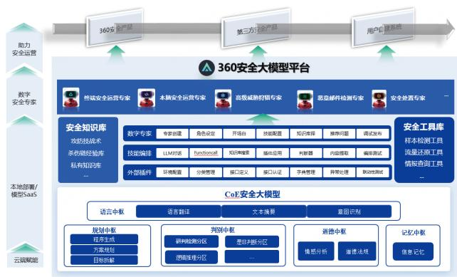

flowchart

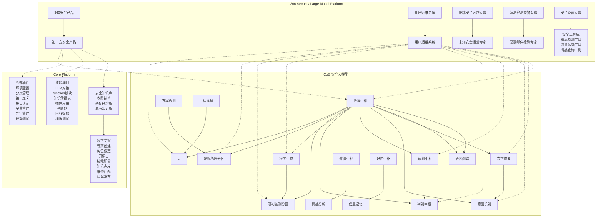
```mermaid
graph TD
  subgraph Platform["360 Security Large Model Platform"]
    direction TB
  A["360安全产品"] --> B["第三方安全产品"]
  C["用户运维系统"] --> D["用户运维系统"]
  E["终端安全运营专家"] --> F["未知安全运营专家"]
  G["漏洞检测预警专家"] --> H["恶意邮件检测专家"]
  I["安全处置专家"] --> J["安全工具库\n样本检测工具\n流量达频工具\n情感查询工具"]
  end

  subgraph CorePlatform["Core Platform"]
  K["安全知识库\n攻防技术\n杀伤经验库\n私有知识库"] --> L["数字专案\n专家创建\n角色设定\n开场白\n技能配置\n知识点库\n维修问题\n调试发布"]
    M["技能编目\nLLM对策\nfunction模块\n知识传播表\n插件应用\n判断器\n内容提取\n编报测试"]
    N["外部插件\n环境配置\n分类管理\n接口定义\n接口认证\n字典管理\n异常处理\n联动测试"]
  end

  subgraph CoE["CoE 安全大模型"]
  O["语言中枢"] --> P["语言翻译"]
  Q["文字摘要"] --> R["意图识别"]
  S["规划中枢"] --> T["判别中枢"]
  U["程序生成"] --> V["研判监测分区"]
  W["方案规划"] --> X["逻辑管理分区"]
  Y["目标拆解"] --> Z["..."]
  AA["道德中枢"] --> AB["情感分析"]
  AC["记忆中枢"] --> AD["信息记忆"]
  end

  %% Connections from Main Platform to CorePlatform
  %% Left Branch: 
  B -.-> K
  B -.-> M
  B -.-> N
  B -.-> O
  
  %% Right Branch: 
  D -.-> O
  D -.-> Q
  D -.-> R
  D -.-> S
  D -.-> T
  D -.-> U
  D -.-> V
  D -.-> X
  D -.-> Z
  
  %% Bottom Branch: 
  O --> P
  O --> Q
  O --> R
  O --> S
  O --> T
  O --> U
  O --> V
  O --> X
  O --> Z
  
  %% Connections from CorePlatform to CoE
```

360安全大模型平台

公司基于“以模治模”理念打造大模型卫士，面向企业和机构提供一站式的模型接入、数据管理、安全评测、任务管理及结果分析能力，帮助企业识别、量化并降低大模型在实际应用中的安全风险。

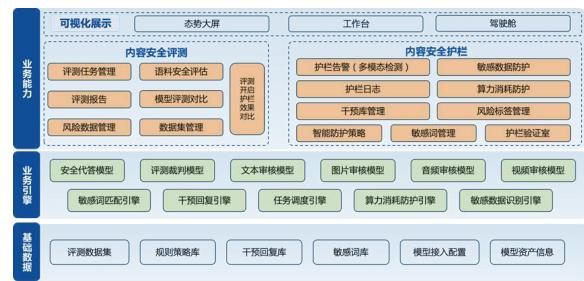

flowchart

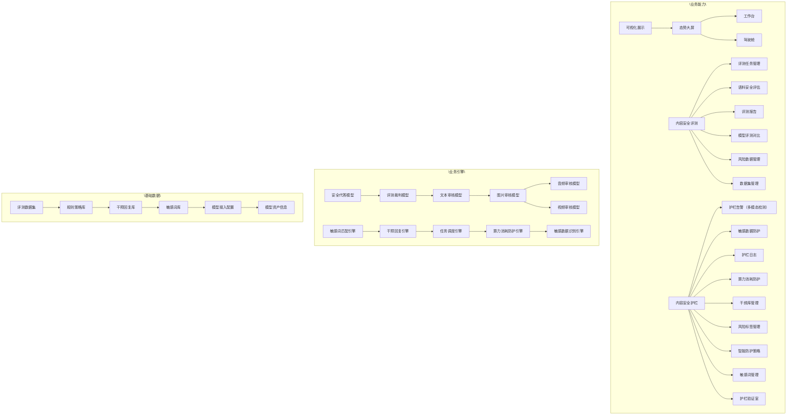
```mermaid
graph TD
  subgraph sg["\"业务能力\""]
  A["可视化展示"] --> B["态势大屏"]
  B --> C["工作台"]
  B --> D["驾驶舱"]
  E["内容安全评测"] --> F["评测任务管理"]
  E --> G["语料安全评估"]
  E --> H["评测报告"]
  E --> I["模型评测对比"]
  E --> J["风险数据管理"]
  E --> K["数据集管理"]
  L["内容安全护栏"] --> M["护栏告警（多模态检测）"]
  L --> N["敏感数据防护"]
  L --> O["护栏日志"]
  L --> P["算力消耗防护"]
  L --> Q["干频库管理"]
  L --> R["风险标签管理"]
  L --> S["智能防护策略"]
  L --> T["敏感词管理"]
  L --> U["护栏验证室"]
  end

  subgraph sg_2["\"业务引擎\""]
  V["安全代答模型"] --> W["评测裁判模型"]
  W --> X["文本审核模型"]
  X --> Y["图片审核模型"]
  Y --> Z["音频审核模型"]
  Y --> AA["视频审核模型"]
  AB["敏感词匹配引擎"] --> AC["干预回复引擎"]
  AC --> AD["任务调度引擎"]
  AD --> AE["算力消耗防护引擎"]
  AE --> AF["敏感数据识别引擎"]
  end

  subgraph sg_3["\"基础数据\""]
  AG["评测数据集"] --> AH["规则策略库"]
  AH --> AI["干预回复库"]
  AI --> AJ["敏感词库"]
  AJ --> AK["模型接入配置"]
  AK --> AL["模型资产信息"]
  end
```

“360大模型卫士”内容安全评测与内容安全护栏两大模块

<table><tr><td>业务领域</td><td colspan="2">创新成果</td></tr><tr><td>数字安全领域</td><td>依托360安全大模型,公司创新推出“安全智能体蜂群”。</td><td>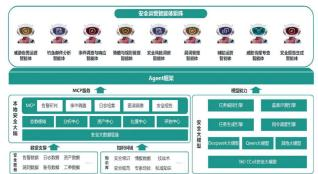360安全运营智能体</td></tr><tr><td>智能硬件领域</td><td>以AI技术赋能全系硬件,通过功能与体验的双重升级,持续巩固在可视门铃、行车记录仪等核心品类的行业领先地位。</td><td>360行车记录仪“G980”</td></tr></table>

## 科技创新奖项

报告期内，公司获得的主要荣誉如下：

公司入选“AI产品榜”《2025中国AI年度榜单》年度企业榜

公司斩获中国互联网协会《2025年中国网络安全前二十家企业》榜首

纳米AI入选“AI产品榜”《2025中国AI年度榜单》年度产品榜

360安全大模型荣获中国信息通信研究院“智能威胁检测能力检验证书”“智能安全运营能力检验证书”“智能知识问答能力检验证书”

360安全大模型入选世界互联网大会《以普惠包容的人工智能治理赋能全球可持续发展》典型案例

360安全大模型一体机荣获IDC咨询《中国安全大模型一体机市场洞察及品牌推荐，2025：大模型席卷全球，AI与安全相辅相成》安全大模型一体机首位推荐

360安全大模型荣获IDC咨询《中国大模型安全保护市场概览，2025：全方位安全检测与防护构建可信AI》多类细分领域首位推荐

360大模型卫士首家通过中国信通院“大模型安全防护围栏能力检验”并获证

360大模型卫士评估系统获国家网络与信息系统安全产品质量检验检测中心“大模型安全评估系统（增强级）认证”

360大模型卫士获IDC咨询《中国大模型安全评估平台厂商技术评估，2025》综合实力位列安全行业第一

360大模型安全解决方案荣获IDC咨询《大模型安全检测与防护解决方案品牌推荐与洞察》推荐

360终端安全智能体入选中国互联网协会《第九届软件和信息服务业年度案例成果展示册》

基于360安全智能体打造的政务、金融两大行业解决方案成功入选嘶吼安全产业研究院“2025中国网络安全重点行业优秀解决方案”

360安全智能体荣获IDC咨询《中国安全智能体市场概览，2025：东风已至，未来可期》安全运营、安全检测、数据安全、安全合规、安全攻防智能体五大核心领域权威认证

360安全智能体荣获IDC咨询《中国AI Agent市场剖析及厂商推荐，1Q25》推荐

## 知识产权保护

## 知识产权体系建设

作为以技术创新为驱动的科技企业，三六零始终将知识产权视为核心战略资产，构建了系统化的知识产权保护体系。通过完善制度体系、设立专利评审委员会等措施，公司持续规范知识产权的创造、运用、保护及管理，为技术创新与成果转化提供坚实保障。报告期内，公司下属企业成功入选“国家知识产权示范企业创建对象”名单。

国家知识产权示范企业创建对象

<table><tr><td>地区</td><td>序号</td><td>企业名称</td></tr><tr><td rowspan="18">北京市</td><td>1</td><td>中国华能集团清洁能源技术研究院有限公司</td></tr><tr><td>2</td><td>北京康斯特仪表科技股份有限公司</td></tr><tr><td>3</td><td>北京万泰生物药业股份有限公司</td></tr><tr><td>4</td><td>北京唐智科技发展有限公司</td></tr><tr><td>5</td><td>中科三维科技有限公司</td></tr><tr><td>6</td><td>中国联合网络通信集团有限公司</td></tr><tr><td>7</td><td>凌云光技术股份有限公司</td></tr><tr><td>8</td><td>北京东方森森生物科技有限公司</td></tr><tr><td>9</td><td>小米科技有限责任公司</td></tr><tr><td>10</td><td>中国移动通信集团设计院有限公司</td></tr><tr><td>11</td><td>北京石头世纪科技股份有限公司</td></tr><tr><td>12</td><td>北京朗视仪器股份有限公司</td></tr><tr><td>13</td><td>京东科技信息技术有限公司</td></tr><tr><td>14</td><td>北京奇虎科技有限公司</td></tr><tr><td>15</td><td>北京诺禾致源科技股份有限公司</td></tr><tr><td>16</td><td>天翼云科技有限公司</td></tr><tr><td>17</td><td>中材科技风电叶片股份有限公司</td></tr><tr><td>18</td><td>北京首钢股份有限公司</td></tr></table>

## 制度保障

公司制定《知识产权管理办法》《专利申请管理办法》《专利分级管理办法》《专利撰写答复操作规程》《开源软件法律合规指引》等相关制度与规范。

本年度，公司在既有专利、商标、著作权等知识产权治理框架的基础上，形成《360集团商业秘密管理办法》，以商业秘密保护为重点推进方向：通过系统性诊断、制度构建、组织落地、工具支撑、能力建设与外部联动六大维度，形成了可操作、可查核、可持续改进的治理闭环，建成由专利、商标、著作权、商业秘密构成的“四位一体”知识产权体系，为集团知识产权的长期保护提供了坚实的制度基础。

## 管理机构

成立专利评审委员会，评委会主席由三六零副总裁兼首席科学家出任，成员由公司专业委员会推荐各领域技术专家担任。

## 知识产权保护措施

## 保护自有知识产权

公司专利已实现申请评审线上化、申请流程标准化、评审标准权威化的全过程管理，通过对专利提案从技术价值、商业价值到法律价值的立体式前置评估，将最适于通过专利进行保护的技术创新分级管理，充实完善公司现有专利组合。

公司构建并实施了覆盖监测、取证、诉讼、执行各环节的“全链条主动维权机制”，以实现对侵权行为的专业化识别与高效处置。该机制依托常态化监测体系及时识别侵权线索，通过标准化流程开展证据固定与法律评估，并系统推进司法诉讼与权益执行，逐步形成可持续、制度化的维权运作能力。

公司制定了《新媒体账号及官网对外发布信息管理规范》，通过落实责任人、责任部门，提出标准，优化流程，对全集团的自媒体及官网内容进行治理。报告期内，公司组织多次制度培训、审批流程优化，对公司内容制作相关事宜进行事前防控，有效降低违规及侵权事件。

natural_image

Illustration of a person interacting with a large green digital interface displaying envelopes, documents, and paper airplanes (no text or symbols present)

## 尊重他人知识产权

三六零充分尊重他人知识产权，通过制度及流程，规范与增强员工知识产权意识；此外，建立知识产权风险预警机制和控制机制，将知识产权风险治理控制点嵌入产品立项、上市发布、产品退市的各流程中，有效避免公司的经营、研发活动侵犯他人的知识产权。

若出现侵权事件，公司设置了及时有效的侵权投诉处理机制：根据产品及知识产权形态的区别，拟定了不同的处理指引以规范案件处理流程，对知识产权的合法性、相关性进行审查，并保障权利人的合法权益。对侵权内容采取通知、删除、屏蔽或断链等措施，并及时向权利人反馈处理结果。

## AI知识产权合规

针对AI产品存在的知识产权风险，深入研究前沿法律问题、紧跟产业发展动向，通过“外规内化”制定风险清单与合规指引，公司制定并发布《AIGC知识产权合规指引》，覆盖训练数据合规、生成内容合规等各方面，为集团前沿业务发展提供知识产权合规支撑。

## 知识产权意识培养

为加强员工知识产权风险意识，公司组织开展知识产权相关培训，建立专利墙展示核心技术成果。

## 推进网络安全产业专利池建设

2025年国家网络安全宣传周，三六零等五家创始单位共同启动发布网络安全产业专利池，旨在通过集中管理专利，构建“专利共营、生态共促、安全共筑”的创新联合体。这一机制将有效降低技术交易与维权成本，提升产业协同创新和风险应对能力，为产业高质量发展注入新动能。

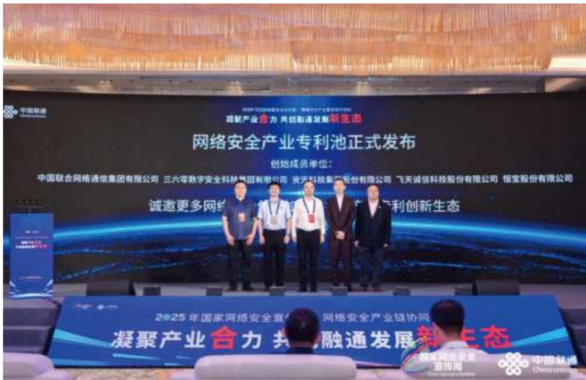

text_image

2025年国家网络安全合作网络安全产业协同发展
凝聚产业合力 共享融通发展新生态
中国联合网络通信集团有限公司 三六零数字安全科技集团有限公司 安天科技集团股份有限公司 飞天诚信科技股份有限公司 恒宝股份有限公司
诚邀更多网络安全产业创新生态
2025年国家网络安全合作网络安全产业协同发展
凝聚产业合力 共享融通发展新生态
中国联通
Chinaunicom
中国联通
Chinaunicom
中国联通
Chinaunicom

## 科技伦理

AI大模型的快速发展在推动产业变革的同时，也带来了伦理治理的新挑战。作为人工智能技术研发者，三六零始终坚持技术向善理念，系统构建AI伦理准则，以技术创新与制度规范并重，确保技术发展始终以增进人类福祉为根本导向。公司通过IS0/1EC42001人工智能管理体系认证，成为国内首家通过该认证的安全企业。

公司严格遵照《中华人民共和国科学技术进步法》《关于加强科技伦理治理的意见》《科技伦理审查办法（试行）》等法律法规，系统推进大模型安全治理、AI内容安全管控及行业标准建设，将科技伦理深度融入技术研发与产品运营全流程。报告期内，公司未发生有关违反科技伦理的行为。

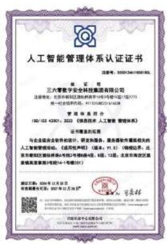

text_image

人工智能管理体系认证证书
注册号：05551241100618X
三六零数字安全科技集团有限公司
注册地址：北京市海淀区西直门南大街19号院1号楼12层173
统一社会信用代码：9111000073114338
管理人信息
ISO/ISO 42001、2023《信息技术人工智能管理体系》
证书来源及范围
与企业国家安全软件的审计、研发及服务、服务和服务签署的相关
人工智能管理系统活动。（适用许可申请）（国发字[2023]100000000）
北京市海淀区西直门南大街19号院1号楼12层173、18层、19层：北京市海淀区西直门南大街19号院1号楼12层
通过日期：2024年12月26日
有效期至公告日：2027年12月24日
国家知识产权局

年初，三六零推出DS大模型安全解决方案，覆盖模型训练、推理、运营全过程，以“以模治模”理念守护大模型安全，为避免大模型陷入幻觉泥潭，360智搜通过精确的知识整合，减少虚假或不准确信息，提升大模型的可信度与可靠性，有效减少大模型生成幻觉内容的可能性。同时，360智搜支持基于企业私域数据的知识提炼与总结，为企业提供更安全、更高效的业务支持。

在世界互联网大会乌镇峰会上，三六零正式发布《大模型安全白皮书》，首次系统性阐释大模型运行时的五大关键风险：基础设施安全风险：设备控制、供应链漏洞、拒绝服务攻击以及算力资源滥用等问题；内容安全风险：不符合核心价值观、虚假或违规内容、大模型幻觉、提示注入攻击等；数据与知识库安全风险：数据泄露、越权访问、隐私滥用和知识产权问题；智能体安全风险：插件调用、算力调度、数据流转等环节安全边界模糊；用户端安全风险：权限控制、API调用监控、恶意脚本执行等。白皮书基于实战经验，提出“外挂式安全+平台原生安全”双轨治理策略，推动人工智能行业向“安全、向善、可信、可控”方向稳健发展。

为提升员工科技伦理素养，公司系统开发科技伦理课程与培训体系，面向技术与业务人员开展覆盖伦理原则、隐私保护、公平性、透明度等模块的专项培训。同时，定期邀请行业专家与学者分享前沿研究成果与观点，通过交流研讨深化员工对科技伦理的理解。公司鼓励员工参与AI伦理研究项目，支持深入探索伦理前沿问题，并将研究成果应用于产品研发实践。公司坚持以负责任的态度推进产品研发与AI技术应用，让科技向善真正服务于人类福祉。

## 合作共赢

## 供应商管理

三六零持续健全供应商管理体系，依据《三六零集团集中采购部供应商管理办法》，系统规范供应商开发、准入、维护、评估及退出等全流程，建立并动态维护优质供应商资源库，在保障采购质量与效率的同时，实现采购成本合理化。

natural_image

Illustration of three business professionals in suits shaking hands (no text or symbols)

## 供应商分类

注册供应商：指供应商已在“360集团SRM系统”门户上填写基本信息并提交审核的状态。  
准入供应商：指供应商证书资质、案例附件齐全且符合要求，并已完成品类划分的状态。  
储备供应商：指供应商通过征信审核，且经过供应商交流/供应商考察（如有）/物料认证（如有）等，通过了储备评估的状态。  
合作供应商：指中标360集团采购项目，提供产品或服务，并签署过合作协议或订单的供应商，项目状态包括合作中、合作过。  
冻结供应商：指合作中出现异常且整改效果不佳，暂不能参与项目，待改善后可重新启用的供应商。  
黑名单供应商：指合作中有欺诈行为或其他严重过失，将不再被启用的供应商。

## 供应商准入审核

通过供应商信息录入、供应商准入审核、供应商储备评估完成供应商入库工作。  
根据《供应商考察表》对重点供应商进行现场考察，全面了解供应商的综合实力。  
供应商需签署《诚信合作承诺书》《保密承诺函》，严格遵循公司反舞弊管理规定。

## 供应商考核评估

每季度对供应商价格、质量、服务、响应、资质等方面进行综合考核评估，每年综合评定供应商的年度级别。  
对绩效考评结果不达标的供应商发起整改或约谈，并持续跟踪其整改落实情况。

## 供应商监督淘汰

对于违纪行为可通过举报通道向公司举报。  
对于违规供应商，对其进行冻结、黑名单等处罚。

## 供应链安全

三六零制定《360集团供应链安全管理制度》，建立健全供应链安全事件应急预案，提高公司处置供应链安全突发事件的能力。在该制度中，包含六大部分：风险识别、风险分析、风险评价、风险处置、风险监督和检查、风险沟通和记录。

natural_image

Illustration of a person using a laptop surrounded by envelopes and a cloud, symbolizing email or communication (no text present)

## 风险识别

资产识别：识别供应链的关键资产，此类资产对组织的业务功能有直接影响，一旦被禁用或受损，可能导致组织的产品和服务失效或质量下降。  
威胁识别：  
a）威胁来源识别：供应链安全威胁主要来源于环境因素、供应链攻击和人为错误。  
b）威胁类型识别：典型的供应链安全威胁主要包括：恶意篡改、假冒伪劣、供应中断、信息泄露、违规操作和其他威胁。  
脆弱性识别：供应链脆弱性是在产品和服务的设计、开发、生产、集成、仓储、交付、运维、废弃等任意供应链环节能被威胁利用的缺陷。  
现有安全措施识别：识别供应链现有或已计划的安全措施，并对安全措施的有效性进行确认。

## 风险分析

包括可能性分析、后果分析和风险估算。

可能性分析应从两个角度进行：一是供应链本身受到损害的可能性，例如可能影响关键组件使用或增加知识产权被窃取风险；二是供应链内的产品、服务、系统、组件受到损害的可能性，例如系统被植入恶意代码或组件被电击损坏。  
后果分析针对已识别的供应链安全事件，分析事件的潜在影响。从资产的重要性，引发安全事件的威胁来源的特征，已识别的脆弱性，现有或已计划安全措施反映出的组织对事件的敏感性等方面进行后果分析。  
风险估算为供应链安全风险的可能性和后果赋值，风险估算应基于可能性分析和后果分析的结论进行。

## 风险评价

风险评价将风险估算结果与风险评价准则和风险接受准则比较，输出依据风险评价准则按优先顺序排列的风险列表。风险识别和分析中得到的后果、可能性也可用于风险评价活动。

## 风险处置

对风险评估给出的具体风险制定风险处置计划，并结合组织自身的业务要求和能力限制，选择风险处置策略。

风险处置策略主要包括以下类型：

风险降低：指为降低风险的可能性，减少风险负面结果所采取的行动。即对风险采取控制措施，减少威胁发生的可能性和带来的影响，使风险级别降低，残余风险在重新评估后能够为组织风险策略接受。  
风险规避：指不进入风险场景的决定或退出风险场景的行动。通过选择放弃某些可能引发风险的业务或资产、采用改变环境或取消风险相关活动等方式实现对风险的规避。  
风险转移：指与另一方对风险带来的损失或收益的共享行为。即将风险全部或部分转移给其他方，组织可采用购买保险、与合作伙伴共同承担的方式对风险进行转移。  
风险保留：指对来自特定风险的损失或收益的接受行为。在满足组织安全策略的情况下，对风险不采取任何控制措施，接受特定风险可能带来的损失。如果选择风险降低策略，则需针对风险选择相应供应链安全风险控制措施，以保证控制措施执行后，残余风险能够被组织所接受。

## 风险监督和检查

风险监督和检查的目的是确保组织的风险在可接受范围内，供应链的风险是动态的，威胁、脆弱性、风险可能性、风险影响等均可能会随着公司业务的变化而改变，应设置风险监督和检查计划，监视风险管理活动，定期评审控制措施，及时调整范围边界。

## 风险沟通和记录

风险沟通和记录是在风险管理者以及利益相关者之间，就如何通过交换和（或）共享有关风险信息来管理风险而达成一致的活动。

## 产业链协同合作

三六零充分发挥自身综合优势，与供应商及合作伙伴在专项合作、技术支持、资源共享等方面深化协同，共同推动产业链绿色转型与可持续发展。

natural_image

Illustration of a stylized green landscape with trees, hills, and clouds (no text or symbols)

## 案例

360集团作为鸿蒙战略合作伙伴受邀参加鸿蒙星光大典生态论坛，围绕鸿蒙多端、多场景的应用安全、数据安全、隐私安全，以及基于开源安全治理的安全攻防、漏洞挖掘，全面助力鸿蒙生态安全。

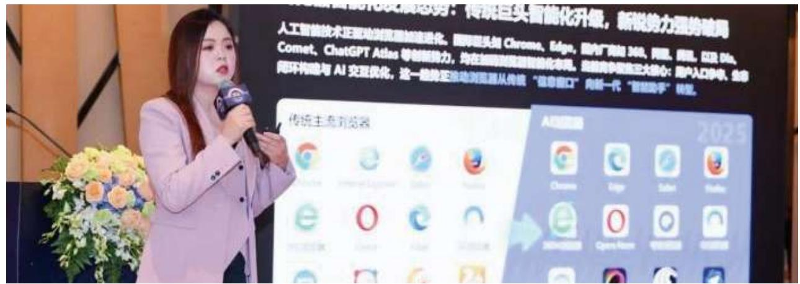

text_image

人工智能技术正驱动浏览器加速进化。国际巨头如 Chrome、Edge，国内厂商超 360、阿里、网易。以及 DoA、Comet、ChatGPT Atlas 等创新势力，均在加强到新智能的化本利。应将竞争驱逐正大核心：用户入口争申、生命闭环构建与 AI 交互优化，这一趋势正驱动浏览器从传统“信息窗口”向新一代“智慧助手”转型。
传统主流浏览器
2025

## 案例

“安全破局 生态突围”360数字安全生态合作伙伴大会在ISC.AI 2025上成功举办。大会现场汇集了来自全国的百余家合作伙伴，三六零与合作伙伴围绕人工智能时代下数字安全产业的新机遇、新技术、新成果展开深入探讨，共话数字安全生态的未来发展。

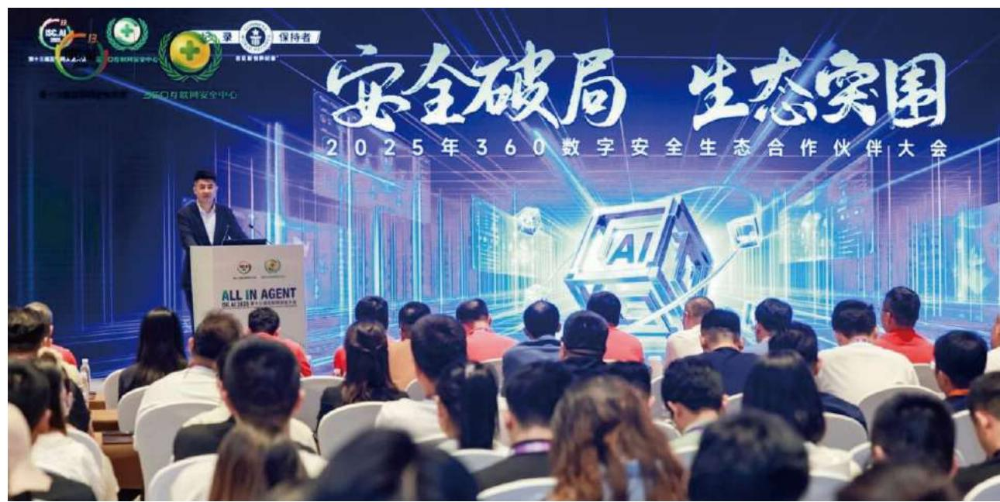

text_image

安全破局 生态突围
2025年360数字安全生态合作伙伴大会
ALL IN AGENT
CHAI 2025

## 平等对待中小企业

三六零始终秉持公平公正的合作原则，平等对待包括中小企业在内的所有合作伙伴，及时支付中小企业供应商款项。截至报告期末，未发生逾期支付中小企业账款的情况。

三六零积极投身数字扶贫领域，通过大数据技术创立数字安全中国方案，颠覆传统网络安全行业的商业模式，升级为安全即服务的模式，并推出“百亿补贴”，将服务全球15亿用户的安全产品和服务，免费开放给中小微企业使用。

natural_image

Illustration of a person sitting on stacks of money with floating cash bills, symbolizing financial pressure or debt (no text or symbols present)

  
2025年中国民营企业社会责任优秀案例名单

<table><tr><td>案例单位</td><td>案例主题</td><td>推荐单位</td></tr><tr><td>北京京东世纪贸易有限公司</td><td>以“奔富计划”助力乡村全面振兴</td><td>北京市工商联</td></tr><tr><td>北京大北农科技集团股份有限公司</td><td>立足科技农业践行“强农报国”使命</td><td>北京市工商联</td></tr><tr><td>北京三快在线科技有限公司</td><td>推进“美团乡村儿童操场”公益助力乡村儿童健康成长</td><td>北京市工商联</td></tr><tr><td>奇安信科技集团股份有限公司</td><td>勇担护航网络安全与增进社会福祉的社会责任</td><td>北京市工商联</td></tr><tr><td>北京奇虎科技有限公司</td><td>推动小微企业转型实现数字化共同富裕</td><td>北京市工商联</td></tr></table>

三六零下属企业获得中国民营企业社会责任优秀案例

## 乡村振兴

三六零积极响应国家乡村振兴战略，以产业、教育、生态、文化为着力点，通过产业合作共赢、教育帮扶育人等多种形式，精准赋能多地发展，为乡村注入持续活力，助力实现农业强、农村美、农民富的振兴目标，切实履行企业社会责任。

报告期内，三六零在乡村振兴方面投入的金额共计约40万元。

natural_image

Illustration of a farmer shoveling crops in a field with a cat nearby (no text or symbols)

## 案例

2025年，三六零持续聚焦教育公平，着力改善相对落后地区的办学条件。三六零提供专项资金分别用于河北省张家口市张北县学校更新课桌椅及提升学习环境；为江西省赣州市龙南县程龙学校购买教学设备、保障教学条件；资助贵州毕节威宁九三中学困难学生就学及补充必要教学物资。

## 社会贡献

## 企业责任

三六零始终将履行社会责任深度融入企业发展战略，坚定贯彻服务国家大局、厚植发展根基的核心准则，主动对接国家重大战略部署，深度融入区域协调发展、社区共建等关键领域。

natural_image

Illustration of four business professionals gathered around a desk, reviewing documents (no text or symbols visible)

## ●服务国家网络安全战略

三六零充分发挥国家级网络安全防御主力军作用，依托全网安全大数据与自主研制的安全大模型，持续开展境外网络攻击溯源与反制。2025年，360成功溯源哈尔滨亚冬会期间27万次境外网络攻击，首次锁定美国国家安全局三名特工及两所美国高校；协助公安机关锁定台湾地区黑客组织，揭露其针对我国能源、交通等重点领域重要系统的攻击行为。目前360已累计发现并命名60个境外APT组织，占国内发现总数的98%。

## 履行纳税义务

三六零严格遵守《中华人民共和国企业所得税法》，秉持法治精神，坚守合规底线，将依法诚信纳税作为企业公民的基本责任。公司持续健全税务管理体系，确保各项税费应缴尽缴、足额及时，以规范高效的税务管理为国家财政提供有力支撑，助力公共服务体系完善与社会资源公平分配。2025年，公司支付的各项税费为5.06亿元。

## 社区共建

三六零高度重视与所在社区的文明共建，建立健全顺畅高效的沟通机制，积极回应社区关切，主动融入社区活动，推动企业与社区共生共荣、协同发展。

## 案例

为深化《未成年人网络保护条例》普及宣传，切实增强未成年人网络安全意识与自我保护能力，360集团展示中心迎来多位青少年，以“沉浸式体验+互动教学”形式，让青少年们快速建立对网络安全的基本认知。

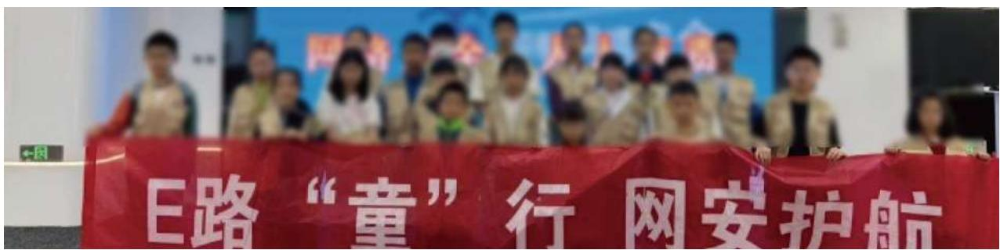

text_image

E路“童”行 网安护航

## 案例

2025年5月，三六零（扬州）数字科技有限公司协办蒋王社区“提高防范意识 共建网络安全”主题有奖问答活动，以寓教于乐的形式向居民普及《网络安全法》《个人信息保护法》等法规要点。

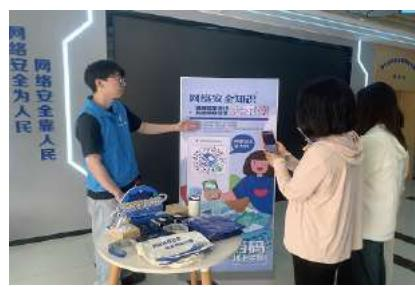

text_image

网络安全为人民
网络安全靠人民
网络安全是
网络安全是
网络安全是

## 社会公益

三六零立足专业、践行责任，以科技捐赠赋能乡村，以普惠服务护航民生，让数字安全成果惠及更广泛群体，同时，以务实行动诠释企业公民的责任担当。

公司始终将应急救灾视为践行企业社会责任的重要使命。三六零通过360基金会向西藏日喀则地震受灾地区以及北京市怀柔区水灾受难群众捐款，用于支持其恢复正常生产生活。

## 案例

2025年，在外交部协调支持下，三六零向云南省金平县捐赠适配山区的电动三轮车。该项目聚焦解决当地农产品运输难题——金平县99.72%的国土面积被群山覆盖，农资运输长期受成本高、效率低的困扰。车辆投入后直接服务于茶叶、热带水果、鲜食玉米等特色农产品运输，助力农产品“出山进城”。

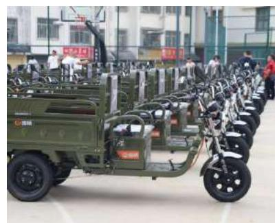

natural_image

Row of green military-style tricycles parked in front of a building (no visible text or symbols)

## 案例

2025年6月，360集团党委联合爱星筑梦公益服务中心共同开启了一场以“心手相连，爱暖‘星’途”为主题的关爱行动，以“以购代捐”的形式，购买一批由“星”青年们亲手制作的精美文创产品。

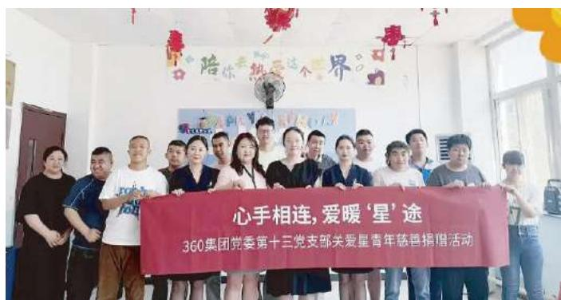

text_image

心手相连, 爱暖‘星’途
360集团党委第十三党支部关爱星青年慈善捐赠活动

## 06

## 治理篇

公司治理机制

薪酬管理

党建引领

反商业贿赂及反贪污

反不正当竞争

natural_image

Isometric illustration of a business process with people, stairs, and digital displays (no text or symbols)

## 公司治理机制

## “公司治理”四要素分析

## 治理

三六零严格遵循《中华人民共和国公司法》《中华人民共和国证券法》《上市公司治理准则》及《上海证券交易所股票上市规则》等监管要求，持续完善内部治理机制，对股东会、董事会、审计委员会等公司治理结构进行优化。

公司构建相互制衡的治理结构，明确股东会、董事会和管理层的权责边界，形成决策科学、执行有力、监督有效的制衡机制，防止权力滥用，保障各方利益。

natural_image

Illustration of two business professionals in green attire engaged in conversation (no text or symbols)

## 股东会

股东会作为公司的核心权力机构，由全体股东构成，对公司经营方针、投资计划等拥有决定权。公司根据相关规定严格遵守股东会的议事流程，定期组织召开年度股东会以及临时股东会，充分保障全体股东的知情权、参与权与表决权得以有效行使。

## 董事会

董事会由股东会选举产生，对股东会负责，作为公司的核心经营决策机构，为公司的运营和发展制定战略和政策。董事会下设审计委员会、提名与薪酬委员会、战略委员会三个专门委员会。各专门委员会严格依照职责分工，对相关事项展开深入研究与审慎审议，为董事会科学决策提供坚实有力的支持。

## 董事会有效性评估

董事会由5名董事（含独立董事）组成，设董事长1人，其中独立董事3名。2025年8月，公司董事会审议通过取消监事会并修订《公司章程》及相关制度的议案，原监事会职权由董事会审计委员会承接，有效精简了治理层级，强化了审计委员会的监督职能，提升了决策效率与监督效能。

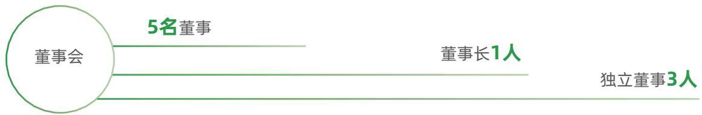

flowchart

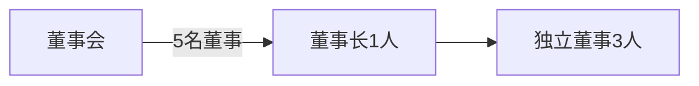
```mermaid
graph LR
  A["董事会"] -->|"5名董事"| B["董事长1人"]
  B --> C["独立董事3人"]
```

## 董事会独立性与多元化

公司高度重视独立董事在公司治理中的关键作用，充分发挥其专业优势，持续提升治理效能。报告期内，全体独立董事通过现场或通讯方式全程参与所有董事会会议，凭借扎实的专业能力审慎审议各项议题，结合行业趋势与公司实际提出专业建议，为科学决策提供了有力支撑。

## 董事会

公司持续推动董事会多元化建设，将性别、年龄、教育背景、专业领域及工作经历等因素纳入董事候选人筛选标准。目前，公司董事会成员中，专业背景涵盖财务、管理、会计、法律等多个领域，形成结构合理、优势互补的治理团队。各位董事凭借各自独特的文化视角、专业积淀与实践经验，在决策中充分发表见解，实现协调配合与有效制衡，共同激发董事会的创新活力与治理效能。

## 报告期内独立董事履职情况

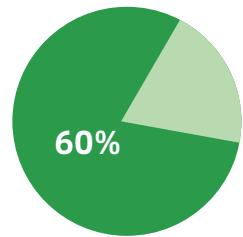

独立董事人数

占董事会人数比例60%

独立董事人数

3人

## 审计委员会

公司审计委员会有效承接原监事会职能，切实履行监督职责。通过对财务报表、关联交易、内部控制及董事、高级管理人员履职情况进行持续审查，强化事中事后监督，健全风险防控机制，持续提升公司治理与合规管理水平，为稳健运营提供坚实保障。

## 管理层

公司管理层在董事会授权范围内组织实施日常经营管理，管理层成员包括总经理、董事会秘书、财务负责人，均由董事会统一任免。全体高级管理人员恪守忠实与勤勉义务，严格贯彻董事会各项决议，持续推动公司规范运作与可持续发展。

  
股东会召开次数  
3次

  
股东会讨论审议事项数  
20项

  
董事会召开次数  
6次

  
董事会讨论审议事项数  
33项

  
监事会（取消前）召开次数  
3次

  
监事会（取消前）审议议题数  
20项

  
三会审议议题未通过次数  
0次

## 战略

<table><tr><td>风险/机遇类型</td><td>风险/机遇描述</td><td>对公司的财务影响</td><td>影响大小</td><td>影响时间范围</td><td>应对措施</td></tr><tr><td>董事会与决策治理风险</td><td>●董事会结构失衡:董事会成员构成(如独立董事比例、专业背景)不合理,可能影响决策的科学性和监督的有效性。●决策机制失效:缺乏科学的议事规则和决策程序,可能导致重大决策(如投资、融资)出现失误或独断。●战略规划与管理风险:公司战略方向不清晰、频繁变动,或缺乏有效的战略落地与评估体系,影响长期发展。</td><td>董事会结构失衡与决策机制失效,将削弱战略决策的科学性与前瞻性,影响资源配置效率与执行落地节奏,制约组织对市场变化的响应能力;战略方向不清或频繁变动,可能导致关键资源错配,挤压核心业务成长空间,稀释前期投入价值,影响长期竞争力与可持续发展根基。</td><td>高</td><td>短中期</td><td>●确保董事会成员具备互补的专业背景(战略、财务、技术等),并保障独立董事的实质比例与话语权。●严格执行《董事会议事规则》,重大决策前需经专业委员会前置研究与咨询。●重大投资项目必须进行强制性、详尽的可行性研究及外部专家评审,并建立决策失误问责机制。</td></tr><tr><td>内部控制与合规风险</td><td>●内控体系缺陷:内部控制制度不健全或执行不力,可能导致财务报告失真、资产流失或运营效率低下。●合规与信息披露风险:未能及时、准确、完整地履行信息披露义务,可能引发监管处罚和声誉损失。</td><td>内控体系缺陷与合规信息披露风险若未有效管控,将削弱价值创造基础,拉高运营管理门槛,制约治理效能与市场信任的可持续性,对企业稳健运行与长期价值释放形成潜在压力。</td><td>高</td><td>中期</td><td>●公司通过完善制度、嵌入流程、强化审计与信息化管控,建立闭环问责机制,确保制度有效执行与风险可控。●公司严制度、强审核、建机制,运用信息化工具并完善应急处理,确保信息及时准确披露,防范监管处罚与声誉损失。</td></tr></table>

## 影响、风险与机遇管理

公司以治理与内控合规为发展基石，持续优化管理架构与运行机制，在有效应对风险中提升治理效能，实现从被动防控向价值创造的跃升，以高水平治理夯实核心竞争力。

## 内控管理

公司按照《企业内部控制基本规范》及配套指引要求，建立健全内部控制体系，修订《内部审计制度》并持续强化监测控制活动。在常态化日常监督与专项监督基础上，定期开展内部控制有效性评价，对发现的缺陷及时整改，确保内控体系有效运行。

## 内控目标

遵守国家法律法规、规章及其他相关规定  
保障公司资产安全  
确保公司信息披露真实、准确、完整和公平  
提高经营效率和效果  
促进实现发展战略等

## 内控措施

不相容职务分离控制  
授权审批控制  
会计系统控制

预算控制  
运营分析控制和绩效考评控制  
信息安全控制措施等

## 内部审计

内部审计部门直接向董事会审计委员会负责并汇报工作，其组织架构与汇报机制保障了部门的高度独立性与权威性，有效避免外部干扰，确保审计工作客观公正，同时，通过定期的专项审计、合规审计等工作，精准识别公司经营活动及管理过程中的各类潜在风险。

## 风险管理

三六零始终将合规经营奉为企业生存与发展的根本基石。公司依据《法务中心调证管理指引》《主体证照管理制度及指引》《异地印章管理规范及指引》等多项内部合规制度，制定明确的合规经营目标，通过系统化、规范化的管理举措，有效防范各类合规风险，持续为股东、客户及社会创造长期价值。

公司牢固树立风险管理基本原则，坚持以国家政策法规为导向，紧密结合内部管理规定，精准识别公司运营管理中的潜在风险并科学开展风险重要性评估工作。公司采取“源头把控”机制，对可能产生风险的环节实施动态监控，力求从根源解除已识别的风险隐患。同时，法务部门每年度编制适用于业务线的合规报告，深入分析风险状况，并提出具有针对性的处理措施及合规优化建议，为同类风险的处置提供重要参考依据。在风险处置的手段和方式方面，公司明确划定风险红线，制定详细的风险指引，规范业务操作行为，有效提升公司整体风险防控能力。

## 风险识别路径

业务访谈  
诉讼、客诉、行政处罚监控及协同处理  
产品合规及合同履约中出现的风险及纠纷  
梳理主营业务所涉及的国家立法及政府监管政策并形成规则  
其他运营中所产生的风险来源

## 风险评估维度

风险出现频率  
风险损失

## 风险数据监控

流程监控与审核  
日常建议与答疑  
制度制定与宣贯  
风险意识培训与管理  
投诉与举报窗口开通

## 风险处置手段

完善现有制度，弥补漏洞  
完善管理流程，强制管控业务  
完善奖惩机制，责任到人

## 案例

公司通过360法学苑深入业务场景，聚焦预防性合规指引与实战案例解析，提高员工风险预防意识，降低违规风险。

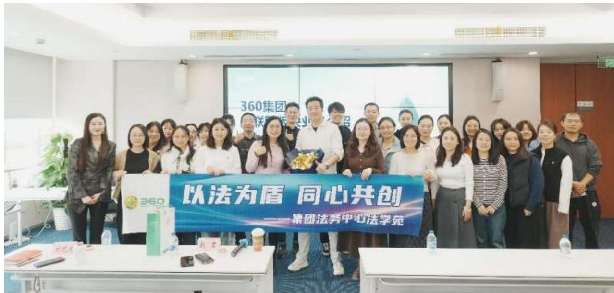

text_image

360集团
以法为盾 同心共创
——集团法务中心法学苑

## 指标与目标

<table><tr><td>目标</td><td>2025年度目标完成情况</td></tr><tr><td>独立董事占比超33%</td><td>已完成</td></tr><tr><td>公司未因信息披露违法违规行为受到监管部门处罚</td><td>已完成</td></tr></table>

## 信息披露及投资者关系管理

## 信息披露

公司严格遵循《信息披露事务管理制度》《信息披露暂缓与豁免业务管理制度》等内部规范，依法合规履行信息披露义务。公司着力规范内幕信息管理，严格把控内幕信息知情人及内部信息使用人的登记与管理工作，维护信息披露的公平公开原则，切实保障广大投资者合法权益。

2025年度信息披露汇总：

披露定期报告：4份

披露临时公告：101份

因信息披露遭受的处罚：无

## 投资者关系

三六零以“尊重投资者、回报投资者、保护投资者”为核心目标，恪守“合规、平等、主动、诚实守信”基本原则，积极搭建多元化沟通交流平台，如业绩说明会、策略会、反路演、e互动平台等，为股东行使权利提供便利，强化与投资者及潜在投资者的互动交流，增进投资者对公司的了解与认同，持续构建稳定优质的投资者基础，进一步提升公司治理效能与整体价值。

公司重视对投资者的合理投资回报，在充分考虑当前经营现状、未来发展战略以及保证公司正常经营的前提下，严格按照《公司章程》制定的利润分配政策进行现金分红，与投资者分享经营发展成果。自2018年重组上市以来，公司多次进行现金分红，截至2025年底，公司累计现金分红总额约为50.34亿元，其中，累计分红派息金额共计约35.35亿元，回购股份金额共计约14.99亿元。2025年度，公司共进行2次现金分红。2025年5月30日，公司每10股派发现金红利1元（含税），2025年9月30日，公司每10股派发现金红利1元（含税），共计派发现金红利约14亿元。

## 薪酬管理

公司依据《公司法》《公司章程》等规定，系统制定了《公司董事和高级管理人员薪酬管理制度》，对薪酬管理体系进行全方位规范。该等制度旨在确保薪酬分配机制的公平性与合理性，为完善公司治理、促进长期稳定发展提供坚实的制度保障。

## 党建引领

360集团党委始终坚持以习近平新时代中国特色社会主义思想为指导，牢牢把握“数字安全和AI国家队”的战略定位，将党建工作深度融入企业科技创新与安全使命，以高质量党建引领企业高质量发展。

natural_image

Abstract red 3D graphic shape resembling a stylized ship or aircraft (no text or symbols)

## 强化政治引领，贯彻国家战略部署

集团党委深入学习贯彻党的二十大和二十届历次全会精神，将“加快发展新质生产力”“高水平科技自立自强”等国家战略部署作为全年核心任务，集团创始人周鸿祎发表理论文意《以智能休重塑生产力以安全底座护航创新》将总体国家安全观融入企业战略顶层设计，推动科技创新与安全保障协同发展。党委联合人民日报社旗下《新安全》打造“党建+安全+科技”融合传播矩阵，进一步提升党员干部的政治判断力、政治领悟力、政治执行力。

## 聚焦战略转型，以党建引领创新发展

2025年，集团深度推进“ALL IN AGENT”布局，全面进军人工智能智能体领域。党委实施“红色引擎”工程，成立“AI+安全”党员先锋突击队，在关键技术攻关、产品落地和生态建设中发挥战斗堡垒作用。在党委支持下，集团发布覆盖L2-L4级三代智能体的企业级平台，推动AI与千行百业深度融合。党委推动建立“党建+安全治理”机制，组建“大模型安全攻关小组”，在智能体研发全流程中嵌入安全审查与伦理评估，确保技术始终服务于国家和社会利益。

“AI+安全”党员先锋突击队  

natural_image

Illustration of three people seated around a conference table with documents and charts, surrounded by potted plants (no text or symbols)

natural_image

Green silhouette of a humanoid robot interacting with a lock labeled 'AI' (no text or symbols on the robot or background)

反APT党员突击队

## 筑牢安全防线，践行“科技报国”使命

党委牵头开展“红色人才计划”，重点培养既懂技术又懂党建的复合型青年骨干，在AI、大数据、网络安全等领域设立党员责任区和示范岗，打造了一支由党员技术骨干引领的“数字安全铁军”。目前，集团已拥有全球领先的网络安全大数据体系，八项核心指标位居国内第一。

## 强化组织建设，夯实党建根基

党委严格落实“三会一课”、主题党日等基础制度，持续开展爱国主义教育、主题教育等工作，推动党员教育管理融入时代发展。

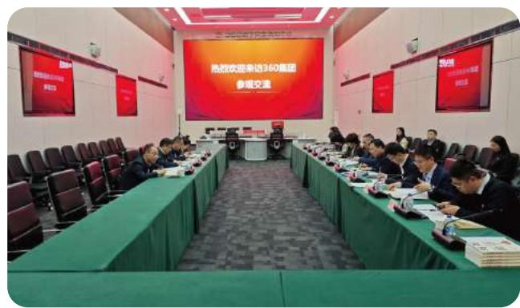

text_image

热烈欢迎来访360集团
参观交流

市委组织部到360集团调研党建工作

natural_image

Red silhouette of a stylized figure with wings and a waving red ribbon, no text or symbols present.

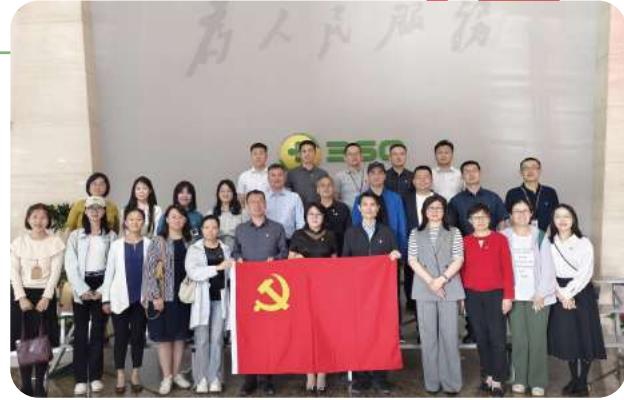

text_image

Group photo with a red flag featuring a hammer and sickle symbol, standing in front of a backdrop with Chinese characters.

外交部港澳台司联合360集团党委主题党日活动

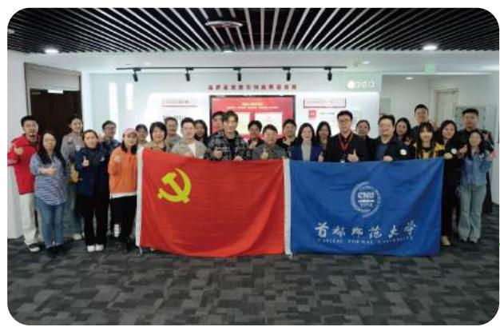

text_image

首都师范大学
CSI Academy OF SCIENCE UNIVERSITY

360集团党委联合首都师范大学开展联合党建活动

## 反商业贿赂及反贪污

公司始终将廉洁治理作为企业稳健发展的基石，通过健全制度体系、强化内部管控、规范外部合作、完善举报机制，全方位构建“不敢腐、不能腐、不想腐”的廉洁生态，营造公开透明、合规有序的商业环境。

## 健全廉洁制度体系

公司高度重视廉洁制度建设，制定了《内部审计制度》《反舞弊管理规定》《关键岗位人员管理办法》《礼品接受及处理规定》《举报人保护与奖励规定》《永不合作供应商管理规定》等一系列规章制度，内容涵盖员工行为准则、供应商管理、内部审计等关键领域。

natural_image

Illustration of two people interacting with a large computer screen displaying various document icons (no text or symbols present)

## 强化内部廉洁管控

为有效预防和打击舞弊行为，公司设立道德委员会作为唯一独立行使舞弊调查权的专职部门，直接向管理层汇报。各部门在日常管理、检查中发现涉嫌舞弊行为时，应第一时间通过专用邮箱（jubaoxin@360.cn）上报道德委员会。

员工违反《反舞弊管理规定》的行为均属违纪，公司将视情节轻重给予口头警告、书面警告、通报批评直至解除劳动合同等处罚。同时，公司通过全体员工邮件通报、内网案例警示等方式开展廉洁文化宣传，营造“不想腐败”的工作氛围。

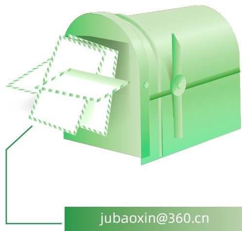

natural_image

3D illustration of a green mailbox with paper delivery box and label 'jubaoxin@360.cn' (no other text or symbols)

## 保障外部诚信合作

公司与所有合作伙伴签署《商业诚信协议》，明确双方共同恪守商业诚信行为规范，全面杜绝商业贿赂行为，构建坚实廉洁防线。根据《永不合作供应商管理规定》，涉及舞弊问题的企业将被列入“永不合作供应商”名单，禁止各部门与其开展任何形式的合作；因特殊原因确需合作的，须履行特殊审批和备案程序。

## 完善举报人保护机制

公司鼓励全体员工及合作伙伴积极举报舞弊行为，设立专门的举报邮箱和举报热线，并对举报属实者予以奖励。道德委员会在开展舞弊调查时，将保密工作放在首位，对举报受理和调查实施严格的管控流程，对举报人个人信息及举报资料严格保密。针对实名举报，道德委员会设立特殊“保护名单”，由专人负责沟通、奖励与保护工作。对违反保密规定的责任人员，公司将严肃处理，涉嫌犯罪的依法追究法律责任。

## 举报方式

## 邮箱举报

举报邮件发送至jubaoxin@360.cn

## 信函举报

举报信邮寄至“北京市朝阳区酒仙桥路6号院360大厦B座”，道德委员会收

## 线上举报

通过关注微信公众号“360道德委员会”，按提示完成举报

## 来访举报

预约来访，在设定的来访举报接待地点现场进行

## 积极开展培训宣传

公司定期开展廉洁主题宣传，围绕廉洁政策解读、廉洁知识科普、典型案例警示及重大廉洁会议与活动通报等内容，持续深化全员廉洁教育。针对不同受众，如管理层、新员工、不同业务线等人群，通过线上线下的方式定期开展廉洁培训，传递公司廉洁制度，加深员工对政策制度的理解。通过形式多样的廉洁宣传活动，不断强化员工的廉洁意识与合规观念，营造风清气正的从业氛围。

## 反不正当竞争

公司严格遵循《中华人民共和国反不正当竞争法》《中华人民共和国反垄断法》等法规要求，制定《三六零集团反垄断合规手册》，将公平竞争理念贯穿经营全过程，对破坏市场公平竞争的行为持零容忍态度，以切实行动抵制不正当竞争与垄断行径，全力维护健康有序的市场环境，助力行业可持续发展。《三六零集团反垄断合规手册》系统涵盖反垄断法规动态、经营者集中、垄断协议、滥用市场支配地位及实用合规指南等核心内容，为反垄断合规管理提供制度支撑。

natural_image

Illustration of a classroom scene with a teacher at a podium, students seated at desks, and a large screen displaying data (no visible text or symbols)

在落地实践方面，公司法务合规部全面梳理历史交易中可能存在的未依法申报风险，并借助外部专业力量分类评估、落实整改；在拟进行的投资并购交易中，前置开展经营者集中申报义务分析，将评估结果作为重要审批依据。在协议审阅中，重点关注垄断协议风险，对标准化协议、联合采购或销售协议等强化前置审阅。针对具备竞争优势的产品线，加强对可能构成自我优待或排挤竞争行为的识别与防范，相关事项均须经法务合规部审查。同时，公司将反垄断合规纳入部门及员工绩效考核体系，强化责任意识。

natural_image

Illustration of a business meeting with people seated around a table, one person presenting on a large screen (no text or symbols visible)

在宣传培训方面，公司通过内部网站、公告、邮件等多元渠道开展反垄断合规制度宣贯，要求全体员工完成线上视频培训，实现反垄断知识普及。针对关键部门与关键岗位人员，组织专项培训，进一步强化理解与执行力。2025年，法务合规部围绕反不正当竞争主题，面向互联网、游戏等多个业务板块开展线上与线下相结合的专项培训，持续提升业务部门的法律风险防范意识，有效降低不正当竞争风险。

关键绩效表

<table><tr><td>指标名称</td><td>单位</td><td>2025年数值</td></tr><tr><td colspan="3">环境维度</td></tr><tr><td>直接温室气体排放量(范围一)</td><td>吨二氧化碳当量</td><td>255.80</td></tr><tr><td>间接温室气体排放量(范围二)</td><td>吨二氧化碳当量</td><td>11,686.93</td></tr><tr><td>温室气体排放总量</td><td>吨二氧化碳当量</td><td>11,942.73</td></tr><tr><td>温室气体排放强度</td><td>吨二氧化碳当量/百万元营收</td><td>1.37</td></tr><tr><td>柴油消耗量</td><td>吨</td><td>1.22</td></tr><tr><td>汽油消耗量</td><td>吨</td><td>8.57</td></tr><tr><td>天然气消耗量</td><td>标准立方米</td><td>104,475</td></tr><tr><td>电力消耗量</td><td>兆瓦时</td><td>22,025.87</td></tr><tr><td>综合能源消耗量</td><td>吨标煤</td><td>2,860.32</td></tr><tr><td>综合能源消耗强度</td><td>吨标煤/百万元营收</td><td>0.33</td></tr><tr><td>水资源消耗总量</td><td>吨</td><td>139,099</td></tr><tr><td>水资源消耗强度</td><td>吨/百万元营收</td><td>16.00</td></tr><tr><td colspan="3">社会维度</td></tr><tr><td>员工总数</td><td>人</td><td>5,273</td></tr><tr><td>硕士及以上数量</td><td>人</td><td>1,068</td></tr><tr><td>大学本科学历员工数量</td><td>人</td><td>3,561</td></tr><tr><td>大专学历员工数量</td><td>人</td><td>542</td></tr><tr><td>其他学历员工数量</td><td>人</td><td>102</td></tr><tr><td>研发人员数量</td><td>人</td><td>3,018</td></tr><tr><td>销售人员数量</td><td>人</td><td>1,759</td></tr><tr><td>管理人员数量</td><td>人</td><td>496</td></tr><tr><td>普通员工培训覆盖率</td><td>%</td><td>100</td></tr><tr><td>员工工伤保险投入金额</td><td>万元</td><td>超400</td></tr></table>

<table><tr><td>指标名称</td><td>单位</td><td>2025年数值</td></tr><tr><td colspan="3">社会维度</td></tr><tr><td>员工工伤保险覆盖率</td><td>%</td><td>100</td></tr><tr><td>安全演练覆盖率</td><td>%</td><td>100</td></tr><tr><td>研发人员数量占公司人数的比例</td><td>%</td><td>57.23</td></tr><tr><td>研发费用占营业收入比例</td><td>%</td><td>37.11</td></tr><tr><td>助力乡村振兴资金</td><td>万元</td><td>约40</td></tr><tr><td colspan="3">治理维度</td></tr><tr><td>股东会召开</td><td>次</td><td>3</td></tr><tr><td>三会决议未通过次数</td><td>次</td><td>0</td></tr><tr><td>董事会召开</td><td>次</td><td>6</td></tr><tr><td>监事会(取消前)召开次数</td><td>次</td><td>3</td></tr><tr><td>独立董事人数</td><td>人</td><td>3</td></tr><tr><td>独立董事占比</td><td>%</td><td>60</td></tr><tr><td>披露定期报告</td><td>份</td><td>4</td></tr><tr><td>披露临时公告</td><td>份</td><td>101</td></tr></table>

索引表

<table><tr><td>报告章节</td><td>《上海证券交易所上市公司自律监管指引第14号——可持续发展报告(试行)》</td><td>全球报告倡议组织《可持续发展报告标准》(GRI Standards 2021)</td></tr><tr><td>报告编制说明</td><td>第六条</td><td>2-2/2-3</td></tr><tr><td>董事长致辞</td><td>/</td><td>2-6/2-22</td></tr><tr><td colspan="3">走进360</td></tr><tr><td>公司简介</td><td>/</td><td>2-1</td></tr><tr><td>企业文化</td><td>/</td><td>/</td></tr><tr><td>公司业务介绍</td><td>/</td><td>2-6</td></tr><tr><td>年度荣誉</td><td>/</td><td>/</td></tr><tr><td colspan="3">议题重要性评估</td></tr><tr><td>尽职调查、利益相关方沟通</td><td>第九条、第五十三条</td><td>3-1/2-14/2-23/2-29</td></tr><tr><td>双重重要性分析</td><td>第五条</td><td>3-1</td></tr><tr><td>议题重要性分析结论</td><td>第五条</td><td>3-1/3-2/3-3</td></tr><tr><td colspan="3">公司ESG治理安排</td></tr><tr><td>可持续发展治理架构</td><td>第十二条</td><td>2-9</td></tr><tr><td>可持续发展管理机制</td><td>第十二条</td><td>2-11/2-12/2-13/2-18</td></tr><tr><td>ESG能力提升</td><td>第十二条</td><td>2-17</td></tr><tr><td colspan="3">环境篇</td></tr><tr><td>应对气候变化</td><td>第二十一条至第二十七条</td><td>2-4/2-23/2-24/201-2/305-1/305-2/305-4</td></tr><tr><td>环境合规管理</td><td>第三十三条</td><td>2-23/2-24</td></tr><tr><td>污染物及废弃物管理</td><td>第三十条、第三十一条</td><td>2-4/2-23/2-24/303-2/306-1/306-2/306-3</td></tr><tr><td>能源利用</td><td>第三十四条至第三十五条</td><td>2-4/2-23/2-24/302-1/302-3/302-4/302-5</td></tr><tr><td>水资源利用</td><td>第三十六条</td><td>2-4/2-23/2-24/303-5</td></tr><tr><td>循环经济</td><td>第三十七条</td><td>2-23/2-24/301-1/301-2</td></tr><tr><td>生态系统和生物多样性保护</td><td>第三十二条</td><td>304-3</td></tr></table>

<table><tr><td>报告章节</td><td>《上海证券交易所上市公司自律监管指引第14号——可持续发展报告(试行)》</td><td>全球报告倡议组织《可持续发展报告标准》(GRI Standards 2021)</td></tr><tr><td colspan="3">社会篇</td></tr><tr><td>员工</td><td>第四十九条、第五十条</td><td>2-7/2-23/2-24/201-1/201-3/401-1/401-2/403-1/403-2/403-3/403-5/403-9/404-1/404-2/405-1/406-1</td></tr><tr><td>产品和服务安全与质量</td><td>第四十七条</td><td>2-23/2-24/2-25/2-26/416-1/416-2/417-1/417-2/417-3</td></tr><tr><td>数据安全与客户隐私保护</td><td>第四十八条</td><td>2-23/2-24/418-1</td></tr><tr><td>创新驱动</td><td>第四十一条、第四十二条</td><td>2-4/2-23/2-24</td></tr><tr><td>科技伦理</td><td>第四十三条</td><td>2-23/2-24</td></tr><tr><td>合作共赢</td><td>第四十五条、第四十六条</td><td>2-23/2-24/2-25/308-2/414-1</td></tr><tr><td>乡村振兴</td><td>第三十九条</td><td>201-1/203-1/203-2</td></tr><tr><td>社会贡献</td><td>第四十条</td><td>2-4/2-23/2-24/201-1/203-1/203-2/413-1/413-2/415-1</td></tr><tr><td colspan="3">治理篇</td></tr><tr><td>公司治理机制</td><td>第五十一条</td><td>2-9/2-13/2-16/2-23/2-24/2-29/207-1/207-2</td></tr><tr><td>薪酬管理</td><td>/</td><td>2-19/2-20/2-23/2-24</td></tr><tr><td>党建引领</td><td>/</td><td>/</td></tr><tr><td>反商业贿赂及反贪污</td><td>第五十五条</td><td>2-23/2-24/2-26/205-2</td></tr><tr><td>反不正当竞争</td><td>第五十六条</td><td>2-23/2-24</td></tr><tr><td>关键绩效表</td><td>/</td><td>/</td></tr><tr><td>索引表</td><td>/</td><td>/</td></tr></table>