

natural_image

Stylized illustration of a city skyline with modern skyscrapers and abstract wave design, featuring green hills, windmills, houses, trees, and a sun (no text or symbols)

## 2025

## 可持续发展暨ESG报告

东吴证券股份有限公司

601555

## 目录

报告编制说明 01

董事会可持续发展管理声明 03

2025 ESG 05

关于东吴证券 06

ESG 09

可持续发展治理体系 09

议题重要性评估 12

## 环境篇

绿金筑梦低碳先行

应对气候变化 19

绿色金融 23

绿色运营 25

## 社会篇

## 深耕实体责任领航

服务实体经济 29

负责任投资 37

## 智护客户诚筑信任

保障客户权益 42

投资者教育 47

金融科技 49

数据安全与客户隐私保护 56

供应商管理 62

## 聚才固本繁花满枝

人力资本管理 63

员工平等及权益 65

员工培训与教育 68

员工选拔与晋升 72

员工健康与关怀 73

## 向上向善惠民致远

推进乡村振兴 75

热心公益慈善 78

## 治理篇

##

企业文化建设 85

优化公司治理 88

全面风险管理 93

强化合规管理 101

规范商业行为 104

ESG 数据表和附注 110

报告标准索引表 117

## 报告编制说明

本报告是东吴证券股份有限公司（简称“东吴证券”或“公司”）第二份可持续发展暨ESG报告，同时也是第十五份ESG相关信息报告，旨在向各利益相关方披露公司在2025年度经营中对于ESG议题所秉持的理念、建立的管理办法、推行的工作与达到的成效。

## 编制依据

本报告编制主要依据《上海证券交易所上市公司自律监管指引第14号一可持续发展报告（试行)》(简称《指引》）和《上海证券交易所上市公司自律监管指引第1号——规范运作》（2025年5月修订）进行编制，并参照中国证监会《公开发行证券的公司信息披露内容与格式准则第2号—年度报告的内容与格式(2025年修订）》、全球可持续发展标准委员会《GR|可持续发展报告标准》 (2021版)(简称《GRI标准》）相关要求与规范。

## 报告范围

本报告范围涵盖东吴证券及其子公司。除非特别说明，本报告范围与东吴证券(股票代码：601555.SH)同期合并财务报表范围一致。

本报告涉及的公司名称及简称

<table><tr><td>公司全称</td><td>公司简称</td></tr><tr><td>东吴证券股份有限公司</td><td>东吴证券、公司</td></tr><tr><td>东吴创业投资有限公司</td><td>东吴创投</td></tr><tr><td>东吴创新资本管理有限责任公司</td><td>东吴创新资本</td></tr><tr><td>东吴期货有限公司</td><td>东吴期货</td></tr><tr><td>东吴基金管理有限公司</td><td>东吴基金</td></tr><tr><td>东吴证券(新加坡)金融控股有限公司(原东吴证券中新(新加坡)有限公司)</td><td>东吴新加坡</td></tr><tr><td>东吴证券(香港)金融控股有限公司</td><td>东吴香港</td></tr></table>

## 报告期间

本报告期间为2025年1月1.日至2025年12月31.日。本报告中的数据如无特别说明，均为此期间内数据。

## 数据说明

本报告中的财务数据来源于2025年度财务报告，其它数据和案例来自公司实际运行的正式记录。

报告中的财务数据如无特别说明，均以人民币为单位。财务数据与公司年度财务报告不符的，以年度财务报告为准。

## 报告编制原则

## 重要性

公司识别出各利益相关方关注的与经营相关的重要性议题作为本报告汇报重点。本报告中对重要性议题汇报的同时关注公司所处行业和经营业务的特点。同时，本报告对环境、社会和公司治理方面可能对投资人及其他相关方产生重要影响的事项进行重点报告。议题重要性分析过程及结果详见本报告“议题重要性评估”章节。

## 准确性

本报告尽可能确保信息准确。其中，定量信息的测算已说明数据口径、计算依据与假定条件，以保证计算误差范围不会对信息使用者造成误导性影响。定量信息及附注信息详见本报告“ESG数据表和附注”章节。

## 平衡性

本报告内容反映客观、真实的事实，对涉及公司正面、负面的信息均予以不偏不倚地披露。

## 清晰性

本报告以简体中文发布。本报告中包含表格、模型图、公司名称表等信息，作为本报告中文字内容的辅助，便于利益相关方更好地理解报告中文字内容。为便于利益相关方更快获取信息，本报告提供目录及ESG标准的对标索引表。

## 量化性

本报告披露关键定量披露项，并尽可能披露历史数据。

## 可比性

本报告对同一定量披露项在不同报告期内的统计及披露方式保持一致；若数据的采集、测量与计算方法有更改，对相关数据进行追溯调整，并在报告附注中说明调整的情况和原因，以便利益相关方进行有意义的分析，评估公司ESG 数据水平发展趋势。

## 完整性

本报告披露对象范围与公司合并财务报表范围保持一致。

## 时效性

本报告为年度报告，覆盖时间范围为2025年1月1日至2025 年 12 月 31 日。

## 可验证性

本报告中案例和数据来自公司实际运行的原始记录或财务报告。公司所披露数据来源及计算过程均可追溯，可用于支持外部鉴证工作检查

## 报告获取方式

本报告提供简体中文版本。电子版报告可于本公司官方网站、上海证券交易所及巨潮资讯网获取。

## 联系我们

如对报告有建议，可通过以下方式与我们联系：

联系地址：江苏省苏州工业园区星阳街5号

联系邮箱：dwzqdb@dwzq.com.cn

## 董事会可持续发展管理声明

2025年是“十四五”圆满收官之年，也是资本市场深化改革、行业格局加速重塑的关键之年。东吴证券积极贯彻落实国家相关政策部署，深入践行金融工作的政治性、人民性，强化功能性定位，将可持续发展理念融入战略与经营管理全过程，持续完善ESG治理体系，推动ESG工作协同推进，不断提升公司可持续发展管理水平与长期价值创造能力。

## 锐意进取，服务实体实现新作为

东吴证券深化根据地战略，围绕金融“五篇大文章”，推动“投资、投行、研究”一体化协同，持续完善服务实体经济的综合金融能力，为传统产业转型升级和新兴产业发展注入金融活水。2025年，公司完成A股IP0过会5家，过会数排名跻身行业第5位，其中北交所过会4家，排名行业第3位；作为主办券商完成新三板挂牌项目17家，累计挂牌数突破500家；持续督导企业273家，其中创新层105家，督导规模稳居行业前三。围绕科技创新、绿色转型、中小微企业发展和乡村振兴等重点领域，承销相关债券60余只、合计承销规模超180亿元，服务实体经济的广度与深度持续拓展

## 绿色转型，低碳发展迈上新台阶

东吴证券深入贯彻国家“双碳”战略，积极践行绿色发展理念，主动应对气候变化，在业务端，公司围绕绿色融资绿色投资与绿色研究持续完善绿色金融体系，引导资金流向清洁能源、绿色基础设施及低碳产业。公司稳步开展绿色金融相关业务，深化绿色投资布局，并加强绿色研究支持，全年撰写绿色债券周报50篇、行业及公司类报告28篇，为绿色金融业务创新和政策研判提供专业支持，助力经济绿色转型与可持续发展。在运营端，公司贯彻低碳节能理念，强化能源管理与资源高效利用，持续推进节能降耗与绿色运营，降低自身环境影响，绿色低碳发展水平不断提升。

## 数智驱动，客户服务打造新标杆

东吴证券坚定推进数字化转型，以自研“东吴秀财GPT”大模型及行业首创核心系统为支撑，探索以“数字化展业智能化服务，生态化运营”重构业务模式，通过AI赋能推动客户服务从标准化向个性化、精准化转变，持续强化数据安全与客户隐私保护，提升信息系统安全性与稳定性，让科技成为驱动业务变革的重要力量。围绕客户服务，公司持续健全财富管理品牌体系，推动服务场景与客户需求精准匹配，加快推进人工智能等技术在各业务条线的应用落地，累计孵化并落地106项AL大模型应用，客户服务能力与价值创造水平稳步提升。

## 聚才固本，人才队伍焕发新活力

东吴证券坚持以人为本，构建规范完善的招聘、薪酬与绩效管理体系，营造多元包容、机会平等的用工环境，坚决反对各类歧视与强迫劳动，切实保障员工合法权益。通过完善培训培养机制与双通道职业发展体系，畅通晋升与沟通反馈渠道，持续提升员工专业能力与发展空间。依法落实薪酬福利与社会保障，强化重点群体权益保护，增强员工归属感与幸福感。2025年，公司员工培训覆盖率100%，人均培训时长40.28小时；公司女性员工占比43.03%，硕博十员工占比.35.82%，员工流失率较2024年下降3.48个百分点，人才队伍结构持续优化，员工发展基础不断夯实

## 践行责任，社会价值展现新担当

东吴证券积极履行社会责任，依托慈善基金会完善公益治理与项目管理机制，推动公益慈善工作规范化、体系化开展。2025年，公司在公益慈善领域累计投入1743.96万元，开展公益慈善项目近百项，围绕乡村振兴深化结对帮扶和产业支持，在产业帮扶、公益帮扶、生态帮扶等方面开展帮扶项目19个，并发挥金融专业优势开展“保险+期货”项目以金融力量助力“三农”领域和帮扶地区经济发展。公司进一步加强员工公益参与，全年员工志愿服务10,000人次、累计服务时长3.000小时，助力弱势群体帮扶与社区共建，切实履行企业社会责任，促进社会价值与企业发展协同提升

展望2026年，东吴证券将深度融入金融强国建设，精准支持科技创新和产业升级，做国家战略的坚定践行者：持续健全综合金融服务链条，以专业能力助力客户价值提升，做值得信赖的长期伙伴：全面推进A战略，深化数智化转型做行业变革的积极开拓者，持续增强服务效能与核心竞争力。

“十五五”的壮丽征程已经开启，东吴证券将以矢志不渝的金融报国初心，锚定“一流投资银行”建设愿景，坚定不移地走好特色化、差异化发展之路，持续提升专业服务能力和核心竞争力，努力为股东、客户及社会创造更大价值为金融强国建设和中国式现代化作出应有贡献。

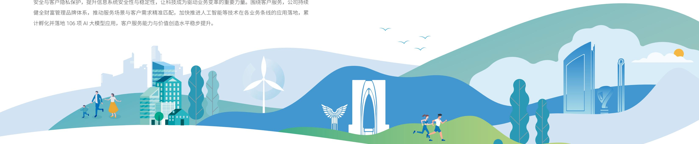

text_image

安全与客户隐私保护，提升信息系统安全性与稳定性，让科技成为驱动业务变革的重要力量。围绕客户服务，公司持续健全财富管理品牌体系，推动服务场景与客户需求精准匹配，加快推进人工智能等技术在各业务条线的应用落地，累计孵化并落地106项AI大模型应用，客户服务能力与价值创造水平稳步提升。

## 2025 年度 ESG 绩效总览

2025年，东吴证券严格落实新“国力条”及资本市场“1+N”政策体系要求，紧密围绕建设一流投资银行目标着力做好金融“五篇大文章”，全力服务国家战略和实体经济发展。深入贯彻国家“双碳”战略，全面推进ESG与可持续发展工作，在经济、环境、社会及治理等领域经营质效与行业地位稳步提升。

## 经济绩效

资产总额 2,162.19亿元

营业收入 90.30亿元 纳税总额 24.20亿元

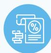

基本每股收益0.71元 / 股每股社会贡献值2.06 元/股

## 环境绩效

单位面积耗电量0.27兆瓦时 / 平方米

单位面积耗水量1.58 立方米/平方米单位面积温室气体排放量0.16 吨二氧化碳当量/ 平方米

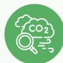

## 社会绩效

员工总数5,101人客户满意度 客户满意度99.15% 99.15%

员工培训覆盖率 100% 员工人均培训时长 40.28

投诉处理率100%对外捐赠、公益项目总投入万元1,743.96

## 治理绩效

独立董事占比36.36%女性董事占比18.18%

## 关于东吴证券

## 公司简介

东吴证券股份有限公司成立于1993年，前身为苏州证券，2010年整体变更为东吴证券股份有限公司，是拥有全部证券类业务牌照的综合券商。公司于 2011 年12月在上海证券交易所挂牌上市，股票代码为601555.SH。

自1993年成立至今，东吴证券持续以“坚持根据地、融入长三角、服务中小微”为战略导向，从一家区域性券商成长为布局全国、跨境经营的综合性券商。公司将继续积极服务实体经济，跟随国家战略目标推进自身发展，致力于建设市场化、特色化、科技化、国际化一流投资银行，构建全生命周期金融服务体系。

公司名称  

东吴证券股份有限公司

英文名称  

Soochow Securities Company Limited

股票代码  

601555.SH

注册资本  
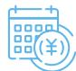

49.69亿元

资产总额  

2,162.19 亿元 1

营业收入  

90.30亿元 1

员工总数  

5,101人 1

主要业务  

财富管理业务、投资银行业务、投资交易业务、资产管理业务等。

## 业务布局

自成立以来，公司坚守服务实体经济初心，坚持稳健经营，综合实力持续壮大，形成了以财富管理业务、投资银行业务，投资交易业务，资产管理业务为基本架构的业务体系，与研究咨询，信息技术和风险管理等强有力的业务支持体系，为境内外客户打造协同发展，合作共赢的财富家园。

截至报告期末，公司总资产为2.162.19亿元，归母净资产为43272亿元，在全国设有29家分公司，126家营业网点。旗下拥有全资子公司东吴创投、东吴创新资本、东吴香港、东吴新加坡，并控股东吴基金、东吴期货。

## 组织架构

公司坚持优化组织架构，提升治理效能。2025年，公司撤销投资银行总部及中小企业融资总部，成立投资银行业务管理委员会，下设业务总部、质控中心、营运中心三个公司一级部门。根据《公司法》《上市公司章程指引》等规定结合公司实际情况，顺利完成监事会改革，由董事会审计委员会承接监事会职权，进一步夯实规范运作基础，增强了内部制衡与决策实效，持续推动治理体系现代化，为公司稳健发展提供坚实保障。

东吴证券组织架构  
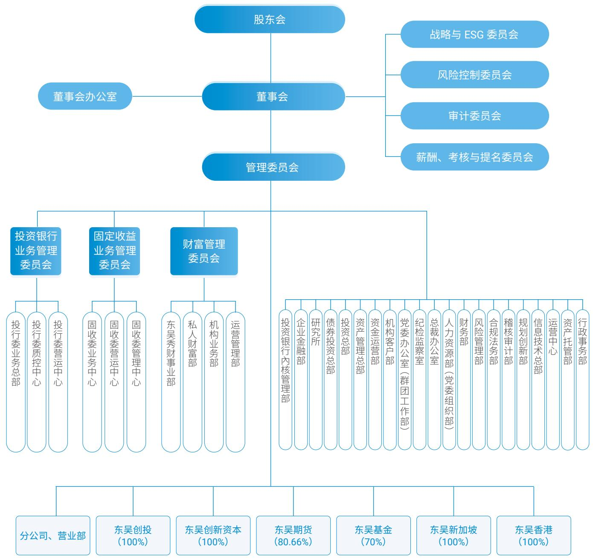

flowchart

This image is an organizational chart (a type of flowchart) illustrating the corporate structure and hierarchy of a company, showing relationships between shareholders, board directors, management committees, and various investment departments.

## 企业文化

在三十余年的发展历程中，东吴证券形成了独具特色的企业文化，在不断创新发展中确定了自己的发展道路。

文化理念体系  
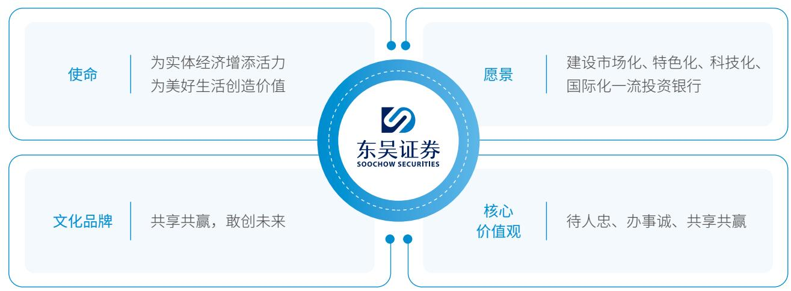

flowchart

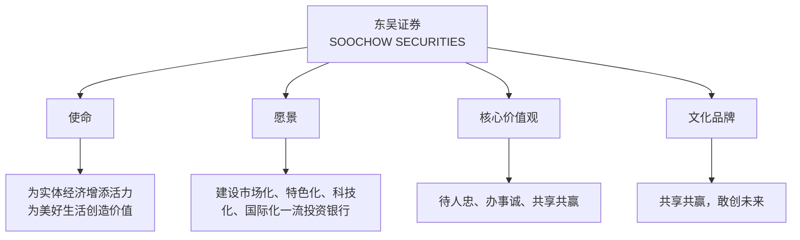
```mermaid
graph TD
  A["东吴证券\nSOOCHOW SECURITIES"] --> B["使命"]
  A --> C["愿景"]
  A --> D["核心价值观"]
  A --> E["文化品牌"]
  
  B --> F["为实体经济增添活力\n为美好生活创造价值"]
  C --> G["建设市场化、特色化、科技化、国际化一流投资银行"]
  D --> H["待人忠、办事诚、共享共赢"]
  E --> I["共享共赢，敢创未来"]
```

公司发展理念  
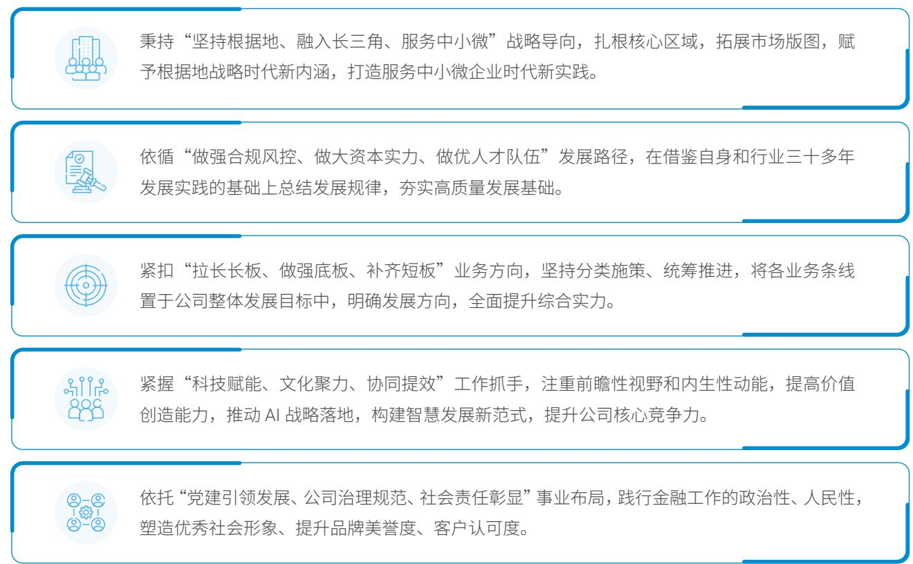

flowchart

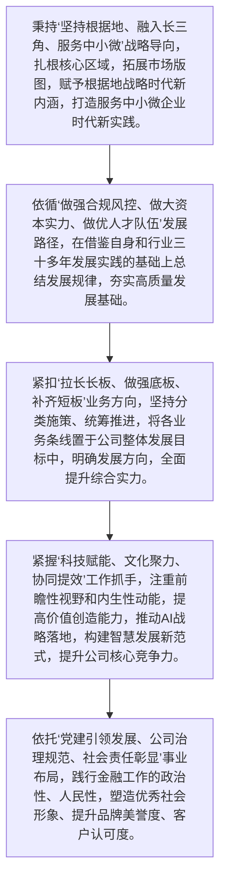
```mermaid
graph TD
  A["秉持‘坚持根据地、融入长三角、服务中小微’战略导向，扎根核心区域，拓展市场版图，赋予根据地战略时代新内涵，打造服务中小微企业时代新实践。"] --> B["依循‘做强合规风控、做大资本实力、做优人才队伍’发展路径，在借鉴自身和行业三十多年发展实践的基础上总结发展规律，夯实高质量发展基础。"]
  B --> C["紧扣‘拉长长板、做强底板、补齐短板’业务方向，坚持分类施策、统筹推进，将各业务条线置于公司整体发展目标中，明确发展方向，全面提升综合实力。"]
  C --> D["紧握‘科技赋能、文化聚力、协同提效’工作抓手，注重前瞻性视野和内生性动能，提高价值创造能力，推动AI战略落地，构建智慧发展新范式，提升公司核心竞争力。"]
  D --> E["依托‘党建引领发展、公司治理规范、社会责任彰显’事业布局，践行金融工作的政治性、人民性，塑造优秀社会形象、提升品牌美誉度、客户认可度。"]
```

## ESG管理体系

## 可持续发展治理体系

公司重视可持续发展及ESG管理工作，积极搭建ESG治理体系，完善《东吴证券股份有限公司章程》，明确各层级与部门职责。公司董事会对ESG事宜负责，并建立了涵盖“决策层-管理层-执行层”的ESG治理架构，确保ESG相关因素被纳入公司战略制定的考量范围，相关行动计划得到有效落实与监督，保证公司的可持续发展。

东吴证券ESG治理架构及职责分工

<table><tr><td colspan="2">层级</td><td>职责分工</td></tr><tr><td rowspan="3">决策层</td><td>董事会</td><td>·审定公司中长期发展规划、公司发展战略以及环境、社会及公司治理(ESG)的目标等,包括但不限于制定、审查公司的ESG战略、审议公司ESG/可持续发展报告、评估ESG相关影响、风险和机遇,分析其对公司长期发展的影响等,并对其有效性负责。</td></tr><tr><td>董事会战略与ESG委员会</td><td>·对公司ESG治理安排进行研究并提供决策咨询建议,包括但不限于ESG治理愿景、目标、政策、ESG风险及重大事宜,监督ESG战略与目标的执行情况,监督公司ESG管理体系的有效运作等。</td></tr><tr><td>其他专门委员会</td><td>·审计委员会:负责审核公司财务信息及其披露,监督及评估企业内外部审计工作、内部控制,履行上市公司关联交易控制和日常管理的职责,并行使《公司法》规定的监事会的职权。·薪酬、考核与提名委员会:负责拟定董事、高级管理人员的选择标准和程序,对其人选及其任职资格进行遴选、审核;制定董事、高级管理人员的考核标准并进行考核,制定、审查其薪酬决定机制、决策流程、支付与止付追索安排等薪酬政策与方案;对由董事会审议的相关议题提出建议。·风险控制委员会:负责对公司合规与风险管理进行监督与指导,将公司总体风险控制在合理的范围内,以确保公司能够对经营活动中的合规与风险控制实施有效的管理。</td></tr><tr><td>管理层</td><td>管理委员会</td><td>·负责落实公司ESG整体战略,根据ESG相关影响、风险和机遇制定应对策略和具体行动计划,并评估管理相关事宜的成本与资源等。</td></tr><tr><td>执行层</td><td>各相关部门</td><td>·负责具体ESG行动计划的落实,包括但不限于制定利益相关方参与计划、组织沟通活动、协调编制ESG/可持续发展报告等。</td></tr></table>

## ESG 管理制度

公司持续完善ESG管理制度体系，发布并落实ESG管理相关政策，在员工权益保障、人力资本发展、供应商管理数据及信息保护、负责任投资、全面风险管理和规范商业行为等方面作出承诺

东吴证券ESG 管理相关声明

<table><tr><td>制度政策</td><td>回应ESG议题</td></tr><tr><td>《东吴证券股份有限公司环境敏感型行业可持续投融资理念声明》</td><td>负责任投资绿色金融ESG尽职调查</td></tr><tr><td>《东吴证券股份有限公司 ESG 风险管理声明》</td><td>全面风险管理ESG尽职调查</td></tr><tr><td>《东吴证券股份有限公司对外投票表决权声明》</td><td>负责任投资强化合规管理</td></tr><tr><td>《东吴证券股份有限公司员工权益与福利管理声明》</td><td>人力资本管理</td></tr><tr><td>《东吴证券股份有限公司隐私与数据安全管理声明》</td><td>数据安全与客户隐私保护</td></tr><tr><td>《东吴证券股份有限公司负责任投资声明》</td><td>负责任投资</td></tr><tr><td>《东吴证券股份有限公司廉洁从业及反腐败管理声明》</td><td>规范商业行为强化合规管理</td></tr><tr><td>《东吴证券股份有限公司供应商管理声明》</td><td>供应商管理</td></tr></table>

2025年，公司积极响应监管要求，对标国内外ESG评级要求，持续提升公司可持续及ESG工作质效。公司股东会、董事会对公司治理制度、《2024年度可持续发展暨ESG报告》等议案进行了审议。

东吴证券 2025年审议的主要ESG 事项

<table><tr><td>决策机构</td><td>关注的ESG议题</td><td>审议主要内容</td></tr><tr><td>股东会</td><td>公司治理</td><td>审议通过《公司章程(2025年修订)》《股东会议事规则》《董事会议事规则》以及《关于不再设立监事会的议案》</td></tr><tr><td rowspan="5">董事会</td><td>公司治理</td><td>审议通过《公司章程(2025年修订)》《股东会议事规则》《董事会议事规则》</td></tr><tr><td>信息披露</td><td>审议通过《2024年度可持续发展暨ESG报告》《2024年年度报告》《2025年半年度报告》《关于2024年度“提质增效重回报”行动方案落实情况半年度报告的议案》《信息披露事务管理制度》</td></tr><tr><td>风险管理</td><td>审议通过《2024年度全面风险评估报告》《2024年度风控指标执行情况》《2025年度风险偏好体系》</td></tr><tr><td>合规管理</td><td>审议通过《2024年度合规报告》《2024年合规管理有效性评估报告》《2024年度反洗钱工作报告》</td></tr><tr><td>内部控制</td><td>审议通过《2024年度内部控制评价报告》《2024年度稽核审计工作报告》《2025年度内审工作计划》</td></tr></table>

公司不断强化ESG长效管理机制，建立健全绩效考核体系，积极完善薪酬机制，制定包括薪酬扣回、追回条款在内的薪酬考核制度，将薪酬政策与ESG目标实现情况相关联，以确保董事及管理层的个人利益与公司长期可持续发展目标保持一致。公司内部董事的薪酬由基本薪酬和绩效组成，可变薪酬包括短期和长期激励，包含年度奖金、薪酬递延企业年金等。公司将ESG目标实现情况与绩效考核挂钩，保证薪酬激励与ESG目标有效联动。

natural_image

Illustration of four people working with laptops and a bar chart, surrounded by abstract leaf shapes (no text or symbols)

## 议题重要性评估

## 重要性分析

2025年，东吴证券依据《指引》对于影响重要性和财务重要性的判断方式，参照《GRI标准》等国际可持续信息披露标准及最新中国上市公司协会《中国上市公司可持续发展报告工作指南》中的相关方法和流程，对公司的议题重要性进行分析。

## 东吴证券2025年度议题重要性分析流程

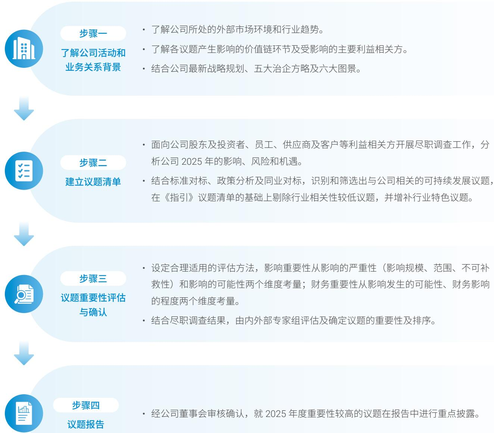

flowchart

```mermaid
graph TD
  A["Step 1: Step One: Identify Company Activities and Business Relations"] --> B["Step 2: Establish Complaints"]
  B --> C["Step 3: Assesses of Key Objectives & Confirm"]
  C --> D["Step 4: Review Reports"]
  
  subgraph Details
    direction TB
    A1["Step One: Identify Company Activities and Business Relations"]
    A2["Step Two: Establish Complaints"]
    A3["Step Three: Assesses of Key Objectives & Confirm"]
    A4["Step Four: Review Reports"]
  end
  
  B -.-> A1
  B -.-> A2
  B -.-> A3
  B -.-> A4
  
  subgraph Details
    direction TB
    A11["Step One: Identify Company Activities and Business Relations"]
    A12["Step Two: Establish Complaints"]
    A13["Step Three: Assesses of Key Objectives & Confirm"]
    A14["Step Four: Review Reports"]
  end
  
  A11 --> A12
  A12 --> A13
  A13 --> A14
  A14 --> A15
  
  subgraph Details
    direction TB
    A16["Step One: Identify Company Activities and Business Relations"]
    A17["Step Two: Establish Complaints"]
    A18["Step Three: Assesses of Key Objectives & Confirm"]
    A19["Step Four: Review Reports"]
  end
  
  A16 --> A17
  A17 --> A18
  A18 --> A19
  A19 --> A20
  
  subgraph Details
    direction TB
    A21["Step One: Identify Company Activities and Business Relations"]
    A22["Step Two: Establish Complaints"]
    A23["Step Three: Assesses of Key Objectives & Confirm"]
    A24["Step Four: Review Reports"]
  end
  
  A21 --> A22
  A22 --> A23
  A23 --> A24
  A24 --> A25
  
  subgraph Details
    direction TB
    A26["Step One: Identify Company Activities and Business Relations"]
    A27["Step Two: Establish Complaints"]
    A28["Step Three: Assesses of Key Objectives & Confirm"]
    A29["Step Four: Review Reports"]
  end
  
  A26 --> A27
  A27 --> A28
  A28 --> A29
  A29 --> A30
  
  subgraph Details
    direction TB
    A31["Step One: Identify Company Activities and Business Relations"]
    A32["Step Two: Establish Complaints"]
    A33["Step Three: Assesses of Key Objectives & Confirm"]
    A34["Step Four: Review Reports"]
  end
  
  A31 --> A32
  A32 --> A33
  A33 --> A34
  A34 --> A35
  
  subgraph Details
    direction TB
    A36["Step One: Identify Company Activities and Business Relations"]
    A37["Step Two: Establish Complaints"]
    A38["Step Three: Assesses of Key Objectives & Confirm"]
    A39["Step Four: Review Reports"]
  end
  
  A36 --> A37
  A37 --> A38
  A38 --> A39
  A39 --> A40
  
  subgraph Details
    direction TB
    A41["Step One: Identify Company Activities and Business Relations"]
    A42["Step Two: Establish Complaints"]
    A43["Step Three: Assesses of Key Objectives & Confirm"]
    A44["Step Four: Review Reports"]
  end
  
  A41 --> A42
  A42 --> A43
  A43 --> A44
```

## 尽职调查、利益相关方沟通

公司基于自身业务与行业特点，识别重要的利益相关方及其关注议题，主动与政府及监管机构、股东及投资者、客户、员工、供应商及合作伙伴、社区及公众等主要利益相关方建立常态化沟通机制，通过网站、媒体、电话、电子邮箱、会议、报告、活动等渠道，开展调研、访谈、座谈会走访交流等专项化沟通活动，主动倾听利益相关方的诉求，保证及时回应利益相关方的诉求，融入公司治理与决策。

东吴证券主要利益相关方关注议题及沟通渠道

<table><tr><td>主要利益相关方</td><td colspan="2">关注议题</td><td>沟通渠道及频率</td></tr><tr><td>政府及监管机构</td><td>·应对气候变化·强化合规管理·规范商业行为·ESG尽职调查·企业文化建设</td><td>·全面风险管理·服务实体经济·优化公司治理·利益相关方沟通</td><td>·工作汇报与沟通(不定期)·监管现场检查(不定期)·座谈会、研讨会、论坛(不定期)</td></tr><tr><td>股东及投资者</td><td>·优化公司治理·强化合规管理·规范商业行为</td><td>·全面风险管理·ESG尽职调查·利益相关方沟通</td><td>·公司网站、公众号新闻动态、东吴秀财APP(实时)·上交所互动平台(实时)·股东沟通活动(不定期)·现场走访、调研活动(不定期)·股东会和业绩说明会(定期或不定期)</td></tr><tr><td>客户(包括证券投资者、证券发行人等)</td><td>·服务实体经济·保障客户权益·负责任投资·数据安全与客户隐私保护·金融科技</td><td>·投资者教育·应对气候变化·绿色金融·ESG尽职调查·利益相关方沟通</td><td>·投融资活动(实时)·95330热线(实时)·现场走访、调研活动(不定期)·东吴秀财APP(实时)·投资者教育活动(不定期</td></tr><tr><td>员工</td><td>·人力资本管理·利益相关方沟通</td><td></td><td>·职工代表大会(定期)·员工座谈会、茶话会(不定期)·问卷调研(不定期)·东吴“秀财学苑”公众号及知鸟APP(实时)·文体活动(不定期)·邮箱、电话等申诉渠道(实时)</td></tr><tr><td>供应商及合作伙伴</td><td>·供应商管理·规范商业行为·利益相关方沟通</td><td></td><td>·供应商走访交流(不定期)·供应商考察(不定期)·招投标活动(不定期)</td></tr><tr><td>社区及公众</td><td>·推进乡村振兴·热心公益慈善·应对气候变化·绿色运营·利益相关方沟通</td><td></td><td>·公益慈善活动(不定期)·灾害救助(不定期)·乡村振兴项目(不定期)·绿色金融、负责任投资项目行动(不定期)</td></tr></table>

公司开展尽职调查，识别、分析各项ESG 议题在短期（0-1 年 [含 ]）、中期（1-5 年 [含 ]）和长期（5 年以上）对经济、环境和社会的影响，并结合行业及价值链实践，评估相关影响为公司商业模式带来的风险与机遇。公司结合利益相关方的意见，管理相关影响、风险与机遇，优化公司的可持续发展管理策略。

东吴证券2025年度议题影响、风险和机遇分析

<table><tr><td rowspan="2">议题</td><td colspan="3">影响环节</td><td rowspan="2">主要风险与机遇类型</td><td rowspan="2">时间范围</td><td rowspan="2">重要性类别</td><td rowspan="2">对应章节</td></tr><tr><td>价值链上游</td><td>自身运营</td><td>价值链下游</td></tr><tr><td>应对气候变化</td><td></td><td>✓</td><td>✓</td><td>·政策与法规风险、物理风险、市场风险·市场机遇、产品和服务机遇</td><td>中长期</td><td>影响重要性</td><td>应对气候变化</td></tr><tr><td>绿色运营</td><td></td><td>✓</td><td></td><td>·声誉机遇</td><td>短中长期</td><td>影响重要性</td><td>绿色运营</td></tr><tr><td>绿色金融</td><td></td><td>✓</td><td>✓</td><td>·市场风险·政策与法规机遇、市场机遇</td><td>中长期</td><td>影响重要性</td><td>绿色金融</td></tr><tr><td>服务实体经济</td><td></td><td>✓</td><td>✓</td><td>·信用风险·政策机遇、产品与服务机遇</td><td>短中长期</td><td>双重重要性</td><td>服务实体经济</td></tr><tr><td>负责任投资</td><td>✓</td><td>✓</td><td>✓</td><td>·合规风险、市场风险·市场机遇</td><td>中长期</td><td>双重重要性</td><td>负责任投资</td></tr><tr><td>保障客户权益</td><td></td><td>✓</td><td>✓</td><td>·政策与法规风险·市场机遇</td><td>中长期</td><td>财务重要性</td><td>保障客户权益</td></tr><tr><td>金融科技</td><td></td><td>✓</td><td></td><td>·技术伦理风险·政策风险、产品与服务机遇</td><td>短中长期</td><td>双重重要性</td><td>金融科技</td></tr><tr><td>数据安全与客户隐私保护</td><td>✓</td><td>✓</td><td>✓</td><td>·技术风险、操作风险、合规风险</td><td>短中长期</td><td>双重重要性</td><td>数据安全与客户隐私保护</td></tr><tr><td>人力资本管理</td><td></td><td>✓</td><td>✓</td><td>·声誉风险·市场机遇、人才保留机遇、经营质效提升机遇</td><td>中长期</td><td>双重重要性</td><td>人力资本管理</td></tr><tr><td>投资者教育</td><td></td><td>✓</td><td>✓</td><td>·政策与法规风险·市场机遇、声誉机遇</td><td>中长期</td><td>影响重要性</td><td>投资者教育</td></tr><tr><td>推进乡村振兴</td><td></td><td>✓</td><td></td><td>·政策与法规风险·市场机遇</td><td>短中长期</td><td>影响重要性</td><td>推进乡村振兴</td></tr><tr><td>热心公益慈善</td><td></td><td>✓</td><td></td><td>·声誉机遇</td><td>短中长期</td><td>影响重要性</td><td>热心公益慈善</td></tr><tr><td>供应商管理</td><td>✓</td><td>✓</td><td></td><td>·市场风险</td><td>中长期</td><td>影响重要性</td><td>供应商管理</td></tr><tr><td>优化公司治理</td><td></td><td>✓</td><td></td><td>·治理失效风险、声誉风险·治理提升机遇</td><td>中长期</td><td>财务重要性</td><td>优化公司治理</td></tr><tr><td>强化合规管理</td><td></td><td>✓</td><td></td><td>·政策与法规风险、操作风险</td><td>中长期</td><td>双重重要性</td><td>强化合规管理</td></tr><tr><td>规范商业行为</td><td>✓</td><td>✓</td><td>✓</td><td>·合规风险·声誉与市场机遇</td><td>中长期</td><td>双重重要性</td><td>规范商业行为</td></tr><tr><td>全面风险管理</td><td></td><td>✓</td><td></td><td>·政策与法规风险·声誉机遇、市场机遇</td><td>中长期</td><td>双重重要性</td><td>全面风险管理</td></tr><tr><td>ESG尽职调查</td><td></td><td>✓</td><td>✓</td><td>·政策与法规风险·市场机遇、声誉机遇</td><td>中长期</td><td>财务重要性</td><td>全面风险管理</td></tr><tr><td>推进企业文化建设</td><td></td><td>✓</td><td></td><td>·声誉机遇</td><td>中长期</td><td>影响重要性</td><td>推进企业文化建设</td></tr><tr><td>利益相关方沟通</td><td>✓</td><td>✓</td><td>✓</td><td>·声誉风险·政策与法规机遇</td><td>中长期</td><td>影响重要性</td><td>ESG管理体系</td></tr></table>

## 双重重要性评估结论

2025 年，基于内外部专家团队对议题财务重要性和影响重要性的评估，东吴证券共识别出8 项双重重要性议题，3项财务重要性议题，9项影响重要性议题。

东吴证券2025年议题重要性矩阵  
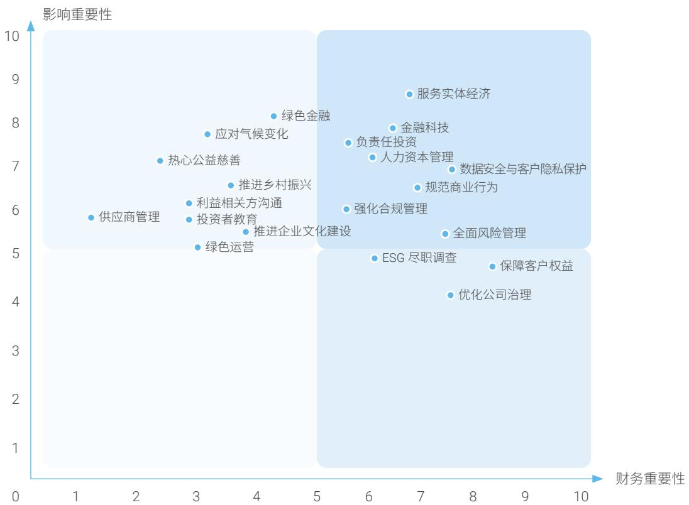

scatter

| Topic | 财务重要性 | 影响重要性 |
| --- | --- | --- |
| 供应商管理 | ~1.3 | ~5.9 |
| 热心公益慈善 | ~2.4 | ~7.1 |
| 利益相关方沟通 | ~2.8 | ~6.2 |
| 投资者教育 | ~2.9 | ~5.8 |
| 绿色运营 | ~3.0 | ~5.2 |
| 推进乡村振兴 | ~3.6 | ~6.6 |
| 应对气候变化 | ~3.2 | ~7.8 |
| 绿色金融 | ~4.3 | ~8.2 |
| 推进企业文化建设 | ~3.8 | ~5.5 |
| 负责任投资 | ~5.6 | ~7.6 |
| 强化合规管理 | ~5.6 | ~6.0 |
| 金融服务实体经济 | ~6.8 | ~8.7 |
| 金融科技 | ~6.5 | ~7.9 |
| 人力资本管理 | ~6.1 | ~7.2 |
| ESG 尽职调查 | ~6.1 | ~4.9 |
| 数据安全与客户隐私保护 | ~7.6 | ~6.9 |
| 规范商业行为 | ~7.0 | ~6.5 |
| 全面风险管理 | ~7.5 | ~5.5 |
| 保障客户权益 | ~8.4 | ~4.7 |
| 优化公司治理 | ~7.6 | ~4.2 |

东吴证券2025年重要性议题主要变动情况

<table><tr><td>2025年重要性议题</td><td>2024年重要性议题</td><td>变动情况</td><td>变动原因</td></tr><tr><td rowspan="3">人力资本管理</td><td>员工平等与权益</td><td rowspan="3">合并</td><td rowspan="3">结合《指引》议题要求和资本市场ESG评级关注议题,将员工相关议题进行合并。</td></tr><tr><td>员工健康与关怀</td></tr><tr><td>员工培训与发展</td></tr><tr><td>数据安全与客户隐私保护</td><td>数据安全与隐私保护</td><td>修改表述</td><td>根据《指引》所列议题表,修订议题名称,规范议题内容。</td></tr><tr><td>ESG尽职调查</td><td>ESG风险管理</td><td>修改表述</td><td>根据《指引》所列议题表,结合公司经营实际修订议题名称。</td></tr><tr><td>利益相关方沟通</td><td>——</td><td>新增</td><td>结合《指引》议题要求新增。</td></tr></table>

## 环境篇

natural_image

Stylized landscape illustration with windmill, houses, and trees on a river (no text or symbols)

## 绿金筑梦 低碳先行

## 应对气候变化

东吴证券积极响应国家“双碳”战略及应对气候变化相关部署，参照《国际财务报告可持续披露准则第2号气候相关披露》(IFRSS2)及《指引》要求，构建了涵盖“治理，战略，影响、风险和机遇管理，指标与目标”的气候变化管理体系。公司结合自身业务特点与发展战略，系统识别与评估气候相关风险与机遇，明确应对策略与实施路径将绿色低碳理念贯穿于业务发展与管理实践全过程，推动经营目标与可持续发展协同共进，为经济社会绿色转型贡献金融专业力量。

## 治理

公司持续健全应对气候变化治理体系，组建由“决策层、管理层、执行层”的治理架构，审议并执行气候变化在内的 ESG 相关事宜。

## 东吴证券气候变化治理架构及职责分工

<table><tr><td>决策层</td><td>董事会战略与ESG委员会</td><td>董事会职责:制定、监督及审查公司的应对气候变化战略,包括战略方向、目标设定及核心政策。评估和监测应对气候变化相关影响、风险和机遇,并分析其对公司长期可持续发展的影响。战略与ESG委员会职责:对公司应对气候变化议题进行研究并提供决策咨询建议,包括应对气候变化愿景、目标、政策、ESG相关风险及重大事宜等。监测应对气候变化战略及目标的执行情况,监督应对气候变化管理体系的有效运作,并向董事会提出建议。</td></tr><tr><td>管理层</td><td>管理委员会</td><td>负责落实公司应对气候变化相关战略,制定应对策略和行动计划。确定及管理为应对气候变化相关影响、风险和机遇工作所分配的成本及资源。</td></tr><tr><td>执行层</td><td>各相关部门</td><td>负责公司应对气候变化相关工作的执行、管理、数据统计与分析;定期向管理层汇报工作成果。</td></tr></table>

## 决策

## 战略

围绕国家“双碳”战略，公司坚持绿色可持续发展，把握绿色领域债券融资服务机会；积极应对气候变化，系统性开展气候变化相关风险和机遇的识别、评估和分析工作，并制定应对策略，落实推进自身运营层面及金融业务端的气候相关风险管理；加强环境敏感型行业(农业、生物多样性、林业、能源、煤炭、采矿业、石油和天然气、交通运输等行业）投资和融资准入及管理，把绿色金融理念深度融入投资决策，提升投融资业务的环境效益和社会效益，打造一流的绿色低碳现代投资银行。

为确保在低碳转型趋势中保持战略前瞻性，公司将适时推进董事会专业化建设，优先考虑吸纳具备气候变化背景的专家加入董事会，旨在强化董事会对气候相关议题的洞察力与决策能力，为公司在可持续发展领域的长期竞争力提供坚实的治理保障。

东吴证券气候相关风险和机遇分析及应对策略

<table><tr><td>风险/机遇类型</td><td>具体描述</td><td>预期财务影响</td><td>影响范围</td><td>应对策略</td></tr><tr><td>政策与法规风险</td><td>国家及监管部门逐步加强对金融机构环保相关法律法规及管理规范,以及对金融产品提出更加严格的要求;可能会影响客户及投资标的结构和业务模式,如限制高碳业务的开展,导致企业偿债能力下降,对公司金融业务产生影响。</td><td>营业收入降低投资组合价值降低</td><td>短、中、长期</td><td>· 跟踪气候变化相关政策制定及变化趋势,适时调整业务策略。· 关注自身、客户及投资标的面临的风险,及时采取风险管理措施并完善风险管理体系。</td></tr><tr><td>市场风险</td><td>随着全球范围内对气候变化的关注日益增强,低碳、环保的产品和服务逐渐成为主流。传统高碳排放行业可能因需求萎缩而面临市场份额下降的风险,从而可能对公司的客户结构和投资组合产生负面影响。</td><td>营业收入降低投资组合价值降低</td><td>短、中、长期</td><td>· 加强市场及行业趋势研究,逐步减少高碳业务,加大对绿色金融产品及服务的投入。</td></tr><tr><td>急性物理风险</td><td>极端天气事件(如台风、洪水)可能对公司的正常业务开展产生影响,对公司资产造成直接破坏;同时客户及投资标的也可能受极端天气影响,经营受限,导致偿债能力或市场估值下降。</td><td>运营成本增加营业收入降低投资组合价值降低</td><td>短、中、长期</td><td>· 制定应急预案,加强设施抗灾能力。· 适时开展气候情景分析,调整投资组合策略。· 优化业务结构和投资布局。</td></tr><tr><td>慢性物理风险</td><td>海平面上升、气温升高、水资源短缺等现象可能导致办公地点或数据中心所在区域的环境条件恶化,增加公司运营成本;可能影响部分客户及投资标的市场估值。</td><td>运营成本增加投资组合价值降低</td><td>中、长期</td><td>· 制定应急预案,加强设施抗灾能力。· 适时开展气候情景分析,调整投资组合策略。· 优化业务结构和投资布局。</td></tr><tr><td>市场机遇</td><td>气候变化投融资、发展绿色金融等相关政策的出台带来大量市场机遇,为公司布局相关产业链提供增长空间。公司客户及投资标的市场估值也可能提升。</td><td>营业收入增加投资组合价值增加</td><td>短、中、长期</td><td>· 制定绿色金融发展战略,加强团队建设,提升绿色金融的研究能力,拓展绿色投融资等业务。</td></tr><tr><td>产品和服务机遇</td><td>随着国家气候变化投融资政策、绿色金融战略的推进,地方政府和企业对绿色项目的需求持续扩大。公司通过创新绿色债券产品、提升绿色股权融资服务能力,不断巩固自身竞争力,促进绿色产业发展。</td><td>营业收入增加投资组合价值增加</td><td>短、中、长期</td><td>· 加强绿色金融产品创新及服务能力提升。通过发行绿色债券,投资绿色环保债券等措施,持续提升公司的竞争力。</td></tr></table>

## 影响、风险和机遇管理

公司基于绿色金融业务发展战略与自身运营情况，结合风险及机遇的发生概率和影响程度，识别出气候相关风险与机遇的重要性，积极制定并实施相应行动措施，应对气候变化带来的潜在风险，把握潜在的发展机遇。

## 东吴证券应对气候变化管理流程

## 识别

·根据《指引》《企业可持续披露准则第1号——气候（试行）》等要求，参考国际可持续准则理事会（ISSB）气候相关信息披露框架，基于公司业务特征，通过分析与调研，识别气候相关风险与机遇，形成风险与机遇清单。

## 评估与分析

·基于公司业务和战略，结合专家意见，全面评估气候变化风险和机遇对公司财务及战略方面的影响程度。  
·分析风险及机遇的发生概率和影响程度，确定风险及机遇的优先级。

## 监测与应对

· 建立持续监测机制，关注政策变化、市场动态、技术进展及自然环境变化对业务的潜在影响，定期更新风险与机遇清单。  
·定期开展针对性报告和披露，由董事会战略与ESG委员会向公司董事会汇报气候相关风险与机遇的识别、分析评估、管理情况，并对利益相关方披露行动进展。

在绿色金融业务方面，公司积极开展绿色融资、绿色投资、绿色研究等业务，具体内容详见本报告“环境篇”之“绿色金融”小节内容。

在推进绿色低碳运营方面，公司属于金融企业，营业办公消耗的天然气，以及自有交通工具消耗的汽油等能源的使用是公司温室气体直接排放的主要来源。外购电力、外购蒸汽的使用是公司温室气体间接排放的主要来源。公司制定实施一系列节能减排举措，降低能源消耗和碳排放，具体内容详见本报告“环境篇”之“绿色运营”小节内容。

## 指标与目标

公司以“节能降耗、低碳运营”为管理目标，设定“温室气体排放总量(范围1+范围2)”“人均温室气体排放量(范围1+范围2)”“单位面积温室气体排放量(范围1+范围2)”“人均耗水量”“单位面积耗水量”“办公无纸化节约纸张量”作为监测指标，动态跟踪目标进展情况，保障应对气候变化的各项策略切实执行，助力公司在低碳转型中稳健前行。未来，公司将结合经营实际和监管要求，适时研究并制定气候变化相关定量目标，持续提升气候管理水平。

东吴证券气候变化相关指标与目标

<table><tr><td>指标</td><td>2025年绩效</td></tr><tr><td>温室气体排放总量(范围1+范围2)</td><td>9,415.46吨二氧化碳当量</td></tr><tr><td>人均温室气体排放量(范围1+范围2)</td><td>5.76吨二氧化碳当量/人</td></tr><tr><td>单位面积温室气体排放量(范围1+范围2)</td><td>0.16吨二氧化碳当量/平方米</td></tr><tr><td>人均耗水量</td><td>55.78立方米/人</td></tr><tr><td>单位面积耗水量</td><td>1.58立方米/平方米</td></tr><tr><td>办公无纸化节约纸张量</td><td>8,057.18千克</td></tr></table>

natural_image

Stylized illustration of a city skyline with green trees and modern high-rise buildings in the background (no text or symbols)

## 绿色金融

公司积极贯彻绿色发展理念，服务国家双碳战略，通过构建绿色融资、绿色投资和绿色研究三大业务板块，持续完善绿色金融发展体系，促进经济绿色转型和可持续发展。

公司建立绿色金融管理架构，由董事会进行战略决策，管理委员会负责战略落实与行动计划制定，各相关部门负责具体实施与协同推进，确保绿色金融相关工作有序开展。

## 东吴证券绿色金融发展战略举措

## 绿色融资

支持企业拓宽绿色融资渠道，助力绿色项目与可持续发展项目获得资金支持，推动绿色经济发展。

## 绿色投资

积极筛选具有可持续发展潜力的绿色投资项目，引导资本配置于低碳与可持续领域，提升绿色投资价值。

## 绿色研究

开展绿色金融相关理论与实践研究，为业务创新与政策研判提供专业支持，促进绿色金融实践深化。

2025年，公司持续推进绿色金融发展，围绕融资服务、投资布局与研究支持等领域多点发力，通过股权融资、债券融资、股权投资、债券投资及绿色研究等多种方式，引导资金流向清洁能源、绿色基础设施与低碳产业，积极服务经济绿色转型与可持续发展。

## 东吴证券2025年度绿色金融主要项目成果

## 股权融资

·完成江苏迪威高压科技股份有限公司（简称“迪威高压”）665.6万元定向发行融资。迪威高压专注于流体传动与冷却系统用压力管道元件的研发与制造，其技术与产品契合国家绿色低碳发展方向，通过此次融资支持其技术创新与市场拓展，迪威高压于2025年顺利切入A服务器液冷管件领域。  
· 完成上海威锐电子科技股份有限公司2.001.6万元定向发行融资，用于无线通讯及新能源产品智能制造中心项目建设，助力其太阳能组件业务发展，推动下游客户降碳与能源效率提升。  
·助力天津天宝翔科技股份有限公司（简称“天宝翔”）新三板挂牌。天宝翔主营选矿药剂，研发的铁矿石低温高效捕收剂及抑制剂实现了室温选矿和室温配药，大幅降低选矿加热能耗，协助客户实现绿色矿山目标。

## 债券融资

·东吴香港作为联席主承销商及簿记管理人，助力青岛动车小镇投资集团有限公司成功发行0.6亿美元、票面利率6.9%的3年期绿色美元债券。募集资金依据《绿色金融框架》并经独立评估认证，专项用于能效提升与绿色建筑项目，能效类项目力争节能15%以上，绿色建筑达到绿建二星或LEED金级标准。  
• 东吴香港作为牵头主承销商、簿记管理人及可持续结构顾问，主导徐州高新控股集团1亿美元可持续债券发行，期限3年，票面利率4.4%。募集资金依据可持续发展金融框架，用于水资源与废水管理、生态修复及保障性住房项目，兼顾环境与社会效益。

## 股权投资

·东吴创投与国家绿色发展基金股份有限公司(简称“国绿基金”）合作设立的梁东空天数科绿色（无锡)股权投资基金合伙企业(有限合伙）基金，截至2025年底，项目完成投资额24亿元。重点投资项目包括梁塘河生态缓冲带修复工程、梁塘河生态科技未来公园工程等。  
·东吴创投与新建元合作设立产业园专项基金，由苏州新建元产业发展公司认缴100%，东吴创投为基金管理人基金规模19.645亿元，投资于符合绿色标准的苏州工业园区周边的产业园，目出具相关的建筑节能减排的绿色金融报告，2025年已全部完成投放  
·东吴基金发行“东吴新能源汽车股票型证券投资基金”，截至2025年底，该基金规模约144亿元，基金主要投向新能源汽车电池产业链、汽车配件行业、新能源汽车下游行业、车联网及智能驾驶等新能源汽车行业

## 债券投资

· 投资G三峡EB2绿色债券，募集资金主要投向海上风电送出线路工程及白鹤滩水电站等清洁能源与基础设施项目。其中海上风电项目支持可再生能源消纳与电网建设，白鹤滩水电站年上网发电量达60483亿千瓦时相比燃煤发电可显著减少温室气体排放并改善区域能源结构。

## 绿色研究

·通过专业的咨询服务与实践调研，为机构客户提供绿色领域深度研究支持，助力资本市场绿色发展，积极应对可持续相关风险  
·持续跟踪绿色债券整体情况并撰写周报50篇，就绿色相关内容撰写行业以及公司类报告28篇，覆盖多家上市公司。报告包括《环境空气质量标准提标修订，分阶段实施明确，大气治理需求中长期释放龙净环保受益》《完善新能源就近消纳价格机制，助力垃圾发电等绿电直连落地》 《建立完善煤炭与新能源融合发展机制，矿山与新能源协同发展推进》等。

## 东吴证券2025年绿色金融主要绩效

• 公司资产管理业务合计参与投资绿色债券约11.57亿元，包括G三峡EB2、25鄂东G1、G新城01等74只债券。  
· 截至2025年年底，公司可持续相关债券的持仓规模为15.33亿元，绿色债券的持仓规模为10.79亿元。

## 绿色运营

东吴证券践行低碳节能的绿色运营理念，遵守《中华人民共和国环境保护法》等法律法规，致力于减少对自然资源的消耗和对环境的影响。

公司建立完善绿色运营管理架构，根据董事会战略决策，由公司领导分管包括能源管理在内的绿色运营事项，行政事务部负责具体落实与日常管理，通过持续开展检查与管理举措，推动绿色运营理念在公司运营中的有效落实。报告期内，公司未发生突发重大环境违规事件，且未有因环境事件受到生态环境等有关部门重大行政处罚或被追究刑事责任的情况。

## 能源管理

东吴证券在经营过程中的能源消耗和碳排放主要来自办公用电、数据中心用电、餐厅用天然气以及自有车辆消耗的汽油等。公司遵守《中华人民共和国节约能源法》等法律法规，逐步完善能源管理机制建设，以具体的节能行动驱动低碳运营，践行绿色发展理念。

东吴证券节能管理主要举措

<table><tr><td>落实节能降耗</td><td>·设置合理的室内温度区间,空调温度夏天不低于26°C,冬天不高于20°C。·全面采用低功耗办公设备和LED节能灯具,并根据自然采光情况智能调节或关闭照明系统。·积极宣传环保理念,在公共区域张贴节能标语,定期发送节电提示,鼓励员工随手关灯、节约用电。</td></tr><tr><td>倡导低碳出行</td><td>·鼓励线上会议,大力倡导以视频会议替代非必要商务差旅,从源头上减少碳排放。·严格规范公务车使用管理,对用车人员及使用场景等作出明确规定,坚决杜绝公车私用现象。·积极推行绿色通勤理念,鼓励员工在市区及周边地区的出行中优先选择公共交通工具。</td></tr><tr><td>推进绿色数据中心建设</td><td>·根据季节气温的变化,调整精密空调的温度设定值和变频风机的风量值,在满足机房温度要求的同时,最大限度地节约耗电量。2025年同比2024年度节省电力409,827千瓦时。·在维修照明设备时,采用低能耗、高发光效率的LED光源替换原普通光源,节约日常耗电量,走道、机房做到人走灯灭。·机房工作人员运行维护时,严格要求随手关门,保持机房温度最小化变量,从而降低空调机组运行负荷变化波动。·加强智能监控,保持功率因数≥0.9,降低无功功率,进而减少电能的无功损耗。依托带外管理平台,对冷热通道、单机柜、单设备的能耗进行实时监控、历史回溯,在系统分配、能耗管理上做到精准布局。·优先考虑租赁绿色数据中心,协同推进节能减排。</td></tr></table>

## 水资源管理

公司水资源消耗主要产生于日常运营的办公环节，以市政用水为主要来源，在求取水源方面无任何问题。公司积极响应国家节约用水号召，严格遵守《中华人民共和国水法》等法律法规，持续规范水资源管理，提升用水效率，推动节约用水理念在日常运营中的落实。

## 东吴证券水资源管理主要举措

## 完善用水设备管理

• 使用节水型器具，如节水龙头、节水马桶等。  
• 总部大厦外围喷泉全天开启改为早、中、晚时段开启，以节约用水资源。  
• 加强设备定期检修，防止出现滴水、漏水等浪费现象。  
• 控制单次采购桶装饮用水数量，避免饮用水过期浪费。  
•加强饮水机设备的日常管理，放置盛水器具收集剩水。

## 加强节水宣传教育

• 张贴节约用水画报标语，宣传节水理念，增强全员节水意识。

## 废弃物管理

公司产生的废弃物主要包括办公垃圾，厨金垃圾等无害废弃物，以及废弃电子设备等有害废弃物。公司严格遵守《中华人民共和国固体废物污染环境防治法》等法律法规，并依据《实物资产管理办法》等内部制度，持续完善废弃物管理机制，规范各类废弃物的分类与处置流程，减少废弃物对环境造成的影响

## 东吴证券废弃物管理主要举措

严格执行垃圾分类

在各楼层设置分类垃圾桶并由物业公司统一清运，对达到报废标准的电子设备进行合规处置，确保有害废物得到专业处理。

推进电子化办公

加强会议文件系统建设，把控会议资料的制作与分发，有效降低纸张和硒鼓等耗材的使用量，从源头减少废弃物的产生

## 社会篇

SOCIAL

natural_image

Stylized blue city skyline with modern skyscrapers and decorative elements including wings, a rocket, and a lightbulb (no text or symbols)

## 深耕实体 责任领航

## 服务实体经济

东吴证券始终坚持以习近平新时代中国特色社会主义思想为指引，深刻把握金融工作的政治性、人民性，积极培育中国特色金融文化，勇当服务实体经济的先锋队和主力军，积极引导要素资源向科技创新、先进制造、绿色低碳普惠民生等重大战略领域和关键环节集聚，致力于打造精品化一流投资银行，为推动实体经济高质量发展贡献力量。

## 治理

根据董事会战略决策，在管理委员会领导下，公司明确各相关业务条线工作重点，合力做好金融“五篇大文章”，共同推动服务实体经济等各项工作。

东吴证券服务实体经济业务布局

<table><tr><td>部门</td><td>业务类型</td><td>具体内容</td></tr><tr><td>投资银行业务管理委员会/固定收益业务管理委员会</td><td>投资银行业务</td><td>·为企业客户提供资本市场融资服务,包括股票承销与保荐、债券融资、资产证券化融资、新三板挂牌等。·为企业客户的兼并收购、资产重组等提供财务顾问服务。</td></tr><tr><td>投资总部/债券投资总部</td><td>投资交易业务</td><td>·从事权益性证券投资及交易、固定收益投资及交易等。</td></tr><tr><td>东吴创投/东吴创新资本</td><td>投资业务</td><td>·私募股权投资、另类投资等。</td></tr><tr><td>资产管理总部</td><td>资产管理业务</td><td>·为客户提供多元化的资产管理,包括券商资产管理服务、基金资产管理服务等。</td></tr><tr><td>规划创新部/研究所</td><td>研究业务</td><td>·为地方经济和产业发展提供研究服务。</td></tr><tr><td>东吴期货</td><td>期货经纪业务</td><td>·经营范围包括商品期货经纪,金融期货经纪,期货投资咨询、资产管理。</td></tr><tr><td>东吴香港</td><td>投资银行业务</td><td>·发挥跨境金融平台优势,助力地方政府及企业融资。</td></tr><tr><td>东吴新加坡</td><td>投资银行业务</td><td>·为企业提供一站式投资银行服务,助力企业成长与国际化发展。</td></tr></table>

## 战略

公司全面贯彻新发展理念，积极把握“五篇大文章”带来的机遇，以“坚持根据地、融入长三角、服务中小微为战略导向，扎根核心区域，发挥综合金融服务优势，重点聚焦科技金融和普惠金融，持续提升服务国家战略和实体经济质效，支持现代化产业体系建设和区域经济发展。

东吴证券服务实体经济风险与机遇分析及应对策略

<table><tr><td>风险/机遇类型</td><td>具体描述</td><td>预期财务影响</td><td>影响范围</td><td>应对策略</td></tr><tr><td>信用风险</td><td>若发行人、融资人、交易对手未能履行合同规定的义务或信用等级下降、履约能力下降,可能给公司带来损失。</td><td>运营成本增加投资组合价值降低</td><td>短、中、长期</td><td>加强风险识别与管控,推动金融资源合理配置,平衡业务发展与合规风控。</td></tr><tr><td>政策机遇</td><td>国家持续深化资本市场改革,支持北交所建设,推动中小企业直接融资渠道拓宽,为公司提供更广阔的业务空间。</td><td>营业收入增加</td><td rowspan="2">短、中、长期</td><td rowspan="2">围绕金融“五篇大文章”,公司将全牌照优势转化为对苏州和江苏乃至长三角重点产业和薄弱环节的综合金融解决方案,打造服务“专精特新”企业上市的首选通道,重点发力科创债、绿色债等创新产品,为传统产业转型升级和新兴产业发展注入金融活水。</td></tr><tr><td>产品与服务机遇</td><td>公司在服务实体经济过程中,积极探索创新,有利于提升业务多元化,为公司发展带来机遇。</td><td>营业收入增加</td></tr></table>

natural_image

Illustration of people assembling and working with large gears and leaves (no text or symbols)

## 影响、风险和机遇管理

公司建立全流程、系统化的业务管理体系，涵盖项目早期接触、正式立项、项目质量控制、流程跟踪及持续督导管理，全面识别并监测项目推进情况，确保服务实体经济各项工作稳健推进。

东吴证券服务实体经济相关风险和机遇管理流程

<table><tr><td>项目早期接触</td><td>· 深入研究实体经济企业的发展需求,识别潜在的投融资与合作机会,初步评估市场环境、行业前景及企业竞争力,筛选符合资本市场标准的优质项目。</td></tr><tr><td>正式立项</td><td>· 对经过初步筛选的项目进行尽职调查,重点关注企业所处行业、经营模式、财务状况、市场竞争力及合规性,并制定详细的投融资或服务方案,确保项目符合监管要求和公司战略目标。</td></tr><tr><td>项目质量控制</td><td>· 建立严格的项目评审机制,对核心数据、市场预测、财务分析、法律合规等内容进行深度审核,确保项目方案的专业性、可行性及稳健性。</td></tr><tr><td>流程跟踪</td><td>· 在项目推进过程中,实时监测市场环境变化、政策调整及企业经营情况,识别潜在风险和机遇,并适时调整策略,确保项目顺利实施。</td></tr><tr><td>持续督导期管理/存续期管理</td><td>· 持续跟踪企业经营状况,提供资本市场服务及管理咨询,帮助企业优化资源配置,增强市场竞争力,并有效控制可能出现的后续风险。· 在债券存续期内持续关注发行人资信状况、增信措施及偿债保障措施的有效性和实施情况,监督发行人募集资金的使用情况,持续督导发行人履行信息披露义务,做好风险管理工作。</td></tr></table>

公司积极响应国家政策号召，服务国家战略，深化“投行+投资+研究”协同联动，综合运用多元金融工具，推动产业链整合升级，不断提升服务实体经济能力，助力区域产业转型发展。

## 科技金融

公司构建科技金融生态，做好新质生产力的“服务商”，推动“投资，投行，研究”一体化，聚售区域战略性新兴产业，组建专业化团队，为硬科技企业提供从早期融资到上市并购的全程陪伴。

## 东吴证券2025年支持科技金融亮点绩效

·积极推动新质生产力企业登陆资本市场，全年完成A股IP0过会5家，过会数排名行业第5：其中北交所过会4家，排名行业第3：新增申报IP0单数和在审IPO单数均进入行业前士。  
•作为主办卷商完成新三板挂牌项目17家，累计推荐突破500家：助力挂牌公司定向发行融资8 次，排名行业第4：持续督导新三板企业273家，其中创新层105家，督导规模稳居行业前三。

## 发行科技创新公司债券

2025年5月14日，公司在上海证券交易所簿记发行12亿元科技创新公司债券，成为全国首批发行科创债的证券公司之一。本期债券期限2年，票面利率174%，创公司同期限历史新低。募集资金将提升东吴证券服务科技创新能力，助力更多科创企业获得长期稳定资金。

## 助力江苏永钢发行科技创新公司债券

2025年11月25日，由东吴证券主承销的全国首单民营钢企高成长科技创新公司债“25永钢K1”——即“江苏永钢集团有限公司(简称“江苏永钢”）2025年面向专业投资者公开发行科技创新公司债券(高成长产业债）”，在上海证券交易所成功发行。当期债券的发行人为江苏永钢集团有限公司，发行规模为1亿元期限3年，票面利率29%：债券的募集资金将全部用于建立“精品线材智能服务平台”创新平台，推动公司产业转型升级。

## 保荐科创板瑞可达10亿元可转债

2025 年12 月12 日，东吴证券保荐苏州瑞可达连接系统股份有限公司（简称“瑞可达”）可转债发行上市。瑞可达始终以连接系统产品为核心，具备包含连接器件、组件和模块的完整产品链供应能力，已成为同时具备光、电、微波连接系统产品研发和生产能力的企业之一。通过本次发行募集资金，瑞可达积极实施智慧能源连接系统、高频高速连接系统的研发及产业化，助力新质生产力发展

## 推动隆扬电子完成重大资产重组

2025年9月，东吴证券担任独立财务顾问，助力隆扬电子（昆山）股份有限公司（简称“隆扬电子”）完成收购苏州德佑新材料科技有限公司70%股权之重大资产购买事项，交易金额7.7亿元。该项目为“并购六条”发布后A股首单完成实施的台资上市公司重大资产重组。通过本次交易，隆扬电子进一步完善电子功能材料产业链布局，推动复合铜箔在消费电子与动力电池领域的协同应用。东吴证券持续为降扬电子提供资本市场服务，从保荐上市到重大资产重组，全程支持企业实现高质量发展。

## 绿色金融

公司积极践行绿色金融理念，通过金融产品和服务支持低碳产业、节能减排和环境保护。2025 年，公司绿色金融具体举措详见本报告“环境篇”之“绿色金融”小节内容。

## 普惠金融

东吴证券持续做精做优服务中小微品牌特色，多措并举加强对民营企业和中小微企业金融支持，丰富普惠金融资产证券化产品供给，提升资本市场服务普惠金融效能。

## 助力发行首单非上市公司“高成长+ 中小微”公司债券

2025 年 8 月，东吴证券作为主承销商，助力宜兴留创汇智科创发展有限公司在上海证券交易所成功发行 3亿元中小微企业支持债券，期限 5 年，发行利率 2.3%。该项目为全国首单非上市公司“高成长 + 中小微”公司债券，也是公司债新政以来宜兴市首单用于新增用途的公司债券。项目通过创新设置高成长产业债条款并强化信息披露，提升投资者保护水平，有效支持中小微企业发展与区域产业升级，推动普惠金融落地。

## 保荐中诚咨询成功登陆北交所

2025年11月，由公司保荐承销的中诚智信工程咨询集团股份有限公司(简称“中诚咨询”）在北京证券交易所成功上市，成为2025年北交所首家上市的工程咨询服务企业。公司从新三板挂牌、挂牌后定向发行到北交所上市，全程提供一站式资本市场服务，并通过“投资+保荐”协同模式充分挖掘企业价值，助力企业实现稳健成长，体现公司服务中小微企业发展的专业能力。

## 养老金融

公司持续打造养老投教体系，围绕养老金融产品开展多样化宣教活动，包括主题直播、短视频发布、线下互动课堂及社区宣教等形式。通过案例讲解、防诈答疑和场景化教育等方式，普及金融知识，帮助老年群体提升金融风险识别能力与自我保护意识。

## 创新“投教+体育赛事”模式守护银发金融安全

2025 年10-11 月，东吴证券投资者教育基地联合苏州市老年人体育协会开展“筑牢银发金融安全网 守护居民钱袋子”主题金融宣教活动，通过“投教+体育赛事”创新模式，在柔力球、气排球比赛现场及天平山运河公园等老年人聚集场景设立投教咨询台、发放预防非法活动宣传资料，结合“虚假养老项目”“高息理财骗局”等典型案例，向老年群体普及非法集资、非法荐股等风险防范知识，帮助提升老年投资者风险识别能力和理性投资意识，进一步构建面向银发群体的常态化投资者教育服务体系。

## 开展“关爱银发族，安心享晚年”知识普及活动

2025年12月24日，东吴证券投教基地联合东吴证券于将东路营业部走进华馨护理院，开展“关爱银发族安心享晚年”主题金融知识普及活动。活动围绕老年诈骗、非法集资等风险，通过案例讲解、互动答疑及发放反诈宣传资料等形式，提升老年群体金融风险防范意识和养老财富规划能力，惠及30 余位老年人。

## 数字金融

公司高度重视金融科技与数字化转型发展大趋势，积极落实“业技融合”战略和数转办工作机制，为全面数字化转型进程的有序推进保驾护航。2025年，公司数字金融具体举措详见本报告“社会篇”之“金融科技”小节内容。

## 助力区域协同发展

公司积极发挥境内外协同发展优势，依托东吴创投、东吴香港及东吴新加坡等子公司平台，围绕产业投资、跨境融资与金融服务网络建设等领域协同发力，持续强化对区域产业发展与企业国际化的金融支持，推动金融资源跨区域联动，助力区域经济协同发展。

东吴创投紧密对接苏州市“1030”产业体系，聚售高端制造、生物医药、新能源、新材料、半导体等重点领域精准布局投资项目，在募资渠道拓展，项目精准投资及母基金生态构建等方面持续发力，推动资本与区域产业深度协同发展，各项业务取得阶段性成效。

## 东吴创投2025年助力区域协同发展主要实践

·2025年，新设基金总认缴规模超33亿元，在原有的6支科创培育基金的基础上，新增昆山东吴高端智造产业基金。现已完成7支科创培育基金及1支战略合作基金的设立，总规模超30亿元。  
·2025年，累计对接项目超500个，通过直接投资助力10余家企业高质量发展，投资金额超7亿元，并为50余家被投企业提供多维投后赋能。  
·东吴创投作为管理人，联合苏州国发集团、苏州资管、苏州城投及园区经发共同发起设立苏州东吴产业并购引导基金，助力苏州上市企业做大做强，推动区域产业集群发展。该母基金总规模13亿元。截至2025年末，基金已过会子基金21支，其中18支已完成出资，并直接投资企业5家，对外累计认缴规模达9.85亿元，有效引导社会资本支持实体产业发展。

东吴香港积极响应国家“走出去”战略及地方企业国际化发展需求，立足综合金融服务优势协助苏州市政府建立香港一苏州金融协同机制，持续为两地金融资源整合，业务协同发展搭建重要桥梁。

## 东吴香港2025年助力区域协同发展主要实践

·参与71单境外债券项目，其中地方城投债67笔，地产债2笔，金融机构债2笔，共计发行规模近90亿美元。  
·研究业务持续深度覆盖科技，新消费，互联网等领域，出具个股报告并发布多篇行业报告。共完成报告数量110余篇，组织83场研究员路演、112场公司非交易路演、32场专家会议，有效促进上市公司与机构投资者的深度沟通。  
·东吴香港的全资控股子公司—东吴证券国际经纪有限公司获中证科技DMI“2025年度中资离岸债年度机构评选”“年度ESG承销机构”奖项。

东吴新加坡通过旗下两家子公司，分别持有新加坡金融管理局颁发的资产管理牌照及资本市场服务牌照，作为苏州与新加坡两地深化合作的重要金融纽带，切实加强资源跨境联动，建立覆盖东南亚的金融服务网络

## 东吴新加坡2025年助力区域协同发展主要实践

·为滨州某运营有限公司提供债券发行服务。该公司主要从事城市基础设施建设、租赁服务及工程业务。通过协助其开展跨境债券融资，有效优化企业资本结构，提升资金保障能力，为智慧城市运营及工程项目实施提供有力支撑。  
·担任泰兴某控股有限公司债券发行配售代理。通过引入境外资本资源，支持泰兴某开发区基础设施建设及区域综合开发，促进地方经济稳步发展。  
• 协助某建筑企业发行可转债，支持其在建筑维护、节能改造及专业涂装等领域拓展业务，进一步提升企业综合服务能力，同时助力城市更新及绿色建筑发展。  
·通过股权配售，为某综合性仓储物流解决方案提供商引入发展资金，增强其供应链管理服务能力，提升行业竞争力。  
·参与某金属透镜技术企业IPO配售，支持其在新加坡交易所上市融资，提升企业品牌影响力和国际知名度，助推科技型企业做优做强。

## 指标与目标

公司围绕服务国家战略、服务实体经济，不断增强价值培育能力，整合资金，项目，管理资源，深化“投资+投行 + 研究”联动，朝着“构建高效协同体系、打造覆盖企业全生命周期的综合金融服务体系”的目标，陪伴式地服务企业成长。

## 东吴证券2025年度服务实体经济主要荣誉奖项

• iFind·2025  
·获得新财富杂志:2025年度最佳投行评选之最具潜力投行、最佳践行ESG投行、最佳公司债投行  
·获得万得Wind·2025年度最佳投行评选之最佳科创板股权承销商、最佳新三板主办券商  
·获得全景网·2025资本市场“卓越执业英才”杰出IPO项目、杰出并购项目

## 负责任投资

公司坚持长期价值投资导向，持续将可持续发展理念融入投资实践，在投资过程中综合考虑ESG因素，提升投资决策的前瞻性与稳健性，引导资本流向绿色产业等重点领域

## 治理

公司根据董事会战略决策，在管理委员会领导下，由各投资业务部门及子公司协同落实负责任投资原则，确保负责任投资理念及标准贯穿于公司整体战略与业务运营，提升投资的可持续性和长期价值创造能力。公司制定发布《负责任投资声明》，适用于公司投资相关业务部门、分支机构及子公司所涉及的投资相关业务，涵盖上市股权、固定收益与私募股权等资产类别。

## 东吴证券负责任投资相关部门/子公司及业务类型

## 负责任投资部门/子公司

投资总部、债券投资总部、资产管理总部、东吴基金、东吴期货、东吴创投、东吴创新资本东吴香港、东吴新加坡

## 投资相关业务类型

权益类证券投资、固定收益投资、资产管理、公募基金管理、私募股权投资基金、私募股权投资类FOF基金、创业投资基金、创业投资类FOF基金、另类投资等

## 战略

公司将ESG因素系统融入投资分析与决策流程，通过优化投资组合、强化风险管理和深化ESG整合，不断提升负责任投资能力，在复杂市场环境中增强风险应对韧性，推动实现经济效益与社会价值的协同提升。

## 东吴证券负责任投资相关风险和机遇

<table><tr><td>风险/机遇类型</td><td>具体描述</td><td>预期财务影响</td><td>影响范围</td><td>应对策略</td></tr><tr><td>合规风险</td><td>全球各国针对ESG投资已经出台的监管要求或者未来可能出台新的监管要求,如信息披露标准、投资限制等,若公司未能正确遵循或及时适应,可能面临合规风险。</td><td>运营成本增加</td><td rowspan="2">中、长期</td><td rowspan="2">加强ESG合规培训,完善投资策略及信息披露机制,确保及时适应全球监管要求。</td></tr><tr><td>市场风险</td><td>各类内外部因素可能对投资标的的自身价值或经营业绩产生负面影响,进而给公司造成损失。</td><td>投资组合价值降低营业收入减少</td></tr></table>

<table><tr><td>风险/机遇类型</td><td>具体描述</td><td>预期财务影响</td><td>影响范围</td><td>应对策略</td></tr><tr><td>市场机遇</td><td>研究表明,ESG 表现优异的企业通常具备更强的抗风险能力和长期竞争力,有助于提升投资组合的稳定性和回报。</td><td>投资组合价值增加营业收入增加</td><td>中、长期</td><td>积极推动 ESG 投资策略,精选表现优异的企业,优化投资组合,提升长期回报与稳定性。</td></tr></table>

## 影响、风险和机遇管理

公司在投资决策中积极落实负责任投资原则，将ESG相关因素纳入上市股权、固定收益、私募股权等资产类别的投资考量，应用筛选、ESG整合、主题投资、积极所有权等负责任投资策略，持续提升投资组合的可持续性与长期价值。

## 东吴证券负责任投资策略应用

<table><tr><td>负责任投资策略</td><td>上市股权</td><td>固定收益</td><td>私募股权</td></tr><tr><td>筛选</td><td>✓</td><td>✓</td><td>✓</td></tr><tr><td>ESG整合</td><td>✓</td><td>✓</td><td>✓</td></tr><tr><td>主题投资</td><td>✓</td><td>✓</td><td>—</td></tr><tr><td>积极所有权</td><td>✓</td><td>—</td><td>✓</td></tr></table>

## 东吴证券负责任投资策略具体实践

## 筛选

##

·在上市公司股权投资中，根据《投资业务证券池管理办法》设立限制投资股票池并建立限制投资股票池的筛选标准，若上市公司存在重大污染事件或者贪腐事件，经评估确实存在投资风险，则加入限制投资股票池。关注被投企业是否存在造假风险，治理缺陷及管理层诚信等问题，排除不符合ESG标准的企业  
·在上市公司股权投资中，在行业选择中侧重于ESG理念契合度较高的行业（比如碳中和等符合高质量发展方向的行业），研究上市公司ESG属性并关注专业ESG评级中获得较高得分的上市公司。  
•在固定收益投资中，通过专门舆情预警系统关注负面舆情提示，如债券发行人出现腐败行为等情况，根据情况不投资该主体发行的债券或减少投资额；在选择债券投资主体时，依据发行人的信誉、主体评级等进行谨慎投资。  
·在私募股权投资中，在项目筛选阶段避免投资于在ESG方面表现不佳的公司或行业，如烟草、严重污染企业等积极投资于能够产生积极社会和环境影响的企业或项目，如社区发展，教育，医疗等领域  
·东吴新加坡通过旗下资管子公司开展基金管理业务。在基金投资上市股权时，根据新加坡金融管理局《环境风险管理指南(资产管理公司)》相关要求制定并实施《资产管理环境风险管理政策》，对所投资的企业进行全面筛选和评估，包括对企业运营对环境的影响进行正负两方面的评估，确认拟投资项目是否已实施相关的ESG政策，并查询拟投资标的公司发布的ESG报告等信息。

## ESG 整合

·在上市公司股权投资中，将ESG因素纳入投资标的筛选、分析和决策流程。将环境影响、社会责任和公司治理作为约束性指标，贯穿于投资策略制定和投资组合构建之中。  
·在固定收益投资中，在传统信用评级体系（如盈利能力、偿债能力、营运能力、外部支持等）的基础上，将ESG相关理念因子纳入调整项目，如经营多元化、公司治理、环境影响等。  
· 公募REITs投资产品积极践行负责任投资策略，涵盖公路及能源类公募REITs，助力绿色金融和基础设施高质量发展。  
·在私募股权投资由，将ESG因素纳入投资决策，明确实施ESG整合的流程工具，方法，在业务的投资决策流程中将ESG因素作为约束性指标

## 积极所有权

·制定并发布《对外行使投票表决权声明》，致力通过开展积极股东行动强化投后管理。  
•在上市公司股权投资中，关注上市公司股东会议案及投资标的价值理念，积极参与股东会投票。  
·在私募股权投资中，投后阶段积极通过与企业密切沟通、提出建议、参与投票等方式，推动企业在ESG方面的改进。

## 主题投资

·在上市公司股权投资中，东吴新能源汽车投资基金投资标的包括新能源汽车本身及其配件行业，在投资决策过程中根据合同中设定的股票池管理规则，评定企业的竞争优势，并特别关注公司治理。  
•在固定收益投资中，投资可持续农业、绿色建筑、智慧城市、绿色能源等可持续发展主题的债权项目，关注长期社会价值。  
•在固定收益投资中，基于《绿色债券支持项目目录(2021年版)》的投资领域要求及行业导向，致力于通过参与绿色债券、可持续挂钩债券等投资实践，助推社会低碳转型进程。

## 积极行使股东权利，参与苏州银行股东会投票

2025年11月，公司作为苏州银行股份有限公司（简称“苏州银行”）的股东，依法出席苏州银行2025年第二次临时股东会，积极行使股东投票权。公司认真审阅会议议案，包括《关于修订<苏州银行股份有限公司章程〉的议案》《关于变更注册资本的议案》《关于不再设立监事会的议案》《关于苏州银行股份有限公司2026年金融债发行计划的议案》等涉及公司治理、资本结构及经营决策的重大事项，并基于负责任投资原则，独立作出投票决策，参与对所有议案的表决。通过此举，公司践行了“积极所有权”策略，将ESG理念融入投后管理，推动被投企业完善公司治理，促进其可持续发展，实现长期价值共创。

公司资产管理业务在开展上市股权投资及固定收益投资时，贯彻上述负责任投资策略，将ESG因子纳入投资标的评估框架，重点关注公司治理、社会责任、环境影响等维度。基干综合评估结果，公司精选性价比较高的投资标的，将ESG投资深度融入整体投资策略。

## 东吴证券资产管理业务负责任投资相关管理流程

## 标的筛选

通过公告、行业资讯、上市公司信息披露、舆情监测、第三方数据库及市场公开信息，并结合企业及产业链调研，多渠道收集ESG信息，形成初步筛选判断  
重点关注符合ESG理念的行业，如碳中和等契合高质量发展方向的行业，并优先研究ESG评级较高的上市公司。

## 分析与决策

• 对拟持仓标的进行包括ESG因素在内的定性分析，作为投资决策参考。  
将ESG三个重要因子作为约束性指标，充分融入投资策略和投资组合构建过程，以识别企业的风险与机遇。

## 投后管理

•定期追踪投资标的ESG 表现，并关注投资组合的ESG 评分变动和风险敞口情况。

## 推出东吴证券汇天益青山绿水24M1号集合资产管理计划

公司携手工商银行，共同践行ESG投资理念，推动金融产品创新，推出双方首只ESG券商集合资产管理计划——东吴证券汇天益青山绿水24M1号集合资产管理计划。该产品为固定收益类集合资产管理计划，在投资策略上，管理人将债券净资产的5%-30%投资于ESG主题债券，助力投资业务的可持续发展。截至2025 年底，共计发行该系列ESG产品2只，合计规模2.39亿元。

该产品将ESG因素纳入投资决策考量，精选践行可持续发展理念的优质公司所发行的ESG债券，在为投资者争取稳健回报的同时，实现经济效益、环境效益和社会效益的协同发展。产品紧密对接国家可持续发展战略助力经济、环境、社会的高质量发展，为构建绿色金融体系贡献力量。

公司重视 ESG 能力建设，积极推动 ESG 分析与金融研究的融合，为金融分析师开展 ESG 专题培训，如 Wind 资讯培训、ESG理念与实践等培训，持续提升分析师在行业研究中识别与评估ESG因素的能力，不断增强ESG研究的专业性与深度。公司安排专人负责ESG相关分析工作，持续跟踪ESG政策动态、行业趋势及投资标的ESG表现，并定期向投资团队提供ESG分析报告与风险提示，负责监控ESG参与政策的执行情况，确保负责任投资策略在投资决策中得到有效落实。

## 组织参与ESG 专题培训

2025年，东吴证券投资总部依托中国证券业协会培训平台，组织投研人员参加ESG专题系列培训。参训课程包括《ESG理论与实践发展》 《践行ESG理念，助力双碳目标实现》 《ESG赋能证券行业高质量发展》等，内容涵盖ESG理论背景、国内外发展实践、ESG理念投资研究及证券行业高质量发展策略等，帮助参训人员系统掌握将ESG因素融入行业研究与投资决策的专业方法。

## 指标与目标

公司将ESG理念融入企业发展目标，通过完善投资决策，深化负责任投资实践，引导被投企业提升可持续发展表现，筑牢公司高质量可持续发展的根基。

东吴证券负责任投资相关指标绩效

<table><tr><td>指标</td><td>2025年进展</td></tr><tr><td>绿色行业股票相关投资规模</td><td>买入19.17亿元，年末持仓16.10亿元。</td></tr><tr><td>绿色债券/气候债券/可持续债券相关投资规模</td><td>买入260.02亿元，年末持仓15.33亿元。</td></tr></table>

natural_image

Stylized illustration of a city with green hills, wind turbines, and modern buildings (no text or symbols)

## 智护客户 诚筑信任

## 保障客户权益

东吴证券坚持以客户为中心，持续完善以财富管理、投资银行、投资交易和资产管理为核心的综合金融服务体系不断丰富产品与服务供给，提升专业化与差异化服务能力，为各类客户提供全方位、多层次的金融服务解决方案。

## 治理

公司依据客户分级分类原则，持续完善面向个人、机构及企业客户的服务体系，根据董事会战略决策，由管理委员会领导客户服务相关工作。针对财富管理业务客户分布广泛、需求多元的特点，公司进一步健全客户服务管理机制构建多部门协同的精细化管理架构，持续提升客户服务质量与专业化水平。

## 东吴证券保障客户权益重点制度

## 负责任营销

《经纪业务渠道推广管理办法》《东吴秀财事业部自媒体运营管理办法》《代销金融产品管理办法》《代销金融产品投资者适当性管理实施细则》《证券投资顾问业务投资者适当性管理细则》等

## 提供品质服务

《客户投诉管理办法》等

东吴证券保障客户权益相关部门及职责

<table><tr><td>东吴秀财事业部</td><td>·渠道推广的扎口管理部门,负责渠道推广业务整体规划、管理制度的制定与实施、人员培训、业务指导及监督管理,统筹协调渠道推广业务开展。·负责经纪业务面向个人客户的整体数字化建设及线上运营,负责数字化平台的开发与管理、在线业务的运营与推广、数字化用户体验的提升与优化等整体工作。</td></tr><tr><td>私人财富部</td><td>·负责私募产品的引入、评审和上架工作,私募产品、公募产品和资管产品的销售推动工作。同时负责股票投顾业务、个人程序化交易业务、高净值客户服务及客群经营。</td></tr><tr><td>研究所</td><td>·负责对拟代销的公募金融产品开展风险综合评估工作,包括资格准入、产品风险等级等。</td></tr><tr><td>各职能部门</td><td>·总裁办公室、党委办公室、纪检监察室等部门负责接收政府部门、监管部门、行业自律组织等外部机构转办的投诉。·总部客服中心负责客户投诉的受理、协调处理和汇总工作,确保各类投诉得到及时有效处理。</td></tr></table>

## 战略

公司高度重视客户权益保护，密切关注相关政策法规变化及市场环境趋势，系统识别并评估客户权益保护领域的风险与机遇。通过持续完善客户服务体系与管理机制，公司积极应对监管要求提升带来的合规挑战，同时把握客户对权益保障关注度不断提高所带来的发展机遇，推动提升客户服务质量与品牌竞争力，实现业务稳健发展。

东吴证券保障客户权益相关风险和机遇

<table><tr><td>风险/机遇类型</td><td>具体描述</td><td>预期财务影响</td><td>影响范围</td><td>应对策略</td></tr><tr><td>政策与法规风险</td><td>如客户适当性管理、信息披露等规定趋严,公司未及时满足合规要求,可能面临监管处罚、声誉受损。</td><td>运营成本增加</td><td>中、长期</td><td rowspan="2">·以保障客户权益为核心,持续健全分级分类的客群发展体系。·强化以“一个东吴”为中心的大协同机构销售体系,打造以运营管理为中心的总部驱动、分支联动体系,构建财富管理高质量发展生态圈。</td></tr><tr><td>市场机遇</td><td>随着客户对权益保护重视度提升,良好的客户权益保护有助于拓展高净值客户群体,增强公司品牌竞争力。</td><td>营业收入增加</td><td>中、长期</td></tr></table>

## 影响、风险和机遇管理

为保障客户权益并有效管理相关风险与机遇，公司建立系统化管理机制，通过风险识别评估排序，持续监测与区险管理等措施，动态评估市场环境与客户需求变化，完善服务与管理流程，提升客户服务质量，切实维护客户合法权益。

## 东吴证券保障客户权益相关风险和机遇管理流程

## 风险识别

•通过定期评估客户的投资经验和偏好，以及市场环境的变化，识别潜在的不适当推荐或销售行为。

· 通过分析客户投诉数据，识别服务流程中的薄弱环节。

## 评估排序

•根据客户的具体情况对每项金融产品的风险进行细致评估。

·通过对历史投诉数据的深度分析，识别出最常见的投诉类型及其背后的原因，并基于这些信息，制定优先级排序标准。

## 风险监测

• 建立持续监控机制，实时监测市场动态和客户行为，提前预警可能的不适当推荐或销售行为。

·通过定期报告和数据分析，跟踪投诉处理的效率和效果，及时调整服务策略。

## 风险管理

•制定严格的内部控制措施，建立高效的投诉处理流程，并持续优化管理流程。

## 负责任营销

公司在开展业务活动中，始终恪守法律法规的严格约束，制定完善的内部管理规定，确保各项业务操作的合规性和适当性。

在适当性管理方面，公司建立健全投资者适当性管理制度，提高客户服务质量，保护投资者的合法权益，促进公司各项业务健康，有序地开展。公司在向投资者销售产品或者提供业务服务的过程中，勒勉尽责，审慎履职，全面了解投资者情况，深入调查分析产品或者服务信息，科学有效评估，充分揭示风险，基于投资者的不同风险承受能力以及产品或者服务的不同风险等级等因素，提出明确的适当性匹配意见，将适当的产品或者服务销售或者提供给适合的投资者。

公司坚持负责任营销理念，严格遵循法律法规与监管要求，通过完善全流程管理与强化培训宣导相结合的方式规范产品销售与营销宣传行为，确保金融产品与客户风险承受能力相匹配，提升营销人员合规意识与专业服务能力切实保障客户合法权益。

## 东吴证券负责任营销重点措施

## 完善全流程管理

• 严格遵循法律法规与监管要求，坚持诚信宣传、适当销售、风险提示到位。  
•强化产品全生命周期管理，规范产品准入、风险评级、信息披露与适当性匹配，确保产品与客户风险承受能力相适配。  
·严格规范营销宣传内容，杜绝虚假、误导、夸大宣传，在获取经基金公司合规审核后的营销材料后由公司合规部门再次进行审核，实施双保险制度。

## 加强培训宣导

·加强售前培训，通过晨会培训、管理人路演、走进管理人学习、销售启动会、通关演练等多层次，全方位的售前培训，加强营销人员对金融产品的理解  
·合规部门常态化地制作每日合规提示，将梳理的监管案例制作成学习卡片发给分支机构，帮助员工学习典型案例并强化合规意识，提升营销与服务行为的规范性。

## 提供品质服务

公司以客户需求为核心，打造“秀财”“秀盈”“秀享”三大主要财富管理品牌，构建起全面且差异化的服务体系，为不同类型客户提供更优质、精准的服务。

东吴证券财富管理品牌及服务

<table><tr><td>品牌</td><td>客户类型</td><td>具体内容</td></tr><tr><td>秀财</td><td>主要面向互联网零售客户和长尾客户</td><td>·通过东吴证券官方财富管理平台“秀财APP”,为客户提供特色财富管理线上数智化服务,支持7*24线上开户及60+项业务办理服务。·东吴秀财APP提供专属分级分类数字化服务,推出秀财VIP会员服务包含50+分级权益、200+个细分场景服务及特色活动;具备丰富的理财专区,涵盖多种类金融产品,并提供各类财经资讯,以及智能投顾功能。·发布“秀财AI小水滴”,在AI盯盘、AI信号、AI对话三大核心场景实现落地应用,有效破解客户投资痛点,赋能财富管理业务向智能化、精准化、陪伴化转型打造特色化AI服务新范式。</td></tr><tr><td>秀盈</td><td>主要面向有投资顾问需求的客户</td><td>·作为证券投顾服务品牌,公司以“秀盈投顾”为核心着力打造“投顾+”服务生态,为客户提供更具个性化和专业陪伴的财富管理解决方案。·精英投资顾问团队提供包括资产配置建议、投资分析、投教、观点、模拟组合、直播、一对一咨询、课程等在内的全方位投资顾问服务。</td></tr><tr><td>秀享</td><td>主要面向高净值客户</td><td>·公司根据高净值客户的资产状况、风险偏好、投资目标等因素,为其量身定制个性化的资产配置方案和综合解决方案,助力客户精准布局二级权益市场,满足高净值客户“人-家-企-社”多方位需求。·针对高净值客户的特殊需求,提供定制化的金融服务,如家族信托规划、税务筹划、法律咨询等,帮助客户解决复杂的财富管理问题,实现家族财富的传承和延续。·东吴证券为高端客户量身定制东吴之声(VOD)AI甄选服务,提供一站式、智能化的服务解决方案,助力一线员工展业,展示东吴证券品牌形象。</td></tr></table>

公司持续完善客户服务体系，强化服务能力与客户体验建设，通过多渠道服务与反馈机制保障客户需求有效响应。不断提升服务品质与专业化水平，推动客户满意度与信任度持续提升，为客户创造更优质的服务价值。

## 东吴证券2025年提供品质服务主要举措

## 健全客户服务管理体系

·建立健全以“秀财”“秀盈”“秀享”为主体的财富业务品牌体系，涵盖零售、投顾、高净值客户、机构客户等多维度客户群体，着力推动“吴韵-传家”家族办公室业务，扩大财富管理业务空间，打造良好业务生态。  
· 完善线上线下一体化服务渠道，优化业务办理流程，精简材料、压缩时限、提升办理效率，推动高频业务线上化便捷化，提升服务可得性与覆盖面。2025 年，公司上线公募基金场外转场内线上办理渠道，提升客户服务效率。  
·强化员工专业能力与服务意识培训，覆盖产品知识、风险揭示、沟通技巧、消费者权益保护等内容，持续提升一线服务人员综合素养。  
• 在秀财APP建立“秀享”高客专区，精准服务高净值客户群体。  
·定期开展客群经营数据分析，有效调配营销服务资源，积极运用A及大数据技术，开展客户画像及客户标签体系建设。  
• 推动客群体系化建设，推动客户服务的考核常态化，重点关注客户服务的覆盖与质量要求，升级服务考核与激励机制。持续优化活动支撑，建设客群策略中心，提升客户服务与业务的价值贡献，启动全周期提升专项，通过新户引导、长尾提升、沉默激活等专项工作，陪伴客户共同成长。

## 提升客户满意度

·开展客户满意度调查工作，调查问卷内容包括明确账户操作人、是否清楚账户交易情况、对公司产品和服务是否满意等，同时向客户收集需求和建议，并做账户安全使用提示。  
·建立客户满意度回访机制。私募单单回访、公募按季度抽取客户回访，形成“发现问题一整改落实一复盘优化的闭环管理。

## 明确客户投诉渠道

·制定《客户投诉管理办法》，设有95330热线，并在官网、秀财APP、PC版交易软件等渠道建立客户咨询、投诉的入口。  
·各分支机构在醒目位置公示投诉电话、邮箱等信息，确保投资者能够随时随地获得业务咨询服务。

## 东吴证券客户投诉处理流程

投诉受理

投诉处理

投诉反馈

整理归档

此外，公司引入大数据分析技术，深度洞察投资者需求与服务痛点，全方位赋能服务品质提升，并积极探索A大模型等前沿技术应用，推动客户服务体验持续优化与智能化升级，相关内容详见“金融科技”小节

## 指标与目标

公司秉持以客户为中心的价值取向，致力于提升客户价值创造能力、优化服务体验、强化客户满意度与信任度以服务能效升级和精准服务驱动客户规模持续增长。报告期内，公司未发生产品和服务的信息及标识相关违规事件，也未发生违反营销宣传规定相关事件。

东吴证券保障客户权益相关指标与目标

<table><tr><td>指标</td><td>2025年目标</td><td>2025年进展</td></tr><tr><td>95330 电话咨询满意度1</td><td>97%</td><td>99.15%</td></tr><tr><td>满意度调查问卷满意率</td><td>90%</td><td>92.31%</td></tr></table>

注1：95330电话咨询满意度：客户在完成95330电话咨询后，给予本通咨询电话的满意度评价。

## 投资者教育

东吴证券制定《投资者教育工作实施管理办法》《投资者教育基地实施细则》等制度，完善公司投资者教育工作制度体系。依托国家级(实体）证券期货投资者教育基地、江苏省级（互联网）证券期货投资者教育基地两大阵地，公司持续探索投教工作新模式，致力于为投资者提供专业化、特色化、品牌化投教服务。

东吴证券 2025年度投资者教育主要工作及成果

<table><tr><td>开展特色投教活动</td><td>·组织各分支机构开展新春防非宣传、3·15、5·15、防非宣传月、深交所“理性投资伴我行”、北交所“直达服务行千里 理性投资进万家”等监管专项投教活动2,600余场,覆盖人次超3,229万。·携手财联社成功举办“聚焦五篇大文章 投教助力金融强国”山西站、江苏站、新疆站、广西站、湖南站活动。·将投教工作与中国传统文化相结合,打造“笔走龙蛇迎新春 理性投资伴我行”主题活动、“指尖非遗 锦上添花”特别活动、“书香润财商 理性赢未来”读书分享会、“浓情端午‘粽’享非遗”文化体验活动等系列活动,通过寓教于乐的方式普及理性投资理念。</td></tr><tr><td>打造多层次投教产品体系</td><td>·构建多层次投教产品体系,多渠道扩大投教品牌可见度。2025年,原创电子投教产品5,360种,浏览量超2.87亿次;纸质投教产品80种,发放数量166,634份;各渠道累计发布投教信息4,538条,累计阅读量4.92亿次。</td></tr><tr><td>推进投教基地建设</td><td>·完成实体基地投教管理平台全维度迭代升级,强化总部与分支机构协同,实现数据统计精准化、实时化并贴合监管考核要求;同步新增互动游戏模块,优化参观体验,支持投教内容紧跟市场热点动态更新,提升互动性与金融知识传播效果。·实体投教基地全年累计接待投资者60,607人次,月均接待近5,051人次,累计满意度调查48,659人次,月均调查4,055人次,满意度达99.97%;互联网基地网站及其衍生的媒体矩阵访问量4.65亿人次,月均调查926人次,满意度达99.93%。</td></tr></table>

## 防非健康跑：深耕金融为民初心引领防非宣传

2025年9月-10月，公司成功举办“跑遍中国:2025年中国证券业防非宣传线上健康跑·东吴证券站”公益活动。本次活动吸引12.228人次参与，覆盖全国30 个省（自治区、直辖市）266 个城市，累计跑步里程 67,289.56 公里。活动同期开展“打卡防非宣传地标，跑向健康生活”线下盖章打卡活动，以国家级实体投教基地为核心，将投保防非知识与苏州城市特色及“秀财”IP形象相结合，以创新形式推动防非宣传深入社会公众日常生活。

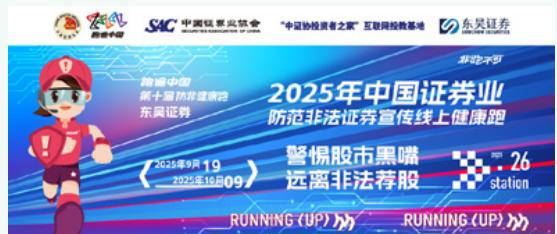

text_image

飞凡
中国证监会
SAC 中国证监会报
“中证协投资者之家”互联网投教基地
东吴证券
尊敬中国
基于富防非健康咨
东吴证券
2025年中国证券业
防范非法证券宣传线上健康跑
《2025年9月19日—2025年10月09日》
警惕股市黑嘴
远离非法荐股
RUNNING (UP) > > > > > > > > > > > > > > > > > > > > > > > > > > > > > > > > > > > > > > > > > > > > > > > > > > > > > > > > > > > > > > > > > > > > > > > > > > > > > > > > > > > > > > > > > > > > > > > > > > > > >
RUNNING (UP) >> RUNNING (UP) >>

防非健康跑活动

## 金融知识进校园，财商教育润青苗

2025年10月至11月，东吴证券投资者教育基地联合苏州市委金融办、苏州市教育局开展“金融知识、国民财商进校园”系列投教活动，走进全市10所中小学，为2.000余名学生带来财商课程，打造政企协同推进青少年金融素养教育的新模式。活动创新采用“课堂教学+基地实践”的形式，通过特色课程讲授及组织学生走进投教基地参观体验，让学生在沉浸式学习中了解金融基础知识和投资者保护理念，推动财商教育实现“知行合一”。

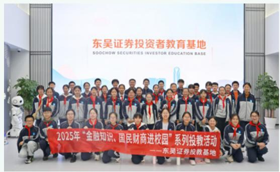

text_image

东吴证券投资者教育基地
SOOCHOW SECURITIES INVESTOR EDUCATION BASE
2025年“金融知识、国民财商进校园”系列投教活动
——东吴证券投教基地

青少年财商教育系列活动

## 东吴证券2025年投资者教育获得荣誉（部分）

·2025年在证券公司投资者教育工作评估中第三年获评“A”等次（最高评级)  
·江苏省证券业协会2024年度优秀投教作品评选“最佳组织奖”等七大奖项  
·上海证券交易所2024年度会员投资者教育和保护工作评选“投资者教育优秀会员”(全国十佳)“我是股东”活动专项奖等八大奖项  
·2025年度第二届“聚焦五篇大文章投教助力金融强国”系列活动“最佳主办奖”  
• 2025“财联星引杯”金融教育年度评选，《金融小白“变形记”系列》荣获创新投教作品奖  
·2025年金鼎榜单，《投教相对论》荣获最具影响力投教案例

## 金融科技

东吴证券积极顺应金融科技与数字化转型发展趋势，持续完善金融科技战略规划与治理体系，深化业技融合与数据驱动，推动数字技术赋能业务创新、客户服务与内部管理提质增效

## 治理

公司严格遵守《中华人民共和国网络安全法》《证券基金经营机构信息技术管理办法》等相关法律法规的要求建立由董事会、信息技术应用创新工作领导小组、信息技术治理委员会、数字化转型办公室、信息技术管理职能部门各部门及分支机构组成的全面信息技术管理组织架构，制定《信息技术管理办法》《信息技术治理基本制度》等内部管理制度规范，明确金融科技相关工作的具体要求和各流程实施细则，为公司金融科技建设与数字化转型提供制度保障和规范指引。

公司金融科技创新建设由信息技术总部协同公司各业务部门共同开展，以各条线数字化转型目标、重大项目、考核激励为主要抓手，推动数字化转型建设。

东吴证券金融科技组织架构

<table><tr><td>董事会</td><td>公司信息技术管理的最高决策机构,负责对公司信息技术管理进行监督与指导,对信息技术管理的有效性承担责任。</td></tr><tr><td>信息技术应用创新工作领导小组</td><td>公司推进信息技术应用创新工作的领导和决策机构,依据公司授权,讨论和决定公司信息技术应用创新工作的相关事项。</td></tr><tr><td>信息技术治理委员会</td><td>在公司授权范围内履行和协助公司履行信息技术治理职责。</td></tr><tr><td>数字化转型办公室</td><td>公司数字金融工作的专职推进机构,公司总裁任数字化转型办公室主任。</td></tr><tr><td>信息技术总部</td><td>公司信息技术管理职能部门,统一扎口管理公司的信息技术工作,主导公司数字金融战略的制定,并作为支撑数字金融战略落地的主要执行者。</td></tr><tr><td>公司各部门及分支机构</td><td>在公司统一部署、信息技术总部指导下开展本部门信息技术和金融科技管理工作。</td></tr></table>

## 战略

公司持续跟踪行业技术发展趋势和政策环境变化，系统评估金融科技领域面临的机遇与挑战，重点关注技术伦理风险，以及国家政策导向和产品服务创新带来的发展机遇

2025年，公司锚定科技创新赋能金融高质量转型发展核心抓手，持续深化“业技融合，一个东吴”发展理念，系统复盘“十四五”规划落地成效，结合多维架构分析与同业先进实践经验，编制数字金融“十五五”整体发展规划，构建业务、应用、数据、技术全景视图，形成多层次规划框架与整体实施路线图，全力构筑具有东吴特色的竞争力护城河

东吴证券金融科技相关风险和机遇分析及应对策略

<table><tr><td>风险/机遇类型</td><td>具体描述</td><td>预期财务影响</td><td>影响范围</td><td>应对策略</td></tr><tr><td>技术伦理风险</td><td>AI大模型等新技术应用所带来的伦理与安全风险,如隐私泄露与数据安全问题、虚假信息与道德伦理考验、新技术缺乏可解释性、侵权与歧视等风险挑战。</td><td>运营成本增加</td><td>短、中、长期</td><td>·深耕数据中台核心能力建设,基于数据资产门户上线统一质检平台,借助AI完成表自动化分类分级,开展数据质量自查规避。·加强技术伦理管理,提升算法可解释性,完善防范虚假信息、歧视及侵权的规范和流程,确保新技术应用安全、合规、可信。</td></tr><tr><td>政策机遇</td><td>在“十五五”建设金融强国的关键期,国家政策明确要求金融机构专注主业、错位发展,深化资本市场改革,打造一流投行。中国证券监督管理委员会积极推动人工智能等新一代信息技术在资本市场的应用,已在投研、融资、客户服务、内控及监管等领域形成示范效应,为行业带来高质量发展的战略机遇。</td><td>营业收入增加</td><td>中、长期</td><td rowspan="2">·持续落地业技融合战略,统筹技术资源,通过ITBP、主官、全面融合三大模式推动技术人员融入业务,实现数字化转型模式全覆盖,重塑业务流程,提升经营管理效率。</td></tr><tr><td>产品与服务机遇</td><td>人工智能创新应用、系统信创升级与自主可控、业务与技术深度融合等推动金融机构的转型升级加速。数字化转型可以提高自身的市场竞争力和创新能力,获得产品与服务机遇。</td><td>营业收入增加</td><td>短、中、长期</td></tr></table>

## 影响、风险和机遇管理

公司围绕金融科技创新，构建覆盖识别、评估、管理执行及监测优化的全流程影响、风险与机遇管理机制，并将相关管理要求嵌入从需求受理到项目交付的端到端科技管理链条，实现对金融科技创新全过程的系统化管理与持续优化。

## 东吴证券金融科技影响、风险和机遇管理流程

## 识别

·通过需求受理环节系统开展需求分析、价值分析与可行性分析，全面识别科技创新对业务模式、客户体验、合规要求及技术架构可能产生的正面影响与潜在风险，并同步挖掘战略机遇。  
• 相关需求经业务域协同评审后流转至研发平台，实现从业务诉求到技术方案的端到端转化与全留痕管理。

## 评估

·定期结合外部政策与市场变化，动态评估并优先排序相关风险与机遇，及时优化管理举措，持续提升科技驱动的创新效能与韧性。

## 管理执行

•遵循国际项目管理协会(PMI)标准及国内《项目管理指南》，对科技创新项目实施全生命周期管理，涵盖启动立项、规划、执行监控与收尾等环节。  
·依托技术中台，打通产品管理一研发管理一测试管理的工作流程，在开发测试环节实现全流程跟踪与质量管控，有效提升研发效能与交付可靠性。

## 监测与优化

• 通过金融科技规划治理平台构建IT服务管理体系，建立以事件、变更、问题为核心的运维服务管理流程。  
·结合北极星指标体系，从完成度、及时性、准确性、规范性等维度对科技创新成果的运行表现进行指标化跟踪与量化评估，动态识别新风险或新机遇，并据此及时调整管理策略与资源配置，形成“闭环反馈持续优化”的管理机制。

公司持续深化全融科技赋能，围绕业务发展，数据驱动与技术底座建设等重点领域推进数字化转型不断提升客户服条能力，经营管理效率及科技创新水平，推动金融科技成果在备业务条线加速落地并取得积极成效

## 东吴证券2025年金融科技重点工作及成果

## 赋能业务发展

##

## 财富管理

·东吴秀财APP推出智能服务官AI“小水滴”，完善理财商城建设，升级APP账户类服务功能，持续提升投资服务的智能化与陪伴式体验，深化买方投顾转型、优化资产配置能力、强化科技赋能、拓展服务场景。2025年，“东吴秀财APP”平均月活43.8万，交易客户数占比 62.1%，线上业务办理124万笔，AI对话功能累计用户数近2万个。  
•“东吴秀盈投顾+”上线智能投顾小助手，AL个股诊断等功能，升级模拟组合，ETE工具“秀E投”，直播答疑一对一问答等线上服务场景，实现客户服务响应效率与个性化匹配能力双提升。  
·“秀享高客”打造“秀易升AI甄选服务”，以智能化方案赋能高净值客户服务，实现高端服务的标准化、高效化输出，同时助力一线员工展业能力提升。

## 机构服务

• 聚焦技术基建、交易解决方案、客户服务、ETF生态及量化与渠道赋能，发布“秀捷”机构经纪品牌。

## 投行业务

·优化债券承销业务智能化水平，构建债券承销业务数据集市，完成包括风险识别、自动生成兑付兑息报告在内的多种智能体建设。

## 投研交易

·持续完善证券核心交易系统建设，坚持践行技术创新与稳定运行并驱，深入推进密码技术应用，相关成果荣获国家商用密码科学技术奖三等奖及2024年度人民银行金融科技发展奖三等奖。  
•创新自营做市交易能力，通过自研投资交易终端、量化投研平台，助力ETE做市全面展业  
·深化资管数字化转型建设，以“场景+平台+流程+数据”为核心，构建了涵盖投研交易、风控合规、产品开发、市场营销、综合运营的“五位一体”数字化作业平台。

## 强化数据驱动决策

##

·深化数智指挥与数据治理：财富管理数字看板3.0以及投行指挥系统10、债券投资指挥系统1.0全面上线实现业务全景可视，助力提升管理效率与决策科学性  
·夯实业务运营数字化基础；推动人力、财务、风控、合规、运营、资金六大数字化基石项目规划落地。重点上线ABS数字化运营管理平台、一体化压力测试系统以及智慧司库管理平台建设  
·拓展数字化转型广度与深度：完成智慧司库管理平台建设，实施公司官网焕新升级，上线智慧工会平台，持续丰富数字化生态，赋能治理效能与员工体验双提升。

## 加强技术创新底座

·全面落地AI大模型应用：打造“东吴开阳金融大模型创新平台”，持续储备高质量数据集，建设统一调度的多元化模型矩阵，重点开发集成智能文档解析、工作流编排、知识库、智能体、数字人等通用中台服务组件有效降低前端研发门槛，缩短交付周期。依托A中台的敏捷开发能力，公司累计孵化并落地106项AI大模型应用，覆盖财富管理、投研分析、合规风控、内部审计等主要业务条线，辅助提升各相关业务的处理效率。  
·升级数据治理与平台建设：升级数据资产门户，数据治理进入量化管理阶段，引入A辅助治理能力，形成数据闭环。建成企业级数据中台，汇聚全域数据，构建 2,000+ 数据指标，上线 350+ 标准化 API，日调用量超110 万次。

公司通过培训赋能创新实践，行业认证及开放合作等多维举措，持续提升金融科技队伍专业能力与创新活力为数字化转型与业务发展提供人才与技术双重支撑。

东吴证券2025年金融科技能力建设主要措施及成果

<table><tr><td>加强人才培训</td><td>·开展8场AI专题培训,覆盖提示词工程、MCP协议、Agent智能体、智能写作及企业知识库等核心领域,按照“底层基座与协议标准化—业务场景深度定制化—治理与质量保障体系”三阶递进路径,推动全员AI认知与应用能力从“拥抱AI”向“深耕AI”持续进阶。·成功举办“AI东吴辩未来”人工智能主题辩论赛,40支队伍、近200名选手历经7轮45场对决,围绕AI前沿议题展开深度思辨,有效激发“敢想、敢辩、敢创新”的文化氛围。</td></tr><tr><td>鼓励创新研发</td><td>·在制定年度OKR时,鼓励设立可量化、具有挑战性的创新指标,确保创新工作与部门目标及公司战略对齐,并定期跟踪复盘。</td></tr><tr><td>开展外部认证</td><td>·通过DevOps三级能力成熟度评估,荣获TMMi测试成熟度认证卓越实践奖并取得TMMi三级认证,获得国家数据管理领域权威标准DCMM三级证书。</td></tr><tr><td>参与行业建设</td><td>·参与证券业协会、证券基金行业信息技术应用创新基地、证券信息技术发展研究中心(上海)和深圳交易所等课题共计14项,其中5项课题获奖。·参与《大数据全生命周期管理指南》等3项标准研究,发表期刊论文共计10篇。·参与行业交流共44场,主办行业交流6场,包括:苏州市数字金融高质量发展大会暨首届阳澄湖金融周、2025年度证券行业统一测试总结交流会等。·推进实验室建设,获评苏州市人工智能创新应用实验室(智能证券)、苏州市人工智能应用重点企业。</td></tr></table>

## 指标与目标

公司以“业务引领、科技赋能”为指导思想，围绕“业技融合，一个东吴”发展战略，设立关键绩效指标，持续监测目标达成情况，确保数字化转型与金融科技发展策略有效落地，实现业务的数字化升级，推动公司在金融科技领域持续发力。

## 东吴证券2025年金融科技相关主要指标表现

## 金融科技投入

2025 年，金融科技投入 5.23 亿元，同比增长约 13.7%；公司积极布局 AI 融合赋能，在 AI 领域投入约占金融13.2%

## 金融科技人才队伍建设

2025 年，公司拥有科技人才695 人（包含业技融合人员），占比13.62%。

## 金融科技相关软件著作权数量

2025 年，公司新增专利授权2项，新增软件著作权5项。

natural_image

Illustration of a business meeting with people working around a presentation screen (no text or symbols visible)

## 东吴证券2025年金融科技相关荣誉及奖项（部分）

• “面向券商全域业务 AI 赋能的企业级 AIaaS 平台”获得 2024 年度金融科技发展奖二等奖  
• “证券公司核心交易系统体系建设”“证券期货业开源治理公共信息基础设施体系建设”“证券期货业信息系统高精度性能评估平台”荣获2024年度金融科技发展奖三等奖  
• “核心交易系统全栈自主可控解决方案”入选 2024 信息技术应用创新解决方案重点推荐应用案例、2024信息技术应用创新典型应用案例  
• 企业级 AIaaS 平台相关项目获评 2025 年“数据要素 ×”大赛江苏分赛一等奖  
• “安全集中运营中心”荣获 2025 中国 IDC 未来企业大奖安全与信任领军者优秀奖项  
• 《深耕数字化 科技让金融更有温度》获上市公司协会“2025上市公司可持续发展最佳实践案例”  
• 入选江苏省数据企业入库培育证书  
• 荣获“2025 年江苏省工人先锋号”荣誉

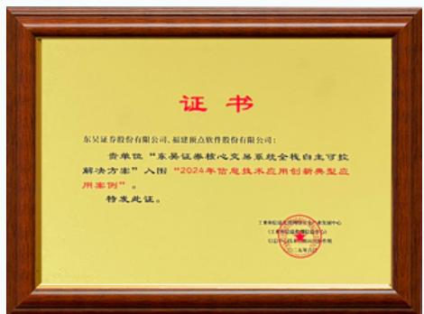

text_image

证书
东吴证券股份有限公司、福建丽点软件股份有限公司：
贵单位“东吴证券核心交易系统全栈自主可控解决方案”入围“2024年信息技术应用创新典型应用案例”。
特此此证。
工银瑞信基金管理有限公司（以下简称“工银瑞信基金”）

2024年信息技术应用创新典型应用案例

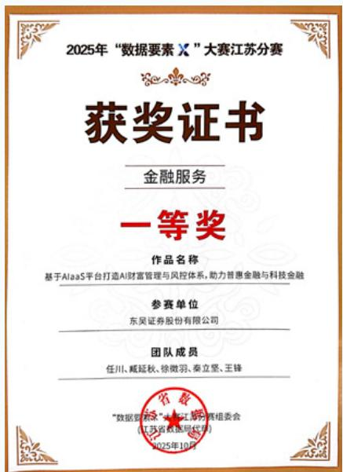

text_image

2025年“数据要素 X”大赛江苏分赛
获奖证书
金融服务
一等奖
作品名称
基于AlaaS平台打造AI财富管理与风控体系,助力普惠金融与科技金融
参赛单位
东吴证券股份有限公司
团队成员
任川、臧延秋、徐微羽、秦立坚、王锋
“数据要素 X”大赛江苏分赛组委会
（江苏省数据网代号）
2025年10月

“数据要素x”大赛获奖证书

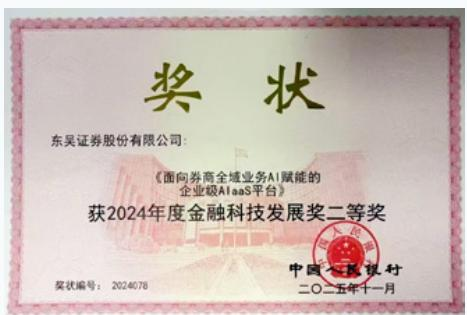

text_image

奖状
东吴证券股份有限公司：
《面向券商全域业务AI赋能的
企业级AIaaS平台》
获2024年度金融科技发展奖二等奖
奖状编号：2024078
中国人民银行
二〇二五年十一月

2024 年度金融科技发展奖二等奖

natural_image

Illustration of five people holding up yellow star symbols, no text or symbols present

## 数据安全与客户隐私保护

东吴证券涉及的数据及客户隐私信息类别主要包含客户交易数据、客户身份信息、账户信息、交易行为记录、员工操作日志及访问记录等。公司数据安全与客户隐私保护的主要运营环节涉及数据收集、存储、传输、使用、共享和销毁。

## 治理

公司严格遵守《中华人民共和国个人信息保护法》《中华人民共和国网络安全法》《证券期货业网络和信息安全管理办法》《证券公司投资者个人信息保护技术规范》等法律法规和监管规定，制定《信息安全管理办法》《数据分类分级及安全管理实施细则》，于2025年修订《数据安全管理办法》《个人金融信息保护技术管理实施细则》，促进信息安全工作有序开展，保障各信息系统安全运行。公司定期审阅并更新发布《隐私与数据安全管理声明》，政策适用于公司总部、各分支机构及子公司的各业务条线。

公司建立涵盖决策层、管理层，执行层与监督层的数据安全与客户隐私保护管理组织架构，明确各层级职责分工形成协同高效的数据安全管理体系

东吴证券数据安全与客户隐私保护管理组织架构

<table><tr><td>层级</td><td>组织</td><td>具体内容</td></tr><tr><td>决策层</td><td>信息技术治理委员会</td><td>·对公司个人信息保护和数据安全管理承担最终责任。公司董事长是网络安全第一责任人;公司信息技术总部分管领导是网络安全直接责任人,合规总监是个人信息保护负责人。</td></tr><tr><td rowspan="3">管理层</td><td>信息技术总部</td><td>·负责牵头组织相关部门落实数据安全管理工作职责,统筹各个数据管理领域以及个人信息保护各项技术管理工作,每年向董事长和总裁进行年度专项汇报,每季度向信息技术治理委员会汇报。·基于决策层给出的策略,对数据安全实际工作制定详细方案,做好业务发展与数据安全之间的平衡。</td></tr><tr><td>合规法务部</td><td>·负责对公司数据管理工作的合规性进行监督检查,并给出合规指导意见。·负责牵头公司个人信息保护工作制度体系,对制度执行和落实情况进行合规检查和监督。</td></tr><tr><td>风险管理部</td><td>·负责对数据管理各项制度和落实执行开展风险管理,对各环节的风险进行识别、评估、监测。·负责将个人信息保护纳入全面风险管理体系。</td></tr><tr><td>执行层</td><td>相关职能部门</td><td>·聚焦每个数据安全场景,合理确定员工信息处理的操作权限,对设定的流程进行逐个实现,并定期进行安全教育和培训。·在金融产品或服务上线发布前进行风险、合规等检测,避免个人金融信息收集、使用、共享过程中出现风险或不合规等情形。</td></tr><tr><td>监督层</td><td>稽核审计部</td><td>·监督审核管理层、执行层、员工和合作伙伴对数据安全管理要求的执行情况,并向决策层进行汇报。</td></tr></table>

## 战略

公司依据《证券公司网络和信息安全三年提升计划（2023一2025年）》相关要求，持续加强数据安全治理与客户隐私保护，完善制度体系与技术防护措施，系统识别相关风险并制定针对性应对策略，切实保障信息安全与公司稳健运营。

东吴证券数据安全与客户隐私保护相关风险分析及应对策略

<table><tr><td>风险/机遇类型</td><td>具体描述</td><td>预期财务影响</td><td>影响范围</td><td>应对策略</td></tr><tr><td>技术风险</td><td>数据泄露、系统漏洞可能导致客户敏感信息外泄、数据被篡改或滥用,进而损害客户合法权益并影响公司业务运营与市场信誉。</td><td>运营成本增加营业收入降低</td><td>短、中、长期</td><td rowspan="3">·建立健全数据安全管理体系和制度体系,制定数据安全制度和管理细则,明确管理架构中各层人员在数据安全、隐私保护等方面的整体规划、实施和监控。·加强技术基础设施建设,通过数据加密技术和安全协议等,确保数据在存储和传输过程中的安全性。·部署多层次的防火墙和入侵检测系统,防范外部攻击。</td></tr><tr><td>操作风险</td><td>由于数据备份与恢复失败、安全操作规程不严格执行等可能导致数据丢失或服务中断。</td><td>运营成本增加营业收入降低</td><td>短、中、长期</td></tr><tr><td>合规风险</td><td>在全球数据安全日益重视的背景下,不符合相关法律法规(如 $GDPR^{2}$ 以及国内相关规则)可能导致罚款和法律后果,影响公司的财务状况和市场信誉。</td><td>运营成本增加营业收入降低</td><td>中、长期</td></tr></table>

## 影响、风险和机遇管理

为系统防控数据安全与客户隐私保护相关风险与机遇，公司建立覆盖风险识别评估，控制与监测的全流程管理机制，通过明确管理职责与流程规范，持续提升数据安全与客户隐私保护治理水平，保障相关风险得到有效管理

东吴证券数据安全与客户隐私保护相关风险和机遇管理流程

<table><tr><td>风险识别</td><td>·通过内部审计、外部咨询和定期渗透测试、安全评估等,识别潜在的数据安全和隐私保护风险点,包括数据泄露、系统漏洞、内部威胁、合规风险和操作风险等。·关注市场动态和技术进步,识别新的安全威胁和业务机遇。</td></tr><tr><td>风险评估</td><td>·对识别出的风险进行详细分析,评估这些风险发生的可能性及严重程度,以及对公司业务连续性和声誉、监管要求方面的潜在影响。</td></tr><tr><td>风险控制</td><td>·根据风险的紧迫性和严重程度进行排序,并确定优先处理的风险事项,明确风险控制策略。高优先级的风险(如数据泄露和合规问题)将被立即采取措施解决,而较低优先级的风险则会纳入长期规划中逐步应对。·通过风险提示函方式向具体涉及到的业务系统进行风险确认。通过技术优化、管理升级、人员部署、应急响应等方面实施风险控制策略,持续监测风险控制策略实施效果,及时调整完善。</td></tr><tr><td>风险监测</td><td>·通过公司网络连通性、应用可用性监控系统等,持续监测网络活动和系统运行情况。通过日志记录、异常检测和定期报告,及时发现并响应潜在的安全事件。·定期进行内部审计和第三方安全审查,确保风险管理措施的有效性。</td></tr><tr><td>风险管理</td><td>·采取多种措施应对已识别的风险。包括建立全面的数据安全管理体系、实施严格的访问控制和多因素认证(MFA)、定期备份关键数据并测试恢复流程、加强员工信息安全培训等。</td></tr></table>

## 数据安全管理

公司从主动防护、应急响应、安全认证、审计监督等多个方面系统推进数据安全管理，通过完善制度建设、强化技术防护、加强监督审计与外部评估，不断提升数据安全管理的规范化和专业化水平。同时，公司在对外合作中落实信息安全保护要求，与合作伙伴共同筑牢信息安全防线。

## 东吴证券数据安全管理主要措施

## 主动管理措施

·法律合规：严格遵守数据保护法规和标准，完善内部制度并落实执行。  
•漏洞管理：定期安全扫描与漏洞修复，降低风险。  
•数据备份：定期加密备份数据，确保数据可恢复。  
• 员工培训：定期开展信息安全与隐私保护培训，增强意识。  
·数据加密：使用各种网络安全层软件(SSL）进行数据加密传输、信息加密存储、严格限制数据中心的访问、使用专用网络通道及网络代理安全技术及配套的管理体系来防止信息泄露、毁损或者丢失，采用严格的数据访问权限控制和多重身份认证技术保护个人信息，避免数据被违规使用。  
·数据脱敏：在软件开发及测试环境中使用数据脱敏工具。  
·防御系统：部署防火墙、入侵检测、反病毒等防御工具。

## 被动响应机制

•事件检测与监控：建设集中化、自动化、可视化的安全运营平台，设计并部署分析规则、自动化响应策略，实现主流攻击场景的7×24 小时实时监测及自动、人工协同处置。  
• 应急预案：制定《信息技术业务连续性总体应急预案》，并根据具体场景制定了分预案，包括敏感数据泄露、数据被勒索等场景，以保障业务连续性。  
• 应急响应计划：当发生信息安全事件或客户隐私泄露事件时，立即启动应急预案，迅速补救安全漏洞并向监管部门报告，控制损害扩散。  
• 舆情管理：与媒体沟通，正确引导舆论，维护公司形象，减少恐慌。  
·后续审计：事件结束后开展审计与复查，避免类似事件重演。

## 安全体系认证

·东吴秀财APP顺利通过2025年APP四大范围认证，包括用户身份认证、数据传输加密认证、应用程序完整性认证和权限管理认证。  
·通过国家标准《数据管理能力成熟度评估模型(DCMM)》GB/T36073-2018-稳健级(3级)认证，有效日期至2026年11月12日，认证覆盖范围为公司所有业务条线和子公司。  
• 获得测试成熟度（TMMi）3 级认证，认证覆盖范围为公司所有业务条线，有效期至2026 年8月31 日。

## 内外部检查审计

·内部审计：定期开展信息技术管理工作专项审计工作，频率不低于每年一次，确保三年内完成信息技术管理全部事项的审计工作。审查范围包括信息安全和客户隐私保护措施是否有效、公司的数据处理活动是否符合相关监管法规要求，是否符合数据安全相关的制度办法要求等。  
·外部审计：每三年委托外部专业机构开展信息技术管理工作的全面审计：对已获取的认证实施有效期管理，在认证有效期内建立定期督查机制，或根据认证续期、升级或监管要求适时安排外部有资质的第三方进行审核，确保管理体系持续符合标准要求并有效运行。  
·等保测评：依据《信息安全技术网络安全等级保护基本要求》 《证券期货业网络安全等级保护基本要求》等相关要求进行等级保护备案，并根据公司信息系统定级情况，委托外部机构每年度对公司信息系统开展安全等级保护测评工作。截至2025 年底，公司共计包含2 个三级系统，17个二级系统。

## 供应商数据安全管理

• 制定《信息技术总部供应商管理办法》，内容包括供应商准入管理、分类管理、评价管理与关系管理四个部分。  
·在对外合作中可能产生商业秘密的，在合同中约定保护条款，要求供应商及合作伙伴制定遵守公司的数据保护政策。  
·对于涉及商业秘密的盗询、谈判开发，维护，审计等活动，要求供应商签订保密协议。  
·对于需要入网开发的供应商，要求安装防病毒软件、数据防泄漏软件、限制供应商对敏感数据的访问权限等措施。  
·定期开展供应商安全审核，以确保所有供应商遵循公司的数据保护标准，并对其安全措施和数据管理能力进行评估。

公司注重数据安全宣传教育工作，密切关注员工数据安全相关培训与宣传教育工作持续开展数据安全培训，覆盖公司全体员工及外包人员。2025 年，公司开展新入职员工信息安全培训、全体员工“知鸟”网络安全意识在线培训以及外协员工专项信息安全培训等多个培训，强化数据安全与客户隐私保护意识，提升员工信息安全管理能力，推动数据安全要求在日常工作中的有效落实。

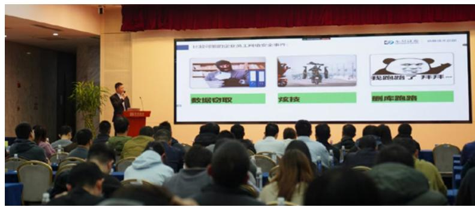

text_image

比较可能的企业员工网络安全事件
数据窃取
炫技
我跑跑了并车一
删库跑路

信息安全培训

## 客户隐私保护

公司围绕客户隐私保护建立多层次管理机制，通过个人信息自主权限保障客户信息权利，遵循最小化数据收集与处理原则，加强敏感数据保护与产品开发阶段的隐私合规管理，并持续完善技术防护与安全审核机制，切实提升公司客户隐私保护水平。

## 东吴证券客户隐私保护主要举措

## 个人信息自主权限

·东吴秀财APP是公司面向投资者开发的核心平台，注重对于个人信息主体权利请求的响应，支持响应查询转移、补充、更正、删除、撤回同意授权、注销账户和投诉等客户请求，且提供明确的反馈渠道。具体政策内容详见《东吴秀财APP隐私政策》。

## 最小化收集处理客户信息

• 在法律法规允许的前提下，坚持“非必要不收集，非必要不存储”的原则，遵循最小化数据收集和使用的原则。  
·在《数据生命周期管理办法》中明确“数据不再需要时，在满足法律法规的前提下，应及时进行删除或销毁确保数据的及时清理：数据删除或销毁应遵循相关的法律法规和业务规定，确保数据的彻底销毁，防止数据泄露或被非法恢复。”并在执行中强化落实。  
·《东吴秀财APP隐私政策》中明确公司承诺对用户的个人信息进行保密。除本政策及法律法规另有规定外公司仅在“第三方理财产品发行方”等情形(所列具体情形详见《东吴秀财APP隐私政策》）下，与关联公司供应商或合作伙伴共享用户的个人信息。在与第三方开展合作前，公司会尽商业上的合理努力对该第三方的安全能力进行检测，评估其采集信息的正当性、合法性与必要性  
•在运营过程中，坚决不以完成交易或服务以外的目的向第三方出租、出售或提供个人数据；从数据收集、存储到使用的每一个环节，都遵循严格的安全标准与操作流程，确保数据的保密性、完整性和可用性。

## 敏感数据保护

·访问权限控制：已部署零信任控制中心，实现覆盖全公司的用户管理，每个用户的权限根据其所处职位的工作内容进行分配，权限更改需要提交申请，流程审批通过后方可调整。  
·数据脱敏：已在生产环境部署隐私数据保护系统，该系统支持丰富高效的敏感数据发现规则，通过脱敏策略对敏感数据进行数据变形处理，实现敏感数据合规使用，防止敏感数据泄露  
·数据库安全防护：在数据运维跳板机和数据库之间部署了数据库安全防护系统，该系统作为事中管控手段在内网部署，限制用户必须通过该系统才能对数据库进行访问或管理。规范运维操作流程，避免运维侧误操作和恶意操作行为，防范“越权使用、权限滥用、权限盗用”等安全威胁，实现运维行为有效管控  
·加密处理：对重要信息进行加密传输与加密存储，防止数据在传输和存储过程中的泄露与篡改。同时，采用去身份化技术，对敏感数据进行脱敏处理，减少数据被滥用或识别的风险。  
·加强审核：在涉及个人客户重要信息的数据获取需求处理时，设置数据安全人员和合规人员审核环节，并提示数据使用人员注意重要数据安全防护

## 产品开发过程中隐私保护

·公司新项目、新系统立项时将进行数据安全评估，评估内容包含数据加密存储、传输、访问控制策略，是否具备数据备份与恢复等，安全左移在开发阶段纳入安全考量因素  
·开展差异化员工安全培训与意识提升：对研发、产品等进行差异化信息安全培训，提高其对数据安全的认识和技能。  
·根据《个人金融信息保护技术管理实施细则》指引，采取了多重安全防护措施，包括：通过持续的APP安全加固能够将针对应用各种安全缺陷的保护技术集成到应用客户端内，防止针对APP的“反编译、二次打包、内存注入、动态调试、数据窃取、交易劫持、应用钓鱼”等恶意攻击行为，为公司的APP客户端提供数据安全保护。通过持续的APP隐私合规检测，能够及时发现隐私问题并整改，对APP的持续合规提供保障。

## 指标与目标

公司明确数据安全与客户隐私保护管理目标：建立健全机构数据安全运营机制和数据安全管理体系，不断推进数据安全分类分级产品的落地和持续完善，切实保障个人隐私信息保护技术管理工作，保障重要数据在采集、传输、存储等环节的安全性，最终形成集威胁监测、风险管控和应急响应于一体的数据安全运营体系，实现数据安全运营的高效闭环管理，数据安全能力获得DSMM认证。报告期内，公司未发生泄露客户隐私或遗失客户资料的事件，亦未接获经证实的相关投诉。

东吴证券数据安全与客户隐私保护相关指标与目标

<table><tr><td>指标</td><td>2025年目标</td><td>2025年进展</td></tr><tr><td>经证实的泄露、盗窃或丢失客户资料的事件数</td><td>0</td><td>0</td></tr><tr><td>安全培训覆盖率</td><td>100%</td><td>100%</td></tr><tr><td>满足合规要求,近一年无重大数据安全事件</td><td>达标</td><td>已达标</td></tr></table>

## 供应商管理

公司为金融业企业，主要供应商包括服务类、货物类、工程施工类、IT类供应商。公司严格遵守《中华人民共和国政府采购法》《国有金融企业集中采购管理暂行规定》等法律法规及相关规定，制定《采购管理办法》，旨在确保公司采购工作的各个环节规范有序、廉洁高效。

公司持续加强供应商管理，通过严格准入审核、强化过程监督、落实问责机制以及加强廉洁建设等措施，构建规范透明的供应管理体系。

## 东吴证券供应管理重点工作

## 加强源头管控

·严格执行供应商准入尽职调查程序，全面审核其资质信誉、履约能力及诚信记录，确保合作方符合公司合规要求。

## 监督核查

•设立采购审核小组，负责制定采购管理制度、限额标准及采购方式审批，监督招标代理机构资质、招标结果合同及结算审核，确保价格公允、程序透明  
• 定期开展供应链风险评估与动态监控，确保供应链的稳定性与安全性，同时确保风险管理的及时性和有效性。

## 落实问责机制

• 对违规采购行为，一经查实，将追究直接责任人与相关人员责任；涉嫌犯罪的，移交司法机关处理。  
•发现采购活动严重违规且可能造成损失的，立即中止采购并启动整改程序。

## 推进廉洁共建

·统一要求所有供应商在缔约时签署廉洁从业和反腐败条款，承诺在合同缔约和履行过程中不存在腐败行为并通过约定违约责任的方式保障公司合法权益  
• 要求全体员工及供应商须严格遵守内控流程与廉洁从业规定，共同维护公平、透明的商业环境。

公司发布《供应商管理声明》，明确供应商反腐败管理，数据安全管理、知识产权管理等要求，鼓励供应商采纳高标准的可持续发展政策，并定期开展供应商评估，检验相关政策执行情况。报告期内，公司供应链运行平稳，未发生区险事件。

## 聚才固本 繁花满枝

## 人力资本管理

## 治理

东吴证券员工雇佣类型包括全职劳动合同制员工和全职劳务派遣制员工，无兼职员工。公司在员工薪酬及解雇、招聘与晋升、工作时数、假期、平等机会、多元化及职业健康安全等方面，均严格遵守《中华人民共和国劳动法》《中华人民共和国劳动合同法》《中华人民共和国就业促进法》等法律法规要求，建立由“董事会-董事会薪酬、考核与提名委员会-管理委员会-人力资源部-各部门”组成的员工管理架构，并制定涵盖招聘管理、培训管理、劳动关系、绩效管理、薪酬管理、假期管理在内的人力资源管理制度体系，通过制度约束形成对员工基本权益的全面保障。

同时，公司工会从关注员工权益、增强员工凝聚力的角度，推动企业与员工共同和谐发展。

东吴证券员工管理制度体系

<table><tr><td>员工招聘与雇佣</td><td>&gt;&gt;</td><td>《劳动关系管理规定》《员工招聘管理办法》《员工离职管理试行细则》等</td></tr><tr><td>员工平等与权益</td><td>&gt;&gt;</td><td>《员工各类假期规定与考勤作业管理办法》《薪酬管理基本制度》《员工薪酬管理细则》《员工权益与福利声明》等</td></tr><tr><td>员工培训与发展</td><td>&gt;&gt;</td><td>《培训管理办法》《培训讲师管理暂行办法》《移动学习平台(知鸟APP)管理暂行办法》等</td></tr><tr><td>员工考核与晋升</td><td>&gt;&gt;</td><td>《考核管理基本制度》等</td></tr></table>

## 战略

人力资本是证券公司的关键资产，其管理成效直接关系到公司的经营质效与长远发展。公司围绕国家“十五五”规划与高质量发展要求，制定“十五五”人力资源战略，坚持“人才优先”战略，优化人才结构，加大关键领域高端人才引进，稳步提升人员规模：深化考核与激励，强化绩效应用与薪酬差异化：加强年轻化，专业化干部与梯队建设强化组织作风建设，锻造纪律严明执行有力的队伍。公司积极识别在人才招聘，培训发展及激励保留等方面面临的风险与机遇，构建系统化的应对机制，致力干将人力资本管理转化为推动业务增长、提升运营效率的战略优势

东吴证券员工管理相关风险和机遇分析及应对策略

<table><tr><td>风险/机遇类型</td><td>具体描述</td><td>预期财务影响</td><td>影响范围</td><td>应对策略</td></tr><tr><td>声誉风险</td><td>若公司发生员工劳动纠纷,员工权益保障不到位等情况,负面舆论会迅速传播,损害公司形象,降低品牌声誉。</td><td>营业收入降低</td><td>短、中、长期</td><td>· 定期开展员工权益保障审查,及时发现并解决潜在问题,避免负面事件发酵。· 宣传公司在员工关怀、发展机会等方面的积极举措,展示公司良好的雇主形象,增强品牌美誉度。</td></tr><tr><td>市场机遇</td><td>在行业竞争加剧的背景下,完善员工管理体系可吸纳优秀人才,提升员工满意度与忠诚度,增强团队凝聚力和执行力,促进公司在业务拓展、客户服务等方面展现更强的竞争力。</td><td>营业收入增加</td><td>中、长期</td><td>· 畅通引才渠道,开展雇主品牌宣传活动,积极吸纳各类人才加入公司。· 依据市场动态和公司业务方向,开展定制化人才培养计划,定期组织专业培训,鼓励员工的个人提升。· 建立有效的绩效激励机制,充分激发员工的工作积极性和执行力,提升公司应对复杂市场挑战的整体能力。</td></tr><tr><td>人才保留机遇</td><td>公司在员工培训与发展方面的合理规划,有助于激励优秀员工,提升员工满意度与忠诚度,降低员工流失率,保持公司人才队伍稳定。</td><td>营业收入增加</td><td>中、长期</td><td>· 完善人才培养体系,加强制度建设,优化管理流程,通过科学的考核机制、畅通的晋升通道,加强人才队伍建设。</td></tr><tr><td>经营质效提升机遇</td><td>完善的员工培训与发展体系可以增强团队凝聚力和执行力,促进公司在业务拓展、客户服务等方面展现更强的竞争力。</td><td>营业收入增加运营成本降低</td><td>中、长期</td><td>· 建立规范化、系统化的人才培养和激励机制,激发员工工作积极性,提升公司应对复杂市场挑战的整体能力。</td></tr></table>

## 影响、风险和机遇管理

为落实人力资源规划，公司建立贯穿“识别、评估、监测”全流程的动态管理机制，密切关注行业人才趋势与员工发展诉求，确保人才战略与公司业务发展目标深度契合，为公司的可持续发展提供稳定的人才支撑。

## 东吴证券员工相关风险和机遇管理流程

## 识别

·密切关注行业动向与市场趋势，人才流动趋势变化关注员工的培训与发展诉求，识别可能存在的风险和机遇。

## 评估排序

• 针对已识别的风险与机遇通过内外部调研相结合的方式，依据业务发展需要对其进行综合评估与优先级排序。

## 监测管理

·基于调研与分析结果，围绕高优先级风险与机遇，制定与公司战略相匹配的人才招聘、培养与保留策略，并通过招聘、培训、激励等措施推动落实。• 预测未来人才需求，为人力资源优化配置与队伍建设提供数据支持。

## 员工平等及权益

公司建立健全规范化的招聘、薪酬管理体系，根据《员工招聘管理办法》《劳动关系管理规定》《薪酬管理基本制度》等制度，科学有序开展招聘、薪酬管理工作，营造多元包容和机会平等的工作环境，持续提升人才吸引力，打造总量合理、结构优良、能力过硬的高素质人才队伍。

## 东吴证券招聘管理体系

## 招聘原则

公开公平、择优录取

## 招聘方式

校园招聘和社会招聘。公司通过数据分析预测需求，统筹制定年度招聘计划，通过官方招聘平台、外部招聘网站、猎头、人才招聘会等多种渠道招聘人才，并借助官网、微信公众号、苏州校园引才平台，校园宣进会，企业开放日等渠道开展雇主品牌宣传。

## 招聘项目

社会招聘、校园招聘、苏州市国有企业专业化青年人才定岗特选项目、博士后创新实践基地招聘等。

## 员工录用

被录用员工均严格依据法律规定与公司签订《劳动合同书》，明确公司与员工的责任和义务。

公司在人力资源管理中始终坚持平等、多元、包容的基本原则，在员工录用和职业发展等各环节，坚决反对雇佣童工和强迫劳动，反对因国籍、种族、民族、性别、年龄、婚育、宗教、残疾等因素导致的就业歧视，注重保障各类群体的平等就业权利，吸纳残疾人、退伍复员军人等群体就业，并为其提供必要的业务培训与岗位支持。此外，公司面向全体员工开放的线上ESG相关课程内容涉及多元化政策等主题，以持续提升员工对多元化与包容性的认知与践行能力。公司积极落实《中国妇女发展纲要（2021一2030)》关于“城镇单位就业人员中的女性比例达到40%左右”的量化目标，2025年末女性员工占比达43%。

同时，公司高度重视青年人才的引进与培养，针对高校毕业生及新进员工系统开展实习及带教计划，构建涵盖“融入之行”“亮剑之旅”“明日之翼”等模块的新员工三阶段培养体系(详见“员工培训与教育”小节)，并持续推进财富管理管培生、青年人才定岗特选等项目，助力青年员工快速成长。

2025 年，公司在境内外均未发生雇佣童工或强制劳工的情况，亦未发生员工雇佣方面的重大诉讼。

## 东吴证券2025年员工多元化绩效

按性别划分  
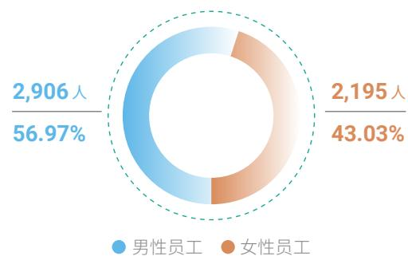

donut

| Category | Percentage |
| --- | --- |
| 男性员工 | 56.97% |
| 女性员工 | 43.03% |

按年龄划分  
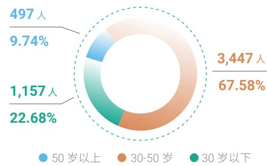

donut

| Category | Percentage |
| --- | --- |
| 50岁以上 | 9.74% |
| 30-50岁 | 67.58% |
| 30岁以下 | 22.68% |

按接受教育程度划分  
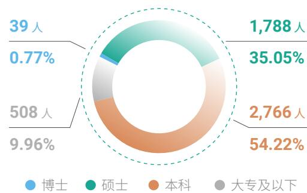

donut

| Category | Percentage |
| --- | --- |
| 博士 | 0.77% |
| 硕士 | 35.05% |
| 本科 | 54.22% |
| 大专及以下 | 9.96% |

其他数据

少数民族员工

人91

残疾员工

1人

退伍复员军人

人41

公司严格遵守《职工带薪年休假条例》等国家劳动法律法规，制定《基本薪酬管理制度》《员工各类假期规定与考勤作业管理办法》等覆盖全体员工的薪酬和福利制度，切实落实员工薪酬发放与社会保障等基础性权益，确保按时足额发放薪酬并依法缴纳社会保险，同时严格执行国家法定假期及产假、育儿假、护理假等权益保障政策，为员工营造规范、公平、有温度的工作环境。

东吴证券员工权益体系

<table><tr><td>工时与休假</td><td>为全体员工提供法定节假日、带薪年假、病假、婚假、育儿假等假期。</td></tr><tr><td>薪酬结构</td><td>员工薪酬由基本工资、绩效奖金、中长期激励和福利构成。</td></tr><tr><td>考核评价</td><td>建立面向全体员工的多元化考核评价体系,基于考核结果实施与绩效挂钩的可变薪酬机制,并综合评估员工绩效表现、风控合规情况、忠诚度与稳定性、职业操守、廉洁从业、社会责任履行、服务客户水平等因素核定绩效奖金。</td></tr><tr><td>法定福利</td><td>五险一金(基本养老保险、基本医疗(含生育)保险、失业保险和工伤保险、住房公积金)。</td></tr><tr><td>其他福利</td><td>雇主责任险、交通工具意外伤害保险、年度健康体检、节日慰问、员工关怀计划以及丰富的文体活动等。</td></tr></table>

公司高度重视女职工权益保护，落实苏州市总工会关于女员工权益保护有关要求，优化专项集体合同内容，签订《女职工权益保护专项集体合同》，保障女职工获得平等的劳动权益，实行同工同酬，并逐步提高职工代表大会女代表的比例，使之与女职工比例相适应。

公司深化以职工代表大会为基本形式的民主管理制度，畅通广大员工诉求表达渠道，保障员工通过职工代表大会制度参与公司重大决策，行使民主管理和监督权，实现企业决策与员工意愿的良性互动与深度融合。2025年，公司民主沟通制度常态化运行，确保员工在公司治理中的参与权和监督权

公司畅通员工电诉，反馈与沟通机制。就人力资源相关事项(如招聘，薪酬，晋升，工作条件，歧视或骚扰等问题提出申诉，员工可通过邮件、电话、工会等多种方式反映意见与建议。所有申诉将由所在部门及人力资源部门受理，在合理时间内完成初步调查并反馈处理进展。一般事项由所在部门及人力资源部门协调解决：涉及重大或复杂事项的。上报至公司管理层审议，直至妥善解决。公司承诺对申诉人信息及电诉内容严格保密，严禁任何形式的打击报复，处理结果将向电诉人单独反馈，确保电诉事项得到闭环处理。

## 开展员工满意度调查

公司针对部分青年员工开展工作满意度调研，内容涵盖员工关怀、培训发展、管理者支持等多个方面，调研结果显示满意度为8.6分（满分10分）。

苏州市发展和改革委员会颁发的苏州劳动保障A级信誉单位。

## 员工培训与教育

公司致力于培育更加卓越的人才，积极推动并全面助力每位员工不断提升自身的综合素质与专业能力，制定《培训管理办法》《培训讲师管理暂行办法》等内部制度，搭建“东吴秀财学苑”学习平台及内部培训管理平台，不断完善课程体系、讲师体系、运营体系三大培训支柱，打造了“东吴秀财学苑”等8个培训品牌，构建横向覆盖各业务能力纵向覆盖各员工层级的培训体系，涵盖新员工入职、专业技能提升、管理能力培养等多个层面，全方位助力员工成长与公司高质量发展。

东吴证券员工培训体系  
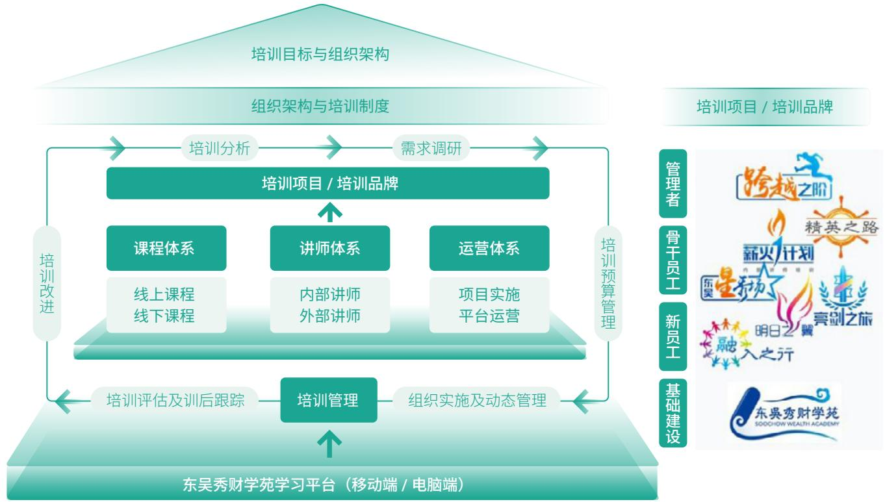

flowchart

```mermaid
graph TD
  subgraph Training_Side["培训目标与组织架构"]
    direction TB
    subgraph Org_Rules["组织架构与培训制度"]
      direction TB
    end
    subgraph Training_Mgmt["培训项目 / 培训品牌"]
      A["课程体系"]
      B["线上课程\n线下课程"]
      C["讲师体系"]
      D["内部讲师\n外部讲师"]
      E["运营体系"]
      F["项目实施\n平台运营"]
    end
    subgraph Training_Mgmt_Flow["培训预算管理"]
      G["培训评估及训后跟踪"]
      H["培训管理"]
      I["组织实施及动态管理"]
    end
    subgraph Training_Side_Flow["培训项目 / 培训品牌"]
      direction TB
    end
    subgraph Training_Mgmt_Flow["培训改进"]
      J["管理者"]
      K["骨干员工"]
      L["新员工"]
      M["基础建设"]
    end

    subgraph Platform["东吴秀财学苑学习平台 (移动端 / 电脑端)"]
      direction TB
    end

  A -->|"培训分析"| B
  C -->|"需求调研"| D
  E -->|"培训分析"| F
  G -->|"培训改进"| H
  H -->|"培训管理"| I
  I -->|"组织实施及动态管理"| J
  J -->|"培训改进"| G
  K -->|"培训改进"| H
  L -->|"培训改进"| H
  M -->|"培训改进"| H
```

公司不断完善各条线员工职业发展学习地图，关注核心干部和专业人才的培养，构建高素质人才梯队。2025 年，公司围绕新员工培训、管理能力提升及线上平台建设等方面，统筹推进重点项目与学习活动，全面提高全公司员工自身素质和业务能力。

东吴证券2025年员工培训重点工作

<table><tr><td>类别</td><td>项目类型</td><td>具体内容</td></tr><tr><td rowspan="3">新入职员工三阶成长培训</td><td>“融入之行”</td><td>·面向新入职员工开展涉及企业文化、行业文化、制度宣导、风险合规、廉洁从业、职业道德、职业发展规划、企业业务模块介绍等多元化的培训课程,帮助新员工了解和融入东吴。</td></tr><tr><td>“明日之翼”</td><td>·面向入职1-2年度新员工开展能力提升培训。</td></tr><tr><td>“亮剑之旅”</td><td>·面向入职2-3年度新员工开展能力进阶培训。</td></tr><tr><td rowspan="2">领导力与管理能力培训</td><td>5512优秀青年人才培训</td><td>·在浙江大学举办“5512”优秀青年人才培训班(第二期),培训以“数智化赋能与管理思维升级”为主题,来自总部、子公司及分支机构的90名优秀青年人才参训。</td></tr><tr><td>团队长管理能力提升培训</td><td>·举办团队长管理能力提升培训班,覆盖200余位一线管理者,通过线上+线下学习的模式,引入AI管理陪练,持续提升管理效能与一线团队管理能力。</td></tr><tr><td>针对性业务培训</td><td>业务培训</td><td>·邀请公司内部专家讲师开展四期“星秀场”培训,面向所有员工开放直播,内容涵盖《重估中国资产的宏观基础》《突破智能数字化边界——构建数字智能化高质量分级分类体系》《东吴期货业务全景与协同发展》等贴合业务需求的精品课程,2025年星秀场直播观看人次超800。·各业务部门组织开展针对性业务培训,例如研究所组织的《跃升菁英系列培训》《启航新人系列培训》,财富委组织的《“青春·责任·担当”-东吴证券财富条线青年人才集中培训》《财富委营销服务能力系列培训》等。</td></tr><tr><td rowspan="3">其他类型培训</td><td>在线培训</td><td>·通过面向公司全体员工的线上移动学习平台“秀财学苑”(知鸟APP),实现多个培训板块内容的在线学习、直播、微课制作、培训班管理、在线考试、讨论圈等功能。·开展年度必修选修活动、应知应会活动,以考促学,为提高全公司员工自身素质和业务能力。</td></tr><tr><td>微课大赛</td><td>·面向全体员工开展微课大赛活动,创新通过AI工具辅助制课,萃取公司内部现有的成功经验、先进知识和优秀技能,逐步完善公司现有在线课程库,以赛代练提升微课开发能力,整体提升在线课程质量。·面向微课大赛参赛选手开展《秒塔AI工具制课技巧赋能培训》《微课圆桌派》等培训活动。</td></tr><tr><td>学习节</td><td>·面向全体员工开展“主动管理、价值增长”学习节活动,以秀财学苑(知鸟)积分为支点,推出了包括“线上马拉松”“跨部共学营”“打卡星秀场”“书香满东吴”以及“积分嘉年华”5大形式各异的活动,均取得了较好的效果。</td></tr></table>

## 开展“融入之行”总部新入职员工培训

2024 8 -2025 7新入职的 127 名员工，通过线上线下相结合的方式，开展“融入之行”总部新入职员工培训，并将社招新员工与校招新员工分开进行针对性培训。课程涵盖企业文化、合规风控、廉洁从业、信息安全及业务介绍等内容，由风险管理部、投行总部、研究所等内部单位及外部机构联合授课。公司通过系统化的教育引导，助力员工快速融入企业文化，为后续岗位实践打下坚实基础。

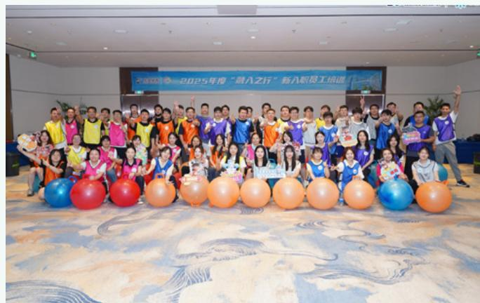

text_image

2025年-2025年度“融入之行”新入职员工培训

“融入之行”培训

## 开展团队长管理能力提升培训

为持续提升公司管理效能，强化一线团队管理能力，促进业务间协同，增强管理人2025 8-11 2025年公司团队长管理能力提升培训班”，总部、子公司、分支机构等各条线200余名团队长参加培训。

本次培训历时4个月，聚焦“系统提升管理能力、培育数智转型思维、强化员工关系管理”三大核心目标，采用“线上启动+AL实战+管理沙龙+集中结营”的4步混合式培养模式，包含AI智能管理陪练实战、管理思辨沙龙、管理能力提升面授培训等内容。

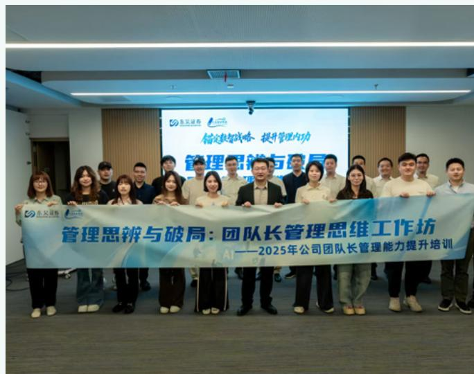

text_image

管理思辨与破局：团队长管理思维工作坊
——2025年公司团队长管理能力提升培训

团队长管理能力提升培训班

## 开展“微课大赛”系列培训活动

公司面向全体员工开展微课大赛活动，创新引入秒塔A制课工具，萃取公司内部现有的成功经验、先进知识和优秀技能，逐步完善公司现有在线课程库，以赛代练提升微课开发能力，整体提升在线课程质量。为确保活动效果，大赛期间，公司开展了多轮培训运营，例如面向微课大赛参赛选手开展《秒塔 AI 制课技巧赋能培训》《微课圆桌派》等培训活动。

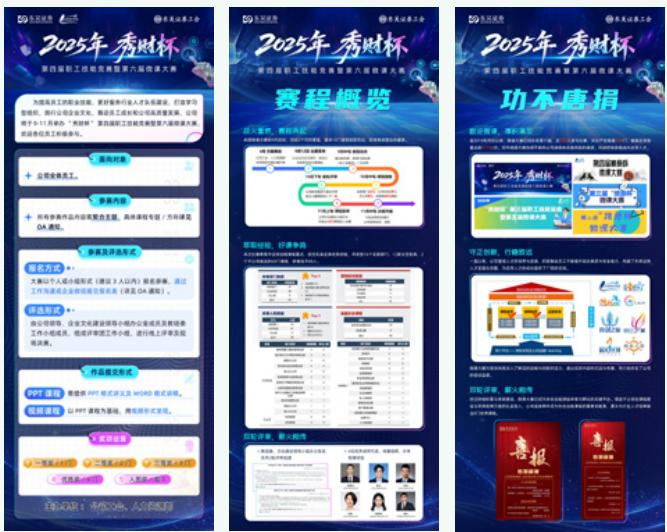

text_image

2025年秀财杯
第四届职工技能竞赛第六届课题大赛
为满足员工的创业安排，薪酬和培训人才考核进度，打造学习型组织。面向公司宣传、推进职工职业技能竞赛成果，公司将于1-11月开展“秀财杯”第四届职工技能竞赛第六届课题大赛，将依托员工积极参与。
赢利对象
+ 公司免费员工。
参赛内容
+ 所有作品内容聚焦特色主题，最终课程专题/方向课堂OA course。
参赛及评选方式
+ 大额可入小组形式（建设工人内）；报名申请，通过工作向集团公司提供相关服务（详见OA course）。
成员方：
- 出公司职务、企业年度绩效管理小组办公室成员及聘任考核工作小组相关，组成评审班工作小组，进行线上评审及现场调查。
作品提交形式
PPT 项目：赛提课 PPT 格式定义及 WORD 格式详细。
视频课程：以 PPT 赛为基础，视频形式完整。
奖补名单
+ 三元一码
+ 共享奖补
+ 入家奖补
喜报
2025年秀财杯
第四届职工技能竞赛第六届课题大赛
赛程概览
深入宣讲、撰写介绍
赛事计划、计划参与
1. 基础设计、计划参与
2. 基础设计、计划参与
3. 基础设计、计划参与
4. 基础设计、计划参与
5. 基础设计、计划参与
6. 基础设计、计划参与
7. 基础设计、计划参与
8. 基础设计、计划参与
9. 基础设计、计划参与
10. 基础设计、计划参与
11. 基础设计、计划参与
12. 基础设计、计划参与
13. 基础设计、计划参与
14. 基础设计、计划参与
15. 基础设计、计划参与
16. 基础设计、计划参与
17. 基础设计、计划参与
18. 基础设计、计划参与
19. 基础设计、计划参与
20. 基础设计、计划参与
21. 基础设计、计划参与
22. 基础设计、计划参与
23. 基础设计、计划参与
24. 基础设计、计划参与
25. 基础设计、计划参与
26. 基础设计、计划参与
27. 基础设计、计划参与
28. 基础设计、计划参与
29. 基础设计、计划参与
30. 基础设计、计划参与
31. 基础设计、计划参与
32. 基础设计、计划参与
33. 基础设计、计划参与
34. 基础设计、计划参与
35. 基础设计、计划参与
36. 基础设计、计划参与
37. 基础设计、计划参与
38. 基础设计、计划参与
39. 基础设计、计划参与
40. 基础设计、计划参与
41. 基础设计、计划参与
42. 基础设计、计划参与
43. 基础设计、计划参与
44. 基础设计、计划参与
45. 基础设计、计划参与
46. 基础设计、计划参与
47. 基础设计、计划参与
48. 基础设计、计划参与
49. 基础设计、计划参与
50. 基础设计、计划参与
51. 基础设计、计划参与
52. 基础设计、计划参与
53. 基础设计、计划参与
54. 基础设计、计划参与
55. 基础设计、计划参与
56. 基础设计、计划参与
57. 基础设计、计划参与
58. 基础设计、计划参与
59. 基础设计、计划参与
60. 基础设计、计划参与
61. 基础设计、计划参与
62. 基础设计、计划参与
63. 基础设计、计划参与
64. 基础设计、计划参与
65. 基础设计、计划参与
66. 基础设计、计划参与
67. 基础设计、计划参与
68. 基础设计、计划参与
69. 基础设计、计划参与
70. 基础设计、计划参与
71. 基础设计、计划参与
72. 基础设计、计划参与
73. 基础设计、计划参与
74. 基础设计、计划参与
75. 基础设计、计划参与
76. 基础设计、计划参与
77. 基础设计、计划参与
78. 基础设计、计划参与
79. 基础设计、计划参与
80. 基础设计、计划参与
81. 基础设计、计划参与
82. 基础设计、计划参与
83. 基础设计、计划参与
84. 基础设计、计划参与
85. 基础设计、计划参与
86. 基础设计、计划参与
87. 基础设计、计划参与
88. 基础设计、计划参与
89. 基础设计、计划参与
90. 基础设计、计划参与
91. 基础设计、计划参与
92. 基础设计、计划参与
93. 基础设计、计划参与
94. 基础设计、计划参与
95. 基础设计、计划参与
96. 基础设计、计划参与
97. 基础设计、计划参与
98. 基础设计、计划参与
99. 基础设计、计划参与

“微课大赛”海报

为进一步引导员工从更广泛的途径来提升自己，并促进公司各类人才的成长，公司鼓励全体员工在获取所必须的岗位执业资格、上岗资格外，积极参加各类优质证书及执业资格的培训、学习和取证，包括特许金融分析师(CFA)、金融风险管理师(FRM)、特许公认会计师（ACCA)、注册国际投资分析师(CIIA)等资格证书。

## 东吴证券2025年度员工培训与教育主要绩效

• 公司员工参与各类培训共计 5,656人次，其中外部培训课程 222人次，内部培训课程培训共计 5,434人次，培训覆盖率100%。  
·应知应会活动应学人员学习完成率达100%。  
·内部学习平台线上直播共计112场，直播观看人次16.356人次，有效地克服公司不同地域员工不能现场参加培训学习的问题。  
• 报销 3 名员工的共计 8,000 元认证证书报名费用。  
·有4门课程入选中证协2025年远程培训共建课程及成品共享课程，课程入选数量在同行业间排名前列

## 员工选拔与晋升

公司结合当年战略规划、业务重点和部门职责，系统制定各部门绩效合同，将公司战略目标与员工的个人目标及工作重点结合起来，建立覆盖全体员工的绩效评估和回顾反馈机制，以此充分调动员工的工作积极性与主动性，实现公司与员工协同发展。

东吴证券员工考核机制

<table><tr><td>考核要素</td><td>功能性指标、盈利性指标(包括行业文化规范、声誉风险管理、合规诚信执业、全面风险管理、职业操守、廉洁从业、社会责任履行情况、服务客户水平)等,体现金融行业的政治性、人民性宗旨。</td></tr><tr><td>考核流程</td><td>公司实行闭环考核管理流程,分为年初绩效合同制订、年中跟踪评价和辅导、年底考核评价、考核结果应用等环节。考核结果反馈至员工本人。</td></tr><tr><td>考核结果</td><td>作为薪酬调整的依据之一。作为绩效分配、晋升、培训发展的依据之一。</td></tr><tr><td>回顾反馈</td><td>部门负责人向员工反馈考评情况,反馈内容包括考核成绩、工作表现、改进建议及未来发展方向。为确保考核与反馈流程的有效性,公司不定期根据评估结果,调整考核标准、反馈机制及发展建议,确保流程始终适应公司业务发展和员工需求。</td></tr><tr><td>考核申诉</td><td>根据《考核管理基本制度》的规定,为了充分保障员工权利,最大限度保证考核结果的公平公正,员工对于考核评价结果产生异议的,可在知晓考核结果后进行申诉。公司严格保护员工隐私和个人信息,由专人专岗接受员工申诉,相关裁定结果也采用单点反馈的方式传达。</td></tr></table>

公司搭建与战略目标相匹配的人力资源管理体系，通过实行“双通道”职位体系，即管理通道职位和专业技术通道职位，充分挖掘和发挥人才潜能。公司通过明确任职资格标准、职级评定条件以及晋升流程，尊重每位员工在职业发展中所创造的价值，并有效激发员工的工作积极性与创造力。

## 东吴证券员工晋升双通道职位体系

## 干部管理通道

·制度：根据《关于深化国有企业改革的指导意见》《党政领导于部选拔任用工作条例》等文件精神和有关要求，制定《于部选拔聘任工作规程》。  
· 选拔聘任程序：人选产生-民主测评组织考察-档案审核-征求意见-人选讨论-任前公示-复议审查-任前谈话-发文聘任-聘任管理。

## 专业技术通道

·原则：遵循“能者上、平者让、庸者下”的市场化管理原则。  
·制度：制定《员工专业技术职级管理办法》。  
· 职级评定时间：每年进行一次。  
·方向：专业技术通道涵盖大经纪、大投行、大资管、大投研、中后台等各条线、总部分支机构、各层级人员，鼓励员工根据自身特点选择适合的发展通道。  
·开展年度专业技术职级的回顾调整，对标行业给付具有竞争力的薪酬，鼓励优秀人才脱颖而出。

## 员工健康与关怀

公司秉持以人为本的理念，始终将员工健康与福祉置于重要位置，通过健全管理机制、丰富文化生活、深化人文关怀、帮扶困难员工等多维度举措，关切员工身心健康及安全，营造温暖和谐的企业氛围，提升员工对企业的归属感与幸福感，增强企业的凝聚力。2025年，公司未发生员工相关安全事故。

东吴证券员工健康与关怀主要举措

<table><tr><td rowspan="2">强化安全管理</td><td>1 健全管理机制·搭建安全管理三级架构,并加大安全生产投入。·建立健全安全管理专项台账,明确设备维保单位管理机制。</td></tr><tr><td>2 落实安全检查·常态化开展各类消防应急演练。·2025年,共开展12次安全隐患排查整治。</td></tr><tr><td>丰富员工生活</td><td>举办文体活动·30个文体类社团常态化运行,员工可免费参与。·举办“悦来越牛”第四届职工趣味运动会。·组织专业足球赛事观赛。</td></tr><tr><td rowspan="2">加强员工关怀</td><td>1 保险与健康管理·合作体检机构增至5家,员工可自主选择。·组织动态心电监测等健康筛查服务。·举办心理健康讲座及体检报告解读会。·续保大病医疗互助保障险和女职工特种保障险。</td></tr><tr><td>2 人文关怀·组织4批次120名优秀职工参加疗休养。·“女职工关爱月”期间推出多项传统文化项目。·举办第四届职工家庭日暨“六一”儿童节主题活动、外地员工“回家看看”等主题活动。·开展“工会送清凉防暑保安康”活动,慰问在高温条件下坚守岗位的一线员工。</td></tr><tr><td>帮扶困难员工</td><td>健全帮扶机制·2025年,公司工会建立健全困难职工帮扶机制,在制度层面明确对患大病、遭遇意外等困难职工实施常态化慰问关怀,通过摸排统计掌握重特大疾病、特重症职工情况,建立动态帮扶台账,采取一次性补助金方式精准纾困。全年慰问困难职工51人,累计发放金额120.5万元。</td></tr></table>

## 组织开展“女职工关爱月”特色活动

2025年3月，公司在“女职工关爱月”期间推出“锦绣琳琅非遗凝香”特色活动，组织饰品DIY、篆香体验等传统文化项目。活动覆盖公司 17 个分工会，近 300 名女职工参与，通过手工创作与篆香体验相结合的形式，为女职工提供放松身心、交流互动的平台，传递专属关怀，增进归属感与幸福感。

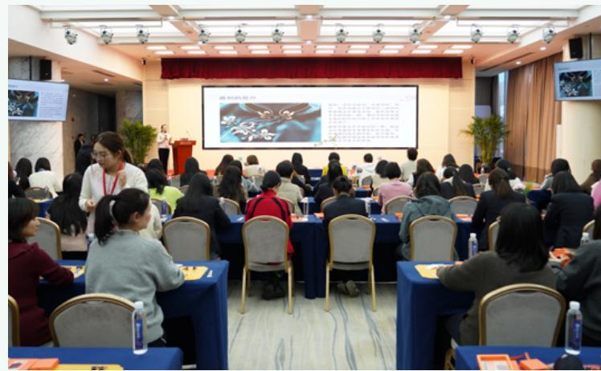

text_image

Conference hall photo with attendees seated at tables facing a presentation screen displaying Chinese text and images

“锦绣琳琅非遗凝香”活动现场

公司在员工保护领域持续投入并取得积极成效，同时正视数字化服务精准度有待提升，职工健康关怀深度不足等待改进方面，制定改进计划并积极推进实施，确保员工保护工作质效提升，为员工创造更加优质的工作与生活环境。

## 指标与目标

公司以培养专业化人才为目标，致力于构建完善目具有核心竞争力的员工培训与发展体系。公司设立量化监测指标持续跟踪目标完成进度，确保培训与发展策略有效落地，推动公司与员工共同成长。

## 东吴证券员工相关指标绩效

## 2025 年绩效

雇主责任险金额

$$
569,940\text{元}
$$

雇主责任险覆盖率

$$
100 \%
$$

员工培训总支出

$$
2,934,900\text{元}
$$

员工培训覆盖率

$$
100 \%
$$

员工人均接受培训小时数

$$
40.28 \text{小时}
$$

员工培训参与总时长

$$
2 0 5, 4 8 7 _ {\text {小时}}
$$

## 向上向善 惠民致远

## 推进乡村振兴

东吴证券响应国家乡村振兴战略号召，推动乡村振兴工作。公司严格遵守《中华人民共和国民法典》《中华人民共和国慈善法》《中华人民共和国公益事业捐赠法》等相关法律法规，在多领域、多地区发挥金融机构专业优势，开展乡村振兴项目。

东吴证券于2020年发起设立东吴证券慈善基金会（简称“基金会”），遵循“三重一大”决策制度，建立完善的项目信息报告机制。公司党委负责研究审议乡村振兴公益事业的重大事项，形成集体决策后，由基金会负责具体落实理事会作为基金会最高决策机构，负责制定战略和监督项目执行，监事则负责监督管理流程，保证流程合规

2025年，公司紧跟国家乡村振兴战略工作部署，在产业振兴、人才振兴、文化振兴、生态振兴、组织振兴等多类帮扶上齐头并进，持续助力乡村振兴工作。

## 东吴证券2025年度推进乡村振兴主要成果

·共计投入250万元，在产业帮扶、公益帮扶、生态帮扶等方面开展帮扶项目19个。  
·控股子公司东吴期货共对接湖北、河南、云南、安徽等近10个省市22个县市，累计投入帮扶资金91.5万元签订结对帮扶协议22份。

natural_image

Illustration of a rural village nestled in green hills with fields, trees, and a winding river (no text or symbols)

## 东吴证券2025年度乡村振兴主要帮扶项目

## 消费帮扶

·向内蒙古兴和县采购农副产品，缓解当地农副产品销售难题。  
·东吴期货以自有资金采购、推荐客户采购等方式，向陕西、江苏、甘肃、新疆等地合作社采购农产品及农副产品。  
• 充分发挥专业优势，2025 年成功发行多单乡村振兴债，募集资金专项用于助力乡村振兴项目。  
·东吴期货为陕西、南京等地多家农业合作社、涉农企业提供期货咨询服务方案，助力相关企业稳健经营。

## 产业帮扶

## 公益帮扶

·推进“走基层下一线”的党员先锋行动，部署结对帮扶相对薄弱村工作，因地制宜开展一系列帮扶行动。  
·东吴期货党支部与20家基层党组织开展党建共建，支持农村人口就业创业，巩固脱贫攻坚成果。

## 生态帮扶

·公司在新疆阿图什市、西藏林周县、陕西周至县、河南桐柏县、青海共和县等五个结对帮扶地区开展道路硬化、改善人居环境等帮扶项目。

## 智力帮扶

• 东吴期货组织开展金融知识培训28场，惠及超800人次。

## 宜兴首单乡村振兴专项债成功落地

2025年12月，东吴证券助力宜兴城市综合服务有限公司在上交所成功发行宜兴市首单乡村振兴专项债券，发行规模4.5亿元。本次募集资金将精准投向乡村振兴核心领域，重点支持农业产业升级等关键项目建设为“三农”工作注入低成本、长周期的金融“活水”，为相关项目高效落地实施提供坚实资金保障，助力宜兴市绘就“产业兴旺、乡村美丽、农民富裕”的乡村振兴新画卷。

## 东吴期货赴云南孟连“保险+期货”助力乡村振兴

2025年11月，东吴期货乡村振兴工作小组前往云南省普洱市孟连傣族拉祜族佤族自治县，参加天然橡胶“保险+期货”项目服务乡村产业发展培训会及联合党建活动。东吴期货在会上开展金融知识培训，分享了“保险+期货”的服务优势。通过培训交流与党建联动，会议凝聚了各方共识，帮助推进当地天然橡胶产业的可持续发展，助力胶农稳收增收。

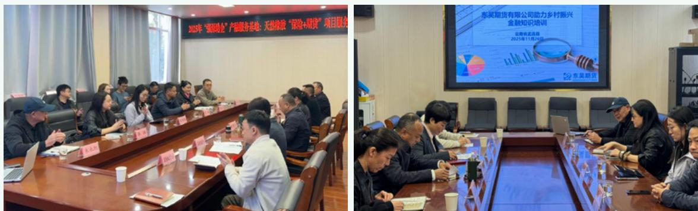  
东吴期货乡村振兴工作小组在会上分享金融知识

## 东吴期货携手“黄浦体育公益行”助力云南澜沧县乡村振兴

2025年12月，东吴期货响应国家东西部协作号召，参与由上海市黄浦区体育局党组、黄浦区体育局牵头组织的2025年“黄浦体育公益行”项目。东吴期货向云南省普洱市澜沧县及南岭乡小学进行专项爱心捐赠支持当地教育与体育事业的融合发展，为援滇工作贡献“东吴力量”。

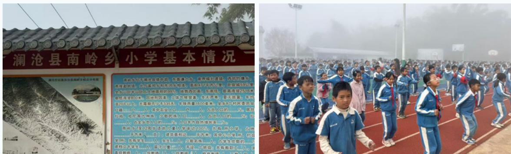  
东吴期货援助的云南省普洱市澜沧县南岭乡小学

## 东吴证券及其子公司2025年度乡村振兴相关奖项（部分）

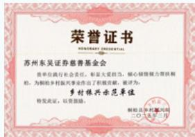  
乡村振兴示范单位

## 东吴证券慈善基金会获评:

• 河南省桐柏县乡村振兴局授予的“乡村振兴示范单位”称号

## 东吴期货荣获:

• 中共铜仁市委、铜仁市人民政府颁发的“巩固拓展脱贫攻坚成果同乡村振兴有效衔接先进集体”称号  
·虹口区人民政府合作交流办公室颁发的“2025年度东西部协作和对口支援工作荣誉奖”  
·期货日报、证券时报颁发的“最佳全面乡村振兴及社会责任公益奖”  
•多个项目荣获郑商所颁发的2024 年度“保险+期货”优秀项目等荣誉

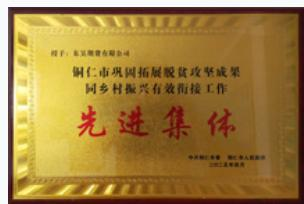  
巩固拓展脱贫攻坚成果同乡村振兴有效衔接先进集体

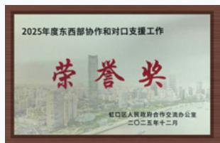  
2025年度东西部协作和对口支援工作荣誉奖

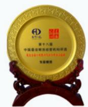  
最佳全面乡村振兴及社会责任公益奖

## 热心公益慈善

公司始终重视社会效益，积极通过公益捐赠、志愿行动等承担企业社会责任。公司基金会负责管理公益项目，并持续完善相关内部制度，推动公司公益慈善事业的规范化、专业化

## 公益活动

公司依托基全会开屏公益慈善项目，基全会通过《项目管理制度》，《捐赠资全管理办法》等内部制度，明确公益项目管理方法，对于重大公益项目，基金会建立“事前论证→事中跟踪→事后评估”的管理机制，邀请专业会计师事务所进行项目评审，确保项目设计科学，能有效落地。

2025年，公司积极参与大型公益活动，通过灾后援助，定向捐助，困难人群慰问等项目关爱弱势群体，持续推进“美好家园”慈善项目，助力苏州本地乡村振兴，同时资助人才培养，深化校企合作

东吴证券 2025年度社会公益慈善主要举措

<table><tr><td>帮扶领域</td><td>投入金额</td><td>具体项目及措施(部分)</td></tr><tr><td>关爱弱势群体传递金融温度</td><td>516万元</td><td>·向苏州市慈善基金会捐赠200万元,助力苏州慈善事业发展。·向扬州市翔宇妇女儿童基金会、苏州高新区慈善总会及社区罕见病患者累计捐赠56万元,支持妇女儿童、新就业群体及特殊困难群众救助。·启动新一轮为期三年的慰问、救助苏州公安机关大病特困警务人员项目,向苏州公安大病特困救助基金会拨付60万元善款。·动员1,700余名员工参与“慈善一日捐”活动,与基金会共同向苏州市慈善总会捐赠200万元,用于帮助各类困难群体。</td></tr><tr><td>深化校企合作助力人才培育</td><td>315万元</td><td>·向复旦大学、南京大学苏州校区捐赠105万元用于设立奖教金,及成立东吴资本市场研究中心,支持学术研究与师生发展。·向苏州市教育发展基金会捐赠100万元设立“新教育实验促进苏州教育高质量发展”专项基金,培养优秀青年骨干教师力量。·联合江苏省证券业协会,在淮安市蒋集九年制学校开展“财智未来”公益项目,投入10万元搭建“财智未来”多功能教室,推动人工智能与财商教育。·向苏州市关心下一代基金会捐赠50万元,设立“圆梦”奖学金,鼓励苏州市内优秀中小学生。·向福建省宁德市屏南县慈善总会捐赠50万元建设复合型教学空间,提升屏南县中小学生科学素养。</td></tr><tr><td>链接多方资源共创美好家园</td><td>310万元</td><td>·在苏州市委组织部的指导下、联合市总工会、团市委、市妇联开展新一轮为期三年的共创“美好家园”慈善项目,计划合计投入资金1,000万元,其中2025年投入310万元,覆盖苏州10个区县市,重点帮扶全市25个集体经济相对薄弱村。·积极探索“党建+公益”新模式,组织党员志愿者参与“走基层下一线”党员先锋活动,推动25家党支部与薄弱村开展结对帮扶,在两个月内动员公司近千名党员、青年实地走访调研结对村,共商发展举措,因地制宜开展金融知识普及、创就业技能培训、人居环境改善等系列帮扶行动,帮助当地发展。</td></tr></table>

## 东吴证券举办2025年公益文化项目发布暨先进表彰活动

2025年3月30日，东吴证券在苏州广电总台举行“吴韵华章同心同行”2025年公益文化项目发布暨先进表彰活动。活动现场，东吴证券集中签约发布了总额820万元的社会责任项目和500万元赞助项目。另外，公司启动2025年“公益活动月”七大主题活动，围绕社会公益、员工关怀、职业技能、专题培训等开展系列活动，并对公司2024 年度各项荣誉获得集体和个人进行了表彰，鼓励员工在新的一年再创佳绩。

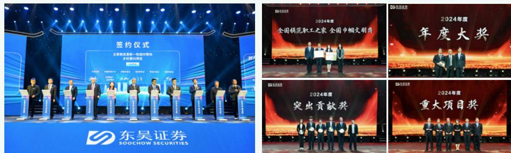  
东吴证券2025 年公益文化项目发布暨先进表彰活动

## 东吴证券捐助香港大埔灾后救助工作

香港大埔火灾发生后，东吴证券携香港子公司东吴香港、东吴证券慈善基金会，共向中华慈善总会捐赠200 万元，助力香港大埔灾后重建、人员安置等工作。

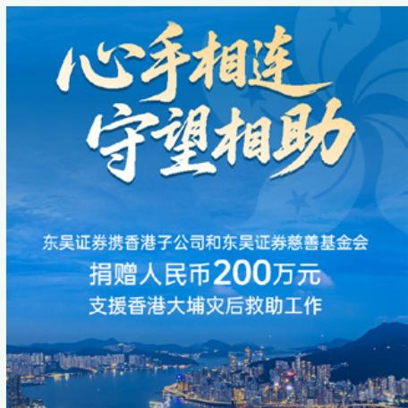

text_image

心手相连
守望相助
东吴证券携香港子公司和东吴证券慈善基金会
捐赠人民币200万元
支援香港大埔灾后救助工作

东吴证券捐赠200万元支援香港大埔灾后重建

共向中华慈善总会捐赠

200 万元

## 东吴证券2025年公益慈善领域绩效

·公司在公益慈善领域累计投入资金1.743.96万元（包含东吴期货和员工对外捐赠部分）。  
• 公司通过冠名基金、设立慈善基金会、与外部基金会合作等方式开展公益慈善项目近百项。  
• 公司共动员 1,700 余名员工参与“慈善一日捐”活动。  
• 公司连续第 15 年组织员工义务献血，2025 年共 108 名员工成功参与，总献血量 27,300 毫升。

## 东吴证券2025年度社会公益相关奖项

  
连续第三次获评“江苏慈善奖”

连续第六年获评 “苏州市优秀慈善单位”  

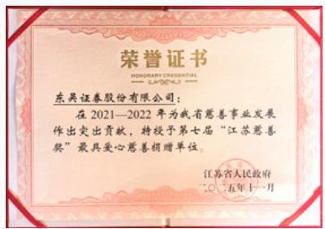

text_image

荣誉证书
HONGYANG CREDENTIAL
—— 2021-2022
东吴证券股份有限公司：
在2021—2022年为我省慈善事业发展
作出突出贡献，特授予第七届“江苏慈善
奖”最具爱心慈善捐赠单位。
江苏省人民政府
二〇一五年十一月

获得“江苏慈善奖”

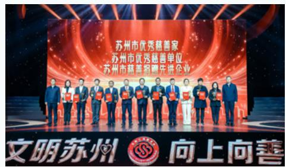

text_image

苏州市优秀慈善家
苏州市优秀慈善单位
苏州市慈善捐赠先进企业
文明苏州 向上向誓

获得“苏州市优秀慈善单位”

## 志愿活动

公司积极组织员工参加志愿服务，成立“党员志愿服务队”和“青年志愿服务队”，总人数超过1.100人。公司根据《中国注册志愿者管理办法》等法律法规要求，制定《慈善基金志愿者管理制度》，建立注册志愿者人才信息库，依托志愿者服务队定期开展公益活动，并提供志愿服务所需的培训、保障等。

2025年，公司开展“公益文化月”系列活动，组织党员志愿者参与“走基层下一线”党员先锋活动，走进党支部结对帮扶的薄弱村了解情况并制定各不相同的帮扶策略。2025年，公司员工累计志愿服务时长3.000小时，惠及1.000余人。

2025 年 6 月 14 日，东吴证券常熟分公司党支部组织员工在当地社区开展“以甜蜜赋能苏南—糕团学习制作”志愿活动。当天邀请专业糕团老师指导糕团制作，促进弘扬民俗文化，建设社区交流氛围。

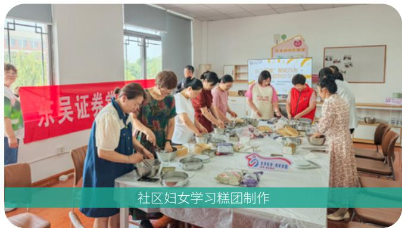

text_image

东吴证券
社区妇女学习糕团制作

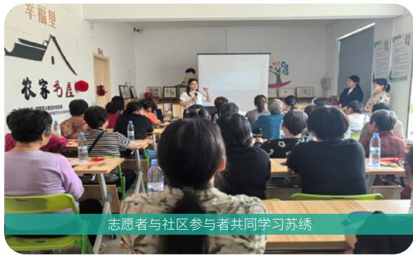

text_image

幸福里
农家为屋
志愿者与社区参与者共同学习苏绣

2025年6月，东吴证券苏州高新区中心营业部党支部赴马山村党群服务中心开展苏绣非遗传承志愿活动。党员志愿服务队帮助布置现场、准备材料，并与当地社区参与者一起向手工艺人吴老师学习了苏绣技法，将非遗传承融入社区帮扶。

东吴证券资金财务党支部组织志愿者来到太仓市璜泾镇新海村，通过政策宣进、慰问帮扶、生态研学等形式普及落实国家“长江大保护”政策。志愿者们亲身参与太仓沿江地区的“净滩行动”，帮助维护长江沿岸生态环境。

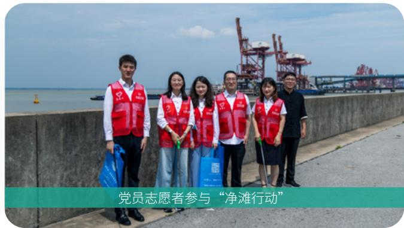

text_image

党员志愿者参与“净滩行动”

## 东吴证券及其子公司2025年度志愿活动相关奖项

## 治理篇

## GOVERNANCE

natural_image

Stylized illustration of a city skyline with windmill, buildings, and a sun in the sky (no text or symbols)

## 文化固本 治理行稳

## 企业文化建设

## 深化党建引领

东吴证券党委深入贯彻落实党的二十大及二十届历次全会精神，坚持“两个一以贯之”，将党的领导深度融入公司治理与改革发展全局。公司严格落实“第一议题”制度和“三重一大”决策制度，确保党委会作为董事会、领导办公会的前置审议环节，全年召开党委会议38 次，发挥党委“把方向、管大局、保落实”作用。

2025年，公司持续健全党建工作制度体系，制定或修订一系列党内重要制度文件，包括《党的建设高质量发展三年规划(2025-2027年)》《2025年基层党建工作要点》《关于在公司党员于部中开展深入贯彻中央八项规定精神学习教育的实施方案》等，为党建工作的规范化、长效化开展奠定坚实基础。

##

## 强化政治引领

强化思想政治引领：制定《党建高质量发展三年规划（2025-2027)》，系统推进“五大行动”。严格落实“第一议题”制度，全年开展中心组专题学习16次。完善“三重一大”决策机制，切实发挥领导核心作用。  
深化作风建设：扎实开展中央八项规定精神学习教育，成立工作专班和联络组，制定实施方案、问题清单与整治台账，组织专题学习7次。完善业务接待管理办法，深入基层开展“换位跑一次”活动推动作风建设常态化长效化。  
·落实统战工作：创新构建“党建统领、统战聚力、青年建功”三维融合工作体系。组织龙舟队赴台参加两岸交流活动，深化文化认同。  
·加强意识形态与党风廉政建设：连续6年发布《东吴故事》系列报道，打造数字化意识形态阵地。组织层层签订《党风廉政建设责任书》，督促班子成员严格履行“一岗双责”。

## 党建业务融合

·行动支部赋能实体经济：“资本服务先锋”行动支部聚焦做精“服务中小微”品牌，“金融新质生产力”行动支部围绕做好金融“五篇大文章”，两项业务均取得优异成果。  
• 产研协同创新：率先提出“科特估”体系，举办创新药、先进制造等高端产业论坛，品牌影响力持续提升。  
• 人才强企：深入实施“5512”优秀青年人才计划和“见习助理”专项培养计划，构建矩阵式培养架构全覆盖开展各层级人员专业能力提升。

## 推进企业文化建设

东吴证券积极培育中国特色金融文化，以“五要五不”为根本遵循，锚定“共享共赢敢创未来”文化品牌，总结提炼“三大实践”和“九条经验”，推动文化建设与经营管理深度融合，为公司高质量发展注入强大精神动力。

公司以体系化建设推动文化理念向实践转化，建立企业文化建设组织结构，以务实举措推动企业文化落地生根确保文化建设取得实效，为高质量发展构筑坚实根基

##

## 党委

• 统领文化建设方向

## 文化建设领导小组

• 由全体高管组成，领导公司文化建设各项工作，负责对文化建设各重大事项进行决策和指导。

##

•协助领导小组开展工作，负责按照职责和权限分解落实领导小组的决策和部署，持续提升公司文化建设水平。

## 文化专员

·负责按照部门文化建设工作职责，跟进、落实、总结、协调文化建设工作。

2025年，公司围绕“12345文化建设工作体系”，多维度扎实推进各项文化管理举措，持续夯实宣传阵地、深化员工认同、强化行业担当，将文化软实力转化为推动高质量发展的硬支撑。

<table><tr><td>夯实文化宣传阵地</td><td>发布《企业文化手册》,系统梳理行业文化理念与公司文化内涵。在中央媒体发表文化及理论文章8篇,在协会内刊《中国证券》发文5篇。公司首席经济学家通过中央和国际媒体正面发声,内部专家亮相世界青年发展论坛、金融街论坛,输出东吴智慧,服务行业发展大局。举办防非健康跑公益活动,吸引上万人次参与,有效提升社会公众的金融风险防范意识和能力。</td></tr><tr><td>深化企业文化认同</td><td>连续两年开展“公益文化月”活动,营造全员参与氛围。举办第四届职工技能竞赛和第六届微课大赛,以业务需求为导向全面赋能员工发展。开展风险文化主题征文、职工书画摄影展、人工智能主题辩论赛及司歌创意大赛等活动,员工在参与中理解文化、在共鸣中接纳文化。组织外地职工“回家看看”、职工家庭日及四地体育邀请赛,覆盖员工及家属千余人,增强家园文化认同。</td></tr><tr><td>强化行业责任与智库作用</td><td>承办中国证券业协会证券行业文化建设调研交流座谈会。面向全行业100余家券商作文化建设经验分享,提升公司文化建设的影响力。积极参与协会培训课程建设,持续使用自主考场为证券从业人员水平评价测试提供支持,参加协会证券从业人员水平评价测试命题工作。常态化做好观察点的定期研究报告工作,实现公司作为牵头单位承担协会专业委员会课题方面“零”的突破。将以往发表的课题、文章、案例梳理汇总成《2022-2023年度文化建设成果汇编》《2024年度文化建设成果汇编》。</td></tr></table>

•在中国证券业协会证券公司文化建设实践评估中荣获最高等级A类AA级。  
·公司及多个集体先后荣获第七届“全国文明单位”“全国巾帼文明岗”“全国模范职工之家”“全国青年文明号”“全国金融系统思想政治工作和文化建设调研工作优秀组织奖”等荣誉。  
·公司承担的多个课题获评“最具前瞻价值奖”“最具创新价值奖”“最具实践价值奖”“优秀课题”等荣誉。  
• 文化建设案例连续第三年入选《证券行业文化建设年报》。  
•多项案例分别入选复旦大学、南京大学、南京审计大学高校案例库。  
·5篇政研成果被《中国金融业党的建设与思想文化建设调研成果库》全文收录。

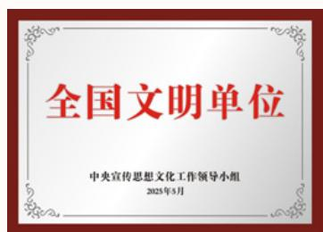

text_image

全国文明单位
中央宣传思想文化工作领导小组
2025年5月

更多“企业文化建设”议题管理详情，详见后续公司于中国证券业协会平台发布的《东吴证券2025年文化建设实践报告》。

## 优化公司治理

## 治理

公司坚持规范运作，持续完善公司治理结构和制度体系，不断提升公司治理水平。公司严格遵循《公司法》《证券法》《证券公司治理准则》《上市公司治理准则》等法律法规和规范性文件的要求，建立了由股东会、董事会（含各专委员会）、管理委员会和其他内部管理机构组成的健全公司治理架构，明确权力机构、决策机构、监督机构和管理层之间的权责边界，实现运作规范、相互协调、相互制衡，形成科学、高效的公司治理体系

2025年，公司顺利完成监事会改革，由董事会审计委员会承接监事会职权，持续推动治理体系现代化建设。同时公司严格按照法律法规和规范性文件等有关规定，系统修订《公司意程》《独立董事工作制度》《关联交易管理制度》《投资者关系管理制度》《信息披露事务管理制度》等内部制度，进一步夯实规范运作基础。

##

## 股东会

·作为公司的权力机构，依法行使职权，包括决定公司经营方针、投资计划，审议批准董事会报告及预决算、利润分配等方案，对增资减资、合并分立、章程修改等重大事项作出决议，选举更换董事等事项。

## 董事会

• 对股东会负责并执行股东会的决议。  
·负责决定经营计划与内部管理机构设置，制订财务预决算及利润分配等方案，聘任或解聘高级管理人员并决定其报酬，制定基本管理制度等。  
· 下设战略与ESG委员会，风险控制委员会，审计委员会和薪酬、考核与提名委员会，为董事会科学决策提供专业支撑。

## 管理委员会

·在公司章程及董事会授权范围内负责日常经营。

## 战略

公司深入贯彻党的二十大和中央金融工作会议精神，落实国务院《关于进一步提高上市公司质量的意见》要求，积极响应上市公司“提质增效重回报”专项行动倡议，深入践行“以投资者为本”理念，积极推动高质量发展和投资价值提升，保护投资者尤其是中小投资者合法权益；准确把握自身国有企业、金融企业、上市公司三重属性，以规范化、现代化为抓手，持续健全“权责法定、权责透明、协调运转、有效制衡”的公司治理机制，不断提升治理效能。

公司重视治理风险的识别与防范，针对治理失效、声誉风险等问题，持续强化“关键少数”责任，重点加强对控股股东、实际控制人、董事及高级管理人员的履职规范与监督约束，不断完善与中小股东的风险共担及利益共享机制进一步提升决策透明度与治理公信力，将风险转化为发展机遇。

<table><tr><td>风险/机遇类型</td><td>具体描述</td><td>预期财务影响</td><td>影响范围</td><td>应对策略</td></tr><tr><td>治理失效风险</td><td>若公司未能遵守《公司法》《证券法》等法律法规,可能因董事、高级管理人员履职不当、信息披露不充分、中小投资者权益保护不足等导致公司决策错误或无法律效力、损害投资者利益等问题,影响公司正常运营,并可能受到监管处罚。</td><td>运营成本增加</td><td rowspan="3">中、长期</td><td rowspan="3">积极响应上市公司“提质增效重回报”专项行动倡议,深入践行“以投资者为本”的理念,扎实推动公司治理水平和投资者回报能力双提升。</td></tr><tr><td>声誉风险</td><td>若公司因治理不善、合规问题或董事、高级管理人员行为失当引发市场关注,可能导致负面舆情,影响公司品牌形象。</td><td>营业收入下降</td></tr><tr><td>治理提升机遇</td><td>通过构建有效、透明的公司治理体系,增强投资者信心,吸引长期价值投资,降低融资成本,提升公司市场估值和品牌形象。</td><td>营业收入增加</td></tr></table>

## 影响、风险和机遇管理

公司建立“跟踪研究-定期评估-系统修订”机制，持续完善公司治理体系，强化合规管理与风险控制，通过优化决策机制、提升透明度、加强监督与问责，防范治理失衡、合规风险及信息披露问题，确保治理高效、稳健，保障股东权益与企业长期可持续发展。

##

## 风险识别

• 关注监管政策变化，识别信息披露、中小投资者权益保护等方面的风险。  
· 评估董事会及管理委员会的履职情况，关注权责不清或决策机制失衡的潜在风险。

## 风险评估与监测

定期对董事会(专门委员会进行有效性评估，通过自评形式、内部检查和外部审计，评估治理制度的执行情况及其有效性。  
• 依托风险监测机制，跟踪治理相关的合规性及管理漏洞，及时预警。  
• 关注市场舆情，防范因治理问题引发的声誉风险。

## 风险防控与应对

·严格落实“三重一大”决策制度，确保治理结构高效运作。  
· 优化独立董事和专门委员会工作机制，提升治理透明度和决策质量。  
·加强董事、高级管理人员培训，提高合规意识和履职能力，强化责任担当。

## 董事会多元化与独立性

2025年，公司全体董事忠诚勤勉，严格按照法律法规、治理准则和公司章程的规定履行职责，积极参会议事决策执行股东会的各项决议，科学审慎地履行战略决策职能

公司持续关注董事会的多元化和专业性，致力于构建由不同专业背景、行业经验和性别构成的多元化董事会，为科学决策提供多维视角。公司董事认真阅读公司各类资料文件，开展业务调研，及时了解公司经营管理情况，督促指导公司经营层加快推进业务发展和管理创新：主动参加常态化专题培训，学习证券市场最新的政策法规和监管案例，不断提升风险合规意识与履职能力。

公司董事蔡思达先生(独立于管理层)为苏州国际发展集团有限公司风险控制部（法律合规部)总经理：独立董事陈忠阳先生长期从事金融风险管理领域的学术研究，曾任中国人民大学金融风险管理学科建设负责人，担任多家商业银行风险管理委员会主任委员、国际风险管理师协会(PRMIA)北京分会创始会长等职务，具备丰富的风险管理方面知识和实践经验。

公司切实保障独立董事充分履职和独立行使职权，并根据《上市公司独立董事管理办法》《东吴证券独立董事工作制度》，每年组织独立董事对独立性情况进行自查，并将自查情况提交董事会，由董事会开展独立性评估。

## 董事、高级管理人员薪酬及考核情况

公司建立与经营绩效、合规风控、长期价值贡献深度挂钩的董事、高级管理人员薪酬机制。根据《公司章程》，公司股东会是董事薪酬管理的最高决策机构，负责审议董事薪酬管理制度，批准董事薪酬构成、标准、发放方式及调整方案：同时审议董事履职考核评价情况，对考核结果为“不称职”的董事，决定是否继续其任职。

公司根据《公司章程》及《董事薪酬与考核管理制度》，由董事会薪酬，考核与提名委员会负责组织实施董事年度履职考核，从勤勉程度、履职能力、廉洁从业、合规诚信执业、践行行业文化等方面进行综合评价，考核结果分为“称职”“基本称职”“不称职”三个等次。薪酬发放严格遵循监管要求，董事在任职期间若出现被证券交易所公开谴责因重大违法违规受到行政处罚、经营决策失误导致公司重大损失、履职评价“不称职”等情形，公司将不予发放或部分发放津贴及绩效薪酬。

公司根据《公司章程》及《高级管理人员薪酬绩效管理细则》，明确高级管理人员薪酬由基本年薪与年度绩效薪酬构成。年度绩效薪酬由董事会根据高级管理人员的年度绩效考核结果决定，其中的40%按照《证券公司治理准则》的要求，实行延期支付，个人延期支付总额按三年等分支付。高级管理人员未能勤勉尽责，导致公司出现违法违规或经营风险的采取扣发、止付奖金、津贴等薪酬或追索扣回等措施，并对违法违规或导致公司有过度风险敞口的高级管理人员追究内部经济责任。同时，公司围绕金融“五篇大文章”将可持续发展目标纳入高管年度绩效考核体系，确保公司战略与高管激励同频共振。

## 信息披露与投资者关系

公司积极履行信息披露义务，确保信息真实、准确、完整、及时。2025年，公司主动结合证券行业政策和市场动态，深入分析行业格局和趋势、市场环境、经营举措及成绩、未来发展展望，增强报告的可读性，有效传递公司价值，并加强内募信息管理，切实保障投资者知情权。同时，公司加大自愿性信息披露力度，发布“提质增效重回报”行动方案及落实情况，主动发布 4 次业绩预告 /快报，及时向市场披露主要经营指标，积极引导市场预期，助力提振市场信心。报告期内公告发布实现零差错。

公司重视投资者关系管理，通过投资者热线、上证e互动平台、来访调研等多种渠道，与中小投资者保持良好互动及时回应投资者关切：组织机构反路演，加强与专业投资者的深度交流:采取视频和网络互动方式召开年度、半年度及季度业绩说明会，主动传递公司发展理念、业务亮点、财务表现及未来规划，积极展现公司发展成果和投资价值，提升公司在资本市场的影响力。

## 投资者回报及利润分配

公司积极响应监管倡议，持续加大分红力度，自2024年度起实施多次分红，现金分红比例达65.52%，股息率位居券商行业最高水平。2025年半年度现金分红比例35.50%，领跑上市券商。

公司健全长效回报机制，更新未来三年股东回报规划，承诺将2025-2027年现金分红比例由不低于当年实现可供分配利润的30%提高至不低于50%，以明确的制度安排传递与股东共享发展成果的坚定决心，增强投资者获得感。

## 东吴证券2025年开展股东分红情况

·2024年年度分红：以方案实施前的公司总股本4.968.702.837股为基数，每股派发现金红利0.237元（含税），共计派发现金红利 1,177,582,572.37 元（含税）。  
• 2025 年半年度分红：以方案实施前的公司总股本 4,968,702,837 股为基数，每股派发现金红利 0.138 元（含税），共计派发现金红利 685,680,991.51 元（含税）。

## 指标与目标

公司通过规范高效的会议运作与科学决策，确保股东会、董事会及各专门委员会依法合规履行职权。公司围绕董事会构成、会议效能及决策质量等维度，设立治理监测指标，确保优化措施落地见效。有关公司治理议题管理的更多信息可详见《东吴证券股份有限公司2025年年度报告》。

##

2025 年绩效

<table><tr><td>董事会成员数量</td><td>女性董事数量2名</td><td>独立董事数量4名</td><td>职工董事数量1名</td></tr><tr><td>股东会会议召开次数</td><td>审阅议案数量</td><td>董事会会议召开次数</td><td>审阅议案数量</td></tr><tr><td colspan="2">董事会各专门委员会会议召开次数</td><td>审阅议案数量</td><td></td></tr></table>

• 2024-2025 A评价。  
·荣获中国上市公司协会颁发的“2025年上市公司董事会办公室最佳实践”

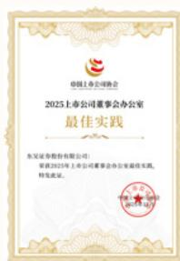  
2025年上市公司董事会办公室最佳实践

## 全面风险管理

## 治理

东吴证券始终坚持稳健经营理念，紧扣防风险、强监管、促高质量发展工作主线，严格遵守《证券公司全面风险管理规范》等监管要求，构建覆盖各类风险、贯穿各层级的全面风险管理体系，制定《风险管理基本制度》，并按照区险和业务类型分别制定相应的具体风险管理工作规则，为日常风险管理工作提供明确的依据和指导原则。2025年，公司对照风险管理规范、市场风险指引等新规要求，逐条对标学习并梳理现有制度和流程，修订风险管理基本制度、分类风险管理办法以及专项工作实施细则等12个制度文件。

公司构建纵向贯通、横向联动的四层级全面风险管理架构，明确各环节权责与协同机制，形成分层履职、分级负责的制衡体系，为公司持续健康发展提供系统性保障。

## 东吴证券全面风险管理组织架构

## 董事会及风险控制委员会

· 董事会对风险管理负最终责任。  
• 董事会下设的风险控制委员会在董事会授权范围内履行风险管理职责。

## 管理委员会及风险管理委员会

管理委员会对全面风险管理承担主要责任，管理公司经营过程中的各类风险，推动公司全面风险管理体系的规划、建设与执行。  
• 管理委员会下设的风险管理委员会，在管理委员会授权范围内开展风险管理工作。  
首席风险官负责组织，协调，落实公司全面风险管理工作，定期或不定期向董事会和公司管理委员会报告公司风险管理工作。

## 风险管理职能部门

· 风险管理部是公司风险管理政策及制度的具体执行部门，负责推动和落实公司全面风险管理工作。  
• 其他风险管理职能部门包括合规法务部、资金运营部、董事会办公室、运营中心、信息技术总部等。

## 业务部门、分支机构及子公司及设立的合规风控专员

·各部门、分支机构及子公司在日常工作中应当全面了解并在决策中充分考虑与业务相关的各类风险，及时识别评估、应对、报告相关风险。其负责人承担本单位风险管理的直接责任。  
• 各部门、分支机构负责人应指定相应的团队或人员组织本单位切实履行一线风控职能，承担管理职能的业务部门应当配备专职风险管理人员，就本单位日常风险管理工作与风险管理部门保持密切沟通。

公司建立健全ESG风险管理体系，将ESG风险因素纳入全面风险管理流程，指导业务部门、分支机构及子公司有效管控经营过程中面临的ESG风险，确保公司在可知、可测、可承受的ESG风险水平下开展业务。公司发布《环境、社会和公司治理（ESG）风险管理声明》，明确ESG风险管理架构、ESG风险管理流程、ESG尽职调查机制、ESG风险管理实践、ESG风险触发与上报机制

## 战略

公司聚焦重点业务领域风险防控，识别出市场风险、信用风险、操作风险、流动性风险、声誉风险及ESG相关区险等主要风险类型，各类风险详情可见《东吴证券股份有限公司2025年年度报告》。同时，公司高度重视全面风险管理体系本身的有效性，根据发展战略、资产规模、经营目标及业务范围，动态调整风险管理策略，确保其与实际需求相匹配，将风险控制在风险容忍度之内。

<table><tr><td>风险类型</td><td>具体描述</td><td>预期财务影响</td><td>影响范围</td><td>应对策略</td></tr><tr><td>政策与法规风险</td><td>公司全面风险管理体系若未能及时适应法律法规和市场环境的重大变化,可能导致风险识别和控制措施滞后,影响合规性和经营稳定性,甚至引发监管处罚或声誉损失。</td><td>运营成本增加</td><td>中、长期</td><td>坚持完善全面风险管理体系,加强风险识别和评估,强化风险监测和报告,持续推进风险管理全员参与、全部联防、全业务覆盖、全流程贯穿,不断提升整体风险管控能力。</td></tr></table>

## 影响、风险和机遇管理

## 风险管理

公司建立组织健全、职责清晰、有效制衡、激励约束合理的授权管理体系，确保公司各部门、分支机构及子公司在被授予的权限范围内开展工作，严禁越权从事经营活动。通过制度、流程、考核评价等方式，进行有效管理和控制并确保业务经营活动受到制衡和监督。

## 东吴证券全面风险管理相关风险管理流程

## 信息收集与识别

•全面、系统、持续收集内外部信息，识别公司面临的风险及其来源、特征、驱动因素和潜在影响，按业务、部门风险类型分类，并关注各类风险的交互影响和转化  
•定期梳理、总结风险识别结果及驱动因素。

## 风险评估与分析

•采用定性与定量相结合的方法，评估风险的影响程度和发生可能性，进行等级排序或量化排序，确定重点关注和优先控制的风险。  
• 关注风险的关联性，汇总公司层面的风险总量，审慎评估公司面临的总体风险水平。  
• 运用压力测试和其他计量方法模型，审慎评估风险水平。

## 监测与应对

·建立逐日盯市等机制，准确计算、动态监控关键风险指标情况，分析、预测并及时预警超越各类、各级风险限额的情形。  
• 根据风险评估和预警结果，选择与公司风险偏好相适应的应对策略，并建立健全风险应急机制。

## 考核与问责

·建立与风险管理过程及效果挂钩的绩效考核机制，考核结果与员工奖惩激励挂钩。  
• 建立处罚及问责等责任追究机制，对发生重大风险事件的部门和相关责任人进行问责，加强惩戒约束作用。

公司坚持底线思维，以“稳慎”的态度强化全面风险管理，通过优化体系机制、聚焦重点领域、深化科技赋能、厚植风险文化等多元举措，持续提升风险防控的前瞻性与有效性。

##

## 强化风险管理效能

• 检查促改：持续优化监督考核，开展覆盖全业务部门的风险管理检查，提出检查问题，督促各部门完善内控管理，及时落实整改。  
•明责轮岗：细化落实操风指引，对标操风指引要求，梳理公司关键业务环节及关键岗位清单，督促各单位落实操作风险关键岗位轮岗或强制休假要求。  
• 垂直管控：强化子公司垂直管控，制定子公司重要、重大事项的标准与审批程序，督促子公司对照新规修订风险管理相关制度，建立健全子公司风险信息沟通与报告机制。  
•机制优化：优化同一客户授信管理机制，优化同一客户认定规则提升同一客户持续跟踪管理能力，优化授信限额预警机制，提升限额预警精度。  
·指标细化：细化风险限额指标管理，细化完善公司经营层风险限额指标，规范风险指标设定、调整、预警与超限报告、跟踪处置的机制。

## 聚焦重点领域

• 新业务审批：新业务方面完善审批机制，建立风险审核要点，配套建立相关风险监控机制，完善系统风险监控功能。  
·境外子公司管控：加强境外子公司管理，梳理重点业务流程及相关内外规要求、管理机制与潜在风险点，协助境外子公司风险管理部完善客户准入、标的准入、额度管理、数据管理和集中度控制等风险管控措施。  
·融资类跟踪：召开融资类业务季度投贷后跟踪专题会议，实现信用风险全方位动态评估。提示业务部门做好盯市跟踪和风险应对，切实做好信用风险集中度管控工作  
·投资类监测：投资类业务加强动态监测跟踪，结合市场高频变化提高分析评估频率，跟踪业务持仓与盈亏变化。

## 深化科技赋能

·数据筑基：夯实风险数据基础，持续拓展集市基础数据覆盖范围，优化数据模型、加工逻辑与调度任务建立并落实风险数据质量监测及问题处理流程。  
·系统迭代：强化系统支撑能力，持续推动全面风险管理平台、各专项风险管理系统及子公司风险管理系统迭代优化，积极对接新业务、新产品风险管理需求  
·AI探索：探索AL技术融合应用，在风险知识库构建，智能报表报告生成方面、在智能分析与预警等方面分别做了有益的应用

##

2025年，公司以大数据平台基础为底座，持续完善风险数据集市建设，并积极探索人工智能技术在风险管理领域的应用，目前已在多个场景实现落地。

·依托AI技术与预设规则，实现了多源外部数据的自动采集、清洗、指标计算及可视化图表生成，目前已支持金融市场简报、股票债券市场分析报告、房地产行业分析报告的自动生成。  
• 通过对全市场舆情数据的智能分析，生成舆情热度值与分析总结。

公司以多维培训筑基，以宣导渗透聚力，以监督考核促行，将风险文化建设融入公司企业文化“1+N”体系，并将风险文化建设成效纳入风险绩效考核与风险管理专项检查范围，压实一线责任，推动风险文化从理念认同转化为行动自觉。2025年，公司分层分类开展覆盖管理层、合规风控专员及全体员工的常态化培训，为业务稳健发展注入风控动能；依托“公益文化月”等载体，以征文、宣传折页、“小课堂”等多元形式深化风险理念渗透。

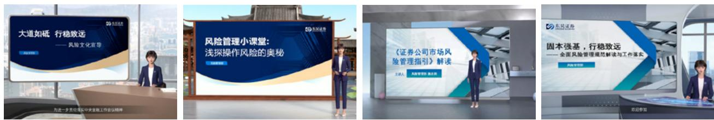  
风险管理系列微视频

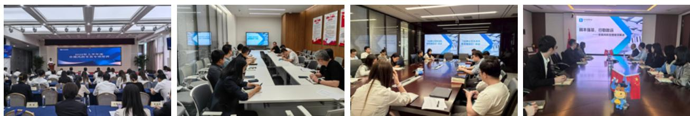  
在业务部门、子公司开展风险管理培训

## ESG尽职调查

公司已建立覆盖各类风险与业务条线的风险管理制度体系，针对经纪，投行、投资，资产管理、企业金融，研究咨询等业务分别制定风控规则，并将ESG因素全面融入面向企业融资业务(包括股权融资、债券融资、股票质押、融资融券等)及投资银行业务的尽职调查流程，并依托支持性管理系统，在识别、评估和管控等环节对ESG相关风险进行事前防范、事中监测和事后控制管理，加强公司对客户非财务风险的管控，防范客户或投资标的ESG风险进一步转化为公司的信用风险、市场风险、声誉风险等，提升自身长期可持续发展能力，并推动经济、环境和社会的协调发展。

## 东吴证券ESG 风险管理流程

## 识别

建立ESG风险监测体系，主动开展ESG风险识别，及时发现潜在 ESG 风险，严格限制或拒绝 ESG 风险突出的客户与交易，确保风险早发现、早预警。

## 评估

采用量化与定性手段对ESG风险进行有效评估，结合行业特性引入基础 ESG相关因子，加强ESG尽职调查评价同时将ESG相关争议性事项纳入评级调整考量，实现ESG风险的多维度评估。

## 管控

对不同 ESG 风险等级的业务标的、客户实施差异化决策与交易管理，并采取相应的风险控制策略。

公司在限额管理、评级管理、尽职调查、舆情监测等多方面对农业、生物多样性、能源利用、林业、采矿业、石油和天然气、交通运输、原材料等环境风险领域的项目予以重点关注，审慎决策对环境存在负面影响较大、公司治理和社会责任存在问题的项目，并在审核流程中对相关问题予以特别说明。

## 东吴证券ESG 风险管理主要实践

## 准入原则

优先支持符合国家政策鼓励的产业，审慎或限制准入具有重大ESG风险的企业。

## 尽职调查

尽职调查方面，调查包括企业在环境、社会和公司治理方面的履行情况，并对高耗能行业相关企业进行ESG风险重点提示。

## 授信限额

在同一客户授信限额方案中，对钢铁、煤炭、有色金属、建筑材料、建筑装饰等行业调减展望系数，相应调整业务主体限额。

## 评级管理

评级模型方面，选择“所处行业”“环保排放”“员工权益”“公司治理”“外部ESG评级”等基础因子作为指标清单应用至多个行业的主体评级中，将负面舆情、监管处罚、法律诉讼、廉洁从业等事件列入评级调整事项。

## 舆情监测

设定“环境”“ESG”“社会责任”“绿色金融”“处罚”“诉讼”等监测指标，建立ESG风险监控模块，多维度应用以上指标对ESG类风险进行有效识别及调整风险等级。根据ESG风险等级及时采取管控措施。

##

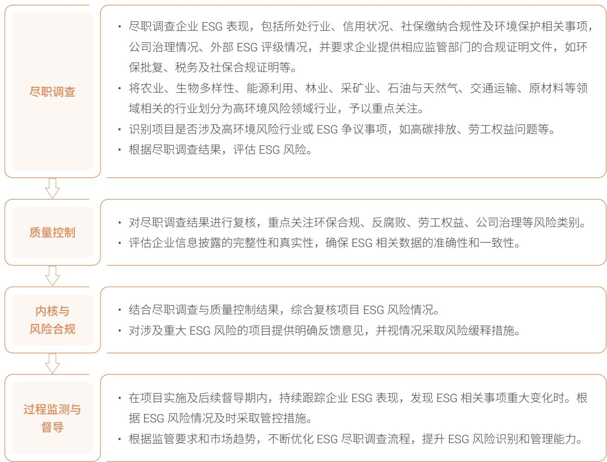

flowchart

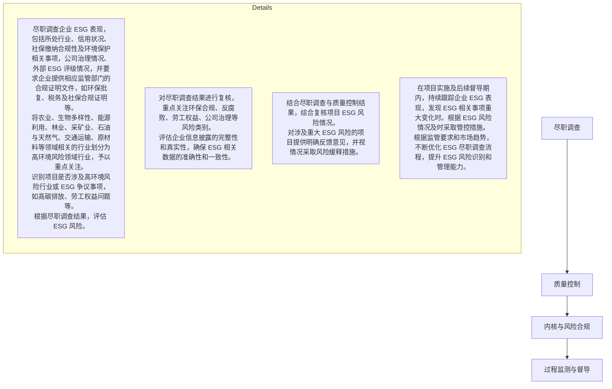
```mermaid
graph TD
  A["尽职调查"] --> B["质量控制"]
  B --> C["内核与风险合规"]
  C --> D["过程监测与督导"]
  
  subgraph Details
    direction TB
    A1["尽职调查企业 ESG 表现，包括所处行业、信用状况、社保缴纳合规性及环境保护相关事项，公司治理情况、外部 ESG 评级情况，并要求企业提供相应监管部门的合规证明文件，如环保批复、税务及社保合规证明等。\n将农业、生物多样性、能源利用、林业、采矿业、石油与天然气、交通运输、原材料等领域相关的行业划分为高环境风险领域行业，予以重点关注。\n识别项目是否涉及高环境风险行业或 ESG 争议事项，如高碳排放、劳工权益问题等。\n根据尽职调查结果，评估 ESG 风险。"]
  end
  
  subgraph Details
    direction TB
    B2["对尽职调查结果进行复核，重点关注环保合规、反腐败、劳工权益、公司治理等风险类别。\n评估企业信息披露的完整性和真实性，确保 ESG 相关数据的准确性和一致性。"]
  end
  
  subgraph Details
    direction TB
    C3["结合尽职调查与质量控制结果，综合复核项目 ESG 风险情况。\n对涉及重大 ESG 风险的项目提供明确反馈意见，并视情况采取风险缓释措施。"]
  end
  
  subgraph Details
    direction TB
    D4["在项目实施及后续督导期内，持续跟踪企业 ESG 表现，发现 ESG 相关事项重大变化时。根据 ESG 风险情况及时采取管控措施。\n根据监管要求和市场趋势，不断优化 ESG 尽职调查流程，提升 ESG 风险识别和管理能力。"]
  end
```

##

昆山国创主营计算机、通信和其他电子设备制造业，是区域重点产业主体。2025年，公司为其面向专业投资者非公开发行低碳转型挂钩公司债券(第一期)，发行规模7亿元。发行前，公司对其进行ESG尽职调查以评估其在低碳转型、环境合规及社会责任等方面的综合表现。

经核查，该企业已将“双碳”目标融入发展战略，近三年单位产值碳排放强度持续下降员工权益保障体系健全，无重大劳资纠纷或安全事故：公司治理规范，对商业贿赂等行为实行“零容忍”：未发现重大环保处罚或负面舆情记录，经营稳健合规。基于上述评估，项目ESG尽职调查结果良好，可正常推进发行，并在债券条款中设置与碳减排绩效挂钩的票面利率调整机制。

在业务准入环节，公司通过ESG尽职调查对业务对象进行全面评估，一旦业务对象在ESG尽职调查中存在高风险情况，立即进行报告。对ESG高风险业务对象应审慎准入，对应通过提级审批、收紧限额等手段进行更严格的事前管控

在项目实施及后续督导期内，公司持续跟踪企业或项目ESG表现，当发现存在ESG高风险情况时，及时进行上报

## 指标与目标

公司围绕“文化、制度、系统、考核”四个方面，持续完善风险管理体系，构建涵盖管理制度、组织架构、信息技术系统、风险指标体系、专业人才队伍及风险应对机制在内的系统化管理框架，并定期对相关指标进行监测和评估确保公司风险水平与整体发展战略相匹配，实现各类风险可识别、可计量、可监测和可控制。同时，公司以“将ESC风险控制在公司风险偏好和承受能力范围内”作为ESG风险管理目标，持续加强对ESG相关风险的识别与管理，降低潜在不利影响，保障公司长期稳健发展。

## 东吴证券全面风险管理相关指标及绩效

2025 年绩效

<table><tr><td>经风险预审评估的业务与项目数量197项</td><td>经风险审查的内部制度批次112次</td></tr><tr><td>对内风险管理函件数量14份</td><td>业务舆情风险提示数量958条</td></tr><tr><td>定期风险报告数量287份</td><td>风险分析及专项压力测试报告数量57份</td></tr><tr><td>业务合规风控检查次数26次</td><td></td></tr></table>

## 强化合规管理

## 治理

东吴证券始终严格遵守《中华人民共和国公司法》《中华人民共和国证券法》《证券公司监督管理条例》《证券公司和证券投资基金管理公司合规管理办法》《证券公司合规管理实施指引》等法律法规及监管要求，建立以《合规管理基本制度》为纲领，涵盖各业务条线、各类主要风险的专项管理办法与操作规程的三级制度体系，并持续健全合规管理体系，于2025年对《反洗钱工作管理办法》《大额和可疑交易报告内部管理办法》《反洗钱工作保密制度》《廉洁从业管理办法》等制度进行修订。

同时，公司构建层次清晰、职责明确的四级合规管理组织架构，强化合规风险防控，为公司稳健经营和高质量发展提供坚实保障。

东吴证券合规管理组织结构  
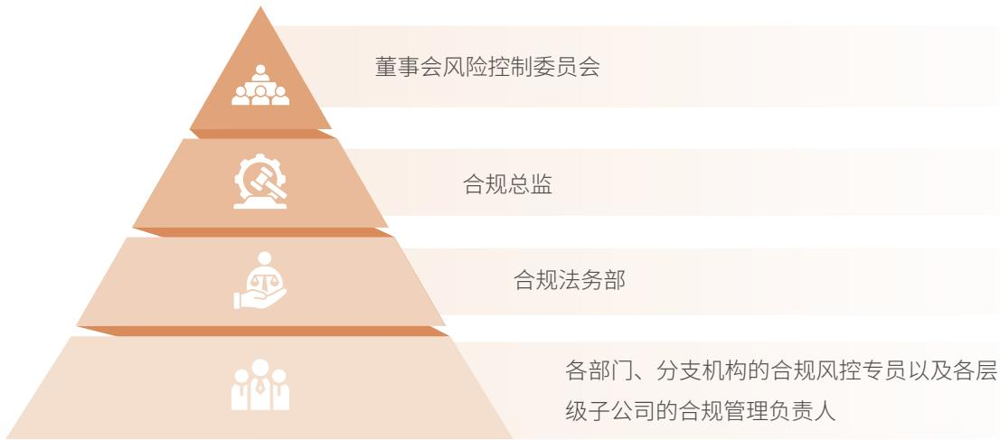

flowchart

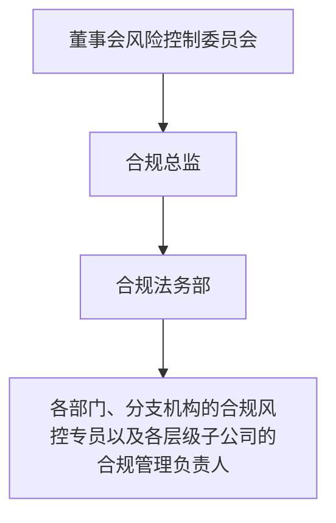
```mermaid
graph TD
  A["董事会风险控制委员会"] --> B["合规总监"]
  B --> C["合规法务部"]
  C --> D["各部门、分支机构的合规风控专员以及各层级子公司的合规管理负责人"]
```

## 战略

公司以规范化为核心，通过建立并不断完善合规管理机制，持续提升合规管理有效性水平，推动业务合规稳健发展，切实保护客户合法权益，有效防范合规风险，为公司实现战略目标提供合规支撑和保障。

<table><tr><td>风险类型</td><td>具体描述</td><td>预期财务影响</td><td>影响范围</td><td>应对策略</td></tr><tr><td>政策与法规风险</td><td>由于监管政策变化快速,公司可能面临法规挑战,尤其在跨境交易、金融衍生品及绿色金融等领域,相关法规更新较为频繁,若未能及时更新合规体系,可能导致违规处罚、业务受限。</td><td rowspan="2">运营成本增加营业收入下降</td><td rowspan="2">中、长期</td><td rowspan="2">将合规风控深度融入战略决策与业务全流程,构建前瞻性的政策响应机制与差异化的操作风险管控体系。</td></tr><tr><td>操作风险</td><td>在合规管理实施过程中,操作错误、流程不完善或人员培训不足可能导致合规管理的失效,引起客户纠纷或监管处罚。</td></tr></table>

## 影响、风险和机遇管理

公司构建覆盖“识别评估一提示应对一检查改进”的全流程合规风险管理机制，通过动态识别合规风险、精准施策防范化解、闭环督促整改提升，持续筑牢合规防线，护航业务稳健发展。

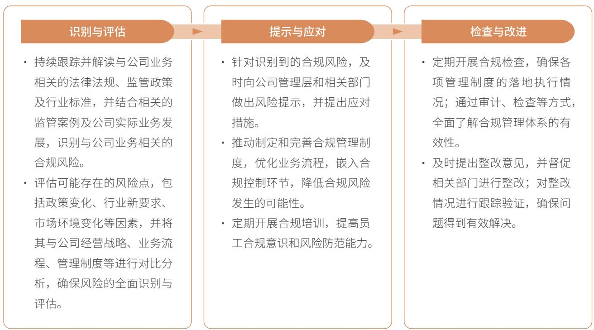

flowchart

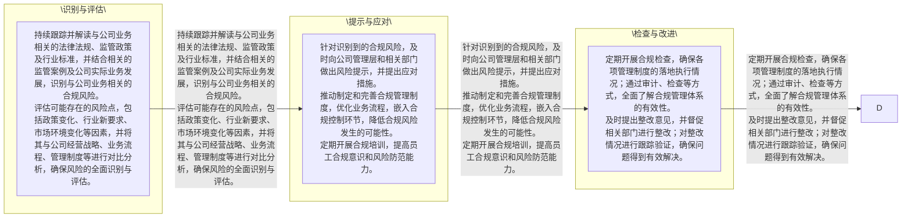
```mermaid
graph LR
  subgraph sg["\"识别与评估\""]
    A["持续跟踪并解读与公司业务相关的法律法规、监管政策及行业标准，并结合相关的监管案例及公司实际业务发展，识别与公司业务相关的合规风险。\n评估可能存在的风险点，包括政策变化、行业新要求、市场环境变化等因素，并将其与公司经营战略、业务流程、管理制度等进行对比分析，确保风险的全面识别与评估。"]
  end

  subgraph sg_2["\"提示与应对\""]
    B["针对识别到的合规风险，及时向公司管理层和相关部门做出风险提示，并提出应对措施。\n推动制定和完善合规管理制度，优化业务流程，嵌入合规控制环节，降低合规风险发生的可能性。\n定期开展合规培训，提高员工合规意识和风险防范能力。"]
  end

  subgraph sg_3["\"检查与改进\""]
    C["定期开展合规检查，确保各项管理制度的落地执行情况；通过审计、检查等方式，全面了解合规管理体系的有效性。\n及时提出整改意见，并督促相关部门进行整改；对整改情况进行跟踪验证，确保问题得到有效解决。"]
  end

  A -->|"持续跟踪并解读与公司业务相关的法律法规、监管政策及行业标准，并结合相关的监管案例及公司实际业务发展，识别与公司业务相关的合规风险。\n评估可能存在的风险点，包括政策变化、行业新要求、市场环境变化等因素，并将其与公司经营战略、业务流程、管理制度等进行对比分析，确保风险的全面识别与评估。"| B
  B -->|"针对识别到的合规风险，及时向公司管理层和相关部门做出风险提示，并提出应对措施。\n推动制定和完善合规管理制度，优化业务流程，嵌入合规控制环节，降低合规风险发生的可能性。\n定期开展合规培训，提高员工合规意识和风险防范能力。"| C
  C -->|"定期开展合规检查，确保各项管理制度的落地执行情况；通过审计、检查等方式，全面了解合规管理体系的有效性。\n及时提出整改意见，并督促相关部门进行整改；对整改情况进行跟踪验证，确保问题得到有效解决。"| D
```

2025年，公司在严格执行合规审查、检查与队伍建设的同时，规范完成年度及季度合规报告、廉洁从业报告、内控评价报告、反洗钱工作报告、场外业务情况报告、境外子公司经营情况报告等定期报告，确保合规信息及时准确报送。

##

## 项目合规支持

•根据公司《合规审查实施细则》，合规总监及合规法务部对需公司发文的制度流程、对外报送涉及合规事项的材料、重大经营活动、重大经济活动等事项进行合规审查。  
• 对165 项次制度、方案及报告以及263 项次提交各级决策会决策项目进行了合规审查。

## 强化合规检查

完成廉洁从业专项评估、执业行为及投资行为专项排查、投资银行类业务存续期项目风险排查等3项自查，对18个总部部门(子公司)，完成35项次合规事中抽查。

## 完善合规队伍

合规法务部中具备3年以上证券、金融、法律、会计、信息技术等有关领域工作经历的专职合规管理人员21名占公司总部工作人员比例为1.568%  
• 在各业务部门、15 人及以上的分支机构配置了专职合规风控专员 105 名，在管理部门、15 人以下的分支机构配置了兼职合规风控专员52名，在东吴创投、东吴创新资本等六家子公司设置了合规管理负责人。  
• 上述合规管理人员配置符合《合规办法》及《合规指引》的要求。

## 合规宣传与培训

• 申报中国证券业协会远程培训课程建设，入选中证协行业共建共享课程库。  
• 组织开展“民法典宣传月”“宪法宣传周”“国家安全教育日”以及防非打非、反洗钱系列宣传。  
·完成合规风控专员培训、月度合规风控培训。

## 指标与目标

公司以“坚守合规底线、防范重大风险”为高质量发展首要目标，持续完善合规管理长效机制，并为此设立监测指标并持续追踪绩效表现，确保管理措施有效落实。2025年，公司合规管理体系持续有效运转，未发生重大违法违规事件。

##

## 2025

合规培训次数21次合规培训覆盖率100%

## 规范商业行为

## 治理

为提高公司及全体工作人员廉洁从业水平，公司严格遵守《中华人民共和国反垄断法》《中华人民共和国反不正当竞争法》《中华人民共和国反洗钱法》《金融机构反洗钱和反恐怖融资监督管理办法》《证券期货经营机构及其工作人员廉洁从业规定》等法律法规，制定《廉洁从业管理办法》《反洗钱工作基本制度》及各部门/条线商业行为管理办法，公开发布《廉洁从业及反腐败管理声明》，将廉洁、反洗钱、反不正当竞争要求融入业务流程与绩效考核各环节培育公平、诚信和高道德标准的工作环境氛围，促进企业的健康发展与合作共赢

公司构建覆盖廉洁从业反不正当竞争，反洗钱等重点领域的商业行为管理体系，通过多层次的监督机制，实现商业行为规范的全方位覆盖与有效执行。

##

## 董事会

•作为规范商业行为的最高治理机构，确立公司商业行为规范目标，对廉洁从业管理、反洗钱等商业行为管理的有效性承担最终责任。

## 董事会审计委员会

·承接监事会职权，对董事会及董事、高级管理人员履行规范商业行为的情况进行监督并督促整改，对公司商业行为管理提出建议意见。

## 管理委员会

·负责落实商业行为规范的管理目标，对商业行为管理工作承担执行责任。  
·设立廉洁从业工作领导小组，负责对全面健全公司廉洁风险防控机制、提升公司廉洁从业管理能力等重大事项进行集体研究部署等。公司主要负责人是落实廉洁从业管理职责的第一责任人。  
·设立反洗钱工作领导小组，常务副总裁担任组长、合规总监担任副组长，成员涵盖经纪业务、资产管理业务投行业务等主要部门领导及风险管理、稽核审计等支撑部门负责人。  
·合规总监牵头负责反洗钱管理工作，直接向董事会报告洗钱风险管理情况

## 其他部门

•公司合规、纪检、稽核、人力、财务等职能部门协同联动，将廉洁从业要求深度融入企业文化培训、审计稽核人力资源管理及财务管控全过程，共同筑牢廉洁风险防控屏障  
•总部主要业务部门及分支机构设立反洗钱工作小组，负责日常反洗钱工作落实。由总部合规法务部作为反洗钱扎口管理部门，下设反洗钱管理部具体负责反洗钱工作推进

## 战略

公司将商业行为管理作为企业可持续发展的基石，主动识别相关风险和机遇，通过健全内控机制、强化教育培训严格监督检查，持续提升全员商业道德意识与行为规范水平，有效防范因商业行为不当引发的合规风险与声誉风险，将规范商业行为转化为赢得客户信任、提升品牌价值的重要支撑。

<table><tr><td>风险类型</td><td>具体描述</td><td>预期财务影响</td><td>影响范围</td><td>应对策略</td></tr><tr><td rowspan="3">合规风险</td><td>在获取业务或与合作伙伴的谈判中,部分员工可能通过行贿手段来促成交易或获得不当利益,进而导致公司受到监管处罚或被限制市场活动。</td><td rowspan="3">运营成本增加营业收入下降</td><td rowspan="3">短、中、长期</td><td>强化反腐败合规文化,建立严格的内部审查和监督机制,定期开展反腐败培训。</td></tr><tr><td>随着金融市场的全球化和复杂化,非法资金通过证券市场的渠道进入并流动的可能性增加。若未能充分识别客户的真实身份、交易目的及资金来源,或未能有效监控异常交易行为,公司可能面临违反反洗钱法规的法律风险,影响公司声誉并可能导致监管处罚。</td><td>完善客户身份识别和尽职调查机制,加强对资金来源和交易目的的审查,建立健全异常交易监控系统。</td></tr><tr><td>在推销金融产品或服务时,销售人员可能采取虚假宣传或夸大产品性能的手段,误导投资者决策,损害客户利益,造成监管调查处罚或民事赔偿的风险。</td><td>加强销售人员的合规培训,严格审查宣传材料和销售策略,避免虚假宣传或夸大产品性能。</td></tr><tr><td>市场机遇</td><td>良好的商业行为有助于公司面对市场、客户、政府等利益相关方时有更好的品牌形象,从而带来更多的商业机会。</td><td>营业收入增加</td><td>中、长期</td><td>树立诚信与透明的企业形象,积极与市场、客户及政府合作,吸引更多商业机会。</td></tr></table>

## 影响、风险和机遇管理

公司围绕商业行为的关键风险领域，建立全过程管控流程机制，及时发现并处置异常情形，确保商业行为规范要求有效融入日常运营。

##

## 识别

·建立专门的商业行为风险识别机制，通过内部自查、员工举报、外部审计等多种方式，全面收集可能存在的商业行为风险点。

## 评估

·采用定性与定量相结合的方法，对识别出的风险进行评估。

·定性评估主要关注风险的性质、可能引发的后果及对公司声誉的影响；定量评估则通过数据模型、统计分析等手段，量化风险发生的可能性和潜在损失。

## 监测

• 建立风险监测预警系统，实时监测公司运营过程中的各项数据指标，及时发现异常情况。

## 管理

• 将商业行为融入公司内部管理流程，制定完善的商业行为管理制度，明确各级人员的责任和义务。

• 建立事前风险防范体系、事中管控措施和事后追责机制，确保商业行为管理的全面性和有效性。

## 监督

• 指定专门部门对商业行为管理情况进行监督，对发现的问题及时整改，对责任人按照有关规定严肃处理。

• 接受外部审计和监管部门的监督指导。

## 反商业贿赂及反贪污

公司坚持完善反商业贿赂及反贪污管理体系，持续筑牢廉洁从业防线。在制度层面强化刚性约束，在文化层面培育廉洁自觉，在监督层面织密防控网络，在问责层面保持高压态势，在外部层面延伸管理边界，形成覆盖事前、事中事后的全流程廉洁风险防控机制

##

## 制度规范

· 定期对现有廉洁从业制度进行审查和更新，确保与监管要求保持一致。  
·加强内部控制机制建设，明确各岗位廉洁从业职责与权限，从源头防范廉洁风险  
·将涵盖反贪污腐败法律法规在内的廉洁从业培训纳入新员工入职培训及全员应知应会必修课程。  
· 每年组织全员签署《廉洁从业承诺书》，强化员工自我约束意识。  
·依托“公益文化月”开展“清廉东吴”主题活动，举办职工书画摄影展、风险文化征文、廉洁主题辩论赛等，以文化浸润涵养清风正气。

## 文化培育

## 监督检查

·聚焦前端业务部门等重点岗位和关键环节，加强日常监督与动态监测。  
·定期或者不定期开展廉洁从业检查，每年将廉洁从业风险纳入年度合规有效性评估，并至少每三年对所有运营地开展一次廉洁从业及反腐败相关审计，及时发现和纠正存在的问题。

## 问责闭环

·针对廉洁从业检查发现的问题，检查、评估部门对责任人启动问责程序，并督促相关部门及时整改。  
·违反《廉洁从业管理办法》人员的考核中，由所在单位按照公司违纪违规处罚办法等相关规定进行相应处理。  
·将工作人员的廉洁从业情况纳入人力资源管理体系，并将廉洁从业情况考察和评估结果作为人员聘用、从业人员登记和后续管理、晋级、提拔、离职以及考核、薪酬管理、审计、稽核等事项的重要考量因素。

## 供应商管理

·通过签署廉洁从业客户告知书，将廉洁从业条款纳入合同必备要件等方式，及时向供应商及合作伙伴传递廉洁从业最新监管要求，防范供应链廉洁风险

## 反不正当竞争

公司秉持公平、诚信的竞争理念，依据《反垄断法》《反不正当竞争法》等法律法规，通过健全制度规范，坚决防范商业混淆、虚假宣传、侵犯商业秘密等不正当竞争行为

公司制定《资产支持证券业务报价内部约束管理办法》《债券承销报价内部约束管理办法》《公募REITs业务报价内部约束管理办法》等制度，建立承销报价内部约束机制，对债券，资产支持证券等业务的报价行为实行多层级审核杜绝以低于成本、明显不当的低价承揽项目等不正当竞争手段。同时，公司将公平竞争要求纳入员工行为准则和业务操作流程，确保市场竞争行为合规有序。

此外，公司通过“融入之行”培训强化新入职员工反不正当竞争、防范商业秘密泄露的意识：通过组织年度《合规风控要点和管理要求》及《证券公司监管处罚案例汇总分析》等学习，向管理委员会、各部门、业务条线及分支机构传递反不正当竞争知识，提供合规风险提示和改进建议，助力各部门提升防范风险的能力和意识，进一步强化反不正当竞争相关的合规知识与实际应用。

公司严格遵守《中华人民共和国商标法》《中华人民共和国著作权法》《中华人民共和国专利法》等知识产权相关法律法规，持续完善知识产权管理体系。通过发布《关于加强知识产权保护意识、防范法律风险的通知》等内部文件并组织开展知识产权保护专题培训，不断提升员工的知识产权保护意识与风险防范能力。公司坚持尊重和保护自主及他人知识产权，在保障公司品牌声誉和无形资产的同时，严格防范侵犯他人知识产权的行为，推动形成尊重知识、鼓励创新的良好氛围，为公司高质量发展提供坚实的无形资产保障。

## 反洗钱

公司明确各级部门的反洗钱职责，并规范反洗钱管理工作机制。2025年，公司根据新《反洗钱法》及相关监管要求，共修订11项反洗钱制度，并新增1项配套制度，确保反洗钱管理要求与最新监管规定保持一致，涵盖客户尽职调查、大额可疑报送、客户洗钱风险评估、名单管理等关键环节，明确各项工作管理要求及公司各部门职责分工。

此外，公司面向社会公众及内部员工加大宣传力度，不断提升全民反洗钱意识，并定期报送反洗钱宣传培训情况。

## 2025年，公司开展反洗钱宣传教育

·在6月禁毒日和10月国庆中秋双节，组织业务部门开展现场集中宣传。  
·每季度制作“小秀财与妙多和尚”系列漫画，在公司官网、业务部门微信公众号、微信朋友圈等渠道发布，面向社会公众及内部员工集中宣传。  
·12月中旬在公司总部大楼向全体员工集中宣传新《反洗钱法》相关内容，现场通过通关答题的方式让员工了解新法要点。  
·日常通过公司官网、公司官微、投资者教育基地、微信群、ED大屏幕展示、横幅、社区宣传、小红书等媒体向社会公众进行宣传

## 检举者保护

公司通过制定《关于信访投诉和举报的监督管理办法》《关于激励担当于事、反对消极推诱的监督管理办法》，畅通包含书信邮寄、专线电话(传真)、电子邮件信箱、接待处室在内的信访投诉举报渠道，规范处理信访投诉和举报工作。

为保护检举者隐私，公司发布《廉洁从业及反腐败管理声明》，明确在核实，处理信访投诉和举报时严格落实保密要求，对投诉举报人的姓名、工作单位、家庭住址等有关情况及信访内容必须严格保密，建立管理责任制，严防泄密或遗失检举材料，保护检举者隐私。并禁止任何形式的打击报复行为，切实保护检举人免受报复，对相关不正当报复行为，公司将依法依规予以严肃处理。

## 指标与目标

公司以全面提升商业行为规范管理的效果为目标，通过加强制度建设、开展相关培训以及强化监督审计，确保员工遵守合规要求，营造廉洁诚信的企业文化，提升治理水平。2025 年，公司未发生反商业贿赂及反贪污、反不正当竞争相关的重大违法违规事件，也未发生重大洗钱风险事件。

##

2025 年绩效

<table><tr><td>向员工开展反商业贿赂及反贪污培训的次数21次</td><td>反商业贿赂及反贪污培训覆盖的董事比例100%</td></tr><tr><td>反商业贿赂及反贪污培训覆盖的员工比例100%</td><td>董事人均接受反商业贿赂及反贪污培训的时长3小时</td></tr><tr><td>员工人均接受反商业贿赂及反贪污培训的时长3小时</td><td></td></tr></table>

## ESG数据表和附注

经济绩效表

<table><tr><td>指标</td><td>单位</td><td>2023年</td><td>2024年</td><td>2025年</td></tr><tr><td>总资产</td><td>亿元人民币</td><td>1,574.95</td><td>1,778.05</td><td>2,162.19</td></tr><tr><td>营业收入1</td><td>亿元人民币</td><td>65.55</td><td>70.71</td><td>90.30</td></tr><tr><td>纳税总额</td><td>亿元人民币</td><td>20.59</td><td>16.61</td><td>24.20</td></tr><tr><td>公司发行股份总数(发行在外普通股的加权平均数)</td><td>亿股</td><td>50.07</td><td>49.69</td><td>49.69</td></tr><tr><td>基本每股收益</td><td>元/股</td><td>0.40</td><td>0.48</td><td>0.71</td></tr><tr><td>每股社会贡献值2</td><td>元/股</td><td>1.78</td><td>1.68</td><td>2.06</td></tr></table>

注1:根据财政部会计司发布的标准仓单交易相关会计处理实施问答的相关规定，公司自2025年1月1.日起变更会计政策，并采用追溯调整法对2023年2024年同期财务报表进行追溯调整。  
注2:【计算公式】每股社会贡献值=基本每股收益+(年内为国家创造的税收+向员工支付的薪酬+向银行等债权人给付的借款利息+对外捐赠额等为其他利益相关者创造的价值额-因环境污染等造成的其他社会成本)/发行在外普通股的加权平均数。

环境绩效表1

<table><tr><td colspan="2">指标</td><td>单位</td><td>2023年</td><td>2024年</td><td>2025年</td></tr><tr><td colspan="2">温室气体排放总量(范围1+2) $^{2}$ </td><td>吨二氧化碳当量</td><td>8,183.73</td><td>8,660.55</td><td>9,415.46</td></tr><tr><td rowspan="2">按类型划分</td><td>范围1</td><td>吨二氧化碳当量</td><td>704.40</td><td>722.12</td><td>718.54</td></tr><tr><td>范围2</td><td>吨二氧化碳当量</td><td>7,479.34</td><td>7,938.43</td><td>8,696.91</td></tr><tr><td colspan="2">人均温室气体排放量(范围1+2)</td><td>吨二氧化碳当量/人</td><td>5.12</td><td>5.35</td><td>5.76</td></tr><tr><td colspan="2">单位面积温室气体排放量(范围1+2)</td><td>吨二氧化碳当量/平方米</td><td>0.18</td><td>0.19</td><td>0.16</td></tr><tr><td colspan="2">综合能源消耗量</td><td>吨标准煤</td><td>2,210.59</td><td>2,215.02</td><td>2,403.03</td></tr><tr><td colspan="2">人均综合能源消耗量</td><td>吨标准煤/人</td><td>1.38</td><td>1.37</td><td>1.47</td></tr><tr><td colspan="2">单位面积综合能源消耗量</td><td>吨标准煤/平方米</td><td>0.05</td><td>0.05</td><td>0.04</td></tr><tr><td colspan="2">直接能源消耗量</td><td>吨标准煤</td><td>356.12</td><td>363.63</td><td>367.02</td></tr><tr><td colspan="2">间接能源消耗量</td><td>吨标准煤</td><td>1,854.47</td><td>1,851.39</td><td>2,036.01</td></tr><tr><td colspan="2">清洁能源用量</td><td>吨标准煤</td><td>55.86</td><td>47.88</td><td>73.71</td></tr><tr><td colspan="2">天然气用量</td><td>立方米</td><td>42,000.00</td><td>36,000.00</td><td>55,421.00</td></tr><tr><td colspan="2">公务车汽油用量</td><td>升</td><td>275,718.93</td><td>289,941.77</td><td>269,344.13</td></tr><tr><td colspan="2">外购蒸汽用量</td><td>吉焦</td><td>2,950.80</td><td>4,424.00</td><td>2,592.40</td></tr><tr><td colspan="2">外购电力用量 $^3$ </td><td>兆瓦时</td><td>14,258.79</td><td>13,824.57</td><td>15,834.43</td></tr><tr><td colspan="2">单位面积耗电量</td><td>兆瓦时/平方米</td><td>0.31</td><td>0.31</td><td>0.27</td></tr><tr><td colspan="2">耗水总量 $^3$ </td><td>立方米</td><td>136,289.97</td><td>110,150.06</td><td>91,260.21</td></tr><tr><td colspan="2">人均耗水量</td><td>立方米/人</td><td>85.34</td><td>68.08</td><td>55.78</td></tr><tr><td colspan="2">单位面积耗水量</td><td>立方米/平方米</td><td>2.97</td><td>2.45</td><td>1.58</td></tr><tr><td colspan="2">无害废弃物总量</td><td>吨</td><td>23.50</td><td>16.23</td><td>18.89</td></tr><tr><td rowspan="2">按类型划分</td><td>生活垃圾</td><td>吨</td><td>10.00</td><td>10.67</td><td>12.53</td></tr><tr><td>厨余垃圾</td><td>吨</td><td>13.50</td><td>5.56</td><td>6.36</td></tr><tr><td colspan="2">有害废弃物总量</td><td>吨</td><td>0.20</td><td>0.17</td><td>0.18</td></tr><tr><td rowspan="2">按类型划分</td><td>电子产品 $^4$ </td><td>台</td><td>689</td><td>910</td><td>504</td></tr><tr><td>废弃灯管</td><td>吨</td><td>0.20</td><td>0.17</td><td>0.18</td></tr><tr><td colspan="2">办公无纸化发生次数 $^5$ </td><td>次</td><td>272,502</td><td>388,228</td><td>394,963</td></tr><tr><td colspan="2">办公无纸化节约纸张量</td><td>千克</td><td>5,559.00</td><td>7,923.00</td><td>8,057.18</td></tr><tr><td colspan="2">因违反环境保护法律法规而受到的罚款总额</td><td>万元人民币</td><td>0.00</td><td>0.00</td><td>0.00</td></tr><tr><td colspan="2">因违反环境保护法律法规而受到处罚的事件数</td><td>件</td><td>0</td><td>0</td><td>0</td></tr></table>

注1：2023年至2025年，公务车汽油用量、天然气用量、外购电力用量、耗水总量统计口径为东吴证券本部、东吴期货本部（含苏州本部和上海本部)东吴创投本部东吴创新资本本部，东吴基金本部、东吴香港本部，东吴新加坡本部，公司数据中心，其中2024年起公司数据中心灾备机房开始使用租赁机房，因此未纳入当年度统计范围：外购蒸汽用量，废弃物，办公无纸化相关数据的统计口径为东吴证卷本部。公司清洁能源用量全部为天然气用量。  
注2：范围1温室气体排放包括公务车汽油、天然气燃烧产生的直接温室气体排放，2025年计算方法及系数参考《中国能源统计年鉴》(2022)等。范围2温室气体排放为外购电力和外购蒸汽产生的间接温室气体排放，2025年中国全国电网平均温室气体排放因子参考中国生态环境部，国家统计局《关于发布2023年电力二氧化碳排放因子的公告》(2025年12月)，中国香港区域电网温室气体排放因子参考香港联交所《如何编备环境，社会及管治报告附录二：环境关键绩效指标汇报指引》，新加坡地区排放因子参考|ow CarbonPower统计的新加坡发电平均碳排放系数，外购蒸汽温室气体排放因子参考中国国家发展和改革委员会《工业其他行业企业温室气体排放核算方法与报告指南(试行)》(2015)。  
注3:2025年，公司对2023-2024年外购电力用量及耗水用量以及相关历史数据进行追溯重述。  
注4：电子废弃物包括废旧台式电脑、废旧服务器、废旧笔记本电脑等  
注5：办公无纸化仅指发起的线上0A流程数量。

客户服务与权益绩效表1

<table><tr><td>指标</td><td>单位</td><td>2023年</td><td>2024年</td><td>2025年</td></tr><tr><td>违反产品及服务相关法律法规的事件数</td><td>件</td><td>0</td><td>0</td><td>0</td></tr><tr><td>客户咨询数量</td><td>个</td><td>401,984</td><td>404,827</td><td>359,510</td></tr><tr><td>接获关于产品及服务的投诉数</td><td>个</td><td>103</td><td>171</td><td>166</td></tr><tr><td>接获关于产品及服务的投诉处理率2</td><td>%</td><td>100.00</td><td>100.00</td><td>100.00</td></tr><tr><td>客户满意度</td><td>%</td><td>99.19</td><td>99.17</td><td>99.15</td></tr><tr><td>客户满意度调查次数</td><td>次</td><td>402,442</td><td>405,603</td><td>359,562</td></tr><tr><td>经证实的泄露、盗窃或丢失客户资料的事件数</td><td>件</td><td>0</td><td>0</td><td>0</td></tr><tr><td>数据安全事件涉及的金额</td><td>万元人民币</td><td>0.00</td><td>0.00</td><td>0.00</td></tr><tr><td>客户隐私泄露事件涉及的金额</td><td>万元人民币</td><td>0.00</td><td>0.00</td><td>0.00</td></tr></table>

注1：客户服务与权益相关数据的统计口径为东吴证券总部财富管理业务。  
注2：【计算公式】接获关于产品及服务的投诉处理率=已结案的关于产品及服务的投诉数/关于产品及服务的投诉总数\*100%。

金融科技绩效表

<table><tr><td>指标</td><td>单位</td><td>2023年</td><td>2024年</td><td>2025年</td></tr><tr><td>研发投入金额</td><td>万元人民币</td><td>44,867.06</td><td>45,945.38</td><td>52,255.67</td></tr><tr><td> $研发投入金额占营业收入比例^1$ </td><td>%</td><td>9.37</td><td>7.44</td><td>8.18</td></tr><tr><td>研发人员数量</td><td>人</td><td>538</td><td>572</td><td>695</td></tr><tr><td>研发人员占员工总人数比例</td><td>%</td><td>10.48</td><td>11.53</td><td>13.62</td></tr><tr><td>应用于主营业务的发明专利数量</td><td>件</td><td>/</td><td>9</td><td>7</td></tr><tr><td>报告期内专利申请数量</td><td>件</td><td>/</td><td>1</td><td>2</td></tr><tr><td>报告期内专利授权数量</td><td>件</td><td>/</td><td>0</td><td>2</td></tr><tr><td>报告期内有效专利数量</td><td>件</td><td>/</td><td>9</td><td>7</td></tr><tr><td>累计软件著作权登记数量</td><td>件</td><td>/</td><td>/</td><td>37</td></tr></table>

注1:【计算公式】研发投入金额占营业收入比例=研发投入金额/上一期东吴证券总部营业收入\*100%

供应商绩效表1

<table><tr><td colspan="2">指标</td><td>单位</td><td>2023年</td><td>2024年</td><td>2025年</td></tr><tr><td colspan="2">供应商总数</td><td>家</td><td>67</td><td>67</td><td>87</td></tr><tr><td rowspan="2">按地区划分</td><td>中国大陆</td><td>家</td><td>67</td><td>67</td><td>87</td></tr><tr><td>港澳台及海外</td><td>家</td><td>0</td><td>0</td><td>0</td></tr></table>

注1：供应商相关数据的统计口径为东吴证券总部。供应商类别包括工程类、设备类、货物类、服务类等。

员工招聘与雇佣绩效表

<table><tr><td colspan="3">指标</td><td>单位</td><td>2023年</td><td>2024年</td><td>2025年</td></tr><tr><td colspan="3">员工总数</td><td>人</td><td>5,136</td><td>4,963</td><td>5,101</td></tr><tr><td rowspan="2">按性别划分</td><td colspan="2">男性</td><td>人</td><td>2,937</td><td>2,731</td><td>2,906</td></tr><tr><td colspan="2">女性</td><td>人</td><td>2,199</td><td>2,232</td><td>2,195</td></tr><tr><td rowspan="3">按雇佣形式划分</td><td colspan="2">全职劳动合同制</td><td>人</td><td>/</td><td>3,905</td><td>4,207</td></tr><tr><td colspan="2">全职劳务派遣制</td><td>人</td><td>/</td><td>496</td><td>522</td></tr><tr><td colspan="2">其他雇佣形式</td><td>人</td><td>/</td><td>562</td><td>372</td></tr><tr><td rowspan="3">按年龄划分</td><td colspan="2">&gt;50岁</td><td>人</td><td>507</td><td>485</td><td>497</td></tr><tr><td colspan="2">30至50岁</td><td>人</td><td>3,363</td><td>3,333</td><td>3,447</td></tr><tr><td colspan="2">&lt;30岁</td><td>人</td><td>1,266</td><td>1,145</td><td>1,157</td></tr><tr><td rowspan="2">按工作地区划分</td><td colspan="2">中国大陆</td><td>人</td><td>5,030</td><td>4,861</td><td>4,975</td></tr><tr><td colspan="2">港澳台及海外</td><td>人</td><td>106</td><td>102</td><td>126</td></tr><tr><td rowspan="4">按学历划分</td><td colspan="2">拥有博士学历</td><td>人</td><td>39</td><td>38</td><td>39</td></tr><tr><td colspan="2">拥有硕士学历</td><td>人</td><td>1,676</td><td>1,713</td><td>1,788</td></tr><tr><td colspan="2">拥有本科学历</td><td>人</td><td>2,783</td><td>2,653</td><td>2,766</td></tr><tr><td colspan="2">拥有大专及以下学历</td><td>人</td><td>638</td><td>559</td><td>508</td></tr><tr><td colspan="3">管理层男性员工数</td><td>人</td><td>89</td><td>79</td><td>78</td></tr><tr><td colspan="3">管理层女性员工数</td><td>人</td><td>18</td><td>22</td><td>20</td></tr><tr><td colspan="3"> $员工流失率^1$ </td><td>%</td><td>8.66</td><td>10.62</td><td>7.14</td></tr><tr><td rowspan="2">按性别划分</td><td colspan="2">男性</td><td>%</td><td>8.99</td><td>11.06</td><td>6.85</td></tr><tr><td colspan="2">女性</td><td>%</td><td>8.23</td><td>10.08</td><td>7.52</td></tr><tr><td rowspan="3" colspan="2">按年龄划分</td><td>&gt;50岁</td><td>%</td><td>7.50</td><td>6.60</td><td>9.05</td></tr><tr><td>30至50岁</td><td>%</td><td>7.73</td><td>9.36</td><td>6.35</td></tr><tr><td>&lt;30岁</td><td>%</td><td>11.61</td><td>15.98</td><td>8.64</td></tr></table>

<table><tr><td colspan="2">指标</td><td>单位</td><td>2023年</td><td>2024年</td><td>2025年</td></tr><tr><td rowspan="2">按工作地区划分</td><td>中国大陆</td><td>%</td><td>8.25</td><td>10.20</td><td>6.89</td></tr><tr><td>港澳台及海外</td><td>%</td><td>28.30</td><td>30.39</td><td>16.67</td></tr><tr><td colspan="2">新进员工总数</td><td>人</td><td>753</td><td>344</td><td>395</td></tr><tr><td rowspan="2">按性别划分</td><td>男性</td><td>人</td><td>417</td><td>180</td><td>229</td></tr><tr><td>女性</td><td>人</td><td>336</td><td>164</td><td>166</td></tr><tr><td rowspan="3">按年龄划分</td><td>&gt;50岁</td><td>人</td><td>4</td><td>4</td><td>9</td></tr><tr><td>30至50岁</td><td>人</td><td>366</td><td>165</td><td>221</td></tr><tr><td>&lt;30岁</td><td>人</td><td>383</td><td>175</td><td>165</td></tr><tr><td rowspan="2">按工作地区划分</td><td>中国大陆</td><td>人</td><td>717</td><td>317</td><td>345</td></tr><tr><td>港澳台及海外</td><td>人</td><td>36</td><td>27</td><td>50</td></tr><tr><td colspan="2">在员工雇佣与解雇、薪酬与福利、工作时间与假期、平等机会、反歧视等方面发生的违法违规事件数</td><td>件</td><td>0</td><td>0</td><td>0</td></tr><tr><td colspan="2">因违反童工使用及强制劳动相关法律法规而受到处罚的事件数</td><td>件</td><td>0</td><td>0</td><td>0</td></tr></table>

注1:【计算公式】各类别员工流失率=年内该类别员工流失人数/年末该类别员工总数\*100%。

员工权益和福利绩效表

<table><tr><td>指标</td><td>单位</td><td>2023年</td><td>2024年</td><td>2025年</td></tr><tr><td>劳动合同签订率</td><td>%</td><td>100.00</td><td>100.00</td><td>100.00</td></tr><tr><td>社会保险覆盖率</td><td>%</td><td>100.00</td><td>100.00</td><td>100.00</td></tr><tr><td>休育儿假的员工总人数</td><td>人</td><td>84</td><td>144</td><td>169</td></tr><tr><td>员工体检覆盖率</td><td>%</td><td>100.00</td><td>100.00</td><td>100.00</td></tr><tr><td>劳动纠纷事件数</td><td>件</td><td>0</td><td>1</td><td>1</td></tr><tr><td>因工伤而死亡的员工人数</td><td>人</td><td>0</td><td>0</td><td>0</td></tr><tr><td>因工伤损失的工作日数</td><td>天</td><td>/</td><td>0</td><td>0</td></tr><tr><td>员工工伤保险覆盖率</td><td>%</td><td>/</td><td>100.00</td><td>100.00</td></tr><tr><td>员工工伤保险投入金额</td><td>万元人民币</td><td>/</td><td>183.03</td><td>180.00</td></tr></table>

员工培训与发展绩效表

<table><tr><td colspan="2">指标</td><td>单位</td><td>2023年</td><td>2024年</td><td>2025年</td></tr><tr><td colspan="2">员工培训次数</td><td>次</td><td>/</td><td>4,813</td><td>5,656</td></tr><tr><td colspan="2">员工培训总支出</td><td>万元人民币</td><td>410.92</td><td>291.76</td><td>293.49</td></tr><tr><td colspan="2"> $员工培训覆盖率^1$ </td><td>%</td><td>100.00</td><td>100.00</td><td>100.00</td></tr><tr><td rowspan="2">按性别划分</td><td>男性</td><td>%</td><td>57.18</td><td>55.03</td><td>56.97</td></tr><tr><td>女性</td><td>%</td><td>42.82</td><td>44.97</td><td>43.03</td></tr><tr><td colspan="2"> $员工人均接受培训小时数^2$ </td><td>小时</td><td>35.30</td><td>41.46</td><td>40.28</td></tr><tr><td rowspan="2">按性别划分</td><td>男性</td><td>小时</td><td>35.47</td><td>41.86</td><td>40.80</td></tr><tr><td>女性</td><td>小时</td><td>35.07</td><td>40.96</td><td>39.60</td></tr></table>

注 1：【计算公式】各类别员工培训覆盖率=接受培训的该类别员工人数/接受培训的员工总人数\*100%。  
注2：【计算公式】各类别员工人均接受培训小时数=该类别员工接受培训总时长/该类别员工人数。

公益慈善与乡村振兴绩效表

<table><tr><td colspan="2">指标</td><td>单位</td><td>2023年</td><td>2024年</td><td>2025年</td></tr><tr><td colspan="2">对外捐赠、公益项目总投入</td><td>万元人民币</td><td>2,819.94</td><td>1,904.81</td><td>1,743.96</td></tr><tr><td rowspan="2">其中</td><td>乡村振兴项目总投入</td><td>万元人民币</td><td>770.74</td><td>591.94</td><td>597.42</td></tr><tr><td>乡村振兴惠及人数</td><td>人</td><td>/</td><td>12,110</td><td>24,000</td></tr><tr><td colspan="2">员工志愿服务人次</td><td>人次</td><td>200</td><td>6,000</td><td>10,000</td></tr><tr><td colspan="2">员工志愿服务总时长</td><td>小时</td><td>2,000.00</td><td>5,000.00</td><td>3,000.00</td></tr><tr><td colspan="2">员工志愿服务人均时长</td><td>小时</td><td>/</td><td>1.01</td><td>0.59</td></tr><tr><td colspan="2">基金会年度筹款额</td><td>万元人民币</td><td>1,011.31</td><td>2,000.00</td><td>1,108.11</td></tr><tr><td colspan="2">基金会年度支出额</td><td>万元人民币</td><td>2,122.40</td><td>1,171.76</td><td>1,431.98</td></tr></table>

公司治理绩效表

<table><tr><td>指标</td><td>单位</td><td>2023年</td><td>2024年</td><td>2025年</td></tr><tr><td>董事会成员人数</td><td>人</td><td>11</td><td>11</td><td>11</td></tr><tr><td>独立董事人数</td><td>人</td><td>4</td><td>4</td><td>4</td></tr><tr><td>独立董事占比</td><td>%</td><td>36.36</td><td>36.36</td><td>36.36</td></tr><tr><td>女性董事人数</td><td>人</td><td>2</td><td>2</td><td>2</td></tr><tr><td>女性董事占比</td><td>%</td><td>18.18</td><td>18.18</td><td>18.18</td></tr><tr><td>职工董事人数</td><td>人</td><td>1</td><td>1</td><td>1</td></tr></table>

商业行为与合规管理绩效表

<table><tr><td>指标</td><td>单位</td><td>2023年</td><td>2024年</td><td>2025年</td></tr><tr><td>反商业贿赂及反贪污培训次数</td><td>次</td><td>3</td><td>3</td><td>21</td></tr><tr><td>反商业贿赂及反贪污培训覆盖的员工比例</td><td>%</td><td>100.00</td><td>100.00</td><td>100.00</td></tr><tr><td>反商业贿赂及反贪污培训覆盖的高级管理层比例</td><td>%</td><td>/</td><td>100.00</td><td>100.00</td></tr><tr><td>反商业贿赂及反贪污培训覆盖的董事比例</td><td>%</td><td>100.00</td><td>100.00</td><td>100.00</td></tr><tr><td>员工人均接受反贪污培训时长</td><td>小时</td><td>3.00</td><td>3.00</td><td>3.00</td></tr><tr><td>董事人均接受反贪污培训时长</td><td>小时</td><td>1.00</td><td>3.00</td><td>3.00</td></tr><tr><td>合规培训参与人数 $^{2}$ </td><td>人</td><td>4,295</td><td>4,027</td><td>4,016</td></tr><tr><td>对公司或其员工提出并已审结的贪污诉讼案件数</td><td>件</td><td>0</td><td>0</td><td>0</td></tr><tr><td>在商业秘密保护方面(包括知识产权)发生的违法违规事件数</td><td>件</td><td>0</td><td>0</td><td>0</td></tr><tr><td>因公司不正当竞争行为导致诉讼或重大行政处罚的事件数</td><td>件</td><td>0</td><td>0</td><td>0</td></tr><tr><td>因公司不正当竞争行为导致诉讼或重大行政处罚的涉案金额</td><td>万元人民币</td><td>0.00</td><td>0.00</td><td>0.00</td></tr></table>

注1:商业行为与合规管理相关数据统计口径为东吴证券本部  
注2:合规培训参与人数包括公司现场和线上参训人数。

## 报告标准索引表

《上海证券交易所上市公司自律监管指引第14号—可持续发展报告（试行）》对标索引表

<table><tr><td>披露要求</td><td>对应的本报告章节</td></tr><tr><td>应对气候变化</td><td>应对气候变化</td></tr><tr><td>污染物排放</td><td>公司作为金融行业机构,主要排放因员工办公而产生的生活废水,不涉及产生重大污染物排放的情况。</td></tr><tr><td>废弃物处理</td><td>绿色运营</td></tr><tr><td>生态系统和生物多样性保护</td><td>公司作为金融行业机构,其业务和自身运营对周边区域生态系统和生物多样性的影响相对较小。在涉及该议题的业务中,公司将加强尽职调查,评估潜在环境影响,并推动可持续金融实践,以降低对生态系统和生物多样性的潜在影响。</td></tr><tr><td>环境合规管理</td><td>公司作为金融行业机构,不涉及污染物排放、危险废弃物处理等受环境相关法律法规监管的情况。</td></tr><tr><td>能源利用</td><td>绿色运营</td></tr><tr><td>水资源利用</td><td>绿色运营</td></tr><tr><td>循环经济</td><td>公司作为金融行业机构,不涉及减量化、再利用、再循环的生产制造环节。</td></tr><tr><td>乡村振兴</td><td>推进乡村振兴</td></tr><tr><td>社会贡献</td><td>热心公益慈善</td></tr><tr><td>创新驱动</td><td>金融科技</td></tr><tr><td>科技伦理</td><td>金融科技</td></tr><tr><td>供应链安全</td><td>供应商管理</td></tr><tr><td>平等对待中小企业</td><td>2025年,公司及子公司不存在通过国家企业信用信息公示系统向社会公示逾期尚未支付中小企业款项信息的情况。截至2025年底,公司应付账款(含应付票据)余额未超过300亿元,占总资产的比重未超过50%。</td></tr></table>

<table><tr><td colspan="2">披露要求</td><td>对应的本报告章节</td></tr><tr><td colspan="2">产品和服务安全与质量</td><td>保障客户权益</td></tr><tr><td colspan="2">数据安全与客户隐私保护</td><td>数据安全与客户隐私保护</td></tr><tr><td colspan="2">员工</td><td>人力资本管理(公司作为金融行业机构,不涉及生产、加工、施工等高风险作业,因而不适用安全生产责任险相关指标。公司为员工购买重疾险,2025年投入481.69万元;购买雇主责任险、交通工具意外伤害保险等,2025年投入101.73万元;员工保险覆盖率达100%。)</td></tr><tr><td colspan="2">尽职调查</td><td>议题重要性评估全面风险管理</td></tr><tr><td colspan="2">利益相关方沟通</td><td>议题重要性评估</td></tr><tr><td colspan="2">反商业贿赂及反贪污</td><td>规范商业行为</td></tr><tr><td colspan="2">反不正当竞争</td><td>规范商业行为</td></tr><tr><td rowspan="8">自主披露的议题</td><td>绿色金融</td><td>绿色金融</td></tr><tr><td>服务实体经济</td><td>服务实体经济</td></tr><tr><td>负责任投资</td><td>负责任投资</td></tr><tr><td>投资者教育</td><td>投资者教育</td></tr><tr><td>推进企业文化建设</td><td>企业文化建设</td></tr><tr><td>优化公司治理</td><td>优化公司治理</td></tr><tr><td>全面风险管理</td><td>全面风险管理</td></tr><tr><td>强化合规管理</td><td>强化合规管理</td></tr></table>

GRI 内容索引

<table><tr><td>使用说明</td><td>东吴证券在2025年1月1日和2025年12月31日之间参照GRI标准报告了在此份GRI内容索引中引用的信息。</td></tr><tr><td>使用的GRI 1</td><td>GRI 1:基础2021</td></tr></table>

<table><tr><td>GRI标准</td><td colspan="2">披露项</td><td>报告章节</td></tr><tr><td rowspan="18">GRI 2:一般披露 2021</td><td>2-1</td><td>组织详细情况</td><td>关于东吴证券</td></tr><tr><td>2-2</td><td>纳入组织可持续发展报告的实体</td><td>报告编制说明</td></tr><tr><td>2-3</td><td>报告期、报告频率和联系人</td><td>报告编制说明</td></tr><tr><td>2-6</td><td>活动、价值链和其他业务关系</td><td>关于东吴证券</td></tr><tr><td>2-7</td><td>员工</td><td>ESG 数据表和附注</td></tr><tr><td>2-8</td><td>员工之外的工作者</td><td>ESG 数据表和附注</td></tr><tr><td>2-9</td><td>管治架构和构成</td><td>可持续发展治理体系优化公司治理</td></tr><tr><td>2-10</td><td>最高治理机构的提名和遴选</td><td>优化公司治理</td></tr><tr><td>2-12</td><td>在管理影响方面,最高管治机构的监督作用</td><td>可持续发展治理体系优化公司治理</td></tr><tr><td>2-13</td><td>为管理影响的责任授权</td><td>优化公司治理</td></tr><tr><td>2-14</td><td>最高治理机构在可持续发展报告中的作用</td><td>董事会可持续发展管理声明可持续发展治理体系</td></tr><tr><td>2-16</td><td>关键问题的沟通</td><td>可持续发展治理体系优化公司治理</td></tr><tr><td>2-17</td><td>最高治理机构的共同知识</td><td>可持续发展治理体系</td></tr><tr><td>2-18</td><td>对最高管治机构的绩效评估</td><td>可持续发展治理体系优化公司治理</td></tr><tr><td>2-19</td><td>薪酬政策</td><td>可持续发展治理体系优化公司治理</td></tr><tr><td>2-20</td><td>确定薪酬的程序</td><td>优化公司治理</td></tr><tr><td>2-22</td><td>关于可持续发展战略的声明</td><td>董事会可持续发展管理声明</td></tr><tr><td>2-23</td><td>政策承诺</td><td>董事会可持续发展管理声明详见报告各重要性议题治理结构小节</td></tr></table>

<table><tr><td>GRI标准</td><td colspan="2">披露项</td><td>报告章节</td></tr><tr><td rowspan="6">GRI 2:一般披露 2021</td><td>2-24</td><td>融合政策承诺</td><td>绿金筑梦 低碳先行深耕实体 责任领航智护客户 诚筑信任聚才固本 繁花满枝向上向善 惠民致远文化固本 治理行稳</td></tr><tr><td>2-25</td><td>补救负面影响的程序</td><td>议题重要性评估</td></tr><tr><td>2-26</td><td>寻求建议和提出关切的机制</td><td>议题重要性评估</td></tr><tr><td>2-27</td><td>遵守法律法规</td><td>详见报告各章节</td></tr><tr><td>2-29</td><td>利益相关方参与的方法</td><td>议题重要性评估</td></tr><tr><td>2-30</td><td>集体谈判协议</td><td>人力资本管理</td></tr><tr><td rowspan="3">GRI 3:实质性议题 2021</td><td>3-1</td><td>确定实质性议题的过程</td><td>议题重要性评估</td></tr><tr><td>3-2</td><td>实质性议题列表</td><td>议题重要性评估</td></tr><tr><td>3-3</td><td>实质性议题的管理</td><td>详见报告各章节</td></tr><tr><td rowspan="4">GRI 201:经济绩效 2016</td><td>201-1</td><td>直接产生和分配的经济价值</td><td>详见《东吴证券 2025 年年报》</td></tr><tr><td>201-2</td><td>气候变化带来的财务影响和其他风险和机遇</td><td>应对气候变化</td></tr><tr><td>201-3</td><td>固定福利计划义务和其他退休计划</td><td>人力资本管理</td></tr><tr><td>201-4</td><td>政府给予的财政补贴</td><td>详见《东吴证券 2025 年年报》</td></tr><tr><td rowspan="2">GRI 203:间接经济影响 2016</td><td>203-1</td><td>基础设施投资和支持性服务</td><td>热心公益慈善</td></tr><tr><td>203-2</td><td>重大间接经济影响</td><td>热心公益慈善</td></tr><tr><td rowspan="3">GRI 205:反腐败 2016</td><td>205-1</td><td>已经进行腐败风险评估的运营点</td><td>规范商业行为</td></tr><tr><td>205-2</td><td>反腐败政策和程序的传达及培训</td><td>规范商业行为</td></tr><tr><td>205-3</td><td>经确认的腐败事件和采取的行动</td><td>规范商业行为</td></tr><tr><td>GRI 206:反竞争行为 2016</td><td>206-1</td><td>针对反竞争行为、反托拉斯和反垄断实践的法律诉讼</td><td>规范商业行为</td></tr><tr><td rowspan="3">GRI 207:税收 2019</td><td>207-1</td><td>税务方针</td><td rowspan="3">详见《东吴证券 2025 年年报》</td></tr><tr><td>207-2</td><td>税收治理、控制和风险管理</td></tr><tr><td>207-3</td><td>利益相关方参与和管理与税收有关的问题</td></tr><tr><td rowspan="2">GRI 302:能源 2016</td><td>302-1</td><td>组织内部的能源消耗量</td><td>ESG 数据表和附注</td></tr><tr><td>302-2</td><td>组织外部的能源消耗量</td><td>ESG 数据表和附注</td></tr><tr><td rowspan="2">GRI 302:能源 2016</td><td>302-3</td><td>能源强度</td><td>ESG 数据表和附注</td></tr><tr><td>302-4</td><td>减少能源消耗</td><td>绿色运营</td></tr><tr><td rowspan="3">GRI 303:水资源和污水 2018</td><td>303-1</td><td>组织与水作为共有资源的相互影响</td><td>绿色运营</td></tr><tr><td>303-2</td><td>管理与排水相关的影响</td><td>绿色运营</td></tr><tr><td>303-3</td><td>取水</td><td>ESG 数据表和附注</td></tr><tr><td rowspan="5">GRI 305:排放 2016</td><td>305-1</td><td>直接(范围 1)温室气体排放</td><td>应对气候变化ESG 数据表和附注</td></tr><tr><td>305-2</td><td>能源间接(范围 2)温室气体排放</td><td>应对气候变化ESG 数据表和附注</td></tr><tr><td>305-3</td><td>其他间接(范围 3)温室气体排放</td><td>应对气候变化ESG 数据表和附注</td></tr><tr><td>305-4</td><td>温室气体排放强度</td><td>应对气候变化ESG 数据表和附注</td></tr><tr><td>305-5</td><td>温室气体减排量</td><td>应对气候变化ESG 数据表和附注</td></tr><tr><td rowspan="3">GRI 306:废弃物 2020</td><td>306-1</td><td>废弃物的产生及废弃物相关重大影响</td><td>绿色运营</td></tr><tr><td>306-2</td><td>废弃物相关重大影响的管理</td><td>绿色运营</td></tr><tr><td>306-3</td><td>产生的废弃物</td><td>绿色运营ESG 数据表和附注</td></tr><tr><td rowspan="2">GRI 401:雇佣 2016</td><td>401-1</td><td>新进员工雇佣率和员工流动率</td><td>人力资本管理ESG 数据表和附注</td></tr><tr><td>401-2</td><td>提供给全职员工(不包括临时或兼职员工)的福利</td><td>人力资本管理</td></tr><tr><td rowspan="6">GRI 403:职业健康与安全 2018</td><td>403-1</td><td>职业健康安全管理体系</td><td>人力资本管理</td></tr><tr><td>403-2</td><td>危害识别、风险评估和事故调查</td><td>人力资本管理</td></tr><tr><td>403-3</td><td>职业健康服务</td><td>人力资本管理</td></tr><tr><td>403-4</td><td>职业健康安全事务:工作者的参与、意见征询和沟通</td><td>人力资本管理</td></tr><tr><td>403-5</td><td>工作者职业健康安全培训</td><td>人力资本管理</td></tr><tr><td>403-6</td><td>促进工作者健康</td><td>人力资本管理</td></tr></table>

<table><tr><td>GRI标准</td><td colspan="2">披露项</td><td>报告章节</td></tr><tr><td rowspan="4">GRI 403:职业健康与安全2018</td><td>403-7</td><td>预防和减缓与业务关系直接相关的职业健康安全影响</td><td>人力资本管理</td></tr><tr><td>403-8</td><td>职业健康安全管理体系覆盖的工作者</td><td>人力资本管理</td></tr><tr><td>403-9</td><td>工伤</td><td>人力资本管理ESG数据表和附注</td></tr><tr><td>403-10</td><td>工作相关的健康问题</td><td>人力资本管理ESG数据表和附注</td></tr><tr><td rowspan="2">GRI 404:培训与教育2016</td><td>404-1</td><td>每名员工每年接受培训的平均小时数</td><td>人力资本管理ESG数据表和附注</td></tr><tr><td>404-2</td><td>员工技能提升方案和过渡援助方案</td><td>人力资本管理</td></tr><tr><td>GRI 405:多元性与平等机会2016</td><td>405-1</td><td>管治机构与员工的多元化</td><td>人力资本管理</td></tr><tr><td>GRI 406:反歧视2016</td><td>406-1</td><td>歧视事件及采取的纠正行动</td><td>人力资本管理</td></tr><tr><td>GRI 407:结社自由与集体谈判2016</td><td>407-1</td><td>结社自由和集体谈判权可能面临风险的运营点和供应商</td><td>人力资本管理</td></tr><tr><td>GRI 408:童工2016</td><td>408-1</td><td>具有重大童工事件风险的运营点和供应商</td><td>人力资本管理</td></tr><tr><td>GRI 409:强迫或强制劳动2016</td><td>409-1</td><td>具有强迫或强制劳动事件重大风险的运营点和供应商</td><td>人力资本管理</td></tr><tr><td rowspan="3">GRI 417:营销与标识2016</td><td>417-1</td><td>对产品和服务信息与标识的要求</td><td>保障客户权益</td></tr><tr><td>417-2</td><td>涉及产品和服务信息与标识的违规事件</td><td>保障客户权益</td></tr><tr><td>417-3</td><td>涉及营销传播的违规事件</td><td>保障客户权益</td></tr><tr><td>GRI 418:客户隐私2016</td><td>418-1</td><td>涉及侵犯客户隐私和丢失客户资料的经证实的投诉</td><td>数据安全与客户隐私保护</td></tr></table>

## 东吴证券

## SOOCHOW SECURITIES

natural_image

Stylized illustration of a modern city skyline with skyscrapers and decorative elements including wings, a winged emblem, and a lightbulb (no text or symbols)

