## 2025 年度

## 环境、社会和公司治理（ESG）报告

## ENVIRONMENTAL,SOCIAL AND GOVERNANCE （ESG) REPORT

亚普汽车部件股份有限公司

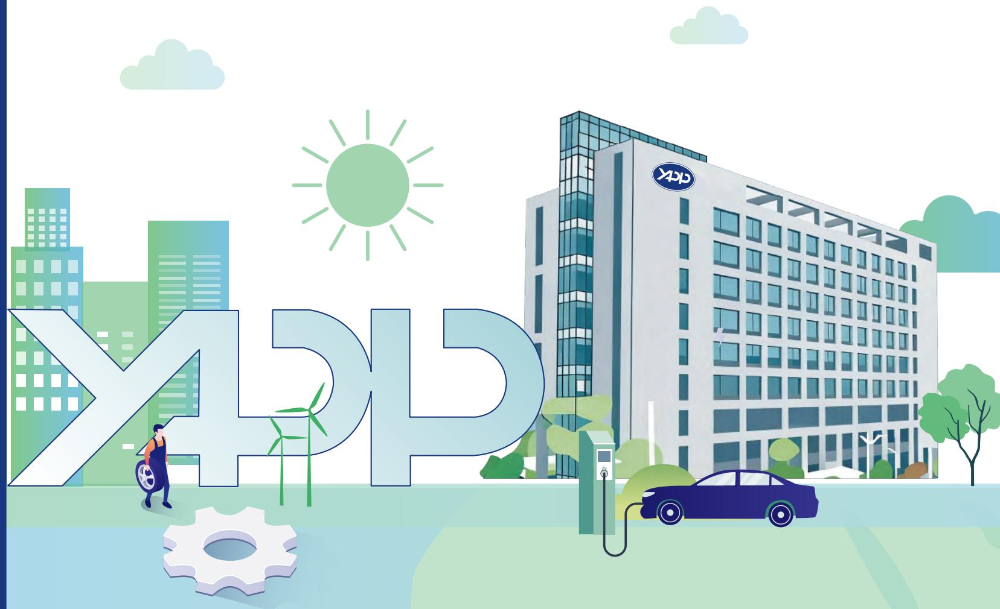

natural_image

Illustration of a modern office building with a car, electric vehicle, and large 'XID' letters, symbolizing eco-friendly energy infrastructure (no text or symbols on buildings)

## 目录

关于本报告 01

总经理致辞 03

走进亚普股份 05

ESG管理 17

## 01 规范管理 风控固本

党建引领 25

治理运作 27

合规经营与风险管理 29

投资者权益保护 33

商业道德 35

## 清洁制造 低碳领航02

环境合规管理 39

应对气候变化 43

污染物及废弃物处理 49

能源利用 53

水资源利用 57

物料利用 59

践行绿色运营 60

生态系统与生物多样性保护 62

## 创新驭能 产业向新03

创新驱动 65

产品质量与安全 68

客户服务 73

信息安全与客户隐私保护 75

供应链管理 78

##

员工关系 83

职业健康与安全 94

## 05 社区共建 公益惠民

乡村振兴 103

社会贡献 103

“一带一路”建设 104

附录 105

未来展望106

关键绩效

112 指标索引

意见反馈 114

## 关于本报告

## 报告简介

本报告为亚普汽车部件股份有限公司发布的第五份ESG报告。报告系统地披露公司2025年在环境、社会及治理（ESG）领域的战略、管理、实践、绩效与目标进展，以此回应各利益相关方的期望与关切，全面呈现公司在可持续发展方面的理念与行动。

## 时间范围

本报告为年度报告，披露信息时间范围为2025年1月1日至2025年12月31日（简称“报告期”），部分内容根据披露需要适当溯及以往年份或超出上述范围。

## 报告范围

本报告覆盖亚普汽车部件股份有限公司及其下属子公司。除特别说明外，本报告范围与本公司年报口径保持一致。

## 编制依据

上海证券交易所《上海证券交易所上市公司自律监管指引第14号——可持续发展报告（试行）》  
上海证券交易所《上海证券交易所上市公司自律监管指南第4号——可持续发展报告编制》  
国务院国有资产监督管理委员会《央企控股上市公司ESG专项报告参考指标体系》  
中国企业改革与发展研究会《中国企业可持续发展报告指南CASS-ESG 6.0》  
全球报告倡议组织《GRI可持续发展报告标准（GRI Standards）》“参考”标准  
联合国可持续发展目标（SDGs）

## 数据说明

本报告所采用的信息与数据均来源于公司的正式文件、内部统计报告或有关公开资料。除特别说明外，本报告中所涉及货币金额以人民币作为计量币种。报告中所涉及的财务数据均与公司年度报告保持一致，若出现不一致之处，概以年度报告为准。各模块详细数据口径覆盖公司请详见附录关键绩效。

  
释义说明

<table><tr><td>释义项</td><td>释义内容</td></tr><tr><td>亚普股份、公司、我们</td><td>亚普汽车部件股份有限公司</td></tr><tr><td>国投集团</td><td>国家开发投资集团有限公司</td></tr><tr><td>国投高新</td><td>中国国投高新产业投资有限公司</td></tr><tr><td>赢双科技</td><td>上海赢双电机科技股份有限公司</td></tr><tr><td>亚普开封</td><td>亚普汽车部件(开封)有限公司</td></tr><tr><td>大江亚普</td><td>重庆大江亚普汽车部件有限公司</td></tr><tr><td>芜湖亚奇</td><td>芜湖亚奇汽车部件有限公司</td></tr><tr><td>亚普印度</td><td>亚普印度汽车系统私人有限公司</td></tr><tr><td>亚普佛山</td><td>亚普汽车部件(佛山)有限公司</td></tr><tr><td>亚普乌兹</td><td>亚普乌兹别克斯坦汽车系统有限公司</td></tr><tr><td>亚普美国</td><td>YAPP USA Automotive Systems, Inc.亚普美国汽车系统有限公司</td></tr><tr><td>亚普巴西</td><td>亚普巴西汽车系统有限公司</td></tr><tr><td>亚普俄罗斯</td><td>亚普俄罗斯汽车系统有限公司</td></tr><tr><td>亚普捷克</td><td>亚普捷克汽车系统有限公司</td></tr><tr><td>亚普墨西哥</td><td>亚普墨西哥汽车系统有限公司</td></tr></table>

## 报告获取

本报告可以在上交所网站（http://www.sse.com.cn）、巨潮资讯网（http://www.cninfo.com.cn）查阅和下载。

# 总经理致辞

新元肇启，骏业日新。

过去一年，我们破局立新，赓续荣光。

## 新思路破结构难局

2025年，始终保持战略清醒与发展定力，以“升级传统业务，开拓新业务”为双轮驱动，破解“新业务不强、老业务萎缩”的结构化难题，全年油箱销量、归母净利润均创历史新高。凭借深厚技术积累，深度参与燃油车“国七”法规排放标准制定。公司获得几乎全部主流车企年度嘉奖，客户认可度持续攀升。传统业务根基进一步夯实，为公司战略转型发展构筑了稳固的“压舱石”。

## 新赛道破业务危局

2025年坚定拓宽新业务赛道以核心技术突破为引擎 撬动新市场，赢得新客户逐步援脱新业务落地慢、见效难的困境。新业务领域取得一系列重要技术突破，成功获批特种设备B3级制造许可证，标志着公司向氢能转型迈出关键一步。在资本与产业协同上们高效推进赢双科技并购整合与业务协同以管理赋能与市场资源导入有效助力新业务开拓，新赛道布局渐入佳境。

## 新动能破行业卷局

2025年，面对行业极度内卷的竞争格局，以“三先一数”（先进技术、先进管理、先进智造、数字赋能）为统领，持续提升运营效率，在市场竞争中赢得发展空间。以先进智造为引擎，推动提质增效，设备联网率和绿电使用率实现双提升。公司入选首批国家卓越级智能工厂，两化融合及数字化转型管理体系获得4A级认证。

## 新活力破人才困局

2025年 紧扣新业务转型高质量发展需求 全面升级“引用育留”市场化人才机制。新业务领域高端人才引育力度持续加大，新一期“菁英班”启动实施，复合型后备干部培养迈向新台阶。全面导入IPD研发体系，改革销售与研发人员绩效机制，完成组织架构优化，构建更加敏捷、高效的运行机制，组织活力、创造力全面迸发。

## 新蓝图破时代变局

2025年 聚焦“储能系统+新能源核心部件集成”新业务格局，立足长远 高起点擎画“十五五”发展蓝图，以主动作为应对新时代汽车行业发展大变局。未来，公司将加快培育新质生产力，全力构建第二增长曲线，通过自制与并购双轮驱动强化垂直整合能力，优化全球产能与市场布局，推动公司实现高质量、可持续发展。

风劲帆满，驭势而上。

新的一年，我们加速转型，再启新程。

总经理:

YP

# 走进亚普股份

## 公司概况

成立于1988年

在汽车燃油系统领域公司位居国内市场第一全球市场第三

在汽车旋转变压器领域公司位居国内市场第一

亚普汽车部件股份有限公司成立于1988年，是国家开发投资集团有限公司控股的上市企业，2018年5月9日于上交所正式发行上市，股票代码603013。公司作为全球化供应商，专注于汽车储能系统和新能源核心部件的研发、制造、销售与全流程服务。

截至报告期末，公司总资产达74.30亿元，实现营业收入91.33亿元、油箱销量1,079.54万只；在汽车燃油系统领域，公司位居国内市场第一、全球市场第三；在汽车旋转变压器领域，公司位居国内市场第一。

公司主要产品为汽车储能系统与新能源核心部件，储能系统涵盖燃油系统（含混动汽车高压燃油系统）、电池包壳体、燃料电池储氢系统等，主要为汽车及其他储能领域提供油，气，电等各类能量介质的存储载体。新能源核心部件主要包括热管理集成模块和旋转变压器等，热管理集成模块主要用于对电池包，乘员舱，电驱系统进行温度管理，确保其工作在最佳工作区间；旋转变压器是一种电磁式传感器，为电机控制提供实时、精确、可靠的转子位置、转速及方向反馈，是实现电机精准矢量控制、保障车辆动力性能与安全性的核心部件。

## 储能系统

  
传统/高压燃油系统

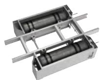  
储氢系统

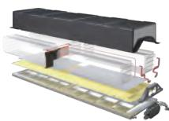  
电池包

## 热管理系统

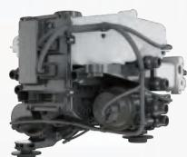  
汽车热管理集成模块

## 传感器

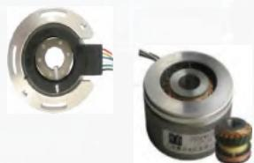  
磁阻/绕线式旋转变压器

公司构建了覆盖全球的研发与生产网络，现有27家生产基地（含海外9家）及7个工程技术中心（含海外4个）。在荣誉资质方面，公司已获评国家高新技术企业、国家技术创新示范企业、制造业单项冠军企业，并拥有国家级企业技术中心、国家博士后科研工作站和亚洲规模最大、通过国家CNAS认可的储能系统实验室。此外，公司获评江苏省自主工业品牌五十强、江苏省百强创新型企业及中国汽车零部件百强企业。

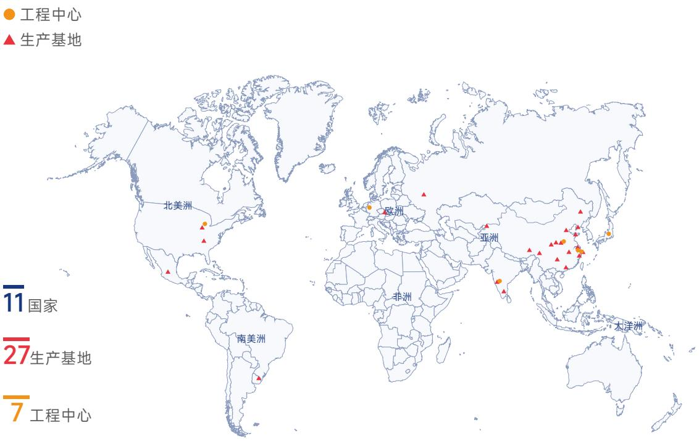

text_image

工程中心
生产基地
北美洲
欧洲
亚洲
非洲
大洋洲
11国家
27生产基地
7工程中心
南美洲

## 欧洲

工程中心 生产基地

1个 2个

## 亚洲

工程中心 生产基地

5个 21个

## 美洲

工程中心 生产基地

1个 4个

## 组织架构

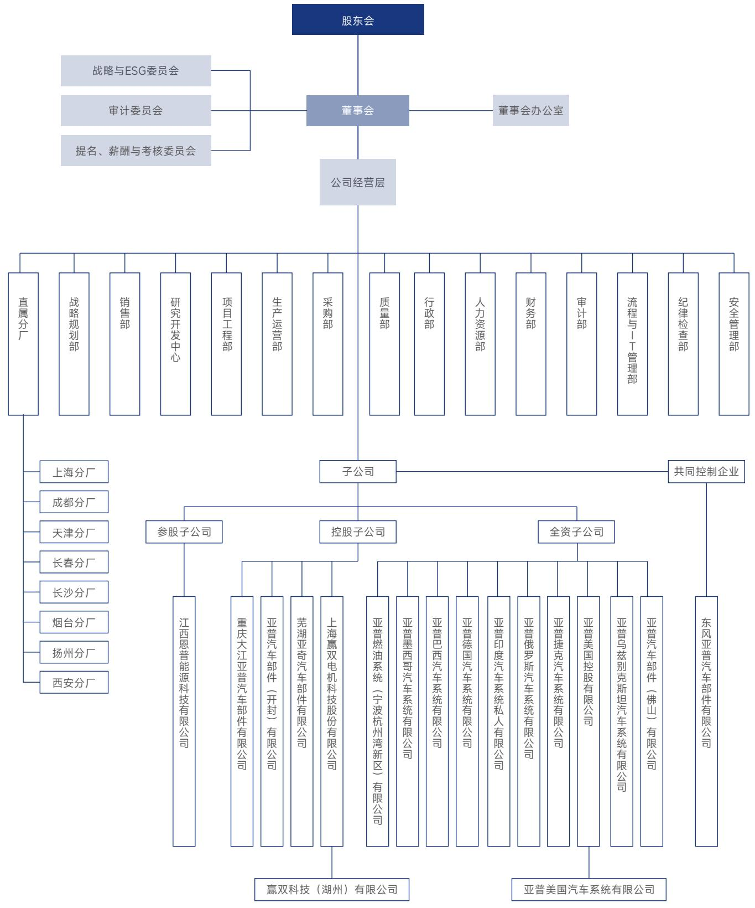

flowchart

```mermaid
graph TD
  A["股东会"] --> B["董事会"]
  B --> C["公司经营层"]
  B --> D["战略与ESG委员会"]
  B --> E["审计委员会"]
  B --> F["提名、薪酬与考核委员会"]
  C --> G["直属分厂"]
  C --> H["战略规划部"]
  C --> I["销售部"]
  C --> J["研究开发中心"]
  C --> K["项目工程部"]
  C --> L["生产运营部"]
  C --> M["采购部"]
  C --> N["质量部"]
  C --> O["行政部"]
  C --> P["人力资源部"]
  C --> Q["财务部"]
  C --> R["审计部"]
  C --> S["流程与IT管理部"]
  C --> T["纪律检查部"]
  C --> U["安全管理部"]
  D -.-> B
  E -.-> B
  F -.-> B
  G -.-> H
  G -.-> I
  G -.-> J
  G -.-> K
  G -.-> L
  G -.-> M
  G -.-> N
  G -.-> O
  G -.-> P
  G -.-> Q
  G -.-> R
  G -.-> S
  G -.-> T
  G -.-> U
  H -.-> J
  H -.-> K
  H -.-> L
  H -.-> M
  H -.-> N
  H -.-> O
  H -.-> P
  H -.-> Q
  H -.-> R
  H -.-> S
  H -.-> T
  H -.-> U
  I -.-> J
  I -.-> K
  I -.-> L
  I -.-> M
  I -.-> N
  I -.-> O
  I -.-> P
  I -.-> Q
  I -.-> R
  I -.-> S
  I -.-> T
  I -.-> U
  J -.-> G
  J -.-> H
  J -.-> I
  J -.-> K
  J -.-> L
  J -.-> M
  J -.-> N
  J -.-> O
  J -.-> P
  J -.-> Q
  J -.-> R
  J -.-> S
  J -.-> T
  J -.-> U
  J -.-> V
  J -.-> W
  J -.-> X
  J -.-> Y
  J -.-> Z
  J -.-> AA
  J -.-> AB
  J -.-> AC
  J -.-> AD
  J -.-> AE
  J -.-> AF
  J -.-> AG
  J -.-> AH
  J -.-> AI
  J -.-> AJ
  J -.-> AK
  J -.-> AL
  J -.-> AM
  J -.-> AN
  J -.-> AO
  J -.-> AP
  J -.-> AQ
  J -.-> AR
  J -.-> AS
  J -.-> AT
  J -.-> AU
  J -.-> AV
  J -.-> AW
  J -.-> AX
  J -.-> AY
  J -.-> AZ
  J -.-> BA
  J -.-> BB
  J -.-> BC
  J -.-> BD
  J -.-> BE
  J -.-> BF
  J -.-> BG
  J -.-> BH
  J -.-> BI
  J -.-> BJ
  J -.-> BK
  J -.-> BL
  J -.-> BM
  J -.-> BN
  J -.-> BO
  J -.-> BP
  J -.-> BR
  J -.-> BC
  J -.-> BD
  J -.-> BEB
  J -.-> BFB
  J -.-> BGB
  J -.-> BHB
  J -.-> BIHB
  J -.-> BJHB
  J -.-> BKHBBHBHBMHBMHBMHBMHBMHBMHBMHBMHBMHBMHBMHBMHBMHBMHBMHBMHBMHBMHBMHBMHBMHBMHBMHBMHBMHBMHBMHBMHBMHBMHBMHBMHBMHBMHBMHBMHBMHBMHBMHBMHBMHBMHBMHBMHBMHBMHBMHBMHBMHBMHARMANMGMGMGMGMGMGMGMGMGMGMGMGMGMGMGMGMGMGMGMGMGMGMGMGMGMGMGMGMGMGMGMGMGMGMGMGMGMGMGMGMGMGMGMGMGMGMGMGMGMGMGMGMGMGMGMGMGMGMGMGMGMGMGMGMGMGMGMGMGMGMGMGMGMGMGMGMGMGMGMGMGMGMGMGMGMGMGMGMGMGMGMGMGMGMGMGMGMGMGMGMGMMNMNMNMNMNMNMNMNMNMNMNMNMNMNMNMNMNMNMNMNMNMNMNMNMNMNMNMNMNMNMNMNMNMNMNMNMNMNMNMNMNMNMNMNMNMNMNMNMNMNMNMNMNMNMNMNMNMNMNMNMNMNMNMNMNMNMNMNMNMNMNMNMNMNMNMNMNMNMNMNMNMNMNMNMNMNMNMNMNMNMNMNMNMNMNMNMNMNMNMNMNAMNAMNAMNAMNAMNAMNAMNAMNAMNAMNAMNAMNAMNAMNAMNAMNAMNAMNAMNAMNAMNAMNAMNAMNAMNAMNAMNAMNAMNAMNAMNAMNAMNAMNAMNAMNAMNAMNAMNAMNAMNAMNAMNAMNAMNAMNAMNAMNAMNAMNANAAAABABABABABABABABABABABABABABABABABABABABABABABABABABABABABABABABABABABABABABABABABABABABABABABABABABABABABABABABABABABABABABABABABABABABABABABABABABABABABABABABABABABABABABABABABABABABABABABABABABABABARBAAAGABAABAABAABAABAABAABAABAABAABAABAABAABAABAABAABAABAABAABAABAABAABAABAABAABAABAABAABAABAABAABAABAABAABAABAABAABAABAABAABAABAABAABAABAABAABAABAABAABAABAABAABAABAABAABAABAABAABAABAABAABAABAABAABAABAABAABAABAABAABAABAABAABAABAABAABAABAABAABAABAABAABAABAABAABAABAABAABAABAABAABAABAABAABAABAABAABAABAABAABAabaAabaAabaAabaAabaAabaAabaAabaAabaAabaAabaAabaAabaAabaAabaAabaAabaAabaAabaAabaAabaAabaAabaAabaAabaAabaAabaAabaAabaAabaAabaAabaAabaAabaAabaAabaAabaAabaAabaAabaAabaAabaAabaAabaAabaAabaAabaAabaAabaAabaAaba AabaAabaAabaAabaAabaAabaAabaAabaAabaAabaAabaAabaAabaAabaAabaAabaAabaAabaAabaAabaAabaAabaAabaAabaAabaAabaAabaAabaAabaAabaAabaAabaAabaAabaAabaAabaAabaAabaAabaAabaAabaAabaAabaAabaAabaAabaAabaAabaAabaAabaAxababababababababababababababababababababababababababababababababababababababababababababababababababababababababababababababababababababababababababababababababababababababababababababababababababababavbavbavbavbavbavbavbavbavbavbavbavbavbavbavbavbavbavbavbavbavbavbavbavbavbavbavbavbavbavbavbavbavbavbavbavbavbavbavbavbavbavbavbavbavbavbavbavbavbavbavcBAaBaBaBaBaBaBaBaBaBaBaBaBaBaBaBaBaBaBaBaBaBaBaBaBaBaBaBaBaBaBaBaBaBaBaBaBaBaBaBaBaBaBaBaBaBaBaBaBaBaBaBaBaBaBaBaBaBaBaBaBaBaBaBaBaBaBaBaBaBaBaBaBaBaBaBaBaBaBaBaBaBaBaBaBaBaBaBaBaBaBaBaBaBaBaBaBaBAb<nl>
```

## 企业文化

## 企业使命

创新赋能，为美好生活加油

## 核心价值观

顾客为师、惜才如金、自我否定、适应环境

## 员工精神

Y活力激情-Youthful Vitality

A臻于至善-Acquiring Improvement

P创新进取-Progressive Creativity

P协作担当-Partnering Responsibility

## 管理体系设计&运行原则

E有效-Effective

E高效-Efficient

E经济-Economical

## 工作准则

T信任-Trust

T透明-Transparency

T团队合作-Teamwork

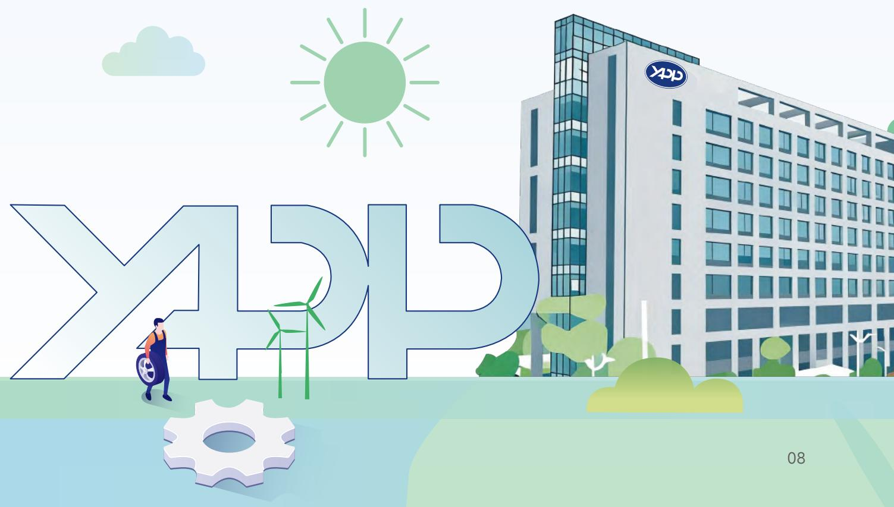

natural_image

Illustration of a modern office building with large 'XAPD' letters and a person walking beside it, surrounded by greenery and gears (no text or symbols on the building itself)

## 企业荣誉

## 2025年公司荣誉

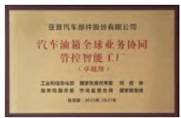  
国家卓越级智能工厂（汽车油箱全球业务协同管控智能工厂）  
级别：国家级

时间：2025年—2027年授予单位：工业和信息化部、国家发展改革委、财政部、国务院国资委、市场监管总局、国家数据局获奖单位 ：亚普股份

  
全国首批质量管理能力高等级企业  
级别：国家级

时间：2025年9月授予单位：工业和信息化部科技司获奖单位 ：亚普股份

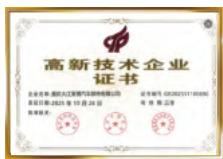  
高新技术企业  
级别：省级  
零缺陷质量奖（Zero PPM）  
第三届质量工具运用发布8D成果一等奖  
2025年度量产质量奖

时间：2025年10月

授予单位：重庆市科学技术局、重庆市财政局、国家税务总局重庆市税务局获奖单位 ：大江亚普

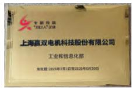  
专精特新“小巨人”企业  
级别：国家级  
协同发展奖  
2024年度优秀供应商

时间：2025年7月授予单位：工业和信息化部获奖单位 ：赢双科技

  
“汽车用底成本大容量Ⅳ型储氢气瓶”项目入选工信部2025年未来产业创新任务揭榜挂帅入围名单  
级别：国家级  
2024年成本领先企业  
优秀合作伙伴  
2024年度卓越供应商  
2024年度卓越贡献奖  
2024年度品质改善先锋奖  
2025年全球领航奖

时间：2025年9月授予单位：工业和信息化部办公厅获奖单位 ：亚普股份

## 2025年客户荣誉

时间：2025年1月授予单位：奇瑞科技获奖单位：芜湖亚奇

2024年度优秀供应商

时间：2025年1月授予单位：江铃汽车获奖单位：亚普股份

2024年度优秀供应商

时间：2025年1月授予单位：郑州日产获奖单位：亚普开封

时间：2025年1月授予单位：奇瑞汽车青岛基地获奖单位：芜湖亚奇

时间：2025年1月授予单位：一汽大众获奖单位：亚普股份

时间：2025年1月授予单位：长安马自达获奖单位：亚普股份

时间：2025年1月授予单位：长安福特获奖单位：亚普股份

2024年度TPM发表会创意工夫优秀奖

时间：2025年1月授予单位：奇瑞汽车获奖单位：芜湖亚奇成都工厂优秀合作伙伴

时间：2025年1月授予单位：神龙汽车有限公司获奖单位：亚普股份

时间：2025年2月授予单位：马恒达汽车有限公司获奖单位：亚普印度

时间：2025年3月授予单位：广汽丰田获奖单位：亚普佛山

时间：2025年3月授予单位：长城汽车获奖单位：亚普股份

2024年度最佳供应商金奖

时间：2025年2月授予单位：上汽通用获奖单位：亚普股份首批核心供应商认证

时间：2025年5月授予单位：一汽红旗获奖单位：亚普股份

2024年度供应商质量卓越奖

时间：2025年6月授予单位：通用汽车获奖单位：亚普美国

时间：2025年6月授予单位：印度丰田获奖单位：亚普印度

时间：2025年8月授予单位：奇瑞科技获奖单位：芜湖亚奇

时间：2025年9月授予单位：东风日产获奖单位：亚普开封

## 2025年度北美地区供应商质量奖

时间：2025年9月

授予单位：日产汽车

获奖单位：亚普美国

## 2025年度供应商大会全球底盘优秀供应商提名奖

时间：2025年10月

授予单位：斯特兰蒂斯

获奖单位：亚普股份

## 北美地区优秀供应商提名奖

时间：2025年10月

授予单位：斯特兰蒂斯

获奖单位：亚普股份

## 2025质量表现优胜奖

时间：2025年12月

授予单位：全国汽车工业联合工作组

国际汽车质量标准化协会

获奖单位：芜湖亚奇

## 最佳供应链合作伙伴奖

时间：2025年12月

授予单位：东风日产

获奖单位：亚普开封

## 卓越合作伙伴

时间：2026年1月

授予单位：上汽通用

获奖单位：亚普股份

## 优秀供应商

时间：2026年1月

授予单位：郑州日产

获奖单位：亚普开封

## 优秀供应商

时间：2026年1月

授予单位：奇瑞汽车

获奖单位：芜湖亚奇

## 优秀供应商

时间：2026年1月

授予单位：长安马自达

获奖单位：亚普股份

## 优秀供应商

时间：2026年1月

授予单位：江铃汽车

获奖单位：亚普股份

## 优秀供应商

时间：2026年1月

授予单位：长安福特

获奖单位：大江亚普

## 悦意向新奖

时间：2026年2月

授予单位：一汽奔腾

获奖单位：亚普佛山

## 质量卓越供应商

时间：2026年2月

授予单位：一汽大众

获奖单位：亚普佛山

text_image

Y45P

## 2025年治理荣誉

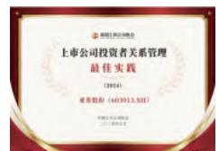

## 2024年度上市公司投资者关系管理最佳实践

时间：2025年5月

授予单位：中国上市公司协会

获奖单位：亚普股份

## 第二十届中国上市公司董事会“金圆桌奖”-公司治理特别贡献奖

时间：2025年11月

授予单位：《董事会》杂志

获奖单位：亚普股份

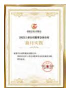

## 上市公司董事会办公室最佳实践案例

时间：2025年11月

授予单位：中国上市公司协会

获奖单位：亚普股份

## 第十九届中国上市公司价值评选-中国上市公司功勋董秘

时间：2025年12月

授予单位：证券时报

获奖单位：亚普股份

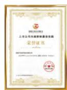

## 上市公司内部控制优秀实践案例

时间：2025年9月

授予单位：中国上市公司协会

获奖单位：亚普股份

## “上证鹰·金质量”公司治理奖

时间：2025年12月

授予单位：上海证券报

获奖单位：亚普股份

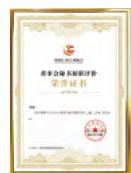

## 上市公司董事会秘书履职评价5A评级

时间：2025年12月

授予单位：中国上市公司协会

获奖单位：亚普股份

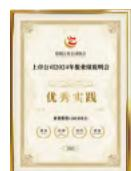

## 上市公司年报业绩说明会优秀实践案例

时间：2025年12月

授予单位：中国上市公司协会

获奖单位：亚普股份

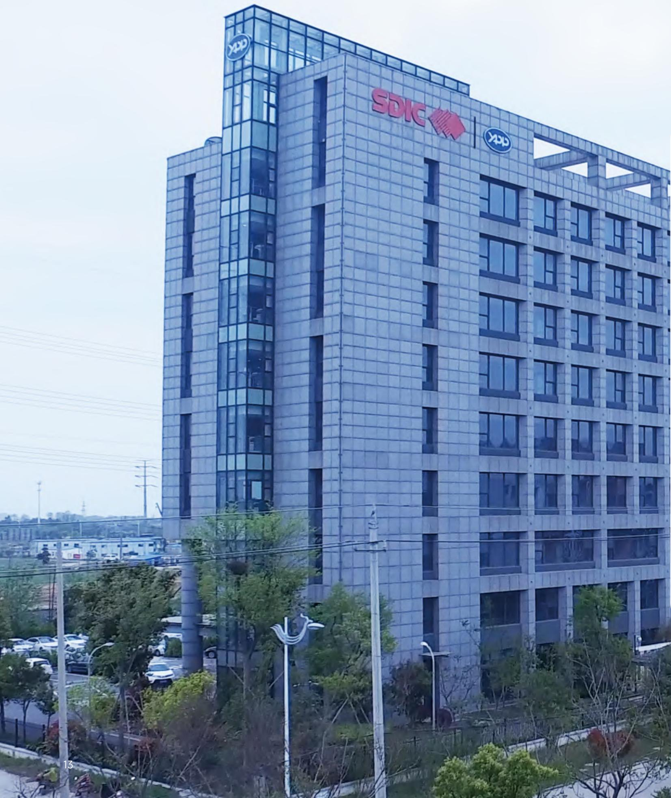

text_image

SDIC
XX

## 2025年ESG荣誉

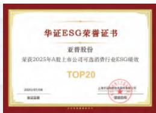

## 可选消费行业TOP20

时间：2025年7月

授予单位：华证ESG

获奖单位：亚普股份

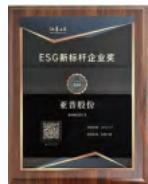

## ESG新标杆企业奖

时间：2025年7月

授予单位：证券之星

获奖单位：亚普股份

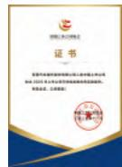

## 上市公司可持续优秀实践案例

时间：2025年11月

授予单位：中国上市公司协会

获奖单位：亚普股份

## 第三届国新杯ESG金牛奖百强

时间：2025年11月

授予单位：中国证券报

获奖单位：亚普股份

## 2025年度上市公司最佳ESG实践奖

时间：2025年7月

授予单位：价值在线

获奖单位：亚普股份

## 2025年可持续发展亮点

## 经济指标

总资产 742,988.68万元

净利润58,928.09万元

营业收入913,319.61万元

## 经济指标

环保投入909.68万元

清洁能源使用占比8.90%

温室气体排放强度

0.0714吨二氧化碳当量/万元营业收入

水循环与再利用率

99.49%

一般固体废物综合利用率

97.79%

## 社会指标

纳税金额25,734.27万元

员工培训覆盖率100%

公益慈善投入86.8万元

研发投入3.38亿元

员工培训投入88.1万元

客户满意度97.92%

## 治理指标

股东会召开次数4次

廉洁协议签署率100%

董事会召开次数14次

信息披露

开展业绩说明会3次

连续6年获上交所年度信息

披露工作A级评价

## ESG管理

## ESG管理体系

亚普股份高度重视ESG治理，将ESG理念深度融入战略规划，持续探索管理体系优化路径，稳步推进ESG工作体系化建设。为提升重大决策的科学性与质量公司制定《董事会战略与ESG委员会实施细则》构建了完善的ESG架构 在董事会下设战略与ESG委员会，明确其职责边界与运作机制，构建起权责清晰的ESG治理架构。 在此基础上， 公司同步完善激励约束机制，将安全生产、生态环保、万元产值能耗等可持续发展指标纳入高管KPI考核，依托薪酬激励约束机制全面提升履责效能。

<table><tr><td>层级</td><td>治理机构</td><td>工作职责</td></tr><tr><td>决策层</td><td>董事会</td><td>对公司ESG相关的重大事项进行决策;监督和指导公司的ESG工作;审议公司年度可持续发展报告。</td></tr><tr><td>管控层</td><td>战略与ESG委员会</td><td>研究公司中、长期发展战略规划并提出建议;对公司ESG等相关事项开展研究、分析、审议及监督,包括ESG政策、目标、战略、制度、报告、风险机遇等;组织和监督职能部门开展ESG管理工作。</td></tr><tr><td>执行层</td><td>战略与ESG办公室</td><td>作为公司战略与ESG日常办事机构,具体执行和落实公司战略决策和ESG披露。</td></tr></table>

Wind ESG评级  

华证 ESG 评级  

商道融绿ESG评级  

中诚信绿金ESG评级  

易董ESG评级  

联合赤道ESG评级  

## 案例 ESG专题培训

为夯实ESG管理基础，提升团队专业素养，公司于2026年1月5日组织召开面向各部门及子公司ESG核心工作人员的专题培训。本次培训聚焦ESG政策更新、监管要求及年度项目工作回顾，旨在同步明确后续工作方向，确保公司ESG战略的稳步推进与有效落地。

## 案例 ESG高质量发展大会

2025年，公司受邀参加由江苏省上市公司协会主办的首届“ESG高质量发展大会”，并在会上作为两家上市公司代表之一，做ESG发展创新实践发言。

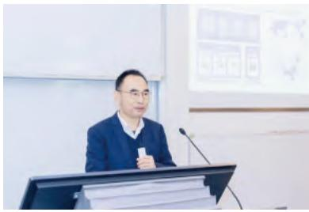

natural_image

Man giving a speech at a podium in a classroom setting (no visible text or symbols)

## ESG指标体系

公司基于实质性议题分析梳理，构建并持续优化ESG指标体系，明确指标管理职责，使ESG综合指标成为监督、对标、报告及评级提升的关键依据，实现ESG管理闭环。ESG指标体系涵盖了环境、社会与治理三大领域，由基本信息及重要议题的关键绩效指标等核心要素构成。

报告期内公司积极推进ESG数字化转型 依托ESG线上填报系统实现指标数据的线上化采集与集中管理。公司借助填报下发与审批流程功能，将指标管理职责细化分解至各部门及所属单位，实现责任到人，过程可追溯，此外，公司结合最新监管要求评级标准及内部治理需求 通过ESG线上填报系统灵活调整指标框架与计算逻辑持续优化ESG指标体系，确保其与公司战略目标及社会期望相匹配。

natural_image

3D rendered mechanical assembly with a white cable and housing, no visible text or symbols

## 利益相关方沟通

亚普股份高度重视利益相关方管理，系统开展利益相关方识别与诉求摸排工作，搭建多元化沟通渠道，建立常态化、多样化的沟通回应机制，公司积极倾听各方诉求，主动响应并充分回应核心利益相关方的各项要求与期待，筑牢利益相关方信任基础。

<table><tr><td>利益相关方类别</td><td>诉求与期望</td><td>沟通与回应</td></tr><tr><td>政府及监管机构</td><td>遵守法律法规环境合规应对气候变化合法纳税</td><td>规范公司治理完善环境管理体系应对气候变化举措税务管理</td></tr><tr><td>供应商及合作伙伴</td><td>互利共赢商业道德</td><td>供应商ESG管理廉洁采购</td></tr><tr><td>投资者及股东</td><td>规范治理内控合规公开透明风险管控沟通互动股东回报</td><td>三会管理现金分红规范内控合规信披进行风险评估并制定应对措施投资者关系管理</td></tr><tr><td>员工</td><td>员工权益保障薪酬福利健康与安全培训发展</td><td>合规雇佣完善薪酬福利制度职业安全健康管理员工培训与发展职工代表大会</td></tr><tr><td>客户</td><td>高新技术产品产品质量保障客户权益保护客户隐私安全</td><td>产品研发与创新产品质量管理客户服务管理负责任营销客户隐私保护</td></tr><tr><td>公益组织及社区组织</td><td>社会贡献公益慈善</td><td>村企帮扶公益捐赠</td></tr><tr><td>媒体</td><td>媒体采访与沟通信息真实透明及时回应关切</td><td>媒体交流会网站建设日常沟通交流</td></tr></table>

## 实质性议题分析

亚普股份严格遵循国际国内ESG相关标准，立足行业特性与经营实际，建立标准化的可持续发展议题识别及重要性分析流程，完成议题财务重要性与影响重要性双重评估，报告期内 公司业务模式，经营环境未发生重大变化 经内部评估，本年度延续上一年度财务重要性问卷的评估结果。

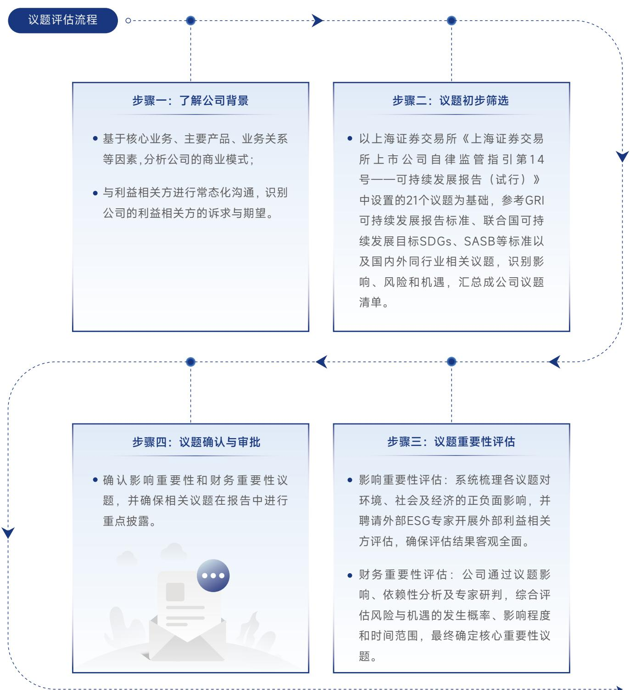

flowchart

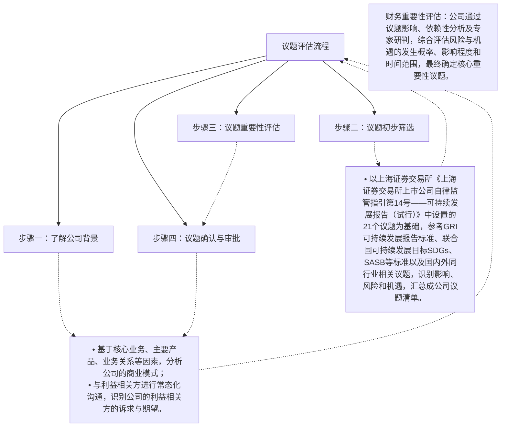
```mermaid
graph TD
  A["议题评估流程"] --> B["步骤一：了解公司背景"]
  A --> C["步骤二：议题初步筛选"]
  A --> D["步骤三：议题重要性评估"]
  A --> E["步骤四：议题确认与审批"]
  
  B -.-> F["• 基于核心业务、主要产品、业务关系等因素，分析公司的商业模式；\n• 与利益相关方进行常态化沟通，识别公司的利益相关方的诉求与期望。"]
  C -.-> G["• 以上海证券交易所《上海证券交易所上市公司自律监管指引第14号——可持续发展报告（试行）》中设置的21个议题为基础，参考GRI可持续发展报告标准、联合国可持续发展目标SDGs、SASB等标准以及国内外同行业相关议题，识别影响、风险和机遇，汇总成公司议题清单。"]
  D -.-> E
  E -.-> F
  
  F -.-> A
  G -.-> A
  H["财务重要性评估：公司通过议题影响、依赖性分析及专家研判，综合评估风险与机遇的发生概率、影响程度和时间范围，最终确定核心重要性议题。"]
```

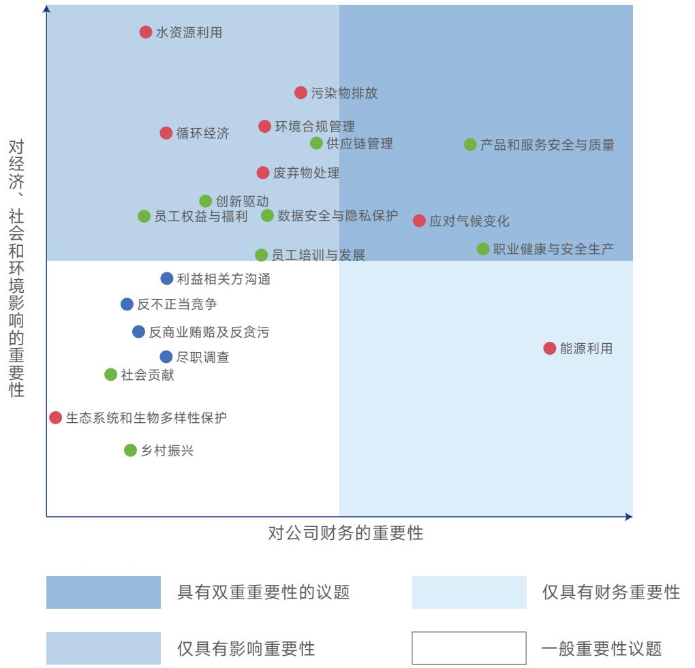

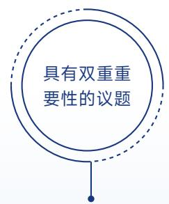  
应对气候变化、产品和服务安全与质量、职业健康与安全生产

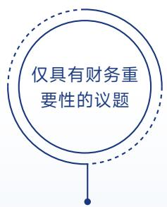  
能源利用

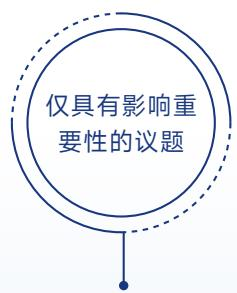  
水资源利用、污染物排放、环境合规管理，循环经济供应链管理、废弃物处理、创新驱动、员工权益与福利，数据安全与隐私保护员工培训与发展

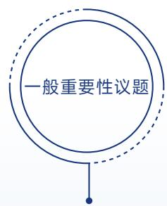  
利益相关方沟通、反不正当竞争、反商业贿赂及反贪污、尽职调查、社会贡献、生态系统和生物多样性保护、乡村振兴

基于双重重要性评估，以下议题未被认定为亚普股份重要ESG议题的原因如下：

<table><tr><td>维度</td><td>议题</td><td>原因</td></tr><tr><td>环境</td><td>生态系统和生物多样性</td><td>公司主营业务为汽车储能系统及新能源核心部件的研发与制造,生产经营活动对生态系统和生物多样性的直接影响有限;公司严守生态保护红线,在项目布局环节主动避让生态敏感区域,相关环境风险源头可控,对公司财务表现及战略决策无显著影响。</td></tr><tr><td rowspan="2">社会</td><td>社会贡献</td><td>公司社会贡献活动以属地社区公益、教育支持及志愿服务为主,报告期内公益慈善投入86.8万元、志愿活动参与91人次,整体规模相对较小,属于企业社会责任常态化实践,对公司核心经营业务及财务表现无显著影响。</td></tr><tr><td>乡村振兴</td><td>公司主营业务与农业农村领域关联度较低,消费帮扶及捐赠规模较小,对公司财务表现及战略决策无显著影响。</td></tr><tr><td rowspan="4">治理</td><td>利益相关方沟通</td><td>公司已通过股东会、投资者热线及电子邮箱、上证e互动平台、业绩说明会等多种渠道搭建利益相关方沟通桥梁,该事项属于公司治理基础工作,目前已实现常态化、规范化运行,对公司财务表现及战略决策无显著影响。</td></tr><tr><td>反不正当竞争</td><td>公司市场经营行为规范有序,报告期内未发生因不正当竞争行为导致的诉讼或重大行政处罚,该事项属于企业合规经营基础性要求,对公司财务表现及战略决策无显著影响。</td></tr><tr><td>反商业贿赂及反贪污</td><td>公司已构建覆盖全员及商业伙伴的廉洁风险防控体系,廉洁协议签署率达100%,报告期内未发生商业贿赂及贪污等腐败事件,廉洁管理已纳入常态化治理,对公司财务表现及战略决策无显著影响。</td></tr><tr><td>尽职调查</td><td>公司已建立完善的供应链管理与合规审查体系,对供应商及合作伙伴的尽职调查已纳入日常运营流程,依托《供应商管理规定》《供应商考核细则》等制度对供应商进行准入审核与定期考核,风险有效管控,对公司治理无显著影响。</td></tr></table>

## 01规范管理风控固本

## 本章节所涉及的ESG重要议题

公司治理  
合规与风险管理  
反商业贿赂及反贪污  
反不正当竞争

## 本章所响应的SDGs

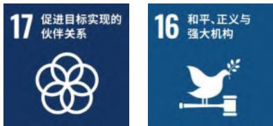

## 党建引领

公司坚持以党建为引领，深入学习贯彻习近平新时代中国特色社会主义思想，将党建工作要求写入公司章程，严格落实党组织研究讨论重大问题前置程序，实现党建与企业发展同谋划、同部署、同推进。

## 组织建设

亚普股份高度重视党组织建设工作，深入贯彻落实新时代党的建设总要求和新时代党的组织路线，切实加强党的领导，夯实党建工作基础，构建层级清晰，覆盖全面，功能明确的党组织架构，确保党的组织体系与业务体系深度融合，以组织力提升推动发展力跃升。

公司持续加强基层党组织建设，充分发挥基层党组织战斗堡垒作用和党员先锋模范作用，围绕技术研发、安全生产等工作开展主题实践活动，将政治优势、组织优势转化为发展优势与创新动能，推动党建工作与生产经营同频共振。

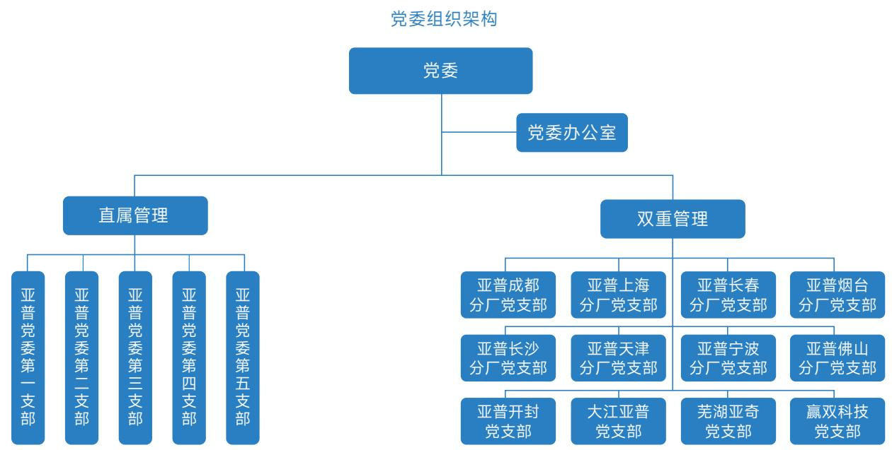

flowchart

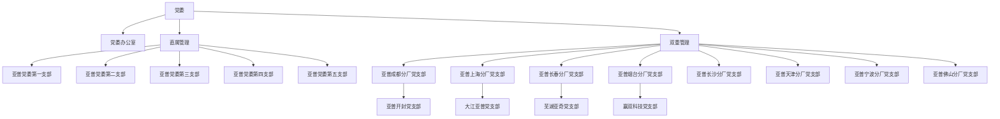
```mermaid
graph TD
  A["党委"] --> B["党委办公室"]
  A --> C["直属管理"]
  A --> D["双重管理"]
  
  C --> E["亚普党委第一支部"]
  C --> F["亚普党委第二支部"]
  C --> G["亚普党委第三支部"]
  C --> H["亚普党委第四支部"]
  C --> I["亚普党委第五支部"]
  
  D --> J["亚普成都分厂党支部"]
  D --> K["亚普上海分厂党支部"]
  D --> L["亚普长春分厂党支部"]
  D --> M["亚普烟台分厂党支部"]
  
  D --> N["亚普长沙分厂党支部"]
  D --> O["亚普天津分厂党支部"]
  D --> P["亚普宁波分厂党支部"]
  D --> Q["亚普佛山分厂党支部"]
  
  J --> R["亚普开封党支部"]
  K --> S["大江亚普党支部"]
  L --> T["芜湖亚奇党支部"]
  M --> U["赢双科技党支部"]
```

## 关键绩效

报告期内，公司党委数量1个，党支部数量17个，召开党委会次数26次，党员数量为345人。

## 思想建设

亚普股份始终坚持党的全面领导，将思想建设摆在党建工作突出位置。公司突出“关键少数”示范引领，由党委书记及经营班子带头讲授专题党课，以作风建设为主题实现党员及中层以上管理人员全覆盖学习，推动党的创新理论入脑入心，同步聚焦“绝大多数”夯基固本，分层分类开展党务工作者专项培训，建强基层党支部战斗堡垒，推动党建与业务深度融合。

## 案例 党委书记讲专题党课

2025年7月，公司党委书记、总经理以“高标准严要求扎实推进作风建设，为公司高质量发展注入强劲动力”为题讲授专题党课，公司全体党员、中层以上管理人员、年轻干部及业务骨干共300余人通过现场及视频会议形式参会学习，从而进一步筑牢思想根基、凝聚奋进共识，为企业高质量发展凝聚作风建设合力。

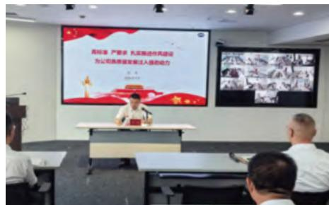

text_image

高校党 严修学 扎东政进作风建设
为公司高质量发展注入基础动力

## 案例 党务工作者培训班

2025年9月，公司党委举办2025年度党务工作者培训班，公司各级领导干部、各党支部委员及党务纪检近70人参加。本次培训有效提升了党务工作者业务水平，切实将党建政治优势、思想优势转化为企业的发展优势、竞争优势，为企业高质量稳健发展注入强劲持久的红色动能。

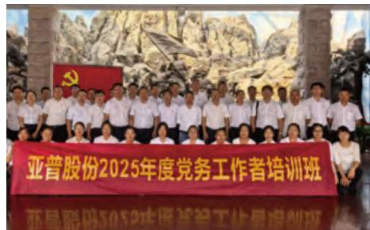

text_image

亚普股份2025年度党务工作者培训班
亚普股份2025年度党务工作者培训班

## 党建实践

亚普股份积极探索党建与业务融合新路径，以跨企业党建共建、主题交流为重要实践载体，开展多元党建联动活动。公司下属子公司大江亚普党支部与长安福特汽车有限公司动力系统产品研发党支部开展党建共建，亚普佛山党支部与东风汽车有限公司日产乘用车公司质量党支部组织主题党建交流，通过搭建跨企业党建沟通协作平台，实现党建经验互鉴、业务资源互通、发展理念互融，以党建联建聚合力、促发展，推动党建工作与产品研发、质量管控等核心业务深度结合，让党建引领成为企业协同发展、技术共进的重要支撑。

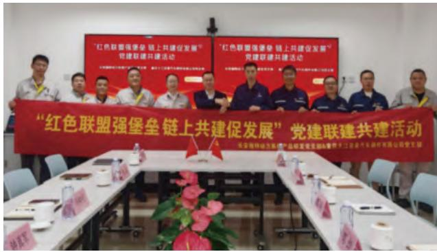

text_image

“红色联盟强堡垒 链上共建促发展”
党建联建共建活动
“红色联盟强堡垒 链上共建促发展”
党建联建共建活动
“红色联盟强堡垒链上共建促发展”党建联建共建活动
主办单位：中国建设银行股份有限公司重庆市分行

大江亚普党支部党建共建活动

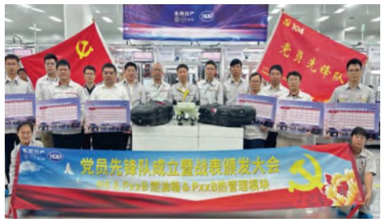

text_image

党员先锋队成立暨战表颁发大会
NFC & PXXB燃油箱 & PXXB热管理模块

亚普佛山党支部主题党建交流活动

## 治理运作

## 治理结构

亚普股份严格遵循《中华人民共和国证券法》《上市公司治理准则》等法规要求，立足公司战略发展需要，于报告期内依据新《中华人民共和国公司法》（2024年修订）优化公司治理结构的有关规定，不再设置监事会及监事，并明确由董事会审计委员会及内审部门承接监督职能，形成“两会一层”权责清晰、运转高效的治理架构，以及“权责法定、权责透明、协调运转、有效制衡”的治理机制。报告期内，公司获评“中国上市公司协会2025年上市公司董事会办公室最佳实践案例”“第二十届中国上市公司董事会‘金圆桌奖’公司治理特别贡献奖”荣誉。

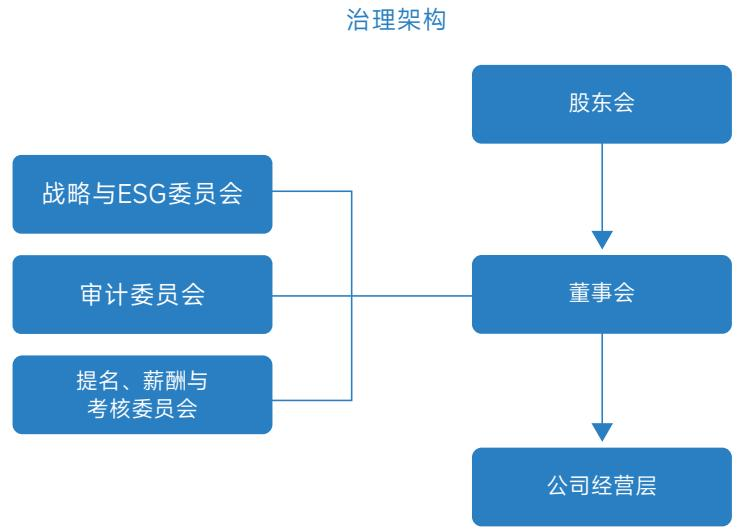

flowchart

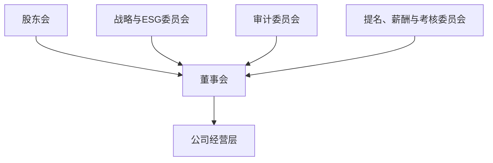
```mermaid
graph TD
  A["股东会"] --> B["董事会"]
  C["战略与ESG委员会"] --> B
  D["审计委员会"] --> B
  E["提名、薪酬与考核委员会"] --> B
  B --> F["公司经营层"]
```

## 股东会

亚普股份股东会是公司最高权力机构，公司严格遵循《公司章程》《股东会议事规则》相关规定，规范股东会的召集、通知、提案、审议、表决等全流程运作，确保股东依法行使各项权利。

公司股东会包括年度股东会和临时股东会，依法行使重大事项决策权。在表决机制设计上，公司采用“现场投票与网络投票相结合”的方式，为全体股东（尤其是中小股东）提供便捷、高效的参与渠道，保障股东参与的广泛性与公平性。针对涉及中小投资者利益的重大事项，公司严格执行中小投资者表决单独计票要求，及时、准确地在指定信息披露媒体公开单独计票结果，切实保障中小投资者的知情权、参与权和决策权。

## 关键绩效

报告期内，公司共召开股东会 4 次，审议并通过 17 项议案。

## 董事会

公司设立董事会为经营决策机构，对股东会负责。亚普股份制定了《董事会审计委员会实施细则》《董事会提名、薪酬与考核委员会实施细则》《董事会议事规则》《董事会战略与ESG委员会实施细则》等管理制度，通过设立战略与ESG委员会、提名薪酬与考核委员会、审计委员会等专门委员会，明确各专门委员会权责边界与履职规范，推动董事会决策专业化、科学化、规范化，为公司稳健运营与长远发展保驾护航。报告期内，公司持续优化董事会成员结构，将董事会成员人数由9名增至11名，新增1名独立董事及1名职工董事，进一步健全董事会多元构成。

## 关键绩效

报告期内，公司共召开董事会 14 次，审议并通过 70 项议案；召开董事会审计委员会会议 9 次（含 2 次临时会议），累计审议 22 项议案；召开董事会提名、薪酬与考核委员会会议 6 次，累计审议 8 项议案；召开董事会战略与 ESG 委员会会议 4 次，累计审议 5 项议案。

公司秉持董事会多元化治理理念，围绕行业经验、涵盖财务、工程、经济、管理等领域的专业技能、教育背景、性别等维度优化董事构成。多元化的董事会架构实现了专业能力互补、决策视角多元，保障董事会决策能够充分融合各领域专业见解有效提升决策的科学性，全面性与前瞻性助力公司实现高质量可持续发展

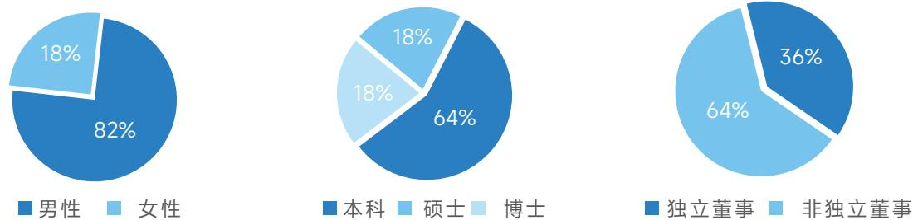

donut

| Category | Percentage |
| --- | --- |
| 男性 | 82% |
| 女性 | 18% |
| 本科 | 64% |
| 硕士 | 18% |
| 博士 | 18% |
| 独立董事 | 36% |
| 非独立董事 | 64% |

## 薪酬管理

亚普股份通过建立《董事、监事及高级管理人员薪酬管理制度》和《企业负责人业绩考核与薪酬管理办法》，构建了规范完善的董事及高级管理人员薪酬管理与考核体系。

公司独立董事仅领取固定津贴，不享受其他薪酬福利；外部董事无任何薪酬、津贴及社保福利等。高级管理人员薪酬包含年度薪酬、任期激励、中长期激励等，同时可享受国家规定的其他福利待遇。此外，公司建立了薪酬追索扣回机制，对违纪违规人员视情节减发或扣发全部绩效年薪、任期激励和现金型中长期激励。公司通过科学的薪酬结构与严格的责任追索机制，实现了激励与约束的有效平衡，既保障董事及高管人员正当权益，又确保薪酬水平与经营绩效、风险责任相匹配。

## 关键绩效

报告期内,公司董事及高级管理人员(包含现任及报告期内离任) 从公司获得的税前薪酬总额为 923.73 万元。

## 合规经营与风险管理

## 内部控制

## 合规管理

亚普股份严格遵守《中华人民共和国公司法》等法律法规根据国投集团及国投高新合规管理相关规定以《合规管理办法》为基木制度《合规手册》为基础，多项合规专项制度为支撑的制度休系完善合规管理组织架构建立权责清晰的合规管理体系。报告期内，公司推动下属子公司完成制度梳理与修订，强化内部控制，并定期组织开展合规培训，营造“人人合规、事事合规”的文化氛围。

## 党委

## 董事会

## 合规领导小组

## 行政部

发挥“把方向、管大局、保落实”的领导作用

承担“定战略、作决策、防风险”的职责

由首席合规官(总法律顾问)作为合规管理负责人，负责统筹协调工作

作为合规管理牵头部门，负责日常合规管理工作的推进与执行

## 关键绩效

2025 年，公司开展法律培训 5 次。开展法律培训总时长 681 小时，参与法律培训人数 175 人次。

## 案例 合规培训

2025年11月，为应对新能源转型与全球化竞争下的用工管理新挑战，提升各单位劳动法律法规理解与合规实务能力，公司邀请劳动关系领域权威专家开展企业用工管理专题培训，高中层及相关业务人员参训。专家结合典型案例，深度剖析劳动用工合规管理的重点、难点及关键环节，提供专业实用的指导建议。本次培训有效提升了参训人员的法律素养与合规实务能力，强化了人力资源管理对企业核心竞争力的支撑作用，为构建和谐稳定的劳动关系筑牢基础。

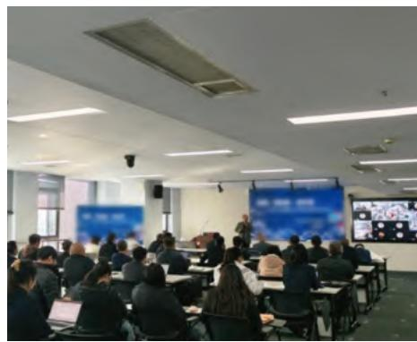

natural_image

Interior view of a conference room with attendees seated at desks facing a stage and large presentation screens (no visible text or symbols)

企业用工管理专题培训

## 案例 亚普巴西劳动合同执行与合规宣贯培训

2025年，亚普巴西组织开展劳动合同执行与劳动法律合规专题培训，围绕合同变更、员工义务、劳动风险防范等内容，结合实际案例开展互动教学。培训有效强化了员工合规意识，提升了公司劳动用工管理水平，进一步推动公司合规管理与治理规范化建设。

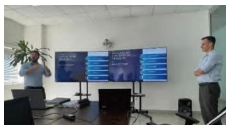

text_image

Two men in a meeting room with large screens displaying technical diagrams and text, likely from a software or business context.

劳动合同执行与合规宣贯培训

## 关联交易

公司高度重视关联交易管理，严格遵守《上海证券交易所上市公司自律监管指引第5号——交易与关联交易》等法律法规，制定《关联交易管理制度》，明确关联方识别标准与交易类型，建立分级授权审批及回避表决机制，规范关联交易行为，提高公司规范运作水平，维护公司和全体股东的合法权益。公司财务部作为关联交易的日常管理部门，负责关联交易的会计记录、核算、报告及统计分析，并会同董事会办公室和行政部完成关联人清单拟订、关联交易合规审查等工作确保关联交易合法合规。

## 内控管理

为强化内部治理水平与风险防范能力，公司系统性构建覆盖各业务领域的内部控制体系，并搭建完备的全球风险管理体系。公司制定《内部控制管理办法》《内部控制手册》《授权审批手册》等制度，实现从公司治理、战略文化到运营活动的系统化管理，保障内部控制有效运行与企业稳健经营。其中，公司对合同管理、采购管理、财务资金管理实现系统全流程刚性约束，确保业务合规开展。

## 内部审计

公司严格遵守审计相关规定，规范开展审计全流程工作，定期跟进问题整改落实进度，确保审计工作形成闭环管理。公司审计部向审计委员会及管理层报送审计发现问题与整改结果，并将审计结果及整改情况作为干部考核、任免、奖惩的重要依据，推动整改落地见效。

公司严格落实审计频次管控要求，对所属企业实施每5年轮审一次的常规审计，对重要子公司每年至少开展一次审计，对所属企业主要负责人在任期内至少实施一次审计。报告期内，公司委托第三方会计师事务所，对公司2024年度财务报告内部控制有效性开展专项评价评价结果表明公司在所有重大方面保持了有效的财务报告内部控制。

## 关键绩效

2025 年，公司完成了 7 个审计监督项目，本年度审计未发现公司存在内部控制重大缺陷；审计监督项目共发现问题 34 个，提出意见 38 条，完成问题整改 22 个，问题到期整改完成率 100%。

## 风险管理

## 风险管理体系

亚普股份高度重视风险管理，遵循“全面性，有效性，前瞻性”原则，设立风险管理委员会，制定并严格执行《全面风险管理办法》《风险报告管理办法》《重大经营风险事件报告管理办法》等管理制度，搭建权责清晰、运转高效的风险管理组织架构。在此基础上，公司明确风险管理总体目标，持续推进风险分级分类管理，提升风险防控的前瞻性与有效性。

## 董事会

作为风险管理机构，指导公司全面风险管理体系建设工作，决定公司风险管理重大事项。  
监督公司风险管理体系的运行情况。

## 风险委员会

组织贯彻落实公司党委、董事会及其下设委员会对风险管理工作的各项要求；  
指导公司全面风险管理体系的完善、风险管理信息系统的构建；  
听取公司风险管理有关情况的报告，组织研究重大风险事件的应对策略及应对方案；  
审议公司重大风险辨识、评估结果。

## 生产运营部

牵头负责公司全面风险管理体系建设、评价及日常管理工作；  
牵头对公司、分厂、子公司的风险管理工作开展情况进行监督检查，牵头对各子公司风险管理工作进行考核评价；  
组织开展公司风险管理相关培训。

## 审计部

结合内部审计业务，对公司风险管理体系的完整性和运转的有效性进行监督和审计评价，提出改进建议；  
结合内部审计业务，揭示公司存在的风险因素，并对其内部控制体系的有效性进行评价，提出加强风险管理和内部控制的意见或建议；  
做好职责范围内潜在风险辨识、评估、应对及重点风险跟踪监控。

## 风险管理举措

亚普股份构建了完备的全球风险管理体系，涵盖风险预警、监测、排查、评估、应对、控制、监督检查、考核评价及责任追究等全流程环节。公司通过月度业务潜在风险监测预警、定期专项风险排查、季度综合排查等多种方式，识别各类风险，评估风险等级，并针对不同等级风险实施差异化应对策略。

公司定期开展监督检查将风险管理工作纳入绩效考核范畴 并对风险管理成效进行量化评价确保各项风控措施落地见效。同时，公司建立了责任追究机制，对违反风险管理规定或造成重大损失的相关责任人严肃追责，每月形成专项报告上报集团，确保各类风险始终处于可控范围。此外，公司重视风险管理能力建设，面向管理层及业务骨干开展专项培训系统进解风险识别，评估工具及合规管控要点强化全员风险意识，确保风控要求有效传导至各业务环节

通过上述多措并举，公司实现风险的及时识别、精准评估与有效管控，为全球业务的稳健发展筑牢屏障。

## 案例 “新形势下跨境业务风险识别与应对”专项培训

2025年9月11日，公司面向全球各业务部门及子公司核心业务骨干、风控专员，开展“新形势下跨境业务风险识别与应对”专项培训。培训内容涵盖海外合规风险预警模型操作、供应链风险排查技巧及典型风险事件复盘，采用理论讲解与小组研讨相结合的形式，有效提升了参训人员对跨境业务风险的识别敏感度与实操应对能力，为公司跨境业务合规稳健开展提供了有力支撑。

## 风险信息报告机制

公司建立健全风险信息报告制度 要求各部门按既定频率及程序向风险管理部门报送涵盖各类风险的信息。对于重大治理风险信息，如重大诉讼、违规处罚等，公司严格按要求履行公开披露义务。针对已发生的风险事件，公司采取内部整改与外部合作相结合的补救措施，及时化解风险。同时，公司建立了规范的申诉渠道，严格按照既定流程处理相关申诉，保障各方权益。

## 税务管理

公司秉承“统一领导、分级管理、各负其责、持续优化”的税务管理工作原则，严格遵守国家相关税务法律法规，结合自身运营实际，制定《亚普股份税务管理制度》，切实履行企业纳税义务。公司搭建层级清晰的税务管理组织体系，各单位明确税务管理职责与权限，总部及各子公司配备专职税务管理人员，分公司由财务会计岗履行分厂税务管理职能。依托该体系，各单位主动开展税务筹划与风险评估，按期填报《纳税综合情况统计表》，并按照月度、季度或总部要求及时上报。此外，总部财务部每年开展纳税情况全面自查，编制《税务风险自查报告》，确保税务管理规范高效运行。

## 关键绩效

2025 年，亚普股份母公司及境内控股子公司在中国境内的纳税金额为 25,734.27 万元。

## 投资者权益保护

## 信息披露

亚普股份制定并完善《信息披露管理制度》《年报信息披露重大差错责任追究制度》《信息披露暂缓与豁免业务管理制度》等制度，规范信息披露的内容标准、程序流程、责任追究及暂缓豁免机制，持续提升公司信息披露管理水平，确保信息披露的真实性、准确性、完整性与及时性，以高度的透明度切实维护投资者的知情权、参与权。截至报告期末，公司连续6年获得上交所年度信息披露工作A级评价。

## 关键绩效

报告期内，公司共对外披露定期公告 4 份，临时公告 86 份。

## 舆情管理

公司建立健全资木市场舆情管理机制，制定《重大事项内部报告制度》《突发舆情事件应急预案》形成“预防一监测—响应—处置—恢复”全流程闭环管理体系，并遵循分级响应、协同联动原则，实现舆情高效处置。同时，公司将舆情管理与重大事项内部报告制度有效衔接，对重大交易、关联交易、诉讼仲裁等可能引发股价波动的事项及时履行报告义务，确保信息披露真实、准确、完整，切实维护投资者合法权益与公司声誉。

## 投关管理

亚普股份制定《市值管理制度》《投资者关系管理工作制度》，明确投资者关系管理的内容和总体要求，遵循合规、平等、主动、诚实守信原则，通过公司官网、上证e互动平台等多渠道多方式搭建沟通桥梁，开展投资者来访调研、业绩说明会、路演、分析师会议等活动，聚焦公司发展战略、经营管理、财务状况、风险因素等内容，传递业务进展与投资价值。同时公司健全投资者诉求处理机制，规范调研接待与信息披露流程，平等对待各类投资者，保障投资者合法权益，增进投资者对公司的了解和认同，以提升公司治理水平和企业整体价值。

## 关键绩效

报告期内，公司开展投资者沟通交流活动 33 次，其中召开 3 场业绩说明会；上证 e 互动平台答复率 100%；新增券商对公司发表研究报告 9 篇，其中深度报告 1 篇，点评报告 8 篇。

## 股东回报

公司依据《公司章程》，实行连续、稳定的利润分配政策，严格执行现金分红政策，真实、准确、完整地进行相应信息披露，确保整个分配过程公开透明，充分保障中小股东的知情权和参与权，切实维护中小股东的合法权益。同时，公司高度重视股东回报，制定现金分红方案，保持公司利润分配政策的连续性和稳定性，增强投资者的信心。

2025年，公司现金分红（包括中期已分配的现金红利）总额203,449,900.60元；公司以现金为对价，采用集中竞价方式已实施的股份回购金额100,015,473.00元（不含交易费用），现金分红和回购金额合计303,465,373.60元，占母公司2025年实现可供分配利润额的比例为79.94%，占2025年合并报表归属于上市公司股东净利润的比例为57.45%。

<table><tr><td>年份</td><td>每股现金分红(单位:元/股)</td><td>现金红利总额(含税)(单位:亿元)</td><td>占合并报表中归属于公司股东净利润的比例(%)</td></tr><tr><td>2023</td><td>0.4</td><td>2.05</td><td>44</td></tr><tr><td>2024</td><td>0.05(中期分红)+0.35(年度分红)</td><td>2.05</td><td>41</td></tr><tr><td>2025(利润分配预案)</td><td>0.05(中期分红)+0.35(年度分红)</td><td>2.03</td><td>38.52</td></tr></table>

## 关键绩效

报告期内，公司实施股份回购，累计回购股份 437.97 万股，占公司总股本的 0.85%，累计回购金额 1 亿元。

## 商业道德

## 反商业贿赂及反贪污

## 反商业贿赂及反贪污管理体系

公司成立党风廉政建设和反腐败协调小组，统筹推进党风廉政建设和反腐败工作。同时，公司成立廉洁风险防控领导小组，系统推进廉洁风险防控的规划、执行与评审工作，推动公司廉洁合规风险防控迈入系统化、常态化防控新阶段。公司制定《廉洁风险管理暂行办法》，在全公司范围内开展廉洁风险排查与治理，有针对性地制定防控措施，并在《员工手册》中明确廉洁从业规范，界定并严禁商业贿赂、腐败及利益冲突行为。

公司一体推进“不敢腐、不能腐、不想腐”，常态化开展反商业贿赂、反贪污专项培训，依托廉洁宣传月、主题宣教活动、廉洁警示教育等平台阵地强化廉洁教育，引导员工严守廉洁从业底线。公司纪委定期对总部及子公司主要负责人开展清正廉洁专项考核，并将结果与绩效挂钩，以压实主体责任，强化权力运行监督制约，确保廉洁管理要求刚性落地。

## 关键绩效

报告期内，公司开展廉洁教育培训163次，共计6,271人次参与培训，培训时长总计 38,794 小时；廉洁协议签署率 100%。

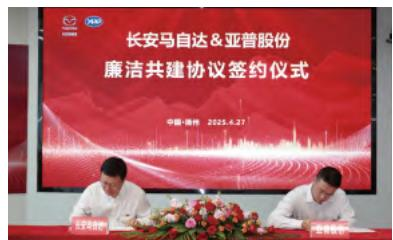

text_image

长安马自达&亚普股份
廉洁共建协议签约仪式
中国·海伟 2025.4.27

廉洁主题活动

## 反商业贿赂及反贪污审计

公司审计部对分、子公司主要负责人开展经济责任审计，将不相容职务分离作为审计的重点内容，通过问卷调查、意见征集等形式了解被审计人员的廉洁从业情况，客观评价其廉洁责任履行情况，并督促被审计对象对发现问题及时整改，着力防范廉洁风险。报告期内公司未发生商业贿赂及贪污等腐败事件，审计未发现公司存在明显的腐败风险。

## 反腐败监督

公司推动全面从严治党向纵深发展，结合企业实际，制定《公司党委关于加强对“一把手”和领导班子监督的措施》《公司党委关于领导干部插手干预重大事项记录报告有关规定（试行）》《公司党风廉政建设和反腐败协调小组工作规则》，规范领导干部用权行为，防范违规插手干预重大事项风险。同时，公司从严管理监察对象，定期识别、更新监察对象人员名单，并建立个人廉政档案，实施动态管理。

## 商业伙伴廉洁管理

亚普股份构建覆盖客户、供应商、内部员工的全方位廉洁合规管理体系。公司与主要客户签订廉洁承诺书，严格审核供应商资质及廉洁合规情况，有效防范关联交易风险，与各方合作伙伴携手共筑诚信合规的商业合作环境。

## 客户端

公司与主要客户签署《廉洁承诺书》，秉承依法治企、合规经营的理念，持续规范工作人员廉洁从业行为，与合作单位携手，共同营造健康诚信、廉洁合规的运营环境，实现公正公平、互利共赢，携手推动合作项目高质量顺利完成。

## 供应商端

供应商准入环节，公司实行严格的关联交易管控。强制要求意向供应商提交无关联交易承诺函与关联关系审查表，用以核查其与公司是否存在内部关联；

同时要求供应商提供股权结构图留存归档，从源头规避内部关联交易风险。

## 举报与举报人保护

亚普股份建立了完善的举报机制，设立举报电话、举报邮箱等多元化的举报渠道，鼓励公司内外部人员对贪腐及违法违纪行为进行举报监督。同时，公司重视对举报人的保密工作，严格落实保密措施，切实保障举报人的合法权益。

## 反不正当竞争

亚普股份严格遵守《中华人民共和国反垄断法》《中华人民共和国反不正当竞争法》等相关法律法规，系统化规范市场竞争行为，致力于维护诚信、公平、自由的市场秩序和商业环境，坚决反对一切不正当竞争行为。报告期内，公司未发生因不正当竞争行为导致诉讼或重大行政处罚。

公司高度重视反垄断文化建设，定期开展反不正当竞争培训，营造公平竞争的良好氛围。

## 关键绩效

报告期内，公司开展反垄断与公平竞争培训 2 次，参与人数 108 人，培训总时长 432 小时。

## 案例 反不正当竞争培训

2025年6月，公司针对采购、销售、保密相关人员及核心技术研发人员，开展主题为“从诉讼案例看商业秘密保护实务操作与个人风险防控”的商业秘密保护、反不正当竞争专题培训。培训涵盖制度解读、案例分析、异同对比及协同操作四大内容，通过案例教学提升员工保密实务能力、强化保密意识，筑牢公司保密安全防线。

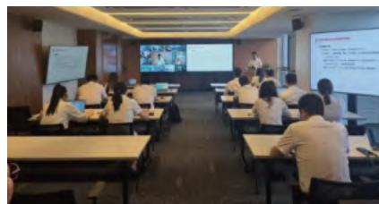

text_image

Conference room photo with visible presentation screens and attendees, showing a speaker at the front

反不正当竞争专题培训

## 02 清洁制造 低碳领航

## 本章节所涉及的ESG重要议题

应对气候变化  
污染物排放  
环境合规管理  
废弃物处理  
能源利用  
循环经济  
水资源利用  
生态系统和生物多样性保护

## 本章所响应的SDGs

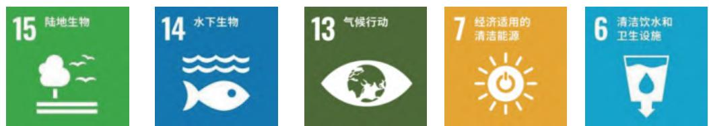

## 环境合规管理

## 环境管理体系

亚普股份严格遵循《中华人民共和国环境保护法》等法律法规，系统制定《EHS管理手册》《环境保护管理制度》《资源节约与生态环境保护责任制度》《环境污染物管理规定》等环境管理制度，始终贯彻“依法合规，节能减排，持续改进，营造绿色环境”的环境方针，确保各项环保工作有章可循、有据可依。

公司设立EHS委员会及安全管理部（SMD）作为核心管理机构，由总经理担任委员会主任，全面统筹领导环境管理工作，同时明确安全管理部作为专职职能部门定位，负责监督、指导各职能部门开展EHS管理工作。公司通过构建权责清晰、协同高效的EHS管理架构，推动环境管理责任落到实处、取得实效。

截至报告期末，公司及境内控股子公司均已通过ISO 14001环境管理体系认证，亚普股份、大江亚普获得省级绿色工厂认证，亚普开封获得国家级绿色工厂和绿色供应链管理企业认证。

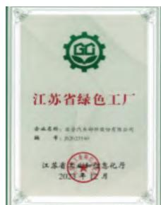  
省级绿色工厂认证

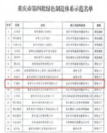  
省级绿色工厂认证

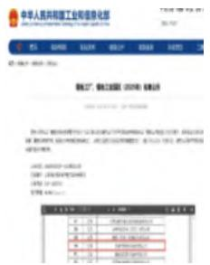  
国家级绿色工厂认证

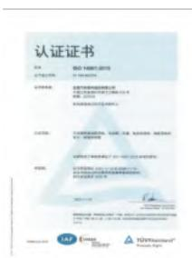  
环境管理体系认证证书

## 关键绩效

报告期内，公司环保投入909.68万元，未发生因违反环境管理相关法律法规而受到生态环境等有关部门处罚的事件。

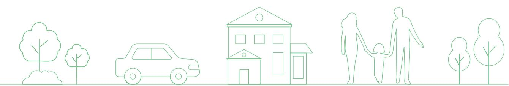

natural_image

Line drawing of various human and vehicle icons including trees, car, house, family, and trees (no text or symbols)

## 环境风险管理

## 风险防控体系

亚普股份高度重视环境风险防控体系建设，系统制定《危险源辨识和安全风险管理程序》《环境因素识别及控制程序》《风险与机遇辨识评价程序》《生态环境保护风险防控和隐患排查治理管理办法》等制度文件，明确风险防控及隐患排查治理的流程、标准与责任，为后续风险管控工作开展提供坚实制度支撑。

公司以精准管控为目标，定期开展环境因素与风险全面排查，动态更新《环境因素清单》《环境风险分级防控清单》，并全面推行“分级管控、层层落实”的风险防控模式，要求各工厂严格按照工厂级、工段级、班组级三级管控机制，将风险防控责任逐级分解至各岗位、各生产环节，构建全员参与的风险防控网络，推动环境风险管理工作规范化实施，切实保障企业生产经营与生态环境安全。

风险管理流程  
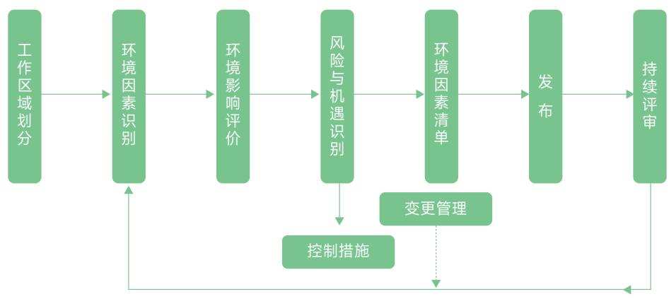

flowchart

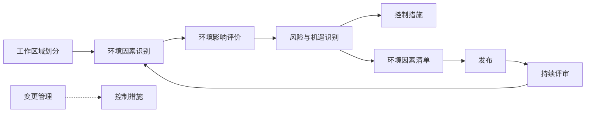
```mermaid
graph LR
  A["工作区域划分"] --> B["环境因素识别"]
  B --> C["环境影响评价"]
  C --> D["风险与机遇识别"]
  D --> E["控制措施"]
  D --> F["环境因素清单"]
  F --> G["发布"]
  G --> H["持续评审"]
  H --> B
  I["变更管理"] -.-> J["控制措施"]
```

## 隐患排查

隐患排查是风险防控的重要环节，为压实隐患排查治理责任，亚普股份制定《事故隐患排查治理管理程序》，推动隐患治理工作制度化、规范化开展。公司采用资料核查与现场检查相结合的复合式排查方式，双向印证、互为补充，确保隐患排查精准全面。同时，针对排查发现的重大隐患，公司建立专项督办机制强化闭环管控，由安健环委办具体承担督办职责，指导和督促相关单位完成整改，切实防范化解各类安全与环境风险。

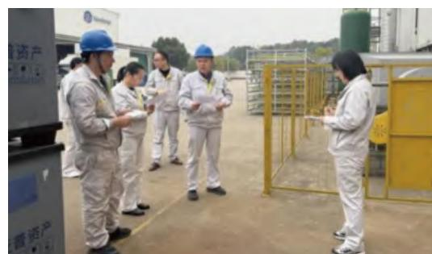

text_image

Group of workers in protective gear discussing at an industrial site with visible Chinese signage and equipment

有机废气收集处置设施隐患排查整治

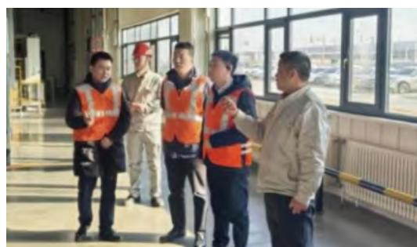

natural_image

Group of five men in safety vests and uniforms standing indoors near large windows, no visible text or symbols

安健环委员会监督检查

## 关键绩效

报告期内，公司组织安健环委员会开展监督检查26次，组织安健环委办开展监督检查18次；同时，由各单位组织综合排查、日常排查、专项排查共704次，隐患排查整改率100%。

## 应急管理

为筑牢风险防控最后一道防线，亚普股份严格遵循《突发环境事件应急管理办法》等法律法规及监管要求，制定《突发事件应急管理办法》《突发环境事件应急预案》和应急演练计划，并按照计划开展应急演练，有效提升公司对各类突发环境事件的防范、处置及应急响应能力。

公司突发环境事件应急管理工作恪守“预防为主、预防与处置相结合”的核心原则，按照“统一领导、综合协调、分类管理、分级负责、企地衔接”的工作要求，构建并完善“上下贯通、多方联动、协调有序、运转高效”的应急管理机制，成立应急指挥部统筹指挥，确保应急管理工作规范落地、闭环管理，切实防范化解突发环境事件风险，保障环境安全与企业稳定运营。

## 关键绩效

报告期内，公司组织开展环境突发事件应急演练26次，共144人次参与。

## 案例 应急管理培训

2025年7月10日，公司在扬州分厂扬子江路厂区组织开展中央除尘系统故障应急演练，以“吸尘压力不足导致系统失效”为模拟场景，重点检验应急预案的可操作性与有效性。此次演练有效提高了操作人员的专业技能与协同响应能力，进一步增强了全员应对突发环境事故的实战处置水平，为公司环境应急管理体系的持续优化积累了重要经验。

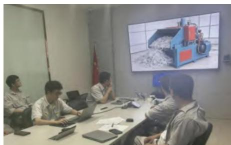

natural_image

Interior view of a meeting room with four men seated around a table, one operating a large screen displaying a blue industrial machine (no visible text or symbols)

应急管理培训

## 环保文化培育

亚普股份持续深化环保培训与宣贯工作，致力于将环保理念融入全员日常工作，定期组织覆盖管理层、一线员工的分层培训，内容涵盖环保法律法规、污染防治技术、应急处置技能及绿色低碳知识等，并结合案例解析、现场实操、应急演练等多样化形式，提升员工强化实操能力与绿色低碳意识。同时，公司邀请外部咨询机构、综合执法局等开展授课培训，提升全员安全环保责任意识，以全员行动推动公司可持续发展。

## 关键绩效

报告期内，公司组织开展环保培训139次，培训总人次为11,311人次，培训总时长11,567.5小时。

## 案例 EHS领导力培训

2025年3月，亚普股份组织中高层管理人员开展EHS专项培训，邀请专业机构讲师围绕EHS最新法律法规与ISO 14001体系标准更新动态进行深度解读。培训结合法规变化要点、体系调整方向等专业内容展开授课，通过系统化的专业讲解，帮助参训人员精准掌握合规要求，强化环境风险防控意识，助力持续规范EHS管理，促进公司可持续发展。

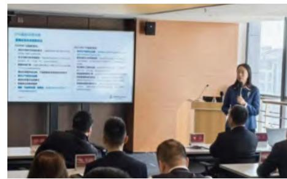

text_image

Presentation slide with Chinese text on a presentation screen, showing a speaker at a podium and audience seated in front.

EHS领导力培训

## 目标与考核

亚普股份积极响应国家“双碳”目标及行业绿色发展标准，以技术可行性、可靠性与先进性为核心考量维度，制定《目标及管理方案管理程序》《EHS绩效考核管理办法》《EHS奖惩管理实施办法》等配套制度，构建起“目标设定—过程管控一考核激励”的环境管理目标体系，强化环境目标的刚性约束与动态管控。

为持续改善环境绩效，降低生产运营活动对生态环境的影响，公司每年初制定年度生态环境控制指标，督促各生产基地持续开展节能减排降碳技术改进。同时，为充分激发全员参与环境管理的积极性与创造性，公司创新设立EHS业绩优秀奖，EHS创新奖，EHS专项奖及EHS激励奖四类奖项将环境管理成效与团队及个人绩效紧密挂钩 通过正向激励引导各业务单元主动践行环保要求、攻关绿色技术，推动环境管理目标高效落地，助力公司绿色低碳高质量发展。

natural_image

Illustration of two people interacting with a large digital dashboard displaying charts and data (no text or symbols present)

# 应对气候变化

## 应对气候变化治理

## 气候治理体系

为积极响应国家“双碳”战略目标，系统应对气候变化挑战，公司持续完善气候治理架构，设立碳中和管理委员会与专项工作小组，统筹负责相关战略决策与落地推进工作。同时，确定公司主要负责人为“双碳”工作的第一责任人，确保责任落实到位。公司制定《温室气体盘查管理规定》等制度，规范并明确了温室气体盘查流程以及各部门在实现碳达峰过程中的职责和任务。

## 气候治理架构

## 碳中和管理委员会

审定气候战略与“双碳”目标规划。  
统筹气候相关战略决策与顶层设计。  
监督整体工作进展与资源配置。

## 专项工作小组

制定“双碳”工作实施方案与年度行动计划。  
协调跨部门资源，推进重点项目落地。  
定期向委员会汇报进展，向下传导执行要求。

## 各职能部门

落实碳排放源管控、能效提升等减排措施。  
执行碳数据收集、核算与报告流程。  
协同推进绿色供应链、清洁生产等具体任务。

公司将碳达峰目标及相关重点任务全面纳入整体发展规划，并将其列为各部门、子公司及控股公司负责人年度与任期考核的关键指标，以压实责任，推动落实，截至报告期末，公司产品“燃油箱总成”已获得“绿色足迹评价证书”，未来，公司将进一步加强对子公司的专业指导，逐步建立系统化的碳达峰综合评价与考核体系，保障“双碳”工作稳步推进。

## 专业能力培养

为提升气候管理能力，公司通过培训、会议等方式强化员工对碳中和的认知与参与；利用内部网络及移动应用等工具，高效收集与共享碳数据，支撑科学决策。同时，公司与政府、行业协会、科研机构及合作伙伴保持密切沟通，共享实践，共同推进行业低碳转型，持续增强碳核算与节能减碳技术能力。

## 案例

## 碳知识培训

公司积极推进生产基地的国家级绿色工厂创建，组织外部专家对公司碳相关管理人员进行碳知识培训，详细解读了《绿色工厂评价通则》（GB/T36132）等相关碳政策。通过本次培训，参训人员全面掌握了评价通则的核心要求与评价体系，对国家“双碳”政策导向和行业绿色转型路径有了更深刻地理解，在碳排放清册核算过程中，碳排放因子的选取更加准确。

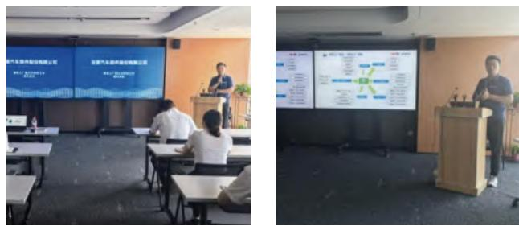  
碳知识培训

## 应对气候变化战略

公司深刻认识到气候变化对公司发展的深远影响，高度重视气候管理工作。根据《上海证券交易所上市公司自律监管指引第14号——可持续发展报告（试行）》以及“十五五”规划的指引，公司碳中和专项工作小组主动识别气候风险与气候机遇，并制定针对性强的应对气候变化措施与行动方案，并对气候相关事务的执行情况进行及时跟进与协调，确保各项举措有效落实。

<table><tr><td>风险类型</td><td>风险描述</td><td>发生概率</td><td>影响大小1</td><td>影响的时间范围2</td><td>影响的价值链环节3</td><td>优先级排序4</td><td>潜在财务影响</td><td>应对措施</td></tr><tr><td>极端气候风险</td><td>极端天气(如洪水、内涝、台风等)易导致停水停电、设备设施故障,进而可能引发业务中断与运营成本上升。</td><td>低</td><td>中</td><td>短期</td><td>上游、运营、下游</td><td>中</td><td>运营成本增加,公司声誉受损,销量下滑</td><td>加强车间基础设施的防灾标准建设,提高其抗灾韧性;制定系统的应急响应预案,明确不同急性气候风险下的处置流程、责任分工与资源调配机制。</td></tr><tr><td>政策和法律风险</td><td>随着环保相关法律法规的更新与趋严,排放标准相应提高,企业可能需要对现有设备进行改造或调整运行方式,从而导致合规与运营成本上升。</td><td>高</td><td>中</td><td>长期</td><td>运营</td><td>高</td><td>运营成本增加</td><td>动态优化《碳达峰碳中和行动方案》,持续跟踪国家及运营所在地的法律法规与监管动态,并据此及时修订与完善方案内容,确保其具备前瞻性与合规性。</td></tr><tr><td>技术风险</td><td>绿色低碳改造需求增多,公司绿色低碳专项投入成本可能上涨。</td><td>高</td><td>低</td><td>短期</td><td>运营</td><td>中</td><td>运营成本增加</td><td>公司加大绿色低碳技术研发,聚焦节能、减排与资源循环。同时推动供应商提供绿色原材料,以降低整体环保成本。</td></tr><tr><td>机遇类型</td><td>机遇描述</td><td>发生概率</td><td>影响大小1</td><td>影响的时间范围2</td><td>影响的价值链环节3</td><td>优先级排序4</td><td>潜在财务影响</td><td>应对措施</td></tr><tr><td>技术机遇</td><td>通过应用绿色低碳技术,有效降低资源消耗,从而控制生产运营成本。</td><td>高</td><td>高</td><td>长期</td><td>运营</td><td>高</td><td>运营成本下降</td><td>公司积极采用光伏发电与绿色电力等清洁能源,在实现降本增效的同时,有效减少了生产经营对环境的影响。</td></tr><tr><td>市场机遇</td><td>随着绿色低碳产品市场需求扩大,供应商加速转型,使公司得以采购更具成本优势的绿色原料,并推动供应链整体减排。</td><td>中</td><td>高</td><td>长期</td><td>上游、运营</td><td>中</td><td>运营成本下降</td><td>深化与转型供应商的战略合作,优化绿色采购机制,并借助规模效应进一步降低原料成本与供应链碳排放。</td></tr></table>

1 注：本报告所披露的影响大小分别为低、中、高。  
低：如果风险发生，对企业的财务、声誉和运营几乎没有明显影响，损失可以轻松承受。  
中：如果风险发生，会对企业的财务和声誉造成一定程度的负面影响，可能需要采取措施来弥补损失。  
高：风险发生会对企业造成严重的财务损失、品牌受损，甚至影响到业务持续性，可能需要大量资源来恢复。  
2 注：本报告所披露的影响的时间范围分别为长期、中期、短期。  
短期：一般是指公司可持续信息报告期间结束后 3 年以内（含 3 年）。  
中期：一般是指公司可持续信息报告期间结束后 3 年至 5 年（含 5 年）。  
长期:一般是指公司可持续信息报告期间结束后5年以上  
3 注：本报告所披露的影响的价值链环节分别为上游、运营、下游。  
上游：涉及原材料供应商、采购和物流等环节，影响供应链的稳定性和原材料成本。  
运营：涉及生产、制造和内部流程等环节，影响日常运营和生产效率。  
下游：涉及分销、销售和客户服务等环节，影响客户满意度、市场份额和品牌形象。  
4 注：本报告所披露的优先级排序分别为高、中、低。  
高：风险可能导致重大财务损失、业务中断或严重的法律后果，需立即采取措施。  
中:风险对业务有一定影响但可以在一定时间内处理或缓解  
低:风险对业务的影响相对较小可以在常规的运营管理中处理。

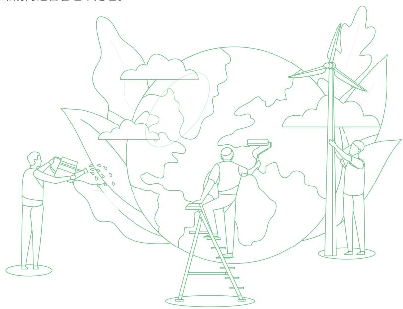

natural_image

Line drawing of three people painting a globe with wind turbines in the background (no text or symbols)

## 影响、风险和机遇管理

## 管理流程

公司深刻认识到气候变化的现实影响及应对行动的紧迫性，积极响应国家“双碳”目标，依据《风险与机遇辨识评价程序》系统开展环境与气候相关风险、机遇的识别、分析与管控。各部门针对已辨识的风险，遵循“策划－实施－检查－改进”（PDCA）的管理循环，落实应对措施并推动持续优化。在公司层面，安全管理部于年度管理评审会议上汇报经营战略相关气候风险，供高层决策参考，并据此制定下一年度的方针与目标。

## 温室气体核算及鉴证

公司制定《温室气体盘查管理规定》，每年定期开展温室气体排放内部盘查，盘查完毕后，及时整理结果并制作成该年度温室气体排放清册。鉴于相关方要求，公司还聘请有资质的第三方机构实施外部核查，确保盘查数据的准确可靠与公信力。

## 产品碳排放

为系统管理产品全生命周期的环境影响，公司制定并实施了《产品生命周期控制程序》。该程序明确了从产品设计、生产、使用、维修到最终废弃处置各阶段的环保要求与管理措施，旨在通过全过程管控，持续降低产品环境足迹，支撑企业绿色发展战略的落实。

公司对“燃油箱总成”产品开展了系统的生命周期评估（LCA），覆盖从摇篮到大门的全过程，从而系统识别产品的环境足迹。基于LCA结论，公司系统优化从原材料采购、能源使用到生产运输的各环节：优先选用就近原材料与清洁能源，逐步替换为电动运输车辆；同时引进先进工艺与节能设备，提升绿电使用比例，从源头系统性降低温室气体排放强度。

此外 公司积极参与绿色足迹认证 旗下“燃油箱总成产品(MQB-B1NMS NEC6)”已成功取得绿色足迹认证证书。该认证客观反映了产品在全生命周期内的碳排放表现符合国际相关标准，印证了公司将环保理念系统融入产品研发与制造的实际成效。

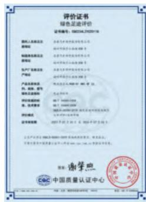

text_image

评价证书
绿色足迹评价
证书编号：0202316_75272718

保荐人（主承销商）：国信证券股份有限公司

联席主承销商：国信证券股份有限公司

联席电话：021-6349-8888

产品名称：绿色足迹评价
产品代码：021-6349-8888

产品有效期：2023年1月1日至2023年12月31日

产品类型：绿色足迹评价
型号：绿色足迹评价
规格：2023年1月1日至2023年12月31日

产品有效期：2023年1月1日至2023年12月31日

产品地址：中国北京市西城区金融大街甲1号A座1层
办公地址：北京市西城区金融大街甲1号A座1层
法定代表人：王洪章

联系人：谢笑照
CMC 中国质量认证中心

绿色足迹评价证书

## 指标与目标

为助力国家“双碳”目标实现，公司制定并实施《碳达峰行动方案》明确主要目标与战略路线，通过系统推进能效提升，优化能源结构，加强碳足迹管理等具体举措，切实开展减排工作以实际行动为国家如期实现碳达峰与碳中和贡南力量。

## 主要目标

公司聚焦储能产业，致力于研发与推广绿色、低碳的先进技术、工艺及产品，为社会层面的节能、降耗与减碳提供切实支持。在此基础上，公司不断拓展新的业务增长空间，稳步推进自身在2030年前实现碳达峰的目标。

<table><tr><td>到2030年，公司力争实现以下目标</td><td>达成情况</td></tr><tr><td>储能产品布局和能源使用结构优化升级取得重大进展；</td><td>稳步推进中</td></tr><tr><td>万元产值二氧化碳排放比2020年下降7.0%；</td><td>稳步推进中</td></tr><tr><td>关键核心领域自主创新取得突破性进展。</td><td>稳步推进中</td></tr></table>

## 战略路线

公司将结合相关方战略与自身实际，制定并实施符合公司发展的“双碳”路线图，积极把握转型机遇，并坚持以科技创新为核心推动力，系统提升绿色制造水平，全面增强企业核心竞争力，迈向绿色高质量发展。

## “双碳”目标战略规划

加强现有储能产品绿色低碳技术迭代与规模化应用；产品规划布局新兴储能产品的关键技术攻关与市场推广。  
持续实施节能改造与设备工艺升级；生产制造推动生产自动化、数字化与智能化转型，建设绿色智能制造工厂。  
创新绿色供应链管理模式，推动上下游企业协同减排；供应链管理引导供应商参与公司低碳战略，构建绿色供应链体系。  
能源使用优化 构建“前端清洁替代、中端节能降耗、末端循环利用”的全周期低碳模式。  
能源结构调整 根据各基地所在区域绿电资源条件，适时开展绿电采购。  
碳抵消机制 结合集团与各基地碳排放实际，按需开展绿证购买与碳汇交易。

## 减碳实践

为全面落实公司《碳达峰行动方案》部署要求，企业系统推进低碳转型，重点布局并实施了三项关键减排工程。

## 屋顶分布式光伏项目

公司利用国内基地厂房屋顶资源分批建设光伏电站，提高绿电使用比例；光伏板兼具隔热效果，可降低厂房温度与空调能耗。所发电力优先自用，直接替代外购电，有效减少碳排放。

## 公用工程节能降碳项目

对公用工程设备进行节能技改并应用新技术，包含空压机变频联控应用、空压机余热回收应用、冷冻水系统变频联控应用、冷冻水系统冬季热交换直冷应用、新型节能型加热技术等。

## 开拓储能系统新市场

依托公司自身特点，坚持全球化布局，聚焦减排，以汽车现有液体储能产品为核心，开拓气体（氢气）塑料储能系统和固态（车用动力电池）储能系统新市场，进一步做大做强汽车储能系统业务，为交通行业能源转型，为新能源汽车产业发展贡献力量。

## 关键绩效

报告期内，公司分布式光伏电站总装机容量已达12.19兆瓦，年均可提供清洁电力约945万千瓦时，满足公司用电需求的近10%，相当于每年减少约7,000吨二氧化碳当量的排放。

## 排放情况

在公司生产运营活动中，温室气体排放主要来源于燃油箱的生产过程。排放类型包括生产设备用电对应的间接排放、叉车使用柴油以及食堂使用天然气产生的直接排放，所涉及的温室气体主要为二氧化碳。公司持续完善温室气体排放核算体系，报告期内，公司委托第三方机构对历史排放数据开展独立核查，旨在通过外部验证夯实数据质量根基，提升气候信息披露的公信力与透明度，以更高标准回应利益相关方关切。

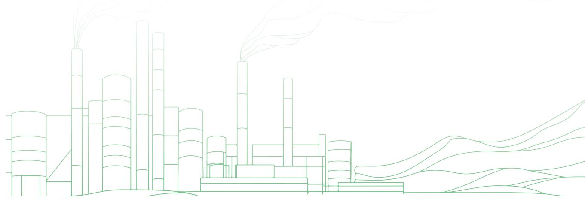

natural_image

Line art illustration of an industrial city skyline with smokestacks emitting plumes, no text or symbols present

温室气体排放情况

<table><tr><td>指标</td><td>单位</td><td>2024年4</td><td>2025年</td></tr><tr><td>温室气体排放总量1</td><td>吨二氧化碳当量</td><td>61,949</td><td>65,202</td></tr><tr><td>温室气体排放强度</td><td>吨二氧化碳当量/万元营业收入</td><td>0.0766</td><td>0.0714</td></tr><tr><td>直接温室气体排放量(范围一)2</td><td>吨二氧化碳当量</td><td>1,214</td><td>1,152</td></tr><tr><td>间接温室气体排放量(范围二)3</td><td>吨二氧化碳当量</td><td>60,734</td><td>64,050</td></tr><tr><td>其他间接温室气体排放量(范围三)</td><td>吨二氧化碳当量</td><td>/</td><td>/</td></tr><tr><td>节能减排举措共计减少二氧化碳排放量</td><td>吨二氧化碳当量</td><td>4,333</td><td>5,389</td></tr></table>

1 本报告所披露的温室气体排放总量涵盖范围1温室气体排放量、范围2温室气体排放量；  
2 范围1温室气体排放量涵盖汽油、柴油、天然气；  
3 范围2温室气体排放量涵盖消耗外购电力、外购热力；  
4 温室气体核算依据《GB/T 32150-2015 工业企业温室气体排放核算和报告通则》。

2024年温室气体排放数据已通过第三方机构核查验证。

## 污染物及废弃物处理

亚普股份高度重视生产经营全流程的环境影响，为有效管控各类污染物、减轻生态环境负担，制定《环境污染物管理规定》，建立系统化的污染物管控机制。公司明确安健环管理责任部门统筹落实污染物管理制度，全程监督各项管控要求落地执行，切实筑牢环境风险防控底线。公司各工厂严格遵循国家相关规定、监测规范及环境影响评价要求，编制并执行自行监测方案，定期开展废水、废气、噪声等环境监测。报告期内，公司未发生因污染物排放受到处罚及违规事件。

## 关键绩效

报告期内，公司污染物监测合格率100%，环保设施同步运转率100%，建设项目环保“三同时”执行率100%。

natural_image

Illustration of two people working at a trash bin with recycling symbols, surrounded by plants (no text or labels)

## 废气管理

公司生产运营过程中排放的废气来源于原辅材料熔融和边角料粉碎工序环节。针对产生的挥发性有机物，公司采用光氧催化或活性炭吸附工艺处理；对于产生的粉尘则通过布袋/旋风除尘和布袋组合工艺进行有效治理。

2025年，为响应生态环境部新版《国家污染防治技术指导目录》将VOCs光解（光氧化）及其组合净化技术列为低效类技术的政策动态，公司于8月在上海分厂投产运行2套二级活性炭吸附工艺的VOCs收集治理设施，全面替换原有光氧工艺设施，使VOCs治理效能提升4倍，年减排量近1吨。报告期内，公司共计新增6套VOCs收集治理设施，累计实现VOCs减排超2吨，以技术迭代和产能优化切实提升了废气治理的合规性与有效性，为实现绿色低碳发展目标提供了坚实支撑。

公司废气排放情况

<table><tr><td>指标</td><td>单位</td><td>2025年</td></tr><tr><td>氮氧化物（NOX）</td><td>吨</td><td>0.0067</td></tr><tr><td>二氧化硫</td><td>吨</td><td>0.0228</td></tr><tr><td>挥发性有机物（VOCs）</td><td>吨</td><td>3.1515</td></tr><tr><td>颗粒物（PM）</td><td>吨</td><td>0.9894</td></tr></table>

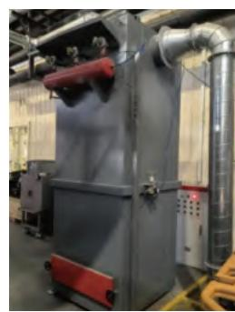

natural_image

Industrial machinery setup with metal components and piping (no visible text or symbols)

除尘设施

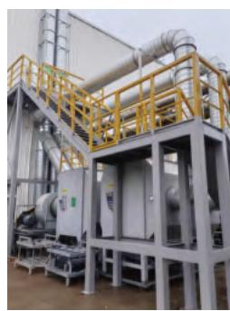

natural_image

Industrial facility with large machinery and piping (no visible text or symbols)

新建二级活性炭吸附工艺的VOCs收集治理设施

## 废水管理

亚普股份严格遵循《中华人民共和国水污染防治法》相关要求，明确废水管理流程，建立全流程精细化废水管控机制，实现废水产生、处置、排放各环节闭环管理。公司生产运营产生的废水分为生产废水（冷却塔排污水、检漏废水、冷却废水）与生活污水（员工盥洗废水、食堂废水）两大类，主要污染物涵盖化学需氧量、悬浮物、氨氮、总磷、总氮及动植物油。针对不同类型废水特性，公司实施差异化处置措施。

## 废水处置措施

## 循环冷却水、冷却定型水

## 食堂废水

实施零外排管控，全程闭环循环利用，杜绝环境影响；

先经隔油隔渣预处理，去除动植物油及固体残渣，降低后续处理负荷；

## 其他生活污水、检漏废水

预处理后的食堂废水一并纳入隔油池+化粪池组合处理系统，经处理达到国家及地方排放标准后，接入市政污水管网，送专业污水处理厂集中处置。

为从源头提升水资源利用效率、降低污染排放，公司全面落实清污分流、雨污分流管理措施，既杜绝污水进入雨水管网也避免雨水混入污水管网有效减轻废水处理负荷，同时公司大力推进资源节约技术改造，确保生产用水重复利用率稳定在97%以上，减少新水取用量和废水排放总量。

公司废水排放情况

<table><tr><td>指标</td><td>单位</td><td>2025年</td></tr><tr><td>废水排放量</td><td>吨</td><td>66,845</td></tr><tr><td>废水回收利用率</td><td>%</td><td>99.8</td></tr><tr><td>化学需氧量(COD)</td><td>吨</td><td>0.7272</td></tr><tr><td>氨氮(NH3-N)</td><td>吨</td><td>0.0192</td></tr></table>

## 噪声管理

公司的噪声主要来源于各类生产设备及其配套设备，且集中分布在生产区域。为解决噪声问题，公司构建了“源头防控—过程管控—末端治理”的全链条管控模式。在源头防控阶段，公司通过选用低噪声设备、合理规划厂区布局、配置噪声治理设施等方式，从设计与布局层面减少噪声的产生与传播。同时，公司建立健全噪声污染防治责任制度，确保噪声防治设施与主体工程“三同时”落实，保障管控措施从项目初期就有效落地。在末端治理环节，公司开展专项噪声减排技术改造，重点对室外设备加装消音隔声罩，有效降低了设备噪声排放强度。经检测，技改完成后厂界噪声水平基本符合2类声环境功能区要求，切实减轻了生产噪声对周边生活环境的影响。报告期内，公司各生产基地厂区噪声均符合《工业企业厂界环境噪声排放标准》（GB12348 2008）中各类适用标准。

## 废弃物管理

亚普股份以全生命周期管控为核心，制定《废弃物管理程序》《危险化学品管理规定》《危险废物规范化管理手册》等管理制度，对各类废弃物实施精准的分类管控，确保合规处置与风险可控。

## 废弃物处置措施

## 生活垃圾

## 厨余垃圾

## 建筑垃圾

## 废弃电池

## 一般工业固体废物

## 危险废物

依托属地环卫部门，定时定点统一收集处置。  
V 委托具备资质的专业单位进行无害化处理，避免污染土壤与水体。  
1 由施工单位编制专项处理方案并备案，按环卫部门要求清运、利用或处置，减少工程弃料对环境的影响。  
优先交由生产者回收，推动资源循环利用，降低原生资源消耗。  
建立管理台账并推进减量化，委托具备资质的单位运输、利用或处置，最大化实现资源再利用。  
定期开展危险废弃物风险评估；  
年初申报管理计划并获取许可；  
委托具备资质的单位处置。

公司各工厂严格落实固体废物污染防治全过程责任制度，建立详实管理台账，如实记录废弃物种类、数量、流向等关键信息，确保全流程可追溯、可查询。在日常管控中，公司将防控要求融入前期规划与日常运营，在厂房设计阶段即优化固废存放布局，按国家规范建设贮存设施，通过可视化标识实现定置分类存放。此外，公司定期组织员工及相关方开展废弃物分类、合规处置等专项培训，筑牢全员管控意识；同时科学制定年度废弃物管理目标，以目标为牵引，推动减量化、资源化、无害化管控要求落地。

年度废弃物排放目标  
2025年达成情况

<table><tr><td>固体废物、危险废物依法合规处置率100%</td><td>100%</td></tr><tr><td>一般固体废物综合利用率≥96%</td><td>97.79%</td></tr></table>

<table><tr><td>指标</td><td>单位</td><td>2025年</td></tr><tr><td>废弃物产生量</td><td>吨</td><td>32,896.87</td></tr><tr><td>其中:无害废弃物产生量</td><td>吨</td><td>32,823.19</td></tr><tr><td>其中:有害废弃物产生量</td><td>吨</td><td>73.68</td></tr><tr><td>废弃物处置量</td><td>吨</td><td>4,193.79</td></tr><tr><td>其中:无害废弃物处置量</td><td>吨</td><td>4,123.33</td></tr><tr><td>其中:有害废弃物处置量</td><td>吨</td><td>70.46</td></tr><tr><td>回收再利用废弃物总量</td><td>吨</td><td>32,170.86</td></tr><tr><td>废弃物合规处置率</td><td>%</td><td>100</td></tr></table>

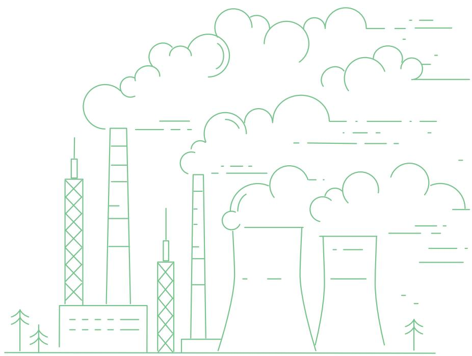

natural_image

Line drawing of an industrial plant with smokestacks and clouds, no text or symbols present

## 能源利用

## 能源管理治理

亚普股份严格遵守《中华人民共和国能源法》《中华人民共和国节约能源法》等法律法规，制定《资源节约与生态环境保护管理规定》等内部管理制度，制定具体可行的节能减排行动方案与落实举措，推动能源使用效率不断提升，实现能耗的持续降低。公司实施绩效考核机制，将能耗指标全面纳入各部门年度绩效评价体系，设定明确的能效目标，并开展持续跟踪与评估，系统化提升公司整体资源利用效率。

公司设立由总经理领导的能源管理领导小组，全面统筹能源管理工作，并建立覆盖公司、部门与车间的三级能源管理网络，明确各级职责，强化考核与落实，形成持续改进的管理闭环。各部门主要负责人作为小组成员，负责推进本领域节能工作并协调跨部门协作，确保节能减排任务有效落地。生产运营部下设专职能源管理岗位，负责全公司能耗统计、监测及各单元用能数据的汇总分析。报告期内，公司开展能源内部审计，亚普股份及赢双科技均通过ISO 50001能源管理体系认证。

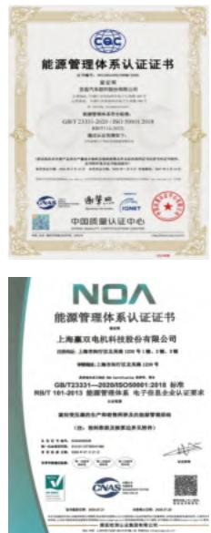  
亚普股份/赢双科技ISO 50001能源管理认证证书

## 能源管理战略

公司系统识别能源利用相关风险与机遇，评估其对公司战略、经营及财务等方面的影响，并结合管理体系、能耗管控与节能措施，制定并实施针对性应对策略，在有效管理能源风险的同时把握潜在机遇，从而提升能源使用效率，降低运营成本。

<table><tr><td>风险类型</td><td>风险描述</td><td>发生概率</td><td>影响大小</td><td>影响的时间范围</td><td>影响的价值链环节</td><td>优先级排序</td><td>潜在财务影响</td><td>应对措施</td></tr><tr><td>能源价格波动风险</td><td>煤炭、天然气、石油等能源价格受国际市场供需、地缘政治等因素影响产生波动,导致公司使用能源成本提高。</td><td>低</td><td>高</td><td>中期</td><td>运营</td><td>高</td><td>成本增加</td><td>与能源供应商签订长期合同锁定部分价格;建立能源价格监测机制,提前预判价格走势并调整采购策略;优化能源结构降低对单一能源的依赖。</td></tr></table>

<table><tr><td>风险类型</td><td>风险描述</td><td>发生概率</td><td>影响大小</td><td>影响的时间范围</td><td>影响的价值链环节</td><td>优先级排序</td><td>潜在财务影响</td><td>应对措施</td></tr><tr><td>能源供应中断风险</td><td>电网故障、极端天气或负荷过高导致突发停电,造成设备损坏、生产中断及数据丢失。</td><td>中</td><td>高</td><td>短期</td><td>运营、下游</td><td>高</td><td>收入减少、修复成本增加</td><td>设置柴油发电机及配套的柴油储罐,用于停电后发电自供,配置UPS电源,用于服务器机房,避免数据丢失。</td></tr></table>

<table><tr><td>机遇类型</td><td>机遇描述</td><td>发生概率</td><td>影响大小</td><td>影响的时间范围</td><td>影响的价值链环节</td><td>优先级排序</td><td>潜在财务影响</td><td>应对措施</td></tr><tr><td>可再生能源政策机遇</td><td>政府加大对可再生能源补贴、税收优惠或碳配额支持,降低企业绿色转型成本。</td><td>中</td><td>高</td><td>长期</td><td>运营</td><td>高</td><td>成本降低、品牌提升</td><td>积极跟进政策动态,申请相关补贴与认证;逐步提高可再生能源使用比例;参与绿电交易或自建分布式能源系统。</td></tr><tr><td>能源效率提升机遇</td><td>通过技术升级、工艺优化或管理改进,提升能源使用效率,降低单位产品能耗。</td><td>中</td><td>高</td><td>长期</td><td>运营</td><td>高</td><td>成本降低</td><td>开展全员节能培训与文化推广;定期开展能源审计与能效对标;投资高效设备与余热回收技术。</td></tr><tr><td>绿电采购与认证机遇</td><td>通过采购绿电或获取绿色能源认证,提升企业环保形象,满足客户或投资者ESG要求。</td><td>中</td><td>中</td><td>长期</td><td>运营、下游</td><td>高</td><td>收入增加、市场拓展</td><td>与可再生能源开发商签订购电协议;申请绿电溯源认证。</td></tr></table>

## 影响、风险和机遇管理

公司建立健全能源风险与机遇管理机制制定《风险与机遇辨识评价程序》结合内外部环境因素及相关方要求系统识别和评估能源管理中的风险与机遇，并采取相应措施予以管控和落实通过标准化流程确保风险有效管控及机遇合理把握。同时，公司通过《应急计划管理规定》明确各职能部门在突发事件中的职责与处置流程，确保在风险发生时能够讯速响应保障运营连续与能源安全

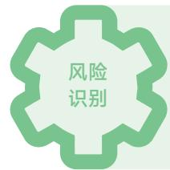

公司在以下情况发生时，及时启动风险与机遇识别工作：能源管理体系策划、企业宗旨或战略调整、内外部环境变化、组织背景及相关方需求与期望发生变动。

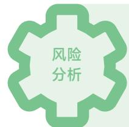

公司对所处环境进行风险分析，从宏观层面理解可能对能源绩效和能源管理体系产生积极或消极影响的内外部因素。

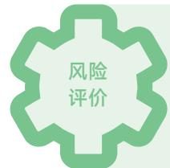

根据《风险与机遇辨识评价程序》设定的评价准则，对已识别风险从严重程度和发生频率两方面进行评估，计算风险系数，并依据系数确定应对措施。评价结果记录于《风险和机遇评估分析及措施表》。

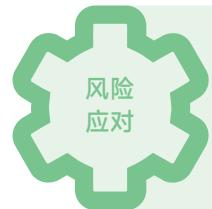

针对高风险项目，采取接受、降低或规避等应对方式，优先考虑消除风险。若无法消除或成本过高，则选择采取风险降低或风险接受策略，确保风险可控。

## 指标与目标

公司生产过程中使用的主要能源种类包括电力、天然气及柴油。公司依据能源内部评审结果，结合上一年度能源消耗情况，科学制定本年度能源消耗目标，并定期评估目标完成情况，持续优化实施路径，以确保能源利用效率的持续提升。同时公司将能耗强度目标与高管薪酬关联，全面纳入公司及主要责任人的年度绩效评价体系，通过强化责任约束确保目标达成。

## 指标与目标

万元产值综合能耗不高于0.018吨标煤/万元

## 2025年达成情况

已达成

能源消耗数据表

<table><tr><td>类型</td><td>单位</td><td>2025年</td></tr><tr><td>直接能源消耗总量</td><td>吨标准煤</td><td>127.59</td></tr><tr><td colspan="3">其中:按能源类型分类</td></tr><tr><td>汽油</td><td>吨</td><td>22.94</td></tr><tr><td>柴油</td><td>吨</td><td>3.79</td></tr><tr><td>天然气</td><td>万立方米</td><td>7.51</td></tr><tr><td>间接能源消耗总量</td><td>吨标准煤</td><td>14,091.68</td></tr><tr><td colspan="3">其中:按能源类型分类</td></tr><tr><td>外购电力</td><td>千瓦时</td><td>103,608,350</td></tr><tr><td>外购热力</td><td>吉焦</td><td>8,464</td></tr><tr><td>光伏发电</td><td>千瓦时</td><td>9,451,536</td></tr><tr><td>清洁能源使用总量</td><td>吨标准煤</td><td>1,266.17</td></tr><tr><td>清洁能源使用占比</td><td>%</td><td>8.90</td></tr><tr><td>能源消耗总量</td><td>吨标准煤</td><td>14,219.27</td></tr><tr><td>能源消耗强度</td><td>吨标准煤/万元营收</td><td>0.0156</td></tr></table>

注释：  
(1)本报告中组织内部的能源消耗总量包括直接能源消耗和间接能源消耗，主要根据《综合能源计算通则(GB/T2589-2020)》提供的有关转换因子及公式进行计算。  
(2) 直接能源消耗总量涵盖消耗的汽油、柴油、天然气，计算系数参考《综合能源计算通则（GB/T2589-2020）》。  
(3) 间接能源消耗总量涵盖消耗外购电力、外购热力，计算系数参考《综合能源计算通则（GB/T2589-2020）》。

## 节能管理

在能源使用过程中，公司系统识别运行变量，通过优化生产计划、加强工艺控制、保障设备稳定运行，降低不可控因素的影响；同时持续完善可控变量的管理措施，以提升能源利用效率。为系统评估能源管理体系运行实效，公司开展了全面的能源管理内部审计，并形成《能源评审报告》，通过深入分析能源消耗状况、存在问题及改进潜力，为下一步体系优化与能效提升提供了依据和方向。

在能源管理方面，公司通过优化管理流程与更新节能设备，有效提高能源使用效率，减少非必要能耗。同时，公司持续增加绿色生产投入，积极推进清洁能源项目建设，已建成光伏电站，为日常运营提供低碳能源支持，助力企业向绿色低碳方向发展

## 节能技术改造措施

## 空压机变频改造

## 电机能效提升

## 远红外加热技术应用

## 冷冻水恒温智能控制

对空压机实施变频升级，根据实际用气需求实时调节电机转速，实现供气量与用气负荷的精准匹配，避免无效能耗。  
全面排查企业电机设备，依据国家能效标准，逐步淘汰低能效电机，更换为高效节能电机，从源头上降低电力消耗。  
推广使用远红外加热方式，有效缩短加热时间，提升热效率，减少传统加热过程中的能源损失。  
引入高精度冷冻水恒温控制系统，通过实时监测与自动调节制冷机组参数，维持水温恒定，在保障设备稳定运行的同时，避免过冷与冗余制冷，实现系统节能。

## 节能宣传与培训

公司系统开展能源意识培育工作，定期组织能源管理专项培训，并举办节能宣传周、绿色低碳环保知识培训等多元活动，全面提升员工的节能减排自觉性与实操能力，积极营造全员参与、持续改进的节能文化，切实支撑企业绿色低碳发展。

## 关键绩效

报告期内，公司开展资源节约培训次数135次，参与培训7,445人次。

## 水资源利用

公司系统推进水资源利用与保护工作，严格遵循《中华人民共和国水法》《中华人民共和国水污染防治法》等相关法律法规，结合公司实际情况，建立以《EHS管理手册》《资源节约与生态环境保护管理规定》《资源节约与生态环境保护责任制度》为核心的生态环境保护制度体系，全面规范公司水资源管理行为。

公司积极推进内部用水精细化管理，重点加强设备冷却水、冷凝水等水资源的回收利用。公司下属佛山、长沙等生产基地通过对工艺流程进行优化将岗位送风系统排出的冷凝水通过管道与水泵收集 并引入冷水塔作为补充水源全年可节约用水约600吨，显著降低了新鲜水消耗。同时，长沙、宁波、天津、芜湖等基地在水检机、水冷机等设备上加装具备过滤及反冲洗功能的过滤沙缸，进一步提升了循环水利用率，实现年节水量约2,000吨。

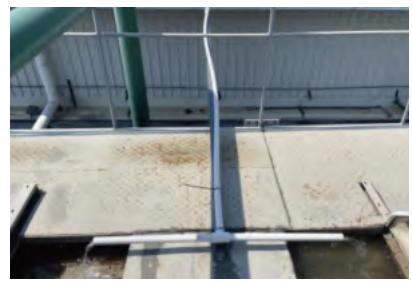

natural_image

Industrial facility interior with metal framework and concrete floor (no visible text or symbols)

岗位送风冷凝水回收

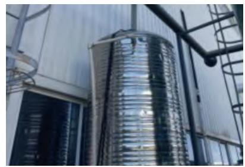

natural_image

Exterior view of a modern industrial building with a large cylindrical storage tank (no visible text or symbols)

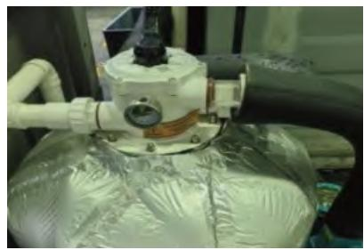

natural_image

Industrial equipment setup with white tubing and a central mechanical component (no visible text or symbols)

具备过滤模式和反冲洗模式的过滤沙缸

为强化水资源管理责任，公司将用水强度目标与高管薪酬及年度绩效考核直接挂钩。报告期内，公司设立“万元产值（可比价）用新水量不高于0.198吨/万元”的用水强度目标，并已顺利完成用水强度目标。

## 2025年用水强度目标

万元产值（可比价）用新水量不高于0.198吨/万元

## 完成情况

万元产值（可比价）用新水量为0.14吨/万元

## “十五五”用水强度规划

单位产品耗水量较“十四五”末下降5%

<table><tr><td>指标</td><td>单位</td><td>2025年</td></tr><tr><td>总用水量</td><td>吨</td><td>34,115,874</td></tr><tr><td>新鲜水取水总量</td><td>吨</td><td>173,298</td></tr><tr><td>水循环与再利用总量</td><td>吨</td><td>33,942,576</td></tr><tr><td>水循环与再利用率</td><td>%</td><td>99.49</td></tr><tr><td>耗水量</td><td>吨</td><td>34,049,029</td></tr></table>

注：本报告耗水量按 “ 新鲜水取水总量 - 排水量 ( 废水排放量 )+ 水循环与再利用总量 ” 计算 , 反映企业对下游水资源可利用量的整体影响程度。  
本报告总用水量=新鲜水取水总量+水循环与再利用总量

## 物料利用

## 物料管理

为提升物料利用效率、减少资源浪费，公司制定并实施了包括《物料管理规定》《仓储管理规定》《物料调拨管理规定》《包装设计规范2.0》在内的系统化管理制度，明确界定采购部、生产运营部、质量部、财务部及研发中心在物料主数据维护、采购执行、质量检验、成本核算及工艺设计等环节的权责分工，形成覆盖物料“准入－使用－盘点－处置”全周期的闭环管理格局，确保账实相符与资源高效配置。公司通过完善物料从入库、存储到调拨的全流程管控，并规范包装设计与尺寸标准，提高物料使用效率，同步降低环境负担。此外，公司高度重视有害原材料的源头管控，严格审查涉及危险或有毒物质的供应商资质，要求其提供物质安全资料表、危化品生产经营许可证、运输许可证、人员培训证明及营业执照等合规文件，从源头保障生产安全与环境合规。

公司引入ERP仓储管理系统，借助数字化平台实现物料全流程可追溯，优化库存结构并有效降低仓储成本。同时，依托数据分析优化物料采购与使用计划，减少库存积压与资源浪费，推动物料管理向精细化、规范化方向发展。此外，公司还通过线上培训等方式，加强对员工的物料管理制度宣贯与技能培养，确保其熟练掌握相关要求，切实提升物料利用效率。

## 物料管理措施

## 仓储

仓库须为结构稳固的房屋，具备良好遮雨条件；门窗保持整齐，确保日照与通风良好；  
确定库位具体位置，并系统编制库位代码；  
原料储存期超过24个月需要进行返检；  
库存品的管理要求账、卡、物三相符；  
每周检查一次仓储物品状况，填写仓储状况查核表；  
库存品每半年盘点一次。  
物料进行批次管理，按照“先进先出”的原则管理。  
工单物料领用实行倒扣料机制：物料先从原料仓调拨至现场仓（SAP系统操作），确保批次与数量同实物一致。生产报工时，严格依据产品BOM从现场仓扣料。  
公司建立包括定期车间盘点、月末盘点及年中/年末全面盘点在内的多层盘点机制，由工厂与财务部人员共同执行，以核实物料库存。仓库人员负责编制盘点表并说明差异，经仓库及工厂负责人确认后提交财务部。财务部据此编制盘点报告并分析差异，报总经理室审批后，通知仓库进行实物处置并同步完成账务处理。

## 物料使用

## 生产制造

## 运营维护

## 绿色包装

公司持续推广以金属料架、塑料围板箱及PP塑料箱等可循环包装材料为主的绿色包装方案。通过实施包装材料减量化与高回收设计，公司逐步扩大塑料围板箱的应用范围与使用频率，以替代传统铁制包装，实现包装轻量化。同时，公司推动供应链协同，引导下级供应商在到货环节采用塑料周转箱，减少一次性包装消耗，从而整体降低环境足迹，提升资源循环效率。

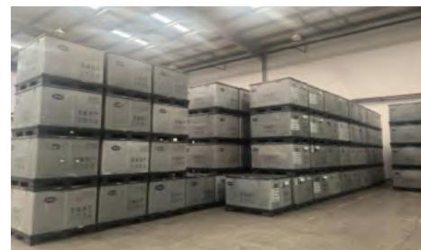

natural_image

Interior of a warehouse with stacked cardboard boxes and overhead metal beams (no visible text or symbols)

塑料围板箱

## 践行绿色运营

## 绿色办公

亚普股份将绿色办公理念融入日常运营管理，通过推行无纸化办公、采用智能照明系统、制定空调使用管理制度、强化生活用水管控等举措，从节能降耗的具体环节入手，减少办公过程中的资源浪费；同时，以全国生态日、全国节能宣传周、六五环境日等环保节点为契机，开展形式多样的宣传教育活动，推广绿色办公经验做法，逐步营造全员参与的良好氛围。

## 绿色运输

亚普股份将绿色低碳理念融入物流运输环节，以精细化规划与智能管理为抓手，结合产品市场需求动态、生产周期特性及库存状况，统筹考量安全库存周期与运输各环节的衔接，通过精准匹配库存与运输需求 制定经济合理的运输批量方案，有效减少了非必要的运输频次，降低运输环节的能源消耗与碳排放，为企业可持续发展提供了有力支撑。

## 绿色产品及服务

紧扣“双碳”战略目标及《国家第六阶段机动车污染物排放标准》的实施要求，亚普股份以绿色技术创新为核心，深耕低排放产品研发与产业升级，为乘用车燃油系统节能降耗及技术革新提供助力。公司提前布局绿色低碳产品赛道，成功研发并推广YNTF®技术等多项高效减排方案，切实履行企业在环保领域的主体责任。

顺应国家能源结构多元化发展方向，公司推动产品矩阵实现跨界延伸，传统燃油油箱完成从“装油”到“装电池、装氢”的产品转型并逐步布局电池包储氢系统，热管理系统等新能源产品 同时启动氢燃料供给系统甲醇燃料供给系统、储能热管理系统及传感器等产品的研发工作，构建起传统燃油产品与新能源产品并行发展的格局。

公司绿色产品

## 高压燃油系统

亚普高压燃油系统由多层塑料燃油箱、蒸汽控制系统等组件构成，在混合动力汽车中作用关键。其低碳环保性能突出，通过蒸汽自动控制和“YNTF®技术”稳定油箱气压，减少蒸发、加油和尾气排放，契合绿色出行趋势。同时，该产品应用声学控制技术和特殊成型工艺，抑制燃油晃动，降低噪声，可提升舒适性，满足混合动力汽车低噪要求。

## 电池包系统

亚普电池包系统涵盖动力电池包和储能插箱，具体产品聚焦上盖、下托盘和底护板。上盖有热固复材和吹塑两种，前者轻质高强、绝缘、耐高温耐腐蚀，减重50%，成本低可回收；后者采用纯阻燃PP，行业首创提升效率。底护板和下托盘技术路线多元，可融合多种材料，发挥不同性能优势。

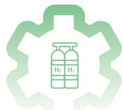

## 储氢系统产品

亚普股份在氢能领域专注于氢系统及其核心零部件的开发，涵盖35MPa和70MPa的Ⅳ型储氢瓶、瓶阀、减压阀等产品。公司通过技术创新，解决了储氢瓶质量大、搬运困难等问题，自主研发的Ⅳ型70MPa储氢瓶，具有轻量化、长寿命、高安全的特点，储氢质量比达6.1wt%，疲劳次数超44,000次，耐氢蚀、耐氢脆性能优异，为氢能汽车的环保发展提供了有力支持。

## 热管理系统产品

亚普股份在汽车热管理系统领域专注于集成模块、集成模块域驱等核心零部件的开发。集成模块的紧凑化流路设计使系统管路缩短、系统压降降低、充注量减少，并在架构上可实现智能协同控制乘客舱、电池包、电机的热量流动，提升能量利用率；集成模块域驱通过高度集成和标准化设计，可显著降低电控单元综合成本，同时提升系统可靠性和可维护性。

## 生态系统与生物多样性保护

亚普股份高度重视生态系统保护与生物多样性保护工作，严格贯彻党和国家生态环境保护方针政策、法律法规及规章制度，先后制定《资源节约与生态环境保护管理规定》《资源节约与生态环境保护责任制度》《资源节约与生态环境保护监督检查管理办法》等核心制度，为生态环保工作提供明确指引。公司严守生态保护红线，在生产经营及项目布局环节主动避让红线区域，从源头规避生态环境风险。同时，公司将生态环境保护工作融入企业治理，纳入党委工作检查与年度考核内容，明确各单位、各岗位的生态环保职责，细化目标任务并强化监督考核，推动责任层层落实，切实履行生态保护与生物多样性保护的主体责任，实现生态环保与生产经营协同推进。

natural_image

Green line art illustration of a car, globe, wind turbine, solar panels, and CO2 meter (no text or symbols)

## 03 创新驭能 产业向新

## 本章节所涉及的ESG重要议题

创新驱动  
产品和服务安全与质量  
供应链管理  
数据安全与隐私保护

## 本章所响应的SDGs

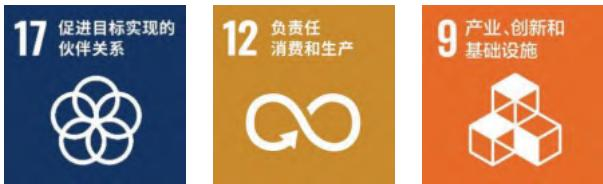

## 创新驱动

## 研发创新体系

亚普股份秉持“创新赋能，为美好生活加油”的企业使命，将研发创新置于重要战略位置，公司制定并实施《项目开发管理规定》，明确项目开发各岗位职责，强化立项流程管控，规范开发标准，在关键环节设置评审节点，以构建全面系统、高效协同的治理体系，为企业持续研发创新与高质量发展提供坚实保障。

同时，公司深化创新发展战略，依托前瞻性技术研究与产业化项目的深度融合，搭建起覆盖新技术探索、新产品开发的研发流程，实现从基础研究到产业化落地的高效转化。目前，公司已掌握吹塑、模压成型、注塑、缠绕四大核心工艺，精准匹配并满足客户多元化、个性化需求。

公司设立包括研究开发中心、项目工程部及海内外工程中心的技术中心，以项目为核心导向构建协同联动机制，推动各部门、各业务模块高效协同，全面保障海内外业务研发与落地工作的一体化推进。

技术中心组织架构图  
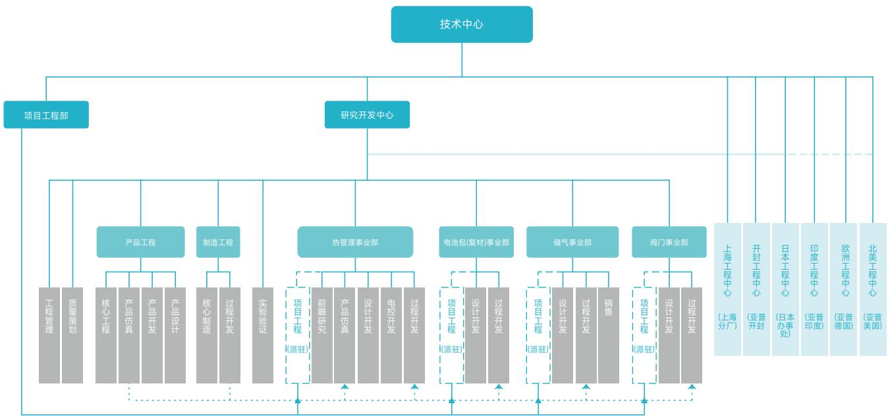

flowchart

This image is a hierarchical organizational chart (tree diagram) illustrating the structure and reporting of an engineering project center, categorized by project department and research development center.

## 关键绩效

报告期内，公司研发投入3.38亿元，占营业收入3.70%；研发人员430人，占员工总人数10.88%，其中本科学历人数占比63.26%，硕士及以上学历人数占比22.09%，男性占比87.44%，女性占比12.56%。

注：公司研发人员及总人数统计口径为合并口径(合同制+聘用制)。

作为国家高新技术企业与国家技术创新示范企业，公司搭建起多元高端研发平台体系，公司拥有国家级企业技术中心、江苏省汽车塑料燃油系统工程技术研究中心、河南省氢能精密阀门工程研究中心、国家博士后科研工作站等研发平台，并建成通过CNAS认证的、亚洲规模领先的储能系统实验室。

历经多年技术积淀，公司已构建起覆盖市场与技术规划、新技术研发、应用产品设计开发的全维度研发能力体系，始终锚定市场需求核心、紧跟国家政策导向，依托海内外工程中心的全球化布局，实现与全球整车厂的同步设计、协同开发，全面保障技术研发与市场应用的高效衔接。

## 关键绩效

报告期内，公司拥有专精特新企业4家；国家高新技术企业5个；国家认定企业技术中心1个；国家技术创新示范企业1个，博士后工作站1个。

## 创新激励与合作

公司聚焦技术创新成果、知识产权等核心维度，制定并实施《科技创新奖惩制度》，明确不同层级科研项目、技术发明奖励标准，建立精神奖励与物质激励相结合的机制，充分激发员工创新活力与创造热情。

此外，公司在强化自主研发能力的基础上，积极拓展外部科研合作，与国内顶尖高校、科研院所开展产学研协同合作。依托高校及科研院所在基础理论、核心研发方面的技术优势，结合自身在生产工艺、产业化落地、资金保障等方面的产业优势，实现创新资源互补、研发能力协同。报告期内，公司已与清华大学、浙江大学、南京大学、东南大学、上海交通大学、山东大学、湖南大学等国内知名高校院所签订联合技术开发协议，在多技术领域开展深度产学研合作，推动基础研究与产业应用高效融合，加速技术成果转化落地。

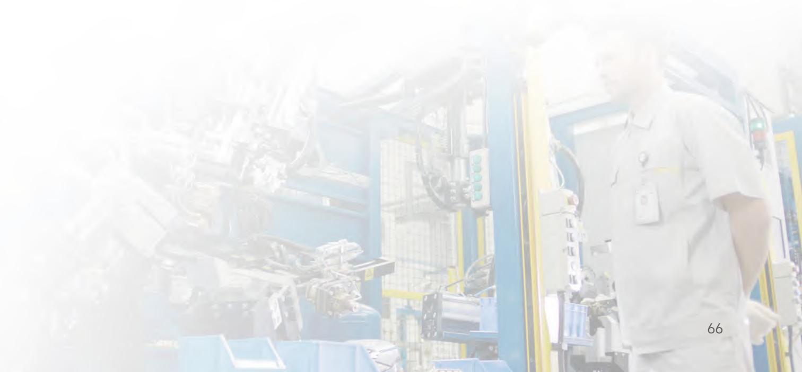

natural_image

Factory floor with workers in white uniforms operating machinery (no visible text or symbols)

## 研发创新成果

公司深耕核心业务领域，持续聚焦技术研究与应用开发，2025年度研发创新工作取得多项重要成果：参与的《高安全燃料电池商用车高压储氢系统关键技术与产业化》项目获得2025年度河南省科技进步三等奖；同时，公司参编的国家标准GB/T 46439-2025《氢能源汽车管路用不锈钢无缝钢管》及团体标准T/DZJN 404-2025《储能电站温控系统技术规范》、T/CSAE 415-2025《燃料电池电动汽车车载氢系统挤压试验方法》均已正式发布。上述成果彰显了公司在氢能储运、储能温控领域的技术积淀与研发实力，将进一步提升公司行业影响力。

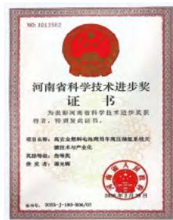  
2025年度河南省科技进步三等奖

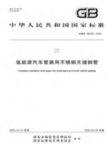  
国家标准GB/T 46439-2025《氢能源汽车管路用不锈钢无缝钢管》

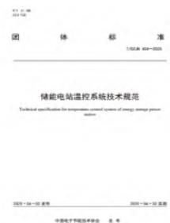  
团体标准T/DZJN404-2025《储能电站温控系统技术规范》

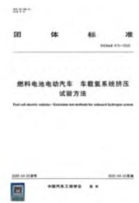  
团体标准T/CSAE415-2025《燃料电池电动汽车车载氢系统挤压试验方法》

## 关键绩效

报告期内，公司累计参与7项国家标准制定，1项行业标准制定，7项团体标准制定，6项企业标准制定。

注：以上统计口径包含赢双科技

## 知识产权保护

公司高度重视知识产权保护与管理工作，严格遵循《中华人民共和国专利法》《中华人民共和国著作权法》《中华人民共和国商标法》等法律法规要求，持续完善知识产权管理体系，明确全流程管理规范，推动专利获取、维护、运用与保护工作的科学化、规范化、程序化，夯实企业创新发展的知识产权制度屏障。

报告期内，公司已通过知识产权合规管理体系认证后的监督审核，并顺利通过江苏省高价值专利培育计划项目（新建类）结题验收，有效促进了公司高价值专利的创造、培育与转化，进一步提升了核心技术的知识产权布局与价值挖掘能力。

此外，公司注重知识产权保护文化建设，积极组织开展知识产权专题培训，以强化全员产权保护意识，在内部营造尊重知识、崇尚创新、诚信守法的良好氛围，为企业创新成果保护筑牢坚实根基。

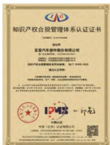  
知识产权合规管理体系认证证书

## 案例 知识产权管理培训

2025年，公司组织员工参加高价值专利撰写培训，深化技术研发人员专利知识储备、提升高质量专利文书撰写能力，为公司知识产权合规管理筑牢人才与能力基础。

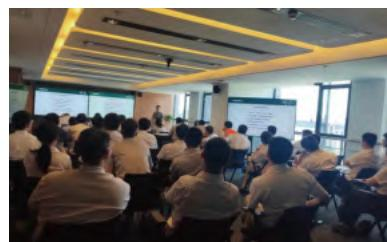

natural_image

Interior view of a conference room with attendees seated facing a presentation screen (no visible text or symbols)

知识产权管理培训现场图片

## 关键绩效

报告期内，公司专利申请数81项，获得授权专利累计480项，其中，授权发明专利累计169项，授权实用新型专利累计299项，授权外观设计专利累计数12项；公司软件著作累计数1件，商标累计数61项，发表论文累计数28项，组织开展知识产权管理培训4次，参与人数152人。

## 科技伦理

公司主营业务、技术研发与经营活动未面临与科技伦理相关的重大风险与挑战。公司始终以合规与道德为准则开展各类研发活动，确保不损害相关方权益与社会公共利益。

## 产品质量与安全

## 产品质量与安全治理

## 治理体系

亚普股份高度重视产品质量管理，严格遵守《中华人民共和国产品质量法》等相关法律法规，秉承“先进技术、精益管理、持续改进、卓越质量——超越客户期望”的质量方针，依据IATF 16949标准构建质量管理体系，形成以《质量手册》及各项管理规定为核心的制度文件体系。

公司建立健全质量管理组织架构，总部质量部负责质量体系的整体建设与统筹管理，确保质量管理工作制度化、规范化；各分厂及子公司专职质量管理部门，负责生产过程的质量控制与监督。

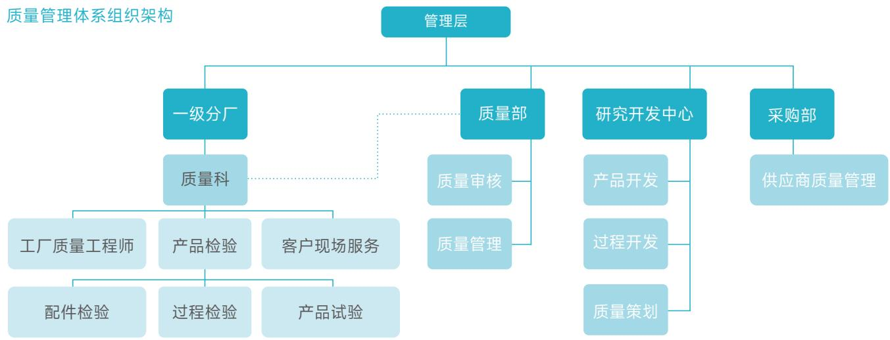

flowchart

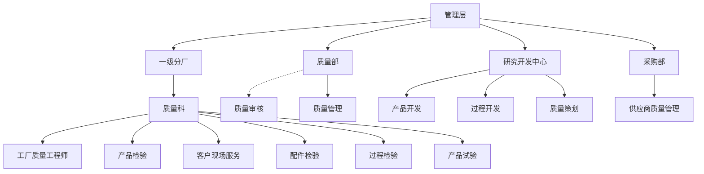
```mermaid
graph TD
  A["管理层"] --> B["一级分厂"]
  A --> C["质量部"]
  A --> D["研究开发中心"]
  A --> E["采购部"]
  
  B --> F["质量科"]
  F --> G["工厂质量工程师"]
  F --> H["产品检验"]
  F --> I["客户现场服务"]
  F --> J["配件检验"]
  F --> K["过程检验"]
  F --> L["产品试验"]
  
  C -.-> M["质量审核"]
  C --> N["质量管理"]
  
  D --> O["产品开发"]
  D --> P["过程开发"]
  D --> Q["质量策划"]
  
  E --> R["供应商质量管理"]
```

## 质量监督

在质量监督机制方面，公司建立了覆盖全业务流程的质量运行监督和审核机制，完善质量监督日报制度，每月召开质量运营系统（QOS）会议监控全公司质量运行状况；每年度召开管理评审会议，组织实施质量管理体系审核、过程审核及产品审核，系统识别质量管理风险并实施有效控制。

公司总部及各分厂、子公司每年接受第三方认证机构的 IATF 16949 监督审核，并按计划开展内部质量管理体系审核、过程审核及产品审核，针对发现的不符合项制定纠正和预防措施，确保整改闭环。截至报告期末，公司总部及所有分厂、子公司均通过 IATF 16949 质量管理体系认证。

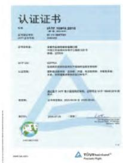  
IATF16949:2016 质量体系认证证书

## 产品质量与安全战略

公司每年组织开展管理评审，系统评估内外部环境变化，识别并分析在产品设计、生产、交付及服务全过程中可能面临的风险与机遇，制定针对性措施并推动落实。

<table><tr><td>风险/机遇类型</td><td>风险/机遇描述</td><td>发生概率</td><td>影响大小</td><td>影响的时间范围</td><td>影响的价值链环节</td><td>潜在财务影响</td><td>应对措施</td></tr><tr><td>设计源头质量风险</td><td>新产品开发阶段设计缺陷识别不全、工艺验证不充分或客户特殊要求理解偏差,可能导致量产阶段出现批量性质量缺陷,引发客户投诉及召回风险。</td><td>低</td><td>高</td><td>长期</td><td>运营、下游</td><td>营业收入减少</td><td>1. 运用 FMEA 工具对设计缺陷和工艺失效模式进行系统性分析,制定预防措施;2. 严格执行全尺寸与功能性试验计划,验证产品符合性;3. 建立项目质量风险管理规定,设立质量评审机制。</td></tr></table>

<table><tr><td>风险/机遇类型</td><td>风险/机遇描述</td><td>发生概率</td><td>影响大小</td><td>影响的时间范围</td><td>影响的价值链环节</td><td>潜在财务影响</td><td>应对措施</td></tr><tr><td>供应链来料质量波动风险</td><td>如关键零部件供应商因工艺不稳定、原材料变更或产能爬坡,可能导致来料质量波动,影响生产连续性及最终产品一致性。</td><td>低</td><td>中</td><td>短期</td><td>上游、运营</td><td>营业收入减少</td><td>1. 实施供应商分级管理,开展第二方质量能力审核;2. 建立零部件风险管控指南,对关键物料实施监控;3. 完善进货检验标准,运用数字化手段提升检验效率;4. 建立多元化供应体系,降低单一供应商依赖。</td></tr><tr><td>数字化转型机遇</td><td>依托MES、QMS系统与IoT技术,实现质量数据实时采集、自动分析与异常预警,推动质量管控从“事后检验”向“事前预防”转型,降低质量损失成本。</td><td>中</td><td>高</td><td>长期</td><td>运营</td><td>运营成本减少</td><td>1. 深化MES与QMS系统集成,实现产品全流程数字化追溯;2. 完善经验教训数据库,实现质量问题快速追溯与知识共享。</td></tr><tr><td>市场机遇</td><td>全球汽车产业电动化转型加速,混动及纯电动车型渗透率持续提升,带动热管理系统、储氢系统、高压电池包壳体等新产品市场需求快速增长。公司在相关领域的技术储备和产业化能力具备先发优势,有望通过产品结构优化实现业务增长。</td><td>高</td><td>高</td><td>中期</td><td>运营</td><td>营业收入增加</td><td>优化产能布局,加快新能源汽车配套产品专用产线建设,提升高附加值产品产能占比。</td></tr></table>

## 影响、风险和机遇管理

## 风险管理体系

公司始终聚焦质量风险管理，制定《全面风险管理办法》《项目开发管理规定》《FMEA管理规定》《经验教训管理规定》等制度文件，形成覆盖风险识别、评估、预警、应对及专项管控的全流程管理机制。

在运行层面，公司系统实施风险识别与分类，建立科学评估准则，完善预警响应流程，落实针对性应对措施；同时聚焦零部件全生命周期及项目开发关键节点，强化专项风险管控，从源头降低质量风险敞口。此外，公司建立多层次监督验证机制，通过第二方质量能力审核、第三方体系认证监督及内部质量审核相结合的方式，持续验证并提升产品可靠性。

主要工具方法应用

<table><tr><td>管控维度</td><td>应用工具/方法</td><td>实施要点</td></tr><tr><td>风险识别与评估</td><td>·失效模式与影响分析(FMEA)·故障树分析(FTA)</td><td>结合客户特殊要求、法规标准及历史经验教训数据,对产品设计、工艺方案进行系统性风险预判与根因分析。</td></tr><tr><td>过程能力监控</td><td>·统计过程控制(SPC)·过程能力指数(Cpk)分析</td><td>对关键质量特性实施实时统计监控,评估过程稳定性与能力水平,及时发现异常波动。</td></tr></table>

## 产品召回管理

公司制定了《产品“三包”管理规定》《召回管理规定》，进一步完善了产品三包服务的处理流程，建立从售后反馈、问题确认、解决方案制定到执行的全流程管理机制，确保客户反馈得到快速响应和有效处理。报告期内，公司未发生因产品质量问题引发的产品召回事件及重大质量事故。

## 数字化管理

公司建立了覆盖产品全生命周期的全过程质量监控体系，在进料检验、生产过程、产品交付等各环节对关键质量特性实施自动化检测和数据采集，实现产品全流程质量信息的有效追溯。

公司依托两化融合管理体系标准，以数智化基础设施升级为基础，深化MES系统应用并与EAM系统、生产可视化大屏无缝对接。通过IoT技术实现生产设备、工业机器人、PLC及仪器仪表的互联互通与数据采集，强化设备实时监控与故障预警能力，提升设备综合效率（OEE）并积累设备数据资产。

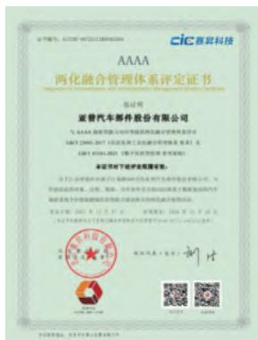

text_image

CIC Aerospace Technology
AAAA
两化融合管理体系评定证书
CIC Aerospace Technology
安吉汽车部件股份有限公司
与AAAA配套的公司均需按照国家法律法规和国务院办公厅（以下简称《国务院办公厅》）的有关规定办理认证。
GEM 23905-2017 号注册地址：上海市浦东新区金融街68号嘉事堂、东吴证券大厦4楼401室，办公地址：上海市浦东新区银城中路188号嘉事堂A座16层
GEM 23905-2017 号注册地址：上海市浦东新区银城中路188号嘉事堂A座16层
本证书对于被注册地有效。经审查，公司名称：深圳市福田区深南大道1008号时代汽车零部件股份有限公司，与深圳市福田区深南大道1008号时代汽车零部件股份有限公司签署的《深圳市福田区深南大道1008号时代汽车零部件股份有限公司之股东协议》。
法定代表人：周云、王云、李云、徐云、刘云、张云、宋云、周云、王云、李云、徐云、周云、宋云、张云、宋云、周云、宋云、周云、宋云、周云、宋云、周云、宋云、周云、宋云、周云、宋云、周云、宋云、周云、宋云、周云、宋云、周云、宋云、周云、宋云、周云、宋云、周云、宋云、周云、宋云、周云、宋云、周云、宋云、周云、宋<nl>

两化融合管理体系AAAA评定证书

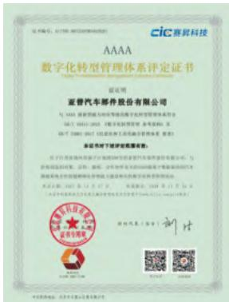

text_image

AAAA
数字化转型管理体系评定证书
CIC赛昇科技
国证证明
亚普汽车部件股份有限公司
与 AAA 国家新能源汽车集团等同类型数字化转型管理体系协会
GAX 2011/2015 拉车型汽车零部件技术研究基地
编号：20081-1973（以工商行政管理部门核准）
证书号：沪能证字第146号
经营范围：汽车电子元器件及电子元器件的开发、生产、销售及相关技术服务。企业依法自主选择经营项目，开展经营活动，具体经营项目以相关部门批准文件或许可证件为准。
国家发改委（联合）新材

数字化转型管理体系AAAA评定证书

同时，公司优化PLM等核心系统，搭建完善的产品数据管理平台，结合QMS质量管理系统，打通从研发、生产到质量管控的全流程数据链路，实现产品质量的精准追溯，构建覆盖产品全生命周期的数字化管理体系。

## MES 系统

将产品条码与制造过程中的关键工艺参数绑定，实现产品全流程数据追溯与实时质量分析优化。

## QMS/SRM 系统

对生产过程中的质量异常、工艺偏差及供应商质量问题生成标准化处理流程，进行根因分析并录入经验教训库，实现知识共享与问题预防。

## 质量文化培育

公司将持续提升质量能力纳入人力资源发展规划，每年将国家法律法规、质量方针、质量目标、质量规划、质量意识、产品质量及产品安全等要素纳入年度培训计划，围绕“通用技能类”“专业知识类”“管理体系类”三大板块系统策划培训内容，从深度、力度和广度三个维度开展内部培训，确保培训实效。

## 关键绩效

报告期内，公司共举办质量专项培训15次，培训总时长3,030小时，累计培训 702 人次。

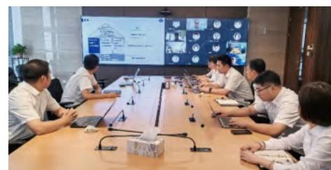

text_image

Meeting scene with participants seated around a conference table, large screen displaying data and charts in the background

售后质量专题培训

## 指标与目标

公司质量部每年初发布年度质量规划基于销售预测，生产规划及业务战略 结合客户质量要求及上年度绩效评估结果，系统制定涵盖以下维度的质量目标与工作计划

<table><tr><td>维度</td><td>指标</td><td>2025年完成情况</td></tr><tr><td></td><td>质量监控</td><td>工厂质量运行监督和评估机制有效运行,已完成分厂及子公司质量日报、质量监督日报及4家“体检式”深度审核。</td></tr><tr><td>体系与过程管理</td><td>体系与过程审核</td><td>已按计划完成,不符合项均进行整改,整改闭环率100%。</td></tr><tr><td></td><td>第三方审核</td><td>按计划完成了各分厂子公司的IATF16949三方审核。</td></tr></table>

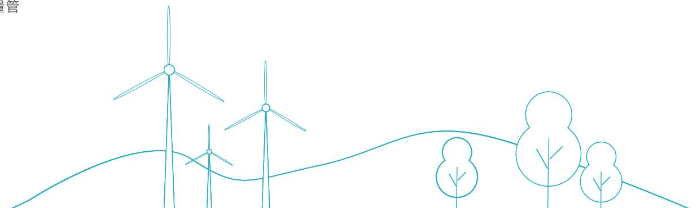

natural_image

Line drawing of wind turbines and trees on a hill (no text or symbols)

<table><tr><td>维度</td><td>指标</td><td>2025年完成情况</td></tr><tr><td rowspan="2">产品实现质量</td><td>产品全尺寸与功能性试验计划</td><td>完成率100%</td></tr><tr><td>产品合格率</td><td>97.73%</td></tr><tr><td rowspan="2">市场表现</td><td>产品召回/重大客户抱怨</td><td>0次</td></tr><tr><td>客户满意度指标</td><td>97.92%</td></tr></table>

报告期内，公司未发生重大客户投诉与质量抱怨，质量业绩满足客户要求，产品质量稳定受控。

## 关键绩效

报告期内，公司年度质量内审59次，产品合格率97.73%。

## 客户服务

## 客户服务管理

亚普股份秉持“顾客为师”的核心价值观，始终将客户诉求置于首位，积极响应并妥善解决客户需求，通过持续的产品迭代与服务优化，提升产品品质与客户体验。公司制定《顾客服务管理规定》《顾客服务过程》等客户服务相关管理制度与文件，建立标准化服务流程，确保客户问题与诉求得到及时、高效地响应和处置，切实保障客户权益。

在客户服务数字化方面，公司积极规划部署客户关系管理系统（CRM），引入数据统计分析工具，实现客户信息、服务需求的数字化管理洞察客户需求 提升客户响应效率与服务质量以数字化手段夯实客户服务管理基础。

公司每年开展两次客户满意度调查，综合运用问卷、访谈、在线评价等多元渠道，全域收集客户对公司产品、品质、服务等维度的反馈意见，持续优化服务质量。

## 关键绩效

报告期内，公司客户满意度97.92%，参与调查的客户数量58家。

## 客户服务培训

公司定期组织销售人员，技术人员等面向客户的岗位人员开展商务礼仪，谈判技巧，客户满意度提升等专项培训，推动服务向标准化、专业化与个性化方向发展。

## 案例

## 《大客户销售与谈判策略》培训

2026年1月上旬，公司统筹开展《大客户销售与谈判策略》专项培训，课程紧密贴合公司战略与业务发展需求，围绕行业发展趋势与大客户拓展的核心驱动作用展开深度解析，明确其对业务布局优化，市场规模扩大的关键价值。培训聚焦大客户开发、谈判及维护等关键能力建设，着力提升销售团队的市场攻坚与实战能力，全面强化专业服务水平。

## 负责任营销

公司严格践行负责任营销理念，所有宣传物，宣传资料由行政部统一设计，经公司多层级审核确定后定稿制作确保对外传递信息的真实性、准确性、合规性。此外，公司建立标准化的外发文件审核流程，将对外宣传资料全面纳入流程范畴，以严谨的内控管理体系规范营销宣传行为，切实履行企业信息发布的主体责任。

natural_image

Illustration of business professionals and security-related icons (no text or symbols)

## 信息安全与客户隐私保护

## 数据安全管理

亚普股份将信息安全作为公司经营发展的重要基石，严格遵守《中华人民共和国网络安全法》《中华人民共和国数据安全法》等法律法规，依据ISO 27001标准制定《网络安全管理规范》《信息安全管理手册》等一系列专项管理制度，明确管理权责、规范操作流程、强化风险防控，以制度刚性保障信息资产安全，切实筑牢公司数字化运营的安全防线，兼顾客户权益保护与公司可持续发展。

公司秉承“预防为主、分级保护、分层负责、持续改进、客户信赖”的信息安全方针，设立网络与信息系统安全管理领导小组及专项工作小组，统筹推进安全规划、组织协调与落地实施工作，以构建完善的信息安全管理体系。报告期内，公司已通过ISO 27001信息安全管理体系认证，未发生数据安全和客户隐私泄露事件。

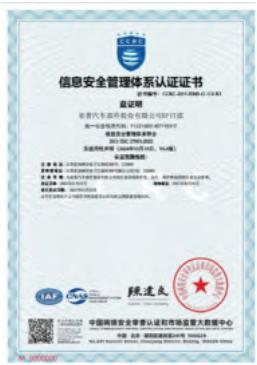

text_image

信息安全管理体系认证证书
证明
中国·西安交通大学
2018年1月1日
安永华明
安永华明
安永华明
安永华明
安永华明
安永华明
安永华明
安永华明
安永华明
安永华明
安永华明
安永华明
安永华明
安永华明
安永华明
安永华明
安永华明
安永华明
安永华明
安永华明
安永华阴
安永华阴
安永华阴
安永华阴
安永华阴
安永华阴
安永华阴
安永华阴
安永华阴
安永华阴
安永华阴
安永华阴
安永华阴
安永华阴
安永华阴
安永华阴
安永华阴
安永华阴
安永华阴
安永华阴
安永华阳
安永华阳
安永华阳
安永华阳
安永华阳
安永华阳
安永华阳
安永华阳
安永华阳
安永华阳
安永华阳
安永华阳
安永华阳
安永华阳
安永华阳
安永华阳
安永华阳
安永华阳
安永华阳
安永华阳
安永华阴
安永华阴
安永华阴
安永华阴
安永华阴
安永华阴
安永华阴
安永华阴
安永华阴
安永华阴
安永华阴
安永华阴
安永华阴
安永华阴
安永华阴
安永华阴
安永华阴
安永华阴
安永华阴
安永华明
安永华明
安永华明
安永华明
安永华明
安永华明
安永华明
安永华明
安永华明
安永华明
安永华明
安永华明
安永华明
安永华明
安永华明
安永华明
安永华明
安永华明
安永华明
安永华阳
安永华阳
安永华阳
安永华阳
安永华阳
安永华阳
安永华阳
安永华阳
安永华阳
安永华阳
安永华阳
安永华阳
安永华阳

ISO 27001信息安全管理体系证书

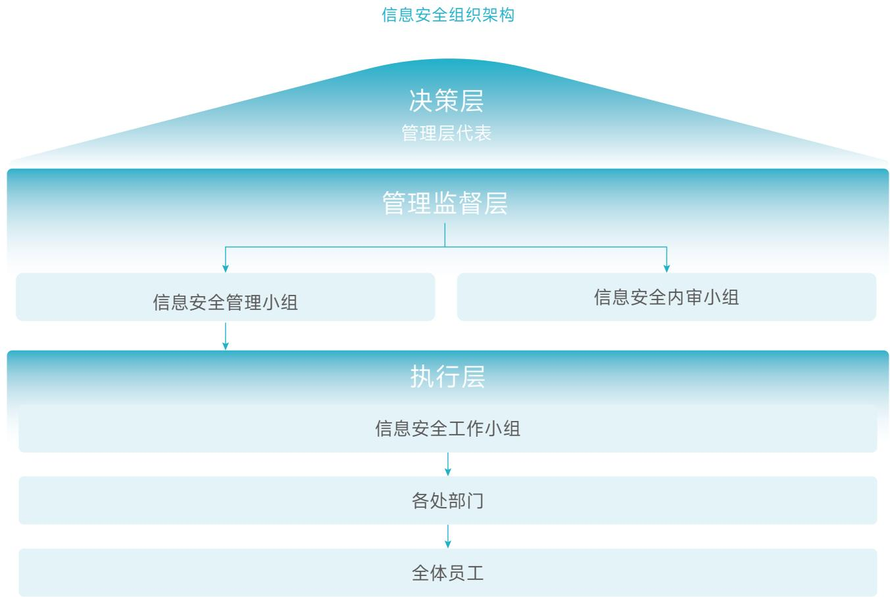

flowchart

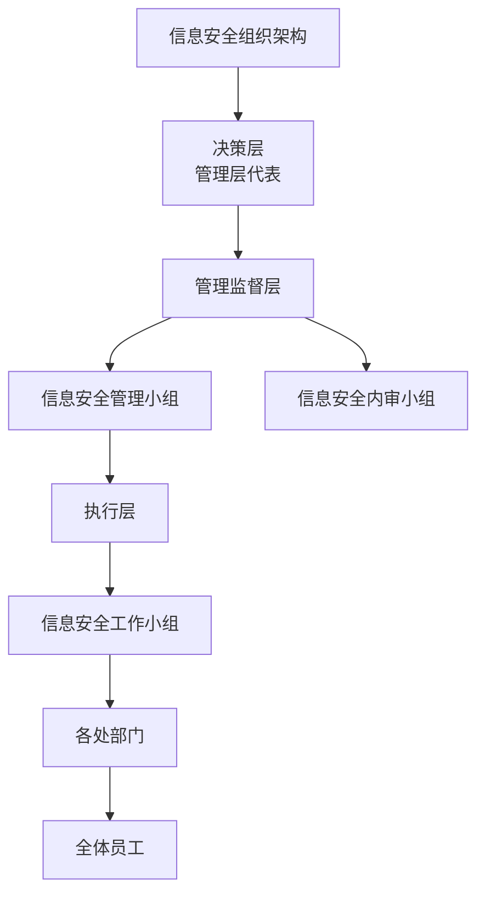
```mermaid
graph TD
  A["信息安全组织架构"] --> B["决策层\n管理层代表"]
  B --> C["管理监督层"]
  C --> D["信息安全管理小组"]
  C --> E["信息安全内审小组"]
  D --> F["执行层"]
  F --> G["信息安全工作小组"]
  G --> H["各处部门"]
  H --> I["全体员工"]
```

## 数据安全管理

## 风险管理

公司制定《信息安全风险评估管理规定》，明确“风险识别—风险评估—风险应对”全流程操作标准，为各项风险评估工作开展提供坚实的制度指导与支撑保障。

管理流程

具体措施

识别信息系统、人员活动、物理环境、自然等类型的威胁，结合安全日志、网络监控及第三方威胁情报分析威胁源；

基于已识别威胁，查找信息资产的弱点，结合现有控制措施分析弱点可被利用的情况。

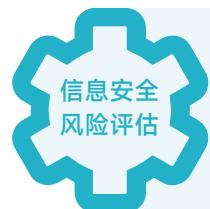

结合威胁出现频率与发生概率确定其可能性等级 根据弱点被利用后的损害程度明确其严重性等级，并将风险值区间划分为低、中、高三类风险等级。

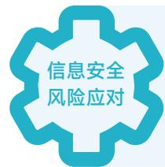

依准则分级确定风险接受程度，对需处置风险制定管控策略并完善相关表单与计划，经审批后组织实施并跟进进展，实施后复评风险，残余风险不可接受则重复处置流程，高残余风险接受需说明理由并上报。

## 应急事件管理

为有效处置公司信息系统可能突发的各类安全事件，全面筑牢信息安全防护屏障，持续提升整体安全防护能力，公司同步编制了各信息系统专项应急预案。在预案编制过程中，公司系统梳理并充分考量了各类潜在安全威胁，覆盖网络恶意攻击、核心数据泄露、系统突发故障等多元风险场景，通过全方位、多维度的研判规划，确保应急预案具备科学性、针对性与全面性，为突发安全事件的快速处置、有序应对奠定坚实基础。

同时，公司不定期开展信息应急演练，演练形式涵盖桌面推演与实战模拟，针对不同安全事件场景设置具体处置流程与角色分工，检验应急响应团队的快速反应能力、协同配合效率及预案的可操作性。通过常态化演练，不断优化应急预案内容，提升全员信息安全应急意识与处置技能，保障公司信息系统在突发安全事件下的稳定运行与数据安全。

## 关键绩效

报告期内，公司共开展5次信息安全应急演练。

## 2025年公司信息安全应急演练

## 演练主题

## CRM系统恢复演练

## 演练结果

CRM系统操作人员按流程将业务系统备份数据（CRM-PRD）恢复至公司测试演练平台，同步完成恢复结果校验，系统恢复正常。

## SRM系统恢复演练

SRM系统操作人员按流程将业务系统备份数据（SRM-PRD和DB）恢复至公司测试演练平台，同步完成恢复结果校验，系统恢复正常。

## WMS系统恢复演练

WMS系统操作人员按流程将业务系统备份数据（WMS-PRD和DB）恢复至公司测试演练平台，同步完成恢复结果校验，系统恢复正常。

## OA系统应急预案

OA系统人员更新请求后恢复正常，并修改数据库密码，对系统进行备份。

## 数据中心停电应急演练

自接到停电通知至供电恢复，IT部门领导全程统筹指挥，核心负责人全员在岗值守、保持通信畅通，全力保障供电全过程平稳有序，整体组织部署得力，应对措施精准到位。

## 数据安全实践

公司设定信息安全管理目标，明确重大级信息安全事件零发生，信息系统全年可用率不低于99%，实现全体员工保密协议100%签订，且每年至少开展一次信息安全风险评估。为达成这一目标，公司从技术架构、管理体系、防控机制等多维度构建全方位数据安全防护体系，持续提升安全防护能力，切实保障客户数据及公司核心信息资产的保密性、完整性和可用性，为业务的持续发展提供了有力支撑。同时，公司对员工进行定期的信息安全培训，提升员工信息安全意识，强化全员数据安全防护理念，切实筑牢企业数据安全防线，守护核心数据资产安全。报告期内，公司制定信息安全管理目标均已达成。

## 案例 网络安全培训

2025年5月10日，公司为筑牢企业网络安全防线，强化全员网络安全防护意识特邀网络安全专家开展全覆盖高精度的专项培训本次培训聚售核心安全隐患以专家授课为核心形式，采用理论讲解与案例剖析相结合的教学模式，开展三大维度的系统教学。公司通过本次培训，有效筑牢业务连续稳定运行的技术防线，切实保障客户信息安全，夯实企业高质量稳健运营的网络安全根基，全面提升公司网络安全整体防护能力。

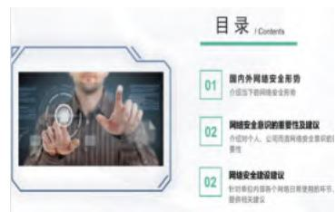

text_image

目录 / Contents
01 国内外网络安全形势
介绍当下取网络安全事物
02 网络安全意识的重要性及建议
介绍4个人、公司用适网络安全意识的重要性
02 网络安全建设建议
针对新内容升级个网络日程使用短环节，能够快速发展

## 关键绩效

报告期内，公司未发生泄露客户信息事件，开展信息安全与隐私保护相关培训2场，接受培训总人数12人。

## 客户隐私保护

为切实保障客户及项目的数据安全，严守商业机密，有效防范信息外泄风险，维护自身良好信誉与核心利益，公司制定《亚普股份客户项目涉密信息管理机制》。公司通过该机制聚焦内部管理优化，构建起严密完善的内部项目代号管理体系，以规范化、制度化的管控模式，为客户信息安全筑牢第一道防线，从源头遏制涉密信息泄露隐患。

在客户隐私保护与信息合规使用方面，公司秉持知情、自愿、合规的核心原则，落实多项严格举措。针对获取客户位置信息、读取通讯录等涉及敏感信息的操作，公司会在操作实施前，向客户作出清晰、明确的专项提示，同时获取客户的单独授权，保障客户始终处于信息使用的主导地位。同时，公司始终将法律法规合规作为信息使用的底线，在法律允许的框架内开展各项信息相关操作，密切跟踪国家及地方层面数据安全、隐私保护相关法律法规的更新与调整，及时优化完善内部数据安全管理制度及业务操作流程，确保各项工作始终符合现行法律法规要求，实现合规化运营。

## 供应链管理

## 供应链管理体系

稳定可持续的供应链是企业高质量发展的重要支撑，亚普股份从制度规范，人员赋能，系统升级三方面筑牢供应链保障体系。在制度保障方面，公司通过制定《供应商管理规定》《生产性物料供应商管理规定》《供应商考核细则》等一系列文件 实现采购全流程合规管控：在人员赋能方面 公司通过定期开展供应商采购流程培训指导采购人员严格执行标准化作业流程，强化采购作业的规范性；在系统升级方面，公司通过SRM（供应链关系管理）系统，将供应商准入、报价、合同签订，订单履约，对账结算及绩效考核等环节纳入数字化管理建立供应商数据库，全面提升供应链协同效率与管理水平。

## 降低供应链风险举措

公司总部统筹全球谈判，利用全球化采购的体量优势争取商务优势，降低区域采购风险；

推动不同区域公司的原材料、配件本土化，减少运输风险和政治风险；

公司不断丰富供应商数量，积极引进新供应商，避免独家供应风险，从而实现供应链的多元化与稳定化。

## 关键绩效

报告期内，公司供应商总数为2,865家，其中拥有质量管理体系认证、环境管理体系认证、职业健康安全管理体系认证的供应商数为729家(仅统计境内生产性供应商)，因不合规被否决的潜在供应商1家。

## 供应商全生命周期管理

在供应商管理实践中，亚普股份围绕供应商准入、评价、退出构建全周期规范化管理体系，以多维度审核及协议约束夯实准入门槛，以环境安全等指标明确量化评价标准，实施有效过程管控，同时明确供应商责任界定与退出规则，实现闭环管理。

## 供应商管理措施

## 供应商准入与审核

从商务、技术、质量等多维度开展审核，确保供应商的综合实力符合公司要求；与供应商签订《一般采购条款》《供应商质量保证协议》《物流协议》《保密协议》等一系列协议，明确双方权责，约束供应商行为。

## 供应商评价

将供应商环境安全评分纳入日常及年度考核中，作为供货份额、付款周期、定价的依据，并根据综合评价结果提出整改要求。

## 供应商退出

供应商若因违章、违纪、违法等行为造成环境、安全方面恶劣的影响需承担全部责任；对经考核后未按要求整改的供应商，同步启动退出流程。

## 关键绩效

报告期内，公司开展供应商审核45家。

## 供应商ESG管理

## 廉洁供应链

供应链的廉洁合规建设，既依赖制度的硬性约束，也离不开供需双方的廉洁共识。2025年，亚普股份协同供应商统一管理标准，在供应商准入环节强化合规审查：要求供应商提交无关联交易承诺函、关联关系审查表及股权结构图等证明材料，穿透核查其与公司的关联情况，从源头防范不正当内部交易风险。此外，公司完善供应商“黑名单”机制，畅通违规供应商退出通道；并持续加强采购员工廉洁教育，多措并举构建全方位的商业道德防护体系。

## 关键绩效

报告期内，供应商廉洁协议签署率为100%。

## 绿色供应链

公司强化供应商绿色准入管理，要求供应商在系统中上传安环调查表。公司围绕体系搭建、危险废弃物处置、节能技术应用等维度开展调查，并同步审验供应商提交的资质证书、检测报告，确保评估结果全面、真实反映供应商绿色发展水平。此外，公司要求供应商签署《环境安全健康协议》，明确环保履约责任，涉及危险或有毒物质的供应商，须提供物质安全资料表、危化品生产经营许可证、运输许可证、人员培训证明及营业执照等文件。

为深化供应链绿色运营实践，公司持续推进可循环包装应用与包装材料减量化：以塑料围板箱逐步替代铁制包装器具；并计划推动供应商到货包装统一采用塑料周转箱，逐步淘汰一次性包装材料，进一步推进供应链绿色低碳协调发展。

## 平等对待中小企业

公司始终秉持公平、公正的合作理念，严格贯彻《中华人民共和国中小企业促进法》《保障中小企业款项支付条例》等法律法规要求，切实维护中小企业的合法权益，报告期内，公司不存在逾期尚未支付中小企业款项信息的情况。

## 04同心同进共享成长

## 本章节所涉及的ESG重要议题

员工权益与福利  
员工培训与发展  
职业健康与安全生产

## 本章所响应的SDGs

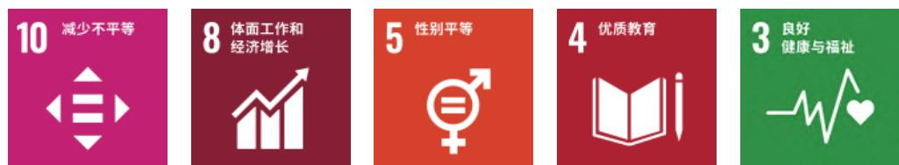

# 员工关系

## 员工权益保护

## 员工招聘

公司秉持“公平公正、择优录用”理念开展招聘工作，2025年修订《亚普股份员工招聘与录用管理规定》 ，进一步优化招聘流程，细化管理要求，全面规范人才引进工作，有效防范招聘录用环节风险，持续提升招聘工作效率与质量。

公司采用社会招聘与校园招聘相结合的引才模式 社会招聘通过媒体发布，招聘会，内外部推荐，猎头合作等渠道广泛吸纳成熟人才；校园招聘聚焦对口专业高校，依托校园宣讲、专场招聘等形式引进优质应届毕业生。

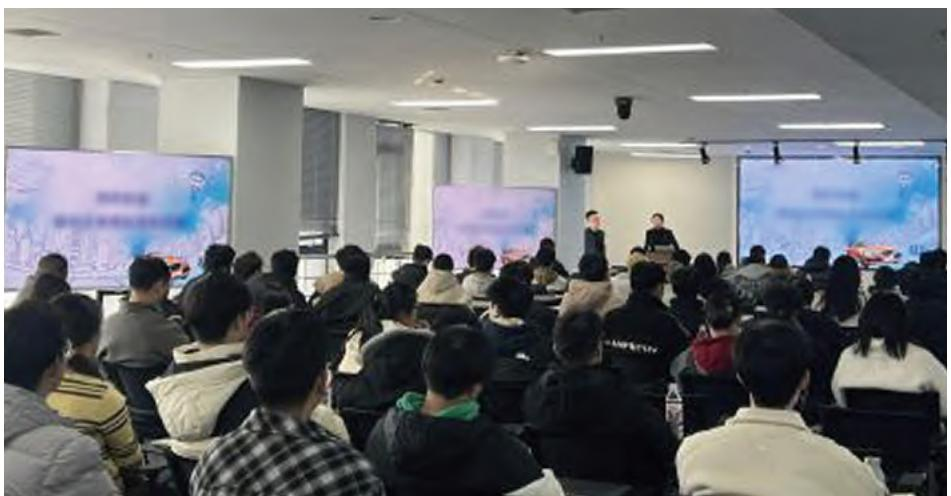

natural_image

Interior view of a conference or lecture hall with audience seated facing two speakers at the front, and large screens displaying event branding (no visible text on main subjects)

2025年校园宣讲会现场

## 关键绩效

报告期内

公司劳动合同签订率

100%

少数民族员工

136人

社会保险覆盖率

100%

公司社会招聘

1,046人

公司总人数

4,902人

校园招聘

65人

其中残疾员工

5人

本部员工流失率

6.5%

2025年员工结构  
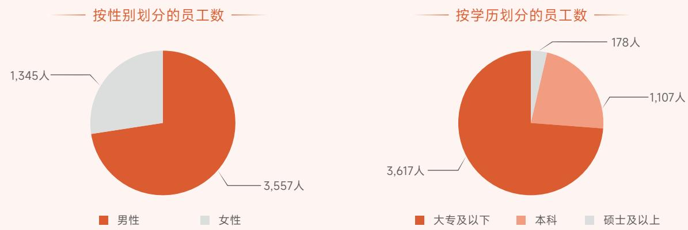

按年龄划分的员工数  
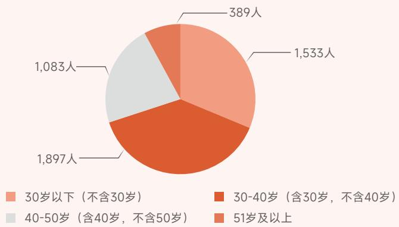

pie

| Category | Value |
| --- | --- |
| 30岁以下 (不含30岁) | 1,533人 |
| 30-40岁 (含30岁，不含40岁) | 1,897人 |
| 40-50岁 (含40岁，不含50岁) | 1,083人 |
| 51岁及以上 | 389人 |

## 多元、平等与包容性

公司坚守合法用工与公平雇佣原则，制定《员工手册》，为员工提供平等就业机会，在招聘、培训、薪酬、职业发展等环节以绩效与能力为核心标准，杜绝基于各类身份背景的歧视、骚扰与侮辱行为。在此基础上，公司严格禁止暴力胁迫等非自愿劳动行为，严禁使用童工及任何形式的人口贩运行为，在《劳动合同》签订过程中对员工身份进行严格查验，明确禁止雇佣童工和强迫劳动事件的发生；对各类歧视、骚扰行为采取零容忍态度，切实维护员工合法权益。

公司重视员工反歧视、反骚扰及禁止强迫劳动等合规意识培育，将其纳入常态化培训体系，培训覆盖全体员工，有效提升员工的法律意识与社会责任感，营造公平、尊重、安全的工作环境，培育积极向上的企业文化。

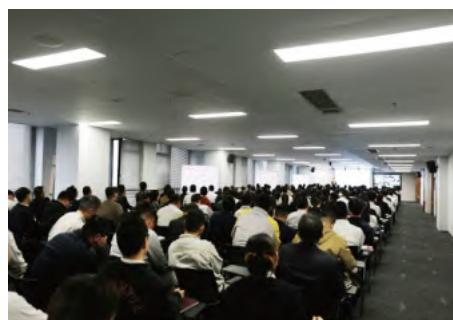

natural_image

Interior view of a large conference hall with attendees seated facing a projected screen (no visible text or signage)

反歧视、反骚扰等人权基本意识培训

## 女性权益保护

为保障女性员工的合法权益，公司严格遵守《中华人民共和国妇女权益保障法》等法律法规要求，制定并执行《亚普股份员工薪资管理规定》《亚普股份员工考勤管理规定》，明确女职工在产检假、产假和哺乳假期间的休假权益及薪资待遇，严禁以怀孕、生育、哺乳为由限制女性员工在晋升、培训等职业发展方面的机会，杜绝任何形式的职场性别歧视。

每逢国际劳动妇女节 公司均为女员工组织踏青，插花，游园等活动传递关怀与尊重 切实让女性员工感受到职场温暖与平等保障。

## 案例 妇女节活动

2025年3月8日公司工会组织开展女神节踏青活动邀请女性员工走出办公环境 通过开展插花，游园等活动，在自然与趣味互动中放松身心、增进情谊。此次活动贴合女性员工需求，丰富了精神文化生活，更强化了员工归属感与团队凝聚力。

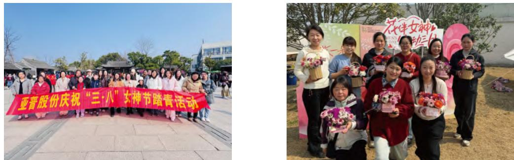

natural_image

Close-up of hands holding a pink heart against a bright sunlit sky, with no visible text or symbols.

## 员工薪酬福利

## 薪酬与福利

为构建公平合理的员工薪酬体系，公司遵循“价值导向、面向市场、绩效关联、动态可调、预留空间”薪酬体系设计原则，制定《亚普股份员工薪资管理规定》及相关配套制度。

在薪酬结构方面，员工收入由工资、奖金及津补贴构成，其中工资、奖金等核心收入与个人绩效表现直接挂钩，充分体现“多劳多得”的分配导向，通过绩效薪酬联动机制，公司既稳固骨干人才队伍，又充分激发员工潜能，从而在激烈的人才竞争中构筑核心优势。

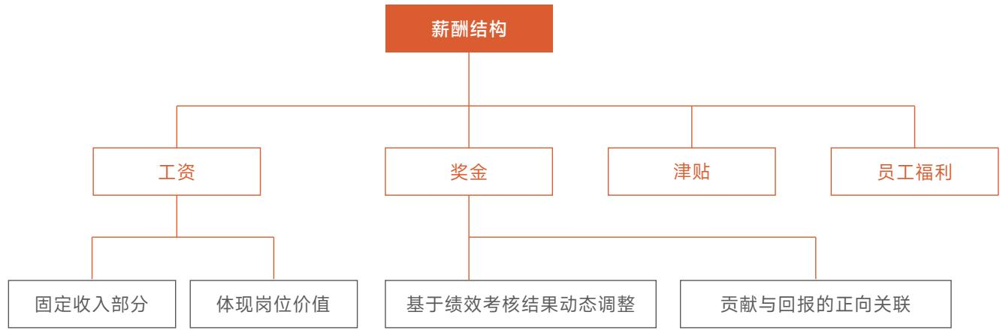

flowchart

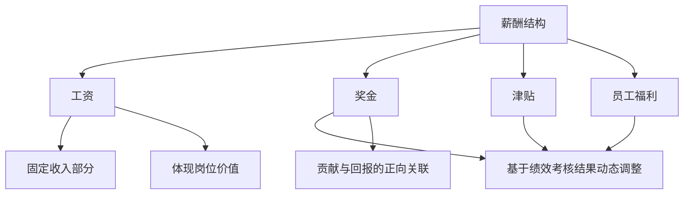
```mermaid
graph TD
  A["薪酬结构"] --> B["工资"]
  A --> C["奖金"]
  A --> D["津贴"]
  A --> E["员工福利"]
  B --> F["固定收入部分"]
  B --> G["体现岗位价值"]
  C --> H["基于绩效考核结果动态调整"]
  C --> I["贡献与回报的正向关联"]
  D --> H
  E --> H
```

为深化员工与公司的利益共同体建设，激发核心团队的积极性与创造性，公司自2019年起构建长效激励机制，于2020年3月3日完成股权激励计划的首期授予。该计划将限制性股票解除限售与公司整体业绩及个人绩效考核结果直接挂钩，采取分期解锁方式设置考核约束，确保激励周期与企业发展阶段相匹配，本次限制性股票激励计划最后一个解除限售期已于2024年解除限售并上市，该激励计划已实施完毕。

此外，公司为员工提供覆盖生活保障、健康关怀、日常便利等多方面的实际福利，切实提升员工的生活品质与幸福感，进一步增强其对企业的认同感与归属感。

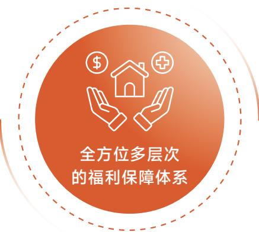

text_image

全方位多层次
的福利保障体系

按照国家规定按时足额缴纳“五险一金”并建立企业年金制度，为员工提供退休保障。

配套提供员工及子女医疗费用报销、雇主责任险等补充保障，降低员工生活风险。

严格执行国家工时制度和带薪休假制度，明确延时工作补偿标准，确保员工休息休假权利得到刚性维护。

## 绩效考核与申诉

公司构建了“年度+任期”双频次绩效考核机制，均采用KPI评估模式。年度考核内容包含工作态度、履职尽责、廉洁自律、能力素质与业绩考核等维度；任期考核主要面向契约化管理岗位，以三年为周期，通过签订《任期绩效合约》明确绩效目标与考核标准。考核结果作为员工职位晋升、选拔任用、培养锻炼及激励约束的核心依据。

在绩效沟通方面，公司建立了覆盖考核前目标设定、考核中跟踪辅导、考核后结果反馈的全流程沟通机制。考核周期结束后，管理人员与员工开展一对一绩效面谈，复盘工作成果并制定针对性改进计划。同时，公司设立绩效申诉通道，确保考核过程的公平性与客观性。

## 绩效沟通与申诉流程

目标设定阶段

员工可与上级主管或归口部门协商沟通调整量化指标。

管理人员通过书面或面谈的方式向员工反馈，肯定优异表现、明确改进方向、提出发展建议。

考核结果确定后

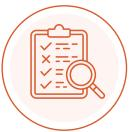

对考核结果有异议

员工可向公司人力资源部或分厂综合管理科提出申诉，由公司相关部门和科室负责人与其沟通，协调解决异议。

## 员工成长发展

## 员工培训

为规范培训工作，提升员工专业技能与职业素养，强化人才梯队建设，支撑企业战略发展，公司制定《亚普股份员工培训规定》等内部制度，构建了分层分类的培训体系与多元培训模式。课程设置涵盖管理技能、专业知识、通用能力及基础知识等主要模块，通过内训、外训、E-Learning、师带徒、自主学习等多种方式组织开展，精准匹配不同层级员工的成长需求。

## 公司主要培训形式

  
内训

在公司内部开展的培训，可邀请内部讲师或引进外部讲师，对解决公司实际问题的针对性较强。

  
外训

员工赴外部参加培训机构或客户组织的公开课、研讨会等，是针对具体业务的专题性培训。

  
师带徒

是新进员工部门内部培养的主要方式，由上级领导或老员工在日常工作中对新进员工进行思想引导、专业知识与技能传授。

  
自主学习

员工依托内外部学习资源开展自主学习。

  
E-Learning

利用网络远程教育平台进行在线学习，学习资源丰富。

## 案例 国投党校研修院学习平台

员工通过国投党校研修院在线学习平台开展自主学习，该平台资源丰富，涵盖思想体系、党性修养、领导力与管理等17类、共1,776门课程。

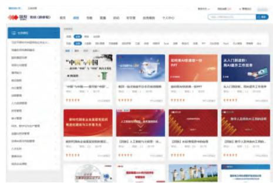

text_image

Screenshot of a Chinese website homepage displayed in Internet Explorer, featuring navigation menus and service icons.

国投党校研修院学习平台

每年年初，人力资源部以服务公司战略发展为导向，兼顾员工发展需要制定年度培训计划。培训采用理论培训与实践锻炼相结合、内外训相互补充、线上线下相依托的形式，全面提升培训质效。

为持续加强人才培养力度，打造多形式、分层次、重质量的人才培养体系，公司进一步聚焦核心人才培育，针对高潜管理人才定制全周期培养计划，通过知识赋能、经验分享与挂职锻炼等方式，助力其从业务骨干向管理者转型；同步完善人才外派海外机制，培育兼具全球视野、专业技术与国际化管理能力的复合型人才。多元化的培养体系驱动公司提质增效，提升人才吸引力与留存率，为公司高质量发展筑牢人才根基。

## 关键绩效

报告期内

公司共开展培训

2,432场

培训投入

88.1万元

培训总时长

63,727小时

参与培训

39,096人次

每名员工每年接受培训的平均时长为

35小时/人

培训覆盖率

100%

注：以上统计范围包括由总部HR统筹组织及境内全资子公司自行组织的相关培训。

## 案例

## 管理者培训

2025年11月18日，公司面向高潜人才组织开展《迈向优秀的管理者》专项培训。培训现场氛围热烈，学员积极互动研讨、完成学习任务，本次培训有效助力参训人员夯实管理理论基础、提升综合管理技能，为公司高素质管理人才梯队建设筑牢根基。

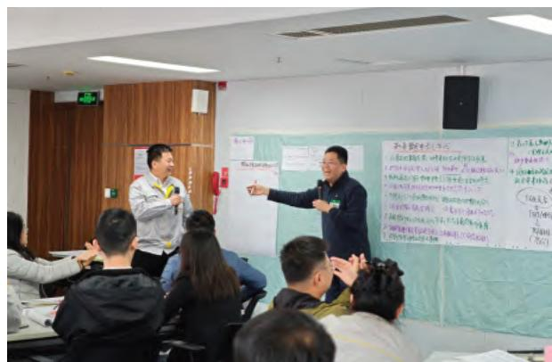

text_image

Classroom scene with teacher presenting in front of whiteboard, audience seated facing left, and handwritten notes on the wall

## 职业发展

亚普股份高度重视员工职业发展通道建设 持续构建公开，公平，公正的晋升机制，公司制定《亚普股份员工职业发展管理规定》，为员工提供多元化职业发展路径，涵盖干部管理通道与专业技术通道两大类。

职业发展通道分为纵向与横向：纵向通道指在同一职位族类内由低到高的层级晋升和级别晋升路径横向通道则指不同职位族之间的跨领域发展路径。公司明确晋升需综合考量员工业绩、综合评价、基础条件等核心因素，充分支持员工成长，确保为全体员工提供公平、透明的职业选择与发展机会。

## 关键绩效

报告期内

公司定期接受绩效和职业发展考核的员工比例为

100%

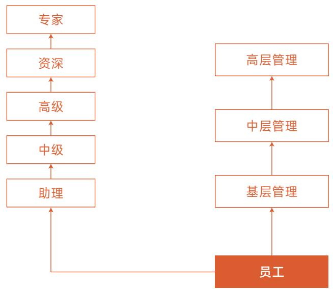

flowchart

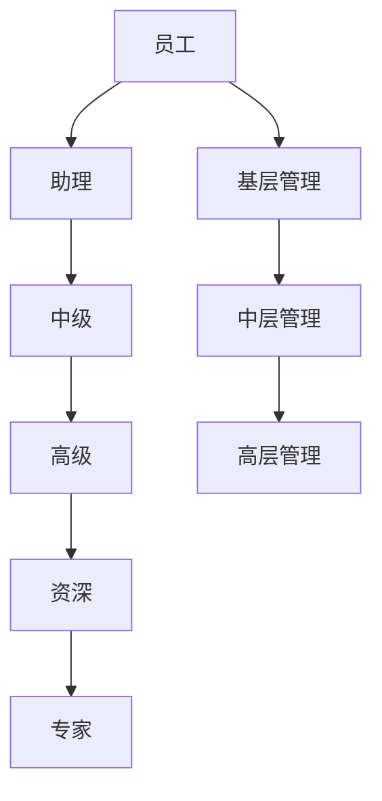
```mermaid
graph TD
  A["员工"] --> B["助理"]
  A --> C["基层管理"]
  B --> D["中级"]
  D --> E["高级"]
  E --> F["资深"]
  F --> G["专家"]
  C --> H["中层管理"]
  H --> I["高层管理"]
```

人才发展通道

## 员工关怀

公司将关爱员工作为构建和谐劳动关系的重要途径，通过“物质帮扶+精神关怀”传递温暖：一方面慰问困难员工及家属并给予实质性生活支持，另一方面依托工会组织各类文体、心理关怀活动丰富员工生活，切实增强员工归属感与团队凝聚力，让员工感受“企业大家庭”的温暖。

## 关键绩效

报告期内

公司困难员工帮扶人数

65人

困难员工帮扶金额

5万元

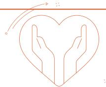

natural_image

Line art illustration of three people handling boxes and balloons, with no text or symbols present.

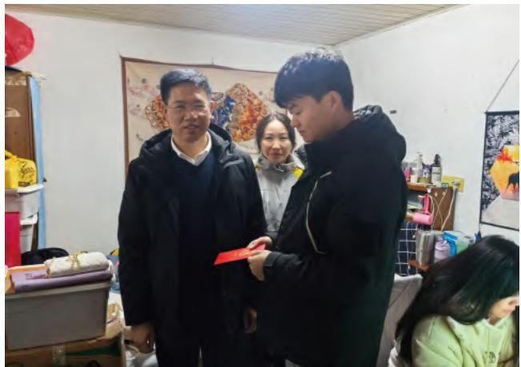

natural_image

Interior scene with three people interacting, one holding a red envelope, in a room with colorful decorations and shelves (no visible text or symbols)

春节前慰问困难职工

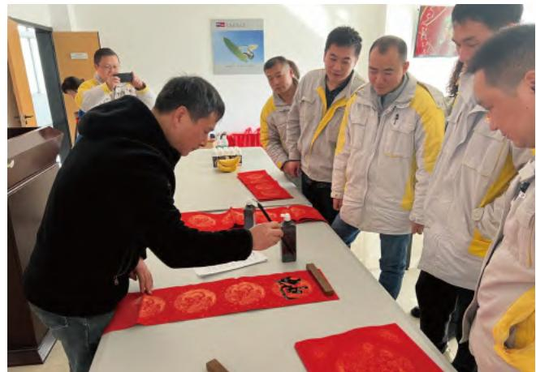

text_image

Group of people gathered around a table examining red paper-cutting crafts, with visible Chinese characters on the paper and wall art in the background.

迎新春活动

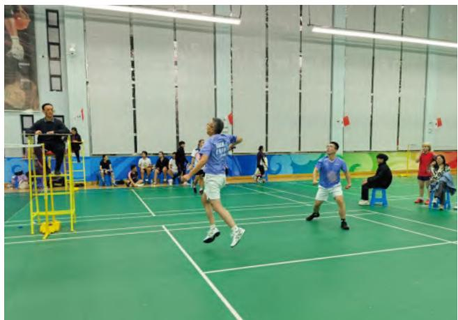

natural_image

Interior of a badminton court with two players in action, spectators watching from the referee (no visible text or signage)

上级工会组织的羽毛球赛

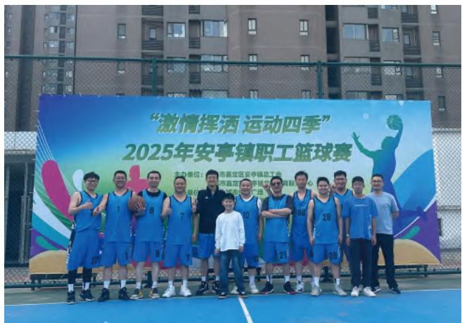

text_image

“激情挥洒 运动四季”
2025年安事镇职工篮球赛
主办单位：深圳市嘉宝区安事镇总工会
承办单位：深圳市罗湖区劳动人事服务中心

上级工会组织的篮球赛

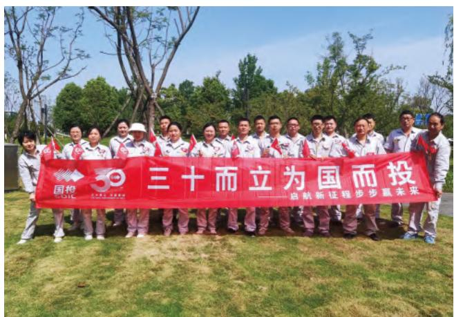

text_image

国投
30
三十而立为国而投
启航新征程步步赢未来

庆祝国投集团成立30周年健步走活动

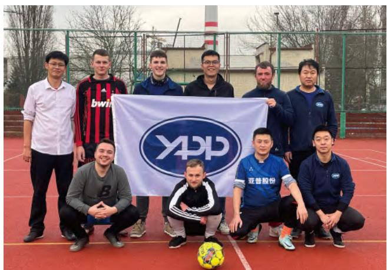

text_image

Group photo of men posing with a soccer ball and a large 'YDK' banner on a red track field, in front of an industrial building.

亚普捷克工厂足球联谊赛

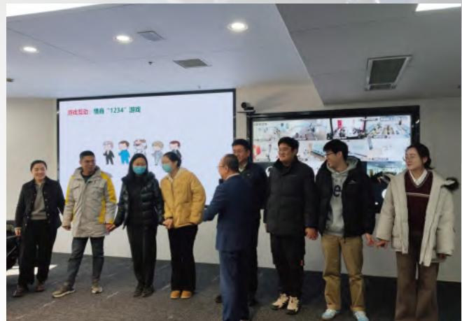

text_image

游戏互动·体育“1234”游戏

情绪与压力管理讲座

## 民主管理

## 管理体系

在民主管理体系建设方面，公司不断完善职工代表大会、工会制度，严格执行《亚普股份工会章程》《亚普股份职工代表大会实施办法》等内部规定，以制度保障员工民主权利，切实回应并解决员工实际诉求，为构建和谐劳动关系筑牢基础。

## 关键绩效

报告期内

公司召开职工代表大会

7次

审议通过议案

13项

工会审议通过项目数

20项

工会会员占在职员工占比为

100%

## 争议化解

如存在劳动争议的，由员工所属工会与员工合同管理单位共同牵头协调处理相关事宜。用人单位与员工因履行劳动合同发生争议的，双方优先通过友好协商解决。协商未果的，员工可以申请调解、还可依法申请劳动仲裁或提起诉讼，以维护自身合法权益。

## 满意度调查

为全面收集员工诉求、持续优化民主管理效能，公司积极开展员工满意度调查，同时针对调查反映的管理短板，人力资源部已通过座谈沟通了解原因并制定整改措施，包括健全研发项目考评激励机制、强化资源与项目利益捆绑、拉大考核结果薪酬差异以提升团队激励等，后续将由相关部门推进整改。公司以闭环管理响应员工民主诉求，持续完善民主管理体系。

## 关键绩效

2025年底，亚普股份按分层抽样方式开展年度员工满意度调查。调查涵盖工作本身、职业发展、工作环境、公司管理、团队合作五大维度，员工平均满意度为81.98分（百分制），较去年略有上升。

## 产业工人队伍建设改革

员工是企业稳健发展的基石 是创新驱动发展的骨于力量，2025年公司积极响应《中共中央国务院关于深化产业工人队伍建设改革的意见》的号召，深入贯彻“全心全意依靠工人阶级”的根本方针，着力打造一支高素质，知识型，技能型、创新型产业工人队伍。公司通过优化人才结构、完善职业发展通道，夯实人力资源基础，并落实企业培养产业工人的主体责任，确保职工教育经费足额提取与高效使用，重点聚焦一线职工的教育与技能提升。

工会同步搭建员工交流平台，大力弘扬劳模精神、劳动精神、工匠精神，发挥劳模示范引领作用，增强组织凝聚力。公司同步推进民主管理，健全以职工代表大会为基本形式的民主管理制度，畅通产业工人参与企业治理的渠道，并深化创新激励机制，系统化开展教育培训、岗位练兵、技术比武，以赛促练，激发一线员工立足岗位的创新创造活力。

此外，公司深化员工关怀举措，在提高产业工人经济收入、加强服务保障、维护安全健康权益等方面积极作为，充分激发一线员工的干事热情，汇聚推动高质量发展的合力。未来，公司将持续加强产业工人队伍建设，提升全员综合素质，以人才优势驱动企业可持续发展。

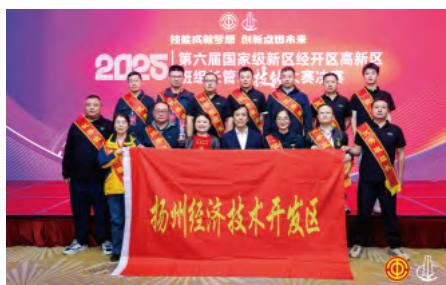

text_image

技能成就梦想 创新点国未来
2025 | 第六届国家级新区经开区高新区
进军三管、经济一体化大赛评审会
扬州经济技术开发区

扬州分厂员工参加班组长大赛获优秀奖

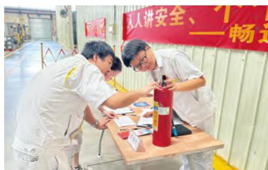

text_image

Street photo showing two workers in white uniforms examining a fire extinguisher on a table, with a red banner in the background containing Chinese text.

员工培训－安全月活动

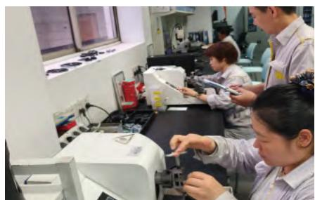

natural_image

Interior of a laboratory or lab with technicians operating equipment (no visible text or symbols)

质量技能竞赛

## 职业健康与安全

## 职业健康与安全治理

## 管理体系

亚普股份高度重视员工职业健康安全，致力于构建并维护风险可控，安全健康的工作环境，公司严格遵守《中华人民共和国安全生产法》《中华人民共和国职业病防治法》等相关法律法规，秉持“安全第一，防控并举，全员参与，持续改进”的安全方针，制定《EHS管理手册》及《安全生产责任制规定》《安健环委员会工作制度》《职业健康管理规定》等规章制度，建立健全了涵盖安全生产方面的管理体系、职责分配、风险控制、目标设定、应急准备、绩效评价和持续改进等内容的管理机制，旨在确保公司安全生产管理体系的有效运行和持续改进。报告期内，母公司、部分分厂及境内公司已通过ISO45001职业健康安全管理体系认证。

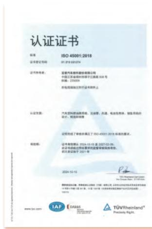

text_image

认证证书
标准 ISO 45001:2018
证书登记号码 91310 620724
证书持有者：富瑞汽车零部件股份有限公司
中国工会委员会组织部于江源路318号
电话：275593
其他须经证明到证书原件上

认证日期：广东发展进出口集团有限公司、上海联众、风通、电业投资、银基系统内
设计、制造和销售

证明完成了审核并满足了ISO 45001:2018标准的要求。

有效期：证书有效期至2024-10-15至2027-02-05。
证书有效期为自授权委托书签署有效期限。授权有效期至2021年

2024-10-15

PZ

ISO 45001:2018
Certified by: China Securities Bank Co., Ltd.
Guangzhou Branch: 21130406
有效期至公告期，有效期自授权委托书签署有效期限。授权有效期至2024-10-15至2027-02-05。证书有效期自授权委托书签署有效期限。授权有效期至2021年

www.sza.com.cn

IAF
DASAS
TÜVİlheinland®
Proclasy Right.

亚普股份ISO45001体系证书

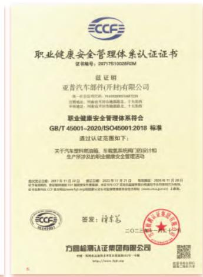

text_image

CCF
职业健康安全管理体系认证证书
证书编号：207177510028FG2M
兹证明
亚普汽车部件(开封)有限公司
统一社会信用代码：9163020001546728
注册地址：河南省开封市曲源县、十九路西
行驶地点：河南省开封市曲源县、十九路西
职业健康安全管理体系符合
GB/T 45001-2020/ISO45001:2018 标准
通过认证范围如下：
关于汽车塑料油箱、车载系统照明厂的设计和
生产所涉及的职业健康安全管理活动
登记发证日期：2017年11月23日  编号：2020年11月27日  热处理室：2020年11月28日
用于车辆的、非标准车辆的CCT和使用非标准车辆，相关CCT与非标准车辆的CCT组合符合所有制汽车的标准。
CCT与非标准CCT结合网站www.cct.org或网站http://www.cct.org/上盖章。
签发：许林芳
方圆检测认证集团有限公司
中国·西南证券股份有限公司（以下简称
http://www.sdb.com.cn/）

亚普开封ISO45001体系证书

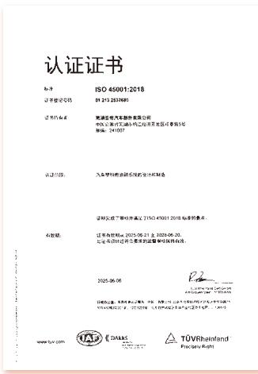

text_image

认证证书
标准 ISO 45001:2018
证书登记号 29 213 2537889
证书持有人 英国泰君安汽车销售有限公司
中国工商银行股份有限公司深圳市分行
账号：241007
认证日期： 入办审核机构协会发布的注册会计师
证书机关/部门负责人/盖章/日期/年份/年份/年份/年份/年份/年份/年份/年份/年份/年份/年份/年份/年份/年份/年份/年份/年份/年份/年份/年份/年份/年份/年份/年份/年份/年份/年份/年份/年份/年份/年份/年份/年份/年份
有效期： 证书有效期至 2015-06-21 至 2020-06-20
证书编号：证书经办机关登记机关登记机关
2025-06-08
TÖVRheinland
www.tox.com
© TIAIKS
TÖVRheinland
Principely Right

芜湖亚奇ISO45001体系证书

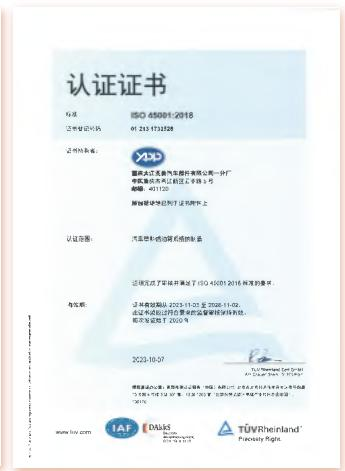

text_image

认证证书
标准
ISO 45001:2018
证书登记机关
01-210 1732328
证书的签名:
国泰君安证券股份有限公司一厂
中国证券登记结算有限责任公司上海分公司
邮编：401120
邮箱：www.izq.com.cn
认证信息：
汽车用车检测系统检验
证明经过了汽车并验证了ISO 45001:2018证书的要求。
专利名称：小车用电器品2023-11-03至2026-11-02，
通过本证书经评估后将对应设备管理提供有效证。
证书有效期至2023年
JG23-16-07
www.liao.com
DAUKS
TÜV Rheinland
Pacifica Riga

大江亚普IS045001体系证书

2025年，公司持续深化消防安全标准化建设，健全消防风险分级管控与隐患排查治理双重预防机制，完善应急预案体系并定期开展实战演练，消防安全管理实践获得属地消防主管部门认可，获评“2025 年度消防安全管理先进单位”。

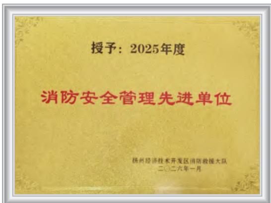

text_image

授予：2025年度
消防安全管理先进单位
扬州经济技术开发区消防救援大队
二〇二六年一月

消防安全管理先进单位

## 组织架构

公司建立以安健环委员会（EHS委员会）为核心的管理架构，逐级明确从公司高层到一线单位的领导职责与作用，组织各层级签署《EHS责任书》以压实责任链条。在员工参与机制方面，公司遴选员工代表，参与各单位EHS管理体系的运行监督，代表员工群体反馈安全健康诉求并提出管理改进建议，推动形成全员共治的安全文化。

## 安健环委员会主任

对公司EHS管理工作负全面责任

## 各单位主要负责人

所辖范围的EHS第一责任人

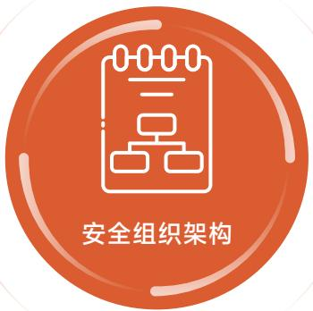

text_image

安全组织架构

## EHS委员会副主任

分管各自范围的EHS工作

## SMD（EHS职能部门）

监督指导其他职能部门的EHS管理工作

## 专业能力

公司除完善制度体系，压实管理责任外常态化开展覆盖不同层级，不同主题的职业健康安全培训与研讨活动以此提升全员安全意识与专业管理能力；同时积极参与国投高新开展的安全生产月活动，推动安全管理要求转化为全员自觉行动，夯实安全生产管理基础。

## 案例 安全月活动

2025年6月是第24个全国安全生产月，公司以学习贯彻习近平总书记关于安全生产的重要论述和重要指示批示精神为核心，通过开展“安全生产大家谈”专题研讨、班前会主题宣贯、“以案普法”案例解析等专项活动，推动全员深入领会安全生产重要论述的核心要义。同时，公司组织员工集中观看安全生产警示教育片、参与“全民安全公开课”学习，强化员工对安全风险的感知与防范意识，切实将安全理念融入日常工作行为。

## 案例 “机械安全风险管理和危险能量控制”专题研讨会

2025年3月20日-21日，公司特邀外部专家于总部组织召开“机械安全风险管理和危险能量控制”专题研讨会。会议聚焦机械安全标准解读与应用、机械安全风险评估、风险控制措施、危险能量管控方法及机械设备全生命周期安全风险管理等核心议题展开深度研讨。此次会议有效夯实了各单位安全管理人员与设备管理人员的安全责任意识，显著提升其机械安全专业化管理水平。

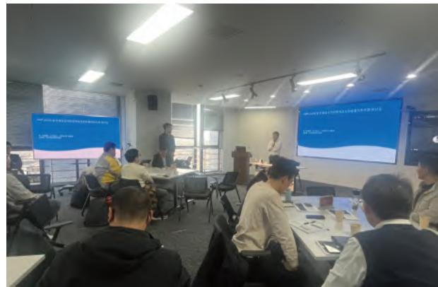

text_image

Conference room scene with presentation screens displaying Chinese text and slide graphics, showing attendees seated at tables facing presentation screens.

## 关键绩效

报告期内

公司安全培训总投入为

12.52万元

共开展安全培训

361场

参与安全培训人次为

46,438人次

安全培训总时长

23,219小时

人均安全培训时长

15.1小时/人

安全培训覆盖率

100%

## 职业健康与安全战略

公司重视员工职业健康与安全，系统性识别、评估并应对各类潜在风险，针对法规政策趋严带来的合规风险、危险源辨识与管控不足引发的管理风险 以及事故处置不当导致的事态升级风险等关键场景 结合其发生可能性，影响范围与财务影响进行分级研判，并制定了涵盖合规性审查、体系化管控、应急响应等在内的针对性应对措施，持续筑牢安全管理防线，保障员工职业健康与企业稳健运营。

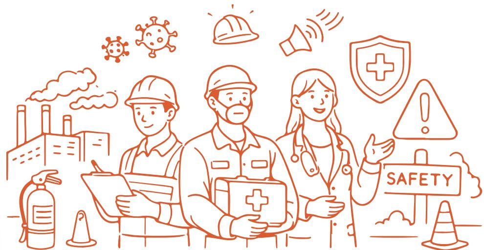

natural_image

Illustration of three medical professionals in protective gear, surrounded by industrial smokestacks, warning symbols, and safety signs (no text or numbers)

<table><tr><td>风险/机遇类型</td><td>风险/机遇描述</td><td>发生可能性</td><td>影响大小</td><td>影响时间范围</td><td>影响价值链的环节</td><td>财务影响说明</td><td>应对措施</td></tr><tr><td>法规风险</td><td>新修订的安全、职业健康及消防法规对企业要求愈加严格,可能导致公司出现安全处罚;安全政策变动频繁,政府对安全重视程度进一步增强,可能导致出现安全处罚。</td><td>中</td><td>中</td><td>短中期</td><td>运营</td><td>运营成本增加、生产中断</td><td>EHS管理部门定期开展合规性评价;公司积极应对政府核查,推进隐患整改。</td></tr><tr><td>人才吸引与留存机遇</td><td>有效地识别员工生产运营、产品和服务中的危险源,制定有效的控制和防护措施,避免潜在安全事故的发生,减少员工工作伤害,提高员工留存率。</td><td>中</td><td>中</td><td>中长期</td><td>运营</td><td>运营成本减少</td><td>公司建立并有效实施职业健康安全管理体系;定期组织各部门进行风险评估,有效识别危险源,同时开展职业健康监测做好劳动防护用品配备与管理。</td></tr><tr><td>合规机遇</td><td>快速有效地应急响应,可以有效减少或避免事态扩大,减少公司损失,避免被行政处罚。</td><td>低</td><td>小</td><td>中长期</td><td>运营</td><td>运营成本减少</td><td>公司编制突发安全生产事故应急预案,发生异常情况立即启动,同时常态化开展应急演练,强化员工应急协调处置能力。</td></tr></table>

## 影响、风险和机遇管理

## 风险管理机制

公司构建了系统性的职业健康安全风险管理机制，制定《危险源辨识和安全风险管理程序》《生产过程危险和有害因素分类》等内部文件，规范开展危险源辨识、风险评估与分级管控：通过系统排查识别各类危险源，科学评定风险等级并制定针对性管控措施；建立动态监测机制，及时跟踪危险因素变化并优化应对策略，确保风险始终处于受控状态，支撑公司安全稳定运营。

## 危险源辨识及风险评价程序

工作区域划分

危险源辨识

风险评价

确定改善措施

形成文件，公告发布

持续评审

## 应急管理

公司高度重视安全生产，为有效应对生产过程中可能发生的紧急状况，制定《亚普股份突发事件应急管理办法》，编制并定期修订《生产安全事故应急预案》，以最大程度降低事故、灾害等突发事件所造成的人身伤害、财产损失，并减轻对周边环境的不利影响。

公司每年开展一次综合演练，每半年开展一次专项演练，每季度开展现场处置方案演练，模拟演练高度还原事故报告、人员疏散、现场救援等真实场景，提升员工应急反应与自救互救能力。演练结束后，公司组织专业人员根据《预案演练评估表》，对演练结果进行分析评估，针对演练暴露的问题，对应急预案持续优化，确保预案具有高度实用性与针对性，切实为公司安全生产提供保障。

## 关键绩效

2025 年

公司开展生产安全突发事件应急演练

36次

共参加

1,140人次

## 案例 紧急撤离演练

2025年12月，公司总部与境外子公司亚普俄罗斯联动开展员工健康安全专项应急演练，针对“战争影响扩大需紧急撤侨”的极端场景，模拟中方外派人员的撤离流程。演练聚焦员工生命安全保障，明确了撤离信号传递、人员集结、物资调配、安全转运等关键环节的操作规范，有效提升了跨国团队应对突发风险的协同能力，为境外员工的健康安全筑牢了应急防护屏障。

## 隐患排查

公司制定《事故隐患排查治理管理程序》，建立了年度隐患排查台账。在组织层面，由健环委员会及其办公室定期对各个厂区进行全面监督检查；在执行层面，工厂负责人及工厂安全管理人员定期开展隐患排查，如实记录隐患位置、类型与严重程度，并督促责任部门限期整改，报告期内，公司发现的隐患问题已全部整改完毕

## 安全事故管理

为规范公司工作场所内各类生产安全事件的调查、上报、处理等流程，公司制定《事故调查处理程序》，通过开展事故分析、制定纠正预防措施、完善相关管理程序，减少并防止事故再次发生，确保公司事故处理符合法规要求，切实保护受伤害员工合法权益。

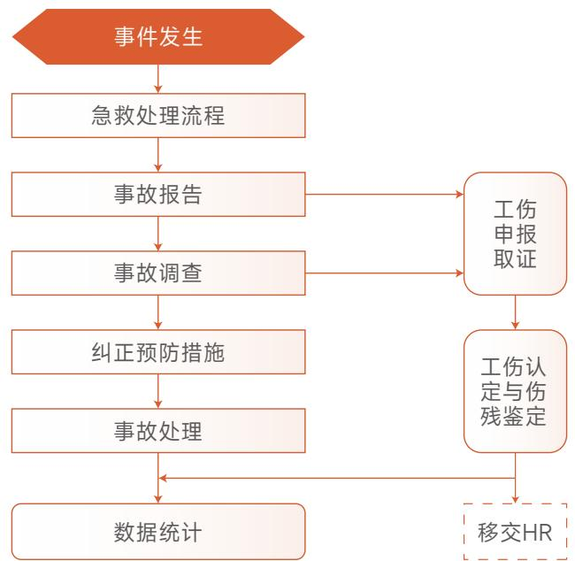

flowchart

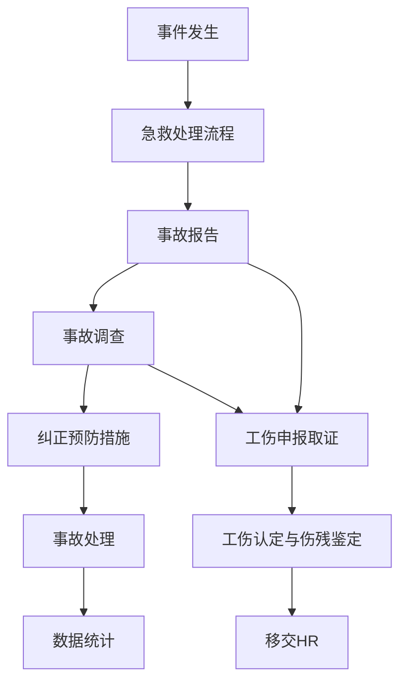
```mermaid
graph TD
  A["事件发生"] --> B["急救处理流程"]
  B --> C["事故报告"]
  C --> D["事故调查"]
  C --> E["工伤申报取证"]
  D --> F["纠正预防措施"]
  D --> E
  E --> G["工伤认定与伤残鉴定"]
  F --> H["事故处理"]
  H --> I["数据统计"]
  G --> J["移交HR"]
```

事故调查处理流程

## 相关方安全管理

公司制定《相关方管理规定》，构建了覆盖承包商全生命周期的闭环安全管理体系，管理流程涵盖资质审查、安全培训、危险作业许可审批、现场安全监督检查及安全绩效评价等环节，在开展合作前 公司会与相关方于合同签订时同步签署《安全环境健康管理协议》，明确双方安全责任，并对所有相关方从招标前、作业前、作业中、作业后各个环节的安全管理进行综合评价，形成《承包商安全履职季度评价表》，建立承包商“黑名单”机制，对评级为D级的承包商予以清退，从准入、管控到退出实施全过程安全管控，降低公司运营过程中的安全风险。

## 危险化学品管理

公司制定《危险化学品管理程序》构建了涵盖准入评估，采购，入库储存，使用，废弃物处理的全周期闭环管理体系。公司严格遵照国家相关规定，向从业人员如实告知作业场所及岗位存在的危险因素、防范措施与事故应急措施，并针对化学品采购仓储条件，操作规范废物处置个人防护应急保障及人力资源配置等关键环节开展风险评估，据此制定合规且风险可控的针对性控制措施。同时，公司严格依照所存化学品MSDS（材料安全数据表）要求，管控库内温度、湿度、通风及防火防爆条件，配备适配的应急设施、与化学品相容的消防器材、防泄漏装置及应急防护装备，全方位保障危险化学品储存安全。

## 职业健康防护

公司高度重视员工职业健康保障，严格遵照法规要求，制定了《危险作业管理规定》《特种设备管理规定》《职业健康监护管理规定》等规意制度 并通过设置醒目的安全警示标识，发放职业危害告知书等方式 确保员工充分知晓岗位潜在职业危害，督促其严格落实职业病防护措施，正确佩戴防护用品作业。此外，公司委托具备相应资质的职业卫生技术服务机构定期开展作业场所职业危害因素检测和职业病危害现状评价，同时定期组织员工职业健康体检，建立“一人一档”职业卫生监护档案。公司通过定期检测、防护监护相结合的职业健康管理模式，全方位守护员工职业健康，为员工健康保驾护航。

## 健康服务与活动

亚普股份始终将员工身心健康放在首位，针对不同群体的需求，开展精准化健康服务，定期开展健康文体赛事、健康素养学习、心理健康科普和健康咨询等。通过多维度健康服务与活动，提高员工的健康素养。在硬件配置上，公司严格遵循应急管理规范，在生产车间、办公楼宇科学布点，规范配置自动体外除颤仪（AED）等急救设备，建立设备台账，结合云平台管理平台，落实专人负责定期巡检、维护与校验，确保急救设备时刻处于良好待用状态，实现应急救援物资“就近可取、快速响应”。

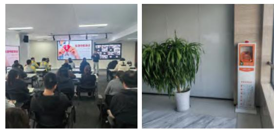

## 指标与目标

公司为确保职业健康安全管控措施有效实施，在建立安全责任制的基础上，设置了火灾、设备事故、自然灾害事故、职业病、安全负面舆情等维度的指标目标，全年有序推进目标落实。

<table><tr><td>指标目标</td><td>完成情况</td></tr><tr><td>500万元以上火灾、设备事故为零</td><td>已完成</td></tr><tr><td>自然灾害次生衍生事故为零</td><td>已完成</td></tr><tr><td>新增职业病为零</td><td>已完成</td></tr><tr><td>重大安全生产负面舆情为零</td><td>已完成</td></tr></table>

  
关键绩效

<table><tr><td rowspan="4">报告期内</td><td>安全生产事故数0起</td><td>因工伤损失工作时数464小时</td><td>百万工时损失工时率52.15小时/百万工时</td><td></td></tr><tr><td>已完成整改的隐患数量为511个</td><td>隐患排查整改率100%</td><td>安全应急演练次数114次</td><td></td></tr><tr><td>工伤保险投入金额192.51万元</td><td>工伤保险人员覆盖率100%</td><td>安全生产责任险投入金额1.35万元</td><td></td></tr><tr><td>特种作业人员持证上岗率100%</td><td>员工体检覆盖率100%</td><td>职业病危害因素监测合格率100%</td><td>新增职业病数0宗</td></tr></table>

## 05社区共建公益惠民

## 本章节所涉及的ESG重要议题

乡村振兴  
社会贡献

## 本章所响应的SDGs

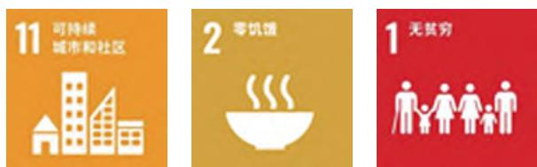

## 乡村振兴

公司坚定践行企业社会责任，紧扣乡村振兴工作要求，统筹部署年度消费帮扶工作任务，严格贯彻落实上级工会组织相关工作安排，积极参与央企消费帮扶迎新春、兴农周等活动。公司依托员工自主采购、食堂定向采购、工会集中采购三种方式开展消费帮扶，同时建立健全消费帮扶台账，动态跟踪帮扶工作落实情况，以实际行动为乡村振兴事业贡献力量。

子公司赢双科技积极响应政府“村企结对帮扶”行动，向云南省龙陵县碧寨乡三家村捐赠专项资金5万元，专项用于“大新沟修复项目”建设，助力当地补齐水利设施短板，切实改善村民生产生活条件，以定向帮扶实践推动乡村振兴。

## 关键绩效

报告期内，公司累计完成消费帮扶采购金额81.8余万元

## 社会贡献

公司积极践行社会责任，广泛参与社会公益事业，子公司亚普美国组织员工开展当地社区环境清洁行动，将环保理念从办公场景延伸至公共空间，以实际行动助力社区打造洁净宜居的生活环境，彰显企业的社会担当。此外，子公司亚普印度向当地院校捐建数字学习中心并举行揭牌仪式，中国驻印度总领事秦杰先生莅临出席。此举完善了当地教育配套设施，年均惠及学生超2,608名，助力提升学子数字素养与就业综合能力。

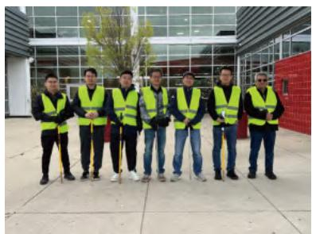

natural_image

Group photo of seven men in safety vests standing outdoors in front of a modern building (no visible text or signage)

亚普美国参与社区清洁活动集结现场  
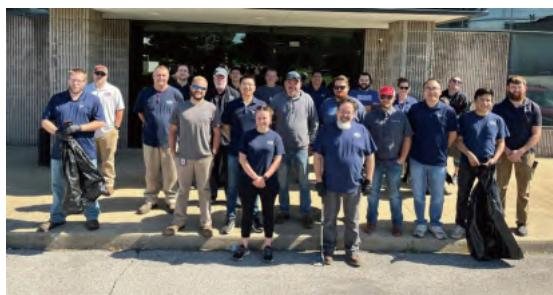

natural_image

Group photo of people standing in front of a building entrance, wearing blue shirts and casual clothing (no visible text or signage)

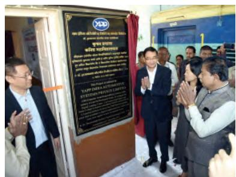

text_image

XPO
4 years ago to become the world
XPO
XPO 2013
XPO 2014
XPO 2015
XPO 2016
XPO 2017
XPO 2018
XPO 2019
XPO 2020
XPO 2021
XPO 2022
XPO 2023
XPO 2024
XPO 2025
XPO 2026
XPO 2027
XPO 2028
XPO 2029
XPO 2030
XPO 2031
XPO 2032
XPO 2033
XPO 2034
XPO 2035
XPO 2036
XPO 2037
XPO 2038
XPO 2039
XPO 2040
XPO 2041
XPO 2042
XPO 2043
XPO 2044
XPO 2045
XPO 2046
XPO 2047
XPO 2048
XPO 2049
XPO 2050
XPO 2051
XPO 2052
XPO 2053
XPO 2054
XPO 2055
XPO 2056
XPO 2057
XPO 2058
XPO 2059
XPO 2060
XPO 2061
XPO 2062
XPO 2063
XPO 2064
XPO 2065
XPO 2066
XPO 2067
XPO 2068
XPO 2069
XPO 2070
XPO 2071
XPO 2072
XPO 2073
XPO 2074
XPO 2075
XPO 2076
XPO 2077
XPO 2078
XPO 2079
XPO 2080
XPO 2081
XPO 2082
XPO 2083
XPO 2084
XPO 2085
XPO 2086
XPO 2087
XPO 2088
XPO 2089
XPO 2090
XPO 2091
XPO 2092
XPO 2093
XPO 2094
XPO 2095
XPO 2096
XPO 2097
XPO 2098
XPO 2099
XPO 2100

亚普印度捐建数字实验室揭牌仪式

## 关键绩效

报告期内

公司对外捐赠

5万元

志愿活动参与

91人次

志愿活动总时长

255小时

## “一带一路”建设

亚普股份始终将履行社会责任、投身公益事业视为企业发展的重要使命，公司多年来持之以恒地开展各类公益活动，为构建和谐社会添砖加瓦。在国际领域，公司以实际行动为推动全球经济合作与发展贡献力量，也为自身的长远发展筑牢根基。

多年来，公司积极响应共建“一带一路”倡议，深度融入全球经济合作体系，坚持走国际化发展道路。公司紧抓政策机遇，果断实施海外布局战略，在“一带一路”沿线的关键节点——俄罗斯、捷克、乌兹别克斯坦，以及南美洲的巴西等国家相继建立生产基地，有效整合全球资源，优化产业布局，显著提升了本地化生产与服务能力，此外公司通过精准的国际并购进一步扩大市场份额，提升品牌国际影响力，逐步确立了在国际市场的知名品牌地位。

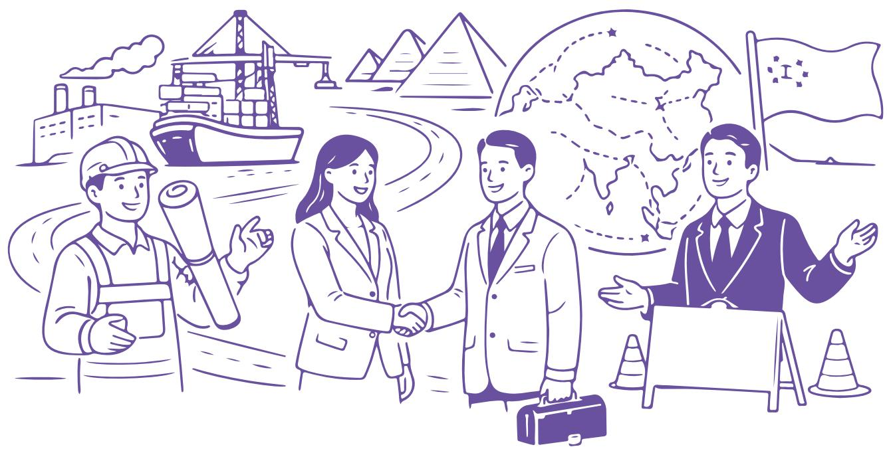

natural_image

Illustration of three business professionals shaking hands with industrial and port facilities, including a ship, globe, and Singapore flag (no text or symbols)

## 附录

## 未来展望

新的一年，我们一马当先，万马奔腾。

## 稳根基，稳固传统优势，夯实技术根基

确保传统核心业务持续保持市场领先地位，向技术纵深不断发力。积极参与“国七”标准制订，同步做好前瞻性技术储备，助力行业绿色低碳转型升级。通过持续优化产品性能与成本结构，稳固发展基本盘，为新业务拓展奠定基础。

## 拓新域，加速新业务开拓，扩展增长空间

将新业务确立为未来增长的核心引擎，推动新业务拓展与全球化战略深度融合。全力推进技术成果向规模化量产订单转化，打通从研发到市场的“最后一公里”，加快形成新的增长极，抢占未来竞争制高点。

## 提效能，深化智改数转，AI赋能变革

推动数字化建设从“系统建设”向“价值创造”深度跃升，打通内控、运营等全流程数据链路，以精准决策支撑高效运营。加速人工智能等前沿技术在核心业务场景的落地转化，将技术优势转化为降本增效、品质提升的实际成效，以数智化驱动管理全面升级。

## 增动能，激发组织活力，释放创新潜力

全面推行集成化项目管理模式，赋予一线团队更大决策权与资源配置权，让“听得见炮火的人”做决策。通过多层次人才梯队建设与跨领域协同机制，打破组织壁垒，汇聚起支撑战略转型的强大组织动能，让每一名奋斗者都成为变革的参与者和受益者。

新的一年，我们马不停蹄，马到成功。

## 关键绩效

经济绩效

<table><tr><td colspan="2">指标</td><td>单位</td><td>2023年</td><td>2024年</td><td>2025年</td></tr><tr><td rowspan="5">经济表现</td><td>资产总额</td><td>万元</td><td>642,624.28</td><td>672,234.11</td><td>742,988.68</td></tr><tr><td>营业收入</td><td>万元</td><td>858,339.34</td><td>807,599.99</td><td>913,319.61</td></tr><tr><td>归母净利润</td><td>万元</td><td>46,612.22</td><td>50,009.78</td><td>52,821.19</td></tr><tr><td>纳税总额</td><td>万元</td><td>23,795.73</td><td>17,613.42</td><td>25,734.27</td></tr><tr><td>每股收益</td><td>元/股</td><td>0.91</td><td>0.98</td><td>1.03</td></tr></table>

公司治理

<table><tr><td colspan="2">指标</td><td>单位</td><td>2023年</td><td>2024年</td><td>2025年</td></tr><tr><td rowspan="4">党建引领</td><td>公司党委数量 $^1$ </td><td>个</td><td>1</td><td>1</td><td>1</td></tr><tr><td>党支部数量 $^1$ </td><td>个</td><td>16</td><td>16</td><td>17</td></tr><tr><td>召开党委会次数 $^1$ </td><td>次</td><td>30</td><td>18</td><td>26</td></tr><tr><td>党员数量 $^1$ </td><td>人</td><td>307</td><td>326</td><td>345</td></tr><tr><td rowspan="2">股东会</td><td>股东会召开总次数</td><td>次</td><td>4</td><td>4</td><td>4</td></tr><tr><td>审议通过事项</td><td>项</td><td>18</td><td>17</td><td>17</td></tr><tr><td rowspan="5">董事会</td><td>董事会成员人数</td><td>人</td><td>9</td><td>9</td><td>11</td></tr><tr><td>女性董事人数</td><td>人</td><td>1</td><td>1</td><td>2</td></tr><tr><td>独立董事人数</td><td>人</td><td>3</td><td>3</td><td>4</td></tr><tr><td>董事会召开次数</td><td>次</td><td>8</td><td>8</td><td>14</td></tr><tr><td>审议通过事项</td><td>项</td><td>60</td><td>49</td><td>70</td></tr><tr><td>薪酬政策</td><td>董事、高级管理人员报酬(包含现任和离任)</td><td>万元人民币</td><td>899.57</td><td>1,045.06</td><td>923.73</td></tr><tr><td rowspan="3">合规管理</td><td>开展法律培训次数</td><td>次</td><td>6</td><td>3</td><td>5</td></tr><tr><td>开展法律培训时数</td><td>小时</td><td>48</td><td>42</td><td>34</td></tr><tr><td>参与法律培训人数</td><td>人</td><td>290</td><td>1,121</td><td>175</td></tr><tr><td rowspan="6">投资者关系管理与股东权益</td><td>在上证e互动与投资者互动次数</td><td>次</td><td>34</td><td>134</td><td>14</td></tr><tr><td>开展投资者交流活动次数</td><td>次</td><td>6</td><td>23</td><td>33</td></tr><tr><td>举办投资者开放交流会次数</td><td>次</td><td>3</td><td>3</td><td>3</td></tr><tr><td>每股现金分红</td><td>元/股</td><td>0.4</td><td>0.4</td><td>0.4</td></tr><tr><td>现金红利总额(含税)</td><td>亿元</td><td>2.05</td><td>2.05</td><td>2.03</td></tr><tr><td>占合并报表中归属于上市公司股东净利润的比例</td><td>%</td><td>44</td><td>41</td><td>39</td></tr><tr><td rowspan="7">商业道德</td><td>反垄断与公平竞争的培训活动次数</td><td>次</td><td>2</td><td>2</td><td>2</td></tr><tr><td>反垄断与公平竞争参与人数</td><td>人</td><td>285</td><td>949</td><td>108</td></tr><tr><td>反垄断与公平竞争培训总时长</td><td>小时</td><td>28</td><td>3</td><td>432</td></tr><tr><td>廉洁教育培训活动次数</td><td>次</td><td>-</td><td>-</td><td>163</td></tr><tr><td>廉洁教育培训参与人次</td><td>人次</td><td>-</td><td>-</td><td>6,271</td></tr><tr><td>廉洁教育培训总时长</td><td>小时</td><td>-</td><td>-</td><td>38,794</td></tr><tr><td>廉洁协议签署率</td><td>%</td><td>-</td><td>-</td><td>100</td></tr></table>

环境绩效

<table><tr><td colspan="2">指标</td><td>单位</td><td>2023年</td><td>2024年</td><td>2025年</td></tr><tr><td rowspan="7">环境管理</td><td>环保投入</td><td>万元</td><td>561.67</td><td>1,022.19</td><td>909.68</td></tr><tr><td>污染物监测合格率</td><td>%</td><td>100</td><td>100</td><td>100</td></tr><tr><td>环保设施同步运转率</td><td>%</td><td>100</td><td>100</td><td>100</td></tr><tr><td>建设项目环保“三同时”执行率</td><td>%</td><td>100</td><td>100</td><td>100</td></tr><tr><td>环保培训次数</td><td>次</td><td>173</td><td>182</td><td>139</td></tr><tr><td>环保培训参加人次</td><td>人次</td><td>12,835</td><td>13,511</td><td>11,311</td></tr><tr><td>环保培训时长</td><td>小时</td><td>13,717.50</td><td>16,081.5</td><td>11,567.5</td></tr><tr><td rowspan="5">温室气体 $^{2}$ 排放情况</td><td>温室气体排放总量</td><td>吨二氧化碳当量</td><td>66,202.70</td><td>61,949</td><td>65,202</td></tr><tr><td>温室气体排放强度</td><td>吨二氧化碳当量/万元营业收入</td><td>0.0771</td><td>0.0766</td><td>0.0714</td></tr><tr><td>直接温室气体排放量(范围一)</td><td>吨二氧化碳当量</td><td>434.71</td><td>1,214</td><td>1,152</td></tr><tr><td>间接温室气体排放量(范围二)</td><td>吨二氧化碳当量</td><td>65,767.99</td><td>60,734</td><td>64,050</td></tr><tr><td>节能减排举措共计减少二氧化碳排放量</td><td>吨二氧化碳当量</td><td>6,100</td><td>4,333</td><td>5,389</td></tr><tr><td rowspan="7">固体废弃物</td><td>一般废弃物产生量</td><td>吨</td><td>44,197.00</td><td>38,583.71</td><td>32,896.87</td></tr><tr><td>一般废弃物综合利用率</td><td>%</td><td>99.38</td><td>99.53</td><td>97.79</td></tr><tr><td>一般废弃物处置量</td><td>吨</td><td>272.00</td><td>174.00</td><td>4,123.33</td></tr><tr><td>回收再利用废弃物总量</td><td>吨</td><td>-</td><td>-</td><td>32,170.86</td></tr><tr><td>危险废弃物产生量</td><td>吨</td><td>62.13</td><td>81.04</td><td>73.68</td></tr><tr><td>危险废弃物处置量</td><td>吨</td><td>63.22</td><td>80.17</td><td>70.46</td></tr><tr><td>危险废弃物合规处置率</td><td>%</td><td>100</td><td>100</td><td>100</td></tr><tr><td rowspan="3">水资源利用</td><td>公司总用水量</td><td>吨</td><td>3,397,817.00</td><td>29,863,655.00</td><td>34,115,874.00</td></tr><tr><td>新鲜水用水量</td><td>吨</td><td>149,956.00</td><td>141,999.00</td><td>173,298.00</td></tr><tr><td>循环用水量</td><td>吨</td><td>3,247,861.00</td><td>29,721,656</td><td>33,942,576</td></tr><tr><td rowspan="3">水资源利用</td><td>循环用水占总用水量的比例</td><td>%</td><td>95.59</td><td>99.52</td><td>99.49</td></tr><tr><td>水资源消耗强度</td><td>吨/万元产值</td><td>3.96</td><td>36.98</td><td>37.35</td></tr><tr><td>耗水量</td><td>吨</td><td>3,358,624</td><td>29,823,064</td><td>34,049,029</td></tr><tr><td rowspan="7">污染物排放</td><td>COD</td><td>吨</td><td>4.10</td><td>0.6162</td><td>0.7272</td></tr><tr><td>氨氮</td><td>吨</td><td>0.48</td><td>0.0261</td><td>0.0192</td></tr><tr><td>VOCs</td><td>吨</td><td>3.69</td><td>1.1999</td><td>3.1515</td></tr><tr><td>颗粒物</td><td>吨</td><td>1.77</td><td>1.2624</td><td>0.9894</td></tr><tr><td>二氧化硫</td><td>吨</td><td>0.03</td><td>0.0144</td><td>0.0228</td></tr><tr><td>氮氧化物</td><td>吨</td><td>0.00</td><td>0.0045</td><td>0.0067</td></tr><tr><td>废水排放量</td><td>吨</td><td>39,193.00</td><td>40,591.00</td><td>66,845</td></tr><tr><td rowspan="7">能源利用</td><td>外购电力总量</td><td>千瓦时</td><td>111,065,000</td><td>106,495,529</td><td>103,608,350</td></tr><tr><td>外购热力总量</td><td>吉焦</td><td>11,263</td><td>8,257.9</td><td>8,464</td></tr><tr><td>光伏发电</td><td>千瓦时</td><td>5,196,700</td><td>6,972,519</td><td>9,451,536</td></tr><tr><td>直接能源消耗总量</td><td>吨标准煤</td><td>246.94</td><td>174.15</td><td>127.59</td></tr><tr><td>间接能源消耗总量</td><td>吨标准煤</td><td>14,033.96</td><td>13,370.06</td><td>14,091.68</td></tr><tr><td>能源消耗总量</td><td>吨标准煤</td><td>14,280.90</td><td>13,544.21</td><td>14,219.27</td></tr><tr><td>能源消耗强度</td><td>吨标准煤/万元营收</td><td>0.0166</td><td>0.0168</td><td>0.0156</td></tr></table>

社会绩效

<table><tr><td></td><td>指标</td><td>单位</td><td>2023年</td><td>2024年</td><td>2025年</td></tr><tr><td rowspan="6">员工权益</td><td>员工总人数</td><td>人</td><td>3,588</td><td>3,682</td><td> $4,902^{3}$ </td></tr><tr><td>残疾员工人数</td><td>人</td><td>3</td><td>5</td><td>5</td></tr><tr><td>少数民族员工</td><td>人</td><td>57</td><td>63</td><td>136</td></tr><tr><td>劳动合同签订率</td><td>%</td><td>100</td><td>100</td><td>100</td></tr><tr><td>社保覆盖率</td><td>%</td><td>100</td><td>100</td><td>100</td></tr><tr><td>定期接受绩效考核的员工占比</td><td>%</td><td>100</td><td>100</td><td> $100^{4}$ </td></tr></table>

<table><tr><td colspan="2">指标</td><td>单位</td><td>2023年</td><td>2024年</td><td>2025年</td></tr><tr><td rowspan="2">员工权益</td><td>职工代表大会审议议案数</td><td>项</td><td>5</td><td>4</td><td> $13^{5}$ </td></tr><tr><td>工会会员占在职员工的比例 $^1$ </td><td>%</td><td>100</td><td>100</td><td>100</td></tr><tr><td rowspan="6"> $员工培训^4$ </td><td>员工培训投入</td><td>万元</td><td>77.40</td><td>65.80</td><td>88.1</td></tr><tr><td>培训场次</td><td>场次</td><td>1.462</td><td>2,928</td><td>2,432</td></tr><tr><td>接受培训总人次</td><td>人次</td><td>44,650</td><td>44,702</td><td>39,096</td></tr><tr><td>员工培训覆盖率</td><td>%</td><td>100</td><td>100</td><td>100</td></tr><tr><td>培训总时长</td><td>小时</td><td>66,806</td><td>70,024.50</td><td>63,727</td></tr><tr><td>每名员工每年接受培训的平均时长</td><td>小时</td><td>41</td><td>40</td><td>35</td></tr><tr><td rowspan="4">职业健康与安全</td><td>员工体检覆盖率</td><td>%</td><td>100</td><td>100</td><td> $100^{4}$ </td></tr><tr><td>开展应急演练</td><td>次</td><td>138</td><td>110</td><td>114</td></tr><tr><td>隐患排查整改率</td><td>%</td><td>100</td><td>100</td><td>100</td></tr><tr><td>特种作业人员持证上岗率</td><td>%</td><td>100</td><td>100</td><td>100</td></tr><tr><td rowspan="4">社会公益</td><td>公益慈善投入</td><td>万元</td><td>108.00</td><td>123.00</td><td>86.8</td></tr><tr><td>志愿活动参与人次 $^1$ </td><td>人次</td><td>85</td><td>120</td><td>91</td></tr><tr><td>志愿活动总时长 $^1$ </td><td>小时</td><td>239</td><td>405</td><td>255</td></tr><tr><td>乡村振兴帮扶资金</td><td>万元</td><td>83</td><td>88</td><td>80</td></tr><tr><td rowspan="7"> $创新驱动^3$ </td><td>研发投入</td><td>亿元</td><td>3.28</td><td>3.16</td><td>3.38</td></tr><tr><td>研发投入占营业收入比例</td><td>%</td><td>3.82</td><td>3.92</td><td>3.70</td></tr><tr><td>研发团队总人数</td><td>人</td><td>356</td><td>375</td><td>430</td></tr><tr><td>研发人员占员工总人数比例</td><td>%</td><td>10.65</td><td>11.26</td><td>10.88</td></tr><tr><td>专利申请数</td><td>项</td><td>32</td><td>60</td><td>81</td></tr><tr><td>授权专利累计数</td><td>项</td><td>275</td><td>304</td><td>480</td></tr><tr><td>授权发明专利累计数</td><td>项</td><td>97</td><td>113</td><td>169</td></tr><tr><td rowspan="7">创新驱动 $^{3}$ </td><td>授权实用新型专利累计数</td><td>项</td><td>307</td><td>191</td><td>299</td></tr><tr><td>软件著作累计数量</td><td>项</td><td>1</td><td>1</td><td>1</td></tr><tr><td>发表论文累计数</td><td>项</td><td>27</td><td>28</td><td>28</td></tr><tr><td>专精特新企业</td><td>个</td><td>2</td><td>2</td><td>4</td></tr><tr><td>博士后工作站</td><td>个</td><td>1</td><td>1</td><td>1</td></tr><tr><td>国家认定企业技术中心</td><td>个</td><td>1</td><td>1</td><td>1</td></tr><tr><td>国家高新技术企业</td><td>个</td><td>4</td><td>4</td><td>5</td></tr><tr><td rowspan="5">产品和服务安全与质量</td><td>产品合格率 $^{1}$ </td><td>%</td><td>99.15</td><td>99.35</td><td>97.73</td></tr><tr><td>年度质量内审次数 $^{1}$ </td><td>次</td><td>44</td><td>49</td><td>59</td></tr><tr><td>质量培训人次 $^{1}$ </td><td>人次</td><td>593</td><td>629</td><td>702</td></tr><tr><td>质量培训总时长 $^{1}$ </td><td>小时</td><td>2,543</td><td>3,530</td><td>3,030</td></tr><tr><td>质量培训次数 $^{1}$ </td><td>次</td><td>13</td><td>13</td><td>15</td></tr><tr><td rowspan="3">客户服务</td><td>客户满意度</td><td>%</td><td>98.50</td><td>98.25</td><td>97.92</td></tr><tr><td>参与调查的客户数量</td><td>人</td><td>56</td><td>58</td><td>58</td></tr><tr><td>参与调查的客户占比</td><td>%</td><td>100</td><td>100</td><td>100</td></tr><tr><td rowspan="5">供应商管理</td><td>供应商总数</td><td>个</td><td>-</td><td>2,627</td><td>2,865</td></tr><tr><td>因不合规被否决的潜在供应商数</td><td>个</td><td>-</td><td>5</td><td>1</td></tr><tr><td>拥有质量管理体系认证的供应商数目</td><td>个</td><td>-</td><td>603</td><td>729</td></tr><tr><td>拥有环境管理体系认证的供应商数目</td><td>个</td><td>-</td><td>603</td><td>729</td></tr><tr><td>拥有职业健康安全管理体系认证的供应商数目</td><td>个</td><td>-</td><td>603</td><td>729</td></tr></table>

特别说明：标识①统计范围为母公司及境内全资、控股子公司  
标识②统计范围为母公司+境内控股子公司(不含赢双科技)  
标识③统计范围为合并范围(总部+分厂+境内外全资、控股子公司，不包括东风亚普等参股公司)  
标识④统计范围为母公司及境内全资子公司(总部+分厂，含宁波、佛山)  
标识⑤统计范围为扬州地区

## 指标索引

《上海证券交易所上市公司自律监管指引第14号——可持续发展报告（试行）》指标索

<table><tr><td>上交所指引议题</td><td>对应条款</td><td>对应报告章节</td></tr><tr><td>应对气候变化</td><td>第二十一条至第二十八条</td><td>应对气候变化</td></tr><tr><td>污染物排放</td><td>第三十条</td><td>污染物及废弃物处理</td></tr><tr><td>废弃物处理</td><td>第三十一条</td><td>污染物及废弃物处理</td></tr><tr><td>生态系统和生物多样性保护</td><td>第三十二条</td><td>生态系统与生物多样性保护</td></tr><tr><td>环境合规管理</td><td>第三十三条</td><td>环境合规管理</td></tr><tr><td>能源利用</td><td>第三十五条</td><td>能源利用</td></tr><tr><td>水资源利用</td><td>第三十六条</td><td>水资源利用</td></tr><tr><td>循环经济</td><td>第三十七条</td><td>物料利用</td></tr><tr><td>乡村振兴</td><td>第三十九条</td><td>乡村振兴</td></tr><tr><td>社会贡献</td><td>第四十条</td><td>社会贡献</td></tr><tr><td>创新驱动</td><td>第四十二条</td><td>创新驱动</td></tr><tr><td>科技伦理</td><td>第四十三条</td><td>创新驱动</td></tr><tr><td>供应链安全</td><td>第四十五条</td><td>供应链管理</td></tr><tr><td>平等对待中小企业</td><td>第四十六条</td><td>供应链管理</td></tr><tr><td>产品和服务安全与质量</td><td>第四十七条</td><td>产品质量与安全、客户服务</td></tr><tr><td>数据安全与客户隐私保护</td><td>第四十八条</td><td>信息安全与客户隐私保护</td></tr><tr><td>员工</td><td>第五十条</td><td>员工关系</td></tr><tr><td>尽职调查</td><td>第五十二条</td><td>ESG管理</td></tr><tr><td>利益相关方沟通</td><td>第五十三条</td><td>ESG管理</td></tr><tr><td>反商业贿赂及反贪污</td><td>第五十五条</td><td>商业道德</td></tr><tr><td>反不正当竞争</td><td>第五十六条</td><td>商业道德</td></tr></table>

《央企控股上市公司ESG专项报告参考指标体系》《GRI 可持续发展报告标准（GRI Standards）》指标索引

<table><tr><td colspan="2">目录</td><td>央企控股上市公司ESG专项报告参考指标体系</td><td>GRI可持续发展报告标准</td></tr><tr><td colspan="2">关于本报告</td><td>/</td><td>2-1/2-2/2-3</td></tr><tr><td colspan="2">总经理致辞</td><td>/</td><td>2-22</td></tr><tr><td colspan="2">走进亚普股份</td><td>/</td><td>2-1/2-6/201-1</td></tr><tr><td colspan="2">ESG管理</td><td>G1.1.1/G1.2.2</td><td>2-9/2-12/2-16/2-17/2-29/3-1/3-2/3-3</td></tr><tr><td rowspan="5">规范管理,风控固本</td><td>党建引领</td><td>G1.1.4</td><td>/</td></tr><tr><td>治理运作</td><td>G1.2.1-G1.2.3/G1.3.1-G1.3.3/G3.2.1-G3.2.3</td><td>2-19/2-20/405-1</td></tr><tr><td>合规经营与风险管理</td><td>G2.1.1-G2.1.2/G4.1.1/G5.1.1-G5.1.3/G5.2.1-G5.2.3</td><td>201-1/207-2</td></tr><tr><td>投资者权益保护</td><td>G3.1.1-G3.1.3/G4.1.1-G4.2.1</td><td>2-29</td></tr><tr><td>商业道德</td><td>G2.2.1-G2.2.2/G2.3.1-G2.3.2</td><td>2-26/2-27/205-2/205-3/206-1</td></tr><tr><td rowspan="8">清洁制造,低碳领航</td><td>环境合规管理</td><td>E5.5.1/E5.6.1-E5.6.2</td><td>2-27</td></tr><tr><td>应对气候变化</td><td>E3.1.1-E3.1.4/E3.1.6/E3.2.1-E3.2.2/E3.4.1</td><td>201-2/305-1/305-2/305-4/305-5/305-7</td></tr><tr><td>污染物及废弃物处理</td><td>E2.1.1-E2.1.4/E2.2.1-E2.2.2/E2.3.1-E2.3.5</td><td>2-27/303-2/303-4/306-2/306-3</td></tr><tr><td>能源利用</td><td>E1.3.1-E1.3.2/E1.3.4-E1.3.5/E5.2.3/E5.4.2</td><td>302-1/302-3</td></tr><tr><td>水资源利用</td><td>E1.1.1-E1.1.2/E1.1.4/E5.2.1</td><td>303-3/303-5</td></tr><tr><td>物料利用</td><td>E5.2.2</td><td>/</td></tr><tr><td>践行绿色运营</td><td>E5.2.2/E5.4.4</td><td>/</td></tr><tr><td>生态系统与生物多样性保护</td><td>E4.1.1</td><td>304-2</td></tr><tr><td rowspan="5">创新驭能,产业向新</td><td>创新驱动</td><td>S2.3.1-S2.3.4</td><td>2-27/203-2</td></tr><tr><td>产品质量与安全</td><td>S2.1.1-S2.1.4</td><td>/</td></tr><tr><td>客户服务</td><td>S2.2.1-S2.2.2</td><td>418-1</td></tr><tr><td>信息安全与客户隐私保护</td><td>S2.2.3</td><td>2-27/418-1</td></tr><tr><td>供应链管理</td><td>S3.1.1-S3.1.2/S3.2.1-S3.2.2/G2.2.2</td><td>2-6/2-27</td></tr><tr><td rowspan="2">同心同进,共享成长</td><td>员工关系</td><td>S1.1.1-S1.1.3/S1.2.1-S1.2.4/S1.3.4/S1.4.1-S1.4.2/S1.5.1/S1.5.3</td><td>2-7/2-25/401-1/401-2/404-1/404-3/405-1/406-1</td></tr><tr><td>职业健康与安全</td><td>S1.3.1-S1.3.3</td><td>403-1/403-2/403-5/403-6/403-7/403-9</td></tr><tr><td rowspan="3">社区共建,公益惠民</td><td>乡村振兴</td><td>S4.4.2</td><td>203-2</td></tr><tr><td>社会贡献</td><td>S4.3.1-S4.3.2</td><td>203-1</td></tr><tr><td>“一带一路”建设</td><td>S4.4.3</td><td>/</td></tr><tr><td rowspan="4">附录</td><td>未来展望</td><td>/</td><td>/</td></tr><tr><td>关键绩效</td><td>/</td><td>/</td></tr><tr><td>指标索引</td><td>/</td><td>/</td></tr><tr><td>意见反馈</td><td>/</td><td>/</td></tr></table>

## 意见反馈

尊敬的读者：

非常感谢您阅读本报告。我们非常重视并期望聆听您对本报告的反馈意见。您的意见和建议，是我们持续提高企业ESG信息披露水平、推进企业ESG管理和实践的重要依据。我们欢迎并由衷感谢您提出宝贵意见！

1.对于亚普股份来说，您的身份是：

员工 客户与消费者 股东或投资人 供应商 政府及监管机构  
媒体/行业协会 其他（请注明）

2.您对公司 ESG 报告的总体评价是：

非常好 一般 较差

3.您认为我们在利益相关方沟通方面做得如何？

非常好 一般 较差

4.您认为我们在产品责任方面做得如何？

非常好 一般 较差 □差

5.您认为我们在环境、安全和职业健康方面做得如何？

非常好 一般 较差

6.您认为我们在员工责任方面做得如何？

非常好 一般 较差

7.您认为本报告的内容安排和版式设计如何？

非常好 一般 较差 □差

8.您对我们履行 ESG 及本报告有何意见和建议？

## 您可通过以下方式联系我们：

地址：江苏省扬州市扬子江南路508号

电话：0514-87777181

传真：0514-87846888

邮箱：stock@yapp.com