## 年度

## 环境、社会和

## 公司治理(ESG)报告

## 北自科技

北自所（北京）科技发展股份有限公司

BZS (Beijing) Technology Development Co., Ltd

股票代码：603082.SH

电话：010-82285183

邮箱：IR@bzkj.cn

地址：北京市西城区教场口街1号3号楼

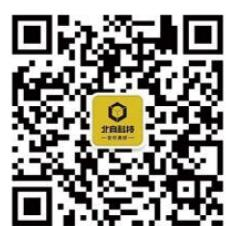

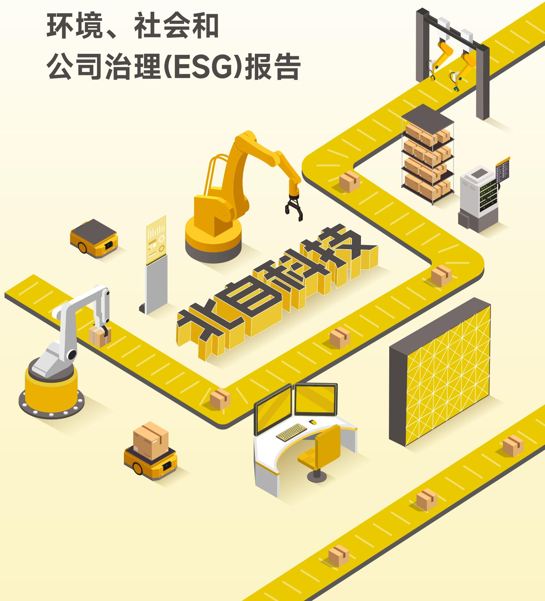

text_image

环境、社会和
公司治理(ESG)报告
ESG科技

## 目录

## 关于本报告 01

## 董事长致辞 03

## 2025年可持续发展亮点 05

可持续发展荣誉 05

可持续发展亮点绩效 06

## 走进北自科技 09

公司简介 09

发展历程 09

组织架构 11

业务概况 11

发展战略 13

企业文化 14

2025年度大事记 15

2025年度主要荣誉 17

## 报告附录 130

ESG关键绩效表 128

指标索引表 141

意见反馈 143

## 01 可持续发展管理

可持续发展理念 21

可持续发展治理 22

可持续发展培训 22

利益相关方沟通 23

议题重要性分析 24

## 02 固本 强基铸魂

坚持党建引领 29

健全公司治理 33

董高薪酬管理 35

保护股东权益 36

完善内控管理 38

精进税务管理 42

规范商业行为 43

## 00 共享 生态画卷

应对气候变化 47

环境合规管理 52

能源资源利用 57

保护生态环境 62

## 锻造 韧性链条

供应链治理 65

供应链战略 65

供应链风险 67

数字供应链 69

供应链目标 70

平等对待中小企业 70

## 05 精益 智造未来

创新驱动发展 73

深化数智建设 89

筑牢质量根基 89

维护信息安全 97

## 06 凝聚 发展合力

落实安全生产 107

保护员工权益 116

员工管理目标 129

社会责任担当 129

natural_image

Isometric illustration of golden skyscrapers with cloud icons, no text or symbols present

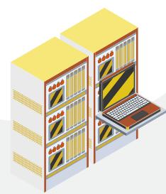

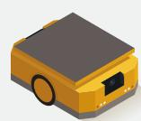

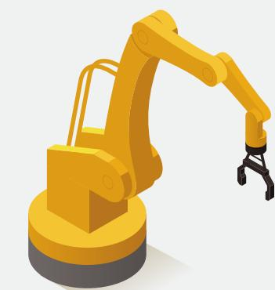

natural_image

Illustration of a yellow industrial robotic arm with articulated arms and a metal hook (no text or symbols)

text_image

教育科技

## 关于本报告

## 报告简介

本报告是北自所（北京）科技发展股份有限公司发布的第三份环境、社会和公司治理报告（以下简称“ESG报告”），旨在向利益相关方全面展示公司2025年在环境、社会和公司治理方面的绩效，并对利益相关方重点关注的ESG议题作出回应。

## 时间范围

本报告时间跨度为2025年1月1日至2025年12月31日，为增强报告可比性及前瞻性，部分内容往前后年度适度延伸。

## 报告范围

本报告以北自所（北京）科技发展股份有限公司为主体，涵盖北自科技及下属子公司。

## 发布周期

本报告的发布周期为一年一次，与财务年度保持一致。

## 编制依据

上海证券交易所《上海证券交易所上市公司自律监管指引第14号——可持续发展报告（试行）》（以下简称“自律监管指引”）  
上海证券交易所《上海证券交易所上市公司自律监管指南第4号——可持续发展报告编制》（以下简称“自律监管指南”）  
国务院国资委《央企控股上市公司ESG专项报告编制研究》  
全球报告倡议组织《可持续发展报告标准（GRI Standards 2021）》（以下简称“GRI标准”）  
中国企业改革与发展研究会《中国企业可持续发展报告指南（CASS-ESG 6.0）》（以下简称“CASS指南”）  
中国国家标准化管理委员会《社会责任指南》（GB/T 36000-2015）  
气候相关财务信息披露工作组（TCFD）披露框架  
联合国2030年可持续发展目标（以下简称“SDGs”）

## 数据说明

本报告使用数据来源包括公司实际运行的原始数据、政府部门公开数据、年度财务数据、内部相关统计报表、第三方问卷调查等。本报告的财务数据以人民币为记账本位币，若与财务报告不一致之处，以财务报告为准。

## 确认批准

本报告于2026年4月27日获公司董事会批准。董事会承诺对报告内容进行监督，确保无任何虚假记载或误导性陈述，并对内容真实性、准确性和完整性负责。

释义说明

<table><tr><td>释义项</td><td>释义内容</td></tr><tr><td>北自科技、公司</td><td>北自所(北京)科技发展股份有限公司</td></tr><tr><td>德奥智装</td><td>浙江德奥智能装备有限公司(曾用名:湖州德奥机械设备有限公司)公司全资子公司</td></tr><tr><td>北自所</td><td>北京机械工业自动化研究所有限公司,公司控股股东</td></tr><tr><td>北自所物流事业部</td><td>北京机械工业自动化研究所有限公司物流事业部、物流技术工程研究中心,公司业务前身</td></tr><tr><td>中国机械总院</td><td>中国机械科学研究总院集团有限公司,公司间接控股股东</td></tr><tr><td>国务院国资委</td><td>国务院国有资产监督管理委员会</td></tr><tr><td>EMS</td><td>悬挂输送系统(Electrical Monorail System)的简称,是沿空中轨道运行,能够快速、高效地实现工件搬运的输送系统,多用于人机共同作业场景下货物的连续搬运</td></tr><tr><td>AGV</td><td>自动导引运输车(Automated Guided Vehicle)的简称,是装备有电磁或光学等自动导引装置,能够沿规定的导引路径行驶,具有安全保护以及各种移载功能的运输车</td></tr></table>

## 报告获取

本报告可以在公司网站（http://www.bzkj.cn）、上海证券交易所网站（http://www.sse.com.cn）查阅和下载。

## 董事长致辞

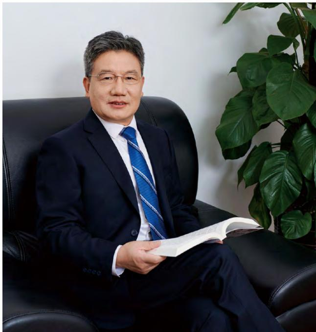

natural_image

Portrait of a man in a dark suit sitting on a black leather chair, holding an open book, with a potted plant nearby (no visible text or symbols)

2025年，北自科技坚持以习近平新时代中国特色社会主义思想为指导，深入贯彻落实党的二十大及二十届三中、四中全会精神，坚持稳中求进工作总基调，紧扣高质量发展主线，全面践行“交付美好，追求卓越”的经营理念。公司围绕增强核心功能、提升核心竞争力，在做强做优主责主业的同时，深入贯彻ESG理念，推动公司发展实现新跨越、迈上新台阶。

## 董事长 王振林

北自所（北京）科技发展股份有限公司

## 党建引领，筑牢根基

公司持续强化党的政治建设，坚持“两个一以贯之”，深化落实“第一议题”制度，将党建引领深度融入治理与发展的各环节，确保企业战略部署与国家发展大局同频共振、深度融合。通过组建“智造先锋”红链联盟，推动党建与业务深度融合，构建产学研协同创新生态，以高质量党建引领企业高质量发展，为公司行稳致远提供坚强的政治保障。

## 聚焦主业，服务大局

公司作为智能物流领域的国家队，牢记“让物流更准更快更简”的使命，坚决贯彻落实党中央、国资委关于发展新质生产力的战略部署，聚焦主责主业，致力于推进以智能物流为核心的智能制造。公司在服务传统制造业升级与国家战略性新兴产业拓展上双向发力，海外市场开拓成效显著，市场版图持续扩大，全年实现营业收入210,566.70万元，净利润17,232.49万元，依法纳税6,757.96万元，持续为股东创造价值，为国家战略贡献力量。

## 创新驱动，自立自强

公司坚持科技创新在全局中的核心地位，加快打造自主可控的产业链与创新链。2025年，公司研发投入7830.74万元成功研制开发多种核心装备及软件系统在科技创新与综合实力方面获得多项权威认可成功入选“国家知识产权示范企业”创建对象名单。报告期内，公司共获得国家级、省部级及行业等荣誉资质9项，获得省部级科技进步一等奖2项。科技创新正成为驱动可持续发展的核心引擎。

## 改革深化，精益治理

公司深入贯彻落实国务院国资委国有企业改革深化提升行动部署，以“聚焦协同促创新，降本增效助发展”为核心全面提升运营管理能力，推进体系化、数字化与精益化，实现业务全程可视与风险联控，驱动运营全面提质增效。公司在国务院国资委改革办公布的2024年度中央企业“双百行动”考核中获评“优秀”，在上交所信息披露评价中获评A级，现代企业治理能力和价值创造能力持续增强。

## 绿色发展，低碳先行

公司积极响应国家“双碳”战略，将绿色发展理念贯穿于产品全生命周期，通过持续完善多元认证休系，新获ISO.37001反贿赂管理及GB/T39604社会责任管理休系认证 取得“绿色低碳AAA级”等权威认定，公司以节能环保的技术创新和绿色制造，持续降低物流装备与系统的能耗水平，ESG治理在各权威平台评级稳中有升，并获得“ESG卓越央企金牛奖”等多项荣誉，为推动经济社会发展全面绿色转型贡献北自智慧和力量。

## 共建共享，彰显担当

企业的发展依托于员工的奋斗与社会的支持。公司高度重视人才队伍建设 聚售精准引才，系统育才与绩效激励 加大对青年骨于，高潜人才及于部的推树，选拔与动态管理力度 拓宽成长通道 有效激发组织内生动力。在社会责任方面，公司聚焦民生实事，优化员工关怀机制，改善办公环境，开展公益帮扶与青年成长活动，切实提升员工获得感，以实际行动践行央企担当，厚植企业发展的温度与厚度。

未来，北自科技将持续深耕智能物流主赛道以科技创新为驱动以智能制造为方向全面增强核心功能和核心竞争力。我们将以更加开放的姿态、更加务实的行动，服务国家战略、回馈股东信任、关爱员工成长、造福社会大众，助推国家技术进步和新质生产力发展，在建设世界一流企业的征程上奋力谱写高质量发展新篇章！

## 2025年可持续发展亮点

## 可持续发展荣誉

北自科技稳步推进ESG战略落地，不断优化ESG管理模式，以实际行动践行绿色、合规、负责任的经营理念。2025年，公司可持续发展工作成果显著，ESG治理在各权威平台评级稳中有升，并凭借优异表现获得多项嘉奖与认可。

主要ESG评级

<table><tr><td>平台</td><td>2024年评级</td><td>2025年评级</td><td>趋势</td></tr><tr><td>万得</td><td>AA</td><td>AA</td><td>维持</td></tr><tr><td>华证指数</td><td>BBB</td><td>A</td><td>提升</td></tr><tr><td>中诚信</td><td>A</td><td>A</td><td>维持</td></tr><tr><td>商道融绿</td><td>A</td><td>A</td><td>维持</td></tr><tr><td>联合赤道</td><td>AA</td><td>AA</td><td>维持</td></tr><tr><td>易董 ESG</td><td>A</td><td>AA</td><td>提升</td></tr></table>

ESG所获荣誉

<table><tr><td>奖项</td><td>颁奖单位</td><td></td></tr><tr><td>2025年华证A股上市公司首发ESG报告优胜TOP100</td><td>上海华证指数信息服务有限公司</td><td rowspan="2"></td></tr><tr><td>国新杯·ESG卓越央企金牛奖</td><td>中国证券报/中国国新控股有限责任公司</td></tr><tr><td>2025年度Wind中国上市公司(中小市值)ESG最佳实践100强</td><td>Wind万得</td><td>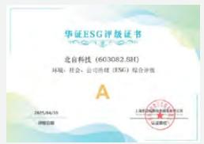</td></tr><tr><td>2025年同花顺中国ESG领航者企业百强</td><td>同花顺iFinD</td><td rowspan="2">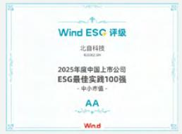</td></tr><tr><td>2025年度中国上市公司ESG最佳实践100强</td><td>深圳价值在线信息科技股份有限公司</td></tr></table>

## 可持续发展亮点绩效

## 经济绩效

营业收入

210,566.70万元

总资产

471,302.06万元

归属于上市公司股东的净利润

17,232.49万元

每股社会贡献值

2.34元

## 环境绩效

环保投入

33.33万元

直接能源消耗量

25.03吨标准煤

间接能源消耗量

146.94吨标准煤

可再生能源使用量

117.73吨标准煤

能源消耗总量

289.71吨标准煤

综合能耗强度

0.14吨标准煤/百万元营收

温室气体排放量（范围一）

54.22tCO2e

温室气体排放量（范围二）

635.75tCO2e

温室气体排放量（范围一和范围二）

689.98tCO2e

温室气体排放强度

0.33tCO2e/百万元营收

污染物达标排放率

100%

污染物监测合格率

100%

## 治理绩效

股东会召开次数

4次

董事会召开次数

10次

合规培训次数

45次

内部风险控制培训次数

39次

## 研发绩效

研发投入

7,830.74万元

研发投入占营业收入比例

3.72%

授权有效专利累计数

299项

授权有效发明专利累计数

123项

授权有效实用新型专利累计数

159项

授权有效外观设计专利累计数

17项

软件著作权累计数

178项

商标累计数

20项

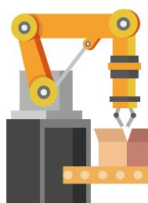

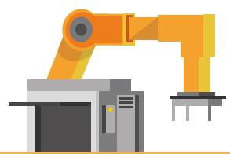

## 社会绩效

工程产品最终交验合格率

100%

客户满意度

97.17%

员工总数

633人

劳动合同签订率

100%

社会保险覆盖率

100%

员工培训投入

21.46万元

员工培训覆盖率

100%

安全生产投入

407.47万元

安全教育覆盖比率

100%

natural_image

Illustration of a robotic arm and conveyor belt with '2025' text, no readable document or symbols present.

# 走进北自科技

## 公司简介

北自所（北京）科技发展股份有限公司（简称“北自科技”，股票代码：603082.SH）主要从事智能物流系统的研发、设计、制造与集成业务，基于自主开发的物流装备、控制和软件系统，为客户提供从规划设计、装备定制、控制和软件系统开发、安装调试、系统集成到客户培训的“交钥匙”一站式服务，是一家智能物流系统解决方案供应商。

公司团队深耕物流领域50余年，是国务院国资委认定的“双百企业”和“创建世界一流专精特新示范企业”，被工信部认定为“制造业单项冠军企业”“国家技术创新示范企业”，化纤长丝卷装作业智能物流系统全球市场占有率排名第一，“复杂装备数字孪生运维管控共性关键技术及标准体系”荣获国家科学技术进步奖二等奖。

公司坚守“让物流更准更快更简”的企业使命，秉承“交付美好，追求卓越”的经营理念，聚焦高质量发展为主线，以智能仓储物流为基础、以智能生产物流为发展方向，推进以智能物流为核心的智能制造，助力我国制造业的数字化智能化转型升级，着力将公司打造成为世界一流专精特新示范企业，全面提升企业价值创造能力，实现可持续发展。

## 发展历程

北自科技业务前身北自所物流事业部是我国较早研究仓储物流技术的科研机构，自20世纪70年代起致力于自动化仓储物流技术的开发和应用，参与建设了我国第一座自动化立体仓库。

## 1954年

北京机械工业自动化研究所成立

## 1974年

开始研发、设计自动化立体仓库

## 1978年

“自动化立体仓库系统”获得全国机械工业科学大会显著成绩奖

## 1982年

完成首套具有计算机控制系统的自动化立体仓储项目并通过科技成果鉴定，为国内首创、技术先进

## 1988年

完成当时国内自行研制的规模最大、综合自动化水平最高的高位立体仓库，荣获国家科技进步二等奖、中华人民共和国国家机械电子工业部一等奖

## 2004年

建成世界首条玻璃纤维生产线智能物流系统，形成首套生产物流系统解决方案

## 2021年

收购德奥智装并完成混改

北自所（北京）科技发展有限公司整体变更为股份公司，名称为北自所（北京）科技发展股份有限公司

## 2020年

化纤长丝卷装作业智能物流系统全球市场占有率排名第一，获工信部“制造业单项冠军示范企业”

成为国务院国资委“双百行动”企业

## 2019年

“化纤长丝卷装作业的全流程智能化与成套技术装备产业化”项目获中国纺织工业联合会科学技术奖科技进步奖一等奖

## 2018年

物流事业部整体转移至北自所全资子公司北京和玛环太科技有限公司，并更名为北自所（北京）科技发展有限公司，专业从事智能仓储物流业务

## 2017年

北自所更名为北京机械工业自动化研究所有限公司，北自所物流工程技术研究中心更名为物流事业部

## 2013年

北自所物流技术工程研究中心成立

## 2022年

获评国务院国资委“国有企业公司治理示范企业”称号

“复杂装备数字孪生管控运维关键技术及系统应用”项目荣获中国机械工业联合会技术发明一等奖

## 2023年

IPO注册申请获证监会批复

入选国务院国资委首批“创建世界一流专精特新示范企业名单

## 2024年

成功登陆上交所主板

“复杂装备数字孪生运维管控共性关键技术及标准体系”项目荣获国家科学技术进步奖二等奖

入选工信部“国家技术创新示范企业”名单

入选中国企业ESG优秀案例

## 2025年

入选“国家知识产权示范企业”创建对象名单

子公司德奥智装获评国家级专精特新“小巨人”

中央企业“双百行动”考核中获评“优秀”

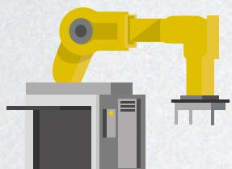

## 组织架构

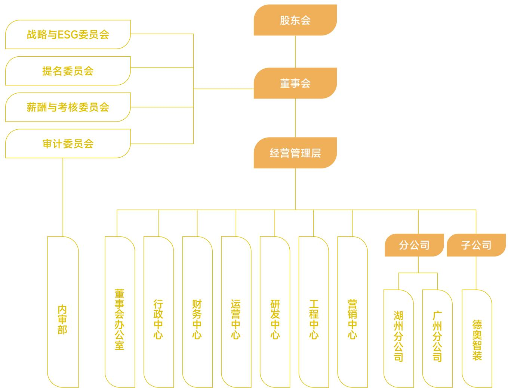

flowchart

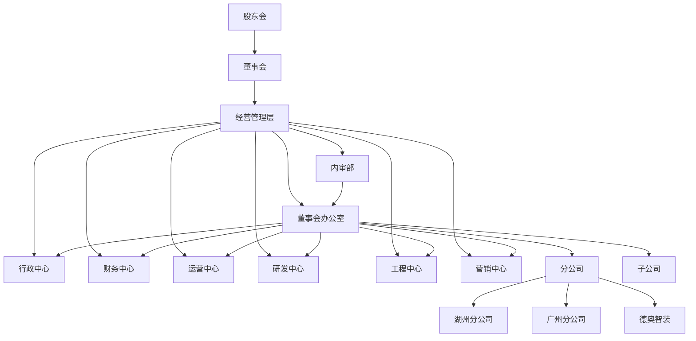

## 业务概况

北自科技主要从事智能物流系统和装备的研发、设计、制造与集成业务。

<table><tr><td>类型</td><td>简介</td><td>典型图示</td></tr><tr><td>智能仓储物流系统</td><td>主要产品形态为企业的原材料库、成品库和物流配送中心等,应用于仓储环节物料储量大、流量高和品种多的行业,可实现货物出入库、仓储、配送、盘点等过程的自动化、数字化和智能化,具有通用性强、覆盖面广的特点。</td><td>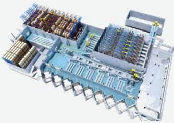</td></tr></table>

<table><tr><td>类型</td><td>简介</td><td>典型图示</td></tr><tr><td>智能生产物流系统</td><td>以包含线边库、周转库和复杂输送单元为主要特征,应用于生产过程中存在多品种小批量物料周转、仓储需求的行业,将物流系统与生产工艺相结合,可实现生产过程各环节物流活动的自动化、数字化和智能化,具有工艺复杂、专业性强的特点。</td><td>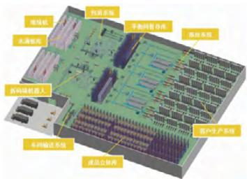</td></tr><tr><td>智能物流装备</td><td>智能仓储物流系统由多种智能物流装备构成,通常包含立体货架、堆垛机、输送机、穿梭车、EMS系统、分拣系统、AGV等通用物流装备,除通用物流装备外还包括根据项目需要提供的定制堆垛机、定制输送机、机器人工作站、全自动落丝机和龙门码垛机等专用物流装备。</td><td>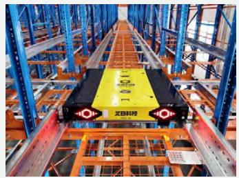</td></tr><tr><td>智能物流软件</td><td>公司团队在我国第一座自动化立体仓库中负责了控制系统和管理软件的研发,多年来完成了众多智能仓储物流系统集成项目,形成了面向多个行业的知识库、工艺库、专家库和标准库,自主开发了WMS、WCS、IntelliTwin数字孪生工业软件等多种软件系统,可根据不同行业用户的个性化需求开发软件系统,形成定制化解决方案。</td><td>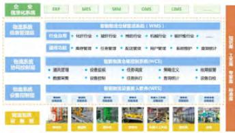</td></tr><tr><td>运维及其他服务</td><td>运营维护是指在质保期后为客户提供的年度维保、应急维修、设备零配件供应及更换等服务。除运营维护外,亦会根据客户提供智能物流工程技术咨询规划及其他服务。</td><td>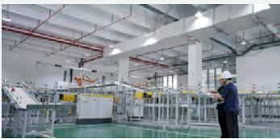</td></tr></table>

## 发展战略

北自科技作为国务院国资委授予的“创建世界一流专精特新示范企业”，以“让物流更准更快更简”为使命，以“成为先进物流技术和装备世界一流企业”为愿景，以“交付美好，追求卓越”为理念，持续发挥“专业突出、创新驱动、管理精益、特色明显”四大核心优势，以科技创新为驱动，坚持质量、效益并重，推动业务向特色化、高端化、国际化发展，不断完善治理结构，提升企业活力和核心竞争力，把企业做强做优做大。

公司未来将继续坚持以智能物流系统业务为核心，以服务国家战略为使命，以提供数字化、智能化、集成化的物流技术装备为己任，持续加强以创新力、竞争力、服务力为内核的关键能力，实现业务高质量发展，保持国内智能物流领域领先地位，向世界一流智能物流系统解决方案供应商迈进，积极参与全球竞争。

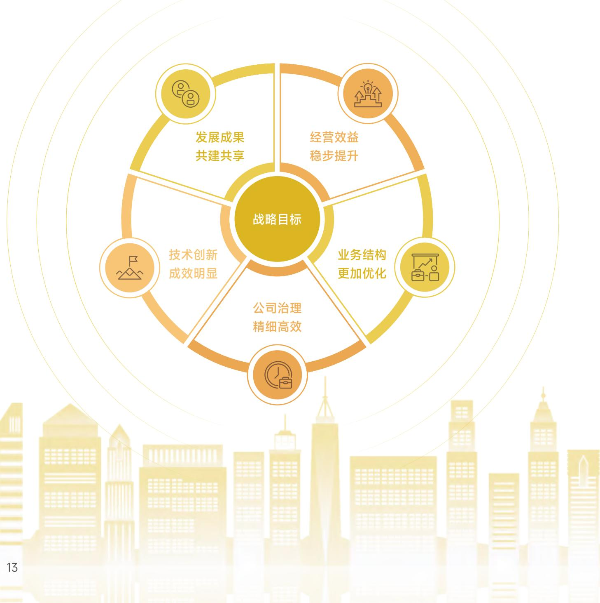

flowchart

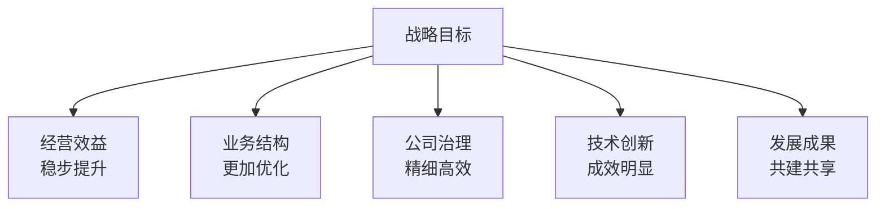

## 企业文化

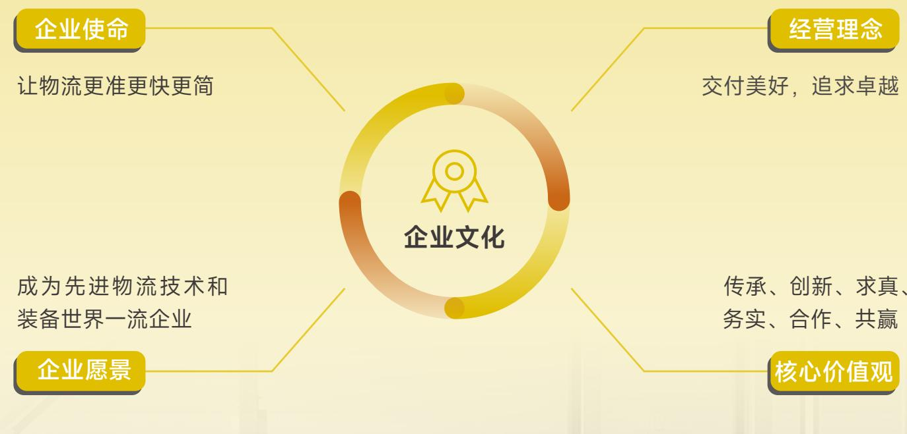

flowchart

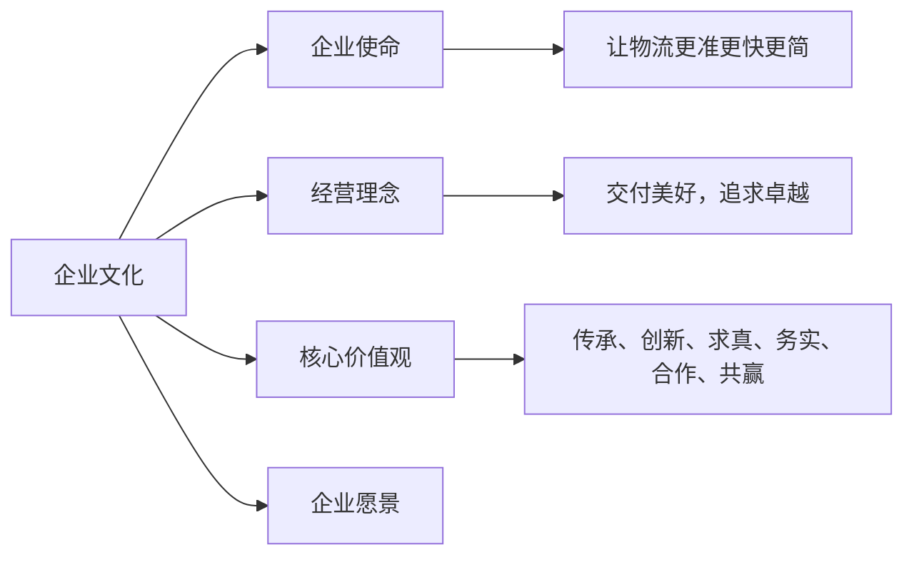

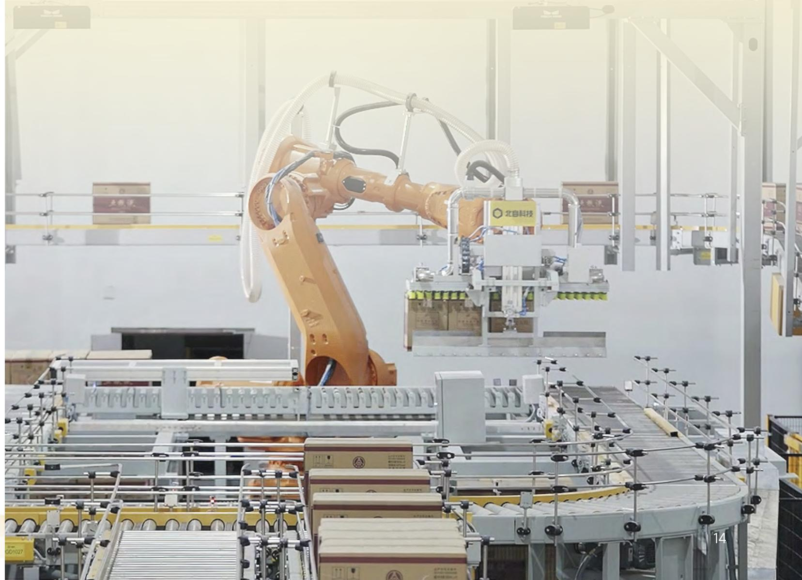

natural_image

Industrial factory interior with robotic arm and conveyor systems (no visible text or symbols)

## 2025年度大事记

入选2024年度智能制造系统解决方案“揭榜挂帅”项目名单

与TMT机械株式会社签订战略合作协议  
子公司德奥智装荣获2024年度南浔经济开发区先进企业表彰  
获“物流技术创新案例”奖

与东华大学联合建立“北自科技-东华大学联合创新中心”  
参加2025中国制药工业技术大会  
亮相Expo Antad 2025赋能智能 仓储与零售新未来

入选《2024酒类智慧供应链典型案例》  
亮相第66届（2025年春季）全国制药机械博览会  
参加2025第四届医药大健康供应链创新大会

湖州智能化物流装备产业化项目主体结构圆满封顶

与北京星动纪元科技有限公司达成战略合作

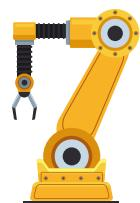

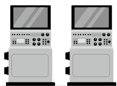

荣获第五届智能制造创新大赛一等奖

荣获智能物流产业优秀品牌奖  
荣获“2025年度中国上市公司Wind ESG 100强（中小市值）奖”  
荣获“2025年度中国上市公司ESG最佳实践100强”

子公司德奥智装入选国家级第七批专精特新“小巨人”名单  
荣获“2025央企产业链创新发展优秀案例”奖  
荣获“国新杯·ESG卓越央企 金牛奖”  
入选2025第八届“上药杯”医药物流与供应链创新大赛优秀案例

参加第三届中物联仓储技术大会

公司总经理获聘中国重型机械行业首批“首席专家”  
亮相第67届（2025年秋季）全国制药机械博览会  
亮相亚洲国际物流技术与运输系统展览会

公司董事长与总经理受邀参加抗战胜利80周年阅兵观礼

参加第四届机器人标准化和关键技术研讨会

自主研发物流系统入选北京市首台（套）重大技术装备目录

参加第二十届全国冷链大会

北自科技人形机器人“物流小精灵”亮相首届世界人形机器人运动会  
荣获中国物流与采购联合会科学技术奖一等奖  
安徽佑顺CP1车间EMS天轨智能物流系统成功投产

入选“中国轻工业企业百强榜单”

获评国务院国资委“双百行动”年度考核“优秀”等级

## 2025年度主要荣誉

## 科技创新类

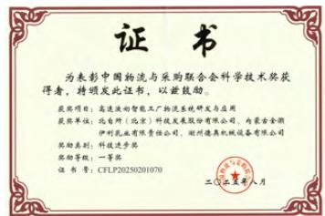

text_image

证书
为表彰中国物流与采购联合会科学技术奖获得者，特颁发此证书，以颁鼓励。
获奖项目：高速波切智能工厂物流系统研发与应用
获奖单位：北台所（北京）科技发展股份有限公司、内蒙古金徽
伊利乳业有限责任公司、郑州德典机械设备有限公司
奖励类别：科技进步奖
奖励等级：一等奖
证书号：CFLP20250201070
二〇一五年八月

科技进步奖一等奖——高速液奶智能工厂物流系统研发与应用  
中国物流与采购联合会

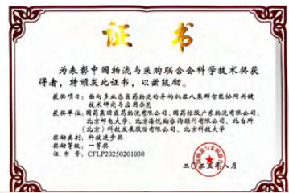

text_image

证书
为表彰中国物流与采购联合会科学技术奖获得者，特颁发此证书，以颁鼓励。
获奖项目：面向多家医药物流平台的机器人集群智能协同关键技术研究与应用示范
获奖单位：国药集团医药物流有限公司、国药控股广东物流有限公司、北京华电大学、北京市海优船咨询顾问有限公司、北京科华（北京）科技发展股份有限公司、北京科技大学
获奖类别：科技进步奖章
获奖等级：一等奖
证书号：CFLP20250201030
二〇一四年八月

科技进步奖一等奖——面向多业态医药物流的异构机器人集群智能协同关键技术研究与应用示范  
中国物流与采购联合会

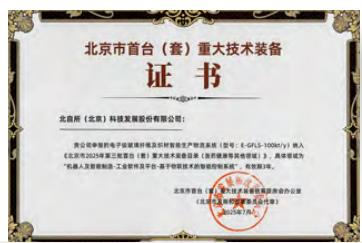

text_image

北京市首台（套）重大技术装备
证书
北自所（北京）科技发展股份有限公司：
贵公司申请向电子邮箱填件及材料寄存至指定产物流系统（型号：E-GLS-1006t/y）转入
《北京市2025年第三批首台（套）重大技术装备项目（医疗器械等其他项目）》，具体内容为
“长春人食智能制造·工业有限公司平台-基于物联技术的智能控制系统”；有效期3年。
北自所首台（套）重大技术装备办公室
（北京高新技术产业开发区2025年7月）

2025年北京市首台（套）重大技术装备  
北京市首台（套）重大技术装备联席会办公室

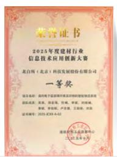  
2025年度建材行业信息技术应用创新大赛一等奖  
建筑材料工业信息中心

natural_image

Golden medal with red ribbon and golden geometric emblem (no text or symbols)

## 最佳实践类

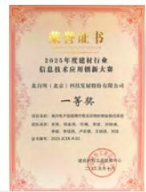  
2025年度建材行业信息技术应用创新大赛一等奖  
建筑材料工业信息中心

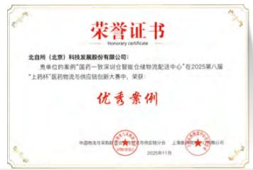

text_image

荣誉证书
Honorary certificate
北自所（北京）科技发展股份有限公司：
贵单位的案例“国药一致深空仓储物流配送中心”在2025第八届
“上药杯”医药物流与供应链创新大赛中，荣获
优秀案例
中国牧原军采购部 2025年度制造业与供应链分会 上海旅游集团有限公司
2025年11月

2025上药杯优秀案例奖  
中国物流与采购联合会医药物流与供应链分会、上海医药物流中心有限公司

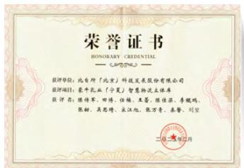

text_image

荣誉证书
HONORARY CREDENTIAL
（二）2017年5月
获评单位：此台所（北京）科技发展股份有限公司
获评项目：豪牛乳业（宁夏）智慧物流仓储库
获评书：陈传军、邢博、任楠、王蕾、熊俊录、李晓鸣、张翀、吴思琦、永江旭、施万青、秦睿、刘坚
（二）2017年5月

2025物流技术创新案例——蒙牛乳业（宁夏）智慧物流立体库  
中国物流与采购联合会物流装备专业委员会

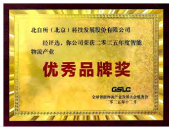

text_image

北白所（北京）科技发展股份有限公司
经评选，你公司荣获二零二五年度智能物流产业
优秀品牌奖
GSLC
全球智能制造产业发展大会组委会
二零二五年十二月

2025年度智能物流产业优秀品牌奖  
全球智能物流产业发展大会组委会

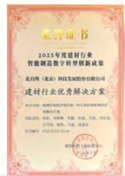  
2025年度建材行业智能制造数字转型创新成果——建材行业优秀解决方案  
建筑材料工业信息中心

## 行业地位类

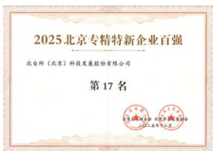

text_image

2025北京专精特新企业百强
北自所（北京）科技发展股份有限公司
第17名

2025北京专精特新企业百强  
北京企业联合会，北京企业家协会

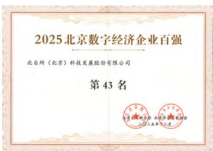

text_image

2025北京数字经济企业百强
北自所（北京）科技发展股份有限公司
第43名

2025北京数字经济企业百强  
北京企业联合会，北京企业家协会

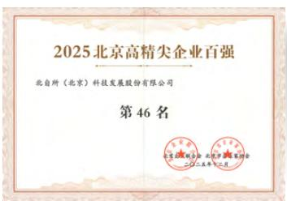

text_image

2025北京高精尖企业百强
北自所（北京）科技发展股份有限公司
第46名

2025北京高精尖企业百强  
北京企业联合会北京企业家协会

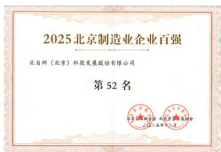

text_image

2025北京制造业企业百强
北自所（北京）科技发展股份有限公司
第52名
北京联合证券 北京市发展基金
二〇二五年十二月

2025北京制造业企业百强  
北京企业联合会，北京企业家协会

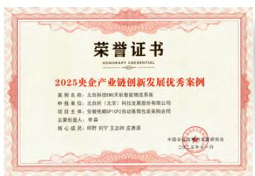

text_image

荣誉证书
HONGYUARY CREDENTIAL
2025央企产业链创新发展优秀案例
案例名称：北自科创80天钻智能物流系统
申报单位：北自所（北京）科技发展股份有限公司
项目主体：安徽皖通CPI行动密集包装采购合同
主要创始人：李浩
核心成员：郑野 刘宁 王志玲 庄潇潇
中国注册会计师协会
二〇二五年八月

2025央企产业链创新发展优秀案例  
中国企业改革与发展研究会

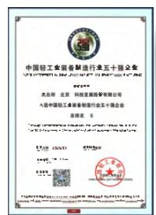  
中国轻工业装备制造行业五十强企业  
中国轻工联合会

## 可持续发展管理

可持续发展理念 27  
可持续发展治理 31  
可持续发展培训 33  
利益相关方沟通 34  
议题重要性分析 36

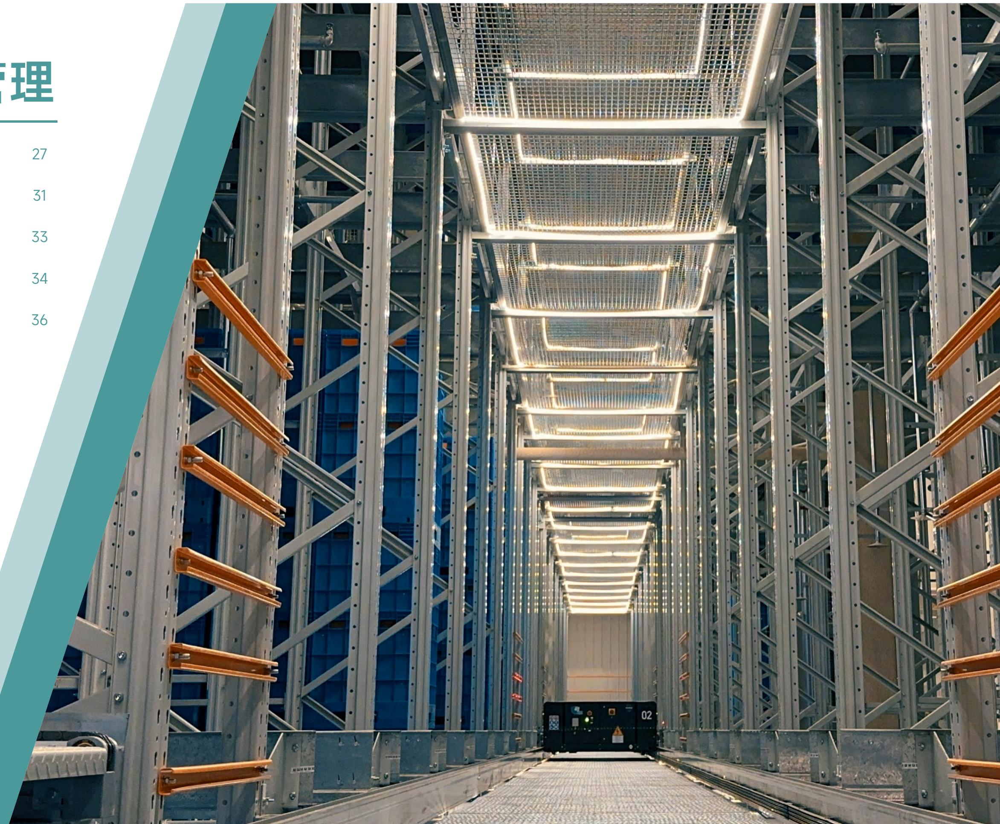

text_image

理
27
31
33
34
36

## 可持续发展理念

<table><tr><td>ESG管理维度</td><td>公司理念</td><td colspan="2">联合国可持续发展目标(SDGs)</td></tr><tr><td>公司治理G</td><td>设定“公司治理 精细高效”的战略目标,不断完善公司治理体系,强化风险意识,底线意识,加强风险控制和合规管理,充分重视风险防范和管控。</td><td>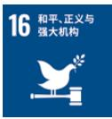</td><td>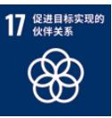</td></tr><tr><td rowspan="2">环境保护E</td><td rowspan="2">坚持绿色发展,围绕实现碳达峰、碳中和战略目标为主线,坚持绿色发展战略原则,依靠科技进步,采用新技术,推行文明、清洁生产,减少污染物的排放。</td><td colspan="2">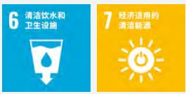</td></tr><tr><td colspan="2">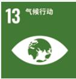</td></tr><tr><td>产业价值S</td><td>打造智能物流、智能制造技术创新策源地,成为世界一流智能物流系统解决方案供应商,以智能物流推动智能制造,助力我国制造业转型升级。</td><td colspan="2">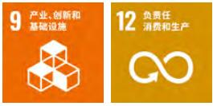</td></tr><tr><td rowspan="2">员工权益S</td><td rowspan="2">坚持以人为本,加强人才梯队建设,优化薪酬福利体系,提供多元培训,畅通晋升通道,实现和员工共同成长,共同进步的目标。</td><td colspan="2">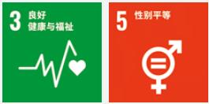</td></tr><tr><td colspan="2">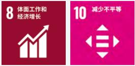</td></tr><tr><td rowspan="2">社会贡献S</td><td rowspan="2">全面履行社会责任,积极支持国家经济社会发展,持续深化企业文化,既保持上市公司竞争力,又保持央企的管理文化和风险意识。</td><td colspan="2">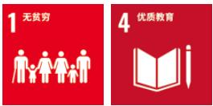</td></tr><tr><td colspan="2">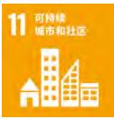</td></tr></table>

## 可持续发展治理

北自科技紧跟国家生态文明建设步伐，将可持续发展理念植入企业发展基因，把ESG要求贯穿治理全流程，激发企业内生动力。为深化可持续发展实践，公司制定《环境、社会和公司治理（ESG）管理制度》，建立起决策层－管理层－执行层三级ESG治理架构，规范各层级具体职责，打造紧密联动、高效协同的治理链路。

公司董事会为ESG管理的最高决策机构，对ESG重大事项进行监督管理，战略与ESG委员会对董事会负责；战略与ESG委员会下设ESG领导小组作为ESG管理层，负责评估、管理重要性议题，并提供分析、建议供决策层讨论等；ESG执行小组作为ESG执行层，负责制定利益相关方参与计划、编制可持续发展报告、可持续发展相关管理、数据统计与分析等工作。

flowchart

## 可持续发展培训

北自科技稳步推进ESG能力建设常态化开展ESG宣贯与专题培训，助力员工深化可持续发展认知、提升实践能力。报告期内，公司开展主题为“从ESG理论政策到实践落地、共探可持续发展新路径”的ESG专项培训，包含ESG基础理论、政策法规解读、国内企业实践经验及标杆案例分享，深度解析国家与行业ESG发展趋势，帮助员工构建从理论到实践的完整认知体系。

text_image

北自所大讲堂
（第二版）
从ESG理论政策到实践落地
共探可持续发展新路径
范建林
2025年

ESG培训

## 利益相关方沟通

<table><tr><td>利益相关方</td><td>期望与诉求</td><td>公司回应</td></tr><tr><td>政府及监管机构</td><td>合规经营风险管理服务国家战略反腐败与贪污依法纳税</td><td>坚持守法合规强化风险管控响应国家政策接受监督检查履行纳税义务</td></tr><tr><td>股东和投资者</td><td>完善公司治理投资者沟通股东权益保障ESG管理</td><td>优化公司治理加强投资者互动规范信息披露保护投资者权益提高盈利能力发布ESG报告</td></tr><tr><td>客户</td><td>优质产品与服务客户服务与满意度客户隐私保护</td><td>强化质量管理优化客户服务重视客户沟通保障信息安全</td></tr><tr><td>供应商及合作伙伴</td><td>合作共赢商业道德可持续供应链</td><td>坚持诚信经营完善供应商管理管控供应链风险开展战略合作</td></tr><tr><td>员工</td><td>人才引进与保留员工多元化与包容性员工薪酬与福利职业健康与安全</td><td>提供员工培训完善晋升通道加强关爱与沟通优化薪酬管理保障安全生产</td></tr><tr><td>行业协会与媒体</td><td>促进行业发展行业交流合作研发创新</td><td>参加行业协会参与标准制定鼓励研发创新保护知识产权</td></tr><tr><td>社区与公众</td><td>参与公益事业乡村振兴社区关系管理</td><td>参与公益活动购买扶贫产品实施本地化雇佣</td></tr></table>

## 议题重要性分析

北自科技基于公司发展战略，参照自律监管指引、自律监管指南、GRI标准、《央企控股上市公司ESG专项报告编制研究》等ESG法规、标准和指引的要求，从影响重要性和财务重要性双重评估维度出发，通过问卷调查、部门访谈、行业研究等方式，深入洞察利益相关方需求，识别重要性议题。

## 了解公司背景

深入了解公司内部运营活动和业务联系，考察外部环境的客观条件，分析自身运营环节中存在的ESG影响、风险及机遇，同时洞察利益相关方的诉求与期望

## 建立议题清单

根据国家宏观政策相关要求，并深入分析国内外ESG标准，结合自身发展战略和市场需求，参考行业内优秀企业的实践，建立重要性议题库

## 利益相关方调研

采用在线问卷调研及日常沟通等方式，邀请内外部利益相关方参与评估ESG议题的重要性

## 分析议题重要性

依据自身战略定位、结合专家判断，从财务重要性和影响重要性两个维度，对议题进行系统筛选、评估、排序

## 确定议题矩阵

根据议题评估结果构建实质性议题矩阵，提交公司董事会及管理层进行审阅，最终输出影响重要性与财务重要性议题矩阵

报告期内，公司综合考量业务布局、经营模式、行业发展趋势与关注重点，持续跟踪利益相关方反馈，引入专家评价法进行综合研判，确认实质性议题未发生显著变动，2025年度ESG实质性议题矩阵与上一报告期保持一致。

scatter

| 议题 | X轴位置 (估算) | Y轴位置 (估算) |
| :--- | :--- | :--- |
| 客户权益保护 | 高 | 高 |
| 产品与服务质量 | 高 | 高 |
| 职业健康与安全 | 中 | 高 |
| 信息安全与隐私保护 | 高 | 高 |
| 员工招聘与就业 | 中 | 高 |
| 应对气候变化 | 中高 | 高 |
| 税务治理 | 中高 | 中高 |
| 研发与创新 | 高 | 中高 |
| 合规与风险管理 | 中高 | 中 |
| 员工培训与发展 | 中高 | 中 |
| 供应链安全 | 中高 | 中 |
| 反商业贿赂及反贪污 | 中低 | 中高 |
| 平等对待中小企业 | 中高 | 中 |
| 反不正当竞争 | 中低 | 中 |
| 废弃物处理 | 低 | 中 |
| 环境合规管理 | 低 | 中 |
| 利益相关方沟通 | 中低 | 中 |
| 污染物排放 | 低 | 中 |
| 规范公司治理 | 中低 | 低 |
| ESG治理 | 中低 | 低 |
| 循环经济 | 低 | 低 |
| 能源利用 | 低 | 低 |
| 科技伦理 | 低 | 低 |
| 水资源利用 | 低 | 低 |
| 生态系统与生物多样性保护 | 低 | 低 |
| 社会参与 | 低 | 低 |

对公司的重要性

<table><tr><td>环境合规管理</td><td>能源利用</td><td>应对气候变化</td><td>循环经济</td></tr><tr><td>水资源利用</td><td>污染物排放</td><td>废弃物处理</td><td>生态系统与生物多样性保护</td></tr><tr><td>员工招聘与就业</td><td>员工培训与发展</td><td>职业健康与安全</td><td>研发与创新</td></tr><tr><td>科技伦理</td><td>产品与服务质量</td><td>客户权益保护</td><td>信息安全与隐私保护</td></tr><tr><td>供应链安全</td><td>平等对待中小企业</td><td>社会参与</td><td>规范公司治理</td></tr><tr><td>反商业贿赂及反贪污</td><td>反不正当竞争</td><td>合规与风险管理</td><td>税务治理</td></tr><tr><td>利益相关方沟通</td><td>ESG治理</td><td></td><td></td></tr></table>

议题重要性汇总矩阵

## 影响重要程度

## 议题

## 双重重要性

产品与服务质量、客户权益保护、信息安全与隐私保护、应对气候变化

## 财务重要性

员工培训与发展、研发与创新、供应链安全

## 影响重要性

职业健康与安全、员工招聘与就业、反商业贿赂及反贪污

## 一般重要

环境合规管理，能源利用、水资源利用、生态系统与生物多样性保护、污染物排放、废弃物处理、循环经济、平等对待中小企业、科技伦理、社会参与、规范公司治理、合规与风险管理、反不正当竞争、税务治理、ESG治理、利益相关方沟通

## 固本 强基铸魂

坚持党建引领 29

健全公司治理 33

董高薪酬管理 35

保护股东权益 36

完善内控管理 38

精进税务管理 42

规范商业行为 43

联合国可持续发展目标（SDGs）响应：

text_image

铸魂
29
33
35
36
38
42
43

## 坚持党建引领

## 政治建设

北自科技党总支始终把政治建设摆在首位，坚持以习近平新时代中国特色社会主义思想为指导，深入学习贯彻党的二十届三中、四中全会精神，将党的领导全面融入公司治理各环节。党总支发挥政治引领作用，按规定参与重大问题决策，确保企业发展与国家战略同频共振、同向发力。2025年，党总支构建 “深学 — 细查 — 实改” 闭环机制，开展中央八项规定精神专题学习、党课、警示教育等活动17场次，“午间微讲堂” 覆盖300余人次；通过 “原文学 + 视频学 + 研讨学” 模式开展全会精神专题学习10余次，发布学习材料22份，上线党建课程 33 项，完成 2 期党务工作培训，推动理论学习转化为干事创业动能。对照作风问题清单查摆出5类8项问题，全部 100% 整改闭环，砍减非必要会议文件，优化工作流程，实现提质增效。

党总支围绕主责主业，打造“物流先锋”党建品牌，以“四个先锋”为核心内涵：坚守央企姓党，做政治先锋；聚焦主责主业做技术先锋:攻坚项目交付、系统落地、效率提升做攻坚先锋:引领行业标准、服务规范、合规运营，做行业先锋。将党建势能精准转化为保障项目交付、推动技术攻关的发展动能，以坚强政治引领为企业高质量发展把舵定向。

## 组织建设

党总支现有党员140名占职工人数28%下设5个党支部 党组织覆盖公司全部业务中心和子公司形成上下贯通、执行有力、覆盖全面的组织体系。2025年高质量完成党总支换届工作，选举产生新一届党总支委员会委员。全年规范召开支部大会43次、支委会64次、党课学习34次，按月开展主题党日，高质量完成组织生活会和党员民主评议，党员管理与发展程序规范、材料齐全。打造 “智造先锋 — 红链联盟” 党建链项目，联合海康威视、中国巨石、东华大学等单位开展联学共建、技术研讨、项目攻关，深化产学研融合。推进混合所有制企业党建工作，在子公司德奥智装召开专题研讨会，明确职责边界，优化工作机制，以组织力提升执行力，以党建赋能科技创新与产业升级。

flowchart

党总支组织架构图

## 思想建设

以思想建设凝聚共识、铸魂育人，持续深化 “物流先锋”党建品牌建设，完善五个党支部特色党建口号。通过“企业文化践行谈”、红色教育基地参观、线上线下党史知识竞赛等载体，强化思想引领与文化传承。加强党建宣传，作品《点亮未来工厂》荣获第八届中央企业优秀故事三等奖。强化廉洁从业教育，对干部和关键岗位人员开展常态化监督，筑牢合规经营与风险防控思想防线，坚持警钟长鸣、防微杜渐，持续营造风清气正的政治生态和发展环境。

text_image

“融合攻关创佳绩”
党建与业务融合专题研讨会

“融合攻关创佳绩 凝心聚力谋发展”专题研讨会

text_image

北自科技党总支
中央八项规定精神专题学习
2024年4月1日
——美编——

中央八项规定精神专题学习

natural_image

Group photo of people posing with a red flag featuring a yellow hammer and sickle symbol, set against a backdrop of greenery and houses (no visible text or symbols)

“追寻伟人足迹·传承红色基因”主题党日活动

text_image

Conference room photo with visible presentation screen displaying Chinese text about the '10th' work conference

“廿余载同心筑梦 新征程共赢未来”党建共建交流

text_image

“追溯红色印记·不忘初心使命”支部共建主题党日活动
——北自科技工程第一党支部、工程第二党支部、苏州穗柯党支部

“追溯红色印记，筑牢初心使命”共建交流活动

text_image

福江纪博起义意识
筑牢廉洁自律纺织

党总支书记讲授纪律专题党课

## 群团工作

北自科技党总支领导下的群团工作协同发力，员工凝聚力、向心力不断增强，公司和谐稳定发展局面持续巩固。2025年完成工会换届，规范 “三委” 建设与经费管理，开展3次帮扶活动实现员工关怀全覆盖，持续优化办公环境，打造 “职工之家”；畅通员工沟通渠道，全年座谈会覆盖24个部门全体员工，27条诉求清单稳步推进。党建带团建成效显著，组织近20次青年学习活动、5场主题研讨、2次红色研学。

text_image

立志成为国内一流、国际知名的行业智能制造全面解决方案提供者
弘扬雷锋精神 凝聚奋进力量

北自科技团总支策划开展  
“弘扬雷锋精神，凝聚奋进力量”主题志愿服务活动

## 健全公司治理

北自科技严格遵循《中华人民共和国公司法》《中华人民共和国证券法》等有关法律法规，以《公司章程》为基础构建完备的内部制度体系，持续完善法人治理结构与内部管理制度，确保经营运作合规有序。公司明确决策、执行和监督等各环节的职责权限，建立了由股东会、董事会、董事会专门委员会及经营管理层组成的治理架构，保障企业健康稳定发展。

## 股东会

股东会是公司的最高权力机构，公司严格按照《公司章程》《股东会议事规则》的规定和要求，依法合规召集、召开股东会，切实执行和落实会议决议，充分尊重并维护全体股东尤其是中小股东的合法权益，保障股东的知情权、参与权、质询权、表决权，确保股东各项法定权利有效行使。

## 关键绩效

召开股东会

4次

其中临时股东会

3次

审议通过议案

37项

## 董事会

董事会是公司的决策机构向股东会负责依照《董事会议事规则》等有关规定围绕“定战略，做决策，防风险”职责定位 聚售公司战略规划制定与落地，严格落实股东会各项决议。报告期内公司董事会的召集，提案、出席、议事、表决、决议等各项运作流程均符合规范。

董事会下设战略与ESG委员会、审计委员会、薪酬与考核委员会和提名委员会，各专门委员会均严格遵照对应议事规则规范履职。立足各自核心职责，各专门委员会各司其职、各尽其能，对公司重大事项进行客观评估与审慎判断，凭借专业视角为董事会提供科学合理、切实可行的决策支撑，助力董事会提升决策效率与质量。

## 关键绩效

召开董事会10次，审议通过82项议案，董事出席率100%

召开专门委员会会议13次，审议议案85项，其中：

<table><tr><td>审计委员会会议</td><td>审议议案</td><td>薪酬与考核委员会会议</td><td>审议议案</td></tr><tr><td>7次</td><td>39项</td><td>1次</td><td>3项</td></tr><tr><td>战略与ESG委员会会议</td><td>审议议案</td><td>提名委员会会议</td><td>审议议案</td></tr><tr><td>3次</td><td>38项</td><td>2次</td><td>5项</td></tr></table>

## 董事会多元化

北自科技积极抓实董事会多元化与专业化建设，在董事选聘过程中综合考虑候选人的性别、年龄、文化及教育背景、专业经验等因素，确保董事的能力与背景精准匹配公司业务发展需求，以提升董事会决策科学性和专业性。

截至报告期末，公司董事会共有9名董事，其中女性董事2名，各董事会成员在行业技术、法律合规、人力资源、财务管理等领域具备丰富的专业知识与管理经验，为公司决策提供专业支撑。

  
董事会多元化构成

## 董事会独立性

为切实发挥独立董事在公司治理中的关键作用，北自科技持续完善董事会内部制衡机制，通过制定《独立董事工作制度》，清晰界定独立董事的任职资格、独立性要求等核心内容，确保独立董事独立、合规履行责任和义务，始终以维护公司整体利益为出发点，在董事会中有效发挥监督和制衡作用。

截至报告期末，公司董事会有3名独立董事，占比33.33%；且在审计委员会、提名委员会、薪酬与考核委员会中，独立董事均占多数并担任召集人，凭借专业、独立的监督视角为公司治理提质增效。

## 关键绩效

召开独立董事专门会议

2次

审议议案数

38项

## 董高薪酬管理

北自科技依托薪酬与考核委员会对董事及高级管理人员薪酬实施规范化管理。针对高级管理人员，公司通过制定《北自科技经理层成员薪酬管理办法》等制度，建立薪酬与绩效考核综合体系，结合短期激励与长期规划，促使经理层成员个人利益与企业长远健康发展紧密联系调动经理层管理积极性提高经营效益和经营质量确保公司经营目标的实现。

公司高级管理人员薪酬按照其工作岗位和管理职务，结合业绩考核指标完成情况及公司整体经营业绩进行综合评定，依据公司薪酬管理相关制度领取薪酬。公司对高级管理人员的考核坚持效益优先、分类引导管理、突出创新驱动、坚持业绩考核与激励约束相结合的原则，考核机制坚持战略导向，注重综合评价，不仅关注经济成果，更重视管理效能与可持续发展能力，通过年度与任期考核相结合的方式，全面审视与科学评价高级管理人员的工作表现，为公司的稳健发展提供坚实保障。

natural_image

Illustration of financial analytics tools including a clipboard, calculator, coins, and pie chart (no text or symbols)

## 保护股东权益

## 信息披露

北自科技严格遵守《中华人民共和国公司法》《上市公司信息披露管理办法》等法律法规，制定《信息披露事务管理制度》《年报信息披露重大差错责任追究制度》等内部规范，明确信息披露工作的管理主体、责任划分与执行流程，确保公司信息披露真实、准确、完整、及时、公平，持续提升公司信息披露的透明度与整体质量。

在内幕信息管控方面，公司制定《内幕信息知情人登记管理制度》，层层压实内幕信息保密工作要求，在内幕信息依法公开披露前，对商议筹划、论证咨询、合同订立等阶段，以及报告、传递、编制、审核、披露等环节的所有内幕信息知情人进行及时、完整登记，切实防范内幕信息知情人员滥用知情权泄露内幕信息、进行内幕交易等违规行为。

报告期内，公司获上海证券交易所年度信息披露评价“A级”，未发生任何信息披露违规、内幕信息泄露或内幕交易等行为。

## 关键绩效

共披露72份公告及文件，其中：

定期报告

4份

临时公告及文件

68份

## 投资者沟通

北自科技稳步推进投资者关系管理工作提质升级，秉持“合规性原则平等性原则主动性原则诚实守信原则”，制定《投资者关系管理制度》，搭建起多层次的投资者良性互动机制。为推动沟通交流走深走实，公司整合多元渠道搭建高效沟通桥梁依托信息披露平台路演 分析师会议 新媒休平台等多种途径 向投资者传递公司经营战略、管理举措和发展成效，同时积极倾听投资者意见建议，及时响应各类合理诉求，通过双向高效沟通夯实投资者关系管理基础，维护与投资者之间的良好互动关系。

## 关键绩效

接待投资者现场调研

5次

投资者问题回复率

100%

接待投资者现场调研

33人

回复e互动平台投资者问答

30次

解答投资者问题

32项

接听投资者电话

140次

## 股东回报

北自科技始终坚守回报股东的经营初心，以价值创造为抓手，持续提升自身投资价值，稳步增强股东回报能力，着力打造长期、稳定、可持续的股东价值回报机制。公司严格遵循《公司章程》中规定的利润分配政策制定和决策程序，结合行业发展态势、自身战略规划及实际经营情况，平衡股东短期收益与长期利益，制定科学合理、稳定规范的利润分配方案，与投资者共享发展成果，增强投资者对公司的信心与认可。

关键绩效  

other

| 指标 | 2023年 | 2024年 | 2025年 |
| --- | --- | --- | --- |
| 每10股派发现金红利 (含税) (元) | 5.80 | 5.80 | 5.90 |
| 派现总额 (含税) (万元) | 9,409.20 | 9,409.20 | 9,571.43 |
| 占合并报表中归属于上市公司股东净利润的比例 (%) | 60.61 | 55.31 | 55.54 |

## 完善内控管理

## 风险管理

完善的风险管理体系是企业稳健发展的重要保障，为筑牢经营发展的风险防线，北自科技制定《全面风险控制管理办法》，明确风控体系各环节、各主体核心职责，持续优化风险管理机制，提高风险防范化解能力。

公司风险管理实行三级责任制，归口部门负责组织开展风险识别与评估工作，并协助各部门及管理人员做好风控工作的监督与落地；各部门负责人负责宣贯具体风控政策，监督政策执行落地，确保风控政策与程序顺利推行。通过构建系统科学的风控工作机制对经营过程中发现的潜在风险第一时间整改纠偏形成内部约束到位、相互制衡有效、内部约束与外部监管有机联系的长效机制，为公司持续规范发展奠定坚实基础。

在风控管理工作中，公司遵循全面性原则，确保风险识别、分析和评估覆盖所有业务环节、部门层级和分支机构，明确各级人员风控职责；建立风险机遇清单，对识别出的风险与机遇进行分类与管理，针对不同类型风险制定差异化应对措施；积极开展风险管理培训，提升高层管理者及一线员工的风险防范意识，形成协同联动的风控体系，将风控要求融入战略决策、业务运营、财务管理和信息技术等各环节，实现风险事前预防、事中监控和事后应对的闭环管理。

同时 公司定期完成风险监测和合规管理报告编制工作 不断优化完善风险监测预警指标体系，动态跟踪已评估风险变化趋势，确保整体风险处于可控范围。报告期内，公司已完成年度重大风险评估工作，无重大经营风险发生。

## 风控管理目标

通过建立健全风控管理框架和制度，实现对风险的有效识别和管理  
培育全员主动风控意识、增强自我约束能力、保障公司及其工作人员经营管理和执业行为等符合法律法规和准则，切实防范风险  
力求在公司形成内部约束到位、相互制衡有效、内部约束与外部监管有机联系的长效机制，为公司持续规范发展奠定坚实基础

## 内部控制

从企业稳健运营的实际需求出发北自科技搭建起覆盖经营管理活动各环节的内控管理架构打造分工清晰，责任落地、制衡有效、运转协调的内控工作机制。结合发展阶段与业务需求的变化，公司持续完善内控制度体系，针对内部控制关键节点、各部门核心职责、内控核心目标等内容作出明确规范，保障企业经营管理的稳健有序。通过定期开展内控有效性核查、合规风险审查与专项测试工作，梳理形成问题发现与跟踪落实清单，统筹各部门推进问题整改落地，确保内控要求落到实处。

公司建立了内部控制监督检查机制。内审部在董事会审计委员会的领导下，依照相关法律法规以及本公司的相关制度，对公司各职能部门及子公司、分公司进行内部审计监督，对内部控制制度的建立和实施情况进行检查，并对审计发现问题建立台账，定期跟进、督促责任部门完成问题整改，形成审计问题闭环管理。

## 关键绩效

内部风险控制培训

39次

内部风险控制培训时长

605小时

内部风险控制培训总人次

291人次

  
年度内控访谈

  
季度内控访谈

## 关联交易

为维护股东合法权益，北自科技严格遵照监管机构关于关联交易的管理要求，制定《关联交易管理制度》，将诚实信用、平等自愿、公平公开、公允公正作为关联交易的核心遵循原则，以确保关联交易行为不损害公司及全休股东的利益，在监督体系搭建上公司强化独立董事对关联交易事项的专业监督与独立判断，提升关联交易监督的有效性；董事会审计委员会则依据《防范控股股东及关联方占用公司资金管理制度》依法行使职权，定期核查关联交易开展情况，防范控股股东、实际控制人及关联方违规资金占用、转移公司资金资产及资源等行为，切实维护股东合法权益。

## 合规经营

以精细化合规管理护航企业行稳致远北自科技建立健全合规管理体系出台《合规性评价程序》《合规性义务控制程序》等专项制度，明确了法律法规和相关要求的识别转化、制度修订、内控有效性、合规评价等工作机制，要求各部门密切跟踪相关法律法规与行业标准的更新，及时调整优化内部政策与制度，并定期对环境安全管理等领域的合规性开展评价以此适配不断变化的合规要求，推动合规管理休系向系统化，专业化方向选代升级。

在合规执行层面，公司同步打造事前预防、事中控制、事后监测与整改的全流程闭环管理机制，将合规审查作为经营管理各环节的必经程序，切实筑牢重大法律合规风险的防火墙。以合规为核心导向，公司持续深化合规管理与业务运营的深度融合，全面推进依法合规经营，稳步提升合规管理的精细化水平。

伴随国际化布局的持续推进，公司不断强化对海外业务风险识别体系和分析方法，为海外业务决策提供有力的合规支持。报告期内，公司未发生重大违法违规事件。

## 合规管理措施

## 事前预防

从五大类风险出发，对各部门合规风险进行识别、分类与分析评估  
针对识别的风险点制定对应措施和规章制度，实现风险的前置性预防

## 事中控制

在运营过程中，严格遵循既定合规制度和规定，确保各项业务活动均在合规框架内进行  
建立层层审批机制，实现对业务活动的有效控制和监督

## 事后监测与整改

建立合规风险排查机制，每季度对各部门重点合规风险领域的经营业务违法违规问题和合规风险开展排查  
对排查发现的合规问题，及时督促相关部门进行整改，并跟踪整改效果，确保问题得到根本解决

公司持续加强董事、高级管理人员及各层级员工的合规培训力度，不定期开展覆盖法律法规知识培训、公司规章制度培训、安全合规操作指导等合规培训和教育活动，确保各项制度要求渗透到业务全流程，切实防范合规风险，打造全员参与、层层落实的合规管理体系。

## 合规管理评审会

natural_image

Group of people seated at a long table in a meeting room with green curtains and laptops, no visible text or signage

质量体系合规性评价会

text_image

Meeting room scene with participants seated at tables facing a presentation screen displaying Chinese text and numbers

五体系管评会

## 涉外业务合规培训

text_image

北京市贸促会国际商事认证培训
非优惠原产地规则及系统操作规范
部门: 房产地
请输入: 德雪芳
2025.05 北京

贸促会商事认证和原产地规则培训

text_image

助力中国工业企业出海
西门子在行港

西门子出海与碳排合规交流学习会

## 关键绩效

合规培训

45次

合规培训时长

3,241.80小时

合规培训总人次

1,145人次

## 精进税务管理

以依法纳税作为经营发展的基本准则北自科技严格遵守各项核心税收法规，对各类税费进行严谨核算，并按期完成纳税申报。公司制定《税务管理办法》《财务管理制度》等规意制度，规范税务管理流程，结合自身经营特点与税务风控需求设置专门岗位，负责纳税申报、税款缴纳和涉税资料的准备、填报和审查组织开展税务风险识别，评估及日常监测工作同时通过建立多级审核机制确保数据真实完整有效控制涉税风险。

凭借长期依法履行纳税义务的扎实行动公司已连续多年获评“纳税信用级别A级”。2025年，公司及子公司依法纳税6,757.96万元，未涉及任何税务相关的重大诉讼、仲裁事项。

text_image

TAX

## 规范商业行为

## 反贿赂贪污

秉持廉洁立身、合规经营的发展理念，北自科技深耕廉洁文化建设，持续推进反腐败、反贿赂工作建设，制定《党风廉政建设责任制实施办法》，将廉洁自律作为全员从业基本要求，实行党风廉政建设责任制。在董事会的监督指导下，公司持续推进并不断完善反贪污、反贿赂工作机制，由总经理牵头抓实党风廉政建设工作。公司通过加强廉洁从业理念教育引导，持续推进党风廉政建设和反腐败工作，加强对腐败易发多发环节的关键岗位人员的监督与管理，厚植廉洁文化根基，坚决抵制消极腐败现象，树立清正廉洁企业形象。报告期内，公司已获得反贿赂管理体系认证。

text_image

反贿赂管理体系认证证书
注册号：9102054860001382W
统一社会信用代码：91110187474331765B
经证明
北自所（北京）科技发展股份有限公司
反贿赂管理体系协会
ISO1791-371688号，适用于
与智锐物流系统及设备研发相关的反贿赂管理
（本证书体系覆盖范围内未包含分支机构）
注册地址：北京市西城区东苑口C座1幢1号楼
经营地址：北京市西城区东苑口C座1幢1号楼
北京市通州区以证有限公司
办公地址：沈阳
税务登记证号：2023年10月14日
税务机关登记号：2023年10月14日
证券代码：2023年10月13日
反贿赂认证
北京市海淀区司法局、北京市石景山区检察院、北京市海淀区税务局、北京市海淀区税务局、北京市海淀区税务局、北京市海淀区税务局、北京市海淀区税务局、北京市海淀区税务局、北京市海淀区税务局、北京市海淀区税务局、北京市海淀区税务局、北京市海淀区税务局、北京市海淀区税务局、北京市海淀区税务局、北京市海淀区税务局、北京市海淀区税务局、北京市海淀区税务局、北京市海淀区税务局、北京市海淀区税务局、北京市海淀区税务局、北京市海淀区税务局、北京市海淀区税务局、北京市海淀区税务局、北京市海淀区税务局、北京市海淀区税务局、北京市海淀区税务局、北京市海淀区税务局、北京市海淀区税务局、北京市海淀区税务局、北京市海淀区税务局、北京市海淀区税务局、北京市海淀区税务局、北京市海淀区税务局、北京市海淀区税务局、北京市海淀区税务局、北京市海淀区税务局、北京市海淀区税务局、北京市海淀区税务局、北京市海淀区税务局、北京市海淀区税务局、北京市海淀区税务局、北京市海淀区税务局、北京市海淀区税务局、北京市海淀区税务局、北京市海淀区税务局、北京市海淀区税务局、北京市海淀区税务局、北京市海淀区税务局、北京市海淀区税务局、北京市海淀区税务局、北京市海淀区税务局、北京市海淀区税务局、北京市海淀区免税局

反贿赂管理体系认证证书

公司将反贪污腐败教育作为廉洁风险防控的重要抓手，覆盖沟通教育、专项培训及合规培训等多个维度。针对关键岗位与重点业务环节廉洁风险防控需求，公司面向相关人员持续开展《中央八项规定及其实施细则精神解读》《领导干部廉洁从政从业风险防范》以及业务接待、阳光采购等反腐倡廉专题内训，同时组织核心管理人员参与系列警示教育与政策学习活动，累计培训覆盖超过300人次，持续强化全员商业道德意识与廉洁自律约束。

## 关键绩效

《关键岗位人员廉洁从业承诺书》签署率

100%

管理层参加反商业贿赂及反贪污培训

70人

董事参加反商业贿赂及反贪污培训

9人

管理层参加反商业贿赂及反贪污培训

770小时董事参加反商业贿赂及反贪污培训

21小时

员工参加反商业贿赂及反贪污培训

209人

为构建廉洁、诚信的合作关系，公司将廉洁从业要求嵌入采购合同中，同时严格遵守销售合同中甲方约定的廉洁协议内容，明确合作双方的廉洁责任与义务，规范业务行为，防范违规风险。

## 举报人保护

以畅通监督渠道、强化执纪监督为抓手，北自科技持续完善举报体系，搭建完善的举报管理机制，设置了举报热线、电子邮箱、实体举报箱等多元举报渠道，同时对举报信息的接收、记录、调查、报告与反馈程序进行规范。公司内审部为举报信息管理部门，举报人可通过实名或匿名方式向内审部提供相关线索。公司承诺对举报人信息严格保密，对打击报复举报人的行为依法依规严肃处理，切实保障举报人合法权益。

受理部门

内审部

举报热线：010-82285194

举报邮箱：jubao@bzkj.cn

通信地址：北京市西城区教场口街1号3号楼内审部

## 反不当竞争

北自科技严格遵守《中华人民共和国公司法》《中华人民共和国反不正当竞争法》等相关法律法规，立足于合法经营、诚信立身的发展准则，将诚信经营融入发展全过程，明确董事会负责反不正当竞争工作的顶层监督，总经理负责日常执行与监督管理，制定《诚信管理办法》，规范覆盖信息披露、信息传递、岗位技能、岗位权限等诚信管理要求，明令禁止一切虚假宣传、商业诋毁、违法达成垄断协议、侵犯商业秘密等不正当竞争行为，以合规经营推动企业良性发展。

在反垄断合规建设方面，公司积极组织反垄断合规培训，致力于培育员工良好商业品行，提高各级管理人员反垄断合规管理水平，营造合规有序的良性竞争环境。报告期内，公司组织董事、高级管理人员及财务负责人等关键岗位人员，参加北京上市公司协会组织的专题培训，借助真实监管案例的深度解读，强化核心管理团队对市场规则与法律红线的理解。2025年，公司未因不正当竞争行为导致诉讼或重大行政处罚。

text_image

重合同守信用企业
DREY CONTRACTS AND KEEP PROMISES ENTERPRISE
北白所（北京）科技发展股份有限公司
统一信用代码:91110117423357518M
评估机构名称：国信证券有限责任公司、国泰君安、华泰联合、海通证券、招商证券、中信建投、中信证券、中信证券股份有限公司
住所：北京市西城区金融大街3号
联系电话：010-660000000
客服电话：95528
网址：www.chinapnr.com
合作单位：www.chinapnr.com
客户服务电话：95528
网址：www.chinapnr.com
合作事项：本次重大资产重组符合《关于规范上市公司重大资产重组若干问题的规定》第四条规定的监管要求。本次重大资产重组符合《深圳证券交易所股票上市规则》及《深圳证券交易所上市公司自律监管指引第7号——重大资产重组实施办法》等规定，不存在损害公司及全体股东利益的情形。本次重大资产重组符合《深圳证券交易所股票上市规则》及《深圳证券交易所上市公司自律监管指引第7号——重大资产重组管理办法》等规定，不存在损害公司及全体股东利益的情形。本次重大资产重组符合《深圳证券交易所股票上市规则》及《深圳证券交易所上市公司自律监管指引第7号——重大资产重组管理办法》等规定，不存在损害公司及全体股东利益的情形。本次重大资产重组符合《深圳证券交易所股票上市规则》及《深圳证券交易所上市公司自律监管指引第7号——重大资产重组管理办法》等规定，不存在损害公司及全体股东利益的情形。本次重大资产重组符合法律、法规和规范性文件的规定，不存在损害公司及全体股东利益的情形。本次重大资产重组符合《深圳证券交易所股票上市规则》及《深圳证券交易所上市公司自律监管指引第7号——重大资产重组管理办法》等规定，不存在损害公司及全体股东利益的情形。本次重大资产重组符合《深圳证券交易所股票上市规则》及《深圳证券交易所上市公司自律监管指引第7号——重大资产重组管理办法》等规定，不存在损害公司及全体股东利益的情形。本次重大资产重组符合《深圳证券交割规则》及《深圳证券交易所上市公司自律监管指引第7号——重大资产重组管理办法》等规定，不存在损害公司及全体股东利益的情形。本次重大资产重组符合《深圳证券交易所股票上市规则》及《深圳证券交易所上市公司自律监管指引第7号——重大资产重组管理办法》等规定，不存在损害公司及全体股东利益的情形。本次重大资产重组符合《深圳证券交易所股票上市规则》及《深圳证券交易所上市公司自律监管指引第7号——重大资产重组办法》等规定，不存在损害公司及全体股东利益的情形。本次重大资产重组符合《深圳证券交易所股票上市规则》及《深圳证券交易所上市公司自律监管指引第7号——重大资产重组管理办法》等规定，不存在损害公司及全体股东利益的情形。本次重大资产重组符合《深圳证券交易所股票上市规则》及《深圳证券交易所上市公司自律监管指引第7号——重大资产重组管理办法》等规定，不存在损害公司及全体股东利益的情形。本次重大资产重组不符合《深圳证券交易所股票上市规则》及《深圳证券交易所上市公司自律监管指引第7号——重大资产重组管理办法》等规定，不存在损害公司及全体股东利益的情形。本次重大资产重组符合《深圳证券交易所股票上市规则》及《深圳证券交易所上市公司自律监管指引第7号——重大资产重组管理办法》等规定，不存在损害公司及全体股东利益的情形。本次重大资产重组符合《深圳证券交易所股票上市规则》及《深圳证券交易所上市公司自律监管指引第五号——重大资产重组管理办法》等规定，不存在损害公司及全体股东利益的情形。本次重大资产重组符合《深圳证券交易所股票上市规则》及《深圳证券交易所上市公司自律监管指引第五号——重大资产重组管理办法》等规定，不存在损害公司及全体股东利益的情形。本次重大资产重组符合《深圳证券交易所股票上市规则》及《深圳证券交易所上市公司自律监管指引第五号——重大资产重组管理办法》等规定，不存在损害公司及全体股东利益的情形。本次大额未分配利润的处理机制如下：
1. 本公司董事会、监事会、保荐机构、律师事务所、会计师事务所、天职国际会计师事务所有限责任公司
2. 本公司董事会、监事会、保荐机构、律师事务所、天职国际会计师事务所有限责任公司
3. 本公司董事会、监事会、保荐机构、律师事务所、天职国际会计师事务所有限责任公司
4. 本公司董事会、监事会、保荐机构、律师事务所、天职国际会计师事务所有限责任公司
5. 本公司董事会、监事会、保荐机构、律师事务所、天职国际会计师事务所有限责任公司
6. 本公司董事会、监事会、保荐机构、律师事务所、天职国际会计师事务所有限责任公司
7. 本公司董事会、监事会、保荐机构、律师事务所、天职国际会计师事务所有限责任公司
8. 本公司董事会、监事会、保荐机构、律师事务所、天职国际会计师事务所有限责任公司
9. 本公司董事会、监事会、保荐机构、律师事务所、天职国际会计师事务所有限责任公司
10. 本公司董事会、监事会、保荐机构、律师事务所、天职国际会计师事务所有限责任公司
11. 本公司董事会、监事会、保荐机构、律师事务所、天职国际会计师事务所有限责任公司
12. 本公司董事会、监事会、保荐机构、律师事务所、天职国际会计师事务所有限责任公司
13. 本公司董事会、监事会、保荐机构、律师事务所、天职国际会计师事务所有限责任公司
14. 本公司董事会、监事会、保荐机构、律师事务所、天职国际会计师事务所有限责任公司
15. 本公司董事会、监事会、保荐机构、律师事务所、天职国际会计师事务所有限责任公司
16. 本公司董事会、监事会、保荐机构、律师事务所、天职国际会计师事务所有限责任公司
17. 本公司董事会、监事会、保荐机构、律师事务所、天职国际会计师事务所有限责任公司
18. 本公司董事会、监事会、保荐机构、律师事务所、天职国际会计师事务所有限责任公司
19. 本公司董事会、监事会、保荐机构、律师事务所、天职国际会计师事务所有限责任公司
20. 本公司董事会、监事会、保荐机构、律师事务所、天职国际会计师事务所有限责任公司
21. 本公司董事会、监事会、保荐机构、律师事务所、天职国际会计师事务所有限责任公司
22. 本公司董事会、监事会、保荐机构、律师事务所、天职国际会计师事务所有限责任公司
23. 本公司董事会、监事会、保荐机构、律师事务所、天职国际会计师事务所有限责任公司
24. 本公司董事会、监事会、保荐机构、律师事务所、天职国际会计师事务所有限责任公司
25. 本公司董事会、监事会、保荐机构、律师事务所、天职国际会计师事务所有限责任公司
26. 本公司董事会、监事会、保荐机构、律师事务所、天职国际会计师事务所有限责任公司
27. 本公司董事会、监事会、保荐机构、律师事务所、天职国际会计师事务所有限责任公司
28. 本公司董事会、监事会、保荐机构、律师事务所、天职国际会计师事务所有限责任公司
29. 本公司董事会、监事会、保荐机构、律师事务所、天职国际会计师事务所有限责任公司
30. 本公司董事会、监事会、保荐机构、律师事务所、天职国际会计师事务所有限责任公司
31. 本公司董事会、监事会、保荐机构、律师事务所、天职国际会计师事务所有限责任公司
32. 本公司董事会、监事会、保荐机构、律师事务所、天职国际会计师事务所有限责任公司
33. 本公司董事会、监事会、保荐机构、律师事务所、天职国际会计师事务所有限责任公司
34. 本公司董事会、监事会、保荐机构、律师事务所、天职国际会计师事务所有限责任公司
35. 本公司董事会、监事会、保荐机构、律师事务所、天职国际会计师事务所有限责任公司
36. 本公司董事会、监事会、保荐机构、律师事务所、天职国际会计师事务所有限责任公司
37. 本公司董事会、监事会、保荐机构、律师事务所、天职国际会计师事务所有限责任公司
38. 本公司董事会、监事会、保荐机构、律师事务所、天职国际会计师事务所有限责任公司
39. 本公司董事会、监事会、保荐机构、律师事务所、天职国际会计师事务所有限责任公司
40. 本公司董事会、监事会、保荐机构、律师事务所、天职国际会计师事务所有限责任公司
41. 本公司董事会、监事会、保荐机构、律师事务所、天职国际会计师事务所有限责任公司
42. 本公司董事会、监事会、保荐机构、律师事务所、天职国际会计师事务所有限责任公司
43. 本公司董事会、监事会、保荐机构、律师事务所、天职国际会计师事务所有限责任公司
44. 本公司董事会、监事会、保荐机构、律师事务所、天职国际会计师事务所有限责任公司
45. 本公司董事会、监事会、保荐机构、律师事务所、天职国际会计师事务所有限责任公司
46. 本公司董事会、监事会、保荐机构、律师事务所、天职国际会计师事务所有限责任公司
47. 本公司董事会、监事会、保荐机构、律师事务所、天职国际会计师事务所有限责任公司
48. 本公司董事会、监事会、保荐机构、律师事务所、天职国际会计师事务所有限责任公司
49. 本公司董事会、监事会、保荐机构、律师事务所、天职国际会计师事务所有限责任公司
50. 本公司董事会、监事会、保荐机构、律师事务所

“AAA级重合同守信用单位”

## 关键绩效

反垄断与公平竞争培训

2次

反垄断与公平竞争培训参与人数

40人

text_image

诚信经营示范单位
INTEQUITY BUSINESS ENTERPRISE
北信所(北京)科技发展股份有限公司
统一社会信用代码: 91110107421381504
针对商业连锁门店登记、经营资质、服务流程、运营数据、通讯信息进行审核，经办人确认后，须提供评估。从商业连锁办公场所提供信息查询服务。
AAA
联系邮箱: BCC2020051777
客服电话: 400-888-8888
公司网站: www.bccchina.com
BCC
www.bccchina.com
商务咨询专业顾问：电子交易平台
地址: www.bccchina.com
网址: www.bccchina.com
CICC
www.cicc.com.cn
CICC.COM.CICC.COM.CICC.COM.CICC.COM.CICC.COM.CICC.COM.CICC.COM.CICC.COM.CICC.COM.CICC.COM.CICC.COM.CICC.COM.CICC.COM.CICC.COM.CICC.COM.CICC.COM.CICC.COM.CICC.COM.CICC.COM.CICC.COM.CICC.COM.CICC.COM.CICC.COM.CICC.COM.CICC.COM.CICC.COM.CICC.COM.CICC.COM.CICC.COM.CICC.COM.CICC.COM.CICC.COM.CICC.COM.CICC.COM.CIC
名称: 中国证券监督管理委员会
住所: 北京市西城区金融大街3号
法定代表人: 赵明军
联系电话: 021-63333333
公司网站: www.bccchina.com
网址: www.bccchina.com
CICC
www.cicc.com.cn
CICC.COM.CICC.COM.CICC.COM.CICC.COM.CICC.COM.CICC.COM.CICC.COM.CICC.COM.CICC.COM.CICC.COM.CICC.COM.CICC.COM.CICC.COM.CICC.COM.CICC.COM.CICC.COM.CICC.COM.CICC.COM.CICC.COM.CICC.COM.CICC.COM.CICC.COM.CICC.COM.CICC.COM.CICC.COM CICC
名称: 中国证券监督管理委员会
住所: 北京市西城区金融大街3号
法定代表人: 赵明军
联系电话: 021-63333333
公司网站: www.bccchina.com
网址: www.bccchina.com
CICC
www.cicc.com.cn
CICC.COM.CICC.COM.CICC.COM.CICC.COM.CICC.COM.CICC.COM.CICC.COM.CICC.COM.CICC.Com<nl>

“AAA级诚信经营示范单位”

## 共享 生态画卷

应对气候变化 47

环境合规管理 52

能源资源利用 57

保护生态环境 62

联合国可持续发展目标（SDGs）响应：

text_image

杰画卷
47
52
57
62
元：

## 应对气候变化

## 气候变化治理

锚定绿色低碳发展方向，北自科技积极响应国家“碳达峰、碳中和”战略部署，把应对气候变化要求深度融入可持续发展整体布局。在董事会整体部署下，公司将应对气候变化纳入核心管理流程，高管负责各部门资源调配，成立ESG执行小组并下设环境专项小组，由相关部门负责人与骨干成员组成，负责统筹制定应对气候变化的策略规划与实施方案，明确绿色低碳发展路径，推进节能减排措施的执行与监督，确保气候变化管理工作的体系化与常态化运作。

气候变化战略  

natural_image

Illustration of a person holding a flag flying over a globe with wind turbines and solar panels, symbolizing eco-friendly energy (no text or symbols present)

natural_image

Illustration of a briefcase with coins, a house, and a laptop, symbolizing financial or business growth (no text or symbols present)

ESG  

natural_image

Illustration of two people shaking hands in front of a document with plants and a checkmark (no text or symbols)

<table><tr><td colspan="2">风险类型</td><td>风险描述</td><td>发生概率</td><td>影响大小</td><td>优先级排序</td><td>影响周期</td><td>财务影响说明</td><td>影响价值链环节</td><td>应对措施</td></tr><tr><td rowspan="2">物理风险</td><td>急性风险</td><td>极端天气(如洪水、台风)影响项目现场或客户现场,导致智能物流系统设备损坏、安装延误、运维中断</td><td>低</td><td>低</td><td>低</td><td>短期</td><td>维修成本上升,项目延期罚款,收入延迟</td><td>上游、运营、下游</td><td>制定恶劣天气应急预案,完善抵御自然灾害的应对机制</td></tr><tr><td>慢性风险</td><td>长期气候变化影响生产基础设施使用</td><td>低</td><td>低</td><td>低</td><td>中期</td><td>成本增加,固定资产减值</td><td>运营</td><td>加强基础设施管理,提高运营效率</td></tr><tr><td rowspan="2">转型风险</td><td>政策与法规风险</td><td>国内外气候信息披露要求趋严,若未及时合规披露,可能影响海外市场准入与融资能力</td><td>低</td><td>低</td><td>低</td><td>长期</td><td>合规成本上升,融资成本增加,市场准入受限</td><td>运营</td><td>持续研究运营所在地区政策</td></tr><tr><td>市场风险</td><td>客户对供应链碳减排要求提升,若系统能效不达标,可能丢失订单</td><td>中</td><td>中</td><td>中</td><td>中期</td><td>营业收入下降,客户流失</td><td>运营</td><td>为客户提供可持续发展解决方案,加强市场合作</td></tr><tr><td>机遇类型</td><td>机遇描述</td><td>发生概率</td><td>影响大小</td><td>优先级排序</td><td>影响周期</td><td>财务影响说明</td><td>影响价值链环节</td><td>应对措施</td></tr><tr><td>资源效率机遇</td><td>智能物流系统本身即为高效资源利用方案,可帮助客户降低能耗、仓储空间与人工成本,市场需求增长</td><td>高</td><td>高</td><td>高</td><td>长期</td><td>营业收入增长,市场份额提升</td><td>下游</td><td>突出系统节能降耗的数据验证,开展行业能效标杆案例宣传</td></tr><tr><td>市场机遇</td><td>绿色高效解决方案需求增加</td><td>低</td><td>低</td><td>低</td><td>中期</td><td>收入增加</td><td>运营、下游</td><td>提供绿色高效的定制化系统解决方案,把握绿色低碳转型机遇</td></tr></table>

## 气候风险管理

北自科技持续关注国内外监管机构对气候风险管理的要求 将气候风险管理纳入公司风险管理框架，由环境专项小组对识别评估出的潜在气候风险制定针对性的应对措施，有效减少气候风险发生概率或减轻影响程度。

北自科技气候风险管理流程

<table><tr><td>风险识别与筛选</td><td>依托行业政策与国家监管要求,结合自身实际情况识别可能对公司产生影响的气候变化风险因素</td></tr><tr><td>风险评估与排序</td><td>从风险发生可能性、影响程度、影响范围以及影响的不可补救性等维度,针对潜在气候风险与机遇展开评估,并通过内部问卷调查及结合专家意见,对气候相关风险与机遇进行排序</td></tr><tr><td>风险应对与落实</td><td>针对评估的主要气候风险,制定并实施有效的应对措施,形成气候变化风险闭环管理机制</td></tr><tr><td>风险监控与更新</td><td>持续跟踪推进措施,及时调整效果未达预期的应对策略,定期披露风险管理最新进展情况</td></tr></table>

## 气候指标目标

北自科技将绿色发展理念深度融入运营实践 通过落地系列节能减排举措，加大清洁能源推广应用力度，持续优化能源管理体系，推进温室气体核查工作 精准摸排自身碳排放底数与特征为科学制定针对性减排策略筑牢数据与实践基础；同时建立健全常态化监测机制，对温室气体排放开展定期量化统计与跟踪监测，推进公司绿色低碳转型。

关键绩效

<table><tr><td></td><td>2023年</td><td>2024年</td><td>2025年</td></tr><tr><td>直接温室气体排放量(范围一)</td><td>48.84tCO2e</td><td>48.03tCO2e</td><td>54.22tCO2e</td></tr><tr><td>间接温室气体排放量(范围二)</td><td>848.01tCO2e</td><td>506.97tCO2e</td><td>635.75tCO2e</td></tr><tr><td>温室气体排放总量</td><td>896.85tCO2e</td><td>555.00tCO2e</td><td>689.98tCO2e</td></tr><tr><td>温室气体排放强度</td><td>0.48tCO2e/百万元营收</td><td>0.27tCO2e/百万元营收</td><td>0.33tCO2e/百万元营收</td></tr></table>

## 温室气体管控

北自科技多措并举推进能源结构优化与节能降耗工作，通过积极把握清洁能源应用机遇，持续提升光伏等清洁能源使用比例，有序替代传统化石燃料；并在系统设计中全面贯彻节能环保要求，着力优化能量转换效率，降低系统运行能耗，推动能源结构向清洁可持续方向转型，扎实落实绿色可持续发展要求。报告期内，公司及子公司未开展高耗能、高排放、低水平项目。

## 节能减排措施

## 温室气体盘查

●聘请专业第三方机构全面开展温室气体核查 依据统一核算标准与方法 对核算边界内的排放源进行识别、量化与不确定性分析。基于核查结果，深入分析排放结构、识别减排重点，为制定科学碳目标与减排路径提供依据

## 节能技术应用

实施新建、改建和扩建等建设项目时，优先采用能耗指标先进的原材料、工艺和设备：子公司德奥智装逐步引进智能化设备  
积极推进节能技术和产品的利用，结合技术改造和新扩改工程加快淘汰落后生产能力、工艺、技术和设备：子公司德奥智装推广使用电叉车替代传统燃料叉车，有效减少厂区内的直接尾气排放  
推广电机系统节能、能量系统优化、建筑节能、绿色照明等重点节能工程

## 加强项目管理

落实绿色包装理念，从包装选择、管理和回收环节推动包装材料轻量化、减量化  
利用数字孪生系统，对系统进行模拟仿真、监测、预测和决策，有效降低实体操作的能源消耗

## 推广清洁能源

报告期内，公司购买绿色电力共95.80万千瓦时；子公司德奥智装进一步加大清洁电力使用比例，新增光伏电力采购约34.55%  
截至报告期末，公司分布式光伏电站总装机容量达880KW，2025年度累计发电量1,145.92MWh，相当于减少了火力发电产生的二氧化碳排放量940.80tCO2e

## 绿色产品设计

秉持环保优先的产品研发理念，北自科技将绿色设计贯穿于产品制造的全生命周期，通过推广高效节能技术、引入先进生产设备，有效减少温室气体排放，致力于为客户提供绿色高效、节能环保的智慧解决方案，持续构筑面向未来的绿色竞争力。

公司不断深化绿色产品设计，积极推进数字孪生系统建设，并着力打造智慧物流仓储解决方案，以公司为某乳业公司打造全流程智慧冷链系统为例，通过数字孪生优化输送路径，达成单生产线能耗降低28%，包装损耗率下降37%的节能降耗成效，以智慧化手段推动全链条低碳运营，助力实现低碳发展目标。

## 环境合规管理

## 环境管理体系

秉持“预防为主、防治结合”的环境管理方针，北自科技严格遵循《中华人民共和国环境保护法》等相关法律法规，建立健全环境管理体系，配套制定《质量环境职业健康安全管理手册》《质量环境职业健康安全程序文件》，内设《环境保护控制程序》，规范环境管理标准与流程，以持续提升环境绩效表现与环境治理水平。

在责任落实层面，由公司董事会统筹环境管理体系的决策与监督；总经理负责环保方针、政策和法规的贯彻执行；体系部负责牵头开展环境因素识别、评价和控制措施策划，制定环境目标并分解至各部门，同时统筹组织环境风险事件应急准备与响应工作，编制专项应急预案，确保环境管理工作有序推进。

截至报告期末，公司获得绿色低碳信用评价AAA级企业认证，子公司德奥智装已通过湖州市第一批四星级绿色工厂认证，公司及子公司德奥智装均建立符合自身情况的QEH体系，并均已通过ISO 14001环境管理体系认证。

text_image

中联认证中心（北京）有限公司
环境管理体系认证证书
注册号：01-61620000999297
公告编号：01-61620000999297
北京华兴（北京）科技发展股份有限公司
电子邮箱：ir@ccic.com.cn 13:05:48，地址：北京市海淀区东北旺西路中关村A座17层1705室
（以下简称“公司”或“公司”）年鉴专用章
（盖章号：1）
环境管理体系符合：
GB/T24001-2016/ISO140001-2015
通过认证范围如下：
智能终端应用集成、设计、集成、测试、开发（不含）
AI与数字通信管理
认证日期：2016年6月19日
有效期：2020年8月30日
企业名称：中国环保建设集团有限公司
经营范围：许可经营项目：环保工程领域内的技术开发、技术咨询、技术交流、技术转让、技术推广；非金属材料及制品销售；非金属材料及制品销售；非金属材料及制品销售；非金属材料及制品销售；非金属材料及制品销售；非金属材料及制品销售；非金属材料及制品销售；非金属材料及制品销售；非金属材料及制品销售；非金属材料及制品销售；非金属材料及制品销售；非金属材料及制品销售；非金属材料及制品销售；非金属材料及制品销售；非金属材料及制品销售；企业名称：中国环保建设集团有限公司
法定代表人：XXX
IAAF
CIVAS
浙江信达律师事务所
地址：浙江省杭州市西湖区临海街道临海路东侧
电话：0571-833333333
传真：0571-833333333
经办人：吴建平
负责人：周晓峰
联系电话：0571-833333333

北自科技环境管理体系认证证书ISO 14001

text_image

WSF
认证证书
郑州德奥机械设备有限公司
证书编号：2015-034
证书有效期：2015年1月1日
证书类型：实用新型
证书号：2007-2008/2016/1001-2015
证书有效期至2015年1月1日
证书名称：郑州德奥机械有限公司
证书编号：2015-034
证书有效期至2015年1月1日
证书类型：实用新型
证书号：2007-2008/2016/1001-2015
证书有效期至2015年1月1日
证书名称：郑州德奥机械有限公司
证书编号：2015-034
证书有效期至2015年1月1日
证书类型：实用新型
证书号:2007-2008/2016/1001-2015
证书有效期至2015年1月1日
证书名称：郑州德奥机械有限公司
证书编号：2015-034
证书有效期至2015年1月1日
证书类型：实用新型
证书号:2007-2008/2016/1002-2015
证书有效期至2015年1月1日
证书名称：郑州德奥机械有限公司
证书编号：2015-034
证书有效期至2015年1月1日
证书类型：实用新型
证书号:2007-2008/2016/1003-2015
证书有效期至2015年1月1日
证书名称：郑州德奥机械有限公司
证书编号：2015-034
证书有效期至2015年1月1日
证书类型：实用新型
证书号:2007-2008/2016/1004-2015
证书有效期至2015年1月1日
证书名称：郑州德奥机械有限公司
证书编号：2015-034
证书有效期至2015年1月1日
证书类型：实用新型
证书号:2007-2008/2016/1005-2015
证书有效期至2015年1月1日
证书名称：郑州德奥机械有限公司
证书编号：2015-034
证书有效期至2015年1月1日
证书类型：实用新型
证书号:2007-2008/2016/1006-2015
证书有效期至2015年1月1日
证书名称：郑州德奥机械有限公司
证书编号：2015-034
证书有效期至2015年1月1日
证书类型：实用新型
证书号:2007-2008/2016/1007-2015
证书有效期至2015年1月1日
证书名称：郑州德奥机械有限公司
证书编号：2015-034
证书有效期至2015年1月1日
证书类型：实用新型
证书号:2007-2008/2016/1008-2015
证书有效期至2015年1月1日
证书名称：郑州德奥机械有限公司
证书编号：2015-034
证书有效期至2015年1月1日
证书类型：实用新型
证书号:2007-2008/2016/1009-2015
证书有效期至2015年1月1日
证书名称：郑州德奥机械有限公司
证书编号：2015-034
证书有效期至2015年1月1日
证书类型：实用新型
证书号:2007-2008/2016/1010-2015
证书有效期至2015年1月1日
证书名称：郑州德奥机械有限公司
证书编号：2015-034
证书有效期至2015年1月1日
证书类型：实用新型
证书号:2007-2008/2016/1011-2015
证书有效期至2015年1月1日
证书名称：郑州德奥机械有限公司
证书编号：2015-034
证书有效期至2015年1月1日
证书类型：实用新型
证书号:2007-2008/2016/1013-2015
证书有效期至2015年1月1日
证书名称：郑州德奥机械有限公司
证书编号：2015-034
证书有效期至2015年1月1日
证书类型：实用新型
证书号:2007-2008/2016/1014-2015
证书有效期至2015年1月1日

德奥智装环境管理体系认证证书ISO 14001

text_image

绿色低碳信用评价AAA级企业
GREEN LOW-CARBON ENTERPRISE CREDIT EVALUATION
龙自所（北京）科技发展股份有限公司：
GOLDING (北京)科技发展股份有限公司：2023年5月27日
客服电话：95568或400-888-8888
公司邮箱：www.1611@gbo.com.cn
BCC
E-mail: gaojing@1611@gbo.com.cn

北自科技绿色低碳信用评价AAA级企业

## 关键绩效

环境保护投入

33.33万元

公司及子公司环境管理体系认证通过率

100%

环保事故

0起

环境领域违法违规事件

0起

环保设施同步运转率

100%

## 环境风险管理

## 环境因素识别

聚售环境风险前置防控北自科技制定《环境因素危险源识别评价控制策划程序》《环境保护控制程序》等制度文件，规范环境因素识别流程、控制措施策划要点及动态监测监督机制，明确全流程管理标准与操作细则，以制度化手段规范环境管理工作，保障生产运营全程合法合规，有效消除并降低各类有害环境影响。公司建立常态化监督考核机制定期组织相关部门对重要环境因素 危险源的控制效果开展专项检查 同步对环境安全目标指标及对应管理方案的完成情况进行监测与考核，确保环境管理要求落地见效。

## 环境因素识别与评价步骤

## 识别

各部门以工序（活动）为单元，采用现场调查和工艺流程输入输出分析法识别环境因素，填写《环境因素识别评价登记表》

## 汇总

各部门汇总核对、补充遗漏因素后，将《环境因素识别评价登记表》上报体系部

## 评估

体系部分析并确定各部门重要环境因素，合并同类项形成《重要环境因素清单》，经管理者代表审核、总经理批准后发布

## 行动

将《重要环境因素清单》作为建立目标、技术措施、运行控制和应急控制的依据，制定差异化管控措施

## 环境影响评价

环境影响评价是落实源头管控的核心环节，北自科技严格按照国家法律法规及相关规定的要求，全面规范开展环境影响评价工作。对于所有新、改、扩建项目，依规开展项目环评论证与申报审批工作，并取得生态环境部门的批复文件。在项目实施过程中，依据批复要求落实环保投资、建设治理设施、开展环境监测，并在项目竣工后依法完成自主验收，从源头上预防和控制环境风险。

## 环境应急管理

北自科技秉持“预防为主，自救为主，统一指挥，分工负责”的原则依据《国家突发环境事件应急预案》等相关规定，制定《项目现场环境保护应急预案》，建立健全突发环境事件应急机制，组建由项目经理为首、各部门人员责任明确的突发环境事件应急组织机构，着力提升突发环境事件的处置能力，切实维护社会稳定，保障公众生命健康与财产安全。同时公司每年制定应急培训与演练计划并严格落地通过常态化的培训与实战演练，全面提升全员环境应急响应能力，最大程度减少突发事故造成的损失及环境影响。

## 环保文化建设

北自科技秉持绿色发展的内在要求，将员工环保能力与意识培育纳入日常管理，通过开展环保法律法规专题培训、普及环保专业知识，持续提升员工的环保素养。公司及子公司QEH部门牵头推进环保宣贯工作，定期组织多层级、多形式的专题活动，融合培训讲解与实操演练，结合真实案例剖析环保重要性；同时，积极组织外部环保培训与交流活动，深化相关方对环保工作的理解与认同，推动全员主动参与环保实践，以全员环保意识的提升助力企业绿色可持续发展。

## 关键绩效

环保培训

8次

参与环保培训

640人次

环保培训时长

1,136.50小时

## 环境管理目标

围绕环境管理目标落地，北自科技采用PDCA过程模式推进环境管理工作，同步开展内部审核和管理评审，推动环境管理体系形成闭环改进的动态运行机制。子公司德奥智装是公司的生产制造基地，公司对其制定清晰的环境管理量化指标，将环境合规、重点工作执行力等核心指标纳入相关部门管理人员绩效考核体系，以量化考核与机制约束确保环境管理策略有效落地。

德奥智装2025年度环境目标指标管理方案

<table><tr><td>环境危害为零</td><td>达标</td></tr><tr><td>噪声达标排放100%合规处理</td><td>达标</td></tr><tr><td>废气达标排放100%合规处理</td><td>达标</td></tr><tr><td>火灾、爆炸事故为零</td><td>达标</td></tr><tr><td>废弃物100%分类收集和合规处置</td><td>达标</td></tr></table>

## 运营排放管理

北自科技恪守生态环境保护相关法规要求，遵循《中华人民共和国大气污染防治法》《中华人民共和国水污染防治法》《中华人民共和国固休废物污染环境防治法》等相关法律法规环保标准和排放要求，制定《环境保护控制程序》《固体废物管理程序》等规章制度，对生产运营全流程中的废水、废气、噪声产排实施严格管控，规范开展固体废弃物的收集、贮存、处置等工作，同时严格落实监测管理要求，同步开展自行监测与第三方委托监测，全方位把控污染排放情况，以降低企业运营行为对环境的不利影响。报告期内，公司及子公司的废水废气和噪声的排放均符合国家排放标准固休废物均合规处置

## 关键绩效

危险废弃物产生量

0.035 吨

污染物达标排放率

100%

污染物监测合格率

100%

<table><tr><td>维度</td><td>污染处理要素</td><td>处理方式</td></tr><tr><td>废水</td><td>管理制度:《环境保护控制程序》排放类型:生活污水检测项目:pH值、化学需氧量、氨氮、总磷、悬浮物、动植物油类污染防治设施:化粪池、污水处理厂</td><td>·生活污水经下水管道至化粪池初步处理后,输送至污水处理厂处理</td></tr><tr><td>废气</td><td>管理制度:《环境保护控制程序》排放类型:无组织废气检测指标:颗粒物、含湿量污染防治设施:脉冲式滤筒除尘器</td><td>·施工过程中采取喷水等降尘措施以减少扬尘·在切割工序安装脉冲式滤筒除尘器,控制废气颗粒物排放浓度</td></tr><tr><td>一般废物</td><td>管理制度:《固体废物管理程序》《环境保护控制程序》排放类型:可回收固体废物、一般不可回收固体废物、工业垃圾和电子废物污染防治设施:固废堆放场处理方式:可回收废物进行回收处理;不可回收废物统一填埋处理</td><td>·垃圾分类收集,生活、建筑垃圾由物业管理部处置·电子垃圾委托有处理能力的单位进行处理·施工建筑垃圾由承包方按环保局规定倾倒至指定地点</td></tr><tr><td>危险废物</td><td>管理制度:《固体废物管理程序》排放类型:废包装桶、废切削液和废液压油污染防治设施:贮存库</td><td>·严格按照规定执行危险废弃物分类收集、暂存与转运,确保废弃物得到安全、有效管理·委托有资质的处置单位进行无害化处置或综合利用</td></tr><tr><td>噪声</td><td>主要声源:交通、车间设备限值:65</td><td>·选用低噪声通风设备·采取必要的吸声、隔声、消声和减振措施</td></tr></table>

## 能源资源利用

## 能源利用

## 能源管理体系

北自科技严格遵循《中华人民共和国节约能源法》等相关法律法规，对标GB/T 23331和ISO 50001能源管理体系标准，秉持“加强管理，节能降耗，遵守法规，持续改进”的方针，系统构建并持续运行能源管理体系。公司制定《能源管理手册》《能源评审控制程序》等制度文件，明确能源管理各环节要求，搭建适配的能源管理组织机构，构建董事会总体指导、高管负责资源协调、各部门及相关岗位推动具体工作落实的逐级能源管理体系，确保责任到人、执行到位，以实现能源管理规范化、体系化。

公司规范推进能源评审工作，按年度开展能源评审，当能源结构、关键设备、生产技术或相关法规发生重大调整时，适时启动专项评审工作，及时编制《能源评审报告》，逐步建立健全常态化自我监督与改进机制，推动能源管理工作提质增效。截至报告期末，公司已通过ISO 50001能源管理体系认证。

text_image

證券號：012346000789
證券承認日期：2024年1月2日（未受認證日期、2024年1月5日）
發行委員會委員，2024年1月6日

能源管理体系认证证书

北自所（北京）科技发展股份有限公司

能源管理体系符合GB/T 2133T-2025/ISO 50001:2018及GB/T101-2018能源管理体系 standards的认证要求，适用于智能物流系统及设备研发相关的能源管理活动（本证书体系覆盖范围内未包括分支机构）

（注：執核數據及核算操作文件附註）

持一社会信用代码：9111020274331874504
注册地址：北京市西城区新街口南1号3号楼
好票地址：北京市西城区新街口南1号3号楼

新型股权投资认证有限责任公司

徐利理：陶亚宁

CNAS
CNAS
CNAS
CNAS
CNAS

能源管理体系认证证书  

natural_image

Illustration of two people interacting with a large lightbulb containing a green plant, surrounded by recycling symbols and icons (no text or labels)

## 能源结构优化

北自科技将节能减排作为绿色转型的重点方向之一，持续优化能源结构，统筹各类能源供给与使用需求，推进清洁能源替代，布局建设太阳能发电等设施；同时通过实施节能技术改造与工艺流程优化，全面提升能效水平，有效降低综合能耗。

## 类别

## 节能措施

## 办公节能管理

推广高效照明系统，并引入智能化管理系统实现能耗精准控制  
提高LED照明比例，加强巡检维修，避免“长明灯”  
设置节电提示  
设定空调使用温度与时间/区段要求

## 节能宣传培训

## 意识提升

定期组织节能宣传活动，鼓励员工节约用水、用电  
在办公区域设立节电提示，加强人员节能意识  
组织员工开展节能相关培训或活动，增强能源管控能力和意识

## 能力建设

## 节能设备应用

全面推广电叉车替代燃油叉车  
新项目建设中严格执行节能设备优先采购政策

natural_image

Illustration of a forklift with stacked boxes and a warehouse scene (no text or symbols)

## 能源管理体系文件与信息交流培训

2025年10月10日，北自科技通过线上直播开展能源管理体系专项培训，重点围绕信息交流的职责、流程，以及文件管理的规范、保密控制展开。通过课堂讨论交流，引导参训人员掌握相关要求，有效提升能源管理过程中信息流转效率与文件规范水平，为体系持续规范运行提供保障。

## 能源指标目标

北自科技紧扣公司能源管理方针每年依据实际能耗情况核定能源基准 并将整体目标分解至各相关部门由行政中心、运营中心负责监督目标完成情况并向总经理汇报，通过年度管理评审会对能源目标进行审查与更新，确保目标的持续适宜性、可行性与导向性。

2025年度能源目标达标情况

<table><tr><td colspan="2">公司级/管理层面</td></tr><tr><td>2025年目标</td><td>达成情况</td></tr><tr><td>单位营业收入综合能耗≤0.15tce/百万元</td><td rowspan="2">已达成</td></tr><tr><td>单位营业收入电消耗≤4.5kW·h/万元</td></tr></table>

部门/系统级/运行层面

<table><tr><td>部门/系统</td><td>目标/指标要求</td><td>达成情况</td></tr><tr><td rowspan="2">办公区</td><td>冬天空调设定温度°C≤20</td><td></td></tr><tr><td>夏天空调设定温度°C≥26</td><td></td></tr><tr><td>运营中心</td><td>100%合格供方评价、优先选择节能产品</td><td rowspan="3">已达成</td></tr><tr><td>全公司</td><td>禁止使用落后设计和不节能设备</td></tr><tr><td>财务中心</td><td>能源管理体系资金及时到位额100%</td></tr><tr><td>全公司</td><td>工作区人走灯灭,减少设备闲置待电时间</td><td></td></tr></table>

<table><tr><td>能源消耗情况</td><td>2023年度</td><td>2024年度</td><td>2025年度</td><td>单位</td></tr><tr><td>能源消耗总量</td><td>215.89</td><td>227.54</td><td>289.71</td><td>吨标准煤</td></tr><tr><td>能源消耗强度</td><td>0.12</td><td>0.11</td><td>0.14</td><td>吨标准煤/百万元营收</td></tr><tr><td>直接能源使用</td><td>22.03</td><td>22.17</td><td>25.03</td><td>吨标准煤</td></tr><tr><td>——天然气</td><td>3,250.02</td><td>3,900.00</td><td>4,400.00</td><td>立方米</td></tr><tr><td>——汽油</td><td>5.22</td><td>5.29</td><td>5.53</td><td>吨</td></tr><tr><td>——柴油</td><td>6.88</td><td>6.31</td><td>7.58</td><td>吨</td></tr><tr><td>间接能源使用</td><td>116.03</td><td>118.17</td><td>146.94</td><td>吨标准煤</td></tr><tr><td>——外购电力(全国)</td><td>647.91</td><td>665.34</td><td>899.47</td><td>MWh</td></tr><tr><td>——外购热力</td><td>1,066.82</td><td>1,066.82</td><td>1,066.82</td><td>吉焦</td></tr><tr><td>光伏发电</td><td>633.28</td><td>709.55</td><td>957.96</td><td>MWh</td></tr><tr><td>可再生能源使用</td><td>77.83</td><td>87.20</td><td>117.73</td><td>吨标准煤</td></tr></table>

## 水资源利用

北自科技遵守《中华人民共和国水法》等规定，规范日常用水管理。公司用水来源均为市政供水，用水场景以职工生活用水为主。报告期内，取水、耗水、排水或储水量变化未对水资源造成直接或间接的重大影响。此外，公司通过在办公区域张贴节水标语、定期开展节水知识培训等方式，增强员工节水意识。

## 关键绩效

总用水量

10,334吨

用水强度

4.91吨/百万元营收

## 包材管理

北自科技制定《产品包装管理办法》《产品发货管理办法》等相关制度，在包装管理环节落实绿色包装设计理念。目前公司使用的主要包材包括木料、铁皮打包带、纤维打包带、打包扣、缠绕膜及塑料袋等，围绕现有包材品类，聚焦包装选用、管理、回收关键节点发力，推动包装材料减量化、轻量化升级与循环利用落地。

## 包材轻量化、减量化措施

## 设计过程措施

优先选用可重复使用、可再生的包装材料

## 材料回收措施

对部分供应商自带的木底托进行回收再利用，减少新木底托使用量  
对送货阶段的保护性纸板进行回收  
废弃大型纸箱用作车间垃圾桶，小型纸箱用作装配作业垃圾桶，废弃木箱则用作库房货物存放容器

## 保护生态环境

北自科技将生态保护理念深度融入生产经营全流程，严格遵照《中华人民共和国自然保护区条例》《中华人民共和国水土保持法》等相关法律法规开展各项工作，切实维护生态平衡与生物多样性，严守生态保护红线。公司在项目交付中贯彻生态优先原则，通过在项目选址与设计中主动规避生态敏感区、保留和利用本土植被，促进工业设施与自然环境融合，以集约高效的空间利用减少对生态空间的占用；同时在技术创新中驱动产业链绿色发展，通过优化智能物流系统助力客户节能降耗，从源头减少资源开采对生态的破坏，并以绿色研发推动行业减碳。

报告期内，公司未在自然保护区及其周边生物多样性丰富的区域设立任何生产基地或运营点，所有生产运营活动、产品和服务均未对生物多样性造成重大不利影响。

natural_image

Illustration of a stylized globe with green foliage and small flowers, no text or symbols present.

## 锻造 韧性链条

供应链治理 65

供应链战略 65

供应链风险 67

数字供应链 69

供应链目标 70

平等对待中小企业 70

联合国可持续发展目标（SDGs）响应：

12 肉清责任和生产产

text_image

生链条
65
65
67
69
70
70
位:

## 供应链治理

可持续供应链的打造是实现长效经营、稳步发展的重要保障，北自科技坚持打造稳定、绿色、可持续的供应链，制定《供应商管理办法》等制度规范，对供应商准入、考核、评价及退出实施全生命周期管理，致力于构建高效协同、公平共赢的供应链体系，与供应链伙伴共同探索可持续发展的实践模式。

公司在ESG领导小组框架下设立产品与服务专项小组，由相关部门负责人及业务骨干组成，负责供应链安全议题相关工作。通过跨部门联动协作，打通供应商管理与产品服务的设计、交付、优化等环节的链路，将各项管理要求层层落地执行，与供应商建立深度合作、共谋发展的伙伴关系，提升供应链的安全性、稳定性与可持续性，以高质量的供应链建设助力企业发展。

供应链战略

<table><tr><td>风险类型</td><td>风险描述</td><td>发生概率</td><td>影响大小</td><td>优先级排序</td><td>影响周期</td><td>影响价值链环节</td><td>财务影响说明</td><td>应对措施</td></tr><tr><td>核心零部件供应风险</td><td>智能物流系统核心部件传感器、芯片等依赖外部采购,供应商产能不足、交付延迟、断供或进口依赖度高,直接阻碍生产与交付</td><td>低</td><td>中</td><td>高</td><td>短-中期</td><td>上游、运营、下游</td><td>产生违约金,紧急采购增加溢价成本,库存积压或产能闲置</td><td>建立多供应商备份体系,推进本地化采购策略,实施安全库存管理</td></tr><tr><td>物流与交付风险</td><td>物流装备体积大、重量高,依赖第三方物流运输,易受运力、路线、天气、交通等影响,导致装备运输延迟、损坏,影响项目交付</td><td>低-中</td><td>中</td><td>中</td><td>短-中期</td><td>上游、运营、下游</td><td>引发项目违约金,产生加急费,装备损坏产生维修或更换费用,客户信心受损影响后续订单</td><td>筛选优质第三方物流服务商并签订长期协议,优化运输路线,加强物流环节信息化管理</td></tr><tr><td>原材料成本风险</td><td>原材料价格受市场波动影响,导致供应链运营成本增加、压缩利润空间</td><td>低-中</td><td>中</td><td>中</td><td>中-长期</td><td>上游、运营</td><td>原材料成本上升,毛利率下降</td><td>制定全年采购计划并拓展采购渠道,探索本地化采购与规模化采购,建立成本动态监控机制</td></tr></table>

<table><tr><td>机遇类型</td><td>机遇描述</td><td>发生概率</td><td>影响大小</td><td>优先级排序</td><td>影响周期</td><td>影响价值链环节</td><td>财务影响说明</td><td>应对措施</td></tr><tr><td>供应链协同整合机遇</td><td>整合上游核心零部件供应商、下游物流服务商及项目合作伙伴,构建一体化供应链协同平台,实现资源共享、信息互通,提升供应链响应速度与运营效率</td><td>高</td><td>高</td><td>高</td><td>中-长期</td><td>上游、运营、下游</td><td>运营成本降低,资金周转效率提升</td><td>积极构建供应链协同平台,与上下游实现互通</td></tr></table>

## 供应链风险

在复杂多变的市场环境下，供应链的稳健运转是企业平稳经营的重要前提。北自科技已构建起完备的供应链风险管理体系，定期对全链条开展全面风险排查与评估，基于评估结果制定科学系统的风险应对策略，确保面对各类突发状况时能够快速响应，及时化解供应链中断等潜在危机，以保障生产运营的稳定性与连续性。

## 供应链风险控制措施

## 建立战略合作

与关键供应商、物流服务提供商缔结长期战略合作关系，联合应对供应链风险  
健全合同与协议管理，确保条款严谨合规、权责清晰可依，保障合作落地执行

## 优化库存管理

科学设定安全库存阈值，依托智能化库存管理系统实时监控库存动态，提升周转效率  
精准调控库存规模，避免资金沉淀或现金流压力，平衡库存成本与供应稳定性

## 加强动态评估

遵循采购程序管理供应商，对供应商进行动态评估、定期考核  
定期更新合格供应商清单，持续优化供应链伙伴结构，提升整体抗风险能力

## 稳固合作关系

践行“慎选择、精管理、缓淘汰”的原则，与现有供应商深化协同联动  
强化与供应商的商务、技术双向沟通，协助供应商优化运营流程、提升服务能力，共解问题、加强合作稳定性

## 供应商管理

在供应链韧性建设的实践中，对供应商的全周期管控是筑牢合作根基的关键一环。北自科技通过建立规范的管理制度与严格的审核流程，构建起覆盖供应商准入、考核、评价及退出的全链条管理体系，以闭环式运作持续优化供应链生态，保障供应链的稳定性和可靠性。

## 供应商全生命周期管理

## 供应商准入

建立并完善遴选机制，依据标准全面评估资质、能力、信誉与合规性  
对重要供应商（供应量大、关键物资等）采用书面+实地调查，评估生产与质量保障能力  
发放《供应商能力调查表》对供应商进行评价，根据评价结果编制《合格供应商名录》

## 供应商分级

按产品对最终产品的影响程度分类：

I类：影响产品安全/可靠性的重要供应商，需具备产品安全及质量体系认证  
Ⅱ类：一般采购产品供应商

## 供应商 考核

遵循公平、公正、透明原则，动态管理《合格供应商名录》：

考核周期：I类每半年一次，Ⅱ类每年一次  
评估维度：产品质量、技术能力、价格竞争力、环保与安全等

## 供应商退出

明确退出条件与流程，规范退出管理  
已退出供应商再次供货需重新审核（样品测试/小批量试用/实地考察等）

## 责任供应链

面对日趋严格的监管与市场期待，北自科技将合规运营与诚信经营融入供应链全流程。在采购环节，公司严格执行《采购管理办法》，持续优化采购流程，推行阳光采购原则，提升采购效率与透明度，确保所有采购活动均契合公司价值观及社会责任承诺。在诚信建设层面，公司依托《诚信管理办法》规范购销两端行为：销售端基于行业价格调研与实际成本分析开展客观公正报价；采购端以市场报价为基准开展询价、核价及价格谈判，明令禁止采购人员收受供应商回扣、佣金、现金代用券等不当利益，杜绝任何有损公司信誉及利益的行为。

在供应链可持续发展层面，公司将ESG理念深度嵌入供应商管理，推行绿色供应链认证，并在关注交付能力与产品质量的基础上，将环境保护、污染防治、安全生产、商业道德等纳入供应商评估考核体系，对于ESG表现优秀的供应商给予合作优先权。合作初期通过与供应商签订《供应商准入协议》，传递可持续发展要求；在年度供应商评价工作中，将环保安全水平列为核心评价指标，以此推动供应商持续提升可持续发展能力，助力构建更具韧性、更可持续的产业生态。

供应商审查情况

<table><tr><td>指标</td><td>单位</td><td>2024年</td><td>2025年</td></tr><tr><td>拥有质量管理体系认证的供应商数目</td><td>↑</td><td>128</td><td>134</td></tr><tr><td>拥有环境管理体系认证的供应商数目</td><td>↑</td><td>84</td><td>92</td></tr><tr><td>拥有职业健康安全管理体系认证的供应商数目</td><td>↑</td><td>67</td><td>75</td></tr></table>

## 数字供应链

为提升供应链协同效率 北自科技整合SRM，OA、ERP及WMS等信息系统 搭建起高效，透明，智能的供应链数字化管理平台，全面覆盖采购管理关键环节，通过技术手段提升采购业务的自动化运作能力与智能化管理水平。

其中SRM系统支持在线招投标、电子合同及订单协同，使采购流程规范、可视、可追溯，并初步引入了供应商风险预警模型与自动化绩效评估体系，能够基于关键指标动态评价供应商表现，为采购决策提供数据支撑，形成覆盖供应商寻源、准入、绩效评估至协同作业的全流程线上管理闭环；同时与内部ERP等系统深度集成，在优化采购效率、降低运营成本的基础上，从数字化层面提升供应链的敏捷性。

## 数字化供应链

## 供应商数字化

实现审批流程自动化、供应商评价标准化以及采购申请、付款申请、退料管理等业务的电子化，有效提升供应商管理效率和采购流程合规性

## 采购智能化

对供应商选择、采购订单生成、收货验收入库，以及付款结算等采购全流程实施智能化管理；同时依托大数据分析技术开展需求预测、优化采购策略，实现采购数据的智能化统筹与管控

## 出入库自动化

与供应商发货管理系统无缝对接，支持公司实时追踪货物物流信息，确保货物按时准确送达，提高仓库运转效率，有效降低库存成本

## 供应链目标

作为智能物流系统与智能制造解决方案提供商，北自科技供应链目标体系遵循“内通外联，赋能共生”的核心逻辑，对内构建敏捷、可靠与可持续的运营支撑体系，对外成为驱动客户供应链升级的战略赋能者。公司致力于通过自身卓越的供应链管理实践，强化全流程协同与精细化管控，完善供应链风险预警与应急保障机制进一步夯实供应链管理能力，增强供应链韧性，确保从全球资源协同到项目交付的全流程高效与稳定，推动行业生态向更高效、更智能、更可持续的方向发展。

## 平等对待中小企业

以公平合作为根本准则，北自科技与中小企业建立长期稳定的伙伴关系，着力构建公正透明、富有活力的商业生态。在合作全流程中与中小企业保持高效沟通，及时化解合作分歧、解决实际问题，确保合作环节顺畅衔接；并持续拓宽合作维度、增加合作机会，助力中小企业发展与市场活力提升。报告期内，公司未发生逾期未支付中小企业款项的情况。

<table><tr><td>关键指标</td><td>单位</td><td>2024年</td><td>2025年</td></tr><tr><td>报告期末应付账款(含应付票据)余额</td><td>万元</td><td>84,610.06</td><td>135,787.38</td></tr><tr><td>报告期内应付账款(含应付票据)余额占总资产的比重</td><td>%</td><td>20.80</td><td>28.81</td></tr><tr><td>报告期末逾期未支付款项金额</td><td>万元</td><td>0</td><td>0</td></tr><tr><td>报告期末逾期未支付中小企业款项金额</td><td>万元</td><td>0</td><td>0</td></tr></table>

## 精益 智造未来

创新驱动发展 73

深化数智建设 89

筑牢质量根基 89

维护信息安全 97

联合国可持续发展目标（SDGs）响应：

text_image

未来
73
89
89
97
出口
集装箱堆垛中心

## 创新驱动发展

## 研发创新治理

在产业升级的浪潮中，北自科技以守正创新为发展内核，以提升核心竞争力为目标，深度挖掘智能物流场景与数据资源价值，围绕智能物流装备、物流工业软件、行业解决方案三大领域布局研发，让技术创新精准服务于业务发展需求。公司打造以需求为导向、技术为内核的研发管理体系，持续发挥“专业突出、创新驱动、管理精益、特色明显”四大核心优势，并通过制定《研发项目管理办法》等制度规范技术工作与研发秩序，保障项目高效推进与成果转化，持续推动技术进步与创新发展。在组织层面，公司明确董事会承担研发创新管理整体工作的审查与监督职责，并在以经理层为首组成的ESG领导小组下设科技创新专项小组，统筹产品研发与知识产权管理等科技创新工作。

凭借扎实的技术积淀与卓越的集成能力，公司在多项国家级、行业级顶尖创新赛事中屡获殊荣，创新实践与突出贡献得到国家主管部门及行业权威机构高度认可。报告期内公司共获得国家级、省部级及行业等荣誉资质9项，获得省部级科技进步一等奖2项。

## 关键绩效

研发投入

7,830.74万元

研发投入占营业收入比例

3.72%

natural_image

Illustration of a robotic arm with gears and components, no text or symbols present

研发创新战略  

<table><tr><td>风险类型</td><td>风险描述</td><td>发生概率</td><td>影响大小</td><td>优先级排序</td><td>影响周期</td><td>影响价值链环节</td><td>财务影响说明</td><td>应对措施</td></tr><tr><td>技术风险</td><td>若企业不能及时跟进掌握新技术,可能导致产品竞争力下降</td><td>中</td><td>中</td><td>高</td><td>长期</td><td>运营、研发、市场</td><td rowspan="2">研发投入沉没,市场份额下降</td><td rowspan="2">完善研发体系建设,加强市场调研,跟踪行业技术变革,合理安排资源</td></tr><tr><td>市场风险</td><td>如果公司对市场需求把握不准确,可能导致竞争力降低</td><td>中</td><td>中</td><td>中</td><td>长期</td><td>国际业务、品牌</td></tr><tr><td>机遇类型</td><td>机遇描述</td><td>发生概率</td><td>影响大小</td><td>优先级排序</td><td>影响周期</td><td>影响价值链环节</td><td>财务影响说明</td><td>应对措施</td></tr><tr><td>技术突破机遇</td><td>通过技术创新实现自主研制,打造竞争优势,增强竞争力</td><td>高</td><td>高</td><td>高</td><td>中期</td><td>研发、生产、国际业务</td><td>输出整体解决方案,拓展市场份额</td><td>加强研发创新,定期进行市场调研分析,持续优化研发方向</td></tr></table>

## 研发创新风险

北自科技定期开展风险评估，通过市场调研、趋势分析以及全过程项目监控，全面排查技术研发、市场应用、资源配置等环节潜在风险。同时及时洞察市场变化与技术发展方向，主动挖掘并捕捉创新机遇，动态优化资源配置策略，确保创新活动始终与市场需求及行业演进同步。

## 研发项目风险管理措施

## 研发方向决策

技术委员会研判行业趋势、市场需求与工程实践要求，对标国内外先进技术，确定研发方向  
研发项目组聚焦重点领域形成具体研发任务，经立项评审后签订研发任务合同书，明确目标与资源

## 研发过程管控

技术管理部全程监督管理研发进展  
研发项目组按任务合同书执行研发计划，并定期向技术管理部汇报进展  
通过阶段性跟踪评估，及时解决问题、控制风险，保障项目按计划推进

## 成果验收评审

研发项目完成后，技术委员会组织验收评审，对项目成果的技术性能、市场适应性、创新性与经济效益等维度进行综合评价

## 研发团队建设

北自科技始终坚持人才引领发展的战略定位，高度重视研发人才队伍建设，通过培养与引进相结合，构建以“领军人才+学科骨干+研发人员”的阶梯式专业团队，涵盖机械设计、自动控制、软件开发、人工智能等智能制造关键领域。公司核心管理及技术团队长期稳定，具备深厚的行业经验与技术积累，既紧跟行业先进技术，又精准把握市场动向，持续围绕客户需求与下游技术演进，动态优化研发路径与工艺体系，让技术创新始终贴合市场脉搏。

## 关键绩效

研发人员数量210人

研发人员占比33.18%

研发团队构成情况  

## 北自科技总经理获聘中国重型机械行业首批“首席专家”

2025年10月，北自科技总经理在“2025年中国重型机械科技大会”上，凭借其在重型机械领域的卓越贡献、深厚的技术积淀以及行业影响力，获聘行业首批“首席专家”，彰显公司在高端装备与智能化系统集成领域的技术实力与人才引领作用，体现公司研发团队建设的显著成效，也为推动产业链协同创新与可持续发展注入专业动能。

text_image

聘书
兹聘任 王 勇同志为中国重型机械行业
首席专家，聘期三年。
中国重型机械工业协会
2025年10月14日

首席专家聘书

## 研发创新激励

为驱动创新效能持续提升，北自科技通过出台《科技奖励管理办法》《科技成果转化管理办法（试行）》等制度，规范创新奖励管理工作，以物质回报、价值认可、文化赋能等多维度激励手段，让研发人员获得切实收益、职业成就感与创新安全感，从而充分调动创新积极性与主动性；同时将研发与创新管理纳入相关部门和分管领导的绩效考核指标中，以考核导向强化创新责任落实，加速研发成果向实际应用转化，实现科技创新价值最大化。

## 研发创新激励措施

设立与科研成果挂钩的奖励资金，丰富奖励类别，完善创新奖励体系  
探索多样化科技成果转化模式与产品利润分享方案，激发研发创造力  
强化正向激励，推行“揭榜挂帅”机制，并建立容错机制，包容团队在创新探索中可能出现的合理失误

natural_image

Illustration of robotic arm and cloud with mechanical components, symbolizing industrial automation (no text or symbols present)

## 科技创新平台

创新平台是技术突破与产业升级的核心载体，北自科技持续深化落实“一组创新平台”战略部署，推进多维度创新平台建设，现有国家级创新平台1个“制造业自动化国家工程研究中心先进物流分中心”省级创新平台？个——“北京市企业技术中心”“浙江省德奥物流机械高新技术企业研究中心”，行业创新平台2个——“纺织行业智能物流技术创新中心”“纺织行业物流研发中心”。

凭借平台资源优势，公司瞄准战略性新兴产业和未来产业，系统布局重点领域核心技术攻关，持续推出契合细分行业需求的优质解决方案，以差异化策略筑牢竞争壁垒。

## 知识产权保护

北自科技严格遵循国家标准《企业知识产权合规管理体系要求》，编制并实施《知识产权合规管理手册》，建立健全知识产权管理体系，明确各部门管理职责，形成系统化、流程化的知识产权管理机制。由董事会负责统筹知识产权的顶层管理工作，总经理与分管副总经理负责共同推进日常知识产权管理工作的落实。公司坚持风险防控前置，常态化开展知识产权侵权风险自查，梳理形成知识产权侵权风险自查清单，围绕完善体系、创新提效、专利转化等中长期目标，持续强化知识产权布局与运用，切实将知识产权优势转化为市场竞争优势。

截至报告期末，公司已通过GB/T 29490-2013知识产权管理体系认证。

知识产权情况

<table><tr><td>关键指标</td><td>单位</td><td>2025年</td></tr><tr><td>应用于主营业务的发明专利</td><td>项</td><td>97</td></tr><tr><td>报告期内发明专利申请数</td><td>项</td><td>45</td></tr><tr><td>报告期内发明专利授权专利数</td><td>项</td><td>51</td></tr><tr><td>报告期内软件著作权授权数</td><td>项</td><td>35</td></tr><tr><td>授权专利累计数</td><td>项</td><td>299</td></tr></table>

按专利类型划分

<table><tr><td>授权发明专利累计数</td><td>项</td><td>123</td></tr><tr><td>授权实用新型专利累计数</td><td>项</td><td>159</td></tr><tr><td>授权外观设计专利累计数</td><td>项</td><td>17</td></tr></table>

其他知识产权

<table><tr><td>软件著作权累计数</td><td>项</td><td>178</td></tr><tr><td>商标累计数</td><td>项</td><td>20</td></tr><tr><td>发表论文累计数</td><td>项</td><td>184</td></tr></table>

## 经营环节

## 知识产权保护举措

## 研发环节

立项时确定相关知识产权信息，奠定合规基础  
立项后开展知识产权检索，签署保密协议  
审查合同知识产权条款，全程监控权属与责任

## 采购环节

调查供应商能力并审核知识产权情况，合格供应商纳入知识产权供应商台账  
动态更新供应商知识产权信息并分析风险  
采购合同明确知识产权权属、许可范围及侵权责任等

## 生产环节

确认生产和服务过程中涉及知识产权的关键/特殊过程，编制作业指导书  
明确协同生产和服务过程中的知识产权权属、双方权利义务、许可适用范围、侵权法律责任和保密条款等

## 销售售后

调研同类产品知识产权状况  
制定商标注册方案，办理商标注册  
签订《产品销售合同》，并监控购买方产品使用及商业秘密保护情况  
遇知识产权侵权情况启动应急预案处置

## 恪守科技伦理

北自科技将科技伦理视为技术创新的根本底线与核心准绳，深刻认识到自身自动化技术影响着工作安全、数据隐私与社会结构，因此将伦理考量全面融入研发、设计与交付的全过程。在生产运营层面，公司引入AI及智能化设备，旨在替代人力从事脏、累、重复性高或在极端环境下作业的工作，从而减少此类工作对员工身体造成的损伤与健康损耗，切实保障员工身心健康；在数据与算法层面，公司严格履行数据受托责任，保护客户隐私与商业机密，致力于实现算法决策的透明与可控。报告期内，公司未发生任何科技伦理方面的违法违规事件。

## 研发合作模式

## 产学研合作

北自科技积极与顶尖高校及科研机构建立紧密联系，从基础研究到共建实体平台多元合作生态，将前沿学术成果转化为产品研发能力，也为长期发展储备核心人才。

<table><tr><td>合作维度</td><td>主要形式</td><td>典型合作伙伴</td><td>关键产出/目标</td><td>亮点展示</td></tr><tr><td>平台共建</td><td>签署战略协议,成立联合实验室、创新中心</td><td>东华大学机械工程学院</td><td>面向特定行业(如纺织)开展人工智能、机器人装备等技术的长期定向研发与工程化落地</td><td>北自科技-东华大学联合创新中心</td></tr><tr><td>科研攻关</td><td>共同承担国家级、省部级科研项目</td><td>北京航空航天大学北京邮电大学等</td><td>攻克数字孪生、机器视觉等共性关键技术</td><td>国家科学技术进步奖</td></tr><tr><td>人才培养</td><td>设立实习基地、开展技术讲座、师生互访</td><td>清华大学东华大学华中科技大学等</td><td>培养兼具理论深度与工程实践能力的后备人才,促进人才双向流动</td><td>交流现场</td></tr></table>

## 战略合作

北自科技秉持共生共赢的合作理念与客户建立战略伙伴关系，通过技术融合、生态共建与场景共创的合作模式，联合打造贴合未来发展趋势的解决方案，驱动产业升级并实现商业价值最大化。

<table><tr><td>合作维度</td><td>主要形式</td><td>典型合作伙伴</td><td>关键产出/目标</td><td>亮点案例展示</td></tr><tr><td>技术生态合作</td><td>战略合作,技术融合与标准共建</td><td>星动纪元上汽通用五菱华为</td><td>共建智能物流生态链,探索“AI+机器人+物流”新范式</td><td>北自科技与星动纪元战略合作协议签约仪式</td></tr><tr><td>行业生态共建</td><td>联合行业协会、研究机构推动集群创新</td><td>中国纺织机械协会苏州科技城</td><td>共同研讨行业发展趋势与标准,促进产业链协同与区域创新生态发展</td><td>交流现场</td></tr><tr><td>客户共研与价值共创</td><td>与行业龙头客户深度绑定,共同开发解决方案</td><td>中国巨石桐昆集团TMT机械</td><td>针对客户最复杂的工艺瓶颈,通过联合研发模式,定制化开发专属智能物流系统与高端装备,打造国家级标杆工厂,实现进口替代与技术出海</td><td>北自科技与TMT机械株式会社签订战略合作协议</td></tr></table>

## 研发创新目标

北自科技坚持以提升核心竞争力为主要目标，科学设定研发投入与产出目标，在创新规划方面，着力强化创新驱动发展动能，不断完善科技创新休系，提升研发创新能力推进关键核心技术攻关，积极布局国家战略性新兴产业与工业软件领域，并围绕先进物流装备及技术的发展趋势，系统开展前瞻性研发部署，致力于打造智能物流，智能制造技术创新策源地成为世界一流智能物流系统解决方案供应商

2025年度研发创新相关目标

<table><tr><td>目标内容</td><td>量化指标</td><td>达成情况</td></tr><tr><td>发明专利授权数</td><td>15</td><td>已达成</td></tr><tr><td>其他知产授权数</td><td>18</td><td>已达成</td></tr><tr><td>发明申请数</td><td>13</td><td>已达成</td></tr><tr><td>发表论文</td><td>14</td><td>已达成</td></tr></table>

## 创新成果展示

## 创新成果行业赋能

北自科技始终坚持以科技创新为核心驱动力，深耕智能物流领域，以智能仓储物流为基础、智能生产物流为发展方向，推进以智能物流为核心的智能制造，在关键装备与核心软件层面实现协同突破，为医药行业、冷链物流行业、玻纤行业等多个行业领域提供智能物流解决方案，并在高密度存储、柔性化调度、数字孪生管控等核心技术领域取得多项突破。

## 碳路先锋 数智新生丨北自科技参加第二十届全国冷链大会

2025年9月，北自科技参与第二十届全国冷链大会暨第十七届全国冷冻冷藏产业创新发展年会，以“‘黑灯物流’——数字孪生赋能无人冷库技术集成”为主题，针对冷链行业作业环境差、效率低等痛点，提出覆盖生产至发货全链条的冷链物流解决方案，依托数字孪生技术实现冷链作业的智能化、自动化升级。未来，公司将紧跟冷链物流行业发展趋势，深化数字孪生、AI等前沿技术的研发与应用，持续提升系统的自动化与智能化水平，持续强化绿色化设计理念，助力客户实现低碳运营。

  
第二十届全国冷链大会现场

## 北自科技入选2025第八届“上药杯”医药物流与供应链创新大赛优秀案例

2025年11月，北自科技受邀参与“2025第十二届医药物流与供应链年会”，申报的“国药一致深圳仓智能仓储物流配送中心”项目成功入选2025第八届“上药杯”医药物流与供应链创新大赛优秀案例。该项目引入国际前沿的多层多仓协同作业一体化设计理念，实现了智能物流设备应用的重大突破。并通过一系列创新举措，医药物流仓在稳定性、准确性和高效性方面得到显著提升，为中国医药物流行业仓储建设树立了全新的标杆典范，引领行业迈向更高水平的发展阶段。

  
2025第十二届医药物流与供应链年会现场

## 北自科技智能物流系统解决方案荣获多项殊荣

2025年，北自科技研发的“面向电子级玻璃纤维及织物的智能物流系统解决方案”成功入选北京市第三批首台（套）重大技术装备目录，并荣获“第十七届建材行业智能制造数字转型大会”建材行业信息技术应用创新大赛一等奖以及第五届智能制造创新大赛（中小企业数智化转型解决方案赛道）全国总决赛一等奖。

该项目围绕“智能工厂+全球最大单线产能”目标，通过技术、装备与系统的全方位创新，研制了成套专用装备与系统，构建贯穿电子纱—电子布联产车间拉丝、捻线、织造、仓储等全流程的智能制造数字化物流体系，系统解决了纱-布联产物流难题，实现了全流程物流与信息流智能化调度与高效协同，形成行业智能物流新模式。

## 前沿技术引领探索

北自科技坚持系统谋划与场景驱动相结合的技术发展路径，致力于通过技术革新推动物流行业实现降本增效与节能减排，同步推进人机协作模式的深度重塑，为实体经济的高质量与可持续发展注入坚实的技术动能。公司积极前瞻布局人工智能、数字孪生、人形机器人等前沿技术领域，持续推进智能物流体系向柔性化、智能化方向升级演进。

## 北自科技多穿系统项目

多层穿梭车及其立体仓库货位分配系统，服务于电商、制造业、医药等中小件密集存储场景，针对人工作业模式下仓储空间利用率低、出入库效率不足、拣选差错率高、货位管理混乱的行业痛点，通过智能调度与全局货位优化，实现高密度立体存储与自动化协同作业，大幅提升存储密度与订单周转效率，降低人工依赖与运营成本，可快速适配高频次、多SKU、高吞吐的仓储需求，为企业仓储数智化升级提供稳定高效的核心支撑。

多穿车系统已形成技术先进、性能稳定的产品体系，在穿梭车、提升机等装备的高效协同作业下，已成功落地应用于东亚机械、天瑞医药、上汽通用五菱等多家企业，助力实现立体存储布局优化、订单波动柔性适配能力增强以及周转全流程提质提效。

  
多穿系统项目

natural_image

Illustration of business professionals interacting with digital security icons (no text or symbols)

## 北自科技WMS低代码开发云平台

WMS低代码开发云平台，基于低代码框架实现仓储管理系统高效开发，通过可视化组件与业务封装，大幅缩短研发周期；同时开放自主配置能力，允许操作人员直接完成字段调整、流程适配等个性化需求，无需完全依赖开发人员，显著降低定制功能的交付周期。平台还可对WCS、RCS等多系统进行集成，为集团化WMS系统建设奠定了坚实基础，实现业务敏捷响应与跨系统协同。

目前，WMS系统已在制造业、医药及日化行业等多个项目成功应用，有效解决了库房账务手工管理、空间利用率不足等痛点，通过全流程数字化管控实现库存精准追溯、库位优化调度，助力企业提升仓储运营效率、降低管理成本，达成降本增效的核心目标。

  
WMS低代码开发云平台

## 推动行业交流

## 参与标准制定

在智能物流赛道的长期积淀中北自科技依托产业与学术相结合的综合优势积极参与国家，行业和团体标准制定。公司以前沿技术为基石，主动承担标准预研项目，掌握标准化技术的主动权，并及时将优势技术转化为标准提案，不断巩固和提升行业引领地位。

报告期内，公司参与制定并成功发布国家标准7项、行业标准3项、团体标准4项，其中牵头单位身份完成行业标准《智能工厂 仓储系统》《智能工厂 分拣系统》。

2025年部分参编情况

<table><tr><td>序号</td><td>类型</td><td>名称</td><td>标准号</td></tr><tr><td>1</td><td>国标</td><td>纺织装备互联互通与互操作 第3部分:化纤</td><td>GB/T 43018.3-2025</td></tr><tr><td>2</td><td>国标</td><td>信息技术 装备数字孪生系统 通用要求</td><td>GB/T 45626-2025</td></tr><tr><td>3</td><td>国标</td><td>物流仓储设备 自动导引车 安全规范</td><td>GB/T 45750-2025</td></tr><tr><td>4</td><td>国标</td><td>信息技术 车间数字孪生 参考架构</td><td>GB/T 45873-2025</td></tr><tr><td>5</td><td>国标</td><td>信息技术 数字孪生能力成熟度模型</td><td>GB/T 46237-2025</td></tr><tr><td>6</td><td>国标</td><td>智能制造系统解决方案供应商评价规范</td><td>GB/T 46480-2025</td></tr><tr><td>7</td><td>国标</td><td>智能制造服务 分类与代码</td><td>GB/T 46663-2025</td></tr></table>

  
团体标准第一编制单位授牌

## 行业协会活动

北自科技以开放协作的姿态深度参与行业生态建设积极参与行业组织高端论坛及专业展会与业界权威专家、骨干企业及科研机构建立紧密联结。公司聚焦智能物流、机器人技术及智能制造等前沿领域，开展技术研讨与方向研判，通过主题演讲、专题报告及技术交流等多种形式，分享在数字化转型与智能系统集成等方面的实践经验，有效赋能行业整体能力进阶。2025年，公司累计参与行业组织活动、专业会议及重要展会30场（次）。

<table><tr><td colspan="3">加入行业协会情况(节选)</td><td rowspan="2">关联行业会议/活动</td></tr><tr><td>类型</td><td>协会名称</td><td>会员级别</td></tr><tr><td rowspan="4">国家级标准技术组织</td><td>全国物流标准化技术委员会(SAC/TC269)</td><td>委员</td><td rowspan="4">第三届中物联仓储技术大会第四届机器人标准化和关键技术研讨会首批人形机器人系列国家标准启动会</td></tr><tr><td>全国机器人标准化技术委员会人形机器人标准工作组(SAC/TC591/WG02)</td><td>委员</td></tr><tr><td>全国纺织机械与附件标准化技术委员会(SAC/TC215)</td><td>委员</td></tr><tr><td>制造业自动化国家工程研究中心先进物流技术分中心</td><td>主任</td></tr><tr><td rowspan="4">行业领导型协会组织</td><td>中国物流技术协会</td><td>副会长</td><td rowspan="4">西门子数字化工业集团CEO客户日与东华大学、中国纺织机械协会专题研讨</td></tr><tr><td>中国重型机械工业协会-物流与仓储机械分会</td><td>副理事长</td></tr><tr><td>中国纺织机械协会</td><td>常务理事单位</td></tr><tr><td>中国包装联合会</td><td>常务理事单位</td></tr><tr><td rowspan="4">产学研跨界协同平台</td><td>中国生产力促进中心协会数字孪生应用分会</td><td>副主任委员</td><td rowspan="4">数字孪生与物流运营优化研讨会与苏州科技城等区域政府的产业对接会2025中国制药工业技术大会</td></tr><tr><td>京津冀智慧物流产教融合联盟</td><td>副理事长</td></tr><tr><td>国际智能制造联盟</td><td>会员单位</td></tr><tr><td>中国乳制品工业协会—乳业智能制造与数字化转型专业委员会</td><td>委员</td></tr></table>

## 深化数智建设

2025年，秉持“统一标准、统一流程、整体规划”核心原则，北自科技围绕数字化建设目标，对现有信息系统平台进行全面重构。新平台围绕效率提升、成本控制与制造质量三大核心，通过强化管理创新与精细化顶层设计，系统推动“数据驱动、互联互通”战略落地，全力打造协同高效、数据贯通的智能运营体系。

为保障转型顺利实施，公司整合多部门骨干力量，明确职责、强化协同，构建“业务+IT+管理”三位一体的联动机制，推动数字化转型从“单点突破”迈向“全局联动”，实现从“部门级应用”到“企业级融合”的跨越。

截至报告期末，公司已上线HR、CRM、ERP、PLM等系统，并与原有OA系统、ERP系统、WMS系统实现数据打通。通过系统集成与流程重构，公司初步建成跨部门、跨业务的线上协同机制，销售、采购、生产、财务等环节实现数据实时共享，审批流程完成线上化、移动化改造，大幅减少沟通成本与等待时间。

公司正逐步构建“业务在线，数据协同，流程自动”的数字化运营模式借助各系统间的深度融合与数据对业务的持续反哺，不仅实现了从“局部转型”到“整体智能”的跨越，更为企业精细化管理与持续创新提供了坚实的数据基础与协同平台。报告期内，公司数字化业务投入200余万元。

## 筑牢质量根基

## 质量管理体系

北自科技严格遵守《中华人民共和国产品质量法》《建设工程质量管理条例》等质量法律法规及有关要求，贯彻执行GB/T 19001-2016等质量管理体系要求，以“集成创新、精细管理、量身定做”为核心纲领，不断优化产品与服务质量管理体系，制定《质量环境职业健康安全管理手册》《质量管理办法》《工程质量管理办法》等质量管理文件，将质量管控要求系统融入产品研发、生产、交付及运维的全生命周期管理过程。

## 质量方针

## 集成创新，满足市场需求

通过技术、工艺与设备的集成、创新、研发和应用，为顾客提供智能制造全面解决方案，满足客户企业信息化、自动化、集成化、智能化的生产制造需求

## 精细管理，保障产品质量

通过规范流程，加强过程监控，实施精细化管理，持续改进质量管理体系，保障产品质量，提升质量水平

## 量身定做，增强客户满意

以顾客至上，针对客户要求，量身定做，向客户提供个性化产品和个性化服务，不断增强客户满意度

公司ESG领导小组下设产品与服务专项小组，专职负责客户服务、需求沟通等产品与服务议题相关的管理工作。质量管理体系构建中，公司明确董事会为最高领导机构，负责体系的方向指引与成效审验；总经理负责日常执行与监督管理；分管副总经理为体系负责人，负责组织实施体系内部审核，协助总经理做好管理评审；体系部为主管部门，协助管理层组织建立、实施、保持质量环境职业健康安全管理体系，并对体系运行实施监督管理，保障其有效运行和持续改进；各部门部长负责本部门质量工作的实施监督，并对本部门质量目标的达标负责，确保质量管理体系有效运行。通过严格落实“业务谁主管、质量谁负责、责任谁承担”的管理原则，确保各层级、各部门、各岗位质量相关职责全面落地，推动全员参与质量管理，形成权责清晰、执行高效的质量管控格局。

截至报告期末，公司及子公司德奥智装已通过ISO 9001质量管理体系认证。为保障质量管理体系的长效、高效运行，公司持续开展质量管理体系审核工作，定期组织内部质量评审与管理评审，系统排查体系运行漏洞、优化管理流程，不断完善体系运行机制，确保各项要求得到有效执行。

text_image

中联认证中心（北京）有限公司
质量管理体系认证证书
注册号：01429Q10008R2M
兹证明
北台邦(北京)科技发展股份有限公司
北京市西城区东四环中路1号3号楼，浙江省温州市南浔经济开发区东岛南路1588号
「注册地址：北京市西城区东四环中路1号3号楼」
邮编：310207
（统一社会信用代码：911101027433167659）
质量管理体系符合：
GB/T19001-2016/ISO9001:2015
通过认证范围如下：
智能物流系统集成、设计、装配、调试、安装「外包」
和服务
颁证日期：2025年01月20日
有效期至：2026年01月19日
北京某地区首次公开发行，股票可转债及存续期间为两年。
本次发行的证券交易所申请的股票数量详见公司于2025年1月19日在《中国证券报》和巨潮资讯网（www.cninfo.com.cn）上刊登。
总经理（签字）：
孙飞
IAF
CNAS
地址：北京市海淀区西直体南路2号
邮编：100044
©2025-01-01 10:00

北自科技质量管理体系认证证书

seal

MSF
世标认证
证书
副本
SHFEI
潮州德奥机械设备有限公司
证书编号：10001-2016/ISO 9001-2015
证书类型：普通货物运输（特许许可证需经外）
物流机械设备的设计、生产和售后服务（特殊许可需经外）
审批发证日期：2023年4月10日
发证日期：2023年4月10日。有效期至：2026年4月16日
北京京能电力设备有限公司
签发：徐伟
© 世界认证 ISO9001
CNAS
MANAGEMENT SYSTEM CNAS.COM-M

德奥智装质量管理体系认证证书

## 关键绩效

开展年度质量内审次数

2次

聘请第三方机构抽检次数

15次

质量风险机遇  

<table><tr><td>风险类型</td><td>风险描述</td><td>发生概率</td><td>影响大小</td><td>优先级排序</td><td>影响周期</td><td>影响价值链环节</td><td>财务影响说明</td><td>应对措施</td></tr><tr><td>产品技术与性能风险</td><td>自主开发的物流装备(如机器人、传感器)可能存在硬件制造缺陷、精度衰减,控制与软件系统可能存在算法漏洞、兼容性不足或不同子系统数据接口标准不统一形成的“数据孤岛”,从而导致系统运行故障、定位误差超标或效率下降,无法满足客户高精度作业需求</td><td>低</td><td>高</td><td>高</td><td>短-中期</td><td>运营、下游</td><td>产品返工、维修成本增加,次品率上升直接影响项目毛利率,系统故障引发客户退货或索赔,数据不同步导致订单延误、产生违约金支出并增加人工复核成本</td><td>建立“硬件+软件+系统”全流程质检体系,优化核心算法与硬件配置,要求核心技术供应商提供算法专利证明或源代码片段并开展场景压力测试验证实际性能</td></tr><tr><td>生产制造质量风险</td><td>零部件采购不合格、生产工艺不规范、质量检测缺失,导致产品出现硬件故障、精度不达标等问题,影响系统整体运行稳定性</td><td>低</td><td>高</td><td>高</td><td>短-中期</td><td>上游、运营</td><td>返工、报废成本直接侵蚀毛利率,不合格产品维修产生额外人工与物料成本,项目交付延迟需支付违约金</td><td>强化供应商管理与招投标机制,推行精益生产模式并设置关键工序质控点,构建全流程质检体系</td></tr><tr><td>客户培训服务风险</td><td>智能物流系统技术复杂度高,客户未掌握规范操作流程易因误操作导致设备故障;公司项目实施人员技能不足,可能影响安装调试质量与后期维护服务水平</td><td>低</td><td>中</td><td>中</td><td>短-中期</td><td>运营、下游</td><td>误操作引发的设备损坏需承担维修成本,增加二次培训服务投入,项目延期需支付违约金</td><td>制定分层级培训体系与标准化操作手册,加强内部人员技能培养,培训后进行实操考核并跟踪效果</td></tr><tr><td>售后维保服务风险</td><td>智能物流系统长期运行需定期维护保养,若售后响应不及时、维保团队技术不足,或备品备件供应延迟,将导致设备故障无法及时修复,影响客户正常运营</td><td>低-中期</td><td>中</td><td>中</td><td>短-中期</td><td>运营、下游</td><td>投诉率上升损害品牌口碑导致客户流失,维保不及时需承担客户间接损失赔偿及二次服务成本</td><td>建立全国性售后服务网络并配备专职维保人员,实施预防性维保方案,优化备品备件库存管理</td></tr></table>

<table><tr><td>机遇类型</td><td>机遇描述</td><td>发生概率</td><td>影响大小</td><td>优先级排序</td><td>影响周期</td><td>影响价值链环节</td><td>财务影响说明</td><td>应对措施</td></tr><tr><td>产品质量升级机遇</td><td>融合AI、物联网等新技术提升产品精度、稳定性与智能化水平,打造高端产品形象</td><td>高</td><td>高</td><td>高</td><td>长期</td><td>研发、生产、销售</td><td>产品溢价提升毛利率,吸引优质客户扩大高端市场份额,产品口碑积累推动老客户二次采购</td><td>加强产品生产过程中AI、物联网等新技术的使用</td></tr><tr><td>定制化服务深化机遇</td><td>下游行业客户个性化需求日益丰富,依托服务经验深化细分场景解决方案能力,提升服务精准度与专业度,形成差异化竞争优势</td><td>高</td><td>高</td><td>高</td><td>中-长期</td><td>研发、生产、销售</td><td>获得政策补贴降低研发与运营成本,税收优惠提升净利润率</td><td>深化下游客户需求,精准制定差异化解决方案</td></tr></table>

## 质量风险管理

为有效防控质量风险、充分挖掘质量提升潜力，北自科技制定《风险和机遇识别管理程序》，明确各部门在产品和服务质量管理体系中的风险管理职责，通过每年定期开展内外部环境排查工作，全面识别质量相关风险与发展机遇，依据风险严重性与发生可能性划定等级 并针对性制定应对策略与行动方案，同时实施效果动态反馈机制，持续优化改进应对措施，在有效防控质量风险的同时，精准捕捉市场拓展与业务增长新契机。

## 提升产品质量

## 项目质量管理

针对项目质量精细化、全流程管控的实际需求，从项目启动到落地交付的全生命周期中，北自科技通过对关键节点质量把关、全流程规范化管理、跨部门协同监督，确保项目能精准契合客户需求、符合行业高标准。

工程项目质量管理

<table><tr><td>重点过程</td><td>管控制度(部分)</td><td>质量管控措施</td></tr><tr><td>项目设计</td><td>《工程设计管理办法》《工程质量管理办法》《设计和开发控制程序》</td><td>与多方明确设计需求和项目质量要求设计过程严格评审,实施全程质量管理</td></tr><tr><td>项目过程</td><td>《工程现场施工管理办法》《工程质量管理办法》</td><td>二次评审项目设计方案规范生产与安装全流程质量控制措施,定期检查安装过程并及时纠偏</td></tr><tr><td>项目验收</td><td>《工程竣工与验收管理办法》《工程质量管理办法》</td><td>对工程各子系统进行检验和测试并形成数据报告按合同完成施工调试,确保项目满足客户使用条件</td></tr><tr><td>售后服务</td><td>《工程项目管理办法》《售后服务管理办法》</td><td>项目通过验收后一个月内建立专有维修档案为客户提供使用指导、保养维护、备件更换等服务</td></tr></table>

## 产品质量检验

围绕产品质量进行管控，北自科技制定并严格实施《采购（外协）过程管理程序》《采购物资检验管理办法》《质量检验管理办法》《产品和服务放行控制程序》等规范性文件，实现产品质量的全程可控与稳步提升。

公司产品检验流程分为三个核心阶段，各环节均明确操作规范与管控要求：采购（外协）产品检验环节，需验证外观是否与采购合同完全一致，生产紧急情况下的“例外放行”须经审批并确保可追溯，杜绝无依据放行；过程产品检验阶段，强调依据相关过程检验文件进行检验，实施首件自检专检与特殊过程、关键工序全检，对不合格品进行标识、隔离放置；最终产品检验环节，需待所有前期检验均合格后启动，检验员依据产品最终检验大纲与程序要求执行，合格产品由体系部颁发产品合格证书。当产品已通过全部检验流程，确认符合验收标准后，方可向顾客交付验收。凭借环环相扣的检验机制，公司得以将质量要求贯穿始终，不仅保障了品质的稳定输出，也有效降低了质量风险。

此外，公司委托第三方机构对机械设备、控制软件等产品开展质量检测，形成标准化检测报告以确保质量可控。公司多层穿梭车、堆垛机、自动化包装线系统等核心产品均已通过CE认证，满足国内外市场准入与安全规范。

## 不合格品管控

为严控不合格品流转风险，防止不合格产品流入下道工序或非预期交付使用（安装），北自科技编制《不合格品输出控制程序》，要求检验人员在产品全生命周期各阶段严格依规检测，对发现的不合格品立即标识、隔离、报告，严禁流入下一环节。同时按严重、一般两类对不合格品实施分类管理，制定标准化、规范化处置流程，确保不合格品处置工作合规高效。公司主营定制化智能物流系统集成，产品均为项目化交付、非批量流通，不适用通用产品召回机制。质保期内，如产品出现任何质量问题，公司将及时提供专业的售后维修服务，切实保障客户权益。

## 产品可追溯性

以明晰环节状态，明确管理责任，实现全程追溯为核心北自科技建立产品标识与可追溯性管理体系，确保产品设计，生产，检验，交付各阶段状态清晰，责任明确 设立核心追溯标识并在每项工程交付后 系统归档生产、检验及物料质量记录，实现产品流转全过程可追溯。

## 质量文化建设

北自科技始终将质量管理纳入公司治理重要维度，围绕质量文化建设全面推进系统化、多维度质量管理培训，常态化落地质量文化宣贯工作，培训内容覆盖国内外质量体系标准、内部质量管理制度、重点案例解析等，持续深化全员质量意识，锻造设计到生产各环节的质量管控能力，推动质量理念深入人心、质量要求落到实处。

## 关键绩效

质量文化培训

911人次

质量文化培训总时长

1,530.50小时

质量文化培训次数

21次

## 提升产品可及性

北自科技致力于通过技术创新与模式优化，降低智能化转型的应用门槛，使高效、可靠的智能物流解决方案能够广泛服务于不同规模，不同区域的客户以提升产品与服务的可及性，在方案层面，提供模块化，可扩展的产品与预验证的行业方案，降低初始投资门槛，支持客户分步实施与平滑扩展；在技术层面，坚持软硬件解耦与开放接口设计，确保技术能灵活适配客户现有环境，并通过易用工具降低部署与运维的复杂性；在服务层面，构建覆盖全国的本地化网络与创新服务模式，确保专业支持的可获得性。通过多维度举措，旨在将先进的自动化技术，从高端选项转变为普惠、可靠、易用的基础设施，赋能更广泛企业的数字化转型。

## 优化服务水平

## 客户服务管理

北自科技建立了一套科学合理，运行顺畅的客户服务管理休系和全方位的客户服务方案，制定了《客户管理办法》《售后服务管理办法》等制度规范，实施客户分级管理，及时了解和掌握客户情况，实现与客户的深度互动。

公司设置对应业务关系管理负责人，统计和记录服务利益方及客户信息，积极与客户沟通以了解其需求和期望，协同各服务负责人制定并确定服务方案；定期组织客户对服务范围、级别、需求和变更进行评审，以确保对业务需求的及时响应和准备

截至报告期末，凭借优质的客户服务能力，公司已通过国家标准GB/T 27922-2011售后服务体系认证，获得“五星级售后服务”认证。

text_image

商品售后服务认证证书
BCC
北自所（北京）科技发展股份有限公司
国务院办公厅(GB/T 1993-011)《商品售后服务认证体系》
智能物流系统设备集成集成系统（北京分站系统集成综合技术中心项目部）
★★★★★
财务记账凭证注册有限责任公司
总经理
深圳市市场监督管理局
北京市市场监督管理局
北京市市场监督管理局

商品售后服务认证证书

## 应对客户投诉

以客户需求为导向北自科技不断深化客户沟通机制制定《业务关系管理程序》等程序性文件 规范业务关系管理与客户投诉处理工作，通过标准化、规范化运营持续提升服务质量，维护稳定的客企合作关系。

针对客户投诉，公司设置投诉管理专人岗，负责投诉的接收、记录与分派，确保投诉事项在规定时限内得到专业响应和妥善处理，处理完成后及时向客户反馈结果并征集意见；对超出处理权限或未按时办结的投诉，上报主管副总经理协调解决，并纳入服务评审，推动服务流程持续改进。

在信息技术服务板块，公司确立“快速响应、交付及时、安全服务、顾客满意”的管理方针，设定清晰的服务管理目标，以高效、精准的技术支持为核心，快速响应并解决客户在服务过程中遇到的各类问题，保障服务体验与服务成效。

## 关键绩效

客户投诉数量0件

## 客户满意度管理

依托成熟的客户沟通反馈体系，北自科技持续迭代内部服务质量管理模式，制定《顾客满意监视和测量控制程序》，推进客户满意度管理。各部门按阶段、分环节开展满意度调查，通过电话、信函、走访、座谈会等形式，多维度收集客户产品及服务评价，深度分析反馈数据，精准评估服务水平、定位问题不足，为服务优化提供数据支撑与改进方向。在项目落地过程中，以规范执行为准则，强化主动沟通、保障即时响应，将“交付美好”的服务理念落到实处；同时始终坚守客户服务与权益保障的核心方向，持续打磨服务细节、完善服务体验，推动客户满意度稳步提升。

## 关键绩效

客户满意度调查问卷收回有效份数

78份

客户满意度

97.17%

## 质量管理目标

北自科技依据《质量目标控制程序》，构建形成多维度、全流程质量管理指标体系，围绕产品质量、客户服务管理、顾客满意度三大维度，实施定性规范与定量约束，以推动质量管理工作体系化推进，稳步实现精细化运营、标准化管控的发展方向。

<table><tr><td>指标</td><td>目标</td><td>2025年实施情况</td></tr><tr><td>工程产品最终交验合格率</td><td>≥90%</td><td>已达成</td></tr><tr><td>顾客满意度</td><td>≥90%</td><td>已达成</td></tr></table>

## 维护信息安全

## 数据安全治理体系

北自科技严格遵守《中华人民共和国数据安全法》《中华人民共和国网络安全法》等法律法规和相关标准要求，依据GB/T 22080-2016和ISO/IEC 27001:2022 标准完成体系建设，制定《信息安全适用性声明》《信息安全策略》《信息安全&信息技术服务管理手册》《数据安全管理规范》等制度文件，明确信息安全方针、管理目标、岗位职责与管理框架，将其作为信息安全、商业秘密及客户信息管理的纲领性准则，形成系统化的信息安全管控体系。报告期内，公司未发生信息安全事件。

信息安全与隐私保护相关工作由ESG领导小组下设的产品与服务专项小组统筹 在组织架构层面公司设立信息安全管理组织，由总经理对信息安全工作全面负责，负责信息安全的方针审批、资源配置与目标达成；内部建立信息安全组织机构、信息安全管理委员会，保证管理体系有效运行；同时将数据信息安全要求纳入劳动合同与岗位职责，实现安全责任全员覆盖。

flowchart

在客户隐私保护方面，公司严格执行保密原则，将客户资料、项目信息及市场营销数据全部列为公司机密，实施权限分级管理，禁止任何人员越权查询或访问，并明确知情员工的保密义务，杜绝敏感信息向无关方泄露。报告期内，公司未发生泄露客户信息、造成客户损失及相关违法违规事件。

natural_image

Illustration of three robotic arms on a conveyor belt, with gear and chip icons above (no text or symbols)

此外，公司通过定期开展管理评审，以持续验证信息安全管理体系的适宜性、充分性与有效性，并根据内外部环境变化动态优化体系。截至报告期末，公司已获得信息安全管理体系认证、信息技术服务管理体系认证，并取得CS4信息系统建设和服务能力评估四级认证。

text_image

信息安全管理体系
认证证书

北药所（北京）科技发展股份有限公司

与国家发改委系统应用许可的设计研究，促进推动相关问题安全管理
（许可证和国家标准或国家有关主管部门的审批、批准的核准、备案号：京/市

注册地址：北京市海淀区中关村大街10号

经营范围：药品生产、销售、技术开发、技术咨询、技术交流、技术转让、技术推广；食品添加剂、食品添加剂、食品添加剂、食品添加剂、食品添加剂、食品添加剂、食品添加剂、食品添加剂、食品添加剂、食品添加剂、食品添加剂、食品添加剂、食品添加剂、食品添加剂、食品添加剂、食品添加剂、食品添加剂、食品添加剂、食品添加剂、食品添加剂、食品添加剂、食品添加剂、食品添加剂、食品添加剂、食品添加剂、食品添加剂、食品添加剂、食品添加剂、食品添加剂、食品添加剂、食品添加剂、食品添加剂、食品添加剂、食品添加剂、 食品添加剂、食品添加剂、食品添加剂、食品添加剂、食品添加剂、食品添加剂、食品添加剂、食品添加剂、食品添加剂、食品添加剂、食品添加剂、食品添加剂、食品添加剂、食品添加剂、食品添加剂、食品添加剂、食品添加剂、食品添加剂、食品添加剂、食品添加剂、食品添加剂、食品添加剂、食品添加剂、食品添加剂、食品添加剂、食品添加剂、食品添加剂、食品添加剂、食品添加剂、食品添加剂、食品添加剂、食品添加剂、食品添加剂、食品认证

信息安全管理体系认证

text_image

信息技术服务管理体系
认证证书

北京首开（北京）科技发展股份有限公司

向外部客户申请注册的软件及系统应用软件的设计开展服务
（证书与服务受理需经内部审核并签署机构）

上海证通（北京）科技发展股份有限公司
注册地址：北京市海淀区中关村大街10号

法定代表人：张阳

深圳市深南大道2018号深南大厦10楼
深圳市深南大道2018号深南大厦10楼

信息技术服务管理体系认证

## ISIT管理评审

2025年10月，北自科技组织召开信息安全管理体系专项管理评审。经评审，公司机房通过网络安全等保三级认证；实现重要数据备份及时率100%，全年完成2次数据恢复测试；组织1次灾备预演，有效提升整体应急响应与持续运营能力，确保管理体系持续适宜、有效运行。

text_image

信息安全、信息技术服务管理体系
管理评审报告

年度 2015年_______

编 级 区 编

审核 张可文

批准 王勇 王真

日期 2015年10月26日

ISIT管理评审报告

信息数据安全战略  

<table><tr><td>风险类型</td><td>风险描述</td><td>发生概率</td><td>影响大小</td><td>优先级排序</td><td>影响周期</td><td>影响价值链环节</td><td>财务影响说明</td><td>应对措施</td></tr><tr><td>运营风险</td><td>信息系统突发故障,可能导致运营业务中断</td><td>低</td><td>低</td><td>低</td><td>中期</td><td>运营</td><td>项目延期罚款、客户索赔、系统恢复成本增加、收入损失</td><td>加强数据访问控制与备份,建立安全审计等方式,做好信息数据安全风险防控</td></tr><tr><td>供应链安全风险</td><td>外购硬件组件、第三方软件库或开源工具存在安全漏洞或恶意代码,影响整体系统安全性</td><td>中</td><td>中</td><td>高</td><td>中期</td><td>上游(供应商)、研发</td><td>系统召回或升级成本增加、客户信任下降、项目重做风险</td><td>与数据安全供应商合作并签保密协议,定期更新与漏洞扫描</td></tr><tr><td>法律风险</td><td>国内外数据安全法规趋严,可能出现数据安全合规不达标</td><td>低</td><td>低</td><td>低</td><td>短期</td><td>运营</td><td>罚款支出、合规整改成本、市场拓展受阻</td><td>部署防火墙和入侵检测系统,加强定期巡检</td></tr><tr><td>人为风险</td><td>员工操作不当或权限滥用导致系统配置错误、数据误删或泄露</td><td>高</td><td>中</td><td>中</td><td>短期</td><td>运营、运维</td><td>系统恢复成本、内部调查成本、运营中断</td><td>实施最小权限原则,开展信息安全意识培训</td></tr><tr><td>机遇类型</td><td>机遇描述</td><td>发生概率</td><td>影响大小</td><td>优先级排序</td><td>影响周期</td><td>影响价值链环节</td><td>财务影响说明</td><td>应对措施</td></tr><tr><td>安全差异化竞争机遇</td><td>提供“安全可信”的智能物流系统,满足高端客户对安全性的严苛要求</td><td>中</td><td>高</td><td>中</td><td>中期</td><td>研发、销售</td><td>提升产品溢价能力,增强客户黏性,开拓高壁垒行业市场</td><td>加强信息安全相关认证获取</td></tr></table>

## 数据安全风险管控

## 信息安全风险评估

北自科技结合业务特性与合规要求制定《信息安全风险评估管理程序》，建立信息安全风险评估机制，定期梳理潜在信息安全风险，针对性制定应对措施并产出风险评估报告。基于风险评估结果，公司制定并持续完善业务持续性计划，确保关键业务在信息系统中断或突发灾难时能够及时恢复，最大限度减少对运营的冲击。在业务环境发生重大变化时，公司及时启动专项评估，动态调整风险管控策略，确保防护措施与内外部变化同步适配。

## 信息安全管理措施

随着运营与生产数字化水平的稳步提升，北自科技同步构建坚实的安全防护体系，持续强化信息安全和网络安全治理能力。

## 类别

## 信息安全管理措施

## 技术防护

部署防火墙和入侵检测系统，实时监控并拦截潜在攻击  
敏感数据全程加密存储和传输  
构建文档云数据平台，通过多层级访问控制机制保障数据安全

## 意识培训

将信息安全责任纳入劳动合同与岗位职责，及时调整离岗人员权限  
定期开展信息安全意识与技能培训

## 事件管理

建立信息安全事件报告渠道与处理机制，鼓励上报安全隐患与事件，并跟踪处理、闭环反馈

## 运维保障

定期开展各类信息安全检查与评审  
对关键数据实施备份并定期测试恢复能力

## 合规惩戒

对违反信息安全规定的行为与人员，依据制度进行处理

## 第三方管理

要求外部供应商事前签署《保密协议》，明确保密责任  
对远程维护访问执行全程记录与即时断开

## 合作评估

联合数据安全供应商定期开展漏洞扫描、风险评估与专项培训

信息安全培训情况

<table><tr><td>关键指标</td><td>单位</td><td>2025年</td><td>2024年</td><td>2023年</td></tr><tr><td>开展信息安全培训次数</td><td>次</td><td>10</td><td>9</td><td>4</td></tr><tr><td>信息安全实践、培训参与人次</td><td>人次</td><td>664</td><td>635</td><td>578</td></tr><tr><td>信息安全实践、培训的员工覆盖率</td><td>%</td><td>100</td><td>100</td><td>100</td></tr></table>

## 信息安全应急管理

围绕信息安全应急管理需求，北自科技制定并实施《信息安全事件管理规范》，明确事件分类分级、响应流程与信息报告要求，全面规范信息安全应急管理体系。公司建立动态监测预警机制，实现对风险因素的实时感知与及时预警；并设立应急指挥中心及各专业处置小组，逐级明确责任人员与职能分工；在事件处置结束后，迅速启动系统恢复与重建工作，深入总结经验教训，形成“预警—响应—处置—总结”的全链条管控。

在应急能力建设方面，公司扎实做好资源储备与资金支持，确保应急物资、技术装备等关键资源落实到位；常态化开展应急预案演练，不定期参与公安部护网攻防专项演练并进行评估与总结：持续组织培训与宣传教育提升全员安全意识和应急处置技能。

报告期内，公司组织ERP达梦数据库灾备演练，实战验证了备份数据的完整性与有效性，且强化了应急响应与业务连续性保障能力，为信息安全管理体系的持续优化提供了关键实践依据。

natural_image

Abstract icon set with shield, lock, cloud, and document symbols (no text or labels)

## 数据安全指标目标

北自科技聚焦信息安全管理效能提升，设定可量化、可考核的信息安全目标并分解至各部门。公司每半年对目标达成情况进行考核评估，对未达标项分析原因并实施改进，推动信息安全管理体系持续优化与绩效不断提升。

<table><tr><td>2025年度公司信息安全管理目标</td><td>达成情况</td></tr><tr><td>数据泄露遗失类安全事件为零</td><td>已达成</td></tr><tr><td>非授权用户非法入侵公司信息系统类安全事件为零</td><td>已达成</td></tr><tr><td>信息安全事件导致的事故未能在规定时间内恢复的次数不高于2起/年</td><td>已达成</td></tr></table>

natural_image

Illustration of a laptop with a shield and lock icon, surrounded by user profile icons and interface elements (no text or symbols)

## 凝聚 发展合力

落实安全生产 107

保护员工权益 116

员工管理目标 129

社会责任担当 129

联合国可持续发展目标（SDGs）响应：

text_image

合力
107
116
129
129

## 落实安全生产

## 安全生产体系

北自科技遵循“预防为主、综合治理”的原则，遵守《中华人民共和国安全生产法》等法律法规要求，制定《质量环境职业健康安全管理手册》《安全管理办法》《安全操作规程》《安全生产事故应急演练》《安全管理体系与措施》《施工安全管理办法》等内部体系制度，全面系统明确安全管理组织架构、各岗位安全责任、应急管理等关键要素，覆盖安全管理重要环节与必要流程，为运营活动提供明确的行动准则和根本保障。截至报告期末，公司已通过ISO 45001职业健康安全管理体系认证、安全生产标准化三级企业认证。

北自科技环境职业健康安全方针  

flowchart

德奥智装职业健康安全方针  

flowchart

公司严格遵循安全生产“五同时”、建设项目“三同时”和事故处理“四不放过”原则，建立权责清晰、运行有效的安全生产管理体系，将安全责任贯穿业务全流程。公司由董事会统筹职业健康安全管理工作，并设立安全生产、职业健康及环境保护委员会，明确从决策层到一线岗位的各级安全职责，同时将职业健康安全绩效纳入高级管理人员经营业绩考核，以刚性治理保障安全管理要求落到实处。

安全生产、职业健康及环境保护委员会组织架构

<table><tr><td>职位</td><td>职责</td></tr><tr><td>主任委员(总经理)</td><td>统筹全局,全面负责安全管理工作</td></tr><tr><td>副主任委员(分管安全副总经理)</td><td>主抓执行,对安全生产工作负直接领导责任</td></tr><tr><td>委员(各部门负责人、专职安全员)</td><td>落地执行,负责安全生产、消防安全的归口管理,落实安委会各项要求并承担日常管理工作</td></tr></table>

seal

安全生产标准化
Work Safety Standardization
证书
CERTIFICATE
证书编号：京AQBHQ III 202410084
北自所（北京）科技发展股份有限公司
安全生产标准化三级企业
(其他)
有效期至：2027年12月
北京市西城区安全生产委员会办公室监制

北自科技安全生产标准化三级企业认证

text_image

中联认证中心（北京）有限公司
职业健康安全管理体系认证证书
注册号：01423S10013R1M
兹证明
北自所(北京)科技发展股份有限公司
北京市西城区阜成门外大街1号三单元、第1层、浙江省温州市南浔经济开发区文星南路1185号
（注册地址：北京市西城区阜成门外大街1号三单元）
邮编：310227
[统一社会信用代码或组织机构代码：91110102743318360H]
职业健康安全管理体系符合：
GB/T 45001-2020/ISO 45001:2018
通过认证范围如下：
智能物流系统的集成、设计、装配、调试、安装（外包）
和相关管理活动
颁证日期：2023年01月10日
有效期至：2026年01月09日
依法须经批准的项目,经相关部门批准后方可开展。
本项目无需报批，不得以任何方式募集资金直接投入该项目。
总经理（签字）：
IAAF
CVAS
地址：北京市海淀区西康体南路2号
邮编：1000444
A#F#C#D#E#D#D#D#D#D#D#D#D#D#D#D#D#D#D#D#D#D#D#D#D#D#D#D#D#D#D#D#D#D#D#D#D#D#D#D#D#D#D#D#D#D#D#D#D#D#D#D#D#D#D# D#
地址：北京市海淀区西康体南路2号
邮编：1000444
A##F##C##D##D##D##D##D##D##D##D##D##D##D##D##D##D##D##D##D##D##D##D##D##D##D##D##D##D##D##D##D##D##D##D##D##D##D##D##D##D##D##D##D##D##D##D##D##D##D##D##D##D## D#
地址：北京市海淀区西康体南路2号
邮编：1000444
A##F##C##D##D##D##D##D##D##D##D##D##D##D##D##D##D##D##D##D##D##D##D##D##D##D## D#
地址：北京市海淀区西康体南路2号
邮编：1000444
A##F##C##
B##
C##
E##
F##
G##
H##
I##
J##
K##
L##
M##
N##
O##
P##
Q##
R##
S##
T##
U##
V##
W##
X##
Y##
Z##
总经 理 （签字）：

北自科技职业健康安全管理体系认证

text_image

认证证书
证书号：08256262981M
注册号：08256262981M
统一社会信用代码：913300039064562N
兹证明
湖州德奥机械设备有限公司
审核地址：浙江省湖州市南浔经济开发区东马南路1188号
注册地址：湖中镇
职业健康安全管理服务中心
08/T45001-2020/18045001:2018
经营范围及范围
储能机械设备的设计、生产和售后服务（特殊许可需求除外）
所涉及的相关职业健康安全管理活动
初次发证日期：2022年4月7日
发证日期：2025年4月8日，有效期至：2028年4月8日
证券时报之网站披露的《浙江德奥机械股份有限公司第一次验资报告》，并经监督审核合格后报备于证书指定位置。本证书为有效。该文件已经由国家工商行政管理局登记在上海市浦东新区松江路68号嘉和广场A座会议室（即“办公会”）内，法人客户服务中心或个人账户通过上海证券交易所委托其办理本次申请。
www.sds.com.cn
北京京西汇金中心有限公司
签发：徐博
中国·四川·重庆·贵州·贵州·贵州·贵州·贵州·贵州·贵州·贵州·贵州·贵州·贵州·贵州·贵州·贵州·贵州·贵州·贵州·贵州·贵州·贵州·贵州·贵州·贵州·贵州·贵州·贵州·贵州·贵州·贵州·贵州·贵州·贵州·贵州·贵州·贵州·贵州·贵州·贵州·贵州·贵州·贵州·贵州·贵州·贵州·贵州·贵州·贵州·贵州·贵州·贵州·贵州省
ISO45001
世界认证
ISO45001
AF CNAS
CNAS MANAGEMENT SYSTEM
CNAS 2028-M

德奥智装职业健康管理体系认证证书

## 关键绩效

安全生产投入

407.47万元

签署安全生产责任书

733人

签署安全责任书覆盖率

100%

重大安全生产事故数

0起

## 安全风险管理

## 风险管控

北自科技建立安全风险分级管控机制，每年定期组织各部门对智能制造、仓储物流及项目现场安装调试等全业务流程开展危险源辨识工作；采用科学评价法完成风险等级判定，形成《危险源辨识风险评价记录表》；并制定专项管控方案、落实具体控制措施，同时根据业务流程变化、作业环境调整等情况实行动态更新管理，从源头规避安全隐患，防止各类安全事故发生。

## 隐患排查

北自科技将安全风险分级管控机制与隐患排查治理机制深度融合，打造从战略评估到现场执行的全链条管理体系，形成“辨识－评估－控制－评审－改进”的闭环管理模式，从风险防控源头发力，实现生产安全事故的前置预防。通过专职巡查、专项检查等多元化排查形式，常态化开展安全隐患全面排查与闭环整改，重点对特种设备管理、消防设施、电气安全隐患、特种作业人员资质、安全防护用品、安全警示标识等关键安全生产因素进行检查督查，及时消除生产安全事故隐患。报告期内，公司已完成7个项目现场巡查，已检查55个项目安全资料与4,125份文件，以精细化、前瞻性的安全管控，为业务运营的平稳推进提供坚实安全保障。

## 关键绩效

安全隐患排查有效整改率

100%

  
山东德州项目现场隐患排查

## 应急管理

北自科技制定并落地《应急准备与响应控制程序》《生产安全事故应急预案》等规范性文件，坚持“以人为本、科学施救、统一指挥、快速反应”原则，明确各部门安全生产应急管理职责，建立覆盖火灾事故、触电事故、机械伤害事故等事故的标准化应急程序，确保事故发生时快速响应、最大限度降低危害程度。

flowchart

应急组织机构图

公司定期开展应急演练，以提升全员应急处置与协同响应能力；并复盘评估演练成效、动态优化应急预案，强化预案实操性。同时将应急演练与响应能力培训纳入年度《安全培训QEH计划》，针对现场及关键岗位工作人员开展应急预案培训，持续深化全员安全生产应急意识，切实保障员工生命安全与企业财产安全。

## 关键绩效

开展应急演练

21次

  
消防灭火演练

## 安全生产管控

## 安全事故处理

北自科技制定《施工安全管理办法》《事件调查、事故报告处理程序》等制度，规范安全事故报告、调查与处理流程。事故发生后，第一时间启动信息报告程序，依据预案开展现场应急处置，以把控事态发展、降低各类损失；并组建专项调查组，深入分析事故背后的技术原因和管理缺陷，形成客观严谨的事故调查报告；基于调查结论实施整改措施、开展责任追究，同时将事故案例纳入安全警示教育资料，实现从事件应急处置到管理体系提升的闭环管控，切实防止同类事故复发，推动安全管理能力持续进阶。

## 安全生产培训

从规范培训管理、搭建体系框架出发，北自科技制定《安全生产教育和培训制度》《员工作业现场安全知识手册》等规范性文件，立足“预防为主、全员负责”的安全文化根基，建立覆盖全员的安全培训体系。公司按年度编制安全培训QEH计划表，融合内训与外训形式，围绕安全生产规章制度、操作规程及应急避险等主题开展专项培训，并利用知识答题、专题研讨等形式调动全员参与，将安全规程内化为行为习惯，深入安全生产文化建设。

text_image

经常性安全教育培训规范
所有从业人员必须接受安全教育培训，
掌握本岗位的安全操作规程和应急处理
方法
新入场人员必须接受三级安全教育和安
全交底培训，考核合格后方可上岗
定期组织安全知识竞赛和安全演练活
动，增强全员安全意识和应急处理能力

## 关键绩效

安全教育培训投入

9.58万元

开展安全培训

1,896场

安全培训参与人次

3,100人次

培训总时长

18,931小时

人均安全培训时长

29.91小时

安全教育培训覆盖率

100%

安全风险防护培训覆盖率

100%

## 2025年安全生产月

2025年6月，北自科技以安全生产月为载体，系统开展“宣传、辨识、排查、演练”闭环管理，组织专题研讨、全员知识答题及多场景实战应急演练，提升跨部门风险协同防控能力与员工应急实操技能。

natural_image

Emergency medical training scene with personnel in safety vests and helmets attending to a person on an stretcher inside a large industrial facility (no visible text or symbols)

高处坠落应急演练

text_image

6
可能让生命永远消失

宣传片播放

## 相关方安全管理

北自科技依托《现场施工管理办法》《施工安全管理制度》等核心文件，构建起贯穿相关方合作全流程的安全管理体系，要求项目经理从安全交底、人员台账、文明施工、登高作业、现场安全责任制等15个维度，对外协单位实施全面管理。

报告期内，公司及子公司与项目施工承包商100%签署《安全、环保、职业健康协议书》，压实相关方安全生产主体责任。针对包括外协施工、驻场实施、甲方设备操作等作业人员，公司执行逐级安全技术交底培训，确保相关人员全面熟悉作业环境、掌握设备安全操作规范、明晰现场安全管控要求，增强施工人员安全意识。通过制度约束、责任落实与人员赋能的协同推进，切实织密施工安全防护网。

## 安全管理目标

北自科技基于战略导向与持续改进原则，每年设定明确可量化的年度职业健康安全目标与指标，驱动安全管理体系的有效运行。2025年，公司多措并举夯实安全管理基础：责任落实层面，各级安全负责人责任书及外包施工安全协议签订率均达100%；制度规范层面，出台《项目现场巡查管理办法》《现场安全风险识别清单》，并通过季度安委会推动隐患整改闭环；能力建设层面，建立应急演练计划，常态化开展安全培训、隐患排查及安全月宣传等活动。通过以上举措，公司及子公司本年度均达成职业健康安全相关目标和指标要求。

## 北自科技环境职业健康安全目标

a.落实安全生产责任  
b.重大灾害、伤害为“0”  
c.轻伤事故不得超过3起  
d.火灾为“0”  
e.环境危害为“0”

f.治安事件为“0”  
g.员工参与环境职业健康安全培训率为100%  
h.减少废物、污染物的产生， 污染物达标排放

## 2025年完成情况

  
已完成

## 德奥智装职业健康安全目标

a.杜绝重大火灾、爆炸事故的发生  
b.杜绝重大伤亡事故  
c.杜绝职业病的发生

d.杜绝重大特种安全设备事故  
e.杜绝重大职业健康安全责任事故  
f.杜绝重大安全隐患的产生

2025年完成情况  
  
已完成

## 职业健康保障

依据国家《中华人民共和国职业病防治法》及相关法规北自科技出台并实施《安全管理办法》《劳保防护用品管理办法》《生产安全事故、职业病防治控制程序》《环境职业健康安全绩效监测、测量控制程序》等内控文件，系统识别员工工作中的健康风险，落实多维度职业健康防护举措，从源头预防和管控作业环境中的职业病危害因素，切实履行职业病防治法定责任。

## 关键绩效

工伤人数

1人

因工伤损失工作日

261天

每百万营收因工伤损失工作日数

0.12日

百万工时伤害率

80%

因工死亡人数

0人

工伤保险投入金额

42.55万元

工伤保险人员覆盖率

100%

安全生产责任险投入金额

3.93万元

安全生产责任险人员覆盖率

40.00%

新增职业病

0起

职业病发生率

0%

在危害因素监测方面，子公司德奥智装作为公司生产制造基地，依据法规及公司体系要求，每年委托具备专业资质的第三方机构，对存在或潜在粉尘、化学毒物、噪声等职业病危害的作业场所进行全面检测，出具职业病危害因素检测报告，确保各种职业危害因素得到有效识别和及时消除。

## 员工职业健康防护措施

## 基础防护

2025年，公司投入39万元为职工配置安全帽、防护眼镜、口罩、手套、防护服、安全鞋等个人劳保用品  
2025年，公司及子公司德奥智装合计投入349万元用于设计或改造作业场所及设备以减少或消除危害，如增设防护网、安全标志、护网爬梯、货架背网、自动化操作设施等

## 安全规范

建立标准化工作流程和操作规程，明确安全作业要求，确保员工在既定的安全框架下开展工作

## 健康体检

定期组织员工健康检查，以便早期发现职业病征兆，及时采取预防或治疗措施

## 培训教育

开展常态化安全培训，帮助员工提升对工作场所潜在危险的认识水平，增强应急应对能力

## 心理健康

提供心理健康支持与配套资源，帮助员工缓解工作压力，预防职业相关的心理健康问题

## 应急准备

制定完善的应急计划和响应措施，确保事故发生时能迅速启动，有效保护员工安全、控制事态发展

## 环境控制

持续管控工作场所的物理环境，对温度、湿度、照明和噪声水平等进行监测与调节

## 双重预防机制建设与职业健康安全管理培训

2025年11月，北自科技邀请外部讲师开展专题培训，内容涵盖安全生产形势与应急管理要点、双重预防机制建设的核心概念与落地路径，以及职业病分类、典型案例与相关法律法规解读，帮助参训人员系统掌握双重预防机制建设与职业健康管理的专业知识。

text_image

Classroom scene with students seated at desks facing a presentation screen displaying Chinese text and diagrams

北自科技

natural_image

Group of people in a meeting room seated at a long table, wearing hard hats and uniforms (no visible text or symbols)

德奥智装

# 保护员工权益

## 员工治理体系

北自科技严格遵循《中华人民共和国劳动法》《中华人民共和国劳动合同法》等法律法规及业务运营所在地区适用的劳动就业相关规定，着力营造公平、公正、透明的工作环境，切实保障员工合法权益。公司同步制定《人力资源规划管理办法》《人力资源与培训控制程序》等规章制度，覆盖员工招聘、入职管理、合同签订、绩效考核、员工培训与职业发展等关键环节，持续提升人力资源管理的系统性与专业性。公司ESG领导小组下设立员工与社会责任专项小组，聚焦招聘合规、就业平等、福利落实等核心工作，积极构建和谐工作环境，维护稳定、公正、互信的劳动关系。

natural_image

Illustration of two business professionals interacting with digital interfaces including a laptop, documents, and icons (no text or symbols)

## 员工管理战略

<table><tr><td>风险类型</td><td>风险描述</td><td>发生概率</td><td>影响大小</td><td>优先级排序</td><td>影响周期</td><td>影响价值链环节</td><td>财务影响说明</td><td>应对措施</td></tr><tr><td>法律风险</td><td>未能遵守劳动相关法律法规,面临法律诉讼、罚款等风险</td><td>中</td><td>低</td><td>低</td><td>短期</td><td>运营</td><td>营业外支出增加</td><td>规范内部人力资源管理,确保流程标准合规,保障员工合法权益</td></tr><tr><td>运营风险</td><td>优秀人才流失,员工素质参差不齐,影响公司竞争力</td><td>中</td><td>低</td><td>低</td><td>长期</td><td>运营</td><td>收入减少、成本增加</td><td>注重培养专业且稳定的员工队伍,通过建立人才培训体系和强化企业文化等措施,为员工营造稳定的发展环境</td></tr></table>

<table><tr><td>机遇类型</td><td>机遇描述</td><td>发生概率</td><td>影响大小</td><td>优先级排序</td><td>影响周期</td><td>影响价值链环节</td><td>财务影响说明</td><td>应对措施</td></tr><tr><td>用工模式</td><td>随着远程工作、弹性工作等新兴用工模式的兴起,可以探索更加灵活多样的用工方式,以满足不同员工的需求</td><td>高</td><td>高</td><td>中</td><td>长期</td><td>研发、生产、销售</td><td>可以更加合理地配置人力资源以降低招聘、培训等方面的成本</td><td>建设集成化数字协作平台,保障远程与混合办公流畅</td></tr></table>

## 员工风险管理

北自科技积极推进员工风险管控工作，定期开展员工风险与机遇分析，及时识别并处置潜在的员工管理风险，保障员工队伍稳定与组织高效运营。在风险防范实践中，通过完善薪酬福利体系、搭建多元化培训与晋升通道、强化职业健康安全管理等措施，减少员工纠纷与法律风险；并依据风险分析与措施评价的结果，及时调整完善风险应对策略，增强企业韧性与人才核心竞争力。

natural_image

Illustration of a shield with a lock icon, surrounded by icons for documents, gear, envelope, and leaves (no text or symbols)

## 依法用工管理

## 坚持合规雇佣

为规范用工管理，北自科技制定《劳动合同管理办法》，以平等自愿、协商一致为原则与员工签订劳动合同，严格落实同工同酬要求，平等对待全体员工，坚决杜绝强迫劳动，招聘环节明确禁止招收未满十六周岁未成年人，通过资料审核确认员工实际年龄，严防违法使用童工等违法用工行为，并摒弃任何基于民族、性别、年龄、职务、宗教、生理、国籍等的就业歧视，营造和谐、包容、多元化的工作氛围。报告期内，公司未发生雇用童工、强迫劳动事件。

## 关键绩效

劳动合同签订率

100%

员工总数

633人

残疾员工

2人

少数民族员工

24人

员工流失率

7.35%

## 员工多元化

按性别划分  

donut

| Category | Percentage |
| --- | --- |
| 女性 | 19% |
| 男性 | 81% |

按职级划分  

donut

| Category | Percentage |
| --- | --- |
| 高级管理层 | 1% |
| 中级管理层 | 10% |
| 基层员工 | 89% |

按学历划分  

donut

| Category | Percentage |
| --- | --- |
| 硕士及以上 | 25% |
| 本科 | 54% |
| 大专及以下 | 21% |

按专业划分  

donut

| Category | Percentage |
| --- | --- |
| Orange | 51% |
| Blue | 33% |
| Yellow | 7% |
| Brown | 3% |
| Light Yellow | 6% |

按年龄划分  

## 员工流失情况

按性别划分流失率

男性

7.51%

女性

6.67%

按年龄划分流失率

30岁以下（不含30岁）

9.88%

40-50岁（含40岁，不含50岁）

0%

30-40岁（含30岁，不含40岁）

6.30%

50岁及以上

8.51%

## 员工招聘管理

北自科技秉持公平招聘用人原则，坚持内培外引的人才策略，通过社会招聘、校园招聘等外部渠道广纳英才，同时开设内部招聘通道，构建形成“线下+线上+定向”三维引才体系。公司制定《招聘管理办法》，严格规范招聘流程，明确面试环节禁止询问与岗位任职要求无关的个人信息，规避面试官主观判断及刻板印象引发的歧视，打造公平、公正、透明的选人用人环境，确保人才引进的合规性与科学性。

## 社会招聘

与招聘网站建立合作，以网络招聘为主要渠道

## 校园招聘

主要在秋招、春招开展，2025年参加线下校园招聘会19场

## 专项招聘

参与退伍军人招聘，结合 岗位需求招募人才，助力 退伍军人再就业

## 关键绩效

新进员工

68人

其中：

校园招聘

30人

社会招聘

37人

退伍军人

1人

## 劳动争议管理

针对员工与公司间可能出现的劳动争议，北自科技设立劳动人事争议调解委员会，及时响应员工劳动争议问题，了解事情全貌及核心矛盾，开展客观公正的走访调查，积极推进劳动争议事件妥善化解。报告期内，公司未发生劳动纠纷案件。

text_image

北自科技劳动人事争议调解委员会
主办人：李洪波、刘学军、张建平、周文生、王健、吴志刚、周文生、张建平、周文生、吴志刚、周文生、张建平、周文生、吴志刚、周文生、张建平、周文生、吴志刚、周文生、张建平、周文生、吴志刚、周文生、吴志刚、周文生、吴志刚、周文生、吴志刚、周文生、吴志刚、周文生、吴志刚、周文生、吴志刚、周文生、吴志刚、周文生、吴志刚、周文生、吴志刚、周文生、吴志刚、周文生、吴志刚、周文生、吴志刚、周文 生 2017年1月1日，中国证监会发布《关于进一步做好企业社会责任的指导意见》（证监许可[2017]36号）。
主办人：李洪波、刘学军、张建平、周文生、吴志刚、周文生、吴志刚、周文生、吴志刚、周文生、吴志刚、周文生、吴志刚、周文生、吴志刚、周文生、吴志刚、周文生、吴志刚、周文生、吴志刚、周文生、吴志刚、周文生、吴志刚、周文生、吴志明
承办人：李洪波、刘学军、张建平、周文生、吴志刚、周文生、吴志刚、周文生、吴志刚、周文生、吴志刚、周文生、吴志刚、周文生、吴志刚、周文生
承办人：李洪波、刘学军、张建平、周文生、吴志刚、周文生、吴志刚、周文生、吴志刚、周文生、吴志刚、周文生
承办人：李洪波、刘学军、张建平
承办人：李洪波
承办人：李洪波
承办人：李洪波
承办人：李洪波
承办人：李洪波
承办人：李洪波
承办人：李洪波
承办人：李洪波
承办人：李洪波
承办人：李洪波
承办人：李洪波
承办人：李洪波
承办人：李洪波
承办人：李洪波
承办人：李洪波
协办人：李洪波
承办人：李洪波
承办人：李洪波
承办人：李洪波
承办人：李洪波
承办人：李洪波
承办人：李洪波
承办人：李洪波
承办人：李洪波
承办人：李洪波
承办人：李洪波
承办人：李洪波
承办人：李洪波
承办人：李洪波
承办人：
1. 李洪波: 陈晓峰, 刘学军: 陈晓峰, 张建平: 陈晓峰, 刘学军: 陈晓峰, 张建平: 陈晓峰, 刘学军: 陈晓峰, 张建平: 陈晓峰, 刘学军: 陈晓峰, 张建平: 陈晓峰, 刘学军: 陈晓峰, 张建平: 陈晓峰, 刘学军: 陈晓峰, 张建开
2. 李洪波: 陈晓峰, 刘学军: 陈晓峰, 张建平: 陈晓峰, 刘学军: 陈晓峰, 张建平: 陈晓峰, 刘学军: 陈晓峰, 张建平: 陈晓峰, 刘学军: 陈晓峰, 张建开
3. 李洪波: 陈晓峰, 刘学军: 陈晓峰, 张建平: 陈晓峰, 刘学军: 陈晓峰, 张建平: 陈晓峰, 刘学军: 陈晓峰, 张建开
4. 李洪波: 陈晓峰, 刘学军: 陈晓峰, 张建平: 陈晓峰, 刘学军: 陈晓峰, 张建开
5. 李洪波: 陈晓峰, 刘学军: 陈晓峰, 张建平: 陈晓峰, 刘学军: 陈晓峰, 张建开
6. 李洪波: 陈晓峰, 刘学军: 陈晓峰, 张建平: 陈晓峰, 刘学军: 陈晓峰, 张建开
7. 李洪波: 陈晓峰, 刘学军: 陈晓峰, 张建平: 陈晓峰, 刘学军: 陈晓峰, 张建开
8. 李洪波: 陈晓峰, 刘学军: 陈晓峰, 张建平: 陈晓峰, 刘学军: 陈晓峰, 张建开
9. 李洪波: 陈晓峰, 刘学军: 陈晓峰, 张建平: 陈晓峰, 刘学军: 陈晓峰, 张建开
10. 李洪波: 陈晓峰, 刘学军: 陈晓峰, 张建平: 陈晓峰, 刘学军: 陈晓峰, 张建开
11. 李洪波: 陈晓峰, 刘学军: 陈晓峰, 张建平: 陈晓峰, 刘学军: 陈晓峰, 张建开
12. 李洪波: 陈晓峰, 刘学军: 陈晓峰, 张建平: 陈晓峰, 刘学军: 陈晓峰, 张建开
13. 李洪波: 陈晓峰, 刘学军: 陈晓峰, 张建平: 陈晓峰, 刘学军: 陈晓峰, 张建开
14. 李洪波: 陈晓峰, 刘学军: 陈晓峰, 张建平: 陈晓峰, 刘学军: 陈晓峰, 张建开
15. 李洪波: 陈晓峰, 刘学军: 陈晓峰, 张建平: 陈晓峰, 刘学军: 陈晓峰, 张建开
16. 李洪波: 陈晓峰, 刘学军: 陈晓峰, 张建平: 陈晓峰, 刘学军: 陈晓峰, 张建开
17. 李洪波: 陈晓峰, 刘学军: 陈晓峰, 张建平: 陈晓峰, 刘学军: 陈晓峰, 张建开
18. 李洪波: 陈晓峰, 刘学军: 陈晓峰, 张建平: 陈晓峰, 刘学军: 陈晓峰, 张建开
19. 李洪波: 陈晓峰, 刘学军: 陈晓峰, 张建平: 陈晓峰, 刘学军: 陈晓峰, 张建开
20. 李洪波: 陈晓峰, 刘学军: 陈晓峰, 张建平: 陈晓峰, 刘学军: 陈晓峰, 张建开
21. 李洪波: 陈晓峰, 刘学军: 陈晓峰, 张建平: 陈晓峰, 刘学军: 陈晓峰, 张建开
22. 李洪波: 陈晓峰, 刘学军: 陈晓峰, 张建平: 陈晓峰, 刘学军: 陈晓峰, 张建开
23. 李洪波: 陈晓峰, 刘学军: 陈晓峰, 张建平: 陈晓峰, 刘学军: 陈晓峰, 张建开
24. 李洪波: 陈晓峰, 刘学军: 陈晓峰, 张建平: 陈晓峰, 刘学军: 陈晓峰, 张建开
25. 李洪波: 陈晓峰, 刘学军: 陈晓峰, 张建平: 陈晓峰, 刘学军: 陈晓峰, 张建开
26. 李洪波: 陈晓峰, 刘学军: 陈晓峰, 张建平: 陈晓峰, 刘学军: 陈晓峰, 张建开
27. 李洪波: 陈晓峰, 刘学军: 陈晓峰, 张建平: 陈晓峰, 刘学军: 陈晓峰, 张建开
28. 李洪波: 陈晓峰, 刘学军: 陈晓峰, 张建平: 陈晓峰, 刘学军: 陈晓峰, 张建开
29. 李洪波: 陈晓峰, 刘学军: 陈晓峰, 张建平: 陈晓峰, 刘学军: 陈晓峰, 张建开
30. 李洪波: 陈晓峰, 刘学军: 陈晓峰, 张建平: 陈晓峰, 刘学军: 陈晓峰, 张建开

劳动人事争议调解委员会

## 员工薪酬福利

## 薪酬绩效管理

北自科技秉持以岗位价值为基础，综合个人能力与绩效结果的薪酬设计理念，制定《薪酬管理办法》《职工岗位业绩考核管理办法》，遵循价值导向、市场导向及激励约束三大原则，构建具有竞争性、公平性与激励性的薪酬体系。公司薪酬结构由固定收入、浮动收入和福利津补贴组成，其中固定收入包括基本工资和岗位工资，浮动收入涵盖与个人绩效挂钩的月绩效工资，以及与公司业绩和个人绩效双挂钩的年终绩效工资和各类奖励工资。同时，公司相应建立了完善的津补贴制度，为符合相关条件的员工发放相应津补贴，各项津补贴的发放合法、合规、透明。

公司建立完善的绩效考核管理体系，由上级主管辅导员工制定贴合个人成长的个性化考核指标，每半年进行一次绩效考核，客观公正评价员工工作表现，并根据绩效考核结果动态调整薪酬，充分调动员工工作积极性和创造性。此外公司搭建完善的绩效反馈与电诉机制，若员工对考核结果有存疑，可通过向人事党群部电诉 拨打服务专线、投递总经理信箱等方式进行反馈，保证绩效评价的公平公正。

## 完善福利体系

北自科技关注员工身心健康 倡导高效工作，健康生活的理念以提升员工福祉为出发点 持续完善员工福利保障体系建设，增设特色福利项目，打造多层次福利保障机制，切实增强员工在岗幸福感。此外，公司依据《职能及内勤人员考勤管理办法》等制度，严格执行工时制度，除国家法定节假日外，还设有年假、病假、婚假、产假/陪产假等假期，保障员工的休息休假权。在工作环境方面，公司持续优化办公场所布局，完善会议室、休息区等配套设施，打造安全、整洁、舒适、人性化的办公空间。

## 员工福利体系

## 法定福利

五险一金、法定节假日等

## 其他福利

企业年金、健康体检、意外保险、补充医疗、通讯补贴、供暖补贴、午餐补助、工作居住证、工会福利

## 关键绩效

员工福利支出

4,970.04万元

缴纳社会保险覆盖率

100%

## 员工持股计划

北自科技持续打磨并完善长效激励机制，员工持股计划，以吸引优质人才、稳定核心团队开展。员工持股计划的参与对象均为对公司经营发展与业绩提升有直接或较大影响的科研人员、经营管理人员和业务骨干。截至报告期末，公司累计有119名员工参与员工持股计划。

## 员工培训发展

## 分层分级培训

北自科技坚持以德为先、德才兼备的用人理念，制定《职工教育培训管理办法》，围绕员工素质全面提升搭建多层次、多渠道的培训平台，构建分层分级的多元化培训体系，持续夯实培训实效。公司打造内部培训平台——量见云课堂，课程覆盖人力资源、财务管理、市场营销、互联网运营、生产管理、产品研发等9大核心岗位，并通过理论教学与实操应用的融合教学，切实强化员工综合素质与专业能力。

报告期内，公司组织干部线下培训3场、干部线上季度培训4批次，上线57门内部线上课程，进一步拓宽培训渠道和课程资源。

## 关键绩效

员工培训投入

21.46万元

员工培训覆盖率

100%

培训总场次

846场

参与培训总人次

12,900人次

累计培训小时数

36,627.40小时

每名员工每年接受培训的平均时长

57.86小时

培训体系  

flowchart

## 扬帆起航 共筑未来·2025新员工入职培训

2025年7月，北自科技开展为期2天的新员工培训，通过安排参观公司展厅，带领新员工感受企业七十年的发展积淀，体悟企业文化内核，强化价值观认同；并邀请优秀员工代表分享职业发展经验，为新员工树立成长标杆，助力其清晰职业发展路径，推动新员工快速完成角色转变，顺利融入企业发展进程。

text_image

北自科技 扬帆起航 共筑未来·2025年新员工入职培

2025新员工入职培训

## 畅通晋升通道

北自科技持续畅通人才成长渠道为员工职业发展提供正向激励严格遵循公开公平 公正的晋升管理原则，制定《员工职业发展管理办法》，将绩效考核结果作为晋升重要参考依据，搭建科学规范的晋升管理流程，保障优秀人才获得适配的发展机会与成长空间。同时，公司持续优化各层级、各岗位人员的绩效考核与晋升制度，按岗位属性将岗位序列划分为经营管理、工程技术、研发、销售、操作支持五大类别，依据员工年度考核结果动态调整岗级，为全体员工搭建多维度、多元化的职业发展与晋升路径。

## 民主管理体系

## 员工民主管理

北自科技稳步落实民主管理相关工作，切实维护职工合法权益。公司成立工会组织及职工代表大会，充分发挥工会的桥梁纽带作用，定期召开职工代表大会，鼓励员工积极建言献策，推动员工代表深度参与公司重大决策

研讨与审议，从源头保障决策的民主性，确保员工享有知情权、参与权、表达权和监督权，切实凸显员工在企业发展中的主体地位。工会同步构建多渠道、常态化的内部沟通机制，设立意见箱、定期组织座谈会，针对福利、培训、考勤等员工切身利益问题，快速响应并制定具体解决办法，高效疏通内部沟通堵点。

公司定期开展员工满意度调查与需求意见收集，覆盖技术创新、管理运营等多个维度，深入倾听员工的真实感受与发展建议，并将调查结果及时反馈至相关部门，由责任部门制定针对性整改举措并落地实施，有效提升员工的归属感与认同感。

报告期内，公司通过线下员工座谈会、线上员工满意度调研等渠道开展了两 次员工满意度调查活动，参与调查员工比例达100%。

text_image

Entrance
投入口
Open金镜兴
意见箱
Suggestion Box
NO.0036

意见箱

## 关键绩效

工会人数

631人

员工工会入会率

99.68%

员工满意度

97%

## 女性权益保护

北自科技严格遵循《中华人民共和国妇女权益保障法》等法规，依法落实产假、流产假、哺乳假、育儿假、陪产假等假期，在薪酬核定、福利保障、晋升选拔等方面为女性员工提供公平发展机会，切实保障女性员工合法权益。子公司德奥智装制定了《女职工劳动保护管理制度》，明确为女职工提供安全卫生的工作环境，落实职业危害专项保护措施。

此外，公司持续改善女职工工作条件、提升福利待遇，通过举办“三八”国际妇女节庆祝活动等形式，助力女性员工提升心理素质与自我意识，以实际行动践行对女职工权益的尊重与保障。

## 关键绩效

管理人员中女性人数占比

20%

享受育儿假员工数

21人

享受产假员工数

5人

育儿假返岗率

100%

产假返岗率

100%

natural_image

Group of women gathered around a table with colorful paper crafts, in a brightly lit indoor setting (no visible text or symbols)

湖州分公司三八活动

text_image

Group photo of attendees at a conference room with visible Chinese text on the wall and nameplate

北自科技三八活动

text_image

“情系女职工巾帼绽芳华”庆“三八”妇女节活动
——微埠机械工会

德奥智装三八活动

## 人文关怀实践

## 员工帮扶慰问

北自科技积极搭建员工帮扶机制，持续推进员工帮扶相关工作，精准回应员工需求、切实解决员工实际困难，让企业温暖传递至每一位员工。

## 员工帮扶活动

2025年，公司针对员工生育、直系亲属去世等情况开展帮扶活动4次，累计帮扶员工29人，发放慰问金共计18,600元；针对员工本人及家庭因大病、意外事故等原因致困等情况开展专项救助2次，累

计救助员工7人，发放专项救助金共计19,000元。

2025年，德奥智装对结婚、生育及退休员工开展送温暖活动，累计帮扶员工9人，发放纪念慰问品及生育福利等共计5,500元；针对因病住院员工及直系亲属去世员工开展慰问活动，累计帮扶员工8人，发放慰问金共计3,400元。

text_image

Two men shaking hands in front of a red banner with Chinese text and posters, likely at an event or ceremony.

## 开展慰问活动

2025年7月，北自科技开展夏日送清凉慰问活动，对228名职工进行慰问，发放相关清凉物资，金额共计45,600元。

2025年12月，公司开展冬季送温暖慰问活动，对250名职工进行慰问，发放相关温暖物资，金额共计50,000元；对250名长期出差职工进行慰问活动，发放羽绒服及冲锋衣等物资，金额共计250,000元。

  
“夏日送清凉 关爱到一线”慰问项目

## 关键绩效

困难员工帮扶人数53人

困难员工帮扶金额4.65万元

## 多彩关怀活动

北自科技重视人文关怀，积极开展多元化员工活动，丰富员工工作生活，有效舒缓工作压力，营造轻松愉快的工作氛围。

  
参与职工趣味运动会

元宵节活动  

## 员工管理目标

在运营过程中，北自科技致力于构建一个高效协作、持续成长的人才生态，以激发组织效能、驱动技术创新为核心员工管理目标，通过科学合理的薪酬福利体系与多元化的成长通道，吸引并保留核心技术骨干与项目管理精英，确保公司战略与研发的前瞻性；针对项目制、多工种协同的业务特点，通过定制化培训、跨部门轮岗与赋能授权，系统性提升团队应对复杂交付与快速创新的实战能力，并将民主沟通与员工关怀融入日常，保障组织在高速发展中的凝聚力与韧性，最终实现个人价值与公司发展的深度同频与共赢。

## 社会责任担当

北自科技主动投身各类社会公益活动，以捐赠资金、物资、投入人力等方式回馈社会、传递正能量，为困难群体提供支持与关爱，彰显央企的责任与担当。公司在教育支持，社区关怀等领域持续开展公益行动以实际举措履行社会责任，为更多需要帮助的人送去温暖与希望。

## 关键绩效

公益慈善总投入17万元

乡村振兴总投入20.58万元

## 爱心慈善捐赠

2025年12月，北自科技工会向中华少年儿童慈善救助基金会捐赠2万元专项用于助学项目精准支持教育公益为困境儿童提供切实帮助。

2025年12月，德奥智装向湖州市南浔区慈善总会捐款15万元，其中10万元用于南浔区开发区管理委员会的公益项目，切实回馈运营所在社区。

text_image

CHINA
CHARITIES AID
CHINA 2023年儿童慈善救助基金会
【赠字第2023丁004 号】
捐赠证书
慈善 人类最崇高的行为！
北自角(北京)科技发展股份有限公司工会委员会
捐赠 人民中贰万元整，用于少年儿童慈善救助事业。
特此致谢！
中华少年儿童慈善救助基金会
2025年12月3日

捐款证书

## 报告附录

## ESG关键绩效表

经济绩效

<table><tr><td>指标</td><td>单位</td><td>2025年</td><td>2024年</td><td>2023年</td></tr><tr><td>营业收入</td><td>万元</td><td>210,566.70</td><td>206,177.41</td><td>186,350.28</td></tr><tr><td>归属于上市公司股东的净利润</td><td>万元</td><td>17,232.49</td><td>17,011.25</td><td>15,524.57</td></tr><tr><td>总资产</td><td>万元</td><td>471,302.06</td><td>406,874.13</td><td>349,681.69</td></tr><tr><td>每股社会贡献值</td><td>元</td><td>2.34</td><td>2.32</td><td>2.74</td></tr></table>

治理绩效

<table><tr><td>指标</td><td>单位</td><td>2025年</td><td>2024年</td><td>2023年</td></tr><tr><td colspan="5">公司治理</td></tr><tr><td>股东会会议总次数</td><td>次</td><td>4</td><td>4</td><td>2</td></tr><tr><td>——临时股东会次数</td><td>次</td><td>3</td><td>3</td><td>1</td></tr><tr><td>股东会通过议案数</td><td>项</td><td>37</td><td>24</td><td>8</td></tr><tr><td>董事会成员人数</td><td>人</td><td>9</td><td>9</td><td>9</td></tr><tr><td>——独立董事人数</td><td>人</td><td>3</td><td>3</td><td>3</td></tr><tr><td>——独立董事占比</td><td>%</td><td>33.33</td><td>33.33</td><td>33.33</td></tr><tr><td>——女性董事人数</td><td>人</td><td>2</td><td>4</td><td>4</td></tr><tr><td>——女性董事占比</td><td>%</td><td>22.22</td><td>44.44</td><td>44.44</td></tr><tr><td>董事会会议召开次数</td><td>次</td><td>10</td><td>7</td><td>3</td></tr><tr><td>董事会平均出席率</td><td>%</td><td>100</td><td>100</td><td>100</td></tr></table>

治理绩效

<table><tr><td>指标</td><td>单位</td><td>2025年</td><td>2024年</td><td>2023年</td></tr><tr><td>专门委员会会议召开次数</td><td>次</td><td>13</td><td>8</td><td>7</td></tr><tr><td>审计委员会会议召开次数</td><td>次</td><td>7</td><td>5</td><td>5</td></tr><tr><td>薪酬与考核委员会会议召开次数</td><td>次</td><td>1</td><td>1</td><td>2</td></tr><tr><td>战略与ESG委员会会议召开次数</td><td>次</td><td>3</td><td>1</td><td>/</td></tr><tr><td>提名委员会会议召开次数</td><td>次</td><td>2</td><td>1</td><td>/</td></tr><tr><td>独立董事专门会议召开次数</td><td>次</td><td>2</td><td>2</td><td>/</td></tr></table>

商业道德

<table><tr><td>参加反商业贿赂及反贪污培训的董事人数</td><td>人</td><td>9</td><td>9</td><td>/</td></tr><tr><td>参加反商业贿赂及反贪污培训的董事人数占比</td><td>%</td><td>100</td><td>100</td><td>/</td></tr><tr><td>向董事提供的反商业贿赂及反贪污培训总时长</td><td>小时</td><td>21</td><td>36</td><td>/</td></tr><tr><td>董事接受反商业贿赂及反贪污培训的平均时长</td><td>小时/人</td><td>2.33</td><td>4</td><td>/</td></tr><tr><td>参加反商业贿赂及反贪污培训的管理层人数</td><td>人</td><td>70</td><td>84</td><td>/</td></tr><tr><td>参加反商业贿赂及反贪污培训的管理层人数占比</td><td>%</td><td>100</td><td>100</td><td>/</td></tr><tr><td>向管理层提供的反商业贿赂及反贪污培训总时长</td><td>小时</td><td>770</td><td>/</td><td>/</td></tr><tr><td>管理层接受反商业贿赂及反贪污培训的平均时长</td><td>小时/人</td><td>11</td><td>/</td><td>/</td></tr><tr><td>参加反商业贿赂及反贪污培训的员工人数</td><td>人</td><td>209</td><td>232</td><td>/</td></tr><tr><td>参加反商业贿赂及反贪污培训的员工人数占比</td><td>%</td><td>33.02</td><td>37.06</td><td>/</td></tr><tr><td>反垄断与公平竞争的培训活动次数</td><td>次</td><td>2</td><td>1</td><td>1</td></tr><tr><td>反垄断与公平竞争培训参与人数</td><td>人</td><td>40</td><td>25</td><td>46</td></tr><tr><td>《关键岗位人员廉洁从业承诺书》签署率</td><td>%</td><td>100</td><td>100</td><td>100</td></tr><tr><td>提出并已审结的贪污诉讼案件的数目</td><td>件</td><td>0</td><td>0</td><td>0</td></tr><tr><td>提出并已审结的贪污诉讼案件结案率</td><td>%</td><td>0</td><td>0</td><td>0</td></tr></table>

治理绩效

<table><tr><td>指标</td><td>单位</td><td>2025年</td><td>2024年</td><td>2023年</td></tr><tr><td>反贪污反腐败举报事件总数</td><td>次</td><td>0</td><td>0</td><td>0</td></tr><tr><td colspan="5">合规与风险管理</td></tr><tr><td>开展合规培训次数</td><td>次</td><td>45</td><td>19</td><td>15</td></tr><tr><td>开展合规培训时长</td><td>小时</td><td>3,241.80</td><td>3,655</td><td>1,367.50</td></tr><tr><td>参与合规培训人次</td><td>人次</td><td>1,145</td><td>1,158</td><td>663</td></tr><tr><td>内部风险培训次数</td><td>次</td><td>39</td><td>16</td><td>4</td></tr><tr><td>内部风险控制培训总人次</td><td>人次</td><td>291</td><td>68</td><td>33</td></tr><tr><td>内部风险控制培训总小时</td><td>小时</td><td>605</td><td>180</td><td>6</td></tr></table>

保护投资者权益

<table><tr><td>每10股派发现金红利(含税)</td><td>元</td><td>5.90</td><td>5.80</td><td>5.80</td></tr><tr><td>派现总额(含税)</td><td>万元</td><td>9,571.43</td><td>9,409.20</td><td>9,409.20</td></tr><tr><td>占合并报表中归属于上市公司股东净利润的比例</td><td>%</td><td>55.54</td><td>55.31</td><td>60.61</td></tr></table>

投资者交流

<table><tr><td>接待投资者现场调研次数</td><td>次</td><td>5</td><td>2</td><td>/</td></tr><tr><td>接待投资者现场调研</td><td>人</td><td>33</td><td>4</td><td>/</td></tr><tr><td>解答投资者问题数量</td><td>项</td><td>32</td><td>52</td><td>/</td></tr><tr><td>投资者问题回复率</td><td>%</td><td>100</td><td>100</td><td>/</td></tr><tr><td>在e互动与投资者互动次数</td><td>次</td><td>30</td><td>87</td><td>/</td></tr><tr><td>接听投资者电话次数</td><td>次</td><td>140</td><td>93</td><td>/</td></tr></table>

信息披露

<table><tr><td>对外披露定期报告数量</td><td>项</td><td>4</td><td>4</td><td>/</td></tr><tr><td>对外披露临时报告数量</td><td>项</td><td>68</td><td>53</td><td>/</td></tr><tr><td>因信息披露方面违规而受到处罚次数</td><td>次</td><td>0</td><td>0</td><td>/</td></tr><tr><td colspan="5">环境绩效</td></tr><tr><td>指标</td><td>单位</td><td>2025年</td><td>2024年</td><td>2023年</td></tr><tr><td colspan="5">环境管理</td></tr><tr><td>环保投入</td><td>万元</td><td>33.33</td><td>33.51</td><td>30.34</td></tr><tr><td>环保事故</td><td>件</td><td>0</td><td>0</td><td>0</td></tr><tr><td>环境领域违法违规事件</td><td>件</td><td>0</td><td>0</td><td>0</td></tr><tr><td>环保设施同步运转率</td><td>%</td><td>100</td><td>100</td><td>100</td></tr><tr><td>环境管理体系认证通过率</td><td>%</td><td>100</td><td>100</td><td>100</td></tr><tr><td>环保培训次数</td><td>次</td><td>8</td><td>7</td><td>/</td></tr><tr><td>环保培训参加人次</td><td>人次</td><td>640</td><td>782</td><td>/</td></tr><tr><td>环保培训时长</td><td>小时</td><td>1,136.50</td><td>782</td><td>/</td></tr></table>

应对气候变化

<table><tr><td>温室气体排放量(范围一)</td><td>tCO2e</td><td>54.22</td><td>48.03</td><td>48.84</td></tr><tr><td>温室气体排放量(范围二)</td><td>tCO2e</td><td>635.75</td><td>506.97</td><td>848.01</td></tr><tr><td>温室气体排放总量(范围一和范围二)</td><td>tCO2e</td><td>689.98</td><td>555.00</td><td>896.85</td></tr><tr><td>温室气体排放强度</td><td>tCO2e/百万元营收</td><td>0.33</td><td>0.27</td><td>0.48</td></tr><tr><td colspan="5">能源管理</td></tr><tr><td>直接能源消耗量</td><td>吨标准煤</td><td>25.03</td><td>22.17</td><td>22.03</td></tr><tr><td>间接能源消耗量</td><td>吨标准煤</td><td>146.94</td><td>118.17</td><td>116.03</td></tr><tr><td>可再生能源使用量</td><td>吨标准煤</td><td>117.73</td><td>87.20</td><td>77.83</td></tr></table>

<table><tr><td colspan="5">环境绩效</td></tr><tr><td>指标</td><td>单位</td><td>2025年</td><td>2024年</td><td>2023年</td></tr><tr><td>综合能耗</td><td>吨标准煤</td><td>289.71</td><td>227.54</td><td>215.89</td></tr><tr><td>综合能耗强度</td><td>吨标准煤/百万元营收</td><td>0.14</td><td>0.11</td><td>0.12</td></tr><tr><td>光伏发电量</td><td>MWh</td><td>1,145.92</td><td>847.73</td><td>736.94</td></tr><tr><td>光伏用电量</td><td>MWh</td><td>957.96</td><td>709.55</td><td>633.28</td></tr><tr><td colspan="5">资源管理</td></tr><tr><td>总用水量</td><td>吨</td><td>10,334</td><td>9,149</td><td>13,238</td></tr><tr><td>用水强度</td><td>吨/百万元营收</td><td>4.91</td><td>4.40</td><td>7.10</td></tr><tr><td colspan="5">污染与废弃物</td></tr><tr><td>危险废弃物产生量</td><td>吨</td><td>0.035</td><td>0.02</td><td>0.48</td></tr><tr><td>污染物达标排放率</td><td>%</td><td>100</td><td>100</td><td>100</td></tr><tr><td>污染物监测合格率</td><td>%</td><td>100</td><td>100</td><td>100</td></tr></table>

<table><tr><td colspan="5">社会绩效</td></tr><tr><td>指标</td><td>单位</td><td>2025年</td><td>2024年</td><td>2023年</td></tr><tr><td colspan="5">研发创新&amp;知识产权保护</td></tr><tr><td>研发投入</td><td>万元</td><td>7,830.74</td><td>7,345.46</td><td>7,024.71</td></tr><tr><td>研发投入占营业收入比例</td><td>%</td><td>3.72</td><td>3.56</td><td>3.77</td></tr><tr><td>应用于主营业务的发明专利</td><td>项</td><td>97</td><td>63</td><td>43</td></tr><tr><td>报告期内发明专利申请数</td><td>项</td><td>45</td><td>49</td><td>22</td></tr><tr><td>报告期内发明专利授权专利数</td><td>项</td><td>51</td><td>21</td><td>20</td></tr><tr><td>授权专利累计数</td><td>项</td><td>299</td><td>237</td><td>195</td></tr><tr><td>——授权发明专利累计数</td><td>项</td><td>123</td><td>72</td><td>51</td></tr></table>

社会绩效

<table><tr><td>指标</td><td>单位</td><td>2025年</td><td>2024年</td><td>2023年</td></tr><tr><td>——授权实用新型专利累计数</td><td>项</td><td>159</td><td>151</td><td>136</td></tr><tr><td>——授权外观设计专利累计数</td><td>项</td><td>17</td><td>14</td><td>8</td></tr><tr><td>软件著作权累计数</td><td>项</td><td>178</td><td>143</td><td>108</td></tr><tr><td>商标累计数</td><td>项</td><td>20</td><td>16</td><td>15</td></tr><tr><td>发表论文累计数</td><td>篇</td><td>184</td><td>159</td><td>136</td></tr><tr><td>违反科技伦理相关法律法规的事件数</td><td>件</td><td>0</td><td>0</td><td>0</td></tr></table>

研发团队

<table><tr><td>研发人员数量</td><td>人</td><td>210</td><td>188</td><td>153</td></tr><tr><td>研发人员数量占公司总人数的比例</td><td>%</td><td>33.18</td><td>30.03</td><td>26.47</td></tr></table>

产品质量

<table><tr><td>工程产品最终交验合格率</td><td>%</td><td>100</td><td>100</td><td>100</td></tr><tr><td>年度质量内审次数</td><td>次</td><td>2</td><td>2</td><td>2</td></tr><tr><td>聘请第三方机构抽检次数</td><td>次</td><td>15</td><td>11</td><td>10</td></tr><tr><td>因健康与安全原因须撤回和召回的产品数量百分比</td><td>%</td><td>0</td><td>0</td><td>0</td></tr><tr><td>因健康与安全原因须撤回和召回的产品数量</td><td>件</td><td>0</td><td>0</td><td>0</td></tr><tr><td>质量文化培训人次</td><td>人次</td><td>911</td><td>895</td><td>690</td></tr><tr><td>质量文化培训总时长</td><td>小时</td><td>1,530.50</td><td>/</td><td>/</td></tr><tr><td>质量文化培训次数</td><td>次</td><td>21</td><td>19</td><td>7</td></tr></table>

客户权益

<table><tr><td>客户投诉数量</td><td>件</td><td>0</td><td>0</td><td>1</td></tr><tr><td>客户投诉解决数量</td><td>件</td><td>0</td><td>0</td><td>1</td></tr><tr><td>客户满意度调查问卷收回有效份数</td><td>份</td><td>78</td><td>105</td><td>78</td></tr></table>

社会绩效

<table><tr><td>指标</td><td>单位</td><td>2025年</td><td>2024年</td><td>2023年</td></tr><tr><td>客户满意度</td><td>%</td><td>97.17</td><td>98.60</td><td>97.09</td></tr><tr><td>发生泄露客户信息事件数量</td><td>件</td><td>0</td><td>0</td><td>0</td></tr><tr><td>违反相关法律法规造成的损失</td><td>万元</td><td>0</td><td>0</td><td>0</td></tr></table>

可持续供应链

<table><tr><td>向当地供应商采购支出的比率</td><td>%</td><td>21.67</td><td>27.80</td><td>17.30</td></tr><tr><td>拥有质量管理体系认证的供应商数目</td><td>↑</td><td>134</td><td>128</td><td>134</td></tr><tr><td>拥有环境管理体系认证的供应商数目</td><td>↑</td><td>92</td><td>84</td><td>78</td></tr><tr><td>拥有职业健康安全管理体系认证的供应商数目</td><td>↑</td><td>75</td><td>67</td><td>58</td></tr><tr><td>供应链环节中具有重大风险与影响的事件数量</td><td>件</td><td>0</td><td>0</td><td>0</td></tr></table>

平等对待中小企业

<table><tr><td>报告期末应付账款(含应付票据)余额</td><td>万元</td><td>135,787.38</td><td>84,610.06</td><td>91,136.58</td></tr><tr><td>报告期内应付账款(含应付票据)余额占总资产的比重</td><td>%</td><td>28.81</td><td>20.80</td><td>26.06</td></tr><tr><td>报告期末逾期未支付款项金额</td><td>万元</td><td>0</td><td>0</td><td>0</td></tr><tr><td>报告期末逾期未支付中小企业款项金额</td><td>万元</td><td>0</td><td>0</td><td>0</td></tr></table>

社会贡献

<table><tr><td>公益总投入(慈善捐赠投入)</td><td>万元</td><td>17</td><td>11.71</td><td>10</td></tr><tr><td>乡村振兴总投入</td><td>万元</td><td>20.58</td><td>19.24</td><td>20.66</td></tr><tr><td>为当地社区贡献的就业岗位数量(德奥智装+湖州分公司)</td><td>个</td><td>68</td><td>73</td><td>85</td></tr><tr><td>为当地社区贡献的就业岗位数量占德奥智装岗位的比例</td><td>%</td><td>41</td><td>46</td><td>51</td></tr><tr><td>为当地社区贡献的就业岗位占湖州分公司岗位的比例</td><td>%</td><td>16</td><td>18</td><td>23</td></tr></table>

社会绩效

<table><tr><td>指标</td><td>单位</td><td>2025年</td><td>2024年</td><td>2023年</td></tr><tr><td>支付的各项税费</td><td>万元</td><td>6,757.96</td><td>8,074.67</td><td>7,930.99</td></tr></table>

信息安全与隐私保护

<table><tr><td>开展信息安全实践、培训次数</td><td>次</td><td>10</td><td>9</td><td>4</td></tr><tr><td>信息安全实践、培训参与人次</td><td>人次</td><td>664</td><td>635</td><td>578</td></tr><tr><td>信息安全实践、培训的员工覆盖率</td><td>%</td><td>100</td><td>100</td><td>100</td></tr><tr><td>数据安全总投入</td><td>万元</td><td>57.55</td><td>46.80</td><td>17.40</td></tr><tr><td>信息安全与隐私保护违规事件发生次数</td><td>次</td><td>0</td><td>0</td><td>0</td></tr><tr><td>数据安全事件涉及的具体金额</td><td>万元</td><td>0</td><td>0</td><td>0</td></tr><tr><td>客户隐私泄露事件涉及的具体金额</td><td>万元</td><td>0</td><td>0</td><td>0</td></tr></table>

劳动关系管理

<table><tr><td>劳动合同签订率</td><td>%</td><td>100</td><td>100</td><td>100</td></tr><tr><td>劳务派遣人员</td><td>人</td><td>2</td><td>26</td><td>30</td></tr><tr><td>兼职员工人数</td><td>人</td><td>0</td><td>0</td><td>0</td></tr><tr><td>劳工歧视事件数</td><td>宗</td><td>0</td><td>0</td><td>0</td></tr><tr><td>员工总人数</td><td>人</td><td>633</td><td>626</td><td>578</td></tr><tr><td>——残疾员工人数</td><td>人</td><td>2</td><td>2</td><td>2</td></tr><tr><td>——少数民族员工数</td><td>人</td><td>24</td><td>26</td><td>23</td></tr><tr><td>管理层中少数民族员工数</td><td>人</td><td>4</td><td>4</td><td>1</td></tr><tr><td>员工离职数</td><td>人</td><td>51</td><td>61</td><td>59</td></tr><tr><td>——员工自愿辞职人数</td><td>人</td><td>38</td><td>39</td><td>54</td></tr><tr><td>员工总流失率</td><td>%</td><td>7.35</td><td>8.91</td><td>9.26</td></tr></table>

社会绩效

<table><tr><td>指标</td><td>单位</td><td>2025年</td><td>2024年</td><td>2023年</td></tr><tr><td colspan="5">员工薪酬与福利</td></tr><tr><td>管理人员中女性人数比例</td><td>%</td><td>20</td><td>18.60</td><td>15</td></tr><tr><td>享受产假员工数</td><td>人</td><td>5</td><td>4</td><td>6</td></tr><tr><td>享受产假返岗率</td><td>%</td><td>100</td><td>100</td><td>100</td></tr><tr><td>享受育儿假员工数</td><td>人</td><td>21</td><td>11</td><td>8</td></tr><tr><td>享受育儿假员工返岗率</td><td>%</td><td>100</td><td>100</td><td>100</td></tr><tr><td>社会保险覆盖率</td><td>%</td><td>100</td><td>100</td><td>100</td></tr><tr><td>困难员工帮扶人数</td><td>人</td><td>53</td><td>43</td><td>33</td></tr><tr><td>困难员工帮扶金额</td><td>万元</td><td>4.65</td><td>3.38</td><td>1.87</td></tr><tr><td>福利支出</td><td>万元</td><td>4,970.04</td><td>4,405.16</td><td>3,768.46</td></tr><tr><td>人均带薪年休假天数</td><td>天</td><td>4.58</td><td>4.55</td><td>3.51</td></tr><tr><td>定期接受绩效和职业发展考核的员工比例</td><td>%</td><td>100</td><td>100</td><td>100</td></tr></table>

员工培训与发展

<table><tr><td>员工培训投入</td><td>万元</td><td>21.46</td><td>26</td><td>31.65</td></tr><tr><td>员工培训场次</td><td>场次</td><td>846</td><td>935</td><td>387</td></tr><tr><td>接受员工培训总人数</td><td>人</td><td>633</td><td>626</td><td>578</td></tr><tr><td>接受员工培训总人次</td><td>人次</td><td>12,900</td><td>8,722</td><td>6,105</td></tr><tr><td>员工培训总时长</td><td>小时</td><td>36,627.40</td><td>34,262</td><td>16,490.30</td></tr><tr><td>每名员工每年接受培训的平均时长</td><td>小时</td><td>57.86</td><td>54.73</td><td>28.53</td></tr><tr><td>员工培训覆盖率</td><td>%</td><td>100</td><td>100</td><td>100</td></tr><tr><td>员工内部调动或内部应聘的人数</td><td>人</td><td>70</td><td>48</td><td>31</td></tr></table>

社会绩效

<table><tr><td>指标</td><td>单位</td><td>2025年</td><td>2024年</td><td>2023年</td></tr><tr><td>员工内部调动或内部应聘的比例</td><td>%</td><td>11.06</td><td>7.70</td><td>7.20</td></tr></table>

民主管理与关怀

<table><tr><td>工会人数</td><td>人</td><td>631</td><td>626</td><td>578</td></tr><tr><td>员工工会入会率</td><td>%</td><td>99.68</td><td>100</td><td>100</td></tr><tr><td>劳动纠纷案件的数量</td><td>宗</td><td>0</td><td>1</td><td>0</td></tr><tr><td>员工满意度</td><td>%</td><td>97.00</td><td>97.50</td><td>/</td></tr><tr><td>满意度调查的员工参与率</td><td>%</td><td>32</td><td>46</td><td>/</td></tr></table>

安全生产与职业健康

<table><tr><td>重大安全生产事故数</td><td>起</td><td>0</td><td>0</td><td>0</td></tr><tr><td>因工死亡人数</td><td>人</td><td>0</td><td>0</td><td>0</td></tr><tr><td>因工死亡率</td><td>%</td><td>0</td><td>0</td><td>0</td></tr><tr><td>总工伤人数</td><td>人</td><td>1</td><td>0</td><td>1</td></tr><tr><td>工伤率</td><td>%</td><td>0.002</td><td>0.000</td><td>0.002</td></tr><tr><td>因工伤损失工作日数</td><td>天</td><td>261</td><td>0</td><td>124</td></tr><tr><td>百万工时损失工时率</td><td>%</td><td>80</td><td>0.00</td><td>821.97</td></tr><tr><td>百万工时损工事故率LTIR</td><td>%</td><td>0.80</td><td>0.00</td><td>0.83</td></tr><tr><td>安全隐患有效整改率</td><td>%</td><td>100</td><td>100</td><td>100</td></tr><tr><td>安全应急演练次数</td><td>场次</td><td>21</td><td>11</td><td>10</td></tr><tr><td>安全生产投入金额</td><td>万元</td><td>407.47</td><td>479.79</td><td>/</td></tr><tr><td>安全教育培训总投入</td><td>万元</td><td>9.58</td><td>8</td><td>5.96</td></tr><tr><td>安全教育培训场次</td><td>场</td><td>1,896</td><td>1,812</td><td>1,435</td></tr><tr><td>参与安全教育培训人次</td><td>人次</td><td>3,100</td><td>3,004</td><td>2,765</td></tr></table>

社会绩效

<table><tr><td>指标</td><td>单位</td><td>2025年</td><td>2024年</td><td>2023年</td></tr><tr><td>安全教育培训总时长</td><td>小时</td><td>18,931</td><td>18,157</td><td>10,033</td></tr><tr><td>人均安全培训时长</td><td>小时</td><td>29.91</td><td>29</td><td>/</td></tr><tr><td>安全教育培训覆盖比率</td><td>%</td><td>100</td><td>100</td><td>100</td></tr><tr><td>安全风险防护培训覆盖率</td><td>%</td><td>100</td><td>100</td><td>100</td></tr><tr><td>工伤保险的投入金额</td><td>万元</td><td>42.55</td><td>37.21</td><td>43.66</td></tr><tr><td>工伤保险人员覆盖率</td><td>%</td><td>100</td><td>100</td><td>100</td></tr><tr><td>安全生产责任险的投入金额</td><td>万元</td><td>3.93</td><td>4.34</td><td>/</td></tr><tr><td>安全生产责任险人员覆盖率</td><td>%</td><td>40</td><td>40</td><td>/</td></tr><tr><td>签署安全责任书覆盖率</td><td>%</td><td>100</td><td>100</td><td>100</td></tr><tr><td>职业健康体检覆盖率</td><td>%</td><td>100</td><td>100</td><td>100</td></tr><tr><td>新增职业病数</td><td>宗</td><td>0</td><td>0</td><td>0</td></tr><tr><td>职业病发生率</td><td>%</td><td>0</td><td>0</td><td>0</td></tr></table>

注：工伤人数计算方式以工伤认定时间为统计基准口径。

指标索引表  

<table><tr><td colspan="2">目录</td><td>中国企业社会责任报告指南CASS-ESG 6.0</td><td>GRI 可持续发展报告标准 (GRI Standards)</td><td>《上海证券交易所上市公司自律监管指引第14号——可持续发展报告(试行)》</td></tr><tr><td colspan="2">关于本报告</td><td>P1.1-P1.2</td><td>2-2/2-3</td><td>第四条第六条</td></tr><tr><td colspan="2">董事长致辞</td><td>P2.1</td><td>/</td><td>/</td></tr><tr><td rowspan="2">2025年可持续发展亮点</td><td>可持续发展荣誉</td><td rowspan="2">/</td><td rowspan="2">/</td><td rowspan="2">/</td></tr><tr><td>可持续发展亮点绩效</td></tr><tr><td rowspan="8">走进北自科技</td><td>公司简介</td><td>P3.1</td><td>2-1</td><td rowspan="8">第六条</td></tr><tr><td>发展历程</td><td>P3.1</td><td>2-1</td></tr><tr><td>组织架构</td><td>P3.1</td><td>2-1</td></tr><tr><td>业务概况</td><td>P3.3</td><td>2-1</td></tr><tr><td>发展战略</td><td>P3.2</td><td>2-1</td></tr><tr><td>企业文化</td><td>P3.2</td><td>2-1</td></tr><tr><td>2025年度大事记</td><td>P3.4</td><td>2-1</td></tr><tr><td>2025年度主要荣誉</td><td>P3.1</td><td>2-1</td></tr><tr><td rowspan="5">可持续发展管理</td><td>可持续发展理念</td><td rowspan="3">G1.1.1-G1.1.3</td><td rowspan="3">2-2</td><td rowspan="3">第十一条第十二条</td></tr><tr><td>可持续发展治理</td></tr><tr><td>可持续发展培训</td></tr><tr><td>利益相关方沟通</td><td>G1.3.2</td><td>2-16/2-29</td><td>第九条第五十三条</td></tr><tr><td>议题重要性分析</td><td>G1.1.9</td><td>3-1/3-2/3-3</td><td>第五条</td></tr><tr><td rowspan="7">固本 强基铸魂</td><td>坚持党建引领</td><td>/</td><td>/</td><td>/</td></tr><tr><td>健全公司治理</td><td>/</td><td>2-9/2-27</td><td>/</td></tr><tr><td>董高薪酬管理</td><td>/</td><td>2-19/2-20</td><td>/</td></tr><tr><td>保护股东权益</td><td>/</td><td>2-16/2-27/2-29</td><td>/</td></tr><tr><td>完善内控管理</td><td>/</td><td>2-27</td><td>/</td></tr><tr><td>精进税务管理</td><td>/</td><td>2-27/207-1/207-2</td><td>/</td></tr><tr><td>规范商业行为</td><td>G2.1.1-G2.1.3/G2.1.5-G2.1.8/G2.2.1-G2.2.3</td><td>2-27/205-2/206-1</td><td>第五十五条第五十六条</td></tr></table>

<table><tr><td colspan="2">目录</td><td>中国企业社会责任报告指南CASS-ESG 6.0</td><td>GRI 可持续发展报告标准 (GRI Standards)</td><td>《上海证券交易所上市公司自律监管指引第14号——可持续发展报告(试行)》</td></tr><tr><td rowspan="4">共享 生态画卷</td><td>应对气候变化</td><td>E1.1.1-E1.1.8/E1.1.16</td><td>2-27/201-2/305-1/305-2</td><td>第二十一条第二十二条第二十三条第二十四条第二十五条第二十八条第三十三条</td></tr><tr><td>环境合规管理</td><td>E2.1.1/E2.1.6-E2.1.9/E2.2.5-E2.2.7/E2.4.1-E2.4.3</td><td>2-27/306-1/306-2/306-3/306-4/306-5</td><td>第二十九条第三十条第三十一条第三十三条</td></tr><tr><td>能源资源利用</td><td>E3.1.1-E3.1.3/E3.1.5/E3.2.1-E3.2.3/E3.3.2-E3.3.4</td><td>2-27/302-1/302-2/302-3/302-4/303-5</td><td>第三十五条第三十六条第三十七条</td></tr><tr><td>保护生态环境</td><td>E2.3.1/E2.3.3</td><td>101-2</td><td>第三十二条</td></tr><tr><td rowspan="6">锻造 韧性链条</td><td>供应链治理</td><td>S3.1.3</td><td rowspan="5">2-27/308-1/414-1</td><td rowspan="5">第四十五条</td></tr><tr><td>供应链战略</td><td>S3.1.1</td></tr><tr><td>供应链风险</td><td>S3.1.1</td></tr><tr><td>数字供应链</td><td>S3.1.1-S3.1.3</td></tr><tr><td>供应链目标</td><td>S3.1.4</td></tr><tr><td>平等对待中小企业</td><td>S3.2.1-S3.2.2</td><td>/</td><td>第四十六条</td></tr><tr><td rowspan="4">精益 智造未来</td><td>创新驱动发展</td><td rowspan="2">S2.1.1-S2.1.13</td><td rowspan="2">2-27</td><td rowspan="2">第四十二条</td></tr><tr><td>深化数智建设</td></tr><tr><td>筑牢质量根基</td><td>S3.3.1-S3.3.6</td><td>2-27/417-1</td><td>第四十七条</td></tr><tr><td>维护信息安全</td><td>S3.4.1-S3.4.3</td><td>2-27</td><td>第四十八条</td></tr><tr><td rowspan="4">凝聚 发展合力</td><td>落实安全生产</td><td>S4.2.1-S4.2.6</td><td>2-27/403-1/403-2/403-3/403-5/403-6/403-7/403-8/403-9/403-10</td><td>第五十条</td></tr><tr><td>保护员工权益</td><td rowspan="2">S4.1.3-S4.1.9/S4.1.11-S4.1.12/S4.3.1-S4.3.6</td><td rowspan="2">2-27/201-3/401-1/401-2/401-3//404-1//404-2/405-1</td><td rowspan="2">第四十九条第五十条</td></tr><tr><td>员工管理目标</td></tr><tr><td>社会责任担当</td><td>S1.1.3/S1.2.1-S1.2.2</td><td>/</td><td>第三十九条第四十条</td></tr><tr><td rowspan="3">报告附录</td><td>ESG关键绩效表</td><td>A2</td><td>/</td><td>第六条</td></tr><tr><td>指标索引表</td><td>A3</td><td>/</td><td>第五十七条</td></tr><tr><td>意见反馈表</td><td>A6</td><td>/</td><td>第九条</td></tr></table>

## 意见反馈

感谢您阅读本报告，为改进北自科技在环境、社会和治理等方面的工作，进一步提升公司可持续发展的能力和水平，加强与社会各界的沟通交流，衷心地希望您能够在百忙之中对公司的工作和报告提出宝贵的意见和建议。

## 您的信息

姓 名： 联系电话：

单 位： 电子邮箱：

## 选择题（请在相应位置打 √ ）

1．您对北自科技2025年度可持续发展报告的总体评价：

□ 好 □ 一般 □ 待提高 □ 不了解

2．您认为北自科技在客户服务方面做得如何？

□ 好 □ 一般 □ 待提高 □ 不了解

3．您认为北自科技在科技创新方面做得如何？

□ 好 □ 一般 □ 待提高 □ 不了解

4．您认为北自科技在公司治理方面做得如何？

□ 好 □ 一般 □ 待提高 □ 不了解

5．您认为北自科技在员工队伍建设方面做得如何？

□ 好 □ 一般 □ 待提高 □ 不了解

6．您认为北自科技在社会公益方面做得如何？

□ 好 □ 一般 □ 待提高 □ 不了解

7．您认为北自科技在可持续供应链方面做得如何？

□ 好 □ 一般 □ 待提高 □ 不了解

8．您对北自科技在可持续发展工作方面的其他意见？