## 可持续发展报告

## Sustainability Report

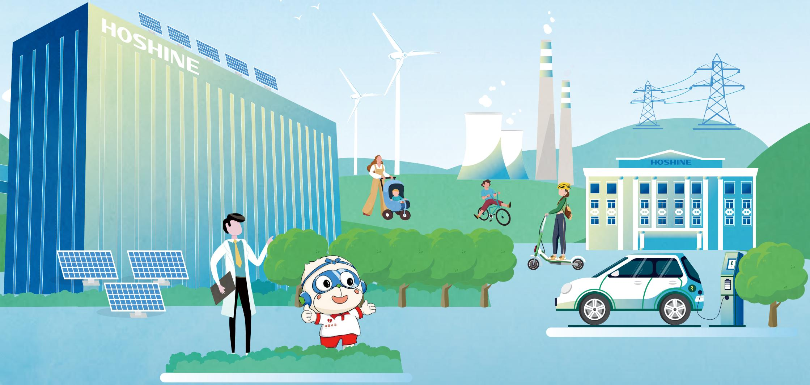

natural_image

Illustration of Hoshine's smart city with solar panel installations, electric vehicles, and people (no text or symbols)

## Contents 目录

关于本报告 01

董事长致辞 02

走进合盛硅业 03

公司简介 03

业务布局 04

企业文化 06

企业荣誉及奖项 07

## 附录

核心生产基地 64

关键绩效表 65

指标索引表 71

## “合”规筑基 “合”规筑基护航企业发展 护航企业发展公司治理 公司治理ESG治理 ESG治理合规管理 合规管理

##

09

12

15

商业道德 17

信息安全 19

## 2 “盛”绿前行 “盛”绿前行守护生态底色 守护生态底色环境管治 环境管治气候行动 气候行动资源利用 资源利用

##

21

23

26

污废治理 30

化学品管理 35

## “

## “硅”链聚势赋能价值共创

产品质量 38

客户服务 41

研发创新 44

可持续供应链 49

## 员培“共

## 业”暖人心筑美丽家园

工权益 52

训与发展 55

职业健康安全 57

社会共建 62

## 关于本报告

本报告是合盛硅业股份有限公司（以下简称“合盛硅业”或“公司”）发布的第2份可持续发展报告（以下简称“本报告”或“ESG报告”），旨在阐述公司在环境、社会及公司治理方面的制度建设与工作表现，并客观地披露公司在可持续发展方面的管理和成效，以响应利益相关方及社会公众的期望。

## 报告范围

组织范围：本报告内容涵盖公司的主营业务，有关公司的业务详情，请参阅《合盛硅业2025年度报告》。

时间范围：2025年1月1日—12月31日，与公司财务报告一致。为保持信息的完整性和持续性，本报告中的部分事项内容可能超出此时间范围。

发布周期：本报告为年度报告。

## 编制依据

本报告根据上海证券交易所的《上市公司自律监管指引第1号——规范运作》《上海证券交易所上市公司自律监管指引第14号——可持续发展报告（试行）》等编制，同时参考联合国可持续发展目标(SDGs)。本报告在最后部分详列指引内容索引，可供读者快速查阅。

## 信息来源

本报告中的信息和资料来源于公司内部正式文件、内部统计资料及有关公开资料。其中本报告涉及的货币金额以人民币作为结算币种，特别说明的情况除外。

## 可靠性保证

本报告披露的所有内容已经由合盛硅业董事会审议并通过，本公司董事会及全体董事保证本报告内容不存在任何虚假记载、误导性陈述或重大遗漏，并对其内容的真实性、准确性和完整性承担法律责任。

## 报告获取方式

您可以登录合盛硅业官方网站https://hoshinesilicon.com/在线浏览或下载本报告电子版本，其中包括中文、英文两个版本，如有差异，请以中文版为准。

## 董事长致辞

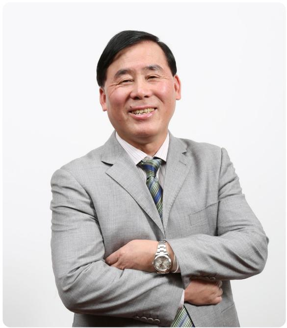

natural_image

Portrait of a smiling man in a gray suit with arms crossed, wearing a wristwatch (no text or symbols visible)

在全球能源结构加速向低碳化转型、可持续发展成为全球共识的背景下，硅基新材料作为支撑光伏新能源、半导体、先进制造等战略性新兴产业的关键基础，其重要性愈发凸显。过去一年，合盛硅业秉承“积于践步，凌于高峰”的企业精神，在激荡的产业变革中稳步前行，我们始终将可持续发展理念深度融入企业战略与运营全流程，以全产业链的协同优势和持续的技术创新，积极践行“人工智能+制造”行动，推动生产制造向智能化、绿色化深度转型，致力于为全球客户提供高效、低碳、可靠的硅基产品与解决方案。

## 健全现代治理体系，以规范护航长远发展

2025年，我们持续完善由董事会、战略与可持续发展委员会引领的ESG管治架构，将环境、社会与治理因素系统地纳入决策与风险管理体系，恪守商业道德，强化反腐败与公平竞争，致力于构建公开、透明负责任的企业形象，为投资者、合作伙伴及所有利益相关方创造长期、可持续的价值。

## 践行绿色发展理念，以生态守护永续发展

2025年，依托硅基新材料一体化绿色循环经济产业园，我们开创并不断升级产业与生态和谐共生的模式。我们持续加大节能环保投入，深挖余热回收、清洁能源替代、工艺优化等环节的降碳潜力，严格管控污染物排放，多项指标优于国家标准。我们明确碳减排路线，并积极探索产品全生命周期碳足迹管理，为应对气候变化贡献合盛力量。

## 驱动行业价值重塑，以创新引领高质发展

2025年，我们持续加大研发投入，完善创新体系不仅在工业硅、有机硅领域巩固全球产能领先地位更在第三代半导体碳化硅等新兴领域取得关键突破。我们积极发挥龙头企业作用，牵头推动行业自律与协同发展，促进行业供需格局改善与生态优化，力争破解行业低价竞争困局，以技术创新和精细化管理构筑核心竞争力。

## 深化企地共建共享，以责任赋能和谐发展

2025年，我们继续打造公平、包容、安全的工作环境，为员工提供具有竞争力的薪酬福利与广阔的成长平台，让每一名员工都能发挥无限可能。作为深耕多民族地区的企业，我们积极促进民族团结与就业，并通过合盛慈善基金会等渠道，在教育帮扶、社区公益灾害救助等领域持续回馈社会，践行“创造美好生活的企业使命。

展望前路，山海辽阔。合盛硅业将继续锚定“专注硅基新材料，创造美好生活”的使命，向着成为“资源配置最合理、最具竞争力、最有影响力和生命力的国际知名专业硅基新材料制造企业”的愿景不懈攀登。我们将以持续的科技创新为引擎，以数字智造和绿色发展双轮驱动，不断强化全产业链韧性，为全球硅基新材料与绿色能源事业的发展注入更强大的合盛动能，为中国式现代化建设和全球可持续发展作出新的更大贡献。

合盛硅业股份有限公司

董事长 罗立国

## 走进合盛硅业

## 公司简介

合盛硅业股份有限公司由宁波合盛集团于2005年投资成立，并于2017年在上交所主板成功上市，是全球最完整硅基全产业链公司，是硅基新材料一体化绿色循环经济模式的开创者，是绿色能源整体解决方案的引领者。

公司在新疆、浙江、内蒙古、四川等地设有数字化智造基地在上海和海南拥有高新技术研发中心，旗下主要涵盖能源工业硅、有机硅、碳素、新材料、第三代半导体碳化硅、光伏全产业链、储能等多元业务，其中工业硅、有机硅单体产能持续多年位列全球第一，碳化硅等新兴业务科研实力稳居行业第一方阵，相关产品广泛用于航天军工、电子通讯、医疗健康、汽车制造等各个领域，合作伙伴遍布全球。

公司致力干科技创新、数字智造、绿色发展，专注于人才建设、流程变革、组织升级，积极发挥硅基全产业链规模协同优势，不断进行产业延伸和技术拓展，努力为全球硅基新材料行业和绿色能源领域的发展贡献合盛智慧和力量，助力国家赢得未来发展主动权，为人民创造更美好的生活。

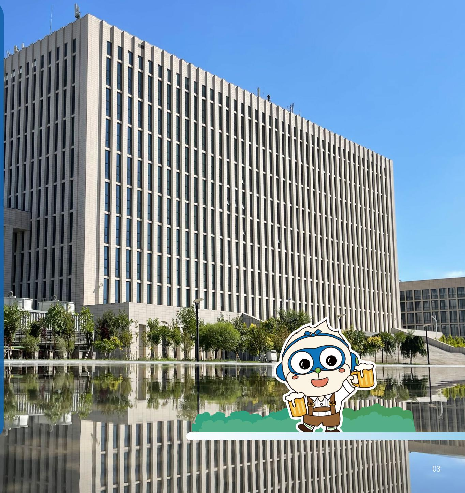

natural_image

Exterior view of a modern high-rise building with a cartoon mascot holding beer cans, reflected in water (no signage or text visible)

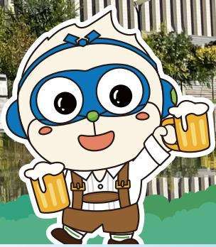

natural_image

Cartoon character wearing a blue hat and holding beer, standing outdoors with blurred background (no text or symbols)

## 业务布局

合盛硅业是硅基全产业链首创者，是绿色能源整体解决方案的引领者。全产业链是一种高效、安全、可追溯的产业发展模式，它通过对产业链上各个环节的有效管理和控制，实现产品质量的全面提升和消费者需求的精准满足

公司紧跟国家绿色发展导向，积极推进清洁能源和零碳技术的规模化普及，成为实现“双碳”目标、应对气候变化挑战的重要推动者和贡献者。

绿色循环硅基全产业链  
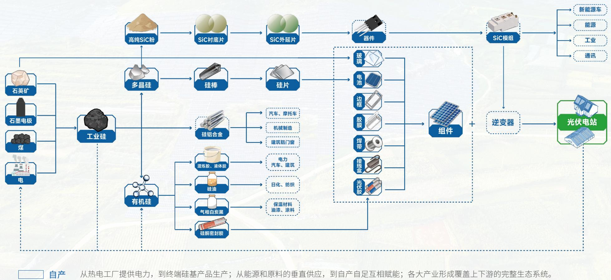

自产

从热电工厂提供电力，到终端硅基产品生产；从能源和原料的垂直供应，到自产自足互相赋能；各大产业形成覆盖上下游的完整生态系统。

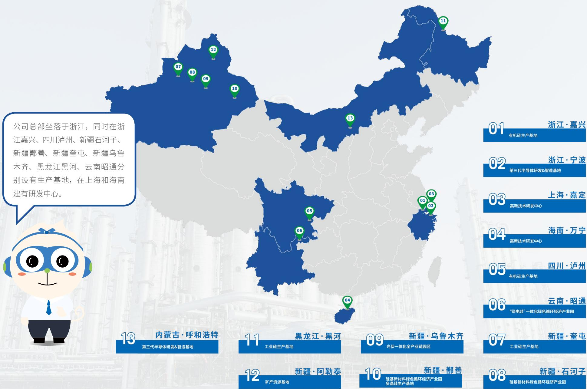

text_image

公司总部坐落于浙江，同时在浙江嘉兴、四川泸州、新疆石河子、新疆鄯善、新疆奎屯、新疆乌鲁木齐、黑龙江黑河、云南昭通分别设有生产基地，在上海和海南建有研发中心。
13 内蒙古·呼和浩特
第三代半导体研发&智造基地
11 黑龙江·黑河
工业硅生产基地
12 新疆·阿勒泰
矿产资源基地
09 新疆·乌鲁木齐
光伏一体化全产业链园区
10 新疆·鄯善
硅基新材料绿色循环经济产业园
多晶硅生产基地
07 新疆·奎屯
工业硅生产基地
08 新疆·石河子
01 浙江·嘉兴
有机硅生产基地
02 浙江·宁波
第三代半导体研发&智造基地
03 上海·嘉定
高新技术研发中心
04 海南·万宁
高新技术研发中心
05 四川·泸州
有机硅生产基地
06 云南·昭通
“绿电硅”一体化绿色循环经济产业园
04

## 企业文化

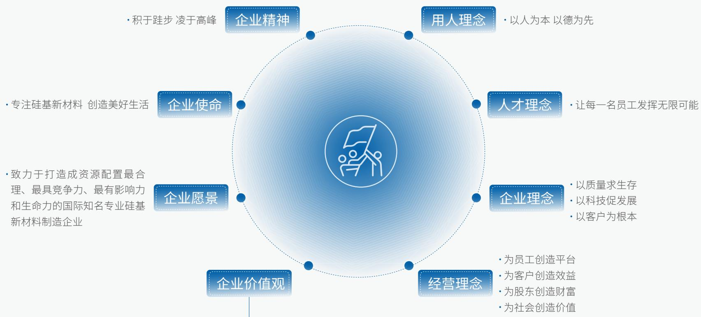

flowchart

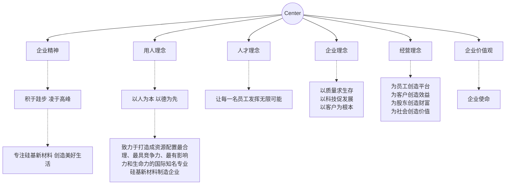
```mermaid
graph TD
  Center(("Center")) --> A["企业精神"]
  Center --> B["用人理念"]
  Center --> C["人才理念"]
  Center --> D["企业理念"]
  Center --> E["经营理念"]
  Center --> F["企业价值观"]
  
  A -.-> G["积于跬步 凌于高峰"]
  B -.-> H["以人为本 以德为先"]
  
  C -.-> I["让每一名员工发挥无限可能"]
  
  D -.-> J["以质量求生存\n以科技促发展\n以客户为根本"]
  
  E -.-> K["为员工创造平台\n为客户创造效益\n为股东创造财富\n为社会创造价值"]
  
  F -.-> L["企业使命"]
  G -.-> M["专注硅基新材料 创造美好生活"]
  H -.-> N["致力于打造成资源配置最合理、最具竞争力、最有影响力和生命力的国际知名专业硅基新材料制造企业"]
```

## 诚实正直

遵守国家法律与公司制度，绝不触犯企业高压线；做人以德为先，诚实正直，言行坦荡；以直报怨，以德报德，坚持公平公正、诚实守信等为人处世的重要原则，用正直的力量对周围产生积极影响

## 敬业进取

专业执着，怀抱工匠精神，精益求精；尽职尽责，高效执行；勇于承担责任主动迎接新的挑战和任务；保持好奇心，不断提高学习力，牢记初心和使命，追求卓越

## 绿色创新

以绿色环保引领创新，人人皆可创新， 事事皆可创新；拥抱变化，敢于突破 勇于尝试，不惧失败，善于总结

## 合作共赢

具有开放共赢的心态，与合作伙伴共享行业成长；具备大局观，团队合作能够协同配合，共同达成目标；乐于分享专业知识与工作经验，与同事共同成长

企业荣誉及奖项

<table><tr><td>时间</td><td colspan="2">荣誉称号</td></tr><tr><td rowspan="2">3月</td><td>胡润研究院“2024 胡润中国 500 强榜单”第 153 位</td><td>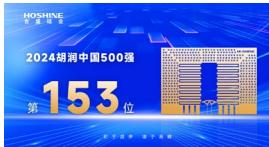</td></tr><tr><td>中国企业评价协会“2024 新经济企业 TOP500 榜单”第 141 位</td><td>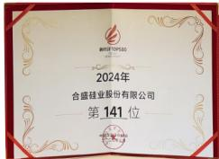</td></tr><tr><td>7月</td><td>《财富》杂志2025 年中国 500 强企业榜单第 490 位</td><td>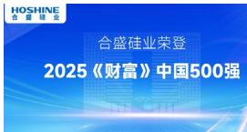</td></tr><tr><td rowspan="2">9月</td><td>中国上市公司产业发展论坛“2025 年度未来产业之星·上市公司(未来材料)”</td><td>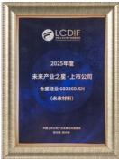</td></tr><tr><td>界面新闻2025 创智工业评选年度硅基新材料领军企业</td><td>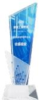</td></tr><tr><td>10月</td><td>证券市场周刊合盛硅业董事长罗立国荣获“上市公司水晶球奖——上市公司最佳董事长”</td><td>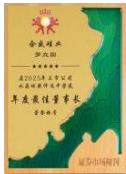</td></tr></table>

<table><tr><td>时间</td><td colspan="2">荣誉称号</td></tr><tr><td rowspan="9">11月</td><td rowspan="9">工业和信息化部第九批“制造业单项冠军企业”</td><td>第九批制造业单项冠军企业公示名单</td></tr><tr><td>序号全称产品名称</td></tr><tr><td>1八环科技集团股份有限公司重庆风科瑞金中富销售体</td></tr><tr><td>2公元股份有限公司高山沙繁置业增加管理</td></tr><tr><td>3杭州电化精特电工有限公司益科印花思英能源制</td></tr><tr><td>4杭州深芯微电子股份有限公司广盛与成源体育服饰MC芯片</td></tr><tr><td>5杭州青龙电器股份有限公司荣辉创怡粮油航</td></tr><tr><td>6中泰投资控股有限公司南汇工业城</td></tr><tr><td>7华达科技股份有限公司鼎博智能电源</td></tr><tr><td rowspan="5">12月</td><td>中国化工企业管理协会“2025石油和化工企业销售收入前500家(上市公司)”第36位“2025石油和化工企业销售收入前500家(综合类)”第88位“2025专用化学产品企业销售收入前100家”中名列第1位</td><td>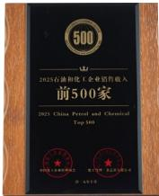</td></tr><tr><td>南方财经“2025年度卓越ESG践行上市公司”</td><td></td></tr><tr><td>时代周报“2025高质量发展上市公司”</td><td>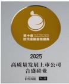</td></tr><tr><td>财联社“新势力先进制造业企业”</td><td>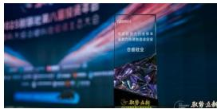</td></tr><tr><td>证券时报合盛硅业董事长罗立国荣获“上市公司ESG先锋人物”</td><td>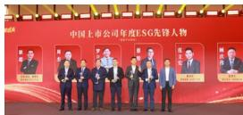</td></tr></table>

<table><tr><td>序号</td><td>企业名称</td><td>产品名称</td></tr><tr><td>1</td><td>八环科技集团股份有限公司</td><td>发动机用高速中小型球轴承</td></tr><tr><td>2</td><td>公元股份有限公司</td><td>高民汽聚氯乙烯加盐管</td></tr><tr><td>3</td><td>杭州传化精细化工有限公司</td><td>涂料印花柔增增剂</td></tr><tr><td>4</td><td>杭州国芯微电子股份有限公司</td><td>广播与流媒体智能终端S6C芯片</td></tr><tr><td>5</td><td>杭州老板电器股份有限公司</td><td>受频控制吸收排油机</td></tr><tr><td>6</td><td>合盛硅业股份有限公司</td><td>高纯工业硅</td></tr><tr><td>7</td><td>华立科技股份有限公司</td><td>单库智能电能表</td></tr></table>

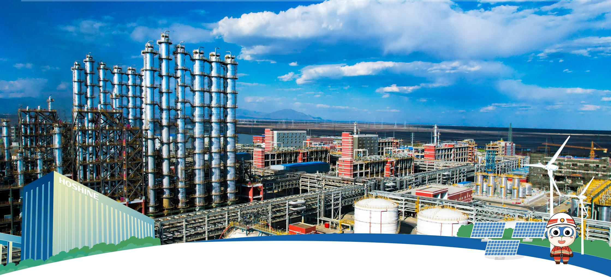

natural_image

Aerial view of a large industrial chemical plant with multiple towers, pipes, and storage tanks under a blue sky (no visible text or symbols)

## C1

## “合”规筑基 护航企业发展

实质性议题

公司治理，ESG治理，风险管理，商业道德，数据安全与客户隐私保护

回应SDGs

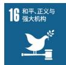

## 公司治理

合盛硅业将规范治理视为企业稳健发展的基石，严格遵循《公司法》《证券法》《上市公司治理准则》等法规要求，持续完善公司治理结构与制度体系。通过构建边界清晰、权责明确、运行规范的内控机制，我们致力于以透明、稳健的运作，为股东、客户及全体员工等所有利益相关方奠定长期价值的坚实基础。

## 治理架构

公司持续优化治理架构，以股东会为最高权力机构，董事会为核心决策层，下设四个专业委员会，形成“权力分层、职能互补、监督制衡”的现代化治理体系。

股东会依法行使重大事项决策权，包括选举董事、审议董事会报告、批准利润分配方案等。董事会对股东会负责，由9名董事组成，其中包含3名独立董事，设董事长1人、副董事长1人、职工代表董事1人，负责执行股东会决议、制定经营计划等核心职责。

2025年，公司根据新《公司法》及相关配套法规要求，结合实际情况优化治理结构，不再设立监事会，原监事会职能由董事会审计委员会承接，相关制度同步更新。

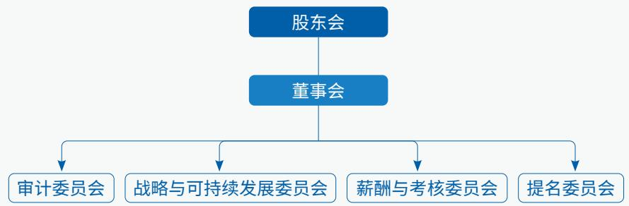

flowchart

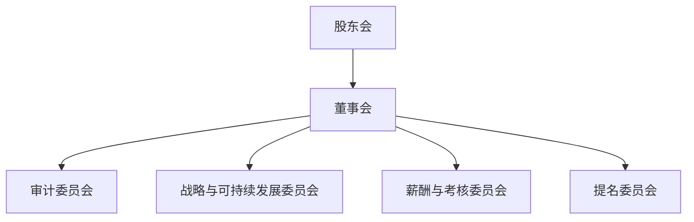
```mermaid
graph TD
  A["股东会"] --> B["董事会"]
  B --> C["审计委员会"]
  B --> D["战略与可持续发展委员会"]
  B --> E["薪酬与考核委员会"]
  B --> F["提名委员会"]
```

合盛硅业治理架构

<table><tr><td>委员会</td><td>人员构成</td><td>职责</td></tr><tr><td>审计委员会</td><td>3名委员,其中2名为独立董事</td><td>负责审核财务信息、监督内外部审计与内部控制</td></tr><tr><td>[8S73]战略与可持续发展委员会</td><td>5名委员</td><td>负责研究公司长期战略、重大投资及ESG相关议题,并提出建议</td></tr><tr><td>提名委员会</td><td>3名委员</td><td>负责董事及高级管理人员的遴选、审核与提名</td></tr><tr><td>薪酬与考核委员会</td><td>3名委员</td><td>负责制定董事及高级管理人员的考核标准、薪酬政策与方案</td></tr></table>

## 延伸阅读

公司治理相关政策、董事会各专业委员会职责、董事会成员履历信息，请参阅《合盛硅业 2025 年度报告》或公司官网 https://hoshinesilicon.com

## 高管薪酬

公司持续优化薪酬决策机制与程序，建立规范透明、激励与约束并重的董事及高级管理人员薪酬管理体系，动态完善相关制度。薪酬与考核委员会结合公司发展战略、市场薪酬水平及履职绩效拟定薪酬方案建议，公司定期披露高管薪酬信息，切实维护股东知情权，提升公司治理透明度。

公司对管理层实行“基本薪酬+绩效薪酬+中长期激励收入”的薪酬结构，将绩效目标与公司整体战略深度绑定，搭建全周期管理闭环。同时将可持续发展指标纳入绩效考核，结合外部ESG评级反馈持续优化管理，强化激励约束，绑定核心团队与公司长期发展利益。

## 延伸阅读

报告期内，董事及高管获取的薪酬，请参阅《合盛硅业2025年度报告》

## 信息披露与投资者关系管理

## 股东权益保护

公司将保障全体股东，特别是中小股东合法权益置于公司治理的最高准则之一。通过持续完善治理体系与制度流程，我们确保股东法定权利在公司的日常运营与重大决策中得到充分尊重与有效实现。

## 保护股东权益

严格遵守股东会通知时限，在会议通知中详尽披露所有议案的背景资料及审议要点，确保股东在会前有充分时间获取信息、进行研究判断  
股东会设置现场和网络投票等多种投票方式，为各类股东、特别是异地中小股东提供平等的表决便利  
通过股东会、投资者热线、邮箱及互动平台等渠道，持续接收并回应股东的问询与建议

## 保护中小股东权益

建立有效的内部控制体系，严格控制对外担保行为，防范损害公司及中小股东利益的风险  
在股东会、业绩说明会等活动中，为中小股东提供网络投票、电话接入等便利化参与方式，保障其表决权与发言权  
在审议影响中小股东利益的重大事项时，对中小股东的表决进行单独计票并披露结果，以增强中小股东的话语权

## 信披投关

我们严格遵守《证券法》《上市公司信息披露管理办法》等法律法规及上海证券交易所相关规定，通过系统化、规范化的信息披露与双向沟通，持续增进市场对公司的理解与认同，构建长期、稳定、互信的投资者关系，提升治理透明度。

natural_image

Cartoon monkey character wearing blue and white goggles and a suit (no text or symbols)

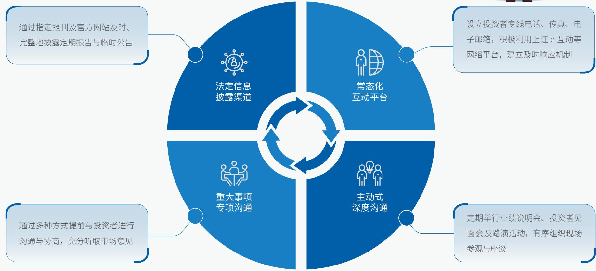

flowchart

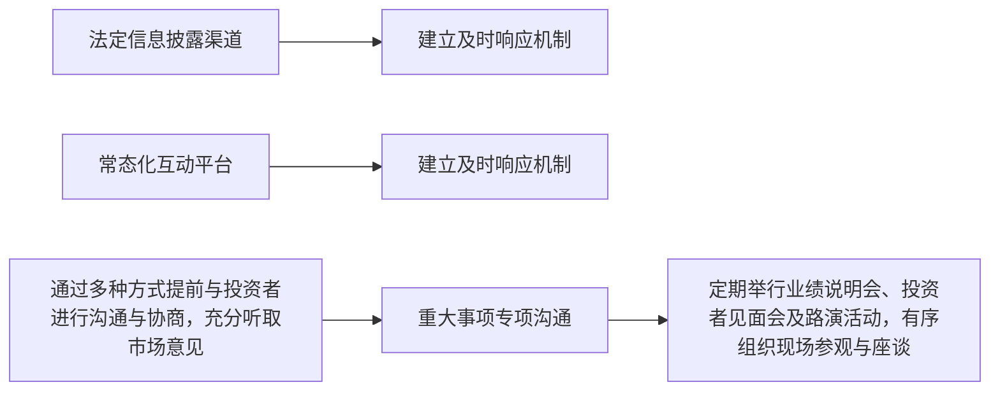
```mermaid
graph LR
  A["法定信息披露渠道"] --> B["建立及时响应机制"]
  C["常态化互动平台"] --> D["建立及时响应机制"]
  E["重大事项专项沟通"] --> F["定期举行业绩说明会、投资者见面会及路演活动，有序组织现场参观与座谈"]
  G["通过多种方式提前与投资者进行沟通与协商，充分听取市场意见"] --> E
```

合盛硅业多元立体化的沟通渠道

## ESG 治理

合盛硅业将可持续发展理念与公司战略深度融合，构建清晰、透明的ESG治理架构，开展ESG创新研究与实践，持续提升ESG 管理工作的系统性、科学性和实效性，携手各禾益相关方共同绘制一幅责任履行与企业效益和谐共生、协同共进的美好画卷。

## ESG治理体系

公司持续强化ESG 顶层设计和治理体系建设，搭建自上而下，层次清晰，结构完善的ESG 治理架构，通过董事会，战略与可持续发展委员会，ESG 工作小组共同推进ESG相关工作，实现决策、规划、执行等职能的科学部署，推动ESG工作制度化和规范化，着力打造高效协同、全面参与的ESG治理长效机制

## 决策层

## 董事会

审议公司可持续发展、ESG事宜相关风险及重要性  
审议、批准公司可持续发展及ESG相关战略、政策与目标，监督、检讨相关进度  
审议、批准公司可持续发展及ESG相关事项报告

## 组织层

## 战略与可持续发展委员会

对公司可持续发展及ESG相关事项进行审议、评估及监督  
审议公司可持续发展及ESG相关事项报告

##

落实可持续发展及ESG相关决策和部署，跟进措施的执行和相关绩效、目标达成进展  
编制可持续发展报告

负责各自对接部门、附属公司涉及的ESG议题，推进计划落地并归口ESG的相关资料

合盛硅业 ESG 治理架构

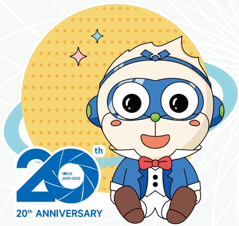

text_image

20
th
SINCE
2005-2025
20th ANNIVERSARY

## 利益相关方参与

公司建立多层次、常态化的利益相关方沟通机制，通过系统性倾听与互动，将各方关切转化为公司治理与运营持续进步的重要依据。我们开展尽职调查，将利益相关方的反馈作为重要的信息来源，帮助公司更好地识别可持续发展相关影响、风险和机遇，通过精准回应与责任实践，携手各方共同推动可持续未来。

<table><tr><td colspan="2">利益相关方</td><td colspan="2">期望与诉求</td><td colspan="2">回应方式</td></tr><tr><td></td><td>政府及监管机构</td><td>合规经营反腐倡廉</td><td>温室气体排放行业合作与发展</td><td>政策指示工作汇报</td><td>信息报送现场视察</td></tr><tr><td></td><td>股东及投资者</td><td>合规经营企业ESG管治</td><td>产品质量与安全产品创新研发</td><td>投资者交流会议接待股东来访</td><td>回答股东电话咨询</td></tr><tr><td></td><td>客户</td><td>产品质量与安全产品创新研发</td><td>投诉机制与处理信息安全与隐私保护</td><td>电话沟通定期回访</td><td></td></tr><tr><td></td><td>供应商及合作伙伴</td><td>供应商管理可持续采购</td><td>行业合作与发展</td><td>招标会议供应商评审流程</td><td>交流合作行业论坛</td></tr><tr><td></td><td>员工</td><td>职业健康与安全人才培训与发展</td><td>员工权益与福利多元、平等与包容</td><td>内部通讯平台员工满意度调查</td><td>员工走访及关怀</td></tr><tr><td></td><td>地方社区</td><td>社区共建水资源管理</td><td>污染物与废弃物处理</td><td>社区活动志愿服务</td><td></td></tr><tr><td></td><td>媒体与公众</td><td>公益慈善</td><td>透明披露</td><td>公司网页日常沟通与回应</td><td>舆论监测信息披露</td></tr></table>

## 实质性议题分析

2025年，合盛硅业参考上海证券交易所《上市公司自律监管指引第14号——可持续发展报告（试行）》《上市公司自律监管指南第4号——可持续发展报告编制》，开展双重重要性评估，对具有影响重要性的议题进行重点回应，对具有财务重要性的议题采用四支柱的方式进行披露。

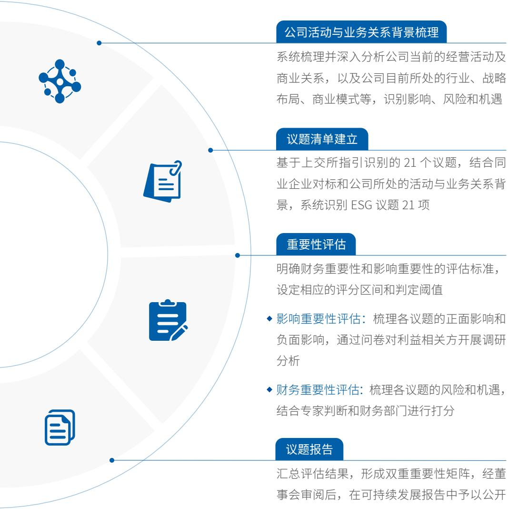

flowchart

```mermaid
graph TD
  A["公司活动与业务关系背景梳理"] --> B["系统梳理并深入分析公司当前的经营活动及商业关系，以及公司目前所处的行业、战略布局、商业模式等，识别影响、风险和机遇"]
  C["议题清单建立"] --> D["基于上交所指引识别的21个议题，结合同业企业对标和公司所处的活动与业务关系背景，系统识别ESG议题21项"]
  E["重要性评估"] --> F["明确财务重要性和影响重要性的评估标准，设定相应的评分区间和判定阈值"]
  F --> G{"影响重要性评估：梳理各议题的正面影响和负面影响，通过问卷对利益相关方开展调研分析"}
  F --> H{"财务重要性评估：梳理各议题的风险和机遇，结合专家判断和财务部门进行打分"]
  I["议题报告"] --> J["汇总评估结果，形成双重重要性矩阵，经董事会审阅后，在可持续发展报告中予以公开"]
```

## 公司活动与业务关系背景梳理

系统梳理并深入分析公司当前的经营活动及商业关系，以及公司目前所处的行业、战略布局、商业模式等，识别影响、风险和机遇

## 议题清单建立

基于上交所指引识别的21个议题，结合同业企业对标和公司所处的活动与业务关系背景，系统识别ESG议题21项

## 重要性评估

明确财务重要性和影响重要性的评估标准，设定相应的评分区间和判定阈值

◆影响重要性评估：梳理各议题的正面影响和负面影响，通过问卷对利益相关方开展调研分析  
◆财务重要性评估：梳理各议题的风险和机遇结合专家判断和财务部门进行打分

## 议题报告

汇总评估结果，形成双重重要性矩阵，经董事会审阅后，在可持续发展报告中予以公开披露

2025年，我们共识别出21项具有重要性的议题，其中具有双重重要性的议题共4项，仅具有财务重要性的议题1项，仅具有影响重要性的议题7项

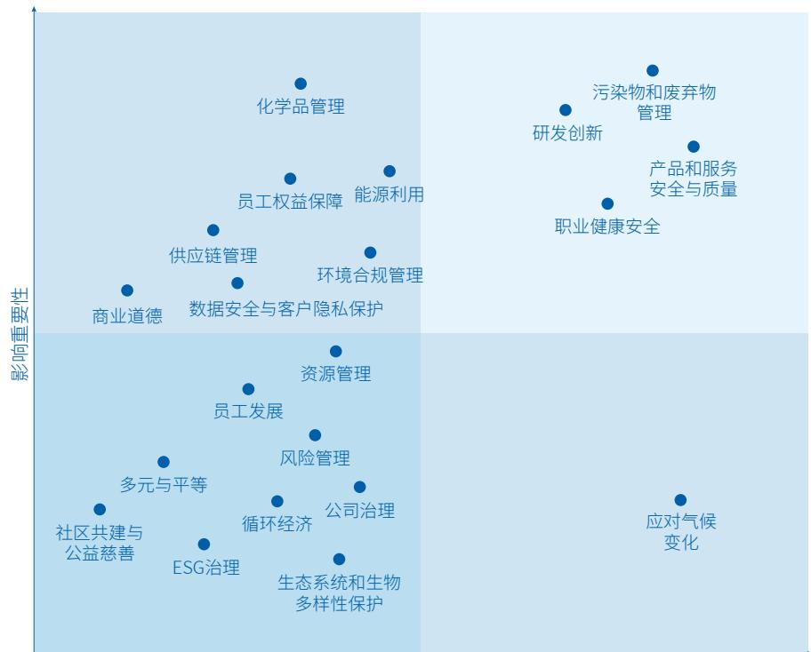

scatter

| Topic | X-axis Position (Approximate) | Impact Importance (Approximate) |
| :--- | :--- | :--- |
| 化学品管理 | ~35% | High |
| 污染物和废弃物管理 | ~70% | High |
| 研发创新 | ~60% | High |
| 产品和服务安全与质量 | ~80% | High |
| 能源利用 | ~45% | Medium-High |
| 员工权益保障 | ~35% | Medium-High |
| 职业健康安全 | ~70% | Medium-High |
| 供应链管理 | ~30% | Medium |
| 环境合规管理 | ~45% | Medium |
| 数据安全与客户隐私保护 | ~25% | Medium |
| 商业道德 | ~15% | Medium |
| 资源管理 | ~40% | Low-Medium |
| 员工发展 | ~30% | Low-Medium |
| 风险管理 | ~40% | Low-Medium |
| 应对气候变化变化 | ~90% | Low |
| 社区共建与公益慈善 | ~10% | Low |
| 循环经济 | ~35% | Low |
| 公司治理 | ~45% | Low |
| ESG治理 | ~25% | Low |
| 生态系统和生物多样性保护 | ~40% | Very Low |

财务重要性  
合盛硅业双重重要性议题矩阵图

## 合规管理

合盛硅业秉持“审慎经营、防控结合”的风险管理理念，以董事会为领导核心，建立由三道防线组成的立体化风险防御机制，并通过制度化管理、常态化的风险识别评估与审计监督，持续提升风险管理的系统性和有效性，为公司的稳健运营提供坚实保障

## 合规运营

公司建立贯穿战略、执行与监督的系统化合规管理框架，构建全方位合规运营管理体系，确保公司各项经营活动严格遵循国家法律法规、行业规范及内部制度要求，为可持续发展筑牢风控根基。

## 合规管理体系

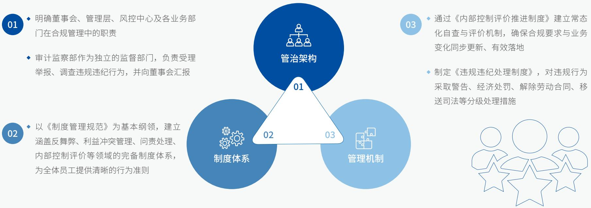

明确董事会、管理层、风控中心及各业务部01门在合规管理中的职责

◆审计监察部作为独立的监督部门，负责受理举报、调查违规违纪行为，并向董事会汇报

以《制度管理规范》为基本纲领，建立02涵盖反舞弊、利益冲突管理、问责处理、内部控制评价等领域的完备制度体系为全体员工提供清晰的行为准则

通过《内部控制评价推进制度》建立常态化自查与评价机制，确保合规要求与业务变化同步更新、有效落地

制定《违规违纪处理制度》，对违规行为采取警告、经济处罚、解除劳动合同、移送司法等分级处理措施

## 风险管理

公司持续强化风险防控顶层设计，不断完善风险管理体系，通过开展重大风险的辨识、分析与评估工作全面评估各类风险事件发生的“可能性”及其对公司目标达成的“影响程度”。针对识别出的重大风险制定风险应对策略与举措并定期跟踪监测。2025年，公司未发生颠覆性风险事件，内部控制未出现重要及重大缺陷，整体运行有效。

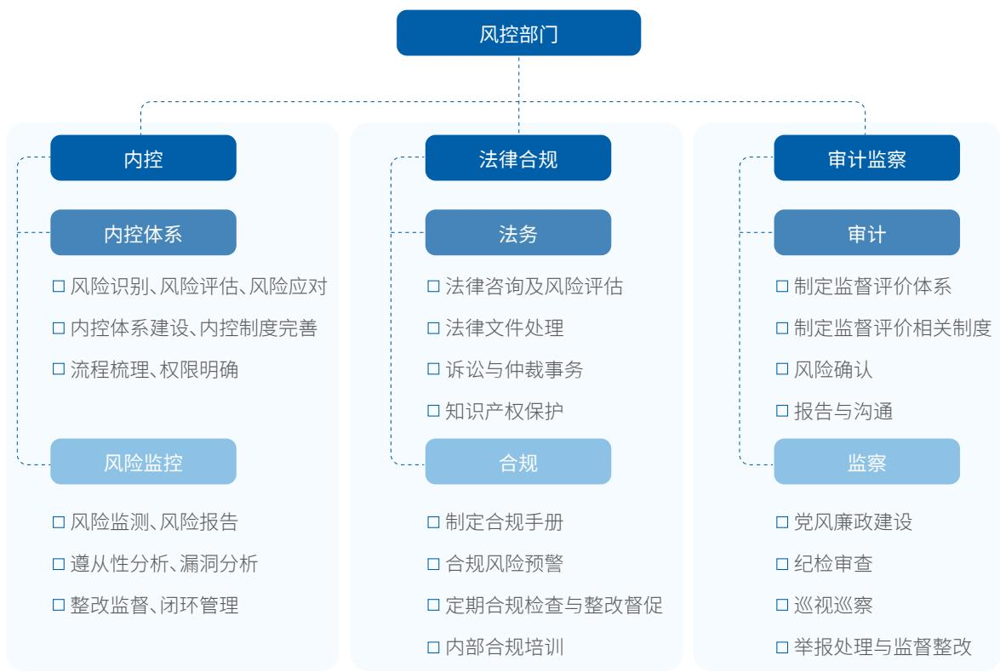

flowchart

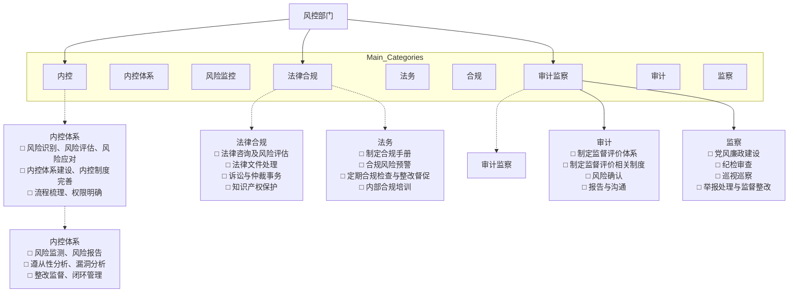
```mermaid
graph TD
  Root["风控部门"]
  
  subgraph Main_Categories
    direction TB
    A["内控"]
    B["内控体系"]
    C["风险监控"]
  end
  
  subgraph Main_Categories
    direction TB
    D["法律合规"]
    E["法务"]
    F["合规"]
  end
  
  subgraph Main_Categories
    direction TB
    G["审计监察"]
    H["审计"]
    I["监察"]
  end
  
  Root --> A
  Root --> D
  Root --> G
  
  A -.-> A1["内控体系\n□ 风险识别、风险评估、风险应对\n□ 内控体系建设、内控制度完善\n□ 流程梳理、权限明确"]
  A1 -.-> B1["内控体系\n□ 风险监测、风险报告\n□ 遵从性分析、漏洞分析\n□ 整改监督、闭环管理"]
  
  D -.-> D1["法律合规\n□ 法律咨询及风险评估\n□ 法律文件处理\n□ 诉讼与仲裁事务\n□ 知识产权保护"]
  D -.-> F1["法务\n□ 制定合规手册\n□ 合规风险预警\n□ 定期合规检查与整改督促\n□ 内部合规培训"]
  
  G -.-> G1["审计监察"]
  G --> H1["审计\n□ 制定监督评价体系\n□ 制定监督评价相关制度\n□ 风险确认\n□ 报告与沟通"]
  G --> I1["监察\n□ 党风廉政建设\n□ 纪检审查\n□ 巡视巡察\n□ 举报处理与监督整改"]
```

合盛硅业风险管理架构

## 2025年风险管理举措

## 风险识别

各部门/工厂每年开展自查，运用风险评价法、流程分析法等多种工具，识别运营、市场、合规等各类风险填写《风险排查清单》并制定控制措施  
◆内控部/审计部进行独立监督与综合评价，确保风险管控无死角

## 闭环整改

对于发现的内控缺陷与违规行为，依据《违规违纪处理制度》《问责管理制度》进行严格处理，并跟踪整改落实情况，形成“识别一评估一应对一监督一改进”的管理闭环

## 内部审计

推行“总部评价”与“部门/工厂自查”相结合的两级内控评价机制  
年度开展公司重要岗位的离任审计、公司OA公用账号管理审计、质量反馈专项审计、借款专项审计、泸州固定资产管理审计、能源事业部委外合同专项审计、石河子园区安全生产审计等

## 商业道德

公司致力于培育“以廉为荣、以贪为耻”的廉洁文化，通过完善的治理架构、系统的制度约束、深入的培训宣导与畅通的监督渠道，坚决反对腐败、贿赂、不当竞争等行为，矢志打造阳光透明、公平正义的商业环境。

## 举报管理

畅通、安全、有效的举报渠道是发现内部问题、打击违规行为的重要屏障，也是保护公司利益和员工权益的关键机制。公司致力于打造一个让员工与利益相关方敢于发声、放心举报的环境，并对每一起举报进行认真、公正、及时地处理。

## 多渠道受理：

## 钉钉直接反馈

## 公众号：“廉洁合盛”

## 举报电话：183\*\*\*\*0929

## 专用微信：hstousu

## 电子邮箱：hs\_tousu@hoshinesilicon.com

## 实体邮寄地址：浙江省宁波慈溪市北三环东路1988

## 号合盛大厦 A座23—24F

## 举报渠道和处理流程

## 调查流程

审计监察部负责接收所有举报，进行初步审核与分派调查。调查过程遵循客观公正原则，确保程序合规

## 举报人保护

公司承诺对举报人信息严格保密，举报材料单独存档，仅限调查组及董事会成员可查阅  
◆制定《反舞弊管理制度》，明确规定对打击报复举报人的行为一经查实将依法解除劳动关系，涉嫌犯罪的移送司法机关为举报人提供坚实保障

## 恶意举报 处理

◆对于经查证属实的恶意举报，公司将视情节对举报者予以相应处罚，以维护健康的举报环境

## 反腐败贿赂

公司对任何形式的腐败和贿赂行为持“零容忍”态度。我们通过健全的制度、严格的管控、持续的教育以及透明的监督，构建全方位的反腐败防线，确保业务往来清正廉洁，维护公平的市场环境，相关信息将按规定共享至中国企业反舞弊联盟及阳光诚信联盟。

## 反腐败贿赂管理要求

## 严格行为禁令

发布《反舞弊管理制度》，明确禁止各类舞弊行为，包括收受供应商贿赂、利用职务之便谋取私利等，为员工划定清晰行为红线

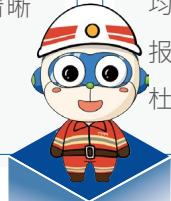

## 馈赠礼品管理

实行严格的礼品礼金管理制度，严禁收受业务关联方馈赠；确实无法拒收的，无论价值大小均须在24小时内向审计监察部报备并上交，由公司统一处理，杜绝潜在的利益输送

## 合作伙伴管理

将反腐败要求延伸至价值链，通过签署《廉洁合作承诺书》《诚信投标承诺书》约束合作伙伴行为，并建立供应商信用评价体系

## 加大惩处措施

对经查实的腐败贿赂行为，公司依据《违规违纪处理制度》予以严肃处理，包括解除劳动合同、追缴违法所得、赔偿经济损失，严重将移送司法机关

## 案例|合盛硅业多属地联动开展廉洁反舞弊专题培训

2025年9月至11月，合盛硅业开展廉洁反舞弊培训，覆盖全部业务板块，涉及鄯善、泸州、石河子等多属地，累计参与员工超1,000人。通过案例部析与法规解读，帮助员工深入认识舞弊行为的危害与后果，切实增强员工反舞弊意识与合规履职能力。

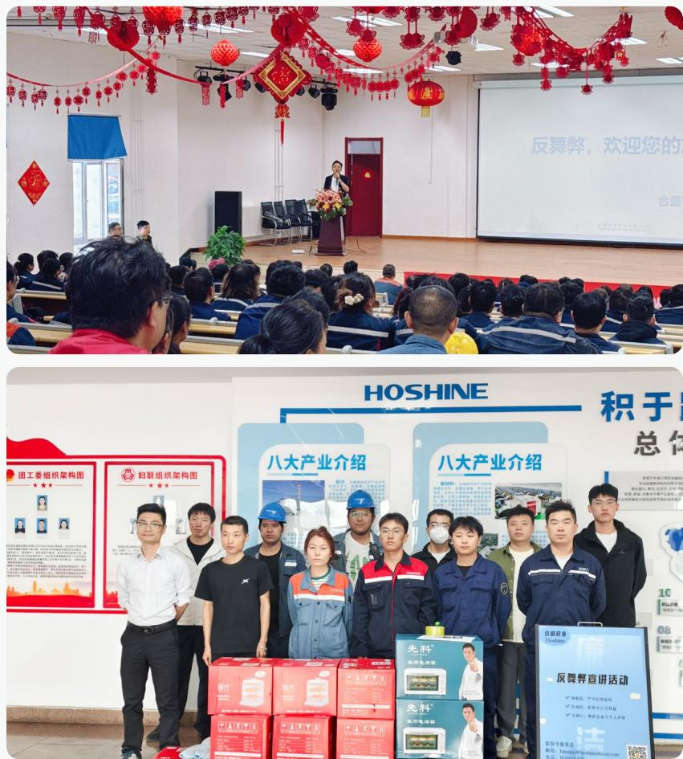  
反舞弊培训及宣讲活动

## 反不正当竞争

公司严格遵守国家《反垄断法》《反不正当竞争法》等法律法规，致力于通过提升产品与服务质量、技术创新和管理优化来赢得市场，坚决反对并抵制任何形式的不正当竞争行为。

## 反不正当竞争管理要求

编制《违规违纪处理制度》，坚持“以事实为依据，以制度为准绳”“宽严相济”“公开公正、教育为本”的原则，处理包括不正当竞争在内的违规行为

针对每月新员工入职培训及日常宣导，强调公平竞争理念， 引导员工特别是销售、市场等对外岗位员工，依法合规地与 竞争对手开展互动，杜绝商业诋毁、侵犯商业秘密等不正当 竞争行为

通过日常监督与专项审计，关注业务活动中的竞争合规性。对干任何涉嫌违反公平竞争原则的行为，将启动调查程序并依据制度进行严肃处理

## 信息安全

公司坚持“安全为基、预防为主、技术为盾、治理为纲”的总体方针，成立由高层领导的“网络信息安全领导小组”统筹网络与数据安全工作，数智化中心负责日常安全运营与技术支持，内控部负责监督问责的三层管治体系。

公司制定《信息系统安全管理规定》《信息化设备管理制度》《网络与信息安全应急预案》等制度，从严从细落实信息安全防控举措，实现公司信息科技设施的安全可靠运行。

## 2025年信息安全防护重点举措

## 数据安全管控

生产与研发：重点保护工业硅、有机硅、碳化硅等产品的原料配比、工艺参数、设备运行数据、质量检测报告及核心研发配方、专利技术等敏感信息  
运营管理：严格管理员工个人信息、财务数据、合同档案、战略规划等经营信息  
◆外部合作：保障供应商资质、采购价格、客户订单、信用记录等商业信息安全

## 信息安全意识

通过科普宣传、专题培训、案例学等多种形式，提升员工对常见威胁的识别与防范能力，年度开展网络安全演练5次、网络与信息安全培训3次提升全员信息安全意识

## 网络安全防护

基础防护：办公网络全面禁用非授权设备接入，统一安装杀毒与加密软件对 USB接口实行严格管控  
◆权限控制：实施基于角色的访问控制(RBAC)，对核心系统与敏感数据操作进行全流程审计追踪  
◆专项攻坚：系统开展漏洞管理专项行动，全年修复各级安全漏洞201个；重点推进工控系统网络安全建设，以适配生产智能化发展  
应急准备：制定详细的网络安全应急预案，涵盖局域网中断、黑客攻击、数据故障、火灾等场景，并定期开展应急演练

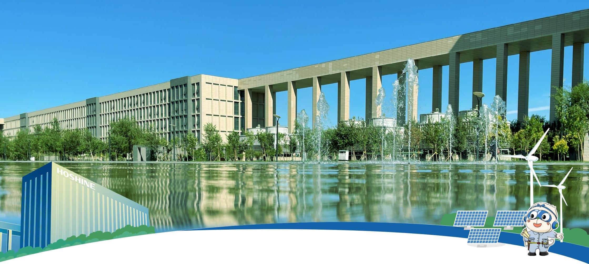

natural_image

Modern architectural complex with a large building and fountain in front, featuring a water feature and a cartoon mascot on the right (no visible text or symbols)

## C2

## “盛”绿前行，守护生态底色

实质性议题

环境合规管理，应对气候变化，污染物和废弃物管理，能源利用，资源管理，循环经济，生态系统和生物多样性保护，化学品管理

## 回应SDGs

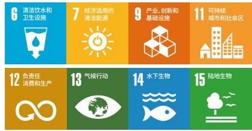

flowchart

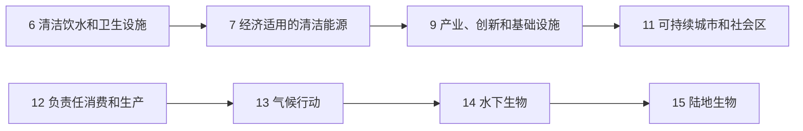
```mermaid
graph LR
  A["6 清洁饮水和卫生设施"] --> B["7 经济适用的清洁能源"]
  B --> C["9 产业、创新和基础设施"]
  C --> D["11 可持续城市和社会区"]
  E["12 负责任消费和生产"] --> F["13 气候行动"]
  F --> G["14 水下生物"]
  G --> H["15 陆地生物"]
```

## 环境管治

合盛硅业以ISO14001环境管理体系为基础框架，通过“治理架构、制度体系、监督机制、考核保障”四大维度，构建完善的环境合规管理体系，实现环境管理与风险管理、战略发展的深度融合。截至报告期末，12家子公司已取得|SO14001环境管理体系认证证书，西部硅业、阿尔法半导体2家子公司已取得绿色工厂认证。2025年，公司未发生重大环境违法违规事件。

## 环境管理体系

## 治理架构

建立由董事会决策统筹、事业部总经理具体管理、各子公司安环部负责人具体执行的三层治理架构，明确各层级权责边界，形成自上而下的统筹推进与落地执行机制

## 监督机制

构建“日常监督+专项审计+外部监督”立体化监督体系：

通过常态化巡查、现场检查等日常监督，确保生产一线操作合规、环保设施运行有效  
每季度/年度开展环境合规专项审计，核查制度执行、指标完成、风险应对等情况  
通过委托第三方开展环境监测、发布ESG报告等接受社会监督

## 制度体系

构建“基础管理制度+专项操作规范+应急处置机制三级制度体系：

《环保管理制度》等基础管理制度，明确管理目标与责任  
《环保设施运行制度》《监视和测量管理程序》等专项操作规范提供具体落实指导  
《突发环境事件应急预案》等应急预案明确突发环境状况的响应流程、整改要求等

## 考核保障

将能耗管理、制水效率、污染物排放等环境指标纳入 绩效考核，权重≥20%，考核结果与薪酬、晋升挂钩

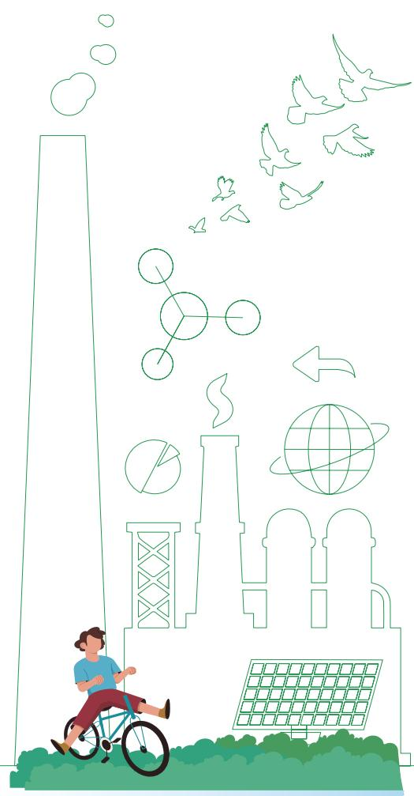

natural_image

Illustration of a person riding a bicycle near an industrial facility with symbolic icons (no text or symbols present)

## 2025年环境管理措施

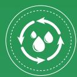

## 环境风险管控

建立环境风险数据库，接入气象、水质、大气实时数据，AI算法预测超标风险，提前72小时预警

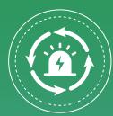

## 环境应急管理

定期开展环境隐患排查与应急演练，年度开展6次突发环境事 件应急演练，覆盖泄漏、火灾、废水超标等场景

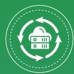

## 信息化管理平台

上线生产信息化管理平台，全流程能耗/排放数据可视化，支持排产优化与成本降低

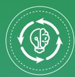

## 意识能力提升

组织管理层参与上市公司合规培训，强化决策层合规风险意识定期开展节能降碳、清洁生产、合规操作等专项培训，提升人员专业能力

我们在生产运营全过程中坚定践行“尊重自然、保护优先”的核心原则，严格恪守生态保护红线相关规定，公司所有生产基地选址均远离生物保护区，生产制造全流程均处于严格环保管控，未对周边生态环境及社区生活造成重大影响。同时，公司积极履行生态保护责任，通过种植绿植、封闭闲置填埋区域等生态修复措施改善区域环境，并定期对厂区及周边生态环境开展监测，确保生态安全

## 气候行动

合盛硅业积极响应国家“碳达峰、碳中和”战略部署，参照TCED框架指引，将气候变化相关考量融入企业运营与风险管理体系。依托自身全产业链优势与绿色循环发展基础，持续优化碳管理机制与转型路径，稳步推进低碳转型实践，助力行业绿色高质量发展。

## 治 理

公司建立“决策层-组织层-执行层”三层气候变化治理架构，通过搭建分工明确、权责清晰的治理架构和工作机制，保障气候变化管理决策的科学性和执行的高效性，有效推动各项应对举措有序落地，持续提升气候变化治理水平。

## 董事会

负责监督与审查气候变化相关战略、年度政策管理表现及目标进度  
审阅战略与可持续发展委员会提交的应对气候变化举措

## 战略与可持续发展委员会

◆识别、评估气候变化相关风险与重要性，研判外部趋势及潜在风险机遇，降低对公司的不利影响  
监督、评核并检讨气候变化相关政策、管理表现及目标进度  
◆制定并审阅气候变化相关愿景、目标及策略，就优化应对举措与董事会积极沟通

## ESG工作小组

落实气候变化管理决策和部署，跟进气候变化管理措施的执行，并跟进相关绩效和目标达成进展  
负责内部沟通与外部联络

公司制定并持续修订《碳排放、能耗核查管理制度》等制度，为碳排放全流程管控、极端天气风险防范提供清晰的行动指引。通过内部常态化监测和外部第三方协同验证的监督机制，定期信息报送、专项工作会议等汇报机制，确保应对气候变化工作有效落实和按期推进。

## 战 略

公司基于行业研究报告、监管政策、同行对标及外部信息检索等方式，锚定物理风险与转型风险的全周期价值链影响，把握政策和市场等机遇增益，通过技术创新缓释风险推进能源结构优化、低碳产品研发等，动态适配政策与技术趋势，在平衡经济价值与社会价值中，夯实应对气候变化管理的核心能力。

natural_image

Illustration of a stylized globe with green leaves, wind turbines, and hearts surrounding it (no text or symbols)

<table><tr><td colspan="2">风险类别</td><td>风险描述</td><td>财务影响</td><td>影响时限</td><td>影响价值链</td><td>应对措施</td></tr><tr><td rowspan="2">物理风险</td><td>急性</td><td>◆生产基地受极端天气(暴雪、沙尘、强降雨等)影响,生产/运输连续性中断</td><td>直接生产成本增加</td><td>短期</td><td>上游价值链自身运营</td><td>◆强化生产端应急保障机制,提升供应链韧性◆优化资源储备与多渠道供应布局</td></tr><tr><td>慢性</td><td>◆高耗能产业受区域能耗政策长期约束,部分运营点受地区缺水影响,导致产能扩张空间受限</td><td>直接/间接生产成本增加</td><td>长期</td><td>自身运营</td><td>◆推进低能耗技术改造,适配能耗管控要求◆定期跟踪和评估缺水风险</td></tr><tr><td rowspan="4">转型风险</td><td>政策及法律</td><td>◆碳交易、能耗双控等政策增加合规性成本◆行业调控政策(如产能管控、价格自律)影响短期产能释放</td><td>合规成本增加</td><td>中期</td><td>自身运营</td><td>◆动态适配行业政策,优化产能与产品结构◆落实节能降碳措施,降低政策合规成本</td></tr><tr><td>技术</td><td>◆行业向绿色低碳技术转型,带来转型压力和产品竞争力压力◆高端产品技术研发进度不及市场需求节奏</td><td>研发成本增加</td><td>中长期</td><td>自身运营</td><td>◆加大科研投入,与科研机构、其他企业合作研发低碳环保技术◆推进技术成果转化,匹配市场高端需求</td></tr><tr><td>市场</td><td>◆主营产品(工业硅、有机硅等)市场价格周期性波动</td><td>营收减少</td><td>长期</td><td>下游价值链</td><td>◆拓展多元化下游应用场景,分散需求波动风险</td></tr><tr><td>声誉</td><td>◆生产经营相关舆情(如环保、合规类)影响品牌形象,进而波及订单合作</td><td>品牌形象受损,导致订单流失</td><td>中期</td><td>下游价值链</td><td>◆强化合规经营与信息公开,主动管理舆情◆提升ESG管理水平,巩固品牌正面形象</td></tr></table>

<table><tr><td>机遇类别</td><td>机遇描述</td><td>财务影响</td><td>影响时限</td><td>影响价值链</td><td>应对措施</td></tr><tr><td>政策及法律</td><td>◆ 政策向绿色低碳产业倾斜,企业应用低碳技术可获补贴支持,助力业务发展</td><td>运营成本降低</td><td>中期</td><td>自身运营</td><td>◆ 主动申报政策扶持项目</td></tr><tr><td>市场</td><td>◆ 下游市场对产品需求提升,带来业务扩张机遇</td><td>运营成本降低,收入增加</td><td>中期</td><td>下游价值链</td><td>◆ 扩大产能规模,提高市场占有率</td></tr></table>

\*注：短期指1-3年内，中期指3-10年内，长期指10年以上

##

公司结合业务特点、内外部环境及专业意见，构建“识别-分析-评估-应对”的气候管理流程，分阶段将气候风险融入现有风控框架，持续提升管理能力，逐步降低气候风险对经营的影响。

## 气候变化风险管理流程

## 识别 01

依据TCFD框架与同业实践，结合公司内外部现状，通过分析与调研，识别主营业务的气候风险与机遇，形成评估清单

## 分析 02

参考行业特性、利益相关方及外部专家意见，量化气候风险与机遇的核心属性形成对应风险和机遇清单

## 评估 03

通过情景分析法，量化风险/机遇的影响程度、发生可能性，同时评估公司的适应性与恢复力，明确管理优先级

## 应对 04

针对识别的风险制定针对性方案，落地具体实施举措，定期监督重大气候风 险的应对进展

我们深入开展产品全生命周期(LCA)环境影响研究，致力于从原物料获取、制造、分销、使用直至寿命结束最终处置的每一个环节，全面评估并降低碳足迹和环境影响，以应对面临的气候风险。

已开展LCA评估和碳足迹认证的产品

<table><tr><td>业务板块</td><td>子公司</td><td>产品</td><td>碳足迹认证</td></tr><tr><td rowspan="3">有机硅</td><td rowspan="3">嘉兴合盛</td><td>HS-5360 混炼硅橡胶</td><td>ISO 14067 产品碳足迹认证</td></tr><tr><td>甲基高含氢硅油</td><td>基于 ISO 1404 的 LCA 评价</td></tr><tr><td>室温硫化甲基硅橡胶</td><td>基于 ISO 1404 的 LCA 评价</td></tr></table>

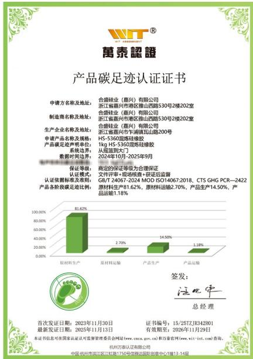

bar

| 产品类别 | 认证比例 (%) |
| --- | --- |
| 原材料生产 | 81.62 |
| 原材料运输 | 2.70 |
| 产品生产 | 14.50 |
| 产品运输 | 1.18 |

HS-5360混炼硅橡胶产品碳足迹认证证书

## 指标与目标

公司以事业部为单位，结合各业务线生产现状制定适配能耗目标，并将气候变化关键绩效指标纳入核心管理人员绩效考核。我们定期审核目标完成情况，通过工艺升级、设备升级、能源替代、循环利用等方式推进节能减排，不断提升绿色发展竞争力。

<table><tr><td>类别</td><td>单位</td><td>2024年</td><td>2025年</td></tr><tr><td>范围1温室气体排放量</td><td>吨二氧化碳当量</td><td>11,789,117.03</td><td>11,221,841.79</td></tr><tr><td>范围2温室气体排放量</td><td>吨二氧化碳当量</td><td>8,739,283.65</td><td>4,493,288.57</td></tr><tr><td>温室气体排放总量</td><td>吨二氧化碳当量</td><td>20,528,400.68</td><td>15,715,130.37</td></tr><tr><td>温室气体排放强度</td><td>吨二氧化碳当量/万元人民币</td><td>7.69</td><td>7.67</td></tr></table>

\* 注：  
1.温室气体排放来源主要包括汽油、柴油、燃煤、天然气等燃料燃烧产生的直接温室气体排放外购电力产生的间接温室气体排放；  
2.温室气体排放类型主要包含二氧化碳（CO₂）、甲烷（CH₄）和氟化气体三类；  
3.温室气体排放统计范围为合盛硅业股份有限公司及所有稳定生产型子公司

natural_image

Line drawing of a rural scene with houses, trees, sun, and wind turbines (no text or symbols)

## 资源利用

合盛硅业始终将资源高效利用视为可持续发展的核心引擎，通过系统性战略布局与科技创新，构建起覆盖能源、水资源、物料和包装的全链条精细化管理体系，为推动绿色低碳转型提供坚实支撑。

## 能源管理

## 能源管理体系

公司建立统一的能源管理体系，由总部统筹规划能源管理战略、制度与目标，各事业部负责具体落实执行，形成“目标设定-方案实施-效果评估-持续优化”的闭环管理模式，涵盖能源采购、消耗、评估全流程管理。截至报告期末，鄯善硅业、新疆新材料、西部硅业、嘉兴合盛和泸州合盛5家子公司已取得ISO.5001能源管理体系认证证书。

## 制度程序

制定《能源管理手册》《节能管理制度》《能源评审程序》等制度和程序，涵盖能源采购、使用计量、统计报告等全流程要求

## 监督考核

建立能源管理数据台账，通过能耗监测报表实时监控实现能耗数据实时追溯与异常预警  
每年开展至少1次能源管理体系内审，结合第三方监督审核与专项督查，确保管理体系有效运行

## 能源利用举措

我们全面推进清洁生产，聚焦生产运营各环节，通过能源审计、技术改造、流程优化、精细化管理等多种举措提升能源利用效率，降低能耗与排放

## 工艺技术改造

## 工业硅板块

专项整治减少空烧、刺火、大塌料等造成能源浪费的现象

## 有机硅板块

通过裂解精馏系统技改，精单体高沸含量降至15%，年减蒸汽消耗963吨，节省成本数十万元

## 能源板块

完成磨煤机增容改造，增强劣质煤磨制掺烧能力，年节约原煤使用成本超两百万元

natural_image

Green upward arrow inside a circular arrow, symbolizing growth or refresh (no text or symbols)

## 流程设备优化

## 工业硅板块

更换42台环保主风机为能效达到一级节能认证的风机

## 有机硅板块

合成一期反应器油泵技改，技改后用 1 台 400kW 的油泵替代 3 台200kW的油泵，每年可节约用电超30万度

## 能源板块

实施高压加热器整组更换，节能超2,000吨标准煤，直接能源收益超百万元

机组锅炉空预器蓄热元件改造，降低锅炉排烟温度实现降低发电煤耗，改造后每年可节约超1.000吨标准煤

## 光伏板块

硅芯复洗空压机节能改进方案，调整后设备总运行功率降低约92kW，预计年度可节约用电量60余万度

## 能效精细管理

## 能源板块

开展能效对标活动，借助第三方能源机构采用成熟节能技术，优化系统及工艺设备配置，挖掘节能潜力

natural_image

Green battery icon with lightning bolt inside circular arrow, symbolizing energy or recycling (no text or symbols)

## 清洁能源使用

公司积极推进能源结构优化，积极探索新能源及可再生能源的综合利用，持续提升清洁能源在总能耗中的占比，助力企业绿色低碳转型。

<table><tr><td>工业硅板块</td><td>积极推进绿电应用,通过市场化方式采购绿电并投入生产运营</td></tr><tr><td>能源板块</td><td>鄯善工厂2.1GW光伏发电项目正在规划中,计划利用当地丰富的太阳能资源提供绿色电力</td></tr><tr><td>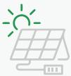光伏板块</td><td>优先消纳工业园区增量配电网的可再生能源(绿电),年度可再生能源消纳占比达90.32%,其中消纳光伏电量占比46.11%、风电占比9.11%、储能电量占比36.62%、水电占比8.16%</td></tr></table>

## 清洁技术机遇

公司以全流程绿色升级为清洁技术发展核心，通过三方面行动落地战略：革新工艺推广光伏等低碳能源，替代火电降碳；优化冶炼工艺、构建循环经济体系，依托废旧耐火材料回收等技术提升资源利用率：集成智能系统，实现能源与污染物精准管控。公司同步加大研发投入，聚焦示范项目、装备升级与新材料研发，把握清洁技术机遇。

## 水资源管理

## 水资源管理体系

公司构建系统化水资源管理体系，水资源主要源干自来水厂或市政管网，部分生产基地采用地表水、局部回收雨水等，以及废水循环复用，水资源取用均符合合规要求，取水、污水排放均未对水源产生重大影响。

  
制度程序  
●制定《合理用水、用电管理制度》《化水运行规程》等制度和程序，明确取水、计量、循环利用、废水处理等各环节管理要求

  
监控考核  
●建立水计量网络和实时监控机制，每月进行运行经济性分析与趋势分析，识别异常波动并及时预警

  
风险管控

采用定量与定性结合方式，系统识别水资源相关风险，通过水平衡测试、历史数据分析等评估风险发生概率与潜在影响，进行风险优先级排序，制定应对措施  
●制定分级应急预案与针对性防范措施，定期评审管理流程并优化，形成闭环管理

## 水资源利用举措

我们秉持节约优先、循环利用理念，通过技术革新、流程优化、资源复用等多元举措，持续提升水资源利用效率，严控取水总量与排放达标，提升水资源管理效能和节水能力。

  
提升用水效率

有机硅板块

蒸汽冷凝水回收率达85%以上，年节约新鲜水约27.8万吨

能源板块

开展炉定排水回收技改项目，投运后年回收利用水量约6.4万吨

  
替代水源使用

有机硅板块

利用厂区建设的雨水收集池对雨水进行收集，用于非工艺用水补充

能源板块

生产废水集中处理，用于厂区绿化及循环水补水，年节约市政水量约 23 万吨

  
水资源循环利用

工业硅板块

对废水开展沉降处理与循环利用改造，处理达标后的废水进行回收再投入生产环节，提升水资源循环利用率

能源板块

新建凝结水回收处理系统，对各生产区域的凝结水回水集中收集处理，提高水资源循环利用率

## 物料和包装管理

公司严格规范物料及包材的采购和使用，建立《产品包装防护管理规定》《产品包装管理制度》等制度程序通过设计优化、材料革新及循环利用机制创新减少物料消耗，推行环保型可回收包装材料，强化物料与包装管理的规范性、环保性与高效性。

## 2025年物料和包装管理措施

物料循环利用

## 有机硅板块

对硅渣、粉尘等固废进行分选、提纯，回收其中硅、铜等有价元素  
◆将生产过程中产生的副产盐酸等副产物，通过技术转化为原料，实现闭路循环

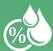

减少物料消耗

## 工业硅板块

通过生产工艺精细化调整、原料筛选、改进破碎筛选等，显著降低石英石、柴煤、木片等物料消耗  
建立原材料与生产循环体系，对边角料、废弃物及余热分类回收再加工有机硅板块  
投用闲置脱低塔技改项目，剥离精单体中高沸物，减少物料循环损耗与蒸汽消耗能源板块  
两台机组等离子点火装置改造，替代传统燃油点火装置，每年可节约燃油120吨节约物料成本超90万元

包装重复利用

## 工业硅板块

根据成品规格优先采用“吨袋周转”与“袋内余料清空”，减少新袋的启用有机硅板块  
推广包装材料重复利用，旧吨桶复用、槽车输送替代袋装运输

## 产品环境影响

我们大力开展产品环境影响研究，从原料、装备和工艺等环节切入，识别原材料采购、产品制造、产品使用直至废弃处置的产品全生命周期环境因素评估产品环境风险，通过产品生态设计、化学品减量替代、回收、循环等方法，降低产品制造过程及产品本身对环境的影响，保护消费者的健康和安全。

我们积极采取行动降低产品和包装生命末期的环境影响，通过与客户沟通协同开展产品及其包装物的回收利用工作、减小包装尺寸、减轻包装重量等方法减少产品包装带来的环境影响。

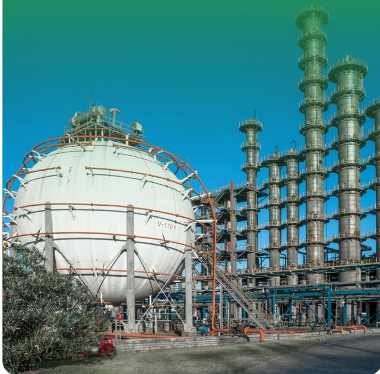

natural_image

Exterior view of a large industrial chemical storage facility with multiple towers and piping under a clear blue sky (no signage or text visible)

## 污废治理

合盛硅业始终坚守生态环境保护主体责任，依托“煤电硅”一体化循环经济模式构建全流程污染防控体系，将环保理念贯穿生产各环节，推动环保指标持续优化，生动诠释企业以科技创新赋能绿色转型、实现经济效益与生态效益双赢的责任担当。

## 污染物治理

## 治 理

公司建立“决策层-组织层-执行层”三层污染物治理架构，明确各层级权责分工，清晰界定决策、统筹、落地全链条管理边界，保障污染物管理全流程规范有序推进，为提升企业环境治理水平、筑牢绿色发展根基提供坚实支撑。

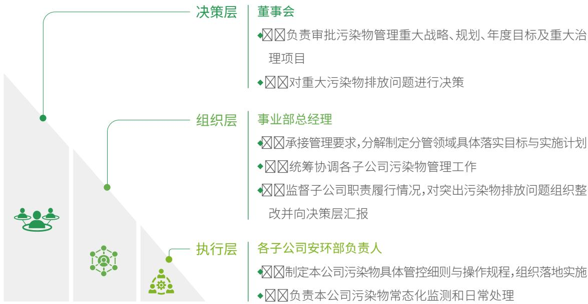

flowchart

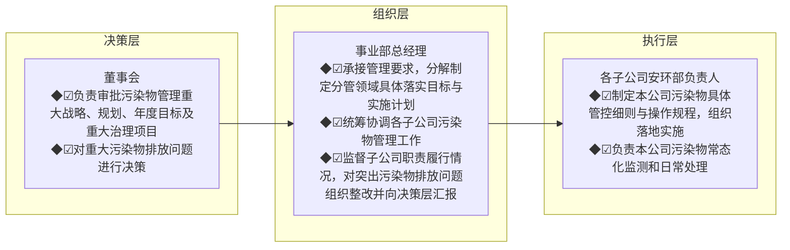
```mermaid
graph LR
  subgraph DecisionLayer["决策层"]
    A1["董事会\n◆☑负责审批污染物管理重大战略、规划、年度目标及重大治理项目\n◆☑对重大污染物排放问题进行决策"]
  end

  subgraph OrganizationLayer["组织层"]
    B1["事业部总经理\n◆☑承接管理要求，分解制定分管领域具体落实目标与实施计划\n◆☑统筹协调各子公司污染物管理工作\n◆☑监督子公司职责履行情况，对突出污染物排放问题组织整改并向决策层汇报"]
  end

  subgraph ExecutionLayer["执行层"]
    E1["各子公司安环部负责人\n◆☑制定本公司污染物具体管控细则与操作规程，组织落地实施\n◆☑负责本公司污染物常态化监测和日常处理"]
  end

  A1 --> B1
  B1 --> E1
```

合盛硅业污染物治理架构

公司制定《废水管理制度》《废气排放管理制度》《危废管理制度》《排污许可管理制度》等制度，为“三废”治理全流程管控提供清晰的行动指引。通过在线监测设备实时监控排放数据，实行“日常巡查+定期审计+外部核查相结合的模式，形成监督闭环。

##

公司制定“源头减量、回收利用、合规处置、智能管控”的污染物治理核心策略，以清洁生产与工艺优化为抓手从源头减少废弃物产生；积极推动污染物资源化，实现废酸回收、废水循环、废渣再利用的闭环模式；严格遵循环保法规，建立全流程合规管理体系；依托数字化系统实现废弃物全生命周期监控追溯，实现全口径污染物合规排放。

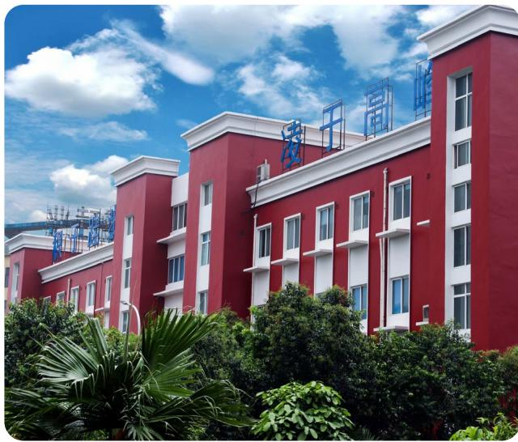

natural_image

Exterior view of a red multi-story residential building with white facade and large blue signage under a blue sky (no readable text on building facade)

<table><tr><td colspan="2">风险类别</td><td>风险描述</td><td>财务影响</td><td>影响时限</td><td>影响价值链</td><td>应对措施</td></tr><tr><td rowspan="2">[6KST]物理风险</td><td>急性</td><td>◆因设备故障或工艺问题导致废气超标排放◆污水站出现故障导致运行异常</td><td>直接处理成本增加</td><td>短期</td><td>自身运营</td><td>◆加强设备巡检和维护,定期对废气废水排放进行检测◆对员工进行环保工作培训,规范操作流程</td></tr><tr><td>慢性</td><td>◆危废储存不当,泄漏污染土壤和水体◆一般废弃物处理不及时,占用空间,散发异味,影响厂区环境</td><td>直接处理成本增加</td><td>短期</td><td>自身运营</td><td>◆建立严格的废弃物分类、收集和处置制度,确保危废交由有资质单位处理,并做好记录◆对一般废弃物及时清理和运输,加强对垃圾堆放区域的管理</td></tr><tr><td rowspan="2">转型风险</td><td>政策及法律</td><td>◆企业因无法及时适应法规趋严的变化而面临违规风险,导致受到处罚</td><td>运营成本增加</td><td>短期</td><td>自身运营</td><td>◆积极跟踪政策变化,优化生产流程</td></tr><tr><td>技术</td><td>◆随着环保要求提高,企业需要投入大量资金进行环保技术升级和管理体系优化</td><td>运营成本增加</td><td>长期</td><td>自身运营</td><td>◆加大科研投入,与科研机构、其他企业合作研发低碳环保技术</td></tr></table>

<table><tr><td>机遇类别</td><td>机遇描述</td><td>财务影响</td><td>影响时限</td><td>影响价值链</td><td>应对措施</td></tr><tr><td>政策及法律</td><td>◆ 硅业污染物排放标准收紧,高污染落后产能加速退出,企业凭借成熟的污染物治理体系得以抢占被释放的市场份额</td><td>营业收入增加</td><td>长期</td><td>下游价值链</td><td>◆ 持续改进环境管理工作,积极参加环保活动,宣传企业环保成果,提升品牌形象</td></tr></table>

\*注：短期指1-3年内，中期指3-10年内，长期指10年以上

##

公司结合各事业部生产特性、内外部环保监管要求，构建“识别-评估-监测-应对”污染物风险管理流程，将污染物风险管控深度融入现有风控框架，持续提升风险预判与处置能力，稳步降低污染物排放风险对经营发展的影响。

污染物风险管理流程  
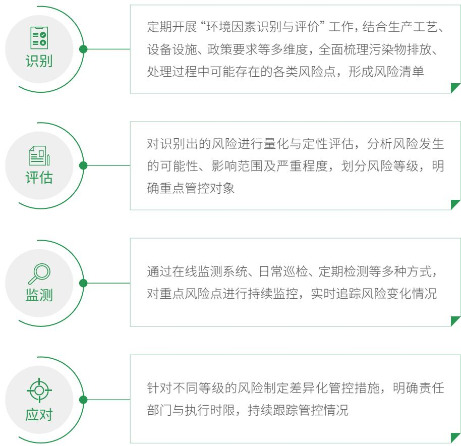

flowchart

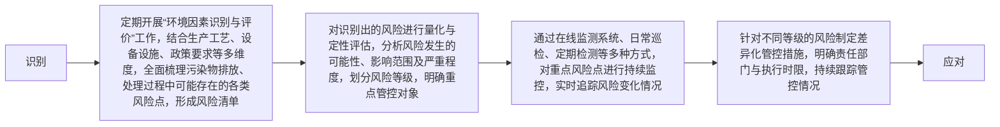
```mermaid
graph LR
  A["识别"] --> B["定期开展“环境因素识别与评价”工作，结合生产工艺、设备设施、政策要求等多维度，全面梳理污染物排放、处理过程中可能存在的各类风险点，形成风险清单"]
  B --> C["对识别出的风险进行量化与定性评估，分析风险发生的可能性、影响范围及严重程度，划分风险等级，明确重点管控对象"]
  C --> D["通过在线监测系统、日常巡检、定期检测等多种方式，对重点风险点进行持续监控，实时追踪风险变化情况"]
  D --> E["针对不同等级的风险制定差异化管控措施，明确责任部门与执行时限，持续跟踪管控情况"]
  E --> F["应对"]
```

##

公司以事业部为单位，结合废气、废水、固废等污染物排放实际，制定差异化、可落地的污染物管控指标，我们定期开展指标完成情况审核与复盘，持续提升污染治理精细化水平。

<table><tr><td>分类</td><td>类别</td><td>单位</td><td>2024年</td><td>2025年</td></tr><tr><td rowspan="5">废气指标</td><td>氮氧化物排放量</td><td>吨</td><td>5,399.66</td><td>2,825.21</td></tr><tr><td>硫氧化物排放量</td><td>吨</td><td>1,050.72</td><td>913.43</td></tr><tr><td>挥发性有机化合物(VOC)排放量</td><td>吨</td><td>6.63</td><td>2.27</td></tr><tr><td>颗粒物排放量</td><td>吨</td><td>868.11</td><td>400.49</td></tr><tr><td>废气排放量</td><td>万立方米</td><td>11,078,808.80</td><td>8,592,994.38</td></tr><tr><td rowspan="3">废水指标</td><td>化学需氧量(COD)</td><td>吨</td><td>260.49</td><td>128.71</td></tr><tr><td>氨氮</td><td>吨</td><td>12.73</td><td>4.53</td></tr><tr><td>废水排放量</td><td>万吨</td><td>2,147,434.59</td><td>1,652,920.97</td></tr><tr><td rowspan="4">废弃物指标</td><td>有害废弃物回收再利用量</td><td>吨</td><td>39,157.37</td><td>70,803.09</td></tr><tr><td>无害废弃物清运量(回收)</td><td>吨</td><td>520,731.86</td><td>698,782.93</td></tr><tr><td>有害废弃物其他处理方式的量</td><td>吨</td><td>63,354.92</td><td>12,988.34</td></tr><tr><td>无害废弃物清运量(不可回收)</td><td>吨</td><td>43,899.91</td><td>20,507.20</td></tr></table>

## 污染物处置

公司坚持“系统治理、精准施策、循环高效、全程合规”的污染物处置原则，对各类污染物实施分类管控与科学处置。同时搭建数字化监测与追溯平台，持续提升污染物处置的精细化、规范化水平，确保环境效益与经济效益协同发展。

## 废气治理

公司生产过程中产生的废气主要包括：工业硅生产相关的矿热电炉烟气，有机硅生产相关的VOCs、氯化氢等工艺废气；燃煤发电产生的二氧化硫、氮氧化物、颗粒物酸碱废气、氨气及恶臭气体等。

<table><tr><td>污染物</td><td>环保治理措施</td><td>成效</td><td>排放形式</td></tr><tr><td>工业硅废气</td><td>经“旋风重力除尘+布袋除尘器”处理后,再经活性基脱硝和湿法脱硫塔综合处理</td><td rowspan="5">达标</td><td rowspan="5">有组织</td></tr><tr><td>有机硅废气</td><td>采用“冷凝回收+焚烧+SNCR脱硝+除尘+水洗/碱洗+活性炭吸附”组合工艺</td></tr><tr><td>酸碱废气</td><td>通过二级喷淋、四级喷淋等技术进行中和处理</td></tr><tr><td>二氧化硫氮氧化物颗粒物</td><td>采用“选择性催化剂还原法烟气脱硝(SCR)+电袋除尘器+石灰石石膏湿法脱硫”“布袋除尘+脱硫脱硝”“硝石灰干法脱硫+陶瓷纤维管一体化脱氮除尘”等工艺</td></tr><tr><td>VOCs</td><td>运用二级活性炭吸附+催化燃烧、RTO焚烧等技术处理</td></tr></table>

## 2025 年废气减排措施

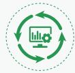

## 监测管控

●主要排放口安装烟气排放连续监测系统，与环保部门联网实时传输数据，实现排放数据常态化监控和预警

## 工艺升级

●建立设备泄漏检测与修复(LDAR)体系，定期开展动静密封点检测，减少无组织排放  
●采用低氮燃烧技术，从源头降低氮氧化物产生  
●扩大膜分离技术应用，提高氯甲烷回收率至99%

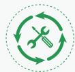

## 设施升级

●升级废气处理设施，优化吸附与焚烧系统运行参数  
●定期开展设备巡检与维护，实施预测性维护，降低泄漏风险

## 废水治理

公司废水主要包括生活污水和工业废水，其中工业废水主要包括生产过程中产生的含酸废水、含碱废水、高盐废水、工艺废水等，主要污染物为COD、氨氮、悬浮物盐分等。

<table><tr><td>污染物</td><td>环保治理措施</td><td>成效</td><td>排放形式</td></tr><tr><td>生活污水</td><td>污水处置装置</td><td rowspan="2">达标</td><td rowspan="2">处理达标后接入市政污水站</td></tr><tr><td>工业废水</td><td>污水处置装置</td></tr></table>

## 2025年废水减排措施

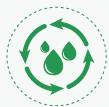

## 分流节水

●将处理达标后的废水用于生产补水、绿化灌溉等，降低新鲜水消耗量  
●推行雨污分流，避免雨水污染

## 工艺升级

● 采用“A/O生化处理+二级沉淀” “水洗+碱洗”等组合工艺针对高盐废水实施专项处理  
开发废水中盐资源回收技术，降低危废物产生

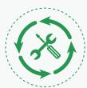

## 设施升级

●重点工厂配置污水零排系统，处理后达到循环水进水指标并返回到循环水使用

## 案例嘉兴合盛实施汽化器凝水排水管技改，减少废水排放

针对检修期间汽化器凝水排放导致废水增量的问题，嘉兴合盛实施排水管改造工程将排水管直接引至装置雨水线，避免凝水与酸性地沟水混合，从源头减少废水产生，每年可减少废水排放60吨，节省废水处理费用超千元，实现环境效益与经济效益的双重提升。

## 废弃物治理

公司废弃物主要包括一般工业固废、危险废弃物，一般固体废弃物中部分废硅渣、废旧吨桶等可回收再利用，对于不可回收的一般固体废弃物和危险废弃物分别交由有资质的第三方进行处理。

<table><tr><td>类别</td><td>名称</td><td>处置方式</td><td>贮存</td></tr><tr><td>一般固体废弃物</td><td>包括粉煤灰、脱硫灰、炉渣、包装材料、办公垃圾、生活垃圾等</td><td>由市政环卫或有资质单位清运处置,即产即清</td><td>分类收集存放,设专用贮存区域</td></tr><tr><td>危险废弃物</td><td>包括废矿物油、废触体、废催化剂、高沸物底渣、废活性炭、实验室废液等</td><td>执行转移联单制度,委托有资质单位处置或通过自建危废处置中心进行资源化利用、焚烧或规范填埋,通过危险废弃物管理系统(HWS)实现全链条追踪</td><td>设立专用暂存间,按危害特性分类存放并标识</td></tr><tr><td>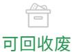弃物</td><td>包括废硅渣、滤渣、废旧吨桶、废RO膜等</td><td>分类收集后,通过回炉复用、原料回收、厂家回收等方式实现循环利用</td><td>设专用贮存区域进行存放</td></tr></table>

## 2025年废弃物减排措施

## 监测管控

●持续完善危废管理系统（HWS)，实现废弃物全生命周期追踪  
●建立健全管理台账，定期开展环保审计与合规培训

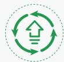

## 工艺升级

●扩大高沸物底渣提铜、废硫酸提浓等资源化技术应用

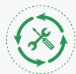

## 设施升级

●完善危险废物暂存设施，升级视频监控与防渗系统  
●推进循环经济产业园建设，提升废弃物资源化利用效率

## 化学品管理

## 化学品管理体系

合盛硅业以“安全、合规、低碳、高效”为原则，制定《化学品安全管理规定》《化学品类别清单及管理制度》《危险化学品管理制度》等制度，针对生产运营中涉及的化学品建立完整化学品管理台账，包括按法律法规要求的点检、使用记录及巡检制度，健全全生命周期管理体系，实现化学品全环节合规管控和全面监管，持续提升化学品管理精细化水平。

## 采购

●审核化学品供应商各项应有资质，包括提供符合法规的SDS与合规声明，经样品检验及试用后方可入库，定期对危化品供应商承运进行合规评估  
●易制毒、易制爆化学品（如硝酸）向属地派出所及相关监管部门提交申请，获得批准后上传至专用监管系统后开展采购

## 储存

·按化学品性质分区分类存 储，严格遵循MSDS规定的 存放要求  
●危险化学品统一存放于专用库房，配备通风、防泄漏、温湿度控制及应急器材，设置明显警示标识，对易制爆、易制毒化学品实行专库存储、“双人双锁”管理  
·通过 SAP系统及化学品管理平台建立全程追溯台账实行“先进先出”发放

## 运输

●与危险品物流企业签订《运输安全及环保协议》，明确危化品运输车辆行驶、停放、运行、取样分析、卸车等作业环节操作规范  
●内部转移时划定固定运输路线，避开人员密集时段，确保运输安全

## 使用

●由授权人员凭主管领导签字的领料单领用  
●作业人员必须佩戴个人防护装备，在通风橱或指定区域规范操作，严格遵守安全使用注意事项

## 废弃

●废化学品包装物及废弃化学品分类收集，委托有危险废物经营许可证的专业单位处理，签订正式处置合同，全程留存转移联单，确保可追溯、可跟踪

## 化学品管理措施

合盛硅业聚焦全流程风险防控与绿色高效运营目标，通过系统化培训强化全员安全意识，以技术改造降低环境影响，用规范化流程保障供应链合规，全方位提升化学品管理的实操效能与可持续性。

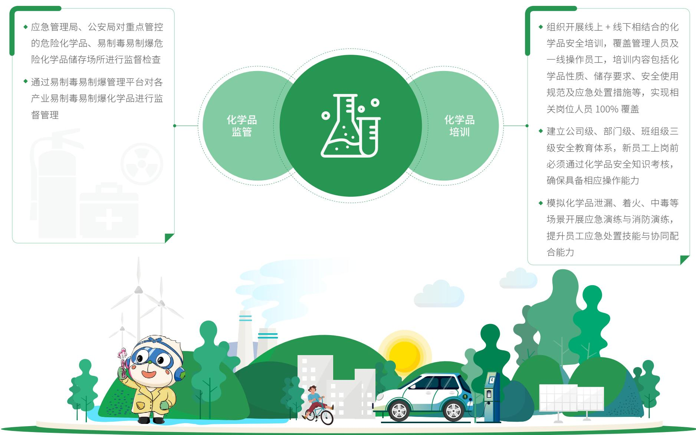

flowchart

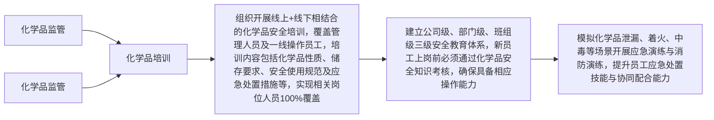
```mermaid
graph LR
  A["化学品监管"] --> B["化学品培训"]
  C["化学品监管"] --> B
  B --> D["组织开展线上+线下相结合的化学品安全培训，覆盖管理人员及一线操作员工，培训内容包括化学品性质、储存要求、安全使用规范及应急处置措施等，实现相关岗位人员100%覆盖"]
  D --> E["建立公司级、部门级、班组级三级安全教育体系，新员工上岗前必须通过化学品安全知识考核，确保具备相应操作能力"]
  E --> F["模拟化学品泄漏、着火、中毒等场景开展应急演练与消防演练，提升员工应急处置技能与协同配合能力"]
```

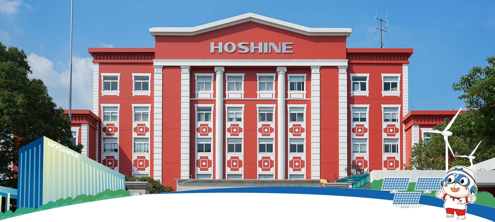

natural_image

Exterior view of a red and white hospital building with 'HOSHINE' signage, featuring a cartoon mascot and solar panel on the ground (no readable text beyond signage)

## “

## 硅”链聚势，赋能价值共创

实质性议题

产品和服务安全与质量，供应链管理，研发创新

回应SDGs

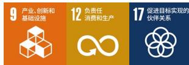

## 产品质量

合盛硅业严格遵守国家《产品质量法》等法律法规，推动质量管理体系完善，通过健全质量管理制度准则技术赋能、专业团队履职，实现研发至售后各环节的全流程质量管控。公司聚焦高端化升级与一体化服务转型，凭借严苛标准与持续优化举措，筑牢产品质量安全屏障，增强产品质量竞争力。截至报告期末，16家子公司已取得ISO9001质量管理体系认证证书，宁波光合已取得IATF16949汽车行业质量管理体系认证证书。

## 治 理

公司以ISO9001质量管理体系为基础构建系统化质量管理体系，同时引入智能化质量管理系统（LIMS）、物联网技术与生产系统集成，建立“一物一码”产品质量追溯体系，实现从原材料到成品的全过程质量监控与数据追溯。

公司产品质量治理架构采用垂直化三级管理模式，明确各层级权责与专业能力要求：制定《产品质量管理制度》《不合格品控制程序》等制度，形成涵盖基础管理、流程管控、风险与投诉管理等完善制度体系，明确各环节质量要求、操作规范与考核标准，为全流程质量管控提供刚性支撑。

## 决策层

审批质量战略、质量目标，决策重大质量问题，统筹质量资源配置

## 管理层

制定质量计划与制度，开展全流程质量检验，组织体系审核、不合格品控制、质量数据分析

## 执行层

落实质量管控要求，执行工艺规程与检验标准，上报质量异常情况，参与质量问题排查与改进

## 战 略

公司致力于打造全球硅基材料领域质量标杆，制定产品质量战略规划，从研发端推行“质量源于设计”，在供应链端实施供应商准入与飞行审核，在生产端部署统计过程控制与批次追溯，于交付端提供标准化分析证书与全流程服务，实现全价值链质量管控；从单纯产品销售向“材料工艺+服务”一体化解决方案转型，深度契合高端制造与新能源领域的质量需求，推动商业模式升级。

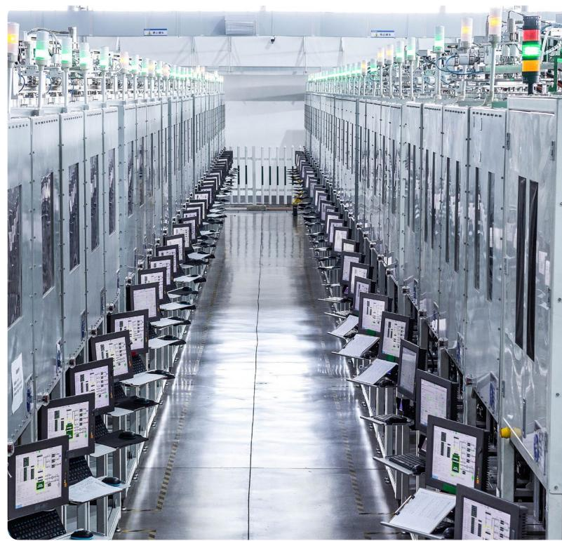

natural_image

Interior view of a cleanroom manufacturing facility with rows of automated equipment and control panels (no visible text or symbols)

<table><tr><td>风险类别</td><td>风险描述</td><td>财务影响</td><td>影响时限</td><td>影响价值链</td><td>应对措施</td></tr><tr><td>产品风险</td><td>◆产品质量不合格或存在异物,可能引发行政处罚、客户投诉及索赔</td><td>运营成本增加、营业收入减少</td><td>短期</td><td>自身运营下游价值链</td><td>◆严格执行生产过程异物控制,建立全流程质量检验标准,确保产品符合国标要求</td></tr><tr><td>供应商风险</td><td>◆供应商物料不合格或运输包装破损,导致终端产品质量问题</td><td>运营成本增加、营业收入减少</td><td>短期</td><td>上游价值链自身运营下游价值链</td><td>◆强化供应商质量审核与来料检验,规范包装管理标准,加强对外包运输方的日常监督</td></tr><tr><td>市场风险</td><td>◆市场需求变化、技术更新换代快,若产品迭代不及时可能导致滞销</td><td>营业收入减少</td><td>中期</td><td>自身运营下游价值链</td><td>◆建立市场需求动态监测机制,加大研发投入,加快产品迭代速度,提前布局高端化、差异化产品研发</td></tr></table>

<table><tr><td>机遇类别</td><td>机遇描述</td><td>财务影响</td><td>影响时限</td><td>影响价值链</td><td>应对措施</td></tr><tr><td>技术机遇</td><td>◆主导或参与国家、行业标准制定,彰显技术优势与质量要求,引领行业质量提升</td><td>营业收入增加</td><td>中期</td><td>自身运营</td><td>◆深度参与行业标准研讨与制定,将企业技术积累转化为标准条款,强化质量管控方向指引</td></tr><tr><td>市场机遇</td><td>◆新能源材料市场崛起,高质量要求为技术升级与质量管控提供契机</td><td>营业收入增加</td><td>长期</td><td>上游价值链自身运营下游价值链</td><td>◆聚焦新能源领域产品研发,优化生产工艺与质量控制体系,打造高端新能源材料产品矩阵</td></tr></table>

\*注：短期指1-3年内，中期指3-10年内，长期指10年以上

## 影响、风险和机遇管理

公司各生产基地建立产品质量相关影响、风险和机遇闭环管理流程，覆盖全价值链环节，通过体系化制度保障、全流程管控措施及持续优化机制，实现对产品质量相关影响、风险和机遇的系统性管控。

## 产品质量风险管理流程

明确信息来源为各生产基地运营数据、内部审核报告、客户投诉与需求调研、供应链质量数据等，识别范围覆盖研发、采购、生产、交付、售后全价值链，重点关注产品纯度、稳定性、合规性等核心质量属性相关的影响因素

优先管控可能导致重大客户流失、法律诉讼、停产的重大风险，与公司战略契合的高价值机遇

natural_image

Simple line drawing of two speech bubbles above two human figures (no text or symbols)

量化评估产品质量不合格对财务、品牌声誉、客户流失、合规处罚等方面的影响  
评估机遇对市场拓展、营收增长、 行业竞争力提升的潜在价值

## 管理 监测

设立产品一次检验合格率、供应商来料批次合格率、质量缺陷重复发生率等监测指标，通过LIMS、MES、金蝶等系统实现质量数据实时采集与分析，结合人工巡检、定期检测报告形成立体化监测网络

公司构建产品全链条检验体系，通过标准化检验流程、技术赋能与多级复核，保障每一批次产品质量可控可追溯；建立覆盖全员、分层分类的质量培训体系，结合岗位需求与行业标准，通过多样化培训形式，提升从管理层到一线员工的质量管控能力与合规意识。

## 产品质量检验流程

##

建立供应商准入审核机制，关键原料供应商需通过现场审核与质量协议签订  
所有原料入厂后，依据国标、行标及企标开展全项目检验包括外观、纯度、关键成分等指标，检验合格后方可入库

## 生产

在关键工序设立质量控制点，采用SPC统计过程控制技术实时监控工艺参数稳定性  
对半成品进行抽样检验，重点核查生产工艺执行情况与产品核心特性，发现异常立即停机整改

## 成品

成品执行严格的批次检验制度，每批次产品需完成全项目检测，出具合格的分析证书  
通过LIMS等数字化系统，实现成品从原料到出厂的全程追溯，记录检验数据、检验人员、检测设备等信息

公司制定《产品召回控制程序》，明确召回启动条件、责任分工与处置机制，通过快速响应与有效整改，最大限度降低质量问题对客户的影响，提升各部门协同响应能力与处置效率。

## 产品召回流程

## 召回触发机制

●当发现产品存在质量缺陷、不符合标准要求，或收到客户集中投诉且核实为产品质量问题时，立即启动召回评估

## 召回执行流程

制定召回计划，明确召回负责人、工作步骤与时间节点  
安排专人对接客户，负责产品回收、更换或退款事宜，记 录召回执行情况

## 原因排查与整改

●组织跨部门团队开展根本原因分析，制定纠正预防措施并跟踪措施落实效果  
●将召回相关信息纳入质量改进档案，避免同类问题重复发生

##

公司以持续提升产品质量稳定性与可靠性为目标，充分考量市场客户需求、行业标准规范、自身生产运营实际及可持续发展战略，增强市场竞争力并树立良好品牌声誉，致力于构建并持续优化全流程质量管理体系，实现产品和服务质量的持续改进杜绝重大质量安全事故发生。

##

产品安全与质量事故

0 起

事故损害金额

0万元

natural_image

Simple line drawing of industrial safety icons including gear, alarm clock, sun, and hard hat (no text or symbols)

## 客户服务

合盛硅业立足客户全生命周期需求，以标准化服务体系建设为抓手，构建全链条客户权益保障机制，通过全流程服务管控、多元沟通渠道及规范客诉处置提升服务质效，以合规透明、绿色低碳原则赋能营销环节，依托制度与技术筑牢客户信息安全防线，实现客户满意度与可持续发展价值的协同提升。

## 优化服务体验

公司坚持“以客户为中心”的服务理念，以打造标准化、流程化的专业服务体系为目标，聚焦客户需求与体验提升，建立覆盖售前、售中、售后的全周期客户服务管理机制，通过多元沟通渠道、高效问题处置流程及持续优化举措，稳步提升客户满意度。

## 提升客户服务质量

## 全流程服务保障

●售前保障产品选型精准与交易信息透明  
●售中依托CRM、SAP、TMS等系统实现单证自动处理与合规准时交付  
●售后建立跨部门协同机制，快速联动相关事业部溯源分析，明确原因后根据客户诉求提供退换货等解决方案，确保客户问题快速解决

## 多元沟通渠道

●凭借电话沟通、线下上门拜访、企业微信、邮件、视频会议等多种形式建立与客户的常态、高效、双向沟通

## 客户满意度调查

●通过电话回访、实地拜访、业务会议访谈等方式，周期性开展多维度客户满意度调查

## 客户投诉处理流程

## 登记与响应

客户提出投诉后，产品支持部人员或内勤第一时间在CRM 系统中创建客诉单同步通知相关部门，启动投诉处理程序

## 调查与协作

由产品支持部或业务员牵头，对投诉问题进行全面溯源分析，精准定位问题根源，评估问题影响范围，针对性制定短期纠正措施与长期预防方案

## 方案与沟通

整合调查结果与解决方案，形成包含纠正措施、预防计划的完整改善方案，主动与客户沟通说明，充分听取客户意见并确认方案可行性

## 执行与关闭

严格按照确认后的改善方案推进各项举措落地，持续跟踪执行效果，待问题得到有效解决后关闭客诉单  
将投诉案例整理归档，为后续同类问题处理提供参考

## 负责任营销

公司以合规透明、绿色低碳为核心原则，将可持续发展理念融入营销全流程，通过产品环保优化、信息规范披露、绿色运营等举措，为客户提供安全环保的产品与服务，推动产业链协同可持续发展。

## 践行负责任营销

## 有害物质管控

优化二甲基硅油等核心产品工艺，降低环状挥发性硅氧烷含量，确保产品符合欧盟REACH 法规等国际环保标准

natural_image

Warning symbol: red exclamation mark inside orange triangle (no text or numbers)

## 避免虚假宣传

所有产品技术参数、性能说明经研发与质量部门联合审核，部分通过第三方机构审核，产品名称、型号、批号等信息在内部系统及对外文件中保持统一  
禁止夸大、虚假或误导性宣传，相关合规声明均有权威检测报告支持

## 规范产品标识

为所有产品提供详尽的物质安全数据表及符合国际规范的MSDS，明确产品成分、物理化学特性、环境影响、生物降解性等关键信息  
对出运产品严格张贴 GHS 标签、运输标签及生态警示标识，履行安全告知义务

## 客户隐私保护

合盛硅业高度重视客户隐私保护，建立客户信息获取、保存、使用全流程的安全管控机制，通过制度规范、技术防护、全员培训等举措，有效保障客户隐私安全。2025年，公司未发生任何侵犯客户隐私、客户资料泄露、失窃或丢失的投诉事件。

## 守护客户隐私举措

## 规范信息获取与使用

通过公开渠道及征求客户同意等合法合规渠道获取客户信息  
信息仅用于合同履行客户服务及合规分析承诺不用于未经客户同意的其他用途

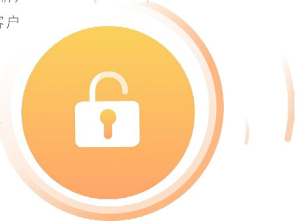

natural_image

Orange circular icon with a white padlock symbol, no text or numbers present.

## 提升隐私保护意识

开展数据隐私相关培训，持续强化员工风险防范和隐私保护意识

## 强化信息存储与防护

客户档案统一保存在硅云在线平台及CRM系统中，执行严格的权限验证和访问控制  
通过多重身份验证提升远程访问安全性，确保信息存储安全

natural_image

Line drawing of office desk layout with bar chart and laptop (no text or symbols)

## 研发创新

合盛硅业采用“煤电硅”一体化循环经济产业园发展模式，已构建起硅产业链核心布局，公司当前所开展的科技研究包含有机硅上游副产品的利用、（功能性）硅油催化及中和体系的研究以及有机硅下游产品的开发，研究范围涉及建筑防水、电子电气、纺织、汽车、机械等多元领域，通过技术创新延伸产业链价值，强化企业核心竞争力。

## 治 理

公司设立研发中心作为创新技术的归口管理部门，对创新研发项目立项、实施、变更、终止、验收考核、专利申报实施全过程管理；建立一支具有超前思维、较强开拓能力和较高专业素质的研发团队，覆盖高分子材料、材料加工、化学、机械、计算机等多元专业。截至2025年末，研发人员共3.008人，其中硕十及以上学历人员26人。

## 研发管理制度

制定《项目管理制度总则》《对外项目申报管理制度》，通过奖励鼓励研发团队攻克技术难关  
制定《项目管理制度-研发项目》，由项目管理委员会开展立项评审，优先倾斜资源至对公司、社会及可持续发展具有实质性贡献的项目，激发研发团队工作热情  
制定《知识产权管理制度》，通过规范知识产权的创造、申请、维护、运用全流程，开展风险排查与侵权应对，有效保护公司创新成果

## 研发平台搭建

建立“合盛硅基新材料省级高新技术企业研究开发中心”“浙江合盛硅基新材料研究院”“浙江省合盛硅业硅基新材料重点企业研究院”“浙江省级企业技术中心”“浙江省博士后工作站”“省级院士专家工作站”等研发平台

natural_image

Abstract icon of three cubes connected by lines, no text or symbols present

## 研发项目考核

各研发项目制定季度考核目标，由研发中心考核小组负责考核，考核结果与研发人员年度项目奖励挂钩，保障研发项目质量

natural_image

Illustration of laboratory glassware with beakers and bubbles (no text or symbols)

## 战 略

公司秉持“专注硅基新材料、创造美好生活”的使命，遵循“资源整合，结构调整、自主创新，内培外引，壮大集群”方针，依托产能优势凝聚科研力量，整合行业创新要素通过项目攻关、机制创新与人才培养，突破行业关键共性技术，提升产品性能、优化产业结构，构建硅行业技术创新体系，以研发创新管理战略支撑企业成为行业创新型领军企业。

<table><tr><td>风险类别</td><td>风险描述</td><td>财务影响</td><td>影响时限</td><td>影响价值链</td><td>应对措施</td></tr><tr><td>技术风险</td><td>◆研发项目具有不确定性,受技术难度及技术储备的影响较大,实验结果不佳,导致前期投入损失◆当前技术迭代迅速,现有技术易过时,市场竞争力下降</td><td>运营成本增加</td><td>长期</td><td>自身运营</td><td>◆丰富多元化研发团队,涵盖多领域专业人才,加强技术交流与协作提升攻克难题能力◆要求研发工程师实时跟踪行业技术动态,及时调整研发方向</td></tr><tr><td>市场风险</td><td>◆市场对研发新产品的接受程度低或需求不足,或研发新产品受到其他替代方案的影响,可能导致产品滞销,无法实现预期的经济效益</td><td>运营成本增加、营业收入降低</td><td>长期</td><td>自身运营下游价值链</td><td>◆在产品研发前期开展深入市场调研,分析目标客户需求、偏好及市场趋势,为产品定位与设计提供依据◆建立市场反馈机制,及时收集客户意见,根据反馈迅速优化产品性能与功能</td></tr><tr><td>人才风险</td><td>◆企业无法吸引并留住高素质专业人才,影响研发团队稳定性和创新能力,制约研发与创新工作的开展</td><td>运营成本增加、营业收入降低</td><td>长期</td><td>自身运营下游价值链</td><td>◆制定具有竞争力的薪酬福利体系,提供高于行业平均水平的薪资待遇、完善的福利保障及绩效奖金激励◆营造良好的企业文化与工作环境,注重员工职业发展规划,提供丰富培训与晋升机会,做好人才补充准备</td></tr></table>

<table><tr><td>机遇类别</td><td>机遇描述</td><td>财务影响</td><td>影响时限</td><td>影响价值链</td><td>应对措施</td></tr><tr><td>产品升级机遇</td><td>◆通过加大研发投入,开发出更高端、更具附加值的产品,拓展至新能源、电子材料等新兴领域,开拓业绩增长点</td><td>营业收入增加</td><td>中期</td><td>下游价值链</td><td>◆加大研发投入,鼓励内部创新,与科研机构合作开展前沿技术研究</td></tr><tr><td>产业融合机遇</td><td>◆加强与新兴行业的整合,开发定制化产品,拓展业务领域,实现协同发展</td><td>营业收入增加</td><td>长期</td><td>下游价值链</td><td>◆加强与下游企业的合作交流,建立产业同盟,共同开展技术研发和市场推广</td></tr></table>

\*注：短期指1-3年内，中期指3-10年内，长期指10年以上

##

公司不断优化研发创新风险与机遇管理流程，对研发过程中所有环节进行风险控制，通过完善《有机硅新产品导入流程》，强化市场需求分析及技术风险评估等举措，降低风险发生的可能性，保障科技创新的连续性。

## 研发创新风险管理流程

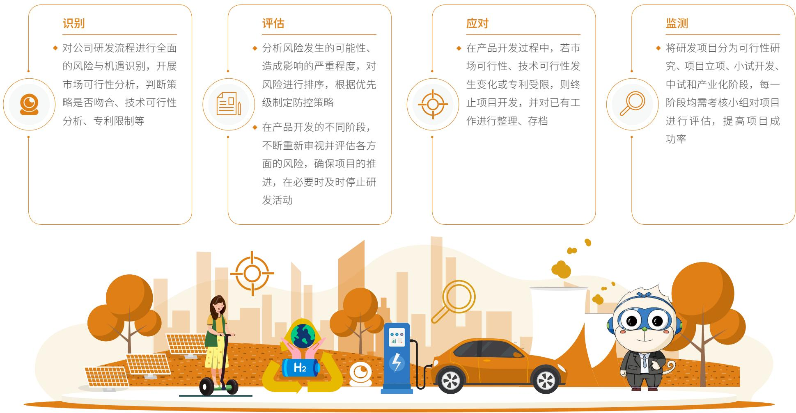

## 识别

对公司研发流程进行全面的风险与机遇识别，开展市场可行性分析，判断策略是否吻合、技术可行性分析、专利限制等

## 评估

分析风险发生的可能性、造成影响的严重程度，对风险进行排序，根据优先级制定防控策略  
在产品开发的不同阶段，不断重新审视并评估各方面的风险，确保项目的推进，在必要时及时停止研发活动

## 应对

在产品开发过程中，若市场可行性、技术可行性发生变化或专利受限，则终止项目开发，并对已有工作进行整理、存档

## 监测

将研发项目分为可行性研究、项目立项、小试开发、中试和产业化阶段，每一阶段均需考核小组对项目进行评估，提高项目成功率

## 2025年创新研发进展

研究发现酸性树脂对乙烯基双封头与有机硅的环体具有良好的催化作用，通过研究其重用性可有效地降低酸性树脂固废的产出并简化乙烯基硅油的制备过程，无需高温灭活或中和  
开展关于酸性白土重用性研究的实验，目前白土可重复使用20次以上，极大减少危废产出量，减轻环境污染  
研究乙烯基生胶在四甲基氢氧化铵催化作用下的反应速度与节能降耗的关系，在保证反应时间不变的前提下显著降低其反应温度节能降耗的同时提高生胶产品的结构稳定性

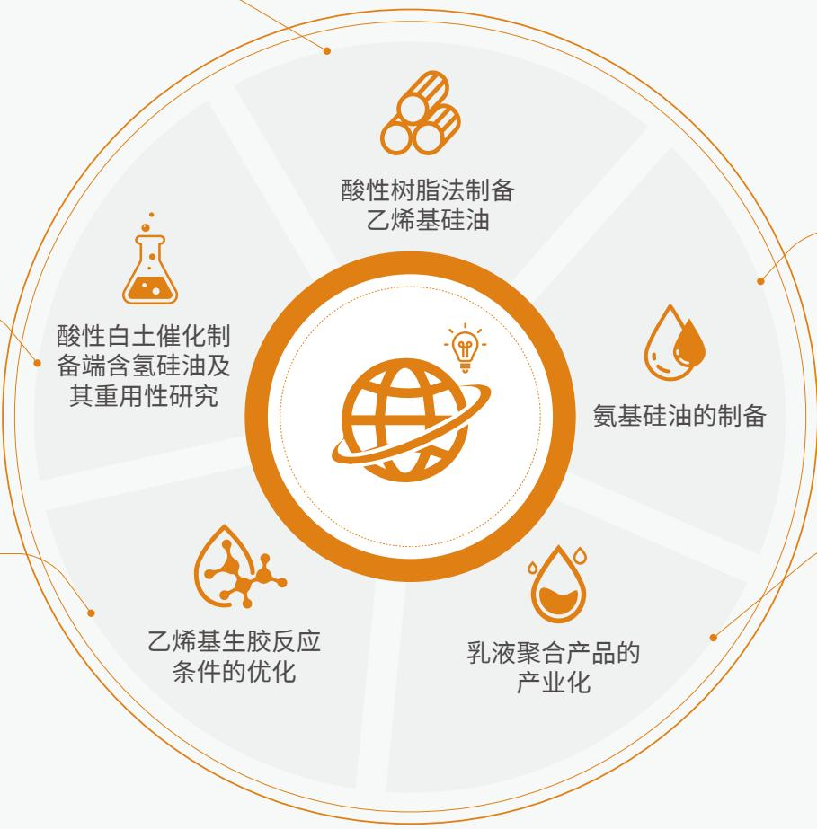

flowchart

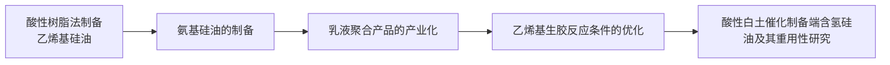
```mermaid
graph LR
  A["酸性树脂法制备\n乙烯基硅油"] --> B["氨基硅油的制备"]
  B --> C["乳液聚合产品的产业化"]
  C --> D["乙烯基生胶反应条件的优化"]
  D --> E["酸性白土催化制备端含氢硅油及其重用性研究"]
```

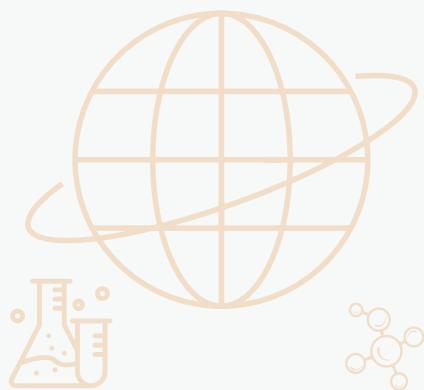

natural_image

Illustration of a globe with orbiting rings and two laboratory glassware icons (no text or symbols)

以有机硅初级产品线性体为原料，与有机硅环体相比，将产品的收率由通用技术的 87%提升到97%及以上  
以有机硅初级产品线性体为原料，在具有乳化能力的催化剂作用下常温制备高粘度的二甲基硅油乳液，可用作纺化整理及日化护理等领域，降低能耗、包装物使用以及二次投料

2025年产学研合作

<table><tr><td>合作对象</td><td>合作项目</td><td>研究成果</td></tr><tr><td rowspan="3">石河子大学</td><td>◆有机硅综合智慧能源碳减排集成技术的产业级开发与示范</td><td>◆通过有机硅梯级节能热耦合工艺,将多工序精馏塔进行多效精馏耦合,实现能量梯级利用,在生产精馏40万吨甲基氯硅烷粗单体过程中,节能量显著,中间产品二甲基二氯硅烷的纯度提升至较高水平</td></tr><tr><td>◆高沸硅油高值化利用技术开发</td><td>◆开发粗品高沸硅油高值化利用技术方法,提高高沸硅油品质</td></tr><tr><td>◆连续法二甲基硅油制备工艺的开发</td><td>◆开发连续法制备二甲基硅油工艺技术,筛选合适的催化剂,提高生产效率及产品品质,单线产量提升30%,减少产品中杂质残留</td></tr><tr><td rowspan="3">华东理工大学——新疆大学</td><td>◆碳硅负极材料关键技术研发</td><td>◆开发新型碳硅复合负极材料,有效提升电池的能量密度与循环稳定性,为高性能锂离子电池提供关键材料支撑</td></tr><tr><td>◆5,000吨/年低挥发份二甲基硅油关键技术研发</td><td>◆突破低挥发份二甲基硅油的合成与纯化技术,实现高品质产品的规模化稳定生产,满足高端化工、化妆品等领域对低气味、高稳定性硅油的迫切需求</td></tr><tr><td>◆5,000吨/年硬度可控的混炼硅橡胶制备关键技术研发</td><td>◆开发硬度可精准调控的混炼硅橡胶制备工艺,产品具有优良的机械性能与耐候性,可广泛应用于航空航天、汽车制造、医疗器械等领域</td></tr></table>

## 指标与目标

公司积极响应国家创新驱动发展战略，将技术创新作为实现高质量发展的核心动力，制定一系列清晰且富有雄心的技术创新目标，包括引进创新型研发人才、增加研发人员数量，以构建高素质创新人才梯队为支撑，持续汇聚行业优质研发力量；增加研发项目数量以拓展创新布局、深化技术攻关为抓手，推动研发体系与产业需求的深度耦合；提升公众影响力，以强化行业价值共享为纽带，彰显企业在产业创新生态中的引领作用。

<table><tr><td>申请专利</td><td>总数302件</td><td>发明专利124件</td><td>实用新型专利178件</td><td>外观设计0件</td></tr><tr><td>授权专利</td><td>总数105件</td><td>发明专利11件</td><td>实用新型专利94件</td><td>外观设计0件</td></tr><tr><td>拥有有效专利</td><td>总数770件</td><td>发明专利98件</td><td>实用新型专利670件</td><td>外观设计2件</td></tr></table>

natural_image

Illustration of a document with documents, a monitor, and cloud icons (no text or symbols)

## 可持续供应链

## 供应商管理

公司编制《供应商管理细则》，设立供应链管理中心，公开、公平、公正地开展供应商的开发、监督、评估、管理工作，对供应商准入、考核和退出环节实行全流程把控，将供应商可持续发展评估和考察融入全流程管理。

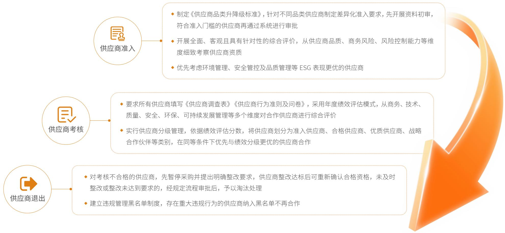

flowchart

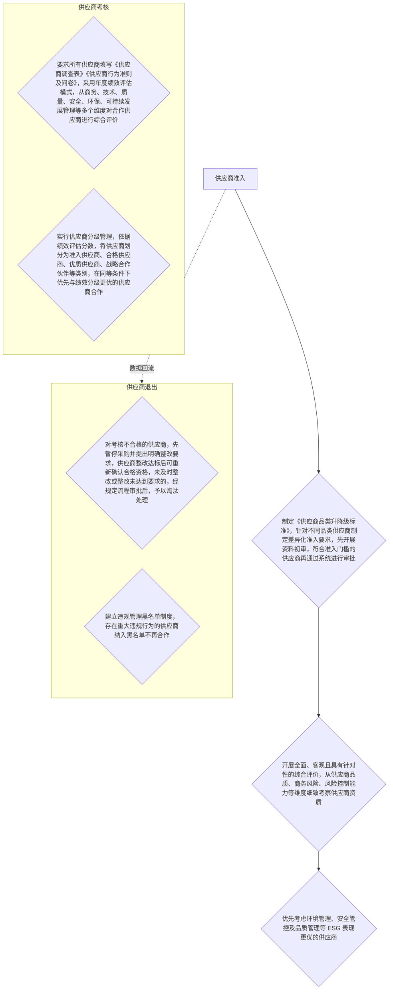
```mermaid
graph TD
  A["供应商准入"] --> B{"制定《供应商品类升降级标准》，针对不同品类供应商制定差异化准入要求，先开展资料初审，符合准入门槛的供应商再通过系统进行审批"}
  B --> C{"开展全面、客观且具有针对性的综合评价，从供应商品质、商务风险、风险控制能力等维度细致考察供应商资质"}
  C --> D{"优先考虑环境管理、安全管控及品质管理等 ESG 表现更优的供应商"}
  
  subgraph Audit ["供应商考核"]
    E{"要求所有供应商填写《供应商调查表》《供应商行为准则及问卷》，采用年度绩效评估模式，从商务、技术、质量、安全、环保、可持续发展管理等多个维度对合作供应商进行综合评价"}
    F{"实行供应商分级管理，依据绩效评估分数，将供应商划分为准入供应商、合格供应商、优质供应商、战略合作伙伴等类别，在同等条件下优先与绩效分级更优的供应商合作"}
  end
  
  subgraph Exit ["供应商退出"]
    G{"对考核不合格的供应商，先暂停采购并提出明确整改要求，供应商整改达标后可重新确认合格资格，未及时整改或整改未达到要求的，经规定流程审批后，予以淘汰处理"}
    H{"建立违规管理黑名单制度，存在重大违规行为的供应商纳入黑名单不再合作"}
  end
  
  A -.->|"数据回流"| Exit
```

## 供应链风险管理

我们严防供应链风险，规避供应链中断等重大风险事件发生，不断优化完善供应链风险与机遇管理流程，从新供应商的准入和合格供应商的常态化管理着手，全面筛查、识别和管理供应链可持续发展风险，保障供应链稳定性，实现合作共赢。

## 本地化采购

推行本地化、就近采购策略，预防和减轻供应链可能对公司产生的不利影响，提升供应链稳定性

## 多元采购源

积极拓展供应商渠道，推进供应商多元 化布局，从源头保障原材料供应的连续 性与稳定性，降低单一供应商依赖风险

## 全流程管控

建立严格的供应商准入与考评机制，依托质量信息管理系统实现从原料到成品的全流程质量监控，从源头规避供应风险

## 可持续采购

公司严格遵守国家《招标投标法》等法律法规，高度重视可持续供应链建设工作，持续规范供应商管理体系，协调供应商关系，完善供应商评价机制，规范供应商ESG行为表现引入更多优质战略合作伙伴，打造负责任、可持续的供应链。

## 阳光采购

全体供应商签署《供应商廉洁承诺书》《供应商关系十条》，明确禁止贿赂、利益输送、内幕交易等违规行为，筑牢廉洁合作底线

## 绿色采购

将环保要求纳入供应商考评体系，优先选择绿色低碳、符合环保标准的原材料及供应商，助力供应链降碳减排

## 赋能培训

围绕反强迫劳动、健康与安全、环境保护、商业道德、劳工标准等核心内容，组织供应商赋能培训，助力供应商提升 ESG 管理水平与合规表现

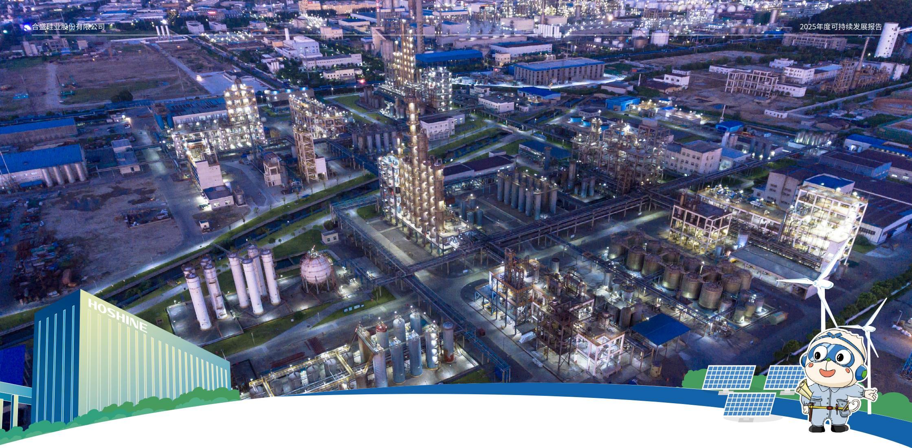

text_image

合盛硅业股份有限公司
2025年度可持续发展报告
HOSHINE

## “实

## 业”暖人心，共筑美丽家园

质性议题

员工权益保护，员工发展，多元与平等，职业健康安全，社区共建与公益慈善

回应SDGs  
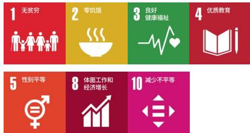

flowchart

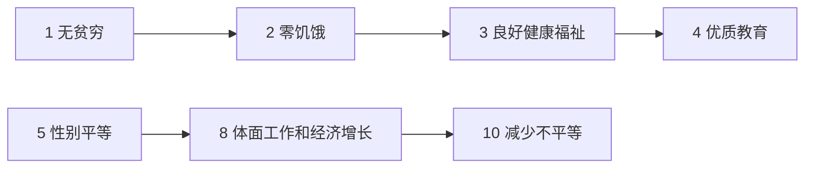
```mermaid
graph LR
  A["1 无贫穷"] --> B["2 零饥饿"]
  B --> C["3 良好健康福祉"]
  C --> D["4 优质教育"]
  E["5 性别平等"] --> F["8 体面工作和经济增长"]
  F --> G["10 减少不平等"]
```

## 员工权益

合盛硅业依据国家《劳动法》《女职工劳动保护特别规定》等法律法规最新要求，制定《员工手册》等保障员工基本权益的核心制度文件，确保包括女性员工、少数民族员工、残疾人员工在内的全体员工在入职录用、薪酬福利、工作时间、休息休假等方面享有各项基本权利

## 平等雇佣

公司秉持“以人为本”的管理理念，制定《招聘管理制度》《内部人才推荐奖励制度》等招聘制度严格规范员工招聘、录用、任用、考核等工作，杜绝基于种族、民族、性别、宗教信仰、身体状况等方面的歧视行为，与全体员工签订合法合规的劳动合同，明确双方的权利和义务，将性别平等与多元包容原则深度融入招聘选拔、岗位任用等人力资源管理全流程，全力打造开放包容、多元共融的现代职场环境。

## 2025年关键绩效

员工总数  
18,298 人  
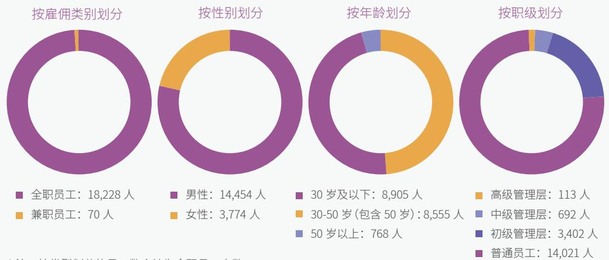

donut

| 分类 | 细分项目 | 人数 |
| --- | --- | --- |
| 按雇佣类别划分 | 全职员工 | 18,228 |
| 按雇佣类别划分 | 男性 | 14,454 |
| 按雇佣类别划分 | 30岁及以下 | 8,905 |
| 按雇佣类别划分 | 兼职员工 | 70 |
| 按性别划分 | 女性 | 3,774 |
| 按年龄划分 | 30-50岁 (包含50岁) | 8,555 |
| 按年龄划分 | 50岁以上 | 768 |
| 按职级划分 | 高级管理层 | 113 |
| 按职级划分 | 中级管理层 | 692 |
| 按职级划分 | 初级管理层 | 3,402 |
| 按职级划分 | 普通员工 | 14,021 |

公司坚决反对任何使用或变相使用童工的行为，禁止任何形式的强迫劳动，充分尊重员工雇佣自由、辞工自由、加班自由及行动自由等权利。

## 员工基本权益保障

## 避免雇佣童工

◆在入职核查阶段，采取有效方法鉴别员工的真实年龄，防止因员工提供虚假年龄而误用童工  
童工补救策略：发现误用童工，立即停止其相关工作，指定专人安排健康检查并第一时间上报当地劳动部门；护送童工返家，必要时提供适当经济资助及其他资源支持

## 禁止强迫劳动

建立标准工时制度，员工平均每日工作时长不超过8小时每周累计工作时长不超过40小时、每周至少休息1天  
◆不强制要求加班，安排员工加班需事先取得员工或员工代表同意  
严禁任何限制员工人身自由、强加意志等违反员工意志的行为

## 薪酬福利

公司坚持“以岗定薪”“按绩取酬”原则，搭建具有激励性的薪酬体系，包含基本工资、绩效工资、各类补贴及奖金提成；将员工福利视为对薪酬体系的重要补充，建立涵盖法定保障与企业自主补充的全方位福利体系，为全部员工提供规范、稳定的福利保障。

公司建立长期激励机制，依据相关法律法规制定员工持股计划，资金来源为提取的激励基金，属于员工合法薪酬浮动部分，覆盖范围涵盖企业(含子公司）中级管理人员、核心技术、业务骨干等，以利润分配激励贡献者，充分调动员工责任意识。

## 员工福利体系

  
法定福利

五险一金：养老保险、医疗保险、失业保险、工伤保险生育保险、住房公积金

  
企业自主福利

经济性福利：交通补贴、通讯补贴、餐补、住房补贴、高温费节日福利、年终福利等  
保障性福利：团体商业意外险、补充医疗保险、重大疾病险员工体检等  
◆生活性福利：员工食堂、宿舍或租房补贴等

## 民主管理

公司制定《员工投诉处理程序》，设立线上举报邮箱、线下举报信箱和投诉热线电话，建立并完善员工权益保障申诉举报机制，受理关于工作条件、不公正对待、侵犯劳工人权等相关问题。收到申诉后，认真开展调查核实并依法依规处理，我们严格落实信息保密制度，对申诉举报信息全程保密，切实保障员工各项合法权益。

## 员工沟通渠道

## 员工座谈会

定期邀请部门员工、部门负责人及人力资源中心三方共同参与员工座谈会，针对工作环境、薪酬福利、后勤保障等员工问题进行沟通、讨论与整改

## 人资沟通站

提供日常人力资源类咨询服务解决员工在招聘、培训、考勤、薪资等方面的问题，受理员工劳工人权侵犯举报与投诉

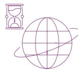

## 总经理信箱

在办公区域设置实体意见箱，方便员工提交书面意见，提高企业内部管理

## 满意度调查

持续开展员工满意度调研工作，针对调研结果制定改进计划并公开实施进展

## 员工关爱

公司打造多元化员工关怀体系，倡导工作与生活的平衡，鼓励员工培育兴趣爱好，在春节、国际妇女节、劳动节、中秋节等法定节假日组织集体活动，开展红歌、拔河、羽毛球趣味运动会等丰富多彩的文体比赛，凝聚团队向心力，帮助员工实现身心和谐发展。

## 女性员工权益保护

硬件保障：设立女性员工休息室，保障女性员工个人隐私；配备母婴室，满足哺乳期女性日常需求  
健康守护：提供定期妇科检查和乳腺癌筛查服务，全面守护女性员工身体健康  
◆生育福利：落实全面的生育保险政策，覆盖产前检查、分娩及产后护理全流程费用，为女性员工生育保驾护航  
节日关怀：每年组织开展国际妇女节专属活动，精心准备节日礼物及各类娱乐活动，传递企业对女性员工的重视与关怀

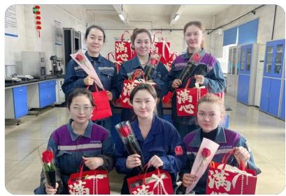

text_image

Group photo of eight women in a factory holding red envelopes with Chinese characters, likely during a ceremony or event.

国际妇女节活动

## 少数民族员工关怀

◆饮食适配：在园区及工厂食堂开设清 真窗口，匹配少数民族员工饮食习惯  
◆技能帮扶：针对性提升少数民族员工岗位胜任力，在原有培训资料和课程的基础上，补充开发双语版培训教材，并安排双语讲师授课：组织汉族员工与少数民族员工形成一对一结对小组，助力少数民族员工提升职业技能和汉语交流能力  
尊重习俗：在古尔邦节、肉孜节等传统节日，少数民族员工可根据实际情况享受法定假期

## 残疾人员工关爱

就业保障：2025年，在嘉兴、泸州、宁波、新疆、内蒙古等地雇佣残疾人员工209人，为残疾人员工精准四配劳动力强度较低的岗位，保障其稳定就业  
◆灵活工时：实行灵活的工作时间安排，允许残疾人员工根据自身情况自主选择合适的工作时段：支持残疾人员工远程办公，有效减轻通勤压力

## 特殊时刻员工慰问

聚焦员工多元生活场景，提供结婚礼金、生育礼金、住院慰问、丧葬慰问等，传递企业人文关怀

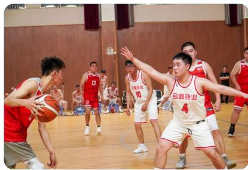

natural_image

Basketball game in progress with players in red and white uniforms competing for the ball (no visible text or signage)

篮球俱乐部活动

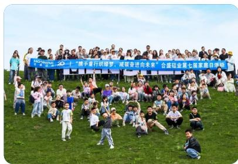

text_image

Mingwang 20
“携手银行招聘梦，展现奋进向未来”公益社会暨第七届家庭假日活动

员工家庭日活动

## 培训与发展

合盛硅业将人才视为可持续发展的核心动力，为实现员工发展与公司战略同频共振，公司优化人才管理体系，完善员工职业晋升通道，搭建多元化培训培育平台，赋能员工成长进阶，推动人才与企业双向成就，持续夯实人才队伍竞争力。

## 晋升通道

我们致力于构建一个系统化、多元化、透明化的员工职业发展生态系统，根据职能归属、能力要求、战略导向、具备规模及市场实践等要素，将所有岗位横向划分为3大类、8大族群、33个子族，在岗位族群的基础上根据岗位职责大小、工作复杂性与难度以及对任职者能力要求的差异进行纵向分层，反映岗位在企业组织结构中的相对价值和影响力。

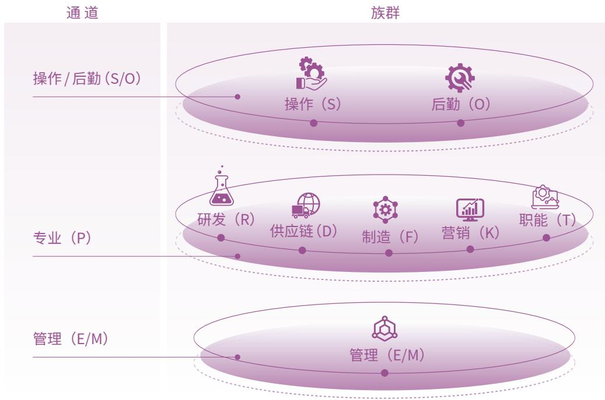

flowchart

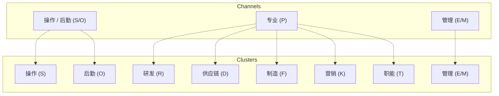
```mermaid
graph TD
  subgraph Channels
    A["操作 / 后勤 (S/O)"]
    B["专业 (P)"]
    C["管理 (E/M)"]
  end

  subgraph Clusters
    D["操作 (S)"]
    E["后勤 (O)"]
    F["研发 (R)"]
    G["供应链 (D)"]
    H["制造 (F)"]
    I["营销 (K)"]
    J["职能 (T)"]
    K["管理 (E/M)"]
  end

  A -.-> D
  A -.-> E
  B -.-> F
  B -.-> G
  B -.-> H
  B -.-> I
  B -.-> J
  C -.-> K
```

合盛硅业岗位矩阵

公司高度关注员工职业发展，持续优化升级内部岗位职级管理体系，推出“Y型”职业发展通道，其中管理通道聚焦于团队与组织管理能力的提升，专业通道致力于深耕技术或职能领域的专精发展，为全体员工指明清晰、多元的成长方向。

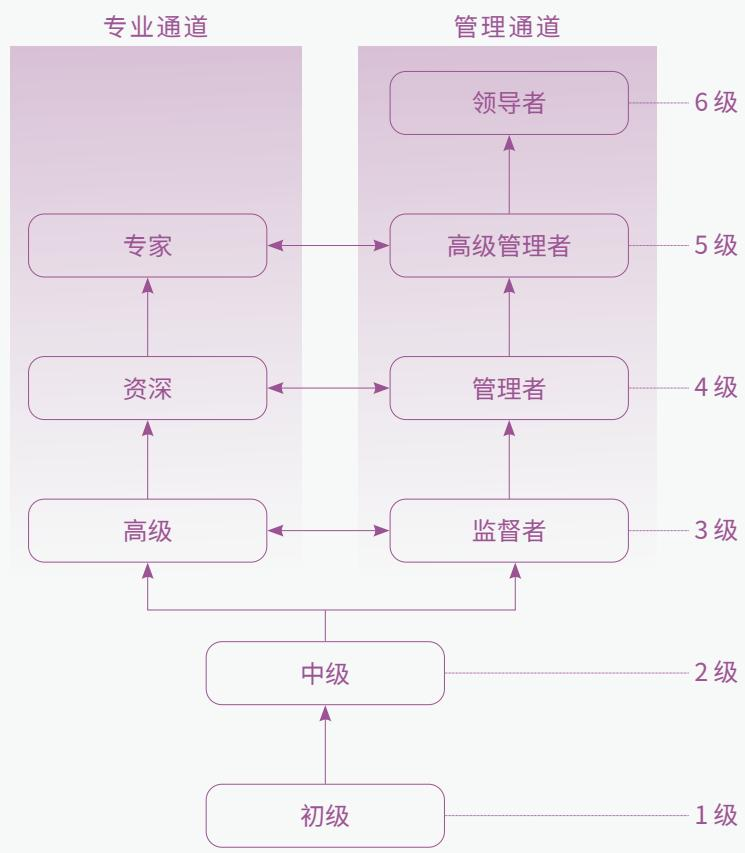

flowchart

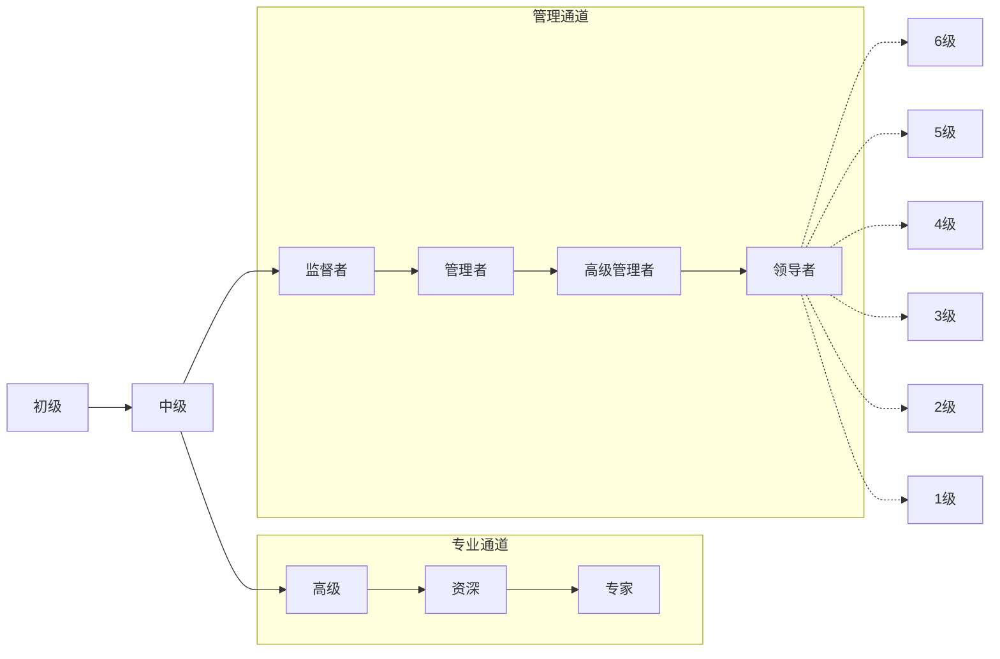
```mermaid
graph LR
  A["初级"] --> B["中级"]
  B --> C["高级"]
  B --> D["监督者"]
  
  subgraph ProfessionalChannels ["专业通道"]
  C --> E["资深"]
  E --> F["专家"]
  end
  
  subgraph ManagementChannels ["管理通道"]
  D --> G["管理者"]
  G --> H["高级管理者"]
  H --> I["领导者"]
  end
  
  I -.-> J["6级"]
  I -.-> K["5级"]
  I -.-> L["4级"]
  I -.-> M["3级"]
  I -.-> N["2级"]
  I -.-> O["1级"]
```

合盛硅业“Y型”职业发展通道

## 员工培训

公司建立覆盖全员、全职业周期的教育培训体系，通过线下集训、线上云学、知识技能竞赛等多种形式，不断完善职业发展培训体系，为各序列、职级员工提供差异化、系统化的学习资源，对于因业务调整产生岗位变化的员工提供技能提升培训支持，全面系统提升员工能力，帮助员工适应职场的快速变化。

## 员工分层培训体系

## 新入职员工

开展新员工入职基础培训和大学生培养计划，助力新员工快速融入企业

natural_image

Simple line drawing of two figures holding up a star above them (no text or symbols)

## 专业技能员工

定制专项培养计划(IDP)，开展营销、HRBP、财务、质检等针对性专业培训

natural_image

Simple line drawing of a user silhouette with a star icon (no text or symbols)

## 生产基层员工

推行一线通用能力培养计划，提升生产基层员工核心胜任能力

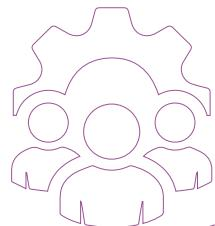

natural_image

Simple line drawing of three human figures with a gear, no text or symbols present

## 关键岗位员工

培育与发展关键岗位人才，在人才支撑方面赢得差异化市场竞争优势

natural_image

Simple line drawing of a person with a speech bubble (no text or symbols)

## 案例合盛硅业成立“新兵训练营”，助力员工快速成长

2025年，合盛硅业开展为期6个月的“新兵训练营”项目，帮助各业务条线497位校招本科生完成角色转换、储备关键岗位人才项目包括体能训练、文化理念及岗位通识集训、带教师傅一对一提升技能、管理导师辅导课题研究等，帮助新员工快速适应职场掌握岗位专业知识与技能

## 案例|合盛硅业推进一线生产“应知应会”培训项目

2025年，合盛硅业推进“应知应会”培训项目，根据岗位梳理能力需求、建立岗位能力矩阵、制定年度培训计划，按工厂成立执行项目组负责落实，培训覆盖工艺、设备、安环、质量等核心能力领域，高管参与联合抽查，搭建前线作战人员与高管沟通的快速通道，通过全流程多级管控保障培训实效。报告期内，项目累计培训211.440人次，全面提升员工专业知识和岗位能力

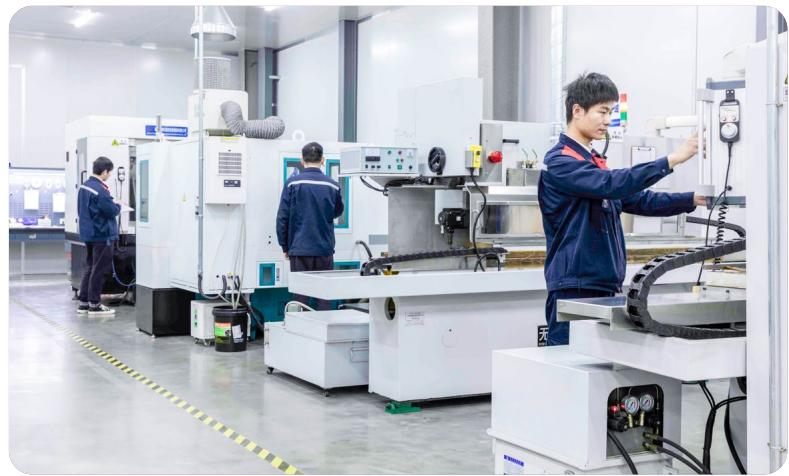

natural_image

Interior of a modern industrial factory with workers operating CNC machines (no visible text or symbols)

## 职业健康安全

合盛硅业严格遵循国家《安全生产法》《职业病防治法》等相关法律法规要求，构建完备的安全管理体系与制度框架，完善员工安全风险防控机制，落实企业安全文化建设，通过常态化组织应急演练、系统化开展隐患排查治理等举措，全方位守护员工职业健康与企业生产安全，筑牢坚实安全屏障。截至报告期末，14家子公司已取得ISO45001职业健康安全管理体系认证证书。

## 治 理

公司各事业部均已构建层级清晰、权责明确的组织架构，以此为基础搭建“决策层-管理层-执行层”三层职业健康安全治理架构，明确各层级在职业健康安全管理中的职权范围，理顺跨层级、跨部门的协作流程，形成上下贯通、高效协同的管理闭环。

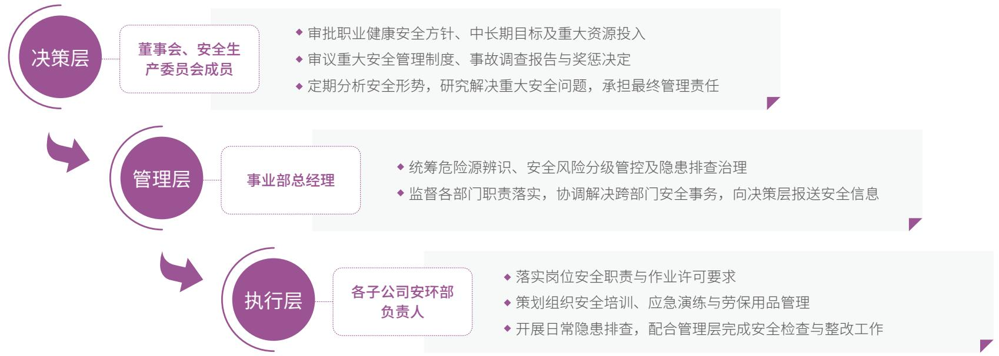

flowchart

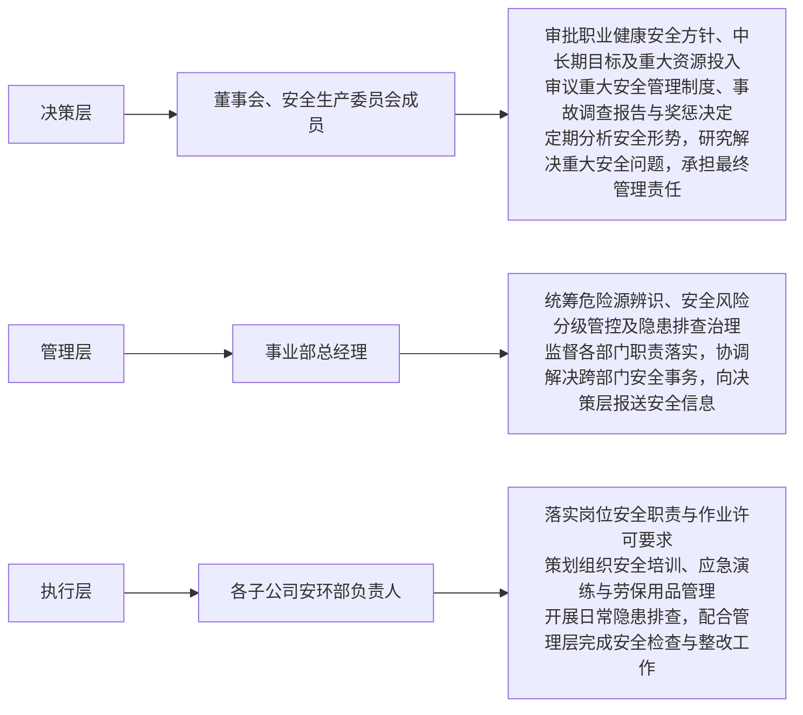
```mermaid
graph LR
  A["决策层"] --> B["董事会、安全生产委员会成员"]
  B --> C["审批职业健康安全方针、中长期目标及重大资源投入\n审议重大安全管理制度、事故调查报告与奖惩决定\n定期分析安全形势，研究解决重大安全问题，承担最终管理责任"]
  D["管理层"] --> E["事业部总经理"]
  E --> F["统筹危险源辨识、安全风险分级管控及隐患排查治理\n监督各部门职责落实，协调解决跨部门安全事务，向决策层报送安全信息"]
  G["执行层"] --> H["各子公司安环部负责人"]
  H --> I["落实岗位安全职责与作业许可要求\n策划组织安全培训、应急演练与劳保用品管理\n开展日常隐患排查，配合管理层完成安全检查与整改工作"]
```

合盛硅业职业健康安全治理架构

公司制定《安全生产管理制度》《危险作业审批制度》《劳动防护用品配备标准》《职业卫生管理制度》等制度，涵盖安全生产责任制、安全风险分级管控、隐患排查治理、应急管理等全流程管理要求，通过内部监测、日常巡检、定期审核及第三方认证等强化监督，将职业健康安全指标纳入部门及员工绩效考核范围，与薪酬、晋升直接挂钩，辅以正向激励与严格惩处机制，保障各项职业健康安全管理举措有效落地。

## 战 略

公司秉持“安全优先、预防为主、全员参与、持续改进”的战略理念，将职业健康安全升级为人力资本价值创造核心环节。在领导层面将安全绩效嵌入战略决策与高管考核，确保资源投入与战略优先级匹配；在管理层面落地风险分级管控与隐患排查双重预防机制，依托数据驱动实现岗位差异化、个性化升级；在技术层面推进“机械化换人、自动化减人”及智能监控建设，从源头降低作业风险；在员工层面通过培训与激励强化安全意识，营造全员安全文化，筑牢公司可持续发展基石。

<table><tr><td>风险类别</td><td>风险描述</td><td>财务影响</td><td>影响时限</td><td>影响价值链</td><td>应对措施</td></tr><tr><td>健康风险</td><td>◆员工长期接触粉尘、有毒有害气体、噪声等职业危害因素,可能导致尘肺、呼吸道疾病等职业病</td><td>运营成本增加</td><td>中期</td><td>自身运营</td><td>◆优化生产工艺减少有害物质暴露◆定期开展职业健康体检与工作场所危害因素检测◆推行轮岗制,降低单一岗位持续暴露时间</td></tr><tr><td>[0W5X]安全风险</td><td>◆化工生产、设备操作等环节复杂,可能发生机械伤害、触电、危险作业事故等安全事件</td><td>运营成本增加</td><td>短期</td><td>自身运营</td><td>◆完善安全操作规程并强化培训◆定期维护保养设备并安装安全防护装置◆严格执行危险作业审批与监护制度</td></tr><tr><td>管理风险</td><td>◆职业健康安全管理制度不完善、执行不到位,或员工安全意识不足导致制度落地效果不佳</td><td>运营成本增加</td><td>长期</td><td>自身运营</td><td>◆建立健全职业健康安全管理体系及专项制度◆将安全绩效纳入部门及个人考核,实行奖惩机制◆开展常态化安全宣传教育与技能培训</td></tr></table>

<table><tr><td>机遇类别</td><td>机遇描述</td><td>财务影响</td><td>影响时限</td><td>影响价值链</td><td>应对措施</td></tr><tr><td>技术机遇</td><td>◆智能化技术可实现设备远程监控与自动化操作,减少员工现场作业事故发生概率◆绿色技术能降低有害化学物质使用,从源头改善工作环境</td><td>运营成本降低</td><td>中期</td><td>自身运营</td><td>◆加大研发投入,引进或自主研发智能化与绿色生产技术◆对员工进行相关技术操作培训,推动技术落地应用</td></tr><tr><td>政策机遇</td><td>◆国家对企业职业健康安全监管趋严,推动企业改进提升</td><td>运营成本降低、品牌价值提升</td><td>长期</td><td>自身运营</td><td>◆积极响应政策要求,主动提升职业健康安全管理水平◆参与相关体系认证与评级,争取政策扶持</td></tr></table>

\*注：短期指1-3年内，中期指3-10年内，长期指10年以上

## 影响、风险和机遇管理

公司构建覆盖全运营环节的职业健康与安全持续改进循环管理流程，对职业健康与安全议题相关影响、风险和机遇进行系统性、规范化管理。该流程以年度为周期常态化运行，并在公司发生业务调整、工艺升级等重大变化时即时启动，确保员工的职业健康与人身安全不受侵害。

## 职业健康与安全管理流程

## 识别 01

整合法律法规要求、历史安全事故数据、员工反馈、第三方检测报告、现场巡查记录等多渠道信息，全面捕捉职业健康与安全相关影响、风险和机遇，覆盖全运营环节与各利益相关方

## 评估 02

结合“发生可能性”和“影响严重性”，分析对员工健康、生产运营、财务成本的影响程度与时间范围，明确优先级以精准施策

## 排序 03

优先处理可能导致重大人身伤害、职业病的高等级风险，重点推进能够提升安全管理效率，降低运营成本，增强企业声誉的机遇

## 应对 04

针对不同等级的风险与机遇，通过技术、管理、文化等多维度措施落地执行

## 监测 05

建立全流程动态监测机制，定期评审并优化流程，确保体系适配性公司高度重视员工职业健康与安全，依托信息化平台赋能安全风险管控通过三级排查与隐患闭环治理筑牢安全防线，强化分层分类安全培训与实操演练，配齐个人防护装备与应急资源，完善职业健康监护机制，严守安全生产与职业健康底线

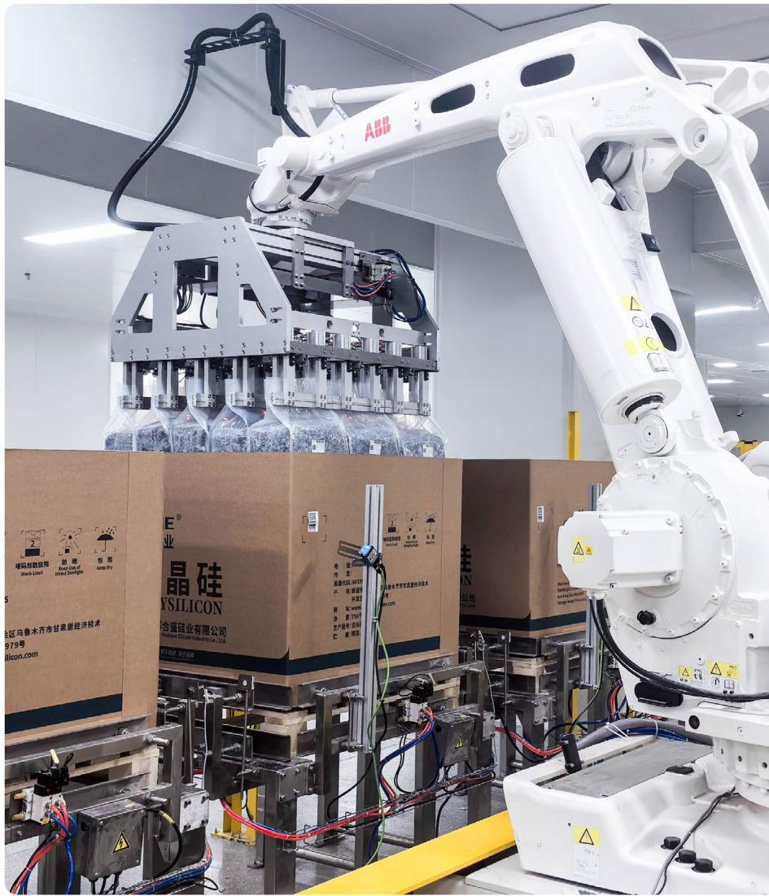

text_image

Factory photo showing ABB robotic arms processing plastic bottles into packaging boxes, with visible product labels and signage in Chinese.

## 2025年职业健康与安全措施

## 管控安全风险

系统辨识粉尘、噪声、化学品接触等岗位风险，绘制风险分布图并分级公示对重大风险源实施挂牌督办和领导带班巡检  
推进“机械化换人、自动化减人”，减少危险岗位人员接触，对高噪音高粉尘设备加装隔音罩、除尘系统等工程防护设施  
构建“公司月度大检查、部门周排查、班组日巡检”三级排查网络，利用信息化平台实现隐患上报、整改、验收、销号全闭环，隐患按期整改率达100%

## 加强应急管理

针对火灾、化学品泄漏、中毒窒息等场景，制定综合预案、专项预案及现场处置方案，并报监管部门备案  
◆在工作场所配备急救箱、洗眼器、应急照明等设施，组建兼职消防队或应急处置团队，配置防护器材、医疗救治等应急资源  
定期组织综合或专项应急演练，覆盖消防疏散、危化品泄漏处置等场景提升员工应急响应和协同处置能力

## 培育安全文化

新员工“三级安全教育”合格率100%，特种作业人员持证上岗，每年开展全员安全再培训及职业病防护、应急处置等专项培训  
建立“安全积分”“隐患报告奖励”等制度，员工报告隐患、参与改善可获得积分兑换奖励，激发全员参与积极性  
开展“安全生产月”“安全班组评比”“安全家书”等活动，通过宣传栏安全会议等渠道普及安全知识，强化员工安全意识

## 守护职业健康

◆为接害员工建立“一人一档”职业健康档案，100%组织上岗前、在岗期间离岗时的职业健康检查，对异常情况及时调岗或治疗  
◆制定《个人防护用品配备标准》，足量发放防尘口罩、防噪耳塞等符合国家标准的防护用品，监督员工正确佩戴使用

## 指标与目标

公司各生产基地结合行业风险特征、过往管理短板及自身生产工艺、人员结构实际，建立职业健康安全绩效考核指标体系，明确年度及阶段性管理目标，通过定期审核与动态跟踪机制评估工作成效，持续提升管理水平，有效防范化解各类安全风险。

<table><tr><td>指标</td><td>2025年目标</td><td>进展</td></tr><tr><td>职业危害岗位员工体检覆盖率</td><td>100%</td><td>已完成</td></tr><tr><td>职业病危害因素检测合格率</td><td>100%</td><td>已完成</td></tr><tr><td>隐患排查按期整改率</td><td>100%</td><td>已完成</td></tr><tr><td>应急演练计划完成率</td><td>100%</td><td>已完成</td></tr><tr><td>特种作业人员持证上岗率</td><td>100%</td><td>已完成</td></tr></table>

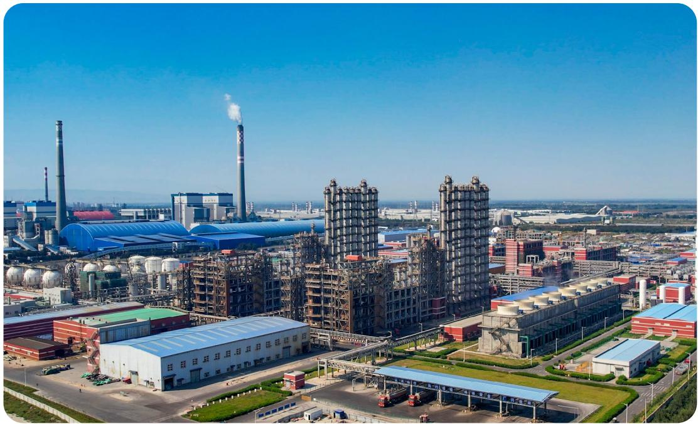

natural_image

Aerial view of a large industrial complex with multiple towers, storage tanks, and smokestacks under a clear blue sky (no visible text or signage)

## 2025年关键绩效

员工工伤保险覆盖率

100

员工安全生产责任险覆盖率

100%

natural_image

Line drawing of a shield with fire extinguishers and clouds, no text or symbols present

## 社会共建

合盛硅业立足自身资源禀赋与专业技术优势，以务实举措积极响应国家乡村振兴战略，将促进民族团结融入履行社会责任全过程，搭建多元互动平台，深度融入社区发展进程，深耕公益慈善事业，赋能社区高质量建设，推动企业发展成果与社会共享，实现公司与社区的良性共生，彰显新时代企业的责任与担当。

## 乡村振兴

在国家全面推进乡村振兴、夯实共同富裕根基的战略背景下，公司聚焦乡村产业薄弱环节与农户实际需求，带领员工积极投身助农活动，精准破解“产销脱节、资源匮乏”的痛点，助力拓宽农产品销路、提升农户收入，改善乡村生产生活条件，深度联结乡村与市场，搭建起企业与乡村的共生桥梁，致力于实现社会效益与企业品牌价值的双向提升，以实际行动为乡村发展添砖加瓦。

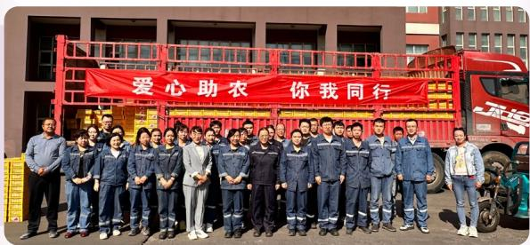

text_image

爱心助农 你我同行

开展爱心助农活动

## 民族团结

我们深知民族团结是新疆发展的“生命线”，更是企业稳健发展的根本依托，我们以铸牢中华民族共同体意识为指引，搭建“多元共融、尊重包容、共同成长”三大平台，广泛吸纳少数民族员工投身关键岗位，常态化开展民族特色文化活动，以人文关怀促进各族同胞手足相亲，获评“民族团结典范企业”。

## 案例|70载同心筑梦，合盛硅业绘就民族团结与发展共赢新图景

2025年是新疆维吾尔自治区成立70周年，合盛硅业深耕新疆，将铸牢中华民族共同体意识融入企业发展血脉，以多元举措凝聚民族合力，在助力区域民族团结进步的道路上书写企业担当。

## 东部硅业

◆通过开展多领域技能比武、“一对一”精准技能培训，赋能少数民族员工职业成长  
常态化开展民族特色团建活动，保障少数民族节日休假权益并配套庆祝活动，尊重民族文化习俗  
针对少数民族员工实际需求，在子女入学住房保障等民生领域提供暖心帮扶

## 西部硅业

打造“铸牢中华民族共同体意识展示馆”设六大展区系统呈现实践成果，通过企业民族团结活动专题片、模范事迹弘扬民族团结精神  
设立民族事务管理委员会，推行互助模式定期开展民族团结教育，将铸牢中华民族共同体意识融入企业文化

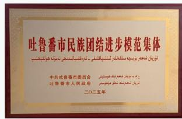

text_image

吐鲁番市民族团结进步模范集体
تَرْبَان شَاهِم بِرْجَهُ مُسْلَظَامُ تُسْتَالِكَمْ وَتَوْفَعَيَاتِ مَسْحُرُ فَنْتَهُ وَتَوْفَعَيَاتِ مُسْحُرُ
中共中央吐鲁番市委员会
تَرْبَان شَاهِم بِرْجَهُ مُسْلَظَامُ تُسْتَالِكَمْ وَتَوْفَعَيَاتِ مُسْحُرُ فَنْتَهُ وَتَوْفَعَيَاتِ مُسْحُرُ
吐鲁番市人民政府
2025年

进步模范集体”称号

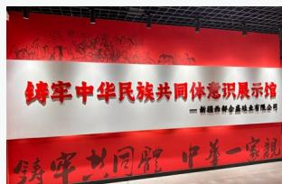

text_image

铸牢中华民族共同体意识展示馆
——中国证券监督管理委员会

意识展示馆

natural_image

Illustration of eight women in traditional colorful costumes dancing and holding poles (no text or symbols)

## 公益慈善

公司积极投身社会公益事业，依托慈溪市合盛慈善基金会，通过辅具支持、公益合作等多元化举措，帮助更多特殊群体走出家门、融入社会，常态化组织员工志愿者活动，凝聚内部爱心力量，链接外部公益资源，努力让每一份善意都落到实处，以点滴行动传递企业温度。

## 案例“合我益起让爱无碍”免费辅具租赁点公益项目

合盛硅业聚焦特殊群体关爱与公益赋能，通过慈溪市合盛慈善基金会实施“合我益起让爱无碍”便民辅具租赁点项目，为残障人士、老年人等群体提供轮椅、拐杖等实用辅具支持，已在全市10个镇街15个村社建立租赁点，配发辅具370多件，覆盖持证残疾人2.100多名，老年人17.100多名，以公益力量织密民生保障网，彰显企业社会责任担当。

natural_image

Simple line drawing of a house with two children holding hearts, surrounded by trees and clouds under a sunny sky (no text or symbols)

## 案例“合我益起·敬老送关怀”系列志愿服务活动

合盛硅业弘扬尊老敬老美德，以慈溪市合盛慈善基金会为纽带，联合各地区党组织发起“合我益起·敬老送关怀”系列志愿服务活动，为社区特扶、孤寡及困难家庭准备实用物资，提供磨刀、理发、测血压等便民服务；举办公益敬老游园活动，设置套圈、掷沙包等适宜长者的趣味运动，以实际行动为长者们送去物质支持与精神慰藉。

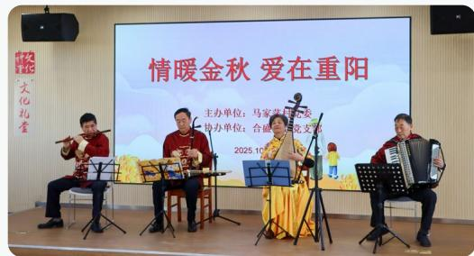

text_image

情暖金秋 爱在重阳
主办单位：马家峁 华委
协办单位：台港澳 党支办
2025 10

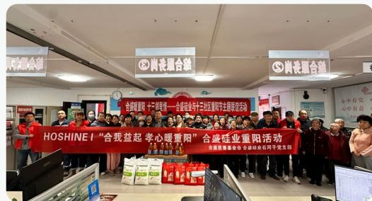

text_image

HOSHINEI “合我益起 孝心暖曹阳” 合盛硅业重阳活动
全国慈善基金会 合成结名网于党支部

## 附录

核心生产基地

<table><tr><td>企业名称</td><td>企业简称</td><td>位置</td></tr><tr><td>合盛硅业股份有限公司</td><td>合盛硅业</td><td>浙江嘉兴</td></tr><tr><td>合盛硅业(鄯善)有限公司</td><td>鄯善硅业</td><td>新疆吐鲁番</td></tr><tr><td>新疆合盛硅业新材料有限公司</td><td>新疆新材料</td><td>新疆吐鲁番</td></tr><tr><td>新疆西部合盛硅业有限公司</td><td>西部硅业</td><td>新疆石河子</td></tr><tr><td>合盛硅业(嘉兴)有限公司</td><td>嘉兴合盛</td><td>浙江嘉兴</td></tr><tr><td>合盛硅业(泸州)有限公司</td><td>泸州合盛</td><td>四川自由贸易试验区</td></tr><tr><td>新疆东部合盛硅业有限公司</td><td>东部硅业</td><td>新疆吐鲁番</td></tr><tr><td>新疆西部合盛硅材料有限公司</td><td>西部硅材料</td><td>新疆石河子</td></tr><tr><td>鄯善隆盛碳素制造有限公司</td><td>隆盛碳素</td><td>新疆吐鲁番</td></tr><tr><td>石河子市西部宁新碳素有限公司</td><td>宁新碳素</td><td>新疆石河子</td></tr><tr><td>合盛电业(鄯善)有限公司</td><td>鄯善电业</td><td>新疆吐鲁番</td></tr><tr><td>合盛(鄯善)能源管理有限公司</td><td>鄯善能源</td><td>新疆吐鲁番</td></tr><tr><td>新疆西部合盛热电有限公司</td><td>合盛热电</td><td>新疆石河子</td></tr><tr><td>石河子市合盛绿色能源管理有限公司</td><td>绿色能源</td><td>新疆石河子</td></tr><tr><td>新疆中部合盛硅业有限公司</td><td>中部合盛</td><td>新疆乌鲁木齐</td></tr><tr><td>新疆霍尔果斯合盛新能源科技有限公司</td><td>霍尔果斯新能源</td><td>新疆霍尔果斯</td></tr><tr><td>鄯善华越型煤制造有限公司</td><td>鄯善华越</td><td>新疆吐鲁番</td></tr><tr><td>石河子市华新新材料有限公司</td><td>华新新材料</td><td>新疆石河子</td></tr><tr><td>新疆合盛创新材料有限公司</td><td>新疆创新</td><td>新疆石河子</td></tr><tr><td>宁波隆盛硅业有限公司</td><td>宁波隆盛</td><td>浙江慈溪</td></tr><tr><td>宁波阿尔法半导体有限公司</td><td>阿尔法半导体</td><td>浙江慈溪</td></tr><tr><td>宁波光合新材料有限公司</td><td>宁波光合</td><td>浙江慈溪</td></tr><tr><td>新疆金松硅业有限责任公司</td><td>金松硅业</td><td>新疆胡杨河</td></tr><tr><td>黑河合盛硅业有限公司</td><td>黑河合盛</td><td>黑龙江黑河</td></tr><tr><td>内蒙古赛盛新材料有限公司</td><td>内蒙古赛盛</td><td>内蒙古呼和浩特</td></tr><tr><td>新疆安能消防科技技术服务有限公司</td><td>新疆安能消防</td><td>新疆吐鲁番</td></tr><tr><td>新疆寰新环境发展有限公司</td><td>寰新环境</td><td>新疆吐鲁番</td></tr></table>

## 关键绩效表

经济指标

<table><tr><td>指标名称</td><td>单位</td><td>2024年</td><td>2025年</td></tr><tr><td>营业收入</td><td>亿元</td><td>266.92</td><td>204.99</td></tr><tr><td>资产总额</td><td>亿元</td><td>907.73</td><td>836.07</td></tr><tr><td>利润总额</td><td>亿元</td><td>22.29</td><td>-28.02</td></tr><tr><td>净利润</td><td>亿元</td><td>17.02</td><td>-30.30</td></tr><tr><td>归属于母公司股东的净利润</td><td>亿元</td><td>17.40</td><td>-29.91</td></tr></table>

环境指标1

<table><tr><td>指标名称</td><td>单位</td><td>2024年</td><td>2025年</td></tr><tr><td colspan="4">能源消耗2</td></tr><tr><td colspan="4">直接能源消耗</td></tr><tr><td>柴油耗用</td><td>吨</td><td>9,230.88</td><td>8,666.46</td></tr><tr><td>汽油耗用</td><td>吨</td><td>39.38</td><td>40.03</td></tr><tr><td>燃煤耗用</td><td>吨</td><td>4,927,538.51</td><td>4,767,749.06</td></tr><tr><td>天然气耗用</td><td>标准立方米</td><td>145,423,896.94</td><td>55,538,983.99</td></tr><tr><td colspan="4">间接能源消耗</td></tr><tr><td>外购电力消耗</td><td>兆瓦时</td><td>16,683,618.66</td><td>7,836,241.55</td></tr><tr><td>外购蒸汽</td><td>吨</td><td>381,397.00</td><td>323,114.00</td></tr><tr><td colspan="4">综合能耗</td></tr><tr><td>综合能耗(直接)</td><td>吨标准煤</td><td>3,693,215.30</td><td>3,479,382.83</td></tr><tr><td>综合能耗(间接)</td><td>吨标准煤</td><td>2,099,464.39</td><td>1,004,626.55</td></tr><tr><td>综合能耗总量</td><td>吨标准煤</td><td>5,792,679.69</td><td>4,484,009.38</td></tr><tr><td>综合能耗强度</td><td>吨标准煤/百万元人民币</td><td>217.02</td><td>218.75</td></tr><tr><td colspan="4">可再生能源消耗</td></tr><tr><td>可再生能源使用</td><td>千瓦时</td><td>3,567,026,011.94</td><td>2,348,928,148.72</td></tr></table>

<table><tr><td>指标名称</td><td>单位</td><td>2024年</td><td>2025年</td></tr><tr><td colspan="4">温室气体排放3</td></tr><tr><td>温室气体排放总量(范围1&amp;范围2)</td><td>吨二氧化碳当量</td><td>20,528,400.68</td><td>15,715,130.36</td></tr><tr><td>范围1温室气体排放量</td><td>吨二氧化碳当量</td><td>11,789,117.03</td><td>11,221,841.79</td></tr><tr><td>范围2温室气体排放量</td><td>吨二氧化碳当量</td><td>8,739,283.65</td><td>4,493,288.57</td></tr><tr><td>温室气体排放强度</td><td>吨二氧化碳当量/万元人民币</td><td>7.69</td><td>7.67</td></tr><tr><td colspan="4">水资源消耗</td></tr><tr><td>自来水/市政用水取水量</td><td>吨</td><td>20,849,062.80</td><td>15,142,662.48</td></tr><tr><td>总耗水量</td><td>吨</td><td>18,701,628.21</td><td>13,489,741.51</td></tr><tr><td>水资源使用强度</td><td>吨/百万元人民币</td><td>700.64</td><td>658.08</td></tr><tr><td colspan="4">包装材料使用</td></tr><tr><td>包装材料使用总量</td><td>吨</td><td>54,505.59</td><td>52,241.04</td></tr><tr><td>塑料类</td><td>吨</td><td>22,398.24</td><td>22,882.97</td></tr><tr><td>纸类</td><td>吨</td><td>15,405.44</td><td>15,404.23</td></tr><tr><td>金属类</td><td>吨</td><td>12,692.08</td><td>11,520.00</td></tr><tr><td>其他类</td><td>吨</td><td>4,009.83</td><td>2,433.84</td></tr><tr><td>包装材料使用密度</td><td>吨/百万元人民币</td><td>2.04</td><td>2.55</td></tr><tr><td colspan="4">废气</td></tr><tr><td>废气排放总量</td><td>万立方米</td><td>11,078,808.80</td><td>8,592,994.38</td></tr><tr><td>废气排放密度</td><td>万立方米/百万元人民币</td><td>415.06</td><td>419.20</td></tr><tr><td>硫氧化物SOx排放量</td><td>吨</td><td>1,050.72</td><td>913.43</td></tr><tr><td>硫氧化物SOx排放强度</td><td>千克/百万元人民币</td><td>39.36</td><td>44.56</td></tr><tr><td>氮氧化物NOx排放量</td><td>吨</td><td>5,399.66</td><td>2,825.21</td></tr><tr><td>氮氧化物NOx排放强度</td><td>千克/百万元人民币</td><td>202.29</td><td>137.82</td></tr><tr><td>挥发性有机化合物(VOC)排放量</td><td>吨</td><td>6.63</td><td>2.77</td></tr><tr><td>挥发性有机化合物(VOC)排放强度</td><td>千克/百万元人民币</td><td>0.25</td><td>0.14</td></tr><tr><td>颗粒物(PM)排放量</td><td>吨</td><td>868.11</td><td>400.49</td></tr><tr><td>颗粒物(PM)排放强度</td><td>千克/百万元人民币</td><td>32.52</td><td>19.54</td></tr></table>

3 范围1温室气体排放核算依据中国国家发展和改革委员会发布的《工业其他行业企业温室气体排放核算方法与报告指南（试行）》进行核算；范围 2温室气体排放数据根据中国生态环境部发布的《关于发布2022年电力二氧

<table><tr><td>指标名称</td><td>单位</td><td>2024年</td><td>2025年</td></tr><tr><td colspan="4">废水</td></tr><tr><td>废水排放总量</td><td>吨</td><td>2,147,434.59</td><td>1,652,920.97</td></tr><tr><td>化学需氧量(COD)</td><td>吨</td><td>260.49</td><td>128.71</td></tr><tr><td>氨氮</td><td>吨</td><td>12.73</td><td>4.53</td></tr><tr><td>废水排放密度</td><td>吨/百万元人民币</td><td>80.45</td><td>80.64</td></tr><tr><td colspan="4">废弃物</td></tr><tr><td colspan="4">有害废弃物 $^{4}$ </td></tr><tr><td>有害废弃物转移量</td><td>吨</td><td>102,512.29</td><td>83,791.43</td></tr><tr><td>有害废弃物回收再利用量</td><td>吨</td><td>39,157.37</td><td>70,803.09</td></tr><tr><td>有害废弃物其他处理方式的量</td><td>吨</td><td>63,354.92</td><td>12,988.34</td></tr><tr><td>有害废弃物密度</td><td>吨/百万元人民币</td><td>3.84</td><td>4.09</td></tr><tr><td colspan="4">无害废弃物</td></tr><tr><td>无害废弃物清运量(不可回收)</td><td>吨</td><td>43,899.91</td><td>20,507.20</td></tr><tr><td>无害废弃物清运量(回收)</td><td>吨</td><td>520,731.86</td><td>698,782.93</td></tr><tr><td>无害废弃物密度</td><td>吨/百万元人民币</td><td>21.15</td><td>35.09</td></tr></table>

社会指标

<table><tr><td>指标名称</td><td>单位</td><td>2024年</td><td>2025年</td></tr><tr><td colspan="4">产品和服务安全与质量</td></tr><tr><td>产品安全与质量事故数目</td><td>起</td><td>0</td><td>0</td></tr><tr><td>投诉处理率</td><td>%</td><td>100</td><td>100</td></tr><tr><td>客户满意度(满分为100分)</td><td>/</td><td>93.48</td><td>94.22</td></tr><tr><td>客户隐私泄露事件数</td><td>件</td><td>0</td><td>0</td></tr></table>

有害废弃物转移量=回收再利用量+其他处理方式的量，其他处理方式包括焚烧处理、填埋处理等

<table><tr><td>指标名称</td><td>单位</td><td>2024年</td><td>2025年</td></tr><tr><td colspan="4">研发创新</td></tr><tr><td>研发费用</td><td>亿元</td><td>5.75</td><td>5.21</td></tr><tr><td>研发投入比例</td><td>%</td><td>2.17</td><td>2.58</td></tr><tr><td>国家科学技术奖项获奖数量</td><td>个</td><td>0</td><td>0</td></tr><tr><td>参与技术或项目研发的供应商合作数量</td><td>个</td><td>4</td><td>3</td></tr><tr><td>公司拥有的有效专利</td><td>项</td><td>675</td><td>770</td></tr><tr><td>应用于主营业务的发明专利数量</td><td>项</td><td>87</td><td>68</td></tr><tr><td>主导或参与各类标准的制定或修改</td><td>项</td><td>60</td><td>61</td></tr><tr><td colspan="4">供应链管理</td></tr><tr><td>供应商总数</td><td>家</td><td>6,708</td><td>7,528</td></tr><tr><td colspan="4">按地区划分的供应商数量</td></tr><tr><td>中国大陆供应商数目</td><td>家</td><td>6,697</td><td>7,512</td></tr><tr><td>东北区域</td><td>家</td><td>219</td><td>233</td></tr><tr><td>华北区域</td><td>家</td><td>477</td><td>545</td></tr><tr><td>华中区域</td><td>家</td><td>400</td><td>511</td></tr><tr><td>西北区域</td><td>家</td><td>1,594</td><td>1,771</td></tr><tr><td>西南区域</td><td>家</td><td>511</td><td>558</td></tr><tr><td>华东区域</td><td>家</td><td>3,197</td><td>3,556</td></tr><tr><td>华南区域</td><td>家</td><td>299</td><td>338</td></tr><tr><td>中国港澳台供应商数目</td><td>家</td><td>4</td><td>4</td></tr><tr><td>国外供应商数目</td><td>家</td><td>7</td><td>12</td></tr><tr><td>签订供应商行为准则的供应商数量</td><td>家</td><td>5,562</td><td> $1,142^5$ </td></tr><tr><td>签订供应商行为准则的供应商比例</td><td>%</td><td>82.92</td><td>15.17</td></tr><tr><td>开展供应商社会责任评估(ESG/CSR)的数量</td><td>家</td><td>-</td><td>850</td></tr><tr><td>针对供应商开展的 ESG/CSR 相关培训次数</td><td>次</td><td>1</td><td>1</td></tr><tr><td>针对供应商开展的 ESG/CSR 相关培训总时长</td><td>小时</td><td>884</td><td>800</td></tr></table>

5 合盛硅业自2023年起要求供应商签订供应商行为准则，2024年上线SRM采购管理系统，部分供应商数据未完成迁移；上线新系统后，所有供应商在准入阶段均要求签订供应商行为准则。数据为2025 年新系统上线后的统计数据

<table><tr><td>指标名称</td><td>单位</td><td>2024年</td><td>2025年</td></tr><tr><td colspan="4">员工权益保障</td></tr><tr><td>工会员工覆盖率</td><td>%</td><td>100</td><td>100</td></tr><tr><td>发生雇佣童工、强迫劳动、歧视和骚扰等违反劳工人权事件</td><td>件</td><td>0</td><td> $1^6$ </td></tr><tr><td>劳动合同签订率</td><td>%</td><td>100</td><td>100</td></tr><tr><td colspan="4">多元平等包容</td></tr><tr><td>员工总数</td><td>人</td><td>21,994</td><td>18,298</td></tr><tr><td>少数民族员工人数</td><td>人</td><td>8,687</td><td>8,677</td></tr><tr><td>残疾人员工人数</td><td>人</td><td>278</td><td>209</td></tr><tr><td>管理层(包括初级、中级和高级)女性人数</td><td>人</td><td>363</td><td>400</td></tr><tr><td>管理层(包括初级、中级和高级)女性占比</td><td>%</td><td>8.64</td><td>9.51</td></tr><tr><td colspan="4"> $员工发展^7$ </td></tr><tr><td>全职受训员工总人次</td><td>人次</td><td>410,465</td><td>211,937</td></tr><tr><td>受训员工百分比</td><td>%</td><td>100</td><td>100</td></tr><tr><td>员工受训总时数小时</td><td>小时</td><td>超4,000万</td><td>2,150,184</td></tr><tr><td>员工人均受训时数</td><td>小时</td><td>-</td><td>117.96</td></tr><tr><td>培训&amp;发展支出</td><td>万元</td><td>416.95</td><td>437.05</td></tr><tr><td colspan="4">职业健康安全</td></tr><tr><td>工伤保险人员覆盖率</td><td>%</td><td>100</td><td>100</td></tr><tr><td> $安全生产责任险人员覆盖率^8$ </td><td>%</td><td>100</td><td>100</td></tr><tr><td>工伤保险投入金额</td><td>万元</td><td>1,060.39</td><td>858.20</td></tr><tr><td>安全生产责任险投入金额</td><td>万元</td><td>7,712.10</td><td>5,845.99</td></tr></table>

6 2025年发生1起职场骚扰事件，公司已依规严肃处理并进行公示  
7 工厂端设置有应知应会培训项目，基本每周均开展培训，故培训总人次及时长数值较大  
8 依据《安全生产责任保险实施办法》及上交所披露要求，安责险为高危生产类主体强制投保范畴。本指标统计口径仅涵盖生产型子公司从业人员，不含贸易类非高危经营主体员工

<table><tr><td>指标名称</td><td>单位</td><td>2024年</td><td>2025年</td></tr><tr><td colspan="4">社区共建与公益慈善</td></tr><tr><td>社会捐赠资金总额</td><td>万元</td><td>224.3</td><td>75.0</td></tr><tr><td>乡村振兴投入资金总额</td><td>万元</td><td>33.8</td><td>0</td></tr><tr><td>公共慈善投入总人次</td><td>人次</td><td>近200</td><td>80</td></tr><tr><td>志愿服务总小时数</td><td>小时</td><td>约800</td><td>约300</td></tr></table>

治理指标9

<table><tr><td>指标名称</td><td>单位</td><td>2024年</td><td>2025年</td></tr><tr><td colspan="4">商业道德</td></tr><tr><td>董事参加反贪污培训总时长</td><td>小时</td><td>24</td><td>30</td></tr><tr><td>董事参加反贪污培训人次</td><td>人次</td><td>3</td><td>5</td></tr><tr><td>管理层参加反贪污培训总时长</td><td>小时</td><td>102</td><td>87</td></tr><tr><td>管理层参加反贪污培训人次</td><td>人次</td><td>102</td><td>87</td></tr><tr><td>员工参加反贪污培训总时长</td><td>小时</td><td>835</td><td>1,326</td></tr><tr><td>员工参加反贪污培训人次</td><td>人次</td><td>835</td><td>1,440</td></tr><tr><td>贪污贿赂案件数目</td><td>件</td><td> $1^{10}$ </td><td>0</td></tr><tr><td>不正当竞争行为导致诉讼或重大行政处罚</td><td>件</td><td>0</td><td>0</td></tr><tr><td>信息安全事件数目</td><td>件</td><td>0</td><td>0</td></tr></table>

优化数据管理机制，保障信息披露真实、准确、可比  
10 公司已于2024年8月 16日发布合盛硅业股份有限公司关于收到《刑事判决书》暨诉讼进展的公告

## 指标索引表

《上海证券交易所上市公司自律监管指引第14号—可持续发展报告（试行）》

<table><tr><td>维度</td><td>议题</td><td>对应条款</td><td>页码</td></tr><tr><td rowspan="8">环境</td><td>应对气候变化</td><td>第二十一条至第二十八条</td><td>23-26</td></tr><tr><td>污染物排放</td><td>第三十条</td><td>30-34</td></tr><tr><td>废弃物处理</td><td>第三十一条</td><td>34</td></tr><tr><td>生态系统和生物多样性保护</td><td>第三十二条</td><td>22</td></tr><tr><td>环境合规管理</td><td>第三十三条</td><td>21-22</td></tr><tr><td>能源利用</td><td>第三十五条</td><td>26-27</td></tr><tr><td>水资源利用</td><td>第三十六条</td><td>28</td></tr><tr><td>循环经济</td><td>第三十七条</td><td>29</td></tr><tr><td rowspan="9">社会</td><td>乡村振兴</td><td>第三十九条</td><td>62</td></tr><tr><td>社会贡献</td><td>第四十条</td><td>62-63</td></tr><tr><td>创新驱动</td><td>第四十二条</td><td>44-48</td></tr><tr><td>科技伦理 $^{1}$ </td><td>第四十三条</td><td>不适用</td></tr><tr><td>供应链安全</td><td>第四十五条</td><td>49-50</td></tr><tr><td>平等对待中小企业 $^{2}$ </td><td>第四十六条</td><td>不适用</td></tr><tr><td>产品和服务安全与质量</td><td>第四十七条</td><td>38-43</td></tr><tr><td>数据安全与客户隐私保护</td><td>第四十八条</td><td>19、43</td></tr><tr><td>员工</td><td>第五十条</td><td>52-61</td></tr><tr><td rowspan="4">可持续发展相关治理</td><td>尽职调查</td><td>第五十二条</td><td>13-14</td></tr><tr><td>利益相关方沟通</td><td>第五十三条</td><td>13</td></tr><tr><td>反商业贿赂及反贪污</td><td>第五十五条</td><td>17-18</td></tr><tr><td>反不正当竞争</td><td>第五十六条</td><td>19</td></tr></table>

## HOSHINE

## 合盛硅业